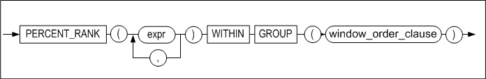
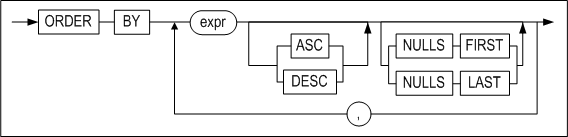
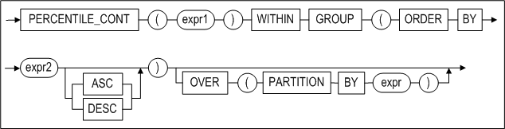
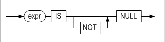

<!-- START doctoc generated TOC please keep comment here to allow auto update -->
<!-- DON'T EDIT THIS SECTION, INSTEAD RE-RUN doctoc TO UPDATE -->


- [7. SQL Functions](#7-sql-functions)
  - [Introduction to SQL Functions](#introduction-to-sql-functions)
  - [Aggregate Functions](#aggregate-functions)
  - [Window (Analytic) Functions](#window-analytic-functions)
  - [Numeric Functions](#numeric-functions)
  - [Character Functions](#character-functions)
  - [Datatime Funcitons](#datatime-funcitons)
  - [Conversion Functions](#conversion-functions)
  - [Encryption Functions](#encryption-functions)
  - [Other Functions](#other-functions)
- [8. Arithmetic Operators](#8-arithmetic-operators)
  - [Arithmetic Operators](#arithmetic-operators)
  - [Unary Operator](#unary-operator)
  - [Binary Opeartors](#binary-opeartors)
  - [Concatenation Operator](#concatenation-operator)
  - [CAST Operator](#cast-operator)
- [9. SQL Conditions](#9-sql-conditions)
  - [SQL Conditions Overview](#sql-conditions-overview)
  - [Logical Condition](#logical-condition)
  - [Comparision Conditions](#comparision-conditions)
  - [Other Conditions](#other-conditions)
- [Appendix A. Regular Expressions](#appendix-a-regular-expressions)
  - [Regular Expression Support](#regular-expression-support)

<!-- END doctoc generated TOC please keep comment here to allow auto update -->


## 7. SQL Functions

--------

### Introduction to SQL Functions

SQL functions are built into Altibase, and are available for use in various SQL statements. In addition to the built-in SQL functions, it is also possible for the user to define stored functions. For more information, please refer to the *Stored Procedures Manual.*

 If a SQL function is called and an argument having a data type other than the data type expected by the SQL function is provided, then Altibase attempts to convert the argument to the expected data type before executing the SQL function. If an argument having a NULL value is provided when calling a SQL function, then the SQL function returns NULL. 

This section lists the SQL functions that are supported in Altibase and explains how they are classified.

#### Classifying SQL Functions

SQL functions can be broadly classified into the categories set forth in the following table.

| Category                              | Description and Functions                                    |
| ------------------------------------- | :----------------------------------------------------------- |
| Aggregate functions                   | The aggregate functions return a single value as a result of processing multiple rows. They can be used in select_list, ORDER BY, and HAVING clauses.<br />**The aggregate functions**<br/>AVG, CORR, COUNT, COVAR_POP, COVAR_SAMP, CUME_DIST, FIRST, GROUP_CONCAT, LAST, LISTAGG, MAX, MIN, PERCENTILE_CONT, PERCENTILE_DISC, PERCENT_RANK, RANK, STATS_ONE_WAY_ANOVA, STDDEV, STDDEV_POP, STDDEV_SAMP, SUM, VARIANCE, VAR_POP, VAR_SAMP |
| Window functions (Analytic Functions) | The window functions calculate aggregate values based on groups of rows. The groups of rows that window functions operate on are defined by the PARTITION BY and the ROWS/RANGE subclause nested in the OVER clause. <br />**Aggregate Window Functions**<br/>AVG, CORR, COUNT, COVAR_POP, COVAR_SAMP, LISTAGG, MAX, MIN, PERCENTILE_CONT, PERCENTILE_DISC, RATIO_TO_REPORT, STDDEV, SUM, VARIANCE, GROUP_CONCAT <br />**Ranking Window Functions**<br/>RANK, DENSE_RANK, ROW_NUMBER, LAG, LEAD,NTILE, FIRST, LAST <br /><br />**Row Order-related Window Functions**<br/>FIRST_VALUE, LAST_VALUE, NTH_VALUE |
| Numeric Functions                     | The numeric function performs a task on a input numerical value and return a numeric value. <br />ABS, ACOS, ASIN, ATAN, ATAN2, CEIL, COS, COSH, EXP, FLOOR, ISNUMERIC, LN, LOG, MOD, NUMAND, NUMOR, NUMSHIFT, NUMXOR, POWER, RAND, RANDOM, ROUND, SIGN, SIN, SINH, SQRT, TAN, TANH, TRUNC, BITAND, BITOR, BITXOR, BITNOT |
| Character Functions                   | These functions perform a task on an input string and return either a string or a numeric value. <br />**Functions that Return Strings**<br/>CHR, CHOSUNG, CONCAT, DIGITS, INITCAP, LOWER, LPAD, LTRIM, NCHR, PKCS7PAD16, PKCS7UNPAD16, RANDOM_STRING, REGEXP_COUNT, REGEXP_REPLACE, REPLICATE, REPLACE2, REVERSE_STR, RPAD, RTRIM, STUFF, SUBSTRB(SUBSTRING), TRANSLATE, TRIM, UPPER <br />**Functions that Return Numeric Values**<br/>ASCII, CHAR_LENGTH(CHARACTER_LENGTH,LENGTH), DIGEST,INSTR(POSITION, INSTRB), OCTET_LENGTH(LENGTHB), REGEXP_INSTR, REGEXP_SUBSTR, SIZEOF |
| Date Functions                        | These functions perform a task on an input date/time value and return a character string, a numerical value, or a date/time value. <br />ADD_MONTHS, DATEADD, DATEDIFF, DATENAME, EXTRACT(DATEPART), LAST_DAY, MONTHS_BETWEEN, NEXT_DAY, SESSION_TIMEZONE, SYSDATE, SYSTIMESTAMP, UNIX_DATE, UNIX_TIMESTAMP, CURRENT_DATE, CURRENT_TIMESTAMP, DB_TIMEZONE, CONV_TIMEZONE |
| Conversion Functions                  | These functions convert an input character, numeric or date/time value and return a character, numeric or date/time value. <br />ASCIISTR, BIN_TO_NUM, CONVERT, DATE_TO_UNIX, HEX_ENCODE, HEX_DECODE, HEX_TO_NUM, OCT_TO_NUM, RAW_TO_FLOAT, RAW_TO_INTEGER, RAW_TO_NUMERIC, RAW_TO_VARCHAR, TO_BIN, TO_CHAR(datetime), TO_CHAR(number), TO_DATE, TO_HEX, TO_INTERVAL, TO_NCHAR(character), TO_NCHAR(datetime), TO_NCHAR(number), TO_NUMBER, TO_OCT, TO_RAW, UNISTR, TO_RAW, UNIX_TO_DATE |
| Encryption Functions                  | These functions are used to perform DES encryption and decryption on strings. <br />AESDECRYPT, AESENCRYPT, DESENCRYPT, DESDECRYPT, TDESDECRYPT/TRIPLE_DESDECRYPT, TDESENCRYPT/TRIPLE_DESENCRYPT |
| Other Functions                       | BASE64_DECODE, BASE64_DECODE_STR, BASE64_ENCODE, BASE64_ENCODE_STR, BINARY_LENGTH, CASE2, CASE WHEN, COALESCE, DECODE, DIGEST, DUMP, EMPTY_BLOB, EMPTY_CLOB, GREATEST, GROUPING, GROUPING_ID, HOST_NAME, LEAST, LNNVL, MSG_CREATE_QUEUE, MSG_DROP_QUEUE, MSG_SND_QUEUE, MSG_RCV_QUEUE, NULLIF, NVL, NVL2, QUOTE_PRINTABLE_DECODE, QUOTE_PRINTABLE_ENCODE, RAW_CONCAT, RAW_SIZEOF, ROWNUM, SENDMSG, USER_ID, USER_NAME, SESSION_ID, SUBRAW, SYS_CONNECT_BY_PATH, SYS_GUID_STR, USER_LOCK_REQUEST, USER_LOCK_RELEASE, SYS_CONTEXT 등 |

### Aggregate Functions

Aggregate functions process multiple rows and return a single resultant value. Aggregate functions can be used in the SELECT list and in the ORDER BY and HAVING clauses. 

If a SELECT statement contains a GROUP BY clause, then only constants, aggregate functions, the expressions in the GROUP BY clause, and expressions that are based on the foregoing can be specified in the SELECT list.

#### AVG

##### Syntax

```
AVG ( [ALL | DISTINCT] expression)
```


##### Description

This function calculates the average of the input expressions. NULL values are excluded from the calculation. The function returns a FLOAT type value.

##### Example

\<Query\>  Calculate and display the average price in the goods table.

```
iSQL> SELECT AVG(price) FROM goods;
AVG(PRICE)  
--------------
30406.173   
1 row selected.
```


#### CORR

##### Syntax 

```
CORR (expr1, expr2) OVER {...}
```


##### Description

This function calculates the coefficient of correlation of inserted expr1 and expr2. The result would be greater than or equal to -1 , and smaller than or equal to 1. As the result goes nearer to 0, the coefficient of correlation would be smaller, however, if it gets closer to +1, the coefficient of correlation would be much deeper. The return type is DOUBLE, and variables should be calculated by converting with DOUBLE.

The CORR function can be used as an aggregate functions and an analytic function.

##### Example

\<Query\> Calculate the coefficient of correlation between the employee number and salary.

```
iSQL> SELECT CORR(ENO,SALARY) FROM employees;
CORR(ENO,SALARY)
-------------------------
-0.02180715597157
1 row selected.
```


#### COUNT

##### Syntax

```
COUNT ( [ * | [ALL | DISTINCT] expression ] )
```


##### Description

COUNT returns the number of rows returned by the query. NULL values are not counted.

##### Examples

\<Query\>  Display the number of records in the employees table.

```
iSQL> SELECT COUNT(*) Rec_count FROM employees;
REC_COUNT            
-----------------------
20                   
1 row selected.
```

\<Query\> Display the number of birthday tables in the table employees.

```
iSQL> SELECT COUNT(birth) Rec_count 
    FROM employees;
REC_COUNT            
-----------------------
13                   
1 row selected.
```


#### COVAR_SAMP

##### Syntax 

```
COVAR_SAMP (expr1, expr2) OVER {...}
```


##### Description

Calculate the sample covariance of inserted expr1 and expr2. If an input value rises along with another value, the result would be positive numbers, but if another value falls while the input value rises, the result would be negative numbers. The return type is DOUBLE, and variables should be calculated by converting the variables with DOUBLE.

The COVAR_SAMP function can be used as an aggregate a function and analytic function.

##### Example

\<Query\> Calculate the sample voariance of employees number and salary.

```
iSQL> SELECT COVAR_SAMP(ENO,SALARY) FROM employees;
COVAR_SAMP(ENO,SALARY)
-------------------------
-95.0698529411784
1 row selected.
```


#### COVAR_POP

##### Syntax

```
COVAR_POP (expr1, expr2) OVER {...}
```


##### Description

This function is used to calculate the population covariance of inserted expr1 and expr2. If an input value rises along with another value, the result would be positive numbers, but if another value falls while the input value rises, the result would be negative numbers. The return type is DOUBLE, and variables should be calculated by converting the variables with DOUBLE. 

The COVAR_POP function can be used as an aggregate function and an analytic function.

##### Example

\<Query\> Calculate the population covariance of the employee number and salary

```
iSQL> SELECT COVAR_POP(ENO,SALARY) FROM employees;
COVAR_POP(ENO,SALARY)
-------------------------
-89.4775086505208
1 row selected.
```


#### CUME_DIST

##### Syntax


[window_order_clause::=](#window_order_clause)

##### Description

The CUME_DIST function calculates the accumulative distribution of a group of values that are lined up based on a result set (or partitions) in particular. The return value is greater than 0 or less than 1.

> Note: The number of arguments in the CUME_DIST and that of the WITHIN GROUP clause should be corresponding one another, but the argument type is not automatically compatible. Also, the data type of CUME_DIST argument is not restricted; however, using a constant is recommended.

##### Example

\<Query\> Confirm the accumulative distribution of SALARY by using the CUME_DIST function.

```
iSQL> select SALARY from EMPLOYEES ORDER BY 1;
SALARY
--------------
500
980
1000
1200
1400
1500
1700
1800
1800
1890
1900
2000
2003
2300
2500
2750
4000
...
20 rows selected. 

iSQL>  select cume_dist(1500) within group (order by SALARY ) from EMPLOYEES ;
CUME_DIST(1500) within group (order by SAL
---------------------------------------------
0.333333333333333
1 row selected.
```


#### FIRST

##### Syntax


##### Description

This function aggregates only the first part of the data sorted by ORDER BY clause. The functions corresponding to aggregation_function are MIN, MAX, SUM, AVG, COUNT, VARIANCE, and STDDEV.

##### Example

\<Query\>  Find the employee number and salary of the employee who receives the most salary by department from the employee table. 

```
iSQL> SELECT dno, MAX(eno) KEEP(DENSE_RANK FIRST ORDER BY salary desc) as empno, MAX(salary) AS max_sal
        FROM EMPLOYEES
        GROUP BY dno;
DNO          EMPNO          MAX_SAL
-----------------------------------------
1001         16              2300
1002         6               1700
1003         10              4000
2001         17              1400
3001         4               1800
3002         1               2500
4001         8               1900
4002         20              1090
              2               1500
9 row selected.
```


#### GROUP_CONCAT

##### Syntax

```
GROUP_CONCAT (expr1 [, arg1])
```


##### Description

GROUP_CONCAT returns a character string of concatenated, non-NULL, expr1 values for each group. 

arg1: The separator. On omission, the separator is not inserted in the character string.

##### Example

\<Query\>  Return a character string that concatenates the last names of the employees for each department. 

```
iSQL> SELECT dno, CAST(GROUP_CONCAT(e_lastname, '|') AS VARCHAR (100)) AS names FROM employees GROUP BY dno;
DNO
--------------
NAMES
--------------------------------------------------------------------------------------------------------
1001
Kobain              |Chen                
1002
Momoi               |Jones               
1003
Bae                 |Liu                 |Miura               |Davenport           
2001
Fubuki              
3001
Foster              
3002
Moon                |Ghorbani            
4001
Wang                |Diaz                |Huxley              
4002
Fleischer           |Hammond             |Marquez             |Blake               

Davenport           
9 rows selected.
```


#### LAST

##### Syntax


##### Description

This function aggregates only the last part of the data sorted by the ORDER BY clause. The functions corresponding to aggregation_function are MIN, MAX, SUM, AVG, COUNT, VARIANCE, and STDDEV. 

##### Example

\<Query\> Find the employee number and salary of the employee who receives the least amount of salary by department from the employee table.

```
iSQL> SELECT dno, MIN(eno) KEEP(DENSE_RANK LAST ORDER BY salary desc) as empno, MIN(salary) AS min_sal
        FROM EMPLOYEES
        GROUP BY dno;
DNO          EMPNO          MIN_SAL
-----------------------------------------
1001         3               2300
1002         13              1700
1003         15              4000
2001         17              1400
3001         4               1800
3002         5               2500
4001         9               1900
4002         7               1090
              2               1500
9 row selected.
```


#### MAX

##### Syntax

```
MAX ([ALL | DISTINCT] expression)
```


##### Description

MAX returns the greatest value of expr from among the input values. 

##### Example

\<Query\> Display the highest price in the table goods.

```
iSQL> SELECT MAX(price) FROM goods;
MAX(PRICE)  
--------------
100000      
1 row selected.
```


#### MIN

##### Syntax

```
MIN ([ALL | DISTINCT] expression)
```


##### Description

MIN returns the lowest value of expr from among the input values.

##### Example

\<Query\> Display the lowest price in the table goods.

```
iSQL> SELECT MIN(price) FROM goods;
MIN(PRICE)  
--------------
966.99      
1 row selected.
```


#### PERCENT_RANK

##### Syntax



[window_order_clause::=](#window_order_clause)

##### Description

The PERCENT_RANK function determines the percentage rank based upon results sets(or partitions). The range of values returned by this function is 0 to 1.

> Note: The number of arguments in the PERCENT_RANK and WITHIN GROUP should be corresponding, but the argument type is not automatically compatible.

##### Example

\<Query\> Display the percentage rank of employees with department number (DNO) 1003 and salary (SALARY) 1000.

```
iSQL> select  DNO, SALARY from EMPLOYEES ORDER BY 1,2;
DNO         SALARY
---------------------------
1001        2000
1001        2300
1002        980
1002        1700
1003        1000
1003        2003
1003        2750
1003        4000
2001        1400
3001        1800
3002        2500
3002
4001        1200
4001        1900
4001
4002        500
4002        1800
4002        1890
4002
            1500
20 rows selected.
iSQL> select percent_rank(1003,1000) within group (order by DNO, SALARY ) from EMPLOYEES ;
RNK
-------------------------
0.2
1 row selected.
```


#### STATS_ONE_WAY_ANOVA

##### Syntax 


##### Description

STATS_ONE_WAY_ANOVA is a one-way ANOVA function that returns the value for the third argument in the FLOAT data type. 

This function takes three arguments and returns a value in SIG if the third argument is omitted. expr1 groups the data and expr2 contains the values of expr1.

The following table describes the third argument.

<table>
<tbody>
<tr>
<th>
<p>Return Value</p>
</th>
<th>
<p>Description</p>
</th>
</tr>
<tr>
<td>
<p>SIG</p>
</td>
<td>
<p>Significance</p>
</td>
</tr>
<tr>
<td>
<p>F_RATIO</p>
</td>
<td>
<p>(Mean squares within groups / mean squared between groups) </p>
</td>
</tr>
<tr>
<td>
<p>MEAN_SQUARES_WITHIN<br /> (MSW)</p>
</td>
<td>
<p>Mean squares within groups</p>
</td>
</tr>
<tr>
<td>
<p>MEAN_SQUARES_BETWEEN<br /> (MSB)</p>
</td>
<td>
<p>Mean squares between groups </p>
</td>
</tr>
<tr>
<td>
<p>DF_WITHIN(DFW)</p>
</td>
<td>
<p>Degree of freedom within groups/p>
</td>
</tr>
<tr>
<td>
<p>DF_BETWEEN(DFB)</p>
</td>
<td>
<p>Degree of freedom between groups</p>
</td>
</tr>
<tr>
<td>
<p>SUM_SQUARES_WITHIN<br /> (SSW)</p>
</td>
<td>
<p>Sum of squares within groups</p>
</td>
</tr>
<tr>
<td>
<p>SUM_SQUARES_BETWEEN<br /> (SSB)</p>
</td>
<td>
<p>Sum of squares between groups</p>
</td>
</tr>
</tbody>
</table>


##### Example

```
iSQL> select * from t3;
        ID      VALUE
---------- ----------
         1          1
         1          2
         1          3
         2          3
         2          4

iSQL> select stats_one_way_anova(id, value, 'SUM_SQUARES_BETWEEN') SSB, 
            stats_one_way_anova(id, value, 'SUM_SQUARES_WITHIN') SSW,
            stats_one_way_anova(id, value, 'DF_BETWEEN') DFB, 
            stats_one_way_anova(id, value, 'DF_WITHIN') DFW, 
            stats_one_way_anova(id, value, 'MEAN_SQUARES_BETWEEN') MSB, 
            stats_one_way_anova(id, value, 'MEAN_SQUARES_WITHIN') MSW, 
            stats_one_way_anova(id, value, 'F_RATIO') F, 
            stats_one_way_anova(id, value, 'SIG') P_VALUE  from t3;
       SSB        SSW        DFB        DFW        MSB        MSW          F    P_VALUE
---------- ---------- ---------- ---------- ---------- ---------- ---------- ----------
       2.7        2.5          1          3        2.7 .833333333       3.24 .169679927
```


#### STDDEV

##### Syntax

```
STDDEV ([ALL | DISTINCT] expression)
```


##### Description

STDDEV returns the standard deviation of the input expressions.

Because error can accumulate when using system calls to perform repeated operations on real numbers, the return value may have some amount of inherent tolerance (error).

##### Example

\<Query\>  Calculate the standard deviation of the wages in the employees table.

```
iSQL> SELECT STDDEV(salary) standard_deviation 
  FROM employees;
STANDARD_DEVIATION
-------------------------
797.706786762566
1 row selected.
```


#### STDDEV_POP

##### Syntax

```
STDDEV_POP (expression)
```


##### Description

The STDDEV_POP returns the standard deviation of all rows which are not NULL of input expression. 

NULL is returned when the number of row is less than 1 which is not NULL. There might be an error in the return value due to accumulation of repetitive computing error by a system call.

##### Example

\<Query\> Calculate the standard deviation of wages in the employees table.

```
iSQL> SELECT STDDEV_POP(salary) FROM employees;
STDDEV_POP(SALARY)
-------------------------
773.889256492736
1 row selected.
```


#### STDDEV_SAMP

##### Syntax

```
STDDEV_SAMP ([ALL | DISTINCT] expression)
```


##### Description

The STDDEV_SAMP returns the sample standard deviation of all rows which are not NULL of input expression. 

NULL is returned when the number of row, which is not NULL, is less than 2. 

There might be an error in the return value due to the accumulaion of repetitive computing error by a system call.

##### Example

\<Query\>  Calculate the sample standard deviation of wages in the table employees.

```
iSQL> SELECT STDDEV_SAMP(salary) FROM employees;
STDDEV_SAMP(SALARY)
-------------------------
797.706786762566
1 row selected.
```


#### SUM

##### Syntax

```
SUM ([ALL | DISTINCT] expression)
```


##### Description

SUM returns the result of addition of the input expressions.

##### Example

\<Query\>  Calculate the total number of items stored using the table goods.

```
iSQL> SELECT SUM(stock) FROM goods;
SUM(STOCK)           
-----------------------
379420               
1 row selected.
```


#### VARIANCE

##### Syntax

```
VARIANCE ([ALL | DISTINCT] expression)
```


##### Description

VARIANCE returns the variance of the input expressions.

Because error can accumulate when using system calls to perform repeated operations on real numbers, the return value may have some amount of inherent tolerance (error).

##### Example

\<Query\> Calculate the variance of the wages in the table employees.

```
iSQL> SELECT VARIANCE(salary) variance 
  FROM employees;
VARIANCE
-------------------------
636336.117647059
```


#### VAR_POP

##### Syntax

```
VAR_POP (expression)
```


##### Description

The VAR_POP returns population variance of all rows which are not NULL of input expression. 

NULL is returned when the number of row is less than 1. 

There might be an error in the return value due to accumulation of repetitive computing error by a system call.

##### Example

\<Query\> Calculate the population standard deviation of wages in the table employees

```
iSQL> SELECT VAR_POP(salary) FROM employees;
VAR_POP(SALARY)
-------------------------
598904.581314879
1 row selected.
```


#### VAR_SAMP

##### Syntax

```
VAR_SAMP (expression)
```


##### Description

The VAR_SAMP returns the sample variance of all rows which are not NULL of input expression.

NULL is returned when the number of row is less than 2. 

There might be an error in the return value due to accumulation of repetitive computing error by a system call

##### Example

\<Query\> Calculate the sample standard deviation of wages in the table employees.

```
iSQL> SELECT VAR_SAMP(salary) FROM employees;
VAR_SAMP(SALARY)
-------------------------
636336.117647059
row selected.
```


### Window (Analytic) Functions

Commonly known as analytic functions, window functions(ANSI/ISO SQL standard uses the term window functions) calculate aggregate values based on groups of rows. Window functions(or analytic functions) are similar to regular aggregate functions in the sense that they operate on multiple numbers of rows or groups of rows within result sets returned by queries. However, the groups of rows that window functions operate on are defined by the PARTITION BY and the ROWS/RANGE subclause nested in the OVER clause, rather than by the GROUP BY clause. Order within these groups is also decided by the ORDER BY subclause nested in the OVER clause, rather than by the ORDER BY clause of the main query.

In this section, the group divided by the PARTITION BY subclause will be called a “partition”, and the group divided by the ROWS/RANGE subclause will be called a “window”.

Altibase version 6.3.1 onwards supports the following window functions:

-   Aggregate window functions: AVG, COUNT, MAX, MIN, STDDEV, SUM, VARIANCE,
    GROUP_CONCAT, RATIO_TO_REPORT

-   Ranking window functions: RANK, DENSE_RANK, ROW_NUMBER, LAG, LEAD, NTILE

-   Row order-related window functions: FIRST_VALUE, LAST_VALUE, NTH_VALUE

Aggregate window functions execute the calculation of the sum or average of the column values within a partition. Altibase supports the use of all aggregate functions listed in the “Aggregate Function” section as window functions (except CUME_DIST, PERCENT_RANK). Aggregate functions generally return one result row per group; when used as window functions, however, values are returned per row.

Ranking window functions return the order value of each row within a partition. Functions of this type require the ORDER BY subclause nested in the OVER clause. 

Functions associated with row order search for the first or last value within an ordered partition set or the preceding or following value within a particular set. 

Descriptions on other functions other than aggregate functions are provided in the following section.

#### Syntax

**window_function ::=**


**window_specification ::=**


**window_partition_clause ::=**


<a name="window_order_clause"><a/>

**window_order_clause ::=**



**window_frame_clause ::=**


#### Description

Analytic functions can only appear in a SELECT list or in an ORDER BY clause. 

The steps taken when processing queries containing analytic functions are as follows:

-   Step 1: The query is processed, with the exception of any window functions and the ORDER BY clause (if present). 
-   Step 2: If any window functions contain the PARTITION BY subclause, the query results of Step 1 are divided into partitions on which the window functions are to be executed. 
-   Step 3: If an ORDER BY expression is present, the results are ordered for each of the partitions. 
-   Step 4: If the ROWS/RANGE clause is present, the window frame is decided. 
-   Step 5: The window functions are executed. 
-   Step 6: If an ORDER BY clause is present, it is processed.

*window_function*

This specifies the name for the function to be used as a window function.

*arg_expr*

This specifies expressions to be used as arguments for the window function.

*IGNORE NULLS*

When this function is used, it will return the values excluding NULL values.

*OVER window_specificatoin*

OVER is a keyword that instructs the query processor that this function will operate on a queried result set. 

Window functions that include this clause can be specified by the SELECT list or the ORDER BY clause. 

For all window functions used in the select list of a query, the OVER clause follows. The OVER clause decides how to divide and order a result set for window function execution. After the OVER keyword, the following three subclauses that specify division and sort policies may follow:

*window_partition_clause*

This clause specifies one or more expressions or columns as the criteria for merging queried result sets into groups (partitions). All window functions support this clause; its use is optional. On omission, window functions process the overall result set as one partition.

If aggregate-related functions use this clause in the absence of the ORDER BY subclause, the DISTINCT keyword can be used as a function argument.

*window_order_clause*

This clause specifies one or more expressions or columns as the criterion for ordering data within a partition. The use of this clause is optional for aggregate functions; for ranking functions, however, its use is mandatory.

For aggregate-related functions, the DISTINCT keyword cannot be used as a function argument with this clause.

With the NULLS FIRST or NULLS LAST keyword, the window_order_clause can be used to position NULL at the beginning or end of the order.

*window_frame_clause*

This clause defines a row-based window (a set of physical or logical rows) on which functions are to be operated; functions apply to all rows within the window. A window traverses queried result sets or partitions from top to bottom.

ROWS specifies a window based on the number of rows and RANGE specifies a window based on row values. Refer to the following examples:

-   RANGE BETWEEN 50 PRECEDING AND 150 FOLLOWING  
    All rows corresponding to (current row value - 50) and (current row value + 150) within the partition are defined as a window.
    
-   ROWS BETWEEN 1 PRECEDING AND 1 FOLLOWING  
    The row preceding the current row and the row following it within the partition are included in the definition of a window
    
-   RANGE UNBOUNDED PRECEDING  
    The current row up to the first row within the partition are defined as a window.

-   ROWS BETWEEN UNBOUNDED PRECEDING AND UNBOUNDED FOLLOWING  
    The first row down to the last row within the partition are defined as a window.

Ranking-related functions cannot use this clause; its use is optional for aggregate-related functions. For row ranking-related functions, its use is optional - however, it would be pointless to execute the function without using this clause.

The ORDER BY subclause is mandatory in order to specify this clause. If this clause is included, the DISTINCT keyword cannot be used as a window function argument. 

If ROWS/RANGE clauses are not specified while using window functions that support ROWS/RANGE clauses, the default value is 'RANGE BETWEEN UNBOUNDED PRECEDING AND CURRENT ROW'. 

Only positive integers are accepted for value; expressions are not accepted. 

If a DATE type expression is used in an ORDER BY subclause of a window function, the following forms can come at value of the RANGE clause:

```
INTERVAL n [YEAR | MONTH | DAY | HOUR | MINUTE | SECOND]
```


#### DENSE_RANK

##### Syntax

```
DENSE_RANK () OVER {...}
```


##### Description

Like the RANK function, this function assigns rankings based on a certain members of a result set or partition. However, DENSE_RANK does not leave a gap in the sequence after the occurrence of duplicate values. The return value type is BIGINT.

#### FIRST_VALUE

##### Syntax

```
FIRST_VALUE (expr) OVER {...}
```


##### Description

This function obtains the value of the first row within a partition or window.

##### Limitations

-   The DISTINCT keyword cannot be used as the function argument. 
-   The OVER clause is mandatory.

#### FIRST_VALUE_IGNORE_NULLS

##### Syntax

```
FIRST_VALUE_IGNORE_NULLS (expr) OVER {...}
```


##### Description

This function obtains the value of the first row excluding NULL values within a partition or window.

##### Limitations

Same as the FIRST_VALUE function.

#### LAG

##### Syntax

```
LAG (expr [, offset [, default_value]]) OVER {...}
```


##### Description

This function obtains the value of the row at the given physical offset preceding the current row within each ordered partition. Only positive integers are accepted for *offset*; on omission, the default value is 1. For rows that exceed the specified *offset* within the partition, default_value is applied. On *default_value* omission, the default value is NULL.

##### Limitation

-   The DISTINCT keyword cannot be used as a function argument. 
-   The ORDER BY subclause must be present within the OVER clause. 
-   Only positive integers are accepted for *offset*

#### LAG_IGNORE_NULLS

##### Syntax

```
LAG_IGNORE_NULLS (expr [, offset [, default_value]]) OVER {...}
```


##### Description

This function obtains the first value (excluding NULL) of the row at the given physical *offset* preceding the current row within each ordered partition. Only positive integers are accepted for offset; on omission, the default value is 1. For rows that exceed the specified offset within the partition, *default_value* is applied. On *default_value* omission, the default value is NULL.

##### Limitation

Same as the LAG function.

#### LAST_VALUE

##### Syntax

```
LAST_VALUE (expr) OVER {...}
```


##### Description

This function obtains the value of the last row within a partition or window.

##### Limitations

-   The DISTINCT keyword cannot be used as a function argument. 
-   The OVER clause is mandatory.

#### LAST_VALUE_IGNORE_NULLS

##### Syntax

```
LAST_VALUE_IGNORE_NULLS (expr) OVER {...}
```


##### Description

This function obtains the value of the last row excluding NULL values within a partition or window.

##### Limitation

Same as the LAST_VALUE function.

#### LEAD

##### Syntax

```
LEAD (expr [, offset [, default_value]]) OVER {...}
```


##### Description

This function obtains the value of the row at the given physical *offset* following the current row within each ordered partition. Only positive integers are accepted for offset ; on omission, the default value is 1. For rows that exceed the specified offset, *default_ value* is applied. On *default_value* omission, the default value is NULL.

##### Limitations

-   The DISTINCT keyword cannot be used as a function argument. 
-   The ORDER BY subclause must be present within the OVER clause. 
-   Only positive integers are accepted for offset.

#### LEAD_IGNORE_NULLS

##### Syntax

```
LEAD_IGNORE_NULLS (expr [, offset [, default_value]]) OVER {...}
```


##### Description

This function obtains the first value (excluding NULL) of the row at the given physical offset following the current row within each ordered partition. Only positive integers are accepted for offset ; on omission, the default value is 1. For rows that exceed the specified *offset*, *default_ value* is applied. On *default_value* omission, the default value is NULL.

##### Limitation

Same as the LEAD function

#### LISTAGG

##### Syntax


##### Description

LISTAGG converts column values that correspond to *exp* as a column, in the order specified for *order_by_clause. arg* separates the returned string; on omission, the string is not separated. 

LISTAGG can be used as aggregate and analytic functions. 

##### Example

\<Query\> The following example uses LISTAGG as an aggregate function. Print name from table emp, grouped by empno, in the order of job. Separate each name with a semicolon(;). 

```
iSQL> select empno, cast(listagg(name,';') within group( order by job) as varchar(100)) "emp_job"
    from emp group by empno;  

EMPNO       
--------------
emp_job                                                                                               
emp_job                                                                                               
--------------------------------------------------------------------------------------------------------
10          
king                                                                                                  
20          
jun;jake                                                                                              
30          
hong;key;ward                                                                                         
40          
kuku;adams;cris;ford                                                                                  
50          
yoon;poo;blake;smith;poul                                                                             
60          
rin;jones;woo;miller;kim;martin                                                                       
6 rows selected.

```

\<Query\> The following example uses LISTAGG as an analytic function. Print name from the table emp, in the order of job. Separate each name with a semicolon(;). 

```
iSQL> select empno, cast(listagg(name,';') within group( order by job) 
    over ( partition by empno ) as varchar(100)) "emp_job"
    from emp; 

EMPNO       
--------------
emp_job                                                                                               
--------------------------------------------------------------------------------------------------------
10          
king                                                                                                  
20          
jun;jake                                                                                              
20          
jun;jake                                                                                              
30          
hong;key;ward                                                                                         
30          
hong;key;ward                                                                                         
30          
hong;key;ward                                                                                         
40          
kuku;adams;cris;ford                                                                                  
40          
kuku;adams;cris;ford                                                                                  
40          
kuku;adams;cris;ford                                                                                  
40          
kuku;adams;cris;ford                                                                                  
50          
yoon;poo;blake;smith;poul                                                                             
50          
yoon;poo;blake;smith;poul                                                                             
50          
yoon;poo;blake;smith;poul                                                                             
50          
yoon;poo;blake;smith;poul                                                                             
50          
yoon;poo;blake;smith;poul                                                                             
60          
rin;jones;woo;miller;kim;martin                                                                       
60          
rin;jones;woo;miller;kim;martin                                                                       
60          
rin;jones;woo;miller;kim;martin                                                                       
60          
rin;jones;woo;miller;kim;martin                                                                       
60          
rin;jones;woo;miller;kim;martin                                                                       
60          
rin;jones;woo;miller;kim;martin                                                                       
21 rows selected.

```


#### NTH_VALUE

##### Syntax

```
NTH_VALUE (expr, offset) OVER {...}
```


##### Description

This function obtains the value of the row at the given physical *offset* within a partition or window.

##### Limitations

-   The DISTINCT keyword cannot be used as a function argument.
-   The OVER clause is mandatory.

#### NTH_VALUE_IGNORE_NULLS

##### Syntax

```
NTH_VALUE_IGNORE_NULLS (expr, offset) OVER {...}
```


##### Description

This function obtains the value of the row at the given physical *offset* excluding NULL values within a partition or window.

##### Limitations

Same as the NTH_VALUE function. 

#### NTILE

##### Syntax


[window_partition_clause::=](#window_partition_clause)

##### Description

The NTILE function determines the group order by equally dividing the number of *expr* inserted based upon particular buckets in an sorted data. The return value is BIGNT.

##### Example

\<Query\> Equally divide the sorted salary into 3 groups and verify the group order.

```
iSQL> select E_FIRSTNAME, SALARY, NTILE(3) OVER(ORDER BY SALARY)  FROM EMPLOYEES;
E_FIRSTNAME           SALARY      NTILE(3)OVER(ORDERBYSALARY)
------------------------------------------------------------------
Gottlieb              500         1
Mitch                 980         1
Jason                 1000        1
Curtis                1200        1
Takahiro              1400        1
Susan                 1500        1
Ryu                   1700        1
Aaron                 1800        2
Alvar                 1800        2
Sandra                1890        2
John                  1900        2
Ken                   2000        2
Yuu                   2003        2
Wei-Wei               2300        2
Farhad                2500        3
Zhen                  2750        3
Elizabeth             4000        3
Chan-seung                        3
Xiong                             3
William                           3
20 rows selected.
```


#### PERCENTILE_CONT

##### Syntax 



##### Description 

PERCENTILE_CONT is an inverse distribution function based on a continuous distribution model, which sorts values and returns a value corresponding to the specified percentile value. This function returns a FLOAT data type and ignores nulls. 

*expr1* is a constant between 0 and 1; *expr1* cannot be a NUMERIC data type. 

PERCENTILE_CONT can be used as aggregate and analytic functions. 

##### Examples

\<Query\> The following example uses PERCENTILE_CONT as an aggregate function. Print the median salary for *empno* from the table *emp*.

```
iSQL> select empno, 
 percentile_cont(0.5) within group (order by sal asc) "median asc cont",
 percentile_cont(0.5) within group (order by sal desc) "median desc cont"
 from emp
 group by empno;
EMPNO median asc cont median desc cont 
--------------------------------------------------------------
10 1000 1000 
20 1225 1225 
30 1300 1300 
40 1850 1850 
50 1600 1600 
60 1375 1375 
6 rows selected.
```

\<Query\> The following example uses PERCENTILE_CONT as an analytic function. 

```
iSQL> select empno, 
 percentile_cont(0.5) within group (order by sal asc) 
 over ( partition by empno ) "median asc cont",
 percentile_cont(0.5) within group (order by sal desc) 
 over ( partition by empno ) "median desc cont"
 from emp;
EMPNO median asc cont median desc cont 
--------------------------------------------------------------
10 1000 1000 
20 1225 1225 
20 1225 1225 
30 1300 1300 
30 1300 1300 
30 1300 1300 
40 1850 1850 
40 1850 1850 
40 1850 1850 
40 1850 1850 
50 1600 1600 
50 1600 1600 
50 1600 1600 
50 1600 1600 
50 1600 1600 
60 1375 1375 
60 1375 1375 
60 1375 1375 
60 1375 1375 
60 1375 1375 
60 1375 1375 
21 rows selected.
```


#### PERCENTILE_DISC

##### Syntax 


##### Description

PERCENTILE_DISC is an inverse distribution function based on a discrete distribution model, which sorts values and returns a value corresponding to the specified percentile value. This function returns a FLOAT data type and ignores nulls. 

*expr1* is a constant between 0 and 1; *expr1* cannot be a NUMERIC data type. 

PERCENTILE_DISC can be used as aggregate and analytic functions. 

##### Examples

\<Query\> The following example uses PERCENTILE_DISC as an aggregate function. Print the median salary for *empno* from the table *emp*. Whereas PERCENTILE_CONT returns the average of two middle values for an even number of groups, PERCENTILE_DISC returns the first of the two middle values.

```
iSQL> select empno, 
 percentile_disc(0.5) within group (order by sal asc) "median asc cont",
 percentile_disc(0.5) within group (order by sal desc) "median desc cont"
 from emp 
 group by empno; 
EMPNO median asc cont median desc cont 
----------------------------------------------------------
10 1000 1000 
20 1200 1250 
30 1300 1300 
40 1500 2200 
50 1600 1600 
60 1250 1500 
6 rows selected.
```

\<Query\> The following example uses PERCENTILE_DISC as an analytic function.

```
iSQL> select empno, 
 percentile_disc(0.5) within group (order by sal asc) 
 over ( partition by empno ) "median asc cont",
 percentile_disc(0.5) within group (order by sal desc) 
 over ( partition by empno ) "median desc cont"
 from emp;
EMPNO median asc cont median desc cont 
----------------------------------------------------------
10 1000 1000 
20 1200 1250 
20 1200 1250 
30 1300 1300 
30 1300 1300 
30 1300 1300 
40 1500 2200 
40 1500 2200 
40 1500 2200 
40 1500 2200 
50 1600 1600 
50 1600 1600 
50 1600 1600 
50 1600 1600 
50 1600 1600 
60 1250 1500 
60 1250 1500 
60 1250 1500 
60 1250 1500 
60 1250 1500 
60 1250 1500 
21 rows selected.
```


#### RANK

##### Syntax


[window_order_clause::=](#window_order_clause)

##### Description

The RANK function calculates and determines the ranking based upon particular members of a result set or partitions. The identical values are equally ranked. To that extent, raking is skipped, then the following rank is determined. The type of return value is BIGINT. Also, the RANK function can be used as an aggregate and analytical functions.

> Note : The number of arguments of RANK and that of the WITHIN GROUP should be identical, and the type of arguments are not compatible each other. Even though there is no restriction on the data type of RANK argument; however, a constant is not suggested for using. 

##### Example

\<Query\> Display the rank of the employees with DNO of 1003 and SALARY of 1001.

```
iSQL> select DNO, SALARY from EMPLOYEES ORDER BY 1,2;
DNO         SALARY
---------------------------
1001        2000
1001        2300
1002        980
1002        1700
1003        1000
1003        2003
1003        2750
1003        4000
2001        1400
3001        1800
3002        2500
3002
4001        1200
4001        1900
4001
4002        500
4002        1800
4002        1890
4002
            1500
20 rows selected.
iSQL> select rank(1003,1001) within group (order by DNO, SALARY ) from EMPLOYEES ;
RNK
-----------------------
6
1 row selected.
```


#### RATIO_TO_REPORT

##### Syntax


[window_partition_clause::=](#window_partition_clause)

##### Description

The RATIO_TO_REPORT function calculates the ratio of expr inserted based upon particular buckets of partitions. If null is inserted, the null is returned, and if the window_partition_clause statement is omitted, the ratio is calculated based on all the returning rows.

##### Example

\<Query\> Confirm the ratio of employee salary in each department.

```
iSQL> select E_FIRSTNAME, DNO, SALARY, RATIO_TO_REPORT(SALARY) OVER (PARTITION BY DNO) AS Result from EMPLOYEES LIMIT 9;
E_FIRSTNAME           DNO         SALARY      RESULT
---------------------------------------------------------------
Ken                   1001        2000        0.465116279
Wei-Wei               1001        2300        0.534883721
Ryu                   1002        1700        0.634328358
Mitch                 1002        980         0.365671642
Elizabeth             1003        4000        0.410130216
Zhen                  1003        2750        0.281964524
Yuu                   1003        2003        0.205372706
Jason                 1003        1000        0.102532554
Takahiro              2001        1400        1
9 rows selected.
```


#### ROW_NUMBER

##### Syntax

```
ROW_NUMBER () OVER {...}
```


##### Description

The ROW_NUMBER function sequentially assigns unique numbers based on the members of a result set or partition. The numbers are assigned starting from 1 in the order determined by the ORDER BY expression. 

If duplicate values exist in the result set, the order in which the row numbers are assigned to the duplicate values cannot be guaranteed. If there is a need to guarantee the order in which the row numbers are assigned, use an ORDER BY clause that references some other column. The return value type is BIGINT.

##### Examples

\<Query\> Rank the employees in each department by salary in decreasing order.

```
iSQL(sysdba)> SELECT e_lastname, dno, salary, RANK() OVER (PARTITION BY dno ORDER BY salary DESC) FROM employees;
E_LASTNAME            DNO         SALARY      RANK
------------------------------------------------------------------------
Chen                  1001        2300        1
Kobain                1001        2000        2
Momoi                 1002        1700        1
.
.
.
Hammond               4002        1890        1
Marquez               4002        1800        2
Fleischer             4002        500         3
Blake                 4002                    4
Davenport                         1500        1
20 rows selected.
```

\<Query\>  This example illustrates the differences in the output of the RANK, DENSE_RANK, and ROW_NUMBER functions. 

```
iSQL(sysdba)> SELECT salary, 
 RANK() OVER (ORDER BY salary DESC), 
 DENSE_RANK() OVER (ORDER BY salary DESC), 
 ROW_NUMBER() OVER (ORDER BY salary DESC) 
 FROM employees;
SALARY      RANK                 DENSE_RANK           ROW_NUMBER
---------------------------------------------------------------------------
4000        1                    1                    1
2750        2                    2                    2
2500        3                    3                    3
2300        4                    4                    4
2003        5                    5                    5
2000        6                    6                    6
1900        7                    7                    7
1890        8                    8                    8
1800        9                    9                    9
1800        9                    9                    10
1700        11                   10                   11
1500        12                   11                   12
1400        13                   12                   13
1200        14                   13                   14
1000        15                   14                   15
980         16                   15                   16
500         17                   16                   17
            18                   17                   18
            18                   17                   19
            18                   17                   20
20 rows selected.
```

\<Query\> Output each employee's salary as a percentage of the maximum salary in the employee's department.

```
iSQL(sysdba)> SELECT e_lastname, dno, salary, 
 ROUND(salary/MAX(salary) OVER (PARTITION BY dno)*100) rel_sal 
 FROM employees;
E_LASTNAME            DNO         SALARY      REL_SAL
---------------------------------------------------------------
Kobain                1001        2000        87
Chen                  1001        2300        100
.
.
.
Diaz                  4001        1200        63
Fleischer             4002        500         26
Marquez               4002        1800        95
Blake                 4002
Hammond               4002        1890        100
Davenport                         1500        100
20 rows selected.
```

\<Query\> The following example obtains the lowest salary, highest salary and 3rd lowest salary by gender using FIRST_VALUE, LAST_VALUE, NTH_VALUE functions.

```
iSQL> select sex, salary, 
       FIRST_VALUE( salary ) OVER ( PARTITION BY sex ORDER BY salary ROWS BETWEEN UNBOUNDED PRECEDING AND UNBOUNDED FOLLOWING ) F_VALUE,
       LAST_VALUE( salary ) OVER ( PARTITION BY sex ORDER BY salary ROWS BETWEEN UNBOUNDED PRECEDING AND UNBOUNDED FOLLOWING ) L_VALUE,
       NTH_VALUE( salary, 3 ) OVER ( PARTITION BY sex ORDER BY salary ROWS BETWEEN UNBOUNDED PRECEDING AND UNBOUNDED FOLLOWING ) N_VALUE
    from employees;
SEX  SALARY      F_VALUE     L_VALUE     N_VALUE     
-----------------------------------------------------------
F  1500        1500        4000        2300        
F  1890        1500        4000        2300        
F  2300        1500        4000        2300        
F  4000        1500        4000        2300        
M  500          500                        1000        
M  980          500                        1000        
M  1000        500                        1000        
M  1200        500                        1000        
M  1400        500                        1000        
M  1700        500                        1000        
M  1800        500                        1000        
M  1800        500                        1000        
M  1900        500                        1000        
M  2000        500                        1000        
M  2003        500                        1000        
M  2500        500                        1000        
M  2750        500                        1000        
M                 500                        1000        
M                 500                        1000        
M                 500                        1000        
20 rows selected.
```

\<Query\> The following example uses LAG, LEAD functions.

```
iSQL(sysdba) > SELECT salary, 
       RANK() OVER (ORDER BY salary DESC), 
       DENSE_RANK() OVER (ORDER BY salary DESC), 
       ROW_NUMBER() OVER (ORDER BY salary DESC), 
       LAG( salary ) OVER (ORDER BY salary DESC) LAG,
       LEAD( salary ) OVER (ORDER BY salary DESC) LEAD
       FROM employees;
SALARY      RANK                 DENSE_RANK           ROW_NUMBER           LAG         LEAD        
----------------------------------------------------------------------------------------------------------
4000        1                    1                    1                                    2750        
2750        2                    2                    2                    4000        2500        
2500        3                    3                    3                    2750        2300        
2300        4                    4                    4                    2500        2003        
2003        5                    5                    5                    2300        2000        
2000        6                    6                    6                    2003        1900        
1900        7                    7                    7                    2000        1890        
1890        8                    8                    8                    1900        1800        
1800        9                    9                    9                    1890        1800        
1800        9                    9                    10                  1800        1700        
1700        11                 10                   11                  1800        1500        
1500        12                 11                   12                  1700        1400        
1400        13                 12                   13                   1500        1200        
1200        14                 13                   14                   1400        1000        
1000        15                 14                   15                   1200        980         
980          16                 15                   16                   1000        500         
500          17                 16                   17                   980                     
                18                 17                   18                   500                     
                18                 17                   19                                           
                18                 17                   20                                           
20 rows selected.
```


### Numeric Functions

Numeric functions accept numeric input values as parameters, perform operations on them, and return numeric values.

#### ABS

##### Syntax

```
ABS (number)
```


##### Description

ABS returns the absolute value of the input number.

##### Examples

\<Query\> Display the absolute values for three numeric values.

```
iSQL> SELECT ABS(-1), ABS(0.0), ABS(1) FROM dual;
ABS(-1)     ABS(0.0)    ABS(1)      
----------------------------------------
1           0           1           
1 row selected.
```

Calculate the difference between the most expensive item and the most inexpensive item in the goods table.

```
iSQL> SELECT ABS(MIN(price) - MAX(price)) absolute_value FROM goods;
ABSOLUTE_VALUE 
-----------------
99033.01    
1 row selected.
```


#### ACOS

##### Syntax

```
ACOS (number)
```


##### Description

ACOS returns the arccosine of the input argument, which must be within the range from -1 to 1 inclusive. If the input value does not fall within this range, 0.000000 is returned. The function returns a DOUBLE type value in radians within the range from 0 to π(pi). 

*1 radian = 180º/pi*

##### Example

\<Query\>

```
iSQL> SELECT ACOS(.3) Arc_Cosine FROM dual;
ARC_COSINE  
--------------
1.2661036727795
1 row selected.
```


#### ASIN

##### Syntax

```
ASIN (number)
```


##### Description

ASIN returns the arcsine of the input argument, which must be within the range from -1 to 1 inclusive. If the input value does not fall within this range, 0.000000 is returned. The function returns a DOUBLE type numeric value in radians within the range from -π/2 to π/2 inclusive.

##### Example

\<Query\>

```
iSQL> SELECT ASIN(.3) Arc_Sine FROM dual;
ARC_SINE    
--------------
0.304692654015398
1 row selected.
```


#### ATAN

##### Syntax

```
ATAN (number)
```


##### Description

ATAN returns the arc tangent of the input argument, which can be any real number. The function returns a DOUBLE type numeric value in radians within the range from -π/2 to π/2 inclusive.

##### Example

\<Query\>

```
iSQL> SELECT ATAN(.3) Arc_Tangent FROM dual;
ARC_TANGENT 
--------------
0.291456794477867
1 row selected.
```


#### ATAN2

##### Example

```
ATAN2 (n, m)
```


##### Description

ATAN2 returns the arc tangent of two input arguments, which can be any real number. The function returns a DOUBLE type numeric value in radians within the range from -π (exclusive) to π (inclusive).

##### Example

\<Query\>

```
iSQL> SELECT ATAN2(.3, .2) Arc_Tangent2 FROM dual;
ARC_TANGENT2 
---------------
0.982793723247329
1 row selected.
```


#### CEIL

##### Syntax

```
CEIL (number)
```


##### Description

CEIL returns the smallest integer that is greater than or equal to n.

##### Example

\<Query\> Return the smallest integer that is greater than or equal to each of the input numbers.

```
iSQL> SELECT CEIL(99.9), CEIL(-99.9) FROM dual;
CEIL(99.9)  CEIL(-99.9) 
---------------------------
100         -99         
1 row selected.
```

\<Query\> Calculate the difference between the most expensive item and the most inexpensive item in the table goods, and return the smallest integer that is greater than or equal to this difference.

```
iSQL> SELECT CEIL(ABS (MIN(price) - MAX(price))) Smallest_int FROM goods;
SMALLEST_INT 
---------------
99034       
1 row selected.
```

#### COS

##### Syntax

**COS** (*number*)

##### Description

COS is a trigonometric function that returns the cosine, expressed in radians, of an input floating-point number, also expressed in radians. The return type is DOUBLE.

##### Example

\<Query\>

```
iSQL> SELECT COS(180 * 3.14159265359/180) Cos_of_180_degrees FROM dual;
COS_OF_180_DEGREES 
---------------------
-1          
1 row selected.
```


#### COSH

##### Syntax

```
COSH (number)
```


##### Description

COSH returns the hyperbolic cosine of the input number. The return type is DOUBLE.

*COSH(n) = ( e n + e -n )/2*

##### Example

\<Query\>

```
iSQL> SELECT COSH(0) FROM dual;
COSH(0)     
--------------
1           
1 row selected.
```


#### EXP

##### Syntax

```
EXP (n)
```


##### Description

EXP returns the mathematical constant e to the power of the input number. (e = 2.71828183…) The return type is DOUBLE.

##### Example

\<Query\>

```
iSQL> SELECT EXP(2.4) FROM dual;
EXP(2.4)    
--------------
11.0231763806416
1 row selected.
```


#### FLOOR

##### Syntax

```
FLOOR (number)
```


##### Description

FLOOR returns the greatest integer that is less than or equal to n. 

##### Examples

\<Query\> Return the greatest integer that is less than or equal to each of the input numbers.

```
iSQL> SELECT FLOOR(99.9), FLOOR(-99.9) FROM dual;
FLOOR(99.9) FLOOR(-99.9) 
----------------------------
99          -100        
1 row selected.
```

\<Query\> Calculate the difference between the most expensive item and the most inexpensive item in the table goods, and return the greatest integer that is less than or equal to this difference.

```
iSQL> SELECT FLOOR(ABS(MIN(price) - MAX(price))) Largest_int FROM goods;
LARGEST_INT 
--------------
99033       
1 row selected.
```


#### ISNUMERIC

##### Syntax

```
ISNUMERIC (expr)
```


##### Description

This function evaluates whether or not the input expression is a valid numeric data type. If it is valid, 1 is returned; if it is invalid, 0 is returned.

##### Example

\<Query\> Evaluate whether or not the input data '1.4' is a valid numeric data type.

```
iSQL> select isnumeric('1.4') from dual;
ISNUMERIC('1.4')
-------------------
1
1 row selected.
```


#### LN

##### Syntax

```
LN (n)
```


##### Description

LN returns the natural logarithm of n, which must be greater than 0.

##### Example

\<Query\>

```
iSQL> SELECT LN(2.4) FROM dual;
LN(2.4)     
--------------
0.8754687373539
1 row selected.
```


#### LOG

##### Syntax

```
LOG (m, n)
```


##### Description

LOG returns the logarithm of n to base m. The base m can be any positive value other than 0 or 1, and n can be any positive value

##### Example

\<Query\>

```
iSQL> SELECT LOG(10, 100) FROM dual;
LOG(10, 100) 
---------------
2           
1 row selected.
```


#### MOD

##### Syntax

```
MOD (m, n)
```


##### Description

MOD returns the remainder of division of m by n. If n is 0, a division by zero error is raised.

##### Examples

\<Query\> Find the remainder of division of 10 by 3.

```
iSQL> SELECT MOD(10, 3) FROM dual;
MOD(10, 3)  
--------------
1           
1 row selected.
```

\<Query\> Add up all salaries, divide the total by the lowest salary, and output the remainder.

```
iSQL> SELECT MOD(SUM(salary), MIN(salary)) Remainder FROM employees;
REMAINDER   
--------------
223000      
1 row selected.
```


#### NUMAND

##### Syntax

```
NUMAND (bigint_a, bigint_b)
```


##### Description

This function returns the result of the bitwise AND operation of bigint_a and bigint_a as the result of BIGINT type.

##### Example

\<Query\>

```
iSQL> SELECT NUMAND( 3, 5 ) FROM DUAL;
NUMAND( 3, 5 )       
-----------------------
1                    
1 row selected.
```


#### NUMOR

##### Syntax

```
NUMOR (bigint_a, bigint_b)
```


##### Description

This function returns the result of bitwise OR operation of bigint_a and bigint_a as the result of BIGINT type.

##### Example

\<Query\>

```
iSQL> SELECT NUMOR( 3, 5 ) FROM DUAL;
NUMOR( 3, 5 )       
-----------------------
7                    
1 row selected.
```


#### NUMSHIFT

##### Syntax

```
NUMSHIFT (bigint, n)
```


##### Description

This function returns the result of shifting bigint rightward n times to the result of BIGINT type.

##### Example

\<Query\>

```
iSQL> SELECT NUMSHIFT( 3, -5 ) FROM DUAL;
NUMSHIFT( 3, -5 )       
-----------------------
96                    
1 row selected.
```


#### NUMXOR

##### Syntax

```
NUMXOR (bigint_a, bigint_b)
```


##### Description

This function returns the result of bitwise XOR operation of bigint_a and bigint_a as the result of BIGINT type.

##### Example

\<Query\>

```
iSQL> SELECT NUMXOR( 3, 5 ) FROM DUAL;
NUMXOR( 3, 5 )       
-----------------------
6                    
1 row selected.
```


#### POWER

##### Syntax

```
POWER (m, n)
```


##### Description

POWER returns m, the base, raised to the power of n, the exponent. The base m and the exponent n can be any real numbers, but if the base is negative, then the exponent must be an integer.

##### Example

\<Query\>

```
iSQL> SELECT POWER(3, 2) FROM dual;
POWER(3, 2) 
--------------
9           
1 row selected.
```


#### RAND

##### Syntax

```
RAND ()
```


##### Description

The RAND function returns a DOUBLE type value by generating arbitrary numbers ranging between less than 1 and greater than 0.

##### Example

\<Query\>

```
iSQL> SELECT RAND() FROM dual;
RAND
-------------------------
0.981041718735602
1 row selected.
```


#### RANDOM

##### Syntax

```
RANDOM (number)
```


##### Description

RANDOM returns a pseudorandom integer value. The range of possible return values is from 0 to the maximum value of the INTEGER type, that is, 2,147,483,647. 

If n is set to a nonzero number, that number will be used as the random seed value, on the basis of which a pseudorandom integer will be returned. If the RANDOM function is repeatedly called with the same nonzero seed value, the same value will be repeatedly returned. Set n to zero to prevent the same value from being repeatedly returned.

##### Examples

\<Query\> Retrieve a random number without specifying a seed value.

```
iSQL> SELECT RANDOM(0) FROM dual;
RANDOM(0)   
--------------
16838       
1 row selected.
```

\<Query\> Retrieve a random number using a seed value.

```
iSQL> SELECT RANDOM(100) FROM dual;
RANDOM(100) 
--------------
12662       
1 row selected.
```


#### ROUND

##### Syntax

```
ROUND ( n1 [ , n2 ] )
```


##### Description

ROUND returns n1 rounded to n2 places to the right of the decimal point. If n2 is omitted, then n1 is rounded to 0 (zero) decimal places. n2 can also be set to a negative number, in which case n1 will be rounded off n2 places to the left of the decimal point.

##### Example

\<Query\> Return the results of the ROUND function on each of the two following expressions: ROUND(123.9994, 3), ROUND(123.9995, 3)

```
iSQL> SELECT ROUND(123.9994, 3), ROUND(123.9995, 3) FROM dual;
ROUND(123.9994, 3) ROUND(123.9995, 3) 
-----------------------------------------
123.999     124         
1 row selected.
```

\<Query\> Round the price of the most inexpensive product up to the nearest integer and output it.

```
iSQL> SELECT ROUND( MIN(price) ) FROM goods;
ROUND( MIN(PRICE) ) 
----------------------
967         
1 row selected.
```


| Example           | Result |
| ----------------- | ------ |
| ROUND(748.58, -1) | 750    |
| ROUND(748.58, -2) | 700    |
| ROUND(748.58, -3) | 1000   |

ROUND always returns a value. If integer is a negative number that is greater than the number of digits to the left of the decimal point, ROUND will return 0.

| Example           | Result |
| ----------------- | ------ |
| ROUND(748.58, -4) | 0      |

#### SIGN

##### Syntax

```
SIGN (number)
```


##### Description

SIGN returns the sign of n, which can be any numeric data type. If n is positive, SIGN returns 1, whereas if n is negative, SIGN returns -1. if n is 0, SIGN returns 0.

##### Examples

\<Query\> Return the results of the SIGN function on each of the following expressions

```
iSQL> SELECT SIGN(15), SIGN(0), SIGN(-15) FROM dual;
SIGN(15)    SIGN(0)     SIGN(-15)   
----------------------------------------
1           0           -1          
1 row selected.
```

\<Query\>  Output 1 if the wage is higher than 1000 dollars, -1 if it is lower than 1000 dollars, and 0 if it is exactly 1000 dollars.

```
iSQL> SELECT e_firstname, e_lastname, SIGN(salary-1000) As Wage_class
        FROM employees;
E_FIRSTNAME           E_LASTNAME            WAGE_CLASS  
------------------------------------------------------------
Chan-seung            Moon                              
Susan                 Davenport             1           
Ken                   Kobain                1           
.
.
.
20 rows selected.
```


#### SIN

##### Syntax

```
SIN (n)
```


##### Description

SIN is a trigonometric function that returns the trigonometric sine of n, expressed in radians. The return type is DOUBLE.

##### Example

\<Query\> Retrieve the sine of a 30-degree angle.

```
iSQL> SELECT SIN (30 * 3.14159265359/180) Sine_of_30_degrees FROM dual;
SINE_OF_30_DEGREES 
---------------------
0.5         
1 row selected.
```


#### SINH

##### Syntax

```
SINH (n)
```


##### Description

SINX returns the hyperbolic sine of n. 

*SINH(n) = ( e<sup> n</sup> - e<sup> -n</sup> )/2*

##### Example

\<Query\> Return the hyperbolic sine of 1:

```
iSQL> SELECT SINH(1) Hyperbolic_sine_of_1 FROM dual;
HYPERBOLIC_SINE_OF_1 
-----------------------
1.175201    
1 row selected.
```


#### SQRT

##### Syntax

```
SQRT (n)
```


##### Description

SQRT returns the square root of n. n must not be a negative value. 

##### Example

\<Query> Return the square root of 10.

```
iSQL> SELECT SQRT(10) FROM dual;
SQRT(10)    
--------------
3.162278    
1 row selected.
```


#### TAN

##### Syntax

```
TAN (n) 
```


##### Description

TAN is a trigonometric function that returns the tangent of n, an angle expressed in radians. The return type is DOUBLE. 

##### Example

\<Query\> Retrieve the tangent of a 135-degree angle.

```
iSQL> SELECT TAN (135 * 3.14159265359/180) Tangent_of_135_degrees FROM dual;
TANGENT_OF_135_DEGREES 
-------------------------
-1          
1 row selected.
```


#### TANH

##### Syntax

```
TANH (n)
```


##### Description

TANH returns the hyperbolic tangent of n.

##### Example

\<Query\> Return the hyperbolic tangent of 0.5.

```
iSQL> SELECT TANH(.5) Hyperbolic_tangent_of_ FROM dual;
HYPERBOLIC_TANGENT_OF_ 
-------------------------
0.462117    
1 row selected.
```


#### TRUNC(number)

##### Syntax

```
TRUNC ( n1 [ , n2 ] )
```


##### Description

TRUNC returns n1 truncated to n2 decimal places. The return type is FLOAT. 

If n2 is omitted, then n1 is truncated to an integer. n2 can be set to a negative number, in which case n1 will be truncated n2 places to the left of the decimal point.

##### Examples

\<Query\> Return the results of the TRUNC function on each of the following expressions.

```
iSQL> SELECT TRUNC(15.79, 1), TRUNC(15.79, -1) FROM dual;
TRUNC(15.79, 1) TRUNC(15.79, -1) 
------------------------------------
15.7        10          
1 row selected.
```

\<Query\>  Retrieve the integer portion of the price of the most inexpensive product.

```
iSQL> SELECT TRUNC(MIN(price)) FROM goods;
TRUNC(MIN(PRICE)) 
--------------------
966         
1 row selected.
```


#### BITAND

##### Syntax

```
BITAND (bit_a, bit_b)
```


##### Description

BITAND returns the result of a bitwise AND operation on bit_a and bit_b. 

##### Example

```
iSQL> SELECT TO_CHAR( BITAND( BIT'01010101', BIT'10101010' ) ) FROM DUAL;
TO_CHAR( BITAND( BIT'01010101', BIT'1010
--------------------------------------------
00000000
1 row selected.
```


#### BITOR

##### Syntax

```
BITOR (bit_a, bit_b)
```


##### Description

BITOR returns the result of a bitwise OR operation on bit_a and bit_b. 

##### Example

```
iSQL> SELECT TO_CHAR( BITOR( BIT'01010101', BIT'10101010' ) ) FROM DUAL;
TO_CHAR( BITOR( BIT'01010101', BIT'10101
--------------------------------------------
11111111
```


#### BITXOR

##### Syntax

```
BITXOR (bit_a, bit_b)
```


##### Description

BITXOR returns the result of a bitwise XOR (exclusive OR) operation on bit_a and bit_b.

##### Example

```
iSQL> SELECT TO_CHAR( BITXOR( BIT'01010101', BIT'10101010' ) ) FROM DUAL;
TO_CHAR( BITXOR( BIT'01010101', BIT'1010
--------------------------------------------
11111111
1 row selected.
```


#### BITNOT

##### Syntax

```
BITNOT (bit_a)
```


##### Description

BITNOT returns the result of a bitwise NOT operation on bit_a.  

##### Example

```
iSQL> SELECT TO_CHAR( BITNOT( BIT'01010101' ) ) FROM DUAL;
TO_CHAR( BITNOT( BIT'01010101' ) )
--------------------------------------
10101010
1 row selected.
```


### Character Functions

Character functions return either character or numeric values. They can be classified into two types depending on which kind of data they return

- ##### Character functions that return character data 

  CHR, CONCAT, DIGITS, INITCAP, LOWER, LPAD, LTRIM, NCHR, PKCS7PAD16,
  PKCS7UNPAD16,RANDOM_STRING, REPLICATE, REPLACE2, REVERSE_STR, RPAD, RTRIM,
  STUFF, SUBSTRB(SUBSTRING), TRANSLATE, TRIM, UPPER

- ##### Character functions that return numeric data 

  ASCII, INSTR(POSITION), CHAR_LENGTH(CHARACTER_LENGTH, LENGTH), INSTRB,
  OCTET_LENGTH(LENGTHB), SIZEOF

#### ASCII

##### Syntax

```
ASCII (expr)
```


##### Description

ASCII returns the ASCII code value for the first (i.e. leftmost) character in *expr*.

##### Example

\<Query\> Output the ASCII code for the letter 'A'.

```
ISQL> SELECT ASCII('A') FROM DUAL;
ASCII('A')  
--------------
65          
1 ROW SELECTED.
```


#### CHAR_LENGTH, CHARACTER_LENGTH, LENGTH

##### Syntax

```
CHAR_LENGTH (expr)
CHARACTER_LENGTH (expr)
LENGTH (expr)
```

##### Description

 These return the length of the input character string.

##### Example

\<Query\> Output the length of the street addresses in the managers table. Note that the character set is KO16KSC5601.

```
CREATE TABLE managers(
mgr_no INTEGER PRIMARY KEY, 
m_lastname VARCHAR(20),
m_firstname VARCHAR(20),
address VARCHAR(60));
INSERT INTO managers VALUES(1, 'Jones', 'Davey', '3101 N. Wabash Ave. Brooklyn, NY');
INSERT INTO managers VALUES(15, 'Min', 'Sujin', ' 서울 마포구 아현 1');

iSQL> SELECT CHAR_LENGTH(address) FROM managers;
CHAR_LENGTH (ADDRESS)
------------------------
32
11
2 rows selected.
```


#### CHOSUNG

##### Syntax

```
CHOSUNG (expr1)
```


##### Description

This extracts only the first consonant of each character from the input Hangul string and returns it. *expr1* can be a CHAR or VARCHAR type string. If a string in a language other than Korean is used as the input string, the input string is returned as it is.

> Note:
>
> The initial consonant is correctly returned only when using the CHAR, VARCHAR type columns of a database whose character set is KSC5601 as an input string. Note that using NCHAR or NVARCHAR type column that uses unicode as the input string does not correctly return the initials.

##### Example

\<Query\> Extract the constellation from Altibase.

```
iSQL> SELECT CHOSUNG('알티베이스') chosung FROM dual;
CHOSUNG
-----------
ㅇㅌㅂㅇㅅ
1 row selected.
```


#### CHR

##### Syntax

```
CHR (n)
```


##### Description

This function converts an input integer ASCII code value into the corresponding character. Multiple characters can be concatenated using double vertical bars.

##### Example

\<Query\> Output the word “ALTIBASE” using ASCII code values

```
iSQL> SELECT CHR(65) || CHR(76) || CHR(84) || CHR(73) || CHR(66) || CHR(65) || CHR(83) || CHR(69) mmdbms
FROM dual;
MMDBMS                            
------------------------------------
ALTIBASE                          
1 row selected.
```

\<Query\> Use the line feed character, which has an ASCII value of 10, to format SELECT query results to make them suitable for printing.

```
iSQL> SELECT RTRIM(c_firstname) || ' ' || c_lastname || CHR(10) || sex || ' ' || cus_job || CHR(10) || address cus_info
FROM customers
WHERE cno = 10;
CUS_INFO                                                                                                        
------------------------------------------------
Anh Dung Nguyen
M
8A Ton Duc Thang Street District 1 HCMC Vietnam
1 row selected.
```

> Note:
>
> | Control Character | ASCII VALUE |
> | ----------------- | ----------- |
> | Tab               | 9           |
> | New line          | 10          |
> | Carriage Return   | 13          |
>

#### CONCAT

##### Syntax

```
CONCAT (expr1, expr2)
```


##### Description

CONCAT returns *expr1* concatenated with *expr2*. This function is the same as using the double-vertical-bars concatenation operator (“||”).

##### Example

<Query\> Concatenate the results of a SELECT query into a English sentense.

```
iSQL> SELECT CONCAT(CONCAT(CONCAT(CONCAT(CONCAT(RTRIM(e_firstname), ' '),
RTRIM(e_lastname)), ' is a ' ), emp_job ), '.') Job
FROM employees
WHERE eno = 10;
JOB
-------------------------------------------------------------------
Elizabeth Bae is a programmer.
1 row selected.
```


#### DIGITS

##### Syntax

```
DIGITS (n)
```


##### Description

This returns an integer as a character string.

The length of the character string depends on the data type (or size) of n. A string comprising 5 digits is returned for a SMALLINT, 10 digits for an INTEGER, and 19 digits for a BIGINT. If the number of digits in the input value is less than the number of digits that can be stored in the numeric data type, the leading spaces are populated with 0's (zeroes).

##### Example

\<Query\> Output a character string for each of three input numbers having different numeric data types. The length of the string is set differently for each data type.

```
CREATE TABLE T1 (I1 SMALLINT, I2 INTEGER, I3 BIGINT);
NSERT INTO T1 VALUES (357, 12, 5000);

iSQL> SELECT DIGITS(I1), DIGITS(I2), DIGITS(I3) FROM T1;
DIGITS(I1)  DIGITS(I2)  DIGITS(I3)           
------------------------------------------------
00357  0000000012  0000000000000005000  
1 row selected.
```


#### INITCAP

##### Syntax

```
INITCAP (expr)
```


##### Description

INITCAP converts the first character in each word in the input character expression to uppercase and returns the result. Words are delimited by spaces or by characters that are not letters or numbers.

##### Example

\<Query\> Output the character string “the soap” after converting the first letter in each word to uppercase.

```
iSQL> SELECT INITCAP ('the soap') Capital FROM dual;
CAPITAL   
------------
The soap  
1 row selected.
```


#### INSTR, INSTRB, POSITION

##### Syntax

```
INSTR (expr, substring [, start [, occurrence]])
INSTRB (expr, substring [,start [, occurrence]])
POSITION (expr, substring [,start [, occurrence]])
```

##### Description

The INSTR function looks for substring in expr and returns the location of the first character in *substring* if *substring* is found. It returns 0 (zero) if substring is not found. The INSTRB function returns the position of the specified string in bytes rather than in characters. 

*start* specifies the position in *expr* at which the search begins. The default start value is 1, i.e. the first character. If a negative start value is specified, the search begins the specified number of characters from the end of *expr*. If a start value of 0 (zero) is specified, the function simply returns 0 (zero). If the value of *start* is greater than the length of *expr*, an error will occur. 

*occurrence* indicates the instance of *substring* in *expr* for which to return the position. The default value is 1. If occurrence is set to 1, the position of the first instance of *substring* that is found will be returned; if it is set to 2, the position of the second instance of *substring* will be returned; etc. If it is set to 0 (zero) or to a value that is greater than the number of times that *substring* is found in expr, 0 (zero) will be returned. If it is set to a negative value, an error will occur. POSITION has the same function as INSTR. This function is case-sensitive..

##### Examples

\<Query\>  Return the position of the second occurrence of “OR” in the string “CORPORATE FLOOR”, beginning the search at the third character.

```
iSQL> SELECT INSTR ('CORPORATE FLOOR','OR', 3, 2)  Instring FROM dual;
INSTRING    
--------------
14          
1 row selected.
```

\<Query\> Return the position of the second occurrence of “베이” in the string “알티베이스5 데이터베이스“, beginning the search at the third character. (Note that the character set is KO16KSC5601.)

```
iSQL> SELECT INSTR ('알티베이스5 데이터베이스','베이', 3, 2)  Instring FROM dual;
INSTRING    
--------------
11          
1 row selected.
```


#### LOWER

##### Syntax

```
LOWER (expr)
```


##### Description

LOWER returns the input string with all letters converted to lowercase.

##### Example

\<Query\> Convert the input string into lowercase letters and output it.

```
iSQL> SELECT LOWER('ONE PAGE PROPOSAL') Lowercase FROM dual;
LOWERCASE          
---------------------
one page proposal  
1 row selected.
```


#### LPAD

##### Syntax

```
LPAD (expr1, n [,expr2])
```


##### Description

LPAD pads the left of *expr1* with the sequence of characters in *expr2*, repeatedly if necessary, until the resultant string is n characters long. If *expr2* is not specified, then *expr1* is padded with blank spaces. If *expr1* is longer than n, this function simply returns the leftmost n characters of *expr1*.

Note that n is the number of characters, not bytes, and thus the number of bytes in the string may vary depending on the respective characters set that are in use on the server and the client (NLS_USE).

##### Example

\<Query\>  Pad the left of the character string “abc” with “xyz” and return a total of 10 characters.

```
iSQL> SELECT LPAD('abc', 10, 'xyz') Lpad_ex FROM dual;
LPAD_EX     
------------------------------------------------
xyzxyzxabc  
1 row selected.
```


#### LTRIM

##### Syntax

```
LTRIM (expr1 [,expr2])
```


##### Description

LTRIM compares each of the characters in *expr1* with each of the characters in *expr2*, starting from the leftmost character in *expr1*. If any of the characters in *expr2* is the same as the current character in *expr1*, that character is deleted from *expr1*. This process occurs repeatedly until none of the characters in *expr2* match the current character in expr1, at which point the current character in *expr1* (i.e the first character without a match in *expr2*) is output along with all subsequent characters. 

The default value for *expr2* is a single blank. Therefore, if *expr2* is omitted, blank spaces are trimmed from the left of *expr1.*

##### Example

\<Query\>  Trim all occurrences of the letters “a” and “b” from the beginning of the string “abaAabLEFT TRIM” and output the result.

```
iSQL> SELECT LTRIM ('abaAabLEFT TRIM', 'ab') Ltrim_ex FROM dual; 
LTRIM_EX         
-------------------
AabLEFT TRIM     
1 row selected.
```

\<Query\>  Retrieve the month that each employee joined the company by removing the leading day information and the hyphen between the day and month.

```
iSQL> SELECT e_lastname, LTRIM(LTRIM(join_date, '1234567890'), '-') Join_Month 
 FROM employees;
E_LASTNAME            JOIN_MONTH
-----------------------------------------------------------
.
.
.
Ghorbani              DEC-2009
Momoi                 SEP-2010
Fleischer             JAN-2004
Wang                  NOV-2009
.
.
.
20 rows selected.
```


#### NCHR

##### Syntax

```
NCHR (n)
```


##### Description

NCHR returns the character corresponding to the value of n in the national character set. The return value is of type NVARCHAR.

##### Example

<Query\> Output the 187th (U+00BB) character in the national character set.

```
iSQL> SELECT NCHR(187) FROM DUAL;
NC
--
>>
1 row selected.
```


#### OCTET_LENGTH, LENGTHB

##### Syntax

```
OCTET_LENGTH (expr)
```


##### Description

OCTET_LENGTH returns the size, in bytes, of the input character string. 

The number of bytes in the input character string can vary depending on the database character set and the national character set of the database. 

LENGTHB has the same function as OCTET_LENGTH

##### Examples

\<Query\>  Output the length, in bytes, assigned to the character string '우리나라'. (Note that the database character set in this case has been set to K016KSC5601.) 

```
iSQL> SELECT OCTET_LENGTH('우리나라') FROM dual;
OCTET_LENGTH('우리나라') 
---------------------------
8           
1 row selected.
```

\<Query\>  Return the lengths, in bytes, of the addresses in the managers table.

```
iSQL> SELECT OCTET_LENGTH(address) 
FROM managers;
OCTET_LENGTH(ADDRESS) 
------------------------
32          
18          
2 rows selected.
```


#### PKCS7PAD16

##### Syntax

```
PKCS7PAD16 (expr)
```


##### Description

PKCS7PAD16 adjusts the total byte length of expr to a multiple of 16. This function is helpful when using encryption or decryption functions which only accept strings that are a multiple of 8 or 16 in length. 

The padding rule for adjusting the input data length to a multiple of 16 is as follows:

-   For strings whose length is shorter than a multiple of 16 : the end of the string is padded with characters so that the total string length is a multiple of 16. For example, four "0x04" characters are padded to a string which requires four more bytes.
-   For strings whose length is a multiple of 16: the end of the string is padded with the "0x10(16)" character.

##### Example

Please refer to the examples for AESDECRYPT.

#### PKCS7UNPAD16

##### Syntax

```
PKCS7UNPAD16 (expr)
```


##### Description

PKCS7UNPAD16 removes the trailing characters from a byte string whose length was padded to a multiple of 16 with the PKCS7PAD16() function, and returns it as it was. However, if expr does not comply with the padding rule of the PKCS7PAD16 function, an error occurs. 

This function is helpful when using encryption or decryption functions which only accept strings that are a multiple of 8 or 16 in length.

##### Example

Please refer to the examples for AESDECRYPT.

#### RANDOM_STRING

##### Syntax

```
RANDOM_STRING (option, length)
```


##### Description

This function generates a random string in the format specified in option and of as many characters as specified in length. The return type is VARCHAR.

*length* specifies the length of the random string to be created, and can take a value from 0~4000. option can take one of the following parameters:

-   'u', 'U' : generates a random string in upper case alphabetic characters 
-   'l', 'L' : generates a random string in lower case alphabetic characters 
-   'a', 'A' : generates a random string in case-insensitive alphabetic characters
-   'x', 'X' : generates a random string in upper case alphanumeric characters 
-   'p', 'P' : generates a random string in any printable characters

##### Example

\<Query\>

```
iSQL> SELECT RANDOM_STRING( 'U', 10 ) from dual;
RANDOM_STRING( 'U', 10 )
---------------------------
BCJVFUMXPK
1 row selected.

iSQL> SELECT RANDOM_STRING( 'l', 10 ) from dual;
RANDOM_STRING( 'l', 10 )
----------------------------
fgddcmpydo
1 row selected.

iSQL> SELECT RANDOM_STRING( 'p', 10 ) from dual;
RANDOM_STRING( 'p', 10 )
----------------------------
fEn$bLq6jZ
1 row selected.
```


#### REGEXP_COUNT

##### Syntax

```
REGEXP_COUNT (expr, pattern_expr[, start])
```


##### Description

REGEXP_COUNT returns the number of occurrences of *pattern_expr* in the *expr* string, from the *start* position. 

*pattern_expr* is the regular expression patten to be searched for, and can contain up to 1024 bytes. If expr and pattern_expr are of different data types, *pattern_expr* is converted to the datatype of expr. 

*start* is the position at which the search is to begin, and takes the value of a positive integer other than 0. If this value is omitted, the default value is 1, and the search begins at the first character of the input *expr* string. 

*pattern_expr* can be a value that expresses the search patten as a regular expression. For further information on regular expressions, please refer to ”Appendix A. Regular Expressions”.

##### Example

\<Query\> Search the expression 'Guro' from the beginning of the input string, and output the number of times the expression occurs.

```
iSQL> SELECT 
REGEXP_COUNT('Daerungpost-Tower II Guro-3 Dong, Guro-gu Seoul',
'Guro', 1) "REGEXP_COUNT"
FROM DUAL;
REGEXP_COUNT
---------------
2
1 row selected.
```

\<Query\> Search the input string from the beginning for substrings without blank characters, and output the number of times it occurs.

```
iSQL> SELECT
        REGEXP_COUNT('Daerungpost-Tower II Guro-3 Dong, Guro-gu Seoul',
       '[^ ]+', 1) "REGEXP_COUNT"
       FROM DUAL;
REGEXP_COUNT
---------------
6
1 row selected.
```


#### REGEXP_INSTR

##### Syntax

```
REGEXP_INSTR (expr, pattern_expr [, start [, occurrence]])
```


##### Description

REGEXP_INSTR is a function which extends the functionality of the INSTR function. 

REGEXP_INSTR differs from INSTR in that it takes a regular expression pattern (instead of the search string) as the second argument, and that *start* only accepts a positive integer. *pattern_expr* can contain up to 1024 bytes. Other arguments are equivalent for both functions; please refer to the descriptions for the 7.5.7 INSTR, INSTRB, POSITION. 

*pattern_expr* can be a value that expresses the search patten as a regular expression. For further information on regular expressions, please refer to ”Appendix A. Regular Expressions”.

##### Example

\<Query\>  The following example searches the string for occurrences of substrings without blank characters. The beginning position of the fifth occurrence of a substring without a blank character is output.

```
iSQL> SELECT 
REGEXP_INSTR('Daerungpost-Tower II Guro-3 Dong, Guro-gu Seoul',
'[^ ]+', 1, 5) "REGEXP_INSTR"
FROM DUAL;
REGEXP_INSTR
---------------
35
1 row selected.
```


#### REGEXP_REPLACE

##### Syntax

```
REGEXP_REPLACE (expr, pattern_expr [, replace_string [, start [,occurrence]]])
```


##### Description

This finds a string in *expr* that matches *pattern_expr* and replaces or removes it with another character.

For *pattern_expr*, use this function to enter the regular expression pattern (up to 1024 bytes) the user wants to find. If *pattern_expr* is an empty string or NULL , *expr* is returned as is.

Entering *replace_string* returns the result of replacing *replace_string* with the matched string in *expr*. If *replace_string* is omitted or NULL, the string that matches the regular expression pattern in *expr* is returned.

*start* is the starting position of the search, and it enters a nonzero postiive integer. If this value is omitted, the default value is 1, and the search starts from the first character of the *expr* string entered,

*occurrence* allows to set the number of *expr* occurrences of *pattern_expr*. The default value is 0, meaning that all occurrences of *pattern_expr* will be replaced.

*pattern_expr* can be a value that expresses the search pattern as a regular expression. For more information about regular expression, please refer to "Appendix A. Regular Expressions".

##### Example

\<Query\> Replace the second of the strings that match 'Guro' with 'Mapo'.

```
iSQL> SELECT
REGEXP_REPLACE('Daerungpost-Tower II Guro-3 Dong, Guro-gu Seoul',
'Guro', 'Mapo', 1, 2) "REGEXP_REPLACE"
FROM DUAL;
REGEXP_REPLACE 
----------------------------------------------------------------------
Daerungpost-Tower II Guro-3 Dong, Mapo-gu Seoul 
1 row selected. 
```


#### REGEXP_SUBSTR

##### Syntax

```
REGEXP_SUBSTR (expr, pattern_expr [, start [, occurrence]])
```


##### Description

REGEXP_SUBSTR returns the matching string for *pattern_expr* from *expr.* 

*pattern_expr* is the regular expression patten to be searched for, and can contain up to 1024 bytes. 

*start* is the position at which the search is to begin, and takes the value of a positive integer other than 0. If this value is omitted, the default value is 1, and the search begins at the first character of the input *expr* string.

*occurrence* is the nth occurrence of *pattern_expr* in expr that is to be returned. The default value is 1 and this indicates the first occurrence of *pattern_expr*. 

*pattern_expr* can be a value that expresses the search patten as a regular expression. For further information on regular expressions, please refer to ”Appendix A. Regular Expressions”.

##### Example

\<Query\> Search the input string for a substring that matches the second occurrence of 'Guro', and output it.

```
iSQL> SELECT 
REGEXP_SUBSTR('Daerungpost-Tower II Guro-3 Dong, Guro-gu Seoul',
'Guro', 1, 2) "REGEXP_SUBSTR"
FROM DUAL;
REGEXP_SUBSTR
---------------
Guro
1 row selected.
```

\<Query\> Search the input string for a substring with the third occurrence of non-blank characters, and output it.

```
iSQL> SELECT
  REGEXP_SUBSTR('Daerungpost-Tower II Guro-3 Dong, Guro-gu Seoul',
  '[^ ]+', 1, 3) "REGEXP_SUBSTR" FROM DUAL;
REGEXP_SUBSTR
---------------------------------------------------
Guro-3
1 row selected.
```


#### REPLACE2

##### Syntax

```
REPLACE2 (expr1 , expr2, [expr3])
```


##### Description

REPLACE2 replaces every occurrence of *expr2* in *expr1* with *expr3* and returns the result. If *expr3* is omitted or NULL, then all occurrences of *expr2* are removed. If *expr2* is NULL, then expr1 is returned unchanged. 

Unlike the TRANSLATE function, which replaces individual characters, the REPLACE2 function replaces an entire character string with another character string.

##### Example

\<Query\> Query the departments table and replace all instances of the word “team” in the dname column with the word “division”.

```
iSQL> SELECT REPLACE2(dname, 'team', 'division')
FROM departments;
REPLACE2(DNAME, 'team', 'division') 
------------------------------------------------
Engine Development Division
Marketing Division
Planning and Management Division
Sales Division
5 rows selected.
```

\<Query\> In the character string “abcdefghicde”, replace all instances of “cde” with “xx”.

```
iSQL> SELECT REPLACE2('abcdefghicde', 'cde', 'xx') FROM dual;
REPLACE2('abcdefghicde', 'cde', 'xx')  
-----------------------------------------
abxxfghixx                
1 row selected.
```


#### REPLICATE

##### Syntax

```
REPLICATE (expr, n)
```


##### Description

REPLICATE returns a character string in which expr is repeated n times. expr must be a string and n must be a positive number. If 0 (zero) or a negative number is entered, the REPLICATE function will return NULL.

##### Example

\<Query\> Output a string comprising three repetitions of “KSKIM”.

```
iSQL> SELECT REPLICATE ('KSKIM', 3) FROM dual;
REPLICATE ('KSKIM', 3)
-----------------------------------
KSKIMKSKIMKSKIM
1 row selected.
```


#### RPAD

##### Syntax

```
RPAD (expr1, n [,expr2])
```


##### Description

RPAD pads the right end of *expr1* with the sequence of characters in *expr2*, repeatedly if necessary, until the resultant string is n characters long. If *expr2* is not specified, then *expr1* is padded with blank spaces. If *expr1* is longer than n, this function simply returns the leftmost n characters of *expr1*. 

Note that n is the number of characters, not bytes, and thus the number of bytes in the string may vary depending on the respective character sets that are in use on the server and the client (NLS_USE).

##### Example

\<Query\>  In the following example, the right side of the character string “123” is padded with “0” (zeroes) and then type-converted to return a 10-digit number.

```
iSQL> SELECT TO_NUMBER(RPAD('123', 10, '0')) rpad_ex FROM dual;
RPAD_EX     
--------------
1230000000  
1 row selected.
```

#### RTRIM

##### Syntax

```
RTRIM (expr1 [, expr2])
```


##### Description

RTRIM compares each of the characters in *expr1* with each of the characters in *expr2*, starting from the rightmost character in *expr1* and working toward the left. If any of the characters in *expr2* is the same as the current character in expr1, that character is deleted from *expr1*. This process occurs repeatedly until none of the characters in *expr2* match the current character in *expr1*, at which point the current character in *expr1* (i.e the rightmost character without a match in *expr2*) is output along with all preceding characters. 

The default value for *expr2* is a single blank. Therefore, if *expr2* is omitted, blank spaces are trimmed from the right of *expr1*.

##### Example

\<Query\> Remove all lowercase “a” and “b” characters from the end of the character string “RightTrimbaAbab” and output the result.

```
iSQL> SELECT RTRIM ('RIGHTTRIMbaAbab', 'ab') rtrim_ex FROM dual;
RTRIM_EX         
-------------------
RIGHTTRIMbaA     
1 row selected.
```

\<Query\> Retrieve the day and month that each employee joined the company by removing the trailing year information and the hyphen between the month and year.

```
iSQL> SELECT e_lastname, RTRIM(RTRIM(join_date, '1234567890'), '-') Join_Date 
 FROM employees;
E_LASTNAME            JOIN_DATE
---------------------------------------------------------------------------
.
.
.
Ghorbani              20-DEC
Momoi                 09-SEP
Fleischer             24-JAN
Wang                  29-NOV
.
.
.
20 rows selected.
```


#### SIZEOF

##### Syntax

```
SIZEOF (expr)
```


##### Description

SIZEOF returns the size of a character string or the size allocated thereto. The input character string can be CHAR, VARCHAR or any numeric data type. If the input value is of a numeric data type, it is converted to VARCHAR and the size allocated thereto is returned. 

Unlike OCTET_LENGTH, which returns the actual size of the input character string, SIZEOF returns the length of the space allocated to the input character string, or the length of the column, which was specified when the table was created. 

Note therefore that SIZEOF returns 20 for the INTEGER, BIGINT, and SMALLINT data types, 47 for the DECIMAL, FLOAT, NUMBER, and NUMERIC types, and 22 for the DOUBLE and REAL data types.

##### Example

\<Query\> Retrieve the length of the column dummy in the table *dual*.

```
iSQL> SELECT SIZEOF(dummy) FROM dual;
SIZEOF(DUMMY)   
--------------
1           
1 row selected. 
```


#### SUBSTR, SUBSTRB, SUBSTRING

##### Syntax

```
SUBSTR (expr, start [, length])
```


##### Description

SUBSTR returns a portion of *expr* that is *length* characters long, beginning at character *start*. 

If start is positive, which is typical, Altibase counts from the beginning of the input string to find the first character. start can also be set to a negative value, in which case Altibase counts backwards from the end of string to find the first character. If start is set to 0, then it is handled as though it were set to 1. 

If *length* is omitted, then Altibase returns all characters to the end of the string.

The input character string can be CHAR, VARCHAR, or any numeric data type. If the input value is of a numeric data type, it is converted to VARCHAR. The type of the return value is VARCHAR.

Unlike SUBSTR, which determines the position and length in units of the characters of the input character set, SUBSTRB determines the position and length in units of bytes rather than characters. 

SUBSTRING has the same function as SUBSTR.

##### Example

\<Query\> Return a substring of the character string “SALESMAN”, 5 characters long and starting from the first character.

```
iSQL> SELECT SUBSTR('SALESMAN', 1 ,5) Substring FROM dual;
SUBSTRING  
-------------
SALES     
1 row selected.
```

\<Query\>  Return a substring of the input string “ABCDEFG”.

```
iSQL> SELECT SUBSTR('ABCDEFG', -5 ,4) Substring FROM dual;
SUBSTRING  
-------------
CDEF     
1 row selected.
```

\<Query\> Return a character string 2 bytes in length, starting from the 5th byte in the character string “ABCDEFG”

```
iSQL> SELECT SUBSTRB('ABCDEFG', 5, 2) Substring_with_bytes FROM dual;
SUBSTRING_WITH_BYTES  
------------------------
EF       
1 row selected.
```


#### TRANSLATE

##### Syntax

```
TRANSLATE (expr1 , expr2, expr3)
```


##### Description

TRANSLATE checks each character in *expr1* to determine whether it is found in *expr*. If the character is not found in *expr*, it is left as it is. If, however, the character is found in *expr2*, it is left as it is. If, however, the character is found in *expr2*, it is replaced by the character at the corresponding p

It is possible to specify *expr2* so that it has more characters than *expr3*. In this case, some characters at the end of *expr2* will have no corresponding characters in *expr3*. If any of these characters are found in *expr1*, they are simply removed from the character string to be returned. Setting expr3 to an empty string causes this function to remove all characters in *expr2* from *expr1*.

If *expr3* is longer than *expr2*, the remaining characters in *expr3* are ignored. If the same character is specified multiple times in *expr2*, the first match in *expr3* is used.

##### Example

\<Query\> For all items for which the quantity in inventory is more than 50000, replace the letter “M” in the product name with “L”.

```
iSQL> SELECT TRANSLATE(gname, 'M', 'L')
FROM goods
WHERE stock > 50000;
TRANSLATE(GNAME, 'M', 'L')                
--------------------------------------------
TL-U200                                   
L-190G                                    
2 rows selected.
```

\<Query\> Convert all alphabetic characters in a string to lowercase.

```
iSQL> SELECT 
TRANSLATE('0123456789ABCDEFGHIJKLMNOPQRSTUVWXYZ0123456789',        
'ABCDEFGHIJKLMNOPQRSTUVWXYZ',                  
'abcdefghijlkmnopqrstuvwxyz')  
FROM dual;
TRANSLATE('0123456789ABCDEFGHIJKLMNOPQRS 
------------------------------------------------
0123456789abcdefghijlkmnopqrstuvwxyz0123456789 
1 row selected.
```

\<Query\>  Remove all alphabetic characters from a license number and return only the numbers. 

```
iSQL> SELECT TRANSLATE('3PQR334',
'0123456789ABCDEFGHIJKLMNOPQRSTUVWXYZ',
'0123456789') License
FROM dual;
LICENSE         
------------------
3334            
1 row selected.
```


#### TRIM

##### Syntax

```
TRIM (expr1 [, expr2])
```


##### Description

TRIM returns a substring of expr1 that starts with the first character that is not found in expr2 and ends with the last character that is not found in expr2. The portion of expr1 between these two characters is returned without change. 

In other words, TRIM removes all characters found in expr2 from the beginning and end of expr1, and returns the result. 

TRIM is, therefore, functionally the same as executing both LTRIM and RTRIM with the same value of expr2. 

The default value for expr2 is a single space. This means that if expr2 is not specified, all blank spaces are trimmed from both ends of expr1.

##### Example

\<Query\> Remove all instances of lowercase “a” and “b” from both ends of the character string “abbAaBbAbba” and output the result.

```
iSQL> SELECT TRIM ('abbAaBbAbba', 'ab') trim_ex FROM dual;
TRIM_EX      
---------------
AaBbA        
1 row selected.
```


#### UPPER

##### Syntax

```
UPPER (char)
```


##### Description

UPPER returns the input string with all letters converted to uppercase.

##### Example

\<Query\> Convert the input string into uppercase letters and output it.

```
iSQL> SELECT UPPER('Capital') Uppercase FROM dual;
UPPERCASE  
-------------
CAPITAL  
1 row selected.
```


#### REVERSE_STR

##### Syntax

```
REVERSE_STR (expr)
```


##### Description

REVERSE_STR reverses the order of the characters in expr and returns the result. 

##### Examples

\<Query\> Output the string ”KSKIM” in reverse.

```
iSQL> SELECT REVERSE_STR ('KSKIM') FROM dual;
REVERSE_STR ('KSKIM')  
-------------------------
MIKSK  
1 row selected.
```

\<Query\>  Reverse the characters in the string '알티베이스5' and output the result. (Note that the database character set has been set to KO16KSC5601)

```
iSQL> SELECT REVERSE_STR ('알티베이스4') FROM dual;
REVERSE_STR ('알티베이스5')  
-------------------------
5스이베티알
1 row selected.
```


#### STUFF

##### Syntax

```
STUFF (expr1, start, length, expr2)
```


##### Description

STUFF removes a substring, beginning at the position specified by start and having the length specified by length, from expr1, and inserts expr2 in its place. 

If length is specified as 0 (zero), expr2 is simply inserted without first deleting anything from expr1. In this case, expr2 is inserted to the left of the position specified using start. If length is greater than the number of characters to the right of the start position in expr1, all characters in expr1 to the right of start are removed, and expr2 is inserted. 

To simply concatenate expr2 to the end of expr1, set start to (1 + the length of expr1) and length to 0 (zero) or a positive number. 

If the value of either start or length is negative, or if the value of start is greater than (1 + the length of expr1), an error will occur.

##### Example

\<Query\> Use the STUFF function to convert ”KDHONG” to “KILDONG HONG”.

```
iSQL> SELECT STUFF (‘KDHONG’, 2, 1, ‘ILDONG ’) FROM dual;
STUFF (‘KDHONG’, 2, 1, ‘ILDONG ’)
--------------------------------------------------
KILDONG HONG
1 row selected.
```

\<Query\>  Insert *expr2* before *expr1*.

```
iSQL> SELECT STUFF (‘KDHONG’, 1, 0, ‘ILDONG ’) FROM dual;
STUFF (‘KDHONG’, 1, 0, ‘ILDONG ’)
--------------------------------------------------
ILDONG KDHONG
1 row selected.
```

\<Query\> Insert *expr2* after *expr1*.

```
iSQL> SELECT STUFF (‘KDHONG’, 7, 0, ‘ILDONG ’) FROM dual;
STUFF (‘KDHONG’, 7, 0, ‘ILDONG ’)
--------------------------------------------------
KDHONGILDONG 
1 row selected.
```

\<Query\> Set length to 0 to insert *expr2* to the left of the start position without deleting anything.

```
iSQL> SELECT STUFF (‘KDHONG’, 2, 0, ‘ILDONG ’) FROM dual;
STUFF (‘KDHONG’, 2, 0, ‘ILDONG ’)
--------------------------------------------------
KILDONG DHONG
1 row selected.
```

\<Query\> Use the STUFF function to change the contents of the input string when KO16KSC5601 is set as the database character set.

```
iSQL> SELECT STUFF ('알티베이스0', 5, 1, '데이터베이스') FROM dual;
STUFF ('알티베이스0', 5, 1, '데이터베이스’)
------------------------------------------------
알티베이데이터베이스0
1 row selected.
```


### Datatime Funcitons

These functions perform tasks on entered date and time values and return character, numeric or date/time type values. If a value of an input argument is of the character data type, the value must be entered in the format set in the ALTIBASE_DATE_FORMAT environment variable or the DEFAULT_DATE_FORMAT property (the former takes precedence). Additionally, this format is also used to display date/time values that are returned when these functions are executed at the iSQL prompt. 

For more information on the DATE data type and the datetime format model, which is used when returning date type data, please refer to the *General Reference.*

#### ADD_MONTHS

##### Syntax

```
ADD_MONTHS (date, number)
```


##### Description

ADD_MONTHS adds n months to date and returns the result. The n argument can be an integer or any value that can be implicitly converted to an integer.

##### Example

\<Query\> Display the date of joining an employee with the employee number 10 and the date six months after joining.

```
iSQL> SELECT join_date, ADD_MONTHS(join_date, 6) 
 FROM employees 
 WHERE eno = 10;
JOIN_DATE    ADD_MONTHS(JOIN_DATE, 6)
-----------------------------------------
05-JAN-2010  05-JUL-2010
1 row selected.
```

\<Query\> Display the date of joining an employee with employee number 20 and the date six months after joining.

```
iSQL> SELECT join_date, ADD_MONTHS(join_date, 6) 
 FROM employees 
 WHERE eno = 20;
JOIN_DATE    ADD_MONTHS(JOIN_DATE, 6)
-----------------------------------------
28-FEB-2010  31-AUG-2010
1 row selected.
```


#### CONV_TIMEZONE

##### Syntax

```
CONV_TIMEZONE(expr, src_tz, dest_tz)
```


##### Description

CONV_TIMEZONE converts the expr based on the src_tz time zone to the dest_tz time zone. Time zone region names, abbreviations or UTC offset values are valid for src_tz and dest_tz.

##### Example

\<Query\>  Convert the current time based on the UTC offset +00:00 to the KST time zone, then compare it with the output of the SYSDATE function. The outputs will be identical since the time zone of the database server is KST.

```
iSQL> SELECT to_char(conv_timezone(unix_date, '+00:00', 'KST'), 'MM/DD HH:MI') kst_date FROM dual;
KST_DATE
--------------------------------------
06/12 17:27
1 row selected.
iSQL> SELECT to_char(sysdate, 'MM/DD HH:MI') FROM dual;
TO_CHAR(SYSDATE, 'MM/DD HH:MI')
--------------------------------------
06/12 17:27
1 row selected.
```


#### CURRENT_DATE

##### Syntax

```
CURRENT_DATE
```


**Description**

CURRENT_DATE returns the current date and time of the operating system on which Altibase is running based on the time zone of the client session.

##### Example

\<Query\> Output the current date of the system based on the time zone of the client.

```
iSQL> SELECT to_char(current_date,'YYYY MM/DD HH:MI') current_date FROM DUAL;
CURRENT_DATE
-----------------------------------------------------
2013 06/12 15:33
1 row selected.
```


#### CURRENT_TIMESTAMP

##### Syntax

```
CURRENT_TIMESTAMP
```


##### Description

CURRENT_TIMESTAMP returns the current date and time of the operating system on which Altibase is running based on the time zone of the client session. 

This function is an alias of the CURRENT_DATE function.

##### Example

\<Query\> Output the current date of the system based on the time zone of the client.

```
iSQL> SELECT to_char(current_timestamp,'YYYY MM/DD HH:MI') current_timestamp FROM DUAL;
CURRENT_TIMESTAMP
-----------------------------------------------------
2013 06/12 15:34
1 row selected.
```

#### DATEADD

##### Syntax

```
DATEADD (date, number, date_field_name)
```


##### Description

DATEADD increases the element of date that is specified using date_field_name by the amount specified using n. If n is a non-integer, the places after the decimal point are first discarded (i.e. the value is truncated), and then the operation is carried out. 

If the value of date_field_name is 'SECOND', n (that is, the number of seconds) cannot exceed the equivalent of 68 years. If it is 'MICROSECOND', n cannot exceed the equivalent of 30 days. 

The following table shows the date_field_name values that can be used with the DATEADD function, and the result in each case:

| Date Field Name | Description                                       |
| --------------- | ------------------------------------------------- |
| CENTURY         | The year portion of date is increased by n*100.   |
| YEAR            | The year portion of date is increased by n.       |
| QUARTER         | The month portion of date is increased by n*3.    |
| MONTH           | The month portion of date is increased by n.      |
| WEEK            | The day portion of date is increased by n*7       |
| DAY             | The day portion of date is increased by n..       |
| HOUR            | The hour portion of date is increased by n.       |
| MINUTE          | The minute portion of date is increased by n.     |
| SECOND          | The second portion of date is increased by n.     |
| MICROSECOND     | The microsecond portion of date is increased by n |

##### Example

\<Query\> Get the number of employees who were hired less than 40 days ago.

```
iSQL> SELECT COUNT(*) FROM employees
WHERE join_date > DATEADD (SYSDATE, -40, ‘DAY’);
COUNT
----------
5
1 row selected.
```


#### DATEDIFF

##### Syntax

```
DATEDIFF (startdate, enddate, date_field_name)
```


##### Example

DATEDIFF returns the difference between enddate and startdate (i.e. enddate - startdate) in the units specified using date_field_name. If startdate is greater than enddate, a negative number is returned. 

This function first determines the values of enddate and startdate in the units specified using date_field_name, and then returns the difference. This function always returns an integer. Noninteger results are truncated, that is, rounded down. 

The possible values for date_field_name with DATEDIFF, that is, the units in which the resultant value can be returned, are as follows:

-   CENTURY

-   YEAR

-   QUARTER

-   MONTH

-   WEEK

-   DAY

-   HOUR

-   MINUTE

-   SECOND

-   MICROSECOND

The range of values that the DATEDIFF function can return is limited for particular values of date_field_name. If the value of date_field_name is 'SECOND', the difference between enddate and startdate cannot exceed 68 years. If it is 'MICROSECOND', the difference between enddate and startdate cannot exceed 30 days. 

The result returned by this function is in the BIG INTEGER data type.

##### Example

\<Query\> Get the difference between August 31, 2005 and November 30, 2005 in months.

```
iSQL> SELECT DATEDIFF ('31-AUG-2005', '30-NOV-2005', 'MONTH') FROM dual;
DATEDIFF ('31-AUG-2005', '30-NOV-2005',  
-------------------------------------------
3                    
1 row selected.
```


#### DATENAME

##### Syntax

```
DATENAME (date, date_field_name)
```


##### Description

Depending on the input date_field_name value, DATENAME returns the name of the month or weekday for the specified date. 

The following table shows the values of date_field_name that can be used with the DATENAME function:

| Date Field Name     | Description                         |
| ------------------- | ----------------------------------- |
| MONTH, Month, month | The month (unabbreviated)           |
| MON, Mon, mon       | The month (abbreviated)             |
| DAY, Day, day       | The day of the week (unabbreviated) |
| DY, Dy, dy          | The day of the week (abbreviated)   |

The possible return values for each value of date_field_name are as shown below. date_field_name can be entered in uppercase, lowercase, or title case (i.e. first character capitalized). The case of the output will match that of *date_field_name*.

-   MONTH  
    JANUARY, FEBRUARY, MARCH, APRIL, MAY, JUNE, JULY, AUGUST, SEPTEMBER,
    OCTOBER, NOVEMBER, DECEMBER

-   MON  
    JAN, FEB, MAR, APR, MAY, JUN, JUL, AUG, SEP, OCT, NOV, DEC

-   DAY  
    SUNDAY, MONDAY, TUESDAY, WEDNESDAY, THURSDAY, FRIDAY, SATURDAY

-   DY  
    SUN, MON, TUE, WED, THU, FRI, SAT

##### Example

\<Query\> Output the month of Dec. 28, 1980.

```
iSQL> SELECT DATENAME ('28-DEC-1980', 'Month') FROM dual;
DATENAME ('28-DEC-1980', 'Month')  
-------------------------------------
December    
1 row selected.
```


#### DB_TIMEZONE

##### Syntax

```
DB_TIMEZONE()
```


##### Description

DB_TIMEZONE returns the time zone set for the database server. The return value takes the format of time zone region names, abbreviations or UTC offset values.

##### Example

\<Query\> Output the time zone set for the database server.

```
iSQL> SELECT DB_TIMEZONE() FROM DUAL;
DB_TIMEZONE
--------------------------------------------
+09:00
1 row selected.
```


#### EXTRACT, DATEPART

##### Syntax

```
EXTRACT (date, date_field_name)
DATEPART (date, date_field_name)
```

##### Description

These functions, which are identical, return the value corresponding to *date_field_name* for the input *date*.

| Date Field Name | Description                                                  |
| --------------- | ------------------------------------------------------------ |
| CENTURY         | The current century (for example, returns “21” for “2011”, or “20” for “1999”) |
| YEAR            | Year                                                         |
| QUARTER         | Quartar                                                      |
| MONTH           | Month                                                        |
| WEEK            | Returns the week of the year. (The first Saturday of the year and any preceding days are in the first week of the year, meaning that the first “week” might be only one day long.) |
| WEEKOFMONTH     | Returns the week of the month. (The first Saturday of the month and any preceding days are in the first week of the month, meaning that the first “week” might be only one day long.) |
| DAY             | Day                                                          |
| DAYOFYEAR       | Returns the day of the year                                  |
| DAYOFWEEK       | Returns the day of the week. (Sunday = 1)                    |
| HOUR            | Hour                                                         |
| MINUTE          | Minute                                                       |
| SECOND          | Second                                                       |
| MICROSECOND     | Microsecond                                                  |

##### Example

\<Query\> Find the quarter in which employee number 10 was hired.

```
iSQL> SELECT DATEPART (join_date, 'QUARTER')
FROM employees
WHERE eno = 10;
DATEPART (JOIN_DATE, 'QUARTER')
----------------------------------
1
1 row selected.
```


#### MONTHS_BETWEEN 

##### Syntax

```
MONTHS_BETWEEN (date1, date2)
```


##### Description

MONTHS_BETWEEN subtracts date2 from date1 and returns the result in months. If date1 is less than date2, a negative number will be returned. 

If date1 and date2 are the same day of the same month, the same day of different months, or the respective last days of different months, an integer will be returned. 

In these cases, the hour, minute, second and microsecond portions of date1 and date2 are ignored. In other cases, the return value is not an integer, and the fractional part is determined by converting the hour, minute, second and microsecond portions of the input dates to months, on the assumption that there are 31 days in every month. 

The return type is DOUBLE.

##### Example

\<Query\> Get the difference between February 2, 1995 and January 1, 1995 in months.

```
iSQL> SELECT MONTHS_BETWEEN (TO_DATE('02-02-1995','MM-DD-YYYY'), TO_DATE('01-01-1995','MM-DD-YYYY') ) Months FROM DUAL;
MONTHS                 
-------------------------
1.03225806451613      
1 row selected.
```

<a name="round-1"><a/>

#### ROUND 

##### Syntax

```
ROUND (date [, date_field_name])
```


##### Description

ROUND returns a date that has been rounded to the nearest unit specified using date_field_name. The default value of date_field_name is ‘DAY’. 

The following table shows the values of date_field_name that can be used with the ROUND function:

| Date Field Name                                       | Description                                                  |
| ----------------------------------------------------- | ------------------------------------------------------------ |
| CENTURY <br />SCC <br />CC                            | Returns the first day in the nearest century. Dates in the year xx51 and beyond are rounded up to the next century. (Note that a century begins in the year xxx1, e.g. 2001.) |
| YEAR<br />SYYYY <br />YYYY <br />YYY <br />YY <br />Y | Dates from July 1 and onward are rounded up to the next year. |
| QUARTER <br />Q                                       | Returns the first day in the nearest quarter. The 16th day of the second month and subsequent dates are rounded up to the next quarter. |
| MONTH <br />MON <br />MM <br />RM                     | The 16th and subsequent dates are rounded up to the next month. |
| WEEK <br />WW                                         | Returns the nearest Sunday. Thursdays are rounded up; Wednesdays are rounded down. |
| DAY <br />DDD <br />DD <br />J                        | Times after 12:00 PM are rounded to the following day        |
| HOUR <br />HH <br />HH12 <br />HH24                   | Times 30 minutes after the hour are rounded to the next hour. |
| MINUTE <br />MI                                       | Times 30 seconds after the minute are rounded to the next minute. |

##### Example

\<Query\>  Round December 27, 1980 to the nearest new year and output the result.

```
iSQL> SELECT ROUND ( TO_DATE('27-DEC-1980', 'DD-MON-YYYY'), 'YEAR') FROM dual;
ROUND ( TO_DATE('27-DEC-1980', 'DD-MON-Y 
-------------------------------------------
1981/01/01 00:00:00  
1 row selected.
```


#### LAST_DAY

##### Syntax

```
LAST_DAY (date)
```


##### Description

LAST_DAY returns the last day of the month that contains date. The return type is always DATE, regardless of whether the type of date is DATE, CHAR or VARCHAR.

##### Examples

\<Query\> Display the last day in December 2001. 

```
iSQL> SELECT LAST_DAY(TO_DATE('15-DEC-2001')) FROM dual;
LAST_DAY(TO_DATE('15-DEC-2001')) 
-----------------------------------
2001/12/31 00:00:00  
1 row selected.
```

\<Query\>  Display the last day of the month in which each employee was hired.

```
iSQL> SELECT LAST_DAY(join_date ) FROM employee;
LAST_DAY(JOIN_DATE ) 
-----------------------
                     
1999/11/30 00:00:00  
2000/01/31 00:00:00
.
.
. 
20 rows selected.
```


#### NEXT_DAY

##### Syntax

```
NEXT_DAY (date, weekday)
```


##### Description

The return type is always DATE, regardless of whether the type of date is DATE, CHAR or VARCHAR. NEXT_DAY returns the date of the first weekday, specified using weekday, that is later than date. If the day of the week of date is the same as weekday, the same weekday the following week is returned.

The weekday argument must be one of the days of the week. It is not case-sensitive, and can be either the entire weekday or the first three characters of the weekday. 

##### Example

\<Query\>  For each employee, display the hiring date and the date of the following Sunday.

```
iSQL> SELECT join_date, NEXT_DAY(join_date, 'SUNDAY') First_sunday FROM employees;
JOIN_DATE            FIRST_SUNDAY         
---------------------------------------------
.
.
.
24-JAN-2004  25-JAN-2004
29-NOV-2009  06-DEC-2009
14-JUN-2010  20-JUN-2010
05-JAN-2010  10-JAN-2010
.
.
.
20 rows selected.
```


#### SESSION_TIMEZONE

##### Syntax

```
SESSION_TIMEZONE()
```


##### Description 

This function returns time zone specified in the database session. The return value is the time zone, location name, abbreviation or UTC off set form.

##### Example

\<Query\> Output the time zone specified in the database session.

```
iSQL> SELECT SESSION_TIMEZONE() FROM DUAL;
SESSION_TIMEZONE                               
--------------------------------------------
+09:00                                    
1 row selected.
```


#### SYSDATE

##### Syntax

```
SYSDATE
```


##### Description

SYSDATE returns the current date and time set for the operating system on which Altibase is installed.

##### Example

\<Query\>  Display the system date.

```
iSQL> SELECT SYSDATE System_Date FROM dual;
SYSTEM_DATE          
-----------------------
2005/01/20 09:49:33  
1 row selected.
```


#### SYSTIMESTAMP

##### Syntax

```
SYSTIMESTAMP
```


##### Description

This output the date in the current system. It is an alias of the SYSDATE function. It does not support time zones.

##### Example

\<Query\> Output the system date (i.e. the current date).

```
iSQL> SELECT SYSTIMESTAMP  FROM dual;
SYSTIMESTAMP
-----------------------
2005/01/20 09:49:33  
1 row selected.
```

#### SYSDATETIME

##### Syntax

```
SYSDATETIME
```


##### Description

Thiss prints the current date and time of the system of which Altibase is running. This is an alias of the SYSDATE function and does not support time zones.

##### Example

\<Query\> Display stem date (current date).

```
iSQL> SELECT SYSDATETIME FROM dual;
SYSDATETIME
-----------------------
2005/01/20 09:49:33  
1 row selected.
```


#### TRUNC (date) 

##### Syntax

```
TRUNC (date [, ‘fmt’])
```


##### Description

This is a discard function.

TRUNC returns date truncated to the unit specified using fmt. In other words, it replaces the value of all units below the unit specified using fmt with zeroes (0's). 

If fmt is omitted, then the time portion of the day is removed, that is, date is truncated to the beginning of date.

In addition to the units supported by ROUND, the following units can be used for the TRUNC function. For the unit supported by ROUND, refer to the table provided by [ROUND] (# round-1) function.

-   SECOND

-   MICROSECOND

##### Examples

\<Query\> Round off the time portion of the system time and return the resultant date. 

```
iSQL> SELECT TRUNC(SYSDATE) FROM DUAL;    
<result>
TRUNC(SYSDATE)       
-----------------------
2005/07/19 00:00:00  
1 row selected.
```

\<Query\> Round off the date portion of the input date and return the resultant year. 

```
iSQL> SELECT TRUNC(TO_DATE('2005-JUL-19','YYYY-MON-DD'), 'YEAR') New_Year FROM DUAL;
<결과>
NEW_YEAR             
-----------------------
2005/01/01 00:00:00  
1 row selected.
```


#### UNIX_DATE

##### Syntax

```
UNIX_DATE
```


##### Description

UNIX_DATE outputs the current date and time of the operating system on which Altibase is running based on the time zone of UTC +00:00.

##### Example

\<Query\> Output the current date of the system.

```
iSQL> SELECT to_char(UNIX_DATE,'YYYY MM/DD HH:MI') unix_date FROM DUAL;
UNIX_DATE
-----------------------------------------------------------
2013 06/12 06:32
1 row selected.
```


#### UNIX_TIMESTAMP

##### Syntax

```
UNIX_TIMESTAMP
```


##### Description

UNIX_TIMESTAMP outputs the current date and time of the operating system on which Altibase is running based on the time zone of UTC +00:00. 

This function is an alias of the UNIX_DATE function.

##### Example

\<Query\> Output the current date of the system.

```
iSQL> SELECT to_char(UNIX_TIMESTAMP,'YYYY MM/DD HH:MI') unix_timestamp FROM DUAL;
UNIX_TIMESTAMP
-----------------------------------------------------
2013 06/12 06:33
1 row selected.
```


### Conversion Functions

Conversion functions convert an input value from one data type to another.

#### ASCIISTR

##### Syntax

```
ASCIISTR(expr)
```


##### Description

ASCIISTR converts a string in any character set to an ASCII string and returns it. Non-ASCII characters in expr are expressed as '\xxxx', that is, in UTF-16 code. The return type is VARCHAR.

To convert a string to the national character set, use UNISTR.

##### Example

\<Query\> Convert the input strings to ASCII strings.

```
iSQL> SELECT ASCIISTR('ABÄCDE') FROM DUAL;
ASCIISTR('
----------
AB\00C4CDE
1 row selected.
SQL> select asciistr('abcåñö') from dual;
ASCIISTR('ABCÅÑÖ')
------------------
abc\00E5\00F1\00F6
1 row selected.

```


#### BIN_TO_NUM 

##### Syntax

```
BIN_TO_NUM (expr)
```


##### Description

This function converts expr into a decimal number. expr can be a binary number or a string that consists exclusively of ones (1's) and zeroes (0's) and is a maximum of 32 characters long. The return type is INTEGER.

> Note 
>
> If any arithmetic operations are performed in expr, the numbers are handled as decimal numbers. The resultant decimal number has to comprise only ones and zeroes in order to be implicitly converted to BIN before being converted back to a decimal number.

##### Example

\<Query\> Convert the given binary number to a decimal number.

```
iSQL> SELECT BIN_TO_NUM ('1010') FROM dual;
BIN_TO_NUM ('1010') 
----------------------
10          
1 row selected.
```


#### CONVERT

##### Syntax

```
CONVERT(expr, dest_char_set [, source_char_set] )
```


##### Description

This function converts expr from source_char_set to dest_char_set. Any character sets that are supported by Altibase can be specified in dest_char_set and source_char_set. If expr contains any characters that are not supported by either source_char_set or dest_char_set, question marks (“?”) will be returned. If source_char_set is not specified, the default database character set is taken as source_char_set.

##### Example

\<Query\>  Convert the characters “ABC” from the UTF8 character set to the US7ASCII character set.

```
iSQL> select convert( 'ABC', 'US7ASCII', 'UTF8') from dual;
CONVER
------
ABC
```


#### DATE_TO_UNIX

##### Syntax

```
DATE_TO_UNIX (expr)
```


##### Description

This function converts a DATE type expr to a value in the unit of seconds based on 1970-01-01 00:00:00 (UTC +00:00 time zone) and returns it. expr can take the following range of values.

```
[1970-01-01 00:00:00 - 3999-12-31 23:59:59]
```

If *expr* is smaller than the minimum value of the above range, the minimum value is converted and returned; if *expr* is larger than the maximum value of the above range, the maximum value is converted and returned.

##### Example

```
iSQL> SELECT DATE_TO_UNIX( TO_DATE( '2009-04-07 04:48:30', 'YYYY-MM-DD HH:MI:SS' )) date_to_unix FROM dual;
DATE_TO_UNIX
---------------------------------------------
1239079710
1 row selected.
```


#### HEX_DECODE

##### Syntax

```
HEX_DECODE(expr)
```


##### Description

This function converts and returns a hexadecimal character string into an ASCII character string. The return type is VARCHAR.

##### Example

\<Query\> Convert the input hexadecimal character string into an ASCII character string.

```
iSQL> select hex_decode('414241434445') from dual;
HEX_DECODE('414241434445')
------------------------------
ABACDE
1 row selected.
```


#### HEX_ENCODE

##### Syntax

```
HEX_ENCODE(expr)
```


##### Description

This function converts and returns characters of an ASCII character string into a corresponding hexadecimal character string. The return type is VARCHAR.

##### Example

\<Query\> Convert the input ASCII character string into a hexadecimal character string.

```
iSQL> SELECT HEX_ENCODE('ABACDE') FROM DUAL;
HEX_ENCODE('ABACDE')
------------------------
414241434445
1 row selected.
```


#### HEX_TO_NUM 

##### Syntax

```
HEX_TO_NUM (expr)
```


##### Description

HEX_TO_NUM converts expr into a decimal number. expr must be a string that consists exclusively of the numeric characters from 0 to 9 and the alphabet characters from A to F, and can be a maximum of 8 characters long

The return type is INTEGER.

##### Example

\<Query\> Convert the given hexadecimal number to a decimal number.

```
iSQL> SELECT HEX_TO_NUM ('1A') FROM dual;
HEX_TO_NUM ('1A') 
--------------------
26          
1 row selected.
```


#### OCT_TO_NUM 

##### Syntax

```
OCT_TO_NUM (expr)
```


##### Description

OCT_TO_NUM converts expr into a decimal number. expr can be an octal number or a string that consists exclusively of the numeric characters from 0 to 7 and is a maximum of 11 characters long. 

The return type is INTEGER.

> Note
>
> If any arithmetic operations are performed in expr, the numbers are handled as decimal numbers. The resultant decimal number can comprise only the digits 0 through 7 in order to be implicitly converted to OCT before being converted back to a decimal number.

##### Example

\<Query\>  Convert the given octal number to a decimal number.

```
iSQL> SELECT OCT_TO_NUM ('71') FROM dual;
OCT_TO_NUM ('71') 
--------------------
57          
1 row selected.
```


#### RAW_TO_INTEGER

##### Syntax

```
RAW_TO_INTEGER (expr)
```


##### Description

The RAW_TO_INTEGER function employs the TO_RAW function in order to return the VARBYTE value by re-converting into INTEGER data type again.

##### Example

\<Query\> Retrieve VARBYTE type value '01000000' with the INTEGER data type.

```
iSQL> SELECT RAW_TO_INTEGER(VARBYTE'01000000') FROM DUAL;
RAW_TO_INTEGER(VARBYTE'01000000') 
------------------------------------
1   
1 row selected.
```


#### RAW_TO_NUMERIC, RAW_TO_FLOAT

##### Syntax

```
RAW_TO_NUMERIC (expr)
RAW_TO_FLOAT (expr)
```


##### Description

The RAW_TO_NUMERIC and RAW_TO_FLAOT functions employ the TO_RAW function to return the values, which were converted into the VARBYTE data type, by converting into NUMERIC or FLOAT data type.The return type is VARCHAR.

##### Example

\<Query\> Retrieve the VARBYTE type value '02C101' with the NUMERIC data type.

```
iSQL> SELECT RAW_TO_NUMERIC(VARBYTE'02C101') FROM DUAL;
RAW_TO_NUMERIC(VARBYTE'02C101') 
----------------------------------
1   
1 row selected.
```


#### RAW_TO_VARCHAR

##### Syntax

```
RAW_TO_VARCHAR (n)
```


##### Description

The RAW_TO_VARCHAR is a function converting the value of VARBYTE type into VARCHAR type again. The VARCHAR type value had been already converted into the VARBYTE type by TO_RAW function and it is re-converted into VARCHAR again.

##### Example

\<Query\> Convert VARBYTE format value '050068656C6C6F' created by TO_RAW function into VARCHER data type.

```
iSQL>SELECT RAW_TO_VARCHAR('050068656C6C6F') FROM DUAL;
RAW_TO_VARCHAR('050068656C6C6F')  
------------------------------------
hello
1 row selected.
```


#### TO_BIN

##### Syntax

```
TO_BIN (n)
```


##### Description

TO_BIN converts n into a binary number. n can be a decimal integer or a string consisting of the numeric characters from 0 to 9. 

The range of possible input values is from -2147483647 to 2147483647, that is, from -(231 -1) to (231 -1). When a negative value is entered, all bits are flipped, and 1 is added to the output. 

The output is signed. Because leading zeroes are not output, the sign value does not appear for positive numbers.

##### Example

\<Query\> Convert the given value into a binary number.

```
iSQL> SELECT TO_BIN(1000) FROM dual;
TO_BIN(1000)                      
------------------------------------
1111101000                        
1 row selected.
```


#### TO_CHAR(datetime) 

##### Syntax

```
TO_CHAR (date [, ‘fmt’])
```


##### Description

TO_CHAR(datetime) converts date, which is a date type value, to a VARCHAR type string having the datetime format specified using fmt. If fmt is omitted, the output will be in the format specified using the DEFAULT_DATE_FORMAT property in the altibase.properties file. The default value for the DEFAULT_DATE_FORMAT property is DD-MON-RRRR. For more information about the datetime format, which is used when converting date type data, please refer to the *General Reference.*

##### Example

\<Query\> Retrieve the start date of all employees and output it in the form YYYY-MM-DD HH:MI:SS. 

```
iSQL> SELECT e_firstname, e_lastname, TO_CHAR(join_date, 'YYYY-MM-DD HH:MI:SS') Join_date FROM employees;
E_FIRSTNAME           E_LASTNAME            JOIN_DATE
---------------------------------------------------------------------------
.
.
.
Farhad                Ghorbani              2009-12-20 00:00:00
Ryu                   Momoi                 2010-09-09 00:00:00
Gottlieb              Fleischer             2004-01-24 00:00:00
Xiong                 Wang                  2009-11-29 00:00:00
.
.
.
20 rows selected.
```


#### TO_CHAR (number)

##### Syntax

```
TO_CHAR (n [,’format’])
```


##### Description

TO_CHAR (number) converts input numeric type data to VARCHAR type data and outputs the result. It is possible to specify the format in which the result is output. 

If a string is input, it is implicitly converted to a decimal number so that numeric operations can be performed on it before it is converted back into character type data. 

For more information about the numeric format, please refer to the *General Reference.*

##### Examples

\<Query\> Perform implicit conversion on the character string in order to interpret it as a number, perform the requested calculation, and return the result.

```
iSQL> SELECT TO_CHAR('01110' + 1) FROM dual;
TO_CHAR('01110' + 1)                                
------------------------------------------------
1111                                                
1 row selected.
```

\<Query\>  Output the input numeric data as a string having the specified format.

```
iSQL> SELECT TO_CHAR (123, '99999') FROM dual;
TO_CHAR (123, '99999')  
--------------------------
   123           
1 row selected.

iSQL> SELECT TO_CHAR (123.4567, '999999') FROM dual;
TO_CHAR (123.4567, '999999')  
--------------------------------
    123          
1 row selected.

iSQL> SELECT TO_CHAR (1234.578, '9999.99') FROM dual;
TO_CHAR (1234.578, '9999.99')  
---------------------------------
 1234.58         
1 row selected.

iSQL> SELECT TO_CHAR (1234.578, '999.99999') FROM dual;
TO_CHAR (1234.578, '999.99999')  
-----------------------------------
########## 
1 row selected.
```


#### TO_DATE

##### Syntax

```
TO_DATE (expr [, ‘fmt’ ])
```


##### Description

TO_DATE converts CHAR or VARCHAR type data into a date type value. fmt is used to indicate the date format of *expr*. If *fmt* is omitted, expr must have the form set in the ALTIBASE_DATE_FORMAT environment variable or the DEFAULT_DATE_FORMAT property (the former takes precedence). 

If the year or month of the input date is not specified in *expr*, the current year or month at the time of execution of TO_DATE will be returned as the year or month. For example, if TO_DATE (TO_CHAR (sysdate,'YYYY'),'YYYY') is executed at 17:32:34 on the date 2011/08/24, the result of execution would be '2011/08/01 00:00:00'. 

If the date (i.e. day of the month) is not specified in *expr*, the current month at the time of execution of TO_DATE, together with the initial values for date and time, that is, 00 hours, 00 minutes, and 00 seconds on the first of the month, will be returned.

##### Example

\<Query\> Add a record for a newly hired employee, including the employee number, name, and gender. Set the hiring date to November 19, 2011.

```
iSQL> INSERT INTO employees(eno, e_lastname, e_firstname, sex, join_date) VALUES(22, 'Jones', 'Mary', 'F', TO_DATE('2011-11-19 00:00:00', 'YYYY-MM-DD HH:MI:SS'));
1 row inserted.
```

\<Query\> Execute the TO_DATE function without outputting the month or the date.

```
iSQL> select to_char(to_date(to_char(sysdate, 'YYYY'), 'YYYY'), 'YYYYMMDD HH24:MI:SS') from dual;
TO_CHAR(TO_DATE(TO_CHAR(SYSDATE,'YYYY'),
-------------------------------------------- 
20080501 00:00:00
1 row selected.
(단, SYSDATE = 20080502 13:17:20)
```


#### TO_HEX

##### Syntax

```
TO_HEX (n)
```


##### Description

TO_HEX converts n into a hexadecimal number. n can be a decimal integer or a string consisting of the numeric characters from 0 to 9. 

TO_HEX returns VARCHAR type data

##### Example

\<Query\> Convert the input decimal number into a hexadecimal number.

```
iSQL> SELECT TO_HEX(1000) FROM dual;
TO_HEX(1000)  
----------------
3E8       
1 row selected.
```


#### TO_INTERVAL (NUMTODSINTERVAL)

##### Syntax

```
TO_INTERVAL(n, 'interval_unit')
```


##### Description

TO_INTERVAL(NUMTODSINTERVAL) function converts 'n' into interval_unit, then returns. The n can input numeric type or any type which can be converted into the numeric type, and the value can be input within the range of -9e18 ~ 9e18 in seconds. 

The following chart represents units which can be input into interval_unit, and it does not classify capital and small letter

| INTERVAL     | Description |
| ------------ | ----------- |
| YEAR \| YY   | Year        |
| MONTH \| MM  | Month       |
| DAY \| DD    | Day         |
| HOUR \| HH   | Time        |
| MINUTE \| MI | Minute      |
| SECOND \| SS | Second      |

Operating yearly and monthly unit might cause an error depending on the accumulation of repetitive error by the system call.

##### Example

```
iSQL> select to_interval( 1, 'day') Days from dual;
DAYS 
-----------------------
1 
1 row selected.

iSQL> select sysdate + to_interval( 24 * 60 * 60, 'second') tomorrow from dual;
TOMORROW 
---------------
16-APR-2015 
1 row selected.
 
iSQL> SELECT TO_DATE('2015-02-01', 'YYYY-MM-DD') + TO_INTERVAL( 1, 'month' ) NEXT_MONTH FROM DUAL;
NEXT_MONTH   
---------------
03-MAR-2015
1 row selected.
```


#### TO_NCHAR(character)

##### Syntax

```
TO_NCHAR (expr)
```


##### Description

This function converts character type data from the database character set to the national character set. The return type is NVARCHAR. 

This functions is similar to the CONVERT function.

##### Example

\<Query\> Convert the Korean syllable “안” to the national character set UTF-16 and output information about it. (Note that the code point corresponding to the syllable “안” is U+C548.)

```
iSQL> select dump( to_nchar('안'), 16 ) from dual;
DUMP( TO_NCHAR('안'), 16 )
------------------------------------------------------------------------------
Type=NVARCHAR(UTF16) Length=4: 2,0,c5,48
```


#### TO_NCHAR(datetime)

##### Syntax

```
TO_NCHAR (datetime [,’fmt’])
```


##### Description

TO_NCHAR(datetime) converts date type data from the database character set to the national character set.

##### Example

\<Query\> \>Retrieve the date on which each employee was hired and convert it to the national character set.

```
iSQL> SELECT e_lastname, e_firstname, TO_NCHAR(join_date, 'YYYY-MM-DD HH:MI:SS') Join_date 
 FROM employees;
E_LASTNAME            E_FIRSTNAME           JOIN_DATE
---------------------------------------------------------------------------
.
.
.
Momoi                 Ryu                   2010-09-09 00:00:00
Fleischer             Gottlieb              2004-01-24 00:00:00
Wang                  Xiong                 2009-11-29 00:00:00
Diaz                  Curtis                2010-06-14 00:00:00
.
.
.
20 rows selected.
```


#### TO_NCHAR(number)

##### Syntax

```
TO_NCHAR (n [,’fmt’])
```


##### Description

TO_NCHAR(number) converts numeric type data from the database character set to the national character set.

##### Example

```
iSQL> SELECT TO_NCHAR('01110' + 1) FROM dual;
TO_NCHAR('01110' + 1)
------------------------------------------------
1111
1 row selected.
```


#### TO_NUMBER

##### Syntax

```
TO_NUMBER (char [, number_fmt] )
```


##### Description

TO_NUMBER converts a string into a numeric data type. The user can specify the desired numeric output format. For more information about the numeric output format, please refer to the *General Reference.*

The return type is FLOAT

##### Examples

\<Query\> Convert the string “200.00” to FLOAT and then input the result into the database.

```
iSQL> UPDATE employees
SET salary = salary + TO_NUMBER( '200.00') 
WHERE eno = 10;
1 row updated.
```

\<Query\> Convert the given strings into various numeric output formats.

```
iSQL> SELECT TO_NUMBER ( '0123.4500', '0990.9909' ) FROM dual;
TO_NUMBER ( '0123.4500', '0990.9909' )
-----------------------------------------
123.45
1 row selected.

iSQL> SELECT TO_NUMBER ( '$12,3.45-', '09,$0.00S' ) FROM dual;
TO_NUMBER ( '$12,3.45-', '09,$0.00S' )
-----------------------------------------
-123.45
1 row selected.

iSQL> SELECT TO_NUMBER ( '<$183.5>', '$9,000.0PR' ) FROM dual;
TO_NUMBER ( '<$183.5>', '$9,000.0PR' )
-----------------------------------------
-183.5
1 row selected
```


#### TO_OCT

##### Syntax

```
TO_OCT (n)
```


##### Description

TO_OCT converts n into an octal number. n can be a decimal integer or a string consisting of the numeric characters from 0 to 9. 

TO_OCT returns VARCHAR type data.

##### Example

\<Query\> Convert the given value into an octal number.

```
iSQL> SELECT TO_OCT(1000) FROM dual;
TO_OCT(1000)  
----------------
1750          
1 row selected.
```


#### TO_RAW

##### Syntax

```
TO_RAW (n)
```


##### Description

The TO_RAW function returns all of data type value which is entered in 'n' by converting a format of VARBYTE type.

##### Example

\<Query\>  Print out the input value with VARBYTE type.

```
iSQL> SELECT TO_RAW(1000) FROM DUAL;
TO_RAW(1000)  
----------------
E803  
1 row selected. 
```


#### UNISTR

##### Syntax

```
UNISTR(expr)
```


##### Description

UNISTR converts the input character string to the national character set. 

*expr* can be a Unicode-encoded string. A Unicode-encoded string is entered in UTF16 code units, such as \xxxx. The return type is NVARCHAR. 

This function is the opposite of ASCIISTR.

##### Example

\<Query\> Convert a string containing both ASCII- and Unicode-encoded characters to the national character set.

```
iSQL> SELECT UNISTR('abc\00e5\00f1\00f6') FROM DUAL;
UNISTR
------
abcåñö
1 row selected.
```


#### UNIX_TO_DATE

##### Syntax

```
UNIX_TO_DATE (expr)
```


##### Description

This function converts *expr* to DATE type and returns it. *expr* must take a value that satisfies the following conditions.

-   A value in the unit of seconds based on 1970-01-01 00:00:00 (UTC +00:00 time zone) 
-   Value range: 0 - 64060588799

If *expr* is smaller than the minimum value of the above range, the minimum value is converted and returned; if *expr* is larger than the maximum value of the above range, the maximum value is converted and returned.

##### Example

```
iSQL> SELECT TO_CHAR( UNIX_TO_DATE( 1239079710 ), 'YYYY-MM-DD HH:MI:SS' ) unix_to_date FROM dual;
UNIX_TO_DATE
--------------------------------------------------------------
2009-04-07 04:48:30 
1 row selected.
```


### Encryption Functions

Altibase provides functions for encrypting strings and decrypting encrypted strings. The encryption algorithms that are available in Altibase are Data Encryption Standard (DES) and Advanced Encryption Standard (AES). 

The encryption functions of Altibase perform block encryption in Cipher Block Chaining (CBC) mode. The DES algorithm is used to encrypt blocks in 8 bytes, and the more advanced AES algorithm is used to encrypt blocks in 16 bytes. If a string to encrypt is not a multiple of 8 or 16 bytes in length, it can be padded with characters to fill the required length by using the PKCS7PAD16 function.

The encryption functions using these algorithms are listed below. 

-   AES: AESDECRYPT, AESENCRYPT

-   DES: DESDECRYPT, DESENCRYPT, TDESDECRYPT, TDESENCRYPT

#### AESDECRYPT

##### Syntax

```
AESDECRYPT (VARCHAR  encrypted_string,
            VARCHAR  key_string) 
```


##### Description

*encrypted_string*: This is the string to decrypt. The length of this string must be a multiple of 16. 

*key_string*: This is the string that was used as the encryption key. The minimum length of this string is 16 characters.

> Note:
>
> Outputting an encrypted string to the screen can cause a terminal emulator error

##### Examples

Save an encrypted string to a table and output the decryption.

```
create table t1( encrypted_string varchar(40) );
```

1) Insert an encrypted text to the table.

```
iSQL> INSERT INTO T1 VALUES(AESENCRYPT(PKCS7PAD16('ABC AES TEST'), 'WORRAPS1WORRAPS2'));
1 row inserted.
```


2) Decrypt the encrypted text by using the same key that was used to encrypt it, and output the decryption.

```
iSQL> SELECT PKCS7UNPAD16(AESDECRYPT(encrypted_string, 'WORRAPS1WORRAPS2')) FROM T1;
PKCS7UNPAD16(AESDECRYPT(encrypted_string, 'WORRAPS1WORRA 
-----------------------------------------------------
ABC AES TEST 
1 row selected.
```


#### AESENCRYPT

##### Syntax

```
AESENCRYPT (VARCHAR  expr,
            VARCHAR  key_string)
```


##### Description

*expr*: This is the string to encrypt. The length of this string must be a multiple of 16.

*key_string*:  This is the string that will be used as the encryption key. The minimum length of this string is 16 characters. Depending on the input key_string length, the following portion of the string is used as the encryption key, and the other characters are ignored.

-   16 \<= *key_string length \< 24: 16

-   24 \<= *key_string length \< 32: 24

-   *key_string length \>= 32: 32

##### Example

Please refer to the examples for AESDECRYPT

#### DESDECRYPT

##### Syntax

```
DESDECRYPT (VARCHAR  encrypted_string,
            VARCHAR  key_string)
```


##### Description

*encrypted_string*: This is the string to encrypt. The length of the string must be a multiple of 8.

*key_string*:  This is the string that will be used as the encryption key. The minimum length of key_string is 8 characters. The 9th and subsequent characters are ignored.

> Note:
>
> Outputting encrypted strings to the screen can cause terminal emulator errors.

##### Example 1

Store, decrypt, and display the encrypted text in a table.

```
create table t1( encrypted_string varchar(40) );
```

1) Insert encrypted text into a table

```
iSQL> insert into t1 values( desencrypt( 'A4 ALTIBASE Corporation.', 'altibase'
) );
1 row inserted.
```

2) If the encrypted text is looked up, it won't be recognized it.

```
iSQL> select * from t1; 
T1.ENCRYPTED_STRING 
-------------------------------------------- 
Z\uf900\u5b87\ub94c]\uffff\uffffu\uffffxE\uffffIXek 
                     \uffff 
1 row selected. 
```

3) Decrypt and display the encrypted text using the same key to encrypt it.

```
iSQL> select desdecrypt(encrypted_string, 'altibase') from t1; 
DESDECRYPT(ENCRYPTED_STRING, 'altibase') 
-------------------------------------------- 
A4 ALTIBASE Corporation. 
1 row selected.
```


##### Example 2

Encrypt and decrypt a string whose length is not a multiple of 8, using the PKCS7PAD16 and PKCS7UNPAD16 functions.

```
create table t1( encrypted_string varchar(40) );
```

1) Use the PKCS7PAD16 function to encrypt a string whose length is not a multiple of 8, and save it. 

```
iSQL> insert into t1 values( DESENCRYPT( PKCS7PAD16( 'Altibase Client Query utility.'), 'altibase' ) ); 
1 row inserted. 
```

2) Use the PKCS7UNPAD1 function to decrypt the string encrypted above.

```
iSQL> select PKCS7PAD16( DESDECRYPT( encrypted_string, 'altibase' ) ) desdecrypt_str from t1; 
DESDECRYPT_STR
---------------------------------------------------- 
Altibase Client Query utility. 
1 row selected. 
```


#### DESENCRYPT

##### Syntax

```
DESENCRYPT (VARCHAR  expr,
            VARCHAR  key_string)
```


##### Description

*expr*: This is the string to encrypt. The length of the string must be a multiple of 8.

*key_string*: This is the string that will be used as the encryption key. The minimum length of key_string is 8 characters. The 9th and subsequent characters are ignored.

##### Example

Please refer to the DESDECRYPT example below. 

#### TDESDECRYPT/TRIPLE_DESDECRYPT

##### Syntax

```
TRIPLE_DESDECRYPT (VARCHAR  input_string,
                   VARCHAR  key_string,
                   [, SMALLINT keying_option
                   [, VARCHAR initial_vector]])
```

##### Description

This function decrypts the input character string encrypted by the previous TDESENCRYPT or TRIPLE_DESENCRYPT operation and returns the decrypted data. 

input_string: This is the character string to be decrypted, and its length must be a multiple of 8 bytes.

*key_string*: This is the character string which was used as the encryption key.

*keying_option*: This specifies the key mode which was used for encryption.

*initial_vector*: This is the initialization vector which was used for encryption

> Note:
>
> If an encrypted character string is printed on the screen, a terminal emulator error can occur.

##### Example

Store the encrypted text in the table and print it in decrypted form. 

```
create table t1( encrypted_string varchar(40) );
```

1) The encrypted text is inserted into the table.

```
iSQL> insert into t1 values( tdesencrypt( 'A4 ALTIBASE Corporation.', 'altibaselocation'));
1 row inserted. 
```

2) When queried, the encrypted text is illegible.

```
iSQL> select * from t1;
ENCRYPTED_STRING
--------------------------------------------
-m
y???????/o??
1 row selected. 
```

3) The encrypted text is printed in decrypted form, using the same key which was used for encryption.

```
iSQL> select tdesdecrypt(encrypted_string, 'altibaselocation') from t1;
TDESDECRYPT(ENCRYPTED_STRING, 'altibaseloc
----------------------------------------------
A4 ALTIBASE Corporation.
1 row selected.
```


#### TDESENCRYPT/TRIPLE_DESENCRYPT

##### Syntax

```
TRIPLE_DESENCRYPT (VARCHAR  input_string,
                   VARCHAR  key_string,
                [, SMALLINT keying_option
                [, VARCHAR initial_vector]]))
```

##### Description

The TDESENCRYPT and TRIPLE_DESENCRYPT functions encrypt the input character string by passing it through the 3DES encryption algorithm and return the encrypted data. Triple-DES encryption(3DES) passes the character string through the DES algorithm three times for encryption.

*input_string*: This is the character string to be encrypted, and its length must be a multiple of 8 bytes.

*key_string*: This is the character string to be used as the encryption key.

*keying_option*: This specifies the key mode to be used for encryption. The key mode value is either 0 or 1; on omission, the default value is 0. 0 indicates two-key mode, and the length of the key_string must be larger than 16 bytes; 1 indicates three-key mode, and the length of the key_string must be larger than 24 bytes. 

*initial_vector*: This is the initialization vector, a random number used during encryption. It is a character string with a length larger than 8 bytes. On omission, the default value is '00000000'.

##### Example

Refer to the TDESDECRYPT example.

### Other Functions

#### BASE64_DECODE

##### Syntax

```
BASE64_DECODE(expr)
```


##### Description

This function decodes an input VARBYTE type string, which has been encoded with a base64 format, to return a raw data of the VARBYTE type.

##### Example

```
iSQL> SELECT BASE64_DECODE(VARBYTE'71673D3D') FROM DUAL;
BASE64_DECODE(VARBYTE'71673D3D')
-----------------------------
AA
1 row selected.
```


#### BASE64_DECODE_STR

##### Syntax

```
BASE64_DECODE_STR(expr)
```


##### Description

BASE64_DECODE_STR reads the base 64-encoded input string and decodes it to its original value in hexadecimal format string. The return type is VARCHAR. 

*expr* must be consisted of following characters: 0-9, a-z, A-Z, +, or /. Its length must be multiples of 4. ‘=’ can be used as a padding character to make the input length multiples of 4.

##### Example

```
iSQL> SELECT BASE64_DECODE_STR('qw==') FROM DUAL;
BASE64_DECODE_STR('qw==')  
-----------------------------
AB      
1 row selected.
```


#### BASE64_ENCODE

##### Syntax

```
BASE64_ENCODE(expr)
```


##### Description

This function encodes the VARBYTE type values to a base64 form in order to return a VARBYTE type string.

##### Example

```
iSQL> SELECT BASE64_ENCODE(VARBYTE'AA') FROM DUAL;
BASE64_ENCODE(VARBYTE'AA')
-----------------------------
71673D3D
1 row selected.
```


#### BASE64_ENCODE_STR

##### Syntax

```
BASE64_ENCODE_STR(expr)
```


##### Description

BASE64_ENCODE_STR reads a hexadecimal string and encodes it to a base 64-encoded string. The return type is VARCHAR. 

*expr* must be consisted of following characters: 0-9, a-z, or A-Z. Its length must be multples of 2.

##### Example

```
iSQL> SELECT BASE64_ENCODE_STR('AB') FROM DUAL;
BASE64_ENCODE_STR('AB')  
---------------------------
qw==  
1 row selected.
```


#### BINARY_LENGTH

##### Syntax

```
BINARY_LENGTH (expr)
```


##### Description

This function returns the length of a value in a BLOB, BYTE or NIBBLE type column.

##### Example

\<Query\> Output the length of three binary data type values

```
iSQL> CREATE TABLE T1 (I1 BLOB, I2 Byte(10), I3 NIBBLE(10) );
Create success.

iSQL> INSERT INTO T1 VALUES ( BLOB'3FD', Byte'123FD', NIBBLE'90BCD');
1 row inserted.

iSQL> SELECT BINARY_LENGTH (I1), BINARY_LENGTH (I2), BINARY_LENGTH (I3) FROM T1;
BINARY_LENGTH (I1) BINARY_LENGTH (I2) BINARY_LENGTH (I3) 
------------------------------------------------------
2           10          5           
1 row selected.
```


#### CASE2

##### Syntax

```
CASE2 (expr1, ret_expr1,
     [,expr2, ret_expr2,..,]
     [, default])
```

##### Description

CASE2 evaluates *expr1* and returns *return_expr1* if *expr1* evaluates to TRUE. If *expr1* evaluates to FALSE, *expr2* is evaluated, and if *expr2* evaluates to TRUE, *return_expr2* is returned. This process continues until a TRUE expression is found. If none of the expressions evaluate to TRUE, default is returned. If none of the expressions evaluate to TRUE and default is not specified, NULL is returned.

##### Example

\<Query\> Return employees’ salaries. Substitute the word “HIGH” for every employee whose monthly pay is greater than 2000 dollars, the word “LOW” for every employee whose monthly pay is less than 1500, and “NULL” for employees without salary information. Return the actual salary for employees whose monthly pay is between 1500 and 2000 dollars.

```
iSQL> SELECT e_lastname, e_firstname, emp_job, CASE2(salary > 2000, 'HIGH', salary < 1500, 'LOW', salary IS NULL, 'NULL', TO_CHAR(salary)) Salary 
 FROM employees;
E_LASTNAME            E_FIRSTNAME           EMP_JOB          SALARY
---------------------------------------------------------------------------
Moon                  Chan-seung            CEO              NULL
Davenport             Susan                 designer         1500
Kobain                Ken                   engineer         2000
Foster                Aaron                 PL               1800
Ghorbani              Farhad                PL               HIGH
Momoi                 Ryu                   programmer       1700
Fleischer             Gottlieb              manager          LOW
Wang                  Xiong                 manager          NULL
.
.
.
20 rows selected.
```


#### CASE WHEN 

##### Syntax

**case**


**simple_case_expr**


**searched_case_expr**


**else_clause**


##### Description

When CASE WHEN is used with *searched_case_expr*, it is the same as CASE2. That is, it *returns return_expr* for the first condition that evaluates to TRUE. If all of the specified condition evaluate to FALSE, CASE WHEN *returns else_expr* if specified, or NULL otherwise. When using this function in this way, a variety of comparison operators can be used. 

When CASE WHEN is used with *simple_case_expr*, *expr* is compared with each of *comparison_expr* using the equality operator ("=").

##### Example

\<Query\> Output ‘aaaaa’ if the value of the third character in column c1 is a, output ‘bbbbb’ if it is b, output ‘ccccc’ if it is c, and output ‘zzzzz’ otherwise. 

```
create table test (c1 char(10));
insert into test values('abcdefghi');
iSQL> select CASE substring(c1,3,1)
       WHEN 'a' THEN 'aaaaa'
       WHEN 'b' THEN 'bbbbb'    
       WHEN 'c' THEN 'ccccc'    
       END
      from test;

CASE SUBSTRING(C1,3,1)
-------------------------
ccccc
1 row selected.
```


#### COALESCE

##### Syntax

```
COALESCE (expr1, expr2, …, exprn)
```


##### Description

COALESCE returns the first non-NULL expression among the given input expressions. 

If expr1 is not NULL, expr1 is returned; if expr1 is NULL, the first non-NULL expression among the following expressions is returned. If all of the input expressions are NULL, this function returns NULL. 

More than two expressions must be specified for this function.

##### Example

\<Query\> Obtain the first non-NULL expression from the input expressions.

```
iSQL> select coalesce( NULL, 'a') from dual;
COALESCE( NULL, 'a')
------------------------
a
1 row selected.

iSQL> select coalesce( NULL, NULL, NULL) from dual;
COALESCE( NULL, NULL, NULL)
------------------------------

1 row selected.
```


#### DECODE

##### Syntax

```
DECODE (expr, comparison_expr1, ret_expr1,
     [, comparison_expr2, ret_expr2,..,]
     [, default])
```

##### Description

The functionality of DECODE is similar to that of CASE WHEN when used with simple_case_expr. That is, expr is sequentially compared with each of comparison_expr using the equality operator (“=”), and the return_expr corresponding to the first comparison_expr that matches expr is returned. If none of comparison_expr match expr, default is returned. If none of comparison_expr match expr and default is not specified, NULL is returned.

##### Examples

\<Query\>  If i is NULL, 1 or 2, return the string “NULL”, “ONE” or “TWO”, respectively.

```
CREATE TABLE t2(i NUMBER);
INSERT INTO t2 VALUES(NULL);
INSERT INTO t2 VALUES(1);
INSERT INTO t2 VALUES(2);
INSERT INTO t2 VALUES(3);
iSQL> SELECT DECODE(i, NULL, 'NULL', 1, 'ONE', 2, 'TWO') Revised_i FROM t2;
REVISED_I  
-------------
NULL  
ONE   
TWO   
      
4 rows selected.
```

\<Query\>  Display the current wage of all employees. Increase the displayed wage 10% for engineers, 12% for sales representatives, and 20% for managers. Display the actual wage for all other employees.

```
iSQL> SELECT emp_job, salary,
 DECODE(RTRIM(emp_job, ' '),
 'engineer', salary*1.1,
 'sales rep', salary*1.12,
 'manager', salary*1.20,
 salary) Revised_salary
FROM employees;
EMP_JOB      SALARY      REVISED_SALARY 
------------------------------------------------
CEO 
designer     1500        1500 
engineer     2000        2200 
engineer     1800        1980 
engineer     2500        2750 
programmer   1700        1700 
manager      500         600
.
.
.
20 rows selected.
```


#### DIGEST

##### Syntax

```
DIGEST(expr, algorithm_name)
```


##### Description

DIGEST uses a standard cryptographic hash algorithm to return the hash digest of expr as a VARCHAR type string. The algorithms currently supported in Altibase are SHA-1, SHA-256 and SHA-512.

##### Example

\<Query\> Use the SHA-1 algorithm to obtain the digest for the input string.

```
iSQL> SELECT DIGEST('I am a boy.', 'SHA-1') FROM DUAL;
DIGEST('I am a boy. ', 'SHA-1')             
--------------------------------------------
A817613E0B781BBF01816F36A8B0DC7C98B2C0CC
1 row selected.
```

\<Query\>  Use the SHA-256 and SHA-512 algorithms respectively to obtain the digest for the input strings.

```
iSQL> SELECT DIGEST('TEST', 'SHA-256') FROM DUAL;
DIGEST('TEST', 'SHA-256')                                         
--------------------------------------------------------------------
94EE059335E587E501CC4BF90613E0814F00A7B08BC7C648FD865A2AF6A22CC2  
1 row selected.
 
iSQL> SELECT DIGEST('TEST', 'SHA-512') FROM DUAL;
DIGEST('TEST', 'SHA-512')                                                                                                         
------------------------------------------------------------------------------------------------------------------------------------
7BFA95A688924C47C7D22381F20CC926F524BEACB13F84E203D4BD8CB6BA2FCE81C57A5F059BF3D509926487BDE925B3BCEE0635E4F7BAEBA054E5DBA696B2BF  
1 row selected.
```


#### DUMP

##### Syntax

```
DUMP (expr)
```


##### Description

DUMP analyzes expr and outputs information about its type, length, and contents.

**Example**

\<Query\> Display information about the employee number and name of three employees.

```
iSQL> SELECT DUMP(eno) Emp_Number, DUMP(e_lastname) Last_Name, DUMP(e_firstname) First_Name FROM employees LIMIT 3;
EMP_NUMBER
----------------------------------------------------------------------
LAST_NAME
----------------------------------------------------------------------------------------------------------------------------------------------
FIRST_NAME
----------------------------------------------------------------------------------------------------------------------------------------------
Type=INTEGER(ASCII) Length=4: 1,0,0,0
Type=CHAR(ASCII) Length=22: 20,0,77,111,111,110,32,32,32,32,32,32,32,32,32,32,32,32,32,32,32,32
Type=CHAR(ASCII) Length=22: 20,0,67,104,97,110,45,115,101,117,110,103,32,32,32,32,32,32,32,32,32,32
Type=INTEGER(ASCII) Length=4: 2,0,0,0
Type=CHAR(ASCII) Length=22: 20,0,68,97,118,101,110,112,111,114,116,32,32,32,32,32,32,32,32,32,32,32
Type=CHAR(ASCII) Length=22: 20,0,83,117,115,97,110,32,32,32,32,32,32,32,32,32,32,32,32,32,32,32
Type=INTEGER(ASCII) Length=4: 3,0,0,0
Type=CHAR(ASCII) Length=22: 20,0,75,111,98,97,105,110,32,32,32,32,32,32,32,32,32,32,32,32,32,32
Type=CHAR(ASCII) Length=22: 20,0,75,101,110,32,32,32,32,32,32,32,32,32,32,32,32,32,32,32,32,32
3 rows selected.

```


#### EMPTY_BLOB, EMPTY_CLOB

##### Syntax

```
EMPTY_BLOB()
EMPTY_CLOB()
```


##### Description

This function can be used in INSEART and UPDATE, and this function. This indicates the empty state in which LOB column has been initialized, but data is not visible. Therefore, the column using this function has NOT NULL state.

##### Example

```
iSQL> CREATE TABLE test (id number, text clob);
Create success.
iSQL> INSERT INTO test values(1, null);
1 row inserted.
iSQL> INSERT INTO test values (2, 'some data is here');
1 row inserted.
iSQL> INSERT INTO test values (3, empty_clob());
1 row inserted.
iSQL> SELECT * FROM test WHERE text is null;
TEST.ID
--------------
TEST.TEXT
-----------------------------------------------------------------------------------
1
1 row selected.

iSQL> SELECT * FROM test WHERE text is not null;
TEST.ID
--------------
TEST.TEXT
-----------------------------------------------------------------------------------
2
some data is here
3 
2 rows selected.
```


#### GREATEST

##### Syntax

```
GREATEST (expr1 [, expr2, expr3…])
```


##### Description

GREATEST returns the input expression having the greatest value, that is, the one that would be last if the expressions were sorted in alphabetical order. The return type is VARCHAR.

##### Example

\<Query\> Return the expression that would be last if the input expressions were sorted in alphabetical order.

```
iSQL> SELECT GREATEST('HARRY', 'HARRIOT', 'HAROLD') Greatest FROM dual;
GREATEST  
------------
HARRY    
1 row selected.
```


#### GROUPING

##### Syntax

```
GROUPING(expr1)
```


##### Description

If the value of the column taken as an argument for this function, is evaluated to return a row with a NULL value, after being operated on by the ROLLUP, CUBE or GROUPING SETS operator, this function returns a 1; rows for which this function returns a 1 are subtotals. This function returns a 0 for all other rows.

Only expressions contained in the GROUP BY clause can be taken as arguments for this function.

##### Example

Refer to the example of the GROUPING_ID function.

#### HOST_NAME

##### Syntax

```
HOST_NAME ()
```


##### Description

This function returns the name of host which is currently being accessed. The maximum size is 64 and the conversion type is VARCHAR. 

##### Example

```
iSQL> SELECT HOST_NAME() FROM DUAL;
HOST_NAME()
--------------------------------------------------
HDB-NODE1
1 row selected.
```


#### GROUPING_ID

##### Syntax

```
GROUPING_ID (expr1 [, expr2, expr3…])
```


##### Description

This function returns binary numbers corresponding to bit character strings that demonstrate, whether or not the values selected by each expr taken as arguments for this function return NULL, when operated on by the ROLLUP, CUBE or GROUPING SETS in the GROUP BY clause, as decimal number values. 

For each row, the GROUPING_ID function combines the 1's and 0's returned for each expr argument on which the GROUPING function is operated, into a binary number and returns that value as a decimal number. 

Only expressions contained in the GROUP BY clause can be taken as arguments for this function. 

A maximum number of 60 arguments can be taken for this function.

##### Example

\<Query\> Compare the GROUPING and GROUPING_ID values for each of the grouping columns.

```
iSQL> select dno, sex, sum(SALARY), 
grouping(dno) d, grouping(sex) s, grouping_id(dno, sex ) ds
     from employees
     group by cube( dno, sex);
DNO         SEX  SUM(SALARY) D           S           DS
---------------------------------------------------------------------------------
               31223       1           1           3
1001        F  2300        0           0           0
1001        M  2000        0           0           0
1001           4300        0           1           1
1002        M  2680        0           0           0
1002           2680        0           1           1
1003        F  4000        0           0           0
1003        M  5753        0           0           0
1003           9753        0           1           1
2001        M  1400        0           0           0
2001           1400        0           1           1
3001        M  1800        0           0           0
3001           1800        0           1           1
3002        M  2500        0           0           0
3002           2500        0           1           1
4001        M  3100        0           0           0
4001           3100        0           1           1
4002        F  1890        0           0           0
4002        M  2300        0           0           0
4002           4190        0           1           1
            F  1500        0           0           0
               1500        0           1           1
            F  9690        1           0           2
            M  21533       1           0           2
24 rows selected.
```


#### LEAST

##### Syntax

```
LEAST(expr1 [, expr2, expr3…])
```


##### Description

LEAST returns the input expression having the lowest value, that is, the one that would come first if the expressions were sorted in alphabetical order. The return type is VARCHAR.

##### Example

\<Query\>  Return the expression that would be first if the input expressions were sorted in alphabetical order.

```
iSQL> SELECT LEAST('HARRY','HARRIOT','HAROLD') Least FROM dual;
LEAST    
-----------
HAROLD   
1 row selected.
```


#### LNNVL

##### Syntax

```
LNNVL (condition)
```


##### Description

This function returns TRUE if the condition evaluates to FALSE or NULL, and FALSE if the condition evaluates to TRUE.

| Condition Return Value | LNNVL Return Value |
| ---------------------- | ------------------ |
| TRUE                   | FALSE              |
| FALSE                  | TRUE               |
| NULL                   | TRUE               |

##### Example

\<Query\> Output the names and salaries of employees whose salary is lesser than 2000 or salary data does not exist.

```
SELECT e_firstname, e_lastname, salary 
FROM employees 
WHERE LNNVL(salary >= 2000);
```


#### MSG_CREATE_QUEUE

##### Syntax

```
MSG_CREATE_QUEUE (key)
```


##### Description

This function creates a message queue which contains specified key values. If the queue is normally created, 0 is returned. However, if a message queue with the same key value already exists or the system call fails, 1 is returned. The type of return value is INTEGER.

##### Example

\<Query\> Create a message queue containing key value which is 1004. 

```
iSQL> select msg_create_queue(1004) from dual;
MSG_CREATE_QUEUE(1004)
----------------------------- 
0
1 row selected.
```


#### MSG_DROP_QUEUE

##### Syntax

```
MSG_DROP_QUEUE(key)
```


##### Query

This function deletes a message queue with specified key values. If the message queue is normally deleted, 0 is returned, but if there is no message queue or the system call fails, 1 is returned. The type of return value is INTEGER. 

##### Example

\<Query\> Delete a message queue containing key value that is 1004.

```
iSQL> select msg_drop_queue(1004) from dual;
MSG_DROP_QUEUE(1004)
-----------------------------
0
1 row selected.
```


#### MSG_SND_QUEUE

##### Syntax

```
MSG_SND_QUEUE(key,message)
```


##### Description

This function applies to enqueuing messages to a message queue containing specified values. If enqueuing is succeeded, 0 is returned, but 1 is returned when the size of message is larger than the buffer size(8K) or the system call fails. The type of return value is INTEGER.

##### Example

\<Query\>  Enqueue the Altibase message to a message queue containing key value which is 1004.

```
iSQL> select msg_snd_queue(1004, varchar'altibase') from dual;
MSG_DROP_QUEUE(1004)
-----------------------------
0
1 row selected.
```


#### MSG_RCV_QUEUE

##### Syntax

```
MSG_RCV_QUEUE(key)
```


##### Description

This function applies to dequeue a message of a queue containing specified key values. If the message is normally dequeued, the message is returned; however, 1 is returned if there is no message or the system call fails. The type of return value is VARBYTE. 

##### Example

\<Query\>  Dequeue a message of a queue containing key value which is 1004.

```
iSQL> select raw_to_varchar(msg_rcv_queue(1004)) from dual;
RAW_TO_VARCHAR(MSG_RCV_QUEUE(1004))
-----------------------------
altibase
1 row selected.
```


#### NULLIF

##### Syntax

```
NULLIF (expr1, expr2)
```


##### Description

입력한 *expr1*과 *expr2*이 동일하면 NULL을 반환하고, 그렇지 않으면 *expr1*을
This function returns NULL if the two input expressions, expr1 and expr2, are equal; otherwise, it returns expr1. 

##### Example

\<Query\> Determine whether or not the given two expressions are equal.

```
iSQL> select nullif(10,9) from dual;
NULLIF(10,9)
---------------
10
1 row selected.
iSQL> select nullif(10,10) from dual;
NULLIF(10,10)
----------------

1 row selected.
```


#### NVL

##### Syntax

```
NVL (expr1, expr2)
```


##### Description

NVL replaces a NULL value with a number, date or string in the results of a query. 

The data types that can be used with NVL are DATE, CHAR, and NUMBER. expr2 must be the same data type as expr1.

##### Example

\<Query\> Retrieve the name and the wage of all employees. Display the word 'Unknown' for employees without any wage data.

```
iSQL> SELECT e_firstname, e_lastname, NVL(TO_CHAR(salary), 'Unknown') 
 FROM employees;
E_FIRSTNAME           E_LASTNAME            NVL(TO_CHAR(SALARY), 'Unknown')
----------------------------------------------------------------------------
Chan-seung            Moon                  Unknown
Susan                 Davenport             1500
Ken                   Kobain                2000
.
.
.
20 rows selected.
```


#### NVL2

##### Syntax

```
NVL2 (expr1, expr2, expr3)
```


##### Description

If expr1 is not NULL, NVL2 returns expr2, but if NULL, it returns expr3.

##### Example

\<Query\> Display the name and the wage of all employees. For employees having wage data, display a value equal to 110% of the actual wage. For those without wage data, simply display 'Unknown'.

```
iSQL> SELECT e_firstname, e_lastname, salary, NVL2(TO_CHAR(salary), TO_CHAR(salary * 1.1), 'Unknown') Nvl2_salary 
 FROM employees;
E_FIRSTNAME           E_LASTNAME            SALARY      NVL2_SALARY
--------------------------------------------------------------------------
Chan-seung            Moon                              Unknown
Susan                 Davenport             1500        1650
Ken                   Kobain                2000        2200
Aaron                 Foster                1800        1980
.
.
.
20 rows selected.
```


#### RAW_CONCAT

##### Syntax

```
RAW_CONCAT (expr1, expr2)
```


##### Description

The type which are not NULL. The available input values which can be defined in the VARBYTE range from '00' to 'FF'.

##### Example

\<Query\> Retrieve a character string connecting 'AABB' and 'CCDD' of VARBYTE type.

```
iSQL> SELECT RAW_CONCAT(VARBYTE'AABB', VARBYTE'CCDD') FROM DUAL;
RAW_CONCAT(VARBYTE'AABB',VARBYTE'CCDD')  
-------------------------------------------
AABBCCDD  
1 row selected.

iSQL> SELECT RAW_CONCAT(VARBYTE'AABB', VARBYTE'GGDD') FROM DUAL;
[ERR-21011 : Invalid literal]
```


#### RAW_SIZEOF

##### Syntax

```
RAW_SIZEOF (expr)
```


##### Description

The RAW_SIZEOF function returns the actual size of data which is allocated in the entered expr. All of data type value can be entered, and the value including a header is returned in a BYTE unit. The value is identical with that of the length that the DUMP function prints out.

##### Example

\<Query\> Retrieve allocated dummy size of a dual column in a table. The headers include 2 bytes unlike the SIZEOF function.

```
iSQL> SELECT RAW_SIZEOF(DUMMY) FROM DUAL;
RAW_SIZEOF(DUMMY) 
--------------------
3   
1 row selected.
```


#### ROWNUM

##### Syntax

```
ROWNUM
```


##### Description

ROWNUM returns a pseudo record number (pseudo rownum) as a BIGINT. The range of possible return values is between 1 and the maximum possible value of the BIGINT numeric data type. 

Record numbers are assigned in the order in which records appear in a table or view. However, they can be reordered using an ORDER BY, GROUP BY or HAVING clause.

**Example**

\<Query\> Retrieve the first three employee records, sort them in order of employee name, and output the employee number, name, and phone number.

```
iSQL> SELECT eno, e_lastname, e_firstname, emp_tel FROM employees 
 WHERE ROWNUM < 4 
 ORDER BY e_lastname;
ENO         E_LASTNAME            E_FIRSTNAME           EMP_TEL
---------------------------------------------------------------------------
2           Davenport             Susan                 0113654540
3           Kobain                Ken                   0162581369
1           Moon                  Chan-seung            01195662365
3 rows selected.
```


#### SENDMSG

##### Syntax

```
SENDMSG ( VARCHAR ipaddr,
          INTEGER port,
          VARCHAR msg,
          INTEGER ttl )
```

##### Description

SENDMSG sends a user message to the specified IP address and port as a socket datagram. If a regular IP address is entered, a UDP datagram is sent. If a multicast IP address is entered, a multicast datagram is sent. 

Multicast IP addresses are limited to the range from 225.0.0.0 - 238.0.0.255; that is, reserved multicast groups cannot be used.

The usable port range is from 1025 to 65535. 

msg cannot exceed 2048 bytes. 

*ttl* stands for time-to-live. This argument is useful when sending a message to a multicast IP address. It limits the transfer range during multicast transfer as shown below. The range of possible ttl values is from 0 to 255.

| TTL    | Range                                                        |
| ------ | ------------------------------------------------------------ |
| 0      | Limited to the inside of the host, cannot be output past the network interface |
| 1      | Limited to the same subnet, not forwarded beyond router      |
| \< 32  | Limited to the same site, organization or department         |
| \< 64  | Limited to the same region                                   |
| \< 128 | Limited to the same continent                                |
| \< 255 | Unlimited, worldwide                                         |

The return value is an INTEGER indicating the length of the message that was sent.

##### Example

\<Query\> Send a user message to a regular IP address (in this case, the value of *ttl* is ignored).

```
iSQL> SELECT SENDMSG( '192.168.1.60', 12345, 'THIS IS A MESSAGE', 1 ) FROM T1;
SENDMSG( '192.168.1.60', 12345, 'THIS IS
-------------------------------------------
17
1 row selected.
```

\<Query\> Send a user message to a multicast IP address (in this case, the value of *ttl* is used).

```
iSQL> SELECT SENDMSG( '226.0.0.37', 12345, 'THIS IS A MESSAGE', 0 ) FROM T1;
SENDMSG( '192.168.1.60', 12345, 'THIS IS
-------------------------------------------
17
1 row selected.
```


#### USER_ID

##### Syntax

USER_ID()


##### Description

USER_ID returns the ID of the connected user. The return type is INTEGER.

##### Example

\<Query\> View the information about all tables owned by the current user.

```
SELECT table_name FROM system_.sys_tables_ WHERE user_id = USER_ID();
```


#### USER_LOCK_REQUEST

##### Syntax

```
USER_LOCK_REQUEST(INTEGER id)
```


##### Description

The USER_LOCK_REQUEST is a function allowing a user to request a lock by defining id of applicable parameters. The possible values that can be entered in the parameters range from 0 to 1073741823. The return type is INTEGER, and the return value is as follows. 

-   0: Successful

-   1: Timeout

-   3: Parameter error

-   4: User lock has been successfully requested witht the same ID

##### Example

\<Query\> Request user lock whose ID is 5.

```
iSQL> SELECT USER_LOCK_REQUEST( 5 ) FROM DUAL;
USER_LOCK_REQUEST( 5 )
-------------------------
0
1 row selected. 
```


#### USER_LOCK_RELEASE

##### Syntax

```
USER_LOCK_RELEASE(INTEGER id)
```


##### Description

The USER_LOCK_RELEASE is a function allowing a user to release the lock through specifying an id of the parameter. It cannot be released if the user does not have the user lock pertaining to the session. 

The USER_LOCK_RELEASE is a function allowing a user to release the lock through specifying an id of the parameter. It cannot be released if the user does not have the user lock pertaining to the session. 

-   0: Success

-   3: Parameter error

-   4: Impossible to unlock the user lock which is not retained

##### Example

\<Query\> Release the user lock whose ID is 5.

```
iSQL> SELECT USER_LOCK_RELEASE( 5 ) FROM DUAL;
USER_LOCK_RELEASE( 5 )
-------------------------
0
1 row selected. 
```


#### USER_NAME

##### Syntax

```
USER_NAME()
```


##### Description

USER_NAME returns the name of the connected user. The return type is VARCHAR.

##### Query

\<Query\> View the name of the current user.

```
SELECT user_name(), user_id() FROM dual;
```


#### SESSION_ID

##### Syntax

```
SESSION_ID()
```


##### Description

SESSION_ID returns the identifier of the session with which the current user is connected. The return type is INTEGER.

##### Example

\<Query\> Retrieve the character set in use on the currently connected client. 

```
iSQL> SELECT client_nls FROM v$session WHERE id = SESSION_ID();
CLIENT_NLS
--------------------------------------------
US7ASCII
1 row selected.
```


#### SUBRAW

##### Syntax

```
SUBRAW (expr1, start [, length])
```


##### Description

The SUBRAW function returns the byte rows range from specified values in *start* to the values inserted in *length* of a character string *expr*. 

The *start* indicates a location in which the search begins within *expr*. The default value of start is 1; thus, the default value would be the first character. Even if it is specified as 0, the process is taken as if 1 was specified. If it is negative number, it begins to search from very end of *expr.* 

An error would be incurred when the value of *start* is larger the length of *expr*, and a character string is returned to the end if the value of length is ommitted. 

BYTE or VARBYTE data type can be input, and the type of return value is VARBYTE.

##### Example

\<Query\>  Retrieve 2 bytes from the first of the inserted character string 'AABBCC'.

```
iSQL> SELECT SUBRAW(VARBYTE'AABBCC',1,2) FROM DUAL;
SUBRAW(VARBYTE'AABBCC',1,2)  
-------------------------------
AABB
1 row selected.
```


#### SYS_CONNECT_BY_PATH

##### Syntax

```
SYS_CONNECT_BY_PATH(column, delimiter)
```


##### Description

This function returns the path of a column value from the highest node to the current node. A delimiter can be specified at the function argument delimiter. 

The return type is VARCHAR(32000).

##### Example

\<Query\>  The following example obtains the paths from the root to each id. The CAST operator is used to enhance the readability of the output results.

```
iSQL> SELECT id, 
   CAST(SYS_CONNECT_BY_PATH(id, '/') AS VARCHAR(20)) "Path"
   FROM hier_order
   START WITH id = 0 
   CONNECT BY PRIOR id = parent
   ORDER BY id;
ID          Path
-------------------------------------
0           /0
1           /0/1
2           /0/1/2
3           /0/1/3
4           /0/1/4
5           /0/5
6           /0/6
7           /0/6/7
8           /0/6/7/8
9           /0/6/7/9
10          /0/6/10
11 rows selected.
```


#### SYS_CONTEXT

##### Syntax


##### Description

The SYS_CONTEXT function returns the value of parameters related to the namespace with the environment context of currently accessed session.

##### Parameters

| Parameter       | Result Value                                                 |
| --------------- | ------------------------------------------------------------ |
| CLIENT_INFO     | The user session information is returned up to 128 bytes.    |
| IP_ADDRESS      | The connected IP address                                     |
| ISDBA           | This parameter confirms whether it is DBA privilege or not [TRUE \| FALSE]. |
| LANGUAGE        | The language which is being used in the user session.        |
| NLS_CURRENCY    | The currency of current session.                             |
| NLS_DATE_FORMAT | The date format of current session.                          |
| NLS_TERRITORY   | The territory of current session.                            |
| ACTION          | The status of modules that are specified as DBMS_APPLICATION_INFO package. |
| CURRENT_SCHEMA  | The name of basic schema which is being used in current schema. |
| DB_NAME         | The name specified as DB_NAME.                               |
| HOST            | The host name connected to clients.                          |
| INSTANCE        | ID number of current instance.                               |
| MODULE          | The module name specified by DBMS_APPLICATION_INFO package.  |
| SESSION_USER    | The user name when logging into the database                 |
| SID             | The session ID                                               |

##### Example

```
iSQL> SELECT SYS_CONTEXT('USERENV','SID') FROM DUAL;
SYS_CONTEXT('USERENV','SID')
-------------------------------------------------------
87
```


#### SYS_GUID_STR

##### Syntax	

```
SYS_GUID_STR()
```


##### Description

SYS_GUID_STR generates globally unique identifier made up of 16 bytes, converts it to hexadecimal string of 32 characters, and returns the final result. The return type is VARCHAR type.

##### Example

```
iSQL> SELECT SYS_GUID_STR() FROM DUAL;
SYS_GUID_STR                      
------------------------------------
A8C09B011C02856E092284D95091D27A  
1 row selected.
 
iSQL> SELECT DUMP(SYS_GUID_STR()) FROM DUAL;
 DUMP(SYS_GUID_STR())                                                                                                                                                                        
----------------------------------------------------------------------------------------------------------------------------------------------------------------------------------------------
Type=VARCHAR(KSC5601) Length=34: 32,0,65,56,67,48,57,66,48,49,49,67,48,50,56,53,54,69,48,57,50,50,56,52,68,67,53,48,57,49,68,50,55,65                                                       
1 row selected.
```


#### QUOTE_PRINTABLE_DECODE

##### Syntax

```
QUOTE_PRINTABLE_DECODE(expr)
```


##### Description

This function decodes a VARBYTE type string, which has been encoded with a quoted printable form, in order to return the VARBYTE type raw data. 

##### Example

```
iSQL> SELECT QUOTED_PRINTABLE_DECODE(VARBYTE'3D4142') FROM DUAL;
QUOTED_PRINTABLE_DECODE(VARBYTE'3D4142’)
-----------------------------
AB
1 row selected.
```


#### QUOTE_PRINTABLE_ENCODE

##### Syntax

```
QUOTE_PRINTABLE_ENCODE(expr)
```


##### Description

This function converts a VARBYTE type string into a quoted printable form in order to return the VARBYTE type.

##### Example

```
iSQL> SELECT QUOTED_PRINTABLE_ENCODE(VARBYTE'ABCD') FROM DUAL;
QUOTED_PRINTABLE_ENCODE('ABCD'
-----------------------------
3D41423D4344
1 row selected.
```


#### Nested Functions

##### Description

Single-row functions can be nested several layers deep. Nested functions are evaluated starting with the innermost one and working outwards.

##### Example

\<Query\> Display the date of the first Monday six months after each employee was hired by the company.

```
iSQL> SELECT TO_CHAR(NEXT_DAY(ADD_MONTHS(join_date, 6), 'MONDAY'), 'DD-Mon-YYYY') Monday_six_months 
 FROM employees 
 ORDER BY join_date;
MONDAY_SIX_MONTHS
--------------------------------------
26-Jul-2004
21-May-2007
05-May-2008
24-May-2010
.
.
.
20 rows selected.
```


## 8. Arithmetic Operators

-----------

This chapter describes the arithmetic operators that can be used in SQL statements in Altibase.

### Arithmetic Operators

Arithmetic operators are used to sign, add, subtract, multiply, and divide numeric values. Some of these operators can also be used to perform arithmetic on date values. Arithmetic operations can only be performed on numeric data types or on data types that can be implicitly converted to numeric data types.

#### The Type of Arthmetic Operators

The following is a brief description of the kinds of arithmetic operators that are supported in Altibase

| Operator                       | Description                                                  |
| ------------------------------ | ------------------------------------------------------------ |
| "+" Unary operator             | Explicitly specifies a positive number                       |
| "-" Unary operator             | Reserves the sign of the input number                        |
| Four basic arthmetic operators | Perform respective operations on two input numbers (arguments) to yield a result |
| Concatenation operator         | Joins two character strings                                  |

### Unary Operator

#### Positive Sign

##### Syntax

```
+ number
```


##### Description

This operator is used to xplicitly indicate that n is a positive number.

#### Negative Sign

##### Syntax

```
- number
```


##### Description

This operator is used to change the sign of n.

### Binary Opeartors

#### Addition	

##### Syntax

```
number1 + number2
```


##### Description

This operator adds n1 and n2 and outputs the result.

#### Subtraction

##### Syntax

```
number1 - number2
```


##### Description

This operator subtracts n2 from n1 and outputs the result.

#### Multiplication

##### Syntax

```
number1 x number2
```


##### Description

This operator multiplies n1 by n2 and outputs the result.

#### Division

##### Syntax

```
number1 / number2
```


##### Description

This operator divides n1 by n2 and outputs the result.

#### Performing Arithmetic on DATE Type Values

When a number is added to or subtracted from a DATE type value, it is interpreted in units of days. Therefore, to add or subtract hours, minutes, or seconds from a DATE type value, the number of hours, minutes or seconds to be added or subtracted must be converted to days, as shown below: 

```
date [ + | - ] n
date – date
date [ + | - ] days (더하기/빼기 n일: n)
date [ + | - ] hours (더하기/빼기 n시간: n/24) )
date [ + | - ] minutes (더하기/빼기 n분: n/(24*60) )
date [ + | - ] seconds (더하기/빼기 n초: n/(24*60*60))
```

> Note:
>
> It is not possible, or meaningful, to perform multiplication or division on DATE type values.

##### Example

\<Query\> Display the name and the number of weeks worked for every employee in the department 4001:

```
iSQL> SELECT e_firstname, e_lastname, (SYSDATE-join_date)/7 Weeks_worked 
 FROM employees 
 WHERE dno = 4001;
E_FIRSTNAME           E_LASTNAME            WEEKS_WORKED
-----------------------------------------------------------------------
Xiong                 Wang                  115.778199044248
Curtis                Diaz                  87.6353419013905
John                  Huxley                224.492484758533
3 rows selected
```

\<Query\> Display the time 10 minutes in the future, that is, 10 minutes from the current time:

```
iSQL> SELECT SYSDATE + (10/(24*60)) '10 MINUTES LATER' FROM dual;
10 MINUTES LATER 
-----------------------
2005/01/20 09:59:34 
1 row selected.
```


### Concatenation Operator

##### Syntax

```
char1 || char2
```


##### Description

The concatenation operator is used to join two strings together.

##### Example

\<Query\> Put the text ' is a ' between the employee name and the position to create a sentence, and display the sentence in a single column.

```
iSQL> SELECT RTRIM(e_firstname) || ' ' || RTRIM(e_lastname) || ' is a ' || emp_job || '.' Job_Description FROM employees;
JOB_DESCRIPTION
-------------------------------------------------------------------
.
.
.
Aaron Foster is a PL.
Farhad Ghorbani is a PL.
Ryu Momoi is a programmer.
Gottlieb Fleischer is a manager.
.
.
.
20 rows selected.
```


### CAST Operator

##### Syntax

```
CAST (expr AS data_type)
```


##### Description

CAST converts expr to a value of the specified data_type. (All data types except BLOB and CLOB are supported.)

##### Example

\<Query\>  Convert a string to a DOUBLE value.

```
iSQL> SELECT CAST(‘3.14159265359’ AS DOUBLE) PI FROM dual;
PI
------------------------- 
3.14159265359
1 row selected.
```


## 9. SQL Conditions

-----------

This chapter describes the conditional operators that can be used in conditional clauses in SQL statements in Altibase.

### SQL Conditions Overview

A SQL condition consists of one or several logical operators and expressions. The return value of a condition is one of the three possible logical outcomes: TRUE, FALSE, or UNKNOWN.

Conditions can be used in any of these clauses of a SELECT statement:

-   WHERE

-   START WITH

-   CONNECT BY

-   HAVING

Additionally, conditions can be used in the WHERE clause of DELETE and UPDATE statements. 

The sections that follow describe the various kinds of conditions in detail.

#### Logical Conditions

The following logical conditions are supported for use with Altibase. Each of them is described briefly below.

| Local operators | Description                                                  |
| --------------- | ------------------------------------------------------------ |
| AND             | Returns TRUE if both of the constituent conditions are TRUE. Returns FALSE if either or both of the constituent conditions are FALSE. |
| NOT             | Returns the opposite of the condition to which it applies. That is, it returns TRUE if the condition is FALSE, and returns FALSE if the condition is TRUE. |
| OR              | Returns TRUE if either or both of the constituent conditions are TRUE. Returns FALSE if both of the constituent conditions are FALSE. |

#### Comparison Conditions

Comparison conditions can be categorized as either simple comparisons or group comparisons. 

Simple comparison conditions are those in which one expression is compared with one expression.

Group comparison conditions are those in which one expression is compared with many expressions, or with multiple rows returned by a subquery.

#### Other Conditions

The other conditions that are supported for use with Altibase are listed and described briefly below.

| Condition Type        | Description                                                  |
| --------------------- | ------------------------------------------------------------ |
| BETWEEN condition     | This is a kind of comparison condition that is used to determine whether a value is within a given range. |
| EXISTS condition      | The EXISTS condition is used to check whether a subquery returns at least one row. |
| IN condition          | The IN condition is used to determine whether a value is the same as one or more in a list of values or results returned by a subquery. A NOT IN condition is used to determine whether a value is unlike all members in a list of values or results returned by a subquery. |
| INLIST condition      | The IN condition is used to determin whether a value is in a given list. |
| IS NULL condition     | The IS NULL condition is used to determine whether a value is a NULL value. |
| LIKE condition        | LIKE is a patter-matching condition that is used to determine whether a string contains a given sequence of characters ("patters"). |
| REGEXP_LIKE condition | REGEXP_LIKE is a regular expression matching condition that is used to determine whether a string contains a given regular expression. |
| UNIQUE condition      | A UNIQUE condition is used to check whether a subquery returns exactly one row. |

### Logical Condition	

#### AND

##### Syntax

```
condition1 AND condition2
```


##### Description 

AND performs a logical AND evaluation on condition1 and condition2 and returns TRUE if both conditions are TRUE. It returns FALSE if either of them is FALSE. AND cannot return TRUE if either condition is UNKNOWN.

This is the AND Truth Table: 

| *Condition1 (Right)<br />\ <br />Condition2(Bottom)* | TRUE    | FALSE | UNKNOWN |
| ---------------------------------------------------- | ------- | ----- | ------- |
| TRUE                                                 | TRUE    | FALSE | UNKNOWN |
| FALSE                                                | FALSE   | FALSE | FALSE   |
| UNKNOWN                                              | UNKNOWN | FALSE | UNKNOWN |

##### Example

\<Query\> Display the names, wages, and hiring dates of all employees who are engineers and earn 2,000 dollars or more.

```
iSQL> SELECT e_firstname, e_lastname, salary, join_date 
 FROM employees 
 WHERE emp_job = 'engineer' 
 AND salary >= 2000;
E_FIRSTNAME           E_LASTNAME            SALARY      JOIN_DATE
--------------------------------------------------------------------------
Ken                   Kobain                2000        11-JAN-2010
1 row selected.
```


#### NOT

##### Syntax

```
NOT condition
```


##### Description

NOT returns the opposite of the input *condition*.

| *Condition* | TRUE  | FALSE | UNKNOWN |
| ----------- | ----- | ----- | ------- |
| NOT Result  | FALSE | TRUE  | UNKNOWN |

##### Example

\<Query\>  Display the names, departments, and birthdays of all employees except those born before 1980.

```
iSQL> SELECT e_lastname, e_firstname, dno, birth 
 FROM employees 
 WHERE NOT birth < BYTE'800101';
E_LASTNAME            E_FIRSTNAME           DNO         BIRTH
---------------------------------------------------------------------
Foster                Aaron                 3001        820730
Fleischer             Gottlieb              4002        840417
Wang                  Xiong                 4001        810726
Hammond               Sandra                4002        810211
Jones                 Mitch                 1002        801102
Davenport             Jason                 1003        901212
6 rows selected.
```


#### OR

##### Syntax

```
condition1 OR condition2
```


##### Description

OR performs a logical OR evaluation on condition1 and condition2 and returns TRUE if either or both conditions are TRUE.

This is the OR Truth Table:

| *Condition1 (Right)<br />\ <br />Condition2(Bottom)* | TRUE | FALSE   | UNKNOWN |
| ---------------------------------------------------- | ---- | ------- | ------- |
| TRUE                                                 | TRUE | TRUE    | TRUE    |
| FALSE                                                | TRUE | FALSE   | UNKNOWN |
| UNKNOWN                                              | TRUE | UNKNOWN | UNKNOWN |

##### Example

\<Query\>  Display the data for all inventory items numbering more than 20000 in stock or having a unit price of 100000 KRW or higher.

```
iSQL\> SELECT \*

FROM goods

WHERE stock \> 20000 OR price \>= 100000;

GOODS.GNO GOODS.GNAME GOODS.GOODS_LOCATION GOODS.STOCK

\------------------------------------------------

GOODS.PRICE

\--------------

C111100001 IT-U950 FA0001 35000

7820.55

D111100008 TM-U200 AC0006 61000

10000

E111100004 M-190G CE0001 88000

5638.76

E111100012 M-U420 CE0003 43200

3566.78

F111100001 AU-100 AC0010 10000

100000

5 rows selected.
```


### Comparision Conditions	

Comparison conditions can be broadly classified into simple comparison conditions and group comparison conditions on the basis of whether a single expression is compared with one expression or with many expressions.

#### Simple Comparison Condition

##### Syntax

**simple_comparison_condition ::=**


##### Description

Simple comparison conditions compare the expressions on the left and right on the basis of the specified operator and return TRUE, FALSE or UNKNOWN. 

Simple comparison conditions can be classified into those that compare the size of the two expressions and those that simply determine whether the two expressions are equivalent. 

When there are two or more expressions on each side of the operator (the lower path in the above diagram), only equality comparisons can be conducted. That is, size comparisons are not possible. 

Additionally, the number of expressions on the left must be the same as the number of expressions on the right. This rule also applies when the expressions take the form of a subquery SELECT list. 

Furthermore, when a subquery is used in a simple comparison, it must return only a single record.

##### Example

\<Query\> Display the name, quantity, unit price, and value of inventory for all products for which the value of inventory is more than 100 million KRW. (The value of inventory is the quantity multiplied by the unit price.)

```
iSQL> SELECT gname, stock, price, stock*price value_of_inv
FROM goods
WHERE stock*price > 100000000;
GNAME      STOCK    PRICE      VALUE_OF_INV 
------------------------------------------------
IT-U950    35000    7820.55    273719250 
TM-T88     10000    72000      720000000 
TM-U950    8000     96200      769600000
.
.
.
11 rows selected.
```


#### Group Comparison Conditions

##### Syntax

**group_comparison_condition ::=**


##### Description

In a group comparison condition, the expression on the left is compared with each of the expressions or subquery results on the right. It is acceptable, and typical, for the subquery to return multiple rows. 

When there are two or more expressions on the left side of the operator, only equality comparisons can be conducted, but size comparisons cannot. Additionally, the expressions on the right must be nested using parentheses to form groups. The number of elements in each group, or alternatively the number of columns returned by a subquery, must be the same as the number of expressions on the left.

-   ANY / SOME  
    The ANY and SOME keywords have the same meaning. Group comparison conditions containing either keyword return TRUE if the comparison of the expression on the left with at least one of the expressions or subquery results on the right returns TRUE.
    
-   ALL  
    Group comparison conditions containing the ALL keyword return TRUE only when the expression on the left is compared with all of the expressions or subquery results on the right and TRUE is returned in every case.

##### Example

\<Query\>  Display information about all orders taken by any employee whose last name starts with “B”.

```
iSQL> SELECT ono, order_date, processing 
 FROM orders 
 WHERE eno = ANY 
(SELECT eno FROM employees WHERE e_lastname LIKE 'B%');
ONO                  ORDER_DATE   PROCESSING
--------------------------------------------------
12300003             29-DEC-2011  P
12300004             30-DEC-2011  P
12300006             30-DEC-2011  P
12300008             30-DEC-2011  P
12300009             30-DEC-2011  P
12300011             30-DEC-2011  P
12300013             30-DEC-2011  P
12310001             31-DEC-2011  O
12310003             31-DEC-2011  O
12310005             31-DEC-2011  O
12310006             31-DEC-2011  O
12310010             31-DEC-2011  O
12 rows selected.
```


### Other Conditions

#### BETWEEN

##### Syntax 

**between_condition ::=**


##### Description

BETWEEN comparisons are used to check whether a value falls within a given range.

*column1* between x1 and x2’ is logically the same as *column1* >= x1 and *column1* <= x2’

##### Example

\<Query\> Display the name, quantity, unit price, and value of inventory for all products for which the value of inventory is between 1 million KRW and 10 million KRW. (The value of inventory is the quantity multiplied by the unit price.)

```
iSQL> SELECT gname, stock, price, stock*price value_of_inv
FROM goods
WHERE stock*price BETWEEN 1000000 AND 10000000;
GNAME      STOCK      PRICE     VALUE_OF_INV 
------------------------------------------------
IM-310     100        98000     9800000 
.
.
.
M-T500     5000       1000.54   5002700 
7 rows selected.
```


#### EXISTS

##### Syntax

**exists_condition ::=**


##### Description

An EXISTS condition is used to check whether a subquery returns any rows. If at least one row is returned, the EXISTS condition returns TRUE.

##### Example

\<Query\>  Output the customer numbers of customers who ordered at least two kinds of products. (The orders table is first queried to find pairs of rows having the same customer number but different product numbers, which indicate customers who ordered more than one kind of product. If such a pair of rows exists, the EXISTS condition returns TRUE, so the customer number is output).

```
iSQL> SELECT DISTINCT cno
FROM orders a
WHERE EXISTS
 (SELECT *
 FROM orders b
 WHERE a.cno = b.cno
 AND NOT(a.gno = b.gno));
CNO 
------------------
19
15
14
11
6
5
3
2
1
9 rows selected.
```

\<Query\> Retrieve the names of any customers who have ordered all available products. The innermost subquery, which is located at the end of the query string, finds the products ordered by each customer in the *orders* table. The next subquery, located in the middle of the query string, searches for products that have not been ordered by that customer. If there are no products that have not been ordered by that customer, the customer's name will be displayed.

```
iSQL> SELECT customers.c_lastname
FROM customers
WHERE NOT EXISTS
 (SELECT *
 FROM goods
 WHERE NOT EXISTS
 (SELECT *
 FROM orders
 WHERE orders.cno = customers.cno
 AND orders.gno = goods.gno));
CNAME 
------------------------
No rows selected.
```


#### IN

##### Syntax

**in_condition ::=**


##### Description

The IN condition is the same as a group comparison using the '=ANY' condition. This kind of condition returns TRUE if the expression on the left matches any of the expressions on the right. 

The NOT IN condition is the same as a group comparison using the '!=ALL' condition. This kind of condition returns TRUE if none of the expressions on the right match the expression on the left.

##### Example

\<Query\> Display the name, position, and telephone number of every employee who is on either the application development team or the marketing team.

```
iSQL> SELECT e_firstname, e_lastname, emp_job, emp_tel 
 FROM employees 
 WHERE dno IN (1003, 4001);
E_FIRSTNAME           E_LASTNAME            EMP_JOB          EMP_TEL
---------------------------------------------------------------------------
Elizabeth             Bae                   programmer       0167452000
.
.
.
7 rows selected.
```

The WHERE clause in the above SQL statement has the same meaning as:

```
WHERE DNO = 1003 or DNO = 4001
```

\<Query\> Retrieve the names of customers who ordered product number C111100001.

```
iSQL> SELECT DISTINCT customers.c_lastname, customers.c_firstname 
 FROM customers 
 WHERE customers.cno 
 IN (SELECT orders.cno FROM orders WHERE orders.gno = 'C111100001');
C_LASTNAME            C_FIRSTNAME
-----------------------------------------------
Martin                Pierre
Fedorov               Fyodor
Dureault              Phil
Sanchez               Estevan
4 rows selected.
```


#### INLIST

##### Syntax

**inlist_condition ::=**


##### Description

The INLIST condition returns TRUE if any of the individual values in *comma_separated_values* match expr.

The NOT INLIST condition returns TRUE if none of the individual values in comma_separated_values match expr. Each value in *comma_separated_values* must be a string containing only ASCII characters. 

The values in *comma_separated_values* are automatically converted to the type of expr in order to perform the comparison.


##### Example

```
iSQL> SELECT dno, e_firstname, e_lastname 
 FROM employees 
 WHERE INLIST (dno, '1003,4001' );
DNO         E_FIRSTNAME           E_LASTNAME
------------------------------------------------------------
1003        Elizabeth             Bae
1003        Zhen                  Liu
1003        Yuu                   Miura
1003        Jason                 Davenport
4001        Xiong                 Wang
4001        Curtis                Diaz
4001        John                  Huxley
7 rows selected.
```


#### IS NULL

##### Syntax

**isnull_condition ::=**



##### Description

The IS NULL condition is used to check whether or not the expression is NULL.

##### Example

\<Query\>  Display the employee number, name, and position of every employee whose birthday has not been input.

```
iSQL> SELECT eno, e_firstname, e_lastname, emp_job 
 FROM employees 
 WHERE salary IS NULL;
ENO         E_FIRSTNAME           E_LASTNAME            EMP_JOB
---------------------------------------------------------------------------
1           Chan-seung            Moon                  CEO
8           Xiong                 Wang                  manager
20          William               Blake                 sales rep
3 rows selected.
```


#### LIKE

##### Syntax

**like_condition ::=**


##### Description

LIKE is a pattern-matching condition that is used to determine whether a string contains a given sequence of characters (“pattern”). The percent (“%”) and underscore (“_”) characters are wildcard characters in LIKE conditions. “%” is used to represent a string, while “_” is used to represent a single character. 

When it is desired to search for the actual characters “%” or “_”, rather than using them as wildcards, use the ESCAPE keyword at the end of the LIKE condition to define an escape character, and then use the escape character in front of “%” or “_” to indicate that it is not to be handled as a wildcard character

The maximum length for a pattern string is 4000 bytes.

##### Examples

\<Query\> Display the employee number, name, department number, and telephone number of every employee whose last name starts with “D”.

```
iSQL> SELECT eno, e_lastname, e_firstname, dno, emp_tel FROM employees WHERE e_lastname LIKE 'D%';
ENO         E_LASTNAME            E_FIRSTNAME           DNO         EMP_TEL
----------------------------------------------------------------------------
2           Davenport             Susan                             0113654540
9           Diaz                  Curtis                4001        0165293668
15          Davenport             Jason                 1003        0119556884
3 rows selected.
```

In the above example, the backslash (“\”) is defined as an escape character using the ESCAPE option. Using this escape character before the underscore character indicates that the underscore character is not to be handled as a wildcard.

\<Query\> Display the first names of all employees who have the letter “h” in their first names.

```
iSQL> SELECT e_firstname 
 FROM employees 
 WHERE e_firstname LIKE '%h%';
E_FIRSTNAME
------------------------
Chan-seung
Farhad
Elizabeth
Zhen
Mitch
Takahiro
John
7 rows selected.
```


#### REGEXP_LIKE

##### Syntax

**regexp_like_condition ::=**


##### Description

REGEXP_LIKE is similar to the LIKE condition. While LIKE performs simple pattern matching, REGEXP_LIKE performs regular expression matching. Altibase supports POSIX Basic Regular Expression (BRE). For more detailed information on regular expressions, please refer to Appendix A. Regular Expressions.

*source_expr* can be a column or character expression that is a search target. *source_expr* generally takes the form of a CHARACTER type column, such as CHAR and VARCHAR CHAR columns. 

*pattern_expr* can be a value which expresses a search pattern as a regular expression. *pattern_expr* generally takes the form of a string, and can contain up to 1024 bytes.

##### Example

\<Query\>  Output the employee number, name, department number and telephone number of employees whose last name starts with “D”.

```
iSQL> SELECT eno, e_lastname, e_firstname, dno, emp_tel FROM employees WHERE REGEXP_LIKE(e_lastname, '^D');
ENO         E_LASTNAME            E_FIRSTNAME           DNO         EMP_TEL
----------------------------------------------------------------------------
2           Davenport             Susan                             0113654540
9           Diaz                  Curtis                4001        0165293668
15          Davenport             Jason                 1003        0119556884
3 rows selected.
```

\<Query\> Output employees whose last name consists of 5 characters.

```
iSQL> SELECT eno, e_lastname, emp_job 
        FROM employees
        WHERE REGEXP_LIKE (trim(e_lastname), '^.{5}$');
ENO         E_LASTNAME            EMP_JOB
-------------------------------------------------------
6           Momoi                 programmer
13          Jones                 PM
14          Miura                 PM
20          Blake                 sales rep
4 rows selected.
```


#### UNIQUE

##### Syntax

**unique_condition ::=**


##### Description

UNIQUE is used to determine whether a subquery returns only a single row.

##### Example

\<Query\> If there is only one CEO, output the following message: “There is only one CEO”.

```
iSQL> SELECT 'There is only one CEO.' message 
 FROM dual 
 WHERE UNIQUE 
  (SELECT * 
  FROM employees 
  WHERE emp_job = 'CEO');
MESSAGE
--------------------------
There is only one CEO.
1 row selected.
```

\<Query\> If there is only one female customer in the customers table, output the following message: 'There is only one female customer.'

```
iSQL> SELECT 'There is only one female customer.' message
FROM dual
WHERE UNIQUE
 (SELECT *
 FROM customers
 WHERE SEX = 'F');
ENAME 
------------------------
No rows selected.
```


Appendix A. Regular Expressions
-----------------

This section explains the regular expressions supported by Altibase.

### Regular Expression Support

Regular expressions are a syntax convention for writing text patterns and consist of one or more character strings and metacharacters. Altibase partly supports POSIX Basic Regular Expression (BRE) and Extended Regular Expression (ERE). Regular expressions supported by Altibase have the following limitations and features.

-   Multibyte characters are unsupported. 
-   Backreferences ( \digit) are unsupported. 
-   Lookaheads ( ?=)and lookbehinds ( ?<=) are unsupported. 
-   Conditional regular expressions (e.g., condition)B|C) are unsupported. 
-   The escape character is supported.

The following table describes character classes.

| Character class | Shorthand | Description                                                  |
| --------------- | --------- | ------------------------------------------------------------ |
| [:alnum:]       |           | Any alphanumeric character                                   |
| [:alpha:]       | \\a       | Any alphabetic character                                     |
| [:blank:]       |           | The space or tab character                                   |
| [:cntrl:]       | \\c       | Any non-printing ASCII control chracter (i.e. 127, 0~31)     |
| [:digit:]       | \\d       | Any numeric digit                                            |
| [:graph:]       |           | Any character equivalent to 'print', other than space        |
| [:lower:]       | \\l       | Any alphabet in lowercase                                    |
| [:print:]       |           | Any printing ASCII character (i.e. 32~126)                   |
| [:punct:]       | \\p       | Any punctuation character among ASCII printing characters (32~126), other than a space, numeric digit and alphabetic character. |
| [:space:]       | \\s       | Any non-printing space character (e.g., a space, carriage return, newline, vertical tab, form feed, etc.) |
| [:upper:]       | \\u       | Any alphabetic character in uppercase                        |
| [:word:]        | \\w       | The alphabetic character, numeric digit and underscore "_"   |
| [:xdigit:]      | \\x       | Any hexadecimal digit, 0-9, a-f, A-F                         |
|                 | \\A       | Any character, other than \a                                 |
|                 | \\W       | Any character, other than \w                                 |
|                 | \\S       | Any character, other than \s                                 |
|                 | \\D       | Any character, other than \d                                 |
|                 | \\X       | Any character, other than \x                                 |
|                 | \\C       | Any character, other than \c                                 |
|                 | \\P       | Any character, other than \p                                 |
|                 | \\b       | The word border                                              |
|                 | \\B       | Any character, other than \b                                 |

The following table describes metacharacters that can be used for regular expressions in Altibase, and their meanings.

<table>
<tbody>
<tr>
<th>
<p>Metacharacter</p>
</th>
<th>
<p>Description</p>
</th>
</tr>
<tr>
<td>
<p>.</p>
</td>
<td>
<p>Matches a single character, other than the newline. The punctuation character(.) of a regular expression enclosed in square brackets matches the literal
dot. For example, a.c matches “abc”, but [a.c] matches only “a”, “.”, or “c”. </p>
</td>
</tr>
<tr>
<td>
<p>[]</p>
</td>
<td>
<p>A character class expression. Matches a single character enclosed in square
brackets. For example, [abc] matches “a”, “b”, or “c”; [a-z] matches any alphabetic character in lowercase, from “a” to “z”. The format can also be
mixed: both [a-cx-z] and [abcx-z] match “a”, “b”, “c”, “x”, “y”, or “z”.
If the right square bracket (]) is the initial character to follow a circumflex (^),
it can be included in the expression enclosed in square brackets: []abc].</p>
<p>] If the circumflex (^) is the initial character enclosed in square brackets ([]), it
matches any character other than those enclosed in the square brackets ([]). For
example, [^abc]d matches “ed”, “fd”, but not “ad”, “bd” and “cd”. [^a-z]
matches any character that does not start with an alphabetic character in lowercase.</p>
</td>
</tr>
<tr>
<td>
<p>^</p>
</td>
<td>
<p>Matches the beginning character of a string.</p>
</td>
</tr>
<tr>
<td>
<p>$</p>
</td>
<td>
<p>Matches the last character of a string or the preceding character of the last
newline of a string.</p>
</td>
</tr>
<tr>
<td>
<p>*</p>
</td>
<td>
<p>Matches the preceding element for 0 or more times. For example, ab*c matches "ac", "abc", "abbbc", etc.; [xyz]* matches "", "x", "y", "z", "zx", "zyx",
"xyzzy", etc.; (ab)* matches "", "ab", "abab", "ababab", etc.</p>
</td>
</tr>
<tr>
<td>
<p>+</p>
</td>
<td>
<p>Matches the preceding character for 1 or more times.</p>
</td>
</tr>
<tr>
<td>
<p>?</p>
</td>
<td>
<p>Matches the preceding character for 0 or 1 time.</p>
</td>
</tr>
<tr>
<td>
<p>{m,n}</p>
</td>
<td>
<p>Matches the preceding element for a minimum of m, and a maximum of n
times. For example a{3,5} matches "aaa", "aaaa", and "aaaaa".</p>
</td>
</tr>
<tr>
<td>
<p>{m}</p>
</td>
<td>
<p>Matches the preceding element for m times.</p>
</td>
</tr>
<tr>
<td>
<p>{m,}</p>
</td>
<td>
<p>Matches the preceding element for m or more times.</p>
</td>
</tr>
<tr>
<td>
<p>|</p>
</td>
<td>
<p>Matches a single expression among multiple expressions.</p>
</td>
</tr>
<tr>
<td>
<p>()</p>
</td>
<td>
<p>Matches a subexpression. Multiple expressions can be grouped as a single
complex regular expression.</p>
</td>
</tr>
</tbody>
</table>

