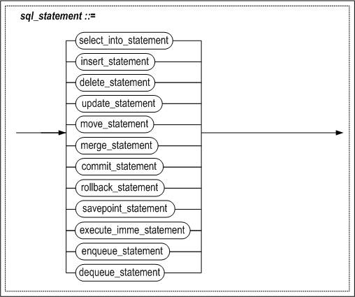
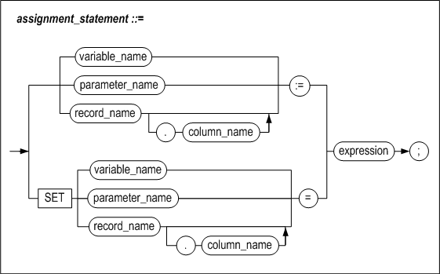
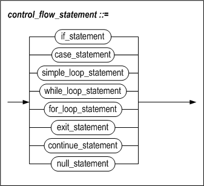
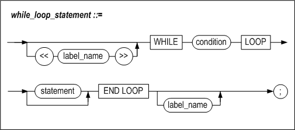
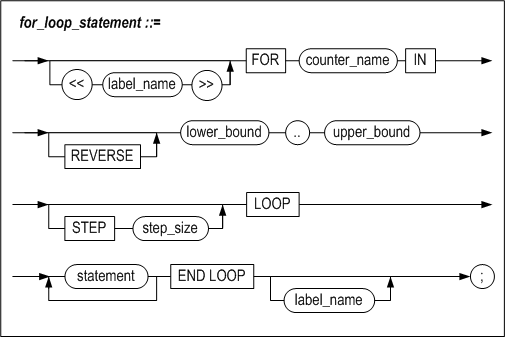
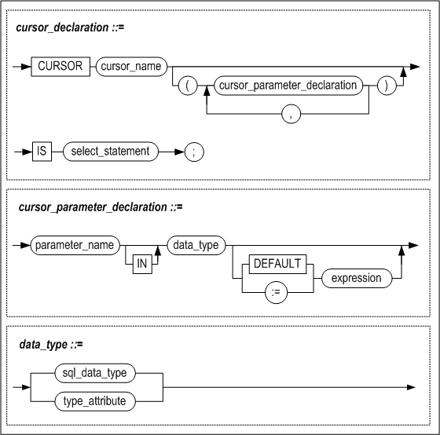
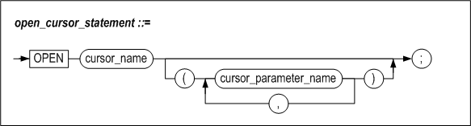
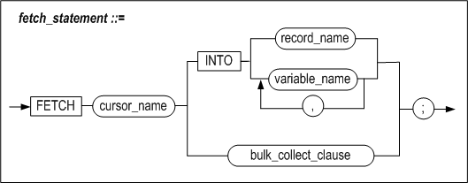
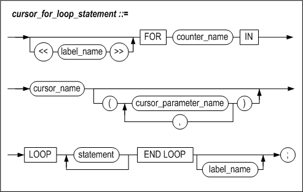
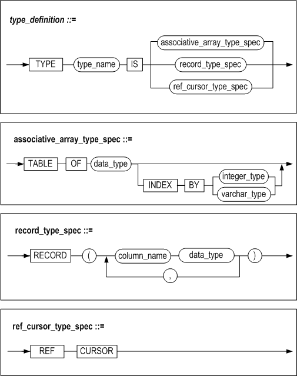

<!-- START doctoc generated TOC please keep comment here to allow auto update -->
<!-- DON'T EDIT THIS SECTION, INSTEAD RE-RUN doctoc TO UPDATE -->
**Table of Contents**  *generated with [DocToc](https://github.com/thlorenz/doctoc)*

- [Stored Procedures Manual](#stored-procedures-manual)
  - [Preface](#preface)
    - [About This Manual](#about-this-manual)
  - [1. Introduction to Stored Procedures](#1-introduction-to-stored-procedures)
    - [Overview](#overview)
    - [Structure of Stored Procedures](#structure-of-stored-procedures)
    - [Considerations when using Stored Procedures](#considerations-when-using-stored-procedures)
  - [2. SQL Statements for Managing Stored Procedures](#2-sql-statements-for-managing-stored-procedures)
    - [Overview](#overview-1)
    - [CREATE PROCEDURE](#create-procedure)
    - [ALTER PROCEDURE](#alter-procedure)
    - [DROP PROCEDURE](#drop-procedure)
    - [EXECUTE](#execute)
    - [CREATE FUNCTION](#create-function)
    - [ALTER FUNCTION](#alter-function)
    - [DROP FUNCTION](#drop-function)
  - [3. Stored Procedure Blocks](#3-stored-procedure-blocks)
    - [Stored Procedure Block](#stored-procedure-block)
    - [Declaring Local Variables](#declaring-local-variables)
    - [SELECT INTO](#select-into)
    - [RETURNING INTO Clause](#returning-into-clause)
    - [Assignment Statements](#assignment-statements)
    - [LABEL](#label)
    - [PRINT](#print)
    - [RETURN](#return)
    - [INSERT Extension](#insert-extension)
    - [UPDATE Extension](#update-extension)
  - [4. Control Flow Statement](#4-control-flow-statement)
    - [Overview](#overview-2)
    - [IF](#if)
    - [CASE](#case)
    - [LOOP](#loop)
    - [WHILE LOOP](#while-loop)
    - [FOR LOOP](#for-loop)
    - [EXIT](#exit)
    - [CONTINUE](#continue)
    - [GOTO](#goto)
    - [NULL](#null)
  - [5. Using Cursors](#5-using-cursors)
    - [Overview](#overview-3)
    - [CURSOR](#cursor)
    - [OPEN](#open)
    - [FETCH](#fetch)
    - [CLOSE](#close)
    - [Cursor FOR LOOP](#cursor-for-loop)
    - [Cursor Attributes](#cursor-attributes)
  - [6. User-Defined Types](#6-user-defined-types)
    - [Overview](#overview-4)
    - [Defining a User-Defined Type](#defining-a-user-defined-type)
    - [Functions for Use with Associative Arrays](#functions-for-use-with-associative-arrays)
    - [Using RECORD Type Variables and Associative Array Variables](#using-record-type-variables-and-associative-array-variables)
    - [REF CURSOR](#ref-cursor)
  - [7. Typesets](#7-typesets)
    - [Overview](#overview-5)
    - [CREATE TYPESET](#create-typeset)
    - [DROP TYPESET](#drop-typeset)

<!-- END doctoc generated TOC please keep comment here to allow auto update -->


Altibase® Application Development

Stored Procedures Manual 
========================


Altibase Application Development Stored Procedures Manual

Release 7.1

Copyright ⓒ 2001\~2020 Altibase Corp. All Rights Reserved.

This manual contains proprietary information of Altibase Corporation; it is provided under a license agreement containing restrictions on use and disclosure and is also protected by copyright patent and other intellectual property law. Reverse engineering of the software is prohibited. All trademarks, registered or otherwise, are the property of their respective owners.

**Altibase Corp**

10F, Daerung PostTower II, 306, Digital-ro, Guro-gu, Seoul 08378, Korea Telephone: +82-2-2082-1000 Fax: 82-2-2082-1099

Customer Service Portal: http://support.altibase.com/en/

Homepage: [[http://www.altibase.com](http://www.altibase.com/)]


Preface
----

### About This Manual

This manual explains how to use stored procedures with Altibase.

#### Audience

This manual has been prepared for the following Altibase users:

-   Database administrators
-   Performance administrators
-   Database users
-   Application developers
-   Technical Supporters

It is recommended for those reading this manual possess the following background knowledge:

-   Basic knowledge in the use of computers, operating systems, and operating system utilities
-   Experience in using relational database and an understanding of database concepts
-   Computer programming experience
-   Experience in database server management, operating system management, or network administration

#### Organization

This manual is organized as follows: 

-   Chapter 1: Introduction to Stored Procedures  
    This chapter explains the concept and structure of stored procedures, and the notes on using them.

-   Chapter 2: SQL Statements for Managing Stored Procedures 
    This chapter explains the SQL statements that are used to manage stored procedures.

-   Chapter 3: Stored Procedure Blocks  
    This chapter explains the concept of stored procedure blocks, how to define local variables within the body of stored procedures, and which statements can be used in stored procedures
    
-   Chapter 4: Control Flow Statements  
    This chapter explains the control flow statements that can be used to author a procedural program within the body of a stored procedure.
    
-   Chapter 5: Using Cursors  
    This chapter explains cursor-related statements, which are used to define and control cursors so that multiple records returned by a SELECT statement can be processed within a stored procedure.
    
-   Chapter 6: User-Defined Types  
    This chapter explains how to define and use records and associative arrays, which are user-defined types that can be used within stored procedures and functions.
    
-   Chapter 7: Typesets  
    This chapter explains how to define and use user-defined typesets.
    
-   Chapter 8: Dynamic SQL  
    This chapter explains dynamic SQL, which enables queries to be created and executed as desired by the user at runtime.
    
-   Chapter 9: Exception Handlers  
    This chapter explains the exception handler, which handles exceptions when an error occurs while a stored procedure is being executed.
    
-   Chapter 10: Pragma  
    This chapter describes the pragma which has an impact on exection of stored procedure compile and how to use them.
    
-   Chapter 11: Stored Packages  
    This chapter describes how to create and use stored packages.

-   Chapter 12: Altibase Stored Procedures and Built-in Function  
    Altibase provides a variety of built-in stored procedures and functions. This chapter introduces these stored procedures and functions and explains their use.
    
-   Chapter 13: Altibase System-defined Stored Packages  
    This chapter discusses system-defined stored packages provided by Altibase. 

-   Appendix A. Examples  
    This appendix explains the schema and sample program examples used in this manual.

#### Documentation Conventions

This section describes the conventions used in this manual. Understanding these conventions will make it easier to find information in this manual and in the other manuals in the series. 

There are two sets of conventions:

-   Syntax diagram convetions
-   Sample code conventions

##### Syntax Diagram Conventions

This manual describes command syntax using diagrams composed of the following elements:

| Elements                                                     | Meaning                                                      |
| ------------------------------------------------------------ | ------------------------------------------------------------ |
| [](https://github.com/ALTIBASE/Documents/blob/master/Manuals/Altibase_7.1/eng/media/SQL/image1.gif) | Indicates the start of a command. If a syntactic element starts with an arrow, it is not a complete command. |
| [](https://github.com/ALTIBASE/Documents/blob/master/Manuals/Altibase_7.1/eng/media/SQL/image2.gif) | Indicates that the command continues to the next line. If a syntactic element ends with this symbol, it is not a complete command. |
| [](https://github.com/ALTIBASE/Documents/blob/master/Manuals/Altibase_7.1/eng/media/SQL/image3.gif) | Indicates taht the command continues from the previous line. If a syntactic element starts witht his symbol, it is not a complete command. |
| [](https://github.com/ALTIBASE/Documents/blob/master/Manuals/Altibase_7.1/eng/media/SQL/image4.gif) | Indicates the end of a statement.                            |
| [](https://github.com/ALTIBASE/Documents/blob/master/Manuals/Altibase_7.1/eng/media/SQL/image5.gif) | Indicates a manatory element.                                |
| [](https://github.com/ALTIBASE/Documents/blob/master/Manuals/Altibase_7.1/eng/media/SQL/image6.gif) | Indicates an optional element.                               |
| [](https://github.com/ALTIBASE/Documents/blob/master/Manuals/Altibase_7.1/eng/media/SQL/image7.gif) | Indicates a mandatory element comprised of options. One, and only one, option must be specified. |
| [](https://github.com/ALTIBASE/Documents/blob/master/Manuals/Altibase_7.1/eng/media/SQL/image8.gif) | Indicates an optional element comprised of options.          |
| [](https://github.com/ALTIBASE/Documents/blob/master/Manuals/Altibase_7.1/eng/media/SQL/image9.gif) | Indicates an optional element in which multiple elements may be specified. A comman must precede all but the first element. |

##### Sample Code Conventions

The code examples explain SQL statements, stored procedures, iSQL statements, and other command line syntax.

The following table describes the printing conventions used in the code examples.

| Rules            | Meaning                                                      | Example                                                      |
| ---------------- | ------------------------------------------------------------ | ------------------------------------------------------------ |
| [ ]              | Indicates an optional item                                   | VARCHAR [(*size*)][[FIXED \|] VARIABLE]                      |
| { }              | Indicates a mandatory field for which one or more items must be selected. | { ENABLE \| DISABLE \| COMPILE }                             |
| \|               | A delimiter between optional or mandatory arguments.         | { ENABLE \| DISABLE \| COMPILE } [ ENABLE \| DISABLE \| COMPILE ] |
| . . .            | Indicates that the previous argument is repeated, or that sample code has been omitted. | SQL> SELECT ename FROM employee; ENAME ----------------------- SWNO HJNO HSCHOI . . . 20 rows selected. |
| Other Symbols    | Symbols other than those shown above are part of the actual code.Other Symbols | EXEC :p1 := 1; acc NUMBER(11,2);Symbols other than those shown above are part of the actual code. |
| Italics          | Statement elements in italics indicate variables and special values specified by the user. | SELECT * FROM *table_name*; CONNECT *userID*/*password*;     |
| Lower case words | Indicate program elements set by the user, such as table names, column names, file names, etc. | SELECT ename FROM employee;                                  |
| Upper case words | Keywords and all elements provided by the system appear in upper case. | DESC SYSTEM_.SYS_INDICES_;                                   |

##### Sample Schema

Some of the examples in this manual are based on sample tables, including the employees, departments and orders tables. These tables can be created using the schema.sql file in the $ALTIBASE_HOME/sample/APRE/schema directory. For complete information on the sample schema, please refer to the Altibase *General Reference.*

#### Related Documentations

For more detailed information, please refer to the following documents.

-   Installation Guide

-   Getting Started Guide

-   SQL Reference

-   iSQL User’s Manual

-   Error Message Reference

#### Altibase Welcomes Your Comments and Feedbacks

Please let us know what you like or dislike about our manuals. To help us with better future versions of our manuals, please tell us if there is any corrections or classifications that you would find useful.

Include the following information:

- The name and version of the manual that you are using
- Any comments about the manual
- Your name, address, and phone number

If you need immediate assistance regarding any errors, omissions, and other technical issues, please contact Altibase's Support Portal (http://altibase.com/support-center/en/).

Thank you. We always welcome your feedbacks and suggestions.


## 1. Introduction to Stored Procedures

### Overview

A stored procedure is a kind of database object that consists of SQL statements, control statements, assignment statements, exception handlers, etc. Stored procedures are created in advance, compiled, and stored in a database, ready for execution. In that state, stored procedures can be simultaneously accessed by multiple SQL statements.

The term “stored procedure” is sometimes used to refer to stored procedures and stored functions collectively. Stored procedures and stored functions differ only in that stored functions return a value to the calling application, whereas stored procedures do not. 

Stored procedures and stored functions can be created using the CREATE PROCEDURE and CREATE FUNCTION statements, respectively. For more information about these statements, please refer to the explanations of the CREATE PROCEDURE and CREATE FUNCTION statements in Chapter2: SQL Statements for Managing Stored Procedures of this manual.

#### Types of Stored Objects

##### Stored Procedures 

Stored procedures are called, either by SQL statements or by other stored procedures, using IN parameters, OUT parameters, or IN/-OUT parameters. When a stored procedure is called, procedural statements defined in the body of the procedure are executed. A stored procedure has no return value, but can still pass values to the client or calling routine via OUT or IN/OUT parameters. However, because a stored procedure has no return value, it cannot be used as an operand in an expression in a SQL statement.

##### Stored Functions 

A stored function is the same as a stored procedure with the exception that it has a return value, and thus can be used as an operand in an expression in a SQL statement.

##### Typesets 

A typeset is a set of user-defined types that can be used in stored procedures. They are chiefly used for passing user-defined types between procedures in the form of parameters and return values.

For more information about typesets, please refer to Chapter7: Typesets.

#### Features

##### Procedural Programming using SQL

The Altibase PSM (Persistent Stored Module) provides control flow statements and exception handlers so that procedural programming can be conducted using SQL statements.

##### Performance

When a client sequentially executes multiple SQL statements, it must send each SQL statement individually and wait for the result before sending the next statement. This increases the amount of time and expense that is required for communication between the server and client. In contrast, a program that is authored such that it uses stored procedures needs to communicate with the server only one time in order to execute multiple SQL statements, because the client only needs to call one stored procedure comprising several SQL statements.

Therefore, using stored procedures reduces communication expenses, and additionally reduces the burden associated with type conversion when different data types are used on the server and client applications.

##### Modularity

All of the SQL operations required to conduct one business action can be gathered together and modularized in the form of a single stored procedure.

##### Easily Maintained Source Code

Because stored procedures reside in the database server, when business logic changes, only the stored procedures need to be changed; there is no need to update client programs distributed among multiple machines.

##### Sharing and Productivity

Stored procedures are stored in the database, which means that one user can execute another user's stored procedures, as long as s/he has been granted suitable access privileges. Moreover, because stored procedures can be called from within other stored procedures, when the need arises for a new business process that is based on an existing business process, the stored procedure for the new business process has only to call the stored procedure for the existing business process, thereby eliminating redundancy and increasing productivity.

##### Integration with SQL

The conditions that are used in the WHERE clause of a SELECT statement can be used as conditions in control flow statements in stored procedures without change. This means that SQL-style functions that are not originally supported for use as conditions in control flow statements in host languages such as C/C++ can now be used. Furthermore, built-in functions that are supported in SQL statements can be used without change in stored procedures. 

##### Error Handling in SQL

Because exception handlers are provided for use with stored procedures, appropriate action can be immediately taken on the server in response to errors that occur during the execution of SQL statements

##### Persistent Storage

Stored procedures are database objects, and thus are permanently stored in the database until explicitly dropped by a user. This means that business logic that supports business practices is also permanently preserved in the database

##### Enhanced Security

The altiwrap utility encrypts PSM code programs such as stored procedures and stored functions to prevent them from being exposed. For more detailed information about this utility, please refer to the *Utilities Manual*. Altibase can encrypt the following statements. 

-   CREATE [OR REPLACE] PROCEDURE

-   CREATE [OR REPLACE] FUNCTION

-   CREATE [OR REPLACE] TYPESET

-   CREATE [OR REPLACE] PACKAGE

-   CREATE [OR REPLACE] PACKAGE BODY


### Structure of Stored Procedures

Stored procedures are a kind of block-structured language. The body of one stored procedure typically consists of several logical blocks. 

A stored procedure consists of a header and a body. The body of a stored procedure is one large block that consists of a declare section, the actual body of the procedure, and an exception-handling section. The main block can have multiple sub-blocks. 

The following is an example illustrating the structure of a stored procedure:


Block2 is a sub-block of Block1 and can have a structure just like that of Block1, including a DECLARE section, body and an exception-handling section. 

A control flow statement is also a block, in that it has an explicit beginning and ending.


### Considerations when using Stored Procedures

#### Transaction Management

The transaction control commands that can be used in stored procedures are COMMIT and ROLLBACK statements. The use of these commands within a stored procedure can affect tasks that are being conducted outside of the stored procedure.

For example, assume that the following commands are executed in NON-AUTOCOMMIT mode:

```
iSQL> INSERT INTO t1 values (1);
iSQL> INSERT INTO t1 values (2);
iSQL> EXECUTE proc1;
```

Suppose that proc1 contains the commands “Insert Into t1 values (3)” and “ROLLBACK”. When it is executed, the statement within the procedure that inserted the value of 3 is not the only statement that will be rolled back. Additionally, the INSERT statements that were executed directly from iSQL and inserted the values of 1 and 2 will also be rolled back. That is, the two INSERT statements are handled as part of the same transaction as the statements within the stored procedure.

####  Limitations

COMMIT and ROLLBACK commands can be executed while the cursor is OPEN. However, the user should note that if ROLLBACK is executed while the cursor is OPEN and not yet COMMITTED, the cursor will close. 

Stored functions that are called from within SELECT statements cannot contain INSERT, UPDATE, or DELETE statements. 

In addition, they cannot contain transaction control statements. Stored functions that are called from within INSERT, UPDATE or DELETE statements cannot contain transaction control statements.

#### Related Meta Tables

For information about the meta tables related to stored procedures, please refer to the Data Dictionary in the *General Reference.*


## 2. SQL Statements for Managing Stored Procedures


### Overview

####  The SQL Statements that are used with Stored Procedures

This table lists the DDL statements that are used to create and manage stored procedures, stored functions, and typesets. The descriptions of the CREATE TYPESET and DROP TYPESET statements can be found in Chapter7: Typesets of this manual.

<table>
    <tr>
        <th>Statement Type</th><th>Statement</th><th>Description</th>
	</tr>
    <tr>
        <TD rowspan="3">Creationg</TD><TD>CREATE [OR REPLACE] PROCEDURE statement</TD><TD>This SQL statement is used to create a new stored procedure or change the definition of an existing stored procedure.</TD>
    </tr>
    <TR>
        <TD>CREATE [OR REPLACE] FUNCTION statement</TD><TD>This SQL statement is used to create a new stored function or change the definition of an existing stored function.</TD>       
    </TR>
    <TR>
        <TD>CREATE [OR REPLACE] TYPESET statement</TD><TD>This SQL statement is used to create or alter a typeset.</TD>
    </TR>
    <TR>
        <TD rowspan="2">Modification</TD><TD>ALTER PROCEDURE statement</TD><TD>This SQL statement is used to alter the stored
procedure state by recompiling the stored procedure.</TD>
    </TR>
    <TR>
        <TD>ALTER FUNCTION statement</TD><TD>This SQL statement is used to alter the stored function state by recompiling the stored function.</TD>
    </TR>
    <TR>
        <TD rowspan="3">Removal</TD><TD>DROP PROCEDURE statement</TD><TD>This SQL statement is used to remove a stored
procedure.</TD>
    </TR>
    <TR>
    	<TD>DROP FUNCTION statement</TD><TD>This SQL statement is used to remove a stored
function.</TD>
    </TR>
    <TR>
        <TD>DROP TYPESET statement</TD><TD>This SQL statement is used to remove a TYPESET.</TD>
    </TR>  
    <TR>
        <TD rowspan="2">Execution</TD> <TD>EXECUTE statement</TD><TD>This SQL statement is used to EXECUTE a
stored procedure or stored function.</TD>        
    </TR>
    <TR>
     	<TD>function_name</TD><TD>Stored functions can be referenced by name
within SQL statements.</TD>        
    </TR>
</table>


#### Data Types

The following data types are supported for use with stored procedures:

-   SQL 데이터 Types

-   BOOLEAN Types

-   FILE_TYPE  
    FILE_TYPE can be used only in stored procedures, and is used to control files in stored procedures. For more information, please refer to Chapter 11: File Control in this manual.
    
-   User-defined Types  
    User-defined types can be used only in stored procedures: records and associative arrays are supported for use as user-defined types. For more information, please refer to Chapter 6: User-Defined Types in this manual.

##### SQL Data Types

Data types available for use in SQL statements can be used in both stored procedures and stored functions. For more detailed information on each data type, please refer to "Data Types" in *General Reference*.

The SQL data types listed in the following table have different maximum sizes in SQL statements and PSMs (stored procedures, stored functions).

| Data Type   | Maximum Size in SQL Statements | Maximum Size in PSMs                                         |
| ----------- | ------------------------------ | ------------------------------------------------------------ |
| CHAR(M)     | 32000                          | 65534                                                        |
| VARCHAR(M)  | 32000                          | 65534                                                        |
| NCHAR(M)    | 16000 (UTF-16) 10666 (UTF-8)   | 32766 (UTF-16) 21843 (UTF-8)                                 |
| NVARCHAR(M) | 16000 (UTF-16) 10666 (UTF-8)   | 32766 (UTF-16) 21843 (UTF-8)                                 |
| BLOB        | 2GB - 1                        | 100MB Determined by the LOB_OBJECT_BUFFER_SIZE property (default value: 32KB) |
| CLOB        | 2GB - 1                        | 100MB Determined by the LOB_OBJECT_BUFFER_SIZE property (default value: 32KB) |

On omission, the size of the CHAR, VARCHAR, NCHAR and NVARCHAR types is 1 by default.

In case the data type of parameters or return values is set to CHAR, NCHAR, NVARCHAR or VARCHAR in the stored procedures or functions, the size of data type is set to the specified size of properties as follows:

-   PSM_CHAR_DEFAULT_PRECISION

-   PSM_NCHAR_UTF8_DEFAULT_PRECISION

-   PSM_NCHAR_UTF16_DEFAULT_PRECISION

-   PSM_NVARCHAR_UTF8_DEFAULT_PRECISION

-   PSM_NVARCHAR_UTF16_DEFAULT_PRECISION

-   PSM_VARCHAR_DEFAULT_PRECISION

Refer to the *General Reference* for in-depth information on each property.

##### BOOLEAN Types

A BOOLEAN type is only available for use in stored procedures or stored functions, and can only have the value, TRUE, FALSE or NULL. 

A BOOLEAN variable can be declared as below.

```
variable_name BOOLEAN;
```

As the BOOLEAN type is not compatible with any other SQL data type, it has the following restrictions.

-   A BOOLEAN value cannot be input to a table column. 
-   A table column value cannot be fetched into a BOOLEAN variable. 
-   A stored function or built-in function that returns a BOOLEAN type is not available for use in a SQL statement. 
-   A BOOLEAN value cannot be passed as the argument of an output function (e.g., PRINT, PUT, etc).

The BOOLEAN type can be used as below. 

```
done BOOLEAN;
...
done := TRUE;
done := FALSE;
done := NULL;
...
IF done = TRUE THEN
...
IF done = FALSE THEN
...
IF done THEN
...
IF done is NULL THEN
...
```


### CREATE PROCEDURE

#### Syntax

create_procedure::=


parameter_declaration::=


invoker_rights_clause::=


#### Purpose

This statement creates a new stored procedure, or replaces an existing stored procedure with a new stored procedure.

##### parameter_declaration

Arguments may be omitted. If an argument is specified, the name, data type, and input / output distinction must be specified. Available I / O classification value is one of the following three, and defaults to IN when omitted. If the argument is OUT or INOUT, the DEFAULT expression cannot be defined.

-   IN: an input parameter for which the value is specified when the procedure is called

-   OUT: an output parameter, which returns an output value after the procedure has executed

-   INOUT: an input/output parameter, for which the value is specified when calling the procedure, and which also returns an output value, typically after some operations are performed thereon

If the parameter type is omitted, IN is the default type. If the parameter type is OUT or INOUT, DEFAULT expression cannot be used. 

When a stored procedure is executed, values are passed to the stored procedure using IN parameters, and the procedure returns values to the calling routine using OUT parameters. 

An IN parameter is handled as a constant within a stored procedure. This means that a value cannot be assigned to an IN parameter within a stored procedure. Additionally, an IN parameter cannot be used in an INTO clause of a SELECT statement. 

There are two methods of specifying parameters. The first method would be substituting values, and another one is substituting reference values by using NOCOPY option, which only supports the ASSOCIATIVE ARAY type. 

A parameter can have a default value. If no value is passed to a procedure for a parameter that has a default value, this default value will be used.

##### invoker_rights_clause

When executing a procedure, users can specify whether to refer to an object with the CREATE (DEFINER) permission or to execute the (CURRENT_USER) permission.

-   AUTHID CURRENT_USER  
    This executes a procedure by referencing an object owned by the user.

-   AUTHID DEFINER  
    This executes by the user who created the procedure (DEFINER) by referring to the object of the procedure constructor.

##### declaration_section

Please refer to  Declaring Local Variables in Chapter 3 of this manual.

##### data_type

Please refer to  Declaring Local Variables in Chapter 3 of this manual.

##### Exception Handler

Please refer to Exception Handlers in this in Chapter 9 of this manual.

##### Executing the CREATE PROCEDURE Statement

A stored procedure creation statement can be written in advance in a text editor and pasted into iSQL, or can be entered line-by-line directly using iSQL. 

Use a semicolon (“;”) at the end of SQL statements, stored procedure control flow statements, and blocks (“END”).

On the line following the last END statement, be sure to use a slash (“/”) to indicate the end of the procedure creation statement when using iSQL. The procedure creation statement is now ready for execution. When the CREATE PROCEDURE statement is executed, if there are no compile errors and the block is successfully compiled, the message “Create success” is output. The elements that are used in the body of a stored procedure, namely blocks, control flow statements, cursors, and exception handlers, will be described individually in subsequent chapters.

#### Example

##### Example 1 (Using IN parameters)

```
CREATE TABLE t1 (i1 INTEGER UNIQUE, i2 INTEGER, i3 INTEGER);
INSERT INTO t1 VALUES (1,1,1);
INSERT INTO t1 VALUES (2,2,2);
INSERT INTO t1 VALUES (3,3,3);
INSERT INTO t1 VALUES (4,4,4);
INSERT INTO t1 VALUES (5,5,5);
SELECT * FROM t1;

CREATE OR REPLACE PROCEDURE proc1
(p1 IN INTEGER, p2 IN INTEGER, p3 IN INTEGER)
AS
  v1 INTEGER;
  v2 t1.i2%type;
  v3 INTEGER;
BEGIN
  SELECT *
  INTO v1, v2, v3
  FROM t1
  WHERE i1 = p1 AND i2 = p2 AND i3 = p3;

  IF v1 = 1 AND v2 = 1 AND v3 = 1 THEN
    UPDATE t1 SET i2 = 7 WHERE i1 = v1;
  ELSIF v1 = 2 AND v2 = 2 AND v3 = 2 THEN
    UPDATE t1 SET i2 = 7 WHERE i1 = v1;
  ELSIF v1 = 3 AND v2 = 3 AND v3 = 3 THEN
    UPDATE t1 SET i2 = 7 WHERE i1 = v1;
  ELSIF v1 = 4 AND v2 = 4 AND v3 = 4 THEN
    UPDATE t1 SET i2 = 7 WHERE i1 = v1;
  ELSE
    DELETE FROM t1;
  END IF;
  INSERT INTO t1 VALUES (p1+10, p2+10, p3+10);
END;
/

iSQL> EXEC proc1 (2,2,2);
Execute success.
iSQL> SELECT * FROM t1;
T1.I1       T1.I2       T1.I3       
----------------------------------------
1           1           1           
3           3           3           
4           4           4           
5           5           5           
2           7           2           
12          12          12          
6 rows selected.
```


##### Example 2 (using parameters with default values)

```
CREATE TABLE t1 (i1 INTEGER, i2 INTEGER, i3 INTEGER);

CREATE OR REPLACE PROCEDURE proc1
(p1 IN INTEGER DEFAULT 1, p2 IN INTEGER DEFAULT 1, p3 IN INTEGER DEFAULT 1)
AS
BEGIN
  INSERT INTO t1 VALUES (p1, p2, p3);
END;
/

EXEC proc1;
SELECT * FROM t1;
EXEC proc1(2);
SELECT * FROM t1;
EXEC proc1(3,3);
SELECT * FROM t1;
EXEC proc1(4,4,4);

iSQL> SELECT * FROM t1;
T1.I1       T1.I2       T1.I3       
----------------------------------------
1           1           1           
2           1           1           
3           3           1           
4           4           4           
4 rows selected.
```


##### Example 3

```
CREATE OR REPLACE PROCEDURE proc1
(emp_id INTEGER, amount NUMBER(10,2))
AS
BEGIN
  UPDATE employees SET salary = salary + amount
  WHERE eno = emp_id;
END;
/

iSQL> EXEC proc1(15, '250');	
Execute success.

iSQL> SELECT * FROM employees WHERE eno=15;
ENO         E_LASTNAME            E_FIRSTNAME           EMP_JOB          
------------------------------------------------------------------------------
EMP_TEL          DNO         SALARY      SEX  BIRTH   JOIN_DATE    STATUS  
-----------------------------------------------------------------------------------
15          Davenport             Jason                 webmaster        
0119556884       1003        1250        M  901212               H  
1 row selected.

```


#####  Example 4 (Using OUT and IN/OUT parameters)

```
CREATE TABLE t4(i1 INTEGER, i2 INTEGER);
INSERT INTO t4 VALUES(1,1);
INSERT INTO t4 VALUES(1,1);
INSERT INTO t4 VALUES(1,1);
INSERT INTO t4 VALUES(1,1);
INSERT INTO t4 VALUES(1,1);

CREATE OR REPLACE PROCEDURE proc1(a1 OUT INTEGER, a2 IN OUT INTEGER)
AS
BEGIN
  SELECT COUNT(*) INTO a1 FROM t4 WHERE i2 = a2;
END;
/

iSQL> VAR t3 INTEGER;
iSQL> VAR t4 INTEGER;
iSQL> EXEC :t4 := 1;
Execute success.
iSQL> EXEC proc1(:t3, :t4);
Execute success.
iSQL> PRINT t3;
NAME                 TYPE                 VALUE
-----------------------------------------------
T3                   INTEGER              5 
```


##### Example 5

```
CREATE OR REPLACE PROCEDURE proc1(p1 INTEGER, p2 IN OUT INTEGER, p3 OUT INTEGER)
AS
BEGIN
  p2 := p1;
  p3 := p1 + 100;
END;
/

iSQL> VAR v1 INTEGER;
iSQL> VAR v2 INTEGER;
iSQL> VAR v3 INTEGER;
iSQL> EXEC :v1 := 3;
Execute success.
iSQL> EXEC proc1(:v1, :v2, :v3);
Execute success.
iSQL> PRINT VAR;
[ HOST VARIABLE ]
-----------------------------------------------
NAME                 TYPE                 VALUE
-----------------------------------------------
V1                   INTEGER              3
V2                   INTEGER              3
V3                   INTEGER              103
```


##### Example 6 (Using an IN/OUT parameter)

```
CREATE TABLE t3(i1 INTEGER);
INSERT INTO t3 VALUES(1);
INSERT INTO t3 VALUES(1);
INSERT INTO t3 VALUES(1);

CREATE OR REPLACE PROCEDURE proc1(a1 IN OUT INTEGER)
AS
BEGIN
  SELECT COUNT(*) INTO a1 FROM t3 WHERE i1 = a1;
END;
/

iSQL> VAR p1 INTEGER;
iSQL> EXEC :p1 := 1;
Execute success.
iSQL> EXEC proc1(:p1);
Execute success.
iSQL> PRINT p1;
NAME                 TYPE                 VALUE
-----------------------------------------------
P1                   INTEGER              3
```


##### Example 7

```
CREATE OR REPLACE PROCEDURE proc1(p1 INTEGER, p2 IN OUT INTEGER, p3 OUT INTEGER)
AS
BEGIN
  p2 := p1 + p2;
  p3 := p1 + 100;
END;
/
iSQL> VAR v1 INTEGER;
iSQL> VAR v3 INTEGER;
iSQL> EXEC :v1 := 3;
Execute success.
iSQL> EXEC :v2 := 5;
Execute success.
iSQL> EXEC proc1(:v1, :v2, :v3);
Execute success.
iSQL> PRINT VAR;
[ HOST VARIABLE ]
-----------------------------------------------
NAME                 TYPE                 VALUE
-----------------------------------------------
V1                   INTEGER              3
V2                   INTEGER              8
V3                   INTEGER              103
```


##### Example 8(Using NOCOPU option in IN/OUT parameters)

```
iSQL> CREATE TYPESET TYPE1 AS
TYPE ARR_TYPE IS TABLE OF INTEGER INDEX BY INTEGER;
END;
/
Create success.
iSQL> CREATE OR REPLACE PROCEDURE PRINT_PROC( P1 IN NOCOPY TYPE1.ARR_TYPE )
AS
BEGIN
FOR I IN P1.FIRST() .. P1.LAST() LOOP
PRINTLN(P1[I]);
END LOOP;
END;
/
Create success.
iSQL> CREATE OR REPLACE PROCEDURE PROC1
AS
VAR1 TYPE1.ARR_TYPE;
BEGIN
FOR I IN 1 .. 10 LOOP
VAR1[I] := I;
END LOOP;
PRINT_PROC(VAR1);
END;
/
Create success.
iSQL> EXEC PROC1;
1
2
3
4
5
6
7
8
9
10
Execute success.
```


##### Example 9 (AUTHID CURRENT_USER)

```
create object: user1
iSQL> connect user1/user1;
Connect success.

iSQL> create table t1( c1 integer );
Create success.

iSQL> insert into t1 values ( 1 );
1 row inserted.

iSQL> create or replace procedure proc1 authid current_user as
     var1 integer;
     begin
     select c1 into var1 from t1;
     println( var1 );
     end;
     /
Create success.

iSQL> select proc_name , object_type , authid
     from system_.sys_procedures_
     where proc_name ='PROC1';

PROC_NAME                                                               
----------------------------------------------------
OBJECT_TYPE AUTHID      
---------------------------------------------------
PROC1                                                                     
0           1          
1 row selected.

iSQL> connect user2/user2;
Connect success.

iSQL> create table t1( c1 integer );
Create success.

iSQL> insert into t1 values ( 100 );
1 row inserted.

create object: user2
iSQL> connect user2/user2;
Connect success.

iSQL> create table t1( c1 integer );
Create success.

iSQL> insert into t1 values ( 100 );
1 row inserted.

execute procedure: user1
iSQL> exec proc1;
1
Execute success.

execute procedure: user2
iSQL> exec user1.proc1;
100
Execute success.

```


##### Example 10 (AUTHID DEFINER)

```
create object: user1iSQL> connect user1/user1;
Connect success.

iSQL> create table t1( c1 integer );
Create success.

iSQL> insert into t1 values ( 1 );
1 row inserted.

iSQL> create or replace procedure proc1 authid definer as
     var1 integer;
     begin
     select c1 into var1 from t1;
     println( var1 );
     end;
     /
Create success.

iSQL> select proc_name , object_type , authid
     from system_.sys_procedures_
     where proc_name ='PROC1';
PROC_NAME                                                           
----------------------------------------------------------------
OBJECT_TYPE AUTHID      
---------------------------
PROC1                                                                            
0           0          
1 row selected.
iSQL> connect user2/user2;
Connect success.

iSQL> create table t1( c1 integer );
Create success.

iSQL> insert into t1 values ( 100 );
1 row inserted.

create object: user2
iSQL> connect user2/user2;
Connect success.

iSQL> create table t1( c1 integer );
Create success.

iSQL> insert into t1 values ( 100 );
1 row inserted.

execute procedure: user1
iSQL> exec proc1;
1
Execute success.

execute procedure: user2
iSQL> exec user1.proc1;
1
Execute success.

```


### ALTER PROCEDURE 

#### Syntax


#### Purpose

A stored procedure can access various database objects, such as tables, views, and sequences, and can also call other stored procedures and stored functions. After a procedure is created, if any of these objects are altered or changed, the stored procedure can enter what is known as an invalid state. 

For example, suppose that an index that existed when a stored procedure was created is later deleted. In this case, because the execution plan for a SQL statement in the stored procedure used the index to access a table, it will become impossible to access the table using the stored procedure from the moment the index is deleted. 

When an invalid procedure is called, it is automatically and immediately recompiled by the database. However, compiling at run time in this way can cause significant performance issues in some systems. Therefore, it is recommended that procedures be recompiled when they enter an invalid state. 

The ALTER PROCEDURE statement is used to explicitly recompile a stored procedure under these circumstances

#### Example

##### Example 1

```
CREATE TABLE t1 (i1 NUMBER, i2 VARCHAR(10), i3 DATE);

CREATE OR REPLACE PROCEDURE proc1
(p1 IN NUMBER, p2 IN VARCHAR(10), p3 IN DATE)
AS
BEGIN
  IF p1 > 0 then
    INSERT INTO t1 VALUES (p1, p2, p3);
  END IF;
END;
/
iSQL> EXECUTE proc1 (1, 'seoul', '20-JUN-2002');
Execute success.
iSQL> EXECUTE proc1 (-3, 'daegu', '21-APR-2002');
Execute success.
iSQL> SELECT * FROM t1;
T1.I1       T1.I2       T1.I3                
-----------------------------------------------
1           seoul       20-JUN-2002
1 row selected.
```


##### Example 2

```
CREATE TABLE t1 (i1 NUMBER, i2 VARCHAR(10), i3 DATE DEFAULT SYSDATE);

ALTER PROCEDURE proc1 COMPILE;

iSQL> EXECUTE proc1 (2, 'incheon', SYSDATE);
Execute success.
iSQL> SELECT * FROM t1;
T1.I1       T1.I2       T1.I3                
-----------------------------------------------
2           incheon     28-DEC-2010
1 row selected.
```


### DROP PROCEDURE 

#### Syntax


#### Purpose

This statement removes a stored procedure from the database. 

Note that this statement will execute successfully even if there are other stored procedures or stored functions that reference the procedure to be dropped. 

When a stored procedure or stored function attempts to call a stored procedure or stored function that has already been dropped, an error is returned.

#### Example

```
DROP PROCEDURE proc1;
```


### EXECUTE 

#### Syntax

##### execute_procedure_statement::=


##### execute_function_statement::=


##### parameter_notation::=


#### Purpose

This statement is used to execute a stored procedure or stored function.

##### parameter_notation

The way to deliver a value to parameter is as follows:

-   Position-based: By default, the values are entered according to the position of the defined parameter
  
-   Name-based : The values are entered the name of the defined parameter and the value after the arrow (=\>). Values can be delivered in any order of parameters.
  
-   Mixed: Position-based and name-based approaches can be used together. However, the position-based delivery method must be entered first.

#### Example

\<Query\>

```
CREATE OR REPLACE PROCEDURE proc1(eid INTEGER, amount NUMBER(10,2))
AS
  current_salary NUMBER(10,2);
BEGIN
  SELECT salary
  INTO current_salary
  FROM employees
  WHERE eno = eid;
    
  UPDATE employees
  SET salary = salary + amount
  WHERE eno = eid;
END;
/

iSQL> SELECT * FROM employees WHERE eno = 15;
ENO         E_LASTNAME            E_FIRSTNAME           EMP_JOB          
------------------------------------------------------------------------------
EMP_TEL          DNO         SALARY      SEX  BIRTH   JOIN_DATE    STATUS  
-----------------------------------------------------------------------------------
15          Davenport             Jason                 webmaster        
0119556884       1003        501000      M  901212               H  
1 row selected.

iSQL> EXEC proc1(15, 333333);
Execute success.
iSQL> SELECT * FROM employees WHERE eno = 15;
ENO         E_LASTNAME            E_FIRSTNAME           EMP_JOB          
------------------------------------------------------------------------------
EMP_TEL          DNO         SALARY      SEX  BIRTH   JOIN_DATE    STATUS  
-----------------------------------------------------------------------------------
15          Davenport             Jason                 webmaster        
0119556884       1003        834333      M  901212               H  
1 row selected.
<질의>
iSQL> EXEC proc1(amount => 333333, eid => 15);
Execute success.

iSQL> SELECT * FROM employees WHERE eno = 15;
ENO         E_LASTNAME            E_FIRSTNAME           EMP_JOB          
------------------------------------------------------------------------------
EMP_TEL          DNO         SALARY      SEX  BIRTH   JOIN_DATE    STATUS  
-----------------------------------------------------------------------------------
15          Davenport             Jason                 webmaster        
0119556884       1003        834333      M  901212               H  
1 row selected.
```


### CREATE FUNCTION 

#### Syntax

create_function::=


parameter_declaration::=


invoker_rights_clause::=


#### Purpose

This statement is used to create a new stored function or replace an existing function with a new function.

##### parameter_declaration

Refer to "parameter_declaration" in the explanation of the CREATE PROCEDURE 

##### RETURN data_type

Unlike stored procedures, stored functions return a single value after they are executed. Therefore, the data type of the return value must be specified.

##### DETERMINISTIC

This function indicates that a function called by an identical parameter value always returns an identical result. Functions marked DETERMINSTIC can be used in function-based indexes along with Check Constraint. On omission, a non-deterministic function is marked.

##### invoker_rights_clause

When executing a function, it can be specified whether to refer to the object by the constructor (DEFINER) permission or the executer (CURRENT_USER) permission. If this clause is commited, the fucntion executes with constructor privileges.

-   AUTHID CURRENT_USER  
    This executes a function by referring to an object owned by the user.

-   AUTHID DEFINER  
    This executes a function with DEFINER permission by referring to the object of the funciton constructor.

##### Declaration Section

Please refer to Declaring Local Variables in Chapter 3 of this manual.

##### Data Types

Please refer to Declaring Local Variables in Chapter 3 of this manual.

##### Exception Handler

Please refer to Chapter 9: Exception Handlers in this manual

##### Executing the CREATE FUNCTION Statement

Refer to the corresponding description in Executing the CREATE PROCEDURE Statement.

#### Example

##### Example 1

```
CREATE TABLE t1(
  seq_no INTEGER,
  user_id VARCHAR(9),
  rate NUMBER,
  start_date DATE,
  end_date DATE);
INSERT INTO t1 VALUES(0, '000000500', 200.50, '23-May-2002', '23-Apr-2002');
INSERT INTO t1 VALUES(0, '000000501', 190, '23-Nov-2002', '23-Dec-2002');
INSERT INTO t1 VALUES(0, '000000523', 100, '12-Dec-2001', '12-Jan-2001');
INSERT INTO t1 VALUES(0, '000000532', 100, '11-Dec-2001', '11-Jan-2002');
INSERT INTO t1(seq_no, user_id, start_date, end_date) VALUES(0, '000000524', '30-Oct-2001', '30-Nov-2001');
INSERT INTO t1 VALUES(0, '000000524', 200.50, '30-Apr-2002', '30-May-2002');
INSERT INTO t1 VALUES(0, '000000524', 200.50, '30-Apr-2002', '30-May-2002');
INSERT INTO t1 VALUES(1, '000000524', 100, '30-Apr-2002', '30-May-2002');
INSERT INTO t1 VALUES(1, '000000524', 115.0, '19-Jan-2002', '19-Mar-2002');
INSERT INTO t1 VALUES(0, '000000502', 120.0, '27-Jan-2002', '27-Feb-2002');
INSERT INTO t1 VALUES(1, '000000504', 150.0, '26-Nov-2001', '26-Dec-2001');

iSQL> SELECT * FROM t1;
T1.SEQ_NO   T1.USER_ID  T1.RATE     T1.START_DATE        
------------------------------------------------------------
T1.END_DATE          
-----------------------
0           000000500  200.5       2002/05/23 00:00:00  
2002/04/23 00:00:00  
0           000000501  190         2002/11/23 00:00:00  
2002/12/23 00:00:00  
0           000000523  100         2001/12/12 00:00:00  
2001/01/12 00:00:00  
0           000000532  100         2001/12/11 00:00:00  
2002/01/11 00:00:00  
0           000000524              2001/10/30 00:00:00  
2001/11/30 00:00:00  
0           000000524  200.5       2002/04/30 00:00:00  
2002/05/30 00:00:00  
0           000000524  200.5       2002/04/30 00:00:00  
2002/05/30 00:00:00  
1           000000524  100         2002/04/30 00:00:00  
2002/05/30 00:00:00  
1           000000524  115         2002/01/19 00:00:00  
2002/03/19 00:00:00  
0           000000502  120         2002/01/27 00:00:00  
2002/02/27 00:00:00  
1           000000504  150         2001/11/26 00:00:00  
2001/12/26 00:00:00  
11 rows selected.

CREATE OR REPLACE FUNCTION get_rate
(p1 IN CHAR(30), p2 IN CHAR(30), p3 IN VARCHAR(9))
RETURN NUMBER
AS
  v_rate NUMBER;
BEGIN
  SELECT NVL(SUM(rate), 0)
  INTO v_rate
  FROM (SELECT rate
        FROM t1
        WHERE start_date = TO_DATE(p1)
          AND end_date = TO_DATE(p2)
          AND user_id = '000000' || p3
          AND seq_no = 0);
  RETURN v_rate;
END;
/

iSQL> VAR res NUMBER;
iSQL> EXECUTE :res := get_rate('30-Apr-2002', '30-May-2002', '524');
Execute success.
iSQL> PRINT res;
NAME                 TYPE                 VALUE
-----------------------------------------------
RES                  NUMBER               401
```


##### Example (AUTHID CURRENT_USER)

###### **Create object : user1**

```
iSQL> connect user1/user1;
Connect success.
 
iSQL> create table t1( c1 integer );
Create success.
 
iSQL> insert into t1 values ( 1 );
1 row inserted.
 
iSQL> create or replace function func1 return integer authid current_user as
     cursor cur1 is select c1 from t1;
     var1 integer;
     begin
     open cur1;
     fetch cur1 into var1;
     close cur1;
     return var1;
     end;
     /
Create success.
 
iSQL> select proc_name , object_type , authid
    2 from system_.sys_procedures_
    3 where proc_name = 'FUNC1';
PROC_NAME                                                                                                                         
------------------------------------------------------------------------------------------------------------------------------------
OBJECT_TYPE AUTHID      
---------------------------
FUNC1                                                                                                                             
1           1          
1 row selected.
```


###### **Create object: user2**

```
iSQL> connect user2/user2;
Connect success.
 
iSQL> create table t1( c1 integer );
Create success.
 
iSQL> insert into t1 values ( 100 );
1 row inserted.

```


###### **Execute function: user1**

```
iSQL> var a integer;
 
iSQL> exec :a := func1;
Execute success.
 
iSQL> print a
NAME                 TYPE                 VALUE
-------------------------------------------------------
A                    INTEGER              1
 
 
iSQL> select func1 from dual;
FUNC1       
--------------
1          
1 row selected.

```


###### **Execute function: user2**

```
iSQL> var a integer;
 
iSQL> exec :a := user1.func1;
Execute success.
 
iSQL> print a
NAME                 TYPE                 VALUE
-------------------------------------------------------
A                    INTEGER              100
 
 
iSQL> select user1.func1 from dual;
USER1.FUNC1 
--------------
100        
1 row selected.

```


##### Example 3 (AUTHID DEFINER)

###### **Create object: user1**

```
iSQL> connect user1/user1;
Connect success.
 
iSQL> create table t1( c1 integer );
Create success.
 
iSQL> insert into t1 values ( 1 );
1 row inserted.
 
iSQL> create or replace function func1 return integer authid definer as
      cursor cur1 is select c1 from t1;
      var1 integer;
      begin
      open cur1;
      fetch cur1 into var1;
      close cur1;
      return var1;
      end;
      /
Create success.
 
iSQL> select proc_name , object_type , authid
      from system_.sys_procedures_
      where proc_name ='FUNC1';
PROC_NAME                                                                                                                         
-------------------------------------------------------------------------------
OBJECT_TYPE AUTHID      
---------------------------
FUNC1                                                                                                                             
1           0          
1 row selected.
```


###### **Create object: user2**

```
iSQL> connect user2/user2;
Connect success.
 
iSQL> create table t1( c1 integer );
Create success.
 
iSQL> insert into t1 values ( 100 );
1 row inserted.
```


###### **Execute function: user1**

```
iSQL> var a integer;
 
iSQL> exec :a := func1;
Execute success.
 
iSQL> print a
NAME                 TYPE                 VALUE
-------------------------------------------------------
A                    INTEGER              1
 
 
iSQL> select func1 from dual;
FUNC1       
--------------
1          
1 row selected.
```


###### **Execute function: user2**

```
iSQL> var a integer;
 
iSQL> exec :a := user1.func1;
Execute success.
 
 
iSQL> print a
NAME                 TYPE                 VALUE
-------------------------------------------------------
A                    INTEGER              1
 
 
iSQL> select user1.func1 from dual;
USER1.FUNC1 
--------------
1          
1 row selected.
```


#### Note

For functions used in constraints or function-based indexes, it is impossible to redefine functions since the return values of functions must not be modified. The user should also note that, if an invoked function within the function which the function-based indexes are built on is altered or deleted, DML operations can fail for the indexed table.

### ALTER FUNCTION 

#### Syntax


#### Purpose

As with a stored procedure, a stored function can enter what is known as an invalid state when one or more of the database objects that it references are changed after the function is created. 

In such circumstances, the ALTER FUNCTION statement is used to explicitly recompile the stored function and create an execution plan that is valid and optimized. 

For a more detailed explanation, please refer to Purpose in the explanation of the ALTER PROCEDURE statement.

#### Example

```
ALTER FUNCTION get_dept_name COMPILE;
```


### DROP FUNCTION 

#### Syntax


#### Purpose

This statement removes a stored function from the database. 

Note that this statement will execute successfully even if there are other stored procedures or stored functions that reference the stored function to be dropped.

When a stored procedure or stored function attempts to call a stored procedure or stored function that has already been dropped, an error is returned.

#### Example

```
DROP FUNCTION get_dept_name;
```


#### Note

The deletion of functions referenced by the constraints or the function-based indexes is impossible.


## 3. Stored Procedure Blocks

A stored procedure or function consists of one or more blocks. This chapter describes how to develop a procedural program within a stored procedure using blocks.

### Stored Procedure Block

#### Syntax

 

 

 

A block can be broadly divided into a declaration section, a block body and an exception handler section.

 A semicolon (“;”), which indicates the end of a statement, is not used after the DECLARE, BEGIN or EXCEPTION statements, but must be placed after the END statement and other commands in stored procedures. Comments can be used in stored procedures. 

To comment out all or part of a single line, place two hyphen characters (“--”) at the beginning of the text to be commented out. To comment out multiple lines, place the C-style delimiters “/*” and “*/” around the text to be commented out. 

In this chapter, the variable assignment statements, which can be used within the declaration section and block body, and the SELECT INTO, assignment statements, LABEL, PRINT and RETURN statements, which can be used only within the block body, will be described. 

Information on the use of control flow statements, cursor-related statements and exception handlers in stored procedures can be found in subsequent chapters. For information on general SQL statements, please refer to the *SQL Reference.*

#### Declare Section  

The declare section is delimited by the AS and BEGIN keywords for the main block, and by the DECLARE and BEGIN keywords for sub-blocks. Local variables, cursors, and user-defined exceptions for use in the current block are declared here.

In this chapter, only local variables will be described. Cursors and exception handlers will be described together with the related statements in Chapter5: Using Cursors and Chapter9: Exception Handlers, respectively.

#### Block Body 

The block body is the part between the BEGIN and END keywords. It contains SQL statements and control flow statements. 

The following SQL statements and control flow statements can be used within the block body:

-   DML statements: SELECT/INSERT/DELETE/UPDATE/MOVE/MERGE/ENQUEUE/DEQUEUE

-   Transaction statements: COMMIT/ROLLBACK/SAVEPOINT

-   Control flow statements: IF, CASE, FOR, LOOP, WHILE, EXIT, CONTINUE, NULL

-   Assignment statements

-   Output statements: PRINT, RETURN

-   Cursor statements: OPEN, FETCH, CLOSE, Cursor FOR LOOP

-   Dynamic SQL statement: EXECUTE IMmedia/StoredProcedureTE

-   Exception handling statements: RAISE, RAISE_APPLICATION_ERROR

One advantage of stored procedures compared to SQL statements is that it is possible to nest blocks. Anywhere that commands can be used, commands can be formed into blocks, which can be nested.

#### Exception Handler Section

The exception handler section is delimited by the EXCEPTION and END keywords. It contains a routine for handling particular errors that may arise during execution of the stored procedure or function

### Declaring Local Variables

#### Syntax


#### Purpose

##### variable_name

This is used to specify the name of a variable. 

The name of the variable must be unique within the block in which it is declared. 

If a column and a variable have the same name, any reference to this name in a SQL statement will be interpreted to mean the column. In the following example, both instances of eno are interpreted to mean the column name, with the undesirable result that all of the records in the employees table will be deleted.

```
DECLARE
eno INTEGER := 100;
BEGIN
DELETE FROM employees WHERE eno = eno;
…

```

To overcome this ambiguity, use a label to assign a name to the block as follows:

```
<<del_block>>
DECLARE
eno INTEGER := 100;
BEGIN
DELETE FROM employees WHERE eno = del_block.eno;

```

For more information about naming blocks, please refer to LABEL in this chapter.

##### pragma declaration

Please refer to the Pragma section in chapter 10 of this chapter.

##### data_type

This is used to specify the data type of the variable. The following data types can be used within stored procedures:

-   Data types available for use in SQL statements : please refer to Data Types in Chapter 2. 
-   BOOLEAN types: please refer to Data Types in Chapter 2. 
-   Any type which is defined for a column or variable and is referenced using the %TYPE attribute 
-   A RECORD type, comprising multiple columns, referenced using the %ROWTYPE attribute 
-   User-defined types: please refer to Chapter6: User-Defined Types.

The %TYPE and %ROWTYPE attributes obviate the necessity to change the code in stored procedures when table definitions change. That is, when the data type of a column in a table is changed, a variable defined using the %TYPE attribute will automatically take on the correct type, without any intervention. This helps realize data independence and lower maintenance expenses.

##### CONSTANT

This option is used when it is desired to use a particular variable as a constant, so that no other value can be assigned to it within the stored procedure. A variable defined in this way is read-only. 

For example, when max_val is declared as shown below, it is handled as a constant having the value of 100, and no other value can be arbitrarily allocated thereto.

```
max_val CONSTANT integer := 100;
```


##### NOCOPY

The NOCOPY option of local variables operates is on equal terms with that of the parameters. Thus, only the address assigned to variables is copied if the NOCOPY option is specified when declaring variables.

##### DEFAULT

This is used as follows to set an initial value for a variable when it is declared:

```
curr_val INTEGER DEFAULT 100;
count_val INTEGER := 0;
```


##### Cursor Declaration

 Please refer to the CURSOR section in Chapter 5 in this manual.

##### Exception Declaration

Please refer to the Exception Delacration section in Chapter 9 in this manual.

##### Nested Blocks and Variable Scope

The scope of a variable specified in the DECLARE section of a block starts at the BEGIN statement and finishes at the END statement in the block in which it was declared. 

Suppose that block2 is declared inside block1, and that variables having the same name, v_result, are declared within each block, as shown below. When v_result is referenced outside of block2, the reference is interpreted to mean the variable declared in block1, whereas when v_result is referenced inside block2, it is interpreted to mean the variable declared in block2. 

Meanwhile, both the variable x, which was declared in block1 (the outer block), and the variable y, which was declared in block2 (the inner block), can be referred to in the inner block, but only x can be referred to in the outer block.


##### Restrictions

The following are not supported when declaring variables:

* Variables defined within stored procedures cannot have NOT NULL constraints. 

* Multiple variables cannot be declared at the same time. That is, statements such as the following are not possible:

```
i, j, k INTEGER;
```


#### Examples

##### Use of %TYPE

```
DECLARE
my_title books.title%TYPE;
```

In the above example, the variable my_title is declared such that it will have the same type as the title column in the books table.

##### Use of %ROWTYPE

```
DECLARE
dept_rec departments%ROWTYPE
```

In the above example, the variable *dept_rec*, which is a RECORD type variable, is declared such that it will be the same as the departments table or cursor.

##### Example 1

This example shows the declaration of constants and the use of the %ROWTYPE attribute.

```
CREATE TABLE t1(i1 INTEGER, i2 INTEGER);

CREATE OR REPLACE PROCEDURE proc1
AS
  v1 constant INTEGER := 1;
  v2 constant t1.i1%TYPE := 1;
BEGIN
  INSERT INTO t1 VALUES (v1, v2);
END;
/

EXEC proc1;
iSQL> SELECT * FROM t1;
T1.I1       T1.I2       
---------------------------
1           1           
1 row selected.

--DROP TABLE t1;
CREATE TABLE t1 (i1 INTEGER, i2 INTEGER, i3 INTEGER);
INSERT INTO t1 VALUES(1,1,1);

CREATE OR REPLACE PROCEDURE proc1
AS
  r1 t1%ROWTYPE;
BEGIN 
  INSERT INTO t1 VALUES(3,3,3);
  <<s>>
  DECLARE
    r1 t1%ROWTYPE;

  BEGIN
    SELECT i1, i2, i3 INTO s.r1.i1, s.r1.i2, s.r1.i3 FROM t1 WHERE i1 = 1;
    INSERT INTO t1 VALUES (s.r1.i1, s.r1.i2, s.r1.i3);
  END;

END;
/

iSQL> EXEC proc1;
Execute success.
iSQL> SELECT * FROM t1;
T1.I1       T1.I2       T1.I3       
----------------------------------------
1           1           1           
3           3           3           
1           1           1           
3 rows selected.

```


##### Example 2

This example also shows the use of the %ROWTYPE attribute.

```
CREATE TABLE emp(
    eno INTEGER,
    ename CHAR(10),
    emp_job CHAR(15),
    join_date DATE,
    salary NUMBER(10,2),
    dno BYTE(2));

CREATE TABLE emp401(
    eno INTEGER,
    ename CHAR(10),
    emp_job CHAR(15),
    join_date DATE,
    leave_date DATE,
    salary NUMBER(10,2),
    dno BYTE(2),
    fund NUMBER(10,2) DEFAULT 0);

INSERT INTO emp VALUES (10, 'DKLEE', 'ENGINEER', '01-Jul-2000', 30000000, BYTE'D001');
INSERT INTO emp VALUES (20, 'SWMYUNG', 'MANAGER', '01-Nov-1999', 50000000, BYTE'C002');

CREATE OR REPLACE PROCEDURE proc1(p1 INTEGER)
AS
BEGIN
  DECLARE
    emp_rec emp%ROWTYPE;
  BEGIN
    SELECT * INTO emp_rec
    FROM emp
    WHERE eno = p1;
    INSERT INTO emp401(eno, ename, emp_job, join_date, leave_date, salary, dno)
      VALUES(emp_rec.eno, emp_rec.ename, emp_rec.emp_job, emp_rec.join_date, sysdate, emp_rec.salary, emp_rec.dno);
  END;
END;
/

iSQL> EXEC proc1(10);
Execute success.
iSQL> SELECT * FROM emp401;
EMP401.ENO  EMP401.ENAME  EMP401.EMP_JOB   EMP401.JOIN_DATE     
-----------------------------------------------
EMP401.LEAVE_DATE    EMP401.SALARY EMP401.DNO  EMP401.FUND 
-----------------------------------------------
10          DKLEE       ENGINEER         2000/07/01 00:00:00  
2005/01/27 16:26:26  30000000    D001  0           
1 row selected.

```


##### Example 3

This is an example describing the use of NOCOPY option.

```
iSQL>create or replace procedure proc1
as
      type arr_type is table of INTEGER index by INTEGER;
      var1 arr_type;
      var2 arr_type;
      var3 NOCOPY arr_type;
    begin
      for i in 1 .. 5 loop
        var1[i] := i;
      end loop;
      var2 := var1;
      var3 := var1;
    end;
/
Create success.
iSQL>  exec proc1;
Execute success.
iSQL> create or replace procedure proc2
    as
      type arr_type_1d is table of INTEGER index by INTEGER;
      type arr_type_2d is table of arr_type_1d index by INTEGER;
      var_2d arr_type_2d;
      var_1d NOCOPY arr_type_1d;
    begin
      for i in 1 .. 5 loop
        var_1d := var_2d[i];  
        for j in 1 .. 5 loop
          var_1d[j] := i * j;
        end loop;
      end loop;
      for i in 1 .. 5 loop
        var_1d := var_2d[i];
        for j in 1 .. 5 loop
          println(var_1d[j]);
        end loop;
      end loop;
    end;
    / 
Create success.
iSQL> exec proc2;
1
2
3
4
5
2
4
6
8
10
3
6
9
12
15
4
8
12
16
20
5
10
15
20
25
Execute success.

```


### SELECT INTO 

#### Syntax


Because the syntax of select_list and rest_of_select_statement is the same as for a SELECT statement, please refer to the SQL Reference for more information on those elements.

#### Purpose

When a stored procedure includes a SELECT statement, the SELECT statement must contain an INTO clause. 

A SELECT statement in a stored procedure or function must retrieve exactly one record. If the statement retrieves zero or multiple records, an error will be raised. 

The number of columns in select_list in the SELECT clause must be the same as the number of variable_name in the INTO clause. Furthermore, the data types of corresponding columns and variables must be compatible. Similarly, when the %ROWTYPE attribute is used, the number of columns in the %ROWTYPE variable and the number of columns in select_list must be the same, and the data types of corresponding columns must be compatible. 

When a standard exception occurs, the stored procedure raises an error. The NO_DATA_FOUND and TOO_MANY_ROW exceptions can be used to handle errors in the block's exception handler section. Please refer to Chapter9: Exception Handlers for more information about handling errors.


##### BULK COLLECT clause

Unlike the INTO clause that returns one record each time, the BULK COLLECT clause returns all of the execution results of the SELECT statement at once. Two types of bind variables as shown below can be specified to follow INTO: 

-   array_record_name  
    This specifies the associative array variables of RECORD type that are to store the records that the SELECT statement returns. 
    
-   array_variable_name  
    SThis specifies the array variables for each column of the SELECT list. Each data type of the array variables must be compatible with the data type of the corresponding column in the SELECT list, and the number of array variables must equal the number of columns of the SELECT list. 

Returning all of the result sets of queries at once using the BULK COLLECT clause is more efficient than returning result rows one at a time using the loop statement.

#### Example

##### Example 1

```
CREATE TABLE t1(i1 INTEGER, i2 INTEGER, i3 INTEGER);
INSERT INTO t1 VALUES(1,1,1);

CREATE OR REPLACE PROCEDURE proc1
AS
  v1 INTEGER;
  r1 t1%ROWTYPE;
BEGIN
  INSERT INTO t1 VALUES (3,3,3);
  <<s>>
  DECLARE
    v1 proc1.r1.i1%TYPE;
    r1 t1%ROWTYPE;
  BEGIN
    SELECT i1,i2,i3 
    INTO s.r1.i1, s.r1.i2, s.r1.i3 
    FROM t1  
    WHERE i1 = 1;
      
    INSERT INTO t1 VALUES(s.r1.i1, s.r1.i2, s.r1.i3);
  END;
END;
/

iSQL> EXEC proc1;
Execute success.
iSQL> SELECT * FROM t1;
T1.I1       T1.I2       T1.I3       
----------------------------------------
1           1           1           
3           3           3           
1           1           1           
3 rows selected.

```


##### Example 2

```
CREATE TABLE t1 (i1 INTEGER, i2 INTEGER, i3 INTEGER);
INSERT INTO t1 VALUES(100, 100, 100);

CREATE SEQUENCE seq1;

CREATE SEQUENCE seq2;

CREATE SEQUENCE seq3;

CREATE OR REPLACE PROCEDURE proc1
AS
BEGIN
  <<seq1>>
  DECLARE
   nextval INTEGER;
  BEGIN
   nextval := 10;
    INSERT INTO t1 VALUES (seq1.NEXTVAL,0,0);
  END;
END;
/

CREATE OR REPLACE PROCEDURE proc2
AS
BEGIN
  INSERT INTO t1 VALUES (seq1.NEXTVAL, seq2.NEXTVAL, seq3.NEXTVAL);
  INSERT INTO t1 VALUES (seq1.NEXTVAL, seq2.NEXTVAL, seq3.NEXTVAL);
  INSERT INTO t1 VALUES (seq1.NEXTVAL, seq2.NEXTVAL, seq3.NEXTVAL);
END;
/   

CREATE OR REPLACE PROCEDURE proc3
AS
  v1 INTEGER;
  v2 INTEGER;
  v3 INTEGER;
BEGIN
  SELECT seq1.currval, seq2.NEXTVAL, seq3.NEXTVAL
  INTO v1, v2, v3 FROM t1 WHERE i1 = 100;
  INSERT INTO t1 VALUES (v1, v2, v3);

  SELECT seq1.currval, seq1.NEXTVAL, seq1.currval
  INTO v1, v2, v3 FROM t1 WHERE i1 = 100;
  INSERT INTO t1 VALUES (v1, v2, v3);

  SELECT seq1.currval, seq2.NEXTVAL, seq3.NEXTVAL
  INTO v1, v2, v3 FROM t1 WHERE i1 = 100;
  INSERT INTO t1 VALUES (v1, v2, v3);
END;
/

EXEC proc1;
SELECT * FROM t1;
EXEC proc2;
SELECT * FROM t1;
EXEC proc3;
SELECT * FROM t1;
EXEC proc2;
SELECT * FROM t1;
EXEC proc3;

iSQL> SELECT * FROM t1;
T1.I1       T1.I2       T1.I3       
----------------------------------------
100         100         100         
10          0           0           
1           1           1           
2           2           2           
3           3           3           
3           4           4           
4           4           4           
4           5           5           
5           6           6           
6           7           7           
7           8           8           
7           9           9           
8           8           8           
8           10          10          
14 rows selected.

```


##### Example 3

```
CREATE TABLE t1(i1 INTEGER, i2 INTEGER, i3 INTEGER);

CREATE TABLE t2(i1 INTEGER, i2 INTEGER, i3 INTEGER);
INSERT INTO t1 VALUES (1,1,1);
INSERT INTO t1 VALUES (2,2,2);

CREATE OR REPLACE PROCEDURE proc1
AS
  v1 INTEGER;
  r1 t1%ROWTYPE;
BEGIN
  SELECT i1 INTO v1 FROM t1 WHERE i1 = 1;
  SELECT * INTO r1 FROM t1 WHERE i1 = 1;
  INSERT INTO t2 VALUES (v1, r1.i2, r1.i3);
  <<s>>
  DECLARE
    r1 t1%ROWTYPE;
  BEGIN
    SELECT i1, i2, i3 INTO s.r1.i1, s.r1.i2, s.r1.i3
    FROM t1 WHERE i1 = 2;
    INSERT INTO t2 VALUES (s.r1.i1, s.r1.i2, s.r1.i3);
  END;
END;
/

iSQL> EXEC proc1;
Execute success.
iSQL> SELECT * FROM t2;
T2.I1       T2.I2       T2.I3       
----------------------------------------
1           1           1           
2           2           2           
2 rows selected.

```


##### Example 4

```
CREATE TABLE t3(i1 INTEGER);

CREATE OR REPLACE PROCEDURE proc1
AS
  max_qty orders.qty%TYPE;
BEGIN
  SELECT MAX(qty)
  INTO max_qty
  FROM orders;

  INSERT INTO t3 VALUES(max_qty);
END;
/

iSQL> exec proc1;
Execute success
iSQL> SELECT * FROM t3;
T3.I1       
--------------
10000       
1 row selected.

```


##### Example 5 

```
CREATE TABLE delayed_processing(
  cno CHAR(14),
  order_date DATE);

CREATE OR REPLACE PROCEDURE proc1
AS
  de_cno CHAR(14);
  de_order_date DATE;
BEGIN
  INSERT INTO delayed_processing

  SELECT cno, order_date
  INTO de_cno, de_order_date
  FROM orders
  WHERE processing = 'D';

END;
/
iSQL> EXEC proc1;
Execute success.
iSQL> SELECT * FROM delayed_processing;
DELAYED_PROCESSING.CNO  DELAYED_PROCESSING.ORDER_DATE 
-----------------------------------------------
7610011000001  2000/11/29 00:00:00  
7001011001001  2000/11/29 00:00:00  
2 rows selected.

```


##### Example 6

```
create table t1(i1 int,i2 int);
insert into t1 values(1,1);
insert into t1 values(2,2);
insert into t1 values(3,3);

CREATE OR REPLACE PROCEDURE proc1
AS
  type myvarchararr is table of varchar(10) index by integer;
  v2 myvarchararr;
BEGIN
  SELECT i2 BULK COLLECT INTO v2 FROM t1;
  FOR i IN v2.first() .. v2.last() LOOP
    println('v2['||i||']='||v2[i]);
  END LOOP;
END;
/
 
iSQL> EXEC proc1();
v2[1]=1
v2[2]=2
v2[3]=3
Execute success.

```


### RETURNING INTO Clause

#### Syntax


#### Function

The RETURNING INTO clause specifies the variables which are to store the record values affected by the execution of DELETE, INSERT, or UPDATE statements that have this clause. The variables can be individual variables or array variables.

##### expr

Each expr must be a column name affected by DML statements or a data expression compatible with column types.

##### into_clause

The INTO clause commands modified record values to be respectively stored as variable_name variables.

##### variable_name

Each variable_name is a PSM variable in which queried expr values are to be stored. Unless using record type variables, the number of variables must equal the number of expr of the expr list. PSM variable types must be compatible with relevant expr types.

##### record_name

This is the name of the RECORD type variable which is to store the row returned by the statement.

##### bulk_collect_clause

Unlike the INTO clause which retrieves one record at a time, the BULK COLLECT clause retrieves all of the rows returned by the statement at once. Two types of bind variables as shown below can be specified to follow INTO: 

-   array_record_name  
    This specifies the associative array variables of RECORD.

-   array_variable_name  
    This specifies the array variables for each column of the *expr* list. Each data type of the array variables must be compatible with the data type of the corresponding column in the expr list, and the number of array variables must equal the number of columns of the *expr* list. 

#### Example

##### Example 1

```
iSQL> create table employees ( eno integer, ename varchar(20));
Create success.

iSQL> create or replace procedure proc1
as
  x1 integer;
  x2 varchar(30);
begin
      insert into employees values (1, 'jake') return eno, ename into x1, x2;
      println( 'x1='||x1||', x2='||x2);
end;
/
Create success.

iSQL> exec proc1;
x1=1, x2=jake
Execute success.

```


##### Example 2

```
iSQL> create table employees ( eno integer, ename varchar(20));
Create success.
iSQL> create or replace procedure proc1
as
  type myintarr is table of integer index by integer;
  type myvarchararr is table of varchar(30) index by integer;
 
  v1 myintarr;
  v2 myvarchararr;
 
begin
      insert into employees values (1, 'jake') return eno, ename bulk collect into v1, v2;
      for i in v1.first() .. v1.last() loop
      println( 'v1['||i||']='||v1[i] );
      end loop;
      for i in v2.first() .. v2.last() loop
      println( 'v2['||i||']='||v2[i] );
      end loop;
end;
/
Create success.
iSQL> exec proc1;
v1[1]=1
v2[1]=jake
Execute success.

```


##### Example 3

```
iSQL> create table employees ( eno integer, ename varchar(20));
Create success.
iSQL> create or replace procedure proc1
as
  type myrec is record( i1 integer, i2 varchar(30) );
  type myrecarr is table of myrec index by integer;
 
  r1 myrecarr;
  s1 myrec;
 
begin
    insert into employees values (1, 'jake') return eno, ename bulk collect into r1;
    for i in r1.first() .. r1.last() loop
    s1 := r1[i];
    println( 'r1['||i||'].eno='||s1.i1||', r1['||i||'].ename='||s1.i2 );
    end loop;
end;
/
Create success.
iSQL> exec proc1;
r1[1].eno=1, r1[1].ename=jake
Execute success.

```


##### Example 4

```
create table employees ( eno integer, ename varchar(20));
insert into employees values (1, 'jake');
insert into employees values (2, 'nikita');
insert into employees values (3, 'dana');

iSQL> create or replace procedure proc1
as
  x1 integer;
  x2 varchar(30);
begin
      delete from employees where eno = 1 return eno, ename into x1, x2;
      println( 'x1='||x1||', x2='||x2);
end;
/
Create success.
iSQL> exec proc1;
x1=1, x2=jake
Execute success.

```


##### Example 5

```
create table employees ( eno integer, ename varchar(20));
insert into employees values (1, 'no1.jake');
insert into employees values (1, 'no2.jake');
insert into employees values (1, 'no3.jake');

iSQL> create or replace procedure proc1
as
  type myintarr is table of integer index by integer;
  type myvarchararr is table of varchar(30) index by integer;
 
  v1 myintarr;
  v2 myvarchararr;
 
begin
      delete from employees where eno = 1 return eno, ename bulk collect into v1, v2;
 
      for i in v1.first() .. v1.last() loop
      println( 'v1['||i||']='||v1[i] );
      end loop;
      for i in v2.first() .. v2.last() loop
      println( 'v2['||i||']='||v2[i] );
      end loop;
 
end;
/
Create success.
iSQL> exec proc1;
v1[1]=1
v1[2]=1
v1[3]=1
v2[1]=no1.jake
v2[2]=no2.jake
v2[3]=no3.jake
Execute success.

```


##### Example 6

```
create table employees ( eno integer, ename varchar(20));
insert into employees values (1, 'no1.jake');
insert into employees values (1, 'no2.jake');
insert into employees values (1, 'no3.jake');

iSQL> create or replace procedure proc1
as
  type myrec is record( i1 integer, i2 varchar(30) );
  type myrecarr is table of myrec index by integer;
 
  r1 myrecarr;
  s1 myrec;
 
begin
    delete from employees where eno = 1 return eno, ename bulk collect into r1;
    for i in r1.first() .. r1.last() loop
    s1 := r1[i];
    println( 'r1['||i||'].eno='||s1.i1||', r1['||i||'].ename='||s1.i2 );
    end loop;
end;
/
Create success.
iSQL> exec proc1;
r1[1].eno=1, r1[1].ename=no1.jake
r1[2].eno=1, r1[2].ename=no2.jake
r1[3].eno=1, r1[3].ename=no3.jake
Execute success.

```


##### Example 7

```
create table employees ( eno integer, ename varchar(20));
insert into employees values (1, 'jake');
insert into employees values (2, 'nikita');
insert into employees values (3, 'dana');

iSQL> create or replace procedure proc1
as
  x1 integer;
  x2 varchar(30);
begin
      update employees set ename = 'mikhaila' where eno = 1 return eno, ename into x1, x2;
      println( 'x1='||x1||', x2='||x2);
end;
/
Create success.
iSQL> exec proc1;
x1=1, x2=mikhaila
Execute success.

```


##### Example 8

```
create table employees ( eno integer, ename varchar(20));
insert into employees values (1, 'no1.jake');
insert into employees values (1, 'no2.jake');
insert into employees values (1, 'no3.jake');

iSQL> create or replace procedure proc1
as
  type myintarr is table of integer index by integer;
  type myvarchararr is table of varchar(30) index by integer;
 
  v1 myintarr;
  v2 myvarchararr;
 
begin
      update employees set eno = 5, ename = 'mikhaila' where eno = 1 return eno, ename bulk collect into v1, v2;
 
      for i in v1.first() .. v1.last() loop
      println( 'v1['||i||']='||v1[i] );
      end loop;
      for i in v2.first() .. v2.last() loop
      println( 'v2['||i||']='||v2[i] );
      end loop;
 
end;
/
Create success.
iSQL> exec proc1;
v1[1]=5
v1[2]=5
v1[3]=5
v2[1]=mikhaila
v2[2]=mikhaila
v2[3]=mikhaila
Execute success.

```


##### Example 9

```
create table employees ( eno integer, ename varchar(20));
insert into employees values (1, 'no1.jake');
insert into employees values (1, 'no2.jake');
insert into employees values (1, 'no3.jake');

iSQL> create or replace procedure proc1
as
  type myrec is record( i1 integer, i2 varchar(30) );
  type myrecarr is table of myrec index by integer;
 
  r1 myrecarr;
  s1 myrec;
 
begin
    update employees set eno = 5, ename = 'mikhaila' where eno = 1 return eno, ename bulk collect into r1;
    for i in r1.first() .. r1.last() loop
    s1 := r1[i];
    println( 'r1['||i||'].eno='||s1.i1||', r1['||i||'].ename='||s1.i2 );
    end loop;
end;
/
Create success.
iSQL> exec proc1;
r1[1].eno=5, r1[1].ename=mikhaila
r1[2].eno=5, r1[2].ename=mikhaila
r1[3].eno=5, r1[3].ename=mikhaila
Execute success.

```


### Assignment Statements

#### Syntax



#### Purpose

These statements are used to assign a value to a local variable or to an OUT or IN/OUT parameter. 

Values can be assigned to variables and parameters using either of the two following statements:

-   Using the assignment operator “:=”  
    *variable_name* := value;  
    *parameter_name* := value;

-   Using the “SET” expression  
    SET *variable_name* = value;  
    SET *parameter_name* = value;

Refer to each of the individual values in a RECORD type variable that was declared using the %ROWTYPE attribute in this way:

#### Example

##### Example 1

```
CREATE TABLE t1(i1 INTEGER, i2 INTEGER, i3 INTEGER);

CREATE OR REPLACE PROCEDURE proc1
AS
  i INTEGER;
BEGIN
  i := 5;

  WHILE i <= 10 LOOP
    INSERT INTO t1 VALUES (i, i+1, i+2);
    i := i + 1;
  END LOOP;

END;
/

iSQL> EXEC proc1;
Execute success.
iSQL> SELECT * FROM t1;
T1.I1       T1.I2       T1.I3       
----------------------------------------
5           6           7           
6           7           8           
7           8           9           
8           9           10          
9           10          11          
10          11          12          
6 rows selected.

```


##### Example 2

```
CREATE TABLE t1(i1 INTEGER, i2 INTEGER, i3 INTEGER);

CREATE OR REPLACE FUNCTION plus20(p1 IN INTEGER)
RETURN INTEGER
AS
  v1 INTEGER;
BEGIN
  v1 := p1 + 20;
  RETURN v1;
END;
/

CREATE OR REPLACE PROCEDURE proc1
AS
  v1 INTEGER;
  in_arg INTEGER;
BEGIN
  in_arg := 80;
  v1 := plus20(in_arg);
  INSERT INTO t1 VALUES (v1, v1, v1);
END;
/

iSQL> EXEC proc1;
Execute success.
iSQL> SELECT * FROM t1; 
T1.I1       T1.I2       T1.I3       
----------------------------------------
100         100         100         
1 row selected.

```


### LABEL

The LABEL statement is used to name a particular point within a stored procedure. A label can be specified within a block using the delimiters shown below:

\<\< User_defined_label_name \>\>

#### Purpose

User-defined labels are used in the following three situations:

-   To limit the scope of multiple variables having the same name, or to overcome ambiguity that occurs when a variable and a column have the same name 
-   To exit a nested loop 
-   For use with the GOTO statement

#### Limitations

1. The same label cannot be used more than once within the same block. In the following example, a compilation error will occur, because LABEL1 appears twice within the same block:

```
CREATE OR REPLACE PROCEDURE PROC1
AS
    V1 INTEGER;
BEGIN
    <<LABEL1>>
    V1 := 1;
    <<LABEL1>>   
    V1 := V1 + 1;
…
```

2. In order to use labels to limit the scope of variables having the same name, the labels must be declared immediately before DECLARE statements. Note that it is possible to declare more than one label before a single DECLARE statement. In the following example, there are two references to the variable V1 denoted by (1):

```
CREATE OR REPLACE PROCEDURE PROC1
AS
    V1 INTEGER;
BEGIN
    <<LABEL1>>    --- LABLE 지정
    <<LABEL2>>
     DECLARE
            V1 INTEGER; .......(1)
     BEGIN
            <<LABEL3>>
            DECLARE
                V1 INTEGER; ......(2)
            BEGIN    
                LABEL1.V1 := 1;   -- (1)의 V1 참조
                LABEL2.V1 := 2;   -- (1)의 V1 참조
                LABEL3.V1 := 3;   -- (2)의 V1 참조
            END;
       END;
END;
/
In the following example, because the label declaration does not immediately precede the DECLARE statement, an error results:
AS
    V1 INTEGER;
BEGIN
    <<LABEL1>>
     V1 := 1;
     DECLARE
         V1 INTEGER;
      BEGIN
          LABEL1.V1 := 1;   --- ERROR.
```


2. Similarly, when using a label to exit nested loops, the label must be declared immediately before the loop. Note again that it is possible to declare more than one label before the loop.

```
CREATE OR REPLACE PROCEDURE PROC1
AS
    V1 INTEGER;
BEGIN
     V1 := 0;
    <<LABEL1>>
    <<LABEL2>>
     FOR I IN 1 .. 10 LOOP
          V1 := V1 + 1;
           FOR I IN 1 .. 10 LOOP
                V1 := V1 + 1;
                EXIT LABEL1 WHEN V1 = 30; 
            END LOOP;
      END LOOP;
END;
/
```

In the following example, one of the labels is not declared immediately before the loop. Because this label cannot be used to exit from the nested loops, an error is raised during the attempt to compile the stored procedure.

```
CREATE OR REPLACE PROCEDURE PROC1
AS
    V1 INTEGER;
BEGIN
    <<LABEL1>>
     V1 := 0;
    <<LABEL2>>
     FOR I IN 1 .. 10 LOOP
          V1 := V1 + 1;
           FOR I IN 1 .. 10 LOOP
                V1 := V1 + 1;
              EXIT LABEL1 WHEN V1 = 30; -- ERROR 
          END LOOP;
      END LOOP;
END;
/
```


### PRINT 

#### Syntax


#### Purpose

The PRINT statement is used to output desired text to the calling client or routine. PRINT is a system procedure that is provided within Altibase, and is typically used for debugging and testing. PRINTLN differs from PRINT only in that it outputs the appropriate newline sequence ( "\n" in Unix) after the string. The owner of PRINT and PRINTLN is the SYSTEM_user. 

It is possible to specify the SYSTEM_ user when using these routines, as follows:

```
SYSTEM_.PRINTLN(‘Hello World’);
```

However, it is not necessary to specify the SYSTEM_ user in this way, because a public synonym exists for these procedures.

##### String

This is the string to be output to the client.

As seen in Example 2 below, the double-vertical-bars concatenation operator ("||") can be used to combine the values of variables, query results, etc. with text to create a single line of text to be output to the client.

#### Example

##### Example 1

```
CREATE OR REPLACE PROCEDURE proc1
AS
  v1 BIGINT;
BEGIN
  v1 := BIGINT'9223372036854775807';
  system_.println ('1');
  system_.println (v1);
  system_.println ('2');
END;
/

iSQL> EXEC proc1;
1
9223372036854775807
2
Execute success.
```


##### Example 2

```
CREATE OR REPLACE PROCEDURE proc1
AS
  eno_count INTEGER;
BEGIN
  SELECT COUNT(eno) INTO eno_count FROM employees;
  println('The NUMBER of Employees: ' || eno_count);
END;
/

iSQL> EXEC proc1;
The NUMBER of Employees: 20
Execute success.
```


##### Example 3

The following example illustrates how to use a loop with PRINT and PRINTLN to output formatted query results. 

```
CREATE OR REPLACE PROCEDURE showProcedures
AS
  CURSOR c1 IS
    SELECT SYSTEM_.sys_procedures_.proc_name, decode(SYSTEM_.sys_procedures_.object_TYPE, 0, 'Procedure',1,'Function')
    FROM system_.sys_procedures_ ;

  v1 CHAR(40);
  v2 CHAR(20);
BEGIN
  OPEN c1;
  SYSTEM_.PRINTLN('--------------------------');
  SYSTEM_.PRINT('Proc_Name');
  SYSTEM_.PRINTLN('    Procedure/Function');
  SYSTEM_.PRINTLN('--------------------------');

LOOP
    FETCH C1 INTO v1, v2;
    EXIT WHEN C1%NOTFOUND;
    PRINT(' ');
    PRINT(v1);
    PRINTLN(v2);
END LOOP;

  PRINTLN('------------------------');
  CLOSE c1;
END;
/

iSQL> EXEC showProcedures;
-----------------------------------------------
Proc_Name                           Procedure/Function
-----------------------------------------------

 PRINT                                   Procedure 
 PRINTLN                                 Procedure 
.
.

 SHOWPROCEDURES                          Procedure 
-----------------------------------------------
Execute success.
```


### RETURN 

#### Syntax


#### Purpose

This statement is used to interrupt the execution of a stored procedure. When used with a stored function, it is additionally used to specify the return value. 

Because stored procedures do not return values, an error will be raised in response to an attempt to compile a stored procedure that specifies a return value. In contrast, because a function must always return a value, it is necessary to specify a return value when creating a function.

##### expression

*expression* is used to specify the return value for a stored function. It is possible to perform operations in *expression*.

#### Example

##### Example 1

```
CREATE TABLE t1(i1 INTEGER, i2 INTEGER, i3 INTEGER);

INSERT INTO t1 VALUES(1,1,1);

CREATE OR REPLACE FUNCTION times_half(p1 IN INTEGER)
RETURN INTEGER
AS
BEGIN
  RETURN p1 / 2;
END;
/

iSQL> SELECT times_half(times_half(8)) FROM t1;
TIMES_HALF(TIMES_HALF(8)) 
----------------------------
2           
1 row selected.
```


##### Example 2

```
CREATE TABLE t1(i1 INTEGER, i2 INTEGER, i3 INTEGER);

INSERT INTO t1 VALUES(1,1,1);
INSERT INTO t1 VALUES(10,10,10);
INSERT INTO t1 VALUES(100,100,100);

CREATE OR REPLACE FUNCTION max_all_val
RETURN INTEGER
AS
  v1 INTEGER;
BEGIN
  SELECT MAX(i1) INTO v1 FROM t1;
  RETURN v1;
END;
/

iSQL> SELECT max_all_val FROM t1;
MAX_ALL_VAL 
--------------
100         
100         
100         
3 rows selected.
```


##### Example 3

```
CREATE TABLE t4(i1 INTEGER, i2 INTEGER);

INSERT INTO t4 VALUES(3, 0);
INSERT INTO t4 VALUES(2, 0);
INSERT INTO t4 VALUES(1, 0);
INSERT INTO t4 VALUES(0, 0);

CREATE OR REPLACE FUNCTION func_plus_10(p1 INTEGER)
RETURN INTEGER
AS
BEGIN
  RETURN p1+10;
END;
/

iSQL> SELECT func_plus_10(i1) FROM t4;
FUNC_PLUS_10(I1) 
-------------------
13          
12          
11          
10          
4 rows selected.
```


### INSERT Extension 

#### Syntax


#### Purpose

This is a stored procedure extension of the INSERT 

The following example inserts the value of a record type variable when inserting a new record into a table or a specific partition withn a stored procedure.

The extension can be executed by replacing the single_table_insert clause and the values_clause clause with the syntax defined above in the SQL reference INSERT.

##### single_table_insert

The single_table_insert clause is used to insert one record into one table.

Note that the INSERT extension cannot specify the column name to insert.

##### record_name

This is a name of the record variable to insert into the specified table. This specifies variables of the RECORD type and the ROWTYPE type.

The number of columns in the record variable and the number of columns in the table must be the same. Also, the columns defined inside the record type must be exactly matched or compatible in the order of the column type. If there is a NOT NULL constraint on a column of the table, NULL values cannot be used for the column of the corresponding record.

#### Example

##### Example 1

This example inserts the record type variable r1 into the table t1 in the procedure.

```
CREATE TABLE t1(
    i1 INTEGER,
    i2 INTEGER,
    i3 INTEGER );

CREATE OR REPLACE PROCEDURE proc1
AS
    r1 t1%ROWTYPE;
BEGIN
    FOR i IN 1 .. 5 LOOP
        r1.i1 := i+10;
        r1.i2 := i+20;
        r1.i3 := i+30;
        INSERT INTO t1 VALUES r1;
    END LOOP;
END;
/

iSQL> EXEC proc1();
Execute success.
iSQL> SELECT * FROM t1;
I1          I2          I3          
----------------------------------------
11          21          31         
12          22          32         
13          23          33         
14          24          34         
15          25          35 
5 rows selected.

```

##### Example 2

The following example inserts the value of the OLD ROW record type variable into the log_tbl table when deleting rows of the ORDER table.

```
CREATE TABLE log_tbl (
  ONO            BIGINT,
  ORDER_DATE     DATE, 
  ENO            INTEGER,
  CNO            BIGINT,
  GNO            CHAR(10),
  QTY            INTEGER,
  ARRIVAL_DATE   DATE, 
  PROCESSING     CHAR(1) );
 
CREATE TRIGGER del_trigger
AFTER DELETE ON orders
REFERENCING OLD ROW old_row
FOR EACH ROW
AS BEGIN 
INSERT INTO log_tbl VALUES old_row;
END;
/
 
iSQL> DELETE FROM orders WHERE processing = 'D';
2 rows deleted.
 
iSQL> SELECT * FROM log_tbl;
ONO                  ORDER_DATE   ENO         CNO                  
------------------------------------------------------------------------
GNO         QTY         ARRIVAL_DATE PROCESSING  
------------------------------------------------------ 
11290011             29-NOV-2011  12          17                  
E111100001  1000        05-DEC-2011  D  
11290100             29-NOV-2011  19          11                 
E111100001  500         07-DEC-2011  D  
2 rows selected.

```


### UPDATE Extension

#### Syntax


#### Purpose

This is a stored procedure extension of the UPDATE statement.

The following example shows changing a record of a table or a specific partition into the value of a record type variable within a stored procedure.

The extension can excuted by replacing the set_clause_list clause with the statement defined above in the SQL Reference UPDATE.

##### record_name

This is a name of the record variable to change. This specifies a variable of type RECORD and ROWTYPE.

The number of columns in the record variable and the number of columns in the specified table must be the same. In addition, the columns defined inside the record type must be exactly matched or compatible in the order of the specified table column type. If there is a NOT NULL constraint on a column of the table, NULL values cannot be used for the column of the corresponding record.

#### Example

##### Example 1

Update the salary of employees with programmer job. This example inserts the value of a record type variable inside a procedure.

```
CREATE OR REPLACE PROCEDURE proc1 as
    TYPE TYPE_REC IS RECORD( eno INTEGER, SALARY NUMBER(10,2) );
    TYPE TYPE_ARR IS TABLE OF TYPE_REC INDEX BY INTEGER;
    emps TYPE_ARR;
    idx  INTEGER;
BEGIN
    SELECT ENO, SALARY BULK COLLECT INTO emps FROM EMPLOYEES WHERE EMP_JOB = 'programmer';
 
    FOR idx IN emps.FIRST() .. emps.LAST() LOOP
        emps[idx].SALARY := emps[idx].SALARY * 1.02;
 
        UPDATE (SELECT ENO, SALARY FROM EMPLOYEES)
            SET ROW = emps[idx]
            WHERE ENO = emps[idx].eno;
    END LOOP;
END;
/

iSQL> SELECT * FROM EMPLOYEES WHERE EMP_JOB = 'programmer';
ENO         E_LASTNAME            E_FIRSTNAME           EMP_JOB          
------------------------------------------------------------------------------
EMP_TEL          DNO         SALARY      SEX  BIRTH   JOIN_DATE    STATUS  
-----------------------------------------------------------------------------------
6           Momoi                 Ryu                   programmer       
0197853222       1002        1700        M  790822  09-SEP-2010  H  
10          Bae                   Elizabeth             programmer       
0167452000       1003        4000        F  710213  05-JAN-2010  H  
2 rows selected.
iSQL> EXEC PROC1();
Execute success.
 
iSQL> SELECT * FROM EMPLOYEES WHERE EMP_JOB = 'programmer';
ENO         E_LASTNAME            E_FIRSTNAME           EMP_JOB          
------------------------------------------------------------------------------
EMP_TEL          DNO         SALARY      SEX  BIRTH   JOIN_DATE    STATUS  
-----------------------------------------------------------------------------------
6           Momoi                 Ryu                   programmer       
0197853222       1002        1734        M  790822  09-SEP-2010  H  
10          Bae                   Elizabeth             programmer       
0167452000       1003        4080        F  710213  05-JAN-2010  H  
2 rows selected.

```


## 4. Control Flow Statement

### Overview

This chapter describes how to use control flow statements in a stored procedure body. 

#### Syntax



Altibase supports the use of the following control flow statements in stored procedures:

-   The IF and CASE conditional statements 
-   The LOOP, WHILE and FOR loop constructs, which cause multiple statements to be repeatedly executed 
-   The EXIT and CONTINUE statements, which are used to control the iteration of loops 
-   The NULL statement, which indicates that nothing is to be executed 
-   The GOTO statement, which is used to transfer control to a particular point

#### Restrictions

Any expressions containing subqueries cannot be used for condition of IF statement and CASE statement. However followings are exceptions of the rule:

-   EXIST (subquery)

-   NOT EXIST (subquery)

### IF 

#### Syntax


#### Purpose

This is a conditional construct that determines where execution continues depending on whether or not a given condition is satisfied. The IF clause checks the condition and passes control to the THEN clause if the condition is true, or to the ELSE clause if the condition is false or NULL.

##### condition

All conditions that are available for use in the WHERE clause of SQL statements can be used here. For more information about the conditions that are supported in SQL, please refer to the *SQL Reference.*

##### ELS(E)IF

Use this clause to specify another condition to be checked when the previous IF condition is FALSE. 

One IF clause can have multiple ELS(E)IF clauses. The ELS(E)IF clause is optional..

##### ELSE

This clause is used to specify what to do when all of the preceding IF and ELS(E)IF conditions are FALSE. One IF clause can have only one corresponding ELSE clause. The ELSE clause can be omitted.

##### Nested IF Constructs

IF constructs can be nested within other IF constructs. That is, one IF construct can be located within a series of statements that are executed depending on the outcome of another IF, ELS(E)IF, or ELSE clause. An END IF clause must be provided for every IF clause.

#### Examples

##### Example 1

```
CREATE OR REPLACE PROCEDURE proc1
AS
  CURSOR c1 IS SELECT eno, emp_job, salary FROM employees;
  emp_id employee.eno%TYPE;
  e_job employee.emp_job%TYPE;
  e_salary employee.salary%TYPE;
BEGIN
  OPEN c1;
  LOOP
    FETCH c1 INTO emp_id, e_job, e_salary;
    EXIT WHEN c1%NOTFOUND;

    IF e_salary IS NULL THEN
      IF e_job = 'CEO' THEN
        e_salary := 5000;
      ELSIF e_job = 'MANAGER' THEN
        e_salary := 4500;
      ELSIF e_job = 'ENGINEER' THEN
        e_salary := 4300;
      ELSIF e_job = 'PROGRAMMER' THEN
        e_salary := 4100;
      ELSE
        e_salary := 4000;
      END IF;

      UPDATE employees SET salary = e_salary WHERE eno = emp_id;
    END IF;

  END LOOP;
  CLOSE c1;
END;
/

iSQL> SELECT eno, emp_job FROM employees WHERE salary IS NULL;
ENO         EMP_JOB          
--------------------------------
1           CEO              
8           manager          
20          sales rep         
3 rows selected.
iSQL> EXEC proc1;
Execute success.
iSQL> SELECT eno, emp_job, salary FROM employees
WHERE eno=1 OR eno=8 OR eno=20;
ENO         EMP_JOB          SALARY      
---------------------------------------------
1           CEO              5000     
8           manager          4500     
20          sales rep         4000     
3 rows selected.
```


##### Example 2

```
CREATE TABLE t1 (i1 VARCHAR(20), i2 NUMBER, i3 DATE);
CREATE TABLE t2 (i1 VARCHAR(20), i2 NUMBER, i3 DATE);

INSERT INTO t1 VALUES ('21-JUL-2001', 2, '01-JUL-2000');
INSERT INTO t2 VALUES (NULL,NULL,'01-FEB-1990');
INSERT INTO t2 VALUES (NULL,NULL,'02-FEB-1990');

CREATE OR REPLACE FUNCTION func2
(p1 IN DATE, p2 IN CHAR(30))
RETURN NUMBER
AS
BEGIN
  RETURN (TO_NUMBER(TO_CHAR(p1, 'dd')) + TO_NUMBER(p2));
END;
/
CREATE OR REPLACE FUNCTION func1
(p1 IN DATE, p2 IN DATE)
RETURN DATE
AS
BEGIN
  IF p1 >= p2 THEN
    RETURN add_months(p1, 3);
  ELSE
    RETURN add_months(p1, 4);
  END IF;
END;
/

CREATE OR REPLACE PROCEDURE proc1
AS
  v1  VARCHAR(20);
  v2  NUMBER;
  v3  DATE;
BEGIN
  SELECT i1, func2(TO_DATE(i1), TO_CHAR(i3, 'yyyy')), i3
  INTO v1,v2,v3 FROM t1 WHERE i2 = 2;
  INSERT INTO t2 VALUES (v1,v2,v3);

  IF v2 not in (2001, 2002, 2003) AND v1 = '21-JUL-2001' THEN
    UPDATE t2
    SET i1 = func1(v1, '17-JUL-2001'),
        i2 = nvl(i2, 10)
    WHERE i3 = '01-FEB-1990';

    UPDATE t2
    SET i1 = func1(v1, '27-JUL-2001'),
        i2 = nvl(i2, 10*2)
    WHERE i3 = '02-FEB-1990';
  END IF;

END;
/

iSQL> EXEC proc1;
Execute success.
iSQL> SELECT * FROM t2;
T2.I1                 T2.I2       T2.I3                
-----------------------------------------------
21-JUL-2001           2021        2000/07/01 00:00:00  
21-OCT-01             10          1990/02/01 00:00:00  
21-NOV-01             20          1990/02/02 00:00:00  
3 rows selected.

```


##### Example 3

```
CREATE TABLE payroll(
  eno INTEGER,
  bonus NUMBER(10, 2));

CREATE OR REPLACE PROCEDURE proc1
AS
BEGIN
  DECLARe
    CURSOR c1 IS
      SELECT DISTINCT(eno), SUM(qty) FROM orders GROUP BY eno;
      emp_id orders.eno%TYPE;
      sum_qty orders.qty%TYPE;
      bonus NUMBER(10, 2);
    BEGIN
      OPEN c1;
      IF c1%ISOPEN THEN
        LOOP
          FETCH c1 INTO emp_id, sum_qty;
          EXIT WHEN c1%NOTFOUND;
          IF sum_qty > 25000 THEN
            bonus := 1000;
          ELSIF sum_qty > 15000 THEN
            bonus := 500;
          ELSE
            bonus := 200;
          END IF;

        INSERT INTO payroll VALUES(emp_id, bonus);
      END LOOP;
    END IF;
  END;
END;
/

iSQL> EXEC proc1;
Execute success.
iSQL> SELECT DISTINCT(eno), SUM(qty) sum FROM orders GROUP BY eno;
ENO         SUM                  
------------------------------------
12          17870                
19          25350                
20          13210                
3 rows selected.
iSQL> SELECT * FROM payroll;
PAYROLL.ENO PAYROLL.BONUS 
-----------------------------
12          500         
19          1000        
20          200         
3 rows selected.

```


### CASE 

#### Syntax


#### Purpose

CASE is a conditional construct that determines the flow of execution on the basis of the value of some variable. Its functionality is similar to that of the IF statement, however, it is more easily legible. 

As can be seen in the above diagram, the CASE statement can have one of two forms:

-   *case_statement_1*: The first is used to execute a desired statement or series of statements when the specified condition is satisfied

-   *case_statemen_2*: The second is used to execute a desired statement or series of statements when the variable has the specified value.

Note that both methods cannot be used together within a single CASE construct.

If none of the conditions specified in the case construct are satisfied, then the statements following the ELSE clause are executed. If the ELSE clause is omitted and none of the conditions are satisfied, then nothing is executed.

##### condition

This is used to specify the condition to check. It has the same form as the condition in the WHERE clause of a SELECT SQL statement.

##### case_variable

This is used to specify the name of the variable that is checked to determine procedural flow within the stored procedure.

##### when_value

This is the value with which case_variable is compared. If they are the same, the statement or statements following the THEN statement will be executed.

##### ELSE

If none of the WHEN conditions are satisfied in the case of case_statement_1, or if case_variable does not match any when_value in the case of case_statement_2, the statements following the ELSE clause will be executed. 

The ELSE clause can be omitted, and only one ELSE clause can be specified for one CASE construct. If there is no ELSE clause and none of the conditions are satisfied, no statement will be executed.

#### Example

##### Example 1

```
CREATE OR REPLACE PROCEDURE proc1
AS
  CURSOR c1 IS SELECT eno, emp_job, salary FROM employees;
  emp_id employees.eno%TYPE;
  e_job employees.emp_job%TYPE;
  e_salary employees.salary%TYPE;
BEGIN
  OPEN c1;

  LOOP
    FETCH c1 INTO emp_id, e_job, e_salary;
    EXIT WHEN c1%NOTFOUND;

    IF e_salary IS NULL THEN
      CASE
        WHEN e_job = 'CEO' THEN e_salary := 5000;
        WHEN e_job = 'MANAGER' THEN e_salary := 4500;
        WHEN e_job = 'ENGINEER' THEN e_salary := 4300;
        WHEN e_job = 'PROGRAMMER' THEN e_salary := 4100;
        ELSE e_salary := 4000;
      END CASE;
      UPDATE employees SET salary = e_salary WHERE eno = emp_id;
    END IF;

  END LOOP;

  CLOSE c1;
END;
/

iSQL> EXEC proc1;
Execute success.
iSQL> SELECT eno, emp_job, salary FROM employees
WHERE eno=1 OR eno=8 OR eno=20;
ENO         EMP_JOB          SALARY      
---------------------------------------------
1           CEO              5000     
8           manager          4500     
20          sales rep         4000     
3 rows selected.

```


##### Example 2

```
@SCHEMA.SQL

CREATE OR REPLACE PROCEDURE PROC1
AS
  CURSOR C1 IS SELECT ENO, EMP_JOB, SALARY FROM EMPLOYEES;
  EMP_ID EMPLOYEES.ENO%TYPE;
  E_JOB EMPLOYEES.EMP_JOB%TYPE;
  E_SALARY EMPLOYEES.SALARY%TYPE;
BEGIN
  OPEN C1;

  LOOP
    FETCH C1 INTO EMP_ID, E_JOB, E_SALARY;
    EXIT WHEN C1%NOTFOUND;

    IF E_SALARY IS NULL THEN
      CASE E_JOB
        WHEN 'CEO' THEN E_SALARY := 5000;
        WHEN 'MANAGER' THEN E_SALARY := 4500;
        WHEN 'ENGINEER' THEN E_SALARY := 4300;
        WHEN 'PROGRAMMER' THEN E_SALARY := 4100;
        ELSE E_SALARY := 4000;
      END CASE;
      UPDATE EMPLOYEES SET SALARY = E_SALARY WHERE ENO = EMP_ID;
    END IF;

  END LOOP;

  CLOSE C1;
END;
/

ISQL> SELECT ENO, EMP_JOB FROM EMPLOYEES WHERE SALARY IS NULL;
ENO         EMP_JOB          
--------------------------------
1           CEO              
8           MANAGER          
20          SALES REP         
3 ROWS SELECTED.
ISQL> EXEC PROC1;
EXECUTE SUCCESS.
ISQL> SELECT ENO, EMP_JOB, SALARY FROM EMPLOYEES WHERE ENO=1 OR ENO=8 OR ENO=20;
ENO         EMP_JOB          SALARY      
---------------------------------------------
1           CEO              5000     
8           MANAGER          4500     
20          SALES REP         4000     
3 ROWS SELECTED.

```


### LOOP

#### Syntax


#### Purpose

The LOOP construct is used to repeatedly execute a desired statement or series of statements without using a particular condition to control execution. 

Bear in mind that using the LOOP construct without an EXIT statement or some other way of exiting the loop can create an infinite loop, which can cause system problems.

#### Example

```
CREATE TABLE item(id INTEGER, counter NUMBER(2));

CREATE OR REPLACE PROCEDURE proc1
AS
BEGIN
  DECLARE
    v_id item.id%TYPE := 501;
    v_counter NUMBER(2) := 1;
  BEGIN
    LOOP
      INSERT INTO item VALUES(v_id, v_counter);
      v_counter := v_counter + 1;
      EXIT WHEN v_counter > 10;
    END LOOP;
  END;
END;
/

iSQL> EXEC proc1;
Execute success.
iSQL> SELECT * FROM item;
ITEM.ID     ITEM.COUNTER 
----------------------------
501         1           	
501         2           
…          
501         9           
501         10          
10 rows selected.

```


### WHILE LOOP 

#### Syntax



#### Purpose

The WHILE LOOP construct iterates the statements in the loop body as long as the condition remains true. If this condition is not true the first time it is executed, the statements in the loop will not be executed even once, and control will pass to the statement following the loop.

##### condition

This specifies a condition clause that determines whether or not to execute a LOOP. Conditional clauses can use all the predicates available in the WHERE clause of SQL statements.

#### Example

```
CREATE TABLE t1(i1 INTEGER, i2 INTEGER, i3 INTEGER);

CREATE OR REPLACE PROCEDURE proc1
AS
  v1 INTEGER;
BEGIN
  v1 := 1;

  WHILE v1 < 3 LOOP
    v1 := v1 + 1;
    INSERT INTO t1 VALUES (v1, v1, v1);
    IF v1 = 2 THEN
      CONTINUE;
    END IF; 
  END LOOP;

END;
/

iSQL> EXEC proc1;
Execute success.
iSQL> SELECT * FROM t1;
T1.I1       T1.I2       T1.I3       
----------------------------------------
2           2           2           
3           3           3           
2 rows selected.

```


### FOR LOOP 

#### Syntax



#### Purpose

The FOR LOOP construct is used to repeatedly execute a desired statement or series of statements a predetermined number of times. The range is specified using two periods (“..”), and is only evaluated once, before entering the FOR loop. If the lower and higher bounds are set to the same value, the loop body is iterated only one time.

##### counter_name

This loop construct uses an integer variable that increases or decreases to a fixed final value. This variable does not need to be expressly declared. The scope of this variable is limited to the statements between the LOOP and END LOOP clauses. No other value can be assigned to this variable.

##### REVERSE

This statement is optionally used to specify that the counter is to decrease from *upper_bound* to *lower_bound*.

##### lower_bound

This is the minimum value that the counter can have. It must take the form of an integer, or an expression that is compatible with the INTEGER type. 

*lower_bound* can be a local variable. Note however that the value of the variable is determined and stored only once, at the beginning of the first iteration of the FOR loop. This means that subsequently changing the value of this local variable during execution of the FOR loop will have no effect on the number of iterations. 

If *lower_bound* is a non-integer number, it is rounded to the nearest integer.

##### upper_bound

This is the maximum value that the *counter_name* can have. Like *lower_bound*, it must take the form of an integer, or an expression that is compatible with the INTEGER type. If it is a non-integer number, it is rounded to the nearest integer.

If the value of *upper_bound* is lower than that of *lower_bound* upon first execution of the FOR statement, no error is raised; the entire FOR loop is skipped, and control is passed to the following statement

As with *lower_bound, upper_bound* can be a local variable, but as the value of the variable is determined and stored only at the beginning of the first iteration of the FOR loop, subsequently changing the value of this local variable will have no effect on the number of iterations.

##### step_size

*step_size* is used to set the amount by which the value of the counter is incremented or decremented. If it is omitted, 1 is the default value. 

Note that *step_size* cannot be set to a value less than 1. Additionally, if it is a non-integer number, it is rounded to the nearest integer.

#### Example

##### Example 1

```
CREATE TABLE t6(i1 INTEGER, sum INTEGER);

CREATE OR REPLACE PROCEDURE proc1
AS
  v1 INTEGER;
  sum INTEGER := 0;
BEGIN
  FOR i IN 1 .. 50 LOOP
    v1 := 2 * i - 1;
    sum := sum + v1;
    INSERT INTO t6 VALUES(v1, sum);
  END LOOP;
END;
/

iSQL> EXEC proc1;
Execute success.
iSQL> SELECT * FROM t6;
T6.I1       T6.SUM      
---------------------------
1           1           
3           4           
5           9
…        
97          2401        
99          2500        
50 rows selected.
```


##### Example 2

```
CREATE OR REPLACE PROCEDURE proc1
AS
  eno_count INTEGER;
BEGIN
  SELECT COUNT(eno) INTO eno_count FROM employees;
  FOR i IN 1 .. eno_count LOOP
    UPDATE employees SET salary = salary * 1.2 WHERE eno = i;
  END LOOP;
END;
/

iSQL> SELECT eno, salary FROM employees WHERE eno in (11,12,13);
ENO         SALARY      
---------------------------
11          2750     
12          1890     
13          980      
3 rows selected.

iSQL> EXEC proc1;
Execute success.
iSQL> SELECT eno, salary FROM employees WHERE eno IN (11,12,13);
ENO         SALARY      
---------------------------
11          3300     
12          2268     
13          1176     
3 rows selected.

```


##### Example 3

```
CREATE TABLE t1(i1 INTEGER, i2 INTEGER, i3 INTEGER);

CREATE OR REPLACE PROCEDURE proc1
AS
BEGIN
  <<a>>
  INSERT INTO t1 VALUES (1,1,1);
  IF 1 = 1 THEN
    NULL;
  END IF;
  <<b>>
  FOR v1 IN 1 .. 3 LOOP
    <<c>>
    FOR v1 IN 1 .. 3 LOOP
      INSERT INTO t1 VALUES (b.v1, b.v1, c.v1);
    END LOOP;
  END LOOP;
END;    
/

iSQL> EXEC proc1;
Execute success.
iSQL> SELECT * FROM t1;
T1.I1       T1.I2       T1.I3       
----------------------------------------
1           1           1           
1           1           1           
1           1           2           
1           1           3           
2           2           1           
2           2           2           
2           2           3           
3           3           1           
3           3           2           
3           3           3           
10 rows selected.

--#####################
--	reverse
--#####################

CREATE TABLE t6(i1 INTEGER, sum INTEGER);

CREATE OR REPLACE PROCEDURE proc1
AS  
  sum INTEGER := 0;
BEGIN
  FOR i IN reverse 1 .. 100 LOOP
    sum := sum + i;
    INSERT INTO t6 VALUES(i, sum);
  END LOOP;
END;
/

iSQL> EXEC proc1;
Execute success.
iSQL> SELECT * FROM t6;
T6.I1       T6.SUM      
---------------------------
100         100         
99          199         
98          297
…
3           5047        
2           5049        
1           5050        
100 rows selected.

--#####################
--	step
--#####################

CREATE TABLE t6(i1 INTEGER, sum INTEGER);

CREATE OR REPLACE PROCEDURE proc1
AS  
  sum INTEGER := 0;
BEGIN
  FOR i IN 1 .. 100 STEP 2 LOOP
    sum := sum + i;
    INSERT INTO t6 VALUES(i, sum);
  END LOOP;
END;
/

iSQL> EXEC proc1;
Execute success.
iSQL> SELECT * FROM t6;
T6.I1       T6.SUM      
---------------------------
1           1           
3           4           
5           9
…
97          2401        
99          2500        
50 rows selected.
```


### EXIT 

#### Syntax


#### Purpose

The EXIT statement is used to terminate the iteration of a loop. If label_name is specified, iteration of the loop specified using label_name is terminated. If label_name is not specified, iteration of the innermost loop is terminated. 

If the EXIT statement is used anywhere other than inside a LOOP, an error will occur. 

```
<<outer>>
LOOP
  ...
  LOOP
    ...
    EXIT outer WHEN ...  -- EXIT both LOOPs
  END LOOP;
  ...
END LOOP outer;

EXIT WHEN count > 100;

IF count > 100 THEN  
  EXIT;
END IF;
```

The EXIT statement can be used inside any of the following LOOP statements:

-   LOOP

-   WHILE LOOP

-   FOR LOOP

-   CURSOR FOR LOOP

##### label_name

To exit a loop other than the innermost loop, define a label immediately before the corresponding loop, and specify the name here.

##### WHEN condition

A conditional expression can be specified in the WHEN clause, to make it possible to exit the loop only when a certain condition is satisfied. All conditions that are available for use in the WHERE clause of a SELECT statement can be used in this expression.

When an EXIT statement is encountered, if the condition specified in the WHEN clause is true, iteration of the innermost loop (or the loop identified using the label) terminates, and control is passed to the next statement.

Using EXIT WHEN is akin to using a simple IF construct. The following are logically identical:

```
EXIT WHEN count > 100;

IF count > 100 THEN  
   EXIT;
END IF;
```


#### Example

```
CREATE TABLE stock(
  gno BYTE(5) primary key,
  stock INTEGER,
  price numeric(10,2));

CREATE OR REPLACE PROCEDURE proc1
AS
  CURSOR c1 IS SELECT gno, stock, price FROM goods;
  rec1 c1%ROWTYPE;
BEGIN
  OPEN c1;
  LOOP
    FETCH c1 INTO rec1;
    IF c1%found THEN
      IF rec1.stock > 0 AND rec1.stock < 1000 THEN
        INSERT INTO stock VALUES(rec1.gno, rec1.stock, rec1.price);
      END IF;
    ELSIF c1%NOTFOUND THEN
      EXIT;
    END IF;
  END LOOP;
  CLOSE c1;
END;
/

iSQL> EXEC proc1;
Execute success.
iSQL> SELECT * FROM stock;
STOCK.GNO   STOCK.STOCK STOCK.PRICE 
----------------------------------------
A111100002  100         98000       
B111100001  780         35800       
D111100003  650         45100       
E111100001  900         2290.54     
E111100006  900         2338.62     
5 rows selected.

--#####################
--	EXIT WHEN
--#####################

CREATE OR REPLACE PROCEDURE proc1
AS
  CURSOR c1 IS SELECT gno, stock, price FROM goods;
  rec1 c1%ROWTYPE;
BEGIN
  OPEN c1;
  IF c1%ISOPEN THEN
    LOOP
      FETCH c1 INTO rec1;
      EXIT WHEN c1%NOTFOUND;
      IF rec1.stock > 0 AND rec1.stock < 1000 THEN
        INSERT INTO stock VALUES(rec1.gno, rec1.stock, rec1.price);
      END IF;
    END LOOP;
  END IF;
  CLOSE c1;
END;
/

iSQL> EXEC proc1;
Execute success.
iSQL> SELECT * FROM stock;
STOCK.GNO   STOCK.STOCK STOCK.PRICE 
----------------------------------------
A111100002  100         98000       
B111100001  780         35800       
D111100003  650         45100       
E111100001  900         2290.54     
E111100006  900         2338.62     
5 rows selected.
```


### CONTINUE 

#### Syntax


#### Purpose

The CONTINUE statement causes subsequent statements in the loop in which it is found to be ignored, and passes control to the beginning of the loop. That is, it terminates the current iteration of the loop. The CONTINUE statement can be used inside any of the following loop statements:

-   WHILE

-   FOR

-   CURSOR FOR 

If the CONTINUE statement is used anywhere other than inside a loop, an error will occur.

#### Example

```
CREATE TABLE t8(i1 INTEGER, mathpower INTEGER default 0);

INSERT INTO t8(i1) VALUES(7);
INSERT INTO t8(i1) VALUES(3);
INSERT INTO t8(i1) VALUES(20);
INSERT INTO t8(i1) VALUES(15);
INSERT INTO t8(i1) VALUES(6);
INSERT INTO t8(i1) VALUES(1);
INSERT INTO t8(i1) VALUES(9);

CREATE OR REPLACE PROCEDURE proc1
AS
BEGIN
  DECLARE
    CURSOR c1 IS SELECT i1 FROM t8;
    rec c1%ROWTYPE;
  BEGIN
    OPEN c1;
    LOOP
      FETCH c1 INTO rec;
      EXIT WHEN c1%NOTFOUND;

      IF power(rec.i1, rec.i1) > 50000 THEN
        continue;
      ELSE
        UPDATE t8 SET mathpower = power(rec.i1, rec.i1)
        WHERE i1 = rec.i1;
      END IF;
    END LOOP;
    CLOSE c1;
  END;
END;
/

iSQL> EXEC proc1;
Execute success.
iSQL> SELECT * FROM t8;
T8.I1       T8.MATHPOWER 
----------------------------
7           0           
20          0           
15          0           
9           0           
3           27          
6           46656       
1           1           
7 rows selected.
```


### GOTO

#### Syntax


#### Purpose

This statement passes control to the specified label.

##### label_name

This is the name of the label to which control will be transferred.

#### Limitations

The use of the GOTO statement is limited as follows:

* When used within an IF or CASE block, it cannot be used to transfer control from one of the alternative execution paths, that is, one of the statement blocks preceded by a THEN, ELS(E)IF, ELSE or WHEN statement, to another. If this is attempted, an error will occur when attempting to compile the procedure, as seen below:

```
CREATE OR REPLACE PROCEDURE PROC1
AS
    V1 INTEGER;
BEGIN
    V1 := 1;
    IF V1 = 1 THEN
        GOTO LABEL1;
    ELSE
        <<LABEL1>>
        PRINTLN(V1);
    END IF;
END;
/
[ERR-3120F : Illegal GOTO statement.
In PROC1
0007 :     GOTO LABEL1;
               ^     ^
]
```


- It cannot be used to transfer control from an external block to an internal block. This limitation applies to all BEGIN/END blocks and all loop constructs.
  
```
  CREATE OR REPLACE PROCEDURE PROC1
  AS
      V1 INTEGER;
  BEGIN
      V1 := 1;
      DECLARE
          V2 INTEGER;
      BEGIN
          <<LABEL1>>
          V2 := 1;
      END;
      GOTO LABEL1;
  END;
  /
  [ERR-3120F : Illegal GOTO statement.
  In PROC1
  0012 :   GOTO LABEL1;
               ^     ^
  ]
```


#### Example

\<Example 1\> It cannot be used to pass control from within an exception handler to another location within the block to which the exception handler pertains. Therefore, in the following example, an error is returned.

```
CREATE OR REPLACE PROCEDURE PROC1
AS
    E1 EXCEPTION;
BEGIN
    RAISE E1;
    <<LABEL1>>
    PRINTLN('END');
    EXCEPTION
        WHEN E1 THEN
        GOTO LABEL1;
END;
/
[ERR-3120F : Illegal GOTO statement.
In PROC1
0010 :       GOTO LABEL1;
                 ^     ^
]
```


\<Example 2\> However, it is acceptable to use a GOTO statement to pass control from an exception handler in one block to the body of an outer block. In the following example, before the value of V1 reaches 5, four exceptions occur. After that, execution terminates normally.

```
CREATE OR REPLACE PROCEDURE PROC1
AS
    E1 EXCEPTION;
    V1 INTEGER;
BEGIN
    V1 := 1;
    <<LABEL1>>
    V1 := V1 + 1;
    PRINTLN('BLOCK1');
    BEGIN
        PRINTLN('BLOCK2');
        PRINTLN(V1);
        IF V1 = 5 THEN
            PRINTLN('goto label2 '||v1);
            GOTO LABEL2;
        ELSE
            RAISE E1;
        END IF;
        EXCEPTION
            WHEN E1 THEN
            PRINTLN('goto label1 '|| v1);
            GOTO LABEL1;
    END;
    <<LABEL2>>
    PRINTLN('BLOCK1 AFTER BLOCK2');
END;
/

iSQL> EXEC PROC1;
BLOCK1
BLOCK2
2
goto label1 2
BLOCK1
BLOCK2
3
goto label1 3
BLOCK1
BLOCK2
4
goto label1 4
BLOCK1
BLOCK2
5
goto label2 5
BLOCK1 AFTER BLOCK2
Execute success.
```


### NULL 

#### Syntax


#### Purpose

The NULL statement does nothing. It is used to expressly pass control to the next statement. This is used to improve program readability.

#### Example

```
CREATE OR REPLACE PROCEDURE bonus (amount NUMBER(10,2))
AS
  CURSOR c1 IS SELECT eno, sum(qty) FROM orders group by eno;
  order_eno orders.eno%TYPE;
  order_qty orders.qty%TYPE;
BEGIN
  OPEN c1;
  LOOP
    FETCH c1 INTO order_eno, order_qty;
    EXIT WHEN c1%NOTFOUND;
    IF order_qty > 20000 THEN
      UPDATE employees SET salary = salary + amount
      WHERE eno = order_eno;
    ELSE
      NULL;
    END IF;
  END LOOP;
  CLOSE c1;
END;
/

iSQL> SELECT e.eno, salary, sum(qty)
FROM employees e, orders o
WHERE e.eno = o.eno
group by e.eno, salary;
ENO         SALARY      SUM(QTY)             
-----------------------------------------------
12          1890        17870                
19          1800        25350                
20                      13210                
3 rows selected.
iSQL> EXEC bonus(75);
Execute success.
iSQL> SELECT eno, salary FROM employees WHERE eno = 19;
ENO         SALARY      
---------------------------
19          1875     
1 row selected. 
```


## 5. Using Cursors

This chapter describes how to manage and use cursors.

### Overview

There are two ways of reading table records within a stored procedure: using the SELECT INTO statement. 

The SELECT INTO statement can be used to read only a single record. If more than one record is returned by a SELECT INTO statement, an error will be raised. Therefore, in situations where it can be expected that more than one record will be returned, it is necessary to use a cursor

#### Declaring a Cursor

A cursor must be explicitly declared in the declare section of a stored procedure block, along with the SELECT statement with which it is used. After it has been declared, a cursor can be managed in one of the following two ways:

-   Cursor Management Using OPEN, FETCH, CLOSE

-   Cursor management Using a Cursor FOR LOOP

#### Cursor Management Using OPEN, FETCH, and CLOSE

A cursor can be controlled in the block body using the OPEN, FETCH, and CLOSE statements. The OPEN statement is used to initialize the cursor. The FETCH statement is then executed repeatedly to retrieve rows. Finally, the cursor is released using the CLOSE statement.

##### OPEN

This statement is used to initialize all of the resources that are necessary in order to use a cursor. If user-defined parameters were specified when the cursor was defined, they are passed to the cursor using the OPEN statement.

##### FETCH

The FETCH statement is used to retrieve one record at a time from the set of results that satisfy the cursor’s SELECT statement and store it in one or more variables. Each column can be stored in a separate variable, or the entire row can be stored in a RECORD type variable, typically declared using %ROWTYPE, having the same number and type of fields as the retrieved record.

For an explanation of RECORD type variables, please refer to the Chapter 6: User-Defined Types.

##### CLOSE

This is the step of releasing the resources allocated to a cursor that is no longer in use. A cursor must be closed before the procedure or function in which the cursor was declared is terminated.

#### Cursor Management Using a Cursor FOR LOOP

This is the type of loop that executes all of the OPEN, FETCH, and CLOSE statements. Iteration of the loop continues until there are no more records left to process. This statement is convenient to use because it obviates the need to use explicit OPEN and CLOSE statements.

### CURSOR 

#### Syntax



#### Purpose

The CURSOR statement is used to declare a cursor. It must specify the name of the cursor and the SELECT statement that the cursor uses to retrieve records.

##### cursor_name

This is the name of the cursor, which is referenced in the OPEN, FETCH, CLOSE, and Cursor FOR LOOP statements.

##### cursor_parameter_declaration

In cases where it is necessary to use parameters with a cursor's SELECT statement, they can be defined for the cursor in the same way that they are for stored procedures. 

The following limitations apply to the use of parameters with cursors:

-   Cursor parameters can be used only within SELECT statements

-   The use of %ROWTYPE is not supported.

-   Cursor parameters cannot be OUT or IN/OUT parameters

A value is assigned to a cursor parameter using an OPEN CURSOR or CURSOR FOR statement. This value is used when the cursor's SELECT statement is executed.

```
DECLARE
  CURSOR c1 IS 
    SELECT empno, ename, job, sal 
    FROM emp 
    WHERE sal > 2000;
  CURSOR c2 
    (low INTEGER DEFAULT 0, 
    high INTEGER DEFAULT 99) IS
    SELECT ......;
```


##### data_type

Please refer to "Declaring Local Variables" "in Chapter 3 of this manual.

#### Example

```
CREATE TABLE highsal
 (eno INTEGER, e_firstname CHAR(20), e_lastname CHAR(20), salary NUMBER(10,2));

CREATE OR REPLACE PROCEDURE proc1
AS
BEGIN
  DECLARE
   CURSOR c1 IS
     SELECT eno, e_firstname, e_lastname, salary FROM employees 
   WHERE salary IS not NULL
   ORDER BY salary desc;
   emp_first CHAR(20);
   emp_last CHAR(20);
   emp_no INTEGER;
   emp_sal NUMBER(10,2);
  BEGIN
   OPEN c1;
   FOR i IN 1 .. 5 LOOP
     FETCH c1 INTO emp_no, emp_first, emp_last, emp_sal;
     EXIT WHEN c1%NOTFOUND;
     INSERT INTO highsal VALUES(emp_no, emp_first, emp_last, emp_sal);
   END LOOP;
   CLOSE c1;
 END;
END;
/
iSQL> EXEC proc1;
EXECUTE success.
iSQL> SELECT * FROM highsal;
ENO         E_FIRSTNAME           E_LASTNAME            SALARY
-------------------------------------------------------------------------
10          Elizabeth             Bae                   4000
11          Zhen                  Liu                   2750
5           Farhad                Ghorbani              2500
16          Wei-Wei               Chen                  2300
14          Yuu                   Miura                 2003
5 rows selected.
```


### OPEN

#### Syntax



#### Purpose

This statement is used to initialize a cursor, execute the query, and determine the result set, so that data can be retrieved using the FETCH statement. When this statement is executed, the system will allocate all resources required to use the cursor. If an attempt is made to open a cursor that is already opened, a CURSOR_ALREADY_OPEN error will be raised.

##### cursor_name

This is the name of the cursor to open

A cursor having this name must have been declared in the declare section of the current block or an outer block.

##### cursor_parameter_name

Parameters can be optionally specified for a cursor. These parameters can be used in the associated query in place of constants or local variables.

If the cursor has parameters, they are declared as shown below: 

```
DECLARE
 CURSOR c1(pname VARCHAR(40), pno INTEGER) IS 
  SELECT empno, ename, job, sal 
  FROM emp 
  WHERE eame = pname;
BEGIN
 OPEN c1;
 ......
END;
```

The OPEN statement is used as follows when parameter values are passed to a cursor.

```
OPEN c1(emp_name, 100);
OPEN c1('mylee', 100);
OPEN c1(emp_name, dept_no);
```


#### Example

##### Example 1

```
CREATE TABLE mgr
(mgr_eno INTEGER, mgr_first CHAR(20), mgr_last CHAR(20), mgr_dno SMALLINT);

CREATE OR REPLACE PROCEDURE proc1
AS
BEGIN
 DECLARE
  CURSOR emp_cur IS
   SELECT eno, e_firstname, e_lastname, dno FROM employees
   WHERE emp_job = 'manager';
   emp_no employees.eno%TYPE;
   emp_first employees.e_firstname%TYPE;
   emp_last employees.e_lastname%TYPE;   
   emp_dno employees.dno%TYPE;
 BEGIN
  OPEN emp_cur;
  LOOP
   FETCH emp_cur INTO emp_no, emp_first, emp_last, emp_dno;
   EXIT WHEN emp_cur%NOTFOUND;
   INSERT INTO mgr VALUES(emp_no, emp_first, emp_last, emp_dno);
  END LOOP;
  CLOSE emp_cur;
 END;
END;
/
iSQL> EXEC proc1;
Execute success.
iSQL> select * from mgr;
MGR.MGR_ENO MGR.MGR_FIRST         MGR.MGR_LAST          MGR.MGR_DNO
-------------------------------------------------------------------------
7           Gottlieb              Fleischer             4002
8           Xiong                 Wang                  4001
16          Wei-Wei               Chen                  1001
3 rows selected.
```


##### Example 2

```
CREATE TABLE t1(i1 INTEGER, i2 INTEGER, i3 INTEGER);

CREATE TABLE t2(i1 INTEGER, i2 INTEGER, i3 INTEGER);

INSERT INTO t1 VALUES(1,1,1);
INSERT INTO t1 VALUES(2,2,2);
INSERT INTO t1 VALUES(30,30,30);
INSERT INTO t1 VALUES(50,50,50);

CREATE OR REPLACE PROCEDURE proc1
AS
 CURSOR c1(k1 INTEGER, k2 INTEGER, k3 INTEGER) IS
  SELECT * FROM t1
  WHERE i1 <= k1 AND i2 <= k2 AND i3 <= k3;
BEGIN
 FOR rec1 IN c1(2,2,2) LOOP
  INSERT INTO t2 VALUES (rec1.i1, rec1.i2, rec1.i3);
 END LOOP;
END;
/
iSQL> SELECT * FROM t2;
T2.I1      T2.I2      T2.I3 
----------------------------------------
No rows selected.
iSQL> EXEC proc1;
EXECUTE success.
iSQL> SELECT * FROM t2;
T2.I1      T2.I2      T2.I3 
----------------------------------------
1          1          1 
2          2          2 
2 rows selected.
```


### FETCH

#### Syntax




#### Purpose

This statement is used to obtain one row from an open cursor and store the value(s) in the variable(s) specified in the INTO clause of the SELECT statement.

A list of variables that match the column types specified in the cursor's SELECT statement is specified. Alternatively, the name of a RECORD type variable is specified, and the row retrieved from the cursor is saved in the RECORD type variable. 

The use of RECORD type varialbe in FETCH statement has the following restrictions: 

-   Only one RECORD type variable can be used to store one retrieved row. 
-   It must be possible to save all of the columns retrieved by the SELECT statement into the RECORD type variable. 
-   RECORD type variables cannot be combined with regular variables.

If an attempt is made to fetch results from a cursor that is not open, an INVALID_CURSOR error will occur.

##### cursor_name

This is the name of the cursor to use to fetch records. A cursor having this name must have been declared in the declare section of the current block or an outer block.

##### record_name

This is used to specify the name of the RECORD type variable into which the cursor's SELECT statement retrieves records. The RECORD type variable that is used must have the same number of columns as the SELECT statement's select list, and the column types must be compatible and specified in the corresponding order. 

When retrieving all columns from a table, it is convenient to declare a RECORD type variable using the %ROWTYPE attribute for the table from which the records are to be retrieved.

##### variable_name

This is the name of the variable into which a value will be stored. The number of such variables must be the same as the number of columns specified in the cursor's SELECT statement. Furthermore, the order of the variables must be set such that their types correspond with the respective types of the columns in the select list.

```
LOOP
  FETCH c1 INTO my_name, my_empno, my_deptno;
  EXIT WHEN c1%NOTFOUND;
END LOOP;
```


##### fetch_bulk_collect_clause

Using a LIMIT clause enables adjusting the amount of lines returned in the BULK COLLECTION. Refer to the BULKC OLLECTION clause of the SELECT INTO statement for further information on the BULK COLLECT clause.

#### Example

##### Example 1

```
CREATE TABLE emp_temp(eno INTEGER, e_firstname CHAR(20), e_lastname CHAR(20));
CREATE OR REPLACE PROCEDURE proc1
AS
BEGIN
 DECLARE
 CURSOR c1 IS SELECT eno, e_firstname, e_lastname FROM employees;
  emp_rec c1%ROWTYPE;
 BEGIN
  OPEN c1;
  LOOP
   FETCH c1 INTO emp_rec;
   EXIT WHEN c1%NOTFOUND;
   INSERT INTO emp_temp 
   VALUES(emp_rec.eno, emp_rec.e_firstname, emp_rec.e_lastname);
  END LOOP;
  CLOSE c1;
 END;
END;
/
iSQL> select eno, e_firstname, e_lastname from emp_temp;
ENO         E_FIRSTNAME           E_LASTNAME
------------------------------------------------------------
1           Chan-seung            Moon
2           Susan                 Davenport
3           Ken                   Kobain
.
.
.
18          John                  Huxley
19          Alvar                 Marquez
20          William               Blake
20 rows selected.
```


##### Example 2

```
iSQL> create table emp_temp(eno integer, e_firstname char(20), e_lastname char(20));
Create success.iSQL> select * from emp_temp;
EMP_TEMP.ENO EMP_TEMP.E_FIRSTNAME  EMP_TEMP.E_LASTNAME
-------------------------------------------------------------
1             Chan-seung              Moon
2             Susan                    Davenport
3             Ken                      Kobain
4             John                     Huxley
5             Alvar                    Marquez
6             William                  Blake
6 rows selected.

iSQL> create or replace procedure proc1 as
type emp_rec is record(eno integer, e_firstname char(20), e_lastname char(20));
type emp_arr is table of emp_rec index by integer;
cursor c1 is select * from emp_temp;
arr1 emp_arr;
begin
open c1;
loop
fetch c1 bulk collect into arr1 limit 4;
exit when c1%NOTFOUND;
println('count : '|| arr1.count());
end loop;
close c1;
end;
/
iSQL>exec proc1;
count : 4
count : 2
Execute success.
```


### CLOSE

#### Syntax


#### Purpose

This statement is used to close an open cursor and free all associated resources.

A cursor that has already been closed can be reopened using the OPEN statement. If an attempt is made to close a cursor that is already closed, a INVALID_CURSOR error will be raised.

If the user doesn't expressly close a cursor using this statement, the cursor is automatically closed upon exiting the block in which the cursor was declared. However, it is recommended that the user use this statement to expressly close a cursor immediately after the user has finished using it in order to return all associated resources to the system as early as possible.

##### cursor_name

This is the name of the cursor to close.

#### Example

```
CLOSE c1;
```


### Cursor FOR LOOP 

#### Syntax



#### Purpose

The Cursor FOR LOOP construct automatically opens a cursor, fetches results, and closes the cursor.

A cursor FOR LOOP uses a cursor declared in the declare section of the block, and returns one of the rows retrieved by the query every time the loop iterates. The current record is saved in a RECORD type variable that can be accessed from within the loop.

##### label\_ name

This is used to specify a label for the loop, which will be necessary in order to designate the loop in an EXIT or CONTINUE statement.

##### counter_name

This is used to specify the name of the RECORD type variable in which one row that was fetched using the cursor will be stored. This variable does not need to be declared in the declare section of the block, because it is automatically created such that the number of columns and the types of the columns match those of the fetched rows.

A variable created in this way is referenced using the syntax “*counter_name.column_name*”. When referencing a variable in this way, *column_name* is the name of a column in the select list of the cursor's SELECT statement. Therefore, when an expression is used in the select list, an alias must be specified for the expression in the select list in order to allow the expression to be referenced in this way.

##### cursor_name

This is used to specify the name of the cursor to use in the loop. This cursor must have been declared in the declare section of the current block or an outer block.

##### cursor_parameter_name

Please refer to "cursor_parameter_name" in this chapter.

#### Example

```
CREATE TABLE emp_temp(eno INTEGER, e_firstname CHAR(20), e_lastname CHAR(20));

CREATE OR REPLACE PROCEDURE proc1
AS
BEGIN
  DECLARE
    CURSOR c1 IS SELECT eno, e_firstname, e_lastname FROM employees;
  BEGIN
    FOR emp_rec IN c1 LOOP
      INSERT INTO emp_temp VALUES(emp_rec.eno, emp_rec.e_firstname, emp_rec.e_lastname);
    END LOOP;
  END;
END;
/

iSQL> EXEC proc1;
Execute success.
iSQL> SELECT * FROM emp_temp;
ENO         E_FIRSTNAME           E_LASTNAME
------------------------------------------------------------
1           Chan-seung            Moon
2           Susan                 Davenport
.
.
.
19          Alvar                 Marquez
20          William               Blake
20 rows selected.
```


### Cursor Attributes

Refer to attribute values managed by Altibase to understand the state of cursors during the execution of the cursor.

#### Purpose


#### Purpose

Cursor attributes are user-accessible. With the exception of ROWCOUNT, which returns an integer, cursor attributes are Boolean type expressions that provide information about the state of a cursor.

Based on the current state of the cursor, the value of each attribute can be TRUE or FALSE.

The user can check the values of attributes of cursors declared using the DECLARE statement, and can additionally check those of implicit cursors declared within the system. Implicit cursors exist for DELETE, UPDATE, and INSERT statements, as well as for the SELECT INTO statement, which returns one record. They contain the attribute values for the cursor pertaining to the most recently executed SQL statement.

##### %FOUND

This attribute indicates whether any rows satisfying the condition in the cursor's SELECT statement have been found. Note however that the value of %FOUND is always FALSE in the following cases, regardless of whether or not any rows that satisfy the condition actually exist:

-   A cursor that has not been opened
-   A cursor for which a FETCH statement has never been executed
-   A cursor that has been closed

For implicit cursors, if one or more records are affected by the execution of a DELETE, UPDATE, or INSERT statement, or if a SELECT INTO statement returns at least one record, the value of %FOUND for the associated cursor is TRUE.

However, if a SELECT INTO statement returns two or more records, the TOO_MANY_ROWS exception will occur before it is possible to check the value of the %FOUND attribute. Such a case should be handled as an exception rather than by referring to the %FOUND cursor attribute.

The value of the %FOUND attribute can be checked as follows:

```
DELETE FROM emp;
  IF SQL%FOUND THEN     -- delete succeeded
    INSERT INTO emp VALUES ( ...... );
  ......
  END IF;
```


##### %NOTFOUND

This attribute is also used to check whether any rows that satisfy the condition in the cursor's SELECT statement have been found. It always has the opposite value of %FOUND.

If no records are affected by the result of execution of a DELETE, UPDATE or INSERT statement, or if a SELECT INTO statement does not return any records, the value of the %NOTFOUND attribute for the associated implicit cursor is TRUE.

However, if a SELECT INTO statement returns no records, the NO_DATA_FOUND exception will occur before it is possible to check the value of the %NOTFOUND attribute. Such a case should be handled as an exception rather than by referring to the %NOTFOUND cursor attribute.

The value of the %NOTFOUND attribute can be checked as follows:

```
DELETE FROM emp;
  IF SQL%NOTFOUND THEN
  ......
  END IF;
```


##### %ISOPEN

The %ISOPEN attribute is used to check whether the cursor is open. If the cursor is closed, this value will be FALSE.

The value of the %ISOPEN attribute can be checked as follows:

```
OPEN c1;  -- CURSOR OPEN
  IF c1%ISOPEN THEN     
  ......
  END IF;
```


##### %ROWCOUNT

%ROWCOUNT indicates how many rows have been fetched by the cursor at the present point in time.

Note that %ROWCOUNT does not indicate the number of records that satisfy the conditions in the cursor's SELECT statement. Rather, it increases by 1 whenever one row is fetched. If not even one row has been fetched, the value of %ROWCOUNT will be zero.

If this attribute is checked before a cursor is opened, or after it has been closed, an INVALID_CURSOR error will be returned.

```
DELETE FROM emp;
  IF SQL%ROWCOUNT > 10 THEN     
  ......
  END IF;
```


#### Example

##### Example 1

```
CREATE TABLE t1(i1 INTEGER, i2 INTEGER, i3 INTEGER);

CREATE TABLE t3(i1 INTEGER);
INSERT INTO t1 VALUES(2,2,2);

CREATE OR REPLACE PROCEDURE proc1
AS
  v1 INTEGER;
BEGIN
  SELECT i1 INTO v1 FROM t1 WHERE i1 = 2;
  IF SQL%found THEN
    INSERT INTO t1 SELECT * FROM t1;

    v1 := SQL%ROWCOUNT;
    INSERT INTO t3 VALUES(v1);
  END IF;
END;
/

iSQL> EXEC proc1;
Execute success.
iSQL> SELECT * FROM t3;
T3.I1       
--------------
1           
1 row selected.
```


##### Example 2

```
CREATE TABLE t1(i1 INTEGER, i2 INTEGER, i3 INTEGER);

CREATE TABLE t2(i1 INTEGER, i2 INTEGER, i3 INTEGER);

CREATE TABLE t3(i1 INTEGER);
INSERT INTO t1 VALUES(1,1,1);
INSERT INTO t1 VALUES(1,1,1);
INSERT INTO t1 VALUES(1,1,1);

CREATE OR REPLACE PROCEDURE proc1
AS
  CURSOR c1 IS SELECT * FROM t1;
  v1 INTEGER;
  v2 INTEGER;
  v3 INTEGER;
BEGIN
  OPEN c1;

  IF c1%ISOPEN  THEN
    LOOP
      FETCH c1 INTO v1, v2, v3;
        IF c1%FOUND THEN
          INSERT INTO t2 VALUES (v1, v2, v3);
        ELSIF c1%NOTFOUND THEN
          EXIT;
        END IF;
    END LOOP;
  END IF;

    v1 := c1%ROWCOUNT;
    INSERT INTO t3 VALUES (v1);
  CLOSE c1;
END;
/

iSQL> EXEC proc1;
Execute success.
iSQL> SELECT * FROM t1;
T1.I1       T1.I2       T1.I3       
----------------------------------------
1           1           1           
1           1           1           
1           1           1           
3 rows selected.
iSQL> SELECT * FROM t2;
T2.I1       T2.I2       T2.I3       
----------------------------------------
1           1           1           
1           1           1           
1           1           1           
3 rows selected.
iSQL> SELECT * FROM t3;
T3.I1       
--------------
3           
1 row selected.
```


##### Example 3

```
CREATE TABLE emp_temp(eno INTEGER, e_firstname CHAR(20), e_lastname CHAR(20));

CREATE OR REPLACE PROCEDURE proc1
AS
BEGIN
 DECLARE
  CURSOR c1 IS SELECT eno, e_firstname, e_lastname FROM employees;
   emp_rec c1%ROWTYPE;
 BEGIN
  OPEN c1;

  LOOP
   FETCH c1 INTO emp_rec;
   EXIT WHEN c1%ROWCOUNT > 10 OR c1%NOTFOUND;
   INSERT INTO emp_temp 
   VALUES(emp_rec.eno, emp_rec.e_firstname, emp_rec.e_lastname);
  END LOOP;

  CLOSE c1;
 END;
END;
/
iSQL> EXEC proc1;
EXECUTE success.
iSQL> SELECT * FROM emp_temp;
ENO         E_FIRSTNAME           E_LASTNAME
------------------------------------------------------------
1           Chan-seung            Moon
2           Susan                 Davenport
3           Ken                   Kobain
4           Aaron                 Foster
5           Farhad                Ghorbani
6           Ryu                   Momoi
7           Gottlieb              Fleischer
8           Xiong                 Wang
9           Curtis                Diaz
10          Elizabeth             Bae
10 rows selected.
```


## 6. User-Defined Types

In this chapter, the user-defined types that can be used with stored procedures and functions will be described.

### Overview

RECORD types and associative arrays, the user-defined types provided for use with store procedures, make it possible to organize data into logical units for processing. They can also be used as parameters or return values when stored procedures and functions call other stored procedures and functions. Note however that values that have user-defined types cannot be passed to clients.

#### RECORD Types

A RECORD type is a user-defined type that consists of a set of columns. It can be used to configure data of different types into logical units for processing. For example, different data types corresponding to “Name”, “Salary” and “Department” can be combined into a single data type called “Employee”, which is easy to process. A RECORD type defined in a block is local in scope; that is, it is available only in the block in which the type is defined.

For information on defining RECORD types, please refer to "Defining a User-Defined Type" in Chapter 6. Aside from the difference in how they are declared, the use of a RECORD type variable declared using the %ROWTYPE keyword is the same as for other RECORD type variables.

#### Associative Arrays

An associative array is similar to a hash table. An associative array is a set of key-value pairs. The keys are unique indexes that are used to locate the associated values with the syntax:

```
variable_name[index] 또는 variable_name(index) 
```

The data type of index can be either VARCHAR or INTEGER. It can be used to combine data items of the same type into a single data item for processing, regardless of the amount of data. For example, suppose that it is desired to process the data pertaining to employees having employee numbers from 1 to 100. These 100 data items can be processed using an associative array.

Refer to "Defining a User-Defined Type" in Chapter 6 for in-depth information on defining associative arrays.

Square brackets “[ ]“ or parenthesis “()“ are used to access the elements in an associative array variable, as shown below:

Example 1) V1[ 1 ] := 1;

Example 2) V2( 1 ) := 1;

#### REF CURSOR (Cursor Variable)

A cursor variable is intended for use with dynamic SQL statements that are expected to return multiple records. A cursor variable is more flexible than a regular cursor (i.e. an explicit cursor) because it is not associated with a particular query. Cursor variables can be passed as parameters between stored procedures and functions, and can even be passed to clients.

The difference between a cursor variable and a regular cursor is that a cursor variable, while it is open, can refer to different queries, while a regular cursor can only refer to the query with which it was declared.

### Defining a User-Defined Type

#### Syntax



##### type_name

The name of the user-defined type is specified here.

##### associative_array_type_spec

The associative_array_type_spec defines the type of Associative Array comprised of data_type. The basic data type is an integer if INDEX BY clause was omitted.

##### record_type_spec

This defines a RECORD type that consists of multiple columns, each having its own sql_data_type. sql_data_type can be any data type that is available for use in SQL statements. Note that sql_data_type cannot be an associative array or another RECORD type.

##### ref_cursor_type_spec

This clause defines RECORD type, which is comprised of data_type. Any data type applicable to SQL statements can be associated with data_type

#### Example

##### Exampl 1 

Define a RECORD type called employee that consists of the name (VARCHAR(20)), department (INTEGER) and salary (NUMBER(8)) elements.

```
DECLARE 
TYPE employee IS RECORD( name VARCHAR(20),
 dept  INTEGER,
 salary  NUMBER(8));
…
BEGIN
…
```


##### Example 2 

Define an associative array called “namelist” that uses the VARCHAR(20) type for its elements and has an INTEGER type index.

```
DECLARE
TYPE namelist IS TABLE OF VARCHAR(20)
 INDEX BY INTEGER;
…
BEGIN
…
```


##### Example 3 

Define an associative array called employeelist that uses the employee user-defined record type for its elements and has a VARCHAR(10) type index.

```
DECLARE
TYPE employee IS RECORD( name VARCHAR(20),
  dept INTEGER,
  salary NUMBER(8));
TYPE employeelist IS TABLE OF employee
  INDEX BY VARCHAR(10));
…
BEGIN
…
```


### Functions for Use with Associative Arrays

#### Syntax


#### Purpose

Various functions are provided for manipulating associative array elements. Unlike SQL functions, parentheses “()“ cannot be omitted when using these functions.

##### COUNT

This returns the number of elements in an associative array.

##### DELETE

DELETE() removes all elements and returns the number of elements that were removed. 

DELETE(n) removes the element whose index is n, and returns the number of element(s) that were removed, i.e. 0 or 1. 

DELETE(m, n) removes all elements whose indexes are in the range from m to n inclusive and returns the number of the elements that were removed. Note that if the value of m is greater than the value of n, then no elements will be removed. If they are the same, then only that element will be removed.

##### EXISTS

EXISTS(n) checks whether the element whose index is n exists. Returns the boolean value TRUE if it exists, or FALSE if it does not.

##### FIRST

For an array indexed by integers, FIRST returns the smallest index number. For an array indexed by strings, FIRST returns the lowest key value. If the array does not contain any elements, it returns NULL.

##### LAST

For an array indexed by integers, LAST returns the largest index number. For an array indexed by strings, LAST returns the highest key value. If the array does not contain any elements, it returns NULL.

##### NEXT

NEXT(n) returns the index number that follows index n. For associative arrays with VARCHAR keys, NEXT returns the next key value. The binary values of the characters in the string determine the order. If there is no index at this position, it returns NULL.

##### PRIOR

PRIOR(n) returns the index number that precedes index n. For associative arrays with VARCHAR keys, PRIOR returns the preceding key value. The binary values of the characters in the string determine the order. If there is no index at this position, it returns NULL.

#### Examples

##### Example 1

Delete elements from the associative array variable “V1”.

```
CREATE OR REPLACE PROCEDURE PROC1( 
    P1 IN VARCHAR(10),
    P2 IN VARCHAR(10) )
AS
    TYPE MY_ARR IS TABLE OF INTEGER
    INDEX BY VARCHAR(10);
    V1 MY_ARR;
    V2 INTEGER;
BEGIN
    V1['FSDGADS'] := 1;
    V1['AA'] := 2;
    V1['7G65'] := 3;
    V1['N887K'] := 4; 
    V1['KU'] := 5;
    V1['34'] := 6;
 
    PRINTLN( 'V1 COUNT IS : '||V1.COUNT() );
 
    V2 := V1.DELETE(P1, P2);
    PRINTLN( 'DELETED COUNT IS : '||V2);
    PRINTLN( 'V1 COUNT IS : '||V1.COUNT() ); 
END;
/
```

The result of execution:

EXEC PROC1('005T34', 'BC35'); -- The elements whose indexes fall in this range are V1['34'], V1['7G65'] and V1['AA']. Three elements will be deleted.

```
V1 COUNT IS : 6      
DELETED COUNT IS : 3  
V1 COUNT IS : 3           
Execute success.
```


##### Example 2

Output the elements in the associative array variable “V1” in ascending and descending order.

```
CREATE OR REPLACE PROCEDURE PROC1
AS
  TYPE MY_ARR1 IS TABLE OF INTEGER INDEX BY INTEGER;
  V1 MY_ARR1;
V1_IDX INTEGER;
 BEGIN

  V1[435754] := 1;
  V1[95464]  := 2;
  V1[38]     := 3;
  V1[57334]  := 4;
  V1[138]    := 5;
  V1[85462]  := 6;

  PRINTLN( 'ASCENDING ORDER V1');

  V1_IDX := V1.FIRST();

  LOOP
    IF V1_IDX IS NULL
    THEN
      EXIT;
    ELSE
      PRINTLN( 'V1 IDX IS : '||V1_IDX||' VALUE IS : '||V1[V1_IDX] );
      V1_IDX := V1.NEXT(V1_IDX);
    END IF;
  END LOOP;
  
  PRINTLN( 'DESCENDING ORDER V1');

  V1_IDX := V1.LAST();

  LOOP
    IF V1_IDX IS NULL
    THEN
      EXIT;
    ELSE
      PRINTLN( 'V1 IDX IS : '||V1_IDX||' VALUE IS : '||V1[V1_IDX] );
      V1_IDX := V1.PRIOR(V1_IDX);
    END IF;
  END LOOP;
END;
/
```

The result of execution:

```
EXEC PROC1;

ASCENDING ORDER V1
V1 IDX IS : 38 VALUE IS : 3
V1 IDX IS : 138 VALUE IS : 5
V1 IDX IS : 57334 VALUE IS : 4
V1 IDX IS : 85462 VALUE IS : 6
V1 IDX IS : 95464 VALUE IS : 2
V1 IDX IS : 435754 VALUE IS : 1
DESCENDING ORDER V1
V1 IDX IS : 435754 VALUE IS : 1
V1 IDX IS : 95464 VALUE IS : 2
V1 IDX IS : 85462 VALUE IS : 6
V1 IDX IS : 57334 VALUE IS : 4
V1 IDX IS : 138 VALUE IS : 5
V1 IDX IS : 38 VALUE IS : 3
Execute success.
```


### Using RECORD Type Variables and Associative Array Variables

This section outlines the rules governing the use of user-defined types in stored procedures, with reference to examples. For information on using user-defined types as parameters and return values, please refer to Chapter7: Typesets.

#### Compatibility between User-Defined Types

```
L_VALUE := R_VALUE;
```

The inter-compatibility between user-defined types when used in assignment statements such as that shown above is set forth in the following table:

| Type of L_VALUE   | Type of R_VALUE   | Compatibility                                                |
| ----------------- | ----------------- | ------------------------------------------------------------ |
| RECROD Type       | RECORD Type       | Only RECORD type variables that are the same user-defined type (i.e. that have the same type name) are compatible.<br />Two different record types are not inter-compatible even when they have the same internal structure. |
| RECORD Type       | %ROWTYPE          | Compatible, as long as they comprise the same number and type of columns. |
| %ROWTYPE          | RECORD Type       | Compatible, as long as they comprise the same number and type of columns. |
| Associative Array | Associative Array | Only associative array variables that are the same user-defined type (i.e. that have the same type name) are compatible. |

In the following example, the last assignment statement fails even though the two user-defined types have the same internal structure.

##### Example 1

Assigning values to RECORD type variables.

```
CREATE OR REPLACE PROCEDURE PROC1
AS
TYPE emp_rec_type1 IS RECORD (
                 name    VARCHAR(20),
                 job_id  VARCHAR(10),
                 salary  NUMBER(8) );

TYPE emp_rec_type2 IS RECORD (
                 name    VARCHAR(20),
                 job_id  VARCHAR(10),
                 salary  NUMBER(8) );

v_emp1 emp_rec_type1;
v_emp2 emp_rec_type2;
BEGIN
     v_emp1.name := 'smith';
     v_emp1.job_id := 'RND1069';
     v_emp1.salary := '10000000';
     
     v_emp2 := v_emp1;    -- failed. 
```

Even though the two variables have the same structure, the assignment operation fails because they refer to different user-defined types. However, assignment operations between individual elements whose types match, as shown below, will be successful:

v_emp2.name := v_emp1.name;

#### RECORD Type Variable Example

##### Example 1 

Create a RECORD type for storing the name, salary, and department of employees.

```
iSQL> CREATE OR REPLACE PROCEDURE PROC1
AS
TYPE emp_rec_type IS RECORD (
name VARCHAR(20),
job_id VARCHAR(10),
salary NUMBER(8) );
v_emp emp_rec_type;
BEGIN
v_emp.name := 'smith';
v_emp.job_id := 'RND1069';
v_emp.salary := '10000000';
PRINTLN('NAME : '||v_emp.name||' '||
          'JOB ID : '||v_emp.job_id||' '||
          'SALARY : '||v_emp.salary );
END;
/
```


####  Associative Array Type Examples

##### Example 1 

Output the last names of all employees whose ID numbers range from 1 to 20 inclusive.

```
iSQL> CREATE OR REPLACE PROCEDURE PROC1
AS
TYPE emp_array_type IS TABLE OF VARCHAR(20) INDEX BY INTEGER;
v_emp emp_array_type;
BEGIN
FOR I IN 1 .. 20 LOOP
SELECT e_lastname INTO v_emp[I] FROM employees WHERE eno = I;
END LOOP;
FOR I IN v_emp.FIRST() .. v_emp.LAST() LOOP
PRINTLN( v_emp[I] );
END LOOP;
END;
/
iSQL>  EXEC PROC1;
Moon
Davenport
Kobain
Foster
Ghorbani
Momoi
Fleischer
Wang
Diaz
Bae
Liu
Hammond
Jones
Miura
Davenport
Chen
Fubuki
Huxley
Marquez
Blake
Execute success.
```


##### Example 2

Output the name, salary and department of all employees whose ID numbers range from 1 to 20 inclusive.

```
iSQL> CREATE OR REPLACE PROCEDURE PROC1
AS
TYPE emp_rec_type IS RECORD (
         first_name VARCHAR(20),
         last_name VARCHAR(20),
                emp_job VARCHAR(15),
         salary NUMBER(8) );
TYPE emp_array_type IS TABLE OF emp_rec_type
 INDEX BY INTEGER;
v_emp emp_array_type;
BEGIN
FOR I IN 1 .. 20 LOOP
 SELECT e_firstname, e_lastname, emp_job, salary INTO v_emp[I]
 FROM employees
 WHERE eno = I;
END LOOP;
FOR I IN v_emp.FIRST() .. v_emp.LAST() LOOP
PRINTLN( v_emp[I].first_name||' '||
v_emp[I].last_name||' '||
v_emp[I].emp_job||' '||
v_emp[I].salary );
END LOOP;
END;
/ 
Create success.
iSQL> EXEC PROC1;
Chan-seung           Moon                 CEO
Susan                Davenport            designer 1500
Ken                  Kobain               engineer 2000
Aaron                Foster               PL 1800
Farhad               Ghorbani             PL 2500
Ryu                  Momoi                programmer 1700
Gottlieb             Fleischer            manager 500
Xiong                Wang                 manager
Curtis               Diaz                 planner 1200
Elizabeth            Bae                  programmer 4000
Zhen                 Liu                  webmaster 2750
Sandra               Hammond              sales rep 1890
Mitch                Jones                PM 980
Yuu                  Miura                PM 2003
Jason                Davenport            webmaster 1000
Wei-Wei              Chen                 manager 2300
Takahiro             Fubuki               PM 1400
John                 Huxley               planner 1900
Alvar                Marquez              sales rep 1800
William              Blake                sales rep
Execute success.
```


#### Overlapping RECORD Type Variables

##### Example

Create a RECORD type storing the name of employees, and then create a overlapping RECORD type variable storing its type, department, and salary. 

```
iSQL> CREATE OR REPLACE PROCEDURE PROC1
AS
TYPE emp_name_type IS RECORD ( first_name VARCHAR(20),last_name VARCHAR(20) );
TYPE emp_rec_type IS RECORD ( name emp_name_type,d_num NUMBER(8),salary NUMBER(8) );
TYPE emp_array_type IS TABLE OF emp_rec_type INDEX BY INTEGER;
v_emp emp_array_type;
v_emp_name emp_name_type;
BEGIN
FOR I IN 1 .. 10 LOOP
SELECT e_firstname, e_lastname INTO v_emp_name FROM employees WHERE eno = I;
SELECT dno, salary INTO v_emp[i].d_num, v_emp[I].salary FROM employees WHERE eno = I;
v_emp[I].name := v_emp_name;
END LOOP;
FOR I IN v_emp.FIRST() .. v_emp.LAST() LOOP
v_emp_name := v_emp[I].name;
PRINTLN( v_emp_name.first_name || ' ' ||
v_emp_name.last_name || ' ' ||
v_emp[I].d_num || ' ' ||
v_emp[I].salary );
END LOOP;
END;
/
Create success.
iSQL> EXEC PROC1;
Chan-seung           Moon                 3002
Susan                Davenport             1500
Ken                  Kobain               1001 2000
Aaron                Foster               3001 1800
Farhad               Ghorbani             3002 2500
Ryu                  Momoi                1002 1700
Gottlieb             Fleischer            4002 500
Xiong                Wang                 4001
Curtis               Diaz                 4001 1200
Elizabeth            Bae                  1003 4000
Execute success.
```


#### Multidimensional ASSOCIATIVE ARRAY Type Variables

##### Example

Create variables of multidimensional associative array type storing the customer name and order number. 

```
iSQL> CREATE OR REPLACE PROCEDURE PROC1
AS
TYPE order_array_type IS TABLE OF INTEGER INDEX BY INTEGER;
TYPE customer_order_rec_type IS RECORD ( first_name VARCHAR(20), last_name VARCHAR(20), orders order_array_type );
TYPE customer_order_array_type IS TABLE OF customer_order_rec_type;
v_cust_order customer_order_array_type;
v_order_array NOCOPY order_array_type;
BEGIN
FOR I IN 1 .. 5 LOOP
v_order_array := v_cust_order[I].orders;
SELECT c_firstname, c_lastname INTO v_cust_order[I].first_name, v_cust_order[I].last_name FROM customers WHERE cno = I;
SELECT ono BULK COLLECT INTO v_order_array FROM orders WHERE cno = I;
END LOOP;
FOR i in 1 .. 5 LOOP
println ( v_cust_order[I].first_name || ' ' || v_cust_order[I].last_name );
v_order_array := v_cust_order[I].orders; 
FOR J IN v_order_array.FIRST() .. v_order_array.LAST() LOOP
PRINTLN ( '   order no : ' || v_order_array[J] );
END LOOP;
END LOOP;
END;
/
Create success.
iSQL> EXEC PROC1;
Estevan              Sanchez
   order no : 12300001
   order no : 12310008
   order no : 12310012
Pierre               Martin
   order no : 12300002
   order no : 12310006
Gabriel              Morris
   order no : 11290007
   order no : 12300012
Soo-jung             Park
   order no : 12300005
James                Stone
   order no : 12100277
   order no : 12310004
   order no : 12310009
Execute success
```


### REF CURSOR

A stored procedure can pass a result set, resulting from execution of a SQL statement, to a client using a cursor variable (REF CURSOR). 

Opening a cursor variable with the OPEN FOR statement and then passing the cursor to a client using an OUT parameter makes it possible for the client to access the result set. If multiple cursors are sent, the client can access multiple result sets. Except for the fact that the OPEN FOR statement is used to open a cursor variable, the use of cursor-related statements is the same as for regular cursors. 

A cursor variable can only be passed as an OUT or IN/OUT parameter of a stored procedure. It cannot be returned with the RETURN statement. 

In order for a client to be able to fetch a result set, a cursor variable must be open when it is passed from the stored procedure to the client. In other words, if the cursor is closed when it is passed, it will be impossible to fetch the result set. 

When an UPDATE or INSERT statement is executed inside a stored procedure, the number of affected records (the affected row count) is not passed to the client. 

The way that the client receives the result set using the cursor variable varies depending on the type of client. Using a cursor variable to pass the result set to a client is possible only in ODBC and JDBC. It is not possible in embedded SQL (Precompiler, APRE).

#### Examples

Create a stored procedure that uses a REF CURSOR

1. Create emp and staff tables, and insert values into them

```
CREATE TABLE EMP (ENO INTEGER, ENAME CHAR(20), DNO INTEGER);
CREATE TABLE STAFF (NAME CHAR(20), DEPT CHAR(20), JOB CHAR(20), SALARY INTEGER);

INSERT INTO EMP VALUES (10, 'DULGI PAPA', 100);
INSERT INTO EMP VALUES (20, 'KUNHAN' , 200);
INSERT INTO EMP VALUES (30, 'OKASA' , 300);

INSERT INTO STAFF VALUES ('DULGI PAPA' , '100' , 'PAPA', 100);
INSERT INTO STAFF VALUES ('SHINCHA' , '200' , 'ENGINEER' , 200);
INSERT INTO STAFF VALUES ('JI HYUNG', '300', '', 0);
```

2. Create the user-defined type MY_CUR, which is a REF CURSOR, and create a typeset called MY_TYPE containing type MY_CUR

```
   CREATE TYPESET MY_TYPE
   AS
     TYPE MY_CUR IS REF CURSOR; 
   END;
   /
```

3. Create the stored procedure PROC1, which has two OUT parameters, P1 and P2, of type MY_CUR, and one IN parameter, SAL, of type INTEGER.
  
```
   CREATE OR REPLACE PROCEDURE PROC1 (P1 OUT MY_TYPE.MY_CUR, P2 OUT MY_TYPE.MY_CUR, SAL IN INTEGER)
   AS
     SQL_STMT  VARCHAR2(200);
   BEGIN
     SQL_STMT := 'SELECT NAME,DEPT,JOB FROM STAFF WHERE SALARY > ?';
     OPEN P1 FOR 'SELECT ENO, ENAME, DNO FROM EMP';
     OPEN P2 FOR SQL_STMT USING SAL;
   END;
   /
```

4. After connecting to the database, execute procedure PROC1.

```
SQLRETURN execute_proc()
{
  SQLCHAR errMsg[MSG_LEN];
  char sql[1000];
  SQLHSTMT     stmt = SQL_NULL_HSTMT;

  int sal;
  int sal_len;
  int eno;
  int eno_len;
  int dno;
  int dno_len;
  SQLCHAR ename[ENAME_LEN+1];
  SQLCHAR name[NAME_LEN+1];
  SQLCHAR dept[DEPT_LEN+1];
  SQLCHAR job[JOB_LEN+1];

  int job_ind;

  SQLRETURN rc = SQL_SUCCESS;

  if (SQL_ERROR == SQLAllocStmt(dbc, &stmt))
  {
      printf("SQLAllocStmt error!!\n");
      return SQL_ERROR;
  }

/* Prepare SQL statements for execution */
  sprintf(sql, "EXEC proc1(?)");
  if ( SQLPrepare(stmt,(SQLCHAR *)sql,SQL_NTS) == SQL_ERROR )
  {
    printf("ERROR: prepare stmt\n");
  }
  else
  {
    printf("SUCCESS: prepare stmt\n");
  }

/* Specify sal as 100. */
  sal = 100;

  /* Bind sal as a parameter into SQL statements. */
  if ( SQLBindParameter( stmt,
                         1,
                         SQL_PARAM_INPUT,
                         SQL_C_SLONG,
                         SQL_INTEGER,
                         0,
                         0,
                         &sal,
                         0,
                         NULL) == SQL_ERROR )
  {
    printf("ERROR: Bind Parameter\n");
  }
  else
  {
    printf("SUCCESS: 1 Bind Parameter\n");
  }

/* Execute the SQL statements (execute procedure PROC1). The procedure passes the results of 'SELECT eno,
ename, dno FROM emp' and those of 'SELECT name,dept,job FROM staff WHERE salary > ?'(USING SAL) using OUT parameters, p1 and p2, to the client.  */
if (SQL_ERROR == SQLExecute(stmt))
  {
    printf("ERROR: Execute Procedure\n");
  }

/*  Store the results of 'SELECT eno, ename, dno FROM emp' in variables (eno, ename and dno).  */ 
  if (SQL_ERROR == SQLBindCol(stmt, 1, SQL_C_SLONG, &eno, 0, (long *)&eno_len))
  {
    printf("ERROR: Bind 1 Column\n");
  }
  if (SQL_ERROR == SQLBindCol(stmt, 2, SQL_C_CHAR, ename, sizeof(ename), NULL))
  {
    printf("ERROR: Bind 2 Column\n");
  }
  if (SQL_ERROR == SQLBindCol(stmt, 3, SQL_C_SLONG, &dno, 0, (long *)&dno_len))
  {
    printf("ERROR: Bind 3 Column\n");
  }

/* Retrieve the results and then display them on the screen while they exist in P1. */
  while (SQL_SUCCESS == rc)
  {
    rc = SQLFetch(stmt);
    if (SQL_SUCCESS == rc)
    {
      printf("Result Set 1 : %d,%s,%d\n" ,eno, ename, dno);
    }
    else
    {
      if (SQL_NO_DATA == rc)
      {
  break;
      }
      else
      {
         printf("ERROR: SQLFetch [%d]\n", rc);
         execute_err(dbc, stmt, sql);
         break;
      }
    }
  }

/* Move to the next result (P2) */
  rc = SQLMoreResults(stmt);
  if (SQL_ERROR == rc)
  {
    printf("ERROR: SQLMoreResults\n");
  }
  else
{

/* Store the results of 'SELECT name,dept,job FROM staff WHERE salary > ?'(USING SAL) in variables(name, dept and job). */

   if (SQL_ERROR == SQLBindCol(stmt, 1, SQL_C_CHAR, name, sizeof(name), NULL))
   {
  printf("ERROR: Bind 1 Column\n");
   }
   if (SQL_ERROR == SQLBindCol(stmt, 2, SQL_C_CHAR, dept, sizeof(dept), NULL))
   {
  printf("ERROR: Bind 2 Column\n");
   }
   if (SQL_ERROR == SQLBindCol(stmt, 3, SQL_C_CHAR, job, sizeof(job), (long *)&job_ind))
   {
  printf("ERROR: Bind 3 Column\n");
   }

/* Retrieve the results and then display them on the screen while they exist in P2. */
   while (SQL_SUCCESS == rc)
   {
  rc = SQLFetch(stmt);
  if (SQL_SUCCESS == rc)
  {
    if( job_ind == -1 )
       printf("Result Set 2 : %s,%s,NULL\n" ,name, dept);
    else
       printf("Result Set 2 : %s,%s,%s\n" ,name, dept, job);
  }
  else
  {
    if (SQL_NO_DATA == rc)
    {
     break;
    }
    else
    {
    printf("ERROR: SQLFetch [%d]\n", rc);
    execute_err(dbc, stmt, sql);
    break;
    }
  }
   }
  }

  if (SQL_ERROR == SQLFreeStmt( stmt, SQL_DROP ))
  {
    printf("sql free stmt error\n");
  }
}    

```

## 7. Typesets

This chapter describes how to define and use typesets.

### Overview

A typeset is a database object that allows the user-defined types used in stored procedures to be stored and managed in one place. 

#### Features

##### Sharing User-Defined Types

When a typeset is used, all user-defined types can be managed in one place. This means that it is not necessary to repeatedly declare user-defined types having identical structures in respective stored procedures.

##### Use of User-Defined Types as Parameters or Return Values

Types belonging to the same typeset can be passed as parameters or return values between different procedures. Note however that individual types cannot be passed to clients without using a REF CURSOR.

##### Integration of Data Types in Logical Units

Typesets can be used to integrate data types into logical units for easier management within stored procedures and stored functions.

##### Passing Result Sets to Client Applications

A result set returned by a SQL statement that is executed within a stored procedure can be passed to a client using a REF CURSOR type variable in a typeset. 

#### Structure

As shown in the following diagram and sample code, using a typeset allows user-defined types to be shared and managed by different procedures, facilitating data transfer.


##### TYPESET 1

The emp_rec_type and emp_arr_type types are defined within typeset_1.

```
CREATE TYPESET typeset_1
AS
TYPE emp_rec_type IS RECORD (
                 name    VARCHAR(20),
                 job_id  VARCHAR(10),
                 salary  NUMBER(8) );

TYPE emp_arr_type IS TABLE OF emp_rec_type
       INDEX BY INTEGER;
END;
/
```


##### PROCEDURE 1

procedure_1 calls procedure_2 using emp_arr_type as an OUT parameter.

```
CREATE PROCEDURE procedure_1
AS
V1 typeset_1.emp_arr_type;
BEGIN
  procedure_2( V1 );
  PRINTLN(V1[1].name);
PRINTLN(V1[1].job_id);
PRINTLN(V1[1].salary);

END;
/
```


##### PROCEDURE 2 

procedure_2 assigns the value returned by function_3 to its OUT parameter.

```
CREATE PROCEDURE procedure_2
( P1 OUT typeset_1.emp_arr_type )
AS
V1 typeset_1.emp_rec_type;
BEGIN
V1 := function_3();
P1[1] := V1;
END;
/
```


##### FUNCTION 3

function_3 returns a value whose type is typeset_1.emp_rec_type

```
CREATE FUNCTION function_3
RETURN typeset_1.emp_rec_type
AS
  V1 typeset_1.emp_rec_type;
BEGIN
V1.name := 'Smith';
V1.job_id := 1010;
V1.salary := 200;

RETURN V1;
END;
/
```


### CREATE TYPESET

#### Syntax


#### Prerequisites

Only the SYS user and users having the CREATE PROCEDURE or CREATE ANY PROCEDURE system privilege can execute the CREATE TYPESET statement.

#### Description

This statement defines a user-defined typeset for use in a stored procedure or stored function. The individual types defined in a typeset can also be used as stored procedure INPUT/OUTPUT parameters.

##### user_name

This is used to specify the name of the owner of the typeset to be created. If it is omitted, Altibase will create the typeset in the schema of the user who is connected via the current session.

##### typeset_name

This is used to specify the name of the typeset.

##### type_declaration

Please refer to "Defining a User-Defined Type" in Chapter 6, User-Defined Types.

#### Example

##### Example 1

Create a typeset named my_typeset.

```
CREATE TYPESET my_typeset
AS
TYPE emp_rec_type IS RECORD(
      name VARCHAR(20), id INTEGER );
TYPE emp_arr_type IS TABLE OF emp_rec_type
       INDEX BY INTEGER;
END;
/
```


##### Example 2

Create a procedure my_proc1, which uses my_typeset.

```
CREATE PROCEDURE my_proc1
AS
V1 my_typeset.emp_rec_type;
V2 my_typeset.emp_arr_type;
BEGIN
V1.name := 'jejeong';
V1.id    := 10761;
V2[1]    := V1;

V1.name := 'ehkim';
V1.id    := 11385;
V2[2]    := V1;

V1.name := 'mslee';
V1.id    := 13693;
V2[3]    := V1;

PRINTLN('NAME : '||V2[1].name||
          '  ID : '||V2[1].id );
PRINTLN('NAME : '||V2[2].name||
          '  ID : '||V2[2].id );
PRINTLN('NAME : '||V2[3].name||
          '  ID : '||V2[3].id );
END;
/
```

The Result

```
iSQL> exec my_proc1;
NAME : jejeong  ID : 10761
NAME : ehkim  ID : 11385
NAME : mslee  ID : 13693
Execute success.
```


### DROP TYPESET

#### Syntax


#### Prerequisites

Only the SYS user, the owner of the typeset to be dropped, and users having the DROP ANY PROCEDURE system privilege can execute the DROP TYPESET statement.

#### Description

This statement is used to remove the specified typeset. Once the typeset has been removed, any stored procedures that use the typeset will be invalid.

##### user_name

This is used to specify the name of the owner of the typeset to be removed. If it is omitted, Altibase will assume that the typeset to be removed is in the schema of the user who is connected via the current session.

##### typeset_name

This specifies the name of the typeset to remove.

#### Example

Remove a typeset named my_typeset.

```
DROP TYPESET my_typeset;
```


