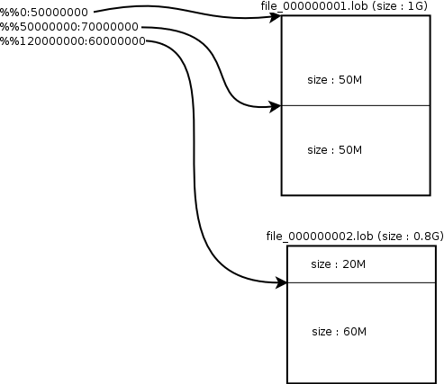

<!-- START doctoc generated TOC please keep comment here to allow auto update -->
<!-- DON'T EDIT THIS SECTION, INSTEAD RE-RUN doctoc TO UPDATE -->

- [iLoader User’s Manual](#iloader-users-manual)
  - [Preface](#preface)
    - [About This Manual](#about-this-manual)
  - [1. iLoader Overview](#1-iloader-overview)
    - [Introducing iLoader](#introducing-iloader)
  - [2. Using iLoader](#2-using-iloader)
    - [Command-Line Options](#command-line-options)
    - [General Options](#general-options)
    - [Performance Options](#performance-options)
    - [Using iLoader in Batch Mode](#using-iloader-in-batch-mode)
    - [Using iLoader in Interactive Mode](#using-iloader-in-interactive-mode)
    - [Online Help and Other Options](#online-help-and-other-options)
  - [3. FORM Files](#3-form-files)
    - [About FORM Files](#about-form-files)
  - [4. Troubleshooting and FAQs](#4-troubleshooting-and-faqs)
    - [Troubleshooting](#troubleshooting)
    - [FAQ](#faq)

<!-- END doctoc generated TOC please keep comment here to allow auto update -->

Altibase® Tools & Utilities

iLoader User’s Manual
=====================


Altibase Tools & Utilities iLoader User's Manual

Altibase Application Development Monitoring API Developer's Guide

Copyright ⓒ 2001\~2020 Altibase Corp. All Rights Reserved.

This manual contains proprietary information of Altibase Corporation; it is provided under a license agreement containing restrictions on use and disclosure and is also protected by copyright patent and other intellectual property law. Reverse engineering of the software is prohibited. All trademarks, registered or otherwise, are the property of their respective owners.

**Altibase Corp**

10F, Daerung PostTower II, 306, Digital-ro, Guro-gu, Seoul 08378, Korea Telephone: +82-2-2082-1000 Fax: 82-2-2082-1099

Customer Service Portal: http://support.altibase.com/en/

Homepage: [[http://www.altibase.com](http://www.altibase.com/)]


Preface
----

### About This Manual

This manual describes how to use the iLoader utility.

#### Audience

This manual has been prepared for the following users of Altibase:

-   Database administrators
-   Performance administrators
-   Database users
-   Application developers
-   Technical Supporters

It is recommended for those reading this manual possess the following background knowledge:

-   Basic knowledge in the use of computers, operating systems, and operating system utilities
-   Experience in using relational database and an understanding of database concepts
-   Computer programming experience
-   Experience in database server management, operating system management, or network administration
-   Knowledge related to the storage, management and processing of data in distributed environments

#### Organization

This manual is organized as follows:

-   Chapter 1: iLoader Overview  
    This chapter briefly describes the definition of the ILoader, its uses, features, benefits, and installation instructions.
-   Chapter 2: Using iLoader  
    This chapter describes how iLoader works in interactive mode, batch mode, and other help and options.
-   Chapter 3: FORM Files  
    This chapter describes creating A SEQUENCE, creating a DATE FORMAT, and conditional clauses for a FROM file structure. This chapter also describe the creation of TIMESTAMP column input function and others.
    
-   Chapter 4: Troubleshooting and FAQs  
    This chapter describes FAQs and errors that may occur when running iLoader.

#### Documentation Conventions

This section describes the conventions used in this manual. Understanding these conventions will make it easier to find information in this manual and in the other manuals in the series. 

There are two sets of conventions:

-   Syntax diagram convetions
-   Sample code conventions

##### Syntax Diagram Conventions

This manual describes command syntax using diagrams composed of the following elements:

| Elements                                                     | Meaning                                                      |
| ------------------------------------------------------------ | ------------------------------------------------------------ |
| [](https://github.com/ALTIBASE/Documents/blob/master/Manuals/Altibase_7.1/eng/media/SQL/image1.gif) | Indicates the start of a command. If a syntactic element starts with an arrow, it is not a complete command. |
| [](https://github.com/ALTIBASE/Documents/blob/master/Manuals/Altibase_7.1/eng/media/SQL/image2.gif) | Indicates that the command continues to the next line. If a syntactic element ends with this symbol, it is not a complete command. |
| [](https://github.com/ALTIBASE/Documents/blob/master/Manuals/Altibase_7.1/eng/media/SQL/image3.gif) | Indicates taht the command continues from the previous line. If a syntactic element starts witht his symbol, it is not a complete command. |
| [](https://github.com/ALTIBASE/Documents/blob/master/Manuals/Altibase_7.1/eng/media/SQL/image4.gif) | Indicates the end of a statement.                            |
| [](https://github.com/ALTIBASE/Documents/blob/master/Manuals/Altibase_7.1/eng/media/SQL/image5.gif) | Indicates a manatory element.                                |
| [](https://github.com/ALTIBASE/Documents/blob/master/Manuals/Altibase_7.1/eng/media/SQL/image6.gif) | Indicates an optional element.                               |
| [](https://github.com/ALTIBASE/Documents/blob/master/Manuals/Altibase_7.1/eng/media/SQL/image7.gif) | Indicates a mandatory element comprised of options. One, and only one, option must be specified. |
| [](https://github.com/ALTIBASE/Documents/blob/master/Manuals/Altibase_7.1/eng/media/SQL/image8.gif) | Indicates an optional element comprised of options.          |
| [](https://github.com/ALTIBASE/Documents/blob/master/Manuals/Altibase_7.1/eng/media/SQL/image9.gif) | Indicates an optional element in which multiple elements may be specified. A comman must precede all but the first element. |

##### Sample Code Conventions

The code examples explain SQL statements, stored procedures, iSQL statements, and other command line syntax.

The following table describes the printing conventions used in the code examples.

| Rules            | Meaning                                                      | Example                                                      |
| ---------------- | ------------------------------------------------------------ | ------------------------------------------------------------ |
| [ ]              | Indicates an optional item                                   | VARCHAR [(*size*)][[FIXED \|] VARIABLE]                      |
| { }              | Indicates a mandatory field for which one or more items must be selected. | { ENABLE \| DISABLE \| COMPILE }                             |
| \|               | A delimiter between optional or mandatory arguments.         | { ENABLE \| DISABLE \| COMPILE } [ ENABLE \| DISABLE \| COMPILE ] |
| . . .            | Indicates that the previous argument is repeated, or that sample code has been omitted. | SQL> SELECT ename FROM employee; ENAME ----------------------- SWNO HJNO HSCHOI . . . 20 rows selected. |
| Other Symbols    | Symbols other than those shown above are part of the actual code.Other Symbols | EXEC :p1 := 1; acc NUMBER(11,2);Symbols other than those shown above are part of the actual code. |
| Italics          | Statement elements in italics indicate variables and special values specified by the user. | SELECT * FROM *table_name*; CONNECT *userID*/*password*;     |
| Lower case words | Indicate program elements set by the user, such as table names, column names, file names, etc. | SELECT ename FROM employee;                                  |
| Upper case words | Keywords and all elements provided by the system appear in upper case. | DESC SYSTEM_.SYS_INDICES_;                                   |

#### Related Documentations 

For more detailed information, please refer to the following documents.

-   Installation Guide

-   Administrator’s Manual

-   Replication Manual

-   Precompiler User’s Manual

-   ODBC Reference

-   Application Program Interface User’s Manual

-   iSQL User’s Manual

-   Utilities Manual

-   Error Message Reference

#### Altibase Welcomes Your Comments and Feedbacks

Please let us know what you like or dislike about our manuals. To help us with better future versions of our manuals, please tell us if there is any corrections or classifications that you would find useful.

Include the following information:

- The name and version of the manual that you are using
- Any comments about the manual
- Your name, address, and phone number

If you need immediate assistance regarding any errors, omissions, and other technical issues, please contact Altibase's Support Portal (http://altibase.com/support-center/en/).

Thank you. We always welcome your feedbacks and suggestions.

## 1. iLoader Overview

### Introducing iLoader

#### What is iLoader?

iLoader is a utility provided by Altibase for downloading or uploading data in Altibase in units of tables. Downloaded data will be saved as a text file, and the FORM file containing the structure information of the table is necessary.

#### Usage

iLoader is mostly used for database migration or when backing up tables. However, because database schema and catalog information are not saved, care must be taken when using iLoader as a backup utility.

#### Functionality

-   FORM file Creation  
    For creating FORM files for storing information about tables to be downloaded or uploaded.

-   Downloading Data  
    FORM files are used to save the database table data in files.
    
-   Uploading Data  
    FORM files are used to save the database table data in files.

#### Advantages

The advantages of iLoader are as follows.

-   Data can be uploaded from one or more files. 
-   Multiple input records can be uploaded to a single table. 
-   Data can be uploaded to multiple tables at once. 
-   Data can be appended to tables that already contain data, or can replace the data therein. 
-   Data input and management can be made more systematic.

#### How to Install iLoader

iLoader is automatically installed when the Altibase package is installed. The executable file is located in:

```
$ALTIBASE_HOME/bin
```


#### iLoader Settings

In order to connect to the server, iLoader requires the following information:

-   ALTIBASE_HOME  
    A path to a server or client installation

-   server_name  
    The name (or IP address) of a computer on which Altibase Server is running

-   port_no  
    The port number to be used when connecting via TCP or IPC

-   user_id  
    A user ID registered in the database

-   password  
    The password corresponding to the User ID

-   NLS_USE  
    The character set with which to display retrieved data to the user

ALTIBASE_HOME can only be set using an environment variable, while the other settings may be made using command-line options. (For detailed information, please refer to “Batch Mode”.) 

The ALTIBASE_HOME environment variable is typically set automatically when the server is installed, but, in the case of the client, must be set manually by the user. We strongly suggest that you verify that this setting has been made properly, as the application may not run correctly if this setting is not made. 

port_no and NLS_USE can be set using the corresponding environment variables or the server settings file (altibase.properties). If these settings are made via all three methods, they will take priority as follows, in descending order:

1. command-line options

2. environment variables (ALTIBASE_PORT_NO, ALTIBASE_NLS_USE)

3. server settings file (altibase.properties)

Therefore, when it is desired to connect using options other than those that have been previously set, the command-line options can be used, thus making it unnecessary to change the settings in the server settings file or the environment variables. 

If these options have not been set, when iLoader is executed for the first time, the user will be prompted to enter the corresponding variables. At this time, it is essential to enter values that are valid and follow the proper format, otherwise iLoader may not run properly. 

However, if the NLS_USE option in particular has not been set, no command prompt will appear at the time of execution. Instead, US7ASCII will be used, and a connection attempt will be made. In such instances, if the server is not using US7ASCII, the application will not execute properly, or some of the users’ data could become corrupted. Thus it is paramount that NLS_USE be set to the value that matches the usage environment.

In order to ensure stable iSQL operation, we strongly recommend that the following environment variables be set:

-   ALTIBASE_HOME:  the path to a server or client installation

-   ALTIBASE_PORT_NO: the port number to use to connect to the server

-   ALTIBASE_NLS_USE: the character set to use to display retrieved data to the user

-   PATH: the path containing the executable file, which must equal $ALTIBASE_HOME/bin

#### Environment Variables

##### ALTIBASE_HOME

This is the directory in which installed packages are located.

ALTIBASE_HOME is the environment variable which must be configured in order to used iLoader. Although it is automatically configured when the server is installed in general, but the user should directly configure since there might be a chance of conflict with the environment variables in the server.

##### ALTIBASE_PORT_NO

This indicates the port number on the server with which a connection is to be established. This can be set using the -PORT option or altibase.properties. 

If no designated port number can be found (in descending order of precedence) in the - PORT option, in the environment variable ALTIBASE_PORT_NO, or in altibase.properties, a prompt to enter the port number will appear.

##### ALTIBASE_SSL_PORT_NO

The port number of the server iLoader is to connect to on SSL/TLS. 

The -PORT option, environment variables, ALTIBASE_SSL_PORT_NO, the properties in the altibase.properties file take priority in this order as the port number in SSL. On omission, the command prompt asks the user to enter the port number. 

##### ALTIBASE_NLS_USE

This sets the character set that is used when data are downloaded or uploaded.

-   When downloading: data received from the server are saved in the specified character set. 
-   When uploading: sets the character set for data to be transmitted to the server 

Note: when uploading data, if the character set of the database is different from the value specified using the ALTIBASE_NLS_USE environment variable, the data may not be uploaded normally. Please be sure to set the correct value for this variable.

The client character set can also be set using the NLS_USE option in Form files, - NLS_USE option, variable NLS_USE or in altibase.properties. 

If NLS_USE is not specified using the DATA_NLS_USE, -NLS_USE option, the environment variable ALTIBASE_NLS_USE, or altibase.properties (in descending order of precedence), then US7ASCII is used as the default character set.


## 2. Using iLoader

This chapter explains how to use iLoader. 

The various options provided by Altibase can be used with iLoader. iLoader can run in batch mode or in interactive mode. Command-line options are used when running iLoader in batch mode.

### Command-Line Options

The command-line options supported by Altibase include general options and options for improving performance.

-   General Options

-   Peformance Options

The general options and performance options are all listed below. They are explained in the next section.

```
iloader [-h]
    [-s server_name] [-u user_name] [-p password]
    [-port port_no] [-silent] [-nst] [-displayquery]
    [-NLS_USE nls_name]
    [-prefer_ipv6]
    [-ssl_ca CA_file_path | -ssl_capath CA_dir_path]
    [-ssl_cert certificate_file_path]
    [-ssl_key key_file_path]
    [-ssl_verify]
    [-ssl_cipher cipher_list]
    [{ in | out | formout | structout | help }
        [-d datafile or datafiles] [-f formatfile]
        [-T table_name] [-F firstrow] [-L lastrow]
        [-t field_term] [-r row_term] [-mode mode_type]
        [-commit commit_unit] [-bad badfile]
        [-log logfile] [-e enclosing] [-array count]
        [-replication {true | false}] [-split number]
        [-readsize size] [-errors count]
        [-lob lob_option_string] [-atomic]
        [-parallel count] [-direct]
        [-rule csv]
        [-partition]
        [-dry-run]
        [-prefetch_rows]
        [-async_prefetch off|on|auto]]
```


#### Note

Double quotation marks should be used if the user name contains special characters or spaces.

```
$ iloader -U \"user name\"
```


### General Options

iLoader is run with the following options. Where applicable, default values are shown.

| Factor                                    | Description                                                  |
| ----------------------------------------- | ------------------------------------------------------------ |
| \-S\|-s *servername*                      | The host name of the server. This option specifies the name(or IP address) of the computer on which the Altibase server is running. If connection is attempted while the ISQL CONNECTION environment variable is set to IPC or UNIX, and the remote server is specified for this option, iSQL ignores the ISQL CONNECTION specification and connects to the remote server via TCP, and outputs a warning message that the ISQL CONNECTION specification has been ignored. <br />It can be a host name, an IPv4 address, or an IPv6 address. An IPv6 address must be enclosed by a left square bracket([) and a right square bracket(]).<br />For example, in the case of localhost (meaning this computer), localhost can be specified as the host name, 127.0.0.1 as the IPv4 address, or [::1] as the IPv6 address. For more information about the IPv6 address notation, please refer to the Altibase Administrator's Manual. |
| \-U\|-u *login_id*                        | The user ID                                                  |
| \-P\|-p *password*                        | The user password                                            |
| \-PORT *port_no*                          | Specifies the port number for connecting via TCP/IP or IPC. However, when connecting in a Unix environment via IPC, this option must not be specified. <br />On specification, a warning message is output. After a warning message is output, connection to the server is made. To connect via TCP, first set 'ISQL_CONNECTION=TCP' on the client and then enter the PORT_NO. <br />If the environment variable ISQL_CONNECTION is not set to IPC and the -PORT option is omitted, the port number will be checked for first in the environment variable ALTIBASE_PORT_NO and then in the PORT_NO property in altibase.properties, and if it is not set in either of those places, a prompt to enter it will be raised. |
| \-NLS_USE *charset*                       | This is the character set displayed to the user when selecting data. Specifies the encoding on the terminal from which iSQL is run.<br />   US7ASCII <br />   KO16KSC5601 <br />   MS949 <br />   BIG5 <br />   GB231280 <br />   MS936 <br />   UTF8 <br />   SHIFTJIS <br />   MS932 <br />   EUCJP <br />On omission, the environment variables, ALTIBASE_NLS_USE and altibase.properties are referenced in turn. If no value is set, the default character set US7ASCII is used. |
| \-prefer_ipv6                             | This option determines the IP address to be connected first when a host name is given for the -s option. If this option is specified and a host name is given for the -s option, this means that resolving the host name to the IPv6 address is prefered. If this option is omitted, iloader connects to the IPv4 address by default. <br />If it fails to connect to the prefered IP version address, an attempt is made to connect using the other IP version address. For example, when localhost is given for the -s option and this option is specified, iloder first tries to connect to the [::1] IPv6 address. If this attempt fails, iloder proceeds to connect to the 127.0.0.1 IPv4 address. |
| \-ssl_ca *CA_file_path*                   | Specifies the location of the certification authority (CA) certificate in which the public key of the Altibase server to be connected to is incorporated. |
| \-ssl_capath *CA_dir_path*                | Specifies the directory under which the certification authority (CA) certificate in which the public key of the Altibase server to be connected is incorporated. |
| \-ssl_cert *certificate_file_path*        | Specifies the location of the client authentication file.    |
| \-ssl_key *key_file_path*                 | Specifies the location of the client private key file.       |
| \-ssl_verify                              | Verifies the certificate the client receives from the server. |
| \-ssl_cipher *cipher_list*                | Specifies a cipher list for SSL encryption. Please refer to the SSL_CIPHER_LIST property in the *General Reference.* |
| in \| out \| formout \| structout \| help | Sets the direction in which to copy data (it is essential that only one is set)<br/> • in: Copy from a file to a database table. <br/>• out: Copy from a database table to a file. <br/>• formout: Make a table format file (FORM file). <br/>• structout: Performs a function similar to that of formout. Used to create a structure matching that of a given table. (Used when creating a client application.) <br/>• help: Explain how to use help. |
| \-T *table_name*                          | The name of the table to be copied. If you use double quotation marks to enclose this, this is case-sensitive when you execute iLoader in interactive mode. Since the table name is already written in the FORM file, this option is ignored when uploading or downloading data. |
| \-d *datafile(datafiles)*                 | The full path of the data file used when copying data from the database to the file or from the file to the database. Not used with formout. A maximum of 32 filenames can be entered. A consecutive series of files can be specified and used only when uploading data. When multiple files are specified using the -d option, they are uploaded in the order that the filenames are entered. Moreover, when this option is used together with the parallel option during a download operation, at least as many files as the number specified in the parallel option are created. |
| \-rule csv                                | This specifies the format of the data file as csv. This option cannot be used in conjunction with the -t or -e options. Otherwise, an error will be raised. If none of the -t, -r, -e or -rule csv options are set, csv is used by default. |
| \-f *formatfile*                          | The full path of formatfile, created by a previous call to iLoader. |
| \-F *firstrow*                            | The line number of the first row to be copied (default is 1). This option is meaningful only when uploading data. |
| \-L *lastrow*                             | The line number of the last row to be copied (default is the line number of the last row). This option is meaningful only when uploading data. |
| \-t *field_term*                          | The delimiter between fields. The default is ’^’. %t signifies a tab character, %n signifies a newline character and %r signifies a carriage return. The -t, -r and -e options must be different from each other. e.g.) -t ^%t It is inadvisable to use characters that are interpreted on the command line, such as: ' " / & <br/>as delimiters. When using delimiters (for example “#”) at the iLoader prompt, they can be entered as -t # or “#”. At a general command prompt, they can be entered as -t #, ‘#’ or “#”. |
| \-r *row_term*                            | row terminator (default is '\n '.) The details are the same as for the -t option. |
| \-e *enclosing*                           | Block delimiter for enclosing fields. The details are the same as for the -t option. |
| \-lob *lob_option_string*                 | Because the maximum allowable size of LOB data is 4GB, problems may arise when LOB data larger than 2GB are saved on 32-bit operating systems. Therefore, this option can be used to specify how to handle LOB type data. If this option is not specified, LOB columns will be handled just like other columns. |
| \-replication true/false                  | Option to turn off replication and load data. (If omitted, true applies.) |
| \-mode *mode_type*                        | APPEND: This adds data to existing tables. (default) <br/>REPLACE: This uses the DELETE statement to delete all data from the existing table and then populate the table with the new records. <br/>TRUNCATE: Similar to REPLACE, this deletes all data from the existing table and then populates the table with the new records, however it uses the TRUNCATE statement to do so |
| \-bad *badfile*                           | If one or more errors occur during an upload operation, this option saves rows that were not uploaded in badfile. Not saved if not specified. If stdout or sterr (must be in lowercase) is specified for this option, no file is created. Instead, the rows are output to stdout (standard out) or stderr (standard error). |
| \-log *logfile*                           | Maintains a record of iLoader execution while iLoader is running. The start time, end time, number of target rows, number of processed rows, number of erroneous rows, and error details are recorded here. It will not be saved unless specified. If stdout or sterr (must be in lowercase) is specified for this option, no file is created. Instead, the log information is output to stdout (standard out) or stderr (standard error). |
| \-split *n*                               | Specifies the number of records to copy to each file (only meaningful when used with the -out option). After the command is executed, multiple backup files, each storing a number of records equal to n and having the names datefile.dat0, datafile.dat1, etc... will have been created. |
| \-errors *count*                          | This specifies the maximum number of allowable errors when iLoader is executed with the -in option. If the number of errors exceeds the number specified here, execution terminates. If this option is omitted, the default is 50. If this value is set to 0, execution continues regardless of the number of errors. The number of errors occurring during the uploading operation may exceed the number specified here. When this option is used in conjunction with the -parallel option, if the number of errors exceeds the specified value for one of multiple threads executing in parallel, all threads are terminated. |
| \-partition                               | If the table specified using the -T option is a partitioned table, a number of FORM files equal to the number of partitions in the table will be generated. The name of each FORM file will have this structure: [formfile_name.partition_name]. If the specified table is not a partitioned table, one FORM file, named formfile_name, will be generated. |

-   If the -S, -U and -P command-line options are omitted, the user will be prompted to enter the values of these options manually at the time of execution.

```
iSQL> CREATE TABLE test (i1 INTEGER);
Create success.

$ iloader formout -T test -f test.fmt
-------------------------------------------------------
     Altibase Data Load/Download utility.
     Release Version 7.1.0.1
     Copyright 2000, Altibase Corporation or its subsidiaries.
     All Rights Reserved.
-------------------------------------------------------
Write Server Name (default:localhost) : 
Write UserID : sys
Write Password : 
ISQL_CONNECTION : TCP
```


-   If “iloader” is entered without any options at a shell prompt, the iLoader> prompt appears, and work can be conducted in interactive mode. 
-   All of the options described above are case-sensitive except for -S, -U, and -P. 
-   The -in | -out | -formout option must be entered before any of the other command options. 
-   For more detailed information about SSL connection, please refer to Chapter 2. Connecting and Disconnecting in the *iSQL User’s Manual.* 

##### Limitations of Options

Field delimiters, row delimiters and block delimiters cannot be subsets of each other. In other words, the field delimiter must not contain the row delimiter, and the row delimiter must not contain the field delimiter. Moreover, column values cannot contain these delimiters.  
For example, if the field delimiter is ‘-’ and the row delimiter is ‘-#’, a row having 3 columns would be displayed as follows:

```
Honggildong-027551234-Seoul-#
```

In this case, the third ‘-‘ would be recognized as another field delimiter, so the row would be handled as though it had 4 columns and no row delimiter. 

In the case below, although the field delimiter, which is ’-‘, is not a subset of the row delimiter, which is ’##’, the second and third dashes (‘-‘), which are part of the data in the second column, are erroneously recognized as field delimiters.

```
Honggildong-02-755-1234-Seoul##
```

Therefore, the delimiters must be selected carefully because of the possibility that they will be incorrectly handled.

##### Note

Double quotation marks should be used if the table name contains special characters or spaces.

```
iloader> -T "table name"
$ -T \"table name\"
```

Use double quotation marks if the file name contains special characters or spaces.

```
iloader> -f "fmt file.fmt" -d "dat file.dat"
$ -f \"fmt file.fmt\" -d \"dat file.dat\"
```


#### LOB Option

The user can specify how LOB columns are handled by entering lob_option_string after the - lob option. To specify multiple keywords (see below), use the -lob option repeatedly on the same line, each -lob option being followed by its own lob_option_string, enclosed in double quotation marks.

The keywords for lob_option_string are as follows:

**use_lob_file, lob_file_size, use_separate_files, lob_indicator**

##### use_lob_file

```
use_lob_file = {yes|no}
```

Determines whether LOB data expressions refer to external files (LOB files). 

Either value can be used when iLoader is copying data in either direction (“in” or “out”). 

For information on LOB file naming conventions, please refer to the description of the lob_file_size option.

##### lob_file_size

```
lob_file_size = file_size
```

Specifies the maximum size of a LOB file. If the use_lob_file option is set to yes and this option is not specified, the size of the external file is only limited by the operating system’s file size limit. When the file size is limited by the operating system or the platform, it is recommended that this option be set to 2 GB or less on platforms on which the long data type is 4 bytes. 

This option is applicable only when the iLoader data copy direction is “out”. iLoader ignores this option when the data copy direction is “in”. When the data copy direction is “in”, the size of the first LOB data file is taken as lob_file_size.

If this option is set without the use_lob_file option being specified, it is inferred that use_lob_file = yes.

If the size of LOB data to be dumped exceeds the size specified in this option, a new file is created, and the data dump continues. 

The file size is represented in 'number + unit’ format. The number can be represented to one decimal place. The number cannot be 0. 

The units that can be used for the file size are “T” and “G”. “T” indicates terabytes and “G” indicates gigabytes. If no units are specified, gigabytes are used by default. 

The name of each LOB file is determined by removing the filename extension from the original data file name and appending _serialNumber.lob thereto. The serial number has 9 digits. If the number of digits in the serial number is less than 9, the leftmost positions of the serial number are filled with 0’s (zeroes). The serial numbers start at 1. If a data file is split into several files using the -split option, a data file number is appended to each LOB file name. 

For example, if the option -d dump.dat -lob "lob_file_size-uG". is specified, the following LOB files are created:

Total amount of LOB data: T GB

Size of each resulting file: u GB

```
dump_000000001.lob (u Gbytes)
dump_000000002.lob (u Gbytes)
...
dump_n.lob (T - un GBytes)
       where n = int(T / u), preceded by 0
```

##### Use_separate_files

```
use_separate_files = {yes | no}
```

When processing LOB files, this option determines whether to save each LOB data item (i.e. contents of one cell) in a separate file. This option assumes that use_lob_file is set to yes. 

If this option is set to yes and lob_file_size is also specified, an error occurs. 

When this option is set, folders having the same names as tables and columns are created and LOB data from these columns are saved in data files in numeric order according to row. The row numbers start from 1 and have 9 digits. If the number of digits in the row number is less than 9, the leftmost positions of the row number are filled with 0’s (zeroes).

For example, if columns C1 and C3 of table t1, which has 3 columns, are LOB type columns, and -d d.dat -lob "use_separate_files=yes" is specified, the following LOB files are created.

-   t1/C1/000000001.lob

-   t1/C1/000000002.lob

-   t1/C3/000000002.lob

-   t1/C3/000000002.lob

When this option is set, the path of the LOB file is written in the corresponding data cell in the LOB column in the data file. However, if the LOB data are NULL, the address of the LOB file isn't written, and no LOB file is created.

###### Note

When downloading data using -lob “use_separate_files=yes”, the directory, in which LOB files is located, which is written in a data file is represented relative to the path given with -d option. But, if you change the relative path to the absolute path manually in the data file and upload it, the file path set specified by -d option will be ignored.

In other words, if an absolute path is represented for the directory in which LOB files is located, iLoader utility uses the absolute path. On the contrary, if a relative path is represented for the directory, iLoader utility uses the path made by attaching the relative path in the data file to the path given with -d option.

##### lob_indicator

```
lob_indicator = char_sequence
```

This option specifies a block delimiter that denotes a pointer for indicating the offset and size of a LOB file. 

It can be used regardless of whether the data copy direction in iLoader is in or out. 

The default value is %%. Up to 10 characters can be used. 

However, %t, %n and %r are each regarded as one character. %t indicates a tab, %n indicates a newline character and %r indicates a carriage return.

This option cannot have the same value specified for the -t, -r or -e options.

It is recommended that characters that are interpreted on the command line, such as: ' " \ & not be used as delimiters

It is assumed that use_lob_file = yes if it is not specified.

When the data copy direction in iLoader is in and use_lob_file = yes, if a LOB column in a data file does not start with the character sequence specified by lob_indicator, the data row containing that LOB column is treated as an erroneous row.

##### Examples

To dump LOB data to external files, such as t1_000000001.lob, t1_000000002.lob, etc. which are 1.5 GB in size:

```
$ iloader out ... -f t1.fmt -d t1.dat -lob " lob_file_size=1.5G "
```

To dump LOB data to a single file named t1.lob:

```
$ iloader out ... -f t1.fmt -d t1.dat -lob "use_lob_file=yes"
$ iloader out ... -f t1.fmt -d t1.dat -lob "use_lob_file=yes" -lob "lob_file_size=1G"
$ iloader out ... -f t1.fmt -d t1.dat -lob "lob_indicator=%$LOB$%”
```


##### Data File Format

When downloading a column containing LOB data, an offset:size combination which points to the location of LOB data in an external file is written to the data file. 

If the offset:size combination, which points to LOB data, is not expressly specified, then iLoader looks in the data file for the pointer to the position of the LOB data in the LOB file after a %% delimiter.

```
Example)
$ cat t1.fmt
table t1
{
I1 integer;
I2 blob;
I3 char (10);
}
DATA_NLS_USE=US7ASCII
$ iloader out ... -f t1.fmt -d t1.dat -lob “lob_file_size=3G”
$ ls
t1_000000001.lob t1_000000002.lob t1.dat t1.fmt
$ cat t1.dat
1,“%%0:2000000000”, “Terminator3”
2,“%%2000000000:1800000000”, “SixSense”
```

The actual LOB data are downloaded to a LOB file, regardless of whether LOB offset and size information is provided between field delimiters (or between a pair of block delimiters, if using block delimiters).



When null LOB data are downloaded to a data file, there will be no data between the field separators (or between the pair of block delimiters, if appropriate) at the position of the corresponding LOB data within the data file. LOB data of size 0 are also stored in the same way. (Altibase internally handles LOB data of size 0 as NULL.) 

If the use_separate_files option is specified, the data files are organized as follows:

```
t1/I1/000000001.lob,t1/I2/000000001.lob,t1/I3/000000001.lob
t1/I1/000000002.lob,t1/I2/000000002.lob,t1/I3/000000002.lob
t1/I1/000000003.lob,t1/I2/000000003.lob,t1/I3/000000003.lob
,,,
```

In the above example, all of the columns contain LOB data. 

If the LOB data to be stored in a LOB file are NULL, no characters are stored at the corresponding LOB data position in the data file, as can be seen in the fourth row above.

### Performance Options

#### IN

The following options can realize considerable performance gains when running iLoader.

| Factor                                     | Description                                                  |
| ------------------------------------------ | ------------------------------------------------------------ |
| \-array *array_size*                       | To increase the speed of a data uploading (“in”) operation, data read from a file are first organized into an array before being sent to the server.  <br />Performance is increased because the number of times that communication with the server must be established is decreased. However, if this value is set excessively high, it can have the opposite effect. If a LOB column exists, -array is ignored. |
| \-commit *commit_unit*                     | When uploading data, this option determines how many records are committed at one time after being inserted. By default, 1000 records are committed after being inserted.<br />If commit_unit is set to 0, the application runs in NONAUTOCOMMIT mode, in which the commit operation takes place only after all data have been inserted. <br />If commit_unit is set to 1, the application runs in AUTOCOMMIT mode, in which a commit operation takes place for every record at the time that it is inserted. <br/>When this option is used together with the array option, the commit operation takes place after a number of records equal to array_size * commit_unit have been inserted. |
| \-atomic                                   | This option is set to use the Atomic Array INSERT option. Atomic Array INSERT realizes better performance than Array Insert because Atomic Array INSERT handles a number of Insert statements (up to the size of the array) as a single transaction. This option must be used together with the -array option. Additionally, tables that contain LOB type columns cannot be handled using this option. Furthermore, this option is useful only when uploading data. |
| \-direct [log\|nolog] (Direct-Path INSERT) | This option is for use with the Direct-Path INSERT when uploading data to a disk table.<br/>If neither log nor nolog is specified, log is the default. If using nolog mode, it is essential to back up the table in question. If execution fails in nolog mode, recovery to a normal state will be impossible. <br/>If loading tables for which there are restrictions (Restrictions for Direct-Path INSERT), execution will automatically switch to the atomic option. <br/>If the -array option has not been set, the size of the array will automatically be set to the maximum possible size (=USHRT_MAX-1, or 65535). <br/>If the -commit option is omitted, its value will be set to 1. |
| \-parallel *count*                         | This specifies the number of threads that can operate at the same time. A number of threads can be created and executed in parallel up to the specified value, the maximum of which is 32. When downloading, a number of files equal to the specified value is created, and the data are saved therein. <br/>When downloading with only the -parallel option set, the performance of repeated bind and fetch operations may be reduced. Therefore, when downloading data, the -parallel and -array options should be used together. <br/>If a LOB column is present, this option is ignored. When uploading with the -parallel option, iloader creates *count + 1* connections, and when downloading with this option, iloader always creates two connections. Therefore, when uploading or downloading with this option via IPC, the value in the IPC_CHANNEL_COUNT property in altibase.properties must be equal to or greater than the number of these connections. <br /> Default value: 1, Max value: 32 |
| \-readsize *n*                       | This is used as an option for the IN mode. This option specifies the amount of data that are read from a file at one time. The size must be greater than 0. The default is 1048576 bytes. |

##### LOB column constraints

If there is a LOB colum in the table to be uploaded, the value speicifed by the user is ignored for the following options and internally set as shown in the table below.

| Option      | Setting Value |
| --------- | ------ |
| -array    | 1      |
| -atomic   | Ignored |
| -commit   | 1      |
| -direct   | Ignored |
| -parallel | 1      |

#### Atomic Array INSERT

The -atomic option is used to execute Atomic Array INSERT, which is useful only when uploading data. Atomic Array INSERT can realize faster performance than Array INSERT because Atomic Array INSERT handles a number of Insert statements (up to the size of the array) as a single transaction. 

When uploading records using Atomic Array INSERT, if one of the records is not successfully uploaded, the records will instead be uploaded using Array INSERT. In other words, the result of Atomic Array INSERT is the same as Array INSERT. Moreover, Atomic Array INSERT provides much better performance than Array INSERT. For this reason, the use of Atomic Array INSERT is recommended.

##### The Difference between Atomic Array INSERT and Array INSERT

Comparing Atomic Array INSERT and Array INSERT is as follows.

Array INSERT executes individual statements separately, whereas Atomic Array INSERT can combine several statements and handle them as though they were a single statement. 

While Array INSERT’s original advantage is low communication overhead, Atomic Array INSERT realizes even faster performance because it reduces the number of statements. 

Array INSERT and Atomic Array INSERT are compared in the following table.

| Characteristic                                | Array INSERT             | Atomic Array INSERT      |
| --------------------------------------------- | ------------------------ | ------------------------ |
| Number of Statements                          | Number of Array Elements | One                      |
| Number of Results                             | Number of Array Elements | One                      |
| Number of Results <br/>(when an error occurs) | Number of Array Elements | Number of Array Elements |
| Transmission Speed                            | Fast                     | Very Fast                |

[Table 2-1] Differences between Array INSERT and Atomic Array INSERT

##### Atomic Array INSERT Limitations

The following limitations govern the use of Atomic Array INSERT:

|                        | Array Insert                      | Atomic Array Insert                                   |
| ---------------------- | --------------------------------- | ----------------------------------------------------- |
| Foreign Key            | Operates Normally                 | Operates Normally                                     |
| Unique Key             | Operates Normally                 | Operates Normally                                     |
| Not null               | Operates Normally                 | Operates Normally                                     |
| Check                  | Operates Normally                 | Operates Normally                                     |
| Trigger Each Row       | Executed N times                  | Executed N times                                      |
| Trigger Each Statement | Executed N times                  | Executing Once                                        |
| Partitioned Table      | Operates Normally                 | Operates Normally                                     |
| Sequence               | Executed N times                  | Executed N times                                      |
| SYSDATE                | Executed N times                  | Executing Once                                        |
| LOB Column             | Operates Normally                 | Atomic attribute is not guaranteed when errors occur. |
| Procedure              | Operates Normally                 | Operates Normally                                     |
| SubQuery               | A new view is observed every time | The first executed view is observed                   |

[Table 2-2] Atomic Array INSERT Limitations 

##### Atomic Array INSERT: Warning

The -atomic option must be used with [-array array_size], and must not be used on tables that include LOB columns. Furthermore, this option is only useful when uploading data.

#### Direct-Path INSERT

The so-called Direct-Path INSERT has been provided to support the uploading of data into a disk table. Direct-Path INSERT is a method of writing data directly into a data file using a Direct-Path INSERT buffer and a flush manager, bypassing the buffer manager. Moreover, free space in the existing extents is not used. Instead, new extents are allocated for a Direct-Path INSERT operation. Consequently, performance is improved, but additional space is required. 

You can query the V$DIRECT_PATH_INSERT performance view to manage statistics for Direct-Path INSERT. 

##### Restrictions for Direct-Path INSERT

The following restrictions apply when uploading data using the Direct-Path INSERT. If the data to be uploaded do not satisfy all of these restrictions, data can be uploaded automatically using Atomic Array INSERT (-atomic option) instead of Direct-Path INSERT (- direct option).

-   the table can't have an index (or a Primary Key). 
-   the table can't be associated with a trigger.
-   the table can't have a LOB column. 
-   the table cannot have CHECK constraints.
-   the table cannot have referential integrity constraints. 
-   replication cannot be performed on the table. 
-   the table must exist in disk tablespace.

##### Warnings

When processing data using the Direct-Path INSERT, please abide by the following:

-   If data upload fails while Direct-Path INSERT operation is being executed in nologging mode (“-direct nolog”), it will be impossible to restore the database normally. Therefore, it is critical to back up the relevant table(s) before using nologging mode.
-   The Direct-Path INSERT realizes excellent performance when uploading large amounts of data. However, when not handling large amounts of data, the improvement in performance will not be notable. 
-   Data can be loaded using the Direct-Path INSERT only if the table exists in disk tablespace. Therefore, when using this method to load data into memory tablespaces, the result will be the same as if the -atomic option were used.

##### Examples

To execute direct-path uploading in logging mode with the maximum array size:

```
il in t1.form -d t1.dat -direct [log]
```

To execute direct-path uploading in nologging mode with the maximum array size:

```
il in t1.form -d t1.dat -direct nolog
```

To execute direct-path uploading in logging mode with a specified array size:

```
il in t1.form -d t1.dat -array 1000 -direct
```


### Using iLoader in Batch Mode

iLoader can run in interactive mode or in batch mode. When running iLoader in batch mode, command-line options are used.

#### Creating FORM Files

FORM files provide iLoader with information on the attributes of target tables when data are uploaded or downloaded. This information covers all aspects of table schema except constraints. In order to use iLoader to load data, FORM files containing information about the target tables(s) must first be created. 

The syntax for creating FORM files is shown below.

```
iloader  formout  -S servername  -U user_id  -P password  -T table_name -f form_file
```

In the following example, table T1 and a corresponding FORM file are created.

```
iSQL> CREATE TABLE t1 (
name VARCHAR(30),
age INTEGER,
gender CHAR(1),
etc NVARCHAR(30));
Create success.
iSQL> INSERT INTO t1 VALUES ( 'John Doe', 20, 'M', N'Group A');
1 row inserted.
iSQL> INSERT INTO t1 VALUES ('Pham Tan Sang', 30, 'M', N'Group C');
1 row inserted.
iSQL> INSERT INTO t1 VALUES ('Alisee Dupoint', 24, 'F', N'Group D');
1 row inserted.
iSQL> SELECT * FROM t1;
NAME AGE GENDER ETC
---------------------------------------------------
John Doe 20 M Group A
Pham Tan Sang 30 M Group C
Alisee Dupoint 24 F Group D
3 rows selected.
iSQL> EXIT
$ iloader formout -s 127.0.0.1 -u sys -p manager -T T1 -f T1.fmt
-------------------------------------------------------
 Altibase Data Load/Download utility.
 Release Version 7.1
 Copyright 2000, AltibaseCorporation or its subsidiaries.
 All Rights Reserved.
-------------------------------------------------------
ISQL_CONNECTION : TCP
$ cat T1.fmt
table T1
{
"NAME" varchar (30);
"AGE" integer;
"GENDER" char (1);
"ETC" nvarchar (100);
}
DATA_NLS_USE=US7ASCII
NCHAR_UTF16=YES
```

DATA_NLS_USE can be used to show how downloaded data will be encoded. Normally, when a FORM file is created, the client character set is used. 

If the table to be downloaded contains a national character type column, NCHAR_UTF16 will be used. The encoding method that is used when data are saved is UTF-16BE (Big Endian) when NCHAR_UTF16 is set to YES. If set to NO, data will be encoded as CHAR type, and could be lost. The default value is YES.

#### Downloading Data

Records in the database table that satisfy the conditions specified in the FORM file are saved in text file form. 

Downloaded data will be saved according to the character set specified using the ALTIBASE_NLS_USE environment variable. 

If the database character set is different from that specified in ALTIBASE_NLS_USE, the data will be converted. When downloading data, Altibase displays the table name every 5,000 records, and also displays the total number of records after all records have been downloaded. 

The following syntax is used to download data.

```
iloader  out  -S servername -U user_id   -P password          -f  form_file  -d backup_files  -split n   -array count      -parallel count 
```

In the following example, the T1.fmt file is used to download data to the T1.dat file.

```
$ iloader out -s 127.0.0.1 -u sys -p manager -f T1.fmt -d T1.dat
-------------------------------------------------------
     Altibase Data Load/Download utility.
     Release Version 7.1.0.1
     Copyright 2000, Altibase Corporation or its subsidiaries.
     All Rights Reserved.
-------------------------------------------------------
ISQL_CONNECTION : TCP
DATA_NLS_USE: US7ASCII
NCHAR_UTF16 : YES

     Total 3 record download(T1)

     DOWNLOAD : 11.2320 msec
$ cat T1.dat
"John Doe",20,"M","Group A"
"Pham Tan Sang",30,"M","Group C"
"Alisee Dupoint",24,"F","Group D"
```


####  Uploading Data

iLoader can be used to upload backup files or files containing edited data to the database.

The data character set must be specified using ALTIBASE_NLS_USE when uploading data. iLoader converts data saved in the character set specified in ALTIBASE_NLS_USE to the database character set and then saves the data. If the database character set and the character set specified using ALTIBASE_NLS_USE are different, the data are converted. If the character set specified in ALTIBASE_NLS_USE is different from the character set in which the data were actually saved, the data will not be uploaded properly. 

When uploading data, the -atomic option can be used to perform Atomic Array Insert to realize improved performance. The -atomic option must be used with the -array option, and it is additionally recommended that the -commit option also be used. 

When uploading data, iLoader displays the table name every 5,000 records, and also displays the total number of records after all records have been uploaded. 

The following syntax is used to upload data.

```
iloader  in  -S servername -U user_id -P password
-f form_file      -d backup_files 
-mode mode_type  -F firstrow  
-commit commit_unit  -L lastrow   
-array count     -atomic   -parallel count
```

In the following example, the T1.fmt file and the T1.dat file are used to upload data.

```
$ iloader in -s 127.0.0.1 -u sys -p manager -f T1.fmt -d T1.dat -F 1 -L 2
-------------------------------------------------------
     Altibase Data Load/Download utility.
     Release Version 7.1.0.1
     Copyright 2000, Altibase Corporation or its subsidiaries.
     All Rights Reserved.
-------------------------------------------------------
ISQL_CONNECTION : TCP
DATA_NLS_USE: US7ASCII
NCHAR_UTF16 : YES

     UPLOAD : 24.4040 msec

     Load Count  : 2(T1)
$ isql -s 127.0.0.1 -u sys -p manager -silent
iSQL> select * from t1;
select * from t1;
iSQL> SELECT * FROM t1;
NAME AGE GENDER ETC
-------------------------------------------------------
John Doe 20 M Group A
Pham Tan Sang 30 M Group C
Alisee Dupoint 24 F Group D
Yuvraj Kohli 20 M Group A
Hok Chan 30 M Group C
5 rows selected.
```


-   The table information in the previously created T1.fmt file is referenced to upload the data in the T1.dat file to table T1 of the current database.
  
-   Since the default value of the -mode option is APPEND, data are appended to the T1 table. (The REPLACE option uploads data after first deleting all of the data in table T1 of the current database.)
  
-   The 1st and 2nd records are uploaded from the T1.dat file. If 100 and 1000 are specified for the first row and the last row respectively, data in the file from the 100th record to the 1000th record are uploaded.

```
$ iloader in -s 127.0.0.1 -u sys -p manager -f T1.fmt -d T1.dat -array 1000 -commit 1 -atomic
```


-   The table information in the T1.fmt file is referenced to upload 1000 records at a time from the T1.data file to table T1 of the current database using Atomic Array Insert.

#### Execution Result Code

Altibase displays one of the following execution result codes after using iLoader to download or upload data.

-   0: Success

-   \-1: General Error

-   \-2: One or more upload errors have occured.

0 or -1 is displayed to indicate success or failure, respectively, of a data upload or download operation. -2 is displayed to indicate that the overall upload operation succeeded but that one or more errors occurred.

####  Using iLoader for Remote Database Access

You can use iLoader to access a remote server. To execute iLoader, the Altibase server must have been started. The options are as follows, and are case-insensitive.

##### Command line options for running iLoader remotely

```
iloader [-H] [-S server_name] [-U user_id] [-P password]
[-PORT port_no] [-SILENT] [-NST] [-DISPLAYQUERY]
```


-   -H: provides help on how to execute iLoader. 
-   -S server_name: specifies the name (or IP address) of the computer on which the Altibase server is running.
-   -U user_name: specifies the user ID with which to access the database. 
-   -P password: specifies the password corresponding to the user ID. 
-   -PORT port_no: specifies the port number for communication with the remote server. 
-   -SILENT: specifies execution in silent mode. In silent mode, nonessential information, such as the copyright notice etc., is not displayed. 
-   -NST: specifies execution in nst mode. In nst mode, elapsed times are not displayed. 
-   -DISPLAYQUERY: The user can check hints and conditional clauses specified in a FORM file when executing statements. They are displayed in query format. 
-   -NLS_USE: specifies the character set to be used when downloading or uploading data. If omitted, the client’s environment variable ALTIBASE_NLS_USE and altibase.properties are referred to in sequence, and if still not set, the basic character set (US7ASCII) is used.

The options -S server_name, -U user_name, -P password, and -PORT port_no must be directly input at a command prompt when connecting to the remote server.

##### Example

-   Remote Server IP: 192.168.1.71, PORT_NO: 20594

-   Communication protocol: TCP/IP (ISQL_CONNECTION=TCP/IP)

###### Remote Server Data

Executing on remote server

```
iSQL> CREATE TABLE department (
dno            SMALLINT     PRIMARY KEY,
dname          CHAR(30)     NOT NULL,
dep_location   CHAR(9),
mgr_no         INTEGER );
Create success.
iSQL> INSERT INTO department VALUES (1001, 'technical', 'Mapo', 1);
1 row inserted.
iSQL> INSERT INTO department VALUES (1002, 'engine devt', 'Yeouido', 10);
1 row inserted.
iSQL> INSERT INTO department VALUES (1003, 'marketing', 'Gangnam', 9);
1 row inserted.
iSQL> INSERT INTO department VALUES (2001, 'planning', 'Gangnam', 15);
1 row inserted.
iSQL> INSERT INTO department VALUES (3001, 'operations', 'Sinchon', 9);
1 row inserted. 
```


###### Remote Data Download

Excuting on local server

```
$ iloader formout -s 192.168.1.71 -u sys -p manager -port 20594 -T department -f dept.fmt
-------------------------------------------------------     
Altibase Data Load/Download utility.
    Release Version 7.1.0.1
    Copyright 2000, Altibase Corporation or its subsidiaries.
    All Rights Reserved.
-------------------------------------------------------
ISQL_CONNECTION : TCP
$ ls
dept.fmt
$ iloader out -s 192.168.1.71 -u sys -p manager -port 20594 -f dept.fmt -d dept.dat
-------------------------------------------------------
     Altibase Data Load/Download utility.
     Release Version 7.1.0.1
     Copyright 2000, Altibase Corporation or its subsidiaries.
     All Rights Reserved.
-------------------------------------------------------
ISQL_CONNECTION : TCP
DATA_NLS_USE: US7ASCII

     Total 5 record download(department)

     DOWNLOAD : 5.9540 msec
$ ls
dept.dat   dept.fmt
```


###### Remote Data Upload

Executing on local server

```
$ iloader in -s 192.168.1.71 -u sys -p manager -port 20594 -f dept.fmt -d dept.dat -mode replace
-------------------------------------------------------
     Altibase Data Load/Download utility.
     Release Version 7.1.0.1
     Copyright 2000, Altibase Corporation or its subsidiaries.
     All Rights Reserved.
-------------------------------------------------------
ISQL_CONNECTION : TCP
DATA_NLS_USE: US7ASCII

     UPLOAD : 70.6630 msec

     Load Count  : 5(department) 
```


###### Result on remote server

Executing on local server

```
iSQL> select * from department ;
DNO         DNAME                           DEP_LOCATION  MGR_NO      
---------------------------------------------------------------------------
1001        technical                       Mapo       1           
1002        engine devt                     Yeouido    10          
1003        marketing                       Gangnam    9           
2001        planning                        Gangnam    15          
3001        operations                      Sinchon    9           
5 rows selected.
```


### Using iLoader in Interactive Mode

If you don't enter any of the mandatory inputs for iLoader execution, i.e. formout / out / in, the iLoader> prompt will be displayed, and iLoader will be executed in interactive mode. In interactive mode, command-line options can be used the same way as in batch mode

#### Starting iLoader

You must first be logged in before entering interactive mode. Connection information can be entered either on the command line or via iLoader. Additional information required to establish a connection with the server includes the server name (-S), user name (-U) and password (-P). The password is not case-sensitive, but the user name is if you use double quotation marks to enclose this.

How to Enter Connection Information on the Command line

```
$ iloader -s 127.0.0.1 -u sys -p manager
-------------------------------------------------------
     Altibase Data Load/Download utility.
     Release Version 7.1.0.1
     Copyright 2000, Altibase Corporation or its subsidiaries.
     All Rights Reserved.
-------------------------------------------------------
ISQL_CONNECTION : TCP
iLoader>          	->  When the iLoader prompt appears, enter a command to accomplish a desired task in interactive mode.
```


##### How to Enter Connection Information in iLoader

```
$ iloader
-------------------------------------------------------
     Altibase Data Load/Download utility.
     Release Version 7.1.0.1
     Copyright 2000, Altibase Corporation or its subsidiaries.
     All Rights Reserved.
-------------------------------------------------------
Write Server Name (enter:127.0.0.1) :
Write UserID : sys
Write Password : manager   	-> The password is not output to the screen.
ISQL_CONNECTION : TCP
iLoader>          	-> When the iLoader prompt appears, enter a command to accomplish a desired task in interactive mode.

```


##### Exiting Interactive Mode

```
iLoader> exit
```


#### Creating FORM Files

```
iLoader> formout -T employees -f employees.fmt

iLoader> exit
$ ls
employees.fmt
```


#### Downloading Data

```
iLoader> out -f employees.fmt -d employees.dat
DATE FORMAT : YYYY/MM/DD HH:MI:SS
     ..
    Total 20 record download (EMPLOYEES)
    DOWNLOAD: 56936

iLoader> exit
$ ls
employees.dat   employees.fmt
```


#### Uploading Data

```
iLoader> in -f employees.fmt -d employees.dat -mode replace
DATE FORMAT : YYYY/MM/DD HH:MI:SS
     UPLOAD: 13880

     Load Count  : 20 (EMPLOYEES)
```


#### Execution Result Code

Altibase displays one of the following execution result codes after downloading or uploading data using iLoader.

-   0 : Success 
-   -1 : General Error -2 : One or more upload errors have occurred.

0 or -1 is displayed to indicate success or failure, respectively, of a data upload or download operation. -2 is displayed to indicate that the overall upload operation succeeded but that one or more errors occurred.

#### Remote Access in Interactive Mode

When iLoader is executed remotely, if none of the command-line options (formout / out / in) are entered, and only the port number is entered, the user will be prompted to enter the option values. 

If access is successful, an iLoader prompt will appear, and a command can be entered to perform a desired task interactively. 

In the following example, after the port number of a remote server is used to access the remote server from a local server, the iLoader utility is used to download the data from the MANAGER table on the remote server to a file, and then to upload the data back to the MANAGER table.

-   Remote server (IP: 192.168.1.10, PORT_NO: 21300)

-   Communication protocol: TCP/IP (ISQL_CONNECTION=TCP/IP)

##### Remote Server Data

```
iSQL> CREATE TABLE manager(
mgr_no INTEGER,
mname VARCHAR(20),
address VARCHAR(60));
Create success.
iSQL> INSERT INTO manager VALUES (7, 'HJMIN', '44-25 Youido-dong Youngdungpo-gu Seoul, Korea');
1 row inserted.
iSQL> INSERT INTO manager VALUES(8, 'JDLEE', '3101 N. Wabash Ave. Brooklyn, NY');
1 row inserted.
iSQL> INSERT INTO manager VALUES(12, 'MYLEE', '130 Gongpyeongno Jung-gu Daegu, Korea');
1 row inserted.
iSQL> SELECT * FROM manager;
MGR_NO      MNAME      ADDRESS
--------------------------------------------------------------------
7           HJMIN      44-25 Youido-dong Youngdungpo-gu Seoul, Korea
8           JDLEE      3101 N. Wabash Ave. Brooklyn, NY
12          MYLEE      130 Gongpyeongno Jung-gu Daegu, Korea
3 rows selected.
```


##### Remote Data Download and Upload (Local Server)

```
$ iloader -s 192.168.1.10 -u sys -p manager -port 21300
-------------------------------------------------------
     Altibase Data Load/Download utility.
     Release Version 7.1.0.1
     Copyright 2000, Altibase Corporation or its subsidiaries.
     All Rights Reserved.
-------------------------------------------------------
ISQL_CONNECTION : TCP
iLoader> 		-> iLoader is connected to the server, and in this mode commands can be entered to interactively perform a desired task.

```

or

```
$ iloader -port 21300
-------------------------------------------------------
     Altibase Data Load/Download utility.
     Release Version 7.1.0.1
     Copyright 2000, Altibase Corporation or its subsidiaries.
     All Rights Reserved.
-------------------------------------------------------
Write Server Name (enter:127.0.0.1) : 192.168.1.10
Write UserID : sys
Write Password : manager            -> The password is not displayed on the screen.
ISQL_CONNECTION : TCP

iLoader> formout -T MANAGER -f MANAGER.fmt

iLoader> out -f MANAGER.fmt -d MANAGER.dat
DATA_NLS_USE: US7ASCII
     Total 3 record download(MANAGER)
     DOWNLOAD : 16.2420 msec

iLoader> in -f MANAGER.fmt -d MANAGER.dat
DATA_NLS_USE: US7ASCII

     UPLOAD : 32.5190 msec
     Load Count  : 3(MANAGER)
```


##### Result (Remote Server)

```
iSQL> SELECT * FROM manager;
MGR_NO   MNAME     ADRESS
-----------------------------------------------------------------
7        HJMIN     44-25 Youido-dong Youngdungpo-gu Seoul, Korea 
8        JDLEE     3101 N. Wabash Ave. Brooklyn, NY 
12       MYLEE     130 Gongpyeongno Jung-gu Daegu, Korea 
7        HJMIN     44-25 Youido-dong Youngdungpo-gu Seoul, Korea 
8        JDLEE     3101 N. Wabash Ave. Brooklyn, NY 
12       MYLEE     130 Gongpyeongno Jung-gu Daegu, Korea              
6 rows selected.      <- The data have been appended to the table MANAGER.

```


### Online Help and Other Options

#### Help

Help is available for the commands provided with iLoader. The HELP command displays all help information. For help on a specific command, enter the HELP command followed by the information for which help is needed.

##### Example

```
iLoader> help
Usage : { in | out | formout | structout | help }
        [-d datafile or datafiles] [-f formatfile]
        [-T table_name] [-F firstrow] [-L lastrow]
        [-t field_term] [-r row_term] [-mode mode_type]
        [-commit commit_unit] [-bad badfile]
        [-log logfile] [-e enclosing] [-array count]
        [-replication true/false] [-split number]
        [-readsize size] [-errors count]
        [-lob lob_option_string] [-atomic]
        [-parallel count] [-direct]
        [-rule csv]
        [-partition]
        [-dry-run]
        [-prefetch_rows]
iLoader> help help
Ex) help [ in | out | formout | structout | exit | help ]

iLoader> help in
Ex) in -f $formatfile -d $datafile -bad $badfile -log $logfile -e $enclosing

iLoader> help out
Ex) out -f $formatfile -d $datafile -split $number

iLoader> help exit
Ex> exit (or quit)
```

or

```
$ iloader help
===========================================================
                         ILOADER HELP Screen
===========================================================
  Usage   : iloader [-h]
                    [-s server_name] [-u user_name] [-p password]
                    [-port port_no] [-silent] [-nst] [-displayquery]
                    [-NLS_USE nls_name]
                    [-prefer_ipv6]
                    [{ in | out | formout | structout | help }
                     [-d datafile or datafiles] [-f formatfile]
                     [-T table_name] [-F firstrow] [-L lastrow]
                     [-t field_term] [-r row_term] [-mode mode_type]
                     [-commit commit_unit] [-bad badfile]
                     [-log logfile] [-e enclosing] [-array count]
                     [-replication true/false] [-split number]
                     [-readsize size] [-errors count]
                     [-lob lob_option_string] [-atomic]
                     [-parallel count] [-direct]
                     [-rule csv]
                     [-partition]
                     [-dry-run]
                     [-prefetch_rows]]
            -h            : This screen
            -s            : Specify server name to connect
            -u            : Specify user name to connect
            -p            : Specify password of specify user name
            -port         : Specify port number to communication
            -silent       : No display Copyright
            -nst          : No display Elapsed Time
            -displayquery : display query string
            -NLS_USE      : Specify NLS
            -prefer_ipv6  : Prefer resolving server_name to IPv6 Address
            -ssl_ca       : The path to a CA certificate file
            -ssl_cpath    : The path to a directory that contains CA certificates
            -ssl_cert     : The path to the client certificate
            -ssl_key      : The path to the client private key file
            -ssl_verify   : Whether the client is to check certificates
                            that are sent by the server to the client
            -ssl_cipher   : A list of SSL ciphers
===========================================================
```


#### Other Options

-   log: iLoader records task results, execution progress and errors that occurred during execution.

-   bad: rows that could not be uploaded due to the occurrence of errors during loading are recorded.

##### Example

```
$ isql -s localhost -u sys -p manager -silent
iSQL> CREATE TABLE test1 (i1 INTEGER);
Create success.
iSQL> CREATE TABLE test2 (c1 CHAR(1));
Create success.
iSQL> INSERT INTO test2 VALUES(1);
1 row inserted.
iSQL> INSERT INTO test2 VALUES('A');
1 row inserted.
iSQL> INSERT INTO test2 VALUES(2);
1 row inserted.
iSQL> exit

$ iloader -s localhost -u sys -p manager -silent
iLoader> formout -T test1 -f test1.fmt

iLoader> formout -T test2 -f test2.fmt

iLoader> out -f test2.fmt -d test2.dat
DATA_NLS_USE: US7ASCII
NCHAR_UTF16 : YES
     
     Total 3 record download(TEST2)

     DOWNLOAD : 1.0420 msec

iLoader> in -f test1.fmt -d test2.dat -log test.log -bad test.bad
DATA_NLS_USE: US7ASCII
NCHAR_UTF16 : YES

UPLOAD : 6.6670 msec
     
     Load Count  : 2(TEST1)
     Error Count : 1

iLoader> exit

$ cat test.bad 
A

$ cat test.log 
<DataLoad>
TableName : TEST1
Start Time : Thu Sep 30 10:39:46 2010
Record 2 : A
[ERR-21011 : Invalid literal]
End Time : Thu Sep 30 10:39:46 2010
Total Row Count : 3
Load Row Count  : 2
Error Row Count : 1
```


## 3. FORM Files

### About FORM Files

A FORM file is similar to a Create Table statement in that contains information for iLoader about the attributes of a table with which data are to be exchanged. iLoader can be used to automatically create FORM files. They can also be directly edited to use the following additional options

-   SEQUENCE *sequence_name column_name* [NEXTVAL \| CURRVAL ]

-   DATEFORM date_format

-   DOWNLOAD CONDITION “WHERE *condition”*

-   DATA_NLS_USE=US7ASCII

-   NCHAR_UTF16=YES

#### Writing SEQUENCE Statements 

A FORM file can be modified to implement a SEQUENCE.

To modify the FORM file, enter the word SEQUENCE followed by the sequence name, the name of the column(s) to be used, and pseudocolumns such as NEXTVAL or CURRVAL, etc in order at the very beginning of the form file.

```
SEQUENCE  sequence_name  column_name  [ NEXTVAL | CURRVAL ]
```

The default value for pseudocolumns is NEXTVAL. The maximum number of columns that can be used is 8.

The default format of the FORM file is as follows, and if the table has a column for which the data type is date, the date format will be the default.

```
table sample
{
A numeric (10);
B numeric (10, 4);
C char (10);
D varchar (10);
E date;
}
DATEFORM YYYY/MM/DD HH:MI:SS:SSSSSS
```


##### Example

```
iSQL> CREATE TABLE seqTable(
  num INTEGER,
  name VARCHAR(30));
Create success.
iSQL> INSERT INTO seqTable VALUES(1, 'JANE');
1 row inserted.
iSQL> INSERT INTO seqTable VALUES(2, 'SARA');
1 row inserted.
iSQL> CREATE SEQUENCE seq1
    START WITH 30 INCREMENT BY 2
    MINVALUE 0 NOMAXVALUE;
Create success.

iLoader> formout -T seqTable -f seqTable.fmt
$ vi seqTable.fmt
SEQUENCE seq1 NUM		<- Revised part
table seqTable
{
"NUM" integer;
"NAME" varchar (30);
}
DATA_NLS_USE=US7ASCII

iSQL> INSERT INTO seqTable(name) VALUES('JOHN');
1 row inserted.
iSQL> INSERT INTO seqTable(name) VALUES('JOHNSON');
1 row inserted.
iSQL> SELECT * FROM seqTable;
SEQTABLE.NUM SEQTABLE.NAME                   
-----------------------------------------------
1           JANE                            
2           SARA                            
            JOHN                            
            JOHNSON                         
4 rows selected.
```

After using the FORM file to back up seqTable table to a file, when the file is examined it looks like:,

```
iLoader> out -f seqTable.fmt -d seqTable.dat
DATA_NLS_USE: US7ASCII
     
     Total 4 record download(SEQTABLE)

     DOWNLOAD : 53.4390 msec

$ cat seqTable.dat
1,“JANE”
2,“SARA”
,“JOHN”
,“JOHNSON”
```

After uploading the backup file to the current database, the following statement is used: 

```
iLoader> in -f seqTable.fmt -d seqTable.dat -mode replace
DATA_NLS_USE: US7ASCII
     
UPLOAD: 16467

     Load Count  : 4
```

If the records in the seqTable table are queried, the results will be as follows:

```
iSQL> SELECT * FROM seqTable;
SEQTABLE.NUM SEQTABLE.NAME                   
-----------------------------------------------
30          JANE                            
32          SARA                            
34          JOHN                            
36          JOHNSON                         
4 rows selected.
```


#### Modifying Date Format Strings in a FORM File

The format for date data type columns can be set as follows (case-insensitive), and download or upload actions can be conducted on the basis of the format. 

The date format should be specified at the bottom of the FORM file when modifying it. The default is DATEFORM YYYY/MM/DD HH:MI:SS:SSSSSS.

```
dateFORM YYYY-MM-DD HH:MI:SS:SSSSSS
dateFORM YYYY/MM/DD HH:MI:SS:SSSSSS
dateFORM YY/MM/DD HH:MI:SS:SSSSSS
dateFORM YY-MM-DD HH:MI:SS:SSSSSS
dateFORM YYYYMMDDHHMISSSSSSSS
dateFORM YYMMDDHHMISSSSSSSS
dateFORM YY
dateFORM YYYY
dateFORM YYMMDD
dateFORM YYYYMMDD
dateFORM HHMISSSSSSS
dateFORM HH:MI:SS:SSSSS
dateFORM HH:MI:SS
```

Single quotation marks ( ' and ' ) can be used to define a new date format that differs from the date formats given above. 

For example, a date format that uses a space as the delimiter between the year, month and day elements can be defined thus: “DATEFORM YY MM DD” or” DATEFORM YYYY MM DD”.

```
iSQL> CREATE TABLE t1(
  i1 INTEGER,
  i2 DATE,
  i3 INTEGER);
Create success.
iSQL> INSERT INTO t1 VALUES(1, to_date('2002-01-23 10:11:12:222222', 'YYYY-MM-DD HH:MI:SS:SSSSSS'), 1);
1 row inserted.
iSQL> INSERT INTO t1 VALUES(2, to_date('2002-01-23 13:14:15:333333', 'YYYY-MM-DD HH:MI:SS:SSSSSS'), 2);
1 row inserted.
iSQL> INSERT INTO t1 VALUES(3, to_date('2002-01-23 16:17:18:444444',  'YYYY-MM-DD HH:MI:SS:SSSSSS'), 3);
1 row inserted.
iSQL> SELECT TO_CHAR(i2, 'YYYY-MM-DD HH:MI:SS:SSSSSS') TESTDATE FROM t1;

TESTDATE                                            
-----------------------------------------------
2002-01-23 10:11:12:222222                          
2002-01-23 13:14:15:333333                          
2002-01-23 16:17:18:444444                          
3 rows selected.
```

The created FORM file is modified as follows:

```
iLoader> formout -T t1 -f t1.fmt

$ vi t1.fmt 
table t1
{
I1 integer;
I2 date;
I3 integer;
}
DATEFORM YYYY-MM-DD HH:MI:SS:SSSSSS	  <- Revised part DATA_NLS_USE=US7ASCII
```

After the FORM file is used to back up the seqTable table to a file, examining the file reveals the following,

```
iLoader> out -f t1.fmt -d t1.dat
DATE FORMAT : YYYY-MM-DD HH:MI:SS:SSSSSS
DATA_NLS_USE: US7ASCII
     
     Total 3 record download(T1)

     DOWNLOAD : 982.0000 usec

$ cat t1.dat
1,”2002-01-23 10:11:12:222222”,1
2,”2002-01-23 13:14:15:333333”,2
3,”2002-01-23 16:17:18:444444”,3
```

To upload the backup file to the database, the following command is used.

```
iLoader> in -f t1.fmt -d t1.dat -mode replace
DATE FORMAT : YYYY-MM-DD HH:MI:SS:SSSSSS
DATA_NLS_USE: US7ASCII

UPLOAD: 4026

     Load Count  : 3
```

Selecting the records in table t1 using the TO_CHAR function results in the following:

```
iSQL> SELECT TO_CHAR(i2, 'YYYY-MM-DD HH:MI:SS:SSSSSS') TESTDATE FROM t1;
TESTDATE                                            
-----------------------------------------------
2002-01-23 10:11:12:222222                          
2002-01-23 13:14:15:333333                          
2002-01-23 16:17:18:444444                          
3 rows selected.
```

However, when uploading data, it is important to ensure that the previously downloaded data have the same date format specified in the FORM file.

##### DATE FORMAT Environment Variable

In the FORM file structure, an environment variable that plays a role analogous to that of DATEFORM can be specified as follows. For example, when using the Bourne, Korn, or Bash Shells:

```
$ export ILO_DATEFORM='YYYY-MM-DD'
```


##### How to specify the DATE FORMAT for Respective Columns 

When dealing with DATE data type columns that have different formats, if the FORM file is modified by entering DATEFORM and a desired date_format in double quotes (" ") after the DATE type declaration (not case sensitive), data can be uploaded or downloaded in this format.

```
iSQL> CREATE TABLE t1 (i1 INTEGER, i2 DATE, i3 DATE, i4 DATE);
Create success.
iSQL> INSERT INTO t1 VALUES (1,
TO_DATE('2004/11/24 09:55:30 181133','YYYY/MM/DD HH:MI:SS SSSSSS'),
TO_DATE('2004/11/25 09:55:30 181133','YYYY/MM/DD HH:MI:SS SSSSSS'),
TO_DATE('2004/11/26 09:55:30 181133','YYYY/MM/DD HH:MI:SS SSSSSS'));
1 row inserted.
iSQL> SELECT * FROM t1;
T1.I1       		T1.I2
T1.I3 		T1.I4                
-----------------------------------------------
1           	2004/11/24 09:55:30  2004/11/25 09:55:30     2004/11/26 09:55:30  
1 row selected.

$ iloader formout -s 127.0.0.1 -u sys -p manager -T t1 -f t1.fmt;

$ vi t1.fmt 
table t1
{
"I1" integer;
"I2" date DATEFORM "YYYY-MM-DD"; <- Revised part
"I3" date;
"I4" date DATEFORM "YYYY/MM/DD HH:MI:SS SSSSSS"; <- Revised part
}
DATEFORM YYYY/MM/DD HH:MI:SS:SSSSSS
DATA_NLS_USE=US7ASCII

$ iloader out -s 127.0.0.1 -u sys -p manager -f t1.fmt -d t1.dat;
DATE FORMAT : YYYY/MM/DD HH:MI:SS
DATA_NLS_USE: US7ASCII
     
     Total 1 record download
     DOWNLOAD: 25893

$ cat t1.dat
1,“2004-11-24”,“2004/11/25 09:55:30”,“2004/11/26 09:55:30 181133”

$ iloader in -s 127.0.0.1 -u sys -p manager -f t1.fmt -d t1.dat;
DATE FORMAT : YYYY/MM/DD HH:MI:SS
DATA_NLS_USE: US7ASCII
     
UPLOAD: 3556

     Load Count  : 1

iSQL> SELECT * FROM t1;
T1.I1       T1.I2                T1.I3                T1.I4                
-----------------------------------------------
1           2004/11/24 09:55:30  2004/11/25 09:55:30  2004/11/26 09:55:30  
1           2004/11/24 00:00:00  2004/11/25 09:55:30  2004/11/26 09:55:30  
2 rows selected.
iSQL> SELECT TO_CHAR(I2,'YYYY/MM/DD HH:MI:SS SSSSSS') FROM t1;
TO_CHAR(I2,'YYYY/MM/DD HH:MI:SS SSSSSS')            
-----------------------------------------------
2004/11/24 09:55:30 181133                          
2004/11/24 00:00:00 000000                          
2 rows selected.
iSQL> SELECT TO_CHAR(I3,'YYYY/MM/DD HH:MI:SS SSSSSS') FROM t1;
TO_CHAR(I3,'YYYY/MM/DD HH:MI:SS SSSSSS')            
-----------------------------------------------
2004/11/25 09:55:30 181133                          
2004/11/25 09:55:30 000000                          
2 rows selected.
iSQL> SELECT TO_CHAR(I4,'YYYY/MM/DD HH:MI:SS SSSSSS') FROM t1;
TO_CHAR(I4,'YYYY/MM/DD HH:MI:SS SSSSSS')            
-----------------------------------------------
2004/11/26 09:55:30 181133                          
2004/11/26 09:55:30 181133                          
2 rows selected.
```

\* Note : The date format specifications take precedence in the following order (from highest precedence to lowest):

-    the specification following the DATE column in the FORM file 
-   the ILO_DATEFORM environment variable 
-   'DATEFORM YYYY/MM/DD HH:MI:SS:SSSSSS' in the FORM file

#### Executing Functions

Data being uploaded can be placed in a particular column using a function. However, this is not possible for the data types DATE, TIMESTAMP or GEOMETRY. When modifying a FORM file, the function name should be specified in double quotes (" ") after the other options. Furthermore, a question mark (?) should be used to indicate the location at which the column is to be bound.

```
$ vi t2.fmt
table t2
{
"I1" integer "trim(?)";   < - Revised part
"I2" varchar(10) "trim(?)";   < - Revised part
"I3" varchar(10) "concat(trim(?),'value')";   < - Revised part
}
```


#### Writing Condition Clauses

FORM files can be modified so that condition clauses are used when downloading data from tables. Hints can also be added to realize improved performance. 

Enter the words “DOWNLOAD CONDITION” (without quotes) at the very end of a FORM file, followed by the condition clause within double quotes (" "). At the time of execution, the executed query can be checked to verify that hints and condition clauses specified by the user are working properly using the “-displayquery” option.

##### Syntax

```
DOWNLOAD CONDITION  "Where_conditions_clause" [HINT "hint_string"]
```

*Where_conditions_clause* :  For specifying conditions. Has the same form as the WHERE clause of a SELECT statement.

*hint_string* : For specifying a hint in order to increase the performance of a SELECT statement. Has the same form as a HINT used with a SELECT statement.

##### Example

```
iSQL> CREATE TABLE table1(
   t1 INTEGER,
   t2 INTEGER,
   t3 DATE);
Create success.
iSQL> INSERT INTO table1 VALUES(1, 1, '01-May-2002');
1 row inserted.
iSQL> INSERT INTO table1 VALUES(2, 2, '02-Jun-2002');
1 row inserted.
iSQL> INSERT INTO table1 VALUES(3, 3, '03-Apr-2002');
1 row inserted.
iSQL> INSERT INTO table1 VALUES(4, 4, '04-Sep-2002');
1 row inserted.
iSQL> INSERT INTO table1 VALUES(5, 5, '05-Oct-2002');
1 row inserted.
iSQL> SELECT * FROM table1;
TABLE1.T1   TABLE1.T2   TABLE1.T3            
-----------------------------------------------
1           1           2002/05/01 00:00:00  
2           2           2002/06/02 00:00:00  
3           3           2002/04/03 00:00:00  
4           4           2002/09/04 00:00:00  
5           5           2002/10/05 00:00:00  
5 rows selected.
```

The FORM file created with this command:

```
iLoader> formout -T table1 -f table1.fmt
```

is modified as follows:

```
$ vi table1.fmt 
table table1
{
"T1" integer;
"T2" integer;
"T3" date;
}
DATEFORM YYYY/MM/DD HH:MI:SS:SSSSSS
DATA_NLS_USE=US7ASCII
DOWNLOAD CONDITION "where t1 > 2"	 <- Revised part
```

After using the FORM file to back up table1 to a file, when the file is examined, the results of application of the condition clause can be seen.

```
iLoader> out -f table1.fmt -d table1.dat
DATE FORMAT : YYYY/MM/DD HH:MI:SS
DATA_NLS_USE: US7ASCII
     
     Total 3 record download(TABLE1)

     DOWNLOAD : 1.4150 msec 

$ cat table1.dat
3,3,”2002/04/03 00:00:00”
4,4,”2002/09/04 00:00:00”
5,5,”2002/10/05 00:00:00”
```


#### Handling TIMESTAMP Columns

After downloading a data file from a current Altibase database using iLoader, a value pertaining to a TIMESTAMP column in a data file can be uploaded by using the following options to modify the FORM file.

-   ADD DEFAULT

-   ADD NULL

-   ADD YYYYMMDD[HHMISS]

-   SKIP DEFAULT

-   SKIP NULL

-   SKIP YYYYMMDD[HHMISS]

Below is an example of the use of the above option to download the data in a database table to a file and upload the data to the table again.

-   A FORM file is created based on the table to be downloaded from the current Altibase database. 
-   The created FORM file is used to back up the table data, downloaded from the current database, to a file.
-   The FORM file to be uploaded is modified according to the following guidelines as the circumstances require.

##### If the data file has no value in a TIMESTAMP column

- If there are no TIMESTAMP data in the data file, but the current time is to be entered in the TIMESTAMP column: enter “ADD DEFAULT” (without quotation marks) at the end of the line describing the TIMESTAMP column in the FORM file to be uploaded (or delete the line describing the TIMESTAMP column from the FORM file). 
- If there are no TIMESTAMP data in the data file, and a null value is to be entered in the TIMESTAMP column: enter “ADD NULL” at the end of the line describing the TIMESTAMP column in the FORM file to be used for uploading data. 
- If there are no TIMESTAMP data in the data file, but a specified value is to be entered in the TIMESTAMP column: enter “ADD YYYYMMDD[HHMISS]” at the end of the line describing the TIMESTAMP column in the FORM file to be used for uploading data.

```
YYYYMMDD[HHMISS]
ADD 20040623
ADD 20040623102315
```

##### If a value corresponding to a TIMESTAMP column is in the data file

- To discard the value in the data file and enter the current time instead: enter “SKIP DEFAULT” at the end of the TIMESTAMP column of the FORM file to be uploaded. 
- To enter NULL instead of the value in the data file: enter “SKIP NULL” at the end of the TIMESTAMP column of the FORM file to be uploaded. 
- To enter a specified value instead of the value in the data file: enter “ADD YYYYMMDD [HHMISS]” at the end of the TIMESTAMP column of the FORM file to be uploaded.

##### Example

Use the edited FORM file to upload data to the current database.

###### **ADD DEFAULT**

```
iSQL> CREATE TABLE test(i1 INTEGER);
Create success.
iSQL> CREATE TABLE test2 (i1 INTEGER,
		i2 TIMESTAMP);
Create success.
iSQL> INSERT INTO test VALUES(1);
1 row inserted.
iSQL> INSERT INTO test VALUES(2);
1 row inserted.
iSQL> INSERT INTO test VALUES(3);
1 row inserted.

$ iloader formout -s 127.0.0.1 -u sys -p manager -T TEST -f test.fmt;

$ iloader out -s 127.0.0.1 -u sys -p manager  -f test.fmt -d test.dat;

DATA_NLS_USE: US7ASCII

     Total 3 record download(TEST)

     DOWNLOAD : 728.0000 usec

$ cat test.dat
1
2
3

$ iloader formout -s 127.0.0.1 -u sys -p manager -T TEST2 -f t2_add_default.fmt;

$ vi t2_add_default.fmt
table TEST2
{
"I1" integer;
"I2" timestamp ADD DEFAULT; <= Revised part
}
DATEFORM YYYY/MM/DD HH:MI:SS:SSSSSS
DATA_NLS_USE=US7ASCII

$ iloader in -s 127.0.0.1 -u sys -p manager  -f t2_add_default.fmt -d test.dat;

DATE FORMAT : YYYY/MM/DD HH:MI:SS
DATA_NLS_USE: US7ASCII

UPLOAD : 8.8130 msec

     Load Count  : 3(TEST2)

iSQL> SELECT * FROM test2;
I1          I2
---------------------------------
1           4F179985000B5290
2           4F179985000B52E1
3           4F179985000B5310
3 rows selected.
```


###### ADD NULL

```
iSQL> CREATE TABLE test (i1 INTEGER);
Create success.
iSQL> CREATE TABLE test2 (i1 INTEGER,
		i2 TIMESTAMP);
Create success.
iSQL> INSERT INTO test VALUES(1);
1 row inserted.
iSQL> INSERT INTO test VALUES(2);
1 row inserted.
iSQL> INSERT INTO test VALUES(3);
1 row inserted.

$ iloader formout -s 127.0.0.1 -u sys -p manager -T TEST -f test.fmt;

$ iloader out -s 127.0.0.1 -u sys -p manager  -f test.fmt -d test.dat;

DATA_NLS_USE: US7ASCII

     Total 3 record download(TEST)

     DOWNLOAD : 728.0000 usec

$ cat test.dat
1
2
3

$ iloader formout -s 127.0.0.1 -u sys -p manager -T TEST2 -f t2_add_null.fmt;

$ vi t2_add_null.fmt

table TEST2
{
"I1" integer;
"I2" timestamp ADD NULL;	<= Revised part
}
DATEFORM YYYY/MM/DD HH:MI:SS:SSSSSS
DATA_NLS_USE=US7ASCII

$ iloader in -s 127.0.0.1 -u sys -p manager  -f t2_add_null.fmt -d test.dat;

DATE FORMAT : YYYY/MM/DD HH:MI:SS
DATA_NLS_USE: US7ASCII

UPLOAD : 3.8490 msec

     Load Count  : 3(TEST2)

iSQL> SELECT * FROM test2;
I1          I2
---------------------------------
1
2
3
3 rows selected.
```


###### ADD YYYYMMDD[HHMISS]

```
iSQL> CREATE TABLE test(i1 INTEGER);
Create success.
iSQL> CREATE TABLE test2(i1 INTEGER,
		i2 TIMESTAMP);
Create success.
iSQL> INSERT INTO test VALUES(1);
1 row inserted.
iSQL> INSERT INTO test VALUES(2);
1 row inserted.
iSQL> INSERT INTO test VALUES(3);
1 row inserted.

$ iloader formout -s 127.0.0.1 -u sys -p manager -T TEST -f test.fmt;

$ iloader out -s 127.0.0.1 -u sys -p manager  -f test.fmt -d test.dat;
     
DATA_NLS_USE: US7ASCII

     Total 3 record download(TEST)

     DOWNLOAD : 728.0000 usec

$ cat test.dat
1
2
3

$ iloader formout -s 127.0.0.1 -u sys -p manager -T TEST2 -f t2_add_val.fmt;

$ vi t2_add_val.fmt

table TEST2
{
I1 integer;
I2 timestamp ADD 20040623;	<= Revised part
}
DATEFORM YYYY/MM/DD HH:MI:SS:SSSSSS
DATA_NLS_USE=US7ASCII


$ iloader in -s 127.0.0.1 -u sys -p manager  -f t2_add_val.fmt -d test.dat;

DATE FORMAT : YYYY/MM/DD HH:MI:SS
DATA_NLS_USE: US7ASCII

UPLOAD : 12.4080 msec

     Load Count  : 3(TEST2)

iSQL> SELECT * FROM test2;
I1          I2
---------------------------------
1           40D8497000000000
2           40D8497000000000
3           40D8497000000000
3 rows selected.
```


###### SKIP DEFAULT

```
iSQL> CREATE TABLE test(i1 INTEGER,
		i2 TIMESTAMP);
Create success.
iSQL> CREATE TABLE test2(i1 INTEGER,
		i2 TIMESTAMP);
Create success.
iSQL> INSERT INTO test VALUES(1, BYTE'40D930BF000A7566');
1 row inserted.
iSQL> INSERT INTO test VALUES(2, BYTE'40D930BF000A7566');
1 row inserted.
iSQL> INSERT INTO test VALUES(3, BYTE'40D930BF000A7566');
1 row inserted.

$ iloader formout -s 127.0.0.1 -u sys -p manager -T TEST -f test.fmt;

$ iloader out -s 127.0.0.1 -u sys -p manager  -f test.fmt -d test.dat;

DATE FORMAT : YYYY/MM/DD HH:MI:SS
DATA_NLS_USE: US7ASCII

     Total 3 record download(TEST)

     DOWNLOAD : 941.0000 usec

$ cat test.dat
1,40D930BF000A7566
2,40D930BF000A7566
3,40D930BF000A7566

$ iloader formout -s 127.0.0.1 -u sys -p manager -T TEST2 -f t2_skip_default.fmt;

$ vi t2_skip_default.fmt
table TEST2
{
"I1" integer;
"I2" timestamp SKIP DEFAULT;	<= Revised part
}
DATEFORM YYYY/MM/DD HH:MI:SS:SSSSSS
DATA_NLS_USE=US7ASCII

$ iloader in -s 127.0.0.1 -u sys -p manager  -f t2_skip_default.fmt -d test.dat;

DATE FORMAT : YYYY/MM/DD HH:MI:SS
DATA_NLS_USE: US7ASCII

UPLOAD : 5.0200 msec

     Load Count  : 3(TEST2)

iSQL> SELECT * FROM test2;
I1          I2
---------------------------------
1           4F179CE100035500
2           4F179CE10003554D
3           4F179CE100035577
3 rows selected.
```


###### SKIP NULL

```
iSQL> CREATE TABLE test(i1 INTEGER,
		i2 TIMESTAMP);
Create success.
iSQL> CREATE TABLE test2 (i1 INTEGER,
		i2 TIMESTAMP);
Create success.
iSQL> INSERT INTO test VALUES(1, BYTE'40D930BF000A7566');
1 row inserted.
iSQL> INSERT INTO test VALUES(2, BYTE'40D930BF000A7566');
1 row inserted.
iSQL> INSERT INTO test VALUES(3, BYTE'40D930BF000A7566');
1 row inserted.

$ iloader formout -s 127.0.0.1 -u sys -p manager -T TEST -f test.fmt;

$ iloader out -s 127.0.0.1 -u sys -p manager  -f test.fmt -d test.dat;

DATE FORMAT : YYYY/MM/DD HH:MI:SS
DATA_NLS_USE: US7ASCII

     Total 3 record download(TEST)

     DOWNLOAD : 769.0000 usec

$ cat test.dat
1,40D930BF000A7566
2,40D930BF000A7566
3,40D930BF000A7566

$ iloader formout -s 127.0.0.1 -u sys -p manager -T TEST2 -f t2_skip_null.fmt;

$ vi t2_skip_null.fmt

table TEST2
{
"I1" integer;
"I2" timestamp SKIP NULL;		<= Revised part
}
DATEFORM YYYY/MM/DD HH:MI:SS:SSSSSS
DATA_NLS_USE=US7ASCII

$ iloader in -s 127.0.0.1 -u sys -p manager  -f t2_skip_null.fmt -d test.dat;

DATE FORMAT : YYYY/MM/DD HH:MI:SS
DATA_NLS_USE: US7ASCII

UPLOAD : 3.7900 msec

     Load Count  : 3(TEST2)

iSQL> SELECT * FROM test2;
I1          I2
---------------------------------
1
2
3
3 rows selected.
```


###### SKIP YYYYMMDD[HHMISS]

```
iSQL> CREATE TABLE test(i1 INTEGER,
		i2 TIMESTAMP);
Create success.
iSQL> CREATE TABLE test2(i1 INTEGER,
		i2 TIMESTAMP);
Create success.
iSQL> INSERT INTO test VALUES(1, BYTE'40D930BF000A7566');
1 row inserted.
iSQL> INSERT INTO test VALUES(2, BYTE'40D930BF000A7566');
1 row inserted.
iSQL> INSERT INTO test VALUES(3, BYTE'40D930BF000A7566');
1 row inserted.

$ iloader formout -s 127.0.0.1 -u sys -p manager -T TEST -f test.fmt;

$ iloader out -s 127.0.0.1 -u sys -p manager  -f test.fmt -d test.dat;

DATE FORMAT : YYYY/MM/DD HH:MI:SS
DATA_NLS_USE: US7ASCII

     Total 3 record download(TEST)

     DOWNLOAD : 726.0000 usec

$ cat test.dat
1,40D930BF000A7566
2,40D930BF000A7566
3,40D930BF000A7566

$ iloader formout -s 127.0.0.1 -u sys -p manager -T TEST2 -f t2_skip_val.fmt;

$ vi t2_skip_val.fmt

table TEST2
{
"I1" integer;
"I2" timestamp SKIP 20040623;	<= Revised part
}
DATEFORM YYYY/MM/DD HH:MI:SS:SSSSSS
DATA_NLS_USE=US7ASCII

$ iloader in -s 127.0.0.1 -u sys -p manager  -f t2_skip_val.fmt -d test.dat;

DATE FORMAT : YYYY/MM/DD HH:MI:SS
DATA_NLS_USE: US7ASCII

UPLOAD : 15.3680 msec

     Load Count  : 3(TEST2)

iSQL> SELECT * FROM test2;
I1          I2
---------------------------------
1           40D8497000000000
2           40D8497000000000
3           40D8497000000000
3 rows selected.
```


## 4. Troubleshooting and FAQs

### Troubleshooting

#### Record Upload Failure

Records can fail to be uploaded in a variety of ways, as described below:

###### Duplicate data (a primary key or unique index) already exists in the table to which data are to be uploaded.

If duplicate data already exist in the table to which data are to be uploaded, the duplicate data (and only the duplicate data) will be saved in a bad log file, which is set using the “-bad” (badfile) option, while the remainder of the data, which are not duplicate data, will be uploaded normally. When this problem occurs, the data must be changed manually, or the unique key constraint violation must be resolved and another upload attempt made.

###### Record data contain characters used as delimiters.

If characters used as delimiters exist in the record data, the delimiters must be changed to some other set of characters, and another upload attempt made.

###### Insufficient space to save data.

If there is not enough database space to save the data, manage the database or the table or perform compaction to secure more free disk space, and then upload data from the point at which the previous upload attempt was interrupted.

###### Character data are saved as “?”.

This occurs if the character data can't be expressed using the character set used by the database. The database character set needs to be changed, which is accomplished by creating the database again.

###### Only multilingual records fail to be uploaded.

If the character set specified using the ALTIBASE_NLS_USE environment variable is different from the character set in which the records were actually saved, data may not be uploaded normally. In this case, the value of the ALTIBASE_NLS_USE environment variable should be changed to match the character set actually used by the records.

#### FORM File Parsing Errors

Most FORM file parsing errors are caused by syntax errors that result from editing FORM files manually. Aside from such grammatical errors, similar problems can occur if iLoader reservedwords are used as column names or the like. 

The following is a list of iLoader reserved words:

```
ADD		APPEND		BIGINT	
BINARY		BIT		BLOB
BOOLEAN		BYTES		CHAR
CLOB		CONDITION
CURRVAL
DATA_NLS_USE			DATE
DATEFORM			DECIMAL
DEFAULT				DOUBLE
DOWNLOAD			EXIT
FLOAT		FORMOUT
GEOMETRY
HELP		HINT		IN
INTEGER		LOG		NCHAR
NCHAR_UTF16			NEXTVAL
NIBBLE		NOEXP		NOLOG
NULL		NUMBER
NUMERIC
NVARCHAR			OUT
QUEUE				QUIT
REAL				REPLACE
SEQUENCE
SKIP		SMALLINT
STRUCTOUT			TABLE
TIMESTAMP			TRUE
TRUNCATE			VARBIT
VARCHAR		YES
```


#### iLoader Performance Issues

iLoader generally establishes a connection to Altibase using a TCP socket. If the process running iLoader and the Altibase server are running on the same host, it is helpful to use a Unix domain socket or IPC to connect to Altibase. The connection method can be changed by setting the environment variable ISQL_CONNECTION to UNIX or IPC. The details may vary depending on the system.

```
sh: $ ISQL_CONNECTION=IPC; export ISQL_CONNECTION
csh: $ setenv ISQL_CONNECTION=IPC
```

When iLoader is used to upload data, it will attempt to commit a transaction for every record. If the -commit option is used to increase the commit interval, upload speed will be affected to some extent. Upload speed increases as the commit interval is increased. 

The following shows the changes in speed depending on the commit interval when 100,000 records are uploaded to a disk table.

```
$ time iloader -s 127.0.0.1 -u sys -p manager in -f test.fmt -d test.dat -mode replace -silent
100000 record load
     UPLOAD: 1519620035 
     Load Count  : 100000
real    25m29.391s
user    0m7.310s
sys     0m3.930s

$ time iloader -s 127.0.0.1 -u sys -p manager in -f test.fmt -d test.dat -mode replace -silent -commit 5000
100000 record load
     UPLOAD: 47475459
     Load Count  : 100000
real    0m54.725s
user    0m3.010s
sys     0m2.900s

$ time iloader -s 127.0.0.1 -u sys -p manager in -f test.fmt -d test.dat -mode replace -silent -commit 10000
100000 record load
     UPLOAD: 45757975
     Load Count  : 100000
real    0m52.652s
user    0m3.240s
sys     0m2.990s
```

> Note: If the remote server is specified for the -s option and iSQL is executed, a warning message that the ISQL_CONNECTION setting has been ignored is output and iSQL connects to the remote server, regardless of the value set to the ISQL_CONNECTION environment variable.

### FAQ

**Question**

When I use iLoader with the following FORM file, a parsing error occurs. What is the reason?

```
table TB_SPEC
{
"CODE" char (6);
"TIME" integer;
"SEQ" integer;
"PROC" integer;
"CONDITION" integer;
}
```

**Answer**

 Since CONDITION is a reserved word in Altibase, a parsing error occurs.

**Question**

Whenever I use iLoader to upload data, I receive errors. I want detailed information about the errors. Can you tell me how to get it?

**Answer**

To obtain such error information, execute iLoader with the option shown below.

```
iloader in -f form.frm -bad a.bad -log a.log
```

If a file named a.log is specified using the -log option, as shown above, error contents will be written to the file a.log. The format is as follows: [ERR-errno: error_string]

This is informative when tracing problems. For reference, if the - bad option is used as shown about, information about failed records is also saved.

**Question**

Can I combine special characters (such as “^” or “|” ) with “n” (line break)?

**Answer**

Yes, it's possible. The following example shows how to accomplish this.

```
$ iloader formout -s 127.0.0.1 -u sys -p manager -f goods.fmt -T goods -silent
$ iloader out -s 127.0.0.1 -u sys -p manager -f goods.fmt -d goods.dat -r '^%n'  

DATA_NLS_USE: US7ASCII

     Total 30 record download(GOODS)

     DOWNLOAD : 9.4280 msec 

$ cat goods.dat
cat goods.dat 
A111100001,IM-300              ,AC0001   ,1000,78000^
A111100002,IM-310              ,DD0001   ,100,98000^
B111100001,NT-H5000            ,AC0002   ,780,35800^
C111100001,IT-U950             ,FA0001   ,35000,7820.55^
C111100002,IT-U200             ,AC0003   ,1000,9455.21^
…
```

**Question**

 I tried to download data after adding the following condition clause to the FORM file:

```
table CUST_PROD
{
"SERV_NO" varchar (10);
"PROD_ID" char (5);
"EFF_DATE" char (14);
"EXP_DATE" char (14);
"CUST_TYPE" char (2);
"L_MOD_DATE" date;
}
DATEFORM YYYY/MM/DD HH:MI:SS:SSSSSS
DOWNLOAD CONDITION WHERE EXP_DATE >= '20050301000000'
```

The following error occured, and it would not run.

```
Input Command Parser Error or Reserved Keyword Used
DOWNLOAD: 338
```

**Answer**

When you specify conditions in a download condition clause, you must use double quotation marks (" ").

DOWNLOAD CONDITION "WHERE EXP_DATE \>= '20050301000000'"

This is how you use the quotation marks.

**Question**

I want to download the data by sorting the data by the primary key. I wonder if orderby is supported in iLoader.

**Answer**

The where condition using the download condition as in the following example:

```
$ iloader formout -s 127.0.0.1 -u sys -p manager -f dept.fmt -T department -silent
$ iloader -s 127.0.0.1 -u sys -p manager out -f dept.fmt -d dept.dat -silent

Total 8 record download(DEPARTMENT)

     DOWNLOAD : 1.0070 msec
$ cat dept.dat 
1001,"RESEARCH DEVELOPMENT DEPT 1   ","New York ",16
1002,"RESEARCH DEVELOPMENT DEPT 2   ","Sydney   ",13
1003,"SOLUTION DEVELOPMENT DEPT     ","Japan    ",14
2001,"QUALITY ASSURANCE DEPT        ","Seoul    ",17
3001,"CUSTOMER SUPPORT DEPT         ","London   ",4
3002,"PRESALES DEPT                 ","Peking   ",5
4001,"MARKETING DEPT                ","Seoul    ",8
4002,"BUSINESS DEPT                 ","LA       ",7
```

If you modify the FORM file as follows and download it, you can get sorted data for Primary Key.

```
table departments
{
"DNO" smallint; 	<= Primary Key
"DNAME" char (30);
"DEP_LOCATION" char (15);
"MGR_NO" integer;	
}
download condition "where DNO is not null" <= Revised part
DATA_NLS_USE=US7ASCII

$ iloader -s 127.0.0.1 -u sys -p manager out -f dept.fmt -d dept.dat -silent

     Total 8 record download(DEPARTMENT)

     DOWNLOAD : 1.0200 msec
$ cat dept.dat 
1001,"RESEARCH DEVELOPMENT DEPT 1   ","New York ",16
1002,"RESEARCH DEVELOPMENT DEPT 2   ","Sydney   ",13
1003,"SOLUTION DEVELOPMENT DEPT     ","Japan    ",14
2001,"QUALITY ASSURANCE DEPT        ","Seoul    ",17
3001,"CUSTOMER SUPPORT DEPT         ","London   ",4
3002,"PRESALES DEPT                 ","Peking   ",5
4001,"MARKETING DEPT                ","Seoul    ",8
4002,"BUSINESS DEPT                 ","LA       ",7
```

**Question**

Is there a command I can use to directly upload a text file in which the delimiter is '|'? Mysql has the 'load data infile' command. What commands can I use with your MMDBMS?

**Answer**

A: You can use the iLoader utility, which allows you to download and upload data on a tableby-table basis. First, use iLoader to create a FORM file corresponding to the table. (You can also use a text editor instead of iLoader.)

```
$ iloader formout -s 127.0.0.1 -u sys -p manager -T test -f test.FORM
```

This is how to upload a text file (delimiter '|'): In this way, the text file can be directly uploaded.

```
$ iloader in -s 127.0.0.1 -u sys -p manager -f test.FORM-d datafile -t '|' 
```


**Answer**

When the date formats of two columns in the same table are different, is there any way I can import them?

**Answer**

In iLoader, DATEFORM can be set for individual columns, as shown in the following example:

```
table table_name
{
column1 date "YYYY-MM-DD";
column2 date;
...
}
DATEFORM YYYY/MM/DD HH:MI:SS:SSSSSS
```

Note that date format options are applied in the following order, in descending order of preference:

Date format stated right after the DATE column of a FORM file \> Environment variable ILO_DATEFORM \> Date format stated outside of brackets in a FORM file

**Question**

I want to use iLoader to upload data into a table that already contains data. If I use the -mode replace option, will it delete the existing data or truncate it?

**Answer**

 It will delete the existing data.

**Question**

The manual says, 'if you want to truncate a large table, it is recommended that you use the iLoader utility to download and upload data.' Does that mean I have to download the data from the table, truncate it with iLoader, and then upload it again with iLoader? And is using the -mode replace option in iLoader different than truncating?

**Answer**

Since it may take a long time to delete large amounts of data, it is recommended that data be truncated, Data must be downloaded before truncating, and uploaded again after truncating.

**Question**

 If I need to add columns to a table while a database is online, how can I go about doing that? Also, I made a backup before changing the schema. Will it be all right if I add columns and then upload a backup file that I made before changing the schema?

**Answer**

It is possible to change a schema using the ALTER TABLE command, but adding columns is not recommended if a table has many records, because it takes a long time and uses a large amount of memory. In such cases, we recommend that the following steps be taken:

1. Backup data before changing schema using iLoader 
2. stop replication 
3. drop table from replication 
4. drop table 
5. create table 
6. Use iLoader to upload the backup file saved before changing the schema 
7. add table to replication 
8. Start replication

The FORM file and data file generated before the schema was changed do not contain the information about the added columns. If the added columns have default values, the default values will be inserted, but if they do not have any default values, NULL will be inserted.

**Question**

Is there any way I can import a dmp file exported from Oracle to Altibase as it is?

**Answer**

Oracle exports are in the binary format. Exported files cannot be imported into Altibase. You must use SQL Loader to access the data. Because the binary format of Oracle cannot be read by other databases, you must use SQL Loader to import the data.

**Question**

Is it possible to upload or download gis data with iLoader? If so, what format are they saved as in the data file?

**Answer**

Gis data are saved as the Geometry type, which is supported by iLoader. Geometry data stored in data files by iLoader have the WKB (Well Known Bytes) format, which enables them to be saved in the byte order used by the server. 

WKB data is encoded in CSV format or is stored in a binary format that consists of distinguishable row and column delimiters.
