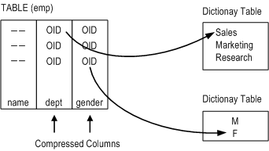
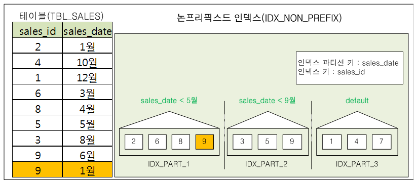
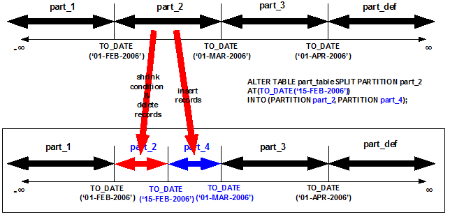
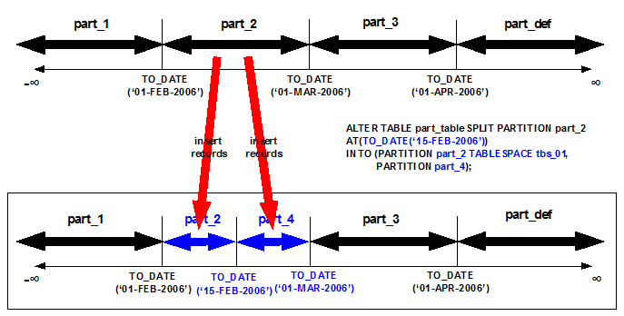

Administrator’s Manual
======================

#### Trunk

Altibase® Administration

<br><br><br><br><br><br><!-- PDF 변환을 위한 여백입니다. --> 


<!-- PDF 변환을 위한 여백입니다. --> 

<div align="left">
    
</div>
<br><br><!-- PDF 변환을 위한 여백입니다. --> 


<!-- PDF 변환을 위한 여백입니다. --> 

<pre>
Altibase Administration Administrator's Manual
Trunk
Copyright ⓒ 2001~2023 Altibase Corp. All Rights Reserved.<br>
본 문서의 저작권은 ㈜알티베이스에 있습니다. 이 문서에 대하여 당사의 동의없이 무단으로 복제 또는 전용할 수 없습니다.<br>
<b>㈜알티베이스</b>
08378 서울시 구로구 디지털로 306 대륭포스트타워Ⅱ 10층
전화 : 02-2082-1114
팩스 : 02-2082-1099
고객서비스포털 : <a href='http://support.altibase.com'>http://support.altibase.com</a>
홈페이지      : <a href='http://www.altibase.com/'>http://www.altibase.com</a></pre>


<br>

# 목차

- [서문](#%EC%84%9C%EB%AC%B8)
  - [이 매뉴얼에 대하여](#%EC%9D%B4-%EB%A7%A4%EB%89%B4%EC%96%BC%EC%97%90-%EB%8C%80%ED%95%98%EC%97%AC)
- [1.Altibase 소개](#1altibase-%EC%86%8C%EA%B0%9C)
  - [Hybrid DBMS개념](#hybrid-dbms%EA%B0%9C%EB%85%90)
  - [Altibase 특징](#altibase-%ED%8A%B9%EC%A7%95)
  - [Altibase 구조](#altibase-%EA%B5%AC%EC%A1%B0)
- [2.Altibase 구성요소](#2altibase-%EA%B5%AC%EC%84%B1%EC%9A%94%EC%86%8C)
  - [Altibase 디렉터리](#altibase-디렉터리)
  - [실행 바이너리](#%EC%8B%A4%ED%96%89-%EB%B0%94%EC%9D%B4%EB%84%88%EB%A6%AC)
  - [Altibase 라이브러리](#altibase-%EB%9D%BC%EC%9D%B4%EB%B8%8C%EB%9F%AC%EB%A6%AC)
- [3.데이터베이스 생성](#3%EB%8D%B0%EC%9D%B4%ED%84%B0%EB%B2%A0%EC%9D%B4%EC%8A%A4-%EC%83%9D%EC%84%B1)
  - [데이터베이스 생성](#%EB%8D%B0%EC%9D%B4%ED%84%B0%EB%B2%A0%EC%9D%B4%EC%8A%A4-%EC%83%9D%EC%84%B1)
- [4.Altibase 구동 및 종료](#4altibase-%EA%B5%AC%EB%8F%99-%EB%B0%8F-%EC%A2%85%EB%A3%8C)
  - [Altibase 구동](#altibase-%EA%B5%AC%EB%8F%99)
  - [Altibase 종료](#altibase-%EC%A2%85%EB%A3%8C)
- [5.데이터베이스 객체 및 권한](#5%EB%8D%B0%EC%9D%B4%ED%84%B0%EB%B2%A0%EC%9D%B4%EC%8A%A4-%EA%B0%9D%EC%B2%B4-%EB%B0%8F-%EA%B6%8C%ED%95%9C)
  - [데이터베이스 객체 개요](#%EB%8D%B0%EC%9D%B4%ED%84%B0%EB%B2%A0%EC%9D%B4%EC%8A%A4-%EA%B0%9D%EC%B2%B4-%EA%B0%9C%EC%9A%94)
  - [테이블](#%ED%85%8C%EC%9D%B4%EB%B8%94)
  - [임시 테이블](#%EC%9E%84%EC%8B%9C-%ED%85%8C%EC%9D%B4%EB%B8%94)
  - [압축 테이블](#%EC%95%95%EC%B6%95-%ED%85%8C%EC%9D%B4%EB%B8%94)
  - [큐](#%ED%81%90)
  - [제약조건](#%EC%A0%9C%EC%95%BD%EC%A1%B0%EA%B1%B4)
  - [인덱스](#%EC%9D%B8%EB%8D%B1%EC%8A%A4)
  - [뷰](#%EB%B7%B0)
  - [Materialized View](#materialized-view)
  - [시퀀스](#%EC%8B%9C%ED%80%80%EC%8A%A4)
  - [시노님](#%EC%8B%9C%EB%85%B8%EB%8B%98)
  - [저장 프로시저 및 저장 함수](#%EC%A0%80%EC%9E%A5-%ED%94%84%EB%A1%9C%EC%8B%9C%EC%A0%80-%EB%B0%8F-%EC%A0%80%EC%9E%A5-%ED%95%A8%EC%88%98)
  - [트리거](#%ED%8A%B8%EB%A6%AC%EA%B1%B0)
  - [작업(Job)](#%EC%9E%91%EC%97%85job)
  - [데이터베이스 사용자](#%EB%8D%B0%EC%9D%B4%ED%84%B0%EB%B2%A0%EC%9D%B4%EC%8A%A4-%EC%82%AC%EC%9A%A9%EC%9E%90)
  - [권한과 롤](#%EA%B6%8C%ED%95%9C%EA%B3%BC-%EB%A1%A4)
- [6.테이블스페이스](#6%ED%85%8C%EC%9D%B4%EB%B8%94%EC%8A%A4%ED%8E%98%EC%9D%B4%EC%8A%A4)
  - [테이블스페이스 정의 및 구조](#%ED%85%8C%EC%9D%B4%EB%B8%94%EC%8A%A4%ED%8E%98%EC%9D%B4%EC%8A%A4-%EC%A0%95%EC%9D%98-%EB%B0%8F-%EA%B5%AC%EC%A1%B0)
  - [테이블스페이스 분류](#%ED%85%8C%EC%9D%B4%EB%B8%94%EC%8A%A4%ED%8E%98%EC%9D%B4%EC%8A%A4-%EB%B6%84%EB%A5%98)
  - [디스크 테이블스페이스](#%EB%94%94%EC%8A%A4%ED%81%AC-%ED%85%8C%EC%9D%B4%EB%B8%94%EC%8A%A4%ED%8E%98%EC%9D%B4%EC%8A%A4)
  - [언두 테이블스페이스](#%EC%96%B8%EB%91%90-%ED%85%8C%EC%9D%B4%EB%B8%94%EC%8A%A4%ED%8E%98%EC%9D%B4%EC%8A%A4)
  - [테이블스페이스 상태](#%ED%85%8C%EC%9D%B4%EB%B8%94%EC%8A%A4%ED%8E%98%EC%9D%B4%EC%8A%A4-%EC%83%81%ED%83%9C)
  - [테이블스페이스 관리](#%ED%85%8C%EC%9D%B4%EB%B8%94%EC%8A%A4%ED%8E%98%EC%9D%B4%EC%8A%A4-%EA%B4%80%EB%A6%AC)
  - [테이블스페이스 사용 예제](#%ED%85%8C%EC%9D%B4%EB%B8%94%EC%8A%A4%ED%8E%98%EC%9D%B4%EC%8A%A4-%EC%82%AC%EC%9A%A9-%EC%98%88%EC%A0%9C)
  - [테이블스페이스 공간 관리](#%ED%85%8C%EC%9D%B4%EB%B8%94%EC%8A%A4%ED%8E%98%EC%9D%B4%EC%8A%A4-%EA%B3%B5%EA%B0%84-%EA%B4%80%EB%A6%AC)
- [7.파티션드 객체](#7%ED%8C%8C%ED%8B%B0%EC%85%98%EB%93%9C-%EA%B0%9D%EC%B2%B4)
  - [파티셔닝 정의](#%ED%8C%8C%ED%8B%B0%EC%85%94%EB%8B%9D-%EC%A0%95%EC%9D%98)
  - [파티션드 객체](#%ED%8C%8C%ED%8B%B0%EC%85%98%EB%93%9C-%EA%B0%9D%EC%B2%B4)
  - [파티션 조건](#%ED%8C%8C%ED%8B%B0%EC%85%98-%EC%A1%B0%EA%B1%B4)
  - [파티셔닝 방법](#%ED%8C%8C%ED%8B%B0%EC%85%94%EB%8B%9D-%EB%B0%A9%EB%B2%95)
- [8.트랜잭션 관리](#8%ED%8A%B8%EB%9E%9C%EC%9E%AD%EC%85%98-%EA%B4%80%EB%A6%AC)
  - [트랜잭션](#%ED%8A%B8%EB%9E%9C%EC%9E%AD%EC%85%98)
  - [잠금(Lock)](#%EC%9E%A0%EA%B8%88lock)
  - [다중 버전 동시성 제어 기법](#%EB%8B%A4%EC%A4%91-%EB%B2%84%EC%A0%84-%EB%8F%99%EC%8B%9C%EC%84%B1-%EC%A0%9C%EC%96%B4-%EA%B8%B0%EB%B2%95)
  - [트랜잭션의 영속성](#%ED%8A%B8%EB%9E%9C%EC%9E%AD%EC%85%98%EC%9D%98-%EC%98%81%EC%86%8D%EC%84%B1)
  - [체크포인트](#%EC%B2%B4%ED%81%AC%ED%8F%AC%EC%9D%B8%ED%8A%B8)
- [9.버퍼 관리자](#9%EB%B2%84%ED%8D%BC-%EA%B4%80%EB%A6%AC%EC%9E%90)
  - [버퍼 관리자의 구조](#%EB%B2%84%ED%8D%BC-%EA%B4%80%EB%A6%AC%EC%9E%90%EC%9D%98-%EA%B5%AC%EC%A1%B0)
  - [버퍼 관리](#%EB%B2%84%ED%8D%BC-%EA%B4%80%EB%A6%AC)
  - [버퍼 관련 프로퍼티](#%EB%B2%84%ED%8D%BC-%EA%B4%80%EB%A0%A8-%ED%94%84%EB%A1%9C%ED%8D%BC%ED%8B%B0)
  - [버퍼 관리자 통계 정보](#%EB%B2%84%ED%8D%BC-%EA%B4%80%EB%A6%AC%EC%9E%90-%ED%86%B5%EA%B3%84-%EC%A0%95%EB%B3%B4)
- [10.백업 및 복구](#10%EB%B0%B1%EC%97%85-%EB%B0%8F-%EB%B3%B5%EA%B5%AC)
  - [데이터베이스 백업](#%EB%8D%B0%EC%9D%B4%ED%84%B0%EB%B2%A0%EC%9D%B4%EC%8A%A4-%EB%B0%B1%EC%97%85)
  - [데이터베이스 복구](#%EB%8D%B0%EC%9D%B4%ED%84%B0%EB%B2%A0%EC%9D%B4%EC%8A%A4-%EB%B3%B5%EA%B5%AC)
  - [백업 및 복구 사례들](#%EB%B0%B1%EC%97%85-%EB%B0%8F-%EB%B3%B5%EA%B5%AC-%EC%82%AC%EB%A1%80%EB%93%A4)
- [11.증분 백업과 복구](#11%EC%A6%9D%EB%B6%84-%EB%B0%B1%EC%97%85%EA%B3%BC-%EB%B3%B5%EA%B5%AC)
  - [증분 백업 (Incremental Backup)](#%EC%A6%9D%EB%B6%84-%EB%B0%B1%EC%97%85-incremental-backup)
  - [증분 백업의 종류](#%EC%A6%9D%EB%B6%84-%EB%B0%B1%EC%97%85%EC%9D%98-%EC%A2%85%EB%A5%98)
  - [증분 백업에 대한 매체 복구](#%EC%A6%9D%EB%B6%84-%EB%B0%B1%EC%97%85%EC%97%90-%EB%8C%80%ED%95%9C-%EB%A7%A4%EC%B2%B4-%EB%B3%B5%EA%B5%AC)
  - [백업 파일 관리](#%EB%B0%B1%EC%97%85-%ED%8C%8C%EC%9D%BC-%EA%B4%80%EB%A6%AC)
- [12.서버/클라이언트 통신](#12%EC%84%9C%EB%B2%84%ED%81%B4%EB%9D%BC%EC%9D%B4%EC%96%B8%ED%8A%B8-%ED%86%B5%EC%8B%A0)
  - [통신 방법](#%ED%86%B5%EC%8B%A0-%EB%B0%A9%EB%B2%95)
- [13.Altibase의 보안](#13altibase%EC%9D%98-%EB%B3%B4%EC%95%88)
  - [보안의 개요](#%EB%B3%B4%EC%95%88%EC%9D%98-%EA%B0%9C%EC%9A%94)
  - [보안 기능의 구성](#%EB%B3%B4%EC%95%88-%EA%B8%B0%EB%8A%A5%EC%9D%98-%EA%B5%AC%EC%84%B1)
  - [보안 모듈 연동 방법](#%EB%B3%B4%EC%95%88-%EB%AA%A8%EB%93%88-%EC%97%B0%EB%8F%99-%EB%B0%A9%EB%B2%95)
  - [보안 모듈 구동과 데이터 암호화](#%EB%B3%B4%EC%95%88-%EB%AA%A8%EB%93%88-%EA%B5%AC%EB%8F%99%EA%B3%BC-%EB%8D%B0%EC%9D%B4%ED%84%B0-%EC%95%94%ED%98%B8%ED%99%94)
- [14.데이터베이스 감사 (Database Auditing)](#14%EB%8D%B0%EC%9D%B4%ED%84%B0%EB%B2%A0%EC%9D%B4%EC%8A%A4-%EA%B0%90%EC%82%AC-database-auditing)
  - [소개](#%EC%86%8C%EA%B0%9C)
  - [관련 메타 테이블과 프로퍼티](#%EA%B4%80%EB%A0%A8-%EB%A9%94%ED%83%80-%ED%85%8C%EC%9D%B4%EB%B8%94%EA%B3%BC-%ED%94%84%EB%A1%9C%ED%8D%BC%ED%8B%B0)
  - [감사 제어 구문](#%EA%B0%90%EC%82%AC-%EC%A0%9C%EC%96%B4-%EA%B5%AC%EB%AC%B8)
  - [감사 조건 구문](#%EA%B0%90%EC%82%AC-%EC%A1%B0%EA%B1%B4-%EA%B5%AC%EB%AC%B8)
  - [감사 결과 확인하기](#%EA%B0%90%EC%82%AC-%EA%B2%B0%EA%B3%BC-%ED%99%95%EC%9D%B8%ED%95%98%EA%B8%B0)
- [15.Altibase 튜닝](#15altibase-%ED%8A%9C%EB%8B%9D)
  - [로그 파일 그룹](#%EB%A1%9C%EA%B7%B8-%ED%8C%8C%EC%9D%BC-%EA%B7%B8%EB%A3%B9)
  - [그룹 커밋](#%EA%B7%B8%EB%A3%B9-%EC%BB%A4%EB%B0%8B)
- [Altibase 진단 모니터링](#altibase-%EC%A7%84%EB%8B%A8-%EB%AA%A8%EB%8B%88%ED%84%B0%EB%A7%81)
  - [Altibase 모니터링](#altibase-%EB%AA%A8%EB%8B%88%ED%84%B0%EB%A7%81)
  - [Altibase 문제상황 분석](#altibase-%EB%AC%B8%EC%A0%9C%EC%83%81%ED%99%A9-%EB%B6%84%EC%84%9D)
- [A.부록: Trace Log](#a%EB%B6%80%EB%A1%9D-trace-log)
  - [Trace Log](#trace-log)
- [B.부록: Altibase 최대치](#b%EB%B6%80%EB%A1%9D-altibase-%EC%B5%9C%EB%8C%80%EC%B9%98)
  - [Altibase 객체들의 최대값](#altibase-%EA%B0%9D%EC%B2%B4%EB%93%A4%EC%9D%98-%EC%B5%9C%EB%8C%80%EA%B0%92)

<br>

서문
====

### 이 매뉴얼에 대하여

이 매뉴얼은 Altibase를 구성, 관리, 사용하기 위해 필요한 개념에 대해 설명한다.

#### 대상 사용자

이 매뉴얼은 다음과 같은 Altibase 사용자를 대상으로 작성되었다.

-   데이터베이스 관리자

-   시스템 관리자

-   성능 관리자

다음과 같은 배경 지식을 가지고 이 매뉴얼을 읽는 것이 좋다.

-   컴퓨터, 운영 체제 및 운영 체제 유틸리티 운용에 필요한 기본 지식

-   관계형 데이터베이스 사용 경험 또는 데이터베이스 개념에 대한 이해

-   데이터베이스 서버 관리, 운영 체제 관리 또는 네트워크 관리 경험

#### 소프트웨어 환경

이 매뉴얼은 데이터베이스 서버로 Altibase 버전 7.1을 사용한다는 가정 하에
작성되었다.

#### 이 매뉴얼의 구성

이 매뉴얼은 다음과 같이 구성되어 있다.

-   제 1장 Altibase 소개  
    이 장은 Altibase 서버를 이해하는데 필요한 개념, 특징 및 구조에 대한 개요를
    제공한다.

-   제 2장 Altibase 구성 요소  
    이 장은 Altibase를 구성하고 있는 실행 바이너리 부문과 프로그래밍 라이브러리
    부문 구성 요소들에 대해 설명한다.

-   제 3장 데이터베이스 생성  
    이 장은 데이터베이스를 구성하는 대표적 구성 요소인 테이블스페이스와 로깅
    시스템의 종류 및 데이터베이스 생성 방법에 관하여 설명한다.

-   제 4장 Altibase 구동 및 종료  
    이 장은 Altibase를 구동 및 종료 시키는 방법과 Altibase 다단계 구동 시
    내부적으로 수행하는 작업에 대해 설명한다.

-   제 5장 데이터베이스 객체 및 권한  
    이 장은 특정 사용자에 의해 생성된 제약조건, 인덱스, 시퀀스, 이중화, 테이블,
    사용자 등 데이터베이스 객체들에 대해 설명한다. 또한, 시스템 및 스키마 객체
    수준의 권한에 대해 설명한다.

-   제 6장 테이블스페이스 관리  
    이 장은 데이터베이스의 논리적 구조를 이해함으로써 데이터베이스의 공간 관리를
    작은 단위로 제어하고, 물리적 데이터 영역을 효율적으로 관리하는 방법에 대해
    설명한다.

-   제 7장 파티션드 객체  
    이 장은 대용량 데이터베이스 테이블을 여러 개의 작은 조각으로 분할하여
    관리하는 파티션드 테이블에 대해 설명한다.

-   제 8장 트랜잭션 관리  
    이 장은 트랜잭션을 정의하고 트랜잭션을 사용하여 작업을 관리하는 방법에 대해
    설명한다.

-   제 9장 버퍼 관리자  
    Altibase는 대용량의 데이터가 디스크에 저장될 수 있도록 지원하는데, 메모리의
    공간은 한정되어 있으므로 이를 전부 메모리에 적재할 수 없으므로 테이블,
    인덱스, 레코드 등 모든 데이터에 접근하기 위해서는 먼저 디스크의 데이터를
    메모리에 적재해야 한다. 이 장은 이러한 메모리 공간을 할당하고, 메모리 공간이
    부족한 경우 필요한 데이터를 제공할 수 있도록 메모리 공간을 유지 및 관리하느
    버퍼 관리자에 대하여 설명한다.

-   제 10장 백업 및 복구  
    이 장은 시스템 정전 또는 디스크, 데이터 파일 손상 유실 등과 같은 예기치 않은
    상황으로 인해 Altibase에 저장된 데이터가 손실될 경우를 대비하여 Altibase에서
    지원하는 백업 및 복구에 대하여 설명한다.

-   제 11장 증분 백업과 복구  
    이 장은 Altibase가 제공하는 증분 백업과 증분 백업을 이용한 복구에 대하여
    설명한다.

-   제 12장 서버/클라이언트 통신  
    이 장은 Altibase 서버와 클라이언트 응용프로그램간의 접속 방법과 프로토콜에
    대해 설명한다.

-   제 13장 Altibase의 보안  
    이 장은 데이터베이스의 정보를 보호하기 위한 Altibase의 보안 기능에 대해
    설명한다.

-   제 14장 Altibase 감사  
    이 장은 Altibase 서버 내에서 실행되고 있는 구문을 실시간으로 추적하고 로그를
    기록하는 감사(Auditing) 기능에 대해 설명한다.

-   제 15장 Altibase 튜닝  
    이 장은 Altibase의 성능 향상을 위한 로그 파일 그룹과 그룹 커밋에 대해
    설명한다.

-   제 16장 Altibase 모니터링 및 PBT  
    이 장은 Altibase의 운영상태를 확인하는 방법과 해당 내용을 분석하는 방법에
    대해 설명한다. 또한, Altibase 운영 중 발생할 수 있는 여러 가지 문제 상황에
    대하여 점검 사항 및 분석 방법에 대해 설명한다.

-   A. 부록: Trace Log  
    이 부록은 Altibase 서버에서 실행되는 SQL문 관련 정보를 trace 로그로 남기는
    방법을 설명한다.

-   B. 부록: Altibase 최대치  
    이 부록은 Altibase 객체들의 최대값을 기술한다.

#### 문서화 규칙

이 절에서는 이 매뉴얼에서 사용하는 규칙에 대해 설명한다. 이 규칙을 이해하면 이
매뉴얼과 설명서 세트의 다른 매뉴얼에서 정보를 쉽게 찾을 수 있다. 여기서 설명하는
규칙은 다음과 같다.

-   구문 다이어그램

-   샘플 코드 규칙

##### 구문 다이어그램

이 매뉴얼에서는 다음 구성 요소로 구축된 다이어그램을 사용하여, 명령문의 구문을
설명한다.

| 구성 요소                     | 의미                                                         |
| ----------------------------- | ------------------------------------------------------------ |
|  | 명령문이 시작한다. 완전한 명령문이 아닌 구문 요소는 화살표로 시작한다. |
|  | 명령문이 다음 라인에 계속된다. 완전한 명령문이 아닌 구문 요소는 이 기호로 종료한다. |
|  | 명령문이 이전 라인으로부터 계속된다. 완전한 명령문이 아닌 구문 요소는 이 기호로 시작한다. |
|  | 명령문이 종료한다.                                           |
|  | 필수 항목                                                    |
|  | 선택적 항목                                                  |
|  | 선택사항이 있는 필수 항목. 한 항목만 제공해야 한다.          |
|  | 선택사항이 있는 선택적 항목                                  |
|  | 선택적 항목. 여러 항목이 허용된다. 각 반복 앞부분에 콤마가 와야 한다. |

##### 샘플 코드 규칙

코드 예제는 SQL, Stored Procedure, iSQL, 또는 다른 명령 라인 구문들을 예를 들어
설명한다.

아래 테이블은 코드 예제에서 사용된 인쇄 규칙에 대해 설명한다.

| 규칙         | 의미                                                         | 예제                                                         |
| ------------ | ------------------------------------------------------------ | ------------------------------------------------------------ |
| [ ]          | 선택 항목을 표시                                             | VARCHAR [(*size*)][[FIXED \|] VARIABLE]                      |
| { }          | 필수 항목 표시. 반드시 하나 이상을 선택해야 되는 표시        | { ENABLE \| DISABLE \| COMPILE }                             |
| \|           | 선택 또는 필수 항목 표시의 인자 구분 표시                    | { ENABLE \| DISABLE \| COMPILE } [ ENABLE \| DISABLE \| COMPILE ] |
| . . .        | 그 이전 인자의 반복 표시 예제 코드들의 생략되는 것을 표시    | SQL\> SELECT ename FROM employee;<br/> ENAME<br/>  -----------------------<br/> SWNO <br/> HJNO<br/>  HSCHOI <br/> .<br/> .<br/> . <br/>20 rows selected. |
| 그 밖에 기호 | 위에서 보여진 기호 이 외에 기호들                            | EXEC :p1 := 1; acc NUMBER(11,2);                             |
| 기울임 꼴    | 구문 요소에서 사용자가 지정해야 하는 변수, 특수한 값을 제공해야만 하는 위치 | SELECT \* FROM *table_name*;<br/> CONNECT *userID*/*password*; |
| 소문자       | 사용자가 제공하는 프로그램의 요소들, 예를 들어 테이블 이름, 칼럼 이름, 파일 이름 등 | SELECT ename FROM employee;                                  |
| 대문자       | 시스템에서 제공하는 요소들 또는 구문에 나타나는 키워드       | DESC SYSTEM_.SYS_INDICES_;                                   |

#### 관련 자료

자세한 정보를 위하여 다음 문서 목록을 참조하기 바란다.

-   Installation Guide

-   Getting Started Guide

-   SQL Reference

-   Stored Procedures Manual

-   iSQL User’s Manual

-   Utilities Manual

-   Error Message Reference

#### Altibase는 여러분의 의견을 환영합니다.

이 매뉴얼에 대한 여러분의 의견을 보내주시기 바랍니다. 사용자의 의견은 다음
버전의 매뉴얼을 작성하는데 많은 도움이 됩니다. 보내실 때에는 아래 내용과 함께
고객서비스포털( http://support.altibase.com/kr/ )로 보내주시기 바랍니다.

-   사용 중인 매뉴얼의 이름과 버전

-   매뉴얼에 대한 의견

-   사용자의 성함, 주소, 전화번호

이 외에도 Altibase 기술지원 설명서의 오류와 누락된 부분 및 기타 기술적인
문제들에 대해서 이 주소로 보내주시면 정성껏 처리하겠습니다. 또한, 기술적인
부분과 관련하여 즉각적인 도움이 필요한 경우에도 고객서비스포털을 통해 서비스를
요청하시기 바랍니다.

여러분의 의견에 항상 감사드립니다.

1.Altibase 소개
=============

이 장에서는 Altibase를 처음 접하는 사용자들을 위해서 Hybrid DBMS의 등장 배경과
Altibase의 구조 및 특징에 대해서 설명한다.

### Hybrid DBMS개념

이 절은 Altibase에서 선도하고 있는 새로운 개념인 Hybrid Database Management
System(이하 Hybrid DBMS)에 대해서 설명한다.

#### Hybrid DBMS 등장 배경

Hybrid DBMS의 등장은 데이터를 저장하는 두 가지 대표적인 기억 장치인 메모리와
디스크의 특징과 밀접한 관련이 있다.

첫째, 메모리는 전자 게이트로 구성되어 있고 접근시간이 수 ns(십억 분의 일초)
단위로서 매우 빠르며 접근시간이 균일하고 정전 시에는 데이터가 소실되는 특징을
가지고 있다. 즉, 메모리는 휘발성 저장 매체이다.

반면에, 디스크는 헤드암과 플래터로 구성되어 있다. 디스크 접근시간이 수 us(백만
분의 일초)로 메모리에 비해서 상대적으로 느리다. 게다가 접근시간이 균일하지 않다.
최근에 좀 더 대중화된 SSD(Solid State Drives) 조차도 휘발성 메모리에 비해서는
접근 시간이 좀 느리다. 그러나 정전이 되더라도 디스크의 데이터는 영구히 보존되는
특징을 가지고 있다.

둘째, 메모리는 메인보드와 시스템 버스로 연결되어 있어 메인보드의 특성에 따라
최대 저장 크기가 결정 된다. 메인보드에 장착된 CPU가 32비트이면 메모리의 최대
크기는 4GB, CPU가 64비트라고 해도 최대 크기는 현재 수백 GB(십억 바이트)까지만
장착 가능하다. 반면에, 디스크는 메인보드와 I/O버스로 연결되어 있어 메인보드의
특징과 거의 무관하게 수 TB(일조 바이트)까지 구성이 가능하다.

요약하면, 일반적으로 메모리는 디스크에 비해 접근 시간이 수백배 빠르며 성능이
균일한 반면, 정전시 데이터가 소실되고 저장용량에 한계가 있다. 이에 반해,
디스크는 데이터가 영구히 저장되며 저장용량의 한계가 거의 없는 반면, 접근 시간이
느리고 일정하지 않다.

이런 기억장치의 특징에 따라서 DBMS는 디스크에 데이터를 저장하는 Disk-Resident
DBMS(이하 DRDBMS)와 메모리에 데이터를 저장하는 Main-Memory DBMS(이하 MMDBMS)가
존재해 왔다. Hybrid DBMS는 이 두 가지 구조의 장점을 수용하고, 단점을 보완하여
개발 되었다.

##### DRDBMS 등장

DRDBMS구조는 데이터가 디스크에 저장되어 있고, DRDBMS가 디스크에 있는 데이터를
메모리 버퍼로 읽어서 응용프로그램에게 전달해 주는 형태이다.

이런 구조는 응용프로그램이 표준 SQL을 통해서 데이터에 접근하고, DBMS가
동시성제어 및 복구를 통해 데이터를 보호하기 때문에 응용프로그램의 개발이 훨씬
간편해지며 데이터 공유가 쉬운 장점이 있다. 또한 데이터가 디스크에 저장되어 있기
때문에 대용량 데이터베이스를 구성할 수 있다.

이런 장점 때문에, 지금까지 전 산업분야에서 DRDBMS가 광범위하게 사용되어 왔다.

하지만, 사회전반에 걸쳐 정보화가 급격히 진전되고 정보처리의 요구 성능이
높아지면서 데이터 처리에 대한 수요는 많았으나, DRDBMS의 낮은 평균 처리속도와
처리속도의 기복(jitter)의 문제 때문에 DRDBMS를 사용하지 못하는 분야가 많았다.

따라서 고성능 및 균일 성능의 데이터 처리를 필요로 하는 산업 분야에서는 지금까지
Custom Designed Memory DB를 사용하였다. 그러나 범용적이지 않고 데이터 관리에
필요한 모든 것을 직접 개발해야 했기 때문에 개발 및 유지보수가 어렵고, 성능,
가용성, 확장성 등에서 문제가 있었다.

##### MMDBMS 등장

MMDBMS의 구조는 데이터가 메모리에 저장되어 있고 MMDBMS가 메모리에 있는 데이터를
읽어서 응용프로그램에 전달하는 형태이다.

이런 구조는 DRDBMS의 장점인 표준 SQL을 통한 데이터 접근, 동시성 제어 및 복구을
통한 데이터 보호, 이를 통한 응용프로그램의 개발과 데이터 공유의 용이성 등의
장점을 그대로 가진다.

또한 MMDBMS는 데이터를 메모리에 저장하기 때문에 디스크에 데이터를 저장하는
DRDBMS에 비해 평균처리 속도가 매우 빠르며 메모리의 특징인 균일한 성능을
보장한다. 따라서 고성능 및 균일 성능의 필요성 때문에 DRDBMS를 사용할 수 없는
분야에서 각광을 받고 있다.

일반적으로 DRDBMS에 비해서 MMDBMS가 갱신 연산은 약 10배, 검색 연산은 약 3배
이상의 성능을 보인다.

갱신 연산이 DRDBMS에 비해서 수백배가 아닌 이유는 MMDBMS도 데이터 보호를 위해서
DRDBMS와 똑같이 로그파일을 디스크에 기록하기 때문이다. 그럼에도 불구하고
MMDBMS의 갱신 연산이 더 빠른 이유는 MMDBMS는 데이터 보호가 DRDBMS에 비해서 훨씬
단순하게 최적화되어 있기 때문이다.

또한 검색 연산이 DRDBMS에 비해서 수백배가 아닌 이유는 DRDBMS도 데이터접근 성능을
높이기 위해 메모리 버퍼를 사용하기 때문이다. 그럼에도 불구하고 MMDBMS의 검색
연산이 더 빠른 이유는 데이터접근이 단순하게 최적화되어 있고, 메모리 접근 시
성능의 기복(jitter)이 없기 때문이다.

이런 고성능 및 균일성능의 장점에도 불구하고 데이터를 메모리에 저장해야 하는
MMDBMS는 정보처리의 요구량이 방대하여 수백 GB이상의 데이터를 저장해야 하는
산업분야에서 다시 한계를 나타내게 되었다.

##### MMDBMS와 DRDBMS 혼용 구조 등장

이런 문제점을 극복하기 위해서 현재 가장 일반적으로 사용되는 구조는 데이터를
구분하여 저장하는 형태이다. 고성능이 필요한 데이터는 MMDBMS에, 대용량이 필요한
데이터는 DRDBMS에 저장함으로써 MMDBMS와 DRDBMS를 혼용한다.

이러한 구조는 MMDBMS와 DRDBMS의 공통정보에 대해서 서로 동기화해야 한다는 문제,
MMDBMS와 DRDBMS를 같이 처리해야 하는 응용프로그램은 양쪽에 동시에 접속해서
처리해야 한다는 문제, 또한 장애 복구가 복잡하다는 문제들을 가지고 있다.

하지만 이제까지는 고성능처리와 대용량처리를 함께 처리할 방법이 없었기 때문에,
고성능처리와 대용량 정보처리가 필요한 분야에서는 일반적으로 활용되고 있다.

##### Hybrid DBMS 등장

Hybrid DBMS는 DRDBMS의 구조, MMDBMS의 구조, 그리고 MMDBMS와 DRDBMS가 결합된
구조들의 장점을 수용하고 문제점을 해결하기 위해서 등장하게 되었다.

Hybrid DBMS는 데이터를 구분하여, 고성능이 필요한 데이터는 메모리에, 대용량이
필요한 데이터는 디스크에 저장하되, 이 두 가지 데이터를 처리하는 DBMS는 하나로
통합된 구조를 가지고 있다.

고성능 정보처리와 대용량 정보처리를 하나의 DBMS에서 통합, 처리하는 구조이기
때문에, 앞서 설명한 혼용구조의 동기화 문제, 복잡한 장애처리 문제, 응용프로그램이
복잡해지는 문제를 해결하게 되었다. 또한 MMDBMS 전용, DRDBMS 전용, Hybrid DBMS 등
다양한 구성이 가능하게 되었다.

요약하면, Hybrid DBMS는 고성능 정보처리를 가능하게 하는 MMDBMS와 대용량
정보처리를 가능하게 하는 DRDBMS의 장점을 결합하여 데이터는 구분하여 저장하고
데이터 관리는 통합한 구조이다.

즉, Hybrid DBMS는 효율적인 시간 활용으로 고성능 정보 처리가 가능하고, 효율적인
자원활용으로 대용량 정보처리를 할 수 있게 되었다. Hybrid DBMS는 고성능 및 대용량
정보처리가 모두 필요한 분야를 포함하여 포괄적으로 사용이 가능해졌다.


[그림 1‑1] 고성능 대용량 DBMS구조

### Altibase 특징

고성능 대용량 하이브리드 데이터베이스 시스템인 Altibase에 대한 일반적인 내용을
소개한다. 하이브리드 데이터베이스 시스템으로써 Altibase가 갖는 특징, 구조, 기능
등에 관하여 간략하게 설명한다. 이에 대한 자세한 내용은 Altibase 각각의 세부
매뉴얼을 참조한다.

#### 데이터 모델

Altibase의 데이터 모델은 관계 모델 (relational model)을 채택하고 있다. 관계
모델은 세 가지 주요 요소를 포함한다.

구조(structure)는 데이터베이스를 저장하거나 접근하는 객체 단위로 테이블, 뷰,
인덱스 등을 일컫는다. 이들은 곧 연산자의 조작 단위가 된다.

연산(operation)은 데이터베이스의 데이터와 구조를 사용자들이 조작할 수 있도록
허용하는 행위(action)들을 정의한 것으로써 무결성 규칙을 수반한다.

무결성 규칙(integrity rule)은 데이터와 구조에 허용된 연산을 다루기 위한
법칙으로, 데이터와 구조를 보호하기 위한 것이다.

관계 데이터베이스 관리 시스템은 다음과 같은 장점을 제공한다.

-   물리적 데이터와 논리적 데이터 독립성을 유지한다.

-   모든 데이터에 대한 접근이 다양하고 쉽다.

-   데이터베이스 설계가 유연하다.

-   데이터베이스 저장 공간과 데이터의 중복을 줄일 수 있다.

#### 엔진 구조 

Altibase는 클라이언트-서버 구조를 제공한다. 클라이언트-서버 구조는 클라이언트가
통신망을 통해 서버에 접근하는 형태로 기존의 RDBMS가 제공하는 방식이다.

Altibase 서버는 내부적으로 다중 쓰레드 구조를 갖고 있다.

#### 인터페이스 

Altibase는 기존의 실시간 데이터베이스 시스템과는 달리 범용성을 추구하는 일환으로
산업 표준 인터페이스를 지원한다. Altibase에서 제공하는 데이터베이스 질의어는
SQL92와 SQL99 표준을 따른다.

프로그래밍 인터페이스로는 CLI, ODBC, JDBC, C/C++ Precompiler 등을 지원하고
있으며, 기존에 작성된 데이터베이스 응용 프로그램을 변환할 필요 없이 그대로
사용할 수 있다. Altibase가 지원하는 SQL에 대한 자세한 내용은 *[SQL Reference](https://github.com/ALTIBASE/Documents/blob/master/Manuals/Altibase_trunk/kor/SQL%20Reference.md)* 를
참조한다.

#### 다중버전 기법

Altibase는 다중버전 기법(이하 MVCC: Multi-Version Concurrency Control)을 이용한
동시성 제어를 수행한다. 다중 버전 기법은 하나의 데이터에 대해 여러 개의 버전을
유지하여 읽기와 쓰기 연산에 대한 충돌을 없앰으로서 최대의 성능을 발휘할 수
있도록 하는 것이다. 특히, 기존의 row locking 방식의 단점이었던 읽으려고 하는
데이터가 이미 다른 수정 연산에 의해 lock이 걸려 있거나, 수정하려는 데이터를 다른
읽기 연산이 읽는 중이어서 장기간 대기해야 하는 문제점을 제거하였으며, 필요 없는
오래된 데이터를 즉시 회수함으로서 메모리의 낭비를 방지하였다. 다중 버전 기법은
대규모 사용자가 접근하는 환경에서 최적의 성능을 발휘하고, 데이터베이스를
종료하지 않고도 즉시 백업할 수 있는 핫-백업(hot-backup) 시스템을 지원한다.

Altibase는 메모리 테이블과 디스크 테이블에 대해 외형상으로는 같은 기능을 하지만,
서로 다른 방법으로 MVCC를 구현하였다. 메모리 테이블은 레코드의 변경시마다 새로운
버전을 생성하는 out-place MVCC로 구현되어 있으며, 디스크 테이블의 경우는 변경된
데이터를 기존의 레코드에 덮어 쓰고, 변경 이전의 정보를 undo 테이블스페이스에
저장하여 참조하는 in-place MVCC 방식을 채택하고 있다.

#### 트랜잭션

Altibase는 Hybrid DBMS의 구조에 맞추어 최고의 성능을 낼 수 있는 트랜잭션 구조와
이와 관련된 다양한 기능을 제공한다. 먼저 데이터베이스 내에서 동시에 수행될 수
있는 트랜잭션의 개수를 프로퍼티를 이용해서 조절할 수 있다. 또한 효율적인 서버
운영을 위해 AUTOCOMMIT 모드를 사용할 수 있다. 그리고 Altibase가 제공하는
트랜잭션의 고립화 수준(isolation level)은 read committed(=0), repeatable
read(=1), no phantom read(=2)가 있으며, 사용자의 필요에 맞추어 적절하게 선택하여
사용할 수 있다.

#### 로깅

데이터베이스 안정성과 영속성을 위하여 Altibase는 변경된 데이터베이스 내용에
대하여 로깅(logging)을 수행한다. 또한 시스템간의 이중화 (Replication) 작업 때의
성능을 극대화 시키기 위해 최적의 로그를 생성한다.

#### 버퍼 풀 (Buffer Pool) 

디스크 테이블스페이스에 접근하는 트랜잭션들의 성능을 향상시키기 위해 디스크에
대한 I/O 회수를 최소화해야 한다. 이를 위해 버퍼 풀을 사용함으로써 이전에
디스크로부터 읽은 페이지들 중 일정 부분을 메모리에 캐시해 두어 디스크에서 다시
읽어들이는 것을 방지한다. 버퍼 풀은 Hot-Cold LRU(Least Recently Used) 알고리즘에
의해 관리된다.

#### 더블 라이트 (Double Write) 파일

Altibase 시스템의 페이지 크기와 파일 시스템의 물리적 페이지 크기가 다를 경우,
디스크 I/O 수행 중에 Altibase 서버가 비정상적으로 종료하면 페이지가 온전하지
못한 상태로 남아있을 수 있다.

이런 현상을 방지하기 위하여 Altibase는 페이지를 플러시할 때, 같은 이미지를
디스크의 더블 라이트 파일에 저장한 후, 페이지 원래 위치에 다시 저장한다. 그리고
Altibase를 재구동할 때 더블 라이트 파일의 내용과 실제 페이지의 내용을 비교하여
손상된 페이지를 복구한다.

더블 라이트 기능은 디스크의 결함을 보완해 주지만, 시스템의 성능을 떨어뜨릴 수
있다. 이 기능은 사용자가 성능을 위해 사용하지 않을 수 있다.

#### 퍼지&핑퐁 체크포인트 

Altibase는 최근의 데이터베이스 상태를 안전하게 백업(backup) 데이터베이스로
반영하기 위해 퍼지&핑퐁 체크포인트를 수행한다.

메인 메모리 데이터베이스에서의 퍼지 체크포인트(fuzzy checkpoint)는 모든 변경된
데이터 페이지가 백업 데이터베이스로 내려가 현재 수행중인 트랜잭션의 수행에
영향을 미칠 수 있기 때문에 퍼지 체크포인트와 더불어 핑퐁 체크포인트(ping pong
checkpoint) 방식을 함께 수행한다. 즉, 백업 데이터베이스를 두 개로 관리함으로써,
체크포인트 과정에서 부하를 줄일 수 있어 트랙잭션 동작이 최대한의 성능을 발휘할
수 있다.

#### 저장 프로시저 (Stored Procedure)

저장 프로시저는 입력 인자, 출력 인자, 입출력 인자를 가지고 바디(body) 내에
정의된 조건에 따라 여러 SQL 문을 한번에 수행하는 데이터베이스 프로시저다.

저장 프로시저의 종류는 리턴값 유무에 따라 프로시저와 함수로 나누어 진다. 자세한
내용은 *[Stored Procedures Manual](https://github.com/ALTIBASE/Documents/blob/master/Manuals/Altibase_trunk/kor/Stored%20Procedures%20Manual.md)*을 참고한다.

#### 데드락 감지 (Deadlock Detection)

데드락은 트랜잭션간의 리소스 할당이 자동으로 해제될 수 없는 비정상적인 트랜잭션
정지 상태이다. 이러한 경우 일반적으로 데드락을 감지하는 별도의 쓰레드 또는
프로세스를 두게 되는데, 이러한 감지 구조는 필연적으로 일시적인 서비스 중단
사태를 초래한다. Altibase는 별도의 데드락 감지 쓰레드를 두지 않고, 데드락이
발생되는 순간 데드락 상황을 감지하여, 신속히 조치를 취함으로써 어떠한 경우에도
서비스가 중지되지 않도록 하며, 지속적이고 안정적인 데이터베이스 운용을 보장한다.

#### 테이블 컴팩션

데이터베이스 운용시, 실제로 특정 메모리 테이블이 필요한 메모리 공간 이상을
차지하는 경우가 발생한다. 주로 대량의 데이터가 삽입 된 후 변경 및 삭제가
이루어지는 경우가 그러하다. 이런 경우 해당 테이블에서 필요 없는 메모리를
시스템으로 반환할 수 있다면, 보다 효율적으로 메모리 사용이 가능하다. 이런 필요로
인해 Altibase는 메모리 테이블에 대해 테이블 단위의 컴팩션(compaction) 기능을
제공하며, 이 기능을 이용하여 메모리 및 테이블의 효율적 관리가 가능하다.

#### 데이터베이스 이중화 

Altibase는 시스템의 높은 가용성(high availability)과 무정지(fault tolerance)
시스템을 위하여 로그 기반의 데이터베이스 이중화(replication)를 제공한다. 로그
기반의 이중화 시스템 구조는 트랜잭션 로그를 기반으로 데이터베이스를
이중화시킴으로써, Altibase의 효율성을 높이고 시스템 부하를 줄일 수 있다. 서비스
중인 지역(local) 시스템의 이중화 관리 쓰레드는 로그 데이터를 원격(Remote)
시스템의 이중화 관리 쓰레드에 실시간으로 전달한다. 원격 시스템의 이중화 관리
쓰레드는 전달받은 로그 데이터를 분석하여 이것을 Altibase 서버에게 전달하고
Altibase 서버는 이 내용을 데이터베이스에 반영한다. 이렇게 함으로써 서비스 중인
컴퓨팅 시스템이 중단되었을 때, 시스템 복구 시간이 필요 없이 곧바로 다른 시스템을
사용하여 서비스할 수 있는 체제를 갖추고 있다.

Altibase는 부하 분산(load balancing) 기능도 제공한다. Altibase의 데이터베이스
복제 운영 환경에서, 서비스하는 트랜잭션들을 두 그룹 이상으로 나누어 각각의
트랜잭션이 해당 서버에서 수행되도록 구성하면, 각 서버에서 변경되는 데이터베이스
내용은 이중화를 통해서 상대편 서버에 반영됨으로써 복제된 데이터베이스의
일관성(consistency)을 보장할 수 있다.

#### 클라이언트-서버 프로토콜

Altibase를 클라이언트-서버 구조로 운영할 때, 사용자는 응용 시스템의 구성에
적합한 클라이언트-서버 프로토콜을 선택하여 사용할 수 있다. Altibase가 제공하는
통신 프로토콜로는 TCP/IP, IPC, IPCDA와 Unix Domain socket이 있다.

TCP/IP(Transmission Control Protocol/Internet Protocol) 프로토콜은 네트워크
상에서 클라이언트-서버 간에 사용되는 사실상의 표준 통신 프로토콜이다. IPC(Inter
Process Communication) 프로토콜은 Altibase가 제공하는 프로토콜로써,
공유메모리(shared memory)를 활용하여 클라이언트와 서버 간에 통신을 하도록
하였다. IPC 방법은 통신 패킷에 대하여 마샬링(marshaling)이 필요 없고 공유
메모리를 이용하기 때문에 다른 통신 프로토콜보다 빠른 통신 속도를 낼 수 있다.

IPCDA는 IPC 기반 통신 방법을 간소화하여 최고의 성능을 내도록 설계되었다. 공유
메모리에 직접 데이터를 읽고 쓰게 하여 메모리 액세스를 최소화하였다. 또한 자체
개발한 스핀락(SpinLock)을 이용하여 프로세스 간 유휴 시간(idle time)을
최소화하였다.

클라이언트 프로그램과 Altibase 서버가 상이한 컴퓨터 시스템에 존재하는 경우에는
인터넷 소켓을 이용한 TCP/IP 프로토콜을 사용하여야 하며, 이들이 동일 컴퓨터
시스템에 존재하는 경우에는 도메인 소켓을 이용한 프로토콜이나 IPC, IPCDA
프로토콜을 사용할 수 있다. 각각의 통신 프로토콜에 대한 성능은 IPCDA, IPC, 도메인
소켓, 인터넷 소켓 순으로 IPCDA가 가장 빠르다. 다만 IPCDA 에서는 LOB 데이터를
지원하지 않는다.

서버와 클라이언트의 통신 방법에 대한 자세한 설명은 '서버/클라이언트 통신'을
참조하기 바란다.

#### 데이터베이스 공간

Altibase의 데이터베이스는 데이터베이스의 모든 데이터를 모아 저장하는 하나 이상의
테이블스페이스로 구성되고, 테이블스페이스는 크게 메모리 공간과 디스크 공간으로
나누어진다. Altibase가 생성하는 시스템 테이블스페이스 외에 사용자가 메모리와
디스크 각각의 공간에 테이블스페이스를 추가할 수 있다.

#### Direct-Path INSERT

Direct-Path INSERT는 데이터를 입력할 때 페이지의 빈 공간을 찾아 들어가는 대신
새로운 페이지를 만들어 데이터를 입력한다. 즉 데이터를 입력할 때 테이블의 빈
공간(free space)을 사용하지 않고, 테이블스페이스로부터 익스텐트(extent)를 새로
할당받는다.

또한 버퍼 관리자를 사용하지 않고, 전용 버퍼(Private Buffer)를 사용하기 때문에
버퍼 공간에 대하여 여러 트랜잭션과의 경합을 줄인다. 그리고 INSERT를 APPEND
방식으로 수행하여 리두(Redo) 및 언두(Undo)를 하지 않거나 줄여 로깅에 들어가는
비용을 줄인다.

#### 데이터베이스 링크

Altibase의 데이터베이스 링크는 지역적으로 분리되어 있으나, 네트워크로 연결된
이기종의 데이터 서버들을 연동하여 개별 데이터들을 통합해 하나의 결과를 생성할 수
있게 한다.

#### iSQL

Altibase는 iSQL을 이용해 데이터베이스를 관리할 수 있어 빠르고 간편하게
데이터베이스를 관리할 수 있다.

#### altiComp

Altibase는 altiComp 기능을 사용하여 두 데이터베이스를 테이블 단위로 비교,
검사하여 불일치하는 데이터의 정보를 출력하는 기능과 불일치가 발생한 경우 두
데이터베이스를 일치시키는 기능 등을 제공한다.

#### iLoader

Altibase는 iLoader 유틸리티를 제공하여, 데이터베이스의 이전이나 테이블 단위의
백업 등을 할 때 테이블 단위로 데이터를 다운로드하거나 업로드할 수 있도록
지원한다.

### Altibase 구조

본 절에서는 Altibase의 클라이언트-서버 구조를 중심으로 한 전체 구성도, 서버
프로세스 내부 구조, 데이터베이스 구조에 관하여 살펴본다.

#### 전체 구성도

다음은 Altibase와 애플리케이션이 클라이언트-서버 구조로 구성된 시스템을 도식화한
그림이다. 특히 Altibase 서버 부분을 계층화된 구조(Layered Architecture)로
표현하여 클라이언트의 요청과 데이터가 어떤 흐름으로 처리되는지를 볼 수 있다.
서버 외의 부분은 애플리케이션과 데이터베이스 접근을 위한 드라이버(라이브러리) 및
통신 모듈로 구성된다.


[그림 1‑2] Altibase 구성도

#### 서버 프로세스 내부 구조

Altibase 서버 프로세스의 내부 구조를 보면 메인 쓰레드, 디스패처, 로드 밸런서,
서비스 쓰레드 풀, 서비스 쓰레드, 체크 포인트 쓰레드, 세션 관리 쓰레드, 가비지
콜렉션 쓰레드, 로그 플러시 쓰레드, 버퍼 플러시 쓰레드 그리고 아카이브로그
쓰레드가 있다. 각각의 쓰레드는 다음과 같은 일을 수행한다.

##### 메인 쓰레드

모든 쓰레드를 생성/종료시키고 생성한 쓰레드들을 관리한다.

##### 디스패처(Dispatcher)

클라이언트의 연결 요청이 있으면, 서비스 쓰레드 풀(pool)에서 대기 상태에 있는
서비스 쓰레드와 요청한 클라이언트를 연결시킨다.

##### 로드 밸런서(Load Balancer)

각 서비스 쓰레드의 부하를 감지하여 서비스 쓰레드를 추가하거나 삭제하고 태스크를
서비스 쓰레드에 분배한다.

##### 서비스 쓰레드

서비스 쓰레드는 질의를 처리한 후 결과를 클라이언트에 반환한다.

Altibase 서버를 구동하면 Altibase는 설정(altibase.properties) 정보에 명시된
개수만큼 서비스 쓰레드를 생성하여 서비스 쓰레드 풀에 저장한다.

##### 체크포인트 쓰레드 

고장 복구 시에 일의 양을 줄이기 위하여, 주기적 또는 임의로 현재의 데이터베이스
및 시스템에 대한 상황을 데이터파일에 기록하는 쓰레드이다.

##### 세션 관리 쓰레드(Session Manager)

클라이언트와 서비스 쓰레드 간에 연결된 세션의 상태 즉, 이 세션이 단절되었지의
여부를 감시하는 쓰레드이다.

##### 가비지 콜렉션 쓰레드(Ager)

다중 버전 기법에서는 한 데이터에 대해 필요없는 오래된 데이터가 생성될 수 있다.
가비지 콜렉션 쓰레드(garbage collection thread)는 이러한 데이터가 필요없게 된
순간 그 즉시 메모리 공간을 회수하여, 재사용할 수 있도록 조치를 취함으로서 메모리
사용의 효율성을 극대화한다. 가비지 콜렉션 쓰레드를 Ager라고도 한다.

##### 로그 플러시 쓰레드

로그 플러시 쓰레드(log flush thread)는 데이터베이스 내의 모든 트랜잭션이 생성한
로그를 관리하고, 로그 버퍼에 모여진 다량의 로그 데이터를 로그 디스크에 반영하는
기능을 한다. 디스크에 완전히 반영(sync)된 로그는 데이터베이스 시스템의 장애 및
재해 발생 시에 데이터베이스를 안전하게 복구하는데 사용된다.

##### 버퍼 플러시 쓰레드(Flusher)

버퍼 풀의 모든 메모리가 사용 중이면 디스크 I/O를 발생시켜서 수행중인 트랜잭션에
성능 상의 기복(Jitter) 현상을 일으키게 된다. 버퍼 플러시 쓰레드는 주기적으로
버퍼를 체크하여 일정 양 이상의 가용 버퍼 메모리를 항시 유지하도록 하며, 사용하지
않는 페이지를 디스크에 내리고 메모리를 사용 가능하게 만드는 역할을 한다. 버퍼
플러시 쓰레드를 Flusher라고도 부른다.

##### 아카이브로그 쓰레드

매체 오류에 대한 복구를 지원하기 위해 주기적으로 온라인 로그 파일들을 프로퍼티에
지정된 위치로 복사하는 쓰레드이다. 복사할 경로는 ARCHIVE_DIR 프로퍼티로 지정하면
된다. Altibase가 아카이브 모드로 운영될 때만 동작한다.


[그림 1‑3] Altibase 프로세스의 내부 구조

#### 데이터베이스의 물리적 구조

Altibase의 데이터베이스는 물리적으로 로그앵커 파일, 로그 파일, 데이터 파일로
구성되어 있다.

##### 로그앵커 파일

로그앵커 (loganchor) 파일은 데이터 파일과 로그와의 관계를 나타내는 중요한 정보를
포함한다. 이는 로그를 기준으로 한 시점에서 데이터 파일의 총체적인 정보를
나타낸다. 이 파일은 데이터 파일과 함께 중요한 백업 대상이다.

##### 로그 파일

로그 파일(“리두 로그 파일”로 불리기도 함)은 트랜잭션의 원자성(Atomicity)과
영속성(Durability)을 유지하기 위해 사용된다. 원자성은 트랜잭션의
철회(rollback)를 통해 트랜잭션 수행 이전의 상태로 복귀할 수 있도록 하는 것이고,
영속성은 정상적으로 종료(commit)된 트랜잭션이 다양한 데이터베이스 장애로부터
원래의 내용을 복구할 수 있도록 하는 것이다.

로그 파일은 prepare 로그 파일과 active 로그 파일, archive 로그 파일로 구분할 수
있다. active 로그 파일은 실행중인 트랜잭션의 로그가 기록되는 로그파일이다.
Prepare 로그 파일은 로그 기록 성능을 향상시키기 위해 미리 만들어지는 로그 파일로
실제 로그가 기록되기 전까지는 비어있는 상태이다. archive 로그 파일은 복구를
위하여 백업된 로그 파일로 기록이 완료된 로그 파일들이다.

로그 파일은 현재의 데이터베이스 상태를 가지는 매우 중요한 파일로서, 만일 현재
로그 파일이 손상을 입었을 경우 당시 작업의 유무에 관계없이 데이터베이스 전체가
손상을 입게 된다. 기존 로그 파일은 일반적으로 데이터 파일이 손상될 경우 백업
파일과 함께 데이터베이스를 복구하는데 사용된다.

##### 데이터 파일

데이터 파일 중 SYS_TBS_MEM_DATA에는 기본으로 생성되는 시스템 메모리
테이블스페이스가 저장되며, SYS_TBS_MEM_DIC에는 메타 테이블들이, system001.dbf
파일에는 기본으로 생성되는 디스크 테이블스페이스 (SYS_TBS_DISK_DATA)가 저장된다.
또한 temp001.dbf 파일에는 쿼리 수행 시 중간 결과들이 저장되는 임시
테이블스페이스가 저장되며, undo001.dbf 파일에는 다중버전 기법(MVCC:
Multi-Version Concurrency Control)에서 사용되는 이전 이미지 정보들이 저장되는
언두 테이블스페이스가 저장된다.

Altibase는 페이지 단위로 데이터파일 내에서 저장 공간을 관리한다. 페이지는
데이터베이스에 의해 사용되는 데이터의 가장 작은 단위이다.

페이지는 데이터베이스를 관리하기 위한 정보를 담고 있는 카탈로그 페이지와 사용자
데이터를 저장하는 데이터 페이지로 나누어 진다. 카탈로그 페이지는 현재 생성된
데이터베이스에 대한 상세한 명세를 담고 있으며, Altibase의 구동 및 종료 시
데이터베이스의 일관성 검사에 사용된다.

카탈로그 페이지는 데이터베이스에서 사용되는 자기 자신을 제외한 나머지 데이터
페이지에 대한 리스트 및 사용정보를 담고 있으며, 백업 데이터베이스의 가장 첫 번째
페이지에 위치하고 있는 매우 중요한 페이지 영역이다.

데이터 페이지는 실제로 사용자 데이터가 저장되는 영역이며, 페이지 헤더와 페이지
본체(body)로 나누어진다. 페이지 헤더는 서로 간의 리스트를 유지하기 위한 링크
정보와 타입, 그리고 자기 자신의 페이지 번호로 구성되어 있다. 페이지 본체는 여러
개의 슬롯으로 분할된다. 이 슬롯이 실제 데이터가 저장되는 최종 저장소이다.

#### 데이터베이스 논리적 구조

Altibase는 논리적으로 메모리와 디스크 테이블스페이스 내에 데이터를 저장하고,
물리적으로는 해당 테이블스페이스와 관련된 데이터파일 내에 저장한다.

Altibase 데이터베이스를 구성하는 각각의 테이블스페이스는 하나 이상의
데이터파일로 구성된다. 단, 하나의 데이터파일은 하나의 테이블스페이스에만
소속된다.

데이터베이스, 테이블스페이스 그리고 데이터파일은 밀접한 관계가 있으며 이 관계를
정리하면 다음과 같다.

데이터베이스는 논리적으로 테이블스페이스라는 저장 단위로 구성되어 있다. 즉,
테이블스페이스는 데이터베이스의 모든 데이터를 저장하는 논리적인 공간이다.
데이터베이스는 물리적으로 데이터파일이라고 불리는 하나 이상의 파일들로 구성된다.
즉 데이터파일은 데이터베이스의 모든 데이터를 저장하는 물리적 공간이다.

다음 그림은 테이블스페이스와 데이터파일의 관계를 설명한다.


[그림 1‑4] 데이터베이스 논리적 구조

Altibase는 데이터베이스 내의 모든 데이터에 논리적 데이터베이스 영역인
테이블스페이스를 할당한다. 데이터베이스 영역 할당의 단위로는 페이지(page),
익스텐트(extent) 그리고 세그먼트(segment)가 있다.

페이지는 가장 작은 논리적 저장 단위로, 모든 데이터는 페이지 내에 저장된다.

페이지의 논리적인 다음 단계는 익스텐트이다. 즉 일정 개수의 연속적인 페이지들이
모여서 익스텐트라는 데이타베이스 영역을 형성한다.

익스텐트 상위의 논리적 데이터베이스 저장 단계를 세그먼트라고 한다. 하나의
세그먼트는 일련의 익스텐트의 집합이며, 한 세그먼트 내의 모든 익스텐트는 같은
테이블스페이스에 저장된다.

자세한 내용은 "6장 테이블스페이스"를 참조한다.

#### 기타 제어 파일들

##### 부트 로그 파일 (altibase_boot.log)

Altibase 서버가 동작된 상태를 기록한다. 이 파일이 기록하고 있는 정보로는
Altibase 구동 및 종료 시 얻어지는 시스템 정보에 대한 세부사항이 있으며, 또한
Altibase의 비정상 종료 시 Altibase의 오류 발생 상태를 기록한다.

##### 프로퍼티 파일 (altibase.properties)

Altibase 서버의 환경 설정을 위한 파일이며 Altibase 서버의 운용 방식과 튜닝에
관한 모든 구성 요소를 포함하고 있다.

##### 에러 메시지 파일

데이터 저장 관리 모듈, 질의 처리 모듈, Altibase 서버 메인 모듈, 그리고 함수
실행이나 데이터 타입과 관련된 오류 메시지를 수록한 파일이다.

2.Altibase 구성요소
=================

이 장에서는 Altibase의 주요 구성요소에 대해서 설명한다. 사용자는 Altibase 패키지
설치 후에 실행 바이너리 부문과 프로그래밍 라이브러리 부문 등의 구성요소에 대해서
확인할 수 있다.

### Altibase 디렉터리

Altibase를 설치하면 다음의 디렉터리가 생성된다. Altibase의 홈 디렉터리는 환경 변수 ALTIBASE_HOME에 지정된다. 홈 디렉터리는 bin, conf, lib, include, msg, dbs, logs, sample, install, altiComp, trc, admin, 그리고 arch_logs 디렉터리를 포함하고 있다.

각 디렉터리의 역할과 포함하는 내용에 관하여 설명한다.

#### APatch 디렉터리

Altibase 설치에 대한 정보와 패치가 존재하는 디렉터리이다.  Altibase 제품이 설치되었을 때의 환경 정보, 설치 시 기록된 로그와 패치를 롤백하기 위한 파일들도 존재한다. 더 자세한 사항은 [*Altibase Installation Guide*](https://github.com/ALTIBASE/Documents/blob/master/Manuals/Altibase_trunk/kor/Installation%20Guide.md#apatch-directory)를 참고하기 바란다.

#### admin 디렉터리

Altibase의 시스템 정보와 관련된 view를 생성하는 adminview.sql 파일과 프로시져, 테이블 정보를 볼 수 있는 프로시져를 생성하는 SQL 파일들이다.

#### altiComp 디렉터리

이중화 동작 시 발생한 데이터베이스간의 데이터 불일치를 해결하는 Altibase 유틸리티인 altiComp의 예제 스크립트 파일이 들어있는 디렉터리이다.

자세한 설명은 [*Utilities Manual의 altiComp*](https://github.com/ALTIBASE/Documents/blob/master/Manuals/Altibase_trunk/kor/Utilities%20Manual.md#2alticomp)를 참조한다.

#### altiMon 디렉터리

altiMon(Altibase Monitoring Daemon) 실행에 필요한 xml 설정 파일, 쉘 스크립트 및 sql 파일, 로그 디렉터리가 존재한다. 하위 디렉터리에 관한 설명은 [*Utilities Manual에 altiMon*](https://github.com/ALTIBASE/Documents/blob/master/Manuals/Altibase_trunk/kor/Utilities%20Manual.md#altimon)을 참조한다.

#### arch_logs 디렉터리

아카이브 로그 파일이 존재하는 디렉터리이다. 이 디렉터리의 위치 및 디렉터리 이름은 사용자 환경에 맞게 프로퍼티 파일에 명시할 수 있다.

#### bin 디렉터리

Altibase의 실행 파일을 포함한 Altibase 관리도구와 사용자 지원 도구들의 실행 파일이 존재하는 디렉터리이다.

bin 디렉터리에는 다음과 같은 파일이 존재한다.

```
aexport, altiAudit, altibase, altierr, altimon.sh, altipasswd, altiPofile,
altiComp, checkServer, dumpbi, dumpct, dumpdb, dumpddf, dumpla, dumplf, iloader,
isql, killCheckServer, server, apre
```

iloader, isql, apre에 대한 자세한 설명은  *[iLoader User's Manual](https://github.com/ALTIBASE/Documents/blob/master/Manuals/Altibase_trunk/kor/iLoader%20User's%20Manual.md)*, *[iSQL User's
Manual](https://github.com/ALTIBASE/Documents/blob/master/Manuals/Altibase_trunk/kor/iSQL%20User's%20Manual.md)*, *[Precompiler User's Manual](https://github.com/ALTIBASE/Documents/blob/master/Manuals/Altibase_trunk/kor/Precompiler%20User's%20Manual.md)*을 각각 참조하고, 나머지 유틸리티에 대한 자세한 설명은 *[Utilities Manual](https://github.com/ALTIBASE/Documents/blob/master/Manuals/Altibase_trunk/kor/Utilities%20Manual.md)*을 참조한다.

#### conf 디렉터리

conf 디렉터리에는 아래의 파일들이 존재한다.

-   altibase_user.env: Altibase 운영을 위한 환경변수 설정 파일
-   altibase.properties: Altibase용 설정 파일. 설정 가능한 프로퍼티에 대한 설명은 [*General Reference-1.Data Types & Altibase Properties*](https://github.com/ALTIBASE/Documents/blob/master/Manuals/Altibase_trunk/kor/General_Reference-1.Data%20Types%20%26%20Altibase%20Properties.md#2altibase-%ED%94%84%EB%A1%9C%ED%8D%BC%ED%8B%B0)를 참조하기 바란다.
-   license: Altibase 라이선스 파일
-   dblink.conf: 데이터베이스 링크용 설정 파일. 설정 가능한 프로퍼티에 대한 설명은 [*General Reference-1.Data Types & Altibase Properties*](https://github.com/ALTIBASE/Documents/blob/master/Manuals/Altibase_trunk/kor/General_Reference-1.Data%20Types%20%26%20Altibase%20Properties.md#%EB%8D%B0%EC%9D%B4%ED%84%B0%EB%B2%A0%EC%9D%B4%EC%8A%A4-%EB%A7%81%ED%81%AC-%EA%B4%80%EB%A0%A8-%ED%94%84%EB%A1%9C%ED%8D%BC%ED%8B%B0)를 참조하기 바란다.
-   aexport.properties: aexport용 설정 파일. 설정 가능한 프로퍼티에 대한 설명은 [*Utilities Manual*](https://github.com/ALTIBASE/Documents/blob/master/Manuals/Altibase_trunk/kor/Utilities%20Manual.md#aexport-%ED%94%84%EB%A1%9C%ED%8D%BC%ED%8B%B0)을 참조하기 바란다.
-   syspassword: sys 계정 암호를 기록하는 파일. 사용방법은 [*Utilities Manual*](https://github.com/ALTIBASE/Documents/blob/master/Manuals/Altibase_trunk/kor/Utilities%20Manual.md#altipasswd)을 참조하기 바란다.

#### dbs 디렉터리

기본 프로퍼티를 이용할 경우 데이터베이스의 파일들이 생성되는 디렉터리이다. 이 디렉터리의 위치 및 디렉터리 명은 프로퍼티에 명시되어 있다.

SYS_TBS_MEM_DATA 파일에는 기본으로 생성되는 시스템 메모리 테이블스페이스가, SYS_TBS_MEM_DIC 파일에는 메타 테이블이, system001.dbf 파일에는 기본으로 생성되는 디스크 테이블스페이스, temp001.dbf 파일에는 쿼리 수행 시 필요한 임시 결과들이 저장된다.

undo001.dbf 파일에는 SQL문 수행과 복구에 필요한 이전 이미지 정보들이 저장된다. .dwf 파일은 더블 라이트 버퍼 파일로서 디스크 페이지가 임시로 저장된다.

#### include 디렉터리

Altibase CLI 라이브러리 등을 이용하여 응용 프로그램을 작성할 때 필요한 헤더 파일을 수록한 디렉터리이다.

##### alaAPI.h

Altibase 로그 분석기(ALA)에서 사용하는 API 헤더 파일이다.

##### sqlcli.h

클라이언트 응용 프로그램을 작성할 때 필요한 헤더 파일이다.

##### sqltypes.h

ODBC 응용 프로그램 개발시 필요한 기초 데이터 타입에 대한 정보를 담고 있다.

##### sqlucode.h

유니코드 정의 헤더 파일이다.

##### ulpLibInterface.h

C/C++ 전처리기(Precompiler)로 응용 프로그램 개발시 오류 처리 SQL 문장 구조에 대한 정보를 담고 있다.

#### install 디렉터리

Altibase 응용프로그램 작성에 필요한 makefile을 위한 매크로 설정 등이 포함된 altibase_env.mk 파일과 README 파일이 있다.

#### lib 디렉터리

응용 프로그램 작성에 필요한 라이브러리를 수록한 디렉터리이며 다음과 같은 파일을 갖고있다. 각각의 라이브러리를 이용하여 응용 프로그램을 작성하는 방법은 *[Getting Started Guide](https://github.com/ALTIBASE/Documents/blob/master/Manuals/Altibase_trunk/kor/Getting%20Started%20Guide.md)*에서 설명한다.

##### Altibase.jar

Altibase를 자바 응용프로그램에서 사용하기 위한 JDBC 드라이버이다. 순수 자바 언어로 구현된 Type 4 드라이버이다. 자세한 내용은 *[JDBC User's Manual](https://github.com/ALTIBASE/Documents/blob/master/Manuals/Altibase_trunk/kor/JDBC%20User's%20Manual.md)*을 참조한다.

##### libapre.a

내장 SQL 프로그램을 작성할 때 필요한 라이브러리이다. 내장 SQL 프로그램 작성에 관한 자세한 내용은 *[Precompiler User’s Manual](https://github.com/ALTIBASE/Documents/blob/master/Manuals/Altibase_trunk/kor/Precompiler%20User's%20Manual.md)*을 참조한다.

##### libodbccli.a

Altibase CLI 응용프로그램 작성을 위한 라이브러리이다. 자세한 내용은 *[CLI User's Manual](https://github.com/ALTIBASE/Documents/blob/master/Manuals/Altibase_trunk/kor/CLI%20User's%20Manual.md)*을 참조한다.

##### libalticapi.a

Altibase ACI 애플리케이션 작성을 위한 라이브러리이다. 자세한 내용은 *[Altibase C Interface Manual](https://github.com/ALTIBASE/Documents/blob/master/Manuals/Altibase_trunk/kor/Altibase C Interface Manual.md)*을 참조한다.

##### libaltibase_odbc-64bit-ul64.so

유닉스 계열 운영체제에서 사용할 수 있는 Altibase의 ODBC 드라이버이다. 설치 패키지와 운영 체제에 따라 파일 확장자와 파일 이름이 다를 수 있다. 자세한 내용은 *[ODBC User's Manual](https://github.com/ALTIBASE/Documents/blob/master/Manuals/Altibase_trunk/kor/ODBC%20User's%20Manual.md)*을 참조한다.

##### 그 외

-   libchksvr.a: Altibase CheckServer API용 라이브러리. *[API User's Manual](https://github.com/ALTIBASE/Documents/blob/master/Manuals/Altibase_trunk/kor/API%20User's%20Manual.md)*을 참조한다.

-   libiloader.a: Altibase iLoader API용 라이브러리. *[API User's Manual](https://github.com/ALTIBASE/Documents/blob/master/Manuals/Altibase_trunk/kor/API%20User's%20Manual.md)*을 참조한다.

-   libaltibaseMonitor.a: Altibase Monitoring API용 라이브러리. *[Monitoring API Developer's Guide](https://github.com/ALTIBASE/Documents/blob/master/Manuals/Altibase_trunk/kor/Monitoring%20API%20Developer's%20Guide.md)*를 참조한다.

-   libsesc.a: 하위 호환성을 위해 제공되며, libapre.a와 동일하다.

#### logs 디렉터리

로그앵커 파일들과 로그 파일들이 존재하는 디렉터리다.

이 디렉터리의 위치 및 디렉터리 명은 프로퍼티 파일에 명시할 수 있다. 로그앵커 파일명과 로그 파일명은 Altibase 시스템에 의해 자동으로 결정된다. 로그 앵커를 가진 파일 시스템의 오류에 대비하기 위해서는 프로퍼티를 변경하여 여러 개의 로그 앵커 파일들을 각각 서로 다른 파일 시스템에 두어 관리하는 것이 좋다. do_not_remove_log_files, never_remove_log_files는 로그 파일 삭제 방지를 위한 더미 파일이다.

#### msg 디렉터리

오류 메시지를 수록한 파일들을 포함하는 디렉터리다. 다음과 같은 파일이 있다. 각 모듈에 대해 US7ASCII와 KO16KSC5601 캐릭터셋용의 두 메시지 파일이 존재하지만, 파일 안의 오류 메시지는 동일하게 영문만 제공된다.

##### E_SM_US7ASCII.msb

자료 저장 관리 모듈에서 발생할 수 있는 오류 메시지를 수록한 파일이다.

##### E_QP_US7ASCII.msb

질의 처리 모듈에서 발생할 수 있는 오류 메시지를 수록한 파일이다.

##### E_MM_US7ASCII.msb

Altibase 서버의 메인 모듈에서 발생할 수 있는 오류 메시지를 수록한 파일이다.

##### E_CM_US7ASCII.msb

Altibase 통신 모듈에서 발생할 수 있는 오류 메시지를 수록한 파일이다.

##### E_RP_US7ASCII.msb

Altibase 이중화 모듈에서 발생할 수 있는 오류 메시지를 수록한 파일이다.

##### E_ST_US7ASCII.msb

Altibase 공간 데이터 처리 모듈에서 발생할 수 있는 오류 메시지를 수록한 파일이다.

##### E_DK_US7ASCII.msb

Altibase 데이터베이스 링크 모듈에서 발생할 수 있는 오류 메시지를 수록한 파일이다.

##### E_ID_US7ASCII.msb, E_MT_US7ASCII.msb

함수 실행이나 데이터 타입과 관련된 오류 메시지를 수록한 파일이다.

#### packages 디렉터리

Altibase에서 기본으로 제공하는 시스템 정의 저장 패키지들이 존재하는 디렉터리이다. 패키지 생성 스크립트 catproc.sql 파일을 포함한다. 이외 하위 디렉터토리에 관한 설명은 [*Stored Procedures Manual의 Altibase 저장 패키지*](https://github.com/ALTIBASE/Documents/blob/master/Manuals/Altibase_trunk/kor/Stored%20Procedures%20Manual.md#13altibase-저장-패키지)를 참조한다.

#### sample 디렉터리

Altibase의 응용 프로그램을 샘플로 제공한 디렉터리다.

JDBC, CLI, C/C++ 전처리기(precompiler) 라이브러리를 이용하여 작성된 프로그램과 Makefile이 수록되어 있다.

#### thirdparty

3rd party 연동 시 필요한 스크립트 또는 라이브러리들이 존재한다.

#### trc 디렉터리

Altibase 운영 상태를 기록한 파일들이 존재한다. 서버내의 각 모듈은 해당하는 트레이스 파일에 기록한다.

##### altibase_boot.log

Altibase 서버가 동작된 상태를 기록하고 있다. 이 파일이 기록하고 있는 정보로는 Altibase 구동 및 종료시 생성되는 시스템 정보에 대한 세부사항이 있다.

##### altibase_error.log

서버에서 발생하는 오류 메시지가 기록되는 파일이다. 또한 Altibase의 비정상 종료 시 Altibase 프로세스의 콜 스택이 기록된다.

##### altibase_trc.log

Altibase를 시작한 이후부터 발생하는 경고 메시지나 트레이스 메시지 등이 기록되는 파일이다. 이 파일에는 프로세스 내에서 쓰레드 별로 발생하는 경고 메시지 등이 순차적으로 저장된다.

##### altibase_dump.log

Altibase 프로세스가 비정상적으로 종료하는 시점의 작업 메모리가 덤프되는 파일이다. Altibase 프로그램의 오류를 진단하고 디버깅하는 데 사용된다.

##### altibase_sm.log 

저장관리자 모듈에서 발생하는 경고 메시지나 트레이스 메시지 등이 기록되는 파일들이다.

##### altibase_rp.log

이중화 모듈에서 발생하는 경고 메시지나 트레이스 메시지 등이 기록되는 파일들이다.

##### altibase_qp.log

질의 처리 모듈에서 발생하는 경고 메시지나 트레이스 메시지 등이 기록되는 파일들이다.

##### altibase_mm.log

메인 모듈에서 발생하는 경고 메시지나 트레이스 메시지 등이 기록되는 파일들이다.

##### altibase_cm.log

통신 모듈에서 발생하는 경고 메시지나 트레이스 메시지 등이 기록되는 파일들이다.

##### altibase_lb.log

로드밸런서에서 발생하는 경고 메시지나 트레이스 메시지 등이 기록되는 파일들이다.

##### altibase_snmp.log

SNMP에서  발생하는 경고 메시지나 트레이스 메시지 등이 기록되는 파일들이다.

##### altibase_dk.log

데이터베이스 링크 모듈에서 발생하는 경고 메시지나 트레이스 메시지 등이 기록되는 파일들이다.

##### altibase_ipc.log

IPC로 접속시 생성된 자원(resource)들에 대한 정보가 기록되는 파일이다.

##### altibase_ipcda.log

IPCDA로 접속 시 생성된 자원(resource)들에 대한 정보가 기록되는 파일이다.

##### altibase_xa.log

XA 인터페이스를 이용해서 Altibase에 수행되는 글로벌 트랜잭션에서 발생하는 경고 메시지나 트레이스 메시지 등이 기록되는 파일이다.

##### killCheckServer.log

killCheckServer 유틸리티의 실행 결과가 기록되는 파일이다.

### 실행 바이너리

이곳에 설명된 것을 제외한 바이너리 파일에 대한 더 자세한 정보는 *[Utilities Manual](https://github.com/ALTIBASE/Documents/blob/master/Manuals/Altibase_trunk/kor/Utilities%20Manual.md)*을 참고하기 바란다.

#### aexport

Altibase 버전을 업그레이드할 때 필요한 일련의 작업들을 수행할 수 있는 도구로,
업그레이드를 위한 SQL 스크립트 파일, iSQL 실행 쉘 파일, iLoader 실행 쉘 파일을
자동으로 만든다.

#### altibase

클라이언트-서버 구조로 운영할 때의 서버이다.

#### altierr

오류 코드에 대한 세부 내용을 검색하여 출력한다.

#### altimon.sh

Altibase의 동작 상태를 모니터링하는 쉘 스크립트 프로그램이다.

#### altiProfile

SQL 문의 통계정보(수행 횟수, 수행 시간)를 수집하는 도구이다.

#### altipasswd

sys 계정의 패스워드를 변경하기 위한 도구이다.

#### altiComp

altiComp는 두 데이터베이스를 테이블 단위로 비교, 검사하여 불일치하는 정보를
출력하는 기능과 불일치가 발생한 경우 두 데이터베이스를 일치시키는 기능 두 가지를
제공한다.

이에 대한 자세한 내용은 *[Utilities Manual](https://github.com/ALTIBASE/Documents/blob/master/Manuals/Altibase_trunk/kor/Utilities%20Manual.md#2alticomp)*을 참조한다.

#### checkServer

Altibase의 상태를 체크하여 비정상 종료시 수행해야 할 일을 스크립트 파일로 만들어
실행할 수 있도록 한다.

#### dumpla

Altibase 로그앵커 파일의 내용을 출력 및 검사한다.

#### dumplf

Altibase 로그 파일의 내용을 출력 및 검사한다.

#### iloader

데이터베이스의 특정 테이블을 로드 및 언로드할 수 있는 도구이다. 이 도구에 대한
자세한 내용은 *[iLoader User’s Manual](https://github.com/ALTIBASE/Documents/blob/master/Manuals/Altibase_trunk/kor/iLoader%20User's%20Manual.md)*을 참조한다.

#### isql

대화형으로 Altibase에 질의를 수행할 수 있는 도구이다. 이 도구에 대한 자세한
내용은 *[iSQL User’s Manual](https://github.com/ALTIBASE/Documents/blob/master/Manuals/Altibase_trunk/kor/iSQL%20User's%20Manual.md)*을 참조한다.

#### killCheckServer

실행중인 checkServer를 종료시킨다.

#### server

Altibase의 구동 및 종료, 재시작 등의 동작을 수행할 수 있도록 작성된 쉘 스크립트
프로그램이다.

#### apre

내장 SQL문을 사용하여 응용 프로그램을 작성한 후, 작성된 응용 프로그램을
전처리(precompile)하기 위한 전처리 실행 파일이다.

자세한 설명은 *[Precompiler User’s Manual](https://github.com/ALTIBASE/Documents/blob/master/Manuals/Altibase_trunk/kor/Precompiler%20User's%20Manual.md)*을 참조한다.

### Altibase 라이브러리

Altibase의 응용 프로그램을 작성할 때 필요한 구성 요소들로서, 다음과 같은 것들이
있다.

-   C 또는 C++ 언어로 프로그램을 작성할 때 필요한 라이브러리

-   Altibase CLI 인터페이스를 제공하는 라이브러리 (libodbccli.a)

-   자바 언어로 프로그래밍할 때 필요한 자바 클래스 라이브러리 (Altibase.jar)

-   프로그래밍에 필요한 헤더 파일들

이에 대해서는 *[Getting Started Guide](https://github.com/ALTIBASE/Documents/blob/master/Manuals/Altibase_trunk/kor/Getting%20Started%20Guide.md)*에서 자세히 설명한다.

3.데이터베이스 생성
=================

Altibase 설치 후에 데이터베이스 관리자는 사용자 데이터 발생량을 예측하여
데이터베이스를 생성하고 관리해야 한다. 이 장에서는 데이터베이스 생성시에 알고
있어야 할 주요사항들에 대해서 설명하고 있다.

### 데이터베이스 생성

Altibase의 데이터베이스는 데이터의 논리적 저장 단위인 테이블스페이스로 구성된다.
Altibase는 데이터를 논리적으로는 테이블스페이스에, 물리적으로는 테이블스페이스에
대응하는 데이터파일에 저장한다. 데이터베이스 서버를 구동하기 전에,
데이터베이스를 미리 생성시켜 놓아야 한다.

여기에서는 테이블스페이스와 로깅 시스템의 종류 및 데이터베이스 생성 방법에
관하여 설명한다.

#### 테이블스페이스의 종류

Altibase의 데이터베이스는 여러 개의 테이블스페이스로 구성된다. 테이블스페이스는
그 사용처와 데이터를 저장하는 방법에 따라서 여러 종류로 분류된다.

CREATE DATABASE 구문을 실행하면, 체크포인트 이미지와 데이터 파일이 기본으로
\$ALTIBASE_HOME/dbs/ 디렉터리에 생성된다.

> Note: 사용자가 테이블스페이스를 생성하거나 테이블스페이스에 파일을 추가할 때
> 명시하는 파일의 확장자와 파일의 경로에는 제한이 없다.

Altibase에서 제공하는 기본 테이블스페이스는 아래와 같다.

##### 메모리 테이블스페이스

메모리 테이블스페이스는 메모리에 존재한다. 딕셔너리 테이블들과 메모리 테이블들,
그리고 이에 관련된 다양한 데이터베이스 객체들이 저장되는 테이블스페이스이다.

##### 디스크 테이블스페이스

디스크 테이블들과 디스크 인덱스들이 저장되는 테이블스페이스이다. 이는 다시
시스템 데이터 테이블스페이스와 사용자 데이터 테이블스페이스로 구분된다.

##### 언두 테이블스페이스(Undo Tablespace) 

디스크 테이블에 존재하는 레코드들의 다중버전 동시성 제어 (MVCC: Multi-Versioned
Concurrency Control)를 위해 변경 이전 이미지를 일정 기간 동안 저장해두는
테이블스페이스 이다.

##### 임시 테이블스페이스(Temporary Tablespace)

질의를 처리하는 과정에서 발생되는 임시 테이블들과 인덱스들을 저장하는
테이블스페이스이다. 데이터 테이블스페이스와 마찬가지로 시스템 임시
테이블스페이스와 사용자 임시 테이블스페이스로 나뉜다.

##### 휘발성 테이블스페이스(Volatile Tablespace)

디스크 입출력을 하지 않고, 메모리에 객체를 저장하는 테이블스페이스이므로 보다
빠른 성능이 보장된다. 데이터베이스 서비스 종료시 모든 휘발성 데이터 객체들이
사라진다. 휘발성 테이블스페이스의 크기는 시스템의 사용 가능한 물리적 메모리
공간을 초과할 수 없다.

#### 로깅 시스템

데이터베이스 내의 데이터들은 어떤 상황 하에서도 영속성 (Durability)을 가져야
한다. Altibase는 다음의 두 가지 파일들로 로깅 시스템을 구성하여 데이터의
영속성을 보장한다.

##### 로그 파일

트랜잭션 수행 중에 발생할 수 있는 비정상 종료에 대비하여 시스템 복구 (system
recovery)를 할 수 있도록 작성되는 로그 레코드들을 기록하는 파일들이다. 로그
파일의 이름은 logfile\*\*이다 (\*\*은 로그 파일의 일련 번호이다).

##### 로그 앵커(Log Anchor) 파일

테이블스페이스들에 대한 정보와 데이터파일들의 위치, 체크 포인트 관련 정보 등
서버 운용에 관련된 중요한 데이터가 저장된 파일이다. 서버가 정상적으로 구동
되려면 이 파일의 내용이 유효하여야 하며, 그렇지 않을 경우에는 서버를 구동 시킬
수 없다. 또한 로그 앵커 파일은 데이터베이스 복구시에도 사용된다.

최초 데이터베이스 생성시 로그 파일과 로그 앵커 파일들은 \$ALTIBASE_HOME/logs/
위치에 생성된다.

Altibase는 이 로그 앵커 파일들을 3개로 유지하며, 데이터베이스 생성 시 로그
파일들과 같은 위치에 생성되지만, 3개의 로그 앵커 파일들을 서로 다른 파일
시스템에 두기를 권장하고 있다. 로그 앵커 파일의 위치에 관련된 프로퍼티는
LOGANCHOR_DIR 이다.

이 프로퍼티에 대한 자세한 설명은 *[Getting Started Guide](https://github.com/ALTIBASE/Documents/blob/master/Manuals/Altibase_7.1/kor/Getting%20Started%20Guide.md)*을 참고하기 바란다.

#### 데이터베이스 생성 준비

데이터베이스를 생성하려면 Altibase 패키지에 제공되는 iSQL유틸리티를 사용한다.

먼저 iSQL 유틸리티를 SYSDBA 모드로 실행한다.

```
$ isql –u sys –p manager –sysdba
```

이는 Altibase가 실행되어 있지 않은 경우에는 데이터베이스에 접속하지 않고 isql을
관리자 모드 (admin mode)로 띄우는 것이며, 실행 결과는 아래와 같다.

```
------------------------------------------------
     Altibase Client Query utility.
     Release Version 7.1.0.0.1
     Copyright 2000, ALTIBASE Corporation or its subsidiaries.
     All Rights Reserved.
------------------------------------------------
ISQL_CONNECTION = TCP, SERVER = 127.0.0.1, PORT_NO = 20300
iSQL(sysdba)>
```

위의 상태가 되면 일단 CREATE DATABASE 명령을 수행하기 위해 서버 프로세스를 구동
시켜야 한다. 서버의 구동은 다음과 같은 순서로 이루어 진다.

1.  1단계: Pre-Process 단계  
    서버를 구동하기 이전 단계로, Altibase는 데이터베이스 메모리를 초기화한다.  
    데이터베이스의 생성은 Process 단계에서 가능하며, 이 단계에서 Process 단계로
    가려면 다음의 명령을 실행한다.

```
iSQL> startup process
Trying Connect to Altibase.. Connected with Altibase.
TRANSITION TO PHASE: PROCESS
Command execute success.
```

1.  2단계: Process 단계  
    CREATE DATABASE 구문으로 데이터베이스를 생성하거나 Altibase 프로퍼티들을
    조회하고 변경할 수 있는 단계이다.

2.  3단계: Control 단계  
    데이터베이스 파일이 모두 로드되어 있는 상태의 단계이다. 또한 재시작 복구
    (restart recovery)를 위한 준비도 완료된 단계이다. 재시작 복구에 대한 설명은
    10장의 “데이터베이스 복구” 절을 참고한다.

3.  4단계: Meta 단계  
    복구가 완료된 단계이다. 이 단계에서는 메타 데이터의 업그레이드와 온라인
    로그의 리셋 (reset)이 가능하다.

4.  5단계: Service 단계  
    사용자에게 서비스를 제공할 준비가 된 최종 단계이다.

#### 데이터베이스 생성

Process 단계에서 데이터베이스를 생성하기 위한 CREATE DATABASE 명령은 아래와 같이
수행한다. CREATE DATABASE 구문의 자세한 사용법은 *[SQL Reference](https://github.com/ALTIBASE/Documents/blob/master/Manuals/Altibase_trunk/kor/SQL%20Reference.md#create-database)*를 참조한다.
여기서는 기본 옵션을 사용해서 데이터베이스를 생성하는 예를 보여주고 있다.

```
iSQL> create database mydb initsize=50M noarchivelog character set ksc5601 national character set utf16;
DB Info (Page Size     = 32768)
        (Page Count    = 1537)
        (Total DB Size = 50364416)
        (DB File Size  = 1073741824)
        Creating MMDB FILES     [SUCCESS]
        Creating Catalog Tables [SUCCESS]
        Creating DRDB FILES     [SUCCESS]
  [SM] Rebuilding Indices [Total Count:0]  [SUCCESS]
DB Writing Completed. All Done.
Create success.
```

#### 데이터베이스 서버 종료

데이터베이스의 생성이 완료되면 이를 위해 띄웠던 서버를 종료하거나, 서비스 단계로
진행할 수 있다. 서버의 종료는 다음과 같이 수행한다.

```
iSQL(sysdba)> shutdown abort
iSQL(sysdba)>
```

서버를 종료하면 isql은 다시 서버에 접속하지 않은 Pre-Process 상태가 되며, 서버
프로세스도 종료된다.

shutdown 명령의 옵션으로는 abort외에 immediate와 normal이 더 있으나, 이들은
서버가 service 단계일 때만 수행이 가능하다.

#### 데이터베이스 생성 관련 프로퍼티

CREATE DATABASE 구문을 수행할 때 지정하지 않은 속성들은 Altibase 프로퍼티 파일의
설정에 의해 결정되는데, 그 파일은 \$ALTIBASE_HOME/conf/altibase.properties이다.
관련있는 프로퍼티들은 아래와 같다. 표에서 물음표 (“?”)는 환경변수
ALTIBASE_HOME에 설정된 경로를 가리킨다.

아래 표에 나열한 데이터베이스 초기화와 관련된 Altibase 프로퍼티에 대해 완벽히
이해하기 바란다.

| 프로퍼티 이름                     | 설명                                                         | 기본값 |
| --------------------------------- | ------------------------------------------------------------ | ------ |
| DB_NAME                           | 생성할 데이터베이스의 이름                                   | mydb   |
| MEM_DB_DIR                        | 데이터베이스 파일들이 위치할 디렉터리.                       | ?/dbs  |
| SERVER_MSGLOG_DIR                 | Altibase 운용 중 발생되는 서버의 메시지를 기록하는 파일(altibase_boot.log)이 위치하는 디렉터리 | ?/trc  |
| MEM_MAX_DB_SIZE                   | 전체 메모리 테이블스페이스들의 최대 크기                     | 4G     |
| LOGANCHOR_DIR                     | 로그 앵커 파일들이 위치할 디렉터리. 최대 3개까지 지정할 수 있다 | ?/logs |
| LOG_DIR                           | 로그 파일들이 위치할 디렉터리                                | ?/logs |
| LOG_FILE_SIZE                     | 로그 파일 하나의 크기                                        | 10M    |
| EXPAND_CHUNK_PAGE_COUNT           | 한 번에 할당하는 메모리 테이블스페이스 페이지의 개수         | 3200   |
| TEMP_PAGE_CHUNK_COUNT             | 한 번에 할당하는 메모리 테이블스페이스 임시 페이지의 개수    | 128    |
| SYS_DATA_TBS_EXTENT_SIZE          | 시스템 데이터 테이블스페이스의 익스텐트 한 개의 크기         | 256K   |
| SYS_DATA_FILE_INIT_SIZE           | CREATE DATABASE 구문 실행 시 생성되는 시스템 테이블스페이스를 위한 데이터 파일의 최초 크기 | 100M   |
| SYS_DATA_FILE_MAX_SIZE            | 시스템 테이블스페이스의 데이터 파일의 최대 크기              | 2G     |
| SYS_DATA_FILE_NEXT_SIZE           | 시스템 테이블스페이스의 데이터 파일이 자동 확장될 때의 확장 크기 | 1M     |
| SYS_TEMP_TBS_EXTENT_SIZE          | 임시 테이블스페이스의 익스텐트 한 개의 크기                  | 256K   |
| SYS_TEMP_FILE_INIT_SIZE           | CREATE DATABASE 실행 시 생성되는 임시 테이블스페이스를 위한 데이터 파일의 최초 크기 | 100M   |
| SYS_TEMP_FILE_MAX_SIZE            | 임시 테이블스페이스의 데이터 파일의 최대 크기                | 2G     |
| SYS_TEMP_FILE_NEXT_SIZE           | 임시 테이블스페이스의 데이터 파일이 자동 확장될 때의 확장 크기 | 1M     |
| SYS_UNDO_TBS_EXTENT_SIZE          | 언두 테이블스페이스의 익스텐트 한 개의 크기                  | 128K   |
| SYS_UNDO_FILE_INIT_SIZE           | CREATE DATABASE 실행 시 생성되는 언두 테이블스페이스를 위한 데이터 파일의 최초 크기 | 100M   |
| SYS_UNDO_FILE_MAX_SIZE            | 언두 테이블스페이스의 데이터 파일의 최대 크기                | 2G     |
| SYS_UNDO_FILE_NEXT_SIZE           | 언두 테이블스페이스의 데이터 파일이 자동 확장될 때의 확장 크기 | 1M     |
| USER_DATA_TBS_EXTENT_SIZE         | 사용자 데이터 테이블스페이스의 익스텐트 한 개의 크기         | 256K   |
| USER \_DATA_FILE_INIT_SIZE        | CREATE DATABASE 실행 시 생성되는 사용자 테이블스페이스를 위한 데이터 파일의 최초 크기 | 100M   |
| USER_DATA_FILE_MAX_SIZE           | 사용자 데이터 테이블스페이스의 데이터 파일의 최대 크기       | 2G     |
| USER \_DATA_FILE_NEXT_SIZE        | 사용자 데이터 테이블스페이스의 데이터 파일이 자동 확장될 때의 확장 크기 | 1M     |
| USER_TEMP_TBS_EXTENT_SIZE         | 사용자 임시 테이블스페이스의 익스텐트 한 개의 크기           | 256K   |
| USER_TEMP_FILE_INIT_SIZE          | CREATE DATABASE 실행 시 생성되는 사용자 임시 테이블스페이스의 데이터 파일의 최초 크기 | 100M   |
| USER_TEMP_FILE_MAX_SIZE           | 사용자 임시 테이블스페이스의 데이터 파일의 최대 크기         | 2G     |
| USER_TEMP_FILE_NEXT_SIZE          | 사용자 임시 테이블스페이스의 데이터 파일이 자동 확장될 때의 확장 크기 | 1M     |
| ADD_EXTENT_NUM_FROM_TBS_TO_SEG    | 세그먼트가 확장될 때 새로 할당되는 익스텐트의 개수           | 1      |
| ADD_EXTENT_NUM_FROM_SYSTEM_TO_TBS | 테이블스페이스가 확장될 때 새로 할당되는 익스텐트의 개수     | 4      |

프로퍼티에 대한 보다 자세한 내용은 *General Reference*를 참조하기 바란다.

4.Altibase 구동 및 종료
=====================

데이터베이스를 생성 후 서비스를 제공하기 위해서는 서버를 서비스 단계까지
구동하여야 한다. 이 장에서는 데이터베이스 구동과 종료 시에 참고할 사항들을
설명하고 있다.

### Altibase 구동

Altibase 서버를 구동하는 방법은 두 가지가 있다.

-   데이터베이스 관리자가 sys 계정으로 서버에 로그인 시 -sysdba 관리자로 서버에
    접속하여 서버 구동

-   서버 스크립트 명령으로 서버 구동

Altibase를 구동시키기 위해서는 데이터베이스 생성 시와 마찬가지로 우선 isql을
–sysdba 옵션으로 실행해야 한다.

다음은 iSQL을 -sysdba옵션으로 실행하는 것을 보여준다.

```
$ isql –u sys –p manager –sysdba
----------------------------------------------
 Altibase Client Query utility.
 Release Version 7.1.0.0.1
 Copyright 2000, Altibase Corporation or its subsidiaries.
 All Rights Reserved.
----------------------------------------------
ISQL_CONNECTION = TCP, SERVER = 127.0.0.1, PORT_NO = 20300
iSQL(sysdba)>
```

> Note: STARTUP 명령어는 Altibase (isql 포함)를 설치한 계정으로만 수행이 가능하다.
>

Altibase를 구동하면, Altibase의 상태는 아래의 단계대로 순차적으로 진행된다.

1.  PRE_PROCESS

2.  PROCESS

3.  CONTROL

4.  META

5.  SERVICE

STARTUP 명령어는 아래의 단계 옵션과 함께 사용할 수 있다.

```
STARTUP [PROCESS | CONTROL | META | SERVICE];
```

SERVICE 상태가 되어야 SYS사용자를 제외한 일반 사용자들이 데이터베이스에 접근할
수 있다.

> Note: Altibase의 상태는 다음 상태로 진행만 할 수 있으며, 이전 상태로 되돌아갈
> 수는 없다.

SERVICE 상태로 전이시키는 예는 아래와 같다.

```
iSQL> startup service; 
Trying Connect to Altibase..... Connected with Altibase. 
TRANSITION TO PHASE: PROCESS
TRANSITION TO PHASE: CONTROL
TRANSITION TO PHASE: META
  [SM] Checking Database Phase:  .*.*.*[SUCCESS]
  [SM] Recovery Phase - 1: Preparing Database...[SUCCESS]
  [SM] Recovery Phase - 2: Loading Database : Dynamic Memory Version
                            Serial Bulk Loading
                            . is 8192k: *..[SUCCESS]
  [SM] Recovery Phase - 3: Skipping Recovery & Starting Threads...[SUCCESS]
                            Refining Disk Table [SUCCESS]
  [SM] Garbage Collection: ....................................... [SUCCESS]
  [SM] Rebuilding Indices [Total Count:61] ****************.....................
.................................................... [SUCCESS]
TRANSITION TO PHASE: SERVICE
          No IPC Initialize: Disabled
--- STARTUP Process SUCCESS ---
Command execute success.
```

구동의 각 단계에서 사용자가 할 수 있는 일은 다음과 같다.

| 단계        | 가능한 작업                                                                                                                                                                                                        |
|-------------|--------------------------------------------------------------------------------------------------------------------------------------------------------------------------------------------------------------------|
| PRE-PROCESS | PROCESS 단계로 전이할 수 있다.                                                                                                                                                                                     |
| PROCESS     | CREATE DATABASE구문으로 데이터베이스를 생성하거나 DROP DATABASE 구문으로 데이터베이스를 삭제할 수 있다. 제한된 개수의 성능 뷰들을 조회할 수 있다. 프로퍼티 값들을 변경시킬 수 있다. CONTROL 단계로 전이할 수 있다. |
| CONTROL     | 미디어 복구 (Media Recovery)를 수행할 수 있다. META 단계로 전이할 수 있다. CONTROL 단계에서 불완전 복구를 한 경우 META 단계로 전이할 때 온라인 로그를 리셋(reset)해야 한다.                                        |
| META        | 메타 데이터 (Dictionary table)를 업그레이드할 수 있다. SERVICE 단계로 전이할 수 있다.                                                                                                                              |
| SERVICE     | SYS사용자를 제외한 일반 사용자로부터 접속을 받을 수 있다. SHUTDOWN NORMAL/IMMEDIATE/ABORT 를 수행할 수 있다.                                                                                                       |

### Altibase 종료

현재 구동중인 Altibase 서버를 종료하려면 SHUTDOWN 구문을 사용한다. 아래의 옵션이
가능하다.

```
SHUTDOWN [NORMAL | IMMEDIATE | ABORT];
```

SHUTDOWN NORMAL과 SHUTDOWN IMMEDIATE는 Altibase가 SERVICE 상태일 때만 수행
가능하며, SHUTDOWN ABORT는 어떤 상태에서도 수행 가능하다.

> Note: SHUTDOWN 명령어는 Altibase (isql 포함)를 설치한 유닉스 계정으로만 수행이
> 가능하다.

##### SHUTDOWN NORMAL

서버를 정상적으로 종료하는 방식이다. 서버는 모든 클라이언트들이 서버로부터
접속을 끊을 때까지 종료 작업을 대기한다. 서버 종료시 내부적으로 다음의 작업이
수행된다.

-   클라이언트-서버간 통신 세션을 감지하는 쓰레드의 종료

-   서비스 쓰레드의 종료

-   자료 저장 관리자의 종료

-   마지막으로 Altibase 서버 프로세스가 완전히 종료되면, Altibase 서버를 종료

이 방식으로 Altibase를 종료했을 때 다음과 같은 메시지가 출력된다.

```
iSQL(sysdba)> shutdown normal;
Ok..Shutdown Proceeding....

TRANSITION TO PHASE : Shutdown Altibase
  [RP] Finalization : PASS
shutdown normal success.
```

##### SHUTDOWN IMMEDIATE

SHUTDOWN IMMEDIATE를 실행하면, Altibase 서버는 먼저 현재 연결된 세션들을 강제로
단절시킨 다음, 현재 실행 중이던 트랜잭션들을 철회(rollback) 시키고 Altibase
서버를 종료한다.

이 방식으로 Altibase를 종료했을 때 다음과 같은 메시지가 출력된다.

```
iSQL(sysdba)> shutdown immediate
Ok..Shutdown Proceeding....

TRANSITION TO PHASE : Shutdown Altibase
  [RP] Finalization : PASS
shutdown immediate success.
```

서버 스크립트 명령을 이용하여 서버를 종료할 수도 있다.

```
$ server stop
-----------------------------------------------
     Altibase Client Query utility.
     Release Version 7.1.0.0.1
     Copyright 2000, Altibase Corporation or its subsidiaries.
     All Rights Reserved.
-----------------------------------------------
ISQL_CONNECTION = TCP, SERVER = 127.0.0.1, PORT_NO = 20300
Alter success.
Alter success.
Alter success.
Ok..Shutdown Proceeding....

TRANSITION TO PHASE : Shutdown Altibase
  [RP] Finalization : PASS
shutdown immediate success.
```

##### SHUTDOWN ABORT

SHUTDOWN ABORT는 Altibase 서버를 강제로 죽인다. 이 방법으로 Altibase 서버를
종료하면, 데이터베이스가 완전하지 못한 상태가 되어 다음에 Altibase 서버를 구동할
때 데이터베이스 복구 과정을 거쳐야 할 수도 있다.

이 방식으로 Altibase를 종료했을 때 다음과 같은 메시지가 출력된다.

```
iSQL(sysdba)> shutdown abort
iSQL(sysdba)>
```

또는 서버 스크립트 명령을 이용할 수 있다.

```
$ server kill 
--------------------------------------------------------
     Altibase Client Query utility.
     Release Version 7.1.0.0.1
     Copyright 2000, Altibase Corporation or its subsidiaries.
     All Rights Reserved.
--------------------------------------------------------
ISQL_CONNECTION = TCP, SERVER = 127.0.0.1, PORT_NO = 20300
$
```

5.데이터베이스 객체 및 권한
=========================

이장에서는 Altibase 데이터베이스 내의 객체 관리 및 권한 관리 방법에 대해서
설명한다.

### 데이터베이스 객체 개요

데이터베이스 객체는 특정 스키마에 속하여 관리되는 스키마 객체와 스키마와
관계없이 데이터베이스 전체에서 관리되는 비스키마 객체로 구분할 수 있다. 이
장에서는 스키마 객체와 비스키마 객체를 구분하고 각각에 포함되는 데이터베이스
객체에 대해 설명한다.

#### 스키마 객체

스키마란 데이터 또는 객체들의 논리적 집합으로 한 데이터베이스 사용자는 하나의
스키마를 소유하고 SQL문에 의해 관리된다. 이러한 스키마에 포함되는 객체를 스키마
객체라고 하고 Altibase는 다음과 같은 스키마 객체를 제공한다.

##### 테이블 (Table) 

테이블은 가장 기본적인 데이터 저장 단위로써 테이블은 칼럼들로 구성된 레코드들의
집합이다. Altibase의 테이블은 데이터의 저장 공간에 따라 메모리 테이블과 디스크
테이블로 구별된다. 그리고 시스템이 생성하고 관리하는 시스템 테이블과 일반
사용자가 생성하는 일반 테이블로 구별될 수도 있다.

이중화 대상 테이블의 경우 테이블 관리가 특별하며 대용량 테이블의 경우에도 주의를
요하는 사항들이 있다.

이에 대해서는 아래의 "테이블" 절에서 자세히 설명한다.

##### 파티션드 테이블(Partitioned Table)

테이블의 데이터를 여러 조각(각 조각을 파티션이라고 한다)으로 나누어 서로 다른
테이블스페이스에 저장하는 경우, 이 테이블을 파티션드 테이블(Partitioned
Table)이라고 한다. 대용량 테이블의 경우 파티션드 테이블을 활용하면 데이터 관리가
용이할 것이다.

파티션드 테이블에 대한 자세한 내용은 "7장 파티션드 객체"를 참조한다.

##### 파티션드 인덱스(Partitioned Index) 

인덱스가 파티션되는 여부에 따라 파티션드 인덱스(partitioned index) 또는
논파티션드 인덱스(non partitioned index)로 분류한다. 논파티션드 인덱스는
파티션으로 분할되지 않은 인덱스를 의미하며, 파티션드 인덱스는 파티션드 테이블과
마찬가지로 파티션 조건에 따라 분리한 인덱스를 의미한다.

파티션드 인덱스에 대한 자세한 내용은 "7장 파티션드 객체"를 참조한다.

##### 임시 테이블 (Temporary Table) 

하나의 세션 또는 트랜잭션이 유지되는 동안에 데이터를 일시적으로 보관하기 위해
임시 테이블을 사용할 수 있다. 임시 테이블을 이용하면 복잡한 질의를 사용할 때
수행 속도를 높일 수 있다.

임시 테이블은 휘발성 테이블스페이스에만 생성할 수 있다.

##### 큐 테이블(Queue Table) 

Altibase는 메시지 큐잉 기능을 이용하여 데이터베이스와 사용자 프로그램간의 비동기
데이터 통신을 지원한다. 이때 사용되는 큐 테이블은 데이터베이스 객체의 하나로써
일반 테이블과 마찬가지로 DDL과 DML로 제어할 수 있다.

큐 테이블의 개념과 기능에 대해서는 아래의 "큐" 절에서 자세히 설명한다.

##### 제약조건 (Constraint) 

제약조건이란 테이블의 데이터 삽입 또는 변경 시 데이터의 일관성을 유지할 수
있도록 부과하는 조건이다.

제약조건의 대상에 따라 칼럼 제약조건과 테이블 제약조건으로 구별할 수 있다.
Altibase는 아래의 제약조건을 지원한다.

-   NOT NULL / NULL 제약조건

-   CHECK 제약조건

-   유일 키 (unique key) 제약조건

-   주 키 (primary key) 제약조건

-   외래 키 (foreign key) 제약조건

-   TIMESTAMP 제약조건

##### 인덱스 (Index) 

인덱스는 테이블의 특정 칼럼들에 대해 색인을 생성하여 그 테이블의 레코드들에 대한
빠른 접근이 가능하도록 한다. 즉, 인덱스를 사용하여 DML문의 처리 성능을 향상시킬
수 있다.

##### 뷰 (View) 

뷰는 실제 데이터 자체는 포함하지 않고, 하나 이상의 테이블, materialized view
또는 뷰를 기반으로 한 논리적 테이블 (logical table)이다.

##### Materialized View

Materialized view란 쿼리의 결과를 데이터로 저장하고 있는 데이터베이스 객체이다.
하나 이상의 테이블, 뷰, 및 다른 materialized view에 기반하여 데이터를 구성할 수
있다.

##### 시퀀스 (Sequence) 

Altibase는 유일 키를 생성하기 위한 키생성자인 시퀀스를 제공한다.

##### 시노님 (Synonym) 

테이블, 시퀀스, 뷰, 저장 프로시저 및 저장 함수에 대한 별칭 (alias)을 부여하여
객체 사용에 대한 투명성을 보장할 수 있는 시노님을 제공한다.

##### 저장 프로시저 및 저장 함수 (Stored Procedure or Function) 

저장 프로시저 (Stored Prodedure)란 SQL문들과 흐름 제어문, 할당문, 오류 처리 루틴
등으로 구성된 데이터베이스 객체이다. 이를 이용해서 전체 업무 절차를
프로그래밍하여 하나의 모듈로 만든 후 데이터베이스에 영구적으로 저장해 두고, 모듈
이름만을 호출하여 전체 업무 절차를 서버에서 한번에 수행하도록 하는 데이터베이스
객체이다.

하나의 리턴 값을 가지지 않느냐와 가지느냐에 따라 저장 프로시저와 저장 함수로
구별된다.

##### 타입 세트(Type Set) 

타입 세트(Type Set)란 저장 프로시저 및 저장 함수에서 사용하는 사용자 정의
타입들을 한 곳에 모아서 관리하도록 해 주는 데이터베이스 객체이다.

이에 대한 보다 자세한 내용은 *[Stored Procedures Manual](https://github.com/ALTIBASE/Documents/blob/master/Manuals/Altibase_trunk/kor/Stored%20Procedures%20Manual.md)*에서 자세히 설명한다.

##### 데이터베이스 트리거 (Database Trigger) 

트리거란 테이블에 데이터가 삽입, 삭제, 또는 갱신될 때 시스템에 의해 작동되어
특정 작업 절차를 자동으로 수행할 수 있도록 하는 저장 프로시저의 한 종류이다.
사용자는 테이블에 대해 제약조건과 트리거를 정의하여 데이터의 일관성을 유지할 수
있다.

##### 데이터베이스 링크 (Database Link) 

데이터베이스 링크는 지역적으로 분리되어 있으나 네트워크로 연결된 데이터 서버들을
연동하여 그 데이터들을 통합해서 하나의 결과를 생성할 수 있게 한다.

이에 대해서는 *[Database Link User’s Manual](https://github.com/ALTIBASE/Documents/blob/master/Manuals/Altibase_trunk/kor/DB%20Link%20User's%20Manual.md)*에 더 자세히 기술되어 있다.

##### 외부 프로시저 및 외부 함수 (External Procedure or Function) 

외부 프로시저 또는 외부 함수 객체는 사용자 정의 C/C++ 함수와 일대일로 대응하는
데이터베이스 객체이다. 사용자 정의 함수의 실행은 외부 프로시저 또는 외부 함수
객체를 통해 이루어진다. 리턴 값을 가지는 여부에 따라 외부 프로시저와 외부 함수로
구별된다.

자세한 내용은 *[C/C++ External Procedures Manual](https://github.com/ALTIBASE/Documents/blob/master/Manuals/Altibase_trunk/kor/External%20Procedures%20Manual.md)*을 참고하도록 한다.

##### 라이브러리 (Library) 

외부 프로시저와 연결된 사용자 정의 C/C++ 함수를 포함하는 동적 라이브러리 파일을
Altibase 서버가 식별할 수 있도록 해야 한다. 이를 위해 Altibase는 동적 라이브러리
파일에 일대일로 대응하는 라이브러리 객체라는 데이터베이스 객체를 제공한다.

자세한 내용은 [*C/C++ External Procedures Manual*](https://github.com/ALTIBASE/Documents/blob/master/Manuals/Altibase_trunk/kor/External%20Procedures%20Manual.md)을 참고하도록 한다.

#### 비스키마 객체

특정 스키마에 소속되지 않고 전체 데이터베이스 수준에서 관리되는 객체를 비스키마
객체라고 한다. Altibase는 다음과 같은 비스키마 객체를 제공한다.

##### 디렉터리 (Directory) 

저장프로시저의 파일 제어 기능은 운영 체제의 텍스트 파일에 대한 읽기 및 쓰기
기능을 제공한다. 이 기능을 이용하여 사용자는 저장프로시저 실행에 대한 별도의
메시지 등을 파일에 남길 수도 있으며, 파일로 결과를 보고하거나 파일로부터
데이터를 읽어와 테이블에 삽입하는 등 다양한 작업을 수행할 수 있다. 디렉터리
객체는 이러한 저장프로시저에서 접근하는 파일들이 저장되어 있는 디렉터리에 대한
정보를 관리하는데 사용된다.

디렉터리 객체에 대한 자세한 기능은 *[SQL Reference](https://github.com/ALTIBASE/Documents/blob/master/Manuals/Altibase_trunk/kor/SQL%20Reference.md)*를 참고한다.

저장프로시저 내에서의 파일 제어 방법은 *[Stored Procedures Manual](https://github.com/ALTIBASE/Documents/blob/master/Manuals/Altibase_tru/kor/Stored%20Procedures%20Manual.md)*을 참고한다.

##### 이중화 (Replication) 

이중화는 시스템이 자동으로 한 지역서버에서 원격 서버로 데이터를 전송하고
복제하여 다른 서버들간의 테이블 데이터를 동일하게 유지해 줄 수 있도록 하는
객체이다.

이중화 관리에 대해서는 *[Replication Manual](https://github.com/ALTIBASE/Documents/blob/master/Manuals/Altibase_trunk/kor/Replication%20Manual.md)*을 참조한다.

##### 테이블스페이스 (Tablespace) 

테이블스페이스는 가장 큰 논리적 데이터 저장 단위로 데이터베이스는 여러 개의
테이블스페이스로 나뉘어져 관리된다.

테이블스페이스는 저장공간을 기준으로 크게 메모리 테이블스페이스와 디스크
테이블스페이스로 구분된다. 시스템 테이블스페이스는 데이터베이스 생성시에
자동으로 만들어지며 사용자가 삭제할 수 없다. 또 사용자는 필요에 따라 사용자
테이블스페이스를 자유롭게 생성하거나 삭제할 수 있다.

테이블스페이스 관리에 대한 자세한 내용은 “6장 테이블스페이스”를 참조한다.

##### 사용자 (User) 

사용자 계정은 Altibase 접속을 위해 필요하며, 스키마의 소유자이기도 하다.
시스템에 의해 생성되어 전체 시스템의 관리자인 시스템 사용자와 일반 사용자로
구분된다. 일반 사용자의 경우 데이터베이스에 접근하여 데이터를 조작하기 위해서는
적절한 권한이 필요하다.

사용자 권한에 대해서는 아래의 "권한" 절에서 자세히 설명한다.

##### 작업 (Job) 

작업(Job)은 저장 프로시저에 실행 일정을 더한 것이다. JOB 객체를 생성할 때 실행할
저장 프로시저와 실행 시각, 실행 반복 간격 등의 일정을 설정할 수 있다. 생성된
JOB이 자동으로 돌아가도록 하기 위해서는 JOB_SCHEDULER_ENABLE 프로퍼티를 1로
설정해야 한다. JOB의 생성, 변경 및 삭제와 작업 스케줄러에 대한 관리는 SYS
사용자에 의해서만 가능하다.

이에 대해서는 아래의 "작업(Job)" 절에서 자세히 설명한다.

### 테이블

테이블은 가장 기본적인 데이터 저장 단위이다. 테이블은 칼럼들로 구성되며
레코드들을 포함한다. 이 절에서는 테이블과 관련된 용어를 정의하고 테이블 관리
개념과 방법들에 대해 설명한다.

#### 메모리 테이블과 디스크 테이블

테이블의 저장 공간에 따라 메모리 테이블과 디스크 테이블로 분류된다. 테이블 생성
시 그 테이블이 속한 테이블스페이스가 메모리 테이블스페이스인지 디스크
테이블스페이스인지에 따라서 메모리 테이블 또는 디스크 테이블이 된다.

#### 시스템 테이블과 사용자 테이블

또한 테이블은 시스템이 내부적으로 생성하고 관리하는 시스템 테이블과 사용자에
의해 생성되고 관리되는 사용자 테이블로 분류된다.

데이터 딕셔너리로 알려진 시스템 테이블은, 데이터베이스 객체 정보를 저장하는 메타
테이블과 시스템 프로세스 정보를 저장하는 프로세스 테이블로 분류된다. 프로세스
테이블은 다시 고정 테이블 (fixed table)과 성능 뷰 (performance view)로 분류된다.

메타 테이블과 성능 뷰에 대해서는 *[General Reference-2.The Data Dictionary](https://github.com/ALTIBASE/Documents/blob/master/Manuals/Altibase_trunk/kor/General%20Reference-2.The%20Data%20Dictionary.md)*를 참고한다.

#### 대용량 메모리 테이블

대용량 메모리 테이블에 대해 SQL문 수행 시 다음과 같은 주의를 요한다.

##### 대용량 메모리 테이블에 DDL 수행하기

대용량 테이블에 DDL 문을 수행하고자 하는 경우, 그 테이블에 ADD COLUMN 또는 DROP
COLUMN을 직접 수행하는 것 보다 iLoader 유틸리티를 이용해서 데이터를 다운로드
받고 그 테이블은 삭제하고 새로운 스키마로 그 테이블을 재 생성한 후에 다운로드
받은 데이터를 iLoader 유틸리티를 이용해서 업로드하는 방식을 권장한다.

##### 대용량 메모리 테이블에 DML 수행하기

데이터 크기가 크지 않은 테이블에 대해 DML을 수행하는 것은 운영자가 잘못된 데이터
조작을 하지 않는 한 Altibase의 성능이나 운용 상에 있어서 크게 문제를 발생시키지
않는다. 그러나 하나의 UPDATE 또는 DELETE 문 수행이 아주 많은 수의 레코드에
영향을 미친다면, 그 DML을 수행하는 트랜잭션은 오랜 시간 동안 진행 중인 상태로
있을 수 있다. 이처럼 오랜 시간 동안 진행 중인 트랜잭션 (long-duration
transaction)이 존재하는 경우 Altibase를 운용함에 있어 다음과 같은 심각한 문제를
야기할 수 있다.

###### 테이블에 대한 배타적 접근

트랜잭션의 수행 시간이 길어지면 그 트랜잭션이 획득하고 있는 잠금 (lock) 때문에
그 테이블에 접근하고자 하는 다른 트랜잭션들은 모두 수행을 멈추게 된다. 또한
변경되는 레코드들의 전체 양이 LOCK_ESCALATION_MEMORY_SIZE 프로퍼티에 지정한 값
이상이 되면 lock escalation이 발생하므로, 검색만 하는 트랜잭션이라 하더라도 그
테이블에 대해 접근할 수 없는 경우가 발생할 수도 있다.

###### Altibase 메모리 사용량 증가

Altibase에서 사용되는 모든 레코드 (버전)에는 garbage collector가 삭제해야 할
레코드들을 구분하기 위해 SCN (System Commit Number)이 사용된다. 커밋되지 않은
트랜잭션이 사용하고 있는 SCN보다 작은 SCN을 가지는 레코드에 대해서만 garbage
collector는 삭제 작업을 수행한다. 그러므로, 장기간 수행 중인 트랜잭션이 존재하면
garbage collector는 자신이 처리해야 할 레코드가 없는 것으로 간주하고 레코드 삭제
작업을 수행하지 않는다.

따라서, bulk update/delete를 장기간 수행하는 트랜잭션이 존재하는 경우 garbage
collector의 동작이 멈추게 되어 불필요한 버전이 계속 쌓이는 현상이 발생하며, 이에
따라 Altibase 메모리 사용량뿐만 아니라 데이터베이스의 크기도 증가하게 된다.

###### 로그 파일의 축적

트랜잭션이 생성하는 로그 파일들은 이중화 또는 재시작 복구를 위해 필요한 로그들을
제외하고는 체크포인트 수행시 디스크에서 삭제된다. 재시작 복구에 필요한 로그
파일은 체크포인트 검사 시 수행 중이던 트랜잭션들이 생성한 로그 파일들 중 가장
오래된 로그 파일을 의미한다.

따라서, 장시간 수행 중인 트랜잭션이 존재하면 체크포인트가 발생하더라도 재시작
복구를 위해 로그 파일들은 지워지지 않는다. 따라서 로그 파일이 저장되는 파일
시스템에 더 이상 로그를 저장하지 못하는 상태가 될 수 있다.

#### 페이지 리스트 다중화

메모리 테이블의 경우 여러 개의 트랜잭션이 동시에 수행될 때 하나의 페이지
리스트에서 페이지를 할당받는 과정에서 병목 현상이 발생할 수 있다. 이러한 병목을
제거하기 위하여 테이블에서 사용하는 페이지 리스트를 다중화할 수 있다.

#### 이중화된 테이블 

Altibase에서 이중화 대상인 테이블에 대하여 DDL 문의 실행이 가능하지만, 먼저
반드시 다음과 같이 프로퍼티를 설정해야 한다.

-   REPLICATION_DDL_ENABLE 프로퍼티를 1로 설정한다.

-   ALTER SESSION SET REPLICATION으로 설정할 수 있는 REPLICATION 세션 프로퍼티를
    NONE 이외의 값으로 설정한다.

이중화 테이블 관리에 대한 자세한 내용은 *[Replication Manual](https://github.com/ALTIBASE/Documents/blob/master/Manuals/Altibase_trunk/kor/Replication%20Manual.md)*을 참조한다.

#### 생성

테이블은 CREATE TABLE문을 사용하여 생성할 수 있다.

테이블 생성 시에는 칼럼 정의, 제약조건, 테이블이 저장될 테이블스페이스, 테이블에
삽입할 수 있는 최대 레코드 수, 테이블을 위한 저장 관리자 내 페이지에 대한 공간
활용율, 테이블이나 파티션에 대한 접근 모드 등을 명시할 수 있다.

##### 예제

```
CREATE TABLE book(  
  isbn   CHAR(10) CONSTRAINT const1 PRIMARY,
  title        VARCHAR(50),
  author     VARCHAR(30),
  edition     INTEGER DEFAULT 1,
  publishingyear INTEGER,
  price      NUMBER(10,2),  
  pubcode  CHAR(4)) MAXROWS 2 TABLESPACE user_data;

CREATE TABLE dept_c002
  AS SELECT * FROM employees
  WHERE dno = 4002;
```

##### 메모리 테이블에서 칼럼 정의 시 주의 사항

VARCHAR 데이터 타입의 경우 FIXED 또는 VARIABLE 속성을 사용자가 지정할 수 있다.
사용자가 이 속성을 지정하지 않았다면, 데이터의 길이가
MEMORY_VARIABLE_COLUMN_IN_ROW_SIZ 프로퍼티에 지정한 값 이하인 데이터의 경우
FIXED영역에 저장되고 그렇지 않을 경우 VARIABLE 영역에 저장된다. FIXED영역에
저장될 경우에는 비록 데이터 타입이 VARCHAR일지라도 CHAR 데이터 타입처럼
저장공간을 해당 길이만큼 미리 할당받으며, VARIABLE영역에 저장될 경우에는 데이터
길이만큼만 저장공간에 할당된다. VARCHAR 데이터 타입의 데이터 비교 방식은 FIXED
또는 VARIABLE 속성에 관계 없이 non-blank padding 비교 방식을 따른다.

다음 그림은 FIXED 또는 VARIABLE로 선언된 칼럼이 레코드 내에서 저장되는 방식을
보여준다. FIXED일 경우에는 비록 데이터 타입이 VARCHAR일지라도 CHAR 데이터
타입처럼 메모리상에 미리 해당 길이만큼 할당받으며 VARIABLE일 경우에는 데이터
길이만큼만 메모리 상에 할당된다.


[그림 5-1] VARCHAR 칼럼 구조

테이블 item의 칼럼 name은 VARCHAR(20) FIXED로 선언되었기 때문에 실제 삽입되는
값인 “msjung”의 길이가 6이라 하더라도 레코드 내에서 20바이트만큼 그 공간을
할당받는다.

테이블 item의 칼럼 description은 VARCHAR(1000) VARIABLE로 선언되었기 때문에 실제
삽입되는 값인 “variable test”의 길이인 13바이트만큼 그 공간을 할당받는다.
할당받는 공간은 레코드 내의 연속적인 공간이 아니라 위 그림처럼 별도의
공간<sup>1</sup>이다.

[<sup>1</sup>] VARCHAR 데이터 타입의 VARIABLE속성으로 선언된 칼럼에 데이터를 저장할

때마다 데이터 크기만큼 매번 메모리 할당을 받게 되는 경우 성능에 영향을 줄 수
있다. 그러므로 Altibase는 4K, 8K, 16K 등 내부적으로 정해진 길이의 슬롯을 미리
준비하며, VARCHAR 데이터 타입의 VARIABLE칼럼에 데이터 입력 시 서버는 실제
데이터를 저장할 수 있는 최적의 크기를 갖는 슬롯을 선택하여 데이터를 저장한다.

VARCHAR 데이터 타입의 VARIABLE속성으로 선언된 칼럼은 실제 데이타가 저장된 곳의
위치 정보를 record header에 유지한다. 별도로 저장된 슬롯마다 16 바이트의
variable header와 n개 칼럼의 위치를 저장하기 위한 (n+1)\*2의 추가 공간이
필요하다. 따라서 위 그림의 예제에서 description 칼럼의 값을 저장하기 위해 실제
사용되는 공간은 35바이트이다.

#### 변경

ALTER TABLE문, RENAME문을 사용하여 다음과 같은 테이블 정의를 변경할 수 있다.

-   테이블 이름

-   새로운 칼럼 추가

-   기존 칼럼 삭제

-   칼럼 기본 값

-   칼럼 이름

-   제약 조건 추가

-   제약 조건 삭제

-   메모리 테이블 COMPACT

-   최대 허용 레코드 수

-   인덱스 활성 및 비활성

-   테이블 또는 파티션 접근 모드

##### 예제

```
ALTER TABLE book
    ADD COLUMN (isbn CHAR(10) PRIMARY KEY,
    edition INTEGER DEFAULT 1);

ALTER TABLE book
    DROP COLUMN isbn;

ALTER TABLE department
RENAME COLUMN dno TO dcode;
```

ALTER TABLE 문에 대한 자세한 설명은 [*SQL Reference*](https://github.com/ALTIBASE/Documents/blob/master/Manuals/Altibase_trunk/kor/SQL%20Reference.md#alter-table)를 참고한다.

#### 삭제

테이블은 DROP TABLE문을 사용하여 삭제할 수 있다.

##### 예제

```
DROP TABLE employees; 
```

#### TRUNCATE

테이블의 레코드는 DELETE문을 사용해 삭제할 수도 있지만 TRUNCATE TABLE문을 이용해
삭제할 수도 있다. DELETE문은 내부적으로 레코드를 건건이 삭제하는 것인 반면,
TRUNCATE TABLE문은 내부적으로 DROP TABLE문을 수행하고 같은 정의의 테이블을
재생성하는 DDL문이다.

따라서 TRUNCATE TABLE문을 수행하면 그 테이블에 대해 테이블 수준의 잠금 (lock)이
잡히며, TRUNCATE TABLE문이 성공적으로 수행된 이후에는 ROLLBACK문을 사용해도
삭제된 데이터를 복구할 수 없다.

#### 데이터 조작

테이블의 레코드들은 다음의 DML문을 사용하여 조작할 수 있다.

-   INSERT

-   DELETE

-   UPDATE

-   SELECT

위에서 언급한 바와 같이 Altibase 운용 중에 대용량의 데이터에 대해 bulk
UPDATE/DELETE를 수행하는 것은 위험하기 때문에, Altibase CLI 혹은 전처리기 (APRE
C/C++)를 이용하여 응용프로그램 작성 시 각 레코드에 대해 UPDATE/DELETE 작업 수행
후 커밋하는 것이 바람직하다.

다음은 bulk UPDATE/DELETE을 피하고 레코드 각각에 대해 UPDATE작업을 수행하는
C/C++ Precompiler 프로그램의 예이다.

<table>
    <tr>
    	<td>(a) isql 상에서 bulk-update 수행<br/>
iSQL >update t1 set col1=2 where col1 > 1000;
</td>
        <td>(b) APRE C/C++를 이용하여 레코드별 update 수행<br/>
 .......<br/>
EXEC SQL DECLARE update_cursor CURSOR<br/>
FOR<br/>
    select col1 from t1 where col1 > 1000;<br/>
EXEC SQL  OPEN update_cursor;<br/>
while (1)<br/>
{<br/>
    EXEC SQL FETCH update_cursor INTO :t1_col;<br/>
   if (sqlca.sqlcode == SQL_NO_DATA) break;<br/>
    EXEC SQL update t1 set col1=2 <br/>
where col1=:t1_col;<br/>
}<br/>
.......<br/>
</td>
    </tr>
</table>


#### 관련 SQL문

테이블에 대해 다음과 같은 SQL문이 지원된다. 이에 대한 자세한 설명은 *[SQL
Reference](https://github.com/ALTIBASE/Documents/blob/master/Manuals/Altibase_trunk/kor/SQL%20Reference.md)*를 참조한다.

-   CREATE TABLE

-   ALTER TABLE

-   RENAME TABLE

-   TRUNCATE TABLE

-   LOCK TABLE

-   INSERT

-   DELETE

-   UPDATE

-   SELECT

### 임시 테이블

하나의 세션 또는 트랜잭션이 유지되는 동안에 데이터를 일시적으로 보관하기 위해
임시 테이블을 사용할 수 있다. 임시 테이블(Temporary Table)을 이용하면 복잡한
질의를 사용할 때 수행 속도를 높일 수 있다. 따라서 임시 테이블은 응용
프로그램에서 여러 개의 DML 작업을 실행할 때 생기는 결과 집합을 일시적으로 저장할
때 유용하다.

임시 테이블은 휘발성 테이블스페이스에 생성할 수 있으며, 세션이나 트랜잭션이
종료되면 임시 테이블은 자동으로 truncate된다.

임시 테이블의 정의는 모든 세션에서 볼 수 있지만, 임시 테이블의 데이터는 테이블에
데이터를 입력한 세션에서만 볼 수 있다.

임시 테이블에도 인덱스를 생성할 수 있다. 인덱스 또한 임시적이며 인덱스의
데이터는 인덱스가 생성된 테이블의 데이터와 동일한 세션 또는 트랜잭션 레벨에서
유효하다.

일반 테이블과 달리 임시 테이블과 거기에 생성된 인덱스는 객체 생성 시에 자동으로
세그먼트가 할당되지 않는다. 대신 처음으로 INSERT(또는 CREATE TABLE AS SELECT)가
수행될 때 세그먼트가 할당된다.

트랜잭션에 한정되는 임시 테이블은 동시에 하나의 트랜잭션만 허용한다.

임시 테이블의 데이터는 일시적이기 때문에, 임시 테이블의 데이터는 백업이나 시스템
장애 시 복구가 불가능하다. 따라서 사용자는 장애에 대비하기 위하여 임시 테이블의
데이터를 보존할 수 있는 대안을 직접 개발해야 한다.

##### 제약 사항:

-   임시 테이블은 휘발성 테이블스페이스에만 생성할 수 있다.

#### 생성

임시 테이블 생성은 CREATE [GLOBAL] TEMPORARY TABLE 구문을 사용한다. ON COMMIT
절은 테이블의 데이터가 트랜잭션에 한정되는지 또는 세션에 한정되는지를 지정한다.
ON COMMIT 절에 대한 자세한 설명은 [*SQL Reference*](https://github.com/ALTIBASE/Documents/blob/master/Manuals/Altibase_trunk/kor/SQL%20Reference.md)를 참고하기 바란다.

또한 임시 테이블은 휘발성 테이블스페이스에만 생성이 가능하므로, TABLESPACE 절에
임시 테이블이 생성될 휘발성 테이블스페이스를 지정해야 한다.

##### 예제

\<질의\> 트랜잭션에 한정되는 임시 테이블을 생성한다:

```
CREATE VOLATILE TABLESPACE my_vol_tbs SIZE 12M AUTOEXTEND ON MAXSIZE 1G;

CREATE TEMPORARY TABLE temp1(i1 INTEGER, i2 VARCHAR(10))
	ON COMMIT DELETE ROWS
	TABLESPACE my_vol_tbs;
```

#### 변경

세션에 한정되는 임시 테이블은 세션에 바인딩 되지 않은 경우에만 DDL 작업(ALTER
TABLE, DROP TABLE, CREATE INDEX 등)이 허용된다.

트랜잭션에 한정되는 임시 테이블은 바인딩 여부에 상관 없이 DDL 작업이 허용된다.

하지만 Altibase는 DDL 작업을 수행하기 전에 내부적으로 커밋을 먼저 하기 때문에,
임시 테이블에 DDL 작업을 수행하면 그 테이블의 데이터는 사라진다.

##### 예제

\<질의\> 임시 테이블이 세션에 바인딩 되어 있는 상태에서 DDL 작업이 실패하는 것을
보여준다.

```
CREATE VOLATILE TABLESPACE my_vol_tbs SIZE 12M AUTOEXTEND ON MAXSIZE 1G;
CREATE TEMPORARY TABLE temp1(i1 INTEGER, i2 VARCHAR(10))
	ON COMMIT PRESERVE ROWS
	TABLESPACE my_vol_tbs;
INSERT INTO temp1 VALUES (1, 'ABC');

iSQL> ALTER TABLE temp1 ADD CONSTRAINT temp1_pk PRIMARY KEY (i1);
[ERR-31363 : Cannot execute DDL when a temporary table is in use.]
```

#### 삭제

임시 테이블은 DROP TABLE 문을 사용하여 삭제할 수 있다.

##### 예제

\<질의\> 임시 테이블 temp1을 삭제한다.

```
DROP TABLE temp1;
```

#### 데이터 조작

일반 테이블과 동일하게 INSERT, UPDATE 또는 DELETE 구문을 사용해서 임시 테이블의
데이터를 조작할 수 있다.

#### 관련 SQL문

임시 테이블에 대해 다음과 같은 SQL문이 지원된다. 이에 대한 자세한 설명은 *[SQL
Reference](https://github.com/ALTIBASE/Documents/blob/master/Manuals/Altibase_trunk/kor/SQL%20Reference.md)*를 참조한다.

-   CREATE TABLE

-   ALTER TABLE

-   RENAME TABLE

-   TRUNCATE TABLE

-   LOCK TABLE

-   INSERT

-   DELETE

-   UPDATE

-   SELECT

### 압축 테이블

압축 테이블이란, 압축 칼럼이 속해 있는 테이블을 의미한다. 사용자가 압축 칼럼을
포함하는 테이블을 생성하면, Altibase 서버는 딕셔너리 테이블과 빠른 검색을 위한
유니크 인덱스를 자동으로 생성한다. 딕셔너리 테이블은 데이터가 실제로 저장되는
테이블을 가리키며, 압축 칼럼마다 하나의 딕셔너리 테이블이 생성된다. 압축 칼럼에
데이터가 입력되거나 변경될 때 실제 데이터는 딕셔너리 테이블에 삽입되며, 압축
칼럼에는 실제 데이터가 저장된 위치를 가리키는 값(아래 그림에서 OID)이 저장된다.



[그림 5‑2] 압축 칼럼과 딕셔너리 테이블 간의 관계

압축 테이블은 칼럼 값이 중복되지 않도록 별도의 테이블에 데이터를 저장하여
관리함으로써 메모리 사용량을 줄일 수 있다. 하지만, 중복되는 칼럼 값이 적을 경우
압축을 위한 부가적인 데이터 저장 공간만 차지하여 오히려 메모리 사용량이 늘어날
수 있으므로 주의가 필요하다.

압축 테이블이 메모리 테이블이든 디스크 테이블이든 상관없이 딕셔너리 테이블은
메모리 테이블스페이스에 생성된다.

#### 제약 사항

-   압축 테이블은 메모리 테이블스페이스와 디스크 테이블스페이스에만 생성할 수
    있다.

-   디스크 압축 테이블의 경우, 압축 칼럼에 OID가 저장된 후에는 해당 트랜잭션을
    롤백하더라도 딕셔너리 테이블에 삽입된 데이터는 삭제되지 않고 그대로
    유지된다.

#### 생성

압축 테이블 생성은 일반 테이블과 동일하게 CREATE TABLE 구문을 사용한다. 다만
COMPRESS 절에 압축할 칼럼의 이름을 명시한다. COMPRESS 절에 대한 자세한 설명은
*[SQL Reference](https://github.com/ALTIBASE/Documents/blob/master/Manuals/Altibase_trunk/kor/SQL%20Reference.md)*를 참고하기 바란다.

##### 예제

\<질의\> department와 position 칼럼을 압축하여 emp 압축 테이블을 생성한다.

```
CREATE TABLE emp (
    name       CHAR( 20 ),
    department CHAR( 20 ),
    position   CHAR( 20 )
) COMPRESS ( department, position );
```

#### 변경

일반 테이블과 동일하게 ALTER TABLE문, RENAME문을 사용하여 테이블 정의를 변경할
수 있다. 그리고 COMPRESS 절을 사용하여 압축 칼럼을 추가할 수 있다.

##### 예제

\<질의\> emp 테이블에 salary와 join_date 칼럼을 추가하되, join_date 칼럼을 압축
칼럼으로 추가하라.

```
ALTER TABLE emp
    ADD COLUMN (salary NUMBER, join_date DATE)
 COMPRESS (join_date);
```

#### 재구축

ALTER TABLE *table_name* REORGANIZE 구문은 딕셔너리 테이블에서 참조되지 않는
데이터를 제거하여 저장 공간을 정리한다.

압축 테이블에 DELETE 또는 UPDATE 문을 수행하여도 연결된 딕셔너리 테이블의
데이터는 삭제되거나 변경되지 않고, 새로운 데이터만 삽입된다. 따라서 압축
테이블에 DELETE 또는 UPDATE 문을 빈번히 수행하면 딕셔너리 테이블에 참조되지 않는
데이터가 쌓이게 된다. 따라서 불필요한 데이터가 메모리 저장 공간을 차지하지
않도록 재구축하는 것이다.

##### 예제

\<질의\> 압축 테이블 emp에 데이터를 삽입하고 삭제한 후, 테이블을 재구축하는
예제이다.

```
CREATE TABLE emp (
    name       CHAR( 20 ),
    department CHAR( 20 )
) COMPRESS ( department );
INSERT INTO emp VALUES ( 'Park',  'Personel' );
INSERT INTO emp VALUES ( 'Yun',   'Sales'    );
INSERT INTO emp VALUES ( 'Min',   'Personel' );
DELETE FROM emp WHERE name = 'Yun';

ALTER TABLE emp REORGANIZE COLUMN ( department );
```

#### 삭제

압축 테이블은 DROP TABLE 문을 사용하여 삭제할 수 있다.

##### 예제

\<질의\> 압축 테이블 temp1을 삭제한다.

```
DROP TABLE temp1;
```

#### 데이터 조작

일반 테이블과 동일하게 INSERT, UPDATE 또는 DELETE 구문을 사용해서 압축 테이블의
데이터를 조작할 수 있다.

#### 관련 SQL문

압축 테이블에 대해 다음과 같은 SQL문이 지원된다. 이에 대한 자세한 설명은 *[SQL
Reference](https://github.com/ALTIBASE/Documents/blob/master/Manuals/Altibase_trunk/kor/SQL%20Reference.md#alter-table)*를 참조한다.

-   CREATE TABLE

-   ALTER TABLE

-   RENAME TABLE

-   TRUNCATE TABLE

-   LOCK TABLE

-   INSERT

-   DELETE

-   UPDATE

-   SELECT

### 큐

Altibase 메시지 큐잉 기능은 데이터베이스와 사용자 프로그램간의 비동기 데이터
통신을 지원한다. 이 때 사용되는 큐 테이블은 데이터베이스 오브젝트의 하나로써
다른 데이터베이스 테이블과 마찬가지로 DDL과 DML구문으로 제어할 수 있다.

#### 생성

사용자가 CREATE QUEUE 문장을 이용해서 큐를 생성하면, 데이터베이스에는 사용자가
명시한 이름의 테이블이 생성된다. 이를 큐 테이블이라고 부른다. 큐 테이블은 다음과
같은 구조를 가진다.

| Column name  | Type    | Length         | Default | Description                                     |
|--------------|---------|----------------|---------|-------------------------------------------------|
| MSGID        | BIGINT  | 8              | \-      | 메시지 식별자로 Altibase에 의해 자동으로 부여됨 |
| CORRID       | INTEGER | 4              | 0       | 사용자가 지정한 메시지 식별자                   |
| MESSAGE      | VARCHAR | Message length | \-      | 메시지 텍스트                                   |
| ENQUEUE_TIME | DATE    | 8              | SYSDATE | 메시지가 큐에 들어온 시간                       |

큐 테이블의 이름이나 칼럼 명은 사용자가 임의로 변경할 수 없으며, MSGID 칼럼에는
자동으로 주요 키 (Primary Key)가 생성된다.

유일한 값의 MSGID를 생성하기 Altibase 내부적으로 [QUEUE이름]_NEXT_MSG_ID라는
이름의 시퀀스가 생성된다. 사용자가 해당 시퀀스에 대한 정보를 조회하려면
SYS_TABLES\_ 메타 테이블을 사용하면 된다.

시퀀스는 큐 테이블이 삭제될 때까지 유지되어야 하기 때문에 DROP SEQUENCE 문장으로
삭제되지 않는다.

큐 테이블은 SYS_TABLES\_ 메타 테이블에 TABLE_TYPE이 ‘Q’로 저장된다. 사용자는
필요에 따라서 CREATE INDEX 문장을 이용해서 큐 테이블에 인덱스를 생성할 수 있다.

##### 예제

```
CREATE QUEUE Q1(40);
```

#### 변경

CREATE QUEUE 문장으로 생성된 큐 테이블은 ALTER TABLE 등의 문장으로 구조를 변경할
수 없다. 오직 DROP QUEUE 문장으로 삭제될 수만 있다. 단, 사용자는
ENQUEUE/DEQUEUE, DELETE, SELECT 등의 문장으로 데이터 조작은 가능하다.

#### 삭제

큐 테이블은 DROP QUEUE 문을 사용하여 삭제할 수 있다.

##### 예제

```
DROP QUEUE Q1;
```

#### 데이터 삭제

큐에 적재된 메시지만 모두 삭제하고자 하는 경우에는 TRUNCATE TABLE 문장을 이용할
수 있다.

##### 예제

```
TRUNCATE TABLE Q1;
```

#### 데이터 조작

큐 테이블의 레코드들은 다음과 같은 DML문을 사용하여 조작될 수 있다.

-   ENQUEUE

-   DEQUEUE

-   DELETE

-   SELECT

#### 관련 SQL문

다음과 같은 SQL문을 제공하며 이에 대한 자세한 설명은 *[SQL Reference](https://github.com/ALTIBASE/Documents/blob/master/Manuals/Altibase_trunk/kor/SQL%20Reference.md)* 을
참조한다.

-   CREATE QUEUE

-   DROP QUEUE

-   ENQUEUE

-   DEQUEUE

### 제약조건

제약 조건은 테이블의 데이터 삽입 또는 변경에 제한을 두는 것이다. 이 절에서는
제약조건의 종류와 데이터 일관성을 유지할 수 있도록 제약조건을 관리하는 방법에
대해 설명한다.

#### 종류

Altibase는 다음과 같은 종류의 제약조건을 지원한다.

##### NOT NULL/NULL 

NOT NULL은 칼럼에 NULL이 삽입되는 것을 막는 제약조건이다. NOT NULL은 칼럼 단위로
정의할 수 있다. NULL을 명시하면 NULL값을 허용한다. 칼럼에 대해 NOT NULL 을
명시하지 않으면 기본적으로 NULL값을 허용한다.

##### CHECK 제약조건

사용자는 CHECK 제약조건을 명시하여 데이터가 무결성 규칙을 갖도록 할 수 있다.
CHECK 제약조건은 하나 또는 두 개 이상의 칼럼에 대해 결과가 참, 거짓, 또는 알 수
없음(NULL)이 될 수 있는 조건을 명시하는 것이다. DML 구문 수행으로 변경되는 칼럼
값이 CHECK 제약조건의 조건 검사에서 거짓으로 평가되면, 그 구문은 실패로
처리된다.

CHECK 제약조건의 검사조건에는 아래와 같은 몇 가지 제한 사항이 있다:

-   SYNONYM, 부질의(subquery), 시퀀스, LEVEL 또는 ROWNUM 등의 모든
    의사칼럼(Pseudo Column), 및 SYSDATE 또는 USER_ID 같은
    비결정적(Non-deterministic) SQL 함수가 포함될 수 없다.

-   PRIOR 연산자를 사용할 수 없다.

-   LOB 타입의 데이터를 사용할 수 없다.

한 칼럼에 여러 개의 CHECK 제약조건을 정의할 수 있다. 단, CHECK 제약조건의 평가
순서는 사용자가 지정할 수 없다. Altibase는 CHECK 조건의 상호 배타적 여부를
확인하지 않으므로, 각 조건이 서로 충돌하지 않게 설계해야 한다.

CHECK 조건에는 아래와 같이 년도 또는 월을 기술하지 않은 DATE 상수가 허용되므로,
사용에 주의가 필요하다:

-   년도를 기술하지 않으면 현재 년도로 설정

-   월을 기술하지 않으면 현재 월로 설정

##### UNIQUE 

하나 이상의 칼럼에 대해 정의할 수 있는 제약조건으로 칼럼 또는 칼럼의 조합에 대해
중복 값이 삽입되는 것을 방지한다. 유일 키 제약조건을 정의하면 내부적으로 유일 키
인덱스가 생성된다.

##### PRIMARY KEY

프라이머리 키 제약조건은 유일 키 제약조건에 NOT NULL 제약조건까지 합쳐진
제약조건이다. 하나 이상의 칼럼에 대해 프라이머리 키 제약조건을 정의할 수 있다.
프라이머리 키가 생성될 때 내부적으로 유일 키 인덱스가 생성된다. 프라이머리 키에
포함되는 어떤 칼럼에도 NULL값을 삽입할 수 없다.

##### FOREIGN KEY

참조 무결성 제약조건 (referential integrity constraint)으로 참조 관계에 있는
테이블 간의 데이터 일관성을 유지할 수 있도록 해 주는 제약조건이다.

##### TIMESTAMP

칼럼의 값에 레코드의 삽입 또는 갱신 시 시스템 시간 값을 설정하는 제약조건이다.
주로 이중화 대상 테이블의 한 칼럼에 대해 이 제약조건을 정의한다.

#### 칼럼 제약조건과 테이블 제약조건

칼럼 정의 시 하나의 칼럼에 대해 정의한 제약조건을 칼럼 제약조건이라 하고 여러
개의 칼럼들에 대해 하나의 제약조건을 테이블 정의 하단 부분에 정의하는 것을
테이블 제약조건이라고 한다.

NULL/NOT NULL 제약조건과 TIMESTAMP 제약조건은 칼럼 제약조건으로만 정의할 수
있고, 그 외 제약조건들은 칼럼 제약조건 또는 테이블 제약조건으로 정의할 수 있다.

#### 생성

제약조건은 테이블 생성 (CREATE TABLE문) 또는 테이블 변경 (ALTER TABLE문) 시
정의할 수 있다.

제약조건 정의 시 제약조건의 이름을 사용자가 명시할 수 있으며 명시하지 않을 경우
시스템에 의해 자동으로 제약조건의 이름이 부여된다. 인덱스를 필요로 하는
제약조건의 경우 시스템에 의해 자동으로 이름이 부여되어 인덱스가 생성된다.

##### 예제

```
CREATE TABLE inventory(
  subscriptionid CHAR(10),
  isbn CHAR(10),
  storecode CHAR(4),
  purchasedate DATE NOT NULL,
  quantity INTEGER CHECK(quantity < 1000),
  paid CHAR(1),
  PRIMARY KEY(subscriptionid, isbn),
CONSTRAINT fk_isbn FOREIGN KEY(isbn, storecode) REFERENCES book(isbn, storecode))
TABLESPACE user_data;

ALTER TABLE book
ADD CONSTRAINT const1 UNIQUE(bno);
```

#### 삭제

ALTER TABLE문을 이용해 정의된 제약조건을 삭제할 수 있다.

##### 예제

```
ALTER TABLE book DROP UNIQUE(bno);
```

#### 관련 SQL문

다음과 같은 SQL문을 제공하며 이에 대한 자세한 설명은 *[SQL Reference](https://github.com/ALTIBASE/Documents/blob/master/Manuals/Altibase_trunk/kor/SQL%20Reference.md)* 을
참조한다.

-   CREATE TABLE

-   ALTER TABLE

### 인덱스

인덱스는 테이블 내 레코드들에 대한 빠른 접근이 가능하도록 한다. 이 절에서는
인덱스의 Altibase가 지원하는 인덱스의 종류와 속성, 인덱스 객체의 관리 및 활용
방법에 대해 설명한다.

#### 인덱스 종류

Altibase는 BTREE, RTREE 의 두 가지 인덱스를 지원한다. RTREE 는 다차원 인덱스로서
공간 질의 시 이용된다.

##### B-tree 인덱스

공간 데이터 타입인 GEOMETRY 타입의 칼럼을 제외한 모든 타입의 칼럼에는 B-Tree
인덱스가 생성된다. B-Tree는 전통적으로 DBMS에서 사용해온 인덱스 구조로써
현재까지 많은 연구를 통해 여러가지 변이를 가지는데, Altibase는 이중 B+-Tree
형태의 인덱스를 지원한다.

B+-Tree는 인덱스의 최하위 레벨에 존재하는 리프 노드 (Leaf Node)들과, 최상위
레벨에 존재하는 루트 노드 (Root Node), 그리고 리프와 루트의 사이에 존재하는
인터널 노드 (Internal Node)들로 구성된다. 키 값들은 모두 리프 노드에만 존재하며,
루트와 인터널 노드는 좌측 자식 노드와 우측 자식 노드의 중간 값인 세퍼레이터
(Separator) 키들을 가진다.

##### R-tree 인덱스

공간 데이터 타입인 GEOMETRY 칼럼에는 R-Tree 인덱스가 생성된다.

R-Tree인덱스를 사용하여 대상 객체 검색시 Altibase는 다음의 과정을 수행한다.

1.  각 공간 객체를 감싸는 최소 사각형인 MBR (Minimum Bounding Rectangle)을
    이용하여 일차로 조건 필터링 (Filtering)을 수행한다.

2.  이 결과로 남은 객체에 대해 정확한 인덱스 검색 조건을 체크하는 리파인먼트
    (Refinement)를 수행한다.

R-Tree의 삽입, 삭제, 노드 스플릿 (Split), 노드 머지 (Merge) 알고리즘은 MBR을
기준으로 한다는 점만 제외하고는 B-Tree와 유사하다.

#### 인덱스 속성

인덱스를 생성할 때 키 칼럼 구성 방법, 키 칼럼의 속성 등에 의해 해당 인덱스는
아래와 같은 인덱스 속성을 가진다.

##### 유일 키 인덱스 (Unique Index)

인덱스 칼럼에 대해 중복 값을 허용하지 않는 인덱스이다.

##### 유일 키 (Unique Key)와 프라이머리 키 (Primary Key)

유일 키와 프라이머리 키 모두 중복 값을 허용하지 않는 것은 공통이다. 하지만 널
(NULL)의 허용 여부에 따라 유일 키와 프라이머리 키로 구별된다. 프라이머리 키의
경우 널 (NULL)을 허용하지 않는다.

##### 중복 키 인덱스 (Non-unique Index)

인덱스 칼럼에 대해 중복 값을 허용하는 인덱스이다. 유일 키 옵션을 지정하지 않으면
기본적으로 중복 값을 허용하는 인덱스로 생성된다.

##### 단일 키 인덱스 (Non-composite Index)

인덱스 대상 칼럼이 하나인 인덱스이다.

##### 복합 키 인덱스 (Composite Index)

여러 개의 칼럼들의 조합에 대해 하나의 인덱스를 생성하는 경우 복합 키 인덱스라고
한다.

##### 직접 키 인덱스(Direct Key Index)

일반 인덱스는 인덱스 노드에 레코드의 포인터만 저장하지만, 직접 키 인덱스는
인덱스 노드에 레코드 포인터와 함께 실제 레코드도 저장하기 때문에 인덱스 스캔
비용을 줄일 수 있다.

#### 인덱스 관리

인덱스는 테이블의 레코드들에 대한 접근을 빠르게 하기 위해서 사용된다. 인덱스는
해당 테이블로부터 물리적, 논리적으로 독립적인 객체이기 때문에 테이블에 관계없이
생성, 삭제 또는 수정할 수 있다.

테이블의 레코드들이 수정되면 해당 인덱스들도 수정이 된다. 그러므로 필요한
경우에만 인덱스를 생성하고, 테이블에 대한 접근 유형에 따라 인덱스를 변경하거나
삭제하여 최적화된 인덱스를 관리한다.

##### 인덱스 생성

인덱스는 테이블에 존재하는 하나 이상의 칼럼에 대해 생성된다. 인덱스는 테이블
제약조건을 통해서 자동으로 생성될 수도 있고, CREATE INDEX문을 사용해 사용자가
명시적으로 생성할 수도 있다.

###### 예제

테이블 제약조건에 의한 인덱스 생성

```
CREATE TABLE TB1 (C1 INTEGER PRIMARY KEY, C2 INTEGER UNIQUE);
```

테이블 제약조건 변경에 의한 인덱스 생성

```
ALTER TABLE TB1 ADD PRIMARY KEY (C1);
ALTER TABLE TB1 ADD UNIQUE (C2);
```

인덱스 생성시 칼럼 정렬 지정

```
CREATE INDEX TB1_IDX1 ON TB1 (C1 ASC, C2 DESC);
```

인덱스 타입 지정

```
CREATE INDEX TB1_IDX1 ON TB1 (C1) INDEXTYPE IS BTREE ;
```

UNIQUE 인덱스 생성

```
CREATE UNIQUE INDEX TB1_IDX ON TB1 (C1) ;
```

##### 디스크 B-tree 인덱스의 생성 옵션 (NOLOGGING, NOFORCE)

디스크 B-tree 인덱스 생성 시 인덱스 생성과 관련된 로그를 기록하도록 하여 시스템
오류 발생시 복구에 사용할 수 있다. 디스크 B-tree 인덱스를 생성할 때 기록되는
로그 양과 인덱스 생성 소요 시간을 단축하려면, NOLOGGING 옵션을 사용하면 된다.

NOLOGGING 옵션을 사용하면 인덱스가 구축된 후 인덱스의 모든 페이지를 디스크에
즉시 반영해서 인덱스 생성 후에 시스템 고장이 발생하더라도 인덱스의 일관성을
보장할 수 있게 된다.

그러나 NOLOGGING 옵션으로 인덱스를 생성할 때 인덱스 페이지들을 즉시 디스크에
반영하지 않는 NOFORCE 옵션을 함께 명시하면, 인덱스를 구축하는 데 필요한 시간이
감소됨에도 불구하고 시스템이나 미디어 고장이 발생했을 경우 인덱스 일관성이
깨질수 있다. NOLOGGING과 NOFORCE 옵션을 모두 지정해서 생성된 인덱스의 영속성을
보장하기 위해서는 수동으로 미디어 백업을 수행해야 한다.

|                   | 인덱스 생성시간                                           | 일관성 및 영속성                                                       |
|-------------------|-----------------------------------------------------------|------------------------------------------------------------------------|
| LOGGING           | 인덱스 생성 시간 + 로깅 시간                              | 시스템 고장 및 미디어 고장 시 복구가능                                 |
| NOLOGGING FORCE   | 인덱스 생성 시간 + 인덱스 페이지를 디스크에 기록하는 시간 | 시스템 고장 시 복구 가능하지만, 미디어 고장 시 일관성이 깨어질 수 있음 |
| NOLOGGING NOFORCE | 인덱스 생성 시간                                          | 시스템 고장 및 미디어 고장 시 일관성이 깨어질 수 있음                  |

###### 예제

로깅을 하지 않고 인덱스를 생성하고 인덱스를 디스크에 반영

```
CREATE INDEX TB1_IDX1 ON TB1(C1) NOLOGGING;
```

또는

```
CREATE INDEX TB1_IDX1 ON TB1(C1) NOLOGGING FORCE;
```

로깅을 하지 않고 (NOLOGGING) 인덱스를 생성한 후 디스크에 반영하지 않음 (NOFORCE)

```
CREATE INDEX TB1_IDX1 ON TB1(C1) NOLOGGING NOFORCE;
```

##### 인덱스 변경

인덱스 활성화 여부 속성을 ALTER INDEX문을 사용하여 변경할 수 있다.

##### 인덱스 삭제

인덱스의 삭제는 DROP INDEX문을 사용하여 명시적으로 삭제하거나 관련 제약조건을
삭제하여 묵시적으로 삭제될 수 있다.

###### 예제

```
DROP INDEX emp_idx1;
```

#### 인덱스 활용

##### 상향식 인덱스 생성

Altibase는 상향식으로 인덱스를 구축 (Bottom-Up Index Building)한다. 그러므로
데이터를 업로드한 후 인덱스를 생성하는 것이 효율적이다. 테이블에 인덱스가
생성되어 있는 상태에서 대량의 데이터를 삽입할 경우, 레코드가 삽입될 때마다
인덱스에도 반영되므로 성능이 느려진다.

##### 디스크 인덱스의 일관성

NOLOGGING 옵션으로 생성된 디스크 테이블 인덱스의 경우 시스템 고장이나 미디어
고장 발생 시 인덱스의 일관성을 보장할 수 없는 경우가 발생한다. 이런 경우, 디스크
인덱스의 일관성을 V\$DISK_BTREE_HEADER성능 뷰로 확인해야 한다. 만약
IS_CONSISTENT가 ‘F’인 인덱스가 존재한다면 해당 인덱스를 삭제하고 필요할 경우
재생성하여 사용해라.

##### 함수 기반 인덱스 (Function-based Index)

함수 기반 인덱스는 함수 또는 수식의 결과 값을 기반으로 생성하는 인덱스이다. 함수
기반 인덱스 생성에 사용된 것과 동일한 수식이 포함된 질의를 수행할 경우, 이 함수
기반 인덱스가 사용되어 빠른 질의 처리를 기대할 수 있다.

#### 관련 SQL문

다음과 같은 SQL문을 제공하며 이에 대한 자세한 설명은 [*SQL Reference*](https://github.com/ALTIBASE/Documents/blob/master/Manuals/Altibase_trunk/kor/SQL%20Reference.md) 을
참조한다.

-   CREATE TABLE

-   ALTER TABLE

-   CREATE INDEX

-   ALTER INDEX

-   DROP INDEX

### 뷰

뷰(View)란 하나 이상의 테이블, materialized view 또는 뷰를 기반으로 한 논리적
테이블(logical table)로서, 데이터 자체는 실제로 포함하지 않는다. 이 절에서는
뷰의 관리 방법에 대해 설명한다.

#### 베이스 (base) 테이블과 뷰

베이스 테이블이란 뷰가 접근하여 데이터를 읽어 오는 객체 (테이블, materialized
view 또는 뷰)이다. 하나의 뷰에 여러 개의 베이스 테이블이 연관될 수 있다.

#### 생성

뷰는 CREATE VIEW문을 사용하여 생성할 수 있다.

##### 예제

```
CREATE VIEW avg_sal AS
  SELECT DNO, AVG(salary) emp_avg_sal
  -- salary average of each department
  FROM employees
  GROUP BY dno;
```

#### 변경

이미 존재하는 뷰에 대해 뷰의 생성 구문 즉, 뷰 밑에 있는 SELECT쿼리 구문을
변경하고자 하는 경우에는 CREATE OR REPLACE VIEW문을 사용할 수 있다.

##### 예제

```
CREATE OR REPLACE VIEW emp_cus AS
  SELECT DISTINCT o.eno, e.e_lastname, c.c_lastname
  FROM employees e, customers c, orders o
  WHERE e.eno = o.eno AND o.cno = c.cno;
```

#### 컴파일

뷰는 베이스 테이블들을 참조하므로 베이스 테이블에 DDL문이 발생하여 베이스
테이블의 정의가 변경되는 경우 관련 뷰들은 수행이 불가능한 무효한 상태가 될 수
있다. 이런 경우 ALTER VIEW문을 COMPILE 옵션과 함께 사용해서 재컴파일하면 유효한
상태로 만들 수 있다.

##### 예제

```
ALTER VIEW avg_sal COMPILE;
```

#### 삭제

뷰는 DROP VIEW문을 사용하여 삭제할 수 있다.

##### 예제

```
DROP VIEW avg_sal;
```

#### 데이터 조작

일반 테이블과 마찬가지로 뷰에 대해서도 SELECT문으로 데이터를 조회할 수 있고,
INSERT, UPDATE 또는 DELETE문으로 데이터를 변경할 수 있다. 뷰에 대한 DML (INSERT,
UPDATE, DELETE) 수행으로 베이스 테이블의 데이터를 변경할 수 있는 뷰를 변경 가능
뷰(Updatable View)라고 말한다. 변경 가능 뷰는 베이스 테이블의 행과 뷰의 행이
일대일 관계이어야 한다, 그러나 아래의 요소를 포함하는 뷰는 변경할 수 없다:

-   집계 함수, 분석 함수

-   DISTINCT, ROWNUM 연산자

-   GROUP BY, HAVING절

-   UNION 또는 UNION ALL 등의 집합 연산자

-   select list에 부질의 또는 칼럼 연산

-   FROM 절에 변경 불가능 뷰

-   WHERE 절의 부질의가 FROM 절의 테이블을 참조

-   CONNECT BY 또는 START WITH 절

##### 예제

변경 가능한 뷰 simple_emp를 생성한 후, 이 뷰에 UPDATE를 수행한다. UPDATE 수행
전후의 salary 값이 변경된 것을 알 수 있다.

```
CREATE VIEW simple_emp AS
  SELECT eno, e_lastname, salary
    FROM employees;

iSQL> select * from simple_emp where eno=20;
ENO         E_LASTNAME            SALARY
--------------------------------------------------
20          Blake
1 row selected.

iSQL> update simple_emp set salary=2000 where eno=20;
1 row updated.

iSQL> select * from simple_emp where eno=20;
ENO         E_LASTNAME            SALARY
--------------------------------------------------
20          Blake                 2000
1 row selected.
```

#### 관련 SQL문

다음과 같은 SQL문을 제공하며 이에 대한 자세한 설명은 [*SQL Reference*](https://github.com/ALTIBASE/Documents/blob/master/Manuals/Altibase_trunk/kor/SQL%20Reference.md)을 참조한다.

-   CREATE VIEW

-   ALTER VIEW

-   DROP VIEW

-   SELECT

-   INSERT

-   DELETE

-   UPDATE

### Materialized View

Materialized view란 쿼리의 결과를 데이터로 저장하고 있는 데이터베이스 객체이다.
하나 이상의 테이블, 뷰, 및 다른 materialized view에 기반하여 데이터를 구성할 수
있다. Materialized view는 이중화 될 수 없다.

이 절에서는 materialized view의 관리 방법에 대해 설명한다.

#### 베이스 (base) 테이블과 Materialized view

베이스 테이블이란 materialized view가 접근하여 데이터를 읽어 오는 객체 (테이블,
materialized view 또는 뷰)이다. 여러 개의 베이스 테이블이 하나의 materialized
view에 연관될 수 있다.

Altibase는 읽기 전용 materialized view만 지원한다. Updatable materialized view와
Writable materialized view는 지원하지 않는다.

#### 생성

Materialized view는 CREATE MATERIALIZED VIEW문을 사용하여 생성할 수 있다. 일반
테이블과 마찬가지로 데이터가 저장될 테이블스페이스를 지정할 수는 있으나, 생성
시에 칼럼 정의와 제약 조건은 지정할 수 없다. 단, 생성 후에 "ALTER TABLE
*mview_name* ..." 구문을 사용해서 칼럼 정의를 변경하거나 제약 조건을 추가할 수
있다.

##### 예제

```
CREATE MATERIALIZED VIEW avg_sal
    TABLESPACE sys_tbs_mem_data
    BUILD IMMEDIATE
    REFRESH FORCE ON DEMAND
    AS SELECT DNO, AVG(salary) emp_avg_sal
    FROM employees
    GROUP BY dno;
```

#### 변경

ALTER MATERIALIZED VIEW문을 사용해서 materialized view의 refresh 방법과 시기를
변경할 수 있다.

Materialized view의 정의 변경은 데이터를 실제 저장하고 있는 materialized view와
동일한 이름의 테이블 정의를 변경해서 가능하다. 단, 이렇게 테이블 정의를
변경하면, materialized view의 refresh 작업이 실패할 수 있다.

##### 예제

\<예제\> Materialized view의 리프레쉬 방법을 변경하라.

```
ALTER MATERIALIZED VIEW avg_sal REFRESH COMPLETE;
```

\<예제\> Materialized view의 정의를 변경하라.

```
ALTER TABLE avg_sal ADD PRIMARY KEY (dno);
```

#### Refresh

REFRESH_MATERIALIZED_VIEW 저장 프로시저를 사용해서 사용자가 직접 materialized
view의 데이터를 최신 데이터로 갱신할 수 있다.

##### 예제

```
EXEC REFRESH_MATERIALIZED_VIEW('SYS', 'AVG_SAL');
```

#### 삭제

Materialized view는 DROP MATERIALIZED VIEW문을 사용하여 삭제할 수 있다.

##### 예제

```
DROP MATERIALIZED VIEW avg_sal;
```

#### TRUNCATE

TRUNCATE TABLE문을 사용해서 materialized view에 저장된 데이터를 삭제할 수 있다.

#### 데이터 조작

Altibase는 materialized view에 대해서 SELECT만 지원한다.

#### 관련 SQL문

Materialized view에 대해 다음과 같은 SQL문을 제공하며, 이에 대한 자세한 설명은
*[SQL Reference](https://github.com/ALTIBASE/Documents/blob/master/Manuals/Altibase_trunk/kor/SQL%20Reference.md)*을 참조한다.

-   CREATE MATERIALIZED VIEW

-   ALTER MATERIALIZED VIEW

-   DROP MATERIALIZED VIEW

Materialized view를 위해 실제 데이터가 유지되는 테이블에 대해 다음과 같은
SQL문을 제공하며, 이에 대한 자세한 설명은 [*SQL Reference*](https://github.com/ALTIBASE/Documents/blob/master/Manuals/Altibase_trunk/kor/SQL%20Reference.md)을 참조한다.

-   ALTER TABLE

-   TRUNCATE TABLE

-   LOCK TABLE

-   SELECT

### 시퀀스

Altibase는 연속된 숫자 값 생성자로써 시퀀스 (sequence) 객체를 제공한다. 시퀀스의
다음 값들은 일관된 성능 보장을 위해 캐싱할 수 있다.

#### 시퀀스의 용도

시퀀스 생성자는 디스크 I/O 또는 트랜잭션 잠금의 오버헤드 없이 연속된 유일한
숫자를 생성하기 위해서 다중 사용자 환경에서 특히 유용하다. 예를 들어, 두
사용자가 동시에 orders 테이블에 새로운 레코드를 삽입한다고 가정하자. Order_id
칼럼에 입력될 유일한 주문 번호를 생성하기 위해 시퀀스를 사용하면, 어느 사용자도
다음의 가능한 주문 번호를 입력하기 위해서 다른 사용자를 기다리지 않아도 된다.
시퀀스는 각 사용자를 위해서 유일한 값을 자동으로 생성한다.

시퀀스 (sequence)는 DML 문으로 임의의 칼럼에 입력할 키 값을 생성하기 위해 주로
사용된다. [sequence 이름].NEXTVAL과 [sequence 이름].CURRVAL은 시퀀스에 접근하기
위해 사용된다.

-   [sequence 이름].NEXTVAL은 시퀀스의 다음 값을 구하기 위해 사용된다.

-   [sequence 이름].CURRVAL은 시퀀스의 현재 값을 구하기 위해 사용된다.

시퀀스 생성 후 그 시퀀스에 대해서 최초로 수행하는 연산이 [sequence
이름].CURRVA일 수 없다. [sequence 이름].CURRVA을 사용하기 위해서는 시퀀스 생성
이후 반드시 [sequence 이름].NEXTVAL을 먼저 사용해야 한다.

시퀀스의 다음 값에 접근할 때마다 시퀀스의 값은 내부적으로 명시한 증감분
(increment by)만큼 증가한다. 시퀀스의 증감분은 시퀀스 생성시 명시적으로 그 값이
주어지지 않는 경우 기본적으로 1이다.

#### INSERT문에서의 시퀀스 사용

시퀀스를 사용하여 키를 생성하여 레코드를 삽입하는 예제이다.

##### 예제

```
create sequence seq1; 
insert into t1 values (seq1.nextval);
```

위에 예제에서, 시퀀스 생성시 초기값은 1이므로 t1테이블에는 1이 입력되며 시퀀스의
다음 값은 1 증가한 2가 될 것이다.

#### 생성

CREATE SEQUENCE문을 사용하여 시퀀스를 생성할 수 있다. 시퀀스 생성 구문에
사용되는 옵션들은 다음과 같다.

-   START WITH  
    시퀀스의 시작 값

-   INCREMENT BY  
    시퀀스의 증감 분

-   MAXVALUE  
    시퀀스의 최대값

-   MINVALUE  
    시퀀스의 최소값

-   CYCLE  
    이 옵션은 시퀀스가 최대값 또는 최소값에 도달했을 때 다음 값을 계속 생성하는
    것을 보장한다. 시퀀스는 오름차순 시퀀스인 경우는 최소값부터, 내림차순
    시퀀스인 경우는 최대값부터 다시 순환된다.

-   CACHE  
    Altibase는 시퀀스 값을 보다 빠르게 액세스하기 위하여 미리 생성하여 메모리에
    캐시한다. 이렇게 캐시되는 시퀀스 값의 개수는 CACHE 옵션으로 지정할 수 있다.
    시퀀스 캐시는 시퀀스가 처음 참조될 때 채워지며 다음 시퀀스 값을 요청할
    때마다 캐시된 시퀀스에서 반환된다. 캐시된 마지막 시퀀스 값을 사용한 이후에
    발생한 시퀀스 요청에 대해서는 새로 시퀀스 값을 생성하여 메모리에 캐시하고 그
    캐시의 첫번째 값을 반환한다. 시퀀스 생성시 기본 CACHE 값은 20이다.

##### 예제

기본적인 시퀀스 생성하기 (1부터 시작하며 1씩 증가)

```
CREATE SEQUENCE seq1;
```

짝수를 생성하고 0에서 100까지 순환하는 시퀀스 생성하기

```
CREATE SEQUENCE seq1
START WITH 0
INCREMENT BY 2
MAXVALUE 100
CYCLE ;
```

#### 변경

ALTER SEQUENCE문을 사용하여 START WITH의 값을 제외한 모든 시퀀스 옵션을 변경할
수 있다.

##### 예제

```
ALTER SEQUENCE seq1
  INCREMENT BY 1
  MINVALUE 0
  MAXVALUE 100;
```

#### 삭제

DROP SEQUENCE문을 사용하여 명시한 시퀀스를 삭제할 수 있다.

##### 예제

```
DROP SEQUENCE seq1;
```

#### 관련 SQL문

다음과 같은 SQL문을 제공하며 이에 대한 자세한 설명은 [*SQL Reference*](https://github.com/ALTIBASE/Documents/blob/master/Manuals/Altibase_trunk/kor/SQL%20Reference.md) 을
참조한다.

-   CREATE SEQUENCE

-   ALTER SEQUENCE

-   DROP SEQUENCE

### 시노님

Altibase는 테이블, 뷰, 시퀀스, 저장 프로시저 및 저장 함수에 대한
별칭(alias)으로써 시노님을 제공한다.

#### 시노님의 장점

다음과 같은 경우 데이터베이스 시노님을 사용하면 많은 이점이 있다.

-   특정 객체를 생성한 사용자와 객체의 원래 이름을 숨기고 싶은 경우

-   SQL문의 사용을 단순화하고자 하는 경우

-   사용자 변경에 따른 응용프로그램의 변경을 최소화하고자 하는 경우

#### 생성

CREATE SYNONYM문을 사용하여 시노님을 생성할 수 있다.

##### 예제

테이블 dept의 별칭으로 my_dept 시노님을 생성하라.

```
CREATE SYNONYM my_dept FOR dept;
```

#### 삭제

DROP SYNONYM문을 사용하여 명시한 시노님을 삭제할 수 있다.

##### 예제

시노님 my_dept를 삭제하라.

```
DROP SYNONYM my_dept;
```

#### 관련 SQL문

다음과 같은 SQL문을 제공하며 이에 대한 자세한 설명은 [*SQL Reference*](https://github.com/ALTIBASE/Documents/blob/master/Manuals/Altibase_trunk/kor/SQL%20Reference.md)을 참조한다.

-   CREATE SYNONYM

-   DROP SYNONYM

### 저장 프로시저 및 저장 함수

저장 프로시저 (Stored Prodedure)란 SQL문들과 흐름 제어문, 할당문, 오류 처리 루틴 등의 조합하여 전체 업무 절차를 하나의 모듈로 프로그래밍한 것이다. 이 모듈은 데이터베이스에 데이터베이스 객체로서 영구적으로 저장되어, 모듈 이름만을 호출하여 전체 업무 절차를 서버에서 한번에 수행할 수 있다. 이 절에서는 저장 프로시저 관리 방법에 대해 설명한다.

저장 프로시저와 저장 함수는 리턴값 존재 유무에 따라 구별된다. 그 외의 모든 점은 동일하므로, 특별한 언급이 없는 한 모든 설명들은 공통 사항이다.

또한 이 절에서는 저장 프로시저 관리 방법을 보여주는 간단한 예제를 제공한다.

저장 프로시저의 용어와 개념, 자세한 관리 방법에 대해서는 [*Stored Procedures Manual*](https://github.com/ALTIBASE/Documents/blob/master/Manuals/Altibase_trunk/kor/Stored%20Procedures%20Manual.md)을 참조한다.

#### 종류

##### 저장 프로시저 (Stored Procedure)

저장 프로시저는 입력 인자, 출력 인자, 입출력 인자를 가지고 바디(body) 내에 정의된 조건에 따라 여러 SQL문을 한번에 수행하는 데이터베이스 객체이다. 리턴값을 가지지 않으며 출력 인자와 입출력 인자들을 통해 클라이언트에게 값을 전달한다.
하나의 리턴 값을 갖지 않기 때문에 다른 SQL문의 expression 내에 피연산자로 사용될 수 없다.

##### 저장 함수 (Stored Function)

저장 함수는 하나의 리턴 값을 가지는 것을 제외하면 저장 프로시저와 동일하다. 저장 프로시저와 달리 하나의 리턴 값을 가지므로 시스템 제공 함수들처럼 다른 SQL문의 expression 내에 피연산자로 사용될 수 있다.

##### 타입 세트 (Type Set) 

저장 프로시저 내에서 사용되는 사용자 정의 타입들을 정의한 집합이다. 이는 주로 저장 프로시저끼리 파라미터 또는 리턴값으로 사용자 정의 타입을 주고받을 때 사용된다.

#### 저장 프로시저 관련 SQL 구문

저장 프로시저의 SQL 구문 종류를 살펴보면, 다음과 같다.

<table>
    <tr>
    	<th>종류</th>
    	<th>관련 문장</th>
        <th>설명</th>
    </tr>
    <tr>
    	<td rowspan="3">생성</td>
        <td>CREATE [OR REPLACE] PROCEDURE 문</td>
        <td>새로운 저장 프로시저를 생성하거나 이미 생성된 저장 프로시저의 재정의하는 SQL문이다.</td>
    </tr>
    <tr>
    	<td>CREATE [OR REPLACE] FUNCTION 문</td>
        <td>새로운 저장 함수를 생성하거나 이미 생성된 저장 함수의 재정의하는 SQL문이다.</td>
    </tr>
    <tr>
    	<td>CREATE [OR REPLACE] TYPESET 문</td>
        <td>타입 세트를 생성 또는 변경하는 SQL문이다.</td>
    </tr>
    <tr>
    	<td rowspan="2">변경</td>
        <td>ALTER PROCEDURE 문</td>
        <td>저장 프로시저 생성 이후 관련 객체들의 정의가 변경된다면 현재 저장 프로시저의 실행 계획은 최적화된 상태가 아닐 것이다. 이 경우 이를 재 컴파일하여 최적화된 실행 계획을 재 생성하는 SQL문이다.</td>
    </tr>
    <tr>
    	<td>ALTER FUNCTION 문</td>
        <td>저장 함수 생성 이후 관련 객체들의 정의가 변경된다면 현재 저장 함수의 실행 계획은 최적화된 상태가 아닐 것이다. 이 경우 이를 재 컴파일하여 최적화된 실행 계획을 재 생성하는 SQL문이다.</td>
    </tr>
    <tr>
    	<td rowspan="3">삭제</td>
        <td>DROP PROCEDURE 문</td>
        <td>생성된 저장 프로시저를 삭제하는 SQL문이다.</td>
    </tr>
    <tr>
        <td>DROP FUNCTION 문</td>
        <td>생성된 저장 함수를 삭제하는 SQL문이다.</td>
    </tr>
    <tr>
        <td>DROP TYPESET 문</td>
        <td>생성된 타입 세트를 삭제하는 SQL문이다.</td>
    </tr>
    <tr>
    	<td rowspan="2">실행</td>
        <td>EXECUTE 문</td>
        <td>저장 프로시저 또는 저장 함수를 실행하는 SQL문이다.</td>
    </tr>
    <tr>
        <td>[함수 이름]</td>
        <td>SQL문 내에서 built-in function과 같은 저장 함수를 호출한다.</td>
    </tr>
</table>

[표 5‑1] 저장 프로시저문의 종류

#### 생성

저장 프로시저는 CREATE PROCEDURE문을 사용하여 생성할 수 있다.

##### 예제

```
CREATE PROCEDURE proc1
(p1 IN INTEGER, p2 IN INTEGER, p3 IN INTEGER)
AS
  v1 INTEGER;
  v2 t1.i2%type;
  v3 INTEGER;
BEGIN
  SELECT *
  INTO v1, v2, v3
  FROM t1
  WHERE i1 = p1 AND i2 = p2 AND i3 = p3;

  IF v1 = 1 AND v2 = 1 AND v3 = 1 THEN
    UPDATE t1 SET i2 = 7 WHERE i1 = v1;
  ELSIF v1 = 2 AND v2 = 2 AND v3 = 2 then
    UPDATE t1 SET i2 = 7 WHERE i1 = v1;
  ELSIF v1 = 3 AND v2 = 3 AND v3 = 3 then
    UPDATE t1 SET i2 = 7 WHERE i1 = v1;
  ELSIF v1 = 4 AND v2 = 4 AND v3 = 4 then
    UPDATE t1 SET i2 = 7 WHERE i1 = v1;
  ELSE    -- ELSIF v1 = 5 AND v2 = 5 AND v3 = 5 then
    DELETE FROM t1;
  END IF;

  INSERT INTO t1 VALUES (p1+10, p2+10, p3+10);
END;
/
```

#### 변경

기존의 저장 프로시저의 이름은 유지하면서 저장 프로시저의 파라미터 또는 본체를
변경하고자 할 때는 CREATE OR REPLACE PROCEDURE문을 사용하여 저장 프로시저를 재
생성해야 한다.

##### 예제

```
CREATE OR REPLACE PROCEDURE proc1
(p1 IN INTEGER, p2 IN INTEGER, p3 IN INTEGER)
AS
  v1 INTEGER;
  v2 t1.i2%type;
  v3 INTEGER;
BEGIN
.
.
.
END;
/
```

저장 프로시저에서 참조되는 테이블, 시퀀스, 다른 저장 프로시저 또는 저장 함수의
정의가 변경되어 생성 시의 정의와 달라지면 현재 이 저장 프로시저의 실행
계획으로는 저장 프로시저를 실행할 수 없게 된다. 이 경우 현재 이 저장 프로시저는
무효한 (invalid) 상태라고 한다.

예를 들면 처음 저장 프로시저 생성 시 존재하던 인덱스가 삭제된 경우 이전 실행
계획은 인덱스를 통해 테이블에 접근하도록 계획되어 있으므로 이전 실행 계획을
사용해 테이블에 접근할 수 없게 된다.

ALTER PROCEDURE문은 무효한 저장 프로시저를 재 컴파일하여 유효한 (valid) 상태의
실행 계획을 재 생성하는 데 사용된다.

##### 예제

```
ALTER PROCEDURE proc1 COMPILE;
```

#### 삭제

저장 프로시저는 DROP PROCEDURE문을 사용하여 삭제할 수 있다.

##### 예제

```
DROP PROCEDURE proc1;
```

#### 관련 SQL문

다음과 같은 SQL문을 제공하며 이에 대한 자세한 설명은 [*Stored Procedures Manual*](https://github.com/ALTIBASE/Documents/blob/master/Manuals/Altibase_trunk/kor/SQL%20Reference.md)을 참조한다.

-   CREATE PROCEDURE

-   CREATE FUNCTION

-   CREATE TYPESET

-   ALTER PROCEDURE

-   ALTER FUNCTION

-   DROP PROCEDURE

-   DROP FUNCTION

-   DROP TYPE SET

-   EXECUTE

-   [함수 이름]

### 트리거

트리거란 테이블에 데이터가 삽입, 삭제, 또는 갱신될 때 시스템에 의해 작동되어
특정 작업 절차를 자동으로 수행하는 저장 프로시저의 한 종류이다. 이 절에서는
트리거 관리 방법에 대해 설명한다.

#### 트리거 구성 요소

다음의 트리거 구성요소는 트리거 작동 시점, 트리거 작동 여부, 트리거 작업을
결정한다.

-   트리거 이벤트 (trigger event)  
    수행시 트리거 작동을 유발하는 SQL문을 트리거 이벤트라고 한다.

-   트리거 조건 (trigger condition (WHEN 절))  
    이는 트리거를 작동시키기 위해 만족시켜야 하는 SQL 조건이다.

-   트리거 액션 (trigger action)  
    이는 트리거 조건이 TRUE일 때 트리거가 수행하는 저장 프로시저의
    본체(body)이다.

#### 트리거 이벤트

트리거 작동을 유발시키는 이벤트로서 다음 세 DML 구문 중 하나를 명시할 수 있다.

-   DELETE  
    해당 테이블의 데이터를 삭제하는 DELETE 구문 수행 시마다 트리거가 동작된다.

-   INSERT  
    해당 테이블의 데이터를 삽입하는 INSERT 구문 수행 시마다 트리거가 동작된다.

-   UPDATE  
    해당 테이블의 데이터를 변경하는 UPDATE 구문 수행 시마다 트리거가 동작된다.
    UPDATE 트리거 이벤트에 OF 절이 있을 경우, OF 절에 지정된 칼럼의 데이터가
    변경될 때만 트리거가 동작된다.

> Note: 데이터베이스의 무결성을 위해 이중화에 의한 테이블의 변경은 트리거 이벤트로
> 처리되지 않는다.

#### 생성

트리거는 CREATE TRIGGER문을 사용하여 생성할 수 있다.

##### 예제

```
CREATE TRIGGER del_trigger
  AFTER DELETE ON orders
  REFERENCING OLD ROW old_row
  FOR EACH ROW
  AS BEGIN
    INSERT INTO log_tbl VALUES(old_row.ono, old_row.cno, old_row.qty, old_row.arrival_date, sysdate);
  END;
/
```

#### 변경

존재하는 트리거를 비활성화 시키거나 무효한 상태의 트리거를 재컴파일하는 경우
ALTER TRIGGER문을 사용할 수 있다. 트리거는 처음 생성될 때, 기본적으로 자동
활성화된다. ALTER TRIGGER 구문에 DISABLE과 ENABLE 절을 이용하여 트리거를
비활성화하고 활성화 시킬수 있다.

##### 예제

```
ALTER TRIGGER del_trigger DISABLE;
```

#### 삭제

DROP TRIGGER문을 사용해 트리거를 삭제할 수 있다.

##### 예제

```
DROP TRIGGER del_trigger;
```

#### 관련 SQL문

다음과 같은 SQL문을 제공하며 이에 대한 자세한 설명은 [*SQL Reference*](https://github.com/ALTIBASE/Documents/blob/master/Manuals/Altibase_trunk/kor/SQL%20Reference.md) 을
참조한다.

-   CREATE TRIGGER

-   ALTER TRIGGER

-   DROP TRIGGER

트리거는 저장 프로시저의 한 종류이므로 트리거 본체(body)에 대해서는 [*Stored Procedures Manual*](https://github.com/ALTIBASE/Documents/blob/master/Manuals/Altibase_7.1/kor/Stored%20Procedures%20Manual.md)을 참조한다.

### 작업(Job)

Altibase는 저장 프로시저에 실행 일정을 더한 JOB 객체를 제공한다. JOB 객체를
생성할 때 실행할 저장 프로시저와 실행 시각, 실행 반복 간격 등을 설정할 수 있다.

SYS 사용자만이 JOB을 생성하거나 변경 또는 삭제할 수 있으며, 한 개의 JOB에는 한
개의 프로시저만 등록할 수 있다.

생성된 JOB이 일정에 맞춰 돌아가기 위해서는 JOB 스케줄러가 동작하도록 해 주어야
한다. 작업 스케줄러의 동작은 JOB_SCHEDULER_ENABLE 프로퍼티로 제어할 수 있다.

이 절에서는 우선 작업 스케줄러를 제어하는 방법을 설명하고, 작업(Job) 객체의
생성, 변경 및 삭제하는 방법을 설명한다.

#### 작업 스케줄러(Job Scheduler)의 시작 및 종료

JOB 객체를 생성하는 것은 저장 프로시저를 실행할 일정을 등록만 한 것이고, 실제로
일정에 맞춰서 작업이 실행되게 하려면 작업 스케줄러가 동작하도록 해야 한다.

##### 작업 스케줄러 시작

작업 스케줄러를 사용하려면 먼저 아래의 프로퍼티의 값을 변경한다. 만약
JOB_SCHEDULER_ENABLE 프로퍼티의 값을 1로 설정하여도 JOB_THREAD_COUNT 프로퍼티의
값이 0이면 작업 스케줄러가 동작하지 않는다.

-   JOB_SCHEDULER_ENABLE (0 비활성(기본값), 1: 활성)

-   JOB_THREAD_COUNT (기본값: 0)

##### 작업 스케줄러 종료

작업 스케줄러를 종료하려면 JOB_SCHEDULER_ENABLE 프로퍼티의 값을 0으로 변경한다.

##### 제약사항

-   작업 스케줄러는 SYS 사용자만 제어할 수 있다.

-   JOB_THREAD_COUNT 프로퍼티의 값을 변경한 후에는 서버를 재시작한다.

##### 예제

\<질의\> 등록된 JOB이 실행되도록 작업 스케줄러를 시작하라.

```
iSQL> ALTER SYSTEM SET job_scheduler_enable = 1;
Alter success.
```

\<질의\> 작업 스케줄러의 동작을 종료하라.

```
iSQL> ALTER SYSTEM SET job_scheduler_enable = 0;
Alter success.
```

#### 작업 생성

CREATE JOB 문을 사용하여 JOB을 생성한다. CREATE JOB 문에서 실행할 저장
프로시저와 실행 시각, 실행 주기를 설정할 수 있다. 등록될 프로시저의 사용자
이름이 생략되면, SYS 사용자로 간주한다.

JOB을 생성하면 기본적으로 DISABLE 상태이며, JOB이 실행 주기에 따라
동작하려면 ENABLE 상태로 변경해야 한다.

자세한 설명은 SQL Reference의 CREATE JOB 구문을 참조하기 바란다.

##### 제약사항

-   작업(JOB)을 생성하기 전에 JOB_SCHEDULER_ENABLE, JOB_THREAD_COUNT 프로퍼티의
    값이 0이 아닌 값으로 설정되어 있어야 한다. 프로퍼티에 대한 자세한 설명은
    General Reference를 참조하기 바란다.

-   한 개의 작업에 한 개의 프로시저만 등록할 수 있다.

##### 예제

\<질의\> proc1 프로시저가 현재 시간에 처음 시작하여 1시간 주기로 작업을 실행 후,
3일 후에 끝나도록 JOB을 생성하라.

```
iSQL> CREATE JOB job1 
EXEC proc1
START sysdate 
END sysdate + 3 
INTERVAL 1 HOUR;
Create success.
```

\<질의\> job1을 생성할 때 ENABLE 옵션을 설정하지 않았다면, job1의 상태는
DISABLE이다. 스케줄러에서 job1을 수행할 수 있도록 ENABLE 상태로 변경하라.

```
iSQL> ALTER JOB job1 SET ENABLE;
Alter success.
```

#### 작업 변경

ALTER JOB문을 사용하여 JOB 구문의 정의를 변경할 수 있다. 자세한 설명은 SQL
Reference의 ALTER JOB 구문을 참조하기 바란다.

##### 예제

\<질의\> 이름이 job1인 JOB의 시작 시간을 2013년 1월 1일로 변경하라.

```
ALTER JOB job1 SET START to_date('20130101','YYYYMMDD');
```

#### 작업 삭제

DROP JOB문을 사용하여 명시한 작업을 삭제할 수 있다.

##### 예제

\<질의\> JOB 객체 job1을 제거하라.

```
DROP JOB job1;
```

#### 작업 로그 확인하기

실행된 JOB의 프로시저 수행 실패 시, 에러 코드는 SYS_JOBS_ 메타 테이블의 ERROR_CODE 컬럼에 저장된다. 에러 메시지 등의 자세한 정보는 JOB_MSGLOG_FILE 프로퍼티에 설정된 트레이스 로그 파일(기본: $ALTIBASE_HOME/trc/altibase_job.log)로 저장된다. 단, JOB에 대한 TRCLEVEL 1이 설정된 경우에만 트레이스 로그가 기록되므로, 아래의 쿼리를 통해 TRCLEVEL 1의 FLAG를 확인하도록 한다.

```
iSQL> SELECT * from V$TRACELOG WHERE MODULE_NAME = 'JOB' AND DESCRIPTION != '---';
V$TRACELOG.MODULE_NAME  V$TRACELOG.TRCLEVEL V$TRACELOG.FLAG  V$TRACELOG.POWLEVEL  V$TRACELOG.DESCRIPTION                       
----------------------------------------------------------------------------------------------------------------------------------------------------------
JOB               1           O         1                    JOB Trace Log
...
JOB               99          SUM       1                    Total Sum of Trace Log Values
```

만약, TRCLEVEL 2의 FLAG가 ‘X’이면, 아래의 구문으로 트레이스 로깅 레벨을 변경할 수 있다.

```
ALTER SYSTEM SET job_msglog_flag = <기존값 + 2>;
```

기존 값은 TRCLEVEL 칼럼 값이 99인 레코드의 POWLEVEL 칼럼 값을 조회해서 확인할 수 있다.

#### 관련 프로퍼티 및 메타 테이블

작업 스케줄러와 관련된 프로퍼티는 아래와 같다.

-   JOB_SCHEDULER_ENABLE

-   JOB_THREAD_COUNT

-   JOB_THREAD_QUEUE_SIZE

생성된 JOB에 대한 정보는 SYS_JOBS\_ 메타 테이블에서 확인할 수 있다. 프로퍼티와
메타 테이블에 대한 상세한 설명은 [*General Reference-2.The Data Dictionary*](https://github.com/ALTIBASE/Documents/blob/master/Manuals/Altibase_trunk/kor/General%20Reference-2.The%20Data%20Dictionary.md)를 참조한다.

#### 관련 SQL문

다음과 같은 SQL문을 제공하며 이에 대한 자세한 설명은 [*SQL Reference*](https://github.com/ALTIBASE/Documents/blob/master/Manuals/Altibase_trunk/kor/SQL%20Reference.md) 을
참조한다.

-   CREATE JOB

-   ALTER JOB

-   DROP JOB

### 데이터베이스 사용자

데이터베이스 생성 후 초기 데이터베이스 내에는 시스템 관리자인 SYSTEM_와 SYS
사용자만이 존재한다. 이 사용자들은 DBA (데이터베이스 관리자)이므로 일반 스키마를
구축하여 스키마 객체를 관리하기 위해서는 일반 사용자를 생성해야 한다. 이
절에서는 사용자를 생성하고 관리하는 방법에 대해 설명한다.

#### SYSTEM_와 SYS 사용자

SYSTEM_와 SYS 사용자는 데이터베이스 생성시 시스템에 의해 생성되는 시스템
관리자로 일반 사용자와는 구별된다.

시스템 관리자로는 메타 테이블의 소유자로 메타 테이블에 대한 DDL문과 DML문 수행
권한을 가지고 있는 SYSTEM\_ 사용자와, DBA로 일반 테이블에 대해 모든 권한을
가지고 있으며 시스템 수준의 모든 작업을 수행할 수 있는 권한을 기본적으로 가지고
있는 SYS 사용자가 있다.

이들 사용자는 DDL 구문을 사용하여 임의로 변경되거나 삭제될 수 없다.

#### 생성

CREATE USER문을 사용하여 사용자를 생성할 수 있다. 이 구문을 실행하려면 CREATE
USER 시스템 권한이 있어야 한다. 사용자 생성 시 비밀 번호를 지정하여야 하고,
부가적으로 사용자를 위한 기본 테이블스페이스를 설정할 수 있다.

##### 예제

```
CREATE USER DLR IDENTIFIED BY DLR123
DEFAULT TABLESPACE user_data
TEMPORARY TABLESPACE temp_data
ACCESS sys_tbs_memory ON;
```

#### 변경

ALTER USER문을 사용하여 사용자 비밀번호와 해당 사용자의 테이블스페이스 설정을
변경할 수 있다.

##### 예제

사용자 비밀 번호 변경

```
ALTER USER dlr IDENTIFIED BY dlr12345;
```

기본 데이터 테이블스페이스 변경

```
ALTER USER dlr DEFAULT TABLESPACE dlr1_data;
```

임시 테이블스페이스 변경

```
ALTER USER dlr TEMPORARY TABLESPACE dlr1_tmp;
```

특정 테이블스페이스 접근 허용 여부 변경

```
ALTER USER dlr ACCESS dlr2_data ON;
```

#### 삭제

사용자를 삭제하고자 하는 경우 DROP USER문을 사용하면 된다. 해당 사용자의 소유로
되어 있는 모든 객체까지 한꺼번에 삭제하고자 할 경우 CASCADE 옵션을 이용하라.
해당 사용자의 스키마 내에 객체가 존재할 때 CASCADE 옵션을 사용하지 않는 경우
DROP USER문 수행 시 오류가 발생한다.

##### 예제

```
DROP USER dlr CASCADE;
```

#### 관련 SQL문

다음과 같은 SQL문을 제공하며 이에 대한 자세한 설명은 [*SQL Reference*](https://github.com/ALTIBASE/Documents/blob/master/Manuals/Altibase_trunk/kor/SQL%20Reference.md) 을
참조한다.

-   CREATE USER

-   ALTER USER

-   DROP USER

### 권한과 롤

사용자가 데이터베이스 객체 또는 데이터에 접근하기 위해서는 적절한 권한이
필요하다. 이 절에서는 시스템 권한, 객체 권한 및 롤과 이를 관리하는 방법에 대해서
설명한다.

#### 종류

Altibase는 시스템 권한, 객체 권한 및 롤을 지원한다.

##### 시스템 권한 (System Privilege) 

시스템 권한은 일반적으로 DBA가 관리한다. 시스템 권한이 있는 사용자는
데이터베이스에 특정한 작업을 수행하거나 모든 스키마에 있는 객체들에 접근할 수
있다.

Altibase가 지원하는 전체 시스템 접근 권한 목록은 다음과 같다. 각 권한에 대한
자세한 설명은 [*SQL Reference*](https://github.com/ALTIBASE/Documents/blob/master/Manuals/Altibase_trunk/kor/SQL%20Reference.md) 을 참조한다.

<table>
    <tr>
    	<th>시스템 권한</th>
        <th>이름</th>
    </tr>
    <tr>
        <td rowspan="3">DATABASE</td>
        <td>ALTER SYSTEM</td>
    </tr>
   <tr>
        <td>ALTER DATABASE</td>
    </tr>
    <tr>
        <td>DROP DATABASE</td>
    </tr>
    <tr>
        <td rowspan="3">INDEX</td>
        <td>CREATE ANY INDEX</td>
    </tr>
   <tr>
        <td>ALTER ANY INDEX</td>
    </tr>
    <tr>
        <td>DROP ANY INDEX</td>
    </tr>
     <tr>
        <td rowspan="4">LIBRARY</td>
        <td>CREATE LIBRARY</td>
    </tr>
   <tr>
        <td>CREATE ANY LIBRARY</td>
    </tr>
    <tr>
        <td>ALTER ANY LIBRARY</td>
    </tr>
    <tr>
        <td>DROP ANY LIBRARY</td>
    </tr>
     <tr>
        <td rowspan="5">PROCEDURE</td>
        <td>CREATE PROCEDURE</td>
    </tr>
   <tr>
        <td>CREATE ANY PROCEDURE</td>
    </tr>
    <tr>
        <td>ALTER ANY PROCEDURE</td>
    </tr>
    <tr>
        <td>DROP ANY PROCEDURE</td>
    </tr>
     <tr>
        <td>EXECUTE ANY PROCEDURE</td>
    </tr>
    <tr>
        <td rowspan="5">SEQUENCE</td>
        <td>CREATE SEQUENCE</td>
    </tr>
   <tr>
        <td>CREATE ANY SEQUENCE</td>
    </tr>
    <tr>
        <td>ALTER ANY SEQUENCE</td>
    </tr>
    <tr>
        <td>DROP ANY SEQUENCE</td>
    </tr>
     <tr>
        <td>SELECT ANY SEQUENCE</td>
    </tr>
    <tr>
        <td rowspan="2">SESSION</td>
        <td>CREATE SESSION</td>
    </tr>
   <tr>
        <td>ALTER SESSION</td>
    </tr>
     <tr>
        <td rowspan="9">TABLE</td>
        <td>CREATE TABLE</td>
    </tr>
   <tr>
        <td>CREATE ANY TABLE</td>
    </tr>
    <tr>
        <td>ALTER ANY TABLE</td>
    </tr>
    <tr>
        <td>DELETE ANY TABLE</td>
    </tr>
     <tr>
        <td>DROP ANY TABLE</td>
    </tr>
     <tr>
        <td>INSERT ANY TABLE</td>
    </tr>
     <tr>
        <td>LOCK ANY TABLE</td>
    </tr>
     <tr>
        <td>SELECT ANY TABLE</td>
    </tr>
     <tr>
        <td>UPDATE ANY TABLE</td>
    </tr>
    <tr>
    	<td rowspan="4">TABLESPACE</td>
        <td>CREATE TABLESPACE</td>
    </tr>
    <tr>
        <td>ALTER TABLESPACE</td>
    </tr>
    <tr>
    	<td>DROP TABLESPACE</td>
    </tr>
    <tr>
    	<td>MANAGE TABLESPACE</td>
    </tr>
	<tr>
    	<td rowspan="3">USER</td>
        <td>CREATE USER</td>
    </tr>
    <tr>
        <td>ALTER USER</td>
    </tr>
    <tr>
    	<td>DROP USER</td>
    </tr>
    <tr>
    	<td rowspan="3">VIEW</td>
        <td>CREATE VIEW</td>
    </tr>
    <tr>
        <td>CREATE ANY VIEW</td>
    </tr>
    <tr>
    	<td>DROP ANY VIEW</td>
    </tr>
    <tr>
    	<td>MISCELLANEOUS</td>
        <td>GRANT ANY PRIVILEGES</td>
    </tr>
    <tr>
    	<td rowspan="4">TRIGGER</td>
        <td>CREATE TRIGGER</td>
    </tr>
    <tr>
        <td>CREATE ANY TRIGGER</td>
    </tr>
    <tr>
    	<td>ALTER ANY TRIGGER</td>
    </tr>
    <tr>
    	<td>DROP ANY TRIGGER</td>
    </tr>
	<tr>
    	<td rowspan="4">MATERIALIZED VIEW</td>
        <td>CREATE MATERIALIZED VIEW</td>
    </tr>
    <tr>
        <td>CREATE ANY MATERIALIZED VIEW</td>
    </tr>
    <tr>
    	<td>ALTER ANY MATERIALIZED VIEW</td>
    </tr>
    <tr>
    	<td>DROP ANY MATERIALIZED VIEW</td>
    </tr>
    <tr>
    	<td rowspan="3">ROLE</td>
        <td>CREATE ROLE</td>
    </tr>
    <tr>
        <td>DROP ANY ROLE</td>
    </tr>
    <tr>
    	<td>GRANT ANY ROLE</td>
    </tr>
     <tr>
        <td rowspan="5">SYNONYM</td>
        <td>CREATE ANY SYNONYM</td>
    </tr>
   <tr>
        <td>CREATE PUBLIC SYNONYM</td>
    </tr>
    <tr>
        <td>CREATE SYNONYM</td>
    </tr>
    <tr>
        <td>DROP ANY SYNONYM</td>
    </tr>
     <tr>
        <td>DROP PUBLIC SYNONYM</td>
    </tr>
     <tr>
    	<td rowspan="3">JOB</td>
        <td>ALTER ANY JOB</td>
    </tr>
    <tr>
        <td>CREATE ANY JOB</td>
    </tr>
    <tr>
    	<td>DROP ANY JOB</td>
    </tr>
    <tr>
        <td rowspan="2">DIRECTORY</td>
        <td>CREATE ANY DIRECTORY</td>
    </tr>
   <tr>
        <td>DROP ANY DIRECTORY</td>
    </tr>
     <tr>
    	<td rowspan="3">DATABASE LINK</td>
        <td>CREATE DATABASE LINK</td>
    </tr>
    <tr>
        <td>CREATE PUBLIC DATABASE LINK</td>
    </tr>
    <tr>
    	<td>DROP PUBLIC DATABASE LINK</td>
    </tr>
</table>

##### 객체 권한 (Object Privilege) 

객체 권한은 객체의 소유자가 관리한다. 이들 권한은 객체에 접근하고 조작하는 것을
관리한다.

Altibase가 지원하는 객체 접근 권한 목록은 다음과 같다.

| Object privilege | Table | Sequence | PSM/ External Procedure | View | directory | External Library |
|------------------|-------|----------|-------------------------|------|-----------|------------------|
| ALTER            | O     | O        |                         |      |           |                  |
| DELETE           | O     |          |                         |      |           |                  |
| EXECUTE          |       |          | O                       |      |           | O                |
| INDEX            | O     |          |                         |      |           |                  |
| INSERT           | O     |          |                         |      |           |                  |
| REFERENCES       | O     |          |                         |      |           |                  |
| SELECT           | O     | O        |                         | O    | O         |                  |
| UPDATE           | O     |          |                         |      | O         |                  |

##### 롤 (Role) 

롤은 권한들의 묶음이다. 여러 개의 권한을 사용자들에게 부여할 때 롤을 사용하는
것이 용이하다. 롤에 대한 자세한 설명과 제약에 대해서는 SQL Reference를 참조한다.

#### 권한 부여

GRANT문을 사용하여 특정 사용자 또는 롤에게 명시적으로 권한을 부여할 수 있다.

SYSTEM_와 SYS 사용자의 경우 DBA로서 모든 권한을 갖고 있으며, 일반 사용자 또는
롤에게 임의의 권한을 부여할 수 있다.

일반 사용자의 경우 CREATE USER문을 수행하여 사용자를 생성하면 다음의 권한들이
시스템에 의해 자동으로 부여된다.

-   CREATE SESSION

-   CREATE TABLE

-   CREATE SEQUENCE

-   CREATE PROCEDURE

-   CREATE VIEW

-   CREATE TRIGGER

-   CREATE SYNONYM

-   CREATE MATERIALIZED VIEW

-   CREATE LIBRARY

##### 예제

시스템 권한 부여

```
GRANT ALTER ANY SEQUENCE, INSERT ANY TABLE, SELECT ANY SEQUENCE TO uare5;
GRANT ALTER ANY SEQUENCE, INSERT ANY TABLE, SELECT ANY SEQUENCE TO role1;
```

객체 권한 부여

```
GRANT SELECT, DELETE ON sys.employees TO uare8; 
GRANT SELECT, DELETE ON sys.employees TO role2;
```

#### 권한 해제

사용자에게 이미 부여된 권한을 REVOKE문을 사용해 해제할 수 있다.

##### 예제 

시스템 권한 해제

```
REVOKE ALTER ANY TABLE, INSERT ANY TABLE, SELECT ANY TABLE, 
DELETE ANY TABLE FROM uare10;
REVOKE ALTER ANY SEQUENCE, INSERT ANY TABLE FROM role1;
```

객체 권한 해제

```
REVOKE SELECT, DELETE ON sys.employees FROM uare7, uare8;
REVOKE DELETE ON sys.employees FROM role2;
```

#### 관련 SQL문

다음과 같은 SQL문을 제공하며 이에 대한 자세한 설명은 [*SQL Reference*](https://github.com/ALTIBASE/Documents/blob/master/Manuals/Altibase_trunk/kor/SQL%20Reference.md) 을
참조한다.

-   CREATE ROLE

-   DROP ROLE

-   GRANT

-   REVOKE

6.테이블스페이스
==============

이 장에서는 관리자가 알아야할 테이블스페이스의 개념, 테이블스페이스 구조와 그
사용을 위해서 지원되는 기능에 대해서 설명하고, 효율적인 테이블스페이스 관리를
위해서 관리자들이 알아야 할 정보를 전달한다.

### 테이블스페이스 정의 및 구조

본 절에서는 테이블스페이스가 무엇인지 살펴본다. 또한, 테이블스페이스와
데이터베이스의 관계를 알아보고, 디스크 테이블스페이스, 메모리 테이블스페이스,
휘발성 테이블스페이스들이 각각 어떤 구조를 갖고 있는지 설명한다.

#### 테이블스페이스의 정의

테이블스페이스는 테이블, 인덱스 등의 데이터베이스 객체들이 저장되는 논리적인
저장소 (Storage)이다. 데이터베이스는 올바른 운영을 위해 기본적으로 하나 이상의
테이블스페이스를 필요로 한다. 시스템 테이블스페이스는 데이터베이스 생성시
자동으로 생성된다. 그리고 사용자가 임의로 사용자 정의 테이블스페이스를 생성할 수
있다.

Altibase는 사용자 정의 테이블스페이스를 데이터베이스 객체가 디스크에 상주하는
디스크 테이블스페이스와 메모리에 상주하는 메모리 테이블스페이스, 메모리에
상주하면서 로깅을 하지 않는 휘발성 테이블스페이스로 구분해 지원한다. 따라서
사용자는 테이블스페이스에 저장되는 데이터의 특성에 따라 디스크, 메모리, 또는
휘발성 테이블스페이스 중에서 어떤 것을 사용할 것인지 결정할 수 있다.

예를 들어 이력 데이터와 같은 대용량 데이터를 위해서는 디스크 테이블스페이스가
적합하다. 또한 접근 빈도가 높은 소용량 데이터는 메모리 테이블스페이스를, 빠른
처리를 위한 임시 데이터 처리는 휘발성 테이블스페이스를 사용하는 것이 적합하다.

#### 데이터베이스와 테이블스페이스의 관계

Altibase 데이터베이스 생성시 4종류의 시스템 테이블스페이스 (시스템 딕셔너리
테이블스페이스, 시스템 데이터 테이블스페이스, 시스템 언두 테이블스페이스, 시스템
임시 테이블스페이스) 들이 자동으로 생성된다.

또한 사용자가 테이블스페이스가 필요할 경우 사용자 정의 테이블스페이스 (디스크,
메모리, 또는 휘발성 테이블스페이스)를 생성할 수 있다. 사용자 정의
테이블스페이스는 데이터 특성에 따라 디스크 또는 메모리에 선택적으로 생성할 수
있다.

[그림 6-1]은 데이터베이스와 테이블스페이스의 관계를 보여준다.


[그림 6‑1] 테이블스페이스와 데이터베이스의 관계

#### 디스크 테이블스페이스 구조 

디스크 테이블스페이스는 모든 데이터가 디스크 공간에 저장되는 테이블스페이스이다.
물리적으로는 데이터 파일로 구성되며, 논리적으로 세그먼트, 익스텐트 및 페이지로
구성된다.

##### 물리적 구조

디스크 테이블스페이스는 데이터 파일, 세그먼트와 밀접한 관계를 갖는다. [그림
6-2]는 디스크 테이블스페이스와 데이터 파일 및 세그먼트의 연관 관계를 설명한다.

디스크 테이블스페이스, 데이터 파일 및 세그먼트는 다음과 같은 특징을 갖는다.
디스크 테이블스페이스는 하나 이상의 데이터 파일로 구성되며, 데이터 파일은
운영체제에서 제공되는 파일 형태로 존재한다. 세그먼트는 논리적으로
테이블스페이스에 저장되며, 물리적으로 데이터 파일에 저장된다. 세그먼트는 특정
디스크 테이블스페이스에 종속적이며, 세그먼트가 참조하는 세그먼트는 다른 디스크
테이블스페이스에 저장될 수 있다.


[그림 6‑2] 디스크 테이블스페이스, 데이터 파일, 세그먼트의 연관 관계

##### 논리적 구조

디스크 테이블스페이스는 논리적으로 세그먼트, 익스텐트 및 페이지로 구성된다.
이들의 관계를 살펴보면 아래 그림과 같다.


[그림 6‑3] 디스크 테이블스페이스의 논리적 구조

###### 세그먼트(Segment) 

세그먼트는 익스텐트의 집합으로 테이블스페이스 내의 모든 객체가 여기에 저장된다.
세그먼트는 테이블스페이스 내에서 테이블 또는 인덱스를 할당하는 단위이다. 하나의
테이블 또는 인덱스는 논리적으로 하나의 세그먼트로 볼 수 있다. Altibase에서
사용하는 세그먼트의 종류는 다음과 같다.

| 종 류          | 설 명                                                                                                                                                                                                                                                                |
|----------------|----------------------------------------------------------------------------------------------------------------------------------------------------------------------------------------------------------------------------------------------------------------------|
| Table 세그먼트 | 데이터베이스 안에 데이터를 저장하는 가장 기본적인 수단이다. 한 개의 테이블 세그먼트에는 파티션 되지 않은 테이블의 전체 데이터 또는 파티션드 테이블의 한 파티션의 전체 데이터가 저장될 수 있다. 테이블 생성시 Altibase는 테이블스페이스에 테이블 세그먼트를 할당한다. |
| Index 세그먼트 | 한 개의 인덱스 세그먼트에는 한 인덱스의 모든 데이터 또는 파티션드 인덱스의 한 파티션의 데이터가 저장될 수 있다. 인덱스 생성시 Altibase는 테이블스페이스에 인덱스 세그먼트를 할당한다.                                                                                |
| Undo 세그먼트  | 데이터베이스의 변경을 발생시키는 트랜잭션에 의해 사용된다. Altibase는 테이블 또는 인덱스를 변경하기 전에 변경 전 값 (즉, before-image)을 언두 세그먼트에 저장해 두어, 트랜잭션 롤백시에 변경을 언두할 수 있다.                                                       |
| TSS 세그먼트   | Altibase 내부적으로 관리되는 TSS (Transaction Status Slot)를 관리하기 위한 세그먼트이며, 시스템 언두 테이블스페이스 내에 할당된다.                                                                                                                                   |

[표 6‑1] 세그먼트 종류

각 세그먼트는 내부적으로 프리 (Free) 익스텐트 리스트와 풀 (Full) 익스텐트
리스트를 관리한다. 프리 익스텐트가 부족하면 테이블스페이스에 익스텐트 추가를
요청한다.

###### 익스텐트(Extent) 

디스크 테이블스페이스에서 데이터 오브젝트를 저장하기 위해서 필요한 자원으로
연속된 여러 페이지를 할당하는 단위이다. 데이터를 저장할 때 저장 가능한 프리
페이지 (Free Page)가 부족하면, 테이블스페이스에서 익스텐트 단위로 페이지를
할당받는다.

한 개의 익스텐트는 기본 64개의 페이지 (512KB)로 구성된다. Altibase는
테이블스페이스마다 익스텐트 크기를 다르게 정할 수 있도록 지원한다.

###### 페이지(page) 

테이블과 인덱스의 레코드가 저장되는 최소 단위를 페이지라고 한다. 또한 I/O의 최소
단위이다. Altibase의 페이지 크기는 8KB이다. (Altibase는 다양한 페이지 크기
(multiple page size)의 사용을 지원하지 않는다.)

페이지에 어떤 정보를 저장하느냐 따라 데이터 페이지, 인덱스 페이지, 언두 페이지
등 여러 종류의 페이지가 있다.

페이지의 일반적인 구조와 데이터 저장 방식을 살펴보면 다음과 같다.

*페이지 구조*

페이지는 페이지의 기본 정보와 free slot 등을 관리하기 위한 헤더를 가진다.
레코드는 헤더를 제외한 영역에 저장된다. 페이지는 내부적으로 다음 그림과 같이 5개
영역으로 나누어진다.


[그림 6‑4] 디스크 테이블스페이스의 페이지 구조

-   물리적 헤더 (Physical Header)  
    모든 데이터 페이지에 공통되는 정보를 가지고 있다.

-   논리적 헤더 (Logical Header)  
    페이지의 종류에 따라 필요한 정보를 가지고 있다.

-   빈 공간 (Free Space)  
    새로운 데이터를 저장된다.

-   저장 데이터 (Stored Procedure)  
    페이지 종류에 따라 로우, 인덱스, 언두 레코드 등이 저장된다.

-   페이지 푸터 (Page Footer)  
    페이지의 가장 아래쪽에 위치하며, 페이지의 무결성을 검사하기 위한 정보를
    가지고 있다.

*페이지 레코드 저장 방식*

레코드는 페이지의 아래쪽에서 위쪽 (페이지의 시작) 방향으로 채워지며 빈 공간
영역에 저장된다.

페이지의 논리적 헤더는 페이지 아래 방향으로 확장되어 저장된다. 그 크기는
가변적이다.


[그림 6‑5] 페이지 레코드 저장 방식

#### 메모리 테이블스페이스 구조

메모리 테이블스페이스는 모든 데이터가 메모리 공간에 저장되는 테이블스페이스이다.
물리적 구조는 체크포인트 이미지 파일로 구성되며, 논리적으로는 페이지와 페이지
리스트들로 구성된다.

##### 물리적 구조

메모리 테이블스페이스는 체크포인트 이미지 파일과 밀접한 관계를 갖는다. 다음
그림에서는 메모리 테이블스페이스, 테이블 및 체크포인트 이미지 파일의 연관 관계를
설명한다.


[그림 6‑6] 메모리 테이블스페이스, 테이블 및 체크포인트 이미지 파일의 연관
관계

메모리 테이블스페이스, 테이블 및 체크포인트는 다음의 특징을 갖는다.

메모리 테이블스페이스는 디스크 테이블스페이스와 달리 데이터를 데이터 파일에
저장하지 않고, 선형적인 메모리 공간에 저장한다. 선형적인 메모리 공간은 페이지
단위로 분할되고, 이 페이지들의 리스트가 테이블을 구성한다. 디스크
테이블스페이스는 디스크 입출력 비용 및 대용량 테이블 관리를 위하여 페이지 단위가
아닌 익스텐트 단위로 관리한다. 세그먼트는 개념적으로 익스텐트의 리스트를
관리하기 논리적인 단위이다.

그러나 메모리 테이블스페이스의 목적은 대용량 데이터의 관리보다 빠른 접근을
지원하는 것이기 때문에, 세그먼트나 익스텐트의 개념이 필요하지 않다. 따라서
메모리 테이블스페이스의 테이블들은 페이지 리스트를 이용하여 관리된다.

메모리 테이블들은 체크포인트시에 물리적으로 체크포인트 이미지 파일에 저장된다.
체크포인트 이미지 파일의 용도는 디스크 테이블스페이스의 데이터 파일의 그것과는
다르다. 디스크 테이블스페이스의 데이터 파일은 객체들을 저장하기 위한 것인 반면,
메모리 테이블스페이스의 체크포인트 이미지 파일은 객체들을 백업하기 위한 것이다.
체크포인트 이미지 파일은 데이터베이스 운영에 직접적으로 필요하지 않다. 하지만
백업 및 복구 시간을 단축하기 위해서는 반드시 필요하다.

체크포인트 시 메모리 공간의 페이지들은 운영 체제에 의해 지원되는 파일에
저장된다. Altibase의 체크포인트 방식은 일명 “핑퐁 (ping-pong) 체크포인팅”으로,
이는 두 벌의 체크포인트 이미지 파일 (0번, 1번)을 유지하며, 체크포인트 발생시마다
0번과 1번 파일을 번갈아가며 사용한다. 또한 각 체크포인트 이미지 파일은 디스크
입출력 비용의 분산을 목적으로 다수의 작은 파일로 분리될 수 있다.

##### 논리적 구조

메모리 테이블스페이스의 논리적 구성 요소에는 페이지 리스트와 페이지가 있다.
이들의 관계를 살펴보면 다음 그림과 같다.


[그림 6‑7] 메모리 테이블스페이스의 논리적 구조

###### 페이지 리스트 (Page List)

페이지 리스트는 메모리 테이블스페이스 내에서 테이블을 구성하는 논리적인
개념이다. 페이지 리스트는 메모리 테이블스페이스의 메모리 공간을 분할한 단위인
페이지의 리스트이다.

메모리 테이블스페이스 객체 중에서 테이블은 페이지 리스트로 유지된다. 인덱스는
데이터베이스의 일관성을 유지하는 대상에 포함되지 않기 때문에 페이지 리스트를
사용하지 않는다. 시스템을 다시 시작할 때 메모리 테이블의 인덱스는 재구축 되는데,
이는 운영중에 인덱스 로깅을 함으로써 발생할 수 있는 부하를 제거한다.

###### 페이지 (Page)

메모리 테이블스페이스의 페이지 구조 및 데이터 저장 방식은 디스크
테이블스페이스의 페이지와 다른 특징을 갖는다.

메모리 테이블스페이스는 디스크 테이블스페이스와 달리 디스크 입출력 비용을 고려할
필요가 없기 때문에 레코드 수정 방식으로 아웃 플레이스 갱신 (out-place update)을
사용한다.

아웃 플레이스 갱신이란 기존 레코드의 이미지를 직접적으로 변경하지 않고, 레코드의
새로운 버전을 위한 공간을 할당받아 처리하는 방식이다. 이러한 갱신 방식은 기존
레코드의 삭제와 새로운 레코드의 삽입 과정으로 이루어지기 때문에 기존 레코드를
재구성하는 비용이 들지 않는다. 또한 기존 레코드의 접근을 직접 할 수 있어 동시성
레벨이 높은 응용 분야에서 빠른 성능을 보장한다.

#### 휘발성 테이블스페이스 구조

휘발성 테이블스페이스의 구조는 모든 데이터가 메모리 공간에 저장되는 메모리
테이블스페이스와 동일하다. 그러나 디스크상의 체크포인트 이미지 파일을 가지지
않는다는 점에서 메모리 테이블스페이스와 차이가 있다. 휘발성 테이블스페이스의
데이터는 메모리에만 상주한다.

휘발성 테이블스페이스에서 일어나는 작업들은 디스크 로깅 작업을 수반하지 않고
체크포인트 대상에서도 제외되기 때문에 디스크 입출력이 전혀 없다. 따라서 빠른
성능을 필요로 하는 경우에 휘발성 테이블스페이스가 유용하다. 논리적으로 페이지
리스트와 페이지로 구성된다.

##### 물리적 구조

휘발성 테이블스페이스는 메모리에 데이터베이스 객체를 상주시킨다는 점에서 메모리
테이블스페이스와 동일하다. 그러나 휘발성 테이블스페이스는 체크포인트 이미지
파일을 갖지 않는다.

##### 논리적 구조

메모리 테이블스페이스와 동일하게 페이지 리스트와 페이지로 구성된다.

### 테이블스페이스 분류

Altibase가 제공하는 테이블스페이스는 아래 3가지 기준에 의해서 분류된다. 하나의
테이블스페이스는 아래에 분류된 다수의 속성들을 동시에 가질 수 있다.

-   저장 공간에 따른 분류

-   저장 내용에 따른 분류

-   생성 주체에 따른 분류

#### 저장 공간에 따른 분류

Altibase 테이블스페이스는 저장 공간에 따라 다음과 같이 분류된다.

-   메모리 상주 테이블스페이스

-   디스크 테이블스페이스

##### 메모리 상주 테이블스페이스

메모리 상주 테이블스페이스는 로깅 수행 여부 및 디스크 이미지 파일의 존재 여부에
따라 메모리 테이블스페이스와 휘발성 테이블스페이스로 구분된다.

메모리 테이블스페이스는 메모리 기반 객체를 저장하기 위한 테이블스페이스이다.
해당 테이블스페이스 내에 저장되는 모든 객체에 메모리 기반 데이터베이스 기술이
적용됨으로써, 사용자가 실시간으로 데이터에 접근할 수 있다. 그러나 메모리
테이블스페이스의 크기는 시스템의 사용 가능한 물리적 메모리 공간을 초과할 수
없다.

휘발성 테이블스페이스는 디스크 I/O 작업 없이 메모리 기반 객체를 저장하는
테이블스페이스이다. 해당 테이블스페이스 내에 저장되는 모든 객체에 메모리 기반
데이터베이스 기술과 부가적 기술이 적용됨으로써, 사용자가 디스크 I/O 작업 없이
실시간으로 데이터에 접근할 수 있다. 그러나 휘발성 테이블스페이스의 크기는
시스템의 사용 가능한 물리적 메모리 공간을 초과할 수 없고, 데이터베이스 서버
종료시 모든 휘발성 데이터 객체들은 사라진다.

##### 디스크 테이블스페이스

디스크 테이블스페이스는 디스크 기반 객체를 저장하기 위한 테이블스페이스이다.
데이터의 실시간 접근보다는 대용량 데이터를 관리하고 싶은 경우에 사용할 수 있는
테이블스페이스이다. 해당 테이블스페이스에 저장되는 객체들에 대한 접근은 디스크
입출력을 수반한다. 이러한 디스크 입출력 비용이 데이터 접근 시간의 대부분을
차지하기 때문에, 디스크 테이블스페이스는 디스크 입출력 비용을 줄이기 위해서
메모리 버퍼 공간을 사용한다.

#### 저장 내용에 따른 분류

테이블스페이스에 저장되는 내용에 따라 다음과 같이 분류된다.

-   딕셔너리 테이블스페이스 (Dictionary Tablespace)

-   언두 테이블스페이스 (Undo Tablespace)

-   임시 테이블스페이스 (Temporary Tablespace)

-   데이터 테이블스페이스 (Data Tablespace)

##### 딕셔너리 테이블스페이스

딕셔너리 테이블스페이스는 데이터베이스 시스템의 운영상 필요한 메타 데이터를
저장하기 위한 테이블스페이스다. 데이터베이스 생성시 시스템에 의해서 생성되는
테이블스페이스이며, 데이터베이스 내에 하나만 존재한다. 사용자는 딕셔너리
테이블스페이스 내에 객체를 생성할 수 없으며, 시스템만이 메타 데이터 유지 관리를
위한 시스템 객체를 생성할 수 있다. 메타 데이터에 대한 빠른 접근을 위하여
딕셔너리 테이블스페이스는 메모리에 존재한다. 딕셔너리 테이블스페이스가
붕괴(crash)된 경우에는 전체 데이터베이스를 운영할 수 없다(백업 및 매체 복구를
이용하여 데이터베이스를 복구시켜야 한다).

##### 언두 테이블스페이스

언두 테이블스페이스는 디스크 객체에 대한 연산이 남긴 언두 이미지(undo image)를
저장하기 위한 테이블스페이스이다. Altibase의 동시성 제어는 MVCC(Multi-Version
Concurency Control) 기법이기 때문에 변경 이전의 이미지를 저장할 공간이 필요하다.
이러한 이전 이미지가 언두 테이블스페이스에 저장된다.

언두 테이블스페이스는 시스템에 하나만 존재하며, 데이터베이스 내의 모든 디스크
테이블스페이스에 의해 공유된다. 따라서, 언두 테이블스페이스도 딕셔너리
테이블스페이스와 마찬가지로 시스템 운영상 필수적인 시스템 테이블스페이스이다.
테이블스페이스 단위의 백업이 가능하다.

TRANSACTION_SEGMENT_COUNT 프로퍼티의 설정값이 900을 초과할 경우 언두 테이블스페이스 데이터 파일과 동일한 위치에 txSegEntry.hdr 이라는 파일을 만들어 언두 테이블스페이스의 세그먼트 헤더 정보를 저장한다. Altibase 분산 데이터베이스 시스템에서 분산 트랜잭션 복구 시, 장애 발생 전 언두 테이블스페이스에 접근하려면 이 파일이 필요하므로 언두 테이블스페이스를 백업할 경우 세그먼트 헤더 정보 파일(txSegEntry.hdr)도 함께 백업해야 한다.

##### 임시 테이블스페이스

임시 테이블스페이스는 질의 수행중 생성되는 임시 결과를 저장하기 위한
테이블스페이스이다. 따라서, 트랜잭션이 종료하는 시점에 해당 질의가 남긴 임시
테이블스페이스 내의 모든 데이터들은 사라지게 된다.

이러한 종류의 테이블스페이스는 동시성 제어 및 회복을 위한 로깅 등을 하지 않아
빠른 저장 및 검색이 가능하다. 사용자가 임의로 임시 테이블스페이스를 생성할 수
있으며, 다수의 임시 테이블스페이스가 시스템 내에 존재할 수 있다. 임시
테이블스페이스의 백업은 지원되지 않는다.

##### 데이터 테이블스페이스

데이터 테이블스페이스는 사용자 정의 객체를 저장하기 위한 테이블스페이스이다.
다수의 데이터 테이블스페이스가 시스템 내에 존재할 수 있으며, 사용자는
테이블스페이스에 저장되는 데이터의 특성에 따라 메모리, 휘발성 또는 디스크
테이블스페이스로 생성할 수 있다.

#### 생성 주체에 따른 분류

Altibase의 테이블스페이스는 생성 주체에 따라 다음과 같이 분류된다.

-   시스템 테이블스페이스 (System Tablespace)

-   사용자 정의 테이블스페이스( User-defined Tablespace)

##### 시스템 테이블스페이스

시스템 테이블스페이스는 시스템 운영상 필요한 데이터들을 저장하기 위한
테이블스페이스이다. 시스템 딕셔너리 테이블스페이스, 시스템 언두 테이블스페이스,
시스템 데이터 테이블스페이스 및 시스템 임시 테이블스페이스가 이에 해당한다.
시스템 테이블스페이스는 데이터베이스 생성시 만들어지며, 사용자가 명시적으로
테이블스페이스 삭제하거나 이름을 변경할 수 없다. 또한 테이블스페이스 단위의
백업과 매체 복구 수행이 가능하다.

##### 사용자 정의 테이블스페이스

사용자 정의 테이블스페이스는 사용자 정의 객체들의 내용을 저장하기 위한
테이블스페이스이다. 사용자 정의 테이블스페이스 내에 정의된 객체들의 메타
데이터는 딕셔너리 테이블스페이스에 저장된다. 사용자는 명시적으로 사용자 정의
테이블스페이스를 삭제하거나 이름을 변경할 수 있다. 또한 테이블스페이스 단위의
백업 및 복구 수행이 가능하다.

#### 테이블스페이스 목록

데이터베이스가 생성시 다수의 테이블스페이스가 만들어진다. [표 5-2]와 같이 시스템
테이블스페이스, 언두 테이블스페이스, 임시 테이블스페이스, 그리고 사용자가 이용할
수 있는 기본적인 메모리 테이블스페이스와 디스크 테이블스페이스가 생성된다.
추가로 사용자가 ‘CREATE TABLESPACE’문으로 테이블스페이스들을 추가할 수 있다.

| **ID** | **테이블스페이스 종류**          | **저장 공간** | **테이블스페이스 이름** | **생성 시점**                    |
|--------|----------------------------------|---------------|-------------------------|----------------------------------|
| 0      | SYSTEM DICTIONARY TABLESPACE     | 메모리        | SYS_TBS_MEM_DIC         | CREATE DATABASE                  |
| 1      | SYSTEM MEMORY DEFAULT TABLESPACE | 메모리        | SYS_TBS_MEM_DATA        | CREATE DATABASE                  |
| 2      | SYSTEM DISK DEFAULT TABLESPACE   | 디스크        | SYS_TBS_DISK_DATA       | CREATE DATABASE                  |
| 3      | SYSTEM UNDO TABLESPACE           | 디스크        | SYS_TBS_DISK_UNDO       | CREATE DATABASE                  |
| 4      | SYSTEM DISK TEMPORARY TABLESPACE | 디스크        | SYS_TBS_DISK_TEMP       | CREATE DATABASE                  |
| 5이상  | USER MEMORY DATA TABLESPACE      | 메모리        | 사용자 지정             | CREATE MEMORY DATA TABLESPACE    |
| 5이상  | USER DISK DATA TABLESPACE        | 디스크        | 사용자 지정             | CREATE DISK DATA TABLESPACE      |
| 5이상  | USER DISK TEMPORARY TABLESPACE   | 디스크        | 사용자 지정             | CREATE DISK TEMPORARY TABLESPACE |
| 5이상  | USER VOLATILE DATA TABLESPACE    | 메모리        | 사용자 지정             | CREATE VOLATILE DATA TABLESPACE  |

[표 6‑2] 테이블스페이스 목록

### 디스크 테이블스페이스

디스크 테이블스페이스는 모든 데이터가 디스크 공간에 저장되는 테이블스페이스이다.
이 절에서는 디스크의 데이터 페이지를 중심으로 구조 및 로우 데이터의 입력 방식에
대해 살펴본다.

#### 데이터 페이지 구조

Altibase가 데이터베이스의 저장 공간을 관리할 때 사용하는 데이터의 최소 단위를
페이지 (page)라고 한다. 페이지 크기는 8KB이고, 다양한 크기의 페이지 (multiple
page size)는 지원되지 않는다.

데이터 페이지 (data page)는 여러 페이지 종류들 중의 한가지로, 로우 데이터 (row
data)를 저장한다. 로우 데이터는 페이지 아래부터 채워가며 저장되며, 이 때 빈 공간
영역을 사용한다. 만약 빈 공간의 영역이 충분하지 않다면, 페이지 콤팩트 (page
compact) 연산을 수행하여 단편화된 공간을 제거하고 연속된 빈 공간을 확보하도록
한다.


[그림 6‑8] 데이터 페이지의 구조

데이터 페이지의 영역은 위의 그림과 같이 6개의 영역으로 구성된다.

-   물리적 헤더 (Physical Header)  
    이 영역은 페이지 종류에 상관없이 모든 데이터 페이지들에 공통되는 정보를
    가지고 있다.

-   TTL (Touched Transaction Layer)  
    이 영역은 MVCC (Multi-Version Concurrency Control) 관련 정보를 가지고 있다.

-   슬롯 디렉터리 (Slot Directory)  
    이 영역은 로우가 저장된 페이지 내에서의 위치 (offset)에 대한 정보를 가지고
    있다.

-   빈 공간 (Free Space)  
    이 영역은 입력이나 갱신 등의 연산을 할 때 사용할 수 있는 여유 공간이다.

-   로우 데이터 (Row Data)

-   페이지 푸터 (Page Footer)  
    이 영역은 페이지 구조의 가장 아래쪽에 위치하며, 페이지의 무결성을 확인하기
    위한 정보를 가지고 있다.

#### 디스크 테이블스페이스의 공간 관리

디스크 테이블스페이스는 PCTFREE와 PCTUSED 파라미터를 이용하여 수동적으로 관리될
수 있다.

PCTFREE와 PCTUSED 파라미터를 사용해서 로우 데이터에 대한 입력이나 갱신 연산을 할
때 빈 공간의 사용을 제어할 수 있다. 이들 파라미터의 값은 altibase.properties
파일의 PCTFREE와 PCTUSED 프로퍼티의 값으로 지정된다. 또한 테이블 생성(CREATE
TABLE…) 또는 변경(ALTER TABLE…) 구문에서 테이블 별로 파라미터 값을 명시할 수도
있다.

##### PCTFREE

PCTFREE는 페이지에 저장되어 있는 로우들이 갱신될 경우에 대비하여 미리 확보해두는
빈 공간의 최소 비율이다.

예를 들어 PCTFREE 값을 20으로 설정하면, 페이지의 80% 공간까지만 입력 (insert)할
수 있고, 나머지 20%의 공간은 기존의 로우들이 갱신될 때 사용을 위해서 남겨둔다.


[그림 6‑9] PCTFREE 와 페이지 구조

##### PCTUSED

PCTUSED는 페이지가 갱신만 가능한 상태에서 다시 삽입이 가능 상태로 가기 위해서
감소해야 할 페이지 내 사용 공간의 최소 비율이다.

PCTFREE 제한에 걸리게 되면, 해당 페이지에는 사용 공간의 비율이 PCTUSED 보다
낮아지기 전까지 새로운 로우를 입력할 수 없고, 이 페이지 내의 빈 공간은 오직 갱신
연산을 위해서만 사용된다. 이 상태는 사용 공간의 비율이 PCTUSED값 아래로 떨어질
때까지 지속된다.


[그림 6‑10] PCTUSED 와 페이지 구조

#### 로우의 구조

로우는 하나 이상의 로우 조각 (row piece)들로 구성된다. 만약 로우 전체가 한 개의
페이지에 저장될 수 있다면, 로우는 하나의 로우 조각으로 저장된다. 그러나 로우
전체를 한 개의 페이지에 저장할 수 없다면, 로우는 여러 개의 로우 조각에 나뉘어서
저장된다. 이들 로우 조각들은 ROWID값에 의해 서로 연결된다 (chained).


[그림 6‑11] 로우 조각의 구조

로우 조각은 로우 헤더 (row header)와 로우 바디(row body)로 구성된다.

로우 헤더에는 18 byte 크기의 헤더 정보가 저장된다. 연결된 로우 조각 (chained row
piece)일 경우에는 6 byte의 ROWID 정보가 추가적으로 저장된다.

로우 바디에는 칼럼의 길이 (column length), 칼럼 값 (column value)이 쌍을 이뤄서
연속으로 저장된다. 칼럼 값의 길이가 250 byte 이하이면 칼럼 길이의 저장을 위해서
1byte만 필요하고, 칼럼 값의 길이가 250 byte를 초과하면 칼럼 길이의 저장을 위해서
3byte가 필요하다.

공간을 절약하기 위해서 칼럼 값이 널 (NULL)인 경우 칼럼의 길이 (0)만 저장하고
칼럼 값은 저장하지 않는다. 또한 칼럼 값이 널인 칼럼들이 마지막에 연속으로 올
경우에는 칼럼 값뿐 아니라 칼럼 길이도 저장하지 않는다.

칼럼은 테이블 생성 (CREATE TABLE…) 구문에서 나열한 순서대로 저장된다. 이 때 널을
많이 포함하는 칼럼을 마지막에 배치하면 로우를 저장하는데 필요한 공간을 절약할 수
있다.

#### 로우 체이닝 및 마이그레이션

로우의 데이터가 너무 커서 한 개의 페이지에 저장할 수 없을 때 로우 체이닝 (row
chaining)과 로우 마이그레이션 (row migration)이 발생한다.

로우 체이닝은 데이터를 입력할 때 데이터의 크기가 너무 커서 로우가 한 페이지에
저장될 수 없을 때 발생한다. 이 경우에는 로우의 데이터가 여러 개의 페이지에
나누어 저장되고, 이들은 서로 ROWID에 의해 연결된다.

로우 마이그레이션은 한 페이지 내에 저장되었던 로우가 갱신 과정에서 로우의 크기가
페이지의 크기를 넘어가는 경우 발생한다. 이 경우 전체 로우는 새로운 페이지로
마이그레이션 되고, 원래 로우는 옮겨진 로우가 저장된 새로운 위치를 가리키게 된다.
그러나 로우 마이그레이션이 발생하더라도 ROWID는 변경되지 않는다.

로우 체이닝 또는 로우 마이그레이션이 발생하면, DML 처리시에 한 페이지를 더
읽어야 하므로 디스크 I/O로 인한 성능저하가 발생한다.

### 언두 테이블스페이스

언두 테이블스페이스는 데이타베이스에 대한 변경 연산을 철회 (rollback)하는데
필요한 정보를 저장하는 테이블스페이스이다. Altibase는 다중 버전의 동시성 제어
기법 (MVCC)을 사용하기 때문에 변경 이전의 이미지를 저장할 공간이 필요하다.

언두 테이블스페이스는 데이터베이스에 하나만 존재하며, 데이터베이스 내의 모든
디스크 테이블스페이스에 의해 공유된다.

이 절에서는 언두 테이블스페이스의 특징 및 크기 계산 등 언두 테이블스페이스를
어떻게 관리하는지 설명한다.

-   언두 레코드 (Undo Record)

-   언두 테이블스페이스의 특징

-   트랜잭션 세그먼트의 관리

-   세그먼트 공간 재사용

-   언두 테이블스페이스 변경

#### 언두 레코드

데이터베이스는 변경된 트랜잭션을 취소(롤백 또는 언두)하기 위하여 관련 정보들을
유지해야 한다. 이러한 정보들은 주로 트랜잭션이 커밋되기 전에 언두 레코드들로
저장된다.

언두 레코드는 다음과 같은 목적으로 사용된다.

-   트랜잭션 철회 (rollback)

-   데이터베이스 복구

-   읽기 일관성 (Read Consistency) 보장

롤백 구문이 수행되면, 언두 레코드는 커밋되지 않은 트랜잭션에 의한 데이터베이스
변경을 취소하기 위해 사용된다.

또한 언두 레코드는 데이터베이스를 복구하는 동안에도 사용된다. 로그 파일에 기반한
트랜잭션 리두 (redo)에 의해 데이터베이스를 복원한 후, 언두 레코드는 커밋되지
않은 변경에 대해서 취소하기 위해서 사용된다.

그리고 다른 트랜잭션에 의해 변경중인 레코드를 어떤 트랜잭션이 읽을 때, 두
트랜잭션이 동시에 레코드에 접근하여도 레코드가 변경되기 전의 이미지는 언두
레코드에 저장되어 있기 때문에 읽기 일관성을 보장할 수 있다.

#### 언두 테이블스페이스의 특징

언두 테이블스페이스의 특징을 살펴보면 다음과 같다.

-   시스템에 의해 자동으로 관리된다.

-   기본 언두 테이블스페이스 파일은 자동 확장 모드의 undo001.dbf 이다. 데이터
    파일의 추가 및 크기 변경이 가능하다.

-   온라인 백업 (Online Backup)의 대상이다.

-   TSS 세그먼트와 언두 세그먼트 이외의 데이터베이스 객체는 언두
    테이블스페이스에 생성이 불가능하다.

-   언두 테이블스페이스는 시스템 테이블스페이스이므로, 테이블스페이스 오프라인
    및 제거가 불가능하다.

-   서버가 재구동될 때마다 언두 테이블스페이스는 재구성 (Reset)된다.

Altibase는 언두 테이블스페이스의 정보 및 공간을 관리할 때 시스템에 의한 관리
방식을 사용한다. 시스템에 의한 관리 방식이란 기본적으로 언두 테이블스페이스의
세그먼트들과 공간들을 서버가 자동으로 관리하는 것을 의미한다.

언두 테이블스페이스는 데이터베이스 생성 과정에서 생성된다. 언두 테이블스페이스는
시스템 테이블스페이스로써, 데이터베이스내에 하나만 존재할 수 있다. 만약 언두
테이블스페이스가 존재하지 않는다면 부트 로그에 에러 메시지가 출력되고 서버
구동이 실패한다.

언두 테이블스페이스내에서는 트랜잭션 세그먼트 (TSS 세그먼트와 언두 세그먼트)가
관리된다. 사용자는 프로퍼티 TRANSACTION_SEGMENT_COUNT를 사용해서 트랜잭션
세그먼트의 개수를 변경할 수 있다. 사용자가 프로퍼티에서 지정한 개수만큼 TSS
세그먼트와 언두 세그먼트가 각각 생성된다. TRANSACTION_SEGMENT_COUNT 프로퍼티를
255로 설정하였다면, 서버 구동시마다 TSS 세그먼트 255개와 언두 세그먼트 255개가
생성된다.

프로퍼티 파일내에서 트랜잭션 세그먼트를 다른 개수로 변경하였다면, 다음 서버
구동시에 명시된 개수만큼 세그먼트들이 생성될 것이다.

#### 트랜잭션 세그먼트의 관리

트랜잭션 세그먼트란 디스크 변경 트랜잭션에 반드시 필요한 한 개의 TSS 세그먼트와
한 개의 언두 세그먼트로 구성된다.

한 트랜잭션 세그먼트는 한 디스크 변경 트랜잭션에 바인딩 (Binding) 되고, 그
트랜잭션이 완료될 때 언바인딩 (Unbinding) 되기 때문에 다른 트랜잭션에 의해
동시에 공유될 수 없다.

V\$TXSEGS를 조회하면, 트랜잭션 세그먼트의 바인딩 여부를 확인할 수 있다. 디스크
변경 트랜잭션에 해당 트랜잭션 세그먼트가 바인딩되면 V\$TXSEGS에 트랜잭션
세그먼트 ID, 트랜잭션 ID에 해당하는 레코드가 생성되고 바인딩이 해제되면 레코드는
삭제된다.

또한 TSS 세그먼트와 언두 세그먼트의 공간은 트랜잭션이 한 번 사용한 공간에
대해서는 어느 정도 시간이 지나면 재사용할 수 있는 구조로 설계되었다. 따라서 언두
트랜잭션의 공간이 필요한 경우에는 무조건 세그먼트를 생성하여 공간을 확장하는
것이 아니라 기간이 만료된 세그먼트가 다시 사용된다.

TSS 세그먼트의 재사용 단위는 1M이며, 언두 세그먼트는 2M이다.

다음은 언두 테이블스페이스와 관련된 사용자 프로퍼티를 나타낸다.

-   SYS_UNDO_FILE_INIT_SIZE  
    언두 테이블스페이스의 데이터 파일 생성시 초기 크기

-   SYS_UNDO_FILE_MAX_SIZE  
    언두 테이블스페이스의 데이터 파일 최대 크기

-   SYS_UNDO_TBS_NEXT_SIZE  
    언두 테이블스페이스의 데이터 파일 자동 확장 크기

-   SYS_UNDO_TBS_EXTENT_SIZE  
    언두 테이블스페이스 한 익스텐트의 페이지 개수

-   TRANSACTION_SEGMENT_COUNT  
    트랜잭션 세그먼트의 개수

#### 세그먼트의 공간 재사용

트랜잭션 커밋 후에 언두 데이터는 트랜잭션 롤백이나 복구를 목적으로 더 이상
필요하지 않다. 하지만 트랜잭션의 커밋 주기가 긴 Long-Term 트랜잭션은 읽기
일관성을 위해서 언두 데이터에 의존하고 있는 레코드의 이전 버전이 필요하다.
그렇지만 어느 정도 시간이 지나면 읽기 일관성을 위해서도 더 이상 언두 데이타는
필요하지 않게 된다.

따라서 Altibase 데이타베이스는 커밋된 언두 데이터라고 하여도 최소한의 기간
동안만 유지하고, 그 기간이 지나면 그 언두 데이터가 차지했던 공간을 다른
트랜잭션이 재사용할 수 있도록 하고 있다.

만약 커밋된 트랜잭션을 위한 언두 데이터를 가지고 있는 공간에 접근하는 온라인
트랜잭션들이 더 이상 존재하지 않는다면, 해당 언두 공간은 기간이 만료
(Expired)되었다고 한다. 반대로 그 언두 공간에 접근이 가능한 온라인 트랜잭션이
아직 존재한다면, 해당 언두 공간은 기간이 유효 (Unexpired)하다고 한다. 기간이
만료된 언두 공간은 다른 트랜잭션에 의해서 재사용 될수 있으나, 기간이 유효한 언두
공간은 재사용될 수 없다.


[그림 6‑12] 언두 세그먼트의 재사용

위 그림은 언두 세그먼트의 순환 구조가 언두 공간의 재사용을 어떻게 허락하는지를
보여준다.

그림은 언두 공간 \#0부터 시작해서 순서대로 사용되면서 현재(Current)의 언두 공간
\#5을 사용하고 있는 것을 나타낸다. 그리고 다음 차례의 언두 공간 \#0이 만료된
것을 확인하고, 언두 공간 \#5를 모두 사용하면 언두 세그먼트를 더 이상 확장하지
않고 언두 공간 \#0을 재사용한다.


[그림 6‑13] 언두 세그먼트의 확장

그러나 언두 공간 \#0이 유효한 상태라면 위의 그림처럼 언두 세그먼트는 익스텐트를
확장하여 언두 공간 \#6을 추가하게 된다.

이와 같은 세그먼트 공간의 재사용성은 TSS 세그먼트에도 동일하게 적용된다.

#### 언두 테이블스페이스 변경

언두 테이블스페이스는 ALTER TABLESPACE 구문을 사용하여 변경될 수 있다. 그러나
언두 테이블스페이스는 대부분이 시스템에 의해서 관리되므로, 다음과 같은 연산들에
대해서만 사용자가 수행할 수 있다.

-   데이터 파일 추가 및 제거

-   데이터 파일 크기 확장 및 축소

-   데이터 파일의 온라인 백업 시작 및 완료

언두 테이블스페이스에 용량 부족 또는 용량 부족과 관련된 에러가 발생하는 것을
방지하려면, 사용자는 데이터 파일들을 추가하거나 기존 데이터 파일의 크기를
확장해야 한다.

다음은 언두 테이블스페이스에 데이터 파일을 추가하는 예제이다.

```
ALTER TABLESPACE SYS_TBS_DISK_UNDO 
ADD DATAFILE ‘undo002.dbf’ AUTOEXTEND ON NEXT 1M MAXSIZE 2G;
```

ALTER TABLESPACE … DROP DATAFILE 구문으로 데이터 파일을 제거할 수도 있으며,
ALTER TABLESPACE ... ALTER DATAFILE… 구문으로 파일의 크기를 확장하거나 축소할 수
있다.

그리고 ALTER TABLESPACE … BEGIN BACKUP 구문으로 데이터 파일의 백업을 시작할 수
있으며, ALTER TABLESPACE … END BACKUP 구문을 사용해서 백업 완료를 할 수 있다.

### 테이블스페이스 상태

테이블스페이스는 서비스 상태에 따라 온라인 (online), 오프라인 (offline), 또는
폐기 (discard) 상태로 있게 된다.

테이블스페이스 중에서 사용자가 생성한 디스크 테이블스페이스와 메모리
테이블스페이스의 상태는 온라인과 오프라인으로 변경할 수 있으나, 휘발성
테이블스페이스와 임시 테이블스페이스의 상태는 변경할 수 없다. 또한
테이블스페이스 내에 이중화가 걸려있는 테이블이 존재할 경우에도 변경 불가능하다.

상태를 변경하기 위해서는 ALTER TABLESPACE … ONLINE 과 ALTER TABLESPACE … OFFLINE
구문을 사용한다. 단, 테이블스페이스의 온라인/오프라인 상태 전이는 메타 (META)
단계와 서비스 (SERVICE) 구동 단계에서만 가능하다.

#### 온라인 (Online)

테이블스페이스와 관련된 모든 자원이 할당되고 준비된 상태이며, 데이터베이스에서
테이블스페이스를 사용할 수 있게 설정된 상태이다. 테이블스페이스와 그 안에
존재하는 테이블과 인덱스에 대해 DML과 DDL을 수행할 수 있다. 만약 온라인 상태인
테이블스페이스와 테이블스페이스에 생성된 테이블 및 인덱스를 일시적으로 사용할 수
없게 하려면 ALTER TABLESPACE … OFFLINE 구문을 실행하면 된다.

#### 오프라인 (Offline)

테이블스페이스와 관련된 모든 자원이 해제된 상태이며, 데이터베이스에서
테이블스페이스를 일시적으로 사용할 수 없게 설정된 상태이다.

테이블스페이스에 존재하는 테이블과 인덱스에 대한 DML과 DDL을 수행할 수 없다.
그러나 테이블스페이스에 대한 DROP TABLESPACE와 ALTER TABLESPACE ONLINE DDL구문은
사용할 수 있다.

테이블스페이스와 그 안에 생성된 테이블과 인덱스를 다시 사용할 수 있는 온라인
상태로 전이하기 위해서는 ALTER TABLESPACE … ONLINE 구문을 사용하면 된다.

메모리 테이블스페이스가 오프라인으로 되면 메모리 테이블스페이스의 객체는
메모리에 적재되지 않기 때문에, 메모리 한계 (메모리 부족) 상황이 발생했을 때
사용자는 메모리 테이블스페이스를 오프라인으로 변경해서 그 상황을 해소할 수 있다.

#### 폐기 (Discard)

데이터의 일관성이 깨진 특정 테이블스페이스 때문에 정상적인 Altibase 구동이
불가능한 경우, 깨진 테이블스페이스를 제외한 나머지에 대해서만이라도 정상적으로
데이터베이스 운영을 할 수 있어야 한다. 이를 위해서 해당 테이블스페이스는
폐기시켜야 한다.

특정 테이블스페이스를 폐기 상태로 전이시키기 위해서는 CONTROL 구동 단계에서
ALTER TABLESPACE … DISCARD 구문을 실행해야 한다.

그러나 한 번 폐기된 테이블스페이스는 제거 (DROP TABLESPACE)만 할 수 있기 때문에
ALTER TABLESPACE … DISCARD 구문을 수행할 때에는 주의해야 한다.

### 테이블스페이스 관리

본 절에서는 Altibase에서 지원하는 테이블스페이스를 관리하는 방법에 대해 설명한다

#### 생성 (CREATE)

테이블스페이스 생성은 SYS 사용자 또는 테이블스페이스 생성 권한을 가진 사용자만
할 수 있다. 테이블스페이스를 생성하려면 CREATE TABLESPACE … SQL 구문을 사용하라.
사용자는 사용자 정의 데이터 테이블스페이스 (User-defined Data Tablespace)만
생성할 수 있다. 즉 시스템 테이블스페이스들은 사용자가 임의로 생성할 수 없다.

디스크 테이블스페이스는 디스크 데이터 테이블스페이스와 디스크 임시
테이블스페이스로 분류된다.

메모리 테이블스페이스는 메모리 데이터 테이블스페이스만 있고, 메모리 임시
테이블스페이스는 없다.

마찬가지로 휘발성 테이블스페이스는 휘발성 데이터 테이블스페이스만 있고, 휘발성
임시 테이블스페이스는 없다.

다음은 테이블스페이스를 생성하는데 사용되는 SQL 구문이다.

```
CREATE [DISK/MEMORY/VOLATILE] [DATA/TEMPORARY] TABLESPACE
```

(1) 테이블스페이스 이름

(2) 디스크 데이터 파일 속성

(3) 디스크 임시 파일 속성

(4) 메모리 테이블스페이스 속성

(5) 휘발성 테이블스페이스 속성;

테이블스페이스에 저장된 객체의 크기 및 접근 빈도수와 같은 특성을 고려해서
메모리, 디스크, 또는 휘발성 테이블스페이스의 생성 여부를 결정해야 한다.

테이블스페이스 생성시 지정할 수 있는 테이블스페이스 속성들은 디스크, 메모리,
또는 휘발성에 따라 다르다. 메모리 테이블스페이스는 여러 개의 데이터 파일로
관리되는 디스크 테이블스페이스와는 달리 객체들이 하나의 선형적인 메모리 공간에
저장된다. 따라서, 디스크 테이블스페이스 생성의 경우 각 데이터 파일에 속성이
적용되지만, 메모리 테이블스페이스의 경우 그 메모리 테이블스페이스 전체에
적용된다. 즉 메모리 테이블스페이스에 초기 크기, 확장될 크기 등이 적용되며,
디스크 테이블스페이스는 데이터 파일에 해당 속성들이 적용된다.

##### 테이블스페이스 이름

테이블스페이스 이름은 유일해야 한다. 동일한 이름의 객체가 두개 이상 생성될 수
없다. 디스크 테이블스페이스의 경우에는 데이터 파일들의 이름을 지정할 수 있지만,
메모리 테이블스페이스의 경우에는 체크포인트 이미지 파일이 저장될 경로만을 지정할
수 있다. 체크포인트 이미지 파일의 이름은 테이블스페이스의 이름을 이용하여
자동으로 만들어진다.

##### 디스크 데이터 파일 속성

데이터 파일 속성은 디스크 데이터 테이블스페이스에만 적용되며, 다음과 같은 구문을
갖는다.

```
DATAFILE [①데이터 파일절
AUTOEXTEND [②자동확장절 
MAXSIZE [③최대크기절] ] ] 
EXTENTSIZE [④익스텐트사이즈절]
```

각 데이터 파일은 다음과 같은 속성을 가질 수 있다.

###### 데이터 파일절

```
DATAFILE {데이터 파일 경로 및 이름} SIZE integer [K/M/G] [REUSE]
```

데이터 파일 경로 및 이름을 지정한다. SIZE절 이하는 생략 가능하다. SIZE절은
데이터 파일이 생성될 때의 초기 데이터 파일의 크기를 명시하는데 사용된다. 각
데이터 파일에는 파일 헤더가 저장된다. SIZE는 파일 헤더 크기 (1 page)를 제외한
나머지 페이지들의 총 크기를 의미한다. 따라서, 지정한 초기 크기와 실제 데이터
파일의 크기가 정확히 일치하지는 않는다. 만약 운영 체제에서 지원하는 최대 파일
크기가 초기 크기보다 작을 경우 에러가 반환될 것이다.

###### 자동확장절

```
AUTOEXTEND [{ON NEXT integer [K/M/G]}/{OFF}]
```

디스크 데이터 파일의 확장 여부를 지정한다. ON일 경우 시스템에 의해서 데이터
파일이 자동으로 확장된다. OFF일 경우 사용자가 명시적으로 파일을 확장해야 한다.
임시 데이터 파일의 확장 단위는 사용자가 NEXT절에 명시할 수 있다.

데이터 파일이 확장될 때 해당 데이터 파일이 속한 테이블스페이스에서 수행되는 모든
연산은 해당 데이터 파일이 확장이 끝날 때까지 대기한다.

###### 최대크기절

```
MAXSIZE {{integer [K/M/G]}/{UNLIMITED}}
```

자동확장절의 부속절로써, 데이터 파일이 확장될수 있는 최대 크기를 의미한다. 초기
크기와 마찬가지로 만약 운영 체제에서 지원하는 최대 파일 크기가 데이터 파일의
최대 크기보다 작을 경우 운영 체제의 최대 파일 크기로 설정된다. UNLIMITED로
설정된 경우에는 데이터 파일이 디스크의 가능한 공간을 모두 사용할 때까지 사이즈가
늘어난다.

###### 익스텐트 사이즈절

```
EXTENTSIZE {{integer [K/M/G]}/{UNLIMITED}}
```

테이블스페이스에 저장되는 세그먼트 (테이블 또는 인덱스)가 할당받는 단위인
익스텐트의 사이즈를 정의한다. 익스텐트 사이즈를 명시하지 않을 경우 기본값으로
512K (64 pages)를 갖는다.

##### 디스크 임시 파일 속성

임시 파일 속성은 디스크 임시 테이블스페이스에만 적용되며, 다음과 같은 구문을
갖는다.

```
TEMPFILE {①임시 파일절}
AUTOEXTEND [②자동확장절
MAXSIZE [③최대크기절] ]
EXTENTSIZE [④익스텐트사이즈절]
```

각 임시 파일은 다음과 같은 속성을 가질 수 있다.

###### 임시 파일절

```
TEMPFILE {데이터 파일 경로 및 이름} SIZE integer [K/M/G] [REUSE]
```

이 절은 임시 파일 경로 및 이름을 지정하며, SIZE절 이하는 생략 가능하다. SIZE절은
임시 파일이 생성될 때의 초기 크기를 명시하는데 사용된다. 각 임시 파일에는 파일
헤더가 저장된다. SIZE는 파일 헤더 크기 (1 page)를 제외한 나머지 페이지들의 총
크기를 의미한다. 따라서, 지정한 초기 크기와 실제 임시 파일의 크기가 정확히
일치하지는 않는다. 만약 운영 체제에서 지원하는 최대 파일 크기가 초기 크기보다
작을 경우 에러가 반환될 것이다.

###### 자동확장절

```
AUTOEXTEND [{ON NEXT integer [K/M/G]}/{OFF}]
```

디스크 임시 파일의 확장 여부를 결정한다. ON일 경우 시스템에 의해서 임시 파일이
자동으로 확장된다. OFF일 경우 사용자가 명시적으로 파일을 확장해야 한다. 임시
파일의 확장 단위는 사용자가 NEXT절에 명시할 수 있다.

###### 최대크기절

```
MAXSIZE {{integer [K/M/G]}/{UNLIMITED}}
```

자동확장절의 부속절로써, 임시 파일이 확장될수 있는 최대 크기를 의미한다. 초기
크기와 마찬가지로 만약 운영 체제에서 지원하는 최대 파일 크기가 임시 파일의 최대
크기보다 작을 경우 운영 체제의 최대 파일 크기로 설정된다. UNLIMITED로 설정된
경우에는 임시 파일이 디스크의 가능한 공간을 모두 사용할 때까지 크기가 늘어난다.

###### 익스텐트 사이즈절

```
EXTENTSIZE integer [K/M/G]
```

임시 테이블스페이스에 저장되는 세그먼트 (테이블 또는 인덱스)가 할당받는 단위인
익스텐트의 사이즈를 정의한다. 익스텐트 사이즈를 명시하지 않을 경우 기본값으로
256K (32 pages)를 갖는다.

##### 메모리 테이블스페이스 속성

메모리 테이블스페이스에 적용되는 속성은 디스크 테이블스페이스의 데이터 파일
속성과 유사하지만, 추가적으로 체크포인트 이미지 경로를 포함한다. 구문은 다음과
같다.

```
SIZE {①초기 크기절} 
AUTOEXTEND [②자동확장절 
MAXSIZE [③최대크기절] ]
CHECKPOINT PATH [④체크포인트 이미지 경로절]
```

메모리 테이블스페이스는 다음과 같은 속성을 가질 수 있다.

###### 초기 크기절

```
SIZE integer [K/M/G]
```

메모리 테이블스페이스 생성시 초기에 할당되어야할 메모리 크기를 나타낸다. 이 값은
메모리 테이블스페이스의 기본 확장 단위의 배수여야 한다. (EXPAND_CHUNK_PAGE_COUNT
프로퍼티에 지정한 페이지 개수 \* 메모리 테이블스페이스의 페이지 크기(32KB)<sup>2</sup>)

[<sup>2</sup>]예를 들어 EXPAND_CHUNK_PAGE_COUNT를 128로 지정하였다면, 메모리

테이블스페이스의 기본 확장 크기는 128 \* 32K로 계산되어 4MB가 된다. 그러므로
SIZE로 지정할 수 있는 크기는 4MB의 배수이다.

이 크기는 KiloBytes (K), Megabytes (M), 또는 Gigabytes (G) 단위로 명시할 수
있다. 이 단위를 명시하지 않을 경우 기본 단위는 KiloBytes (K)이다.

###### 자동확장절

```
AUTOEXTEND [{ON NEXT integer [K/M/G]}/{OFF}]
```

메모리 테이블스페이스의 자동 확장 여부를 결정한다. ON일 경우 시스템에 의해서
테이블스페이스가 자동으로 확장되지만, OFF일 경우 사용자가 명시적으로 크기를
확장해야 한다. 확장되는 크기는 사용자가 NEXT절에 명시할 수 있다.

확장되는 크기는 초기 크기와 마찬가지로 EXPAND_CHUNK_PAGE_COUNT 프로퍼티에 설정된
페이지 크기의 배수에 해당하는 크기로 지정하여야 한다.

자동 확장 크기가 너무 작으면 자동확장이 빈번하게 발생할 수 있다. Altibase는
자동확장을 수행할 때 시스템에 존재하는 모든 메모리 테이블스페이스의 현재 크기를
합산하여 MEM_MAX_DB_SIZE 프로퍼티에 지정한 크기보다 작은지 비교한다. 이러한
연산이 빈번하게 수행되면 시스템의 성능이 저하될 수 있다.

###### 최대크기절

```
MAXSIZE {{integer [K/M/G]}/{UNLIMITED}}
```

자동확장절의 부속절로써, 메모리 테이블스페이스가 확장될수 있는 최대 크기를
의미한다. 초기 크기와 마찬가지로 운영 체제에서 제공되는 메모리 공간의 크기를
초과할 수 없다. UNLIMITED로 설정된 경우에는 시스템에 존재하는 모든 메모리
테이블스페이스의 크기를 합친 전체 크기가 MEM_MAX_DB_SIZE 프로퍼티에 지정한
크기를 벗어나지 않는 한도 내에서 테이블스페이스가 자동확장된다.

###### 체크포인트 이미지 경로절

```
CHECKPOINT PATH ‘체크포인트 이미지 경로 리스트’ 
SPLIT EACH integer [K/M/G]
```

체크포인트 이미지 경로는 메모리 테이블스페이스에만 적용된다. Altibase는 메모리
테이블스페이스의 고성능 트랜잭션 처리를 위하여 핑퐁(ping-pong) 체크포인트를
사용한다. 핑퐁 체크포인트를 위해서 두 벌의 체크포인트 이미지가 디스크에
생성된다. 각 체크포인트 이미지는 다수의 파일에 분할되어 저장될 수 있다.
체크포인트 이미지가 분할되는 크기는 SPLIT EACH절에 명시할 수 있다. 분할된 파일은
디스크 입출력 비용을 분산하기 위하여 서로 다른 경로에 저장될 수 있으며, 사용자가
임의로 분할의 크기 및 체크포인트 이미지 파일들이 저장되는 경로들을 지정할 수
있다. 사용자는 체크포인트 이미지 경로를 추가하거나 변경할 수 있지만, 한번 지정된
분할의 크기를 변경할 수는 없다.

##### 휘발성 테이블스페이스 속성

휘발성 테이블스페이스에 적용되는 속성은 체크포인트 이미지 경로를 제외하고는
메모리 테이블스페이스의 속성과 유사하다.

```
SIZE {①초기 크기절} 
AUTOEXTEND [②자동확장절 
MAXSIZE [③최대크기절] ]
```

휘발성 테이블스페이스는 다음과 같은 속성을 가질 수 있다.

###### 초기크기절

```
SIZE  integer [K/M/G]
```

휘발성 테이블스페이스 생성시 초기에 할당되어야할 메모리 크기를 나타낸다. 이 값은
메모리 테이블스페이스의 기본 확장 단위의 배수여야 한다. (EXPAND_CHUNK_PAGE_COUNT
프로퍼티에 지정한 페이지 개수 \* 메모리 테이블스페이스의 페이지 크기(32KB)<sup>3</sup>)

[<sup>3</sup>] 예를 들어 EXPAND_CHUNK_PAGE_COUNT를 128로 지정하였다면, 메모리

테이블스페이스의 기본 확장 크기는 128 \* 32K로 계산되며, 값은 4MB가 된다.
그러므로 SIZE로 지정할 수 있는 크기는 4MB의 배수이다.

이 크기는 KiloBytes (K), Megabytes (M), 또는 Gigabytes (G) 단위로 명시할 수
있다. 이 단위를 명시하지 않을 경우 기본 단위는 KiloBytes (K)이다.

###### 자동확장절

```
AUTOEXTEND [{ON NEXT integer [K/M/G]}/{OFF}]
```

휘발성 테이블스페이스의 자동 확장 여부를 결정한다. ON일 경우 시스템에 의해서
테이블스페이스가 자동으로 확장되지만, OFF일 경우 사용자가 명시적으로 크기를
확장해야 한다. 확장되는 크기는 사용자가 NEXT절에 명시할 수 있다.

확장되는 크기는 초기 크기와 마찬가지로 EXPAND_CHUNK_PAGE_COUNT 프로퍼티에 설정된
페이지 크기의 배수에 해당하는 크기로 지정하여야 한다.

자동 확장 크기가 너무 작으면 자동확장이 너무 빈번하게 발생할 수 있다. Altibase는
자동확장을 수행할 때 시스템에 존재하는 모든 휘발성 테이블스페이스의 현재 크기를
합산하여 VOLATILE_MAX_DB_SIZE 프로퍼티에 지정한 크기보다 작은지 비교한다. 이러한
연산을 빈번하게 수행하면 시스템의 성능이 저하될 수 있다.

###### 최대크기절

```
MAXSIZE {{integer [K/M/G]}/{UNLIMITED}}
```

자동확장절의 부속절로써, 휘발성 테이블스페이스가 확장될수 있는 최대 크기를
의미한다. 초기 크기와 마찬가지로 운영 체제에서 제공되는 메모리 공간의 크기를
초과할 수 없다. UNLIMITED로 설정된 경우에는 시스템에 존재하는 모든 휘발성
테이블스페이스의 크기를 합친 전체 크기가 VOLATILE_MAX_DB_SIZE프로퍼티에 지정한
크기를 벗어나지 않는 한도 내에서 테이블스페이스가 자동확장 된다.

*예제*

Ex.1) 세개의 데이터 파일을 가지는 디스크 데이터 테이블스페이스를 생성한다.

```
iSQL> CREATE DISK DATA TABLESPACE user_data DATAFILE
‘/tmp/tbs1.user’ SIZE 10M AUTOEXTEND ON NEXT 1M MAXSIZE 1G,
‘/tmp/tbs2.user’ SIZE 10M AUTOEXTEND ON NEXT 1M MAXSIZE 500M,
‘/tmp/tbs3.user’ SIZE 10M AUTOEXTEND ON NEXT 1M MAXSIZE 1G;
Create success.
```

Ex.2) 메모리 데이터 테이블스페이스를 생성한다.

```
iSQL> CREATE MEMORY DATA TABLESPACE user_data SIZE 12M
AUTOEXTEND ON  NEXT 4M MAXSIZE 500M
CHECKPOINT PATH ‘/tmp/checkpoint_image_path1’,  ‘/tmp/checkpoint_image_path2’ SPLIT EACH
12M;
Create success.
```

Ex.3) 휘발성 데이터 테이블스페이스를 생성한다.

```
iSQL> CREATE VOLATILE DATA TABLESPACE user_data SIZE 12M
AUTOEXTEND ON NEXT 4M MAXSIZE 500M;
Create success.
```

#### 삭제 (DROP)

테이블스페이스 삭제는 SYS 사용자 또는 테이블스페이스 삭제 권한을 가진 사용자만이
할 수 있다. 테이블스페이스를 삭제하려면 DROP TABLESPACE … SQL 구문을 사용하라.
시스템 테이블스페이스들은 사용자에 의해서 삭제될 수 없다. 테이블스페이스의
삭제는 메모리나 디스크, 휘발성을 명시적으로 구분하지 않으며, 아래와 같은 구문을
갖는다.

```
DROP TABLESPACE {테이블스페이스 이름} 
[{⑴객체 삭제절} [⑵데이터 파일 삭제절] 
[⑶제약사항 삭제절]];
```

테이블스페이스의 이름을 지정하여 삭제를 수행하며 선택할 수 있는 옵션은 아래와
같다. 만약 아래 옵션들을 선택하지 않는다면 테이블스페이스의 스키마만이 로그앵커
(loganchor)에서 삭제된다.

##### 객체 삭제절

```
INCLUDING CONTENTS
```

테이블스페이스내 객체 (테이블 또는 인덱스)들과 객체의 내용을 삭제한다. 만약
테이블스페이스 내에 하나 이상의 객체가 존재한다면 반드시 해당 옵션을 선택해야
한다. 그렇지 않을 경우, 테이블스페이스 삭제 연산은 실패할 것이다.

##### 데이터 파일 삭제절

```
INCLUDING CONTENTS AND DATAFILES
```

객체 삭제절을 명시하였을 경우, 객체의 레코드및 인덱스 키가 삭제되지만 데이터
파일 자체가 삭제되는 것은 아니다. 따라서, 데이터 파일을 지우기 위해서는 데이터
파일 삭제절을 명시해야 한다.

데이터 파일 삭제절은 객체 삭제절의 부속절로써, 테이블스페이스가 가지고 있는 모든
데이터 파일을 물리적으로 삭제한다. 메모리 테이블스페이스의 경우에는 해당 메모리
테이블스페이스의 모든 체크포인트 이미지 파일이 물리적으로 삭제된다.

##### 제약사항 삭제절

```
INCLUDING CONTENTS AND DATAFILES CASCADE CONSTRAINTS
```

객체 삭제절의 부속절로써, 삭제하고자 하는 테이블스페이스 내의 객체들을 참조하는
제약사항 (constraints)이 다른 테이블스페이스에 존재하는 경우 테이블스페이스에
객체가 남아있다는 에러가 발생하며 실패하게 된다. 이럴 경우에 객체와 참조를
삭제하기 위해 CASCADE CONSTRATINS 절이 사용될 수 있다.

#### 변경 (ALTER)

테이블스페이스 변경은 SYS 사용자 또는 테이블스페이스 삭제 권한을 가진 사용자만이
할 수 있다. 테이블스페이스를 변경하려면 ALTER TABLESPACE … SQL 구문을 사용하라.
이 구문은 기존의 테이블스페이스의 정의, 하나 이상의 데이터 파일 또는 임시 파일의
속성, 또는 메모리 테이블스페이스, 휘발성 테이블스페이스의 속성을 변경하는데
사용된다. 다음은 SQL 구문을 설명한다.

```
ALTER TABLESPACE {테이블스페이스 이름} 
{{⑴디스크 데이터 파일 변경절}/ 
  {⑵디스크 임시 파일 변경절}/
  {⑶메모리 테이블스페이스 변경절}/
  {⑷휘발성 테이블스페이스 변경절}/
  {⑸테이블스페이스 상태 변경절}};
```

##### 디스크 데이터 파일 변경절

이 절은 디스크 시스템 테이블스페이스와 디스크 데이터 테이블스페이스에 사용할 수
있으며, 아래와 같은 옵션을 가진다.

```
ALTER TABLESPACE {테이블스페이스 이름} 
{①테이터파일 추가절/
②데이터 파일 삭제절/
③데이터 파일 크기 변경절/
④데이터 파일 이름 변경절}
```

###### 데이터파일 추가절 

```
ADD {DATAFILE} {데이터 파일절} 
           AUTOEXTEND [자동확장절 
           MAXSIZE [최대크기절] ]
```

이 절은 디스크 테이블스페이스에서 데이터를 저장할 공간을 확장하려 할 때
사용된다. 가능한 옵션은 테이블스페이스 생성시에 데이터 파일에 적용되는 구문과
동일하다.

###### 데이터 파일 삭제절 

```
DROP {DATAFILE} {데이터 파일명}
```

이 절은 디스크 테이블스페이스에서 데이터를 저장할 공간을 축소하려 할때 사용된다.
데이터 파일 추가에 의한 확장은 자유롭게 수행할 수 있지만, 데이터 파일의 삭제는
해당 데이터 파일이 현재 사용중이지 않을 때, 즉 해당 데이터 파일까지 익스텐트가
확장되지 않았을 때만 가능하다.

###### 데이터 파일 크기 변경절

```
ALTER {DATAFILE} {데이터 파일명} 
        {{AUTOEXTEND [자동 확장절]} /
         {SIZE [크기 변경절]}}
```

이 절은 디스크 테이블스페이스에 속하는 각 데이터 파일들의 현재 크기, 최대 크기,
확장 단위 및 자동확장 여부 등을 변경하는 데 사용된다.

명시되는 현재 크기 및 최대 크기는 현재 사용중인 크기보다 커야 한다.

###### 데이터 파일 이름 변경절

```
RENAME {DATAFILE} {기존 데이터 파일 경로및 이름} 
     TO {새로운 데이터 파일 경로및 이름}
```

데이터 파일의 위치를 변경함으로써 테이블스페이스의 데이터가 저장된 파일 시스템을
변경하는 것이다. 이 절은 온라인이나 오프라인에 상관없이 어떤 구동 단계에서도
수행 가능하다. 하지만, 서비스 단계에서는 오프라인 상태인 테이블스페이스에
대해서만 수행할 수 있다.

##### 디스크 임시 파일 변경절

이 절은 디스크 임시 테이블스페이스에만 사용할 수 있다. 아래와 같은 옵션들을
가진다.

```
ALTER TABLESPACE {테이블스페이스 이름} 
         {①임시 파일 추가절/
          ② 임시 파일 삭제절/
          ③ 임시 파일 크기 변경절/
          ④ 임시 파일 이름 변경절}
```

###### 임시 파일 추가절

```
ADD {TEMPFILE} {임시 파일절} 
AUTOEXTEND [자동확장절
MAXSIZE [최대크기절]]
```

이 절은 디스크 임시 테이블스페이스에서 데이터를 저장할 공간을 확장하려 할 때
사용된다. 가능한 옵션은 테이블스페이스 생성시에 데이터 파일에 적용되는 구문과
동일하다.

###### 임시 파일 삭제절

```
DROP {TEMPFILE} {임시 파일명}
```

디스크 임시 테이블스페이스에서 데이터를 저장할 공간을 축소하려 할때 사용한다.
데이터 파일 추가에 의한 확장은 자유롭게 수행할 수 있지만, 데이터 파일의 삭제는
해당 데이터 파일이 현재 사용중이지 않을 때, 즉 해당 데이터 파일까지 익스텐트가
확장되지 않았을 때만 가능하다.

###### 임시 파일 크기 변경절

```
ALTER {TEMPFILE} {임시 파일명} 
        {{AUTOEXTEND [자동 확장절]} /
          {SIZE [크기 변경절]}}
```

이 절은 디스크 임시 테이블스페이스에 속하는 각 임시 파일들의 현재 크기, 최대
크기, 확장 단위 및 자동확장 여부 등을 변경하는 데 사용된다.

명시되는 현재 크기 및 최대 크기는 현재 사용중인 크기보다 커야 한다.

###### 임시 파일 이름 변경절

```
RENAME {TEMPFILE} {기존 임시 파일 경로및 이름} 
        TO {새로운 임시 파일 경로및 이름}
```

임시 파일의 위치를 변경함으로써 테이블스페이스의 데이터가 저장된 파일 시스템을
변경하는 것이다. 해당 기능은 온라인이나 오프라인에 상관없이 어떤 구동 단계에서도
수행 가능하다. 하지만, 서비스 단계에서는 오프라인 상태인 테이블스페이스에
대해서만 수행할 수 있다.

##### 메모리 테이블스페이스 변경절

이는 메모리 시스템 테이블스페이스와 메모리 사용자 정의 테이블스페이스에만 사용될
수 있으며, 아래와 같은 옵션들을 가진다. 체크포인트 경로에 대한 추가, 삭제 및
변경은 어느 구동 단계에서도 수행 가능하다. 그러나 서비스 단계에서는 오프라인
테이블스페이스만 변경이 가능하다.

```
ALTER TABLESPACE {테이블스페이스 이름} 
         {① 체크포인트 경로 추가절/
          ② 체크포인트 경로 삭제절/
          ③ 체크포인트 경로 변경절/
          ④ 테이블스페이스 크기 변경절}
```

###### 체크포인트 경로 추가절

```
ADD CHECKPOINT PATH {디렉터리 경로}
```

체크포인트 이미지 경로를 추가적으로 설정한다.

###### 체크포인트 경로 삭제절

```
DROP CHECKPOINT PATH {디렉터리 경로}
```

기존 체크포인트 이미지 경로를 삭제한다.

###### 체크포인트 경로 변경절

```
RENAME CHECKPOINT PATH {기존 디렉터리 경로} 
        TO {새로운 디렉터리 경로}
```

기존 체크포인트 이미지 경로를 새로운 경로로 변경한다.

###### 테이블스페이스 크기 변경절

```
ALTER 
          {{AUTOEXTEND [자동 확장절]} /
          {SIZE [크기 변경절]}}
```

메모리 테이블스페이스의 최대 크기, 확장 단위, 자동확장 여부 등을 변경한다.

##### 휘발성 테이블스페이스 변경절

이 절은 휘발성 사용자 정의 테이블스페이스만 사용될 수 있으며, 아래와 같은 옵션을
가진다.

```
ALTER TABLESPACE {테이블스페이스 이름} 
         {① 테이블스페이스 크기 변경절}
```

######  테이블스페이스 크기 변경절

```
ALTER 
          {{AUTOEXTEND [자동 확장절]} /
          {SIZE [크기 변경절]}}
```

휘발성 테이블스페이스의 최대 크기, 확장 단위, 자동확장 여부 등을 변경한다.

##### 테이블스페이스 상태 변경절

테이블스페이스의 상태는 온라인과 오프라인이 있으며, 다음과 같은 구문으로 상태를
설정할 수 있다.

```
ALTER TABLESPACE {테이블스페이스 이름} 
         {ONLINE/OFFLINE/DISCARD}
```

온라인 상태는 테이블스페이스에 속한 모든 객체에 사용자가 접근할 수 있는 일반적인
상태이다. 반면 오프라인 상태는 테이블스페이스 관련 DDL을 제외한 다른 연산에 의해
테이블스페이스 객체에 접근할 수 없는 상태이다. 이러한 오프라인 상태를 이용하여
한계 상황 극복이나 서비스 단계에서의 RENAME 연산 등을 할 수 있다. 단 시스템
테이블스페이스는 항상 온라인 상태로 유지되며, 오프라인으로 변경될 수 없다.
휘발성 테이블스페이스에 대해서는 이 구문을 사용할 수 없다.

디스카드 옵션은 Altibase에서 운용중인 여러 테이블스페이스 중 특정
테이블스페이스의 데이터에 오류가 발생<sup>4</sup>하여 Altibase가 기동되지 않는 문제가
발생할 경우에 사용될 수 있다. 해당 테이블스페이스를 디스카드 (DISCARD)함으로써
해당 테이블스페이스를 버리는 대신, 나머지 테이블스페이스로 Altibase를 기동할 수
있다. 한번 디스카드된 테이블스페이스는 제거 (DROP)외에 다른 연산은 사용이
불가하게 되므로, 사용에 신중을 기하여야 한다. 아울러, 테이블스페이스는 오직
컨트롤 (CONTROL) 단계에서만 디스카드 될 수 있다. 이 옵션은 디스크
테이블스페이스와 메모리 데이터 테이블스페이스에 사용될 수 있다.

[<sup>4</sup>] 예를 들어 DBA가 실수로 특정 메모리 테이블스페이스의 체크포인트 이미지

파일을 삭제했다고 가정하자. 이 경우 서버 기동시 해당 메모리 테이블스페이스를
로드할 수 없기 때문에 DBA는 매체 복구를 이용하여 삭제된 체크포인트 이미지를
재생성하는 방법을 먼저 생각해 볼 수 있다. 그러나, 아카이브 로깅을 사용하지 않고
있다면, 매체 복구가 불가능하기 때문에 이 방법은 사용할 수 없을 것이다. 이 때
만약 해당 테이블스페이스를 삭제해도 상관이 없다면, 디스카드 기능을 이용하여 해당
테이블스페이스를 제외하고 DB를 구동한 후 테이블스페이스를 제거하면 된다.

#### 테이블스페이스 백업 및 복구

이번 절에서는 테이블스페이스의 온라인/오프라인 백업의 개념 및 특징을 간략히
설명한다. 백업 및 복구에 대한 자세한 설명은 이 매뉴얼의 해당 장과 [*Getting Started Guide*](https://github.com/ALTIBASE/Documents/blob/master/Manuals/Altibase_trunk/kor/Getting%20Started%20Guide.md)을 참고한다.

##### 테이블스페이스 온라인 백업 (HOT 백업)

테이블스페이스의 온라인 백업은 서비스 제공중인 테이블스페이스에 대한 백업을 하는
것이다. 온라인 백업은 트랜잭션 진행에는 영향을 주지 않기 때문에, 서비스 단계에서
이루어질 수 있다. 온라인 백업은 다음의 몇 가지 특징을 갖는다.

-   온라인 백업은 데이터베이스가 아카이브 로그 모드로 운영될 때만 가능하다.
-   아카이브 로그 모드에서는, 체크포인트와 로그 플러시 (Log Flush) 후에도 로그
    파일을 별도의 스토리지에 백업하므로 대용량의 스토리지를 필수로 준비해야
    한다.
-   ALTER DATABASE BACKUP 구문을 이용해서 데이터베이스 운영 중에 온라인 백업을
    할 수 있다.
-   장애로 인하여 데이터 파일이 손상되거나 지워지는 경우에도 데이터 파일을 현재
    시점까지 매체 복구 (media recovery)가 가능하다.

[그림 6‑14] 매체 복구 (Media Recovery)의 개념


-   디스크 테이블스페이스의 데이터 파일 xyz가 손상되었을 경우에 이전에 HOT
    백업해 두었던 데이터 파일을 이용해서 복구가 가능하다. 메모리
    테이블스페이스의 경우는 이전에 HOT 백업해 두었던 체크포인트 이미지 파일을
    이용해서 복구가 가능하다.

-   백업해 둔 데이터 파일의 헤더에는 백업 시점에 최종 체크포인트된 SCN(140)과
    recovery LSN(32:010)이 있으므로, 이를 기준으로 현재의 최종 체크포인트 SCN
    (200)까지 데이터 파일을 복원할 수 있다.

-   재시작 시점에 온라인 로그의 리두(Redo)와 언두(Undo) 로그를 이용해서 데이터
    파일 또는 메모리 테이블스페이스의 가장 최근 상태 이미지로 복구된다.

##### 테이블스페이스 오프라인 백업 (Cold 백업)

테이블스페이스의 오프라인 백업은 테이블스페이스의 서비스 진행을 중단하고,
백업하는 형태를 의미한다. 오프라인 백업 방식은 온라인 백업보다 빠르며, 회복에
걸리는 시간을 단축시킨다. 오프라인 백업은 다음과 같은 특징을 갖는다.

-   오프라인 백업은 데이터베이스가 노-아카이브 모드로 운영될 때 가능하다.

-   오프라인 백업이란 데이터베이스 서버를 정상 종료 시킨 후에 데이터 파일, 로그
    파일, 로그 앵커(log anchor) 파일 등을 복사하는 방식이다.

-   장애로 인하여 데이터 파일이 손상되거나 지워지는 경우에는 최종 오프라인
    백업된 시점까지만 복구가 가능하다.

##### 오프라인 복구

복구는 백업 이미지를 바탕으로 데이터베이스를 일관적인 상태로 만드는 과정이다.
복구는 데이터베이스가 온라인 중에는 진행될 수 없으며, 반드시 오프라인으로
진행되어야 한다.

데이터베이스의 서비스를 중지한 상태에서 기존 데이터베이스를 오프라인 백업된
파일로 바꾼 후에 재시작함으로써 복구가 수행된다.

### 테이블스페이스 사용 예제

본 절에서는 메모리 테이블스페이스와 휘발성 테이블스페이스 사용 예제를 살펴본다.

#### 메모리 테이블스페이스

##### 메모리 테이블스페이스 생성 - 기본

메모리테이블스페이스를 생성하는 가장 간편한 방법은 아래와 같이 SIZE절에 초기
크기를 명시하면서 CREATE MEMORY TABLESPACE 구문을 이용하는 것이다.

```
iSQL> CREATE MEMORY TABLESPACE USER_MEM_TBS SIZE 256M; 
Create success.
```

이 경우 기본적으로 자동확장 모드는 OFF가 되며, 테이블스페이스의 크기로 256M의
공간을 한번에 할당받게 된다. 테이블스페이스의 256M의 공간을 모두 사용하게 되어,
Altibase 서버 내에서 해당 테이블스페이스에 공간을 추가로 할당<sup>5</sup>하려 할 때,
테이블스페이스 공간이 부족하다는 에러 메시지가 발생한다.

[<sup>5</sup>] 테이블스페이스에 테이블을 생성, 이미 생성되어 있는 테이블에 입력, 또는

테이블의 데이터를 수정하는 경우 테이블스페이스로부터 공간을 추가로 할당받는다.

또한 체크포인트 경로는 기본적으로 MEM_DB_DIR 프로퍼티에 지정한 하나 혹은 그
이상의 체크포인트 경로가 새로 생성된 테이블스페이스을 위한 체크포인트 경로로
사용된다.

altibase.properties 에 아래의 예처럼 두 개의 체크포인트 경로가 명시되어 있다고
가정하자. MEM_DB_DIR프로퍼티의 값이 Altibase 홈 디렉터리 아래의 dbs1와 dbs2, 두
개로 지정되어 있다.

```
# altibase.properties
MEM_DB_DIR    =  ?/dbs1 
MEM_DB_DIR    =  ?/dbs2
```

이와 같은 경우에 다음의 쿼리를 사용해서 앞서 생성한 USER_MEM_TBS테이블스페이스를
위한 체크포인트 경로로 MEM_DB_DIR에 지정한 dbs1과 dbs2가 지정된 것을 확인할 수
있다.

```
iSQL> SELECT CHECKPOINT_PATH 
FROM V$MEM_TABLESPACE_CHECKPOINT_PATHS 
WHERE SPACE_ID = 
  (SELECT SPACE_ID 
   FROM V$MEM_TABLESPACES 
   WHERE SPACE_NAME='USER_MEM_TBS'); 
CHECKPOINT_PATH
---------------------------------------------------
/altibase_home/dbs1
/altibase_home/dbs2
2 rows selected.
```

우선, 체크포인트 경로 안의 파일들을 살펴보자. dbs1 디렉터리 내에 다음과 같이
6개의 파일이 존재하는 것을 볼 수 있다.

```
SYS_TBS_MEM_DATA-0-0 
SYS_TBS_MEM_DATA-1-0 
SYS_TBS_MEM_DIC-0-0 
SYS_TBS_MEM_DIC-1-0 
USER_MEM_TBS-0-0 
USER_MEM_TBS-1-0
```

이 파일들은 모두 메모리 테이블스페이스의 체크포인트 이미지 파일이다. 파일 이름의
형식은 ‘테이블스페이스이름-{Ping Pong번호}-{파일번호}’이다. ‘Ping Pong 번호’는 0
또는 1로, 이는 두 개의 체크포인트 이미지 중 핑퐁 체크포인트<sup>6</sup>시에 사용된
하나를 가리킨다. 또한, 각 체크포인트 이미지들을 여러 개의 파일로 나누어
기록하는데, 파일 이름의 맨 마지막 ‘파일번호’가 바로 나누어진 체크포인트 이미지
파일의 번호이며, 0부터 시작하여 1씩 증가한다. 체크포인트 이미지 파일 하나의
크기는 CREATE TABLESPACE 구문의 SPLIT EACH절에 지정된다. 위의 CREATE MEMORY
TABLESPACE 구문에서는 SPLIT EACH절을 사용하지 않기 때문에, 기본값으로
DEFAULT_MEM_DB_FILE_SIZE프로퍼티에 지정된 1GB 단위로 체크포인트 이미지 파일들이
분할될 것이다. 위 세 개의 테이블스페이스에 사용된 공간이 아직 1GB에 도달하지
않았기 때문에, 파일번호는 0까지만 존재하는 것을 볼 수 있다.

[<sup>6</sup>] Altibase는 메모리 상에 존재하는 테이블스페이스의 데이터의

영속성(Durability) 보장을 위해 디스크의 파일에 데이터를 저장한다. 이와 같이
테이블스페이스의 데이터가 저장되는 파일을 체크포인트 이미지라고 한다. Altibase가
사용하는 핑퐁 체크포인트 방식은 두 벌의 체크포인트 이미지를 두고, 하나씩 번갈아
가면서 테이블스페이스의 데이터가 저장된다.

위에서 SYS_TBS_MEM_DIC은 메타 데이터를 지니는 시스템 딕셔너리
테이블스페이스이다. 이 테이블스페이스는 데이터베이스 생성시 자동으로 만들어진다.

SYS_TBS_MEM_DATA는 기본 시스템 데이터 테이블스페이스이다. 사용자가
테이블스페이스를 명시하지 않고 테이블을 생성할 때, 테이블의 데이터는 이
테이블스페이스에 저장된다.

마지막으로, USER_MEM_TBS가 바로 앞서 생성한 사용자 정의 데이터
테이블스페이스이다.

참고로, CREATE MEMORY TABLESPACE 구문에서 SIZE절에 지정하는 초기 크기는 확장
증가 크기의 배수여야 한다. 예를 들어 메모리 테이블스페이스가 확장될 때 증가할
페이지의 개수를 지정하는 EXPAND_CHUNK_PAGE_COUNT프로퍼티의 값이 128이면, 하나의
메모리 페이지는 32KB이므로, 메모리 테이블스페이스의 기본 확장 증가 크기는
4MB(128 \* 32KB)가 된다.

만약 SIZE절에 지정한 크기가 확장 증가 크기로 나누어 떨어지지 않을 경우, 다음과
같이 에러가 발생한다.

```
iSQL> CREATE MEMORY TABLESPACE USER_MEM_TBS SIZE 1M; 
[ERR-110EE : The initial size of the tablespace should be a multiple of expand chunk size ( EXPAND_CHUNK_PAGE_COUNT * PAGE_SIZE(32K) = 4096K )]
```

##### 메모리 테이블스페이스 생성 - 종합

메모리 테이블스페이스의 다양한 생성 방법에 대해 알아본다.

다음은 테이블스페이스의 초기 크기를 256M, 자동확장 모드를 ON으로 하고 한번
확장시마다 128M씩 확장하되, 최대 1G이상 확장되지 않도록 하는 예제이다.

```
iSQL> CREATE MEMORY TABLESPACE USER_MEM_TBS SIZE 256M 
AUTOEXTEND ON NEXT 128M MAXSIZE 1G; 
Create success.
```

이 때, 테이블스페이스의 자동확장 증가 크기는 테이블스페이스의 초기 크기와
마찬가지로 (EXPAND_CHUNK_PAGE_COUNT 프로퍼티 \* 한 페이지의 크기)의 배수로
설정되어야 한다. 자세한 내용은 위의 ‘메모리 테이블스페이스의 생성 - 기본’을
참고한다.

다음과 같이 MAXSIZE를 제한하지 않도록 테이블스페이스를 생성할 수 있다.
MAXSIZE절을 지정하지 않는 경우에 UNLIMITED를 지정한 것과 같이 동작한다.

```
iSQL> CREATE MEMORY TABLESPACE USER_MEM_TBS SIZE 256M 
AUTOEXTEND ON NEXT 128M MAXSIZE UNLIMITED; 
Create success.
```

이 경우 USER_MEM_TBS는 시스템에 존재하는 모든 메모리 테이블스페이스에 할당된
크기가 MEM_MAX_DB_SIZE를 벗어나지 않는 한도 내에서 확장된다.

다음과 같이 체크포인트 경로를 명시하여 메모리 테이블스페이스를 생성할 수도 있다.

```
iSQL> CREATE MEMORY TABLESPACE USER_MEM_TBS SIZE 256M 
CHECKPOINT PATH 'dbs1', '/new_disk/dbs2'; 
Create success.
```

위의 예제처럼, 상대경로 dbs1을 체크포인트 경로로 지정하는 것은
\$ALTIBASE_HOME/dbs1을 지정하는 것과 동일하다. 또한, CREATE TABLESPACE 구문에
지정한 체크포인트 경로를 실제로 파일 시스템에 생성하고, 거기에 쓰기와 실행
권한을 주는 작업은 테이블스페이스를 생성하기 전에 DBA가 수동으로 해야 한다.

다음과 같이 체크포인트 이미지 파일의 분할 크기를 결정할 수도 있다.

```
iSQL> CREATE MEMORY TABLESPACE USER_MEM_TBS SIZE 256M 
SPLIT EACH 512M; 
Create success.
```

체크포인트 이미지 파일의 분할 크기 역시 테이블스페이스의 초기크기와 마찬가지로
(EXPAND_CHUNK_PAGE_COUNT 프로퍼티 \* 한 페이지의 크기)의 배수에 해당하는 크기로
지정되어야 한다. 자세한 내용은 ‘메모리 테이블스페이스의 생성 -기본’편을
참고한다.

테이블스페이스를 오프라인(OFFLINE) 상태로 생성해두고, 나중에 해당
테이블스페이스를 사용하기 전에 온라인(ONLINE) 상태로 전이할 수도 있다. 메모리
테이블스페이스의 경우 생성된 크기만큼 시스템의 메모리를 차지하게 되므로, 생성 후
즉시 사용하지 않을 경우, 이와 같은 방법으로 시스템의 리소스를 최적으로 활용할 수
있다.

```
iSQL> CREATE MEMORY TABLESPACE USER_MEM_TBS SIZE 256M
OFFLINE; 
Create success.
iSQL> ALTER TABLESPACE USER_MEM_TBS ONLINE; 
Alter success.
```

지금까지 살펴본 메모리 테이블스페이스 생성 옵션을 조합하여 테이블스페이스를
생성할 수도 있다.

```
iSQL> CREATE MEMORY TABLESPACE USER_MEM_TBS SIZE 256M 
AUTOEXTEND ON NEXT 128M MAXSIZE 1G 
CHECKPOINT PATH 'dbs1', '/new_disk/dbs2'
SPLIT EACH 512M OFFLINE; 
Create success.
```

##### 메모리 테이블스페이스에 체크포인트 경로 추가

이 절에서는 메모리 테이블스페이스에 체크포인트 경로를 추가하는 절차에 대해
알아본다. 메모리 테이블스페이스를 위한 체크포인트 경로는 컨트롤(CONTROL) 구동
단계에서만 설정이 가능하다. 우선 Altibase 서버를 종료 시킨 후에 다음과 같이
컨트롤 단계까지 Altibase를 기동한다.

```
$ isql -u sys -p manager -sysdba 
iSQL(sysdba)> startup process 
iSQL(sysdba)> startup control 
```

컨트롤 단계에서는 테이블스페이스 관련 성능 뷰인 V\$TABLESPACES를 조회할 수 있다.
메모리 테이블스페이스 특유의 속성들을 볼 수 있는 성능 뷰인 V\$MEM_TABLESPACES는
메타(META) 단계 이후에만 조회가 가능하다. 대신, 컨트롤 단계에서는
V\$TABLESPACES를 이용하여 메모리 테이블스페이스 조회가 가능하다.

앞서 생성한 USER_MEM_TBS 테이블스페이스를 위한 체크포인트 경로를 조회하기
위해서는 V\$MEM_TABLESPACE_CHECKPOINT_PATHS성능 뷰를 이용하면 된다.

만약 테이블스페이스의 데이터가 빈번하게 변경되어 체크포인트시 디스크 I/O의 양이
증가했다면, 이는 다음과 같이 기존의 체크포인트 경로와 물리적으로 다른 디스크에
새로운 체크포인트 경로를 추가해서 경감시킬 수 있다.

USER_MEM_TBS에 /new_disk/dbs3경로를 새로 추가해보자. 우선, 추가하고자 하는
체크포인트 경로와 디렉터리를 생성하고, Altibase 프로세스가 해당 디렉터리에
쓰기와 실행권한을 가지도록 권한을 설정해야 한다. Altibase 프로세스를 수행하는
운영체제의 사용자 계정이 altibase라고 가정한다.

```
$ su - root
$ mkdir /new_disk/dbs3
$ chown altibase /new_disk/dbs3
```

이제 다음과 같이 ADD CHECKPOINT PATH구문을 이용하여 체크포인트 경로를 추가할 수
있다.

```
iSQL(sysdba)> ALTER TABLESPACE USER_MEM_TBS 
ADD CHECKPOINT PATH '/new_disk/dbs3'; 
Alter success.
```

기존의 체크포인트 경로에 존재하는 체크포인트 이미지 파일들을 새로 추가된
체크포인트 경로로 이동시키는 것은 DBA의 책임이다. Altibase는 체크포인트 경로가
추가된 이후에 체크포인트가 발생할 경우, 새로 체크포인트 이미지 파일을 생성할 때,
추가된 체크포인트 경로에 체크포인트 이미지 파일을 생성한다.<sup>7</sup>

[<sup>7</sup>] 체크포인트시 테이블스페이스의 체크포인트 이미지 파일을 새로 생성할 경우

테이블스페이스에 속한 각각의 모든 체크포인트 경로를 하나씩 번갈아가면서
사용한다.

##### 메모리 테이블스페이스의 체크포인트 경로 변경

이 절에서는 메모리 테이블스페이스의 체크포인트 경로를 변경하는 절차에 대해
알아본다. 메모리 테이블스페이스를 위한 체크포인트는 컨트롤(CONTROL) 구동
단계에서만 설정이 가능하다. 앞서 ‘메모리 테이블스페이스에 체크포인트 경로 추가’
절에서 알아본 것과 같이 우선 Altibase 서버를 종료 시킨 후에 컨트롤 단계까지
Altibase를 기동한다.

본 예제는 기존의 체크포인트 경로인 Altibase 홈 디렉터리 아래의 dbs1을 새로
설치한 디스크인 /new_disk로 옮기는 절차를 보여준다.

체크포인트 경로를 변경하기 위해서는 기존의 체크포인트 경로를 절대경로로 정확히
입력해 주어야 한다. 컨트롤 단계에서 테이블스페이스의 체크포인트 경로를 보는
방법은 위의 ‘메모리 테이블스페이스에 체크포인트 경로 추가’절을 참고한다.

체크포인트 경로를 변경할 때에는 체크포인트 경로를 추가할때와 마찬가지로 다음과
같이 변경할 체크포인트 경로와 디렉터리를 DBA가 직접 생성하고, 그 디렉터리에 대한
쓰기 및 실행 권한을 Altibase 프로세스를 실행하는 OS 사용자 계정에 부여해야 한다.
Altibase 프로세스를 실행하는 사용자 계정이 altibase라고 가정한다.

```
$ su - root
$ mkdir /new_disk/dbs1
$ chown altibase /new_disk/dbs1
```

이제, 다음과 같이 RENAME CHECKPOINT PATH를 이용하여 Altibase 홈의 dbs1이라는
체크포인트 경로를 새로 추가한 디스크인 /new_disk/dbs1으로 변경할 수 있다.

```
iSQL(sysdba)>  ALTER TABLESPACE USER_MEM_TBS
RENAME CHECKPOINT PATH '/opt/altibase_home/dbs1' TO '/new_disk/dbs1'; 
Alter success.
```

마지막으로 기존의 Altibase 홈 디렉터리의 dbs1안의 USER_MEM_TBS 테이블스페이스의
체크포인트 이미지들을 모두 /new_disk/dbs1으로 옮겨주어야 한다.

```
$ mv $ALTIBASE_HOME/dbs1/USER_MEM_TBS* /new_disk/dbs1
```

##### 메모리 테이블스페이스의 체크포인트 경로 제거

이 절에서는 메모리 테이블스페이스의 체크포인트 경로를 제거하는 절차에 대해
알아본다. 메모리 테이블스페이스를 위한 체크포인트는 컨트롤(CONTROL) 구동
단계에서만 설정이 가능하다. 앞서 ‘메모리 테이블스페이스에 체크포인트 경로
추가’절에서 알아본 것과 같이 우선 Altibase 서버를 종료 시킨 후 컨트롤 단계까지
Altibase를 기동한다.

본 예제는 기존의 체크포인트 경로인 Altibase 홈 디렉터리의 dbs2를 제거하는 절차를
보여준다.

체크포인트 경로를 변경하기 위해서는 기존의 체크포인트 경로를 절대경로로 정확히
입력해 주어야 한다. 컨트롤 단계에서 테이블스페이스에 속한 체크포인트 경로를 보는
방법은 위의 ‘메모리 테이블스페이스에 체크포인트 경로 추가’절을 참고한다

이제, 다음과 같이 DROP CHECKPOINT PATH 명령을 이용하여 Altibase 홈 디렉터리의
dbs2라는 체크포인트 경로를 제거할 수 있다.

```
iSQL(sysdba)>  ALTER TABLESPACE USER_MEM_TBS 
DROP CHECKPOINT PATH '/opt/altibase_home/dbs2' 
Alter success.
```

마지막으로 기존의 Altibase 홈 디렉터리의 dbs2안의 USER_MEM_TBS 테이블스페이스를
위한 체크포인트 이미지들을 USER_MEM_TBS의 다른 체크포인트 경로중 하나로
옮겨주어야 한다.

```
$ mv $ALTIBASE_HOME/dbs2/USER_MEM_TBS* /new_disk/dbs1
```

##### 메모리 테이블스페이스의 자동확장 설정 변경

이 절에서는 메모리 테이블스페이스의 자동확장 설정을 변경하는 절차에 대해
알아본다. 메모리 테이블스페이스 생성시 자동확장 구문을 명시하지 않으면, 기본으로
해당 테이블스페이스는 자동확장이 되지 않도록 설정된다.

```
iSQL> CREATE MEMORY TABLESPACE USER_MEM_TBS SIZE 256M; 
Create success.
```

이 때 자동확장을 하도록 설정하는 가장 간단한 구문은 다음과 같다.

```
iSQL> ALTER TABLESPACE USER_MEM_TBS 
ALTER AUTOEXTEND ON;
Alter success.
```

위 예에서 테이블스페이스는 메모리 테이블스페이스의 기본 확장단위인
EXPAND_CHUNK_PAGE_COUNT 프로퍼티에 설정한 페이지 개수에 해당하는 크기만큼씩
확장될 것이다.

또한 최대 크기로 UNLIMITED을 지정한 것과 같이 동작하여 시스템내의 모든 메모리
테이블스페이스의 현재 크기의 총합이 MEM_MAX_DB_SIZE 프로퍼티를 벗어나지 않는
범위에서 테이블스페이스는 확장될 것이다.

메모리 테이블스페이스는 디스크 테이블스페이스와 달리, 체크포인트 이미지 파일을
DBA가 직접 관리할 필요가 없다. 자동확장이 필요한 경우 Altibase가 체크포인트
이미지파일을 자동으로 생성하기 때문이다.

메모리 테이블스페이스의 확장단위를 지정하기 위해서는 다음과 같은 구문을
사용한다.

```
iSQL> ALTER TABLESPACE USER_MEM_TBS 
ALTER AUTOEXTEND ON NEXT 128M;
Alter success.
```

메모리 테이블스페이스의 최대 크기를 지정하기 위해서는 다음과 같은 구문을
사용한다.

```
iSQL> ALTER TABLESPACE USER_MEM_TBS 
ALTER AUTOEXTEND ON MAXSIZE 1G;
Alter success.
```

메모리 테이블스페이스의 확장 크기와 최대 크기를 함께 지정하기 위해서는 다음과
같은 구문을 사용한다.

```
iSQL> ALTER TABLESPACE USER_MEM_TBS 
ALTER AUTOEXTEND ON NEXT 128M MAXSIZE 1G;
Alter success.
```

메모리 테이블스페이스의 자동확장 설정을 끄기 위해서는 다음과 같은 구문을
사용한다.

```
iSQL> ALTER TABLESPACE USER_MEM_TBS 
ALTER AUTOEXTEND OFF;
Alter success.
```

##### 메모리 테이블스페이스의 온라인(ONLINE) 및 오프라인(OFFLINE)으로의 전이 

본 예제는 메모리 테이블스페이스를 온라인 상태에서 오프라인 상태로, 그리고 그
반대로 전이하는 방법을 보여준다.

Altibase 메모리 테이블스페이스의 모든 데이터는 메모리에 적재된다. 이로 인하여
메모리 테이블스페이스가 사용중인 공간만큼 시스템의 메모리가 할당된다. Altibase는
이러한 메모리 사용을 DBA가 손쉽게 제어할 수 있도록, 메모리 테이블스페이스에
메모리를 할당하고 메모리를 반납할 수 있는 기능을 제공한다.

물론, 메모리 테이블스페이스의 메모리가 반납된 상황에서는 해당 테이블스페이스
안에 생성된 모든 객체를 일시적으로 사용할 수 없게 된다. 메모리 테이블스페이스의
메모리를 반납하기 위해서는 테이블스페이스를 오프라인으로 전이하면 된다.

```
iSQL> ALTER TABLESPACE USER_MEM_TBS OFFLINE;
Alter success.
```

추후 해당 메모리 테이블스페이스 안에 생성된 테이블을 사용하기 위해서는 다음과
같이 테이블스페이스를 온라인으로 전이한다.

```
iSQL> ALTER TABLESPACE USER_MEM_TBS ONLINE;
Alter success.
```

#### 휘발성 테이블스페이스

##### 휘발성 테이블스페이스 생성

기본적으로 휘발성 테이블스페이스 생성, 변경, 삭제 구문은 메모리 테이블스페이스의
생성, 변경, 삭제 구문과 거의 동일하다. 다만 체크포인트 이미지 파일 관련 구문은
사용할 수 없다는 차이점이 있다.

다음 구문으로 256M 크기의 휘발성 테이블스페이스를 생성할 수 있다.

```
iSQL> CREATE VOLATILE DATA TABLESPACE USER_VOL_TBS 
SIZE 256M; 
Create success.
```

이 경우 테이블스페이스의 크기는 256MB로 고정되어 있어 자동확장은 불가능하다.
다음 구문은 자동 확장되는 테이블스페이스를 생성한다.

```
iSQL> CREATE VOLATILE DATA TABLESPACE USER_VOL_TBS 
SIZE 256M AUTOEXTEND ON; 
Create success.
```

이 경우 테이블스페이스의 초기 크기는 256MB이지만 자동 확장 되며,
VOLATILE_MAX_DB_SIZE 프로퍼티의 값이 허용하는 만큼 확장될 수 있다. 자동 확장
단위는 4MB이다. 자동 확장 단위를 8MB로, 최대 512MB까지만 확장할 수 있게 하려면
다음 구문으로 생성하면 된다.

```
iSQL> CREATE VOLATILE DATA TABLESPACE USER_VOL_TBS 
SIZE 256M AUTOEXTEND ON NEXT 8M MAXSIZE 512M;
Create success.
```

##### 휘발성 테이블스페이스 변경

휘발성 테이블스페이스에 대해 자동 확장 모드, 자동 확장 단위, 최대 크기 등을
변경할 수 있다. 다음 구문은 자동 확장이 안되는 휘발성 테이블스페이스를 자동 확장
모드로 변경한다.

```
iSQL> ALTER TABLESPACE USER_VOL_TBS ALTER AUTOEXTEND ON;
Alter success.
```

다음 구문은 자동 확장 모드로 바꾸면서 자동 확장 단위를 8MB로, 최대 512MB까지
확장할 수 있도록 변경한다.

```
iSQL> ALTER TABLESPACE USER_VOL_TBS ALTER 
AUTOEXTEND ON NEXT 8M MAXSIZE 512M;
Alter success.
```

다음 구문은 자동 확장 모드를 끈다. 이 구문은 자동 확장 모드가 켜진
테이블스페이스에 사용할 수 있다.

```
iSQL> ALTER TABLESPACE USER_VOL_TBS ALTER AUTOEXTEND OFF;
Alter success.
```

#### 테이블스페이스의 삭제(DROP) - 디스크, 메모리, 휘발성 공통

##### 테이블스페이스 폐기(Discard) - 데이터가 손상된 테이블스페이스를 제거

이 절에서는 테이블스페이스를 폐기하는 절차에 대해 알아본다.

DBA가 실수로 디스크 테이블스페이스의 데이터 파일이나 메모리 테이블스페이스의
체크포인트 이미지 파일을 삭제한 경우, 혹은 매체 오류로 인하여 해당 파일의 내용이
유실된 경우에 Altibase 기동이 불가능해진다.

이런 경우에, 매체 복구를 통해서 해당 파일을 복원하는 방법을 먼저 생각해 볼 수
있다. 하지만 매체 복구는 아카이브 로깅이 수행되어 기존의 로그파일이 별도의
아카이브 공간에 모두 남아 있을 때에만 가능하다.

이와 같이 매체 복구가 불가능한 경우, 데이터 파일이나 체크포인트 이미지 파일이
유실된 특정 테이블스페이스를 ALTER TABLESPACE DISCARD 구문을 사용해서 폐기시켜
버리고 나머지 테이블스페이스들만으로 Altibase를 기동할 수 있다.

테이블스페이스가 ALTER TABLESPACE DISCARD 구문을 이용하여 한 번 폐기되면, 그
안에 생성된 객체에 대한 접근이 불가능해지고, 추후 그 테이블스페이스에 대해 할 수
있는 액션은 그것을 제거(DROP)하는 것뿐이다. 그러므로 이 구문 사용시 신중해야
한다.

다음 예제는 메모리 테이블스페이스인 USER_MEM_TBS를 생성한 후, 체크포인트
이미지를 삭제한 상태에서 해당 테이블스페이스만 제외한 나머지 테이블스페이스들로
Altibase를 기동하는 과정을 보여준다.

우선 다음과 같이 메모리 테이블스페이스를 생성한다.

```
iSQL> CREATE MEMORY TABLESPACE USER_MEM_TBS SIZE 256M;
Create success.
```

이제 Altibase를 종료하고, 해당 테이블스페이스에 속한 체크포인트 이미지 파일을
지운다. 이제 Altibase를 재기동하면 다음과 같은 에러가 발생한다.

```
[SM-WARNING] CANNOT IDENTIFY DATAFILE 
                 [TBS:USER_MEM_TBS, PPID-0-FID-0] Datafile Not Found 

[SM-WARNING] CANNOT IDENTIFY DATAFILE 
               [TBS:USER_MEM_TBS, PPID-1-FID-0] Datafile Not Found 

[FAILURE] The data file does not exist. 
Startup Failed.... 
[ERR-91015 : Communication failure.] 
```

Altibase는 이와 같이 일부 테이블스페이스의 데이터 파일이나 체크포인트 이미지
파일이 존재하지 않는 경우 에러를 발생시킨다.

이제 USER_MEM_TBS를 디스카드 할 차례이다.

디스카드 구문은 컨트롤(CONTROL) 단계에서만 수행이 가능하다. Altibase를 컨트롤
단계까지 기동한다.

```
$ isql -u sys -p manager -sysdba 
iSQL(sysdba)> startup control 
```

이제 체크포인트 이미지 파일이 유실된 테이블스페이스 USER_MEM_TBS를 디스카드
한다.

```
iSQL(sysdba)> ALTER TABLESPACE USER_MEM_TBS DISCARD; 
Alter success. 
```

그리고 다음과 같이 STARTUP SERVICE명령을 수행하여 Altibase를 서비스 단계로
진입시킨다.

```
iSQL(sysdba)> startup service 
Command execute success. 
```

디스카드 명령은 해당 테이블스페이스를 버리겠다고 선언하는 것에 불과하다. 그렇기
때문에 해당 테이블스페이스 및 그 안의 객체는 DROP TABLESPACE INCLUDING CONTENTS
구문을 이용하여 직접 제거하여야 한다.

```
iSQL> DROP TABLESPACE USER_MEM_TBS 
INCLUDING CONTENTS AND DATAFILES; 
Drop success. 
```

마찬가지로 디스크 테이블스페이스의 데이터 파일이 유실되거나, 매체 오류 때문에
데이터 파일의 내용중 일부가 깨진 경우에도 해당 테이블스페이스를 디스카드시키는
방법으로 Altibase를 가동할 수 있다.

##### 테이블스페이스의 제거 

본 사용 예에서는 테이블스페이스를 제거하는 방법을 보여준다.

테이블스페이스 안에 어떠한 객체도 생성되어 있지 않은 경우, 다음과 같이 간편하게
테이블스페이스를 제거할 수 있다. 단, 이 경우 디스크 테이블스페이스의 데이터
파일과 메모리 테이블스페이스의 체크포인트 이미지 파일은 파일 시스템에서 제거되지
않는다.

```
iSQL> DROP TABLESPACE MY_TBS;
Drop success.
```

만약, 테이블스페이스 안에 객체가 존재한다면 다음과 같이 INCLUDING CONTENTS절을
주어서 테이블스페이스 안의 모든 객체가 삭제되도록 한다. 이 경우에도 데이터
파일이나 체크포인트 이미지 파일이 파일 시스템에서 삭제되지는 않는다.

```
iSQL> DROP TABLESPACE MY_TBS 
INCLUDING CONTENTS;
Drop success.
```

만약 삭제하려는 테이블스페이스의 테이블을 참조하는 참조 제약(Referential
Constraint)을 제거하려면 다음과 같이 INCUDING CONTENTS절과 함께 CASCADE
CONSTRAINTS를 쓰면 된다. 이 경우에도 데이터 파일이나 체크포인트 이미지 파일이
파일 시스템에서 삭제되지 않는다.

```
iSQL> DROP TABLESPACE MY_TBS 
INCLUDING CONTENTS CASCADE CONSTRAINTS;
Drop success. 
```

디스크 테이블스페이스의 데이터 파일이나 메모리 테이블스페이스의 체크포인트
이미지 파일을 삭제하려면 다음과 같이 INCLUDING CONTENTS절 바로 뒤에 AND
DATAFILES절을 주면 된다.

```
iSQL> DROP TABLESPACE MY_TBS 
INCLUDING CONTENTS AND DATAFILES;
Drop success.

iSQL> DROP TABLESPACE MY_TBS 
INCLUDING CONTENTS AND DATAFILES
CASCADE CONSTRAINTS;
Drop success.
```

### 테이블스페이스 공간 관리

이 절에서는 Altibase의 테이블스페이스 공간을 관리하는 방법에 대하여 설명한다.

#### 언두 테이블스페이스 크기 계산

언두 테이블스페이스(Undo Tablespace)는 언두 세그먼트를 저장하기 위해 사용된다.
언두 테이블스페이스가 부족할 경우 트랜잭션 성능에 영향을 줄 수 있으므로 DBA는
이를 적절한 크기로 관리해야 한다.

만약 업무 시스템에서 변경 트랜잭션, 특히 오랜 시간동안 구문이 실행되는
트랜잭션이 자주 발생하는 경우에는 언두 세그먼트가 계속 확장될 것이다. 이는 언두
테이블스페이스의 공간 부족을 초래할 수 있다.

사용자는 언두 테이블스페이스를 자동 확장 모드로 설정하거나, 대략적인 최대 크기를
예측하여 그 예측치를 최대 크기로 지정한 고정 크기 모드로 설정할 수 있다.

##### 언두 테이블스페이스의 자동 확장 모드

사용자가 처음으로 애플리케이션을 수행하는 경우 얼마만큼의 언두 테이블스페이스
공간이 필요한지 알기가 쉽지 않다. 이런 경우에는 언두 테이블스페이스의 자동 확장
모드를 활성화하여 필요한 공간까지 자동으로 확장되도록 한다.

Altibase는 애플리케이션 개발 환경에서 언두 테이블스페이스의 용량을 계획하기
쉽도록 자동 확장 모드를 제공한다. 기본적으로 언두 테이블스페이스는 자동 확장
모드로 설정되며, ALTER TABLESPACE 구문으로 변경할 수 있다.

##### 언두 테이블스페이스의 고정 크기 모드

사용자가 고정 크기의 언두 테이블스페이스를 사용하고 싶다면, 필요한 용량을
예측해야 한다. 이를 위해서 사용자는 애플리케이션이 수행되는 동안 사용되는 TSS
세그먼트 공간과 언두 세그먼트 공간의 사용 패턴을 수집하여 분석해야 한다.

필요한 언두 테이블스페이스 크기는 일반적으로 다음과 같은 계산식으로 대략적인
산출이 가능하다.

-   언두 테이블스페이스 크기 =  
    Long-Term 트랜잭션 수행 시간(sec) x (초당 할당되는 언두 페이지 개수 + 초당
    할당되는 TSS 페이지 개수) x 페이지 크기(8KB)

예를 들어 Long-Term 트랜잭션의 수행 시간이 600초(10분)이고 초당 언두 페이지
1000개와 TSS 페이지 24개가 할당된다면, 10 x 60 x (1000 + 24) x 8K = 4800MB이므로
약 4.7G 정도가 필요하다.

이와 같이 예측하는 것이 어렵다면, 디스크 공간이 허락하는 한 충분히 넉넉한 크기를
언두 테이블스페이스에 할당하는 것도 방법이다.

##### 언두 테이블스페이스의 확장

업무 시스템에서 변경 트랜잭션 (특히 Long-Term 트랜잭션, 즉 트랜잭션이
커밋되기까지 긴 시간이 소요되는 트랜잭션)이 자주 발생하는 경우에 언두
테이블스페이스의 공간 부족이 발생할 수 있다. 이러한 경우에 ALTER TABLESPACE
구문을 이용하여 언두 테이블스페이스에 적정한 크기의 데이터 파일을 추가하거나
파일의 크기를 적당히 늘려준다.

#### 메모리 테이블의 크기 추정

##### 데이터 크기 계산

메모리 테이블의 데이터 크기는 각 칼럼의 데이터 타입, 칼럼 정렬 (alignment)를
위한 패딩(padding) 등에 기반해서 예측이 가능하다. 수학 공식으로 표현하면 다음과
같다:

```
데이터 크기 = [ (각 칼럼의 추정 크기의 합 + 각 칼럼을 위한 패딩 크기의 합) * 데이터 레코드 개수]
```

데이터 타입 별 추정 크기는 다음 표에서 보여준다.

(P = Precision, V = Value length)

| 자료형   | 예측 칼럼 크기                     |
|----------|------------------------------------|
| INTEGER  | 4                                  |
| SMALLINT | 2                                  |
| BIGINT   | 8                                  |
| DATE     | 8                                  |
| DOUBLE   | 8                                  |
| CHAR     | 2 + P                              |
| VARCHAR  | 22 + V                             |
| NCHAR    | 2+(P \* 2)-UTF8 </br>2+(P \* 3)-UTF16   |
| NVARCHAR | 22+(V \* 2)-UTF8 </br>22+(V \* 3)-UTF16 |
| BIT      | 4 + (P/8)                          |
| VARBIT   | 22 + (P/8)                         |
| FLOAT    | 3 + (P+2)/2                        |
| NUMERIC  | 3 + (P+2)/2                        |

위 도표에서 P(Precision)는 테이블 생성시 결정된 칼럼의 크기를 가리킨다. P보다 긴
데이터는 해당 데이터 타입의 칼럼에 입력될 수 없다. V(Value length)는 입력된
데이터의 실제 길이로, V는 P보다 클 수 없다.

CHAR, NCHAR, BIT 타입 같은 고정 길이 칼럼은 P 만큼의 공간을 항상 점유하므로,
칼럼의 길이는 데이터의 실제 길이에 상관없이 고정된다. 그러나 VARCHAR, NVARCHAR,
VARBIT같은 가변 길이 칼럼은 점유하는 공간이 데이터 길이에 따라서 가변적이다.

디스크 테이블과 달리, 메모리 테이블은 데이터 접근 속도를 높이기 위한 패딩 공간을
포함한다. 이 공간의 크기는 데이터 타입과 칼럼의 위치에 따라서 가변적이다.

##### 인덱스 크기 추정

메모리 인덱스는 테이블 데이터가 저장되는 테이블스페이스에 저장되지 않는다.
대신에 이는 메모리 공간에 독립적으로 저장된다. 데이터 저장 위치를 가리키는
포인터가 메모리 인덱스 노드의 각 버킷에 저장되기 때문에, 인덱스 크기는 데이터
타입에 상관없이 포인터 크기와 테이블에 현재 저장된 레코드의 개수에 기반하여
추정할 수 있다.

```
인덱스 크기 = (데이터 레코드의 개수) * p
( p = 포인터 크기 )
```

위 공식에서 p는 포인터 크기, 즉 한 포인터를 저장하는데 필요한 크기이다. 32-bit
시스템에서는 이 크기가 4바이트이고, 64-bit 시스템에서는 이 크기가 8바이트이다.
이 공식에서, 인덱스의 크기는 모든 리프 노드 (즉, B트리의 최하위의 노드)의 총
크기만큼이다. B트리에는 리프 노드에 더해서 인터널 노드 (즉, 리프 노드의 상위
노드)가 있는데, 이의 총 크기는 리프 노드 크기의 1/128 에 불과하므로 무시해도
된다. 인덱스 관리에 사용되는 추가 정보를 저장하는 크기도 리프 노드 크기의 1/16
정도로 무시할만큼 작다. 그러므로 모든 리프 노드의 총 크기에 기반해서 인덱스의 총
크기를 계산하면 된다.

그러나 이 공식은 리프 노드의 모든 버킷이 그 안에 키 값을 가지고 있는 상황만을
고려한 것이기 때문에, 이 공식을 이용해서 추정된 값은 인덱스의 실제 크기와 다를
수 있다. 즉, 노드 내에 빈 버킷이 많이 있다면 인덱스의 실제 크기는 추정된
크기보다 많이 클 수 있다. 이 경우 인덱스를 재구축해서 인덱스 크기를 줄일 수
있다.

##### 예제 1

아래처럼 테이블이 생성된 경우 데이터 크기를 추정해 보자.

```
CREATE TABLE T1 ( C1 Integer, C2 char(1024), C3 varchar(1024) )
tablespace user_data01;
```

이 테이블의 칼럼 C1과 칼럼 C2는 고정 길이 칼럼이고 C3는 가변 길이 칼럼이다.
그러므로 한 레코드의 크기는 칼럼 C3에 따라 변할 것이다. 이를 고려하여 한
레코드의 크기를 계산하면, 아래처럼 T1테이블의 데이터 크기는 (한 레코드 크기 \*
레코드 개수)와 같다.

```
[레코드 헤더] = 32 바이트
[C1 칼럼] = 4 바이트
[C2 칼럼] = 2+P 바이트 = 2+1024 바이트
[C3 칼럼] = 22+V 바이트 
```

-   칼럼 C3의 데이터 길이가 200바이트이면:

```
[총 길이] = 32 + ( 4 ) + (2+1024) + (22+200) + padding 
= (1284 + padding) 바이트
```

-   칼럼 C3의 데이터 길이가 500바이트이면:

```
[총 길이] = 32 + ( 4 ) + (2+1024) + (22+500) + padding
= (1584 + padding) 바이트
```

##### 예제 2

아래 구문으로 생성된 테이블 T1의 인덱스 크기를 계산해 보자. 테이블 T1에는 현재
500,000 레코드가 있고, 시스템은 64-bit이다.

```
CREATE TABLE T1 ( C1 Integer, C2 char(300), C3 varchar(500)) 
tablespace user_data01;
CREATE INDEX T1_IDX1 ON T1( C1, C2, C3 );

[index size] = 500,000 records * 8 = 3.814 Megabytes
```

##### 예제 3

아래 구문으로 생성된 테이블의 데이터와 인덱스 크기를 계산해 보자. 테이블에는
현재 1,000,000 레코드가 있고, 시스템은 64-bit이다.

```
CREATE TABLE TEST001 (
C1 char(8) primary key, 
C2 char(128), N1 integer,
IN_DATE date) 
tablespace user_data01;
```

-   한 레코드의 크기와 총 데이터 크기

```
[총 길이] = 32[헤더] + (2+8) + (2+128) + (4) + (8)  = 184 바이트
[전체 데이터 크기] = [184] * 1,000,000 records 
= 175.47 MB
```

인덱스 크기

```
[전체 인덱스 크기] = 8 * 1,000,000 records = 7.629 MB
```

이 값은 데이터 크기와 리프 노드의 크기에 기반해서 계산되었기 때문에, 실제로는
페이지 헤더, 인덱스 노드, 그리고 프리 (free) 페이지 관리를 위한 메모리에
사용되는 공간이 추가로 있을 것이다.

#### 디스크 테이블의 크기 추정

Altibase의 디스크 테이블 크기는 자료형과 데이터의 구성을 바탕으로 계산할 수
있으며 [테이블 로우의 총 길이 \* 데이터 건 수] 의 값을 가진다. 다음 표는 자료형
별 길이를 보여준다.

(P = Precision, V = Value length)

<table>
    <tr>
    	<th rowspan="2">자료형</th>
        <th colspan="3">추정되는 칼럼 크기</th>
    </tr>
    <tr>
    	<th>Null</th>
        <th>250바이트 이하</th>
        <th>251바이트 이상</th>
    </tr>
    <tr>
    	<td>Integer</td>
        <td>1</td>
        <td>5</td>
        <td>X</td>
    </tr>
    <tr>
    	<td>SmallInt</td>
        <td>1</td>
        <td>3</td>
        <td>X</td>
    </tr>
    <tr>
    	<td>BigInt</td>
        <td>1</td>
        <td>9</td>
        <td>X</td>
    </tr>
    <tr>
    	<td>Date</td>
        <td>1</td>
        <td>9</td>
        <td>X</td>
    </tr>
    <tr>
    	<td>Double</td>
        <td>1</td>
        <td>9</td>
        <td>X</td>
    </tr>
    <tr>
    	<td>Char</td>
        <td>1</td>
        <td>1+P</td>
        <td>3+P</td>
    </tr>
    <tr>
    	<td>Varchar</td>
        <td>1</td>
        <td>1+V</td>
        <td>3+V</td>
    </tr>
    <tr>
    	<td>NChar</td>
        <td>1</td>
        <td>1+P</td>
        <td>3+P</td>
    </tr>
    <tr>
    	<td>NVarchar</td>
        <td>1</td>
        <td>1+V</td>
        <td>3+V</td>
    </tr>
    <tr>
    	<td>Bit</td>
        <td>1</td>
        <td>5+(P/8)</td>
        <td>7+(P/8)</td>
    </tr>
    <tr>
    	<td>Varbit</td>
        <td>1</td>
        <td>5+(V/8)</td>
        <td>7+(V/8)</td>
    </tr>
    <tr>
    	<td>Float</td>
        <td>1</td>
        <td>4+(V+2) / 2</td>
        <td>6+(V+2) / 2</td>
    </tr>
    <tr>
    	<td>Numeric</td>
        <td>1</td>
        <td>4+(V+2) / 2</td>
        <td>6+(V+2) / 2</td>
    </tr>
</table>

위 도표에서 P(Precision)는 테이블 생성시 결정된 칼럼의 최대 크기이다. P 보다 큰
길이를 갖는 데이터는 그 타입의 칼럼에 입력되지 않는다. 또한 고정길이 칼럼인
CHAR, NCHAR, BIT 등은 항상 P 만큼의 공간을 점유하기 때문에, 데이터의 길이와
상관없이 칼럼의 길이는 일정하다.

V(Value length)는 실제로 삽입된 데이터의 실제 길이로, P보다 클 수 없다. 또한
가변 길이 칼럼인 VARCHAR, NVARCHAR, VARVIT등은 데이터의 크기에 따라 점유하는
공간의 크기가 달라진다. 따라서 데이터의 크기에 따라 칼럼의 크기가 변한다.

##### 로우(row) 크기 추정

이 절에서는 테이블 스키마가 다음과 같을 경우, 로우 크기를 계산하는 방법에 대해
설명한다.

```
CREATE TABLE T1 ( C1 char(32), C2 char(1024), C3 varchar(512) ) 
tablespace user_data02;
```

이 스키마에서 C1 칼럼과 C2 칼럼은 고정길이 칼럼이며, C3 칼럼은 가변길이
칼럼이다. 따라서 C3 칼럼의 크기에 따라 로우의 크기가 변한다. 또한 칼럼에
널(NULL)이 존재하는지 여부에 따라 로우의 크기가 변한다. 이를 고려하여 로우의
크기를 계산하면 아래와 같으며, 테이블 T1의 크기는 (한 로우의 총 길이 \* 데이터
건 수)가 된다.

[로우 헤더] 34 바이트

[C1 칼럼] 1+P 바이트 = 1+32 바이트

[C2 칼럼] 3+P 바이트 = 3+1024 바이트

[C3 칼럼] 3+V 바이트

-   C3 칼럼의 데이터 크기가 200 바이트인 경우

[총 길이] 34 + (1+32) + (3+1024) + (1+200) = 1295 바이트

-   C3 칼럼의 데이터 크기가 500 바이트인 경우

[총 길이] 34 + (1+32) + (3+1024) + (3+500) = 1597 바이트

-   C2 칼럼이 널이고, C3 칼럼의 데이터 크기가 300 바이트인 경우

[총 길이] 34 + (1+32) + (1) + (3+300) = 371 바이트

-   C3 컬럼이 널인 경우

[총 길이] 34 + (1+32) + (3+1024) + (0) = 1094 바이트  
: 마지막 컬럼이 널(null)이고 데이터가 없는 경우, 마지막 칼럼은 저장하지 않으므로
크기에 반영되지 않는다.

##### 인덱스(index) 크기 추정

인덱스의 크기 역시 자료형과 데이터의 구성을 바탕으로 계산할 수 있다. 다음 표는
인덱스 크기 계산 시 사용할 자료형 별 길이를 보여준다.

(P = Precision, V = Value length)

<table>
    <tr>
    	<th rowspan="2">자료형</th>
        <th colspan="3">인덱스 키의 크기</th>
    </tr>
    <tr>
    	<th>Null</th>
        <th>250바이트 이하</th>
        <th>251바이트 이상</th>
    </tr>
    <tr>
    	<td>Integer</td>
        <td>4</td>
        <td>4</td>
        <td>X</td>
    </tr>
    <tr>
    	<td>SmallInt</td>
        <td>2</td>
        <td>2</td>
        <td>X</td>
    </tr>
    <tr>
    	<td>BigInt</td>
        <td>8</td>
        <td>8</td>
        <td>X</td>
    </tr>
    <tr>
    	<td>Date</td>
        <td>8</td>
        <td>8</td>
        <td>X</td>
    </tr>
    <tr>
    	<td>Double</td>
        <td>8</td>
        <td>8</td>
        <td>X</td>
    </tr>
    <tr>
    	<td>Char</td>
        <td>1</td>
        <td>1+P</td>
        <td>3+P</td>
    </tr>
    <tr>
    	<td>Varchar</td>
        <td>1</td>
        <td>1+V</td>
        <td>3+V</td>
    </tr>
    <tr>
    	<td>NChar</td>
        <td>1</td>
        <td>1+P</td>
        <td>3+P</td>
    </tr>
    <tr>
    	<td>NVarchar</td>
        <td>1</td>
        <td>1+V</td>
        <td>3+V</td>
    </tr>
    <tr>
    	<td>Bit</td>
        <td>1</td>
        <td>5+(P/8)</td>
        <td>7+(P/8)</td>
    </tr>
    <tr>
    	<td>Varbit</td>
        <td>1</td>
        <td>5+(V/8)</td>
        <td>7+(V/8)</td>
    </tr>
    <tr>
    	<td>Float</td>
        <td>1</td>
        <td>4+(V+2) / 2</td>
        <td>6+(V+2) / 2</td>
    </tr>
    <tr>
    	<td>Numeric</td>
        <td>1</td>
        <td>4+(V+2) / 2</td>
        <td>6+(V+2) / 2</td>
    </tr>
</table>

위 도표에서 P(Precision)와 V(Value length)는 각각 테이블 생성시 결정된 칼럼의
최대 크기와 실제로 삽입된 데이터의 크기를 의미한다.

한 인덱스의 크기는 다음과 같다.

```
[ 10(헤더 길이) + (키 칼럼 길이의 합) ] * 데이터 건 수
```

위의 계산 공식은 leaf node (B\*Tree에서 최하위의 노드)의 대략적인 크기이다. 이
외에 internal node(leaf node의 상위 노드)의 크기의 경우, 키 칼럼(key column)의
크기가 작을 경우에는 무시할 수 있을 정도로 그 크기가 작다.

하지만 키 칼럼의 크기가 2K이상일 경우에는 B\*Tree의 깊이가 깊어지고, internal
node의 크기가 전체 Leaf Node 크기의 50% 정도까지 될 수 있으므로 이런 경우에는
internal node의 크기를 계산에 포함해야 한다.

다음은 테이블 및 인덱스의 스키마가 다음과 같을 경우, 인덱스의 크기를 계산하는
방법을 보여준다.

```
CREATE TABLE T1 ( C1 Integer, C2 varchar(500)) tablespace user_data02; 
CREATE INDEX T1_IDX1 ON T1( C1, C2 ); 
```

C1 칼럼은 Integer 형이므로 항상 4 byte로 크기가 결정된다. C2는 가변길이 칼럼으로
데이터의 크기에 따라 길이가 가변적으로 변한다.

```
[키 헤더] 10 byte
[C1 칼럼] 4 byte
[C2 칼럼] 1+V byte
```

-   C2 칼럼의 데이터 크기가 50 바이트인 경우

```
[총 길이] 10 + 4 + (1+50) = 65 바이트
```

-   C2 칼럼의 데이터 크기가 500 바이트인 경우

```
[총 길이] 10 + 4 + (3+500) = 517 바이트
```

-   C2 칼럼이 널인 경우

```
[총 길이] 10 + 4 + 1 = 15 바이트
```

##### 테이블 크기 계산 예제

테이블 스키마가 다음과 같고 데이터 건 수가 100만 건일 경우에, 로우의 크기와
인덱스의 크기를 포함한 테이블의 크기를 다음과 같이 계산한다.

```
CREATE TABLE TEST001 (
C1 char(8) primary key, 
C2 char(128), N1 integer, 
IN_DATE date) 
tablespace user_data02;
```

-   <pre>
    Altibase Application Development ACI Manual
    Trunk
    Copyright ⓒ 2001~2023 Altibase Corp. All Rights Reserved.<br>
    본 문서의 저작권은 ㈜알티베이스에 있습니다. 이 문서에 대하여 당사의 동의없이 무단으로 복제 또는 전용할 수 없습니다.<br>
    <b>㈜알티베이스</b>
    08378 서울시 구로구 디지털로 306 대륭포스트타워Ⅱ 10층
    전화 : 02-2082-1114
    팩스 : 02-2082-1099
    고객서비스포털 : <a href='http://support.altibase.com'>http://support.altibase.com</a>
    홈페이지      : <a href='http://www.altibase.com/'>http://www.altibase.com</a></pre>

로우 크기: 34[헤더] + (1+8) + (1+130) + (1+4) + (1+8) = 188 바이트

전체 데이터 크기: [ 188 ] \* 100만 건 = 179.29 M 바이트

-   인덱스 크기

한 로우의 인덱스 크기: 10[헤더] + (1+8)[C1] = 19 바이트

전체 인덱스 크기: 19 \* 100만건 = 18.12 M 바이트

-   TEST001 테이블 전체가 차지하는 디스크 크기

179.29 (데이터 크기) + 18.12(인덱스 크기) = 197.41 M 바이트

이것은 데이터의 크기만 계산한 것으로, 실제로는 페이지 헤더, internal node,
세그먼트 관리 영역 등을 추가로 사용하며 그만큼 공간을 더 사용한다. 이러한 부분을
고려하면, 총 테이블스페이스는 약 240M 바이트를 사용하게 될 것이다.

#### 테이블 저장 공간 계산

위에서 테이블의 크기 계산에 사용된 테이블 TEST001을 기준으로 테이블의 레코드와
인덱스를 모두 저장할 수 있는 테이블의 적정 사이즈를 계산한다. 적정한 테이블
크기를 계산하기 위해서 다음과 같은 사항을 고려해야 한다.

##### 트랜잭션의 유형의 상대 빈도를 고려한다

특정 테이블에 대하여 갱신 (Update) 트랜잭션이 많이 발생할 경우에는 트랜잭션의
성능을 높이기 위해 PCTFREE를 크게 하고, PCTUSED를 작게 하여 변경 작업을 위해
필요한 빈 공간(free space)을 많이 확보하는 것이 좋다.

변경 트랜잭션이 적고 입력(Insert) 트랜잭션이 주로 발생하는 테이블의 경우에는
반대로 PCTFREE를 작게하고, PCTUSED를 크게 하여 불필요한 빈 공간(free space)을
최소화해야 한다.

-   PCTFREE  
    기본값은 10으로, 디스크 테이블 생성시 0에서 99 사이의 값을 명시할 수 있다.
    이는 테이블의 각 페이지에서 기존 레코드에 대한 변경 연산 등을 위하여 미리
    예약한 여유 공간의 비율이다. 따라서 PCTFREE가 10이고 입력(Insert) 트랜잭션만
    발생한다고 가정할 경우에 테이블의 전체 크기가 100M 라면 테이블의 레코드와
    인덱스를 위해 사용될 수 있는 공간은 90M가 된다.
-   PCTUSED  
    기본값은 40이며 디스크 테이블 생성시 0에서 99 사이의 값을 명시할 수 있다.
    특정 페이지가 PCTFREE에서 명시한 비율에 도달한 후에 변경과 삭제로 인해서 빈
    공간의 비율이 40% 미만(39%)으로 될 때까지 해당 페이지에는 삽입 연산이
    일어나지 않는다. 따라서 변경이 많이 발생하는 테이블일 경우에는 테이블의
    크기를 산정할 때 여유 공간을 많이 확보해야 한다.

<table>
    <tr>
    	<th>상황</th>
        <th>테이블 사이즈 계산</th>
    </tr>
    <tr>
    	<td>대부분이 Read Only 트랜잭션이거나 UPDATE 시에 레코드의 크기가 증가 되지 않을 경우</td>
        <td>PCTFREE를 5로 지정하고, PCTUSED를 90으로 지정한 경우
① 최소 테이블 크기 계산:
TEST001(전체사이즈=215.53M)테이블을 저장하기 위해서 필요한 최소 사이즈는 다음과 같은 공식으로 계산한다.
테이블 전체 사이즈 / [1-(PCTFREE / 100)] 
= 215.53/0.95 ≒ 227M
② 가중치 계산: 
최소 사이즈에 적절한 크기의 가중치를 추가한다. 가중치는 시스템 상황에 따라 달라질 수 있다. 다음은 가중치 계산의 한가지 예이다.
최소사이즈 * [ 1- (PCTUSED / 100) ] * 2 
= 227 * 0.1 * 2 ≒ 45M
③ 따라서 테이블을 총 272M 정도의 사이즈로 생성한다.
</td>
    </tr>
    <tr>
    	<td>UPDATE가 빈번하고, UPDATE 시에 레코드의 크기가 증가될 경우</td>
        <td>PCTFREE를 20으로 지정하고, PCTUSED를 40으로 지정한 경우
① 최소 테이블 크기 계산: 
TEST001(전체사이즈=213.63M)테이블을 저장하기 위해서 필요한 최소사이즈는 다음과 같은 공식으로 계산한다.
테이블전체사이즈 / [1-(PCTFREE / 100)
= 213.63/0.8 ≒ 267M
② 가중치 계산: 
최소 사이즈에 적절한 가중치를 추가한다. 다음은 가중치 계산의 한가지 예이다.
최소 사이즈 * [ 1- (PCTUSED / 100) ] * 2 = 267 * 0.6 * 2 ≒ 320M
③ 따라서 테이블을 총 587M 정도의 사이즈로 생성한다.
</td>
    </tr>
    <tr>
    	<td>INSERT와 UPDATE 가 자주 발생하지만 UPDATE를 할 때 레코드의 크기가 증가되지 않을 경우</td>
        <td>PCTFREE를 10으로 지정하고, PCTUSED를 60으로 지정한다.</td>
    </tr>
</table>

[표 6‑3]트랜잭션 유형의 상대 빈도에 따른 테이블 크기 계산

> Note: 위의 표에서 설명한 테이블의 사이즈 계산은 절대적인 기준이 아니다. 시스템이
> 비정상 동작하여 데이터가 갑자기 증가하는 등의 장애 상황에 대한 고려가 필요하다.

##### 적정한 백업 사이즈를 고려한다.

실제 업무에서 하나의 테이블스페이스에 하나의 테이블만 저장되는 경우는 드물다.
업무단위 또는 백업단위로 테이블을 묶어서 하나의 테이블스페이스에 생성하는 것이
더 효율적이다.

이 경우 테이블스페이스에 대한 백업 소요 시간 등을 고려하여 한 개
테이블스페이스의 적정사이즈를 설정해야 한다.

다음 그림은 데이터베이스 내에서 테이블스페이스를 업무단위 및 백업사이즈를
고려하여 적정사이즈로 분리하여 생성한 것을 보여준다.


[그림 6‑15] 백업을 고려한 테이블스페이스

#### 테이블스페이스 정보

Altibase는 테이블스페이스를 관리하기 위해서 테이블스페이스의 상태를 점검하거나
모니터링 하기 위한 성능 뷰와 메타 테이블을 제공한다.

```
SYSTEM_.SYS_TBS_USERS_ 
```

또한 다음의 성능 뷰를 통해 사용자들이 사용하는 데이터베이스의 크기, 사용량, 상태
등의 정보를 확인할 수 있다.

```
V$TABLESPACES, V$DATAFILES, V$MEM_TABLESPACES 
```


# 7.파티션드 객체

### 파티셔닝 정의

파티셔닝(partitioning)은 더 쉬운 관리를 위하여 대용량 데이터베이스 객체를 여러
개의 작은 조각으로 분할하는 것을 말한다.

파티셔닝으로 분할된 대용량 데이터베이스 객체를 “파티션드 객체 (partitioned
object)”라고 하고, 파티션드 객체가 갖는 분할된 작은 조각을 “파티션
(partition)”이라고 한다.

#### 파티션드 객체와 논파티션드 객체 

일반 사용자(end user)가 파티션드 객체를 이용할 때 논파티션드
객체(non-partitioned object)와 차이를 알아채지 못한다. 즉, 사용자 입장에서는
파티션드 객체와 논파티션드 객체는 데이터베이스 객체로 인식될 뿐이지, 해당 객체의
파티션 유무는 인식하지 못하기 때문이다. 따라서 사용자는 객체의 파티션 유무에
관계없이 질의 및 DML(레코드 삽입, 삭제, 갱신) 등의 구문을 동일한 방법으로 사용할
수 있다.

파티션드 객체와 논파티션드 객체의 차이점을 데이터베이스 구조적 측면에서 살펴보면
다음과 같다.

##### 내부 구조

논파티션드 객체는 하나의 테이블스페이스에 종속된 객체로, 하나의 논파티션드
객체는 하나의 테이블스페이스에만 저장된다.

파티션드 객체는 다수의 테이블스페이스에 걸쳐 저장될 수 있다. 이는 [그림 7-1]으로
설명된다.


[그림 7‑1] 테이블스페이스, 파티션드 객체 및 논파티션드 객체의 관계

파티션드 객체는 내부적으로 다수의 파티션으로 이루어진다. 각 파티션은 논파티션드
객체와 같은 제약 조건을 가지며, 하나의 파티션은 하나의 테이블스페이스에만
종속된다.

이러한 다수의 테이블스페이스에 존재하는 파티션을 하나의 객체로 인식하게 만드는
것이 파티션드 객체이다. [그림 7-2]는 파티션드 객체의 내부구조를 보여준다.


[그림 7‑2] 파티션드 객체의 내부구조

##### 파티션드 객체의 장점

이런 구조상의 특징으로 인해 파티션드 객체는 다음과 같은 장점들을 갖는다.

- 데이터 로딩 및 인덱스 재구축(rebuilding)이 빠르다.
- 부분 삭제(partial delete)가 빠르다.
- 테이블 스캔(table scan) 및 인덱스 스캔(index scan)이 빠르다.
- 디스크 붕괴(disk failure)에 유연하다.

#### 파티션 키

파티션 키(Partition Key)는 테이블을 분할하는 기준이다. 파티션 키는 분할될
테이블의 하나 이상의 칼럼으로 구성된다. 이러한 칼럼들을 파티션 키 칼럼(partition
key columns)이라고 한다.

파티션 키 칼럼은 반드시 대소 비교(\<, \>, =)가 가능한 데이터 타입이어야 하며,
이러한 칼럼만이 파티션 키 칼럼으로 선정될 수 있다.

예를 들어 레코드 삽입시, 삽입될 레코드가 어떤 파티션에 저장되어야 하는지
명확해야 한다. 이를 만족하기 위해서는 파티션 키 칼럼과 과련 조건간의 명확한
대소비교가 가능해야 한다. 따라서, BINARY, GEOMETRY, BLOB, 및 CLOB 등과 같은 대소
비교가 불가능한 타입은 파티션 키 칼럼이 될 수 없다.

### 파티션드 객체

데이터베이스 객체중 테이블과 인덱스는 파티션이 될 수 있는 객체이다.

테이블이 분할되는 경우 해당 테이블을 “파티션드 테이블 (partitioned table)”이라고
하며, 인덱스가 분할되는 경우는 “파티션드 인덱스 (partitioned index)”라고 한다.
이러한 파티션드 테이블과 파티션드 인덱스를 “파티션드 객체( partitioned
object)”라고 한다.

파티션드 객체는 반드시 다음과 같은 규칙을 만족시켜야 한다.

```
non-partitioned_object ≡ ∑partition ………………… rule1
```

위의 규칙은 논파티션드 객체 (non-partitioned_object)는 이를 분할한 파티션의 합과
동치여야 함을 의미한다. 즉, 논파티션드 객체의 일부분만을 파티션시킬 수 없다.

#### 파티션드 테이블

“파티션드 테이블 (Partitioned Table)”은 파티셔닝 조건 (범위, 리스트, 해시)에
따라 다수의 파티션으로 분리한 대용량 테이블을 의미한다. 이는 [그림 7-3]로
설명된다.

[그림 7-3]은 논파티션드 테이블을 색깔(color)을 기준으로 분할하였으며, 결과적으로
파티션 3개로 구성된 파티션드 테이블이 된다.

파티션드 테이블은 구조적 측면에서 기존 데이터베이스 객체중 유니온 뷰(Union
View)와 비슷한 개념을 갖는다. 유니온 뷰는 다수의 테이블을 하나의 객체로 인식하기
위해서 논리적으로 유니온 시킨 것뿐이며, 어떠한 물리적 공간을 차지하지는 않는다.
이와 마찬가지로 파티션드 테이블에 참여하는 파티션들이 물리적인 공간을 가지는
것뿐이지 파티션드 테이블 자체가 물리적 공간을 갖는 것은 아니다.

하지만 파티션드 테이블이 유니온 뷰와 규별되는 몇 가지 특징은 다음과 같다.

- 갱신 가능성  
  파티션드 테이블은 갱신이 가능하다. 반면 유니온 뷰는 개별 테이블을 통한
  레코드 갱신은 가능하지만, 유니온 뷰를 통한 레코드 갱신은 불가능하다.
- 인덱스 구축 범위  
  파티션드 테이블에는 인덱스를 구축할 수 있다. 그러나 유니온 뷰는 개별
  테이블에는 인덱스를 구축할 수 있지만, 유니온 뷰에는 인덱스를 구축할 수 없다.


[그림 7‑3] 파티션드 테이블과 논파티션드 테이블

결론적으로 파티션드 테이블은 레코드 갱신 및 인덱스 구축이 가능한 유니온 뷰
(updatable and indexable union view)라고 생각할 수 있다.

파티션드 테이블은 파티션들이 저장되는 매체의 종류에 따라서 다음과 같이 분류된다.

- 파티션드 메모리 테이블 (Partitioned Memory Table): 모든 파티션들이 메모리
  테이블스페이스에 저장된 파티션드 테이블
- 파티션드 디스크 테이블 (Partitioned Disk Table): 모든 파티션들이 디스크
  테이블스페이스에 저장된 파티션드 테이블

#### 파티션드 인덱스

파티션드 테이블을 위한 인덱스들을 다음과 같이 분류할 수 있다.

- 분할 여부에 따른 분류  
  파티션드 인덱스 vs. 논파티션드 인덱스
- 테이블과 인덱스 관계에 따른 분류  
  글로벌 인덱스 vs. 로컬 인덱스

##### 파티션드 인덱스와 논파티션드 인덱스

인덱스는 그 분할 여부에 따라 파티션드 인덱스와 논파티션드 인덱스로 구분된다.

“논파티션드 인덱스 (non-partitioned index)”는 파티션으로 분할되지 않은 인덱스를
의미하며, “파티션드 인덱스 (partitioned index)”는 파티션드 테이블과 마찬가지로
파티션 조건에 따라 분할된 대용량 인덱스를 의미한다. 이는 [그림 7-4]로 설명된다.


[그림 7‑4] 파티션드 인덱스와 논파티션드 인덱스

[그림 7-4]는 논파티션드 인덱스를 색깔(color)을 기준으로 분할하였으며, 결과적으로
파티션 3개로 구성된 파티션드 인덱스가 된다.

파티션 조건에 따라 분리된 파티션드 인덱스는 인덱스 파티션 키와 인덱스 키의
관계에 따라 프리픽스드 인덱스와 논프리픽스드 인덱스로 구분한다.

- 프리픽스드 인덱스 (Prefixed Index)  
  프리픽스드 인덱스는 인덱스 키의 첫번째 칼럼이 인덱스 파티션 키의 첫번째
  칼럼과 동일하다.
- 논프리픽스드 인덱스 (Non-prefixed Index)  
  논프리픽스드 인덱스는 인덱스 키의 첫번째 칼럼이 인덱스 파티션 키의 첫번째
  칼럼과 동일하지 않다.


[그림 7‑5] 프리픽스드 인덱스와 논프리픽스드 인덱스의 예

[그림 7-5]는 프리픽스드 인덱스와 논프리픽스드 인덱스의 차이를 sales_id와
sales_date로 이루어진 테이블을 사용해서 설명하고 있다.

위의 그림에서 인덱스들은 sales_date 칼럼에 의해서 분할된다. 각 인덱스는 어떠한
키로 구성되느냐에 따라 프리픽스드 인덱스 또는 논프리픽스드 인덱스로 분류된다.

그림에서 프리픽스드 인덱스는 sales_date를 키로 갖는다. 즉, 인덱스 파티션 키와
인덱스 키가 같은 칼럼 기반이다. 이러한 인덱스를 “프리픽스드 인덱스 (prefixed
index)”라고 한다. 반면, 그림에서의 논프리픽스드 인덱스는 sales_id로 정렬되어
있다. 이러한 인덱스는 인덱스 파티션 키와는 다른 칼럼에 의해서 정렬된 인덱스로
“논프리픽스드 인덱스 (non-prefixed index)”라고 한다.

프리픽스드와 논프리픽스드로 구분하는 이유는 유니크 (Unique) 속성과 관련이 있다.
프리픽스드 인덱스의 키는 인덱스 파티션 키와 동일하기 때문에, Altibase 서버는
유니크 검사시 파티션드 인덱스에 속한 모든 파티션들을 검색하지 않고도 유니크
검사를 할 수 있다. 그러나 논프리픽스드 인덱스의 경우에는 Altibase 서버는
파티션드 인덱스에 포함된 모든 파티션들을 검색해야 한다. [그림 7-6]이 이의 예를
보여준다.



[그림 7‑6] 논프리픽스드 인덱스를 이용한 유니크 검사의 예 (불가능함)

[그림 7-6]에서 인덱스 파티션 키는 sales_date칼럼이며 sales_id칼럼은 유니크
제약조건을 갖는다. sales_id칼럼을 인덱스 키로 갖는 논프리픽스드
인덱스(IDX_NON_PREFIX)가 구축된다면, 다음의 구문으로 레코드 삽입시 Altibase가
인덱스 IDX_NON_PREFIX를 이용해서 유니크 검사를 할 수 있을지 생각해보자:

```
INSERT INTO TBL_SALES VALUES(9, 1월);
```

우선 삽입하려는 레코드의 sales_date칼럼의 값이 “1월”이기 때문에, 키는 IDX_PART_1
파티션에 삽입될 것이다. 삽입시 IDX_PART_2 파티션 sales_id 칼럼에 9의 키 값이
있음에도 불구하고 IDX_PART_1 파티션에 정상적으로 삽입될 것이다. 따라서 Altibase
서버는 논프리픽스드 인덱스를 이용해서 유니크 검사를 할 경우에는 각 파티션내의
인덱스를 모두 검색해야만 한다.

##### 글로벌 인덱스와 로컬 인덱스

인덱스는 테이블 파티션 키와 인덱스 파티션 키의 관계에 따라 글로벌 인덱스와 로컬
인덱스로 구분된다. “글로벌 인덱스 (global index)”는 인덱스 파티션 키가 테이블
파티션 키와 일치하지 않는 인덱스를 의미한다 (index_partition_key !=
table_partition_key). “로컬 인덱스 (local index)”는 인덱스 파티션 키가 테이블
파티션 키와 일치하는 인덱스를 의미한다 (index_partition_key ==
table_partition_key).


[그림 7‑7] 로컬 인덱스와 글로벌 인덱스의 예

[그림 7-7]은 글로벌 인덱스와 로컬 인덱스의 차이를 sales_id 와 sales_date
칼럼으로 이루어진 테이블을 사용해서 설명하고 있다. 그림에서 인덱스들은
sales_date에 의해서 정렬되어 있고, 각 인덱스를 어떠한 인덱스 파티션 키로
분할하느냐에 따라 로컬 인덱스 또는 글로벌 인덱스로 분류된다.

아래 그림에서 로컬 인덱스는 sales_date칼럼을 기준으로 3개의 파티션으로 분할된다.
이렇게 인덱스 파티션 키 (sale_date)와 테이블 파티션 키 (sales_date)가 동일한
파티션드 인덱스를 로컬 인덱스라고 한다.

반면, 그림 하단의 글로벌 인덱스는 sales_id칼럼에 의해서 분할되어 있다. 즉,
인덱스 파티션 키 (sales_id)와 테이블 파티션 키(sales_date)가 동일하지 않다. 이런
유형의 파티션드 인덱스를 글로벌 인덱스라고 한다.

인덱스를 글로벌 또는 로컬 인덱스로 구분하는 이유는 테이블 파티션 키와 인덱스
파티션 키의 동치 여부에 따라 다른 특징을 갖기 때문이다.

테이블 파티션 키와 다른 칼럼을 기준으로 구축된 파티션드 인덱스는 글로벌 인덱스의
한 인덱스 파티션 내의 키들이 서로 다른 테이블 파티션들을 가리키고 있음을
의미한다. 이는 파티션드 테이블에 대한 변경 구문 (ALTER TABLE .... MERGE ...)
실행은 글로벌 인덱스의 재구축 (rebuild)으로 이어질수 있음을 의미한다.

반면 로컬 인덱스의 경우는 파티션드 테이블에 대한 변경 구문은 변경되는 파티션의
로컬 인덱스에만 영향을 미치기 때문에, 전체적인 동시성 효율을 떨어뜨리지 않는다.

##### 글로벌 논파티션드 인덱스

글로벌 논파티션드 인덱스는 논파티션드 인덱스와 비슷하게 동작한다. 즉, 파티션드
테이블에 인덱스 파티션 키 없이 테이블 전역적으로 생성된 인덱스이다.

아래 그림은 세 개의 파티션으로 분할되어 있는 tbl_sales 테이블에 인덱스 파티션
키를 지정하지 않고 글로벌 논파티션드 인덱스를 생성하는 것을 보여준다.


[그림 7‑8] 글로벌 논파티션드 인덱스의 예

##### 인덱스의 종류

지금까지 설명한 인덱스의 종류를 정리하면 아래 그림과 같다.


[그림 7‑9] 인덱스의 종류

현재 Altibase는 로컬 인덱스와 글로벌 논파티션드 인덱스만 지원한다. 글로벌
파티션드 인덱스는 지원하지 않는다. 이것을 디스크 테이블과 연관지어 정리하면
다음과 같다.

|                                      | 논파티션드 테이블 | 파티션드 테이블 |
| ------------------------------------ | ----------------- | --------------- |
| (파티션드)로컬 프리픽스드 인덱스     | X                 | O               |
| (파티션드)로컬 논프리픽스드 인덱스   | X                 | O               |
| (파티션드)글로벌 프리픽스드 인덱스   | X                 | X               |
| (파티션드)글로벌 논프리픽스드 인덱스 | X                 | X               |
| 글로벌 논파티션드 인덱스             | O                 | O               |

[표 7‑1] 디스크 테이블에 지원되는 인덱스의 종류

글로벌 논파티션드 인덱스만 논파티션드 테이블과 파티션드 테이블 위에 구축될 수
있으며, 로컬 프리픽스드 인덱스와 로컬 논프리픽스드 인덱스는 파티션드 테이블 위에
구축될 수 있다.

단 파티션드 메모리 테이블에는 글로벌 논파티션드 인덱스를 생성할 수 없다. 메모리
테이블에 생성할 수 있는 인덱스 종류는 아래의 표와 같다.

|                                      | 논파티션드 테이블 | 파티션드 테이블 |
| ------------------------------------ | ----------------- | --------------- |
| (파티션드)로컬 프리픽스드 인덱스     | X                 | O               |
| (파티션드)로컬 논프리픽스드 인덱스   | X                 | O               |
| (파티션드)글로벌 프리픽스드 인덱스   | X                 | X               |
| (파티션드)글로벌 논프리픽스드 인덱스 | X                 | X               |
| 글로벌 논파티션드 인덱스             | O                 | X               |

[표 7‑2] 메모리 테이블에 지원되는 인덱스의 종류

#### 하이브리드 파티션드 테이블( Hybrid Partitioned Table)

파티션드 테이블이 테이블스페이스의 저장공간(디스크/메모리)에 관계 없이 다른
테이블스페이스로 변환될 수 있다.

디스크의 파티션드 테이블에서 메모리/휘발성 파티션드 테이블로 변환될 때 칼럼의
타입을 fixed 또는 variable로 지정하더라도 fixed로 처리된다. 그러나 메모리
파티션드 테이블은 디스크 파티션드 테이블로 변환되더라도 타입이 그대로 적용된다.
또한 LOB 칼럼은 항상 variable로 처리되지만, IN ROW 절에 지정된 값에 따라
데이터들은 fixed 또는 variable로 저장된다.

##### 제약사항

- 글로벌 인덱스는 하이브리드 파티션드 테이블을 지원하지 않는다.
- 하이브리드 파티션드 테이블은 Direct Key Index와 JOIN, DISJOIN을 이용할 수
  없다. 또한 ALTER TABLE MODIFY COLUMN 구문을 이용할 수 없다.

### 파티션 조건

본 절에서는 파티션 조건과 기본 파티션을 설명한다.

#### 파티션 전제조건

파티션 조건 (partition condition)은 파티션을 분할하는 기준을 의미한다. 이러한
기준은 다음과 같은 규칙을 준수해야 한다.

```
partition_conditioni ∩ partition_conditioni+1 = ∮…………rule2
```

위의 규칙은 파티션드 테이블을 위한 파티션 조건들간에 교집합이 존재해서는 안됨을
의미한다. 교집합이 존재한다는 것은 레코드가 어느 파티션으로 삽입되어야 하는지
명확하지 않다는 것이다. 따라서, 파티션드 객체 생성시 이러한 규칙을 만족하지
않으면 파티션 생성은 실패한다.

또한 파티션 조건은 어떠한 경우에도 항상 동일한 값을 표현해야 한다. 레코드가
t라는 시점에 A 파티션에 삽입되었다고 가정할 경우, 동일 레코드가 t+1시점에
삽입되는 경우에도 A파티션에 삽입되어야 한다. 이러한 조건을 만족시키기 위해서
파티션 조건에 기술되는 파티션 조건 값은 항상 상수 또는 결정가능한 내장 함수
(deterministic built-in function)여야 한다. 결정가능한 내장함수란 시점에
상관없이 동일한 값을 리턴하는 시스템 내부에서 제공하는 함수(non-user-defined
function)를 의미한다.

#### 기본 파티션 

Altibase에서 파티션 조건은 다음과 같은 규칙을 항상 만족해야 한다.

```
column_domain ≡ ∪partition_condition ……………… rule3
```

위의 규칙은 파티션 조건에 참여하는 칼럼의 도메인 (column domain)이 파티션
조건들의 합집합과 동치관계여야 함을 의미한다. 이는 파티션드 테이블 생성시에 모든
파티션 조건들을 명시적으로 기술해야 함을 의미한다.

그러나 현실적으로 질의문을 기술하는 사용자가 모든 파티션 조건을 기술한다는 것은
불가능하기 때문에 Altibase에서는 기본 파티션 (default partition)이라는 개념을
제공한다.

[그림 7-10]에서는 3개의 파티션을 갖는 파티션드 객체를 예를 들어 기본 파티션을
설명하고 있다. 아래 구문에서 사용자는 P1및 P2파티션에 대한 파티션 조건
(partition_condition1, partition_condition2)을 명시하였으며, P3에 대해서 기본
파티션을 선언하였다. 이러한 경우, 삽입되는 레코드가 partition_condition1과
partition_condition2조건에 걸리지 않는다면 P3파티션에 삽입된다. 즉, 기본
파티션은 파티션 키 칼럼이 갖는 전체 도메인에서 사용자가 지정한 파티션 조건들을
뺀 나머지 도메인 부분과 같다.


[그림 7‑10] 기본 파티션 사용 예제

기본 파티션은 파티션드 객체 생성시 반드시 명시해야 한다. 만약 기본 파티션을
명시하지 않는다면 파티션드 객체 생성은 실패한다.

### 파티셔닝 방법

객체는 다음 네 가지 방법으로 분할될 수 있다: 범위 파티셔닝, 리스트 파티셔닝, 해시 파티셔닝, 해시를 사용한 범위 파티셔닝.

범위 파티셔닝은 객체를 파티션 키값의 범위(range)를 기준으로 분할하는 방법으로 선형적(linear) 범위로 파티션을 구성할 때 적합하다. 리스트 파티셔닝은 파티션 키값의 집합을 기준으로 분할하며 이산적(discrete)범위로 파티션을 구성하기에 적합하다. 해시 파티셔닝은 파티션 키값에 해당하는 해시(hash)값을 기준으로 분할하는 방법이다. 해시를 사용한 범위 파티셔닝은 파티션 키값에 해당하는 해시값을 기준으로 범위를 정해 분할하는 방법이다.

위 방법으로 생성된 각 파티션에 대해 다음과 같은 연산이 가능하다.

|                     | 범위 파티셔닝으로 생성된 파티션 | 리스트 파티셔닝으로 생성된 파티션 | 해시 파티셔닝으로 생성된 파티션 | **해시를 사용한 범위 파티션** |
| ------------------- | ------------------------------- | --------------------------------- | ------------------------------- | ----------------------------- |
| 테이블스페이스 변경 | ○                               | ○                                 | ○                               | ○                             |
| 추가                | △ ( 조건부 가능 )               | X                                 | ○                               | X                             |
| 병합                | X                               | X                                 | ○                               | X                             |
| 삭제                | ○                               | ○                                 | X                               | ○                             |
| 합병                | ○                               | ○                                 | X                               | ○                             |
| 이름 변경           | ○                               | ○                                 | ○                               | ○                             |
| 분할                | ○                               | ○                                 | X                               | ○                             |
| 레코드 삭제         | ○                               | ○                                 | ○                               | ○                             |

[표 7 3] 파티션 별 지원 연산

#### 범위 파티셔닝

범위 파티셔닝(range partitioning)은 분할할 때 날짜(DATE) 타입을 많이 이용하며,
이력 데이터(historical data)를 다루는 분야에서 사용된다.

파티션 정의시 사용할 수 있는 유일한 파티션 조건은 ‘LESS THAN’이다. 기본 파티션은
'DEFAULT' 절 사용으로 정의할 수 있으며 생략할 수 있다.

기본 파티션이 있는 파티션드 테이블에 기본 테이블을 삭제할 수 없고, 기본 파티션이 없는 파티션드 테이블에 기본 테이블을 추가할 수 없기 때문에 범위 파티셔닝 테이블을 생성 시 주의가 필요하다.

다음은 범위 파티셔닝의 예제이다.

```
CREATE TABLE part_table
(
    sales_date        DATE,
    sales_id            NUMBER,
    sales_city         VARCHAR(20),
    ....
) 
PARTITION BY RANGE(sales_date)
(
    PARTITION part_1 VALUES LESS THAN ( TO_DATE(‘01-FEB-2006’) ),
    PARTITION part_2 VALUES LESS THAN ( TO_DATE(‘01-MAR-2006’) ),
    PARTITION part_3 VALUES LESS THAN ( TO_DATE(‘01-APR-2006’) ),
    PARTITION part_def VALUES DEFAULT
) TABLESPACE SYS_TBS_DISK_DATA;
```

위의 예제는 part_table테이블을 생성하면서 범위 파티셔닝 방법을 이용하여 파티션
4개로 분할한다.

처음 세 개의 파티션은 각각 FEB, MAR, 및 APR이전의 데이터를 다루며, part_def라는
기본 파티션은 어떤 조건에도 포함되지 않는 데이터를 다룬다.

위의 예를 그래피컬 방식으로 표현하면 [그림 7-10]과 같다.


[그림 7‑11] 범위 파티션드 테이블의 파티션 영역

##### 다중칼럼 파티셔닝

다중칼럼 파티셔닝(Multicolumn Partitioning)은 다중칼럼으로 구성된 파티션 키를
이용하여 객체를 분할하는 것을 말한다. 다중칼럼 파티셔닝은 다중키를 갖는 인덱스와
동일한 개념을 갖는다.

다음 그림은 두 개 칼럼(i1, i2)으로 구성된 파티션 키를 1차원 형태로 표현한
것이다.


[그림 7‑12] 다중칼럼 파티셔닝의 파티션 영역

다음은 다중칼럼 파티셔닝을 SQL구문으로 예를 들어 설명하고 있다.

```
CREATE TABLE part_table
(
    sales_date        DATE,
    sales_id            NUMBER,
    sales_city         VARCHAR(20),
    ....
) 
PARTITION BY RANGE(sales_date, sales_id)
(
    PARTITION part_1 VALUES LESS THAN ( TO_DATE(‘01-FEB-2006’), 200),
    PARTITION part_2 VALUES LESS THAN ( TO_DATE(‘01-MAR-2006’), 100),
    PARTITION part_3 VALUES LESS THAN ( TO_DATE(‘02-MAR-2006’)),
    PARTITION part_4 VALUES LESS THAN ( TO_DATE(‘01-APR-2006’) ),
    PARTITION part_def VALUES DEFAULT
) TABLESPACE SYS_TBS_DISK_DATA;
```

위의 테이블 생성 구문을 그림으로 설명하면 다음과 같다.


[그림 7‑13] SQL 구문 예제의 파티션 영역

다음 표는 삽입될 레코드의 값에 따라 레코드가 삽입될 파티션과 해당 파티션에
삽입을 유도한 포함 조건이 무엇인지 보여주고 있다.

| 삽입될 레코드의 값(sales_date, sales_id) | 레코드가 삽입될 파티션 |
| ---------------------------------------- | ---------------------- |
| TO_DATE(‘15-JAN-2006’), 100              | part_1                 |
| TO_DATE(‘01-FEB-2006’), 100              | part_1                 |
| TO_DATE(‘01-FEB-2006’), 200              | part_2                 |
| TO_DATE(‘15-FEB-2006’), NULL             | part_2                 |
| TO_DATE(‘01-MAR-2006’), 50               | part_2                 |
| TO_DATE(‘01-MAR-2006’), NULL             | part_3                 |
| TO_DATE(‘15-MAR-2006’), 200              | part_4                 |
| NULL, 100                                | part_def               |
| NULL, NULL                               | part_def               |

##### 범위 파티션드 객체에 대한 연산

범위 파티션드 객체에 수행될 수 있는 연산의 종류는 6가지이다. 이 연산들은 파티션
분할, 파티션 삭제, 파티션 합병, 파티션 이름 변경, 파티션 레코드 삭제, 파티션 추가이다. 파티션
조건 변경은 현재는 지원되지 않는다. 

범위 파티션드 객체에 파티션이 추가되는 과정은 파티션 조건이 분할되는 과정과
동일하기 때문에 ‘SPLIT PARTITION’을 이용하도록 한다.

마찬가지로 파티션 삭제는 파티션 조건을 삭제하는 것과 동일하므로 ‘DROP
PARTITION’을 사용하도록 한다. 파티션 삭제시, 삭제된 파티션 조건은 이웃한
파티션의 조건에 포함된다. 또한 레코드의 삭제 여부에 따라서 ‘DROP PARTITION’과
‘MERGE PARTITION’으로 구분된다.

파티션 이름 변경은 ‘RENAME PARTITION’을 사용하면 된다. 파티션의 레코드를
삭제하려면 ‘TRUNCATE PARTITION’을 이용하도록 한다. 이는 파티션 내에 저장된 모든
레코드를 삭제한다.

###### 파티션 분할 (SPLIT PARTITION)

파티션 분할은 파티션드 객체가 갖는 한 파티션을 2개의 파티션으로 분할하는
연산이다. 파티션 분할은 분할 방식에 따라 다음의 2가지 경우로 나뉜다.

- 인플레이스 분할(In-place Split)  
  기존 파티션의 레코드 일부를 잘라 새로운 파티션에 이동하는 분할 방식으로,
  기존 파티션의 내용이 변경된다.  
  새로운 파티션의 이름이 기존 파티션의 이름과 같고, 새 파티션이 생성될
  테이블스페이스를 지정하지 않으면 인플레이스 분할 방식이 사용된다. ([그림
  7-14] 참조)
- 아웃플레이스 분할(Out-place Split)  
  기존 파티션의 내용은 변경되지 않는다. 대신 새로운 2개의 파티션을 생성하여,
  기존 파티션의 레코드를 복사하는 분할 방식이다. 새로운 두 파티션의 이름을
  기존 파티션의 이름과 다르게 지정했을 때 이 방식이 사용된다. 새 파티션 중
  하나의 이름이 기존 파티션의 이름과 같더라도 그 파티션이 생성될
  테이블스페이스를 지정한 경우에 사용된다. ([그림 7-15] 참조)

위의 아웃플레이스와 인플레이스 분할 방식은 성능과 효율성에서 차이가 날 수 있다.
인플레이스 분할시에는 기존 파티션이 새로운 두 파티션 중 하나와 같기 때문에 한
개의 새로운 파티션만이 생성된다. 따라서, 인플레이스 분할은 공간적인 측면에서
이득이다.

아웃플레이스 분할시에는 새로운 두 개의 파티션을 생성하고 각각의 파티션에 레코드
삽입 연산이 이루어진다. 인플레이스 분할에서의 레코드에 대한 연산은 이동 연산으로
이는 삽입과 삭제로 구성된다. MVCC 환경에서 레코드 삭제 연산은 레코드 삽입 연산에
비해 성능이 많이 떨어진다. 따라서, 인플레이스 분할은 저장 공간이 부족할 때
효율적이며, 아웃플레이스 분할은 저장 공간이 충분한 MVCC 환경에서 좋은 성능을
나타낸다.



[그림 7‑14] 범위 파티션드 객체에서 인플레이스 분할

위의 그림에서 보여준 예는 4개의 파티션을 갖는 파티션드 객체의 part_2를 part_2와
part_4로 분할하고 있다.

①새로운 파티션 part_4가 생성되며, ②기존 part_2에서 part_4로의 레코드 이동(MOVE:
삽입 & 삭제)이 진행된다. 마지막으로 ③part_2의 조건이 지정된 조건으로 축소된다.



[그림 7‑15] 범위 파티션드 객체에서 아웃플레이스 분할

위의 그림에서 보여준 예는 4개의 파티션을 갖는 파티션드 객체에서 part_2를
part_2와 part_4로 분할하고 있다. ①새로운 파티션 part_2와 part_4가 생성되며,
②part_2(old)에서 part_2(new)와 part_4로의 레코드 삽입이 진행된다. 마지막으로
③part_2(old)가 물리적으로 삭제된다.

기본 파티션 분할시에는, INTO절 두 번째 파티션이 자동으로 기본 파티션으로
설정된다. 이는 INTO하위절에 기본 파티션을 지정할수 있는 구문을 지원하지 않기
때문이다.

###### 파티션 삭제(DROP PARTITION)

파티션 삭제는 파티션드 객체가 갖는 파티션들 중에 지정된 파티션을 삭제하는
연산이다. 파티션 삭제시 삭제될 파티션이 갖는 모든 레코드와 메타 정보들은
물리적으로 삭제된다. 또한 삭제된 파티션의 조건은 이웃한 파티션으로 흡수된다.


[그림 7‑16] 범위 파티션드 객체에서 파티션 삭제

위의 그림은 4개의 파티션을 갖는 파티션드 객체에서 part_2파티션이 삭제되는 과정을
보여주고 있다.

①part_2의 물리적 공간(레코드, 메타정보)이 삭제되고, ②이웃한 파티션(part_2의
조건을 포함할수 있는 조건을 가진 파티션)인 part_3으로 파티션 조건이 흡수된다.

###### 파티션 합병(MERGE PARTITION)

파티션 합병은 파티션드 객체가 갖는 파티션들 중 지정된 파티션 두 개를 하나의
파티션으로 합병하는 연산이다. 합병할 파티션들은 반드시 이웃해야 한다. 파티션
합병은 합병 방식에 따라 인플레이스 합병과 아웃플레이스 합병으로 나뉜다.

- 인플레이스 합병(In-place Merge)  
  기존의 두개 파티션이 하나의 파티션으로 합쳐지면서, 기존 파티션의 레코드가
  여기에 삽입되는 방식이다. 새로운 파티션의 이름이 기존 파티션 중 하나의
  이름과 같고, 새로운 파티션이 생성될 테이블스페이스를 지정하지 않은 경우에
  사용된다. ([그림 7-17] 참조)
- 아웃플레이스 합병(Out-place Merge)  
  새로운 파티션이 추가로 생성되어 기존 파티션들의 레코드들이 새로운 파티션으로
  복사되는 방식이다. 새로운 파티션의 이름이 기존 파티션의 이름과 다른 경우에
  사용된다. 또한 새로운 파티션의 이름이 기존 파티션 중 하나의 이름과 같더라도
  새로운 파티션이 생성될 테이블스페이스를 지정한 경우에 사용된다. ([그림 7-18]
  참조)

인플레이스 합병과 아웃플레이스 합병은 성능과 효율성에서 차이가 날 수 있다.
인플레이스 합병은 새로운 파티션을 생성하지 않고, 레코드 삽입 연산만 하기 때문에
성능면에서 아웃플레이스 합병보다 유리하다.


[그림 7‑17] 범위 파티션드 객체에서의 인플레이스 합병

위의 그림은 4개의 파티션을 갖는 파티션드 객체의 part_2와 part_3를 part_3(old)로
합병하는 것을 보여주고 있다. ①기존 part_3의 조건이 확장되며, ②기존 part_2에서
part_3로의 레코드 삽입이 진행된다. 마지막으로 ③part_2가 물리적으로 삭제된다.


[그림 7‑18] 범위 파티션드 객체에서의 아웃플레이스 합병

[그림 7-18]은 4개의 파티션을 갖는 파티션드 객체의 part_2와 part_3를
part_3(new)로 합병하는 것을 설명하고 있다.

①새로운 파티션 part_3가 생성되며, ②기존 part_2와 part_3(old)에서 part_3(new)로
레코드 삽입이 진행된다. 마지막으로 ③part_2와 part_3(old)가 물리적으로 삭제된다.

###### 파티션 이름 변경(RENAME PARTITION)

파티션 조건은 변경되지 않으며, 파티션 이름만 변경된다

###### 파티션 레코드 삭제(TRUNCATE PARTITION)

파티션 레코드 삭제는 파티션 조건이 변경되지 않으며, 파티션에 저장되어 있는 모든
레코드들이 삭제된다.

###### 파티션 추가(ADD PARTITION)

파티션 추가는 한 개의 파티션을 추가하는 기능으로 기본 파티션이 생략된 범위 파티션드 테이블에서 사용할 수 있다.

#### 리스트 파티셔닝

리스트 파티셔닝(list partitioning)은 객체를 파티션 키 칼럼 값의 집합을 기준으로
분할하는 방법이다. 리스트 파티셔닝은 파티션 키 칼럼 값의 범위가 넓지 않을
경우(예: 1월 \~ 12월)에 자주 사용되는 분할 방법이다. 리스트 파티셔닝은
원칙적으로 파티션 칼럼으로 다중키를 지원하지 않는다.

범위 파티셔닝처럼 기본 파티션 생성을 위해서 DEFAULT 절이 지원된다.

다음은 리스트 파티셔닝의 예제이다.

```
CREATE TABLE part_table
(
    sales_date DATE,
    sales_id NUMBER,
    sales_city VARCHAR(20),
    ....
) 
PARTITION BY LIST(sales_city)
(
    PARTITION part_1 VALUES ( ‘SEOUL’ , ‘INCHEON’ ),
    PARTITION part_2 VALUES ( ‘PUSAN’ , ‘JUNJU’ ),
    PARTITION part_3 VALUES ( ‘CHUNGJU’ , ‘DAEJUN’ ),
    PARTITION part_def VALUES DEFAULT
) TABLESPACE SYS_TBS_DISK_DATA;
```

위의 예제에서, 테이블은 리스트 파티셔닝으로 분할되어 4개의 파티션을 갖는
파티션드 테이블 part_table이 생성된다. 처음 세 개의 파티션은 특정 도시별로
데이터를 관리하며, part_def라는 기본 파티션은 각 조건에 포함되지 않는 데이터를
관리한다. 이를 그림으로 표현하면 아래와 같다.


[그림 7‑19] 리스트 파티션드 테이블의 파티션 영역

##### 리스트 파티션드 객체에 대한 연산

리스트 파티션드 객체에 수행될 수 있는 연산의 종류는 5가지이다. 이 연산들은
파티션 분할, 파티션 삭제, 파티션 합병, 파티션 이름 변경, 파티션 레코드 삭제이다.
SQL 구문은 범위 파티션드 객체를 위한 구문과 동일하다. 파티션 조건 변경은
지원되지 않는다.

###### 파티션 분할(SPLIT PARTITION)

리스트 파티셔닝은 범위 파티셔닝과 동일하게 인플레이스 분할과 아웃플레이스 분할을
지원한다. 파티션을 분할할 때 지정한 새로운 파티션 중 하나의 이름이 기존 파티션의
이름과 같을 경우, 테이블스페이스 지정 여부에 따라 인플레이스 분할이나
아웃플레이스 분할이 사용된다.


[그림 7‑20] 리스트 파티션드 객체에서의 인플레이스 분할

위의 그림에서 보여준 예는 4개의 파티션을 갖는 파티션드 객체에서 part_2를
part_2와 part_4로 분할하는 것을 설명하고 있다. ①새로운 파티션 part_4가 생성되며,
②기존 part_2에서 part_4로의 레코드 이동(MOVE: 삽입&삭제)이 진행된다. 마지막으로
③part_2의 조건이 지정된 조건으로 축소({‘PUSAN’, ‘JUNJU’} -\> {‘JUNJU’})된다.


[그림 7‑21] 리스트 파티션드 객체에서의 아웃플레이스 분할

위의 그림 예는 4개의 파티션을 갖는 파티션드 객체에서 part_2를 part_2와 part_4로
분할하는 것을 설명하고 있다. ①새로운 파티션 part_2와 part_4가 생성되며,
②part_2(old)에서 part_2(new)와 part_4로의 레코드 삽입이 진행된다. 마지막으로
③part_2(old)가 물리적으로 삭제된다.

###### 파티션 삭제(DROP PARTITION)

리스트 파티션드 객체에서의 파티션 삭제는 범위 파티션드 객체와 유사하며, 다만
삭제될 파티션의 파티션 조건이 이웃 파티션이 아닌 기본 파티션의 조건으로
흡수된다는 점만 다르다.


[그림 7‑22] 리스트 파티션드 객체에서 파티션 삭제

위의 그림에서 보여준 예는 4개의 파티션을 갖는 파티션드 객체에서 part_2를
삭제하는 것을 설명하고 있다. ①part_2가 갖는 물리적인 공간(레코드, 메타정보)이
삭제되고, ② part_2의 조건이 기본 파티션 part_def로 흡수된다.

###### 파티션 합병(MERGE PARTITION)

리스트 파티션드 객체에서의 파티션 합병은 범위 파티션드 객체와 동일하게
인플레이스 합병과 아웃플레이스 합병이 있다. 지정한 새로운 파티션의 이름이 합병할
파티션들 중 하나의 이름과 같을 경우, 테이블스페이스를 지정했는지에 따라
인플레이스 합병이나 아웃플레이스 합병이 사용된다.


[그림 7‑23] 리스트 파티션드 객체에서의 인플레이스 합병

위의 그림에서 보여준 예는 4개의 파티션을 갖는 파티션드 객체에서 part_2와
part_3를 part_3(old)로 합병하는 것을 설명하고 있다. ①기존 part_3의 조건이
확장되며, ②기존 part_2에서 part_3로 레코드 삽입이 진행된다. 마지막으로 ③part_2가
물리적으로 삭제된다.


[그림 7‑24] 리스트 파티션드 객체에서 아웃플레이스 합병

위의 그림에서 보여준 예는 4개의 파티션을 갖는 파티션드 객체에서 part_2와
part_3를 part_3(new)로 합병하는 것을 설명하고 있다. ①새로운 파티션 part_3가
생성되며, ②기존 part_2와 part_3(old)에서 part_3(new)로의 레코드 삽입이 진행된다.
마지막으로 ③part_2와 part_3(old)가 물리적으로 삭제된다.

###### 파티션 이름 변경(RENAME PARTITION)

파티션 조건은 변경되지 않으며, 파티션의 이름이 변경된다.

###### 파티션 레코드 삭제(TRUNCATE PARTITION)

파티션 조건은 변경되지 않으며, 파티션에 저장되어 있는 모든 레코드들이 삭제된다.

#### 해시 파티셔닝

해시 파티셔닝(Hash Partitioning)은 객체를 파티션 키의 해시(hash) 값을 기준으로
분할하는 방법이다. 파티션 키는 다중 칼럼으로 구성될 수 있다. 해시 파티셔닝은
관리의 용이성보다는 데이터의 고른 부하 분배를 위해 많이 사용되는 방법이다.

해시 파티셔닝은 해시의 특성으로 인해 일반적인 파티션 연산에 제한을 받는다. 범위
파티션과 리스트 파티션과 달리 해시 파티션에는 파티션 분할, 삭제, 합병(merge)
등의 작업을 수행할 수 없으며, 파티션 추가, 병합(coalesce)과 같은 해시 전용
작업은 수행이 가능하다.

범위 파티셔닝과 리스트 파티셔닝과 달리 해시 파티셔닝에는 기본 파티션이 지원되지
않는다. 이는 해시 함수 자체가 파티션 키의 모든 값을 수용할 수 있기 때문이다.
널(null) 파티션 키 값을 갖는 레코드가 삽입되는 위치는 널에 대한 해시 값에
의존한다. 널의 해시값은 고정된 상수지만, 데이터 타입마다 상이한 값을 갖는다. 널
파티션 키 값을 갖는 레코드는 칼럼의 타입에 따라 저장되는 위치가 변경될 수 있다.

다음은 해시 파티셔닝의 예제이다.

```
CREATE TABLE part_table
(
    sales_date        DATE,
    sales_id            NUMBER,
    sales_city         VARCHAR(20),
    ....
) 
PARTITION BY HASH(sales_id)
(
    PARTITION part_1,
    PARTITION part_2,
    PARTITION part_3,
    PARTITION part_4
) TABLESPACE SYS_TBS_DISK_DATA;
```

위 예제는 해시 파티셔닝을 이용해서 4개의 파티션을 갖는 테이블 part_table이
생성되는 것을 보여준다. 각 파티션은 해시 함수 HASH(sales_id, 4) 에 따라 나누어진
데이터를 관리한다. 위의 예를 도식화하면 [그림7-25]와 같다.


[그림 7‑25] 해시 파티션드 테이블의 파티션 영역

##### 해시 파티션드 객체에 대한 연산

해시 파티션드 객체에 수행될 수 있는 연산의 종류는 4가지이다. 이 연산들은 파티션
추가, 파티션 병합, 파티션 이름 변경, 파티션 레코드 삭제이다.

해시 파티션드 객체에 파티션을 추가하려면 ‘ADD PARTITION’을 이용한다. 파티션은
삭제하지만 그 데이터는 유지하려면 ‘COALESCE PARTITION’을 이용한다. 이 연산은
마지막 파티션을 삭제하고, 해당 파티션의 레코드는 기존 레코드들과 함께 파티션드
객체 전체를 재구성 (reorganization)한다. 파티션 이름을 변경하려면 ‘RENAME
PARTITION’을 사용한다. 파티션 레코드를 삭제(파티션에 저장된 모든 레코드
삭제)하려면 ‘TRUNCATE PARTITION’을 이용한다.

###### 파티션 추가(ADD PARTITION)

해시 파티션드 객체에 파티션을 추가하는 것은 해시 키의 개수가 늘어남을 의미한다.
파티션의 추가는 기존의 모든 파티션에 영향을 미치게 된다. 해시 키가 변경되면
테이블의 레코드 전체가 변경된 파티션들로 재구성(reorganization)된다. 아래 그림은
이러한 파티션 추가를 설명하고 있다.


[그림 7‑26] 해시 파티션드 객체의 파티션 추가

위의 그림 예는 4개의 파티션을 갖는 파티션드 객체에서 part_5를 추가하는 것을
설명하고 있다. ①새로운 파티션 part_5가 생성되며, ②기존 파티션 4개의 레코드들이
기존 4개의 파티션과 1개의 새로 생성된 파티션으로 재분배된다.

###### 파티션 병합(COALESCE PARTITION)

해시 파티션드 객체의 파티션을 병합(Coalesce)하는 것은 해시 키의 개수가 줄어드는
것을 의미한다. 파티션의 병합은 기존의 모든 파티션에 영향을 미친다. 마지막
파티션이 삭제되고, 해당 파티션의 레코드가 기존의 레코드들과 함께 파티션드 객체
전체가 재구성(reorganization)된다. 파티션 병합을 할 때 삭제될 파티션 이름은
지정할 수 없다. 마지막 파티션부터 1개씩 삭제된다.

예를 들어 4개의 파티션(part_1, part_2, part_3, part_4)을 갖는 파티션드 객체를
병합하면 part_4가 삭제되고 3개의 파티션(part_1, part_2, part_3)을 갖는 파티션드
객체로 줄어든다. 아래 그림은 이러한 파티션 병합 과정을 설명하고 있다.


[그림 7‑27] 해시 파티션드 객체의 파티션 병합

위의 그림은 4개의 파티션을 갖는 파티션드 객체에서 파티션 병합하는 것을 설명하고
있다. ①기존 파티션 4개의 레코드들이 part_1, part_2, part_3으로 재분배되고,
②마지막 파티션 part_4가 삭제된다.

###### 파티션 이름 변경(RENAME PARTITION)

파티션 조건은 변경되지 않으며, 파티션의 이름이 변경된다.

###### 파티션 레코드 삭제(TRUNCATE PARTITION)

파티션 조건은 변경되지 않으며, 파티션에 저장되어 있는 모든 레코드들이 삭제된다.

#### 해시를 사용한 범위 파티셔닝

해시를 사용한 범위 파티셔닝(range partitioning using hash)은 객체를 파티션 키의 해시(hash)값을 기준으로 범위를 지정하여 분할하는 방법이다. 파티션 키는  단일 컬럼만 가능하다. 해시를 사용한 범위 파티셔닝은 데이터의 고른 부하 분배와 관리의 용이성을 위해 사용되는 방법이다.

해시 파티셔닝과 달리 해시를 사용한 범위 파티셔닝은 파티션 분할, 삭제, 합병이 가능하고 파티션 추가, 병합(coalesce)은 지원하지 않는다.

기본 동작은 범위 파티션과 같으며 기본 파티션을 지원한다. 다만 파티션 키는 단일 컬럼만 가능하고 해시 값의 범위(range)를 0 보다 크고 1000보다 작은 값만 설정할 수 있다.

다음은 해시를 사용한 범위 파티셔닝의 예제이다.

```
CREATE TABLE part_table
(
    sales_date        DATE,
    sales_id          NUMBER,
    sales_city        VARCHAR(20),
    ....
) 
PARTITION BY RANGE_USING_HASH(sales_id)
(
    PARTITION part_1 VALUES LESS THAN ( 250 ),
    PARTITION part_2 VALUES LESS THAN ( 500 ),
    PARTITION part_3 VALUES LESS THAN ( 750 ),
    PARTITION part_def VALUES DEFAULT
) TABLESPACE SYS_TBS_DISK_DATA;
```

위의 테이블 생성 구문을 그림으로 설명하면 다음과 같다.


[그림 7‑28] 해시 값을 사용한 범위 파티션드 테이블의 파티션 영역

해시를 사용한 범위 파티션드 객체에 대한 연산은 범위 파티션드 객체와 같다.

# 8.트랜잭션 관리

사용자 트랜잭션의 동시성을 제어하고 데이터의 일관성을 유지하는 것이
데이터베이스의 가장 기본적인 기능의 하나다. 이장에서는 Altibase의 트랜잭션 관리
기능에 대해서 알아보자.

### 트랜잭션

트랜잭션(Transaction)이란 하나 이상의 SQL 문장들로 이루어진 작업의 논리적인
단위를 말한다. 트랜잭션은 사용자에 의해 첫 SQL 구문의 실행으로 시작되고,
트랜잭션이 커밋 또는 롤백 될 때 끝난다. 커밋 또는 롤백은 명시적인 COMMIT 또는
ROLLBACK 구문으로 수행할 수도 있고, DDL 구문 실행으로 인해 암묵적으로 행해 질
수도 있다.

#### 트랜잭션의 정의

트랜잭션은 한 트랜잭션 내의 SQL 구문들이 논리적으로 그룹지어 있는 한 사용자에게
데이터 변경의 일관성을 보장해 준다. 한 트랜잭션에는 작업의 논리적 단위를 위해
필요한 모든 부분이 포함되어야 한다. 트랜잭션이 시작되기 전에 일관된 상태였던
참조되는 모든 테이블의 데이터는 트랜잭션이 끝나 후에도 일관된 상태로 유지되어야
한다.

은행에서 예금을 이체하는 작업이 트랜잭션의 대표적인 예가 될 수 있다. A 계좌에서
B 계좌로 \$100을 이체한다고 가정하면 다음과 같은 작업들이 이뤄져야 한다.

1. A 계좌에서 \$100의 금액을 감소시킨다.
2. B 계좌에 \$100의 금액을 증가시킨다.
3. A에서 B계좌로 이체한 사실을 작업내용에 기록한다.

일관된(Consistent) 상태의 데이터베이스에서 정상적인 트랜잭션이 수행되면,
데이터베이스는 여전히 일관된 상태로 되어야 한다. 만일, 위에서 열거한 트랜잭션의
세가지 작업 중 한 가지라도 정상적으로 수행되지 않으면, 데이터베이스의 무결성이
깨져서 A 계좌의 고객, B 계좌의 고객, 혹은 은행이 손해를 보는 경우가 발생할
것이다.

데이터베이스 무결성을 유지시키기 위해 정상적으로 수행되는 트랜잭션은 다음과 같은
ACID 특성을 만족해야 한다.

- 원자성 (Atomicity): 트랜잭션 내의 모든 구문(Statement)이 모두 반영되거나,
  혹은 모두 반영되지 않아야 한다. 즉, 트랜잭션은 부분적으로 성공될 수 없다.
- 일관성 (Consistency): 트랜잭션의 수행으로 인해 데이터베이스의 무결성이
  깨어져서는 안 된다.
- 격리성 (Isolation): 여러 개의 트랜잭션들이 동시에 수행될 때, 어떤 트랜잭션도
  다른 트랜잭션의 결과에 영향을 받아서는 안된다.
- 영속성 (Durability): 일단 트랜잭션이 완료(Commit) 되면, 시스템 장애 같은
  어떤 상황 하에서도 그 변경 내용을 영구적으로 유지할 수 있어야 한다.

#### 자율 트랜잭션 (Autonomous_Transaction) 

자율 트랜잭션 프라그마(Autonomous_Transaction Pragma) 구문을 사용하면 PSM 객체가
주 트랜잭션과 독립적으로 동작한다. 자율 트랜잭션은 자원을 공유하지 않으므로 락,
커밋, 복구 등의 동작이 독립적으로 수행된다.

자세한 정보는 [*Stored Procedures Manual*의 '프라그마'](https://github.com/ALTIBASE/Documents/blob/master/Manuals/Altibase_trunk/kor/Stored%20Procedures%20Manual.md#10%ED%94%84%EB%9D%BC%EA%B7%B8%EB%A7%88pragma)를 참조하기 바란다.

#### 트랜잭션 종료

트랜잭션은 다음의 하나가 발생할 때 종료될 것이다.

- 트랜잭션은 사용자가 SAVEPOINT절 없이 ROLLBACK 구문을 실행하거나, COMMIT
  구문을 실행할 때 종료된다.
- 사용자가 DDL 구문을 실행할 때 트랜잭션은 커밋된다.
- 사용자가 Altibase 서버로부터의 연결을 해제하면 트랜잭션은 커밋된다.
- 사용자 세션이 비정상적으로 종료되면 현재 트랜잭션은 롤백된다.

#### 문장

문장(statement)은 트랜잭션 내에서 수행되는 SQL 문 하나 하나를 일컫는 말이다.
문장의 종류에는 다음과 같은 세 종류가 있다.

- DCL (Data Control Language): 데이터베이스의 상태나 프로퍼티 혹은 물리적
  구성을 변경시키는 문장들이다.
- DDL (Data Definition Language): 데이터베이스의 논리적 구성 요소인
  객체들(테이블, 인덱스, 시퀀스, 등)의 생성, 변경 및 삭제를 수행하는
  문장들이다.
- DML (Data Manipulation Language): 데이터베이스 내에 저장되는 실제 데이터들의
  삽입, 삭제, 변경 및 검색을 수행하는 문장들이다.

일반적으로 하나의 SQL 문이 하나의 문장이 되지만, 저장 프로시저나 함수 등이
호출되면 하나 이상의 하위 문장들이 수행된다.

문장의 수행도 역시 데이터베이스의 무결성을 해치지 않아야 한다. 문장 수행 중
에러가 발생하면 해당 문장에서 수행한 모든 작업이 이전 상태로 되돌려진다. 이를
위해, Altibase는 각 문장을 시작하기 전에 “암묵적 저장점(Implicit Save Point)”을
설정해 두고, 오류 발생시 이 지점까지의 복원을 수행한다.

#### 트랜잭션의 커밋

트랜잭션의 커밋(commit)이란 지금까지 트랜잭션 안에서 수행한 모든 SQL 문의 결과를
데이터베이스에 영구적으로 반영하면서 해당 트랜잭션을 종료하는 연산이다.
트랜잭션의 커밋은 데이터베이스의 상태를 이전의 무결한 상태에서 또 다른 무결한
상태로 전이시킨다.

트랜잭션이 커밋될 때, Altibase는 다음과 같은 작업을 수행한다.

- 트랜잭션 커밋 로그를 로그 파일에 기록한다.
- 트랜잭션의 수행으로 발생된 해제 가능한 자원들의 정보를 가비지 콜렉터(Garbage
  Collector)에게 넘겨준다.
- 트랜잭션의 상태를 커밋 상태(“committed”)로 변경시킨다.
- 트랜잭션 수행 중에 할당 받은 자원들(잠금, 임시 메모리 등)을 반환한다

#### 트랜잭션의 롤백

트랜잭션의 수행 도중에 치명적인 오류가 있어 더 이상 진행할 수 없는 경우에는
지금까지 수행해 왔던 모든 SQL 문들을 다시 되돌려서, 데이터베이스를 트랜잭션 수행
이전 상태로 바꿔야 한다. 이를 트랜잭션의 롤백이라고 한다.

트랜잭션의 롤백은 트랜잭션 수행 중에 기록한 각 로그들에 대한 보상(compensation)
연산을 수행함으로써 구현된다.

트랜잭션 롤백 시 Altibase는 다음과 같은 작업을 수행한다.

- 로그 레코드를 기록 순서와 반대로 읽어가며 보상 연산을 수행한다.
- 트랜잭션 롤백 로그를 기록한다.
- 삽입 등의 연산으로 할당 받았던 자원들을 다시 가비지 콜렉터에게 반환한다.
- 트랜잭션의 상태를 롤백 상태(“rolled back”)로 변경한다.
- 트랜잭션 수행 중에 할당받은 자원들(잠금, 임시 메모리 등)을 반환한다.

#### 명시적 저장점

하나의 긴 트랜잭션을 여러 개의 부분으로 나누어 관리하여야 하는 경우, 그 부분의
시작 지점에 명시적 저장점(Explicit Save Point)을 선언할 수 있다.

명시적 저장점은 이름을 가지므로, 한 트랜잭션 내에 여러 개가 선언될 수도 있다.
명시적 저장점 선언 이후 오류가 발생하여 선언한 지점으로 데이터베이스를 다시
복원을 해야 하는 경우에는, 해당 저장점으로의 롤백을 수행하면 된다.

명시적 저장점으로의 롤백이 수행되면 이후에 잡았던 테이블과 레코드 잠금 등의
자원들이 모두 해제되며, 해당 저장점 이후에 선언된 다른 저장점들은 모두 해제된다.

### 잠금(Lock) 

잠금의 목적은 데이터베이스 내에 존재하는 특정 객체에 대한 접근 권한을 설정하는
것이다.

Altibase는 데이터에 대한 동시 접근을 제어하기 위해 잠금을 사용한다. 데이터가
갱신될 때, 갱신이 완료될 때까지 그 데이터에는 잠금이 걸린다. 이는 시스템에서
데이터의 무결성을 보장하는 데 도움이 된다.

#### 잠금 모드

잠금은 그 사용 대상에 따라 테이블 레벨 잠금과 레코드 레벨 잠금으로 나뉜다.

##### 테이블 레벨 잠금 모드(Table Level Lock Modes)

| **잠금 모드** | **설명**                                                     | **기능**                                                     |
| ------------- | ------------------------------------------------------------ | ------------------------------------------------------------ |
| S             | Shared Lock (공유 락)                                        | 이 잠금의 소유자는 잠금을 획득한 테이블의 모든 레코드를 읽을 수 있다. 그 테이블을 읽기만 하는 다른 트랜잭션들과도 동시에 수행될 수 있다. |
| X             | Exclusive Lock (배타적 락)                                   | 이 잠금의 소유자는 잠금을 획득한 테이블의 모든 레코드를 읽고 갱신할 수 있다. 다른 어떤 트랜잭션도 그 테이블을 읽거나 갱신할 수 없다. |
| IS            | Intent Shared Lock (공유 락 의도)                            | 테이블 내의 어떤 레코드에 대한 공유 락 획득의 의도를 가지고 그 레코드가 속한 테이블에 대해 IS 락을 먼저 획득한다. 이 잠금의 소유자는 레코드에 대해 S 잠금을 획득한 후 그 레코드를 읽을 수 있다. |
| IX            | Intent Exclusive Lock (배타적 락 의도)                       | 테이블 내의 어떤 레코드에 대한 배타적 락 획득의 의도를 가지고 그 레코드가 속한 테이블에 대해 IX 락을 먼저 획득한다. 이 잠금의 소유자는 레코드에 대해 X 잠금을 획득한 후 그 레코드를 읽고 갱신할 수 있다. 서로 다른 레코드를 갱신하는 여러 트랜잭션들은 동시에 존재할 수 있다. |
| SIX           | Shared with Intent Exclusive Lock (배타적 락 의도를 가진 공유 락) | 이 잠금의 소유자는 잠금을 획득한 테이블의 모든 레코드를 읽을 수 있으며, 그 테이블에 대해 X 락을 획득한 후에는 그 테이블을 갱신할 수도 있다. 다른 트랜잭션은 그 테이블을 갱신할 수 없으며 읽기는 가능하다. |

[표 8‑1] 잠금 모드

##### 의사 모드 잠금(Intention Mode Lock) - IS, IX, SIX

잠금을 걸 수 있는 객체의 종류는 여러 가지가 있다. 그 객체들의 크기 또한
다양하다. 예를 들어 잠금을 걸 수 있는 객체는 데이터베이스 자체, 스키마, 테이블,
레코드, 칼럼 등이 될 수 있으며 이들의 크기는 다음 순서를 가진다.

데이터베이스 \> 스키마 \> 테이블 \> 레코드 \> 칼럼

이처럼 잠금을 걸 수 있는 대상이 되는 객체의 크기를 잠금 단위(granularity)라
한다. 잠금 단위가 큰 객체에 대해서만 잠금을 지원하는 경우 그만큼 동시성 제어가
떨어진다. 왜냐하면 한 트랜잭션이 실제 작업 대상이 되는 객체는 레코드이기 때문에
레코드 이상의 객체에 대해서만 잠금 단위를 지원하는 경우 한 트랜잭션이 테이블
내의 레코드 하나에 대해서만 연산을 수행하더라도 그 테이블의 다른 레코드에 대해서
연산을 하고자 하는 다른 트랜잭션은 먼저 시작한 트랜잭션이 끝나기를 기다려야 하기
때문이다.

따라서, 지원되는 잠금 단위는 최소 단위가 레코드인 것이 가장 효율적이다. 잠금의
최소 단위에 대해 잠금을 획득하기 위해서는 최소 단위보다 큰 객체에 대해서도
잠금을 획득해야 하며 이를 “잠금 단위 규약(lock granularity protocol)”이라 한다.

더 큰 객체에 대해 잠금을 획득할 경우에는 잠금 모드를 다양하게 주어 어떤
트랜잭션이 그 테이블에 대해 연산을 수행하고 있다 하더라도 동일한 레코드에 대해서
연산을 하지 않는 다른 트랜잭션도 그 테이블에 대해 연산을 수행할 수 있게 하는
것이 바람직하다. 이를 위하여 사용되는 것이 “의사 모드 잠금 (intention mode
lock)”이다.

##### 잠금 호환성(Lock Compatibility)

잠금 호환성이란 이미 다른 트랜잭션이 해당 객체에 대해 잠금을 획득하고 있을 때 한
트랜잭션이 그 객체에 대해 특정 모드의 잠금을 요구하게 되는 경우 그 요구가
받아들여질 수 있는지의 여부를 결정하기 위해 사용되는 잠금 모드 간의 호환성을
의미한다.

<table>
    <tr>
    	<th></th>
        <th colspan="6">Granted Mode</th>
    </tr>
    <tr>
    	<td>Requested Mode</td>
        <td>NONE</td>
        <td>IS</td>
        <td>IX</td>
        <td>SIX</td>
        <td>S</td>
        <td>X</td>
    </tr>
    <tr>
    	<td>IS</td>
        <td>O</td>
        <td>O</td>
        <td>O</td>
        <td>O</td>
        <td>O</td>
        <td>-</td>
    </tr>
     <tr>
    	<td>IX</td>
        <td>O</td>
        <td>O</td>
        <td>O</td>
        <td>-</td>
        <td>-</td>
         <td>-</td>
    </tr>
     <tr>
    	<td>SIX</td>
        <td>O</td>
        <td>O</td>
        <td>-</td>
        <td>-</td>
        <td>-</td>
        <td>-</td>
    </tr>
     <tr>
    	<td>S</td>
        <td>O</td>
        <td>O</td>
        <td>-</td>
        <td>-</td>
        <td>O</td>
        <td>-</td>
    </tr>
    <tr>
    	<td>X</td>
        <td>-</td>
        <td>-</td>
        <td>-</td>
        <td>-</td>
        <td>-</td>
        <td>-</td>
    </tr>
</table>

[표 8‑2] 잠금 모드간의 호환성

##### 레코드 레벨 잠금 모드(Record Level Lock Modes)

DML 연산 중 삽입(INSERT), 삭제(DELETE), 갱신(UPDATE) 구문은 개별 레코드에 대한 X
잠금을 잡게 되고, 조회(SELECT)구문은 S 잠금을 잡게 된다.

| Lock Mode | 설명           | 기능                                            |
| --------- | -------------- | ----------------------------------------------- |
| S         | Shred Lock     | 레코드에 대해 조회 작업만 수행할 수 있다.       |
| X         | Exclusive Lock | 레코드에 대해 조회, 변경 작업을 수행할 수 있다. |

[표 8‑3] 레코드 레벨의 잠금 모드

일반적으로 레코드에 대한 S 잠금과 X 잠금은 서로 충돌하기 때문에 호환되지 않는다.
하지만 Altibase의 경우는 다중 버전 동시성 제어 기법(MVCC)을 사용하기 때문에 서로
충돌하지 않는다. 따라서 갱신 중인 레코드에 대한 조회와 조회중인 레코드에 대한
갱신이 모두 허용된다.

### 다중 버전 동시성 제어 기법

Altibase는 동시성 제어를 위해 다중 버전 동시성 제어 (MVCC, Multi-Version
Concurrency Control) 기법을 사용한다. MVCC란 하나의 레코드에 대해 DML구문이
발생할 경우 그 레코드는 원래 상태 그대로 둔 채, 그 레코드의 복사본에 DML 구문을
실행하여 그 레코드의 새로운 버전을 만드는 것을 말한다. 이 방법으로 한 레코드에
대해 연산을 수행중인 어떤 트랜잭션은 그 레코드를 조회하는 다른 트랜잭션에게는
영향을 미치지 않게 된다.

MVCC 동시성 제어 기법은 메모리 테이블스페이스와 디스크 테이블스페이스에서의
특징이 서로 다르기 때문에 똑같이 구현될 수는 없다. Altibase는 메모리
테이블스페이스에 대해서는 “Out-place MVCC”라는 기법을, 그리고 디스크
테이블스페이스에 대해서는 “In-place MVCC”라는 기법을 사용한다. 이 두 가지 기법은
표면적으로 동일하게 동작을 하기 때문에, 사용자는 이 두 가지를 특별히 구분할
필요가 없다.

본 절에서는 MVCC 기법을 지원하기 위해 각 DML 구문 수행 시 내부적으로 수행되는
작업에 대해 간략하게 소개한다. 우선 MVCC 기법이 사용되지 않는 경우를 설명하고,
Altibase의 메모리 테이블스페이스에서 사용되는 Out-place MVCC를 설명한 후, 디스크
테이블스페이스에서 사용되는 In-place MVCC를 설명한다. 마지막으로 MVCC를 사용할
때 주의해야 할 사항들에 대해 설명한다.

#### MVCC 기법을 사용하지 않는 경우의 갱신

MVCC 기법을 사용하는 경우와의 비교를 위해 MVCC 기법을 사용하지 않는 경우에 갱신
구문이 내부적으로 수행되는 방법에 대해 설명한다. 다음 그림은 MVCC 기법이
사용되지 않을 때 갱신 연산으로 인해 한 테이블의 레코드가 어떻게 변하는지를
나타낸다.


[그림 8‑1] MVCC 미 사용시의 트랜잭션 처리

위 그림의 (a)는 테이블 T1에 레코드 A가 최초로 삽입된 경우를 나타낸다. 이 레코드
A에 대해 col1의 값을 2로 수정한 경우 위 그림의 (b)에서와 같이 레코드 A의 원래
위치에서 수정이 됨으로써 T1에 할당된 공간은 변화가 없다. 삭제 구문의 경우도 갱신
구문과 마찬가지로 원래 레코드에 대해 삭제 연산이 수행된다.

위 그림과 같이 MVCC 기법을 사용하지 않는 경우에는 갱신 또는 삭제에 의해 테이블에
할당된 공간이 늘어나지 않으며 한 테이블에 할당된 공간이 늘어날 수 있는 경우는
오직 삽입 구문에 의한 경우뿐이다.

#### 메모리 테이블스페이스의 MVCC

Altibase의 메모리 테이블스페이스에서 사용되는 Out-place MVCC 기법은 갱신 연산이
발생 할 때마다 새로운 버전(version)의 레코드를 생성하고 이전 버전의 레코드과
연결 시킴으로써 구현된다.

##### 갱신(Update) 연산

다음 그림은 Out-place MVCC 기법을 사용하는 경우 갱신 구문의 수행 효과를
보여준다.


[그림 8‑2] MVCC 사용시의 트랜잭션 처리

그림의 (a)에서와 같이 테이블 T1에 레코드 A가 삽입된 상태에서 레코드 A의 col1의
값을 2로 갱신하는 경우 (b)에서와 같이 갱신을 위해 동일한 레코드를 하나 생성한 후
그 레코드에 대해 값을 2로 변경한다. 따라서, 테이블 T1의 공간은 갱신 전의 상태와
비교하여 하나의 슬롯(slot)을 더 차지하게 된다.

레코드 A의 새로운 버전이 추가로 생성되면 레코드 A의 원래 버전의 헤더내의
포인터를 이용하여 새로 추가된 레코드를 가리키게 한다. 이렇게 함으로써 동일한
레코드의 다른 버전들이 동시에 관리될 수 있다.

위 그림의 (b) 상태에서 다시 레코드 A에 대한 갱신 연산이 수행되면 위에서 설명한
바와 같이 추가로 하나의 레코드를 생성하여 그 레코드에 대해 갱신을 수행하게 된다.
그 결과 하나의 동일한 레코드에 대해 여러 번의 갱신 연산이 수행되면 갱신된
횟수만큼 동일한 레코드에 대한 버전이 생기게 된다.

그렇다면 갱신 연산 수행 횟수만큼 테이블 공간은 무한정 커지는가?

특정 레코드에 대해 갱신 연산을 수행하는 각 트랜잭션이 커밋되면, 가장 최근에 생긴
버전만 유효하며 이전 버전들은 데이터베이스에 저장되어 있을 필요가 없다. 이러한
불필요한 버전들은 가비지 콜렉터에 의해 Altibase 운용 중에 삭제가 되며 삭제된
레코드들이 차지하고 있던 테이블 내의 공간들은 이후 발생하는 삽입/갱신 문에 의해
다시 재사용된다. 따라서, 갱신 연산이 일어난 횟수만큼 레코드의 새로운 버전들이
생긴다 하더라도, 데이터베이스 공간이 무한정 커지지는 않는다.

##### 삭제 (Delete) 연산

삭제 연산도 갱신 연산과 마찬가지로 각 레코드에 대해 삭제 연산이 수행되면 하나의
새로운 버전이 생긴다. 삭제 연산의 경우 갱신 연산과 달리 삭제할 레코드에 대한
새로운 버전은 실제 아무런 데이터도 갖고 있지 않다. 따라서, 삭제 연산에 대한
새로운 버전은 삭제되는 레코드 별로 하나씩 생성할 필요가 없다. 삭제된 레코드들을
표시하는 한 개의 버전만 생성하는 것으로 충분하다.

다음 그림은 삭제 연산 수행 시 각 레코드 별로 버전을 생성하는 경우와 그렇지 않은
경우에 대해 테이블 내의 공간 활용도를 보여준다.


[그림 8‑3] MVCC 사용시의 삭제 트랜잭션

위 그림의 (a)는 각 레코드 별로 새로운 버전을 생성하는 경우이다. 한 트랜잭션이
하나의 삭제 구문을 이용하여 레코드 A, B를 삭제하는 경우 두 레코드에 대해 각각의
버전을 생성하므로 테이블 T1은 추가로 두 개의 레코드가 생성되었다.

위 그림의 (b)는 하나의 삭제 구문에 의해 여러 개의 레코드가 삭제되더라도 하나의
삭제 구문에 대해서는 하나의 새 버전만을 생성하는 경우이다. 위 그림에서 보여지는
것처럼 (b)의 경우가 불필요한 레코드 버전을 적게 만들기 때문에 공간 활용도가 훨씬
높다. Altibase는 위 그림의 (b)와 같은 방법으로 삭제 연산을 수행한다.

#### 디스크 테이블스페이스의 MVCC

Altibase의 디스크 테이블스페이스에서 사용되는 In-place MVCC 기법은 갱신 연산이
발생 할 때, 기존의 레코드에서 변경되는 칼럼들의 값을 언두 테이블스페이스에
존재하는 언두 페이지에 언두 로그 레코드라는 이름으로 기록하고, 변경 이후 값들을
기존 레코드의 해당 위치에 쓴다.

##### 삽입 연산

최초로 레코드가 삽입되면 Altibase는 데이터 테이블스페이스에 레코드를 위한 영역을
할당 받아 레코드를 만든다. Altibase는 또한 언두 테이블스페이스에 언두 로그
레코드를 위한 영역을 할당받아서 로그 레코드를 작성한다. 마지막으로 Altibase는
데이터 테이블스페이스의 실제 레코드에 있는 롤백 RID에 이 언두 로그 레코드의
위치를 기록하여 연결 시킨다.

##### 갱신 연산

최초로 삽입된 레코드인 버전1이 있다고 가정하자. 이 버전이 갱신되어 버전2가 되고,
다시 한번 갱신되어 현재 버전3이 되었을 경우의 상황은 다음 그림과 같이 된다.


[그림 8‑4] 디스크 테이블스페이스의 MVCC

위의 그림과 같이 데이터 테이블스페이스에는 항상 최신의 레코드 이미지가 존재한다.
만일 어떤 문장(statement)이 버전3이 커밋되기 전에 시작되었다면 그 문장은 버전3을
읽을 수 없으므로, 더 이전의 이미지인 버전2를 읽어 가야 한다. 이럴 경우에는, 해당
문장은 버전3의 이미지를 자신의 특정 버퍼에 복사한 후, 그 레코드의 롤백 RID가
가리키는 곳에 존재하는 이전 이미지2를 읽어다 버전3를 복사해 둔 곳에 반영하게
된다. 만일 이 버전2마저도 자신이 읽을 수 없는 버전이라면, 다시 그 과정을
반복하여 이전 이미지1을 반영시켜 버전1을 만들어 내게 된다.

만일 버전 1도 읽지 못하는 경우라면 이는 해당 문장이 레코드의 최초 삽입연산이
커밋되기 전에 시작된 것이므로 이 레코드를 없는 것으로 가정하고 무시하게 된다.

###### 언두 로그 레코드 영역의 해제

디스크 테이블스페이스의 경우, 단시간에 다량의 갱신연산이 발생하면 데이터
테이블스페이스의 크기는 별 차이가 없지만, In-place MVCC의 영향으로 언두 로그
레코드의 양이 많아져서 언두 테이블스페이스의 크기가 증가하게 된다. 언두
테이블스페이스의 크기는 최초 CREATE DATABASE 시에 설정되어 변경될 수 없으므로
언두 로그 레코드의 재사용이 필요하다. 언두 로그 레코드는 트랜잭션이 커밋될 때
언두 테이블스페이스 헤더에 등록되어 연결 리스트(linked list)로 관리되다가, 현재
시스템 내의 모든 트랜잭션이 해당 언두 로그 레코드를 참조할 필요가 없어지게 되면
바로 해제 된다. 반면 트랜잭션이 롤백이 되면 언두 로그 레코드들은 언두
테이블스페이스에 등록되지 않고 바로 해제 된다.

삽입 연산에 의해 생성된 언두 로그 레코드들은 갱신 및 삭제 연산에 의해 생성된
로그 레코드들과 따로 관리된다. 이는 삽입 연산에 의해 생성된 언두 로그 레코드들이
트랜잭션 커밋 시점에 바로 해제될 수 있게 하기 위해서이다.

##### 삭제 연산

삭제 연산도 갱신 연산과 동일한 방식으로 수행된다. 단, 삭제 연산에 의해 변경되는
정보는 레코드의 헤더에 삭제 플래그(delete flag)가 설정되는 것이므로, 언두 로그
레코드의 이전 이미지에는 레코드의 헤더 정보만 기록된다.

삭제된 레코드가 점유하던 공간은 바로 재사용되지 않는다. 먼저 해당 레코드에 대한
모든 인덱스의 키들이 삭제되고 실제 레코드가 삭제된 후에, 가비지 콜렉터가 해당
레코드에 대한 삭제 언두 로그 레코드를 삭제한다. 그 뒤에 삭제된 레코드가 점유하던
공간은 재사용 가능하게 된다.

#### In-place MVCC vs. Out-place MVCC

디스크 테이블스페이스에서의 In-place방식은 메모리 테이블스페이스의 Out-place와는
다른 레코드 버전 검사 방법을 사용한다. Out-place방식은 레코드의 새 버전을
생성했던 트랜잭션의 Commit SCN을 그 버전에 저장하고, 이를 이용하여 레코드 버전을
검사한다. 즉, 조회 트랜잭션은 자신의 SCN보다 작은 Commit SCN을 갖는 버전을 읽어
간다. 트랜잭션의 Commit SCN은 트랜잭션 커밋시에 설정되며, 해당 트랜잭션이 생성한
모든 버전에 기록된다.

그러나 디스크 테이블스페이스에서 트랜잭션의 Commit SCN을 설정하는 것은 그
트랜잭션이 생성한 모든 레코드 버전에 대한 접근을 필요로 하는데 이는 실질적으로
불가능하다. 왜냐하면, 디스크 입출력 비용으로 인하여 트랜잭션 성능이 심각하게
저하되기 때문이다. 따라서, 디스크 테이블스페이스를 위한 독특한 Commit SCN검사
방법이 필요하며, Altibase에서는 TSS를 이용하여 이를 해결한다.

TSS(Transaction Status Slot) 는 트랜잭션의 현재 상태를 표현하고 있는 일종의
레코드이다. 각 TSS에는 Commit SCN이 기록된다. 이러한 TSS는 언두 테이블스페이스에
영구적으로 기록되며, 더이상 사용되지 않는 불필요한 경우, Ager에 의해 삭제된다.
삭제된 TSS는 새로운 트랜잭션에 의해서 재사용된다.

커밋중인 트랜잭션은 자신이 생성한 모든 버전에 Commit SCN을 설정하지 않으며
자신과 관련된 TSS에만 Commit SCN을 설정한다. 또한 레코드 갱신 연산시 TSS
식별자가 해당 레코드에 기록되며, 기록된 TSS 식별자는 레코드 버전 검사를 하는
트랜잭션에 의해서 이용된다. 즉, 트랜잭션은 레코드의 TSS가 갖는 Commit SCN과
자신의 SCN을 비교하여, 자신의 SCN보다 작은 Commit SCN을 갖는 레코드만을
읽어간다.

#### MVCC 사용 시 주의사항

Altibase는 메모리와 디스크 테이블스페이스 모두를 MVCC 방식으로 동시성 제어 한다.
MVCC는 기존의 전통적인 SVCC(Single Version Concurrency Control)과 달라서 아래와
같이 주의하여야 할 점들이 몇 가지 있다.

- **장시간 수행되는 트랜잭션에 의한 데이터베이스 크기 증가**  
  특정 트랜잭션이 너무 오랫동안 커밋되지 않고 수행되고 있으면, 이 트랜잭션이
  이전 이미지들을 읽을 가능성이 있기 때문에 가비지 콜렉터가 다른 트랜잭션들이
  작성한 이전 이미지 정보들(메모리 테이블은 이전 버전, 디스크 테이블은 언두
  로그 레코드 정보)과 해당 레코드의 인덱스 키들을 삭제할 수 없게 된다. 이에
  따라 메모리 테이블의 크기가 증가되고, 디스크의 언두 테이블스페이스 크기가
  증가하게 된다. 또한, 해당 트랜잭션이 롤백할 때를 대비해서 로그 파일도
  삭제하지 못하므로, 로그 파일이 존재하는 파일 시스템이 꽉 찰 가능성이 있다.
- **동시 수행 트랜잭션 과다로 인한 데이터베이스 크기 증가**  
  Altibase는 MVCC로 인해 생성된 이전 이미지 정보들의 해제를 가비지 콜렉터에게
  맡기고 있다. 만일 동시에 수행되는 트랜잭션의 수가 해당 시스템의 CPU개수 보다
  현저히 많을 경우에는 가비지 콜렉터가 이전 이미지 정보들을 삭제할 여유를
  가지지 못해 데이터베이스 크기가 계속 늘어날 수 있다.
- **대량의 갱신 연산으로 인한 데이터베이스의 크기 증가**  
  한번에 대량의 이전 정보를 생성해야 하는 연산(bulk update)들이 자주 수행되면,
  메모리 테이블은 그 크기가 커지며, 디스크 테이블은 언두 테이블스페이스가 커질
  수 있다.
- **이전 이미지 정보 과다로 인한 성능 저하**  
  위에 열거한 내용들로 인하여 이전 이미지 정보가 데이터베이스 내에 너무 많이
  남아있으면 실제로 목적하는 레코드를 찾는데 더 많은 비용이 들어 갈 수 있어서
  전체적으로 성능이 느려질 소지가 있다.
- **Repeatable Read Vs. Consistent Read**  
  SVCC로 구현된 일반적인 DBMS들은 레코드를 읽었을 때 S 잠금이 잡히게 되므로 X
  잠금과 충돌하여 읽는 동안 레코드가 변하지 않으므로, 데이터베이스의
  격리도(Isolation Level)가 보통 Repeatable Read로 동작한다. 반면 Altibase는
  검색 연산이 수행 중에도 동일 레코드에 대해 갱신 연산이 가능하여 Consistent
  Read가 기본적인 격리도가 된다. 따라서, 한 트랜잭션이 커밋되지 않고 같은
  테이블을 여러 번 조회하면 매번 서로 다른 결과 집합을 얻을 수도 있다. 만일
  이를 방지하려면 격리도를 Repeatable Read로 변경시키고 연산을 수행하거나,
  SELECT FOR UPDATE 구문을 사용하여 연산을 수행하여야 한다.

### 트랜잭션의 영속성 

일반적으로 트랜잭션이란 저장 객체(페이지 또는 레코드, DBMS마다 구현 차이가
있음)에 대한 일련의 조회와 갱신 작업의 독립된 작업 단위를 의미한다.

데이터베이스 관리 시스템은 성능향상을 위해서 여러 트랜잭션이 동시에
인터리빙(interleaving)해서 수행되도록 지원하고 있으며, 여러 트랜잭션이 어떤
순서로 수행되더라도 그 결과는 차례대로 하나씩 수행한 결과와 동일하도록 동시성
제어(concurrency control)를 해주고 있다.

따라서 예측하지 못한 모든 시스템 장애 상황에서도 모든 데이터를 정확하게
관리(crash recovery)하기 위해 다음과 같은 트랜잭션의 4가지 속성을 보장하도록
설계되어 있다.

- 원자성 (atomicity)
- 일관성 (consistency)
- 격리성 (isolation)
- 영속성 (durability)

#### 영속성의 개념

트랜잭션의 4가지 속성 중 영속성(durability)은 한 트랜잭션이 커밋된 후에
데이터베이스 객체에 대한 해당 변경 사항이 디스크에 반영(flush)되기 전에 시스템
장애가 발생하더라도, 해당 커밋된 트랜잭션은 보장되어야 한다는 속성이다.

데이터베이스 관리 시스템은 트랜잭션의 영속성을 지키기 위해 트랜잭션 로그(log)
즉, 데이터 변경 작업에 대한 정보가 기록된 리두 로그 레코드를 관리한다. 커밋된
트랜잭션에 의해 갱신된 내용이 디스크에 반영되기 전에 시스템 장애가 발생하면,
시스템 재구동시에 로그를 판독하여 변경된 내용을 복구하게 되는 것이다.

트랜잭션의 영속성은 트랜잭션의 처리 성능과 밀접한 관련이 있는 중요한 요소이다.
디스크 기반 DBMS에 비해 성능이 수십배 더 좋은 메모리 기반 DBMS에서 영속성을
보장하는 것은 디스크 기반 DBMS에 비해 성능에 미치는 영향이 훨씬 크다.

예를 들어, DBMS가 완벽한 트랜잭션 영속성을 제공하기 위해서는 모든 데이터베이스
갱신에 대한 로그 기록이 빠짐없이 디스크의 로그파일에 반영되어야 한다. 메모리
로그 버퍼에 존재하는 모든 로그들을 로그파일에 반영할 때는 디스크 I/O가 발생하게
되며, 이 때 발생하는 디스크 I/O는 트랜잭션 처리의 병목(bottleneck)으로 작용하게
되어 트랜잭션 처리 성능 저하의 원인으로 작용한다. 즉, 완벽한 트랜잭션 영속성과
트랜잭션 처리 성능 관계는 안정성과 성능이라는 상반되는 목표를 가지는
상충(tradeoff) 관계에 있다고 볼 수 있다.

Altibase는 트랜잭션의 영속성을 완벽하게 보장하고 있으며, 여러 시스템 상황에
따라서 고성능의 트랜잭션 처리를 제공하기 위해 트랜잭션 처리 성능과 트랜잭션
영속성의 균형을 조절할 수 있도록 트랜잭션 영속성 관리 방법을 지원한다.

#### 트랜잭션 영속성 관리 방법

Altibase는 트랜잭션의 영속성(durability)을 altibase.properties 파일의
COMMIT_WRITE_WAIT_MODE 프로퍼티와 LOG_BUFFER_TYPE 프로퍼티로 관리한다.
COMMIT_WRITE_WAIT_MODE는 변경 로그가 디스크 로그 파일에 반영이 완료될 때까지
트랜잭션이 대기할 것인지 여부를 설정한다. 이 프로퍼티는 전체 시스템 또는 각
세션별로 설정될 수 있다.

LOG_BUFFER_TYPE는 변경 로그가 로그 파일에 기록될 때 사용될 로그 버퍼의 타입을
설정한다. 이 프로퍼티는 시스템 운영 중에 변경할 수 없다.

프로퍼티에 대한 보다 자세한 설명은 *General Reference*를 참조하기 바란다.

**트랜잭션이 로그가 디스크에 기록될 때까지 대기하지 않고 커널 로그 버퍼가 사용되는**
**경우 (Durability Level 3)**


[그림 8‑5] 트랜잭션이 로그가 디스크에 기록될 때까지 대기하지 않고 커널 로그
버퍼가 사용되는 경우의 영속성

COMMIT_WRITE_WAIT_MODE와 LOG_BUFFER_TYPE를 모두 0으로 설정한다. 영속성
프로퍼티의 기본값으로 운영체제 커널 영역의 로그 버퍼를 사용하여 변경 로그를
기록하며 변경 로그가 로그 파일에 반영될 때까지 트랜잭션이 대기하지는 않는다.

**트랜잭션이 로그가 디스크에 기록될 때까지 대기하지 않고 메모리 로그 버퍼가**
**사용되는 경우 (Durability Level 2)**


[그림 8‑6] 트랜잭션이 로그가 디스크에 기록될 때까지 대기하지 않고 메모리
로그 버퍼가 사용되는 경우의 영속성

COMMIT_WRITE_WAIT_MODE와 LOG_BUFFER_TYPE를 0과 1로 각각 설정한다. 트랜잭션은
변경 로그를 메모리 로그 버퍼에 기록하고 로그 플러시 쓰레드가 자체적으로 로그
버퍼에 있는 로그를 로그 파일에 플러시한다.

**트랜잭션이 로그가 디스크에 기록될 때까지 대기하고 커널 로그 버퍼가 사용되는 경우**
**(Durability Level 4)**


[그림 8‑7] 트랜잭션이 로그가 디스크에 기록될 때까지 대기하고 커널 로그
버퍼가 사용되는 경우의 영속성

COMMIT_WRITE_WAIT_MODE와 LOG_BUFFER_TYPE를 1과 0으로 각각 설정한다. 트랜잭션이
변경 로그를 운영체제 커널의 로그 버퍼에 기록하고 직접 커밋 로그를 로그 파일까지
반영한다.

**트랜잭션이 로그가 디스크에 기록될 때까지 대기하고 메모리 로그 버퍼가 사용되는**
**경우 (Durability Level 5)**


[그림 8‑8] 트랜잭션이 로그가 디스크에 기록될 때까지 대기하고 메모리 로그
버퍼가 사용되는 경우의 영속성

COMMIT_WRITE_WAIT_MODE와 LOG_BUFFER_TYPE를 모두 1로 설정한다. 트랜잭션이 변경
로그를 메모리의 로그버퍼에 기록하고 앞의 경우와 마찬가지로 직접 커밋 로그를 로그
파일까지 반영한다.

### 체크포인트

체크포인트(checkpoint)는 주기적으로 메모리 상의 데이터베이스의 내용을 백업
데이터 파일에 저장하는 것을 말한다. 체크포인트 수행은 시스템 장애로부터
데이터베이스 복구에 걸리는 시간을 줄이는데 그 목적이 있다.

Altibase는 데이터베이스를 안전하게 백업하여 관리하기 위해 퍼지 체크포인트 방식과
핑퐁 체크포인트 방식을 사용한다.

#### 메모리 DB의 체크포인트 

Altibase의 메모리 DB 체크포인트는 퍼지 체크포인트와 핑퐁 체크포인트를 함께
사용하여 트랜잭션의 성능뿐 아니라 데이터베이스의 안정성까지 고려하고 있다.

일반적인 데이터베이스는 데이터베이스의 일관성(consistency)을 유지하기 위해,
수정된 데이터 페이지가 디스크에 반영되기 전에 로그 레코드가 먼저 디스크에
기록되는 WAL(Write Ahead Logging) 프로토콜을 구현한다. WAL 프로토콜을 구현하기
위해서 데이터베이스 서버는 체크포인트 대상 페이지에 래치(latch)를 획득하여
로그와의 동시성을 제어한다. 이 과정에서 다른 트랜잭션들의 성능 저하가 발생할 수
있다.

하지만 Altibase는 체크포인트 대상 페이지에 래치를 획득하지 않고 체크포인트를
수행하여, 성능 저하를 해결하고 있다. 또한 체크포인트 도중 WAL 프로토콜을 지키지
않아서 발생할 수 있는 체크포인트 이미지 파일의 일관성 위배는 두 개의 체크포인트
이미지 파일을 유지하여 해결한다. 예를 들어 마지막으로 수행한 체크포인트 이미지
파일의 일관성이 깨진 상태로 Altibase 서버에 장애가 발생한 경우, 두 개의
체크포인트 이미지 파일 중 이전 이미지 파일을 사용해서 복구가 가능하다.

이렇게 두 개의 체크포인트 이미지 파일을 유지하여, 체크포인트를 할 때마다 각
이미지 파일에 번갈아 쓰는 것을 핑퐁 체크포인트(Ping-pong Checkpoint)라고 한다.
그리고 체크포인트 진행 중에 다른 트랜잭션들의 수행을 허용하는 것을 퍼지
체크포인트(Fuzzy Checkpoint)라고 한다. 퍼지 체크포인트를 수행하면 체크포인트
이미지 파일에는 커밋 또는 커밋되지 않은 트랜잭션들의 데이터가 혼재할 수 있다.
"퍼지 체크포인트"는 이런 상태에서 유래된 이름이다.

#### 디스크 DB의 체크포인트

Altibase의 디스크 DB 체크포인트는 퍼지 체크포인트 방식을 사용하고 있으며, 다음의
특징을 갖는다.

- 체크포인트 진행 중에 다른 트랜잭션들이 시작되는 것을 막지 않는다.
- 체크포인트 수행 중에 모든 더티 페이지(Dirty Page)가 디스크에 반영되지 않을
  수도 있다. 더티 페이지는 버퍼 교체 정책에 따라 디스크로 반영된다.

이러한 체크포인트 방식은 DBMS를 정지하지 않고도 수행이 가능하기 때문에, 대부분의
디스크 DBMS에서 사용된다.

하지만 장애로 인한 복구를 위해서는 진행 중이던 트랜잭션들의 시작 LSN과 더티
페이지들의 LSN 중 '최소(가장 오래된) LSN'을 포함하고 있는 로그 파일부터 그 뒤의
로그 파일들이 모두 필요하다. 따라서 퍼지 체크포인트 방식을 사용하는 디스크 DB는
디스크에 반영하지 않은 더티 페이지가 많을수록 복구에 더 많은 시간이 걸리고,
서버가 보존해야 할 로그 파일도 더 많아진다.

#### 체크포인트 동작

체크포인트가 발생하면 아래의 표에 설명한 단계별로 체크포인트가 시작되어
완료된다.

[CHECKPOINT-BEGIN]의 메시지가 나타나면 Altibase는 체크포인트 시작 로그를
기록하기 ([CHECKPOINT-step2])에 앞서, Restart Recovery를 위한 Redo 로그의 LSN을
계산하고 결정한다. 이 때 디스크 DB의 더티 페이지들이 플러시되고, 결정된 Recovery
LSN은 로그앵커에 기록된다.

각 단계별 체크포인트 메시지는 \$ALTIBASE_HOME/trc/altibase_sm.log에 기록된다.
다음은 체크포인트 메시지를 요약한 표이다.

| 체크포인트 메시지                                     | 설명                                                         |
| ----------------------------------------------------- | ------------------------------------------------------------ |
| [CHECKPOINT-BEGIN]                                    | 체크포인트 시작                                              |
|                                                       | Database buffer의 더티 페이지 플러시 테이블스페이스 로그 앵커 동기화 |
| [CHECKPOINT-step2] Write BeginChkpt Log [0,1036171]   | 체크포인트 시작 로그 기록                                    |
| [CHECKPOINT-step3] Flush Dirty Page(s)                | 메모리 DB의 더티 페이지 플러시                               |
| [CHECKPOINT-step4] sync Database File                 | 메모리 데이터베이스 동기화(synchronization)                  |
|                                                       | 모든 테이블스페이스의 데이터 파일 헤더에 Redo LSN 기록       |
| [CHECKPOINT-step5] Write End_Chkpt Log [0,1037350]    | 체크포인트 종료 로그 기록                                    |
| [CHECKPOINT-step6] Sync Log File                      | 로그 파일 동기화                                             |
| [CHECKPOINT-step7] Check LogFiles that are not Needed | 더 이상 필요하지 않은 로그 파일 확인                         |
| [CHECKPOINT-step8] Update and Flush Log Anchor        | 로그 앵커 업데이트 및 플러시                                 |
| [CHECKPOINT-step9] Remove Online Log File             | 온라인 로그 파일 삭제                                        |
| [CHECKPOINT-END]                                      | 체크포인트 완료                                              |

아래의 그림은 체크포인트가 발생할 때 Altibase 프로세스 내에서 체크포인트를
수행하는 쓰레드들의 동작을 보여준다.


[그림 8‑9] 체크포인트 동작

#### 체크포인트 제어

체크포인트는 시간 조건이나 로그 조건 또는 사용자에 의해 임의로 발생시킬 수 있다.

##### 주기별 체크포인트

데이터베이스 운용 중 일정한 시간 간격으로 체크포인트가 수행되게 할 수 있다. 이
주기는 Altibase 프로퍼티 중 CHECKPOINT_INTERVAL_IN_SEC에 의해 결정된다.
프로퍼티에 관한 자세한 설명은 *General Reference*를 참고하라.

##### 로그 체크포인트

데이터베이스에 로그 파일이 생성된 횟수로 체크포인트를 발생시키는 방법이다. 이
횟수는 CHECKPOINT_INTERVAL_IN_LOG 프로퍼티에 의해 결정된다. 프로퍼티에 관한
자세한 설명은 *General Reference*를 참고하라.

##### 사용자 체크포인트

사용자가 "ALTER SYSTEM CHECKPOINT" 구문을 사용해서 임의로 체크포인트를 발생시킬
수 있다.

#### 체크포인트 관련 프로퍼티

아래는 체크포인트 수행과 관련된 프로퍼티이다. 각 프로퍼티에 대한 상세한 설명은
*General Reference*를 참고한다.

- CHECKPOINT_BULK_WRITE_PAGE_COUNT
- CHECKPOINT_BULK_WRITE_SLEEP_SEC
- CHECKPOINT_BULK_WRITE_SLEEP_USEC
- CHECKPOINT_BULK_SYNC_PAGE_COUNT
- CHECKPOINT_ENABLED
- CHECKPOINT_INTERVAL_IN_LOG
- CHECKPOINT_INTERVAL_IN_SEC
- DIRECT_IO_ENABLED
- DATABASE_IO_TYPE

# 9.버퍼 관리자

Altibase 디스크 테이블스페이스의 데이터 객체가 접근 또는 갱신되기 위해서는
디스크로부터 메모리에 적재되어야 한다. 이렇게 임시로 사용되는 메모리를 버퍼라고
하며, Altibase에서는 이 메모리를 일괄적으로 버퍼 풀이라고 한다.

디스크의 모든 데이터를 버퍼 풀에 쌓아두면 어떤 데이터에 대한 접근이라도 디스크
I/O 없이 빠르게 수행된다. 하지만 한정된 메모리로 인해 디스크 데이터의 일부만
버퍼 풀에 적재할 수 있다. 버퍼 풀에 적재된 데이터는 다른 데이터에 의해 제거될 수
있는데, 이를 데이터 교체라고 한다. 이 때 어떤 데이터를 버퍼에 오래 둘 것인가는
시스템 성능에 중요한 영향을 주기 때문에 효율적인 알고리즘이 사용되어야 한다.

Altibase에서는 버퍼 풀을 관리하는 주체를 버퍼 관리자 (Buffer Manager)라고 한다.
버퍼 관리자의 주된 역할은 자주 접근되는 데이터를 보다 버퍼에 오래 두어
효율적으로 버퍼를 관리하는 데 있다.

이 장에서는 버퍼 관리자의 구조와 기능, 버퍼 풀 관리 방법 및 관련 프로퍼티 등에
대해 설명한다.

### 버퍼 관리자의 구조

#### 버퍼 관리자 구성요소

버퍼 관리자의 구성요소에는 버퍼 영역, 버퍼 풀, 버퍼 프레임, 및 BCB (Buffer
Control Block)가 있다. 버퍼 풀의 버퍼들은 효율적인 관리를 위해 LRU 리스트,
프리페어(prepare) 리스트, 플러시(flush) 리스트, 체크포인트(checkpoint) 리스트,
해시(hash) 테이블로 구성된다.

이 절에서는 버퍼 관리자의 구성요소에 대해 설명한다.

##### 버퍼 영역 (Buffer Area) 

버퍼 영역은 준비된 메모리 공간으로 이는 버퍼 풀에 할당된다. 버퍼 관리자에 의해
관리되는 버퍼 크기는 버퍼 영역의 크기에 따른다.

##### 버퍼 풀 (Buffer Pool) 

버퍼 풀은 버퍼 관리자의 핵심 요소로, 버퍼를 교체하는 정책을 구현한다. 요청된
데이터 페이지를 버퍼에 적재하고 적재된 페이지 영역의 메모리 주소를 반환한다.
버퍼 풀은 내부적으로 해시 테이블과 LRU 리스트, 프리페어 리스트, 및 플러시
리스트들로 BCB들을 관리한다.

##### 버퍼 프레임 (Buffer Frame) 

버퍼 프레임은 메모리에 하나의 페이지를 적재할 수 있도록 확보된 공간으로, 하나의
버퍼 프레임은 하나의 페이지와 크기가 같다. 버퍼 프레임이 모여서 버퍼 풀을
구성한다.

##### BCB (Buffer Control Block) 

BCB는 버퍼 프레임에 대한 정보를 가지며, 하나의 BCB는 하나의 버퍼 프레임에
대응된다. 버퍼 관리자는 버퍼에 적재된 모든 페이지에 대한 정보를 BCB로 관리하며,
버퍼 프레임은 단지 페이지가 메모리에 적재되는 공간이다. 각 BCB는 대응하는 버퍼
프레임에 대한 주소를 유지한다.

다음의 그림과 표는 BCB의 구조와 정보를 설명한다.


[그림 9‑1] BCB 구조

| 속성                                    | 설명                                                         |
| --------------------------------------- | ------------------------------------------------------------ |
| BCB 상태 (BCB Status)                   | BCB의 현재 상태를 나타낸다. 가능한 값은FREE, CLEAN, DIRTY이다. FREE: 버퍼에 페이지가 적재되지 않은 상태 CLEAN: 버퍼에 페이지가 적재되었지만 갱신되지 않은 상태 DIRTY: 버퍼의 페이지가 갱신되었으나 디스크에는 반영되지 않은 상태 |
| 버퍼 프레임 주소 (Buffer Frame Address) | 이 BCB에 해당하는 버퍼 프레임의 주소                         |
| 테이블스페이스 식별자 (Space ID)        | 페이지가 속한 테이블스페이스의 식별자                        |
| 페이지 식별자 (Page ID)                 | 테이블스페이스내의 페이지들이 갖는 고유 번호                 |
| 페이지 소유자의 록 (Page Owner Lock)    | 페이지에 접근하기 위해서는 우선 록을 획득해야 한다. Read, Write, 또는 Fix 모드로 얻을 수 있다. 페이지에 대응하는 BCB에 대해 록을 특정 모드로 획득한 후에, 버퍼에 올라온 페이지에 해당 모드로 접근할 수 있다. |
| 수정 LSN (Modified LSN)                 | 버퍼내의 페이지가 수정된 시점의 LSN(Log Sequence Number)이다. 이 값은 플러셔가 버퍼에 올라온 페이지를 플러시할 때 어느 시점의 로그에 해당하는 변경까지 플러시할 것인지 나타낸다. |
| Fix 개수 (Fix Count)                    | 페이지에 동시에 접근하고 있는 트랜잭션의 개수이다. 이 값이 1 이상이면 그 페이지는 교체될 수 없으며, 0이면 교체가 가능하다. |
| 접근 회수 (Touch Count)                 | 페이지가 버퍼에 적재된 후 트랜잭션들이 접근한 회수이다. 이 값은 버퍼의 hot, cold 여부를 판단하는데 사용된다. |

[표 9‑1] BCB 정보

##### 해시 테이블

Altibase 서버는 페이지에 대한 요청이 들어오면 해당 페이지가 버퍼에 적재되었는지
확인하기 위해 해시 테이블내에서 그 페이지의 BCB를 찾는다. 해시 테이블에는 버퍼에
적재된 모든 페이지에 대한 BCB가 등록되어 있다.

##### LRU (Least Recently Used) List

이는 접근한지 오래된 버퍼를 우선 교체 대상으로 선정하기 위해 사용된다.

Altibase는 LRU 리스트를 hot-cold 영역으로 나누어 관리하고 있어 “hot-cold LRU
List”라고도 한다. 접근 빈도가 높은 버퍼들은 hot 영역에 넣고, 그렇지 않은
버퍼들을 cold 영역에 넣어 교체 대상 검색시 cold 영역만 확인하기 때문에 hot
버퍼들은 교체 대상에서 제외된다.

버퍼에 페이지가 처음 적재될 때, 이는 mid-point(LRU cold first)에 삽입된다.
새로운 데이터 페이지에 버퍼를 할당할 때, Prepare리스트에 빈 버퍼가 없으면 이
리스트의 마지막(LRU cold last)부터 검색하여 cold 버퍼가 교체된다. 교체되는
버퍼를 “victim”이라고 한다.


[그림 9‑2] hot-cold LRU list

검색하는 도중에 접근 빈도가 높은 버퍼는 hot 영역인 LRU hot first로 옮겨진다.
또한 페이지가 갱신되었지만 디스크에 플러시되지 않은 dirty 버퍼는 Flush 리스트로
옮겨진다. 그리고 버퍼에 페이지가 올라왔지만 갱신되지 않은 clean 버퍼가 hot
영역에 있지 않으면 교체 대상 버퍼로 선정된다.

hot 영역의 비중은 HOT_LIST_PCT프로퍼티로 조정이 가능하다. 기본값은 50이며, 이는
LRU 리스트의 절반을 hot 영역으로 사용한다는 의미이다.

##### Flush List

LRU 리스트에서 교체 대상을 검색할 때 dirty 버퍼가 나타나면 플러시 리스트로
옮겨진다. 플러시 리스트는 페이지가 갱신되었지만 디스크에는 아직 반영되지 않은
버퍼들이 모여있는 리스트이다. 그러나 모든 dirty 버퍼가 플러시 리스트에 있는 것은
아니다. 갱신된 시점에 플러시 리스트로 옮겨지는 것이 아니라 LRU 리스트에서 교체
대상을 검색하는 과정에서 플러시 리스트로 옮겨지기 때문이다.

교체 플러시(replacement flush)가 발생하면 이 리스트의 갱신된 페이지는 디스크에
반영되고, clean 버퍼가 확보된다.

##### Prepare List

플러시 리스트에서 디스크로 반영이 된 버퍼들은 모두 Prepare 리스트로 옮겨진다. 즉
Prepare 리스트는 플러시 작업을 마친 clean 버퍼들로 구성된 리스트이다.

버퍼 관리자는 교체 대상 버퍼를 찾을 때 우선 Prepare 리스트를 검색한다. 만약
Prepare 리스트에서 적합한 버퍼를 찾을 수 없다면 LRU 리스트를 찾아본다. 그러나
버퍼가 Prepare 리스트에 있어도 갱신이 가능하기 때문에 항상 clean 상태인 것은
아니다.

##### Checkpoint List

LRU 리스트, Flush 리스트, Prepare 리스트는 상호 배타적인 리스트이기 때문에 한
개의 버퍼는 이 중의 두 개 이상의 리스트에 존재할 수 없다. 그러나 체크포인트
리스트는 세가지 리스트와 달리 독립적으로 관리가 가능하기 때문에 다른 세가지
리스트에 존재하는 버퍼가 체크포인트 리스트에 속할수 있다.

dirty 버퍼 즉 갱신된 버퍼들은 체크포인트 리스트에 존재하게 되며, 체크포인트
리스트의 모든 버퍼는 dirty 상태이다. 이 리스트의 버퍼들에는 처음에 갱신된 시점에
해당하는 LSN이 부여되며, 이를 기준으로 정렬 관리된다. 체크포인트 리스트가
플러시될 때 체크포인트 리스트의 LSN이 작은 버퍼부터 플러시 된다.

다음의 그림은 LRU 리스트, Flush 리스트, Prepare 리스트의 모든 버퍼들이 해시
테이블을 통해 접근이 가능한 것을 나타낸다.


[그림 9‑3] 버퍼 풀(Buffer Pool)

##### List 다중화

LRU 리스트, Flush 리스트, Prepare 리스트, 체크포인트 리스트는 각각 다중화가
가능하다. 리스트 다중화를 통해 다수의 데이터베이스 클라이언트가 동시에 서비스
요청시 리스트 록(LOCK) 경합이 발생하는 것을 방지한다.

각 종류별 리스트의 개수는 BUFFER_LRU_LIST_CNT, BUFFER_PREPARE_LIST_CNT,
BUFFER_FLUSH_LIST_CNT, 및 BUFFER_CHECKPOINT_LIST_CNT프로퍼티에 설정할 수 있고,
설정된 값은 V\$BUFFPOOL_STAT성능 뷰의 LRU_LIST_COUNT, PREPARE_LIST_COUNT,
FLUSH_LIST_COUNT, 및 CHECKPOINT_LIST\_ COUNT 칼럼을 조회해서 확인할 수 있다.
그러나 서버가 운영중일 경우에는 이들 값의 변경이 불가하다.

#### BCB 상태 전이

각 BCB의 상태는 항상 FREE, CREAN, DIRTY 3가지 중의 하나이다.

##### FREE

버퍼에 어떤 페이지도 적재되지 않은 상태이다. 시스템이 처음 구동되면 대부분의
버퍼들이 free 상태가 된다. 또한 테이블스페이스가 삭제(drop)되거나
오프라인(offline)으로 되면 해당 테이블스페이스에 속한 페이지에 해당하는 모든
버퍼들은 free상태로 된다.

##### CLEAN

버퍼에 페이지가 적재되어 있지만 아직 갱신되지 않은 상태이다. 즉, 버퍼의 페이지
내용이 디스크의 페이지 내용과 동일한 상태이다. 이 버퍼는 해시 테이블로 접근될 수
있다. 이 버퍼는 LRU 리스트, 플러시 리스트, Prepare 리스트 중 하나에 있을 수
있으나, 체크포인트 리스트에는 있을 수 없다.

##### DIRTY

버퍼에 있는 페이지가 갱신은 되었으나, 디스크에는 반영되지 않은 상태이다. DIRTY
버퍼는 체크포인트 리스트에 포함되며, LRU 리스트, 플러시 리스트, Prepare 리스트
중 하나에도 속한다. 더티 버퍼는 플러시 된 후 CLEAN 상태로 변경된다.

#### 플러셔 (Flusher)

플러셔(Flusher)는 교체될 모든 버퍼를 디스크에 반영하는 플러시(flush)를 수행한다.
Altibase에서는 두 종류의 플러시가 행해지는데, 교체 플러시(Replacement Flush)와
체크포인트 플러시(Checkpoint Flush)가 있다.

- 교체 플러시(Replacement Flush)  
  버퍼 교체를 위해 접근된지 오래된 갱신된 버퍼를 플러시
- 체크포인트 플러시(Checkpoint Flush)  
  체크포인트 시간을 줄이기 위해 처음 갱신한 시점이 오래된 버퍼를 플러시

교체 플러시는 주기적으로 발생하거나 교체 대상 버퍼를 찾지 못했을 때 강제적으로
수행된다. 체크포인트 플러시 역시 주기적으로 발생할 수 있으나 사용자가 ALTER
SYSTEM CHECKPOINT 명령으로 수행할 수 있다.

플러셔는 교체 플러시를 먼저 수행한 후 해당 작업이 없을 때에만 주기적으로
체크포인트 플러시를 수행한다. 즉 플러셔는 일정 시간을 대기한 후 교체 플러시를 할
버퍼가 있으면 디스크에 반영한다. 플러셔는 DEFAULT_FLUSHER_WAIT_SEC이상
MAX_FLUSHER_WAIT_SEC 미만의 시간을 대기한다. 교체 플러시 이후 다시 일정 시간을
대기하여 교체 플러시할 대상이 없으면 체크포인트 플러시의 작업 여부를 판단하여
플러시를 하거나 다시 대기한다.

체크포인트 플러시가 발생하기 위한 조건은 다음과 같다.

- 마지막으로 플러셔가 플러시한 후 CHECKPOINT_FLUSH_MAX_WAIT_SEC이 지났을 때
- 시스템 재구동시 복구해야 하는 페이지들에 대한 로그 수가 일정 개수를 넘어설
  때. 즉 갱신되었으나 디스크에 플러시되지 않은 페이지들이 갖는 LSN 중에서 가장
  작은 LSN이 CHECKPOINT_FLUSH_MAX_GAP 만큼 벌어졌을 때

그러나 플러셔가 오랜 시간을 대기하도록 설정되었다고 하더라도, 트랜잭션이 자주
발생하여 교체할 버퍼가 많이 발생하면 강제적인 플러셔도 가능하다.

체크포인트 플러시를 위해 플러셔가 한 번의 주기에서 플러시 할 수 있는 버퍼
페이지(프레임)의 개수는 CHECKPOINT_FLUSH_COUNT 프로퍼티를 사용해서 명시할 수
있다.

또한 BUFFER_FLUSHER_CNT프로퍼티의 값을 조정하여 다수의 플러셔를 둘 수 있다.
그러나 이 프로퍼티는 서버 운영중에는 변경될 수 없다. 각각의 플러셔는 ALTER
SYSTEM START/STOP FLUSHER 구문으로 구동 또는 정지시킬 수 있다.

SQL에 대한 자세한 내용은 *SQL Reference*를 참조하기 바란다.

### 버퍼 관리

#### 접근 모드

페이지에 접근하기 위해서는 우선 록(Lock)이 획득되어야 한다. 접근 모드는 페이지에
대한 접근을 어떤 권한으로 허가해 줄 것인가에 따라 다음과 같이 Read, Write, Fix로
구분된다.

| 접근 모드   | 설명                                                         |
| ----------- | ------------------------------------------------------------ |
| Read(읽기)  | 버퍼에 올라온 페이지를 읽기 위한 접근 모드이다. 여러 개의 트랜잭션이 동시에 페이지에 접근할 수 있다. |
| Write(쓰기) | 버퍼에 올라온 페이지에 쓰기 위한 접근 모드이다. 쓰기 모드로는 한 시점에 하나의 트랜잭션만 같은 페이지 접근이 가능하다. |
| Fix         | 이 접근 모드로 버퍼에 페이지를 올리면, 이 페이지는 버퍼 관리자에 의해 교체되지 않는다. Fix 모드로 트랜잭션이 페이지에 접근하여 데이터를 읽으면 그 데이터가 정확한 데이터임이 보장되지 않는다. 정확한 데이터를 읽기 위해서는 페이지에 읽기(Read) 모드로 접근해야 한다. |

[표 9‑2] 버퍼 접근 모드

접근 모드간 허가 관계를 살펴보면 다음과 같다.

<table>
    <tr>
    	<th width="250px"></th>
        <th>Read</th>
        <th>Write</th>
        <th>Fix</th>
    </tr>
    <tr>
    	<td>Read</td>
        <td>O</td>
        <td>X</td>
        <td>O</td>
    </tr>
    <tr>
    	<td>Write</td>
        <td>X</td>
        <td>X</td>
        <td>O</td>
    </tr>
    <tr>
    	<td>Fix</td>
        <td>O</td>
        <td>O</td>
        <td>O</td>
    </tr>
</table>

[표 9‑3] 접근 모드간 허가 관계

위의 표를 보면 트랜잭션이 write 모드를 요청한 경우, 이미 다른 트랜잭션이 read나
write를 획득중이라면, 페이지에 대한 해당 접근 모드의 요청은 대기하거나
실패한다는 것을 나타낸다. 또는 read를 요구한 경우에 이미 다른 트랜잭션이 그
페이지에 read 접근 모드로 락을 획득하고 있다면 접근이 성공하지만, write 접근
모드로 락을 획득하고 있다면 이 요청은 실패한다.

#### 대기 모드

대기 모드는 이미 다른 트랜잭션이 페이지를 사용하고 있어 요구한 접근 모드를
허가해 줄 수 없는 경우, 대기할 것인가 혹은 대기하지 않고 바로 에러를 리턴할
것인가를 결정한다.

| 대기 모드           | 설명                                                         |
| ------------------- | ------------------------------------------------------------ |
| 대기(Wait)          | 다른 트랜잭션이 작업을 마치고 록(Lock)을 해제할 때까지 해당 트랜잭션이 대기한다. |
| 대기 안 함(No-Wait) | 다른 트랜잭션이 작업을 마치는 것을 대기하지 않고 해당 트랜잭션은 바로 에러를 리턴한다. |

[표 9‑4] 대기 모드

#### 페이지 요청 처리 절차

##### 1. 해시 테이블 검색

버퍼 관리자는 페이지 식별자, 접근 모드, 및 대기 모드가 포함되어 있는 페이지
요청을 받는다.

버퍼 관리자가 요청을 받으면, 먼저 해시 테이블에 해당 BCB가 있는지 검사한다.
요청된 페이지가 이미 버퍼에 적재되어 있다면, 해당 페이지를 기술하는 BCB는 해시
테이블에서 검색될 것이다. 만약 해시 테이블에서 그 BCB를 찾을 수 없다면 페이지는
버퍼에 올라오지 않은 것이므로, 버퍼 관리자느 디스크로부터 페이지를 읽어 버퍼에
적재해야 한다.


[그림 9‑4] 해시 테이블 검색

##### 2. Lock 획득

Altibase는 항상 정확한 데이터를 읽도록 보장하기 위해 디스크로부터 read가
진행중인 페이지는 read가 끝날 때까지 접근하지 않는다.

이를 위해 Altibase는 디스크로부터 read를 수행할 때 write 권한을 획득한다. 임의의
트랜잭션이 한 페이지에 대해 read 혹은 write 권한을 획득할 수 있다면, 그 시점에는
디스크로부터 read가 진행 중이 아님을 의미한다.

Lock의 허가는 아래의 표와 같이 접근 모드, 디스크로부터 페이지 읽기, 및 대기
모드에 따라 달라진다.

| 접근   모드 | 디스크로부터     읽기 | 대기   모드 | Lock 획득   결과                                     |
| ----------- | --------------------- | ----------- | ---------------------------------------------------- |
| Fix         | O                     | 상관없다    | 읽기가 끝날 때까지 대기 후 허가                      |
| Fix         | X                     | 상관없다    | 허가                                                 |
| Read        | O                     | 대기        | 접근 모드가 허가되면 허가,    실패 시 대기           |
| Read        | O                     | 대기안함    | 접근 모드가 허가되면 허가,    실패 시 대기           |
| Read        | X                     | 대기        | 접근 모드가 허가되면 허가,    실패 시 대기           |
| Read        | X                     | 대기안함    | 접근 모드가 허가되면 허가,    실패 시 바로 에러 리턴 |
| Write       | O                     | 대기        | 접근 모드가 허가되면 허가,    실패 시 대기           |
| Write       | O                     | 대기안함    | 접근 모드가 허가되면 허가,    실패 시 대기           |
| Write       | X                     | 대기        | 접근 모드가 허가되면 허가,    실패 시 대기           |
| Write       | X                     | 대기안함    | 접근 모드가 허가되면 허가,    실패 시 바로 에러 리턴 |

   [표 9‑5] Lock 획득 허가

표에서 나타나는 것처럼, Fix모드로 접근을 요청한 경우 현재 페이지가 어떤 권한으로
록(Lock)이 잡혀 있더라도 바로 허가가 될 것이다. 그러나 디스크로부터 페이지를
읽어오는 중이라면 read가 끝날 때까지 그 요청은 대기한다.

Read 또는 Write 권한과 대기를 하지 않는 모드로 접근이 요청되는 경우, 만약
디스크로부터 페이지를 읽어오는 중이라면 Read가 끝날 때까지 그 요청은 대기한다.

#### 디스크로부터 페이지 읽기

버퍼 관리자가 페이지를 요청하였을 때, 버퍼에 존재하지 않는다면 디스크로부터
페이지를 읽는 과정을 수행한다.

##### 1. 사용 가능한 BCB 획득

Altibase 서버가 버퍼에 존재하지 않는 페이지를 버퍼로 적재하기 위해서는 우선
BCB를 확보해야 한다. 페이지가 적재될 버퍼를 찾기 위해 먼저 Prepare 리스트를
검색한다. Prepare 리스트에서 free 버퍼를 찾으면 페이지 적재를 가장 쉽게 수행할
수 있다.

그러나 이 방법으로 free 버퍼를 확보하지 못하면, 다음 단계로 교체할 버퍼를
찾는다. 시스템 구동 초기에는 많은 free 버퍼가 존재하지만, 테이블스페이스가
삭제(drop) 또는 오프라인으로 되지 않는 이상 버퍼 풀에 free 버퍼가 존재할
가능성은 낮다. 특히 플러시한 후에도 버퍼에는 페이지 내용이 유지되기 때문에 free
버퍼가 새로 생기지는 않는다.

##### 2. 버퍼 교체

교체할 버퍼를 검색할 때 먼저 prepare 리스트가 검사된다. prepare 리스트는 플러시
되어 플러시 리스트로부터 옮겨진 clean 버퍼를 보유하고 있기 때문이다.

prepare 리스트에서 적합한 교체 대상 버퍼를 찾지 못했다면 LRU 리스트가 검색된다.
그러나 LRU 리스트를 검색했는데도 clean 버퍼를 찾지 못했다면, 또 다른 prepare
리스트를 검사한다. 이 과정을 clean 버퍼를 찾을 때까지 prepare 리스트 개수만큼
반복한다.

그러나 모든 prepare 리스트를 검색하여도 clean 버퍼를 찾지 못한다면, 플러셔들을
작동시키고, prepare 리스트에 버퍼가 삽입될 때까지 대기한다. 이 대기 시간은
BUFFER_VICTIM_SEARCH_INTERVAL프로퍼티로 설정된다. 그러나 대기시간 동안에도 clean
버퍼를 찾지 못 할 경우, 다음 prepare 리스트에서 검색을 진행한다. 이를 victim
search warp이라고 한다.

V\$BUFFPOOL_STAT성능 뷰에서 VICTIM_SEARCH_WARP 값이 증가하고 있다면 버퍼 교체를
위해 많은 대기를 하고 있다는 의미이다. 이러한 문제가 지속된다면 버퍼의 크기를
늘리거나 플러셔의 개수를 증가시켜 시스템을 재구동시켜야 할 것이다.

LRU list에서 버퍼 교체 대상이 되기 위해서는 다음의 조건을 만족해야 한다.

- 아무도 fix하지 않은 것 (fix count가 0인 버퍼)
- 버퍼에 적재되었으나 아직 갱신되지 않은 페이지 (clean 버퍼 상태)
- 버퍼가 Hot하지 않는 것 (touch count가 HOT_TOUCH_CNT 미만인 버퍼)

교체 대상 버퍼를 찾으면 해시 테이블에서 제거를 한 후 다음 과정을 진행한다.

##### 3. 읽기 후 페이지 검증

BCB가 확보되면 디스크로부터 페이지를 버퍼에 적재한다. 그러나 디스크에 저장된
페이지는 하드 디스크 이상이나 정전 등의 예상하지 못한 이유로 일부 페이지의
내용이 유실될 수 있다. 이러한 상황을 인식하지 못하면 사용자는 잘못된 데이터를 볼
수 있기 때문에, Altibase 서버는 이를 인식할 수 있어야 한다. 이를 위해 Altibase
서버는 디스크로부터 페이지를 버퍼에 적재한 후 바로 해당 페이지가 무결한지
검사한다.


[그림 9‑5] 페이지 검증

#### 플러시(Flush)

##### 1. 플러시할 버퍼 선정 

버퍼에 적재된 이후 수정된 페이지는 희생자로 선택되거나 체크포인트를 할 때
디스크에 플러시된다. 버퍼에 적재된 페이지가 플러시되기 위해서는 다음의 조건을
만족해야 한다.

- 적어도 한 번 수정되어야 함
- fix 개수가 0이어야 함

플러시 중에 다른 트랜잭션에 의한 읽기는 동시에 가능하다. 즉 플러시 수행을
위해서는 read 모드 권한이 획득된다.

##### 2. IO 버퍼에 페이지 복사

플러시 대상 페이지가 정해지면 이 페이지는 디스크에 기록되기 전에 먼저 I/O
버퍼라는 메모리 공간에 복사된다. 디스크 I/O 작업은 메모리 연산에 비해 긴 시간을
소요하기 때문에 I/O 버퍼라는 메모리 공간에 먼저 복사가 된 후, 디스크에 기록된다.

버퍼 페이지가 I/O 버퍼에 복사되면 그 버퍼는 다른 트랜잭션에 의해 읽혀질 수도
있고, 재갱신될 수도 있다. 그러나 /O 버퍼가 사용되지 않는다면 페이지가 디스크에
기록되는 동안 (즉, 디스크 I/O 작업이 일어나는 동안) 그 페이지는 갱신되거나
읽혀질 수 없을 것이다.

##### 3. 로그 플러시

수정된 페이지가 디스크에 반영되기 전에 수정된 내용에 대한 로그가 먼저 디스크에
반영되어야 한다. 이를 WAL(Write-Ahead Logging) 프로토콜이라고 한다.

그리고 디스크로부터 버퍼에 페이지가 적재될 때 이 페이지의 데이터가 깨졌는지
확인하기 위해서 체크 섬이 계산된다. 페이지를 디스크로부터 읽을 때마다 이 체크
섬을 계산하여 페이지의 체크 섬과 비교함으로써 페이지가 무결한지 여부를 가리게
된다.

##### 4. I/O 버퍼의 페이지들을 디스크에 기록

I/O 버퍼의 페이지들이 디스크에 기록될 때 이 버퍼의 내용은 더블 라이트
파일(Double-write file)에 모두 한 번에 기록된 후, 각각의 페이지가 데이터 파일에
기록된다.

이처럼 디스크에 두 번 기록하는 이유는 페이지를 디스크에 기록하는 중에 시스템
장애가 발생하면 디스크에는 부분 쓰기(partial write)된 페이지가 남게 되는데 이는
복구가 불가능하기 때문이다. 일관성이 깨진 페이지에 대해서는 리두 로그(redo
log)로도 복구가 불가능하다.

Altibase에서는 DOUBLE_WRITE_DIRECTORY 프로퍼티를 사용해서 더블 라이트 파일이
저장될 디렉터리가 지정된다. 이 파일은 시스템 구동시 데이터 파일의 정합성을 검증
또는 복구하기 위해 사용되며, 이 파일이 없으면 이 과정은 생략된다.


[그림 9‑6] 페이지 플러시 과정

### 버퍼 관련 프로퍼티

버퍼 관리자를 사용하기 위해서는 Altibase 프로퍼티 파일의 프로퍼티들을 사용
목적에 맞게 설정해야 한다. 버퍼와 관련된 프로퍼티는 다음과 같다. 각 프로퍼티에
대한 상세한 설명은 *General Reference* 를 참조한다.

- BUFFER_AREA_CHUNK_SIZE
- BUFFER_AREA_SIZE
- BUFFER_CHECKPOINT_LIST_CNT
- BUFFER_FLUSH_LIST_CNT
- BUFFER_FLUSHER_CNT
- BUFFER_HASH_BUCKET_DENSITY
- BUFFER_HASH_CHAIN_LATCH_DENSITY
- BUFFER_LRU_LIST_CNT
- BUFFER_PINNING_COUNT
- BUFFER_PINNING_HISTORY_COUNT
- BUFFER_PREPARE_LIST_CNT
- BUFFER_VICTIM_SEARCH_INTERVAL
- BUFFER_VICTIM_SEARCH_PCT
- BULKIO_PAGE_COUNT_FOR_DIRECT_PATH_INSERT
- CHECKPOINT_FLUSH_COUNT
- CHECKPOINT_FLUSH_MAX_GAP
- CHECKPOINT_FLUSH_MAX_WAIT_SEC
- CM_BUFFER_MAX_PENDING_LIST
- DEFAULT_FLUSHER_WAIT_SEC
- DIRECT_PATH_BUFFER_PAGE_COUNT
- FAST_UNLOCK_LOG_ALLOC_MUTEX
- HIGH_FLUSH_PCT
- HOT_LIST_PCT
- HOT_TOUCH_CNT
- LOG_BUFFER_TYPE
- **L**OG_FILE_SIZE
- LOW_FLUSH_PCT
- LOW_PREPARE_PCT
- MAX_FLUSHER_WAIT_SEC
- REPLICATION_LOG_BUFFER_SIZE
- SECONDARY_BUFFER_ENABLE
- SECONDARY_BUFFER_FILE_DIRECTORY
- SECONDARY_BUFFER_FLUSHER_CNT
- SECONDARY_BUFFER_SIZE
- SECONDARY_BUFFER_TYPE
- SMALL_TABLE_THRESHOLD
- TABLE_BACKUP_FILE_BUFFER_SIZE
- TOUCH_TIME_INTERVAL

### 버퍼 관리자 통계 정보

버퍼 관리자 통계 정보는 Altibase가 제공하는 성능 뷰를 통해 확인할 수 있다. 성능
뷰에 대해서는 *General Reference*를 참조한다.

버퍼 풀과 관련된 정보는 V\$BUFFPOOL_STAT을 통해 확인할 수 있고, 플러셔와 관련된
정보는 V\$FLUSHINFO와 V\$FLUSHER을 통해 확인할 수 있다. 버퍼 매니저의 버퍼
프레임 통계 정보는 V\$BUFFPAGEINFO을 통해 확인할 수 있고, 언두 테이블스페이스의
버퍼 풀 관련 통계 정보는 V\$UNDO_BUFF_STAT를 통해 확인할 수 있다.

통계 정보는 서버가 시작한 이래로 계속 누적된 값이므로 특정 기간 동안의 값을 알기
위해서는 모든 칼럼에 대해 다음의 방법으로 계산해야 한다: (현재의 값 - 측정 시작
시점의 값).

#### Hit Ratio 계산

V\$BUFFPOOL_STAT성능 뷰의 HIT_RATIO 칼럼을 통해 버퍼 풀의 누적된 히트율을 확인할
수 있다.

히트율은 다음의 수식에 의해 구해진다.

```
Hit Ratio = (GET_PAGES + FIX_PAGES - READ_PAGES) / (GET_PAGES + FIX_PAGES)
```

##### 예제

```
iSQL> select hit_ratio from V$BUFFPOOL_STAT;
```

# 10.백업 및 복구

디스크 데이터 파일 손상 또는 유실 등과 같은 예기치 않은 상황으로 인해 Altibase에
저장된 데이터가 손실될 경우를 대비하여 Altibase에서 제공하는 기능인 백업 및
복구에 대하여 설명한다.

### 데이터베이스 백업 

이 절에서는 데이터베이스의 아카이브로그 모드 여부에 따라 메모리 및 디스크
테이블스페이스에 대하여 지원되는 백업 방법과 정책에 대하여 설명한다.

#### 백업 정책

Altibase가 지원하는 백업을 분류하면 다음과 같다.

- 논리적 백업  
  유틸리티(Utility) 백업
- 물리적 백업  
  오프라인(Offline) 백업  
  온라인(Online) 백업

논리적 백업은 iLoader등의 유틸리티를 사용해서 데이터베이스 객체의 논리적인
복사본을 생성하여 텍스트 파일로 저장하는 것을 말한다. 논리적 백업을 사용해서는
오류가 발생한 시점까지 복구할 수 없을 수도 있다.

물리적 백업은 데이터베이스를 구성하는 데이터 파일들과 로그앵커 파일을 별도의
디스크나 테이프로 복사하는 것을 말한다. 물리적 백업은 데이터 파일의
스냅샷(snapshot)을 복사하는 동안의 서비스 중단 여부에 따라 온라인 백업과
오프라인 백업으로 구분된다.

오프라인 백업은 데이터베이스 서버를 정상 종료한 후에 모든 테이블스페이스 파일,
로그앵커 파일과 로그 파일들을 복사하는 것을 말한다.

온라인 백업은 서비스 중단 없이 데이터베이스의 데이터 파일들과 로그앵커 파일 등을
복사하는 것을 말한다. 데이터 파일들의 복사 과정에서 커밋(commit)되지 않은
데이터들이 백업될 수도 있다. 따라서 복구 시에 이들 커밋되지 않은 트랜잭션들을
철회(undo) 하기 위해서는 로그 파일들이 필요하다. 따라서, 아카이브 로그 파일들이
생성되는 아카이브 로그 모드로 운영 될 때만 온라인 백업이 가능하다.

온라인 백업 수행중에도 데이터베이스 서비스는 가능하지만, 서비스가 적은 시간에
백업을 수행하는 편이 좋다. 만약 서비스가 많은 시간에 백업을 수행한다면 과도한
로그가 발생할 수 있다.

온라인 백업으로는 데이터베이스 전체를 백업 하거나, 특정 테이블스페이스 또는
로그앵커를 백업 할 수 있다.

다음의 구문이 각 경우에 사용된다.

- 데이터베이스 전체 백업

```
iSQL> alter database backup database to '/backup_dir';
```

- 테이블스페이스 별 백업

```
iSQL> alter database backup tablespace SYS_TBS_DISK_DATA to '/backup_dir';
iSQL> alter tablespace SYS_TBS_DISK_DATA begin backup;
$ cp SYS_TBS_DISK_DATA-DATA-FILES /backup_dir
…
iSQL> alter tablespace SYS_TBS_DISK_DATA end backup;
```

시스템 카탈로그 데이터를 포함하는 메모리 테이블스페이스인 SYS_TBS_MEM_DIC는
테이블스페이스 백업 또는 전체 데이터베이스 백업 기능으로 백업이 가능하다.

다음의 표는 Altibase의 다양한 백업 모드를 설명한다.

| 백업 종류                         | 백업 방법                                                    | 백업 객체                                                | 복구 방법                                                    | 온라인중에 가능? |
| --------------------------------- | ------------------------------------------------------------ | -------------------------------------------------------- | ------------------------------------------------------------ | ---------------- |
| iLoader를 이용한 백업             | iLoader의 out 명령 이용                                      | 사용자가 명시한 테이블                                   | iLoader의 in 명령 이용                                       | O                |
| 전체 데이터베이스의 온라인 백업   | SQL 문 이용 ALTER DATABASE BACKUP DATBASE TO ‘BACKUP_DIR’;   | 시스템 전체 테이블스페이스의 데이터 파일과 로그 앵커파일 | 1\> 유닉스 명령어 cp 이용 2\> ALTER DATABASE RECOVER DATABASE; | O                |
| 특정 테이블스페이스의 온라인 백업 | 1\> SQL 문 이용 ALTER DATABASE BACKUP TABLESPACE 테이블스페이스이름 TO ‘backup_dir’; 또는 1\> ALTER TABLESPACE 테이블스페이스 이름 BEGIN BACKUP; 2\> 유닉스 명령어 cp 사용 cp \<원본 파일\> \<backup_dir\> 3\> ALTER TABLESPACE 테이블스페이스 이름 END BACKUP; | 테이블스페이스의 모든 데이터 파일                        | 1\> 유닉스 명령어 cp 이용. 2\> ALTER DATABASE RECOVER DATABASE; | O                |
| 오프라인 백업                     | 1\>데이터베이스 종료 2\>유닉스 명령어 cp 이용                | 전체 데이터베이스                                        | 유닉스 명령어 cp 이용                                        | X                |
| 백업시간 비교                     | iLoader \< online backup \< offline backup                   |                                                          |                                                              |                  |

[표 10‑1] 백업 종류에 따른 방법

##### 범위에 따른 백업 분류

- 데이터베이스 단위 백업 (Database-Level Backup)  
  데이터베이스의 모든 데이터 파일을 백업한다.  
  백업과 관련된 모든 로그 파일의 아카이브를 보장한다.
- 테이블스페이스 단위 백업 (Tablespace-Level Backup)  
  특정 메모리 또는 디스크 테이블스페이스의 모든 데이터 파일을 백업한다.  
  언두 테이블스페이스의 경우 TRANSACTION_SEGMENT_COUNT 프로퍼티의 설정값이 900을 초과할 경우 세그먼트 헤더 정보 파일(txSegEntry.hdr)도 함께 백업한다.
  백업과 관련된 로그 파일의 아카이브를 보장하지 않으므로 이들은 DCL 구문을
  사용해서 별도로 아카이브될 필요가 있다.

##### 방식에 따른 백업 분류

- 데이터베이스 시스템에 의한 백업 (Database-Driven Backup)  
  Altibase 서버에 의해 파일 복사가 수행된다.  
  한번의 DCL 구문으로 전체 DB 혹은 테이블스페이스 순서대로 백업된다.  
  데이터베이스 단위 백업, 테이블스페이스 단위 백업 모두 지원된다.
- DBA에 의한 Backup (DBA-Driven Backup)  
  DBA에 의해 파일 복사가 수행된다.  
  여러 테이블스페이스에 대한 병렬 백업을 수행할 수 있으므로 3rd-Party 백업
  솔루션과의 연동이 가능하다.  
  테이블스페이스 단위 백업만 지원된다.
  언두 테이블스페이스의 경우 TRANSACTION_SEGMENT_COUNT 프로퍼티의 설정값이 900을 초과할 경우 세그먼트 헤더 정보 파일(txSegEntry.hdr)도 함께 백업해야 한다.

#### 데이터베이스 모드

데이터에 대한 모든 변경이 기록된 온라인 로그 파일들이 관리되는 방법에 따라
데이터베이스는 아카이브 로그(archivelog) 모드 또는 노-아카이브
로그(noarchivelog) 모드로 운영된다.

아카이브 로그 모드에서는 한 로그 파일이 다 차서 새 로그 파일로 교체되면 이전
로그 파일은 아카이브 디렉터리로 복사된다. 아카이브 로그 디렉터리는
\$ALTIBASE_HOME/conf/altibase.properties 파일에 ARCHIVE_DIR 프러퍼티로 지정된다.

노-아카이브 로그 모드에서는 이 로그 파일들이 체크포인트 시에 지워진다.

각 데이터베이스 모드의 장단점을 비교하면 [표 9-2]와 같다.

| 데이터베이스 모드                         | 장점                                                         | 단점                                                         |
| ----------------------------------------- | ------------------------------------------------------------ | ------------------------------------------------------------ |
| 아카이브 로그 모드 (archivelog mode)      | \- 매체복구가 가능하다. 데이터 파일의 유실이나 손실시에도 데이터베이스는 현재 시점까지 복구가 가능하다. | \- 아카이브 로그 파일을 저장하기 위한 디스크 공간이 필요하다. - DBA가 아카이브 로그를 다른 저장 장치로 받아내거나, 로그 파일 정리 등을 해야 함으로 관리의 부담이 크다. - 아카이브 로그를 위한 디스크 공간이 부족하면 장애가 발생한다. |
| 노아카이브 로그 모드 (no-archivelog mode) | \- DBA가 아카이브 로그 파일을 관리할 필요가 없다.            | \- 데이터 파일이 손상되어도, DBA는 오프라인 백업을 이용한 복구만 할 수 있다. 백업 받은 시점과 데이터 파일의 손상이 발생한 시점 사이의 데이터 변경은 복구되지 않는다. |

[표 10‑2] 데이터베이스 모드에 따른 장단점

데이터베이스 모드는 CREATE DATABASE 구문을 사용해서 데이터베이스가 생성될 때
결정되며, control 구동 단계에서 변경될 수 있다.

다음 예는 아카이브 로그 모드로 데이터베이스를 생성하는 예이다.

```
create database mydb INITSIZE=100M archivelog;
```

다음 예는 control 구동 단계에서 데이터베이스 모드를 아카이브 로그 모드로
변경하는 예이다.

```
$ isql -silent -u sys -p manager -sysdba
iSQL(sysdba)> startup control;
iSQL(sysdba)> alter database archivelog;
```

#### 데이터베이스 모드에 따른 온라인 백업 및 매체 복구

| 모드            | 백업방법                         | 매체 복구 방법                                               |
| --------------- | -------------------------------- | ------------------------------------------------------------ |
| 노아카이브 로그 | 오프라인 백업                    | Full 데이터베이스 복구                                       |
| 아카이브 로그   | 온라인 백업 (오프라인 백업 가능) | 완전 복구<br/> - Full 데이터베이스 복구 불완전 복구<br/> - Cancel 기반 복구 <br/>- Time 기반 복구 |
| 상관없음        | iLoader Utility를 이용한 백업    | iloader Utility를 이용한 복구                                |

[표 10‑3] 데이터베이스 모드에 따른 백업 및 복구 방법

#### 테이블스페이스 상태에 따른 온라인 백업 및 매체 복구

| 테이블스페이스 상태 | 온라인 백업 | 매체 복구 |
| ------------------- | ----------- | --------- |
| 온라인(ONLINE)      | 가능        | 가능      |
| 오프라인(OFFLINE)   | 가능        | 가능      |
| 디스카드(DISCARDED) | 불가능      | 불가능    |
| 삭제(DROPPED)       | 불가능      | 불가능    |
| 백업(BACKUP)        | 불가능      | 의미 없음 |

[표 10‑4] 테이블스페이스 상태에 따른 온라인 백업과 매체 복구

#### 백업 시 주의사항

온라인 백업과 체크포인트는 동시에 수행될 수 없다.

체크포인트 중에 메모리 상의 데이터베이스 내용이 디스크에 반영되고, 온라인 백업은
백업하는 바로 그 시점까지의 데이터만 백업을 보장한다. 따라서 체크포인트와 온라인
백업은 서로 배타적으로 수행되고, 동시에 수행될 수 없다.

체크포인트를 수행 중에 온라인 백업 요구가 발생하면 체크포인트가 완료된 후에
온라인 백업이 시작된다. 마찬가지로 온라인 백업 진행 중에 체크포인트 요구가
들어와도 온라인 백업이 완료된 후 체크포인트가 시작된다.

Altibase는 하이브리드 데이터베이스 특성상 데이터베이스 백업 시에 메모리
테이블스페이스, 디스크 테이블스페이스 순으로 백업을 진행한다. 메모리
테이블스페이스 백업 중에는 체크포인트가 수행될 수 없지만, 메모리
테이블스페이스의 백업이 완료되고 디스크 테이블스페이스 백업 중에는, 메모리
테이블스페이스에 대한 체크 포인트는 수행되고 디스크 테이블스페이스에 대한 체크
포인트는 수행되지 않는다.

### 데이터베이스 복구

데이터베이스 시스템에서는 언제든지 시스템 또는 하드웨어 장애가 발생할 가능성이
있다. 데이터베이스에 영향을 미치는 장애가 발생하면 데이터베이스 복원을 위해서
복구가 수행되어야 한다. 이런 장애 후의 목표는 모든 커밋된 트랜잭션의 결과들을
복구된 데이터베이스에 유지시키고 가능한 빨리 데이터베이스의 정상 운영이
가능하도록 하는데 있다.

#### 복구 정책

Altibase는 다음의 복구 유형을 지원한다.

- 논리적 백업본을 이용한 복구
- 재시작시 자동 복구 (Restart Recovery)
- 매체 복구 (Media Recovery)

논리적 백업본을 이용한 복구는 iLoader 유틸리티를 통하여 백업된 텍스트 파일을
iLoader 유틸리티를 통해 복구하는 방식이다.

재시작시 자동 복구는 Altibase 프로세스가 시스템 crash 또는 소프트웨어 오류로
비정상 종료된 경우, 재시작시 구동 단계에서 자동으로 수행되는 복구이다.

매체 복구는 특정 데이터 파일이 유실되거나 손상된 경우에, 과거에 백업한 데이터
파일, 로그 앵커 파일, 아카이브 로그 파일을 이용하여 현재 시점의 데이터 파일 또는
과거 특정 시점의 데이터 파일로 복구하는 방식이다. 매체 오류 상황과 복구 절차에
따라 완전 복구(complete recovery)와 불완전 복구(incomplete recovery)를 선택할 수
있다.

데이터 파일의 매체 복구가 필요한가에 대한 판단은 로그앵커 파일상의 해당 데이터
파일의 버전과 현재 데이터 파일의 버전이 일치하는지 여부에 따라 결정된다.


[그림 10‑1] Altibase 복구 절차

Altibase에서는 매체 복구를 control 구동 단계에서만 할 수 있다. 즉 Altibase는
오프라인 매체 복구(offline media recovery)만 지원한다.

##### 예제

다음은 매체 복구의 예제이다. TEST 테이블스페이스의 데이터 파일 ‘user1.dbf’
파일이 유실되었다. 이 예제는 이틀 전에 온라인(Online) 백업받은 ‘user1.dbf’을
이용하여 유실된 데이터 파일을 현재 시점으로 복원한다.

```
$ cp /bck/user1.dbf  $ALTIBASE_HOME/dbs
$ isql -silent -u sys -p manager -sysdba
[ERR-00000 : Connected to idle instance]
iSQL(sysdba)> startup control;
Trying Connect to Altibase.. Connected with Altibase.
TRANSITION TO PHASE : PROCESS
TRANSITION TO PHASE : CONTROL
Command execute success.

iSQL(sysdba)> alter database recover database;
Alter success.
```

TEST 테이블스페이스의 데이터 파일 ‘user1.dbf’가 매체 복구되었다.

```
iSQL(sysdba)> startup service;
```

매체복구가 완료되었기 때문에 서비스(service) 단계로 전이한다.

#### 완전 복구 vs. 불완전 복구

Altibase 매체 복구 정책은 완전 복구와 불완전 복구를 모두 지원한다.

“완전 복구(Complete recovery)”는 온라인 로그와 아카이브 로그의 유실이 없는
경우에 현재 시점까지 데이터 파일을 복원하는 것을 의미한다.

“불완전 복구(Incomplete recovery)”는 아카이브 로그 파일 또는 온라인 로그 파일이
유실된 경우에 로그 파일이 유실되기 바로 직전의 시점으로 데이터베이스를
복구하거나, 데이터베이스를 특정 시각으로 복원하기 위하여 특정 과거 시점으로
데이터베이스 전체를 되돌리는 경우를 말한다.

완전 복구의 예는 다음과 같다.

```
ALTER DATABASE RECOVER DATABASE;
```

불완전 복구는 다음 2가지 경우로 나눌 수 있다.

- 과거의 특정 시점으로 데이터베이스 전체를 되돌리는 경우:  
  2007년 9월 10일에 생성된 전체 데이터베이스 백업 파일을 복사한 후 이를
  이용하여 복구를 수행한다.

```
ALTER DATABASE RECOVER DATABASE UNTIL TIME
‘2007-09-10:17:55:00’;
```

- 특정 온라인 로그 파일이 손상되어 현재 시점까지 데이터베이스를 복원할 수 없는
  경우, 다음의 구문을 이용하여 온라인 로그 파일이 손상되기 바로 직전 시점으로
  데이터베이스를 복원한다.

```
ALTER DATABASE RECOVER DATABASE UNTIL CANCEL;
```

control 구동 단계에서 불완전 복구를 수행한 경우에 meta 구동 단계로 넘어가기
위해서 반드시 다음 구문을 사용해야 한다.

```
ALTER DATABASE db_name META RESETLOGS;
```

위 구문을 수행하는 이유는 데이터베이스가 특정 과거 시점으로 복원되어, 재 시작 시
자동 복구(Restart Recover)가 수행되지 않도록 할 필요가 있기 때문이다. 이를
위하여 RESETLOGS 옵션으로 온라인 로그를 초기화(resetlogs)하는 것이다.
데이터베이스가 resetlogs를 하면서 meta 구동 단계로 전이 되었다면, 오프라인이나
온라인 백업으로 데이터베이스 전체 백업을 반드시 해야 한다.

그 이유는 다음과 같다: resetlogs를 하면서 meta 구동 단계로 전이하고 나서 이틀
후에 매체에 또 다시 에러가 발생한다면, 로그를 리셋하기 이전까지만 데이터 복구가
가능하기 때문이다. 즉, 로그를 리셋한 이후부터 이틀간의 데이터는 유실될 것이다.

#### 매체 복구시 주의사항

**매체 복구 알고리즘 때문에 가능하면 현재 로그 앵커 파일들을 이용하여 매체 복구를**
**하여야 한다.**

복구 수행시, 백업된 데이터 파일들만 복사하여 복원해야 한다. 특별한 경우가
아니라면 로그앵커 파일들은 백업 본을 사용하여 복구하면 안 된다.

만약 사용자가 실수로 DROP TABLESPACE 구문을 이용하여 테이블스페이스를 삭제한
경우에는, 현재의 로그앵커 파일에는 삭제된 테이블스페이스 정보가 없기 때문에
백업된 로그앵커를 사용할 수 밖에 없다.

**메모리 테이블스페이스의 데이터 파일 복구 시 안정적인(stable) 메모리 데이터**
**파일을 이용해야 한다.**

Altibase는 메모리 테이블스페이스에 대하여 핑퐁 체크포인트 (ping-pong checkpoint)
기법을 사용하기 때문에, 디스크 상에서 각 메모리 테이블스페이스에 대하여 2개의
데이터 파일을 유지한다. 동일한 이미지를 기록한 1묶음(pair)의 데이터 파일은
MEM_DB_DIR 프로퍼티에 설정한 위치에 저장된다. 2개의 데이터 파일이 모두
존재해야만 Altibase가 정상적으로 운용된다. 어느 한 시점에서는 메모리
테이블스페이스는 이 묶음 중 1개의 데이터 파일만 사용한다.

백업 수행 시간을 줄이려면 메모리 테이블스페이스의 가장 최근 체크포인터가 수행된
1개의 데이터 파일만 백업한다.

백업받은 메모리 테이블스페이스의 데이터 파일이 다음과 같다면:

```
SYS_TBS_MEM_DIC-1-0, 
SYS_TBS_MEM_DIC-1-1, 
SYS_TBS_MEM_DIC-1-2
```

메모리 테이블스페이스를 위한 데이터 파일의 복사는 다음과 같이 되어야 한다.

```
$ cp SYS_TBS_MEM_DIC-1-0  $ALTIBASE_HOME/dbs;
$ cp SYS_TBS_MEM_DIC-1-1  $ALTIBASE_HOME/dbs;
$ cp SYS_TBS_MEM_DIC-1-2  $ALTIBASE_HOME/dbs;
```

복구 완료 시점에 자동으로 안정적인(stable) 메모리 데이터 파일을 복사해서
불안정한(unstable) 메모리 데이터 파일을 생성한다.

**테이블스페이스의 추가, 삭제 또는 이름 변경 등이 이루어지면, 딕셔너리**
**테이블스페이스(SYS_TBS_MEM_DIC)의 백업이나 전체 데이터베이스의 백업이 필요하다.**

```
iSQL(sysdba)> ALTER DATABASE BACKUP TABLESPACE
SYS_TBS_MEM_DIC TO ‘/backup_dir’;
```

로그앵커 파일은 데이터베이스 내 테이블스페이스 정보를 포함하고 있으므로, 이는
테이블스페이스 구조가 변경될 때마다 딕셔너리 테이블스페이스와 함께 백업되어야
한다.

```
iSQL(sysdba)> ALTER DATABASE BACKUP LOGANCHOR TO 'anchor_path';
```

**이중화를 진행하던 Altibase의 백업된 데이터베이스로 복구할 경우 아래의 문제가**
**발생할 수 있다.**

백업된 데이터베이스가 동일하지 않은 시스템에서 복구되는 경우 네트워크 주소가
다르기 때문에 Altibase 복구 후 이중화 사용에 문제가 발생할 수 있다.

동일한 시스템으로 복구된 경우라도 백업 시점의 메타 정보를 기준으로 이중화를
재전송할 수 있으며, 이 경우 일부 데이터가 백업 시점의 데이터로 변경될 수 있다.

따라서 이중화가 자동으로 시작되지 않도록

(1) REPLICATION_SENDER_AUTO_START 프로퍼티의 값을 0으로 변경 후 복구를 진행해야
하며, (2) 복구가 완료되면 이중화 객체를 재생성하거나 이중화를 RESET한다.

### 백업 및 복구 사례들 

#### iLoader유틸리티를 이용한 테이블 백업 및 복구

임의의 테이블에만 문제가 발생할 것을 대비하거나, 특정 이유로 해당 테이블만
백업을 받으려고 하는 경우 iLoader 유틸리티를 사용할 수 있다.

##### 백업 전

백업하기 전에 반드시 백업하고자 하는 테이블의 스키마에 관한 정보 파일(FORM
file)을 생성해야 한다. FORM 파일은 테이블에 관한 기본 정보(칼럼 이름, 데이터
타입)를 가지고 있다.

예제) 테이블 t1의 form 파일 생성 (t1.fmt라는 파일 이름으로 생성됨)

```
iLoader> formout –T t1 –f t1.fmt
```

##### 백업

iLoader의 명령 중 out을 사용한다. 사용자가 명시한 이름으로 테이블에 대한 백업
파일이 생성된다.

예제) 테이블 t1의 백업 (이용할 form 파일은 t1.fmt 생성할 백업 파일은 t1.dat )

```
iLoader> out –d t1.dat –f t1.fmt
```

##### 복원(restore)

iLoader의 명령 중 in을 사용한다. 복구 시 테이블에 레코드가 존재하는 경우 그
레코드들을 유지하거나 덮어쓰게 할 수 있으며, 사용자가 명시하지 않는 경우
존재하는 레코드들의 내용은 유지된다.

예제) 테이블 t1의 복원

```
iLoader> in –d t1.dat –f t1.fmt
```

#### Offline 백업 및 복구

오프라인 백업 및 복구는 주로 노아카이브 로그 모드로 데이터베이스를 운영하는
경우에 사용하는 방법이다.

##### 오프라인 백업 수행시 주의사항

백업 전 Altibase와 관련된 모든 서비스를 중지한다.

데이터베이스 운영 중에 오프라인 백업이 수행되면 백업 중에 로그 파일의 내용이
변경될 수 있어 백업이 정확하게 수행되지 않을 수 있다. 그러므로 반드시 Altibase
서버를 중지한 후에 오프라인 백업을 수행하여야 한다.

##### 백업 방법

모든 테이블스페이스의 데이터 파일들, 로그 파일, 및 로그 앵커 파일 모두를
운영체제의 복사 명령어 (UNIX의 경우 cp)를 이용하여 백업한다. Altibase에서는
메모리 데이터 파일 뿐만 아니라 디스크 관련 테이블스페이스의 데이터 파일들과 로그
앵커파일이 백업되어야 한다.

메모리 테이블스페이스 데이터 파일 저장 위치는 Altibase 프로퍼티 파일인
\$ALTIBASE_HOME/conf/altibase.properties 파일 내에 MEM_DB_DIR으로 설정된다.
메모리 테이블스페이스의 데이터 파일을 백업하려면 MEM_DB_DIR 디렉터리를 모두
복사해야 한다.

로그 앵커 파일의 위치는 \$ALTIBASE_HOME/conf/altibase.properties 파일 내에
LOGANCHOR_DIR 프로퍼티로 설정된다. 로그 앵커 파일을 백업하려면 LOGANCHOR_DIR
디렉터리의 파일들을 복사해야 한다. 그리고 데이터 딕셔너리를 참조하여 디스크
테이블스페이스의 데이터 파일들을 복사해야 한다.

예제)

```
$ALTIBASE_HOME/conf/altibase.properties 
MEM_DB_DIR=$ALTIBASE_HOME/dbs0
MEM_DB_DIR =$ALTIBASE_HOME/dbs1
LOGANCHOR_DIR =$ALTIBASE_HOME/logs
```

백업해야 하는 디스크 테이블스페이스에는 시스템 테이블스페이스,언두
테이블스페이스와 임시 테이블스페이스만 있다.

백업 파일이 저장될 위치가 /home/backup라면

```
$cp –r $ALTIBASE_HOME/dbs0  /home/backup 
$cp –r $ALTIBASE_HOME/dbs1  /home/backup
$cp –r $ALTIBASE_HOME/logs  /home/backup
$cp –r $ALTIBASE_HOME/dbs/system*.dbf /home/backup
$cp –r $ALTIBASE_HOME/dbs/undo.dbf /home/backup
$cp –r $ALTIBASE_HOME/dbs/temp.dbf /home/backup
```

##### 복구 방법

Altibase 프로퍼티 설정 파일은 백업 수행 당시에 사용되었던 프로퍼티 파일을 그대로
이용해야 한다. 백업 시 받았던 파일들을 복사 명령어 cp를 이용하여 복원하라. 이들
파일에 접근하려면 충분한 권한이 있어야 한다.

예) 아래의 예제에서는 위에서 백업된 데이터베이스가 복원된다.

```
$cp –r /home/backup/dbs0  ALTIBASE_HOME/dbs0
$cp –r /home/backup/dbs1  $ALTIBASE_HOME/dbs1
$cp –r /home/backup/logs   $ALTIBASE_HOME/logs
$cp –r /home/backup/system*.dbf  $ALTIBASE_HOME/dbs
$cp –r /home/backup/undo.dbf   $ALTIBASE_HOME/dbs
$cp –r /home/backup/temp.dbf   $ALTIBASE_HOME/dbs
```

#### 데이터베이스 시스템에 의한 온라인 백업

##### 데이터베이스 단위 온라인 백업

전체 데이터베이스가 /backup_dir 디렉터리에 온라인 백업된다.

```
iSQL(sysdba)> alter database backup database to‘/backup_dir’;
$ ls /backup_dir
SYS_TBS_MEM_DIC-0-0   
SYS_TBS_MEM_DATA-0-0
system001.dbf 
system002.dbf 
undo001.dbf
loganchor0 
loganchor2 
loganchor1
```

##### 테이블스페이스 단위 온라인 백업

SYS_TBS_MEM_DIC 데이터 파일 중에서 안정(stable)된 버전이 /backup_dir 디렉터리에
온라인 백업된다.

```
iSQL(sysdba)> alter database backup tablespace SYS_TBS_MEM_DIC to ‘/backup_dir’;
$ ls /backup_dir
SYS_TBS_MEM_DIC-0-0
```

##### 로그앵커 온라인 백업

모든 로그앵커 파일이 /backup_dir 디렉터리에 온라인 백업된다.

```
iSQL(sysdba)> alter database backup loganchor to ‘/backup_dir’;
$ ls /backup_dir
loganchor0 loganchor1 loganchor2
```

#### DBA에 의한 온라인 백업

##### 테이블스페이스 단위 온라인 백업 

/backup_dir에 USER_MEMORY_TBS와 USER_DISK_TBS테이블스페이스의 데이터 파일들을
온라인 백업 한다.

메모리 테이블스페이스 데이터 파일은 안정(stable) 버전 데이터 파일인지 확인 후
온라인 백업한다.

```
iSQL(sysdba)> alter tablespace USER_MEMORY_TBS begin backup;
iSQL(sysdba)> select * from v$stable_mem_datafiles;
V$STABLE_MEM_DATAFILES.MEM_DATA_FILE
------------------------------
/altibase_home/dbs/USER_MEM_TBS-0-0

$ cp $ALTIBASE_HOME/dbs/USER_MEMORY_TBS-0-0  /backup_dir/

iSQL(sysdba)> alter tablespace USER_MEMORY_TBS end backup;
iSQL(sysdba)> alter tablespace USER_DISK_TBS begin backup;

$ cp $ALTIBASE_HOME/dbs/USER_DISK_TBS.dbf /backup_dir/

iSQL(sysdba)> alter tablespace USER_DISK_TBS end backup;

$ ls /backup_dir
USER_MEMORY_TBS-0-0 USER_DISK_TBS.dbf 
```

#### SNAPSHOT 백업

스냅샷(SNAPHOT) 백업은 데이터베이스의 특정 시점을 SCN으로 스냅샷을 지정한 후,
iLoader 유틸리티를 사용하여 데이터를 백업할 수 있다.스냅샷 백업은 일반적으로
외래 키 또는 트리거가 있는 테이블, 서비스가 일어나는 시점에 iLoader를 사용하여
데이터를 백업할 경우에 유용하다. 스냅샷 백업은 데이터의 일관성을 유지할 수 있기
때문이다.i

스냅샷 지정 및 해제는 SYSDBA 권한을 가진 DBA만 가능하다.

##### 스냅샷 설정

```
iSQL(sysdba)> ALTER DATABASE BEGIN SNAPSHOT; 
```

스냅샷을 설정하면, V\$SNAPSHOT 성능 뷰에서 설정된 SCN의 값을 확인할 수 있다.

##### 스냅샷 해제

```
iSQL(sysdba)> ALTER DATABASE END SNAPSHOT; 
```

> ##### 주의사항
>
> - SNAPSHOT SCN을 지정하면, 해당 SCN 이후의 데이터는 삭제되지 않기 때문에 DML이
>   빈번하지 않은 경우에 사용해야 한다.
> - 스냅샷 이후 데이터 증가로 메모리 또는 디스크 언두 테이블스페이스의 공간이
>   부족할 수 있다. 프로퍼티 SNAPSHOT_MEM_THRESHOLD,
>   SNAPSHOT_DISK_UNDO_THRESHOLD에 설정된 임계치를 초과하면 스냅샷은 중단된다.
> - 대량의 테이블 업데이트 또는 이중화를 진행중에 수신자(receiver)에서 데이터를
>   수신중에는 스냅샷의 기준 시점이 상이할 수 있다.
> - iLoader 유틸리티로 데이터를 export 중에는 SNAPSHOT을 지정할 수 없다.
>

#### 온라인 백업 마무리

DBA에 의한 직접 온라인 백업을 수행하였다면 마지막 절차는 백업과 관련된 로그
파일을 강제로 아카이브(archive) 하는 명령을 수행해야 하는 것이다. 이 명령은 현재
로그 파일을 다 쓰지 않았어도 닫고 다음 로그 파일에 로깅을 계속하도록 명령한다.

```
iSQL(sysdba)> ALTER SYSTEM SWITCH LOGFILE;
```

온라인 백업 완료 메시지가 altibase_sm.log에 남겨진다. 이 수동 백업의 예제에서는,
logfile15341 로그파일이 아카이브 되었다는 메지지가 백업이 완료됨을 표시한다.

```
[2007/09/18 14:42:38] [Thread-6] [Level-9] 
Waiting logfile15341 to archive 
 
[2007/09/18 14:42:43] [Thread-6] [Level-9] 
Database-Level Backup Completed [SUCCESS] 
```

#### 매체복구 사례 1

아카이브 로그 모드로 데이터베이스를 운영하고 있으며, 백업되지 않은 데이터 파일

\$ALTIBASE_HOME/dbs/abc.dbf가 유실되었다.

> 참고) 메모리 테이블스페이스의 데이터 파일은 이와 같은 방법으로 복구될 수 없다.
>

##### 복구 절차

완전 복구에 필요한 아카이브 로그 파일을 확인한다.

```
iSQL(sysdba)> SELECT NAME,  CREATE_LSN_LFGID,  CREATE_LSN_FILENO FROM V$DATAFILES;
---------------------------------------------------------
…
/altibase_home/dbs/abc.dbf  0            18320
```

가장 최근 삭제된 로그 파일을 확인하기 위해서는 유틸리티 ‘dumpla’를 이용하여
loganchor의 내용을 확인한다.

```
$ dumpla loganchor0
[LOGANCHOR HEADER]
Binary DB Version        	 [ 5.3.3 ]                               
Archivelog Mode          	 [ Archivelog ]                          
Begin Checkpoint LSN     	 [ 20345, 469859 ]                    
End Checkpoint LSN       	 [ 20345, 470300 ]                    
Disk Redo LSN            	 [ 20345, 469859 ]                    
Server Status            	 [ SERVER SHUTDOWN ]                     
End LSN                  	 [ 20345,470341 ]                     
ResetLog LSN             	 [ 4294967295, 4294967295 ]  
Last Created Logfile Num 	 [ 20350 ]                               
Delete Logfile(s) Range  	 [ 20333 ~ 20344 ]                       
Update And Flush Count   	 [ 316 ]                                 
New Tablespace ID        	 [ 8 ]
```

ARCHIVE_DIR 프로퍼티에 정의된 디렉터리에 logfile18320부터 logfile20344까지
존재하는지 확인한다. 만약 존재하지 않는다면, 아카이브 로그파일을 백업 저장
장치로부터 ARCHIVE_DIR 프로퍼티에 지정된 디렉터리로 복사한다.

logfile20345 이후의 로그 파일은 모두 LOG_DIR 프로퍼티에 지정된 디렉터리에
존재하는 온라인 로그 파일이다. 즉, logfile18320부터 logfile20345까지의 로그
파일들은 유실된 abc.dbf 를 완전 복구하기 위해 반드시 필요하다.

ARCHIVE_DIR과 LOG_DIR프로퍼티에 지정된 디렉터리에 존재하는 로그 파일의 중복으로
인해 발생되는 디스크 공간 낭비를 제거하기 위해서, Altibase가 직접
ARCHIVE_DIR프로퍼티에 지정된 디렉터리의 로그 파일을 읽는다.

CONTROL 구동 단계에서 다음 구문으로 유실된 abc.dbf 파일을 생성한다.

```
iSQL(sysdba)> ALTER DATABASE CREATE DATAFILE‘abc.dbf’;
```

CONTROL 구동 단계에서 다음 구문으로 완전 매체 복구를 수행한다.

```
iSQL(sysdba)> alter DATABASE RECOVER DATABASE;
```

#### 매체복구 사례 2

아카이브 로그 모드로 데이터베이스를 운영하고 있으며, 3일 전에 테이블스페이스
USER_DISK_TBS의 데이터 파일들을 백업하였다.

오늘 오전에 USER_DISK_TBS 테이블스페이스의 데이터 파일을 모두 잃어 버렸다.

##### 백업 절차

3일전에 다음과 같이 백업을 수행했다.

```
iSQL(sysdba)> ALTER DATABASE BACKUP TABLESPACE user_disk_tbs TO ‘/backup1’;
iSQL(sysdba)> ALTER SYSTEM SWITCH LOGFILE;
$ ls   /backup1
USER_DISK_TBS01.dbf USER_DISK_TBS02.dbf USER_DISK_TBS03.dbf
```

##### 복구 절차

완전 복구에 필요한 아카이브 로그 파일을 확인 확인한 후, 아카이브 디렉터리로 해당
파일들을 복사한다. 필요한 아카이브 로그 파일을 확인하는 방법은 복구될 데이터
파일의 헤더에 있는 정보를 참조하는 것이다. 헤더 정보는 dumpddf 유틸리티를
이용하여 다음과 같이 확인해 볼 수 있다.

```
$ dumpddf -m -f USER_DISK_TBS01.dbf
[BEGIN DATABASE FILE HEADER]

Binary DB Version [ 5.4.1 ]
Redo LSN          [ 4, 2257550 ]
Create LSN        [ 0, 657403 ]

[END DATABASE FILE HEADER]
```

위 결과는 백업된 데이터 파일을 이용하여 데이터베이스를 복원하려면 아카이브 로그
파일 logfile4 이후 파일들을 필요로 함을 나타낸다.

backup_dir디렉터리의 데이터 파일 백업을 USER_DISK_TBS테이블스페이스의 데이터
파일이 원래 있었던 \$ALTIBASE_HOME/dbs/ 디렉터리에 복사한다.

```
$ cp /backup_dir/*.dbf  $ALTIBASE_HOME/dbs;
```

CONTROL 구동 단계에서 다음 구문으로 완전 매체 복구를 수행한다.

```
iSQL(sysdba)> ALTER DATABASE RECOVER DATABASE;
```

#### 매체복구 사례 3

아카이브 로그 모드로 데이터베이스를 운영하고 있으며, 7일전에 테이블스페이스
USER_DISK_TBS의 데이터 파일들을 백업하였다.

오늘 오후에 USER_DISK_TBS 테이블스페이스의 데이터 파일이 있는 /disk1 파일
시스템이 깨졌으나, /disk2파일 시스템은 정상이다.

이 경우 /disk1 파티션이 깨졌으므로 정상 상태의 /disk2 파티션에 백업된 데이터
파일을 옮겨 매체 복구를 수행한다.

##### 백업 절차

7일 전에 같이 백업을 수행했다.

```
iSQL(sysdba)> ALTER DATABASE BACKUP TABLESPACE user_disk_tbs TO '/backup_dir’;
iSQL(sysdba)> ALTER SYSTEM SWITCH LOGFILE;

$ ls  /backup_dir
USER_DISK_TBS01.dbf USER_DISK_TBS02.dbf 
```

##### 복구 절차

완전 복구에 필요한 아카이브 로그 파일을 확인하고, 아카이브 디렉터리로 해당
파일들을 복사한다.backup_dir디렉터리에 있는 USER_DISK_TBS테이블스페이스의 백업
파일들을 온전한 /disk2파일 시스템으로 복사한다.

```
$ cp /backup_dir/*.dbf /disk2/dbs;
```

CONTROL 구동 단계에서 USER_DISK_TBS 테이블스페이스의 데이터 파일 경로를
변경한다.

```
iSQL(sysdba)> ALTER DATABASE RENAME DATAFILE  '/disk1/dbs/USER_DISK_TBS01.dbf' TO '/disk2/dbs/USER_DISK_TBS01.dbf';
iSQL(sysdba)> ALTER DATABASE RENAME DATAFILE  '/disk1/dbs/USER_DISK_TBS02.dbf' TO '/disk2/dbs/USER_DISK_TBS02.dbf';
```

> Note: 이 작업 수행을 위해서 alter tablespace 명령을 사용할 수도 있다.
>

```
iSQL(sysdba)> ALTER TABLESPACE user_disk_tbs RENAME DATAFILE '/disk1/dbs/USER_DISK_TBS02.dbf' TO '/disk2/dbs/USER_DISK_TBS02.dbf';
```

데이터 파일 경로가 정확히 변경되었는지 v\$datafile성능 뷰를 확인한다.

```
iSQL(sysdba)> SELECT * FROM V$DATAFILES;
```

CONTROL 구동 단계에서 다음 구문으로 완전 매체복구를 수행한다.

```
iSQL(sysdba)> ALTER DATABASE RECOVER DATABASE;
```

#### 매체복구 사례 4

아카이브 로그 모드로 데이터베이스를 운영하고 있으며, 사용자 실수로 summary
테이블을 DROP 하였다.

- 가장 최근의 전체 온라인 백업 완료 시각: 2007년 9월 18일 12시 00분
- 테이블이 DROP된 시각: 2007년 9월 18일 15시 00분
- 현재 시각: 2007년 9월 18일 18시 00분

summary 테이블을 복구하기 위해서는 현재 시각에서 3시간 30분 전인 2007년 9월 18일
14시 30분 정각으로 데이터베이스를 불완전 매체 복구해야 한다.

##### 백업 절차

지난번 백업 시 다음과 같이 전체 데이터베이스를 백업하였다.

```
iSQL(sysdba)> ALTER DATABASE BACKUP DATABASE TO‘/backup_dir’;
iSQL(sysdba)> alter SYSTEM SWITCH LOGFILE;
```

##### 복구 절차

1. 백업 받은 데이터 파일들을 원래 위치로 복사 한다.

```
$ cp /backup_dir/*.dbf $ALTIBASE_HOME/dbs;
```

2. 메모리 테이블스페이스에 대해 핑퐁(ping pong) 체크 포인트 기법을 사용하고
   있기 때문에, 백업 시에는 메모리 테이블스페이스의 안전한(stable)한 데이터
   파일만 복사되었다.  
   예) 백업받은 메모리 테이블스페이스의 데이터 파일이 다음과 같다,

```
SYS_TBS_MEM_DIC-1-0, 
SYS_TBS_MEM_DIC-1-1, 
SYS_TBS_MEM_DIC-1-2
SYS_TBS_MEM_DATA-0-0, 
SYS_TBS_MEM_DATA-0-1, 
SYS_TBS_MEM_DATA-0-2
```

3. 백업된 메모리 테이블스페이스는 안정한(stable) 데이터 파일이기 때문에 안정한
   버전의 확인 절차 없이 복사하면 된다.

```
$ cp  SYS_TBS_MEM_DIC-1-0  $ALTIBASE_HOME/dbs
$ cp  SYS_TBS_MEM_DIC-1-1  $ALTIBASE_HOME/dbs
$ cp  SYS_TBS_MEM_DIC-1-2  $ALTIBASE_HOME/dbs
$ cp  SYS_TBS_MEM_DATA-0-0  $ALTIBASE_HOME/dbs 
$ cp  SYS_TBS_MEM_DATA-0-1  $ALTIBASE_HOME/dbs
$ cp  SYS_TBS_MEM_DATA-0-2  $ALTIBASE_HOME/dbs
```

4. 불완전 복구는 백업된 로그앵커 파일을 사용한다. 백업 된 저장 장치로부터
   로그앵커를 복사한다.

```
$ cp /backup_dir/loganchor* $ALTIBASE_HOME/logs
```

5. 불완전 복구에 필요한 아카이브 로그 파일을 아래와 같이 확인한다.

```
iSQL(sysdba)> select last_deleted_logfile from v$lfg; 
LAST_DELETED_LOGFILE 
-------------------------------------------------------------------------------        
15021
```

6. \$ALTIBASE_HOME$/logs 에 있는 파일을 확인한다. 

```
logfile15361  logfile15362  logfile15363  logfile15364  logfile15365
```

7. 위 결과에 의해 logfile15021 다음 파일인 logfile15022부터 logs에 없는 logfile15360번 까지 
   모두 ARCHIVE_DIR 프로퍼티에 지정된 디렉터리 (혹은 백업 장치)로부터 LOG_DIR
   프로퍼티에 지정된 디렉터리에 복사한다. 불완전 매체 복구는 완전 복구와 달리
   로그 파일 중복이 불가피하게 허용된다.

8. SYS_TBS_DISK_TEMP는 백업되지 않기 때문에 해당 파일을 만들어 준다.

```
iSQL(sysdba)> ALTER DATABASE CREATE DATAFILE 'temp001.dbf'
```

9. 불완전 매체 복구를 다음과 같이 수행한다.

```
iSQL(sysdba)> ALTER DATABASE RECOVER DATABASE UNTIL TIME ‘2007-09-18:14:30:00';
```

10. 불완전 매체 복구를 수행하였기 때문에 meta 구동 단계로 가면서 resetlogs옵션을
    사용하여야 한다.

```
iSQL(sysdba)> ALTER DATABASE MYDB META RESETLOGS;
```

11. resetlogs를 수행하였기 때문에 데이터베이스 전체 백업을 받는다.

```
iSQL(sysdba)> ALTER DATABASE BACKUP DATABASE TO ‘backup_dir’;
```

#### 매체복구 사례 5

아카이브 로그 모드로 데이터베이스를 운영중이며, 온라인 로그파일이 499번부터
600번까지 있고, 중간 로그파일인 570번 로그 파일이 유실되었다.

##### 복구 절차

불완전 복구에 필요한 데이터 파일과 로그앵커 파일을 백업 본으로부터 복사한다.
불완전 복구에 필요한 아카이브 로그 파일을 확인한다.

Logfile499부터 569까지의 리두 로그만 데이터베이스에 반영하고, logfile570번
이후의 로그 파일의 리두 로그는 반영하지 않는다.

```
iSQL(sysdba)> ALTER DATABASE RECOVER DATABASE UNTIL CANCEL;
```

불완전 미디어 복구를 수행하였기 때문에 meta 구동 단계로 가면서 resetlogs옵션을
사용하여야 한다.

```
iSQL(sysdba)> ALTER DATABASE MYDB META RESETLOGS;
```

resetlogs를 수행하였기 때문에 데이터베이스 전체 백업을 받는다.

```
iSQL(sysdba)> ALTER DATABASE BACKUP DATABASE TO ‘/backup_dir’;
```

#### 매체복구 사례 6

노아카이브 로그 모드로 운영중인 데이터베이스이지만 매체 복구를 수행할 수 있는
경우가 있다. 바로 임시(temporary) 테이블스페이스의 데이터 파일이 유실되는
경우이다. 임시 테이블스페이스에 대해서는 변경의 재수행이 필요 없기 때문이다.

##### 복구 절차

CONTROL 구동 단계에서 SYS_TBS_DISK_TEMP 테이블스페이스의 유실된 데이터 파일
대신에 새로운 temp001.dbf를 생성한다.

```
iSQL(sysdba)> ALTER DATABASE CREATE DATAFILE  ‘temp001.dbf’;
```

서버를 구동한다.

```
iSQL(sysdba)> ALTER DATABASE dbname SERVICE;
```

#### 매체복구 사례 7

아카이브 로그 모드로 데이터베이스를 운영중이며, SYS_TBS_MEM_DIC 딕셔너리
테이블스페이스의 데이터 파일이 유실되었다.

##### 백업 절차

마지막 백업 시 다음과 같이 전체 데이터베이스를 백업한다.

```
iSQL(sysdba)> ALTER DATABASE BACKUP DATABASE to ‘/backup_dir’;
```

##### 복구 절차

완전 복구에 필요한 아카이브 로그 파일을 확인한 후, 아카이브 디렉터리로 해당
파일들을 복사한다. 필요한 아카이브 로그 파일을 확인하는 방법은 복구될 데이터
파일의 헤더에 있는 정보를 참조하는 것이다. 헤더 정보는 dumpdb 유틸리티를
이용하여 다음과 같이 확인할 수 있다

```
% dumpdb -j 0 -f SYS_TBS_MEM_DIC-0-0
[BEGIN CHECKPOINT IMAGE HEADER]
Binary DB Version          [ 5.4.1 ]
Redo LSN    [ 4, 2257550 ]
Create LSN  [ 0, 657403 ]
[END CHECKPOINT IMAGE HEADER]
```

위 결과는 백업된 데이터 파일을 사용하여 데이터베이스를 복원하기 위해서는
logfile4 아카이브 로그 파일 이후의 파일들이 필요함을 나타낸다.

백업받은 안정한(stable) 데이터 파일은 원위치에 복사해야 한다. 백업된 파일이
SYS_TBS_MEM_DIC-0-0이라면 아래와 같이 데이터 파일을 복사하도록 한다.

```
$ cp /backup_dir/SYS_TBS_MEM_DIC-0-0 $ALTIBASE_HOME/dbs;
```

\$ALTIBASE_HOME/bin/dumpla loganchor0 결과 중 테이블스페이스 이름이
SYS_TBS_MEM_DIC인 테이블스페이스 속성들 중 Stable Checkpoint Image Num이란
항목을 참고한다.

```
% dumpla loganchor0
[ TABLESPACE ATTRIBUTE ]
Tablespace ID                 [ 0 ]
Tablespace Name               [ SYS_TBS_MEM_DIC ]
New Database File ID          [ 0 ]
Tablespace Status             [ ONLINE ]
TableSpace Type               [ 0 ]
Checkpoint Path Count         [ 0 ]
Autoextend Mode               [ Autoextend ]
Shared Memory Key             [ 0 ]
Stable Checkpoint Image Num.  [ 1 ]
Init Size                     [ 4 MBytes ( 129 Pages ) ]
Next Size                     [ 4 MBytes ( 128 Pages ) ]
Maximum Size                  [ 134217727 MBytes ( 4294967295 Pages ) ]
Split File Size               [ 1024 MBytes ( 32768 Pages ) ]


[ MEMORY CHECKPOINT PATH ATTRIBUTE ]
Tablespace ID                 [ 0 ]
Checkpoint Path               [ /home/altibase_home/dbs ]
[ MEMORY CHECKPOINT IMAGE ATTRIBUTE ]
Tablespace ID                 [ 0 ]
File Number                   [ 0 ]
Create LSN                    [ 0, 2028 ]
Create On Disk (PingPong 0)   [ Created ]
Create On Disk (PingPong 1)   [ Created ]
```

백업 데이터 파일의 번호는 [0]이고 현재 안정한 데이터 파일의 번호는 [1]이므로,
다음과 같이 복사한다.

```
$ cd $ALTIBASE_HOME/dbs
$ cp SYS_TBS_MEM_DIC-0-0  SYS_TBS_MEM_DIC-1-0 
```

CONTROL 구동 단계에서 미디어 복구를 수행한다.

```
iSQL(sysdba)> ALTER DATABASE RECOVER DATABASE;
```

미디어 복구가 완료되었으므로 재시작 자동복구를 수행한다.

```
iSQL(sysdba)> ALTER DATABASE dbname SERVICE;
```

#### 매체복구 사례 8

아카이브 로그 모드로 데이터베이스를 운영하고 있으며, 사용자 실수로
테이블스페이스 USER_DISK_TBS가 삭제되었다. 삭제 시점은 2007년 4월 6일 22시
30분이었다. 테이블스페이스가 존재했던 10분 전의 상태로 데이터베이스를 복구하려고
한다.

##### 백업 절차

마지막 백업 시 다음과 같이 전체 DB를 백업하였다.

```
iSQL(sysdba)> ALTER DATABASE BACKUP DATABASE TO ‘/backup_dir’;
iSQL(sysdba)> ALTER SYSTEM SWITCH LOGFILE;
```

##### 복구 절차

불완전 복구에 필요한 데이터 파일과 로그앵커 파일을 백업 본으로부터 복사한다.
백업 받은 데이터베이스의 모든 디스크 테이블스페이스의 데이터 파일들을 데이터
파일들의 원래 위치로 복사한다.

```
$ cp /backup_dir/*.dbf $ALTIBASE_HOME/dbs
$ cp /backup_dir/SYS_TBS_* $ALTIBASE_HOME/dbs
```

불완전 복구에 필요한 아카이브 로그 파일을 확인한다. 불완전 복구는 백업된
로그앵커 파일을 사용한다. 백업 저장 장치로부터 로그앵커 파일을 복사한다.

```
$ cp /backup_dir/loganchor* /ALTIBASE_HOME/logs;
```

SYS_TBS_DISK_TEMP테이블스페이스는 백업되지 않기 때문에 해당 파일을 새로 만들어
준다.

```
iSQL(sysdba)> ALTER DATABASE CREATE DATAFILE ‘temp001.dbf’
```

불완전 미디어 복구를 수행한다.

```
iSQL(sysdba)> ALTER DATABASE RECOVER DATABASE UNTIL TIME '2007-04-06:22:20:00';
```

불완전 미디어 복구를 수행하였기 때문에 meta 구동 단계로 가면서 resetlogs 옵션을
사용하여야 한다.

```
iSQL(sysdba)> ALTER DATABASE mydb META RESETLOGS;
```

서버를 구동한다.

```
iSQL(sysdba)> ALTER DATABASE mydb SERVICE;
```

로그가 리셋되었기 때문에 전체 데이터베이스의 백업을 수행하는 것이 좋다.

```
iSQL(sysdba)> ALTER DATABASE BACKUP DATABASE TO ‘/backup_dir’; 
```

# 11.증분 백업과 복구

이 장은 Altibase가 제공하는 증분 백업과 증분 백업을 이용한 복구에 대하여
설명한다.

### 증분 백업 (Incremental Backup)

Altibase는 증분 백업 또는 전체 백업으로 유실 또는 손상된 데이터를 복구할 수
있다.

증분 백업이란 마지막으로 증분 백업이 수행된 이후부터 데이터 파일에서 변경된
데이터 페이지만 백업하는 방식을 일컫는다. 증분 백업 방식은 전체 백업 방식과
비교하여 백업의 양이 적다. 따라서 백업에 필요한 디스크 공간이 절감될 뿐만
아니라, 디스크 I/O 양이 적어 백업 성능이 더 높다. Altibase가 제공하는 증분
백업은 서버가 온라인 상태에서 수행 가능하며, 데이터 파일의 페이지를 백업하는
물리적 백업 방식이다.

증분 백업은 레벨 0과 레벨 1로 분류된다. 증분 백업의 종류에 대해서는 다음 절에
설명한다.

기존의 전체 백업은 데이터 파일 전체를 백업하는 방식으로 이에 대한 자세한 설명은
“백업 및 복구” 장을 참조한다.

### 증분 백업의 종류

증분 백업은 레벨 0과 레벨 1로 분류된다. 레벨 0의 증분 백업은 전체 백업과
유사하나 향후 레벨 1의 증분 백업을 수행하기 위해 반드시 해야한다. 레벨 0 증분
백업을 하면, 백업 정보가 backupInfo 파일에 기록되어 이를 기준으로 레벨 1 증분
백업이 가능하다.

- 레벨 0 증분 백업
- 레벨 1 증분 백업
  - 차등 증분 백업
  - 누적 증분 백업

#### 레벨 0 증분 백업

레벨 0(Level 0) 증분 백업은 데이터 파일의 모든 페이지들을 백업한다는 면에서 전체
백업과 동일하다. 그러나 전체 백업이 증분 백업 전략의 한 부분으로 참가할 수 없다.
증분 백업은 전략상 필요에 따라 레벨 0과 레벨 1의 증분 백업을 선택하여 사용할 수
있는데, 이 때 레벨 1의 증분 백업을 하기 위해서는 그 전에 한번은 레벨 0의 증분
백업이 먼저 수행되어야 한다.

아래는 레벨 0 증분 백업과 전체 백업의 차이점을 설명한다.

- 기존의 전체 백업(온라인 전체 백업)과 동작 방식은 동일하지만, 백업이 이루어진
  시점에 대한 정보가 기록된다는 점이 다르다.
- 데이터베이스의 페이지들이 변경되었다는 것을 판단하기 위한 기준을 만드는
  백업이다.

#### 레벨 1 증분 백업

레벨 1 증분 백업은 이전의 증분 백업 이후로 변경된 페이지만 백업한다. 레벨 1 증분
백업은 변경된 페이지만 백업하므로, 백업 파일의 크기가 작고 백업 수행 시간이 적게
걸린다. 레벨 1 증분 백업에는 차등 증분 백업(differential incremental backup)과
누적 증분 백업(cumulative incremental backup)이 있다.

##### 차등 증분 백업(Differential Incremental Backup)

가장 최근에 수행된 레벨 0 또는 레벨 1 증분 백업 이후에 변경된 페이지를 백업한다.
차등 증분 백업을 수행하면 Altibase는 가장 최근에 발생한 레벨 1 백업을 찾아서 그
백업 이후에 변경된 모든 페이지를 백업한다.

만약 레벨 1 백업이 없다면, 레벨 0 백업 이후로 변경된 모든 페이지를 백업한다.
level 0 백업도 없다면 레벨 1 백업이 불가능하다는 에러가 반환된다.

차등 증분 백업으로 생성되는 백업 파일의 크기는 누적 증분 백업으로 생성되는 백업
파일의 크기보다 작다. 따라서 백업 시간도 더 적게 걸린다. 하지만 차등 증분 백업을
여러 번 수행하여 백업 파일의 수가 많아진다면, 매체 복원(Media Restore)시 백업
파일의 수만큼 복원(restore)해야 하기 때문에 복구 시간이 더 길어질 수 있다.

##### 누적 증분 백업(Cumulative Incremental Backup)

가장 최근에 수행된 레벨 0 백업 이후에 변경된 페이지를 백업한다.

누적 증분 백업은 레벨 0 백업 이후 시간이 경과할수록 백업 파일의 크기가 커지기
때문에 백업 소요 시간도 더 길어진다.

하지만 누적 증분 백업을 이용하여 매체 복원(Media Restore)을 하는 경우에는 가장
마지막의 레벨 1 백업 파일만 복원하면 되기 때문에, 차등 증분 백업을 이용하는
것보다 복구 시간이 더 짧다.

#### 증분 백업 관련 기능 및 파일

##### 페이지 변경 추적

페이지 변경 추적 기능은 각 데이터 파일에서 변경된 페이지를 Altibase가 페이지
변경 추적 파일에 기록함으로써 증분 백업 성능을 향상시킨다.

페이지 변경 추적 기능은 레벨 0 증분 백업 이후 변경된 페이지의 정보를 페이지 변경
추적 파일에 비트맵(bitmap)으로 관리하고, 레벨 1 백업 수행 시 Altibase는 이
비트맵을 확인하여 변경된 페이지만 백업한다.

비트맵의 한 비트(bit)는 한 개 이상의 페이지에 대응한다. 이렇게 한 비트에
대응하는 페이지의 묶음을 증분 청크(Incremental Chunk)라고 한다. 한 묶음에 속해
있는 페이지들 중 한 페이지라도 변경된다면, 그 묶음의 모든 페이지가 백업될
것이다. 증분 청크의 크기는 INCREMENTAL_BACKUP_CHUNK_SIZE 프로퍼티로 조절할 수
있다. 이 프로퍼티에 대한 상세한 설명은 *General Reference*를 참고하도록 한다.

추적 기능을 활성화하면 증분 백업을 위해 서버는 변경 추적 파일을 사용해서 변경된
파일을 식별하며, 데이터 파일의 모든 페이지를 조사하지 않는다.

아래의 구문으로 페이지 변경 추적 기능을 활성화할 수 있다.

```
iSQL(sysdba)> ALTER DATABASE ENABLE INCREMENTAL CHUNK CHANGE TRACKING;
```

이 구문은 오직 SERVICE 구동 단계에서 sysdba 권한으로 수행이 가능하다. 추적
기능을 활성화하면, \$ALTIBASE_HOME/dbs 디렉터리에 변경 추적 파일과 backupinfo
파일이 생성된다.

페이지 변경 추적 기능을 비활성화하려면 아래의 구문을 사용하라.

```
iSQL(sysdba)> ALTER DATABASE DISABLE INCREMENTAL CHUNK CHANGE TRACKING;
```

이 구문은 모든 구동 단계에서 sysdba 권한으로 수행이 가능하다. 추적 기능을
비활성화하면, \$ALTIBASE_HOME/dbs 디렉터리에서 변경 추적 파일이 삭제된다. bakcupinfo 파일의 삭제는 [backupinfo 파일의 설명](https://github.com/ALTIBASE/Documents/blob/master/Manuals/Altibase_trunk/kor/Administrator's%20Manual.md#backupinfo-%ED%8C%8C%EC%9D%BC)을 참고한다.

> 주의: 페이지 변경 추적 기능을 활성화하더라도 실제로는 변경된 페이지를 바로
> 추적하지 않는다. 변경 페이지 추적은 레벨 0 백업이 수행될 때 시작한다.

##### changeTracking 파일

이 파일에는 변경된 페이지의 정보가 비트맵으로 저장된다. 이 파일은 증분 백업을
수행하기 위해 필수적으로 필요하다.

changeTracking 파일은 \$ALTIBASE_HOME/dbs 디렉터리에 위치한다.

> 주의:
>
> - changeTracking파일이 소실되거나 유효하지 않다면 SYS 사용자가 sysdba 권한으로
>   changeTracking을 활성화하는 SQL구문을 실행하여 다시 생성해야 한다.
>   changeTracking파일이 재생성 되면 그동안 추적하여 변경된 페이지 정보가
>   사라진다. 따라서 레벨 0 백업을 먼저 수행한 후 레벨 1 백업을 수행할 수 있게
>   된다.
> - 추적 기능을 활성화하면 Altibase 서버의 성능이 하락할 수 있다. 이 경우 추적
>   기능을 비활성화하면 서버의 성능은 회복할 수 있지만, 증분 백업 기능은 사용할
>   수 없다.
>

##### backupinfo 파일

이 파일은 증분 백업 수행에 대한 정보를 저장한다. 한 번의 증분 백업 수행에 대해
증분 백업 레벨, 백업 종류, 백업 태그 이름, 백업 시작 일시, 백업 완료 일시, 및
백업 파일의 위치가 증분 백업 수행 시간 순서대로 backupinfo 파일에 저장된다. backupinfo 파일은 \$ALTIBASE_HOME/dbs 디렉터리에 위치한다.

backupinfo 파일은 매체 복원(Media Restore) 시에 복원해야 할 백업 파일의 순서를
파악할 수 있는 정보를 제공한다. 만약 backupinfo 파일이 존재하지 않으면, 백업
파일이 존재하더라도 복구가 불가능하다.

> 주의:
>
>  backupinfo 파일에는 증분 백업이 수행된 일시 순으로 백업정보가 저장되어 있다. 그런데, backupinfo 파일과 백업 파일의 정보가 일치하지 않는 경우는 사용이 불가능하다. 백업 파일의 일부가 소실되어 증분 백업이 무효화 되거나, 필요 없어진 경우는 아래의 구문으로 backupinfo 파일을 삭제할 수 있다. 

###### backupinfo 파일의 삭제

아래의 구문은 sysdba 권한으로 Process 단계에서 수행할 수 있다.

```
iSQL(sysdba)> ALTER DATABASE REMOVE BACKUP INFO FILE;
```


#### 증분 백업 예제

데이터베이스와 테이블스페이스 단위로 레벨 0 증분 백업과 레벨 1 증분 백업을
수행하는 예제이다.

##### 백업 경로 설정

증분 백업 파일들은 Altibase 서버에 의해 관리된다. 따라서 아래의 구문으로 증분
백업 파일이 저장될 위치를 지정해야 한다.

```
iSQL(sysdba)> ALTER DATABASE CHANGE BACKUP DIRECTORY '/backup_dir';
```

> 주의: 변경 추적 기능이 활성화 되어 있는 상태에서만 이 구문을 수행할 수 있다.
>

##### 레벨 0 백업

위에서 설명한 바와 같이 레벨 0 증분 백업은 전체 백업과 동일하다. 단, 레벨 0 증분
백업을 수행하면 backupInfo 파일에 백업 정보가 기록된다. 또한 증분 백업의 기준
파일이 되는 레벨 0 백업 파일을 전체 백업 파일로 대체할 수 없다.

###### 데이터베이스 단위 증분 백업

백업 태그를 지정하지 않고 백업하는 구문의 예제이다.

```
iSQL(sysdba)> ALTER DATABASE BACKUP INCREMENTAL LEVEL 0 DATABASE;
```

백업을 수행한 후 백업 경로에서 파일들을 확인한 결과이다.

```
%ls /backup_dir
TAG_20121030_214906
 
%ls /backup_dir/TAG_20121030_214906
SYS_TBS_MEM_DATA-0-0_TAG_20121030_214906.ibak
backupinfo
loganchor1
loganchor0
loganchor2
system001.dbf_TAG_20121030_214906.ibak
SYS_TBS_MEM_DIC-0-0_TAG_20121030_214906.ibak
undo001.dbf_TAG_20121030_214906.ibak
```

백업 태그를 지정하여 백업하는 구문의 예제이다.

```
iSQL(sysdba)> ALTER DATABASE BACKUP INCREMENTAL LEVEL 0 DATABASE WITH TAG 'MONDAY';
```

백업을 수행한 후 백업 경로에서 파일들을 확인한 결과이다.

```
%ls /backup_dir
TAG_MONDAY
 
%ls /backup_dir/TAG_MONDAY
SYS_TBS_MEM_DATA-0-0_TAG_MONDAY.ibak
backupinfo
loganchor1
loganchor0
loganchor2
system001.dbf_TAG_MONDAY.ibak
SYS_TBS_MEM_DIC-0-0_TAG_MONDAY.ibak
undo001.dbf_TAG_MONDAY.ibak
```

###### 테이블스페이스 단위 증분 백업

백업 태그를 지정하지 않고 백업하는 구문의 예제이다.

```
iSQL(sysdba)> ALTER DATABASE BACKUP INCREMENTAL LEVEL 0 TABLESPACE SYS_TBS_MEM_DIC;
```

백업을 수행한 후 백업 경로에서 파일들을 확인한 결과이다.

```
%ls /backup_dir
TAG_20121031_040537
 
%ls backup_dir/TAG_20121031_040537
SYS_TBS_MEM_DIC-0-0_TAG_20121031_040537.ibak
backupinfo
```

백업 태그를 지정하여 백업하는 구문의 예제이다.

```
iSQL(sysdba)> ALTER DATABASE BACKUP INCREMENTAL LEVEL 0 TABLESPACE SYS_TBS_MEM_DIC WITH TAG 'MONDAY';
```

백업을 수행한 후 백업 경로에서 파일들을 확인한 결과이다.

```
%ls /backup_dir
TAG_MONDAY
 
%ls backup_dir/TAG_MONDAY
SYS_TBS_MEM_DIC-0-0_TAG_MONDAY.ibak
backupinfo
```

##### 레벨 1 백업

> 주의: 레벨 1 증분 백업은 이전에 레벨 0 증분 백업이 한 번이라도 수행되었어야
> 가능하다.

###### 데이터베이스 단위 증분 백업

차등 증분 백업하는 구문의 예제이다.

```
iSQL(sysdba)> ALTER DATABASE BACKUP INCREMENTAL LEVEL 1 DATABASE;
```

백업을 수행한 후 백업 경로에서 파일들을 확인한 결과이다.

```
%ls /backup_dir
TAG_20121031_043507
 
%ls /backup_dir/TAG_20121031_043507
SYS_TBS_MEM_DATA-0-0_TAG_20121031_043507.ibak
backupinfo
loganchor1
loganchor0
loganchor2
system001.dbf_TAG_20121031_043507.ibak
SYS_TBS_MEM_DIC-0-0_TAG_20121031_043507.ibak
undo001.dbf_TAG_20121031_043507.ibak
```

누적 증분 백업하는 구문의 예제이다.

```
iSQL(sysdba)> ALTER DATABASE BACKUP INCREMENTAL LEVEL 1 CUMULATIVE DATABASE;
```

누적 증분 백업으로 생성되는 파일들은 차등 증분 백업으로 생성되는 파일들과
이름에는 차이가 없다. 단, 파일 내의 내용이 다르다.

백업 태그를 지정하여 레벨 1 증분 백업하는 구문의 예제이다.

```
iSQL(sysdba)> ALTER DATABASE BACKUP INCREMENTAL LEVEL 1 DATABASE WITH TAG 'TUESDAY';
```

백업을 수행한 후 백업 경로에서 파일들을 확인한 결과이다.

```
%ls /backup_dir
TAG_TUESDAY
 
%ls /backup_dir/TAG_TUESDAY
SYS_TBS_MEM_DATA-0-0_TAG_TUESDAY.ibak
SYS_TBS_MEM_DIC-0-0_TAG_TUESDAY.ibak
backupinfo
loganchor0
loganchor1
loganchor2
system001.dbf_TAG_TUESDAY.ibak
undo001.dbf_TAG_TUESDAY.ibak
```

###### 테이블스페이스 단위 증분 백업

차등 증분 백업하는 구문의 예제이다.

```
iSQL(sysdba)> ALTER DATABASE BACKUP INCREMENTAL LEVEL 1 TABLESPACE SYS_TBS_MEM_DIC;
```

백업을 수행한 후 백업 경로에서 파일들을 확인한 결과이다.

```
%ls /backup_dir
TAG_20121031_211432
 
%ls /backup_dir/TAG_20121031_211432
SYS_TBS_MEM_DIC-0-0_TAG_20121031_211432.ibak
backupinfo
```

누적 증분 백업하는 구문의 예제이다.

```
iSQL(sysdba)> ALTER DATABASE BACKUP INCREMENTAL LEVEL 1 CUMULATIVE TABLESPACE SYS_TBS_MEM_DIC;
```

누적 증분 백업으로 생성되는 파일들은 차등 증분 백업으로 생성되는 파일들과
이름에는 차이가 없다.

백업 태그를 지정하여 레벨 1 증분 백업하는 구문의 예제이다.

```
iSQL(sysdba)> ALTER DATABASE BACKUP INCREMENTAL LEVEL 1 TABLESPACE SYS_TBS_MEM_DIC WITH TAG 'WEDNESDAY';
```

백업을 수행한 후 백업 경로에서 파일들을 확인한 결과이다.

```
%ls /backup_dir
TAG_WEDNESDAY
 
%ls /backup_dir/TAG_WEDNESDAY
SYS_TBS_MEM_DIC-0-0_TAG_WEDNESDAY.ibak
backupinfo
```

### 증분 백업에 대한 매체 복구

이 절은 증분 백업 파일을 이용한 매체 복원 및 매체 복구에 대해서 설명한다.

#### 매체 복원 및 복구

증분 백업 파일을 이용한 매체 복원 및 매체 복구의 수행은 Altibase의 CONTROL 구동
단계에서 이루어질 수 있다.

##### 매체 복원 (Media Restore)

매체(Media)에 장애가 발생하여 데이터베이스 파일이 소실된 경우 백업 파일을
복사해서 소실된 파일을 대체하는 것을 복원이라고 한다.

전체 백업 파일을 이용한 매체 복원의 경우, 관리자가 복사 명령어(cp 등)를 사용해서
소실된 데이터 파일을 복원할 수 있다. 하지만 증분 백업에 대한 매체 복원의 경우,
아래의 SQL 구문을 사용해서 소실된 데이터 파일을 복원할 수 있다.

```
iSQL(sysdba)> ALTER DATABASE RESTORE DATABASE;
```

##### 매체 복구 (Media Recovery)

백업 파일로 복원된 데이터 파일에 아카이브 로그를 적용하는 것을 복구라고 한다.
증분 백업에 대한 복구는 아래의 SQL 구문으로 수행할 수 있으며, 이는 전체 백업에
대한 복구 방법과 동일하다.

```
iSQL(sysdba)> ALTER DATABASE RECOVER DATABASE;
```

> 주의: 증분 백업 파일을 이용한 매체 복원이 완료되면 이후에는 기존 온라인 전체
> 백업 파일을 이용한 매체 복구와 동일한 방법으로 매체 복구를 수행할 수 있고 복구
> 동작도 동일하다.

#### 증분 백업에 대한 복구 절차

이 절은 증분 백업을 이용한 데이터베이스 복구 절차를 개략적으로 살펴본다. 먼저
changeTracking 파일과 backupinfo 파일의 복원 방법을 살펴본 후, 데이터베이스 복구
방법을 설명한다.

매체(Media)에 장애가 발생하여 \$ALTIBASE_HOME/dbs 디렉터리에 changeTracking 파일
또는 backupInfo 파일이 소실되면, 서버를 CONTROL 구동 단계로 시작할 수 없다. 이
경우 서버를 PROCESS 구동 단계로 시작하여 changeTracking 파일과 backupinfo 파일에
대해 다음과 같은 작업을 수행해야 한다.

- changeTracking 파일  
  이 파일은 매체 복원에는 필요하지 않다. 따라서 아래의 구문을 실행하여 서버가
  더 이상 changeTracking 파일을 검사하지 않도록 해야 한다.

```
iSQL(sysdb)> ALTER DATABASE DISABLE INCREMENTAL CHUNK CHANGE TRACKING;
```

- backupInfo파일  
  이 파일은 매체 복원에 반드시 필요하다. backupInfo 파일은 증분 백업을 수행할
  때 자동으로 백업된다. 따라서 가장 최근에 수행된 증분 백업 경로에서 copy
  명령어를 이용하여 backupInfo 파일을 복원하도록 한다.

```
% cp /backup_dir/BACKUP_TAG/backupInfo $ALTIBASE_HOME/dbs
```

앞의 장에서 설명한 바와 같이 전체 백업에 대해서는 아래 두 가지 "불완전
복구(Incomplete recovery)" 방법를 지원한다.

- 특정 시점으로 불완전 복구

```
iSQL(sysdba)> ALTER DATABASE RECOVER DATABASE UNTIL TIME ’2012-10-31:17:55:00’;
```

- 유효한 로그가 존재하는 지점까지 불완전 복구

```
iSQL(sysdba)> ALTER DATABASE RECOVER DATABASE UNTIL CANCEL;
```

증분 백업에 대해서는 위의 두 가지 방법과 함께 추가로 백업 태그 이름을 이용한
불완전 복원 및 복구를 지원한다.

- 백업 태그 이름을 이용한 불완전 복원

```
iSQL(sysdba)> ALTER DATABASE RESTORE DATABASE FROM TAG 'TUESDAY';
```

- 백업 태그 이름을 이용한 불완전 복구

```
iSQL(sysdba)> ALTER DATABASE RECOVER DATABASE FROM TAG 'TUESDAY';
```

증분 백업을 사용하여 매체 복원을 할 때에는 로그 파일이 사용되지 않기 때문에
ALTER DATABASE RESTORE DATABASE UNTIL CANCEL 구문이 지원되지 않는다(UNTIL TIME은
가능).

백업 태그 이름을 이용한 불완전 복원 후 복구 시에는 복원과 복구에 사용되는 백업
태그 이름이 동일해야 한다. 아래와 같이 복원과 복구에 서로 다른 백업 태그 이름을
사용하면 복구에 실패할 것이다. 성공적인 복구를 위해서는 'SUNDAY'가 아닌
'TUESDAY'를 사용해야 한다.

```
ALTER DATABASE RESTORE DATABASE FROM TAG 'TUESDAY';
ALTER DATABASE RECOVER DATABASE FROM TAG ‘SUNDAY';
```

만약 TUESDAY라는 백업 태그를 이용해 복원하고 그 이후 시점으로 불완전 복구를 하고
싶다면 아래와 같이 UNTIL TIME 혹은 UNTIL CANCEL구문을 사용하면 된다.

```
ALTER DATABASE RESTORE DATABASE FROM TAG 'TUESDAY';
ALTER DATABASE RECOVER DATABASE UNTIL CANCEL;
```

#### 매체 복원 예제

매체 복원 및 복구의 예를 들기 위해, 아래와 같이 증분 백업을 했다고 가정하자.

```
iSQL(sysdba)> ALTER DATABASE BACKUP INCREMENTAL LEVEL 0 DATABASE WITH TAG 'MONDAY';
iSQL(sysdba)> ALTER DATABASE BACKUP INCREMENTAL LEVEL 1 DATABASE WITH TAG 'TUESDAY';
iSQL(sysdba)> ALTER DATABASE BACKUP INCREMENTAL LEVEL 1 DATABASE WITH TAG 'WEDNESDAY';
iSQL(sysdba)> ALTER DATABASE BACKUP INCREMENTAL LEVEL 0 DATABASE WITH TAG 'THURSDAY';
iSQL(sysdba)> ALTER DATABASE BACKUP INCREMENTAL LEVEL 1 DATABASE WITH TAG 'FRIDAY';
iSQL(sysdba)> ALTER DATABASE BACKUP INCREMENTAL LEVEL 1 CUMULATIVE DATABASE WITH TAG 'SATURDAY';
iSQL(sysdba)> ALTER DATABASE BACKUP INCREMENTAL LEVEL 1 DATABASE WITH TAG 'SUNDAY';
```

##### 완전 복원

아래의 구문을 사용하여 완전 복원을 수행할 수 있다.

```
iSQL(sysdba)> ALTER DATABASE RESTORE DATABASE;
```

이 구문을 실행하면, 먼저 증분 백업 중에 가장 최근의 레벨 0 증분 백업(태그 이름
THURSDAY)으로 복원된다. 그런 다음 레벨 1 누적 증분 백업(태그 이름 SATURDAY)으로
복원되고, 마지막으로 레벨 1 차등 증분 백업(태그 이름 SUNDAY)으로 복원된다.

##### 불완전 복원

###### 백업 태그 이름 ‘WEDNESDAY’까지 불완전 복원

아래의 구문을 사용하여 백업 태그 이름 ‘WEDNESDAY’까지 불완전 복원을 수행할 수
있다.

```
iSQL(sysdba)> ALTER DATABASE RESTORE DATABASE FROM TAG 'WEDNESDAY';
```

이 구문을 실행하면, 백업 태그 이름 ‘WEDNESDAY’ 이전에 수행된 레벨 0 증분 백업 중
가장 가까운 시점의 백업인 태그 이름 ‘MONDAY’로 복원된다. 그리고 레벨 1 차등 증분
백업인 태그 이름 ‘TUESDAY’와 ‘WEDNESDAY’로 복원된다.

###### 백업 태그 이름 ‘SATURDAY’까지 불완전 복원

아래의 구문을 사용하여 백업 태그 이름 ‘SATURDAY’까지 불완전 복원을 수행할 수
있다.

```
iSQL(sysdba)> ALTER DATABASE RESTORE DATABASE FROM TAG 'SATURDAY';
```

이 구문을 실행하면, 백업 태그 이름 ‘SATURDAY’이전에 수행된 레벨 0 증분 백업 중
가장 가까운 시점의 백업인 태그 이름 ‘THURSDAY’로 복원된다. 그런 다음, 레벨 1
누적 증분 백업인 태그 이름 ‘SATURDAY’로 복원된다.

#### 매체 복구 예제

##### 완전 복구

###### 완전 복원 후 완전 복구

아래의 구문을 사용하여 가장 최근의 백업인 백업 태그 ‘SUNDAY’로부터 데이터 파일을
복원한다.

```
iSQL(sysdba)> ALTER DATABASE RESTORE DATABASE;
```

매체 복구를 이용하여 최근 시점까지 아카이브 로그를 적용한다.

```
iSQL(sysdba)> ALTER DATABASE RECOVER DATABASE;
```

시스템 임시 테이블스페이스 SYS_TBS_DISK_TEMP를 위한 파일은 백업이 되지 않기
때문에, 수동으로 파일을 생성한 다음 서버를 시작한다.

```
iSQL(sysdba)> ALTER DATABASE CREATE DATAFILE ’temp001.dbf’;
iSQL(sysdba)> STARTUP SERVICE;
```

###### 불완전 복원 후 완전 복구

아래의 구문을 사용하여 백업 태그 이름 ‘WEDNESDAY’로부터 불완전 복원을 수행한다.

```
iSQL(sysdba)> ALTER DATABASE RESTORE DATABASE FROM TAG 'WEDNESDAY';
```

매체 복구를 통해 백업 태그 이름 ‘WEDNESDAY’부터 최근 시점까지 아카이브 로그를
적용한다.

```
iSQL(sysdba)> ALTER DATABASE RECOVER DATABASE;
```

시스템 임시 테이블스페이스 SYS_TBS_DISK_TEMP를 위한 파일은 백업이 되지 않기
때문에, 수동으로 파일을 생성한 다음 서버를 시작한다.

```
iSQL(sysdba)> ALTER DATABASE CREATE DATAFILE ’temp001.dbf’;
iSQL(sysdba)> STARTUP SERVICE;
```

불완전 복원 후 완전 복구 방법은 증분 백업 파일이 소실된 경우에 사용할 수 있는
복구 방법이다. 이 때는 소실된 증분 백업 파일 이전의 백업 파일로 복원한 다음,
아카이브 로그를 이용해 완전 복구를 수행하면 된다.

##### 불완전 복구

###### 완전 복원 후 불완전 복구

불완전 복구를 위해서는 과거의 loganchor 파일과 backupInfo 파일이 필요하다.
loganchor 파일과 backupInfo 파일을 이용해서 과거 시점으로 불완전 복구를
수행하고, ALTER DATABASE MYDB META RESETLOGS구문으로 로그를 리셋하게 되면, 복구
전의 최신 backupInfo 파일에는 존재하지만 과거로 복원된 backupInfo 파일에는
존재하지 않는 백업 정보에 대응하는 백업 파일들은 더 이상 사용할 수 없게 된다.

아래와 같이 불완전 복구를 원하는 과거 시점의 loganchor 파일과 backupInfo 파일을
사용해서 loganchor와 backupInfo를 복원한다.

```
%cp /backup_dir/TAG_WEDNESDAY/ loganchor* $ALTIBASE_HOME/logs
%cp /backup_dir/TAG_WEDNESDAY/ backupinfo $ALTIBASE_HOME/dbs
```

loganchor 파일을 과거 버전으로 복원했기 때문에 changeTracking 파일이 더 이상
유효하지 않게 된다. 따라서 아래의 구문으로 서버의 PROCESS 구동 단계에서 변경
추적 기능을 비활성화해서 changeTracking 파일을 삭제하도록 한다.

```
iSQL(sysdba)> ALTER DATABASE DISABLE INCREMENTAL CHUNK CHANGE TRACKING;
```

아래의 구문은 가장 최근에 백업된 백업 태그 이름 'SUNDAY'로부터 데이터파일을
복원한다.

```
iSQL(sysdba)> ALTER DATABASE RESTORE DATABASE;
```

데이터베이스를 복원한 후, 아카이브로그를 이용해서 불완전 복구를 수행한다.

```
iSQL(sysdba)> ALTER DATABASE RECOVER DATABASE UNTIL CANCEL;
```

시스템 임시 테이블스페이스 SYS_TBS_DISK_TEMP를 위한 파일은 백업이 되지 않기
때문에, 수동으로 파일을 생성한 다음 resetlogs를 수행하고 서버를 시작한다.

```
iSQL(sysdba)> ALTER DATABASE CREATE DATAFILE ’temp001.dbf’;
iSQL(sysdba)> ALTER DATABASE MYDB META RESETLOGS;
iSQL(sysdba)> STARTUP SERVICE;
```

###### 불완전 복원 후 불완전 복구

아래와 같이 불완전 복구를 원하는 과거 시점의 loganchor 파일과 backupInfo 파일을
사용해서 loganchor와 backupInfo를 복원한다.

```
%cp /backup_dir/TAG_WEDNESDAY/ loganchor* $ALTIBASE_HOME/logs
%cp /backup_dir/TAG_WEDNESDAY/ backupinfo $ALTIBASE_HOME/dbs
```

loganchor 파일을 과거 버전으로 복원했기 때문에 changeTracking 파일이 더 이상
유효하지 않게 된다. 따라서 아래의 구문으로 서버의 PROCESS 구동 단계에서 변경
추적 기능을 비활성화해서 changeTracking 파일을 삭제하도록 한다.

```
iSQL(sysdba)> ALTER DATABASE DISABLE INCREMENTAL CHUNK CHANGE TRACKING;
```

아래의 구문을 사용해서 불완전 복구를 원하는 시점 바로 이전에 수행된 증분
백업으로부터 데이터파일을 복원한다.

```
iSQL(sysdba)> ALTER DATABASE RESTORE DATABASE FROM TAG 'WEDNESDAY';
```

불완전 복원 후, 불완전 복구를 수행한다.

```
iSQL(sysdba)> ALTER DATABASE RECOVER DATABASE UNTIL CANCEL;
```

resetlogs를 수행하고 서버를 시작한다.

```
iSQL(sysdba)> ALTER DATABASE MYDB META RESETLOGS;
iSQL(sysdba)> STARTUP SERVICE;
```

### 백업 파일 관리

전체 백업과 달리 증분 백업 수행으로 생성된 백업 파일들의 관리는 DBA가 아닌
Altibase 서버에 의해 이루어진다.

#### 백업 경로 지정/변경

증분 백업 수행으로 생성되는 백업 파일들의 위치는 아래의 구문으로 지정할 수 있다.
백업 수행 전에 반드시 백업 경로를 지정해야 한다.

```
iSQL(sysdba)> ALTER DATABASE CHANGE BACKUP DIRECTORY '/backup_dir';
```

만약 처음에 지정한 경로에 디스크 공간이 부족하면, 위의 구문을 사용하여 새로운
백업 경로로 변경할 수 있다.

백업 파일을 이동하는데 시간이 오래 걸리거나, 생성되는 백업 파일들의 크기가
하나의 백업 디바이스에 유지할 수 없는 상황일 때에는 디스크 공간 관리를 위해 백업
경로를 변경하는 방법이 적합하다.

#### 백업 파일 이동

백업 경로의 디스크 공간이 부족한 경우, 백업 파일들을 다른 디바이스의 경로로
이동할 수 있다. 아래의 두 가지 이동 방법이 있다.

1. SQL 구문으로 backupInfo 파일 내에서 백업 파일 경로만 변경하고, 기존 백업
   파일은 관리자가 복사 명령(cp)을 사용해서 수동으로 이동하는 방법

```
iSQL(sysdba)> ALTER DATABASE MOVE BACKUP FILE TO '/backup_dir2';
$ cp ... /backup_dir2
```

2. SQL 구문으로 backupInfo 파일 내의 백업 파일 경로 변경과 백업 파일의 이동을
   동시에 수행하는 방법

```
iSQL(sysdba)> ALTER DATABASE MOVE BACKUP FILE TO '/backup_dir2' WITH CONTENTS;
```

#### 백업 파일 삭제

아래의 구문을 사용해서 유효 기간이 지난 백업 파일을 삭제하여 디스크의 여유
공간을 확보할 수 있다.

```
iSQL(sysdba)> ALTER DATABASE DELETE OBSOLETE BACKUP FILES;
```

이 구문을 수행하면 V\$OBSOLETE_BACKUP_INFO 성능 뷰에 나타나는 백업 파일들만
삭제된다. V\$OBSOLETE_BACKUP_INFO 성능 뷰에서 아무 것도 조회되지 않는다면
삭제되는 파일이 없을 것이다.


# 12.서버/클라이언트 통신

이 장은 Altibase 데이터베이스 서버와 클라이언트 응용프로그램간의 접속 방법과
프로토콜을 설명한다.

### 통신 방법

네크워크 상의 서로 다른 두 컴퓨터에 존재하는 프로세스간의 통신 또는 같은
컴퓨터에 존재하는 프로세스간의 통신 방법에는 몇 가지가 있다. 이 절에서는
Altibase 데이터베이스 서버와 클라이언트 응용프로그램에서 사용할 수 있는 통신
방법을 설명한다.

Altibase에서 제공하는 통신 방법은 아래와 같다.

- TCP/IP
- Unix Domain 소켓
- 공유 메모리를 이용한 IPC
- IPCDA
- SSL/TLS

#### TCP/IP

Transmission Control Protocol/Internet Protocol (TCP/IP)은 산업계 표준 네크워크
프로토콜로 글로벌 인터넷을 구축하는데도 사용되었다. TCP는 두 네크워크 호스트간의
정확한 데이터 교환을 위한 프로토콜이고, IP는 패킷을 목적지까지 전송하는 역할을
하는 프로토콜이다.

Altibase는 인터넷 프로토콜 버전 4(IPv4)와 인터넷 프로토콜 버전 6(IPv6)을 모두
지원한다. IPv6주소체계는 IPv4주소를 신규로 할당하는 것을 중단하는 시점에
대비하여 설계되었다. IPv4주소와 가장 큰 차이점은 IP주소 저장 공간의 길이가
32bit에서 128bit로 확대되어 보다 많은 인터넷 주소를 사용할 수 있다는 점이다.

IPv6에 대한 자세한 정보는 Internet Protocol Version 6 (IPv6) Specification, RFC
2460 ( <http://tools.ietf.org/html/rfc2460> )를 참고하기 바란다.

##### IPv6 주소 표기법

IPv6 주소는 16bit크기의 16진수 8개가 콜론(:)으로 구분되어 표기된다.

다음은 유효한 IPv6 주소의 예이다:

```
2001:cdba:0000:0000:0000:0000:3257:9652
```

IPv6 주소내의 네 개의 0으로 표시된 부분은 각각 한 개의 0으로 줄여서 표기할 수
있거나 모두 생략할 수도 있다. 그러므로 다음의 IPv6 주소들은 모두 같은 주소를
나타낸다.

```
2001:cdba:0000:0000:0000:0000:3257:9652
2001:cdba:0:0:0:0:3257:9652
2001:cdba::3257:9652
```

위 주소를 위한 URL 형식은 다음과 같다:

[http://[2001:cdba:0000:0000:0000:0000:3257:9652]/](http://[2001:cdba:0000:0000:0000:0000:3257:9652]/)

Altibase는 RFC2732에 명세화된 표준 IPv6 주소 표기법을 지원한다. Altibase
데이터베이스 서버에 연결할 때, IPv6 주소는 사각 괄호([ ])로 감싸여야 한다.

다음은 Altibase에서 유효한 IPv6 주소의 예이다:

```
[::1]
[2002:c0a8:101:1:216:e6ff:fed2:7aea]
$ isql -s [2002:c0a8:101:1:216:e6ff:fed2:7aea] -u sys
```

FE80로 시작하는 링크 로컬 주소의 경우, 영역 인덱스가 퍼센트 표시(%)로 구분되어
주소 뒤에 붙는다. 영역 인덱스는 링크 로컬 주소가 할당된 인터페이스를 위한
색인이다.

리눅스 시스템에서 Altibase 서버에 연결하려면 링크 로컬 주소의 영역을 표시하는
영역 인덱스를 붙여야 한다. (예외로 JDBC 응용프로그램을 위해서는 영역 인덱스가
필요없다.) 영역 인덱스를 사용한 예는 다음과 같다:

```
[fe80::221:86ff:fe94:f51f%eth0]
$ isql -s [fe80::221:86ff:fe94:f51f%eth0] -u sys
```

##### IP 스택

호스트 장비에는 여러 다른 프로토콜 스택<sup>8</sup>이 설치되어 있을 수 있다. 두 가지
프로토콜의 지원 여부에 따라 다음 세 타입의 IP 호스트로 구분된다.

[<sup>8</sup>] 프로토콜 스택이란 계층화된 구조로 모여있는 프로토콜 집합의 소프트웨어적인

구현을 말한다.

<table>
    <tr>
    	<td>IPv4-only host</td>
        <td>IPv4 스택만 설치되어 있는 호스트. IPv4-only host에서는 IPv6 주소를 사용할 수 없다.</td>
    </tr>
     <tr>
    	<td>IPv6/IPv4 host</td>
        <td>듀얼 스택이 설치되어 있는 호스트로 IPv4와 IPv6 모두 지원한다.</td>
    </tr>
     <tr>
    	<td>IPv6-only host</td>
        <td>IPv6 스택만 설치되어 있는 호스트. IPv6-only host는 IPv4 주소를 지원하지 않는다.</td>
    </tr>
</table>

##### IPv6 클라이언트/서버 연결

“네트워크 연결”이란 둘 이상의 컴퓨터 사이에 네트워크를 통해서 접속과 통신을
수립하는 것을 말한다.

다음 표는 설치된 프로토콜 스택에 따라서 서버와 클라이언트 간 통신을 위해 사용될
수 있는 프로토콜 버전을 보여준다. 아래의 표에서 Supportd (v6)는 IPv6를 지원하는
프로토콜 스택이 설치된 클라이언트/서버 호스트를 의미하며, 이 호스트는 IPv6
인터페이스를 사용해서 다른 호스트에 연결할 수 있다.

|                          | IPv4-only 서버 | 듀얼 스택 서버     | IPv6-only 서버 |
| ------------------------ | -------------- | ------------------ | -------------- |
| **IPv4-only 클라이언트** | Supported (v4) | Supported (v4)     | Not supported  |
| **듀얼 스택 클라이언트** | Supported (v4) | Supported (v4, v6) | Supported (v6) |
| **IPv6-only 클라이언트** | Not supported  | Supported (v6)     | Supported (v6) |

##### Altibase의 IPv6 지원

Altibase에서 IPv6 지원은 위의 “IPv6 클라이언트/서버 연결” 절의 표에 잘 나타나
있다.

- 서버  
  IPv6를 사용하려면, altibase.properties 파일에서 NET_CONN_IP_STACK 프로퍼티를 1 또는 2로 설정해야 한다. 이 프로퍼티에 대한 자세한 설명은 *[General Reference](https://github.com/ALTIBASE/Documents/blob/master/Manuals/Altibase_trunk/kor/General%20Reference-1.Data%20Types%20%26%20Altibase%20Properties.md#net_conn_ip_stack)*를 참고하기 바란다.
- 클라이언트  
  IPv6 를 사용해서 접속하려면, DSN 속성을 IPv6 주소로 지정하거나, 또는 DSN
  속성은 호스트 이름으로 명시하고 PREFER_IPV6 속성을 TRUE로 지정하면 된다.  
  호스트 이름을 지정할 경우, Altibase 클라이언트는 getaddrinfo() 호출로
  반환되는 모든 IP 주소로의 접속을 연결이 성공할 때까지 시도한다. 한 개 이상의
  IP 주소가 반환될 경우, Altibase 클라이언트는 PREFER_IPV6 속성에 의한
  순서대로 각 IP 주소로의 연결을 시도한다. PREFER_IPV6 속성이 지정되지 않거나
  FALSE로 지정한 경우, 먼저 IPv4 주소로 연결을 시도한다. 연결이 실패하면
  클라이언트는 반환되었던 IPv6 주소로 접속을 시도할 것이다. PREFER_IPV6 속성을
  TRUE로 지정하면, IPv6 주소로 먼저 접속을 시도한다. 이것이 실패하면
  클라이언트는 반환되었던 IPv4 주소로의 접속을 시도한다.  
  PREFER_IPV6 속성에 대한 자세한 설명은 *[CLI User's Manual](https://github.com/ALTIBASE/Documents/blob/master/Manuals/Altibase_trunk/kor/CLI%20User's%20Manual.md)*를 참고하기 바란다.

#### Unix Domain 소켓

유닉스 플랫폼 상에서 클라이언트와 Altibase 서버가 모두 동인한 장비에 설치되었을
때, 유닉스 도메인 소켓을 통신에 사용할 수 있다. 유닉스 도메인 소켓을 사용하면
TCP/IP 사용시보다 나은 성능을 낼 수 있다. 유닉스 도메인 소켓을 사용하려면,
ODBC/CLI 응용 프로그램에서는 CONNTYPE 속성을 지정하고, Altibase 유틸리티에서는
ISQL_CONNECTION 환경 변수를 설정한다.

더 자세한 설명은 [*CLI User's Manual*](https://github.com/ALTIBASE/Documents/blob/master/Manuals/Altibase_trunk/kor/CLI%20User's%20Manual.md) 와 각각의 유틸리티에 대한 매뉴얼을 참고하기
바란다.

#### 공유 메모리를 이용한 IPC

이 절에서는 Altibase에서 제공하는 공유 메모리를 이용한 프로세스간 통신
(inter-process communication, IPC) 즉, 동시에 실행 중인 프로세스들 사이에서
데이터를 교환하는 방법에 대해서 설명한다. 클라이언트와 Altibase 데이터베이스
서버가 동일한 장비에 설치되어 있는 경우, 이 통신 방법을 사용하면 클라이언트
응용프로그램은 보다 향상된 성능을 보여줄 것이다. 공유 메모리를 이용한 IPC는
최고의 성능을 제공하지만, 메모리를 추가로 더 많이 사용하게 된다. 이 통신 방법을
사용하려면, 먼저 다음을 수행해야 한다:

- altibase.properties 파일에서 관련 서버 프로퍼티를 설정한다. [*General Reference-1.Data Types & Altibase Properties \> 세션 관련 프로퍼티*](https://github.com/ALTIBASE/Documents/blob/master/Manuals/Altibase_trunk/kor/General%20Reference-1.Data%20Types%20%26%20Altibase%20Properties.md#%EC%84%B8%EC%85%98-%EA%B4%80%EB%A0%A8-%ED%94%84%EB%A1%9C%ED%8D%BC%ED%8B%B0)를 참고하기
  바란다.
- ODBC/CLI 응용 프로그램에서는 CONNTYPE 속성을 지정하고, iSQL과 iLoader 같은
  Altibase 유틸리티에서는 ISQL_CONNECTION 환경 변수를 설정한다. 자세한 설명은
  [*CLI User's Manual*](https://github.com/ALTIBASE/Documents/blob/master/Manuals/Altibase_trunk/kor/CLI%20User's%20Manual.md)과 각각의 유틸리티 매뉴얼을 참고하기 바란다.

#### IPCDA

IPCDA(Inter Process Communication Direct Attach)는 IPC와 마찬가지로 공유
메모리를 이용하여 클라이언트와 데이터베이스 서버간에 데이터를 교환한다. IPC 보다
데이터 읽기, 쓰기를 단순화하고 클라이언트, 서버 사이의 유휴 시간을 줄여 성능을
더욱 향상시켰다.

제약사항으로 Linux 이외의 운영체제에서는 사용할 수 없다. IPC와 마찬가지로 CLI,
ODBC는 지원하지만, JDBC는 지원하지 않는다. 또한 IPCDA를 사용할 때는 LOB 데이터를
사용할 수 없다.

IPCDA를 이용하여 통신하려면, 먼저 아래의 환경을 설정해야 한다.

- altibase.properties 파일에서 아래의 IPCDA 관련 서버 프로퍼티를 설정한다.
  각각의 프로퍼티에 대한 자세한 설명은 General Reference를 참고하기 바란다.  
  IPCDA_CHANNEL_COUNT  
  IPCDA_FILEPATH  
  IPCDA_DATABLOCK_SIZE
- ODBC/CLI 응용 프로그램에서는 CONNTYPE 속성을 지정한다. 자세한 설명은 *[CLI User's Manual](https://github.com/ALTIBASE/Documents/blob/master/Manuals/Altibase_trunk/kor/CLI%20User's%20Manual.md)* 을 참고하기 바란다.

#### SSL/TLS

Altibase는 데이터를 암호화 및 복호화하기 위하여 대칭키 알고리즘과 인증을 위하여
공개키(public key)/개인 키(private key)의 한 쌍을 안전하게 교환하기 위한 비대칭
알고리즘을 이용하는 SSL/TLS를 채택하고 있다.

알티베이스의 SSL/TLS의 특징을 살펴보면 아래와 같다.

- Altibase 서버에 대한 보안 접속은 OpenSSL 프로젝트로 개발된 OpenSSL API를
  기반으로 한다. OpenSSL 프로젝트는 범용 암호화 라이브러리를 포함하여 SSL
  2.0/3.0 과 TLS 1.0, 1.2, 1.3 프로토콜을 지원한다.
- Altibase는 서버 전용 인증과 상호 인증을 지원한다.
- Altibase 서버에서 SSL통신을 지원하기 위해서는 기존에 사용하는 TCP 포트
  이외에 별도의 서비스 포트가 필요하다.
- 서버에서 SSL 통신을 이용하기 위해서는 환경변수로 ALTIBASE_PORT_NO와
  ALTIBASE_SSL_PORT_NO 둘 다 정의되어야 한다.
- Altibase는 SSL 통신을 위해 JDBC와 ODBC를 지원한다.

Altibase에 SSL/TLS통신을 설정하고 사용하는 방법은 [*Altibase SSL/TLS User's Guide*](https://github.com/ALTIBASE/Documents/blob/master/Manuals/Altibase_trunk/kor/Altibase%20SSL%20TLS%20User's%20Guide.md)를 참조하기 바란다.

# 13.Altibase의 보안 

이 장에서는 Altibase의 보안을 위해 사용 가능한 방법들과 보안 모듈 사용 방법에
대해 설명한다.

### 보안의 개요 

정보 보호의 중요성이 높아지고 개인 정보 등 민감하고 중요한 정보를 법령으로


제정하여 보호함에 따라 데이터베이스의 보안 관리 기능이 필수적으로 요구되고 있다.

데이타베이스의 보안은 의도하지 않은 내, 외부적 활동으로부터 데이타베이스를
보호하는 것을 목적으로 하며, Altibase에서는 사용자의 필요에 적합한 보안 모듈을
연동하여 데이터베이스를 효과적으로 보호할 수 있도록 보안 모듈 연동 기능을
제공한다.

이 장에서는 데이터 암호화를 위한 보안 모듈 연동 기능에 대해 설명한다.

Altibase의 보안 모듈 연동 기능은 기존 Altibase 시스템과의 독립적인 보안 모듈
구성과 응용 프로그램과의 완벽한 독립성을 바탕으로, 개인 정보 보호를 위한 강력한
암호화 관리를 지원한다. Altibase는 취약한 데이타베이스의 보안을 강화하기 위하여
신뢰할 수 있는 외부의 보안 모듈을 Altibase 시스템과 연동을 지원하며, 보안 모듈을
효과적으로 연동할 수 있는 인터페이스를 제공한다.

Altibase는 보안 모듈을 통한 데이터 암호화, 접근 제어 및 감사 기능을 위한 기반
구조를 데이타베이스 레벨에서 지원한다. 보안과 관련된 모든 작업은 Altibase 서버
내에서가 아니라 보안 모듈을 통해서 이루어진다.

암호화는 테이블의 칼럼을 대상으로 수행되며, 암호화가 적용된 칼럼의 데이터는
디스크뿐만 아니라 메모리 상에서도 암호화를 유지한다.

접근 제어 기능은 크게 보안 대상의 선정 과정과 보안 대상에 대한 접근 권한의
분류를 통해 객체에 대한 사용자의 접근 유효성을 판단하는 두 과정으로 나뉘어진다.

접근 제어의 대상은 테이블 내의 칼럼 단위로 설정되며, 보안이 설정된 칼럼에 대해
접근을 하기 위해서 각 사용자는 해당 객체에 대한 필요 접근 권한을 부여 받아야
한다.

보안 대상의 설정과 보안 대상의 접근, 암호화 작업에 대해서는 감사 기록이
남겨진다.

Altibase가 제공하는 보안 관련 기능은 다음과 같다.

- 디스크 및 메모리의 데이타를 암호화하여 저장 관리
- 보안 권한에 따른 출력 데이타의 복호화
- 원래 데이터의 순서를 보장하는 인덱스 구성
- 암호 칼럼을 가지는 테이블의 이중화 가능

### 보안 기능의 구성 

Altibase와 보안 모듈은 서로 독립적이다. 암호 키, 보안 정책과 보안 권한에 대한
정보는 보안 모듈에서 별도로 관리한다.

보안 모듈이 연동되어 있지 않더라도, Altibase는 정상적으로 동작한다. 단, 암호
칼럼에 대한 질의 처리시 보안 모듈이 연동되어 있지 않으면, 해당 질의는 실패하게
된다.

Altibase는 보안 모듈 관련 속성들의 설정과 SQL문 실행을 통해 보안 모듈을
연동한다. Altibase는 보안 모듈이 연동되는 과정에서 두 모듈 간의 연결의 유효성을
평가하여 해당 연결에 대한 신뢰성을 보장한다.

Altibase는 자신이 가진 보안 모듈에 대한 정보(모듈 이름, 버전, 암호 칼럼들의
정보)와 보안 모듈이 가진 정보를 비교하여 보안 모듈과의 연결을 평가한다.

Altibase에 연결하는 기존 응용프로그램을 수정할 필요 없이 데이터를 칼럼 단위로
암호화할 수 있다. 암호 칼럼의 생성 및 삭제는 SQL로 지원된다. 이 외의 기존 응용
프로그램에서 사용하는 질의를 변경할 필요는 없다.

보안 관련 Altibase 메인 모듈의 역할은 다음과 같다.

- 데이터베이스 운영 중 보안 모듈 연동을 위한 환경변수 및 SQL 구문 지원
- 암호화된 데이타를 관리하기 위한 자료구조 및 메타 정보 지원
- 보안 관련 확장된 질의 구문 지원
- 이중화 지원

외부 보안 모듈의 역할은 다음과 같다.

- 암호화 알고리즘 설정 (암호화 알고리즘의 종류, 초기화 벡터 사용 여부 결정)
- 칼럼의 암호화 정보 설정 (암호화 알고리즘 선택, 암호화 및 복호화 권한 설정)
- 데이타의 암호화 및 복호화
- 접근 제어 설정 (IP 접근 제어, 사용자 접근 제어)
- 감사 (암호화 및 복호화 로그, 접근 제어 로그)

### 보안 모듈 연동 방법

이 절에서는 보안 모듈을 연동하기 위해 필요한 절차들을 설명한다.

하나의 서버에는 하나의 보안 모듈만 연동될 수 있다. 보안 모듈을 연동하기 위해서는
보안 모듈의 이름, 보안 모듈의 위치 경로, 암호화된 데이터의 순서가 원본 데이터의
순서와 같음을 보장하는 ECC알고리즘의 보안 정책 (Altibase의 ECC 알고리즘은 Order
Preserving Encryption방식이다)을 설정한다. 그 다음에 보안 모듈의 연동을
시작한다.

여기서 ECC란 Encrypted Comparison Code의 약자로 암호화된 데이터의 순서가 원본
데이터의 순서와 같음을 보장하는 해시값이다. ECC로부터 원본으로의 변환이 불가능한
단방향 해시 알고리즘을 적용하여 ECC를 구성한다. ECC는 DBMS내부에서 암호 컬럼에
대한 빠른 비교연산을 위해 이용되며, 관리자 또는 사용자에 노출되지 않는다.

ECC알고리즘은 ECC를 생성하기 위해 적용된 해시 알고리즘을 의미한다. 외부 보안
모듈로부터 다양한 ECC알고리즘의 지원이 가능하며, 서버 단위로 하나의 ECC
알고리즘이 선택되어 적용된다.

보안 모듈을 Altibase에 연동하려면 다음의 과정을 수행한다.

- 외부 보안 모듈 설치
- Altibase 환경 설정
- 보안 모듈 구동
- 암호 칼럼 생성

이 과정 중 외부 보안 모듈 설치 방법은 보안 모듈의 종류에 따라 다르므로 사용할
외부 보안 모듈의 설치 문서를 참고한다. 여기에서는 그 다음 과정인 Altibase 환경
설정, 보안 모듈 구동 및 암호 칼럼 생성에 더하여 보안 모듈 종료와 암호 칼럼
해제에 대해서 설명한다.

#### Altibase 보안 환경 설정 

연동할 외부 보안 모듈의 경로를 Altibase 프로퍼티 파일인
\$ALTIBASE_HOME/conf/altibase.properties에 다음과 같이 정의한다.

```
SECURITY_MODULE_NAME      	= altibase 
SECURITY_MODULE_LIBRARY  	= libsecurity.so
SECURITY_ECC_POLICY_NAME 	= ecc_policy1
```

프로퍼티의 값은 대, 소문자를 구별하므로 이에 주의해야 한다.
SECURITY_MODULE_NAME프로퍼티는 외부 보안 모듈의 식별자로 보안 보듈에 따라 달리
설정한다.

SECURITY_MODULE_LIBRARY는 설치된 외부 보안 모듈 라이브러리의 이름을 나타낸다.
SECURITY_ECC_POLICY_NAME은 Altibase 내부에서 보안 정책을 구분하기 위한 이름으로
반드시 정의해야 한다.

이 프로퍼티들의 값은 ALTER SYSTEM 구문으로 운영 도중에 설정하거나 변경할 수
있다. ALTER SYSTEM 구문으로 변경할 경우, SECURITY_MODULE_LIBRARY에는 파일의 절대
경로를 지정해야 한다.

```
ALTER SYSTEM SET SECURITY_MODULE_NAME = 'altibase';
ALTER SYSTEM SET SECURITY_MODULE_LIBRARY = '/altibase_home/lib/libsecurity.so';
ALTER SYSTEM SET SECURITY_ECC_POLICY_NAME = 'ecc_policy1';
```

### 보안 모듈 구동과 데이터 암호화

이 절에서는 보안 모듈 구동 및 데이터 암호화 방법에 대해 설명하고 관련 구문을
소개한다.

#### 보안 모듈 구동

보안 모듈 관련 프로퍼티가 모두 설정되었다면 보안 모듈을 구동할 수 있다. 보안
모듈을 구동하면 내부적으로 다음 기능들이 수행된다.

1. 보안 모듈 인증  
   상호 허용되지 않은 보안 모듈을 사용할 수 없도록 인증한다.
2. 보안 모듈 초기화와 유효성 검사  
   보안 모듈 자체의 설정 파일이나 라이센스를 검사한다.
3. ECC 보안 정책 검증  
   보안 모듈에 프로퍼티로 설정된 ECC 보안 정책이 유효한지 검사한다.

ALTER SYSTEM START SECURITY 문으로 보안 모듈을 구동한다. 이 구문은 적절한 권한을
가진 관리자로 접속해서 실행해야 한다.

##### 예제

1. 적절한 권한이 있는 관리자로 Altibase에 접속한다.

```
ISQL> CONNECT sys/manager
```

2. 보안 모듈 관련 프로퍼티를 설정한다.

```
iSQL> ALTER SYSTEM SET SECURITY_MODULE_NAME = 'altibase';
iSQL> ALTER SYSTEM SET SECURITY_MODULE_LIBRARY = '/altibase_home/lib/libsecurity.so';
iSQL> ALTER SYSTEM SET SECURITY_ECC_POLICY_NAME = 'ecc_policy1';
```

3. 보안 모듈을 구동한다.

```
iSQL> ALTER SYSTEM START SECURITY;
```

4. 보안 모듈 구동 상태를 확인한다.

```
iSQL> SELECT * FROM SYSTEM_.SYS_SECURITY_;
MODULE_NAME MODULE_VERSION ECC_POLICY_NAME ECC_POLICY_CODE
--------------------------------------------------------------
altibase 1.0 ecc_policy1 abcde12345
```

#### 보안 모듈 종료 

보안 모듈 구동과 마찬가지로 보안 모듈을 종료하고자 할 때는 적절한 권한이 있는
관리자로 접속해야 한다. 그 다음에 다음 구문을 실행한다.

```
iSQL> ALTER SYSTEM STOP SECURITY;
```

다음과 같이 보안 모듈 연동 상태를 확인할 수 있다.

```
iSQL> SELECT * FROM SYSTEM_.SYS_SECURITY_;
MODULE_NAME  MODULE_VERSION ECC_POLICY_NAME ECC_POLICY_CODE
--------------------------------------------------------------
No rows selected.
```

> Note: 보안 모듈의 종료는 암호화 컬럼이 존재하지 않는 경우에만 수행할 수 있다.
>

#### 암호 칼럼 생성

데이터를 보호해야 하는 중요한 칼럼의 경우, 칼럼을 암호화하여 데이터를 보호할 수
있다. CHAR, VARCHAR 두 가지 자료형에 대해 암호화를 지원한다.

CREATE TABLE 문으로 칼럼 생성시 암호 칼럼으로 지정하여 생성하거나, ALTER TABLE
문으로 이미 생성된 테이블의 칼럼을 암호 칼럼으로 변경할 수 있다. 두 경우 모두
사용할 보안 정책 이름(SECURITY_ECC_POLICY_NAME)을 암호화할 칼럼의 ENCRYPT USING
절에 지정한다.

칼럼의 암호화 여부는 DESC 구문을 통해 확인할 수 있다.

##### 구문

```
CREATE TABLE table_name (column_name datatype [ENCRYPT USING ‘policy_name’]);
```

> ##### 주의사항
>
> 암호화된 칼럼의 데이타 타입을 변경할 수 없다.
>

##### 예제

질의 1\> 테이블 생성시에 empID1, ssn1칼럼을 암호 칼럼으로 지정한다.

```
CREATE TABLE t1 (name1  varchar(5), 
	             empID1 varchar(10) ENCRYPT USING ‘policy_id’,
	             ssn1   char(12) ENCRYPT USING ‘policy_ssn’);
```

질의 2\> 테이블에 암호 칼럼이 있는지 확인한다.

```
iSQL> DESC t1
----------------------------------------------------------------
NAME             TYPE                                  IS NULL
----------------------------------------------------------------
NAME1            VARCHAR(10) FIXED
EMPID1            VARCHAR(8) ENCRYPT  FIXED
SSN               CHAR(12) ENCRYPT FIXED
```

#### 암호 칼럼으로 변경

일반 칼럼의 경우, ALTER TABLE 문을 사용하여 암호 칼럼으로 변경할 수 있다.

##### 구문

```
ALTER TABLE table_name MODIFY (column_name [ENCRYPT USING ‘policy_name’]); 
```

> ##### 주의사항
>
> - 암호 칼럼을 다시 암호화할 수 없다.
> - 암호화된 칼럼의 데이타 타입을 변경할 수 없다.
>

##### 예제

질의\> 기존의 t1 테이블의 empID1 칼럼을 보안 정책 policy_ssn을 사용하여 암호
칼럼으로 변경한다.

```
ALTER TABLE t1 MODIFY (empID1 ENCRYPT USING ‘policy_ssn’);
```

#### 암호 칼럼의 해제

ALTER TABLE 구문을 사용하여 암호화된 칼럼을 일반 칼럼으로 변경할 수 있다.

##### 구문

```
ALTER TABLE table_name MODIFY (column_name [DECRYPT]); 
```

##### 예제

질의\> t1 테이블의 empID1 칼럼의 암호화 설정을 해제한다.

```
ALTER TABLE t1 MODIFY (empID1 DECRYPT); 
```

# 14.데이터베이스 감사 (Database Auditing)

이 장은 Altibase 서버 내에서 실행되고 있는 구문을 실시간으로 추적하고 로그를
기록하는 감사(Auditing) 기능에 대해 설명한다. 또한 데이터베이스 관리자가 감사를
운영하고 관리하는 기본적인 방법을 기술한다.

이 장에서 설명하는 감사 기능은 *Audit User's Manual*의 이중화 감사와는 구분된다.

### 소개

감사(Auditing)란 데이터베이스에서 특정 작업이 수행되는 것을 감시(monitor)하여
관련 정보를 파일에 기록하는 기능이다. 데이터베이스 관리자는 감사 대상이 될 구문
및 객체를 지정할 수 있다.

데이터베이스 서버 내에서 감사가 수행될 경우 서버는 실행되는 모든 구문을
실시간으로 추적하고 로그를 기록하기 때문에, 감사가 수행되지 않을 때에 비해
서버의 처리 속도가 느려질 수 있다.

알티베이스는 바이너리 또는 시스로그(syslog) 형태로 감사 로그를 지원하며,
syslog는 리눅스 운영체제에서만 지원한다.

#### 용어

아래는 감사 기능과 관련된 용어이다.

- 구문 감사 (Statement Auditing)  
  특정 구문을 감사하는 것을 구문 감사라고 한다.
- 객체 감사 (Object Auditing)  
  데이터베이스에 존재하는 객체에 수행되는 작업을 감사하는 것을 객체 감사라고
  한다.
- 감사 로그 (Audit Log)  
  감사 대상에 포함되는 구문이 실행되면, Altibase 서버가 그 내역을 특정 파일에
  바이너리 형태로 기록한다. 이렇게 기록되는 로그를 감사 로그라고 한다.
- 감사 제어 구문 (Audit Control Statement)  
  감사 기능을 제어할 수 있도록 제공되는 SQL구문이다. 관리자는 이 구문을
  사용해서 감사를 시작 또는 종료하고, 새로 추가된 감사 조건들을 서버에 적용할
  수 있다.
- 감사 조건 구문 (Audit Condition Statement)  
  감사될 조건을 추가할 수 있도록 제공되는 SQL구문이다. 관리자는 이 구문을
  사용해서 감사될 SQL문과 객체들을 지정할 수 있다.
- altiAudit  
  Altibase 서버가 기록한 감사 로그를 사용자가 읽을 수 있는 텍스트 형태로
  출력해 주는 도구이다. 알티베이스는 바이너리 형태의 감사 로그를
  \$ALTIBASE_HOME/bin 디렉터리에 위치에 저장하고, 시스로그(syslog)는
  /var/log에 저장한다. 감사 로그를 syslog로 설정할 때에는 AUDIT_OUTPUT_METHOD
  프로퍼티의 값을 변경후 서버를 재시작한다.

### 관련 메타 테이블과 프로퍼티

이 절에서는 데이터베이스 관리자가 감사를 운영하고 관리하는데 필요한 메타
테이블과 프로퍼티를 기술한다.

#### 관련 메타 테이블

아래는 감사에 사용되는 메타 테이블 및 뷰의 목록이다. 데이터베이스 관리자는 이를
통해 감사의 상태 및 지정된 감사 조건들을 확인할 수 있다.

- SYS_AUDIT_: 감사의 동작 상태가 저장되어 있는 메타 테이블이다.
- SYS_AUDIT_OPTS_: 감사 조건이 저장되어 있는 뷰이다. 사용자가 지정한 감사
  조건들은 이 뷰의 베이스 테이블인 SYS_AUDIT_ALL_OPTS\_ 메타 테이블에
  저장되지만, 데이터베이스 관리자에게 필요한 정보만 담고 있는 SYS_AUDIT_OPTS\_
  뷰를 사용할 것을 권장한다.

각 메타 테이블의 칼럼 정보 및 상세한 설명은 *[*General Reference-2.The Data Dictionary*](https://github.com/ALTIBASE/Documents/blob/master/Manuals/Altibase_trunk/kor/General%20Reference-2.The%20Data%20Dictionary.md)*를 참고하도록
한다.

#### 관련 프로퍼티

Altibase 서버가 수집한 감사 정보는 파일에 기록된다. 이 파일을 관리하기 위해
아래의 프로퍼티가 제공된다.

- AUDIT_FILE_SIZE
- AUDIT_LOG_DIR
- AUDIT_OUTPUT_METHOD
- AUDIT_TAG_NAME_IN_SYSLOG

각 프로퍼티에 대한 상세한 설명은 *[General Reference-1.Data Types & Altibase Properties](https://github.com/ALTIBASE/Documents/blob/master/Manuals/Altibase_7.trunk/kor/General%20Reference-1.Data%20Types%20%26%20Altibase%20Properties.md)*를 참고하도록 한다.

### 감사 제어 구문

데이터베이스 를 시작 또는 종료하고, 새로 추가한 감사 조건들을 관리하기 위해
다음과 같은 SQL문들이 제공된다.

SQL문에 대한 상세한 설명은 *[SQL Reference](https://github.com/ALTIBASE/Documents/blob/master/Manuals/Altibase_trunk/kor/SQL%20Reference.md)*를 참고하도록 한다.

#### 감사 시작

감사 기능을 시작하기 위해 아래의 구문을 사용할 수 있다.

```
ALTER SYSTEM START AUDIT;
```

감사가 시작되면, SYS_AUDIT\_ 메타 테이블의 값이 다음과 같이 변경되는 것을 볼 수
있다.

```
iSQL> ALTER SYSTEM START AUDIT;
Alter success.

iSQL> set vertical on;
iSQL> SELECT * FROM SYSTEM_.SYS_AUDIT_;

SYS_AUDIT_.IS_STARTED : 1 
SYS_AUDIT_.START_TIME : 16-MAY-2013 
SYS_AUDIT_.STOP_TIME : 
SYS_AUDIT_.RELOAD_TIME : 16-MAY-2013

1 row selected.
```

#### 감사 종료

현재 진행 중인 감사 기능을 종료하기 위해 아래의 구문을 사용할 수 있다.

```
ALTER SYSTEM STOP AUDIT;
```

감사가 종료되면, SYS_AUDIT\_ 테이블의 값이 다음과 같이 변경되는 것을 볼 수 있다.

```
iSQL> ALTER SYSTEM STOP AUDIT;
Alter success.

iSQL> set vertical on;
iSQL> SELECT * FROM SYSTEM_.SYS_AUDIT_;
SYS_AUDIT_.IS_STARTED : 0 
SYS_AUDIT_.START_TIME : 
SYS_AUDIT_.STOP_TIME : 16-MAY-2013 
SYS_AUDIT_.RELOAD_TIME : 16-MAY-2013

1 row selected.
```

#### 감사 조건 적용

데이터베이스 관리자가 감사 제어 구문을 사용해서 새로운 감사 조건들을 추가하여도,
서버의 감사 작업에 새로운 조건들이 바로 적용되는 것은 아니다. 운영 중인 서버에
새로운 감사 조건들이 적용되기 위해서는 감사를 시작하거나 아래의 구문을 사용해서
RELOAD해야 한다.

```
ALTER SYSTEM RELOAD AUDIT;
```

이 구문이 실행되면, 데이터베이스 서버는 내부에 가지고 있던 감사 관련 메모리들을
비우고, 메타 테이블로부터 새로운 조건들을 읽어와서 메모리를 갱신한다.

따라서 데이터베이스 서버가 감사를 진행 중이라면, RELOAD 구문을 사용해서
데이터베이스 서버가 새로운 조건으로 감사를 계속 진행하게 할 수 있다. 그러나
서버에서 감사가 진행 중이 아니라면, 감사를 시작하는 것만으로도 새로운 조건들을
적용할 수 있다.

#### 감사 조건 삭제

Altibase 서버 내에서 감사를 하기 위해 설정한 감사 조건을 DELAUDIT 구문을
사용해서 삭제할 수 있다. 아래의 분류별로 감사 조건을 삭제할 수 있다.

- AUDIT ... BY *user_name* 구문으로 설정한 구문 감사와 DDL 감사 조건
- BY *user_name*절 없이 설정한 구문 감사와 DDL 감사 조건
- 객체 감사 조건

감사가 이미 시작된 경우에는 감사 조건을 삭제할 수 없다. 아래 구문을 실행하여
감사를 종료한 후에 삭제할 수 있다.

```
ALTER SYSTEM STOP AUDIT;
```

아래는 사용자 user1에 대한 감사 조건을 삭제하는 예제이다. DELAUDIT 구문을 실행한
후에, SYS_AUDIT_OPTS_에서 user1에 대한 감사 조건이 삭제된 것을 확인할 수 있다.

```
iSQL> DELAUDIT by user1;
Audit success.
iSQL> SELECT * from SYSTEM_.SYS_AUDIT_OPTS_;
No rows selected.
```

> #### 주의 사항
>
> 감사를 시작하기 전에 아래의 구문을 사용해서 SQL Plan Cache를 초기화할 것을
> 권장한다.
>
> ```
> ALTER SYSTEM RESET SQL_PLAN_CACHE;
> ```
>
> Altibase 서버가 SQL Plan Cache를 사용한다면 감사 로그가 기록되지 않을 수 있다.
> 감사를 시작하기 전에 캐시에 저장된 SQL 실행 계획이 감사 후에 재사용되는 경우,
> 관련 정보가 감사 로그로 기록되지 않기 때문이다.

### 감사 조건 구문

감사 조건 구문이란 데이터베이스 서버에서 실행되는 구문들 중 어떤 객체에 대해
어떤 구문들이 수행되는 것을 감사할지를 지정하는 구문이다.

이 절은 객체, 구문 또는 DDL문의 감사에 대한 조건을 설정하고 해제하는 방법을
예제와 함께 설명한다.

#### 객체 감사

특정 객체에 특정한 작업이 수행되는 것을 감시하고 로그를 기록하는 것을 객체
감사라고 한다.

##### 설정

객체 감사 조건을 설정하는 구문은 아래와 같다.

```
AUDIT operation_comma_list
ON object_name
BY ACCESS | SESSION
WHENEVER [NOT] SUCCESSFUL;
```

구문에 대한 자세한 내용은 *[SQL Reference](https://github.com/ALTIBASE/Documents/blob/master/Manuals/Altibase_trunk/kor/SQL%20Reference.md)*를 참고하도록 한다.

##### 설정 예제

\<질의1\> 사용자 user1의 friends 테이블에 대한 INSERT, UPDATE 또는 DELETE문 수행
중 실패한 경우에 로그를 모두 기록하라.

```
AUDIT insert, update, delete ON user1.friends BY ACCESS WHENEVER NOT SUCCESSFUL;
```

\<질의2\> 사용자 user1의 friends 테이블에 대한 DDL문 수행들이 세션에서 모두
성공한 경우에 로그를 기록하라.

```
AUDIT all ON user1.friends BY SESSION WHENEVER SUCCESSFUL;
```

위의 두 예제의 설정 후에 SYS_AUDIT_OPTS\_ 뷰를 조회해서 설정된 조건을 확인할 수
있다.

```
iSQL> set vertical on;
iSQL> SELECT * FROM SYSTEM_.SYS_AUDIT_OPTS_ WHERE USER_NAME = 'USER1' AND OBJECT_NAME = 'FRIENDS';

USER_NAME        : USER1
OBJECT_NAME      : FRIENDS
OBJECT_TYPE      : TABLE
SELECT_OP        : S/-
INSERT_OP        : S/A
UPDATE_OP        : S/A
DELETE_OP        : S/A
MOVE_OP          : S/-
MERGE_OP         : S/-
ENQUEUE_OP       : S/-
DEQUEUE_OP       : S/-
LOCK_TABLE_OP    : S/-
EXECUTE_OP       : S/-
COMMIT_OP        : -/-
ROLLBACK_OP      : -/-
SAVEPOINT_OP     : -/-
CONNECT_OP       : -/-
DISCONNECT_OP    : -/-
ALTER_SESSION_OP : -/-
ALTER_SYSTEM_OP  : -/-
DDL_OP           : -/-

1 row selected.
```

\<질의3\> proc1 저장 프로시저의 수행이 성공할 경우에는 세션 단위에서 감사 로그를
기록하고, 실패할 경우에는 액세스 단위의 감사 로그를 기록하라.

```
AUDIT execute ON proc1 BY SESSION WHENEVER SUCCESSFUL;

AUDIT execute ON proc1 BY ACCESS WHENEVER NOT SUCCESSFUL;
```

위의 설정 후에 SYS_AUDIT_OPTS\_ 뷰를 조회해서 설정된 조건을 확인할 수 있다.

```
iSQL> set vertical on;
iSQL> SELECT * FROM SYSTEM_.SYS_AUDIT_OPTS_ WHERE OBJECT_NAME = 'PROC1';
USER_NAME        : SYS
OBJECT_NAME      : PROC1
OBJECT_TYPE      : PROCEDURE
SELECT_OP        : -/-
INSERT_OP        : -/-
UPDATE_OP        : -/-
DELETE_OP        : -/-
MOVE_OP          : -/-
MERGE_OP         : -/-
ENQUEUE_OP       : -/-
DEQUEUE_OP       : -/-
LOCK_TABLE_OP    : -/-
EXECUTE_OP       : S/A
COMMIT_OP        : -/-
ROLLBACK_OP      : -/-
SAVEPOINT_OP     : -/-
CONNECT_OP       : -/-
DISCONNECT_OP    : -/-
ALTER_SESSION_OP : -/-
ALTER_SYSTEM_OP  : -/-
DDL_OP           : -/-

1 row selected.
```

\<질의4\> SELECT 구문 내에서 저장 프로시저 proc1이 호출되는 것을 액세스 단위로
감사 로그를 기록하라.

```
AUDIT select ON proc1 BY ACCESS;
```

위의 설정 후에 SYS_AUDIT_OPTS\_ 뷰를 조회해서 설정된 조건을 확인할 수 있다.

```
iSQL> set vertical on;
iSQL> SELECT * FROM SYSTEM_.SYS_AUDIT_OPTS_ WHERE OBJECT_NAME = 'PROC1';
USER_NAME        : SYS
OBJECT_NAME      : PROC1
OBJECT_TYPE      : PROCEDURE
SELECT_OP        : A/A
INSERT_OP        : -/-
UPDATE_OP        : -/-
DELETE_OP        : -/-
MOVE_OP          : -/-
MERGE_OP         : -/-
ENQUEUE_OP       : -/-
DEQUEUE_OP       : -/-
LOCK_TABLE_OP    : -/-
EXECUTE_OP       : -/-
COMMIT_OP        : -/-
ROLLBACK_OP      : -/-
SAVEPOINT_OP     : -/-
CONNECT_OP       : -/-
DISCONNECT_OP    : -/-
ALTER_SESSION_OP : -/-
ALTER_SYSTEM_OP  : -/-
DDL_OP           : -/-

1 row selected.
```

\<질의5\> INSERT 구문 내에서 시퀀스 seq1이 호출되는 것을 세션 단위로 감사 로그를
기록하라.

```
AUDIT insert ON seq1;
```

위의 설정 후에 SYS_AUDIT_OPTS\_ 뷰를 조회해서 설정된 조건을 확인할 수 있다.

```
iSQL> set vertical on;
iSQL> SELECT * FROM SYSTEM_.SYS_AUDIT_OPTS_ WHERE OBJECT_NAME = 'SEQ1';
USER_NAME        : SYS
OBJECT_NAME      : SEQ1
OBJECT_TYPE      : SEQUENCE
SELECT_OP        : -/-
INSERT_OP        : S/S
UPDATE_OP        : -/-
DELETE_OP        : -/-
MOVE_OP          : -/-
MERGE_OP         : -/-
ENQUEUE_OP       : -/-
DEQUEUE_OP       : -/-
LOCK_TABLE_OP    : -/-
EXECUTE_OP       : -/-
COMMIT_OP        : -/-
ROLLBACK_OP      : -/-
SAVEPOINT_OP     : -/-
CONNECT_OP       : -/-
DISCONNECT_OP    : -/-
ALTER_SESSION_OP : -/-
ALTER_SYSTEM_OP  : -/-
DDL_OP           : -/-

1 row selected.
```

\<질의6\> 시퀀스 seq1을 호출하는 모든 DML 구문이 세션 단위에서 성공적으로
수행되는 경우 감사 로그를 기록하라.

```
AUDIT all ON seq1 WHENEVER SUCCESSFUL;
```

위의 설정 후에 SYS_AUDIT_OPTS\_ 뷰를 조회해서 설정된 조건을 확인할 수 있다.

```
iSQL> set vertical on;
iSQL> SELECT * FROM SYSTEM_.SYS_AUDIT_OPTS_ WHERE OBJECT_NAME = 'SEQ1';
USER_NAME        : SYS
OBJECT_NAME      : SEQ1
OBJECT_TYPE      : SEQUENCE
SELECT_OP        : S/-
INSERT_OP        : S/-
UPDATE_OP        : S/-
DELETE_OP        : S/-
MOVE_OP          : S/-
MERGE_OP         : S/-
ENQUEUE_OP       : S/-
DEQUEUE_OP       : S/-
LOCK_TABLE_OP    : S/-
EXECUTE_OP       : S/-
COMMIT_OP        : -/-
ROLLBACK_OP      : -/-
SAVEPOINT_OP     : -/-
CONNECT_OP       : -/-
DISCONNECT_OP    : -/-
ALTER_SESSION_OP : -/-
ALTER_SYSTEM_OP  : -/-
DDL_OP           : -/-

1 row selected.
```

##### 해제

설정되어 있던 감사 조건을 해제하는 구문은 아래와 같다.

```
NOAUDIT  operation_comma_list
ON object_name
WHENEVER [NOT] SUCCESSFUL;
```

구문에 대한 자세한 내용은 *SQL Reference*를 참고하도록 한다.

##### 해제 예제

\<질의1\> 테이블 friends에 다음과 같은 감사 조건이 설정되어 있다고 가정하자.

```
iSQL> SELECT * FROM SYSTEM_.SYS_AUDIT_OPTS_ WHERE OBJECT_NAME = 'FRIENDS';


USER_NAME : SYS
OBJECT_NAME : FRIENDS
OBJECT_TYPE : TABLE
SELECT_OP : S/S
INSERT_OP : S/S
UPDATE_OP : S/S
DELETE_OP : S/S
MOVE_OP : S/S
MERGE_OP : S/S
ENQUEUE_OP : S/S
DEQUEUE_OP : S/S
LOCK_TABLE_OP : S/S
EXECUTE_OP : S/S
COMMIT_OP : -/-
ROLLBACK_OP : -/-
SAVEPOINT_OP : -/-
CONNECT_OP : -/-
DISCONNECT_OP : -/-
ALTER_SESSION_OP : -/-
ALTER_SYSTEM_OP : -/-
DDL_OP : -/-
```

이들 조건 중 SELECT 구문의 성공에 대한 감사를 해제하라.

```
iSQL> NOAUDIT select ON friends WHENEVER SUCCESSFUL;

iSQL> SELECT * FROM SYSTEM_.SYS_AUDIT_OPTS_ WHERE OBJECT_NAME = 'FRIENDS';


USER_NAME : SYS
OBJECT_NAME : FRIENDS
OBJECT_TYPE : TABLE
SELECT_OP : -/S
INSERT_OP : S/S
UPDATE_OP : S/S
DELETE_OP : S/S
MOVE_OP : S/S
MERGE_OP : S/S
ENQUEUE_OP : S/S
DEQUEUE_OP : S/S
LOCK_TABLE_OP : S/S
EXECUTE_OP : S/S
COMMIT_OP : -/-
ROLLBACK_OP : -/-
SAVEPOINT_OP : -/-
CONNECT_OP : -/-
DISCONNECT_OP : -/-
ALTER_SESSION_OP : -/-
ALTER_SYSTEM_OP : -/-
DDL_OP : -/-

1 row selected.
```

#### 구문 감사

Altibase 서버에서 특정한 SQL 구문이 수행되는 것을 감시하고 로그를 기록하는 것을
구문 감사라고 한다.

##### 설정

구문 감사 조건을 설정하는 구문은 아래와 같다.

```
AUDIT operation_comma_list 
BY user_name
BY ACCESS|SESSION
WHENEVER [NOT] SUCCESSFUL;
```

구문에 대한 자세한 내용은 *SQL Reference*를 참고하도록 한다.

##### 설정 예제

\<질의1\> Altibase 서버에 대해 실패하는 모든 CONNECT, DISCONNECT 구문의 정보를
액세스 단위로 로그를 기록하라.

```
iSQL> AUDIT connect, disconnect BY ACCESS WHENEVER NOT SUCCESSFUL;
Audit success

iSQL> SELECT * FROM SYSTEM_.SYS_AUDIT_OPTS_;

USER_NAME : ALL
OBJECT_NAME : ALL
OBJECT_TYPE :
SELECT_OP : -/-
INSERT_OP : -/-
UPDATE_OP : -/-
DELETE_OP : -/-
MOVE_OP : -/-
MERGE_OP : -/-
ENQUEUE_OP : -/-
DEQUEUE_OP : -/-
LOCK_TABLE_OP : -/-
EXECUTE_OP : -/-
COMMIT_OP : -/-
ROLLBACK_OP : -/-
SAVEPOINT_OP : -/-
CONNECT_OP : -/A
DISCONNECT_OP : -/A
ALTER_SESSION_OP : -/-
ALTER_SYSTEM_OP : -/-
DDL_OP : -/-

1 row selected.
```

\<질의2\> Altibase 서버 내에서 수행되는 모든 INSERT 구문에 대한 정보를 세션
단위로 로그를 기록하라.

```
iSQL> AUDIT insert;
Audit success.

iSQL> SELECT * FROM SYSTEM_.SYS_AUDIT_OPTS_;

USER_NAME : ALL
OBJECT_NAME : ALL
OBJECT_TYPE :
SELECT_OP : -/-
INSERT_OP : S/S
UPDATE_OP : -/-
DELETE_OP : -/-
MOVE_OP : -/-
MERGE_OP : -/-
ENQUEUE_OP : -/-
DEQUEUE_OP : -/-
LOCK_TABLE_OP : -/-
EXECUTE_OP : -/-
COMMIT_OP : -/-
ROLLBACK_OP : -/-
SAVEPOINT_OP : -/-
CONNECT_OP : -/-
DISCONNECT_OP : -/-
ALTER_SESSION_OP : -/-
ALTER_SYSTEM_OP : -/-
DDL_OP : -/-

1 row selected.
```

\<질의3\> Altibase 서버 내에서 수행에 실패하는 모든 INSERT, UPDATE, SELECT, 또는
DELETE 구문에 대한 정보를 액세스 단위로 로그를 기록하라.

```
iSQL> AUDIT insert, update, select, delete BY ACCESS WHENEVER NOT SUCCESSFUL;
Audit success.

iSQL> SELECT * FROM SYSTEM_.SYS_AUDIT_OPTS_;

USER_NAME : ALL
OBJECT_NAME : ALL
OBJECT_TYPE :
SELECT_OP : -/A
INSERT_OP : -/A
UPDATE_OP : -/A
DELETE_OP : -/A
MOVE_OP : -/-
MERGE_OP : -/-
ENQUEUE_OP : -/-
DEQUEUE_OP : -/-
LOCK_TABLE_OP : -/-
EXECUTE_OP : -/-
COMMIT_OP : -/-
ROLLBACK_OP : -/-
SAVEPOINT_OP : -/-
CONNECT_OP : -/-
DISCONNECT_OP : -/-
ALTER_SESSION_OP : -/-
ALTER_SYSTEM_OP : -/-
DDL_OP : -/-

1 row selected.
```

##### 해제

구문 감사 조건을 해제하는 구문은 아래와 같다.

```
NOAUDIT operation_comma_list
BY user_name
WHENEVER [NOT] SUCCESSFUL;
```

구문에 대한 자세한 내용은 *[SQL Reference](https://github.com/ALTIBASE/Documents/blob/master/Manuals/Altibase_trunk/kor/SQL%20Reference.md)*를 참고하도록 한다.

##### 해제 예제

\<질의1\> 다음과 같이 감사 조건이 설정되어 있다고 가정하자.

```
iSQL> SELECT * FROM SYSTEM_.SYS_AUDIT_OPTS_;

    USER_NAME : ALL
    OBJECT_NAME : ALL
    OBJECT_TYPE :
    SELECT_OP : -/A
    INSERT_OP : -/A
    UPDATE_OP : -/A
    DELETE_OP : -/A
    MOVE_OP : -/-
    MERGE_OP : -/-
    ENQUEUE_OP : -/-
    DEQUEUE_OP : -/-
    LOCK_TABLE_OP : -/-
    EXECUTE_OP : -/-
    COMMIT_OP : -/-
    ROLLBACK_OP : -/-
    SAVEPOINT_OP : -/-
    CONNECT_OP : -/-
    DISCONNECT_OP : -/-
    ALTER_SESSION_OP : -/-
    ALTER_SYSTEM_OP : -/-
    DDL_OP : -/-

    1 row selected.
```

이들 조건 중 SELECT 구문에 대한 감사를 해제하라.

```
iSQL> NOAUDIT select;
Audit success.

iSQL> SELECT * FROM SYSTEM_.SYS_AUDIT_OPTS_;

USER_NAME : ALL
OBJECT_NAME : ALL
OBJECT_TYPE :
SELECT_OP : -/-
INSERT_OP : -/A
UPDATE_OP : -/A
DELETE_OP : -/A
MOVE_OP : -/-
MERGE_OP : -/-
ENQUEUE_OP : -/-
DEQUEUE_OP : -/-
LOCK_TABLE_OP : -/-
EXECUTE_OP : -/-
COMMIT_OP : -/-
ROLLBACK_OP : -/-
SAVEPOINT_OP : -/-
CONNECT_OP : -/-
DISCONNECT_OP : -/-
ALTER_SESSION_OP : -/-
ALTER_SYSTEM_OP : -/-
DDL_OP : -/-

1 row selected.
```

#### DDL문 감사

Altibase 서버에서 수행되는 모든 DDL 구문을 감시하고 로그를 기록하는 것을 DDL문
감사라고 한다.

##### 설정

DDL문 감사 조건을 설정하는 구문은 아래와 같다.

```
AUDIT DDL
BY user_name
WHENEVER [NOT] SUCCESSFUL;
```

구문에 대한 자세한 내용은 *[SQL Reference](https://github.com/ALTIBASE/Documents/blob/master/Manuals/Altibase_trunk/kor/SQL%20Reference.md)*를 참고하도록 한다.

##### 설정 예제

\<질의1\> 사용자 user1이 수행하는 모든 DDL 구문에 대한 로그를 기록하라.

```
iSQL> AUDIT DDL BY user1;
Audit success.

iSQL> SELECT * FROM SYSTEM_.SYS_AUDIT_OPTS_;

USER_NAME : USER1
OBJECT_NAME : ALL
OBJECT_TYPE :
SELECT_OP : -/-
INSERT_OP : -/-
UPDATE_OP : -/-
DELETE_OP : -/-
MOVE_OP : -/-
MERGE_OP : -/-
ENQUEUE_OP : -/-
DEQUEUE_OP : -/-
LOCK_TABLE_OP : -/-
EXECUTE_OP : -/-
COMMIT_OP : -/-
ROLLBACK_OP : -/-
SAVEPOINT_OP : -/-
CONNECT_OP : -/-
DISCONNECT_OP : -/-
ALTER_SESSION_OP : -/-
ALTER_SYSTEM_OP : -/-
DDL_OP : T/T

1 row selected.
```

\<질의2\> 데이터베이스 서버 내에서 수행되는 모든 DDL 구문에 대한 실패 정보를
로그로 기록하라.

```
iSQL> AUDIT DDL WHENEVER NOT SUCCESSFUL;
Audit success.

iSQL> SELECT * FROM SYSTEM_.SYS_AUDIT_OPTS_;

USER_NAME : ALL
OBJECT_NAME : ALL
OBJECT_TYPE :
SELECT_OP : -/-
INSERT_OP : -/-
UPDATE_OP : -/-
DELETE_OP : -/-
MOVE_OP : -/-
MERGE_OP : -/-
ENQUEUE_OP : -/-
DEQUEUE_OP : -/-
LOCK_TABLE_OP : -/-
EXECUTE_OP : -/-
COMMIT_OP : -/-
ROLLBACK_OP : -/-
SAVEPOINT_OP : -/-
CONNECT_OP : -/-
DISCONNECT_OP : -/-
ALTER_SESSION_OP : -/-
ALTER_SYSTEM_OP : -/-
DDL_OP : -/T

1 row selected.
```

##### 해제

DDL문 감사 조건을 해제하는 구문은 아래와 같다.

```
NOAUDIT DDL
BY user_name
WHENEVER [NOT] SUCCESSFUL;
```

구문에 대한 자세한 내용은 *[SQL Reference](https://github.com/ALTIBASE/Documents/blob/master/Manuals/Altibase_trunk/kor/SQL%20Reference.md)*를 참고하도록 한다.

##### 해제 예제

\<질의1\> 다음과 같이 감사 조건이 설정되어 있다고 가정하자.

```
iSQL> SELECT * FROM SYSTEM_.SYS_AUDIT_OPTS_;

USER_NAME : ALL
OBJECT_NAME : ALL
OBJECT_TYPE :
SELECT_OP : -/-
INSERT_OP : -/-
UPDATE_OP : -/-
DELETE_OP : -/-
MOVE_OP : -/-
MERGE_OP : -/-
ENQUEUE_OP : -/-
DEQUEUE_OP : -/-
LOCK_TABLE_OP : -/-
EXECUTE_OP : -/-
COMMIT_OP : -/-
ROLLBACK_OP : -/-
SAVEPOINT_OP : -/-
CONNECT_OP : -/-
DISCONNECT_OP : -/-
ALTER_SESSION_OP : -/-
ALTER_SYSTEM_OP : -/-
DDL_OP : T/T

1 row selected.
```

DDL 문에 대한 감사를 해제하라.

```
iSQL> NOAUDIT DDL;
Audit success.

iSQL> SELECT * FROM SYSTEM_.SYS_AUDIT_OPTS_;

USER_NAME : ALL
OBJECT_NAME : ALL
OBJECT_TYPE :
SELECT_OP : -/-
INSERT_OP : -/-
UPDATE_OP : -/-
DELETE_OP : -/-
MOVE_OP : -/-
MERGE_OP : -/-
ENQUEUE_OP : -/-
DEQUEUE_OP : -/-
LOCK_TABLE_OP : -/-
EXECUTE_OP : -/-
COMMIT_OP : -/-
ROLLBACK_OP : -/-
SAVEPOINT_OP : -/-
CONNECT_OP : -/-
DISCONNECT_OP : -/-
ALTER_SESSION_OP : -/-
ALTER_SYSTEM_OP : -/-
DDL_OP : -/-

1 row selected.
```

> #### 주의 사항
>
> 구문 감사는 SQL문의 수행(EXECUTE)에 대한 성공 또는 실패를 감사한다. 즉, SQL문의
> 준비(PREPARE) 단계에서의 성공이나 실패는 감사 대상이 아니다.

### 감사 결과 확인하기

감사가 데이터베이스 서버에서 실행되고 있다면, 감사된 내용은 실시간으로 메모리에
적재되며, 아래의 경우에 디스크의 파일에 기록된다.

- 적재 메모리(1MB)에서 한 블럭(32kB)이 채워질 때마다
- ALTER SYSTEM STOP AUDIT 구문으로 감사를 종료할 때
- Altibase 서버가 종료될 때

알티베이스는 감사 로그를 AUDIT_OUTPUT_METHOD 프로퍼티 값에 따라 바이너리 파일
또는 시스로그(syslog)로 저장할 수 있다. 저장 형태에 따른 차이는 아래의 표와
같다.

|               | 바이너리 레코드          | syslog 레코드                                          |
| ------------- | ------------------------ | ------------------------------------------------------ |
| 저장 형태     | 바이너리(이진)           | 텍스트                                                 |
| 저장 위치     | AUDIT_LOG_DIR 프로퍼티   | slog.conf(또는 rsyslog.conf)에 설정된 위치             |
| 레코드 길이   | 제한 없음                | 각 레코드 최대 1024자                                  |
| 읽는 방법     | AltiAudit 유틸리티 사용  | syslog.conf에 설정된 파일 읽음 (ex. /var/log/messages) |
| 출력 형태     | 상세 출력 요약 정보 출력 | 요약 정보 출력                                         |
| 지원 운영체제 | 모든 운영체제            | 리눅스                                                 |

[표 14‑1] 레코드 저장방식 : 바이너리 vs syslog

altiAudit 유틸리티에 대한 상세한 설명은 *[Utilities Manual](https://github.com/ALTIBASE/Documents/blob/master/Manuals/Altibase_trunk/kor/Utilities%20Manual.md#altiaudit)*을 참고하기 바란다.

#### 바이너리 레코드 감사 결과 확인

파일이 존재하는 위치는 기본적으로 \$ALTIBASE_HOME/trc 디렉터리이지만,
AUDIT_LOG_DIR 프로퍼티로 변경이 가능하다. 파일 이름의 형식은 다음과 같다.

```
alti-[the_epoch_time_sec]-[sequence].aud
예제) alti-1366989680-0.aud
```

감사 로그는 바이너리 형식으로 파일에 저장되기 때문에, 사용자가 읽을 수 없다.
따라서 사용자는 Altibase가 제공하는 유틸리티 altiAudit을 사용해서 바이너리
형태로 저장된 감사 로그를 텍스트 형태로 출력할 수 있다.

아래는 사용 예제이다.

```
altiAudit  $ALTIBASE_HOME/trc/alti-1366989680-0.aud
```

#### syslog 레코드 감사 결과 확인

AUDIT_OUTPUT_METHOD 프로퍼티 값을 1\~9로 설정하면 syslog를 사용하여 로그가
저장된다. 단 syslog는 리눅스 운영체제에서만 사용할 수 있다.

아래는 syslog를 사용해서 출력되는 사용 예제이다. [AUDIT] 구분자는
AUDIT_TAG_NAME_IN_SYSLOG 프로퍼티 값에 의해 설정된다.

```
$ tail /var/log/user.log
Oct 27 09:22:19 mmj altibase: [AUDIT]SYS,1,127.0.0.1,CLI-64LE,isql,DDL,1,65537,19905,4,2,1,0,0,0,0,0,0,0,0,0,0,0,"create table t1(i int)"
```

# 15.Altibase 튜닝

이 장에서는 서버의 성능 향상을 위해서 Altibase가 제공하는 다음 두 가지 기능에
대해서 설명한다.

- 로그 파일 그룹 (Log File Group)
- 그룹 커밋 (Group Commit)

### 로그 파일 그룹

이 절에서는 Altibase에서 제공하는 로그 파일 그룹 기능에 대해서 기술한다.

#### 로그 파일 그룹의 개념

Altibase는 기본적으로 로그파일들을 LOG_DIR프로퍼티에 설정된 하나의 디렉터리에서
관리한다. 그리고 그 로그파일들 중 오직 하나의 로그파일에 데이터베이스 서버 운영
중에 발생하는 로그가 기록된다. 트랜잭션의 영속성(Durability)보장을 위해서 로깅은
필수적이다.

이와 같이 하나의 로그 경로, 즉 여러 개의 로그파일을 지니는 로깅 시스템의 최소
단위를 로그파일그룹(Log File Group, LFG)이라고 칭한다. 앞으로는 설명의 편의를
위하여 로그파일그룹을 간략하게 LFG라고 통칭한다.

#### LFG의 구성요소

LFG는 다음과 같은 구성 요소를 지닌다.

- 로그 파일 경로 (LOG_DIR 프로퍼티)  
  LOG_DIR 프로퍼티는 로그 파일이 저장되는 디렉터리 경로를 지정한다. 이
  디렉터리는 하나 혹은 그 이상의 로그 파일들이 존재한다. Altibase는 그 중 오직
  하나의 로그파일에만 로그를 기록할 수 있다.
- 아카이브 로그 파일 경로 (ARCHIVE_DIR 프로퍼티)  
  데이터베이스가 아카이브로그 모드로 운영중이라면, LOG_DIR 프로퍼티에 지정된
  디렉터리에 위치하는 기록이 완료된 로그파일들은 ARCHIVE_DIR 프로퍼티에 지정된
  디렉터리로 복사된다. 이러한 아카이브 로그파일은 데이터베이스 복구와 백업을
  위해 사용된다.  
  이 프로퍼티의 수는 LOG_DIR프로퍼티의 수와 정확히 일치해야 한다. 아울러,
  LOG_DIR 프로퍼티가 여러 개인 경우 ARCHIVE_DIR 프로퍼티들은 LOG_DIR 프로퍼티
  값과 순서대로 1:1로 매핑되도록 기술해야 한다.

LFG를 위해서 다음과 같은 세가지 종류의 쓰레드가 존재한다.

- 로그파일 준비 쓰레드 (Log File Prepare Thread)  
  기록 중인 로그 파일이 꽉 차게 되면, Altibase는 새로운 로그파일에 로그를
  기록하기 시작한다. 이 때, 새로운 로그파일로의 교체가 필요한 시점에
  Altibase가 새로운 로그파일을 생성한다면, 로그를 기록하려는 트랜잭션은
  로그파일이 생성되는 동안 아무 작업도 수행하지 못한 채로 기다려야 한다는
  문제점이 발생한다.  
  이 쓰레드는 로그 기록을 계속하기 위한 새 로그파일이 필요한 시점 전에
  로그파일을 미리 만들어 둔다.  
  참고로, 체크포인트 중에 더 이상 사용되지 않는 로그파일들을 별도로 분류하여
  체크포인트가 완료되는 시점에 이를 삭제한다.
- 로그 플러시 쓰레드 (Log Flush Thread)  
  최근에 기록된 로그를 주기적으로 디스크로 기록하는 쓰레드이다. 트랜잭션이
  커밋될 때, Altibase 트랜잭션은 이 쓰레드가 관련 로그를 벌써 디스크에 쓰지
  않았는지 검사하고, 기록되지 않은 로그만 디스크에 쓰게 된다.  
  즉, 이 쓰레드는 주기적으로 로그를 디스크에 기록함으로써 트랜잭션이 커밋되는
  시점에 디스크에 기록할 로그의 수를 줄여주게 된다.
- 아카이브 로그 쓰레드 (Archive Log Thread)  
  로그가 기록되고 있는 로그파일이 가득 차게 되면 다른 새로운 로그파일에 로그
  기록이 계속된다. 이때, 아카이브 로그 쓰레드는 방금 전까지 로그가 기록되고
  있던, 하지만 끝까지 다 기록되어 더이상 로그가 기록되지 않는 이전 로그파일을
  아카이브 로그파일로 복사한다.

#### 사용 예

LFG에 관련된 프로퍼티는 아래의 2개가 있다.

```
LOG_DIR
ARCHIVE_DIR
```

Altibase는 한 개의 LFG만 사용하도록 설정된다. 그리고 LOG_DIR과
ARCHIVE_DIR프로퍼티를 사용해서 따로 로그 경로와 아카이브 로그 경로가 지정된다.

다음은 LFG를 구성한 경우의 Altibase 프로퍼티 파일의 일부를 보여준다.

```
LOG_DIR = ?/logs                   # 로그 경로
ARCHIVE_DIR = ?/arch_logs         # 아카이브 로그 경로
```

물음표(“?”)는 Altibase 홈(\$ALTIBASE_HOME) 디렉터리를 나타내므로, 로그가
기록되는 경로는 \$ALTIBASE_HOME/logs가 된다.

데이터베이스를 생성한 후 로그 경로 안의 내용을 살펴보면 다음과 같이 logfile0부터
logfile2까지 세 개의 로그파일이 존재하는 것을 볼 수 있다. 이들 중 오직 하나의
로그파일에만 트랜잭션이 데이터베이스에 변경을 가하면서 발생하는 로그가 기록된다.

```
-rw-------   1 kmkim kmkim 10485760 Jun 22 15:46 logfile0
-rw-------   1 kmkim kmkim 10485760 Jun 22 15:46 logfile1
-rw-------   1 kmkim kmkim 10485760 Jun 22 15:46 logfile2
```

### 그룹 커밋 

이 절에서는 트랜잭션 처리 성능 향상을 위해서 Altibase가 제공하는 그룹 커밋
기능에 대해서 설명한다.

#### 그룹 커밋의 개념

그룹 커밋은 여러 트랜잭션들의 커밋 요청을 모아서 한번에 처리하여 I/O부하를
줄여주는 기능이다.

하나의 트랜잭션이 커밋한 후에는 해당 트랜잭션이 수정한 내용이 어떠한 상황에서도
유실되어서는 안 된다. 이를 보장하기 위해서는 해당 트랜잭션이 기록한 로그가 모두
디스크에 반영된 후에, 클라이언트에게 트랜잭션의 커밋이 완료되었음을 알려주어야
한다.

하지만 이러한 과정에서 수행되는 디스크 I/O는 메모리 기록에 비해 시간이 많이
걸리기 때문에, 여러 트랜잭션이 동시에 디스크 I/O를 각자 처리하게 될 경우
시스템의 성능 저하 정도는 더욱 심해질 것이다.

디스크 I/O를 수행하는데 소요되는 시간은 I/O의 양보다는 횟수에 더 큰 영향을
받는다. 즉, 여러 번에 걸쳐서 수행할 I/O를 한번에 몰아서 수행한다면, 시스템의
성능을 향상시킬 수 있을 것이다.

그룹커밋은 커밋을 하려는 여러 트랜잭션들의 로그에 대한 디스크 I/O를 몰아서
한번의 I/O로 처리하는 것으로, 시스템의 성능을 향상시킬 수 있다.

#### 그룹 커밋 동작 원리

여러 트랜잭션의 커밋을 위한 디스크 I/O수행을 한번에 몰아서 처리하기 위해
Altibase는 마지막으로 디스크 I/O를 수행한 시각을 기억해두고 있다가 이후 일정
시간이 지나기 전에는 디스크 I/O를 허용하지 않고 트랜잭션들을 대기하도록 한다.

이와 같은 디스크 I/O대기 시간이 너무 작게 설정되어 있으면 디스크 I/O가 빈번하게
수행되어 그룹 커밋을 하지 않은 것과 별반 다름 없게 되고, 너무 크게 설정되어
있으면 디스크 I/O를 수행하려는 트랜잭션들이 불필요하게 오래 대기하게 되어 오히려
시스템의 성능이 저하된다.

그룹 커밋을 위한 디스크 I/O대기시간을 튜닝하는 방법에 대해서는 본 장의 ‘그룹
커밋 관련 프로퍼티 튜닝’을 참조한다.

그룹 커밋이 지정되어 있다면, Altibase 서버가 어떤 트랜잭션이 커밋을 위해 로그를
디스크로 내릴지를 결정할 때, 다음의 단계대로 작업을 수행한다.

1. 이 트랜잭션이 디스크로 기록하려는 로그가 이미 다른 트랜잭션에 의해 디스크로
   내려간 경우, 디스크 I/O를 수행하지 않는다.  
   그렇지 않을 경우, 2번을 수행한다.
2. 데이터베이스에 변경을 가한 트랜잭션의 수가 LFG_GROUP_COMMIT_UPDATE_TX_COUNT
   프로퍼티에 지정된 값보다 작을 경우, 디스크 I/O를 수행하지 않고 대기한다.  
   그렇지 않을 경우 3번을 수행한다.
3. 가장 최근에 로그를 디스크로 기록한 이후로 LFG_GROUP_COMMIT_INTERVAL_USEC
   프로퍼티에 지정한 시간이 경과하지 않은 경우, 디스크 I/O를 수행하지 않고
   대기한다.  
   그렇지 않을 경우 4번을 수행한다.
4. 디스크 I/O가 발생한 시각을을 기록하고 디스크 I/O를 수행하여, 모든 대기하던
   로그를 디스크에 기록한다.

#### 그룹 커밋 수행 단위

트랜잭션이 기록한 로그를 디스크로 기록하는 작업은 LFG 단위로 수행된다.

#### 그룹 커밋 관련 프로퍼티

COMMIT_WRITE_WAIT_MODE가 0으로 설정된 경우, 트랜잭션 커밋시에 커밋 로그가
디스크에 반영되는 것을 기다리지 않기 때문에 정전시의 영속성(Durability)은
보장되지 않는다.

그룹 커밋 기능은 트랜잭션의 영속성(Durability) 보장을 위한 디스크 I/O를 모아서
처리하는 최적화 기법이다. 그러므로 이는 COMMIT_WRITE_WAIT_MODE가 1로 설정되어
있을 경우에 의미가 있다. 이 프로퍼티가 1로 설정된 경우에만 트랜잭션 커밋시 커밋
로그가 디스크에 반영될 때까지 트랜잭션이 기다리기 때문이다.

#### 그룹 커밋시 고려사항

그룹 커밋은 여러 트랜잭션이 동시에 커밋을 하려고 할 때에만 그 효과를 발휘한다.
예를 들어 시스템상에 오직 하나의 트랜잭션만이 커밋하려고 하는 경우, 즉
커밋하려는 다른 트랜잭션이 존재하지 않는 경우, 이 때에는 함께 모아서 디스크
I/O를 처리할 트랜잭션이 없다. 이런 경우 그룹커밋을 하지 않고 바로 디스크 I/O를
수행하는 것이 더 좋은 성능을 낸다.

앞서 ‘그룹 커밋 수행 단위’에 기술한 바와 같이, 그룹 커밋은 LFG 단위로 이루어진다. 그룹 커밋을 수행할지의
여부도 LFG내에 커밋되지 않은 트랜잭션의 개수를 기반으로 독립적으로 결정하게
된다. Altibase는 데이터베이스에 변경을 가한 트랜잭션 수를 LFG 단위로 센다.

DBA는 시스템의 특성을 고려해 LFG_GROUP_COMMIT_UPDATE_TX_COUNT의 최적값을 찾아야
한다. 이 프로퍼티의 기본값은 80이다.

그룹 커밋은 시스템이 특정 시간동안 가능한한 많은 트랜잭션의 커밋 요청을 처리할
수 있도록 돕는다. 하지만 그룹 커밋을 사용할 경우 여러 트랜잭션의 커밋 요청을
몰아서 한번에 처리하기 때문에, 개별 트랜잭션에 대한 응답 시간은 그룹 커밋을
사용하지 않을 때보다 길어질 수 있다.

#### 그룹 커밋 관련 통계치

Altibase는 DBA가 그룹 커밋의 동작을 모니터링 할 수 있는 통계치를 제공한다. 그룹
커밋은 LFG 단위로 이루어지기 때문에, 그룹 커밋의 통계치는 V\$LFG성능 뷰에
존재한다.

V\$LFG성능 뷰의 그룹 커밋 관련 통계값들은 다음과 같다.

- UPDATE_TX_COUNT  
  데이터베이스에 변경을 가한 트랜잭션의 개수를 실시간으로 보여주는 통계치이다.
  이 값이 LFG_GROUP_COMMIT_UPDATE_TX_COUNT 프로퍼티에 설정된 값보다 클 때에만
  그룹 커밋을 실시한다.
- GC_WAIT_COUNT  
  이 통계값은 가장 최근 디스크 I/O 발생 이후 디스크 I/O가 연기된 회수를
  보여준다. 이 카운트는 LFG_GROUP_COMMIT_INTERVAL_USEC 프로퍼티에 지정한
  만큼의 시간이 지나지 않아서 디스크 I/O를 수행하지 못할 때마다 1씩 증가한다.
- GC_ALREADY_SYNC_COUNT  
  트랜잭션이 커밋을 위해 디스크로 기록해야 하는 로그의 내용이 이미 다른
  트랜잭션에 의해 디스크로 기록된 경우에는 추가적인 디스크 I/O를 수행할 필요가
  없다. 이와 같이 디스크 I/O를 수행하지 않고 바로 커밋 완료 응답 신호를 보내는
  경우에 1씩 증가하는 카운트 값이다.
- GC_REAL_SYNC_COUNT  
  실제 디스크 I/O를 수행하여 로그를 디스크로 기록한 경우 1씩 증가되는 카운트
  값이다. 이는 다음 두 가지 경우 중 하나일 때 증가된다.  
  -하나의 트랜잭션이 커밋을 위해 로그를 디스크로 기록하려 하려는 시점에 V\$LFG
  성능 뷰의 UPDATE_TX_COUNT 값이 LFG_GROUP_COMMIT_UPDATE_TX_COUNT 프로퍼티의
  값보다 작으면 그룹 커밋 기능이 활성화 되지 않고, 따라서 직접 로그 기록을
  위한 디스크 I/O를 수행한 경우  
  -그룹 커밋이 활성화된 상황에서 마지막으로 디스크 I/O를 수행한 시각 이후로
  LFG_GROUP_COMMIT_INTERVAL_USEC 프로퍼티에 지정한 만큼의 시간이 지나서 실제
  디스크 I/O를 수행한 경우

#### 그룹 커밋 관련 프로퍼티 튜닝 

그룹 커밋 기능을 이용하기 위해서는 시스템 자체의 성능과 다수의 커밋하려는
트랜잭션이 발생하는 상황에서의 시스템의 부하를 종합적으로 고려하여 관련
프로퍼티를 최적값으로 설정해야 한다. 이 절에서는 각각의 그룹 커밋 관련
프로퍼티값을 튜닝하는 방법에 대해 알아본다.

- LFG_GROUP_COMMIT_UPDATE_TX_COUNT  
  이 프로퍼티의 값이 너무 작으면 데이터베이스에 변경을 가한 트랜잭션 수가
  그다지 많지 않아도 그룹 커밋이 활성화된다. 이 경우, 로그를 기록하기 위한
  디스크 I/O의 횟수가 증가하여 시스템 성능이 저하된다.  
  반면, 이 프로퍼티의 값이 너무 크면 비록 데이터베이스에 변경을 가한
  트랜잭션의 수가 충분히 많더라도 그룹커밋이 활성화되지 못한다.  
  데이터베이스 시스템에 여러개의 트랜잭션이 몰리는 때에 DBA는 V\$LFG 성능 뷰의
  UPDATE_TX_COUNT 값을 실시간으로 모니터링 하여 이 프로퍼티의 값을 적정한
  값으로 결정하면 된다.
- LFG_GROUP_COMMIT_INTERVAL_USEC  
  이 프로퍼티의 값이 너무 작으면 빈번하게 디스크 I/O가 수행되어 시스템 성능이
  저하된다. 이러한 상황에서는 커밋을 위해 실제로 디스크 I/O를 수행하는 횟수가
  많아지므로 V\$LFG 성능 뷰의 GC_REAL_SYNC_COUNT 값이 빠른 속도로 증가한다.  
  반대로, 이 프로퍼티의 값이 너무 크면 이용 가능한 디스크 I/O 용량이 충분히
  활용하지 못하여 시스템의 성능이 저하된다. 이러한 상황에서는 디스크 I/O를
  위해 대기하는 횟수가 많아지므로 V\$LFG 성능 뷰의 GC_WAIT_COUNT 값이 빠른
  속도로 증가한다.  
  이 프로퍼티를 최적으로 설정하려면 우선 이 프로퍼티의 값을 기본값인 1000
  (1ms)에서부터 시작하여 2배씩 증가시켜가면서 시스템의 전체 성능 (TPS -
  Transaction Per Second)을 측정해 본다.  
  GC_REAL_SYNC_COUNT의 값이 점점 작아지면서 최적의 성능을 낼 때 이 프로퍼티가
  최적화 됐음을 의미한다. GC_REAL_SYNC_COUNT의 값이 작아지는 것이 곧 최적의
  성능을 내는 상황을 의미하지는 않는다.  
  앞서 설명한 대로 이 프로퍼티의 값이 너무 크면 커밋을 하려는 트랜잭션들이
  디스크 I/O를 위해 불필요하게 많은 시간을 기다리게 되어 디스크 I/O를 수행할
  수 있는데도 디스크 I/O를 수행하지 않고 대기하는 상황이 발생하기 때문이다. 이
  경우에는 위와 같은 방법으로 기본값인 1000에서 절반씩 감소시켜 가면서 최적의
  TPS를 내는 상황을 찾아낸다.
- LFG_GROUP_COMMIT_RETRY_USEC  
  이 프로퍼티의 값이 너무 작으면 디스크 I/O를 대기하는 트랜잭션들이 더
  빈번하게 깨어나서 디스크 I/O를 수행해야 하는지 체크하게 된다. 이 경우 개별
  트랜잭션의 커밋에 대한 응답시간은 짧아질 수 있지만, 디스크 I/O가능 여부
  체크를 너무 빈번하게 하게 되어서 CPU 사용율이 높아지게 된다. 또한 이러한
  상황에서는 빈번하게 디스크 I/O가능 여부를 체크한후 디스크 I/O를 위한
  대기상태로 들어갈 수 있기 때문에 이 프로퍼티의 값이 클 때에 비해서 V\$LFG
  성능 뷰의 GC_WAIT_COUNT 값이 빠른 속도로 증가할 것이다.  
  반면, 이 프로퍼티의 값이 너무 크면 디스크 I/O를 대기하는 트랜잭션들이 디스크
  I/O가 가능한지의 여부를 체크하는 횟수가 줄어들게 되며, CPU사용율이 낮아지게
  된다. 하지만 디스크 I/O 가능 여부를 체크하기까지의 대기시간이 길어져서 개별
  트랜잭션의 커밋에 대한 응답시간은 길어진다.  
  DBA는 이 프로퍼티의 값을 변경할 때, Unix의 top 명령으로 Altibase 프로세스의
  CPU 사용율을 모니터링하거나 개별 트랜잭션의 응답시간의 평균값을 측정하는
  방법으로 이 프로퍼티 값을 최적의 값으로 설정할 수 있다.

# Altibase 진단 모니터링

이 장에서는 Altibase 데이터베이스의 운영 상태를 확인하고 분석하는 방법에 대해
설명한다.

### Altibase 모니터링

Altibase 데이터베이스의 운영 상태를 확인하기 위해서 메타 테이블과 성능 뷰를
이용할 수 있다. 메타 테이블과 성능 뷰에 대한 자세한 설명은 [*General Reference-2.The Data Dictionary*](https://github.com/ALTIBASE/Documents/blob/master/Manuals/Altibase_trunk/kor/General%20Reference-2.The%20Data%20Dictionary.md)를 참고한다.

모니터링 해야할 주된 개체는 다음과 같다.

**세션과 Statement**

Altibase 운영 중 연결되어 있는 세션에 대한 정보를 성능 뷰로 확인한다. 하나의
세션에는 여러 개의 Statement<sup>9</sup>가 할당될 수 있다. 세션 속성은 세션 별로 다르게
지정될 수 있다.

[<sup>9</sup>] Statement는 하나의 SQL문을 처리하기 위해 내부적으로 사용되는 객체이며

하나의 statement는 하나의 SQL문을 처리한다.

세션과 Statement에 대한 정보를 저장하는 성능 뷰는 아래와 같다.

- V\$SESSION: 클라이언트에 대응하는 Altibase 서버에 생성된 세션 정보
- V\$STATEMENT: 현재 Altibase 서버의 세션 별 수행 구문(statement)에 대한 정보

**데이터베이스(테이블/인덱스) 정보**

전체 데이터베이스에 대한 정보와 각 테이블스페이스, 테이블 및 인덱스 정보를
아래의 메타 테이블과 성능 뷰로 확인할 수 있다.

- V\$DATABASE: 메모리 데이터베이스의 내부 정보
- V\$TABLESPACES: 테이블스페이스 정보
- SYS_TABLES_: 테이블 정보
- SYS_INDICES_: 인덱스 정보

**메모리 사용량**

Altibase 서버가 운영하면서 사용하는 메모리 영역 정보를 성능 뷰로 확인한다.
여기에는 메모리 테이블스페이스의 데이터(레코드의 예전 버전 포함) 저장 영역 및
인덱스 저장 영역, 질의 처리를 위한 임시 영역, 세션 정보 저장 공간, 메모리 버퍼
풀 등이 포함된다.

아래의 성능 뷰를 통해서 Altibase 서버의 메모리 사용 정보를 확인할 수 있다.

- V\$MEMSTAT: Altibase 프로세스의 내부 모듈 별 메모리 사용량
- V\$MEMTBL_INFO: 메모리 테이블 정보
- V\$BUFFPOOL_STAT: 버퍼 풀 관련 통계 정보

**이중화 상태**

이중화 상태 정보를 성능 뷰로 확인한다. 이중화 관련 쓰레드(Sender/Receiver)의
상태와 이중화 데이터 전송 상태를 확인할 수 있다.

- V\$REPRECEIVER, V\$REPRECEIVER_PARALLEL: 이중화 수신자, 수신 쓰레드들의 정보
- V\$REPSENDER, V\$REPSENDER_PARALLEL: 이중화 송신자, 송신 쓰레드들의 정보

### Altibase 문제상황 분석 

이 절은 Altibase 운영 중 발생할 수 있는 여러 가지 문제 상황에 대한 점검 사항 및
분석 방법에 대해 설명한다.

실제 운영 환경에서는 다양한 형태의 문제가 발생되며 미리 형태를 예측할 수 없는
경우도 있으므로 반드시 여기서 설명하는 바와 같이 진행되는 것은 아니다. 하지만
예측 가능한 범위 내에서 형태별로 나누어 일반적인 방법을 제시하여 문제 상황에
대처할 수 있는 정보를 제공하고자 한다.

예측 가능한 문제 발생 형태는 크게 다음과 같이 생각해 볼 수 있다.

- [Altibase 서버 비정상 종료 및 재구동 실패
  문제](#altibase-서버-비정상-종료-및-재구동-실패-문제)
- [Altibase 서버 응답 시간 문제](#altibase-서버-응답-시간-문제)
- [디스크 사용량의 문제](#디스크-사용량의-문제)
- [메모리 사용량의 문제](#메모리-사용량의-문제)
- [CPU 사용량의 문제](#cpu-사용량의-문제)
- [이중화 문제](#이중화-문제)
- [응용프로그램 및 쿼리 수행시 문제](#응용프로그램-및-쿼리-수행시-문제)

일반적인 문제상황 분석(PBT, Problem Tracking) 절차는 다음과 같다.


[그림 16‑1] 일반적인 문제 분석 절차

Altibase 관리자 로그란 \$ALTIBASE_HOME/trc 디렉터리에 생성되고 유지되는 “\*.log” 이름을 가지는 파일의 텍스트 로그이다. 이 디렉터리에는 다음의 트레이스 로그 파일들이 있다.

- altibase_boot.log
- altibase_id.log
- altibase_mt.log
- altibase_qp.log
- altibase_job.log
- altibase_rp.log
- altibase_sm.log

#### Altibase 서버 비정상 종료 및 재구동 실패 문제

##### 비정상 종료

Altibase 프로세스가 비정상적으로 종료할 수 있는 원인으로 다음의 것들을 생각해 볼
수 있다.

- 가용 메모리 부족
- 시스템 OS 패닉 상태

이러한 경우 관리자 로그의 에러 메시지를 통해 판단이 가능하며 가용 메모리
부족으로 인해 발생하는 경우를 제외하고는 전문 시스템 엔지니어에게 문의해야 한다.

가용 메모리가 부족한 경우라면 관리자 로그에 “Memory allocation failed.” 혹은
“Unable to invoke the shmget() system function”와 같이 메모리 할당 관련 시스템
함수 호출 에러 메시지가 기록된다.

이 경우에는 현재 메모리 사용량을 점검해야 하며, 불필요하게 많이 사용하는 부분을
있는지 확인한다. 이러한 부분이 있다면 해당 부분의 메모리를 해제하여 메모리를
확보하고 과도한 메모리 사용의 원인을 찾아 재발을 방지해야 한다. 만일 불필요하게
사용하는 부분이 없다면 시스템 메모리 업그레이드를 고려해야 한다.

메모리 관련 문제는 다음 절에 나올 메모리 사용량의 문제에서 좀 더 자세히
설명하기로 한다.

##### Altibase 재구동 실패

Altibase 재구동 시 실패할 수 있는 원인으로 다음의 것을 생각해볼수 있다.

- 동일한 서비스 포트 번호(PORT_NO 프로퍼티)를 사용하는 Altibase 프로세스가
  이미 존재하는 경우
- 구동 또는 회복 시 필요한 파일이 없거나 파일에 대한 권한이나 파일 시스템
  문제로 인해 접근이 안 되는 경우  
  관리자 로그에 파일 접근 관련 에러가 발생한다면 해당 파일들(모든 로그 파일,
  모든 로그 앵커 파일, 모든 데이터 파일)이 존재하는지를 확인한다. 파일이
  존재하고 접근이 가능함에도 불구하고 에러가 발생한다면 파일이 깨졌을 가능성이
  있으며 이 경우 데이터베이스를 새로 생성해야 한다.
- 시스템 리소스 부족  
  시스템 리소스 부족으로 인해 시스템 구동이 실패했다면, 여러 가지 시스템
  리소스 중 어떤 리소스가 부족한지를 확인하여 실제 시스템에 적재되어 있는
  리소스 가용량을 확인하고 시스템 커널 설정을 확인하여 문제가 있는 부분을
  해결해야 한다.  
  구동 시 주로 문제가 되는 리소스는 메모리 또는 세마포어이다.  
  메모리 관련 문제의 경우 시스템 커널 설정에서 한 프로세스 당 사용 가능한
  메모리의 크기 및 세그먼트의 최대 크기 등을 확인해 봐야 한다.  
  IPC 통신을 하려면 세마포어가 필요하며 이는 Altibase 프로퍼티들 중
  IPC_CHANNEL_COUNT와 관련이 있다.

#### Altibase 서버 응답 시간 문제

Altibase 서버가 실제로 질의를 처리하고 있지만 응답속도가 매우 늦다면 사용자는
서버가 응답이 없다고 오해할 수 있다.

질의 처리 요청 시 응답이 늦는 경우, 이유는 대부분 테이블을 풀스캔하거나 메모리
부족으로 인해 스와핑이 발생하기 때문이다. 이 경우 세션정보 확인과 시스템 정보를
통해 해당 질의가 실제로 수행 중인지를 확인한다. CPU 사용량이 높거나 가용
메모리가 부족하여 스와핑이 발생한다면 실제로 질의를 처리하고 있는 경우일
가능성이 높다.

자세한 설명은 다음에 나올 "[응용프로그램 및 쿼리 수행시
문제](#응용프로그램-및-쿼리-수행시-문제)"에서 좀 더 자세히 설명하기로 한다.

또 다른 원인으로는 디스크 여유 공간이 부족하여 데이터 변경이나 입력 시 응답이
없는 경우를 생각할 수 있다. 이러한 경우에는 시스템 관리자 로그에 디스크의 여유
공간이 없음을 알리는 에러 메시지가 남게 되며 디스크 공간이 확보되기 전까지
응답이 없는 상태로 남아있게 된다. 디스크 공간 부족으로 인한 문제 해결 방법은
다음에 나올 "[디스크 사용량의 문제](#디스크-사용량의-문제)"에서 좀 더 자세히
설명하기로 한다.

이 외에 다른 문제로 Altibase 서버가 응답이 없는 상태로 남아있다면 전문 시스템
엔지니어에게 문의해야 한다.

#### 디스크 사용량의 문제

##### 디스크 가용 공간 부족

Altibase 운영 중에 디스크 공간이 부족하게 되면 Altibase가 더 이상 데이터
변경작업을 하지 않고 멈춰있는 현상이 발생 할 수 있다. 이런 경우 먼저 여러 파일
시스템 중 어떤 곳의 공간이 부족한지를 확인해야 한다.

Altibase가 운영 중에 사용하는 디스크 공간은 다음과 같다.

- 로그 파일 저장 공간
- 각 테이블스페이스 파일 저장 공간

Altibase 운영 중에 액티브 로그와 아카이브 로그가 지속적으로 생성되며, 액티브
로그 파일은 Altibase 프로퍼티 파일(altibase.properties)에서 LOG_DIR프로퍼티에
설정된 디렉터리에 저장이 되고, 아카이브 로그 파일은 데이터베이스가 아카이브 로그
모드로 운영될 경우 자동으로 ARCHIVE_DIR 프로퍼티에 설정된 디렉터리에 저장된다.
액티브 로그의 경우는 디스크 공간이 부족하여 더 이상 로그 저장이 불가능해지면
Altibase가 멈추게 된다. 이런 경우 로그 파일과 로그 앵커파일을 지우게 되면 복구가
불가능해지므로 해당 파일 시스템의 크기를 늘리거나 이외에 다른 불필요한 파일을
삭제하여 디스크 공간을 확보해야 한다. 아카이브 로그의 경우에는 설정 파일의
ARCHIVE_FULL_ACTION 프로퍼티 항목의 설정값이 0인 경우 아카이브 로그를 저장하지
않고 계속 운영되게 되며, 1인 경우 해당 파일 시스템의 가용공간이 확보될 때까지
Altibase가 멈춰있게 된다.

LOG_DIR 프로퍼티에 지정된 디렉터리에 로그 파일의 개수가 많아져 로그 저장 공간이
부족해 진 경우 먼저 관리자 로그 파일을 확인하여 체크포인트가 정상적으로 이루어
지고 있는지를 확인해야 하며, Altibase 프로퍼티 파일 내에
CHECKPOINT_INTERVAL_IN_SEC 프로퍼티와 CHECKPOINT_INTERVAL_IN_LOG 프로퍼티의
설정이 적절한지 확인하여야 한다. 만일 체크포인트가 정상적으로 이루어 지고
있음에도 불구하고 아카이브 로그 파일들이 LOG_DIR 프로퍼티에 지정된 디렉터리에
계속 남아 있다면 이중화 전송 상태를 확인해 본다. 이중화 전송이 계속 밀리고
있거나 전송 불가능 상태라면 로그 파일들은 아카이브 되지 않거나 지워지지 않아서
LOG_DIR 프로퍼티에 지정된 디렉터리에 계속 보관되므로 로그 저장 공간이 부족해 질
수 있다.

이중화 관련 문제 해결 방법은 다음에 나올 "[이중화 문제](#이중화-문제)"에서 좀 더
자세히 설명하기로 한다.

메모리 테이블스페이스와 각 시스템 테이블스페이스는 설정 파일내의 MEM_DB_DIR
프로퍼티에 설정된 디렉터리에 저장된다. 테이블스페이스 관련 디스크 부족
현상이라면 이 부분 또는 사용자가 생성한 테이블스페이스 파일이 저장된 공간을
확인해야 한다. 테이블스페이스를 저장하는 파일 시스템은 최소 해당
테이블스페이스가 증가되는 크기 이상의 여유 공간이 있어야 한다.

메모리 테이블스페이스의 저장 공간은 체크포인트가 수행될 때 실제로 디스크에
기록이 되기 때문에 메모리 상에 존재하는 테이블스페이스 크기 이상의 디스크 여유
공간이 필요하다.

#### 메모리 사용량의 문제

Altibase 운영 중 가용메모리가 부족해 진다면 응답시간이 매우 느려질 수 있으며
Altibase가 비정상적으로 종료될 수 있다. 이런 경우 Altibase가 사용하고 있는
메모리 영역을 검사하여 해당 크기가 적절한지를 판단하고 불필요하게 사용되고 있는
부분을 제거해야 한다. 만일 불필요하게 사용하고 있는 영역이 없다면 메모리 증설을
고려 하여야 한다.

Altibase가 운영 중에 사용하는 메모리 공간은 크게 나누어 보면 다음과 같다.

- 메모리 테이블스페이스
- 임시 메모리 공간
- 메모리 버퍼

메모리 테이블스페이스에는 메모리 테이블의 실제 레코드 및 MVCC 를 지원하는데
필요한 레코드의 이전 버전들이 저장된다.

임시 메모리 공간은 메모리 테이블에 생성된 테이블의 인덱스 저장, 메모리 테이블
조회 시 레코드를 임시로 정렬, 세션들의 정보를 저장하는 용도 등으로 사용된다.

메모리 버퍼는 디스크 테이블 레코드에 대한 연산 및 정렬 등을 위해 사용되는
공간이다.

메모리 과다 사용이 의심된다면 일정기간 동안 생성되는 문장(statement)의 개수와
임시 메모리 영역의 크기, 메모리 테이블스페이스의 사용량, 및 메모리 테이블의
인덱스 크기 등을 모니터링 하여 증가량을 확인하여야 하며 이와 함께 “ps”나 “top”과
같은 시스템 모니터링 명령으로 프로세스의 크기가 지속적으로 증가되는 지 확인해
보아야 한다.

Altibase가 처음 가동된 이후에 일정 기간 동안은 임시 메모리 영역 할당, 여러 이전
버전의 레코드 생성, 및 세션 정보의 증가로 인해 메모리 사용량이 증가할 수 있는데,
이는 정상이다.

그러나 만일 일정 기간 운영 이후에도 지속적으로 증가한다면 메모리 누수와 같은
이상이 있는지를 의심해 볼 수 있으며 이러한 경우 전문 시스템 엔지니어에게 문의를
해야 한다.

#### CPU 사용량의 문제

갑자기 Altibase의 CPU 사용량이 늘었다면 다음과 같은 상황들을 의심해 볼 수 있다.

- 메모리 테이블 질의 처리 시 인덱스를 사용하지 못함
- 디스크 테이블 질의 처리 시 디스크 사용 과다
- 메모리 부족으로 인한 스와핑 발생

시스템 성능 모니터링 도구를 이용하여 메모리 사용량을 확인하고 가용 메모리가
부족하여 스와핑이 발생한다면 추가 메모리를 확보해야 한다. 이에 대한 내용은
"[메모리 사용량의 문제](#메모리-사용량의-문제)"에서 자세히 설명하였다.

메모리 부족 상항이 아니고 질의 처리 시 메모리 테이블 전체 스캔이나 디스크
테이블에서 디스크를 과다하게 사용한다면 해당 쿼리나 테이블 등을 튜닝하여 해결이
가능하다.

이에 대한 내용은 다음에 나올 "[응용프로그램 및 쿼리 수행시
문제](#응용프로그램-및-쿼리-수행시-문제)"에서 좀 더 자세히 설명하기로 한다.

#### 이중화 문제

이중화 관련하여 발생 할 수 있는 문제는 다음과 같은 것들이 있다.

- 이중화 시작 실패
- 이중화 반영 속도가 매우 느림
- 이중화 중인 테이블의 레코드 건수가 서로 틀림

이중화 전송에 문제가 발생되면 로그 저장 공간에 아카이브 로그 파일이 계속
남아있게 되어 가용 공간이 부족해지고 이로 인해 서비스가 안되고 Altibase가
멈춰있는 현상이 발생될 수 있다.

이중화 관련 문제가 발생했다면 먼저 관리자 로그 파일에 이중화 관련 에러 메시지가
기록되어 있는지 확인하고 해당 내용을 전문 엔지니어에게 전달해야 한다.

한쪽 시스템에 장애가 발생하고 장애 상황이 장시간 지속되면 이중화 데이터 전송을
하지 못하여 로그 저장 디렉터리의 가용 공간이 부족해 지는 현상이 발생한다. 따라서
단시간 내에 문제 해결이 어려울 경우에는 이중화를 중단하고 이중화 객체를 삭제하여
현재 운영중인 시스템에 문제가 생기지 않도록 하는 것을 고려해야 한다. 이런 경우
장애 상황이 해제된 이후 장애 발생 시스템의 데이터 복구 작업이 추가적으로
필요하다. 데이터 복구 방법으로는 iLoader 도구를 이용하는 방법과 이중화를 SYNC
모드로 구동하는 방법이 있다.

만일 이중화 객체 삭제가 어려운 경우 로그 저장 디렉터리의 가용 공간을 지속적으로
확인하여 모자란 경우 확보를 해주어야 한다.

마찬가지로 이중화 네트워크 라인에 문제가 발생했다던지 이중화에 문제가 생겨
장시간 이중화가 연결되지 못하는 경우에도 동일한 조치가 필요하다.

#### 응용프로그램 및 쿼리 수행시 문제

응용프로그램 및 쿼리 수행에 관한 문제 발생시 크게 다음 두 가지 상황을 생각해 볼
수 있다.

- 응용프로그램에서 Altibase로의 접속 실패
- 응용프로그램에서 Altibase로 쿼리 요청 이후 멈추어 있거나 정해진 시간 동안
  처리하지 못하여 타임아웃 발생

##### Altibase 접속 실패

응용프로그램에서 접속이 실패한다면 Altibase 질의 처리 도구인 iSQL을 이용하여
접속을 시도해서 정상적으로 접속이 되는지 확인한다. Altibase에서는 접속시 4가지의
접속 방식을 제공하기 때문에 (TCP/IP, socket domain, IPC, IPCDA) 응용프로그램에서
사용하고 있는 접속 방식을 사용하여 시험해봐야 한다.

접속 방식을 설정하는 방법은 ISQL_CONNECTION 환경변수를 지정하여 가능하다. (TCP,
UNIX, IPC, IPCDA)

만일 iSQL로 접속이 성공한다면 응용프로그램 안에서 접속정보 설정 시 문제가 있는
것이므로 해당 부분의 오류를 찾아 해결하면 되며, 접속이 성공하지 못한다면 다음
사항들을 고려해 볼 수 있다.

- 현재 서버에 접속된 세션 수가 MAX_CLIENT Altibase 프로퍼티의 설정값을 초과함.
- 접속 방식이 IPC 방식인 경우 IPC 방식으로 접속된 세션 수가 IPC_CHANNEL_COUNT
  설정값을 초과함.

##### 응답이 없거나 타임 아웃으로 인해 세션이 끊어짐

질의 처리시 수행 속도가 느려 응답이 없는 경우 다음과 같은 상황을 생각해 볼 수
있다.

- 메모리 가용량이 부족하여 스왑핑이 발생
- 테이블을 풀 스캔하여 처리 성능이 저하
- 특정 테이블에 록을 요청하고 기다리고 있는 상태

먼저 시스템 성능 모니터링 도구를 이용하여 CPU 사용량과 메모리 사용량을 점검하여
메모리 부족 상황인지를 판단해야 하며 만일 메모리가 부족한 상황이라고 판단되면
위의 "[메모리 사용량의 문제](#메모리-사용량의-문제)"를 참고한다.

메모리가 부족한 상황이 아니면서 CPU 사용량이 높다면 현재 처리 중인 쿼리 중
테이블 풀 스캔을 유발하는 쿼리가 있는지를 확인해야 한다.

현재 수행 중인 쿼리 목록을 확인하려면 iSQL로 서버에 접속하여 V\$STATEMENT 성능
뷰의 QUERY 칼럼을 조회하면 된다.

수행 중인 쿼리 중 의심되는 쿼리를 선정하여 실행 계획을 확인하고 문제가 있다면
튜닝을 해야 한다.

쿼리 튜닝에 대한 자세한 내용은 *[Performance Tuning Guide](https://github.com/ALTIBASE/Documents/blob/master/Manuals/Altibase_trunk/kor/Performance%20Tuning%20Guide.md)*를 참조한다.

위의 두 경우에 해당하지 않는다면 록을 기다리고 있는 상태를 의심할 수 있다. 현재
록 정보를 V\$LOCK 과 V\$LOCK_WAIT 성능 뷰로 확인하고 특정 세션이 불필요하게 록을
획득하고 있는 상태로 지속되고 있다면 해당 세션을 강제로 종료하여 해결할 수 있다.

# A.부록: Trace Log

### Trace Log 

아래 프로퍼티는 Altibase 서버에서 수행되는 SQL문의 정보, 에러 메시지 종류 및 SQL
문의 수행 소요 시간 등을 altibase_boot.log 파일에 기록하게 할 수 있는
프로퍼티이다.

이 프로퍼티의 기본 값은 0이며, 위의 정보들을 trace log로 기록하려면 1을
설정한다.

프로퍼티 파일에 명시된 값은 ALTER SYSTEM 문을 이용하여 변경할 수 있다.
프로퍼티에 대한 자세한 설명은 *[General Reference](https://github.com/ALTIBASE/Documents/blob/master/Manuals/Altibase_trunk/kor/General%20Reference-1.Data%20Types%20%26%20Altibase%20Properties.md#trclog_detail_predicate)*를 참고하기 바란다.

| TRCLOG                  | 설명                                                         |
| ----------------------- | ------------------------------------------------------------ |
| TRCLOG_DETAIL_PREDICATE | EXPLAIN PLAN 을 ON(또는 ONLY)로 설정시, where 절의 predicate 분류 상태도 함께 출력할지를 지정함 |

# B.부록: Altibase 최대치

### Altibase 객체들의 최대값

아래의 표는 Altibase에서 제공하는 객체들에 대한 최대 값을 정리한 내용으로 다음과
같다.

<table>
    <tr>
    	<th>구분</th>
        <th>객체의 최대값</th>
        <th>비고</th>
    </tr>
    <tr>
    	<td>DB_NAME 길이</td>
        <td>128</td>
        <td>데이터베이스 이름의 최대 길이</td>
    </tr>
     <tr>
    	<td>OBJECT 길이</td>
        <td>40</td>
        <td>데이터베이스 객체 이름의 최대 길이</td>
    </tr>
     <tr>
    	<td>테이블스페이스 개수</td>
        <td>64K (시스템 테이블스페이스 포함)</td>
        <td>한 DB내의 테이블스페이스 최대 개수</td>
    </tr>
     <tr>
    	<td rowspan="2">데이터 파일 개수</td>
        <td>1,024</td>
        <td>한 테이블스페이스의 데이터 파일 최대 개수</td>
    </tr>
     <tr>
        <td>67,108,864 (64K * 1024)</td>
        <td>한 DB내의 데이터 파일 최대 개수</td>
    </tr>
     <tr>
    	<td>사용자 개수</td>
        <td>2,147,483,638(시스템 사용자 포함)</td>
        <td>한 DB내의 사용자 최대 개수</td>
    </tr>
     <tr>
    	<td>테이블 개수</td>
        <td>2,097,151(메타 테이블 포함)</td>
        <td>한 DB내의 테이블 최대 개수</td>
    </tr>
     <tr>
    	<td>인덱스 개수</td>
        <td>64</td>
        <td>테이블 당 인덱스 최대 개수</td>
    </tr>
     <tr>
    	<td rowspan="2">컬럼 개수</td>
        <td>1,024</td>
        <td>테이블 당 컬럼 최대 개수</td>
    </tr>
     <tr>
        <td>32</td>
        <td>인덱스 키 컬럼의 최대 개수</td>
    </tr>
     <tr>
    	<td>로우 개수</td>
        <td>무한 개수</td>
        <td>테이블 당 로우 최대 개수</td>
    </tr>
     <tr>
    	<td>파티션 개수</td>
        <td>2,147,483,638</td>
        <td>한 DB내의 파티션 최대 개수</td>
    </tr>
     <tr>
    	<td>제약사항 개수</td>
        <td>2,147,483,638</td>
        <td>한 DB내의 제약사항 최대 개수</td>
    </tr>
</table>
