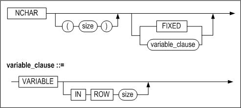
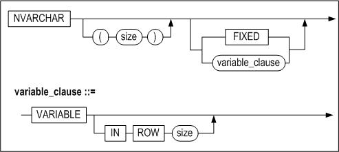
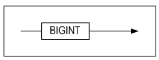
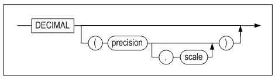
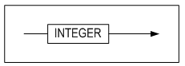
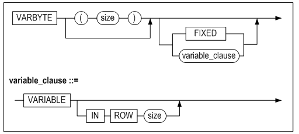
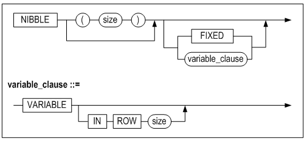
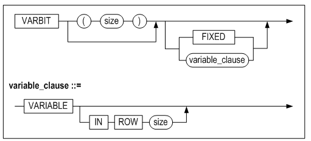
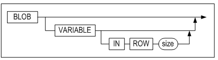

<!-- START doctoc generated TOC please keep comment here to allow auto update -->
<!-- DON'T EDIT THIS SECTION, INSTEAD RE-RUN doctoc TO UPDATE -->

- [General Reference](#general-reference)
  - [서문](#%EC%84%9C%EB%AC%B8)
    - [이 매뉴얼에 대하여](#%EC%9D%B4-%EB%A7%A4%EB%89%B4%EC%96%BC%EC%97%90-%EB%8C%80%ED%95%98%EC%97%AC)
  - [1.자료형](#1%EC%9E%90%EB%A3%8C%ED%98%95)
    - [자료형의 개요](#%EC%9E%90%EB%A3%8C%ED%98%95%EC%9D%98-%EA%B0%9C%EC%9A%94)
    - [문자형 데이터 타입](#%EB%AC%B8%EC%9E%90%ED%98%95-%EB%8D%B0%EC%9D%B4%ED%84%B0-%ED%83%80%EC%9E%85)
    - [숫자형 데이터 타입](#%EC%88%AB%EC%9E%90%ED%98%95-%EB%8D%B0%EC%9D%B4%ED%84%B0-%ED%83%80%EC%9E%85)
    - [날짜형 데이타 타입](#%EB%82%A0%EC%A7%9C%ED%98%95-%EB%8D%B0%EC%9D%B4%ED%83%80-%ED%83%80%EC%9E%85)
    - [이진 데이터 타입](#%EC%9D%B4%EC%A7%84-%EB%8D%B0%EC%9D%B4%ED%84%B0-%ED%83%80%EC%9E%85)
    - [LOB 데이타 타입](#lob-%EB%8D%B0%EC%9D%B4%ED%83%80-%ED%83%80%EC%9E%85)
    - [공간 데이터 타입](#%EA%B3%B5%EA%B0%84-%EB%8D%B0%EC%9D%B4%ED%84%B0-%ED%83%80%EC%9E%85)
  - [2.Altibase 프로퍼티](#2altibase-%ED%94%84%EB%A1%9C%ED%8D%BC%ED%8B%B0)
    - [환경 설정 방법](#%ED%99%98%EA%B2%BD-%EC%84%A4%EC%A0%95-%EB%B0%A9%EB%B2%95)
    - [프로퍼티 요약](#%ED%94%84%EB%A1%9C%ED%8D%BC%ED%8B%B0-%EC%9A%94%EC%95%BD)
    - [데이터베이스 초기화 프로퍼티](#%EB%8D%B0%EC%9D%B4%ED%84%B0%EB%B2%A0%EC%9D%B4%EC%8A%A4-%EC%B4%88%EA%B8%B0%ED%99%94-%ED%94%84%EB%A1%9C%ED%8D%BC%ED%8B%B0)
    - [성능 관련 프로퍼티](#%EC%84%B1%EB%8A%A5-%EA%B4%80%EB%A0%A8-%ED%94%84%EB%A1%9C%ED%8D%BC%ED%8B%B0)

<!-- END doctoc generated TOC please keep comment here to allow auto update -->

Altibase® Administration

# General Reference


Altibase Administration General Reference

Release 7.1

Copyright ⓒ 2001\~2018 Altibase Corp. All Rights Reserved.

본 문서의 저작권은 ㈜알티베이스에 있습니다. 이 문서에 대하여 당사의 동의
없이 무단으로 복제 또는 전용할 수 없습니다.

**㈜알티베이스**

08378 서울시 구로구 디지털로 306 대륭포스트타워Ⅱ 10층

전화: 02-2082-1114 팩스: 02-2082-1099

고객서비스포털: <http://support.altibase.com>

homepage: [http://www.altibase.com](http://www.altibase.com/)

## 서문

### 이 매뉴얼에 대하여

이 매뉴얼은 Altibase의 기능, 제품 구성요소, 그리고 사용법에 대해 설명한다.

#### 대상 사용자

이 매뉴얼은 다음과 같은 Altibase 사용자를 대상으로 작성되었다.

- 데이터베이스 관리자
- 성능 관리자
- 데이터베이스 사용자
- 응용 프로그램 개발자
- 기술지원부

다음과 같은 배경 지식을 가지고 이 매뉴얼을 읽는 것이 좋다.

- 컴퓨터, 운영 체제 및 운영 체제 유틸리티 운용에 필요한 기본 지식
- 관계형 데이터베이스 사용 경험 또는 데이터베이스 개념에 대한 이해
- 컴퓨터 프로그래밍 경험
- 데이터베이스 서버 관리, 운영 체제 관리 또는 네트워크 관리 경험

#### 소프트웨어 환경

이 매뉴얼은 데이터베이스 서버로 Altibase 버전 7.1을 사용한다는 가정 하에
작성되었다.

#### 이 매뉴얼의 구성

이 매뉴얼은 다음과 같이 구성되어 있다.

- 제 1장 자료형  
  이 장은 Altibase에서 지원하는 데이터 타입에 대해 설명한다.
- 제 2장 Altibase 프로퍼티  
  이 장은 Altibase 프로퍼티에 대해 설명한다.
- 제 3장 데이터베이스 객체 및 권한 관리  
  이 장은 Altibase 데이터 딕셔너리에 대해 설명한다. Altibase의 데이터
  딕셔너리는 데이터베이스 객체 정보를 저장하는 메타 테이블과 시스템 프로세스
  정보를 저장하는 프로세스 테이블로 나뉘어진다.
- 제 4장 샘플 스키마  
  이 장은 샘플로 제공되는 테이블 정보와 ER 다이어그램을 제공한다.

#### 문서화 규칙

이 절에서는 이 매뉴얼에서 사용하는 규칙에 대해 설명한다. 이 규칙을 이해하면 이
매뉴얼과 설명서 세트의 다른 매뉴얼에서 정보를 쉽게 찾을 수 있다.

여기서 설명하는 규칙은 다음과 같다.

- 구문 다이어그램
- 샘플 코드 규칙

##### 구문 다이어그램

이 매뉴얼에서는 다음 구성 요소로 구축된 다이어그램을 사용하여, 명령문의 구문을
설명한다.


| 구성 요소                                | 의미                                                         |
| ---------------------------------------- | ------------------------------------------------------------ |
|  | 명령문이 시작한다. 완전한 명령문이 아닌 구문 요소는 화살표로 시작한다. |
|  | 명령문이 다음 라인에 계속된다. 완전한 명령문이 아닌 구문 요소는 이 기호로 종료한다. |
|  | 명령문이 이전 라인으로부터 계속된다. 완전한 명령문이 아닌 구문 요소는 이 기호로 시작한다. |
|  | 명령문이 종료한다.                                           |
|  | 필수 항목                                                    |
|  | 선택적 항목                                                  |
|  | 선택사항이 있는 필수 항목. 한 항목만 제공해야 한다.          |
|  | 선택사항이 있는 선택적 항목.                                 |
|  | 선택적 항목. 여러 항목이 허용된다. 각 반복 앞부분에 콤마가 와야 한다. |

##### 샘플 코드 규칙

코드 예제는 SQL, Stored Procedure, iSQL, 또는 다른 명령 라인 구문들을 예를 들어
설명한다.

아래 테이블은 코드 예제에서 사용된 인쇄 규칙에 대해 설명한다.

| 규칙         | 의미                                                         | 예제                                                         |
| ------------ | ------------------------------------------------------------ | ------------------------------------------------------------ |
| [ ]          | 선택 항목을 표시                                             | VARCHAR [(*size*)][[FIXED \|] VARIABLE]                      |
| { }          | 필수 항목 표시. 반드시 하나 이상을 선택해야 되는 표시        | { ENABLE \| DISABLE \| COMPILE }                             |
| \|           | 선택 또는 필수 항목 표시의 인자 구분 표시                    | { ENABLE \| DISABLE \| COMPILE } [ ENABLE \| DISABLE \| COMPILE ] |
| . . .        | 그 이전 인자의 반복 표시 예제 코드들의 생략되는 것을 표시    | SQL\> SELECT ename FROM employee; <br/>ENAME<br/> ------------------------<br/> SWNO<br/> HJNO<br/> HSCHOI<br/> .<br/> .<br/> . <br/>20 rows selected. |
| 그 밖에 기호 | 위에서 보여진 기호 이 외에 기호들                            | EXEC :p1 := 1; acc NUMBER(11,2);                             |
| 기울임 꼴    | 구문 요소에서 사용자가 지정해야 하는 변수, 특수한 값을 제공해야만 하는 위치 | SELECT \* FROM *table_name*;<br/> CONNECT *userID*/*password*; |
| 소문자       | 사용자가 제공하는 프로그램의 요소들, 예를 들어 테이블 이름, 칼럼 이름, 파일 이름 등 | SELECT ename FROM employee;                                  |
| 대문자       | 시스템에서 제공하는 요소들 또는 구문에 나타나는 키워드       | DESC SYSTEM_.SYS_INDICES_;                                   |

#### 관련 자료

자세한 정보를 위하여 다음 문서 목록을 참조한다.

- Installation Guide
- Getting Started Guide
- Administrator’s Manual
- Replication Manual

#### Altibase는 여러분의 의견을 환영합니다.

이 매뉴얼에 대한 여러분의 의견을 보내주시기 바랍니다. 사용자의 의견은 다음
버전의 매뉴얼을 작성하는데 많은 도움이 됩니다. 보내실 때에는 아래 내용과 함께
고객서비스포털( http://support.altibase.com/kr/ )로 보내주시기 바랍니다.

- 사용 중인 매뉴얼의 이름과 버전
- 매뉴얼에 대한 의견
- 사용자의 성함, 주소, 전화번호

이 외에도 Altibase 기술지원 설명서의 오류와 누락된 부분 및 기타 기술적인
문제들에 대해서 이 주소로 보내주시면 정성껏 처리하겠습니다. 또한, 기술적인
부분과 관련하여 즉각적인 도움이 필요한 경우에도 고객서비스포털을 통해 서비스를
요청하시기 바랍니다.

여러분의 의견에 항상 감사드립니다.

## 1.자료형

SQL을 사용하여 데이타베이스에 데이타를 저장, 변경하고 질의하기 위해서는
데이타베이스의 자료형에 대한 이해가 선행되어야 한다. 이 장에서는 Altibase가
지원하는 데이타형에 대해서 자세히 설명한다.

### 자료형의 개요

#### 데이타형의 종류

Altibase에서 지원하는 데이타형은 다음과 같다.

##### 문자형 데이타형

<table>
    <tr>
    	<td colspan="3">M: 정의된 칼럼 길이<br/>L: 입력 문자열의 길이
</td>
    </tr>
    <tr>
    	<th>타 입</th>
        <th>Length</th>
        <th>Size</th>
    </tr>
    <tr>
    	<td>CHAR(M)</td>
        <td>1 ~ 32000</td>
        <td>M + 2</td>
    </tr>
    <tr>
    	<td>VARCHAR(M)</td>
        <td>1 ~ 32000</td>
        <td>length + 2, 여기서
입력 값이 가변영역에 저장되면, length = L
입력 값이 고정영역에 저장되면, length = M
</td>
    </tr>
     <tr>
    	<td>NCHAR(M)</td>
        <td>1~16000(UTF16)
1~10666(UTF8)
</td>
        <td>M*2 + 2(UTF16)
M*3 + 2(UTF8)
</td>
    </tr>
     <tr>
    	<td>NVARCHAR(M)</td>
        <td>1~16000(UTF16)
1~10666(UTF8)
</td>
        <td>length*2 + 2(UTF16)
length*3 + 2(UTF8)
여기서:
입력 값이 가변영역에 저장되면, length = L
입력 값이 고정영역에 저장되면, length = M
</td>
    </tr>
    </table>
NCHAR와 NVARCHAR는 유니코드 문자형 타입이다. UTF16으로 인코딩된 문자열의 최대
길이는 UTF8로 인코딩된 문자열의 최대 길이와 다르다.

##### 숫자형 데이타형

<table>
    <tr>
        <td rowspan="12">Non-native</td>
        <th>타 입</th>
        <th>Precision</th>
        <th>Scale</th>
        <th>Size (bytes)</th>
        <th>비 고</th>
    </tr>
    <tr>
        <td>NUMERIC</td>
        <td>38</td>
        <td>0</td>
        <td rowspan="8">3+((precision)+2)/2</td>
        <td rowspan="8">*고정 소수점 숫자
*DECIMAL은 NUMERIC과 동일한 데이터 타입이다.</td>
    </tr>
    <tr>
        <td>NUMERIC(p)</td>
        <td>1 ~ 38</td>
        <td>0</td>
    </tr>
    <tr>
        <td>NUMERIC(p,s)</td>
        <td>1 ~ 38</td>
        <td>-84 ~ 128</td>
    </tr>
    <tr>
        <td>DECIMAL</td>
        <td>38</td>
        <td>0</td>
    </tr>
    <tr>
        <td>DECIMAL(p)</td>
        <td>1 ~ 38</td>
        <td>0</td>
    </tr>
    <tr>
        <td>DECIMAL(p,s)</td>
        <td>1 ~ 38</td>
        <td>-84 ~ 128</td>
    </tr>
    <tr>     
        <td>NUMBER(p)</td>
        <td>1 ~ 38</td>
        <td>0</td>
    </tr>
      <tr>     
        <td>NUMBER(p,s)</td>
        <td>1 ~ 38</td>
        <td>-84 ~ 128</td>
    </tr>
    <tr>
    	<td>NUMBER</td>
        <td>38</td>
        <td>X</td>
        <td rowspan="3">3+((precision)+2)/2</td>
        <td rowspan="3">*부동 소수점 숫자</td>
    </tr>
    <tr>
    	<td>FLOAT</td>
        <td>38</td>
        <td>X</td>
    </tr>
    <tr>
    	<td>FLOAT(p)</td>
        <td>1 ~ 38</td>
        <td>X</td>
    </tr>
    <tr>
    	<td rowspan="6">Native</td>
        <th>타입</th>
        <th colspan="2">호환 C Type</th>
        <th>Size(bytes)</th>
        <th>비고</th>
    </tr>
    <tr>
    	<td>DOUBLE</td>
        <td colspan="2">double</td>
        <td>8</td>
        <td rowspan="2">*부동 소수점 숫자</td>
    </tr>
    <tr>
    	<td>REAL</td>
        <td colspan="2">float</td>
        <td>4</td>
    </tr>
    <tr>
    	<td>BIGINT</td>
        <td colspan="2">long 또는
long long
</td>
        <td>8</td>
        <td rowspan="3">*정수형</td>
    </tr>
    <tr>
    	<td>INTEGER</td>
        <td colspan="2">int</td>
        <td>4</td>
    </tr> 
     <tr>
    	<td>SMALLINT</td>
        <td colspan="2">short</td>
        <td>2</td>
    </tr> 
</table>

###### 예제 

예제1. 고정 소수점 숫자 크기 계산 : ( 3 + ( ( p ) + 2 ) / 2 )

```
- NUMERIC  
  NUMERIC(38, 0): 크기 = 3 + 40/2 = 23 bytes

- NUMERIC(p) / NUMERIC(p, 0)  
  NUMERIC(10): 크기 = 3 + 12/2 = 9 bytes

- NUMERIC(p, s)  
  NUMERIC(10, 9): 크기 = 3 + 12/2 = 9 bytes
  
- DECIMAL: NUMERIC과 동일

- DECIMAL(p): NUMERIC(p)과 동일

- DECIMAL(p,s): NUMERIC(p,s)과 동일

- NUMBER(p): NUMERIC(p)과 동일

- NUMBER(p,s): NUMERIC(p,s)과 동일
```

예제2. 부동 소수점 숫자 크기 계산: ( 3 + ( ( p ) + 2 ) / 2 )

```
- FLOAT  
  FLOAT(38): 크기 = 3 + 40/2 = 23 bytes
  
- FLOAT(p)  
  FLOAT(20): 크기 = 3 + 22/2 = 14 bytes
  
- NUMBER: FLOAT과 동일
```

**날짜 데이타형**

| 타 입 | Size (byte) |
| ----- | ----------- |
| DATE  | 8           |

**이진 데이타형**

<table>
    <tr>
    	<td colspan="3">M: 정의된 칼럼 길이<br/>L: 입력 문자열의 길이
</td>
    </tr>
    <tr>
    	<th>타 입</th>
        <th>Length</th>
        <th>Size</th>
    </tr>
    <tr>
    	<td>BLOB/CLOB</td>
        <td></td>
        <td>1~2147483647</td>
    </tr>
    <tr>
    	<td>BYTE</td>
        <td>1~32000</td>
        <td>M + 2</td>
    </tr>
     <tr>
    	<td>NIBBLE</td>
        <td>1~254</td>
        <td>M/2 + 1</td>
    </tr>
     <tr>
    	<td>BIT</td>
        <td>1~64000</td>
        <td>M/8 + 4</td>
    </tr>
    <tr>
    	<td>VARBIT</td>
        <td>1~64000</td>
        <td>length/8 + 4, 여기서
입력 값이 가변영역에 저장되면, length = L
입력 값이 고정영역에 저장되면, length = M
</td>
    </tr>
    </table>

**공간 데이타형**

| 타 입    | Length       | Size (byte) |
| -------- | ------------ | ----------- |
| GEOMETRY | 8\~104857600 | length + 40 |

실제 레코드의 크기는 위에 각 데이터형 별로 명시된 크기(bytes)에서 헤더 정보 크기
만큼 추가된다. 헤더 정보는 운영체제에 따라 다를 수 있다.

#### NULL

행을 테이블에 삽입할 때 열의 값을 모르거나 값이 아직 결정되지 않은 경우, 즉 값이
존재 하지 않는 것을 나타내는 경우에 널(NULL)이 사용된다. 널(NULL)은 0 또는
공백과는 다르며, 비교연산이나 저장시 특별하게 취급된다.

NVL() 함수, IS NULL 조건, IS NOT NULL 조건을 제외한 수식 연산에 널이 포함되면,
최종 연산의 결과는 널이 된다. 즉, 수식에 널이 포함되면 비교 또는 연산이 의미가
없어지게 된다.

테이블 생성시 NOT NULL 또는 PRIMARY KEY로 정의되지 않은 모든 데이타 유형의
칼럼에는 널을 입력할 수 있다.

#### 묵시적 데이터 타입 변환 

서로 다른 데이터 타입에 대한 연산을 수행할 때 정확한 연산을 위해 데이터 타입이
변환되어 수행된다. 변환 방법은 묵시적인 방법과 명시적인 방법이 있다.

묵시적 변환이란, 타입이 다른 데이터를 연산할 때에는 내부적으로 데이터 타입을
변환하지만 데이터 타입의 속성은 유지되는 것을 의미한다. 같은 데이터 타입의 두
값을 비교 연산할 때, 어떤 변환 없이 직접 그 값에 대해 비교 연산이 수행된다.
그러나 비교되는 두 값의 데이타 타입이 다른 경우 한 쪽 값을 다른 값의 데이터
타입으로 변환한 후 비교 연산이 수행된다.

다음의 테이블은 묵시적 데이터 타입의 변환 가능한 행렬을 나타낸다 (O: 데이터
타입이 변환되어도 속성이 유지되는 것에 표시). 기존 테이블의 데이터 타입을 MODIFY
구문으로 변환하는 방법은 SQL Reference의 *modify_column_clause* 구문을 참조한다.

| 변환후 변환전 | char | var char | nchar | nvarchar | clob | big int | deci mal | dou ble | float | int eger | num ber | num eric | real | small int | date | blob | byte | varbyte | nibble | bit  | varbit | geometry |
| ------------- | ---- | -------- | ----- | -------- | ---- | ------- | -------- | ------- | ----- | -------- | ------- | -------- | ---- | --------- | ---- | ---- | ---- | ------- | ------ | ---- | ------ | -------- |
| char          | o    | o        | o     | o        |      | o       | o        | o       | o     | o        | o       | o        | o    | o         | o    |      |      |         |        |      |        |          |
| varchar       | o    | o        | o     | o        | o    | o       | o        | o       | o     | o        | o       | o        | o    | o         | o    |      |      |         |        |      |        |          |
| nchar         | o    | o        | o     | o        |      | o       | o        | o       | o     | o        | o       | o        | o    | o         | o    |      |      |         |        |      |        |          |
| nvarchar      | o    | o        | o     | o        | o    | o       | o        | o       | o     | o        | o       | o        | o    | o         | o    |      |      |         |        |      |        |          |
| clob          |      |          |       |          | o    |         |          |         |       |          |         |          |      |           |      |      |      |         |        |      |        |          |
| bigint        | o    | o        | o     | o        |      | o       | o        | o       | o     | o        | o       | o        | o    | o         |      |      |      |         |        |      |        |          |
| decimal       | o    | o        | o     | o        |      | o       | o        | o       | o     | o        | o       | o        | o    | o         |      |      |      |         |        |      |        |          |
| double        | o    | o        | o     | o        |      | o       | o        | o       | o     | o        | o       | o        | o    | o         |      |      |      |         |        |      |        |          |
| float         | o    | o        | o     | o        |      | o       | o        | o       | o     | o        | o       | o        | o    | o         |      |      |      |         |        |      |        |          |
| integer       | o    | o        | o     | o        |      | o       | o        | o       | o     | o        | o       | o        | o    | o         |      |      |      |         |        |      |        |          |
| number        | o    | o        | o     | o        |      | o       | o        | o       | o     | o        | o       | o        | o    | o         |      |      |      |         |        |      |        |          |
| numeric       | o    | o        | o     | o        |      | o       | o        | o       | o     | o        | o       | o        | o    | o         |      |      |      |         |        |      |        |          |
| real          | o    | o        | o     | o        |      | o       | o        | o       | o     | o        | o       | o        | o    | o         |      |      |      |         |        |      |        |          |
| smallint      | o    | o        | o     | o        |      | o       | o        | o       | o     | o        | o       | o        | o    | o         |      |      |      |         |        |      |        |          |
| date          | o    | o        | o     | o        |      |         |          |         |       |          |         |          |      |           | o    |      |      |         |        |      |        |          |
| blob          |      |          |       |          |      |         |          |         |       |          |         |          |      |           |      | o    |      |         |        |      |        |          |
| byte          |      |          |       |          |      |         |          |         |       |          |         |          |      |           |      | o    | o    | o       |        |      |        |          |
| varbyte       |      |          |       |          |      |         |          |         |       |          |         |          |      |           |      | o    | o    | o       |        |      |        |          |
| nibble        |      |          |       |          |      |         |          |         |       |          |         |          |      |           |      |      |      |         | o      |      |        |          |
| bit           |      |          |       |          |      |         |          |         |       |          |         |          |      |           |      |      |      |         |        | o    | o      |          |
| varbit        |      | o        |       |          |      |         |          |         |       |          |         |          |      |           |      |      |      |         |        | o    | o      |          |
| geometry      |      |          |       |          |      |         |          |         |       |          |         |          |      |           |      |      |      |         |        |      |        | o        |

##### 묵시적 데이터 타입 변환 규칙

테이블 t10 테이블에 bit 타입의 '1000'을 입력하면 integer '1000'으로 변환은
성공하지만, 데이터 타입의 속성이 달라지기 때문에 묵시적인 데이터 타입 변환이라고
볼 수 없다.

```
iSQL> create table t10 (i1 integer);
Create success.
iSQL> insert into t10 values (bit'1000');
1 row inserted.
iSQL> select * from t10;
I1
--------------
1000
1 row selected.
```

따라서 묵시적 데이터 타입의 변환은 아래와 같은 규칙을 따른다.

- 숫자형 데이터 타입과 문자형 데이터 타입의 비교 연산 또는 사칙 연산시, 문자형
  데이터 타입을 숫자형 데이터 타입으로 변환하여 수행한다.
- 날짜형 데이터 타입과 문자형 데이터 타입의 비교 연산시, 문자형 데이터 타입을
  날짜형 데이터 타입으로 변환하여 비교 연산을 수행한다.
- 테이터 타입의 변환이 불가능한 연산은 무효화 된다.
- 함수에서 사용되는 인자는 함수에서 정의된 인자의 데이터 타입으로 변환한다.
- 문자형 데이터 타입이나 십진 정밀도(decimal precision)를 사용하는 수치형
  데이터 타입을 이진 정밀도(binary precision)를 사용하는 부동소수점 수치형
  데이터 타입으로 변환하면 값이 손실될 수 있다.
- INSERT, UPDATE 실행시 INSERT, UPDATE 되는 칼럼의 데이터 타입으로 데이터형이
  변환된다.

##### 예제

\<질의\> 숫자형 테이터 타입과 문자형 테이터 타입의 비교 연산시 문자형 데이터
타입 '10'은 숫자형 데이터로 변환된다.

```
iSQL> create table emp (empno integer, name varchar(10), hire_date date);
insert into emp values (10,'altibase', '10-nov-2015');

iSQL> select name from emp where empno = '10';
NAME
--------------
altibase
1 row selected.
```

\<질의\> 숫자형 데이터 타입과 문자형 데이터 타입 간 사칙연산시 문자형 데이터
타입 '10'은 숫자형 데이터 타입으로 변환된다.

```
iSQL> select empno + '10' from emp;
EMPNO+'10'
-------------------------
20
1 row selected.
```

\<질의\> 날짜형 데이터 타입과 문자형 데이터 타입의 비교 연산시 문자형 데이터
타입 '10-nov-2015'은 날짜형 데이터 타입으로 변환된다.

```
iSQL> select hire_date from emp where hire_date = '10-nov-2015';
HIRE_DATE
---------------
10-NOV-2015
1 row selected.
```

\<질의\> 숫자형 데이터 타입과 문자형 데이터 타입 간 사칙연산시 이진 데이터
타입은 숫자형 데이터 타입으로 변환할 수 없어 연산이 무효화된다.

```
iSQL> select empno + cast(12345 as nibble(6)) from emp;
[ERR-2100C : Conversion not applicable.
0001 : select EMPNO + CAST(12345 as NIBBLE(6)) from EMP
             ^                               ^
]
```

\<질의\> 함수 SUM에 문자형 데이터 타입 '10'을 인자로 받는 경우 숫자형 데이터로
변환된다.

```
iSQL> select sum('10') from dual;
SUM('10')
--------------
10
1 row selected.
```

\<질의\> 문자형 데이터 타입 '12.123456789'을 부동소수점 숫자형 데이터 타입인
float으로 변환하면, 유효 자릿수는 float(11)로 되어 값의 손실이 발생한다.

```
iSQL> select float'12.123456789' from dual;
FLOAT'12.123456789'
----------------------
12.1234568
1 row selected.
```

\<질의\> INSERT 되는 숫자형 데이터의 값은 INSERT 되는 칼럼의 데이터 유형에 맞게
변환되어 값이 INSERT 된다.

```
iSQL>  create table t1 ( i1 char(10), i2 integer, i3 double);
Create success.
iSQL>  insert into t1 values (integer'1020', char'1928', float'123.1234');
1 row inserted.
iSQL>     select * from t1;
I1          I2          I3
---------------------------------------------------
1020        1928        123.1234
1 row selected.
```

#### 명시적 데이터 타입 변환

명시적 데이터 타입 변환은 SQL 변환 함수 또는 아래와 같이 타입 캐스팅을 사용해서
명시적으로 수행될 수 있다. 데이터 타입을 변환하는 SQL 함수는 SQL Reference에서
설명한다.

##### 구문

```
datatype '문자 또는 상수 literal '
```

##### 예제

어떤 데이터 타입의 상수 테이터를 명시적으로 다른 데이터 타입으로 변환한다.
다음은 157.27의 숫자 값을 '157.27'의 문자열로 변환하는 예제이다.

```
CHAR '157.27'
```

#### 문자열 표기

SQL쿼리에서 문자열을 표기할 시에는 홀 따옴표(‘)로 문자열을 묶어서 사용한다. 홀
따옴표를 문자열로 표기할 시에는 홀 따옴표가 escape문자가 되므로 앞에 홀 따옴표를
붙여줘야 한다.

##### 예제

```
SELECT * FROM EMPLOYEE WHERE NAME = ’KIM’;
INSERT INTO EMPLOYEE VALUES (‘GILDONG’’’);//GILDONG’ 값을 삽입
SELECT * FROM REMOTE_TABLE(link1, ‘SELECT * FROM EMPLOYEE WHERE NAME=‘’KIM‘’’; //''는 쌍 따옴표가 아니라 홀 따옴표 두 개임
```

#### FIXED/VARIABLE 옵션

FIXED와 VARIABLE은 칼럼의 데이터가 어느 영역에 저장될 지를 지정하는 키워드이다.

한 레코드 전체가 연속된 공간에 저장될 때, 이 공간을 고정(FIXED) 영역이라고 한다.
칼럼들 중의 하나가 그 레코드의 나머지 연속된 고정 영역이 아닌 다른 분리된 공간에
저장될 때, 이 칼럼은 가변(VARIABLE) 영역에 저장된다고 말한다.

한 칼럼이 가변 영역에 저장될 때, 데이터 길이와 실제 데이터가 저장된 위치를
가리키는 포인터 같은 그 칼럼의 헤더 정보는 고정 영역에 저장된다. 반면 칼럼의
데이터는 가변 영역에 저장된다.

디스크 테이블스페이스에 테이블 생성시, 사용자가 FIXED 또는 VARIABLE을
지정하더라도 이는 무시되고 테이블의 모든 칼럼은 FIXED로 처리된다. 그러나 메모리
테이블스페이스에 테이블을 생성할 때는 사용자가 명시한 옵션이 그대로 사용된다.

그러나, 모든 LOB 데이터 타입 칼럼의 데이터는 항상 VARIABLE로 처리되고, 그
데이터는 IN ROW 절에 지정된 값에 따라서 고정 또는 가변 영역에 저장될 수 있다.

다음의 데이터 타입에 대해 VARIABLE을 지정할 수 있다.  
: CHAR, VARCHAR, NCHAR, NVARCHAR, BYTE, VARBATE, NIBBLE, BIT, VARBIT, BLOB, 및
CLOB

#### IN ROW 절

이 절은 가변 영역에 저장되는 칼럼 데이터에만 관련이 있다. 테이블 생성시 FIXED와
IN ROW 절이 모두 명시되면, IN ROW 절은 무시된다. VARIABLE로 지정된 칼럼에
데이터가 입력될 때, 데이터의 길이가 IN ROW 절에 명시된 값 이하이면 데이터는 고정
영역에 저장될 것이다. 반면 데이터의 길이가 IN ROW 절에 명시된 값보다 크면,
데이터는 가변 영역에 저장될 것이다.

여기서 “데이터의 길이”는 입력된 데이터의 길이가 아니고, 메모리 또는 디스크에
실제로 저장될 데이터의 길이를 의미하는데, 이는 입력 데이터의 길이보다 다소 크다.
예를 들어, 칼럼이 ‘VARCHAR(400) IN ROW 200’으로 정의 되었다면, 입력 데이터의
길이가 198 (데이터 저장시 2바이트가 추가로 더 필요하다) 이하일 때 데이터는 고정
영역에 저장될 것이다.

고정 영역에 저장되는 LOB 데이터의 기본 크기는 메모리 테이블을 위한
MEMORY_LOB_COLUMN_IN_ROW_SIZE 프로퍼티와 디스크 테이블을 위한
DISK_LOB_COLUMN_IN_ROW_SIZE 프로퍼티를 사용해서 지정할 수 있다. 또한, VARIABLE
옵션이 지정된 다른 데이터 타입의 칼럼을 위한 기본 크기는
MEMORY_VARIABLE_COLUMN_IN_ROW_SIZE 프로퍼티를 사용해서 명시할 수 있다. 이들
프로퍼티를 지정하면 테이블 생성시 각 칼럼에 반복적으로 IN ROW 절을 사용할 필요가
없다.

이들 프로퍼티에 대한 상세한 설명은 2장을 참고하기 바란다.

### 문자형 데이터 타입

문자 데이터 타입은 데이터베이스 문자 집합 또는 국가 문자 집합의 문자 데이터를
저장하는데 사용된다.

Altibase는 아래의 타입을 지원한다.

- CHAR
- VARCHAR
- NCHAR
- NVARCHAR

#### CHAR

##### 흐름도


##### 구문

```
CHAR [(size)] [ FIXED | VARIABLE [IN ROW size] ]
```

##### 설명

명시된 크기(size)만큼 고정 길이를 가지는 문자형 데이터 타입이다. 명시된 전체
크기에 비해 입력 값의 길이가 작을 경우 뒷부분은 공백으로 채워진다.

CHAR 칼럼의 기본 크기는 1 바이트이며 최대 길이는 32000바이트이다.

FIXED 와 VARIABLE 절에 대한 자세한 설명은 앞서 기술한 ""과 ""을 참고한다.

#### VARCHAR

##### 흐름도


##### 구문

```
VARCHAR [(size)] [ FIXED | VARIABLE [IN ROW size] ]
```

##### 설명

명시된 크기 내에서 가변 길이를 가지는 문자형 데이터 타입이다.

VARCHAR 칼럼의 기본 크기는 1 바이트이며 최대 길이는 32000바이트이다.

VARCHAR는 가변 길이 데이터 타입이다. 즉, 입력 데이터의 길이가 정의된 칼럼의
크기보다 작을 경우, 실제로 입력된 데이터만 저장된다. 반면, CHAR 데이터 타입의
경우 입력 데이터의 길이가 칼럼 크기보다 작으면 그 칼럼의 남는 공간은 공백으로
채워진다. 예를 들어, CHAR(10)으로 정의된 칼럼에 단어 "magic"이 입력되면, 이
데이터는 "magic_____"으로 저장될 것이다. 여기서 "_"은 공백을 나타낸다.

FIXED 와 VARIABLE 절에 대한 자세한 설명은 앞서 기술한 ""과 ""을 참고한다.

#### NCHAR

##### 흐름도



##### 구문

```
NCHAR [(size)] [ FIXED | VARIABLE [IN ROW size] ]
```

##### 설명

명시된 길이만큼 고정 길이를 가지는 문자형 데이타 타입이다. 정의된 칼럼 크기에
비해 입력 값의 길이가 작을 경우, 남는 공간은 공백으로 채워진다.

NCHAR 칼럼의 문자 하나당 크기는 국가 문자 집합(national character set)이 UTF16인
경우에는 고정길이 2바이트이고(가변길이 없음), UTF8인 경우에는 가변길이
3바이트(고정길이 없음)이다. UFT16은 한 문자에 대해 고정 2바이트를 사용하는 반면,
UTF8은 1\~3바이트까지 가변으로 사용하기 때문이다.

국가 문자 집합이 UTF16이면 최대 크기는 16000 bytes이다.

FIXED 와 VARIABLE 절에 대한 자세한 설명은 앞서 기술한 "FIXED/VARIABLE 옵션"과
"IN ROW 절"을 참고한다.

#### NVARCHAR

##### 흐름도



##### 구문

```
NVARCHAR [(size)] [ FIXED | VARIABLE [IN ROW size] ]
```

##### 설명

명시된 길이 내에서 가변 길이를 가지는 유니코드 문자형 데이타 타입이다.

NVARCHAR 칼럼의 문자 하나당 크기는 국가 문자 집합(national character set)이
UTF16인 경우에는 고정길이 2바이트이고(가변길이 없음), UTF8인 경우에는 가변길이
3바이트(고정길이 없음)이다. UFT16은 한 문자에 대해 고정 2바이트를 사용하는 반면,
UTF8은 1\~3바이트까지 가변으로 사용하기 때문이다.

나머지 속성은 VARCHAR와 동일하므로, 더 상세한 설명은 VARCHAR 타입을 참조한다.

FIXED 와 VARIABLE 절에 대한 자세한 설명은 앞서 기술한 "FIXED/VARIABLE 옵션"과
"IN ROW 절"을 참고한다.

### 숫자형 데이터 타입

Altibase는 다음의 숫자형 데이터 타입을 지원한다.

- BIGINT
- DECIMAL
- DOUBLE
- FLOAT
- INTEGER
- NUMBER
- NUMERIC
- REAL
- SMALLINT

#### BIGINT

##### 흐름도



##### 구문

```
BIGINT
```

##### 설명

8 바이트 정수형 데이터 타입이다.

C언어의 long(64 bit 시스템에서) 또는 long long(32 bit 시스템에서)과 동일하다.

범위: -2<sup>63</sup> + 1(-9223372036854775807) \~ 2<sup>63</sup> – 1(9223372036854775807)

#### DECIMAL

##### 흐름도



##### 구문

```
DECIMAL [(precision[, scale])]
```

##### 설명

DECIMAL은 NUMERIC 데이터 타입과 동일하다.

#### DOUBLE

##### 흐름도


##### 구문

```
DOUBLE
```

##### 설명

8 바이트 부동 소수점 숫자형 데이터 타입이다.

C언어의 double과 동일한 데이터 타입이다.

#### FLOAT

##### 흐름도


##### 구문

```
FLOAT [(precision)]
```

##### 설명

\-1E+120에서 1E+120까지 내의 부동 소수점 숫자 데이터 타입이다.

*Precision*은 정밀도 표시하기 위해 부동 소수점 숫자의 가수를 유효숫자 표기법으로
저장하는 데 사용되는 유효숫자의 자릿수이다.

*Precision*의 범위는 1에서 38까지이며, 39번째 자릿수에서 값이 반올림된다.
*Precision*이 생략되면 기본값으로 38이 설정된다.

#### INTEGER

##### 흐름도



##### 구문

```
INTEGER
```

##### 설명

4 바이트 크기의 정수형 데이터 타입이다.

C언어의 int와 동일한 데이터 타입이다.

\-2,147,483,647에서 2,147,483,647까지의 정수값을 가질 수 있다.

#### NUMBER

##### 흐름도


##### 구문

```
NUMBER [(precision, scale)]
```

##### 설명

NUMERIC 데이터 타입의 alias이다. 단, *precision*과 *scale*이 명시되지 않으면
FLOAT데이터 타입과 동일하게 취급된다. FLOAT 데이터 타입은 39번째 자릿수에서 값이
반올림된다.

#### NUMERIC

##### 흐름도


##### 구문

```
NUMERIC [(precision, scale)]
```

##### 설명

NUMERIC은 Precision과 scale을 가지는 숫자형 데이터 타입으로 precision 만큼의
유효 숫자와 scale 만큼의 소수점 이하 정밀도를 가지는 고정 소수점형이다. FLOAT
데이터 타입이 실수를 표현하는 형식인 부동 소수점 형식인 반면 NUMERIC 데이터
타입은 precision과 scale이 모두 생략되면 precision은 38, scale은 0인 정수를
표현하는 고정 소수점형으로 사용된다.

- Precision은 1부터 38까지의 값을 명시할 수 있다.
- Scale은 -84에서 128까지의 값을 명시할 수 있다.
- Precision이 생략되면 기본값으로 38이 설정된다.
- Scale이 생략되면 기본값으로 0이 설정된다.

다음은 각각 정의된 NUMERIC 타입의 칼럼에 입력 값이 1234567.89일때의 변환된 값을
보여준다.

- NUMERIC =\> 1234568
- NUMERIC(9) =\> 1234568
- NUMERIC(9, 2) =\> 1234567.89
- NUMERIC(9, 1) =\> 1234567.9
- NUMERIC(6) =\> precision 초과
- NUMERIC(7, -2) =\> 1234500
- NUMERIC(7, 2) =\> precision 초과

#### REAL

##### 흐름도


##### 구문

```
REAL
```

##### 설명

4 바이트 크기의 부동 소수점형이다.

C언어의 float과 동일한 데이터 타입이다.

#### SMALLINT

##### 흐름도


##### 구문

```
SMALLINT
```

##### 설명

2 바이트 크기의 정수형 데이터 타입이다.

C언어의 short와 동일한 데이터 타입이다.

\-2<sup>15</sup> + 1(-32,767)에서 2<sup>15</sup> - 1(32,767) 까지의 정수값을 가질 수 있다.

#### 숫자형 데이타 형식

TO_CHAR 나 TO_NUMBER 등의 타입 변환 함수를 사용할 때 숫자형 데이타에 대하여
다음과 같이 형식을 지정할 수 있다. 숫자 데이타 형식은 하나 이상의 숫자를
표시하는 요소로 구성된다. 이장에서는 각각의 요소와 관련된 데이타 형식의 예를
설명한다.

##### , (쉼표)

###### 설명

지정한 위치에 쉼표를 출력한다. 쉼표는 여러 번 사용할 수 있다.

###### 제한사항

쉼표는 숫자의 끝, 마침표의 오른쪽, 또는 숫자의 맨 앞자리에 올 수 없다.

###### 예제

```
iSQL> SELECT TO_CHAR (1234, '99,99') FROM dual;
TO_CHAR (1234, '99,99')  
---------------------------
 12,34           
1 row selected.

iSQL> SELECT TO_NUMBER ( '12,34', '99,99') FROM dual;
TO_NUMBER ( '12,34', '99,99') 
--------------------------------
1234        
1 row selected.
```

##### . (마침표)

###### 설명

지정한 위치에 마침표를 추가로 반환한다.

###### 제한사항

한 숫자 내에서 마침표는 한번만 사용할 수 있다.

###### 예제

```
iSQL> SELECT TO_CHAR (1.234, '99.999') FROM dual;
TO_CHAR (1.234, '99.999')  
-----------------------------
  1.234          
1 row selected.

iSQL> SELECT TO_NUMBER ( '1.234', '99.999') FROM dual;
TO_NUMBER ( '1.234', '99.999') 
---------------------------------
1.234       
1 row selected.
```

##### \$

###### 설명

숫자 앞에 \$ 기호를 붙인다.

###### 예제

```
iSQL> SELECT TO_CHAR (123, '$9999') FROM dual;
TO_CHAR (123, '$9999')  
--------------------------
  $123           
1 row selected.

iSQL> SELECT TO_NUMBER ( '$0123', '09$99') FROM dual;
TO_NUMBER ( '$0123', '09$99') 
--------------------------------
123         
1 row selected.
```

##### 0(숫자 0)

###### 설명

정수 부분의 유효 자리수가 실제 숫자의 자리수 보다 많을 경우 실제 숫자 앞에 0을
채워서 반환한다. 그 외의 특성은 9와 같다.

###### 예제

```
iSQL> SELECT TO_CHAR (123, '0999') FROM dual;
TO_CHAR (123, '0999')  
-------------------------
 0123
```

##### 9(숫자 9)

###### 설명

출력할 숫자의 자릿수를 숫자 9를 이용해서 표시한다. 실제 숫자의 자릿수 보다 9의
개수가 더 많으면 앞에 공백문자를 출력하여 길이를 맞추고, 정수 부분의 9의 개수가
실제 숫자보다 더 적으면 숫자의 길이만큼 \#를 출력한다. \#의 개수는 사용자가
지정한 형식에 쓰인 문자의 개수 + 1(부호문자)이다.

9사이에 오는 마침표는 숫자의 정수 부분과 소수 부분을 구분하여 출력하게 한다.

첫 번째 인자에 소수가 있는데 사용자가 지정한 형식에 소수를 표현하는 부분이
없거나, 더 적으면 반올림해서 사용자가 지정한 형식의 소수 부분의 길이에 맞춘다.

###### 예제

```
iSQL> SELECT TO_CHAR (123, '99999') FROM dual;
TO_CHAR (123, '99999')  
--------------------------
   123

iSQL> SELECT TO_CHAR (123.55, '999') FROM dual;
TO_CHAR (123.55, '999')  
---------------------------
 124             
1 row selected.

iSQL> SELECT TO_CHAR (123.4567, '999999') FROM dual;
TO_CHAR (123.4567, '999999')  
--------------------------------
    123          
1 row selected.

iSQL> SELECT TO_CHAR (1234.578, '9999.99') FROM dual;
TO_CHAR (1234.578, '9999.99')  
---------------------------------
 1234.58         
1 row selected.

iSQL> SELECT TO_CHAR (1234.578, '999.99999') FROM dual;
TO_CHAR (1234.578, '999.99999')  
-----------------------------------
##########       
1 row selected.

iSQL> SELECT TO_NUMBER ( '123', '99999') FROM dual;
TO_NUMBER ( '123', '99999') 
------------------------------
123         
1 row selected.
iSQL> SELECT TO_NUMBER ( '1234.58', '9999.99') FROM dual;
TO_NUMBER ( '1234.58', '9999.99') 
------------------------------------
1234.58     
1 row selected.
```
##### FM

###### 설명

출력 문자열의 왼쪽 부분의 공백이나 0을 제거합니다.

###### 예제

```
iSQL> select to_char(00123.100,'99999.999') from dual;
TO_CHAR(00123.100,'99999.999')
----------------------------------
   123.100
1 row selected.
iSQL> select to_char(00123.100,'FM99999.999') from dual;
TO_CHAR(00123.100,'FM99999.999')
------------------------------------
123.100
1 row selected.
```

##### B

###### 설명

결과값이 0일 경우, 0을 공백(Blank)으로 반환한다.

###### 예제

```
iSQL> SELECT TO_CHAR (0.4, 'B9') FROM T1;
TO_CHAR (0.4, 'B9')  
-----------------------
                 
1 row selected.
```

##### C

###### 설명

ISO 통화 기호(NLS_ISO_CURRENCY 프로퍼티에 설정된 값)를 지정한 위치에 반환한다.

###### 예제

```
iSQL> SELECT TO_CHAR (4000, 'C9999') FROM dual;
TO_CHAR (4000, 'C9999')
---------------------------
 KRW4000
1 row selected.
```

##### D

###### 설명

소수점 문자(NLS_NUMERIC_CHARACTER 프로퍼티에 설정된 값)를 지정한 위치에
반환한다. 기본값은 마침표(.)이다.

제약사항: 숫자 형식을 명시할 때 한 개의 소수점 문자만 포함할 수 있다.

###### 예제

```
iSQL> SELECT TO_CHAR (24.06, '99D99') FROM dual;
TO_CHAR (24.06, '99D99')
----------------------------
 24.06
1 row selected.
iSQL> SELECT TO_CHAR (206, '999D99') FROM dual;
TO_CHAR (206, '999D99')
---------------------------
 206.00
1 row selected.
```

##### EEEE

###### 설명

입력 받은 숫자를 지수 표기법을 이용하여 표기한다.

###### 제한사항

EEEE는 항상 오른쪽 끝에 와야 한다. 단 S, PR, MI보다는 왼쪽에 오는 것이 가능하다.
쉼표와 같이 사용할 수 없다.  
TO_NUMBER 함수에서 사용할 수 없다.

###### 예제

```
iSQL> SELECT TO_CHAR (1234, '9.9EEEE') FROM dual;
TO_CHAR (1234, '9.9EEEE')  
-----------------------------
  1.2E+03        
1 row selected.
```

##### G

###### 설명

그룹 구분자(NLS_NUMERIC_CHARACTER 프로퍼티에 설정된 값)를 지정한 위치에
반환한다. 하나의 숫자형 데이터 형식에 그룹 구분자를 여러 번 지정할 수 있다.

###### 제약사항

그룹 구분자는 하나의 숫자형 데이터 형식에서 소수점 문자 또는 마침표의
오른쪽에 올 수 없다.

###### 예제

```
iSQL> SELECT TO_CHAR (2534.3, '999G999D99') FROM dual;
TO_CHAR (2534.3, '999G999D99')
----------------------------------
   2,534.30
1 row selected.
```

##### L

###### 설명

지역 통화 기호(NLS_CURRENCY 프로퍼티에 설정된 값)를 지정한 위치에 반환한다.

###### 예제

```
iSQL> SELECT TO_CHAR (4000, 'L9999') FROM dual;
TO_CHAR (4000, 'L9999')
---------------------------
 ?4000
1 row selected.
```

##### MI

###### 설명

MI를 숫자 표현 형식의 오른쪽 끝에 사용하면 입력 받은 수가 음수일 경우
마이너스(-) 기호를 숫자 끝에 붙여서 반환한다. 양수일 경우에는 공백문자가
들어간다.

###### 제한사항

MI는 항상 숫자 형식 표현의 오른쪽 끝에 와야 한다. S, PR과 같이 사용할 수 없다.

###### 예제

```
iSQL> SELECT TO_CHAR (-123, '999MI') FROM dual;
TO_CHAR (-123, '999MI')  
---------------------------
123-             
1 row selected.

iSQL> SELECT TO_NUMBER ( '123-', '999MI') FROM dual;
TO_NUMBER ( '123-', '999MI') 
-------------------------------
-123        
1 row selected.
```

##### PR

###### 설명

PR를 숫자 표현 형식의 오른쪽 끝에 사용하면 입력 받은 수가 음수일 경우 마이너스
기호(-) 대신 \<숫자\> 형태로 출력된다.

###### 제한사항

PR은 항상 숫자 표현 형식의 오른쪽 끝에 와야 한다.  
S, MI와 같이 사용할 수 없다.

###### 예제

```
iSQL> SELECT TO_CHAR (-123, '999PR') FROM dual;
TO_CHAR (-123, '999PR')  
---------------------------
<123>            
1 row selected.

iSQL> SELECT TO_NUMBER ( '<123>', '999PR') FROM dual;
TO_NUMBER ( '<123>', '999PR') 
--------------------------------
-123        
1 row selected.
```

##### RN

###### 설명

입력 받은 수를 로마 숫자로 변환한다. 입력할 수 있는 수는 1부터 3999까지이다.
숫자 표현 형식을 소문자 rn으로 사용하면 로마 숫자가 소문자로 출력된다.

###### 제한사항

다른 숫자 형식과 같이 사용할 수 없다. TO_NUMBER 함수에서 사용할 수 없다.

###### 예제

```
iSQL> SELECT TO_CHAR (14, 'RN') FROM dual;
TO_CHAR (14, 'RN')  
----------------------
XIV              
1 row selected.
```

##### S

###### 설명

숫자 표현 형식의 처음이나 끝에 와서 입력 받은 수의 기호에 따라서 마이너스(-)
또는 플러스(+) 기호를 붙인다.

###### 제한사항

S는 숫자 표현 형식의 맨 앞이나 맨 뒤에만 올 수 있다.MI, PR과 같이 사용할 수
없다.

###### 예제

```
iSQL> SELECT TO_CHAR (123, 'S999.99') FROM dual;
TO_CHAR (123, 'S999.99')  
----------------------------
+123.00          
1 row selected.

iSQL> SELECT TO_CHAR (-123, '999.99S') FROM dual;
TO_CHAR (-123, '999.99S')  
-----------------------------
123.00-          
1 row selected.

iSQL> SELECT TO_NUMBER ( '+123', 'S999.99') FROM dual;
TO_NUMBER ( '+123', 'S999.99') 
---------------------------------
123         
1 row selected.

iSQL> SELECT TO_NUMBER ( '123.00-', '999.99S') FROM dual;
TO_NUMBER ( '123.00-', '999.99S') 
------------------------------------
-123        
1 row selected.
```

##### V

###### 설명

V 다음에 있는 9의 개수와 10을 곱하고 그 값을 인자로 받은 숫자와 곱한다. V 앞의
9의 개수는 첫 번째 인자의 유효숫자의 개수를 의미한다.

###### 제한사항

마침표와 같이 사용할 수 없다. TO_NUMBER 함수에서 사용할 수 없다.

###### 예제

```
iSQL> SELECT TO_CHAR (12, '99V99') FROM dual;
TO_CHAR (12, '99V99')  
-------------------------
 1200            
1 row selected.

iSQL> SELECT TO_CHAR (1200, '99V99') FROM dual;
TO_CHAR (1200, '99V99')  
---------------------------
######           
1 row selected.

iSQL> SELECT TO_CHAR (-123.456, '999V999EEEEMI') from dual;
TO_CHAR (-123.456, '999V999EEEEMI')  
---------------------------------------
 1235E+02-        
1 row selected.
```

##### XXXX

###### 설명

입력 받은 수를 16진수로 변환한다. 만약 정수가 아니라면 반올림하여 16진수로
변환한다. xxxx는 16진수 중 문자를 소문자로 반환한다.

###### 제한사항

다른 숫자 표현 형식과 같이 사용할 수 없다. 변환할 수는 0 이상이어야 한다.

###### 예제

```
iSQL> SELECT TO_CHAR (123, 'XXXX') FROM dual;
TO_CHAR (123, 'XXXX')  
-------------------------
7B               
1 row selected.

iSQL> SELECT TO_NUMBER ('ABC', 'XXXX') FROM dual;
TO_NUMBER ('ABC', 'XXXX') 
----------------------------
2748        
1 row selected.
```

### 날짜형 데이타 타입

날짜형 타입은 날짜와 시간 데이터를 저장하는데 사용된다.

#### DATE

**흐름도**


**구문**

```
DATE
```

**설명**

8바이트 크기의 날짜 값을 저장하는 데이터 타입이다.

저장할 수 있는 날짜의 범위는 시스템에 따라 다르다. 일반적으로 1년 1월 1일부터
9999년 12월 31일의 범위 내에서 사용 가능하다.

날짜 값은 날짜형 데이터 형식을 사용해서 다양한 포맷으로 출력할 수 있다.

#### 날짜형 데이터 형식

날짜형 데이터 타입의 데이터는 데이타베이스 내부적으로는 숫자형 데이터로
관리하지만 사용자는 TO_CHAR또는 TO_DATE 변환 함수 등을 사용해서 문자열로 표시할
수 있다. 변환 함수를 사용할 때 사용자는 보고자 하는 형식에 맞게 날짜형 데이터
형식 문자열을 지정해 주어야 한다.

날짜형 데이터 형식은 다음과 같은 기본요소들로 구성된다.

- AM, PM
- SCC, CC
- D, DD, DDD, DAY,DY
- HH, HH12, HH24
- MM, MON, MONTH
- MI
- Q
- SS, SSSSS, SSSSSS, SSSSSSSS, FF[1..6]
- WW, WW2, W, IW
- Y,YYY
- SYYYY, YYYY, YYY, YY, Y, RR, RRRR
- IYYY, IYY, IY, I

위의 기본 요소들과 함께 다음의 다음의 구두점과 특수 문자들도 날짜형 데이터
형식을 구성하는 요소이다.

- 하이픈(-)
- 슬래시(/)
- 쉼표(,)
- 마침표(.)
- 콜론(:)
- 홑따옴표(‘)

각각의 기본 요소들이 의미하는 바와 활용 예를 다음에서 살펴보자.

##### AM, PM

###### 설명

정오를 기준으로 오전/오후를 구분한다. (‘AM’ 또는 ‘PM’)

###### 예제

```
iSQL> SELECT TO_CHAR ( TO_DATE( '13', 'HH' ), 'AM' ) FROM dual;
TO_CHAR ( TO_DATE( '13', 'HH' ), 'AM' )  
-------------------------------------------
PM      
1 row selected.

iSQL> SELECT TO_DATE('1980-12-28 PM', 'YYYY-MM-DD AM') FROM dual;
TO_DATE('1980-12-28 PM', 'YYYY-MM-DD AM' 
-------------------------------------------
1980/12/28 12:00:00  
1 row selected.
```

##### SCC

###### 설명

세기를 표시한다.

- 4자리 년도 중 뒤의 2자리 값이 01\~99이면, 4자리 년도 중 앞의 두 자리의 값에
  1을 더해서 반환한다.
- 4자리 년도 중 뒤의 2자리 값이 00이면, 4자리 년도 중 앞의 두 자리 값을 그대로
  반환한다.

기원전은 년도 앞에 '-'가 표시된다.

- 년도가 0000인 경우 기원전 1년이며, -0001인 경우 기원전 2년이다.
- 0000\~ -0099는 -1세기이며, -01로 표시된다.

TO_DATE 함수에서는 인자로 사용할 수 없다.

###### 예제

```
iSQL> SELECT TO_CHAR ( '28-DEC-1980', 'SCC' ) FROM dual;
TO_CHAR ( '28-DEC-1980', 'SCC' )  
------------------------------------
 20 
1 row selected.

iSQL> SELECT TO_CHAR ( DATE'01-JAN-0001' - 1, 'SCC' ) FROM dual;
TO_CHAR ( DATE'01-JAN-0001' - 1, 'SCC' )  
--------------------------------------------
-01 
1 row selected.
```

##### CC

###### 설명

세기를 표시한다.

- 4자리 년도 중 뒤의 2자리 값이 01\~99이면, 4자리 년도 중 앞의 두 자리의 값에
  1을 더해서 반환한다.
- 4자리 년도 중 뒤의 2자리 값이 00이면, 4자리 년도 중 앞의 두 자리 값을 그대로
  반환한다.

TO_DATE 함수에서는 인자로 사용할 수 없다.

###### 예제

```
iSQL> SELECT TO_CHAR ( '28-DEC-1980', 'CC' ) FROM dual;
TO_CHAR ( '28-DEC-1980', 'CC' )  
-----------------------------------
20      
1 row selected.
```

##### D

###### 설명

일주일 중 몇 번째 날인지를 나타내는 1 \~ 7까지의 숫자이다. 일요일부터 1로
시작한다.

TO_DATE 함수에서 인자로 사용할 수 없다.

###### 예제

```
iSQL> SELECT TO_CHAR ( '28-DEC-1980', 'D' ) FROM dual;
TO_CHAR ( '28-DEC-1980', 'D' )  
----------------------------------
1    
1 row selected.
```

##### DAY

###### 설명

요일의 영문이름을 나타낸다. (SUNDAY, MONDAY,…)

TO_DATE 함수에서 사용할 수 없다.

###### 예제

```
iSQL> SELECT TO_CHAR ( '28-DEC-1980', 'DAY' ) FROM dual;
TO_CHAR ( '28-DEC-1980', 'DAY' )  
------------------------------------
SUNDAY     
1 row selected.
```

##### DD

###### 설명

한달 중 몇 번째 날인지를 나타낸다. (1 \~ 31)

###### 예제

```
iSQL> SELECT TO_CHAR ( '28-DEC-1980', 'DD' ) FROM dual;
TO_CHAR ( '28-DEC-1980', 'DD' )  
-----------------------------------
28      
1 row selected.

iSQL> SELECT TO_DATE( '1980-12-28', 'YYYY-MM-DD') FROM dual;
TO_DATE( '1980-12-28', 'YYYY-MM-DD') 
---------------------------------------
1980/12/28 00:00:00  
1 row selected.
```

##### DDD

###### 설명

일 년 중 몇 번째 날인지를 나타낸다. (1 \~ 366)

TO_DATE 함수에서 사용할 수 없다.

###### 예제

```
iSQL> SELECT TO_CHAR ( '28-DEC-1980', 'DDD' ) FROM dual;
TO_CHAR ( '28-DEC-1980', 'DDD' )  
------------------------------------
363        
1 row selected.
```

##### DY

###### 설명

요일의 이름을 약자로 나타낸다. (SUN, MON, TUE, …)

TO_DATE 함수에서 사용할 수 없다.

###### 예제

```
iSQL> SELECT TO_CHAR ( '28-DEC-1980', 'DY' ) FROM dual;
TO_CHAR ( '28-DEC-1980', 'DY' )  
-----------------------------------
SUN     
1 row selected.
```

##### FF [1..6]

###### 설명

FF다음의 1 \~ 6까지의 숫자를 이용하여 마이크로 초의 자리 수를 나타낸다. (0 \~
999999). FF 형식은 FF6과 같은 같은 결과를 반환한다.

TO_DATE 함수에서 사용할 수 없다.

###### 예제

```
iSQL> SELECT TO_CHAR ( SYSDATE, 'FF5' ) FROM dual;
TO_CHAR ( SYSDATE, 'FF5' )  
------------------------------
34528      
1 row selected.
```

##### HH, HH24

###### 설명

시간을 24시간 단위로 나타낸다.(0 \~ 23)

###### 예제

```
iSQL> SELECT TO_CHAR ( TO_DATE( '2008-12-28 17:30:29', 'YYYY-MM-DD HH:MI:SS' ), 'HH' ) FROM dual;
TO_CHAR ( TO_DATE( '2008-12-28 17:30:29'  
--------------------------------------------
17      
1 row selected.

iSQL> SELECT TO_CHAR ( TO_DATE( '2008-12-28 17:30:29', 'YYYY-MM-DD HH24:MI:SS' ), 'YYYY-MM-DD HH24:MI:SS' ) FROM dual;
TO_CHAR ( TO_DATE( '2008-12-28 17:30:29',
------------------------------------------
2008-12-28 17:30:29
1 row selected.
```

##### HH12

###### 설명

시간을 12시간 단위로 나타낸다.(1 \~ 12)

###### 예제

```
iSQL> SELECT TO_CHAR ( TO_DATE( '2008-12-28 17:30:29', 'YYYY-MM-DD HH:MI:SS' ), 'HH12' ) FROM dual;
TO_CHAR ( TO_DATE( '2008-12-28 17:30:29',
---------------------------------------------
05
1 row selected.

iSQL> SELECT TO_CHAR( TO_DATE ( '08-12-28 05:30:29', 'RR-MM-DD HH12:MI:SS' ), 'RR-MM-DD HH12:MI:SS') FROM dual;
TO_CHAR( TO_DATE ( '08-12-28 05:30:29', 'R
--------------------------------------------
08-12-28 05:30:29
1 row selected.
```

##### MI

###### 설명

분 (0 \~ 59)

###### 예제

```
iSQL> SELECT TO_CHAR ( TO_DATE( '1980-12-28 17:30:29', 'YYYY-MM-DD HH:MI:SS' ), 'HH' ) FROM dual;
TO_CHAR ( TO_DATE( '1980-12-28 17:30:29'  
--------------------------------------------
17      
1 row selected.

iSQL> SELECT TO_DATE ( '05-12-28 14:30:29', 'RR-MM-DD HH:MI:SS' ) FROM dual;
TO_DATE ( '05-12-28 14:30:29', 'RR-MM-DD 
-------------------------------------------
2005/12/28 14:30:29  
1 row selected.
```

##### MM

###### 설명

월 (01 \~ 12)

###### 예제

```
iSQL> SELECT TO_CHAR ( TO_DATE( '1980-12-28 17:30:29', 'YYYY-MM-DD HH:MI:SS' ), 'HH' ) FROM dual;
TO_CHAR ( TO_DATE( '1980-12-28 17:30:29'  
--------------------------------------------
17      
1 row selected.

iSQL> SELECT TO_DATE ( '05-12-28 14:30:29', 'RR-MM-DD HH:MI:SS' ) FROM dual;
TO_DATE ( '05-12-28 14:30:29', 'RR-MM-DD 
-------------------------------------------
2005/12/28 14:30:29  
1 row selected.

```

##### MON

###### 설명

월의 이름을 약자로 표시한다.( JAN, FEB, MAR, … )

###### 예제

```
SQL> SELECT TO_CHAR (TO_DATE ('1995-12-05', 'YYYY-MM-DD'), 'MON') FROM dual;
TO_
---
DEC
```

##### MONTH

###### 설명

월의 이름을 표시한다. (JANUARY, FEBRUARY, … )

###### 예제

```
iSQL> SELECT TO_CHAR ( '28-DEC-1980', 'Month' ) FROM dual;
TO_CHAR ( '28-DEC-1980', 'Month' )  
--------------------------------------
December         
1 row selected.

iSQL> SELECT TO_DATE ( '05-APRIL-28 14:30:29', 'RR-MONTH-DD HH:MI:SS' ) FROM dual;
TO_DATE ( '05-APRIL-28 14:30:29', 'RR-MO 
-------------------------------------------
2005/04/28 14:30:29  
1 row selected.
```

##### Q

###### 설명

분기를 표시한다. (1 \~ 4)

TO_DATE 함수에서 사용할 수 없다.

###### 예제

```
iSQL> SELECT TO_CHAR ( '28-DEC-1980', 'Q' ) FROM dual;
TO_CHAR ( '28-DEC-1980', 'Q' )  
----------------------------------
4    
1 row selected.
```

##### RM

###### 설명

로마 숫자로 월을 나타낸다. (I, II, III, IV,... )

###### 예제

```
iSQL> SELECT TO_CHAR ( '28-DEC-1980', 'RM' ) FROM dual;
TO_CHAR ( '28-DEC-1980', 'RM' )  
-----------------------------------
XII     
1 row selected.

iSQL> SELECT TO_DATE ('28-V-1980', 'DD-RM-YYYY') FROM dual;
TO_DATE ('28-V-1980', 'DD-RM-YYYY') 
--------------------------------------
1980/05/28 00:00:00  
1 row selected.
```

##### RR

###### 설명

년도를 두자리 정수로 표시한다. 날짜를 표기할 때, 두 자리만 표기한 경우 50미만인
경우에만 21세기라고 가정하여 2000을 더하고, 50 경우에는 1900을 더해서 연도를
표시한다. 따라서 표시 가능한 년도는 1950 \~ 2049까지 이다.

###### 예제

```
iSQL> SELECT TO_CHAR ( '28-DEC-80', 'RR' ) FROM dual;
TO_CHAR ( '28-DEC-80', 'RR' )  
---------------------------------
80      
1 row selected.

iSQL> SELECT TO_DATE ( '28-DEC-80', 'DD-MON-RR' ) FROM dual;
TO_DATE ( '28-DEC-80', 'DD-MON-RR' ) 
---------------------------------------
1980/12/28 00:00:00  
1 row selected.
```

##### RRRR

###### 설명

연도 (0 \~ 9999)

네자리, 두자리의 년도를 모두 입력으로 받아서, 숫자가 50미만인 경우 2000을
더하고, 50이상 100 미만인 경우 1900을 더해서 연도를 나타낸다. 4자리의 숫자인
경우 그대로가 년도로 표시된다.

###### 예제

```
iSQL> SELECT TO_CHAR ( '28-DEC-1980', 'RRRR' ) FROM dual;
TO_CHAR ( '28-DEC-1980', 'RRRR' )  
-------------------------------------
1980          
1 row selected.

iSQL> SELECT TO_CHAR ( '28-DEC-1980', 'DD-MON-RRRR' ) FROM dual;
TO_CHAR ( '28-DEC-1980', 'DD-MON-RRRR' )  
--------------------------------------------
28-DEC-1980                        
1 row selected.
```

##### SS

###### 설명

초 (0 \~ 59)

###### 예제

```
iSQL> SELECT TO_CHAR ( TO_DATE( '1980-12-28 17:30:29', 'YYYY-MM-DD HH:MI:SS' ), 'HH' ) FROM dual;
TO_CHAR ( TO_DATE( '1980-12-28 17:30:29'  
--------------------------------------------
17      
1 row selected.

iSQL> SELECT TO_DATE ( '05-12-28 14:30:29', 'RR-MM-DD HH:MI:SS' ) FROM dual;
TO_DATE ( '05-12-28 14:30:29', 'RR-MM-DD 
-------------------------------------------
2005/12/28 14:30:29  
1 row selected.
```

##### SSSSS

###### 설명

지난 부터 몇 초가 경과 되었는지 나타낸다. (0 \~ 86399)

###### 예제

```
iSQL> SELECT TO_CHAR ( TO_DATE( '1980-12-28 17:30:29', 'YYYY-MM-DD HH24:MI:SS' ), 'SSSSS' ) FROM dual;
TO_CHAR ( TO_DATE( '1980-12-28 17:30:29'  
--------------------------------------------
62940            
1 row selected.

iSQL> SELECT TO_DATE('1980-12-28 12345', 'YYYY-MM-DD SSSSS') FROM dual;
TO_DATE('1980-12-28 12345', 'YYYY-MM-DD  
-------------------------------------------
1980/12/28 03:25:45  
1 row selected.
```

##### SSSSSS

###### 설명

날짜 데이터 타입의 값의 마이크로 초를 표시한다.(0 \~ 999999)

###### 예제

```
iSQL> SELECT TO_CHAR (SYSDATE, 'SSSSSS') FROM dual;
TO_CHAR (SYSDATE, 'SSSSSS')  
-------------------------------
490927              
1 row selected.  

iSQL> SELECT TO_CHAR ( TO_DATE('1980-12-28 123456', 'YYYY-MM-DD SSSSSS'), 'SSSSSS' ) FROM dual;
TO_CHAR ( TO_DATE('1980-12-28 123456', '  
--------------------------------------------
123456              
1 row selected.
```

##### SSSSSSSS

###### 설명

초 + 마이크로 초를 나타낸다. 앞의 2개의 숫자는 초를 나타내고, 나머지 6개의
숫자가 마이크로 초를 나타낸다. (0 \~ 59999999)

###### 예제

```
iSQL> SELECT TO_CHAR (SYSDATE, 'SSSSSSSS') FROM dual;
TO_CHAR (SYSDATE, 'SSSSSSSS')  
---------------------------------
48987403                  
1 row selected.  

iSQL> SELECT TO_DATE ( '12.345678', 'SS.SSSSSS') FROM dual;
TO_DATE ( '12.345678', 'SS.SSSSSS') 
--------------------------------------
2005/12/01 00:00:12  
1 row selected.

iSQL> SELECT TO_CHAR( TO_DATE( '12.345678', 'SS.SSSSSS'), 'SSSSSS') FROM dual;
TO_CHAR( TO_DATE( '12.345678', 'SS.SSSSS  
--------------------------------------------
345678              
1 row selected.
```

##### WW

###### 설명

일 년 중 몇 번째 주인지를 나타낸다. 1월 1일부터 그 주의 토요일까지가 그 해의 첫
번째 주이다. (1 \~ 54)

TO_DATE 함수에서 사용할 수 없다.

###### 예제

```
iSQL> SELECT TO_CHAR ( '28-DEC-1980', 'WW' ) FROM dual;
TO_CHAR ( '28-DEC-1980', 'WW' )  
-----------------------------------
53      
1 row selected.
```

##### WW2

###### 설명

요일과 상관없이 일 년 중 몇 번째 주인지를 나타낸다. 첫 번째 주는 1월 1일부터
시작하며, 7일 단위로 구분한다. (1\~53주)

TO_DATE 함수에서 사용할 수 없다.

###### 예제

```
iSQL> SELECT TO_CHAR ( '28-DEC-1980', 'WW2' ) FROM dual;
TO_CHAR ( '28-DEC-1980', 'WW2' )  
-----------------------------------
52      
1 row selected.
```

##### W

###### 설명

한 달 중 몇 번째 주인지를 나타낸다. 1일부터 그 주의 토요일까지가 그 달의 첫 번째
주이다. (1 \~ 6)

TO_DATE 함수에서 사용할 수 없다.

###### 예제

```
iSQL> SELECT TO_CHAR ( '28-DEC-1980', 'W' ) FROM dual;
TO_CHAR ( '28-DEC-1980', 'W' )  
----------------------------------
5    
1 row selected.
```

##### IW

###### 설명

ISO 8601에 따라 일 년 중 몇 번째 주인지를 나타낸다(1\~52 또는 1\~53). 주의
시작은 월요일이며, 첫 번째 주는 해당 연도의 첫 번째 목요일(1월 4일)을 포함한다.

TO_DATE 함수에서 사용할 수 없다.

- 2012.12.31(월) \~ 2013.01.06(일) : 2013년 01주
- 2014.12.29(월) \~ 2015.01.04(일) : 2015년 01주
- 2015.12.28(월) \~ 2016.01.03(일) : 2015년 53주
- 2016.12.26(월) \~ 2017.01.01(일) : 2016년 52주

###### 예제

```
iSQL> SELECT TO_CHAR ( '28-DEC-1980', 'IW' ) FROM dual;
TO_CHAR ( '28-DEC-1980', 'IW' )  
-----------------------------------
52       
1 row selected.
```

##### Y,YYY

###### 설명

연도를 나타내는 숫자 중 임의의 위치에 ,(comma)를 삽입할 수 있다. 맨 앞이나 뒤에
와도 상관 없다.

TO_DATE 함수에서 사용할 수 없다.

###### 예제

```
iSQL> SELECT TO_CHAR ( '28-DEC-1980', 'Y,YYY' ) FROM dual;
TO_CHAR ( '28-DEC-1980', 'Y,YYY' )  
--------------------------------------
1,980            
1 row selected.
```

##### SYYYY

###### 설명

네 자리 숫자를 그대로 연도로 간주한다. 기원전은 '-'가 표시된다 (-9999 \~ 9999).

년도가 0000인 경우 기원전 1년, -0001은 기원전 2년을 나타낸다.

###### 예제

```
iSQL> SELECT TO_CHAR ( '28-DEC-1980', 'SYYYY' ) FROM dual;
TO_CHAR ( '28-DEC-1980', 'SYYYY' )  
--------------------------------------
 1980     
1 row selected.

iSQL> SELECT TO_CHAR ( DATE'01-JAN-0000' - 1, 'SYYYY-MM-DD' ) FROM dual;
TO_CHAR ( DATE'01-JAN-0000' - 1, 'SYYYY-MM  
----------------------------------------------
-0001-12-31 
1 row selected.
```

##### YYYY

###### 설명

네 자리 숫자를 그대로 연도로 간주한다. (0 \~ 9999)

###### 예제

```
iSQL> SELECT TO_CHAR ( '28-DEC-1980', 'YYYY' ) FROM dual;
TO_CHAR ( '28-DEC-1980', 'YYYY' )  
-------------------------------------
1980          
1 row selected.

iSQL> SELECT TO_DATE ( '28-DEC-1980', 'DD-MON-YYYY' ) FROM dual;
TO_DATE ( '28-DEC-1980', 'DD-MON-YYYY' ) 
-------------------------------------------
1980/12/28 00:00:00  
1 row selected.
```

##### YY

###### 설명

연도의 마지막 숫자 2자리를 반환한다. 21세기라고 가정하고 2000을 더한 값을 연도로
간주한다. (2000 \~ 2099)

###### 예제1

```
iSQL> SELECT TO_CHAR ( '28-DEC-1980', 'YY' ) FROM dual;
TO_CHAR ( '28-DEC-1980', 'YY' )  
-----------------------------------
80      
1 row selected.

iSQL> SELECT TO_DATE ( '28-DEC-80', 'DD-MON-YY' ) FROM dual;
TO_DATE ( '28-DEC-80', 'DD-MON-YY' ) 
---------------------------------------
2080/12/28 00:00:00  
1 row selected.
```

###### 예제2

```
iSQL> CREATE TABLE timetbl(i1 INTEGER, t1 DATE, etc VARCHAR(10));
Create success.

iSQL> INSERT INTO timetbl VALUES (1, SYSDATE, 'Start');
1 row inserted.

iSQL> INSERT INTO timetbl VALUES (2, TO_DATE('2003-02-20 12:15:50', 'YYYY-MM-DD HH:MI:SS'), 'The end');
1 row inserted.

iSQL> SELECT TO_CHAR(T1, 'YYYY YY MM MON Mon mon DD HH MI SS SSSSSS D DDD') Date_format FROM timetbl WHERE I1 = 2;
DATE_FORMAT                                         
------------------------------------------------
2003 03 02 FEB Feb feb 20 12 15 50 000000 5 051     
1 row selected.
```

##### RR, RRRR, YY, YYYY 비교

각 형식 요소에 대한 설명을 참고한다.

- [YYYY]: 숫자를 그대로 연도로 간주

‘23-FEB-5’ : 0005년 2월 23일

‘23-FEB-05’ : 0005년 2월 23일

‘23-FEB-2005’:

‘23-FEB-95’ : 0095년 2월 23일

- [YY]: 2000 + YY

‘23-FEB-5’ :

‘23-FEB-05’ :

‘23-FEB-2005’: 에러

‘23-FEB-95’ :

‘23-FEB-05’ :

‘23-FEB-2005’: 에러

‘23-FEB-95’ :

- [RRRR]: 4자리 숫자를 그대로 연도로 간주, 숫자가 50 미만인 경우 2000을, 50
  이상 100 미만인 경우 1900을 더한다.

‘23-FEB-5’ :

‘23-FEB-05’ :

‘23-FEB-2005’:

‘23-FEB-95’ :

‘23-FEB-100’: 0100년 2월 23일

‘23-FEB-0005’: 0005년 2월 23일

- [RR]: 숫자가 50 미만인 경우 2000을, 50 이상 100 미만인 경우 1900을 더한다.

‘23-FEB-5’ :

‘23-FEB-05’ :

‘23-FEB-2005’: 에러

‘23-FEB-95’ : 1995년 2월 23일

##### YYY

###### 설명

연도의 마지막 숫자 3자리를 반환한다. 21세기라고 가정하고 2000을 더한 값을 연도로
간주한다. (2000 \~ 2099)

##### Y

###### 설명

연도의 마지막 숫자를 반환한다. 21세기라고 가정하고 2000을 더한 값을 연도로
간주한다. (2000 \~ 2099)

##### IYYY, IYY, IY, I

###### 설명

ISO 8601 표준에 따른 연도를 나타낸다.
주의 시작은 월요일이며, 첫 번째 주는 해당 연도의 첫 번째 목요일을 포함한다.

IYYY는 ISO 표준 연도를 반환한다.
IYY는 ISO 표준 연도의 마지막 3자리를 반환한다.
IY는 ISO 표준 연도의 마지막 2자리를 반환한다.
I는 ISO 표준 연도의 마지막 1자리를 반환한다.

TO_DATE 함수에서 사용할 수 없다.

- 2012.12.31(월) \~ 2013.01.06(일) : 2013년
- 2014.12.29(월) \~ 2015.01.04(일) : 2015년
- 2015.12.28(월) \~ 2016.01.03(일) : 2015년
- 2016.12.26(월) \~ 2017.01.01(일) : 2016년

###### 예제

```
iSQL> SELECT TO_CHAR ( '1-JAN-2017', 'IYYY IYY IY I' ) FROM dual;
TO_CHAR('1-JAN-2017','IYYY IYY IY I')        
--------------------------------------------
2016 016 16 6                             
1 row selected
```

### 이진 데이터 타입

텍스트, 비디오, 및 공간 데이터 같은 비정형 데이터를 저장하는데 사용된다.
Altibase는 다음의 이진 데이터 타입을 지원한다.

- BYTE
- VARBYTE
- NIBBLE
- BIT
- VARBIT

#### BYTE

##### 흐름도


##### 구문

```
BYTE [(size)] [[FIXED |] VARIABLE ( IN ROW size ) ]
```

##### 설명

명시된 크기만큼 고정된 길이를 가지는 이진 데이터 타입이다. 정의된 크기보다 짧은
길이의 문자열을 입력하면 입력된 데이터의 오른쪽이 '0'으로 채워진다.

BYTE 칼럼의 기본 크기는 1 바이트이다. 최대 길이는 32000 바이트이다. 데이터는
‘0FAE13’과 같이 알파벳과 숫자 문자의 조합을 사용해서 16진수 형식으로 표현
가능하다. 이 때 사용 가능한 문자는 0에서 9까지, A에서 F까지의 문자이다.

BYTE 칼럼에 입력 또는 검색 시 반드시 정의한 크기에 맞추어야 한다. 1바이트에
2개의 문자를 입력할 수 있다. 예를 들어 BYTE(3) 이라고 정의 하였으면 ‘000000’
부터 ‘FFFFFF’ 까지의 값을 입력할 수 있다.

소문자 ‘a’부터 ‘f’를 입력할 경우 대문자로 변환되어 저장된다.

FIXED 와 VARIABLE 절에 대한 자세한 설명은 앞서 기술한 “FIXED/VARIABLE 옵션”과
“IN ROW 절”을 참고한다.

##### 예제

```
iSQL> CREATE TABLE T1 (I1 BYTE(1), I2 BYTE(5));
Create success.
iSQL> INSERT INTO T1 VALUES (BYTE'11', BYTE'0011');
1 row inserted.
iSQL> SELECT TO_CHAR(I1), TO_CHAR(I2) FROM T1;
TO_CHAR(I1)  TO_CHAR(I2)  
-----------------------------
11  0011000000  
1 row selected.
```

#### VARBYTE 

##### 흐름도



##### 구문

```
VARBYTE [(size)] [[FIXED |] VARIABLE ( IN ROW size ) ]
```

##### 설명

가변 길이를 갖는 이진 데이타 타입이다. VARBYTE 칼럼의 기본 크기는 1바이트이며,
최대 길이는 32000바이트이다.

데이터는 ‘0FAE13’과 같이 알파벳과 숫자 문자의 조합을 사용해서 16진수 형식으로
표현 가능하다. 이 때 사용 가능한 문자는 0에서 9까지, A에서 F까지의 문자이다.

BYTE 칼럼에 입력 또는 검색 시 반드시 정의한 크기에 맞추어야 한다. 1바이트에
2개의 문자를 입력할 수 있다. 예를 들어 BYTE(3) 이라고 정의 하였으면 ‘000000’
부터 ‘FFFFFF’ 까지의 값을 입력할 수 있다.

소문자 ‘a’부터 ‘f’를 입력할 경우 대문자로 변환되어 저장된다.

FIXED 와 VARIABLE 절에 대한 자세한 설명은 앞서 기술한 “FIXED/VARIABLE 옵션”과
“IN ROW 절”을 참고한다.

##### 예제

```
iSQL> CREATE TABLE T1 (I1 VARBYTE(1), I2 VARBYTE(5) );
Create success.
iSQL> INSERT INTO T1 VALUES (VARBYTE'11', VARBYTE'0011');
1 row inserted.
iSQL> SELECT TO_CHAR(I1), TO_CHAR(I2) FROM T1;
TO_CHAR(I1)  TO_CHAR(I2)  
-----------------------------
11  0011        
1 row selected.
```

#### NIBBLE

##### 흐름도



##### 구문

```
NIBBLE [(size)] [[FIXED |] VARIABLE ( IN ROW size ) ]
```

##### 설명

명시된 크기만큼 가변 길이를 가지는 이진 데이타 타입이다.

NIBBLE 칼럼의 기본 크기는 한 개의 문자 크기이며, 최대 254nibbles까지 허용된다.

데이터는 알파벳과 숫자 문자의 조합을 사용해서 16진수 형식으로 표현 가능하다. 이
때 사용 가능한 문자는 0에서 9까지, A에서 F까지의 문자이다. BYTE와 달리 한
nibble에 한 개의 문자만을 입력할 수 있다.

예를 들어 NIBBLE(6) 이라고 정의 하였으면 ‘000000’ 부터 ‘FFFFFF’ 까지 입력할 수
있다.

소문자 ‘a’부터 ‘f’를 입력할 경우 대문자로 변환되어 저장된다.

FIXED 와 VARIABLE 절에 대한 자세한 설명은 앞서 기술한 “FIXED/VARIABLE 옵션”과
“IN ROW 절”을 참고한다.

#### BIT

##### 흐름도


##### 구문

```
BIT [(size)] [[FIXED |] VARIABLE ( IN ROW size ) ]
```

##### 설명

고정 길이를 갖는 이진 데이타 타입으로, 데이터는 0과 1로만 이루어진다.

BIT 칼럼의 기본 크기는 1 비트이며, 최대 크기는 64000 비트이다.

정의된 크기보다 긴 문자열을 입력할 경우 'Invalid data type

length' 에러가 발생한다. 정의된 크기보다 짧은 길이의 문자열을 입력하면 입력
데이터의 오른쪽이 0으로 채워진다. 0과 1이외의 값이 입력될 경우 ‘Invalid literal’
에러가 발생한다.

FIXED 와 VARIABLE 절에 대한 자세한 설명은 앞서 기술한 “FIXED/VARIABLE 옵션”과
“IN ROW 절”을 참고한다.

##### 예제

```
iSQL> CREATE TABLE T1 ( I1 BIT(1), I2 BIT(5) );
Create success.
iSQL> INSERT INTO T1 VALUES ( BIT'1', BIT'011' );
1 row inserted.
iSQL> SELECT TO_CHAR(I1), TO_CHAR(I2) FROM T1;
TO_CHAR(I1)  TO_CHAR(I2)
-----------------------------
1  01100
1 row selected.
iSQL> INSERT INTO T1 VALUES ( BIT'1111', BIT'011' );
[ERR-2100D : Invalid data type length]
iSQL> INSERT INTO T1 VALUES ( BIT'1', BIT'1234' );
[ERR-21011 : Invalid literal]
```

#### VARBIT

##### 흐름도



##### 구문

```
VARBIT [(size)] [[FIXED |] VARIABLE ( IN ROW size ) ]
```

##### 설명

가변 길이를 갖는 이진 데이타 타입으로, 데이터는 0과 1로만 이루어진다.

BIT 칼럼의 기본 크기는 1Bit이며, 최대 크기는 64000비트이다. 정의된 크기보다 긴
문자열을 입력할 경우 ‘Invalid data type length’ 에러가 발생한다.

FIXED 와 VARIABLE 절에 대한 자세한 설명은 앞서 기술한 “FIXED/VARIABLE 옵션”과
“IN ROW 절”을 참고한다.

##### 예제

```
iSQL> CREATE TABLE T1 ( I1 VARBIT(1), I2 VARBIT(5) );
Create success.
iSQL> INSERT INTO T1 VALUES ( VARBIT'1', VARBIT'011' );
1 row inserted.
iSQL> SELECT TO_CHAR(I1), TO_CHAR(I2) FROM T1;
TO_CHAR(I1)  TO_CHAR(I2)
-----------------------------
1  011
1 row selected.
iSQL> INSERT INTO T1 VALUES ( VARBIT'1111', VARBIT'011' );
[ERR-2100D : Invalid data type length]
iSQL> INSERT INTO T1 VALUES ( VARBIT'1', VARBIT'1234' );
[ERR-21011 : Invalid literal]
```

### LOB 데이타 타입

#### 개요

LOB(Large Object) 데이터 타입은 대용량 데이타를 저장할 수 있는 데이타 타입이다.
하나의 LOB칼럼에 저장 가능한 데이타의 크기는 최대 2G이다. 테이블을 생성할 때
다른 타입들과 달리 사용자가 LOB 칼럼의 크기를 명시할 필요가 없다. 그리고 하나의
테이블에 하나 이상의 LOB 타입 칼럼을 정의할 수 있다.

LOB 데이타 타입은 이미지, 동영상 파일들과 같은 이진 데이타를 저장하는
BLOB(Binary Large Object)과 문자열 데이타를 저장하는 CLOB(Character Large
Object)으로 구분된다.

#### LOB의 특징

Altibase가 제공하는 LOB은 다음과 같은 특징이 있다.

- 데이타 저장 기능
- 부분 읽기(Partial Read)
- 디스크 LOB 파티셔닝

##### 데이타 저장 기능

ODBC의 SQLPutLob 함수 또는 JDBC의 setBlob 또는 setClob 메쏘드를 이용하여 CLOB,
BLOB 데이타를 저장할 수 있다.

##### 부분 읽기(Partial Read)

LOB 데이타의 특정 구간에 대한 데이타 조각을 읽는 기능이다. Altibase ODBC의
SQLGetLob 함수를 이용하여 특정 오프셋의 크기를 읽는다.

##### 디스크 LOB의 파티셔닝

디스크 LOB 데이타는 테이블이 속한 테이블스페이스가 아닌 다른 디스크
테이블스페이스로 저장이 가능하다. 이는 테이블 파티셔닝 방법과 유사하다.

#### LOB 칼럼의 저장

LOB 데이타는 대부분의 경우 레코드 영역 밖의 가변 영역에 저장된다. 또한 LOB
칼럼의 크기가 크지 않을 때에는 in row 옵션을 사용하여 레코드 영역(고정 영역)
안에 저장하기도 한다. 그러나 디스크 테이블의 LOB 데이터는 크기와 상관없이 항상
가변 영역에 저장된다.

가변 영역에 저장되는 LOB 칼럼의 데이타는 크기가 매우 크기 때문에, 레코드의
나머지가 속하는 테이블스페이스에 같이 저장되는 것은 공간 사용 측면에서 효율성이
떨어진다.

디스크 테이블의 경우 LOB 칼럼 데이타를 LOB 칼럼이 속한 테이블과 별도의
테이블스페이스에 저장할 수 있다. 그러나 메모리 테이블의 경우에는 LOB 칼럼
데이터를 별도로 저장할 수 없고 테이블과 동일한 테이블스페이스에만 저장할 수
있다.

#### BLOB

##### 흐름도



##### 구문

```
BLOB [ VARIABLE ( IN ROW size ) ]
```

##### 설명

BLOB은 이진형 대용량 데이타를 저장하기 위한 이진형 데이터 타입으로, 2GB 크기까지
저장 가능하다.

FIXED 와 VARIABLE 절에 대한 자세한 설명은 앞서 기술한 “FIXED/VARIABLE 옵션”과
“IN ROW 절”을 참고한다.

#### CLOB

##### 흐름도


##### 구문

```
CLOB [ VARIABLE ( IN ROW size ) ]
```

##### 설명

CLOB은 문자형 대용량 데이타를 저장하기 위한 문자형 데이타 타입으로, 2GB 크기
크기까지 저장 가능하다.

FIXED 와 VARIABLE 절에 대한 자세한 설명은 앞서 기술한 “FIXED/VARIABLE 옵션”과
“IN ROW 절”을 참고한다.

#### 제한 사항

- 커서에서 LOB 타입 칼럼을 사용할 수 없다.
- 휘발성 테이블 또는 디스크 임시 테이블스페이스에서는 LOB 타입 칼럼을 사용할
  수 없다.
- 디스카드된 테이블스페이스에 속한 테이블의 LOB 칼럼은 접근이 불가능하다.
- 파티션 키 컬럼은 대소 비교가 가능해야 하기 때문에 LOB 타입 칼럼은 파티션 키
  컬럼으로 사용될 수 없다.
- LOB 칼럼에는 인덱스를 생성할 수 없다.
- LOB 칼럼에 NOT NULL 제약조건을 정의하는 것은 가능하다. 그러나 이 칼럼에
  데이터 입력시 Altibase 서버 내부적으로 이 데이터를 처리중에 제약조건을
  위배한다는 에러가 발생할 것이다. 그러므로, LOB 칼럼에는 NOT NULL 제약조건을
  정의하지 않는 것이 바람직하다.

### 공간 데이터 타입

Altibase에서 SQL로 사용할 수 있도록 지원하는 공간 데이터 타입은 Geomerty 한가지
뿐이다. 이 Geometry 타입은 내부적으로 다음 7개의 하위 데이터 타입으로
이루어진다:

- Point
- LineString
- Polygon
- GeomCollection
- MultiPolygon
- MultiLineString
- MultiPoint

공간 데이터 타입에 관한 자세한 내용은 *Spatial SQL Reference* 를 참조한다

## 2.Altibase 프로퍼티

사용자는 Altibase 서버를 다양한 모드로 운영할 수 있다. Altibase 서버의 환경
설정은 Altibase 프로퍼티 파일을 이용하는 것이다. 프로퍼티 파일은 Altibase 서버의
운용 방식과 튜닝에 관한 모든 구성 요소를 포함하고 있다.

이 장에서는 Altibase를 사용자 업무에 적합한 데이터베이스로 구성하고 운영하기
위해서 설정하고 관리해야 하는 Altibase 프로퍼티들에 대해서 설명한다.

### 환경 설정 방법

Altibase 서버와 관련된 환경을 설정하기 위한 방법은 세 가지가 있다.

첫째, Altibase 프로퍼티 파일, \$ALTIBASE_HOME/conf/altibase.properties를
변경하는 방식이다. 이 방식은 Altibase 서버가 실행되지 않은 상태에서 할 수 있는
정적인 환경 설정 방법으로, 프로퍼티 파일에서 해당 구성 요소를 특정 값으로 설정한
후 Altibase 서버를 재구동해야 수정된 값이 Altibase 서버에 반영된다.

둘째, Altibase 서버가 운영 중이더라도 Altibase 관련 환경 설정을 변경할 수 있는
동적인 방식이다. Altibase 서버를 내리지 않고도 변경할 수 있다는 장점이 있으나,
모든 프로퍼티에 가능하지는 않는다. 프로퍼티 속성의 동적 변경이 가능한 경우,
ALTER SYSTEM 문 혹은 ALTER SESSION 문을 이용하여 변경할 수 있으며 Altibase 서버
전체 혹은 세션 별로 환경 설정 값이 적용된다.

셋째, 운영체제의 환경변수를 이용하여 설정할 수 있다. 이는 프로퍼티 파일과
마찬가지로 정적인 방법이다. 프로퍼티 속성이 읽기 전용, 단일 값일 경우 환경변수로
값을 설정할 수 있다. 환경변수의 이름은 ALTIBASE_프로퍼티명 형식이며, 설정 후
데이터베이스 서버를 재구동하여야 수정된 값이 서버에 반영된다.

예를 들면 다음과 같다.

```
$ export ALTIBASE_DEFAULT_DATE_FORMAT=YYYY/MM/DD
```

프로퍼티 설정 방법에 따른 우선순위는 다음과 같다.

1. 환경변수로 설정
2. Altibase 프로퍼티 파일에서 설정
3. 시스템의 기본값 사용

다음과 같이 환경변수와 프로퍼티가 설정되었을 경우 환경변수의 우선순위가
높으므로, Altibase 프로퍼티 파일의 DEFAULT_DATE_FORMAT의 값은 무시되고
환경변수의 값이 사용된다.

```
$ export ALTIBASE_DEFAULT_DATE_FORMAT=YYYY-MM-DD
DEFAULT_DATE_FORMAT=YYYY-MM-DD (altibase.properties)
```

다음 예에서도 프로퍼티와 환경변수가 다르게 설정된 경우, 프로퍼티 파일의 NLS_USE
값은 무시되고, 환경변수의 UTF-8 이 우선 설정된다.

```
$ export ALTIBASE_NLS_USE=UTF8
NLS_USE=KO16KSC5601 (altibase.properties)
```

### 프로퍼티 요약

Altibase 서버의 환경 설정에 관한 프로퍼티 파일은 ALTIBASE_HOME의 conf 디렉토리
밑에 있는 altibase.properties이며, 프로퍼티의 내용은 크게 다음과 같이 분류할 수
있다.

- 데이터베이스 초기화 관련 프로퍼티
- 성능 관련 프로퍼티
- 세션 관련 프로퍼티
- 트랜잭션 관련 프로퍼티
- 백업 및 복구 관련 프로퍼티
- 이중화 관련 프로퍼티
- 네트워크 및 보안 관련 프로퍼티
- 메시지 로그 관련 프로퍼티
- 데이터베이스 링크 관련 프로퍼티
- 감사(Auditing) 관련 프로퍼티
- C/C++ 외부 프로시저용 에이전트 관련 프로퍼티
- 사용자 계정 보안 관련 프로퍼티
- Altibase Sharding 관련 프로퍼티
- 기타 프로퍼티

다음의 표는 위 분류기준에 의해서 Altibase 프로퍼티를 정리한 표이다. 참고로 표의
각 분류는 다음과 같은 의미를 지닌다.

- D: 데이터베이스 초기화
- P: 성능
- S: 세션
- T: 트랜잭션
- B: 백업 및 복구
- R: 이중화
- NM: 네트워크 관리 및 보안(Network Management)
- M: 메시지 로그
- L: 데이터베이스 링크
- U: 감사(Auditing)
- A: 에이전트(Agent)
- AS: 사용자 계정 보안(Account Security)
- SD: Altibase Sharding
- E: 기타

"변경 레벨" 열은 다음의 의미를 지닌다.

- SESSION : ALTER SESSION 문을 이용하여 프로퍼티 값 변경 가능

- SYSTEM : ALTER SYSTEM 문을 이용하여 프로퍼티 값 변경 가능

- BOTH : ALTER SESSION, ALTER SYSTEM 문을 이용하여 프로퍼티 값 변경 가능

- NONE: 동적 변경 불가능

  <table>
      <tr>
      	<th>분류</th>
          <th>소분류</th>
          <th>프로퍼티</th>
          <th>변경 레벨</th>
      </tr>
      <tr>
      	<td rowspan="90">D</td>
          <td rowspan="90"></td>
          <td>BUFFER_AREA_CHUNK_SIZE</td>
          <td></td>
      </tr>
      <tr>
          <td>BUFFER_AREA_SIZE</td>
          <td>SYSTEM</td>
      </tr>
      <tr>
      	<td>BUFFER_CHECKPOINT_LIST_CNT</td>
          <td rowspan="9"></td>
      </tr>
      <tr>
      	<td>BUFFER_FLUSHER_CNT </td>
      </tr>
      <tr>
      	<td>BUFFER_FLUSH_LIST_CNT</td>
      </tr>
      <tr>
      	<td>BUFFER_HASH_BUCKET_DENSITY</td>
      </tr>
      <tr>
      	<td>BUFFER_HASH_CHAIN_LATCH_DENSITY</td>
      </tr>
      <tr>
      	<td>BUFFER_LRU_LIST_CNT</td>
      </tr>
      <tr>
      	<td>BUFFER_PREPARE_LIST_CNT</td>
      </tr>
      <tr>
      	<td>COMPRESSION_RESOURCE_GC_SECOND</td>
      </tr>
      <tr>
      	<td>DB_NAME</td>
      </tr>
      <tr>
      	<td>DDL_SUPPLEMENTAL_LOG_ENABLE</td>
          <td>SYSTEM</td>
      </tr>
      <tr>
      	<td>DEFAULT_DISK_DB_DIR</td>
          <td rowspan="7"></td>
      </tr>
      <tr>
      	<td>DEFAULT_MEM_DB_FILE_SIZE</td>
      </tr>
      <tr>
      	<td>DEFAULT_SEGMENT_MANAGEMENT_TYPE</td>
      </tr>
      <tr>
      	<td>DEFAULT_SEGMENT_STORAGE_INITEXTENTS</td>
      </tr>
      <tr>
      	<td>DEFAULT_SEGMENT_STORAGE_MAXEXTENTS</td>
      </tr>
      <tr>
      	<td>DEFAULT_SEGMENT_STORAGE_MINEXTENTS</td>
      </tr>
      <tr>
      	<td>DEFAULT_SEGMENT_STORAGE_NEXTEXTENTS</td>
      </tr>
      <tr>
      	<td>DIRECT_PATH_BUFFER_PAGE_COUNT</td>
          <td>SYSTEM</td>
      </tr>
      <tr>
      	<td>DISK_INDEX_UNBALANCED_SPLIT_RATE</td>
          <td>SYSTEM</td>
      </tr>
      <tr>
      	<td>DISK_LOB_COLUMN_IN_ROW_SIZE</td>
          <td rowspan="4"></td>
      </tr>
      <tr>
      	<td>DISK_MAX_DB_SIZE</td>
      </tr>
      <tr>
      	<td>DOUBLE_WRITE_DIRECTORY</td>
      </tr>
      <tr>
      	<td>DOUBLE_WRITE_DIRECTORY_COUNT</td>
      </tr>
      <tr>
      	<td>DRDB_FD_MAX_COUNT_PER_DATAFILE</td>
          <td>SYSTEM</td>
      </tr>
      <tr>
      	<td>EXPAND_CHUNK_PAGE_COUNT</td>
          <td rowspan="3"></td>
      </tr>
      <tr>
      	<td>LOB_OBJECT_BUFFER_SIZE</td>
      </tr>
      <tr>
      	<td>LOCK_MGR_CACHE_NODE</td>
      </tr>
      <tr>
      	<td>LOCK_MGR_DETECTDEADLOCK_INTERVAL</td>
          <td>SYSTEM</td>
      </tr>   
      <tr>
      	<td>LOCK_MGR_MAX_SLEEP</td>
          <td>SYSTEM</td>
      </tr>
      <tr>
      	<td>LOCK_MGR_MIN_SLEEP</td>
          <td>SYSTEM</td>
      </tr>
      <tr>
      	<td>LOCK_MGR_SPIN_COUNT</td>
          <td>SYSTEM</td>
      </tr>
      <tr>
      	<td>LOCK_MGR_TYPE</td>
          <td rowspan="8"></td>
      </tr>
      <tr>
      	<td>LOCK_NODE_CACHE_COUNT</td>
      </tr>
      <tr>
      	<td>LOGANCHOR_DIR</td>
      </tr>
      <tr>
      	<td>LOG_DIR</td>
      </tr>
      <tr>
      	<td>LOG_FILE_SIZE</td>
      </tr>
      <tr>
      	<td>MAX_CLIENT</td>
      </tr>
      <tr>
      	<td>MEM_DB_DIR</td>
      </tr>
      <tr>
      	<td>MEM_MAX_DB_SIZE</td>
      </tr>
      <tr>
      	<td>MEMORY_INDEX_BUILD_RUN_SIZE</td>
          <td>SYSTEM</td>
      </tr>
      <tr>
      	<td>MEMORY_INDEX_BUILD_VALUE_LENGTH_THRESHOLD</td>
          <td>SYSTEM</td>
      </tr>
      <tr>
      	<td>MEMORY_INDEX_UNBALANCED_SPLIT_RATE</td>
          <td>SYSTEM</td>
      </tr>
      <tr>
      	<td>MEMORY_LOB_COLUMN_IN_ROW_SIZE</td>
          <td rowspan="4"></td>
      </tr>
      <tr>
      	<td>MEMORY_VARIABLE_COLUMN_IN_ROW_SIZE</td>
      </tr>
      <tr>
      	<td>MEM_SIZE_CLASS_COUNT</td>
      </tr>
      <tr>
      	<td>MIN_COMPRESSION_RESOURCE_COUNT</td>
      </tr>
      <tr>
      	<td>MIN_LOG_RECORD_SIZE_FOR_COMPRESS</td>
          <td>SYSTEM</td>
      </tr>
      <tr>
      	<td>MIN_PAGES_ON_DB_FREE_LIST</td>
          <td></td>
      </tr>
      <tr>
      	<td>MIN_PAGES_ON_TABLE_FREE_LIST</td>
          <td>SYSTEM</td>
      </tr>
      <tr>
      	<td>MIN_TASK_COUNT_FOR_THREAD_LIVE</td>
          <td>SYSTEM</td>
      </tr>
      <tr>
      	<td>PCTFREE</td>
          <td rowspan="3"></td>
      </tr>
      <tr>
      	<td>PCTUSED</td>
      </tr>
      <tr>
      	<td>QP_MEMORY_CHUNK_SIZE</td>
      </tr>
      <tr>
      	<td>RECYCLEBIN_DISK_MAX_SIZE</td>
          <td>SYSTEM</td>
      </tr>
      <tr>
      	<td>RECYCLEBIN_ENABLE</td>
          <td>SESSION</td>
      </tr>
      <tr>
      	<td>RECYCLEBIN_MEM_MAX_SIZE</td>
          <td>SYSTEM</td>
      </tr>
      <tr>
      	<td>REDUCE_TEMP_MEMORY_ENABLE</td>
          <td>SYSTEM</td>
      </tr>
      <tr>
      	<td>SECURITY_ECC_POLICY_NAME</td>
          <td>SYSTEM</td>
      </tr>
      <tr>
      	<td>SECURITY_MODULE_LIBRARY</td>
          <td>SYSTEM</td>
      </tr>
      <tr>
      	<td>SECURITY_MODULE_NAME</td>
          <td>SYSTEM</td>
      </tr>
      <tr>
      	<td>SERVICE_THREAD_INITIAL_LIFESPAN</td>
          <td>SYSTEM</td>
      </tr>
      <tr>
      	<td>SMALL_TABLE_THRESHOLD</td>
          <td>SYSTEM</td>
      </tr>
      <tr>
      	<td>ST_OBJECT_BUFFER_SIZE</td>
          <td>BOTH</td>
      </tr>
      <tr>
      	<td>SYS_DATA_FILE_INIT_SIZE</td>
          <td rowspan="13"></td>
      </tr>
      <tr>
      	<td>SYS_DATA_FILE_MAX_SIZE</td>       
      </tr>
      <tr>
      	<td>SYS_DATA_FILE_NEXT_SIZE</td>
      </tr>
      <tr>
      	<td>SYS_DATA_TBS_EXTENT_SIZE</td>
      </tr>
      <tr>
      	<td>SYS_TEMP_FILE_INIT_SIZE</td>
      </tr>
      <tr>
      	<td>SYS_TEMP_FILE_MAX_SIZE</td>
      </tr>
      <tr>
      	<td>SYS_TEMP_FILE_NEXT_SIZE</td>
      </tr>
      <tr>
      	<td>SYS_TEMP_TBS_EXTENT_SIZE</td>
      </tr>
      <tr>
      	<td>SYS_UNDO_FILE_INIT_SIZE</td>
      </tr>
      <tr>
      	<td>SYS_UNDO_FILE_MAX_SIZE</td>
      </tr>
      <tr>
      	<td>SYS_UNDO_FILE_NEXT_SIZE</td>
      </tr>
      <tr>
      	<td>SYS_UNDO_TBS_EXTENT_SIZE</td>
      </tr>
      <tr>
      	<td>TABLE_BACKUP_FILE_BUFFER_SIZE</td>
      </tr>
      <tr>
      	<td>TABLE_COMPACT_AT_SHUTDOW</td>
          <td>SYSTEM</td>
      </tr>
      <tr>
      	<td>TEMP_HASH_BUCKET_DENSITY</td>
          <td rowspan="11"></td>
      </tr>  
      <tr>
        	<td>TEMP_PAGE_CHUNK_COUNT</td>
      </tr>
      <tr>
      	<td>USER_DATA_FILE_INIT_SIZE</td>
      </tr>
      <tr>
      	<td>USER_DATA_FILE_MAX_SIZE</td>
      </tr>
      <tr>
      	<td>USER_DATA_FILE_NEXT_SIZE</td>
      </tr>
      <tr>
      	<td>USER_DATA_TBS_EXTENT_SIZE</td>
      </tr>
      <tr>
      	<td>USER_TEMP_FILE_INIT_SIZE</td>
      </tr>
      <tr>
      	<td>USER_TEMP_FILE_MAX_SIZE</td>
      </tr>
      <tr>
      	<td>USER_TEMP_FILE_NEXT_SIZE</td>
      </tr>
      <tr>
      	<td>USER_TEMP_TBS_EXTENT_SIZE</td>
      </tr>
      <tr>
      	<td>VOLATILE_MAX_DB_SIZE</td>
      </tr>
      <tr>
      	<td rowspan="101">P</td>
          <td rowspan="101"></td>
          <td>AGER_WAIT_MAXIMUM</td>
          <td rowspan="2"></td>
      </tr>
       <tr>
      	<td>AGER_WAIT_MINIMUM</td>
      </tr>
      <tr>
      	<td>BUFFER_VICTIM_SEARCH_INTERVAL</td>
          <td>SYSTEM</td>
      </tr>
      <tr>
      	<td>BUFFER_VICTIM_SEARCH_PCT</td>
          <td>SYSTEM</td>
      </tr>
      <tr>
      	<td>BULKIO_PAGE_COUNT_FOR_DIRECT_PATH_INSERT</td>
          <td>SYSTEM</td>
      </tr>
      <tr>
          <td>CHECKPOINT_BULK_SYNC_PAGE_COUNT</td>
          <td>SYSTEM</td>
      </tr>
      <tr>
      	<td>CHECKPOINT_BULK_WRITE_PAGE_COUNT</td>
          <td>SYSTEM</td>
      </tr>
      <tr>
      	<td>CHECKPOINT_BULK_WRITE_SLEEP_SEC</td>
          <td>SYSTEM</td>
      </tr>
      <tr>
      	<td>CHECKPOINT_BULK_WRITE_SLEEP_USEC</td>
          <td>SYSTEM</td>
      </tr>
      <tr>
      	<td>CHECKPOINT_FLUSH_COUNT</td>
          <td>SYSTEM</td>
      </tr>
      <tr>
      	<td>CHECKPOINT_FLUSH_MAX_GAP</td>
          <td>SYSTEM</td>
      </tr>
      <tr>
      	<td>CHECKPOINT_FLUSH_MAX_WAIT_SEC</td>
          <td>SYSTEM</td>
      </tr>
      <tr>
      	<td>CM_BUFFER_MAX_PENDING_LIST</td>
          <td rowspan="3"></td>
      </tr>
      <tr>
      	<td>CM_DISPATCHER_SOCK_POLL_TYPE</td>
      </tr>
      <tr>
      	<td>DATABASE_IO_TYPE</td>
      </tr>
      <tr>
      	<td>DATAFILE_WRITE_UNIT_SIZE</td>
          <td>SYSTEM</td>
      </tr>
      <tr>
      	<td>DB_FILE_MULTIPAGE_READ_COUNT</td>
          <td>SYSTEM</td>
      </tr>
      <tr>
      	<td>DEDICATED_THREAD_CHECK_INTERVAL</td>
          <td rowspan="4"></td>
      </tr>
      <tr>
      	<td>DEDICATED_THREAD_INIT_COUNT</td>
      </tr>
      <tr>
      	<td>DEDICATED_THREAD_MAX_COUNT</td>
      </tr>
      <tr>
      	<td>DEDICATED_THREAD_MODE</td>
      </tr>
      <tr>
      	<td>DEFAULT_FLUSHER_WAIT_SEC</td>
          <td>SYSTEM</td>
      </tr>
      <tr>
      	<td>DELAYED_FLUSH_LIST_PCT</td>
          <td>SYSTEM</td>
      </tr>
      <tr>
      	<td>DELAYED_FLUSH_PROTECTION_TIME_MSEC</td>
          <td>SYSTEM</td>
      </tr>
      <tr>
      	<td>DIRECT_IO_ENABLED</td>
          <td></td>
      </tr>
      <tr>
      	<td>DISK_INDEX_BUILD_MERGE_PAGE_COUNT</td>
          <td>SYSTEM</td>
      </tr>
      <tr>
      	<td>EXECUTE_STMT_MEMORY_MAXIMUM</td>
          <td>SYSTEM</td>
      </tr>
      <tr>
      	<td>EXECUTOR_FAST_SIMPLE_QUERY</td>
          <td></td>
      </tr>
      <tr>
      	<td>FAST_START_IO_TARGET</td>
          <td>SYSTEM</td>
      </tr>
      <tr>
      	<td>FAST_START_LOGFILE_TARGET</td>
          <td>SYSTEM</td>
      </tr>
      <tr>
      	<td>FAST_UNLOCK_LOG_ALLOC_MUTEX</td>
          <td></td>
      </tr>
      <tr>
      	<td>HASH_AREA_SIZE</td>
          <td>SYSTEM</td>
      </tr>
      <tr>
      	<td>HASH_JOIN_MEM_TEMP_AUTO_BUCKET_COUNT_DISABLE</td>
          <td>SYSTEM</td>
      </tr>
      <tr>
      	<td>HASH_JOIN_MEM_TEMP_PARTITIONING_DISABLE</td>
          <td>SYSTEM</td>
      </tr>
      <tr>
      	<td>HIGH_FLUSH_PCT</td>
          <td>SYSTEM</td>
      </tr>
      <tr>
      	<td>HOT_LIST_PCT</td>
          <td>SYSTEM</td>
      </tr>
      <tr>
      	<td>HOT_TOUCH_CNT</td>
          <td>SYSTEM</td>
      </tr>
      <tr>
      	<td>INDEX_BUILD_THREAD_COUNT</td>
          <td>SYSTEM</td>
      </tr>
      <tr>
      	<td>INDEX_INITRANS</td>
          <td rowspan="5"></td>
      </tr>
      <tr>
      	<td>INDEX_MAXTRANS</td>
      </tr>
      <tr>
      	<td>LFG_GROUP_COMMIT_INTERVAL_USEC</td>
      </tr>
      <tr>
      	<td>LFG_GROUP_COMMIT_RETRY_USEC</td>
      </tr>
      <tr>
      	<td>LFG_GROUP_COMMIT_UPDATE_TX_COUNT</td>
      </tr>
      <tr>
      	<td>LOB_CACHE_THRESHOLD</td>
          <td>BOTH</td>
      </tr>
      <tr>
      	<td>LOCK_ESCALATION_MEMORY_SIZE</td>
          <td>SYSTEM</td>
      </tr>
      <tr>
          <td>LOG_CREATE_METHOD</td>
      	<td rowspan="2"></td>
      </tr>
      <tr>
      	<td>LOG_IO_TYPE</td>
      </tr>
      <tr>
      	<td>LOW_FLUSH_PCT</td>
          <td>SYSTEM</td>
      </tr>
      <tr>
      	<td>LOW_PREPARE_PCT</td>
          <td>SYSTEM</td>
      </tr>
      <tr>
      	<td>MATHEMATICS_TEMP_MEMORY_MAXIMUM</td>
          <td>SYSTEM</td>
      </tr>
      <tr>
      	<td>MAX_FLUSHER_WAIT_SEC</td>
          <td>SYSTEM</td>
      </tr>
      <tr>
      	<td>MEM_INDEX_KEY_REDISTRIBUTION</td>
          <td>SYSTEM</td>
      </tr>
      <tr>
      	<td>MEM_INDEX_KEY_REDISTRIBUTION_STANDARD_RATE</td>
          <td>SYSTEM</td>
      </tr>
      <tr>
      	<td>MULTIPLEXING_CHECK_INTERVAL</td>
          <td>SYSTEM</td>
      </tr>
      <tr>
      	<td>MULTIPLEXING_MAX_THREAD_COUNT</td>
          <td>SYSTEM</td>
      </tr>
      <tr>
      	<td>MULTIPLEXING_THREAD_COUNT</td>
          <td></td>
      </tr>
      <tr>
      	<td>NORMALFORM_MAXIMUM</td>
          <td>BOTH</td>
      </tr>
      <tr>
      	<td>OPTIMIZER_AUTO_STATS</td>
          <td>BOTH</td>
      </tr>
      <tr>
      	<td>OPTIMIZER_DELAYED_EXECUTION</td>
          <td>SESSION</td>
      </tr>
      <tr>
      	<td>OPTIMIZER_FEATURE_ENABLE</td>
          <td>SYSTEM</td>
      </tr>
      <tr>
      	<td>OPTIMIZER_MODE</td>
          <td>BOTH</td>
      </tr>
      <tr>
      	<td>OPTIMIZER_PERFORMANCE_VIEW</td>
          <td></td>
      </tr>
      <tr>
      	<td>OPTIMIZER_UNNEST_AGGREGATION_SUBQUERY</td>
          <td>SYSTEM</td>
      </tr>
      <tr>
      	<td>OPTIMIZER_UNNEST_COMPLEX_SUBQUERY</td>
          <td>SYSTEM</td>
      </tr>
      <tr>
      	<td>OPTIMIZER_UNNEST_SUBQUERY</td>
          <td>SYSTEM</td>
      </tr>
      <tr>
      	<td>OUTER_JOIN_OPERATOR_TRANSFORM_ENABLE</td>
          <td>SYSTEM</td>
      </tr>
      <tr>
      	<td>PARALLEL_LOAD_FACTOR</td>
          <td></td>
      </tr>
      <tr>
      	<td>PARALLEL_QUERY_THREAD_MAX</td>
          <td>SYSTEM</td>
      </tr>
      <tr>
      	<td>PARALLEL_QUERY_QUEUE_SIZE</td>
          <td>SYSTEM</td>
      </tr>
      <tr>
      	<td>PREPARE_STMT_MEMORY_MAXIMUM</td>
          <td>SYSTEM</td>
      </tr>
      <tr>
      	<td>QUERY_REWRITE_ENABLE</td>
          <td>BOTH</td>
      </tr>
      <tr>
      	<td>REFINE_PAGE_COUNT</td>
      	<td></td>
      </tr>
      <tr>
      	<td>RESULT_CACHE_ENABLE</td>
          <td>BOTH</td>
      </tr>
      <tr>
      	<td>RESULT_CACHE_MEMORY_MAXIUM</td>
          <td>SYSTEM</td>
      </tr>
      <tr>
      	<td>SECONDARY_BUFFER_ENABLE</td>
          <td rowspan="5"></td>
      </tr>
      <tr>
      	<td>SECONDARY_BUFFER_FILE_DIRECTORY</td>
      </tr>
      <tr>
      	<td>SECONDARY_BUFFER_FLUSHER_CNT</td>
      </tr>
      <tr>
      	<td>SECONDARY_BUFFER_SIZE</td>
      </tr>
      <tr>
      	<td>SECONDARY_BUFFER_TYPE</td>
      </tr>
      <tr>
      	<td>SORT_AREA_SIZE</td>
          <td>SYSTEM</td>
      </tr>
      <tr>
      	<td>SQL_PLAN_CACHE_BUCKET_CNT</td>
          <td></td>
      </tr>
      <tr>
      	<td>SQL_PLAN_CACHE_HOT_REGION_LRU_RATIO</td>
          <td>SYSTEM</td>
      </tr>
      <tr>
      	<td>SQL_PLAN_CACHE_PREPARED_EXECUTION_CONTEXT_CNT</td>
          <td>SYSTEM</td>     
      </tr>
      <tr>
          <td>SQL_PLAN_CACHE_SIZE</td>
      	<td>SYSTEM</td>
      </tr>
      <tr>
      	<td>STATEMENT_LIST_PARTIAL_SCAN_COUNT</td>
          <td>SYSTEM</td>
      </tr>
      <tr>
      	<td>TABLE_INITRANS</td>
          <td></td>
      </tr>
      <tr>
      	<td>TABLE_LOCK_ENABLE</td>
          <td>SYSTEM</td>
      </tr>
      <tr>
          <td>TABLE_LOCK_MODE</td>
          <td rowspan="2"></td>
      </tr>
      <tr>
      	<td>TABLE_MAXTRANS</td>
      </tr>
      <tr>
      	<td>TABLESPACE_LOCK_ENABLE</td>
          <td>BOTH</td>
      </tr>
      <tr>
      	<td>TEMP_STATS_WATCH_TIME</td>
          <td>SYSTEM</td>
      </tr>
      <tr>
      	<td>THREAD_CPU_AFFINITY</td>
          <td rowspan="2"></td>
      </tr>
      <tr>
      	<td>THREAD_REUSE_ENABLE</td>
      </tr>
      <tr>
          <td>TIMED_STATISTICS</td>
          <td>SYSTEM</td>
      </tr>
      <tr>
      	<td>TIMER_RUNNING_LEVEL</td>
          <td></td>
      </tr>
      <tr>
      	<td>TIMER_THREAD_RESOLUTION</td>
          <td>SYSTEM</td>
      </tr>
       <tr>
      	<td>TOP_RESULT_CACHE_MODE</td>
          <td>BOTH</td>
      </tr>
       <tr>
      	<td>TOTAL_WA_SIZE</td>
          <td>SYSTEM</td>
      </tr>
     <tr>
      	<td>INIT_TOTAL_WA_SIZE</td>
          <td>SYSTEM</td>
      </tr>
       <tr>
      	<td>TOUCH_TIME_INTERVAL</td>
          <td>SYSTEM</td>
      </tr>
       <tr>
      	<td>TRANSACTION_SEGMENT_COUNT</td>
          <td>SYSTEM</td>
      </tr>
       <tr>
      	<td>TRX_UPDATE_MAX_LOGSIZE</td>
          <td>BOTH</td>
      </tr>
      <tr>
          <td rowspan="42">S</td>
          <td rowspan="31">일반</td>
          <td>CM_DISCONN_DETECT_TIME</td>
          <td></td>
      </tr>
       <tr>
      	<td>CONCURRENT_EXEC_DEGREE_DEFAULT</td>
          <td>SYSTEM</td>
      </tr>
      <tr>
      	<td>CONCURRENT_EXEC_DEGREE_MAX </td>
          <td></td>
      </tr>
      <tr>
      	<td>CONCURRENT_EXEC_WAIT_INTERVAL</td>
          <td>SYSTEM</td>
      </tr>
      <tr>
      	<td>DEFAULT_THREAD_STACK_SIZE</td>
          <td rowspan="4"></td>
      </tr>
      <tr>
      	<td>IPC_CHANNEL_COUNT</td>
      </tr>
      <tr>
      	<td>IPC_FILEPATH</td>
      </tr>
      <tr>
      	<td>IPCDA_CHANNEL_COUNT</td>
      </tr>
      <tr>
      	<td>IPCDA_DATABLOCK_SIZE</td>
          <td>SYSTEM</td>
      </tr>
      <tr>
      	<td>IPCDA_FILEPATH</td>
          <td rowspan="2"></td>
      </tr>
      <tr>
      	<td>MAX_LISTEN</td>
      </tr>
      <tr>
          <td>MAX_STATEMENTS_PER_SESSION</td>
          <td>BOTH</td>
      </tr>
      <tr>
      	<td>NET_CONN_IP_STACK</td>
          <td rowspan="2"></td>
      </tr>
      <tr>
      	<td>NLS_COMP</td>
      </tr>
      <tr>
      	<td>NLS_CURRENCY</td>
      	<td>SESSION</td>
      </tr>
      <tr>
      	<td>NLS_ISO_CURRENCY</td>
          <td>SESSION</td>
      </tr>
      <tr>
      	<td>NLS_NCHAR_CONV_EXCP</td>
          <td>SESSION</td>
      </tr>
      <tr>
      	<td>NLS_NCHAR_LITERAL_REPLACE</td>
          <td>SESSION</td>
      </tr>
      <tr>
      	<td>NLS_NUMERIC_CHARACTERS</td>
          <td>SESSION</td>
      </tr>
      <tr>
      	<td>NLS_TERRITORY</td>
          <td>SESSION</td>
      </tr>
      <tr>
      	<td>PORT_NO</td>
          <td></td>
      </tr>
      <tr>
      	<td>PSM_CURSOR_OPEN_LIMIT</td>
          <td>SYSTEM</td>
      </tr>
      <tr>
      	<td>PSM_FILE_OPEN_LIMIT</td>
          <td>SYSTEM</td>
      </tr>
      <tr>
      	<td>TIME_ZONE</td>
          <td>SESSION</td>
      </tr>
      <tr>
      	<td>UNIXDOMAIN_FILEPATH</td>
          <td rowspan="2"></td>
      </tr>
      <tr>
      	<td>USE_MEMORY_POOL</td>
      </tr>
      <tr>
      	<td>USER_LOCK_POOL_INIT_SIZE</td>
          <td>SYSTEM</td>
      </tr>
      <tr>
      	<td>USER_LOCK_REQUEST_CHECK_INTERVAL</td>
          <td>SYSTEM</td>
      </tr>
      <tr>
      	<td>USER_LOCK_REQUEST_LIMIT</td>
          <td>SYSTEM</td>
      </tr>
      <tr>
      	<td>USER_LOCK_REQUEST_TIMEOUT</td>
          <td>SYSTEM</td>
      </tr>
      <tr>
      	<td>XA_HEURISTIC_COMPLETE</td>
          <td></td>
      </tr>
      <tr>
      	<td rowspan="11">타임아웃</td>
          <td>BLOCK_ALL_TX_TIME_OUT</td>
          <td>SYSTEM</td>
      </tr>
      <tr>
      	<td>DDL_LOCK_TIMEOUT</td>
          <td>SYSTEM</td>
      </tr>
      <tr>
      	<td>DDL_TIMEOUT</td>
          <td>BOTH</td>
      </tr>
      <tr>
      	<td>FETCH_TIMEOUT</td>
          <td>BOTH</td>
      </tr>
      <tr>
      	<td>IDLE_TIMEOUT</td>
          <td>BOTH</td>
      </tr>
      <tr>
      	<td>LOGIN_TIMEOUT</td>
          <td>SYSTEM</td>
      </tr>
      <tr>
      	<td>MULTIPLEXING_POLL_TIMEOUT</td>
          <td>SYSTEM</td>
      </tr>
      <tr>
      	<td>QUERY_TIMEOUT</td>
          <td>BOTH</td>
      </tr>
      <tr>
      	<td>SHUTDOWN_IMMEDIATE_TIMEOUT</td>
          <td>SYSTEM</td>
      </tr>
      <tr>
      	<td>UTRANS_TIMEOUT</td>
          <td>BOTH</td>
      </tr>
      <tr>
      	<td>XA_INDOUBT_TX_TIMEOUT</td>
          <td></td>
      </tr>
      <tr>
      	<td rowspan="3">T</td>
          <td rowspan="3"></td>
          <td>AUTO_COMMIT</td>
          <td>SYSTEM</td>
      </tr>
      <tr>
      	<td>ISOLATION_LEVEL</td>
          <td rowspan="2"></td>
      </tr>
      <tr>
      	<td>TRANSACTION_TABLE_SIZE</td>
      </tr>
      <tr>
      	<td rowspan="17">B</td>
          <td rowspan="17"></td>
          <td>ARCHIVE_DIR</td>
          <td rowspan="6"></td>
      </tr>
      <tr>
      	<td>ARCHIVE_FULL_ACTION</td>
      </tr>
      <tr>
      	<td>ARCHIVE_MULTIPLEX_COUNT</td>
      </tr>
      <tr>
      	<td>ARCHIVE_MULTIPLEX_DIR</td>
      </tr>
      <tr>
      	<td>ARCHIVE_THREAD_AUTOSTART</td>
      </tr>
      <tr>
      	<td>CHECKPOINT_ENABLED</td>
      </tr>
      <tr>
      	<td>CHECKPOINT_INTERVAL_IN_LOG</td>
          <td>SYSTEM</td>
      </tr>
      <tr>
      	<td>CHECKPOINT_INTERVAL_IN_SEC</td>
          <td>SYSTEM</td>
      </tr>
      <tr>
      	<td>COMMIT_WRITE_WAIT_MODE</td>
          <td>BOTH</td>
      </tr>
      <tr>
      	<td>INCREMENTAL_BACKUP_CHUNK_SIZE</td>
          <td rowspan="6"></td>
      </tr>
      <tr>
      	<td>INCREMENTAL_BACKUP_INFO_RETENTION_PERIOD</td>
      </tr>
      <tr>
      	<td>LOG_BUFFER_TYPE</td>
      </tr>
      <tr>
      	<td>LOG_MULTIPLEX_COUNT</td>
      </tr>
      <tr>
      	<td>LOG_MULTIPLEX_DIR</td>
      </tr>
      <tr>
      	<td>PREPARE_LOG_FILE_COUNT</td>
      </tr>
      <tr>
      	<td>SNAPSHOT_MEM_THRESHOLD</td>
          <td>SYSTEM</td>
      </tr>
      <tr>
      	<td>SNAPSHOT_DISK_UNDO_THRESHOLD</td>
          <td>SYSTEM</td>
      </tr>
      <tr>
      	<td rowspan="53">R</td>
          <td rowspan="53"></td>
          <td>REPLICATION_ACK_XLOG_COUNT</td>
          <td></td>
      </tr>
      <tr>
      	<td>REPLICATION_ALLOW_DUPLICATE_HOSTS</td>
          <td>SYSTEM</td>
      </tr>
      <tr>
      	<td>REPLICATION_BEFORE_IMAGE_LOG_ENABLE</td>
          <td>SYSTEM</td>
      </tr>
      <tr>
      	<td>REPLICATION_COMMIT_WRITE_WAIT_MODE</td>
          <td>SYSTEM</td>
      </tr>
      <tr>
      	<td>REPLICATION_CONNECT_RECEIVE_TIMEOUT</td>
          <td>SYSTEM</td>
      </tr>
      <tr>
      	<td>REPLICATION_CONNECT_TIMEOUT</td>
          <td>SYSTEM</td>
      </tr>
      <tr>
      	<td>REPLICATION_DDL_ENABLE</td>
          <td>SYSTEM</td>
      </tr>
      <tr>
      	<td>REPLICATION_DDL_ENABLE_LEVEL</td>
          <td rowspan="2"></td>
      </tr>
      <tr>
      	<td>REPLICATION_EAGER_PARALLEL_FACTOR</td>
      </tr>
      <tr>
      	<td>REPLICATION_EAGER_RECEIVER_MAX_ERROR_COUNT</td>
          <td>SYSTEM</td>
      </tr>
      <tr>
      	<td>REPLICATION_FAILBACK_INCREMENTAL_SYNC</td>
          <td></td>
      </tr>
      <tr>
      	<td>REPLICATION_GAP_UNIT</td>
          <td></td>
      </tr>
      <tr>
      	<td>REPLICATION_GAPLESS_ALLOW_TIME</td>
          <td>SYSTEM</td>
      </tr>
      <tr>
      	<td>REPLICATION_GAPLESS_MAX_WAIT_TIME</td>
          <td>SYSTEM</td>
      </tr>
      <tr>
      	<td>REPLICATION_GROUPING_AHEAD_READ_NEXT_LOG_FILE</td>
          <td>SYSTEM</td>
      </tr>
      <tr>
      	<td>REPLICATION_GROUPING_TRANSACTION_MAX_COUNT</td>
          <td>SYSTEM</td>
      </tr>
      <tr>
      	<td>REPLICATION_HBT_CONNECT_WAIT_TIME</td>
          <td>SYSTEM</td>
      </tr>
      <tr>
      	<td>REPLICATION_HBT_DETECT_HIGHWATER_MARK</td>
          <td>SYSTEM</td>
      </tr>
      <tr>
      	<td>REPLICATION_HBT_DETECT_TIME</td>
          <td>SYSTEM</td>
      </tr>
      <tr>
      	<td>REPLICATION_IB_LATENCY</td>
          <td rowspan="2"></td>
      </tr>
      <tr>
      	<td>REPLICATION_IB_PORT_NO</td>
      </tr>
      <tr>
      	<td>REPLICATION_INSERT_REPLACE</td>
          <td>SYSTEM</td>
      </tr>
      <tr>
          <td>REPLICATION_KEEP_ALIVE_CNT</td>
          <td></td>
      </tr>
      <tr>
      	<td>REPLICATION_LOCK_TIMEOUT</td>
          <td>SYSTEM</td>
      </tr>
      <tr>
      	<td>REPLICATION_LOG_BUFFER_SIZE</td>
          <td rowspan="3"></td>
      </tr>
      <tr>
      	<td>REPLICATION_MAX_COUNT</td>
      </tr>
      <tr>
      	<td>REPLICATION_MAX_LISTEN</td>
      </tr>
      <tr>
      	<td>REPLICATION_MAX_LOGFILE</td>
          <td>SYSTEM</td>
      </tr>
      <tr>
      	<td>REPLICATION_POOL_ELEMENT_COUNT</td>
          <td>SYSTEM</td>
      </tr>
      <tr>
      	<td>REPLICATION_POOL_ELEMENT_SIZE</td>
          <td>SYSTEM</td>
      </tr>
      <tr>
      	<td>REPLICATION_PORT_NO</td>
          <td></td>
      </tr>
      <tr>
      	<td>REPLICATION_RECEIVE_TIMEOUT</td>
          <td>SYSTEM</td>
      </tr>
      <tr>
      	<td>REPLICATION_RECEIVER_APPLIER_ASSIGN_MODE</td>
          <td>SYSTEM</td>
      </tr>
      <tr>
      	<td>REPLICATION_RECEIVER_APPLIER_QUEUE_SIZE</td>
          <td>SYSTEM</td>
      </tr>
      <tr>
      	<td>REPLICATION_PREFETCH_LOGFILE_COUNT</td>
          <td>SYSTEM</td>
      </tr>
      <tr>
      	<td>REPLICATION_RECOVERY_MAX_LOGFILE</td>
          <td rowspan="3"></td>
      </tr>
      <tr>
      	<td>REPLICATION_RECOVERY_MAX_TIME</td>
      </tr>
      <tr>
      	<td>REPLICATION_SENDER_AUTO_START</td>
      </tr>
      <tr>
      	<td>REPLICATION_SENDER_COMPRESS_XLOG</td>
          <td>SYSTEM</td>
      </tr>
      <tr>
      	<td>REPLICATION_SENDER_ENCRYPT_XLOG</td>
          <td></td>
      </tr>
      <tr>
      	<td>REPLICATION_SENDER_SEND_TIMEOUT</td>
          <td>SYSTEM</td>
      </tr>
      <tr>
      	<td>REPLICATION_SENDER_SLEEP_TIME</td>
          <td></td>
      </tr>
      <tr>
      	<td>REPLICATION_SENDER_SLEEP_TIMEOUT</td>
          <td>SYSTEM</td>
      </tr>
      <tr>
      	<td>REPLICATION_SENDER_START_AFTER_GIVING_UP</td>
          <td>SYSTEM</td>
      </tr>
      <tr>
      	<td>REPLICATION_SERVER_FAILBACK_MAX_TIME</td>
          <td rowspan="2"></td>
      </tr>
      <tr>
      	<td>REPLICATION_SQL_APPLY_ENABLE</td>
      </tr>
      <tr>
      	<td>REPLICATION_SYNC_APPLY_METHOD</td>
          <td>SYSTEM</td>
      </tr>
      <tr>
      	<td>REPLICATION_SYNC_LOCK_TIMEOUT</td>
          <td>SYSTEM</td>
      </tr>
      <tr>
      	<td>REPLICATION_SYNC_LOG</td>
          <td></td>
      </tr>
      <tr>
      	<td>REPLICATION_SYNC_TUPLE_COUNT</td>
          <td>SYSTEM</td>
      </tr>
      <tr>
      	<td>REPLICATION_TIMESTAMP_RESOLUTION</td>
          <td>SYSTEM</td>
      </tr>
      <tr>
      	<td>REPLICATION_TRANSACTION_POOL_SIZE</td>
          <td>SYSTEM</td>
      </tr>
      <tr>
           <td>REPLICATION_UPDATE_REPLACE</td>
           <td>SYSTEM</td>
      </tr>
      <tr>
          <td rowspan="26">NM</td>
          <td rowspan="26"></td>
          <td>IB_CONCHKSPIN</td>
          <td rowspan="5"></td>
      </tr>
      <tr>
          <td>IB_ENABLE</td>
      </tr>
      <tr>
      	<td>IB_LATENCY</td>
      </tr>
      <tr>
      	<td>IB_LISTEN_DISABLE</td>
      </tr>
      <tr>
      	<td>IB_MAX_LISTEN</td>
      </tr>
      <tr>
      	<td>IB_PORT_NO</td>
          <td>SYSTEM</td>
      </tr>
      <tr>
      	<td>SNMP_ALARM_QUERY_TIMEOUT</td>
          <td rowspan="5"></td>
      </tr>
      <tr>
      	<td>SNMP_ALARM_FETCH_TIMEOUT</td>
      </tr>
      <tr>
      	<td>SNMP_ALARM_UTRANS_TIMEOUT</td>
      </tr>
       <tr>
      	<td>SNMP_ALARM_SESSION_FAILURE_COUNT</td>
      </tr>
       <tr>
      	<td>SNMP_ENABLE</td>
      </tr>
      <tr>
      	<td>SNMP_MSGLOG_FLAG</td>
          <td>SYSTEM</td>
      </tr>
      <tr>
      	<td>SNMP_PORT_NO</td>
          <td rowspan="12"></td>
      </tr>
      <tr>
      	<td>SNMP_TRAP_PORT_NO</td>
      </tr>
      <tr>
      	<td>SNMP_RECV_TIMEOUT</td>
      </tr>
      <tr>
      	<td>SNMP_SEND_TIMEOUT</td>
      </tr>
      <tr>
      	<td>SSL_CA</td>
      </tr>
      <tr>
      	<td>SSL_CAPATH</td>
      </tr>
      <tr>
      	<td>SSL_CERT</td>
      </tr>
      <tr>
      	<td>SSL_CIPHER_LIST</td>
      </tr>
      <tr>
      	<td>SSL_CLIENT_AUTHENTICATION</td>
      </tr>
      <tr>
      	<td>SSL_ENABLE</td>
      </tr>
      <tr>
      	<td>SSL_KEY</td>
      </tr>
      <tr>
      	<td>SSL_MAX_LISTEN</td>
      </tr>
      <tr>
      	<td>SSL_PORT_NO</td>
          <td>SYSTEM</td>
      </tr>
      <tr>
      	<td>TCP_ENABLE</td>
          <td></td>
      </tr>
      <tr>
      	<td rowspan="60">M</td>
          <td rowspan="60"></td>
          <td>ALL_MSGLOG_FLUSH</td>
          <td>SYSTEM</td>
      </tr>
      <tr>
      	<td>COLLECT_DUMP_INFO</td>
          <td>SYSTEM</td>
      </tr>
      <tr>
      	<td>DK_MSGLOG_COUNT</td>
          <td rowspan="2"></td>
      </tr>
      <tr>
      	<td>DK_MSGLOG_FILE</td>
      </tr>
      <tr>
      	<td>DK_MSGLOG_FLAG</td>
          <td>SYSTEM</td>
      </tr>
      <tr>
      	<td>DK_MSGLOG_RESERVE_SIZE</td>
          <td rowspan="17"></td>
      </tr>
      <tr>
      	<td>DK_MSGLOG_SIZE</td>
      </tr>
      <tr>
      	<td>DUMP_MSGLOG_COUNT</td>
      </tr>
      <tr>
      	<td>DUMP_MSGLOG_SIZE</td>
      </tr>
      <tr>
      	<td>DUMP_MSGLOG_RESERVE_SIZE</td>
      </tr>
      <tr>
      	<td>ERROR_MSGLOG_COUNT</td>
      </tr>
      <tr>
      	<td>ERROR_MSGLOG_FILE</td>
      </tr>
      <tr>
      	<td>ERROR_MSGLOG_SIZE</td>
      </tr>
      <tr>
      	<td>ERROR_MSGLOG_RESERVE_SIZE</td>
      </tr>
      <tr>
      	<td>LB_MSGLOG_COUNT</td>
      </tr>
      <tr>
      	<td>LB_MSGLOG_FILE</td>
      </tr>
      <tr>
      	<td>LB_MSGLOG_FLAG</td>
      </tr>
      <tr>
      	<td>LB_MSGLOG_SIZE</td>
      </tr>
      <tr>
      	<td>MM_MSGLOG_COUNT</td>
      </tr>
      <tr>
      	<td>MM_MSGLOG_FILE</td>
      </tr>
      <tr>
      	<td>MM_MSGLOG_RESERVE_SIZE</td>
      </tr>
      <tr>
      	<td>MM_MSGLOG_SIZE</td>
      </tr>
      <tr>
      	<td>MM_SESSION_LOGGING</td>
          <td>SYSTEM</td>
      </tr>
      <tr>
      	<td>NETWORK_ERROR_LOG</td>
          <td>SYSTEM</td>
      </tr>
      <tr>
      	<td>QP_MSGLOG_COUNT</td>
          <td rowspan="2"></td>
      </tr>
      <tr>
      	<td>QP_MSGLOG_FILE</td>
      </tr>
      <tr>
      	<td>QP_MSGLOG_FLAG</td>
          <td>SYSTEM</td>
      </tr>
      <tr>
      	<td>QP_MSGLOG_RESERVE_SIZE</td>
          <td rowspan="2"></td>
      </tr>
      <tr>
      	<td>QP_MSGLOG_SIZE</td>
      </tr>
      <tr>
      	<td>QUERY_PROF_FLAG</td>
          <td>SYSTEM</td>
      </tr>
      <tr>
      	<td>QUERY_PROF_LOG_DIR</td>
          <td>SYSTEM</td>
      </tr>
      <tr>
      	<td>RP_CONFLICT_MSGLOG_COUNT</td>
          <td rowspan="4"></td>
      </tr>
      <tr>
      	<td>RP_CONFLICT_MSGLOG_DIR</td>
      </tr>
       <tr>
      	<td>RP_CONFLICT_MSGLOG_ENABLE</td>
      </tr>
       <tr>
      	<td>RP_CONFLICT_MSGLOG_FILE</td>
      </tr>
      <tr>
      	<td>RP_CONFLICT_MSGLOG_FLAG</td>
          <td>SYSTEM</td>
      </tr>
      <tr>
      	<td>RP_CONFLICT_MSGLOG_SIZE</td>
          <td rowspan="3"></td>
      </tr>
      <tr>
      	<td>RP_MSGLOG_COUNT</td>
      </tr>
      <tr>
      	<td>RP_MSGLOG_FILE</td>
      </tr>
      <tr>
      	<td>RP_MSGLOG_FLAG</td>
          <td>SYSTEM</td>
      </tr>
      <tr>
      	<td>RP_MSGLOG_RESERVE_SIZE</td>
          <td rowspan="5"></td>
      </tr>
      <tr>
      	<td>RP_MSGLOG_SIZE</td>
      </tr>
      <tr>
      	<td>SERVER_MSGLOG_COUNT</td>
      </tr>
      <tr>
      	<td>SERVER_MSGLOG_DIR</td>
      </tr>
      <tr>
      	<td>ERVER_MSGLOG_FILE</td>
      </tr>
      <tr>
      	<td>SERVER_MSGLOG_FLAG</td>
          <td>SYSTEM</td>
      </tr>
      <tr>
      	<td>SERVER_MSGLOG_RESERVE_SIZE</td>
          <td rowspan="4"></td>
      </tr>
      <tr>
      	<td>SERVER_MSGLOG_SIZE</td>
      </tr>
      <tr>
      	<td>SM_MSGLOG_COUNT</td>
      </tr>
      <tr>
      	<td>SM_MSGLOG_FILE</td>
      </tr>
      <tr>
      	<td>SM_MSGLOG_FLAG</td>
          <td>SYSTEM</td>
      </tr>
      <tr>
      	<td>SM_MSGLOG_RESERVE_SIZE</td>
          <td rowspan="3"></td>
      </tr>
      <tr>
      	<td>SM_MSGLOG_SIZE</td>
      </tr>
      <tr>
      	<td>TRC_MSGLOG_RESERVE_SIZE</td>
      </tr>
      <tr>
      	<td>TRCLOG_DETAIL_PREDICATE</td>
          <td>SYSTEM</td>
      </tr>
      <tr>
      	<td>XA_MSGLOG_COUNT</td>
          <td rowspan="2"></td>
      </tr>
      <tr>
      	<td>XA_MSGLOG_FILE</td>
      </tr>
      <tr>
      	<td>XA_MSGLOG_FLAG</td>
          <td>SYSTEM</td>
      </tr>
      <tr>
      	<td>XA_MSGLOG_RESERVE_SIZE</td>
          <td rowspan="2"></td>
      </tr>
      <tr>
      	<td>XA_MSGLOG_SIZE</td>
      </tr>
      <tr>
      	<td rowspan="9">L</td>
          <td rowspan="9"></td>
          <td>DBLINK_ALTILINKER_CONNECT_TIMEOUT</td>
          <td rowspan="6"></td>
      </tr>
      <tr>
      	<td>DBLINK_DATA_BUFFER_ALLOC_RATIO</td>
      </tr>
      <tr>
      	<td>DBLINK_DATA_BUFFER_BLOCK_COUNT</td>
      </tr>
      <tr>
      	<td>DBLINK_DATA_BUFFER_BLOCK_SIZE</td>
      </tr>
      <tr>
      	<td>DBLINK_ENABLE</td>
      </tr>
      <tr>
      	<td>DBLINK_GLOBAL_TRANSACTION_LEVEL</td>
      </tr>
      <tr>
      	<td>DBLINK_RECOVERY_MAX_LOGFILE</td>
          <td>SYSTEM</td>
      </tr>
      <tr>
      	<td>DBLINK_REMOTE_STATEMENT_AUTOCOMMIT</td>
          <td>BOTH</td>
      </tr>
      <tr>
          <td>DBLINK_REMOTE_TABLE_BUFFER_SIZE</td>
          <td></td>
      </tr>
      <tr>
      	<td rowspan="4">U</td>
          <td rowspan="4"></td>
          <td>AUDIT_FILE_SIZE</td>
          <td>SYSTEM</td>
      </tr>
      <tr>
      	<td>AUDIT_LOG_DIR</td>
          <td>SYSTEM</td>
      </tr>
      <tr>
      	<td>AUDIT_OUTPUT_METHOD</td>
          <td>SYSTEM</td>
      </tr>
      <tr>
      	<td>AUDIT_TAG_NAME_IN_SYSLOG</td>
          <td>SYSTEM</td>
      </tr>
      <tr>
      	<td rowspan="4">A</td>
          <td rowspan="4"></td>
          <td>EXTPROC_AGENT_CONNECT_TIMEOUT</td>
          <td>SYSTEM</td>
      </tr>
      <tr>
      	<td>EXTPROC_AGENT_CALL_RETRY_COUNT</td>
          <td>SYSTEM</td>
      </tr>
      <tr>
      	<td>EXTPROC_AGENT_IDLE_TIMEOUT</td>
          <td>SYSTEM</td>
      </tr>
      <tr>
      	<td>EXTPROC_AGENT_SOCKET_FILEPATH</td>
          <td></td>
      </tr>
      <tr>
      	<td rowspan="8">AS</td>
          <td rowspan="8"></td>
          <td>CASE_SENSITIVE_PASSWORD</td>
          <td>SYSTEM</td>
      </tr>
      <tr>
      	<td>FAILED_LOGIN_ATTEMPTS</td>
          <td rowspan="7"></td>
      </tr>
      <tr>
          <td>PASSWORD_LOCK_TIME</td>
      </tr>
      <tr>
          <td>PASSWORD_LIFE_TIME</td>
      </tr>
      <tr>
      	<td>PASSWORD_GRACE_TIME</td>
      </tr>
      <tr>
      	<td>PASSWORD_REUSE_TIME</td>
      </tr>
      <tr>
      	<td>PASSWORD_REUSE_MAX</td>
      </tr>
      <tr>
      	<td>PASSWORD_VERIFY_FUNCTION</td>
      </tr>
      <tr>
      	<td>SD</td>
          <td></td>
          <td>SHARD_META_ENABLE</td>
          <td></td>
      </tr>
      <tr>
          <td rowspan="27">E</td>
          <td rowspan="27"></td>
          <td>ACCESS_LIST</td>
          <td rowspan="2"></td>
      </tr>
  	<tr>
      	<td>ACCESS_LIST_FILE</td>     
      </tr>
      <tr>
      	<td>ADMIN_MODE</td>
          <td>SYSTEM</td>
      </tr>
      <tr>
      	<td>ARITHMETIC_OPERATION_MODE</td>
          <td>SESSION</td>
      </tr>
      <tr>
      	<td>CHECK_MUTEX_DURATION_TIME_ENABLE</td>
          <td>SYSTEM</td>
      </tr>
      <tr>
      	<td>COERCE_HOST_VAR_IN_SELECT_LIST_TO_VARCHAR</td>
          <td rowspan="2"></td>
      </tr>
      <tr>
      	<td>DEFAULT_DATE_FORMAT</td>
      </tr>
      <tr>
      	<td>EXEC_DDL_DISABLE</td>
          <td>SYSTEM</td>
      </tr>
      <tr>
      	<td>GROUP_CONCAT_PRECISION</td>
          <td>SYSTEM</td>
      </tr>
      <tr>
      	<td>JOB_SCHEDULER_ENABLE</td>
          <td>SYSTEM</td>
      </tr>
      <tr>
      	<td>JOB_THREAD_COUNT</td>
          <td rowspan="4"></td>
      </tr>
      <tr>
      	<td>JOB_THREAD_QUEUE_SIZE</td>
      </tr>
      <tr>
      	<td>MSG_QUEUE_PERMISSION</td>
      </tr>
      <tr>
      	<td>PSM_CHAR_DEFAULT_PRECISION</td>
      </tr>
      <tr>
      	<td>PSM_IGNORE_NO_DATA_FOUND_ERROR</td>
          <td>SYSTEM</td>
      </tr>
      <tr>
      	<td>PSM_NCHAR_UTF16_DEFAULT_PRECISION</td>
          <td rowspan="6"></td>
      </tr>
      <tr>
      	<td>PSM_NCHAR_UTF8_DEFAULT_PRECISION</td>
      </tr>
      <tr>
      	<td>PSM_NVARCHAR_UTF16_DEFAULT_PRECISION</td>
      </tr>
      <tr>
      	<td>PSM_NVARCHAR_UTF8_DEFAULT_PRECISION</td>
      </tr>
      <tr>
      	<td>PSM_PARAM_AND_RETURN_WITHOUT_PRECISION_ENABLE</td>
      </tr>
      <tr>
      	<td>PSM_VARCHAR_DEFAULT_PRECISION</td>
      </tr>
      <tr>
      	<td>QUERY_STACK_SIZE</td>
          <td>BOTH</td>
      </tr>
      <tr>
      	<td>RECURSION_LEVEL_MAXIMUM</td>
          <td>SESSION</td>
      </tr>
      <tr>
      	<td>REMOTE_SYSDBA_ENABLE</td>
          <td>SYSTEM</td>
      </tr>
      <tr>
      	<td>SELECT_HEADER_DISPLAY</td>
          <td>BOTH</td>
      </tr>
      <tr>
      	<td>SYS_CONNECT_BY_PATH_PRECISION</td>
          <td>SYSTEM</td>
      </tr>
      <tr>
      	<td>SERIAL_EXECUTE_MODE</td>
          <td>BOTH</td>
      </tr>
      <tr>
  </table>

이 장에서는 각 프로퍼티를 다음과 같은 형식으로 설명하고 있다.

- 프로퍼티 이름
- 데이터 타입
- 기본값
- 속성 (읽기 전용/변경 가능, 단일 값/다중 값 허용)
- 값의 범위 (최대, 최소값)
- 설명

### 데이터베이스 초기화 프로퍼티

#### BUFFER_AREA_CHUNK_SIZE (단위: 바이트)

##### 데이터 타입

Unsigned Long

##### 기본값

33554432 (32M)

##### 속성

읽기 전용, 단일 값

##### 값의 범위

[8192, 2<sup>64</sup>-1]

##### 설명

버퍼 영역의 크기가 늘어나는 단위를 명시한다. 버퍼 크기를 늘리면 이 크기의 배수로
늘어난다. 서버 운영중에는 변경할 수 없다.

#### BUFFER_AREA_SIZE (단위: 바이트)

##### 데이터 타입

Unsigned Long

##### 기본값

134217728 (128M)

##### 속성

변경 가능, 단일 값

##### 값의 범위

[8192, 2<sup>64</sup>-1]

##### 설명

Altibase 버퍼 풀이 사용하는 총 메모리 크기를 명시한다. 설정되는 크기는
BUFFER_AREA_CHUNK_SIZE 값의 배수 중 사용자가 명시한 값과 가장 가까운 값이다.
버퍼 풀의 크기는 하나의 트랜잭션이 사용할 수 있는 페이지의 크기와 동시 진행되는
트랜잭션의 개수에 영향을 받는다. 따라서 DISK_INDEX_BUILD_MERGE_PAGE_COUNT
프로퍼티 등의 페이지 개수와 관련된 프로퍼티를 변경할 때 BUFFER_AREA_SIZE의 값이
작지않도록 해야한다.

#### BUFFER_CHECKPOINT_LIST_CNT 

##### 데이터 타입

Unsigned Integer

##### 기본값

4

##### 속성

읽기 전용, 단일 값

##### 값의 범위

[1, 64]

##### 설명

체크포인트 리스트의 개수를 명시한다. 이 개수가 많을수록 트랜잭션 간의 체크포인트
리스트에 대한 록(LOCK) 경합이 줄어든다.

#### BUFFER_FLUSH_LIST_CNT

##### 데이터 타입

Unsigned Integer

##### 기본값

1

##### 속성

읽기 전용, 단일 값

##### 값의 범위

[1, 64]

##### 설명

플러시 리스트의 개수를 명시한다. 이 개수가 많을수록 트랜잭션 간의 플러시 리스트
관련 록(LOCK) 경합이 준다.

#### BUFFER_FLUSHER_CNT

##### 데이터 타입

Unsigned Integer

##### 기본값

2

##### 속성

읽기 전용, 단일 값

##### 값의 범위

[1, 16]

##### 설명

버퍼 플러셔의 개수를 결정한다. 서버 운영중에는 변경할 수 없다.

#### BUFFER_HASH_BUCKET_DENSITY

##### 데이터 타입

Unsigned Integer

##### 기본값

1

##### 속성

읽기 전용, 단일 값

##### 값의 범위

[1, 100]

##### 설명

한 버킷 안에 들어갈 수 있는 BCBs (Buffer Control Blocks) 개수의 백분율을
명시한다. 예를 들어 BCBs의 개수가 100일 때, 이 값이 1이면 버킷의 개수는 버퍼
풀의 버퍼 프레임 개수와 같아지기 때문에 록(LOCK) 경합은 최소화된다. 이 값이
2이면 버킷의 개수는 프레임 개수의 절반이 되며, 100이면 버킷은 하나가 된다. 이
값이 커질수록 메모리는 적게 사용하지만, 한 버킷당 관리해야 할 버퍼 프레임의 수가
증가하기 때문에 연산 비용이 증가한다.

#### BUFFER_HASH_CHAIN_LATCH_DENSITY

##### 데이터 타입

Unsigned Integer

##### 기본값

1

##### 속성

읽기 전용, 단일 값

##### 값의 범위

[1, 100]

##### 설명

한 해쉬 테이블 내에서 한 개의 래치가 담당해야할 버킷의 백분율을 명시한다. 예를
들어 버킷이 1000개일 때, 이 값이 1이면 버킷 10개당 한 개의 래치를 두며, 2이면
버킷 20 개가 하나의 래치를 공유한다. 그리고 100이면 해쉬 테이블 전체에 걸쳐 한
개의 래치가 존재한다.

이 프로퍼티는 해쉬 테이블에 BCB가 삽입, 삭제될 때 동시성을 제어하기 위해
사용된다. 래치 수가 많을 수록 해쉬 체인 래치의 경합이 줄어든다.

#### BUFFER_LRU_LIST_CNT

##### 데이터 타입

Unsigned Integer

##### 기본값

7

##### 속성

읽기 전용, 단일 값

##### 값의 범위

[1, 64]

##### 설명

LRU 리스트의 개수를 명시한다. 이 개수가 많을수록 트랜잭션 간의 LRU 리스트 관련
록(LOCK) 경합이 줄어든다.

#### BUFFER_PREPARE_LIST_CNT

##### 데이터 타입

Unsigned Integer

##### 기본값

7

##### 속성

읽기 전용, 단일 값

##### 값의 범위

[1, 64]

##### 설명

Prepare 리스트의 개수를 명시한다. 이 개수가 많을수록 트랜잭션 간의 Prepare
리스트 관련 록(LOCK) 경합이 줄어든다.

#### BULKIO_PAGE_COUNT_FOR_DIRECT_PATH_INSERT (단위 : 개수)

##### 데이터 타입

Unsigned Integer

##### 기본값

128

##### 속성

변경 가능, 단일 값

##### 값의 범위

[128, 12800]

##### 설명

Direct-Path INSERT 방식으로 데이터를 입력할 때 한 번에 몇 개의 페이지를 디스크에
기록할 것인지 결정한다.

Altibase 운영 중 ALTER SYSTEM 문을 이용하여 이 프로퍼티의 값을 변경할 수 있다.

#### COMPRESSION_RESOURCE_GC_SECOND (단위 : 초)

##### 데이터 타입

Unsigned Integer

##### 기본값

3600

##### 속성

읽기 전용, 단일 값

##### 값의 범위

[1, (2<sup>64</sup>-1)/1000000]

##### 설명

로그 압축 리소스 풀에서 리소스가 몇 초 이상 사용되지 않을 경우 가비지
콜렉션(Garbase Collection)할 것인지를 결정한다.

#### DB_NAME

##### 데이터 타입

String

##### 기본값

mydb

##### 속성

읽기 전용, 단일 값

##### 값의 범위

없음

##### 설명

데이터베이스 이름을 명시한다. 데이터베이스 생성시 데이터베이스 이름은 이
프로퍼티에 명시한 것과 같은 이름을 사용해야 한다. 만약 데이터베이스 이름을
변경하려면, 데이터베이스를 다시 생성해야 한다.

#### DDL_SUPPLEMENTAL_LOG_ENABLE

##### 데이터 타입

Unsigned Integer

##### 기본값

0

##### 속성

변경 가능, 단일 값

##### 값의 범위

[0, 1]

##### 설명

DDL 연산시 로그를 추가적으로 남길 것인지 여부를 설정한다.

Altibase 운영 중 ALTER SYSTEM 문을 이용하여 이 프로퍼티의 값을 변경할 수 있다.

0: Disabled (로그를 남기지 않음)

1: Enabled (로그를 남김)

#### DEFAULT_DISK_DB_DIR 

##### 데이터 타입

String

##### 기본값

\$ALTIBASE_HOME/dbs

##### 속성

읽기 전용, 단일 값

##### 값의 범위

없음

##### 설명

디스크 데이터베이스 파일을 저장할 디렉토리 경로를 지정한다. 디스크 기능을
사용하지 않더라도 반드시 지정해야 한다. 이 경로의 기본값은
\$ALTIBASE_HOME/dbs이다.

#### DEFAULT_MEM_DB_FILE_SIZE (단위 : 바이트)

##### 데이터 타입

Unsigned Long

##### 기본값

1073741824 bytes (1G)

##### 속성

읽기 전용, 단일 값

##### 값의 범위

[4194304 (4M), 2<sup>64</sup>-1]

##### 설명

메모리 테이블스페이스를 위한 체크포인트 이미지 파일의 기본 크기를 나타낸다.

#### DEFAULT_SEGMENT_MANAGEMENT_TYPE

##### 데이터 타입

Unsigned Integer

##### 기본값

1

##### 속성

읽기 전용, 단일 값

##### 값의 범위

없음

##### 설명

디스크 테이블스페이스를 생성할 때 세그먼트 관리 방법을 결정한다.

0: MANUAL – 사용자가 테이블스페이스의 가용 공간 관리 방식을 프리
리스트(Freelist) 기반으로 하는 세그먼트 생성

1: AUTO – 사용자가 테이블스페이스의 가용 공간 관리 방식을 비트맵(Bitmap) 인덱스
기반으로 하는 세그먼트 생성

#### DEFAULT_SEGMENT_STORAGE_INITEXTENTS (단위: 개수)

##### 데이터 타입

Unsigned Integer

##### 기본값

1

##### 속성

읽기 전용, 단일 값

##### 값의 범위

[1, 2<sup>32</sup>-1]

##### 설명

기본 세그먼트의 초기 익스텐트(extent) 개수를 명시한다.

#### DEFAULT_SEGMENT_STORAGE_MAXEXTENTS (단위 : 개수)

##### 데이터 타입

Unsigned Integer

##### 기본값

2<sup>32</sup>-1

##### 속성

읽기 전용, 단일 값

##### 값의 범위

[1, 2<sup>32</sup>-1]

##### 설명

기본 세그먼트의 최대 익스텐트 개수를 명시한다.

#### DEFAULT_SEGMENT_STORAGE_MINEXTENTS (단위 : 개수)

##### 데이터 타입

Unsigned Integer

##### 기본값

1

##### 속성

읽기 전용, 단일 값

##### 값의 범위

[1, 2<sup>32</sup>-1]

##### 설명

기본 세그먼트의 최소한의 익스텐트 개수를 명시한다.

#### DEFAULT_SEGMENT_STORAGE_NEXTEXTENTS (단위 : 개수)

##### 데이터 타입

Unsigned Integer

##### 기본값

1

##### 속성

읽기 전용, 단일 값

##### 값의 범위

[1, 2<sup>32</sup>-1]

##### 설명

기본 세그먼트의 확장할 수 있는 익스텐트 개수를 명시한다.

#### DIRECT_PATH_BUFFER_PAGE_COUNT (단위 : 개수)

##### 데이터 타입

Unsigned Integer

##### 기본값

1024

##### 속성

변경 가능, 단일 값

##### 값의 범위

[1024, 2<sup>32</sup>-1]

##### 설명

Direct=Path INSERT 버퍼의 페이지 개수를 나타낸다.

Altibase 운영 중 ALTER SYSTEM 문을 이용하여 이 프로퍼티의 값을 변경할 수 있다.

#### DISK_INDEX_UNBALANCED_SPLIT_RATE (단위 : 백분율)

##### 데이터 타입

Unsigned Integer

##### 기본값

90

##### 속성

변경 가능, 단일 값

##### 값의 범위

[50, 99]

##### 설명

디스크 B+ tree인덱스에서 최하위 리프 노드의 마지막 차일드 노드(child node)가
분할될 때, 분할을 발생시키는 노드와 생성되는 노드 사이에 키를 분배하는 비율을
명시할 수 있다. 이 값을 기본값인 90으로 지정할 경우, 두 노드 사이에 키의 비율은
90:10으로 배분된다.

Altibase 운영 중 ALTER SYSTEM 문을 이용하여 이 프로퍼티의 값을 변경할 수 있다.

#### DISK_LOB_COLUMN_IN_ROW_SIZE (단위 : 바이트)

##### 데이터 타입

Unsigned Long

##### 기본값

4000

##### 속성

읽기 전용, 단일 값

##### 값의 범위

[0,4000]

##### 설명

디스크 테이블에 사용된 LOB 타입 데이터의 기본 in row 크기를 지정한다. in row
크기는 LOB 데이터 타입의 칼럼에 데이터가 들어갈 때 데이터 길이가 이 값보다
작거나 같으면 고정(fixed) 영역에 저장하고, 이 보다 긴 경우에는 가변(variable)
영역에 들어가도록 지정하는 속성이다. 디스크 테이블에만 해당하는 것으로 메모리
테이블은 이 프로퍼티를 참조하지 않는다.

in row 크기나 LOB 타입에 대한 자세한 사항은 1장의 데이터 타입 부분을 참조한다.

#### DISK_MAX_DB_SIZE (단위 : 바이트)

##### 데이터 타입

Unsigned Long

##### 기본값

2<sup>64</sup>-1

##### 속성

읽기 전용, 단일 값

##### 값의 범위

64비트: [2097152, 2<sup>64</sup>]

##### 설명

Altibase에서 디스크 데이터베이스를 설정할 수 있는 최대 크기이다.

DISK_MAX_DB_SIZE를 초과해서 데이터베이스 크기가 확장될 경우 그 트랜잭션은 오류
처리되며, 이후 수행되는 SELECT 문을 제외한 모든 SQL 문은 오류 처리된다.

#### DOUBLE_WRITE_DIRECTORY

##### 데이터 타입

String

##### 기본값

없음

##### 속성

읽기 전용, 다중 값

##### 값의 범위

없음

##### 설명

더블 라이트 파일이 저장될 디렉토리를 지정한다. 이 프로퍼티는
DOUBLE_WRITE_DIRECTORY_COUNT에 의해 복수로 명시할 수 있다.

#### DOUBLE_WRITE_DIRECTORY_COUNT

##### 데이터 타입

Unsigned Integer

##### 기본값

2

##### 속성

읽기 전용, 단일 값

##### 값의 범위

[1, 16]

##### 설명

더블 라이트 파일이 저장되는 디렉토리의 개수를 지정한다. 더블 라이트 파일들은
각각 다른 디스크에 저장될 수 있다. 플러셔(Flusher)마다 별도의 더블 라이트 파일을
사용하기 때문에 서로 다른 디스크로 디렉토리를 지정하면, 플러시 성능을 높일 수
있다.

#### DRDB_FD_MAX_COUNT_PER_DATAFILE

##### 데이터 타입

Unsigned Integer

##### 기본값

8

##### 속성

변경 가능, 단일 값

##### 값의 범위

[1, 1024]

##### 설명

하나의 디스크 데이터 파일에서 I/O가 발생할 때 열 수 있는 최대 FD(File
Descriptors) 개수다. FD가 프로퍼티에서 설정한 최대 숫자까지 열려있다면, 다른
I/O가 완료될 때까지 대기한다.

#### EXPAND_CHUNK_PAGE_COUNT

##### 데이터 타입

Unsigned Integer

##### 기본값

128

##### 속성

읽기 전용, 단일 값

##### 값의 범위

[64, 2<sup>32</sup>-1]

##### 설명

메모리 데이터베이스의 Expand Chunk가 가질 수 있는 페이지의 개수를 나타낸다.
Expand Chunk는 메모리 데이터베이스에서 페이지를 확장할 수 있는 단위이다.
데이터베이스를 생성할 때 설정할 수 있으며, 만약 페이지 개수를 변경하려면
데이터베이스를 다시 생성해야 한다.

#### LOB_OBJECT_BUFFER_SIZE (단위: 바이트)

##### 데이터 타입

Unsigned Integer

##### 기본값

32000

##### 속성

읽기 전용, 단일 값

##### 값의 범위

[32000, 104857600]

##### 설명

파라미터, 내부 변수 또는 반환값의 타입이 LOB으로 선언된 저장 프로시저/함수 또는
트리거를 동작하는 중에, 이러한 LOB 값 처리를 위해 Altibase 서버에서 내부적으로
사용하는 LOB 데이터의 최대 크기를 지정하는 프로퍼티이다.

#### LOCK_MGR_CACHE_NODE 

##### 데이터 타입

Unsigned Integer

##### 기본값

1

##### 속성

읽기 전용, 단일 값

##### 값의 범위

[0, 2]

##### 설명

테이블 록(lock) 노드의 캐시 타입을 명시한다. 서버 운영중에는 변경할 수 없다.

0: 캐시하지 않는다.

1: 링크드 리스트(Linked List)로 캐시한다.

2: 배열로 캐시하고, 64개로 고정된다.

#### LOCK_MGR_DETECTDEADLOCK_INTERVAL (단위 : 초)

##### 데이터 타입

Unsigned Integer

##### 기본값

3

##### 속성

변경 가능, 단일 값

##### 값의 범위

[0, 10]

##### 설명

Spin 모드에서 데드락을 검출하는 간격을 명시한다.

#### LOCK_MGR_MAX_SLEEP (단위 : 마이크로 초)

데이터 타입

Unsigned Integer

##### 기본값

1000

##### 속성

변경 가능, 단일 값

##### 값의 범위

[0, 1000000]

##### 설명

Spin 모드에서 재시도 회수만큼 시도했음에도 불구하고 Lock 획득에 실패한 경우에
sleep하는 최대 시간을 명시한다.

#### LOCK_MGR_MIN_SLEEP (단위 : 마이크로 초)

##### 데이터 타입

Unsigned Integer

##### 기본값

50

##### 속성

변경 가능, 단일 값

##### 값의 범위

[0, 1000000]

##### 설명

Spin 모드에서 재시도 회수만큼 시도했음에도 불구하고 Lock 획득에 실패한 경우에
sleep하는 시간을 명시한다.

#### LOCK_MGR_SPIN_COUNT (단위: 회수)

##### 데이터 타입

Unsigned Integer

##### 기본값

1000

##### 속성

변경 가능, 단일 값

##### 값의 범위

[0, 3000]

##### 설명

Spin 모드에서 Lock 획득에 실패했을 경우 재시도 회수를 명시한다.

#### LOCK_MGR_TYPE 

##### 데이터 타입

Unsigned Integer

##### 기본값

0

##### 속성

읽기 전용, 단일 값

##### 값의 범위

[0, 1]

##### 설명

테이블 록(Table Lock) 관리자 타입을 선택한다. 서버 운영중에는 변경할 수 없다.

0: Mutex 모드

1: Spin lock 모드

#### LOCK_NODE_CACHE_COUNT (단위 : 개수)

##### 데이터 타입

Unsigned Integer

##### 기본값

2

##### 속성

읽기 전용, 단일 값

##### 값의 범위

[0, 1024]

##### 설명

LOCK_MGR_CACHE_NODE=1일 경우 캐시할 테이블 락 노드의 개수를 명시한다. 서버
운영중에는 변경할 수 없다.

#### LOGANCHOR_DIR

##### 데이터 타입

String

##### 기본값

\$ALTIBASE_HOME/logs

##### 속성

읽기 전용, 다중 값

##### 값의 범위

없음

##### 설명

로그앵커 파일이 존재할 경로를 지정한다. 반드시 3개가 지정되어야 하며, 기본으로
3개가 동일하게 기본값으로 지정된다.

#### LOG_DIR

##### 데이터 타입

String

##### 기본값

\$ALTIBASE_HOME/logs

##### 속성

읽기 전용, 다중 값

##### 값의 범위

없음

##### 설명

로그 파일이 존재할 경로를 지정한다.

#### LOG_FILE_SIZE (단위: 바이트) 

##### 데이터 타입

Unsigned long

##### 기본값

10 \* 1024 \* 1024

##### 속성

읽기 전용, 단일 값

##### 값의 범위

[1024 \* 1024, 2<sup>64</sup>-1]

##### 설명

로그 파일의 크기를 지정한다. 지정된 로그 파일의 크기 만큼 차게 되면 새로운 로그
파일에 기록한다. 데이터베이스 생성 시에 설정할 수 있으며, 생성 후에는 변경할 수
없다. 만약 사용자가 로그 파일 크기를 변경하려면, 데이터베이스를 다시 생성해야
한다.

> \* 제약사항
>
> - 오프라인 이중화를 사용하기 위해서는 지역 서버(Active)와 원격 서버(Standby)의
>   이 프로퍼티의 값이 반드시 동일해야 한다.
>

#### MAX_CLIENT

##### 데이터 타입

Unsigned Integer

##### 기본값

1000

##### 속성

읽기 전용, 단일 값

##### 값의 범위

[0, 65535]

단, JOB_THREAD_COUNT프로퍼티가 0보다 큰 값으로 설정된 경우에 최댓값은 65535에서
JOB_THREAD_COUNT값을 뺀 값이다.

##### 설명

Altibase에 접속할 수 있는 클라이언트의 최대 개수를 명시한다.

#### MEM_DB_DIR 

##### 데이터 타입

String

##### 기본값

\$ALTIBASE_HOME/dbs

##### 속성

읽기 전용, 다중 값

##### 값의 범위

없음

##### 설명

메모리 데이터베이스 파일이 존재할 경로를 지정한다.

최소 1개, 최대 8개 경로 지정이 가능하다. 여러 개의 경로가 지정될 경우,
데이타베이스 파일은 각 경로에 분산되어 저장된다. 이 프로퍼티로 지정되는 모든
경로는 실제 존재하는 경로여야 한다. 경로의 기본 개수는 2개, 각 경로의 기본값은
\$ALTIBASE_HOME/dbs로 동일하게 지정되어 있다.

#### MEM_MAX_DB_SIZE (단위 : 바이트)

##### 데이터 타입

Unsigned Long

##### 기본값

2<sup>31</sup>

##### 속성

읽기 전용, 단일 값

##### 값의 범위

32비트: [2097152, 2<sup>32</sup>+1]

64비트: [2097152, 2<sup>64</sup>]

##### 설명

서비스 과정 중에 동적으로 늘어날 수 있는 모든 메모리 데이터베이스 크기의 합에
대한 최대값을 명시한다. 32비트와 64비트 모드에 관계없이 기본 값은 2G이다.

MEM_MAX_DB_SIZE를 초과해서 데이터베이스 크기가 확장될 경우 그 트랜잭션은 오류
처리되며, 이후 수행되는 SELECT 문을 제외한 모든 SQL 문은 오류 처리된다.

#### MEMORY_INDEX_BUILD_RUN_SIZE (단위 : 바이트)

##### 데이터 타입

Unsigned Long

##### 기본값

32768

##### 속성

변경 가능, 단일 값

##### 값의 범위

[1024, 2<sup>64</sup>-1]

##### 설명

메모리 인덱스를 구축할 때 in-memory sorting 영역의 크기를 지정할 수 있다.

Altibase 운영 중 ALTER SYSTEM 문을 이용하여 이 프로퍼티의 값을 변경할 수 있다.

#### MEMORY_INDEX_BUILD_VALUE_LENGTH_THRESHOLD (단위 : 바이트)

##### 데이터 타입

Unsigned Long

##### 기본값

64

##### 속성

변경 가능, 단일 값

##### 값의 범위

[0, 2<sup>64</sup>-1]

##### 설명

메모리 인덱스 구축시, 중간 정렬을 위해 사용가능한 키 값의 최대 길이를 설정한다.

키 값의 길이가 이 프로퍼티보다 작으면 중간 정렬시 키 값을 사용하지만, 이
프로퍼티의 값이 0이면 레코드에 대한 포인터를 사용한다.

Altibase 운영 중 ALTER SYSTEM 문을 이용하여 이 프로퍼티의 값을 변경할 수 있다.

#### MEMORY_INDEX_UNBALANCED_SPLIT_RATE (단위 : 백분율)

##### 데이터 타입

Unsigned Integer

##### 기본값

50

##### 속성

변경 가능, 단일 값

##### 값의 범위

[50, 99]

##### 설명

메모리 B+ tree인덱스에서 최하위 리프 노드의 마지막 차일드 노드(child node)가
분할될 때, 분할을 발생시키는 노드와 생성되는 노드 사이에 키를 분배하는 비율을
명시할 수 있다. 이 값을 기본값인 50으로 지정할 경우, 두 노드 사이에 키의 비율은
50:50으로 배분된다.

Altibase 운영 중 ALTER SYSTEM 문을 이용하여 이 프로퍼티의 값을 변경할 수 있다.

#### MEMORY_LOB_COLUMN_IN_ROW_SIZE (단위 : 바이트)

##### 데이터 타입

Unsigned Long

##### 기본값

64

##### 속성

읽기 전용, 단일 값

##### 값의 범위

[0,4000]

##### 설명

메모리 테이블에 사용된 LOB 타입 데이터의 기본 in row 크기를 지정한다. in row
크기는 LOB 데이터 타입의 칼럼에 데이터가 들어갈 때 데이터 길이가 이 값보다
작거나 같으면 고정(fixed) 영역에 저장하고, 이 보다 긴 경우에는 가변(variable)
영역에 들어가도록 지정하는 속성이다. 메모리 테이블에만 해당하는 것으로 디스크
테이블은 이 프로퍼티를 참조하지 않는다.

in row 크기나 LOB 타입에 대한 자세한 사항은 1장의 데이터 타입 부분을 참조한다.

#### MEMORY_VARIABLE_COLUMN_IN_ROW_SIZE(단위: 바이트) 

##### 데이터 타입

Unsigned Long

##### 기본값

32

##### 속성

읽기 전용, 단일 값

##### 값의 범위

[0,4000]

##### 설명

메모리 테이블에 사용된 가변 크기 타입 데이터의 기본 in row 크기를 지정한다. in
row 크기는 가변 크기 타입의 칼럼에 데이터가 들어갈 때 데이터 길이가 이 값보다
작거나 같으면 고정(fixed) 영역에 저장한다. 이보다 긴 경우에는 가변(variable)
영역에 들어가도록 지정하는 속성이다. 메모리 테이블에만 해당하는 것으로 디스크
테이블은 이 프로퍼티를 참조하지 않는다.

in row 절에 대한 자세한 사항은 1장의 데이터 타입 부분을 참조한다.

#### MEM_SIZE_CLASS_COUNT (단위 : 개수)

##### 데이터 타입

Unsigned Integer

##### 기본값

4

##### 속성

읽기 전용, 단일 값

##### 값의 범위

[1, 4]

##### 설명

메모리 페이지의 빈 공간(free space)을 몇 개의 클래스로 구분한 것인지를 나타낸다.

#### MIN_COMPRESSION_RESOURCE_COUNT (단위 : 개수)

##### 데이터 타입

unsigned integer

##### 기본값

16

##### 속성

읽기 전용, 단일 값

##### 값의 범위

[1, 16384]

##### 설명

로그 관리자가 로그를 압축하기 위해 사용하는 버퍼 청크(buffer chunk)의 최소한의
개수를 나타낸다 (한 개의 압축 버퍼 청크는 약 16KB이다).

#### MIN_LOG_RECORD_SIZE_FOR_COMPRESS (단위 : 바이트)

##### 데이터 타입

Unsigned Integer

##### 기본 값

512

##### 속성

변경 가능, 단일 값

##### 값의 범위

[0, 2<sup>32</sup>-1]

##### 설명

로그 압축을 수행의 기준이 되는 로그의 크기를 설정할 수 있다. 이 값이 0으로
설정된 경우 로그 압축을 수행하지 않으며, 로그 크기가 설정된 값보다 큰 경우 로그
압축을 수행한다.

Altibase 운영 중 ALTER SYSTEM 문을 이용하여 이 프로퍼티의 값을 변경할 수 있다.

#### MIN_PAGES_ON_DB_FREE_LIST

##### 데이터 타입

Unsigned Integer

##### 기본값

16

##### 속성

읽기 전용, 단일 값

##### 값의 범위

[1, 2<sup>32</sup>-1]

##### 설명

데이타베이스의 다중화된 사용가능한 페이지 리스트에서 페이지를 분배할 때 각
페이지 리스트에 남겨 놓아야할 최소 페이지 개수이다.

#### MIN_PAGES_ON_TABLE_FREE_LIST

##### 데이타 타입

Unsigned Integer

##### 기본값

1

##### 속성

변경가능, 단일 값

##### 값의 범위

[ 1, 2<sup>32</sup>-1]

##### 설명

테이블에서 데이타베이스로 빈 페이지를 반납하거나, 다중화된 사용 가능한 페이지
리스트에서 페이지를 분배할 때 각 페이지 리스트에 남겨 놓아야 할 최소 페이지
개수이다.

#### MIN_TASK_COUNT_FOR_THREAD_LIVE

##### 데이터 타입

Unsigned Integer

##### 기본값

1

##### 속성

변경 가능, 단일 값

##### 값의 범위

[1, 1024]

##### 설명

이 프로퍼티는 서비스 쓰레드가 해제되지 않기 위해 할당 받아야 하는 최소한의
클라이언트 수를 설정한다. 만약 서비스 쓰레드가 할당 받은 클라이언트의 수가 이
프로퍼티의 값보다 적으면, 곧바로 해제되는 것이 아니라 일정 기간 대기 상태로
놓인다. 대기중인 서비스 쓰레드가 SERVICE_THREAD_INITIAL_LIFESPAN에 설정된
주기동안 이 프로퍼티의 개수 이상 클라이언트를 할당 받지 못하면 해제된다.

Altibase 운영 중 ALTER SYSTEM 문을 이용하여 이 프로퍼티의 값을 변경할 수 있다.

#### PCTFREE (단위: 백분율)

##### 데이터 타입

Unsigned Integer

##### 기본값

10

##### 속성

읽기 전용, 단일 값

##### 값의 범위

[0, 99]

##### 설명

이 프로퍼티는 테이블스페이스의 각 페이지에서 삽입 가능한 상태를 유지하기 위한
여유 공간의 최소 비율을 나타낸다. 이 여유 공간은 기존 레코드들을 갱신하기 위해
필요하다.

만약 테이블스페이스의 전체 크기가 100MB인 경우 PCTFREE가 10이라면, 90%의 공간인
90MB까지만 삽입 연산이 가능하다.

디스크 테이블 생성 시 CREATE TABLE 구문에서 PCTFREE 값이 지정되지 않은 경우
기본값이 사용된다.

#### PCTUSED (단위: 백분율)

##### 데이터 타입

Unsigned Integer

##### 기본값

40

##### 속성

읽기 전용, 단일 값

##### 값의 범위

[0, 99]

##### 설명

이 프로퍼티는 테이블스페이스의 페이지가 갱신 연산만 가능한 상태에서 다시 삽입
연산이 가능한 상태로 가기 위한 페이지의 사용 공간 비율을 나타낸다.

페이지의 사용 공간은 PCTFREE에서 지정한 값까지 입력할 경우 갱신 연산만이 가능한
상태로 된다. 이 때 갱신과 삭제로 빈 공간이 다시 확보되어 PCTUSED에서 정한 값보다
낮아지면, 새로운 행을 삽입할 수 있는 상태가 된다.

디스크 테이블 생성시 CREATE TABLE 구문에서 PCTUSED 값이 지정되지 않은 경우
기본값으로 사용된다.

#### QP_MEMORY_CHUNK_SIZE (단위 : 바이트)

##### 데이터 타입

Unsigned long

##### 기본값

65536

##### 속성

읽기 전용, 단일 값

##### 값의 범위

[1024, 2<sup>64</sup>-1]

##### 설명

질의 처리기에서 필요한 메모리를 시스템에서 가져올 때 확장 단위를 정한다.

#### RECYCLEBIN_DISK_MAX_SIZE (단위: 바이트)

##### 데이터 타입

Unsigned Long

##### 기본값

2<sup>64</sup>-1

##### 속성

변경 가능, 단일 값

##### 값의 범위

[0, 2<sup>64</sup>-1]

##### 설명

디스크 테이블이 버려지는(drop) 휴지통의 사이즈를 명시할 수 있다.

Altibase 운영 중 ALTER SYSTEM문을 이용하여 이 프로퍼티의 값을 변경할 수 있다.

#### RECYCLEBIN_ENABLE 

##### 데이터 타입

Unsigned Integer

##### 기본값

0

##### 속성

변경 가능, 단일 값

##### 값의 범위

[0, 1]

##### 설명

테이블이 DROP 구문으로 삭제된 경우 휴지통으로 버려지거나, 데이터베이스
시스템에서 바로 삭제할 것인지를 설정할 수 있다. 기본값은 DROP 구문을 수행하면
시스템에서 테이블이 제거된다.

휴지통에 테이블이 존재한다면 프로퍼티의 값을 0으로 변경하더라도 휴지통의
테이블을 조회하거나 FLASHBACK 또는 PURGE 구문을 사용하여 복구 및 제거할 수 있다.

Altibase 운영 중 ALTER SESSION문을 이용하여 이 프로퍼티의 값을 변경할 수 있다.

0 : Disable(기본값)-테이블이 데이터베이스에서 삭제된다.

1 : Enable - 테이블이 휴지통으로 버려진다.

#### RECYCLEBIN_MEM_MAX_SIZE (단위: 바이트)

##### 데이터 타입

Unsigned Long

##### 기본값

4 GB

##### 속성

변경 가능, 단일 값

##### 값의 범위

[0, 2<sup>64</sup>-1]

##### 설명

메모리 테이블이 버려지는(drop) 휴지통의 사이즈를 명시할 수 있다.

Altibase 운영 중 ALTER SYSTEM문을 이용하여 이 프로퍼티의 값을 변경할 수 있다.

#### REDUCE_TEMP_MEMORY_ENABLE

##### 데이터 타입

Unsigned Integer

##### 기본값

0

##### 속성

변경 가능, 단일 값

##### 값의 범위

[0, 1]

##### 설명

가변 길이 칼럼의 데이터가 메모리 테이블스페이스에 임시로 저장될 때 차지하는
공간을 줄일 수 있는 프로퍼티이다.

Altibase 서버가 디스크 테이블이나 뷰에 대한 질의를 처리할 때 중간 결과를 임시로
저장하는 공간은 기본적으로 디스크 임시 테이블스페이스이다. 그러나 성능 향상을
목적으로 TEMP_TBS_MEMORY 힌트(*Administrator's Manual, Performance Tuning Guide*
참고)를 사용하여 중간 결과가 메모리 테이블스페이스에 저장되도록 할 수 있다.

기본값인 0은 가변 길이 칼럼의 데이터도 고정 길이 칼럼처럼 고정된 길이의 임시
저장 공간을 사용하여, 불필요한 공간을 차지할 수 있다. 이러한 공간 낭비를 줄이기
위해 이 프로퍼티를 1로 설정하면 가변 길이 칼럼의 실제 데이터만큼 공간을
사용한다. 그러나, 메모리 사용량은 줄어들지만 질의 처리 속도가 떨어질 수 있다.

0: 가변 길이 칼럼이 정의된 길이만큼 임시 저장 공간을 사용

1: 가변 길이 칼럼이 실제 데이터만큼 임시 저장 공간을 사용

Altibase 운영 중 ALTER SYSTEM 문을 이용하여 이 프로퍼티의 값을 변경할 수 있다.

#### SECURITY_ECC_POLICY_NAME

##### 데이터 타입

String

##### 기본값

없음

##### 속성

변경 가능, 단일 값

##### 값의 범위

없음

##### 설명

암호화 칼럼을 위한 보안 모듈을 수행할 때 사용하는 ECC (Encrypted Comparison
Code) 알고리듬의 이름을 지정한다.

#### SECURITY_MODULE_LIBRARY

##### 데이터 타입

String

##### 기본값

없음

##### 속성

변경 가능, 단일 값

##### 값의 범위

없음

##### 설명

보안 모듈의 라이브러리 파일 이름을 지정한다. 보안 모듈을 수행할 때 이 파일이
사용된다.

#### SECURITY_MODULE_NAME

##### 데이터 타입

String

##### 기본값

없음

##### 속성

변경 가능, 단일 값

##### 값의 범위

없음

##### 설명

보안 모듈을 수행할 때 명시하는 보안 모듈의 이름을 지정한다.

#### SERVICE_THREAD_INITIAL_LIFESPAN

##### 데이터 타입

Unsigned Integer

##### 기본값

6000

##### 속성

변경 가능, 단일 값

##### 값의 범위

[30, 2<sup>32</sup>-1]

##### 설명

서비스 쓰레드의 해제 주기를 설정한다. 해제 주기란, 쓰레드를 해제하기 위해 쓰레드
매니저가 대기중인 서비스 쓰레드들의 상태를 확인해야 하는 횟수이다. 대기중인
서비스 쓰레드는 쓰레드 매니저가 이 프로퍼티에 설정된 확인 횟수동안 클라이언트를
할당 받지 못하면 해제된다.

대기하는 서비스 쓰레드는 MIN_TASK_COUNT_FOR_THREAD_LIVE 프로퍼티에 설정한 값보다
적은 클라이언트를 할당 받을 때 정해진다.

Altibase 운영 중 ALTER SYSTEM 문을 이용하여 이 프로퍼티의 값을 변경할 수 있다.

#### SMALL_TABLE_THRESHOLD

##### 데이터 타입

Unsigned Integer

##### 기본값

128

##### 속성

변경 가능, 단일 값

##### 값의 범위

[0, 2<sup>32</sup>-1]

##### 설명

디스크 테이블에 FULL SCAN 이 수행될 때, 그 테이블의 페이지 개수가 이 프로퍼티에
지정된 페이지 개수보다 작거나 같으면 “다중 페이지 읽기”로 디스크에서 버퍼로
읽혀온 페이지가 full scan이 끝난 후에 그대로 버퍼에 남겨진다. 테이블의 페이지
개수가 이 프로퍼티에 지정된 페이지 개수보다 크면 페이지는 버퍼에 남겨지지
않는다.

이 값을 0으로 지정한 경우, 테이블의 페이지 개수에 상관없이 읽혀온 페이지는
버퍼에 남겨지지 않는다.

이 값이 최대값인 2<sup>32</sup>-1로 지정된 경우, 테이블의 페이지 개수에 상관없이 읽혀온
페이지는 무조건 버퍼에 남겨진다.

#### ST_OBJECT_BUFFER_SIZE (단위: 바이트) 

##### 데이터 타입

Unsigned long

##### 기본값

32000 (32KByte)

##### 속성

변경 가능, 단일 값

##### 값의 범위

[32000, 104857600]

##### 설명

단일 공간 객체(Geometry Object)의 최대 크기를 지정할 수 있다.

#### SYS_DATA_FILE_INIT_SIZE (단위: 바이트) 

##### 데이터 타입

Unsigned long

##### 기본값

100M (100 \* 1024 \* 1024)

##### 속성

읽기 전용, 단일 값

##### 값의 범위

[8\*8K, 32GB]

##### 설명

SYS_TBS_DISK_DATA (시스템 디스크 테이블스페이스) 생성시 데이터
파일(system001.dbf)의 기본 크기를 명시한다. 또한 SYS_TBS_DISK_DATA에 데이터
파일(system001.dbf를 제외한 사용자가 명시한 데이터 파일)을 추가할 때 초기 크기를
지정하지 않은 경우 기본값으로 사용된다.

#### SYS_DATA_FILE_MAX_SIZE (단위: 바이트) 

##### 데이터 타입

Unsigned long

##### 기본값

2 \* 1024 \* 1024 \* 1024

##### 속성

읽기 전용, 단일 값

##### 값의 범위

[8 \* 8K, 32GB]

##### 설명

SYS_TBS_DISK_DATA (시스템 디스크 데이터 테이블스페이스) 생성 시 할당될 데이터
파일의 최대 크기를 명시한다. 최소 SYS_DATA_FILE_INIT_SIZE 이상의 크기를 가져야
하며, 최소값은 64K이다.

또한 SYS_TBS_DISK_DATA 테이블스페이스에 데이터 파일을 추가할 때 최대 크기를
지정하지 않았을 경우 이 값을 기본값으로 사용한다.

#### SYS_DATA_FILE_NEXT_SIZE (단위: 바이트) 

##### 데이터 타입

Unsigned long

##### 기본값

1 \* 1024 \* 1024

##### 속성

읽기 전용, 단일 값

##### 값의 범위

[8 \* 8K, 32GB]

##### 설명

시스템 디스크 데이터 테이블스페이스 (SYS_TBS_DISK_DATA)의 속성이 “autoextend
on”으로 설정되어 있는 경우, 데이터량의 증가에 따라서 명시된 값만큼 데이터 파일의
크기가 자동으로 확장된다.

데이터 파일의 크기가 SYS_DATA_FILE_MAX_SIZE에 도달한 상태에서 다른 데이터
파일에도 SYS_DATA_FILE_NEXT_SIZE에 설정한 만큼의 유효 공간이 없다면
테이블스페이스 공간 부족 오류가 발생한다.

#### SYS_DATA_TBS_EXTENT_SIZE (단위: 바이트) 

##### 데이터 타입

Unsigned long

##### 기본값

512 \* 1024

##### 속성

읽기 전용, 단일 값

##### 값의 범위

[40K, 32G]

##### 설명

SYS_TBS_DISK_DATA (시스템 디스크 데이터 테이블스페이스 <sup>1</sup>) 생성 시 익스텐트의
크기<sup>2</sup>를 명시한다. 최소 5개 이상의 페이지를 갖도록 설정해야 하고 최소값은 40kB
(5\*8kB)이다.

[<sup>1</sup>] 시스템 디스크 데이터 테이블스페이스 (System Disk Data Tablespace):

데이터베이스 생성 시 기본적으로 생성되는 디스크 데이터 테이블스페이스이다.
데이터베이스 객체 중 디스크 테이블과 디스크 인덱스만 저장된다.

[<sup>2</sup>] 하나의 테이블스페이스의 EXTENT의 크기(SIZE)는 생성 시 지정하면 이후

변경할 수 없다. 명시하지 않을 경우 기본값은 32개의 페이지 크기로 고정되어 있다.

#### SYS_TEMP_FILE_INIT_SIZE (단위: 바이트) 

##### 데이터 타입

Unsigned long

##### 기본값

100M (100 \* 1024 \* 1024)

##### 속성

읽기 전용, 단일 값

##### 값의 범위

[ 8 \* 8kB, 32GB]

##### 설명

SYS_TBS_DISK_TEMP 생성 시 임시 데이터 파일(temp001.dbf)의 초기 크기를 명시한다.
또한 SYS_TBS_DISK_TEMP에 임시 데이터 파일을 추가할 때 초기 크기를 지정하지
않았을 경우, 이 값이 기본값으로 사용된다.

#### SYS_TEMP_FILE_MAX_SIZE (단위: 바이트) 

##### 데이터 타입

Unsigned long

##### 기본값

2 \* 1024 \* 1024 \* 1024

##### 속성

읽기 전용, 단일 값

##### 값의 범위

[8 \* 8K, 32GB]

##### 설명

SYS_TBS_DISK_TEMP 생성 시 할당될 데이터 파일(temp001.dbf)의 최대 크기를
명시한다.

최소 SYS_TEMP_FILE_INIT_SIZE 이상의 크기를 가져야 하며, 가능한 최소값은
64kB이다. 또한, SYS_TBS_DISK_TEMP 테이블스페이스에 임시 데이터 파일을 추가할 때
최대 크기를 지정하지 않았을 경우, 여기에 명시한 값이 기본 최대 크기가 된다.

#### SYS_TEMP_FILE_NEXT_SIZE (단위: 바이트) 

##### 데이터 타입

Unsigned long

##### 기본값

1 \* 1024 \* 1024

##### 속성

읽기 전용, 단일 값

##### 값의 범위

[8 \* 8kB, 32GB]

##### 설명

SYS_TBS_DISK_TEMP 테이블스페이스에 데이터 파일의 공간이 부족한 경우 명시된
값만큼 데이터 파일의 크기를 확장한다.

#### SYS_TEMP_TBS_EXTENT_SIZE (단위: 바이트) 

##### 데이터 타입

Unsigned long

##### 기본값

256 \* 1024

##### 속성

읽기 전용, 단일 값

##### 값의 범위

[40kB, 32GB]

##### 설명

시스템 디스크 임시 테이블스페이스<sup>3</sup> SYS_TBS_DISK_TEMP 생성 시 익스텐트의
크기를 명시한다.

[<sup>3</sup>] 시스템 디스크 임시 테이블스페이스 (System disk temporary tablespace):

데이터베이스 생성 시 기본적으로 생성되며, 데이터베이스 각종 연산의 임시 저장소로
사용되는 테이블스페이스이다. 모든 사용자의 디스크 객체를 위한 기본(DEFAULT) 임시
테이블스페이스로 지정된다. 데이터베이스 객체 중 디스크 테이블과 디스크 인덱스만
저장된다.

최소 5개 페이지(40kB = 5 \* 8K) 이상의 크기를 가져야 한다.

#### SYS_UNDO_FILE_INIT_SIZE (단위: 바이트) 

##### 데이터 타입

Unsigned long

##### 기본값

100 \* 1024 \* 1024

##### 속성

읽기 전용, 단일 값

##### 값의 범위

[32 \* 8kB, 32GB]

##### 설명

SYS_TBS_DISK_UNDO 테이블스페이스 생성 시 데이터 파일(undo001.dbf)의 기본 크기를
명시한다. 또한 SYS_TBS_DISK_UNDO에 데이터 파일을 추가할 때 초기 크기를 지정하지
않았을 경우 기본값으로 사용된다.

#### SYS_UNDO_FILE_MAX_SIZE (단위: 바이트) 

##### 데이터 타입

Unsigned long

##### 기본값

2 \* 1024 \* 1024 \* 1024

##### 속성

읽기 전용, 단일 값

##### 값의 범위

[32 \* 8kB, 32GB]

##### 설명

SYS_TBS_DISK_UNDO 테이블스페이스 생성 시 할당될 데이터 파일(undo001.dbf)의 최대
크기를 명시한다. 최소 SYS_UNDO_FILE_INIT_SIZE 이상의 크기를 가져야 한다. 가능한
최소값은 256K이다. SYS_TBS_DISK_UNDO 테이블스페이스에 데이터 파일을 추가할 때
최대 크기를 지정하지 않았을 경우, 기본 최대 크기로 사용된다.

#### SYS_UNDO_FILE_NEXT_SIZE (단위: 바이트) 

##### 데이터 타입

Unsigned long

##### 기본값

1 \* 1024 \* 1024

##### 속성

읽기 전용, 단일 값

##### 값의 범위

[8 \* 8kB, 32GB]

##### 설명

SYS_TBS_DISK_UNDO테이블스페이스의 데이터 파일에 공간이 부족한 경우 명시된 값만큼
데이터 파일의 크기를 확장한다.

#### SYS_UNDO_TBS_EXTENT_SIZE (단위: 바이트) 

##### 데이터 타입

Unsigned long

##### 기본값

256 \* 1024

##### 속성

읽기 전용, 단일 값

##### 값의 범위

[40kB, 32GB]

##### 설명

시스템 디스크 언두 테이블스페이스<sup>4</sup> SYS_TBS_DISK_UNDO 생성 시 익스텐트의
크기를 명시한다.

[<sup>4</sup>] 시스템 디스크 언두 테이블스페이스 (System disk undo tablespace):

데이터베이스 생성 시 기본적으로 생성되며 언두(undo) 정보를 저장하기 위해
유일하게 사용되는 특수한 테이블스페이스이다. 사용자는 디스크 언두 테이블스페이스
내에 테이블이나 인덱스 등을 생성할 수 없다. 데이터베이스 내에 오직 하나만 존재
하며, 사용자가 생성하거나 삭제할 수 없다.

#### TABLE_BACKUP_FILE_BUFFER_SIZE (단위 : 바이트)

##### 데이터 타입

Unsigned Integer

##### 기본값

1024

##### 속성

읽기 전용, 단일 값

##### 값의 범위

[0, 1048576]

##### 설명

메모리 테이블의 칼럼을 추가하거나 삭제할 경우 사용되는 테이블 백업 파일의 I/O
버퍼 크기를 나타낸다.

#### TABLE_COMPACT_AT_SHUTDOWN

##### 데이터 타입

Unsigned Integer

##### 기본값

1

##### 속성

변경 가능, 단일 값

##### 값의 범위

[0, 1]

##### 설명

데이터베이스 종료 시 테이블을 컴팩트할지 여부를 나타낸다. 데이터베이스 재시작시
테이블을 위한 메모리 낭비를 줄이기 위해 1로 설정하기를 권장한다.

#### TEMP_HASH_BUCKET_DENSITY

##### 데이터 타입

Unsigned Integer

##### 기본값

1

##### 속성

읽기 전용, 단일 값

##### 값의 범위

[1, 50]

##### 설명

해쉬 버킷 하나가 관리해야 하는 임시 테이블의 페이지 프레임 개수를 백분율로
명시한다. 이 값이 커질수록 필요한 해쉬 버킷의 개수가 줄어들어 메모리는 적게
사용되지만, 한 버킷당 관리해야 할 임시 페이지 프레임의 수가 증가하기 때문에 연산
비용이 커진다.

예를 들어 임시 페이지 프레임의 개수가 100일 때, 이 값이 1이면 버킷의 개수는
프레임의 개수와 같아진다. 이 값이 2이면 버킷의 개수는 프레임 개수의 절반인 50이
된다.

#### TEMP_PAGE_CHUNK_COUNT 

##### 데이터 타입

Unsigned Integer

##### 기본값

128

##### 속성

읽기 전용, 단일 값

##### 값의 범위

[1, 2<sup>32</sup>-1]

##### 설명

임시 데이터 페이지를 한번에 할당하는 개수이다.

#### USER_DATA_FILE_INIT_SIZE (단위: 바이트) 

##### 데이터 타입

Unsigned long

##### 기본값

100 \* 1024 \* 1024

##### 속성

읽기 전용, 단일 값

##### 값의 범위

[8 \* 8kB, 32GB]

##### 설명

사용자 디스크 데이터 테이블스페이스에 사용자 정의 데이터 파일을 생성하거나
추가할 때 데이터 파일의 초기 크기를 명시한다. 데이터 파일을 생성하거나 추가할 때
초기 크기를 명시하지 않은 경우 기본값으로 사용된다.

#### USER_DATA_FILE_MAX_SIZE (단위: 바이트) 

##### 데이터 타입

Unsigned long

##### 기본값

2 \* 1024 \* 1024 \* 1024

##### 속성

읽기 전용, 단일 값

##### 값의 범위

[8 \* 8kB, 32GB]

##### 설명

사용자 디스크 데이터 테이블스페이스에 사용자 정의 데이터 파일을 생성하거나
추가할 때 데이터 파일의 최대 크기를 명시한다.

최소 USER_DATA_FILE_INIT_SIZE 이상의 크기를 가져야 하며, 가능한 최소값은
64K이다. 테이블 스페이스 생성시 최대 크기를 명시하지 않은 경우 기본 최대 크기를
의미한다.

#### USER_DATA_FILE_NEXT_SIZE (단위: 바이트) 

##### 데이터 타입

Unsigned long

##### 기본값

1 \* 1024 \* 1024

##### 속성

읽기 전용, 단일 값

##### 값의 범위

[8 \* 8kB, 32GB]

##### 설명

사용자 디스크 데이터 테이블스페이스의 사용자 정의 데이터 파일에 데이터 파일
공간이 부족한 경우, 명시된 값만큼 데이터 파일의 크기를 확장한다.

#### USER_DATA_TBS_EXTENT_SIZE (단위: 바이트) 

##### 데이터 타입

Unsigned long

##### 기본값

512 \* 1024

##### 속성

읽기 전용, 단일 값

##### 값의 범위

[2 \* 8kB, 2<sup>64</sup>-1]

##### 설명

사용자 디스크 데이터 테이블스페이스<sup>5</sup> 생성 시 익스텐트의 크기를 명시한다.

[<sup>5</sup>] 사용자 디스크 데이터 테이블스페이스 (User disk data tablespace):

사용자의 객체를 저장하기 위한 테이블스페이스이다. 데이터베이스 객체 중 디스크
테이블과 디스크 인덱스만 저장된다.

#### USER_TEMP_FILE_INIT_SIZE (단위: 바이트) 

##### 데이터 타입

Unsigned long

##### 기본값

100 \* 1024 \* 1024

##### 속성

읽기 전용, 단일 값

##### 값의 범위

[8 \* 8kB, 32GB]

##### 설명

사용자 임시 테이블스페이스에 사용자 정의 임시 데이터 파일을 생성하거나 추가할 때
데이터 파일의 초기 크기를 명시한다. 임시 데이터 파일을 생성하거나 추가할 때 초기
크기를 명시하지 않은 경우 기본 크기로 사용된다.

#### USER_TEMP_FILE_MAX_SIZE (단위: 바이트) 

##### 데이터 타입

Unsigned long

##### 기본값

2 \* 1024 \* 1024 \* 1024

##### 속성

읽기 전용, 단일 값

##### 값의 범위

[8 \* 8kB, 32GB]

##### 설명

사용자 임시 테이블스페이스에 사용자 정의 임시 데이터 파일을 생성하거나 추가할 때
할당 될 데이터파일의 최대 크기를 명시한다.

최소 USER_DATA_FILE_INIT_SIZE 이상의 크기를 가져야 하며, 가능한 최소값은
64kB이다. 임시 데이터 파일을 생성하거나 추가할 때 최대 크기를 지정하지 않은 경우
이 프로퍼티가 최대 크기로 사용된다.

#### USER_TEMP_FILE_NEXT_SIZE (단위: 바이트) 

##### 데이터 타입

Unsigned long

##### 기본값

1 \* 1024 \* 1024

##### 속성

읽기 전용, 단일 값

##### 값의 범위

[8 \* 8kB, 32GB]

##### 설명

사용자 임시 테이블스페이스에 사용자 정의 임시 데이터 파일에 데이터 파일의 공간이
부족한 경우 명시된 값만큼 데이터 파일의 크기를 확장한다.

#### USER_TEMP_TBS_EXTENT_SIZE (단위: 바이트) 

##### 데이터 타입

Unsigned long

##### 기본값

256 \* 1024

##### 속성

읽기 전용, 단일 값

##### 값의 범위

[2 \* 8kB, 2<sup>64</sup>-1]

##### 설명

사용자 임시 테이블스페이스(User temporary tablespace) 생성 시 익스텐트의 크기를
명시한다. 최소 2개 페이지(16kB = 2\*8kB) 이상의 크기를 가져야 한다.

#### VOLATILE_MAX_DB_SIZE (단위 : 바이트)

##### 데이터 타입

Unsigned long

##### 기본값

2<sup>32</sup>+1

##### 속성

읽기 전용, 단일 값

##### 값의 범위

32비트: [2097152, 2<sup>32</sup>+1]

64비트: [2097152, 2<sup>64</sup>]

##### 설명

모든 휘발성 테이블스페이스 크기의 합에 대한 최대값을 설정한다. 운영 체제에서
제공하는 메모리 공간의 크기를 초과할 수 없다.

### 성능 관련 프로퍼티

#### AGER_WAIT_MAXIMUM (단위: 마이크로 초)

##### 데이터 타입

Unsigned Integer

##### 기본값

1000000

##### 속성

읽기 전용, 단일 값

##### 값의 범위

[0, 2<sup>32</sup>-1]

##### 설명

가비지 콜렉터(garbage collector, 혹은 Ager) 관련 쓰레드들이 가비지 콜렉터 sleep
시, 시스템 호출인 sleep의 과도한 사용으로 인하여 (특히, HP 시스템) 발생하는
서버의 성능 저하를 막기 위한 것이다. 이 값들을 이용하여 서버 운영 중에 가비지
콜렉터 sleep time을 적절히 조절할 수 있도록 한다.

#### AGER_WAIT_MINIMUM (단위: 마이크로 초)

##### 데이터 타입

Unsigned Integer

##### 기본값

200000

##### 속성

읽기 전용, 단일 값

##### 값의 범위

[0, 2<sup>32</sup>-1]

##### 설명

가비지 콜렉터(garbage collector, 혹은 Ager) 관련 쓰레드들이 가비지 콜렉터 sleep
시 시스템 호출인 sleep의 과도한 사용으로 인하여 (특히, HP 시스템) 발생하는
서버의 성능 저하를 막기 위한 것이다. 이 값들을 이용하여 서버 운영 중에 가비지
콜렉터 sleep time을 적절히 조절할 수 있도록 한다.

#### BUFFER_VICTIM_SEARCH_INTERVAL (단위: 밀리초)

##### 데이터 타입

Unsigned Integer

##### 기본값

3000

##### 속성

변경 가능, 단일 값

##### 값의 범위

[0, 86400000]

##### 설명

이 프로퍼티는 버퍼 교체 대상 검색이 실패한 후 플러셔가 플러시 작업을 할 것을
기다리는 시간을 명시한다. 이 시간을 대기하여도 교체 대상 버퍼를 찾지 못하면,
V\$BUFFPOOL_STAT 성능 뷰의 VICTIM_SEARCH_WARP의 값이 증가한다.

#### BUFFER_VICTIM_SEARCH_PCT(단위 : 백분율)

##### 데이터 타입

Unsigned Integer

##### 기본값

5

##### 속성

변경 가능, 단일 값

##### 값의 범위

[0, 100]

##### 설명

버퍼 교체 대상을 LRU 리스트에서 검색할 때 얼마나 탐색할 것인지를 명시한다. 이
프로퍼티는 하나의 LRU 리스트 전체를 100이라고 할 때, LRU Cold last를 기준으로
명시한 값의 퍼센트만큼 검색하는 것을 나타낸다.

#### CHECKPOINT_BULK_SYNC_PAGE_COUNT (단위: 페이지 개수)

##### 데이터 타입

Unsigned Integer

##### 기본값

3200

##### 속성

변경 가능, 단일 값

##### 값의 범위

[0, 2<sup>32</sup>-1]

##### 설명

체크포인트를 할 때 메모리와 디스크의 데이터를 일치시키기 위해 한 번에 몇 개의
페이지 단위로 내용을 일치시킬 것인지를 나타낸다.

Altibase 운영 중 ALTER SYSTEM 문을 이용하여 이 프로퍼티의 값을 변경할 수 있다.

#### CHECKPOINT_BULK_WRITE_PAGE_COUNT (단위 : 개수)

##### 데이터 타입

Unsigned Integer

##### 기본값

0

##### 속성

변경 가능, 단일 값

##### 값의 범위

[0, 2<sup>32</sup>-1]

##### 설명

체크포인트시 메모리의 더티 페이지들을 여러 번에 나눠서 디스크로 저장할 수 있다.
이 때 이 프로퍼티를 사용해서 한 번에 저장할 수 있는 더티 페이지의 개수를 설정할
수 있다. 이 값이 0일 때는 한 번에 모든 더티 페이지가 디스크 데이터베이스로
저장될 것이다.

Altibase 운영 중 ALTER SYSTEM 문을 이용하여 이 프로퍼티의 값을 변경할 수 있다.

#### CHECKPOINT_BULK_WRITE_SLEEP_SEC (단위 : 초)

##### 데이터 타입

Unsigned Integer

##### 기본값

0

##### 속성

변경 가능, 단일 값

##### 값의 범위

[0, 2592000]

##### 설명

CHECKPOINT_BULK_WRITE_PAGE_COUNT의 값이 0이 아닐 때 더티 페이지들을 디스크로
저장 후 대기하는 시간(초)을 나타낸다.

Altibase 운영 중 ALTER SYSTEM 문을 이용하여 이 프로퍼티의 값을 변경할 수 있다.

#### CHECKPOINT_BULK_WRITE_SLEEP_USEC (단위 : 마이크로초)

##### 데이터 타입

Unsigned Integer

##### 기본값

0

##### 속성

변경 가능, 단일 값

##### 값의 범위

[0, 60000000]

##### 설명

CHECKPOINT_BULK_WRITE_PAGE_COUNT의 값이 0이 아닐 때 더티 페이지들을 디스크로
저장 후 대기하는 시간(마이크로 초)을 나타낸다.

Altibase 운영 중 ALTER SYSTEM 문을 이용하여 이 프로퍼티의 값을 변경할 수 있다.

#### CHECKPOINT_FLUSH_COUNT (단위: 프레임 개수)

##### 데이터 타입

Unsigned Integer

##### 기본값

64

##### 속성

변경 가능, 단일 값

##### 값의 범위

[1, 2<sup>64</sup>-1]

##### 설명

플러셔가 한 번의 주기에서 체크포인트 플러시를 할 때 플러시 할 수 있는 버퍼
페이지(프레임)의 개수를 명시한다.

#### CHECKPOINT_FLUSH_MAX_GAP (단위: 로그 파일 개수)

##### 데이터 타입

Unsigned Integer

##### 기본값

10

##### 속성

변경 가능, 단일 값

##### 값의 범위

[0, 2<sup>32</sup>-1]

##### 설명

체크포인트 플러시를 발생시키는 조건 중의 하나가 된다. 체크포인트 리스트에 있는
갱신된 버퍼들 중에 갱신 LSN(recovery LSN)이 가장 작은 값과 현재 로그 LSN과의
차이가 이 프로퍼티에서 지정한 값이 되면 체크포인트 플러시를 수행한다.

이 값은 서버 재구동시의 복구 시간을 결정한다. 이 값이 클수록 체크포인트 플러시가
적게 발생하며, 서버의 재구동시 복구 시간은 길어진다. 서버 운영 중에도 변경이
가능하다.

#### CHECKPOINT_FLUSH_MAX_WAIT_SEC (단위: 초)

##### 데이터 타입

Unsigned Integer

##### 기본값

10

##### 속성

변경 가능, 단일 값

##### 값의 범위

[0, 2<sup>32</sup>-1]

##### 설명

체크포인트 플러시를 발생시키는 조건 중의 하나이다. 마지막 플러시 작업이 끝난
이후 이 프로퍼티에서 지정한 시간이 지나면 체크포인트 플러시가 발생한다.

#### CM_BUFFER_MAX_PENDING_LIST

##### 데이터 타입

Unsigned Integer

##### 기본값

512

##### 속성

읽기 전용, 단일 값

##### 값의 범위

[1, 512]

##### 설명

메모리가 급격하게 증가하는 것을 방지하기 위해, 이 프로퍼티를 사용해서 한
세션에서 할당받을 수 있는 최대 통신 버퍼 블록의 수를 제한할 수 있다.

#### CM_DISPATCHER_SOCK_POLL_TYPE 

##### 데이터 타입

Unsigned Integer

##### 기본값

1

##### 속성

읽기 전용, 단일 값

##### 값의 범위

[1, 2, 3]

##### 설명

Altibase 서버의 디스패처(Dispatcher)에서 소켓 감지를 위한 시스템 콜을 선택하는
프로퍼티이다. 클라이언트의 동시 접속이 1,000개 이상일 때 POLL() 시스템 콜이
사용되면 성능 향상에 도움이 된다.

- 1: SELECT() 시스템 콜
- 2: POLL() 시스템 콜; 지원되는 운영시스템에서만 사용이 가능함
- 3: EPOLL() 시스템 콜; 지원되는 운영시스템에서만 사용이 가능함

#### DATABASE_IO_TYPE 

##### 데이터 타입

Unsigned Integer

##### 기본값

0

##### 속성

읽기 전용, 단일 값

##### 값의 범위

[0, 1]

##### 설명

데이터파일과 관련하여 디스크 I/O가 수행될 때, Direct I/O와 Buffered I/O 두 가지
방법이 사용될 수 있다. Direct I/O를 사용하기 위해서는 이 프로퍼티의 값을 1로
설정하며 Buffered I/O 를 사용하려면 0으로 설정한다.

Direct I/O는 디스크 I/O가 발생하는 동안 CPU 점유율을 줄인다는 장점이 있다.
Buffered I/O는 read-ahead, asynchronous write 기법을 사용하므로 디스크 I/O
요구가 있을 때마다 실제로 디스크에 접근하지 않을 수도 있으므로 응용 프로그램
수준에서 볼 때 디스크 I/O가 훨씬 빠르다는 장점이 있다.

#### DATAFILE_WRITE_UNIT_SIZE (단위 : 개수)

##### 데이터 타입

Unsigned Long

##### 기본값

1024

##### 속성

변경 가능, 단일 값

##### 값의 범위

[1, 1024]

##### 설명

데이터 파일을 생성할 때 데이터의 기본 단위를 설정한다.

Altibase 운영 중 ALTER SYSTEM 문을 이용하여 이 프로퍼티의 값을 변경할 수 있다.

#### DB_FILE_MULTIPAGE_READ_COUNT 

##### 데이터 타입

Unsigned Integer

##### 기본값

8

##### 속성

변경 가능, 단일 값

##### 값의 범위

[1, 128]

##### 설명

디스크 테이블을 풀 스캔(Full Scan)할 때 이 값에 정해진 페이지 개수 단위로 IO를
수행한다.

이 때 디스크 테이블의 익스텐트 사이즈 즉 익스텐트 내의 페이지 개수가 여기에
명시한 값의 배수이면서 이 값보다 크면 MPR(Multi Page Read)을 한다.

그러나 여기에 명시한 값의 배수가 아니고, 이 값보다 작으면 SPR(Single Page
Read)로 수행한다.

Altibase 운영 중 ALTER SYSTEM 문을 이용하여 이 프로퍼티의 값을 변경할 수 있다.

#### DEDICATED_THREAD_CHECK_INTERVAL (단위: 초)

##### 데이터 타입

Unsigned Integer

##### 기본값

3600

##### 속성

읽기 전용, 단일 값

##### 값의 범위

[0, 2<sup>64</sup>-1]

##### 설명

전용 쓰레드(Dedicated thread) 모드에서 서비스 쓰레드가 정리되는 시간 간격을
설정하는 프로퍼티이다. 이 프로퍼티는 DEDICATED_THREAD_MODE 프로퍼티가 1일 때에만
유효하다.

이 프로퍼티에 설정한 주기로 작업이 없는 서비스 쓰레드가 해제된다. 단,
DEDICATED_THREAD_INIT_COUNT에 설정된 개수만큼의 서비스 쓰레드는 유지된다.

이 프로퍼티의 값이 0인 경우, 서비스 쓰레드가 정리되지 않는다.

#### DEDICATED_THREAD_INIT_COUNT

##### 데이터 타입

Unsigned Integer

##### 기본값

1

##### 속성

읽기 전용, 단일 값

##### 값의 범위

[0, 65535]

##### 설명

전용 쓰레드(Dedicated thread) 모드에서 초기에 생성할 서비스 쓰레드의 개수를
지정하는 프로퍼티이다. 이 프로퍼티는 DEDICATED_THREAD_MODE 프로퍼티가 1일 때에만
유효하다.

DEDICATED_THREAD_INIT_COUNT 값은 DEDICATED_THREAD_MAX_COUNT 프로퍼티에 설정한
값보다 작아야 한다.

#### DEDICATED_THREAD_MAX_COUNT

##### 데이터 타입

Unsigned Integer

##### 기본값

1

##### 속성

읽기 전용, 단일 값

##### 값의 범위

[0, 65535]

##### 설명

전용 쓰레드(Dedicated thread) 모드에서 최대로 생성할 수 있는 서비스 쓰레드의
개수를 지정하는 프로퍼티이다. 이 프로퍼티는 DEDICATED_THREAD_MODE 프로퍼티가 1일
때에만 유효하다.

초기에 생성된 서비스 쓰레드가 전부 클라이언트에 할당된 경우, 서비스 쓰레드의
개수는 DEDICATED_THREAD_MAX_COUNT까지 증가하게 된다.

DEDICATED_THREAD_MAX_COUNT 값은 MAX_CLIENT 프로퍼티에 설정한 값보다 작아야 한다.

#### DEDICATED_THREAD_MODE

##### 데이터 타입

Unsigned Integer

##### 기본값

0

##### 속성

읽기 전용, 단일 값

##### 값의 범위

[0, 1]

##### 설명

서비스 쓰레드가 클라이언트에 대해 전용 쓰레드(Dedicated thread) 모드로 동작할지
여부를 설정하는 프로퍼티이다.

1인 경우 전용 쓰레드 모드로 동작하고, 0인 경우 멀티플렉싱 쓰레드(Multiplexing
thread) 모드로 동작한다.

#### DEFAULT_FLUSHER_WAIT_SEC (단위: 초)

##### 데이터 타입

Unsigned Integer

##### 기본값

1

##### 속성

변경 가능, 단일 값

##### 값의 범위

[1, 2<sup>32</sup>-1]

##### 설명

플러셔의 최소 대기 시간을 명시한다. 플러셔는 특정 조건을 제외하고, 항상 이
시간만큼 대기 후 플러시 작업을 수행한다. 플러셔가 대기에서 풀려나 아무런
플러시를 하지 않는다면, 대기 시간은 1초씩 계속 늘어난다.

#### DELAYED_FLUSH_LIST_PCT (단위: 백분율)

##### 데이터 타입

Unsigned Integer

##### 기본값

30

##### 속성

변경 가능, 단일 값

##### 값의 범위

[0, 100]

##### 설명

지연된 플러시 목록의 최대 비율을 명시한다. Altibase 운영 중 ALTER SYSTEM 문을
이용하여 이 프로퍼티의 값을 변경할 수 있다.

#### DELAYED_FLUSH_PROTECTION_TIME_MSEC (단위: 밀리초)

##### 데이터 타입

Unsigned Integer

##### 기본값

100

##### 속성

변경 가능, 단일 값

##### 값의 범위

[0, 100000]

##### 설명

최근에 사용된 Page로 판단하기 위한 기준 시간이다. 마지막으로 사용된 시간이 설정
값 이하라면 최근에 사용된 Page로 판단한다. Altibase 운영 중 ALTER SYSTEM 문을
이용하여 이 프로퍼티의 값을 변경할 수 있다.

#### DIRECT_IO_ENABLED

##### 데이터 타입

Unsigned Integer

##### 기본값

1

##### 속성

읽기 전용, 단일 값

##### 값의 범위

[0, 1]

##### 설명

데이터베이스를 디스크로 직접 입출력할 것인지 여부를 나타낸다.

0 : disable (직접 입출력하지 않음)

1 : enable (직접 입출력함)

#### DISK_INDEX_BUILD_MERGE_PAGE_COUNT (단위: 페이지 수) 

##### 데이터 타입

Unsigned Integer

##### 기본값

128

##### 속성

변경 가능, 단일 값

##### 값의 범위

[2, 2<sup>32</sup>-1]

##### 설명

디스크 인덱스를 생성할 때 데이터에서 추출된 키들을 메모리에서 한번에 정렬할 수
없을 경우, 외부 정렬에 사용될 페이지의 수를 나타낸다. 운영 중 ALTER SYSTEM 문을
이용해 프로퍼티의 값을 변경할 수 있다.

#### EXECUTE_STMT_MEMORY_MAXIMUM (단위 : 바이트)

##### 데이터 타입

Unsigned Long

##### 기본값

1G

##### 속성

변경 가능, 단일 값

##### 값의 범위

[1024\*1024, 2<sup>64</sup>-1]

##### 설명

하나의 질의문(statement)이 사용할 수 있는 execute 메모리의 양을 제한한다. 이
프로퍼티는 가동중에 TER SYSTEM 구문으로 변경 가능하다.

#### EXECUTOR_FAST_SIMPLE_QUERY

##### 데이터 타입

Unsigned Integer

##### 기본값

2

##### 속성

변경 가능, 단일 값

##### 값의 범위

[0, 2]

##### 설명

이 프로퍼티는 단순한 DML 구문을 최적화하거나 Nested Loop Join을 사용하는 구문의
실행 계획을 최적화하여 성능을 향상시킬 수 있다. DA 모드에서 사용할 때 성능을
기대할 수 있으며, SIMPLE QUERY PLAN으로 실행되면 PLAN TREE에서 확인할 수 있다.
단 SIMPLE QUERY 최적화를 사용할 때에는 이전 동작과 같은 동작을 보장할 수
없으므로, 주의를 기울여야 한다.

0: SIMPLE QUERY PLAN을 사용하지 않는다.

1: SIMPLE QUERY PLAN을 MEMORY TABLE에 사용한다.

2: SIMPLE QUERY PLAN을 MEMORY PARTITION TABLE에 사용한다.

#### FAST_START_IO_TARGET (단위: 페이지 개수)

##### 데이터 타입

Unsigned Long

##### 기본값

10000

##### 속성

변경 가능, 단일 값

##### 값의 범위

[1, 2<sup>64</sup>-1]

##### 설명

서버를 재구동 단계에서 복구할 때 읽을 리두(Redo) 페이지의 개수를 명시한다.

운영중에 플러셔가 체크포인트 플러시를 할 때 버퍼에 남은 더티 페이지가 이
프로퍼티에서 지정한 페이지보다 많다면, 그 차이만큼 오래된 더티 페이지부터
디스크에 반영한다.

이 값은 서버 재구동시에 복구 시간을 결정해준다. 이 값이 작을수록 플러시할 페이지
수가 많아지기 때문에 서버를 재구동할 때 소요되는 복구 시간을 줄일 수 있다.

서버 운영중에 ALTER SYSTEM 문을 이용해 프로퍼티의 값을 변경할 수 있다.

#### FAST_START_LOGFILE_TARGET (단위: 로그 파일 개수)

##### 데이터 타입

Unsigned Integer

##### 기본값

100

##### 속성

변경 가능, 단일 값

##### 값의 범위

[1, 2<sup>32</sup>-1]

##### 설명

서버를 재구동하여 복구할 때 읽을 로그 파일의 개수를 명시한다.

운영중에 플러셔가 체크포인트 플러시를 할 때, 체크포인트 리스트에 있는 더티
페이지 중 페이지 LSN의 LogFileNo와 현재 로그 LSN의 LogFileNo와의 차이가 이
프로퍼티에서 지정한 값보다 크면 페이지를 플러시한다.

이 값은 서버를 재구동할 때 복구 시간을 결정한다. 이 값이 작을수록 플러시 할
페이지 수는 많아지기 때문에 서버를 재구동할 때 소요되는 복구 시간을 줄일 수
있다.

서버 운영중에 ALTER SYSTEM 문을 이용해 프로퍼티의 값을 변경할 수 있다.

#### FAST_UNLOCK_LOG_ALLOC_MUTEX

##### 데이터 타입

Unsigned Integer

##### 기본값

1

##### 속성

읽기 전용, 단일 값

##### 값의 범위

[0, 1]

##### 설명

서버의 여러 쓰레드가 로그 버퍼에 동시에 접근할 수 있는지를 설정하는
프로퍼티이다. 이 프로퍼티의 값을 0으로 설정하면, 서버의 여러 쓰레드가 로그
버퍼에 순차적으로 접근할 수 있다. 그리고 이 값을 1로 설정하면, 서버의 쓰레드들이
로그 버퍼로 동시에 접근할 수 있다.

0: 동시 접근 불가능

1: 동시 접근 가능

#### HASH_AREA_SIZE (단위: 바이트)

##### 데이터 타입

Unsigned Long

##### 기본값

4MB

##### 속성

변경 가능, 단일 값

##### 값의 범위

[3M, 2<sup>64</sup>-1]

##### 설명

서버가 해싱(hashing) 작업을 위해 사용하는 임시 테이블 하나의 메모리 크기를
지정한다.

Altibase 운영 중 ALTER SYSTEM 문을 이용하여 이 프로퍼티의 값을 변경할 수 있다.

#### HASH_JOIN_MEM_TEMP_AUTO_BUCKET_COUNT_DISABLE 

##### 데이터 타입

Unsigned Integer

##### 기본값

0

##### 속성

변경 가능, 단일 값

##### 값의 범위

[0, 1]

##### 설명

해쉬 조인(Hash Join)에 사용되는 메모리 해쉬 임시 테이블의 필요한 버킷(Bucket)
개수를 설정한다.

0 : 해쉬 테이블에 삽입된 실제 레코드 개수 ( DISTINCT 해싱방식에 의해 처리 되는 경우 /*+ HASH BUCKET COUNT () */ HINT로 HSDS 노드의 해시 버킷 수 지정 가능)

1 : 쿼리 옵티마이저가 예측한 버킷 개수 또는 힌트 /\*+ HASH BUCKET COUNT () \*/로
지정된 버킷 개수

HASH_JOIN_MEM_TEMP_PARTITIONING_DISABLE프로퍼티의 값이 0(파티셔닝 방식)이면,
실제 레코드 개수에 기반하여 버킷 개수만큼 구역을 나누는 것이 효과적이다.

HASH_JOIN_MEM_TEMP_PARTITIONING_DISABLE프로퍼티의 값이 1(버킷 방식)이면, 이
프로퍼티의 값과 관계 없이 쿼리 옵티마이저가 예측하거나 힌트로 지정한 버킷 개수를
사용한다.

Altibase 운영 중 ALTER SYSTEM 문을 이용하여 이 프로퍼티의 값을 변경할 수 있다.

#### HASH_JOIN_MEM_TEMP_PARTITIONING_DISABLE

##### 데이터 타입

Unsigned Integer

##### 기본값

0

##### 속성

변경 가능, 단일 값

##### 값의 범위

[0, 1]

##### 설명

해쉬 조인(Hash Join)에 사용되는 메모리 해쉬 임시 테이블의 레코드를 어떠한
방식으로 삽입하고 탐색할 것인지를 설정할 수 있다.

0 : 파티셔닝 방식

1 : 버킷 방식

파티셔닝 방식은 임시 공간에 삽입된 레코드의 개수를 기반으로 파티션 개수를 자동
설정하여 레코드를 파티션 단위로 탐색한다. 버킷 방식은 레코드를 버킷에 리스트
형태로 저장하여 버킷 단위로 레코드를 탐색하는 방식이다. 파티셔닝 방식을 사용할
경우 추가적인 메모리를 요구하지만, 대용량 데이터베이스를 사용할 때에는 버킷
방식보다 삽입 및 탐색 속도가 효과적이다.

Altibase 운영 중 ALTER SYSTEM 문을 이용하여 이 프로퍼티의 값을 변경할 수 있다.

#### HIGH_FLUSH_PCT (단위: 백분율)

##### 데이터 타입

Unsigned Integer

##### 기본값

5

##### 속성

변경 가능, 단일 값

##### 값의 범위

[0, 100]

##### 설명

플러셔가 대기 상태에서 풀렸을 때 플러시 리스트의 길이가 전체 버퍼 크기에서
명시된 값 이상이 되면 교체 플러시를 수행한다. 이 때 해당되는 플러시 리스트의
모든 갱신된 버퍼들이 대기없이 연속적으로 플러시된다. 이 프로퍼티는 서버 운영중에
변경이 가능하다.

#### HOT_LIST_PCT (단위: 백분율)

##### 데이터 타입

Unsigned Integer

##### 기본값

0

##### 속성

변경 가능, 단일 값

##### 값의 범위

[0, 100]

##### 설명

LRU 리스트 내에서 hot 영역의 비중을 명시한다. 이 프로퍼티는 서버 운영중에 변경이
가능하다.

#### HOT_TOUCH_CNT

##### 데이터 타입

Unsigned Integer

##### 기본값

2

##### 속성

변경 가능, 단일 값

##### 값의 범위

[1, 2<sup>32</sup>-1]

##### 설명

버퍼가 hot하다고 판단하는 접근 횟수의 기준을 명시한다. 이 속성에서 명시한 값
이상으로 버퍼에 접근되면 그 버퍼는 hot이라고 판단되며, hot 버퍼는 교체 대상
검색시 hot 리스트로 이동한다.

#### INDEX_BUILD_THREAD_COUNT 

##### 데이터 타입

Unsigned Integer

##### 기본값

물리 코어의 개수

##### 속성

변경 가능, 단일 값

##### 값의 범위

[1, 512]

##### 설명

실행시간(runtime)에 인덱스를 재구축(rebuilding)하는 과정에서 생성되는 인덱스를
구축(index build)하는 쓰레드의 개수를 조절한다.

주석으로 처리할 경우 기본값으로 시스템의 물리적 코어의 개수(N) 만큼 병렬 작업
쓰레드가 생성된다.

#### INDEX_INITRANS (단위 : 개수)

##### 데이터 타입

Unsigned Integer

##### 기본값

8

##### 속성

읽기 전용, 단일 값

##### 값의 범위

[0, 30]

##### 설명

인덱스 페이지에 유지될 TTS(Touched Transaction Slots)의 초기 개수를 나타낸다.

#### INDEX_MAXTRANS (단위 : 개수)

##### 데이터 타입

Unsigned Integer

##### 기본값

30

##### 속성

읽기 전용, 단일 값

##### 값의 범위

[0, 30]

##### 설명

인덱스 페이지에 유지될 수 있는 TTS(Touched Transaction Slots)의 최대 개수를
나타낸다.

#### LFG_GROUP_COMMIT_INTERVAL_USEC (단위: 마이크로 초)

##### 데이타 타입

Unsigned Integer

##### 기본값

1000

##### 속성

읽기 전용, 단일 값

##### 값의 범위

[0, 2<sup>32</sup>-1]

##### 설명

본 프로퍼티는 그룹 커밋 관련 프로퍼티이다.

트랜잭션 커밋을 위해 로그를 디스크에 기록하는 디스크 I/O를 수행한 마지막 시각을
가지고 있다. 이 시각을 기준으로 이 프로퍼티가 지정한 시간이 지난 후에 로그를
디스크에 기록하는 디스크 I/O가 수행된다.

이를 통해, 여러 트랜잭션이 동시 다발적으로 커밋하면서 요청하는 디스크 I/O가
한꺼번에 수행된다.

#### LFG_GROUP_COMMIT_RETRY_USEC (단위: 마이크로 초)

##### 데이타 타입

Unsigned Integer

##### 기본값

100

##### 속성

읽기 전용, 단일 값

##### 값의 범위

[0, 60000000]

##### 설명

본 프로퍼티는 그룹커밋 관련 프로퍼티이다.

마지막으로 로그 기록을 위한 디스크 I/O를 수행한 시각 이후로
LFG_GROUP_COMMIT_INTERVAL_USEC 만큼의 시간이 지나지 않은 경우, 커밋을 하려는
트랜잭션은 사용자가 이 프로퍼티에 지정한 값 만큼 기다린 후 디스크 I/O를 수행할
수 있는 충분한 시간이 지났는지를 다시 체크한다.

#### LFG_GROUP_COMMIT_UPDATE_TX_COUNT

##### 데이타 타입

Unsigned Integer

##### 기본값

80

##### 속성

읽기 전용, 단일 값

##### 값의 범위

[0, 2<sup>32</sup>-1]

##### 설명

본 프로퍼티는 그룹커밋 관련 프로퍼티이다.

데이터베이스에 변경(UPDATE)을 가한 트랜잭션의 수(V\$LFG의 UPDATE_TX_COUNT
칼럼에서 조회 가능)가 이 값보다 크거나 같은 값이 되면 그룹 커밋이 활성화된다.
만약 이 프로퍼티가 0으로 설정되면 그룹커밋은 작동하지 않는다.

#### LOB_CACHE_THRESHOLD (단위: bytes)

##### 데이터 타입

Unsigned Integer

##### 기본값

8192

##### 속성

변경 가능, 단일 값

##### 값의 범위

[0, 524288]

##### 설명

클라이언트 LOB 캐시에 저장될 수 있는 LOB 데이터의 최대 크기를 지정하는
프로퍼티이다. 이 프로퍼티에 0보다 큰 값을 지정하면, 설정한 크기 이하의 LOB
데이터는 클라이언트에 임시로 저장된다. 0으로 설정하면 클라이언트에 LOB 데이터가
임시 저장되지 않는다.

이 프로퍼티를 이용해서 임계치를 적절히 조절하면, LOB 데이터가 클라이언트 LOB
캐시에 저장되어 Bulk-select 속도가 향상된다.

Altibase 운영 중 ALTER SYSTEM 또는 ALTER SESSION 문을 이용하여 이 프로퍼티의
값을 변경할 수 있다.

#### LOCK_ESCALATION_MEMORY_SIZE(단위 : 바이트)

##### 데이타 타입

Unsigned Integer

##### 기본값

100M

##### 속성

변경 가능, 단일 값

##### 값의 범위

[0, 1000MB]

##### 설명

메모리 테이블에 대해 다량의 변경(UPDATE) 배치 작업을 할 때, 버전(versioning)으로
인해 메모리 사용량이 크게 증가하는 것을 방지하기 위한 프로퍼티이다. 어떤 DML에
의해 생성되는 로그의 크기가 이 프로퍼티에 설정된 값보다 커지면 버전을 만들지
않고 "inplace update<sup>6</sup>"를 하여 메모리 사용량이 증가하는 것을 막는다.

[<sup>6</sup>] inplace update란 변경 대상이 되는 원래 레코드에 대해 버전(version)을

만들지 않고 해당 칼럼의 값이 바로 수정되는 것을 의미한다.

변경시 버전 기법을 사용하면, 레코드 레벨의 X 잠금(lock)을 획득하고 테이블 레벨의
IX 잠금을 획득한다. 그러나 inplace update시에는 테이블 레벨에도 X 잠금 즉,
배타적 잠금을 획득한다. 따라서, 이 값을 너무 작게 설정하면 해당 테이블에 대한
확장성(scalability)이 떨어질 수 있으므로 유의해야 한다.

Altibase 운영 중 ALTER SYSTEM 문으로 이 프로퍼티의 값을 변경할 수 있다.

#### LOG_IO_TYPE

##### 데이터 타입

Unsigned Integer

##### 기본값

1

##### 속성

읽기 전용, 단일 값

##### 값의 범위

[0, 1]

##### 설명

로그를 기록할 때의 I/O 모드를 나타낸다.

0: buffered I/O

1: direct I/O

#### LOG_CREATE_METHOD

##### 데이터 타입

Unsigned Integer

##### 기본값

0

##### 속성

읽기 전용, 단일 값

##### 값의 범위

[0, 1]

##### 설명

로그 파일을 생성할 때 사용되는 시스템 콜을 선택하는 프로퍼티이다. awrite
유틸리티로 출력되는 값을 참고하여 선택적으로 사용하면 성능 향상에 도움이 된다.
awrite 유틸리티에 대한 자세한 내용은 Utilities Manual을 참고한다.

0 : write() 시스템 콜

1: fallocate() 시스템 콜 ; 지원되는 운영 시스템에서만 사용이 가능함

#### LOW_FLUSH_PCT(단위 : 백분율)

##### 데이터 타입

Unsigned Integer

##### 기본값

1

##### 속성

변경 가능, 단일 값

##### 값의 범위

[0, 100]

##### 설명

플러시 리스트의 길이가 전체 버퍼 크기에서 명시된 값 이상이 되면 교체 플러시를
수행한다. 이 때 해당 플러시 리스트의 모든 갱신 버퍼들은 플러시한다.

#### LOW_PREPARE_PCT (단위 : 백분율)

##### 데이터 타입

Unsigned Integer

##### 기본값

1

##### 속성

변경 가능, 단일 값

##### 값의 범위

[0, 100]

##### 설명

플러셔가 대기에서 깨어났을 때 Prepare 리스트의 길이가 전체 버퍼에서 명시한 값
이하가 되면 교체 플러시를 수행한다. 이 때 해당 플러시 리스트의 모든 갱신
버퍼들은 플러시한다.

#### MATHEMATICS_TEMP_MEMORY_MAXIMUM (단위 : 바이트)

##### 데이터 타입

Unsigned Long

##### 기본값

0

##### 속성

변경 가능, 단일 값

##### 값의 범위

[0, 2<sup>64</sup>-1]

##### 설명

시스템 전체에서 분석 함수가 사용하는 MATHEMATICS TEMP의 메모리 양을 제한한다. ( 분석 함수 : listagg, percentile_cont, percentile_disc, ... ) 사용한 메모리 양이 MATHEMATICS_TEMP_MEMORY_MAXIMUM과 같거나 크다면 에러가 발생한다. 속성 값이 0 인 경우에 메모리 사용량을 검사하지 않는다.

#### MAX_FLUSHER_WAIT_SEC (단위: 초)

##### 데이터 타입

Unsigned Integer

##### 기본값

10

##### 속성

변경 가능, 단일 값

##### 값의 범위

[1, 2<sup>32</sup>-1]

##### 설명

플러셔의 최대 대기 시간을 명시한다. 플러셔의 대기 시간은 작업 빈도에 따라 계속
늘어날 수 있지만, 이 값을 넘어가지는 못한다.

#### MEM_INDEX_KEY_REDISTRIBUTION

##### 데이터 타입

Unsigned Integer

##### 기본값

1

##### 속성

읽기 전용, 단일 값

##### 값의 범위

[0, 1]

##### 설명

메모리 인덱스의 키를 재분배하는 프로퍼티이다.

이 프로퍼티는 역순의 인덱스 키가 다수 삽입될 때, 리프 노드의 분열이 많이 발생할
때, 데이터에 비해 인덱스 범위가 클 때 사용하면 효과적이다.

0: 메모리 인덱스의 키를 재분배하지 않는다.

1: 메모리 인덱스의 키를 재분배한다. (기본값)

Altibase 운영 중 ALTER SYSTEM 문을 이용하여 이 프로퍼티의 값을 변경할 수 있다.

#### MEM_INDEX_KEY_REDISTRIBUTION_STANDARD_RATE

##### 데이터 타입

Unsigned Integer

##### 기본값

50

##### 속성

읽기 전용, 단일 값

##### 값의 범위

[10, 90]

##### 설명

메모리 인덱스의 키를 재분배하기 위해 이웃 노드의 미사용 공간 비율의 최소값을
설정한다. 예를 들어 이 프로퍼티 값이 30이면 리프 노드의 빈 공간이 최소 30%이상이
있을 때 메모리 인덱스의 키를 재분배한다.

MEM_INDEX_KEY_REDISTRIBUTION프로퍼티가 0이면 이 프로퍼티는 동작하지 않는다.

Altibase 운영 중 ALTER SYSTEM 문을 이용하여 이 프로퍼티의 값을 변경할 수 있다.

#### MULTIPLEXING_CHECK_INTERVAL(단위 : 마이크로 초)

##### 데이터 타입

Unsigned Integer

##### 기본값

200000

##### 속성

변경 가능, 단일 값

##### 값의 범위

[100000, 10000000]

##### 설명

쓰레드 매니저가 서비스 쓰레드 분산을 위해 세션을 확인하는 주기를 나타낸다. 시간
단위는 마이크로초이다.

쓰레드 매니저는 주기적으로 세션의 상태를 확인하여 세션의 통계 정보를 갱신하며,
서비스 쓰레드를 추가 또는 삭제한다.

#### MULTIPLEXING_MAX_THREAD_COUNT

##### 데이터 타입

Unsigned Integer

##### 기본값

1024

##### 속성

변경 가능, 단일 값

##### 값의 범위

[1, 1024]

##### 설명

멀티플렉싱을 하는 쓰레드의 최대 개수다.

기존에 존재하는 쓰레드들의 부하가 증가하면 쓰레드가 자동으로 증가한다. 그러나
쓰레드들이 계속 증가하게 되면 오히려 성능이 저하될수 있으므로 적절한 값을
설정해야 한다.

단 큐(QUEUE)를 사용하는 경우에는 이 프로퍼티에서 설정한 값보다 더 많은 쓰레드가
생성될수 있다.

#### MULTIPLEXING_THREAD_COUNT

##### 데이터 타입

Unsigned Integer

##### 기본값

호스트 장비의 CPU 개수

##### 속성

읽기 전용, 단일 값

##### 값의 범위

[1, 1024]

##### 설명

Altibase가 유지하는 서비스 쓰레드의 최소 개수이다. 기본값은 장비의 CPU 개수이다.

이 값은 서버가 구동된 후에는 변경할 수 없다.

#### NORMALFORM_MAXIMUM

##### 데이터 타입

Unsigned Integer

##### 기본값

2048

##### 속성

변경 가능, 단일 값

##### 값의 범위

[1, 2<sup>32</sup>-1]

##### 설명

조건절을 정규화할 때 정규화 형(Normal Form) 노드의 최대 개수를 지정할 수 있는
프로퍼티이다.

SELECT 질의문의 WHERE절에 존재하는 predicate들이 논리 연산자(AND, OR)로 복잡하게
연결되어 있을 때, Altibase는 테이블을 더 빠르게 탐색하기 위하여 predicate을
정규화시킨다.

정규화 방법으로 CNF(Conjunctive Normal Form)와 DNF(Disjunctive Normal Form)가
있으며, 이 프로퍼티에 명시한 노드 개수를 초과하면 해당 정규화 형으로 더 이상
정규화를 시도하지 않는다.

만약 두 가지 정규화 형이 명시한 노드 개수를 초과하면, 조건절을 정규화하지 않고
NNF(Not Normal Form)를 수행한다. NNF를 사용하면 조건절이 정규화되지 않아서
인덱스를 사용할 수 없다.

그러나 조건절을 지나치게 복잡하게 작성한 경우 NNF를 피하고자 이 프로퍼티의 값을
지나치게 크게 설정하면, 복잡한 조건절 처리를 위해 정규화 비용과 메모리 사용량이
증가한다.

따라서 조건절 작성시에 논리연산자를 지나친 사용을 자제하고 정규화 형태로
조건절을 작성하는 것이 중요하다.

이 규칙은 ON 조건 조인의 ON predicate에도 동일하게 적용된다.

#### OPTIMIZER_AUTO_STATS

##### 데이터 타입

Unsigned Integer

##### 기본값

0

##### 속성

변경 가능, 단일 값

##### 값의 범위

[0, 10]

##### 설명

옵티마이저가 사용할 수 있는 통계 정보가 없을 때 자동으로 통계 정보를 수집하는
프로퍼티이다. 수집할 수 있는 Page개수는 1\~10까지의 값에 따라 아래의 표와 같다.
0으로 설정하면 통계 정보를 자동으로 수집할 수 없다.

Altibase 운영 중 ALTER SESSION, SYSTEM 문을 이용하여 변경할 수 있다.

| 값        | PAGE 개수    | 통계 정보 수집 여부 |
| --------- | ------------ | ------------------- |
| 0(기본값) | 0            | OFF                 |
| 1         | 32           | ON                  |
| 2         | 64           | ON                  |
| 3         | 128          | ON                  |
| 4         | 256          | ON                  |
| 5         | 512          | ON                  |
| 6         | 1024         | ON                  |
| 7         | 4096 (32M)   | ON                  |
| 8         | 16384 (128M) | ON                  |
| 9         | 65536 (512M) | ON                  |
| 10        | ALL          | ON                  |

#### OPTIMIZER_DELAYED_EXECUTION

##### 데이터 타입

Unsigned Integer

##### 기본값

0

##### 속성

변경 가능, 단일 값

##### 값의 범위

[0, 1]

##### 설명

실행 계획의 그래프를 기준으로 hierarchy, sorting, windowing, grouping, set,
distinction의 실행(execute)을 패치(fetch)에서 수행시킨다. 사용자는 실행 계획에서
상위 PROJECTION 아래에 DELAY 플랜이 추가된 것을 확인할 수 있다.

이 프로퍼티는 쿼리 수행 시 실행(execute)을 지연시켜 첫 번째 패치(fetch)에서
수행하도록 하여, 실행 시간을 줄이고 첫 번째 패치 시간을 늘린다. 첫 번째 패치 이
후의 수행 시간은 동일하다. 관련된 수행 시간은 v\$statement 성능 뷰로 확인
가능하다.

0 : disable (비활성화, 기본값)

1 : enable (활성화)

Altibase 운영 중 ALTER SESSION문을 이용하여 변경할 수 있다.

#### OPTIMIZER_FEATURE_ENABLE

##### 데이터 타입

String

##### 기본값

Altibase 서버 버전

##### 속성

변경 가능, 단일 값

##### 값의 범위

[6.1.1.0.6 \| 6.1.1.0.7 \| 6.3.1.0.1 \| 6.5.1.0.0\| 7.1.0.0.0]

##### 설명

쿼리 옵티마이저와 관련된 프로퍼티들을 일괄적으로 제어하는 프로퍼티이다.

이 프로퍼티는 값의 범위에 속하는 버전에 한해 ALTER SYSTEM문으로 변경할 수 있다.

```
e.g) ALTER SYSTEM SET optimizer_feature_enable = '6.1.1.0.6';
```

아래는 이 프로퍼티의 설정에 따라 쿼리 옵티마이저와 관련된 프로퍼티들이 어떤
값으로 설정되는지를 나타낸 표이다.

| OPTIMIZER_FEATURE_ENABLE              | 6.1.1.0.6 | 6.1.1.0.7 | 6.3.1.0.1 | 6.5.1.0.0 | 7.1.0.0.0 |
| ------------------------------------- | --------- | --------- | --------- | --------- | --------- |
| QUERY_REWRITE_ENABLE                  | 0 (off)   | 0 (off)   | 0 (off)   | 0 (off)   | 0 (off)   |
| OPTIMIZER_UNNEST_SUBQUERY             | 0 (off)   | 0 (off)   | 1 (on)    | 1 (on)    | 1 (on)    |
| OPTIMIZER_UNNEST_COMPLEX_SUBQUERY     | 0 (off)   | 0 (off)   | 1 (on)    | 1 (on)    | 1 (on)    |
| OPTIMIZER_UNNEST_AGGREGATION_SUBQUERY | 0 (off)   | 0 (off)   | 0 (off)   | 1 (on)    | 1 (on)    |
| RESULT_CACHE_ENABLE                   | 0 (off)   | 0 (off)   | 0 (off)   | 0 (off)   | 0 (off)   |
| TOP_RESULT_CACHE_MODE                 | 0 (off)   | 0 (off)   | 0 (off)   | 0 (off)   | 0 (off)   |
| OPTIMIZER_AUTO_STATS                  | 0 (off)   | 0 (off)   | 0 (off)   | 0 (off)   | 0 (off)   |
| OPTIMIZER_PERFORMANCE_VIEW            | 0 (off)   | 0 (off)   | 0 (off)   | 0 (off)   | 1 (on)    |

#### OPTIMIZER_MODE

##### 데이터 타입

Unsigned Integer

##### 기본값

0

##### 속성

변경 가능, 단일 값

##### 값의 범위

[0, 1]

##### 설명

이 프로퍼티 값이 0으로 설정되면 질의문을 최적화하기 위하여 비용 기반
최적화(cost-based optimization)가 사용되고, 1이면 규칙 기반 최적화(rule-based
optimization)가 사용된다.

Altibase 운영 중 ALTER SYSTEM 문 또는 ALTER SESSION 문을 이용하여 이 프로퍼티의
값을 변경할 수 있다.

#### OPTIMIZER_PERFORMANCE_VIEW

##### 데이터 타입

Unsigned Integer

##### 기본값

1

##### 속성

읽기 전용, 단일 값

##### 값의 범위

[0, 1]

##### 설명

성능 뷰를 최적화하기 위하여 메모리 제약 여부를 설정하는 프로퍼티이다. Altibase
시스템 정보를 모니터링 할 때 내부적인 효율성 향상을 기대할 수 있다.

0: 적용 안함 - 메모리 제약이 없다.

1: 적용(기본값) - 메모리 제약이 있다. EXECUTE_STMT_MEMORY_MAXIMUM 프로퍼티의
값을 초과하면 쿼리 실행이 실패한다.

#### OPTIMIZER_UNNEST_AGGREGATION_SUBQUERY

##### 데이터 타입

Unsigned Integer

##### 기본값

1

##### 속성

변경 가능, 단일 값

##### 값의 범위

[0, 1]

##### 설명

SELECT 구문에 "GROUP BY절 없이 집계 함수만 사용한 중첩된 부질의(Nested
Subquery)<sup>7</sup>"가 포함되어 있을 때, 쿼리 옵티마이저가 중첩 풀기(unnesting)를 할
것인지 여부를 지시하는 프로퍼티이다.

[<sup>7</sup>] 중첩된 부질의 (Nested Subquery): WHERE절에 포함된 부질의이다. 결과 집합을

한정하기 위해, 주로 메인 쿼리(Main Query, 외부 질의)에 있는 칼럼을 참조하는
형태를 가진다. 이렇게 중첩된 부질의가 포함된 쿼리를 중첩되지 않은 조인 형태의
쿼리로 변환하는 것을 "Subquery Unnesting"이라고 한다.

Altibase 운영 중 ALTER SYSTEM문을 이용하여 이 프로퍼티의 값을 변경할 수 있다.

0: unnesting을 시도하지 않는다.

1: unnesting을 시도한다.

#### OPTIMIZER_UNNEST_COMPLEX_SUBQUERY

##### 데이터 타입

Unsigned Integer

##### 기본값

1

##### 속성

변경 가능, 단일 값

##### 값의 범위

[0, 1]

##### 설명

SELECT 구문에 복잡한 형태의 중첩된 부질의(Nested Subquery)가 포함되어 있을 때,
쿼리 옵티마이저가 중첩 풀기(unnesting)를 할 것인지 여부를 지시하는 프로퍼티이다.
복잡한 형태란 FROM절에 뷰 또는 두 개 이상의 테이블이 있거나, 또는 SELECT, FROM,
WHERE절 이외의 다른 절이 포함된 것을 말한다.

Altibase 운영 중 ALTER SYSTEM문을 이용하여 이 프로퍼티의 값을 변경할 수 있다.

0: unnesting을 시도하지 않는다.

1: unnesting을 시도한다.

#### OPTIMIZER_UNNEST_SUBQUERY

##### 데이터 타입

Unsigned Integer

##### 기본값

1

##### 속성

변경 가능, 단일 값

##### 값의 범위

[0, 1]

##### 설명

SELECT 구문에 "중첩된 부질의(Nested Subquery)"가 포함되어 있을 때, 쿼리
옵티마이저가 중첩 풀기(unnesting)를 할 것인지 여부를 지시하는 프로퍼티이다.

Altibase 운영 중 ALTER SYSTEM문을 이용하여 이 프로퍼티의 값을 변경할 수 있다.

0: unnesting을 시도하지 않는다.

1: unnesting을 시도한다.

#### OUTER_JOIN_OPERATOR_TRANSFORM_ENABLE

##### 데이터 타입

Unsigned Integer

##### 기본값

1

##### 속성

읽기 전용, 단일 값

##### 값의 범위

[0, 1]

##### 설명

최적화된 쿼리의 실행 계획이 수행되도록, 사용자가 직접 ANSI/ISO SQL 표준 기법으로
Outer Join 연산을 수행하도록 설정할 수 있다.

이 값을 0으로 설정하면, ANSI/ISO SQL 표준 기법의 Outer Join 연산을 수행하며,
쿼리문에 Oracle Outer Join Operator (+)이 사용되었다면 에러가 발생한다. 기본값은
1이며, Oracle Outer Join Operator(+)를 사용한다.

0 : Disable

1 : Enable (기본값, Oracle Outer Join Operator 사용)

알티베이스 운영 중 ALTER SYSTEM 문을 이용하여 이 프로퍼티의 값을 변경할 수 있다.

#### PARALLEL_LOAD_FACTOR

##### 데이터 타입

Unsigned Integer

##### 기본값

2N (N:논리 코어 개수)

##### 속성

읽기 전용, 단일 값

##### 값의 범위

[1, 512]

##### 설명

Altibase 서버 재가동 시 데이터베이스 정제 과정(database refining) 또는 인덱스
재구축(index rebuilding) 과정에서 생성되는 데이터베이스 정제 쓰레드/인덱스 구축
쓰레드 개수를 조절하는 프로퍼티이다.

주석으로 처리할 경우 기본값으로 시스템의 논리 코어 개수(N)의 두 배(2N)만큼 병렬
작업 쓰레드가 생성된다.

#### PARALLEL_QUERY_THREAD_MAX

##### 데이터 타입

Unsigned Integer

##### 기본값

CPU 개수

##### 속성

변경 가능, 단일 값

##### 값의 범위

[1, 1024]

##### 설명

Altibase 서버가 병렬 질의를 처리하기 위해 생성할 수 있는 최대한의 작업 쓰레드
개수를 명시한다. 이 프로퍼티를 명시하지 않을 경우 기본값은 시스템의 CPU
개수(N)로 설정된다.

Altibase 운영 중 ALTER SYSTEM문을 이용하여 이 프로퍼티의 값을 변경할 수 있다.

#### PARALLEL_QUERY_QUEUE_SIZE

##### 데이터 타입

Unsigned Integer

##### 기본값

1024

##### 속성

변경 가능 전용, 단일 값

##### 값의 범위

[4, 1048576]

##### 설명

Altibase 서버가 병렬 질의를 처리할 때, PARALLEL-QUEUE(PRLQ) 노드에서 데이터를
임시로 저장할 큐의 크기를 지정하는 프로퍼티이다.

Altibase 운영 중 ALTER SYSTEM문을 이용하여 이 프로퍼티의 값을 변경할 수 있다.

#### PREPARE_STMT_MEMORY_MAXIMUM(단위 : 바이트)

##### 데이터 타입

Unsigned Long

##### 기본값

100M

##### 속성

변경 가능, 단일 값

##### 값의 범위

[1024\*1024, 2<sup>64</sup>-1]

##### 설명

하나의 질의문(statement)이 사용할 수 있는 prepare 메모리의 양을 제한한다.

Altibase 운영 중 ALTER SYSTEM문을 이용하여 이 프로퍼티의 값을 변경할 수 있다.

#### QUERY_REWRITE_ENABLE 

##### 데이터 타입

Unsigned Integer

##### 기본값

0

##### 속성

변경 가능, 단일 값

##### 값의 범위

[0, 1]

##### 설명

Altibase 서버에서 쿼리 변환 시에 함수 기반 인덱스를 적용할지 여부를 지정하는
프로퍼티이다.

0: disable (미적용)

1: enable (적용)

#### REFINE_PAGE_COUNT

##### 데이터 타입

Unsigned Integer

##### 기본값

50

##### 속성

읽기 전용, 단일 값

##### 값의 범위

[0, 2<sup>32</sup>-1]

##### 설명

Altibase 서버 가동 시 수행하는 단계 중 데이터베이스 정제(database refining)
단계가 있다. Altibase 서버가 이전 종료할 당시, 트랜잭션들이 생성한 버전
레코드(versioning record)들이 가비지 콜렉터에 의해 처리되지 못해서 불필요한
레코드들이 데이터베이스에 존재하고 있을 수 있으며 또한 서버 가동시의 회복
과정에서 생성된 버전 레코드들이 존재할 수 있다. 이들 레코드들을 재사용
가능하도록 처리하는 것이 데이터베이스 정제 단계이다.

데이터베이스 정제 대상이 되는 레코드들이 많을 경우 시간을 많이 소모할 수 있기
때문에 이 작업을 여러 쓰레드에 의해 병렬로 수행할 수 있다. 이 때 각 쓰레드가
처리하는 페이지 양을 지정한다.

#### RESULT_CACHE_ENABLE

##### 데이터 타입

Unsigned Integer

##### 기본값

0

##### 속성

변경 가능, 단일 값

##### 값의 범위

[0, 1]

##### 설명

Result Cache를 사용하여 중간 결과의 실행계획을 저장할 지 여부를 설정한다.

0: Disabled (기본값) – 캐시기능을 사용하지 않는다.

1: Enabled – 캐시기능을 사용한다.

Altibase 운영 중 ALTER SYSTEM 또는 ALTER SESSION 문을 이용하여 이 프로퍼티의
값을 변경할 수 있다.

#### RESULT_CACHE_MEMORY_MAXIMUM (단위:바이트)

##### 데이터 타입

Unsigned Long

##### 기본값

10M

##### 속성

변경 가능, 단일 값

##### 값의 범위

[4096, ULONG MAX]

##### 설명

Result Cache및 Top Result Cache를 사용할 때, 저장하는 메모리 크기를 제한한다.
만약 이 크기를 넘으면 메모리에 저장되지 않고 해제된다. 이 프로퍼티는 쿼리 1개에
대한 제약이며 시스템 전체에 대한 제약은 제공하지 않는다.

Altibase 운영 중 ALTER SYSTEM 문을 이용하여 이 프로퍼티의 값을 변경할 수 있다.

#### SECONDARY_BUFFER_ENABLE

##### 데이터 타입

Unsigned Integer

##### 기본값

0

##### 속성

읽기 전용, 단일 값

##### 값의 범위

[0, 1]

##### 설명

보조 버퍼(Secondary Buffer) 기능을 사용하려면, 이 프로퍼티의 값을 설정한 후
반드시 SECONDARY_BUFFER_FILE_DIRECTORY, SECONDARY_BUFFER_SIZE를 설정해야 서버가
구동된다.

보조 버퍼 기능을 사용하면 메모리 버퍼의 데이터 페이지를 디스크에 바로 플러시하지
않고 SSD(Solid-state Drive)의 보조 버퍼에 먼저 플러시한다. 그리고 Altibase 서버
내의 별도의 쓰레드가 보조 버퍼의 데이터 페이지를 디스크로 플러시한다.

0: 보조 버퍼 기능 비활성화

1: 보조 버퍼 기능 활성화

#### SECONDARY_BUFFER_FILE_DIRECTORY

##### 데이터 타입

String

##### 기본값

""

##### 속성

읽기 전용, 단일 값

##### 값의 범위

없음

##### 설명

보조 버퍼 파일이 존재할 디렉토리의 경로를 지정한다. 파일 이름은 sbuffer.sbf로
고정되며, 변경할 수 없다. 이 프로퍼티를 설정하지 않으면 SECONDARY_BUFFER_ENABLE
프로퍼티가 1이더라도 보조 버퍼 기능이 비활성화된다.

보조 버퍼 기능에 대한 설명은 SECONDARY_BUFFER_ENABLE 프로퍼티의 설명을
참고하도록 한다.

#### SECONDARY_BUFFER_FLUSHER_CNT

##### 데이터 타입

Unsigned Integer

##### 기본값

2

##### 속성

읽기 전용, 단일 값

##### 값의 범위

[1, 16]

##### 설명

보조 버퍼의 데이터 페이지를 하드 디스크로 플러시하는 쓰레드(flusher)의 개수를
지정한다.

보조 버퍼 기능에 대한 설명은 SECONDARY_BUFFER_ENABLE 프로퍼티의 설명을
참고하도록 한다.

#### SECONDARY_BUFFER_SIZE (단위: 바이트)

##### 데이터 타입

Unsigned Long

##### 기본값

0

##### 속성

읽기 전용, 단일 값

##### 값의 범위

[0, 32GB]

##### 설명

보조 버퍼 파일의 크기를 명시한다. 이 값이 0이면 SECONDARY_BUFFER_ENABLE
프로퍼티가 1이더라도 보조 버퍼 기능이 비활성화된다.

보조 버퍼 기능에 대한 설명은 SECONDARY_BUFFER_ENABLE 프로퍼티의 설명을
참고하도록 한다.

#### SECONDARY_BUFFER_TYPE 

##### 데이터 타입

Unsigned Integer

##### 기본값

2

##### 속성

읽기 전용, 단일 값

##### 값의 범위

[0, 2]

##### 설명

보조 버퍼에 저장할 데이터 페이지의 타입을 지정한다. 아래의 값 중 하나를 지정할
수 있다.

0: 모든 타입의 페이지

1: Dirty 페이지

2: Clean 페이지

보조 버퍼 기능에 대한 설명은 SECONDARY_BUFFER_ENABLE 프로퍼티의 설명을
참고하도록 한다.

#### SORT_AREA_SIZE(단위: 바이트)

##### 데이터 타입

Unsigned long

##### 기본값

1048576

##### 속성

변경 가능, 단일 값

##### 값의 범위

[512, 2<sup>64</sup>-1]

##### 설명

서버가 정렬 작업을 위해 사용하는 임시 테이블 하나의 메모리 크기를 지정한다.
시스템 운영 중에는 ALTER SYSTEM 문을 이용해 프로퍼티의 값을 변경할 수 있다.

#### SQL_PLAN_CACHE_BUCKET_CNT

##### 데이터 타입

Unsigned Integer

##### 기본값

127

##### 속성

읽기 전용, 단일 값

##### 값의 범위

[5, 4096]

##### 설명

SQL 플랜 캐시에서 해쉬 테이블의 버킷 개수를 나타낸다.

#### SQL_PLAN_CACHE_HOT_REGION_LRU_RATIO(단위 : 백분율)

##### 데이터 타입

Unsigned Integer

##### 기본값

50

##### 속성

변경 가능, 단일 값

##### 값의 범위

[10, 100]

##### 설명

SQL 플랜 캐시에 있는 LRU 리스트의 HOT 영역 비율을 나타낸다. HOT 영역 LRU
리스트는 SQL 플랜 캐시에 있는 LRU 리스트에서 빈번하게 참조되는 플랜들을 별도의
HOT 영역으로 저장한 것이다. 시스템 운영 중 ALTER SYSTEM 문을 이용해 프로퍼티의
값을 변경할 수 있다.

#### SQL_PLAN_CACHE_PREPARED_EXECUTION_CONTEXT_CNT

##### 데이터 타입

Unsigned Integer

##### 기본값

1

##### 속성

변경 가능, 단일 값

##### 값의 범위

[0, 1024]

##### 설명

플랜을 생성할 때 초기에 생성하는 execution context의 개수를 나타낸다.

플랜을 생성하기 전에 execution context의 개수를 지정하지만, 이는 초기에 생성하는
개수만을 결정할 뿐이다. 그리고 execution context는 실행 시간에 필요한 만큼
자동으로 증가되거나 감소된다.

그러나 하나의 플랜을 동시에 execute하는 경우 이 값을 증가시키는 것은 성능에
도움이 되지만, 그렇지 않은 경우에는 플랜의 크기만 증가시킬 뿐 성능 향상에 도움이
되지 않는다.

#### SQL_PLAN_CACHE_SIZE (단위: 바이트)

##### 데이터 타입

Unsigned long

##### 기본값

64 M

##### 속성

변경 가능, 단일 값

##### 값의 범위

[0, 2<sup>64</sup>-1]

##### 설명

SQL 플랜 캐시의 최대 크기를 나타낸다. 그러나 0으로 설정되면 캐시를 사용할 수
없게 된다. V\$SQL_PLAN_CACHE의 MAX_CACHE_SIZE로 확인할 수 있다.

시스템 운영 중에는 ALTER SYSTEM 문을 이용해 프로퍼티의 값을 변경할 수 있다.

#### STATEMENT_LIST_PARTIAL_SCAN_COUNT

##### 데이터 타입

Unsigned Integer

##### 기본값

0

##### 속성

변경 가능, 단일 값

##### 값의 범위

[0, 2<sup>32</sup>-1]

##### 설명

V\$STATEMENT, V\$SQLTEXT, 또는 V\$PLANTEXT 성능 뷰에 대한 SELECT 쿼리 결과로서
클라이언트에 반환할 statement의 최대 개수를 지정한다. 이 값이 0이면, 모든
statement에 대한 모든 레코드를 반환한다.

시스템 운영 중에는 ALTER SYSTEM 문을 이용해 프로퍼티의 값을 변경할 수 있다.

#### TABLE_INITRANS

##### 데이터 타입

Unsigned Integer

##### 기본값

2

##### 속성

읽기 전용, 단일 값

##### 값의 범위

[0, 120]

##### 설명

테이블 페이지에 유지될 TTS(Touched Transaction Slots)의 초기 개수를 나타낸다.

#### TABLE_LOCK_ENABLE

##### 데이터 타입

Unsigned Integer

##### 기본값

1

##### 속성

변경 가능, 단일 값

##### 값의 범위

[0, 1]

##### 설명

잠금(Lock) 수준을 제어하는 프로퍼티이다.

0: 테이블 잠금을 지원하지 않으며 레코드 잠금을 지원한다. 단순DML사용시에 성능이
향상된다.

1: 테이블 잠금과 레코드 잠금을 지원한다.

이 프로퍼티 값을 0으로 설정하면 다음과 같은 제약이 따른다.

- DDL문을 수행할 수 없다.
- CREATE DATABASE질의문을 수행할 수 없다.
- 이중화로 사용할 시에병렬 동기화 (parallel SYNC)를 사용할 수 없다.

이 프로퍼티는 ALTER SYSTEM 문으로 변경이 가능하다.

#### TABLE_LOCK_MODE

##### 데이터 타입

Unsigned Integer

##### 기본값

0

##### 속성

읽기 전용, 단일 값

##### 값의 범위

[0, 1]

##### 설명

테이블 파티션의 잠금(Lock) 수준을 설정하는 프로퍼티이다.
TABLE_LOCK_ENABLE프로퍼티가 1인 경우에만 이 프로퍼티를 사용할 수 있다.

0: 테이블 파티션 단위의 잠금을 지원한다. 파티션 단위의 잠금을 사용하므로 ALTER
TABLE…TRUNCATE PARTITION와 같이 파티션 단위로 수행되는 질의문 사용 시에 동시성이
향상된다.

1: 테이블 파티션의 잠금을 지원하지 않으며 파티션드 테이블의 논 파티션드 테이블
잠금과 동일하다. 잠금 횟수가 줄어들어 DML 성능이 향상된다.

#### TABLE_MAXTRANS

##### 데이터 타입

Unsigned Integer

##### 기본값

120

##### 속성

읽기 전용, 단일 값

##### 값의 범위

[0, 120]

##### 설명

테이블 페이지에 유지될 수 있는 TTS(Touched Transaction Slots)의 최대 개수를
나타낸다.

#### TABLESPACE_LOCK_ENABLE

##### 데이터 타입

Unsigned Integer

##### 기본값

1

##### 속성

변경 가능, 단일 값

##### 값의 범위

[0, 1]

##### 설명

테이블스페이스 잠금(lock) 레벨을 지정하는 프로퍼티이다.

1: 테이블스페이스 잠금을 지원한다.

0: 테이블스페이스 잠금을 지원하지 않는다. 이 경우 단순 DML 수행 시 처리 속도
향상의 이점이 있지만, 다음과 같은 제약이 있다.

- DDL문을 수행할 수 없다.
- CREATE DATABASE 구문을 수행할 수 없다.
- 이중화 시 병렬 동기화(Parallel Synchronization)를 허용하지 않는다.

Altibase 운영 중 ALTER SYSTEM 또는 ALTER SESSION문을 이용하여 이 프로퍼티의 값을
변경할 수 있다. 단, 활성화된 트랜잭션이 없을 경우에만 변경할 수 있다.

#### TEMP_STATS_WATCH_TIME

##### 데이터 타입

Unsigned Int

##### 기본값

10

##### 속성

변경 가능, 단일 값

##### 값의 범위

[0, 2<sup>32</sup>-1]

##### 설명

통계 정보에 등록되는 기준 시간을 지정한다. 임시 테이블을 사용하는 연산 중 이
프로퍼티의 설정된 시간보다 오래 걸리는 연산은 통계정보로 등록된다.

Altibase 운영 중 ALTER SYSTEM 문을 이용하여 이 프로퍼티의 값을 변경할 수 있다.

#### THREAD_CPU_AFFINITY

##### 데이터 타입

Unsigned Integer

##### 기본값

0

##### 속성

읽기 전용, 단일 값

##### 값의 범위

[0, 1]

##### 설명

서비스 쓰레드를 CPU와 연계할지 여부를 설정하는 프로퍼티이다. CPU 연계 기능을
활성화하면 하나의 서비스 쓰레드는 동일한 CPU 코어에만 할당될 것이다. 또한, 한
CPU 코어에서 다른 CPU 코어로 쓰레드 정보를 이동하는 비용이 줄어들 것이다.

- 0: CPU 연계 기능을 사용하지 않는다.
- 1: CPU 연계 기능을 사용한다.

하지만 HP-UX IA64 플랫폼에서는 CPU 연계 기능을 사용하는 경우에 로깅 병목이
발생할 수 있다. 따라서 HP-UX IA64 플랫폼에서는 이 프로퍼티의 값을 1로
설정(altibase.properties 파일에서)하여도 Altibase 서버는 CPU 연계 기능을
활성화하지 않는다.

#### THREAD_REUSE_ENABLE 

##### 데이터 타입

Unsigned Integer

##### 기본값

1

##### 속성

읽기 전용, 단일 값

##### 값의 범위

[0, 1]

##### 설명

Altibase 내부에서 사용하는 쓰레드를 재사용할 것인지 여부를 설정한다.

0: 쓰레드 재사용 불가

1: 쓰레드 재사용 가능(기본값)

쓰레드를 재사용하면, 메모리에 대기중인 쓰레드를 사용할 수 있어 쓰레드를 생성하는
비용을 줄일 수 있다.

#### TIMED_STATISTICS 

##### 데이터 타입

Unsigned Integer

##### 기본값

0

##### 속성

변경 가능, 단일 값

##### 값의 범위

[0, 1]

##### 설명

Wait 발생시 대기 시간과 SQL 연산의 소요 시간을 측정할 것인지 여부를 설정한다. 이
프로퍼티를 측정하는 것으로 설정할 경우 성능이 떨어질 수 있다.

0: 측정하지 않음

1: 측정함

#### TIMER_RUNNING_LEVEL 

##### 데이터 타입

Unsigned Integer

##### 기본값

플랫폼 별로 기본값이 아래와 같이 상이하다.

1 : 하위에 기술되지 않은 모든 플랫폼  
2 : IBM-AIX  
3 : x86-linux, Amd64-linux

##### 속성

읽기 전용, 단일 값

##### 값의 범위

[1, 3]

##### 설명

Wait event를 대기하는 시간과 SQL 연산에 소요되는 시간을 측정하는 방법을
설정한다.

1: 시간을 측정하는 쓰레드가 TIMER_THREAD_RESOLUTION에서 지정한 규칙적인 간격으로
시간을 측정한다.

2: 플랫폼 별로 지원하는 라이브러리 함수를 이용하여 측정한다.

3: 1번과 비슷하지만 시스템 시계(clock)를 이용하여 측정한다. 따라서 다른 방법에
비해 성능 저하가 낮다.

LINUX, PA-RISC-HP-64 이외의 장비에서 이 값을 3으로 설정할 경우, 시간을 제대로
측정하지 못하여 Altibase 서버가 기동이 안 될 수도 있다. 이 경우 Altibase는
altibase_boot.log에 경고 메시지를 남기고, 자동으로 이 프로퍼티의 값을 기본값으로
변경한 후 기동한다. 기본값이 1인 장비에서는 아래와 같은 메시지가
altibase_boot.log에 기록될 것이다.

[Warning] Because a TIMER_RUNNING_LEVEL of 3 is not supported on this platform,
it has been set to the default(=1) for this platform.

#### TIMER_THREAD_RESOLUTION (단위: 마이크로초)

##### 데이터 타입

Unsigned Integer

##### 기본값

1000

##### 속성

변경 가능, 단일 값

##### 값의 범위

[50, 10000000]

##### 설명

TIMER_RUNNING_LEVEL을 1로 설정한 경우 이 프로퍼티는 시간을 측정하는 주기를
의미한다.

#### TOP_RESULT_CACHE_MODE

##### 데이터 타입

Unsigned Integer

##### 기본값

0

##### 속성

변경 가능, 단일 값

##### 값의 범위

[0, 3]

##### 설명

Top Result Cache를 사용하여 최종 결과의 실행계획을 저장할 지 여부를 설정한다.

0: Disabled (기본값) – Top Result Cache기능을 사용하지 않는다.

1: MEMORY - 메모리 테이블만 사용한 쿼리의 최종결과를 캐시한다

2: DISK – 디스크 테이블만 사용한 쿼리의 최종결과를 캐시한다

3: ALL – 테이블 타입과 상관없이 최종 결과를 캐시한다.

Altibase 운영 중 ALTER SYSTEM 또는 ALTER SESSION 문을 이용하여 이 프로퍼티의
값을 변경할 수 있다.

#### TOTAL_WA_SIZE (단위: 바이트)

##### 데이터 타입

Unsigned Long

##### 기본값

128MB

##### 속성

변경 가능, 단일 값

##### 값의 범위

[512K, 2<sup>64</sup>-1]

##### 설명

정렬 또는 해싱 작업을 위해 할당할 수 있는 메모리의 최대 크기를 지정한다.

Altibase 운영 중 ALTER SYSTEM 문을 이용하여 이 프로퍼티의 값을 변경할 수 있다.

#### INIT_TOTAL_WA_SIZE (단위: 바이트)

##### 데이터 타입

Unsigned Long

##### 기본값

128MB

##### 속성

변경 가능, 단일 값

##### 값의 범위

[512K, 2<sup>64</sup>-1]

##### 설명

정렬 또는 해싱 작업을 위해 미리 할당 할 메모리의 크기를 지정한다.

TOTAL_WA_SIZE  보다 더 클 경우  TOTAL_WA_SIZE 까지만 생성한다.

Altibase 운영 중 ALTER SYSTEM 문을 이용하여 이 프로퍼티의 값을 변경할 수 있다.

#### TOUCH_TIME_INTERVAL (단위: 초)

##### 데이터 타입

Unsigned Integer

##### 기본값

3

##### 속성

변경 가능, 단일 값

##### 값의 범위

[0, 100]

##### 설명

버퍼의 접근 횟수를 증가시키기 위한 최소 시간 간격을 의미한다. 버퍼에 대해
마지막으로 접근한 이후 이 프로퍼티에서 명시한 시간이 지나면, 접근 횟수가
증가한다.

이 값이 기본값 3으로 명시되면, 특정 버퍼의 마지막 접근 이후 3초 이내의 접근에
대해서는 접근 횟수를 갱신하지 않는다.

#### TRANSACTION_SEGMENT_COUNT (단위 : 개수)

##### 데이터 타입

Unsigned Integer

##### 기본값

256

##### 속성

변경 가능, 단일 값

##### 값의 범위

[1, 512]

##### 설명

서버 구동시 생성되는 트랜잭션 세그먼트(언두 세그먼트와 TSS 세그먼트)의 개수를
나타낸다.

Altibase 운영 중 ALTER SYSTEM 문을 이용하여 이 프로퍼티의 값을 변경할 수 있다.

#### TRX_UPDATE_MAX_LOGSIZE (단위 : 바이트)

##### 데이타 타입

Unsigned Integer

##### 기본값

10 MB

##### 속성

변경 가능, 단일 값

##### 값의 범위

[0, 2<sup>64</sup>-1]

##### 설명

하나의 DML에 의해 생성되는 로그의 누적 크기가 이 프로퍼티에 설정된 값보다 커지면
해당 트랜잭션을 중단하고 오류를 반환한다.

사용자의 부주의로 대용량 배치 작업이 실행되어 시스템에 부하가 발생하는 것을
방지하기 위해 사용하는 프로퍼티이다.

해당 프로퍼티의 값을 0으로 설정하면 로그 크기에 대한 제한이 없어지기 때문에,
트랜잭션을 갱신할 때 발생하는 로그를 무한대로 사용할 수 있다. Altibase 운영 중
ALTER SYSTEM 문 또는 ALTER SESSION 문을 이용하여 이 프로퍼티의 값을 변경할 수
있다.

#### SERIAL_EXECUTE_MODE

##### 데이타 타입

Unsigned Integer

##### 기본값

1

##### 속성

변경 가능, 단일 값

##### 값의 범위

[0, 1]

##### 설명

이 프로퍼티는 SCAN PLAN내 FILTER를 최적하화여 FILTER 수행 성능을 향상시킨다. 이때 단순한 FILTER에 한하여 최적화하며, 최적화 여부는 PLAN TREE에서 확인할 수 있다.

0: 최적화지 않음

1: 최적화함
