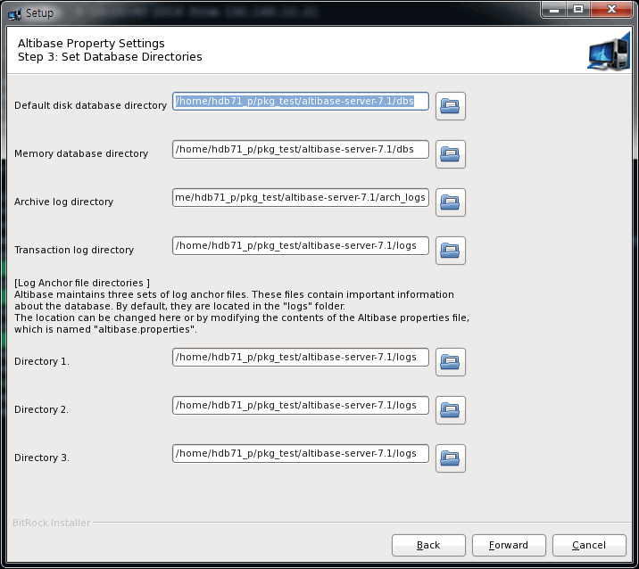
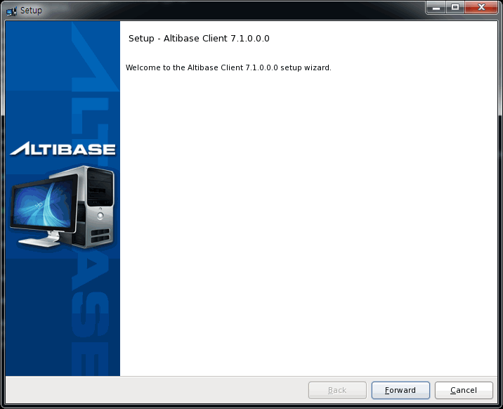
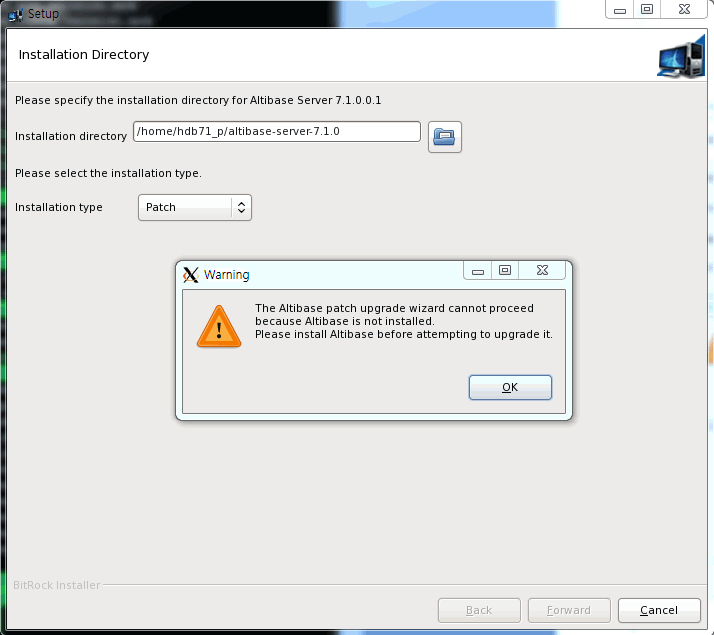

Installation Guide
==================

#### Trunk

Altibase® Administration

<br><br><br><br><br><br><!-- PDF 변환을 위한 여백입니다. --> 


<!-- PDF 변환을 위한 여백입니다. --> 

<div align="left">
    
</div>
<br><br><!-- PDF 변환을 위한 여백입니다. --> 


<!-- PDF 변환을 위한 여백입니다. --> 

<pre>
Altibase Administration Installation Guide
Trunk
Copyright ⓒ 2001~2023 Altibase Corp. All Rights Reserved.<br>
본 문서의 저작권은 ㈜알티베이스에 있습니다. 이 문서에 대하여 당사의 동의없이 무단으로 복제 또는 전용할 수 없습니다.<br>
<b>㈜알티베이스</b>
08378 서울시 구로구 디지털로 306 대륭포스트타워Ⅱ 10층
전화 : 02-2082-1114
팩스 : 02-2082-1099
고객서비스포털 : <a href='http://support.altibase.com'>http://support.altibase.com</a>
홈페이지      : <a href='http://www.altibase.com/'>http://www.altibase.com</a></pre>


<br>

# 목차

<!-- START doctoc generated TOC please keep comment here to allow auto update -->
<!-- DON'T EDIT THIS SECTION, INSTEAD RE-RUN doctoc TO UPDATE -->

- [서문](#%EC%84%9C%EB%AC%B8)
  - [이 매뉴얼에 대하여](#%EC%9D%B4-%EB%A7%A4%EB%89%B4%EC%96%BC%EC%97%90-%EB%8C%80%ED%95%98%EC%97%AC)
- [1.Altibase 패키지 인스톨러](#1altibase-%ED%8C%A8%ED%82%A4%EC%A7%80-%EC%9D%B8%EC%8A%A4%ED%86%A8%EB%9F%AC)
  - [Altibase 홈](#altibase-%ED%99%88)
  - [APatch 디렉터리](#apatch-%EB%94%94%EB%A0%89%ED%84%B0%EB%A6%AC)
- [2.패키지 인스톨러를 이용한 제품 설치](#2%ED%8C%A8%ED%82%A4%EC%A7%80-%EC%9D%B8%EC%8A%A4%ED%86%A8%EB%9F%AC%EB%A5%BC-%EC%9D%B4%EC%9A%A9%ED%95%9C-%EC%A0%9C%ED%92%88-%EC%84%A4%EC%B9%98)
  - [시스템 요구사항](#%EC%8B%9C%EC%8A%A4%ED%85%9C-%EC%9A%94%EA%B5%AC%EC%82%AC%ED%95%AD)
  - [Altibase 패키지 인스톨러](#altibase-%ED%8C%A8%ED%82%A4%EC%A7%80-%EC%9D%B8%EC%8A%A4%ED%86%A8%EB%9F%AC)
  - [Altibase 제품 설치](#altibase-%EC%A0%9C%ED%92%88-%EC%84%A4%EC%B9%98)
  - [Altibase 클라이언트 제품 설치](#altibase-%ED%81%B4%EB%9D%BC%EC%9D%B4%EC%96%B8%ED%8A%B8-%EC%A0%9C%ED%92%88-%EC%84%A4%EC%B9%98)
- [3.Altibase 제거 및 메타 다운그레이드](#3altibase-%EC%A0%9C%EA%B1%B0-%EB%B0%8F-%EB%A9%94%ED%83%80-%EB%8B%A4%EC%9A%B4%EA%B7%B8%EB%A0%88%EC%9D%B4%EB%93%9C)
  - [Altibase 제품 삭제](#altibase-%EC%A0%9C%ED%92%88-%EC%82%AD%EC%A0%9C)
  - [메타 다운그레이드(Meta Downgrade)](#%EB%A9%94%ED%83%80-%EB%8B%A4%EC%9A%B4%EA%B7%B8%EB%A0%88%EC%9D%B4%EB%93%9Cmeta-downgrade)
- [4.패키지 인스톨러를 이용한 제품 패치](#4%ED%8C%A8%ED%82%A4%EC%A7%80-%EC%9D%B8%EC%8A%A4%ED%86%A8%EB%9F%AC%EB%A5%BC-%EC%9D%B4%EC%9A%A9%ED%95%9C-%EC%A0%9C%ED%92%88-%ED%8C%A8%EC%B9%98)
  - [패치란?](#%ED%8C%A8%EC%B9%98%EB%9E%80)
  - [Altibase 서버 제품 패치](#altibase-%EC%84%9C%EB%B2%84-%EC%A0%9C%ED%92%88-%ED%8C%A8%EC%B9%98)
  - [Altibase 클라이언트 제품 패치](#altibase-%ED%81%B4%EB%9D%BC%EC%9D%B4%EC%96%B8%ED%8A%B8-%EC%A0%9C%ED%92%88-%ED%8C%A8%EC%B9%98)
- [A.부록: 설치 전 확인 사항](#a%EB%B6%80%EB%A1%9D-%EC%84%A4%EC%B9%98-%EC%A0%84-%ED%99%95%EC%9D%B8-%EC%82%AC%ED%95%AD)
  - [사용자 계정의 리소스 한계 값 확인](#%EC%82%AC%EC%9A%A9%EC%9E%90-%EA%B3%84%EC%A0%95%EC%9D%98-%EB%A6%AC%EC%86%8C%EC%8A%A4-%ED%95%9C%EA%B3%84-%EA%B0%92-%ED%99%95%EC%9D%B8)
  - [OS별 커널 파라미터 설정](#os%EB%B3%84-%EC%BB%A4%EB%84%90-%ED%8C%8C%EB%9D%BC%EB%AF%B8%ED%84%B0-%EC%84%A4%EC%A0%95)
  - [THP 설정 확인 및 비활성화 방법](#thp-%EC%84%A4%EC%A0%95-%ED%99%95%EC%9D%B8-%EB%B0%8F-%EB%B9%84%ED%99%9C%EC%84%B1%ED%99%94-%EB%B0%A9%EB%B2%95)
  - [디스크 구성 상태 확인](#%EB%94%94%EC%8A%A4%ED%81%AC-%EA%B5%AC%EC%84%B1-%EC%83%81%ED%83%9C-%ED%99%95%EC%9D%B8)
  - [OS Patch](#os-patch)

<!-- END doctoc generated TOC please keep comment here to allow auto update -->

<br>

# 서문

### 이 매뉴얼에 대하여

이 매뉴얼은 Altibase를 설치하고 구성하는 방법에 대해서 설명한다.

#### 대상 사용자

이 매뉴얼은 다음과 같은 Altibase 사용자를 대상으로 작성되었다.

-   데이터베이스 관리자

-   성능 관리자

-   데이터베이스 사용자

-   응용 프로그램 개발자

-   기술 지원부

다음과 같은 배경 지식을 가지고 이 매뉴얼을 읽는 것이 좋다.

-   컴퓨터, 운영 체제 및 운영 체제 유틸리티 운용에 필요한 기본 지식

-   관계형 데이터베이스 사용 경험 또는 데이터베이스 개념에 대한 이해

-   컴퓨터 프로그래밍 경험

-   데이터베이스 서버 관리, 운영 체제 관리 또는 네트워크 관리 경험

#### 소프트웨어 환경

이 매뉴얼은 데이터베이스 서버로 Altibase 버전 7.1을 사용한다는 가정 하에
작성되었다.

#### 이 매뉴얼의 구성

이 매뉴얼은 다음과 같이 구성되어 있다.

-   제 1장 Altibase 패키지 인스톨러에 대해서

-   제 2장 패키지 인스톨러를 이용한 제품 설치

-   제 3장 Altibase 제거 및 메타 다운그레이드

-   제 4장 패키지 인스톨러를 이용한 제품 패치

-   A. 부록 : 설치 전 확인사항

#### 문서 규칙

이 절에서는 이 매뉴얼에서 사용하는 규칙에 대해 설명한다. 이 규칙을 이해하면 이
매뉴얼과 설명서 세트의 다른 매뉴얼에서 정보를 쉽게 찾을 수 있다. 여기서 설명하는
규칙은 다음과 같다.

| 규칙        | 의미                                                                                                   |
|-------------|--------------------------------------------------------------------------------------------------------|
| 기울임 꼴   | 구문 요소에서 사용자가 지정해야 하는 변수, 특수한 값을 제공해야만 하는 위치 지정자, 강조, 또는 책 제목 |
| 고정폭 글꼴 | 단락 또는 예제 코드 내에 있는 명령어                                                                   |

#### Altibase는 여러분의 의견을 환영합니다.

이 매뉴얼에 대한 여러분의 의견을 보내주시기 바랍니다. 사용자의 의견은 다음
버전의 매뉴얼을 작성하는데 많은 도움이 됩니다. 보내실 때에는 아래 내용과 함께
고객서비스포털( http://support.altibase.com/kr/ )로 보내주시기 바랍니다.

-   사용중인 매뉴얼의 이름과 버전

-   매뉴얼에 대한 의견

-   사용자의 성함, 주소, 전화번호

이 외에도 Altibase 기술지원 설명서의 오류와 누락된 부분 및 기타 기술적인
문제들에 대해서 이 주소로 보내주시면 정성껏 처리하겠습니다. 또한, 기술적인
부분과 관련하여 즉각적인 도움이 필요한 경우에도 고객서비스포털을 통해 서비스를
요청하시기 바랍니다.

여러분의 의견에 항상 감사드립니다.

1.Altibase 패키지 인스톨러
========================

Altibase 패키지 인스톨러는 자바를 기반으로 한 인스톨러이다. 사용자는 Altibase
패키지 인스톨러를 이용하여 데이터베이스 서버, 클라이언트 라이브러리와 툴 등의
Altibase 제품을 쉽게 설치할 수 있다.

이 장에서는 제품 설치 후에 생성되는 디렉터리와 파일들에 대해서 설명한다.

### Altibase 홈

Altibase 패키지 인스톨러를 이용하여 설치하면 홈 디렉터리와 APatch 디렉터리가
생성된다.

Altibase 홈 디렉터리는 Altibase 소프트웨어가 설치되는 기본 디렉터리를 말한다.

#### Altibase 홈 디렉터리

Altibase 패키지 인스톨러로 Altibase 제품을 설치하면, Altibase 제품이 설치되는
Altibase 홈 디렉터리가 생성된다. Altibase 홈 디렉터리의 기본값은 아래와 같다.

-   Altibase 서버 제품 설치 시:

```
$HOME/altibase-server-<version>
```

-   Altibase 클라이언트 제품 설치 시:

```
$HOME/altibase-client-<version>
```

### APatch 디렉터리

Altibase 패키지 인스톨러를 이용해서 설치한 Altibase 제품에 대한 정보는 Altibase
홈 디렉터리내의 APatch 디렉터리에 저장된다.

#### APatch 디렉터리의 구조와 내용

Altibase 패키지 인스톨러 디렉터리의 이름이 APatch이고, 이는 Altibase 홈
디렉터리에 위치한다.

이 디렉터리에는 설치된 제품 또는 패치된 버전에 대한 정보를 가지고 있는 파일이
위치한다. 그 파일들은 다음과 같다.

-   patchinfo 파일

-   pkg_patch_\<version\>.txt 파일

-   altibase_base_install.log 파일

-   Backup 디렉터리

#### patchinfo 파일

이 파일은 다음의 내용을 포함한다.

- 현재 설치되어 있는 Altibase 제품의 베이스 릴리스<sup>1</sup>버전과 패치 버전에 대한
  정보

  [<sup>1</sup>]  베이스 릴리스: 초기 설치에 사용되는 완전한 패키지

- 운영체제, 운영체제의 패치, C/C++ 컴파일러와 자바 컴파일러 같은 제품이 빌드된
  환경에 대한 정보

예)

```
PRODUCT_SIGNATURE=server-7.1.0-64-release
PATCH_VERSION=0_0_0_0

=======  OS INFO  =======
Linux rhel6-x64 2.6.32-71.el6.x86_64 #1 SMP Wed Sep 1 01:33:01 EDT 2010 x86_64 x86_64 x86_64 GNU/Linux
=======  PATCH INFO  =======
2.6.32-71.el6.x86_64
=======  COMPILER INFO  =======
gcc version 4.6.3 (GCC)
glibc 2.12
=======  JAVA INFO  =======
java version "1.5.0_22"
Java(TM) 2 Runtime Environment, Standard Edition (build 1.5.0_22-b03)
Java HotSpot(TM) 64-Bit Server VM (build 1.5.0_22-b03, mixed mode)
```

#### pkg_patch_x_x_x_x.txt 파일

이 파일은 제품을 패치할 때마다 pkg_patch_\<설치된 버전 번호\>.txt 의 이름으로
자동 생성된다. 이 파일은 패치를 만들기 위해 수정한 소스 코드의 리비전 번호를
포함한다.

다음 예제는 베이스 릴리스 7.1.0.0.0 설치 후의 APatch 디렉터리의 내용을 보여준다.

```
$ ls
pkg_patch_0_0_0_0.txt
```

다음 예제는 패치7.1.0.0.10 설치 후의 APatch 디렉터리의 내용을 보여준다.

```
$ls
pkg_patch_0_0_0_0.txt  pkg_patch_0_0_0_10.txt

$cat pkg_patch_0_0_0_10.txt
Repository: /altidev4/tags/altibase_7_1_0_0_10_tag/
Revision: xxxxx
Last Changed Rev: xxxxx
```

#### altibase_base_install.log 파일

가장 최근 설치 동안의 모든 동작이 이 파일에 기록된다.

#### Backup 디렉터리

패치 설치 시 Altibase 패키지 인스톨러는 패치가 적용되는 파일에 대해서 백업을
생성하고 이를 \$ALTIBASE_HOME/APatch 디렉터리에 저장한다. 이 디렉터리 내에는 각
패치 시마다 생성되는 별도의 백업 디렉터리들이 위치한다. 이 백업 파일들은 후에
패치를 롤백할 때 사용된다.

또한, 언인스톨 또는 패치를 롤백할 때 사용되는 실행 파일들은 제품 설치 또는 패치
적용 시에 \$ALTIBASE_HOME/APatch 디렉터리에 설치된다.

> \* 주의 1 : HP 플랫폼에서는 인스톨러 패치시 자동 백업과 롤백이 지원되지 않는다.
> 사용자가 수작업으로 데이터 및 로그 파일들을 백업해야 한다.

> \* 주의 2: 패키지 인스톨러를 통해 설치된 파일에 한해서만 이 백업 디렉터리에
> 백업되며, 데이터 파일 및 로그 파일과 같이 제품 설치 후에 생성되는 파일은
> 백업되지 않는다.

아래는 베이스 릴리스 7.1.0.0.0 설치 후의 APatch 디렉터리의 내용을 보여준다.

```
altibase_base_install.log  patchinfo
pkg_patch_0_0_0_0.txt	      uninstall-base
```

아래는 패치 7.1.0.0.10 적용 후의 APatch 디렉터리의 내용을 보여준다.

```
altibase_base_install.log   pkg_patch_0_0_0_10.txt
uninstall-p0_0_0_10           patchinfo
rollback-p0_0_0_10/           pkg_patch_0_0_0_0.txt
uninstall-base
```

-   uninstall-base: 베이스 릴리스 7.1.0.0.0 을 언인스톨 하기 위한 실행 파일

-   rollback-p0_0_0_10: 패치 7.1.0.0.10 이 적용된 파일의 백업이 위치하는
    디렉터리

-   uninstall-p0_0_0_10: 패치 7.1.0.0.10을 삭제하여 패치 설치 이전 버전으로
    되돌리기 위한 실행파일. 이전 버전으로 되돌리기 위한 파일들은
    rollback-p0_0_0_10 디렉터리에 저장된다.

2.패키지 인스톨러를 이용한 제품 설치
==================================

이 장은 다음의 절을 포함한다.

-   [시스템 요구사항](#시스템-요구사항)

-   [Altibase 패키지 인스톨러](#altibase-패키지-인스톨러-1)

-   [Altibase 제품 설치](#altibase-제품-설치)

-   [Altibase 클라이언트 제품 설치](#altibase-클라이언트-제품-설치)

### 시스템 요구사항

Altibase를 설치하고 운영하기 위해서 필요한 시스템 요구사항은 다음과 같다.

이 장에서 언급되는 요구사항과 권장사항은 일반적인 용도의 데이터베이스를 가정한
것이다. 따라서 사용자의 데이터베이스 시스템이나 용도에 따라서 달라질 수
있으므로, 시스템 요구사항에 대한 자세한 사항은 Altibase
고객서비스포털( [http://support.altibase.com](http://support.altibase.com/) )로
문의한다.

#### 메모리

64-bit OS: 최소 1GB 이상 (권장: 2GB 이상, 최대 제한 없음)

#### CPU

1 CPU 이상 (권장: 2 CPU 이상)

#### 하드 디스크

Altibase가 사용하는 디스크에는 데이터를 저장하는 테이블스페이스, 트랜잭션 로그
저장과 Altibase 소프트웨어 설치에 필요한 충분한 공간이 있어야 한다. Altibase
소프트웨어와 트랜잭션 로그를 위한 공간은 적어도 각각 1GB 이상이어야 한다.

원활한 데이터베이스 운영을 위해서는 적어도 12 GB 이상의 디스크 여유 공간을
가지기를 권장한다.

#### 네트워크

이중화 기능 사용 시 전용선 사용을 권장한다.

### Altibase 패키지 인스톨러

#### Altibase 설치 기본 순서

Altibase 제품 설치하려면, 다음 단계대로 수행한다. 각 과정에 대한 상세한 설명은
운영 체제에 따른 제품 설치에서 자세히 설명한다.

1.  설치 환경 사전 확인

2.  Altibase 패키지 인스톨러 다운로드

3.  Altibase 패키지 인스톨러 실행

4.  설치 디렉터리 입력 및 설치 타입 선택

5.  Altibase 프로퍼티 설정

6.  Altibase 프로퍼티 확인

7.  Altibase 제품 설치

8.  Altibase 라이선스 입력

9.  Altibase 빠른 설정 가이드 미리 보기

10. 설치 완료

11. 설치 후 작업

#### 패키지 인스톨러 다운로드

Altibase 고객지원서비스 포털 ( <http://support.altibase.com/> )을 방문하여 본인의
운영 체제에 적합한 인스톨러를 다운로드 받는다.

Altibase 패키지 인스톨러의 이름은 아래 예에서 보여주는 규칙을 따른다.

```
예) Altibase 서버 패키지 인스톨러
altibase-server-7.1.0.0.0-LINUX-X86-64bit-release.run
예) Altibase 클라이언트 패키지 인스톨러
altibase-client-7.1.0.0.0-LINUX-X86-64bit-release.run
```

Altibase 서버 패키지와 클라이언트 패키지는 다른 패키지로 분리되어 있다. 그러나
Altibase 서버 패키지는 클라이언트 패키지를 포함한다.

Altibase 패키지 인스톨러는 아래의 OS 별로 제공된다. 설치 전 아래의 명령어로 OS
관련 정보를 확인한 후 적절한 패키지 인스톨러를 선택한다.

```
$ uname -a
Linux rhel6-x64 2.6.32-71.el6.x86_64 #1 SMP Wed Sep 1 01:33:01 EDT 2010 x86_64 x86_64 x86_64 GNU/Linux
```

| OS                             | CPU                            | Version         | Bit (Server) | Bit (Client) |
| ------------------------------ | ------------------------------ | --------------- | ------------ | ------------ |
| AIX                            | PowerPC                        | 6.1 tl03 이상   | 64-bit       | 64-bit       |
| HP-UX                          | IA64                           | 11.31 이상      | 64-bit       | 64-bit       |
| LINUX                          | x86-64 (GNU glibc 2.12 ~ 2.33) | redhat 6.0 이상 | 64-bit       | 64-bit       |
| LINUX on Power                 | PowerPC 7                      | redhat 6.5 이상 | 64-bit       | 64-bit       |
| LINUX on Power (Little Endian) | PowerPC 8 (Little endian)      | redhat 7.2 이상 | 64-bit       | 64-bit       |
| Windows                        | -                              | 10 이상         | -            | 64-bit       |

Altibase 7.4 은 JDK 1.8이상에서 호환된다.

#### 설치 모드

제품을 설치하기 위해 Altibase 패키지 인스톨러는 다음 두 가지 모드로 시작할 수
있다.

-   대화형 커맨드 라인 모드: DISPLAY 환경변수를 설정하지 않았을 때 이 모드로
    실행된다.

-   GUI (Graphical User Interface): DISPLAY 환경변수를 설정했을 때 이 모드로
    실행된다.

### Altibase 제품 설치

이 절에서는 유닉스에서 Altibase 제품을 설치하는 방법을 설명한다.

-   [설치 환경 사전 확인](#설치-환경-사전-확인)

-   [패키지 인스톨러 다운로드](#패키지-인스톨러-다운로드-1)

-   [설치 모드 설정](#설치-모드-설정)

-   [Altibase 패키지 인스톨러 시작](#altibase-패키지-인스톨러-시작)

-   [설치 디렉터리 입력 및 설치 타입
    선택](#설치-디렉터리-입력-및-설치-타입-선택)

-   [시스템 파라미터 확인](#시스템-파라미터-확인)

-   *Altibase 프로퍼티 설정*

-   [설정한 프로퍼티 확인](#설정한-프로퍼티-확인)

-   [Altibase 제품 설치](#altibase-제품-설치-1)

-   [Altibase 라이선스 입력](#altibase-라이선스-입력)

-   [Altibase 빠른 설정 가이드 미리 보기](#altibase-빠른-설정-가이드-미리-보기)

-   *설치 종료*

-   [설치 후 작업](#설치-후-작업)

#### 설치 환경 사전 확인

Altibase 패키지 인스톨러는 제품을 설치하기 전에 설치할 장비의 환경이 성공적인
설치를 위한 요구사항을 만족하는지를 알기 위해서 먼저 환경을 검사한다. 이 과정은
그래픽 유저 인터페이스로 보여 주지 않고 수행된다.

이 과정 중에 Altibase 패키지 인스톨러는 설치할 서버 장비에 대해서 다음의 정보를
확인한다.

-   운영 체제 이름과 버전

-   운영 체제의 모드 (64-bit)

Altibase 패키지 인스톨러가 확인한 정보와 일치하지 않으면, 에러 메시지를 반환하고
설치는 중단된다. 앞선 단계에서의 시스템 구성의 문제를 발견하는 것이 설치 중에
문제에 부딪힐 가능성을 줄여주기 때문이다.

#### 패키지 인스톨러 다운로드 

Altibase 패키지 인스톨러는 Altibase 고객지원서비스 포털
( <http://support.altibase.com/> )을 방문하여 본인의 운영 체제에 적합한 인스톨러를
다운로드 받는다.

Altibase가 제공하는 운영 체제별 인스톨러는 "[패키지 인스톨러
다운로드](#패키지-인스톨러-다운로드)"를 참조하기 바란다.

#### 설치 모드 설정

제품을 설치하기 위해 Altibase 패키지 인스톨러는 다음 두 가지 모드로 시작할 수
있다.

-   대화형 커맨드 라인 모드: DISPLAY 환경변수를 설정하지 않았을 때 사용한다.

-   GUI (Graphical User Interface): DISPLAY 환경변수를 설정했을 때 사용한다.

이 매뉴얼에서 Altibase 패키지 인스톨러는 설치 모드를 GUI로 설정하였다는 전제
하에 설명한다.

##### GUI 모드 설정

사용자는 Altibase 패키지 인스톨러를 GUI 모드로 실행할 수 있다. 호스트 컴퓨터에서
DISPLAY 환경변수를 다음과 같이 설정해야 한다.

```
$ setenv DISPLAY <machine name>:0.0
```

\<machine_name\>은 Altibase 패키지 인스톨러가 실행되는 것을 보여줄 컴퓨터의
IP주소 또는 호스트 이름이다. Cshell은 setenv를 사용하고, Korn Shell은 export
DISPLAY=\<machine name\>:0.0으로 설정한다.

만약 호스트 컴퓨터가 아닌 원격지에서 Altibase 패키지 인스톨러가 GUI 모드로
실행되는 것을 볼 수 있게 허락하려면 원격 컴퓨터에서 아래의 명령어를 실행한다.

```
$ xhost +
```

#### Altibase 패키지 인스톨러 시작

유닉스 사용자는 Altibase 패키지 인스톨러를 다운로드 한 후 chmod로 파일의 권한을
변경해야 실행할 수 있다.

```
$ chmod +x altibase-server-7.1.0.0.0-LINUX-X86-64bit-release.run
```

Altibase 패키지 인스톨러를 실행한다.

```
$./altibase-server-7.1.0.0.0-LINUX-X86-64bit-release.run
```

설치 모드를 GUI 모드로 설정하였다면, 아래와 같은 시작 패널이 보여진다.


#### 설치 디렉터리 입력 및 설치 타입 선택

아래 설치 디렉터리 패널에서는 Altibase 홈 디렉터리, 즉 Altibase가 설치될
디렉터리와 패키지 설치 타입을 선택한다.


Altibase 제품 설치를 원하는 경우 "Full Installation"을, 기존에 설치된 버전에
대한 패치를 원하는 경우 "Patch Installation"을 선택한다.

사용자가 입력한 디렉터리에 Altibase 제품이 이미 설치되어 있다면, 경고 메시지가
다이얼로그 박스에 보여진다. 이 경우 다른 디렉터리를 선택하든지, 그 디렉터리에
설치된 제품을 먼저 언인스톨 해야한다.


#### 시스템 파라미터 확인

다음 패널은 설정해야 할 시스템 커널 파라미터와 어떻게 설정하는지를 보여준다.
시스템 커널 파라미터 설정은 root 계정으로 수행해야 한다. 또한 어떤 시스템은 커널
파라미터 설정 후에 재부팅이 필요할 수도 있다.

커널 파라미터 설정은 다음 설치 단계로 넘어가기 전에 수동으로 하길 권한다. 만약
설치 완료 후에 설정하려면, \$ALTIBASE_HOME/install/pre_install.sh 파일을
참고하기 바란다.


Altibase가 올바르게 실행될 것을 보장하기 위해서 먼저 시스템 환경을 설정할 필요가
있다. Altibase 설치 전에 root 사용자 권한으로 커널 파라미터 값을 조정해야 한다.
커널 파라미터 값은 설치 후에 설정해도 되지만, Altibase를 구동하기 전에는
설정해야 한다. 아래는 각 OS별 시스템 커널 파라미터의 권장 값을 보여주는
예제이다. OS별 커널 파라미터에 대한 자세한 설명은 부록에 있는 "[설치 전 확인
사항](#Checking_Parameters_Additional)"을 참조한다.

예) HPUX

```
[ Recommended Kernel Parameter Values ]

shmmax = 2147483648
shmmni = 500 
shmseg = 200 
semmap = 1001
semmni = 1000
semmns = 4096
semmnu = 1000
semume = 1000
max_thread_proc = 600
maxusers = 64
dbc_min_pct = 5
dbc_max_pct = 5
maxdsiz = 1073741824
maxdsiz_64bit = 4294967296 

# maxdsiz_64bit
The Altibase server needs sufficient memory space to function properly.
Please set the value to 70% of system memory or greater.

# dbc_min_pct and dbc_max_pct 
dbc_min_pct and dbc_max_pct were renamed filecache_min and filecache_max, respectively, in HP version 11.31 and subsequent releases.

[ How to modify kernel parameter values ] 

/usr/sbin/kmtune -s shmmax=2147483648
/usr/sbin/kmtune -s shmmni=500 
/usr/sbin/kmtune -s shmseg=200
/usr/sbin/kmtune -s semmap=1001 
/usr/sbin/kmtune -s semmni=1000
/usr/sbin/kmtune -s semmns=4096 
/usr/sbin/kmtune -s semmnu=1000
/usr/sbin/kmtune -s semume=1000
/usr/sbin/kmtune -s max_thread_proc=600
/usr/sbin/kmtune -s maxusers=64
/usr/sbin/kmtune -s dbc_min_pct=5
/usr/sbin/kmtune -s dbc_max_pct=5
/usr/sbin/kmtune -s maxdsiz=1073741824 
/usr/sbin/kmtune -s maxdsiz_64bit=4294967296

# maxdsiz_64bit
The Altibase server needs sufficient memory space in order to function properly.
Please set the value to 70% of system memory or greater.

# dbc_min_pct and dbc_max_pct 
dbc_min_pct and dbc_max_pct were renamed filecache_min and filecache_max, respectively, in HP version 11.31 and subsequent releases.

```

예) LINUX

```
[ How to modify kernel parameter values ]

echo 512 32000 512 512 > /proc/sys/kernel/sem
```

예) AIX

```
[ Recommended Kernel Parameter Values ]

fsize = -1
data = -1
rss = -1

Maximum number of PROCESSES allowed per user
   = greater than the value set using the Altibase property MAX_CLIENT

Size of the File System BufferCache
   = less than 20% of total memory.

AIO = Available

AMO = AIX version 5.2 ML04 and above
              lru_file_repage=0
              strict_maxclient%=0
           = Versions prior to AIX version 5.2 ML04
               lru_file_repage=0

[ How to modify kernel parameter values ]

Edit /etc/security/limits file
Set fsize, data and rss variables.

Run 'smit'
  1) System Environments
      System Environments -> Change / Show Characteristics Of Operating System
      Change : 
          Maximum number of PROCESSES allowed per user
             = bigger than the value set using the Altibase property MAX_CLIENT
          Size of the File System BufferCache
             = less than 20% of total memory.
  2) AIO 
      Device -> Asynchronous I/O -> Posix Asynchronous I/O 
      -> Configure Defined Asynchronous I/O
      Change : posix_aio0=Available

  3) AMO 
      Performance & Resource Scheduling -> Tuning Kernel & Network Parameters 
      -> Tuning Virtual Memory Manager, File System and Logical Volume 
      Manager Params ->
         + List All Characteristics of Current Parameters --- Check
         + Change / Show Current Parameters --- Current Change
         + Change / Show Parameters for Next Boot --- Change upon Reboot

      The case of AIX version 5.2 ML04 and above :
             Change : lru_file_repage=0
             strict_maxclient%=0
      The case of Versions prior to AIX version 5.2 ML04 :
             Change : lru_file_repage=0
```

#### Altibase 프로퍼티 설정

Altibase 프로퍼티를 설정하는 단계는 다음의 세 단계로 구분된다.

Step 1: Basic Database Operation Properties

Step 2: Database Creation Properties

Step 3: Set Database Directories

##### Step 1: Basic Database Operation Properties

-   데이터베이스 이름
-   연결 포트 번호
-   메모리 데이터베이스의 최대 크기
-   버퍼 크기
-   새로운 데이터베이스를 생성하기 위한 SQL 스크립트를 생성할 것인지를 지정 (즉
    2단계를 수행할 지 말지)  
    YES를 선택하면 2단계를 수행하고, 그렇지 않으면 2단계를 건너뛴다. 이 과정을
    이용해서 SQL 스크립트가 생성되는지에 상관없이, 새로운 데이터베이스는 다음
    구문을 사용해서 생성할 수 있다: server create [DB Character-set][National Character-set]


##### Step 2: Database Creation Properties

2단계에서 생성된 SQL 스크립트는 \$ALTIBASE_HOME/install/post_install.sh 파일에
저장된다.

-   초기 데이터베이스 크기

-   데이터베이스 아카이브 로깅 모드

-   Noarchivelog

-   Archivelog

-   데이터베이스 문자 셋

-   MS949

-   US7ASCII

-   KO16KSC5601

-   BIG5

-   GB231280

-   MS936

-   UTF-8

-   SHIFT-JIS

-   MS932

-   EUC-JP

-   국가 문자 셋

-   UTF-16

-   UTF-8


##### Step 3: Set Database Directories

-   기본 디스크 데이터베이스 디렉터리

-   메모리 데이터베이스 디렉터리

-   아카이브 로그 디렉터리

-   트랜잭션 로그 디렉터리

-   로그 앵커 파일 디렉터리



이 단계에 포함되지 않은 프로퍼티의 값을 설정하거나 단계1 또는 단계3에서 설정한
프로퍼티 값을 나중에 변경하려면, \$ALTIBASE_HOME/conf/altibase.propertites
파일을 수동으로 편집하면 된다.

#### 설정한 프로퍼티 확인

다음 패널은 전 과정에서 설정한 프로퍼티의 값을 보여준다.


예)

```
To change these properties after installation is complete, 
please modify the following file:
  /home/hdb71_p/pkg_test/altibase-server-7.1/conf/altibase.properties.

1. Altibase Property Settings:
    Step 1: Basic Database Operation Properties

    1) Database name: 
         [mydb]

    2) Altibase connection port number (1024-65535): 
         [20300]

    3) Maximum size of memory database:
         [2G]

    4) Buffer area size for caching disk-based database pages:
         [128M]

2. Altibase Property Settings:
    Step 2: Database Creation Properties

    1) Initial database size
         [10M]

    2) Database archive logging mode
         [noarchivelog]

    3) Database character set
         [UTF8]

    4) National character set
         [UTF8]

3. Altibase Property Settings:
    Step 3: Set Database Directories

    The database will not operate properly if any of these directories are removed.

    1) Disk database directory: 
         [/home/hdb71_p/pkg_test/altibase-server-7.1/dbs] 

    2) Memory database directory:
         [/home/hdb71_p/pkg_test/altibase-server-7.1/dbs] 

    3) Archive log directory: 
         [/home/hdb71_p/pkg_test/altibase-server-7.1/arch_logs] 

    4) Transaction log directory: 
         [/home/hdb71_p/pkg_test/altibase-server-7.1/logs] 

    5) Log Anchor file directories:
         Directory 1: 
         [/home/hdb71_p/pkg_test/altibase-server-7.1/logs] 

         Directory 2: 
         [/home/hdb71_p/pkg_test/altibase-server-7.1/logs] 

         Directory 3: 
         [/home/hdb71_p/pkg_test/altibase-server-7.1/logs] 
```

이 값들을 확인 후에, “Forward” 를 클릭하면 “Ready to Install” 패널이 아래처럼
보여질 것이다.


설치를 계속하려면 “Forward”를 누른다.

#### Altibase 제품 설치


설치가 완료되면, 인스톨러는 아래의 작업들을 GUI 화면 없이 수행한다.

-   설정한 프로퍼티가 altibase.properties파일에 업데이트 된다.

-   Altibase 서버 구동을 위한 기본 환경이 수록되어 있는 altibase_user.env 파일이
    \$ALTIBASE_HOME/conf 디렉터리에 생성된다. 그리고 이 파일을 실행하는 명령어가
    사용자 계정의 환경 설정 파일(.bashrc 또는 .bash_profile 또는 .profile 등)에
    추가된다.

아래는 altibase_user.env 파일과 사용자 환경 설정 파일 .bash_profile의 예제이다.

```
### altibase_user.env
ALTIBASE_HOME=/home/hdb71_p/pkg_test/altibase-server-7.1;export ALTIBASE_HOME 
PATH=${ALTIBASE_HOME}/bin:${PATH};export PATH 
LD_LIBRARY_PATH=${ALTIBASE_HOME}/lib:${LD_LIBRARY_PATH};export LD_LIBRARY_PATH 
CLASSPATH=${ALTIBASE_HOME}/lib/Altibase.jar:${CLASSPATH};export CLASSPATH 

### .bash_profile 
# ALTIBASE_ENV 
. /home/hdb71_p/pkg_test/altibase-server-7.1/conf/altibase_user.env
```

아래는 Altibase의 라이선스 키를 입력하는 화면이다. Altibase 패키지 인스톨러는
라이선스 키를 입력하는 다음 세 가지 방법을 제공한다.

-   라이선스 키를 직접 입력

-   라이선스 키가 저장된 파일 선택

-   라이선스 추후 등록: 라이선스 키를 아직까지 얻지 못했다면, 나중에 라이선스
    키를 획득한 후, \$ALTIBASE_HOME/conf 디렉터리에 새 라이선스 파일을 복사하면
    된다. 단, 이 과정에서 라이선스 키를 등록하지 않으면 다음 단계에서
    데이터베이스를 생성할지 여부를 묻지 않는다.

```
$ cp license $ALTIBASE_HOME/conf/
```


#### Altibase 빠른 설정 가이드 미리 보기

Altibase 빠른 설정 가이드 패널은 설치 성공 후에 Altibase를 어떻게 구동할
것인지를 안내한다.

Altibase 패키지 인스톨러는 사용자들이 좀 더 쉽게 시스템 커널 파라미터와
환경변수를 설정하도록 다음의 두 쉘 스크립트를 제공한다.

-   \$ALTIBASE_HOME/install/pre_install.sh  
    이 스크립트는 필수 시스템 커널 파라미터의 최소 집합을 포함하며, 그들의 권장
    값과 어떻게 설정하는지에 대해서 설명한다.

-   \$ALTIBASE_HOME/install/post_install.sh  
    이 스크립트는 Altibase 프로퍼티 설정 과정에서 단계2를 수행했다면 새로운
    데이터베이스를 생성하기 위한 SQL 스크립트를 포함한다.

-   \$ALTIBASE_HOME/packages/catproc.sql  
    이 스크립트는 PSM을 사용하기 위한 SQL 스크립트를 포함한다.

다음 패널에서 체크 박스를 선택하면, Altibase 패키지 인스톨러는 새로운
데이터베이스를 생성하고 PSM을 사용하기 위한 스크립트를 실행할 것이며, 이로 인해
설치 시간이 조금 더 소요될 것이다. 체크 박스를 선택하지 않을 경우, 제품 설치
후에 수동으로 데이터베이스 생성 및 PSM 스크립트를 실행해야 한다.


```
[  Installation complete  ]
Please refer to the file listed below to verify the Altibase version.
 /home/hdb71_p/pkg_test/altibase-server-7.1/APatch/patchinfo 

[ Quick Guide to Making Settings in Altibase ] 

1. Set kernel variables using the root user account.
    run the '/home/hdb71_p/pkg_test/altibase-server-7.1/install/pre_install.sh' file 
    - This script helps you make kernel parameter settings.

================ LINUX ================
[ How to modify kernel parameter values ]

echo 512 32000 512 512 > /proc/sys/kernel/sem

These values must be set in order for Altibase to operate properly.
They must be set such that they are suitable for the system configuration.

=====================================


2. Provide a license.
    Please rename and locate the license file as shown below.
    /home/hdb71_p/pkg_test/altibase-server-7.1/conf/license 

    If no license file has been issued, or if the license file has expired,
    Altibase services will not start.
    In this case, please visit http://support.altibase.com.
    

3. Configure user environment variables (using the user account with 
which Altibase was installed).
    Run the '/home/hdb71_p/pkg_test/altibase-server-7.1/install/post_install.sh' file 
    under the account with which Altibase was installed.

    This script performs necessary post-installation configuration. 

    1) Create the Altibase user environment file and apply it to the user profile.
         (/home/hdb71_p/pkg_test/altibase-server-7.1/conf/altibase_user.env)
    2) Create a database.

         If you selected 'YES' in response to the question about whether to create 
         a database after installation, at "Altibase Property setting step 1", 
         a database will be automatically created.

         If you selected 'NO' in response to this question,
         you need to create a database manually.

         shell> server create [DB Character Set] [National Character Set]

4. Start up and shut down the server
    shell> server start
    shell> server stop

5. Runs all scripts required for or used with PSM
Run the '/home/hdb71_p/pkg_test/altibase-server-7.1/packages/catproc.sql' file.

6. Connect to the database using iSQL
    shell> isql -s 127.0.0.1 -u SYS -p MANAGER
```


아래의 창은 데이터베이스 생성 중에 나타나는 화면이다.


#### 설치 종료

성공적인 설치 후 다음 패널이 나타난다.


Finish 버튼을 누르면 아래와 같이 환경 설정 가이드 화면이 나타난다.


#### 설치 후 작업

성공적인 설치 후, 아래의 작업을 해야 한다.

1.  시스템 커널 파라미터를 설치 과정 중에 설정하지 않았다면, 수동으로 이를
    설정한다. \$ALTIBASE_HOME/install/pre_install.sh 파일을 참고한다.

2.  로그인 쉘 스크립트를 실행시키기 위해서, 다음 중 하나를 수행한다.

-   로그아웃 후 다시 로그인

-   . \~/.bash_profile 실행

-   source \~/.bash_profile 실행

3. 인스톨러 설치 단계에서 데이터베이스 생성을 하지 않은 경우, 아래와 같이
   생성한다.

- 설치 단계에서 데이터베이스 생성을 위한 프로퍼티를 입력한 경우,
  \$ALTIBASE_HOME/install/post_install.sh 스크립트를 실행하라.  

  ```
  $ sh post_install.sh dbcreate
  ```

- 설치 단계에서 데이터베이스 생성을 위한 프로퍼티를 입력하지 않은 경우, server
  스크립트를 실행하라.  

  ```
  $ server create utf8 utf8
  ```

- 설치단계에서 PSM 사용을 위한 프로퍼티를 입력하지 않은 경우, catproc.sql 을
  실행하라.  

  ```
  $ isql -s 127.0.0.1 -u sys -p manager -silent -f
  ${ALTIBASE_HOME}/packages/catproc.sql
  ```

### Altibase 클라이언트 제품 설치

Altibase 제품을 설치하는 방법을 다음의 절에서 설명한다.

-   [설치 환경 사전 확인](#설치-환경-사전-확인-1)

-   [Altibase 패키지 인스톨러 다운로드](#altibase-패키지-인스톨러-다운로드)

-   [설치 모드 설정](#설치-모드-설정-1)

-   [Altibase 패키지 인스톨러 시작](#altibase-패키지-인스톨러-시작-1)

-   [설치 디렉터리 입력 및 설치 타입
    선택](#설치-디렉터리-입력-및-설치-타입-선택-1)

-   [Altibase 클라이언트 프로퍼티 설정](#altibase-클라이언트-프로퍼티-설정)

-   [Altibase 클라이언트 제품 설치](#altibase-클라이언트-제품-설치-1)

-   [설치 종료](#설치-종료-1)

-   [설치 후 작업](#설치-후-작업-1)

#### 설치 환경 사전 확인

“Altibase 제품 설치”절 내의 "[설치 환경 사전 확인](#설치-환경-사전-확인)"을
참고한다.

#### Altibase 패키지 인스톨러 다운로드

Altibase 패키지 인스톨러는 Altibase 고객지원서비스
포털( <http://support.altibase.com/> )을 방문하여 본인의 운영 체제에 적합한
인스톨러를 다운로드 받는다.

Altibase가 제공하는 운영 체제별 인스톨러는 "[패키지 인스톨러
다운로드](#패키지-인스톨러-다운로드)"를 참조하기 바란다.

#### 설치 모드 설정

유닉스 시스템에서 GUI 모드로 패키지 인스톨러를 시작하려면 “Altibase 제품 설치”절
내의 “[설치 모드 설정](#설치-모드-설정)"을 참고한다.

#### Altibase 패키지 인스톨러 시작

유닉스 사용자는 Altibase 패키지 인스톨러를 다운로드 한 후 chmod로 파일 권한을
변경해야 실행할 수 있다.

```
$ chmod +x altibase-client-7.1.0.0.0-LINUX-X86-64bit-release.run
```

Altibase 패키지 인스톨러를 실행한다.

```
$./altibase-client-7.1.0.0.0-LINUX-X86-64bit-release.run
```

설치 모드를 GUI 모드로 설정하였다면, 아래와 같은 시작 패널이 보여진다.



#### 설치 디렉터리 입력 및 설치 타입 선택

아래 설치 디렉터리 패널에서는 Altibase 홈 디렉터리, 즉 Altibase 클라이언트
제품이 설치될 디렉터리와 클라이언트 패키지 설치 타입을 선택한다.

Altibase 클라이언트 설치를 원하는 경우 “Full Installation” 를, 기존 설치되어
있는 버전에 대한 패치를 원하는 경우 “Patch Installation” 를 선택한다.


#### Altibase 클라이언트 프로퍼티 설정

Altibase 클라이언트 프로퍼티 패널에서는 클라이언트가 TCP/IP로 서버에 접속할 때
사용할 통신 포트 번호를 입력한다. 이 포트 번호는 .profile 또는 .bash_profile
같은 사용자 계정의 환경 설정 파일에 저장된다.


#### Altibase 클라이언트 제품 설치


이 과정 동안 위 다이얼로그 박스에서 보여주는 Altibase 클라이언트 제품과 관련
있는 환경 변수는 로그인 쉘 (예. 표준 본 쉘을 위한 기본 환경 파일은
.profile이다)을 위한 환경 파일에 추가된다. Altibase 서버 제품 설치 시에 생성되는
altibase_user.env 파일은 여기에서는 생성되지 않는다. 새로운 환경 변수를
적용하려면, 다음 중 하나를 수행한다.

-   로그 아웃 후 다시 로그인

-   . \~/.profile 실행

-   source \~/.profile 실행

아래는 .profile 의 예이다.

```
# ALTIBASE_ENV
export ALTIBASE_HOME=/home/hdb71_p/altibase-client-7.1.0
export ALTIBASE_PORT_NO=20300
export PATH=$ALTIBASE_HOME/bin:$PATH
export LD_LIBRARY_PATH=${ALTIBASE_HOME}/lib:${LD_LIBRARY_PATH}
export CLASSPATH=${ALTIBASE_HOME}/lib/Altibase.jar:${CLASSPATH}
```

#### 설치 종료


#### 설치 후 작업

위의 과정에서 환경변수가 쉘에 적용되지 않았다면, 지금 한다. 자세한 설명은 위의
“[Altibase 클라이언트 제품 설치](#altibase-클라이언트-제품-설치-1)” 절을
참고한다.

3.Altibase 제거 및 메타 다운그레이드
==================================

제품 설치 시 함께 설치되는 언인스톨러를 이용해서 Altibase 제품을 삭제하거나 하위
버전으로 다운그레이드 하는 방법을 설명한다.

-   Altibase 제품 삭제

-   메타 다운그레이드 (Meta Downgrade)

### Altibase 제품 삭제

제품 설치 시 함께 설치되는 언인스톨러를 이용해서 Altibase 제품을 삭제하거나 롤백
할 수 있다. 롤백의 대상은 인스톨러를 통해 패치된 파일에 한해서이며 데이터 파일
및 로그 파일은 그 대상에서 제외된다. 베이스 릴리스와 함께 설치된 언인스톨러는
전체 제품을 삭제한다. 패치 적용 시에 설치된 언인스톨러는 전체 제품을 삭제하거나
해당 패치만 롤백 할 수 있다.

> \* 주의: HP-UX 플랫폼에서는 Altibase 패키지 인스톨러와 함께 제공되는
> 언인스톨러는 패치를 롤백 할 수 없고, 전체 제품을 삭제할 수만 있다. 그러므로
> 패치를 적용하기 전에 이전에 설치된 제품을 백업하기를 권한다.

#### 전체 삭제

Altibase 패키지 인스톨러를 이용해서 설치된 Altibase 제품 또는 패치는 삭제하고자
하는 제품과 함께 제공된 언인스톨러를 실행함으로써 삭제할 수 있다. 그러나 유닉스
환경에서는 언인스톨러가 환경 변수를 삭제하지 못한다. 따라서 사용자는 직접 계정의
환경 설정 파일에서 Altibase 관련 환경 변수를 삭제해야 한다. Altibase 제품을
삭제하려면, 다음 단계를 수행한다.

1.  \$ALTIBASE_HOME/APatch 디렉터리에서 삭제하고자 하는 제품과 관련 있는
    언인스톨러 (예를 들어 uninstall-base)를 선택한다.

2.  언인스톨러를 실행한다.

#### 패치 삭제

Altibase 패키지 인스톨러를 이용해서 설치된 패치는 uninstall-p\<*patch_version*\>
의 규칙으로 이름 지어진 언인스톨러를 실행함으로써 삭제할 수 있다. 그러나, 가장
최근에 설치된 패치만 롤백 할 수 있다. 삭제 작업 중에는 패치가 삭제되고 이전
버전이 백업으로부터 복원된다.

패치를 롤백 하려면, 다음 단계를 수행한다.

1.  \$ALTIBASE_HOME/APatch 디렉터리에서 삭제하고자 하는 패치과 관련 있는
    언인스톨러 (예를 들어 uninstall-p0_0_0_1)를 선택한다.

2.  언인스톨러를 실행한다.

### 메타 다운그레이드(Meta Downgrade)

이 절에서는 메타 버전이 다른 Altibase의 패치를 롤백하기 위한 메타 다운그레이드에
대하여 설명한다.

Altibase는 패치를 롤백하기 위해서 현재 메타 버전과 다운 패치하려는 패키지의 메타
버전이 일치해야 가능하다. 패치를 삭제하거나 롤백할 때 메타 버전이 다르면, 우선
현재 버전의 메타를 이전 버전의 메타로 재구성해야 한다. 이러한 과정을 메타
다운그레이드(Meta downgrade) 또는 다운그레이드라고 한다.

#### 메타 다운그레이드 사용방법

##### 버전 확인

SYSTEM_.SYS_DATABASE_에서 현재 및 이전 메타 버전을 확인할 수 있다.

현재 메타버전은 META_MAJOR_VER, META_MINOR_VER, META_PATCH_VER 컬럼으로 확인할
수 있다.

이전 메타버전은 PREV_META_MAJOR_VER, PREV_META_MINOR_VER,
PREV_META_PATCH_VER컬럼으로 확인할 수 있다.

버전을 확인하여 아래와 같이 META_MINOR_VER과 PREV_META_MINOR_VER의 버전이 다른
경우에만 메타 다운그레이드가 가능하다.

```
iSQL> SELECT META_MAJOR_VER, META_MINOR_VER, META_PATCH_VER,
 PREV_META_MAJOR_VER, PREV_META_MINOR_VER, PREV_META_PATCH_VER
 FROM SYSTEM_.SYS_DATABASE_;
META_MAJOR_VER META_MINOR_VER META_PATCH_VER 
-------------------------------------------------
PREV_META_MAJOR_VER PREV_META_MINOR_VER PREV_META_PATCH_VER 
----------------------------------------------------------------
8           5           1          
8           4           1          
1 row selected.
```

##### 메타 다운그레이드

메타 다운그레이드가 가능한 버전에 대하여 아래의 구문으로 메타 다운그레이드를
수행한다.

```
$ server downgrade
```

> \* 주의 : 메타 다운그레이드를 수행하기 전에 서버를 종료(server stop)해야 한다.
> 서버를 종료하지 않고 수행하면 아래와 같은 에러가 발생한다.

```
$ server downgrade
 server is running !!!!
 you must shutdown first before server downgrade
$ server downgrade
...
...
...ISQL_CONNECTION = UNIX, SERVER = localhost
[ERR-910FB : Connected to idle instance]
Connecting to the DB server... Connected.
 
TRANSITION TO PHASE : PROCESS
 
TRANSITION TO PHASE : CONTROL
 
TRANSITION TO PHASE : META
  [SM] Recovery Phase - 1 : Preparing Database
                          : Dynamic Memory Version => Parallel Loading
  [SM] Recovery Phase - 2 : Loading Database 
  [SM] Recovery Phase - 3 : Skipping Recovery & Starting Threads...
                            Refining Disk Table 
  [SM] Refine Memory Table : ....................................................................................................................................... [SUCCESS]
  [SM] Rebuilding Indices [Total Count:138] .......................................................................................................................................... [SUCCESS]
 
TRANSITION TO PHASE : DOWNGRADE
Command executed successfully.
```

만약 메타 다운그레이드가 실패한 경우 다음과 같이 종료된다.

```
$ server downgrade
...
...
...
TRANSITION TO PHASE : DOWNGRADE
[FAILURE] Unable to initialize the meta database
Startup Failed....
[ERR-91015 : Communication failure.]
```

> ###### 주의사항
>
> 메타 다운그레이드가 실패한 경우 \$ALTIBASE_HOME/trc 디렉터리의
> altibase_boot.log, altibase_qp.log에서 실패 원인을 확인할 수 있다.

##### 패치 삭제

패치 언인스톨러를 실행하여 패치를 삭제한다.

> ###### 주의사항
>
> 서버 다운그레이드를 수행한 후 패치를 삭제해야 한다. 만약 삭제를 하지 않고 서버를
> 구동하면, 메타 버전이 이전 버전으로 수정된 상태이기 때문에 메타 업그레이드가
> 발생한다.

4.패키지 인스톨러를 이용한 제품 패치
==================================

이 장은 다음의 절을 포함한다.

-   패치란?

-   Altibase 서버 제품 패치

-   Altibase 클라이언트 제품 패치

### 패치란?

패치는 존재하는 설치를 덮어 쓸 파일들의 작은 모음이다. 패치는 Altibase 제품의
특정 버전과 연관이 있다. 패치는 어떤 버그에 대한 대응으로 고객이 사용할 수
있도록 버그를 수정한 것이다. 패치를 적용하려면 베이스 릴리스 또는 패치세트가
먼저 설치되어 있어야 한다.

#### Altibase 제품의 설치 유형

표 1 Full 패키지와 패치 패키지 비교

| 단계                                | Full 패키지 | 패치 패키지 |
|-------------------------------------|-------------|-------------|
| 설치 환경 사전 확인                 | O           | O           |
| Altibase 패키지 인스톨러 시작       | O           | O           |
| 시스템 파라미터 확인                | O           |             |
| 설치 디렉터리 입력                  | O           | O           |
| 패치 버전 확인                      |             | O           |
| Altibase 프로퍼티 설정              | O           |             |
| 설정한 프로퍼티 확인                | O           |             |
| Altibase 제품 설치                  | O           | O           |
| Altibase 라이선스 입력              | O           |             |
| Altibase 빠른 설정 가이드 미리 보기 | O           |             |
| 설치 종료                           | O           | O           |

#### Altibase 클라이언트 제품의 설치 타입

표 2 Full 패키지와 패치 패키지 비교

| 단계                          | Full 패키지 | 패치 패키지 |
|-------------------------------|-------------|-------------|
| 설치 환경 사전 확인           | O           | O           |
| Altibase 패키지 인스톨러 시작 | O           | O           |
| 설치 디렉터리 입력            | O           | O           |
| 패치 버전 확인                |             | O           |
| Altibase 프로퍼티 설정        | O           |             |
| Altibase 제품 설치            | O           | O           |
| 설치 종료                     | O           | O           |

### Altibase 서버 제품 패치

아래 절에서 Altibase 서버 패치를 어떻게 적용하는지 설명한다.

#### 설치 환경 사전 확인

유닉스에서 "[설치 환경 사전 확인](#설치-환경-사전-확인)" 절을 참고한다.

#### Altibase 패키지 인스톨러 다운로드 

Altibase는 제품 패치를 위한 설치 파일이 따로 존재하지 않는다. 인스톨러를 시작할
때 설치 형태를 풀(full) 패키지 또는 패치로 선택할 수 있다.

Altibase 고객지원서비스 포털
( [http://support.altibase.com/](http://support.altibase.com/) )을 방문하여
본인의 운영 체제에 적합한 인스톨러를 다운로드 받는다.

#### 설치 모드 설정

GUI 모드로 패키지 인스톨러를 설치하려면 “Altibase 제품 설치”절 내의 “[설치 모드
설정](#설치-모드-설정)"을 참고한다.

#### Altibase 패키지 인스톨러 시작

유닉스 사용자는 Altibase 패키지 인스톨러를 다운로드 한 후 chmod로 파일 권한을
변경해야 실행할 수 있다.

```
$ chmod +x altibase-server-7.1.0.0.1-LINUX-X86-64bit-release.run
```

Altibase 패키지 인스톨러를 실행한다.

```
$./altibase-server-7.1.0.0.1-LINUX-X86-64bit-release.run
```

설치 모드를 GUI 모드로 설정하였다면, 아래와 같은 시작 패널이 보여진다.


#### 설치 디렉터리 입력 및 설치 타입 선택

설치 디렉터리 패널에서 패치 버전이 적용될 Altibase 홈 디렉터리를 입력하고, 설치
형태를 패치(patch)로 선택한다.

패치를 적용하기 전에 베이스 릴리스가 설치되어 있어야 한다. Altibase 제품이
사용자가 지정한 디렉터리에 설치되어 있지 않다면, 경고 메시지를 보여주는
다이얼로그 박스가 나타난다.

그러나 “Install Type”에서 “Full Installation”을 선택하면 Altibase 서버 제품
설치할 때와 설치 단계가 동일하다. “[Altibase 제품 설치](#altibase-제품-설치)” 를
참고하기 바란다.

예) “Full Installation” 선택


예) “Patch” 선택



#### 패치 버전 확인

이 패널은 선택한 디렉터리에 현재 설치된 Altibase 제품의 패치 버전과 적용할
패치의 버전을 보여준다.


#### Altibase 제품 설치


#### 설치 완료


### Altibase 클라이언트 제품 패치

아래 절에서 Altibase 클라이언트 패치를 어떻게 적용하는지 설명한다.

#### 설치 환경 사전 확인

앞서 설명한 Altibase 서버 제품 패치시의 "[설치 환경 사전
확인](#설치-환경-사전-확인)” 절을 참고한다.

#### Altibase 패키지 인스톨러 다운로드 

Altibase는 제품 패치를 위한 설치 파일이 따로 존재하지 않는다. 인스톨러를 시작할
때 설치 형태를 풀 패키지 또는 패치로 선택할 수 있다.

Altibase 고객지원서비스 포털( <http://support.altibase.com/> )을 방문하여 본인의
운영 체제에 적합한 인스톨러를 다운로드 받는다.

#### 설치 모드 설정

GUI 모드로 패키지 인스톨러를 설치하려면 “Altibase 제품 설치”절 내의 “[설치 모드
설정](#설치-모드-설정)"을 참고한다.

#### Altibase 패키지 인스톨러 시작

유닉스 사용자는 Altibase 패키지 인스톨러를 다운로드 한 후 chmod로 파일 권한을
변경해야 실행할 수 있다.

```
$ chmod +x altibase-client-7.1.0.0.1-LINUX-X86-64bit-release.run
```

Altibase 패키지 인스톨러를 실행한다.

```
$./altibase-client-7.1.0.0.1-LINUX-X86-64bit-release.run
```

설치 모드를 GUI 모드로 설정하였다면, 아래와 같은 시작 패널이 보여진다.


#### 설치 디렉터리 입력 및 설치 타입 선택

설치 디렉터리 패널에서 패치 버전이 적용될 Altibase 홈 디렉터리를 입력하고, 설치
형태를 패치(patch)로 선택한다.

패치를 적용하기 전에 베이스 릴리스가 설치되어 있어야 한다. Altibase 제품이
사용자가 지정한 디렉터리에 설치되어 있지 않다면, 경고 메시지를 보여주는
다이얼로그 박스가 나타난다.

그러나 “Install Type”에서 “Full Installation” 를 선택하면 Altibase 클라이언트
제품 설치할 때와 설치 단계가 동일하다. “[Altibase 클라이언트 제품
설치](#altibase-클라이언트-제품-설치)”를 참고하기 바란다.

예) “Full Installation” 선택


예) “Patch” 선택


#### 패치 버전 확인

이 패널은 선택한 디렉터리에 현재 설치된 Altibase 제품의 패치 버전과 적용할
패치의 버전을 보여준다.


#### Altibase 제품 설치


#### 설치 완료


# A.부록: 설치 전 확인 사항

### 사용자 계정의 리소스 한계 값 확인

OS 명령어인 “ulimit”으로 사용자 계정에 설정된 리소스 한계값을 확인 또는 변경할
수 있다.

-   File Size  
    프로세스가 생성 가능한 파일의 최대 크기

-   Data segment size  
    프로세스가 사용 가능한 논리적 메모리의 최대 크기(VSZ측면)

-   Max memory size  
    프로세스가 사용 가능한 물리적 메모리의 최대 크기(RSS측면)

-   Open files (descriptor)  
    프로세스가 동시에 접근 가능한 파일 및 소켓의 최대 개수

-   Stack size
    최대 스택 사이즈

-   Virtual memory  
    프로세스가 사용 가능한 가상 메모리의 최대 크기

유닉스 시스템은 사용자 계정의 리소스 한계값들을 "unlimited"로 설정할 것을
권장한다. 이 때 core file size는 unlimited로 설정하지 않도록 한다. 만일 Altibase
서버가 비정상 종료하여 코어를 덤프할 경우 메모리 데이터베이스를 모두 core 파일로
저장하기 때문에 unlimited로 설정하면 디스크 부족이 발생할 수 있다.
Altibase 클라이언트 제품은 Stack size가 최소 70KB 이상이어야 한다.

### OS별 커널 파라미터 설정

OS별로 제공되는 유틸리티를 사용해서 시스템 커널 파라미터 값을 확인 또는 변경할
수 있다.

시스템 커널 파라미터는 크게 다음과 같이 분류된다.

-   Semaphore  
    IPC접속을 위한 세마포어 설정

-   File-cache  
    운영체제의 File-cache 확보로 인한 메모리 부족을 방지하기 위한 설정

-   기타 설정

#### HP-UX

##### 설정 방법

-   HP 11.31 이상: /usr/sbin/kctune 유틸리티를 사용하여 설정

##### 권장 값

<table>
	<tr>
		<td>분류</td>
		<td>커널 항목</td>
		<td>권장 값(bytes)</td>
	</tr>
	<tr>
		<td rowspan="3">공유 메모리</td>
		<td>shmmax</td>
		<td>2G+1</td>
	</tr>
	<tr>
		<td>shmmin</td>
		<td>500</td>
	</tr>
	<tr>
		<td>shmseg</td>
		<td>200</td>
	</tr>
	<tr>
		<td rowspan="9">세마포어</td>
		<td>semmns</td>
		<td>8192</td>
	</tr>
	<tr>
		<td>semmns</td>
		<td>8192</td>
	</tr>
	<tr>
		<td>semmni</td>
		<td>5029</td>
	</tr>
	<tr>
		<td>semmsl</td>
		<td>2000</td>
	</tr>
	<tr>
		<td>semmap</td>
		<td>5024</td>
	</tr>
	<tr>
		<td>semmnu</td>
		<td>1024</td>
	</tr>
	<tr>
		<td>semopm</td>
		<td>512</td>
	</tr>
	<tr>
		<td>semume</td>
		<td>512</td>
	</tr>
	<tr>
		<td>semvmx</td>
		<td>32767</td>
	</tr>
	<tr>
		<td rowspan="2">파일 캐쉬(HP의 권고안은 8G이하에서 20%, 8G이상에서 10%이다)</td>
		<td>dbc_min_pct</td>
		<td>5%</td>
	</tr>
	<tr>
		<td>dbc_max_pct</td>
		<td>5~20%</td>
	</tr>
	<tr>
		<td rowspan="6">그 외</td>
		<td>maxdsiz</td>
		<td>2GB</td>
	</tr>
	<tr>
		<td>maxdsiz_64bit</td>
		<td>Altibase가 사용할 것으로 예측하는 메모리 용량</td>
	</tr>
	<tr>
		<td>max_thread_proc</td>
		<td>600 이상</td>
	</tr>
	<tr>
		<td>maxfiles</td>
		<td>2048 이상</td>
	</tr>
	<tr>
		<td>nproc</td>
		<td>6142</td>
	</tr>
	<tr>
		<td>maxusers</td>
		<td>124</td>
	</tr>
</table>

#### AIX

##### 설정 방법

/usr/bin/smit 유틸리티를 사용하여 설정한다.

##### 권장 값

공유 메모리 및 세마포어는 HP-UX와 동일하게 설정한다.

###### File-Cache의 설정

AIX의 경우 File-Cache의 설정 정책에 따라 시스템의 여유 메모리(Free Memory)가
있음에도 불구하고 파일 시스템이 응용 프로그램의 Heap영역에서 메모리를
Swap-out시킨 후 이를 File-Cache로 사용하는 경우가 발생할 수 있다. (이를 Steal
이라고 한다)

AIX 5.2이상 버전에서는 이러한 steal현상을 방지하기 위해 다음과 같은 커널
파라미터를 설정할 수 있다.

```
minperm =  5%
lru_file_repage = 0 (AIX 5.2 ML4 이상에서만 설정 가능)
strict_maxclient = 0
```

###### Posix AIO의 설정

Posix AIO는 AIX가 제공하는 디스크 처리 성능 개선 항목으로 수동으로 활성화를 해야
한다. 그러나, AIX6.1부터는 이 항목이 기본으로 활성화되어 있다.

활성화하는 방법은 다음과 같다.

-   smit에서 "Configure Defined Asynchronous I/O"를 Available로 변경한다.

-   smit에서 "STATE to be configured at system restarted" 를 Available로
    변경한다.

위의 설정을 하지 않을 경우 AIX에서 Altibase의 설치 및 구동이 불가능하다.

#### LINUX

##### 설정 방법

/proc/sys/kernel 경로에 sem, shmmax, shmmni, swapiness 등의 파일에 설정한다. .
RedHat 7.2 이상에서는 /etc/systemd/loginid.conf에서 RemoveIPC 설정값을 확인한다.

##### 권장 값

공유 메모리 및 세마포어는 HP-UX와 동일하게 설정한다.

단, 리눅스 커널 버전이 2.5 이상이 아닐 경우 IPC접속을 사용하는 세션이 갑자기
단절되는 현상이 발생할 수 있다.

서버 부팅 시 자동으로 커널 파라미터가 설정되게 하려면, /etc/rc.d/rc.local 파일
내에 아래의 항목을 추가하라.

```
/etc/rc.d/rc.local 파일 내에 아래의 항목을 추가하라.
echo 2147483648 > /proc/sys/kernel/shmmax
echo 4096 > /proc/sys/kernel/shmmni
echo 200 32000 512 5029 > /proc/sys/kernel/sem
echo 5 > /proc/sys/vm/swappiness
```

###### RemoveIPC 설정

RedHat 7.2 이상의 버전에서는 RemoveIPC 설정값을 ‘no’로 설정하는 것을
권장한다(기본값은 ‘yes’). RemoveIPC가 ‘yes’로 설정되면 세마포어가 부족하여
비정상종료가 발생할 수 있기 때문이다.

설정값을 변경하려면 /etc/systemd/logind.conf에서 RemoveIPC=no로 설정한 후 OS를
재시작해야한다.

### THP 설정 확인 및 비활성화 방법

THP(Transparent Huge Pages)는 메모리 페이지의 크기를 증가시킴으로써,
TLB(Translation Lookaside Buffer)를 조회하는 비용을 줄이기 위한 목적으로
리눅스에서 제공하는 메모리 관리 시스템이다. 하지만 원래 의도와 달리 메모리 할당
지연 및 단편화를 유발하여 오히려 시스템 성능이 저하되는 경우가 많다.

Altibase를 사용하기 위해 THP 옵션을 비활성화(never)로 해야 한다.

#### THP 설정 확인

THP에서 설정할 수 있는 옵션은 always, madvise, never 3가지이다. [ ] 로 둘러싸인
것이 현재 적용된 옵션이다. 각각의 의미는 아래와 같다.

-   madvise: madvise() 함수를 통해 THP 사용을 명시적으로 요청한 프로세스에만
    THP가 활성화되는 옵션이다.

-   always: 모든 프로세스에 항상 THP가 적용되게 된다.

-   never: madvise() 함수 요청과 관계없이 모든 프로세스에서 THP가 비활성화되는
    것을 의미한다.

THP 설정 확인 방법은 아래와 같다.

1. 아래 명령을 실행한다

   ```
   $ cat /sys/kernel/mm/transparent_hugepage/enabled
   ```

2. 레드햇 리눅스에서는 아래 명령을 실행한다

   ```
   $ cat /sys/kernel/mm/redhat_transparent_hugepage/enabled
   ```

3. 아래와 같은 결과가 화면에 출력된다.

   ```
   $ [always] madvise never
   ```

#### THP 비활성화 방법

Altibase의 운영을 위해서 THP 옵션을 never로 설정할 것을 권고한다.

1. root 계정으로 /etc/grub.conf의 kernel boot 라인 끝에
   transparent_hugepage=never를 아래처럼 추가한다.

   ```
   .....
   kernel /vmlinuz-2.6.32-220.el6.x86_64 ro root=UUID=067b9803-90ca-4875-a018-ff043adde1ed rd_NO_LUKS LANG=ko_KR.UTF-8 rd_NO_MD quiet rhgb crashkernel=128M  KEYBOARDTYPE=pc KEYTABLE=us rd_NO_LVM rd_NO_DM transparent_hugepage=never
   ......
   ```

2. 시스템을 재시작한다.

3. THP 옵션이 never 인지 확인한다.

### 디스크 구성 상태 확인

ALTIBASE의 디스크 I/O는 기본적으로 리두 로그 파일과 데이터 파일에서 발생한다.
디스크 I/O에 따른 성능 저하를 감소시키기 위해 물리적으로 분리된 디스크 영역에
리두 로그 파일과 데이터 파일이 분산되도록 구성할 것을 권장한다.

### OS Patch

#### Linux
glibc에서 malloc/free 등이 race condition으로 인해 deadlock이 발생할수 있는 버그가 있어, 해당 버그가 반영된 패치 이상으로 패치해야 한다.
따라서, glibc-2.12-1.166.el6_7.1 이상으로 glibc 패치를 권고한다. (참고: https://bugzilla.redhat.com/show_bug.cgi?id=1244002)
#### AIX

AIX에서 Altibase를 사용할 경우 메모리가 증가하는 현상(heapmin library bug)이
발생한다. 이를 방지하기 위해서는 [IBM Support
Potal]( http://www-01.ibm.com/support/docview.wss?uid=swg21110831 )( http://www-01.ibm.com/support/docview.wss?uid=swg21110831 )에서
해당 버전의 C/C++ compilers를 패치해야 한다.
