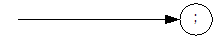
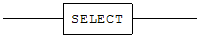
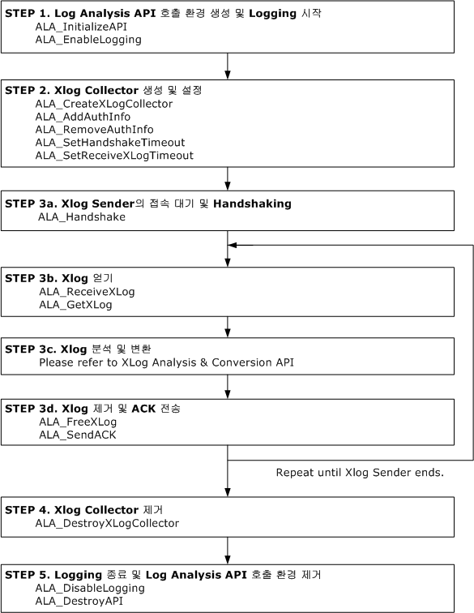

- [Log Analyzer User’s Manual](#log-analyzer-users-manual)
  - [서문](#%EC%84%9C%EB%AC%B8)
    - [이 매뉴얼에 대하여](#%EC%9D%B4-%EB%A7%A4%EB%89%B4%EC%96%BC%EC%97%90-%EB%8C%80%ED%95%98%EC%97%AC)
  - [1.Log Analyzer 소개](#1log-analyzer-%EC%86%8C%EA%B0%9C)
    - [Log Analyzer](#log-analyzer)
    - [Log Analysis API 사용 방법](#log-analysis-api-%EC%82%AC%EC%9A%A9-%EB%B0%A9%EB%B2%95)
    - [Log Analysis API 요약](#log-analysis-api-%EC%9A%94%EC%95%BD)
  - [XLog Sender](#xlog-sender)
    - [XLog Sender를 위한 SQL구문](#xlog-sender%EB%A5%BC-%EC%9C%84%ED%95%9C-sql%EA%B5%AC%EB%AC%B8)
    - [메타 테이블](#%EB%A9%94%ED%83%80-%ED%85%8C%EC%9D%B4%EB%B8%94)
    - [성능 뷰](#%EC%84%B1%EB%8A%A5-%EB%B7%B0)
  - [3.XLog 분석](#3xlog-%EB%B6%84%EC%84%9D)
    - [XLog](#xlog)
    - [메타 정보](#%EB%A9%94%ED%83%80-%EC%A0%95%EB%B3%B4)
    - [Altibase 데이터 타입과 저장 구조체](#altibase-%EB%8D%B0%EC%9D%B4%ED%84%B0-%ED%83%80%EC%9E%85%EA%B3%BC-%EC%A0%80%EC%9E%A5-%EA%B5%AC%EC%A1%B0%EC%B2%B4)
    - [SAVEPOINT](#savepoint)
  - [Log Analysis API](#log-analysis-api)
    - [ALA_InitializeAPI](#ala_initializeapi)
    - [ALA_DestroyAPI](#ala_destroyapi)
    - [ALA_EnableLogging](#ala_enablelogging)
    - [ALA_DisableLogging](#ala_disablelogging)
    - [ALA_CreateXLogCollector](#ala_createxlogcollector)
    - [ALA_AddAuthInfo](#ala_addauthinfo)
    - [ALA_RemoveAuthInfo](#ala_removeauthinfo)
    - [ALA_SetHandshakeTimeout](#ala_sethandshaketimeout)
    - [ALA_SetReceiveXLogTimeout](#ala_setreceivexlogtimeout)
    - [ALA_SetXLogPoolSize](#ala_setxlogpoolsize)
    - [ALA_Handshake](#ala_handshake)
    - [ALA_ReceiveXLog](#ala_receivexlog)
    - [ALA_GetXLog](#ala_getxlog)
    - [ALA_SendACK](#ala_sendack)
    - [ALA_FreeXLog](#ala_freexlog)
    - [ALA_DestroyXLogCollector](#ala_destroyxlogcollector)
    - [ALA_GetXLogCollectorStatus](#ala_getxlogcollectorstatus)
    - [ALA_GetXLogHeader](#ala_getxlogheader)
    - [ALA_GetXLogPrimaryKey](#ala_getxlogprimarykey)
    - [ALA_GetXLogColumn](#ala_getxlogcolumn)
    - [ALA_GetXLogSavepoint](#ala_getxlogsavepoint)
    - [ALA_GetXLogLOB](#ala_getxloglob)
    - [ALA_GetProtocolVersion](#ala_getprotocolversion)
    - [ALA_GetReplicationInfo](#ala_getreplicationinfo)
    - [ALA_GetTableInfo](#ala_gettableinfo)
    - [ALA_GetTableInfoByName](#ala_gettableinfobyname)
    - [ALA_GetColumnInfo](#ala_getcolumninfo)
    - [ALA_GetIndexInfo](#ala_getindexinfo)
    - [ALA_IsHiddenColumn](#ala_ishiddencolumn)
    - [ALA_GetInternalNumericInfo](#ala_getinternalnumericinfo)
    - [ALA_GetAltibaseText](#ala_getaltibasetext)
    - [ALA_GetAltibaseSQL](#ala_getaltibasesql)
    - [ALA_GetODBCCValue](#ala_getodbccvalue)
    - [ALA\_ IsNullValue](#ala%5C_-isnullvalue)
    - [ALA_ClearErrorMgr](#ala_clearerrormgr)
    - [ALA_GetErrorCode](#ala_geterrorcode)
    - [ALA_GetErrorLevel](#ala_geterrorlevel)
    - [ALA_GetErrorMessage](#ala_geterrormessage)
  - [부록A. Error Code](#%EB%B6%80%EB%A1%9Da-error-code)
    - [Error Code 정리](#error-code-%EC%A0%95%EB%A6%AC)
  - [부록B. Sample Code](#%EB%B6%80%EB%A1%9Db-sample-code)
    - [Sample Code : Replication to DBMS](#sample-code--replication-to-dbms)


Altibase® Application Development

Log Analyzer User’s Manual
==========================


Altibase Application Development Log Analyzer User’s Manual

Release 7.1

Copyright ⓒ 2001\~2019 Altibase Corp. All Rights Reserved.

본 문서의 저작권은 ㈜알티베이스에 있습니다. 이 문서에 대하여 당사의 동의 없이 무단으로 복제 또는 전용할 수 없습니다.

**㈜알티베이스**

08378 서울시 구로구 디지털로 306 대륭포스트타워Ⅱ 10층

전화: 02-2082-1114 팩스: 02-2082-1099

고객서비스포털: <http://support.altibase.com>

homepage: [http://www.altibase.com](http://www.altibase.com/)


서문
----

### 이 매뉴얼에 대하여

이 매뉴얼은 Log Analyzer의 개념 및 사용 방법에 대해 설명한다.

#### 대상 사용자

이 매뉴얼은 다음과 같은 Altibase 사용자를 대상으로 작성되었다.

-   데이터베이스 관리자

-   성능 관리자

-   데이터베이스 사용자

-   응용 프로그램 개발자

-   기술지원부

다음과 같은 배경 지식을 가지고 이 매뉴얼을 읽는 것이 좋다.

-   컴퓨터, 운영 체제 및 운영 체제 유틸리티 운용에 필요한 기본 지식

-   관계형 데이터베이스 사용 경험 또는 데이터베이스 개념에 대한 이해

-   데이터베이스 서버 관리, 운영 체제 관리 또는 네트워크 관리 경험

-   컴퓨터 프로그래밍 경험

#### 소프트웨어 환경

이 매뉴얼은 데이터베이스 서버로 Altibase 버전 7.1을 사용한다는 가정 하에
작성되었다.

#### 이 매뉴얼의 구성

이 매뉴얼은 다음과 같이 구성되어 있다.

-   제 1장 Log Analyzer 소개 
    이 장에서는 Log Analyzer의 개념과 기본적인 사용 방법을 설명한다.
-   제 2장 XLog Sender  
    이 장에서는 Log Analyzer의 구성요소 중에서 XLog Sender의 사용법을 설명한다.
-   제 3장 XLog 분석  
    이 장에서는 XLog를 분석하기 위해 필요한 XLog, Meta 정보, Altibase Internal
    Data Type 등에 대해 설명한다.
-   제 4장 Log Analysis API  
    이 장에서는 XLog Sender에서 XLog를 받고 이를 분석하는 함수를 제공한다.
-   A. 부록 : Error Code
-   B. 부록 : Sample Code

#### 문서화 규칙

이 절에서는 이 매뉴얼에서 사용하는 규칙에 대해 설명한다. 이 규칙을 이해하면 이
매뉴얼과 설명서 세트의 다른 매뉴얼에서 정보를 쉽게 찾을 수 있다.

여기서 설명하는 규칙은 다음과 같다.

-   구문 다이어그램

-   샘플 코드 규칙

##### 구문 다이어그램

이 매뉴얼에서는 다음 구성 요소로 구축된 다이어그램을 사용하여, 명령문의 구문을
설명한다.

| 구성 요소                               | 의미                                                         |
| --------------------------------------- | ------------------------------------------------------------ |
|  | 명령문이 시작한다. 완전한 명령문이 아닌 구문 요소는 화살표로 시작한다. |
|  | 명령문이 다음 라인에 계속된다. 완전한 명령문이 아닌 구문 요소는 이 기호로 종료한다. |
|  | 명령문이 이전 라인으로부터 계속된다. 완전한 명령문이 아닌 구문 요소는 이 기호로 시작한다. |
|  | 명령문이 종료한다.                                           |
|  | 필수 항목                                                    |
|  | 선택적 항목                                                  |
|  | 선택사항이 있는 필수 항목. 한 항목만 제공해야 한다.          |
|  | 선택사항이 있는 선택적 항목                                  |
|  | 선택적 항목. 여러 항목이 허용된다. 각 반복 앞부분에 콤마가 와야 한다. |

##### 샘플 코드 규칙

코드 예제는 SQL, Stored Procedure, iSQL 또는 다른 명령 라인 구문들을 예를 들어
설명한다.

아래 테이블은 코드 예제에서 사용된 인쇄 규칙에 대해 설명한다.

| 규칙         | 의미                                                                                | 예제                                                                                                         |
|--------------|-------------------------------------------------------------------------------------|--------------------------------------------------------------------------------------------------------------|
| [ ]          | 선택 항목을 표시                                                                    | VARCHAR [(*size*)] [[FIXED \|] VARIABLE]                                                                     |
| { }          | 필수 항목 표시. 반드시 하나 이상을 선택해야 되는 표시                               | { ENABLE \| DISABLE \| COMPILE }                                                                             |
| \|           | 선택 또는 필수 항목 표시의 인자 구분 표시                                           | { ENABLE \| DISABLE \| COMPILE } [ ENABLE \| DISABLE \| COMPILE ]                                            |
| . . .        | 그 이전 인자의 반복 표시 예제 코드들의 생략되는 것을 표시                           | SQL\> SELECT ename FROM employee; ENAME  ----------------------- SWNO  HJNO  HSCHOI  . . . 20 rows selected. |
| 그 밖에 기호 | 위에서 보여진 기호 이 외에 기호들                                                   | EXEC :p1 := 1; acc NUMBER(11,2);                                                                             |
| 기울임 꼴    | 구문 요소에서 사용자가 지정해야 하는 변수, 특수한 값을 제공해야만 하는 위치         | SELECT \* FROM *table_name*; CONNECT *userID*/*password*;                                                    |
| 소문자       | 사용자가 제공하는 프로그램의 요소들, 예를 들어 테이블 이름, 칼럼 이름, 파일 이름 등 | SELECT ename FROM employee;                                                                                  |
| 대문자       | 시스템에서 제공하는 요소들 또는 구문에 나타나는 키워드                              | DESC SYSTEM_.SYS_INDICES_;                                                                                   |

#### 관련 자료

자세한 정보를 위하여 다음 문서 목록을 참조하기 바란다.

-   Getting Started Guide

-   Administrator’s Manual

-   Replication Manual

-   SQL Reference

-   CLI User's Manual

-   Spatial SQL Reference

-   Application Program Interface User’s Manual

-   iSQL User’s Manual

-   Error Message Reference

#### Altibase는 여러분의 의견을 환영합니다.

이 매뉴얼에 대한 여러분의 의견을 보내주시기 바랍니다. 사용자의 의견은 다음
버전의 매뉴얼을 작성하는데 많은 도움이 됩니다. 보내실 때에는 아래 내용과 함께
고객서비스포털(http://support.altibase.com/kr/ )로 보내주시기 바랍니다.

-   사용 중인 매뉴얼의 이름과 버전

-   매뉴얼에 대한 의견

-   사용자의 성함, 주소, 전화번호

이 외에도 Altibase 기술지원 설명서의 오류와 누락된 부분 및 기타 기술적인
문제들에 대해서 이 주소로 보내주시면 정성껏 처리하겠습니다. 또한, 기술적인
부분과 관련하여 즉각적인 도움이 필요한 경우에도 고객서비스포털을 통해 서비스를
요청하시기 바랍니다.

여러분의 의견에 항상 감사드립니다.

1.Log Analyzer 소개
-----------------

이 장에서는 Log Analyzer의 개념과 기본적인 사용 방법을 설명한다.

### Log Analyzer

Log Analyzer는 DBMS의 Active Log를 기반으로 DML 관련 트랜잭션의 이력을 제공하는
DBMS 내의 모듈, 이 모듈과 통신으로 연결된 외부 모듈, 그리고 사용자가 XLog를
사용하기 위해 제공되는 API의 집합이다.

Log Analyzer는 Altibase DBMS와 타사 DBMS의 연동 또는 DBMS 내부의 변경 사항을
DBMS 외부에서 감지 및 처리 등의 용도로 사용할 수 있다.

#### 용어 및 개념

##### XLog

XLog는 물리적 로그를 논리적인 형태로 변형시킨 로그이다.

사용자가 얻는 DML 관련 트랜잭션의 이력이 XLog이다.

##### XLog Sender

XLog Sender는 Active Log를 분석하여 XLog를 생성하고 XLog Collector에게 전달하는
모듈이다.

XLog Sender는 Handshake 및 XLog 송신을 능동적으로 수행한다.

##### XLog Collector

XLog Collector는 XLog Sender으로부터 Meta 정보 및 XLog를 수신하는 모듈이다.

XLog Collector는 Meta 정보, XLog Queue, Trasaction Table, XLog Pool 등을 가지며,
Log Analysis API를 통해 호출된다.

##### Log Analysis API

Log Analysis API는 XLog와 이를 해석할 수 있는 Meta 정보를 제공하는 API이다.

##### Handshake

Handshake는 XLog Sender와 XLog Collector가 XLog를 송수신하기 전에 Protocol
Version, Meta 정보 등을 확인하는 작업이다.

##### XLog Queue

XLog Queue는 사용자가 얻기 전의 가용한 XLog를 보관하는 곳이다.

##### XLog Pool

XLog Pool은 XLog에 할당될 메모리를 보관하는 곳이다.

XLog Pool은 XLog에 할당될 메모리를 재사용하고 과다한 메모리 사용을 방지하기 위해
존재한다.

##### Transaction Table

Transaction Table은 Transaction의 상태와 추가적인 정보를 보관하는 곳이다.

##### Restart SN

Restart SN은 XLog Sender가 재시작될 때 읽기 시작할 Active Log의 SN이다.

##### SN

SN(Sequence Number)은 로그 레코드의 식별 번호이다.

##### Replication

Replication은 한 DBMS의 데이터를 다른 DBMS에 복제하는 기능이다.

##### Replication SYNC

Replication SYNC는 지역 서버 Replication Table들의 모든 레코드를 원격 서버로
전송하는 기능이다.

Active Log를 기반으로 Replication을 시작하기 전에, Replication Table의 내용을
일치시키기 위해 사용한다.

#### Log Analyzer의 동작 방식

XLog Sender는 DBMS 내에 존재하며, Active Log로 XLog를 만들고 XLog와 Meta 정보를
XLog Collector에게 전송한다. XLog Collector는 사용자의 애플리케이션 내에
존재하며, Log Analysis API를 통해 사용자에게 XLog와 메타 정보를 제공한다.

Log Analysis API를 호출에 실패하면, 오류 원인에 따라 적절한 조치를 취해야 한다.
가장 최근의 오류 정보를 보관하는 곳이 Error Manager이다. 또한 문제 추적을 위해
Log Manager를 제공한다. Log Manager는 간단한 추적 정보와 오류 정보를 Log
Manager생성시 지정한 로그 파일에 기록한다.

전체 구조를 그림으로 나타내면 아래와 같다.


[그림 1‑1] Log Analyzer의 구조

사용자는 Log Analysis API를 사용하여 XLog Collector에서 메타 정보와 XLog를
얻는다. 메타 정보는 Handshake 시에 XLog Sender에서 수신하며, 다음 Handshake
전까지 유효하다.

XLog Collector 내에서 메타 정보와 XLog가 이동하는 경로는 아래와 같다.

1.  XLog Pool에서 XLog의 메모리를 얻는다.

2.  XLogCollector는 XLog Sender로부터 XLog를 구성하는 데이터를 수신하여 XLog를
    만든다.

3.  XLog는 XLog Queue에 추가되고, 사용자가 Log Analysis API를 사용해서 이를 얻을
    수 있다.  
    Commit 순서로 Transaction의 XLog를 얻을 경우, XLog Queue에 XLog를 추가하기
    전에 Transaction Table에 임시 보관한다.

4.  사용이 끝난 XLog에 할당된 의 메모리는 XLog Pool에 반환한다.

Meta 정보와 XLog가 XLog Collector에서 이동하는 경로를 그림으로 나타내면 아래와
같다.


[그림 1‑2] XLog Collector의 구조

#### Log Analyzer의 특징

##### XLog Sender는 Replication 모듈을 사용

XLog Sender는 Replicaton과 거의 동일한 SQL를 사용하여 관리되며,
이중화(Replication)의 속성이 적용된다.

이중화에 대한 자세한 내용은 *Replication Manual*을 참고한다.

##### Commit 순서로 Transaction의 XLog 얻기 지원

XLog Collector를 생성할 때, Commit 순서로 트랜잭션의 XLog 얻기 여부를 지정할 수
있다. Commit 순서로 트랜잭션의 XLog 얻기를 지정하면 아래와 같은 사항이 적용된다.

-   COMMIT XLog가 수신된 후에 해당 트랜잭션의 XLog를 얻을 수 있다.  
    Savepoint 관련 XLog는 필요하지 않기 때문에 제공하지 않는다.

-   롤백된 Transaction의 XLog는 얻을 수 없다.

##### XLog를 전송하는 방법으로 TCP와 UNIX Domain socket을 지원

-   UNIX Domain socket은 XLog Sender와 XLog Collector가 같은 장비에 있고, OS가
    UNIX 또는 LINUX일 때만 사용할 수 있다.

-   하나의 XLog Sender에서는 한 종류의 Socket Type만 사용할 수 있다.

##### ODBC C 값으로 변환을 지원

Altibase 내부 데이터를 대응하는 ODBC C 데이터 타입으로 변환하는 것을 지원한다.

#### Log Analyzer 제한 사항

XLog Sender는 Replication 모듈을 사용하므로, 기본적으로 아래와 같은 제한 사항이
적용된다.

-   SYS 사용자만 XLog Sender 를 구동할 수 있다.

-   분석 대상을 지정하는 단위는 Table이다.

-   분석 대상 Table에는 반드시 Primary Key가 존재해야 한다.

-   분석 대상 Table의 Primary Key를 구성하는 컬럼의 데이터는 수정할 수 없다.  
    Primary Key를 구성하는 컬럼에 대한 INSERT와 DELETE는 가능하다.

-   분석 대상 Table에 대한 DDL을 수행할 수 없다.

-   하나의 DBMS에 XLog Sender와 Replication Sender를 합쳐서 최대 32 개까지 만들
    수 있다.

-   Log Analysis API의 프로토콜 버전과 Replication의 프로토콜 버전이 일치해야
    한다.  
    XLog Collector가 하나의 Process 내에서 여러 개일 경우, 대응하는 모든 DBMS의
    Replication 프로토콜 버전들이 Log Analysis API의 프로토콜 버전과 같아야
    한다.

그러나, Replication과는 달리,

-   Foreign Key 컬럼을 가지고 있는 테이블도 로그분석 대상이 될 수 있다.

-   Lazy Mode만 지원한다.

-   Replication SYNC를 지원하지 않는다.

Replication에 대한 자세한 내용은 *Replication Manual*을 참고한다.

### Log Analysis API 사용 방법

사용자의 애플리케이션에 포함되는 Log Analysis API를 사용하는 방법을 설명한다.

XLog Sender의 사용 방법은 ‘XLog Sender’를 참고한다.

#### 필요한 파일

<table>
<tbody>
<tr>
<td>
<p>종류</p>
</td>
<td>
<p>파일명</p>
</td>
<td>
<p>설명</p>
</td>
</tr>
<tr>
<td rowspan="2" >
<p>Header</p>
</td>
<td >
<p>alaAPI.h</p>
</td>
<td >
<p>Log Analysis API를 사용해서 클라이언트 프로그램 작성시 include해야 하는 파일이며, alaTypes.h를 include한다.</p>
</td>
</tr>
<tr>
<td >
<p>alaTypes.h</p>
</td>
<td >
<p>Log Analysis API 사용해서 클라이언트 프로그램 작성시 필요한 Data Type과 매크로를 정의</p>
</td>
</tr>
<tr>
<td rowspan="2">
<p>Library</p>
</td>
<td >
<p>libala_sl.x</p>
</td>
<td >
<p>Log Analysis API의 Shared Library</p>
</td>
</tr>
<tr>
<td >
<p>libala.x</p>
</td>
<td >
<p>Log Analysis API의 Static Library</p>
</td>
</tr>
</tbody>
</table>

[표 1‑1] Log Analysis API시 필요한 파일

소스 작성 및 컴파일을 할 때 다음과 같은 사항을 주의해야 한다.

-   사용자 소스 파일에 ‘alaAPI.h’ 파일을 include해야 한다.

-   링크 시, Shared Library 또는 Static Library를 링크해야 한다.

-   Library의 확장자는 플랫폼마다 다르다.

#### 데이터 타입

Log Analysis API에서 사용하는 기본적인 데이터 타입은 아래와 같다.

<table>
<tbody>
<tr>
<td >
<p>종류</p>
</td>
<td>
<p>데이터 타입</p>
</td>
<td>
<p>설명</p>
</td>
</tr>
<tr>
<td>
<p>Boolean</p>
</td>
<td >
<p>ALA_BOOL</p>
</td>
<td>
<p>ALA_TRUE: 참</p>
<p>ALA_FALSE: 거짓</p>
</td>
</tr>
<tr>
<td >
<p>Return Code</p>
</td>
<td >
<p>ALA_RC</p>
</td>
<td >
<p>ALA_SUCCESS: 성공</p>
<p>ALA_FAILURE: 실패</p>
</td>
</tr>
<tr>
<td  rowspan="2">
<p>Character</p>
</td>
<td >
<p>Char (SChar)</p>
</td>
<td >
<p>Signed Character (8 bits)</p>
</td>
</tr>
<tr >
<td >
<p>unsigned char (UChar)</p>
</td>
<td>
<p>Unsigned Character (8 bits)</p>
</td>
</tr>
<tr >
<td  rowspan="6">
<p>Integer</p>
</td>
<td>
<p>Short (SShort)</p>
</td>
<td>
<p>Signed Small Integer (16 bits)</p>
</td>
</tr>
<tr>
<td>
<p>unsigned short (UShort)</p>
</td>
<td >
<p>Unsigned Small Integer (16 bits)</p>
</td>
</tr>
<tr>
<td >
<p>Int (SInt)</p>
</td>
<td>
<p>Signed Integer (32 bits)</p>
</td>
</tr>
<tr >
<td >
<p>unsigned Int (UInt)</p>
</td>
<td>
<p>Unsigned Integer (32 bits)</p>
</td>
</tr>
<tr>
<td>
<p>Long (SLong)</p>
</td>
<td>
<p>Signed Big Integer (64 bits)</p>
</td>
</tr>
<tr>
<td>
<p>unsigned long (ULong)</p>
</td>
<td>
<p>Unsigned Big Integer (64 bits)</p>
</td>
</tr>
</tbody>
</table>
[표 1‑2] Log Analysis API의 기본 데이터 타입

#### Error Handling

모든 Log Analysis API는 오류 관리자(Error Manager)를 인자로 받는다. Log Analysis
API 호출 결과가 ALA_FAILURE인 경우, 오류 발생 원인을 확인해서 조치해야 한다.
사용자에게 제공하는 오류 정보는 Error Code, Error Level, Error Message이다.

오류 관리자 구조체는 다음과 같다.

```
typedef struct ALA_ErrorMgr
{
    UInt    mErrorCode;     /* CODE  */
    SChar  mErrorState[6];   /* STATE */
    SChar  mErrorMessage[ALA_MAX_ERROR_MSG_LEN+256];
} ALA_ErrorMgr;
```

오류 관리자를 사용할 때의 주의사항은 아래와 같다.

-   Log Analysis API를 호출하는 주체(Process 또는 Thread)가 오류 관리자를
    생성하고 보관해야 한다.

-   오류 관리자는 마지막으로 발생한 오류의 정보만 유지한다.

-   Log Analysis API 중 Error Handling 관련 함수의 오류 관리자 인자로 NULL을
    사용할 수 없다.

-   Error Handling 관련 함수 이외의 Log Analysis API에서 오류 관리자로 NULL을
    사용하면, 오류가 발생 시 Log Manager를 통해 기록되지 않는다.

-   오류 관리자 구조체의 mErrorCode요소는 내부 정보를 포함하기 있기 때문에, 에러
    코드는 반드시 ALA_GetErrorCode()로 얻어야 한다.

ALA_ErrorLevel는 ALA_GetErrorLevel()로 얻을 수 있으며, 오류 수준을 나타낸다.

```
typedef enum
{
    ALA_ERROR_FATAL = 0,    /* Need to Destroy */
    ALA_ERROR_ABORT,        /* Need to Handshake */
    ALA_ERROR_INFO          /* Information */
} ALA_ErrorLevel;
```

각 오류 수준에 대한 조치 방법은 아래와 같다.

-   ALA_ERROR_FATAL은 치명적인 오류이므로, ALA_DestroyXLogCollector()를 호출하여
    해당 XLog Collector를 종료해야 한다.

-   ALA_ERROR_ABORT는 XLog Collector가 비정상적인 상태임을 나타내므로,
    ALA_Handshake()를 호출하여 해당 XLog Collector의 Handshake를 다시 수행해야
    한다.

-   ALA_ERROR_INFO는 Log Analysis API 호출이 실패했음을 나타낸다. Error Code에
    따라 적절한 조치를 해야 한다.

이미 발생한 오류는 Log Manager에 의해 기록된 로그 파일들을 통해 확인할 수 있다.
Log Manager에 대한 상세한 사용법은 ALA_EnableLogging()와 ALA_DisableLogging()의
설명을 참고한다.

#### 기본 사용법

아래의 다이어그램은 Log Analysis API를 사용할 때의 순서를 도식화한 것이다.



Log Analysis API를 사용 시, 아래의 사항을 주의해야 한다.

-   XLog Collector 는 STEP 3a\~3d에서 모니터링 가능하다.

-   Error Handling API는 모든 STEP에서 사용된다.

-   XLog Collector가 여러 개인 경우, 각 XLog Collector에 대해 STEP 2 \~ 4를
    수행한다.

-   ALA_SendACK()를 step3 의 순서에서 매번 호출할 필요는 없다. ACK 전송 시점에
    대한 자세한 설명은 ALA_CreateXLogCollector()와 ALA_SendACK()를 참고한다.

-   STEP 3c에서 XLog를 ODBC를 사용해서 DBMS에 적용한다면, Autocommit 옵션을 꺼야
    한다.

-   STEP 3a 후에 XLog Sender를 시작시켜야 한다.

-   STEP 3b에서 ALA_ReceiveXLog()와 ALA_GetXLog()를 서로 다른 Thread에서 호출할
    수 있다.

-   ALA_FreeXLog를 사용한 후, 해당 XLog와 관련된 데이터를 더 이상 사용하면 안
    된다.

###  Log Analysis API 요약

#### Log Analysis API 환경 관리

<table>
    <TR>
        <TH>종류</TH><TH>Log Analysis API</TH><TH>설명</TH>
    </TR>
    <TR>
        <TD rowspan="2">Log Analysis API 환경 생성 및 제거</TD>
       		<td>ALA_InitializeAPI</td><td>Log Analysis API를 호출할 수 있는 환경을 생성한다.</td></tr>
    <tr><td>ALA_DestroyAPI</td><td>Log Analysis API를 호출할 수 있는 환경을 제거한다.</td></tr>
    <tr>
        <td rowspan="2">Logging</td><td>ALA_EnableLogging</td><td>Problem Tracking을 위해 Logging을 활성화한다.</td>
    </tr>
    <tr>
        <td>ALA_DisableLogging</td><td>Logging을 비활성화한다.</td>
    </tr>
</table>

​            

#### XLog Collector 관련 API

<table>
<thead>
<tr>
<th>종류</th>
<th>Log Analysis API</th>
<th>설명</th>
</tr>
<tr>
<td rowspan="5">
<p>XLog Collector 생성 및 준비</p>
</td>
<td>
<p>ALA_CreateXLogCollector</p>
</td>
<td>
<p>XLog Sender에 대응하는 XLog Collector를 생성한다.</p>
</td>
</tr>
<tr>
<td>
<p>ALA_AddAuthInfo</p>
</td>
<td>
<p>XLog Sender 인증 정보를 추가한다.</p>
</td>
</tr>
<tr>
<td>
<p>ALA_RemoveAuthInfo</p>
</td>
<td>
<p>XLog Sender 인증 정보를 제거한다.</p>
</td>
</tr>
<tr>
<td>
<p>ALA_SetHandshakeTimeout</p>
</td>
<td>
<p>Handshake의 Timeout을 지정한다.</p>
</td>
</tr>
<tr>
<td>
<p>ALA_SetReceiveXLogTimeout</p>
</td>
<td>
<p>XLog 수신 Timeout을 지정한다.</p>
</td>
</tr>
<tr>
<td rowspan="5">
<p>Meta 정보와 XLog 수신</p>
</td>
<td>
<p>ALA_Handshake</p>
</td>
<td>
<p>XLog Sender의 접속을 대기하고, Handshake를 수행한다.</p>
</td>
</tr>
<tr>
<td>
<p>ALA_ReceiveXLog</p>
</td>
<td>
<p>XLog를 수신하여 XLog Queue에 XLog를 추가한다.</p>
</td>
</tr>
<tr>
<td>
<p>ALA_GetXLog</p>
</td>
<td>
<p>XLog Queue에서 XLog를 얻는다.</p>
</td>
</tr>
<tr>
<td>
<p>ALA_SendACK</p>
</td>
<td>
<p>ACK를 XLog Sender에게 전송한다.</p>
</td>
</tr>
<tr>
<td>
<p>ALA_FreeXLog</p>
</td>
<td>
<p>XLog를 XLog Pool에 반환한다.</p>
</td>
</tr>
<tr>
<td>
<p>XLog Collector 제거</p>
</td>
<td>
<p>ALA_DestroyXLogCollector</p>
</td>
<td>
<p>XLog Collector를 제거한다.</p>
</td>
</tr>
<tr>
<td>
<p>XLog Collector Monitoring</p>
</td>
<td>
<p>ALA_GetXLogCollectorStatus</p>
</td>
<td>
<p>XLog Collector의 상태를 얻는다.</p>
</td>
</tr>
</thead>
</table>


#### XLog Analysis & Conversion API

<table>
<tbody>
<tr>
    <th>종류</th> <th>Log Analysis API</th> <th>설명</th>
</tr>
<tr>
<td rowspan="5">
<p>XLog</p>
</td>
<td >
<p>ALA_GetXLogHeader</p>
</td>
<td>
<p>XLog에서 Header 정보를 얻는다.</p>
</td>
</tr>
<tr>
<td>
<p>ALA_GetXLogPrimaryKey</p>
</td>
<td>
<p>XLog에서 Primary Key 컬럼에 해당하는 데이터를 얻는다.</p>
</td>
</tr>
<tr>
<td>
<p>ALA_GetXLogColumn</p>
</td>
<td>
<p>XLog에서 Column 데이터 (before and after)를 얻는다.</p>
</td>
</tr>
<tr>
<td>
<p>ALA_GetXLogSavepoint</p>
</td>
<td>
<p>XLog에서 Savepoint 정보를 얻는다.</p>
</td>
</tr>
<tr>
<td>
<p>ALA_GetXLogLOB</p>
</td>
<td>
<p>XLog에서 LOB 데이터를 얻는다.</p>
</td>
</tr>
<tr>
<td rowspan="7">
<p>Meta 정보</p>
</td>
<td >
<p>ALA_GetProtocolVersion</p>
</td>
<td >
<p>Log Analysis API의 Protocol Version을 얻는다.</p>
</td>
</tr>
<tr>
<td >
<p>ALA_GetReplicationInfo</p>
</td>
<td >
<p>Replication 정보를 얻는다.</p>
</td>
</tr>
<tr>
<td >
<p>ALA_GetTableInfo</p>
</td>
<td >
<p>Table OID로 Table 정보를 검색한다.</p>
</td>
</tr>
<tr>
<td >
<p>ALA_GetTableInfoByName</p>
</td>
<td >
<p>Table 이름과 테이블 소유자 이름으로 Table 정보를 검색한다.</p>
</td>
</tr>
<tr>
<td >
<p>ALA_GetColumnInfo</p>
</td>
<td >
<p>Column ID로 Table에서 Column 정보를 검색한다.</p>
</td>
</tr>
<tr>
<td >
<p>ALA_GetIndexInfo</p>
</td>
<td>
<p>Index ID로 Table에서 Index 정보를 검색한다.</p>
</td>
</tr>
<tr>
<td>
<p>ALA_IsHiddenColumn</p>
</td>
<td>
<p>Column ID로 검색한 컬럼이 숨겨진 것인지 여부를 알아낸다.</p>
</td>
</tr>
<tr>
<td rowspan="3">
<p>Altibase Internal Data Type</p>
</td>
<td>
<p>ALA_GetInternalNumericInfo</p>
</td>
<td>
<p>FLOAT, NUMERIC 데이터의 부호와 지수를 얻는다.</p>
</td>
</tr>
<tr>
<td>
<p>ALA_GetAltibaseText</p>
</td>
<td>
<p>Altibase 내부 데이터를 문자열로 변환한다.</p>
</td>
</tr>
<tr>
<td>
<p>ALA_GetAltibaseSQL</p>
</td>
<td>
<p>Transaction 관련 XLog를 Altibase SQL 문자열로 변환한다.</p>
</td>
</tr>
<tr>
<td>
<p>ODBC C Conversion</p>
</td>
<td>
<p>ALA_GetODBCCValue</p>
</td>
<td>
<p>Altibase 내부 데이터를 ODBC C 의 데이터 타입으로 변환한다.</p>
</td>
</tr>
</tbody>
</table>

#### Error Handling API

<table width="510">
<tbody>
<tr>
    <th>종류 </th><th>Log Analysis API</th><th>설명</th>
</tr>
<tr>
<td rowspan="4" width="77">
<p>Error Handling</p>
</td>
<td width="153">
<p>ALA_ClearErrorMgr</p>
</td>
<td width="280">
<p>오류 관리자를 초기화한다.</p>
</td>
</tr>
<tr>
<td width="153">
<p>ALA_GetErrorCode</p>
</td>
<td width="280">
<p>Error Code를 얻는다.</p>
</td>
</tr>
<tr>
<td width="153">
<p>ALA_GetErrorLevel</p>
</td>
<td width="280">
<p>Error Level을 얻는다.</p>
</td>
</tr>
<tr>
<td width="153">
<p>ALA_GetErrorMessage</p>
</td>
<td width="280">
<p>구체적인 Error Message를 얻는다.</p>
</td>
</tr>
</tbody>
</table>

XLog Sender
-----------

Log Analyzer의 구성요소 중에서 XLog Sender의 사용법을 설명한다.

XLog Sender는 Log Record들을 XLog로 조합하고, XLog를 XLog Collector에게 전달하는
역할을 한다. XLog Sender는 DBMS 내의 모듈이며, Replication과 거의 동일한 SQL
Interface로 관리한다.

### XLog Sender를 위한 SQL구문 

#### XLog Sender 생성

##### 구 문

```
CREATE REPLICATION replication_name FOR ANALYSIS [PROPAGATION]
   WITH {{'remote_host_ip', remote_host_ port_no}
   ...
   |UNIX_DOMAIN}
   FROM user_name.table_name TO user_name.table_name
   [, FROM user_name.table_name TO user_name.table_name] ... ;
```


##### 설 명

XLog Sender를 생성한다.

-   Lazy Mode로 강제 적용된다. Eager Mode 지정은 불가능하다.

-   WITH 절의 'UNIX_DOMAIN'은 UNIX Domain을 사용함을 지정한다.

-   FROM 절에서 외래키(Foreign Key)가 있는 테이블을 지정할 수 있다.

-   PROPAGATION  
    XLog Sender가 PROPAGABLE LOGGING을 사용하여 복제한 트랜잭션의 로그를 다른
    서버로 전송하기 위해 FOR ANALYSIS PROPAGATION을 사용한다.

나머지는 Replication과 동일하다. 자세한 내용은 *Replication Manual*을 참고한다.

##### 주의사항

UNIX Domain은 UNIX와 LINUX에서만 사용할 수 있다.

##### 예 제

XLog Sender 이름: log_analysis

XLog Collector 정보: TCP(IP : 127.0.0.1, PORT : 35300)

IP는 XLog Collector가 실행되는 서버의 IP

PORT는 XLog Collector에서 정의한 PORT 번호

분석 대상 Table: sys.t1

```
iSQL> CREATE REPLICATION log_analysis FOR ANALYSIS 
      WITH '127.0.0.1', 35300
      FROM sys.t1 TO sys.t1;
```


#### XLog Sender 제거

##### 구 문

```
DROP REPLICATION replication_name;
```


##### 설 명

Replication과 동일하다.

자세한 내용은 *Replication Manual*을 참고한다.

##### 예 제

log_analysis라는 이름의 XLog Sender를 제거한다.

```
iSQL> DROP REPLICATION log_analysis;
```


#### XLog Sender 시작

##### 구 문

```
ALTER REPLICATION replication_name {START [AT SN (xlog_sender_start_sn)]|QUICKSTART};
```


##### 설 명

XLog Sender를 시작시킨다.

-   UNIX Domain Socket을 사용할 때, Socket 파일명은 자동 생성한다.  
    Socket 파일명: \$ALTIBASE_HOME/trc/rp-*replication_name*

-   Replication과 달리 Heart-Beat Thread에 등록되지 않는다.

-   Replication Sender와 달리 XLog Sender는 AT SN 절을 이용해서 특정 SN 부터
    전송을 시작할 수 있다. *xlog_sender_start_sn* 는 전송을 시작할 XLog의
    SN값이다.

나머지는 Replication과 동일하다. 자세한 내용은 *Replication Manual*을 참고한다.

##### 주의사항

수행 전에 XLog Collector가 접속 대기를 하고 있어야 한다.

UNIX Domain을 사용할 때, XLog Collector에 동일한 ‘\$ALTIBASE_HOME’ 환경 변수를
설정해야 한다.

그리고, OS마다 Socket 파일명의 최대 길이가 다르므로, 이를 확인하여 최대 길이를
초과하지 않도록 한다.

AT SN 절과 함께 XLog Sender를 시작하려면, 다음의 조건을 만족해야 한다.

-   아카이브로그 모드로 데이터베이스가 구동되어 있어야 한다.

-   이중화 전용 로그 버퍼가 사용되지 않도록 설정되어 있어야 한다. 즉,
    REPLICATION_LOG_BUFFER_SIZE 프로퍼티의 값이 0이어야 한다.

##### 예 제

log_analysis라는 이름의 XLog Sender를 마지막으로 종료한 위치부터 시작한다.

```
iSQL> ALTER REPLICATION log_analysis START;
```


#### XLog Sender 종료

##### 구 문

```
ALTER REPLICATION replication_name STOP;
```


##### 설 명

Replication과 동일하다.

자세한 내용은 *Replication Manual*을 참고한다.

##### 예 제

log_analysis라는 이름의 XLog Sender를 중지한다.

```
iSQL> ALTER REPLICATION log_analysis STOP;
```

#### 분석 대상 Table 추가

##### 구 문

```
ALTER REPLICATION replication_name ADD TABLE
FROM user_name.table_name TO user_name.table_name;
```


##### 설 명

분석 대상 Table을 추가한다.

FROM 절에서 Foreign Key가 있는 Table을 지정할 수 있다.

나머지는 Replication과 동일하다.

자세한 내용은 *Replication Manual*을 참고한다.

##### 예 제

XLog Sender 이름: log_analysis

분석 대상 리스트에 추가할 Table: sys.t2

```
iSQL> ALTER REPLICATION log_analysis ADD TABLE  
    FROM sys.t2 TO sys.t2;
```


#### 분석 대상 Table 제거

##### 구 문

```
ALTER REPLICATION replication_name DROP TABLE
   FROM user_name.table_name TO user_name.table_name;
```


##### 설 명

Replication과 동일하다.

자세한 내용은 *Replication Manual*을 참고한다.

##### 예 제

XLog Sender 이름: log_analysis

분석 대상 리스트에서 제거할 Table: sys.t2

```
iSQL> ALTER REPLICATION log_analysis DROP TABLE
   FROM sys.t2 TO sys.t2;
```


#### 호스트 추가

##### 구 문

```
ALTER REPLICATION replication_name  
      ADD HOST 'remote_host_ip', remote_port_no;
```


##### 설 명

Replication과 동일하다.

자세한 내용은 *Replication Manual*을 참고한다.

##### 주의사항

TCP/IP 연결 타입의 호스트만 추가할 수 있다.

이미 UNIX Domain연결을 지정한 경우에는 호스트를 추가할 수 없다.

##### 예 제

XLog Sender 이름: log_analysis

XLog Collector 정보: TCP(IP : 127.0.0.1, PORT : 30301)

```
iSQL> ALTER REPLICATION log_analysis ADD HOST '127.0.0.1', 30301;
```


#### 호스트 제거

##### 구 문

```
ALTER REPLICATION replication_name  
   DROP HOST 'remote_host_ip', remote_port_no;
```


##### 설 명

Replication과 동일하다.

자세한 내용은 *Replication Manual*을 참고한다.

##### 주의사항

TCP/IP 연결 타입의 호스트만 제거할 수 있다.

##### 예 제

XLog Sender 이름: log_analysis

XLog Collector 정보: TCP(IP : 127.0.0.1, PORT : 30301)

```
iSQL> ALTER REPLICATION log_analysis DROP HOST '127.0.0.1', 30301;
```


#### 호스트 지정

##### 구 문

```
ALTER REPLICATION replication_name
   SET HOST 'remote_host_ip', remote_port_no;
```


##### 설 명

Replication과 동일하다.

자세한 내용은 *Replication Manual*을 참고한다.

##### 주의사항

-   새로 지정한 호스트는 XLog Sender를 시작할 때 적용된다.

-   TCP/IP연결 타입의 호스트만 지정할 수 있다.

##### 예 제

XLog Sender 이름: log_analysis

XLog Collector 정보: TCP(IP : 127.0.0.1, PORT : 30301)

```
iSQL> ALTER REPLICATION log_analysis SET HOST '127.0.0.1', 30301;
```


#### XLog Flush

##### 구 문

```
ALTER REPLICATION replication_name FLUSH [ALL] [WAIT timeout_sec];
```


##### 설 명

Replication과 동일하다.

자세한 내용은 *Replication Manual*을 참고한다.

##### 주의사항

XLog Collector가 ACK를 전송하지 않으면, Timeout이 발생할 수 있다.

##### 예 제

XLog Sender 이름: log_analysis

Flush 기준 위치: 수행 시점

Timeout: 10 초

```
iSQL> ALTER REPLICATION log_analysis FLUSH WAIT 10;
```


### 메타 테이블

Replication과 동일한 메타 테이블(Meta Table)을 사용한다.

각각의 메타 테이블에 대한 자세한 내용은 *General Reference*를 참고한다.

#### SYSTEM_.SYS_REPLICATIONS\_

XLog Sender의 설정 및 상태 정보를 가진다. ROLE 컬럼의 값이 1인 경우, XLog
Sender임을 나타낸다.

#### SYSTEM_.SYS_REPL_HOSTS\_

XLog Sender가 접속할 대상 (XLog Collector)의 정보를 가진다. UNIX Domain연결
호스트인 경우, HOST_IP 컬럼 값은 “UNIX_DOMAIN”이고 PORT_NO 컬럼 값은 HOST_NO
컬럼 값과 같다.

#### SYSTEM_.SYS_REPL_ITEMS\_

로그 분석 대상 테이블의 정보를 가진다.

### 성능 뷰

Replication과 동일한 성능 뷰(Performance View)를 제공한다.

각각의 성능 뷰에 대한 자세한 내용은 *General Reference*를 참고한다.

#### V\$REPEXEC

관리자 정보를 가진다.

#### V\$REPSENDER

XLog Sender의 정보를 보여준다.

UNIX Domain연결인 경우, SENDER_IP와 PEER_IP 컬럼 값은 “UNIX_DOMAIN”이고
SENDER_PORT와 PEER_PORT 컬럼 값은 0이다.

#### V\$REPSENDER_TRANSTBL

XLog Sender의 Transaction Table 정보를 가진다.

#### V\$REPGAP

로그 분석 진도에 대한 정보를 가진다.

3.XLog 분석
---------

이 장은 XLog를 분석하기 위해 필요한 XLog, Meta 정보, Altibase Internal Data Type
등에 대해 설명한다.

XLog와 Meta 정보는 Log Analysis API로 얻을 수 있다.

### XLog

XLog의 종류와 구성 요소를 설명한다.

사용자는 XLog를 얻기 위해 ALA_GetXLog()를 호출해야 한다.

#### XLog의 종류

```
typedef enum
{
    XLOG_TYPE_COMMIT            = 2,   /* Transaction Commit */
    XLOG_TYPE_ABORT             = 3,   /* Transaction Rollback */
    XLOG_TYPE_INSERT            = 4,   /* DML: Insert */
    XLOG_TYPE_UPDATE            = 5,   /* DML: Update */
    XLOG_TYPE_DELETE            = 6,   /* DML: Delete */
    XLOG_TYPE_SP_SET            = 8,   /* Savepoint Set */
    XLOG_TYPE_SP_ABORT          = 9,   /* Abort to savepoint */
    XLOG_TYPE_LOB_CURSOR_OPEN   = 14,  /* LOB Cursor open */
    XLOG_TYPE_LOB_CURSOR_CLOSE  = 15,  /* LOB Cursor close */
    XLOG_TYPE_LOB_PREPARE4WRITE = 16,  /* LOB Prepare for write */
    XLOG_TYPE_LOB_PARTIAL_WRITE = 17,  /* LOB Partial write */
    XLOG_TYPE_LOB_FINISH2WRITE  = 18,  /* LOB Finish to write */
    XLOG_TYPE_KEEP_ALIVE        = 19,  /* Keep Alive */
    XLOG_TYPE_REPL_STOP         = 21,  /* Replication Stop */
    XLOG_TYPE_LOB_TRIM          = 35,  /* LOB Trim */
    XLOG_TYPE_CHANGE_META       = 25  /* Meta change by DDL */
} ALA_XLogType;
```

XLog에는 13 가지의 트랜잭션 관련 XLog, 2 가지의 Control 관련 XLog가 있다.

트랜잭션 관련 XLog는 XLOG_TYPE_COMMIT이나 XLOG_TYPE_ABORT로 끝난다.

LOB은 큰 데이터이므로, LOB에 대한 갱신 작업은 다수의 XLog로 구성될 수 있다. 이
경우에는 LOB 관련 XLog가 아래와 같은 구조로 수신된다.

```
XLOG_TYPE_LOB_CURSOR_OPEN
{
    XLOG_TYPE_LOB_PREPARE4WRITE
    {
        XLOG_TYPE_LOB_PARTIAL_WRITE
        ...
    }
    XLOG_TYPE_LOB_FINISH2WRITE
    ...
     또는
     XLOG_TYPE_LOB_TRIM
…
}
XLOG_TYPE_LOB_CURSOR_CLOSE

```


Control 관련 XLog는 KEEP_ALIVE와 REPL_STOP이다.

KEEP_ALIVE는 XLog Sender에서 전송할 XLog가 없을 때, 네트워크 연결이 유지됨을
확인하기 위해 전송하는 XLog이다.

REPL_STOP은 XLog Sender가 정상 종료하는 것을 나타낸다. ALA_SendACK()를 호출한
다음에 네트워크 연결이 끊어진다.

CHANGE_META는 XLog Sender에서 DDL발생으로 인한 meta 정보 변경을 보여준다. XLog
Sender는 CHANGE_META를 전송한 후에 새로운 meta정보로써 XLog를 전송하게 되므로
ALA 응용프로그램에 meta정보를 재전송 해주어야 한다. 따라서 ALA응용프로그램이
이를 처리할 수 있도록 XLog Sender는 CHANGE_META에 이어서 REPL_STOP을 보내고 재
접속을 시도한다.

#### XLog 구조체

```
typedef UInt   ALA_TID;     		/* Transaction ID */
typedef ULong  ALA_SN;          	/* Log Record SN */
typedef struct ALA_Value    		/* Altibase Internal Data */
{
    UInt         length;    		/* Length of value */
    const void * value;
} ALA_Value;
```


| 구조체 멤버   | 설 명                          |
|---------------|--------------------------------|
| 길이 (length) | Altibase 내부 데이터 값의 길이 |
| 값 (value)    | Altibase 내부 데이터 값        |

```
typedef struct ALA_XLogHeader   	/* XLog Header */
{
    ALA_XLogType mType;      	/* XLog Type */
    ALA_TID      mTID;          	/* Transaction ID */
    ALA_SN       mSN;         	/* SN */
    ALA_SN       mSyncSN;    	/* Reserved */
    ALA_SN       mRestartSN;    	/* Used internally */
    ULong        mTableOID;     	/* Table OID */
} ALA_XLogHeader;

typedef struct ALA_XLogPrimaryKey 	/* Primary Key */
{
    UInt         mPKColCnt;     	/* Primary Key Column Count */
    ALA_Value   *mPKColArray; 	/* Primary Key Column Value Array */
} ALA_XLogPrimaryKey;

typedef struct ALA_XLogColumn   		/* Column */
{
    UInt         mColCnt;     	/* Column Count */
    UInt        *mCIDArray;   	/* Column ID Array */
    ALA_Value   *mBColArray; 	/* Before Image Column Value Array */
    ALA_Value   *mAColArray; 	/* After Image Column Value Array */
} ALA_XLogColumn;

typedef struct ALA_XLogSavepoint   		/* Savepoint */
{
    UInt         mSPNameLen;    		/* Savepoint Name Length */
    SChar       *mSPName;       		/* Savepoint Name */
} ALA_XLogSavepoint;

typedef struct ALA_XLogLOB      		/* LOB */
{
    ULong        mLobLocator;   		/* LOB Locator of Altibase */
    UInt         mLobColumnID;
    UInt         mLobOffset;
    UInt         mLobOldSize;
    UInt         mLobNewSize;
    UInt         mLobPieceLen;
    UChar       *mLobPiece;
} ALA_XLogLOB;

typedef struct ALA_XLog         		/* XLog */
{
    ALA_XLogHeader      mHeader;
    ALA_XLogPrimaryKey  mPrimaryKey;
    ALA_XLogColumn      mColumn;
    ALA_XLogSavepoint   mSavepoint;
    ALA_XLogLOB         mLOB;

    /* Used internally */
    struct ALA_XLog    *mPrev;
    struct ALA_XLog    *mNext;
} ALA_XLog;
```

XLog구조체는 Header, Primary Key, Column, Savepoint, LOB관련 구조체로 구성된다.

각 부분은 ALA_XLog구조체에서 직접 얻거나 XLog 관련 Log Analysis API를 사용하여
얻을수 있다.

ALA_XLogPrimaryKey구조체에는 Primary Key Column ID Array가 없다. 이것은 테이블의
메타 정보를 가지고 있는 ALA_Table구조체의 mPKColumnArray[sIndex]-\>mColumnID 로
얻을 수 있다. 테이블의 메타 정보는 ALA_GetTableInfo()이나
ALA_GetTableInfoByName()으로 얻을 수 있다.

#### XLog의 종류에 따른 구성

XLog의 종류는 ALA_XLogHeader의 mType 멤버로 알 수 있다.

##### COMMIT XLog

```
Header (mType, mTID, mSN, mSyncSN)
```


##### ABORT XLog

```
Header (mType, mTID, mSN, mSyncSN)
```


##### INSERT XLog

```
Header (mType, mTID, mSN, mSyncSN, mTableOID)
Column (mColCnt, mCIDArray, mAColArray)
```


##### UPDATE XLog

```
Header (mType, mTID, mSN, mSyncSN, mTableOID)
Primary Key (mPKColCnt, mPKColArray)
Column (mColCnt, mCIDArray, mBColArray, mAColArray)
```


##### DELETE XLog

```
Header (mType, mTID, mSN, mSyncSN, mTableOID)
Primary Key (mPKColCnt, mPKColArray)
```


##### SP_SET XLog

```
Header (mType, mTID, mSN, mSyncSN)
Savepoint (mSPNameLen, mSPName)
```


-   mSPName이 "\$\$IMPLICIT"로 시작하면, Implict Savepoint 이다.

-   mSPName이 "\$\$PSM_SVP"이면, PSM Savepoint이다.

##### SP_ABORT XLog

```
Header (mType, mTID, mSN, mSyncSN)
Savepoint (mSPNameLen, mSPName)
```


-   mSPName이 "\$\$IMPLICIT"로 시작하면, Implict Savepoint이다.

-   mSPName이 "\$\$PSM_SVP"이면, PSM Savepoint이다.

##### LOB_CURSOR_OPEN XLog

```
Header (mType, mTID, mSN, mSyncSN, mTableOID)
Primary Key (mPKColCnt, mPKColArray)
LOB (mLobLocator, mLobColumnID)
```


##### LOB_CURSOR_CLOSE XLog

```
Header (mType, mTID, mSN, mSyncSN)
LOB (mLobLocator)
```


##### LOB_PREPARE4WRITE XLog

```
Header (mType, mTID, mSN, mSyncSN)
LOB (mLobLocator, mLobOffset, mLobOldSize, mLobNewSize)
```


##### LOB_PARTIAL_WRITE XLog

```
Header (mType, mTID, mSN, mSyncSN)
LOB (mLobLocator, mLobOffset, mLobPieceLen, mLobPiece)
```


-   mLobOffset는 LOB_PREPARE4WRITE XLog의 mLobOffset을 기준으로 상대적인
    위치이다.

##### LOB_FINISH2WRITE XLog

```
Header (mType, mTID, mSN, mSyncSN)
LOB (mLobLocator)
```


##### KEEP_ALIVE XLog

```
Header (mType, mTID, mSN, mSyncSN)
```


##### REPL_STOP XLog

```
Header (mType, mTID, mSN, mSyncSN)
```


##### LOB_TRIM XLog

```
Header (mType, mTID, mSN, mSyncSN)
LOB (mLobLocator, mLobOffset)
```


-   mLobOffset은 삭제(trim)된 LOB 데이터 바이트 단위의 시작 위치이다.

##### CHANGE_META

```
Header (mType, mTID, mSN, mSyncSN)
```


-   mSN은 현재까지 처리한 변경 로그의 마지막 순서번호이며, mTID, mSyncSN은
    사용자에게 의미 없는 값이다.

### 메타 정보

XLog를 해석할 수 있는 메타 정보를 얻는 방법을 설명한다.

사용자는 메타 정보를 얻기 전에 ALA_Handshake()를 호출해야 한다.

#### Meta 정보 구조체

```
typedef struct ALA_ProtocolVersion
{
    UShort      mMajor;             /* Major Version */
    UShort      mMinor;             /* Minor Version */
    UShort      mFix;               /* Fix Version */
} ALA_ProtocolVersion;

typedef struct ALA_Replication
{
    SChar        mXLogSenderName[ALA_NAME_LEN];   /* XLog Sender Name */
    UInt         mTableCount;       /* Table Count */
    ALA_Table   *mTableArray;     /* Table Array */
    SChar mDBCharSet[ULA_NAME_LEN]; /* DB Charter Set */
    SChar mDBNCharSet[ULA_NAME_LEN]; /* DB National Charter Set */
    ULong mSenderVersion;            /* Sender Version */   
} ALA_Replication;

typedef struct ALA_Table
{
    ULong      mTableOID;                  /* Table OID */
    SChar      mFromUserName[ALA_NAME_LEN]; /* (From) User Name */
    SChar      mFromTableName[ALA_NAME_LEN]; /* (From) Table Name */
    SChar      mToUserName[ALA_NAME_LEN];  /* (To) User Name */
    SChar      mToTableName[ALA_NAME_LEN]; /* (To) Table Name */
    UInt       mPKIndexID;            /* Index ID of Primary Key */
    UInt       mPKColumnCount;       /* Primary Key Column Count */
    ALA_Column **mPKColumnArray;   /* Primary Key Column Array */
    UInt         mColumnCount;        /* Column Count */
    ALA_Column  *mColumnArray;      /* Column Array */
    UInt         mIndexCount;         /* Index Count */
    ALA_Index   *mIndexArray;        /* Index Array */
} ALA_Table;

typedef struct ALA_Column
{
    UInt            mColumnID;              /* Column ID */
    SChar        mColumnName[ALA_NAME_LEN]; /* Column Name */
    UInt            mDataType;              /* Column Data Type */
    UInt            mLanguageID;            /* Column Language ID */
    UInt            mSize;                  /* Column Size */
    SInt            mPrecision;             /* Column Precision */
    SInt            mScale;                 /* Column Scale */
    ALA_BOOL     mNotNull;                  /* Column Not Null? */
} ALA_Column;

typedef struct ALA_Index
{
    UInt          mIndexID;                 /* Index ID */
    SChar         mIndexName[ALA_NAME_LEN]; /* Index Name */
    ALA_BOOL      mUnique;                  /* Index Unique? */
    UInt          mColumnCount;             /* Index Column Count */
    UInt         *mColumnIDArray;           /* Index Column ID Array */
} ALA_Index;
```

Meta 정보에는 Protocol Version, Replication, Table, Column, Index가 있다.

ALA_Table 구조체의 mPKColumnArray 멤버는 ALA_Column 포인터의 배열이다.

### Altibase 데이터 타입과 저장 구조체

이 절에서는 내부에서 데이터가 저장되는 구조를 Altibase 데이터 타입별로 설명한다.

칼럼정보(ALA_Column)는 ALA_GetColumnInfo()를 호출해서 얻고, 컬럼의
데이터(ALA_Value)는 XLog 관련 Log Analysis API를 사용해서 얻는다.

컬럼의 데이터 값은 ALA_Value 구조체의 value 멤버이고, 컬럼의 데이터 값의 길이는
ALA_Value 구조체의 length 멤버이다.

내부 데이터 타입의 종류는 ALA_Column의 mDataType 값으로 알 수 있다.

<table>
<tbody>
<tr>
<th>카테고리</th><th>내부 데이터의 종류</th><th>상수</th>
</tr>
<tr>
<td rowspan="7">
<p>숫자</p>
</td>
<td >
<p>FLOAT</p>
</td>
<td >
<p>6</p>
</td>
</tr>
<tr>
<td>
<p>NUMERIC</p>
</td>
<td>
<p>2</p>
</td>
</tr>
<tr>
<td>
<p>DOUBLE</p>
</td>
<td>
<p>8</p>
</td>
</tr>
<tr>
<td>
<p>REAL</p>
</td>
<td>
<p>7</p>
</td>
</tr>
<tr>
<td>
<p>BIGINT</p>
</td>
<td>
<p>(UInt)-5</p>
</td>
</tr>
<tr>
<td>
<p>INTEGER</p>
</td>
<td>
<p>4</p>
</td>
</tr>
<tr>
<td>
<p>SMALLINT</p>
</td>
<td>
<p>5</p>
</td>
</tr>
<tr>
<td>
<p>날짜/시간</p>
</td>
<td>
<p>DATE</p>
</td>
<td>
<p>9</p>
</td>
</tr>
<tr>
<td rowspan="10">
<p>문자/이진</p>
</td>
<td>
<p>CHAR</p>
</td>
<td>
<p>1</p>
</td>
</tr>
<tr>
<td>
<p>VARCHAR</p>
</td>
<td>
<p>12</p>
</td>
</tr>
<tr>
<td>
<p>NCHAR</p>
</td>
<td>
<p>(UInt)-8</p>
</td>
</tr>
<tr>
<td>
<p>NVARCHAR</p>
</td>
<td>
<p>(UInt)-9</p>
</td>
</tr>
<tr>
<td>
<p>BYTE</p>
</td>
<td>
<p>20001</p>
</td>
</tr>
<tr>
<td>
<p>NIBBLE</p>
</td>
<td>
<p>20002</p>
</td>
</tr>
<tr>
<td>
<p>BIT</p>
</td>
<td>
<p>(UInt)-7</p>
</td>
</tr>
<tr>
<td>
<p>VARBIT</p>
</td>
<td>
<p>(UInt)-100</p>
</td>
</tr>
<tr>
<td>
<p>BLOB</p>
</td>
<td>
<p>30</p>
</td>
</tr>
<tr>
<td>
<p>CLOB</p>
</td>
<td>
<p>40</p>
</td>
</tr>
<tr>
<td>
<p>공간</p>
</td>
<td>
<p>GEOMETRY</p>
</td>
<td>
<p>10003</p>
</td>
</tr>
</tbody>
</table>

[표 3‑1] Altibase 내부 데이터 종류

#### FLOAT, NUMERIC

##### 내부 구조

FLOAT와 NUMERIC의 내부 데이터 구조는 같다.

```
typedef struct mtdNumericType
{
    UChar   length;        /* Length of (signExponent + mantissa) */
    UChar   signExponent;  /* Sign and Exponent */
    UChar   mantissa[1];   /* UChar Array (Base 100) */
} mtdNumericType;
```

부호와 지수값은 ALA_GetInternalNumericInfo()를 호출하거나, 아래와 같이
mtdNumericType 구조체의 요소 값을 통해서 구할 수 있다.

##### mtdNumericType에서 Sign 얻기

```
if(signExponent is 128 ~ 255)
{
  Sign = '+';
}
else /* if(signExponent is 0 ~ 127) */
{
  Sign = '-';
}
```


##### mtdNumericType에서 Exponent 얻기

10진수에 대한 Exponent이다.

```
if(signExponent is 128 ~ 255)
{
  Exponent = ((SInt)(signExponent & 0x7F) - 64) * 2
             + ((mantissa[0] < 10) ? -1 : 0);
}
else /* if(signExponent is 0 ~ 127) */
{
  Exponent = (64 - (SInt)(signExponent & 0x7F)) * 2
             + ((mantissa[0] >= 90) ? -1 : 0);
}
```


##### mtdNumericType에서 Mantissa 문자열 얻기

각 UChar는 0 \~ 99의 값을 가진다. (각 UChar 의 값은 100진수)

결과는 0과 1 사이의 수이다.

```
if(Sign is '+')
{
/* Example : 01 23 45 67 89 -> 0.123456789
/*           12 34 56 78 99 -> 0.1234567899
     */

/* mantissa[0] */
    if(mantissa[0] < 10)
    {
        MantissaStr = mantissa[0];
    }
    else
    {
        MantissaStr = mantissa[0] / 10;
        MantissaStr = MantissaStr + mantissa[0] % 10;
    }

    /* mantissa[1] ~ mantissa[mLength - 1] */
    for(Index = 1; Index < mLength - 1; Index++)
    {
        MantissaStr = MantissaStr + mantissa[Index] / 10;
        MantissaStr = MantissaStr + mantissa[Index] % 10;
    }
}
else /* if(Sign is '-') */
{
    /* Example : 98 76 54 32 10 -> 0.123456789
    /*           09 87 65 43 21 -> 0.9012345678
     */

/* mantissa[0] */
    if(mantissa[0] >= 90)
    {
        MantissaStr = MantissaStr + (99 - mantissa[0]);
    }
    else
    {
        MantissaStr = MantissaStr + (99 - mantissa[0]) / 10;
        MantissaStr = MantissaStr + (99 - mantissa[0]) % 10;
    }

    /* mantissa[1] ~ mantissa[mLength - 1] */
    for(Index = 1; Index < mLength - 1; Index++)
    {
        MantissaStr = MantissaStr + (99 - mantissa[Index]) / 10;
        MantissaStr = MantissaStr + (99 - mantissa[Index]) % 10;
    }
}
```


#### DOUBLE, REAL, BIGINT, INTEGER, SMALLINT

##### 내부 구조

각 타입은 Primitive Data Type과 매핑된다.

```
typedef SDouble mtdDoubleType;      /* DOUBLE */
typedef SFloat  mtdRealType;        /* REAL */
typedef SLong   mtdBigintType;      /* BIGINT */
typedef SInt    mtdIntegerType;     /* INTEGER */
typedef SShort  mtdSmallintType;    /* SMALLINT */
```


#### DATE

##### 내부 구조

시간과 날짜에 관련된 내부 데이터 타입은 하나만 존재한다.

```
typedef struct mtdDateType
{
  SShort  year;           /* Year(16bit) */
  UShort  mon_day_hour;   /* Not Used(2bit), Month(4bit), */
  /* Day(5bit), Hour(5bit) */
  UInt    min_sec_mic;    /* Minute(6bit), Second(6bit), */
  /* MicroSec(20bit) */
} mtdDateType;
```


#### CHAR, VARCHAR, NCHAR, NVARCHAR, BYTE, NIBBLE, BIT, VARBIT, BLOB, CLOB

##### 내부 구조

각 데이터 타입은 비슷한 구조를 가진다.

```
typedef struct mtdCharType      /* CHAR, VARCHAR */
{
UShort  length;     		/* Length of value */
UChar   value[1];   		/* UChar Array */
} mtdCharType;

typedef struct mtdNcharType 
{ /*NCHAR, NVARCHAR */
    UShort length;    	/* Length of value */
    UChar  value[1];  	/* UChar Array */
} mtdNcharType;

typedef struct mtdByteType      /* BYTE */
{
UShort  length;    		/* Length of value */
UChar   value[1];   		/* UChar Array */
} mtdByteType;

typedef struct mtdNibbleType    /* NIBBLE */
{
UChar   length;     		/* Length of Nibbles */
UChar   value[1];    	/* UChar Array */
} mtdNibbleType;

typedef struct mtdBitType       /* BIT, VARBIT */
{
UInt    length;       	/* Length of Bits */
UChar   value[1];    	/* UChar Array */
} mtdBitType;

typedef struct mtdLobType
{
UInt    length;      		/* Length of value */
UChar   value[1];   		/* UChar Array */
} mtdLobType;

typedef mtdLobType mtdBlobType;     /* BLOB */
typedef mtdLobType mtdClobType;     /* CLOB */
```

BLOB, CLOB타입의 데이터는 ALA_GetAltibaseText(), ALA_GetAltibaseSQL(),
ALA_GetODBCCValue()함수의 인자로 사용할 수 없다.

NIBBLE타입 구조체의 length요소의 유효값은 0 \~ 254 이다. length 가 255이면
NULL값을 가리킨다.

#### GEOMETRY

##### 내부 구조

Geometry 데이터의 구조 및 처리 방법은 *Spatial SQL Reference*을 참고한다.

GEOMETRY데이터는 ALA_GetAltibaseText(), ALA_GetAltibaseSQL(),
ALA_GetODBCCValue() 함수의 인자로 사용할 수 없다.

### SAVEPOINT

SAVEPOINT를 지정하면 트랜잭션 처리 과정에서 지금까지 실행된 트랜잭션이 임시로
저장된다.

Altibase에서 사용할 수 있는 SAVEPOINT는 다음과 같이 구분된다.

-   Implicit Savepoint

-   Explicit Savepoint

-   PSM Savepoint

Implicit Savepoint는 트랜잭션 관련 문장(Statement)을 실행하면 내부적으로
Savepoint가 사용되고 이는 트랜잭션별로 하나의 리스트로 관리된다. 문장을 실패할
경우 해당 문장만 자동으로 부분 롤백(Partial Rollback)을 하기 위해 사용된다.

Explicit Savepoint는 사용자가 명시적으로 지정하는 것으로 트랜잭션별로 하나의
리스트로 관리된다. Explicit Savepoint에 대한 자세한 설명은 *SQL Reference*을
참조한다.

PSM Savepoint는 저장 프로시저(PSM)를 실행할 때 내부적으로 사용되는
Savepoint이다. PSM을 실행 할 때에만 Savepoint가 관리된다. 저장 프로시저에 대한
자세한 설명은 *Stored Procedures Manual*을 참조한다.

SAVEPOINT는 종류별로 관리되며, savepoint xlog는 애플리케이션 내에서 상황에 따라
처리하면 된다.

#### **예제**

 

```
    iSQL> CREATE TABLE T1 (I1 INTEGER PRIMARY KEY);
    Create success.
    iSQL> INSERT INTO T1 VALUES (2);
    1 row inserted.
    iSQL> CREATE OR REPLACE PROCEDURE PROC1
        2 AS
        3 BEGIN
        4     INSERT INTO T1 VALUES(1);
        5     SAVEPOINT EXPLICIT_SP;
        6     INSERT INTO T1 VALUES(2);
        7     INSERT INTO T1 VALUES(3);
        8 END;
        9 /
    Create success.
    iSQL> AUTOCOMMIT OFF;
    Set autocommit off success.
    iSQL> EXEC PROC1;
    [ERR-11058 : The row already exists in a unique index.
    0006 :     INSERT INTO T1 VALUES(2);
            ^                        ^
    ]
    iSQL> ROLLBACK TO SAVEPOINT EXPLICIT_SP;
    Rollback success.
```


Log Analysis API
----------------

Log Analyzer의 구성요소 중의 하나인 Log Analysis API의 사용법을 설명한다.

Log Analysis API는 사용자의 애플리케이션에서 호출하는 API이며, XLog Sender에서
XLog를 받고 이를 분석하는 기능을 제공한다.

각 API의 설명에서 이름이 aOut으로 시작하는 인자는 출력 인자이다.

Log Analysis API는 C/C++ 언어에서 사용할 수 있다.

### ALA_InitializeAPI

#### 구 문

```
ALA_RC ALA_InitializeAPI(
      ALA_BOOL       aUseAltibaseODBCDriver,
      ALA_ErrorMgr * aOutErrorMgr);
```


#### 인 자

| 인 자                  | 설 명                            |
|------------------------|----------------------------------|
| aUseAltibaseODBCDriver | Altibase ODBC Driver의 사용 여부 |
| aOutErrorMgr           | 오류 관리자의 구조체             |

#### 결 과

ALA_SUCCESS

ALA_FAILURE

#### 설 명

Log Analysis API를 호출할 수 있는 환경을 생성한다.

#### 주의사항

-   ALA_ClearErrorMgr()외에 다른 Log Analyzer API를 먼저 호출하면 안 된다.

-   이 함수 호출을 실패한 경우, Log Analysis API를 사용하면 안 된다.

-   사용자 애플리케이션에서 Altibase ODBC Driver를 사용할 경우, 이 함수 호출전에
    SQLAllocEnv()를 호출해야 한다.

#### 관련함수

ALA_DestroyAPI

#### 예 제

```
#include <sqlcli.h>
#include <alaAPI.h>
...

/* Altibase ODBC Drive를 사용하지 않을 경우 */
void testAPIEnvironment1()
{
/* Log Analysis API 환경 생성 */
(void)ALA_InitializeAPI(ALA_FALSE, NULL);

/* Log Analysis API를 호출 */
...

/* Log Analysis API 환경 제거 */
(void)ALA_DestroyAPI(ALA_FALSE, NULL);
}

/* Altibase ODBC Drive를 사용할 경우 */
void testAPIEnvironment2(ALA_BOOL aUseAltibaseODBCDriver)
{
SQLHENV sEnv = NULL;

/* Altibase ODBC 사용 환경 생성 */
(void)SQLAllocEnv(&sEnv);

/* Log Analysis API 환경 생성 */
(void)ALA_InitializeAPI(ALA_TRUE, NULL);

/* Altibase ODBC API 및 Log Analysis API를 호출 */
...

/* Log Analysis API 환경 제거 */
(void)ALA_DestroyAPI(ALA_TRUE, NULL);

/* Altibase ODBC 사용 환경 제거 */
(void)SQLFreeEnv(sEnv);
}
```


### ALA_DestroyAPI

#### 구 문

```
ALA_RC ALA_DestroyAPI(
        ALA_BOOL      aUseAltibaseODBCDriver,
        ALA_ErrorMgr * aOutErrorMgr);
```


#### 인 자

| 인 자                  | 설 명                            |
|------------------------|----------------------------------|
| aUseAltibaseODBCDriver | Altibase ODBC Driver의 사용 여부 |
| aOutErrorMgr           | 오류 관리자의 구조체             |

#### 결 과

ALA_SUCCESS

ALA_FAILURE

#### 설 명

ALA_InitializeAPI 호출로 생성한 환경을 제거한다.

#### 주의사항

-   결과에 관계 없이, 이 함수 호출 후 다른 Log Analyzer API를 사용하면 안 된다.

-   Altibase ODBC Driver를 사용할 경우, SQLFreeEnv()를 호출하기 전에 이 함수를
    호출해야 한다.

#### 관련함수

ALA_InitializeAPI

#### 예 제

ALA_InitializeAPI를 참고한다.

### ALA_EnableLogging

#### 구 문

```
ALA_RC ALA_EnableLogging(
      const SChar  * aLogDirectory,
      const SChar  * aLogFileName,
      UInt           aFileSize,
      UInt           aMaxFileNumber,
      ALA_ErrorMgr * aOutErrorMgr);
```


#### 인 자

| 인 자          | 설 명                                                       |
|----------------|-------------------------------------------------------------|
| aLogDirectory  | 로그 디렉토리                                               |
| aLogFileName   | 로그 파일의 이름                                            |
| aFileSize      | 로그 파일의 크기                                            |
| aMaxFileNumber | 유지하는 로그 파일 최대 개수 (현재 사용중인 로그 파일 제외) |
| aOutErrorMgr   | 오류 관리자의 구조체                                        |

#### 결 과

ALA_SUCCESS

ALA_FAILURE

#### 설 명

이 함수는 Problem Tracking을 위해 Logging을 활성화한다.

이 함수를 호출하지 않으면, Logging을 수행하지 않는다.

지정한 이름의 로그 파일이 없으면 로그 파일을 생성하고, 이미 있으면 그 로그
파일의 마지막에 로그를 추가한다.

로그 파일의 크기가 aFileSize에 도달하면 로그 파일의 이름을 바꾸고, 지정한 이름의
새로운 로그 파일을 생성한다. 로그 파일의 헤더에는 1에서 aMaxFileNumber사이의
번호가 있어서, 이 번호를 참고하여 로그 파일의 이름을 바꾼다. 예를 들면,
‘analysis.log’라는 로그 파일의 헤더에 1이라는 번호가 있고 로그 파일의 크기가
aFileSize에 도달하면, ‘analysis.log’ 로그 파일의 이름을 ‘analysis.log-1’으로
바꾸고 헤더에 2라는 번호가 있는 새로운 ‘analysis.log’ 로그 파일을 생성한다.

로그 파일 헤더의 번호는 1부터 시작하며, 하나씩 증가하다가 aMaxFileNumber에
도달하면 다시 1부터 시작한다. 따라서, 현재 사용 중인 로그 파일과 마지막으로
기록된 aMaxFileNumber 개의 로그 파일만 유지된다.

#### 주의사항

-   로그 디렉토리와 로그 파일을 합친 스트링의 길이는 최대 1024바이트까지
    가능하다. (NULL 포함)

-   이미 Logging이 활성화된 상태에서 이 함수를 또 호출하면 에러가 발생한다.

-   이 함수가 실행중인 상태에서 다른 Log Analysis API를 호출하면 원하지 않은
    결과가 나올 수 있다.

-   로그 파일의 헤더가 비정상적이면, 로그 파일을 삭제하고 다시 생성한다.

-   aFileSize가 0이면, 시스템 자원에 따라서 로그 파일이 무한히 커질 수 있다.

#### 관련함수

ALA_DisableLogging

#### 예 제

```
#include <alaAPI.h>
...

void testLogging()
{
/* Log Analysis API 환경 생성 */
        (void)ALA_InitializeAPI(ALA_FALSE, NULL);

    /* Logging 활성화
     * 로그 디렉토리            : 현재 디렉토리
     * 로그 파일명              : analysis.log
     * 로그 파일의 크기         : 10 MB
     * 최대 이전 로그 파일의 수 : 10 개
 */
        (void)ALA_EnableLogging(".",
                               "analysis.log",
                                10 * 1024 * 1024,
                                10,
                                NULL);

    /* Log Analysis API를 호출 */
        ...

    /* Logging 비활성화 */
        (void)ALA_DisableLogging(NULL);

    /* Log Analysis API 환경 제거 */
        (void)ALA_DestroyAPI(ALA_FALSE, NULL);
}
```

### ALA_DisableLogging

#### 구 문

```
ALA_RC ALA_DisableLogging(  
      ALA_ErrorMgr * aOutErrorMgr);
```


#### 인 자

| 인 자        | 설 명                |
|--------------|----------------------|
| aOutErrorMgr | 오류 관리자의 구조체 |

#### 결 과

ALA_SUCCESS

ALA_FAILURE

#### 설 명

로깅을 비활성화한다.

#### 주의사항

-   로깅을 활성화하지 않고 호출하면 에러가 발생한다.

-   이 함수가 실행중인 상태에서 다른 Log Analysis API를 호출하면 원하지 않은
    결과가 나올 수 있다.

#### 관련함수

ALA_EnableLogging

#### 예 제

ALA_EnableLogging을 참고한다.

### ALA_CreateXLogCollector

#### 구 문

```
ALA_RC ALA_CreateXLogCollector(
     const SChar  * aXLogSenderName,
     const SChar  * aSocketInfo,
     SInt           aXLogPoolSize,
     ALA_BOOL       aUseCommittedTxBuffer,
     UInt           aACKPerXLogCount,
     ALA_Handle   * aOutHandle,
     ALA_ErrorMgr * aOutErrorMgr);
```


#### 인 자

| 인 자                 | 설 명                                                   |
|-----------------------|---------------------------------------------------------|
| aXLogSenderName       | 대응하는 XLog Sender의 이름 (길이 : 1 \~ 40)            |
| aSocketInfo           | Socket 타입 (TCP, UNIX Domain)                          |
| aXLogPoolSize         | XLog Pool의 최대 크기 (단위: XLog의 개수, 범위 : 1 \~ ) |
| aUseCommittedTxBuffer | Commit 순서로 Transaction의 XLog 얻기 여부              |
| aACKPerXLogCount      | 실제로 ACK를 보낼 기준 XLog 수 (범위 : 1 \~ )           |
| aOutHandle            | XLog Collector 핸들                                     |
| aOutErrorMgr          | 오류 관리자의 구조체                                    |

#### 결 과

ALA_SUCCESS

ALA_FAILURE

#### 설 명

XLog Sender에 대응하는 XLog Collector를 생성한다.

XLog Sender의 이름은 중복될 수 있다. 즉, 다른 XLog Collector를 생성할 때 같은
XLog Sender를 지정할 수 있다.

aSocketInfo는
“SOCKET=*socket_type*;IP_STACK=*xlog_ip_stack*;PEER_IP=*xlog_sender_ip*;MY_PORT=*listen_port*”
형식의 문자열이다.

-   *socket_type*은 “TCP” 또는 “UNIX” 중에서 하나만 지정할 수 있다. ‘UNIX’로
    지정한 경우, Socket 파일명은 “\$ALTIBASE_HOME/trc/rp-*replication_name*”으로
    자동 생성된다.

-   *xlog_sender_ip*는 *socket_type*이 TCP일 때 지정해야 하며, 길이는 1 \~ 39
    bytes 이다. XLog Sender가 실행되어 있는 IP주소이며, XLog Sender를 인증하기
    위한 정보이다.

-   *listen_port*는 *socket_type*이 TCP일 때 지정해야 하며, 가능한 값의 범위는
    1024 \~ 65535(0xFFFF) 이다. 이것은 XLog Sender가 접속할 포트 번호IP이며,
    ALA_Handshake()에서 사용된다.*xlog_ip_stack*은 *socket_type*이 TCP일 때
    지정할 수 있으며, 사용할 Internet Protocol Stack의 종류를 가리킨다.  
    지정되어 있지 않을 경우, IPv4만 지원하는 Internet Protocol Stack이 사용된다.  
    값이 0으로 지정된 경우, Dual Stack (즉 IPv4와 IPv6 모두 지원하는 Internet
    Protocol Stack)이 사용된다.  
    값이 1로 지정된 경우, IPv6만 지원하는 Internet Protocol Stack이 사용된다.

ALA_SendACK()를 호출할 때, aACKPerXLogCount가 적용된다.

#### 주의사항

Commit 순서로 Transaction의 XLog를 얻을 경우, 아래의 사항을 고려해야 한다.

-   COMMIT XLog가 올 때까지 Transaction Table에 해당 트랜잭션의 모든 XLog가
    쌓이기 때문에, XLog Pool의 크기를 크게 설정해야 한다. 즉, 메모리 부담이
    커진다.

-   COMMIT XLog가 수신된 후에야 해당 트랜잭션의 XLog들을 얻을 수 있다. 즉,
    XLog가 도착한 시점과 실제로 처리하는 시점 사이의 간격이 커진다.
    Transaction이 배치 처리성 작업인 경우, 성능이 저하될 가능성이 매우 높다.

실제로 ACK를 보낼 기준 XLog 수를 1 보다 크게 설정하면, ALA_SendACK()를 호출해도
ACK를 XLog Sender에 전송하지 않을 수도 있다.

Socket Type이 TCP인 경우, 접속 대기 포트 번호는 다른 프로세스에서 사용 중인 것을
사용할 수 없다.

Socket Type이 UNIX Domain인 경우, XLog Sender가 있는 DBMS와 동일한
‘\$ALTIBASE_HOME’ 환경 변수를 설정해야 한다. 그리고, OS마다 Socket 파일명의 최대
길이가 다르므로, 이를 확인하여 최대 길이를 초과하지 않도록 한다.

#### 관련함수

ALA_AddAuthInfo

ALA_RemoveAuthInfo

ALA_DestroyXLogCollector

ALA_SetXLogPoolSize

#### 예 제

```
#include <alaAPI.h>
…

void testXLogCollectorTCP()
{
    ALA_Handle sHandle;

    /* TCP를 사용하는 XLog Collector 생성
    * XLog Sender의 이름                    : log_analysis
    * XLog Sender의 인증 정보               : IP=127.0.0.1
    * 접속 대기 PORT                        : 30300
    * XLog Pool의 최대 크기                 : 10000
    * Commit 순서로 Transaction의 XLog 얻기 : 미지정
    * 실제로 ACK를 보낼 기준 XLog 수        : 100
    */
    (void)ALA_CreateXLogCollector("log_analysis",
                "SOCKET=TCP;PEER_IP=127.0.0.1;MY_PORT=30300",
                10000,
                ALA_FALSE,
                100,
                &sHandle,
                NULL);

    /* XLog Sender 인증 정보 추가 */
    (void) ALA_AddAuthInfo(sHandle, "PEER_IP=127.0.0.2", NULL);

    /* XLog Sender 인증 정보 제거 */
    (void)ALA_RemoveAuthInfo(sHandle, "PEER_IP=127.0.0.2", NULL);

    /* Log Analysis API를 호출 */
    …

    /* XLog Collector 제거 */
    (void)ALA_DestroyXLogCollector(sHandle, NULL);
}

void testXLogCollectorUNIX()
{
    ALA_Handle sHandle;

    /* UNIX Domain을 사용하는 XLog Collector 생성
    * XLog Sender의 이름                    : log_analysis
    * XLog Pool의 최대 크기                 : 20000
    * Commit 순서로 Transaction의 XLog 얻기 : 지정
    * 실제로 ACK를 보낼 기준 XLog 수        : 50
    */
    (void)ALA_CreateXLogCollector("log_analysis",
                "SOCKET=UNIX",
                20000,
                ALA_TRUE,
                50,
                &sHandle,
                NULL);

    /* Log Analysis API를 호출 */
    …

    /* XLog Collector 제거 */
    (void)ALA_DestroyXLogCollector(sHandle, NULL);
}
```


### ALA_AddAuthInfo

#### 구 문

```
ALA_RC ALA_AddAuthInfo(
     ALA_Handle     aHandle,
     const SChar  * aAuthInfo,
     ALA_ErrorMgr * aOutErrorMgr);
```


#### 인 자

| 인 자        | 설 명                 |
|--------------|-----------------------|
| aHandle      | XLog Collector 핸들   |
| aAuthInfo    | XLog Sender 인증 정보 |
| aOutErrorMgr | 오류 관리자의 구조체  |

#### 결 과

ALA_SUCCESS

ALA_FAILURE

#### 설 명

XLog Sender 인증 정보를 추가한다.

접속 소켓 타입이 TCP인 경우, aAuthInfo는 “PEER_IP=*xlog_sender_ip*” 형식의
문자열이다. *xlog_sender_ip*의 허용 길이는 1 \~ 39 bytes이다.

#### 주의사항

-   Socket Type을 TCP로 지정한 경우에만 사용할 수 있다.

-   XLog Sender 인증 정보는 32개까지 지정할 수 있다.

#### 관련함수

ALA_CreateXLogCollector

ALA_RemoveAuthInfo

ALA_Handshake

#### 예 제

ALA_CreateXLogCollector를 참고한다.

### ALA_RemoveAuthInfo

#### 구 문

```
ALA_RC ALA_RemoveAuthInfo(
     ALA_Handle     aHandle,
     const SChar  * aAuthInfo,
     ALA_ErrorMgr * aOutErrorMgr);
```


#### 인 자

| 인 자        | 설 명                 |
|--------------|-----------------------|
| aHandle      | XLog Collector 핸들   |
| aAuthInfo    | XLog Sender 인증 정보 |
| aOutErrorMgr | 오류 관리자의 구조체  |

#### 결 과

ALA_SUCCESS

ALA_FAILURE

#### 설 명

XLog Sender 인증 정보를 제거한다.

접속 소켓 타입이 TCP인 경우, aAuthInfo는 “PEER_IP=*xlog_sender_ip*” 형식의
문자열이다. *xlog_sender_ip*의 허용 길이는 1 \~ 39 이다.

#### 주의사항

-   Socket Type을 TCP로 지정한 경우에만 사용할 수 있다.

-   XLog Sender 인증 정보는 최소 하나가 필요하다.

#### 관련함수

ALA_CreateXLogCollector

ALA_AddAuthInfo

ALA_Handshake

#### 예 제

ALA_CreateXLogCollector를 참고한다.

### ALA_SetHandshakeTimeout

#### 구 문

```
ALA_RC ALA_SetHandshakeTimeout(
     ALA_Handle     aHandle,
     UInt           aSecond,
     ALA_ErrorMgr * aOutErrorMgr);
```


#### 인 자

| 인 자        | 설 명                                                     |
| ------------ | --------------------------------------------------------- |
| aHandle      | XLog Collector 핸들                                       |
| aSecond      | Handshake Timeout<br />(단위 : 초, 범위 : 1 ~ 0xFFFFFFFE) |
| aOutErrorMgr | 오류 관리자의 구조체                                      |

#### 결 과

ALA_SUCCESS

ALA_FAILURE

#### 설 명

Handshake의 Timeout을 지정한다.

ALA_Handshake()를 호출할 때, Handshake Timeout이 적용된다. Handshake Timeout의
기본값은 600초이다.

#### 관련함수

ALA_Handshake

#### 예 제

ALA_Handshake를 참고한다.

### ALA_SetReceiveXLogTimeout

#### 구 문

```
ALA_RC ALA_SetReceiveXLogTimeout(
     ALA_Handle      aHandle,
     UInt              aSecond,
     ALA_ErrorMgr * aOutErrorMgr);
```


#### 인 자

| 인 자        | 설 명                                                      |
| ------------ | ---------------------------------------------------------- |
| aHandle      | XLog Collector 핸들                                        |
| aSecond      | XLog 수신 Timeout<br />(단위 : 초, 범위 : 1 \~ 0xFFFFFFFE) |
| aOutErrorMgr | 오류 관리자의 구조체                                       |

#### 결 과

ALA_SUCCESS

ALA_FAILURE

#### 설 명

XLog 수신 Timeout을 지정한다.

ALA_ReceiveXLog()를 호출할 때, XLog 수신 Timeout이 적용된다. XLog 수신 Timeout의
기본값은 10초이다.

#### 관련함수

ALA_ReceiveXLog

#### 예 제

ALA_Handshake를 참고한다.

### ALA_SetXLogPoolSize

#### 구 문

```
ALA_RC ALA_SetXLogPoolSize (
     ALA_Handle      aHandle,
     SInt              aXLogPoolSize,
     ALA_ErrorMgr * aOutErrorMgr);
```


#### 인 자

| 인 자         | 설 명                |
|---------------|----------------------|
| aHandle       | XLog Collector 핸들  |
| aXLogPoolSize | XLog Pool의 크기     |
| aOutErrorMgr  | 오류 관리자의 구조체 |

#### 결 과

ALA_SUCCESS

ALA_FAILURE

#### 설 명

XLog Collector가 가지고 있는 XLog Pool의 크기를 변경한다.

#### 관련함수

ALA_CreateXLogCollector

#### 예 제

```
#include <alaAPI.h>
…

int main()
{
    ALA_Handle sHandle;
    ALA_XLog * sXLog = NULL;
    ALA_XLogHeader * sXLogHeader = NULL;
    ALA_XLogCollectorStatus sXLogCollectorStatus;
    ALA_BOOL sInsertXLogInQueue = ALA_FALSE;
    ALA_BOOL sExitFlag = ALA_FALSE;


    /* TCP를 사용하는 XLog Collector 생성
    * XLog Sender의 이름                    : log_analysis
    * XLog Sender의 인증 정보               : IP=127.0.0.1
    * 접속 대기 PORT                        : 30300
    * XLog Pool의 최대 크기                 : 10000
    * Commit 순서로 Transaction의 XLog 얻기 : 미지정
    * 실제로 ACK를 보낼 기준 XLog 수        : 100
    */
    (void)ALA_CreateXLogCollector("log_analysis",
                "SOCKET=TCP;PEER_IP=127.0.0.1;MY_PORT=30300",
                10000,
                ALA_FALSE,
                100,
                &sHandle,
                NULL);

    ...    
    
    /* XLog Sender가 종료될 때까지 XLog 수신 */
    while(sExitFlag != ALA_TRUE)
    {
        /* XLog 수신 및 XLog Queue에 추가 */
        sInsertXLogInQueue = ALA_FALSE;
        while(sInsertXLogInQueue != ALA_TRUE)
        {
            if(ALA_ReceiveXLog(aHandle, &sInsertXLogInQueue, NULL) != ALA_SUCCESS)
            {
                if(sErrorCode == 0x52033)   /* XLog Pool Empty */
                {
                    if(ALA_SetXLogPoolSize(aHandle,
                                20000, /* Increase XLog Pool Size */
                                aErrorMgr)
                                != ALA_SUCCESS)
                    {
                        return -1;
                    }
                    continue;
                }
            }
        }
        /* XLog Queue에서 XLog 얻기
        * 로그 레코드가 기록된 순서로 Transaction의 XLog 얻는 경우를 가정
        */
        (void)ALA_GetXLog(aHandle, &sXLog, NULL);
         
        /* XLog 분석 및 처리 */
        (void)ALA_GetXLogHeader(sXLog, &sXLogHeader, NULL);
        if(sXLogHeader->mType == XLOG_TYPE_REPL_STOP)
        {
            sExitFlag = ALA_TRUE;
        }
        ...
         
        /* XLog Sender에게 ACK 전송 */
        (void)ALA_SendACK(aHandle, NULL);
         
        /* XLog를 XLog Pool에 반환 */
        (void)ALA_FreeXLog(aHandle, sXLog, NULL);
         
        /* XLog Collector의 상태 얻기 */
        (void)ALA_GetXLogCollectorStatus(aHandle,
                    &sXLogCollectorStatus,
                    NULL);
    }
    ...
    /* XLog Collector 제거 */
    (void)ALA_DestroyXLogCollector(sHandle, NULL);
    
    return 0;
}

```


### ALA_Handshake

#### 구 문

```
ALA_RC ALA_Handshake(
     ALA_Handle      aHandle,
     ALA_ErrorMgr * aOutErrorMgr);
```


#### 인 자

| 인 자        | 설 명                |
|--------------|----------------------|
| aHandle      | XLog Collector 핸들  |
| aOutErrorMgr | 오류 관리자의 구조체 |

#### 결 과

ALA_SUCCESS

ALA_FAILURE

#### 설 명

XLog Sender의 접속을 대기하고, Handshake를 수행한다.

사용자 설정 정보와 XLog Pool을 제외한, 모든 XLog Collector 내의 데이터를
초기화한다.

대상 테이블들의 메타 정보를 수신하고 내부에 저장한다.

#### 주의사항

-   TCP를 사용할 경우, 일치하는 인증 정보가 없으면 실패한다.

-   접속한 Peer가 XLog Sender가 아니면 실패한다.

-   Handshake Timeout 동안 XLog Sender가 접속하지 않으면, Timeout이 발생한다.

-   Handshake가 완료되기 전에 ALA_ReceiveXLog(), ALA_GetXLog(), ALA_SendACK()을
    호출하면 안 된다.

-   Handshake를 시작하기 전에 ALA_GetXLog()로 얻은 모든 XLog에 대해
    ALA_FreeXLog()를 수행하여, XLog Pool이 고갈되지 않도록 해야 한다.

#### 관련함수

ALA_AddAuthInfo

ALA_RemoveAuthInfo

ALA_SetHandshakeTimeout

ALA_ReceiveXLog

ALA_SendACK

ALA_GetReplicationInfo

ALA_GetTableInfo

ALA_GetColumnInfo

ALA_GetIndexInfo

#### 예 제

```
#include <alaAPI.h>
…

void testXLogCollector(ALA_Handle aHandle)
{
ALA_XLog                * sXLog                = NULL;
ALA_XLogHeader          * sXLogHeader          = NULL;
ALA_XLogCollectorStatus   sXLogCollectorStatus;
ALA_BOOL                  sInsertXLogInQueue   = ALA_FALSE;
ALA_BOOL                  sExitFlag            = ALA_FALSE;

/* Handshake Timeout 설정 : 600 초 */
(void)ALA_SetHandshakeTimeout(aHandle, 600, NULL);

/* XLog 수신 Timeout 설정 : 10 초 */
(void)ALA_SetReceiveXLogTimeout(aHandle, 10, NULL);

/* XLog Sender 접속 대기 및 Handshake */
(void)ALA_Handshake(aHandle, NULL);

/* XLog Sender가 종료될 때까지 XLog 수신 */
while(sExitFlag != ALA_TRUE)
{
/* XLog 수신 및 XLog Queue에 추가 */
sInsertXLogInQueue = ALA_FALSE;
while(sInsertXLogInQueue != ALA_TRUE)
{
    (void)ALA_ReceiveXLog(aHandle, &sInsertXLogInQueue, NULL);
}

/* XLog Queue에서 XLog 얻기
 * 로그 레코드가 기록된 순서로 Transaction의 XLog 얻는 경우를 가정
 */
(void)ALA_GetXLog(aHandle, &sXLog, NULL);

/* XLog 분석 및 처리 */
(void)ALA_GetXLogHeader(sXLog, &sXLogHeader, NULL);
if(sXLogHeader->mType == XLOG_TYPE_REPL_STOP)
{
sExitFlag = ALA_TRUE;
}
…

/* XLog Sender에게 ACK 전송 */
(void)ALA_SendACK(aHandle, NULL);

/* XLog를 XLog Pool에 반환 */
(void)ALA_FreeXLog(aHandle, sXLog, NULL);

/* XLog Collector의 상태 얻기 */
(void)ALA_GetXLogCollectorStatus(aHandle,
                                 &sXLogCollectorStatus,
NULL);
}
}
```


### ALA_ReceiveXLog

#### 구 문

```
ALA_RC ALA_ReceiveXLog(  
     ALA_Handle aHandle,  
     ALA_BOOL * aOutInsertXLogInQueue,  
     ALA_ErrorMgr * aOutErrorMgr);
```


#### 인 자

| 인 자                 | 설 명                                                 |
|-----------------------|-------------------------------------------------------|
| aHandle               | XLog Collector 핸들                                   |
| aOutInsertXLogInQueue | 수신한 XLog가 XLog Queue에 추가되었는지 여부를 알려줌 |
| aOutErrorMgr          | 오류 관리자의 구조체                                  |

#### 결 과

ALA_SUCCESS

ALA_FAILURE

#### 설 명

XLog를 수신하여 XLog Queue에 XLog를 추가한다.

XLog를 저장할 메모리는 XLog Pool에서 얻는다.

Commit 순서로 Transaction의 XLog를 얻을 경우, Transaction 관련 XLog는 COMMIT
XLog가 수신될 때까지 Transaction Table에 보관된다.

ALA_GetXLog()와 동시에 호출할 수 있다.

#### 주의사항

-   ALA_Handshake()를 먼저 호출해야 하며, ALA_Handshake() 성공 후에 네트워크
    에러가 발생하면, 이 함수 호출은 실패한다.

-   XLog 수신 Timeout 동안 XLog가 수신되지 않으면, Timeout이 발생한다.

-   XLog Pool에 가용한 XLog가 없으면 실패한다.

-   Commit 순서로 Transaction의 XLog를 얻을 경우, XLog가 수신되어도 XLog Queue에
    추가되지 않을 수 있다.

-   네트워크 에러가 발생하거나 REPL_STOP XLog을 수신한 경우, 이전에 수신해서
    대상 데이터베이스에 적용은 했으나 Commit하지 않은 Transaciton을 Rollback해야
    한다.

-   aOutInsertXLogInQueue의 메모리는 미리 할당해야 한다.

#### 관련함수

ALA_SetReceiveXLogTimeout

ALA_Handshake

ALA_GetXLog

ALA_SendACK

ALA_FreeXLog

#### 예 제

ALA_Handshake를 참고한다.

### ALA_GetXLog

#### 구 문

```
ALA_RC ALA_GetXLog(
        ALA_Handle          aHandle,
        const ALA_XLog ** aOutXLog,
        ALA_ErrorMgr     * aOutErrorMgr);
```


#### 인 자

| 인 자        | 설 명                    |
|--------------|--------------------------|
| aHandle      | XLog Collector 핸들      |
| aOutXLog     | XLog Queue에서 얻은 XLog |
| aOutErrorMgr | 오류 관리자의 구조체     |

#### 결 과

ALA_SUCCESS

ALA_FAILURE

#### 설 명

XLog Queue에서 XLog를 얻는다.

ALA_ReceiveXLog()와 동시에 호출할 수 있다.

XLog Queue에 XLog가 없으면, aOutXLog는 NULL이다.

#### 주의사항

ALA_FreeXLog()를 호출하기 전까지 XLog는 사용자 애플리케이션에서 관리해야 한다.

#### 관련함수

ALA_ReceiveXLog

ALA_FreeXLog

ALA_GetXLogHeader

ALA_GetXLogPrimaryKey

ALA_GetXLogColumn

ALA_GetXLogSavepoint

ALA_GetXLogLOB

#### 예 제

ALA_Handshake를 참고한다.

### ALA_SendACK

#### 구 문

```
ALA_RC ALA_SendACK(
        ALA_Handle      aHandle,
        ALA_ErrorMgr * aOutErrorMgr);
```


#### 인 자

| 인 자        | 설 명                |
|--------------|----------------------|
| aHandle      | XLog Collector 핸들  |
| aOutErrorMgr | 오류 관리자의 구조체 |

#### 결 과

ALA_SUCCESS

ALA_FAILURE

#### 설 명

ACK를 XLog Sender에게 전송한다.

이 함수를 호출할 때 바로 ACK를 XLog Sender에게 보내는 것이 아니라, 실제로 ACK를
보낼 기준 XLog 수 이상의 ALA_GetXLog()가 성공하거나, KEEP_ALIVE 또는 REPL_STOP
XLog가 수신된 기록이 있을 때, ACK를 XLog Sender에게 전송한다.

REPL_STOP XLog가 수신된 기록이 있으면, 네트워크 연결을 종료한다.

ACK메시지에는 Restart SN이 포함되어 있다. Restart SN은 아래의 SN 중에서 최소
값으로 결정된다.

-   마지막으로 ALA_GetXLog()를 호출한 시점에서 확인된 Active Transaction들 중
    최소 XLog SN

-   Active Transaction이 하나도 없는 경우, ALA_GetXLog()로 얻은 마지막 XLog의 SN

-   Commit 순서로 Transaction의 XLog를 얻는 경우, Transaction Table 내부에 보관
    중인 Commit되지 않은 Transaction들 중 최소 XLog SN

#### 주의사항

-   XLog Sender의 Meta Table, Flush 등에 영향을 준다. XLog Sender의
    REPLICATION_RECEIVE_TIMEOUT 프라퍼티로 지정한 시간이 지나도록 ACK를 전송하지
    않으면, XLog Sender는 네트워크 연결을 끊는다. 또한, 장기간 ACK를 전송하지
    않으면, XLog Sender가 XLog 전송을 포기한 후 Restart SN을 가장 최근에 기록된
    로그 레코드의 SN으로 갱신하고 다시 시작할 수 있다.

-   XLog Sender에서 ACK을 받으면 XLog Sender의 Restart SN이 갱신될 수 있기
    때문에, ALA_SendACK()를 호출하기 전에 ALA_GetXLog()로 얻은 XLog를 모두
    처리해야 한다.

-   네트워크 에러가 발생한 경우, XLog Sender는 Handshake를 주기적으로 시도하고,
    Handshake가 성공하면 XLog를 Restart SN부터 다시 전송한다.

#### 관련함수

ALA_Handshake

ALA_ReceiveXLog

#### 예 제

ALA_Handshake를 참고한다.

### ALA_FreeXLog

#### 구 문

```
ALA_RC ALA_FreeXLog(
     ALA_Handle      aHandle,
     ALA_XLog      * aXLog,
     ALA_ErrorMgr * aOutErrorMgr);
```


#### 인 자

| 인 자        | 설 명                   |
|--------------|-------------------------|
| aHandle      | XLog Collector 핸들     |
| aXLog        | XLog Pool에 반환할 XLog |
| aOutErrorMgr | 오류 관리자의 구조체    |

#### 결 과

ALA_SUCCESS

ALA_FAILURE

#### 설 명

XLog를 XLog Pool에 반환한다.

#### 주의사항

ALA_GetXLog()에서 얻은 XLog를 장기간 반환하지 않으면, XLog Pool이 고갈될 수
있다.

#### 관련함수

ALA_ReceiveXLog

ALA_GetXLog

#### 예 제

ALA_Handshake를 참고한다.

### ALA_DestroyXLogCollector

#### 구 문

```
ALA_RC ALA_DestroyXLogCollector(
        ALA_Handle      aHandle,
        ALA_ErrorMgr * aOutErrorMgr);
```


#### 인 자

| 인 자        | 설 명                |
|--------------|----------------------|
| aHandle      | XLog Collector 핸들  |
| aOutErrorMgr | 오류 관리자의 구조체 |

#### 결 과

ALA_SUCCESS

ALA_FAILURE

#### 설 명

XLog Collector를 제거한다.

#### 주의사항

호출하기 전에 ALA_GetXLog()에서 얻은 모든 XLog에 대해 ALA_FreeXLog()를 수행해야
한다.

결과에 관계 없이, 해당 XLog Collector을 인자로 써서 Log Analysis API를 호출하면
안 된다.

#### 관련함수

ALA_CreateXLogCollector

#### 예 제

ALA_CreateXLogCollector를 참고한다.

### ALA_GetXLogCollectorStatus

#### 구 문

```
ALA_RC ALA_GetXLogCollectorStatus(
       ALA_Handle                     aHandle,
       ALA_XLogCollectorStatus * aOutXLogCollectorStatus,
       ALA_ErrorMgr                * aOutErrorMgr);
```


#### 인 자

| 인 자                   | 설 명                                   |
|-------------------------|-----------------------------------------|
| aHandle                 | XLog Collector 핸들                     |
| aOutXLogCollectorStatus | XLog Collector의 상태를 저장하는 구조체 |
| aOutErrorMgr            | 오류 관리자의 구조체                    |

#### 결 과

ALA_SUCCESS

ALA_FAILURE

#### 설 명

XLog Collector의 상태를 얻는다.

XLog Collector의 상태를 저장하는 구조체는 아래와 같이 정의된다.

```
typedef struct ALA_XLogCollectorStatus
{
SChar            mMyIP[ALA_IP_LEN];
    SInt          mMyPort;
    SChar        mPeerIP[ALA_IP_LEN];
    SInt          mPeerPort;
    SChar        mSocketFile[ALA_SOCKET_FILENAME_LEN];
    UInt          mXLogCountInPool;
    ALA_SN      mLastArrivedSN;
    ALA_SN      mLastProcessedSN;
    ALA_BOOL    mNetworkValid;
} ALA_XLogCollectorStatus;
```


| 구조체 멤버      | 설 명                            |
|------------------|----------------------------------|
| mMyIP            | [TCP] XLog Collector의 IP 주소   |
| mMyPort          | [TCP] XLog Collector의 Port 번호 |
| mPeerIP          | [TCP] XLog Sender의 IP 주소      |
| mPeerPort        | [TCP] XLog Sender의 Port 번호    |
| mSocketFile      | [UNIX Domain] Socket 파일 이름   |
| mXLogCountInPool | XLog Pool에 남은 XLog의 수       |
| mLastArrivedSN   | 마지막으로 수신한 XLog의 SN      |
| mLastProcessedSN | 마지막으로 처리한 XLog의 SN      |
| mNetworkValid    | 네트워크 연결의 유효 여부        |

이 구조체에 포함된 상태값들은 Log Analyzer 내부에서 따로 관리되며, 이 함수를
호출할 때 저장하고 있던 상태값을 반환한다.

mMyIP, mMyPort, mPeerIP, mPeerPort, mSocketFile에 해당하는 내부 상태값은
ALA_Handshake()에서 갱신된다.

mXLogCountInPool에 해당하는 내부 상태값은 ALA_ReceiveXLog()에서 증가 (ROLLBACK
XLog를 수신했을 때) 또는 감소하고, ALA_FreeXLog()에서 증가한다.

mLastArrivedSN 은 ALA_ReceiveXLog()으로 수신한 마지막 XLog의 SN이고,
mLastProcessedSN은 ALA_GetXLog()로 얻은 마지막 XLog의 SN이다.

mNetworkValid 에 해당하는 내부 상태값은 ALA_Handshake(), ALA_ReceiveXLog(),
ALA_SendACK() 등을 호출할 때 변경될 수 있다.

#### 주의사항

aOutXLogCollectorStatus의 메모리는 이 함수 호출 전에 할당되어야 한다.

#### 관련함수

ALA_Handshake

ALA_ReceiveXLog

ALA_GetXLog

ALA_SendACK

ALA_FreeXLog

#### 예 제

ALA_Handshake를 참고한다.

### ALA_GetXLogHeader

#### 구 문

```
ALA_RC ALA_GetXLogHeader(
        const ALA_XLog          * aXLog,
        const ALA_XLogHeader ** aOutXLogHeader,
        ALA_ErrorMgr             * aOutErrorMgr);
```


#### 인 자

| 인 자          | 설 명                 |
|----------------|-----------------------|
| aXLog          | Header를 얻어 올 XLog |
| aOutXLogHeader | aXLog의 XLog eader    |
| aOutErrorMgr   | 오류 관리자의 구조체  |

#### 결 과

ALA_SUCCESS

ALA_FAILURE

#### 설 명

주어진 XLog에서 XLog Header를 얻는다.

#### 관련함수

ALA_GetXLog

ALA_GetXLogPrimaryKey

ALA_GetXLogColumn

ALA_GetXLogSavepoint

ALA_GetXLogLOB

#### 예 제

```
#include <alaAPI.h>
…

void testXLogGetPart(const ALA_XLog * aXLog)
{
    ALA_XLogHeader     * sXLogHeader     = NULL;
    ALA_XLogPrimaryKey * sXLogPrimaryKey = NULL;
    ALA_XLogColumn     * sXLogColumn     = NULL;
    ALA_XLogSavepoint  * sXLogSavepoint  = NULL;
    ALA_XLogLOB        * sXLogLOB        = NULL;

    /* XLog Header 얻기 */
    (void)ALA_GetXLogHeader(aXLog, &sXLogHeader, NULL);

    /* XLog Primary Key 얻기 */
    (void)ALA_GetXLogPrimaryKey(aXLog, &sXLogPrimaryKey, NULL);

    /* XLog Column 얻기 */
    (void)ALA_GetXLogColumn(aXLog, &sXLogColumn, NULL);

    /* XLog Savepoint 얻기 */
    (void)ALA_GetXLogSavepoint(aXLog, &sXLogSavepoint, NULL);

    /* XLog LOB 얻기 */
    (void)ALA_GetXLogLOB(aXLog, &sXLogLOB, NULL);
}
```


### ALA_GetXLogPrimaryKey

#### 구 문

```
ALA_RC ALA_GetXLogPrimaryKey(
        const ALA_XLog               * aXLog,
        const ALA_XLogPrimaryKey    ** aOutXLogPrimaryKey,
        ALA_ErrorMgr                 * aOutErrorMgr);
```


#### 인 자

| 인 자              | 설 명                           |
|--------------------|---------------------------------|
| aXLog              | XLog Primary Key를 얻어 올 XLog |
| aOutXLogPrimaryKey | aXLog의 XLog Primary Key        |
| aOutErrorMgr       | 오류 관리자의 구조체            |

#### 결 과

ALA_SUCCESS

ALA_FAILURE

#### 설 명

주어딘 XLog에서 XLog Primary Key를 얻는다.

#### 관련함수

ALA_GetXLog

ALA_GetXLogHeader

ALA_GetXLogColumn

ALA_GetXLogSavepoint

ALA_GetXLogLOB

#### 예 제

ALA_GetXLogHeader를 참고한다.

### ALA_GetXLogColumn

#### 구 문

```
ALA_RC ALA_GetXLogColumn(
        const ALA_XLog        * aXLog,
        const ALA_XLogColumn ** aOutXLogColumn,
        ALA_ErrorMgr          * aOutErrorMgr);
```


#### 인 자

| 인 자          | 설 명                      |
|----------------|----------------------------|
| aXLog          | XLog Column을 얻어 올 XLog |
| aOutXLogColumn | aXLog의 XLog Column        |
| aOutErrorMgr   | 오류 관리자의 구조체       |

#### 결 과

ALA_SUCCESS

ALA_FAILURE

#### 설 명

주어진 XLog에서 XLog Column를 얻는다.

#### 관련함수

ALA_GetXLog

ALA_GetXLogHeader

ALA_GetXLogPrimaryKey

ALA_GetXLogSavepoint

ALA_GetXLogLOB

#### 예 제

ALA_GetXLogHeader를 참고한다.

### ALA_GetXLogSavepoint

#### 구 문

```
ALA_RC ALA_GetXLogSavepoint(
        const ALA_XLog           * aXLog,
        const ALA_XLogSavepoint ** aOutXLogSavepoint,
        ALA_ErrorMgr             * aOutErrorMgr);
```


#### 인 자

| 인 자             | 설 명                         |
|-------------------|-------------------------------|
| aXLog             | XLog Savepoint를 얻어 올 XLog |
| aOutXLogSavepoint | aXLog의 XLog Savepoint        |
| aOutErrorMgr      | 오류 관리자의 구조체          |

#### 결 과

ALA_SUCCESS

ALA_FAILURE

#### 설 명

주어진 XLog에서 XLog Savepoint를 얻는다.

#### 관련함수

ALA_GetXLog

ALA_GetXLogHeader

ALA_GetXLogPrimaryKey

ALA_GetXLogColumn

ALA_GetXLogLOB

#### 예 제

ALA_GetXLogHeader를 참고한다.

### ALA_GetXLogLOB

#### 구 문

```
ALA_RC ALA_GetXLogLOB(
        const ALA_XLog       * aXLog,
        const ALA_XLogLOB   ** aOutXLogLOB,
        ALA_ErrorMgr         * aOutErrorMgr);
```


#### 인 자

| 인 자        | 설 명                   |
|--------------|-------------------------|
| aXLog        | XLog LOB을 얻어 올 XLog |
| aOutXLogLOB  | aXLog의 XLog LOB        |
| aOutErrorMgr | 오류 관리자의 구조체    |

#### 결 과

ALA_SUCCESS

ALA_FAILURE

#### 설 명

주어진 XLog에서 XLog LOB를 얻는다.

#### 관련함수

ALA_GetXLog

ALA_GetXLogHeader

ALA_GetXLogPrimaryKey

ALA_GetXLogColumn

ALA_GetXLogSavepoint

#### 예 제

ALA_GetXLogHeader를 참고한다.

### ALA_GetProtocolVersion

#### 구 문

```
ALA_RC ALA_GetProtocolVersion(
         const ALA_ProtocolVersion * aOutProtocolVersion,
         ALA_ErrorMgr              * aOutErrorMgr);
```


#### 인 자

| 인 자               | 설 명                   |
|---------------------|-------------------------|
| aOutProtocolVersion | Protocol Version 구조체 |
| aOutErrorMgr        | 오류 관리자의 구조체    |

#### 결 과

ALA_SUCCESS

ALA_FAILURE

#### 설 명

Log Analysis API의 Protocol Version을 얻는다.

Handshake와 관계없이 Protocol Version을 얻을 수 있다.

#### 주의사항

aOutProtocolVersion의 메모리를 함수 호출전에 할당해야 한다.

#### 예 제

```
#include <alaAPI.h>
…

void testProtocolVersion()
{
ALA_ProtocolVersion sProtocolVersion;

/* Protocol Version 정보 얻기 */
(void)ALA_GetProtocolVersion(&sProtocolVersion, NULL);
}
```


### ALA_GetReplicationInfo

#### 구 문

```
ALA_RC ALA_GetReplicationInfo(
        ALA_Handle                 aHandle,
        const ALA_Replication   ** aOutReplication,
        ALA_ErrorMgr             * aOutErrorMgr);
```


#### 인 자

| 인 자           | 설 명                |
|-----------------|----------------------|
| aHandle         | XLog Collector 핸들  |
| aOutReplication | Replication 정보     |
| aOutErrorMgr    | 오류 관리자의 구조체 |

#### 결 과

ALA_SUCCESS

ALA_FAILURE

#### 설 명

이중화에 대한 정보를 얻는다.

#### 주의사항

-   주어진 이중화에 대한 메타 정보가 없으면, aOutReplication 인자로 NULL을
    반환한다.

-   Handshake 전에 얻은 메타 정보를 계속 사용하면 안 된다.

#### 관련함수

ALA_Handshake

ALA_GetTableInfo

ALA_GetTableInfoByName

ALA_GetColumnInfo

ALA_GetIndexInfo

#### 예 제

```
#include <alaAPI.h>
…

void testMetaInformation(ALA_Handle aHandle)
{
    ALA_Replication * sReplication     = NULL;
    ALA_Table       * sTable           = NULL;
    ALA_Table       * sTableByTableOID = NULL;
    ALA_Table       * sTableByName     = NULL;
    ALA_Column      * sPKColumn        = NULL;
    ALA_Column      * sColumn          = NULL;
    ALA_Index       * sIndex           = NULL;
    UInt              sTablePos;
    UInt              sPKColumnPos;
    UInt              sColumnPos;
    UInt              sIndexPos;

    /* Replication 정보 얻기 */
    (void)ALA_GetReplicationInfo(aHandle, &sReplication, NULL);
    
    for(sTablePos = 0; sTablePos < sReplication->mTableCount; sTablePos++)
    {
        sTable = &(sReplication->mTableArray[sTablePos]);
        
        /* Table OID로 Table 정보 얻기 */
        (void)ALA_GetTableInfo(aHandle,
            sTable->mTableOID,
            &sTableByTableOID,
            NULL);
        
        if(sTableByTableOID != sTable)
        {
            /* 치명적인 오류 : Log Analysis API에 문제가 있음 */
            break;
        }
        
        /* 이름으로 Table 정보 얻기 */
        (void)ALA_GetTableInfoByName(aHandle,
            sTable->mFromUserName,
            sTable->mFromTableName,
            &sTableByName,
            NULL);
    
        if(sTableByName != sTable)
        {
            /* 치명적인 오류 : Log Analysis API에 문제가 있음 */
            break;
        }
        
        /* Primary Key Column 처리 */
        for(sPKColumnPos = 0; sPKColumnPos < sTable->mPKColumnCount; sPKColumnPos++)
        {         /* Primary Key Column ID로 Primary Key Column 정보 얻기 */
    
            (void)ALA_GetColumnInfo(sTable,
                sTable->mPKColumnArray[sPKColumnPos]->mColumnID,
                &sPKColumn,
                NULL);
    
            if(sPKColumn != sTable->mPKColumnArray[sPKColumnPos])
            {    /* 치명적인 오류 : Log Analysis API에 문제가 있음 */
                break;
            }
    
           /* Primary Key Column 처리 */
            …
        }
    
        /* Column 처리 */
    
        for(sColumnPos = 0; sColumnPos < sTable->mColumnCount; sColumnPos++)
        {        /* Column ID로 Column 정보 얻기 */
            (void)ALA_GetColumnInfo(sTable,
                sTable->mColumnArray[sColumnPos].mColumnID,
                &sColumn,
                NULL);
    
            if(sColumn != &(sTable->mColumnArray[sColumnPos]))
            {      /* 치명적인 오류 : Log Analysis API에 문제가 있음 */
                break;
            }
    
            /* Column 처리 */
            …
        }
        
        /* Index 처리 */
        for(sIndexPos = 0; sIndexPos < sTable->mIndexCount; sIndexPos++)
        {        /* Index ID로 Index 정보 얻기 */
            (void)ALA_GetIndexInfo(sTable,
                sTable->mIndexArray[sIndexPos].mIndexID,
                &sIndex,
                NULL);
    
            if(sIndex != &(sTable->mIndexArray[sIndexPos]))
            {        /* 치명적인 오류 : Log Analysis API에 문제가 있음 */
                break;
            }
    
            /* Index 처리 */
            …
        }
    }
}
```


### ALA_GetTableInfo

#### 구 문

```
ALA_RC ALA_GetTableInfo(
        ALA_Handle            aHandle,
        ULong                  aTableOID,
        const ALA_Table  ** aOutTable,
        ALA_ErrorMgr       * aOutErrorMgr);
```


#### 인 자

| 인 자        | 설 명                     |
|--------------|---------------------------|
| aHandle      | XLog Collector 핸들       |
| aTableOID    | 정보를 검색할 Table의 OID |
| aOutTable    | Table 정보                |
| aOutErrorMgr | 오류 관리자의 구조체      |

#### 결 과

ALA_SUCCESS

ALA_FAILURE

#### 설 명

주어진 Table OID로 Table 정보를 검색한다.

#### 주의사항

-   주어진 테이블의 메타 정보가 없으면, aOutTable 인자로 NULL을 반환한다.

-   Handshake 전에 얻은 메타 정보를 계속 사용하면 안 된다.

#### 관련함수

ALA_Handshake

ALA_GetReplicationInfo

ALA_GetTableInfoByName

ALA_GetColumnInfo

ALA_GetIndexInfo

#### 예 제

ALA_GetReplicationInfo를 참고한다.

### ALA_GetTableInfoByName

#### 구 문

```
ALA_RC ALA_GetTableInfoByName(
      ALA_Handle            aHandle,
      const SChar        * aFromUserName,
      const SChar        * aFromTableName,
      const ALA_Table   ** aOutTable,
      ALA_ErrorMgr       * aOutErrorMgr);
```


#### 인 자

| 인 자          | 설 명                              |
|----------------|------------------------------------|
| aHandle        | XLog Collector 핸들                |
| aFromUserName  | 정보를 검색할 테이블의 소유자 이름 |
| aFromTableName | 정보를 검색할 테이블 이름          |
| aOutTable      | Table 정보                         |
| aOutErrorMgr   | 오류 관리자의 구조체               |

#### 결 과

ALA_SUCCESS

ALA_FAILURE

#### 설 명

주어진 사용자 이름과 테이블 이름으로 테이블 정보를 검색한다.

#### 주의사항

-   해당 테이블의 메타 정보가 없으면, aOutTable 인자로 NULL을 반환한다.

-   Handshake 전에 얻은 메타 정보를 계속 사용하면 안 된다.

#### 관련함수

ALA_Handshake

ALA_GetReplicationInfo

ALA_GetTableInfo

ALA_GetColumnInfo

ALA_GetIndexInfo

#### 예 제

ALA_GetReplicationInfo를 참고한다.

### ALA_GetColumnInfo

#### 구 문

```
ALA_RC ALA_GetColumnInfo(
       const ALA_Table    * aTable,
       UInt                 aColumnID,
       const ALA_Column  ** aOutColumn,
       ALA_ErrorMgr       * aOutErrorMgr);
```


#### 인 자

| 인 자        | 설 명                                      |
|--------------|--------------------------------------------|
| aTable       | 검색할 칼럼이 속해 있는 테이블의 메타 정보 |
| aColumnID    | 정보를 검색할 칼럼의 Column ID             |
| aOutColumn   | Column 정보                                |
| aOutErrorMgr | 오류 관리자의 구조체                       |

#### 결 과

ALA_SUCCESS

ALA_FAILURE

#### 설 명

Column ID로 테이블에서 컬럼 정보를 검색한다.

#### 주의사항

-   해당 칼럼의 메타 정보가 없으면, aOutColumn 인자로 NULL을 반환한다.

-   Handshake 전에 얻은 메타 정보를 계속 사용할 수 없다.

#### 관련함수

ALA_Handshake

ALA_GetReplicationInfo

ALA_GetTableInfo

ALA_GetTableInfoByName

ALA_GetIndexInfo

#### 예 제

ALA_GetReplicationInfo를 참고한다.

### ALA_GetIndexInfo

#### 구 문

```
ALA_RC ALA_GetIndexInfo(
        const ALA_Table  * aTable,
        UInt               aIndexID,
        const ALA_Index ** aOutIndex,
        ALA_ErrorMgr     * aOutErrorMgr);
```


#### 인 자

| 인 자        | 설 명                                       |
|--------------|---------------------------------------------|
| aTable       | 검색할 인덱스를 포함하는 테이블의 메타 정보 |
| aIndexID     | 검색할 인덱스의 Index ID                    |
| aOutIndex    | Index 정보                                  |
| aOutErrorMgr | 오류 관리자의 구조체                        |

#### 결 과

ALA_SUCCESS

ALA_FAILURE

#### 설 명

주어진 Index ID로 테이블에서 인덱스 정보를 검색한다.

#### 주의사항

-   해당 인덱스의 메타 정보가 없으면, aOutIndex 인자로 NULL을 반환한다.

-   Handshake 전에 얻은 Meta 정보를 계속 사용하면 안 된다.

#### 관련함수

ALA_Handshake

ALA_GetReplicationInfo

ALA_GetTableInfo

ALA_GetTableInfoByName

ALA_GetColumnInfo

#### 예 제

ALA_GetReplicationInfo를 참고한다.

### ALA_IsHiddenColumn

#### 구 문

```
ALA_RC ALA_GetReplicationInfo(
     ALA_Column   * aColumn,
     ALA_BOOL     * aIsHiddenColumn,
     ALA_ErrorMgr * aOutErrorMgr);
```


#### 인 자

| 인 자           | 설 명                |
|-----------------|----------------------|
| aColumn         | Column 정보          |
| aIsHiddenColumn | HiddenColumn 여부    |
| aOutErrorMgr    | 오류 관리자의 구조체 |

#### 결 과

ALA_SUCCESS

ALA_FAILURE

#### 설 명

Column ID로 검색한 컬럼이 숨겨진 컬럼인지 아닌지를 알아낸다.

#### 주의사항

-   Handshake 전에 얻은 메타 정보를 계속 사용하면 안된다.

#### 관련함수

ALA_GetColumnInfo

#### 예 제

```
#include <alaAPI.h>
…
 
void testColumnInformation(ALA_Handle aHandle)
 {
     ALA_Replication * sReplication = NULL;
     ALA_Table * sTable = NULL;
     ALA_Column * sColumn = NULL;
     ALA_BOOL    sIsHiddenColumn = ALA_FALSE;
     UInt sColumnPos;

      
     /* Replication 정보 얻기 */
     (void)ALA_GetReplicationInfo(aHandle, &sReplication, NULL);
     for(sTablePos = 0; sTablePos < sReplication->mTableCount; sTablePos++)
     {
         sTable = &(sReplication->mTableArray[sTablePos]);
         /* Table OID로 Table 정보 얻기 */
         (void)ALA_GetTableInfo( aHandle,
                             sTable->mTableOID,
                             &sTableByTableOID,
                             NULL);
         if(sTableByTableOID != sTable)
         {
             /* 치명적인 오류 : Log Analysis API에 문제가 있음 */
             break;
         }

         /* 이름으로 Table 정보 얻기 */
         (void)ALA_GetTableInfoByName(aHandle,
                         sTable->mFromUserName,
                         sTable->mFromTableName,
                         &sTableByName,
                         NULL);
         if(sTableByName != sTable)
         {
             /* 치명적인 오류 : Log Analysis API에 문제가 있음 */
             break;
         }

         /* Column 처리 */
         for(sColumnPos = 0; sColumnPos < sTable->mColumnCount; sColumnPos++)
         { /* Column ID로 Column 정보 얻기 */
             (void)ALA_GetColumnInfo(sTable,
                             sTable->mColumnArray[sColumnPos].mColumnID,
                             &sColumn,
                             NULL);
             if( sColumn != &(sTable->mColumnArray[sColumnPos]) )
             { /* 치명적인 오류 : Log Analysis API에 문제가 있음 */
                 break;
             }
             /* Column 처리 */
             (void)ALA_IsHiddenColumn( sColumn, &sIsHiddenColumn, NULL );
             if( sIsHiddenColumn != ALA_TRUE )
             {
                 /* Column 처리 */
             }
             else
             {
                 /* Hidden Column 처리 */
             }
         }
         
         ...
     }
}
```


### ALA_GetInternalNumericInfo

#### 구 문

```
ALA_RC ALA_GetInternalNumericInfo(
        ALA_Column  * aColumn,
        ALA_Value    * aAltibaseValue,
        SInt           * aOutSign,
        SInt           * aOutExponent,
        ALA_ErrorMgr * aOutErrorMgr);
```


#### 인 자

| 인 자          | 설 명                                |
|----------------|--------------------------------------|
| aColumn        | 칼럼의 메타 정보                     |
| aAltibaseValue | Altibase 내부 포맷으로 저장된 데이터 |
| aOutSign       | 부호                                 |
| aOutExponent   | 지수                                 |
| aOutErrorMgr   | 오류 관리자의 구조체                 |

#### 결 과

ALA_SUCCESS

ALA_FAILURE

#### 설 명

Altibase 내부 포맷으로 저장된 FLOAT, NUMERIC타입 데이터의 부호와 지수를 얻는다.

aOutSign이 1이면 양수를 나타내고, 0이면 음수를 나타낸다.

aOutExponent는 밑수가 10진수인 수에 대한 지수이다.

#### 예 제

```
#include <alaAPI.h>
…

void testInternalNumeric(ALA_Column * aColumn, ALA_Value * aAltibaseValue)
{
    SInt sNumericSign;
    SInt sNumericExponent;

    /* 내부 Numeric 정보 얻기 */
    (void)ALA_GetInternalNumericInfo(aColumn,
        aAltibaseValue,
        &sNumericSign,
        &sNumericExponent,
        NULL);
}
```


### ALA_GetAltibaseText

#### 구 문

```
ALA_RC ALA_GetAltibaseText(
        ALA_Column   * aColumn,
        ALA_Value    * aValue,
        UInt           aBufferSize,
        SChar        * aOutBuffer,
        ALA_ErrorMgr * aOutErrorMgr);
```


#### 인 자

| 인 자        | 설 명                                |
|--------------|--------------------------------------|
| aColumn      | 칼럼의 메타 정보                     |
| aValue       | Altibase 내부 포맷으로 저장된 데이터 |
| aBufferSize  | aOutBuffer 버퍼의 크기               |
| aOutBuffer   | 문자열을 반환할 버퍼                 |
| aOutErrorMgr | 오류 관리자의 구조체                 |

#### 결 과

ALA_SUCCESS

ALA_FAILURE

#### 설 명

Altibase 내부 포맷으로 저장된 데이터를 문자열로 변환한다.

시간/날짜의 경우, 반환되는 문자열의 포맷은 “YYYY-MM-DD HH:MI:SS.SSSSSS”이다.

BIT타입 데이터는 BIT'*value*' 형식으로 변환하고, VARBIT타입 데이터는
VARBIT'*value*' 형식으로 변환한다.

NCHAR 또는 NVARCHAR타입의 데이터는 무조건 UCS-2(UTF-16) Character Set으로
변환한다.

#### 주의사항

NCHAR 또는 NVARCHAR타입의 데이터를 사용할 경우, 분석 서버(XLog Collector측)의
ALTIBASE_ALA_NCHARSET 환경 변수를 로그 분석 대상 서버(XLog Sender 측)의 국가
문자 집합(National Character Set)과 같은 값으로 설정해야 한다. 이는 분석
서버(XLog Collector측)에서 Character encoding변환 시 필요하다.

예) 대상 서버(XLog Sender 측)의 문자 집합이 UTF8이면, 분석 서버(XLog
Collector측)의 환경 변수를 아래처럼 설정한다.

export ALTIBASE_ALA_NCHARSET=UTF8;

NCHAR, NVARCHAR타입 데이터에 대한 ALA_GetAltibaseText호출 시, aOutBuffer에는
UCS-2(UTF-16) character set으로 변환되어서 반환된다.

예) \\0031\\0020\\0020\\0020

BLOB, CLOB, GEOMETRY타입의 데이터는 지원하지 않는다.

#### 관련함수

ALA_GetAltibaseSQL

#### 예 제

```
#include <alaAPI.h>
…

void testAltibaseText(ALA_Table * aTable, ALA_XLog * aXLog)
{
    SChar        sBuffer[1024];

    /* Altibase SQL 얻기 */
    (void)ALA_GetAltibaseSQL(aTable,
        aXLog,
        1024,
        sBuffer,
        NULL);
}
```


### ALA_GetAltibaseSQL

#### 구 문

```
ALA_RC ALA_GetAltibaseSQL(
        ALA_Table     * aTable,
        ALA_XLog      * aXLog,
        UInt            aBufferSize,
        SChar         * aOutBuffer,
        ALA_ErrorMgr  * aOutErrorMgr);
```


#### 인 자

| 인 자        | 설 명                     |
|--------------|---------------------------|
| aTable       | XLog와 관련된 테이블 정보 |
| aXLog        | XLog                      |
| aBufferSize  | 버퍼 크기                 |
| aOutBuffer   | 버퍼                      |
| aOutErrorMgr | 오류 관리자의 구조체      |

#### 결 과

ALA_SUCCESS

ALA_FAILURE

#### 설 명

XLog를 Altibase SQL 문자열로 변환한다.

시간/날짜의 경우, 반환되는 문자열의 포맷은 'YYYY-MM-DD HH:MI:SS.SSSSSS'이다.

BIT타입 데이터는 BIT'*value*' 형식으로 변환하고, VARBIT타입 데이터는
VARBIT'*value*' 형식으로 변환한다.

NCHAR, NVARCHAR타입 데이터는 UNISTR('value') 형식으로 변환한다.

XLog로부터 Insert, Update, Delete SQL구문을 생성할 때, aTable의 mToUserName과
mToTableName을 참조하여 SQL 문 내의 대상 Table을 지정한다.

#### 주의사항

-   BLOB, CLOB, GEOMETRY타입 데이터는 지원하지 않는다.

-   이 함수가 생성한 SQL문은 다른 DBMS의 SQL과 호환되지 않을 수도 있다.

#### 관련함수

ALA_GetAltibaseText

#### 예 제

```
#include <alaAPI.h>
…

void testAltibaseSQL(ALA_Table * aTable, ALA_XLog * aXLog)
{
ALA_Column * sColumn;
SChar        sBuffer[1024];
UInt         sPKColumnPos;
UInt         sColumnPos;

/* Primary Key Column 처리 */
for(sPKColumnPos = 0;
sPKColumnPos < aXLog->mPrimaryKey.mPKColCnt;
sPKColumnPos++)
{
/* XLog의 Primary Key 순서와 Table의 Primary Key 순서는 동일 */
sColumn = aTable->mPKColumnArray[sPKColumnPos];

/* Altibase Text 얻기 */
(void)ALA_GetAltibaseText(sColumn,
&(aXLog->mPrimaryKey.mPKColArray[sPKColumnPos]),
1024,
sBuffer,
NULL);
}

/* Column 처리 */
for(sColumnPos = 0; sColumnPos < aXLog->mColumn.mColCnt; sColumnPos++)
{
/* Column 정보 얻기 */
(void)ALA_GetColumnInfo(aTable,
aXLog->mColumn.mCIDArray[sColumnPos],
&sColumn,
NULL);

/* Before Image의 Altibase Text 얻기 */
(void)ALA_GetAltibaseText(sColumn,
&(aXLog->mColumn.mBColArray[sColumnPos]),
1024,
sBuffer,
NULL);

/* After Image의 Altibase Text 얻기 */
(void)ALA_GetAltibaseText(sColumn,
&(aXLog->mColumn.mAColArray[sColumnPos]),
1024,
sBuffer,
NULL);
}
}
```


### ALA_GetODBCCValue

#### 구 문

```
ALA_RC ALA_GetODBCCValue(
        ALA_Column   * aColumn,
        ALA_Value    * aAltibaseValue,
        SInt           aODBCCTypeID,
        UInt           aODBCCValueBufferSize,
        void         * aOutODBCCValueBuffer,
        ALA_BOOL     * aOutIsNull,
        UInt         * aOutODBCCValueSize,
        ALA_ErrorMgr * aOutErrorMgr);
```

#### 인 자

| 인 자                 | 설 명                                |
|-----------------------|--------------------------------------|
| aColumn               | 칼럼의 메타 정보                     |
| aAltibaseValue        | Altibase 내부 포맷으로 저장된 데이터 |
| aODBCCTypeID          | 변환할 ODBC C Type                   |
| aODBCCValueBufferSize | 결과 버퍼의 크기                     |
| aOutODBCCValueBuffer  | 결과 버퍼                            |
| aOutIsNull            | 변환할 데이터가 NULL인지 여부        |
| aOutODBCCValueSize    | 변환된 ODBC C 값의 크기              |
| aOutErrorMgr          | 오류 관리자의 구조체                 |

#### 결 과

ALA_SUCCESS

ALA_FAILURE

#### 설 명

Altibase 내부 포맷으로 저장된 데이터를ODBC C 값으로 변환한다. 아래표는 지원하는
타입 변환을 보여준다.

| Altibase Data(우)<br />\ <br />ODBC C Value(하) | SQL_C_CHAR | SQL_C_NUMERIC | SQL_C_BIT | SQL_C_STINYINT SQL_C_UTINYINT | SQL_C_SSHORT SQL_C_USHORT | SQL_C_SLONG SQL_C_ULONG | SQL_C_SBIGINT SQL_C_UBIGINT | SQL_C_FLOAT | SQL_C_DOUBLE | SQL_C_BINARY | SQL_C_TYPE_DATE SQL_C_TYPE_TIME SQL_C_TYPE_TIMESTAMP |
| ----------------------------------------------- | ---------- | ------------- | --------- | ----------------------------- | ------------------------- | ----------------------- | --------------------------- | ----------- | ------------ | ------------ | ---------------------------------------------------- |
| FLOAT                                           | ○          | ○             | ○         | ○                             | ○                         | ○                       | ○                           | ○           | ○            | ○            |                                                      |
| NUMERIC                                         | ○          | ○             | ○         | ○                             | ○                         | ○                       | ○                           | ○           | ○            | ○            |                                                      |
| DOUBLE                                          | ○          | ○             | ○         | ○                             | ○                         | ○                       | ○                           | ○           | ○            | ○            |                                                      |
| REAL                                            | ○          | ○             | ○         | ○                             | ○                         | ○                       | ○                           | ○           | ○            | ○            |                                                      |
| BIGINT                                          | ○          | ○             | ○         | ○                             | ○                         | ○                       | ○                           | ○           | ○            | ○            |                                                      |
| INTEGER                                         | ○          | ○             | ○         | ○                             | ○                         | ○                       | ○                           | ○           | ○            | ○            |                                                      |
| SMALLINT                                        | ○          | ○             | ○         | ○                             | ○                         | ○                       | ○                           | ○           | ○            | ○            |                                                      |
| DATE                                            | ○          |               |           |                               |                           |                         |                             |             |              | ○            | ○                                                    |
| CHAR                                            | ○          | ○             | ○         | ○                             | ○                         | ○                       | ○                           | ○           | ○            | ○            | ○                                                    |
| VARCHAR                                         | ○          | ○             | ○         | ○                             | ○                         | ○                       | ○                           | ○           | ○            | ○            | ○                                                    |
| NCHAR                                           | ○          | ○             | ○         | ○                             | ○                         | ○                       | ○                           | ○           | ○            | ○            | ○                                                    |
| NVARCHAR                                        | ○          | ○             | ○         | ○                             | ○                         | ○                       | ○                           | ○           | ○            | ○            | ○                                                    |
| BYTE                                            | ○          |               |           |                               |                           |                         |                             |             |              | ○            |                                                      |
| NIBBLE                                          | ○          |               |           |                               |                           |                         |                             |             |              | ○            |                                                      |
| BIT                                             | ○          | ○             | ○         | ○                             | ○                         | ○                       | ○                           | ○           | ○            | ○            |                                                      |
| VARBIT                                          | ○          | ○             | ○         | ○                             | ○                         | ○                       | ○                           | ○           | ○            | ○            |                                                      |

[표 4‑1] ODBC C Conversion

#### 주의사항

-   BLOB, CLOB, GEOMETRY타입의 변환은 지원하지 않는다

-   ODBC 3.0 이후를 지원한다.

#### 예 제

```
#include <alaAPI.h>
…

void testODBCCConversion(ALA_Table * aTable, ALA_XLog * aXLog)
{
ALA_Column * sColumn;
SChar        sBuffer[1024];
ALA_BOOL     sIsNull;
UInt         sODBCCValueSize;
UInt         sPKColumnPos;

/* Primary Key를 SQL_C_CHAR로 변환 */
for(sPKColumnPos = 0;
sPKColumnPos < aXLog->mPrimaryKey.mPKColCnt;
sPKColumnPos++)
{
/* XLog의 Primary Key 순서와 Table의 Primary Key 순서는 동일 */
sColumn = aTable->mPKColumnArray[sPKColumnPos];

/* 내부 데이터를 SQL_C_CHAR로 변환 */
(void)ALA_GetODBCCValue(sColumn,
&(aXLog->mPrimaryKey.mPKColArray[sPKColumnPos],
SQL_C_CHAR,
1024,
sBuffer,
&sIsNull,
&sODBCCValueSize,
NULL);
}
}
```


### ALA\_ IsNullValue

#### 구 문

```
ALA_RC ALA_IsNullValue(
        ALA_Column     * aColumn,
        ALA_Value      * aValue,
        ALA_BOOL       * aOutIsNull,
        ALA_ErrorMgr   * aOutErrorMgr );
```


#### 인 자

| 인 자        | 설 명                            |
|--------------|----------------------------------|
| aColumn      | 칼럼의 메타 정보                 |
| aValue       | 칼럼의 값                        |
| aOutIsNull   | 칼럼의 값이 NULL인지 판단한 결과 |
| aOutErrorMgr | 오류 관리자의 구조체             |

#### 결 과

ALA_SUCCESS

ALA_FAILURE

#### 설 명

컬럼의 값이 NULL인지 판단한다.

#### 주의 사항

XLog로 넘어온 NULL값은 Altibase 내부에서 사용되는 포맷이어서 직접 해석이
불가능하므로, NULL여부를 알기 위해서는 이 함수를 사용해야 한다.

#### 예제

```
#include <alaAPI.h>
…

ALA_BOOL isAlaValueNull(  ALA_Column *aColumn,
                          ALA_Value  *aAlaValue,
                          ALA_BOOL   *aNullFlag)
{
    ALA_RC   sAlaRC  = ALA_SUCCESS;
    ALA_BOOL sIsNull = ALA_FALSE;
    /* TODO: ALA_GetIsNullValue() is not released. */
    sAlaRC= ALA_IsNullValue(aColumn,
                            aAlaValue,
                            &sIsNull,
                            NULL);
    if(sAlaRC != ALA_SUCCESSE)
    {
        return ALA_FAILURE;
    }
    if (sIsNull == ALA_TRUE)
    {
        *aNullFlag = ACP_TRUE;
    }
    else
    {
        *aNullFlag = ACP_FALSE;
    }
    return ALA_SUCCESS;
}
```


### ALA_ClearErrorMgr

#### 구 문

```
ALA_RC ALA_ClearErrorMgr(
         ALA_ErrorMgr * aOutErrorMgr);
```


#### 인 자

| 인 자        | 설 명                |
|--------------|----------------------|
| aOutErrorMgr | 오류 관리자의 구조체 |

#### 결 과

ALA_SUCCESS

ALA_FAILURE

#### 설 명

오류 관리자를 초기화한다.

#### 주의사항

해당 오류 관리자를 처음 사용하기 전에, 오류 관리자를 초기화해야 한다.

#### 관련함수

ALA_GetErrorCode

ALA_GetErrorLevel

ALA_GetErrorMessage

#### 예 제

```
#include <alaAPI.h>
…

void testErrorHandling()
{
ALA_ErrorMgr     sErrorMgr
UInt             sErrorCode;
ALA_ErrorLevel   sErrorLevel;
SChar          * sErrorMessage;

/* 오류 관리자 초기화 */
(void)ALA_ClearErrorMgr(&sErrorMgr);

/* Log Analysis API 호출 실패 */
…

/* Error Code 얻기 */
(void)ALA_GetErrorCode(&sErrorMgr, &sErrorCode);

/* Error Level 얻기 */
(void)ALA_GetErrorLevel(&sErrorMgr, &sErrorLevel);

/* Error Message 얻기 */
(void)ALA_GetErrorMessage(&sErrorMgr, &sErrorMessage);
}
```


### ALA_GetErrorCode

#### 구 문

```
ALA_RC ALA_GetErrorCode(
        const ALA_ErrorMgr * aErrorMgr,
        UInt                   * aOutErrorCode);
```


#### 인 자

| 인 자         | 설 명       |
|---------------|-------------|
| aErrorMgr     | 오류 관리자 |
| aOutErrorCode | 에러 코드   |

#### 결 과

ALA_SUCCESS

ALA_FAILURE

#### 설 명

Error Code를 얻는다.

Error Code는 어떤 종류의 오류가 발생했는지를 판단할 수 있는 유일한 숫자 값이다.

#### 주의사항

-   aOutErrorCode 메모리는 함수 호출 전에 할당해야 한다.

-   ALA_ErrorMgr 구조체의 mErrorCode는 내부적으로 사용되는 값이므로,
    ALA_GetErrorCode()를 통해 Error Code를 얻어야 한다.

#### 관련함수

ALA_ClearErrorMgr

ALA_GetErrorLevel

ALA_GetErrorMessage

#### 예 제

ALA_ClearErrorMgr를 참고한다.

### ALA_GetErrorLevel

#### 구 문

```
ALA_RC ALA_GetErrorLevel(
        const ALA_ErrorMgr   * aErrorMgr,
        ALA_ErrorLevel       * aOutErrorLevel);
```


#### 인 자

| 인 자          | 설 명       |
|----------------|-------------|
| aErrorMgr      | 오류 관리자 |
| aOutErrorLevel | Error Level |

#### 결 과

ALA_SUCCESS

ALA_FAILURE

#### 설 명

aErrorMgr 로부터 Error Level을 얻는다.

ALA_ERROR_FATAL은 치명적인 오류이므로, ALA_DestroyXLogCollector()를 호출하여
해당 XLog Collector를 종료해야 한다.

ALA_ERROR_ABORT는 XLog Collector가 비정상적인 상태임을 나타내므로,
ALA_Handshake()를 호출하여 해당 XLog Collector의 Handshake를 다시 수행해야 한다.

ALA_ERROR_INFO는 Log Analysis API 호출이 실패했음을 나타낸다. Error Code에 따라
적절한 조치를 해야 한다.

#### 주의사항

aOutErrorLevel 메모리는 이 함수 호출 전에 할당해야 한다.

#### 관련함수

ALA_ClearErrorMgr

ALA_GetErrorCode

ALA_GetErrorMessage

#### 예 제

ALA_ClearErrorMgr를 참고한다.

### ALA_GetErrorMessage

#### 구 문

```
ALA_RC ALA_GetErrorMessage(
        const ALA_ErrorMgr  * aErrorMgr,
        const SChar         ** aOutErrorMessage);
```


#### 인 자

| 인 자            | 설 명         |
|------------------|---------------|
| aErrorMgr        | 오류 관리자   |
| aOutErrorMessage | Error Message |

#### 결 과

ALA_SUCCESS

ALA_FAILURE

#### 설 명

aErrorMgr로부터 구체적인 Error Message를 얻는다.

#### 주의사항

aOutErrorMessage에는 Error Message의 포인터가 대입되므로, aOutErrorMessage
메모리를 할당할 필요가 없다.

#### 관련함수

ALA_ClearErrorMgr

ALA_GetErrorCode

ALA_GetErrorLevel

#### 예 제

ALA_ClearErrorMgr를 참고한다.

부록A. Error Code
-----------------

### Error Code 정리

오류 코드와 발생 원인을 설명한다.

#### FATAL Error

<table>
<tbody>
<tr>
<th>Error Code</th><th>Description</th><th>Can be returned by</th>
</tr>
<tr>
<td>
<p>0x50008</p>
</td>
<td>
<p>Active Transaction을 중복 시작하려고 함</p>
</td>
<td>
<p>ALA_ReceiveXLog<br />ALA_GetXLog</p>
</td>
</tr>
<tr>
<td>
<p>0x5000A</p>
</td>
<td>
<p>Mutex 초기화 실패</p>
</td>
<td>
<p>ALA_CreateXLogCollector<br />ALA_Handshake</p>
</td>
</tr>
<tr>
<td>
<p>0x5000B</p>
</td>
<td>
<p>Mutex 제거 실패</p>
</td>
<td>
<p>ALA_Handshake<br />ALA_DestroyXLogCollector</p>
</td>
</tr>
<tr>
<td>
<p>0x5000C</p>
</td>
<td>
<p>Mutex Lock 실패</p>
</td>
<td rowspan="2" >
<p>ALA_AddAuthInfo<br />ALA_RemoveAuthInfo<br />ALA_Handshake<br />ALA_ReceiveXLog<br />ALA_GetXLog<br />ALA_SendACK<br />ALA_FreeXLog<br />ALA_DestroyXLogCollector<br />ALA_GetXLogCollectorStatus</p>
</td>
</tr>
<tr>
<td>
<p>0x5000D</p>
</td>
<td>
<p>Mutex Unlock 실패</p>
</td>
</tr>
</tbody>
</table>

#### ABORT Error

<table>
<tbody>
<tr>
<th>Error Code</th><th>Description</th><th>Can be returned by</th></tr>
<tr>
<td>
<p>0x51006</p>
</td>
<td>
<p>Memory Allocation 실패</p>
</td>
<td>
<p>모든 Log Analysis API</p>
</td>
</tr>
<tr>
<td>
<p>0x5101E</p>
</td>
<td>
<p>Pool에서 Memory Allocation 실패</p>
</td>
<td>
<p>ALA_ReceiveXLog</p>
</td>
</tr>
<tr>
<td>
<p>0x5101F</p>
</td>
<td>
<p>Pool에서 Memory Free 실패</p>
</td>
<td>
<p>ALA_Handshake<br />ALA_ReceiveXLog<br />ALA_FreeXLog<br />ALA_DestroyXLogCollector</p>
</td>
</tr>
<tr>
<td>
<p>0x51020</p>
</td>
<td>
<p>Memory Pool 초기화 실패</p>
</td>
<td>
<p>ALA_CreateXLogCollector</p>
</td>
</tr>
<tr>
<td>
<p>0x51021</p>
</td>
<td>
<p>Memory Pool 제거 실패</p>
</td>
<td>
<p>ALA_DestroyXLogCollector</p>
</td>
</tr>
<tr>
<td>
<p>0x51013</p>
</td>
<td>
<p>Network Context 초기화 실패</p>
</td>
<td rowspan="3">
<p>ALA_Handshake<br />ALA_ReceiveXLog<br />ALA_SendACK</p>
</td>
</tr>
<tr>
<td>
<p>0x51019</p>
</td>
<td>
<p>Network Protocol 제거 실패</p>
</td>
</tr>
<tr>
<td>
<p>0x5101A</p>
</td>
<td>
<p>Network Context 종료 실패</p>
</td>
</tr>
<tr>
<td>
<p>0x51017</p>
</td>
<td>
<p>Network Session이 이미 종료</p>
</td>
<td>
<p>ALA_ReceiveXLog<br />ALA_SendACK</p>
</td>
</tr>
<tr>
<td>
<p>0x51018</p>
</td>
<td>
<p>Network Protocol이 이상함</p>
</td>
<td rowspan="2">
<p>ALA_Handshake<br />ALA_ReceiveXLog</p>
</td>
</tr>
<tr>
<td>
<p>0x51016</p>
</td>
<td>
<p>Network Read 실패</p>
</td>
</tr>
<tr>
<td>
<p>0x5101B</p>
</td>
<td>
<p>Network Write 실패</p>
</td>
<td rowspan="2">
<p>ALA_Handshake<br />ALA_SendACK</p>
</td>
</tr>
<tr>
<td>
<p>0x5101C</p>
</td>
<td>
<p>Network Flush 실패</p>
</td>
</tr>
<tr>
<td>
<p>0x51015</p>
</td>
<td>
<p>Network Timeout (네트워크 오류)</p>
</td>
<td>
<p>ALA_Handshake</p>
</td>
</tr>
<tr>
<td>
<p>0x5102C</p>
</td>
<td>
<p>Network Session 추가 실패</p>
</td>
<td>
<p>ALA_Handshake</p>
</td>
</tr>
<tr>
<td>
<p>0x51024</p>
</td>
<td>
<p>Protocol Version이 다름</p>
</td>
<td>
<p>ALA_Handshake</p>
</td>
</tr>
<tr>
<td>
<p>0x51027</p>
</td>
<td>
<p>Link Allocation 실패</p>
</td>
<td>
<p>ALA_Handshake</p>
</td>
</tr>
<tr>
<td>
<p>0x51028</p>
</td>
<td>
<p>Link Listen 실패</p>
</td>
<td>
<p>ALA_Handshake</p>
</td>
</tr>
<tr>
<td>
<p>0x51029</p>
</td>
<td>
<p>Link Wait 실패</p>
</td>
<td>
<p>ALA_Handshake</p>
</td>
</tr>
<tr>
<td>
<p>0x5102A</p>
</td>
<td>
<p>Link Accept 실패</p>
</td>
<td>
<p>ALA_Handshake</p>
</td>
</tr>
<tr>
<td>
<p>0x5102B</p>
</td>
<td>
<p>Link Set 실패</p>
</td>
<td>
<p>ALA_Handshake</p>
</td>
</tr>
<tr>
<td>
<p>0x51022</p>
</td>
<td>
<p>Link Shutdown 실패</p>
</td>
<td rowspan="2">
<p>ALA_Handshake<br />ALA_DestroyXLogCollector</p>
</td>
</tr>
<tr>
<td>
<p>0x51023</p>
</td>
<td>
<p>Link Free 실패</p>
</td>
</tr>
<tr>
<td>
<p>0x51012</p>
</td>
<td>
<p>Meta Information이 존재하지 않음</p>
</td>
<td>
<p>ALA_Handshake<br />ALA_GetXLog<br />ALA_GetReplicationInfo<br />ALA_GetTableInfo<br />ALA_GetTableInfoByName</p>
</td>
</tr>
<tr>
<td>
<p>0x5103F</p>
</td>
<td>
<p>Table Information이 존재하지 않음</p>
</td>
<td>
<p>ALA_GetXLog</p>
</td>
</tr>
<tr>
<td>
<p>0x51040</p>
</td>
<td>
<p>Column Information이 존재하지 않음</p>
</td>
<td>
<p>ALA_GetXLog</p>
</td>
</tr>
</tbody>
</table>

#### INFO Error

| Error Code | Description                                         | Can be returned by                                           |
| ---------- | --------------------------------------------------- | ------------------------------------------------------------ |
| 0x52034    | Log Analysis API 환경 생성 실패                     | ALA_InitializeAPI                                            |
| 0x52035    | Log Analysis API 환경 제거 실패                     | ALA_DestroyAPI                                               |
| 0x52000    | Log Manager 초기화 실패                             | ALA_EnableLogging                                            |
| 0x52001    | Log File 열기 실패                                  | ALA_EnableLogging                                            |
| 0x52004    | Log Manager Lock 실패                               | 모든 Log Analysis API                                        |
| 0x52005    | Log Manager Unlock 실패                             | 모든 Log Analysis API                                        |
| 0x52003    | Log Manager 제거 실패                               | ALA_DisableLogging                                           |
| 0x52002    | Log File 닫기 실패                                  | ALA_DisableLogging                                           |
| 0x52009    | Active Transaction이 아님                           | ALA_GetXLog                                                  |
| 0x5200E    | Linked-List가 비어있지 않음                         | ALA_Handshake<br />ALA_DestroyXLogCollector                  |
| 0x52033    | XLog Pool이 비어 있음                               | ALA_ReceiveXLog                                              |
| 0x5200F    | NULL 파라미터                                       | 모든 Log Analysis API                                        |
| 0x5201D    | 유효하지 않은 파라미터                              | 모든 Log Analysis API                                        |
| 0x52014    | Network Timeout (재시도 가능)                       | ALA_ReceiveXLog                                              |
| 0x52026    | 지원하지 않는 Socket Type                           | ALA_Handshake                                                |
| 0x52025    | Socket Type이 선택되지 않음                         | ALA_Handshake                                                |
| 0x5202F    | Socket Type이 해당 Log Analysis API를 지원하지 않음 | ALA_AddAuthInfo<br />ALA_RemoveAuthInfo                      |
| 0x5202D    | XLog Sender 이름이 다름                             | ALA_Handshake                                                |
| 0x52030    | 인증 정보가 하나만 존재                             | ALA_RemoveAuthInfo                                           |
| 0x52031    | 더 이상 인증 정보를 추가할 수 없음                  | ALA_AddAuthInfo                                              |
| 0x52032    | Peer에 대한 인증 정보가 없음                        | ALA_Handshake                                                |
| 0x52010    | 유효하지 않은 ROLE                                  | ALA_Handshake                                                |
| 0x52011    | 유효하지 않은 Replication Flags                     | ALA_Handshake                                                |
| 0x52007    | Geometry Endian 변환 실패                           | ALA_GetXLog                                                  |
| 0x52036    | MTD Module을 얻을 수 없음                           | ALA_GetXLog<br />ALA_GetAltibaseText<br />ALA_GetAltibaseSQL |
| 0x52037    | MTD Module로 Text 생성 실패                         | ALA_GetAltibaseText                                          |
| 0x52038    | CMT 초기화 실패                                     | ALA_GetODBCCValue                                            |
| 0x52039    | CMT 종료 실패                                       | ALA_GetODBCCValue                                            |
| 0x5203A    | 분석 헤더 생성 실패 (ODBC 변환)                     | ALA_GetODBCCValue                                            |
| 0x5203B    | 분석 헤더 제거 실패 (ODBC 변환)                     | ALA_GetODBCCValue                                            |
| 0x5203C    | MT에서 CMT로 변환 실패                              | ALA_GetODBCCValue                                            |
| 0x5203D    | CMT에서 ulnColumn으로 변환 실패                     | ALA_GetODBCCValue                                            |
| 0x5203E    | ulnColumn에서 ODBC C로 변환 실패                    | ALA_GetODBCCValue                                            |

부록B. Sample Code
------------------

### Sample Code : Replication to DBMS

샘플 코드는 \$ALTIBASE_HOME/sample/ALA/Altibase/ReplToAltiSample.c파일로
제공된다.

샘플 코드를 보여주기에 앞서, Log Analyzer를 사용하는 방법을 간단히 설명한다.
아래 구문에 대한 자세한 설명은 본문의 XLog Sender를 참조하기 바란다.

##### XLog Sender 생성

```
CREATE REPLICATION ALA1 FOR ANALYSIS 
WITH '127.0.0.1', 47146
FROM ala.ala_t1 TO ala.ala_t1; 
```


##### XLog Collector 실행

```
./ReplToAltiSample
```


##### XLog Sender 시작

```
ALTER REPLICATION ALA1 START;
```


##### 샘플 코드

```
$ALTIBASE_HOME/sample/ALA/Altibase/ReplToAltiSample.c
/******************************************************************************
 * Replication to Altibase DBMS Sample                                    *
 *      based on Committed Transaction Only                               *
 ******************************************************************************/

#include <string.h>
#include <stdlib.h>
#include <stdio.h>

/* Include Altibase ODBC header */
#include <sqlcli.h>

/* Include Altibase Log Analysis API header */
#include <alaAPI.h>

/* User-specific Definitions */
#define QUERY_SIZE      (4196)          /* SQL Query Buffer Size */
#define ALA_LOG_FILE    "ALA1.log"      /* Log File Name */
#define ALA_NAME        "ALA1"          /* XLog Sender Name */
#define SOCKET_TYPE     "TCP"           /* TCP or UNIX */
#define PEER_IP         "127.0.0.1"     /* TCP : XLog Sender IP */
#define MY_PORT         (47146)         /* TCP : XLog Collector Listen Port */
#define SLAVE_IP        "127.0.0.1"     /* ODBC : Target Altibase DBMS IP */
#define SLAVE_PORT      (43146)         /* ODBC : Target Altibase DBMS Port */

/* Get XLog from XLog Sender, after handshake with XLog Sender */
ALA_RC runXLogCollector(ALA_Handle, ALA_ErrorMgr *);

/* And, apply XLog to Altibase DBMS */
ALA_RC applyXLogToAltibase(ALA_Handle, ALA_XLog *, ALA_ErrorMgr *);

/* Print error to console */
void   printSqlErr(SQLHDBC, SQLHSTMT);
void   printAlaErr(ALA_ErrorMgr * aErrorMgr);

/* ODBC variables */
SQLHENV     gEnv;
SQLHDBC     gDbc;
SQLHSTMT    gStmt;

/* Start function */
int main(void)
{
    ALA_Handle      sHandle;            /* XLog Collector Handle */
    ALA_ErrorMgr    sErrorMgr;          /* Error Manager */
    char            sSocketInfo[128];   /* XLog Sender/Collector Socket Information */
    SQLCHAR         sConInfo[128];      /* ODBC Connection Information */
    unsigned int    sStep = 0;

    /**************************************************************************
     * Altibase ODBC Initialization                                          *
     **************************************************************************/

    /* If you call SQLAllocEnv() that is included in Altibase ODBC,
     * you have to set ALA_TRUE to the first parameter
   * when you call ALA_IntializeAPI()
     */
    if(SQLAllocEnv(&gEnv) != SQL_SUCCESS)
    {
        goto FINALYZE;
    }
    sStep = 1;

    if(SQLAllocConnect(gEnv, &gDbc) != SQL_SUCCESS)
    {
        goto FINALYZE;
    }
    sStep = 2;

    memset(sConInfo, 0x00, 128);
    sprintf((char *)sConInfo, "DSN=%s;UID=SYS;PWD=MANAGER;PORT_NO=%d",
SLAVE_IP,
                              SLAVE_PORT);

    if(SQLDriverConnect(gDbc, NULL, sConInfo, SQL_NTS, NULL, 0, NULL,
SQL_DRIVER_NOPROMPT)
            != SQL_SUCCESS)
    {
        printSqlErr(gDbc, gStmt);
        goto FINALYZE;
    }
    sStep = 3;

    /* Autocommit OFF */
    if(SQLSetConnectAttr(gDbc, SQL_ATTR_AUTOCOMMIT, (SQLPOINTER)SQL_AUTOCOMMIT_OFF, 0)
            != SQL_SUCCESS)
    {
        printSqlErr(gDbc, gStmt);
        goto FINALYZE;
    }

    /**************************************************************************
     * ALA Initialization                                                     *
     **************************************************************************/

    /* Initialize Error Manager */
    (void)ALA_ClearErrorMgr(&sErrorMgr);

    /* Initialize ALA API environment */
    if(ALA_InitializeAPI(ALA_TRUE, &sErrorMgr) != ALA_SUCCESS)
    {
        printAlaErr(&sErrorMgr);
        goto FINALYZE;
    }
    sStep = 4;

    /* Initialize ALA Logging */
    if(ALA_EnableLogging((const signed char *)".",          /* Current Directory */
                         (const signed char *)ALA_LOG_FILE, /* Log File Name */
                         10 * 1024 * 1024,                  /* Log File Size */
                         20,                     /* Maximum Previous Log File Count */
                         &sErrorMgr)
            != ALA_SUCCESS)
    {
        printAlaErr(&sErrorMgr);
        goto FINALYZE;
    }
    sStep = 5;

    /* Create XLogCollector */
    memset(sSocketInfo, 0x00, 128);
    sprintf(sSocketInfo, "SOCKET=%s;PEER_IP=%s;MY_PORT=%d",
                         SOCKET_TYPE,
                         PEER_IP,
                         MY_PORT);
    if(ALA_CreateXLogCollector((const signed char *)ALA_NAME,
                               (const signed char *)sSocketInfo,
                               10000,           /* XLog Pool Size */
                               ALA_TRUE,        /* Use Committed Transaction Buffer */
                               100,             /* ACK Per XLog Count */
                               &sHandle,
                               &sErrorMgr)
            != ALA_SUCCESS)
    {
        printAlaErr(&sErrorMgr);
        goto FINALYZE;
    }
    sStep = 6;

    /* Set Timeouts */
    if(ALA_SetHandshakeTimeout(sHandle,  600, &sErrorMgr) != ALA_SUCCESS)
    {
        printAlaErr(&sErrorMgr);
        goto FINALYZE;
    }

    if(ALA_SetReceiveXLogTimeout(sHandle, 10, &sErrorMgr) != ALA_SUCCESS)
    {
        printAlaErr(&sErrorMgr);
        goto FINALYZE;
    }

    /**************************************************************************
     * Using XLog Collector                                                  *
     **************************************************************************/

    (void)runXLogCollector(sHandle, &sErrorMgr);

  FINALYZE:
    /**************************************************************************
     * Finalization                                                           *
     **************************************************************************/

    switch(sStep)
    {
        case 6:
            /* Destroy XLog Collector */
            (void)ALA_DestroyXLogCollector(sHandle, &sErrorMgr);

        case 5:
            /* Finalize Logging */
            (void)ALA_DisableLogging(&sErrorMgr);

        case 4:
            /* Destroy ALA API environment */
            (void)ALA_DestroyAPI(ALA_TRUE, &sErrorMgr);

        case 3:
            (void)SQLDisconnect(gDbc);

        case 2:
            (void)SQLFreeConnect(gDbc);

        case 1:
            (void)SQLFreeEnv(gEnv);

        default:
            break;
    }
    return 0;
}

ALA_RC runXLogCollector(ALA_Handle aHandle, ALA_ErrorMgr * aErrorMgr)
{
    ALA_XLog       * sXLog         = NULL;
    ALA_XLogHeader * sXLogHeader   = NULL;
    UInt             sErrorCode;
    ALA_ErrorLevel   sErrorLevel;
    ALA_BOOL         sReplStopFlag = ALA_FALSE;
    ALA_BOOL         sDummyFlag    = ALA_FALSE;
    ALA_BOOL         sAckFlag;

    /* Run until ALA_ERROR_FATAL Error occurs or REPL_STOP XLog arrives */
    while(sReplStopFlag != ALA_TRUE)
    {
        /* Wait and Handshake with XLog Sender */
        if(ALA_Handshake(aHandle, aErrorMgr) != ALA_SUCCESS)
        {
            printAlaErr(aErrorMgr);
            (void)ALA_GetErrorLevel(aErrorMgr, &sErrorLevel);
            if(sErrorLevel == ALA_ERROR_FATAL)
            {
                return ALA_FAILURE;
            }
            /* Wait and Handshake with XLog Sender */
            continue;
        }

        while(sReplStopFlag != ALA_TRUE)
        {
            /* Get XLog from XLog Queue */
            if(ALA_GetXLog(aHandle, (const ALA_XLog **)&sXLog, aErrorMgr)
!= ALA_SUCCESS)
            {
                printAlaErr(aErrorMgr);
                (void)ALA_GetErrorLevel(aErrorMgr, &sErrorLevel);
                if(sErrorLevel == ALA_ERROR_FATAL)
                {
                    return ALA_FAILURE;
                }
                /* Wait and Handshake with XLog Sender */
                break;
            }
            else
            {
                /* If XLog is NULL, then Receive XLog */
                if(sXLog == NULL)
                {
                    /* Receive XLog and Insert into Queue */
                    if(ALA_ReceiveXLog(aHandle, &sDummyFlag, aErrorMgr)
!= ALA_SUCCESS)
                    {
                        printAlaErr(aErrorMgr);
                        (void)ALA_GetErrorLevel(aErrorMgr, &sErrorLevel);
                        if(sErrorLevel == ALA_ERROR_FATAL)
                        {
                            return ALA_FAILURE;
                        }
                        else
                        {
                            (void)ALA_GetErrorCode(aErrorMgr, &sErrorCode);
                            if(sErrorCode == 0x52014)   /* Timeout */
                            {
                                /* Receive XLog and Insert into Queue */
                                continue;
                            }
                        }
                        /* Wait and Handshake with XLog Sender */
                        break;
                    }

                    /* Get XLog from XLog Queue */
                    continue;
                }

                /* Get XLog Header */
                (void)ALA_GetXLogHeader(sXLog,
                                        (const ALA_XLogHeader **)&sXLogHeader,
                                        aErrorMgr);

                /* Check REPL_STOP XLog */
                if(sXLogHeader->mType == XLOG_TYPE_REPL_STOP)
                {
                    sReplStopFlag = ALA_TRUE;
                }

                /* Apply XLog to Altibase DBMS */
                sAckFlag = ALA_FALSE;
                switch(sXLogHeader->mType)
                {
                    case XLOG_TYPE_COMMIT            :
                    case XLOG_TYPE_ABORT             :  /* Unused in Committed Transaction Only */
                    case XLOG_TYPE_REPL_STOP         :
                        (void)applyXLogToAltibase(aHandle, sXLog, aErrorMgr);
                        sAckFlag = ALA_TRUE;
                        break;

                    case XLOG_TYPE_INSERT            :
                    case XLOG_TYPE_UPDATE            :
                    case XLOG_TYPE_DELETE            :
                    case XLOG_TYPE_SP_SET            :  /* Unused in Committed Transaction Only */
                    case XLOG_TYPE_SP_ABORT          :  /* Unused in Committed Transaction Only */
                        (void)applyXLogToAltibase(aHandle, sXLog, aErrorMgr);
                        break;

                    case XLOG_TYPE_KEEP_ALIVE        :
                        sAckFlag = ALA_TRUE;
                        break;

                    case XLOG_TYPE_LOB_CURSOR_OPEN   :
                    case XLOG_TYPE_LOB_CURSOR_CLOSE  :
                    case XLOG_TYPE_LOB_PREPARE4WRITE :
                    case XLOG_TYPE_LOB_PARTIAL_WRITE :
                    case XLOG_TYPE_LOB_FINISH2WRITE  :
                    default :
                        break;
                }

                /* Free XLog */
                if(ALA_FreeXLog(aHandle, sXLog, aErrorMgr) != ALA_SUCCESS)
                {
                    printAlaErr(aErrorMgr);
                    (void)ALA_GetErrorLevel(aErrorMgr, &sErrorLevel);
                    if(sErrorLevel == ALA_ERROR_FATAL)
                    {
                        return ALA_FAILURE;
                    }
                    /* Wait and Handshake with XLog Sender */
                    break;
                }

                /* Send ACK to XLog Sender */
                if(sAckFlag != ALA_FALSE)
                {
                    if(ALA_SendACK(aHandle, aErrorMgr) != ALA_SUCCESS)
                    {
                        printAlaErr(aErrorMgr);
                        (void)ALA_GetErrorLevel(aErrorMgr, &sErrorLevel);
                        if(sErrorLevel == ALA_ERROR_FATAL)
                        {
                            return ALA_FAILURE;
                        }
                        /* Wait and Handshake with XLog Sender */
                        break;
                    }
                }
            }   /* else */
        }   /* while */

        /* Rollback Current Transaction */
        (void)SQLEndTran(SQL_HANDLE_DBC, gDbc, SQL_ROLLBACK);

    }   /* while */

    return ALA_SUCCESS;
}

ALA_RC applyXLogToAltibase(ALA_Handle aHandle, ALA_XLog * aXLog, ALA_ErrorMgr * aErrorMgr)
{
    ALA_Table      * sTable = NULL;
    ALA_XLogHeader * sXLogHeader = NULL;
    char             sQuery[QUERY_SIZE];
    char           * sImplictSPPos;

    /* Get XLog Header */
    (void)ALA_GetXLogHeader(aXLog,
                             (const ALA_XLogHeader **)&sXLogHeader,
                             aErrorMgr);

    /* if COMMIT XLog, then Commit Current Transaction */
    if(sXLogHeader->mType == XLOG_TYPE_COMMIT)
    {
        (void)SQLEndTran(SQL_HANDLE_DBC, gDbc, SQL_COMMIT);
    }
    /* if ABORT XLog, then Rollback Current Transaction */
    else if(sXLogHeader->mType == XLOG_TYPE_ABORT)
    {
        (void)SQLEndTran(SQL_HANDLE_DBC, gDbc, SQL_ROLLBACK);
    }
    /* if REPL_STOP XLog, then Rollback Current Transaction */
    else if(sXLogHeader->mType == XLOG_TYPE_REPL_STOP)
    {
        (void)SQLEndTran(SQL_HANDLE_DBC, gDbc, SQL_ROLLBACK);
    }
    /* etc. */
    else
    {
        /* Get Table Information */
        if(ALA_GetTableInfo(aHandle,
                            sXLogHeader->mTableOID,
                            (const ALA_Table **)&sTable,
                            aErrorMgr) != ALA_SUCCESS)
        {
            printAlaErr(aErrorMgr);
            return ALA_FAILURE;
        }

        /* Get Altibase SQL from XLog */
        memset(sQuery, 0x00, QUERY_SIZE);
        if(ALA_GetAltibaseSQL(sTable,
                              aXLog,
                              QUERY_SIZE,
                              (signed char *)sQuery, aErrorMgr)
           != ALA_SUCCESS)
        {
            printAlaErr(aErrorMgr);
            return ALA_FAILURE;
        }

        /* In order to Apply Implicit Savepoint to Altibase DBMS,
         * '$' characters of Savepoint's Name has to be changed.
         * Unused in Committed Transaction Only */
        if((sXLogHeader->mType == XLOG_TYPE_SP_SET) ||
           (sXLogHeader->mType == XLOG_TYPE_SP_ABORT))
        {
            while((sImplictSPPos = strchr(sQuery, '$')) != NULL)
            {
               *sImplictSPPos = '_';
            }
        }

        /* Apply SQL to DBMS with ODBC */
        if(SQLAllocStmt(gDbc, &gStmt) != SQL_SUCCESS)
        {
            return ALA_FAILURE;
        }

        if(SQLExecDirect(gStmt,  (SQLCHAR *)sQuery, SQL_NTS) != SQL_SUCCESS)
        {
            printSqlErr(gDbc, gStmt);
            (void)SQLFreeStmt(gStmt, SQL_DROP);
            return ALA_FAILURE;
        }

        (void)SQLFreeStmt(gStmt, SQL_DROP);
    }

    return ALA_SUCCESS;
}

void printSqlErr(SQLHDBC aDbc, SQLHSTMT aStmt)
{
    SQLINTEGER  errNo;
    SQLSMALLINT msgLength;
    SQLCHAR     errMsg[1024];

    if(SQLError(SQL_NULL_HENV, aDbc, aStmt,
                NULL, &errNo,
                errMsg, sizeof(errMsg), &msgLength)
            == SQL_SUCCESS)
    {
        printf("SQL Error : %d, %s\n", (int)errNo, (char *)errMsg);
    }
}

void printAlaErr(ALA_ErrorMgr * aErrorMgr)
{
    char * sErrorMessage = NULL;
    int    sErrorCode;

    (void)ALA_GetErrorCode(aErrorMgr, (unsigned int *)&sErrorCode);
    (void)ALA_GetErrorMessage(aErrorMgr, (const signed char **)&sErrorMessage);
    printf("ALA Error : %d, %s\n", sErrorCode, sErrorMessage);
}
```


