Performance Tuning Guide
========================

#### Trunk

Altibase® Administration

<br><br><br><br><br><br><!-- PDF 변환을 위한 여백입니다. --> 


<!-- PDF 변환을 위한 여백입니다. --> 

<div align="left">
    
</div>


<br><br><!-- PDF 변환을 위한 여백입니다. --> 


<!-- PDF 변환을 위한 여백입니다. --> 

<pre>
Altibase Administration Performance Tunning Guide
Trunk
Copyright ⓒ 2001~2023 Altibase Corp. All Rights Reserved.<br>
본 문서의 저작권은 ㈜알티베이스에 있습니다. 이 문서에 대하여 당사의 동의없이 무단으로 복제 또는 전용할 수 없습니다.<br>
<b>㈜알티베이스</b>
08378 서울시 구로구 디지털로 306 대륭포스트타워Ⅱ 10층
전화 : 02-2082-1114
팩스 : 02-2082-1099
고객서비스포털 : <a href='http://support.altibase.com'>http://support.altibase.com</a>
홈페이지      : <a href='http://www.altibase.com/'>http://www.altibase.com</a></pre>

<br>

# 목차

- [서문](#%EC%84%9C%EB%AC%B8)
  - [이 매뉴얼에 대하여](#%EC%9D%B4-%EB%A7%A4%EB%89%B4%EC%96%BC%EC%97%90-%EB%8C%80%ED%95%98%EC%97%AC)
- [1.성능 튜닝 소개](#1%EC%84%B1%EB%8A%A5-%ED%8A%9C%EB%8B%9D-%EC%86%8C%EA%B0%9C)
  - [성능 튜닝 개요](#%EC%84%B1%EB%8A%A5-%ED%8A%9C%EB%8B%9D-%EA%B0%9C%EC%9A%94)
  - [데이터베이스 서버 튜닝](#%EB%8D%B0%EC%9D%B4%ED%84%B0%EB%B2%A0%EC%9D%B4%EC%8A%A4-%EC%84%9C%EB%B2%84-%ED%8A%9C%EB%8B%9D)
  - [SQL 튜닝](#sql-%ED%8A%9C%EB%8B%9D)
- [2.Altibase 서버 튜닝](#2altibase-%EC%84%9C%EB%B2%84-%ED%8A%9C%EB%8B%9D)
  - [로그파일](#%EB%A1%9C%EA%B7%B8%ED%8C%8C%EC%9D%BC)
  - [체크포인트](#%EC%B2%B4%ED%81%AC%ED%8F%AC%EC%9D%B8%ED%8A%B8)
  - [버퍼](#%EB%B2%84%ED%8D%BC)
  - [서비스 쓰레드](#%EC%84%9C%EB%B9%84%EC%8A%A4-%EC%93%B0%EB%A0%88%EB%93%9C)
  - [가비지 콜렉터](#%EA%B0%80%EB%B9%84%EC%A7%80-%EC%BD%9C%EB%A0%89%ED%84%B0)
  - [SQL Plan Cache](#sql-plan-cache)
  - [CPU 사용률](#cpu-%EC%82%AC%EC%9A%A9%EB%A5%A0)
- [3.쿼리 옵티마이저](#3%EC%BF%BC%EB%A6%AC-%EC%98%B5%ED%8B%B0%EB%A7%88%EC%9D%B4%EC%A0%80)
  - [쿼리 옵티마이저 개요](#%EC%BF%BC%EB%A6%AC-%EC%98%B5%ED%8B%B0%EB%A7%88%EC%9D%B4%EC%A0%80-%EA%B0%9C%EC%9A%94)
  - [쿼리 변환](#%EC%BF%BC%EB%A6%AC-%EB%B3%80%ED%99%98)
  - [논리적 실행 계획 생성](#%EB%85%BC%EB%A6%AC%EC%A0%81-%EC%8B%A4%ED%96%89-%EA%B3%84%ED%9A%8D-%EC%83%9D%EC%84%B1)
  - [물리적 실행 계획 생성](#%EB%AC%BC%EB%A6%AC%EC%A0%81-%EC%8B%A4%ED%96%89-%EA%B3%84%ED%9A%8D-%EC%83%9D%EC%84%B1)
  - [옵티마이저 관련 프로퍼티](#%EC%98%B5%ED%8B%B0%EB%A7%88%EC%9D%B4%EC%A0%80-%EA%B4%80%EB%A0%A8-%ED%94%84%EB%A1%9C%ED%8D%BC%ED%8B%B0)
- [4.EXPLAIN PLAN 사용하기](#4explain-plan-%EC%82%AC%EC%9A%A9%ED%95%98%EA%B8%B0)
  - [EXPLAIN PLAN의 개요](#explain-plan%EC%9D%98-%EA%B0%9C%EC%9A%94)
  - [Plan Tree 출력](#plan-tree-%EC%B6%9C%EB%A0%A5)
  - [Plan Tree 읽기](#plan-tree-%EC%9D%BD%EA%B8%B0)
  - [Plan Tree 활용](#plan-tree-%ED%99%9C%EC%9A%A9)
  - [실행 노드](#%EC%8B%A4%ED%96%89-%EB%85%B8%EB%93%9C)
- [5.옵티마이저와 통계정보](#5%EC%98%B5%ED%8B%B0%EB%A7%88%EC%9D%B4%EC%A0%80%EC%99%80-%ED%86%B5%EA%B3%84%EC%A0%95%EB%B3%B4)
  - [통계정보의 개요](#%ED%86%B5%EA%B3%84%EC%A0%95%EB%B3%B4%EC%9D%98-%EA%B0%9C%EC%9A%94)
  - [통계정보 관리](#%ED%86%B5%EA%B3%84%EC%A0%95%EB%B3%B4-%EA%B4%80%EB%A6%AC)
  - [자동 통계정보 수집(Auto Stats)](#%EC%9E%90%EB%8F%99-%ED%86%B5%EA%B3%84%EC%A0%95%EB%B3%B4-%EC%88%98%EC%A7%91auto-stats)
- [6.SQL 힌트](#6sql-%ED%9E%8C%ED%8A%B8)
  - [힌트의 개요](#%ED%9E%8C%ED%8A%B8%EC%9D%98-%EA%B0%9C%EC%9A%94)
  - [힌트의 종류](#%ED%9E%8C%ED%8A%B8%EC%9D%98-%EC%A2%85%EB%A5%98)
- [7.SQL Plan Cache](#7sql-plan-cache)
  - [SQL Plan Cache의 개요](#sql-plan-cache%EC%9D%98-%EA%B0%9C%EC%9A%94)
  - [SQL Plan Cache 관리](#sql-plan-cache-%EA%B4%80%EB%A6%AC)
  - [Result Cache의 개요](#result-cache%EC%9D%98-%EA%B0%9C%EC%9A%94)

<br>

서문
====

### 이 매뉴얼에 대하여

이 매뉴얼은 Altibase를 효과적으로 사용하기 위한 튜닝 방법에 대하여 설명한다.

#### 대상 사용자

이 매뉴얼은 다음과 같은 Altibase 사용자를 대상으로 작성되었다.

-   데이터베이스 관리자

-   시스템 관리자

-   성능 관리자

다음과 같은 배경 지식을 가지고 이 매뉴얼을 읽는 것이 좋다.

-   컴퓨터, 운영 체제 및 운영 체제 유틸리티 운용에 필요한 기본 지식

-   관계형 데이터베이스 사용 경험 또는 데이터베이스 개념에 대한 이해

-   데이터베이스 서버 관리, 운영 체제 관리 또는 네트워크 관리 경험

#### 소프트웨어 환경

이 매뉴얼은 데이터베이스 서버로 Altibase 버전 7.1을 사용한다는 가정 하에
작성되었다.

#### 이 매뉴얼의 구성

이 매뉴얼은 다음과 같이 구성되어 있다.

-   제 1장 성능 튜닝 소개  
    이 장은 Altibase 성능 튜닝에 대한 개략적인 정보를 제공한다.

-   제 2장 Altibase 서버 튜닝  
    이 장은 Altibase 서버를 운영할 때 고려해야 하는 요소를 설명한다.

-   제 3 장 쿼리 옵티마이저  
    이 장은 옵티마이저의 구조를 살펴보고, 질의문이 최적화되기 위해 어떤 과정을
    거치는지 설명한다.

-   제 4장 Explain Plan 사용하기  
    이 장은 Altibase 서버가 최적화된 질의를 실행하기 위해 수행하는 접근 경로를
    나타내는 EXPLAIN PLAN에 대해 설명한다.

-   제 5장 옵티마이저와 통계정보  
    이 장은 쿼리를 최적화하는데 있어 통계정보가 왜 중요한지를 알아보고, 사용자가
    통계정보를 수집하고 설정하는 방법을 설명한다.

-   제 6장 SQL 힌트  
    이 장은 사용자가 직접 SQL문의 실행 계획을 변경할 수 있는 SQL 힌트에 대해
    설명한다.

-   제 7장 SQL Plan Cache  
    이 장은 Altibase의 SQL Plan Cache 기능에 대한 개념 및 특징에 대해 설명한다.

#### 문서화 규칙

이 절에서는 이 매뉴얼에서 사용하는 규칙에 대해 설명한다. 이 규칙을 이해하면 이
매뉴얼과 설명서 세트의 다른 매뉴얼에서 정보를 쉽게 찾을 수 있다. 여기서 설명하는
규칙은 다음과 같다.

-   구문 다이어그램

-   샘플 코드 규칙

##### 구문 다이어그램

이 매뉴얼에서는 다음 구성 요소로 구축된 다이어그램을 사용하여, 명령문의 구문을
설명한다.

| 구성 요소                               | 의미                                                         |
| --------------------------------------- | ------------------------------------------------------------ |
|  | 명령문이 시작한다. 완전한 명령문이 아닌 구문 요소는 화살표로 시작한다. |
|  | 명령문이 다음 라인에 계속된다. 완전한 명령문이 아닌 구문 요소는 이 기호로 종료한다. |
|  | 명령문이 이전 라인으로부터 계속된다. 완전한 명령문이 아닌 구문 요소는 이 기호로 시작한다. |
|  | 명령문이 종료한다.                                           |
|  | 필수 항목                                                    |
|  | 선택적 항목                                                  |
|  | 선택사항이 있는 필수 항목. 한 항목만 제공해야 한다.          |
|  | 선택사항이 있는 선택적 항목.                                 |
|  | 선택적 항목. 여러 항목이 허용된다. 각 반복 앞부분에 콤마가 와야 한다. |

##### 샘플 코드 규칙

코드 예제는 SQL, Stored Procedure, iSQL, 또는 다른 명령 라인 구문들을 예를 들어
설명한다.

아래 테이블은 코드 예제에서 사용된 인쇄 규칙에 대해 설명한다.

| 규칙         | 의미                                                                                | 예제                                                                                                    |
|--------------|-------------------------------------------------------------------------------------|---------------------------------------------------------------------------------------------------------|
| [ ]          | 선택 항목을 표시                                                                    | VARCHAR [(*size*)] [[FIXED \|] VARIABLE]                                                                |
| { }          | 필수 항목 표시. 반드시 하나 이상을 선택해야 되는 표시                               | { ENABLE \| DISABLE \| COMPILE }                                                                        |
| \|           | 선택 또는 필수 항목 표시의 인자 구분 표시                                           | { ENABLE \| DISABLE \| COMPILE } [ ENABLE \| DISABLE \| COMPILE ]                                       |
| . . .        | 그 이전 인자의 반복 표시 예제 코드들의 생략되는 것을 표시                           | SQL\> SELECT ename FROM employee; ENAME ------------------------ SWNO HJNO HSCHOI . . 20 rows selected. |
| 그 밖의 기호 | 위에서 보여진 기호 이 외에 기호들                                                   | EXEC :p1 := 1; acc NUMBER(11,2);                                                                        |
| 기울임 꼴    | 구문 요소에서 사용자가 지정해야 하는 변수, 특수한 값을 제공해야만 하는 위치         | SELECT \* FROM *table_name*; CONNECT *userID*/*password*;                                               |
| 소문자       | 사용자가 제공하는 프로그램의 요소들, 예를 들어 테이블 이름, 칼럼 이름, 파일 이름 등 | SELECT ename FROM employee;                                                                             |
| 대문자       | 시스템에서 제공하는 요소들 또는 구문에 나타나는 키워드                              | DESC SYSTEM_.SYS_INDICES_;                                                                              |

#### 관련 자료

자세한 정보를 위하여 다음 문서 목록을 참조하기 바란다.

-   Installation Guide

-   Getting Started Guide

-   SQL Reference

-   Stored Procedures Manual

-   iSQL User’s Manual

-   Utilities Manual

-   Error Message Reference

#### Altibase는 여러분의 의견을 환영합니다.

이 매뉴얼에 대한 여러분의 의견을 보내주시기 바랍니다. 사용자의 의견은 다음
버전의 매뉴얼을 작성하는데 많은 도움이 됩니다. 보내실 때에는 아래 내용과 함께
고객서비스포털(*http://support.altibase.com/kr/* )로 보내주시기 바랍니다.

-   사용 중인 매뉴얼의 이름과 버전

-   매뉴얼에 대한 의견

-   사용자의 성함, 주소, 전화번호

이 외에도 Altibase 기술지원 설명서의 오류와 누락된 부분 및 기타 기술적인
문제들에 대해서 이 주소로 보내주시면 정성껏 처리하겠습니다. 또한, 기술적인
부분과 관련하여 즉각적인 도움이 필요한 경우에도 고객서비스포털을 통해 서비스를
요청하시기 바랍니다.

여러분의 의견에 항상 감사드립니다.

1.성능 튜닝 소개
==============

이 장은 Altibase 성능 튜닝에 대한 개략적인 정보를 제공한다.

-   성능 튜닝 개요

-   데이터베이스 서버 튜닝

-   SQL 튜닝

### 성능 튜닝 개요

데이터베이스 시스템 튜닝이란 성능 향상을 목표로 수행하는 일련의 작업을 의미한다.
성능 향상을 좀 더 구체적으로 표현하면 아래와 같다.

-   데이터베이스 서버의 전체 처리량(throughput) 최대화

-   쿼리의 응답시간 최소화

-   리소스 사용율 최소화

이 문서는 성능 향상을 위해 사용자가 취할 수 있는 Altibase의 튜닝에 관련된 정보를
아래와 같이 분류하여 제공한다.

-   데이터베이스 서버 튜닝

-   SQL 튜닝

### 데이터베이스 서버 튜닝

아래는 Altibase 서버 튜닝에 관련된 주 요소들이다.

-   성능 관련 프로퍼티

-   성능 관련 통계정보

-   운영 체제 리소스 관리

-   메모리 구성과 사용

-   I/O 구성 및 설계

사용자는 성능 문제가 발생할 수 있는 병목 현상을 방지하기 위해 데이터베이스의
초기 설계에 주의를 기울여야 한다. 또한 서버 운영에 있어 아래의 사항도 함께
고려해야 한다.

-   체크포인트 I/O

-   로그파일 쓰기(Logfile Writing)

-   서비스 쓰레드 병목

-   메모리 에이저

-   버퍼

-   SQL Plan Cache

서버 운영에 관련된 튜닝 요소는 다음 장에서 자세히 설명한다.

#### 성능 관련 프로퍼티

성능 최적화를 위해 Altibase 프로퍼티 파일을 사용 목적에 맞게 수정해야 한다.
다음은 성능과 관련된 프로퍼티의 목록이다. 각 프로퍼티에 대한 상세한 설명은
*General Reference* 2장의 "성능 관련 프로퍼티" 절을 참조한다.

-   AGER_WAIT_MAXIMUM
-   AGER_WAIT_MINIMUM
-   BUFFER_VICTIM_SEARCH_INTERVAL
-   BUFFER_VICTIM_SEARCH_PCT
-   BULKIO_PAGE_COUNT_FOR_DIRECT_PATH_INSERT
-   CHECKPOINT_BULK_SYNC_PAGE_COUNT
-   CHECKPOINT_BULK_WRITE_PAGE_COUNT
-   CHECKPOINT_BULK_WRITE_SLEEP_SEC
-   CHECKPOINT_BULK_WRITE_SLEEP_USEC
-   CHECKPOINT_FLUSH_COUNT
-   CHECKPOINT_FLUSH_MAX_GAP
-   CHECKPOINT_FLUSH_MAX_WAIT_SEC
-   CM_BUFFER_MAX_PENDING_LIST
-   CM_DISPATCHER_SOCK_POLL_TYPE
-   DATABASE_IO_TYPE
-   DATAFILE_WRITE_UNIT_SIZE
-   DB_FILE_MULTIPAGE_READ_COUNT
-   DEDICATED_THREAD_CHECK_INTERVAL
-   DEDICATED_THREAD_INIT_COUNT
-   DEDICATED_THREAD_MAX_COUNT
-   DEDICATED_THREAD_MODE
-   DEFAULT_FLUSHER_WAIT_SEC
-   DIRECT_IO_ENABLED
-   DISK_INDEX_BUILD_MERGE_PAGE_COUNT
-   EXECUTE_STMT_MEMORY_MAXIMUM
-   EXECUTOR_FAST_SIMPLE_QUERY
-   FAST_START_IO_TARGET
-   FAST_START_LOGFILE_TARGET
-   HASH_AREA_SIZE
-   HASH_JOIN_MEM_TEMP_PARTITIONING_DISABLE
-   HASH_JOIN_MEM_TEMP_AUTO_BUCKET_COUNT_DISABLE
-   HIGH_FLUSH_PCT
-   HOT_LIST_PCT
-   HOT_TOUCH_CNT
-   INDEX_BUILD_THREAD_COUNT
-   INDEX_INITRANS
-   INDEX_MAXTRANS
-   INSPECTION_LARGE_HEAP_THRESHOLD
-   LFG_GROUP_COMMIT_INTERVAL_USEC
-   LFG_GROUP_COMMIT_RETRY_USEC
-   LFG_GROUP_COMMIT_UPDATE_TX_COUNT
-   LOB_CACHE_THRESHOLD
-   LOCK_ESCALATION_MEMORY_SIZE
-   LOG_IO_TYPE
-   LOW_FLUSH_PCT
-   LOW_PREPARE_PCT
-   MAX_FLUSHER_WAIT_SEC
-   MAX_THREAD_COUNT
-   MEM_INDEX_KEY_REDISTRIBUTION
-   MEM_INDEX_KEY_REDISTRIBUTION_STANDARD_RATE
-   MULTIPLEXING_CHECK_INTERVAL
-   MULTIPLEXING_MAX_THREAD_COUNT
-   MULTIPLEXING_THREAD_COUNT
-   NORMALFORM_MAXIMUM
-   OPTIMIZER_FEATURE_ENABLE
-   OPTIMIZER_MODE
-   OPTIMIZER_UNNEST_AGGREGATION_SUBQUERY
-   OPTIMIZER_UNNEST_COMPLEX_SUBQUERY
-   OPTIMIZER_UNNEST_SUBQUERY
-   OUTER_JOIN_OPERATOR_TRANSFORM_ENABLE
-   PARALLEL_LOAD_FACTOR
-   PARALLEL_QUERY_THREAD_MAX
-   PARALLEL_QUERY_QUEUE_SIZE
-   PREPARE_STMT_MEMORY_MAXIMUM
-   QUERY_REWRITE_ENABLE
-   REFINE_PAGE_COUNT
-   SHM_PAGE_COUNT_PER_KEY
-   SECONDARY_BUFFER_ENABLE
-   SECONDARY_BUFFER_FILE_DIRECTORY
-   SECONDARY_BUFFER_FLUSHER_CNT
-   SECONDARY_BUFFER_SIZE
-   SECONDARY_BUFFER_TYPE
-   SORT_AREA_SIZE
-   SQL_PLAN_CACHE_BUCKET_CNT
-   SQL_PLAN_CACHE_HOT_REGION_LRU_RATIO
-   SQL_PLAN_CACHE_PREPARED_EXECUTION_CONTEXT_CNT
-   SQL_PLAN_CACHE_SIZE
-   STATEMENT_LIST_PARTIAL_SCAN_COUNT
-   TABLE_INITRANS
-   TABLE_LOCK_ENABLE
-   TABLE_MAXTRANS
-   TABLESPACE_LOCK_ENABLE
-   TEMP_STATS_WATCH_TIME
-   THREAD_CPU_AFFINITY
-   TIMED_STATISTICS
-   TIMER_RUNNING_LEVEL
-   TIMER_THREAD_RESOLUTION
-   TOTAL_WA_SIZE
-   INIT_TOTAL_WA_SIZE
-   TOUCH_TIME_INTERVAL
-   TRANSACTION_SEGMENT_COUNT
-   TRX_UPDATE_MAX_LOGSIZE

#### 성능 관련 통계정보

서버의 쓰레드들이 작업을 계속하기 위해서 어떤 이벤트에 대해 대기해야 할 때 대기
이벤트 관련 통계치의 값이 증가된다. 특정 대기 이벤트에 대한 통계값이 높다면 해당
대기 이벤트가 성능에 영향을 미치고 있는 원인일 수도 있다.

대기 이벤트에 관련된 성능 뷰는 아래와 같다. 각 성능 뷰에 대한 상세한 설명은
*General Reference* 3장을 참고한다.

-   V\$SESSION_EVENT

-   V\$SESSION_WAIT

-   V\$SESSION_WAIT_CLASS

-   V\$SYSTEM_EVENT

-   V\$SYSTEM_WAIT_CLASS

아래는 Altibase의 여러 가지 통계정보(메모리 사용량, 프로세스 상태, 세션이나 버퍼
풀 관련 통계정보 등)를 저장하는 성능 뷰이다. 각 성능 뷰에 대한 상세한 설명은
*General Reference* 3장을 참고한다.

-   V\$BUFFPAGEINFO

-   V\$BUFFPOOL_STAT

-   V\$DBMS_STATS

-   V\$FLUSHER

-   V\$FLUSHINFO

-   V\$LATCH

-   V\$LOCK_WAIT

-   V\$MEMSTAT

-   V\$SERVICE_THREAD

-   V\$SESSTAT

-   V\$SYSSTAT

-   V\$UNDO_BUFF_STAT

#### 운영 체제 리소스 관리

아래와 같이 운영 체제가 제공하는 명령어와 모니터링 툴을 사용해서 Altibase 서버의
리소스 사용량을 확인할 수 있다.

|                           | AIX            | HPUX       | LINUX  |
|---------------------------|----------------|------------|--------|
| Performance Monitor       | top topas nmon | top glance | top    |
| System Activity Reporter  | sar            | sar        | sar    |
| Virtual Memory Statistics | vmstat         | vmstat     | vmstat |
| I/O Statistics            | iostat         | iostat     | iostat |
| Error Log                 | errpt          | dmesg      | dmesg  |

### SQL 튜닝

최적화되지 않은 쿼리는 불필요한 데이터에 대한 액세스나 리소스 사용을 증가시켜
데이터베이스 서버의 성능을 전반적으로 떨어뜨린다. SQL 튜닝은 이러한 요인을
제거하여 쿼리를 최적화하는 일련의 작업을 의미하며, 다음의 작업들이 포함된다.

-   SQL문 재작성

-   데이터베이스 스키마 재설계

-   Altibase 프로퍼티 조정

-   운영체제 커널 파라미터 조정

SQL 튜닝 방법 중 SQL문의 재작성과 데이터베이스 스키마 재설계는 Altibase의 쿼리
처리 방법과 제한 사항 등에 의해 쿼리 성능이 영향을 받기 때문에 Altibase의 쿼리
처리 방법에 대한 심도 깊은 이해가 요구된다. 또한, 메모리 테이블과 디스크
테이블을 모두 사용할 수 있기 때문에 저장 매체의 특성에 따라서 쿼리 처리에 어떻게
영향을 미치는지에 대한 이해가 필요하다.

본 절에서는 간략하게 성능 관련 이슈를 살펴보고 SQL 튜닝을 위해 필요한 기본
개념에 대하여 설명한다.

#### 성능 관련 이슈

##### 실행 계획 

클라이언트에서 SQL문의 수행을 요구하면 질의 처리기는 구문 검사, 정당성 검사,
최적화 과정을 거쳐 실행 절차를 정의한 실행 계획을 생성한다. 실행 계획은 트리
구조로 구축되기 때문에 본 매뉴얼에서 실행 계획 트리 또는 plan tree라고
호칭되기도 한다. 쿼리 옵티마이저가 가장 효율적이라는 판단에 의해 결정된 실행
계획은 실제로 SQL문의 실행 시간에 큰 영향을 끼친다.

##### SQL Plan Cache

Altibase에서는 세션간에 SQL 구문의 실행 계획이 공유될 수 있다. 이는 SQL 구문
수행시마다 매번 실행 계획을 만드는 비용을 줄인다. 이 기능을 이용하려면 SQL Plan
Cache와 관련된 SQL_PLAN_CACHE_SIZE 프로퍼티의 값을 적절히 설정해야 한다.

자세한 설명은 SQL Plan Cache 장을 참고하기 바란다.

##### 데이터베이스 스키마와 데이터 용량

우선적으로 응용프로그램의 특성 및 자원 활용의 효율에 따라 메모리 테이블 및
디스크 테이블의 사용을 적절히 고려하여야 한다. 일반적으로 자주 사용되는 데이터는
메모리 테이블에, 접근 빈도가 낮은 데이터는 디스크 테이블에 저장하여 관리하는
것이 유리하다.

응용 프로그램에서 사용되는 SQL문의 종류를 고려해 각 SQL문 별로 테이블에 접근하는
회수, 접근하는 레코드 수 및 디스크 페이지 수가 최소 비용이 되도록 테이블
스키마의 구성과 인덱스 구성에 유의해야 한다.

또한, 단순한 SQL문 또는 레코드 건수가 많은 테이블에 대해서는 술어(predicate) 내
칼럼값을 비교하는데 발생하는 비용이 성능에 큰 영향을 미친다. 그러므로 데이터
변환과 비교 비용을 최소화할 수 있는 적합한 데이터 타입을 선정하는 것이 중요하다.

따라서 가능한 적은 수의 레코드에 접근하도록 SQL문을 작성하여 비교하는 회수를
줄이고, 비교 연산 시 데이터 변환이 일어나지 않도록 칼럼의 데이터 타입과 비교되는
값의 데이터 타입을 잘 선정해야 한다.

##### 응용프로그램 로직(테이블 접근 순서)

만약 여러 클라이언트가 Altibase 데이터베이스에 연결된 경우, 각 클라이언트의
테이블 접근 순서가 성능에 영향을 미칠 수도 있다. 한 트랜잭션 내에서 DML문을 여러
개 사용하여 여러 테이블에 접근하는 경우, 응용프로그램에서 테이블에 접근하는 순서
등을 잘못 설계했다면 lock을 획득하기 위해 대기하는 시간(lock waiting time)으로
인해 전체 응용프로그램 성능이 저하될 수도 있다. 따라서 클라이언트 응용프로그램의
로직 설계에 유의해야 한다.

##### 시스템 리소스

한 SQL문의 처리 시 성능에 영향을 미치는 시스템 리소스는 가용한 메모리의 크기,
메모리 버퍼의 크기, 디스크 성능과 CPU 성능이다.

검색 질의의 성능은 물론 메모리 테이블만을 사용할 경우 디스크 성능에 영향을 받지
않는다. 그러나, 디스크 테이블을 검색할 경우 디스크 성능 및 가용한 메모리 버퍼의
크기에 따라 질의 성능이 영향을 받게 된다. 이러한 점은 메모리 테이블을 검색할
경우 일정한 질의 응답 시간을 기대할 수 있는 반면, 디스크 테이블을 검색할 경우
질의 수행 시점의 환경에 따라 많은 성능 차이를 보이게 되는 원인이 된다.

ORDER BY 절 또는 GROUP BY 절 등이 포함된 질의를 처리할때, 질의 처리기는 sorting
기법이나 hashing 기법을 사용하는데 이 처리의 중간 결과를 저장하기 위해 메모리
임시 공간 또는 디스크 임시 공간을 사용하게 된다.

중간 결과가 메모리 임시 공간에 저장되는 경우, 사용되는 메모리는 데이터베이스
영역에 잡혀 있는 메모리가 아니다. 그러므로 메모리 테이블의 크기가 크다면 많은
메모리가 필요할 수 있으므로 질의 처리시 메모리 스와핑으로 인한 성능 저하가
생기지 않도록 주의해야 한다.

중간 결과가 디스크 임시 공간에 저장되는 경우, 사용되는 자원은 디스크 임시
테이블스페이스의 디스크 영역과 메모리 버퍼 영역이다. 가용한 메모리 버퍼 영역의
크기에 따라 성능에 커다란 영향을 미치게 된다.

또한 질의 처리 작업은 연산자를 처리하기 위한 작업이 많아 CPU를 많이 사용한다.
그러므로 CPU 점유율과 CPU 성능도 질의 성능에 영향을 많이 미친다.

#### SQL 튜닝 방법론

쿼리의 응답시간을 최소화하기 위해 iSQL을 사용해서 사용자가 수행할 수 있는
기초적인 튜닝 절차는 아래와 같다.

1.  Profiling 기능을 사용해서 응답시간이 오래 걸리는 질의문을 찾는다.

2.  iSQL에서 Explain Plan을 볼 수 있도록 설정한다.

3.  iSQL에서 쿼리 수행에 걸리는 시간을 볼 수 있도록 Set Timing On을 설정한다.

4.  쿼리를 실행해서 실행 계획을 확인한다.

5.  SQL문 변경, 인덱스 설정, 힌트 등을 사용하여 쿼리의 응답시간을 감소시킨다.

이 절에서는 SQL 튜닝을 하기 위해 사용할 수 있는 도구와 방법에 대해 간단히
설명한다.

##### 프로파일링(Profiling)

프로파일링은 사용자가 요청한 SQL문에 대해 아래와 같은 정보를 수집하는 기능이다.

-   쿼리를 요청한 클라이언트

-   실행 시각

-   쿼리문

-   수행 소요 시간

-   사용된 인덱스

-   버퍼/디스크 접근 비용

-   실행 계획

프로파일링 기능은 'ALTER SYSTEM SET ..' 구문으로 프로퍼티 QUERY_PROF_FLAG의 값을
설정하여 사용할 수 있다. 이 프로퍼티에 설정하는 값에 따라 수집되는 정보가
다르다.

자세한 정보는 *General Reference*의 2장 Altibase 프로퍼티를 참조하기 바란다.

##### SQL 성능 측정 방법

APRE, ODBC, 또는 JDBC 등을 사용한 응용프로그램 개발시, 응용프로그램 내에서
시간을 구하는 함수를 이용하여 쿼리 처리에 소요되는 시간을 측정할 수 있다. 또한
iSQL에서 다음 iSQL명령어를 이용해 쿼리 수행 시간을 측정할 수도 있다.

SET TIMING ON;

메모리 테이블의 경우 iSQL로 질의를 반복 수행 시 거의 유사한 성능을 얻을 수 있다.
하지만 디스크 테이블의 경우는 반복 수행 시 버퍼 교체가 적게 발생하여 최초 수행
때보다 다음 수행 시 보다 나은 성능을 얻게 된다. 이는 디스크 테이블에 대하여 동시
수행되는 질의들이 많을 경우 버퍼 교체로 인해 성능의 일정함을 보장할 수 없음을
의미한다.

그러나 일반적으로 iSQL상에서 SQL 문을 튜닝하여 성능을 향상시킨 SQL 문의 경우
실제 응용프로그램에서도 같은 비율의 성능 향상을 볼 수 있다.

##### 실행 계획 분석

SELECT, INSERT, UPDATE, DELETE 등의 SQL DML문의 실행 계획은 iSQL 상에서만 확인이
가능하다. DELETE 문, UPDATE 문, 및 MOVE 문은 SELECT 문 처리와 같은 최적화 과정을
거치므로 내부적으로 동일한 실행 계획이 생성된다.

INSERT문의 경우 INSERT INTO SELECT 의 SELECT문 부분에 대한 실행 계획만 확인할 수
있다.

일반적으로 실행 계획에서 확인해야 할 내용은 다음과 같다. 자세한 내용은 다음
절에서 살펴본다.

-   액세스 방법이 효율적인가?

-   조인 순서 및 방법은 바람직한가?

-   적절한 데이터 타입 및 연산을 사용하는가?

-   불필요한 hashing 및 sorting이 수행되지 않는가?

실행 계획을 분석해서 성능 저하 원인을 파악한 후, 이에 대한 적절한 조치를
취함으로서 성능을 개선할 수 있다.

##### SQL 튜닝 방법

다음은 SQL 튜닝의 기본적인 방법이다. 각각의 방법에 대해서는 본 매뉴얼의 "쿼리
옵티마이저" 장과 "SQL 힌트" 장을 참고한다.

-   효율적인 인덱스를 사용하는지 확인하라. 필요하다면 인덱스를 추가하라.

-   조인 순서와 조인 방법을 최적화하라.

-   sorting과 hashing 작업을 최소화하라.

-   힌트를 활용하라.

#### 질의 처리 (Query Processing) 개요

SQL문의 튜닝 시 항상 모든 응용 프로그램에 적용해 최적의 성능을 발휘하는 절대적인
규칙을 제시하기란 쉽지 않다. 데이터베이스의 설계 또는 응용 프로그램의 비지니스
로직에 따라 SQL 튜닝 방법은 매우 다양하다. 최적의 SQL문을 작성하기 위해서는
Altibase의 질의 처리에 대한 이해가 필수적이다.

이 절에서는 하나의 SQL문이 어떠한 과정을 거쳐 처리되는지, 성능에 영향을 미치는
요소는 어떠한 것들이 있는지에 대해 설명한다.

##### 질의 처리 과정

DBMS에서 SQL문 처리를 담당하는 모듈을 질의 처리기(Query Processor)라 한다. 질의
처리기는 사용자가 수행을 요구한 SQL문에 대해 정당성을 검사한 후 데이터베이스에
접근하는 최적의 접근 순서와 방법을 결정하고, 이에 따라 조건에 맞는 레코드를
검색한 후 필요한 연산을 수행하여 마지막으로 클라이언트에게 처리한 값을 돌려준다.

질의 처리수행 과정을 개략적으로 도식화하면 다음과 같다.


[그림 1‑1] Query Processing 순서

각 단계별 수행 작업은 다음과 같다.

1.  구문 분석(Parsing): SQL문의 문법을 검사(syntax 검사)하고 구문 분석 정보를
    저장하는 파스 트리(Parse Tree)를 생성한다.

2.  정당성 검사(Validation): SQL문의 의미상 정당성을 검사(semantic 검사)하고
    메타 테이블을 검색하여 파스 트리를 확장한다.

3.  최적화(Optimization): 주어진 파스 트리에 기반하여 다양한 통계 정보와 접근
    비용 계산을 통해 최적화된 실행 계획을 생성한다.

4.  바인딩(Binding): 호스트 변수값(host variable value) 을 생성된 실행 계획에
    연결한다.

5.  실행(Execution): 실행 계획 트리에 따라 SQL문을 실행한다.

질의를 튜닝하기 위해 Altibase의 질의 최적화와 질의 실행 과정을 이해하는 것은
매우 중요하다. 본 문서에서는 이를 기반으로 한 질의 튜닝 방법에 대하여 자세히
알아본다.

##### 메모리 테이블과 디스크 테이블

Altibase는 메모리 테이블과 디스크 테이블을 모두 지원하는 데이터베이스 관리
시스템이다. 따라서, 메모리 테이블과 디스크 테이블에 대한 질의 처리 방법의 차이를
이해하는 것은 질의 튜닝에 있어 큰 도움이 된다.

메모리 테이블과 디스크 테이블을 위한 질의 처리기의 기본적인 차이는 다음과 같다.

<table style="height: 470px; width: 630px;">
<tbody>
<tr>
<th>
<p>Query Processor</p>
</th>
<th style="width: 146px;">
<p>Item</p>
</th>
<th style="width: 170px;">
<p>Memory Table</p>
</th>
<th style="width: 180px;">
<p>Disk Table</p>
</th>
</tr>
<tr>
<td style="width: 122px;" rowspan="3">
<p>Executor</p>
</td>
<td style="width: 146px;">
<p>Object identifier</p>
</td>
<td style="width: 170px;">
<p>Pointer</p>
</td>
<td style="width: 180px;">
<p>OID(RID)</p>
</td>
</tr>
<tr>
<td style="width: 146px;">
<p>Buffer management</p>
</td>
<td style="width: 170px;">
<p>N/A</p>
</td>
<td style="width: 180px;">
<p>Limited buffer</p>
</td>
</tr>
<tr>
<td style="width: 146px;">
<p>Join methods</p>
</td>
<td style="width: 170px;">
<p>One-pass algorithms</p>
</td>
<td style="width: 180px;">
<p>Multi-pass algorithms</p>
</td>
</tr>
<tr>
<td style="width: 122px;" rowspan="3">
<p>Optimizer</p>
</td>
<td style="width: 146px;">
<p>Main cost</p>
</td>
<td style="width: 170px;">
<p>CPU</p>
</td>
<td style="width: 180px;">
<p>Disk</p>
</td>
</tr>
<tr>
<td style="width: 146px;">
<p>Index selection</p>
</td>
<td style="width: 170px;">
<p>Minimize record access</p>
</td>
<td style="width: 180px;">
<p>Minimize disk I/O</p>
</td>
</tr>
<tr>
<td style="width: 146px;">
<p>Cost factor</p>
</td>
<td style="width: 170px;">
<p>T(R), V(R.a), etc</p>
</td>
<td style="width: 180px;">
<p>+ B(R), M</p>
</td>
</tr>
<tr>
<td style="width: 122px;">
<p>참조</p>
</td>
<td style="width: 496px;" colspan="3">
<p>T(R): Table R의 레코드 개수</p>
<p>V(R.a): R.a 칼럼에서 서로 다른 값의 개수 (Cardinality)</p>
<p>B(R): Table R의 디스크 페이지 개수</p>
<p>M: 가용한 메모리 버퍼 개수</p>
</td>
</tr>
</tbody>
</table>

질의 처리기는 크게 옵티마이저(Optimizer)와 실행기(Executor)로 구분된다.
옵티마이저는 비용 계산을 통해 실행 계획 트리를 생성한다. 실행기는 실행 계획
트리의 각 노드에 따라 실제로 구문을 실행한다.

Altibase의 실행기와 옵티마이저는 저장 매체의 차이를 충분히 반영하는 반면, 이에
대한 별도의 구분 없이 실행 계획을 생성하고, 질의 처리시에 그 특성만을 반영하여
수행할 수 있도록 설계되었다.

##### 실행기(Executor) 

실행기는 테이블의 저장 매체에 따라 위의 표에서와 같이 기본적인 개념 및 그 동작에
있어 차이점이 있다.

먼저 레코드를 구별하는 “객체 식별자(Object identifier)”는 메모리 테이블의 경우
포인터이며 디스크 테이블의 경우 OID(RID)와 같은 특정 디스크 주소로 변환할 수
있는 식별자이다. 이러한 차이는 레코드 접근에 있어 메모리 테이블은 직접 접근이
가능한 반면 디스크 테이블은 주소 변환에 의한 접근이 필요함을 의미하다.

메모리 테이블에 대한 질의 처리시에는 버퍼를 사용하지 않아 이에 대한 고려가
필요없다. 반면, 디스크 테이블에 대한 질의 처리는 제한된 메모리 버퍼 내에서
이루어지기 때문에 버퍼에 원하는 레코드가 없을 경우(Buffer miss) 디스크 I/O를
유발하는 버퍼 교체(Buffer replacement)가 수반된다.

조인 연산을 수행하기 위해서 필요에 따라 중간 결과가 저장된다. 이 때 제한된
메모리에 이 결과를 모두 적재할 수 있는가에 따라 one-pass 또는 multi-pass
알고리즘으로 처리된다. One-pass 알고리즘의 경우 가용 메모리 임시 공간에 중간
결과를 모두 적재할 수 있을 때 사용되는 반면, multi-pass 알고리즘은 중간 결과를
메모리상에 모두 적재할 수 없을 때 버퍼 교체를 최소화하기 위해 사용된다. 메모리
테이블에 대한 조인의 경우 버퍼 제한이 없어 one-pass 알고리즘이 사용될 수 있는
반면, 디스크 테이블의 경우 버퍼 제한을 고려하여 one-pass 또는 two-pass
알고리즘이 사용된다.

위와 같이 실행기의 처리 방식은 저장 매체에 따라 근본적으로 다르며, 성능에
있어서도 큰 차이를 보이게 된다.

##### 옵티마이저(Optimizer) 

쿼리 옵티마이저는 테이블이 저장된 저장 매체에 따라 위의 표와 같이 기본적인 개념
및 그 동작에 있어 차이점이 있다.

옵티마이저는 메모리 테이블을 조회할 경우 CPU 비용을 최소화할 수 있도록 실행
계획을 생성한다. 반면, 디스크 테이블을 조회할 경우 디스크 I/O를 최소화할 수
있도록 실행 계획을 생성한다. 즉, 저장 매체에 따라 질의 성능에 가장 큰 영향을
미치는 자원 사용을 최소화할 수 있는 실행 계획을 생성한다.

옵티마이저는 테이블에 접근하는 방법(Access method)을 선택할 때, 메모리 테이블의
경우 읽을 레코드 수를 최소화할 수 있는 인덱스를 선택한다. 그러나 디스크 테이블은
디스크 I/O를 최소화할 수 있는 접근 방법을 선택한다. 이러한 차이는 메모리
테이블의 경우 대부분 인덱스를 사용하는 것이 전체 테이블 스캔보다 나은 성능을
보장하지만, 디스크 테이블의 경우 데이터의 분포에 따라 인덱스를 사용하는 것보다
전체 테이블 스캔이 오히려 적은 디스크 I/O를 발생시키기 때문이다.

옵티마이저는 비용 계산을 위한 인자로 다양한 통계 정보를 사용한다. 메모리
테이블에 대한 비용 계산시에는 테이블의 레코드 개수[T(R)], 칼럼내의 서로 다른
값의 개수[V(R.a)], 칼럼의 최소값과 최대값 등의 통계 정보가 사용된다. 그리고
디스크 테이블에 대한 비용 계산시에는 메모리 테이블에 대한 비용 계산 방법 외에도
테이블이 사용하고 있는 디스크 페이지 개수[B(R)], 가용한 메모리 버퍼 페이지
개수[M]등의 통계 정보가 추가적으로 이용된다.

2.Altibase 서버 튜닝
==================

이 장은 Altibase 서버를 운영할 때 고려해야 하는 요소를 설명한다.

-   로그파일

-   체크포인트

-   버퍼

-   서비스 쓰레드

-   가비지 콜렉터

-   SQL Plan Cache

-   CPU 사용률

### 로그파일

Altibase는 새로운 로그파일이 생성될 때, 트랜잭션의 응답 시간이 늦어지는 것을
방지하기 위해 로그파일을 미리 생성해 둔다. 그러나 여분의 로그파일이 부족한 경우,
트랜잭션들이 대기하는 상황이 발생하므로 데이터베이스 성능이 전반적으로 떨어진다.

아래는 미리 만들어둔 로그파일의 여분이 부족해서 로그 파일이 생성되기를 기다린
횟수를 확인하는 쿼리이다.

```
SELECT lf_prepare_wait_count FROM v$lfg;
```

이 값이 크다면 PREPARE_LOG_FILE_COUNT 프로퍼티의 값을 더 큰 값으로 설정하여
로그파일 매니저가 충분한 개수의 로그파일을 미리 만들도록 한다. 단, 이 값이
클수록 서버가 사용하는 메모리량이 증가하므로 무조건 크게 하는 것은 바람직하지
않다. PREPARE_LOG_FILE_COUNT 프로퍼티에 대한 설명은 *General Reference*를
참조한다.

### 체크포인트

Altibase는 체크포인트를 수행 중 디스크 I/O 부하로 성능이 저하될 수 있다.
\$ALTIBASE_HOME/trc/altibase_sm.log에 기록되는 체크포인트 트레이스 메시지 중
아래 메시지를 출력하는 3, 4 단계에 소요되는 시간이 길다면 디스크 I/O를
모니터링할 필요가 있다.

```
[CHECKPOINT-step3] Flush Dirty Page(s)
[CHECKPOINT-step4] sync Database File
```

sar, iostat 등의 커맨드를 사용해서 디스크 I/O의 병목을 확인할 수 있다.

```
$ sar 1 3
02:32:26 PM CPU %user %nice %system %iowait %idle
02:32:30 PM all 0.25 0.00 2.87 1.87 95.01
02:32:31 PM all 0.12 0.00 6.24 6.99 86.64
02:32:32 PM all 0.25 0.00 8.61 3.75 87.39

$ iostat 1
avg-cpu: %user %nice %sys %iowait %idle
0.13 0.00 8.76 3.88 87.23
Device: tps Blk_read/s Blk_wrtn/s Blk_read Blk_wrtn
sdb1 2821.78 63.37 608388.12 64 614472
```

만약 디스크 I/O의 병목이 성능 저하의 원인이라면 로그파일과 데이터파일이 저장되는
디스크를 분리해서 문제를 해결할 수 있다.

또는 아래의 체크포인트 관련 프로퍼티 값을 조절해서 디스크 I/O 분산 효과를 기대할
수도 있다. 단 이 방법으로는 로그파일의 개수가 증가하는 부작용이 생길 수도 있다.

-   CHECKPOINT_BULK_WRITE_PAGE_COUNT  
    체크포인트시 메모리의 더티 페이지들을 여러 번에 나눠서 디스크로 저장할 수
    있다. 이 때 이 프로퍼티는 한 번에 디스크로 기록하는 더티 페이지의 개수를
    설정한다.

-   CHECKPOINT_BULK_WRITE_SLEEP_SEC  / CHECKPOINT_BULK_WRITE_SLEEP_USEC  
    CHECKPOINT_BULK_WRITE_PAGE_COUNT의 값이 0이 아닐 때 더티 페이지들을 디스크로
    저장 후 대기하는 시간(초, 마이크로초)을 설정한다.

-   CHECKPOINT_BULK_SYNC_PAGE_COUNT  
    체크포인트를 할 때 메모리와 디스크의 데이터를 몇 개의 페이지 단위로 일치시킬
    것인지를 설정한다.

체크포인트에 대한 설명은 *Administrator's Manual*을 참고하기 바란다.

### 버퍼

Altibase 서버는 디스크 테이블의 경우 한정된 메모리 버퍼에 데이터를 적재한 후
액세스한다. 따라서 최적화되지 않은 쿼리로 인해 잦은 디스크 I/O가 발생하는 경우
성능 저하를 유발할 수 있다.

버퍼 관련 정보는 V\$BUFFPOOL_STAT 성능 뷰를 조회하여 파악할 수 있다.

```
SELECT hit_ratio 'HIT_RATIO(%)', victim_search_warp 
FROM v$buffpool_stat;
```

V\$BUFFPOOL_STAT 성능 뷰의 HIT_RAIO 칼럼 값이 작으면 메모리 버퍼 대신에
디스크로부터 읽기(read page) 횟수가 많음을 나타낸다. 즉 이 값이 작으면, Altibase
서버가 빠른 질의 처리를 못하고 있음을 보여준다.

또한 V\$BUFFPOOL_STAT 성능 뷰의 VICTIM_SEARCH_WARP 칼럼 값이 계속 증가하고
있다면, 플러셔의 페이지 플러쉬 작업이 밀리고 있음을 나타낸다. 디스크 테이블에서
많은 페이지를 액세스하는 쿼리를 튜닝하거나, BUFFER_AREA_SIZE 프로퍼티 값을
늘려서 이러한 문제를 해결할 수 있다.

통계 정보는 서버가 시작한 이후부터 누적된 값이므로 특정 기간 동안의 값을 알기
위해서는 모든 칼럼에 대해 다음의 방법으로 계산해야 한다: (현재의 값 - 측정 시작
시점의 값).

### 서비스 쓰레드

서버에서 클라이언트의 요청을 받아 질의를 수행하는 쓰레드를 서비스 쓰레드라 한다.
Altibase 서버는 아래의 두 가지 모드로 서비스 쓰레드를 생성하고 운용한다.

-   전용 쓰레드 모드(Dedicated Thread Mode):  
    서버에 다수의 클라이언트가 접속하여 질의를 수행하는 경우, 서버는 각
    클라이언트 세션별로 하나의 서비스 쓰레드를 생성하여 질의를 수행한다.

-   멀티플렉싱 쓰레드 모드(Multiplexing Thread Mode):  
    Altibase 서버는 서버에 최적화된 개수의 서비스 쓰레드만 생성하고, 클라이언트
    세션들이 이를 공유한다.

Altibase는 항상 최적화된 개수의 서비스 쓰레드를 유지하기 위해 동적으로 서비스
쓰레드를 생성하거나 삭제하도록 설계되어 있다. 단, DEDICATED_THREAD_INIT_COUNT
또는 MULTIPLEXING_THREAD_COUNT 프로퍼티에서 지정한 최소 개수만큼의 서비스
쓰레드는 항상 유지한다.

클라이언트의 동시 연결 수가 아주 많을 경우 새로운 서비스 쓰레드 생성으로 인해
서버의 성능이 저하될 수 있다. V\$SERVICE_THREAD 성능 뷰를 조회해서 서비스 쓰레드
관련 부하를 확인할 수 있다.

```
iSQL> SELECT rpad(type, 30), count(*) 
    FROM V$SERVICE_THREAD GROUP BY type
    UNION ALL
    SELECT rpad(name, 30), value1 FROM V$PROPERTY
    WHERE name LIKE 'MULTIPLEXING%_THREAD_COUNT';
RPAD(TYPE, 30)                  COUNT
-----------------------------------------------
SOCKET                          44
IPC                             10
MULTIPLEXING_THREAD_COUNT       8
MULTIPLEXING_MAX_THREAD_COUNT   1024
```

위 결과와 같이 SOCKET 항목의 수치가 MULTIPLEXING_THREAD_COUNT 항목의 수치보다
크다면 아래의 조치를 취할 수 있다.

-   MULTIPLEXING_THREAD_COUNT 프로퍼티의 값을 더 크게 설정한다.

-   Altibase 서버에서 처리 시간이 오래 걸리는 쿼리문을 튜닝한다.

### 가비지 콜렉터

다중 버전 동시성 제어(Multi-Version Concurrency Control, MVCC) 기법 에서는 한
데이터에 대해 필요없는 오래된 데이터가 생성될 수 있다. 가비지 콜렉터(garbage
collector 또는 ager)는 불필요한 오래된 버전의 데이터가 차지하는 메모리 공간을
회수하여 재사용될 수 있도록 조치를 취함으로써 메모리 사용의 효율성을 높인다.

그러나 MVCC 동작은 아래와 같은 문제를 유발할 수 있으므로 데이터베이스 운영시
주의가 필요하다.

-   **장시간 수행되는 트랜잭션에 의한 데이터베이스 크기 증가**  
    특정 트랜잭션이 너무 오랫동안 커밋되지 않고 수행되고 있으면, 다른
    트랜잭션들의 이전 이미지들을 읽을 가능성이 있다. 따라서 가비지 콜렉터가 다른
    트랜잭션들의 이전 이미지 정보들(메모리 테이블은 이전 버전, 디스크 테이블은
    언두 로그 레코드 정보)과 해당 레코드의 인덱스 키들을 삭제할 수 없게 된다.
    이에 따라 메모리 테이블의 크기가 증가되고, 디스크의 언두 테이블스페이스
    크기가 증가하게 된다. 또한, 해당 트랜잭션이 롤백할 때를 대비해서 로그 파일도
    삭제하지 못하므로, 로그 파일이 존재하는 파일 시스템이 꽉 찰 가능성이 있다.

-   **동시 수행 트랜잭션 과다로 인한 데이터베이스 크기 증가**  
    Altibase는 MVCC로 인해 생성된 이전 이미지 정보들의 해제를 가비지 콜렉터에게
    맡기고 있다. 만일 동시에 수행되는 트랜잭션의 수가 해당 시스템의 CPU개수 보다
    현저히 많을 경우에는 가비지 콜렉터가 이전 이미지 정보들을 삭제할 여유를
    가지지 못해 데이터베이스 크기가 계속 늘어날 수 있다.

-   **대량의 갱신 연산으로 인한 데이터베이스의 크기 증가**  
    한번에 대량의 이전 정보를 생성해야 하는 연산(bulk update)들이 자주 수행되면,
    메모리 테이블은 그 크기가 커지며, 디스크 테이블은 언두 테이블스페이스가 커질
    수 있다.

-   **이전 이미지 정보 과다로 인한 성능 저하**  
    위에 열거한 내용들로 인하여 이전 이미지 정보가 데이터베이스 내에 너무 많이
    남아있으면 트랜잭션이 실제로 목적하는 레코드를 찾는데 더 많은 비용이 들어 갈
    수 있어서 전체적으로 성능이 느려질 소지가 있다.

아래와 같이 V\$MEMGC 성능 뷰를 조회하여 가비지 콜렉터의 메모리 회수 능력을
확인할 수 있다. GCGAP 값은 가비지 콜렉터가 삭제해야 할 오래된 버전의 양을
의미한다.

```
iSQL> SELECT gc_name, add_oid_cnt, gc_oid_cnt , add_oid_cnt - gc_oid_cnt gcgap FROM v$memgc;
ADD_OID_CNT      GC_OID_CNT      GCGAP 
---------------------------------------------- 
113              113             0
```

아래의 쿼리는 가비지 콜렉터가 메모리 회수를 위해 커밋하기를 대기하고 있는
트랜잭션을 조회한다. 이렇게 조회되는 트랜잭션에 대해서는 트랜잭션이 수행하는
쿼리문을 튜닝할 필요가 있다.

```
SELECT session_id, total_time, execute_time, tx_id, query
FROM v$statement
WHERE tx_id IN (SELECT id FROM v$transaction
    WHERE memory_view_scn = (SELECT minmemscnintxs FROM v$memgc LIMIT 1))
AND execute_flag = 1
ORDER BY 2 DESC;
```

가비지 콜렉터가 메모리 회수 작업을 자주 수행하도록 AGER_WAIT_MUNIMUM,
AGER_WAIT_MAXIMUM 프로퍼티 값을 조절하는 것도 MVCC 동작으로 인해 메모리 사용량이
과다하게 되는 것을 방지하는 하나의 방법이다.

### SQL Plan Cache

7장 SQL Plan Cache를 참조한다.

### CPU 사용률

Altibase 서버 내부의 쓰레드별 CPU 사용률과 CPU 사용률이 높은 쓰레드가 어떤
작업을 하는지 확인할 수 있다.

OS별로 쓰레드의 CPU 사용률을 확인하는 명령어는 다음과 같다.

| OS    | Command                       |
|-------|-------------------------------|
| AIX   | ps -mo THREAD -p altibase_pid |
| HPUX  | glance +s +G                  |
| LINUX | ps -Lfm -p altibase_pid       |

예제

```
$ ps -mo THREAD -p 1003630
USER PID PPID TID ST CP PRI SC WCHAN F TT BND COMMAND
snkim 1003630 1 - A 92 60 25 * 40001 - - /home2..
- - - 1405123 S 0 60 1 - 410400 - - -
- - - 1687749 S 0 60 1 f100070f10019c40 8410400 - -
- - - 3907689 S 92 106 1 f10001004af1b2c0 400000 - -
…
```

CPU 사용률이 높은 쓰레드가 어떤 작업을 하고 있는지 확인하는 명령어는 다음과 같다.

-   HP-UX, Linux
    pstack altibase_pid

-   AIX
    procstack altibase_pid

3.쿼리 옵티마이저
===============

이 장은 옵티마이저의 구조를 살펴보고 질의문이 최적화되기 위해 어떤 과정을
거치는지 설명한다.

### 쿼리 옵티마이저 개요

쿼리 옵티마이저(Query optimizer)는 주어진 SQL을 분석하여 가능한 실행 계획을
작성하고, 이에 대한 비용을 평가하여 가장 효율적인 실행 계획을 선택한다. 질의
성능의 대부분이 이 과정에서 결정되며, 복잡한 질의일수록 질의 최적화 과정의
정확성에 의해서 성능이 좌우된다.

#### 옵티마이저의 작업

질의문은 최적화 이전 단계에서 구문 분석(parsing)과 의미 분석(validation) 과정을
거친다. 이 과정에서 파싱 트리가 생성되는데, 옵티마이저는 이 파싱 트리로부터 각종
비용을 평가하여 효율적인 실행 계획 트리(plan tree)을 생성한다.

이러한 과정을 수행하는 옵티마이저의 구조는 다음과 같다.


[그림 3‑1] 옵티마이저 구조

옵티마이저는 크게 Query Rewriter, Logical Plan Generator, Physical Plan
Generator로 구성된다. 각 구성요소의 역할은 다음과 같다.

-   Query Rewriter: 주어진 파스 트리를 이용하여 동일한 결과를 가지면서 최적화에
    더 유리하도록 쿼리를 변환한다. Altibase가 사용하는 쿼리 변환 기법에 대해서는
    아래의 "쿼리 변환" 절에서 상세히 설명한다.

-   Logical Plan Generator: 변형된 쿼리와 통계정보를 이용하여 실행 비용을
    계산함으로써 최적화된 논리적 쿼리 플랜을 생성한다.

-   Physical Plan Generator: 최적화된 쿼리 플랜를 이용하여 물리적 실행 계획
    트리를 생성한다.

쿼리 옵티마이저의 각 요소에 의해 수행되는 최적화 작업은 크게 아래와 같이 분류할
수 있다.

-   쿼리 변환

-   논리적 실행 계획 생성

-   물리적 실행 계획 생성

#### 옵티마이저에 영향을 미치는 요소

Altibase 쿼리 옵티마이저의 동작은 아래와 같은 요소들에 의해 영향을 받고
결과적으로 실행 계획에 차이가 생긴다.

-   SQL문과 조건절(predicates)의 형태

-   인덱스와 제약조건(constratints)

-   통계 정보

-   SQL 힌트

-   옵티마이저 관련 프로퍼티

통계 정보와 SQL 힌트에 대해서는 아래의 장에서 설명한다.

### 쿼리 변환

쿼리 처리 과정에서 옵티마이저는 파싱이 완료된 파스 트리를 의미적으로 동일하면서
최적화에 유리한 형태로 SQL 문을 재작성하는데, 이를 쿼리 변환이라고 한다.

Altibase 쿼리 옵티마이저는 아래와 같은 쿼리 변환 기법을 사용한다. 이 중 일부
기법은 Query Rewriter가 쿼리를 변환하는 단계에서 사용하지만, 일부는 Logical Plan
Generator가 쿼리 플랜을 최적화하는 단계에서 사용한다.

-   공통 표현식 제거(Common Subexpression Elimination)

-   Constant Filter 우선 처리

-   View Merging

-   Subquery Unnesting

-   조건절 Pushdown(Predicate Pushdown)

-   조건절 이행(Transitive Predicate Generation)

#### 공통 표현식 제거(Common Subexpression Elimination)

동일한 조건식이 WHERE 절에 중복되어 존재하는 경우, 옵티마이저가 중복된 연산식을
하나로 합친다.

아래의 예제에서 OR 뒷부분의 ( department_id=60 ) 조건은 앞선 조건에 포함되어
있으므로 옵티마이저가 해당 조건을 삭제하게 된다.

```
SELECT department_id, salary
FROM   employee
WHERE  ( department_id = 60 AND salary = 4200 )
   OR  ( department_id = 60 );
```

아래의 예제에서는 salary = 4200 조건이 무의미하므로 옵티마이저가 해당 조건을
삭제하게 된다.

```
SELECT department_id, salary
FROM   employee
WHERE  ( department_id = 60 OR salary = 4200 )
  AND  ( department_id = 60 );
```


#### Constant Filter우선 처리

1 = 1 또는 1 \<\> 1과 같이 테이블이 소유한 값에 관계 없이 항상 TRUE 또는 FALSE를
결정하는 조건을 constant filter라고 한다.

Constant filter는 항상 같은 논리값을 갖기 때문에 질의 수행 과정에서 한 번만
비교하고 추가적인 비교 연산 비용이 발생하지 않는다. 즉, constant filter의
논리값이 FALSE인 경우에는 어떠한 검사도 추가적으로 발생하지 않으며, 테이블에
접근할 필요도 없다. 무의미해 보이는 constant filter도 다음과 같이 매우 다양한
용도로 활용할 수 있다.

그 예로 스키마만 구성하고 데이터는 구축하지 않는 경우에 constant filter를 활용할
수 있다. 다음과 같은 질의가 이에 해당하는 예이다.

```
CREATE TABLE T3 AS SELECT * FROM T1, T2 WHERE 1 <> 1;
```

위와 같이 T1과 T2 테이블의 데이터는 가지지 않으면서 모든 칼럼 정보를 가진 T3
테이블을 만들고 싶을 경우 constant filter를 사용하면 원하는 작업을 수행할 수
있다.

또한, 다음 예와 같이 검색 권한을 제한하는 용도로 활용할 수 있다.

```
SELECT * FROM T1, T2 WHERE T1.i1 = T2.a1 AND ? > 20;
```

위와 같이 나이값에 해당하는 호스트 변수를 지정하여 조건에 부합하지 않는 사용자가
질의를 수행하거나 결과값이 없는 질의의 수행으로 인한 부하 등을 방지할 수 있다.

이 외에도 옵티마이저는 다음과 같이 subquery를 포함하고 있는 조건절도 constant
filter로 처리하여 한 번만 수행하고 subquery가 반복적으로 수행되지 않게 할 수
있다.

```
SELECT * FROM T1 WHERE EXISTS ( SELECT * FROM T2 WHERE T2.date = SYSDATE );
```

위의 예제에서 EXISTS 조건은 T1의 데이터와 전혀 관계 없는 constant filter이다.

#### View Merging

메인 쿼리에 포함된 뷰를 메인 쿼리와 머지하는 기법이다.

조건절과 조인만을 포함하는 단순 뷰(Simple View)의 경우, 사용자가 NO_MERGE 힌트를
사용하지 않는 한 옵티마이저가 View Merging을 수행한다.

아래는 emp_engineer 뷰와 departments 테이블을 조인하는 쿼리문이 뷰 Merging에
의해 변환되는 예제이다.

```
CREATE OR REPLACE VIEW emp_engineer
AS
SELECT eno, e_lastname, emp_job, salary, dno
FROM employees
WHERE emp_job='engineer';

SELECT e.eno, e.e_lastname, e.salary, d.dname, d.mgr_no
FROM emp_engineer e, departments d
WHERE d.dno=e.dno AND e.salary>=1500;
=>
SELECT e.eno, e.e_lastname, e.salary, d.dname, d.mgr_no
FROM employees e, departments d
WHERE d.dno=e.dno 
AND e.emp_job='engineer'
AND e.salary>=1500;
```

\* 관련 힌트: NO_MERGE

#### Subquery Unnesting

WHERE절에 포함된 부질의를 중첩된 부질의(Nested Subquery)이라고 한다. 부질의는
결과 집합을 한정하기 위해 주로 메인 쿼리(Main Query, 외부 질의)에 있는 칼럼을
참조하는 형태를 보인다. 이렇게 중첩된 부질의가 포함된 쿼리를 중첩되지 않은 조인
형태의 쿼리로 변환하는 것을 "Subquery Unnesting"이라고 한다.

아래는 중첩된 부질의를 포함하는 쿼리가 Subquery unnesting에 의해 변환되는
예제이다.

```
SELECT * FROM employees
WHERE dno IN (SELECT dno FROM departments)
=>
SELECT *
FROM (SELECT dno FROM departments) d, employees e
WHERE d.dno=e.dno;
```

\* 관련 힌트: UNNEST, NO_UNNEST

#### 조건절 Pushdown (Predicate Pushdown)

옵티마이저는 실행 비용 및 수학적 일치성 등을 고려하여 다양한 형태의 조건절
Pushdown을 고려한다. 옵티마이저가 사용하는 대표적인 조건절 Pushdown 기법은
다음과 같다.

-   뷰에 대한 조건절 Pushdown

-   Outer 조인에 대한 조건절 Pushdown

-   조인 조건 Pushdown

##### 뷰에 대한 조건절 Pushdown

뷰에 대한 조건절 Pushdown은 사용자 정의 뷰에 대하여 질의를 수행 시 메인 쿼리의
WHERE 절에 기술된 조건을 뷰의 내부로 밀어넣는 기법이다.

예를 들어, 다음과 같이 정의된 뷰와 이에 대한 질의가 있다고 하자.

```
CREATE VIEW V1(a1, a2) AS SELECT i1, i2 FROM T1 WHERE i2 > 20;
SELECT * FROM V1 WHERE a1 = 1;
```

옵티마이저는 해당 질의의 최적화 과정에서 뷰에 대한 조건절 Pushdown을 사용하는
것이 최적화에 유리하다고 판단하면, WHERE 절의 조건이 내부적으로 다음과 같은
형태로 처리되도록 결정한다. 이를 개념적으로 표현한 질의는 다음과 같다.

```
SELECT * FROM ( SELECT i1, i2 FROM T1  WHERE i2 > 20 AND i1 =1 ) V1;
```

즉, 위와 같이 질의를 변형시켜 T1.i1 칼럼의 인덱스를 활용할 수 있도록 한다.
그러나 옵티마이저가 항상 이런 종류의 Pushdown 을 사용하도록 결정하지는 않는다.

사용자가 뷰 내부의 구조를 파악하고 있다면 적절한 조건절을 사용하여, 옵티마이저가
뷰에 대한 Pushdown 기법을 선택하도록 할 수 있다. 또한 사용자는 힌트를 사용하여
옵티마이저가 명시적으로 뷰에 대한 조건절 Pushdown 기법을 선택하도록 할 수 있다.
그러나 뷰에 대한 조건절 Pushdown을 사용하는 것이 원래 질의보다 더 나은 성능을
반드시 보장하지는 않는다.

\* 관련 힌트: NO_PUSH_SELECT_VIEW, PUSH_SELECT_VIEW

##### Outer Join에 대한 조건절 Pushdown

FROM 절에 outer join이 사용된 경우 다양한 형태의 조건절 Pushdown이 가능하다.
이들 기법의 공통된 점은 WHERE 절에 기술된 조건을 outer join 의 조인 처리 이전에
수행되게 한다는 것이다.

예를 들어 다음과 같은 질의를 살펴 보자

```
SELECT * FROM T1 LEFT OUTER JOIN T2 ON T1.i1 = T2.a1 WHERE T1.i1 = 1;
```

위 질의에 조건절 Pushdown 기법이 적용될 경우 개념적으로 다음과 같은 질의 형태로
처리된다.

```
SELECT * FROM (SELECT * FROM T1 WHERE T1.i1 = 1) T1 LEFT OUTER JOIN T2 ON T1.i1 = T2.a1;
```

즉, left outer join에 대한 조인 조건을 처리하기 전에 T1.i1 = 1 조건을 먼저
처리하여 T1의 결과 집합을 줄인다.

이러한 기법 역시 수학적 동치 여부 및 비용 평가를 통해 적용 여부가 결정된다. 예를
들어 다음의 세 질의는 경우에 따라 서로 다른 결과를 생성하며, 동일한 질의가
아니다.

```
SELECT * FROM T1 LEFT OUTER JOIN T2 ON T1.i1 = T2.a1 WHERE T2.a1 = 1;
SELECT * FROM T1 LEFT OUTER JOIN (SELECT * FROM T2 WHERE T2.a1 = 1) T2 ON T1.i1 = T2.a1;
SELECT * FROM T1 LEFT OUTER JOIN T2 ON T1.i1 = T2.a1 AND T2.a1 = 1;
```

옵티마이저는 수학적 동치인 상태에서 동일한 결과를 얻기 위해서 위의 질의를 다음과
같은 형태로 조건절 Pushdown을 적용한다.

```
SELECT *  FROM T1 LEFT OUTER JOIN 
(SELECT * FROM T2 WHERE T2.a1 = 1) T2 
ON T1.i1 = T2.a1
WHERE T2.a1 = 1;
```

Left outer join의 경우 WHERE 조건을 ON 절에 옮겨 처리하고 싶다면 다음과 같이
WHERE 절에 반드시 남겨 두어야 동일한 결과를 보장받을 수 있다.

```
SELECT *  FROM T1 LEFT OUTER JOIN T2 
ON T1.i1 = T2.a1 AND T2.a1 = 1
WHERE T2.a1 = 1;
```

위의 예제에서 알 수 있듯이, 사용자가 임의로 질의 조건을 추가하여 조건절
Pushdown과 유사한 효과를 기대할 수 있다. 하지만 조건을 추가하여 동일한 결과를
얻음과 동시에 성능까지 향상시킬 수 있는지 여부를 판단하는 것이 매우 중요하다.

##### 집합 연산자를 포함한 뷰에 대한 조건절 Pushdown

조건절 Pushdown은 특히 집합 연산을 통해 생성된 뷰를 처리할 때 매우 효과적이다.
예를 들어 다음과 같은 뷰와 이를 이용한 질의를 살펴 보자.

```
CREATE VIEW V1(a1, a2) AS ( SELECT m1, m2 FROM T2 UNION ALL SELECT x1, y1 FROM T3 );
SELECT * FROM T1, V1 WHERE T1.i1 = V1.a1 AND T1.i1 = 1;
```

위의 뷰 정의에서 T2.m1 과 T3.x1 칼럼에 모두 인덱스가 있다고 해도 해당 질의를
수행할 때 어떤 인덱스도 사용되지 않는다. 이 때 먼저 아래의 절에서 설명하는
'조건절 이행'을 통해 아래와 같이 V1.a1=1 조건절이 내부적으로 생성된다.

```
SELECT * FROM T1, V1 WHERE T1.i1 = V1.a1 AND T1.i1 = 1 AND V1.a1 = 1;
```

이 상태에서 조건절 Pushdown을 통해 쿼리가 다음과 같이 변환되어 T2.m1 과 T3.x1
칼럼의 인덱스를 모두 사용할 수 있게 된다.

```
SELECT * FROM T1, ( SELECT m1, m2 FROM T2 WHERE T2.m1 = 1 
  UNION ALL
  SELECT x1, y1 FROM T3 WHERE T3.x1 = 1 ) V1
  WHERE T1.i1 = V1.a1 AND T1.i1 = 1;
```

위와 같이 조건절의 적절한 기술은 옵티마이저가 보다 효율적인 실행 계획을 작성하는
데 도움을 주며, 사용자의 명시적인 조건절의 변경을 통해 성능 향상을 꾀할 수 있다.
그러나 이러한 조건절의 추가가 반드시 좋은 성능을 보장하지는 못하며, 경우에 따라
비교 연산 비용만 증가시킬 수 있음을 유념하여야 한다.

##### 조인 조건 Pushdown

메인 쿼리의 조건절에서 뷰와 관련된 조인 조건절을 뷰 안으로 밀어넣는(pushing)
기법이다.

\* 관련 힌트: PUSH_PRED

#### 조건절 이행(Transitive Predicate Generation)

조건절 이행 기법은 조인 조건과 단일 테이블 조건이 존재할 때 유사한 다른 단일
테이블 조건을 추가하여 성능을 향상시키는 기법이다.

예를 들어 다음과 같은 질의를 살펴보자

```
SELECT * FROM T1, T2 WHERE T1.i1 = T2.a1 AND T1.i1 = 1;
```

해당 질의를 처리하기 위해 어떠한 인덱스도 사용할 수 없을 경우 다음과 같이 유사한
단일 테이블 조건을 추가하면, 성능 향상에 도움이 된다.

```
SELECT * FROM T1, T2 WHERE T1.i1 = T2.a1 AND T1.i1 = 1 AND T2.a1 = 1;
```

즉, T2 의 결과 집합의 크기를 줄임으로서 성능을 향상시킬 수 있다.

#### View Materialization기법

뷰에 대한 조건절 Pushdown과 상충되는 최적화 기법이 바로 view materialization
기법이다. 이는 뷰가 하나의 질의에서 반복해서 사용될 때 질의 처리 과정 중에 뷰의
결과를 임시로 저장하여 처리하는 기법이다.

예를 들어 다음과 같은 뷰의 정의와 관련 질의를 살펴 보자

```
CREATE VIEW V1(a1, a2) AS SELECT i1, SUM(i2) FROM T1 GROUP BY i1;
SELECT * FROM V1 WHERE V1.a2 > (SELECT AVG(a2) FROM V1 WHERE a1 > 10 );
```

위와 같은 질의에 대하여 view materialization 기법이 사용되면, V1뷰의 결과는
임시로 저장되고 최상위 질의와 subquery는 이를 사용하게 된다. 즉, V1의 결과를
얻기 위하여 뷰를 정의한 질의를 반복하여 수행하지 않아도 되는 효과를 얻게 된다.

이러한 질의에 대하여 뷰에 대한 조건절 Pushdown 기법을 사용하도록 힌트를 주면
오히려 느린 성능을 얻을 수도 있으므로 사용자의 올바른 판단이 필요하다.

### 논리적 실행 계획 생성

옵티마이저는 쿼리 변환 과정을 거쳐 변형된 쿼리와 통계정보를 이용하여 논리적 실행
계획을 생성한다. 옵티마이저는 SQL구문이 접근하는 테이블, 인덱스, 파티션들의 저장
특성 같은 통계정보를 활용하여 비용을 계산한다. 비용이란 특정 플랜으로 쿼리를
수행하는데 필요할 것으로 예상되는 시간을 옵티마이저가 추정하여 하나의 수치로
표현한 것이다. 옵티마이저는 비용이 가장 낮은 액세스 방법, 조인 순서를 선택하여
논리적 실행 계획을 생성한다.

#### 정규화 (Normalization)

##### 정규화의 개념

사용자가 작성한 WHERE 조건절은 매우 다양한 형태로 표현된다. 옵티마이저는 다양한
조건 처리를 일관되고 효율적인 방법으로 처리하기 위해 사용자가 정의한 WHERE절을
정형화된 형태로 변경한다. 이러한 과정을 정규화라고 한다.

정규화는 AND, OR, NOT 등의 논리식을 사용해서 조건절을 확장하고 변형하는
과정이다. AND연산자를 최상위 논리식으로 표현하는 방법을 CNF (Conjunctive Normal
Form)이라 하며, OR연산자를 최상위 논리식으로 표현하는 방법을 DNF (Disjunctive
Normal Form)이라 한다.

CNF 정규화는 주어진 조건절을 AND연산자를 최상위로 하여 하위에 OR 논리 연산자가
구성되도록 재배치하는 것이다. 다음 예는 조건절이 CNF정규화를 사용해서 변환될 때
결과로 나타나는 구조를 보여준다.

```
WHERE (i1 = 1 AND i2 = 1) OR i3 = 1  
CNF: (i1 = 1 OR i3 = 1) AND (i2 = 1 OR i3 = 1)
```

DNF 정규화는 주어진 조건절을 OR 연산자를 최상위로 하여 하위에 AND 논리
연산자로만 구성되도록 재배치하는 과정이다. 다음 예는 조건절이 DNF 정규화를
사용해서 변환될 때 결과로 나타나는 구조를 보여준다.

```
WHERE (i1 = 1 OR i2 = 1) AND i3 = 1  
DNF: (i1 = 1 AND i3 = 1) OR (i2 = 1 AND i3 = 1)
```

즉, 옵티마이저는 주어진 조건절을 CNF로 변환했을 때의 실행 비용과, DNF로 변환했을
때의 실행 비용을 비교하여 보다 나은 정규화 형태를 선택하게 된다.

일반적으로 옵티마이저는 CNF 기반의 실행 계획을 선택하며, 일부의 경우 DNF 기반의
실행 계획을 선택한다. 예를 들어, 다음과 같은 질의를 살펴보자.

```
SELECT * FROM T1 WHERE i1 = 1 OR i2 = 1;
CNF 정규화: AND (i1 = 1 OR i2 = 1)
DNF 정규화: (i1 = 1 AND ) OR (i2 = 1 AND )
```

위의 조건절은 T1 테이블에 인덱스가 없거나 하나의 칼럼에만 인덱스가 있는 경우는
CNF로 처리된다. 즉, T1 테이블을 전체 스캔하여 질의를 처리하는 것이 가장
효율적이다.

그러나 i1과 i2 칼럼에 각각 인덱스가 있는 경우, DNF로 정규화하여 각각의 인덱스를
사용하여 (i1 = 1)의 결과와 (i2 = 1)의 결과를 따로 얻어 합치는 것이 보다
효율적이다.

이와 같이 동일한 조건식이더라도 인덱스의 유무에 따라 다른 타입의 정규화가
선택된다. 이는 옵티마이저가 각 경우의 실행 비용을 비교하여 결정하기 때문이다.

물론, WHERE 절에 논리 연산자가 없거나 OR 연산자가 존재하지 않는 경우라면
옵티마이저는 CNF 정규화만을 사용하게 되며, OR 연산자가 존재하는 경우에는 CNF와
DNF를 모두 구성하고 각각의 비용을 비교하여 실행 계획을 생성한다.

###### **사용자 튜닝**

정규화 과정은 조건절의 확장을 불가피하게 한다. 따라서 조건절 기술 시 정규화된
형태로 구성하는 것은 조건절의 확장을 방지하여 불필요한 비교 연산을 제거할 수
있다.

예를 들어, 다음 조건절은 CNF 또는 DNF로 수행이 가능하지만, 이는 질의 변경을 통해
CNF로만 동작하게 할 수 있다.

```
WHERE i1 = 1 OR i1 = 2 OR i1 = 3  
CNF 정규화: i1 IN (1, 2, 3)
```

유사한 예로 다음과 같은 질의는 CNF 또는 DNF로의 질의 변형을 통해 불필요한 정규화
과정을 제거하고 동일한 조건 비교를 방지하여 성능을 향상할 수 있다.

```
WHERE (i1 = 1 AND i2 = 1) OR (i1 = 2 AND i2 = 2)  
CNF 정규화: (i1, i2) IN ( (1,1), (2,2) )
```

```
WHERE (i1 = 1 AND i2 = 1) OR ( i3 = 1 AND i4 = 1)  
DNF 정규화: (i1, i2) = (1, 1) OR (i3, i4) = (1, 1)
```

물론 정규화 형태의 기술 시 테이블의 인덱스 정보 등을 반드시 고려하여야 한다.
사용자가 정규화 형태로 기술하여도, 옵티마이저가 사용자가 원하지 않는 정규화
형태를 선택할 수 있다. 이러한 경우 힌트를 사용하여 제어할 수 있는데, 이는 힌트를
설명한 절에서 자세히 설명다.

#### 비용 계산 (Cost Estimation)

옵티마이저는 통계정보를 활용한 아래의 세가지 측정치를 고려하여 최적의 실행계획을
수립한다.

-   선택도(Selectivity)  
    전체 대상 로우 중에서 특정 조건절(predicate)에 의해 선택될 것으로 예상되는
    로우의 비율이다. 옵티마이저는 선택도를 사용해서 카디널리티를 구하고 또
    비용을 구함으로써 인덱스 사용 여부, 조인 순서와 방법 등을 결정한다. 따라서
    선택도는 최적의 실행 계획을 수립하기 위한 기본 요소라고 할 수 있다.

-   카디널리티(Cardinality)  
    전체 대상 로우 중에서 선택될 것으로 예상되는 로우의 개수이다. (총 로우 수 \*
    선택도)로 계산된다.

-   비용(Cost)  
    접근 비용(access cost)과 디스크 I/O 비용의 합으로 계산된다. 접근 비용은
    인덱스 스캔 또는 풀 스캔 같은 액세스 방법에 의해 결정된다. 액세스 방법에
    대한 자세한 설명은 아래의 '액세스 방법'을 참고한다.

#### 액세스 방법

액세스 방법이란 데이터베이스에서 데이터를 가져오는 방법을 말한다. 일반적으로
테이블에서 작은 수의 레코드를 가져오는 경우에는 인덱스를 사용하는 것이 더
효율적이고, 많은 수의 레코드에 접근하는 경우에는 전체 테이블 스캔이 더
효율적이다. Altibase는 아래의 액세스 방법을 사용한다.

-   전체 테이블 스캔(Full Table Scans)

-   인덱스 스캔

##### 전체 테이블 스캔

테이블의 모든 로우를 읽어서 선택 기준을 만족하지 않는 로우를 걸러낸다.

전체 테이블 스캔은 아래와 같은 경우에 사용된다.

-   인덱스가 없을 때

-   테이블에서 많은 양의 데이터에 접근할 때

\* 관련 힌트: FULL SCAN(*table*)

아래 예제는 전체 테이블 스캔이 사용되는 쿼리와 실행 계획을 보여준다.

```
iSQL> SELECT /*+ FULL SCAN(employees) */ eno, e_firstname, e_lastname, emp_job
 FROM employees 
 WHERE sex = 'F';
.
.
.
------------------------------------------------
PROJECT ( COLUMN_COUNT: 4, TUPLE_SIZE: 65 , COST: 0.18 )
 SCAN ( TABLE: EMPLOYEES, FULL SCAN, ACCESS: 20, COST: 0.14 )
------------------------------------------------
```


##### 인덱스 스캔

인덱스 스캔은 아래의 유형으로 구분된다.

-   인덱스 범위 스캔 (Index Range Scan)

-   인덱스 전체 스캔 (Index Full Scan)

\* 관련 힌트: INDEX, INDEX ASC, INDEX DESC, NO INDEX

###### **인덱스 범위 스캔**

인덱스 범위 스캔은 인덱스 트리의 루트에서 리프까지 수직적으로 탐색한 후에
리프들에서 필요한 범위만 스캔하는 방식이다.

Altibase에서는 이것을 'Key range 처리 방법'이라고도 표현한다. 인덱스 범위 스캔은
인덱스를 이용하여 조건에 부합하는 범위내의 데이터를 검색하는 방법이다. 즉,
조건을 만족하는 최소값의 위치와 최대값의 위치만을 결정하고 해당 조건에 대한
별도의 비교 없이 그 범위 내의 모든 데이터를 스캔한다. 따라서 이 방법은 범위 내의
데이터에 대한 별도의 비교 연산이 필요 없어 매우 우수한 성능을 보장한다.

인덱스를 구성하는 선두 칼럼이 아래와 같은 조건절에 사용된 경우 인덱스 범위
스캔이 사용될 수 있다.

-   c1 = value

-   c1 \< value

-   c1 \> value

데이터는 인덱스 칼럼 순으로 정렬되어 반환된다. 인덱스를 구성하는 칼럼들이 ORDER
BY/GROUP BY절에 있는 경우, 옵티마이저가 불필요한 정렬을 피할 것이다.

아래 예제는 인덱스 범위 스캔이 사용되는 쿼리와 실행 계획을 보여준다.

```
iSQL> SELECT /*+ INDEX(employees, EMP_IDX1) */ eno, e_firstname, e_lastname, emp_job
 FROM employees 
 WHERE dno = 1003;
.
.
.
----------------------------------------------------------
PROJECT ( COLUMN_COUNT: 4, TUPLE_SIZE: 65, COST: 0.03 )
 SCAN ( TABLE: EMPLOYEES, INDEX: EMP_IDX1, RANGE SCAN, ACCESS: 4, COST: 0.00 )
----------------------------------------------------------
```


###### **인덱스 전체 스캔**

특정 범위만 탐색하는 인덱스 범위 스캔과 달리 리프 노드를 처음부터 끝까지
탐색하는 방식이다. 보통은 데이터 검색을 위한 최적의 인덱스가 없을 때 차선으로
선택된다. 데이터가 인덱스 키에 의해 정렬되므로 이 방식을 사용할 경우
옵티마이저가 별도의 정렬 작업을 하지 않아도 된다.

Altibase에서는 이것을 'Key filter 처리 방법'이라고도 표현한다. Key filter 처리
방법은 인덱스를 이용하여 범위 검색은 할 수 없으나, 인덱스의 리프 노드를 차례로
스캔하면서 저장되어 있는 키값으로 비교 연산을 수행하는 방법이다. 이 방법은
인덱스를 저장하고 있는 페이지만을 접근하여 비교함으로써 데이터 페이지에 대한
접근 횟수를 줄여 성능이 향상될 수 있다.

하지만 이러한 성능 향상 효과는 디스크 테이블에만 한정된다. 메모리 테이블의
인덱스는 키값을 저장하지 않기 때문에 filter 처리 방법과 비교하여 성능 향상의
효과가 없다.

Filter 처리 방법은 인덱스를 사용할 수 없는 조건절에 대한 처리 방법으로 데이터를
직접 읽어 비교 연산을 수행한다. WHERE절의 조건절을 처리하기 위해 다수의 filter를
사용해야 하는 경우, 옵티마이저는 각 filter에 대하여 예상되는 처리 비용을
비교하여 가장 비용이 적은 filter를 우선적으로 처리하여 비교 비용이 최소화되도록
filter의 처리 순서를 결정한다.

아래 예제는 인덱스 전체 스캔이 사용되는 쿼리와 실행 계획을 보여준다.

```
CREATE TABLE t1(c1 INT, c2 CHAR(10)) 
  TABLESPACE sys_tbs_disk_data;
CREATE INDEX t1_idx ON t1(c1);
INSERT INTO t1 VALUES(1,'a');
INSERT INTO t1 VALUES(2,'b');
INSERT INTO t1 VALUES(3,'c');

iSQL> SELECT * FROM t1 ORDER BY c1;
.
.
.
----------------------------------------------------------
PROJECT ( COLUMN_COUNT: 2, TUPLE_SIZE: 16, COST: 14.02 )
 SCAN ( TABLE: T1, INDEX: T1_IDX, FULL SCAN, ACCESS: 3, DISK_PAGE_COUNT: 64, COST: 14.00 )
----------------------------------------------------------
```


##### 인덱스 생성 시 고려 사항

주어진 조건절을 처리하는데 가장 효율적인 key range 검색을 하기 위해서는 인덱스가
있어야 한다. 그러나 인덱스를 생성하기 위해서는 다음과 같은 사항을 반드시
고려하여야 한다.

-   인덱스의 생성이 검색 연산의 성능을 향상시킬 수는 있으나, 인덱스를 관리하기
    위한 저장 공간이 필요하여 시스템 자원을 추가로 소모할 수 있다. 또한 과도한
    인덱스의 생성은 데이터를 삽입, 삭제, 또는 갱신할 때 관련 인덱스의 정보를
    유지하기 위한 비용 발생으로 성능 저하를 유발할 수도 있다.

-   메모리 테이블은 거의 모든 질의 처리에 있어 인덱스를 이용한 검색 방법이 전체
    테이블 스캔보다 우수한 성능을 보인다.

-   디스크 테이블의 경우 인덱스 스캔(index scan)이 전체 테이블 스캔(full table
    scan)보다 반드시 효과적인 것은 아니다. 전체 테이블 스캔이 데이터 페이지에
    접근하는 패턴이 일정한 반면, 인덱스 스캔은 그 패턴이 일정하지 않아 경우에
    따라 과도한 Disk I/O를 유발할 수 있기 때문이다. 따라서 디스크 테이블은
    인덱스 스캔을 이용한 검색이 테이블의 전체 레코드 중 1/10 이하 또는 아주 작은
    수의 레코드만을 선택하는 경우에 한해 인덱스를 생성할 것을 권고한다.

그러므로 질의 수행의 빈도수, 인덱스 사용에 따른 성능 향상, 갱신 질의(INSERT,
DELETE, UPDATE)와 전체 시스템 성능간의 영향 등을 고려해서 인덱스를 생성해야
한다.

##### 옵티마이저의 인덱스 선택

옵티마이저는 주어진 조건과 해당 테이블의 인덱스를 이용하여 가장 효율적인 액세스
방법을 결정한다.

이 과정에서 옵티마이저는 다양한 통계 정보를 이용하여 각 인덱스의 사용에 따른
비용을 평가하며, 이 중 가장 효율적인 액세스 방법을 선택한다. 액세스 방법이
결정되면 옵티마이저는 각 조건들에 대하여 처리 방법(key range 처리, filter 처리
등)을 결정한다.

옵티마이저가 각 액세스 방법의 비용을 계산하기 위해 사용하는 개념적인 공식은
다음과 같다.

**Access cost + Disk I/O cost**

| 개념적인 Access cost 계산                                    |
| ------------------------------------------------------------ |
| Full scan    : T(R)                                          |
| Index Scan : log(T(R)) + T(R) * MAX(1/V(Index), selectivity) |

| 개념적인 Disk I/O cost 계산                                  |
| ------------------------------------------------------------ |
| Full scan    : B(R)                                          |
| Index Scan : <br/>Buffer Miss      : [T(R) / V(R.a)] * ( 1- M/B(R) )<br />No Buffer Miss : B(R) * ( 1 - (log V(R.a)/logT(R)) ) |

옵티마이저는 접근 비용(access cost)과 디스크 I/O 비용(disk I/O cost)을 모두
통합하여 계산한다. 메모리 테이블의 경우 디스크 페이지가 존재하지 않아 디스크 I/O
비용은 수식에 의하여 자동으로 계산되지 않는다.

옵티마이저는 각 인덱스에 대한 비용 계산 시 인덱스를 이용하여 처리할 수 있는
조건을 선택하고 이를 기반으로 비용을 계산한다. 이 때, 비용에 가장 큰 영향을
미치는 것이 인덱스에 관련된 조건의 효율성이다. 이를 조건의
선택도(selectivity)라고 한다.

조건의 선택도는 전체 레코드 중 조건에 의해 선택되는 레코드들의 비율을 의미한다.
즉, 조건의 선택도가 낮을수록 결과 레코드의 수가 줄어들어 성능을 향상시킬 수
있다.

예를 들어 다음과 같은 조건을 살펴 보자.

```
WHERE i1 = 1 AND i2 = 1
```

위의 조건에서 i1과 i2 칼럼에 각각 인덱스가 존재한다면 어떠한 인덱스를 선택할
것인가를 결정할 때 가장 중요한 요소는 해당 조건의 선택도이다. 예를 들어, i1
컬럼에 서로 다른 값의 종류가 100 [V(i1) = 100] 개가 있고, i2 칼럼에는 서로 다른
값의 종류가 1000 [V(i2) = 1000] 이라면 각 조건의 선택도는 다음과 같이 계산된다.

```
(i1 = 1)의 selectivity = 1/V(i1) = 1/100
(i2 = 1)의 selectivity = 1/V(i2) = 1/1000
```

즉, 해당 질의를 처리하기 위해 i2 칼럼의 인덱스를 사용하는 것이 보다 효율적인
액세스 방법이다.

위와 같은 개념의 액세스 선택 방법이 보편적으로 올바른 실행 계획을 작성한다.
그러나 이 역시 비용 계산에 의한 선택이기 때문에 모든 상황에 있어 항상 좋은
액세스 방법이 선택되는 것은 아니다.

예를 들어, 다음과 같은 질의를 살펴 보자.

```
SELECT * FROM soldier WHERE gender = 'female' AND rank = 'lieutenant';
```

위의 질의에서 gender와 rank 칼럼에 모두 인덱스가 있다고 할 때, 옵티마이저는 비용
계산을 통해 rank 칼럼에 대한 조건을 처리하기 위한 인덱스를 사용하는 것이
바람직하다고 판단할 것이다. 그러나, 사용자가 (gender = 'female') 의 조건을
만족하는 결과 집합이 아주 작다는 것을 알고 있다면, 힌트 등을 사용하여 인덱스
선택을 달리하는 것이 바람직하다.

##### Composite 인덱스의 활용

옵티마이저는 composite 인덱스를 사용할 때 조건절을 비교하여 최대한 많은 조건절을
key range 검색할 수 있도록 선택한다. 이 때 key range 검색으로 처리될 수 있는
조건이 많을수록 보다 나은 성능을 기대할 수 있다.

정의된 인덱스를 참조하는 조건절을 사용자가 어떻게 기술하는가에 따라 인덱스를
이용한 성능은 매우 차이가 나므로, composite 인덱스의 동작 원리를 이해하는 것은
SQL 튜닝에 매우 큰 도움이 된다.

예를 들어, 다음과 같은 composite 인덱스가 존재할 때 다양한 조건들이 어떻게
처리되는지를 살펴보자.

```
Composite index on T1(i1, i2, i3, i4)
WHERE i1 = 1 AND i2 = 1 AND i3 = 1 AND i4 = 1
```

위의 WHERE절에 포함되어 있는 모든 조건은 composite 인덱스를 이용하여 모두 key
range 처리가 가능하다.

```
WHERE i1 = 1 AND i2 > 0 AND i3 = 1 AND i4 = 1
Key Range              : i1 = 1, i2 > 0
Filter(or Key filter)  : i3 = 1, i4 = 1
```

위의 예에서 key range 처리방법이 적용 가능한 조건절은 두 개로 결정되고 나머지는
filter로 처리된다. 이는 key range 처리는 최소값과 최대값을 결정할 수 있는 영역
내에서만 가능하기 때문에 부등호 연산 이후의 조건절은 key range 처리를 할 수
없다.

```
WHERE i1 = 1 AND i3 = 1 AND i4 = 1
Key Range      : i1 = 1
Filter         : i3 = 1, i4 = 1
```

위의 예에서는 모두 등호 연산을 사용하고 있지만, key range 처리가 가능한 조건은
하나뿐이다. 이는 composite 인덱스를 구성하고 있는 칼럼들의 순서에 모두 부합하는
조건이 있을 경우에만 key range처리가 가능하기 때문이다. 즉, i2 칼럼에 대한
조건이 없어 i3, i4 에 대한 조건은 key range처리를 할 수 없다.

위와 같이 composite 인덱스의 경우에는 조건들이 칼럼의 누락 없이 키 칼럼의 순서에
부합할 때와 해당 조건이 등호 연산으로 이루어져 있을 때 key range 처리를 사용하여
평가될 수 있다.

예를 들어 다음과 같은 질의가 빈번하게 사용되어 인덱스를 추가하려고 한다면
인덱스를 최대한 활용할 수 있도록 생성하는 것이 바람직하다.

```
WHERE i1 > 0 AND i2 = 1
```


-   바람직한 인덱스: Index on T1(i2, i1)  
    i2 와 i1 칼럼을 참조하는 조건들을 평가하기 위해 filer 없이 key range 처리가
    사용될 수 있다.

-   부적절한 인덱스: Index on T1(i1, i2)  
    i1 칼럼을 참조하는 조건을 평가하는데는 key range 처리가 사용될 수 있으나, i2
    칼럼을 참조하는 조건을 평가하기 위해서는 filter 처리가 사용된다. 그러므로 이
    인덱스가 더 비효율적이다.

##### 인덱스와 비교 연산자

인덱스가 존재하고 해당 칼럼에 대한 조건이 존재한다고 해서 반드시 인덱스를 사용될
수 있는 것은 아니다.

즉, 조건절의 기술 형태와 비교 연산자의 종류에 따라 인덱스의 사용 가능 여부가
결정되므로 이에 대한 주의가 필요하다.

비교 연산자의 종류와 인덱스 사용 가능 여부는 다음과 같다.

<table style="width: 626px;">
<tbody>
<tr>
<td style="width: 113px;">
<p><strong>종류</strong></p>
</td>
<td style="width: 127px;">
<p><strong>비교 연산자</strong></p>
</td>
<td style="width: 148px;">
<p><strong>인덱스&nbsp;사용 가능 여부</strong></p>
</td>
<td style="width: 228px;">
<p><strong>비고</strong></p>
</td>
</tr>
<tr>
<td style="width: 113px;" rowspan="6">
<p>단순 비교</p>
</td>
<td style="width: 127px;">
<p>=</p>
</td>
<td style="width: 148px;">
<p>O</p>
</td>
<td style="width: 228px;">
<p>&nbsp;</p>
</td>
</tr>
<tr>
<td style="width: 127px;">
<p>!=</p>
</td>
<td style="width: 148px;">
<p>O</p>
</td>
<td style="width: 228px;">
<p>&nbsp;</p>
</td>
</tr>
<tr>
<td style="width: 127px;">
<p>&lt;&nbsp;</p>
</td>
<td style="width: 148px;">
<p>O</p>
</td>
<td style="width: 228px;">
<p>&nbsp;</p>
</td>
</tr>
<tr>
<td style="width: 127px;">
<p>&lt;=</p>
</td>
<td style="width: 148px;">
<p>O</p>
</td>
<td style="width: 228px;">
<p>&nbsp;</p>
</td>
</tr>
<tr>
<td style="width: 127px;">
<p>&gt;&nbsp;</p>
</td>
<td style="width: 148px;">
<p>O</p>
</td>
<td style="width: 228px;">
<p>&nbsp;</p>
</td>
</tr>
<tr>
<td style="width: 127px;">
<p>&gt;=</p>
</td>
<td style="width: 148px;">
<p>O</p>
</td>
<td style="width: 228px;">
<p>&nbsp;</p>
</td>
</tr>
<tr>
<td style="width: 113px;" rowspan="2">
<p>범위 비교</p>
</td>
<td style="width: 127px;">
<p>BETWEEN</p>
</td>
<td style="width: 148px;">
<p>O</p>
</td>
<td style="width: 228px;">
<p>&nbsp;</p>
</td>
</tr>
<tr>
<td style="width: 127px;">
<p>NOT BETWEEN</p>
</td>
<td style="width: 148px;">
<p>O</p>
</td>
<td style="width: 228px;">
<p>&nbsp;</p>
</td>
</tr>
<tr>
<td style="width: 113px;" rowspan="2">
<p>멤버 비교</p>
</td>
<td style="width: 127px;">
<p>IN</p>
</td>
<td style="width: 148px;">
<p>O</p>
</td>
<td style="width: 228px;">
<p>&nbsp;</p>
</td>
</tr>
<tr>
<td style="width: 127px;">
<p>NOT IN</p>
</td>
<td style="width: 148px;">
<p>O</p>
</td>
<td style="width: 228px;">
<p>&nbsp;</p>
</td>
</tr>
<tr>
<td style="width: 113px;" rowspan="2">
<p>패턴 비교</p>
</td>
<td style="width: 127px;">
<p>LIKE</p>
</td>
<td style="width: 148px;">
<p>O</p>
</td>
<td style="width: 228px;">
<p>가능: T1.i1 LIKE abc%</p>
<p>불가: T1.i1 LIKE %abc</p>
</td>
</tr>
<tr>
<td style="width: 127px;">
<p>NOT LIKE</p>
</td>
<td style="width: 148px;">
<p>X</p>
</td>
<td style="width: 228px;">
<p>&nbsp;</p>
</td>
</tr>
<tr>
<td style="width: 113px;" rowspan="2">
<p>NULL 비교</p>
</td>
<td style="width: 127px;">
<p>IS NULL</p>
</td>
<td style="width: 148px;">
<p>O</p>
</td>
<td style="width: 228px;">
<p>&nbsp;</p>
</td>
</tr>
<tr>
<td style="width: 127px;">
<p>IS NOT NUL</p>
</td>
<td style="width: 148px;">
<p>O</p>
</td>
<td style="width: 228px;">
<p>&nbsp;</p>
</td>
</tr>
<tr>
<td style="width: 113px;" rowspan="4">
<p>존재 비교</p>
</td>
<td style="width: 127px;">
<p>EXISTS</p>
</td>
<td style="width: 148px;">
<p>X</p>
</td>
<td style="width: 228px;">
<p>&nbsp;</p>
</td>
</tr>
<tr>
<td style="width: 127px;">
<p>NOT EXISTS</p>
</td>
<td style="width: 148px;">
<p>X</p>
</td>
<td style="width: 228px;">
<p>&nbsp;</p>
</td>
</tr>
<tr>
<td style="width: 127px;">
<p>UNIQUE</p>
</td>
<td style="width: 148px;">
<p>X</p>
</td>
<td style="width: 228px;">
<p>&nbsp;</p>
</td>
</tr>
<tr>
<td style="width: 127px;">
<p>NOT UNIQUE</p>
</td>
<td style="width: 148px;">
<p>X</p>
</td>
<td style="width: 228px;">
<p>&nbsp;</p>
</td>
</tr>
<tr>
<td style="width: 113px;" rowspan="6">
<p>Quantify ANY</p>
</td>
<td style="width: 127px;">
<p>=ANY</p>
</td>
<td style="width: 148px;">
<p>O</p>
</td>
<td style="width: 228px;">
<p>&nbsp;</p>
</td>
</tr>
<tr>
<td style="width: 127px;">
<p>!=ANY</p>
</td>
<td style="width: 148px;">
<p>O</p>
</td>
<td style="width: 228px;">
<p>&nbsp;</p>
</td>
</tr>
<tr>
<td style="width: 127px;">
<p>&lt;ANY</p>
</td>
<td style="width: 148px;">
<p>O</p>
</td>
<td style="width: 228px;">
<p>&nbsp;</p>
</td>
</tr>
<tr>
<td style="width: 127px;">
<p>&lt;=ANY</p>
</td>
<td style="width: 148px;">
<p>O</p>
</td>
<td style="width: 228px;">
<p>&nbsp;</p>
</td>
</tr>
<tr>
<td style="width: 127px;">
<p>&gt;ANY</p>
</td>
<td style="width: 148px;">
<p>O</p>
</td>
<td style="width: 228px;">
<p>&nbsp;</p>
</td>
</tr>
<tr>
<td style="width: 127px;">
<p>&gt;=ANY</p>
</td>
<td style="width: 148px;">
<p>O</p>
</td>
<td style="width: 228px;">
<p>&nbsp;</p>
</td>
</tr>
<tr>
<td style="width: 113px;" rowspan="6">
<p>Quantify ALL</p>
</td>
<td style="width: 127px;">
<p>=ALL</p>
</td>
<td style="width: 148px;">
<p>O</p>
</td>
<td style="width: 228px;">
<p>&nbsp;</p>
</td>
</tr>
<tr>
<td style="width: 127px;">
<p>!= ALL</p>
</td>
<td style="width: 148px;">
<p>O</p>
</td>
<td style="width: 228px;">
<p>&nbsp;</p>
</td>
</tr>
<tr>
<td style="width: 127px;">
<p>&lt; ALL</p>
</td>
<td style="width: 148px;">
<p>O</p>
</td>
<td style="width: 228px;">
<p>&nbsp;</p>
</td>
</tr>
<tr>
<td style="width: 127px;">
<p>&lt;= ALL</p>
</td>
<td style="width: 148px;">
<p>O</p>
</td>
<td style="width: 228px;">
<p>&nbsp;</p>
</td>
</tr>
<tr>
<td style="width: 127px;">
<p>&gt; ALL</p>
</td>
<td style="width: 148px;">
<p>O</p>
</td>
<td style="width: 228px;">
<p>&nbsp;</p>
</td>
</tr>
<tr>
<td style="width: 127px;">
<p>&gt;= ALL</p>
</td>
<td style="width: 148px;">
<p>O</p>
</td>
<td style="width: 228px;">
<p>&nbsp;</p>
</td>
</tr>
</tbody>
</table>
<p>&nbsp;</p>

[표 3‑1] 비교 연산자에 따른 인덱스 사용 여부

Geometry 데이터 타입 관련 비교 연산자는 다음과 같다. R-Tree 인덱스가 존재하는 경우에만 geometry 데이터 타입 칼럼에 정의된 인덱스를 사용할 수 있다.

<table style="width: 596px;">
<tbody>
<tr>
<td style="width: 115px;">
<p><strong>종류</strong></p>
</td>
<td style="width: 141px;">
<p><strong>비교 연산자</strong></p>
</td>
<td style="width: 166px;">
<p><strong>인덱스 사용&nbsp;가능 여부</strong></p>
</td>
<td style="width: 158px;">
<p><strong>비고</strong></p>
</td>
</tr>
<tr>
<td style="width: 115px;" rowspan="19">
<p>Geometry 비교</p>
</td>
<td style="width: 141px;">
<p>CONTAINS</p>
</td>
<td style="width: 166px;">
<p>O</p>
</td>
<td style="width: 158px;" rowspan="19">
<p>R-Tree index only</p>
</td>
</tr>
<tr>
<td style="width: 141px;">
<p>CROSSES</p>
</td>
<td style="width: 166px;">
<p>O</p>
</td>
</tr>
<tr>
<td style="width: 141px;">
<p>DISJOINT</p>
</td>
<td style="width: 166px;">
<p>O</p>
</td>
</tr>
<tr>
<td style="width: 141px;">
<p>DISTANCE</p>
</td>
<td style="width: 166px;">
<p>O</p>
</td>
</tr>
<tr>
<td style="width: 141px;">
<p>EQUALS</p>
</td>
<td style="width: 166px;">
<p>O</p>
</td>
</tr>
<tr>
<td style="width: 141px;">
<p>INTERSECTS</p>
</td>
<td style="width: 166px;">
<p>O</p>
</td>
</tr>
<tr>
<td style="width: 141px;">
<p>ISEMPTY</p>
</td>
<td style="width: 166px;">
<p>X</p>
</td>
</tr>
<tr>
<td style="width: 141px;">
<p>ISSIMPLE</p>
</td>
<td style="width: 166px;">
<p>X</p>
</td>
</tr>
<tr>
<td style="width: 141px;">
<p>NOT CONTAINS</p>
</td>
<td style="width: 166px;">
<p>X</p>
</td>
</tr>
<tr>
<td style="width: 141px;">
<p>NOT CROSSES</p>
</td>
<td style="width: 166px;">
<p>X</p>
</td>
</tr>
<tr>
<td style="width: 141px;">
<p>NOT EQUALS</p>
</td>
<td style="width: 166px;">
<p>X</p>
</td>
</tr>
<tr>
<td style="width: 141px;">
<p>NOT OVERLAPS</p>
</td>
<td style="width: 166px;">
<p>X</p>
</td>
</tr>
<tr>
<td style="width: 141px;">
<p>NOT RELATE</p>
</td>
<td style="width: 166px;">
<p>X</p>
</td>
</tr>
<tr>
<td style="width: 141px;">
<p>NOT TOUCHES</p>
</td>
<td style="width: 166px;">
<p>X</p>
</td>
</tr>
<tr>
<td style="width: 141px;">
<p>NOT WITHIN</p>
</td>
<td style="width: 166px;">
<p>X</p>
</td>
</tr>
<tr>
<td style="width: 141px;">
<p>OVERLAPS</p>
</td>
<td style="width: 166px;">
<p>O</p>
</td>
</tr>
<tr>
<td style="width: 141px;">
<p>RELATE</p>
</td>
<td style="width: 166px;">
<p>X</p>
</td>
</tr>
<tr>
<td style="width: 141px;">
<p>TOUCHES</p>
</td>
<td style="width: 166px;">
<p>O</p>
</td>
</tr>
<tr>
<td style="width: 141px;">
<p>WITHIN</p>
</td>
<td style="width: 166px;">
<p>O</p>
</td>
</tr>
</tbody>
</table>

[표 3‑2] Geometry 비교 연산자 사용 여부

위와 같이 인덱스가 존재하고 인덱스를 사용할 수 있는 비교 연산자라 하더라도 항상
인덱스가 사용될 수 있는 것은 아니다.

즉, 조건절의 형태에 따라 인덱스의 사용 가능 여부가 결정된다. 인덱스가 사용될 수
있는 조건절의 형태는 다음과 같다. (단, 조건절의 예제에서 해당 칼럼이 INTEGER
타입임을 가정한다.)

| 조건절의 형태                              | 가능한 예                             | 불가능한 예                           |
| ------------------------------------------ | ------------------------------------- | ------------------------------------- |
| 인덱스 사용이 가능한 비교 연산자여야 한다. | T1.i1 = 1                             | T1.i1 NOT LIKE a                      |
| 칼럼이 있어야한다.                         | T1.i1 = 1                             | 1 = 3                                 |
| 칼럼에 대한 연산이 없어야한다.             | T1.i1 = 1 + 1                         | T1.i1 + 1 = 3                         |
| 연산자의 한쪽에만 칼럼이 있어야한다.       | (T1.i1, T1.i2) = (1, 1) T1.i1 = T2.i1 | (T1.i1, 1) = (1, T1.i2) T1.i1 = T1.i2 |
| 칼럼의 타입(값)이 변경되지 않아야한다.     | T1.i1 = SMALLINT'1'                   | T1.i1 = 1.0                           |

[표 3‑3] 조건절에 따른 인덱스 사용 여부

위와 같이 인덱스를 사용하기 위해서는 조건절의 기술에 주의를 기울여야 한다. 특히
칼럼의 값에 대한 연산이나 타입 변환이 발생하지 않도록 주의하여야 한다.

인덱스 사용을 고려한 데이터 타입과 데이터 변환에 대한 설명은 다음 절(인덱스와
데이터 타입)에서 자세히 설명한다.

##### 인덱스와 데이터 타입

WHERE 절에서 참조하는 칼럼에 인덱스가 생성되어 있다고 해서 항상 인덱스 스캔이
가능한 것은 아니다. 데이터 타입과 데이터 변환에 따라 인덱스 스캔이 가능한 경우도
있고, 그렇지 않은 경우도 있다.

```
SELECT * FROM T1 WHERE T1.i1 = ?
```

위의 질의에서 i1 칼럼이 VARCHAR 타입이고 PRIMARY KEY인 경우, iSQL로 이 쿼리의
실행 계획을 확인하면 인덱스 스캔이 가능한 것으로 나타난다. 하지만 실제 변수를
바인딩할 때 INTEGER 등의 숫자형으로 바인딩을 하는 경우 칼럼 값을 숫자형으로
변환하여 비교해야 하므로 인덱스 스캔이 불가능하다.

따라서, iSQL에서 인덱스 스캔으로 수행되는 질의인지 확인하고, 실행 계획이 인덱스
스캔이 가능한 것으로 표시되는 경우에도 실제 응용 프로그램에서 바인딩하는 값과
칼럼의 데이터 타입을 확인해야 한다. 그렇지 않으면 응용 프로그램에서는 전체
테이블을 스캔(full table scan)하여 iSQL상에서의 실행 속도에 비해 현격한 속도
차이가 날 수도 있다.

데이터 타입과 인덱스 사용 가능 여부는 다음과 같다. 검은 부분으로 표시되는 부분(`O`)은
비교연산 수행시, 키 칼럼에 타입 변환이 발생하게 된다.

| VALUE (우)<br />\ <br />KEY(하) | CHAR | VARCHAR | SMALLINT | INTEGER | BIGINT | NUMERIC | FLOAT | REAL | DOUBLE | DATE | BLOB | NIBBLE | BYTE | GEOMETRY |
| ------------------------------- | ---- | ------- | -------- | ------- | ------ | ------- | ----- | ---- | ------ | ---- | ---- | ------ | ---- | -------- |
| CHAR                            | O    | `O`     | X        | X       | X      | X       | X     | X    | X      | X    | \-   | \-     | \-   | \-       |
| VARCHAR                         | O    | O       | X        | X       | X      | X       | X     | X    | X      | X    | \-   | \-     | \-   | \-       |
| SMALLINT                        | X    | X       | O        | `O`     | `O`    | `O`     | `O`   | `O`  | `O`    | \-   | \-   | \-     | \-   | \-       |
| INTEGER                         | X    | X       | O        | O       | `O`    | `O`     | `O`   | `O`  | `O`    | \-   | \-   | \-     | \-   | \-       |
| BIGINT                          | X    | X       | O        | O       | O      | `O`     | `O`   | `O`  | `O`    | \-   | \-   | \-     | \-   | \-       |
| NUMERIC                         | O    | O       | O        | O       | O      | O       | O     | `O`  | `O`    | \-   | \-   | \-     | \-   | \-       |
| FLOAT                           | O    | O       | O        | O       | O      | `O`     | O     | `O`  | `O`    | \-   | \-   | \-     | \-   | \-       |
| REAL                            | X    | X       | `O`      | `O`     | `O`    | `O`     | `O`   | O    | `O`    | \-   | \-   | \-     | \-   | \-       |
| DOUBLE                          | O    | O       | O        | O       | O      | O       | O     | O    | O      | \-   | \-   | \-     | \-   | \-       |
| DATE                            | O    | O       | \-       | \-      | \-     | \-      | \-    | \-   | \-     | O    | \-   | \-     | \-   | \-       |
| BLOB                            | \-   | \-      | \-       | \-      | \-     | \-      | \-    | \-   | \-     | \-   | O    | \-     | \-   | \-       |
| NIBBLE                          | \-   | \-      | \-       | \-      | \-     | \-      | \-    | \-   | \-     | \-   | \-   | O      | \-   | \-       |
| BYTE                            | \-   | \-      | \-       | \-      | \-     | \-      | \-    | \-   | \-     | \-   | \-   | \-     | O    | \-       |
| GEOMETRY                        | \-   | \-      | \-       | \-      | \-     | \-      | \-    | \-   | \-     | \-   | \-   | \-     | \-   | O        |

[표 3‑4] 데이터 타입에 따른 인덱스 사용 여부

데이터 타입은 다음과 같이 크게 계열과 숫자형 계열로 구분할 수 있으며, 각 계열에
속하는 데이터 타입들간의 비교는 모두 인덱스를 사용할 수 있다.

<table style="width: 634px;">
<tbody>
<tr>
<td style="width: 293px;" colspan="3">
<p style="text-align: center;"><strong>문자형 계열</strong></p>
</td>
<td style="width: 327px;">
<p>CHAR, VARCHAR</p>
</td>
</tr>
<tr>
<td style="width: 89px;" rowspan="4">
<p><strong>숫자형 계열</strong></p>
</td>
<td style="width: 95px;" rowspan="2">
<p>Native</p>
</td>
<td style="width: 109px;">
<p>정수형</p>
</td>
<td style="width: 327px;">
<p>BIGINT, INTEGER, SMALLINT</p>
</td>
</tr>
<tr>
<td style="width: 109px;">
<p>실수형</p>
</td>
<td style="width: 327px;">
<p>DOUBLE, REAL</p>
</td>
</tr>
<tr>
<td style="width: 95px;" rowspan="2">
<p>Non-Native</p>
<p>(지수형)</p>
</td>
<td style="width: 109px;">
<p>고정 소수점형</p>
</td>
<td style="width: 327px;">
<p>NUMERIC, DECIMAL, NUMBER(p), NUMBER(p,s)</p>
</td>
</tr>
<tr>
<td style="width: 109px;">
<p>부동 소수점형</p>
</td>
<td style="width: 327px;">
<p>FLOAT, NUMBER</p>
</td>
</tr>
</tbody>
</table>

즉, 계열에 속하는 CHAR, VARCHAR간의 비교 또는 숫자형 계열에 속하는 , 실수형, 지수형 간의 비교시에는 모두 인덱스 사용이 가능하다.

-   계열  
    char_column = VARCHAR’abc’  
    varchar_column = CHAR’abc’

-   숫자형 계열  
    integer_column = DOUBLE’1’  
    number_column = DOUBLE’1’  
    integer_column = NUMBER’1’

숫자형 계열의 서로 다른 데이터 타입간 비교 연산에 대해서는 다음의 변환표를 기준으로 변환하고 비교한다.

|        | 정수형 | 실수형 | 지수형 |
| ------ | ------ | ------ | ------ |
| 정수형 | 정수형 | 실수형 | 지수형 |
| 실수형 | 실수형 | 실수형 | 실수형 |
| 지수형 | 지수형 | 실수형 | 지수형 |

인덱스 칼럼에 변환이 발생하는 경우가 이에 해당되는데, 인덱스 칼럼의 값에 변환이
발생한다 할지라도, 이 비교 기준에 의해 내부적으로 인덱스 칼럼의 변환된 값으로
비교연산을 수행하게 된다. 그러므로, bigint_col = NUMERIC’1’과 같이 칼럼에 변환이
발생하는 인덱스 스캔은 bigint_col = BIGINT’1’과 같이 칼럼에 변환이 발생하지 않는
인덱스 스캔보다 수행속도가 느리게 된다.

이 외에 인덱스 스캔과 별도로 두 값을 비교하는 비교 연산자의 수행 성능은 비교
대상 데이터의 타입과 밀접한 관계가 있다. 같은 데이터 타입간의 비교일 경우에는
데이터 변환 비용이 없으므로 최적의 성능을 발휘하겠지만, 서로 다른 데이터
타입간의 비교라면 데이터 변환이 최소화되도록 해야 한다.

예를 들어 숫자형 타입과 타입을 비교할 경우 데이터 변환 비용만 고려한다면 FLOAT과
VARCHAR인 경우 가장 짧은 변환 경로를 가진다. 그러나 데이터 타입별로 데이터 저장
크기와 형식에 차이가 있으므로 이를 종합적으로 고려해 데이터 타입을 결정해야
한다.

다음은 데이터 타입 변환 경로를 도식화한 그림이다.


[그림 3‑2] 데이터 변환 타입 경로

위와 같이 인덱스가 사용될 수 있도록 조건절을 기술하는 것은 매우 중요하다.
조건절의 유형에 따라 성능에 영향을 미칠 수 있으므로 WHERE절의 기술 및 응용
프로그램의 작성 시 주의를 기울여야 한다.

옵티마이저는 개별 테이블에 대한 액세스 방법을 결정하면, 조인에 대한 처리를
수행한다. 이 때 개별 테이블에 대하여 결정된 액세스 방법은 절대적인 것이 아니며,
조인 처리 과정에서 재조정될 수도 있다.

#### 조인 순서

복잡한 질의의 경우 조인의 순서 및 조인의 처리 방법은 질의 성능에 가장 큰 영향을
미친다. 따라서 적절한 조인 순서와 조인 방법이 선택되었는지를 판단하고 조정하는
것은 질의 성능 향상에 큰 도움이 된다.

옵티마이저는 조인을 처리하기 위하여 다음과 같은 단계를 따른다.

1.  조인 조건을 이용한 조인의 그룹화

2.  각 그룹의 조인 관계 표현

3.  각 그룹의 조인 순서 결정

4.  각 조인의 조인 방법 결정

5.  그룹간의 조인 순서 및 조인 방법 결정

아래와 같이 힌트를 사용해서 조인 순서를 지시할 수 있다.

-   ORDERED 힌트

-   액세스 방법 관련 힌트에 조인 순서를 파라미터로 기입

-   조인 방법 관련 힌트에 조인 순서를 파라미터로 기입

이 절에서는 옵티마이저가 조인 순서를 결정하는 과정에 대하여 알아본다. 조인
순서는 조인 선택도를 이용한 Join greedy algorithm를 기반으로 결정된다.

##### 조인 그룹의 분류

조인 관계가 없는 테이블까지 모두 고려하여 조인 순서를 결정하는 것은 일반적으로
부하만 증가시킬 뿐 올바른 조인 순서를 결정하는데 큰 도움이 되지 않는다. 즉, 조인
관계가 있는 테이블끼리 하나의 그룹으로 묶어 처리하고 이후 각 그룹에 대한 조인
순서를 결정하는 것이 효율적이다.

예를 들어, 다음과 같은 질의를 살펴보자.

```
SELECT * FROM T1, T2, T3, T4, T5
WHERE T1.i1 = T2.a1 AND T2.a2 = T3.m1
AND T4.x1 = T5.z1;
```

조인 그룹의 분류: (T1, T2, T3), (T4, T5)

이와 같이 그룹 간에 조인 관계가 전혀 없도록 조인 그룹을 분류한 후, 각 조인
그룹에 대하여 다음과 같은 과정을 통하여 조인 순서를 결정한다.

##### 조인 관계의 구성

각 조인 그룹에 대하여 조인 관계를 구성하는 것은 조인 순서 결정 시 직접적인 조인
관계가 없는 테이블간의 비교 비용을 줄여 보다 효율적인 조인 순서를 결정하기
위함이다.

예를 들어 다음과 같은 질의를 살펴 보자

```
SELECT * FROM T1, T2, T3, T4
WHERE T1.i1 = T2.a1 AND T2.a2 = T3.m2
AND T3.m3 = T4.x3;
```

위의 질의에서 조인 관계는 다음과 같이 표현될 수 있다.

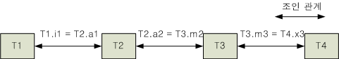

옵티마이저는 위와 같이 조인 순서 결정 시 조인 관계만을 고려하여 비용을
평가함으로써 (T1, T4)와 같이 직접적인 조인 관계가 없는 테이블간의 조인이
우선적으로 결정되는 것을 방지한다.

조인 관계를 고려하는 것이 일반적으로 효율적인 조인 순서를 결정하는 데 도움이
되지만, 반드시 올바른 조인 순서를 결정하는 것은 아니다. 따라서 필요한 경우
사용자가 힌트를 지정하여 조인 순서를 제어할 수 있다.

##### 조인 관계의 순서 결정

옵티마이저는 위에서 생성한 조인 관계를 이용하여 각 조인 관계들 중 가장 효율적인
조인 관계 순서를 결정하게 된다.

조인 관계의 순서를 결정하는 방법은 조인 관계들 중 조인 선택도(selectivity)가
가장 효율적인 조인 관계를 우선 선택한다. 그리고 다시 선택된 관계로부터 관련된
조인 관계들 중에 효율적인 조인 관계를 선택하는 방식으로 결정된다.

그러나 조인 관계의 순서가 실제 조인 순서는 아니며, 실제 조인 순서는 조인 방법의
결정을 통해 완성된다.


[그림 3‑3] 조인 관계의 순서 결정

위의 그림에서 보듯이 이 과정에서의 조인 관계의 순서는 조인 관계의 깊이만을
결정할 뿐이다. 조인 관계 순서의 가장 중요한 요소는 조인의 선택도
(selectivity)이며, 두 테이블의 조합을 통해 생성되는 결과 집합의 원래 테이블
크기에 대한 비율을 의미한다. 즉, 조인 관계의 순서 결정시 조인을 통한 결과 집합의
대소를 비교하는 것이 아니라, 결과 집합의 크기가 원래 테이블의 레코드 개수에
비해서 얼마나 많이 줄어드는가를 기준으로 판단하게 된다.

옵티마이저는 조인의 선택도를 아래처럼 계산한다. 이 공식의 자세한 설명은 이
문서의 범위를 벗어난다.

| 개념적인 Join selectivity 계산                    |
| ------------------------------------------------- |
| [T(R) * T(S) / MAX[V(R.a), V(S.a)]/ [T(R) + T(S)] |

이와 같은 조인 관계 순서의 결정은 조인의 선택도에 따라 보다 효율적인 비율로 결과
집합을 줄일 수 있는 조인 관계를 우선적으로 선택하게 된다. 그리고 조인 방법
결정에 의하여 비교적 정확한 조인 순서가 결정된다.

예를 들어, 하나의 질의에 포함된 각 테이블의 레코드 개수와 조인으로 생성되는
결과의 개수가 다음과 같을 때를 살펴보자.

```
T(R) = 10, T(S) = 10, T(R JOIN S) = 10
T(T) = 1000, T(U) = 1000, T(T JOIN U) = 100
```

위의 예에서 테이블 R과 S를 조인한 결과의 개수가 T와 U를 조인한 결과의 개수보다
적지만, 오히려 결과 집합을 아주 큰 비율로 줄일 수 있는 T와 U의 관계가 더 중요한
조인 관계가 된다.

옵티마이저가 조인 관계를 이용하여 생성한 조인 순서가 모든 경우에 있어 항상
바람직함을 보장할 수는 없다. 이를 위해 조인 순서 힌트를 사용하여 조인 순서를
제어할 수 있다.

옵티마이저는 조인 관계의 순서를 결정한 후에 두 테이블간의 조인 방법을 결정하고
최종적으로 조인 순서를 결정한다.

#### 조인 방법

조인 관계의 순서가 결정되면, 옵티마이저는 두 테이블의 각 조인 관계에 대하여 조인
방법을 결정한다. 이 때, 각 조인 방법의 비용 비교를 통해 조인의 순서, 방향, 및
조인 방법을 결정한다.

Altibase가 지원하는 조인 방법은 다음과 같이 크게 네 가지 계열에 속한다.

-   Nested loop 조인 계열

-   Sort-based 조인 계열

-   Hash-based 조인 계열

-   Merge 조인 계열

각 계열 별 조인 방법 및 사용 가능한 조인의 종류 는 다음과 같다.

<table style="width: 619px;">
<tbody>
<tr>
<td style="width: 117px; text-align: center;" rowspan="2">
<p><strong>조인 계열</strong></p>
</td>
<td style="width: 213px; text-align: center;" rowspan="2">
<p><strong>조인 방법</strong></p>
</td>
<td style="width: 279px; text-align: center;" colspan="2">
<p><strong>조인 방향</strong></p>
</td>
</tr>
<tr>
<td style="width: 137px; text-align: center;">
<p><strong>Left=&gt;Right</strong></p>
</td>
<td style="width: 142px; text-align: center;">
<p><strong>Right=&gt;Left</strong></p>
</td>
</tr>
<tr>
<td style="width: 117px;" rowspan="5">
<p>Nested Loop</p>
</td>
<td style="width: 213px;">
<p>Full nested loop</p>
</td>
<td style="width: 137px;">
<p>C, I, S, A, L</p>
</td>
<td style="width: 142px;">
<p>C, I, R</p>
</td>
</tr>
<tr>
<td style="width: 213px;">
<p>Full store nested loop</p>
</td>
<td style="width: 137px;">
<p>C, I, S, A, L, F</p>
</td>
<td style="width: 142px;">
<p>C, I, R, F</p>
</td>
</tr>
<tr>
<td style="width: 213px;">
<p>Index nested loop</p>
</td>
<td style="width: 137px;">
<p>I, S, A, L</p>
</td>
<td style="width: 142px;">
<p>I, R</p>
</td>
</tr>
<tr>
<td style="width: 213px;">
<p>Anti outer nested loop</p>
</td>
<td style="width: 137px;">
<p>F</p>
</td>
<td style="width: 142px;">
<p>F</p>
</td>
</tr>
<tr>
<td style="width: 213px;">
<p>Inverse index nested loop</p>
</td>
<td style="width: 137px;">
<p>&nbsp;</p>
</td>
<td style="width: 142px;">
<p>S</p>
</td>
</tr>
<tr>
<td style="width: 117px;" rowspan="3">
<p>Sort-based</p>
</td>
<td style="width: 213px;">
<p>One pass sort join</p>
</td>
<td style="width: 137px;">
<p>I, S, A, L, F</p>
</td>
<td style="width: 142px;">
<p>I, R, F</p>
</td>
</tr>
<tr>
<td style="width: 213px;">
<p>Two pass sort join</p>
</td>
<td style="width: 137px;">
<p>I, S, A, L, F</p>
</td>
<td style="width: 142px;">
<p>I, R, F</p>
</td>
</tr>
<tr>
<td style="width: 213px;">
<p>Inverse sort join</p>
</td>
<td style="width: 137px;">
<p>&nbsp;</p>
</td>
<td style="width: 142px;">
<p>S, A</p>
</td>
</tr>
<tr>
<td style="width: 117px;" rowspan="3">
<p>Hash-based</p>
</td>
<td style="width: 213px;">
<p>One pass hash join</p>
</td>
<td style="width: 137px;">
<p>I, S, A, L, F</p>
</td>
<td style="width: 142px;">
<p>I, R, F</p>
</td>
</tr>
<tr>
<td style="width: 213px;">
<p>Two pass hash join</p>
</td>
<td style="width: 137px;">
<p>I, S, A, L, F</p>
</td>
<td style="width: 142px;">
<p>I, R, F</p>
</td>
</tr>
<tr>
<td style="width: 213px;">
<p>Inverse hash join</p>
</td>
<td style="width: 137px;">
<p>R</p>
</td>
<td style="width: 142px;">
<p>S, A, L</p>
</td>
</tr>
<tr>
<td style="width: 117px;" rowspan="2">
<p>Merge-based</p>
</td>
<td style="width: 213px;">
<p>Index merge join</p>
</td>
<td style="width: 137px;">
<p>I, S, A</p>
</td>
<td style="width: 142px;">
<p>I</p>
</td>
</tr>
<tr>
<td style="width: 213px;">
<p>Sort merge join</p>
</td>
<td style="width: 137px;">
<p>I, S, A</p>
</td>
<td style="width: 142px;">
<p>I</p>
</td>
</tr>
<tr>
<td style="width: 609px;" colspan="4">
<p>사용 가능한 조인의 종류</p>
<ul>
<li>&nbsp;C (Cartesian Product): 조인 관계를 갖지 않는 두 테이블의 조합</li>
<li>&nbsp;I (Inner Join): 조인 관계를 갖는 두 테이블의 일반적인 조인</li>
<li>&nbsp;S (Semi Join): Semi 조인 관계를 갖는 두 테이블의 조인</li>
<li>&nbsp;A (Anti Join): Anti 조인 관계를 갖는 두 테이블의 조인</li>
<li>&nbsp;L (Left outer join): Left outer 조인 관계를 갖는 두 테이블의 조인</li>
<li>&nbsp;R (Right outer join): Right outer 조인 관계를 갖는 두 테이블의 조인</li>
<li>&nbsp;F (Full outer join): Full outer 조인 관계를 갖는 두 테이블의 조인</li>
</ul>
<p>각 조인에 대한 자세한 설명은 <em>SQL Reference</em>에서 SELECT 구문의 설명을 참고한다.</p>
</td>
</tr>
</tbody>
</table>

[표 3‑5] 조인방법에 따른 사용 가능한 조인의 종류

옵티마이저는 위와 같은 다양한 조인 방법들 중 적용 가능한 조인 방법에 대한 비용
평가를 통해 가장 효과적인 조인 방법을 선택하고 조인의 방향을 결정한다. 조인
방법이 결정되면 기준 테이블 (driving table, outer table)은 왼쪽에 위치시키고,
반복 테이블 (driven table, inner table)은 오른쪽에 위치시킨다.

사용자는 실행 계획을 통해 어떠한 조인 방법이 선택되었는지 확인할 수 있으며,
힌트를 사용하여 조인 방법을 제어할 수 있다.

이 절에서는 각 조인 계열의 조인 방법에 대해 살펴본다.

##### Nested Loop 조인 계열

nested loop 조인 계열에는 다음과 같은 조인 방법들이 있다.

-   Full nested loop join

-   Full store nested loop join

-   Index nested loop join

-   Anti outer nested loop join

-   Inverse index nested loop join

Full nested loop join은 한 테이블의 모든 레코드를 다른 테이블의 모든 레코드와
조인하는 방법이다. 이 방법은 일반적으로 아래 쿼리와 같이 조인 관계가 존재하지
않는 두 테이블간의 조인시 사용될 가능성이 높다.

```
SELECT * FROM T1, T2;
```

Full store nested loop join은 반복 테이블(inner table)의 결과를 저장한 후 full
nested loop join을 적용하는 방법이다. 이 방법은 조인 조건 외의 조건 처리에
의하여 결과 집합이 매우 줄어드는 경우 적용될 가능성이 높으며, 일반적으로 조인
그룹간의 Cartesian product (교차 조인)에 의하여 사용될 가능성이 높다.

```
SELECT * FROM T1, T2 WHERE T1.i1 = 1 AND T2.i1 = 1;
```

Index nested loop join은 인덱스를 이용하여 조인 조건을 처리하는 방법이다. 기준
테이블 (outer table)의 레코드 수가 적고 반복 테이블(inner table)에 인덱스가
존재하는 경우에 사용될 가능성이 높다.

```
Index on T2(i1)

SELECT * FROM T1, T2 WHERE T1.i1 = T2.i1 AND T1.i1 = 1;
```

Anti outer nested loop join 방법은 FULL OUTER JOIN의 처리를 위해서만 사용된다.
기준 테이블 (outer table)과 반복 테이블 (inner table) 모두 조인 조건에 해당하는
칼럼에 인덱스가 정의되어 있을 때 다른 조인 방법에 비해 이 방법이 선택될 가능성이
높다.

```
Index on T1(i1), Index on T2(i1)

SELELCT * FROM T1 FULL OUTER JOIN T2 ON T1.i1 = T2.i1;
```

Inverse index nested loop join 방법은 SEMI JOIN의 처리를 위해서만 사용된다. 기준
테이블(outer table)에 인덱스가 있고 반복 테이블(inner table)에는 인덱스가 없는
경우에 사용될 가능성이 높다. 특히 기준 테이블의 레코드 수가 반복 테이블보다
상대적으로 많을 때 더욱 유리하다. 하지만 반복 테이블에 인덱스가 존재한다면 Index
nested loop join이 선택될 가능성이 높다.

```
Index on T1(i1)

SELECT * FROM T1 WHERE T1.i1 IN ( SELECT i1 FROM T2 );
```

각 조인의 수행 비용은 개략적으로 Access cost + Disk I/O cost로 계산된다.

\* 관련 힌트: USE_NL

##### Sort-based 조인 계열

Sort-based 조인 방법은 반복 테이블(inner table)을 정렬된 순서로 저장하고 조인
조건을 이용하여 범위 검색을 하는 방법이다. 일반적으로 이 방법은 아래와 같이
쿼리에 부등호 조인 조건이 사용되고 인덱스가 없을 때 선택될 가능성이 높다.

```
SELECT * FROM T1, T2 WHERE T1.i1 > T2.i1;
```

sort-based 조인 계열에는 다음과 같은 조인 방법들이 있다.

-   One-pass sort-based join

-   Two-pass sort-based join

-   Inverse sort-based join

One-pass sort-based 조인 방법은 반복 테이블(inner table)의 데이터 양이 적어 임시
공간 내에서 관리가 가능할 때 사용된다. 이 방법은 메모리 테이블이 반복
테이블(inner table)로 사용될 경우 항상 사용된다.

Two-pass sort-based 조인 방법은 반복 테이블(inner table)의 데이터 양이 방대하여
임시 공간의 범위 내에서 관리할 수 없을 때 사용된다. 이 방법은 디스크 I/O를
줄이기 위해 사용된다. 이 방법은 기준 테이블(outer table)과 반복 테이블(inner
table)을 모두 정렬하여 임시 공간에 저장한다. 그런 다음 기준 테이블(outer
table)의 데이터 정렬 순서로 조인 조건을 검사함으로써 반복 테이블(inner table)의
동일한 디스크 페이지 접근 확률을 높인다. 결국 디스크 I/O 비용이 줄어든다.

Inverse sort-based join은 SEMI JOIN 또는 ANTI JOIN의 처리를 위해서만 사용된다.
기준 테이블(outer table)보다 반복 테이블(inner table)이 상대적으로 클 경우
Inverse sort-based join을 사용하는 것이 실질적으로 유리할 수도 있지만,
Altibase의 옵티마이저는 대부분 Inverse hash-based join을 선택한다. Inverse
sort-based join은 조인 결과를 정렬해서 반환하기 때문에 추가 정렬을 하지 않아도
된다는 장점이 있다. Inverse sort-based join을 강제로 사용하고자 한다면 아래와
같이 힌트를 사용해야 한다.

```
SELECT * FROM T1 WHERE T1.i1 IN ( SELECT /*+ SORT_SJ */ i1 FROM T2 );
```

각 조인의 수행 비용은 개략적으로 Access cost + Disk I/O cost로 계산된다.

\* 관련 힌트: USE_SORT, USE_ONE_PASS_SORT, USE_TWO_PASS_SORT

##### Hash-based 조인 계열

Hash-based 조인 방법은 반복 테이블(inner table)을 hash 구조로 저장하고, 조인
조건을 이용하여 범위 검색을 하는 방법이다. 이 방법은 아래와 같이 쿼리의 조인
조건에 등호 연산자가 사용되고 인덱스가 없을 때 선택될 가능성이 높다.

```
SELECT * FROM T1, T2 WHERE T1.i1 = T2.i1;
```

hash-based 조인 계열에는 다음과 같은 조인 방법들이 있다.

-   One-pass hash-based join

-   Two-pass hash-based join

-   Inverse hash-based join

One-pass hash-based 조인 방법은 반복 테이블(inner table)의 데이터 양이 적어 임시
공간 내에서 관리가 가능할 때 사용된다. 메모리 테이블이 반복 테이블(inner
table)로 사용될 경우에는 항상 이 방법이 사용된다.

Two-pass hash-based 조인 방법은 반복 테이블(inner table)의 데이터 양이 방대하여
임시 공간의 범위 내에서 관리할 수 없을 때 사용된다. 기준 테이블(outer table)과
반복 테이블은 모두 동일한 hash 함수를 사용하여 분할되어 임시 공간의 여러
테이블에 저장된다. 그런 다음, 각 임시 테이블끼리 조인 조건을 검사함으로써 반복
테이블(inner table)의 동일한 디스크 페이지 접근 확률을 높인다.

Inverse hash-based join은 SEMI JOIN, ANTI JOIN 또는 LEFT OUTER JOIN의 처리를
위해서만 사용되며, 기준 테이블(outer table)보다 반복 테이블(inner table)이
상대적으로 클 경우 선택될 확률이 높다.

각 조인의 수행 비용은 개략적으로 Access cost + Disk I/O cost로 계산된다.

\* 관련 힌트: USE_HASH, USE_ONE_PASS_HASH, USE_TWO_PASS_HASH

##### Merge 조인 계열

Merge 조인 방법은 두 테이블의 데이터가 정렬될 경우 매우 효율적인 방법이다. 이
방법에는 기준 테이블과 반복 테이블의 개념이 없으며 양쪽 테이블을 순차적으로
진행하면서 조인 조건을 검사한다.

Merge 조인이 사용되기 위해서는 양쪽 테이블이 모두 조인 키를 기준으로 정렬되어야
한다. 따라서 아래와 같이 각각의 테이블이 인덱스를 통해 정렬되어 있는 경우에
선택될 확률이 높다.

```
Index on T1(i1), Index on T2(a1)

SELECT * FROM T1, T2 WHERE T1.i1 = T2.a1;
```

Merge 조인의 수행 비용은 개략적으로 Access cost + Disk I/O cost로 계산된다.

\* 관련 힌트: USE_MERGE

### 물리적 실행 계획 생성

마지막으로 옵티마이저는 물리적 실행 계획 트리를 생성한다. 물리적 실행 계획
트리는 쿼리 프로세서의 실행기(Executor)가 쿼리를 수행하는 단위 작업인 실행
노드들로 구성되며, 실행기는 실행 계획 트리의 실행 노드들을 따라가며 쿼리를
수행한다.

실행 노드는 자식 노드의 개수와 중간 결과의 저장 여부에 따라 다음과 같이
구분된다.

-   단일 비저장 노드(Unary Non-materialization Node):  
    하나 이하의 자식 노드를 가지며, 해당 기능을 수행하기 위해 별도의 저장 공간을
    필요로 하지 않고 하나의 레코드만을 관리하는 노드이다.

-   단일 저장 노드(Unary Materialization Node) :  
    하나 이하의 자식 노드를 가지며, 해당 기능을 수행하기 위해 별도의 저장 공간을
    필요로 하는 노드이다.

-   이진 비저장 노드(Binary Non-materialization Node) :  
    두 개의 자식 노드를 가지며, 해당 기능을 수행하기 위해 별도의 저장 공간이
    필요하지 않다.

-   이진 저장 노드(Binary Materialization Node) :  
    두 개의 자식 노드를 가지며, 해당 기능을 수행하기 위해 별도의 저장 공간을
    필요로 한다.

-   다중 비저장 노드(Multiple Non-materialization Node) :  
    두 개 이상의 자식 노드를 가지며, 해당 기능을 수행하기 위해 별도의 저장
    공간을 필요로 하지 않는다.

이러한 구분에 따라 Altibase에는 다음 표와 같은 물리 연산자가 존재한다. 각 실행
노드에 대한 상세한 설명은 EXPLAIN PLAN 장에서 설명한다.

<table style="width: 672px;">
<tbody>
<tr>
<td style="width: 70px; text-align: center;">
<p><strong>구분</strong></p>
</td>
<td style="width: 192px; text-align: center;">
<p><strong>노드 이름</strong></p>
</td>
<td style="width: 398px; text-align: center;">
<p><strong>기능</strong></p>
</td>
</tr>
<tr>
<td style="width: 70px;" rowspan="9">
<p>단일<br /> 비저장<br /> 노드</p>
</td>
<td style="width: 192px;">
<p>SCAN</p>
</td>
<td style="width: 398px;">
<p>다양한 액세스 방법을 사용해서 테이블에서 데이터 검색</p>
</td>
</tr>
<tr>
<td style="width: 192px;">
<p>FILTER</p>
</td>
<td style="width: 398px;">
<p>액세스 방법으로 filtering 되지 않는 데이터의 filtering 처리</p>
</td>
</tr>
<tr>
<td style="width: 192px;">
<p>PROJECT</p>
</td>
<td style="width: 398px;">
<p>프로젝션 처리</p>
</td>
</tr>
<tr>
<td style="width: 192px;">
<p>GROUPING</p>
</td>
<td style="width: 398px;">
<p>그룹 처리</p>
</td>
</tr>
<tr>
<td style="width: 192px;">
<p>AGGREGATION</p>
</td>
<td style="width: 398px;">
<p>Aggregation 연산 수행</p>
</td>
</tr>
<tr>
<td style="width: 192px;">
<p>VIEW</p>
</td>
<td style="width: 398px;">
<p>뷰 레코드 구성</p>
</td>
</tr>
<tr>
<td style="width: 192px;">
<p>VIEW-SCAN</p>
</td>
<td style="width: 398px;">
<p>임시 저장 뷰에 대한 검색</p>
</td>
</tr>
<tr>
<td style="width: 192px;">
<p>COUNT</p>
</td>
<td style="width: 398px;">
<p>특수 COUNT(*)의 처리</p>
</td>
</tr>
<tr>
<td style="width: 192px;">
<p>PARALLEL-QUEUE</p>
</td>
<td style="width: 398px;">
<p>병렬 질의 처리</p>
</td>
</tr>
<tr>
<td style="width: 70px;" rowspan="8">
<p>단일<br /> 저장<br /> 노드</p>
</td>
<td style="width: 192px;">
<p>SORT</p>
</td>
<td style="width: 398px;">
<p>레코드의 정렬</p>
</td>
</tr>
<tr>
<td style="width: 192px;">
<p>HASH</p>
</td>
<td style="width: 398px;">
<p>레코드의 해싱</p>
</td>
</tr>
<tr>
<td style="width: 192px;">
<p>GROUP-AGGREGATION</p>
</td>
<td style="width: 398px;">
<p>해싱 방식에 의한 그룹 구분과 aggregation 연산 수행</p>
</td>
</tr>
<tr>
<td style="width: 192px;">
<p>DISTINCT</p>
</td>
<td style="width: 398px;">
<p>해싱 방식에 의한 중복 제거</p>
</td>
</tr>
<tr>
<td style="width: 192px;">
<p>MATERIALIZATION</p>
</td>
<td style="width: 398px;">
<p>임시 저장 뷰의 관리</p>
</td>
</tr>
<tr>
<td style="width: 192px;">
<p>STORE</p>
</td>
<td style="width: 398px;">
<p>레코드의 저장</p>
</td>
</tr>
<tr>
<td style="width: 192px;">
<p>LIMIT-SORT</p>
</td>
<td style="width: 398px;">
<p>LIMIT 절을 위한 정렬</p>
</td>
</tr>
<tr>
<td style="width: 192px;">
<p>CONNECT BY</p>
</td>
<td style="width: 398px;">
<p>계층 질의의 처리</p>
</td>
</tr>
<tr>
<td style="width: 70px;" rowspan="7">
<p>이진<br /> 비저장<br /> 노드</p>
</td>
<td style="width: 192px;">
<p>JOIN</p>
</td>
<td style="width: 398px;">
<p>조인 처리</p>
</td>
</tr>
<tr>
<td style="width: 192px;">
<p>MERGE-JOIN</p>
</td>
<td style="width: 398px;">
<p>머지 조인 처리</p>
</td>
</tr>
<tr>
<td style="width: 192px;">
<p>LEFT-OUTER-JOIN</p>
</td>
<td style="width: 398px;">
<p>LEFT OUTER 조인 처리</p>
</td>
</tr>
<tr>
<td style="width: 192px;">
<p>FULL-OUTER-JOIN</p>
</td>
<td style="width: 398px;">
<p>FULL OUTER 조인 처리</p>
</td>
</tr>
<tr>
<td style="width: 192px;">
<p>ANTI-OUTER-JOIN</p>
</td>
<td style="width: 398px;">
<p>ANTI OUTER 조인 처리</p>
</td>
</tr>
<tr>
<td style="width: 192px;">
<p>CONCATENATION</p>
</td>
<td style="width: 398px;">
<p>자식 노드의 결과 조합</p>
</td>
</tr>
<tr>
<td style="width: 192px;">
<p>BAG-UNION</p>
</td>
<td style="width: 398px;">
<p>BAG UNION의 처리</p>
</td>
</tr>
<tr>
<td style="width: 70px;" rowspan="2">
<p>이진<br /> 저장 노드</p>
</td>
<td style="width: 192px;">
<p>SET-INTERSECT</p>
</td>
<td style="width: 398px;">
<p>SET INTERSECT 집합 연산 수행</p>
</td>
</tr>
<tr>
<td style="width: 192px;">
<p>SET-DIFFERENCE</p>
</td>
<td style="width: 398px;">
<p>SET DIFFERENCE 집합 연산 수행</p>
</td>
</tr>
<tr>
<td style="width: 70px;" rowspan="2">
<p>다중<br /> 비저장 노드</p>
</td>
<td style="width: 192px;">
<p>PARTITION-COORDINATIOR</p>
</td>
<td style="width: 398px;">
<p>파티션드 테이블의 각 파티션에 대한 스캔을 관리하는 노드</p>
</td>
</tr>
<tr>
<td style="width: 192px;">
<p>PARALLEL-SCAN-COORDINATOR</p>
</td>
<td style="width: 398px;">
<p>자식 PARALLEL-QUEUE 노드들을 병렬로 수행하고 수행 결과를 취합</p>
</td>
</tr>
</tbody>
</table>

[표 3‑6] 실행 노드의 종류

#### 저장 노드의 특징

저장 노드(Materialization node)는 관련 연산을 수행하기 위하여 중간 결과를
저장하는 노드이다. 중간 결과는 임시 공간에 저장되는데, 이는 저장 매체의 종류에
따라 메모리 임시 공간 또는 디스크 임시 공간이 될 수 있다.

메모리 임시 공간은 시스템 커널로부터 직접 할당 받은 메모리 영역에 존재하며, 이는
질의 수행 후에 바로 제거된다. 디스크 임시 공간은 사용자에 의해 지정된 임시
테이블스페이스 영역에 존재하며, 이 데이터는 메모리 버퍼를 이용하여 관리된다. 이
또한 질의 수행 후에 바로 제거된다.

메모리 임시 공간 또는 디스크 임시 공간을 사용하게 되는 기준은 다음과 같다. 저장
노드의 하위 자식 노드들이 모두 메모리 테이블만을 사용하는 경우라면 메모리 임시
공간이 사용된다. 디스크 테이블이 하나 이상 포함되어 있는 경우에는 디스크 임시
공간이 사용된다. 이러한 기준은 힌트를 이용하여 변경할 수 있다.

임시 저장 공간은 생성 노드와 저장 공간에 따라 아래의 표[^1]와 같이 분류된다.

[^1]: 디스크 해쉬 저장 공간, 디스크 정렬 저장 공간, 메모리 정렬 저장 공간은 지원하지 않는다.
<table style="width: 602px;">
<tbody>
<tr>
<td style="width: 124px;">
<p>&nbsp;&nbsp;&nbsp;&nbsp;&nbsp;&nbsp;&nbsp;&nbsp; 생성노드(우)<br /> \
<br />저장공간(하)</p>
</td>
<td style="width: 189px;">
<p>해쉬(HASH)</p>
</td>
<td style="width: 271px;">
<p>정렬(SORT)</p>
</td>
</tr>
<tr>
<td style="width: 124px;">
<p>디스크</p>
</td>
<td style="width: 189px;">
<p>디스크 해쉬 저장 공간</p>
</td>
<td style="width: 271px;">
<p>디스크 정렬 저장 공간</p>
</td>
</tr>
<tr>
<td style="width: 124px;">
<p>메모리</p>
</td>
<td style="width: 189px;">
<p>메모리 해쉬 저장 공간</p>
</td>
<td style="width: 271px;">
<p>메모리 정렬 저장 공간</p>
</td>
</tr>
</tbody>
</table>

메모리 해쉬 저장 공간은 저장 방식에 따라 레코드를 버킷 리스트에 저장하고
탐색하는 버킷(Bucket) 방식과 레코드를 하나의 리스트에 저장하였다가 파티션으로
나눠 탐색하는 파티셔닝(Partitioning) 방식이 있다. 자세한 설명은 *General
Reference*의 성능 관련 프로퍼티를 참조하기 바란다.

다음 예와 같이 쿼리에 메모리 테이블 또는 디스크 테이블이 사용되는지에 따라서
정렬이 다르게 다뤄지는 것을 실행 계획에서 확인할 수 있다.

아래의 질의의 실행 계획은 메모리 테이블에 대하여 중복 제거 및 정렬을 위하여 중간
결과를 저장하는 두 개의 저장 노드를 가지고 있다. 메모리 임시 공간이 사용되는
경우 디스크 페이지에 대한 정보를 별도로 갖지 않는다.

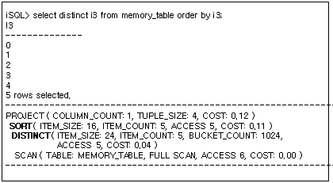

다음은 디스크 테이블에 대하여 중복 제거 및 정렬을 위하여 중간 결과를 저장하는 두
개의 저장 노드를 보이고 있다. 디스크 임시 공간이 사용되는 경우 디스크 페이지에
대한 정보를 갖는다. 즉, 실행 노드의 정보 중 DISK_PAGE_COUNT 정보의 유무를 통해
임시 공간의 저장 매체 정보(메모리인지 디스크인지)를 판단할 수 있다.

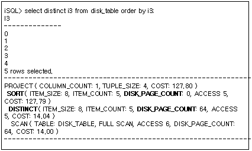

### 옵티마이저 관련 프로퍼티

아래는 옵티마이저의 동작에 영향을 미치는 Altibase 프로퍼티이다. 각 프로퍼티에
대한 상세한 설명은 *General Reference*의 2장에서 성능 관련 프로퍼티를 참조하기
바란다.

-   OPTIMIZER_FEATURE_ENABLE

-   OPTIMIZER_MODE

-   OPTIMIZER_UNNEST_AGGREGATE_SUBQUERY

-   OPTIMIZER_UNNEST_COMPLEX_SUBQUERY

-   OPTIMIZER_UNNEST_SUBQUERY

4.EXPLAIN PLAN 사용하기
=====================

이 장은 Altibase 서버가 최적화된 질의를 실행하기 위해 수행하는 접근 경로를
나타내는 EXPLAIN PLAN에 대해 설명한다.

### EXPLAIN PLAN의 개요

ALTER SESSION SET EXPLAIN PLAN 구문을 사용하여 Altibase 데이터베이스 서버가
최적화된 질의를 실행하기 위해 수행하는 접근 경로를 볼 수 있다. 즉, EXPLAIN
PLAN을 ON 또는 ONLY로 설정하고 SQL구문을 실행하면, 옵티마이저가 구문의 수행을
위해 결정한 실행 계획(execution plan, plan tree)을 반환한다. 사용자는 이
데이터를 활용해서 옵티마이저가 좀 더 효율적인 실행 계획을 선택하도록 쿼리를
튜닝하여 쿼리의 성능을 향상할 수 있다.

#### Plan Tree의 이해

많은 테이블들로부터 데이터를 검색하는 SQL문 실행시, 같은 결과 집합을 얻는 다양한
최적화 방법 (테이블을 조인하는 방법, 조인 순서, 그리고 접근 경로 등)이 사용될 수
있다. Altibase는 다음과 같은 다양한 요소들을 근거로 적합한 방법을 결정한다.

-   사용 가능한 인덱스들

-   SQL문 내에서의 테이블들과 열들의 순서

-   최적화 기법

EXPLAIN PLAN 프로퍼티를 적절히 설정하면 SQL문의 plan tree를 볼 수 있다.
사용자들은 plan tree를 검사해서 Altibase가 SQL문을 어떻게 실행하고 있는가를
정확하게 이해할 수 있다.

### Plan Tree 출력

실행 계획 트리는 iSQL을 통해서만 볼 수 있다. 실행 계획 트리는 SELECT 구문에
대해서만 제공된다. 이를 얻기 위해서는 SELECT 구문의 수행 전에 iSQL에서 다음
명령을 수행하여야 한다.

```
ALTER SESSION SET EXPLAIN PLAN = option;
```

option에는 ON, OFF, 또는 ONLY가 올 수 있다. 기본 설정값은 OFF이다.

-   ON  
    SELECT 문 실행 후 결과 레코드와 함께 Plan Tree의 정보를 보여준다. Plan
    tree에는 레코드 접근 횟수 및 튜플이 점유한 메모리 양, 비용 등이 출력된다.

-   ONLY  
    SELECT 문에 대해 Prepare 과정만 수행한 후, 실제 Execution 과정을 수행하지
    않고 실행 계획 정보만 보여준다. 주 언어 변수 바인딩이 존재하는 SELECT 문
    또는 실행 수행 시간이 오래 걸리는 질의에 대해 단순히 실행 계획만 확인려면 이
    기능을 사용한다. EXPLAN PLAN = ONLY인 경우 질의 실행 없이 실행 계획만
    생성하므로, ACCESS 항목과 같이 실제 실행 후 그 값이 결정되는 항목들은
    물음표(“??”)로 표시된다.

-   OFF  
    : SELECT문 실행 후 Plan Tree 정보는 보여주지 않고 결과 레코드만 보여준다.

사용자가 기술한 WHERE절에 존재하는 조건들의 처리 방법에 대한 정보 등 보다 자세한
정보가 필요한 경우는 다음 명령을 사용한다.

```
ALTER SYSTEM SET TRCLOG_DETAIL_PREDICATE = 1;
```

TRCLOG_DETAIL_PREDICATE 프로퍼티의 값을 1로 설정하면, 실행 계획 정보에 WHERE절의
조건들이 FIXED KEY RANGE, VARIABLE KEY RANGE, 또는 FILTER 등으로 자세하게
분류되어 표시된다. 따라서 사용자는 WHERE절을 복잡하게 사용한 경우 어떤 술어들이
인덱스 스캔을 통해 수행되는지 확인할 수 있다. 단, 특정 최적화 기법에 의해 질의가
변경된 경우는 이러한 정보가 출력되지 않을 수 있다.

다음은 쿼리 문의 실행 결과 출력 예이다.

```
iSQL> alter system set trclog_detail_predicate = 1;
Alter success.
iSQL> alter session set explain plan = on;
Alter success.
iSQL> select * from t1 where i1 = 1;
T1.I1       
--------------
1           
1 row selected.
```

[TRCLOG_DETAIL_PREDICATE = 1 이고 EXPLAIN PLAN = ON인 경우]   

```
PROJECT ( COLUMN_COUNT: 1, TUPLE_SIZE: 4, COST: 0.00 )
 SCAN ( TABLE: T1, INDEX: IDX1, RANGE SCAN, ACCESS: 1, COST: 0.00 )
  [ FIXED KEY ]
  AND
   OR
    I1 = 1
```

[TRCLOG_DETAIL_PREDICATE = 0 이고 EXPLAIN PLAN = ON인 경우]

```
 PROJECT ( COLUMN_COUNT: 1, TUPLE_SIZE: 4, COST: 0.00 )
 SCAN ( TABLE: T1, INDEX: IDX1, RANGE SCAN, ACCESS: 1, COST: 0.00 )
```

  [TRCLOG_DETAIL_PREDICATE = 0 이고 EXPLAIN PLAN = ONLY인 경우]

```
 PROJECT ( COLUMN_COUNT: 1, TUPLE_SIZE: 4, COST: 0.00 )
 SCAN ( TABLE: T1, INDEX: IDX1, RANGE SCAN, ACCESS: ??, COST: 0.00 )
```


##### 예제

\<예제 1\> 실행 계획을 출력하도록 설정하라.

```
iSQL> ALTER SESSION SET EXPLAIN PLAN = ON;
iSQL> SELECT e_firstname, e_lastname 
 FROM employees 
 WHERE emp_job = 'programmer';
E_FIRSTNAME           E_LASTNAME
-----------------------------------------------
Ryu                   Momoi
Elizabeth             Bae
2 rows selected.
------------------------------------------------------------
PROJECT ( COLUMN_COUNT: 2, TUPLE_SIZE: 44, COST: 0.15 )
 SCAN ( TABLE: EMPLOYEES, FULL SCAN, ACCESS: 20, COST: 0.14 )
------------------------------------------------------------
```

\<예제 2\> 실행 계획을 출력하지 않도록 설정하라.

```
iSQL> ALTER SESSION SET EXPLAIN PLAN = OFF;
Alter success.
iSQL> SELECT e_firstname, e_lastname 
 FROM employees 
 WHERE emp_job = 'programmer';
E_FIRSTNAME           E_LASTNAME
-----------------------------------------------
Ryu                   Momoi
Elizabeth             Bae
2 rows selected.
```

\<예제 3\> 질의문은 실행하지 않고, 실행 계획만 출력하도록 설정하라.

```
iSQL> ALTER SESSION SET EXPLAIN PLAN = ONLY;
Alter success.
iSQL> SELECT e_firstname, e_lastname 
 FROM employees 
 WHERE emp_job = 'programmer';
E_FIRSTNAME           E_LASTNAME
-----------------------------------------------
No rows selected.
------------------------------------------------------------
PROJECT ( COLUMN_COUNT: 2, TUPLE_SIZE: 44, COST: 0.15 )
 SCAN ( TABLE: EMPLOYEES, FULL SCAN, ACCESS: ??, COST: 0.14 )
------------------------------------------------------------
```


### Plan Tree 읽기

Plan tree는 plan 노드들과 각 노드 간의 연결 관계로 이루어진다. EXPLAIN PLAN
결과에서는 이 관계를 나타내기 위해 자식 노드는 부모 노드보다 한 칸 첫머리가
안으로 들어가 출력된다. 또한 subquery는 ::SUB-QUERY BEGIN과 ::SUB-QUERY END
사이에 보여진다.

```
iSQL> SELECT c.c_lastname
    FROM customers c
    WHERE c.cno IN
      (SELECT /*+ no_unnest */ o.cno
      FROM orders o
      WHERE o.ono = 12310001);
C_LASTNAME
------------------------
Fedorov 
1 row selected.

    -----------------------------------------------
4   PROJECT ( COLUMN_COUNT: 1, TUPLE_SIZE: 22, COST: 0.20 )
3    SCAN ( TABLE: CUSTOMERS C, FULL SCAN, ACCESS: 20,
              COST: 0.19 )
      ::SUB-QUERY BEGIN
2     PROJECT ( COLUMN_COUNT: 1, TUPLE_SIZE: 3, COST: 0.04 )
1       SCAN ( TABLE: ORDERS O, INDEX: ODR_IDX2, 
                 RANGE SCAN, ACCESS: 29, COST: 0.04 )
      ::SUB-QUERY END
    -----------------------------------------------
```


1.  orders 테이블에 있는 주문 번호(ono)를 인덱스를 이용하여 검색한다. 인덱스를
    이용한 접근 회수는 20임을 알 수 있다. 인덱스가 생성되지 않은 열을 기준으로
    orders 테이블을 조회한다면 조건에 만족하는 열들을 찾기 위해서 전체 orders
    테이블을 스캔(full scan) 해야 할 것이다. 즉, 사용자는 full scan을 수행할
    것인가, 인덱스를 사용해서 scan을 할 것인가를 plan 노드의 비용 정보를
    비교해서 선택할 수 있다.

2.  orders 테이블에서 cno인 열을 찾아 열의 개수가 하나인 새로운 relation1을
    만든다.

3.  c.cno = o.cno 조건을 만족하는 레코드를 검색하기 위해 전체 customer 테이블을
    full scan 한다. access의 회수는 customer 테이블에 있는 레코드
    개수(20)만큼이다.

4.  customer 테이블에서 cname인 열을 찾아 새로운 relation2를 만든다.

5.  relation2를 출력한다.

#### 실행 계획 트리의 해석

여기에서는 실행 계획을 해석하는 방법을 예제를 들어 간략히 설명한다. 각 실행
노드들이 트리 형태로 연결된 전체 실행 계획 트리를 따라가면서 실행 순서가
결정된다.


실행 계획 트리에서 하나의 노드는 한 행에 표시된다. 왼쪽으로 들여쓰기가 많이 되어
있는 노드일수록 하위 노드이며 가장 먼저 수행된다.

위 예제에서 가장 최상위 노드는 PROJ 노드이며 최하위 노드는 테이블 T1의 SCAN
노드와 테이블 T2의 SCAN 노드이다. T1 SCAN 노드와 T2 SCAN 노드와 같이 같은
크기만큼 들여쓰기가 되어 있는 노드들의 경우 먼저 나타나는 노드가 상위 노드의
왼쪽 노드에 해당한다.

레코드 fetch 요구는 TOP-DOWN으로 이루어지고 처리된 레코드는 BOTTOM-UP 방식으로
반환된다.

위의 예제에서 가장 먼저 데이터베이스에 접근하는 노드는 T1 SCAN 노드이고, 그 다음
T2 SCAN 노드, T3 SCAN 노드의 순서로 수행된다. 노드 옆에 명시한 숫자가 노드 수행
순서이다.

위의 예제에서 나타난 실행 계획을 트리 형태로 나타내면 다음 그림과 같다.


[그림 4‑1] 레코드 요구와 페치(fetch) 경로

### Plan Tree 활용

EXPLAIN PLAN 프로퍼티를 적절히 설정하면 SQL문을 직접 실행하지 않고도 plan tree를
볼 수 있다. 따라서 SQL문의 실행 방법을 볼 수 있을 뿐만 아니라, 다른 plan tree와
비교할 수도 있어 SQL문의 성능 향상에 도움이 될 수 있다.

Plan tree에서 다음과 같은 정보를 얻을 수 있다:

-   옵티마이저에 의해 생성된 실행 계획

-   Objects (테이블, 인덱스, 등)의 속성

-   사용된 index

-   사용된 조인 방법

-   최적화된 조인 순서

개선된 SQL문의 성능을 입증하는 방법은 다음과 같다.

-   새로운 SQL문을 실행하고 그 결과를 이전 SQL문의 실행 결과와 비교한다.

-   새로운 plan tree를 생성하고, 그것을 이전의 plan tree와 비교한다.

-   Object(테이블, 인덱스 등)의 속성들이 정확한가를 확인하기 위하여 속성들을
    재검토한다.

### 실행 노드

이 절은 실행 계획 트리를 구성하는 각 실행 노드의 기능과 EXPLAIN PLAN으로
출력되는 형식, 해당 노드가 출력되는 쿼리 예제를 살펴본다.

#### AGGREGATION

##### 출력 형식

```
AGGREGATION ( ITEM_SIZE: item_size, GROUP_COUNT: group_count, COST: cost )
```


| 항목        | 설명                                |
|-------------|-------------------------------------|
| ITEM_SIZE   | 하나의 그룹을 위한 레코드 크기      |
| GROUP_COUNT | 실행 노드에 의해 생성된 그룹의 개수 |
| COST        | 추산 비용                           |

[표 4‑1] AGGREGATION 노드의 정보

##### 설명

AGGREGATION 실행 노드는 관계형 모델에서 aggregation 연산을 수행하는 노드이다.
하나의 자식 노드를 가지며 중간 결과를 저장하기 위한 별도의 공간을 사용하지
않는다. 동일 그룹의 레코드들에 대하여 aggregation을 수행한다.

이 노드는 다음과 같은 질의를 수행하는데 사용된다.

-   정렬 순서를 이용한 aggregation의 수행

-   DISTINCT를 포함하는 절의 aggregation 수행

###### **정렬 순서를 이용한 aggregation 수행**

이 노드가 정렬 순서를 이용한 aggregation 수행을 위해 사용될 경우 다음 예와 같은
실행 계획 정보가 출력된다. 아래의 예를 살펴 보면, GROUPING 실행 노드가 구분한
정보를 이용하여 AGGREGATION 노드가 SUM(i2)를 수행한다. 이 때 구성되는 레코드는
SUM(i2)와 GROUP BY i3를 사용해서 그룹화된다. 아래 예에서는 16byte의 크기의
레코드를 포함하는 그룹이 다섯 개가 구성되었음을 알 수 있다.

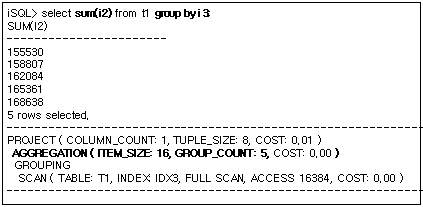

###### **DISTINCT를 포함하는 aggregation 수행**

Aggregation함수 내에 DISTINCT가 포함되어 있을 경우 중복 제거 작업이 필요하며 이
경우에 한해 중복 제거를 위한 저장 공간이 사용된다. 아래의 예에서 AGGREGATION
노드는 SUM(DISTINCT i2)를 처리하기 위해서 사용되었다.

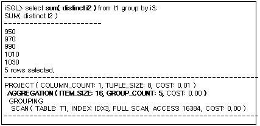

##### 예제

총 부서의 수와 모든 사원들의 평균 급여를 출력하라.

```
iSQL> SELECT COUNT(DISTINCT dno), AVG(salary) FROM employees;
COUNT(DISTINCT DNO)  AVG(SALARY) 
------------------------------------
8                    1836.64706  
1 row selected.
-----------------------------------------------
PROJECT ( COLUMN_COUNT: 2, TUPLE_SIZE: 31, COST: 0.03 )
 AGGREGATION ( ITEM_SIZE: 72, GROUP_COUNT: 1, COST: 0.02 )
  SCAN ( TABLE: EMPLOYEES, FULL SCAN, ACCESS: 20, COST: 0.01 )
-----------------------------------------------
```


#### ANTI-OUTER-JOIN

##### 출력 형식

```
ANTI-OUTER-JOIN ( METHOD: method, COST: cost )
```


| 항목   | 설명      |
|--------|-----------|
| METHOD | 조인 방법 |
| COST   | 추산 비용 |

[표 4‑2] ANTI-OUTER-JOIN 노드의 정보

##### 설명

ANTI-OUTER-JOIN 노드는 관계형 모델에서 ANTI OUTER JOIN 조인 연산을 수행하는
노드이다. 이는 두 개의 자식 노드를 가지며, 별도의 중간 결과를 만들지 않으며 자식
노드들의 수행 흐름을 제어한다.

이 노드는 FULL OUTER JOIN만을 위해 사용되며, 아래와 같이 ON 조인 조건에서
참조되는 모든 칼럼에 대하여 인덱스를 사용할 수 있을 때 사용된다.


위의 예에서와 같이 FULL OUTER JOIN을 처리하기 위하여 ANTI-OUTER-JOIN 노드는 항상
LEFT-OUTER-JOIN 노드와 부모로 CONC 노드를 갖는다. 이 때, ON 절의 조인 조건은
LEFT-OUTER-JOIN과 ANTI-OUTER-JOIN에서 모두 처리된다.

##### 예제

부서의 위치와 상품을 모아 놓은 장소가 같은 곳의 부서 번호, 부서 이름, 상품
번호를 출력하라.

```
iSQL> CREATE INDEX dep_idx2 ON departments(dep_location);
Create success.
iSQL> CREATE INDEX gds_idx1 ON goods(goods_location);
Create success.
iSQL> SELECT d.dno, d.dname, g.gno
 FROM departments d FULL OUTER JOIN goods g
 ON d.dep_location = g.goods_location;
DNO         DNAME                           GNO
-----------------------------------------------------------
.
.
.
38 rows selected.
-----------------------------------------------------------
PROJECT ( COLUMN_COUNT: 3, TUPLE_SIZE: 46, COST: 0.29 )
 CONCATENATION
  LEFT-OUTER-JOIN ( METHOD: INDEX_NL, COST: 0.01 )
   SCAN ( TABLE: DEPARTMENTS D, FULL SCAN, ACCESS: 38, COST: 0.00 )
   SCAN ( TABLE: GOODS G, INDEX: GDS_IDX1, RANGE SCAN, ACCESS: 38, COST: 0.02 )
  ANTI-OUTER-JOIN( METHOD: ANTI, COST: 0.01 )
   SCAN ( TABLE: GOODS G, FULL SCAN, ACCESS: 38, COST: 0.02 )
   SCAN ( TABLE: DEPARTMENTS D, INDEX: DEP_IDX2, RANGE SCAN, ACCESS: 38, COST: 0.00 )
-----------------------------------------------------------
iSQL> DROP INDEX dep_idx2;
Drop success.
iSQL> DROP INDEX gds_idx1;
Drop success.
```


#### BAG-UNION

##### 출력 형식

```
BAG-UNION
```


##### 설명

BAG-UNION 노드는 관계형 모델에서 UNION ALL 연산을 수행하는 노드이다. 이는 두 개
이상의 자식 노드를 가지며, 별도의 중간 결과를 만들지 않으며 자식 노드들의 수행
흐름을 제어한다.

이 노드가 수행되는 예를 보면 다음과 같다.

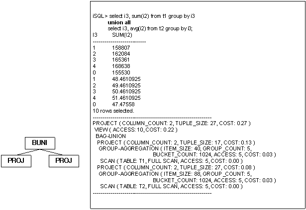

위의 예를 보면 BAG-UNION 노드는 두 질의의 결과를 단순히 조합하여 UNION ALL을
처리한다.

##### 예제

직업이 판매원인 사원과 급여가 2000000 보다 큰 모든 사원의 이름과 급여를
출력하라.

```
iSQL> SELECT e_firstname, e_lastname, emp_job, salary 
 FROM employees 
 WHERE emp_job = 'SALES REP' 
 UNION ALL 
 SELECT e_firstname, e_lastname, emp_job, salary 
 FROM employees 
 WHERE salary > 2000;
E_FIRSTNAME           E_LASTNAME            EMP_JOB          SALARY
------------------------------------------------------------------------------
Farhad                Ghorbani              PL               2500
Elizabeth             Bae                   programmer       4000
Zhen                  Liu                   webmaster        2750
Yuu                   Miura                 PM               2003
Wei-Wei               Chen                  manager          2300
5 rows selected.
------------------------------------------------------------
PROJECT ( COLUMN_COUNT: 4, TUPLE_SIZE: 70, COST: 0.58 )
 VIEW ( ACCESS: 5, COST: 0.43 )
  BAG-UNION
   PROJECT ( COLUMN_COUNT: 4, TUPLE_SIZE: 70, COST: 0.18 )
    SCAN ( TABLE: EMPLOYEES, FULL SCAN, ACCESS: 20, COST: 0.14 )
   PROJECT ( COLUMN_COUNT: 4, TUPLE_SIZE: 70, COST: 0.26 )
    SCAN ( TABLE: EMPLOYEES, FULL SCAN, ACCESS: 20, COST: 0.14 )
------------------------------------------------------------
```


#### CONCATENATION

##### 출력 형식

```
CONCATENATION
```


##### 설명

CONCATENATION 실행 노드는 관계형 모델에서 concatenation 연산을 수행하는
노드이다. 이는 두개의 자식 노드를 가지며, 별도의 중간 결과를 만들지 않으며 자식
노드들의 수행 흐름을 제어한다.

이 노드는 FULL OUTER JOIN의 처리와 DNF 처리에서 사용된다. FULL OUTER JOIN에서의
사용은 ANTI-OUTER-JOIN 노드에서 이미 그 예를 설명하였으며, 여기서는 DNF로 처리
시에 CONCATENATION 노드가 사용되는 예를 살펴 본다.


여기서 (i1 = 1000) 조건은 왼쪽 SCAN 실행 노드에서 처리되며, (i2 = 100) 조건은
오른쪽 SCAN 실행 노드에서 처리된다. 이렇게 함으로서 IDX1 과 IDX2 인덱스가 모두
사용될 수 있으며 위 결과를 조합하기 위하여 CONCATENATION 실행 노드가 사용된다.
FILTER 노드는 좌측 SCAN과 중복되는 결과를 제거하기 위하여 사용된다.

##### 예제

ANTI-OUTER-JOIN 노드의 예제를 참고하기 바란다.

#### CONNECT BY

##### 출력 형식

```
CONNECT BY ( ACCESS: acc_num, COST: cost )
```

| 항목   | 설명                 |
|--------|----------------------|
| ACCESS | 레코드에 접근한 횟수 |
| COST   | 추산 비용            |

[표 4‑3] 인덱스가 없는 CONNECT BY 노드의 정보


```
CONNECT BY (INDEX: index_name, ACCESS: acc_num, COST: cost )
```

| 항목   | 설명                   |
|--------|------------------------|
| INDEX  | 사용하는 인덱스의 이름 |
| ACCESS | 레코드에 접근한 횟수   |
| COST   | 추산 비용              |

[표 4‑4] 인덱스를 사용하는 CONNECT BY 노드의 정보

##### 설명

CONNECT BY 노드는 관계형 모델에 없는 특수한 연산으로 계층 질의를 수행하는
노드이다. 이 노드는 하나의 자식 노드를 가지며, 자식 노드는 항상 materialization
노드이다.

계층 질의 수행시 CONNECT BY 노드가 사용된 예는 다음과 같다.


##### 예제

ID 칼럼의 값이 0인 행을 루트로 하여 계층적으로 연결된 행들을 얻기 위한 계층적
질의문은 다음과 같다.

```
CREATE TABLE hier_order(id INTEGER, parent INTEGER);
INSERT INTO hier_order VALUES(0, NULL);
INSERT INTO hier_order VALUES(1, 0);
INSERT INTO hier_order VALUES(2, 1);
INSERT INTO hier_order VALUES(3, 1);
INSERT INTO hier_order VALUES(4, 1);
INSERT INTO hier_order VALUES(5, 0);
INSERT INTO hier_order VALUES(6, 0);
INSERT INTO hier_order VALUES(7, 6);
INSERT INTO hier_order VALUES(8, 7);
INSERT INTO hier_order VALUES(9, 7);
INSERT INTO hier_order VALUES(10, 6);

iSQL> SELECT id, parent, level FROM hier_order START WITH id = 0 CONNECT BY PRIOR id = parent ORDER BY level;
ID          PARENT      LEVEL
-------------------------------------------------
0                       1
1           0           2
5           0           2
6           0           2
2           1           3
3           1           3
4           1           3
7           6           3
10          6           3
8           7           4
9           7           4
11 rows selected.
------------------------------------------------------------
PROJECT ( COLUMN_COUNT: 3, TUPLE_SIZE: 16, COST: BLOCKED )
SORT ( ITEM_SIZE: BLOCKED, ITEM_COUNT: 11, ACCESS: 11, COST: BLOCKED )
CONNECT BY ( ACCESS: 23, COST: BLOCKED )
SCAN ( TABLE: SYS.HIER_ORDER, FULL SCAN, ACCESS: 22, COST: BLOCKED )
------------------------------------------------------------

```


#### COUNT

##### 출력 형식

1) 인덱스가 사용되는 경우:

```
COUNT (TABLE: tbl_name, INDEX: index_name, ACCESS: acc_num, DISK_PAGE_COUNT: num, COST: cost )
```

2) 인덱스가 사용되지 않는 경우:

```
COUNT (TABLE: tbl_name, FULL SCAN, ACCESS: acc_num, DISK_PAGE_COUNT: num, COST: cost )
```

| 항목            | 설명                                                          |
|-----------------|---------------------------------------------------------------|
| TABLE           | 접근하는 테이블의 이름                                        |
| INDEX           | 사용하는 인덱스의 이름                                        |
| ACCESS          | 레코드에 접근한 횟수                                          |
| DISK_PAGE_COUNT | 테이블의 디스크 페이지 개수. 메모리 테이블은 해당 정보가 없음 |
| COST            | 추산 비용                                                     |

[표 4‑4] COUNT 노드의 정보

##### 설명

COUNT 노드는 관계형 모델에서 GROUP BY절이 존재하지 않는 COUNT(\*) 연산을 특별히
처리하기 위한 실행 노드이다.

다음은 COUNT 노드가 사용된 예이다. 아래의 예를 살펴보면 인덱스를 사용함으로써
실제 데이터에는 접근하지 않고 COUNT(\*) 값을 획득하고 있음을 알수 있다.


##### 예제

사원의 총 수를 계산하라.

```
iSQL> SELECT COUNT(*) rec_count FROM employees;
REC_COUNT            
-----------------------
20                   
1 row selected.
-----------------------------------------------
PROJECT ( COLUMN_COUNT: 1, TUPLE_SIZE: 8, COST: 0.02 )
 COUNT ( TABLE: EMPLOYEES, FULL SCAN, ACCESS: 1, COST: 0.02 )
-----------------------------------------------
```


#### DISTINCT

##### 출력 형식

1) 중간 결과가 메모리에 저장되는 경우

```
DISTINCT ( ITEM_SIZE: item_size, ITEM_COUNT: item_count, BUCKET_COUNT: bucket_count, ACCESS: acc_num, COST: cost )
```

2) 중간 결과가 디스크에 저장되는 경우

```
DISTINCT ( ITEM_SIZE: item_size, ITEM_COUNT: item_count, DISK_PAGE_COUNT: page_count, ACCESS: acc_num, COST: cost )
```


| 항목            | 설명                                  |
|-----------------|---------------------------------------|
| ITEM_SIZE       | 중복 제거를 위한 레코드의 크기        |
| ITEM_COUNT      | 중복 제거된 레코드의 개수             |
| BUCKET_COUNT    | 해싱을 위한 버킷의 개수               |
| DISK_PAGE_COUNT | 임시 저장 테이블의 디스크 페이지 개수 |
| ACCESS          | 저장된 레코드에 대한 접근 횟수        |
| COST            | 추산 비용                             |

[표 4‑5] DISTINCT 노드의 정보

##### 설명

DISTINCT 노드는 관계형 모델에서 해싱 방식의 중복 제거 연산을 수행하는 노드이다.
이는 하나의 자식 노드를 가지며, 중간 결과를 저장하기 위하여 임시 공간을
사용한다.

DISTINCT 실행 노드는 매우 다양한 용도로 사용된다. 아래에서 각 용도별로 사용될
때의 실행 계획 트리를 살펴 본다.

###### **DISTINCT에서의 사용**

DISTINCT 노드는 DISTINCT를 처리하기 위하여 사용될 수 있다.

아래의 예는 DISTINCT를 처리하기 위하여 DISTINCT 노드가 사용된 것을 보여준다.


###### **UNION 에서의 사용**

DISTINCT 노드는 UNION을 처리하기 위하여 사용될 수 있다.

아래의 예제에서는 UNION을 처리하기 위하여 DISTINCT 노드가 중복 제거를 위해
사용되었다.

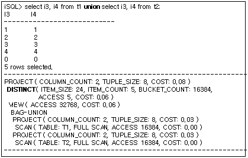

###### **Subquery key range를 위한 사용**

DISTINCT 노드는 subquery key range를 처리하기 위하여 사용될 수 있다. 중복 제거를
통해 동일한 값으로 인덱스를 이용한 검색이 발생하지 않도록 하기 위하여 사용된다.

아래의 예는 DISTINCT 실행 노드가 subquery key range을 처리하기 위하여 중복
제거를 위해 사용된 예이다. DISTINCT 실행 노드는 T2.i4 값의 중복 제거를 위해서
사용되었다.


##### 예제

상품 C111100001을 주문한 고객의 이름을 출력하라.

```
iSQL> SELECT DISTINCT customers.c_firstname||customers.c_lastname  cname
  FROM customers
  WHERE customers.cno IN
    (SELECT orders.cno
     FROM orders
     WHERE orders.gno = 'C111100001 ');
CNAME
--------------------------------------------
Estevan             Sanchez
Pierre              Martin
Phil                Dureault
Fyodor              Fedorov
4 rows selected.
------------------------------------------------------------
PROJECT ( COLUMN_COUNT: 1, TUPLE_SIZE: 42, COST: 0.10 )
 DISTINCT ( ITEM_SIZE: 64, ITEM_COUNT: 4, BUCKET_COUNT: 1024, ACCESS: 4, COST: 0.07 )
  SEMI-MERGE-JOIN ( METHOD: MERGE, COST: 0.03 )
   SCAN ( TABLE: CUSTOMERS, INDEX: __SYS_IDX_ID_153, RANGE SCAN, ACCESS: 17, COST: 0.01 )
   SORT ( ITEM_SIZE: 16, ITEM_COUNT: 4, ACCESS: 4, COST: 0.03 )
    SCAN ( TABLE: ORDERS $$1_$VIEW1_$ORDERS, INDEX: ODR_IDX3, RANGE SCAN, ACCESS: 4, COST: 0.00 )
------------------------------------------------------------
```


#### FILTER

##### 출력 형식

```
FILTER
```


##### 설명

FILTER 노드는 관계형 모델에서 검색(select)연산을 수행하는 물리적 개체이다.
하나의 자식 노드를 가지며 테이블에 직접 접근하지 않고 관련 조건을 검사한다.

FILTER 노드는 노드 이름 외에 별도의 정보를 포함하지 않는다. Filter에 의해
처리되는 조건 정보를 출력하기 위해서는 TRCLOG_DETAIL_PREDICATE 프로퍼티를
설정한다.

###### **FILTER 노드 정보의 출력**

다음 예를 보면 FILTER 노드는 이름만을 출력할 뿐 별도의 다른 정보를 출력하지 않는다. 이 예에서 FILTER 노드는 (having i2 \< 2) 조건을 처리하기 위하여 사용되었다.


이러한 정보를 확인하려면 TRCLOG_DETAIL_PREDICATE 프로퍼티를 1로 설정함으로써
가능하다. 아래와 같이 FILTER 노드가 (i2 \< 2) 조건을 처리하기 위하여 사용되었음을 확인할 수 있다.


##### 예제

2개 이상 주문된 상품의 상품번호와 주문양을 출력하라.

```
iSQL> SELECT gno, COUNT(*)
  FROM orders
  GROUP BY gno
  HAVING COUNT(*) > 2;
GNO         COUNT                
------------------------------------
A111100002  3                    
C111100001  4                    
D111100008  3                    
E111100012  3                    
4 rows selected.
-----------------------------------------------
PROJECT ( COLUMN_COUNT: 2, TUPLE_SIZE: 24, COST: 0.08 )
 FILTER
  AGGREGATION ( ITEM_SIZE: 16, GROUP_COUNT: 16, COST: 0.02 )
   GROUPING
    SCAN ( TABLE: ORDERS, INDEX: ODR_IDX3, FULL SCAN, ACCESS: 30, COST: 0.02 )
-----------------------------------------------
```


#### FULL-OUTER-JOIN

##### 형식

```
FULL-OUTER-JOIN ( METHOD: method, COST: cost )
```


| 항목   | 설명      |
|--------|-----------|
| METHOD | 조인 방법 |
| COST   | 추산 비용 |

[표 4‑6] FULL-OUTER-JOIN 노드의 정보

##### 설명

FULL-OUTER-JOIN 노드는 관계형 모델에서 FULL OUTER JOIN 연산을 수행하는 노드이다.
두개의 자식 노드를 가지며, 별도의 중간 결과를 만들지 않으며 자식 노드들의 수행
흐름을 제어한다.

FULL-OUTER-JOIN 실행 노드는 일반 조인과 마찬가지로 대부분의 조인 방법에
사용되며, 이는 JOIN 노드의 예를 참조한다. 여기서는 FULL-OUTER-JOIN 실행 노드가
사용되는 간단한 실행 계획 트리만을 살펴본다.


FULL OUTER JOIN의 특성 상 우측에 저장을 위한 노드가 생성되며, 위의 예에서 ON
조건은 SORT 노드에서 처리된다.

##### 예제

부서의 위치와 상품을 모아 놓은 장소가 같은 곳의 부서 번호, 부서 이름, 상품
번호를 출력하라.

```
iSQL> INSERT INTO departments VALUES(6002, 'headquarters', 'CE0002', 100);
1 row inserted.
iSQL> SELECT d.dno, d.dname, g.gno
FROM departments d FULL OUTER JOIN goods g
 ON d.dep_location = g.goods_LOCATION;
DNO         DNAME                           GNO
------------------------------------------------------------
                                            A111100001
                                            A111100002
                                            B111100001
                                            C111100001
                                            C111100002
                                            D111100001
                                            D111100002
                                            D111100003
                                            D111100004
                                            D111100005
                                            D111100006
                                            D111100007
                                            D111100008
                                            D111100009
                                            D111100010
                                            D111100011
                                            E111100001
                                            E111100002
                                            E111100003
                                            E111100004
6002        headquarters                    E111100005
                                            E111100006
                                            E111100007
                                            E111100008
                                            E111100009
                                            E111100010
                                            E111100011
                                            E111100012
                                            E111100013
                                            F111100001
1001        RESEARCH DEVELOPMENT DEPT 1
1002        RESEARCH DEVELOPMENT DEPT 2
1003        SOLUTION DEVELOPMENT DEPT
2001        QUALITY ASSURANCE DEPT
3001        CUSTOMERS SUPPORT DEPT
3002        PRESALES DEPT
4001        MARKETING DEPT
4002        BUSINESS DEPT
38 rows selected.
------------------------------------------------------------
PROJECT ( COLUMN_COUNT: 3, TUPLE_SIZE: 46, COST: 0.60 )
 FULL-OUTER-JOIN ( METHOD: HASH, COST: 0.29 )
  SCAN ( TABLE: GOODS G, FULL SCAN, ACCESS: 38, COST: 0.02 )
  HASH ( ITEM_SIZE: 24, ITEM_COUNT: 9, BUCKET_COUNT: 1024, ACCESS: 38, COST: 0.29 )
   SCAN ( TABLE: DEPARTMENTS D, FULL SCAN, ACCESS: 38, COST: 0.01 )
------------------------------------------------------------
```


#### GROUP-AGGREGATION

##### 출력 형식

1) 중간 결과가 메모리에 저장되는 경우

```
GROUP-AGGREGATION ( ITEM_SIZE: item_size, GROUP_COUNT: group_count, BUCKET_COUNT: bucket_count, ACCESS: acc_num, COST: cost )
```

2) 중간 결과가 디스크에 저장되는 경우

```
GROUP-AGGREGATION ( ITEM_SIZE: item_size, GROUP_COUNT: group_count, DISK_PAGE_COUNT: page_count, ACCESS: acc_num, COST: cost )
```


| 항목            | 설명                                           |
|-----------------|------------------------------------------------|
| ITEM_SIZE       | 그룹 연산을을 위해 해싱 되는 각 레코드의 크기  |
| GROUP_COUNT     | 그룹의 개수                                    |
| BUCKET_COUNT    | 해싱을 위한 버킷의 개수                        |
| DISK_PAGE_COUNT | 임시 저장 테이블을 구성하는 디스크 페이지 개수 |
| ACCESS          | 저장된 레코드에 대한 접근 횟수                 |
| COST            | 추산 비용                                      |

[표 4‑7] GRAG 노드의 정보

##### 설명

GROUP-AGGREGATION 노드는 관계형 모델에서 해싱 방식의 그룹 및 aggregation 연산을
수행하는 노드이다. 이 노드는 하나의 자식 노드를 가지며, 중간 결과를 저장하기
위하여 임시 공간을 사용한다.

아래의 예는 해싱 방식의 그룹화와 aggregation 연산을 처리하기 위하여
GROUP-AGGREGATION 노드가 사용된 경우이다. GROUP-AGGREGATION 노드는 GROUP BY i4와
AVG(i1), SUM(i2)를 처리하기 위하여 사용되었다.

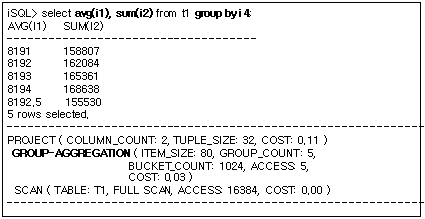

##### 예제

각 부서내의 각 직위에 대해 지급되는 급여 총액을 출력하라. (여러 열에 GROUP BY
절을 사용)

```sql
iSQL> SELECT dno, emp_job, COUNT(emp_job) num_emp, SUM(salary) sum_sal FROM employees GROUP BY dno, emp_job;
DNO  EMP_JOB    NUM_EMP SUM_SAL 
-----------------------------------------------
.
.
.
16 rows selected.
------------------------------------------------------------
PROJECT ( COLUMN_COUNT: 4, TUPLE_SIZE: 55, COST: 0.80 )
 GROUP-AGGREGATION ( ITEM_SIZE: 56, GROUP_COUNT: 16, BUCKET_COUNT: 1024, ACCESS: 16, COST: 0.13 )
  SCAN ( TABLE: EMPLOYEES, FULL SCAN, ACCESS: 20, COST: 0.01 )
------------------------------------------------------------
```


#### GROUP-CUBE

##### 출력 형식

```
GROUP-CUBE ( ACCESS: acc_num, COST:  )
```

| 항목   | 설명                 |
| ------ | -------------------- |
| ACCESS | 레코드에 접근한 횟수 |
| COST   | 추산 비용            |

##### 설명

CUBE는 GROUP BY절의 확장 형태로 여러개의 그룹을 세트로 지정할 수 있다.

GROUP-CUBE는 CUBE 수행 노드를 나타낸다.

```sql
iSQL> select i1, i2, count( i3 ) from t1 group by cube(i1,i2);
I1          I2          COUNT(I3)
-------------------------------------------------
                        10
1           1           1
1           2           2
1           3           1
1           5           1
1           6           1
1                       6
2           6           1
2           7           1
2           9           2
2                       4
            1           1
            2           2
            3           1
            5           1
            6           2
            7           1
            9           2
18 rows selected.
------------------------------------------------------------
PROJECT ( COLUMN_COUNT: 3, TUPLE_SIZE: 16, COST: 185.09 )
 GROUP-CUBE ( ACCESS: 18, COST: 177.17 )
  SCAN ( TABLE: SYS.T1, FULL SCAN, ACCESS: 10, COST: 116.76 )
```


#### GROUP-ROLLUP

##### 출력 형식

```
GROUP-ROLLUP  ( ACCESS: acc_num, COST: cost )
```

| 항목   | 설명                 |
| ------ | -------------------- |
| ACCESS | 레코드에 접근한 횟수 |
| COST   | 추산 비용            |

##### 설명

ROLLUP은 GROUP BY절의 확장 형태로 여러개의 그룹을 세트로 지정할 수 있다.

GROUP-ROLLUP은 ROLLUP 수행 노드를 나타낸다.

```sql
iSQL> select i1, i2, count( i3 ) from t1 group by rollup(i1,i2);
I1          I2          COUNT(I3)
-------------------------------------------------
1           1           1
1           2           2
1           3           1
1           5           1
1           6           1
1                       6
2           6           1
2           7           1
2           9           2
2                       4
                        10
11 rows selected.
------------------------------------------------------------
PROJECT ( COLUMN_COUNT: 3, TUPLE_SIZE: 16, COST: 152.90 )
 GROUP-ROLLUP ( ACCESS: 11, COST: 146.97 )
  SCAN ( TABLE: SYS.T1, FULL SCAN, ACCESS: 10, COST: 116.76 )
------------------------------------------------------------
```


#### GROUPING

##### 출력 형식

```
GROUPING
```

##### 설명

GROUPING 노드는 관계형 모델에서 정렬 기반의 중복 검사를 수행하는 물리적
개체이다. 하나의 자식 노드를 가지며 자식 노드로부터 반환되는 레코드를 이전에
반환된 레코드와 동일한 지 하나씩 반복해서 검사한다.

다음과 같은 질의를 수행하는 데 사용된다.

-   정렬 순서를 이용한 동일한 그룹 여부 판단

-   정렬 순서를 이용한 중복 제거

-   정렬 순서를 이용한 DISTINCT aggregation의 처리

###### **정렬 순서를 이용한 그룹화**

GROUPING 노드가 정렬 순서를 이용한 동일한 그룹 여부를 판단하기 위해서 사용되는
경우 다음과 같은 형태로 실행 계획이 출력된다. 아래의 예를 보면 GROUPING 노드가
(GROUP BY I3) 절을 처리하기 위해서 사용되었으며, GROUP BY를 처리하기 위하여
별도의 저장 공간을 사용하지 않고 처리되었음을 알 수 있다. 이는 앞서 최적화
과정의 정렬 순서를 이용한 GROUP BY의 처리를 통해 설명하였다.


###### **정렬 순서를 이용한 중복 제거**

GROUPING 노드가 정렬 순서를 이용한 중복 제거를 위해서 사용되는 경우 다음과 같은
형태로 실행 계획이 출력된다. 아래의 실행 계획에서 GROUPING 노드는 (DISTINCT i3)
절을 처리하기 위해 사용되었으며, DISTINCT를 위해 별도의 저장 공간을 사용하지
않았음을 알 수 있다. 이는 앞서 최적화 과정에서 정렬 순서를 이용한 DISTINCT
최적화에서 설명하였다.

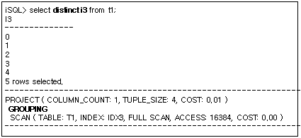

###### **정렬 순서를 이용한 DISTINCT aggregation 처리**

GROUPING 노드가 정렬 순서를 이용한 DISTINCT aggregation을 처리하기 위해서
사용되는 경우 다음과 같은 형태로 실행 계획이 출력된다. 아래의 예를 살펴보면
(COUNT(DISTINCT i2) )를 처리하는 과정에서 (DISTINCT i2) 절의 중복 제거를 위해서
GROUPING 노드가 사용되었다. 이는 앞서 최적화 과정에서 정렬 순서를 이용한
DISTINCT aggregation 최적화에서 설명하였다.


##### 예제

각 사원이 담당하는 고객들의 수와 각 고객에게 판매한 상품의 총 수를 출력하라.

```
iSQL> SELECT eno, COUNT(DISTINCT cno), SUM(qty) FROM orders GROUP BY eno;
ENO         COUNT(DISTINCT CNO)  SUM(QTY)
----------------------------------------------------------
12          8                    17870
19          6                    25350
20          8                    13210
3 rows selected.
-----------------------------------------------
PROJECT ( COLUMN_COUNT: 3, TUPLE_SIZE: 24, COST: 0.77 )
 AGGREGATION ( ITEM_SIZE: 32, GROUP_COUNT: 3, COST: 0.02 )
  GROUPING
   SCAN ( TABLE: ORDERS, INDEX: ODR_IDX1, FULL SCAN, ACCESS: 30, COST: 0.02 )
-----------------------------------------------
```


#### HASH

##### 출력 형식

1) 중간 결과가 메모리에 저장될 경우

```
HASH ( ITEM_SIZE: item_size, ITEM_COUNT: item_count, BUCKET_COUNT: bucket_count, ACCESS: acc_num, COST: cost )
```

2) 중간 결과가 디스크에 저장될 경우

```
HASH ( ITEM_SIZE: item_size, ITEM_COUNT: item_count, DISK_PAGE_COUNT: page_count, ACCESS: acc_num, COST: cost ) 
```


| 출력 항목       | 설명                                           |
|-----------------|------------------------------------------------|
| ITEM_SIZE       | 해싱을 위한 레코드의 크기                      |
| ITEM_COUNT      | 해싱에 포함된 레코드의 개수                    |
| BUCKET_COUNT    | 해싱을 위한 버킷의 개수                        |
| DISK_PAGE_COUNT | 임시 저장 테이블을 구성하는 디스크 페이지 개수 |
| ACCESS          | 저장된 레코드에 대한 접근 횟수                 |
| COST            | 추산 비용                                      |

[표 4‑8] HASH 노드의 정보

##### 설명

HASH 노드는 관계형 모델에서 해싱 연산을 수행하는 노드이다. 이 노드는 하나의 자식
노드를 가지며, 중간 결과를 저장하기 위하여 임시 공간을 사용한다.

HASH 노드는 매우 다양한 용도로 사용된다. 아래에서 각 용도별로 사용될 때의 실행
계획 트리를 살펴 본다.

###### **조인에서의 사용**

HASH 노드는 조인을 수행하기 위하여 사용될 수 있다.

아래의 예는 조인을 처리하기 위하여 HASH 노드가 생성된 경우이다. T1.i1 = T2.i1
조인 조건을 검사하기 위하여 hash-based 조인이 수행되는데, 이를 위해 HASH 노드가
생성되었다.


###### **Subquery 검색에서의 사용**

HASH 노드는 subquery와의 비교 연산을 수행하기 위하여 사용될 수 있다.

아래의 예는 i4 in ( select i4 from t2 ) 를 처리하기 위하여 HASH 실행 노드가
사용된 경우이다. HASH 노드는 t2.i4 값을 해싱하여 저장하고 각 t1.i4 에 부합하는
값이 HASH에 존재하는 지를 검사한다.


##### 예제

모든 부서 관리자의 이름과 부서 이름을 출력하라.

```
iSQL> ALTER SESSION SET EXPLAIN PLAN = OFF;
Alter success.
iSQL> CREATE TABLE dept2 TABLESPACE sys_tbs_disk_data 
AS SELECT * FROM department;
Create success.
iSQL> CREATE TABLE manager(
 eno INTEGER PRIMARY KEY,
 mgr_no INTEGER,
 mname VARCHAR(20),
 address VARCHAR(60))
 TABLESPACE sys_tbs_disk_data;
Create success.
iSQL> INSERT INTO manager VALUES(2, 1, 'HJNO', '11 Inyoung Bldg. Nonhyun-dong Kangnam-guSeoul, Korea');
1 row inserted.
iSQL> INSERT INTO manager VALUES(7, 2, 'HJMIN', '44-25 Youido-dong Youngdungpo-gu Seoul, Korea');
1 row inserted.
iSQL> INSERT INTO manager VALUES(8, 7, 'JDLEE', '3101 N. Wabash Ave. Brooklyn, NY');
1 row inserted.
iSQL> INSERT INTO manager VALUES(12, 7, 'MYLEE', '130 Gongpyeongno Jung-gu Daegu, Korea');
1 row inserted.
iSQL> ALTER SESSION SET EXPLAIN PLAN = ON;
Alter success.
iSQL> SELECT m.mname, d.dname
 FROM dept2 d, manager m
 WHERE d.mgr_no = m.mgr_no;
MNAME                 DNAME
---------------------------------------------------------
JDLEE                 BUSINESS DEPT
MYLEE                 BUSINESS DEPT
2 rows selected.
------------------------------------------------------------
PROJECT ( COLUMN_COUNT: 2, TUPLE_SIZE: 54, COST: 28.11 )
 JOIN ( METHOD: HASH, COST: 28.09 )
  SCAN ( TABLE: DEPT2 D, FULL SCAN, ACCESS: 9, DISK_PAGE_COUNT: 64, COST: 14.01 )
  HASH ( ITEM_SIZE: 32, ITEM_COUNT: 4, DISK_PAGE_COUNT: 64, ACCESS: 2, COST: 28.09 )
   SCAN ( TABLE: MANAGER M, FULL SCAN, ACCESS: 4, DISK_PAGE_COUNT: 64, COST: 14.00 )
------------------------------------------------------------
```


#### JOIN

##### 출력 형식

```
JOIN ( METHOD: method, COST: cost )
```


| 항목   | 설명      |
|--------|-----------|
| METHOD | 조인 방법 |
| COST   | 추산 비용 |

[표 4‑9] JOIN 노드의 정보

##### 설명

JOIN 노드는 관계형 모델에서 조인 연산을 수행하는 노드이다. 두개의 자식 노드를
가지며, 별도의 중간 결과를 만들지 않으며 자식 노드들의 수행 흐름을 제어한다.

JOIN 노드는 거의 모든 일반 조인 수행을 위하여 사용된다.

아래에서 다음과 같은 다양한 조인 방법들이 어떠한 형태의 실행 계획 트리로
출력되는지를 살펴본다.

-   Full nested loop join

-   Full store nested loop join

-   Index nested loop join

-   Inverse index nested loop join

-   One-pass sort join

-   Two-pass sort join

-   Inverse sort join

-   One-pass hash join

-   Two-pass hash join

-   Inverse hash join

아래의 예제에서 동일한 질의가 다양한 조인 방법으로 처리되며, 각 방법에 대한 실행
계획 트리의 정보를 보여준다.

좌측은 조인 수행 방법에 대한 실행 계획 트리의 일부를 그림으로 도식화한 것이며,
우측은 실제 실행 계획이다.

###### **Full nested loop join의 실행 계획 트리**


위의 실행 계획에서 조인 조건은 우측 SCAN 노드에서 처리된다. T2 테이블에 대한
반복적인 전체 검색을 통해 처리된다.

###### **Full store nested loop join의 실행 계획 트리**

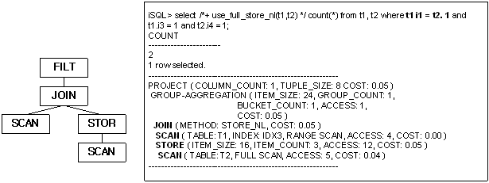

위의 실행 계획에서 조인 조건은 JOIN 상위의 FILTER 노드에서 처리된다. T2 테이블에
대한 검색은 한 번만 이루어지며 그 결과를 저장한 후 반복적으로 전체 검색을 통해
처리된다.

###### **Index nested loop join의 실행 계획 트리**

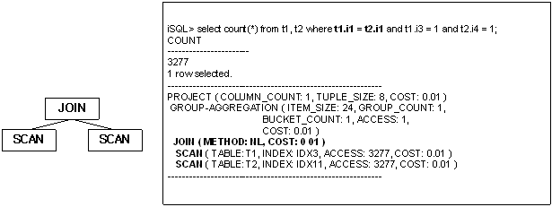

위의 실행 계획에서 조인 조건은 우측 SCAN 노드에서 인덱스를 이용하여 처리된다.

###### **Inverse index nested loop join의 실행 계획 트리**

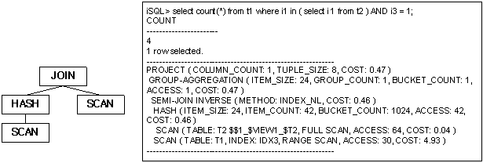

###### **One-pass sort join의 실행 계획 트리**


위의 실행 계획에서 조인 조건은 우측 SORT 노드에서 정렬된 데이터를 이용하여
처리된다.

###### **Two-pass sort join의 실행 계획 트리**


위의 실행 계획에서 조인 조건은 우측 SORT 노드에서 정렬된 데이터를 이용하여
처리되지만, 좌측에도 SORT 노드가 생성된다.

###### **Inverse sort join의 실행 계획 트리**


###### **One-pass hash join의 실행 계획 트리**

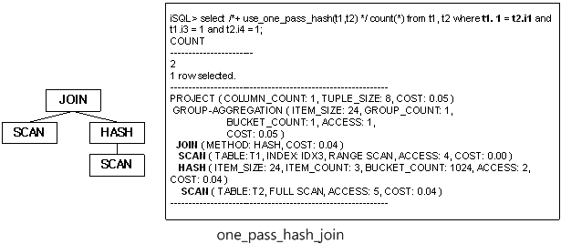

위의 실행 계획에서 조인 조건은 우측 HASH 노드에서 해싱된 데이터를 이용하여
처리된다.

###### **Two-pass hash join의 실행 계획 트리**

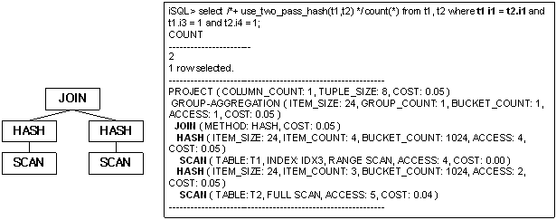

위의 실행 계획에서 조인 조건은 우측 HASH 노드에서 정렬된 데이터를 이용하여
처리되지만, 좌측에도 HASH 노드가 생성된다.

###### **Inverse hash join의 실행 계획 트리**


##### 예제

성(last name)이 ‘Marquez’인 직원의 직원 번호, 주문 번호, 상품 번호, 주문양을
출력하라.

```
iSQL> SELECT e.eno, ono, cno, gno, qty 
 FROM employees e, orders o 
 WHERE e.eno = o.eno 
 AND e.e_lastname = 'Marquez';
ENO         ONO                  CNO                  GNO         QTY
---------------------------------------------------------------------------
19          11290100             11                   E11110000   1500
19          12100277             5                    D111100008  2500
19          12300001             1                    D111100004  1000
19          12300005             4                    D111100008  4000
19          12300010             16                   D111100010  2000
19          12310004             5                    E111100010  5000
19          12310008             1                    D111100003  100
19          12310011             15                   E111100012  10000
19          12310012             1                    C111100001  250
9 rows selected.
------------------------------------------------------------
PROJECT ( COLUMN_COUNT: 5, TUPLE_SIZE: 40, COST: 0.30 )
 JOIN ( METHOD: INDEX_NL, COST: 0.15 )
  SCAN ( TABLE: EMPLOYEES E, FULL SCAN, ACCESS: 20, COST: 0.14 )
  SCAN ( TABLE: ORDERS O, INDEX: ODR_IDX1, RANGE SCAN, ACCESS: 9, COST: 0.02 )
------------------------------------------------------------
```


#### LEFT-OUTER-JOIN

##### 출력 형식

```
LEFT-OUTER-JOIN ( METHOD: method, SKIP RIGHT COUNT: count, COST: cost )
```

| 항목             | 설명                                                         |
| ---------------- | ------------------------------------------------------------ |
| METHOD           | 조인 방법                                                    |
| SKIP RIGHT COUNT | 오른쪽 읽기 skip 횟수<br/>- TRCLOG_DETAIL_INFORMATION = 1 일 때 출력<br/>- skip 횟수가 '0'인 경우 출력하지 않음 |
| COST             | 추산 비용                                                    |

[표 4‑10] LEFT-OUTER-JOIN 노드의 정보

##### 설명

LEFT-OUTER-JOIN 노드는 관계형 모델에서 LEFT OUTER JOIN 연산을 수행하는 노드이다. 이는 두개의 자식 노드를 가지며, 별도의 중간 결과를 만들지 않으며 자식 노드들의 수행 흐름을 제어한다.

LEFT-OUTER-JOIN 노드는 일반 조인과 마찬가지로 대부분의 조인 방법에 사용되며, 이는 JOIN 노드의 예를 참조한다. 여기서는 LEFT-OUTER-JOIN 실행 노드가 사용되는 간단한 실행 계획 트리만을 살펴본다.

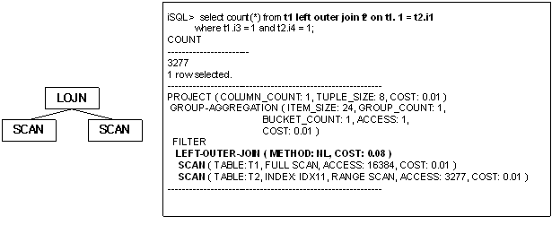

##### 예제

모든 부서에 대한 부서 번호와 모든 사원 이름을 출력하라. (사원이 전혀 없는 부서
번호 5001도 출력된다.)

```
iSQL> INSERT INTO departments VALUES(5001, 'Quality Assurance', 'Mokpo', 22);
1 row inserted.
iSQL> SELECT d.dno, e.e_firstname, e.e_lastname FROM departments d LEFT OUTER JOIN employees e ON d.dno = e.dno ORDER BY d.dno;
DNO         E_FIRSTNAME           E_LASTNAME
------------------------------------------------------------
1001        Ken                   Kobain
1001        Wei-Wei               Chen
1002        Ryu                   Momoi
1002        Mitch                 Jones
1003        Elizabeth             Bae
1003        Zhen                  Liu
1003        Yuu                   Miura
1003        Jason                 Davenport
2001        Takahiro              Fubuki
3001        Aaron                 Foster
3002        Chan-seung            Moon
3002        Farhad                Ghorbani
4001        Xiong                 Wang
4001        Curtis                Diaz
4001        John                  Huxley
4002        Gottlieb              Fleischer
4002        Sandra                Hammond
4002        Alvar                 Marquez
4002        William               Blake
5001
20 rows selected.
------------------------------------------------------------
PROJECT ( COLUMN_COUNT: 3, TUPLE_SIZE: 46, COST: 0.20 )
 LEFT-OUTER-JOIN ( METHOD: INDEX_NL, COST: 0.01 )
  SCAN ( TABLE: DEPARTMENTS D, INDEX: __SYS_IDX_ID_170, FULL SCAN, ACCESS: 9, COST: 0.01 )
  SCAN ( TABLE: EMPLOYEES E, INDEX: EMP_IDX1, RANGE SCAN, ACCESS: 20, COST: 0.01 )
------------------------------------------------------------
```


#### LIMIT-SORT

##### 출력 형식

```
LIMIT-SORT ( ITEM_SIZE: item_size, ITEM_COUNT: item_count, STORE_COUNT: store_count, ACCESS: acc_num, COST: cost )
```

| 항목        | 설명                           |
|-------------|--------------------------------|
| ITEM_SIZE   | 정렬을 위한 저장 레코드의 크기 |
| ITEM_COUNT  | 사용된 레코드의 개수           |
| STORE_COUNT | 저장된 레코드의 개수           |
| ACCESS      | 저장된 레코드에 대한 접근 횟수 |
| COST        | 추산 비용                      |

[표 4‑11] LIMIT-SORT 노드의 정보

##### 설명

LIMIT-SORT 노드는 관계형 모델에서 제한된 정렬 연산을 수행하는 노드이다. 이는
하나의 자식 노드를 가지며, 중간 결과를 저장하기 위하여 임시 공간을 사용한다.

LIMIT-SORT 노드는 매우 다양한 용도로 사용된다. 아래에서 각 용도별로 사용될 때의
실행 계획 트리를 살펴 본다.

###### **ORDER BY에서의 사용**

LIMIT-SORT 노드는 LIMIT을 포함한 ORDER BY에 사용될 수 있다.

아래의 예는 LIMIT-SORT 노드가 ORDER BY를 위하여 사용된 경우이다. 실행 계획
정보를 살펴 보면, 3개의 저장 공간만 사용하여 16384건의 레코드에 대한 정렬을
수행함을 알 수 있다.


###### **Subquery 검색에서의 사용**

LIMIT-SORT 노드는 subquery 검색을 위하여 사용될 수 있다.

아래의 예는 LIMIT-SORT 노드가 일부 레코드만 정렬 저장하여 subquery 검색을
수행하고 있음을 보이고 있다. 여기서 LIMIT-SORT 노드는 질의 처리에 필요한 t2.i4
값 중 일부만을 저장하여 이에 대한 비교 연산의 비용을 줄이고 있다.


##### 예제

모든 사원의 이름, 부서 번호 및 급여를 표시하고 부서 번호와 급여를 기준(부서
번호는 올림차순, 그리고 급여는 내림차순으로)으로 정렬해서 상위 10개만 출력하라.
(ORDER BY 절의 목록의 순서가 정렬 순서이다.)

```
iSQL> SELECT e_firstname, e_lastname, dno, salary 
 FROM employees 
 ORDER BY dno, salary DESC 
 LIMIT 10;
E_FIRSTNAME           E_LASTNAME            DNO         SALARY
-------------------------------------------------------------------------
Wei-Wei               Chen                  1001        2300
Ken                   Kobain                1001        2000
Ryu                   Momoi                 1002        1700
Mitch                 Jones                 1002        980
Elizabeth             Bae                   1003        4000
Zhen                  Liu                   1003        2750
Yuu                   Miura                 1003        2003
Jason                 Davenport             1003        1000
Takahiro              Fubuki                2001        1400
Aaron                 Foster                3001        1800
10 rows selected.
------------------------------------------------------------
PROJECT ( COLUMN_COUNT: 4, TUPLE_SIZE: 55, COST: 0.31 )
 LIMIT-SORT ( ITEM_SIZE: 16, ITEM_COUNT: 20, STORE_COUNT: 10, ACCESS: 10, COST: 0.14 )
  SCAN ( TABLE: EMPLOYEES, FULL SCAN, ACCESS: 20, COST: 0.01 )
------------------------------------------------------------
```


#### MATERIALIZATION

##### 출력 형식

```
MATERIALIZATION ( ACCESS: acc_num, COST: cost )
```

| 항목   | 설명                           |
|--------|--------------------------------|
| ACCESS | 저장된 레코드에 대한 접근 횟수 |
| COST   | 추산 비용                      |

[표 4‑12] MATERIALIZATION 노드의 정보

##### 설명

MATERIALIZATION 노드는 뷰에 대한 임시 저장 테이블을 생성하는 노드이다. 하나의
자식 노드를 가지며, 중간 결과를 저장하기 위하여 임시 공간을 사용한다.

##### 예제

자신이 속한 부서의 평균 급여보다는 많은 급여를 받고, 가장 높은 평균 급여를 갖는
부서의 평균 급여보다는 적게 받는 사원의 이름, 부서 번호, 급여를 출력하라.

```
iSQL> CREATE VIEW v1 AS 
 (SELECT dno, AVG(salary) avg_sal 
 FROM employees GROUP BY dno);
Create success.

iSQL> SELECT e_firstname, e_lastname, e.dno, e.salary 
 FROM employees e, v1 
 WHERE e.dno = v1.dno 
  AND e.salary > v1.avg_sal 
  AND e.salary < (SELECT MAX(avg_sal) 
  FROM v1);
E_FIRSTNAME           E_LASTNAME            DNO         SALARY
-------------------------------------------------------------------------
Wei-Wei               Chen                  1001        2300
Ryu                   Momoi                 1002        1700
John                  Huxley                4001        1900
Sandra                Hammond               4002        1890
Alvar                 Marquez               4002        1800
5 rows selected.
------------------------------------------------------------
PROJECT ( COLUMN_COUNT: 4, TUPLE_SIZE: 55, COST: 0.32 )
 JOIN ( METHOD: INDEX_NL, COST: 0.28 )
  VIEW-SCAN ( VIEW: V1, ACCESS: 9, COST: 0.01 )
   MATERIALIZATION ( ITEM_SIZE: 40, ITEM_COUNT: 9, COST: 0.00 )
    VIEW ( ACCESS: 9, COST: 0.00 )
     PROJECT ( COLUMN_COUNT: 2, TUPLE_SIZE: 25, COST: 0.21 )
      AGGREGATION ( ITEM_SIZE: 72, GROUP_COUNT: 9, COST: 0.01 )
       GROUPING
        SCAN ( TABLE: EMPLOYEES, INDEX: EMP_IDX1, FULL SCAN, ACCESS: 20, COST: 0.01 )
  SCAN ( TABLE: EMPLOYEES E, INDEX: EMP_IDX1, RANGE SCAN, ACCESS: 19, COST: 0.27 )
   ::SUB-QUERY BEGIN
   PROJECT ( COLUMN_COUNT: 1, TUPLE_SIZE: 23, COST: 0.03 )
    STORE ( ITEM_SIZE: 32, ITEM_COUNT: 1, ACCESS: 7, COST: 0.03 )
     VIEW ( ACCESS: 1, COST: 0.00 )
      PROJECT ( COLUMN_COUNT: 1, TUPLE_SIZE: 23, COST: 0.03 )
       GROUP-AGGREGATION ( ITEM_SIZE: 40, GROUP_COUNT: 1, BUCKET_COUNT: 1, ACCESS: 1, COST: 0.02 )
        VIEW-SCAN ( VIEW: V1, ACCESS: 9, COST: 0.01 )
   ::SUB-QUERY END
------------------------------------------------------------
```


#### MERGE-JOIN

##### 출력 형식

```
MERGE-JOIN ( METHOD: method, COST: cost )
```

| 항목   | 설명      |
|--------|-----------|
| METHOD | 조인 방법 |
| COST   | 추산 비용 |

[표 4‑13] MERGE-JOIN 노드의 정보

##### 설명

MERGE-JOIN 노드는 관계형 모델에서 머지 조인 연산을 수행하는 노드이다. 이는
두개의 자식 노드를 가지며, 별도의 중간 결과를 만들지 않으며 자식 노드들의 수행
흐름을 제어한다. MERGE-JOIN 실행 노드는 자식 노드로 SCAN, SORT, MERGE-JOIN 중
하나를 취한다.

MERGE-JOIN 노드는 일반 조인 수행을 위하여 사용되며, 좌우 자식 노드를 모두
정렬하거나 정렬된 순서를 이용하여 처리한다.

자식 노드의 종류에 따라 9가지의 머지 조인의 형태가 가능하며, 여기서는 대표적인
두 가지의 실행 계획 트리에 대해서만 살펴 본다.

###### **인덱스를 이용한 머지 조인**


위의 실행 계획에서 조인 조건은 MERGE-JOIN 노드에서 처리되며 기본 테이블과 반복
테이블의 개념 없이 조인 조건에 포함된 칼럼의 인덱스가 모두 사용된다.

###### **정렬을 이용한 머지 조인**

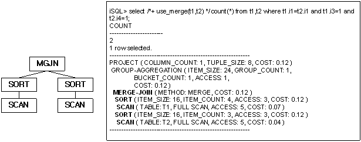

위의 실행 계획에서 조인 조건은 MERGE-JOIN 노드에서 처리되며 조인 조건에 포함된
칼럼을 기준으로 정렬한 후 이를 이용한다.

##### 예제

2010년 1월 1일 이전에 입사한 모든 사원의 사원번호, 이름, 소속된 부서의 부서
번호와 부서 이름을 출력하라. (두 테이블 모두 조인 술어와 관련된 칼럼에 인덱스가
존재하여야 한다. 인덱스 스캔을 하므로 이 노드의 좌, 우 노드들(SCAN node)로부터
dno 값으로 정렬되어 레코드가 반환된다. 따라서, 두 값의 대소 차이가 발생하는
이후의 레코드는 검색하지 않고 다시 같은 값을 가지는 레코들를 만날 때까지 두
테이블의 커서를 이동하여 검색한다.)

```
iSQL> SELECT /*+ use_merge(employees,departments) */e.eno, e_lastname, d.dno, dname 
 FROM employees e, departments d 
 WHERE e.dno = d.dno 
  AND TO_CHAR(join_date, 'YYYY-MM-DD HH:MI:SS') < '2010-01-01 00:00:00';
ENO         E_LASTNAME            DNO         DNAME
---------------------------------------------------------------------------
5           Ghorbani              3002        PRESALES DEPT
8           Wang                  4001        MARKETING DEPT
18          Huxley                4001        MARKETING DEPT
7           Fleischer             4002        BUSINESS DEPT
12          Hammond               4002        BUSINESS DEPT
20          Blake                 4002        BUSINESS DEPT
6 rows selected.
------------------------------------------------------------
PROJECT ( COLUMN_COUNT: 4, TUPLE_SIZE: 60, COST: 0.34 )
 MERGE-JOIN ( METHOD: MERGE, COST: 0.24 )
  SCAN ( TABLE: EMPLOYEES E, INDEX: EMP_IDX1, RANGE SCAN, ACCESS: 19, COST: 0.21 )
  SCAN ( TABLE: DEPARTMENTS D, INDEX: __SYS_IDX_ID_153, RANGE SCAN, ACCESS: 15, COST: 0.01 )
------------------------------------------------------------
```


#### PARALLEL-QUEUE

##### 출력 형식

```
PARALLEL-QUEUE ( TID: tid )
```


| 항목 | 설명                                 |
|------|--------------------------------------|
| TID  | 노드에서 실행되는 쓰레드의 식별 번호 |

[표 4‑14] PARALLEL-QUEUE 노드의 정보

##### 설명

PARALLEL-QUEUE는 병렬 질의를 수행하는 노드이다. 이 노드는 새로운 쓰레드로 하여금
하위 노드를 실행하게 하고, 실행 결과를 상위 노드로 전달한다.

다음은 PARALLEL-QUEUE 노드가 사용된 예이다. 아래의 예를 살펴보면 두 개의
PARALLEL-QUEUE 노드가 네 개의 SCAN 노드를 실행하는 것을 볼 수 있다. 각각의
PARALLEL-QUEUE 노드에 할당된 식별번호(TID)로 첫 번째 PARALLEL-QUEUE 노드가
파티션 P1, P3, P4 를 두 번째 PARALLEL-QUEUE 노드가 파티션 P2를 스캔한 것을
확인할 수 있다.


##### 예제1

```
iSQL> SELECT /*+ PARALLEL(t1 2) */ COUNT(i1) FROM t1;
COUNT(I1)            
-----------------------
500                 
1 row selected.
------------------------------------------------------------
PROJECT ( COLUMN_COUNT: 1, TUPLE_SIZE: 8, COST: 0.56 )
 GROUP-AGGREGATION ( ITEM_SIZE: 24, GROUP_COUNT: 1, BUCKET_COUNT: 1, ACCESS: 1, COST: 0.56 )
  PARTITION-COORDINATOR ( TABLE: T1, PARALLEL, PARTITION: 4/4, ACCESS: 500, COST: 0.28 )
   PARALLEL-QUEUE ( TID: 1 )
   PARALLEL-QUEUE ( TID: 2 )
   SCAN ( PARTITION: P4, FULL SCAN, ACCESS: 201, TID: 1, COST: 0.11 )
   SCAN ( PARTITION: P3, FULL SCAN, ACCESS: 100, TID: 1, COST: 0.06 )
   SCAN ( PARTITION: P2, FULL SCAN, ACCESS: 100, TID: 2, COST: 0.06 )
   SCAN ( PARTITION: P1, FULL SCAN, ACCESS: 99, TID: 1, COST: 0.06 )
------------------------------------------------------------
```


##### 예제2

```
iSQL> SELECT
         L_RETURNFLAG,
         L_LINESTATUS,
         SUM(L_QUANTITY) AS SUM_QTY,
         SUM(L_EXTENDEDPRICE) AS SUM_BASE_PRICE,
         SUM(L_EXTENDEDPRICE * (1 - L_DISCOUNT)) AS SUM_DISC_PRICE,
         SUM(L_EXTENDEDPRICE * (1 - L_DISCOUNT) * (1 + L_TAX)) AS SUM_CHARGE,
         AVG(L_QUANTITY) AS AVG_QTY,
         AVG(L_EXTENDEDPRICE) AS AVG_PRICE,
         AVG(L_DISCOUNT) AS AVG_DISC,
         COUNT(*) AS COUNT_ORDER
 FROM
         LINEITEM
 WHERE
         L_SHIPDATE <= DATE'01-DEC-1998' - INTERVAL'90'
 GROUP BY
         L_RETURNFLAG,
         L_LINESTATUS
 ORDER BY
         L_RETURNFLAG,
         L_LINESTATUS;
L_RETURNFLAG  L_LINESTATUS  SUM_QTY     SUM_BASE_PRICE SUM_DISC_PRICE         SUM_CHARGE             AVG_QTY                AVG_PRICE              AVG_DISC    COUNT_ORDER          
-----------------------------------------------------------------------------------------------------------------------------------------------------------------------------------------------
A  F  37474       56250004.9  53399385.5912999       55528109.501472        25.3545331529093       38058.1900405954       0.050866035 1478                
N  F  1041        1614635.42  1549641.9636           1608284.73514          27.3947368421053       42490.4057894737       0.042894737 38                  
N  O  75067       112774708   107204872.3929         111467221.663635       25.5590738849166       38397.9257643854       0.049673136 2937                
R  F  36470       54082045.8  51384368.3297          53497960.192278        25.0480769230769       37144.2622115385       0.050006868 1456                
4 rows selected.
------------------------------------------------------------
PROJECT ( COLUMN_COUNT: 10, TUPLE_SIZE: 120, COST: 97.21 )
 SORT ( ITEM_SIZE: 24, ITEM_COUNT: 4, ACCESS: 4, COST: 95.85 )
  GROUP-AGGREGATION ( ITEM_SIZE: 192, GROUP_COUNT: 4, BUCKET_COUNT: 1024, ACCESS: 4, COST: 95.83 )
   PARALLEL-QUEUE ( TID: 1 )
    SCAN ( TABLE: LINEITEM, FULL SCAN, ACCESS: 6000, TID: 1, COST: 60.33 )
------------------------------------------------------------
```


#### PARALLEL-SCAN-COORDINATOR

##### 출력 형식

```
PARALLE-SCAN-COORDINATOR( TABLE: table_name, ACCESS: acc_num )
```

| 항목   | 설명                   |
|--------|------------------------|
| TABLE  | 접근하는 테이블의 이름 |
| ACCESS | 레코드에 접근한 횟수   |

[표 4‑15] PARALLEL-SCAN-COORDINATIOR 노드의 정보

##### 설명

PARALLEL-SCAN-COORDINATOR 노드는 병렬 질의 수행을 위해 사용되며, SCAN 노드 여러
개를 병렬로 수행한 후 그 결과를 수집하여 상위 노드에 전달한다.

다음은 PARALLEL-SCAN-COORDINATOR 노드가 사용된 예이다. 자식 노드를 병렬로
수행하고 그 결과를 수집하여 상위 노드로 전달한다.


##### 예제

```
SELECT /*+ PARALLEL(LINEITEM, 4) */
        L_RETURNFLAG,
        L_LINESTATUS,
        SUM(L_QUANTITY) AS SUM_QTY
FROM
        LINEITEM
WHERE
        L_SHIPDATE <= DATE'01-DEC-1998' - INTERVAL'90'
GROUP BY
        L_RETURNFLAG,
        L_LINESTATUS
ORDER BY
        L_RETURNFLAG,
        L_LINESTATUS;
L_RETURNFLAG  L_LINESTATUS  SUM_QTY     
--------------------------------------------
A  F  37474      
N  F  1041       
N  O  75067      
R  F  36470      
4 rows selected.
------------------------------------------------------------
PROJECT ( COLUMN_COUNT: 3, TUPLE_SIZE: 30, COST: 96.02 )
 SORT ( ITEM_SIZE: 24, ITEM_COUNT: 4, ACCESS: 4, COST: 95.90 )
  GROUP-AGGREGATION ( ITEM_SIZE: 48, GROUP_COUNT: 4, BUCKET_COUNT: 1024, ACCESS: 4, COST: 95.83 )
   PARALLEL-SCAN-COORDINATOR ( TABLE: SYS.LINEITEM, ACCESS: 5909 )
    PARALLEL-QUEUE ( TID: 1 )
     SCAN ( TABLE: SYS.LINEITEM, FULL SCAN, ACCESS: 1569, TID: 1, COST: 60.33 )
    PARALLEL-QUEUE ( TID: 2 )
     SCAN ( TABLE: SYS.LINEITEM, FULL SCAN, ACCESS: 1413, TID: 2, COST: 60.33 )
    PARALLEL-QUEUE ( TID: 3 )
     SCAN ( TABLE: SYS.LINEITEM, FULL SCAN, ACCESS: 1570, TID: 3, COST: 60.33 )
    PARALLEL-QUEUE ( TID: 4 )
     SCAN ( TABLE: SYS.LINEITEM, FULL SCAN, ACCESS: 1448, TID: 4, COST: 60.33 )
------------------------------------------------------------
```


#### PARTITION-COORDINATOR

##### 출력 형식

```
PARTITION-COORDINATOR( TABLE: table_name, PARALLEL, PARTITION: partition_acc_cnt, ACCESS: acc_num, COST: cost )
```

| 항목      | 설명                                                           |
|-----------|----------------------------------------------------------------|
| TABLE     | 접근하는 테이블의 이름                                         |
| PARALLEL  | 병렬 질의 실행 여부를 나타낸다. 병렬 질의일 경우에만 출력된다. |
| PARTITION | 접근하는 파티션의 개수                                         |
| ACCESS    | 레코드에 접근한 횟수                                           |
| COST      | 추산 비용                                                      |

[표 4‑16] PARTITION-COORDINATIOR 노드의 정보

##### 설명

PARTITION-COORDINATIOR 노드는 파티션드 테이블의 각각의 파티션에 대한 스캔을
관리하는 노드이다. 여러 개의 자식 노드를 가지며, 파티션 필터링을 수행한다.

기본적인 PARTITION-COORDINATIOR 노드가 수행되는 예는 다음과 같다. 자식 노드인
파티션에 대한 스캔 결과를 상위 노드로 전달한다.


병렬 질의를 통해 PARTITION-COORDINATIOR 노드가 수행되는 예는 다음과 같다.
PARTITION-COORDINATIOR 노드에 PARALLEL 항목이 있는 것을 볼 수 있다.
PARTITION-COORDINATIOR 노드가 파티션을 스캔하는 자식 노드의 실행 결과를 상위
노드에 전달한다.


##### 예제 1

```
iSQL> CREATE TABLE t1 ( i1 INTEGER )
PARTITION BY RANGE ( i1 )
(
    PARTITION p1 VALUES LESS THAN ( 100 ),
    PARTITION p2 VALUES LESS THAN ( 200 ),
    PARTITION p3 VALUES DEFAULT
) TABLESPACE SYS_TBS_DISK_DATA;
Create success.

iSQL> INSERT INTO t1 VALUES ( 50 );
1 row inserted.
iSQL> INSERT INTO t1 VALUES ( 60 );
1 row inserted.
iSQL> INSERT INTO t1 VALUES ( 150 );
1 row inserted.
iSQL> INSERT INTO t1 VALUES ( 160 );
1 row inserted.
iSQL> alter session set explain plan = on;
Alter success.

iSQL> SELECT COUNT(*) FROM t1 WHERE i1 < 100;
COUNT
-----------------------
2
1 row selected.
--------------------------------------------------------
PROJECT ( COLUMN_COUNT: 1, TUPLE_SIZE: 8, COST: 14.02 )
 GROUP-AGGREGATION ( ITEM_SIZE: 24, GROUP_COUNT: 1, BUCKET_COUNT: 1, ACCESS: 1, COST: 14.02 )
  PARTITION-COORDINATOR ( TABLE: T1, PARTITION: 1/3, ACCESS: 2, COST: 14.01 )
   SCAN ( PARTITION: P1, FULL SCAN, ACCESS: 2, DISK_PAGE_COUNT: 64, COST: 14.01 )
--------------------------------------------------------
```


##### 예제 2

```
iSQL> SELECT /*+ PARALLEL(t1 3) */ COUNT(*) FROM t1 WHERE i1 < 160; 
COUNT
-----------------------
3
1 row selected. 
-------------------------------------------------------- 
PROJECT ( COLUMN_COUNT: 1, TUPLE_SIZE: 8, COST: 14.02 )
 GROUP-AGGREGATION ( ITEM_SIZE: 24, GROUP_COUNT: 1, BUCKET_COUNT: 1, ACCESS: 1, COST: 14.02 )
  PARTITION-COORDINATOR ( TABLE: T1, PARALLEL, PARTITION: 2/3, ACCESS: 2, COST: 14.01 )
   PARALLEL-QUEUE ( TID: 1 )
   PARALLEL-QUEUE ( TID: 2 )
   SCAN ( PARTITION: P1, FULL SCAN, ACCESS: 2, TID: 1, DISK_PAGE_COUNT: 64, COST: 14.01 )
   SCAN ( PARTITION: P2, FULL SCAN, ACCESS: 2, TID: 2, DISK_PAGE_COUNT: 64, COST: 14.01 )
-------------------------------------------------------- 
```


#### PROJECT

##### 출력 형식

```
PROJECT ( COLUMN_COUNT: col_count, TUPLE_SIZE: tuple_size, COST: cost )
```

| 항목         | 설명                                |
|--------------|-------------------------------------|
| COLUMN_COUNT | 프로젝션되는 칼럼의 개수            |
| TUPLE_SIZE   | 프로젝션으로 추출하는 레코드의 크기 |
| COST         | 추산 비용                           |

[표 4‑17] PROJECT 노드의 정보

##### 설명

PROJECT 노드는 관계형 모델에서 프로젝션(project)연산을 수행하는 물리적 개체이다.
하나의 자식 노드를 가지며 자식 노드의 결과 레코드로부터 필요한 칼럼만을
추출한다.

###### **PROJECT 노드의 출력**

PROJECT 노드는 질의의 최종 결과를 구성하는 노드이다. PROJECT 노드 정보는 다음과
같이 실행 계획 내에서 볼 수 있다. 질의 결과가 두 개의 칼럼으로 구성되며, 결과
레코드의 크기가 8 byte임을 알 수 있다.


##### 예제

전 사원의 급여를 10% 인상 시 전 사원의 이름과 급여를 출력하라.

```
iSQL> SELECT e_firstname, e_lastname, salary * 1.1 FROM employees;
E_FIRSTNAME           E_LASTNAME            SALARY * 1.1
-------------------------------------------------------------
.
.
.
20 rows selected.
------------------------------------------------------------
PROJECT ( COLUMN_COUNT: 3, TUPLE_SIZE: 67, COST: 0.41 )
 SCAN ( TABLE: EMPLOYEES, FULL SCAN, ACCESS: 20, COST: 0.01 )
------------------------------------------------------------
```


#### SCAN

##### 출력 형식

1) 중간 결과가 메모리에 저장될 경우

```
SCAN ( TABLE: table_name, FULL SCAN, ACCESS: acc_num, TID: tid, COST: cost )

SCAN ( TABLE: table_name, INDEX: index_name, ACCESS: acc_num, TID: tid, COST: cost )
```

2) 중간 결과가 디스크에 저장될 경우

```
SCAN ( TABLE: table_name, FULL SCAN, ACCESS: acc_num, DISK_PAGE_COUNT: page_count, TID: tid, COST: cost )

SCAN ( TABLE: table_name, INDEX: index_name, ACCESS: acc_num, DISK_PAGE_COUNT: page_count, TID: tid, COST: cost )
```


| 항목            | 설명                                                  |
|-----------------|-------------------------------------------------------|
| TABLE           | 접근하는 테이블의 이름                                |
| INDEX           | 사용하는 인덱스의 이름                                |
| SCAN 방식       | FULL SCAN, RANGE SCAN [DESC] 또는 RID SCAN으로 구분됨 |
| ACCESS          | 레코드에 접근한 횟수                                  |
| DISK_PAGE_COUNT | 테이블의 디스크 페이지 개수                           |
| TID             | 쓰레드 식별번호, 병렬 질의일 경우에만 출력된다.       |
| COST            | 추산 비용                                             |

[표 4‑18] SCAN 노드의 정보

##### 설명

SCAN 노드는 관계형 모델에서 검색(select)연산을 수행하는 물리적인 개체이다. SCAN
노드는 자식 노드를 갖지 않으며 테이블에 직접 접근하여 해당 테이블에서 레코드를
가져온다.

SCAN 노드에서 검사되는 조건은 다음과 같이 5가지의 처리 방법으로 처리된다.

-   Fixed key range

-   Variable key range

-   Constant filter

-   Filter

-   Subquery filter

###### **메모리 테이블과 디스크 테이블**

메모리 테이블과 디스크 테이블은 서로 출력되는 정보가 약간 다르다. 디스크
테이블의 경우에만 해당 테이블이 소유한 디스크 페이지 개수가 출력된다.

아래는 메모리 테이블과 디스크 테이블의 SCAN 노드의 출력 정보를 비교한 것이다.

다음 예는 SYS 사용자의 기본 테이블스페이스가 SYS_TBS_MEMORY로 지정되어 있는
경우이며, 메모리 테이블의 SCAN 노드 정보를 보이고 있다.

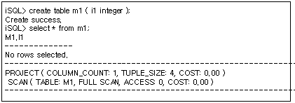

다음 예는 명시적으로 SYS_TBS_DATA인 디스크 테이블스페이스에 생성된 테이블의 SCAN
노드 정보이다. 아래와 같이 디스크 테이블의 경우 테이블이 점유하고 있는 디스크
페이지의 개수를 보여준다.


###### **테이블 이름**

아래의 예에서와 같이 SCAN 노드가 접근하고 있는 테이블의 이름을 보여주며, 질의에
alias 이름을 지정할 경우 다음과 같이 출력된다.


###### **액세스 방법 및 레코드 액세스 횟수**

질의 튜닝에 있어 가장 중요한 정보는 전체 스캔을 하는 지 인덱스를 사용하는 지의
여부와 얼마나 많은 레코드 접근이 이루어졌는 지를 판단하는 것이다. 레코드 접근이
많을수록 성능 저하의 요인이 되므로 이에 대한 판단을 하는 것이 매우 중요하다.

다음은 전체 스캔에 의하여 해당 질의를 처리한 경우이다. WHERE절을 비교하기 위하여
레코드에 접근한 수를 보이고 있다.


동일한 테이블에 대하여 다음과 같이 인덱스를 사용한 경우의 실행 계획 정보의 예는
다음과 같다. IDX1 인덱스를 사용하여 조건 비교를 위하여 한 건만 접근하고 있음을
알 수 있다.


동일한 조건에서 다른 칼럼에 대한 조건을 추가할 경우도 동일한 실행 계획이
생성됨을 알 수 있다.


이 때, T1.i2 칼럼에 인덱스를 추가하고 해당 인덱스를 사용하도록 질의를 수행하면
다음과 같은 실행 계획을 볼 수 있다. 동일한 질의임에도 불구하고 다른 인덱스를
사용하면 접근 효율이 떨어짐을 볼 수 있다.

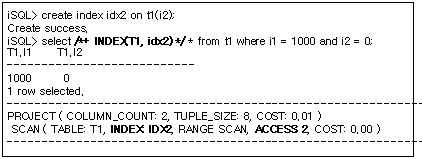

아래와 같이 별도의 힌트를 주지 않을 경우, 옵티마이저는 비용 비교를 통해 보다
우수한 인덱스를 선택하게 된다.


위와 같이 SCAN 노드의 정보를 통해 올바른 액세스 방법이 선택되고 있는지를
확인하고, 인덱스가 없는 경우 질의에 따라 적절한 인덱스를 생성해 주는 것이
필요하다.

###### **TRCLOG_DETAIL_PREDICATE**

TRCLOG_DETAIL_PREDICATE 프로퍼티를 1로 지정하면 SCAN노드에서 조건들이 어떠한
방식으로 처리되는지에 대한 정보를 출력한다. 이 프로퍼티는 해당 조건이 인덱스를
사용하고 있는 지를 판단하는 데 있어 유용하게 사용될 수 있다.

다음과 같이 각 조건을 처리하기 위해 어떠한 방법을 사용하고 있는지를 알 수 있다.
즉, 아래의 예에서는 (i1 = 1000) 조건은 인덱스를 사용한 fixed key range로
처리되고, (i2 = 0) 조건은 filter로 처리됨을 알 수 있다.


다음은 동일한 질의를 처리하는데 다른 인덱스가 사용된 예제이다. IDX2 인덱스를
사용 시 인덱스를 사용하는 조건과 인덱스를 사용하지 않는 조건이 바뀌었음을 알 수
있다.


위와 같이 WHERE 절에 기술된 어떠한 조건이 인덱스를 사용하고 그렇지 않은 지를
판단하는 것 또한 질의 튜닝에 많은 도움을 준다. 단, 옵티마이저의 최적화 과정에서
질의 변경등이 발생할 경우 해당 정보가 출력되지 않을 수 있다.

##### 예제

예제1) 1980년 1월 1일 이전에 태어난 모든 사원들의 이름, 부서 번호, 생일을
출력하라.

```
iSQL> SELECT e_firstname, e_lastname, dno, birth 
 FROM employees 
 WHERE birth > '800101';
E_FIRSTNAME           E_LASTNAME            DNO         BIRTH
---------------------------------------------------------------------
Aaron                 Foster                3001        820730
Gottlieb              Fleischer             4002        840417
Xiong                 Wang                  4001        810726
Sandra                Hammond               4002        810211
Mitch                 Jones                 1002        801102
Jason                 Davenport             1003        901212
6 rows selected.
------------------------------------------------------------
PROJECT ( COLUMN_COUNT: 4, TUPLE_SIZE: 54, COST: 0.26 )
 SCAN ( TABLE: EMPLOYEES, FULL SCAN, ACCESS: 20, COST: 0.14 )
------------------------------------------------------------
```

예제2) 1980년 1월 1일 이전에 태어난 모든 사원들의 이름, 부서 번호, 생일을
출력하라. (인덱스를 이용하라.)

```
iSQL> CREATE INDEX emp_idx2 ON employees(birth);
Create success.
iSQL> SELECT e_firstname, e_lastname, dno, birth 
 FROM employees 
 WHERE birth > '800101';
E_FIRSTNAME           E_LASTNAME            DNO         BIRTH
---------------------------------------------------------------------
Mitch                 Jones                 1002        801102
Sandra                Hammond               4002        810211
Xiong                 Wang                  4001        810726
Aaron                 Foster                3001        820730
Gottlieb              Fleischer             4002        840417
Jason                 Davenport             1003        901212
6 rows selected.
------------------------------------------------------------
PROJECT ( COLUMN_COUNT: 4, TUPLE_SIZE: 54, COST: 0.11 )
 SCAN ( TABLE: EMPLOYEES, INDEX: EMP_IDX2, RANGE SCAN, ACCESS: 6, COST: 0.00 )
------------------------------------------------------------
```


#### VIEW

##### 출력 형식

```
VIEW ( view_name, ACCESS: acc_num, COST: cost )
```


| 항목    | 설명                                  |
|---------|---------------------------------------|
| 뷰 이름 | 뷰의 이름. 이름이 있는 경우에 출력됨. |
| ACCESS  | 뷰 레코드의 접근 회수                 |
| COST    | 추산 비용                             |

[표 4‑19] VIEW 노드의 정보

##### 설명

VIEW 노드는 관계형 모델에서 가상 테이블을 표현하기 위해 사용되는 노드이다. 이
노드는 사용자가 정의한 뷰를 표현하거나 집합 연산을 통해 생성되는 결과 집합을
하나의 테이블 개념으로 전환하는 역할을 한다.

사용자가 정의한 뷰에 대한 질의가 수행될 경우 생성되는 VIEW 노드의 출력 예는
아래와 같다. VIEW 노드의 하위 노드들은 사용자가 정의한 뷰의 SELECT문에 대한 실행
계획을 의미한다.


집합 연산이 사용된 질의에서도 VIEW 노드를 사용하게 되는 데, 그 예는 다음과 같다.
VIEW 노드는 INTERSECT의 결과를 하나의 테이블의 개념으로 관리하기 위해
생성되었다. 이 경우 별도의 이름을 갖지 않는다.


##### 예제

자신이 속한 부서의 평균 급여보다 급여를 많이 받는 모든 사원의 이름, 급여, 부서
번호 및 그 부서의 평균 급여를 출력하라.

```
iSQL> SELECT e.e_firstname, e.e_lastname, e.salary, e.dno, v1.salavg 
 FROM employees e, 
 (SELECT dno, AVG(salary) salavg 
  FROM employees 
  GROUP BY dno) v1 
 WHERE e.dno = v1.dno 
 AND e.salary > v1.salavg;
E_FIRSTNAME           E_LASTNAME            SALARY      DNO     SALAVG
---------------------------------------------------------------------------
Wei-Wei               Chen                  2300        1001    2150
Ryu                   Momoi                 1700        1002    1340
Elizabeth             Bae                   4000        1003    2438.25
Zhen                  Liu                   2750        1003    2438.25
John                  Huxley                1900        4001    1550
Sandra                Hammond               1890        4002    1396.66667
Alvar                 Marquez               1800        4002    1396.66667
7 rows selected.
------------------------------------------------------------
PROJECT ( COLUMN_COUNT: 5, TUPLE_SIZE: 79, COST: 0.40 )
 JOIN ( METHOD: INDEX_NL, COST: 0.23 )
  VIEW ( ACCESS: 9, COST: 0.22 )
   PROJECT ( COLUMN_COUNT: 2, TUPLE_SIZE: 25, COST: 0.21 )
    AGGREGATION ( ITEM_SIZE: 72, GROUP_COUNT: 9, COST: 0.01 )
     GROUPING
      SCAN ( TABLE: EMPLOYEES, INDEX: EMP_IDX1, FULL SCAN, ACCESS: 20, COST: 0.01 )
  SCAN ( TABLE: EMPLOYEES E, INDEX: EMP_IDX1, RANGE SCAN, ACCESS: 19, COST: 0.01 )
------------------------------------------------------------
```


#### VIEW-SCAN

##### 출력 형식

```
VIEW-SCAN ( VIEW: view_name, ACCESS: acc_num, COST: cost )
```


| 항목   | 설명                  |
|--------|-----------------------|
| VIEW   | 뷰의 이름             |
| ACCESS | 뷰 레코드의 접근 회수 |
| COST   | 추산 비용             |

[표 4‑20] VIEW-SCAN 노드의 정보

##### 설명

VIEW-SCAN 노드는 관계형 모델에서 임시 저장 뷰에 대한 검색(SELECT) 연산을
수행한다. 하나의 자식 노드를 가지면, 이는 항상 MATERIALIZATION 실행 노드이다.

이 노드는 질의 최적화 과정에서 뷰의 결과를 저장 후 처리하는 것이 효율적이라
판단될 때 생성된다.

VIEW-SCAN 노드가 사용되는 예는 아래와 같다. 아래 질의에는 동일한 뷰에 대한
접근이 외부 질의와 부질의(subquery)에서 모두 등장한다. 옵티마이저는 최적화
과정에서 해당 뷰를 임시 저장하여 질의를 수행하는 것이 효율적이라고 판단해서,
MATERIALIZATION 노드를 이용하여 저장한다. 아래는 저장된 뷰의 내용을 VIEW-SCAN
노드로 접근하고 있는 실행 계획을 나타낸다.


위의 실행 계획에서 (V1 X) 뷰에 대한 VIEW-SCAN 노드는 자식 노드를 갖지 않는
것으로 보인다. 그러나, 해당 VIEW-SCAN 노드는 MATERIALIZATION 노드를 자식 노드로
갖는다. 위 실행 계획의 일부를 도식화하면 아래 그림과 같다. (VSCN: VIEW-SCAN
노드, VMTR: MATERIALIZATION 노드)

위의 그림에서와 같이 VSCN(V1 X)와 VSCN(V1 Y) 실행 노드는 동일한 자식 노드를 갖고
있다.


##### 예제

MATERIALIZATION 노드의 예제를 참고하기 바란다.

#### SET-DIFFERENCE

##### 출력 형식

1) 중간 결과가 메모리에 저장될 경우

```
SET-DIFFERENCE ( ITEM_SIZE: item_size, ITEM_COUNT: item_count, BUCKET_COUNT: bucket_count, ACCESS: acc_num, COST: cost )
```

2) 중간 결과가 디스크에 저장될 경우

```
SET-DIFFERENCE ( ITEM_SIZE: item_size, ITEM_COUNT: item_count, DISK_PAGE_COUNT: page_count, ACCESS: acc_num, COST: cost )
```


| 항목            | 설명                                  |
|-----------------|---------------------------------------|
| ITEM_SIZE       | 차집합을 위한 저장 레코드의 크기      |
| ITEM_COUNT      | 저장된 레코드의 개수                  |
| BUCKET_COUNT    | 해싱을 위한 버킷의 개수               |
| DISK_PAGE_COUNT | 임시 저장 테이블의 디스크 페이지 개수 |
| ACCESS          | 저장된 레코드에 대한 접근 횟수        |
| COST            | 추산 비용                             |

[표 4‑21] SET-DIFFERENCE 노드의 정보

##### 설명

SET-DIFFERENCE 노드는 관계형 모델에서 MINUS 연산을 수행하는 노드이다. 이는 두
개의 자식 노드를 가지며, 차집합을 얻기 위하여 중간 결과를 저장하여 처리한다.

SET-DIFFERENCE 노드가 MINUS를 위해 수행되는 예는 다음과 같다. 좌측 질의의 결과를
중복 제거하여 저장하고, 우측 질의의 결과를 이용하여 교집합을 구한 후 교집합에
포함되지 않은 결과만을 검색한다.

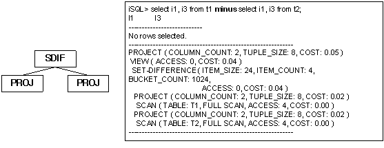

##### 예제

주문되지 않은 상품들의 상품번호를 출력하라.

```
iSQL> SELECT gno FROM goods
MINUS
SELECT gno FROM orders;
GNO
--------------
A111100001
B111100001
C111100002
E111100011
D111100001
D111100005
D111100006
D111100007
D111100009
E111100003
E111100004
E111100005
E111100006
E111100008
14 rows selected.
------------------------------------------------------------
PROJECT ( COLUMN_COUNT: 1, TUPLE_SIZE: 12, COST: 0.16 )
 VIEW ( ACCESS: 14, COST: 0.13 )
  SET-DIFFERENCE ( ITEM_SIZE: 32, ITEM_COUNT: 30, BUCKET_COUNT: 1024, ACCESS: 14, COST: 0.13 )
   PROJECT ( COLUMN_COUNT: 1, TUPLE_SIZE: 12, COST: 0.07 )
    SCAN ( TABLE: GOODS, FULL SCAN, ACCESS: 30, COST: 0.02 )
   PROJECT ( COLUMN_COUNT: 1, TUPLE_SIZE: 12, COST: 0.07 )
    SCAN ( TABLE: ORDERS, FULL SCAN, ACCESS: 30, COST: 0.02 )
------------------------------------------------------------
```


#### SET-INTERSECT

##### 출력 형식

1) 중간 결과가 메모리에 저장될 경우

```
SET-INTERSECT ( ITEM_SIZE: item_size, ITEM_COUNT: item_count, BUCKET_COUNT: bucket_count, ACCESS: acc_num, COST: cost )
```

2) 중간 결과가 디스크에 저장될 경우

```
SET-INTERSECT ( ITEM_SIZE: item_size, ITEM_COUNT: item_count, DISK_PAGE_COUNT: page_count, ACCESS: acc_num, COST: cost )
```


| 항목            | 설명                                  |
|-----------------|---------------------------------------|
| ITEM_SIZE       | 교집합을 위한 저장 레코드의 크기      |
| ITEM_COUNT      | 저장된 레코드의 개수                  |
| BUCKET_COUNT    | 해싱을 위한 버킷의 개수               |
| DISK_PAGE_COUNT | 임시 저장 테이블의 디스크 페이지 개수 |
| ACCESS          | 저장된 레코드에 대한 접근 횟수        |
| COST            | 추산 비용                             |

[표 4‑22] SET-INTERSECT 노드의 정보

##### 설명

SET-INTERSECT 노드는 관계형 모델에서 INTERSECT 연산을 수행하는 노드이다. 이는
두개의 자식 노드를 가지며, 교집합을 얻기 위하여 중간 결과를 저장하여 처리한다.

SET-INTERSECT 노드가 INTERSECT를 위해 수행되는 예는 다음과 같다. 좌측 질의의
결과 데이터를 중복 제거하여 저장하고, 우측 질의의 결과 데이터를 이용하여
교집합에 해당하는 결과를 검색하게 된다.


##### 예제

goods 테이블에서 한 번이라도 주문된 아이템의 목록을 출력하라.

```
iSQL> SELECT gno FROM goods INTERSECT SELECT gno FROM orders;
GNO
--------------
A111100002
E111100001
D111100008
D111100004
C111100001
E111100002
D111100002
D111100011
D111100003
D111100010
E111100012
F111100001
E111100009
E111100010
E111100007
E111100013
16 rows selected.
------------------------------------------------------------
PROJECT ( COLUMN_COUNT: 1, TUPLE_SIZE: 12, COST: 0.16 )
 VIEW ( ACCESS: 16, COST: 0.13 )
  SET-INTERSECT ( ITEM_SIZE: 32, ITEM_COUNT: 30, BUCKET_COUNT: 1024, ACCESS: 16, COST: 0.13 )
   PROJECT ( COLUMN_COUNT: 1, TUPLE_SIZE: 12, COST: 0.07 )
    SCAN ( TABLE: GOODS, FULL SCAN, ACCESS: 30, COST: 0.02 )
   PROJECT ( COLUMN_COUNT: 1, TUPLE_SIZE: 12, COST: 0.07 )
    SCAN ( TABLE: ORDERS, FULL SCAN, ACCESS: 30, COST: 0.02 )
------------------------------------------------------------
```


#### SORT

##### 출력 형식

1) 중간 결과가 메모리에 저장될 경우

```
SORT ( ITEM_SIZE: item_size, ITEM_COUNT: item_count, ACCESS: acc_num, COST: cost )
```

2) 중간 결과가 디스크에 저장될 경우

```
SORT ( ITEM_SIZE: item_size, ITEM_COUNT: item_count, DISK_PAGE_COUNT: page_count, ACCESS: acc_num, COST: cost )
```


| 항목            | 설명                                  |
|-----------------|---------------------------------------|
| ITEM_SIZE       | 정렬을 위한 레코드의 크기             |
| ITEM_COUNT      | 정렬에 포함된 레코드의 개수           |
| DISK_PAGE_COUNT | 임시 저장 테이블의 디스크 페이지 개수 |
| ACCESS          | 저장된 레코드에 대한 접근 횟수        |
| COST            | 추산 비용                             |

[표 4‑23] SORT 노드의 정보

##### 설명

SORT 노드는 관계형 모델에서 정렬 연산을 수행하는 물리적 개체이다. 하나의 자식
노드를 가지며, 중간 결과를 저장하기 위하여 임시 공간을 사용한다.

SORT 노드는 매우 다양한 용도로 사용된다. 아래에서 각 용도별로 사용될 때의 실행
계획 트리를 살펴본다.

###### **ORDER BY절에서의 사용**

ORDER BY 절이 존재하고 별도의 정렬이 필요한 경우 SORT 노드가 사용된다. 아래의
예에서 SORT 노드는 ORDER BY절을 처리하기 위하여 사용되었다.

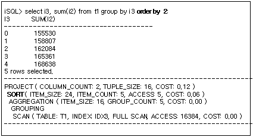

###### **GROUP BY에서의 사용**

SORT 노드는 GROUP BY 절의 동일한 그룹을 분류하기 위한 정렬을 수행하기 위해
생성될 수 있다. 아래의 예는 GROUP BY i4 를 처리하기 위하여 SORT 노드가 생성된
경우이다.


###### **DISTINCT절에서의 사용**

SORT 노드는 DISTINCT 처리시 정렬 방식으로 중복 제거를 하기 위하여 사용될 수
있다. 아래의 예는 DISTINCT i4 를 처리하기 위하여 SORT 노드가 생성된 경우이다.


###### **조인에서의 사용**

SORT 노드는 조인을 수행하기 위하여 사용될 수 있다.

아래의 예는 조인을 처리하기 위하여 SORT 노드가 생성된 경우이다. T1.i1 = T2.i1
조인 조건을 검사하기 위한 sort-based 조인을 수행하기 위해 SORT 노드가
생성되었다.


##### 예제

월 급여가 \$1500 USD 이하인 직원의 이름, 업무, 입사일, 급여를 급여 순서로
정렬하라.

```
iSQL> SELECT e_firstname, e_lastname, emp_job, salary 
 FROM employees 
 WHERE salary < 1500 
 ORDER BY 4 DESC;
E_FIRSTNAME           E_LASTNAME            EMP_JOB          SALARY
----------------------------------------------------------------------------
Takahiro              Fubuki                PM               1400
Curtis                Diaz                  planner          1200
Jason                 Davenport             webmaster        1000
Mitch                 Jones                 PM               980
Gottlieb              Fleischer             manager          500
5 rows selected.
------------------------------------------------------------
PROJECT ( COLUMN_COUNT: 4, TUPLE_SIZE: 70, COST: 0.33 )
 SORT ( ITEM_SIZE: 16, ITEM_COUNT: 5, ACCESS: 5, COST: 0.22 )
  SCAN ( TABLE: EMPLOYEES, FULL SCAN, ACCESS: 20, COST: 0.14 )
------------------------------------------------------------

```


#### STORE

##### 출력 형식

```
STORE ( ITEM_SIZE: item_size, ITEM_COUNT: item_count, DISK_PAGE_COUNT: page_count, ACCESS: acc_num, COST: cost )
```


| 항목            | 설명                                                                    |
|-----------------|-------------------------------------------------------------------------|
| ITEM_SIZE       | 저장 레코드의 크기                                                      |
| ITEM_COUNT      | 저장에 포함된 레코드의 개수                                             |
| DISK_PAGE_COUNT | 임시 저장 공간의 디스크 페이지 개수. 메모리 임시 공간은 이 항목이 없음. |
| ACCESS          | 저장된 레코드에 대한 접근 횟수                                          |
| COST            | 추산 비용                                                               |

[표 4‑24] STORE 노드의 정보

##### 설명

STORE 노드는 질의의 일부 결과를 임시 저장하는 노드이다. 하나의 자식 노드를
가지며, 중간 결과를 저장하기 위하여 임시 공간을 사용한다.

STORE 노드는 매우 다양한 용도로 사용된다. 아래에서 각 용도별로 사용될 때의 실행
계획 트리를 살펴 본다.

###### **조인에서의 사용**

STORE 노드는 조인에 사용될 수 있다.

이 노드는 조인 조건이 없는 카티션 프로덕트(cartesian product)에 주로 사용된다.
이 노드가 일반적인 조인에 사용되더라도 조인 조건을 자체적으로 처리하지는 않는다.

아래의 예는 STORE 노드가 카티션 프로덕트를 위하여 사용된 경우이다. T1 테이블에
대한 검색이 완료된 결과를 저장함으로서 반복적인 인덱스 사용을 방지하는 효과를
얻을 수 있다.


#### WINDOW  SORT

##### 출력 형식

```
WINDOW SORT ( ITEM_SIZE:  item_size, ITEM_COUNT:  item_count, ACCESS: acc_num, SORT_COUNT: sort_count, COST: cost )
```

| 항목       | 설명                           |
| ---------- | ------------------------------ |
| ITEM_SIZE  | 저장 레코드의 크기             |
| ITEM_COUNT | 저장에 포함된 레코드의 개수    |
| ACCESS     | 저장된 레코드에 대한 접근 횟수 |
| SORT_COUNT | 정렬되는 레코드의 개수         |
| COST       | 추산 비용                      |

##### 설명

WINDOW-SORT 노드는 관계형 모델에서 윈도우 함수를 처리하기 위한 노드이다.

집계, 분석, 순위, 기타 윈도우 함수 수행노드를 나타내며, 데이터의 SORT COUNT 정보를 표시한다.

```sql
iSQL> select  i1, i3, count( i3 ) over ( partition by i1 order by i3 ROWS between UNBOUNDED PRECEDING and UNBOUNDED FOLLOWING) as count from t1;
I1          I3          COUNT
-------------------------------------------------
1           1           6
1           2           6
1           3           6
1           4           6
1           5           6
1           6           6
2           7           4
2           8           4
2           9           4
2           10          4
10 rows selected.
------------------------------------------------------------
PROJECT ( COLUMN_COUNT: 3, TUPLE_SIZE: 16, COST: 152.24 )
 WINDOW SORT ( ITEM_SIZE: 24, ITEM_COUNT: 10, ACCESS: 29, SORT_COUNT: 1, COST: 146.97 )
  SCAN ( TABLE: SYS.T1, FULL SCAN, ACCESS: 10, COST: 116.76 )
------------------------------------------------------------
```


5.옵티마이저와 통계정보
=====================

이 장은 쿼리를 최적화하는데 있어 통계정보가 왜 중요한지를 알아보고, 사용자가
통계정보를 수집하고 설정하는 방법을 설명한다.

### 통계정보의 개요

잘 구축된 통계정보는 옵티마이저가 최적의 실행 계획을 수립하는데 큰 역할을 한다.
Altibase 서버는 쿼리 옵티마이저가 최적의 실행 계획을 수립할 수 있도록 아래와
같은 통계 정보를 지원한다.

-   테이블 통계

    -   레코드 개수

    -   페이지 개수

    -   레코드의 평균 길이

-   칼럼 통계

    -   칼럼에서 유일한 값의 개수

    -   칼럼에서 NULL의 개수

    -   칼럼의 평균 길이

-   인덱스 통계

    -   리프 노드 당 슬롯의 평균 개수

    -   인덱스의 루트에서 리프 노드까지의 깊이

    -   clustering factor: 데이터가 인덱스에 부합하게 정렬되어 있는 정도

    -   인덱스의 최대값

    -   인덱스의 최소값

-   데이터베이스 시스템 통계

    -   단일 페이지 읽기 평균 소요 시간

    -   다중 페이지 읽기 평균 소요 시간

    -   평균 해시 수행 시간

    -   평균 비교 수행 시간

### 통계정보 관리

Altibase는 수동 및 자동으로 통계정보를 수집할 수 있다.

#### 통계정보 수집

어떤 객체에 대한 최신의 통계가 필요하다면, 사용자가 DBMS Stats 저장 프로시저를
사용해서 통계를 수집하거나 직접 갱신해야 한다. 이렇게 수집된 통계정보는
옵티마이저가 실행 계획을 수립하는데 활용된다.

아래의 시스템 저장 프로시저를 호출하면 Altibase 서버가 샘플링 데이터를 기반으로
통계 정보를 수집한다. 샘플링 데이터의 비율을 높일수록 통계정보가 더 정확해질
것이다.

-   GATHER_SYSTEM_STATS

-   GATHER_DATABASE_STATS

-   GATHER_TABLE_STATS

-   GATHER_INDEX_STATS

아래의 시스템 저장 프로시저를 사용해서 사용자가 직접 객체 또는 시스템에 대한
통계를 설정할 수도 있다.

-   SET_SYSTEM_STATS

-   SET_TABLE_STATS

-   SET_INDEX_STATS

-   SET_COLUMN_STATS

각 저장 프로시저에 대한 상세한 설명은 Stored Procedures Manual의 DBMS Stats를
참고한다.

### 자동 통계정보 수집(Auto Stats)

#### 통계정보 조회

수집된 통계는 V\$DBMS_STATS 성능 뷰에 저장된다. V\$DBMS_STATS 성능 뷰에 대한
자세한 내용은 General Reference를 참조한다.

#### 주의 사항

시스템 통계의 경우, Altibase 서버를 구동한 후 일정량의 부하(FULL SCAN과 INDEX
SCAN을 반복적으로 수행)를 가한 상태에서 1회만 수집할 것을 권장한다. 그렇지
않으면 일부 통계 값이 제대로 측정되지 않을 수 있다.

데이터베이스의 객체와 데이터는 끊임없이 변경되므로, 쿼리 최적화를 위해 사용자는
주기적으로 통계정보를 갱신할 필요가 있다. 테이블 통계는 월단위로 수집하거나
데이터 변경이 많이 발생한 경우에 수집할 것을 권장한다.

6.SQL 힌트
========

이 장은 사용자가 직접 SQL문의 실행 계획을 변경할 수 있는 SQL 힌트에 대해
설명한다.

### 힌트의 개요

힌트는 SQL문 실행 계획을 사용자가 명시적으로 변경하고자 할 때 사용하는 기능이다.

사용자가 생성 가능한 SQL문은 그 수를 헤아릴 수가 없으며, 동일한 질의라 하더라도
데이터의 구성에 따라 서로 다른 실행 계획이 생성될 수 있다. 옵티마이저는
보편적으로 효율적인 실행 계획을 생성하기는 하나 모든 질의에 있어 가장 좋은 실행
계획을 생성할 수 있는 것은 아니다.

이러한 단점을 보완하기 위하여 사용자는 힌트를 사용하여 실행 계획을 명시적으로
변경하여 보다 나은 성능을 얻을 수 있다. 그러나 모든 질의에 대하여 힌트를
사용하여 실행 계획을 변경하는 것은 매우 불합리하다. 이는 인덱스의 생성, 데이터
구성의 변경 등에 대하여 모든 질의에 대하여 다시 힌트를 작성해야 하는 부하가
따르게 되기 때문이다. 따라서 시스템의 성능에 영향을 미치는 일부 치명적인 질의에
한하여 힌트를 사용하는 것이 바람직하다.

#### 힌트 처리 정책

사용자가 정의한 힌트는 다음과 같은 정책에 의하여 처리된다.

사용자가 정의한 힌트가 문법적으로 오류가 없고 실행이 가능한 경우 무조건 힌트를
따른다. 즉, 문법적으로 오류가 있는 경우나 실행이 불가능한 힌트는 적용되지
않는다.

#### 힌트 사용법

힌트는 아래의 구문에 명시할 수 있다

-   단순 SELECT, UPDATE, DELETE, INSERT 구문

-   복잡한 구문에서 메인 쿼리 또는 subquery

-   복합 구문(집합 연산자로 묶인)에서 첫 번째 쿼리

SELECT, UPDATE, DELETE, INSERT 키워드 다음에 아래와 같이 힌트를 명시할 수 있다.

**/\*+ hint \*/**

플러스 기호(+)는 그 주석이 힌트임을 Altibase에 알려주는 역할을 한다. 플러스
기호(+)는 주석 구분자 바로 뒤에 공백 없이 위치해야 한다.

### 힌트의 종류

#### 최적화 적용 기준

최적화를 규칙 기반으로 수행할 것인지, 비용 기반으로 수행할 것인지를 설정하는
힌트이다.

-   RULE: 비용을 배제한 실행 계획 생성

-   COST: 비용을 고려한 실행 계획 생성

-   FIRST_ROWS(*n*): 처음 *n*개의 행을 가장 효율적으로 반환할 수 있는 실행 계획
    생성

질의에 따라 항상 같은 실행 계획이 생성되길 원한다면 RULE 힌트를 지정하며,
데이터의 변경되는 양이 커 조인 순서 등에 많은 영향을 미친다면 COST를 지정해 주는
것이 좋다. 만약 클라이언트가 *n* 개의 행만 가장 짧은 응답 시간으로 받기를
원한다면 FIRST_ROWS 힌트를 지정한다. FIRST_ROWS(*n*) 힌트는 비용 기반으로
동작하며 조인 방법에 영향을 준다. 아무런 힌트도 명시하지 않을 경우 기본적으로
비용 기반 최적화가 수행된다.

#### 정규화 형태

정규화 방법을 SQL문 단위로 설정할 수 있게 하는 힌트이다.

-   CNF: Conjunctive Normal Form으로 정규화  
    Conjunctive Normal Form에서는 AND 연산자가 최상위 레벨의 논리 연산자이고 OR
    연산자는 낮은 레벨의 연산자이다. CNF 힌트 사용시 Altibase는 실행 계획을
    생성할 때 SELECT 문을 Conjunctive Normal Form 으로 변환한다. 그러나 가끔은
    Conjunctive Normal Form으로 변환할 경우 아주 복잡한 조건절로 변환되고 이는
    과도한 시스템 자원의 소모를 초래하게 된다. 이런 경우에는 힌트가
    지정되었더라도 Altibase는 CNF 를 사용하지 않는다.

-   DNF: Disjunctive Normal Form으로 정규화  
    Disjunctive Normal Form에서는 OR 연산자가 최상위 레벨의 논리 연산자이고 AND
    연산자는 낮은 레벨의 연산자이다. DNF 힌트를 사용하면 SELECT 문을 Disjunctive
    Normal Form 으로 변환하는 실행 계획이 생성된다. 따라서 각 조건절은 각자의
    인덱스를 사용하여 따로 처리된다.  
    단 SQL구문에 어떤 OR 절도 포함되어 있지 않다면, 이 힌트는 무시된다. 또한,
    조건절의 속성에 따라서 DNF로 변환 시 너무 많은 수의 조건절이 생성될 수도
    있고 이는 과도한 시스템 자원의 소모를 수반한다. 이런 경우에는 힌트가
    지정되었더라도 Altibase는 DNF를 사용하지 않는다.

-   NO_EXPAND: CNF와 같다.

-   USE_CONCAT: DNF와 같다

해당 힌트가 사용되지 않을 경우 두 정규화의 비용 비교를 통하여 하나의 정규화
방법이 선택된다.

#### 조인 순서

조인 순서를 결정하는 힌트이다.

-   LEADING: 힌트에 사용된 테이블들이 먼저 조인되도록 설정

-   ORDERED: FROM절에 나열된 순서대로 조인 순서를 결정

해당 힌트가 사용되지 않을 경우 비용 비교를 통하여 조인 순서를 결정한다.

#### 조인 방법

조인 방법을 결정하는 힌트이다. 각 조인 방법에 대한 설명은 "쿼리 옵티마이저" 장을
참조하고 힌트 사용법(구문)은 *SQL Reference*를 참조하기 바란다.

-   USE_NL

-   USE_FULL_NL

-   USE_FULL_STORE_NL

-   USE_INDEX_NL

-   USE_SORT

-   USE_ONE_PASS_SORT

-   USE_TWO_PASS_SORT

-   USE_HASH

-   USE_ONE_PASS_HASH

-   USE_TWO_PASS_HASH

-   USE_MERGE

-   USE_ANTI

-   NO_USE_HASH

-   NO_USE_MERGE

-   NO_USE_NL

-   NO_USE_SORT

조인 방법에 대한 힌트는 조인 방법을 결정하기 위해 다음과 같이 처리된다.

- 옵티마이저는 내부 테이블이 나열된 순서로 조인 가능성 여부를 검사한다.  
  예를 들어, USE_NL(T1, T2) 힌트인 경우 T1 =\> T2 로의 조인 가능 여부를
  검사한다.

- 옵티마이저는 내부 테이블이 나열된 역순으로 조인 가능성 여부를 검사한다.  
  위의 검사에서 해당 순서로 조인을 적용할 수 없는 경우 그 역순인 T2 =\> T1 의
  순서로 조인 가능 여부를 검사한다.

- 위의 두 경우에 모두 해당하지 않으면, 비용 비교를 통하여 새로운 조인 방법을
  선택한다.

- ORDERED 힌트와 상충되는 경우  
  예를 들어, 다음과 같은 질의가 있다고 가정하자.  

  ```
  SELECT /*+ ORDERED USE_NL(T2, T1) */
    FROM T1, T2 WHERE T1.i1 = T2.i1;
  ```

  ORDERED 힌트와 USE_NL 힌트의 테이블 순서는 서로 상충되며 우선 순위에 의하여
  ORDERED 힌트를 따르게 된다.

- 동일 테이블에 대하여 여러 가지 조인 방법 힌트가 지정될 경우 나열된 방법 중
  비용 평가를 통해 가장 효율적인 힌트가 선택된다.

  ```
  USE_NL(T1, T2) USE_HASH(T2, T1)
  ```


-   NO_USE로 시작하는 힌트일 경우  
    사용하지 않은 힌트를 제외한 힌트들의 조인 방법 중에 선택된다.

#### 중간 결과 저장 매체

중간 결과를 저장하기 위한 임시 공간의 저장 매체를 지정하는 힌트이다.

-   TEMP_TBS_MEMORY: 질의 처리 중에 생성되는 모든 중간 결과를 저장하기 위해
    메모리 임시 공간을 사용한다.

-   TEMP_TBS_DISK: 질의 처리 중에 생성되는 모든 중간 결과를 저장하기 위해 디스크
    임시 공간을 사용한다.

TEMP_TBS_MEMORY의 경우 저장되는 중간 결과의 크기가 적을 경우에 성능향상을 위해
사용하는 것이 바람직하며, TEMP_TBS_DISK는 성능 저하를 감안하더라도 저장되는 중간
결과의 크기가 매우 큰 경우에 리소스 절약을 위해 사용하는 것이 바람직하다.

#### 해시 버킷 크기

이 힌트는 해싱 기법을 사용하는 실행 노드들의 버킷 개수를 조정하기 위하여
사용된다.

옵티마이저는 GROUP BY, UNION, INTERSECT, MINUS, DISTINCT, HASH JOIN 및 aggregate
functions 같은 구문을 처리하기 위해 해싱을 사용한다. 할당된 해시 버킷의 개수가
처리될 레코드의 개수에 적합하다면 질의 처리 속도가 향상될 것이다. 비용 기반
최적화에서 해시 버킷의 적절한 개수는 내부적으로 레코드 개수에 기반해서 결정된다.
그러나, 버킷의 개수를 임의로 지정하고 싶다면 다음의 힌트를 사용하면 된다.

-   HASH BUCKET COUNT(*n*): HASH와 HSDS 노드의 해시 버킷 수 지정

-   GROUP BUCKET COUNT(*n*): GRAG와 AGGR 노드의 해시 버킷 수 지정

-   SET BUCKET COUNT(*n*): SITS와 SDIF 노드의 해시 버킷 수 지정

#### 그룹 처리 방법

GROUP BY절의 처리 방법을 지정하기 위하여 사용하는 힌트이다.

-   GROUP_HASH: 해싱 방식에 의한 처리

-   GROUP_SORT: 정렬 방식에 의한 처리

#### 중복 제거 처리 방법

DISTINCT의 처리 방법을 지정하기 위하여 사용하는 힌트이다.

-   DISTINCT_HASH: 해싱 방식에 의한 처리

-   DISTINCT_SORT: 정렬 방식에 의한 처리

#### 뷰 최적화 방법

뷰 외부의 WHERE절의 조건을 뷰 내부에서 처리할 것인지의 여부를 결정하기 위하여
사용하는 힌트이다.

-   NO_PUSH_SELECT_VIEW(*table*): 외부의 WHERE 절의 조건을 뷰 내부로 이동하여
    처리하지 않는다.

-   PUSH_SELECT_VIEW(*table*): 외부의 WHERE 절의 조건 중 가능한 것은 모두 뷰
    내부로 이동하여 처리

#### 액세스 방법

테이블 접근 방법을 결정하는 힌트이다.

-   FULL SCAN(*table*): 테이블에 이용 가능한 인덱스가 존재하더라도 인덱스를
    사용하지 않고 테이블 전체 스캔

-   INDEX(*table*, *index1*, *index2*, ...): 나열된 index중 하나를 이용해 인덱스
    스캔

-   INDEX ASC(*table*, *index1*, *index2*, ...): 나열된 index중 하나를 이용해
    인덱스 오름차순 스캔 (ascending index scan)

-   INDEX DESC(*table*, *index1*, *index2*, ...): 나열된 인덱스중 하나를 이용해
    인덱스 내림 차순 스캔 (descending index scan)  
    그러나 desc로 생성된 인덱스를 INDEX DESC 힌트에서 사용하면 정방향으로
    탐색하기 때문에, 내림차순으로 정렬된 결과가 나온다.

-   INDEX_ASC(*table, index1, index2, ...*): INDEX ASC와 같다.

-   INDEX_DESC(*table, index1, index2, ..*.): INDEX DESC와 같다.

-   NO INDEX(*table*, *index1*, *index2*, ...): 나열된 인덱스들은 최적화
    과정에서 배제

-   NO_INDEX(*table, index1, index2, ...*): NO INDEX와 같다.

해당 힌트가 사용되지 않을 경우 가장 비용이 적은 방법이 선택된다. 뷰에 대해서도
일반 테이블처럼 베이스 테이블의 인덱스를 사용하여 인덱스 힌트를 줄 수 있다.

액세스 방법을 제어하는 힌트는 여러 개가 사용될 수 있다. 이들 힌트는 다음과 같은
정책에 의하여 처리된다.

-   나열된 힌트가 상충하는 경우, 나열된 순서대로 힌트가 적용되고 뒤의 힌트는
    무시된다. 
    예제: INDEX(T1, IDX1) NO INDEX(T1, IDX1)

-   나열된 힌트가 상충되지 않을 경우 힌트에 나열된 액세스 방법 중 비용 계산에
    기반하여 보다 효율적인 액세스 방법이 선택된다.
    예제: FULL SCAN(T1), INDEX(T1, IDX1)
-   액세스 방법 힌트가 조인 방법 힌트와 함께 사용될 경우 액세스 방법 힌트와 조인
    방법 힌트는 별개의 것으로 처리된다.
    예제: USE_HASH(T1, T2), INDEX(T2, IDX2)
-   인덱스를 사용하여 접근되며 Hash-based 조인 방법으로 처리된다.

#### 쿼리 변환

##### Push Predicate 방법

뷰 외부의 WHERE절의 조인 조건을 뷰 내부에서 처리할 것인지의 여부를 결정하기
위하여 사용하는 힌트이다.

-   PUSH_PRED: 외부의 WHERE절의 조건 중 뷰와 관계된 조인 조건을 뷰 내부로
    이동하여 처리

##### 중첩된 부질의 중첩 풀기 여부

SELECT 구문에 "중첩된 부질의(Nested Subquery)"가 포함되어 있을 때, 쿼리
옵티마이저가 중첩 풀기(Subquery Unnesting)를 할 것인지 여부를 결정하는 힌트이다.

WHERE절에 포함된 부질의를 중첩된 부질의(Nested Subquery)이라고 하며, 결과 집합을
한정하기 위해 주로 메인 쿼리(Main Query, 외부 질의)에 있는 칼럼을 참조하는
형태를 띈다. 이렇게 중첩된 부질의가 포함된 쿼리를 중첩되지 않은 조인 형태의
쿼리로 변환하는 것을 "Subquery Unnesting"이라고 한다.

-   UNNEST: Subquery Unnesting을 할 것을 지시한다.

-   NO_UNNEST: Subquery Unnesting을 하지 말 것을 지시한다.

##### 중첩된 부질의 중첩 풀기 시 조인 방법

중첩된 부질의의 중첩을 풀 때 조인 방법을 결정하는 힌트이다.

아래는 Inner/Semi 조인 형태로 중첩이 풀리는 경우에 사용할 수 있는 힌트이다.

-   NL_SJ: Nested loop join으로 중첩을 푼다.

-   HASH_SJ: Hash join으로 중첩을 푼다.

-   SORT_SJ: Sort join으로 중첩을 푼다.

-   MERGE_SJ: Merge join으로 중첩을 푼다.

아래는 Anti 조인 형태로 중첩이 풀리는 경우에 사용할 수 있는 힌트이다.

-   NL_AJ: Nested loop join으로 중첩을 푼다.

-   HASH_AJ: Hash join으로 중첩을 푼다.

-   SORT_AJ: Sort join으로 중첩을 푼다.

-   MERGE_AJ: Merge join으로 중첩을 푼다.

위 힌트들은 반드시 부질의 내에 명시해야 하며, Semi 또는 Anti 조인용 힌트를
구분해서 명시해야 한다.

올바른 사용예:

```
SELECT * FROM T1 WHERE EXISTS ( SELECT /*+NO_UNNEST*/ * FROM T2  WHERE T2.a1 = T1.i1 );
SELECT * FROM T1 WHERE EXISTS ( SELECT /*+HASH_SJ*/ * FROM T2  WHERE T2.a1 = T1.i1 );
```

잘못된 사용예:

- subquery가 아닌 main query에 힌트를 사용함

  ```
  SELECT /*+NO_UNNEST*/ * FROM T1 WHERE EXISTS ( SELECT * FROM T2  WHERE T2.a1 = T1.i1 );
  ```


- EXISTS는 inner/semi join으로 unnesting 되어야 하는데, anti join용 힌트를
  사용함

  ```
  SELECT * FROM T1 WHERE EXISTS ( SELECT /*+HASH_AJ*/ * FROM T2  WHERE T2.a1 = T1.i1 );
  ```


#### 플랜 캐시 관련 힌트

아래는 플랜 캐시 관련 힌트이다.

-   NO_PLAN_CACHE: 생성된 플랜을 플랜 캐시에 저장하지 않도록 하는 힌트이다.

-   KEEP_PLAN: 한 번 생성된 플랜이 참조하는 테이블의 통계 정보가 변경되더라도
    플랜이 재생성되는 것을 방지하고 그대로 사용하도록 하는 힌트이다. KEEP_PLAN
    힌트는 쿼리의 direct/execute 수행뿐 아니라 prepare/execute 수행시에도 사용
    가능하다.

-   PLAN_CACHE_KEEP: Plan을 victim 선정 과정에서 제외시켜 Plan Cache내에
    유지하도록 지시하는 힌트이다. 해당 힌트는 hardprepare 과정에서 적용된다.
    그래서 사용자가 해당 plan을 unkeep으로 전환했을 때 softprepare가 발생해도
    다시 keep 상태로 전환되지 않는다.

-   RESULT_CACHE: 중간 결과를 캐시하기 위해 사용한다.

-   TOP_RESULT_CACHE: 최종 결과를 캐시하기 위해 사용한다.

#### Direct-Path INSERT 관련 힌트

아래의 Direct-Path INSERT 관련 힌트는 INSERT 구문에만 지정할 수 있다.

-   APPEND: Direct-Path INSERT가 수행되도록 하는 힌트이다. Direct-Path INSERT는
    데이터가 입력될 때 페이지의 빈 공간을 찾아 들어가는 대신 새로운 페이지를
    만들어 데이터를 입력하는 방식이다.

#### 단순 쿼리 처리 방법

SELECT, INSERT, UPDATE, DELETE의 단순한 구문이 SIMPLE QUERY로 동작할 것인지
여부를 지정하기 위하여 사용하는 힌트이다.

-   EXEC_FAST: SIMPLE QUERY로 동작

-   NO_EXEC_FAST: SIMPLE QUERY로 비동작

#### 병렬 질의 처리

파티션드 테이블을 스캔할 때 병렬 질의를 설정할 수 있는 힌트이다.

-   NOPARALLEL: 병렬로 처리하지 않는다.

-   PARALLEL integer: integer에 명시된 개수만큼의 쓰레드가 병렬로 처리한다.

-   NO_PARALLEL: NOPARALLEL과 같다.

단 병렬 질의 힌트를 사용할 때 Nested Loop Join의 우측 테이블에서는 쓰레드의 관리
비용이 증가할 수 있어 사용이 불가하다. 또한 where절이나 select 대상(target)
절에서 사용되는 부질의(Subquery)에서도 병렬 질의를 사용할 수 없다.

#### 산술 연산 관련 힌트

사칙 연산 및 mod 연산 시 오차 발생을 방지하기 위하여 사용하는 힌트이다.

-   HIGH_PRECISION: float 데이터 타입을 사용하여 38자리까지의 사칙 연산 및 mod
    연산의 정밀도를 보장한다.

#### 실행 계획의 지연 관련 힌트

쿼리의 프로퍼티와 상관없이 실행 계획의 그래프를 기준으로 hierarchy, sorting,
windowing, grouping, set, distinction의 실행(execute)이 패치(fetch)에서
수행되도록 지연시키는 기능을 제공한다. 상위 쿼리(top query set)에만 적용할 수
있다.

-   NO DELAY: 실행 계획의 실행(execute)을 지연하는 기능 비활성화

-   DELAY: 실행 계획의 실행(execute)을 지연하는 기능을 활성화

7.SQL Plan Cache
==============

이 장은 Altibase의 SQL Plan Cache와 Result Cache 기능에 대한 개념 및 특징에 대해
설명한다.

### SQL Plan Cache의 개요

Altibase는 SQL Plan Cache를 사용하여 SQL 문 수행시 필요한 실행 계획(Execution
Plan)을 세션 간에 공유한다. 공유된 실행 계획(SQL Plan)이 실행될 때에는 이전에
실행되었던 상황에 대한 정보(Execution Context)가 재사용될 수 있어 성능 향상을
기대할 수 있다.

#### Altibase SQL Plan Cache 구조

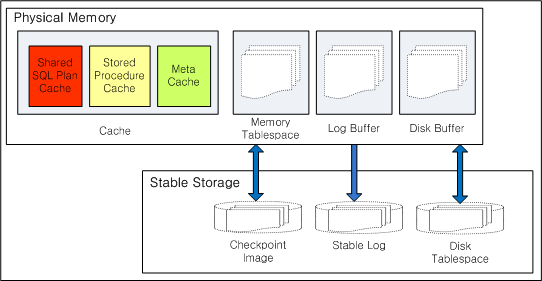

[그림 7‑1] Altibase 공유 캐쉬 구성도

Altibase는 모든 세션이 공유하는 캐쉬(cache) 영역을 가지고 있다. 캐쉬 영역은 SQL
Plan Cache, Stored Procedure Cache, Meta Cache로 구성된다. 각각의 캐쉬에
저장되어 공유되는 내용은 다음과 같다.

-   Shared SQL Plan Cache  
    새로운 SQL 실행 계획이 생성될 때마다 실행 계획은 SQL Plan Cache 영역에
    저장되며 모든 세션이 이를 공유하게 된다.

-   Stored Procedure Cache  
    저장 프로시저의 실행 계획이 새로 생성될 때 Stored Procedure Cache 영역에
    저장되어 공유된다.

-   Meta Cache  
    데이터베이스 객체에 대한 모든 정보를 수록하고 있는 메타 데이터는 빠른 접근을
    위해서 Meta Cache에 저장된다.

#### SQL Plan Cache의 특징

Altibase의 SQL Plan Cache는 다음과 같은 몇 가지 특징을 갖는다.

-   Direct Execution 위주의 환경에서 prepare 비용 감소 및 성능 향상  
    Direct Execution은 SQL문을 수행하는 가장 기본적인 방법이다.  
    Direct Execution 위주의 퀴리가 자주 발생하는 환경에서는 이미 prepare가 된
    실행계획이 공유되어 재사용되기 때문에 prepare 비용을 줄일 수 있다.

-   Prepare Execution만 사용하는 환경에서 Prepare Memory의 대폭적인 절감  
    Prepare Execution은 반복적으로 수행되는 SQL 구문의 수행 비용을 줄일 수 있는
    방법이다. 또한 Prepare Execute만 쓰는 환경에서는 prepare 비용 절감뿐 아니라
    prepare에 필요한 메모리까지 줄일 수 있는 효과를 얻는다.

-   체크-인(check-in) 방식

-   SQL Plan Cache의 사용 및 참조횟수(frequency)를 고려한 교체 정책 사용

### SQL Plan Cache 관리

Altibase는 플랜 공유에 중점을 둔 체크-인 방식을 사용한다. 또한 SQL Plan Cache는
최근 사용도 뿐 아니라 참조 횟수까지 고려하여 교체하기 때문에 사용 목적에 맞게
프로퍼티를 조정하는 것이 필요하다.

#### SQL Plan Cache 정책 

-   SQL_PLAN_CACHE_SIZE에 정의된 크기 내에서 실행 계획이 등록된다.  
    Altibase는 프로퍼티 SQL_PLAN_CACHE_SIZE에서 정의한 Cache의 전체 크기 내에서
    새로운 공유 Plan을 SQL Plan Cache에 등록한다. 만약 새로운 plan이 등록될 경우
    SQL_PLAN_CACHE_SIZE 프로퍼티에서 정의한 크기를 넘는다면, 사용하지 않는
    오래된 실행계획(Plan)이 있는지 확인하고, 이를 삭제하여 새로운 실행 계획을
    등록한다. SQL_PLAN_CACHE_SIZE프로퍼티의 기본값은 64MB이지만, 사용자가 변경할
    수 있다.

-   참조되는 실행 계획은 삭제할 수 없다.  
    SQL Plan Cache의 교체 정책은 최근 사용도 뿐 아니라 참조 횟수까지 고려한다.
    또한 Cache가 부족할 경우에도 자주 참조되는 Plan Cache 객체는 보호된다. 만약
    새로운 plan이 등록될 경우, SQL_PLAN_CACHE_SIZE에 정의한 크기를 초과할 뿐만
    아니라 SQL Plan Cache내의 Plan들이 다른 구문들에 의해 참조되고 있다면, Cache
    내의 어떠한 실행 계획도 삭제할 수 없다. 따라서 이런 경우 SQL Plan Cache에
    새로운 plan은 등록되지 못하고, V\$SQL_PLAN_CACHE 성능 뷰의
    CACHE_IN_FAIL_COUNT값이 증가한다.

#### SQL Plan Cache 제어문

Altibase는 기본적으로 교체 정책에 따라 서버가 자동으로 실행 계획을 관리한다.
하지만 관리자가 필요에 따라서 수동으로 관리할 수도 있다.

아래의 구문은 ALTER SYSTEM 구문을 사용하여 SQL PLAN CACHE를 초기화하는
제어문이다.

-   ALTER SYSTEM COMPACT SQL_PLAN_CACHE;  
    SQL PLAN CACHE에서 사용되지 않는 실행 계획을 삭제한다.

-   ALTER SYSTEM RESET SQL_PLAN_CACHE;  
    SQL PLAN CACHE에서 사용되지 않는 실행 계획을 삭제하고, 관련 통계 정보를
    초기화한다.

각 SQL문에 대한 상세한 설명은 *SQL Reference* 를 참조한다.

#### SQL Plan Cache 사용 구문

모든 SQL문에 대한 실행 계획이 SQL Plan Cache에 저장되지는 않는다. Altibase는
아래 종류의 구문에 한해서 새로운 실행 계획이 생성되면 SQL Plan Cache에 저장하며
모든 세션이 이를 공유하게 된다. 각 구문에 대한 상세한 설명은 *SQL Reference* 를
참조한다.

-   SELECT (SELECT FOR UPDATE)

-   INSERT (INSERT SELECT)

-   UPDATE

-   DELETE

-   MOVE

-   ENQUEUE

-   DEQUEUE

#### SQL Plan Cache 관련 프로퍼티

SQL Plan Cache를 사용하기 위해서는 Altibase 프로퍼티 파일 내의 몇몇 프로퍼티를
사용 목적에 맞게 수정해야 한다. SQL Plan Cache과 관련된 프로퍼티는 다음과 같다.
각 프로퍼티에 대한 상세한 설명은 *General Reference* 를 참조한다.

-   SQL_PLAN_CACHE_BUCKET_CNT  
    해쉬 테이블(Hash Table)의 버킷 개수

-   SQL_PLAN_CACHE_HOT_REGION_LRU_RATIO  
    SQL Plan Cache의 LRU 리스트에서 자주 참조되고 있는 실행 계획을 두는 HOT
    영역의 비율

-   SQL_PLAN_CACHE_PREPARED_EXECUTION_CONTEXT_CNT  
    실행 계획을 생성할 때 초기 생성하는 Execution Context의 개수

-   SQL_PLAN_CACHE_SIZE  
    SQL Plan Cache의 최대 크기

#### SQL Plan Cache 관련 성능 뷰

SQL Plan Cache와 관련된 성능 뷰를 확인하여 SQL Plan Cache에 관한 정보들을 확인할
수 있다. 각 성능 뷰에 대한 칼럼의 상세한 설명은 *General Reference* 를 참조한다.

-   V\$SQL_PLAN_CACHE  
    SQL Plan Cache의 현재 상태 및 통계 정보. 이 뷰를 통해 캐쉬에 있는 실행
    계획이 어떻게 활용되었는지 확인 가능

-   V\$SQL_PLAN_CACHE_PCO  
    Plan Cache 객체에 대한 정보

-   V\$SQL_PLAN_CACHE_SQLTEXT  
    Plan Cache에 등록된 SQL에 대한 정보.  
    V\$SQL_PLAN_CACHE_PCO와 조인하여 SQL 구문에 대한 활용률을 조회할 수 있다.

#### 제약사항

SQL Plan Cache에 등록된 실행 계획이 재사용되려면 SQL 문장의 형식뿐 아니라 인자
값도 반드시 같아야 한다. Altibase는 SQL Plan Cache가 파싱 비용을 완전히 제거하는
방식으로 구현되었기 때문에, 인자 값이 다르면 다른 SQL문으로 간주한다.

예를 들어 다음 두 문장은 SQL Plan Cache에서는 다른 것으로 간주된다.

```
INSERT INTO T1 VALUES(1,2);
INSERT INTO T1 VALUES(2,3);
```


따라서 아래와 같이 질의를 작성하여야 Plan Cache에 등록된 실행 계획이 사용되어
성능을 향상시킬수 있다.

```
INSERT INTO T1 VALUES(? , ?)
```


#### 예제

\<질의 1\> SQL Plan Cache의 실행계획이 얼마나 재사용되는지 조회하라.

```
iSQL> SELECT max_cache_size, cache_hit_count, cache_miss_count 
        FROM V$SQL_PLAN_CACHE;
MAX_CACHE_SIZE CACHE_HIT_COUNT CACHE_MISS_COUNT
-------------------------------------------------------------
67108864          67288             769437
```

CACHE_HIT_COUNT 비율보다 CACHE_MISS_COUNT 비율이 높다면, SQL_PLAN_CACHE_SIZE를
증가시키거나, PREPARE-EXECUTE 하는 구조로 변경하는 것을 권장한다.

\<질의 2\> SQL Plan Cache의 실행 계획이 재사용되지 않고 새로 실행계획이
생성되었는지 이유를 확인하라.

```
iSQL> SELECT create_reason, count(*) FROM v$sql_plan_cache_pco
        GROUP BY create_reason;
CREATE_REASON                 COUNT
------------------------------------------------------
CREATED_BY_CACHE_MISS         1241
CREATED_BY_PLAN_TOO_OLD       32
CREATED_BY_PLAN_INVALIDATION  16
```

CREATE_BY_CACHE_MISS의 값이 크다면 SQL Plan Cache의 크기가 작거나, literal SQL이
많이 사용되었을 가능성이 있다.

CREATE_BY_PLAN_INVALIDATION의 값이 크다면 객체(테이블, 인덱스) 정의에 대한
변경이 자주 일어났을 가능성이 있다.

\<질의 3\> SQL Plan Cache의 실행계획이 얼마나 활용되는지 조회하라.

```
iSQL> SELECT sql_text, child_pco_count, hit_count, rebuild_count
        FROM v$sql_plan_cache_sqltext a , v$sql_plan_cache_pco b 
        WHERE a.sql_text_id = b.sql_text_id 
        ORDER BY 2 DESC;
 SQL_TEXT            CHILD_PCO_COUNT     HIT_COUNT     REBUILD_COUNT 
-------------------------------------------------------------------- 
select * from t1   8                        0               7  
```

만약 CHILD_PCO_COUNT 값이 크다면, SQL이 동일하지만 객체 소유자가 다른지, 아니면
참조하는 객체가 자주 변경되는지를 확인한다.

### Result Cache의 개요

Result Cache는 처음 실행한 쿼리의 중간 결과 또는 최종 결과를 서버에 저장한 후,
동일한 쿼리가 다시 실행되면 결과를 재사용하는 기능이다.

Altibase는 중간 결과를 재 사용할 수 있는 Result Cache와 최종 결과를 재사용 할 수
있는 Top Result Cache를 사용할 수 있다.

#### Result Cache의 개념

중간 결과의 실행계획(execution plan, plan tree)을 서버에 저장하여 다음에 동일한
쿼리가 실행될 때 하위의 실행 계획을 생략할 수 있다. 저장된 실행 계획과 연관된
테이블의 변경이 없어야 한다. 관련 테이블이 변경되면, 서버에 저장된 값을 버리고
쿼리를 재실행한다.


###### **Result Cache 사용이 가능한 실행계획**

| 실행계획          | 내용                     |
| ----------------- | ------------------------ |
| SORT              | Order by, Join, Group by |
| DISTINCT          | Distinct                 |
| MATERIALIZATION   | View, Connect by         |
| GROUP-AGGREGATION | Group Aggregation        |
| GROUP-CUBE        | Group by cube            |
| GROUP-ROLLUP      | Group by rollup          |
| HASH              | Join                     |
| SET-DIFFERENCE    | Minus                    |
| SET-INTERSECT     | Intersect                |
| WINDOW-SORT       | Over clause              |
| LIMIT-SORT        | Limit                    |

#### Top Result Cache의 개념

기존의 실행 계획에 쿼리의 최종 결과가 저장된 실행계획을 추가하여 서버에 저장하면
다음에 동일한 쿼리가 실행될 때 하위의 실행 계획을 생략할 수 있다. Result Cache를
사용하려면 저장된 실행 계획과 연관된 테이블의 변경이 없어야 한다. 관련 테이블이
변경되면, 서버에 저장된 값을 버리고 쿼리를 재실행한다.


#### Result Cache 와 Top Result Cache 비교

<table style="width: 718px;">
<tbody>
<tr>
<td style="width: 167px;">
<p> </p>
</td>
<th> Result Cache </th>
<th>Top Result Cache</th>
</tr>
<tr>
<th style="width: 167px;">
<p>실행 계획</p>
</th>
<td style="width: 248px;">
<p>실행 계획이 변경되지 않는다.</p>
</td>
<td style="width: 293px;">
<p>실행 계획이 변경된다.</p>
</td>
</tr>
<tr>
<td style="width: 167px;">
<p>수행 속도</p>
</td>
<td style="width: 248px;">
<p>처음 수행속도는 캐시를 사용하기 전과 같다.</p>
</td>
<td style="width: 293px;">
<p>처음 수행속도는 최종결과를 추가된 실행계획에 저장하기 때문에 느려질 수 있다. 그러나 두 번째부터는 result cache보다 빨라질 수 있다.</p>
</td>
</tr>
<tr>
<td style="width: 167px;">
<p>캐시 범위</p>
</td>
<td style="width: 248px;">
<p>쿼리의 일부분만 캐시를 수행할 수 있다.</p>
</td>
<td style="width: 293px;">
<p>최종 결과에 대해서만 캐시를 수행할 수 있다.</p>
</td>
</tr>
<tr>
<td style="width: 167px;">
<p>테이블 변경에 대한 영향</p>
</td>
<td style="width: 541px;" colspan="2">
<p>쿼리에 사용된 테이블이 변경되면, 캐시 기능은 불필요하다.</p>
</td>
</tr>
</tbody>
</table>

#### Result Cache 관련 힌트

- RESULT_CACHE  
  \<질의\> T1 테이블을 i1로 정렬하여 중간 결과를 캐시한다.  

  ```
  SELECT /*+ RESULT_CACHE */ * FROM T1 ORDER BY i1;
  ```

- TOP_RESULT_CACHE  
  \<질의\> T1 테이블을 i1로 정렬하여 최종 결과를 캐시한다.  

  ```
  SELECT /*+ TOP_RESULT_CACHE */ * FROM T1 ORDER BY i1;
  ```


#### Result Cache 관련 프로퍼티

Altibase 프로퍼티 파일 내에 있는 몇 개의 프로퍼티를 사용 목적에 맞게 수정해야
한다. 각 프로퍼티에 대한 상세한 설명은 *General Reference* 를 참조한다.

-   RESULT_CACHE_ENABLE  
    Result Cache 기능을 사용 가능하도록 설정

-   RESULT_CACHE_MEMORY_MAXIUM  
    Result Cache나 Top Result Cache 기능에 의해 저장되는 메모리의 최대 크기

-   TOP_RESULT_CACHE_MODE  
    쿼리의 최종 결과를 캐시하여 사용 가능하도록 설정

#### 제약사항

Result cache는 아래의 경우 사용할 수 없다.

-   아래에 명시한 함수에서 사용할 수 없다.  
    Non-deterministic Function, RANDOM, RANDOM_STRING, SYS_GUID, SYS_GUID_STR,
    SYSDATE, SYSTIMESTAMP, UNIX_DATE, UNIX_TIMESTAMP

-   아래에 명시한 테이블과 성능 뷰에서 사용할 수 없다.  
    Temporary Table, Fixed Table, Disk Temp Table, Dump Table, DB링크에서
    사용되는 원격 테이블

-   \_PROWID을 칼럼에 사용하였을 경우에 사용할 수 없다.

-   NO_PUSH_PROJECTION 힌트를 사용한 디스크 테이블에 사용할 수 없다.

-   REDUCE_TEMP_MEMORY 프로퍼티를 활성화하고 사용할 수 없다.

-   보안속성이 걸린 칼럼은 사용할 수 없다.

-   Prior 칼럼 또는 LOB 칼럼이 임시테이블에 사용되었을 경우에 사용할 수 없다.

-   디스크 파티션 테이블의 칼럼 값이 임시테이블에 사용되었을 경우에 사용할 수
    없다.

#### 주의사항

Commit 모드에 따라 Result Cache를 사용할 수 있는 범위가 달라진다.

| 두 번째 세션(우) <br /> \ <br />첫 번째 세션(하) | AUTO COMMIT ON                         | AUTO COMMIT OFF                        |
| ------------------------------------------------ | -------------------------------------- | -------------------------------------- |
| AUTO COMMIT ON                                   | 사용 가능                              | 사용 불가<br />캐시를 해제한 후 재수행 |
| AUTO COMMIT OFF                                  | 사용 불가<br />캐시를 해제한 후 재수행 | 동일한 트랜잭션에서만 사용 가능        |

#### 예제

\<질의 1\> Result Cache를 사용하여 실행계획이 변경되었는지 확인한다.

```
iSQL> alter session set explain plan = on;
Alter success.
iSQL> alter system set trclog_detail_mtrnode = 1;
Alter success.
iSQL> SELECT /*+ RESULT_CACHE */ E.E_LASTNAME, E.ENO FROM EMPLOYEES E ORDER
    2 BY E.DNO, E.E_FIRSTNAME LIMIT 3;
E_LASTNAME            ENO
-------------------------------------
Kobain                3
Chen                  16
Jones                 13
3 rows selected.
-----------------------------------------------------------
PROJECT ( COLUMN_COUNT: 2, TUPLE_SIZE: 28, COST: 0.03 )
[ TARGET INFO ]
sTargetColumn[0] : [0, 1],sTargetColumn->arg[X, X]
sTargetColumn[1] : [0, 0],sTargetColumn->arg[X, X]
 LIMIT-SORT ( ITEM_SIZE: 16, ITEM_COUNT: 20, STORE_COUNT: 3, ACCESS: 3, COST: 0.02 )
 [ RESULT CACHE HIT: 0, MISS: 0, SIZE: 65536, STATUS: INIT ]
 [ myNode NODE INFO, SELF: 1, REF1: 0, REF2: -1 ]
 sMtrNode[0] : src[0, ROWPTR],dst[1, 0]
 sMtrNode[1] : src[0, *5],dst[1, 1]
 sMtrNode[2] : src[0, *2],dst[1, 2]
  SCAN ( TABLE: SYS.EMPLOYEES E, FULL SCAN, ACCESS: 20, COST: 0.02 )
  [ SELF NODE INFO, SELF: 0 ]
-----------------------------------------------------------
* AUTO STATISTICS USED: 2

iSQL> SELECT /*+ RESULT_CACHE */ E.E_LASTNAME, E.ENO FROM EMPLOYEES E ORDER BY E.DNO, E.E_FIRSTNAME LIMIT 3;
E_LASTNAME            ENO
-------------------------------------
Kobain                3
Chen                  16
Jones                 13
3 rows selected.
-----------------------------------------------------------
PROJECT ( COLUMN_COUNT: 2, TUPLE_SIZE: 28, COST: 0.03 )
[ TARGET INFO ]
sTargetColumn[0] : [0, 1],sTargetColumn->arg[X, X]
sTargetColumn[1] : [0, 0],sTargetColumn->arg[X, X]
 LIMIT-SORT ( ITEM_SIZE: 16, ITEM_COUNT: 20, STORE_COUNT: 3, ACCESS: 3, COST: 0.02 )
 [ RESULT CACHE HIT: 1, MISS: 0, SIZE: 65536, STATUS: HIT ]
 [ myNode NODE INFO, SELF: 1, REF1: 0, REF2: -1 ]
 sMtrNode[0] : src[0, ROWPTR],dst[1, 0]
 sMtrNode[1] : src[0, *5],dst[1, 1]
 sMtrNode[2] : src[0, *2],dst[1, 2]
  SCAN ( TABLE: SYS.EMPLOYEES E, FULL SCAN, ACCESS: 0, COST: 0.02 )
  [ SELF NODE INFO, SELF: 0 ]
-----------------------------------------------------------
* AUTO STATISTICS USED: 2
```

\<질의 2\> Top Result Cache를 사용하여 실행계획이 변경되었는지 확인한다.

```
iSQL> alter session set explain plan = on;
Alter success.
iSQL> alter system set trclog_detail_mtrnode = 1;
Alter success.
iSQL> SELECT /*+ TOP_RESULT_CACHE */ E.E_LASTNAME, E.ENO FROM EMPLOYEES E ORDER BY E.DNO, E.E_FIRSTNAME LIMIT 3;
E_LASTNAME            ENO
-------------------------------------
Kobain                3
Chen                  16
Jones                 13
3 rows selected.
-----------------------------------------------------------
PROJECT ( COLUMN_COUNT: 2, TUPLE_SIZE: 28, COST: 0.03 )
[ TARGET INFO ]
sTargetColumn[0] : [3, 0],sTargetColumn->arg[X, X]
sTargetColumn[1] : [3, 1],sTargetColumn->arg[X, X]
 MATERIALIZATION ( ITEM_SIZE: 40, ITEM_COUNT: 3, COST: 0.00 )
 [ RESULT CACHE HIT: 0, MISS: 0, SIZE: 65536, STATUS: INIT ]
 [ myNode NODE INFO, SELF: 3, REF1: 0, REF2: -1 ]
 sMtrNode[0] : src[2, 0],dst[3, 0]
 sMtrNode[1] : src[2, 1],dst[3, 1]
  VIEW ( ACCESS: 3, COST: 0.00 )
  [ MTRNODE INFO ]
  sNode[0] : [2, 0]
  sNode[1] : [2, 1]
   PROJECT ( COLUMN_COUNT: 2, TUPLE_SIZE: 28, COST: 0.03 )
   [ TARGET INFO ]
   sTargetColumn[0] : [0, 1],sTargetColumn->arg[X, X]
   sTargetColumn[1] : [0, 0],sTargetColumn->arg[X, X]
    LIMIT-SORT ( ITEM_SIZE: 16, ITEM_COUNT: 20, STORE_COUNT: 3, ACCESS: 3, COST: 0.02 )
    [ myNode NODE INFO, SELF: 1, REF1: 0, REF2: -1 ]
    sMtrNode[0] : src[0, ROWPTR],dst[1, 0]
    sMtrNode[1] : src[0, *5],dst[1, 1]
    sMtrNode[2] : src[0, *2],dst[1, 2]
     SCAN ( TABLE: SYS.EMPLOYEES E, FULL SCAN, ACCESS: 20, COST: 0.02 )
     [ SELF NODE INFO, SELF: 0 ]
-----------------------------------------------------------
* AUTO STATISTICS USED: 2
iSQL> SELECT /*+ TOP_RESULT_CACHE */ E.E_LASTNAME, E.ENO FROM EMPLOYEES E ORDER BY E.DNO, E.E_FIRSTNAME LIMIT 3;
E_LASTNAME            ENO
-------------------------------------
Kobain                3
Chen                  16
Jones                 13
3 rows selected.
-----------------------------------------------------------
PROJECT ( COLUMN_COUNT: 2, TUPLE_SIZE: 28, COST: 0.03 )
[ TARGET INFO ]
sTargetColumn[0] : [3, 0],sTargetColumn->arg[X, X]
sTargetColumn[1] : [3, 1],sTargetColumn->arg[X, X]
 MATERIALIZATION ( ITEM_SIZE: 40, ITEM_COUNT: 3, COST: 0.00 )
 [ RESULT CACHE HIT: 1, MISS: 0, SIZE: 65536, STATUS: HIT ]
 [ myNode NODE INFO, SELF: 3, REF1: 0, REF2: -1 ]
 sMtrNode[0] : src[2, 0],dst[3, 0]
 sMtrNode[1] : src[2, 1],dst[3, 1]
  VIEW ( ACCESS: 0, COST: 0.00 )
  [ MTRNODE INFO ]
  sNode[0] : [2, 0]
  sNode[1] : [2, 1]
   PROJECT ( COLUMN_COUNT: 2, TUPLE_SIZE: 28, COST: 0.03 )
   [ TARGET INFO ]
   sTargetColumn[0] : [0, 1],sTargetColumn->arg[X, X]
   sTargetColumn[1] : [0, 0],sTargetColumn->arg[X, X]
    LIMIT-SORT ( ITEM_SIZE: 0, ITEM_COUNT: 0, STORE_COUNT: 0, ACCESS: 0, COST: 0.02 )
    [ myNode NODE INFO, SELF: 1, REF1: 0, REF2: -1 ]
    sMtrNode[0] : src[0, ROWPTR],dst[1, 0]
    sMtrNode[1] : src[0, *5],dst[1, 1]
    sMtrNode[2] : src[0, *2],dst[1, 2]
     SCAN ( TABLE: SYS.EMPLOYEES E, FULL SCAN, ACCESS: 0, COST: 0.02 )
     [ SELF NODE INFO, SELF: 0 ]
-----------------------------------------------------------
* AUTO STATISTICS USED: 2
```

