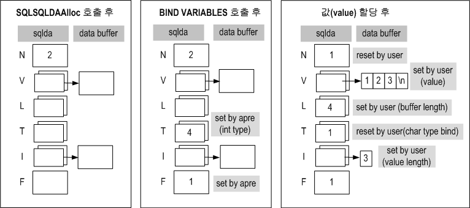

**Table of Contents**  

- [Precompiler User’s Manual](#precompiler-users-manual)
  - [서문](#%EC%84%9C%EB%AC%B8)
    - [이 매뉴얼에 대하여](#%EC%9D%B4-%EB%A7%A4%EB%89%B4%EC%96%BC%EC%97%90-%EB%8C%80%ED%95%98%EC%97%AC)
  - [1.C/C++ 전처리기 소개](#1cc-%EC%A0%84%EC%B2%98%EB%A6%AC%EA%B8%B0-%EC%86%8C%EA%B0%9C)
    - [C/C++ 전처리기](#cc-%EC%A0%84%EC%B2%98%EB%A6%AC%EA%B8%B0)
    - [명령행 옵션](#%EB%AA%85%EB%A0%B9%ED%96%89-%EC%98%B5%EC%85%98)
    - [내장 SQL문을 이용한 프로그램 작성_순서 및 방법](#%EB%82%B4%EC%9E%A5-sql%EB%AC%B8%EC%9D%84-%EC%9D%B4%EC%9A%A9%ED%95%9C-%ED%94%84%EB%A1%9C%EA%B7%B8%EB%9E%A8-%EC%9E%91%EC%84%B1-%EC%88%9C%EC%84%9C-%EB%B0%8F-%EB%B0%A9%EB%B2%95)
  - [2.호스트 변수와 지시자 변수](#2%ED%98%B8%EC%8A%A4%ED%8A%B8-%EB%B3%80%EC%88%98%EC%99%80-%EC%A7%80%EC%8B%9C%EC%9E%90-%EB%B3%80%EC%88%98)
    - [호스트 변수](#%ED%98%B8%EC%8A%A4%ED%8A%B8-%EB%B3%80%EC%88%98)
    - [호스트 변수 분류](#%ED%98%B8%EC%8A%A4%ED%8A%B8-%EB%B3%80%EC%88%98-%EB%B6%84%EB%A5%98)
    - [지시자 변수](#%EC%A7%80%EC%8B%9C%EC%9E%90-%EB%B3%80%EC%88%98)
    - [지시자 변수 분류](#%EC%A7%80%EC%8B%9C%EC%9E%90-%EB%B3%80%EC%88%98-%EB%B6%84%EB%A5%98)
    - [지시자 변수값의 의미](#%EC%A7%80%EC%8B%9C%EC%9E%90-%EB%B3%80%EC%88%98%EA%B0%92%EC%9D%98-%EC%9D%98%EB%AF%B8)
    - [예제 프로그램](#%EC%98%88%EC%A0%9C-%ED%94%84%EB%A1%9C%EA%B7%B8%EB%9E%A8)
  - [3.호스트 변수 선언부](#3%ED%98%B8%EC%8A%A4%ED%8A%B8-%EB%B3%80%EC%88%98-%EC%84%A0%EC%96%B8%EB%B6%80)
    - [호스트 변수 선언부](#%ED%98%B8%EC%8A%A4%ED%8A%B8-%EB%B3%80%EC%88%98-%EC%84%A0%EC%96%B8%EB%B6%80)
    - [자료형 정의](#%EC%9E%90%EB%A3%8C%ED%98%95-%EC%A0%95%EC%9D%98)
    - [함수 인자 선언부](#%ED%95%A8%EC%88%98-%EC%9D%B8%EC%9E%90-%EC%84%A0%EC%96%B8%EB%B6%80)
  - [4.C Preprocessor](#4c-preprocessor)
    - [C Preprocessor 개요](#c-preprocessor-%EA%B0%9C%EC%9A%94)
    - [C Preprocessor 구문](#c-preprocessor-%EA%B5%AC%EB%AC%B8)
    - [Preprocessor 제약사항](#preprocessor-%EC%A0%9C%EC%95%BD%EC%82%AC%ED%95%AD)
    - [Preprocessor 예제](#preprocessor-%EC%98%88%EC%A0%9C)
    - [ALTIBASE_APRE 매크로](#altibase_apre-%EB%A7%A4%ED%81%AC%EB%A1%9C)
  - [5.호스트 변수 데이터 타입](#5%ED%98%B8%EC%8A%A4%ED%8A%B8-%EB%B3%80%EC%88%98-%EB%8D%B0%EC%9D%B4%ED%84%B0-%ED%83%80%EC%9E%85)
    - [개요](#%EA%B0%9C%EC%9A%94)
    - [일반 데이터 타입](#%EC%9D%BC%EB%B0%98-%EB%8D%B0%EC%9D%B4%ED%84%B0-%ED%83%80%EC%9E%85)
    - [확장된 데이터 타입](#%ED%99%95%EC%9E%A5%EB%90%9C-%EB%8D%B0%EC%9D%B4%ED%84%B0-%ED%83%80%EC%9E%85)
    - [칼럼 타입과 호스트 변수 타입](#%EC%B9%BC%EB%9F%BC-%ED%83%80%EC%9E%85%EA%B3%BC-%ED%98%B8%EC%8A%A4%ED%8A%B8-%EB%B3%80%EC%88%98-%ED%83%80%EC%9E%85)
  - [6.내장 SQL문](#6%EB%82%B4%EC%9E%A5-sql%EB%AC%B8)
    - [개요](#%EA%B0%9C%EC%9A%94-1)
    - [연결 관련 SQL문](#%EC%97%B0%EA%B2%B0-%EA%B4%80%EB%A0%A8-sql%EB%AC%B8)
    - [기본 내장 SQL문](#%EA%B8%B0%EB%B3%B8-%EB%82%B4%EC%9E%A5-sql%EB%AC%B8)
    - [기타 내장 SQL문](#%EA%B8%B0%ED%83%80-%EB%82%B4%EC%9E%A5-sql%EB%AC%B8)
    - [OPTION문](#option%EB%AC%B8)
  - [7.실행 시간 에러 처리](#7%EC%8B%A4%ED%96%89-%EC%8B%9C%EA%B0%84-%EC%97%90%EB%9F%AC-%EC%B2%98%EB%A6%AC)
    - [개요](#%EA%B0%9C%EC%9A%94-2)
    - [sqlca](#sqlca)
    - [SQLCODE](#sqlcode)
    - [SQLSTATE](#sqlstate)
    - [GET DIAGNOSTICS](#get-diagnostics)
    - [WHENEVER문](#whenever%EB%AC%B8)
    - [예제 프로그램](#%EC%98%88%EC%A0%9C-%ED%94%84%EB%A1%9C%EA%B7%B8%EB%9E%A8-1)
  - [8.커서 처리 SQL문](#8%EC%BB%A4%EC%84%9C-%EC%B2%98%EB%A6%AC-sql%EB%AC%B8)
    - [개요](#%EA%B0%9C%EC%9A%94-3)
    - [커서 관련 내장 SQL문](#%EC%BB%A4%EC%84%9C-%EA%B4%80%EB%A0%A8-%EB%82%B4%EC%9E%A5-sql%EB%AC%B8)
    - [동일한 커서 이름 재사용 방법](#%EB%8F%99%EC%9D%BC%ED%95%9C-%EC%BB%A4%EC%84%9C-%EC%9D%B4%EB%A6%84-%EC%9E%AC%EC%82%AC%EC%9A%A9-%EB%B0%A9%EB%B2%95)
    - [예제 프로그램](#%EC%98%88%EC%A0%9C-%ED%94%84%EB%A1%9C%EA%B7%B8%EB%9E%A8-2)
  - [9.배열 처리 SQL문](#9%EB%B0%B0%EC%97%B4-%EC%B2%98%EB%A6%AC-sql%EB%AC%B8)
    - [배열 호스트 변수의 개요](#%EB%B0%B0%EC%97%B4-%ED%98%B8%EC%8A%A4%ED%8A%B8-%EB%B3%80%EC%88%98%EC%9D%98-%EA%B0%9C%EC%9A%94)
    - [내장 SQL문에서 배열 호스트 변수 사용](#%EB%82%B4%EC%9E%A5-sql%EB%AC%B8%EC%97%90%EC%84%9C-%EB%B0%B0%EC%97%B4-%ED%98%B8%EC%8A%A4%ED%8A%B8-%EB%B3%80%EC%88%98-%EC%82%AC%EC%9A%A9)
    - [sqlca.sqlerrd](#sqlcasqlerrd)
    - [제한 사항](#%EC%A0%9C%ED%95%9C-%EC%82%AC%ED%95%AD)
    - [구조체와 배열](#%EA%B5%AC%EC%A1%B0%EC%B2%B4%EC%99%80-%EB%B0%B0%EC%97%B4)
    - [예제 프로그램](#%EC%98%88%EC%A0%9C-%ED%94%84%EB%A1%9C%EA%B7%B8%EB%9E%A8-3)
  - [10.동적 SQL문](#10%EB%8F%99%EC%A0%81-sql%EB%AC%B8)
    - [정적 SQL문과 동적 SQL문](#%EC%A0%95%EC%A0%81-sql%EB%AC%B8%EA%B3%BC-%EB%8F%99%EC%A0%81-sql%EB%AC%B8)
    - [동적 SQL문의 종류](#%EB%8F%99%EC%A0%81-sql%EB%AC%B8%EC%9D%98-%EC%A2%85%EB%A5%98)
    - [예제 프로그램](#%EC%98%88%EC%A0%9C-%ED%94%84%EB%A1%9C%EA%B7%B8%EB%9E%A8-4)
  - [11.저장 프로시저 처리 SQL문](#11%EC%A0%80%EC%9E%A5-%ED%94%84%EB%A1%9C%EC%8B%9C%EC%A0%80-%EC%B2%98%EB%A6%AC-sql%EB%AC%B8)
    - [저장 프로시저 처리 SQL문](#%EC%A0%80%EC%9E%A5-%ED%94%84%EB%A1%9C%EC%8B%9C%EC%A0%80-%EC%B2%98%EB%A6%AC-sql%EB%AC%B8)
    - [배열 타입의 호스트 변수 사용](#%EB%B0%B0%EC%97%B4-%ED%83%80%EC%9E%85%EC%9D%98-%ED%98%B8%EC%8A%A4%ED%8A%B8-%EB%B3%80%EC%88%98-%EC%82%AC%EC%9A%A9)
    - [예제 프로그램](#%EC%98%88%EC%A0%9C-%ED%94%84%EB%A1%9C%EA%B7%B8%EB%9E%A8-5)
    - [배열 타입의 호스트 변수 사용](#%EB%B0%B0%EC%97%B4-%ED%83%80%EC%9E%85%EC%9D%98-%ED%98%B8%EC%8A%A4%ED%8A%B8-%EB%B3%80%EC%88%98-%EC%82%AC%EC%9A%A9-1)
  - [12.다중 연결 프로그램](#12%EB%8B%A4%EC%A4%91-%EC%97%B0%EA%B2%B0-%ED%94%84%EB%A1%9C%EA%B7%B8%EB%9E%A8)
    - [개요](#%EA%B0%9C%EC%9A%94-4)
    - [다중 연결 프로그램에서 내장 SQL문 사용 방법](#%EB%8B%A4%EC%A4%91-%EC%97%B0%EA%B2%B0-%ED%94%84%EB%A1%9C%EA%B7%B8%EB%9E%A8%EC%97%90%EC%84%9C-%EB%82%B4%EC%9E%A5-sql%EB%AC%B8-%EC%82%AC%EC%9A%A9-%EB%B0%A9%EB%B2%95)
    - [다중 연결 프로그램에서의 저장 프로시저 처리 SQL문](#%EB%8B%A4%EC%A4%91-%EC%97%B0%EA%B2%B0-%ED%94%84%EB%A1%9C%EA%B7%B8%EB%9E%A8%EC%97%90%EC%84%9C%EC%9D%98-%EC%A0%80%EC%9E%A5-%ED%94%84%EB%A1%9C%EC%8B%9C%EC%A0%80-%EC%B2%98%EB%A6%AC-sql%EB%AC%B8)
    - [예제 프로그램](#%EC%98%88%EC%A0%9C-%ED%94%84%EB%A1%9C%EA%B7%B8%EB%9E%A8-6)
  - [13.멀티쓰레드 프로그램](#13%EB%A9%80%ED%8B%B0%EC%93%B0%EB%A0%88%EB%93%9C-%ED%94%84%EB%A1%9C%EA%B7%B8%EB%9E%A8)
    - [멀티쓰레드 프로그램](#%EB%A9%80%ED%8B%B0%EC%93%B0%EB%A0%88%EB%93%9C-%ED%94%84%EB%A1%9C%EA%B7%B8%EB%9E%A8)
    - [예제 프로그램](#%EC%98%88%EC%A0%9C-%ED%94%84%EB%A1%9C%EA%B7%B8%EB%9E%A8-7)
  - [14.전처리 오류 코드/메시지](#14%EC%A0%84%EC%B2%98%EB%A6%AC-%EC%98%A4%EB%A5%98-%EC%BD%94%EB%93%9C%EB%A9%94%EC%8B%9C%EC%A7%80)
    - [전처리 오류](#%EC%A0%84%EC%B2%98%EB%A6%AC-%EC%98%A4%EB%A5%98)
  - [A. 부록: LOB데이터와 파일](#a-%EB%B6%80%EB%A1%9D-lob%EB%8D%B0%EC%9D%B4%ED%84%B0%EC%99%80-%ED%8C%8C%EC%9D%BC)
    - [출력 호스트 변수와 파일](#%EC%B6%9C%EB%A0%A5-%ED%98%B8%EC%8A%A4%ED%8A%B8-%EB%B3%80%EC%88%98%EC%99%80-%ED%8C%8C%EC%9D%BC)
    - [입력 호스트 변수와 파일](#%EC%9E%85%EB%A0%A5-%ED%98%B8%EC%8A%A4%ED%8A%B8-%EB%B3%80%EC%88%98%EC%99%80-%ED%8C%8C%EC%9D%BC)
  - [B. 부록: Proc\*C에서 APRE로 변환](#b-%EB%B6%80%EB%A1%9D-proc%5Cc%EC%97%90%EC%84%9C-apre%EB%A1%9C-%EB%B3%80%ED%99%98)
    - [데이터 타입 비교](#%EB%8D%B0%EC%9D%B4%ED%84%B0-%ED%83%80%EC%9E%85-%EB%B9%84%EA%B5%90)
    - [내장 함수 비교](#%EB%82%B4%EC%9E%A5-%ED%95%A8%EC%88%98-%EB%B9%84%EA%B5%90)
    - [데이터베이스 연결/해제](#%EB%8D%B0%EC%9D%B4%ED%84%B0%EB%B2%A0%EC%9D%B4%EC%8A%A4-%EC%97%B0%EA%B2%B0%ED%95%B4%EC%A0%9C)
    - [호스트 변수](#%ED%98%B8%EC%8A%A4%ED%8A%B8-%EB%B3%80%EC%88%98-1)
    - [내장 SQL문](#%EB%82%B4%EC%9E%A5-sql%EB%AC%B8)
    - [수행 결과 및 상태 코드](#%EC%88%98%ED%96%89-%EA%B2%B0%EA%B3%BC-%EB%B0%8F-%EC%83%81%ED%83%9C-%EC%BD%94%EB%93%9C)
    - [기타 차이점](#%EA%B8%B0%ED%83%80-%EC%B0%A8%EC%9D%B4%EC%A0%90)
    - [예제 프로그램](#%EC%98%88%EC%A0%9C-%ED%94%84%EB%A1%9C%EA%B7%B8%EB%9E%A8-8)
  - [C. 부록: 동적 SQL의 메소드4 사용](#c-%EB%B6%80%EB%A1%9D-%EB%8F%99%EC%A0%81-sql%EC%9D%98-%EB%A9%94%EC%86%8C%EB%93%9C4-%EC%82%AC%EC%9A%A9)
    - [SQLDA구조체의 데이터 타입](#sqlda%EA%B5%AC%EC%A1%B0%EC%B2%B4%EC%9D%98-%EB%8D%B0%EC%9D%B4%ED%84%B0-%ED%83%80%EC%9E%85)
  - [D. 부록: 샘플 코드](#d-%EB%B6%80%EB%A1%9D-%EC%83%98%ED%94%8C-%EC%BD%94%EB%93%9C)
    - [예제 프로그램 수행](#%EC%98%88%EC%A0%9C-%ED%94%84%EB%A1%9C%EA%B7%B8%EB%9E%A8-%EC%88%98%ED%96%89)
    - [예제 프로그램의 테이블 정보](#%EC%98%88%EC%A0%9C-%ED%94%84%EB%A1%9C%EA%B7%B8%EB%9E%A8%EC%9D%98-%ED%85%8C%EC%9D%B4%EB%B8%94-%EC%A0%95%EB%B3%B4)
  - [E. 부록: FAQ](#e-%EB%B6%80%EB%A1%9D-faq)
    - [Precompiler FAQ](#precompiler-faq)


Altibase® Application Development

Precompiler User’s Manual
=========================


Altibase Application Development Precompiler User’s Manual

Release 7.1

Copyright ⓒ 2001\~2018 Altibase Corp. All Rights Reserved.

본 문서의 저작권은 ㈜알티베이스에 있습니다. 이 문서에 대하여 당사의 동의 없이
무단으로 복제 또는 전용할 수 없습니다.

㈜알티베이스

08378 서울시 구로구 디지털로 306 대륭포스트타워Ⅱ 10층

전화: 02-2082-1114 팩스: 02-2082-1099

고객서비스포털: <http://support.altibase.com>

homepage: [http://www.altibase.com](http://www.altibase.com/)

서문
----

### 이 매뉴얼에 대하여

본 매뉴얼은 Altibase 내장 SQL문의 사용 방법과 C/C++ 전처리기의 사용 방법에 대해
설명한다. 사용자는 본 매뉴얼을 통해 Altibase 내장 SQL문을 이용한 응용 프로그램을
작성하고, 이를 전처리할 수 있다.

#### 대상 사용자

이 매뉴얼은 다음과 같은 Altibase 사용자를 대상으로 작성되었다.

-   데이터베이스 관리자

-   성능 관리자

-   데이터베이스 사용자

-   응용 프로그램 개발자

-   기술지원부

다음과 같은 배경 지식을 가지고 이 매뉴얼을 읽는 것이 좋다.

-   컴퓨터, 운영 체제 및 운영 체제 유틸리티 운용에 필요한 기본 지식

-   관계형 데이터베이스 사용 경험 또는 데이터베이스 개념에 대한 이해

-   컴퓨터 프로그래밍 경험

-   데이터베이스 서버 관리, 운영 체제 관리 또는 네트워크 관리 경험

#### 소프트웨어 환경

이 매뉴얼은 데이터베이스 서버로 Altibase 버전 7.1을 사용한다는 가정 하에
작성되었다.

#### 이 매뉴얼의 구성

이 매뉴얼은 다음과 같이 구성되어 있다.

-   제 1장 C/C++ 전처리기 소개  
    이 장은 C/C++ 전처리기 소개 및 사용 방법과 내장 SQL문을 이용한 프로그램 작성
    순서에 대해 설명한다.

-   제 2장 호스트 변수와 지시자 변수  
    이 장은 호스트 변수, 지시자 변수에 대한 설명과 분류 및 지시자 변수값의
    의미에 대해 설명한다.

-   제 3장 호스트 변수 선언부  
    이 장은 호스트 변수 선언부와 함수 인자 선언부에 대해 설명한다.

-   제 4장 C Processor

-   제 5장 호스트 변수 데이터 타입  
    이 장은 호스트 변수의 데이터 타입으로 사용 가능한 데이터 타입들에 대해
    설명한다.

-   제 6장 내장 SQL 문  
    이 장은 연결 관련 SQL 문, 기본 내장 SQL 문, 기타 내장 SQL 문에 대해
    설명한다.

-   제 7장 실행시간 에러 처리  
    이 장은 실행 시간 에러 처리를 위해 참조할 수 있는 변수들에 대해 설명한다.

-   제 8장 커서 처리 SQL 문  
    이 장은 커서 처리 SQL 문에 대해 설명한다.

-   제 9장 배열 처리 SQL 문  
    이 장은 배열 호스트 변수 사용, 제한 사항, 구조체와 배열에 관해 설명한다.

-   제 10장 동적 SQL 문  
    이 장은 동적 SQL 문에 대해 설명한다.

-   제 11장 저장 프로시저 처리 SQL 문  
    이 장은 저장 함수 또는 저장 프로시저의 사용 방법에 대해 설명한다.

-   제 12장 다중 연결 프로그램  
    이 장은 다중 연결 프로그램 작성 방법에 대해 설명한다.

-   제 13장 멀티쓰레드 프로그램  
    이 장은 멀티쓰레드 환경에서의 프로그램 작성 방법에 대해 설명한다.

-   제 14장 전처리 오류 코드/메시지  
    이 장은 전처리 시 발생하는 오류 코드 및 오류 메시지에 대해 설명한다.

-   A. 부록 : LOB 데이터와 파일  
    이 장에서는 BLOB, CLOB 타입의 데이터를 입력하거나 출력할 때 파일 시스템을
    사용하는 방법에 대해 설명한다.

-   B 부록 : Proc\*C에서 APRE로 변환  
    오라클의 pro\*C(C++)로 작성된 응용 프로그램을 Altibase C/C++ Precompiler
    응용 프로그램으로 전환할 때 참조한다.

-   C 부록 : 동적 SQL의 메소드4 사용  
    이 장은 사용자가 프로그램 실행 시에 파라미터 마커의 값에 입력할 수 있는 동적
    SQL의 메소드4를 사용할 시 참조한다.

-   D 부록 : Sample code  
    이 장은 매뉴얼에 사용된 예제 프로그램과 사용하는 테이블 정보에 대해
    설명한다.

-   E 부록 : FAQ  
    이 장은 C/C++ 전처리기와 Altibase 내장 SQL문의 사용 방법에 대해 사용자들이
    자주하는 질문을 모은 것이다.

#### 문서화 규칙

이 절에서는 이 매뉴얼에서 사용하는 규칙에 대해 설명한다. 이 규칙을 이해하면 이
매뉴얼과 설명서 세트의 다른 매뉴얼에서 정보를 쉽게 찾을 수 있다.

여기서 설명하는 규칙은 다음과 같다.

-   구문 다이어그램

-   샘플 코드 규칙

##### 구문 다이어그램

이 매뉴얼에서는 다음 구성 요소로 구축된 다이어그램을 사용하여, 명령문의 구문을
설명한다.

| 구성 요소                           | 의미                                                         |
| ----------------------------------- | ------------------------------------------------------------ |
|  | 명령문이 시작한다. 완전한 명령문이 아닌 구문 요소는 화살표로 시작한다. |
|  | 명령문이 다음 라인에 계속된다. 완전한 명령문이 아닌 구문 요소는 이 기호로 종료한다. |
|  | 명령문이 이전 라인으로부터 계속된다. 완전한 명령문이 아닌 구문 요소는 이 기호로 시작한다. |
|  | 명령문이 종료한다.                                           |
|  | 필수 항목                                                    |
|  | 선택적 항목                                                  |
|  | 선택사항이 있는 필수 항목. 한 항목만 제공해야 한다.          |
|  | 선택사항이 있는 선택적 항목                                  |
|  | 선택적 항목. 여러 항목이 허용된다. 각 반복 앞부분에 콤마가 와야 한다. |

##### 샘플 코드 규칙

코드 예제는 SQL, Stored Procedure, iSQL 또는 다른 명령 라인 구문들을 예를 들어
설명한다.

아래 테이블은 코드 예제에서 사용된 인쇄 규칙에 대해 설명한다.

| 규칙         | 의미                                                         | 예제                                                         |
| ------------ | ------------------------------------------------------------ | ------------------------------------------------------------ |
| [ ]          | 선택 항목을 표시                                             | VARCHAR [(*size*)] [[FIXED \|] VARIABLE]                     |
| { }          | 필수 항목 표시. 반드시 하나 이상을 선택해야 되는 표시        | { ENABLE \| DISABLE \| COMPILE }                             |
| \|           | 선택 또는 필수 항목 표시의 인자 구분 표시                    | { ENABLE \| DISABLE \| COMPILE } [ ENABLE \| DISABLE \| COMPILE ] |
| . . .        | 그 이전 인자의 반복 표시 예제 코드들의 생략되는 것을 표시    | SQL\> SELECT ename FROM employee;<br/> ENAME<br/>  -----------------------<br/> SWNO <br/> HJNO<br/>  HSCHOI <br/> .<br/> .<br/> . <br/>20 rows selected. |
| 그 밖에 기호 | 위에서 보여진 기호 이 외에 기호들                            | EXEC :p1 := 1; acc NUMBER(11,2);                             |
| 기울임 꼴    | 구문 요소에서 사용자가 지정해야 하는 변수, 특수한 값을 제공해야만 하는 위치 | SELECT \* FROM *table_name*;<br/> CONNECT *userID*/*password*; |
| 소문자       | 사용자가 제공하는 프로그램의 요소들, 예를 들어 테이블 이름, 칼럼 이름, 파일 이름 등 | SELECT ename FROM employee;                                  |
| 대문자       | 시스템에서 제공하는 요소들 또는 구문에 나타나는 키워드       | DESC SYSTEM_.SYS_INDICES_;                                   |

#### 관련 자료

자세한 정보를 위하여 다음 문서 목록을 참조하기 바란다.

-   Installation Guide

-   Administrator’s Manual

-   CLI User's Manual

-   SQL Reference

-   Stored Procedures Manual

-   iSQL User’s Manual

-   Error Message Reference

#### Altibase는 여러분의 의견을 환영합니다.

이 매뉴얼에 대한 여러분의 의견을 보내주시기 바랍니다. 사용자의 의견은 다음
버전의 매뉴얼을 작성하는데 많은 도움이 됩니다. 보내실 때에는 아래 내용과 함께
고객서비스포털( http://support.altibase.com/kr/ )로 보내주시기 바랍니다.

-   사용 중인 매뉴얼의 이름과 버전

-   매뉴얼에 대한 의견

-   사용자의 성함, 주소, 전화번호

이 외에도 Altibase 기술지원 설명서의 오류와 누락된 부분 및 기타 기술적인
문제들에 대해서 이 주소로 보내주시면 정성껏 처리하겠습니다. 또한, 기술적인
부분과 관련하여 즉각적인 도움이 필요한 경우에도 고객서비스포털을 통해 서비스를
요청하시기 바랍니다.

여러분의 의견에 항상 감사드립니다.

1.C/C++ 전처리기 소개
-------------------

### C/C++ 전처리기

#### 소개

C/C++ 전처리기 (precompiler)는 내장 SQL문이 포함된 소스 프로그램을 입력 받아,
내장 SQL문들을 Altibase CLI 함수 호출로 변환하여, 호스트 언어로 컴파일 될 수
있는 수정된 소스 프로그램을 생성한다.

사용자는 간단한 내장 SQL문을 사용하여 쉽게 응용 프로그램을 작성하고, 작성된 응용
프로그램을 전처리 한 후, compile, link 할 수 있다.

내장 SQL문을 이용한 프로그램 작성은 ODBC를 이용한 프로그램 작성에 비해 프로그램
작성법이 쉬우면서도 동등한 성능을 가지는 프로그램을 작성할 수 있다.

#### 환경 설정

C/C++ 전처리기로 전처리된 결과 파일을 컴파일 및 링크하기 위해서 필요한 환경
설정은 다음과 같다.

##### 헤더파일

-   필요한 헤더파일은 *ulpLibInterface.h*이며, \$ALTIBASE_HOME/include
    디렉터리에 있다.

-   전처리된 응용 프로그램을 컴파일하기 위해서는 –I \$ALTIBASE_HOME/include
    옵션이 필요하다.

##### 라이브러리

-   필요한 라이브러리는 *libapre.a*와 *libodbccli.a*이며, \$ALTIBASE_HOME/lib
    디렉토리에 있다.
-   컴파일된 오브젝트 파일은 다음의 옵션과 함께 링크해야 한다:

```
–L $ALTIBASE_HOME/lib –lapre, –lodbccli, -lpthread
```

> #### 주의사항
>
> Altibase 클라이언트 라이브러리는 system signal 발생에 대해 안전하지 않다.
>
> 따라서 외부 원인에 의해 네트워크 접속이 종료된 경우, SIGPIPE 신호를 받아
> 진행중인 응용 프로그램이 강제로 종료될 수도 있다. 이러한 강제 종료를 막기
> 위해서는 SIGPIPE 신호를 사용자 애플리케이션에서 처리해야 한다. 그러나 SIGPIPE
> 신호 처리를 하던 중에 Altibase 클라이언트 라이브러리의 함수를 호출하면
> 프로그램이 멈출 수 있기 때문에 호출하면 안된다.
>
> 하지만 신호 처리가 끝난 후에는 Altibase 클라이언트 라이브러리의 함수를 호출하는
> 것이 가능하다.

#### 전처리 실행

C/C++ 전처리기는 내장 SQL문을 포함하는 C 또는 C++로 작성된 프로그램을 전처리하여
변환된 C 또는 C++ 프로그램을 생성한다. 입력 파일은 .sc 확장자를 가지는 C 또는
C++로 작성된 프로그램이며, 출력 파일은 .c 또는 .cpp를 확장자를 가진다. 출력
파일의 확장자는 사용자가 지정할 수 있으며 기본적으로 .c이다.

##### 실행방법

```
apre [ <apre-options> ] <filename>
```

##### 실행인자

-   \<*filename*\> : 내장 SQL문을 포함하는 소스 프로그램으로, 확장자는 반드시
    .sc이어야 한다. 소스 프로그램은 1개 이상 나열할 수 있으며 나열된 소스를 모두
    처리하게 된다. 또한 \*.sc와 같은 문법을 지원한다.

[예제 1] c로 작성된 프로그램을 전처리하는 명령을 보여준다. 전처리 후 생성되는
파일은 sample1.c 이다.

```
$ apre sample1.sc
```

[예제 2] 여러 개의 프로그램을 전처리하는 명령을 보여준다 .

```
$ apre sample1.sc sample2.sc 
$ apre *.sc
```

-   \<*apre-options*\> : APRE\*C/C++ 명령행 옵션이다. 자세한 설명은 다음 절
    APRE\*C/C++ 명령행 옵션을 참고한다.

##### 실행화면

C/C++ 전처리기의 실행화면은 다음과 같다.

```
$ apre sample1.sc
--------------------------------------------------------
  APRE C/C++ Precompiler.
  Release Version 7.1.0.0.0
  Copyright 2000, Altibase Corporation or its subsidiaries.
  All rights reserved.
--------------------------------------------------------
```

### 명령행 옵션

전처리시 명령행에 입력할 수 있는 여러 옵션들이 있다. 이 명령행 옵션들의 기능에
대한 설명은 아래와 같다.

##### 실행옵션

```
-h
```

: APRE 실행 방법을 보여준다. 보여주는 화면은 다음과 같다.

```
$ apre -h
===========================================================
APRE (Altibase Precompiler) C/C++ Precompiler HELP Screen
===========================================================
Usage  :  apre [<options>] <filename>

-h               : Display this help information.
-t <c|cpp>       : Specify the file extension for the output file.
                   c   - File extension is '.c' (default)
                   cpp - File extension is '.cpp'
-o <output_path> : Specify the directory path for the output file.
                   (default : current directory)
-mt              : When precompiling a multithreaded application,
                   this option must be specified.
-I<include_path> : Specify the directory paths for files included using APRE C/C++.
                   (default : current directory)
-parse <none|partial|full>
                 : Control which non-SQL code is parsed.
-D<define_name>  : Use to define a preprocessor symbol.
-v               : Output the version of APRE.
-n               : Specify when CHAR variables are not null-padded.
-unsafe_null     : Specify to suppress errors when NULL values are fetched
                   and indicator variables are not used.
-align           : Specify when using alignment in AIX.
-spill <values>  : Specify the register allocation spill area size.
-keyword         : Display all reserved keywords.
-debug <macro|symbol>
                 : Use for debugging.
                   macro   - Display macro table.
                   symbol  - Display symbol table.
-nchar_var <variable_name_list>
                 : Process the specified variables using
                   the Altibase national character set.
-nchar_utf16     : Set client nchar encoding to UTF-16.
-lines           : Add #line directives to the generated code.
-silent          : No display Copyright.
================================================
```

#### \-t \<c\|cpp\>

C/C++ 전처리기로 전처리하여 생성되는 결과 파일의 확장자를 지정한다. c로 지정하면
.c 파일이 생성되고, cpp로 지정하면 .cpp 파일이 생성된다. 지정하지 않으면 .c
파일을 생성한다.

##### 예제

C++로 작성된 프로그램을 전처리하는 명령을 보여준다. 전처리 후 생성되는 파일은
sample1.cpp 이다.

```
$ apre –t cpp sample1.sc
```

#### \-o \<output_path\>

C/C++ 전처리기로 전처리한 결과 파일이 생성될 위치를 지정한다. 지정하지 않으면,
현재 디렉토리에 결과 파일이 생성된다. 결과 파일이 생성될 위치는 하나만 지정할 수
있다.

#### \-mt

전처리할 파일이 멀티쓰레드 프로그램일 경우, 반드시 이 옵션을 지정하여야 한다. 이
옵션은 각각의 소스 파일(.sc)에 적용할 수 없으므로, 두 개 이상의 소스 파일을
전처리하여 실행 프로그램을 만드는 경우에는 모든 소스 파일에 이 옵션을 적용해야
한다.

“EXEC SQL OPTION(THREADS=TRUE);”내장 SQL문으로 대신할 수 있다. 즉, 전처리할 파일
안에서 위 내장 SQL문을 선언하였다면 전처리 시 이 옵션은 생략 가능하다.

다만, 여러 파일을 한번에 전처리 할 경우, 이 옵션이 내장 SQL보다 우선 적용된다.
즉, 이 옵션을 선택하면 전처리 할 파일들은 모두 적용된다.

OPTION문에 대한 자세한 설명은 6장 내장 SQL문을 참조하기 바란다.

#### \-I\<include_path\>

전처리 시 사용될 헤더 파일의 위치를 지정한다. 지정하지 않으면, 전처리 시
사용되는 헤더파일은 현재 디렉토리에서 찾는다. 디렉토리 지정 시 절대경로와
상대경로 모두 가능하다.

##### 예제

전처리 시 사용될 헤더파일의 위치를 지정하는 방법을 보여준다. 여기에서는 전처리
시 사용되는 헤더파일을 현재 디렉토리와 /include 디렉토리에서 순서대로 찾는다.
예제에서 보는 바와 같이 지정할 디렉토리가 하나 이상일 경우 -I 옵션을 여러 번
사용한다. 그리고 디렉토리는 절대경로, 상대경로 모두 가능하다.

```
$ apre –I. -I/include sample1.sc
```

#### \-parse \<none\|partial\|full\>

전처리시 소스파일에 대한 파싱 처리 범위를 결정한다. 위 옵션에 따라 소스파일에서
\#include 로 포함하는 헤더파일에 대한 처리범위도 달라진다. -parse옵션을 주지
않았을 경우 partial로 처리된다.

##### none

EXEC SQL BEGIN/END DECLARE SECTION 안에 있는 호스트 변수 선언들과 매크로
명령들을 처리하며, 외부에 선언된 변수들과 매크로들은 무시된다. 소스파일 내의
내장SQL구문들은 모두 처리된다.

##### partial

모든 매크로 명령들을 처리하며, 호스트 변수는 EXEC SQL BEGIN/END DECLARE SECTION
안에 선언된 것들만 처리된다. \#include로 포함된 헤더파일은 매크로 명령들만
처리된다. 반면 소스파일 내의 내장SQL구문들은 모두 처리된다.

##### full

전처리기에 내장된 C 파서가 동작하여 EXEC SQL BEGIN/END DECLARE SECTION 밖에
선언된 변수들도 처리가 되며, 모든 매크로 명령들이 처리된다. 또한, \#include로
포함된 헤더파일의 매크로 명령들뿐 아니라 변수 선언부분도 처리 된다. 마지막으로
소스파일 내의 내장SQL구문들이 모두 처리된다.

그러나, 사용자가 이 옵션을 지정하여도 성능 저하가 발생할 수 있기 때문에,
Altibase 전처리기는 \#include를 사용하여 포함된 시스템 헤더 파일을 파싱하지
않는다. 따라서, 시스템 헤더 파일에 정의되어 있는 타입이 호스트 변수로 사용되면,
전처리 중에 오류가 발생한다. 이를 방지하기 위해 사용자는 시스템 헤더 파일에서
사용하고자 하는 타입을 Altibase가 제공하는
\$ALTIBASE_HOME/include/aprePredefinedTypes.h 헤더 파일에 정의해야 한다.

단, “\*.sc” 소스 파일에는 aprePredefinedTypes.h가 아닌 시스템 헤더 파일을
\#include로 포함해야 한다. APRE 전처리 시에는 aprePredefinedTypes.h 파일을
자동으로 참조하지만, 컴파일 시에는 시스템 헤더 파일이 참조되어야 하기 때문이다.

> ##### 주의사항
>
> \-parse 옵션을 full로 설정했을 경우 C 파서가 동작하기 때문에 C++ 소스 코드는
> 전처리 중 파싱 에러를 발생시킬 수 있다. 따라서 C++ 소스 코드에서는 –parse 옵션을
> 아예 사용하지 않던가 또는 –parse 옵션을 사용하더라도 partial/none으로 설정해
> 줘야 한다.

##### 예제

```
$ apre -parse none –t cpp sample1.sc
$ apre -parse partial –t cpp sample1.sc
$ apre -parse full –t cpp sample1.sc
```

#### \-D\<define_name\>

전처리시 사용될 매크로 이름을 저장한다. 이 명령행 옵션은 코드 내에
\#define매크로를 정의하는 것과 같은 기능을 한다.

##### 예제

sample1.sc을 전처리하기 전 Altibase라는 매크로를 정의하고 싶다면 아래와 같이
명령행 옵션을 설정한다.

```
$ apre -DAltibase –t cpp sample1.sc
```

#### \-v

C/C++ 전처리기의 버전을 보여준다.

##### 예제

C/C++ 전처리기의 버전을 확인하는 방법이다.

```
$ apre –v
Altibase Precompiler2(APRE) Ver. 7.1.0.0.1 XEON_LINUX_redhat_Enterprise_AS4-64bit-7.1.0.0.1-release-GCC3.4.6 (xeon-redhat-linux-gnu) Oct 23 2013 09:28:30
```

#### \-n

호스트 변수의 데이터 타입이 CHAR이며 null character (‘\\0’)로 끝나지 않을 때
사용하는 옵션이다. 여러 개의 소스 파일(.sc)을 전처리하여 한 개의 실행 프로그램을
만드는 경우에는 필요한 모든 소스 파일에 이 옵션을 적용해야 한다. 입력 호스트
변수의 크기가 데이터베이스 칼럼 크기보다 작거나 같아야 한다.

#### \-unsafe_null

지시자 변수를 지정하지 않았을 경우, 널(null) 값을 Fetch해도 에러가 발생하지
않도록 설정하는 옵션이다. 여러 개의 소스 파일(.sc)을 전처리하여 한 개의 실행
프로그램을 만드는 경우에는 필요한 모든 소스 파일에 이 옵션을 적용해야 한다.

SELECT질의문 수행시 FETCH한 칼럼 값이 널인 경우에 지시자 변수 값이 설정되어 있지
않으면 에러가 발생한다.

#### \-spill \<values\>

AIX 장비에서 전처리할 때에만 이 옵션을 설정할 수 있으며, 다음과 같이 소스 파일
내에서도 지정할 수 있다.

```
#pragma options spill=<values>
```

#### \-keyword

Embedded SQL구문과 관련된 예약어 목록을 보여준다.

##### 예제

```
$ apre -keyword

:: Keywords for C code ::
:: Keywords for C code ::
ALTIBASE_APRE APRE_BINARY APRE_BINARY2 APRE_BIT APRE_BLOB APRE_BLOB_LOCATOR APRE_BYTES APRE_CLOB APRE_CLOB_LOCATOR APRE_DUPKEY_ERR APRE_INTEGER APRE_NIBBLE APRE_NUMERIC APRE_VARBYTES MAX_CHAR_PTR SESC_DECLARE SESC_INCLUDE SES_BINARY SES_BIT SES_BLOB SES_BLOB_LOCATOR SES_BYTES SES_CLOB SES_CLOB_LOCATOR SES_DUPKEY_ERR SES_INTEGER SES_NIBBLE SES_NUMERIC SES_VARBYTES SQLFailOverCallback SQLLEN SQL_DATE_STRUCT SQL_TIMESTAMP_STRUCT SQL_TIME_STRUCT SQL_NUMERIC_STRUCT VARCHAR

:: Keywords for Embedded SQL statement ::
ABSOLUTE ADD AFTER AGER ALL ALLOCATE ALTER AND ANY ARCHIVE ARCHIVELOG AS ASC ASENSITIVE AT AUTOCOMMIT BACKUP BATCH BEFORE BEGIN BETWEEN BLOB_FILE BREAK BY CASCADE CASE CAST CLEAR_RECPTRS CLOB_FILE CLOSE COALESCE COLUMN COMMIT COMPILE CONNECT CONSTANT CONSTRAINT CONSTRAINTS CONTINUE CREATE CUBE CURSOR CYCLE DATABASE DEALLOCATE DECLARE DEFAULT DELETE DEQUEUE DESC DESCRIPTOR DIRECTORY DISABLE DISABLE_RECPTR DISCONNECT DISTINCT DO DROP EACH ELSE ELSEIF ELSIF ENABLE ENABLEALL_RECPTRS ENABLE_RECPTR END ENQUEUE ESCAPE EXCEPTION EXEC EXECUTE EXISTS EXIT EXTENTSIZE FALSE FETCH FIFO FIRST FIXED FLUSH FOR FOREIGN FOUND FREE FROM FULL FUNCTION GOTO GRANT GROUP GROUPING HAVING HOLD IDENTIFIED IF IMMEDIATE IN INDEX INDICATOR INNER INSENSITIVE INSERT INTERSECT INTO IS ISOLATION JOIN KEY LAST LEFT LESS LEVEL LIFO LIKE LIMIT LOB LOCAL LOCK LOGANCHOR LOOP MAXROWS MERGE MINUS MODE MOVE MOVEMENT NEW NEXT NOARCHIVELOG NOCYCLE NOPARALLEL NOT NULL OF OFF OFFLINE OLD ON ONERR ONLINE ONLY OPEN OPTION OR ORDER OTHERS OUT OUTER PARALLEL PARTITION PARTITIONS PREPARE PRIMARY PRIOR PRIVILEGES PROCEDURE PUBLIC QUEUE RAISE READ REBUILD RECOVER REFERENCES REFERENCING RELATIVE RELEASE RENAME REPLACE REPLICATION RESTRICT RETURN REVERSE REVOKE RIGHT ROLLBACK ROLLUP ROW ROWCOUNT ROWTYPE SAVEPOINT SCROLL SELECT SENSITIVE SEQUENCE SESSION SET SETS SOME SPLIT SQLCODE SQLERRM SQLERROR SQLLEN START STATEMENT STEP STORE SYNONYM TABLE TABLESPACE TEMPORARY THAN THEN THREADS TO TRIGGER TRUE TRUNCATE TYPE TYPESET UNION UNIQUE UNTIL UPDATE USER USING VALUES VARCHAR VARIABLE VIEW VOLATILE WAIT WAKEUP_RECPTR WHEN WHENEVER WHERE WHILE WITH WORK WRITE
```

#### \-debug \<macro\|symbol\>

디버깅을 하기 위한 용도로 쓰이며, 소스 내에 정의된 매크로 이름이나 선언된 변수의
목록을 출력한다.

##### macro

정의된 매크로 이름의 정보를 저장하고 있는 매크로 목록을 출력한다.

##### symbol

선언된 변수들의 정보를 저장하고 있는 목록을 출력한다.

##### 예제

sample1.sc안에 정의된 모든 매크로를 보여준다.

```
$ apre –debug macro sample1.sc
```

sample1.sc안에 선언된 변수의 정보를 보여준다.

```
$ apre –debug symbol sample1.sc
```

매크로와 변수 모두 출력한다.

```
$ apre –debug macro symbol sample1.sc
```

#### \-lines

전처리로 생성되는 .c 또는 .cpp 파일에 \#line이 삽입되도록 설정하여, '\*.sc' 소스
파일의 내용과 비교할 수 있다.

##### 예제

sample.sc 파일이 전처리로 생성된 후에 \#line을 있는 것을 확인할 수 있다.

```
$ apre –debug macro symbol sample1.sc
```

#### \-nchar_utf16

이 옵션은 전처리 할 때 내셔널 캐릭터 타입의 문자를 UTF-16으로 인코딩하도록
설정해주는 옵션이다. 이 옵션은 각각의 소스 파일(.sc)에 적용할 수 없으므로, 두 개
이상의 소스 파일을 전처리하여 실행 프로그램을 만드는 경우에는 모든 소스 파일에
이 옵션을 적용해야 한다. 이 옵션을 사용하지 않을 경우에는 기본적으로
ALTIBASE_NLS_USE에서 설정한 방식으로 인코딩된다.

그러나 ALTIBASE_NLS_USE에서 설정한 인코딩 방식을 사용할 시에는 유니코드 문자를
정확히 출력할 수 없으므로 조회 연산시에 데이터 손실이 발생할 수 있다.

##### 예제

UTF-16으로 프로그램을 전처리한다.

```
$ apre -nchar_utf16 -t cpp sample.sc
```

#### \-nchar_var \<variable_name_list\>

Altibase가 지원하는 내셔널 캐릭터 타입의 데이터를 전처리기에서 처리하기 위해서
사용하는 옵션이다. 변수명과 변수명 사이에는 공백을 허용하지 않으며, 구조체 안의
멤버 변수는 여기에 지정할 수 없다.

#### -silent

silent 모드를 켜는 옵션이다. silent 모드를 켜면 Copyright 등의 부가적인 설명들을 보여주지 않는다.

### 내장 SQL문을 이용한 프로그램 작성 순서 및 방법

본 절에서는 내장 SQL문을 이용하여 프로그램을 작성할 경우, 어떤 순서와 방법으로
작성해야 하는지 전체적인 흐름에 대하여 간단히 설명한다.

다음 설명을 통해 프로그램 작성 순서 및 방법에 대해 알아보고 프로그램의 전체적인
흐름을 파악해보자.

#### 호스트 변수 선언

프로그램 작성 시 가장 먼저 해야 할 일은 사용할 호스트 변수와 지시자 변수들의
선언이다. –partial 명령행 옵션으로 “full”을 사용하지 않을 경우, 호스트 변수는
호스트 변수 선언부에 선언해야 한다.

호스트 변수와 지시자 변수에 대한 자세한 설명은 2장을 참조하기 바란다.

##### 호스트 변수 선언시 주의 사항

-   중첩된 구조체를 호스트 변수로 사용할 수 없다. 즉, 구조체의 구성 요소는
    구조체일 수 없다.

-   매크로는 배열 타입의 호스트 변수 선언 시 배열 요소 개수를 지정하는 용도로만
    사용 가능하다. 예를 들어 내장 SQL문에서 호스트 변수를 사용할 수 있는 위치에
    매크로 정의를 사용할 수 없다.

-   문자형 타입(char, varchar)으로 호스트 변수 선언시 호스트 변수 크기는
    대응되는 칼럼 크기보다 1 크게 선언하여야 한다. 그렇지 않으면 SELECT문이나
    FETCH문 수행 후 칼럼값이 잘려서 반환되기 때문에 sqlca.sqlcode값이
    SQL_SUCCESS_WITH_INFO가 된다.

##### 배열 호스트 변수 선언시 주의 사항

배열 호스트 변수 사용에 대한 자세한 설명은 9장을 참조하기 바란다.

-   배열 호스트 변수는 1차원 배열만을 허용한다. 예외적으로, 문자열 표현을 위해
    ‘char’ 타입과 ‘varchar’ 타입에 한해 2차원 배열을 허용한다.

-   호스트 변수가 구조체의 배열인 경우 지시자 변수를 사용할 수 없다.

-   SELECT문 또는 FETCH문의 INTO절에 구조체의 배열을 호스트 변수로 사용할 경우
    출력 호스트 변수는 하나만 사용할 수 있다. 즉 다른 호스트 변수들과 함께
    사용할 수 없다. 따라서 INTO절에 사용할 호스트 변수가 구조체의 배열
    타입이라면 이 구조체의 구성 요소 개수는 SELECT절의 칼럼 개수와 동일해야
    한다.

-   마찬가지로 INSERT문의 VALUES절에 구조체의 배열을 호스트 변수로 사용할 경우
    입력 호스트 변수는 하나만 사용할 수 있다. 즉 다른 호스트 변수들과 함께
    사용할 수 없다. 따라서 VALUES절에 사용할 호스트 변수가 구조체의 배열
    타입이라면 이 구조체의 구성 요소 개수는 INSERT문의 칼럼 개수와 동일해야
    한다.

-   ‘varchar’ 타입도 내부적으로 구조체이므로 위의 제한 사항이 적용된다.

-   배열 타입과 배열이 아닌 타입을 함께 사용할 수 없다.

-   SELECT문 또는 FETCH문 수행 시 배열 타입의 출력 호스트 변수를 사용하였다면
    반환되는 레코드 개수가 배열 크기보다 작을 경우 sqlca.sqlcode는
    SQL_SUCCESS이다.

-   SELECT문 또는 CURSOR문 수행 시 입력 호스트 변수는 배열일 수 없다.

-   FOR절은 입력 호스트 변수가 배열일 경우 INSERT문, UPDATE문, DELETE문을
    사용하고, 출력 호스트 변수가 배열이면 FETCH문에서 사용할 수 있다.

-   AUTOCOMMIT 모드의 경우 배열 타입의 호스트 변수를 사용할 경우 배열 전체가
    하나의 트랜잭션이 아니고 배열 요소 각각이 하나의 트랜잭션이다. 따라서 배열
    요소 중 일부는 성공하고 일부는 실패한다면 성공한 트랜잭션의 변경 사항은
    데이터베이스 서버에 영구히 저장된다.

-   포인터 타입은 배열로 선언할 수 없다.

##### 지시자 변수 선언시 주의 사항

-   지시자 변수의 데이터 타입은 ‘int’ 타입이어야 한다.

-   입력 호스트 변수로 ‘varchar’ 타입 사용시 별도의 지시자 변수를 지정하지 않은
    경우 구성 요소 len의 값을 반드시 지정하여야 한다. len에는 arr의 값이 NULL 이
    아니면 arr 값의 길이를, NULL 이면 -1을 지정하여야 한다.

-   호스트 변수가 숫자형 데이터 타입일 때, 지시자 변수가 -1이 아닌 경우 지시자
    변수값은 무의미하다.

-   호스트 변수의 타입이 이진 데이터 타입일 경우 반드시 지시자 변수를 사용하여야
    한다.

##### 호스트 변수 선언부

호스트 변수 선언부에 대한 자세한 설명은 3장을 참조하기 바란다.

-   호스트 변수의 데이터 타입으로 사용할 자료형 정의(typedef)는 호스트 변수
    선언부에서 정의되어야 한다.

##### 예제

다음은 호스트 변수를 선언하는 예를 보여준다.

< 예제 프로그램 : insert.sc >

```
/* declare host variables */
EXEC SQL BEGIN DECLARE SECTION;
char usr[10];
char pwd[10];
char    s_gno[10+1];
char    s_gname[20+1];
char    s_goods_location[9+1];
int     s_stock;
double  s_price;
EXEC SQL END DECLARE SECTION;
```

#### 데이터베이스 서버에 연결

호스트 변수의 선언이 끝나면 다른 내장 SQL문의 수행에 앞서 데이터베이스 서버에
연결하여야 한다.

모든 내장 SQL문은 데이터베이스 서버와의 연결이 성공하고 난 뒤 수행 가능하다.

데이터베이스 서버와의 연결에 대한 자세한 설명은 6장을 참조하기 바란다.

##### CONNECT문, 다중 연결, SESSION 관련 주의 사항

-   프로그램 안에서 connect 후 같은 연결 이름으로 다시 connect를 시도한다면,
    connect 이전에 반드시 FREE문 또는 DISCONNECT문을 수행하여야 한다. 이 때,
    데이터베이스 서버가 running 상태라면 DISCONNECT문을 수행하여야 하고, running
    상태가 아니라면 FREE문을 수행하여야 한다.

-   USING절을 이용하여 연결 방식을 지정할 경우, CONNTYPE을 2 또는 3으로
    지정한다면 DSN 또는 PORT_NO를 함께 지정하더라도 DSN, PORT_NO 옵션은 무시되고
    로컬 데이터베이스 서버로 연결을 시도한다.

-   connect 시 연결 옵션 2개 지정하여 수행하는 경우 처음 옵션으로 연결 성공하면
    sqlca.sqlcode는 SQL_SUCCESS이고, 처음 실패하고 두 번째 옵션으로 연결
    성공하면 sqlca.sqlcode는 SQL_SUCCESS_WITH_INFO이고, 둘 다 실패하면
    sqlca.sqlcode는 SQL_ERROR이다.

-   한 connection 당 내장 SQL문은 최대 1024개까지만 허용한다.

-   AUTOCOMMIT OFF session에서 commit을 하지 않고 프로그램을 종료할 경우, commit
    하지 않은 SQL문은 모두 rollback 처리 된다. 그러나 DISCONNECT문을 수행하고
    프로그램을 종료할 경우, 수행한 모든 내장 SQL문이 commit 처리된다.

-   다음의 내장 SQL문에서는 AT절을 허용하지 않는다.  
    INCLUDE문: EXEC SQL INCLUDE …  
    OPTION문: EXEC SQL OPTION …  
    WHENEVER문: EXEC SQL WHENEVER …

##### 예제

다음은 데이터베이스 서버에 연결하는 예를 보여준다.

\< 예제 프로그램 : connect1.sc \>

```
/* declare host variables */
EXEC SQL BEGIN DECLARE SECTION;
char usr[10];
char pwd[10];
EXEC SQL END DECLARE SECTION;

/* set username */
strcpy(usr, "SYS");
/* set password */
strcpy(pwd, "MANAGER");

EXEC SQL CONNECT :usr IDENTIFIED BY :pwd;  
if (sqlca.sqlcode == SQL_SUCCESS) /* check sqlca.sqlcode */
{
    printf("Success connection to altibase server\n\n");
}
else
{
    printf("Error : [%d] %s\n\n", SQLCODE, sqlca.sqlerrm.sqlerrmc);
    exit(1);
}
```

#### 내장 SQL문 수행

데이터베이스 서버에 연결 성공 후 내장 SQL문을 수행할 수 있다. 여기에서 내장
SQL문은 SELECT, INSERT 등의 DML, CREATE 등의 DDL, 시스템 제어문, 커서 관련
SQL문, 동적 SQL문 등 Altibase SQL문을 수행할 수 있는 모든 내장 SQL문을 의미한다.

다양한 내장 SQL문들의 사용 방법에 대한 자세한 설명은 6장, 8장, 9장, 10장 그리고
11장을 참조하기 바란다.

##### 예제

다양한 내장 SQL문의 사용 예를 보여준다.

[예제 1] 다음은 UPDATE문의 사용 예를 보여준다.

\< 예제 프로그램 : update.sc \>

```
/* declare host variables */
EXEC SQL BEGIN DECLARE SECTION;
int      s_eno;
short    s_dno;
varchar  s_emp_job[15+1];
EXEC SQL END DECLARE SECTION;

s_eno = 2;
s_dno = 1001;
strcpy(s_emp_job.arr, "ENGINEER");
s_emp_job.len = strlen(s_emp_job.arr);

EXEC SQL UPDATE EMPLOYEES 
SET DNO     = :s_dno,
                EMP_JOB = :s_emp_job
            WHERE ENO = :s_eno;
```

[예제 2] 다음은 CURSOR문의 사용 예를 보여준다.

\< 예제 프로그램 : hostvar.h \>

```
EXEC SQL BEGIN DECLARE SECTION;
typedef struct department
{
    short dno; 
    char  dname[30+1];
    char  dep_location[9+1];
    int   mgr_no;
} department;

typedef struct dept_ind
{
    int dno; 
    int dname;
    int dep_location;
    int mgr_no;
} dept_ind;
EXEC SQL END DECLARE SECTION;
```

\< 예제 프로그램 : cursor1.sc \>

```
/* specify path of header file */
EXEC SQL OPTION (INCLUDE=./include);
/* include header file for precompile */
EXEC SQL INCLUDE hostvar.h;

/* declare host variables */
EXEC SQL BEGIN DECLARE SECTION;
/* structure host variables */
department s_department;
/* structure indicator variables */
dept_ind s_dept_ind;
EXEC SQL END DECLARE SECTION;

/* declare cursor */
EXEC SQL DECLARE DEPT_CUR CURSOR FOR 
             SELECT *
             FROM DEPARTMENTS; 
    
/* open cursor */
EXEC SQL OPEN DEPT_CUR;
    
/* fetch cursor in loop */
while(1)
{
    /* use indicator variables to check null value */
    EXEC SQL FETCH DEPT_CUR INTO :s_department :s_dept_ind;
    if (sqlca.sqlcode == SQL_SUCCESS) /* check sqlca.sqlcode */
    {
    printf("%d     %s %s          %d\n", 
              s_department.dno, s_department.dname, 
              s_department.dep_location, 
s_department.mgr_no);
}
else if (sqlca.sqlcode == SQL_NO_DATA)
{
    break;
}
else 
{
    printf("Error : [%d] %s\n", SQLCODE, sqlca.sqlerrm.sqlerrmc);
    break;
}
}

/* close cursor */
EXEC SQL CLOSE DEPT_CUR;
```

#### 실행 시간 에러 처리

-   모든 내장 SQL문 수행 후 반드시 수행 결과를 확인하여야 한다. 내장 SQL문의
    수행 결과는 sqlca.sqlcode에 저장되며 결과에 따라 SQLSTATE, SQLCODE 등의 값을
    참조할 수 있다.

내장 SQL문의 수행 결과를 확인하기 위해 참조할 수 있는 다양한 변수들에 대한
자세한 설명은 7장을 참조하기 바란다.

##### 실행시간 에러처리 관련 주의 사항

다음은 SQLCA, SQLCODE, SQLSTATE와 WHENEVER문 등 실행시간 에러처리와 관련한 주의
사항이다.

-   모든 내장 SQL문 수행 후에는 반드시 sqlca.sqlcode값을 체크하여 에러처리를
    정확히 해주어야 한다.

-   SELECT문에서 출력 호스트 변수의 크기가 대응되는 칼럼 크기보다 작을 경우,
    호스트 변수에는 호스트 변수 크기만큼 데이터가 잘려서 저장되고, 이 때의
    sqlca.sqlcode값은 SQL_SUCCESS_WITH_INFO이다.

-   update, delete 연산 시 영향받은 레코드 개수가 0개이면 이 때의
    sqlca.sqlcode값은 SQL_NO_DATA이다. update, delete 연산 시 영향받은 레코드
    개수 확인 방법은 sqlca.sqlerrd[2]값을 참조하면 되고, 위의 경우 이 값은
    0이다.

-   SQLCODE에는 에러코드가 음수값으로 저장되어 있는 반면 *Error Message
    Reference* 에는 에러코드가 16진수 양수값으로 설명되어 있다. 따라서 *Error
    Message Reference* 참조 시 SQLCODE의 절대값을 16진수로 변환하여 참조하여야
    한다.

-   WHENEVER문의 적용범위는 프로그램의 흐름과는 다르며, 현재 파일내에서만
    유효하다.

-   WHENEVER문은 적용하고자 하는 내장 SQL문 이전에 선언하여야 한다.

-   WHENEVER문은 connection에 독립적이다. 즉, connection이 하나 이상인 파일에서
    WHENEVER문을 선언하면 connection이 다르더라도 해당 범위의 모든 내장 SQL문이
    영향을 받는다.

##### 예제

다음은 내장 SQL문 수행 후 수행 결과를 확인하는 예를 보여준다.

\< 예제 프로그램 : delete.sc \>

```
/* declare host variables */
EXEC SQL BEGIN DECLARE SECTION;
int      s_eno;
short    s_dno;
EXEC SQL END DECLARE SECTION;

s_eno = 5;
s_dno = 1000;

EXEC SQL DELETE FROM EMPLOYEES 
WHERE ENO > :s_eno AND 
DNO > :s_dno AND 
EMP_JOB LIKE 'P%';

/* check sqlca.sqlcode */
if (sqlca.sqlcode == SQL_SUCCESS) 
{
    /* sqlca.sqlerrd[2] holds the 
rows-processed(deleted) count */
    printf("%d rows deleted\n\n", sqlca.sqlerrd[2]);
}
else 
{
    printf("Error : [%d] %s\n\n", 
SQLCODE, sqlca.sqlerrm.sqlerrmc);
}
```

#### 데이터베이스 서버와의 연결 해제

모든 내장 SQL문의 수행이 끝나고 프로그램을 종료하기 전에 데이터베이스 서버와의
연결을 해제한다. 데이터베이스 서버와의 연결 해제 시 이 연결에 할당된 자원들이
모두 해제된다. 데이터베이스 서버와의 연결이 해제된 이후에는 내장 SQL문을 수행할
수 없다.

데이터베이스 서버와의 연결 해제에 대한 자세한 설명은 6장을 참조하기 바란다.

##### 예제

다음은 데이터베이스 서버와의 연결을 해제하는 예를 보여준다.

\< 예제 프로그램 : connect1.sc \>

```
EXEC SQL DISCONNECT;
```

#### Make 방법

precompiler를 이용하여 프로그램을 작성할 경우의 전처리 과정이다

```
apre [<apre – option>] <filename>
```

##### 예제

다음은 connect1.sc 파일을 전처리하는 예를 보여준다.

```
$ apre connect1.sc
```

2.호스트 변수와 지시자 변수
-------------------------

### 호스트 변수 

#### 개요

호스트 변수(host variables)는 호스트 언어로 작성된 애플리케이션과 데이터베이스
서버와의 데이터 교환 역할을 한다. 즉, 테이블의 칼럼값을 호스트 변수에 저장하거나
호스트 변수값을 데이터베이스 테이블의 칼럼에 삽입하는 등의 역할을 한다.

#### 선언 방법

호스트 변수 선언 방법은 다음과 같다.

-   호스트 변수 선언부 또는 함수 인자 선언부에서 선언한다. 만약 호스트 변수
    선언부 또는 함수 인자 선언부에서 선언하지 않은 변수를 내장 SQL문에서 사용할
    경우 전처리 시 “The host variable [variable_name] is unknown.” 오류가
    발생한다.  
    호스트 변수 선언부 또는 함수 인자 선언부에 대한 자세한 설명은 3장을 참조하기
    바란다.

-   호스트 변수 선언 구문은 다음과 같다.  
    datatype variable_name;  
    즉, C 또는 C++ 프로그램에서의 변수 선언 방법과 동일하다.  
    호스트 변수의 데이터 타입에 대한 자세한 설명은 5장을 참조하기 바란다.

-   배열 호스트 변수 선언은 char 타입과 varchar 타입에 대해 2차원 배열 선언이
    가능하고 그 외 타입들은 1차원 배열 선언이 가능하다. 배열 처리 SQL문에 대한
    자세한 설명은 9장을 참고하기 바란다.

-   Altibase가 지원하는 내셔널 캐릭터 타입을 Precompiler에서 처리하기 위해서는
    호스트 변수로 char 타입과 varchar 타입만 사용이 가능하고, 다음과 같은
    예약어를 사용해야 한다.  
    character set [is] nchar_cs  
    그러나 컴파일할 때 명령행에 옵션 nchar_var를 설정하면, 예약어를 사용하지
    않고도 사용할 수 있다.

-   호스트 변수명은 알파벳(a\~z, A\~Z), 밑줄("_"), 또는 달러 기호("\$")로
    시작하여야 하며, 그 길이는 50 bytes로 제한된다.

#### 사용 방법

호스트 변수는 내장 SQL문에서 스칼라 표현식이 허용되는 위치에 사용할 수 있다.

호스트 변수는 내장 SQL문에서 다른 SQL 구성 요소와 구분되어야 하므로 “**:**” 을
접두어로 가진다.

#### 예제

다음 예제는 s_dno, s_dname, s_dep_location 을 호스트 변수로 선언하고 사용하는
예를 보여준다.

\< 예제 프로그램 : select.sc \>

```
EXEC SQL BEGIN DECLARE SECTION;
short      s_dno;
char       s_dname[30+1];
char       s_dep_location[9+1];
EXEC SQL END DECLARE SECTION;

EXEC SQL SELECT DNAME, DEP_LOCATION
INTO :s_dname, :s_dep_location
FROM DEPARTMENTS
WHERE DNO = :s_dno;
```

### 호스트 변수 분류

호스트 변수는 데이터베이스 서버에 데이터 입력용으로 사용되는지,
데이터베이스로부터 데이터 출력용으로 사용되는지에 따라 입력 호스트 변수 또는
출력 호스트 변수로 구분된다.

#### 출력 호스트 변수

출력 호스트 변수는 SELECT문과 FETCH문의 INTO절에 사용되는 호스트 변수로 이
호스트 변수에는 질의 결과가 저장된다. ODBC의 SQLBindCol() 함수에 사용하는 변수와
같은 역할을 한다.

##### 예제

다음 예제는 출력 호스트 변수의 사용 예를 보여준다.

여기에서는 s_dname, s_dep_location이 출력 호스트 변수로 사용되었다. 조건에 맞는
레코드의 DNAME, DEP_LOCATION 칼럼값이 각각 호스트 변수 s_dname, s_dep_location에
저장된다.

\< 예제 프로그램 : select.sc \>

```
EXEC SQL BEGIN DECLARE SECTION;
short      s_dno;
char       s_dname[30+1];
char       s_dep_location[9+1];
EXEC SQL END DECLARE SECTION;

s_dno = 1001;
EXEC SQL SELECT DNAME, DEP_LOCATION
INTO :s_dname, :s_dep_location
FROM DEPARTMENTS
WHERE DNO = :s_dno;
```

#### 입력 호스트 변수

입력 호스트 변수는 출력 호스트 변수의 경우를 제외한 모든 경우의 호스트 변수로,
주로 SQL문의 입력값을 지정하기 위한 용도로 사용된다. 예를 들어, SELECT문의
WHERE절에 조건값을 지정하거나, INSERT문의 VALUES절에 레코드의 칼럼값을 지정하는
역할을 한다.

입력 호스트 변수는 내장 SQL문에서 스칼라 표현식이 허용되는 위치에 사용된다.
그러나 호스트 변수를 SELECT문의 TARGET절이나 GROUP BY절, ORDER BY절에 사용하기
위해서는 CAST 연산자를 이용하여 그 타입을 명시해야 한다. 단 GROUP BY절에 CAST
연산자를 사용해서 호스트 변수의 타입을 명시한 표현식이 존재하는 경우 해당
표현식을 target 절에서 사용할 수 없다.

Where절에서 호스트 변수의 사용은 가능하다. 그러나 Where절의 join predicate에
호스트 변수가 사용되는 경우, 데이터 타입을 알 수 없어 항상 NL join method를
사용하는 execution plan이 만들어진다. 이런 상황을 피하려면, 호스트 변수를 사용할
때 CAST 연산자를 사용하여 타입이 결정되도록 하면 더 좋은 join method를 선택할 수
있다.

##### 예제

입력 호스트 변수의 다양한 사용 예를 보여준다.

[예제 1] 다음은 INSERT문에서의 입력 호스트 변수의 사용 예이다. 여기에서는 s_gno,
s_gname, s_goods_location, s_stock, s_price가 입력 호스트 변수로 사용되었다.
입력 호스트 변수값이 칼럼값으로 삽입된다.

\< 예제 프로그램 : insert.sc \>

```
EXEC SQL BEGIN DECLARE SECTION;
char    s_gno[10+1];
char    s_gname[20+1];
char    s_goods_location[9+1];
int     s_stock;
double  s_price;
EXEC SQL END DECLARE SECTION;

strcpy(s_gno, "F111100002");
strcpy(s_gname, "XX-101");
strcpy(s_goods_location, "FD0003");
s_stock = 5000;
s_price = 9980.21;

EXEC SQL INSERT INTO GOODS 
VALUES (:s_gno, :s_gname, :s_goods_location, 
:s_stock, :s_price);
```

[예제 2] 다음은 UPDATE문에서의 입력 호스트 변수의 사용 예이다. 여기에서는 s_dno,
s_emp_job, s_eno가 입력 호스트 변수로 사용되었다. 조건에 맞는 레코드의 DNO,
EMP_JOB 칼럼값을 각각 s_dno, s_emp_job 값으로 변경한다.

\< 예제 프로그램 : update.sc \>

```
EXEC SQL BEGIN DECLARE SECTION;
int      s_eno;
short    s_dno;
varchar  s_emp_job[15+1];
EXEC SQL END DECLARE SECTION;

s_eno = 2;
s_dno = 1001;
strcpy(s_emp_job.arr, "ENGINEER");
s_emp_job.len = strlen(s_emp_job.arr);

EXEC SQL UPDATE EMPLOYEES 
SET DNO = :s_dno,
                          EMP_JOB = :s_emp_job
            WHERE ENO = :s_eno;
```

[예제 3] 다음은 DELETE문에서의 입력 호스트 변수의 사용 예이다. 여기에서는 s_eno,
s_dno가 입력 호스트 변수로 사용되었다. 호스트 변수값을 이용하여 조건에 맞는
레코드를 삭제한다.

\< 예제 프로그램 : delete.sc \>

```
EXEC SQL BEGIN DECLARE SECTION;
int      s_eno;
short    s_dno;
EXEC SQL END DECLARE SECTION;

s_eno = 5;
s_dno = 1000;

EXEC SQL DELETE FROM EMPLOYEES 
WHERE ENO > :s_eno AND 
DNO > :s_dno AND 
EMP_JOB LIKE 'P%';
```

[예제 4] 다음은 SELECT문에서의 입력 호스트 변수의 사용 예이다. 여기에서는
s_dno가 입력 호스트 변수로 사용되었다. 입력 호스트 변수 값을 이용하여 조건에
맞는 레코드를 검색한다.

\< 예제 프로그램 : select.sc \>

```
EXEC SQL BEGIN DECLARE SECTION;
short      s_dno;
char       s_dname[30+1];
char       s_dep_location[9+1];
EXEC SQL END DECLARE SECTION;

s_dno = 1001;
EXEC SQL SELECT DNAME, DEP_LOCATION
INTO :s_dname, :s_dep_location
FROM DEPARTMENTS
WHERE DNO = :s_dno;
```

[예제 5] 다음은 SELECT문의 target절에서 입력 호스트 변수를 사용하는 예이다.
여기에서는 s_call이 입력 호스트 변수로 사용되었다.

\<예제 프로그램 : host_target.sc \>

```
EXEC SQL BEGIN DECLARE SECTION;
double s_call;
EXEC SQL END DECLARE SECTION;

s_call = 0.045;

EXEC SQL SELECT 원금 * ( 1 – CAST( :s_call AS DOUBLE ) ) FROM 계좌;
```

[예제 6] 다음은 SELECT문의 group by절에서 입력 호스트 변수를 사용하는 예이다.
여기에서는 s_period가 입력 호스트 변수로 사용되었다.

\<예제 프로그램 : host_group.sc \>

```
int s_period;
EXEC SQL END DECLARE SECTION;

s_period = 1;    /* 1(월별), 3(분기별), 6(반기별) */

EXEC SQL SELECT SUM(매출) FROM sales 
                 GROUP BY FLOOR( 월 / CAST( :s_period AS INTEGER ) );
```

[예제 7] 다음은 where절의 join predicate에서 입력 호스트 변수를 사용하는 예이다.
여기에서는 s_diff가 입력 호스트 변수로 사용되었다.

\<예제 프로그램 : host_join.sc \>

```
EXEC SQL BEGIN DECLARE SECTION;
int s_diff;
EXEC SQL END DECLARE SECTION;

s_diff = 1;

EXEC SQL SELECT * FROM t1, t2
                 WHERE t1.i1 = t2.i1 + CAST( :s_diff AS INTEGER );
```

### 지시자 변수 

#### 개요

테이블의 칼럼값이 NULL인 경우 호스트 언어에서는 이와 같은 NULL을 표현할 수
없으므로 별도의 처리 방법이 필요하다.

C/C++ 전처리에서는 NULL값 처리를 위해 지시자 변수(Indicator Variables)를
지원한다.

지시자 변수란 NULL값 처리를 위해 내장 SQL문에서 호스트 변수와 함께 사용하는
변수이다.

#### 역할

-   지시자 변수는 대응되는 칼럼값이 널(NULL)인지 아닌지 판단하는 근거를
    프로그래머에게 제공한다. 입력 지시자 변수값을 –1(SQL_NULL_DATA)로 지정하면
    대응되는 호스트 변수값을 NULL로 처리한다.  
    출력 지시자 변수값이 –1(SQL_NULL_DATA)인 경우 대응되는 칼럼값이 NULL이
    반환되었음을 의미한다.  
    예를 들어, INSERT문의 특정 호스트 변수값을 NULL로 지정한다든지, SELECT한
    칼럼값이 NULL인지 아닌지 판단하기 위해 지시자 변수를 사용한다.

-   입력값의 길이를 지정하거나 반환된 칼럼값의 길이가 저장된다.  
    호스트 변수의 데이터 타입이 타입이거나 이진 타입일 경우에만 해당된다.  
    입력 지시자 변수에는 입력값의 길이를 지정해준다.  
    출력 지시자 변수에는 반환되는 칼럼값의 길이가 저장된다.  
    호스트 변수가 타입이고 널문자(‘\\0’)로 끝나는 경우, 입력값 또는 반환되는
    칼럼값이 NULL이 아니라면 지시자 변수는 지정하지 않아도 무방하다.  
    호스트 변수가 이진 타입일 경우, 반드시 지시자 변수를 지정하여야 한다.(입력값
    또는 반환되는 칼럼값이 NULL이 아닌 경우에도) 이유는 이진 타입의 경우
    널문자로 끝나지 않을 수 있기 때문에 데이터베이스 서버에서 입력값의 길이를 알
    수 있는 방법이 필요하고, 사용자는 반환되는 칼럼의 길이를 알 수 있는 방법이
    필요하다. 따라서 이 경우 반드시 지시자 변수를 지정하여야 한다. 이진 타입에
    대한 자세한 설명은 5장을 참조하기 바란다.

#### 선언

지시자 변수의 선언 방법은 다음과 같다.

-   호스트 변수 선언부 또는 함수 인자 선언부에서 선언한다. 만약 호스트 변수
    선언부 또는 함수 인자 선언부에서 선언하지 않은 변수를 지시자 변수로 사용할
    경우 전처리 시 “The host variable [variable_name] is unknown.” 오류가
    발생한다. 호스트 변수 선언부 또는 함수 인자 선언부에 대한 자세한 설명은
    3장을 참조하기 바란다.
-   변수 선언 구문은 다음과 같다.  
    datatype indicator_variable_name;  
    datatype은 int 또는 SQLLEN 타입이어야 한다. 또는 int 및 SQLLEN 타입들로만
    구성된 구조체 타입도 가능하다.

-   지시자 변수명은 알파벳(a\~z, A\~Z), 밑줄("_") 또는 달러 기호("\$")로
    시작하여야 하며, 그 길이는 50 bytes로 제한된다.

#### 사용

내장 SQL문에서 지시자 변수 사용 구문은 다음과 같다.

```
<:host_variable> [INDICATOR] <:indicator_variable>
```

여기에서 “INDICATOR” 키워드는 생략 가능하다.

호스트 변수가 구조체가 아니면 지시자 변수도 구조체가 아니어야 하고 호스트 변수가
구조체이면 지시자 변수도 구조체이어야 한다.

#### 지시자 변수를 반드시 지정해야 하는 경우

다음 경우는 반드시 지시자 변수를 지정하여야 한다.

-   입력값을 NULL로 지정할 경우.  
    지시자 변수에 –1(SQL_NULL_DATA)을 지정한다.

-   출력 호스트 변수에 대응되는 칼럼이 NOT NULL 칼럼이 아닌 경우.  
    지시자 변수를 지정하지 않았는데 SELECT 또는 FETCH 한 칼럼값이 NULL인 경우,
    내장 SQL문의 수행 결과(sqlca.sqlcode)는 SQL_SUCCESS_WITH_INFO가 된다.

-   APRE_BINARY, APRE_BINARY2, APRE_BLOB, APRE_BYTES 타입을 입출력 호스트 변수로
    사용하는 경우.  
    이진 타입의 경우 데이터가 널문자로 끝나지 않을 수 있기 때문에 데이터베이스
    서버에 입력값의 길이를 알려줄 방법이 필요하다. 따라서 지시자 변수에 입력값의
    길이를 지정해준다. 마찬가지로 출력 호스트 변수로 사용할 경우 데이터베이스
    서버는 반환되는 칼럼값의 길이를 지시자 변수에 저장한다. APRE_BINARY 타입과
    APRE_BINARY2, APRE_BLOB , APRE_BYTES, APRE_VARBYTES 타입에 대한 자세한 설명은
    5장을 참조하기 바란다.

-   APRE_NIBBLE 타입을 출력 호스트 변수로 사용하는 경우.  
    NIBBLE 타입 컬럽에 NULL값을 입력하거나, NIBBLE 타입 칼럼으로부터 NULL값을
    받아 올 경우 지시자 변수가 필요하다. APRE_NIBBLE 타입에 대한 자세한 설명은
    5장을 참조하기 바란다.

#### 제한 사항

-   호스트 변수가 구조체이면 지시자 변수도 구조체이어야 한다. 이 때, 두 구조체의
    구성 요소 개수도 같아야 한다.

```
예) EXEC SQL BEGIN DECLARE SECTION;
struct tag1 { int i1; int i2; } var1;
struct tag2 { int i1_ind; int i2_ind; } var1_ind1;
struct tag3 { int i1_ind; int i2_ind; 
int i3_ind; } var1_ind2; 
EXEC SQL END DECLARE SECTION;

EXEC SQL INSERT INTO T1(I1, I2) 
VALUES (:var1 :var1_ind1);	(O)
EXEC SQL INSERT INTO T1(I1, I2) 
VALUES (:var1 :var1_ind2);	(X)
```

-   호스트 변수가 구조체의 배열인 경우 지시자 변수는 지정할 수 없다.

```
예) EXEC SQL BEGIN DECLARE SECTION;
struct tag1 { int i1; int i2; char i3[11]; } var1[10];
struct tag2 { int i1_ind; int i2_ind; int i3_ind; } var1_ind1[10];
EXEC SQL END DECLARE SECTION;

EXEC SQL INSERT INTO T1(I1, I2, I3) 
VALUES (:var1 :var1_ind1);	(X)
```

-   호스트 변수가 varchar 타입인 경우, 지시자 변수를 지정하면 지정한 변수를
    지시자 변수로 사용하고, 지정하지 않으면 varchar 타입의 구성 요소인 len
    변수가 자동으로 지시자 변수가 된다. 따라서 이 경우, len 변수를 지시자
    변수처럼 사용하면 된다.

```
예) EXEC SQL BEGIN DECLARE SECTION;
varchar var1;
int var1_ind;
EXEC SQL END DECLARE SECTION;

/* T1테이블의 I1칼럼에 ‘TEST’ 삽입, 
var1.len이 지시자 변수로 사용된 경우 */
strcpy(var1.arr, “TEST”);
var1.len = strlen(var1.arr);
EXEC SQL INSERT INTO T1(I1) 
VALUES (:var1);

/* T1테이블의 I1칼럼에 NULL 삽입,
var1.len이 지시자 변수로 사용된 경우 */
var1.len = -1;
EXEC SQL INSERT INTO T1(I1) 
VALUES (:var1);

/* T1테이블의 I1칼럼에 ‘TEST’ 삽입,
var1_ind를 지시자 변수로 사용한 경우 */
strcpy(var1.arr, “TEST”);
var1_ind = strlen(var1.arr);
EXEC SQL INSERT INTO T1(I1) 
VALUES (:var1 :var1_ind);	
```

#### 예제

다음은 s_goods_location의 지시자 변수로 s_goods_location_ind를, s_price의 지시자
변수로 s_price_ind를 사용하는 예를 보여준다. 두 지시자 변수값 모두
SQL_NULL_DATA를 지정하였으므로 대응되는 칼럼 값에는 NULL이 삽입된다.

\< 예제 프로그램 : indicator.sc \>

```
/* declare host variables */
EXEC SQL BEGIN DECLARE SECTION;
char    s_gno[10+1];
char    s_gname[20+1];
char    s_goods_location[9+1];
int     s_stock;
double  s_price;

/* declare indicator variables */
int      s_goods_location_ind;
int      s_price_ind;
EXEC SQL END DECLARE SECTION;

/* set host variables */
strcpy(s_gno, "X111100002");
strcpy(s_gname, "XX-101");
strcpy(s_goods_location, "FD0003");
s_stock = 5000;
s_price = 9980.21;

/* set indicator variables */
s_goods_location_ind = SQL_NULL_DATA;
s_price_ind          = SQL_NULL_DATA;

EXEC SQL INSERT INTO GOODS 
VALUES (:s_gno, 
:s_gname,
:s_goods_location :s_goods_location_ind,
:s_stock,
:s_price :s_price_ind);
```

### 지시자 변수 분류

지시자 변수는 출력 호스트 변수와 함께 사용되는지, 입력 호스트 변수와 함께
사용되는지에 따라 출력 지시자 변수 또는 입력 지시자 변수로 구분된다.

#### 출력 지시자 변수 

출력 호스트 변수에 대응되는 칼럼이 NOT NULL 칼럼이 아니라면 반드시 지시자 변수와
함께 사용하여야 한다. 이유는 SELECT 또는 FETCH 한 칼럼값이 NULL인 경우 지시자
변수를 지정하지 않으면 내장 SQL문의 수행 결과(sqlca.sqlcode)는 SQL_SUCCESS가
아니라 SQL_SUCCESS_WITH_INFO가 되기 때문이다.

지시자 변수값이 –1 (SQL_NULL_DATA)이라면 대응되는 칼럼값이 NULL이 반환됨을
의미한다. 따라서 이 때 출력 호스트 변수값은 무의미(garbage value)하다. 지시자
변수값이 –1 (SQL_NULL_DATA)이 아니라면 대응되는 칼럼값은 NULL이 아니며 출력
호스트 변수에는 대응되는 칼럼값이 저장된다. 이 경우의 지시자 변수값에 대해서는
다음 절의 “지시자 변수값의 의미” 에서 자세히 다루도록 하겠다.

##### 예제

다음은 출력 지시자 변수의 사용 예를 보여준다.

여기에서는 s_goods의 지시자 변수로 s_good_ind를 사용하였다. s_goods가
구조체이므로 s_good_ind도 구조체로 선언되었으며 두 구조체의 구성 요소 개수는
같다. SELECT문 수행 후 s_good_ind의 구성 요소 각각을 –1 인지 검사한다.

\< 예제 프로그램 : hostvar.h \>

```
EXEC SQL BEGIN DECLARE SECTION;
typedef struct goods
{
    char   gno[10+1];
    char   gname[20+1];
    char   goods_location[9+1];
    int    stock;
    double price;
} goods;

typedef struct good_ind
{
    int gno;
    int gname;
    int goods_location;
    int stock;
    int price;
} good_ind;
EXEC SQL END DECLARE SECTION;
```

\< 예제 프로그램 : indicator.sc \>

```
/* specify path of header file */
EXEC SQL OPTION (INCLUDE=./include);
/* include header file for precompile */
EXEC SQL INCLUDE hostvar.h;

EXEC SQL BEGIN DECLARE SECTION;
goods     s_goods;
good_ind s_good_ind;
EXEC SQL END DECLARE SECTION;

EXEC SQL SELECT * 
INTO :s_goods :s_good_ind 
FROM GOODS 
WHERE GNO = :s_gno;

/* GNO, GNAME은 NOT NULL 칼럼이므로 지시자 변수값 검사 생략 */ 
if (sqlca.sqlcode == SQL_SUCCESS) 
{
        if (s_good_ind.goods_location == SQL_NULL_DATA)
        {
            strcpy(s_goods.goods_location, "NULL");
        }
        if (s_good_ind.stock == SQL_NULL_DATA)
        {
            s_goods.stock = -1;
        }
        if (s_good_ind.price == SQL_NULL_DATA)
        {
            s_goods.price = -1;
        }
}
```

#### 입력 지시자 변수 

입력값으로 NULL을 지정하기 위해서 입력 지시자 변수를 사용한다. 이 때 대응되는
지시자 변수값을 –1 (SQL_NULL_DATA)로 지정한다.

입력값이 NULL이 아닌 경우 지시자 변수는 지정하지 않아도 무방하나 지정할 경우
주의해서 사용하여야 한다. 입력 호스트 변수 타입에 따라 지시자 변수값의 의미가
달라지는데 자세한 내용은 다음 절 “지시자 변수값의 의미” 를 참조하기 바란다.

##### 예제

다음은 입력 지시자 변수의 사용 예를 보여준다.

여기에서는 s_goods_location의 지시자 변수로 s_goods_location_ind, s_price의
지시자 변수로 s_price_ind를 사용하였다. s_goods_location_ind와 s_price_ind에
SQL_NULL_DATA(-1)를 지정함으로써 GOODS_LOCATION, PRICE 칼럼에 각각 NULL을
삽입한다.

\< 예제 프로그램 : indicator.sc \>

```
EXEC SQL BEGIN DECLARE SECTION;
/* declare host variables */
char    s_gno[10+1];
char    s_gname[20+1];
char    s_goods_location[9+1];
int     s_stock;
double  s_price;

/* declare indicator variables */
int      s_goods_location_ind;
int      s_price_ind;
EXEC SQL END DECLARE SECTION;

/* set host variables */
strcpy(s_gno, "X111100002");
strcpy(s_gname, "XX-101");
strcpy(s_goods_location, "FD0003");
s_stock = 5000;
s_price = 9980.21;

/* set indicator variables */
s_goods_location_ind = SQL_NULL_DATA;
s_price_ind            = SQL_NULL_DATA;

EXEC SQL INSERT INTO GOODS 
VALUES (:s_gno, 
                   :s_gname, 
                   :s_goods_location :s_goods_location_ind, 
                   :s_stock, 
:s_price :s_price_ind);
```

### 지시자 변수값의 의미

다음 표는 지시자 변수 종류, 지시자 변수값, 호스트 변수 타입에 따른 지시자
변수값의 의미를 설명한다.

지시자 변수값이 –1이면 조건에 상관없이 항상 NULL을 의미하지만 –1이 아닐 경우
지시자 변수 종류, 호스트 변수 타입 등의 조건에 따라 지시자 변수값의 의미가
달라지므로 다음 표를 잘 이해하여 지시자 변수 사용에 참고하도록 한다.

특히, 입력 지시자 변수의 경우 프로그램 작성자가 값을 지정하고 지정한 값을
전처리기 또는 데이터베이스 서버가 내부적으로 사용하므로 정확한 값 지정을 하여야
한다.

<table>
    <tr>
    	<th>지시자
변수 종류
</th>
		<th colspan="2">입력 지시자 변수</th>
		<th colspan="2">출력 지시자 변수</th>	
    </tr>
    <tr>
    	<td></td>
    	<td>-1</td>
    	<td>-1 이외의 값</td>
    	<td>-1</td>
    	<td>-1 이외의 값</td>
    </tr>
    <tr>
    	<td>숫자형 타입</td>
    	<td rowspan="8">입력값이 NULL임을 의미함.</td>
    	<td>내부적으로 참조하지 않음. 의미 없음</td>
    	<td rowspan="8">반환된 값이 NULL임을 의미함.
실제 호스트 변수값은 의미가 없음.
(garbage value)
</td>
		<td>호스트 변수의 크기(sizeof)가 저장되어 있음.</td>
    </tr>
    <tr>
    	<td>문자형 타입</td>
    	<td>입력값의 길이(strlen)를 지정해야 함.</td>
    	<td>반환된 값의 길이(strlen)가 저장되어 있음.</td>   	
    </tr>
    <tr>
    	<td>날짜형 타입</td>
    	<td>내부적으로 참조하지 않음. 의미 없음.</td>
    	<td>호스트 변수의 크기(sizeof)가 저장되어 있음.</td>
    </tr>
    <tr>
    	<td>APRE_BINARY</td>
    	<td>입력값의 길이(bytes)를 지정해야 함.</td>
    	<td>반환된 값의 길이(bytes)가 저장되어 있음.</td>
    </tr>
    <tr>
    	<td>APRE_BINARY2</td>
    	<td>입력값의 길이(bytes)를 지정해야 함.</td>
    	<td>반환된 값의 길이(bytes)가 저장되어 있음.</td>
    </tr>
    <tr>
    	<td>APRE_BLOB</td>
    	<td>입력값의 길이(bytes)를 지정해야 함</td>
    	<td>반환된 값의 길이(bytes)가 저장되어 있음.</td>
    </tr>
    <tr>
    	<td>APRE_CLOB</td>
    	<td>입력값의 길이(bytes)를 지정해야 함</td>
    	<td>반환된 값의 길이(bytes)가 저장되어 있음.</td>
    </tr>
    <tr>
    	<td>APRE_BYTES</td>
    	<td>입력값의 길이(bytes)를 지정해야 함.</td>
    	<td>반환된 값의 길이(bytes)가 저장되어 있음.</td>
    </tr>
    <tr>
    	<td>APRE_NIBBLE</td>
    	<td>내부적으로 참조하지 않음. 의미 없음.</td>
    	<td>반환된 값의 길이(bytes)가 저장되어 있음.</td>
    </tr>
<table>

일반적으로 지시자 변수는 NULL 처리를 위해 사용하지만, 위 표에서 보는 바와 같이
입력 지시자 변수에서 그 값이 –1이 아니어도 내부적으로 참조해서 사용하는 경우가
있다. 따라서 입력 지시자 변수를 사용할 경우 NULL이 아닌 경우도 그 값을 정확히
지정해야 한다.

입력 지시자 변수값이 –1이 아닌 경우, 호스트 변수 타입이 이나 이진 타입이면
데이터베이스 서버에서는 지시자 변수값을 입력값의 길이로 인식하고 그 길이만큼
입력값으로 처리한다.

### 예제 프로그램

##### indicator.sc 

$ALTIBASE_HOME/sample/APRE/indicator.sc 참고

##### 실행결과

```
$ is –f schema/schema.sql
$ make indicator
$ ./indicator
<INDICATOR VARIABLES>
-----------------------------------------------------------
[Scalar Indicator Variables]                                      
-----------------------------------------------------------
Success insert

-----------------------------------------------------------
[Structure Indicator Variables]                                   
-----------------------------------------------------------
GNO        GNAME                GOODS_LOCATION  STOCK  PRICE      
-----------------------------------------------------------
X111100002 XX-101               NULL            5000   -1.00

-----------------------------------------------------------
 [Scalar Array Indicator Variables]                                
-----------------------------------------------------------
3 rows updated
3 times update success

-----------------------------------------------------------
 [Arrays In Structure]                                             
-----------------------------------------------------------
3 rows inserted
3 times inserte success

-----------------------------------------------------------
 [Indicator Variable(.len) of VARCHAR With Output Host Variables]  
-----------------------------------------------------------
v_address.arr = [Pusan University]
v_address.len = 16

-----------------------------------------------------------
 [Indicator Variable(.len) of VARCHAR With Input Host Variables]   
-----------------------------------------------------------
Success update

-----------------------------------------------------------
 [Indicator Variable of DATE Type With Input Host Variables]       
-----------------------------------------------------------
Success update

-----------------------------------------------------------
 [Indicator Variable of DATE Type With Output Host Variables]      
-----------------------------------------------------------
d_arrival_date2 = NULL
```

3.호스트 변수 선언부
------------------

### 호스트 변수 선언부

호스트 변수의 이름, 타입, 길이 등의 정보는 전처리 과정에서 중요한 정보이다.
따라서, 사용될 호스트 변수는 C/C++ 전처리기가 인식할 수 있는 구문으로 표기되어야
하며, 이것은 호스트 변수 선언부에서 이루어진다.

호스트 변수 선언부에서는 프로그램에서 사용할 호스트 변수를 선언한다.

#### 구문

호스트 변수 선언부는 다음의 구문으로 지원한다.

```
EXEC SQL BEGIN DECLARE SECTION;
/* variable_declarations */
EXEC SQL END DECLARE SECTION;
```

이 구문의 호스트 변수 선언부는 “EXEC SQL BEGIN DECLARE SECTION;” 문장으로
시작되며, “EXEC SQL END DECLARE SECTION;” 문장으로 끝난다. 프로그램에서 사용할
호스트 변수는 이 두 문장 사이에 선언되어야 한다.

호스트 변수 선언부는 전처리할 파일(.sc)과 전처리에서 사용하는 헤더파일(.h) 내에
위치할 수 있다.

하지만, \#include로 포함된 헤더파일(.h) 내에는 호스트 변수 선언부가 올 수
없으므로, 호스트 변수 선언부 없이 호스트 변수를 선언하고 -parse 명령행 옵션을
full로 설정하여 precompile하면 된다. EXEC SQL INCLUDE로 포함된 헤더파일(.h)의
경우에는 호스트 변수 선언부를 헤더 파일 내에 사용할 수 있다.

그 이유는 \#include로 포함된 헤더파일(.h)은 전처리할 파일(.sc)에서만 참조하는
것이 아니라 내장 SQL이 포함되지 않은 C(.c) 또는 C++(.cpp) 소스 파일에서도 참조할
수가 있는데, 이 때 컴파일 오류가 발생하기 때문이다. 자세한 내용은 4장의
"\#include 제약"을 참고하기 바란다.

#### 변수 선언 범위(Scope)

호스트 변수 선언부는 전역 또는 지역에 위치할 수 있다. 변수 선언 범위는 C/C++과
유사하며, 같은 이름의 변수가 다른 범위에서 중첩되어 선언되면, 가장 가까운
범위에서 선언된 변수가 상위 범위의 변수 선언에 우선한다(overriding).

이러한 중첩은 최대 50단계까지 허용된다.

##### 예제

다음은 다른 범위에서 같은 이름의 변수를 선언하여 사용하는 예를 보여준다.
myfunc() 함수 안에서는 지역으로 선언된 name(\#2)이 전역 변수인 name(\#1)보다
우선 순위가 높으므로 이후의 name(\#3)은 지역 변수를 참조한다.

```
EXEC SQL BEGIN DECLARE SECTION;	
char name[20];			<- #1
EXEC SQL END DECLARE SECTION;	

int myfunc(void)
{
EXEC SQL BEGIN DECLARE SECTION;	
char name[20];			<- #2
EXEC SQL END DECLARE SECTION;	

EXEC SQL INSERT INTO T1 VALUES (:name);		<- #3
}
```

#### 예제

다음은 다양한 호스트 변수 선언 예를 보여준다.

```
EXEC SQL BEGIN DECLARE SECTION;	<- #1
int x, y, z;	<- #2
char c1[50], c2[100]; 		<- #3
varchar v1[50]; 		<- #4
struct tag1 
{	
int  x;
char  y[50];
varchar  z[50];
} st1;            		<- #5
struct tag1 st2; 		<- #6
EXEC SQL END DECLARE SECTION; 	<- #7
```

\#1 : 호스트 변수 선언부의 시작을 표시한다.

\#2 : int 타입의 변수 x, y, z를 호스트 변수로 선언한다.

\#3 : char 타입의 변수 c1, c2를 각각 50, 100 바이트 크기로 선언한다.

\#4 : varchar 타입의 변수 v1를 50 바이트 크기로 선언한다.

\#5 : tag1구조체 타입의 변수 st1을 선언하고, 태그이름을 tag1으로 정의한다.

\#6 : tag1 구조체 타입의 변수 st2를 선언한다.

\#7 : 호스트 변수 선언부의 끝을 표시한다.

### 자료형 정의 

내장 SQL문에는 내장 SQL문이 지원하는 자료형 외에 사용자가 typedef문을 이용하여
정의한 자료형을 호스트 변수의 자료형으로 사용할 수 있다.

#### 설명

호스트 변수의 자료형으로 사용될 자료형 정의(typedef)는 전처리기가 인식할 수 있는
구문으로 표기되어야 하며, 자료형 정의(typedef)의 위치는 호스트 변수 선언부로
제한된다. 자료형 정의(typedef)된 새로운 자료형은 다른 자료형과 함께 호스트
변수의 자료형으로 사용할 수 있다.

#### 예제

자료형 정의의 다양한 예를 보여준다.

[예제 1] 다음은 자료형 정의(typedef)의 사용 예를 보여준다.

```
EXEC SQL BEGIN DECLARE SECTION;	
typdef unsigned int UINT;
typdef unsigned char UCHAR;
EXEC SQL END DECLARE SECTION; 
```

[예제 2] 다음은 구조체 자료형 정의의 다양한 예를 보여준다.

(1) 구조체 정의 후 자료형 정의

```
EXEC SQL BEGIN DECLARE SECTION;	
struct department
{
    short dno;
    char  dname[30+1];
    char  dep_location[9+1];
    int   mgr_no;
};
typedef struct department department;
EXEC SQL END DECLARE SECTION; 
```

(2) 구조체 정의와 자료형 정의를 동시에

```
EXEC SQL BEGIN DECLARE SECTION;	
typedef struct department
{
    short dno;
    char  dname[30+1];
    char  dep_location[9+1];
    int   mgr_no;
} department;
EXEC SQL END DECLARE SECTION; 	
```

(3) 자료형 정의 후 구조체 정의

```
EXEC SQL BEGIN DECLARE SECTION;	
typedef struct department department;
struct department
{
    short dno;
    char  dname[30+1];
    char  dep_location[9+1];
    int   mgr_no;
};
EXEC SQL END DECLARE SECTION; 	
```

### 함수 인자 선언부

함수의 인자를 호스트 변수로 사용할 경우 C/C++ 전처리기에게 함수 인자에 대한
정보를 제공해 줄 방법이 필요하다. 함수 인자 선언부가 함수 인자에 대한 정보를
C/C++ 전처리기에게 알려주는 역할을 한다.

#### 구문

함수 인자 선언부의 구문은 다음과 같다.

```
EXEC SQL BEGIN ARGUMENT SECTION;
/* 호스트 변수로 사용할 함수 인자를 선언 */
EXEC SQL END ARGUMENT SECTION;
```

함수 인자 선언부는 “EXEC SQL BEGIN ARGUMENT SECTION;” 문장으로 시작되며, “EXEC
SQL END ARGUMENT SECTION;” 문장으로 끝난다. 호스트 변수로 사용할 함수 인자들은
이 두 문장 사이에 선언하어야 한다.

함수 인자 선언 시 함수 정의 시와 똑같이(같은 이름, 같은 타입) 선언해 주어야
한다.

#### 설명

함수 인자 선언부는 전처리 할 소스 파일(.sc)내에 있는 함수 안에만 위치할 수 있다.

호스트 변수 선언부의 제한 사항이 함수 인자 선언부에도 그대로 적용된다.

#### 예제 프로그램

##### argument.sc

$ALTIBASE_HOME/sample/APRE/argument.sc  참고

##### 실행결과

```
$ is –f schema/schema.sql
$ make argument
$ ./argument
         <ARGUMENT> 
```

4.C Preprocessor
--------------

### C Preprocessor 개요

APRE\*C/C++ 은 대부분의 C preprocessor 명령들(source file inclusion (\#include),
macro definitions (\#define), and conditional inclusion (\#if))들을 처리한다.

#### C Preprocessor의 수행

APRE\*C/C++ preprocessor는 대부분의 C preprocessor 명령들을 인지하여 효과적으로
매크로를 치환한다. 또한 파일 include, 조건적인 소스코드 포함 또는 배제도
수행한다. APRE\*C/C++ preprocessor 는 preprocess단계에서 얻어진 매크로 값들을
가지고 precompile을 수행하며, 소스파일(\*.sc)을 변환하여 출력파일(\*.c/cpp)을
생성한다.

##### 예제

다음은 APRE\*C/C++ preprocessor처리 예이다.

```
#include “my_header.h”
...
#if A
char name[10];
#endif
...
```

my_header.h 파일이 현재 디렉터리에 있으며 코드는 아래와 같다.

```
#define A 1
```

위 예제에서 APRE\*C/C++ preprocessor는 먼저 my_header.h를 읽어 A라는 정의된 값을
기억하며, \#if 가 처리될 때 A를 1로 치환하여 조건문을 처리하게 된다. 조건이
참이므로 변수 name 선언부분은 소스파일에 포함되게 된다. 만약 거짓이라면 변환된
소스파일에서 배제된다.

### C Preprocessor 구문

APRE\*C/C++ preprocessor 에서 지원하는 C Preprocessor 구문은 \#define, \#undef,
\#include, \#if, \#ifdef, \#ifndef, \#else, \#elif, \#endif등이 있다.

#### \#define, \#undef

APRE\*C/C++ preprocessor에서 사용될 매크로 이름을 정의 또는 해제한다.

##### 예제

```
...
#define A
#define func()
...
#undef A
#undef func
```

위의 예제에서 APRE\*C/C++ preprocessor는 \#define구문을 처리하여 A와 func이라는
이름을 심볼테이블에 저장한다. 그러면 다음에 해당 이름이 사용될 때 매크로가
확장된다. 마지막으로 \#undef를 만나면 저장된 이름을 심볼테이블에서 제거한다.

#### \#include

APRE\*C/C++ preprocessor에 포함될 외부 소스 파일을 읽어 들여 그 파일 안에 define
매크로나 변수들을 읽어온다. 자세한 내용은 C Processor 개요의 예제를 참고한다.

\#include 에 포함되는 파일은 –parse 명령행 옵션에 따라 처리 범위가 달라진다.

#### \#if

조건절을 확장한 후 계산하여 다음에 위치한 소스 코드를 전처리할 것인지의 여부를
결정한다.

##### 예제

```
#define A 1 + 1
#define B A - 2
...
#if B
int var;
#endif
...
#if defined(A)
int var2;
#endif
```

위 예제에서 APRE\*C/C++ preprocessor가 첫 \#if를 처리하기 위해 B를 A-2로
확장하고 A는 1+1로 확장하여 결과적으로 1+1-2를 계산하여 결과값 0을 얻는다.
따라서 첫 \#if에서부터 \#endif까지의 소스 코드는 제거된다. 두번째 \#if문은
\#ifdef와 같은 기능을 하는 defined또한 처리됨을 보여준다.

#### \#ifdef

다음에 오는 이름이 define된 이름인지 확인한 후 소스 코드를 전처리할 지의 여부를
결정한다.

##### 예제

```
#define A
#ifdef A
int var;
#endif
...
```

위의 예제에서 A가 define되어 있으므로 int var;는 전처리(precompile)시 포함된다.

#### \#ifndef

\#ifdef의 반대 조건을 가지고 있으며 define된 이름이 없을 경우 다음에 위치한
소스코드를 전처리 한다.

##### 예제

```
#define A
#ifndef A
int var;
#endif
...
```

A가 define되어 있으므로 int var;는 전처리시 배제된다.

#### \#else

\#if, \#ifdef, \#ifndef 조건절이 모두 거짓일 경우 마지막 \#else 다음에 오는 소스
코드를 전처리 한다.

##### 예제

```
...
#define A 0
#if A
int var1;
#else
int var2;
#endif
...
```

위의 예제에서 \#if조건절이 거짓이므로 \#else부터 \#endif까지의 소스코드를
전처리한다.

#### \#elif

앞선 \#if, \#ifdef, \#ifndef 조건절이 거짓일경우 \#elif 조건절을 확장한 뒤
계산하여 다음에 위치한 소스 코드를 전처리할 지의 여부를 결정한다.

##### 예제

```
...
#define A 0
#define B 1
#if A
int var1;
#elif B
int var2;
#else
int var3;
#endif
...
```

\#if조건절이 거짓이고 \#elif 조건절이 참이므로 \#elif부터 \#endif까지의
소스코드를 전처리한다.

#### \#endif

\#if, \#ifdef, \#ifndef 구문들의 마지막에 위치한다.

### Preprocessor 제약사항

APRE\*C/C++ Preprocessor에서 처리되지 않는 구문들과 몇몇 제약사항들에 대해
설명한다.

#### 무시되는 구문

몇몇 C Preprocessor 구문들은 APRE\*C/C++ Preprocessor 에서 무시된다. 이들은
전처리(precompile)시 필요하지 않는 구문들이다. 예를 들어 \#pragma 는 C
컴파일러에서 사용되는 구문이므로 전처리시에는 처리될 필요가 없다. 전처리시
무시되는 구문들은 아래와 같다.

##### \#

Preprocessor 매크로 인자를 스트링 상수로 바꿔주는 구문이다.

##### \#\#

매크로 정의시 두 preprocessor 토큰들을 합쳐주는 구문이다.

##### \#error

컴파일 타임 에러 메세지를 생성해주는 구문이다.

##### \#pragma

C컴파일러에게 부가적인 정보를 넘겨줄 때 사용되는 구문이다.

##### \#line

C 컴파일러에게 라인 넘버에 대한 정보를 알려줄 때 사용되는 구문이다.

#### \#define 제약

APRE\*C/C++ 에서 \#define를 사용하는데 있어 다음과 같은 제약이 존재한다. SQL
구문 안에서는 define된 이름이 확장되지 않는다. 따라서 SQL 구문 안에 define된
이름을 매크로의 용도로 사용하면 안 된다.

##### 예제

```
#define RESEARCH_DEPT   40
...
EXEC SQL SELECT empno, sal
    INTO :emp_number, :salary /* host arrays */
    FROM emp
    WHERE deptno = RESEARCH_DEPT;  /* INVALID! */
```

위의 예제에서 where절의 RESEARCH_DEPT는 40으로 확장되지 않기 때문에 에러가
발생될 것이다.

#### \#if 제약

\#if의 조건절에 매크로 함수가 올 경우 의도하지 않는 결과를 얻을 수 있다. 되도록
사용하지 않기를 권장한다.

##### 예제

```
#define fun(X,Y) X-Y
...
#if fun(1,1)
int var;
#else
int var2;
#endif
...
```

#### \#include 제약

APRE\*C/C++ Preprocessor는 \#include에 의해 포함된 헤더파일 안에 내장SQL구문이
포함되어 있을 경우에 에러를 발생한다. 또한 VARCHAR 선언도 포함되어서는 안 된다.
내장 SQL 구문이나 VARCHAR 선언이 포함된 헤더파일을 포함하고자 한다면 EXEC SQL
INCLUDE 구문을 이용해야 한다.

EXEC SQL INCLUDE 를 사용하면 전처리기는 해당 헤더파일을 출력될
소스코드(.c/.cpp)파일 안에 포함시킨다. 따라서 VARCHAR선언이나 내장 SQL구문들이
헤더 파일에 포함되어도 상관없다. 하지만 \#include를 사용하면 전처리기는 그
헤더파일내의 매크로 명령 부분이나 C 변수 선언부만 처리하게 된다.

### Preprocessor 예제

\#define과 \#ifdef를 이용해 선택적으로 삽입하는 간단한 예제를 살펴보겠다.
Altibase가 define되어 있으면 호스트 변수 s_goods_alti를 삽입하고 그 외의
경우에는 s_goods_ora를 삽입한다.

##### 예제

< 예제 프로그램 : macro.sc > 

```
/*********************************************************

 * SAMPLE : MACRO

 *          1. Using #define, #if, #ifdef 

 *********************************************************/


/* specify path of header file */

EXEC SQL OPTION (INCLUDE=./include);

/* include header file for precompile */

EXEC SQL INCLUDE hostvar.h;


/* define Altibase */

#define Altibase


int main()

{

    /* declare host variables */

    char usr[10];

    char pwd[10];

    char conn_opt[1024];


    /* structure type */

#ifdef Altibase

    goods   s_goods_alti;

#else

    goods   s_goods_ora;

#endif


    int i;


    printf("<INSERT>\n");


    /* set username */

    strcpy(usr, "SYS");

    /* set password */

    strcpy(pwd, "MANAGER");

    /* set various options */

    strcpy(conn_opt, "DSN=127.0.0.1;CONNTYPE=1"); /* PORT_NO=20300 */


    /* connect to altibase server */

    EXEC SQL CONNECT :usr IDENTIFIED BY :pwd USING :conn_opt;  

    /* check sqlca.sqlcode */

    if (sqlca.sqlcode != SQL_SUCCESS) 

    {

        printf("Error : [%d] %s\n\n", SQLCODE, sqlca.sqlerrm.sqlerrmc);

        exit(1);

    }


    /* use structure host variables */


#ifdef Altibase

    strcpy(s_goods_alti.gno, "F111100010");

    strcpy(s_goods_alti.gname, "Altibase");

    strcpy(s_goods_alti.goods_location, "AD0010");

    s_goods_alti.stock = 9999;

    s_goods_alti.price = 99999.99;

#else

    strcpy(s_goods_ora.gno, "F111100011");

    strcpy(s_goods_ora.gname, "ORACLE");

    strcpy(s_goods_ora.goods_location, "AD0011");

    s_goods_ora.stock = 0001;

    s_goods_ora.price = 00000.01;

#endif


    /* the select insertion useing #ifdef. */


EXEC SQL INSERT INTO GOODS VALUES (

#ifdef Altibase

:s_goods_alti

#else

:s_goods_ora

#endif

);


    printf("------------------------------------------------------------------\n");

    printf("[Structure Host Variables]                                        \n");

    printf("------------------------------------------------------------------\n");


    /* check sqlca.sqlcode */

    if (sqlca.sqlcode == SQL_SUCCESS) 

    {

        /* sqlca.sqlerrd[2] holds the rows-processed(inserted) count */

        printf("%d rows inserted\n\n", sqlca.sqlerrd[2]);

    }

    else 

    {

        printf("Error : [%d] %s\n\n", SQLCODE, sqlca.sqlerrm.sqlerrmc);

    }


    /* disconnect */

    EXEC SQL DISCONNECT;

    /* check sqlca.sqlcode */

    if(sqlca.sqlcode != SQL_SUCCESS) 

    {

        printf("Error : [%d] %s\n\n", SQLCODE, sqlca.sqlerrm.sqlerrmc);

    }

}
```

### ALTIBASE_APRE 매크로

APRE\*C/C++ 는 ALTIBASE_APRE라는 매크로를 미리 정의하고 있는데, 이는 소스 코드의
특정 부분을 전처리(precompile)할지의 여부를 결정할 때 사용될 수 있다. 전처리 시
필요하지 않는 아주 큰 헤더파일이 include되어 있을 경우 유용하다.

아래 예제는 header.h파일을 전처리하지 않도록 하는 ALTIBASE_APRE 매크로의 예이다.

##### 예제

```
#ifndef ALTIBASE_APRE
#include <header.h>
#endif
```

ALTIBASE_APRE 는 전처리 중에 정의되어 있기 때문에, header.h 파일은 읽혀지지 않을
것이다. 하지만 전처리를 마친 후, 외부 컴파일러 (C/C++ compiler)는
ALTIBASE_APRE가 정의 되어 있다는 것을 알지 못하므로 header.h파일을 포함하여
컴파일 할 것이다.

ALTIBASE_APRE 매크로는 preprocessor 구문인 \#ifdef 혹은 \#ifndef에서 사용될 수
있다.

> ### 주의 사항
>
> APRE\*C/C++ Preprocessor에 의해 전처리시 주의해야 할 사항에 대해 살펴본다.
>

#### defined 매크로

C 컴파일러의 명령행 옵션을 이용하여 매크로를 정의할 것이라면, 대부분의 경우
APRE\*C/C++사용할 때도 -D 옵션을 이용하여 매크로를 정의 해야 한다. 예를 들어 C
컴파일러로 아래와 같이 컴파일 명령을 내릴 것이라면,

```
cc -DDEBUG ...
```

컴파일전, APRE\*C/C++ 실행 시에도 아래와 같이 매크로를 정의해야 한다.

```
apre -DDEBUG ...
```

#### include 경로

전처리 중 사용되는 include 파일들에 대한 위치는 모두 -I 옵션에 의해 지정되어
있어야 한다. 예를 들어 /home/project/include 위치에 있는 헤더파일을 참조 하고자
할 때 APRE\*C/C++ 전처리, C 컴파일 시, 모두 아래처럼 include 경로를 지정해 줘야
한다.

```
apre -I/home/project/include test.sc
cc -I/home/project/include ... test.c
```

5.호스트 변수 데이터 타입
-----------------------

### 개요

호스트 변수는 용도와 기능, 선언 방법 등에서 C 또는 C++ 프로그램에서의 일반
변수와 구분된다. 따라서 호스트 변수의 데이터 타입 또한 일반 변수의 데이터 타입과
차이가 있다. 본 장에서는 다음의 내용들에 대해서 설명한다.

-   호스트 변수의 데이터 타입으로 사용할 수 있는 데이터 타입

-   내장 SQL문이 제공하는 확장된 데이터 타입

-   칼럼 타입과 호스트 변수 타입과의 관계

#### 용어 설명

여기에서는 본 장에서 사용될 몇 가지 용어에 대하여 설명한다. 앞으로 사용될
용어들의 의미를 정확히 이해하여 본 장의 내용을 이해하는데 도움이 되길 바란다.

##### 호스트 변수

호스트 변수는 호스트 변수 선언부에 선언하고 내장 SQL문에서 사용하는 변수를
말한다.

##### 일반 변수

C 또는 C++ 프로그램에서 선언되고 사용되는 모든 변수를 말한다. 본 장에서는
개발자의 이해를 돕기 위해 호스트 변수와의 비교 대상으로 사용된다.

##### 호스트 변수 타입(또는 호스트 변수 데이터 타입)

호스트 변수 타입은 호스트 변수의 데이터 타입으로, C 또는 C++에서 사용되는
대부분의 데이터 타입과 내장 SQL문에서 제공하는 확장된 데이터 타입 등을 포함한다.

##### 일반 변수 타입(또는 일반 변수 데이터 타입)

일반 변수 타입은 C 또는 C++ 프로그램에서 사용하는 데이터 타입으로 본 장에서는
개발자의 이해를 돕기 위해 호스트 변수 타입과의 비교 대상으로 사용된다.

##### 칼럼 타입

칼럼 타입은 데이터베이스 서버의 테이블에 정의된 칼럼의 데이터 타입으로, 호스트
변수의 데이터 타입 결정 시 대응되는 칼럼 타입을 고려하여 호환 가능한 데이터
타입을 사용하여야 한다.

#### 호스트 변수 데이터 타입

다음은 호스트 변수의 데이터 타입으로 사용할 수 있는 데이터 타입들이다.

-   C 또는 C++에서 사용하는 대부분의 데이터 타입

-   내장 SQL문이 제공하는 확장된 데이터 타입

-   호스트 변수 선언부에서 타입 선언된 데이터 타입

### 일반 데이터 타입

호스트 변수의 데이터 타입으로 C 또는 C++에서 지원하는 대부분의 데이터 타입을
사용할 수 있다. 여기에서는 호스트 변수의 데이터 타입으로 사용 가능한 일반 데이터
타입들에 대해 설명한다.

#### 숫자형 타입

다음은 호스트 변수의 데이터 타입으로 사용 가능한 숫자형 타입들이다.

##### 정수 타입

int, short int, long int, short, long, long long, unsigned int, unsigned short
int, unsigned long int, unsigned short, unsigned long, unsigned long long

##### 실수 타입

float, double

##### 제한 사항

long double 타입은 지원하지 않는다. 따라서 호스트 변수의 데이터 타입으로 long
double 타입은 사용할 수 없다.

####  문자형 타입

다음은 호스트 변수의 데이터 타입으로 사용 가능한 타입들이다.

##### 문자 타입

char, unsigned char

> ##### 주의 사항
>
> 이 타입을 출력 호스트 변수로 사용할 경우 대응되는 칼럼 타입이 CHAR 타입이라면
> 호스트 변수는 칼럼 크기보다 1 크게 선언하여야 한다. 이유는 CHAR 타입(칼럼
> 타입)은 고정 길이이므로 칼럼 길이만큼 데이터가 반환되는데, 호스트 변수에는 이
> 데이터와 함께 마지막에 널문자를 붙여서 저장해야 하기 때문이다. 만약 1 크게
> 선언하지 않았다면, SELECT문이나 FETCH문 수행 후 sqlca.sqlcode 값은 SQL_SUCCESS가
> 아니라 SQL_SUCCESS_WITH_INFO 이 될 것이다.
>
> 일반적으로 칼럼의 대응되는 호스트 변수를 입출력 호스트 변수 각각 따로 선언하지
> 않고 하나의 호스트 변수를 사용하는 경우가 많기 때문에, 이 타입을 호스트 변수로
> 선언할 경우 대응되는 칼럼 크기보다 1 크게 선언하기를 추천한다.

#### 포인터 타입

호스트 변수로 사용 가능한 대부분의 데이터 타입은 포인터의 베이스 타입으로 사용할
수 있다.

##### char\*

char\*를 호스트 변수의 데이터 타입으로 사용할 수 있다.

함수 인자를 호스트 변수로 사용할 경우 char\*를 사용하면 편리하다. 함수 인자의
호스트 변수 사용에 대한 자세한 설명은 3장을 참조하기 바란다.

##### MAX_CHAR_PTR

Character string을 가리키는 포인터를 호스트 변수로 사용할 경우, APRE전처리기는
포인터가 참조하는 스크링의 최대 사이즈를 65000이라고 가정한다. 이것은 APRE가
실제로 할당된 크기를 알 수가 없기 때문이다. 그러므로 MAX_CHAR_PTR 매크로에
정의된 사이즈보다 더 작은 사이즈가 할당된 char\* type 을 출력 호스트 변수로
사용할 경우, 그 사이즈보다 큰 사이즈의 값이 저장되어 메모리 오류가 발생할 수도
있다.

만약 65000보다 더 크게 선언해야 한다면 char\* 타입의 호스트 변수를 내장
SQL문에서 사용하기 전에 MAX_CHAR_PTR 매크로를 원하는 크기로 재정의하면 된다.

MAX_CHAR_PTR매크로를 정의하는 방법은 다음과 같다.

```
#define MAX_CHAR_PTR 90000
```

MAX_CHAR_PTR 매크로를 정의한 후에, 정의된 크기만큼 char\*의 호스트 변수를
선언하거나 메모리를 할당하여 사용할 수 있다.

##### 구조체 포인터

구조체의 포인터를 호스트 변수의 데이터 타입으로 사용할 수 있다. 함수의 인자를
호스트 변수로 사용할 경우 구조체의 포인터 타입을 사용하면 편리하며, 함수 인자의
호스트 변수 사용에 대한 자세한 설명은 3장을 참조한다.

포인터로 선언한 후에는 반드시 적절한 메모리 할당을 받아야 한다. 메모리 할당이
되었는지 여부는 APRE 전처리기가 알 수 없으므로 주의해야 한다.

##### 배열 포인터

1차원 배열을 포인터 타입의 변수에 대입해서 INSERT내장 문의 입력 호스트 변수로
사용할 때, FOR 구문을 사용해서 배열 요소의 크기를 지정해야 한다.

단, 아래에 나열한 타입은 1차원 배열을 가리키는 포인터를 INSERT내장 문에서 FOR
구문과 함께 사용하거나, 2차원 배열을 가리키는 포인터를 호스트 변수로 사용할 때
원하지 않는 결과를 초래하게 된다.

char, varchar, APRE_BINARY, APRE_BINARY2, APRE_BYTES, APRE_NIBBLE,
APRE_NUMERIC, APRE_BLOB, APRE_CLOB, APRE_BIT, APRE_VARBYTES

아래는 int타입의 배열과 포인터 변수를 INSERT 내장 문에서 입력 호스트 변수로
사용하는 예제이다.

```
int sInt[10];
int *sIntptr;
sIntptr = sInt;

EXEC SQL FOR 10 INSERT INTO T2 VALUES ( :sIntptr );
```

FOR 구문에 대한 자세한 설명은 9장을 참조하기 바란다.

또한 아래와 같이 2차원 배열 포인터를 호스트 변수로 사용할 경우 정상적으로
동작하지 않을 수 있다.

```
int sInt[2][10];
int (*sIntptr)[10];
sIntptr = sInt;
EXEC SQL FOR 10 INSERT INTO T2 VALUES ( :sIntptr );
```

##### 예제

[예제 1] 다음은 char\* 타입인 v_ename을 입력 호스트 변수로 사용하는 예를
보여준다.

\< 예제 프로그램 : argument.sc \>

```
void ins_employee(int v_eno, char* v_ename, short v_dno)
{
EXEC SQL BEGIN ARGUMENT SECTION;
    int    v_eno;
    char*  v_ename;
    short  v_dno;
    EXEC SQL END ARGUMENT SECTION;

    EXEC SQL INSERT INTO TODAY_EMPLOYEE 
VALUES (:v_eno, :v_ename, :v_dno);
}
```

[예제 2] 다음은 MAX_CHAR_PTR를 정의하는 예를 보여준다.

```
#define MAX_CHAR_PTR 90000
EXEC SQL BEGIN DECLARE SECTION;
char* var1;
EXEC SQL END DECLARE SECTION;

또는

EXEC SQL BEGIN DECLARE SECTION;
#define MAX_CHAR_PTR 90000
char* var1;
EXEC SQL END DECLARE SECTION;
```

[예제 3] 다음은 구조체 포인터를 정의하는 다양한 예를 보여준다.

(1) 일반적인 구조체 포인터의 정의

```
struct tag1 
{ 
    int a; 
} *A; 
A = (struct tag1*)(malloc(sizeof(struct tag1))); 
INSERT INTO T1 VALUES ( :A ); 혹은 INSERT INTO T1 VALUES (:A->a); 
```

(2) 구조체 정의 후 구조체 포인터 정의

```
struct tag1 
{ 
    int a; 
}; 
struct tag1 *A; 
A = (struct tag1*)(malloc(sizeof(struct tag1))); 
SELECT I1 INTO :A FROM T1; 혹은 SELECT I1 INTO :A->a FROM T1; 
```

(3) 구조체 타입의 자료형 정의 후 포인터 정의

```
typedef struct tag1 
{ 
    int a; 
}tag1; 
tag1 *A; 
A = (tag1*)(malloc(sizeof(tag1))); 
SELECT I1 INTO :A FROM T1; 혹은 SELECT I1 INTO :A->a FROM T1; 
```

다음은 구조체 포인터인 vDataT2를 입력 호스트 변수로 사용하는 예를 보여준다.

\< 예제 프로그램 : pointer.sc \>

```
EXEC SQL BEGIN DECLARE SECTION; 
typedef struct tag 
{    
    char n1[11]; 
    int  n2; 
}tag; 
     
tag *dataT2; 
EXEC SQL END DECLARE SECTION; 

 void ins_t2(tag* vDataT2) 
{ 
    EXEC SQL BEGIN ARGUMENT SECTION; 
    tag *vDataT2; 
    EXEC SQL END ARGUMENT SECTION; 

    EXEC SQL INSERT INTO T2 VALUES (:vDataT2->n1, :vDataT2->n2); 
}
```

#### 구조체 타입

##### struct

호스트 변수의 데이터 타입으로 구조체를 사용할 수 있다.

구조체 타입은 테이블의 전체 칼럼을 검색하거나 삽입하는 경우 내장 SQL문에서
호스트 변수를 일일이 나열하지 않고 구조체 타입의 호스트 변수 하나만 사용하면
되므로 개발의 편의성을 제공한다. 예를 들어 INSERT문의 VALUES절이나 SELECT문의
INTO절에 구조체 타입의 호스트 변수를 사용할 수 있다.

구조체의 배열이나 구성 요소가 배열인 구조체도 호스트 변수의 데이터 타입으로 사용
가능하다. 배열 타입에 대한 자세한 설명은 9장을 참조하기 바란다.

##### 제한 사항

-   호스트 변수가 구조체이면 지시자 변수도 구조체이어야 한다. 이 때, 두 구조체의
    구성 요소 개수도 같아야 한다.

```
예) EXEC SQL BEGIN DECLARE SECTION;
struct tag1 { int i1; int i2; } var1;
struct tag2 { int i1_ind; int i2_ind; } var1_ind1;
struct tag3 { int i1_ind; int i2_ind; int i3_ind; } var1_ind2; 
EXEC SQL END DECLARE SECTION;

EXEC SQL INSERT INTO T1(I1, I2) 
VALUES (:var1 :var1_ind1);	(O)
EXEC SQL INSERT INTO T1(I1, I2) 
VALUES (:var1 :var1_ind2);	(X)
```

-   중첩된 구조체를 호스트 변수로 사용할 수 없다. 즉, 구조체의 구성 요소는
    구조체일 수 없다.

```
예) EXEC SQL BEGIN DECLARE SECTION;
struct tag1 
{ 	
int i1; 
struct tag2 
{ 
int i2; 
int i3; 
} sub_var; 
} var1; 		(X)
EXEC SQL END DECLARE SECTION;
```

-   구조체의 배열일 경우 지시자 변수를 지정할 수 없다. 따라서 구조체의 배열
    타입을 출력 호스트 변수로 사용할 경우 반환되는 칼럼값이 NULL이 아님을
    보장해야 한다. 왜냐하면 반환되는 칼럼 값이 NULL인데 지시자 변수를 지정하지
    않았다면 sqlca.sqlcode값이 SQL_SUCCESS_WITH_INFO이기 때문이다.

```
예) EXEC SQL BEGIN DECLARE SECTION;
struct tag1 {int i1; int i2; char i3[11]; } var1[10];
struct tag2 {int i1_ind; int i2_ind; int i3_ind; } var1_ind[10];
EXEC SQL END DECLARE SECTION;

EXEC SQL INSERT INTO T1(I1, i2, i3) 
VALUES (:var1 :var1_ind);	(X)
```

-   SELECT문 또는 FETCH문의 INTO절에 구조체의 배열을 호스트 변수로 사용할 경우
    출력 호스트 변수는 하나만 사용할 수 있다. 즉 다른 호스트 변수들과 함께
    사용할 수 없다. 따라서 INTO절에 사용할 호스트 변수가 구조체의 배열
    타입이라면 이 구조체의 구성 요소 개수는 SELECT절의 칼럼 개수와 동일해야
    한다.  
    마찬가지로 INSERT문의 VALUES절에 구조체의 배열을 호스트 변수로 사용할 경우
    입력 호스트 변수는 하나만 사용할 수 있다. 즉 다른 호스트 변수들과 함께
    사용할 수 없다. 따라서 VALUES절에 사용할 호스트 변수가 구조체의 배열
    타입이라면 이 구조체의 구성 요소 개수는 INSERT문의 칼럼 개수와 동일해야
    한다.

```
예) EXEC SQL BEGIN DECLARE SECTION;
struct tag1 { int i1; int i2; } var1[10];
int var2[10];
EXEC SQL END DECLARE SECTION;

EXEC SQL INSERT INTO T1(I1, I2, i3) 
VALUES (:var1, :var2);		(X)
```

-   마지막 2개의 제한 사항은 호스트 변수가 구조체의 배열일 경우 사용될 모든
    호스트 변수를 구조체가 포함해야 한다는 내부적인 규칙 때문이다.

##### 예제

다음은 구조체 타입의 사용 예를 보여준다.

구조체를 goods이름으로 타입 선언 한 후, goods 타입의 s_goods를 호스트 변수를
선언하고 s_goods를 INSERT문의 입력 호스트 변수로 사용한다.

\< 예제 프로그램 : hostvar.h \>

```
EXEC SQL BEGIN DECLARE SECTION;
typedef struct goods
{
    char   gno[10+1];
    char   gname[20+1];
    char   goods_location[9+1];
    int    stock;
    double price;
} goods;
EXEC SQL END DECLARE SECTION;
```

\< 예제 프로그램 : insert.sc \>

```
/* specify path of header file */
EXEC SQL OPTION (INCLUDE=./include);
/* include header file for precompile */
EXEC SQL INCLUDE hostvar.h;

EXEC SQL BEGIN DECLARE SECTION;
goods   s_goods;
EXEC SQL END DECLARE SECTION;

strcpy(s_goods.gno, "F111100003");
strcpy(s_goods.gname, "XX-102");
strcpy(s_goods.goods_location, "AD0003");
s_goods.stock = 6000;
s_goods.price = 10200.96;

EXEC SQL INSERT INTO GOODS VALUES (:s_goods);
```

### 확장된 데이터 타입

C 또는 C++ 에서 지원하는 데이터 타입 외에 APRE는 확장된 데이터 타입도 호스트
변수로 사용하도록 제공한다. 여기에서는 확장된 데이터 타입들의 종류와 사용 방법에
대해 설명한다.

#### VARCHAR

##### varchar

대소문자 구별없이 varchar와 VARCHAR가 모두 허용되며, 내부적으로 구조체 타입이다.
예를 들어

```
varchar a[10];
```

와 같이 선언하였다면 내부적으로

```
struct { int len; char arr[10] ;}a;
```

와 같은 구조를 가진다. 따라서, varchar 타입의 변수값을 참조하려면, a.arr과 같이
varchar 타입의 구성 요소를 명시해야 한다.

varchar 타입은 내부적으로 지시자 변수를 포함하고 있다. 구성 요소 len이 지시자
변수 역할을 한다. 따라서 지시자 변수를 필요로 할 때 varchar 타입을 사용하면
별도의 지시자 변수를 지정하지 않아도 되므로 편리하게 사용할 수 있다.

varchar 타입은 내부적으로 지시자 변수를 포함하고 있지만 별도의 지시자 변수
지정도 가능하다. 이것은 varchar 타입이 구조체의 구성요소 일 경우, 그 구조체에
대응되는 구조체 타입의 지시자 변수 선언 시 구조체 멤버인 varchar 타입에 대응되는
지시자 변수가 구조체 안에 포함되는 것을 가능하게 해준다.

##### 장점

이 타입은 지시자 변수를 포함하고 있으므로 별도의 지시자 변수 지정이 필요 없다.
따라서 지시자 변수를 필요로 할 경우 사용하면 편리하다.

##### 제한 사항

-   이 타입은 별도의 지시자 변수 지정이 없으면 자동으로 구성 요소 len이 지시자
    변수의 역할을 한다. 따라서 입력 호스트 변수로 사용할 경우 별도의 지시자
    변수를 지정하지 않았다면 len의 값을 반드시 적절하게 지정하여야 한다.
    입력값을 NULL로 지정하고 싶다면 len에는 –1을, 그렇지 않으면 입력값(arr값)의
    길이를 지정한다.

```
예) EXEC SQL BEGIN DECLARE SECTION;
varchar var1;
EXEC SQL END DECLARE SECTION;

strcpy(var1.arr, “ABC”);
var1.len = strlen(var1.arr);
EXEC SQL INSERT INTO T1(I1) 
VALUES (:var1);		(O)
```

-   이 타입을 출력 호스트 변수로 사용할 경우 대응되는 칼럼 타입이 CHAR
    타입이라면 호스트 변수는 칼럼 크기보다 1 크게 선언하여야 한다. 이유는 CHAR
    타입(칼럼 타입)은 고정 길이이므로 칼럼 길이만큼 데이터가 반환되는데, 호스트
    변수에는 이와 함께 마지막에 널문자를 저장해야 하기 때문이다. 만약 1 크게
    선언하지 않았다면 SELECT문이나 FETCH문 수행 후 sqlca.sqlcode 값은
    SQL_SUCCESS_WITH_INFO 이 되 것이다.

-   SELECT문 또는 FETCH문의 INTO절에 varchar의 이차원 배열을 호스트 변수로
    사용할 경우 출력 호스트 변수는 하나만 사용할 수 있다. 즉, 다른 호스트
    변수들과 함께 사용할 수 없다. 따라서 INTO절에 varchar타입의 이차원 배열을
    사용한다면 SELECT절의 칼럼 개수는 1개여야 한다.  
    마찬가지로 INSERT문의 VALUES절에 varchar타입의 이차원 배열을 호스트 변수로
    사용할 경우 입력 호스트 변수는 하나만 사용할 수 있다. 즉, 다른 호스트
    변수들과 함께 사용할 수 없다. 따라서 VALUES절에 varchar타입의 이차원 배열을
    사용한다면 INSERT문의 칼럼 개수는 1개여야 한다.  
    이것은 varchar가 내부적으로 구조체이므로 구조체의 제한 사항이 적용된 것이다.

```
예) EXEC SQL BEGIN DECLARE SECTION;
varchar var1[10][10+1];
int var2[10];
EXEC SQL END DECLARE SECTION;

EXEC SQL INSERT INTO T1(I1, I2) 
VALUES (:var1, :var2);		(X)
```

##### 예제

다음은 varchar 타입의 사용 예를 보여준다.

varchar 타입의 호스트 변수를 입력 호스트 변수와 출력 호스트 변수로 사용한다.
s_cus_job을 입력 호스트 변수로 s_address를 출력 호스트 변수로 사용한다.
s_cus_job.len에는 s_cus_job.arr의 데이터 길이를 지정한다. SELECT문 수행 후
s_address.len 값이 –1인지 검사한다.

\< 예제 프로그램 : varchar.sc \>

```
EXEC SQL BEGIN DECLARE SECTION;
char    s_cname[20+1];
varchar s_cus_job[20+1];
varchar s_address[60+1];
EXEC SQL END DECLARE SECTION;

strcpy(s_cus_job.arr, "WEBMASTER");
s_cus_job.len = strlen(s_cus_job.arr);

EXEC SQL SELECT CNAME, ADDRESS 
INTO :s_cname, :s_address 
FROM CUSTOMERS 
            WHERE CNO = BIGINT'7' 
AND CUS_JOB = :s_cus_job;
```

#### 날짜형 타입

날짜형 타입은 칼럼 타입이 date일 경우에만 사용 가능하다.

3가지의 날짜형 타입이 제공되므로 개발자는 용도에 맞게 사용하면 된다.

##### SQL_DATE_STRUCT 

이 타입은 년, 월, 일로 구성 되어 있다. 이 타입의 구조는 다음과 같다.

```
typedef struct tagDATE_STRUCT {
SQLSMALLINT  year;
SQLSMALLINT month;
SQLSMALLINT day;
} DATE_STRUCT;
```

##### 예제

다음은 SQL_DATE_STRUCT 타입의 사용 예를 보여준다.

s_date를 입력 또는 출력 호스트 변수로 사용하는 예이다.

\< 예제 프로그램 : date.sc \>

```
EXEC SQL BEGIN DECLARE SECTION;
SQL_DATE_STRUCT s_date;
int s_ind;
EXEC SQL END DECLARE SECTION;

EXEC SQL SELECT JOIN_DATE 
INTO :s_date :s_ind 
FROM EMPLOYEES 
WHERE ENO = 3;

s_date.year  = 2003;
s_date.month = 5;
s_date.day   = 9;

EXEC SQL UPDATE EMPLOYEES 
SET JOIN_DATE = :s_date 
WHERE ENO = 3;
```

##### SQL_TIME_STRUCT 

이 타입 사용 시 시, 분, 초 값을 참조할 수 있다. 이 타입의 구조는 다음과 같다.

```
typedef struct tagTIME_STRUCT {
SQLSMALLINT hour;
SQLSMALLINT minute;
SQLSMALLINT second;
} TIME_STRUCT;
```

##### 예제

다음은 SQL_TIME_STRUCT 타입의 사용 예를 보여준다.

s_time을 입력 또는 출력 호스트 변수로 사용하는 예이다.

\< 예제 프로그램 : date.sc \>

```
EXEC SQL BEGIN DECLARE SECTION;
SQL_TIME_STRUCT s_time;
int s_ind;
EXEC SQL END DECLARE SECTION;

EXEC SQL SELECT JOIN_DATE 
INTO :s_time :s_ind 
FROM EMPLOYEES 
WHERE ENO = 3;

s_time.hour   = 12;
s_time.minute = 12;
s_time.second = 12;

EXEC SQL UPDATE EMPLOYEES 
SET JOIN_DATE = :s_time 
WHERE ENO = 4;
```

##### SQL_TIMESTAMP_STRUCT 

이 타입 사용 시 년, 월, 일, 시, 분, 초 값을 참조할 수 있다. 이 타입의 구조는
다음과 같다. 이 구조체 참조 시에 fraction은 10억분의 1초(Nano second)임에 주의
한다.

```
typedef struct tagTIMESTAMP_STRUCT {
SQLSMALLINT  year;
SQLSMALLINT month;
SQLSMALLINT day;
SQLSMALLINT hour;
SQLSMALLINT minute;
SQLSMALLINT second;
SQLINTEGER  fraction;
} TIMESTAMP_STRUCT;
```

##### 예제

다음은 SQL_TIMESTAMP_STRUCT 타입의 사용 예를 보여준다.

s_timestamp를 입력 또는 출력 호스트 변수로 사용하는 예이다.

\< 예제 프로그램 : date.sc \>

```
EXEC SQL BEGIN DECLARE SECTION;
SQL_TIMESTAMP_STRUCT s_timestamp;
int s_ind;
EXEC SQL END DECLARE SECTION;

EXEC SQL SELECT JOIN_DATE 
INTO :s_timestamp :s_ind 
FROM EMPLOYEES 
WHERE ENO = 3;

s_timestamp.year     = 2003;
s_timestamp.month    = 5;
s_timestamp.day      = 9;
s_timestamp.hour     = 4;
s_timestamp.minute   = 0;
s_timestamp.second   = 15;
s_timestamp.fraction = 100000;

EXEC SQL UPDATE EMPLOYEES 
SET JOIN_DATE = :s_timestamp 
WHERE ENO = 5;    
```

##### SQL_NUMERIC_STRUCT 

이 타입 사용 시 NUMERIC 데이터를 전달할 수 있다. 

이 타입의 구조는 다음과 같다. 

```
typedef struct tagSQL_NUMERIC_STRUCT
{
	SQLCHAR		precision;
	SQLSCHAR	scale;
	SQLCHAR		sign;	/* 1=pos 0=neg */
	SQLCHAR		val[SQL_MAX_NUMERIC_LEN];
} SQL_NUMERIC_STRUCT;
```

SQLCHAR val의 경우 little endian byte order를 기반으로 데이터가 처리되며 이는 ODBC 표준을 준수한다.

<ODBC 표준 문서 발췌>

```
/*
      Set up the SQL_NUMERIC_STRUCT, NumStr, to hold "123.45".

      First, we need to scale 123.45 to an integer: 12345
      One way to switch the bytes is to convert 12345 to Hex:  0x3039
      Since the least significant byte will be stored starting from the
      leftmost byte, "0x3039" will be stored as "0x3930".

      The precision and scale fields are not used for input to the driver,
      only for output from the driver. The precision and scale will be set
      in the application parameter descriptor later.
*/ 

NumStr.sign = 1;   /* 1 if positive, 2 if negative */ 

memset (NumStr.val, 0, 16);
NumStr.val [0] = 0x39;
NumStr.val [1] = 0x30;
```

따라서 big endian OS를 사용하는경우에는 SQLCHAR val 셋팅시 주의가 필요하다.

##### 예제

다음은 SQL_NUMERIC_STRUCT 타입의 사용 예를 보여준다.

s_price를 입력 또는 출력 호스트 변수로 사용하는 예이다.

\< 예제 프로그램 : numeric.sc \>

```
/* declare host variables */
EXEC SQL BEGIN DECLARE SECTION;
char                 s_gno[10+1];
char                 s_gname[20+1];
char                 s_goods_location[9+1];
int                  s_stock;
SQL_NUMERIC_STRUCT   s_price;
EXEC SQL END DECLARE SECTION;

/* use scalar host variables */
strcpy(s_gno, "F111100002");
strcpy(s_gname, "XX-101");
strcpy(s_goods_location, "FD0003");
s_stock = 5000;

/* set value 123.4 on SQL_NUMERIC_STRUCT */
memset(&s_price, 0, sizeof(s_price));
s_price.precision = 4;
s_price.scale = 1;
s_price.sign = 1;
/* set value 1234 to little endian */
s_price.val[0] = 0xD2;
s_price.val[1] = 0x04;

printf("------------------------------------------------------------------\n");
printf("[SQL_NUMERIC_STRUCT Insert]\n");
printf("------------------------------------------------------------------\n");

EXEC SQL INSERT INTO GOODS VALUES (:s_gno, :s_gname, :s_goods_location, :s_stock, :s_price);

memset(s_gname, 0, sizeof(s_gname));
memset(s_goods_location, 0, sizeof(s_goods_location));
s_stock = 0;
memset(&s_price, 0, sizeof(s_price));

printf("------------------------------------------------------------------\n");
printf("[SQL_NUMERIC_STRUCT Select]\n");
printf("------------------------------------------------------------------\n");

EXEC SQL SELECT GNAME, GOODS_LOCATION, STOCK, PRICE INTO :s_gname, :s_goods_location, :s_stock, :s_price FROM GOODS WHERE GNO = :s_gno;
/* check sqlca.sqlcode */
if (sqlca.sqlcode == SQL_SUCCESS)
{
    /* sqlca.sqlerrd[2] holds the rows-processed(inserted) count */
    printf("%d rows select s_gno=%s, s_gname=%s, s_goods_location=%s, s_stock=%d, s_price=%.15G \n\n", 
            sqlca.sqlerrd[2], s_gno, s_gname, s_goods_location, s_stock, APRE_NUMERIC_TO_DOUBLE(s_price));
}
else
{
    printf("Error : [%d] %s\n\n", SQLCODE, sqlca.sqlerrm.sqlerrmc);
}   
```

#### 이진 타입

이진 타입은 칼럼 타입이 blob, BYTE, NIBBLE일 경우 호스트 변수의 타입으로 사용할
수 있다.

이진 타입은 내부적으로 다음과 같이 타입 정의가 되어있다.

```
typedef char APRE_CLOB;
typedef char APRE_BLOB;
typedef char APRE_BINARY;
typedef char APRE_BINARY2;
typedef char APRE_BYTES;
typedef char APRE_NIBBLE;
typedef char APRE_VARBYTES;
```

아래는 각 타입에 대한 설명이다.

##### APRE_CLOB

칼럼 타입이 CLOB인 경우에만 사용이 가능하다.

반드시 지시자 변수를 지정해야 한다.

이 타입의 호스트 변수가 입력 호스트 변수로 사용될 경우, NULL을 입력값으로
지정하려면 지시자 변수에는 –1을 지정하고, 그 외의 값(NULL이 아닌 값)을
입력값으로 지정하려면 지시자 변수에는 호스트 변수에 저장된 값의 길이를 지정한다.

이 타입의 호스트 변수가 출력 호스트 변수로 사용될 때에는 지시자 변수가 –1이면
NULL이 반환된 경우이고, 0보다 큰 값이면 지시자 변수에는 호스트 변수에 저장된
값의 길이가 저장된다.

##### 예제

다음은 APRE_CLOB 타입의 사용 예를 보여준다.

입력 호스트 변수로 ins_clob을, 입력 지시자 변수로 ins_clob_ind를 사용한다.
ins_clob_ind에는 ins_clob에 저장된 데이터의 길이를 입력한다. 출력 호스트 변수로
sel_clob을, 출력 지시자 변수로 sel_clob_ind를 사용한다. SELECT문 수행 후
sel_clob_ind에는 sel_clob값이 NULL이면 –1이, 그렇지 않으면 sel_clob의 길이가
저장될 것이다.

\< 예제 프로그램 : binary.sc \>

```
EXEC SQL BEGIN DECLARE SECTION;
APRE_CLOB ins_clob[10+1];
APRE_CLOB sel_clob[10+1];
SQLLEN ins_clob_ind;  
SQLLEN sel_clob_ind; 
EXEC SQL END DECLARE SECTION;

memset(ins_clob, 0x41, 10);
ins_clob_ind = 10; /* set length of ins_clob value to indicator variable */

EXEC SQL INSERT INTO T_CLOB
VALUES (:ins_clob :ins_clob_ind);

EXEC SQL SELECT *
INTO :sel_clob :sel_clob_ind
FROM T_CLOB;
```

##### APRE_BLOB

칼럼 타입이 BLOB 인 경우에만 사용이 가능하다.

반드시 지시자 변수를 지정해야 한다.

이 타입의 호스트 변수가 입력 호스트 변수로 사용될 경우, NULL을 입력값으로
지정하려면 지시자 변수에는 –1을 지정한다. 그 외의 값(NULL이 아닌 값)을
입력값으로 지정하려면 지시자 변수에는 호스트 변수에 저장된 값의 길이를 지정한다.

이 타입의 호스트 변수가 출력 호스트 변수로 사용될 경우, 지시자 변수가 –1이면
NULL이 반환된 경우이고, 0보다 큰 값이면 지시자 변수에는 호스트 변수에 저장된
값의 길이가 저장된다.

##### 예제

다음은 APRE_BLOB 타입의 사용 예를 보여준다.

입력 호스트 변수로 ins_blob을, 입력 지시자 변수로 ins_blob_ind를 사용한다.
ins_blob_ind에는 ins_blob의 길이가 저장된다. 출력 호스트 변수로 sel_blob을, 출력
지시자 변수로 sel_blob_ind를 사용한다. SELECT문 수행 후 sel_blob_ind에는
sel_blob값이 NULL이면 –1이, 그렇지 않으면 sel_blob의 길이가 저장된다.

\< 예제 프로그램 : binary.sc \>

```
EXEC SQL BEGIN DECLARE SECTION;
APRE_BLOB ins_blob[10+1];
APRE_BLOB sel_blob[10+1];
SQLLEN ins_blob_ind; 
SQLLEN sel_blob_ind;
EXEC SQL END DECLARE SECTION;

memset(ins_blob, 0x21, 10);
ins_blob_ind = 10; /* set length of ins_blob value to indicator variable */

EXEC SQL INSERT INTO T_BLOB
VALUES (:ins_blob :ins_blob_ind);

EXEC SQL SELECT *
INTO :sel_blob :sel_blob_ind
FROM T_BLOB;
```

##### APRE_BINARY

APRE_BLOB 과 동일한 특성을 가진다.

##### 예제

다음은 APRE_BINARY 타입의 사용 예를 보여준다.

입력 호스트 변수로 ins_blob을, 입력 지시자 변수로 ins_blob_ind를 사용한다.
ins_blob_ind에는 ins_blob의 길이가 저장된다. 출력 호스트 변수로 sel_blob을, 출력
지시자 변수로 sel_blob_ind를 사용한다. SELECT문 수행 후 sel_blob_ind에는
sel_blob값이 NULL이면 –1이, 그렇지 않으면 sel_blob의 길이가 저장된다.

\< 예제 프로그램 : binary.sc \>

```
EXEC SQL BEGIN DECLARE SECTION;
APRE_BINARY ins_blob[10+1]; 
APRE_BINARY sel_blob[10+1];
int ins_blob_ind;   
int sel_blob_ind;  
EXEC SQL END DECLARE SECTION;

memset(ins_blob, 0x21, 10);
ins_blob_ind = 10; /* set length of ins_blob value to indicator variable */

EXEC SQL INSERT INTO T_BLOB 
VALUES (:ins_blob :ins_blob_ind);

EXEC SQL SELECT * 
INTO :sel_blob :sel_blob_ind 
FROM T_BLOB;
```

##### APRE_BINARY2

APRE_BLOB, APRE_BINARY 와 동일한 특성을 가진다. 다만 입력 호스트 변수의 데이터 사이즈가
128KB 이하일 때 성능향상이 있으며, 최대 데이터 사이즈가 100MB라는 제한이 있다.
데이터 사이즈가 128KB를 초과할 때는 성능 향상 및 메모리 절약을 위해 APRE_BLOB, APRE_BINARY 타입
사용을 추천한다.

##### 예제

다음은 APRE_BINARY2 타입의 사용 예를 보여준다.

입력 호스트 변수로 ins_blob을, 입력 지시자 변수로 ins_blob_ind를 사용한다.
ins_blob_ind에는 ins_blob의 길이가 저장된다. 출력 호스트 변수로 sel_blob을, 출력
지시자 변수로 sel_blob_ind를 사용한다. SELECT문 수행 후 sel_blob_ind에는
sel_blob값이 NULL이면 –1이, 그렇지 않으면 sel_blob의 길이가 저장된다.

\< 예제 프로그램 : binary.sc \>

```
EXEC SQL BEGIN DECLARE SECTION;
APRE_BINARY2 ins_blob[10+1];
APRE_BINARY2 sel_blob[10+1];
int ins_blob_ind;
int sel_blob_ind;
EXEC SQL END DECLARE SECTION;

memset(ins_blob, 0x21, 10);
ins_blob_ind = 10; /* set length of ins_blob value to indicator variable */

EXEC SQL INSERT INTO T_BLOB
VALUES (:ins_blob :ins_blob_ind);

EXEC SQL SELECT *
INTO :sel_blob :sel_blob_ind 
FROM T_BLOB;
```

##### APRE_BYTES

칼럼 타입이 BYTE인 경우에만 사용 가능하다.

그 외 다른 특성은 APRE_BLOB 과 동일하다.

##### 예제

다음은 APRE_BYTES 타입의 사용 예를 보여준다.

입력 호스트 변수로 ins_bytes를, 입력 지시자 변수로 ins_bytes_ind를 사용한다.
ins_bytes_ind에는 ins_bytes의 길이가 저장된다. 출력 호스트 변수로 sel_bytes를,
출력 지시자 변수로 sel_bytes_ind를 사용한다. SELECT문 수행 후 sel_bytes_ind에는
sel_bytes값이 NULL이면 –1이, 그렇지 않으면 sel_bytes의 길이가 저장된다.

\< 예제 프로그램 : binary.sc \>

```
EXEC SQL BEGIN DECLARE SECTION;
APRE_BYTES ins_bytes[5+1]; 
APRE_BYTES sel_bytes[5+1];
int ins_bytes_ind;   
int sel_bytes_ind;  
EXEC SQL END DECLARE SECTION;

memset(ins_bytes, 0x21, 5);
ins_bytes_ind = 5; /* set length of ins_bytes value to indicator variable */

EXEC SQL INSERT INTO T_BYTES 
VALUES (:ins_bytes :ins_bytes_ind);

EXEC SQL SELECT * 
INTO :sel_bytes :sel_bytes_ind 
FROM T_BYTES;
```

##### APRE_NIBBLE

칼럼 타입이 NIBBLE인 경우에만 사용 가능하다.

입력 호스트 변수의 경우, NULL을 입력값으로 지정하려면 지시자 변수를, 그 외의
값(NULL이 아닌 값)을 입력값으로 지정하려면 호스트 변수의 첫 번째 byte를
이용한다. 이 때, 지시자 변수가 우선한다. 즉, 내부적으로 지시자 변수를 먼저
검사하여 –1이면 NULL로 처리하고 그렇지 않으면 호스트 변수의 첫 번째 byte값을
입력 데이터의 길이로 처리한다. 따라서 NULL을 입력값으로 지정하려면 지시자 변수에
–1을 지정하고, 그 외의 값(NULL이 아닌 값)을 입력값으로 지정하려면 호스트 변수의
첫 번째 byte에 입력 데이터의 길이를 지정한다.

첫 번째 byte에는 입력 데이터의 길이가 저장되므로 실제 데이터는 호스트 변수의 두
번째 byte부터 저장된다. 따라서, 입력 데이터의 길이는 호스트 변수의 두 번째
byte부터 계산되며 nibble수를 의미한다. 1nibble은 4bit이다.

출력 호스트 변수의 경우, 지시자 변수값이 –1이면 NULL이 반환된 경우이고, 그렇지
않으면 지시자 변수에는 호스트 변수에 저장된 데이터의 전체 길이(bytes수)가
저장된다. 그리고 호스트 변수의 첫 번째 byte에는 실제 데이터의 길이(nibbles수,
4bit=1)가 저장되며, 실제 데이터는 두 번째 byte부터 저장된다. 따라서 NULL이 아닌
경우 지시자 변수값과 첫 번째 byte값과의 관계는 다음과 같다.

지시자 변수값 = ((첫번째byte값+1)/2 + 1(첫번째byte))

##### 예제

다음은 APRE_NIBBLE 타입의 사용 예를 보여준다.

입력 호스트 변수로 ins_nibble을 사용한다. 입력값이 NULL이 아니므로
ins_nibble[0]에 입력 데이터의 길이(nibble수) 10을 지정한다.

출력 호스트 변수로 sel_nibble을, 출력 지시자 변수로 sel_nibble_ind를 사용한다.
SELECT문 수행 후 sel_nibble값이 NULL이면 sel_nibble_ind에는 –1이, 그렇지 않으면
sel_nibble의 길이(bytes수)가 저장된다. 그리고 sel_nibble[0]에는
sel_nibble[1]부터 계산된 실제 데이터의 길이(nibble수)가 저장된다.

\< 예제 프로그램 : binary.sc \>

```
EXEC SQL BEGIN DECLARE SECTION;
APRE_NIBBLE ins_nibble[5+2]; 
APRE_NIBBLE sel_nibble[5+2];
int sel_nibble_ind;  
EXEC SQL END DECLARE SECTION;

memset(ins_nibble+1, 0x21, 5);
ins_nibble[0] = 10; /* set length of ins_nibble value to ins_nibble[0] */

EXEC SQL INSERT INTO T_NIBBLE 
VALUES (:ins_nibble);

EXEC SQL SELECT * 
INTO :sel_nibble :sel_nibble_ind 
FROM T_NIBBLE;
```

##### APRE_VARBYTES 

칼럼 타입이 VARBYTE인 경우에만 사용 가능하다.

그 외 다른 특성은 APRE_BLOB 과 동일하다.

#### 예제 프로그램

##### varchar.sc 

$ALTIBASE_HOME/sample/APRE/varchar.sc 참고

##### 실행결과

```
$ is –f schema/schema.sql
$ make varchar
$ ./varchar
<VARCHAR TYPE>
-----------------------------------------------------------
[Scalar VARCHAR]                                                  
-----------------------------------------------------------
s_cname       = [DKHAN               ]
s_address.arr = [YeongdeungpoGu Seoul]
s_address.len = [20]

-----------------------------------------------------------
[Array of VARCHAR]                                                
-----------------------------------------------------------
CUS_JOB                                                           
-----------------------------------------------------------
ENGINEER
DOCTOR
DESIGNER
ENGINEER
WEBMASTER
WEBPD
PLANER
PD
DESIGNER
NULL
MANAGER
BANKER
ENGINEER
BANKER
MANAGER
PLANER
NULL
ENGINEER
NULL
WEBMASTER

-----------------------------------------------------------
[Structure Included VARCHAR]                                      
-----------------------------------------------------------
Success insert

-----------------------------------------------------------
[Array of Structure Included VARCHAR]                             
-----------------------------------------------------------
3 rows inserted
3 times insert success
```

##### date.sc 

$ALTIBASE_HOME/sample/APRE/date.sc 참고

##### 실행결과

```
$ is –f schema/schema.sql
$ make date
$ ./date
<DATE TYPE>
------------------------------------------------------
[SQL_DATE_STRUCT]                                                 
------------------------------------------------------
JOIN_DATE of ENO is 3 : 2000/1/11

------------------------------------------------------
[SQL_TIME_STRUCT]                                                 
------------------------------------------------------
JOIN_DATE of ENO is 3 : 0:0:0

------------------------------------------------------
[SQL_TIMESTAMP_STRUCT]                                            
------------------------------------------------------
JOIN_DATE of ENO is 3 : 2000/1/11 0:0:0:0

------------------------------------------------------
[SQL_DATE_STRUCT]                                                 
------------------------------------------------------
Success update with SQL_DATE_STRUCT
1 rows updated

------------------------------------------------------
[SQL_TIME_STRUCT]                                                 
------------------------------------------------------
Success update with SQL_TIME_STRUCT
1 rows updated

------------------------------------------------------
[SQL_TIMESTAMP_STRUCT]                                            
------------------------------------------------------
Success update with SQL_TIMESTAMP_STRUCT
1 rows updated

------------------------------------------------------
[Array of Structure Included Date Type]                           
------------------------------------------------------
Success insert
3 rows inserted
3 times insert success
```

##### binary.sc 

$ALTIBASE_HOME/sample/APRE/binary.sc 참고

##### 실행결과

```
$ is –f schema/schema.sql
$ make binary
$ ./binary
<BINARY TYPE>
------------------------------------------------------
[APRE_CLOB]                                                     
------------------------------------------------------
Success insert with APRE_CLOB
sel_clob     = AAAAAAAAAA
sel_clob_ind = 10

------------------------------------------------------
 [APRE_BLOB]                                                     
------------------------------------------------------
Success insert with APRE_BLOB
sel_blob     = !!!!!!!!!!
sel_blob_ind = 10
------------------------------------------------------
[APRE_BINARY]                                                      
------------------------------------------------------
Success insert with APRE_BINARY
sel_blob     = !!!!!!!!!!
sel_blob_ind = 10

------------------------------------------------------
[APREBYTES]                                                       
------------------------------------------------------
Success insert with APRE_BYTES
sel_bytes     = !!!!!
sel_bytes_ind = 5

------------------------------------------------------
[APRE_NIBBLE]                                                      
------------------------------------------------------
Success insert with APRE_NIBBLE
sel_nibble     = !!!!!
sel_nibble_ind = 6
sel_nibble[0]  = 10
```

### 칼럼 타입과 호스트 변수 타입

칼럼 타입마다 다양한 호스트 변수 타입을 사용할 수 있다. 여기에서는 칼럼 타입에
따른 변환 가능한 호스트 변수 타입을 알아보고 그 중에서도 칼럼 타입별 최적의
호스트 변수 타입을 알아보기로 한다.

#### 입력 호스트 변수

다음 표는 칼럼 타입별 사용 가능한 입력 호스트 변수 타입을 나열한 표이다. 그리고
‘최소 변환 비용을 가지는 호스트 변수 타입’은 권장 타입으로써 이 타입을 사용할 때
성능 향상을 기대할 수 있다.
<table>
	<tr>
		<th colspan="2">칼럼 타입</th>
		<th>변환 가능한 
호스트 변수 타입
</th>
		<th>최소 변환 비용을 가지는 
호스트 변수 타입
</th>
	</tr>
	<tr>
		<td rowspan="2">문자형 타입</td>
		<td>CHAR</td>
		<td>char, varchar, 
short, int, long, long long,
double, float,
SQL_DATE_STRUCT,
SQL_TIME_STRUCT,
SQL_TIMESTAMP_STRUCT,
</td>
		<td>char, varchar</td>
	</tr>
	<tr>
		<td>VARCHAR</td>
		<td>char, varchar, 
short, int, long, long long,
double, float,
SQL_DATE_STRUCT,
SQL_TIME_STRUCT,
SQL_TIMESTAMP_STRUCT,
</td>
		<td>char, varchar</td>
	</tr>
	<tr>
		<td rowspan="3">정수형 타입</td>
		<td>SMALLINT</td>
		<td>char, varchar, 
short, int, long, long long,
double, float
</td>
		<td>short</td>
	</tr>
	<tr>
		<td>INTEGER</td>
		<td>char, varchar, 
short, int, long, long long,
double, float
</td>
		<td>int</td>
	</tr>
	<tr>
		<td>BIGINT</td>
		<td>char, varchar, 
short, int, long, long long,
double, float
</td>
		<td>long, long long</td>		
	</tr>
	<tr>
		<td rowspan="4">실수형 타입</td>
		<td>NUMERIC
NUMBER
DECIMAL
</td>
		<td>char, varchar, 
short, int, long, long long,
double, float, SQL_NUMERIC_STRUCT
</td>
		<td>char,
long, long long,
float, double
</td>
	</tr>
    <tr>
    	<td>FLOAT</td>
    	<td>char, varchar, 
short, int, long, long long,
double, float
</td>
    	<td>float</td>
    </tr>
    <tr>
    	<td>REAL</td>
    	<td>char, varchar, 
short, int, long, long long,
double, float
</td>
    	<td>double</td>
    </tr>
    <tr>
    	<td>DOUBLE</td>
    	<td>char, varchar, 
short, int, long, long long,
double, float
</td>
    	<td>double</td>
    </tr>
    <tr>
    	<td>날짜형 타입</td>
    	<td>DATE</td>
    	<td>char, 
SQL_DATE_STRUCT,
SQL_TIME_STRUCT,
SQL_TIMESTAMP_STRUCT
</td>
    	<td>char, 
SQL_DATE_STRUCT,
SQL_TIME_STRUCT, 
SQL_TIMESTAMP_STRUCT
</td>
    </tr>
    <tr>
    	<td rowspan="6">이진 타입</td>
    	<td>CLOB</td>
    	<td>APRE_CLOB</td>
    	<td>APRE_CLOB</td>
    </tr>
    <tr>
    	<td>BLOB</td>
    	<td>APRE_BLOB,
APRE_BINARY,
APRE_BINARY2</td>
    	<td>APRE_BLOB,
APRE_BINARY,
APRE_BINARY2</td>
    </tr>
    <tr>
    	<td>BYTE</td>
    	<td>APRE_BYTES, APRE_VARBYTES</td>
    	<td>APRE_BYTES, APRE_VARBYTES</td>
    </tr>
    <tr>
    	<td>NIBBLE</td>
    	<td>APRE_NIBFBLE</td>
    	<td>APRE_NIBBLE</td>
    </tr>
    <tr>
    	<td>VARBYTE</td>
    	<td>APRE_BYTES, APRE_VARBYTES</td>
    	<td>APRE_BYTES, APRE_VARBYTES</td>
    </tr>
</table>

#### 출력 호스트 변수

다음 표는 칼럼 타입별 사용 가능한 출력 호스트 변수 타입을 나열한 표이다. 그리고
‘최소 변환 비용을 가지는 호스트 변수 타입’은 권장 타입으로서 이 타입 사용 시
성능 향상을 기대할 수 있다.
<table>
	<tr>
		<th colspan="2">칼럼 타입</th>
		<th>변환 가능한 
호스트 변수 타입
</th>
		<th>최소 변환 비용을 가지는 
호스트 변수 타입
</th>
	</tr>
	<tr>
		<td rowspan="2">문자형 타입</td>
		<td>CHAR</td>
		<td>char, varchar, 
APRE_BINARY, APRE_BINARY2
</td>
		<td>char, varchar</td>
	</tr>
	<tr>
		<td>VARCHAR</td>
		<td>char, varchar, 
APRE_BINARY, APRE_BINARY2
</td>
		<td>char, varchar</td>
	</tr>
	<tr>
		<td rowspan="3">정수형 타입</td>
		<td>SMALLINT</td>
		<td>char, varchar, 
short, int, long, long long,
double, float,
APRE_BINARY, APRE_BINARY2
</td>
		<td>short</td>
	</tr>
	<tr>
		<td>INTEGER</td>
		<td>char, varchar, 
short, int, long, long long,
double, float,
APRE_BINARY, APRE_BINARY2
</td>
		<td>int</td>
	</tr>
	<tr>
		<td>BIGINT</td>
		<td>char, varchar, 
short, int, long, long long,
double, float,
APRE_BINARY, APRE_BINARY2
</td>
		<td>long, long long</td>		
	</tr>
	<tr>
		<td rowspan="4">실수형 타입</td>
		<td>NUMERIC
NUMBER
DECIMAL
</td>
		<td>char, varchar, 
short, int, long, long long,
double, float,
APRE_BINARY, APRE_BINARY2, SQL_NUMERIC_STRUCT
</td>
		<td>char,
long, long long,
float, double
</td>
	</tr>
    <tr>
    	<td>FLOAT</td>
    	<td>char, varchar, 
short, int, long, long long,
double, float,
APRE_BINARY, APRE_BINARY2
</td>
    	<td>float</td>
    </tr>
    <tr>
    	<td>REAL</td>
    	<td>char, varchar, 
short, int, long, long long,
double, float,
APRE_BINARY, APRE_BINARY2
</td>
    	<td>double</td>
    </tr>
    <tr>
    	<td>DOUBLE</td>
    	<td>char, varchar, 
short, int, long, long long,
double, float,
APRE_BINARY, APRE_BINARY2
</td>
    	<td>double</td>
    </tr>
    <tr>
    	<td>날짜형 타입</td>
    	<td>DATE</td>
    	<td>char, 
SQL_DATE_STRUCT,
SQL_TIME_STRUCT,
SQL_TIMESTAMP_STRUCT,
APRE_BINARY, APRE_BINARY2
</td>
    	<td>char, 
SQL_DATE_STRUCT,
SQL_TIME_STRUCT, 
SQL_TIMESTAMP_STRUCT
</td>
    </tr>
    <tr>
    	<td rowspan="6">이진 타입</td>
    	<td>CLOB</td>
    	<td>APRE_CLOB</td>
    	<td>APRE_CLOB</td>
    </tr>
    <tr>
    	<td>BLOB</td>
    	<td>APRE_BLOB,
APRE_BINARY,
APRE_BINARY2</td>
    	<td>APRE_BLOB,
APRE_BINARY,
APRE_BINARY2</td>
    </tr>
     <tr>
    	<td>BYTE</td>
    	<td>APRE_BYTES, APRE_VARBYTES,
APRE_BINARY, APRE_BINARY2
</td>
    	<td>APRE_BYTES, APRE_VARBYTES</td>
    </tr>
     <tr>
    	<td>NIBBLE</td>
    	<td>APRE_NIBBLE,
APRE_BINARY, APRE_BINARY2
</td>
    	<td>APRE_NIBBLE</td>
    </tr>
     <tr>
    	<td>VARBYTE</td>
    	<td>APRE_BYTES, APRE_VARBYTES, APRE_BINARY, APRE_BINARY2</td>
    	<td>APRE_BYTES, APRE_VARBYTES</td>
    </tr>
</table>

출력 호스트 변수의 경우 모든 칼럼 타입에 대해 APRE_BINARY, APRE_BINARY2 타입을 호스트 변수로
사용할 수 있다. APRE_BINARY,  APRE_BINARY2 타입은 칼럼값을 해당 타입에 맞게 변환해서 호스트
변수에 저장하는게 아니라 메모리 내용 그대로 호스트 변수에 저장(memcpy)한다.
따라서, APRE_BINARY, APRE_BINARY2 타입을 호스트 변수로 사용하려면 각 칼럼 타입별로 내부적으로
어떻게 메모리에 저장되는지 저장방식을 알아야 하고, 이를 해석할 줄 알아야 한다.
이처럼 APRE_BINARY, APRE_BINARY2 타입을 호스트 변수로 사용할 경우 타입 변환 비용이 없어 성능은
좋을지 모르나 개발자 관점에서 사용하기 복잡하여 일반적으로 APRE_BINARY, APRE_BINARY2 타입은
BLOB 타입(칼럼 타입)을 제외하고는 사용을 추천하지 않는다.

6.내장 SQL문
----------

### 개요

내장 SQL문은 응용 프로그램 내에 포함되어 있는 SQL문을 말한다.

#### 구문

```
EXEC SQL … ;
```

내장 SQL문은 “EXEC SQL”문장으로 시작해서 “;”으로 끝난다.

“EXEC SQL”과 “;”사이에 SELECT, UPDATE 등의 DML문, CREATE, DROP 등의 DDL문 등
다양한 SQL문을 사용할 수 있다.

##### 제한 사항

SQL문 길이는 최대 32Kbytes까지 허용한다.

##### 예제

다음은 내장 SQL문의 사용 예를 보여준다.

< SELECT문 : select.sc >

```
EXEC SQL BEGIN DECLARE SECTION;
short      s_dno;
char       s_dname[30+1];
char       s_dep_location[9+1];
EXEC SQL END DECLARE SECTION;

EXEC SQL SELECT DNAME, DEP_LOCATION 
INTO :s_dname, :s_dep_location
           FROM DEPARTMENTS 
WHERE DNO = :s_dno;
```

< INSERT문 : insert.sc >

```
EXEC SQL BEGIN DECLARE SECTION;
char    s_gno[10+1];
char    s_gname[20+1];
char    s_goods_location[9+1];
int     s_stock;
double  s_price;
EXEC SQL END DECLARE SECTION;

EXEC SQL INSERT INTO GOODS 
VALUES (:s_gno, :s_gname, 
:s_goods_location, 
:s_stock, :s_price);
```

각 내장 SQL문에 대한 구문은 뒤에서 더 자세히 다루도록 한다.

#### 내장 SQL문 분류

내장 SQL문은 크게 두 가지로 분류된다. 수행할 SQL문이 프로그램 작성 시
결정되느냐, 실행 시간에 결정되느냐에 따라 정적 SQL문과 동적 SQL문으로 나눌 수
있다. 본 장에서는 정적 SQL문에 대해서만 언급하기로 한다. 동적 SQL문에 대한
자세한 설명은 10장을 참조하기 바란다.

내장 SQL문은 데이터 처리 방식과 역할에 따라 다음과 같이 분류할 수 있다.

##### 호스트 변수 선언부 

내장 SQL문에서 사용할 호스트 변수를 선언한다. 자세한 내용은 3장을 참조하기
바란다.

##### 함수 인자 선언부 

호스트 변수로 사용할 함수 인자를 선언한다. 자세한 내용은 3장을 참조하기 바란다.

##### 연결 관련 SQL문

데이터베이스에 연결, 연결 해제와 관련된 SQL문을 말한다.

##### 기본 내장 SQL문

SELECT, UPDATE, INSERT, DELETE 등의 DML문과 CREATE, DROP, ALTER 등의 DDL문이
포함된다.

##### 커서 처리 SQL문

커서를 이용한 데이터 처리 SQL문을 말한다. 커서 정의, 커서 열기, 커서 이용하여
데이터 가져오기, 커서 닫기 등의 SQL문이 여기에 포함된다. 자세한 내용은 8장을
참조하기 바란다.

##### SQL/PSM 처리 SQL문

저장 프로시저와 저장 함수 관련 SQL문을 말한다. 저장 프로시저/함수의 생성,
재컴파일, 실행, 삭제 등의 SQL문이 여기에 포함된다. 자세한 내용은 11장을 참조하기
바란다.

##### 기타 내장 SQL문

위의 경우를 제외한 모든 Altibase SQL문을 말한다. 작업 제어문, 시스템 제어문,
트랜잭션 처리문 등이 여기에 포함된다.

##### OPTION문

C/C++전처리기가 제공하는 다양한 옵션 설정에 관련된 내장 SQL문을 말한다.

### 연결 관련 SQL문

연결 관련 SQL문은 데이터베이스 서버와의 연결에 관련된 SQL문을 말한다.
CONNECT문과 DISCONNECT문이 여기에 속한다.

#### CONNECT

데이터베이스 서버에 연결한다.

##### 구문

```
EXEC SQL CONNECT <:user> IDENTIFIED BY <:passwd>
[ USING <:conn_opt1> [ , <:conn_opt2> ] ];
```

##### 인자

-   \<:*user*\>: 데이터베이스 서버에 연결할 사용자 이름

-   \<:*passwd*\>: 데이터베이스 서버에 연결할 사용자 암호

-   \<:*conn_opt1*\>: 데이터베이스 서버와의 연결 방식을 지정

    -   DSN: 연결할 데이터베이스 서버의 IP주소

    -   CONNTYPE: 데이터베이스 서버와의 통신 방법

        -   1: TCP/IP

        -   2: UNIX DOMAIN

        -   3: IPC

    -   PORT_NO: 데이터베이스 서버에 연결할 연결 포트 번호

    -   NLS_USE: 사용 언어 지정

        -   KO16KSC5601: 한국어

        -   US7ASCII: 영어

        -   MS949

        -   BIG5

        -   GB231280

        -   MS936

        -   UTF8

        -   SHIFTJIS

        -   MS932

        -   EUCJP

    -   BATCH: 연결할 세션의 Batch Processing Mode 지정

        -   ON: Batch Processing Mode

        -   OFF: Non Batch Processing Mode

-   \<:*conn_opt2*\>: 연결 방식을 지정하는 방법은 *conn_opt1*과 동일하다.
    *conn_opt1*을 이용한 데이터베이스 서버와의 연결 실패 시 자동으로
    *conn_opt2*를 이용하여 데이터베이스 서버와의 연결을 시도한다.

##### 설명

내장 SQL문 한 프로그램 내에서 하나 이상의 연결을 허용한다. 한 프로그램 내에서
여러 개의 연결을 할 경우, 연결 이름을 가지지 않는 연결은 하나만 허용하는데,
여기에서는 이 연결(연결 이름을 가지지 않는 경우)에 관해서만 다루기로 한다.

한 애플리케이션 내에서 두 개 이상의 연결을 이용하는 다중 연결 프로그램이나
멀티쓰레드 프로그램 방법에 대한 자세한 설명은 12장과 13장을 참조하기 바란다.

> \* 주의: 만일 연결 스트링에 PORT_NO와 NLS_USE 값을 명시하지 않은 경우 프로퍼티
> 파일에 설정된 값과 동일한 값으로 다음 환경변수를 이용하여 반드시 설정해야 한다.

```
export ALTIBASE_PORT_NO=20300
export ALTIBASE_NLS_USE=US7ASCII 
```

##### 연결 옵션 2개 지정하는 경우 수행 결과

**SQL_SUCCESS**: 처음 옵션으로 연결 성공한 경우.

**SQL_SUCCESS_WITH_INFO**: 처음 옵션으로 연결 실패하고, 두 번째 옵션으로 연결
성공하는 경우. 처음 연결 실패 에러 메시지는 sqlca.sqlerrm.sqlerrmc에 저장된다.

**SQL_ERROR**: 처음 옵션으로 연결 실패하고, 두 번째 옵션으로도 연결 실패하는
경우. 두 번의 연결 실패에 대한 에러 메시지는 sqlca.sqlerrm.sqlerrmc에 연속하여
저장된다.

> ##### 주의 사항
>
> CONNECT 후 다시 CONNECT를 수행한다면 “Already connected” 오류가 발생한다. 따라서
> CONNECT 후 다시 CONNECT를 수행하려면 먼저 FREE 또는 DISCONNECT를 수행하여야
> 한다. 이 때, 데이터베이스 서버가 running 상태라면 DISCONNECT를, running 상태가
> 아니라면 FREE를 수행하여야 한다.
>
> USING절을 이용하여 연결 방식을 지정할 경우, CONNTYPE을 2 또는 3으로 지정한다면
> DSN 또는 PORT_NO를 함께 지정하더라도 DSN, PORT_NO 옵션은 무시되고 로컬
> 데이터베이스 서버로 연결을 시도한다.

##### 예제

데이터베이스 서버에 연결하는 다양한 예를 보여준다.

[예제 1] 다음은 사용자 이름과 사용자 암호를 이용하여 데이터베이스 서버에
연결하는 예를 보여준다. 이 경우, 다른 필요한 연결 정보는 환경 변수로부터 읽을
것이다.

\< 예제 프로그램: connect1.sc \>

```
EXEC SQL BEGIN DECLARE SECTION;
char usr[10];
char pwd[10];
EXEC SQL END DECLARE SECTION;

strcpy(usr, "SYS");
strcpy(pwd, "MANAGER"); 

EXEC SQL CONNECT :usr IDENTIFIED BY :pwd; 
```

[예제 2] 다음은 USING절에 연결 방식을 지정하여 데이터베이스 서버에 연결하는 예를
보여준다. usr과 pwd에 저장된 사용자 이름과 사용자 암호, conn_opt3에 저장된 연결
정보를 이용하여 데이터베이스 서버에 연결한다. 이 때 conn_opt3에 지정하지 않은
연결 정보는 환경 변수로부터 읽을 것이다.

\< 예제 프로그램: connect1.sc \>

```
EXEC SQL BEGIN DECLARE SECTION;
char usr[10];
char pwd[10];
char conn_opt3[100];
EXEC SQL END DECLARE SECTION;

strcpy(usr, "SYS");
strcpy(pwd, "MANAGER"); 
strcpy(conn_opt3, "DSN=192.168.11.12;CONNTYPE=1;PORT_NO=53000"); 

EXEC SQL CONNECT :usr IDENTIFIED BY :pwd USING :conn_opt3;  
```

[예제 3] 다음은 USING절에 연결 방식을 2개 지정하여 데이터베이스 서버에 연결하는
예를 보여준다. 먼저 usr과 pwd에 저장된 사용자 이름과 사용자 암호, conn_opt1에
저장된 연결 정보를 이용하여 데이터베이스 서버에 연결을 시도하고, 실패할 경우
같은 사용자 이름과 사용자 암호, conn_opt2에 저장된 연결 정보를 이용하여
데이터베이스 서버에 연결한다.

\< 예제 프로그램: connect2.sc \>

```
EXEC SQL BEGIN DECLARE SECTION;
char usr[10];
char pwd[10];
char conn_opt1[100];
char conn_opt2[100];
EXEC SQL END DECLARE SECTION;

strcpy(usr, "SYS");
strcpy(pwd, "MANAGER"); 
strcpy(conn_opt1, "DSN=192.168.11.12;CONNTYPE=1;PORT_NO=53000"); 
strcpy(conn_opt2, "DSN=192.168.11.22;CONNTYPE=1;PORT_NO=53000");

EXEC SQL CONNECT :usr IDENTIFIED BY :pwd USING :conn_opt1, :conn_opt2;  
if (sqlca.sqlcode == SQL_SUCCESS) /* check sqlca.sqlcode */
{
    printf("Success connection to altibase server with first option\n\n");
}
else if (sqlca.sqlcode == SQL_SUCCESS_WITH_INFO)
{
    /* fail connection with first option and then success connection with second option */
    printf("Success connection to altibase server with second option\n");
    printf("First connection error : [%d] %s\n\n", SQLCODE, sqlca.sqlerrm.sqlerrmc);
}
else
{
    printf("Fail connection to altibase server both first option and second option\n");
    printf("Error : [%d]\n", SQLCODE);
    printf("%s\n\n", sqlca.sqlerrm.sqlerrmc);
    exit(1);
}
```

#### DISCONNECT

데이터베이스 서버와의 연결을 해제한다.

##### 구문

```
EXEC SQL DISCONNECT;
```

##### 인자

없음

##### 설명

데이터베이스 서버와의 연결을 해제하고, 연결에 할당된 자원을 모두 해제한다.

##### 예제

다음 예제는 DISCONNECT문의 사용 예를 보여준다.

\< 예제 프로그램: connect1.sc \>

```
EXEC SQL DISCONNECT;
```

#### 예제 프로그램

##### connect1.sc 

$ALTIBASE_HOME/sample/APRE/connect1.sc 참고

##### 실행결과

```
$ is –f schema/schema.sql
$ make connect1
$ connect1
<CONNECT 1>
------------------------------------------------------
[Connect]
------------------------------------------------------
Success connection to altibase server

------------------------------------------------------
[Disconnect]
------------------------------------------------------
Success disconnection from altibase server
```

##### connect2.sc 

$ALTIBASE_HOME/sample/APRE/connect2.sc 참고

##### 실행결과

```
$ is –f schema/schema.sql
$ make connect2
$ connect2
<CONNECT 2>
------------------------------------------------------
[Connect With Two ConnOpt]
------------------------------------------------------
Fail connection to altibase server both first option and second option
Error : [-327730]
Failed first connection : Client unable to establish connection
Failed second connection : Client unable to establish connection
```

### 기본 내장 SQL문

기본 내장 SQL문에는 SELECT, UPDATE, INSERT, DELETE 등의 DML문과 CREATE, DROP,
ALTER 등의 DDL문이 있다.

#### SELECT

데이터베이스에서 조건에 맞는 레코드를 검색하여 호스트 변수에 저장한다. 기본적인
구문은 Altibase SQL의 SELECT문과 동일하나, 호스트 변수를 사용하기 위해
추가적으로 INTO절이 필요하다.

##### 구문

```
EXEC SQL SELECT [ ALL | DISTINCT ] <target_list>
INTO <host_var_list> 
FROM <table_expression> [ WHERE … ]; 
```

##### 인자

-   \<target_list\> : *SQL Reference*참조

-   \<*host_var_list*\> : 출력 호스트 변수와 출력 지시자 변수 리스트

-   \<table_expression\> : *SQL Reference*참조

##### 설명

호스트 변수가 배열이 아니라면 반환되는 레코드는 한 건이어야 한다. 한 건 이상이
반환될 경우 “Too many rows returned.” 오류가 발생한다. 이 경우 CURSOR문을
이용해야 한다.

호스트 변수가 배열이라면 반환되는 레코드 개수는 배열 크기보다 작거나 같아야
한다. 배열 크기보다 많은 건수가 반환될 경우 “Too many rows returned.” 오류가
발생한다. 이 경우 배열 크기를 크게 하던지 CURSOR문을 이용하여야 한다.

##### 수행 결과

<table>
	<tr>
		<th colspan="2">호스트 변수가 배열이 아닌 경우</th>
		<th colspan="2">호스트 변수가 배열인 경우</th>	
	</tr>
	<tr>
		<td>반환된 레코드 개수</td>
		<td>수행 결과</td>
		<td>반환된 레코드 개수</td>
		<td>수행 결과</td>
	</tr>
	<tr>
		<td>0</td>
		<td>SQL_NO_DATA</td>
		<td>0</td>
		<td>SQL_NO_DATA</td>
	</tr>
	<tr>
		<td rowspan="2">1</td>
		<td rowspan="2">SQL_SUCCESS</td>
		<td>배열 크기보다 작은 경우</td>
		<td>SQL_SUCCESS</td>
	</tr>
	<tr>
		<td>배열 크기와 같은 경우</td>
		<td>SQL_SUCCESS</td>
	</tr>
	<tr>
		<td>1보다 큰 경우</td>
		<td>SQL_ERROR</td>
		<td>배열 크기보다 큰 경우</td>
		<td>SQL_ERROR</td>
	</tr>
</table>

수행 결과가 SQL_NO_DATA의 경우 반환된 레코드 개수는 0개이므로 이 때의 호스트
변수 값은 무의미(garbage value)하다.

##### 제한 사항

-   입력 호스트 변수는 배열일 수 없다.

```
예) EXEC SQL BEGIN DECLARE SECTION;
int var1;
int var2[10];
int var3[10];
EXEC SQL END DECLARE SECTION;

EXEC SQL SELECT * INTO :var1 
FROM T1 WHERE i1 = :var3;	(X)
          또는
EXEC SQL SELECT * INTO :var2 
FROM T1 WHERE i1 = :var3;	(X)
```

-   GROUP BY 절에 CAST 연산자를 사용해서 호스트 변수의 타입을 명시한 표현식이
    존재하는 경우 해당 표현식을 TARGET 절에서 사용할 수 없다.

```
예) 
prepare select trunc(QTY - cast(:jstm as integer)) / cast(:unit as integer) from orders;		(O)

prepare SELECT trunc(QTY - cast(:jstm as integer)) from orders GROUP BY trunc(QTY - cast(:jstm as integer));	(X)
```

-   INTO절의 호스트 변수가 구조체의 배열이라면 출력 호스트 변수는 하나만 사용할
    수 있다. 자세한 설명은 5장 “호스트 변수 데이터 타입”을 참조한다.

-   INTO절의 호스트 변수가 varchar 타입의 배열일 때, 다른 출력 호스트 변수와
    함께 사용할 수 없다. 자세한 설명은 5장 “호스트 변수 데이터 타입”을 참조한다.

-   SELECT 문의 LIMIT 절에는 입력 호스트 변수만 사용 가능하고, 입력 지시자
    변수는 사용할 수 없다. 또한, 입력 호스트 변수의 데이터 타입은 int만
    지원한다.

##### 예제

다양한 SELECT 문의 사용 예를 보여준다.

[예제 1] 다음은 DNO가 s_dno의 값을 가지는 레코드를 검색하여 DNAME, DEP_LOCATION
칼럼 값을 각각 s_dname, s_dep_location 호스트 변수에 저장하는 예를 보여준다.

\< 예제 프로그램 : select.sc \>

```
EXEC SQL BEGIN DECLARE SECTION;
short s_dno;
char  s_dname[30+1];
char  s_dep_location[9+1];
EXEC SQL END DECLARE SECTION;

s_dno = 1001;
EXEC SQL SELECT DNAME, DEP_LOCATION 
INTO :s_dname, :s_dep_location
FROM DEPARTMENTS 
WHERE DNO = :s_dno;
```

[예제 2] 다음은 구조체 타입의 호스트 변수를 사용하는 경우로, DNO가 s_dno의 값을
가지는 레코드를 검색하여 모든 칼럼값을 각각 대응되는 s_department의 구성 요소에
저장하는 예를 보여준다.

\< 예제 프로그램 : hostvar.h \>

```
EXEC SQL BEGIN DECLARE SECTION;
typedef struct department
{
    short dno; 
    char  dname[30+1];
    char  dep_location[9+1];
    int   mgr_no;
} department;
EXEC SQL END DECLARE SECTION;
```

< 예제 프로그램 : select.sc >

```
/* specify path of header file */
EXEC SQL OPTION (INCLUDE=./include);
/* include header file for precompile */
EXEC SQL INCLUDE hostvar.h;

EXEC SQL BEGIN DECLARE SECTION;
short s_dno;
department s_department;
EXEC SQL END DECLARE SECTION;

s_dno = 1002;
EXEC SQL SELECT * 
INTO :s_department
FROM DEPARTMENTS 
WHERE DNO = :s_dno;
```

[예제 3] 다음은 T_LOB 테이블을 검색하여, INTEGER 칼럼을 sI1 호스트 변수에, CLOB
칼럼을 APRE_FILE_CREATE 옵션으로 생성한 sI2FName의 파일에 저장하는 예를
보여준다.

\<예제 프로그램 : clobSample.sc\>

```
EXEC SQL BEGIN DECLARE SECTION;
int          sI1;
char         sI2FName[33];
unsigned int sI2FOpt;
SQLLEN       sI2Ind;
EXEC SQL END DECLARE SECTION;

strcpy(sI2FName, aOutFileName);
sI2FOpt = APRE_FILE_CREATE;
 
EXEC SQL SELECT * INTO :sI1, CLOB_FILE :sI2FName OPTION :sI2FOpt INDICATOR :sI2Ind FROM T_LOB;
```

> \* BLOB, CLOB 타입의 칼럼의 데이터를 조회하여 파일로 저장하는 예제는 부록 A를
> 참조하기 바란다.

#### INSERT

테이블에 새로운 레코드를 삽입한다.

##### 구문

```
SQL Reference 참조
```

##### 인자

없음

##### 설명

VALUES절에 호스트 변수와 지시자 변수를 사용할 수 있다.

##### 예제

다양한 INSERT문의 사용 예를 보여준다.

[예제 1] 다음은 GOODS 테이블에 새로운 레코드를 삽입하는 예를 보여준다.

\< 예제 프로그램 : insert.sc \>

```
EXEC SQL BEGIN DECLARE SECTION;
char    s_gno[10+1];
char    s_gname[20+1];
char    s_goods_location[9+1];
int     s_stock;
double  s_price;
EXEC SQL END DECLARE SECTION;

strcpy(s_gno, "F111100002");
strcpy(s_gname, "XX-101");
strcpy(s_goods_location, "FD0003");
s_stock = 5000;
s_price = 9980.21;

EXEC SQL INSERT INTO GOODS 
VALUES (:s_gno, :s_gname, :s_goods_location, 
:s_stock, :s_price);
```

[예제 2] 다음은 구조체 타입의 호스트 변수를 사용하여 GOODS 테이블에 새로운
레코드를 삽입하는 예를 보여준다.

\< 예제 프로그램 : hostvar.h \>

```
EXEC SQL BEGIN DECLARE SECTION;
typedef struct goods
{
    char   gno[10+1];
    char   gname[20+1];
    char   goods_location[9+1];
    int    stock;
    double price;
} goods;
EXEC SQL END DECLARE SECTION;
```

\< 예제 프로그램 : insert.sc \>

```
/* specify path of header file */
EXEC SQL OPTION (INCLUDE=./include);
/* include header file for precompile */
EXEC SQL INCLUDE hostvar.h;

EXEC SQL BEGIN DECLARE SECTION;
goods   s_goods;
EXEC SQL END DECLARE SECTION;

strcpy(s_goods.gno, "F111100003");
strcpy(s_goods.gname, "XX-102");
strcpy(s_goods.goods_location, "AD0003");
s_goods.stock = 6000;
s_goods.price = 10200.96;

EXEC SQL INSERT INTO GOODS VALUES (:s_goods);
```

> \* 파일의 데이터를 읽어서 BLOB, CLOB 타입의 칼럼에 입력하는 예제는 부록 A를
> 참조하기 바란다.

#### UPDATE

조건을 만족하는 레코드를 찾아 명시한 칼럼들의 값을 변경한다.

##### 구문

```
SQL Reference 참조
```

##### 인자

없음

##### 설명

SET절과 WHERE절에 호스트 변수와 지시자 변수를 사용할 수 있다.

##### 제한 사항

-   배열 타입과 배열이 아닌 타입을 함께 사용할 수 없다. 예를 들어, SET절의
    호스트 변수가 배열 타입이라면 WHERE절의 호스트 변수도 배열 타입이어야 한다.

```
예) EXEC SQL BEGIN DECLARE SECTION;
int var1[10]; 
int var2[10];
int var3;
EXEC SQL END DECLARE SECTION;

EXEC SQL UPDATE T1 
SET I1 = :var1, I2 = :var2 
WHERE I1 = :var3;       	    (X)
```

##### 예제

다양한 UPDATE문의 사용 예를 보여준다.

[예제 1] 다음은 ENO 칼럼값이 s_eno와 같은 DNO, EMP_JOB 칼럼값을 각각 s_dno,
s_emp_job.arr 값으로 변경하는 예를 보여준다.

\< 예제 프로그램 : update.sc \>

```
EXEC SQL BEGIN DECLARE SECTION;
int      s_eno;
short    s_dno;
varchar  s_emp_job[15+1];
EXEC SQL END DECLARE SECTION;

s_eno = 2;
s_dno = 1001;
strcpy(s_emp_job.arr, "ENGINEER");
s_emp_job.len = strlen(s_emp_job.arr);

EXEC SQL UPDATE EMPLOYEES 
SET DNO      = :s_dno,
     EMP_JOB = :s_emp_job
WHERE ENO = :s_eno;
```

[예제 2] 다음은 구조체 타입의 호스트 변수를 사용하는 경우로, ENO 칼럼값이
s_eno와 같은 DNO, EMP_JOB, JOIN_DATE 칼럼값을 각각 s_employees.s_dno,
s_employees.s_emp_job.arr값과 SYSDATE로 변경하는 예를 보여준다.

\< 예제 프로그램 : hostvar.h \>

```
EXEC SQL BEGIN DECLARE SECTION;
typedef struct employee
{
      int        eno;
      char      ename[20+1];
      varchar   emp_job[15+1];
      char      emp_tel[15+1];
      short     dno;
      double    salary;
      char      sex;
      char      birth[4+1];
      char      join_date[19+1];
      char      status[1+1];
} employee;
EXEC SQL END DECLARE SECTION;
```

\< 예제 프로그램 : update.sc \>

```
/* specify path of header file */
EXEC SQL OPTION (INCLUDE=./include);
/* include header file for precompile */
EXEC SQL INCLUDE hostvar.h;

EXEC SQL BEGIN DECLARE SECTION;
employee s_employee;
EXEC SQL END DECLARE SECTION;

s_eno = 20;
s_employee.dno = 2001;
strcpy(s_employee.emp_job.arr, "TESTER");
s_employee.emp_job.len = strlen(s_employee.emp_job.arr);

EXEC SQL UPDATE EMPLOYEES 
SET DNO        = :s_employee.dno,
     EMP_JOB   = :s_employee.emp_job,
               JOIN_DATE = SYSDATE
           WHERE ENO = :s_eno;
```

#### DELETE

조건을 만족하는 레코드를 해당 테이블에서 삭제한다.

##### 구문

```
SQL Reference 참조
```

##### 인자

없음

##### 설명

WHERE절에 호스트 변수와 지시자 변수를 사용할 수 있다.

##### 예제

다음은 조건에 맞는 레코드를 EMPLOYEES 테이블에서 삭제하는 예를 보여준다.

\< 예제 프로그램 : delete.sc \>

```
EXEC SQL BEGIN DECLARE SECTION;
int      s_eno;
short    s_dno;
EXEC SQL END DECLARE SECTION;

s_eno = 5;
s_dno = 1000;

EXEC SQL DELETE FROM EMPLOYEES 
           WHERE ENO > :s_eno AND 
DNO > :s_dno AND 
EMP_JOB LIKE 'P%';
```

#### 예제 프로그램

##### select.sc

$ALTIBASE_HOME/sample/APRE/select.sc 참고

##### 실행결과

```
$ is –f schema/schema.sql
$ make select
$ ./select
<SELECT>
------------------------------------------------------
[Scalar Host Variables]                                           
------------------------------------------------------
DNO      DNAME                          DEP_LOCATION              
------------------------------------------------------
1001     RESEARCH DEVELOPMENT DEPT 1    New York 

------------------------------------------------------
[Structure Host Variables]                                        
------------------------------------------------------------------
DNO      DNAME                          DEP_LOCATION       MGR_NO 
------------------------------------------------------------------
1002     RESEARCH DEVELOPMENT DEPT 2    Sydney             13

------------------------------------------------------
[Error Case : Scalar Host Variables]                              
------------------------------------------------------
Error : [-594092] Returns too many rows
```

##### insert.sc 

$ALTIBASE_HOME/sample/APRE/insert.sc 참고

##### 실행결과

```
$ is –f schema/schema.sql
$ make insert
$ ./insert
<INSERT>
------------------------------------------------------
[Scalar Host Variables]                                           
------------------------------------------------------
1 rows inserted

------------------------------------------------------
[Structure Host Variables]                                        
------------------------------------------------------
1 rows inserted
```

##### update.sc 

$ALTIBASE_HOME/sample/APRE/update.sc 참고

##### 실행결과

```
$ is –f schema/schema.sql
$ make update
$ ./update
<UPDATE>
------------------------------------------------------
[Scalar Host Variables]                                           
------------------------------------------------------
1 rows updated

------------------------------------------------------
[Structure Host Variables]                                        
------------------------------------------------------
1 rows updated
```

##### delete.sc 

$ALTIBASE_HOME/sample/APRE/delete.sc 참고

##### 실행결과

```
$ is –f schema/schema.sql
$ make delete
$ ./delete
<DELETE>
------------------------------------------------------
[Scalar Host Variables]                                           
------------------------------------------------------
7 rows deleted
```

### 기타 내장 SQL문

작업 제어문, 시스템 제어문, 트랜잭션 처리문 등과 INCLUDE 문, THREADS OPTION문
등이 여기에 속한다.

#### AUTOCOMMIT

##### 구문

```
EXEC SQL AUTOCOMMIT { ON | OFF };
```

##### 인자

없음

##### 설명

현재 세션의 AUTOCOMMIT 모드를 변경한다.

##### 예제

다음은 AUTOCOMMIT 모드를 변경하는 예를 보여준다.

```
EXEC SQL AUTOCOMMIT ON; -- AUTOCOMMIT 모드로 변경
EXEC SQL AUTOCOMMIT OFF; -- NON-AUTOCOMMIT 모드로 변경
```

#### COMMIT

##### 구문

```
EXEC SQL COMMIT;
```

##### 인자

없음

##### 설명

현재의 트랜잭션을 성공적으로 종료한다. 트랜잭션에서 수행된 변경 연산의 결과는
데이터베이스에 영구히 저장된다.

> ##### 주의 사항
>
> 현재 세션이 AUTOCOMMIT 모드이더라도 오류는 발생하지 않는다.
>

##### 예제

다음 예제는 COMMIT문의 사용 예를 보여준다.

```
EXEC SQL COMMIT;
```

#### SAVEPOINT 

##### 구문

```
EXEC SQL SAVEPOINT <savepoint_name>;
```

##### 인자

\<savepoint_name\>: 저장점 이름

##### 설명

저장점은 지금까지의 트랜잭션을 임시 저장하는 것이다. 이 내장 SQL문은 트랜잭션
내에서 롤백 할 지점을 명시적으로 지정하기 위한 저장점을 지정한다.

> ##### 주의 사항
>
> 현재 세션이 AUTOCOMMIT 모드이더라도 오류는 발생하지 않는다.
>

##### 예제

다음 예제는 SAVEPOINT문의 사용 예를 보여준다.

```
EXEC SQL SAVEPOINT sp;
```

#### ROLLBACK

##### 구문

```
EXEC SQL ROLLBACK [ TO SAVEPOINT <savepoint_name> ];
```

##### 인자

\<savepoint_name\> : 저장점 이름

##### 설명

가장 최근의 DDL문이나 COMMIT문 이전 상태로 트랜잭션을 철회시켜, 트랜잭션에서
수행된 변경 연산의 결과는 취소된다.

저장점 이름을 지정하면, 현재부터 그 지점까지의 트랜잭션만 철회된다.

> ##### 주의 사항
>
> 현재 세션이 AUTOCOMMIT 모드이더라도 오류는 발생하지 않는다.
>

##### 예제

다음 예제는 ROLLBACK문의 사용 예를 보여준다.

```
EXEC SQL ROLLBACK;
또는
EXEC SQL ROLLBACK TO SAVEPOINT sp;
```

#### BATCH

연결 속성을 변경하여 Batch Processing을 작동시키거나 정지 시킬 수 있다.

##### 구문

```
EXEC SQL BATCH { ON | OFF };
```

##### 인자

없음

##### 설명

배치 처리 모드를 활성화하면 SELECT문이나 COMMIT이 수행되기 전까지 내장 SQL문의
수행(서버로의 전송)을 지연한다. 이것은 COMMIT되지 않은 INSERT, UPDATE,
DELETE문은 같은 트랜잭션에서만 읽을 수 있다는 점을 이용한 것이다.

INSERT, UPDATE, DELETE문이 자주 발생하는 경우 배치 처리 모드를 활성화하면 성능
향상을 기대할 수 있다.

##### 예제

다음 예제는 BATCH문의 사용 예를 보여준다.

```
EXEC SQL BATCH ON;	- 배치 처리 모드로 동작
EXEC SQL BATCH OFF; 	- 배치 처리 모드를 사용하지 않음
```

#### FREE

데이터베이스 서버와의 연결 및 내장 SQL문 수행 시 할당 받았던 자원을 모두
해제한다.

##### 구문

```
EXEC SQL FREE;
```

##### 인자

없음

##### 설명

CONNECT 후 내장 SQL문을 수행하다가 서버와의 연결이 끊어져서 다시 CONNECT를
수행하려면 먼저 FREE문을 수행하여야 한다. 이 때, 데이터베이스 서버는 running
상태가 아니어야 한다. 만약 데이터베이스 서버가 running 상태라면 FREE문 대신
DISCONNECT문을 수행하여야 한다.

##### 예제

다음 예제는 FREE문의 사용 예를 보여준다.

\< 예제 프로그램 : free.sc \>

```
EXEC SQL FREE;
```

#### INCLUDE

전처리 시 포함할 헤더파일을 지정한다.

##### 구문

```
EXEC SQL INCLUDE <filename>;
```

##### 인자

-   \<*filename*\> : 전처리 시 사용할 헤더 파일의 이름

##### 설명

호스트 변수와 호스트 변수의 데이터 타입으로 사용할 타입 정의는 전처리를 하기
위해 APRE가 알아야 할 중요한 정보이다. 따라서, 호스트 변수가 선언되어 있거나
호스트 변수 타입으로 사용할 타입 정의가 되어 있는 헤더 파일은 반드시 INCLUDE문을
이용하여 include하여야 한다(-parse 전처리 명령행 옵션을 “full”로 설정하지
않는다면).

이 구문은 전처리 할 파일(.sc)과 EXEC SQL INCLUDE로 포함한 헤더파일(.h) 내에서
사용할 수 있으며 \#include로 포함한 헤더파일 내에서는 사용할 수 없다.

##### 제한 사항

헤더 파일은 상호 참조할 수 없다. 즉, myheader1.h가 myheader2.h를 참조하고
myheader2.h가 myheader1.h를 참조해서 사용할 수 없다.

예) <myheader1.h>

```
EXEC SQL INCLUDE myheader2.h;
…

<myheader2.h>
EXEC SQL INCLUDE myheader1.h;	(X)
…
```

##### 예제

다음은 전처리 시 사용할 헤더파일을 INCLUDE 구문을 이용하여 지정하는 예를
보여준다.

\< 예제 프로그램 : insert.sc \>

```
EXEC SQL INCLUDE hostvar.h;
```

#### 예제 프로그램

##### free.sc 

$ALTIBASE_HOME/sample/APRE/free.sc 참고

##### 실행 결과

```
$ is –f schema/schema.sql
$ make free
$ ./free
<FREE>
------------------------------------------------------
[Connect]
------------------------------------------------------
Success connection to altibase server

------------------------------------------------------
[Free]
------------------------------------------------------
Error : [-331796] Function sequence error

------------------------------------------------------
[Reconnect]
------------------------------------------------------
Error : [-589826] Already connected
```

### OPTION문

C/C++ 전처리기에서 제공하는 다양한 옵션들을 OPTION문을 이용하여 지정할 수 있다.

#### INCLUDE

전처리 시 사용하는 헤더 파일의 위치를 지정하기 위해서 내장 SQL문은 다양한 방법을
제공한다. 그 중 하나가 바로 INCLUDE OPTION문이다.

##### 구문

```
EXEC SQL OPTION (INCLUDE = <pathname>);
```

##### 인자

-   \<*pathname*\> : 전처리 시 사용할 헤더 파일의 위치

##### 설명

전처리 시 사용할 헤더 파일의 위치를 지정한다.

여러 개의 위치를 지정하기 위해서는 콤마(,)로 구분한다.

이 OPTION문은 반드시 INCLUDE문 이전에 선언하여야 한다.

##### 예제

다음은 hostvar.h의 위치인 ./include 디렉토리를 INCLUDE OPTION문을 이용하여
지정하고 hostvar.h를 include하는 예를 보여준다.

\< 예제 프로그램 : insert.sc \>

```
EXEC SQL OPTION (INCLUDE=./include);
EXEC SQL INCLUDE hostvar.h;
```

#### THREADS

내장 SQL문은 멀티쓰레드 프로그램을 지원한다. 이 OPTION문은 전처리 할 파일이
멀티쓰레드 프로그램인지 아닌지 판단하는 근거를 전처리기에게 제공한다.

##### 구문

```
EXEC SQL OPTION (THREADS = { TRUE | FALSE });
```

##### 인자

없음

##### 설명

-   TRUE : 전처리 할 파일이 멀티쓰레드 프로그램인 경우

-   FALSE : 전처리 할 파일이 멀티쓰레드 프로그램이 아닌 경우

기본적으로 THREADS OPTION값은 FALSE이다. 전처리 할 파일이 멀티쓰레드
프로그램이라면 THREADS OPTION값을 TRUE로 지정하여야 한다. 멀티쓰레드 프로그램
전처리 시 command line에서 -mt 옵션을 지정한다면 이 OPTION문은 생략 가능하다.

##### 예제

다음은 전처리 할 파일이 멀티쓰레드 프로그램일 경우 OPTION문을 이용하여 THREADS
OPTION값을 TRUE로 지정하는 예를 보여준다.

\< 예제 프로그램 : mt1.sc \>

```
EXEC SQL OPTION (THREADS=TRUE); 
```

7.실행 시간 에러 처리 
--------------------

### 개요

응용 프로그램 안에서 실행 시간 에러 (run-time error)에 대한 처리가 가능해야
한다. 내장 SQL문은 SQLCODE, SQLSTATE 등의 변수와 WHENEVER문 등의 지원으로 실행
시간 에러 처리에 대한 방법을 프로그래머에게 제공한다.

#### 실행결과 

내장 SQL문 수행 후 실행결과는 **sqlca.sqlcode**에 저장되며, 그 값은 다음과 같다.

-   **SQL_SUCCESS**  
    내장 SQL문을 성공적으로 수행한 경우

-   **SQL_SUCCESS_WITH_INFO**  
    내장 SQL문을 수행하였으나 warning이 발견된 경우

-   **SQL_NO_DATA**  
    SELECT문이나 FETCH문 수행 후 반환되는 레코드가 없는 경우

-   **SQL_ERROR**  
    내장 SQL문 수행시 에러가 발생한 경우

### sqlca

sqlca는 전처리 시 선언된, ulpSqlca 구조체의 인스턴스이다. ulpSqlca 는 내장 SQL문
수행 결과를 저장하기 위한 구조체로 ulpLibInterface.h 파일에 정의되어 있다.
프로그램 개발자는 응용 프로그램 안에서 sqlca 변수를 이용해 내장 SQL문의 수행
결과를 참조할 수 있다.

#### 자료 구조 

```
typedef struct ulpSqlca
{
    char sqlcaid[8];  /* not used */
    int  sqlcabc;     /* not used */
    int  sqlcode;
    struct
    {
        short sqlerrml;
        char sqlerrmc[2048];
    }sqlerrm;
    char sqlerrp[8];  /* not used */
    int  sqlerrd[6];
    char sqlwarn[8]; /* not used */
    char sqlext[8];  /* not used */
} ulpSqlca;
```

#### 구성 요소

ulpSqlca 구조체는 여러 가지 구성 요소를 포함한다. 이 구성 요소들 중에는 현재
사용하지 않고 미래를 위해 예약된 구성 요소도 있는데, 그 구성 요소에 대한 설명은
생략한다.

각 구성 요소의 의미는 다음과 같다.

##### sqlcode

내장 SQL문의 실행결과가 저장된다. 내장 SQL문의 실행결과는 다음값들 중 하나일
것이다.

-   SQL_SUCCESS

-   SQL_SUCCESS_WITH_INFO

-   SQL_NO_DATA

-   SQL_ERROR

##### sqlerrm.sqlerrmc 

에러메시지가 저장된다. 저장할 수 있는 에러메시지의 최대길이는 2048 bytes 이다.

##### sqlerrm.sqlerrml 

반환된 에러메시지 길이가 저장된다.

##### sqlerrd[2] 

INSERT, UPDATE, DELETE 연산 시 영향 받은 레코드 개수가 저장된다.

SELECT문이나 FETCH문 수행 시 출력 호스트 변수가 배열일 경우, 반환되는 레코드
개수가 저장된다. 이 경우 반환되는 레코드 개수는 누적되지 않고 현재 FETCH된
레코드 개수이다. 따라서 이 값은 호스트 변수의 배열 크기보다 클 수 없다.

##### sqlerrd[3] 

배열 타입의 입력 호스트 변수 사용시 내장 SQL문 수행 후 이 값을 참조할 수 있다.
이 변수에는 성공적으로 처리된 횟수가 저장된다. 따라서 이 값은 배열 크기보다 클
수 없다. 예를 들어 배열 크기 3의 입력 호스트 변수를 사용하여 UPDATE를
수행하였다고 할 때, 배열요소의 0번째는 성공, 1번째는 실패, 2번째는 성공한 경우
이 변수에는 2가 저장된다. 반면에, sqlca.sqlerrd[2]에는 UPDATE된 레코드 개수가
저장되기 때문에 2보다 큰 값이 저장될 수도 있다.

> #### 주의 사항
>
> -   모든 내장 SQL문 수행 후 반드시 sqlca.sqlcode 값을 체크하여 정확한 에러처리를
>     해주어야 한다.
>
> -   SELECT문에서 문자형 타입의 칼럼의 값을 fetch할 경우, 출력 호스트 변수의
>     크기가 대응되는 칼럼 크기 + 1 보다 작을 경우, 호스트 변수에는 호스트 변수
>     크기만큼 데이터가 잘려서 저장될 수도 있는데, 이 때의 sqlca.sqlcode값은
>     SQL_SUCCESS_WITH_INFO이다.
>
> -   UPDATE, DELETE 연산 시 영향받은 레코드 개수가 0개이면 이 때의
>     sqlca.sqlcode값은 SQL_NO_DATA이다. UPDATE, DELETE 연산 시 영향 받은 레코드
>     개수 확인 방법은 sqlca.sqlerrd[2]값을 참조하면 되고, 이 경우 이 값은 0이다.
>

### SQLCODE

SQLCODE에는 내장 SQL문 수행 결과가 SQL_ERROR일 경우 에러코드가 저장된다.

#### 자료 구조

```
int SQLCODE;
```

#### 설명

0: 내장 SQL문을 성공적으로 수행한 경우. 즉, sqlca.sqlcode 값이 SQL_SUCCESS 인
경우

1: 내장 SQL문을 수행하였으나 warning이 발견된 경우. 즉, sqlca.sqlcode 값이
SQL_SUCCESS_WITH_INFO 인 경우

100: SELECT문이나 FETCH문 수행 후 반환되는 레코드가 없는 경우. 즉, sqlca.sqlcode
값이 SQL_NO_DATA인 경우

\-1: 내장 SQL문 수행 시 에러가 발생하였지만 해당 에러코드가 없는 경우. 이 때의
sqlca.sqlcode 값은 SQL_ERROR 이다.

\-그 외 음수값: 내장 SQL문 수행시 에러가 발생한 경우. 이 경우, 이 값은 실제 에러
코드이다.

#### 에러 코드

에러 코드는 에러가 발생한 위치에 따라 데이터베이스 서버에서 발생한 에러와 내장
SQL문에서 발생한 에러로 구분된다.

##### 내장 SQL문 에러

실행 시간에 내장SQL문에서 발생한 에러로 C/C++ 전처리기(APRE)가 에러코드를
반환한다. 아래 설명 외의 에러코드는 *Error Message Reference*를 참조하기 바란다.

-   \-589826 : 같은 연결 이름으로 이미 연결되어 있는 경우

-   \-589841 : 연결 이름의 길이가 50 bytes를 초과하는 경우

-   \-589857 : 선언되지 않은 커서 이름으로 다른 커서 처리 SQL문을 수행하는 경우

-   \-589858 : PREPARE되지 않은 SQL문 식별자로 다른 동적 SQL문을 수행하는 경우

#####  데이터베이스 서버 에러

실행 시간에 데이터베이스 서버에서 발생한 에러로 데이터베이스 서버에서 에러코드를
반환한다. 각 에러코드에 대한 자세한 설명은 *Error Message Reference*를 참조하기
바란다.

> #### 주의 사항
>
> SQLCODE에는 에러코드가 10진수 음수값으로 저장되어 있는 반면 *Error Message
> Reference* 에는 에러코드가 16진수 양수값과 10진수 양수값으로 설명되어 있다.
> 따라서 *Error Message Reference* 참조 시 SQLCODE의 절대값 또는 절대값을 16진수로
> 변환하여 참조하여야 한다.

### SQLSTATE

SQLSTATE에는 상태코드가 저장된다. 이 상태코드를 통해 어떤 에러가 발생했는지,
또는 어떤 warning이 발견되었는지 알 수 있다. SQLSTATE는 내장 SQL문의 결과가
SQL_ERROR 또는 SQL_SUCCESS_WITH_INFO 인 경우 참조할 수 있다.

#### 자료구조

```
char SQLSTATE[6];
```

#### 상태코드

-   00000 – 내장 SQL문을 성공적으로 수행한 경우

-   01004 – 호스트 변수가 타입일 때, 호스트 변수의 크기를 대응되는 칼럼의 크기 +
    1 보다 작게 지정한 경우. 이 때 반환되는 데이터는 호스트 변수의 크기만큼
    잘려서 저장된다.

-   07006 – 호스트 변수 타입이 대응되는 칼럼 타입과 타입 호환되지 않는 타입을
    사용한 경우

-   07009 – 칼럼 개수와 대응되는 호스트 변수 개수가 일치하지 않은 경우

-   08001 – 데이터베이스 서버가 startup 되어 있지 않은 경우

-   08S01 – 데이터베이스 서버와의 연결이 끊어진 경우

-   21S01 – INSERT구문의 컬럼 개수와 입력 호스트 변수의 개수가 일치하지 않은
    경우

-   22002 – 지시자 변수를 지정하지 않은 상태에서 NULL 데이터가 반환된 경우

-   HY000 – 일반적인 에러

-   HY001 – 메모리 할당 시 에러가 발생한 경우

-   HY009 – 호스트 변수와 지시자 변수가 널 포인터인 경우

-   HY010 – OPEN 되지 않은 커서를 FETCH 하는 경우

-   HY090 – 지시자 변수의 값이 유효하지 않은 경우

### GET DIAGNOSTICS
- GET DIAGNOSTICS 문은 GET DIAGNOSTICS 문을 제외한 바로 전에 수행된 SQL문에 대한 진단 정보를 제공한다.
- 이전에 수행된 SQL문이 여러 개의 에러를 발생한 경우에 sqlca는 첫 번째 에러에 대한 진단 정보만 제공하는 반면, GET DIAGNOSTICS 문은 모든 에러에  대한 진단 정보를 제공한다.

#### 구문
```
EXEC SQL GET [ CURRENT ] DIAGNOSTICS
{
    statement_information
  | condition_information
}

statement_information:
    statement_information_item [, statement_information_item] ...

statement_information_item:
    <:host_var1> = statement_information_item_name

statement_information_item_name: {
    NUMBER
  | ROW_COUNT
}

condittion_information:
    CONDITION condition_number condition_information_item [, condition_information_item] ...

condition_number
    <:host_var2 | integer>

condition_information_item:
    <:host_var3> = condition_information_item_name

condition_information_item_name: {
    RETURNED_SQLCODE
  | RETURNED_SQLSTATE
  | MESSAGE_TEXT
  | ROW_NUMBER
  | COLUMN_NUMBER
}
```

#### 인자
<:host_var1>
- 지정된 statement_information_item의 값을 받아오는 호스트 변수이다.
- 호스트 변수의 데이터 타입은 아래 설명의 "진단 항목별 호스트 변수의 데이터 타입" 표에 지정된 타입이어야 한다.
- 만약 진단 정보가 없다면 GET DIAGNOTICS 수행 후 호스트 변수는 디폴트로 셋팅된다. 숫자형일 경우 0, 문자형일 경우 empty string이다.

statement_information_item_name
- NUMBER: 앞서 수행된 SQL문이 반환한 에러의 갯수
- ROW_COUNT: 앞서 수행된 SQL문이 INSERT, UPDATE, DELETE인 경우 영향의 받은 로우의 갯수

condition_number
- 이 값은 진단 정보를 식별하기 위해 사용된다. 이 값이 1이면 첫 번째 진단 정보, 2이면 두 번째 진단 정보를 가리킨다. literal 또는 32 bit 정수 타입의 호스트 변수를 사용해야 하며 그렇지 않은 경우 에러가 발생한다. 
- 0 이하의 값 또는 진단 정보 갯수보다 큰 값을 지정하면 에러가 발생한다.
- 호스트 변수를 쓸 때 indicator 변수는 허용되지 않는다.

<:host_var3>
- condition_number로 지정한 진단 레코드에서 지정된 condition_information_item의 값을 받아오는 호스트 변수이다.
- 호스트 변수의 데이터 타입은 아래 설명의 "진단 항목별 호스트 변수의 데이터 타입" 표에 지정된 타입이어야 한다. 그렇지 않을 경우 application 런타임 에러가 발생할 수 있다.
- indicator 변수가 제공되면 값의 길이가 indicator 변수에 반환된다.
- 만약 진단 정보가 없다면 GET DIAGNOTICS 수행 후 호스트 변수는 디폴트로 셋팅된다. 숫자형일 경우 0, 문자형일 경우 empty string이다.

condition_information_item_name
- RETURNED_SQLCODE: 진단 정보와 연관된 SQLCODE
- RETURNED_SQLSTATE: 진단 정보와 연관된 SQLSTATE
- MESSAGE_TEXT: 진단 정보와 연관된 에러 메시지
- ROW_NUMBER: 진단 정보와 연관된 로우의 번호. array binding을 사용해서 SQL문을 수행한 경우 사용될 수 있다.
- COLUMN_NUMBER: 진단 정보와 연관된 컬럼 또는 파라미터 번호.

#### 설명
- 진단 정보는 두 가지 영역 - 명령문 정보(statement information), 조건 정보(condition information) 로 제공된다.
- SQL 문 실행 후 명령문 실행에 대한 정보는 명령문 정보로 제공되며, SQL문 실행이 성공하지 않은 경우 적어도 하나의 조건 정보가 제공된다. 명령문 정보에서 NUMBER 항목으로 가져온 값이 조건 정보의 갯수이다. 
- sqlca, SQLCODE, SQLSTATE의 사용에는 아무런 영향을 미치지 않는다.

#### 진단 항목별 호스트 변수의 데이터 타입
진단 정보를 받아오는 호스트 변수의 데이터 타입은 요청된 진단 항목의 데이터 타입과 호환되어야 한다.
- Statement Information
  - NUMBER: INTEGER
  - ROW_COUNT: INTEGER
- Condition Information
  - RETURNED_SQLCODE: INTEGER
  - RETURNED_SQLSTATE: CHAR(5)
  - MESSAGE_TEXT: VARCHAR(2048)
  - ROW_NUMBER: INTEGER
  - COLUMN_NUMBER: INTEGER

#### 예제
여러 개의 에러가 발생한 경우 GET DIAGNOSTICS 문을 사용하는 예제이다.
```
int numErrors;
int retSqlcode;
char retSqlstate[6];
char message[2048];
 
EXEC SQL INSERT ...
EXEC SQL GET DIAGNOSTICS :numErrors = NUMBER;
for ( i=1;i <= numErrors;i++)
{
    EXEC SQL GET DIAGNOSTICS CONDITION :i 
            :retSqlcode = RETURNED_SQLCODE,
            :retSqlstate = RETURNED_SQLSTATE,
            :message = MESSAGE_TEXT;
}
```

### WHENEVER문

APRE는 실행시간 에러 처리를 위한 방법으로 WHENEVER문을 지원한다.

#### 구문

```
EXEC SQL WHENEVER <condition> <action>;
```

##### 인자

-   \<*condition*\> : 내장 SQL문 실행결과

-   \<*action*\> : 내장 SQL문 실행결과에 따른 처리 방법

#### 조건

WHENEVER문에서 지정할 수 있는 조건은 다음과 같다.

##### SQLERROR

내장 SQL문 수행 시 에러가 발생한 경우. 즉, sqlca.sqlcode 값이 SQL_ERROR일 때를
의미한다.

##### NOT FOUND

SELECT문이나 FETCH문 수행 후 반환되는 레코드가 없는 경우. 즉, sqlca.sqlcode 값이
SQL_NO_DATA일 때를 의미한다.

#### 처리 방법

내장 SQL문 수행 결과가 WHENEVER문에서 지정한 조건과 일치하면 지정한 처리 방법이
실행된다.

WHENEVER문에서 지정할 수 있는 처리 방법은 다음과 같다.

##### CONTINUE

계속 진행한다.

##### DO BREAK

현재의 반복문을 빠져나가서 계속 진행한다. 이것은 반복문 안에서 ‘break;’ 명령을
사용한 것과 동일한 효과를 가진다. ‘DO BREAK’는 반복문 안에서만 지정 가능하며,
반복문이 끝나면 이 WHENEVER문은 효력을 잃는다.

##### DO CONTINUE

현재의 반복문 처음으로 이동하여 계속 진행한다. 이것은 반복문 안에서 ‘continue;’
명령을 사용한 것과 동일한 효과를 가진다. ‘DO CONTINUE’는 반복문 안에서만 지정
가능하며, 반복문이 끝나면 이 WHENEVER문은 효력을 잃게 된다.

##### DO *function_name*

function_name으로 지정한 함수를 호출한다.

##### GOTO label_name

*label_name*의 위치로 이동하여 계속 진행한다.

##### STOP

데이터베이스 서버와의 연결을 해제하고 현재 프로그램을 종료한다.

#### 설명

WHENEVER문의 적용범위는 프로그램의 흐름과는 다르며, 현재 파일 내에서만 유효하다.

WHENEVER문은 적용하고자 하는 내장 SQL문 이전에 선언하여야 한다.

WHENEVER문이 선언되면 현재범위(current scope)와 현재의 하위범위(lower scope)에서
수행되는 모든 내장 SQL문의 수행 결과가 영향을 받는다. 즉, 내장 SQL문 수행 결과가
WHENEVER문에서 지정한 조건과 일치하면 지정한 action을 수행하게 된다.

WHENEVER문은 2가지 조건 즉, ‘SQLERROR’와 ‘NOT FOUND’에 대해 독립적이다.

WHENEVER문을 선언한 범위를 빠져나오면 그 WHENEVER문은 효력을 상실하며, 그 범위
바깥의 내장 SQL문은 빠져 나온 현재범위(current scope) 또는 현재의 상위범위(upper
scope)에 선언된 WHENEVER문의 영향을 받는다.

WHENEVER문이 선언된 범위(scope)에서 같은 조건으로 다른 WHENEVER문이 선언된다면
이전 WHENEVER문은 효력을 상실하고 새로 선언된 WHENEVER문이 적용된다.

같은 조건의 WHENEVER문이 중첩되어 선언된 경우, 가장 가까운 위치의 WHENEVER문의
영향을 받는다.

WHENEVER문은 connection에 독립적이다. 즉, connection이 하나 이상인 파일에서
WHENEVER문을 선언하면 connection이 다르더라도 해당 범위의 모든 내장 SQL문이
영향을 받는다.

전역에 WHENEVER문을 선언하였다면 현재 파일의 모든 내장 SQL문의 수행 결과가
영향을 받는다.

### 예제 프로그램

##### runtime_error_check.sc

$ALTIBASE_HOME/sample/APRE/runtime_error_check.sc 참고

##### 실행결과

```
$ is –f schema/schema.sql
$ make runtime_error_check
$ ./runtime_error_check
<RUNTIME ERROR CHECK>
------------------------------------------------------
[SQL_SUCCESS]                                                     
------------------------------------------------------
sqlca.sqlcode = 0

-----------------------------------------------------------
 [SQL_SUCCESS_WITH_INFO With SQLSTATE=01004]                      
-----------------------------------------------------------
sqlca.sqlcode          = 1
sqlca.sqlerrm.sqlerrmc = String data right truncated.
SQLSTATE               = 01004
SQLCODE                = 1

-----------------------------------------------------------
[SQL_ERROR With SQLSTATE=22002]                      
-----------------------------------------------------------
sqlca.sqlcode          = -1
sqlca.sqlerrm.sqlerrmc = Indicator variable required but not supplied.
SQLSTATE               = 22002
SQLCODE                = -331841

-----------------------------------------------------------
[SQL_NO_DATA With SELECT]                                        
-----------------------------------------------------------
sqlca.sqlcode          = 100
sqlca.sqlerrm.sqlerrmc = Not found data
SQLSTATE               = 02000
SQLCODE                = 100

-----------------------------------------------------------
[SQL_NO_DATA With FETCH]                                         
-----------------------------------------------------------
sqlca.sqlcode          = 100
sqlca.sqlerrm.sqlerrmc = Not found data
SQLSTATE               = 02000
SQLCODE                = 100
2 rows fetched

-----------------------------------------------------------
[SQL_ERROR]                                                      
-----------------------------------------------------------
sqlca.sqlcode          = -1
sqlca.sqlerrm.sqlerrmc = The row already exists in a unique index.
SQLSTATE               = 23000
SQLCODE                = -69720

-----------------------------------------------------------
[SQL_ERROR With SQLSTATE=HY010]                                  
-----------------------------------------------------------
sqlca.sqlcode          = -1
sqlca.sqlerrm.sqlerrmc = Function sequence error.
SQLSTATE               = HY010
SQLCODE                = -331796

-----------------------------------------------------------
[sqlca.sqlerrd[2]]                                               
-----------------------------------------------------------
sqlca.sqlcode    = 0
sqlca.sqlerrd[2] = 12

-----------------------------------------------------------
sqlca.sqlerrd[3] With Array In-Binding]                          
-----------------------------------------------------------
sqlca.sqlcode    = 0
sqlca.sqlerrd[2] = 12
sqlca.sqlerrd[3] = 3
```

##### whenever1.sc 

$ALTIBASE_HOME/sample/APRE/whenever1.sc 참고

##### whenever2.sc 

$ALTIBASE_HOME/sample/APRE/whenever2.sc 참고

##### 실행결과

```
$ is –f schema/schema.sql
$ make whenever
$ ./whenever
<WHENEVER>
Success connection

------------------------------------------------------------------
DNO      DNAME                          DEP_LOCATION       MGR_NO 
------------------------------------------------------------------
1001     PAPER TEAM                     New York           16
1002     RESEARCH DEVELOPMENT DEPT 2    Sydney             13
1003     SOLUTION DEVELOPMENT DEPT      Japan              14
2001     QUALITY ASSURANCE DEPT         Seoul              17
3001     CUSTOMER SUPPORT DEPT          London             4
3002     PRESALES DEPT                  Peking             5
4001     MARKETING DEPT                 Seoul              8
4002     BUSINESS DEPT                  LA                 7 
```


## 8.커서 처리 SQL문

### 개요

질의 결과로 여러 개의 레코드가 반환될 경우 커서를 선언해서 사용할 수 있다.

APRE는 커서를 선언하고 조작하는 다양한 내장 SQL문을 지원한다. 커서 관련 내장
SQL문은 커서 선언문, 커서 OPEN문, 커서 FETCH문, 커서 CLOSE문, 커서 CLOSE
RELEASE문이 있다.

#### 커서 처리 SQL문의 사용 순서

커서 처리 SQL문의 사용순서는 다음과 같다.

1. 커서 선언문
2. 커서 OPEN문
3. 커서 FETCH문  
   조건에 맞는 레코드를 모두 가져오기 위해서는 수행 결과가 SQL_NO_DATA일 때까지
   커서 FETCH문을 반복 수행해야 한다.
4. 커서 CLOSE문 또는 커서 CLOSE RELEASE문

> #### 주의 사항
>
> 선언되지 않은 커서 이름으로 커서 OPEN문, 커서 FETCH문, 커서 CLOSE문, 커서 CLOSE
> RELEASE문을 수행할 경우 “The cursor does not exist.” 오류가 발생한다.
>
> 한 프로그램 내에서 같은 커서 이름을 하나 이상 선언할 수 있다. 이 경우 실행
> 시간에 가장 최근에 선언한 커서만이 유효하다. 즉, OPEN, FETCH, CLOSE, CLOSE
> RELEASE문은 가장 최근에 선언한 커서를 적용한다는 뜻이다.

### 커서 관련 내장 SQL문

여기에서는 각각의 커서 관련 내장 SQL문들에 대해 자세히 알아보기로 하자.

#### DECLARE CURSOR

커서를 선언한다.

##### 구문

```
EXEC SQL DECLARE <cursor name> 
[SENSITIVE | INSENSITIVE] [SCROLL]
CURSOR [WITH HOLD] FOR <cursor specification>;
```

##### 인자

\<*cursor name*\>: 커서 이름. 커서 이름은 알파벳(a\~z, A\~Z), 밑줄("_") 또는
달러 기호("\$")로 시작하여야 하며, 길이는 50 bytes로 제한된다.

SENSITIVE \| INSENSITIVE: sensitive 커서는 데이터 수정을 커서의 결과 집합에
반영한다. 즉, 행 집합을 다시 가져올 필요가 있는 경우, 데이터베이스에서 최신
데이터를 가져온다. insensitive 커서는 커서가 열린 시점의 데이터를 커서의 결과
집합에 유지한다.

SCROLL: 결과 집합에서 커서의 위치를 임의로 이동 가능하다. SCROLL과 SENSITIVE를
함께 사용해야 효과가 있다.

WITH HOLD: 트랜잭션 완료 후에도 커서가 닫히지 않는다. 세션이 non-autocommit
모드일 경우에만 유효하다.

SENSITIVE, SCROLL, 및 WITH HOLD 같은 커서 유형의 상세한 설명은 *CLI User's
Manual*를 참고하기 바란다.

\<cursor specification\>: Altibase SQL의 SELECT문에 해당한다. *SQL Reference*
참조한다.

##### 설명

커서 선언문은 커서 처리 SQL문 중에서 가장 먼저 수행되어야 한다. 선언되지 않은
커서 이름으로 다른 커서 조작문을 수행할 경우 “The cursor does not exist.” 오류가
발생한다.

커서 선언문 실행 시, 서버에서는 지정한 SQL문의 구문 검사(syntax check), 의미
검사(semantic check), 최적화(optimization), 실행 계획(execution plan) 작성 등
SQL문 수행을 위한 준비(prepare)를 한다. 이렇게 미리 SQL문의 수행 준비를 함으로써
한 번만 준비(ODBC의 SQLPrepare에 해당함-DECLARE CURSOR)하여 여러 번 실행(ODBC의
SQLExecute에 해당함-OPEN CURSOR)할 수 있으므로 성능 향상의 효과를 얻을 수 있다.

##### 제한 사항

SELECT문의 제한 사항이 그대로 적용된다.

##### 예제

다음은 DEPARTMENTS 테이블의 모든 레코드를 검색하는 커서를 선언하는 예를
보여준다.

\< 예제 프로그램 : cursor1.sc \>

```
EXEC SQL DECLARE DEPT_CUR CURSOR FOR 
             SELECT *
             FROM DEPARTMENTS; 
```

#### OPEN

커서를 오픈한다.

##### 구문

```
EXEC SQL OPEN <cursor name>;
```

##### 인자

\<cursor name\>: 커서 이름

##### 설명

커서 OPEN문은 커서 선언문의 SQL문을 수행한다.

수행되는 SQL문은 이미 커서 선언문에서 수행 준비가 끝난 SQL문이다. SQL문이 수행될
때 데이터베이스 서버는 테이블에서 조건에 맞는 레코드를 찾는다.

OPEN상태인 커서를 CLOSE수행 없이 OPEN 할 수 있으며, 이는 CLOSE한 후에 OPEN한
것과 같다.

##### 예제

다음은 DEPT_CUR을 OPEN하는 예를 보여준다.

\< 예제 프로그램 : cursor1.sc \>

```
EXEC SQL OPEN DEPT_CUR;
```

#### FETCH

열린 커서로부터 칼럼의 값들을 읽어서 이에 대응되는 호스트 변수에 저장한다.

##### 구문

```
EXEC SQL FETCH [<fetch_orientation>]
<cursor name> INTO <host_var_list>;
```

##### 인자

\<cursor name\>: 커서 이름

\<host_var_list\>: 출력 호스트 변수와 출력 지시자 변수 리스트

###### \<fetch_orientation\>

결과 집합 내에서 커서의 위치를 지정하여 값을 가져온다. 아래의 값이 올 수 있다.

- FIRST: 결과 집합 내에서 첫 번째 행의 값을 가져온다.
- LAST: 결과 집합 내에서 마지막 행의 값을 가져온다.
- PRIOR: 현재 커서의 위치에서 이전 행의 값을 가져온다.
- NEXT: 현재 커서의 위치에서 다음 행의 값을 가져온다.
- CURRENT: 현재 커서 위치의 값을 가져온다.
- RELATIVE n: 현재 커서의 위치에서 n 만큼 다음 행의 값을 가져온다.
- ABSOLUTE n: 결과 집합 내에서 n 번째 행의 값을 가져온다.

##### 설명

커서를 다음 레코드로 이동시킨 후, 칼럼 값들을 대응하는 호스트 변수에 저장한다.

##### 수행 결과

다음은 커서 FETCH문의 수행 결과가 SQL_SUCCESS인 경우와 SQL_NO_DATA인 경우에 대해
설명한다.

- 결과가 SQL_SUCCESS인 경우  
  현재 FETCH 결과가 호스트 변수에 성공적으로 저장되고 데이터베이스 서버에는
  반환할 결과가 남아 있음을 의미한다.  
  일반적으로 응용 프로그램 내에서, 결과가 SQL_SUCCESS인 경우 FETCH를
  계속하도록 프로그램 코드를 작성한다.
- 결과가 SQL_NO_DATA인 경우  
  현재 FETCH 결과가 없으며 호스트 변수에는 아무것도 저장되지 않기 때문에
  호스트 변수값은 무의미(garbage value)하다. 데이터베이스 서버는 조건에 맞는
  레코드를 이미 모두 반환하였거나, 조건에 맞는 레코드가 없음을 의미한다.

##### 예제

다음은 DEPT_CUR를 FETCH하는 예를 보여준다. 반환된 칼럼값들은 각각 s_department의
구성 요소에 저장된다. s_dept_ind 지시자 변수를 이용해 반환된 칼럼값의 NULL
여부를 검사할 수 있다. while loop 안에서 SQL_NO_DATA가 반환될 때까지 FETCH하여
조건에 맞는 모든 레코드를 가져온다.

\< 예제 프로그램 : hostvar.h \>

```
EXEC SQL BEGIN DECLARE SECTION;
typedef struct department
{
    short dno; 
    char  dname[30+1];
    char  dep_location[9+1];
    int   mgr_no;
} department;

typedef struct dept_ind
{
    int dno; 
    int dname;
    int dep_location;
    int mgr_no;
} dept_ind;
EXEC SQL END DECLARE SECTION;
```

\< 예제 프로그램 : cursor1.sc \>

```
/* specify path of header file */
EXEC SQL OPTION (INCLUDE=./include);
/* include header file for precompile */
EXEC SQL INCLUDE hostvar.h;

EXEC SQL BEGIN DECLARE SECTION;
/* declare host variables */
department s_department;
/* structure indicator variables */
dept_ind s_dept_ind;
EXEC SQL END DECLARE SECTION;

while(1)
{
EXEC SQL FETCH DEPT_CUR
       INTO :s_department :s_dept_ind;
    if (sqlca.sqlcode == SQL_SUCCESS) 
{
        printf("%d     %s %s          %d\n",
                  s_department.dno, s_department.dname,
                  s_department.dep_location, 
s_department.mgr_no);
    }
    else if (sqlca.sqlcode == SQL_NO_DATA)
    {
        break;
    }
    else 
    {
        printf("Error : [%d] %s\n", SQLCODE, 
sqlca.sqlerrm.sqlerrmc);
        break;
    }
}
```

#### CLOSE

커서를 닫는다.

##### 구문

```
EXEC SQL CLOSE <cursor name>;
```

##### 인자

\<cursor name\>: 커서 이름

##### 설명

커서 CLOSE문은 데이터베이스 서버에서 반환할 결과가 남아 있다면(FETCH를 끝까지
하지 않은 경우) 그 결과를 삭제한다. 즉, 커서 CLOSE문 수행 후에는, 그 커서로
FETCH문을 바로 수행할 수 없다. 만약 같은 커서 이름을 재사용하고자 한다면 커서를
다시 OPEN 후 FETCH하여야 한다.

커서 CLOSE문 실행 시에 커서에 할당된 자원은 해제되지 않고 커서 선언문에서 수행한
SQL문의 준비 작업 내용도 그대로 저장된다. 따라서 커서 CLOSE문 수행 후 같은 커서
이름을 재사용할 경우 커서 선언문은 생략하고 바로 커서 OPEN문 수행이 가능하다.

##### 예제

다음은 DEPT_CUR를 CLOSE하는 예를 보여준다.

\< 예제 프로그램 : cursor1.sc \>

```
EXEC SQL CLOSE DEPT_CUR;
```

#### CLOSE RELEASE

커서를 닫고 커서에 할당된 자원을 해제한다.

##### 구문

```
EXEC SQL CLOSE RELEASE <cursor name>;
```

##### 인자

\<cursor name\>: 커서 이름

##### 설명

커서 CLOSE RELEASE문은 커서에 할당된 자원을 해제하고 커서 선언문에서 수행한
SQL문을 실행하기 위한 준비 작업 내용도 모두 삭제한다. 만약 커서가 반환할 결과가
남아 있다면 그 결과도 모두 삭제한다. 따라서 커서 CLOSE RELEASE문 수행 후 동일한
커서 이름을 재사용할 경우 커서 선언문, 커서 OPEN문 순서로 수행하여야 한다. 즉,
커서 CLOSE RELEASE문 수행 후 같은 커서 이름으로 커서 OPEN문을 바로 수행할 수
없다.

##### 예제

다음은 EMP_CUR를 CLOSE RELEASE 하는 예를 보여준다. 이 때, EMP_CUR의 선언문에서
수행된 SQL문의 준비 작업 내용이 삭제되고, EMP_CUR에 할당된 모든 자원이 해제된다.

\< 예제 프로그램 : cursor2.sc \>

```
EXEC SQL CLOSE RELEASE EMP_CUR;
```

### 동일한 커서 이름 재사용 방법

여기에서는 동일한 커서 이름을 재사용 하는 경우에 대해서만 언급하기로 한다.
동일한 커서 이름을 반복하여 사용할 경우, 어떤 순서로 사용하여야 하고 주의 사항은
무엇인지에 대해 설명한다.

#### 각 커서 처리 SQL문들의 선후관계

다음은 동일한 커서 이름을 재사용하고자 할 경우 각 커서 조작문은 어떤 다른 커서
조작문 다음에 사용할 수 있는지에 대해 설명한다.

- DECLARE CURSOR  
  커서 선언문은 커서 CLOSE문, 커서 CLOSE RELEASE문 후에 수행 가능하다.
- OPEN  
  커서 OPEN문은 FETCH를 끝까지 한 경우 마지막 레코드 FETCH 후에, 또는 커서
  CLOSE문 후에 수행 가능하다.
- FETCH  
  커서 FETCH문은 커서 OPEN문 후, 또는 FETCH 후 결과가 SQL_SUCCESS인 경우 커서
  FETCH문 후에 수행 가능하다.
- CLOSE  
  커서 CLOSE문은 커서 선언문, 커서 OPEN문, 커서 FETCH문(결과가 SQL_SUCCESS,
  SQL_NO_DATA 모두 가능) 후에 수행 가능하다.
- CLOSE RELEASE  
  커서 CLOSE RELEASE문은 커서 선언문, 커서 OPEN문, 커서 FETCH문(결과가
  SQL_SUCCESS, SQL_NO_DATA 모두 가능), 커서 CLOSE문 후에 수행 가능하다.

#### 커서 처리 SQL문과 호스트 변수와의 관계

다음은 커서 선언문에 사용된 입력 호스트 변수가 전역 변수인지 지역 변수인지에
따라 커서 처리 SQL문을 어떻게 사용하여야 하는지에 대해 설명한다.

- 커서 선언문에 사용된 호스트 변수가 전역 변수라면 동일한 커서 이름 재사용 시
  커서 CLOSE문 후 DECLARE 없이 커서 OPEN문 수행이 가능하다.
- 커서 선언문에 사용된 호스트 변수가 지역 변수라면, 즉 함수내에 커서 선언문이
  있다면, 동일한 커서 이름 재사용 하기 위해서는 먼저 그 커서를 CLOSE한 후 커서
  선언문을 수행해야 한다. 이유는 커서 선언문 수행 시, 커서 선언문에 사용된
  호스트 변수들의 포인터를 내부적으로 저장하고 커서 OPEN문 수행 시 이 저장된
  호스트 변수들의 포인터를 사용하는데, 이 호스트 변수들이 지역 변수라면 함수
  재 호출 시 포인터가 바뀔 수 있고, 커서 OPEN문을 수행할 때 유효하지 않은 값을
  참조하게 된다. 따라서, 함수 재 호출 시에는 매번 커서 선언문을 수행하여
  포인터를 저장하도록 해야 한다.

#### CLOSE와 CLOSE RELEASE

다음은 커서 CLOSE문과 커서 CLOSE RELEASE문의 차이점에 대해서 설명한다.

- 커서 CLOSE RELEASE문 후에 동일한 커서 이름을 재사용하고자 할 경우 반드시
  커서 선언문을 수행하여야 한다. 이유는 커서 CLOSE RELEASE문 수행 시 이 커서에
  대한 정보와 자원을 모두 해제하므로 커서 선언문을 수행하여 이 커서에 필요한
  자원을 할당받고 SQL문 수행을 위한 준비를 하여야 한다. 따라서 일반적으로
  커서를 재사용할 경우 커서 CLOSE RELEASE문을 수행하지 않고 커서 CLOSE문을
  수행한다.
- FETCH를 끝까지 수행한 경우(커서 FETCH문의 결과가 SQL_NO_DATA인 경우) 커서
  CLOSE문 또는 커서 CLOSE RELEASE문 중 선택하여 수행할 수 있다. 이 커서를
  재사용하고자 할 경우 커서 CLOSE문을, 재사용하지 않을 경우 커서 CLOSE
  RELEASE문을 수행하면 된다. 커서 CLOSE문 후 커서 CLOSE RELEASE문 수행이
  가능하지만 커서 닫기 연산을 2번 수행한다는 것은 낭비적이다.
- 정리하자면, 커서를 재사용한다면 CLOSE문을, 재사용하지 않는다면 CLOSE
  RELEASE문을 사용하길 권장한다. 일반적으로 커서를 1회용으로 사용하는
  경우(재사용하지 않는 경우)는 거의 없으므로 커서 CLOSE RELEASE문은 거의
  사용되지 않는다. 만약 계속해서 재사용 될 커서를 CLOSE RELEASE -\> 커서
  선언문 -\> 커서 OPEN문 순으로 수행한다면 성능 저하를 초래하게 된다.

### 예제 프로그램

##### cursor1.sc 

$ALTIBASE_HOME/sample/APRE/curosor1.sc 참고

##### 실행결과

```
$ is –f schema/schema.sql
$ make cursor1
$ ./cursor1
<CURSOR 1>
------------------------------------------------------
[Declare Cursor]                                                  
------------------------------------------------------
Success declare cursor

------------------------------------------------------
[Open Cursor]                                                     
------------------------------------------------------
Success open cursor

------------------------------------------------------
[Fetch Cursor]                                                    
------------------------------------------------------
DNO      DNAME                          DEP_LOCATION       MGR_NO 
------------------------------------------------------
1001     RESEARCH DEVELOPMENT DEPT 1    New York           16
1002     RESEARCH DEVELOPMENT DEPT 2    Sydney             13
1003     SOLUTION DEVELOPMENT DEPT      Japan              14
2001     QUALITY ASSURANCE DEPT         Seoul              17
3001     CUSTOMER SUPPORT DEPT          London             4
3002     PRESALES DEPT                  Peking             5
4001     MARKETING DEPT                 Seoul              8
4002     BUSINESS DEPT                  LA                 7

------------------------------------------------------
[Close Cursor]                                                    
------------------------------------------------------
Success close cursor
```

##### cursor2.sc 

$ALTIBASE_HOME/sample/APRE/curosor2.sc 참고

##### 실행결과

```
$ is –f schema/schema.sql
$ make cursor2
$ ./cursor2
<CURSOR 2>
------------------------------------------------------
[Declare Cursor]                                                  
------------------------------------------------------
Success declare cursor

------------------------------------------------------
[Open Cursor]                                                     
------------------------------------------------------
Success open cursor

------------------------------------------------------
[Fetch Cursor]                                                    
------------------------------------------------------
ENO     DNO      SALARY                        
------------------------------------------------------
2         -1     1500000.00
3       1001     2000000.00
4       3001     1800000.00
5       3002     2500000.00
6       1002     1700000.00
7       4002      500000.00
9       4001     1200000.00
10      1003     4000000.00
11      1003     2750000.00
12      4002     1890000.00
13      1002      980000.00
14      1003     2003000.00
15      1003     1000000.00
16      1001     2300000.00
17      2001     1400000.00
18      4001     1900000.00
19      4002     1800000.00

------------------------------------------------------
[Close Release Cursor]                                            
------------------------------------------------------
Success close release cursor
```

## 9.배열 처리 SQL문

### 배열 호스트 변수의 개요

이 장에서는 배열 타입의 호스트 변수를 선언하고 사용하는 방법에 대해서 알아본다.

#### 정의 및 선언

배열 호스트 변수란 호스트 변수의 데이터 타입으로 사용 가능한 데이터 타입들에
대해 1차원 또는 2차원으로 배열 선언된 호스트 변수를 말한다.

타입과 varchar 타입에 대해 2차원 배열까지 선언이 가능하고 그 외 타입들은 1차원
배열 선언이 가능하다. 예외적으로 pointer 타입은 배열로 선언할 수 없다.

##### 예제

배열 호스트 변수를 선언하는 다양한 예를 보여준다.

[예제 1] 다음은 , 숫자형 타입의 배열 타입을 호스트 변수로 선언하는 예를
보여준다.

\< 예제 프로그램 : arrays1.sc \>

```
EXEC SQL BEGIN DECLARE SECTION;
char    a_gno[3][10+1];
char    a_gname[3][20+1];
char    a_goods_location[3][9+1];
int     a_stock[3];
double  a_price[3];
EXEC SQL END DECLARE SECTION;
```

[예제 2] 다음은 구조체의 배열 타입을 호스트 변수로 선언하는 예를 보여준다.

\< 예제 프로그램 : hostvar.h \>

```
EXEC SQL BEGIN DECLARE SECTION;
typedef struct goods
{
    char   gno[10+1];
    char   gname[20+1];
    char   goods_location[9+1];
    int    stock;
    double price;
} goods;
EXEC SQL END DECLARE SECTION;
```

\< 예제 프로그램 : arrays1.sc \>

```
EXEC SQL BEGIN DECLARE SECTION;
goods   a_goods[3];
EXEC SQL END DECLARE SECTION;
```

[예제 3] 다음은 구성 요소가 배열인 구조체 타입을 호스트 변수로 선언하는 예를
보여준다.

\< 예제 프로그램 : arrays1.sc \>

```
EXEC SQL BEGIN DECLARE SECTION;
struct
{
    char    gno[3][10+1];
    char    gname[3][20+1];
    char    goods_location[3][9+1];
    int     stock[3];
    double  price[3];
} a_goods2;
EXEC SQL END DECLARE SECTION;
```

#### 장점

배열 타입의 호스트 변수를 사용할 경우 성능 향상의 효과가 있다.

다음의 설명을 통해 어떻게 성능 향상의 효과가 있는지 알아보자.

INSERT문에서 배열 타입의 호스트 변수를 사용하는 경우와 배열 타입이 아닌 호스트
변수를 사용하는 경우를 비교해 보자. 배열 크기가 1000이라고 한다면 배열 타입의
호스트 변수를 사용하는 경우 INSERT문 한 번 수행 시 1000건의 레코드가 삽입된다.
배열 타입이 아닌 호스트 변수를 사용하는 경우 1000건의 레코드를 삽입하기 위해서는
INSERT문을 1000번 수행하여야 한다. 이 때 1000번의 데이터베이스 서버와의 통신이
발생한다. 따라서 배열 타입의 호스트 변수를 사용하는 경우, 배열 타입이 아닌
호스트 변수를 사용하는 경우에 비해 통신량이 줄어 성능이 향상된다.

FETCH문에서 배열 타입의 호스트 변수를 사용하는 경우와 배열 타입이 아닌 호스트
변수를 사용하는 경우를 비교해 보자. 배열 크기가 1000이라고 한다면 배열 타입의
호스트 변수를 사용하는 경우 FETCH문 한 번 수행 시 1000건의 레코드가 배열
0번째부터 차례로 저장된다. 배열 타입이 아닌 호스트 변수를 사용하는 경우 1000건의
레코드를 가져오기 위해서는 FETCH문을 1000번 수행하여야 한다. 그러나 이 때
FETCH문을 수행할 때마다 데이터베이스 서버와의 통신이 발생하지는 않는다. 왜냐하면
내부적으로 미리 일정 건수만큼 데이터베이스 서버로부터 가져와서 저장하고 있다가
FETCH문을 수행할 때마다 한 건씩 호스트 변수에 저장해 주기 때문이다. 따라서
FETCH문 수행 시 배열 타입의 호스트 변수를 사용한다고 해서 큰 성능 향상을
기대하기는 어렵다. 다만 FETCH문의 수행 횟수를 줄임으로써 약간의 성능 향상을
기대할 수 있다.

#### CONNTYPE과 배열 호스트 변수

##### CONNTYPE

CONNTYPE은 데이터베이스 서버와의 통신 방법을 결정하는 옵션으로 데이터베이스
서버와 연결할 때 지정할 수 있다. CONNTYPE은 성능에 많은 영향을 미치며, 배열
타입의 호스트 변수 사용시에도 관계가 있다.

CONNTYPE옵션의 설정에 대한 설명은 6장을 참조하기 바란다.

##### CONNTYPE의 종류

지원하는 CONNTYPE은 TCP, UNIX, IPC가 있다.

##### CONNTYPE과 호스트 변수의 배열 크기와의 관계

일반적으로 CONNTYPE의 성능은 IPC, UNIX, TCP 순으로 좋다. 그러나 입력 호스트
변수를 배열 타입으로 사용할 경우에는 그렇지 않을 수 있다. 따라서 입력 호스트
변수를 배열 타입으로 사용할 경우에는 CONNTYPE과 배열 크기를 변경하면서
테스트하여 가장 좋은 성능을 내는 CONNTYPE과 배열 크기를 구해서 사용하면 된다.

### 내장 SQL문에서 배열 호스트 변수 사용

다양한 내장 SQL문 안에서 배열 타입의 호스트 변수를 사용할 수 있다.

#### INSERT문

다음은 INSERT문에서 사용할 수 있는 배열 타입들이다.

- 숫자형, 타입의 배열
- 구조체의 배열
- 구성 요소가 배열인 구조체

##### 예제

다음은 INSERT문에서 배열 호스트 변수를 입력 호스트 변수로 사용하는 예를
보여준다.

\< 예제 프로그램 : arrays1.sc \>

```
EXEC SQL BEGIN DECLARE SECTION;
char    a_gno[3][10+1];
char    a_gname[3][20+1];
char    a_goods_location[3][9+1];
int     a_stock[3];
double  a_price[3];
EXEC SQL END DECLARE SECTION;

strcpy(a_gno[0], "X111100001");
strcpy(a_gno[1], "X111100002");
strcpy(a_gno[2], "X111100003");
strcpy(a_gname[0], "XX-201");
strcpy(a_gname[1], "XX-202");
strcpy(a_gname[2], "XX-203");
strcpy(a_goods_location[0], "AD0010");
strcpy(a_goods_location[1], "AD0011");
strcpy(a_goods_location[2], "AD0012");
a_stock[0] = 1000;
a_stock[1] = 1000;
a_stock[2] = 1000;
a_price[0] = 5500.21;
a_price[1] = 5500.45;
a_price[2] = 5500.99;

EXEC SQL INSERT INTO GOODS 
VALUES (:a_gno, :a_gname, :a_goods_location, 
:a_stock, :a_price);
```

#### UPDATE문

다음은 UPDATE문에서 사용할 수 있는 배열이다.

- 숫자형, 타입의 배열
- 구성 요소가 배열인 구조체

##### 제한 사항

UPDATE 문의 한 호스트 변수가 배열이라면, 모든 호스트 변수가 배열이어야 하고, 각
배열의 크기는 같아야 한다. UPDATE문의 SET 절과 WHERE절의 호스트 변수로 구조체의
배열은 사용할 수 없고, 아래의 예제처럼 구조체 배열 중 한 개의 배열 요소만
지정하여 사용할 수는 있다.

```
예) EXEC SQL BEGIN DECLARE SECTION;
struct tag1 { int i1; int i2; int i3; } var1[10];
EXEC SQL END DECLARE SECTION;

EXEC SQL UPDATE T1 
SET I1 = :var1[0].i1, I2 = :var1[0].i2 
WHERE I1 = :var1[0].i3;		(O)
```

##### 예제

다음은 UPDATE문에서 배열 호스트 변수를 입력 호스트 변수로 사용하는 예를
보여준다.

\< 예제 프로그램 : arrays1.sc \>

```
EXEC SQL BEGIN DECLARE SECTION;
int   a_eno[3];
short a_dno[3]; 
char  a_emp_tel[3][15+1];
EXEC SQL END DECLARE SECTION;

a_eno[0] = 10;
a_eno[1] = 11;
a_eno[2] = 12;
a_dno[0] = 2001;
a_dno[1] = 2001;
a_dno[2] = 2001;
strcpy(a_emp_tel[0], "01454112366");
strcpy(a_emp_tel[1], "0141237768");
strcpy(a_emp_tel[2], "0138974563");
  
EXEC SQL UPDATE EMPLOYEES 
SET DNO = :a_dno,
                 EMP_TEL = :a_emp_tel
            WHERE ENO = :a_eno; 
```

#### DELETE문

다음은 DELETE문에서 사용할 수 있는 배열이다.

- 숫자형, 타입의 배열
- 구성 요소가 배열인 구조체

##### 제한 사항

UPDATE문에서와 마찬가지로 구조체의 배열은 사용할 수 없고 아래의 예제처럼 구조체
배열 중 한 개의 배열 요소만 지정하여 사용할 수는 있다.

```
예) EXEC SQL BEGIN DECLARE SECTION;
struct tag1 { int i1; int i2; int i3; } var1[10];
EXEC SQL END DECLARE SECTION;

EXEC SQL DELETE FROM T1 
WHERE I1 = :var1[0].i1 AND 
I2 = :var1[0].i2 AND
I3 = :var1[0].i3;		(O)
```

##### 예제

다음은 DELETE문에서 배열 호스트 변수를 입력 호스트 변수로 사용하는 예를
보여준다.

\< 예제 프로그램 : arrays1.sc \>

```
EXEC SQL BEGIN DECLARE SECTION;
short a_dno[3]; 
EXEC SQL END DECLARE SECTION;

a_dno[0] = 4001;
a_dno[1] = 4002;
a_dno[2] = 2001;

EXEC SQL DELETE FROM EMPLOYEES
           WHERE DNO = :a_dno;
```

#### SELECT문

다음은 SELECT문에서 사용할 수 있는 배열이다. FETCH문에서도 아래 배열들을 사용할
수 있으며 제한 사항도 동일하게 적용된다.

- 숫자형, 문자형 타입의 배열
- 구조체의 배열
- 구성 요소가 배열인 구조체

##### 제한 사항

INTO절의 한 호스트 변수가 배열이라면, INTO 절의 모든 호스트 변수가 배열이어야
한다. WHERE절의 입력 호스트 변수는 배열일 수 없다.

```
예) EXEC SQL BEGIN DECLARE SECTION;
int var1;
int var2[10];
int var3[10];
EXEC SQL END DECLARE SECTION;
EXEC SQL SELECT * INTO :var1 
FROM T1 WHERE i1 = :var3;	(X)
또는 
EXEC SQL SELECT * INTO :var2 
FROM T1 WHERE i1 = :var3;	(X)
```

반환되는 레코드 개수가 배열 크기보다 많을 경우 “Returns too many rows“ 오류가
발생한다.

##### 예제

다음은 SELECT문에서 배열 호스트 변수를 출력 호스트 변수로 사용하는 예를
보여준다. 이 때 입력 호스트 변수는 배열이 아니다.

\< 예제 프로그램 : arrays2.sc \>

```
EXEC SQL BEGIN DECLARE SECTION;
short s_dno;
short a_dno[5];
char  a_dname[5][30+1];
char  a_dep_location[5][9+1];
EXEC SQL END DECLARE SECTION;

s_dno = 3000;
EXEC SQL SELECT DNO, DNAME, DEP_LOCATION 
INTO :a_dno, :a_dname, :a_dep_location
            FROM DEPARTMENTS 
WHERE DNO > :s_dno;
```

#### FOR절

배열 타입의 입력 호스트 변수를 사용하는 내장 SQL문에서 배열 요소 중 일부만을
처리하고 싶은 경우가 있다. 예를 들어 loop문 안에서 FETCH를 하고 이 FETCH된 것을
다시 INSERT할 때 마지막 FETCH 시 FETCH된 건수가 배열 크기보다 작을 수 있다. 이
때 FOR절을 이용하여 처리 개수를 지정하면 된다.

FOR절은 배열 타입의 입력 호스트 변수 사용 시 처리할 배열 요소의 개수를 지정하는
기능을 한다. FETCH문은 출력 호스트 변수를 사용해야 가능하다.

FOR절을 사용하면, 처리할 배열 요소의 개수는 호스트 변수의 실제 배열 크기에
우선한다. 예를 들어 호스트 변수의 배열 크기는 10이고 FOR절에서 개수를 5로
지정한다면 배열 요소 중 0번째부터 4번째까지 5개만 처리하게 된다.

내장 SQL문 수행 시마다 처리 개수가 변경되는 경우, FOR절을 사용하면 편리하다.

다음은 FOR절을 사용할 수 있는 내장 SQL문이다.

- INSERT문
- UPDATE문
- DELETE문
- FETCH문

##### 구문

```
EXEC SQL FOR <:host_var | constant> { INSERT … | UPDATE … | DELETE …| FETCH …} 
```

##### 인자

\<:*host_var*\>: *host_var*에 저장된 값이 처리 개수가 된다. 이 *host_var*는
호스트 변수 선언부에서 선언하지 않아도 무방하다.

\<*constant*\>: 처리할 배열 요소 개수를 상수로 지정한다.

> ##### 주의 사항
>
> FOR절에서 지정하는 개수는 1 이상이어야 한다.
>

```
예) EXEC SQL BEGIN DECLARE SECTION;
int cnt;
int var1[10];
int var2[10];
EXEC SQL END DECLARE SECTION;

cnt = 5;		(O)
EXEC SQL FOR :cnt INSERT INTO T1 VALUES (:var1, :var2);  
cnt = 0;		(X)
EXEC SQL FOR :cnt INSERT INTO T1 VALUES (:var1, :var2);
cnt = -1;		(X)
EXEC SQL FOR :cnt INSERT INTO T1 VALUES (:var1, :var2);
```

##### 예제

다양한 SQL문에서의 FOR절 사용 예를 보여준다.

[예제 1] 다음은 INSERT문에서 FOR절을 사용하는 예를 보여준다. 처리할 배열 요소
개수는 호스트 변수 cnt를 이용하여 지정하고 a_goods의 0번째, 1번째의 값들만 GOODS
테이블에 삽입한다.

\< 예제 프로그램 : hostvar.h \>

```
EXEC SQL BEGIN DECLARE SECTION;
typedef struct goods
{
    char   gno[10+1];
    char   gname[20+1];
    char   goods_location[9+1];
    int    stock;
    double price;
} goods;
EXEC SQL END DECLARE SECTION;
```

\< 예제 프로그램 : arrays1.sc \>

```
EXEC SQL BEGIN DECLARE SECTION;
goods   a_goods[3];
int cnt;
EXEC SQL END DECLARE SECTION;

cnt = 2;
EXEC SQL FOR :cnt INSERT INTO GOODS VALUES (:a_goods);
```

[예제 2] 다음은 UPDATE문에서 FOR절을 사용하는 예를 보여준다. 처리할 배열 요소
개수는 상수를 이용하여 지정하고 배열 0번째부터 2건만 처리한다. 즉,
a_employee.eno의 0번째, 1번째 값들에 해당하는 레코드의 DNO, EMP_TEL 칼럼값을
각각 a_employee.dno, a_employee.emp_tel의 0번째, 1번째 값으로 변경한다.

\< 예제 프로그램 : arrays1.sc \>

```
EXEC SQL BEGIN DECLARE SECTION;
struct
{
    int   eno[3];
    short dno[3];
    char  emp_tel[3][15+1];
} a_employee;
EXEC SQL END DECLARE SECTION;

EXEC SQL FOR 2 UPDATE EMPLOYEES 
SET DNO = :a_employee.dno,
                        EMP_TEL = :a_employee.emp_tel,
JOIN_DATE = SYSDATE
WHERE ENO = :a_employee.eno;
```

[예제 3] 다음은 DELETE문에서 FOR절을 사용하는 예를 보여준다. 처리할 배열 요소
개수는 호스트 변수 cnt를 이용하여 지정하고 배열 0번째부터 2건만 처리한다. 즉,
a_dno의 0번째, 1번째에 해당하는 레코드만 삭제한다.

\< 예제 프로그램 : arrays1.sc \>

```
EXEC SQL BEGIN DECLARE SECTION;
short a_dno[3]; 
int cnt;
EXEC SQL END DECLARE SECTION;

cnt = 2;
EXEC SQL FOR :cnt DELETE FROM EMPLOYEES  WHERE DNO = :a_dno;
```

[예제 4] 다음은 FETCH문에서 FOR절을 사용하는 예를 보여준다. 처리할 배열 요소
개수는 호스트 변수 cnt를 이용하여 지정하고 배열 0번째부터 2건의 데이터를
가져온다.

\< 예제 프로그램 : cursor2.sc \>

```
EXEC SQL BEGIN DECLARE SECTION;
/* declare array output host variables */
int     a_eno[ARRAY_SIZE];
short   a_dno[ARRAY_SIZE];
double  a_salary[ARRAY_SIZE];

/* declare input host variables */
double s_salary;

/* declare indicator variables */
SQLLEN a_eno_ind[ARRAY_SIZE];
SQLLEN a_dno_ind[ARRAY_SIZE];
SQLLEN a_salary_ind[ARRAY_SIZE];

int count;
EXEC SQL END DECLARE SECTION;
 
count = 2;
         /* Using with FOR clause */
         printf("FOR %d FETCH Result\n", count);
         EXEC SQL FOR :count FETCH EMP_CUR
                  INTO :a_eno     :a_eno_ind,
                       :a_dno     :a_dno_ind,

```

#### ATOMIC FOR절

배열 타입의 입력 호스트 변수를 사용하는 내장 SQL문에서 ATOMIC FOR 절을 사용할
경우 여러 개의 명령문을 묶어 하나의 명령문으로 처리하는 Atomic Array Insert를
수행한다.

따라서 ATOMIC FOR 절을 사용할 때 명령문이 1개라도 실패할 경우 모든 명령문은
실패한다. 결과값 역시 각각의 명령문이 아닌 한 개의 결과값으로 알려준다.


[그림 9‑1] Array Insert와 Atomic Array Insert의 결과값

기존의 Array Insert가 통신 비용을 줄여주는 장점이 있으나, Atomic Array Insert는
추가적으로 명령문 개수를 줄여주기 때문에 매우 빠른 성능을 제공한다.

다음은 Array Insert와 Atomic Array Insert를 비교한 표이다.

| 구분        | Array Insert | Atomic Array Insert |
| ----------- | ------------ | ------------------- |
| 명령문 개수 | Array 개수   | 1개                 |
| 결과 개수   | Array 개수   | 1개                 |
| 통신 속도   | 빠름         | 매우 빠름           |

[표 9‑1] Array Insert와 Atomic Array Insert의 차이

##### 구문

```
EXEC SQL ATOMIC FOR <:host_var | constant> {INSERT … }
```

##### 인자

\<:*host_var*\>: *host_var*에 저장된 값이 처리 개수가 된다. 이 *host_var*는
호스트 변수 선언부에서 선언하지 않아도 무방하다.

\<*constant*\>: 처리할 배열 요소 개수를 상수로 지정한다.

> ##### 주의 사항
>
> ATOMIC FOR 절은 INSERT 문에서만 사용할 수 있으며, 다른 DML구문에서는 사용할 수
> 없다.
>
> LOB 칼럼에 대해 Atomic Array Insert를 수행할 수 있으나, LOB 데이터를 전송할 때
> 오류가 발생하면 롤백이 되지 않는다. 따라서 이 경우 사용자가 직접 세이브포인트를
> 이용하여 롤백을 수행해야 한다.
>
> 이 외에도 ATOMIC FOR 절을 사용할 때의 몇 가지 제약사항을 다음과 같이 표로
> 정리한다.

| 구분                            | Array Insert                             | Atomic Array Insert               |
| ------------------------------- | ---------------------------------------- | --------------------------------- |
| Foreign Key                     | 정상 동작함                              | 정상 동작함                       |
| 유일키 제약                     | 정상 동작함                              | 정상 동작함                       |
| Not null 제약                   | 정상 동작함                              | 정상 동작함                       |
| Check 제약                      | 정상 동작함                              | 정상 동작함                       |
| 트리거 Each Row                 | N번 수행됨                               | N번 수행됨                        |
| 트리거 Each Statement           | N번 수행됨                               | 1번 수행됨                        |
| 파티션 테이블                   | 정상 동작함                              | 정상 동작함                       |
| 시퀀스                          | N번 수행됨                               | N번 수행됨                        |
| SYSDATE                         | N번 수행됨                               | 1번 수행됨                        |
| LOB 칼럼                        | 정상 동작함                              | 오류 발생시 Atomic 속성 보장 못함 |
| 프로시져                        | 정상 동작함                              | 정상 동작함                       |
| INSERT구문에 SubQuery가 있을 때 | Subquery를 위해 새로운 view를 N번 수행함 | 처음 수행된 view를 봄             |

[표 9‑2] Atomic Array Insert의 제약사항

##### 예제

```
EXEC SQL ATOMIC FOR 20 INSERT INTO T1 VALUES( :data );
```

#### ONERR 절

배열 타입의 입력 호스트 변수를 사용하는 내장 SQL문에서 각각의 배열 요소들이
성공했는지 여부를 알 수 있다. 따라서 실패한 배열이 발생할 경우 실패한 리스트만
DML을 사용한 관리가 가능하다.

##### 구문

```
EXEC SQL ONERR <:ret_code, :err_code> 
{INSERT | UPDATE | DELETE}
또는
EXEC SQL ONERR <:ret_code, :err_code > 
FOR <:cnt | constant> {INSERT | UPDATE | DELETE}
```

##### 인자

\<:*ret_code*, :*err_code*\>: 첫번째 호스트 변수에는 SQL 구문의 결과값을
저장하며, 이 변수는 short 타입이어야 한다. 두번째 호스트 변수에는 에러코드를
저장하며, 이 변수는 int 타입이어야 한다.

\<:*cnt*\>: 처리할 배열 요소 개수를 지정하는 호스트 변수이다. 이 변수는 호스트
변수 선언부에서 선언하지 않아도 무방하다.

\<*constant*\>: 처리할 배열 요소 개수를 상수로 지정한다.

> ##### 주의 사항
>
> - ONERR 절에 사용되는 호스트 변수의 배열 크기는 SQL 구문에서 사용되는 배열의
>   크기보다 작으면 안된다.
> - ONERR 절에 사용되는 호스트 변수의 배열 크기가 FOR 절과 함께 사용되는 경우
>   FOR 절의 DML 구문에서 지정한 크기보다 작으면 안된다.
>

##### 예제

```
EXEC SQL ONERR :err_rc , :err_code 
UPDATE T1 SET c2 = c2+1 WHERE c1 = :var1;
EXEC SQL ONERR :err_rc , :err_code FOR :arr_count 
UPDATE T1 SET c2 = c2+1 WHERE c1 = :var1;
```

### sqlca.sqlerrd

내장 SQL문에서 배열 타입의 호스트 변수를 사용한 경우, 내장 SQL문 수행 후
sqlca.sqlerrd 변수를 참조할 수 있다.

이 절에서는 sqlca.sqlerrd 변수에 어떤 수행 결과가 저장되는지에 대해서 설명한다.

#### sqlca.sqlerrd[2] 

호스트 변수가 배열이 아닐 때 UPDATE문, DELETE문을 수행한 후 이 값을 참조할 수
있다.

호스트 변수가 배열일 때 INSERT문, UPDATE문, DELETE문, SELECT문을 수행 후 이 값을
참조할 수 있다.

다음은 각 내장 SQL문 수행 후 sqlca.sqlcode가 SQL_SUCCESS일 경우에
sqlca.sqlerrd[2] 변수값의 의미에 대해 설명한다.

##### INSERT

호스트 변수가 배열이 아니라면 이 값은 1이다. 즉 1건의 레코드가 삽입되었음을
의미한다.

호스트 변수가 배열이라면 수행 성공한 개수가 저장된다. 따라서 이 값은 배열
크기보다 클 수 없다. 예를 들어 배열 크기 3의 호스트 변수를 사용하여 INSERT를
수행하고 3개 모두 성공하였다면 이 값은 3이다. 만약 0번째, 1번째 성공하고 2번째
실패하였다면 이 값은 2가 된다.

그러나 호스트 변수가 배열이라도 Atomic Array Insert를 수행한 경우 모두 성공하면
지정한 배열의 개수만큼 표시되지만, 하나라도 실패한 경우에는 0을 갖게 된다.

##### UPDATE/DELETE

UPDATE 또는 DELETE된 레코드 개수가 저장된다.

호스트 변수 값의 조건에 맞는 레코드는 하나 이상일 수 있으므로 이 값은 배열
크기보다 클 수 있다.

예를 들어 배열 크기 3의 호스트 변수를 사용하여 UPDATE를 수행하고 3개 모두
성공하였다고 가정하자. 이 경우 0번째 조건에 맞는 레코드가 3개, 1번째 조건에 맞는
레코드가 2개, 2번째 조건에 맞는 레코드가 0개였다면 총 5건의 레코드가 UPDATE
되었으므로 이 값은 5가 된다.

##### SELECT/FETCH

출력 호스트 변수가 배열이 아니라면 이 값은 무의미(garbage value)하다.

배열이라면 현재 SELECT(FETCH)된 레코드 개수가 저장된다. 즉, FETCH를 여러 번
수행할 경우 이 값이 계속해서 누적되는 것이 아니라 현재 FETCH된 레코드 개수만
저장된다. 따라서 이 값은 배열 크기보다 클 수 없다.

반환된 레코드 개수가 배열 크기보다 작거나 같다면 수행 결과(sqlca.sqlcode)는
SQL_SUCCESS이고 sqlca.sqlerrd[2]에는 반환된 레코드 개수가 저장된다.

반환된 레코드 개수가 없다면 수행 결과(sqlcal.sqlcode)는 SQL_NO_DATA이고
sqlca.sqlerrd[2]에는 0이 저장된다.

예를 들어 배열 크기 10의 호스트 변수를 출력 호스트 변수로 사용하여 SELECT를
수행하였다고 가정해 보자. 조건에 맞는 레코드가 5건이었다면 배열 0번째부터 차례로
5건의 레코드가 출력 호스트 변수에 저장되고 수행 결과(sqlca.sqlcode)는
SQL_SUCCESS이며 sqlca.sqlerrd[2]에는 5가 저장된다.

#### sqlca.sqlerrd[3] 

이 변수에는 배열 타입의 입력 호스트 변수를 사용한 내장 SQL문을 수행 후 성공한
배열 요소의 개수가 저장된다. 따라서 이 변수 값은 배열 크기보다 클 수 없다. 이
변수를 참조하기 위해서는 다음의 조건을 모두 만족하여야 한다.

- 배열 타입의 입력 호스트 변수를 사용한 내장 SQL문을 수행 후 참조한다.
- INSERT, UPDATE, DELETE 또는 SQL/저장 프로시저문을 수행 후 참조한다.

Atomic Array Insert를 수행한 경우에는 성공시 1, 실패할 경우 0을 갖는다.

##### 예제

배열 크기 3의 호스트 변수를 사용하여 UPDATE를 수행했다고 가정해보자. 이 때, 배열
0번째, 1번째 값을 이용한 UPDATE는 성공하고 배열 2번째 값을 이용한 UPDATE는
실패했다면 sqlca.sqlerrd[3]에는 2가 저장된다. 그리고 0번째 조건에 맞는 레코드가
3개, 1번째 조건에 맞는 레코드가 2개였다면 sqlca.sqlerrd[2]에는 5가 저장된다.

> #### 주의 사항
>
> - sqlca.sqlerrd 변수값은 sqlca.sqlcode가 SQL_SUCCESS가 아니라면 무의미(garbage
>   value)하다. 따라서 sqlca.sqlcode가 SQL_SUCCESS일 경우 sqlca.sqlerrd 변수값을
>   참조하여야 한다.
> - AUTOCOMMIT 모드의 경우 배열 타입의 호스트 변수를 사용할 경우 배열 전체가
>   하나의 트랜잭션이 아니고 배열 요소 각각이 하나의 트랜잭션이다. 따라서 배열
>   요소 중 일부는 성공하고 일부는 실패한다면 성공한 트랜잭션의 변경 사항은
>   데이터베이스 서버에 영구히 저장된다.  
>   예를 들어 배열 크기 3의 호스트 변수를 사용하여 INSERT를 수행하는데 0번째와
>   1번째는 성공하고 2번째 실패하였다면 앞의 2건은 테이블에 삽입된다.
>

### 제한 사항

배열을 호스트 변수로 사용 할 때 몇 가지 제한 사항이 있다. 다음의 제한 사항들을
잘 숙지하여 프로그램 작성 시 유의하여야 한다.

#### 호스트 변수 선언부 안에서

- 포인터 배열의 호스트 변수는 선언할 수 없고, 내장 SQL문에서 사용할 수도 없다.

```
예) EXEC SQL BEGIN DECLARE SECTION;
char *var1[10];	(X)
EXEC SQL END DECLARE SECTION;
```

- 1차원 배열만을 허용한다. 예외적으로, 문자열 표현을 위해 char 타입과 varchar
  타입에 한해 2차원 배열을 허용한다.

바른예)

```
EXEC SQL BEGIN DECLARE SECTION;
char var1[10][10];
int var2[10];
EXEC SQL END DECLARE SECTION;
```

틀린예)

```
EXEC SQL BEGIN DECLARE SECTION;
char var3[10][10][10];
int var4[10]10];
EXEC SQL END DECLARE SECTION;
```

#### 내장 SQL문 안에서

SELECT문, CURSOR문의 입력 호스트 변수는 배열일 수 없다

```
예) EXEC SQL BEGIN DECLARE SECTION;
int var1[10];
int var2[10];
int var3[10];
EXEC SQL END DECLARE SECTION;

EXEC SQL SELECT I1, I2 INTO :var1, :var2 
FROM T1 WHERE I1 = :var3;	(X)
```

### 구조체와 배열

호스트 변수로 구조체의 배열 또는 구성 요소가 배열인 구조체를 선언하여 사용할 수
있다.

#### 구조체의 배열

구조체 배열을 선언하고 사용하는 방법을 설명한다.

##### 장점

- 한 테이블의 전체 칼럼에 여러 개의 레코드를 한꺼번에 삽입하고자 할 경우
  INSERT문의 입력 호스트 변수로 사용하면 편리하다.
- 한 테이블의 전체 칼럼을 한꺼번에 여러 건 가져오고자 할 경우 SELECT문 또는
  FETCH문의 출력 호스트 변수로 사용하면 편리하다.

##### 단점

- 지시자 변수를 지정할 수 없으므로 입력하고자 하는 값이 NULL인 경우 또는
  SELECT 또는 FETCH되는 값이 NULL인 경우 사용할 수 없다.

##### 제한 사항

- 2차원 배열은 허용하지 않으므로, 구조체의 배열을 사용할 때 그 구조체의 구성
  요소는 배열일 수 없다.

```
예) EXEC SQL BEGIN DECLARE SECTION;
struct tag1 { int i1[10]; int i2[10]; } var1[10];		(X)
EXEC SQL END DECLARE SECTION;
```

- SELECT문 또는 FETCH문의 INTO절에 구조체의 배열을 출력 호스트 변수로 사용할
  경우, 출력 호스트 변수는 하나만 사용할 수 있다. 즉 다른 출력 호스트 변수들과
  함께 사용할 수 없다. 따라서 INTO절에 사용할 호스트 변수가 구조체의
  배열이라면 이 구조체의 구성 요소 개수는 SELECT절의 칼럼 개수와 동일해야
  한다.  

  마찬가지로 INSERT문의 VALUES절에 구조체의 배열을 입력 호스트 변수로 사용할
  경우, 입력 호스트 변수는 하나만 사용할 수 있다. 즉 다른 입력 호스트 변수들과
  함께 사용할 수 없다. 따라서 VALUES절에 사용할 호스트 변수가 구조체의
  배열이라면 이 구조체의 구성 요소 개수는 INSERT문의 칼럼 개수와 동일해야
  한다.  

  이것은 호스트 변수가 구조체의 배열일 경우, 사용될 모든 호스트 변수를
  구조체가 포함해야 한다는 내부적인 규칙 때문이다.

  ```
  예) EXEC SQL BEGIN DECLARE SECTION;
  struct tag1 { int i1; int i2; } var1[10];
  struct tag1 { int i3; int i4; } var2[10];
  int var3;
  EXEC SQL END DECLARE SECTION;
  
  EXEC SQL SELECT I1, I2 INTO :var1 
  FROM T1 WHERE I1 = :var3;	(O)
  EXEC SQL SELECT I1, I2, I3, I4 INTO :var1, :var2 
  FROM T1 WHERE I1 = :var3;	(X)
  ```

  호스트 변수가 구조체의 배열일 경우, 지시자 변수를 지정할 수 없다. 따라서
  구조체의 배열을 출력 호스트 변수로 사용할 경우 반환되는 칼럼값이 NULL이
  아님을 보장하여야한다.

  ```
  예) EXEC SQL BEGIN DECLARE SECTION;
  struct tag1 { int i1; int i2; char i3[10]; } var1[10];
  struct tag2 { int i1_ind; int i2_ind; int i3_ind; } var1_ind[10];
  EXEC SQL END DECLARE SECTION;
  	
  EXEC SQL SELECT * INTO :var1 :var1_ind;	(X)
  ```

##### 예제 

구조체의 배열을 호스트 변수로 선언하고 사용하는 다양한 예를 보여준다.

[예제 1] 다음은 구조체 배열을 INSERT문의 입력 호스트 변수로 사용하는 예를
보여준다.

\< 예제 프로그램 : hostvar.h \>

```
EXEC SQL BEGIN DECLARE SECTION;
typedef struct goods
{
    char   gno[10+1];
    char   gname[20+1];
    char   goods_location[9+1];
    int    stock;
    double price;
} goods;
EXEC SQL END DECLARE SECTION;
```

\< 예제 프로그램 : arrays1.sc \>

```
/* specify path of header file */
EXEC SQL OPTION (INCLUDE=./include);
/* include header file for precompile */
EXEC SQL INCLUDE hostvar.h;

EXEC SQL BEGIN DECLARE SECTION;
goods   a_goods[3];
EXEC SQL END DECLARE SECTION;

strcpy(a_goods[0].gno, "Z111100001");
strcpy(a_goods[1].gno, "Z111100002");
strcpy(a_goods[2].gno, "Z111100003");
strcpy(a_goods[0].gname, "ZZ-201");
strcpy(a_goods[1].gname, "ZZ-202");
strcpy(a_goods[2].gname, "ZZ-203");
strcpy(a_goods[0].goods_location, "AD0020");
strcpy(a_goods[1].goods_location, "AD0021");
strcpy(a_goods[2].goods_location, "AD0022");
a_goods[0].stock = 3000;
a_goods[1].stock = 4000;
a_goods[2].stock = 5000;
a_goods[0].price = 7890.21;
a_goods[1].price = 5670.45;
a_goods[2].price = 500.99;

EXEC SQL INSERT INTO GOODS VALUES (:a_goods);
```

[예제 2] 다음은 구조체 배열을 SELECT문의 출력 호스트 변수로 사용하는 예를
보여준다.

\< 예제 프로그램 : hostvar.h \>

```
EXEC SQL BEGIN DECLARE SECTION;
typedef struct department
{
    short dno; 
    char  dname[30+1];
    char  dep_location[9+1];
    int   mgr_no;
} department;
EXEC SQL END DECLARE SECTION;
```

\< 예제 프로그램 : arrays2.sc \>

```
/* specify path of header file */
EXEC SQL OPTION (INCLUDE=./include);
/* include header file for precompile */
EXEC SQL INCLUDE hostvar.h;

EXEC SQL BEGIN DECLARE SECTION;
short s_dno;
department a_department[5];
EXEC SQL END DECLARE SECTION;

s_dno = 2000;
EXEC SQL SELECT * INTO :a_department
           FROM DEPARTMENTS WHERE DNO < :s_dno;
```

#### 구성요소가 배열인 구조체

배열을 구성 요소로 가지는 구조체를 선언하고 사용하는 방법을 설명한다.

##### 장점

- 한 테이블의 전체 칼럼에 여러 개의 레코드를 한꺼번에 삽입하고자 할 경우
  INSERT문의 입력 호스트 변수에 사용하면 편리하다.
- 한 테이블의 전체 칼럼을 한꺼번에 여러 건 가져오고자 할 경우 SELECT문 또는
  FETCH문의 출력 호스트 변수에 사용하면 편리하다.
- 지시자 변수 지정이 가능하여 NULL값 처리가 가능하다.
- 구조체내의 구성 요소만 지정하여 UPDATE문, DELETE문, SELECT문의 WHERE절의
  호스트 변수에 사용할 수 있다.
- 구조체의 배열은 입력 호스트 변수 리스트 또는 출력 호스트 변수 리스트에
  호스트 변수를 하나만 사용할 수 있는 반면, 구성 요소가 배열인 구조체 타입은
  입력 호스트 변수 리스트 또는 출력 호스트 변수 리스트에 다른 호스트 변수와
  함께 사용할 수 있다.

##### 예제

구성 요소가 배열인 구조체를 선언하고 사용하는 다양한 예를 보여준다.

[예제 1] 다음은 구성 요소가 배열인 구조체를 UPDATE문의 입력 호스트 변수로
사용하는 예를 보여준다. a_emp_tel_ind에 SQL_NULL_DATA를 지정함으로써 EMP_TEL
칼럼값을 NULL로 변경한다.

\< 예제 프로그램 : arrays1.sc \>

```
EXEC SQL BEGIN DECLARE SECTION;
struct
{
    int   eno[3];
    short dno[3];
    char  emp_tel[3][15+1];
} a_employee;
int   a_emp_tel_ind[3];
EXEC SQL END DECLARE SECTION;

/* set host variables */
a_employee.eno[0] = 17;
a_employee.eno[1] = 16;
a_employee.eno[2] = 15;
a_employee.dno[0] = 1003;
a_employee.dno[1] = 1003;
a_employee.dno[2] = 1003;

/* set indicator variables */
a_emp_tel_ind[0] = SQL_NULL_DATA;
a_emp_tel_ind[1] = SQL_NULL_DATA;
a_emp_tel_ind[2] = SQL_NULL_DATA;

EXEC SQL UPDATE EMPLOYEES 
SET DNO = :a_employee.dno,
             EMP_TEL = :a_employee.emp_tel :a_emp_tel_ind,
             JOIN_DATE = SYSDATE
        WHERE ENO > :a_employee.eno;
```

[예제 2] 다음은 구성 요소가 배열인 구조체를 SELECT문의 출력 호스트 변수로
사용하는 예를 보여준다.

\< 예제 프로그램 : arrays2.sc \>

```
EXEC SQL BEGIN DECLARE SECTION;
short s_dno;
struct 
{
    short dno[5];
    char  dname[5][30+1];
    char  dep_location[5][9+1];
    int   mgr_no[5];
} a_department2;
EXEC SQL END DECLARE SECTION;

s_dno = 2000;
EXEC SQL SELECT * INTO :a_department2
FROM DEPARTMENTS WHERE DNO < :s_dno;

```

### 예제 프로그램

##### arrays1.sc 

$ALTIBASE_HOME/sample/APRE/arrays1.sc 참고

##### 실행결과

```
$ is –f schema/schema.sql
$ make arrays1
$ ./arrays1
<ARRAYS 1>
------------------------------------------------------
[Scalar Array Host Variables With Insert]                         
------------------------------------------------------
3 rows inserted
3 times insert success

------------------------------------------------------
[Structure Array Host Variables With Insert]                      
------------------------------------------------------
3 rows inserted
3 times insert success

------------------------------------------------------
[Arrays In Structure With Insert]                                 
------------------------------------------------------
3 rows inserted
3 times insert success

------------------------------------------------------
[Error Case : Array Host Variables With Insert]                   
------------------------------------------------------
SQLCODE                : -69720
sqlca.sqlerrm.sqlerrmc : [ROW-2] ERR-11058(23000) : The row already exists in a unique index.
[ROW-3] ERR-11058(23000) : The row already exists in a unique index.

1 rows inserted
1 times insert success

------------------------------------------------------
[Scalar Array Host Variables With Update]                         
------------------------------------------------------
3 rows updated
3 times update success

------------------------------------------------------
[Arrays In Structure With Update]                                 
------------------------------------------------------
12 rows updated
3 times update success

------------------------------------------------------
[Scalar Array Host Variables With Delete]                         
------------------------------------------------------
6 rows deleted
3 times delete success

------------------------------------------------------
[For Clause With Insert]                                          
------------------------------------------------------
2 rows inserted
2 times insert success

------------------------------------------------------
[For Clause With Update]                                          
------------------------------------------------------
2 rows updated
2 times update success

------------------------------------------------------
[For Clause With Delete]                                          
------------------------------------------------------
3 rows deleted
2 times delete success
```

##### arrays2.sc 

$ALTIBASE_HOME/sample/APRE/arrays2.sc 참고

##### 실행결과

```
$ is –f schema/schema.sql
$ make arrays2
$ ./arrays2
<ARRAYS 2>
------------------------------------------------------
[Scalar Array Host Variables With Select]                         
------------------------------------------------------
DNO      DNAME                          DEP_LOCATION              
------------------------------------------------------
3001     CUSTOMER SUPPORT DEPT          London   
3002     PRESALES DEPT                  Peking   
4001     MARKETING DEPT                 Seoul    
4002     BUSINESS DEPT                  LA       
4 rows selected

------------------------------------------------------
[Structure Array Host Variables With Select]                      
------------------------------------------------------
DNO      DNAME                          DEP_LOCATION       MGR_NO 
------------------------------------------------------
1001     RESEARCH DEVELOPMENT DEPT 1    New York           16
1002     RESEARCH DEVELOPMENT DEPT 2    Sydney             13
1003     SOLUTION DEVELOPMENT DEPT      Japan              14
3 rows selected

------------------------------------------------------
[Arrays In Structure With Select]                                 
------------------------------------------------------
DNO      DNAME                          DEP_LOCATION       MGR_NO 
------------------------------------------------------
1001     RESEARCH DEVELOPMENT DEPT 1    New York           16
1002     RESEARCH DEVELOPMENT DEPT 2    Sydney             13
1003     SOLUTION DEVELOPMENT DEPT      Japan              14
3 rows selected

------------------------------------------------------
[Error Case : Array Host Variables]                               
------------------------------------------------------
Error : [-594092] Returns too many rows

------------------------------------------------------
[Execute Procedure With Array In-Binding]                         
------------------------------------------------------
Success execute procedure
```

## 10.동적 SQL문

### 정적 SQL문과 동적 SQL문

#### 정적 SQL문

##### 개념

사용될 SQL문은 프로그래머에 의해 미리 결정되고 고정된다.

결정된 SQL문은 일련의 내장 SQL문처럼 프로그램에 “하드-코드(hard-coded)”된다.

정적 SQL문에 대한 자세한 내용은 6장과 8장을 참조하기 바란다.

##### 단점

사용될 SQL문을 미리 결정할 수 없는 프로그램에서는 사용할 수 없다.

참조되는 테이블과 칼럼들이 프로그래머에 의해 미리 결정되어야 한다. 즉,
테이블명이나 칼럼명의 위치에는 호스트 변수를 사용할 수 없다.

정적 SQL문의 입력 호스트 변수들은 약간의 유연성은 제공하지만 근본적으로 자체
고정적인 본질은 바꾸지 못한다.

#### 동적 SQL문

##### 개념

프로그램의 실행시간(run-time)에 SQL문의 텍스트를 메모리 영역 (즉, 문자 타입
변수)에 구성한다. 따라서 SQL문을 프로그램 소스 코드로 하드-코드 하지 않아도
된다.

##### 장점

사용될 SQL문을 프로그램에서 미리 결정하지 않아도 된다. 즉, 동적인 SQL문의 사용이
가능하다.

참조되는 테이블 및 칼럼을 실행 시간에 동적으로 결정할 수 있다.

##### 단점

사용될 SQL문과 참조되는 테이블 및 칼럼을 실행 시간에 알 수 있으므로,
성능면에서는 정적 SQL문보다 비효율적이다.

### 동적 SQL문의 종류

Altibase는 4가지의 동적 SQL문의 사용을 지원한다. 동적 SQL문을 사용하여 응용
프로그램을 구현할 때, 각 메소드 별로 아래 설명된 순서로 내장 SQL문을 사용하면
된다.

#### 메소드1

이 메소드는 EXECUTE SQL IMMEDIATE 구문 하나로만 구성된다.

자주 사용되는 SQL문에 이 메소드를 사용한다면 성능 저하를 초래하는 등
비효율적이다.

실행 시간에 SQL문(테이블 명, 칼럼 명 등)이 결정되는 DDL문에 효과적이다.

SELECT문 실행에는 사용할 수 없다.

##### 구문

```
EXEC SQL EXECUTE IMMEDIATE <:host_var | string_literal>;
```

##### 인자

- \<:*host_var*\>: SQL문 전체 문자열을 포함하는 변수

\<*string_literal*\>: 고정된 SQL문 전체 문자열

##### 설명

호스트 변수를 사용할 경우 하나의 호스트 변수만 사용해야 한다. 이 호스트 변수는
SQL문 전체 문자열을 포함하는 변수를 말한다. 또한 이 SQL문 전체 스트링은 호스트
변수 또는 호스트 변수로 대체될 파라미터 마커(Parameter Maker)인 물음표(“?”)를
포함할 수 없다.

##### 예제

[예제 1] 다음은 고정된 SQL문 스트링을 이용하는 동적 SQL문 메소드1의 사용 예를
보여준다.

\< 예제 프로그램 : dynamic1.sc \>

```
EXEC SQL EXECUTE IMMEDIATE DROP TABLE T1;

EXEC SQL EXECUTE IMMEDIATE CREATE TABLE T1 (I1 INTEGER, I2 INTEGER);
```

[예제 2] 다음은 호스트 변수를 이용하는 동적 SQL문 메소드1의 사용 예를 보여준다.

\< 예제 프로그램 : dynamic1.sc \>

```
char query[100];
strcpy(query, "drop table t2");
EXEC SQL EXECUTE IMMEDIATE :query;

strcpy(query, "create table t2(i1 integer)");
EXEC SQL EXECUTE IMMEDIATE :query;
```

#### 메소드2

메소드2는 PREPARE문과 EXECUTE문의 2단계로 수행되며, 한 번 prepare된 SQL문을 여러
번 execute하는 경우 유용하다.

PREPARE문에서 사용될 SQL문 문자열은 파라미터 마커(Parameter Maker)인
물음표(“?”)를 포함할 수 있으며, 이 파라미터 마커는 EXECUTE문의 호스트 변수로
치환된다.

EXECUTE문은 항상 가장 최근에 PREPARE된 구문을 수행한다. 즉, PREPARE문과
EXECUTE문 사이에 prepare 된 SQL문이 변경되더라도, 다시 PREPARE문을 수행하기
전까지는, 이전의 PREPARE문에서 사용한 SQL문을 EXECUTE문에서 수행한다.

SQL문을 자주 변경하면서 PREPARE, EXECUTE문을 수행한다면 성능저하를 초래하는 등
비효율적이다.

실행시간에 SQL문이 결정되는 INSERT, UPDATE, DELETE문에 효과적이다.

SELECT문 실행에는 사용할 수 없다.

> \*Note: PREPARE 문 전에 DECLARE STATEMENT문을 수행해도 무방하다.
>

##### PREPARE

##### 구문

```
EXEC SQL PREPARE <statement_name> FROM 
<:host_var | string_literal>;
```

##### 인자

- \<*statement_name*\>: SQL문 식별자. 알파벳(a\~z, A\~Z), 밑줄("_"), 또는 달러
  기호("\$")로 시작하여야 하며, 그 길이는 최대 50 bytes로 제한된다.
- \<:*host_var*\>: SQL문 전체 문자열을 포함하는 문자형 타입의 변수
- \<*string_literal*\>: 고정된 SQL문 전체 문자열

##### 설명

SQL문을 수행하기 위한 준비를 한다.

한 프로그램 내에서 같은 SQL문 식별자를 하나 이상의 PREPARE문에서 사용한 경우,
실행시간에 EXECUTE문이 호출될 때 가장 최근에 실행한 PREPARE문의 SQL문을
수행한다.

SQL문은 SELECT문일 수 없다.

##### 예제

다음은 조건에 따라 실행시간에 SQL문이 결정되고 그 SQL문으로 PREPARE 하는 예를
보여준다.

\< 예제 프로그램 : dynamic2.sc \>

```
char query[100];

EXEC SQL BEGIN DECLARE SECTION;
int  s_eno;
EXEC SQL END DECLARE SECTION;

if (s_eno < 20)
{
    strcpy(query, "delete from employees where eno = ? and e_lastname = ?");
}
else
{
    strcpy(query, "insert into employees(eno, e_lastname) values (?, ?)");
}

EXEC SQL PREPARE S FROM :query;
```

##### EXECUTE

##### 구문

```
EXEC SQL EXECUTE <statement_name> 
[ USING <host_var_list> ];
```

##### 인자

\<statement_name\>: SQL문 식별자

- \<*host_var_list*\>: 입력 호스트 변수와 입력 지시자 변수 리스트

##### 설명

미리 준비된 SQL문을 수행한다.

PREPARE문 후에 수행가능하다. 정의되지 않은 SQL문 식별자로 EXECUTE문을 수행할
경우 “The statement does not exist.” 오류가 발생한다.

지정한 SQL문 식별자의 SQL문은 SELECT문일 수 없다.

EXECUTE문 수행시에 각 파라미터 마커를 통해서 대응하는 변수의 값이 전달된다. 이
값은 USING절에 호스트 변수 리스트를 사용하여 지정할 수 있다. 이 때, USING절의
호스트 변수의 개수는 수행하고자 하는 SQL문의 파라미터 마커의 개수와 같아야 하고,
호스트 변수의 타입은 대응되는 칼럼의 타입과 호환 가능해야 한다.

한 프로그램 내에서 같은 SQL문 식별자를 하나 이상의 PREPARE문에서 사용한 경우,
실행시간에 가장 최근에 수행한 PREPARE문의 SQL문을 수행한다.

##### 예제

다음 예제는 EXECUTE문의 사용 예를 보여준다.

\< 예제 프로그램 : dynamic2.sc \>

```
EXEC SQL BEGIN DECLARE SECTION;
int  s_eno;
char s_ename[20+1];
EXEC SQL END DECLARE SECTION;
s_eno = 10;
strcpy(s_ename, "YHBAE");

EXEC SQL EXECUTE S USING :s_eno, :s_ename;
```

#### 메소드3

메소드3은 PREPARE문과 DECLARE CURSOR문, OPEN문, FETCH문, CLOSE문의 5단계로
구성된다.

이 메소드는 SELECT문을 실행할 수 있는 유일한 동적 SQL실행 방법이다.

PREPARE문보다 DECLARE CURSOR문을 먼저 사용할 때는, DECLARE STATEMENT문을 DELCARE
CURSOR문 이전에 수행해야 한다.

##### DECLARE STATEMENT

##### 구문

```
EXEC SQL DECLARE <statement_name> STATEMENT;
```

##### 인자

- \<*statement_name*\>: SQL문 식별자. 알파벳(a\~z, A\~Z), 밑줄("_"), 또는 달러
  기호("\$")로 시작하여야 하며, 그 길이는 최대 50 bytes로 제한된다.

##### 설명

이 구문은 다른 내장 SQL문에서 사용하는 SQL문 식별자를 선언한다.

이 구문은 DECLARE CURSOR문이 PREPARE문 앞에 수행될 때, DECLARE CURSOR 전에
사용해야 한다. PREPARE문이 DECLARE CURSOR 앞에 위치할 때는 이 구문을 사용하지
않아도 된다.

##### 예제

다음 예제는 DECLARE CURSOR 문이 PREPARE문에 앞서 실행될 때, DELCARE STATEMENT를
사용하는 것을 보여준다.

```
EXEC SQL DECLARE sql_stmt STATEMENT; 
EXEC SQL DECLARE emp_cursor CURSOR FOR sql_stmt; 
EXEC SQL PREPARE sql_stmt FROM :dyn_string;
```

##### PREPARE

##### 구문

```
EXEC SQL PREPARE <statement_name> FROM 
<:host_var | string_literal>;
```

##### 인자

- \<*statement_name*\>: SQL문 식별자. 최대 50자까지 허용
- \<:*host_var*\>: SQL문 전체 문자열을 포함하는 변수
- \<*string_literal*\>: 고정된 SQL문 전체 문자열

##### 설명

SQL문을 수행하기 위한 준비를 한다.

한 프로그램 내에서 같은 SQL문 식별자를 하나 이상의 PREPARE문에서 사용한 경우,
실행시간에 DECLARE문이 호출되면, 가장 최근에 실행한 PREPARE문의 SQL문으로 커서를
선언한다.

SQL문은 SELECT문이어야 한다.

##### 예제

다음은 조건에 따라 실행시간에 SQL문이 결정되고 그 SQL문으로 PREPARE 하는 예를
보여준다.

\< 예제 프로그램 : dynamic3.sc \>

```
EXEC SQL BEGIN DECLARE SECTION;
char query[100];
EXEC SQL END DECLARE SECTION;

int  type;

switch (type)
{
case 1:
    strcpy(query, "select * from departments");
    break;
case 2:
    strcpy(query, "select * from goods");
    break;
case 3:
    strcpy(query, "select * from orders");
    break;
}

EXEC SQL PREPARE S FROM :query;
```

##### DECLARE CURSOR

##### 구문

```
EXEC SQL DECLARE <cursor_name> CURSOR FOR 
<statement_name>;
```

##### 인자

\<cursor_name\>: 커서 이름

\<statement_name\>: SQL문 식별자

##### 설명

지정한 SQL문 식별자로 커서를 선언한다.

PREPARE문, CLOSE문, CLOSE RELEASE문 후에 수행가능하다. 정의되지 않은 SQL문
식별자로 커서 선언문을 수행할 경우 “The statement does not exist” 오류가
발생한다.

지정한 SQL문 식별자의 SQL문은 SELECT문이어야 한다.

한 프로그램 내에서 같은 SQL문 식별자를 하나 이상의 PREPARE문에서 사용한 경우,
실행시간에 가장 최근에 실행한 PREPARE문의 SQL문으로 커서를 선언한다.

##### 예제

다음은 SQL문 식별자 S로 커서 CUR을 선언하는 예를 보여준다.

\< 예제 프로그램 : dynamic3.sc \>

```
EXEC SQL DECLARE CUR CURSOR FOR S;
```

##### OPEN

##### 구문

```
EXEC SQL OPEN <cursor_name> [ USING <host_var_list> ];
```

##### 인자

\<cursor_name\>: 커서 이름

- \<*host_var_list*\>: 입력 호스트 변수, 입력 지시자 변수 리스트

##### 설명

OPEN문에서는 커서 선언문의 SQL문을 수행한다.

커서 OPEN문은 커서 선언문 또는 커서 CLOSE문 후에 수행가능하다. 선언되지 않은
커서를 OPEN할 경우 “The cursor does not exist.” 오류가 발생한다.

OPEN문을 실행할 때, 각 파라미터 마커를 통해서 대응하는 변수의 값을 전달한다. 이
값은 USING절에 호스트 변수 리스트를 사용하여 지정할 수 있다. 이 때, USING절의
호스트 변수의 개수는 수행하고자 하는 SQL문의 파라미터 마커의 개수와 같아야 하고,
호스트 변수의 타입은 대응되는 칼럼의 타입과 호환 가능해야 한다.

같은 커서 이름이 하나 이상 선언된 경우, 실행시간에 가장 최근에 선언된 커서를
참조한다.

##### 제한 사항

SELECT문의 제한 사항이 그대로 적용된다.

##### 예제

다음은 커서 CUR을 OPEN하는 예를 보여준다.

\< 예제 프로그램 : dynamic3.sc \>

```
EXEC SQL OPEN CUR;
```

##### FETCH

##### 구문

```
EXEC SQL FETCH <cursor_name> INTO <host_var_list>;
```

##### 인자

\<cursor_name\>: 커서 이름

- \<*host_var_list*\>: 출력 호스트 변수와 출력 지시자 변수 리스트

##### 설명

커서 FETCH문은 커서 OPEN문 후에 수행가능하다. OPEN하지 않은 커서를 FETCH할 경우
“Function sequence error” 오류가 발생한다.

커서 OPEN 후 그 결과값을 받아오기 위해 사용한다. 결과값을 받아오기 위한 방법은
INTO절에 호스트 변수 리스트를 지정해 주는 것이다. 이 때, INTO절의 호스트 변수의
개수는 SELECT절의 칼럼 개수와 같아야 하고, 각 호스트 변수의 타입은 대응되는
칼럼의 타입과 호환 가능해야 한다.

같은 커서 이름이 하나 이상 선언된 경우, 실행시간에 가장 최근에 선언된 커서를
참조한다.

##### 예제

다음은 조건에 따라 커서 CUR의 출력 호스트 변수를 변경하면서 FETCH하는 예를
보여준다. 각 호스트 변수마다 지시자 변수를 지정함으로써 NULL 체크가 가능하다.
while 루프 안에서 SQL_NO_DATA가 반환될 때까지 FETCH한다.

\< 예제 프로그램 : dynamic3.sc \>

```
int  type;

/* declare host variables */
EXEC SQL BEGIN DECLARE SECTION;
/*declare output host variables */
department s_department;
goods      s_goods;
orders     s_orders;		

/*declare indicator variables */
dept_ind  s_dept_ind;
good_ind  s_good_ind;
order_ind s_order_ind;
EXEC SQL END DECLARE SECTION;

while(1)
{
    /* use indicator variables to check null value */
    switch (type)
    {
    case 1:
        EXEC SQL FETCH CUR 
INTO :s_department :s_dept_ind;
        break;
    case 2:
        EXEC SQL FETCH CUR 
INTO :s_goods :s_good_ind;
        break;
    case 3:
        EXEC SQL FETCH CUR 
INTO :s_orders :s_order_ind;
        break;
    }

    if (sqlca.sqlcode == SQL_SUCCESS) 
{
        cnt++;
    }
    else if (sqlca.sqlcode == SQL_NO_DATA)
    {
        printf("%d rows selected\n\n", cnt);
        break;
    }
    else
    {
        printf("Error : [%d] %s\n\n", 
SQLCODE, sqlca.sqlerrm.sqlerrmc);
        break;
    }
}
```

##### CLOSE

##### 구문

```
EXEC SQL CLOSE <cursor_name>;
```

##### 인자

\<cursor_name\>: 커서 이름

##### 설명

커서 CLOSE문은 커서 선언문, 커서 OPEN문, 커서 FETCH문 후에 수행 가능하다.
선언되지 않은 커서를 CLOSE할 경우 “The cursor does not exist.” 오류가 발생한다.

FETCH를 끝까지 하지 않은 상태에서 커서 CLOSE문 실행시, 서버에 남아 있는 결과들을
삭제한다. 이 때 커서에 할당된 자원은 해제되지 않는다. 따라서 커서 CLOSE문 수행
후 커서 선언문은 생략하고 바로 OPEN문 수행이 가능하다.

같은 커서 이름이 하나 이상 선언된 경우, 실행시간에 가장 최근에 선언된 커서를
참조한다.

##### 예제

다음은 커서 CUR을 CLOSE하는 예를 보여준다.

\< 예제 프로그램 : dynamic3.sc \>

```
EXEC SQL CLOSE CUR;
```

##### CLOSE RELEASE

##### 구문

```
EXEC SQL CLOSE RELEASE <cursor_name>;
```

##### 인자

\<cursor_name\>: 커서 이름

##### 설명

커서 CLOSE RELEASE문은 커서 선언문, 커서 OPEN문, 커서 FETCH문, 커서 CLOSE문 후에
수행 가능하다. 선언되지 않은 커서를 CLOSE RELEASE할 경우 “The cursor does not
exist.” 오류가 발생한다.

FETCH를 끝까지 하지 않은 상태에서 커서 CLOSERELEASE문 실행시, 서버에 남아 있는
결과들을 삭제한다. 또한 커서에 할당된 모든 자원을 해제한다. 따라서 커서 CLOSE
RELEASE문 수행 후에는 커서 선언문, 커서 OPEN문 순서로 수행하여야 한다. 즉, 커서
CLOSE RELEASE문 후에 커서 OPEN문을 수행할 수 없다.

커서를 재사용한다면 CLOSE문을, 재사용하지 않는다면 CLOSE RELEASE문을 사용하기를
추천한다. 일반적으로 커서를 일회용으로 사용하는 경우는 거의 없으므로 커서 CLOSE
RELEASE문은 거의 사용되지 않는다. 만약 계속해서 재사용될 커서를 CLOSE RELEASE,
커서 선언문, 커서 OPEN문 순으로 수행한다면 성능 저하를 초래하게 된다.

같은 커서 이름이 하나 이상 선언된 경우, 실행시간에 가장 최근에 선언된 커서를
참조한다.

##### 예제

다음 예제는 커서 CUR을 CLOSE하고 CUR에 할당된 자원을 해제한다.

```
EXEC SQL CLOSE RELEASE CUR;
```

#### 메소드4

메소드4는 PREPARE문과 EXECUTE문으로 구성하는 메소드2 방식과 PREPARE문, DECLARE
CURSOR문, OPEN문, FETCH문, CLOSE문으로 구성하는 메소드3을 지원한다.

메소드2와 메소드3은 SQL 문자열에 사용될 파라미터 마커를 컴파일 단계에서 지정하는
반면에 메소드4는 프로그램 수행 중에 파라미터 마커를 설정한다.

##### SQLDA 구조체

SQLDA는 파라미터 마커에 바인드되는 변수의 정보를 저장하는 구조체이다. 형태는
아래와 같다. 구조체의 파라미터 변수에 대한 설명은
[부록C](#sqlda구조체의-데이터-타입)를 참조하기 바란다.

```
struct SQLDA
{
int       N;      /* 명령을 실행할 column의 개수 */
char    **V;      /* 데이터의 주소 */
int      *L;      /* 각 데이터 buffer 길이 */
short    *T;      /* 각 데이터 type */ 
short   **I;      /* indicator 주소 */
int        F;     /* 분석된 column 개수 */
}
```

- SQLSQLDAAlloc(int allocSize)함수: SQLDA구조체를 사용하여 메모리를 할당한다.
  사용자는 최대 allocSize값으로 최대 바인드 값을 설정한다.

- SQLSQLDAFree( SQLDA \*sqlda )함수: SQLDA구조체를 메모리에서 해제한다.

- 다음의 그림은 각각 Bind Variables함수와 Select List함수 사용에 대한
  SQLDA구조체의 변화를 설명하고 있다.

  


##### 동작 순서

###### INSERT, UPDATE, DELETE 구문 실행 시 순서

- CONNECT: DB에 접속한다.
- SQLDA 를 초기화한다.
- PREPARE: 동적 쿼리 입력을 위한 준비를 한다.
- BIND VARIABLES: SQL문이 포함하고 있는 파라미터 마커의 정보를 얻는다.
- BIND VARIABLES 을 통해 얻은 파라미터 정보에 해당하는 데이터를 SQLDA에
  저장한다.
- EXECUTE: 쿼리를 수행한다.

###### SELECT 구문 실행 시 순서

- CONNECT: DB에 접속한다.
- SQLDA를 초기화한다.
- PREPARE: 동적 쿼리 입력을 위한 준비를 한다.
- DECLARE CURSOR: 커서를 선언한다.
- BIND VARIABLES: SQL문의 파라미터 마커 정보를 얻는다.
- BIND VARIABLES을 통해 얻은 파라미터 정보에 해당하는 데이터를 SQLDA구조체에
  저장한다.
- OPEN CURSOR: 커서를 연다.
- SELECT LIST: SQL 문의 칼럼 정보를 얻는다.
- SELECT LIST을 통해 얻은 내용에 대한 FETCH정보를 SQLDA구조체에 저장한다.
- FETCH: 커서를 이용하여 쿼리를 수행한다.

###### ARRAY SIZE SET

*구문*

```
EXEC SQL FOR <statement_name> <:host_var>;
```

*인자*

- \<statement_name\> : SQL문 식별자. 알파벳(a\~z, A\~Z), 밑줄("_"), 또는 달러
  기호("\$")로 시작하여야 하며, 그 길이는 최대 50 bytes로 제한된다.
- \<:host_var\> : 한번에 처리 할 배열의 크기

*설명*

한번에 처리할 행의 개수를 지정한다. INSERT문, UPDATE문, DELETE문 실행을 위한
배열 크기이다.

*예제*

```
#define ARRAY_SIZE 3
/* declare host variables */
EXEC SQL BEGIN DECLARE SECTION; 
int arrSize = ARRAY_SIZE;
EXEC SQL END DECLARE SECTION;
EXEC SQL FOR INSERT_STMT :arrSize;
```

###### BIND VARIABLES

*구문*

```
EXEC SQL DESCRIBE BIND VARIABLES FOR <statement_name> INTO <:sqlda_var>;
```

*인자*

- \<statement_name\>: SQL문 식별자. 알파벳(a\~z, A\~Z), 밑줄("_"), 또는 달러
  기호("\$")로 시작하여야 하며, 그 길이는 최대 50 bytes로 제한된다.
- \<:sqlda_var \> : SQLDA구조체 변수의 이름이며 \<:host_var\>와 같은 타입이다.

*설명*

PREPARE문 수행에서 사용된 SQL문의 파라마터 마커 정보를 얻어온다.

*예제*

```
/* bind variables initialization */ 
bindInfo = (SQLDA*) SQLSQLDAAlloc( MAX_COLUMN_SIZE );
bindInfo->N = MAX_COLUMN_SIZE;
EXEC SQL DESCRIBE BIND VARIABLES FOR S INTO :bindInfo;
```

###### CURSOR OPEN

*구문*

```
EXEC SQL OPEN <cursor_name> USING DESCRIPTOR <:sqlda_var>;
```

*인자*

- \<cursor_name\>: 커서 이름
- \<:sqlda_var \> : SQLDA구조체 변수의 이름이며 \<:host_var\>와 같은 타입이다.

*설명*

커서를 연다.

*예제*

```
EXEC SQL OPEN CUR USING DESCRIPTOR :bindInfo;
/* check sqlca.sqlcode */
if(sqlca.sqlcode != SQL_SUCCESS)
{
printf("Error : [%d] %s\n\n", SQLCODE, sqlca.sqlerrm.sqlerrmc);
}
```

###### EXECUTE

*구문*

```
EXEC SQL EXECUTE <statement_name> USING DESCRIPTOR <:sqlda_var>;
```

*인자*

- \<statement_name\>: SQL문 식별자. 알파벳(a\~z, A\~Z), 밑줄("_"), 또는 달러
  기호("\$")로 시작하여야 하며, 그 길이는 최대 50 bytes로 제한된다.
- \<:sqlda_var \> : SQLDA구조체 변수의 이름이며 \<:host_var\>와 같은 타입이다.

*설명*

SQL문을 실행한다. PREPARE문 후에 수행 가능하며, SQL문을 입력하지 않고 수행할
경우에는 "The statement does not exist." 오류가 발생한다. :sqlda_var에는
파라미터 마커에 해당하는 값이 설정되어 있어야 한다.

*예제*

```
EXEC SQL EXECUTE S USING DESCRIPTOR :bindInfo;
/* check sqlca.sqlcode */
if(sqlca.sqlcode == SQL_SUCCESS)
{
printf("\nEXECUTE SUCCESS\n\n");
}
else
{
printf("Error : [%d] %s\n\n", SQLCODE, sqlca.sqlerrm.sqlerrmc);
}
```

###### FETCH

*구문*

```
EXEC SQL FETCH <cursor_name> USING DESCRIPTOR <:sqlda_var>;
```

*인자*

- \<cursor_name\>: 커서 이름
- \<:sqlda_var \> : SQLDA구조체 변수의 이름이며 \<:host_var\>와 같은 타입이다.

*설명*

커서를 이동하여 결과값을 얻어온다. 커서를 열고 난 후에 수행할 수 있으며 결과
값을 저장할: sqlda_var변수를 지정한다. 열지 않은 커서를 FETCH할 경우 "Function
sequence error" 오류가 발생한다.

*예제*

```
while(1)
{
EXEC SQL FETCH CUR USING DESCRIPTOR :selectInfo;
if( sqlca.sqlcode == SQL_SUCCESS || sqlca.sqlcode == SQL_SUCCESS_WITH_INFO )
{
printf("\n");
for( i=0; i < selectInfo->N ; i++)
{
if( *(SQLLEN*)(selectInfo->I[i]) == -1 )
{
printf("NULL  ");
}
else
{
printf("%s  ", selectInfo->V[i]);
}
}
}
else if( sqlca.sqlcode == SQL_NO_DATA)
{
break;
}
else
{
printf("Error : [%d] %s\n\n", SQLCODE, sqlca.sqlerrm.sqlerrmc);
break;
}
}
```

### 예제 프로그램

##### dynamic1.sc

$ALTIBASE_HOME/sample/APRE/dynamic1.sc 참고

##### 실행결과

```
$ is -f schema/schema.sql
$ make dynamic1
$ ./dynamic1
<DYNAMIC SQL METHOD 1>
------------------------------------------------------
[Using String Literal]                                            
------------------------------------------------------
Success execution with string literal

------------------------------------------------------
[Using Host Variable]                                             
------------------------------------------------------
Success execution with host variable
```

##### dynamic2.sc

$ALTIBASE_HOME/sample/APRE/dynamic2.sc 참고

##### 실행결과

```
$ is –f schema/schema.sql
$ make dynamic2
$ ./dynamic2
<DYNAMIC SQL METHOD 2>
------------------------------------------------------
[Prepare]                                                         
------------------------------------------------------
Success prepare

------------------------------------------------------
[Execute]                                                         
------------------------------------------------------
Success execute
```

##### dynamic3.sc

$ALTIBASE_HOME/sample/APRE/dynamic3.sc 참고

##### 실행결과

```
$ is –f schema/schema.sql
$ make dynamic3
$ ./dynamic3
<DYNAMIC SQL METHOD 3>
------------------------------------------------------
[Prepare]                                                         
------------------------------------------------------
Success prepare

------------------------------------------------------
[Declare Cursor]                                                  
------------------------------------------------------
Success declare cursor

------------------------------------------------------
[Open Cursor]                                                     
------------------------------------------------------
Success open cursor

------------------------------------------------------
[Fetch Cursor]                                                    
------------------------------------------------------
30 rows selected

------------------------------------------------------
[Close Cursor]                                                    
------------------------------------------------------
Success close cursor
```

##### dynamic4.sc 

$ALTIBASE_HOME/sample/APRE/dynamic4.sc 참고

##### 실행결과

```
$ is –f schema/schema.sql
$ make dynamic4
$ ./dynamic4
<DYNAMIC SQL METHOD 4>
iSQL> insert into DEPARTMENTS values(?,?,?,?)
Enter value for 0 bind variable : 1
Enter value for 1 bind variable : 2
Enter value for 2 bind variable : 3
Enter value for 3 bind variable : 4
EXECUTE SUCCESS

iSQL> select * from DEPARTMENTS
1 2 3 4

iSQL> delete from DEPARTMENTS where DNO=?
Enter value for 0 bind variable : 1
EXECUTE SUCCESS 
iSQL> select * from DEPARTMENTS
iSQL> exit
```

## 11.저장 프로시저 처리 SQL문

### 저장 프로시저 처리 SQL문

저장 프로시저 또는 저장 함수 관련 내장 SQL문을 저장 프로시저 처리 SQL문이라고
한다.

응용 프로그램 안에서 저장 프로시저 또는 저장 함수를 생성하고 실행할 수 있다.

#### CREATE

저장 프로시저 또는 저장 함수를 생성한다.

##### 구문

###### 저장 프로시저

```
EXEC SQL CREATE [ OR REPLACE ] PROCEDURE
<procedure_name> ( [ <parameter_declaration_list> ] ) ] 
AS | IS 
[ <declaration_section> ] 
BEGIN <statement> 
[ EXCEPTION <exception_handler> ] 
END 
[ <procedure_name> ] ; 
END-EXEC;
```

###### 저장 함수

```
EXEC SQL CREATE [ OR REPLACE ] FUNCTION 
<function_name> [ ( [ <parameter_declaration_list> ] ) ]
RETURN <data_type> 
AS | IS 
[ <declaration_section> ] 
BEGIN <statement> 
[ EXCEPTION <exception_handler> ] 
END 
[ <function_name> ] ; 
END-EXEC;
```

##### 인자

- \<*procedure_name*\>: 저장 프로시저의 이름
- \<*function_name*\>: 저장 함수의 이름
- \<parameter_declaration_list\>: *Stored Procedures Manual* 참조
- \<declaration_section\>: *Stored Procedures Manual* 참조
- \<statement\>: *Stored Procedures Manual* 참조
- \<exception_handler\>: *Stored Procedures Manual* 참조
- \<data_type\>: *Stored Procedures Manual* 참조

##### 예제

아래는 저장 프로시저 또는 저장 함수를 생성하는 예를 보여준다.

[예제 1] 다음은 저장 프로시저를 생성하는 예제이다.

ONO 칼럼 값이 ORDER_PROC의 파라미터인 s_ono와 같은 레코드를 검색하여 0건이면
지정한 변수 값들을 이용하여 ORDERS 테이블에 새로운 레코드를 삽입하고, 1건이
검색되면 검색된 레코드의 PROCESSING칼럼 값을 ‘P’로 변경한다.

\< 예제 프로그램 : psm1.sc \>

```
EXEC SQL CREATE OR REPLACE PROCEDURE ORDER_PROC
(s_ono in bigint)
        AS
            p_order_date date;
            p_eno        integer;
            p_cno        bigint;
            p_gno        char(10);
            p_qty        integer;
        BEGIN
            SELECT ORDER_DATE, ENO, CNO, GNO, QTY 
            INTO p_order_date, p_eno, p_cno, p_gno, p_qty
            FROM ORDERS 
            WHERE ONO = s_ono;
        EXCEPTION
            WHEN NO_DATA_FOUND THEN
                p_order_date := SYSDATE;
                p_eno        := 13;
                p_cno        := BIGINT'7610011000001';
                p_gno        := 'E111100013';
                p_qty        := 4580;
                INSERT INTO ORDERS 
                        (ONO, ORDER_DATE, ENO, CNO, GNO, QTY) 
                VALUES 
                        (s_ono, p_order_date, p_eno, p_cno, p_gno, p_qty);
            WHEN OTHERS THEN
                UPDATE ORDERS 
                SET PROCESSING = 'P'
                WHERE ONO = s_ono;
        END;
    END-EXEC;
```

[예제 2] 다음은 저장 함수를 생성하는 예제이다.

ORDERS 테이블에 새로운 레코드를 삽입하고, ORDERS 테이블의 전체 레코드 건수를
검색하여 그 건수를 결과로 반환한다.

\< 예제 프로그램 : psm2.sc \>

```
EXEC SQL CREATE OR REPLACE FUNCTION ORDER_FUNC(
            s_ono in bigint, s_order_date in date, 
            s_eno in integer, s_cno in char(13), 
            s_gno in char(10), s_qty in integer)
        RETURN INTEGER
        AS
            p_cnt integer;
        BEGIN
            INSERT INTO ORDERS 
(ONO, ORDER_DATE, ENO, CNO, GNO, QTY) 
VALUES 
(s_ono, s_order_date, s_eno, s_cno, s_gno, s_qty);
            SELECT COUNT(*) INTO p_cnt FROM ORDERS;
            RETURN p_cnt;
        END;
    END-EXEC;
```

#### ALTER

저장 프로시저 또는 저장 함수를 재 컴파일 한다.

##### 구문

###### 저장 프로시저

```
EXEC SQL ALTER PROCEDURE <procedure_name> COMPILE; 
```

###### 저장 함수

```
EXEC SQL ALTER FUNCTION <function_name> COMPILE; 
```

##### 인자

\<*procedure_name*\>: 저장 프로시저의 이름

\<*function_name*\>: 저장 함수의 이름

##### 설명

저장 프로시저나 저장 함수를 재컴파일하여 유효한 상태로 만들어준다.

##### 예제

저장 프로시저 또는 저장 함수를 재컴파일 하는 예를 보여준다.

[예제 1] 다음은 ORDER_PROD 저장 프로시저를 재컴파일하는 예를 보여준다

```
EXEC SQL ALTER PROCEDURE ORDER_PROC COMPILE;
```

[예제 2] 다음은 ORDER_FUNC 저장 함수를 재컴파일하는 예를 보여준다.

```
EXEC SQL ALTER FUNCTION ORDER_FUNC COMPILE;
```

#### DROP

저장 프로시저 또는 저장 함수를 삭제한다.

##### 구문

###### 저장 프로시저

```
EXEC SQL DROP PROCEDURE <procedure_name>; 
```

###### 저장 함수

```
EXEC SQL DROP FUNCTION <function_name>; 
```

##### 인자

\<*procedure_name*\>: 저장 프로시저의 이름

\<*function_name*\>: 저장 함수의 이름

##### 예제

저장 프로시저 또는 저장 함수를 삭제하는 예를 보여준다.

[예제 1] 다음은 ORDER_FUNC 저장 함수를 삭제하는 예를 보여준다.

\< 예제 프로그램 : psm1.sc \>

```
EXEC SQL DROP PROCEDURE ORDER_PROC;
```

[예제 2] 다음은 ORDER_FUNC 저장 함수를 삭제하는 예를 보여준다.

\< 예제 프로그램 : psm2.sc \>

```
EXEC SQL DROP FUNCTION ORDER_FUNC;
```

#### EXECUTE

저장 프로시저 또는 저장 함수를 실행한다.

##### 구문

###### 저장 프로시저

```
EXEC SQL EXECUTE BEGIN 
<procedure_name>
[ ( [ <:host_var> [ IN | OUT | IN OUT ] [ , … ] ] ) ];
END;
END-EXEC;
```

###### 저장 함수

```
EXEC SQL EXECUTE BEGIN 
<:host_var> := <function_name> 
[ ( [ <:host_var> [ IN | OUT | IN OUT ] [ , … ] ] ) ];
END;
END-EXEC;
```

##### 인자

\<*procedure_name*\>: 저장 프로시저의 이름

\<*function_name*\>: 저장 함수의 이름

- \<*:host_var*\>: 저장 프로시저 또는 함수 실행 시 필요한 IN, OUT 또는 IN/OUT
  파라미터 (즉, 입력 또는 출력 호스트 변수 사용 가능)

저장 함수의 결과 값을 저장하기 위한 출력 호스트 변수

##### 예제

저장 프로시저 또는 저장 함수를 실행하는 예를 보여준다.

[예제 1] 다음은 저장 프로시저 ORDER_PROC를 실행하는 예를 보여준다.

\< 예제 프로그램 : psm1.sc \>

```
EXEC SQL BEGIN DECLARE SECTION;
long long s_ono;
EXEC SQL END DECLARE SECTION;

s_ono = 111111;

EXEC SQL EXECUTE 
BEGIN
    ORDER_PROC(:s_ono in);
END;
END-EXEC;
```

[예제 2] 다음은 저장 함수 ORDER_FUNC를 실행하는 예를 보여준다.

\< 예제 프로그램 : psm2.sc \>

```
EXEC SQL BEGIN DECLARE SECTION;
long long s_ono;
char      s_order_date[19+1];
int        s_eno;
char      s_cno[13+1];
char      s_gno[10+1];
int        s_qty;
int        s_cnt;
EXEC SQL END DECLARE SECTION;

s_ono = 200000001;
s_eno = 20;
s_qty = 2300;
strcpy(s_order_date, "19-May-03");
strcpy(s_cno, "7111111431202");
strcpy(s_gno, "C111100001");

EXEC SQL EXECUTE 
BEGIN
    :s_cnt := ORDER_FUNC(:s_ono in, :s_order_date in, 
                             :s_eno in, :s_cno in, :s_gno in, :s_qty in);
END;
END-EXEC;
```

#### ANONYMOUS BLOCK

저장 프로시저를 생성하지 않고 바로 실행할 수 있는 SQL문이다.

```
EXEC SQL EXECUTE 
<<LABEL_NAME_OPTION>>
[DECLARE]
[ <declaration_section> ] 
BEGIN 
<statement> 
[ EXCEPTION <exception_handler> ] 
END 
[ <label_name> ] ; 
END-EXEC;
```

##### 예제

anonymous block을 사용하는 예제를 보여준다.

< 예제 프로그램 : anon.sc \>

```
/* declare host variables */
EXEC SQL BEGIN DECLARE SECTION;
char usr[64];
char pwd[64];
char conn_opt[1024];

long long s_ono;
EXEC SQL END DECLARE SECTION;

s_ono = 999999;
/* execute anonymous block */
EXEC SQL EXECUTE
    <<LABEL1>>
    DECLARE
        p_order_date date;
        p_eno        integer;
        p_cno        bigint;
        p_gno        char(10);
        p_qty        integer;
    BEGIN
        SELECT ORDER_DATE, ENO, CNO, GNO, QTY
        INTO p_order_date, p_eno, p_cno, p_gno, p_qty
        FROM ORDERS
        WHERE ONO = :s_ono;
    EXCEPTION
        WHEN NO_DATA_FOUND THEN
            p_order_date := SYSDATE;
            p_eno        := 13;
            p_cno        := BIGINT'7610011000001';
            p_gno        := 'E111100013';
            p_qty        := 4580;
            INSERT INTO ORDERS (ONO, ORDER_DATE, ENO, CNO, GNO, QTY)
                   VALUES (:s_ono, p_order_date, p_eno, p_cno, p_gno, p_qty);
        WHEN OTHERS THEN
            UPDATE ORDERS
            SET ORDER_DATE = p_order_date,
                ENO        = p_eno,
                CNO        = p_cno,
                GNO        = p_gno,
                QTY        = p_qty
            WHERE ONO = :s_ono;
    END;
END-EXEC;
```

### 배열 타입의 호스트 변수 사용

EXECUTE문에서 배열 호스트 변수를 사용할 수 있다. 배열 호스트 변수를 사용함으로써
한 번의 EXECUTE문을 수행할 때 배열 크기만큼 여러 번의 EXECUTE문을 수행하는
효과를 얻고 그로 인해 성능향상을 기대할 수 있다.

#### 배열 타입의 종류

EXECUTE문에서는 IN 파라미터에만 배열 호스트 변수를 사용할 수 있다.

다음은 EXECUTE문에서 사용할 수 있는 배열 타입들이다.

- 숫자형, 문자형 타입의 배열
- 구성 요소가 배열인 구조체

#### 제한 사항

EXECUTE문에서 배열 호스트 변수 사용 시 몇 가지 제한 사항이 있다. 프로그램 작성
시 다음의 제한 사항에 유의하여야 한다.

- OUT 또는 IN/OUT 타입의 파라미터에는 배열 호스트 변수를 사용할 수 없다.

```
예) EXEC SQL BEGIN DECLARE SECTION;
int var1[10];
int var2[10];
int var3[10];
EXEC SQL END DECLARE SECTION;

EXEC SQL EXECUTE BEGIN 
PROC1(:var1 in, :var2 out, :var3 in out);  	(X)
END;
END-EXEC;
```

- 저장 함수의 반환 값을 위한 호스트 변수는 배열일 수 없다.

```
예) EXEC SQL BEGIN DECLARE SECTION;
int var1[10];
int var2[10];
int var3[10];
EXEC SQL END DECLARE SECTION;

EXEC SQL EXECUTE BEGIN 
:var1 = FUNC1(:var2 in, :var3 in);  	(X)
END;
END-EXEC;
```

- 배열 호스트 변수와 배열이 아닌 호스트 변수를 함께 사용할 수 없다.

```
예) EXEC SQL BEGIN DECLARE SECTION;
int var1;
int var2;
int var3[10];
EXEC SQL END DECLARE SECTION;

EXEC SQL EXECUTE BEGIN 
	PROC1(:var1 in, :var2 in, :var3 in);  (X)
END;
END-EXEC;
```

위의 마지막 2가지 제한사항에 의해 저장 함수 실행문에서는 배열 호스트 변수를
사용할 수 없다.

#### 예제

다음은 저장 프로시저 문의 IN 파라미터에 배열 호스트 변수를 사용하는 예를
보여준다.

\< 예제 프로그램 : arrays2.sc \>

```
EXEC SQL BEGIN DECLARE SECTION;
char a_gno[3][10+1];
char a_gname[3][20+1];
EXEC SQL END DECLARE SECTION;

strcpy(a_gno[0], "G111100001");
strcpy(a_gno[1], "G111100002");
strcpy(a_gno[2], "G111100003");
strcpy(a_gname[0], "AG-100");
strcpy(a_gname[1], "AG-200");
strcpy(a_gname[2], "AG-300");

EXEC SQL EXECUTE
BEGIN
    GOODS_PROC(:a_gno in, :a_gname in);
END;
END-EXEC;
```

### 예제 프로그램

##### psm1.sc

$ALTIBASE_HOME/sample/APRE/psm1.sc 참고

##### 실행결과

```
$ is –f schema/schema.sql
$ make psm1
$ ./psm1
<SQL/PSM 1>
------------------------------------------------------
[Create Procedure]                                                
------------------------------------------------------
Success create procedure

------------------------------------------------------
[Execute Procedure]                                               
------------------------------------------------------
Success execute procedure

------------------------------------------------------
[Drop Procedure]                                                  
------------------------------------------------------
Success drop procedure
```

##### psm2.sc 

$ALTIBASE_HOME/sample/APRE/psm2.sc 참고

##### 실행결과

```
$ is –f schema/schema.sql
$ make psm2
$ ./psm2
<SQL/PSM 2>
------------------------------------------------------
[Create Function]                                                 
------------------------------------------------------
Success create function

------------------------------------------------------
[Execute Function]                                                
------------------------------------------------------
31 rows selected

------------------------------------------------------
[Drop Function]                                                   
------------------------------------------------------
Success drop function
```

### 배열 타입의 호스트 변수 사용

EXECUTE문에서 저장 프로시저의 인자 타입이 배열일 경우 배열 타입의 호스트 변수와 매칭하여 사용 할 수 있다.

저장 프로시저의 인자 타입이 배열이란 아래와 같은 경우를 말한다.

예)

```
CREATE OR REPLACE PACKAGE PSM_PKG
AS
TYPE PSM_SCOL IS TABLE OF SMALLINT INDEX BY INTEGER;
TYPE PSM_ICOL IS TABLE OF INTEGER  INDEX BY INTEGER;
TYPE PSM_LCOL IS TABLE OF BIGINT   INDEX BY INTEGER;
TYPE PSM_RCOL IS TABLE OF REAL     INDEX BY INTEGER;
TYPE PSM_DCOL IS TABLE OF DOUBLE   INDEX BY INTEGER;
END;
/
 
CREATE OR REPLACE PROCEDURE PSM3_1(scol in PSM_PKG.PSM_SCOL,
                                   icol in PSM_PKG.PSM_ICOL,
                                   lcol in PSM_PKG.PSM_LCOL,
                                   rcol in PSM_PKG.PSM_RCOL,
                                   dcol in PSM_PKG.PSM_DCOL)
AS
i integer;
BEGIN
    EXECUTE IMMEDIATE 'TRUNCATE TABLE PSM_TABLE';
    i := scol.first();
    LOOP
        IF i IS null
            THEN
            exit;
        ELSE
            INSERT INTO PSM_TABLE (SCOL, ICOL, LCOL, RCOL, DCOL)
            VALUES (scol(i), icol(i), lcol(i), rcol(i), dcol(i));
            i := scol.next(i);
        END IF;
    END LOOP;
END;
/
```

#### 배열타입의 종류

저장 프로시저의 따라, IN, OUT, INOUT, 호스트 변수, 배열 호스트 변수를 사용 할 수 있다.

아래는 프로시저의 인자 타입이 배열인 경우에 사용 가능한 데이터 타입이다.

| **C type** | **SQL type** |
| ---------- | ------------ |
| short      | SQL_SMALLINT |
| int        | SQL_INTEGER  |
| long       | SQL_BIGINT   |
| float      | SQL_REAL     |
| double     | SQL_DOUBLE   |

#### 제한사항

프로시저의 인자 타입이 배열인 경우에는 C type과 SQL Type을 동일하게 매칭하여 사용해야 한다.

##### C type과 SQL Type이 다를 경우 에러가 발생한다.

예)

```
create or replace package pkg1
as
type typ1 is table of smallint index by integer;
end;
/
create or replace procedure proc1( a out pkg1.typ1 ) return integer
as
begin
select * bulk collect into a from t1 order by c1;
end;
/
 
EXEC SQL BEGIN DECLARE SECTION;
char usr[10];                  
char pwd[10];                  
char conn_opt[1024];           
double array1[array_size];                
EXEC SQL END DECLARE SECTION;  
 
EXEC SQL EXECUTE                        
BEGIN                                   
    proc1(:array1 out);
END;                                    
END-EXEC;     
 
결과
Error : [-331900] The apre type and psm array type do not match.
```

##### 구조체를 host variable로 사용할 수 없다.

예)

```
typedef struct argx { float c1; float c2; } argx;
 
EXEC SQL BEGIN DECLARE SECTION;
argx args2[10];
EXEC SQL END DECLARE SECTION;  
 
EXEC SQL EXECUTE     
BEGIN 
    proc1(:args2);
END; 
END-EXEC;
```

##### 2차원 배열을 host variable로 사용할 수 없다.

예)

```
EXEC SQL BEGIN DECLARE SECTION;
float args2[10][10];
EXEC SQL END DECLARE SECTION; 
  
EXEC SQL EXECUTE     
BEGIN 
    proc1(:args2);
END; 
END-EXEC;
```

#### 예제

다음은 인자 타입이 배열인 저장 프로시저를 사용하는 예를 보여준다.

<schema.sql>

```
CREATE OR REPLACE PACKAGE PSM_PKG
AS
TYPE PSM_SCOL IS TABLE OF SMALLINT INDEX BY INTEGER;
TYPE PSM_ICOL IS TABLE OF INTEGER  INDEX BY INTEGER;
TYPE PSM_LCOL IS TABLE OF BIGINT   INDEX BY INTEGER;
TYPE PSM_RCOL IS TABLE OF REAL     INDEX BY INTEGER;
TYPE PSM_DCOL IS TABLE OF DOUBLE   INDEX BY INTEGER;
END;
/
 
CREATE OR REPLACE PROCEDURE PSM3_1(scol in PSM_PKG.PSM_SCOL,
                                   icol in PSM_PKG.PSM_ICOL,
                                   lcol in PSM_PKG.PSM_LCOL,
                                   rcol in PSM_PKG.PSM_RCOL,
                                   dcol in PSM_PKG.PSM_DCOL)
AS
i integer;
BEGIN
    EXECUTE IMMEDIATE 'TRUNCATE TABLE PSM_TABLE';
    i := scol.first();
    LOOP
        IF i IS null
            THEN
            exit;
        ELSE
            INSERT INTO PSM_TABLE (SCOL, ICOL, LCOL, RCOL, DCOL)
            VALUES (scol(i), icol(i), lcol(i), rcol(i), dcol(i));
            i := scol.next(i);
        END IF;
    END LOOP;
END;
/
 
CREATE OR REPLACE PROCEDURE PSM4(scol out PSM_PKG.PSM_SCOL)
AS
BEGIN
    scol(1) := 1;
    scol(2) := 2;
    scol(3) := null;
    scol(4) := 3;
    scol(5) := 4;
END;
/
```

<예제 프로그램 : psm3.sc>

```
/* declare host variables */
EXEC SQL BEGIN DECLARE SECTION;
char usr[10];
char pwd[10];
char conn_opt[1024];
short    sCol[ARRAY_SIZE];
int      iCol[ARRAY_SIZE];
long     lCol[ARRAY_SIZE];
float    fCol[ARRAY_SIZE];
double   dCol[ARRAY_SIZE];
EXEC SQL END DECLARE SECTION;
 
for (i = 0; i < ARRAY_SIZE; i++ )
{
    sCol[i] = i + 1;
    iCol[i] = i + 10;
    lCol[i] = i + 100;
    fCol[i] = i + 1.1;
    dCol[i] = i + 1.01;
}
/* execute procedure */
EXEC SQL EXECUTE
BEGIN
    PSM3_1(:sCol in,
           :iCol in,
           :lCol in,
           :fCol in,
           :dCol in);
END;
END-EXEC;
```

다음은 out parameter 결과 값에 null 값이 포함되어 있는 경우의 예를 보여준다.

<예제 프로그램 : psm4.sc>

```
/* declare host variables */
EXEC SQL BEGIN DECLARE SECTION;
char usr[10];
char pwd[10];
char conn_opt[1024];
short    sCol[ARRAY_SIZE];
EXEC SQL END DECLARE SECTION;
 
for (i = 0; i < ARRAY_SIZE; i++ )
{
    sCol[i] = 0;
}
/* execute procedure */
EXEC SQL EXECUTE
BEGIN
    PSM4(:sCol out);
END;
END-EXEC;
 
if( SQLCODE == (int)-331898)
{
    printf("sCol \n");
    for(i=0; i < ARRAY_SIZE; i++)
    {
        if( APRE_SHORT_IS_NULL(sCol[i]) == true )
        {
            printf("NULL\n");
        }
        else
        {
            printf("%d\n", sCol[i]);
        }
    }
}
```

#### 예제 프로그램

**psm3.sc**

$ALTIBASE_HOME/sample/APRE/psm3.sc 참고

$ is -f schema/schema.sql

$ make psm3

$ ./psm3

**실행결과**

<SQL/PSM 3>

\------------------------------------------------------------------

[Execute Procedure]

\------------------------------------------------------------------

Success execute procedure PSM3_1

 

\------------------------------------------------------------------

[Execute Procedure]

\------------------------------------------------------------------

Success execute procedure PSM3_2

 

sCol    iCol    lCol    fCol    dCol

1      10     100     1.100000  1.010000

2      11     101     2.100000  2.010000

3      12     102     3.100000  3.010000

4      13     103     4.100000  4.010000

5      14     104     5.100000  5.010000

psm4.sc

$ALTIBASE_HOME/sample/APRE/psm4.sc 참고

$ is -f schema/schema.sql

$ make psm4

$ ./psm4

**실행결과**

<SQL/PSM 4>

\------------------------------------------------------------------

[Execute Procedure]

\------------------------------------------------------------------

Error : [-331898] The fetched result contains a NULL value. or Fetch column value is NULL.

 

sCol

1

2

NULL

3

4


## 12.다중 연결 프로그램

### 개요

APRE는 내장 SQL문을 이용한 한 프로그램 내에서 하나 이상의 연결을 허용한다.
여기에서는 다중 연결 프로그램이란 무엇이고, 어떤 경우에 다중 연결 프로그램을
사용하는 지에 대해 설명한다.

#### 정의

다중 연결 프로그램이란 한 프로그램 안에서 하나 이상의 연결을 사용하는 프로그램을
말한다.

#### 필요성

다중 연결 프로그램은 어떤 경우에 사용하는지 알아보자.

- 한 프로그램 안에서 하나 이상의 데이터베이스 서버에 접근해야 하는 경우
- 한 프로그램 안에서 여러 사용자로 데이터베이스 서버에 접근해야 하는 경우
- 멀티쓰레드 프로그램인 경우. 멀티쓰레드 프로그램에 대한 자세한 설명은 13장을
  참조하기 바란다.

#### 연결 이름

다중 연결 프로그램에서는 각 connection을 구분하기 위해 연결 이름을 사용한다.
연결 이름은 한 프로그램 내에서 유일해야 한다. 연결 이름을 사용하지 않는
connection은 한 프로그램 내에서 하나만 허용하며 이 connection을 “default
connection”이라 한다.

연결 이름은 데이터베이스 서버와 연결 시 지정하고, 이후 수행하는 내장 SQL문에 이
connection을 사용하기 위해서는 이 연결 이름을 지정하여야 한다. 이미 connection된
연결 이름을 사용하여 다시 connection을 수행한다면 “The connection already
exists.” 오류가 발생한다.

연결 이름(connection name)은 알파벳(a\~z, A\~Z), 밑줄("_"), 또는 달러
기호("\$")로 시작하여야 하며, 그 길이는 50 bytes로 제한된다.

##### 구문

내장 SQL문을 수행할 때 연결 이름을 지정하려면 다음과 같이 AT 절을 사용한다.

```
EXEC SQL [ AT <conn_name | :conn_name> ] …
```

##### 인자

연결 이름으로 스트링과 변수, 모두 사용 가능하며 변수를 사용한 경우 이 변수는
호스트 변수 선언부에서 선언하지 않은 변수도 사용할 수 있다.

- \<*conn_name*\>: 문자열 리터럴 형태의 연결 이름
- \<:*conn_name*\>: conn_name호스트 변수에 저장된 연결 이름

#### 프로그램 작성 순서

다중 연결 프로그램 작성 순서는 앞서 설명한 일반 프로그램과 크게 다르지 않다.
다중 연결 프로그램의 작성 순서는 아래와 같다.

1. 데이터베이스 서버에 연결한다. 이 때 연결 이름을 지정해 준다.
2. connection된 연결 이름을 이용하여 내장 SQL문을 수행한다.
3. 모든 connection된 연결 이름을 이용하여 연결 해제한다.

### 다중 연결 프로그램에서 내장 SQL문 사용 방법

다중 연결 프로그램에서의 내장 SQL문 사용 방법은 일반 내장 SQL문 사용 방법과 크게
다르지 않다. 기본적인 구문은 동일하고 AT절을 사용하여 연결 이름을 지정해주면
된다. 여기에서는 다중 연결 프로그램에서의 내장 SQL문 사용 방법에 대해 설명한다.

#### CONNECT

지정한 연결 이름으로 데이터베이스 서버에 연결한다.

##### 구문

```
EXEC SQL [ AT <conn_name | :conn_name> ] 
CONNECT <:user> IDENTIFIED BY <:passwd> 
[ USING <:conn_opt1> [ , <:conn_opt2> ] ];
```

##### 인자

- \<*conn_name*\>: 문자열 리터럴 형태의 연결 이름
- \<:*conn_name*\>: conn_name호스트 변수에 저장된 연결 이름
- \<:*user*\>: 데이터베이스 서버에 연결할 사용자 이름
- \<:*passwd*\>: 데이터베이스 서버에 연결할 사용자 암호
- \<:*conn_opt1*\> : 6장 참조
- \<:*conn_opt2*\> : 6장 참조

##### 설명

한 프로그램 내에서 하나 이상의 연결을 할 때 반드시 연결 이름을 주어야하며 이
연결 이름은 프로그램 내에서 유일한 이름이어야 한다. 이후 내장 SQL문에서도 AT절을
이용하여 사용할 연결 이름을 명시하여야 한다.

> ##### 주의 사항
>
> - 다중 연결 프로그램에서 연결 이름을 가지지 않는 연결은 하나만 허용하며, 이후
>   AT절을 사용하지 않은 내장 SQL문은 이 연결을 이용하여 처리된다.
> - CONNECT 후 같은 연결 이름으로 다시 CONNECT를 수행한다면 “The connection
>   already exists.” 오류가 발생한다. 따라서 CONNECT 후 같은 연결 이름으로 다시
>   CONNECT를 수행하려면 먼저 FREE 또는 DISCONNECT를 수행하여야 한다. 이 때,
>   데이터베이스 서버가 running 상태라면 DISCONNECT를, running 상태가 아니라면
>   FREE를 수행하여야 한다.
>

##### 예제

연결 이름을 사용하여 데이터베이스 서버에 연결하는 다양한 예를 보여준다.

[예제 1] 다음은 문자열 리터럴을 이용한 연결 이름으로 데이터베이스 서버에
연결하는 예를 보여준다. 여기에서는 “CONN1”이 연결 이름이 된다.

\< 예제 프로그램 : mc1.sc \>

```
EXEC SQL BEGIN DECLARE SECTION;
char usr[10];
char pwd[10];
EXEC SQL END DECLARE SECTION;

/* set username */
strcpy(usr, "SYS");
/* set password */
strcpy(pwd, "MANAGER");

/* connect to altibase server with CONN1 */
EXEC SQL AT CONN1 CONNECT :usr IDENTIFIED BY :pwd;  
```

[예제 2] 다음은 호스트 변수를 이용한 연결 이름으로 데이터베이스 서버에 연결하는
예를 보여준다. 여기에서는 “CONN2”’가 연결 이름이 된다.

\< 예제 프로그램 : mc2.sc \>

```
EXEC SQL BEGIN DECLARE SECTION;
char usr[10];
char pwd[10];
char conn_name2[10];
EXEC SQL END DECLARE SECTION;

/* set username */
strcpy(usr, "ALTITEST");
/* set password */
strcpy(pwd, "ALTITEST");
/* set connname */
strcpy(conn_name2, "CONN2");

/* connect to altibase server with :conn_name2 */
EXEC SQL AT :conn_name2 CONNECT :usr IDENTIFIED BY :pwd;  
```

#### DISCONNECT

지정한 연결 이름으로 데이터베이스 서버와의 연결을 해제한다.

##### 구문

```
EXEC SQL [ AT <conn_name | :conn_name> ]
DISCONNECT;
```

##### 인자

- \<*conn_name*\>: 문자열 리터럴 형태의 연결 이름
- \<:*conn_name*\>: conn_name호스트 변수에 저장된 연결 이름

> ##### 주의 사항
>
> 연결 이름은 유효한 즉, 이미 연결된 이름이어야 한다.
>
> 다중 연결 프로그램에서는 연결된 모든 connection에 대해서 각각 연결 이름을
> 이용하여 연결 해제를 해주어야 한다.

##### 예제

연결 이름을 사용하여 연결 해제를 수행하는 다양한 예를 보여준다.

[예제 1] 다음은 문자열 리터럴을 이용한 연결 이름으로 데이터베이스 서버와의
연결을 해제하는 예를 보여준다. 여기에서는 “CONN1” 연결을 해제한다.

\< 예제 프로그램 : mc1.sc \>

```
EXEC SQL AT CONN1 DISCONNECT;
```

[예제 2] 다음은 호스트 변수를 이용한 연결 이름으로 데이터베이스 서버와의 연결을
해제하는 예를 보여준다. 여기에서는 “CONN2” 연결을 해제한다.

\< 예제 프로그램 : mc2.sc \>

```
EXEC SQL BEGIN DECLARE SECTION;
char conn_name2[10];
EXEC SQL END DECLARE SECTION;

strcpy(conn_name2, "CONN2");
EXEC SQL AT :conn_name2 DISCONNECT;
```

#### 기본 내장 SQL문

SELECT, UPDATE 등의 DML문과 CREATE, DROP 등의 DDL문을 수행할 수 있다.

##### 구문

```
EXEC SQL [ AT <conn_name | :conn_name> ] 
[ SELECT | UPDATE | INSERT | DELETE | CREATE ] … 
```

##### 인자

- \<*conn_name*\>: 문자열 리터럴 형태의 연결 이름
- \<:*conn_name*\>: conn_name호스트 변수에 저장된 연결 이름

> ##### 주의 사항
>
> 연결 이름은 유효한 즉, 이미 연결된 이름이어야 한다.
>

#### 커서 처리 SQL문

커서 관련 내장 SQL문을 수행할 수 있다.

##### 구문

```
EXEC SQL [ AT <conn_name | :conn_name> ] 
[ DELCARE | OPEN | FETCH | CLOSE ]  <cursor_name> … 
```

##### 인자

- \<*conn_name*\>: 문자열 리터럴 형태의 연결 이름
- \<:*conn_name*\>: conn_name호스트 변수에 저장된 연결 이름
- \<cursor_name\>: 커서 이름

> ##### 주의 사항
>
> 연결 이름은 유효한 즉, 이미 연결된 이름이어야 한다.
>

#### 동적SQL문

동적 SQL문을 수행할 수 있다.

##### 구문

###### 메소드 1

```
EXEC SQL [ AT <conn_name | :conn_name> ] 
EXECUTE IMMEDIATE … 
```

###### 메소드 2

```
EXEC SQL [ AT <conn_name | :conn_name> ] PREPARE … 
EXEC SQL [ AT <conn_name | :conn_name> ] EXECUTE … 
```

###### 메소드 3

```
EXEC SQL [ AT <conn_name | :conn_name> ] PREPARE … 
EXEC SQL [ AT <conn_name | :conn_name> ] DECLARE …
EXEC SQL [ AT <conn_name | :conn_name> ] OPEN …
EXEC SQL [ AT <conn_name | :conn_name> ] FETCH …
EXEC SQL [ AT <conn_name | :conn_name> ] CLOSE …
```

##### 인자

- \<*conn_name*\>: 문자열 리터럴 형태의 연결 이름
- \<:*conn_name*\>: conn_name호스트 변수에 저장된 연결 이름

> ##### 주의 사항
>
> 연결 이름은 유효한 즉, 이미 연결된 이름이어야 한다.
>

#### 기타 내장 SQL문

기타 내장 SQL문을 수행할 수 있다.

##### 구문

```
EXEC SQL [ AT <conn_name | :conn_name> ] 
AUTOCOMMIT { ON | OFF };
EXEC SQL [ AT <conn_name | :conn_name> ]  
COMMIT;
EXEC SQL [ AT <conn_name | :conn_name> ]  
SAVEPOINT <savepoint_name>;
EXEC SQL [ AT <conn_name | :conn_name> ] 
ROLLBACK [ TO SAVEPOINT <savepoint_name> ];
EXEC SQL [ AT <conn_name | :conn_name> ] 
FREE;
EXEC SQL [ AT <conn_name | :conn_name> ] 
BATCH;
```

##### 인자

- \<*conn_name*\>: 문자열 리터럴 형태의 연결 이름
- \<:*conn_name*\>: conn_name호스트 변수에 저장된 연결 이름
- \<savepoint_name\>: 저장점 이름

> ##### 주의 사항
>
> 연결 이름은 유효한 즉, 이미 연결된 이름이어야 한다.
>

#### 예외 사항

다중 연결 프로그램에서 예외적으로 AT절을 사용하지 않는 내장 SQL문이 있는데,
다음과 같다.

##### 구문

```
EXEC SQL INCLUDE …
EXEC SQL OPTION …
EXEX SQL WHENEVER …
```

### 다중 연결 프로그램에서의 저장 프로시저 처리 SQL문

다중 연결 프로그램 안에서 저장 프로시저 처리 SQL문을 사용할 수 있다. 이 경우
AT절이 추가된 것 외에는 앞서 12장에서 설명한 구문과 동일하다.

#### CREATE

다중 연결 프로그램 안에서 저장 프로시저 또는 저장 함수를 생성한다.

##### 구문

```
EXEC SQL [ AT <conn_name | :conn_name> ] 
CREATE [ OR REPLACE ] <PROCEDURE | FUNCTION>
…
END 
[ <procedure_name | function_name> ] ; 
END-EXEC;
```

##### 인자

- \<*conn_name*\>: 문자열 리터럴 형태의 연결 이름
- \<:*conn_name*\>: conn_name호스트 변수에 저장된 연결 이름

\<*procedure_name*\>: 저장 프로시저의 이름

\<*function_name*\>: 저장 함수의 이름

> ##### 주의 사항
>
> 연결 이름은 유효한 즉, 이미 연결된 이름이어야 한다.
>

#### ALTER

다중 연결 프로그램 안에서 저장 프로시저 또는 저장 함수를 재컴파일한다.

##### 구문 

```
EXEC SQL [ AT <conn_name | :conn_name> ] 
ALTER PROCEDURE 
<procedure_name | function_name> COMPILE; 
```

##### 인자

- \<*conn_name*\>: 문자열 리터럴 형태의 연결 이름
- \<:*conn_name*\>: conn_name호스트 변수에 저장된 연결 이름
- \<*procedure_name*\>: 저장 프로시저의 이름
- \<*function_name*\>: 저장 함수의 이름

> ##### 주의 사항
>
> 연결 이름은 유효한 즉, 이미 연결된 이름이어야 한다.
>

#### DROP

다중 연결 프로그램 안에서 저장 프로시저 또는 저장 함수를 삭제한다.

##### 구문

```
EXEC SQL [ AT <conn_name | :conn_name> ] 
DROP PROCEDURE <procedure_name | function_name>; 
```

##### 인자

- \<*conn_name*\>: 문자열 리터럴 형태의 연결 이름
- \<:*conn_name*\>: conn_name호스트 변수에 저장된 연결 이름
- \<*procedure_name*\>: 저장 프로시저의 이름
- \<*function_name*\>: 저장 함수의 이름

> ##### 주의 사항
>
> 연결 이름은 유효한 즉, 이미 연결된 이름이어야 한다.
>

#### EXECUTE

다중 연결 프로그램 안에서 저장 프로시저 또는 저장 함수를 실행한다.

##### 구문

```
EXEC SQL [ AT <conn_name | :conn_name> ] 
EXECUTE BEGIN 
/* Stored procedure block here */
END;
END-EXEC;
```

##### 인자

- \<*conn_name*\>: 문자열 리터럴 형태의 연결 이름
- \<:*conn_name*\>: conn_name호스트 변수에 저장된 연결 이름
- \<*procedure_name*\>: 저장 프로시저의 이름
- \<*function_name*\>: 저장 함수의 이름
- /\* Stored procedure block here \*/: *Stored Procedures Manual* 참조

> ##### 주의 사항
>
> 연결 이름은 유효한 것으로, 이미 연결된 이름이어야 한다.
>

### 예제 프로그램

##### mc1.sc 

$ALTIBASE_HOME/sample/APRE/mc1.sc 참고

##### 실행결과 

```
$ is –f schema/schema.sql
$ make mc1
$ ./mc1
<MULTI CONNECTION 1>
-----------------------------------------------------------
[Declare Cursor With CONN1                                       ]
-----------------------------------------------------------
Success declare cursor with CONN1

-----------------------------------------------------------
[Open Cursor With CONN1]
-----------------------------------------------------------
Success open cursor with CONN1

-----------------------------------------------------------
[Fetch Cursor With CONN1 -> Insert With CONN2]                    
-----------------------------------------------------------
30 rows inserted

-----------------------------------------------------------
[Close Cursor With CONN1]                                         
-----------------------------------------------------------
Success close cursor with CONN1
```

##### mc2.sc 

$ALTIBASE_HOME/sample/APRE/mc2.sc 참고

##### 실행결과

```
$ is –f schema/schema.sql
$ make mc2
$ ./mc2
<MULTI CONNECTION 2>
-----------------------------------------------------------
[Dynamic SQL Method 1 With :conn_name2]                           
-----------------------------------------------------------
Success dynamic sql method 1 with :conn_name2

-----------------------------------------------------------
[Dynamic SQL Method 2 (PREPARE) With :conn_name2]                 
-----------------------------------------------------------
Success dynamic sql method 2 (prepare) with :conn_name2

-----------------------------------------------------------
[Dynamic SQL Method 3 (PREPARE) With :conn_name1]                 
-----------------------------------------------------------
Success dynamic sql method 3 (prepare) with :conn_name1

-----------------------------------------------------------
[Dynamic SQL Method 3 (DECLARE CURSOR) With :conn_name1]          
-----------------------------------------------------------
Success dynamic sql method 3 (declare cursor) with :conn_name1

-----------------------------------------------------------
[Dynamic SQL Method 3 (OPEN CURSOR) With :conn_name1]             
-----------------------------------------------------------
Success dynamic sql method 3 (open cursor) with :conn_name1

-----------------------------------------------------------
[Dynamic SQL Method 3 (FETCH CURSOR) With :conn_name1             
 -> Dynamic SQL Method 2 (EXECUTE-INSERT) With :conn_name2]       
-----------------------------------------------------------
20 rows inserted

-----------------------------------------------------------
[Dynamic SQL Method 3 (CLOSE CURSOR) With :conn_name1]            
-----------------------------------------------------------
Success dynamic sql method 3 (close cursor) with :conn_name1
```

##### mc3.sc 

$ALTIBASE_HOME/sample/APRE/mc3.sc 참고

##### 실행결과 

```
$ is –f schema/schema.sql
$ make mc3
$ ./mc3
<MULTI CONNECTION 3>
-----------------------------------------------------------
[Autocommit Off With CONN1]                                       
-----------------------------------------------------------
Autocommit mode of CONN1 session modified false

-----------------------------------------------------------
[Autocommit Off With CONN2]                                       
-----------------------------------------------------------
Autocommit mode of CONN2 session modified false

-----------------------------------------------------------
[Create Procedure With CONN1]                                     
-----------------------------------------------------------
Success create procedure

-----------------------------------------------------------
[Create Procedure With CONN2]                                     
-----------------------------------------------------------
Success create procedure

-----------------------------------------------------------
[Execute Procedure With CONN1]                                    
-----------------------------------------------------------
Success execute procedure

-----------------------------------------------------------
[Execute Procedure With CONN2]                                    
-----------------------------------------------------------
Success execute procedure

-----------------------------------------------------------
[Commit With CONN1]                                               
-----------------------------------------------------------
Success commit

-----------------------------------------------------------
[Commit With CONN2]                                               
-----------------------------------------------------------
Success commit

-----------------------------------------------------------
[Drop Procedure With CONN1]                                       
-----------------------------------------------------------
Success drop procedure

----------------------------------------------------------- 
[Drop Procedure With CONN2]                                       
-----------------------------------------------------------
Success drop procedure 
```

## 13.멀티쓰레드 프로그램

### 멀티쓰레드 프로그램

APRE는 내장 SQL문을 이용한 멀티쓰레드 프로그램을 지원한다. 여기에서는 멀티쓰레드
프로그램 작성시 내장 SQL문 사용방법 및 주의 사항에 대해 알아보기로 한다.

#### 환경설정

전처리 시 멀티쓰레드 프로그램의 판단근거를 전처리기에게 제공하여야 하는데,
다음의 2가지 방법을 이용할 수 있다.

- command line에서 –mt 옵션을 지정하는 방법

\< 예제 \>

```
$ apre –mt sample1.sc
```

- 파일 안에서 OPTION문을 사용하는 방법

\< 예제 \>

```
EXEC SQL OPTION (THREADS = TRUE);
```

#### 설명

- 각 쓰레드마다 각각의 connection이 있어야 한다. 즉, 여러 쓰레드가 하나의
  connection을 공유할 수 없다.
- 연결 이름은 프로그램 내에서 유일해야 한다. 같은 이름으로 CONNECT를
  수행한다면 “The connection already exists.” 오류가 발생한다.
- 연결 이름을 가지지 않는 connection(즉, default connection)은 프로그램 내에
  하나만 허용한다.
- 내장 SQL문에서도 사용할 연결 이름을 명시하여야 한다. 연결 이름을 사용하는
  방법은 12장을 참조하기 바란다.

> \* 참고: APRE 의 이전 버전 (즉, SESC 버전 3.5.5 이전)에는 내장 SQL문을 사용하는
> 모든 함수에서 EXEC SQL THREADS; 문장을 선언하여야 한다. 그러나 이후 버전에서는
> 명시하지 않아도 되며, 기존의 프로그램에 EXEC SQL THREADS 구문을 사용한 것과
> 호환된다.

### 예제 프로그램

##### mt1.sc 

$ALTIBASE_HOME/sample/APRE/mt1.sc 참고

##### 실행결과 

```
$ is -f schema/schema.sql
$ make mt1
$ ./mt1
<MULTI THREADS 1>
```

##### mt2.sc 

```
$ALTIBASE_HOME/sample/APRE/mt2.sc 참고
```

##### 실행결과 

```
$ is –f schema/schema.sql
$ make mt2
$ ./mt2
<MULTI THREADS 2>
-----------------------------------------------------------
ORDER_DATE              ENO   GNO                                 
-----------------------------------------------------------
2000/11/29 00:00:00     12    A111100002
2000/11/29 00:00:00     12    E111100001
2000/11/29 00:00:00     19    E111100001
2000/12/10 00:00:00     19    D111100008
2000/12/01 00:00:00     19    D111100004
2000/12/29 00:00:00     12    C111100001
2000/12/29 00:00:00     20    E111100002
2000/12/30 00:00:00     20    D111100002
2000/12/30 00:00:00     19    D111100008
2000/12/30 00:00:00     20    A111100002
2000/12/30 00:00:00     12    D111100002
2000/12/30 00:00:00     20    D111100011
2000/12/30 00:00:00     20    D111100003
2000/12/30 00:00:00     19    D111100010
2000/12/30 00:00:00     20    C111100001
2000/12/30 00:00:00     12    E111100012
2000/12/30 00:00:00     20    C111100001
2000/12/30 00:00:00     12    F111100001 
```

## 14.전처리 오류 코드/메시지

### 전처리 오류

전처리 과정에서 발생하는 오류 메시지의 형식에 대해서 설명한다.

#### 오류 출력 형식

```
[ERR-<error code> : <error message>]
File    : <file name>
Line    : <line number>
Offset  : <n-m>
Error_token : <error token>
<error code>: 발생한 오류 코드
<error message>: 오류 메시지
<filename>: 오류가 발생한 파일의 이름
<line number>: 오류가 발생한 행 번호
<offset>: 오류가 발생한 열 위치
<error token>: 오류가 발생한 토큰
```

##### 예제

다음 예제는 EXEC SQL END DECLARE SECTION이 없을 경우의 오류 출력을 보여준다.

```
[ERR-302L : EXEC SQL END DECLARE SECTION is not exist.]
File  : tmp.sc
Line  : 4
Offset: 1-31
Error_token:EXEC SQL BEGIN DECLARE SECTION;
```

#### 오류 코드 형식

전처리 과정에서 발생하는 오류 코드체계는 다음과 같다.

ERR-xxxY

xxx: 오류 번호

Y: 오류 분류

#### 오류 번호

오류 종류에 따라 다음과 같은 범위로 오류 번호가 분류된다.

101 – 199 : 시스템 오류

201 – 299 : 호스트 변수 관련 오류

301 – 399 : 커서 관련 오류

401 – 499 : 일반 오류

701 – 799 : 현재 버전에서 지원하지 않는 기능

#### 오류 분류

오류 분류는 오류가 어떤 전처리 과정에서 발생한 것인지를 나타낸다.

E: 호스트 변수 선언부에서 오류가 발생한 경우

L: 내장 SQL문 처리부에서 오류가 발생한 경우

M: 매크로 처리 부분에서 오류가 발생한 경우

H: 위 경우를 제외한 처리부에서 오류가 발생한 경우

#### 오류 코드/메시지

##### 101H – 199H

| 오류 코드 | 에러 메시지                                                  |
| --------- | ------------------------------------------------------------ |
| 101H      | File '\<file name\>' open error.                             |
| 102H      | FileSize(\<file name\>) is zero.                             |
| 103H      | The include file [\<file name\>] does not exist in the folder. |
| 104H      | File '\<file name\>' delete error.                           |
| 105H      | Memory allocation error.                                     |
| 106H      | Latch initialize error. (\<file name\>:\<line\>)             |
| 107H      | Latch read error. (\<file name\>:\<line\>)                   |
| 108H      | Latch release error. (\<file name\>:\<line\>)                |
| 109H      | Latch write error. (\<file name\>:\<line\>)                  |
| 110H      | Latch destroy error. (\<file name\>:\<line\>)                |
| 111H      | File close error.                                            |
| 112H      | File \<file name\> write error.                              |

##### 201E – 299E

| 오류 코드 | 에러 메시지                                                  |
| --------- | ------------------------------------------------------------ |
| 201E      | C-type Comment is not closed.                                |
| 202E      | The structure name \<name\> is unknown.                      |
| 203E      | The structure name \<name\> is a duplicate.                  |
| 204E      | The symbol name \<name\> cannot be added to the symbol table. |
| 205E      | The symbol name exceeds the maximum length. [\<name\>]       |
| 206E      | Redefinition of '\<name\>'.                                  |
| 207E      | Unknown type '\<name\>'.                                     |
| 208E      | Invalid scope depth [\<depth\>].                             |
| 209E      | Inconsistent brace count.                                    |
| 210E      | Inconsistent parenthesis count error.                        |
| 211E      | The nested structure exceeds the maximum possible depth.     |
| 212E      | VARCHAR declarations are not permitted in \#include files.   |

##### 301L – 399L

| 오류 코드 | 에러 메시지                                                  |
| --------- | ------------------------------------------------------------ |
| 301L      | The C include file can't contain embedded SQL statements.    |
| 302L      | EXEC SQL END DECLARE SECTION does not exist.                 |
| 303L      | EXEC SQL BEGIN DECLARE SECTION does not exist.               |
| 304L      | EXEC SQL END ARGUMENT SECTION does not exist.                |
| 305L      | EXEC SQL BEGIN ARGUMENT SECTION does not exist.              |
| 306L      | Unterminated string error.                                   |
| 307L      | The connection name [\<name\>] is too long. (max length is 50) |
| 308L      | The cursor name [\<name\>] is too long. (max length is 50)   |
| 309L      | Statement name [\<name\>] is too long. (max length is 50)    |
| 310L      | The number of FOR loop iterations must be greater than zero. |
| 311L      | The host variable [\<name\>] is unknown.                     |
| 312L      | The host variable in a FREE LOB statement must be a LOB locator. |
| 313L      | Unterminated embedded SQL statement.                         |
| 314L      | The indicator variable [\<name\>] should be of type SQLLEN or a compatible type. |
| 315L      | Two or more arrays of structures are bound to host variables in the same statement. |

##### 401M – 499M

| 오류 코드 | 에러 메시지                                                  |
| --------- | ------------------------------------------------------------ |
| 401M      | An unknown macro is too long. (\>2k)                         |
| 402M      | Macro \#if statement syntax error                            |
| 403M      | Macro \#elif statement syntax error                          |
| 404M      | Macro \#elif statement sequence error                        |
| 405M      | Macro \#else statement sequence error                        |
| 406M      | Macro \#endif statement sequence error                       |
| 407M      | An empty char constant cannot be used with an \#if macro expression. |
| 408M      | Include files are nested too deeply. (maximum \<0%s\>)       |
| 409M      | No \#endif error.                                            |
| 410M      | A closing parenthesis ‘)’ is missing from the macro parameter list. |
| 411M      | Unknown macro name, or missing parenthesis after macro name. (\<0%s\>) |
| 412M      | Unterminated string error.                                   |

##### 501H – 599H

| 오류 코드 | 에러 메시지                                       |
| --------- | ------------------------------------------------- |
| 501H      | \<option name\> option is repeated                |
| 502H      | Option string \<option string\> is too long.      |
| 503H      | The -mt and -sea options cannot be used together. |
| 504H      | Input file must be a form of '\*.sc'.             |
| 505H      | Unknown embedded SQL statement type.              |

##### 701L – 799L

| 오류 코드 | 에러 메시지                                        |
| --------- | -------------------------------------------------- |
| 701L      | No CURSOR SENSITIVITY options are supported yet.   |
| 702L      | No CURSOR INSENSITIVITY options are supported yet. |
| 703L      | No CURSOR ASENSITIVITY options are supported yet.  |
| 704L      | WITH HOLD option is not supported yet.             |
| 705L      | WITH RETURN option is not supported yet.           |
| 706L      | READ ONLY option does is supported yet.            |
| 707L      | ALTER COMPACT option is not supported yet.         |

## A. 부록: LOB데이터와 파일

여기에서는 BLOB, CLOB 타입의 데이터를 입력하거나 출력할 때 파일 시스템을
사용하는 방법에 대해 설명한다. 이 방법으로 파일내의 데이터를 테이블로
입력하거나, 테이블의 LOB데이터를 파일로 출력할 수 있다.

### 출력 호스트 변수와 파일

BLOB 또는 CLOB 타입의 칼럼에서 데이터를 조회하여 파일로 저장하고자 할 때, SELECT
내장 문의 INTO 절에 아래와 같이 출력 호스트 변수를 사용하면 된다.

#### 구문

```
BLOB_FILE <:host_variable> OPTION <:file_type> INDICATOR <:indicator>
CLOB_FILE <:host_variable> OPTION <:file_type> INDICATOR <:indicator>
```

#### 인자

\<:host_variable\>: 데이터를 저장할 파일의 이름을 값으로 가지는 character 타입의
변수

\<:file_type\>: 데이터를 저장할 파일에 대한 접근 모드를 지정하는 integer 타입의
변수. 아래 값들 중 하나를 지정할 수 있다.

- APRE_FILE_CREATE: 파일을 새로 생성하고, 그 파일에 데이터를 저장한다. 이미
  파일이 존재한다면, 에러가 발생한다.
- APRE_FILE_OVERWRITE: 파일이 존재한다면, 그 파일의 데이터를 덮어쓴다. 파일이
  없다면, 파일을 새로 생성하고 데이터를 저장한다.
- APRE_FILE_APPEND: 존재하는 파일의 끝에 데이터를 붙여서 쓴다. 파일이 없다면,
  에러가 발생한다.

\<:indicator\>: 반환된 값의 NULL여부를 검사하는 데 사용하거나, 파일에 저장된
데이터의 길이를 구하는 데 사용하는 지시자 변수.

#### 예제

[예제] 다음은 T_LOB 테이블을 검색하여, INTEGER 타입의 칼럼 값을 sI1 호스트
변수에, CLOB 타입의 칼럼 값을 APRE_FILE_CREATE 모드로 생성한 sI2FName의 파일에
저장하는 예를 보여준다.

\<예제 프로그램 : clobSample.sc\>

```
EXEC SQL BEGIN DECLARE SECTION;
int          sI1;
char         sI2FName[33];
unsigned int sI2FOpt;
SQLLEN       sI2Ind;
EXEC SQL END DECLARE SECTION;

strcpy(sI2FName, aOutFileName);
sI2FOpt = APRE_FILE_CREATE;
 
EXEC SQL SELECT * 
INTO :sI1, CLOB_FILE :sI2FName OPTION :sI2FOpt INDICATOR :sI2Ind 
FROM T_LOB;
```

> \* BLOB과 관련한 예제는 \$ALTIBASE_HOME/sample/APRE/BLOB/blobSample.sc에 있으며,
> CLOB과 사용방법이 유사하다.

### 입력 호스트 변수와 파일

파일의 데이터를 읽어서 BLOB 또는 CLOB 타입의 칼럼에 입력하고자 할 때, INSERT
내장 문에 아래와 같이 입력 호스트 변수를 사용하면 된다.

#### 구문

```
BLOB_FILE <:host_variable> OPTION <:file_type> INDICATOR <:indicator>
CLOB_FILE <:host_variable> OPTION <:file_type> INDICATOR <:indicator>
```

#### 인자

\<:host_variable\>: 데이터를 읽어올 파일의 이름을 값으로 가지는 character 타입의
변수

\<:file_type\>: 데이터를 읽어올 파일에 대한 접근 모드를 지정하는 integer 타입의
변수. 아래 값들 중 하나를 지정할 수 있다.

- APRE_FILE_READ: 데이터를 읽기 위해 파일을 오픈한다. 파일이 없다면, 에러가
  발생한다.

\<:indicator\>: 입력할 값의 NULL여부를 결정하는 데 사용하는 지시자 변수

#### 예제

[예제] 다음은 BLOB 데이터를 APRE_FILE_READ 모드로 파일에서 읽어 T_LOB 테이블에
새로운 레코드를 삽입하는 예를 보여준다.

\<예제 프로그램 : blobSample.sc\>

```
EXEC SQL BEGIN DECLARE SECTION;
int          sI1;
char         sI2FName[32];
unsigned int sI2FOpt;
SQLLEN       sI2Ind;
EXEC SQL END DECLARE SECTION;

sI1 = 1;
strcpy(sI2FName,aInputFileName);
sI2FOpt = APRE_FILE_READ;

EXEC SQL INSERT INTO T_LOB 
VALUES(:sI1, BLOB_FILE :sI2FName OPTION :sI2FOpt INDICATOR :sI2Ind); 
```

## B. 부록: Proc\*C에서 APRE로 변환

이 부록은 오라클의 pro\*C(C++)로 작성된 응용 프로그램을 Altibase C/C++
Precompiler 응용 프로그램으로 전환할 때 참조한다.

### 데이터 타입 비교

오라클에서 사용되는 데이터 타입과 여기에 대응되는 Altibase의 데이터 타입의
종류를 설명한다.

#### 데이터 타입 비교표

| ODBC SQL data type | 오라클      | Altibase    | 비 고                              |
| ------------------ | ----------- | ----------- | ---------------------------------- |
| SQL_CHAR           | CHAR        | CHAR        | 1-32000 length                     |
| SQL_TIMESTAMP      | DATE        | DATE        |                                    |
| SQL_LONGVARCHAR    | LONG        | BLOB        | 2147483647 바이트까지 가능         |
| SQL_INTEGER        | INT         | INTEGER     |                                    |
| SQL_FLOAT          | NUMBER      | NUMBER      |                                    |
| SQL_DECIMAL        | NUMBER(P)   | NUMBER(P)   | 1-38                               |
| SQL_DECIMAL        | NUMBER(P,S) | NUMBER(P,S) | precision : 1-38 scale : -84 – 126 |
| SQL_BINARY         | RAW         | HSS_BYTES   | 1-32000                            |
| SQL_VARCHAR        | VARCHAR     | VARCHAR     | max 32000 bytes                    |
| SQL_VARCHAR        | VARCHAR2    | VARCHAR     | max 32000 bytes                    |

### 내장 함수 비교

오라클과 마찬가지로 Altibase 역시 숫자함수, 날짜함수, 문자열함수, 데이터 타입
변환함수 및 기타 내장함수(Built-in function)를 제공한다. 오라클에 대응하는
Altibase의 데이터 타입 변환 함수와 내장 함수를 설명한다.

#### 내장 함수(Built-in Function) 비교

오라클에서 사용되는 함수의 이름, 용도, 사용법이 유사하다.

Altibase에서 지원하는 함수의 종류는 다음과 같다.

- 숫자 함수: ABS, ACOS, ASIN, ATAN, ATAN2, CEIL, COS, COSH, EXP, FLOOR,
  ISNUMERIC, LN, LOG, MOD, POWER, RANDOM, ROUND, SIGN, SIN, SINH, SQRT, TAN,
  TANH, TRUNC, BITTAND, BITOR, BITXOR, BITNOT
- 그룹 함수: AVG, COUNT, GROUP_CONCAT, LISTAGG, MAX, MIN, PERCENTILE_CONT,
  PERCENTILE_DISC, STATS_ONE_WAY_ANOVA, STDDEV, STDDEV_POP, STDDEV_SAMP, SUM,
  VARIANCE, VAR_POP, VAR_SAMP
- 문자열 함수: ASCII, CHAR_LENGTH, CHOSUNG, CHR, CONCAT, DIGITS, INITCAP,
  INSTR, INSTRB, POSITION, LOWER, LPAD, LTRIM, NCHR, OCTET_LENGTH, PKCS7PAD16,
  PKCS7UNPAD16, RANDOM_STRING, REGEXP_COUNT, REGEXP_INSTR, REGEXP_SUBSTR,
  REPLACE2, REVERSE_STR, RPAD, RTRIM, SIZEOF, SUBSTR, TRANSLATE, TRIM, UPPER,
  REPLICATE, REVERSE_STR, STUFF, UPPER
- 날짜 함수: ADD_MONTHS, CURRENT_DATE, CURRENT_TIMESTAMP, CONV_TIMEZONE,
  DATEADD, DATEDIFF, DATENAME, DB_TIMEZONE, EXTRACT, LAST_DAY, MONTHS_BETWEEN,
  ROUND, NEXT_DAY, SESSION_TIMEZONE, SYSDATE, SYSTIMESTAMP, TRUNC, UNIX_DATE,
  UNIX_TIMESTAMP
- 데이터 타입 변환 함수: ASCIISTR, BIN_TO_NUM, CONVERT, DATE_TO_UNIX,
  HEX_ENCODE, HEX_DECODE, HEX_TO_NUM, OCT_TO_NUM, TO_BIN, TO_CHAR, TO_DATE,
  TO_HEX, TO_NCHAR, TO_NUMBER, TO_OCT, TO_RAW, UNISTR, UNIX_TO_DATE
- 암호화 함수: AESDECRYPT, AESENCRYPT, DESENCRYPT, DESDECRYPT,
  TDESDECRYPT/TRIPLE_DESDECRYPT,TDESENCRYPT/TRIPLE_DESENCRYPT
- 윈도우 함수: AVG, COUNT, LISTAGG, MAX, MIN, PERCENTILE_CONT,
  PERCENTILE_DISC, STDDEV, SUM, VARIANCE, GROUP_CONCAT, RANK, DENSE_RANK,
  ROW_NUMBER, LAG, LEAD, FIRST_VALUE, LAST_VALUE, NTH_VALUE
- 기타 함수: BINARY_LENGTH, CASE2, CASE_WHEN, COALESCE, DECODE, DIGEST, DUMP,
  GREATEST, GROUPING, GROUPING_ID, HOST_NAME, LEAST, LNNVL, NULLIF, NVL, NVL2,
  RAW_SIZEOF, RAW_CONCAT, ROWNUM, NVL, NVL2, SENDMSG, SUBRAW,
  SYS_CONNECT_BY_PATH, USER_ID, USER_NAME, SESSION_ID

함수들에 대한 보다 자세한 설명은 *SQL Reference*을 참조한다.

### 데이터베이스 연결/해제

오라클과 Altibase에 연결하고 해제하는 방법을 비교 설명한다.

#### 데이터베이스 연결 

오라클과 Altibase의 default connection 문법은 동일하며 connection name을
부여하여 multi connection도 가능하다. 오라클과 마찬가지로 USING을 사용하여 연결
옵션을 설정할 수 있다.

##### Connect Statement

- 오라클

```
EXEC SQL CONNECT {:user IDENTIFIED BY :oldpswd :usr_psw } 
[[ AT { dbname | :host_variable }] USING :connect_string ];
```

- Altibase

```
 EXEC SQL [AT {conn_name | :conn_name}] 
CONNECT <:user> IDENTIFIED BY <:passwd>
 [USING <:conn_opt>[,<:conn_opt2>]];
```

##### Default Connection 연결 예제

- 오라클

```
char *username = "SCOTT";
char *password = "TIGER";
char *connstr = “ORA817”;
EXEC SQL WHENEVER SQLERROR
.
.
.
EXEC SQL CONNECT :username IDENTIFIED BY :password 
USING :connstr;
```

- Altibase

```
strcpy(username, "SYS");
strcpy(password, "MANAGER");
strcpy(connstr,“DSN=192.168.1.2;PORTNO=20310;CONNTYPE=3”);
EXEC SQL CONNECT :username IDENTIFIED BY :password 
USING :connstr;
```

- Using 절이 없을 경우 응용프로그램이 수행되는 시스템의 Altibase로 연결하게
  된다.

##### Named Connection 연결 예제

- 오라클

```
char *username = "SCOTT";
char *password = "TIGER";
char *connstr = “ORA817”;
EXEC SQL WHENEVER SQLERROR 
.
.
.
EXEC SQL CONNECT :username IDENTIFIED BY :password
AT :db_name USING :connstr;
```

- Altibase

```
strcpy(user2, "ALTIBASE");
strcpy(passwd2, "ALTIBASE");
strcpy(conn_name, "CONN2");
strcpy(connstr,“DSN=192.168.1.12;PORTNO=20310;CONNTYPE=1”);
EXEC SQL AT :conn_name CONNECT :user2 IDENTIFIED BY :passwd2
USING :connstr;
```

#### 데이터베이스 연결 해제

오라클은 롤백을 실행하면서 연결 해제를 실행하는 하나의 문장(EXEC SQL ROLLBACK
WORK RELEASE )은 지원한다.

Altibase도 이 문장을 지원한다.

##### Disconnect Statement

- 오라클

```
EXEC SQL COMMIT WORK RELEASE;
또는
EXEC SQL ROLLBACK  WORK RELEASE;
```

- Altibase

```
EXEC SQL COMMIT WORK RELEASE;
또는
EXEC SQL ROLLBACK  WORK RELEASE;
```

### 호스트 변수

오라클의 pro\*C와 Altibase의 Precompiler에서 사용되는 호스트 변수(Host
Variables)를 비교하고 차이점을 설명한다.

#### 호스트 변수 타입 비교

<table>
	<tr>
		<th colspan="2">오라클</th>
		<th colspan="2">Altibase</th>
		<th rowspan="2">비  고</th>
	</tr>
	<tr>
		<th>Database Column type</th>
		<th>Host Variable C type</th>
		<th>Database Column type</th>
		<th>Host Variable C type</th>
	</tr>
	<tr>
		<td>CHAR</td>
		<td>char</td>
		<td>CHAR</td>
		<td>char/char[2]</td>
		<td>single character</td>
	</tr>
	<tr>
		<td>VARCHAR2(X)
VARCHAR(X)
</td>
		<td>VARCHAR[X]</td>
		<td>VARCHAR</td>
		<td>VARCHAR</td>
		<td>n-byte variable-length character array</td>
	</tr>
	<tr>
		<td>CHAR[X]</td>
		<td>char[x]</td>
		<td>CHAR[X]</td>
		<td>char[x]</td>
		<td>n-byte character array</td>
	</tr>
	<tr>
		<td>NUMBER</td>
		<td>int</td>
		<td>NUMBER/
INTEGER
</td>
		<td>int/ APRE _INT</td>
		<td>integer</td>
	</tr>
	<tr>
		<td>NUMBER(P,S)</td>
		<td>short
int
long
float
double
</td>
		<td>NUMBER(P,S)</td>
		<td>short
int/APRE_INTEGER
long
float
double
</td>
		<td>small integer
integer
large integer
float-point number
double-precision floating-point number
</td>
	</tr>
	<tr>
		<td>DATE</td>
		<td>char[n]
varchar[n]
</td>
		<td>DATE</td>
		<td>char[n]
varchar[n]
</td>
		<td>n >= 20</td>
	</tr>
</table>
#### 호스트 변수 선언부

선언부의 구문은 오라클과 Altibase가 같은 형식이다.

- 오라클

```
EXEC SQL BEGIN DECLARE SECTION;
/* 호스트 변수 선언 */
EXEC SQL END DECLARE SECTION;
```

- Altibase

```
EXEC SQL BEGIN DECLARE SECTION;
/* 호스트 변수 선언 */
EXEC SQL END DECLARE SECTION;
```

### 내장 SQL문

Altibase Precompiler와 오라클 pro\*C의 기본 SQL(SELECT, UPDATE, INSERT,
DELETE)과 커서 처리 SQL문, 동적 SQL 문을 비교 설명한다.

#### 기본 DML문

Select, Insert, Update, Delete 모두 오라클과 Altibase에서의 사용 방법이
동일하다.

#### 커서 처리 SQL문

기본적인 커서의 선언 방법은 오라클과 Altibase에서 동일하다. 다만, Altibase는
오라클처럼 커서 이름에 호스트 변수를 사용하는 방법을 지원하지 않는다.

##### 커서 선언

- 오라클

```
EXEC SQL DECLARE cur_emp CURSOR FOR 
SELECT ename, job, sal 
FROM emp;
```

- Altibase

```
EXEC SQL DECLARE cur_emp CURSOR FOR
SELECT ename, job, sal 
FROM emp;
```

##### 커서의 Open 과 fetch

커서의 open과 fetch는 오라클과 동일하다. 오라클과 Altibase 간의 에러 코드의
종류와 값이 다르므로 fetch문 안에서의 에러 처리 코드는 변경되어야 한다. 실행
시간 에러 처리를 위한 WHENEVER 문인 EXEC SQL WHENEVER NOT FOUND DO BREAK; 는
오라클과 동일한 사용법으로 지원한다.

- 오라클

```
EXEC SQL OPEN cur_emp;
if(sqlca.sqlcode != SQL_OK ) {
fprintf(stderr, "OPEN CSR ERROR%d\n",sqlca.sqlcode);
   close_db();
   exit(0);
}
for(;;)
{
EXEC SQL FETCH cur_emp 
 INTO :emp_name, :job_title, :salary;    
   switch(sqlca.sqlcode)
   {
        case 0:
                printf("emp_name : %s\n", emp_name);
                continue;
        case 1403:      /* Not Found Data */
                break;
        default :
                fprintf(stderr, "FETCH CSR ERROR %d",sqlca.sqlcode);
                close_db();
                exit(0);
   }
}
```

- Altibase

```
EXEC SQL OPEN cur_emp;
if(sqlca.sqlcode != SQL_SUCCESS ) {
    fprintf(stderr, "OPEN CSR ERROR %d\n",sqlca.sqlcode);
    close_db();
    exit(0);
}
for(;;)
{
    EXEC SQL  FETCH  cur_emp INTO :emp_name, :job_title, :salary;    
    switch(sqlca.sqlcode)
    {
        case SQL_SUCCESS:
                printf("emp_name : %s\n", emp_name);
                continue;
        case SQL_NO_DATA:      /* Not Found Data */
                break;
        default :
                fprintf(stderr, "FETCH CSR ERROR %d",sqlca.sqlcode);
                close_db();
                exit(0);
    }
}
```

##### 커서 Close

커서 close문은 오라클 pro\*C 와 Altibase Precompiler는 동일하다.

- 오라클

```
EXEC SQL CLOSE cur_emp;
```

- Altibase

```
EXEC SQL CLOSE cur_emp;
```

#### amic SQL문

Altibase는 메소드1, 메소드2, 메소드3, 메소드4 형식을 지원한다.

오라클은 파라미터 마커(parameter marker)로서 “:v[1…n]”와 물음표(“?”)를 사용할 수
있다. Altibase는 물음표(“?”)만을 지원한다.

##### 메소드 1 

- 오라클

```
char dynstmt1[80];    
strcpy(dynstmt1, "DROP TABLE EMP" );
EXEC SQL EXECUTE IMMEDIATE :dynstmt1;
```

- Altibase

```
EXEC SQL BEGIN DECLARE SECTION;
char dynstmt1[80];
EXEC SQL END DECLARE SECTION;    
strcpy(dynstmt1, "DROP TABLE EMP" );
EXEC SQL EXECUTE IMMEDIATE :dynstmt1;
```

##### 메소드 2

- 오라클

```
int emp_number;
char delete_stmt[120];
.
.
.
strcpy(delete_stmt, "DELETE FROM EMP WHERE EMPNO = :v1");
EXEC SQL PREPARE sql_stmt FROM :delete_stmt;
emp_number = 10;
EXEC SQL EXECUTE sql_stmt USING :emp_number;
```

- Altibase

```
EXEC SQL BEGIN DECLARE SECTION;
int emp_number;
char delete_stmt[120];
EXEC SQL END DECLARE SECTION;
.
.
.
strcpy(delete_stmt, "DELETE FROM EMP WHERE EMPNO = ?");

EXEC SQL PREPARE sql_stmt FROM :delete_stmt;
emp_number = 10;

EXEC SQL EXECUTE sql_stmt USING :emp_number;
```

##### 메소드 3

- 오라클

```
char sql_query[80];
int  deptno = 10;
char ename[10];
strcpy(sql_query,"SELECT ename FROM emp WHERE deptno > :v1");
EXEC SQL PREPARE S FROM : sql_query;
EXEC SQL DECLARE C CURSOR FOR S;
EXEC SQL OPEN C USING :deptno;
for (;;)
{
    EXEC SQL FETCH C INTO :ename;
    .
    .
    .
}
```

- Altibase

```
EXEC SQL BEGIN DECLARE SECTION;
char sql_query[80];
int  deptno = 10;
char ename[10];
EXEC SQL END DECLARE SECTION;
strcpy(sql_query,"SELECT ename FROM emp WHERE deptno > ? ");
EXEC SQL PREPARE S FROM : sql_query;
EXEC SQL DECLARE C CURSOR FOR S;
EXEC SQL OPEN C USING :deptno;
for (;;)
{
    EXEC SQL FETCH C INTO :ename;
    .
    .
    .
}
```

##### 메소드 4

- 오라클

```
#define MAX_COLUMN_SIZE 30

char name[10];
int number;

short ind_number;

char *sql_stmt = "INSERT INTO emp (empno, ename) VALUES(:e, :n);
SQLDA *binda;
.
.
.
binda = SQLSQLDAAlloc(SQL_SINGLE_RCTX, MAX_COLUMN_SIZE, 10, 10);
binda->N = MAX_COLUMN_SIZE;

EXEC SQL PREPARE stmt FROM :sql_stmt;
EXEC SQL DESCRIBE BIND VARIABLES FOR stmt INTO binda;
binda->N = binda->F;

binda->V[0] = (char*)&number;
binda->L[0] = (long)sizeof(int);
binda->T[0] = 3;
binda->I[0] = &ind_number;

binda->V[1] = (char*) name;
binda->L[1] = (long) 10;
binda->T[1] = 1;
binda->I[1] = (short*)0;
.
.
.
number = 1024;
strcpy(name, "ALLISON");
ind_number = 0;

EXECUTE stmt USING DESCRIPTOR binda;
```

- Altibase

```
#define MAX_COLUMN_SIZE 30

EXEC SQL BEGIN DECLARE SECTION;
char *sql_stmt = "INSERT INTO emp VALUES(?,?)";
SQLDA *binda;
EXEC SQL END DECLARE SECTION;

int number;
char name[10];

short ind_name;

binda = (SQLDA*) SQLSQLDAAlloc( MAX_COLUMN_SIZE );

EXEC SQL PREPARE stmt FROM :sql_stmt;

EXEC SQL DESCRIBE BIND VARIABLES FOR stmt INTO :binda;
binda->N = binda->F;

binda->V[0] = (char*)&number;
binda->L[0] = sizeof(int);
bidna->T[0] = SQLDA_TYPE_SINT;
binda->I[0] = NULL;

binda->V[1] = (char*)name;
binda->L[1] = 10;
binda->T[1] = SQLDA_TYPE_CHAR;
binda->I[1] = (short*)&ind_name;

number = 1024;
strcpy(name, "ALLISON");
ind_name = strlen(name);

EXEC SQL EXECUTE stmt USING DESCRIPTOR :binda;
```

### 수행 결과 및 상태 코드

오라클과 Altibase의 실행 시간 에러 처리를 위한 SQLSTATE, SQLCODE, SQLCA 값의
차이점을 비교한다.

#### SQLCA

내장 SQL문의 수행 결과를 저장하는 구조체이다. Altibase가 지원하는 구성 요소는
sqlcode, sqlerrm.sqlerrmc, sqlerrm.sqlerrml, sqlerrd[2]이며, 오라클의 SQLCA에만
존재하고 Altibase에서 지원하지 않는 sqlwarn 같은 구성 요소는 사용할 수 없다.

##### SQLCA의 선언

- 오라클

```
EXEC SQL INCLUDE SQLCA; 
또는
#include <sqlca.h>
```

- Altibase  
  별도의 선언 없이 사용할 수 있다.

##### sqlca.sqlcode 상태값

- 오라클

| Status Code | Description                                   |
| ----------- | --------------------------------------------- |
| 0           | Success                                       |
| \>0         | No rows returned                              |
| \<0         | database, system, network , application error |

- Altibase

| Status Code           | Description      |
| --------------------- | ---------------- |
| SQL_SUCCESS           | Success          |
| SQL_SUCCESS_WITH_INFO |                  |
| SQL_NO_DATA           | No rows returned |
| SQL_ERROR             |                  |
| SQL_INVALID_HANDLE    |                  |

##### sqlca.sqlerrm

오라클과 Altibase에서 sqlerrmc, sqlerrml은 용도와 사용법이 동일하다.

##### sqlca.sqlerrd[2]

- 오라클

INSERT, UPDATE, DELETE 또는 SELECT 연산에 의해 영향 받은 레코드 개수로 이 값은
누적된다.

- Altibase

INSERT, UPDATE 또는 DELETE 연산에 의해 영향 받은 레코드 개수로 누적되지 않는다.

배열인 출력 호스트 변수를 사용하여 select 문이나 FETCH문 수행 시 반환되는 레코드
개수이다.

#### SQLSTATE

SQLSTATE에는 상태 코드가 저장되며 이 상태 코드를 통해 에러와 예외 상황의 종류를
알 수 있다.

##### SQLSTATE의 선언과 사용

- 오라클  
  SQLSTATE를 아래와 같이 선언하고, 전처리기의 명령행 옵션으로 MODE=ANSI를
  명시해야 한다.

```
char SQLSTATE[6];
```

- Altibase

별도의 선언 없이 사용할 수 있다.

##### SQLSTATE의 상태 코드

오라클과 Altibase의 SQLSTATE 상태 코드는 그 의미와 코드값이 다르므로, 8장의 상태
코드 테이블과 ODBC 코드 테이블을 참조하여 변환해야 한다.

#### SQLCODE

SQLCODE에는 내장 SQL문 수행 후 에러 코드가 저장된다.

##### SQLCODE의 선언과 사용

- 오라클  
  SQLCODE를 아래와 같이 선언하고, 전처리기의 명령행 옵션으로 MODE=ANSI를
  명시해야 한다.

```
long SQLCODE;
```

- Altibase  
  별도의 선언 없이 사용할 수 있다.  
  Altibase에서의 SQLCODE의 자료형은 int 형이다.

##### SQLCODE의 상태코드값

- 오라클  
  sqlca.sqlcode와 동일한 상태 코드 값이 저장된다.
- Altibase

<table>
	<tr>
		<td>상태코드</td>
		<td>설명</td>
	</tr>		
	<tr>
		<td>0</td>
		<td>내장 SQL문을 성공적으로 수행한 경우. 즉, sqlca.sqlcode 값이 SQL_SUCCESS 인 경우</td>
	</tr>
	<tr>
		<td>1</td>
		<td>내장 SQL문을 수행하였으나 예외 상황이 발견된 경우. 즉, sqlca.sqlcode 값이 SQL_SUCCESS_WITH_INFO 인 경우</td>
	</tr>
	<tr>
		<td>100</td>
		<td>SELECT문이나 FETCH문 수행 후 반환되는 레코드가 없는 경우. 즉, sqlca.sqlcode 값이 SQL_NO_DATA인 경우</td>
	</tr>	
	<tr>
		<td>-1</td>
		<td>내장 SQL문 수행 시 에러가 발생하였지만 해당 에러코드가 없는 경우. 이 때의 sqlca.sqlcode 값은 SQL_ERROR 이다.</td>
	</tr>
	<tr>
		<td>-2</td>
		<td>데이터베이스 서버와 연결하지 않고 내장 SQL문을 수행한 경우. 즉, sqlca.sqlcode 값이 SQL_INVALID_HANDLE 인 경우</td>
	</tr>
	<tr>
		<td colspan="2">위의 값 이외의 값이 SQLCODE에 설정되는 경우는 에러 메시지가 있는 경우로서 해당 SQL에서 에러가 발생한 경우이다.</td>
	</tr>
</table>

### 기타 차이점

Altibase와 오라클의 커밋 모드 변경 방법, 기본 커밋 모드, 커밋 방법의 차이점을
설명한다.

#### 기본 커밋 모드

| 오라클              | Altibase        |
| ------------------- | --------------- |
| Non-Autocommit mode | Autocommit mode |

#### 커밋 모드 변경

- 오라클

EXEC SQL ALTER SESSION SET AUTOCOMMIT = TRUE 또는 FALSE

```
EXEC SQL ALTER SESSION SET AUTOCOMMIT = TRUE 또는 FALSE
```

- Altibase

```
EXEC SQL AUTOCOMMIT ON
또는
EXEC SQL ALTER SESSION SET AUTOCOMMIT = TRUE 또는 FALSE
```

#### 명시적 커밋

- 오라클

```
EXEC SQL COMMIT;
또는
EXEC SQL COMMIT WORK;
```

- Altibase

```
EXEC SQL COMMIT;
```

### 예제 프로그램

앞서 기술된 내용이 담긴 예제 프로그램이다.

#### 오라클

```
#include <stdio.h>
#include <stdlib.h>

EXEC SQL include sqlca.h;

EXEC SQL BEGIN DECLARE SECTION;
char    emp_name[21];
char    job_title[21];
int     salary;
int     emp_number;
EXEC SQL END DECLARE SECTION;

char uid[10] = "SCOTT";
char pwd[10] = "TIGER";

int main(void)
{
  int  dynamic_emp_number;
  char dynamic_stmt[120];

  EXEC SQL CONNECT :uid IDENTIFIED BY :pwd;
  if ( sqlca.sqlcode != 0 ) {
       fprintf(stderr, "DataBase Connect Error : [%d]!!!", sqlca.sqlcode);
       exit(-1);
  }

  /* INSERT */
  /* value setting */
  emp_number = 10;
  strcpy(emp_name,  "oracle1");
  strcpy(job_title, "oracle dba1");
  salary    = 10000;

  /* INSERT  DML */
  EXEC SQL INSERT INTO emp (empno, ename, job, sal) 
                  VALUES (:emp_number, :emp_name, :job_title, :salary);
  if ( sqlca.sqlcode != 0 ) {
       fprintf(stderr, "DataBase Connect Error : [%d]!!!", sqlca.sqlcode);
       exit(-1);
  }

  emp_number = 20;
  strcpy(emp_name,  "oracle2");
  strcpy(job_title, "oracle dba2");
  salary    = 10000;

  EXEC SQL INSERT INTO emp (empno, ename, job, sal) 
                  VALUES (:emp_number, :emp_name, :job_title, :salary);

  if ( sqlca.sqlcode != 0 ) {
       fprintf(stderr, "Insert Error : [%d]!!!", sqlca.sqlcode);
       exit(-1);
  }

  /* SELECT DML */
  emp_number = 10;
  EXEC SQL SELECT ename, job, sal INTO :emp_name, :job_title, :salary
           FROM emp
           WHERE empno = :emp_number;
  if ( sqlca.sqlcode != 0 ) {
       fprintf(stderr, "Select Error : [%d]!!!", sqlca.sqlcode);
       exit(-1);
  }
  printf(" SELECT result : ename=[%s], job=[%s], sal=[%d]\n", 
                            emp_name, job_title, salary);

  /* UPDATE DML */
  emp_number = 10;
  salary     = 2000;  
  EXEC SQL UPDATE emp SET sal = :salary WHERE empno = :emp_number;
  if ( sqlca.sqlcode != 0 ) {
       fprintf(stderr, "Update Error : [%d]!!!", sqlca.sqlcode);
       exit(-1);
  }

  /* Cursor  Create */
  EXEC SQL DECLARE cur_emp CURSOR FOR
                   SELECT ename, job, sal FROM   emp;
 
  /* Cursor Open */
  EXEC SQL  OPEN  cur_emp;
  if(sqlca.sqlcode != 0 ) {
  	   fprintf(stderr, "OPEN CSR ERROR %d\n",sqlca.sqlcode);
       exit(-1);
  }

  /* Fetch Cursor */ 
  for(;;)
  {
     EXEC SQL  FETCH  cur_emp INTO :emp_name, :job_title, :salary;
    
     switch(sqlca.sqlcode)
     {
        case 0:
                printf("Fetch Result : emp_name[%s], job[%s], sal=[%d]\n", 
                                        emp_name, job_title, salary );
                continue;
        case 1403:      /* Not Found Data */
                break;
        default :
                fprintf(stderr, "FETCH CSR ERROR %d",sqlca.sqlcode);
                exit(-1);
     }
     break;
   }
    
  /* Cursor Close */
  EXEC SQL CLOSE cur_emp; 

  /* Dynamic SQL */
  strcpy(dynamic_stmt, "DELETE FROM EMP WHERE EMPNO = :v1");
  EXEC SQL PREPARE sql_stmt FROM :dynamic_stmt;
  dynamic_emp_number = 10;
  EXEC SQL EXECUTE sql_stmt USING :dynamic_emp_number;

  /* Disconnect */
  EXEC SQL COMMIT WORK RELEASE;
 
  exit(0);
}
```

#### Altibase

```
#include <stdio.h>
#include <stdlib.h>

EXEC SQL BEGIN DECLARE SECTION;
char    emp_name[21];
char    job_title[21];
int     salary;
int     emp_number;
char    uid[10];
char    pwd[10];
char    dynamic_stmt[120];
int     dynamic_emp_number;
EXEC SQL END DECLARE SECTION;

int main(void)
{
  strcpy(uid, "SYS" );
  strcpy(pwd, "MANAGER");

  EXEC SQL CONNECT :uid IDENTIFIED BY :pwd;
  if ( sqlca.sqlcode != SQL_SUCCESS ) {
       fprintf(stderr, "DataBase Connect Error : [%d]!!!", sqlca.sqlcode);
       exit(-1);
  }

  /* INSERT */
  /* value setting */
  emp_number = 10;
  strcpy(emp_name,  "altibase1");
  strcpy(job_title, "dba1");
  salary    = 10000;
  /* INSERT  DML */
  EXEC SQL INSERT INTO emp (empno, ename, job, sal) 
                  VALUES (:emp_number, :emp_name, :job_title, :salary);
  if ( sqlca.sqlcode != SQL_SUCCESS ) {
       fprintf(stderr, "DataBase Connect Error : [%d]!!!", sqlca.sqlcode);
       exit(-1);
  }

  emp_number = 20;
  strcpy(emp_name,  "altibase2");
  strcpy(job_title, "dba2");
  salary    = 20000;
  EXEC SQL INSERT INTO emp (empno, ename, job, sal) 
                  VALUES (:emp_number, :emp_name, :job_title, :salary);


  /* SELECT DML */
  emp_number = 10;
  EXEC SQL SELECT ename, job, sal INTO :emp_name, :job_title, :salary
           FROM emp
           WHERE empno = :emp_number;
  if ( sqlca.sqlcode != SQL_SUCCESS ) {
       fprintf(stderr, "Select Error : [%d]!!!", sqlca.sqlcode);
       exit(-1);
  }
  printf(" SELECT result : ename=[%s], job=[%s], sal=[%d]\n", 
                            emp_name, job_title, salary);

  /* UPDATE DML */
  emp_number = 10;
  salary     = 2000;  
  EXEC SQL UPDATE emp SET sal = :salary WHERE empno = :emp_number;
  if ( sqlca.sqlcode != SQL_SUCCESS ) {
       fprintf(stderr, "Update Error : [%d]!!!", sqlca.sqlcode);
       exit(-1);
  }

  /* Cursor  Create */
  EXEC SQL DECLARE cur_emp CURSOR FOR
                   SELECT ename, job, sal FROM   emp;
 
  /* Cursor Open */
  EXEC SQL  OPEN  cur_emp;
  if(sqlca.sqlcode != SQL_SUCCESS ) {
  	   fprintf(stderr, "OPEN CSR ERROR %d\n",sqlca.sqlcode);
       exit(-1);
  }

  /* Fetch Cursor */ 
  for(;;)
  {
     EXEC SQL  FETCH  cur_emp INTO :emp_name, :job_title, :salary;
    
     switch(sqlca.sqlcode)
     {
        case SQL_SUCCESS:
                printf("Fetch Result : emp_name[%s], job[%s], sal=[%d]\n", 
                                        emp_name, job_title, salary );
                continue;
        case SQL_NO_DATA:      /* Not Found Data */
                break;
        default :
                fprintf(stderr, "FETCH CSR ERROR %d %s\n",
                            sqlca.sqlcode, sqlca.sqlerrm.sqlerrmc);
                exit(-1);
     }
   	 break;
   }
    
  /* Cursor Close */
  EXEC SQL CLOSE cur_emp;
 

  /* Dynamic SQL */
  strcpy(dynamic_stmt, "DELETE FROM EMP WHERE EMPNO = ?");

  EXEC SQL PREPARE sql_stmt FROM :dynamic_stmt;
  dynamic_emp_number = 10;

  EXEC SQL EXECUTE sql_stmt USING :dynamic_emp_number;

 
  /* Disconnect */
  EXEC SQL DISCONNECT;
 
exit(0);
}
```

## C. 부록: 동적 SQL의 메소드4 사용

이 부록은 사용자가 프로그램 실행 시에 파라미터 마커의 값에 입력할 수 있는 동적
SQL의 메소드4를 사용할 시 참조한다.

### SQLDA구조체의 데이터 타입

SQLDA구조체는 동적SQL의 메소드4에서 사용된다. 이 구조체에서 데이터 타입을
정의하는 변수(short \*T)에 대한 Internal 및 External데이터 타입을 설명한다.

#### SQLDA 구조체

```
struct SQLDA
{
int       N;      /* 명령을 실행할 column의 개수 */
char      **V;      /* 데이터 주소 */
int       *L;      /* 각 데이터 buffer 길이 */
short     *T;      /* 각 데이터 type */ 
short     **I;      /* indicator 주소 */
int       F;     /* 분석된 column 개수 */
}
```

#### Internal 데이터 타입

| DB DataType | Code | CLI type     |
| ----------- | ---- | ------------ |
| CHAR        | 1    | SQL_CHAR     |
| VARCHAR     | 12   | SQL_VARCHAR  |
| DECIMAL     | 3    | SQL_DECIMAL  |
| NUMERIC     | 2    | SQL_NUMERIC  |
| SMALLINT    | 5    | SQL_SMALLINT |
| INTEGER     | 4    | SQL_INTEGER  |
| BIGINT      | \-5  | SQL_BIGINT   |
| REAL        | 7    | SQL_REAL     |
| FLOAT       | 6    | SQL_FLOAT    |
| DOUBLE      | 8    | SQL_DOUBLE   |

#### External 데이터 타입

| External DataType       | Code | C DataType             |
| ----------------------- | ---- | ---------------------- |
| SQLDA_TYPE_CHAR         | 1    | char, char[]           |
| SQLDA_TYPE_VARCHAR      | 2    | char, char[]           |
| SQLDA_TYPE_SSHORT       | 3    | short                  |
| SQLDA_TYPE_SINT         | 4    | int                    |
| SQLDA_TYPE_SSHORTINT    | 5    | short int              |
| SQLDA_TYPE_SINTSHORT    | 6    | int short              |
| SQLDA_TYPE_SLONGINT     | 7    | long int               |
| SQLDA_TYPE_SLONG        | 8    | long                   |
| SQLDA_TYPE_SLONGLONG    | 9    | long long              |
| SQLDA_TYPE_SLONGLONGINT | 10   | long long int          |
| SQLDA_TYPE_DOUBLE       | 11   | double                 |
| SQLDA_TYPE_FLOAT        | 12   | float                  |
| SQLDA_TYPE_USHORT       | 13   | unsigned short         |
| SQLDA_TYPE_UINT         | 14   | unsigned int           |
| SQLDA_TYPE_USHORTINT    | 15   | unsigned short int     |
| SQLDA_TYPE_UINTSHORT    | 16   | unsigned int short     |
| SQLDA_TYPE_ULONGINT     | 17   | unsigned long int      |
| SQLDA_TYPE_ULONG        | 18   | unsigned long          |
| SQLDA_TYPE_ULONGLONG    | 19   | unsigned long long     |
| SQLDA_TYPE_ULONGLONGINT | 20   | unsigned long long int |
| SQLDA_TYPE_DATE         | 21   | SQL_DATE_STRUCT        |
| SQLDA_TYPE_TIME         | 22   | SQL_TIME_STRUCT        |
| SQLDA_TYPE_TIMESTAMP    | 23   | SQL_TIMESTAMP_STRUCT   |

## D. 부록: 샘플 코드

이 부록은 본 매뉴얼에서 전반적으로 사용된 예제프로그램이 어디에 있는지 알려준다.

### 예제 프로그램 수행

#### 구성

\$ALTIBASE_HOME/sample/APRE 디렉토리에 샘플 파일, 헤더파일, 스키마 생성파일,
Makefile을 포함하고 있다.

포함된 파일 목록은 다음과 같다.

```
argument.sc
arrays1.sc
arrays2.sc
binary.sc
connect1.sc
connect2.sc
cparsefull.sc
cursor1.sc
cursor2.sc
date.sc
declare_stmt.sc
delete.sc
dynamic1.sc
dynamic2.sc
dynamic3.sc
free.sc
indicator.sc
insert.sc
mc1.sc
mc2.sc
mc3.sc
mt1.sc
mt2.sc
pointer.sc
psm1.sc
psm2.sc
runtime_error_check.sc
select.sc
update.sc
varchar.sc
whenever1.sc
whenever2.sc
include/hostvar.h
include/hostvar2.h
schema/schema.sql
Makefile
```

#### 설치

Altibase를 설치하면 \$ALTIBASE_HOME/sample/APRE 디렉토리도 함께 자동 설치된다.

Altibase 설치에 대한 자세한 설명은 *Installation Guide* 를 참조하기 바란다.

#### 수행

\$ALTIBASE_HOME/sample/APRE 디렉토리에 포함된 Makefile을 이용하여 실행 파일을
만들 수 있다.

> **주의사항**
>
> 예제 프로그램에 포함된 Makefile은 gmake rule로 작성되었으므로 반드시 gmake를 설치 후 사용해야 한다. 그렇지 않으면 Makefile을 사용하여 실행 파일을 생성시 오류가 발생한다.

##### 컴파일

```
make file_name
```

[예제1] delete.sc 예제 프로그램의 컴파일 하는 예를 보여준다.

```
$ make delete
apre -t cpp delete.sc
-----------------------------------------------------------------
     Altibase C/C++ Precompiler.
     Release Version 7.1.0.0.0
     Copyright 2000, Altibase Corporation or its subsidiaries.
     All Rights Reserved.
-----------------------------------------------------------------
g++ -D_GNU_SOURCE -W -Wall -pipe -D_POSIX_PTHREAD_SEMANTICS -D_POSIX_THREADS -D_POSIX_THREAD_SAFE_FUNCTIONS -D_REENTRANT -DPDL_HAS_AIO_CALLS -g -DDEBUG -fno-implicit-templates -fno-exceptions -fcheck-new -DPDL_NO_INLINE -DPDL_LACKS_PDL_TOKEN -DPDL_LACKS_PDL_OTHER -c -I/home/trunk/work/altidev4/altibase_home/include -I. -o delete.o delete.cpp

g++ -L. -g -L/home/trunk/work/altidev4/altibase_home/lib -o delete delete.o -lapre -lodbccli -ldl -lpthread -lcrypt -lrt
```

##### 실행

```
./file_name
```

[예제2] delete.sc 예제 프로그램의 실행 파일인 delete를 실행하여 결과를 확인하는
예를 보여준다.

```
$ ./delete
<DELETE>
-------------------------------------------------------
[Scalar Host Variables]                                           
-------------------------------------------------------
7 rows deleted
```


### 예제 프로그램의 테이블 정보

*General Reference-2.The Data Dictionary* 의 *4.샘플 스키마*를 참조하세요.

## E. 부록: FAQ

### Precompiler FAQ

#### C/C++ 전처리기 관련 FAQ

##### 질문: insert 시에 이상한 값이 입력됩니다.

C/C++ 전처리기를 사용하여 만든 애플리케이션에서 데이터 생성 후에 생성된 내용을
테이블에 입력할 때 이상한 값이 인서트 됩니다.

##### 답변

C/C++ 전처리기로 프로그램 시에 주의 사항으로 호스트 변수는 지역 또는 전역 변수로
적절히 사용해야 합니다. 호스트 변수 선언이 제대로 되어 있는지 확인하세요.

#### Compiler 관련 FAQ

##### 질문: HP-UX에서 라이브러리 링크시 에러가 발생했습니다.

HP-UX에서 라이브러리를 링크할 때 에러가 발생했습니다.

사용한 c compiler 옵션은 다음과 같습니다.

```
$ cc +DA2.0W -I../include -I/user1/altibase/altibase_home/include/ -I/user1/asn1/include -Ae -D_REENTRANT -DOAM -DSRC_LINE -DDEBUG -DDETAIL_DEBUG -g -c dbinit.c
```

이후에 만들어진 object 파일들을 다음과 같이 링크했습니다.

```
$ cc +DA2.0W -o MKTDBD dbfunc.o main.o util.o dbif.o shm_msg.o file.o dbinit.o dbresult.o -L/user1/altibase/altibase_home/lib -L/user1/main/KTSLEE/lib -lcom -lprice.1.1.0 -lodbccli -lsesc -lxti -lpthread -lrt -ldld
```

##### 답변

실행결과를 보니 link시 C++ 컴파일러가 아니고 C 컴파일러를 사용한 거 같습니다.

C++컴파일러를 사용하면 시스템 라이브러리가 자동으로 추가되어 컴파일이 되고
링크도 됩니다. 하지만 C컴파일러를 사용하면 링크할 때 아래와 같이 시스템
라이브러리도 추가 하여야 합니다.

```
LIBS += -ldl -lstd -lstream -lCsup -lm -lcl -lc
```

따라서 보내주신 내용 중에서 링크부분이 다음과 같이 바뀌어야 합니다.

```
$ cc +DA2.0W -o MKTDBD dbfunc.o main.o util.o dbif.o shm_msg.o file.o dbinit.o dbresult.o -L/user1/altibase/altibase_home/lib -L/user1/main/KTSLEE/lib -lcom -lprice.1.1.0 -lodbccli -lsesc -lxti -lpthread -lrt -ldld -ldl -lstd -lstream -lCsup -lm -lcl –lc
$ cc +DA2.0W -o MKTDBD dbfunc.o main.o util.o dbif.o shm_msg.o file.o dbinit.o dbresult.o -L/user1/altibase/altibase_home/lib -L/user1/main/KTSLEE/lib -lcom -lprice.1.1.0 -lodbccli -lsesc -lxti -lpthread -lrt -ldld
```

##### 질문: 인증서버에 설치된 MMDB의 데이터를 다른 장비로부터 조회할 때, 실행 모듈은 어느 장비에서 빌드하는 게 좋을까요?

다른 기타 서버가 인증서버의 MMDB의 데이타 쿼리를 하기 위해서 기타 서버에 C/C++
전처리기로 작성된 application으로 인증서버에 access하는 걸로 알고 있는데요...
그럼 기타 다른 서버에 C/C++ 전처리기가 존재해서 각 서버에서 독자적인 실행모듈을
만들어야 하나요? 아니면 라이브러리를 인증서버에서 만들어서.... 각 서버에
배포해서 그걸 link해서 실행파일을 만드는 경우인데요.... 첫 번째 경우는
인증서버에 access하는 각 서버마다 C/C++ 전처리기가 존재해야 되는 문제점이 있지
않나 해서요... 관리적인 측면에서도 불편하구요... 두 번 째 경우에는 라이브러리를
만들어서 배포할 경우, 그 걸 link시켜 각 서버단(장비, OS 틀림)에서 compile을 할
경우 문제가 없는지 가 궁금합니다... 답변 좀 부탁드리구요.. .다른 사이트에서 어떤
방식으로 하는지도 궁금합니다.

makefile예제도 좀 부탁 드리겠습니다.

##### 답변

OS가 틀리면 어쩔 수 없이 Altibase Client module(Compile, Link를 하기 위한
module)이 깔려야 할 것 같습니다. 일반적으로는 OS가 같기 때문에 compiler machine
or 표준 machine에서 compile하여서 다른 server들로 실행 module만 copy하는 것으로
알고 있습니다. OS가 다르면 반드시 그 machine에서 link를 하여야 합니다. (system
library를 참조함).

makefile은 아래와 같은데 link할 때 libapre.a와 libodbccli를 저희가 제공합니다.
그리고 기본적인 사항들은 altibase_env.mk에서 저희가 모두 제공합니다.

##### 질문: 컴파일 오류가 발생했습니다.

간단한 소스를 테스트 하다가 Compile에 문제가 발생되었습니다.

C++ 표준 IO 부분에서 Altibase와 g++ 이 충돌하는 것 같습니다.

##### 답변

gcc로 컴파일 할 때의 예제는 다음과 같습니다.

```
$ apre -t cpp conn.sc
$ g++ -W -Wall -Wpointer-arith -pipe -D_POSIX_PTHREAD_SEMANTICS -D_REENTRANT  -fno-implicit-templates  -fno-exceptions -fcheck-new -I${ALTIBASE_HOME}/include -I. -c -o conn.o conn.cpp
$ g++ -W -Wall -Wpointer-arith -pipe -D_POSIX_PTHREAD_SEMANTICS -D_REENTRANT  -fno-implicit-templates  -fno-exceptions -fcheck-new -I${ALTIBASE_HOME}/include -I. -c -o main.o main.cpp
$ g++ -L. -L${ALTIBASE_HOME}/lib -o conn main.o conn.o -lapre -lodbccli -lstdc++ -lsocket -ldl -lnsl -lgen -lposix4 -lkvm -lkstat -lthread -lpthread
```

##### 질문: 아래 makefile에서 뭐가 잘 못 된 걸까요?

makefile을 다음과 같이 만들었는데 제대로 동작을 안 합니다.

```
#include $(ALTIBASE_HOME)/install/altibase_env.mk
COMPILE.c = /bin/cc +DA2.0W +DS2.0W  -DPDL_NDEBUG 
CC_OUTPUT_FLAG = -c
LD = /opt/aCC/bin/aCC
LFLAGS = -L.   +DA2.0W +DS2.0W -Wl,+vnocompatwarnings -L$(ALTIBASE_HOME)/lib
GOPT =
INCLUDES = -I$(ALTIBASE_HOME)/include -I.
LIBDIRS = -L$(ALTIBASE_HOME)/lib
LIBS=-lxti -lpthread -lrt –ldld
SRCS=
OBJS=$(SRCS:.cpp=.o)
BINS=altitest
SESC=altitest.c
SOBJS=$(SESS:.cpp=.o)
%.o: %.c
	$(COMPILE.c) $(INCLUDES) $(CC_OUTPUT_FLAG) $@ $<
%.c : %.sc
	APRE $<
all: $(BINS)

altitest: altitest.o altitest.c
	$(LD) $(LFLAGS) $(GOPT) $(INCLUDES) -o $@ altitest.o -lsesc -lodbccli $(LIBS)
clean:
	-rm $(BINS) $(apre) *.o core *.class

```

##### 답변

```
%.c : %.sc
	apre $< 
```

위에서 보인 것처럼 대문자 APRE를 apre로 고쳐주세요.

##### 질문: 링크가 안 되요.

precompile은 잘 되는데, object들을 linking하는데 다음과 같은 오류가 납니다.

```
$ cc +DA2.0W -o MKTDBD dbfunc.o main.o util.o dbif.o shm_msg.o file.o dbinit.o dbresult.o -L/user1/altibase/altibase_home/lib -L/user1/main/KTSLEE/lib  -lcom -lprice.1.1.4 -lodbccli -lapre -lxti -lpthread -lrt -ldld -ldl -lstd -lstream -
lCsup -lm -lcl -lc 
ld: Unsatisfied symbol "SESStmtCount" in file /user1/altibase/altibase_home/lib/libsesc.a[sesSqlcli.o]
1 errors.
*** Error exit code 1
Stop.
```

host는 HP L class 이고, HP-UX 11.0 이 올라가 있습니다.

##### 답변

\-lodbccli와 –lapre의 링크 순서를 바꾸시면 됩니다.
