SQL Reference
================

#### Trunk

Altibase® Application Development

<br><br><br><br><br><br><!-- PDF 변환을 위한 여백입니다. --> 


<!-- PDF 변환을 위한 여백입니다. --> 

<div align="left">
    
</div>
<br><br><!-- PDF 변환을 위한 여백입니다. --> 


<!-- PDF 변환을 위한 여백입니다. --> 

<pre>
Altibase Application Development SQL Reference
Trunk
Copyright ⓒ 2001~2023 Altibase Corp. All Rights Reserved.<br>
본 문서의 저작권은 ㈜알티베이스에 있습니다. 이 문서에 대하여 당사의 동의없이 무단으로 복제 또는 전용할 수 없습니다.<br>
<b>㈜알티베이스</b>
08378 서울시 구로구 디지털로 306 대륭포스트타워Ⅱ 10층
전화 : 02-2082-1114
팩스 : 02-2082-1099
고객서비스포털 : <a href='http://support.altibase.com'>http://support.altibase.com</a>
홈페이지      : <a href='http://www.altibase.com/'>http://www.altibase.com</a></pre>


<br>

# 목차

- [서문](#%EC%84%9C%EB%AC%B8)
  - [이 매뉴얼에 대하여](#%EC%9D%B4-%EB%A7%A4%EB%89%B4%EC%96%BC%EC%97%90-%EB%8C%80%ED%95%98%EC%97%AC)
- [1.Altibase SQL 소개](#1altibase-sql-%EC%86%8C%EA%B0%9C)
  - [SQL 개요](#sql-%EA%B0%9C%EC%9A%94)
  - [SQL문 분류](#sql%EB%AC%B8-%EB%B6%84%EB%A5%98)
- [2.Altibase SQL 기본](#2altibase-sql-%EA%B8%B0%EB%B3%B8)
  - [주석](#%EC%A3%BC%EC%84%9D)
  - [Altibase 객체 (Object)](#altibase-%EA%B0%9D%EC%B2%B4-object)
  - [힌트 구문](#%ED%9E%8C%ED%8A%B8-%EA%B5%AC%EB%AC%B8)
  - [힌트 목록](#%ED%9E%8C%ED%8A%B8-%EB%AA%A9%EB%A1%9D)
- [3.데이터 정의어](#3%EB%8D%B0%EC%9D%B4%ED%84%B0-%EC%A0%95%EC%9D%98%EC%96%B4)
  - [ALTER DATABASE](#alter-database)
  - [ALTER DATABASE LINKER](#alter-database-linker)
  - [ALTER INDEX](#alter-index)
  - [ALTER JOB](#alter-job)
  - [ALTER QUEUE](#alter-queue)
  - [ALTER REPLICATION](#alter-replication)
  - [ALTER SEQUENCE](#alter-sequence)
  - [ALTER TABLE](#alter-table)
  - [ALTER TABLESPACE](#alter-tablespace)
  - [ALTER TRIGGER](#alter-trigger)
  - [ALTER USER](#alter-user)
  - [ALTER VIEW](#alter-view)
  - [ALTER MATERIALIZED VIEW](#alter-materialized-view)
  - [COMMENT](#comment)
  - [CONJOIN TABLE](#conjoin-table)
  - [CREATE DATABASE](#create-database)
  - [CREATE DATABASE LINK](#create-database-link)
  - [CREATE DIRECTORY](#create-directory)
  - [CREATE INDEX](#create-index)
  - [CREATE JOB](#create-job)
  - [CREATE QUEUE](#create-queue)
  - [CREATE REPLICATION](#create-replication)
  - [CREATE ROLE](#create-role)
  - [CREATE SEQUENCE](#create-sequence)
  - [CREATE SYNONYM](#create-synonym)
  - [CREATE TABLE](#create-table)
  - [CREATE DISK TABLESPACE](#create-disk-tablespace)
  - [CREATE MEMORY TABLESPACE](#create-memory-tablespace)
  - [CREATE VOLATILE TABLESPACE](#create-volatile-tablespace)
  - [CREATE TEMPORARY TABLESPACE](#create-temporary-tablespace)
  - [CREATE TRIGGER](#create-trigger)
  - [CREATE USER](#create-user)
  - [CREATE VIEW](#create-view)
  - [CREATE MATERIALIZED VIEW](#create-materialized-view)
  - [DISJOIN TABLE](#disjoin-table)
  - [DROP DATABASE](#drop-database)
  - [DROP DATABASE LINK](#drop-database-link)
  - [DROP DIRECTORY](#drop-directory)
  - [DROP INDEX](#drop-index)
  - [DROP JOB](#drop-job)
  - [DROP QUEUE](#drop-queue)
  - [DROP REPLICATION](#drop-replication)
  - [DROP ROLE](#drop-role)
  - [DROP SEQUENCE](#drop-sequence)
  - [DROP SYNONYM](#drop-synonym)
  - [DROP TABLE](#drop-table)
  - [DROP TABLESPACE](#drop-tablespace)
  - [DROP TRIGGER](#drop-trigger)
  - [DROP USER](#drop-user)
  - [DROP VIEW](#drop-view)
  - [DROP MATERIALIZED VIEW](#drop-materialized-view)
  - [FLASHBACK TABLE](#flashback-table)
  - [GRANT](#grant)
  - [PURGE TABLE](#purge-table)
  - [RENAME TABLE](#rename-table)
  - [REVOKE](#revoke)
  - [TRUNCATE TABLE](#truncate-table)
- [4.데이터 조작어](#4%EB%8D%B0%EC%9D%B4%ED%84%B0-%EC%A1%B0%EC%9E%91%EC%96%B4)
  - [DELETE](#delete)
  - [INSERT](#insert)
  - [LOCK TABLE](#lock-table)
  - [SELECT](#select)
  - [UPDATE](#update)
  - [MOVE](#move)
  - [MERGE](#merge)
  - [ENQUEUE](#enqueue)
  - [DEQUEUE](#dequeue)
- [5.데이터 제어어](#5%EB%8D%B0%EC%9D%B4%ED%84%B0-%EC%A0%9C%EC%96%B4%EC%96%B4)
  - [ALTER REPLICATION](#alter-replication-1)
  - [ALTER SESSION](#alter-session)
  - [ALTER SYSTEM](#alter-system)
  - [AUDIT](#audit)
  - [COMMIT](#commit)
  - [DELAUDIT](#delaudit)
  - [NOAUDIT](#noaudit)
  - [SAVEPOINT](#savepoint)
  - [ROLLBACK](#rollback)
  - [SET TRANSACTION](#set-transaction)
- [6.집합 연산자](#6%EC%A7%91%ED%95%A9-%EC%97%B0%EC%82%B0%EC%9E%90)
  - [UNION](#union)
  - [UNION ALL](#union-all)
  - [INTERSECT](#intersect)
  - [MINUS](#minus)
  - [연산 순서](#%EC%97%B0%EC%82%B0-%EC%88%9C%EC%84%9C)
- [7.SQL 함수](#7sql-%ED%95%A8%EC%88%98)
  - [SQL 함수 소개](#sql-%ED%95%A8%EC%88%98-%EC%86%8C%EA%B0%9C)
  - [집계 함수](#%EC%A7%91%EA%B3%84-%ED%95%A8%EC%88%98)
  - [윈도우(분석) 함수](#%EC%9C%88%EB%8F%84%EC%9A%B0%EB%B6%84%EC%84%9D-%ED%95%A8%EC%88%98)
  - [숫자 함수](#%EC%88%AB%EC%9E%90-%ED%95%A8%EC%88%98)
  - [문자 함수](#%EB%AC%B8%EC%9E%90-%ED%95%A8%EC%88%98)
  - [날짜시간 함수](#%EB%82%A0%EC%A7%9C%EC%8B%9C%EA%B0%84-%ED%95%A8%EC%88%98)
  - [변환 함수](#%EB%B3%80%ED%99%98-%ED%95%A8%EC%88%98)
  - [암호화 함수](#%EC%95%94%ED%98%B8%ED%99%94-%ED%95%A8%EC%88%98)
  - [기타 함수](#%EA%B8%B0%ED%83%80-%ED%95%A8%EC%88%98)
- [8.산술 연산자](#8%EC%82%B0%EC%88%A0-%EC%97%B0%EC%82%B0%EC%9E%90)
  - [산술 연산자](#%EC%82%B0%EC%88%A0-%EC%97%B0%EC%82%B0%EC%9E%90)
  - [단항 연산자](#%EB%8B%A8%ED%95%AD-%EC%97%B0%EC%82%B0%EC%9E%90)
  - [이항 연산자](#%EC%9D%B4%ED%95%AD-%EC%97%B0%EC%82%B0%EC%9E%90)
  - [연결 연산자](#%EC%97%B0%EA%B2%B0-%EC%97%B0%EC%82%B0%EC%9E%90)
  - [CAST 연산자](#cast-%EC%97%B0%EC%82%B0%EC%9E%90)
- [9.조건 연산자](#9%EC%A1%B0%EA%B1%B4-%EC%97%B0%EC%82%B0%EC%9E%90)
  - [SQL 조건의 개요](#sql-%EC%A1%B0%EA%B1%B4%EC%9D%98-%EA%B0%9C%EC%9A%94)
  - [논리 연산자](#%EB%85%BC%EB%A6%AC-%EC%97%B0%EC%82%B0%EC%9E%90)
  - [비교조건](#%EB%B9%84%EA%B5%90%EC%A1%B0%EA%B1%B4)
  - [그 외의 조건](#%EA%B7%B8-%EC%99%B8%EC%9D%98-%EC%A1%B0%EA%B1%B4)
- [A.부록: 정규 표현식](#a%EB%B6%80%EB%A1%9D-%EC%A0%95%EA%B7%9C-%ED%91%9C%ED%98%84%EC%8B%9D)
  - [정규 표현식](#정규-표현식)
  - [정규 표현식 모드 설정 방법](#정규-표현식-모드-설정-방법)
  - [Altibase 정규 표현식 모드](#altibase-정규-표현식-모드)
  - [PCRE2 호환 모드](#pcre2-호환-모드)
  - [정규 표현식 모드 별 문법 차이점](#정규-표현식-모드-별-문법-차이점)
  - [정규 표현식 에러 메시지](#정규-표현식-에러-메시지)

<br>

# 서문

### 이 매뉴얼에 대하여

이 매뉴얼은 데이터 베이스에서 사용되는 SQL(Structured Query Language)의 사용법에 대해 설명한다.

#### 대상 사용자

이 매뉴얼은 다음과 같은 Altibase 사용자를 대상으로 작성되었다.

- 데이터베이스 관리자
- 성능 관리자
- 데이터베이스 사용자
- 응용 프로그램 개발자
- 기술지원부

다음과 같은 배경 지식을 가지고 이 매뉴얼을 읽는 것이 좋다.

- 컴퓨터, 운영 체제 및 운영 체제 유틸리티 운용에 필요한 기본 지식
- 관계형 데이터베이스 사용 경험 또는 데이터베이스 개념에 대한 이해
- 컴퓨터 프로그래밍 경험
- 데이터베이스 서버 관리, 운영 체제 관리 또는 네트워크 관리 경험

#### 소프트웨어 환경

이 매뉴얼은 데이터베이스 서버로 Altibase 버전 7.1을 사용한다는 가정 하에 작성되었다.

#### 이 매뉴얼의 구성

이 매뉴얼은 다음과 같이 구성되어 있다.

- 제 1장 Altibase SQL 소개  
  이 장은 Altibase를 사용하기 위한 SQL의 개요, 분류, 구조에 대해서 설명한다.
- 제 2장 Altibase SQL 기본  
  이 장에서는 Altibase의 SQL을 사용하기 위한 기본적인 사항들을 설명한다.
- 제 3장 데이터 정의어  
  이 장은 Altibase에서 사용되는 데이터 정의어(DDL)에 대해서 각각 설명한다.
- 제 4장 데이터 조작어  
  이 장은 Altibase에서 사용되는 데이터 조작어(DML)에 대해서 각각 설명한다.
- 제 5장 데이터 제어어  
  이 장은 Altibase에서 사용되는 데이터 제어어(DCL)에 대해서 각각 설명한다.
- 제 6장 집합 연산자  
  이 장은 Altibase의 SQL에서 사용되는 집합 연산자에 대해서 설명한다.
- 제 7장 함수  
  이 장은 Altibase에서 제공하는 함수들에 대해서 설명한다.
- 제 8장 산술 연산자  
  이 장은 Altibase의 SQL에서 사용되는 산술 연산자에 대해서 설명한다.
- 제 9장 조건 연산자  
  이 장은 Altibase의 SQL문에서 조건절에 사용할 수 있는 조건 연산자에 대해서
  설명한다.
- A. 부록 : 정규 표현식  
  Altibase가 지원하는 정규 표현식에 대해서 설명한다.

#### 문서화 규칙

이 절에서는 이 매뉴얼에서 사용하는 규칙에 대해 설명한다. 이 규칙을 이해하면 이
매뉴얼과 설명서 세트의 다른 매뉴얼에서 정보를 쉽게 찾을 수 있다.

여기서 설명하는 규칙은 다음과 같다.

- 구문 다이어그램
- 샘플 코드 규칙

##### 구문 다이어그램

이 매뉴얼에서는 다음 구성 요소로 구축된 다이어그램을 사용하여, 명령문의 구문을
설명한다.

| 구성 요소                       | 의미                                                         |
| ------------------------------- | ------------------------------------------------------------ |
|  | 명령문이 시작한다. 완전한 명령문이 아닌 구문 요소는 화살표로 시작한다. |
|  | 명령문이 다음 라인에 계속된다. 완전한 명령문이 아닌 구문 요소는 이 기호로 종료한다. |
|  | 명령문이 이전 라인으로부터 계속된다. 완전한 명령문이 아닌 구문 요소는 이 기호로 시작한다. |
|  | 명령문이 종료한다.                                           |
|  | 필수 항목                                                    |
|  | 선택적 항목                                                  |
|  | 선택사항이 있는 필수 항목. 한 항목만 제공해야 한다.          |
|  | 선택사항이 있는 선택적 항목.                                 |
|  | 선택적 항목. 여러 항목이 허용된다. 각 반복 앞부분에 콤마가 와야 한다. |

##### 샘플 코드 규칙

코드 예제는 SQL, Stored Procedure, iSQL 또는 다른 명령 라인 구문들을 예를 들어
설명한다.

아래 테이블은 코드 예제에서 사용된 인쇄 규칙에 대해 설명한다.

| 규칙         | 의미                                                         | 예제                                                         |
| ------------ | ------------------------------------------------------------ | ------------------------------------------------------------ |
| [ ]          | 선택 항목을 표시                                             | VARCHAR [(*size*)][[FIXED \|] VARIABLE]                      |
| { }          | 필수 항목 표시. 반드시 하나 이상을 선택해야 되는 표시        | { ENABLE \| DISABLE \| COMPILE }                             |
| \|           | 선택 또는 필수 항목 표시의 인자 구분 표시                    | { ENABLE \| DISABLE \| COMPILE } [ ENABLE \| DISABLE \| COMPILE ] |
| . . .        | 그 이전 인자의 반복 표시 예제 코드들의 생략되는 것을 표시    | SQL\> SELECT ename FROM employee; ENAME ------------------------ SWNO HJNO HSCHOI . . . 20 rows selected. |
| 그 밖에 기호 | 위에서 보여진 기호 이 외에 기호들                            | EXEC :p1 := 1; acc NUMBER(11,2);                             |
| 기울임 꼴    | 구문 요소에서 사용자가 지정해야 하는 변수, 특수한 값을 제공해야만 하는 위치 | SELECT \* FROM *table_name*; CONNECT *userID*/*password*;    |
| 소문자       | 사용자가 제공하는 프로그램의 요소들, 예를 들어 테이블 이름, 칼럼 이름, 파일 이름 등 | SELECT ename FROM employee;                                  |
| 대문자       | 시스템에서 제공하는 요소들 또는 구문에 나타나는 키워드       | DESC SYSTEM_.SYS_INDICES_;                                   |

#### 관련 자료

자세한 정보를 위하여 다음 문서 목록을 참조하기 바란다.

- Installation Guide
- Administrator’s Manual
- Replication Manual
- Precompiler User’s Manual
- CLI User’s Manual
- Application Program Interface User’s Manual
- iSQL User’s Manual
- Utilities Manual
- Error Message Reference

#### Altibase는 여러분의 의견을 환영합니다.

이 매뉴얼에 대한 여러분의 의견을 보내주시기 바랍니다. 사용자의 의견은 다음
버전의 매뉴얼을 작성하는데 많은 도움이 됩니다. 보내실 때에는 아래 내용과 함께
고객서비스포털(*http://support.altibase.com/kr/* )로 보내주시기 바랍니다.

- 사용 중인 매뉴얼의 이름과 버전
- 매뉴얼에 대한 의견
- 사용자의 성함, 주소, 전화번호

이 외에도 Altibase 기술지원 설명서의 오류와 누락된 부분 및 기타 기술적인
문제들에 대해서 이 주소로 보내주시면 정성껏 처리하겠습니다. 또한, 기술적인
부분과 관련하여 즉각적인 도움이 필요한 경우에도 고객서비스포털을 통해 서비스를
요청하시기 바랍니다.

여러분의 의견에 항상 감사드립니다.

# 1.Altibase SQL 소개

이 장에서는 Altibase SQL의 특징과 구성에 대해서 간략하게 소개하고 있다.

### SQL 개요

SQL(Structured Query Language)은 데이터베이스 객체를 정의하고 관리하며,
데이터베이스의 데이터를 조작하고 검색하기 위한 언어이다. 이 절은 Altibase의 SQL
특성에 대해 기술한다.

#### Altibase SQL 특징

##### 빠른 질의 성능

Altibase의 경우 대부분의 질의들에 대해 SQL 준비 (PREPARE)과정 후 실행하기 전까지
시스템 카탈로그 정보가 변하지 않는 점에 착안해서 준비과정에서 최적화된 실행 계획
트리(execution plan tree)를 만들어 두고 실행시에는 이 실행 계획 트리를
사용하도록 하여 실제 질의가 반복 실행될 때의 수행속도를 대폭 향상시켰다. 이와
같은 방법은 초기 데이터베이스 스키마 생성 후 데이터 정의어(DDL) 구문의 수행은
거의 일어나지 않고 데이터 조작어(DML) 구문의 수행이 빈번한 응용 애플리케이션에
매우 유용하다.

##### SQL/92 표준 지원

Altibase SQL은 SQL/92 표준 사양을 지원하므로 다른 데이터베이스의 SQL 사용 경험이
있는 사용자들은 별도의 숙지 없이 Altibase를 쉽게 사용할 수 있다.

##### 강력한 부질의(subquery) 지원

일반적으로 부질의는 SELECT 구문, CREATE TABLE \~ AS SELECT 구문, INSERT \~
SELECT 구문의 수식과 IN 절에 주로 사용된다. 여기에 사용되는 부질의는 대부분 여러
칼럼의 여러 레코드를 검색해 준다.

Altibase의 경우 부질의의 결과가 하나의 값(한 레코드의 한 칼럼)일 경우, 그
부질의는 상수값 대신에 사용할 수 있으며 부질의는 빠른 검색을 지원하므로, 여러
SQL문으로 처리하는 것보다 부질의를 포함하는 SQL문으로 처리하는 것이 더 낫다.
따라서 복잡한 응용 애플리케이션에서 부질의는 유용하다.

##### 다양한 시스템 제공 함수 지원

SQL/92의 표준 사양 이외에 Altibase는 사용자에게 유용한 다양한 시스템 함수를
지원한다.

#### 질의 최적화와 실행 계획

질의 성능을 높이기 위해서는 SQL구문을 효과적으로 작성해야 한다. Altibase가
SQL구문을 처리하는 방식을 이해하는 것은 최적화된 SQL구문을 작성하는데 도움이 될
것이다.

Altibase에서의 SQL문 처리 과정은 크게 준비(PREPARE) 과정과 실행(EXECUTE)
과정으로 나뉘어진다.

- 준비 과정  
  SQL문의 문법을 분석하여 정당성을 검사하고 최적화 한 후 실행 계획을 수립해
  실행 계획 트리(execution plan tree)를 생성하는 과정이다. 이 과정에서 메타
  테이블에 접근해 테이블과 인덱스 정보 등을 읽어서 최적화된 접근 계획을
  수립한다.  
  따라서 클라이언트가 direct execution 대신에 준비와 실행을 나뉘어서
  수행한다면, 준비 후 메타의 변경이 일어나지 않아야 준비(PREPARE) 과정에서
  생성된 실행 계획 트리가 실행시에 수정 없이 그대로 사용될 수 있다. 예를 들어,
  준비 과정에서 존재했던 인덱스가 실행 과정에서는 존재하지 않는다면 준비
  과정에서 인덱스를 사용하는 것으로 최적화된 실행 계획 트리는 실행 과정에서는
  무효한 것이 되어 사용할 수 없게 된다.
- 실행 과정  
  준비 과정에서 생성된 실행 계획에 따라 질의문을 실제로 수행하는 과정이다.
  클라이언트가 호스트 변수를 사용한 SQL문을 prepare 한 후 호스트 변수 값을
  변경하면서 여러번 수행하는 경우, 준비 과정은 한번 수행되고 변수값 설정과
  실행 과정은 여러번 수행된다.

### SQL문 분류

Altibase가 지원하는 전체 SQL문은 다음과 같이 분류된다.

- 데이터 정의어 (DDL)
- 데이터 조작어 (DML)
- 데이터 제어어 (DCL)

이 장에서는 각 SQL문에 대해 간략히 소개한다.

자세한 사용방법은 3장 데이터 정의어, 4장 데이터 조작어, 5장 데이터 제어어를
참조한다.

#### 데이터 정의어(DDL)

DDL(Data Definition Language)은 데이터베이스 객체를 정의하고 변경하는데
사용된다.

| SQL 문             | 설명                                                     |
| :----------------- | -------------------------------------------------------- |
| ALTER DATABASE     | 데이터베이스 정의 변경                                   |
| ALTER INDEX        | 인덱스 정의 변경                                         |
| ALTER JOB          | 작업(JOB) 변경                                           |
| ALTER REPLICATION  | 이중화의 정의 변경                                       |
| ALTER SEQUENCE     | 시퀀스의 정의 변경                                       |
| ALTER TABLE        | 테이블의 정의 변경                                       |
| ALTER TABLESPACE   | 테이블스페이스 정의 변경                                 |
| ALTER TRIGGER      | 트리거 정의 변경                                         |
| ALTER USER         | 사용자의 암호 변경                                       |
| ALTER VIEW         | 뷰 재 컴파일                                             |
| CONJOIN TABLE      | 논 파티션드 테이블을 파티션드 테이블의 파티션으로 변환   |
| CREATE DATABASE    | 데이터베이스 생성                                        |
| CREATE DIRECTORY   | 저장 프로시저 내에서 파일 처리를 위한 디렉토리 객체 생성 |
| CREATE INDEX       | 인덱스 생성                                              |
| CREATE JOB         | 작업(JOB) 생성                                           |
| CREATE QUEUE       | 큐 생성                                                  |
| CREATE REPLICATION | 이중화 생성                                              |
| CREATE SEQUENCE    | 시퀀스 생성                                              |
| CREATE SYNONYM     | 객체의 별칭(시노님) 생성                                 |
| CREATE TABLE       | 테이블 생성                                              |
| CREATE TABLESPACE  | 테이블스페이스 생성                                      |
| CREATE TRIGGER     | 트리거 생성                                              |
| CREATE USER        | 사용자 생성                                              |
| CREATE VIEW        | 뷰 생성                                                  |
| DISJOIN TABLE      | 파티션을 논 파티션드 테이블로 변환                       |
| DROP DIRECTORY     | 디렉토리 객체 삭제                                       |
| DROP INDEX         | 인덱스 삭제                                              |
| DROP JOB           | 작업(JOB) 삭제                                           |
| DROP QUEUE         | 큐 삭제                                                  |
| DROP REPLICATION   | 이중화 삭제                                              |
| DROP SEQUENCE      | 시퀀스 삭제                                              |
| DROP SYNONYM       | 시노님 삭제                                              |
| DROP TABLE         | 테이블 삭제                                              |
| DROP TABLESPACE    | 테이블스페이스 삭제                                      |
| DROP TRIGGER       | 트리거 삭제                                              |
| DROP USER          | 사용자 삭제                                              |
| DROP VIEW          | 뷰 삭제                                                  |
| FLASHBACK TABLE    | 휴지통의 테이블 복원                                     |
| GRANT              | 권한 부여                                                |
| PURGE TABLE        | 휴지통의 테이블 제거                                     |
| RENAME             | 테이블 이름 변경                                         |
| REVOKE             | 권한 취소                                                |
| TRUNCATE TABLE     | 테이블의 모든 레코드 삭제                                |

[표 1‑1] 데이터 정의어 목록

메타 정보가 변경되는 위의 DDL 구문들이 수행되면 그 세션의 현재 시작되어 있는
트랜잭션은 종료되고 새로운 트랜잭션으로 그 DDL 문이 처리된 후 그 트랜잭션은
종료된다. 즉 DDL 문은 하나의 트랜잭션으로 처리되는 SQL문들이다. 다시 말해서
AUTOCOMMIT 모드가 비설정(OFF)된 상태에서 데이터 조작어(DML)를 수행하고
명시적으로 커밋(COMMIT)을 호출하지 않았다 하더라도 위의 SQL문들을 수행하면
Altibase 내부적으로 이전에 수행된 데이터 조작어(DML)들이 모두 묵시적으로
커밋된다. 즉, 위 DDL문을 수행하기 전에 수행된 DML 트랜잭션은 DDL문 수행 후
롤백문을 이용해 철회될 수 없다.

#### 데이터 조작어(DML)

DML(Data Manipulation Language) 문은 데이터를 조작하는데 사용된다. 데이터
정의어(DDL)와 달리 AUTOCOMMIT 모드가 비설정(OFF) 되어 있는 상태에서 DML문을
수행하면 수행 후 묵시적으로 커밋되지 않는다. 따라서, AUTOCOMMIT 모드가
비설정(OFF)된 상태에서 어떤 트랜잭션이 여러 개의 DML문을 수행하고
롤백(rollback)을 호출하면 그 트랜잭션은 철회된다.

| SQL 문     | 설명                                    |
| ---------- | --------------------------------------- |
| DELETE     | 데이터의 삭제                           |
| INSERT     | 데이터의 삽입                           |
| LOCK TABLE | 특정한 모드에서 테이블 잠금             |
| SELECT     | 데이터의 검색                           |
| UPDATE     | 데이터의 변경                           |
| MOVE       | 한 테이블에서 다른 테이블로 데이터 이동 |
| ENQUEUE    | 메시지를 큐에 삽입                      |
| DEQUEUE    | 메시지를 큐에서 꺼내고 큐에서 삭제      |

[표 1‑2] 데이터 조작어 목록

#### 데이터 제어어(DCL)

DCL(Data Control Language) 문은 데이터를 제어하는데 사용된다.

세션 제어문과 트랜잭션 제어문은 각 세션에만 영향을 미치고 다른 세션에는 영향을
미치지 않는다.

##### 이중화 객체 제어문

| SQL 문                         | 설명             |
| ------------------------------ | ---------------- |
| ALTER REPLICATION...STOP/FLUSH | 이중화 객체 제어 |

[표 1‑3] 이중화 객체 제어문 목록

##### 데이터베이스 링크 객체 제어문

| SQL 문                | 설명                         |
| --------------------- | ---------------------------- |
| ALTER DATABASE LINKER | 데이터베이스 링크 시작, 종료 |

[표 1‑4] 데이터베이스 링크 객체 제어문 목록

##### 시스템 제어문

| SQL 문       | 설명                                               |
| ------------ | -------------------------------------------------- |
| ALTER SYSTEM | 프로퍼티 변경, 체크포인트와 데이터베이스 백업 수행 |

[표 1‑5] 시스템 제어문 목록

##### 세션 제어문

| SQL 문        | 설명                 |
| ------------- | -------------------- |
| ALTER SESSION | 세션의 프로퍼티 변경 |

[표 1‑6] 세션 제어문 목록

##### 트랜잭션 제어문

| SQL 문                                                       | 설명                                                         |
| ------------------------------------------------------------ | ------------------------------------------------------------ |
| COMMIT                                                       | 트랜잭션 정상 종료                                           |
| ROLLBACK <br />or <br />ROLLBACK TO SAVEPOINT *savepoint_name* | 트랜잭션 전체 철회 또는 <br />*savepoint_name* 시점으로 트랜잭션 부분 철회 |
| SAVEPOINT *savepoint_name*                                   | 트랜잭션내에서 마커 설정                                     |
| SET TRANSACTION                                              | READ-ONLY 또는 READ-WRITE 트랜잭션 시작, 또는 <br />트랜잭션의 ISOLATION LEVEL 설정 변경 |

[표 1‑7] 트랜잭션 제어문 목록

##### 감사(Audit) 제어문

| SQL 문   | 설명           |
| -------- | -------------- |
| AUDIT    | 감사 조건 설정 |
| DELAUDIT | 감사 조건 삭제 |
| NOAUDIT  | 감사 조건 해제 |

[표 1‑8] 감사 제어문 목록


# 2.Altibase SQL 기본

이 장에서는 Altibase의 SQL을 사용하기 위한 기본적인 사항들을 설명한다.

### 주석

Altibase에서는 SQL문의 임의의 위치에 다음 두 가지 형식의 주석을 사용할 수 있다.

- /\*         \*/  
  C언어의 주석 형식과 동일한 방식으로 주석의 시작에 ‘/\*’를 명시하고 주석의
  끝에 ‘\*/’를 명시한다. 여러 줄의 주석을 쓸 때 사용한다.
- \--  
  한 줄의 주석을 쓸 때 ‘-‘를 연이어 두 번 명시하여 사용한다.

### Altibase 객체 (Object)

Altibase에서 제공하는 데이터베이스 객체(object)는 스키마가 객체와 비스키마
객체로 구분되며, 그 종류는 다음과 같다.

- ###### 스키마 객체
  - 제약조건 (constraint)
  - 인덱스 (index)
  - 시퀀스 (sequence)
  - 시노님 (synonym)
  - 테이블 (table)
  - 저장 프로시저 (stored procedure)
  - 뷰 (view)
  - 트리거 (trigger)
  - 데이터베이스 링크(database link)

- ###### 비 스키마 객체
  - 사용자 (user)
  - 이중화 (replication)
  - 테이블스페이스 (tablespace)
  - 디렉토리 (directory)

#### <a name="object_name"><a/>객체 이름 규칙 

##### 객체 이름

데이터베이스 객체 이름에는 다음의 규칙이 적용된다.

- 객체의 이름의 최대 길이는 40바이트이다.

- SQL문에서 객체의 이름을 쓸 때 인용부호는 사용해도 되고 사용하지 않아도 된다.
  인용부호로 큰따옴표(“)를 사용한다. 객체 생성시 따옴표로 묶어서 이름을
  지정하면, 이 후에 그 객체를 참조할 때는 항상 큰따옴표로 묶은 이름을 사용해야
  한다.

- 인용부호가 없는 이름은 아무런 구분자 없이 사용되며, 대소문자가 구별되지
  않는다. Altibase는 내부적으로 이름을 대문자로 변경하며, 인용부호로 묶은
  이름은 대소문자가 구별된다. 다음의 이름은 Altibase 내에서 같은 이름으로
  사용되기 때문에 같은 이름의 공간에서 다른 객체로 사용될 수 없다:  

  ```
  employees, EMPLOYEES, “EMPLOYEES”
  ```

- 인용부호가 없는 이름은 A-Z, a-z, 0-9, \_, \$, \#을 포함할 수 있다. 또한 객체
  이름의 첫 글자는 문자이거나 \_ 이어야 한다. 그러나 V\$, X\$ 또는 D\$로
  시작할 수는 없다.  
  인용부호가 있는 이름은 문자, 구두점 또는 공백을 포함할 수 있다. 그러나
  큰따옴표(“)를 포함할 수 없다.

- Altibase의 예약어는 객체 이름으로 사용될 수 없다. (Altibase의 예약어 목록은
  아래에 나열해 두었다.)

- 같은 이름공간(Name Space)내에는 같은 이름의 객체가 존재할 수 없다.  

  - 다음의 스키마 객체들은 한 이름공간을 공유한다:  
    테이블, 뷰, 시퀀스, 시노님, 저장 프로시저  
  - 다음의 스키마 객체들은 자신의 이름공간을 따로 소유한다:  
    제약조건, 인덱스, 트리거, 데이터베이스 링크 객체  
  - 테이블과 뷰는 동일한 이름 공간를 공유하므로 동일한 스키마 내에 같은 이름의
    테이블과 뷰는 존재할 수 없다. 그러나 테이블과 인덱스는 서로 다른 이름공간에
    존재하기 때문에 동일한 스키마 내에 같은 이름의 테이블과 인덱스가 존재할 수
    있다.  
  - 사용자, 이중화 객체, 테이블스페이스, 디렉터리 객체 같은 비스키마 객체들은
    자신의 이름공간을 소유한다.

Altibase가 제공하는 객체에 대한 자세한 설명은 *Administrator’s Manual*을
참고하기 바란다.

##### 비밀번호

사용자가 Altibase에 접속하기 위해 사용하는 비밀번호 역시 객체 이름과 유사한
제약조건을 가진다. 암호에 사용가능한 문자는 A-Z, a-z, 0-9, \_, \$ 이다. 또한
Altibase의 예약어는 비밀번호에 사용될 수 없다. 첫 글자는 반드시 문자 또는 \_여야
한다. 비밀번호의 최대 길이는 40바이트이다.

Altibase는 기본적으로 사용자 암호를 대소문자 구분 없이 대문자로 인식하여 다룬다.
사용자 암호의 대소문자를 구분하기 위해서는 CASE_SENSITIVE_PASSWORD 프로퍼티를
1로 설정한 다음, CREATE USER 구문으로 사용자를 생성할 때 암호를 큰따옴표(")로
묶는다. 만약 큰따옴표를 쓰지 않고, 암호를 지정하면 CASE_SENSITIVE_PASSWORD
프로퍼티가 1이더라도, 데이터베이스에서 암호를 대문자로 인식한다.

##### 예약어

다음 단어들은 Altibase에 예약되어 있는 단어들로 데이터베이스 객체 이름이나
비밀번호로 사용할 수 없다. 키워드 오른쪽의 (O)는 해당 키워드가 객체 이름으로는
사용될 수 없지만 테이블의 칼럼 이름으로는 허용됨을 표시한다. 데이터베이스 객체
생성시 또는 SQL구문 작성시에 이를 유념해야 한다. V\$RESERVED_WORDS 성능뷰로
예약어를 확인할 수 있다.

<table width="520">
<tbody>
<tr>
<td width="170">
<p>_PROWID</p>
</td>
<td width="189">
<p>FIFO(O)</p>
</td>
<td width="161">
<p>PRIMARY</p>
</td>
</tr>
<tr>
<td width="170">
<p>ACCESS(O)</p>
</td>
<td width="189">
<p>FIXED(O)</p>
</td>
<td width="161">
<p>PRIOR</p>
</td>
</tr>
<tr>
<td width="170">
<p>ADD</p>
</td>
<td width="189">
<p>FLASHBACK(O)</p>
</td>
<td width="161">
<p>PROCEDURE</p>
</td>
</tr>
<tr>
<td width="170">
<p>AFTER(O)</p>
</td>
<td width="189">
<p>FLUSH(O)</p>
</td>
<td width="161">
<p>PURGE</p>
</td>
</tr>
<tr>
<td width="170">
<p>AGER(O)</p>
</td>
<td width="189">
<p>FLUSHER(O)</p>
</td>
<td width="161">
<p>QUEUE</p>
</td>
</tr>
<tr>
<td width="170">
<p>ALL</p>
</td>
<td width="189">
<p>FOLLOWING(O)</p>
</td>
<td width="161">
<p>RAISE</p>
</td>
</tr>
<tr>
<td width="170">
<p>ALTER</p>
</td>
<td width="189">
<p>FOR</p>
</td>
<td width="161">
<p>READ</p>
</td>
</tr>
<tr>
<td width="170">
<p>AND</p>
</td>
<td width="189">
<p>FOREIGN</p>
</td>
<td width="161">
<p>REBUILD</p>
</td>
</tr>
<tr>
<td width="170">
<p>ANY</p>
</td>
<td width="189">
<p>FROM</p>
</td>
<td width="161">
<p>RECOVER</p>
</td>
</tr>
<tr>
<td width="170">
<p>APPLY</p>
</td>
<td width="189">
<p>FULL(O)</p>
</td>
<td width="161">
<p>REMOVE</p>
</td>
</tr>
<tr>
<td width="170">
<p>ARCHIVE(O)</p>
</td>
<td width="189">
<p>FUNCTION(O)</p>
</td>
<td width="161">
<p>RENAME</p>
</td>
</tr>
<tr>
<td width="170">
<p>ARCHIVELOG(O)</p>
</td>
<td width="189">
<p>GOTO(O)</p>
</td>
<td width="161">
<p>REPLACE</p>
</td>
</tr>
<tr>
<td width="170">
<p>AS</p>
</td>
<td width="189">
<p>GRANT</p>
</td>
<td width="161">
<p>RETURN</p>
</td>
</tr>
<tr>
<td width="170">
<p>ASC</p>
</td>
<td width="189">
<p>GROUP</p>
</td>
<td width="161">
<p>RETURNING</p>
</td>
</tr>
<tr>
<td width="170">
<p>AT(O)</p>
</td>
<td width="189">
<p>HAVING</p>
</td>
<td width="161">
<p>REVOKE</p>
</td>
</tr>
<tr>
<td width="170">
<p>AUDIT(O)</p>
</td>
<td width="189">
<p>IF(O)</p>
</td>
<td width="161">
<p>RIGHT</p>
</td>
</tr>
<tr>
<td width="170">
<p>AUTOEXTEND(O)</p>
</td>
<td width="189">
<p>IN</p>
</td>
<td width="161">
<p>ROLLBACK</p>
</td>
</tr>
<tr>
<td width="170">
<p>BACKUP(O)</p>
</td>
<td width="189">
<p>INDEX</p>
</td>
<td width="161">
<p>ROLLUP</p>
</td>
</tr>
<tr>
<td width="170">
<p>BEFORE(O)</p>
</td>
<td width="189">
<p>INITRANS(O)</p>
</td>
<td width="161">
<p>ROW</p>
</td>
</tr>
<tr>
<td width="170">
<p>BEGIN(O)</p>
</td>
<td width="189">
<p>INNER(O)</p>
</td>
<td width="161">
<p>ROWCOUNT</p>
</td>
</tr>
<tr>
<td width="170">
<p>BETWEEN</p>
</td>
<td width="189">
<p>INSERT</p>
</td>
<td width="161">
<p>ROWNUM</p>
</td>
</tr>
<tr>
<td width="170">
<p>BODY(O)</p>
</td>
<td width="189">
<p>INSTEAD</p>
</td>
<td width="161">
<p>ROWTYPE</p>
</td>
</tr>
<tr>
<td width="170">
<p>BULK</p>
</td>
<td width="189">
<p>INTERSECT</p>
</td>
<td width="161">
<p>SAVEPOINT</p>
</td>
</tr>
<tr>
<td width="170">
<p>BY</p>
</td>
<td width="189">
<p>INTO</p>
</td>
<td width="161">
<p>SEGMENT</p>
</td>
</tr>
<tr>
<td width="170">
<p>CASCADE(O)</p>
</td>
<td width="189">
<p>IS</p>
</td>
<td width="161">
<p>SELECT</p>
</td>
</tr>
<tr>
<td width="170">
<p>CASE</p>
</td>
<td width="189">
<p>ISOLATION(O)</p>
</td>
<td width="161">
<p>SEQUENCE</p>
</td>
</tr>
<tr>
<td width="170">
<p>CAST(O)</p>
</td>
<td width="189">
<p>JOIN(O)</p>
</td>
<td width="161">
<p>SESSION</p>
</td>
</tr>
<tr>
<td width="170">
<p>CHECKPOINT(O)</p>
</td>
<td width="189">
<p>KEY(O)</p>
</td>
<td width="161">
<p>SET</p>
</td>
</tr>
<tr>
<td width="170">
<p>CLOSE(O)</p>
</td>
<td width="189">
<p>LANGUAGE(O)</p>
</td>
<td width="161">
<p>SHARD</p>
</td>
</tr>
<tr>
<td width="170">
<p>COALESCE(O)</p>
</td>
<td width="189">
<p>LATERAL</p>
</td>
<td width="161">
<p>SOME</p>
</td>
</tr>
<tr>
<td width="170">
<p>COLUMN</p>
</td>
<td width="189">
<p>LEFT(O)</p>
</td>
<td width="161">
<p>SPLIT</p>
</td>
</tr>
<tr>
<td width="170">
<p>COMMENT(O)</p>
</td>
<td width="189">
<p>LESS(O)</p>
</td>
<td width="161">
<p>SQLCODE</p>
</td>
</tr>
<tr>
<td width="170">
<p>COMMIT(O)</p>
</td>
<td width="189">
<p>LEVEL</p>
</td>
<td width="161">
<p>SQLERRM</p>
</td>
</tr>
<tr>
<td width="170">
<p>COMPILE(O)</p>
</td>
<td width="189">
<p>LIBRARY(O)</p>
</td>
<td width="161">
<p>START</p>
</td>
</tr>
<tr>
<td width="170">
<p>COMPRESS</p>
</td>
<td width="189">
<p>LIFO(O)</p>
</td>
<td width="161">
<p>STEP</p>
</td>
</tr>
<tr>
<td width="170">
<p>COMPRESSED(O)</p>
</td>
<td width="189">
<p>LIKE</p>
</td>
<td width="161">
<p>STORAGE</p>
</td>
</tr>
<tr>
<td width="170">
<p>CONJOIN(O)</p>
</td>
<td width="189">
<p>LIMIT(O)</p>
</td>
<td width="161">
<p>STORE</p>
</td>
</tr>
<tr>
<td width="170">
<p>CONNECT</p>
</td>
<td width="189">
<p>LINK</p>
</td>
<td width="161">
<p>SYNONYM</p>
</td>
</tr>
<tr>
<td width="170">
<p>CONSTANT</p>
</td>
<td width="189">
<p>LINKER</p>
</td>
<td width="161">
<p>TABLE</p>
</td>
</tr>
<tr>
<td width="170">
<p>CONSTRAINTS(O)</p>
</td>
<td width="189">
<p>LOB</p>
</td>
<td width="161">
<p>THAN</p>
</td>
</tr>
<tr>
<td width="170">
<p>CONTINUE(O)</p>
</td>
<td width="189">
<p>LOCAL</p>
</td>
<td width="161">
<p>THEN</p>
</td>
</tr>
<tr>
<td width="170">
<p>CREATE</p>
</td>
<td width="189">
<p>LOCK</p>
</td>
<td width="161">
<p>TO</p>
</td>
</tr>
<tr>
<td width="170">
<p>CROSS</p>
</td>
<td width="189">
<p>LOGANCHOR</p>
</td>
<td width="161">
<p>TOP</p>
</td>
</tr>
<tr>
<td width="170">
<p>CUBE(O)</p>
</td>
<td width="189">
<p>LOGGING</p>
</td>
<td width="161">
<p>TRIGGER</p>
</td>
</tr>
<tr>
<td width="170">
<p>CURSOR(O)</p>
</td>
<td width="189">
<p>LOOP</p>
</td>
<td width="161">
<p>TRUE</p>
</td>
</tr>
<tr>
<td width="170">
<p>CYCLE(O)</p>
</td>
<td width="189">
<p>MAXROWS</p>
</td>
<td width="161">
<p>TRUNCATE</p>
</td>
</tr>
<tr>
<td width="170">
<p>DATABASE(O)</p>
</td>
<td width="189">
<p>MAXTRANS</p>
</td>
<td width="161">
<p>TYPE</p>
</td>
</tr>
<tr>
<td width="170">
<p>DECLARE(O)</p>
</td>
<td width="189">
<p>MERGE</p>
</td>
<td width="161">
<p>TYPESET</p>
</td>
</tr>
<tr>
<td width="170">
<p>DECRYPT(O)</p>
</td>
<td width="189">
<p>MINUS</p>
</td>
<td width="161">
<p>UNION</p>
</td>
</tr>
<tr>
<td width="170">
<p>DEFAULT</p>
</td>
<td width="189">
<p>MODE</p>
</td>
<td width="161">
<p>UNIQUE</p>
</td>
</tr>
<tr>
<td width="170">
<p>DELAUDIT(O)</p>
</td>
<td width="189">
<p>MODIFY</p>
</td>
<td width="161">
<p>UNLOCK</p>
</td>
</tr>
<tr>
<td width="170">
<p>DELETE</p>
</td>
<td width="189">
<p>MOVE</p>
</td>
<td width="161">
<p>UNPIVOT</p>
</td>
</tr>
<tr>
<td width="170">
<p>DEQUEUE(O)</p>
</td>
<td width="189">
<p>MOVEMENT</p>
</td>
<td width="161">
<p>UNTIL</p>
</td>
</tr>
<tr>
<td width="170">
<p>DESC</p>
</td>
<td width="189">
<p>NEW</p>
</td>
<td width="161">
<p>UPDATE</p>
</td>
</tr>
<tr>
<td width="170">
<p>DETERMINISTIC(O)</p>
</td>
<td width="189">
<p>NOAUDIT</p>
</td>
<td width="161">
<p>USING</p>
</td>
</tr>
<tr>
<td width="170">
<p>DIRECTORY(O)</p>
</td>
<td width="189">
<p>NOCOPY</p>
</td>
<td width="161">
<p>VALUES</p>
</td>
</tr>
<tr>
<td width="170">
<p>DISABLE(O)</p>
</td>
<td width="189">
<p>NOCYCLE</p>
</td>
<td width="161">
<p>VARIABLE</p>
</td>
</tr>
<tr>
<td width="170">
<p>DISASTER(O)</p>
</td>
<td width="189">
<p>NOLOGGING</p>
</td>
<td width="161">
<p>VC2COLL</p>
</td>
</tr>
<tr>
<td width="170">
<p>DISCONNECT(O)</p>
</td>
<td width="189">
<p>NOT</p>
</td>
<td width="161">
<p>VIEW</p>
</td>
</tr>
<tr>
<td width="170">
<p>DISJOIN(O)</p>
</td>
<td width="189">
<p>NULL</p>
</td>
<td width="161">
<p>VOLATILE</p>
</td>
</tr>
<tr>
<td width="170">
<p>DISTINCT</p>
</td>
<td width="189">
<p>NULLS</p>
</td>
<td width="161">
<p>WAIT</p>
</td>
</tr>
<tr>
<td width="170">
<p>DROP</p>
</td>
<td width="189">
<p>OF</p>
</td>
<td width="161">
<p>WHEN</p>
</td>
</tr>
<tr>
<td width="170">
<p>EACH(O)</p>
</td>
<td width="189">
<p>OFF</p>
</td>
<td width="161">
<p>WHENEVER</p>
</td>
</tr>
<tr>
<td width="170">
<p>ELSE</p>
</td>
<td width="189">
<p>OFFLINE</p>
</td>
<td width="161">
<p>WHERE</p>
</td>
</tr>
<tr>
<td width="170">
<p>ELSEIF(O)</p>
</td>
<td width="189">
<p>OLD</p>
</td>
<td width="161">
<p>WHILE</p>
</td>
</tr>
<tr>
<td width="170">
<p>ELSIF(O)</p>
</td>
<td width="189">
<p>ON</p>
</td>
<td width="161">
<p>WITH</p>
</td>
</tr>
<tr>
<td width="170">
<p>ENABLE(O)</p>
</td>
<td width="189">
<p>ONLINE</p>
</td>
<td width="161">
<p>WITHIN</p>
</td>
</tr>
<tr>
<td width="170">
<p>END(O)</p>
</td>
<td width="189">
<p>OPEN</p>
</td>
<td width="161">
<p>WORK</p>
</td>
</tr>
<tr>
<td width="170">
<p>ENQUEUE(O)</p>
</td>
<td width="189">
<p>OR</p>
</td>
<td width="161">
<p>WRAPPED</p>
</td>
</tr>
<tr>
<td width="170">
<p>ESCAPE(O)</p>
</td>
<td width="189">
<p>ORDER</p>
</td>
<td width="161">
<p>WRITE</p>
</td>
</tr>
<tr>
<td width="170">
<p>EXCEPTION</p>
</td>
<td width="189">
<p>OTHERS</p>
</td>
<td width="161">&nbsp;</td>
</tr>
<tr>
<td width="170">
<p>EXEC(O)</p>
</td>
<td width="189">
<p>OUT</p>
</td>
<td width="161">&nbsp;</td>
</tr>
<tr>
<td width="170">
<p>EXECUTE(O)</p>
</td>
<td width="189">
<p>OUTER</p>
</td>
<td width="161">&nbsp;</td>
</tr>
<tr>
<td width="170">
<p>EXISTS</p>
</td>
<td width="189">
<p>OVER</p>
</td>
<td width="161">&nbsp;</td>
</tr>
<tr>
<td width="170">
<p>EXIT(O)</p>
</td>
<td width="189">
<p>PACKAGE</p>
</td>
<td width="161">&nbsp;</td>
</tr>
<tr>
<td width="170">
<p>EXTENT(O)</p>
</td>
<td width="189">
<p>PARALLEL</p>
</td>
<td width="161">&nbsp;</td>
</tr>
<tr>
<td width="170">
<p>EXTENTSIZE(O)</p>
</td>
<td width="189">
<p>PARTITION</p>
</td>
<td width="161">&nbsp;</td>
</tr>
<tr>
<td width="170">
<p>FALSE</p>
</td>
<td width="189">
<p>PIVOT</p>
</td>
<td width="161">&nbsp;</td>
</tr>
<tr>
<td width="170">
<p>FETCH(O)</p>
</td>
<td width="189">
<p>PRECEDING</p>
</td>
<td width="161">&nbsp;</td>
</tr>
</tbody>
</table>
[표 2-1] 예약어 목록

### 힌트 구문

#### 구문

hints ::=


#### 전제 조건

힌트는 아래의 구문에 명시할 수 있다

- 단순 SELECT, UPDATE, DELETE, INSERT 구문
- 복잡한 구문에서 메인 쿼리 또는 서브쿼리
- 복합 구문(집합 연산자로 묶인)에서 첫 번째 쿼리

#### 설명

SELECT, UPDATE, DELETE, INSERT 키워드 다음에 힌트를 명시할 수 있다.

주석 구분자(/\*) 다음의 플러스 기호(+)는 그 주석이 힌트임을 Altibase에 알려주는
역할을 한다. 플러스 기호(+)는 주석 구분자 바로 뒤에 공백 없이 위치해야 한다.

하나의 주석 내에 공백으로 분리하여 여러 힌트를 명시할 수 있다.

힌트에 문법 오류가 있어도 힌트는 무시되고 쿼리는 실행된다.

각각의 힌트에 대한 문법은 다음 절 "힌트 목록"을 참조한다.

SQL 튜닝을 위한 힌트 선택은 *Performance Tuning Guide*를 참조한다.

#### 예제

##### Direct-Path INSERT Hint

\<질의\> T1테이블의 모든 데이터를 Direct-Path INSERT 방식으로 T2테이블에
입력한다.

```
INSERT /*+ APPEND */ INTO T2 SELECT * FROM T1;
```


##### Table Access Method Hints (full scan, index scan, index ascending order scan, index descending order scan, no index scan)

다음은 사원들 중 모든 여사원의 번호, 이름, 직업을 검색하는 질의이다.

```
SELECT eno, e_firstname, e_lastname, emp_job FROM employees WHERE sex = 'F';
```

예를 들어 많은 수의 사원들이 있는 사원 테이블의 성별(SEX) 칼럼에 인덱스가
정의되어 있고, 이 칼럼의 값은 ‘M’ 또는 ‘F’이다.

만약, 남자 직원과 여자 직원의 비율이 같다면 full scan으로 전체 테이블을 검색하는
것이 index scan으로 검색하는 것보다 더 빠를 것이다. 그러나, 만약 여자 직원의
비율이 남자 직원보다 상대적으로 적다면, index scan이 전체 테이블의 full scan
보다 빠를 것이다. 즉, 칼럼이 서로 다른 두 개의 값만을 가지고 있을 때, 쿼리
옵티마이저는 각 값의 행들이 50%씩 존재한다고 가정해서 비용 기반 접근 방식으로서
index scan 보다 전체 테이블의 full scan을 선택한다.

아래의 질의들에서 access 회수를 비교해 보면 각각 20과 4인 것을 알수 있다.

\<질의\> 성별이 여자인 직원의 사원 번호, 이름, 직업을 출력하라. (full scan 이용)

```
iSQL> SELECT /*+ FULL SCAN(employees) */ eno, e_firstname, e_lastname, emp_job
 FROM employees 
 WHERE sex = 'F';
ENO E_FIRSTNAME E_LASTNAME EMP_JOB 
------------------------------------------------
.
.
.
------------------------------------------------
PROJECT ( COLUMN_COUNT: 4, TUPLE_SIZE: 65, COST: 0.18 )
 SCAN ( TABLE: EMPLOYEES, FULL SCAN, ACCESS: 20, COST: 0.14 )
------------------------------------------------
```

\<질의\> 성별이 여자인 직원의 사원 번호, 이름, 직업을 출력하라. (index 이용)

```
iSQL> CREATE INDEX gender_index ON employees(sex);
Create success.
iSQL> SELECT /*+ INDEX(employees, gender_INDEX) use gender_index because there are few female employees */ eno, e_firstname, e_lastname, emp_job
 FROM employees
 WHERE sex = 'F';
ENO E_FIRSTNAME E_LASTNAME EMP_JOB 
------------------------------------------------
.
.
.
------------------------------------------------
PROJECT ( COLUMN_COUNT: 4, TUPLE_SIZE: 65 )
 SCAN ( TABLE: EMPLOYEES, INDEX: GENDER_INDEX, ACCESS: 4, SELF_ID: 2 )
------------------------------------------------
```

\<질의\> 1사분기(1월에서 3월까지) 동안의 모든 주문에 대한 주문번호, 상품번호,
주문량을 출력하라 (index 이용). 각 월에 해당하는 주문 테이블의 이름이 orders_\#\# 라고 가정한다.

```
create view orders as
select ono, order_date, eno, cno, gno, qty from orders_01
union all
select ono, order_date, eno, cno, gno, qty from orders_02
union all
select ono, order_date, eno, cno, gno, qty from orders_03;
create index order1_gno on orders_01(gno);
create index order2_gno on orders_02(gno);
create index order3_gno on orders_03(gno);

iSQL> select /*+ index( orders, 
           orders1_gno, orders2_gno,orders3_gno ) */
           ONO, GNO, QTY
      from orders;
ONO                  GNO         QTY         
-------------------------------------------------
.
.
.
------------------------------------------------
PROJECT ( COLUMN_COUNT: 3, TUPLE_SIZE: 24 )
 VIEW ( ORDERS, ACCESS: 14, SELF_ID: 6 )
  PROJECT ( COLUMN_COUNT: 6, TUPLE_SIZE: 48 )
   VIEW ( ACCESS: 14, SELF_ID: 5 )
    BAG-UNION
     PROJECT ( COLUMN_COUNT: 6, TUPLE_SIZE: 48 )
      SCAN ( TABLE: ORDERS_01, INDEX: ORDERS1_GNO, ACCESS: , SELF_ID: 0 )
     PROJECT ( COLUMN_COUNT: 6, TUPLE_SIZE: 48 )
      SCAN ( TABLE: ORDERS_02, INDEX: ORDERS2_GNO, ACCESS: 4, SELF_ID: 1 )
     PROJECT ( COLUMN_COUNT: 6, TUPLE_SIZE: 48 )
      SCAN ( TABLE: ORDERS_03, INDEX: ORDERS3_GNO, ACCESS: 7, SELF_ID: 4 )
------------------------------------------------
```


##### Join Order Hints (ordered, optimized)

\<질의\> 주문된 상품을 담당하고 있는 직원의 사원번호, 이름과 해당 고객의 이름을
출력하라. (employees 테이블과 customers 테이블을 조인하고, 그 결과를 orders
테이블과 조인하기 위해 ORDERED 힌트를 사용하라.)

```
iSQL> SELECT /*+ ORDERED */ DISTINCT o.eno, e.e_lastname, c.c_lastname
FROM employees e, customers c, orders o
WHERE e.eno = o.eno AND o.cno = c.cno;
ENO E_LASTNAME C_LASTNAME 
------------------------------------------------
.
.
.
------------------------------------------------
PROJECT ( COLUMN_COUNT: 3, TUPLE_SIZE: 48 )
 DISTINCT ( ITEM_SIZE: 40, ITEM_COUNT: 21, BUCKET_COUNT: 1024, ACCESS: 21, SELF_ID: 4, REF_ID: 3 )
 JOIN
 JOIN
 SCAN ( TABLE: EMPLOYEES E, FULL SCAN, ACCESS: 20, SELF_ID: 1 )
 SCAN ( TABLE: CUSTOMERS C, FULL SCAN, ACCESS: 400, SELF_ID: 2 )
 SCAN ( TABLE: ORDERS O, FULL SCAN, ACCESS: 12000, SELF_ID: 3 )
------------------------------------------------
```

\<질의\> 주문된 상품을 담당하고 있는 직원의 사원번호, 이름과 해당 고객의 이름을
출력하라. (FROM 절의 테이블들의 순서에 상관없이 옵티마이저에 의해서 테이블 조인
순서가 결정되도록 하라.)

```
iSQL> SELECT DISTINCT o.eno, e.e_lastname, c.c_lastname
FROM employees e, customers c, orders o 
WHERE e.eno = o.eno AND o.cno = c.cno;
ENO E_LASTNAME C_LASTNAME 
------------------------------------------------
.
.
.
------------------------------------------------
PROJECT ( COLUMN_COUNT: 3, TUPLE_SIZE: 48 )
 DISTINCT ( ITEM_SIZE: 40, ITEM_COUNT: 21, BUCKET_COUNT: 1024, ACCESS: 21, SELF_ID: 4, REF_ID: 1 )
 JOIN
 JOIN
 SCAN ( TABLE: CUSTOMERS C, FULL SCAN, ACCESS: 20, SELF_ID: 2 )
 SCAN ( TABLE: ORDERS O, INDEX: ODR_IDX2, ACCESS: 30, SELF_ID: 3 )
 SCAN ( TABLE: EMPLOYEES E, INDEX: __SYS_IDX_ID_366, ACCESS: 30, SELF_ID: 1 )
------------------------------------------------
```


##### Optimizer Mode Hints (rule, cost)

```
iSQL> SELECT /*+ RULE */ * FROM t1, t2 WHERE t1.i1 = t2.i1;
iSQL> SELECT /*+ COST */ * FROM t1, t2 WHERE t1.i1 = t2.i1;
```


##### Normal Form Hints (cnf, dnf)

```
iSQL> SELECT /*+ CNF */ * FROM t1 WHERE i1 = 1 OR i1 = 2;
iSQL> SELECT /*+ DNF */ * FROM t1 WHERE i1 = 1 OR i1 = 2;
```


##### Join Method Hints (nested loop, hash, sort, sort merge)

```
iSQL> SELECT /*+ USE_NL (t1,t2) */ * FROM t1, t2 WHERE t1.i1 = t2.i1;
iSQL> SELECT /*+ USE_HASH (t1,t2) */ * FROM t1, t2 WHERE t1.i1 = t2.i1;
iSQL> SELECT /*+ USE_SORT (t1,t2) */ * FROM t1, t2 WHERE t1.i1 = t2.i1;
iSQL> SELECT /*+ USE_MERGE (t1,t2) */ * FROM t1, t2 WHERE t1.i1 = t2.i1;
```


##### Hash Bucket Size Hints (hash bucket count, group bucket count, set bucket count)

```
iSQL> SELECT /*+ HASH BUCKET COUNT (20) */ DISTINCT * FROM t1;
iSQL> SELECT * FROM t1 GROUP BY i1, i2;
iSQL> SELECT /*+ GROUP BUCKET COUNT (20) */ * FROM t1 GROUP BY i1, i2;
iSQL> SELECT * FROM t1 INTERSECT SELECT * FROM t2;
iSQL> SELECT /*+ SET BUCKET COUNT (20) */  * FROM t1 INTERSECT SELECT * FROM t2;
```


##### Push Predicate Hints

\<질의\> 1사분기(1월에서 3월까지) 동안 발생한 주문 중에서 한번의 주문수량이
10000개이상인 고객의 명단과 상품번호을 구하라.(고객 테이블과 주문 테이블을
조인하기 위해 Push Predicate 힌트를 사용하라.)

```
iSQL> create view orders_t as
    2 select ono, order_date, eno, cno, gno, qty from orders orders_01
    3 union all
    4 select ono, order_date, eno, cno, gno, qty from orders orders_02
    5 union all
    6 select ono, order_date, eno, cno, gno, qty from orders orders_03;
Create success.
iSQL> alter session set explain plan = only;
Alter success.
iSQL> alter session set trclog_detail_predicate =1;
Alter success.
iSQL> select /*+ PUSH_PRED(orders_t) */ c_lastname, gno
    2 from customers, orders_t
    3 where customers.cno = orders_t.cno
    4 and orders_t.qty >= 10000;
C_LASTNAME            GNO
-------------------------------------
.
.
.
-----------------------------------------------------------
PROJECT ( COLUMN_COUNT: 2, TUPLE_SIZE: 34, COST: 1.68 )
 JOIN ( METHOD: NL, COST: 1.67 )
  SCAN ( TABLE: SYS.CUSTOMERS, FULL SCAN, ACCESS: ??, COST: 0.23 )
  VIEW ( SYS.ORDERS_T, ACCESS: ??, COST: 0.07 )
   PROJECT ( COLUMN_COUNT: 6, TUPLE_SIZE: 48, COST: 0.04 )
    VIEW ( ACCESS: ??, COST: 0.04 )
     BAG-UNION
      PROJECT ( COLUMN_COUNT: 6, TUPLE_SIZE: 48, COST: 0.01 )
       SCAN ( TABLE: SYS.ORDERS ORDERS_01, INDEX: SYS.ODR_IDX2, RANGE SCAN, ACCESS: ??, COST: 0.01 )
        [ VARIABLE KEY ]
        OR
         AND
          CUSTOMERS.CNO = ORDERS_01.CNO
        [ FILTER ]
        ORDERS_01.QTY >= 10000
      PROJECT ( COLUMN_COUNT: 6, TUPLE_SIZE: 48, COST: 0.01 )
       SCAN ( TABLE: SYS.ORDERS ORDERS_02, INDEX: SYS.ODR_IDX2, RANGE SCAN, ACCESS: ??, COST: 0.01 )
        [ VARIABLE KEY ]
        OR
         AND
          CUSTOMERS.CNO = ORDERS_02.CNO
        [ FILTER ]
        ORDERS_02.QTY >= 10000
      PROJECT ( COLUMN_COUNT: 6, TUPLE_SIZE: 48, COST: 0.01 )
       SCAN ( TABLE: SYS.ORDERS ORDERS_03, INDEX: SYS.ODR_IDX2, RANGE SCAN, ACCESS: ??, COST: 0.01 )
        [ VARIABLE KEY ]
        OR
         AND
          CUSTOMERS.CNO = ORDERS_03.CNO
        [ FILTER ]
        ORDERS_03.QTY >= 10000
-----------------------------------------------------------
```


### 힌트 목록

이 절은 힌트 사용법과 의미를 간략히 설명한다. 각 힌트가 쿼리 옵티마이저를 위해 처리하는 방식에 대한 설명은 *Performance Tuning Guide*의 3장 쿼리 옵티마이저를 참고한다.

힌트는 그 기능에 따라 아래와 같이 분류된다.

| 분류 기준                            | 힌트                                                         |
| ------------------------------------ | ------------------------------------------------------------ |
| 최적화 접근법과 목표                 | [COST](#cost) [RULE](#rule) [FIRST_ROWS](#first_rows)        |
| 정규화 형태                          | [CNF](#cnf) [DNF](#dnf) NO_EXPAND USE_CONCAT                 |
| 액세스 방법                          | [FULL SCAN](#full-scan) [INDEX](#index) [INDEX ASC](#index-asc) INDEX_ASC [INDEX DESC](#index-desc) <br />INDEX_DESC [NO INDEX](#no-index) NO_INDEX |
| 병렬 처리                            | [PARALLEL](#parallel) NO_PARALLEL                            |
| 조인 순서                            | LEADING [ORDERED](#ORDERED)                                  |
| 조인 방법                            | [USE_NL](#use_nl) [USE_FULL_NL](#use_full_nl) [USE_FULL_STORE_NL](#use_full_store_nl) [USE_INDEX_NL](#use_index_nl) <br />[USE_ANTI](#use_anti) [USE_HASH](#use_hash) [USE_ONE_PASS_HASH](#use_one_pass_hash) [USE_TWO_PASS_HASH](#use_two_pass_hash) <br />[USE_INVERSE_HASH](#use_inverse_hash) [USE_SORT](#use_sort) [USE_ONE_PASS_SORT](#use_one_pass_sort) <br />[USE_TWO_PASS_SORT](#use_two_pass_sort) [USE_MERGE](#use_inverse_hash) <br />NO_USE_NL NO_USE_HASH NO_USE_MERGE NO_USE_SORT |
| 중첩된 부질의 중첩 풀기 시 조인 방법 | [NL_SJ](#nl_sj) [HASH_SJ](#hash_sj) [SORT_SJ](#sort_sj) [MERGE_SJ](#merge_sj) [NL_AJ](#nl_aj) [HASH_AJ](#hash_aj) [SORT_AJ](#sort_aj) [MERGE_AJ](#merge_aj) [INVERSE_JOIN](#inverse_join) [NO_INVERSE_JOIN](#no_inverse_join) |
| 쿼리 변환                            | [NO_MERGE](#no_merge) [NO_TRANSITIVE_PRED](#no_transitive_pred) [NO_UNNEST](#no_unnest) [UNNEST](#unnest) |
| 중간 결과 저장 매체                  | [TEMP_TBS_DISK](#temp_tbs_disk) [TEMP_TBS_MEMORY](#temp_tbs_memory) |
| 해시 버킷 크기                       | [GROUP BUCKET COUNT](#group-bucket-count) [HASH BUCKET COUNT](#hash-bucket-count) [SET BUCKET COUNT](#set-bucket-count) |
| 그룹 처리 방법                       | [GROUP_HASH](#group_hash) [GROUP_SORT](#group_sort)          |
| 중복 제거 처리 방법                  | [DISTINCT_HASH](#distinct_hash) [DISTINCT_SORT](#datafile_spec) |
| 뷰 최적화 방법                       | [NO_PUSH_SELECT_VIEW](#no_push_select_view) [PUSH_SELECT_VIEW](#push_select_view) [PUSH_PRED](#push_pred) |
| 단순 쿼리                            | [EXEC_FAST](#exec_fast) [NO_EXEC_FAST](#no_exec_fast)        |
| 단순 필터                            | [SERIAL_FILTER](#serial_filter) [NO_SERIAL_FILTER](#no_serial_filter)        |
| 그 외                                | [APPEND](#append) [DELAY](#delay) [NO_DELAY](#no-delay) HIGH_PRECISION [KEEP_PLAN](#keep_plan) <br />[NO_PLAN_CACHE](#no_plan_cache) RESULT_CACHE TOP_RESULT_CACHE<br />[PLAN_CACHE_KEEP](#PLAN_CACHE_KEEP) |

ALTIBASE 는 모든 힌트에 대해 운영 프로그램을 수정하지 않고 ALTIBASE 에만 적용되는 힌트를 제공한다. 
기존 힌트에 'ALTI_' 접두사를 붙여 사용하며 두 개 이상의 키워드로 구성된 힌트일 경우 space 를 under bar 로 대체한 후 'ALTI_' 접두사를 붙여 사용한다.

#### APPEND

Direct-Path INSERT가 수행되도록 지시하는 힌트이다. 이 힌트는 INSERT 구문에만
사용할 수 있다. Direct-Path INSERT는 데이터가 입력될 때 페이지의 빈 공간을 찾아
들어가는 대신 새로운 페이지를 만들어 데이터를 입력하는 방식이다. Direct-Path
INSERT와 관련된 통계 정보는 V\$DIRECT_PATH_INSERT 성능 뷰를 조회해서 확인할 수
있다.


#### CNF

WHERE절의 조건문들을 Conjunctive Normal Form으로 정규화할 것을 지시하는
힌트이다.


#### COST

비용 기반으로 최적화된 실행 계획을 생성하도록 지시하는 힌트이다.

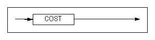

#### DELAY 

쿼리의 프로퍼티와 상관없이 실행 계획의 그래프를 기준으로 hierarchy, sorting,
windowing, grouping, set, distinction의 실행(execute)이 패치(fetch)에서
수행되도록 하는 지연 기능을 활성화한다.


#### DISTINCT_HASH

해싱 방식으로 DISTINCT를 처리할 것을 지시하는 힌트이다.


#### DISTINCT_SORT

정렬 방식으로 DISTINCT를 처리할 것을 지시하는 힌트이다.


#### DNF

WHERE절의 조건문들을 Disjunctive Normal Form으로 정규화할 것을 지시하는
힌트이다.


#### EXEC_FAST 

EXECUTOR_FAST_SIMPLE_QUERY 프로퍼티가 비활성화된 상태에서 힌트가 명시되면,
단순한 SELECT, INSERT, UPDATE, DELETE 구문은 SIMPLE QUERY로 동작한다. SIMPLE
QUERY가 적용된 경우 실행 계획에 출력된다.

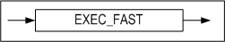

#### FIRST_ROWS

처음 *n*개의 행을 가장 효율적으로 반환할 수 있는 실행 계획을 생성하도록 지시하는
힌트이다.


#### FULL SCAN

명시한 테이블에 대해 테이블 전체 스캔을 수행할 것을 지시하는 힌트이다.


#### GROUP BUCKET COUNT

GROUP-AGGREGATION과 AGGREGATION 실행 노드의 해시 버킷 수를 지정하는 힌트이다.


#### GROUP_HASH

해싱 방식으로 GROUP BY절을 처리할 것을 지시하는 힌트이다.

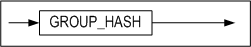

#### GROUP_SORT

정렬 방식으로 GROUP BY절을 처리할 것을 지시하는 힌트이다.

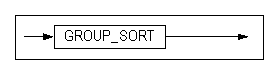

#### HASH_AJ

중첩된 부질의가 Hash Join을 사용하여 Anti Join 하도록 지시하는 힌트이다. 해당
힌트는 부질의 내부에 정의해야 효과가 있으며, 만약 부질의가 Semi Join으로
풀리거나, 풀 수 없는 경우에는 효과가 없다.


#### HASH BUCKET COUNT

HASH와 DISTINCT 실행 노드의 해시 버킷 수를 지정하는 힌트이다.


#### HASH_SJ

중첩된 부질의가 Hash Join을 사용하여 Semi Join 하도록 지시하는 힌트이다. 해당
힌트는 부질의 내부에 정의해야 효과가 있다. 만약 부질의가 Anti Join으로 풀리거나
풀리지 않는 경우에는 효과가 없다.


#### HIGH_PRECISION

사칙 연산 및 mod 연산 시 오차 발생을 방지하기 위하여 사용하는 힌트이다.

이 힌트를 사용할 때 데이타 타입으로 float 타입을 사용하여 연산한다. float
타입으로 연산할 경우 real이나 double 데이터 타입보다 연산 성능이 떨어질 수
있지만, 38자리까지의 사칙 연산 및 mod 연산의 정밀도를 보장한다.


#### INDEX

명시된 인덱스를 사용하여 해당 테이블에 대해서 인덱스 스캔을 수행하도록 지시하는
힌트이다.


#### INDEX ASC

명시된 인덱스를 사용하여 해당 테이블에 대해서 인덱스 스캔을 수행하되, 오름
차순으로 탐색한다.

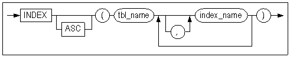

#### INDEX_ASC

INDEX ASC힌트와 같은 동작을 한다.

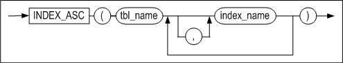

#### INDEX DESC

명시된 인덱스를 사용하여 해당 테이블에 대해서 인덱스 스캔을 수행하되, 내림
차순으로 탐색한다.


#### INDEX_DESC

INDEX DESC와 같은 동작을 한다


#### INVERSE_JOIN

중첩된 부질의가 Semi Join 또는 Anti Join을 하는 경우 Inverse Join[^1]을 반드시
사용하도록 지시하는 힌트이며, 부질의 내에 명시해야 한다.

[^1]: Inverse Join이란 Inverse Index Nested Loop, Inverse Hash, Inverse Sort를 통칭한다. Inverse Join에 대한 자세한 설명은 Performance Tuning Guide를 참조하기 바란다.

해당 힌트는 Semi Join 또는 Anti Join 방법을 지시하는 다른 힌트와 함께 사용할 수
있다. 예를 들어 HASH_SJ와 함께 사용하는 경우, Hash Join이면서 Inverse Join인
Inverse Hash 조인을 사용하도록 지시한다.


#### KEEP_PLAN

KEEP_PLAN는 한 번 생성된 플랜이 참조하는 테이블의 통계 정보가 변경되더라도
플랜이 재생성되는 것을 방지하고 그대로 사용하도록 지시하는 힌트이다. KEEP_PLAN
힌트는 쿼리의 direct/execute 수행뿐 아니라 prepare/execute 수행시에도 사용
가능하다.


#### LEADING

힌트에 사용된 테이블들을 먼저 조인되도록 한다. 두 개 이상의 LEADING 힌트를 사용한
경우에는 처음 LEADING 힌트만 효과가 있다. ORDERED 힌트와 함께 사용된 경우에는 
ORDERED 힌트가 무시된다. 힌트에 사용된 테이블에 Lateral View를 명시한 경우에는 
효과가 없다.

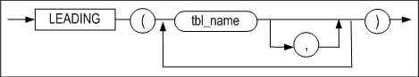

#### MERGE_AJ

중첩된 부질의가 Merge Join을 사용하여 Anti Join 하도록 지시하는 힌트이다. 해당
힌트는 부질의 내부에 정의해야 효과가 있으며, 만약 부질의가 Semi Join으로
풀리거나, 풀 수 없는 경우에는 효과가 없다.

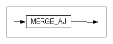

#### MERGE_SJ

중첩된 부질의가 Merge Join을 사용하여 Semi Join 하도록 지시하는 힌트이다. 해당
힌트는 부질의 내부에 정의해야 효과가 있으며, 만약 부질의가 Anti Join으로
풀리거나, 풀 수 없는 경우에는 효과가 없다.


#### NL_AJ

중첩된 부질의가 Nested Loop Join을 사용하여 Anti Join 하도록 지시하는 힌트이다.
해당 힌트는 부질의 내부에 정의해야 효과가 있으며, 만약 부질의가 Semi Join으로
풀리거나, 풀 수 없는 경우에는 효과가 없다.


#### NL_SJ

중첩된 부질의가 Nested Loop Join을 사용하여 Semi Join 하도록 지시하는 힌트이다.
해당 힌트는 부질의 내부에 정의해야 효과가 있다. 만약 부질의가 Anti Join으로
풀리거나 풀리지 않는 경우에는 효과가 없다.


#### NO_DELAY 

쿼리의 프로퍼티와 상관없이 실행 계획의 그래프를 기준으로 hierarchy, sorting,
windowing, grouping, set, distinction의 실행(execute)이 패치(fetch)에서
수행되도록 하는 지연 기능을 비활성화한다.

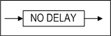

#### NO_EXEC_FAST 

EXECUTOR_FAST_SIMPLE_QUERY 프로퍼티가 활성화된 상태에서 힌트가 명시되면, 단순한
SELECT, INSERT, UPDATE, DELETE 구문이더라도 SIMPLE QUERY로 동작되지 않는다.


#### NO_EXPAND

CNF힌트와 같은 동작을 한다.


#### NO INDEX

명시된 인덱스를 사용해서 해당 테이블에 대한 인덱스 스캔을 수행하지 않도록
지시하는 힌트이다.


#### NO_INDEX

NO INDEX힌트와 같은 동작을 한다.


#### NO_INVERSE_JOIN

중첩 부질의가 Semi Join 또는 Anti Join을 하는 경우, Inverse Join이 아닌 One-pass
Hash Join이나 Two-pass Hash join을 선택하여 사용하도록 지시하는 힌트이다. 부질의
내에 명시해야 한다.

해당 힌트는 Semi Join 또는 Anti Join 방법을 지시하는 다른 힌트와 함계 사용할 수
있다. 예를 들어 HASH_SJ와 함께 사용하는 경우, Hash Join이면서 One-Pass Hash
Join과 Two-Pass Hash Join 중 하나를 사용하도록 지시한다.


#### NO_MERGE

메인 쿼리와 인라인 뷰 쿼리를 하나의 쿼리로 병합하지 않도록 지시하는 힌트이다.


#### NO_PARALLEL

NOPARALLEL 힌트와 같은 동작을 한다.


#### NO_PLAN_CACHE

NO_PLAN_CACHE는 생성된 플랜을 플랜 캐시에 저장하지 않도록 지시하는 힌트이다.


#### NO_PUSH_SELECT_VIEW

뷰 외부의 WHERE절의 조건을 뷰 내부로 이동하여 처리하지 않도록 지시하는 힌트이다.


#### NO_SERIAL_FILTER

SERIAL_EXECUTE_MODE 프로퍼티가 활성화된 상태에서 힌트가 명시되면,
Serial Execute Mode 로 동작되지 않는다.


#### NO_TRANSITIVE_PRED

조건절 이행을 배제하는 힌트이다. 조건절 이행에 대해서는 "Performance Tuning
Guide \> 3장 쿼리 옵티마이저 \> 쿼리 변환 > 조건절 이행"을 참고한다.


#### NO_UNNEST

Subquery Unnesting을 하지 말 것을 지시하는 힌트이다.

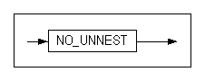

#### NO_USE_HASH

HASH를 제외한 힌트 중에 조인방법이 선택된다.


#### NO_USE_MERGE

MERGE를 제외한 힌트 중에 조인방법이 선택된다.


#### NO_USE_NL

NL를 제외한 힌트 중에 조인방법이 선택된다.


#### NO_USE_SORT

SORT를 제외한 힌트 중에 조인방법이 선택된다

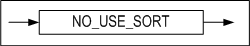

#### PARALLEL

일반 테이블 또는 파티션드 테이블을 스캔할 때 병렬 질의를 설정할 수 있는 힌트이다.

- NOPARALLEL: 병렬로 처리하지 않는다.
- PARALLEL integer: integer에 명시된 개수만큼의 쓰레드가 병렬로 처리한다.

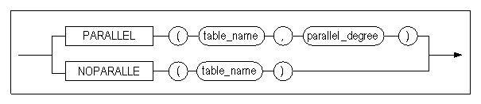

#### PLAN_CACHE_KEEP

Plan을 victim 선정 과정에서 제외시켜 Plan Cache내에 유지하도록 지시하는 힌트이다.
해당 힌트는 hardprepare 과정에서 적용된다. 그래서 사용자가 해당 plan을 unkeep으로 전환했을 때
softprepare가 발생해도 다시 keep 상태로 전환되지 않는다.


#### ORDERED

FROM절에 나열된 순서대로 조인하도록 지시하는 힌트이다.


#### PUSH_PRED

메인 쿼리의 WHERE 절에서 뷰와 관련된 조인 조건절을 뷰 안으로 밀어넣도록 지시하는
힌트이다.


#### PUSH_SELECT_VIEW

뷰 외부의 WHERE절의 조건을 뷰 내부로 이동하여 처리하도록 지시하는 힌트이다.


#### RESULT_CACHE

중간 결과를 캐시하는 ResultCache를 사용하는 힌트이다.


#### RULE

비용을 배제하고 규칙 기반으로 최적화된 실행 계획을 생성하도록 지시하는 힌트이다.


#### SET BUCKET COUNT

SET-INTERECT와 SET-DIFFERENCE 실행 노드의 해시 버킷 수를 지정하는 힌트이다.


#### SERIAL_FILTER

SERIAL_EXECUTE_MODE 프로퍼티가 비활성화된 상태에서 힌트가 명시되면,
Serial Execute Mode 로 동작한다.


#### SORT_AJ

중첩된 부질의가 Sort Join을 사용하여 Anti Join 하도록 지시하는 힌트이다. 해당
힌트는 부질의 내부에 정의해야 효과가 있으며, 만약 부질의가 Semi Join으로
풀리거나, 풀 수 없는 경우에는 효과가 없다.


#### SORT_SJ

중첩된 부질의가 Sort Join을 사용하여 Semi Join 하도록 지시하는 힌트이다. 해당
힌트는 부질의 내부에 정의해야 효과가 있다. 만약 부질의가 Anti Join으로 풀리거나
풀리지 않는 경우에는 효과가 없다.


#### TEMP_TBS_DISK

질의 처리 중에 생성되는 모든 중간 결과를 디스크 임시 공간에 저장하도록 지시하는
힌트이다.


#### TEMP_TBS_MEMORY

질의 처리 중에 생성되는 모든 중간 결과를 메모리 임시 공간에 저장하도록 지시하는
힌트이다.


#### TOP_RESULT_CACHE

최종 결과를 캐시하는 Top Result Cache를 사용하는 힌트이다.


#### UNNEST

Subquery Unnesting을 하도록 지시하는 힌트이다.


#### USE_ANTI

Full outer join 쿼리에서 명시된 테이블에 대해 left outer join과 anti outer
join을 수행하고 그 결과를 concatenation하도록 지시하는 힌트이다. 단, 조인되는
양쪽 칼럼에 인덱스가 모두 존재하는 경우에만 해당 힌트가 적용된다.
ANTI-OUTER-JOIN 노드를 참고한다.


#### USE_CONCAT

DNF 힌트와 같은 동작을 한다.


#### USE_FULL_NL

Full nested loop 조인을 사용해서 명시된 테이블을 조인하도록 지시하는 힌트이다.


#### USE_FULL_STORE_NL

Full store nested loop 조인을 사용해서 명시된 테이블을 조인하도록 지시하는
힌트이다.


#### USE_HASH

Hash 조인을 사용해서 명시된 테이블을 조인하도록 지시하는 힌트이다. 단 hasing
술어가 하나도 없을 경우 Nested loop 조인이 사용된다.


#### USE_INDEX_NL

Index nested loop 조인을 사용해서 명시된 테이블을 조인하도록 지시하는 힌트이다.


#### USE_INVERSE_HASH

inverse hash 조인을 사용해서 명시된 테이블을 조인하도록 지시하는 힌트이다.


#### USE_MERGE

Sort Merge 조인을 사용해서 명시된 테이블을 조인하도록 지시하는 힌트이다. 단
sorting 술어가 하나도 없을 경우 Nested loop 조인이 사용된다.


#### USE_NL

Nested loop 조인을 사용해서 명시된 테이블을 조인하도록 지시하는 힌트이다.


#### USE_ONE_PASS_HASH

One-pass hash 조인을 사용해서 명시된 테이블을 조인하도록 지시하는 힌트이다.


#### USE_ONE_PASS_SORT

One-pass sort 조인을 사용해서 명시된 테이블을 조인하도록 지시하는 힌트이다.


#### USE_SORT

Sort 조인을 사용해서 명시된 테이블을 조인하도록 지시하는 힌트이다. 단 sorting
술어가 하나도 없을 경우 Nested loop 조인이 사용된다.


#### USE_TWO_PASS_HASH

Two-pass hash 조인을 사용해서 명시된 테이블을 조인하도록 지시하는 힌트이다.

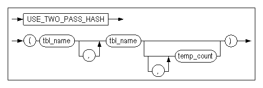

#### USE_TWO_PASS_SORT

Two-pass sort 조인을 사용해서 명시된 테이블을 조인하도록 지시하는 힌트이다. 


# 3.데이터 정의어

이 장에서는 데이터베이스 객체를 생성하는데 사용하는 SQL 문장인 DDL 문장의 문법과
특징을 사용 예제를 들어서 상세하게 설명한다.

### ALTER DATABASE 

#### 구문

**alter_database :: =**

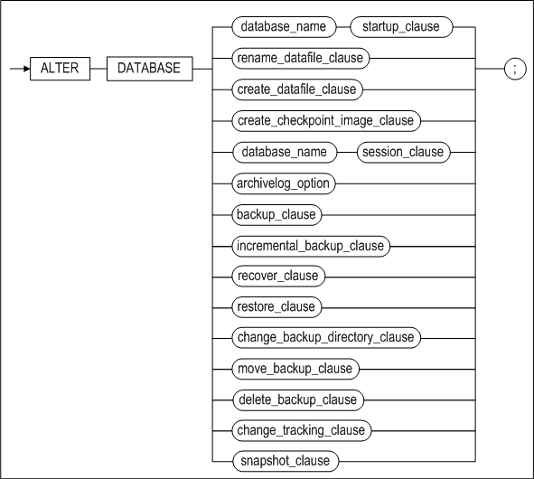


**startup_clause ::=**


**rename_datafile_clause ::=**


**create_datafile_clause ::=**


**create_checkpoint_image_clause ::=**


**session_clause ::=**


**archivelog_option ::=**


**backup_clause ::=**


**incremental_backup_clause ::=**


**incremental_level_clause ::=**


**with_tag_clause ::=**


**recover_clause ::=**


**from_tag_clause ::=**


**until_option ::=**


**restore_clause ::=**


**restore_database_clause ::=**

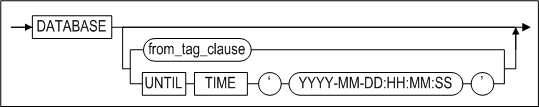

**restore_tablespace_clause ::=**


**change_backup_directory_clause ::=**

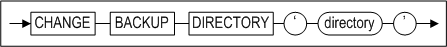

**move_backup_clause ::=**


**delete_backup_clause ::=**

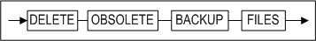

**change_tracking_clause ::=**


**snapshot_clause ::=**


#### 전제 조건

ALTER DATABASE구문은 Altibase 다단계 구동에서 서비스 전 단계에서 SYS 사용자가 –sysdba 관리자 모드로 접속한 후 수행할 수 있다. 단 SESSION CLOSE 의 경우에는 –sysdba 모드로 접속하지 않아도 사용할 수 있다.

#### 설명

기존 데이터베이스의 정의를 변경하는 구문이다.

*database_name*

변경될 데이터베이스 이름을 명시한다.

*startup_clauses*

이 절은 Altibase 구동 단계를 명시하는데 사용된다.

*CONTROL*

데이터베이스 구동 단계를 CONTROL 단계로 변경한다. 이 단계에서 데이터베이스
미디어 복구가 가능하다. 또한, 테이블스페이스를 Discard할 수 있는 단계이다.
데이터베이스 다단계 구동 단계에 대한 자세한 설명은 *Administrator’s Manual*을
참조한다.
CONTROL 다음 단계인 META단계로 가기 위해서는 다음 구문을 수행해야 한다:

```
ALTER DATABASE dababase_name META;
```

*META*

데이터베이스 구동 단계를 META 단계로 변경한다. 전 단계인 CONTROL단계에서 이
단계로 오는 중에 데이터베이스 메타 데이터가 로딩된다. 다음 단계로 가기 위해서는
다음 구문을 수행해야 한다:

```
ALTER DATABASE dababase_name SERVICE;
```

*SERVICE*

데이터베이스 구동 단계를 SERVICE 단계로 변경한다. 이 단계로 오면서 메모리 DB와
디스크 DB가 로딩된다. 이 단계에서 이중화 또는 SNMP 등의 확장 서비스가 모두
구동될 수 있다. 데이터베이스가 이 단계로 성공적으로 구동되었다면, 필요한 복구가
완료되어 시스템이 정상적으로 서비스를 제공하는 상태임을 의미한다.

*UPGRADE*

이 옵션은 데이터베이스 구동 단계를 META UPGRADE 단계로 변경한다. 데이터베이스가
이 단계로 구동될 때, 모든 복구 작업이 완료된다.

다음 단계로 가기 위해서는 다음 구문을 수행해야 한다:

```
ALTER DATABASE dababase_name SERVICE;
```

RESETLOGS

CONTROL 단계에서 불완전 복구를 수행한 후, 서버를 정상 구동하기 위해 필요한
작업이다. 불완전 복구로 인해 더 이상 필요하지 않게 된 로그 레코드들을
초기화한다.

다음 단계로 가기 위해서는 다음 구문을 수행해야 한다:

```
ALTER DATABASE dababase_name SERVICE;
```

*META RESETUNDO*

이 옵션을 사용하면, SYS_TBS_DISK_UNDO 테이블스페이스가 초기화된다. 그러나
테이블스페이스 파일의 크기는 변경되지 않는다. 이 구문 실행 전에, 데이터베이스의
무결성을 검사하고 디스크 가비지 콜레션이 수행된 것을 확인하고, 서버를 정상
종료해야 한다.

*SHUTDOWN NORMAL*

서버에 접속한 모든 클라이언트의 연결이 정상적으로 해제될 때까지 대기한 후 서버를
정상 종료한다.

*SHUTDOWN IMMEDIATE*

서버에 접속된 모든 클라이언트의 연결을 강제로 해제한 후, 서버를 정상 종료한다.

*SHUTDOWN EXIT*

이 옵션은 Altibase 서버를 강제로 종료하는데 사용된다. 이 방법으로 Altibase가
종료되면, 데이터베이스의 내용이 올바르지 않게 되어 다음 서버 구동시에 복구
작업이 수행될 것이다.

*RENAME DATAFILE*

이 구문은 디스크 데이터파일 위치를 이동시켜야 할 때 사용하는 기능으로,
데이터베이스에 속한 데이터 파일을 새로운 이름으로 변경하거나 다른 디렉터리에
둔다. TO ‘*datafile_path*’에 명시된 데이터 파일은 존재해야 한다. 이 절은 CONTROL
단계에서만 실행 가능하다. *datafile_path*는 절대 경로여야 한다.

참고로, 메모리 테이블스페이스의 체크포인트 이미지파일을 이동하기 위해서는 ALTER
TABLESPACE 구문이 사용된다.

*CREATE DATAFILE*

이 구문은 디스크 데이터 파일이 유실되었을 때, 로그 앵커의 정보를 참고하여 데이터
파일을 생성하기 위해 사용된다. 이 구문을 실행한 후에는 매체 완전 복구를 수행하여
데이터 파일을 복구하도록 한다.

이 구문은 CONTROL 단계에서만 실행 가능하다. 

데이터 파일이 생성될 *datafile_path*는 절대 경로이어야 한다.

참고로 메모리 테이블스페이스의 체크포인트 이미지파일을 생성하려면 ALTER
TABLESPACE 구문을 사용한다.

*CREATE CHECKPOINT IMAGE*

이 구문은 메모리 체크포인트 이미지파일이 유실되었을 때, 로그 앵커의 정보를
참고하여 체크포인트 이미지 파일을 생성하기 위해 사용된다. 이 구문을 실행한
후에는 매체 완전 복구를 수행하여 메모리 체크포인트 이미지 파일을 복구하도록
한다.

체크포인트 이미지파일은 메모리 테이블스페이스에 정의된 체크포인트 경로에
생성되므로, 경로는 지정할 필요가 없고 파일명만 명시하면 된다.

이 구문은 CONTROL 단계에서만 실행 가능하다.

\<질의\> ‘MEM-TBS-1’ 이름의 체크포인트 이미지파일을 다시 생성한다.

```
iSQL> ALTER DATABASE CREATE CHECKPOINT IMAGE 'MEM-TBS-1';
```

*SESSION CLOSE*

이 구문은 세션을 강제로 종료시킨다. 세션ID(number) 및 사용자 이름을 지정하여
해당 세션을 종료할 수 있으며, ALL구문으로 모든 세션을 한 번에 종료할 수도 있다.

현재 접속한 사용자의 세션은 종료되지 않는다. 이 구문이 실행되면 해당 세션의
트랜잭션은 롤백된다.

> Note: 세션이 락을 잡기 위해 대기중이라면 즉시 종료되지 않는다.
>

*archivelog_option*

CONTROL 단계에서 아카이브로그 모드와 노아카이브로그 모드를 전환하는데 사용된다.

*BACKUP LOGANCHOR*

데이터베이스가 아카이브로그 모드로 운영중일때, 이 구문은 서비스를 중지하지 않은
상태에서 로그 앵커를 온라인 백업하는데 사용된다.

*BACKUP TABLESPACE*

데이터베이스가 아카이브로그 모드로 운영중일때, 이 구문은 서비스를 중지하지 않은
상태에서 지정된 테이블스페이스를 백업 디렉토리에 백업하는데 사용된다.

*BACKUP DATABASE*

데이터베이스가 아카이브로그 모드로 운영중일때, 이 구문은 서비스를 중지하지 않은
상태에서 모든 메모리 테이블스페이스, 디스크 테이블스페이스, 및 로그앵커를
백업하는데 사용된다.

*incremental_backup_clause*

데이터베이스 전체 또는 특정 테이블스페이스들을 증분 백업한다.

*incremental_level_clause*

증분 백업 레벨을 지정한다.

*WITH TAG tag_name*

백업에 태그 이름을 지정한다.

*RECOVER DATABASE*

이 구문은 매체 완전복구를 수행한다. 아카이브 로그 디렉토리의 로그 파일을
판독하여 매체 오류가 발생한 데이터 파일들을 현재 시점으로 복구한다.

*FROM TAG tag_name*

태그 이름이 *tag_name*인 백업으로부터 데이터베이스를 복원 또는 복구할 것을
지정한다.

*RECOVER DATABASE UNTIL TIME*

이 구문은 특정 시점으로 매체 불완전 복구를 수행하는데 사용된다. 아카이브 로그
디렉토리의 로그 파일을 판독하여 매체 오류가 발생한 데이터 파일들을 특정 시점으로
복구한다.

*RECOVER DATABASE UNTIL CANCEL*

이 구문은 아카이브 로그 파일들 중 유효한 가장 최근 시점으로 매체 불완전 복구를
수행하는데 사용된다. 아카이브 로그 디렉토리의 로그 파일을 판독하여 매체 오류가
발생한 데이터 파일들을 유효한 시점까지 복구한다.

*restore_database_clause*

데이터베이스에 대한 매체 완전복원을 수행하거나 또는 특정 태그 이름이나 특정
시점으로 불완전 복원을 수행한다.

*restore_tablespace_clause*

테이블스페이스를 완전 복원한다.

*change_backup_directory_clause*

증분 백업 수행으로 생성되는 백업 파일들의 위치를 지정한다.

*move_backup_clause [WITH CONTENTS]*

증분 백업 디렉토리를 변경한다. WITH CONTENTS 옵션을 지정하면 기존 백업 파일이
새로운 디렉토리로 이동한다.

*delete_backup_clause*

유효 기간이 지난 증분 백업 파일을 삭제한다.

change_tracking_clause

증분 백업을 위한 페이지 변경 추적 기능의 활성화 또는 비활성화를 지정한다.

*snapshot_clauses*

BEGIN SNAPSHOT을 할 때의 시점을 기준 SNAPSHOT SCN으로 설정하고, 설정된 SCN을
기준으로 iLoader를 사용하여 데이터를 EXPORT한다.

#### 예제

\<질의\> 데이터베이스 mydb를 구동하여 정상 서비스를 제공하도록 한다.

```
iSQL> ALTER DATABASE mydb SERVICE;
```

\<질의\> 아카이브로그 모드로 데이터베이스를 전환한다.

```
iSQL> ALTER DATABASE ARCHIVELOG;
```

\<질의\> 불완전 복구 수행 후 데이터베이스를 정상 구동한다.

```
iSQL> ALTER DATABASE mydb META RESETLOGS;
```

\<질의\> SYS_TBS_DISK_DATA 테이블스페이스를 /altibase_backup디렉터리에 백업한다.

```
iSQL> ALTER DATABASE TABLESPACE SYS_TBS_DISK_DATA TO ‘/altibase_backup/’;
```

\<질의\> 이전 백업으로부터 2008년 2월 16일 오후 12시 시점으로 데이터베이스를
복원한다.

```
iSQL> ALTER DATABASE RECOVER DATABASE UNTIL TIME ‘2008-02-16:12:00:00’;
```

\<질의\> 이전 백업으로부터 유실된 로그파일 20001번 이전인 로그파일 20000번까지의
변경이 반영되도록 데이터베이스를 복원한다.

```
iSQL> ALTER DATABASE RECOVER DATABASE UNTIL CANCEL;
```


### ALTER DATABASE LINKER 

데이터베이스 링크에 대한 내용은 DatabaseLink User's Manual을 참고한다.

### ALTER INDEX

#### 구문

**alter_index ::=**


**directkey_mod_clause ::=**

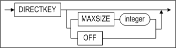

**rebuild_clause ::=**


**index_attribute ::=**


**alter_index_properties::=**


**alter_index_segment_attribute_clause::=**


**storage_clause::=**


**allocate_extent_clause::=**


#### 전제 조건

SYS 사용자, 인덱스가 속한 스키마의 소유자 또는 ALTER ANY INDEX 시스템 권한을
가진 사용자만이 이 구문으로 인덱스를 변경할 수 있다.

#### 설명

기존 인덱스 정의를 변경하거나 재구축한다.

*user_name*

변경될 인덱스의 소유자 이름을 명시한다.

생략하면 Altibase는 현재 세션에 연결된 사용자의 스키마에 속한 것으로 간주한다.

*index_name*

변경될 인덱스의 이름을 명시한다.

directkey_mod_clause

이 절은 인덱스가 Direct Key인덱스를 사용할 것인지 여부를 명시할 때 사용된다.
Direct Key 인덱스에 대한 자세한 내용은 [CREATE INDEX](#create-index) 구문을 참고한다

- MAXSIZE integer  
  Direct Key 인덱스의 최대 크기를 설정할 수 있다.
- OFF  
  Direct Key 인덱스를 일반 인덱스로 변경한다.

*rebuild_clause*

존재하는 인덱스 또는 인덱스의 한 파티션을 재구축한다.

*index_attribute*

재구축된 인덱스 파티션이 저장될 테이블스페이스를 명시한다.

*RENAME*

변경될 인덱스의 이름을 명시한다.

*AGING*

이는 인덱스 페이지에 트랜잭션 커밋 SCN을 기록하고, 구 버전(old version)의
노드들을 삭제하는데 사용된다. 이 구문은 디스크 기반 인덱스에만 사용 가능하다.

*REORGANIZATION*

메모리 B-tree 인덱스의 리프 노드를 이웃 노드와 통합하여 인덱스 공간을
재구성한다.

데이터에 비해 인덱스 범위가 크거나 특정 인덱스에 단편화 현상이 있을 경우에
사용하면 공간 효율성이 향상된다. 메모리 기반 B트리 인덱스만 사용 가능하다.

*alter_index_segment_attribute_clause*

- INITRANS 절  
  초기 TTS(Touched Transaction Slot)의 개수를 변경한다.
- MAXTRANS 절  
  최대 TTS(Touched Transaction Slot)의 개수를 변경한다.

*storage_clause*

사용자가 세그먼트내의 익스텐트 관리 파라미터를 지정할 수 있는 구문이다.

- INITEXTENTS 절  
  ALTER INDEX 구문의 INITEXTENTS 파라미터는 무시된다.
- NEXTEXTENTS 절  
  세그먼트 확장시 추가될 익스텐트 개수를 지정한다.
- MINEXTENTS 절  
  한 세그먼트의 최소 익스텐트 개수를 지정한다.
- MAXEXTENTS 절  
  한 세그먼트의 최대 익스텐트 개수를 지정한다.

*allocate_extent_clause*

이는 인덱스 세그먼트에 명시적으로 익스텐트를 할당하는데 사용된다. 인덱스
세그먼트에 추가될 익스텐트의 총 크기를 지정해야 한다. 디스크 테이블스페이스가
여러개의 데이터 파일로 구성되어 있다면 익스텐트는 여러 파일들에 걸쳐서 고르게
할당된다.

#### 예제

##### Direct Key Index 변경

\<질의\> 인덱스 idx1을 Direct Key 인덱스로 변경하라.

```
iSQL> ALTER INDEX idx1 DIRECTKEY;
```

\<질의\> Direct Key 인덱스 idx1을 일반 인덱스로 변경하라.

```
iSQL> ALTER INDEX idx1 DIRECTKEY OFF;
```

\<질의\> 인덱스 idx3을 Direct Key 인덱스로 변경할 때 MAXSIZE를 10으로 설정한다.

```
iSQL> ALTER INDEX idx3 DIRECTKEY MAXSIZE 10;
```


##### 인덱스 파티션 재구축

\<질의\> 인덱스 파티션 idx_p5를 테이블스페이스 tbs1에 구축하라.

```
iSQL> ALTER INDEX IDX1 REBUILD PARTITION idx_p5 TABLESPACE tbs1;
```


##### 인덱스 이름 변경

\<질의\> 인덱스 emp_idx1의 이름을 emp_idx2로 변경하라.

```
iSQL> ALTER INDEX emp_idx1 RENAME TO emp_idx2;
```


##### 인덱스에 익스텐트 할당

\<질의\> 디스크 테이블스페이스에 위치하는 인덱스 local_idx 에 10M만큼의
익스텐트를 할당한다.

```
iSQL> ALTER INDEX felt_idx ALLOCATE EXTENT ( SIZE 10M );
```


##### 인덱스 Reorganization 수행

\<질의\> 인덱스 idx1의 reorganization을 수행하라

```
iSQL> ALTER INDEX idx1 REORGANIZATION;
```


### ALTER JOB 

#### 구문

**alter_job ::=**


**execute_procedure_statement ::=**


#### 전제 조건

SYS 사용자만이 이 구문으로 JOB을 변경할 수 있다. 생성된 JOB을 수행하려면 JOB을
생성 시 또는 생성 후에 반드시 ENABLE로 활성화해야 한다.

#### 설명

CREATE JOB 구문으로 생성한 JOB의 정의를 변경할 수 있다. 이 구문으로 JOB에 등록된
프로시저의 실행 구문, JOB의 시작 시간과 끝나는 시간, JOB의 실행 주기 등을 변경할
수 있다.

*job_name*

변경할 JOB의 이름을 명시한다.

*START*

JOB이 처음 시작할 시간을 명시한다.

*END*

JOB이 끝날 시간을 명시한다.

*expr1*

DATE 타입의 값 또는 수식만 올 수 있다.

*INTERVAL number*

JOB이 처음 실행된 이후에 다음에 실행하는 주기를 명시한다. 시간 단위는 number
다음에 명시되는 YEAR, MONTH, DAY, HOUR, MINUTE에 따라 결정된다.

*expr2*

명시한 프로시저를 실행하기 위한 입력 인자 값을 상수 또는 수식으로 지정한다.

*ENABLE/DISABLE*

각각의 JOB을 작업 스케줄러에서 실행하거나 하지 않도록 변경할 수 있다.

*COMMENT*

사용자가 JOB에 대한 설명을 변경할 수 있다.

#### 예제

\<질의\> job2를 활성화 상태로 변경하라.

```
iSQL> ALTER JOB job2 SET ENABLE;
Alter success.
```

\<질의\> job2를 비활성화 상태로 변경하라.

```
iSQL> ALTER JOB job2 SET DISABLE;
Alter success.
```

\<질의\> job1이 실행되는 시작 시간을 ‘2013년 1월 1일’로 변경하라.

```
iSQL> ALTER JOB job1 SET START to_date('20130101','YYYYMMDD');
Alter success.
```

\<질의\> job2에서 실행할 프로시저를 usr1의 proc1 프로시저로 변경하라.

```
iSQL> alter job job2 set exec usr1.proc1;
Alter success.
```

\<질의\> job2의 시작 시간을 '2013/06/03 10:00:00'으로 변경하라.

```
iSQL> alter job job2 set start to_date('2013/06/03 10:00:00','YYYY/MM/DD HH24:MI:SS');
Alter success.
```

\<질의\> job2의 끝나는 시간을 ‘2013/06/07 10:00:00’으로 변경하라.

```
iSQL> alter job job2 set end to_date('2013/06/07 10:00:00', 'YYYY/MM/DD HH24:MI:SS');
Alter success.
```

\<질의\> job2의 실행 주기를 10분 간격으로 변경하라.

```
iSQL> alter job job2 set interval 10 minute;
Alter success.
```


### ALTER QUEUE 

#### 구문

**alter_queue ::=**

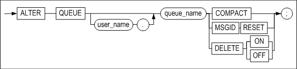

#### 설명

큐의 정의를 변경한다.

*COMPACT*

큐가 위치하는 테이블스페이스에 데이터가 없는 빈 페이지들을 반환한다. 이 때,
데이터가 실제로 옮겨지지는 않는다.

*MSGID RESET*

큐의 MSGID를 초기화한다.

*DELETE [ON|OFF]*

DELETE ON 은 큐 테이블에 DELETE 문 사용을 허용한다.
DELETE OFF 은 큐 테이블에 DELETE 문 사용을 허용하지 않는다. 이 경우 DELETE 문을 허용한 경우보다 DEQUEUE 병렬 수행 성능이 향상된다.

### ALTER REPLICATION 

#### 구문

**alter_replication ::=**


**replication_item ::=**


**alter_replication_set_clause ::=**


**offline_clause ::=**


#### 전제 조건

SYS 사용자만이 이중화 동작을 변경할 수 있다.

#### 설명

CREATE REPLICATION 구문으로 이중화 생성 후 이중화의 동작을 정의하는 구문이다.
이중화 종료 등의 제어문에 대한 설명은 '데이터 제어어> alter_replication_dcl' 문을 참조한다.

이중화에 관한 자세한 내용은 *Replication Manual* 을 참고한다.

*replication_name*

이중화 객체의 이름을 명시한다.

*SYNC*

지역 서버에 있는 이중화 대상 테이블들의 모든 데이터를 원격 서버의 해당 테이블로
전송한 후 이중화가 시작된다.

*SYNC ONLY*

지역 서버에 있는 이중화 대상 테이블들의 모든 데이터를 원격 서버의 해당 테이블로
전송한다. 이중화 송신 쓰레드는 생성되지 않는다.

*PARALLEL parallel_factor*

*Parallel_factor* 값은 생략 가능하다. 생략할 경우 1로 인식된다.  
*Parallel_factor*의 최대값은 CPU 개수 \* 2이다. 최대값을 초과하여 지정해도 최대
값 이상으로 설정되지 않는다. 0 또는 음수 값을 지정하면 오류 메시지가 반환된다.

*TABLE replication_item*

지역서버의 이중화 대상 테이블 중에서 SYNC로 동기화할 테이블 또는 파티션을
지정한다. 이 절이 명시되면 지정된 테이블 또는 파티션이 동기화된 후 이전에
마지막으로 이중화를 수행했던 시점부터 이중화가 시작된다. TABLE 절을 사용하지
않았을 때에는 모든 이중화 대상 테이블과 파티션이 동기화된 후 현재 로그의
위치부터 이중화가 시작된다.

*START*

가장 최근에 마지막으로 이중화했던 시점부터 이중화를 시작한다.

*QUICKSTART*

현재 시점부터 이중화를 시작한다.

*START/ QUICKSTART RETRY*

RETRY 옵션을 사용하여 이중화를 START하거나 QUICKSTART하면, 핸드쉐이크가
실패하더라도 송신 쓰레드가 지역서버에 생성된다. 지역서버와 원격서버간의
핸드쉐이크가 이후 성공할 때, 이중화가 시작된다.

이 옵션이 사용되면, iSQL은 첫 핸드쉐이크 시도가 실패하더라도 핸드쉐이크 성공
메시지를 출력한다. 그러므로 사용자는 이 구문의 실행 결과를 트래이스 로그 또는
성능 뷰를 통해서 확인해야 한다.

RETRY 옵션 없이 이중화 시작시 첫 핸드쉐이크 시도가 실패하면 ,에러가 발생하고
이중화 시작은 중지된다. 단, RETRY 옵션은 EAGER 모드에서는 지원되지 않는다.

*STOP*

데이터 제어어의 ALTER REPLICATION 절을 참조한다.

*RESET*

이 명령은 이중화 정보(재시작 SN 같은)를 초기화시킨다. 이는 이중화가 중지 중일
때만 실행될 수 있다. 이는 DROP REPLICATION 구문과 CREATE REPLICATION 구문을
연달아 실행한 것과 같은 효과를 낸다.

*ADD TABLE*

이중화 객체에 테이블을 추가한다. 이중화가 중지되어 있는 상태에서만 테이블을
이중화 객체에 추가할 수 있다.

*TABLE FROM replication_item TO replication_item*

이중화 대상 테이블 또는 파티션 이름을 테이블 소유자 이름과 함께 명시한다

DROP TABLE

이중화 테이블을 이중화 객체로부터 삭제한다. 이중화가 중지되어 있는 상태에서만
이중화 테이블을 삭제할 수 있다.

*FLUSH*

데이터 제어어의 ALTER REPLICATION 절을 참조한다.

*SET HOST*

특정 호스트를 현재 호스트로 지정한다. 이중화를 중지한 상태에서 변경 가능하다.

*USING conn_type [ib_latency]*

원격 서버와의 통신방법(TCP 또는 InfiniBand)을 설정할 수 있다. 인피니밴드를 사용할 경우에만 ib_latency 값을 설정할 수 있다. 인피니밴드를 사용하려면 IB_ENABLE 프로퍼티 값이 1이어야 한다.

*alter_replication_set_clause*

이 절은 이중화 객체가 LAZY로 설정되어 있고 이중화를 중지한 상태에서 아래의
옵션을 변경할 수 있다.

- RECOVERY : 데이터 복구를 위하여 사용하거나 사용하지 않도록 변경할 수 있다.
- GAPLESS : 이중화 갭 해소 옵션을 사용하거나 사용하지 않도록 변경할 수 있다.
- GROUPING : 이중화 트랜잭션 그룹 옵션을 사용하거나 사용하지 않도록 변경할 수
  있다.
- PARALLEL : 병렬 적용자 옵션을 사용하거나 사용하지 않게 변경 할 수 있다.
  그리고 적용자의 개수를 변경할 수 있다.

*offline_cluase*

오프라인 옵션을 변경하거나 설정된 오프라인 경로를 이용하여 이중화를 수행할 수
있다.

#### 주의 사항

이중화로 작업을 하는 사용자들이 이중화를 이용하기 전에 명심해야 할 몇가지 사항이
있다. ALTER REPLICATION 구문을 실행하기 전에 *Replication Manual*을 숙지하기
바란다.

#### 예제

##### 이름이 rep1인 이중화 객체를 시작하라.

\<질의\> 지역서버의 데이터를 원격서버로 전송한 후 이중화를 시작하라.

```
iSQL> ALTER REPLICATION rep1 SYNC;
Alter success.
```

\<질의\> 이중화 rep1이 가장 최근에 마지막으로 수행한 이중화 시점부터 rep1
이중화를 시작하라.

```
iSQL> ALTER REPLICATION rep1 START;
Alter success.
```

\<질의\> 현재 시점부터 이중화를 시작하라.

```
iSQL> ALTER REPLICATION rep1 QUICKSTART;
Alter success.
```


##### 이름이 rep1인 이중화 객체에서 이중화 대상 테이블 employees을 삭제하라.

```
iSQL> ALTER REPLICATION rep1 STOP;
Alter success.
iSQL> ALTER REPLICATION rep1 DROP TABLE FROM sys.employees TO sys.employees;
Alter success.
```


##### 이름이 rep1인 이중화 객체에 파티션드 테이블 tbl_sales의 파티션 p2를 추가하라.

```
iSQL> ALTER REPLICATION rep1 STOP;
Alter success.
iSQL> ALTER REPLICATION rep1 ADD TABLE
 FROM sys.tbl_sales PARTITION p2 TO sys.tbl_sales PARTITION p2;
Alter success.
```


##### 이름이 rep1인 이중화 객체에 테이블 employees을 추가하라.

```
iSQL> ALTER REPLICATION rep1 STOP;
Alter success.
iSQL> ALTER REPLICATION rep1 ADD TABLE FROM sys.employees TO sys.employees;
Alter success.
```


### ALTER SEQUENCE 

#### 구문

**alter_sequence ::=**

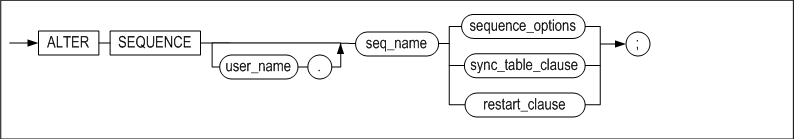

**sequence_options ::=**

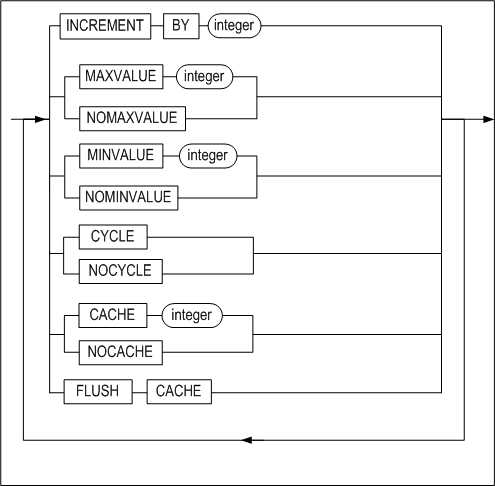

**sync_table_clause ::=**

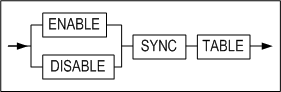

**restart_clause ::=**


#### 전제 조건

SYS 사용자, 시퀀스가 속한 스키마의 소유자 또는 ALTER ANY SEQUENCE 시스템 권한을
가진 사용자만이 이 구문으로 시퀀스를 변경할 수 있다.

#### 설명

CREATE SEQUENCE 구문으로 시퀀스 생성 후 시퀀스의 정의를 변경하는 구문이다. 더
자세한 설명은 CREATE SEQUENCE 문을 참고한다.

*user_name*

변경될 시퀀스의 소유자 이름이다. 생략하면 Altibase는 현재 세션에 연결된 사용자의
스키마에 속한 것으로 간주한다.

*seq_name*

변경될 시퀀스 이름이다.

*INCREMENT BY*

시퀀스 값의 증감분을 명시하는데 사용된다.

*MAXVALUE*

시퀀스의 최대값을 명시하는데 사용된다.

*NOMAXVALUE*

시퀀스의 최대값을 지정하지 않을때 사용된다.

*MINVALUE*

시퀀스의 최소값을 명시하는데 사용된다.

*NOMINVALUE*

시퀀스의 최소값을 지정하지 않을때 사용된다.

*CYCLE*

이는 시퀀스 값이 최대 또는 최소 한계 값에 도달한 후에도 그 시퀀스의 다음 값이
계속되는 것을 허용한다. 오름차순 시퀀스인 경우는 최대값에 도달한 후 최소값부터
다시 시작된다. 반면 내림차순 시퀀스인 경우는 최대값에 도달한 후 최대값부터 다시
시작된다.

*NOCYCLE*

시퀀스의 순환을 허용하지 않을때 사용된다.

*CACHE*

시퀀스 값을 더 빠르게 액세스 하기 위하여 명시된 개수 만큼의 시퀀스 값들이
메모리에 캐시된다. 캐시는 시퀀스가 처음 참조될 때 채워지며 다음에 시퀀스 값이
요청될 때마다 캐시 된 값이 검색된다. 캐시에서 마지막 시퀀스 값이 사용된 이후
다음 시퀀스 값 요청시 새로운 시퀀스 값들이 메모리 캐시된다.

*NOCACHE*

시퀀스를 메모리에 캐시하지 않는 경우 사용된다.

*FLUSH CACHE*

메모리에 캐시된 시퀀스 값들을 지워버린다. 이 옵션을 사용해서 캐시를 플러시한 후
시퀀스 값이 요청되면, 새로운 시퀀스 값들이 메모리에 캐시된다.

*ENABLE SYNC TABLE*

시퀀스 번호를 복제하기 위한 시퀀스 이중화용 테이블을 생성한다. 시퀀스 이중화
전용 테이블의 이름은 [sequence 이름]\$seq으로 자동 부여된다. 

>  주의사항
>
> 시퀀스 이름의 길이가 36바이트 이하여야, 시퀀스 이중화용 테이블을 생성할 수 있다.

*DISABLE SYNC TABLE*

시퀀스를 이중화하기 위해 사용하던 시퀀스 이중화용 테이블을 삭제한다.

*restart_clause*

시퀀스를 재시작하기 위한 구문으로 아래 세가지 방법이 있다.

- RESTART
  - START VALUE를 INCREMENT VALUE가 1 이상이면 MINVALUE로, INCREMENT VALUE가 -1 이하이면 MAXVALUE로 초기화하고, 시퀀스를 재시작한다.
- RESTART WITH N
  - START VALUE를 N으로 초기화하고, 시퀀스를 재시작한다.
- RESTART START WITH N
  - RESTART WITH N 와 동일하게, START VALUE를 N으로 초기화하고 시퀀스를 재시작한다.

#### 예제

\<질의\> 시퀀스 seq1을 최소값이 0, 최대값이 100이고 1씩 증가하도록 변경하라.

```
iSQL> ALTER SEQUENCE seq1
    INCREMENT BY 1
    MINVALUE 0
    MAXVALUE 100;
Alter success.             
```

\<질의\> 시퀀스 seq2의 최소값, 최대값을 무한대로 변경하라.

```
iSQL> ALTER SEQUENCE seq2
    NOMAXVALUE 
    NOMINVALUE;
Alter success.
```

\<질의\> 시퀀스 seq1의 캐시된 시퀀스 값을 메모리에서 지운다.

```
iSQL> ALTER SEQUENCE seq1 FLUSH CACHE;
Alter success.
```

\<질의\> 시퀀스 seq1의 이중화를 위한 시퀀스 이중화용 테이블을 생성하라.

```
iSQL> ALTER SEQUENCE seq1 ENABLE SYNC TABLE;
```


### ALTER TABLE 

#### 구문

**alter_table::=**


**log_compression_clause ::=**


**alter_table_properties::=**


**alter_table_tablespace::=**


**table_move_index_clause::=**


**table_lob_column_clause::=**


**logging_clause::=**


**parallel_clause::=**

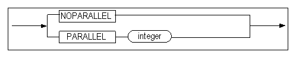

**row_movement_clause::=**


**alter_table_segment_properties::=**


**alter_table_segment_attribute_clause::=**

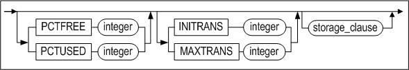

**storage_clause::=**


**alter_table_partitioning::=**


**add_table_partition ::=**


[partition_range_clause ::=](#partition_range_clause) 

**alter_partition ::=**


**partition_index_clause ::=**


**partition_lob_column_clause ::=**


**coalesce_table_partition ::=**


**drop_table_partition ::=**


**merge_table_partition ::=**

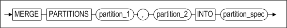

**rename_table_partition ::=**


**split_table_partition ::=**


**truncate_table_partition ::=**


**partition_spec ::=**


**table_partition_description ::=**

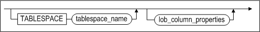

**index_partition_spec ::=**


**index_partition_description ::=**


**partition_access_mode ::=**


**access_mode_clause ::=**


**column_clauses::=**


**add_column_clauses::=**


<a name="column_definition"><a/>

**column_definition::=**

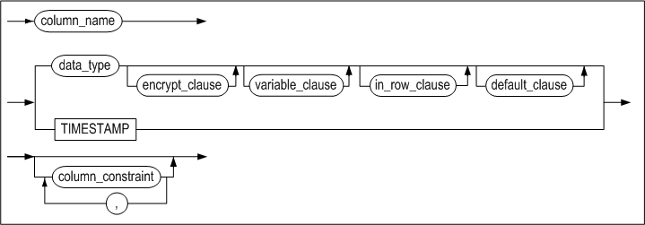

**partition_lob_storage_clause ::=**

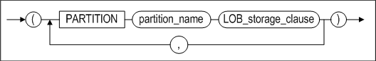

**alter_column_clause ::=**


**modify_column_clause::=**


**modify_column_spec::=**


**drop_column_clause::=**


**rename_column_clause::=**


**reorganize_column_clause::=**


**constraints_clauses::=**


**add_table_constraint_clauses ::=**


**table_constraint_for_alter::=**


**constraint_state::=**


**modify_constraint_clause::=**


**rename_constraint_clauses ::=**


**drop_constraint_clause::=**

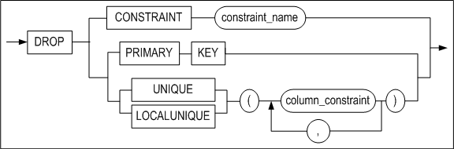

**aging_clause::=**


**compact_clause::=**


**allocate_extent_clause::=**


#### 전제 조건

SYS 사용자, 테이블이 속한 스키마의 소유자, 테이블에 ALTER 객체 권한을 가진
사용자 또는 ALTER ANY TABLE 시스템 권한을 가진 사용자만이 이 구문으로 테이블
정의를 변경할 수 있다.

#### 설명

ALTER TABLE 구문은 명시된 테이블 정의를 변경하는 SQL문이다. 이 구문의 수행 후
해당 테이블의 메타 정보가 변경된다.

ALTER TABLE 구문으로 파티션드 테이블(partitioned table)의 속성을 변경할 수 있다.
파티션드 테이블 관련 구문에는 테이블스페이스 변경(ALTER), 추가(ADD),
병합(COALESCE), 삭제(DROP), 합병(MERGE), 이름변경(RENAME), 분할(SPLIT), 및
레코드 삭제(TRUNCATE)가 있다.

아래 표는 각 구문을 범위, 해시, 리스트 파티션드 테이블에 사용할 수 있는지 여부를
나타낸다.

|                     | 범위 파티셔닝으로 생성된 파티션 | 리스트 파티셔닝으로 생성된 파티션 | 해시 파티셔닝으로 생성된 파티션 | **해시를 사용한 범위 파티션** |
| ------------------- | ------------------------------- | --------------------------------- | ------------------------------- | ----------------------------- |
| 테이블스페이스 변경 | ○                               | ○                                 | ○                               | ○                             |
| 추가                | △ ( 조건부 가능 )               | X                                 | ○                               | X                             |
| 병합                | X                               | X                                 | ○                               | X                             |
| 삭제                | ○                               | ○                                 | X                               | ○                             |
| 합병                | ○                               | ○                                 | X                               | ○                             |
| 이름 변경           | ○                               | ○                                 | ○                               | ○                             |
| 분할                | ○                               | ○                                 | X                               | ○                             |
| 레코드 삭제         | ○                               | ○                                 | ○                               | ○                             |

[표 3‑1] 파티셔닝 방법에 따른 지원 연산

*user_name*

변경될 테이블의 소유자 이름이다. 생략하면 Altibase는 현재 세션에 연결된 사용자의
스키마에 속한 것으로 간주한다.

*tbl_name*

변경될 테이블 이름이다.

*parallel_clause*

CREATE TABLE의 parallel_clause 설명을 참고한다.

*alter_table_segment_attribute_clause*

- PCTFREE 절  
  이 절은 페이지에 이미 저장되어 있는 레코드를 갱신할 때 이용하기 위해 예약해
  둔 여유 공간의 비율을 변경하기 위해 사용된다. ALTER TABLE 구문의
  alter_table_segment_attribute_clause을 사용해 Altibase 운영 중에 세그먼트
  속성을 변경할 수 있다. 그러나 즉시 세그먼트의 모든 페이지에 변경 사항이
  반영되는 것은 아니며, 이후 연산에 의해 접근된 테이블 페이지에 대해서
  개별적으로 적용된다.
- PCTUSED 절  
  이 절은 한 페이지가 다시 레코드 삽입이 가능한 상태로 돌아가기 위한 페이지
  사용 공간의 최소 비율을 변경하기 위해 사용된다.
- INITRANS 절  
  이 절은 초기 TTS(Touched Transaction Slot)의 개수를 변경하기 위해 사용된다.
- MAXTRANS 절  
  이 절은 최대 TTS(Touched Transaction Slot)의 개수를 변경하기 위해 사용된다.

*storage_clause*

이 절은 사용자가 세그먼트 내의 익스텐트를 관리하기 위한 파라미터를 지정하기 위해
사용한다.

- INITEXTENTS 절  
  ALTER TABLE 구문의 INITEXTENTS 파라미터는 무시된다.
- NEXTEXTENTS 절  
  이절은 세그먼트 확장시 세그먼트에 추가될 익스텐트의 개수를 지정한다.
- MINEXTENTS 절  
  이 절은 세그먼트의 최소 익스텐트 개수를 지정한다.
- MAXEXTENTS 절  
  이 절은 세그먼트의 최대 익스텐트 개수를 지정한다.

*add_table_partition*

이는 파티션드 테이블에 한 개의 파티션을 추가하는 절이다. 이 절은 해시 파티션드
테이블 또는 기본 파티션이 생략된 범위 파티션드 테이블에만 사용할 수 있다.

partition_spec 절은 해시 파티션드 테이블에만 사용할 수 있다.

partition_range_clause 절은 범위 파티션드 테이블에만 사용할 수 있으며,
범위 파티션드 테이블의 마지막 범위의 파티션을 추가하는 구문이다.
SPLIT 파티션 연산과 다르게 데이터가 이동하지 않기 때문에 DML문과의 동시성을 보장할 수 있다.

기존 파티션들에 로컬 인덱스가 이미 생성되어 있는 경우, 
추가된 파티션에도 로컬 인덱스가 자동으로 생성된다. 이 때 로컬 인덱스의
이름은 시스템에 의해 자동으로 결정되고, 그 인덱스는 새로 추가된 파티션과 같은
테이블스페이스에 저장된다.

> 주의 
>
> - 범위 파티션드 테이블의 기본 파티션을 추가 할 수 없다.
> - 범위 파티션드 테이블의 범위 중간에 파티션을 추가할 수 없다.
>   SPLIT 파티션 연산을 사용해야한다.

*partition_spec*

이 절은 파티션의 이름과 파티션이 저장될 테이블스페이스를 명시하는데 사용된다.
테이블스페이스 이름은 생략이 가능하며 이 때에는 파티션의 데이터는 해당 테이블이
위치한 테이블스페이스에 저장된다. 또한, 해당 테이블에 인덱스가 존재한다면 인덱스
파티션이 저장될 테이블스페이스를 지정할 수 있다.

*alter_partition*

이 절은 파티션의 테이블스페이스를 변경하는 절이다. 변경되는 파티션의 레코드 뿐
아니라 파티션에 생성한 로컬 인덱스와 LOB 칼럼도 이동할 수 있다.

그러나 인덱스는 동일한 저장 매체의 테이블스페이스로만 이동할 수 있으며, LOB
칼럼은 파티션이 디스크 테이블스페이스로 이동할 때에만 파티션과 다른
테이블스페이스로 지정할 수 있다.

*partition_index_clause*

파티션의 테이블 스페이스를 변경할 때, 파티션의 로컬 인덱스가 이동할
테이블스페이스를 지정한다.

*partition_lob_column_clause*

파티션의 테이블 스페이스를 변경할 때, 파티션의 LOB 칼럼이 이동할
테이블스페이스를 지정한다.

*table_partition_description*

이 절은 각 파티션이 저장될 테이블스페이스를 명시하고 LOB 컬럼이 있는 경우 LOB
컬럼의 속성을 지정하는데 사용된다.

테이블스페이스 절이 생략되면, 해당 테이블의 기본 테이블스페이스에 파티션이
저장된다. 마찬가지로 LOB 컬럼을 위한 테이블스페이스 절이 생략된 경우에는 해당
파티션의 테이블스페이스에 LOB컬럼의 데이터가 저장된다.

테이블스페이스 적용 방식에 관한 더 자세한 내용은 CREATE TABLE
구문의 *table_partition_description* 설명을 참고한다.

*index_partition_spec*

SPLIT PARTITION, MERGE PARTITION, 또는 ADD PARTITION을 실행할 경우 새로운
파티션이 생성된다. 이 때, 이 절은 테이블 파티션과 함께 자동으로 생성되는 인덱스
파티션이 저장될 테이블스페이스를 지정하기 위해 사용될 수 있다.

*coalesce_table_partition*

이 절은 해시 파티션에만 사용할 수 있다. 해시 파티션을 병합하고 데이터를
재구성한다. 파티션을 병합하면 마지막 파티션이 선택되어 그 파티션의 데이터는
남아있는 다른 파티션에 분배된 후 제거된다.

*drop_table_partition*

이 절은 파티션을 제거하는데 사용된다. 파티션에 있는 데이터와 함께 로컬 인덱스도
제거된다. 데이터를 삭제하지 않으려면, 파티션을 DROP을 하기 전에 다른 파티션과
합병(MERGE)한다.

> 주의 : 범위, 리스트 파티션드 테이블의 기본 파티션을 삭제 할 수 없다.

*merge_table_partition*

두 개의 파티션을 한 개의 파티션으로 합병한다. INTO 절에 합병될 새로운 파티션의
이름을 지정한다. 새로운 파티션의 이름으로 합병될 두 개의 파티션 이름 중의 하나
또는 해당 테이블에 존재하지 않는 파티션의 이름을 사용할 수 있다.

범위 파티션을 합병할 경우, 두 개의 파티션 중 더 큰 상한값을 갖는 파티션으로
합병된다.

리스트 파티션을 합병할 경우, 두 개의 파티션이 갖는 파티션 키 값의 합집합을 갖는
파티션으로 합병된다.

어떤 파티션과 기본 파티션을 합병할 경우에는 합병된 파티션의 도메인은 기본
파티션의 도메인으로 포함되어 기본 파티션만 남게 된다.

해당 테이블에 로컬 인덱스가 있는 경우에는 합병된 파티션의 로컬 인덱스가
삭제된다.

테이블에 LOB 컬럼이 있는 경우에는 LOB 컬럼에 대한 속성을 따로 명시할 수 있다.

테이블스페이스를 명시하지 않을 경우, 새로 생성될 파티션의 이름이 원래 존재하는
파티션의 이름과 같고 그 파티션이 다른 테이블스페이스에 저장되어 있었다 하더라도
새로운 파티션은 테이블의 기본 테이블스페이스에 저장된다.

*rename_table_partition*

파티션의 이름을 변경한다.

*split_table_partition*

하나의 파티션을 두 개의 파티션으로 분리한다.

AT 절은 범위 파티션에만 사용할 수 있으며, 2개의 파티션으로 나누는 기준이 되는
파티션 키 값을 여기에 명시한다. 이 값은 바로 앞의 파티션 키 값보다 커야 하고,
분리하기 전의 파티션의 파티션 키 값보다는 작아야한다.

VALUES 절은 리스트 파티션에만 사용할 수 있으며, 기존의 파티션 키 값의 리스트에서
분리하기를 원하는 값의 리스트를 여기에 명시한다. VALUES 절에 올 수 있는 값은
기존 파티션 키 값의 리스트에 반드시 들어있는 값이어야 한다. 그러나 그 리스트의
모든 값을 포함할 수는 없다.

INTO 절은 분리된 2개의 파티션의 이름과 파티션이 저장될 테이블스페이스 등을
지정할 수 있는 구문이다.

테이블에 로컬 인덱스가 있는 경우 로컬 인덱스 파티션도 테이블 파티션과 같이
분리된다.

테이블에 LOB 컬럼이 있는 경우 LOB 컬럼에 대한 속성을 따로 정의할 수 있다.

ONLINE 절은 파티션을 분리하는 중에 테이블에 대한 DML 작업을 허용한다.

- ###### ON 절 제약사항

  - 샤드 환경에서 샤드키 테이블만 지원한다.
    솔로 및 클론 테이블, 그리고 일반 테이블은 지원하지 않는다.
  - GLOBAL_DDL 프로퍼티가 1일 때 지원한다.
    전체 노드 대상으로 하나의 트랜잭션으로 처리된다.

*truncate_table_partition*

해당 파티션 안에 있는 모든 데이터를 삭제한다.

*partition_access_mode*

파티션에 대한 접근 모드를 읽기 전용 모드, 읽기/쓰기 모드 또는 읽기/추가 모드로
변경한다.

*add_column_clause*

테이블에 새로운 칼럼을 추가한다.

*partition lob storage_clause*

파티션드 테이블에 LOB 칼럼을 추가할 경우 이 절을 사용해서 LOB 칼럼 파티션을 어떤
테이블스페이스에 저장할 것인지 지정할 수 있다.

*alter_column_clause*

기존 칼럼의 기본 값을 변경한다.

*modify_column_clause*

기존 칼럼의 자료형(data type)을 변경하거나 공간 객체 타입인 경우 SRID의 값을 변경한다.

SRID는 4바이트 범위 내의 정수를 사용할 수 있다. 만약 SRID의 값을 변경할 경우 테이블에 입력된 값과 일치하는 값만 선택할 수 있다.

다음의 표는 특정 자료형이 다른 자료형으로 변경이 가능한지 여부를 나타낸다. △로
표시한 부분은 자료형을 변경했을 때, 테이블의 데이터가 NULL이 아닌 경우 자료
손실(data loss)이 발생할 수 있음을 나타낸다. 만일 이러한 자료 손실을
감수하고서라도 자료형을 변경하고자 하는 경우 TOLERATE DATA LOSS 옵션을 사용하면
된다.

- ###### 자료형 변경시 전제 조건

  - 문자형 데이터 타입 --\> 숫자형 데이터 타입  
    문자형 데이터가 숫자와 소숫점으로만 구성되어야 한다.  
    문자형 데이터가 숫자형 데이터 타입의 범위 내에 있어야 한다.
  - 문자형 데이터 타입 --\> 문자형 데이터 타입  
    변경 전 데이터 타입의 길이보다 칼럼의 크기가 크거나 같아야 한다.
  - 숫자형 데이터 타입 --\> 문자형 데이터 타입  
    변경 전 데이터 타입의 길이보다 칼럼의 크기가 크거나 같아야 한다.
  - 숫자형 데이터 타입 --\> 숫자형 데이터 타입  
    데이터가 변경하려는 숫자형 데이터 타입의 범위 내에 있어야 한다.
  - 문자형 데이터 타입 --\> 날짜형 데이터 타입  
    변경전의 데이터가 날짜형으로 저장되어 있어야 한다.  
    데이터 형식이 DEFAULT_DATE_FORMAT 프로퍼티와 일치해야 한다.
  - 날짜형 데이터 타입 --\> 문자형 데이터 타입  
    문자형으로 변환될 때 DEFAULT_DATE_FORMAT으로 변경된다.

| 변경후 변경전 | char | var char | nchar | nvarchar | clob | big int | dou ble | float | int eger | num ber | num eric | real | small int | date | blob | byte | nibble | bit  | varbit | geometry |
| ------------- | ---- | -------- | ----- | -------- | ---- | ------- | ------- | ----- | -------- | ------- | -------- | ---- | --------- | ---- | ---- | ---- | ------ | ---- | ------ | -------- |
| char          | o    | o        | o     | o        |      | △       | △       | △     | △        | △       | △        | △    | △         | △    |      |      |        |      |        |          |
| varchar       | o    | o        | o     | o        |      | △       | △       | △     | △        | △       | △        | △    | △         | △    |      |      |        |      |        |          |
| nchar         | o    | o        | o     | o        |      | △       | △       | △     | △        | △       | △        | △    | △         | △    |      |      |        |      |        |          |
| nvarchar      | o    | o        | o     | o        |      | △       | △       | △     | △        | △       | △        | △    | △         | △    |      |      |        |      |        |          |
| clob          |      |          |       |          |      |         |         |       |          |         |          |      |           |      |      |      |        |      |        |          |
| bigint        | o    | o        | o     | o        |      | o       | △       | △     | o        | △       | △        | △    | o         |      |      |      |        |      |        |          |
| double        | o    | o        | o     | o        |      | △       | o       | △     | △        | △       | △        | △    | △         |      |      |      |        |      |        |          |
| float         | o    | o        | o     | o        |      | △       | △       | △     | △        | △       | △        | △    | △         |      |      |      |        |      |        |          |
| integer       | o    | o        | o     | o        |      | o       | △       | △     | o        | △       | △        | △    | o         |      |      |      |        |      |        |          |
| number        | o    | o        | o     | o        |      | △       | △       | △     | △        | △       | △        | △    | △         |      |      |      |        |      |        |          |
| numeric       | o    | o        | o     | o        |      | △       | △       | △     | △        | △       | △        | △    | △         |      |      |      |        |      |        |          |
| real          | o    | o        | o     | o        |      | △       | △       | △     | △        | △       | △        | o    | △         |      |      |      |        |      |        |          |
| smallint      | o    | o        | o     | o        |      | o       | △       | △     | o        | △       | △        | △    | o         |      |      |      |        |      |        |          |
| date          | △    | △        | △     | △        |      |         |         |       |          |         |          |      |           | o    |      |      |        |      |        |          |
| blob          |      |          |       |          |      |         |         |       |          |         |          |      |           |      |      |      |        |      |        |          |
| byte          |      |          |       |          |      |         |         |       |          |         |          |      |           |      |      | o    |        |      |        |          |
| nibble        |      |          |       |          |      |         |         |       |          |         |          |      |           |      |      |      | o      |      |        |          |
| bit           |      |          |       |          |      |         |         |       |          |         |          |      |           |      |      |      |        | o    | o      |          |
| varbit        |      | o        |       |          |      |         |         |       |          |         |          |      |           |      |      |      |        | o    | o      |          |
| geometry      |      |          |       |          |      |         |         |       |          |         |          |      |           |      |      |      |        |      |        | o        |

O: 데이터 타입 변경 조건을 만족하면, TOLERATE DATA LOSS 옵션을 명시할 필요없이
기존 칼럼의 자료형 변경 가능  
△: 데이터 타입 변경 조건을 만족하고,TOLERATE DATA LOSS 옵션을 명시해야 기존
칼럼의 자료형 변경 가능

*drop_column_clause*

하나의 컬럼 혹은 여러 개의 컬럼을 삭제한다.

*rename_column_clause*

칼럼 이름을 변경한다.

*reorganize_column_clause*

칼럼의 데이터를 실제로 저장하고 있는 딕셔너리 테이블의 데이터를 재구축할 칼럼을
명시한다.

*column_definition*

- DEFAULT  
  새로운 칼럼을 추가할 때 DEFAULT 절을 명시하지 않으면 각 행의 새로운 칼럼의
  초기값은 NULL이다. 그러나 DEFAULT 절을 명시한 경우에는 기존 행에 칼럼 추가
  시 명시한 DEFAULT 값이 입력된다.
- TIMESTAMP  
  TIMESTAMP 칼럼을 추가한다.

*column_constraint*

새로운 칼럼에 대해 제약조건을 명시한다.

- NULL/NOT NULL  
  칼럼에 NULL 값 허용 여부를 지정한다. ALTER TABLE 구문을 사용해서 NULL 값이
  허용되지 않는 칼럼을 추가하고자 하면 기본값을 반드시 지정해야 한다. 즉,
  테이블에 새로 추가될 칼럼은 NULL 값을 허용하거나 기본값이 지정되어 있어야
  한다.
- CHECK *condition*  
  해당 칼럼에 대한 무결성 규칙(Integrity Rule)을 지정한다. *column_constraint*
  절의 *condition* 내에서는 해당 칼럼만 참조할 수 있다.
- USING INDEX TABLESPACE *tablespace_name*  
  제약 조건을 위해 생성되는 인덱스가 저장될 테이블스페이스를 지정한다.

> ALTER TABLE 문의 상당수의 절이 CREATE TABLE 문과 같은 기능을 가지고 있다.
> 그러한 절들에 대한 자세한 정보는 CREATE TABLE 문을 참고한다.


*constraints_clauses*

테이블에 제약조건을 추가, 삭제하거나 이름을 변경하는 절이다.

- add_table_constraints_clause  
  테이블에 제약조건을 추가하는 절이다.
- rename_table_constraints_clause  
  제약조건의 이름을 변경하는 절이다.
- drop_table_constraints_clause  
  존재하는 제약조건을 제거하는 절이다.
- DROP CONSTRAINT  
  제약조건 삭제
- DROP PRIMARY KEY  
  기본키 삭제
- DROP UNIQUE  
  UNIQUE 제약 삭제
- DROP LOCALUNIQUE

*RENAME TO*

테이블의 이름을 변경한다.

*MAXROWS*

테이블 생성 시 지정된 테이블의 최대 레코드 개수를 변경한다. 자세한 설명은 CREATE TABLE 문을 참고한다.

*ENABLE/DISABLE*

해당 테이블(*tbl_name)*의 모든 인덱스들을 비활성화 또는 활성화 상태로 변경하는
옵션이다. 서버 재구동 시 또는 데이터베이스 운영 중에 인덱스 빌딩 시간을
최소화[^2]하여 성능을 향상시킬 수 있다. 예를 들어, iLoader로 대량의 데이터를
데이터베이스에 적재할 때 (또는 기존 테이블의 내용을 새 테이블로 이동할 때)
데이터가 저장될 테이블에 인덱스가 많은 경우, 인덱스 구축으로 인해 데이터 로딩에
많은 시간이 소요[^3]된다. 그러므로 인덱스를 비활성화(disable)시킨 상태에서
대량의 레코드 삽입 후 인덱스를 다시 활성화(enable) 하면 데이터 로딩 시간이
단축되어 성능을 향상시킬 수 있다.

[^2]: 재구동 시의 성능을 극대화시키기 위해 인덱스 병렬 구축을 위한 구문을 제공한다.

[^3]: 데이타베이스에 대량의 데이타를 가진 테이블에 대해서 인덱스 생성시 인덱스 생성 소요 시간은 인덱스의 개수에 비례한다. 하나의 테이블에 대해서 여러 개의 인덱스를 동시에 구축하는 방법은 제공하지 않지만, 각 인덱스 별로 병렬 구축을
수행한다면 인덱스 빌딩 시간을 최대한 단축시킬 수 있다.

*aging_clause*

테이블 내에서 이미 논리적으로 삭제된 구 버전(old version)들을 물리적으로
삭제한다. 파티션을 지정하여 수행할 수 있다.

*compact_clause*

데이터가 없는 빈 페이지들을 테이블스페이스에 반환한다. MAXPAGES 구문으로 압축할
수 있는 최대 페이지 크기를 지정할 수 있다. 압축을 수행하여도, Altibase는 실제로
데이터를 옮기지는 않는다. 이 구문은 메모리 테이블과 휘발성 테이블에 대해서만
지원되며, 파티션을 지정하여 수행할 수 있다.

*allocate_extent_clause*

테이블 세그먼트에 명시적으로 익스텐트를 할당한다. SIZE에는 테이블 세그먼트에
추가적으로 할당될 익스텐트의 총 크기를 지정한다. 여기에 명시한 값이 한 익스텐트
크기의 배수가 아니라면, 할당되는 익스텐트의 개수는 반올림된다. 디스크
테이블스페이스가 여러 데이터 파일로 구성되어 있다면 익스텐트는 여러 파일들에
걸쳐서 고르게 할당된다.

ACCESS *access_mode_clause*

테이블에 대한 접근 모드를 읽기 전용 모드, 읽기/쓰기 모드 또는 읽기/추가 모드로
변경한다.

*alter_table_tablespace*

테이블의 테이블스페이스를 변경할 수 있으며, 기존 테이블에 생성한 인덱스와 LOB
칼럼도 함께 이동할 수 있다. 이 때 파티션드 테이블 여부에 따라 레코드 이동과 컬럼
속성의 변경이 묵시적으로 수행될 수 있다. 단, 임시 테이블(Temporary Table)은 테이블스페이스를 변경할 수 없다.

- ###### 논파티션드 테이블의 경우

  - 테이블의 레코드를 이동한다.
  - 디스크 테이블스페이스에서 메모리 또는 휘발성으로 테이블스페이스를 변경할
    때는 VARIABLE이 가능한 컬럼을 VARIABLE로 변경한다
  - 메모리 또는 휘발성 테이블스페이스에서 디스크로 테이블스페이스를 변경할 때는
    모든 컬럼을 FIXED로 변경한다.

- ###### **파티션드 테이블의 경우**

  - 파티션드 테이블의 테이블스페이스만 변경할 수 있다. 이 때, 파티션의
    테이블스페이스를 변경하지 않고, 파티션의 레코드도 이동하지 않는다.
  - 파티션의 테이블스페이스를 변경하려면, alter_partition 절을 참고한다.


*table_move_index_clause*

테이블스페이스를 변경할 때, 해당 테이블의 인덱스를 저장할 테이블스페이스를
지정할 수 있다.

단 테이블과 동일한 종류(메모리, 휘발성, 디스크)의 테이블스페이스로만 이동할 수
있다.

*table_lob_column_clause*

테이블스페이스를 변경할 때, 해당 테이블의 LOB 칼럼이 저장할 테이블스페이스를
지정할 수 있다.

단 파티션이 디스크 테이블스페이스로 이동하는 경우에만, LOB 칼럼을 저장할
테이블스페이스를 다른 디스크 테이블스페이스로 지정할 수 있다.

*TOUCH*

SCN(System Commit Number)을 증가시켜 옵티마이저가 테이블이 변경된 것으로
인식하게 한다. 해당 테이블이 포함된 질의의 실행 계획을 재생성한다.

#### 주의 사항

- 이중화 대상 테이블의 정의는 변경할 수 없다. 칼럼의 자료형을 변경하는 것은
  테이블의 정의를 변경하는 것이므로 이중화 대상 테이블에는 허용되지 않는다.
- 테이블에 파티션이 하나만 있으면 COALESCE/DROP TABLE PARTITION을 사용할 수 없다.

- 해시 파티션드 테이블에 DROP PARTITION과 MERGE PARTITION절을 사용할 수 없다. 대신
  COALESCE PARTITION 절을 이용하도록 한다. 또한 해시 파티션드 테이블에는 SPLIT
  PARTITION을 사용할 수 없다.

- 범위 파티션드 테이블의 경우 병합할 파티션은 서로 인접해 있어야 한다.

- 다른 테이블에 의해 참조되는 기본키(PRIMARY KEY) 또는 유니크 키가 테이블에
  존재하면 그 테이블의 정의는 변경할 수 없다.

- 칼럼 추가 또는 삭제로 테이블의 전체 칼럼 수가 0이 되거나 최대 칼럼 수인 1024개를
  초과할 수 없다. 만약 테이블에 VARIABLE 속성의 칼럼이 있다면 그 테이블의 최대
  허용 칼럼 수는 IN ROW 절에 지정한 값에 따라 1024개 이하가 될 것이다.

- 기본키는 한 테이블에 한 개만 존재할 수 있다.

- 참조 제약의 경우 외래키(foreign key)와 참조키(기본 키 또는 유니크 키)의 칼럼
  개수와 각 칼럼의 자료형은 동일해야 한다.

- 외래키와 관련있는 칼럼의 경우 칼럼의 자료형을 변경할 수 없다. 외래키가 걸려 있는
  칼럼이거나 외래키에 의해 참조되는 키 (기본키 또는 유니크 키)가 걸려 있는 칼럼의
  경우 데이터 타입 변경이 칼럼의 값을 변경시킬 수 있으므로, 데이터 타입 변경을
  허용하지 않는다.

- 한 테이블에 생성할 수 있는 인덱스의 최대 개수는 64개이다. 한 테이블의 기본키와
  유니크 제약조건의 개수의 총합이 64개를 넘을 수 없다.

- 파티션드 테이블의 테이블스페이스를 변경할 때 각 파티션의 레코드는 이동하지
  않는다.

- 메모리 또는 휘발성 테이블스페이스에서 디스크 테이블스페이스로 변경될 때 모든
  칼럼은 FIXED로 변경된다.

#### 제한 사항

- ADD/DROP CONSTRAINT 절을 사용해서 기존 칼럼에 TIMESTAMP 제약조건을 추가 또는
  삭제할 수 없다.
- TIMESTAMP 제약조건을 가진 칼럼에 INSERT 또는 UPDATE 수행 시 기본값으로 시스템
  시간 값이 입력된다. 따라서 ALTIER TABLE SET/DROP DEFAULT 문을 이용하여 DEFAULT를
  변경 또는 삭제할 수 없다. 자세한 설명은 CREATE TABLE 문을
  참고한다.
- GEOMETRY 칼럼의 SRID를 변경할 때, 테이블에 입력된 값과 일치하는 값만 선택할 수 있다. 예를 들어 테이블 안에 100, 101, 102를 SRID로 갖는 값이 입력된 경우 어떤 값으로도 변경할 수 없다. 

#### 예제

##### 칼럼 추가/삭제

\<질의\> 테이블 books에 다음 칼럼들을 추가하라.

```
isbn: CHAR(10) PRIMARY KEY
edition: INTEGER DEFAULT 1

iSQL> ALTER TABLE books
    ADD COLUMN (isbn CHAR(10) PRIMARY KEY,
    edition INTEGER DEFAULT 1);
Alter success.
```

또는

```
iSQL> ALTER TABLE books
    ADD COLUMN (isbn CHAR(10) CONSTRAINT const1
PRIMARY KEY, edition INTEGER DEFAULT 1);
Alter success.
```

\<질의\> 테이블 books에서 isbn 칼럼을 삭제하라.

```
iSQL> ALTER TABLE books
    DROP COLUMN isbn;
Alter success.
```

\<질의\> 테이블 books에 TIMESTAMP 칼럼을 추가하라.

```
iSQL> ALTER TABLE books
ADD COLUMN (due_date TIMESTAMP);
Alter success.
```

\<질의\> 테이블 books에 isbn, due_date 칼럼인 due_date을 삭제하라.

```
iSQL> ALTER TABLE books
     DROP COLUMN (isbn, due_date);
Alter success.
```


##### 기존 칼럼에 제약조건 추가/삭제

\<질의\> 테이블 books의 기존 bno(북넘버) 칼럼에 UNIQUE 제약조건을 추가하라.

```
iSQL> ALTER TABLE books
    ADD UNIQUE(bno);
Alter success.
```

또는

```
iSQL> ALTER TABLE books
    ADD CONSTRAINT const1 UNIQUE(bno);
Alter success
```

\<질의\> 테이블 boosk의 const1 제약조건의 이름을 변경하라.

```
iSQL> ALTER TABLE books
    RENAME CONSTRAINT const1 TO const_unique;
Alter success
```

\<질의\> 테이블 books의 bno 칼럼의 UNIQUE 제약조건을 삭제하라.

```
iSQL> ALTER TABLE books
    DROP UNIQUE(bno);
Alter success.
```

또는

```
iSQL> ALTER TABLE books
    DROP CONSTRAINT const_unique;
Alter success
```

\<질의\> 테이블 inventory에 다음 칼럼 추가 시 books 테이블의 isbn을 참조하는
외래키 fk_isbn을 추가하라.

```
isbn: CHAR(10) 
iSQL> ALTER TABLE inventory
    ADD COLUMN(isbn CHAR(10) CONSTRAINT fk_isbn REFERENCES books(isbn));
Alter success.
```

\<질의\> 테이블 inventory의 제약조건 fk_isbn을 삭제하라.

```
iSQL> ALTER TABLE inventory
  DROP CONSTRAINT fk_isbn;
Alter success.
```

\<질의\> 테이블 books에서 기본키 제약을 삭제하라.

```
iSQL> ALTER TABLE books
    DROP PRIMARY KEY;
Alter success.
```

\<질의\> 테이블 books의 칼럼 bno(북넘버)에 PRIMARY KEY 제약을 추가하고, 이때
인덱스는 시스템 고장이나 미디어 고장이 발생하더라도 사용할 수 있게 LOGGING옵션을
사용하라.

```
iSQL> ALTER TABLE books
    ADD PRIMARY KEY (bno) USING INDEX PARALLEL 4;
Alter success.
```

또는

```
iSQL> ALTER TABLE books
    ADD PRIMARY KEY (bno) USING INDEX LOGGING
 PARALLEL 4;
Alter success.
```

\<질의\> 테이블 books의 칼럼 bno(북넘버)에 PRIMARY KEY 제약을 추가하고, 이때
인덱스는 NOLOGGING 옵션으로 생성하되 서버가 죽더라도 인덱스를 사용할 수 있게
FORCE옵션도 사용하라.

```
iSQL> ALTER TABLE books
    ADD PRIMARY KEY (bno) USING INDEX NOLOGGING  PARALLEL 4;
Alter success.
```

또는

```
iSQL> ALTER TABLE books
    ADD PRIMARY KEY (bno) USING INDEX NOLOGGING FORCE PARALLEL 4;
Alter success.
```

\<질의\> 테이블 books의 칼럼 bno(북넘버)에 PRIMARY KEY 제약을 추가하고, 이때
인덱스는 NOLOGGING 옵션으로 생성하고 디스크에 반영하지 않게 NOFORCE옵션을
사용하라.

```
iSQL> ALTER TABLE books
    ADD PRIMARY KEY (bno) USING INDEX NOLOGGING NOFORCE PARALLEL 4;
Alter success.
```

\<질의\> 테이블 books의 bno(북넘버) 칼럼에 값이 1에서 1000000 사이의 값이어야
한다는 CHECK 제약조건을 추가하라.

```
iSQL> ALTER TABLE books ADD CHECK ( bno >= 1 AND bno <= 1000000 );
Alter success.
```


##### 각 인덱스 파티션을 위한 테이블스페이스 지정

\<질의\> 파티션드 테이블 t1에 LOCALUNIQUE 제약을 갖는 i2 컬럼을 추가하라.

```
iSQL> ALTER TABLE T1 ADD COLUMN 
(I2 INTEGER LOCALUNIQUE USING INDEX LOCAL
(
  PARTITION P1_LOCALUNIQUE ON P1 TABLESPACE TBS3,
  PARTITION P2_LOCALUNIQUE ON P2 TABLESPACE TBS2,
  PARTITION P3_LOCALUNIQUE ON P3 TABLESPACE TBS1
)
);
```

\<질의\> 파티션드 테이블 t3에 LOCALUNIQUE 제약을 갖는 i7 컬럼을 추가하되, 생성될
파티션드 인덱스의 각 파티션이 저장될 테이블스페이스를 지정하라.

```
iSQL> ALTER TABLE t3
ADD COLUMN ( i7 INTEGER LOCALUNIQUE USING INDEX LOCAL
(
  PARTITION p1_localunique ON p1 TABLESPACE PMT_TBS,
  PARTITION p2_localunique ON p2 TABLESPACE PMT_TBS,
  PARTITION p3_localunique ON p3 TABLESPACE PMT_TBS2,
  PARTITION p4_localunique ON p4 TABLESPACE PMT_TBS3,
  PARTITION pd_localunique ON pd TABLESPACE PMT_TBS4
)
);
Alter success.
```


##### 칼럼 이름 변경

테이블의 칼럼 이름을 변경할 때 사용한다. 새로운 칼럼 이름은 그 테이블에 있는
다른 칼럼 이름과 같아서는 안 된다. 칼럼 이름이 변경됐을 때, 예전 칼럼과 관련 된
인덱스 및 모든 제약 조건은 새로운 칼럼이 승계한다.

예전 칼럼을 참조하는 저장 프로시저가 존재하면 해당 프로시저는 invalid 한 상태가
된다. 이렇게 된 저장 프로시저를 사용 가능하도록 하려면 사용자는 저장
프로시저내의 칼럼 이름을 새로운 이름으로 변경해야 한다.

\<질의\> 테이블 departments에서 칼럼 이름 dno를 dcode로 변경하라.

```
iSQL> ALTER TABLE departments
  RENAME COLUMN dno TO dcode;
Alter success.
```


##### DEFAULT 값 설정/삭제

\<질의\> 테이블 employees에서 sex 칼럼의 기본값을 ‘M’으로 설정하라.

```
iSQL> ALTER TABLE employees
  ALTER (sex SET DEFAULT 'M');
Alter success.
```

\<질의\> 테이블 employees에서 sex 칼럼의 기본값 설정을 삭제하라.

```
iSQL> ALTER TABLE employees
  ALTER (sex DROP DEFAULT);
Alter success.
```


##### 자료형 변경

\<질의\> 테이블 books의 isbn 칼럼의 자료형을 CHAR(20) 형으로, edition 칼럼의
자료형을 BIGINT 형으로 변경하라.

```
iSQL> ALTER TABLE books MODIFY COLUMN (isbn CHAR(20), edition BIGINT);
Alter success.
```

\<질의\> books 테이블에서 isbn 칼럼의 자료형을 CHAR(20)에서 BIGINT형으로,
edition 칼럼의 자료형을 BIGINT에서 FLOAT형으로 변경하라.

```
iSQL> ALTER TABLE books MODIFY COLUMN (isbn BIGINT TOLERATE DATA LOSS, edition FLOAT TOLERATE DATA LOSS);
Alter success.
```

\<질의\> t1 테이블에서 i1칼럼의 자료형을 CHAR(20)에서 DATE 형으로 변경하라.

```
iSQL> CREATE TABLE t1 (i1 CHAR(20));
insert into t1 values (sysdate);
Create success.

ALTER TABLE t1 MODIFY COLUMN (i1 DATE TOLERATE DATA LOSS);
Alter success.
```

\<질의\> 테이블 t에서 c4 칼럼의 자료형을 CHAR(14)에서 DATE 형으로 변경하라.

```
iSQL> ALTER TABLE t ADD COLUMN (c4 CHAR(14));
Alter success.

iSQL> INSERT INTO t(c4) VALUES('20161123112119');
1 row inserted.

iSQL>ALTER SESSION SET DEFAULT_DATE_FORMAT = 'YYYYMMDDHHMISS';
Alter success.

iSQL> ALTER TABLE t MODIFY COLUMN (c4 DATE TOLERATE DATA LOSS);
Alter success.

```


##### 테이블 이름 변경

\<질의\> 테이블 books의 이름을 ebooks으로 변경하라.

```
iSQL> RENAME books TO ebooks;
Rename success.
```

또는

```
iSQL> ALTER TABLE books
RENAME TO ebooks;
Alter success.
```


##### 테이블의 최대 레코드 개수 변경

\<질의\> 테이블 departmenst에 최대 입력할 수 있는 레코드의 개수를 6000000개로
설정하라.

```
iSQL> ALTER TABLE departments MAXROWS 6000000;
Alter success.
```


##### 인덱스 활성화/비활성화

\<질의\> 테이블 orders의 모든 인덱스를 비활성하라.

```
iSQL> ALTER TABLE orders ALL INDEX DISABLE;
Alter success.
```


##### 파티션드 테이블 생성

\<질의\> 범위, 리스트, 해시 파티션드 테이블을 생성하라.

```
CREATE TABLE T1 
( 
	I1 INTEGER, 
	I2 INTEGER 
)    
PARTITION BY RANGE(I1)
( 
	PARTITION P1 VALUES LESS THAN (100),
	PARTITION P2 VALUES LESS THAN (200),
	PARTITION P3 VALUES DEFAULT 
) TABLESPACE SYS_TBS_DISK_DATA;

 CREATE TABLE T2 
( 
	I1 INTEGER, 
	I2 INTEGER 
)
PARTITION BY LIST (I1)
( 
	PARTITION P1 VALUES (1,2,3,4),
	PARTITION P2 VALUES (5,6,7,8),
	PARTITION P3 VALUES DEFAULT 
) TABLESPACE SYS_TBS_DISK_DATA;

 CREATE TABLE T3 
( 
	I1 INTEGER 
)   
PARTITION BY HASH (I1)
( 
	PARTITION P1, 
	PARTITION P2 
) TABLESPACE SYS_TBS_DISK_DATA;

CREATE TABLE T4
(
	I1 INTEGER,
	I2 INTEGER
)
PARTITION BY RANGE(I1)
(
	PARTITION P1 VALUES LESS THAN (100),
	PARTITION P2 VALUES DEFAULT
);

CREATE TABLE T5
(
	I1 INTEGER,
	I2 INTEGER
)
PARTITION BY LIST (I1)
(
	PARTITION P1 VALUES DEFAULT
);

CREATE TABLE T6
(
	I1 INTEGER
)
PARTITION BY HASH (I1)
(
	PARTITION P1
);
```


##### 파티션 추가(ADD PARTITION)

\<질의\> 해시 파티션드 테이블에 새로운 파티션을 추가하라..

```
ALTER TABLE T3 ADD PARTITION P3;
```


##### 파티션 병합(COALESCE PARTITION)

\<질의\> 해시 파티션드 테이블의 파티션을 병합하라.(T3에는 2개의 해시 파티션만
남는다)

```
ALTER TABLE T3 COALESCE PARTITION;
```


##### 파티션 삭제(DROP PARTITION)

\<질의\> 테이블 T1에서 파티션 P2를 삭제한다.

```
ALTER TABLE T1 DROP PARTITION P2;
```


##### 파티션 합병(MERGE PARTITION)

\<질의\> 테이블 T1에 남아있는 파티션인 P1, P3를 P_1_3이라는 새로운 이름을 갖는
파티션으로 합병한다.

```
ALTER TABLE T1 MERGE PARTITIONS P1, P3 INTO PARTITION P_1_3;
```


##### 파티션 이름 변경(RENAME PARTITION)

\<질의\> 파티션 P1의 이름을 P1_LIST로 변경한다.

```
ALTER TABLE T2 RENAME PARTITION P1 TO P1_LIST;
```


##### 파티션 분리(SPLIT PARTITION)

\<질의\> 범위 파티션드 테이블 T1에서 기본 파티션인 P3를 350을 기준으로 분리한다.
이를 수행하면 200 \~ 350의 범위를 갖는 P_200_350이라는 이름의 파티션 하나가
생성되고, 기존의 기본 파티션의 이름은 P_OVER_350으로 변경될 것이다.

```
ALTER TABLE T1 SPLIT PARTITION P3
AT ( 350 ) INTO ( PARTITION P_200_350, PARTITION P_OVER_350 );
```

\<질의\> 리스트 파티션드 테이블의 경우에는 AT 대신 VALUES를 사용해서 분리한다.

```
ALTER TABLE T2 
SPLIT PARTITION P1_LIST VALUES ( 2, 4 ) 
INTO 
( 
	PARTITION P_2_4 TABLESPACE TBS1, 
	PARTITION P_1_3 TABLESPACE TBS2 
);
```


##### 파티션 데이터 삭제(TRUNCATE PARTITION)

\<질의\> 파티션 P5에 들어있는 모든 데이터를 삭제한다.

```
ALTER TABLE T1 TRUNCATE PARTITION P5;
```


##### 파티션드 테이블 인덱스 생성

```
CREATE INDEX T4_IDX ON T4 ( I1 )
LOCAL
(
	PARTITION T4_P1_IDX ON P1,
	PARTITION T4_P2_IDX ON P2
);

CREATE INDEX T5_IDX ON T5 ( I1 )
LOCAL
(
	PARTITION T5_P1_IDX ON P1
);

CREATE INDEX T6_IDX ON T6 ( I1 )
LOCAL
(
	PARTITION T6_P1_IDX ON P1
);
```


##### 인덱스 파티션 이름 지정

\<질의\> 해시 파티션드 테이블에 새로운 파티션 추가 시, 인덱스 파티션 이름을
지정한다.

```
ALTER TABLE T6 ADD PARTITION P2 INDEX ( T6_IDX PARTITION T6_P2_IDX );
```

\<질의\> 테이블 T4에 남아있는 파티션인 P1, P2를 P1으로 합병하고 인텍스 파티션
이름을 지정한다.

```
ALTER TABLE T4 MERGE PARTITIONS P1, P2 INTO PARTITION P1 INDEX ( T4_IDX
PARTITION T4_P1_IDX );
```

\<질의\> 범위 파티션드 테이블 T4에서 기본 파티션인 P1를 100을 기준으로 분리한다.
P1은 In-place 분리이기 때문에 인덱스 파티션 이름을 지정할 수 없다.

```
ALTER TABLE T4 SPLIT PARTITION P1 AT ( 100 ) INTO
(
  PARTITION P1,
  PARTITION P2 INDEX ( T4_IDX PARTITION T4_P2_IDX )
);
```

\<질의\> 리스트 파티션드 테이블의 경우에는 AT 대신 VALUES를 사용해서 분리한다.
P1은 In-place 분리이기 때문에 인덱스 파티션 이름을 지정할 수 없다.

```
ALTER TABLE T5 SPLIT PARTITION P1 VALUES ( 2, 4 ) INTO
(
  PARTITION P1,
  PARTITION P2 INDEX ( T5_IDX PARTITION T5_P2_IDX )
);
```


##### row_movement_clause 절 이용

\<질의\> 테이블 T1은 반드시 파티션드 테이블이어야 한다. 논파티션드 테이블일 경우
에러가 발생한다.

```
ALTER TABLE T1 ENABLE ROW MOVEMENT;
```


##### 테이블에 익스텐트 할당

\<질의\> 디스크 테이블스페이스에 존재하는 LOCAL_TBL 테이블에 10M만큼의
익스텐트를 할당한다.

```
iSQL> ALTER TABLE LOCAL_TBL ALLOCATE EXTENT ( SIZE 10M );
Alter success.
```


##### 테이블의 테이블스페이스 변경

\<질의\> 논파티션드 테이블을 생성하여 다른 저장 매체의 테이블스페이스로
변경하라.

```
iSQL> CREATE MEMORY TABLESPACE mem_tbs_0 SIZE 32M AUTOEXTEND ON;
Create success.
iSQL> CREATE VOLATILE TABLESPACE vol_tbs_0 SIZE 32M AUTOEXTEND ON;
Create success.
iSQL> CREATE TABLE sales_table
 (
 sales_date DATE,
 sales_id NUMBER,
 sales_city VARCHAR(20)
 )
 TABLESPACE SYS_TBS_DISK_DATA UNCOMPRESSED LOGGING;
Create success.
iSQL> -- Disk -> Memory
iSQL> ALTER TABLE sales_table ALTER TABLESPACE SYS_TBS_MEM_DATA;
Alter success.
iSQL> -- Memory -> Memory
iSQL> ALTER TABLE sales_table ALTER TABLESPACE mem_tbs_0;
Alter success.
iSQL> -- Memory -> Volatile
iSQL> ALTER TABLE sales_table ALTER TABLESPACE vol_tbs_0;
Alter success.
iSQL> -- Volatile -> Disk
iSQL> ALTER TABLE sales_table ALTER TABLESPACE SYS_TBS_DISK_DATA;
Alter success.
iSQL> -- Disk -> Volatile
iSQL> ALTER TABLE sales_table ALTER TABLESPACE vol_tbs_0;
Alter success.
iSQL> -- Volatile -> Memory
iSQL> ALTER TABLE sales_table ALTER TABLESPACE mem_tbs_0;
Alter success.
iSQL> -- Memory -> Disk
iSQL> ALTER TABLE sales_table ALTER TABLESPACE SYS_TBS_DISK_DATA;
Alter success.
```

\<질의\> 파티션드 테이블을 생성하여 다른 저장 매체의 테이블스페이스로 변경하라.

```
iSQL> CREATE TABLE part_table
  (
  sales_date DATE,
  sales_id NUMBER,
  sales_city VARCHAR(20)
  )
  PARTITION BY LIST(sales_city)
  (
  PARTITION part_1 VALUES ( 'SEOUL' , 'INCHEON' ),
  PARTITION part_2 VALUES ( 'PUSAN' , 'JUNJU' ),
  PARTITION part_3 VALUES ( 'CHUNGJU' , 'DAEJUN' ),
  PARTITION part_def VALUES DEFAULT
  )
  TABLESPACE SYS_TBS_DISK_DATA UNCOMPRESSED LOGGING; 
Create success.

iSQL> -- Disk -> Memory
iSQL> ALTER TABLE part_table ALTER TABLESPACE SYS_TBS_MEM_DATA;
Alter success.

iSQL> -- Memory -> Memory
iSQL> ALTER TABLE part_table ALTER TABLESPACE mem_tbs_0;
Alter success.

iSQL> -- Memory -> Volatile
iSQL> ALTER TABLE part_table ALTER TABLESPACE vol_tbs_0;
Alter success.

iSQL> -- Volatile -> Disk
iSQL> ALTER TABLE part_table ALTER TABLESPACE SYS_TBS_DISK_DATA;
Alter success.

iSQL> -- Disk -> Volatile
iSQL> ALTER TABLE part_table ALTER TABLESPACE vol_tbs_0;
Alter success.

iSQL> -- Volatile -> Memory
iSQL> ALTER TABLE part_table ALTER TABLESPACE mem_tbs_0;
Alter success.

iSQL> -- Memory -> Disk
iSQL> ALTER TABLE part_table ALTER TABLESPACE SYS_TBS_DISK_DATA;
Alter success.
```


<질의\> 파티션드 테이블을 다른 테이블스페이스로 변경하고, 파티션드 테이블의
인덱스를 저장할 테이블스페이스를 변경한다.

```
iSQL> CREATE DISK TABLESPACE disk_tbs_0 DATAFILE '/tmp/tbs.user.0';
Create success.
iSQL> CREATE DISK TABLESPACE disk_tbs_1 DATAFILE '/tmp/tbs.user.1';
Create success.
iSQL> CREATE MEMORY TABLESPACE mem_tbs_0 SIZE 32M AUTOEXTEND ON;
Create success.
iSQL> CREATE MEMORY TABLESPACE mem_tbs_1 SIZE 32M AUTOEXTEND ON;
Create success.
iSQL> CREATE VOLATILE TABLESPACE vol_tbs_0 SIZE 32M AUTOEXTEND ON;
Create success.
iSQL> CREATE VOLATILE TABLESPACE vol_tbs_1 SIZE 32M AUTOEXTEND ON;
Create success.
iSQL> CREATE TABLE text_table
     (
     id NUMBER,
     date DATE,
     text VARCHAR(500)
     )
     PARTITION BY RANGE ( id )
     (
     PARTITION part_1 VALUES LESS THAN ( 100 ),
     PARTITION part_2 VALUES LESS THAN ( 200 ),
     PARTITION part_def VALUES DEFAULT
     )
     TABLESPACE disk_tbs_0 UNCOMPRESSED LOGGING;
Create success.

iSQL> CREATE INDEX text_table_idx on text_table ( date ) LOCAL;
Create success.

iSQL> -- Disk -> Memory
iSQL> ALTER TABLE text_table ALTER TABLESPACE mem_tbs_0 INDEX ( text_table_idx TABLESPACE mem_tbs_1 );
Alter success.

iSQL> -- Memory -> Volatile
iSQL> ALTER TABLE text_table ALTER TABLESPACE vol_tbs_0 INDEX ( text_table_idx TABLESPACE vol_tbs_1 );
Alter success.

iSQL> -- Volatile -> Disk
iSQL> ALTER TABLE text_table ALTER TABLESPACE disk_tbs_0 INDEX ( text_table_idx TABLESPACE disk_tbs_1 );
Alter success.

iSQL> -- Disk -> Volatile
iSQL> ALTER TABLE text_table ALTER TABLESPACE vol_tbs_1 INDEX ( text_table_idx TABLESPACE vol_tbs_0 );
Alter success.

iSQL> -- Volatile -> Memory
iSQL> ALTER TABLE text_table ALTER TABLESPACE mem_tbs_1 INDEX ( text_table_idx TABLESPACE mem_tbs_0 );
Alter success.

iSQL> -- Memory -> Disk
iSQL> ALTER TABLE text_table ALTER TABLESPACE disk_tbs_1 INDEX ( text_table_idx TABLESPACE disk_tbs_0 );
Alter success.
```

\<질의\> 메모리 파티션드 테이블을 디스크 테이블스페이스로 변경하고, Lob 컬럼은
디스크 테이블스페이스로 변경하라.

```
iSQL> CREATE TABLE clob_table
     (
     id NUMBER,
     date DATE,
     text CLOB
     )
     PARTITION BY RANGE ( id )
     (
     PARTITION part_1 VALUES LESS THAN ( 100 ),
     PARTITION part_2 VALUES LESS THAN ( 200 ),
     PARTITION part_def VALUES DEFAULT
     )
     TABLESPACE mem_tbs_0 UNCOMPRESSED LOGGING;
Create success.

iSQL> -- Memory -> Disk
iSQL> ALTER TABLE clob_table ALTER TABLESPACE disk_tbs_0 LOB ( text TABLESPACE disk_tbs_1 );
Alter success.
```

\<질의\> 파티션드 테이블을 생성하고, 파티션을 다른 저장 매체인 테이블스페이스로
이동하라.

```
iSQL> CREATE TABLE data_table
     (
     id NUMBER,
     date DATE,
     data VARCHAR(500)
     )
     PARTITION BY RANGE ( id )
     (
     PARTITION part_1 VALUES LESS THAN ( 100 ),
     PARTITION part_2 VALUES LESS THAN ( 200 ),
     PARTITION part_def VALUES DEFAULT
     )
     TABLESPACE disk_tbs_0 UNCOMPRESSED LOGGING;
Create success.

iSQL> -- Disk -> Memory
iSQL> ALTER TABLE data_table ALTER PARTITION part_1 TABLESPACE mem_tbs_0;
Alter success.

iSQL> -- Memory -> Volatile
iSQL> ALTER TABLE data_table ALTER PARTITION part_1 TABLESPACE vol_tbs_0;
Alter success.

iSQL> -- Volatile -> Disk
iSQL> ALTER TABLE data_table ALTER PARTITION part_1 TABLESPACE disk_tbs_0;
Alter success.

iSQL> -- Disk -> Volatile
iSQL> ALTER TABLE data_table ALTER PARTITION part_1 TABLESPACE vol_tbs_1;
Alter success.

iSQL> -- Volatile -> Memory
iSQL> ALTER TABLE data_table ALTER PARTITION part_1 TABLESPACE mem_tbs_1;
Alter success.

iSQL> -- Memory -> Disk
iSQL> ALTER TABLE data_table ALTER PARTITION part_1 TABLESPACE disk_tbs_1;
Alter success.
```

\<질의\> 파티션드 테이블을 생성하고, 파티션을 다른 저장 매체의 테이블스페이스로
이동한다. 인덱스는 다른 테이블스페이스로 이동하라.

```
iSQL> CREATE TABLE data_table
     (
     id NUMBER,
     date DATE,
     data VARCHAR(500)
     )
     PARTITION BY RANGE ( id )
     (
     PARTITION part_1 VALUES LESS THAN ( 100 ),
     PARTITION part_2 VALUES LESS THAN ( 200 ),
     PARTITION part_def VALUES DEFAULT
     )
     TABLESPACE disk_tbs_0 UNCOMPRESSED LOGGING;
Create success.

iSQL> CREATE INDEX data_table_idx on data_table ( date ) LOCAL;
Create success.

iSQL> -- Disk -> Memory
iSQL> ALTER TABLE data_table ALTER PARTITION part_1 TABLESPACE mem_tbs_0 INDEX ( data_table_idx TABLESPACE mem_tbs_1 );
Alter success.

iSQL> -- Memory -> Volatile
iSQL> ALTER TABLE data_table ALTER PARTITION part_1 TABLESPACE vol_tbs_0 INDEX ( data_table_idx TABLESPACE vol_tbs_1 );
Alter success.

iSQL> -- Volatile -> Disk
iSQL> ALTER TABLE data_table ALTER PARTITION part_1 TABLESPACE disk_tbs_0 INDEX ( data_table_idx TABLESPACE disk_tbs_1 );
Alter success.

iSQL> -- Disk -> Volatile
iSQL> ALTER TABLE data_table ALTER PARTITION part_1 TABLESPACE vol_tbs_1 INDEX ( data_table_idx TABLESPACE vol_tbs_0 );
Alter success.

iSQL> -- Volatile -> Memory
iSQL> ALTER TABLE data_table ALTER PARTITION part_1 TABLESPACE mem_tbs_1 INDEX ( data_table_idx TABLESPACE mem_tbs_0 );
Alter success.

iSQL> -- Memory -> Disk
iSQL> ALTER TABLE data_table ALTER PARTITION part_1 TABLESPACE disk_tbs_1 INDEX ( data_table_idx TABLESPACE disk_tbs_0 );
Alter success.
```

\<질의\> 메모리 파티션드 테이블을 생성하고, 메모리 파티션 part_1을 디스크
테이블스페이스로 변경한다. Lob 컬럼은 다른 디스크 테이블스페이스 disk_tbs_1으로
변경하라.

```
iSQL> CREATE TABLE blob_table
     (
     id NUMBER,
     date DATE,
     data blob
     )
     PARTITION BY RANGE ( id )
     (
     PARTITION part_1 VALUES LESS THAN ( 100 ),
     PARTITION part_2 VALUES LESS THAN ( 200 ),
     PARTITION part_def VALUES DEFAULT
     )
     TABLESPACE mem_tbs_0 UNCOMPRESSED LOGGING;
Create success.

iSQL> -- Memory -> Disk
iSQL> ALTER TABLE blob_table ALTER PARTITION part_1 TABLESPACE disk_tbs_0 LOB ( data TABLESPACE disk_tbs_1 );
Alter success.
```


### ALTER TABLESPACE 

#### 구문

**alter_tablespace ::=**


**datafile_tempfile_clause ::=**


**datafile_spec ::=**


**autoextend_clause ::=**


**maxsize_clause ::=**


**modify_datafile_clause ::=**


**modify_autoextend_clause ::=**


**modify_checkpoint_path_clause ::=**


**status_clause ::=**


**backup_clause ::=**


#### 전제 조건

SYS 사용자 또는 ALTER TABLESPACE 시스템 권한을 가진 사용자가 ALTER TABLESPACE
문의 모든 기능을 수행할 수 있다.

#### 설명

ALTER TABLESPACE 문으로 디스크, 임시, 메모리 또는 휘발성 테이블스페이스의 정의를
변경한다. 또한 데이터 파일, 임시 파일, 체크포인트 경로, 자동 확장 관련 설정,
테이블스페이스 상태 등에 대해서도 변경할 수 있다.

*tablespace_name*

변경될 테이블스페이스 이름이다.

*datafile_tempfile_clause*

데이터 파일 또는 임시 파일을 추가, 삭제, 또는 변경하는 절이다.

datafile_spec, maxsize_clause, autoextend_clause에 대한 상세한 설명은 CREATE
TABLESPACE문을 참고한다.

*ADD DATAFILE \| TEMPFILE* 

데이터 파일이나 임시 파일들을 테이블스페이스에 추가하는 절이다.

*RENAME DATAFILE \| TEMPFILE* 

테이블스페이스에 속한 데이터 파일이나 임시 파일들을 새로운 이름으로 변경한다.
한번에 여러 개의 파일 이름을 변경할 수 있다. TO 뒤에 오는 새로운 이름을 가지는
파일은 미리 생성되어 있어야 한다.

*modify_datafile_clause*

디스크 테이블스페이스의 데이터 파일이나 임시 파일의 autoextend 속성과 파일
크기를 변경하는 절이다.

*modify_autoextend_clause*

메모리 또는 휘발성 테이블스페이스의 자동 확장 관련 속성(여부, 확장단위, 최대
크기)을 변경한다.

*DROP DATAFILE \| TEMPFILE* 

데이터 파일이나 임시 파일들을 테이블스페이스에서 제거하는 절이다. 한번에 하나
이상의 파일을 테이블스페이스에서 제거할 수 있다. 이 절을 수행하더라도
운영체제상의 파일이 삭제되는 것은 아니므로 이는 사용자가 수동으로 관리를 해야
한다.

*modify_checkpoint_path_clause*

체크포인트 이미지 경로를 추가, 변경, 또는 삭제하는 절이다. 체크포인트 이미지
경로 관련 연산들은 CONTROL 구동 단계에서만 가능하다.

*ADD CHECKPOINT PATH 절*

메모리 테이블스페이스에 새로운 체크포인트 경로를 추가한다. DBA는 다른 체크포인트
경로 안에 존재하는 기존의 체크포인트 이미지들을 새로운 체크포인트 경로로
이동해도 된다. 메모리 테이블스페이스를 로드할 때, Altibase는 모든 체크포인트
경로에 대해서 체크포인트 이미지 파일을 검색하기 때문에, 체크포인트 이미지는
테이블스페이스의 체크포인트 경로 중 하나에 저장되어 있으면 된다.

새로운 체크포인트 경로를 추가한 후에 체크포인트가 발생하면, 체크포인트 이미지
파일이 새로운 체크포인트 경로까지 포함한 모든 체크포인트 경로에 골고루 분배된다.

명시한 체크포인트 경로가 존재하지 않거나, Altibase 서버를 구동한 사용자 계정이
체크포인트 경로에 적절한 권한 (permission) 을 갖고 있지 않으면 에러가 발생한다.
그러므로, DBA는 추가될 체크포인트 경로를 파일 시스템 상에 직접 생성하고, 그
경로에 대한 적절한 권한을 사용자 계정에 줘야 한다.

*RENAME CHECKPOINT PATH 절*

메모리 테이블스페이스의 기존 체크포인트 경로를 TO 이하 절로 지정한 경로로
변경한다. DBA는 파일 시스템 상에서 실제 체크포인트 경로의 이름을 변경하는 작업을
직접 수행해야 한다. 해당 체크포인트 경로가 존재하지 않거나, Altibase 서버를
구동한 사용자 계정이 체크포인트 경로에 대한 적절한 권한(permission)을 갖고 있지
않으면 에러가 발생한다.

*DROP CHECKPOINT PATH 절*

메모리 테이블스페이스의 기존 체크포인트 경로를 삭제한다. DBA는 삭제된 체크포인트
경로의 디렉토리 안에 존재하는 기존의 체크포인트 이미지들을 테이블스페이스에
남아있는 다른 체크포인트 경로로 이동해야 한다. 메모리 테이블스페이스를 로드할
때, Altibase는 모든 체크포인트 경로에 대해서 체크포인트 이미지 파일을 검색하기
때문에, 체크포인트 이미지는 테이블스페이스의 체크포인트 경로 중 하나에 저장되어
있으면 된다.

파일 시스템 상에서 실제 체크포인트 경로를 삭제하는 작업은 DBA가 직접 수행하여야
한다. 메모리 테이블스페이스에는 최소한 하나의 체크포인트 경로가 존재해야 한다.
만약 메모리 테이스블스페이스에 남아있는 하나뿐인 유일한 체크포인트 경로를
제거하려고 하는 경우 에러가 발생한다.

*status_clause*

디스크 테이블스페이스와 메모리 테이블스페이스의 상태를 ONLINE, OFFLINE, 또는
DISCARD로 전이한다.

*OFFLINE*

디스크 테이블스페이스의 상태가 OFFLINE인 경우 테이블스페이스의 버퍼의 모든
데이터 페이지 내용이 데이터 파일에 기록되며, 버퍼 풀에서 무효화된다.

메모리 테이블스페이스의 경우에는 데이터의 페이지 내용이 체크포인트 이미지 파일에
기록되고, 페이지 메모리가 해제된다.

테이블스페이스의 모든 인덱스 메모리가 해제되며, 테이블에 생성된 인덱스도 사용할
수 없다. 또한 해당 테이블스페이스에 속한 테이블은 테이블스페이스가 ONLINE상태로
전이할 때까지 일시적으로 사용이 불가능한 상태가 된다.

*ONLINE*

디스크 테이블스페이스가 온라인이 되면, 그 테이블스페이스의 모든 데이터 파일에
접근 가능하며, 그 테이블스페이스 안에 속한 테이블은 다시 사용할 수 있는 상태로
된다.

메모리 테이블스페이스가 온라인이 되면, 그 테이블스페이스의 모든 데이터 페이지를
위한 메모리가 다시 할당되며, 체크포인트 이미지 파일로부터 그 메모리로 데이터가
로드된다.

만약 참조되는 테이블스페이스가 OFFLINE이면, 테이블스페이스를 ONLINE으로
전이시키는 연산은 성공하지만 그 테이블스페이스에 저장되어 있는 테이블에 접근하는
것은 불가능할 것이다.

참조되는 테이블스페이스란 디스크 테이블스페이스의 경우 테이블이 소속된
테이블스페이스와 그 테이블과 연관된 인덱스, BLOB/CLOB 칼럼, 테이블 파티션 등이
다른 테이블스페이스에 존재할 수 있는데, 이 테이블스페이스를 일컫는다.

*DISCARD*

CONTROL 구동 단계에서 디스크 테이블스페이스 또는 메모리 테이블스페이스의 상태를
디스카드(DISCARD)로 전이한다.

디스카드 된 테이블스페이스에 속한 테이블, 인덱스, BLOB/CLOB 칼럼은 사용이
불가능해진다. 또한 데이터베이스 구동 과정인 RESTART RECOVERY와 REFINE DB
단계에서 DISCARD된 테이블스페이스는 모두 무시된다.

테이블스페이스가 한번 DISCARD 되면 그 테이블스페이스는 DROP TABLESPACE로 삭제만
가능하며 ONLINE으로 돌아갈 수 없다.

*backup clause*

디스크 또는 메모리 테이블스페이스의 데이터 파일을 복사하는 온라인 백업(핫
백업)의 시작과 완료를 명시하는 구문이다.

*BEGIN BACKUP*

테이블스페이스를 구성하는 모든 데이터 파일들에 온라인 백업 모드를 설정하는
절이다. 이 구문과 END BACKUP사이에 놓인 백업 중인 테이블스페이스에도 트랜잭션의
접근이 가능하다.

사용자는 데이터 파일을 “온라인 백업”(직접 복사)하기 전에 BEGIN BACKUP을 먼저
실행해야 한다. 또한 사용자는 한 개 이상의 테이블스페이스를 동시에 온라인 백업
모드로 설정하는 것도 가능하다. 그러나 디스크 임시 테이블스페이스는 온라인 백업이
불가능하다.

*END BACKUP*

디스크 또는 메모리 테이블스페이스의 온라인 백업이 완료되었음을 명시한다.
사용자는 온라인 백업을 완료한 직후에 바로 END BACKUP 구문을 수행해야 한다.

#### 주의사항

- ALTER TABLESPACE 구문을 사용한 데이터 파일 추가 작업과 속성 변경 작업은 온라인
  모드에서 가능하고, 데이터 파일의 이름 변경은 다단계 구동 단계 중 CONTROL
  단계에서만 가능하다.
- status_clause는 임시 테이블스페이스 또는 휘발성 테이블스페이스에는 사용할 수
  없다.

#### 예제

\<질의 1\> 64 MB의 데이터 파일 tbs2.user를 user_disk_tbs 테이블스페이스에
추가하고 더 큰 공간이 필요할 때 파일이 512kB 크기씩 자동으로 증가하게 하라.

```
iSQL> ALTER TABLESPACE user_disk_tbs
    ADD DATAFILE '/tmp/tbs2.user' SIZE 64M 
    AUTOEXTEND ON NEXT 512K; 
Alter success.
```

\<질의 2\> 체크포인트시의 디스크 입출력 분산을 위해 ‘/home/path’ 체크포인트
경로를 user_memory_tbs 테이블스페이스에 추가하라. 또한, 확장 단위를 256M, 최대
크기를 1G로 변경하라. (경로 추가 작업은 CONTROL 단계에서만 가능하고, 속성 변경은
SERVICE 단계에서 할 수 있다.)

```
iSQL(sysdba)>>startup control; 
iSQL(sysdba)>>ALTER TABLESPACE user_memory_tbs ADD CHECKPOINT PATH '/home/path'; 
Alter success.

iSQL> ALTER TABLESPACE user_memory_tbs ALTER AUTOEXTEND ON NEXT 256M  MAXSIZE 1G; 
Alter success.
```

\<질의 3\> user_volatile_tbs 테이블스페이스의 확장 단위를 256M, 최대 크기를 1G로
변경하라.

```
iSQL> ALTER TABLESPACE user_volatile_tbs ALTER AUTOEXTEND ON NEXT 256M MAXSIZE
1G;
Alter success.
```


### ALTER TRIGGER 

#### 구문

**alter_trigger ::=**


#### 전제 조건

SYS 사용자, 트리거가 속한 스키마의 소유자 또는 ALTER ANY TRIGGER 시스템 권한을
가진 사용자만이 이 구문으로 트리거를 변경할 수 있다.

#### 설명

명시한 트리거의 작동을 가능, 불가능하게 하거나 컴파일 한다.

*user_name*

변경될 트리거의 소유자 이름을 명시한다. 생략하면 Altibase는 현재 세션에 접속한
사용자의 스키마에 속한 것으로 간주한다.

*trigger_name*

변경될 트리거의 이름을 명시한다.

*ENABLE*

명시한 트리거의 작동을 사용 가능하게 한다.

*DISABLE*

명시한 트리거의 작동을 불가능하게 한다.

*COMPILE*

명시한 트리거의 유효성 여부에 관계 없이 명시적으로 컴파일 한다. 명시적
재컴파일은 수행 중에 트리거가 유효하지 않은 경우 암시적으로 컴파일 하는 부하를
제거한다.

#### 예제

\<질의\> 다음 예는 명시한 트리거의 작동을 불가능하게 한다. 트리거 del_trigger를
생성하는 구문은 CREATE TRIGGER 문의 예제를 참조한다.

```
iSQL> ALTER TRIGGER del_trigger DISABLE;
Alter success.
```


### ALTER USER 

#### 구문

**alter_user ::=**


[password_parameters ::=](#password_parameters)


#### 전제 조건

SYS 사용자 또는 ALTER USER 시스템 권한을 가진 사용자만이 이 구문을 이용해서
사용자 정의를 변경할 수 있다. 그러나 현재 접속한 사용자가 자신의 암호를 변경할
때에는 권한이 필요없다.

#### 설명

사용자의 암호를 변경하는 구문이다.

*IDENTIFIED 절*

사용자의 새로운 암호를 명시한다. 새로운 암호는 BY 뒤에 지정한다.

이외 다른 절의 기능들은 CREATE USER 문의 해당하는 절과 동일하므로 CREATE USER
문을 참고한다.

*LIMIT 절*

이 절을 사용해서 어떤 계정에 대한 패스워드 관리 정책을 변경한다. 이 절은 SYS
사용자만 수행할 수 있다.
패스워드 관리 정책 변경시 명시하지 않은 기존의 정책은 초기화된다.

*ACCOUNT LOCK/UNLOCK*

이 절을 사용해서 명시적으로 어떤 계정을 잠그거나 잠금을 해제할 수 있다.

*ENABLE/ DISABLE*

사용자가 사용중인 TCP 접속을 제한할 수 있다. 이 절은 SYS 사용자만 수행할 수
있다.

#### 주의사항

- SYSDBA 모드로 접속가능한 SYS 사용자의 암호를 변경하고자 할 경우, 먼저 ALTER
  USER 문으로 암호를 변경한 후 운영체제의 콘솔 (유닉스 쉘 혹은 DOS 창)에서
  altipasswd를 실행하여 암호를 한번 더 변경해야 한다. altipasswd에 대한 자세한
  내용은 *Utilities Manual*을 참고한다.
- ALTER USER 문으로 암호를 변경한 후 server, is, 및 il 같이 암호가 고정
  삽입되어 있는 쉘 스크립트 파일 내에서도 계정의 암호를 변경해야, 오류 없이
  스크립트 파일을 실행할 수 있다.

#### 예제

\<질의\> 사용자 tom의 암호를 ab1rose로 변경하라.

```
iSQL> ALTER USER tom
    IDENTIFIED BY ab1rose;
Alter success.
```

\<질의\> 사용자의 기본 테이블스페이스를 변경하라.

```
iSQL> ALTER USER tom
  DEFAULT TABLESPACE uare_data;
Alter success.
```

\<질의\> 사용자 rose2의 패스워드 관리 정책을 변경하는 구문이다.

```
iSQL> ALTER USER rose2 LIMIT (FAILED_LOGIN_ATTEMPTS 7, PASSWORD_LOCK_TIME 7);
```

\<질의\> 사용자 rose2의 패스워드 관리 정책을 다음과 같이 변경한다. 로그인을
시도하는 횟수에 제한을 하지 않고, 계정의 잠금 상태가 10일동안 유지하도록 한다.

```
iSQL> ALTER USER rose2 LIMIT (FAILED_LOGIN_ATTEMPTS UNLIMITED,
PASSWORD_LOCK_TIME 10);
```

\<질의\> rose2 계정을 잠근 후, rose2 사용자로 접속이 되지 않은 것을 보여준다.

```
ALTER USER rose2 ACCOUNT LOCK;
iSQL> CONNECT rose2/rose2;
[ERR-31370 : The account is locked.]
```


### ALTER VIEW

#### 구문

**alter_view ::=**

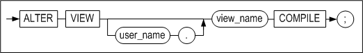

#### 전제 조건

SYS 사용자, 뷰가 속한 스키마의 소유자 또는 ALTER ANY TABLE 시스템 권한을 가진
사용자만이 이 구문으로 뷰를 변경할 수 있다.

#### 설명

뷰가 유효하지 않을 때(invalid) 그 뷰를 재 컴파일 하는데 사용한다. 예를 들어,
뷰의 기반 테이블중에 하나가 ALTER TABLE 문에 의하여 정의가 변경된 경우
명시적으로 뷰를 재 컴파일 하는데 사용할 수 있다.

*user_name*

재 컴파일 될 뷰의 소유자 이름을 명시한다. 생략하면 Altibase는 현재 세션에 연결된
사용자의 스키마에 속한 것으로 간주한다.

*view_name*

재 컴파일 될 뷰의 이름을 명시한다. 뷰의 이름은 1장의 "[객체 이름
규칙](#object_name)"을 따라야 한다.

뷰를 재 컴파일 때 Altibase는 뷰 생성문을 읽어와 다시 컴파일을 수행하므로 뷰 생성
시 발생할 수 있는 오류들이 ALTER VIEW 문 수행 시에도 발생할 수 있다. 뷰를 생성할
때 FORCE 옵션을 사용했다면, ALTER VIEW 문으로 뷰를 컴파일하는데 성공한 후에도
뷰가 여전히 무효인 상태일 수 있다.

ALTER VIEW 문은 기존 뷰의 정의를 변경하지 않는다. 뷰를 재 정의하려면 CREATE OR
REPLACE VIEW 문을 사용해야 한다.

#### 예제

\<질의\> 기반 테이블 employees의 정의를 변경 후, 뷰 avg_sal 을 재 컴파일하라.
(avg_sal 뷰의 생성은 CREATE VIEW 의 예제를 참고하라.)

```
iSQL> ALTER TABLE employees
     ADD COLUMN (email VARCHAR(20));
Alter success.
iSQL> ALTER VIEW avg_sal COMPILE;
Alter success.
iSQL> SELECT * FROM avg_sal;
DNO   EMP_AVG_SAL 
---------------------
..
6 rows selected.
```


### ALTER MATERIALIZED VIEW

#### 구문

**alter_materialized_view ::=**


#### 전제 조건

아래의 사용자만이 이 구문으로 materialized view의 속성을 변경할 수 있다.

- SYS 사용자
- Materialized view의 소유자
- ALTER ANY MATERIALIZED VIEW 시스템 권한을 가진 사용자

#### 설명

ALTER MATERIALIZED VIEW 구문을 사용해서 기존 materialized view의 refresh 방법과
시기를 변경할 수 있다.

각 키워드에 대한 자세한 내용은 CREATE MATERIALIZED
VIEW  구문의 설명을 참고하라.

#### 예제

\<질의\> materialized view의 리프레쉬 방법을 변경하라.

```
ALTER MATERIALIZED VIEW mv1 REFRESH COMPLETE ON DEMAND;
```


### COMMENT

#### 구문

**comment_on ::=**


#### 전제 조건

SYS 사용자, 테이블(뷰)이 속한 스키마의 소유자, 테이블(뷰)에 대해 ALTER 객체
권한을 가진 사용자, 또는 ALTER ANY TABLE 시스템 권한을 가진 사용자만이 이
구문으로 주석을 작성할 수 있다.

#### 설명

명시된 테이블, 뷰 또는 칼럼에 대한 주석을 작성하거나 수정하는데 사용한다.

*user_name*

COMMENT 문을 실행할 객체의 소유자 이름을 명시한다. 생략하면 Altibase는 현재
세션에 연결된 사용자의 스키마에 속한 것으로 간주한다.

*table_name, view_name*

주석을 다는 테이블 혹은 뷰의 이름을 명시한다.

*column_name*

주석을 다는 칼럼 이름을 명시한다.

*comment*

주석 내용을 명시한다. 주석은 최대 4000 바이트까지 입력할 수 있다. 주석을
삭제하고자 할 때에는 작은 따옴표(‘) 사이에 주석 내용을 쓰지 말고 COMMENT 문을
실행하여 기존 내용을 지운다.

#### 예제

\<질의\> 사용자 library1의 테이블 books와 그 테이블의 title칼럼에 주석을
추가한다.

```
iSQL> COMMENT ON TABLE library1.books IS 'Table of Book Info';
Comment Created.
iSQL> COMMENT ON COLUMN library1.books.title IS 'Title of Book';
Comment Created.
```

\<질의\> 사용자 library1의 테이블 books 와 그 칼럼의 주석을 조회한다.

```
iSQL> SET VERTICAL ON;
iSQL> SELECT * FROM system_.sys_comments_ WHERE user_name = ‘LIBRARY1’ AND table_name = ‘BOOKS’;
SYS_COMMENTS_.USER_NAME   : LIBRARY1
SYS_COMMENTS_.TABLE_NAME  : BOOKS
SYS_COMMENTS_.COLUMN_NAME : TITLE
SYS_COMMENTS_.COMMENTS    : title of book

SYS_COMMENTS_.USER_NAME   : LIBRARY1
SYS_COMMENTS_.TABLE_NAME  : BOOKS
SYS_COMMENTS_.COLUMN_NAME : 
SYS_COMMENTS_.COMMENTS    : table of book info

2 rows selected.
```

\<질의\> 테이블 books와 그 테이블의 title칼럼의 주석을 제거한다.

```
iSQL> COMMENT ON TABLE library1.books IS ’’;
Comment created.
iSQL> COMMENT ON COLUMN library1.books.title IS ’’;
Comment created.
```


### CONJOIN TABLE

#### 구문

**conjoin_table ::=**


[row_movement_clause ::=](#row_movement_clause),
[tablespace_clause ::=](#tablespace_clause), [physical_attributes_clause
::=](#physical_attributes_clause), [logging_clause ::=](#logging_clause),
[lob_column_properties ::=](#lob_column_properties)

**conjoin_range_clause ::=**


**range_table_to_partition_clause ::=**


**conjoin_list_clause ::=**

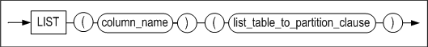

**list_table_to_partition_clause ::=**


#### 전제 조건

아래의 조건 중 하나 이상을 만족해야 테이블을 생성할 수 있다.

- SYS 사용자이다.
- 사용자 자신의 스키마에 테이블을 생성하려면, CREATE TABLE 또는 CREATE ANY
  TABLE 시스템 권한을 가지고 있어야 한다.
- 다른 사용자의 스키마에 테이블을 생성하려면, CREATE ANY TABLE 시스템 권한을
  가지고 있어야 한다.

아래의 조건 중 하나 이상을 만족해야 테이블을 제거할 수 있다.

- SYS 사용자이다.
- 테이블의 소유자이다.
- DROP ANY TABLE 시스템 권한을 가진 사용자이다.

#### 설명

1개 이상의 논 파티션드 테이블을 파티션드 테이블로 변환한다. 논 파티션드 테이블은
삭제되고 파티션드 테이블은 생성된다. 테이블들은 각각 명시된 파티션으로 변환되며
데이터는 이동한다. 테이블스페이스 옵션을 지정하지 않으면 사용자의 기본
테이블스페이스에 새 파티션드 테이블이 생성된다.

*conjoin_range_clause*

논 파티션드 테이블이 범위 파티션드 테이블로 변환된다.

*conjoin_list_clause*

논 파티션드 테이블이 리스트 파티션드 테이블로 변환된다.

*range_table_to_partition*

범위 파티션드 테이블로 변환할 대상인 논 파티션드 테이블 이름과 변환할 파티션
이름을 명시한다.

*list_table_to_partition*

리스트 파티션드 테이블로 변환할 대상인 논 파티션드 테이블 이름과 변환할 파티션
이름을 명시한다.

#### 주의 사항

- 대상 테이블과 생성되는 파티션드 테이블 이름 앞에 소유자 이름을 붙이지
  않는다.
- 파티션으로 이동한 데이터는 파티션 키 조건에 맞지 않을 수 있다.
- 새로 생성된 파티션드 테이블에 관련된 메타 테이블이 새로 생성되며, 파티션드
  테이블로 변환된 대상 테이블의 관련 메타 테이블은 모두 삭제된다.
- 대상 테이블과 관련된 PSM, 패키지, 뷰는 사용할 수 없다.
- 해시 파티션드 테이블은 지원하지 않는다.
- 기본 파티션이 생략된 파티션드 테이블은 지원하지 않는다.
- 생성되는 파티션드 테이블의 스키마는 대상 테이블의 스키마와 동일해야 한다.
  대상 테이블은 칼럼 개수와 이름, 순서와 자료형, in row와 compressed logging
  옵션, CHECK 및 NOT NULL 제약조건이 전부 동일해야 한다.
- 대상 테이블에 숨은 칼럼과 보안 칼럼과 압축 칼럼이 없어야 한다.
- 대상 테이블에 이벤트로 동작하는 트리거가 없어야 한다.

#### 예제

\<질의\> 테이블t1과 t2를 리스트 파티션드 테이블t3으로 변환한다.

```
iSQL> conjoin table t3
partition by list(i1)
(
  table t1 to partition p1 values (1,2,3,4,5),
  table t2 to partition p2 values default
)
tablespace tbs3;
Conjoin success.
```


### CREATE DATABASE

#### 구문

**create_database ::=**

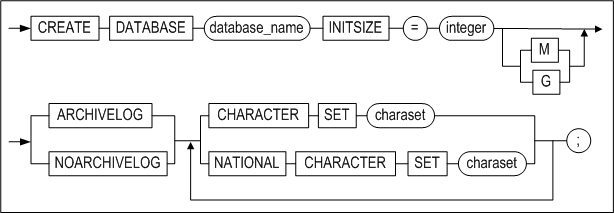

#### 전제 조건

이 구문은 PROCESS 구동 단계에서만 수행할 수 있으므로, SYS 사용자가 –sysdba
모드로 실행한 iSQL에서만 실행할 수 있다.

#### 설명

데이터베이스를 생성하는 구문이다. 데이터베이스 생성시 딕셔너리
테이블스페이스(Dictionary Tablespace), 언두 테이블스페이스(Undo Tablespace),
임시 테이블스페이스(Temp Tablespace)등 다수의 시스템 테이블스페이스(System
Tablespace)가 만들어진다. 생성되는 시스템 테이블스페이스는 시스템에 의해 정의된
이름과 Altibase 프로퍼티의 기본값을 갖는다.

사용자 정의 테이블스페이스는 이후에 사용자가 추가로 생성할 수 있다.

데이터베이스 생성시 데이터베이스 캐릭터 셋과 내셔널 캐릭터 셋을 반드시 지정해야
한다.

*database_name*

생성할 데이터베이스 이름을 명시한다. 명시하는 데이터베이스 이름은 프로퍼티
파일에 DB_NAME프로퍼티로 지정한 이름과 동일해야 한다. 다른 경우에는 오류가
발생한다.

*INITSIZE 절*

메모리 데이터베이스의 초기 크기를 나타내며, 128M 또는 4G 등의 형식으로 사용할 수
있다. 단위 없이 숫자만 명시할 경우, 기본으로 MB(Mega Bytes) 단위로 지정된다.

디스크 데이터베이스와 관련된 시스템 테이블스페이스도 CREATE DATABASE문 수행 시에
자동으로 생성된다.

시스템 테이블스페이스에 대한 기본값들은 프로퍼티 파일에서 아래의 프로퍼티를
읽어서 결정된다.

- SYS_DATA_TBS_EXTENT_SIZE, SYS_TEMP_TBS_EXTENT_SIZE, SYS_UNDO_TBS_EXTENT_SIZE
- SYS_DATA_FILE_INIT_SIZE, SYS_TEMP_FILE_INIT_SIZE, SYS_UNDO_FILE_INIT_SIZE
- SYS_DATA_FILE_MAX_SIZE, SYS_TEMP_FILE_MAX_SIZE, SYS_UNDO_FILE_MAX_SIZE
- SYS_DATA_FILE_NEXT_SIZE, SYS_TEMP_FILE_NEXT_SIZE, SYS_UNDO_FILE_NEXT_SIZE

*ARCHIVELOG \| NOARCHIVELOG*

데이터베이스를 archive log 모드 또는 noachive log 모드로 운영할지를 명시한다.
아카이브로그 모드로 운영시 매체 복구에 대비할 수 있는 반면, 노아카이브로그
모드로 운영할 때에는 매체 복구가 불가능하다.

Altibase 백업과 복구에 대한 자세한 정보는 *Administrator’s Manual*을 참고하기
바란다.

*charset*

데이터베이스의 캐릭터 셋, 내셔날 캐릭터 셋을 지정한다.

- 지정 가능한 데이터베이스 캐릭터 셋  
  US7ASCII  
  KO16KSC5601  
  MS949  
  BIG5  
  GB231280  
  MS936  
  UTF8  
  SHIFTJIS  
  MS932  
  EUCJP
- 지정 가능한 내셔널 캐릭터 셋  
  UTF8  
  UTF16

#### 예제

\<질의\> 이름이 mydb이고, 데이터베이스 캐릭터 셋은 KSC5601, 내셔널 캐릭터 셋은
UTF16인 10MB 크기의 데이터베이스를 생성하라.

```
$ isql -s localhost -u sys -p manager -sysdba
..
iSQL> STARTUP PROCESS;
Trying Connect to Altibase.. Connected with Altibase.

TRANSITION TO PHASE: PROCESS
Command execute success.
iSQL> CREATE DATABASE mydb INITSIZE=10M 
NOARCHIVELOG 
CHARACTER SET KSC5601 
NATIONAL CHARACTER SET UTF16;
.
.
Create success.
```


### CREATE DATABASE LINK

데이터베이스 링크에 대한 내용은 DatabaseLink User's Manual을 참고한다.

### CREATE DIRECTORY

#### 구문


#### 전제 조건

SYS 사용자 또는 CREATE ANY DIRECTORY 시스템 권한을 가진 사용자만이 이 구문으로
디렉토리 객체를 생성할 수 있다.

#### 설명

저장프로시저에서 파일 조작이 가능하다는 것은 운영 체제 파일 시스템상의 텍스트
파일에 대한 읽기 및 쓰기가 가능하다는 것을 의미한다. 이 기능을 이용하여 사용자는
저장프로시저 실행에 대해서 메시지를 파일에 남길 수도 있으며, 파일로 질의 결과를
리포팅 하거나 파일로부터 데이터를 읽어와 테이블에 삽입하는 등 다양한 작업을
수행할 수 있다.

CREATE DIRECTORY구문은 이러한 저장프로시저가 사용하는 파일들이 위치하는
디렉토리에 해당하는 데이터베이스 객체를 생성하는데 사용된다.

CREATE DIRECTORY문으로 생성된 디렉토리 객체의 소유자는 항상 SYS사용자이다. 실제
디렉토리 객체를 생성한 사용자는 이 객체에 대한 읽기와 쓰기 권한(WITH GRANT
OPTION 포함)을 부여받을 뿐이다.

CREATE DIRECTORY문의 실행은 SYS_DIRECTORIES\_ 메타 테이블에 디렉토리 정보를
기록할 뿐이며, 실제 운영 체제의 파일 시스템에 디렉토리를 생성하지는 않는다.
따라서 사용자는 실제 파일 시스템에 수동으로 디렉토리를 생성해야 한다.

*OR REPLACE*

이미 존재하는 디렉토리를 대체하여 같은 이름의 새로운 디렉토리를 생성하기 위한
옵션이다. 파일 시스템상의 실제 디렉토리는 삭제되지 않는다.

*directory_name*

데이터베이스 객체로서의 디렉토리 이름을 명시한다. 디렉토리 이름은  "[객체
이름 규칙](#object_name)"을 따라야 한다.

*path_name*

운영 체제 파일 시스템 상의 디렉토리의 절대 경로를 문자열로 명시한다.

#### 예제

\<질의\> /home/altibase/altibase_home/psm_msg 디렉토리를 가리키는 alti_dir1
디렉토리 객체를 생성하라.

```
iSQL> create directory alti_dir1 as '/home/altibase/altibase_home/psm_msg';
Create success.
```

\<질의\> /home/altibase/altibase_home/psm_result 디렉토리를 가리키는 alti_dir1
디렉토리 객체를 생성하라. 이미 alti_dir1 이름의 디렉토리가 데이터베이스에
존재하는 경우 이를 대체하여 생성하라.

```
iSQL> create or replace directory alti_dir1 as '/home/altibase/altibase_home/psm_result';
Create success.
```


<a name="create_index"><a/>

### CREATE INDEX 

#### 구문

**create_index ::=**


**table_index_clause ::=**


**memory_index_clause ::=**


**disk_index_clause::=**


**domain_index_clause ::=**

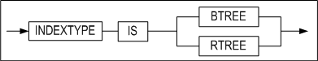

**directkey_clause ::=**


**memory_index_attributes ::=**


**storage_clause ::=**


**index_partitioning_clause ::=**


**index_partition_definition ::=**


**disk_index_attributes::=**


**parallel_clause ::=**

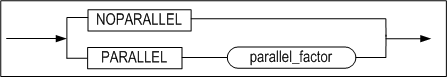

**logging_clause ::=**


**physical_attributes_clause ::=**


#### 전제 조건

SYS 사용자, CREATE INDEX 시스템 권한을 가진 사용자 또는 인덱스가 생성될 테이블에
대한 INDEX 객체 권한을 가진 사용자만이 이 구문으로 인덱스를 생성할 수 있다.

함수 기반 인덱스(Function-based indexes)를 생성하려면, 일반 인덱스와 동일한
권한이 필요하다. 다만, 수식에 사용자 정의 함수가 포함될 경우, 해당 함수는
DETERMINISTIC으로 생성된 것이어야 한다. 또한, 사용자는 함수 기반 인덱스에 사용된
다른 사용자 소유의 사용자 정의 함수에 대해 EXECUTE 객체 권한을 가지고 있어야
한다.

#### 설명

테이블의 한 개 이상의 칼럼 또는 수식에 대해 인덱스를 생성하는 구문이다. 파티션드
인덱스(즉, 로컬 인덱스)를 생성할 때 LOCALUNIQUE 옵션을 사용해서 로컬 유니크
속성을 부여할 수 있다. 디스크 파티션드 테이블에 인덱스를 생성할 때 LOCALUNIQUE
옵션 또는 LOCAL 키워드를 사용하지 않으면, 논파티션드 인덱스를 생성한다.

파티션드 인덱스는 파티션 키 칼럼과 인덱스 키 칼럼의 관계에 따라 프리픽스드
인덱스(prefixed-index)와 논프리픽스드 인덱스(non-prefixed index)로 구분된다.
파티션 키 칼럼과 인덱스 키 칼럼의 가장 왼쪽 컬럼이 같은 경우 프리픽스드
인덱스이며, 같지 않은 경우 논프리픽스드 인덱스이다.

함수 기반 인덱스는 수식을 기반으로 생성된 인덱스이다. 이 수식은 내장 SQL 함수
또는 사용자 정의 함수를 포함할 수 있다.

*user_name*

생성될 인덱스의 소유자 이름을 명시한다. 생략하면 Altibase는 현재 세션에 연결된
사용자의 스키마에 인덱스를 생성한다.

*index_name*

생성될 인덱스 이름을 명시한다. 인덱스 이름은 1장의 "[객체 이름
규칙](#object_name)"을 따라야 한다.

*UNIQUE*

중복 값을 허용하지 않는다.

*LOCALUNIQUE*

파티션드 인덱스 생성시 사용할 수 있다. 파티션드 인덱스의 각 인덱스 파티션별로
UNIQUE제약 조건을 만족해야 함을 가리킨다.

*index_expr*

여기에는 인덱스가 기반할 칼럼 또는 수식을 명시한다.

수식에는 테이블의 칼럼, 상수, SQL 함수, 및 사용자 정의 함수가 포함될 수 있다.
칼럼이 아니라 수식을 명시하는 경우, 함수 기반 인덱스가 생성된다.

함수 기반 인덱스의 제약 사항:

- 수식에는 함수 기반 인덱스가 생성될 테이블의 칼럼만 포함될 수 있다. 또한,
  칼럼 이름 앞에 스키마와 테이블 이름을 지정할 수 없다.
- 수식에는 상수(문자열 또는 숫자)가 포함될 수 있다.
- 수식에 SUM 같은 집계 함수를 사용할 수 없다.
- 수식에 포함되는 저장 프로시저에는 커서 및 %ISOPEN 등의 커서 속성, SQLCODE,
  SQLERRM 등을 사용할 수 없다.
- 글로벌 파티션드 인덱스의 경우, 수식은 파티셔닝 키가 될 수 없다.
- 함수 인자가 없더라도 모든 함수에 괄호를 명시해야 한다. 그렇지 않으면
  데이터베이스 서버가 칼럼 이름으로 인식한다.
- 수식에 완전하게 기술되지 않는 DATE 상수를 허용한다. 즉, DATE 타입 값에
  년도를 지정하지 않으면 현재 년도가 기본값이 되며, 월을 지정하지 않으면 현재
  월이 기본값이 된다. 타임 존 값은 Altibase의 DATE 타입에 지정할 수 없다.
- 수식에는 항상 동일한 값을 반환하는 내장 SQL 함수만 포함될 수 있다. 예를
  들어, SYSDATE 함수는 사용할 수 없다.
- 수식에 포함되는 사용자 정의 함수는 DETERMINISTIC으로 선언되어야 한다.
- 수식에는 부질의(subquery)가 포함될 수 없다.
- 수식에는 시퀀스가 포함될 수 없다.
- 수식에는 어떠한 의사 칼럼(pseudo column)도 포함될 수 없다.
- 수식에 PRIOR 연산자를 사용할 수 없다.
- 수식에 LOB 데이터를 사용할 수 없다.
- QUERY_REWRITE_ENABLE 프로퍼티가 1인 경우에만, 쿼리 최적화 과정에서 함수 기반
  인덱스가 선택될 수 있다.

*ASC/DESC*

각각의 인덱스 키 칼럼이 오름차순인지 내림차순인지를 지정한다.

*index_partitioning_clause*

생성될 인덱스가 파티션드 인덱스임을 명시하고, 인덱스 파티션들이 저장될
테이블스페이스를 지정하는 절이다. 이 절을 생략하면, 인덱스 파티션들은 테이블의
기본 테이블스페이스에 저장될 것이다.

파티션드 인덱스를 생성하는 가장 쉬운 방법은 인덱스 생성시 LOCAL 키워드를
명시하는 것이다. 아니면, 각 테이블 파티션별로 생성될 인덱스 파티션에 대한 속성을
상세히 명시해야 한다.

LOCAL 키워드만 명시하면, 각 테이블 파티션별로 인덱스 파티션이 자동으로 생성되며
각 인덱스 파티션의 이름은 시스템에 의해 자동으로 부여된다. 인덱스 파티션 이름은
SYS_IDX1, SYS_IDX2, ... 와 같은 형태로 순차적으로 붙여진다.

모든 테이블 파티션 또는 그 일부에 인덱스 파티션을 직접 명시할 수 있다. 일부에만
명시하는 경우 나머지 테이블 파티션에 대한 인덱스 파티션은 자동적으로 생성되며,
생성 방식은 상기와 동일하다.

파티션드 인덱스 생성시 테이블스페이스를 명시하지 않으면, 각 인덱스 파티션이
저장될 테이블스페이스는 아래 도표의 과정을 거쳐서 결정된다.


> 주의: 메모리 인덱스는 테이블스페이스에 저장되지 않으므로, 각 파티션이 저장될
> 테이블스페이스를 지정하더라도 이는 무시된다.


*BTREE*

B+-Tree 인덱스를 생성하도록 지시한다. 이는 범위 검색 시 유용하다. INDEXTYPE IS
절 생략 시 기본으로 B+-Tree 인덱스가 생성된다.

*RTREE*

R-Tree 인덱스를 생성하도록 지시한다. 이는 다차원 데이터 처리 시 유용하다.

*directkey_clause*

이 절은 Direct Key인덱스를 생성시 사용할 수 있다. Direct Key란 인덱스 노드에
저장되는 레코드이며, Direct Key 인덱스에는 레코드 포인터와 함께 실제 레코드도
저장되기 때문에 인덱스 스캔 비용을 줄일 수 있다.

- MAXSIZE integer  
  Direct Key의 최대 크기를 설정할 수 있으며, 명시하지 않을 경우 기본값은
  8바이트이다. 지원하는 데이터 타입의 MAXSIZE 값은 아래의 표를 참조한다.  
  Partial Key를 지원하는 문자형 타입은 MAXSIZE 값보다 설정 값이 큰 경우에는
  MAXSIZE만큼 prefix가 되어 Direct Key로 저장된다. 그러나 Partial Key를
  지원하지 않는 타입은 MAXSIZE 값보다 설정 값이 큰 경우 인덱스 생성에
  실패한다.

- Direct Key 인덱스의 제약사항
  - 복합 키 인덱스(Composite Index)에 Direct Key인덱스를 생성하는 경우 첫 번째
    칼럼만 Direct Key로 설정된다.
  - 압축 칼럼과 암호화 칼럼은 Direct Key 인덱스를 설정할 수 없다.
  - 디스크 인덱스에는 Direct Key 인덱스를 설정할 수 없다.

아래는 Direct Key인덱스를 지원하는 데이터 타입을 나타내는 표이다.

<table>
<tbody>
<tr>
<th>
<p>분류</p>
</th>
<th>
<p>자료형</p>
</th>
<th>
<p>MAXSIZE</p>
<p>(Full Key 지원)</p>
</th>
<th>
<p>Partial Key 지원</p>
</th>
</tr>
<tr>
<td rowspan="5" >
<p>Native 숫자형</p>
</td>
<td>
<p>BINGINT</p>
</td>
<td>
<p>8</p>
</td>
<td>
<p>X</p>
</td>
</tr>
<tr>
<td>
<p>DOUBLE</p>
</td>
<td>
<p>8</p>
</td>
<td>
<p>X</p>
</td>
</tr>
<tr>
<td>
<p>INTEGER</p>
</td>
<td>
<p>4</p>
</td>
<td>
<p>X</p>
</td>
</tr>
<tr>
<td>
<p>REAL</p>
</td>
<td>
<p>4</p>
</td>
<td>
<p>X</p>
</td>
</tr>
<tr>
<td>
<p>SMALLINT</p>
</td>
<td>
<p>2</p>
</td>
<td>
<p>X</p>
</td>
</tr>
<tr>
<td rowspan="3">
<p>Non-Native 숫자형</p>
</td>
<td >
<p>FLOAT</p>
<p>FLOAT(p)</p>
</td>
<td>
<p>23</p>
<p>3 + ( ( p + 2 ) / 2 )</p>
</td>
<td>
<p>X</p>
</td>
</tr>
<tr>
<td >
<p>NUMBER</p>
<p>NUMBER(p, s)</p>
<p>NUMBER(p)</p>
</td>
<td>
<p>23</p>
<p>3 + ( ( p + 2 ) / 2 )</p>
<p>3 + ( ( p + 2 ) / 2 )</p>
</td>
<td>
<p>X</p>
</td>
</tr>
<tr>
<td>
<p>NUMERIC</p>
<p>NUMERIC(p, s)</p>
<p>NUMERIC(p)<br /> &nbsp;(=DECIMAL)</p>
</td>
<td >
<p>23</p>
<p>3 + ( ( p + 2 ) / 2 )</p>
<p>3 + ( ( p + 2 ) / 2 )</p>
</td>
<td>
<p>X</p>
</td>
</tr>
<tr>
<td rowspan="4">
<p>문자형</p>
</td>
<td>
<p>CHAR(M)</p>
</td>
<td>
<p>M + 2</p>
</td>
<td>
<p>O</p>
</td>
</tr>
<tr>
<td>
<p>VARCHAR(M)</p>
</td>
<td>
<p>M + 2</p>
</td>
<td>
<p>O</p>
</td>
</tr>
<tr>
<td>
<p>NCHAR(M)</p>
</td>
<td>
<p>(M * 2) + 2 &lt;UTF16&gt;</p>
<p>(M * 3) + 2 &lt;UTF8</p>
</td>
<td>
<p>O</p>
</td>
</tr>
<tr>
<td>
<p>NVARCHAR(M)</p>
</td>
<td>
<p>(M * 2) + 2 &lt;UTF16&gt;</p>
<p>(M * 3) + 2 &lt;UTF8&gt;</p>
</td>
<td>
<p>O</p>
</td>
</tr>
<tr>
<td>
<p>날짜형</p>
</td>
<td>
<p>DATE</p>
</td>
<td>
<p>8</p>
</td>
<td>
<p>X</p>
</td>
</tr>
<tr>
<td rowspan="4">
<p>이진 데이터형</p>
</td>
<td>
<p>BIT(M)</p>
</td>
<td>
<p>(M / 8) + 4</p>
</td>
<td>
<p>X</p>
</td>
</tr>
<tr>
<td>
<p>VARBIT(M)</p>
</td>
<td>
<p>(M / 8) + 4</p>
</td>
<td>
<p>&nbsp;</p>
</td>
</tr>
<tr>
<td>
<p>BYTE(M)</p>
</td>
<td>
<p>M + 2</p>
</td>
<td>
<p>X</p>
</td>
</tr>
<tr>
<td>
<p>NIBBLE(M)</p>
</td>
<td>
<p>(M / 2) + 1</p>
</td>
<td>
<p>&nbsp;</p>
</td>
</tr>
</tbody>
</table>


*physical_attributes_clause*

- INITRANS 절  
  TTS(Touched Transaction Slot)의 초기 개수를 지정한다. 기본값은 8개이다.
- MAXTRANS 절  
  TTS의 최대 개수를 지정한다. 기본값은 50개이다.

*TABLESPACE 절*

인덱스가 저장될 테이블스페이스 이름을 명시한다. 이 절을 생략하면 Altibase는
인덱스를 그 인덱스가 속하는 스키마 소유자의 기본 테이블스페이스에 생성한다.
그러나 메모리 테이블에 인덱스를 생성하는 구문에는 테이블스페이스를 지정하더라도
메모리 인덱스는 테이블스페이스에 저장되지 않으므로 이는 무시된다.

*parallel_clause*

이는 인덱스를 생성하는 쓰레드의 개수를 결정하는 데 사용되는 힌트(hint)로 인덱스
생성시 성능 향상을 목적으로 사용한다. Altibase는 사용자가 힌트로 지정한
parallel_factor, 인덱스 생성 대상 테이블의 크기 및 인덱스 생성 시 사용가능한
메모리 양을 고려하여 최적화된 인덱스 생성 쓰레드의 개수를 결정한다.

parallel_factor의 입력 가능한 값의 범위는 0 \~ 512이고, 기본값은 Altibase가
동작중인 호스트 장비의 CPU 개수이다. 인덱스 생성 쓰래드 개수는 위에서 설명한
최적화 방법으로 결정되기 때문에 parallel_factor는 생략해도 무방하다.

이 구문을 생략하거나 0으로 설정한 경우, parallel_factor와 동일한 의미를 갖는
altibase.properties 파일에 설정된 INDEX_BUILD_THREAD_COUNT 프로퍼티 값이 대신
사용된다. INDEX_BUILD_THREAD_COUNT프로퍼티도 명시되어 있지 않은 경우, CPU 개수에
기반하여 최적화된 인덱스 생성 쓰레드 개수가 결정된다.

parallel_factor의 값을 실제 CPU 개수보다 큰 값으로 설정하는 경우, 혹은 최대값인
512를 초과해 설정하는 경우, CPU 개수를 힌트로 사용하여 최적화된 인덱스 생성
쓰레드 개수가 결정된다.

*logging_clause*

로깅(LOGGING) 또는 노로깅(NOLOGGING) 옵션을 사용하면 디스크 테이블을 위한
인덱스를 생성할 때 발생하는 로그를 기록하거나 기록하지 않게 할 수 있다. 기본
값은 로깅을 하는 것이며, 이는 인덱스 생성시 관련 로그가 기록됨을 의미한다.

생성된 디스크 인덱스를 강제로 디스크에 저장할 것인지 여부를 지정하려면 FORCE
또는 NOFORCE 옵션을 사용한다.

*logging_clause*에 대한 자세한 설명은 *Administrator’s Manual*의 “데이터베이스
객체 및 권한” 장의 “인덱스”를 참고한다.

*storage_clause*

사용자가 세그먼트내의 익스텐트를 관리하는 파라미터를 지정할 수 있는 구문이다.

- INITEXTENTS 절  
  세그먼트 생성시 기본으로 할당되는 익스텐트의 개수를 지정한다. 기본값은
  1이다.
- NEXTEXTENTS 절  
  세그먼트 크기 확장시마다 추가될 익스텐트 개수를 명시한다. 기본값은 1이다.
- MINEXTENTS 절  
  세그먼트의 최소 익스텐트 개수를 지정한다. 기본값은 1이다.
- MAXEXTENTS 절  
  세그먼트의 최대 익스텐트 개수를 지정한다. 명시하지 않을 경우 세그먼트 내의
  익스텐트 최대 개수는 제한이 없다.

#### 주의 사항

- 파티션드 테이블에 인덱스(즉, 파티션드 인덱스)를 생성하는 경우, 각 로컬 인덱스가
  저장될 테이블스페이스는 index_partitioning_clause 에 따로따로 지정할 수 있다.
  disk_index_attributes는 파티션드 인덱스 전체를 위한 테이블스페이스를 지정하는데
  사용될 수 없다. 즉, 파티션드 인덱스 전체를 위한 테이블스페이스는 지정할 수 없다.
  또한 로컬 인덱스는 B+-tree 인덱스일 수만 있다.
- 시스템이나 미디어 고장시 NOLOGGING(FORCE/NOFORCE) 옵션으로 생성된 인덱스의
  일관성은 보장되지 않을 수 있다. 이 경우 ‘The index is inconsistent.’라는 오류
  메시지가 발생할 것이다. 이러한 오류를 해결하려면 일관성이 깨어진 인덱스를 찾아
  삭제한 후에 해당 인덱스를 다시 생성하도록 한다. 인덱스의 일관성은
  V\$DISK_BTREE_HEADER 성능 뷰로 확인할 수 있다.

- LOB 칼럼은 인덱스 키 칼럼이 될 수 없다.


#### 예제

\<질의 1\> 사원 테이블의 eno 칼럼 (오름차순)과 dno칼럼 (내림차순)에 인덱스
emp_idx2를 생성하라.

```
iSQL> CREATE INDEX emp_idx2
    ON employees (eno ASC, dno DESC);
Create success.
```

\<질의 2\> 사원 테이블의 dno 칼럼에 내림차순의 유니크 인덱스 emp_idx2를
생성하라. (이는 사원 테이블에 레코드가 전혀 없거나 칼럼 dno에 unique한 값들만
존재 할 때 가능하다.)

```
iSQL> CREATE UNIQUE INDEX emp_idx2
    ON employees (dno DESC);
Create success.
```

\<질의 3\>테이블 employees의 eno 칼럼에 오름차순으로 B+tree 인덱스 emp_idx3를
생성하라. 이미 사원 테이블의 eno칼럼을 오름차순으로 정렬한 PRIMARY KEY가 존재하기 때문에 인덱스
emp_idx3를 생성하기 전에 기본키 제약을 삭제해야 한다. 그렇지 않으면, 다음 오류가
발생할 것이다.

```
ERR-3104C: Duplicate key columns in an index

iSQL> ALTER TABLE employees
    DROP PRIMARY KEY;
Alter success.
iSQL> CREATE INDEX emp_idx3
    ON employees (eno ASC)
    INDEXTYPE IS BTREE;
Create success.
```

\<질의 4\> user_data 테이블스페이스에 table_user 테이블의 i1칼럼에 인덱스 idx1을
생성하라.

```
iSQL> CREATE INDEX idx1
    ON table_user (i1)
    TABLESPACE user_data;
Create success.
```

\<질의 5\> user_data 테이블스페이스에 table_user 테이블의 i1 칼럼에 인덱스
idx2을 병렬 옵션으로 생성하라.

```
iSQL> CREATE INDEX idx1
    ON table_user (i1)
    TABLESPACE user_data PARALLEL 4;
Create success. 
```

\<질의 6\> 로컬 인덱스, 즉 product_id를 기준으로 각 테이블 파티션에 대응하는
파티션별로 인덱스를 생성하라. 파티션의 이름은 자동으로 부여되도록 하라.

```
CREATE INDEX prod_idx ON products(product_id) LOCAL;
```

\<질의 7\> 각각의 인덱스 파티션을 지정해서 로컬 인덱스를 생성하라.

```
CREATE INDEX prod_idx ON products(product_id) 
LOCAL
( 
  PARTITION p_idx1 ON p1 TABLESPACE tbs_disk1,
  PARTITION p_idx2 ON p2 TABLESPACE tbs_disk2,
  PARTITION p_idx3 ON p3 TABLESPACE tbs_disk3 
);
```

\<질의 8\> 인덱스 파티션 일부만 지정해서 로컬 인덱스를 생성하라. 지정하지 않은
파티션은 자동으로 결정된다.

```
CREATE INDEX prod_idx ON products(product_id) 
LOCAL
( 
  PARTITION p_idx1 ON p1 TABLESPACE tbs_disk1,
  PARTITION p_idx3 ON p3 TABLESPACE tbs_disk3 
);
```

\<질의 9\> 테이블 employees의 사원번호(eno)에 인덱스 idx1을 생성하되 시스템
고장이나 미디어 고장이 발생하더라도 사용할 수 있게 LOGGING 옵션을 사용하라.
Employees 테이블이 디스크 테이블스페이스에 있다고 가정한다.

```
iSQL> CREATE INDEX idx1
    ON employees (eno);
Create success.

또는

iSQL> CREATE INDEX idx1
    ON employees (eno) LOGGING ;
Create success.
```

\<질의 10\> 테이블 employees의 eno 칼럼(오름차순)과 dno칼럼(오름차순)에 인덱스
idx1을 NOLOGGING 옵션으로 생성하라. 단, 인덱스 생성 후 시스템 고장이
발생하더라도 인덱스가 사용가능하도록 FORCE옵션을 사용하라. Employees 테이블이
디스크 테이블스페이스에 있다고 가정한다.

```
iSQL> CREATE INDEX idx1
    ON employees (eno ASC, dno ASC)
    NOLOGGING;
Create success.

또는
사원번호(eno): ASC
부서번호(dno): ASC
iSQL> CREATE INDEX idx1
    ON employees (eno ASC, dno ASC)
    NOLOGGING FORCE;
Create success.
```

\<질의 11\> 테이블 employees의 eno 칼럼(오름차순)과 dno칼럼(오름차순)에 인덱스
idx1을 NOLOGGING 옵션으로 생성하고, 디스크에 반영하지 않게 NOFORCE옵션을
사용하라. Employees 테이블이 디스크 테이블스페이스에 있다고 가정한다.

```
iSQL> CREATE INDEX idx1
    ON employees (eno ASC, dno ASC)
    NOLOGGING NOFORCE;
Create success.
```

\<질의 12\> 디스크 테이블스페이스 USERTBS의 LOCAL_TBL 테이블에 인덱스
LOCAL_IDX를 생성하라. 단, 인덱스 생성시 익스텐트 1개가 할당되고 인덱스 세그먼트
크기 확장시마다 2개씩 증가되며, 세그먼트의 총 익스텐트 개수는 제한하지 않는다.

```
iSQL> CREATE INDEX LOCAL_IDX ON LOCAL_TBL ( I1 ) 
 TABLESPACE USERTBS
 STORAGE ( INITEXTENTS 1 NEXTEXTENTS 2 MAXEXTENTS UNLIMITED );
Create success.
```

\<질의 13\> employees 테이블의 salary 칼럼을 사용해서 연봉에 기반한 함수 기반
인덱스를 생성하라.

```
iSQL> CREATE INDEX income_idx ON employees (salary*12);
Create success.
```

\<질의 14\> 사용자 정의 함수를 사용해서 \<질의 13\>과 동일한 인덱스를 생성하라.

```
CREATE OR REPLACE FUNCTION get_annual_salary
(salary in integer) 
RETURN integer
DETERMINISTIC
AS
BEGIN
    RETURN salary*12;
END;
/

iSQL> CREATE INDEX income_idx ON employees(sys.get_annual_salary(salary));
Create success.
```

\<질의 15\> 테이블 employees의 eno 칼럼에 Direct Key 인덱스를 생성하라.

```
iSQL> CREATE INDEX direct_idx ON employees ( eno ) DIRECTKEY ;
Create success.
```

\<질의 16\> 테이블 tab1의 name 칼럼(varchar(100))에 32바이트의 레코드를 저장할
수 있는 Direct Key 인덱스를 생성하라.

```
iSQL> CREATE INDEX idx1 ON tab1 ( name ) DIRECTKEY MAXSIZE 32;
Create success.
```


### CREATE JOB 

#### 구문

**create_job ::=**


**execute_procedure_statement ::=**


**start_end_clause ::=**


**interval_clause ::=**


#### 전제 조건

SYS 사용자만이 이 구문으로 JOB을 생성할 수 있다. 생성된 JOB을 수행하려면 JOB을
생성 시 또는 생성 후에 반드시 ENABLE로 활성화해야 한다.

#### 설명

CREATE JOB 구문으로 작업 스케줄러에서 관리할 JOB을 생성할 수 있다. 생성하는
각각의 JOB은 실행할 프로시저와 시작 시간, 끝나는 시간 및 실행 주기 등의 일정을
지정할 수 있다.

*execute_procedure_statement*

JOB에 등록할 프로시저의 실행 구문을 명시한다. JOB 한 개에 한 개의 프로시저만
등록할 수 있다. 프로시저의 사용자 이름은 생략할 수 있으며, SYS 사용자로
간주한다. expr2에는 명시한 프로시저를 실행하기 위한 입력 인자 값을 상수 또는
수식으로 지정한다.

프로시저에 대한 자세한 설명은 *Stored Procedures Manual*을 참조한다.

*start_end_clause*

JOB을 실행하는 시작 시간과 끝나는 시간을 설정할 수 있다. expr1에는 DATE 타입의
값 또는 수식만 올 수 있다.

*interval_clause*

JOB이 처음 실행된 이후에 다음에 반복적으로 실행할 주기를 명시한다. 시간 단위는
number 다음에 명시되는 YEAR, MONTH, DAY, HOUR, MINUTE에 따라 결정된다.

*ENABLE/DISABLE*

사용자가 각각의 JOB을 ENABLE/DISABLE을 선택하여 작업 스케줄러에서 수행 여부를
설정할 수 있다. 생략하면, 기본값은 DISABLE이다.

*COMMENT*

JOB에 대한 설명을 기술할 수 있다.

#### 주의 사항

아래는 JOB을 사용하는 관리자가 염두에 두어야 할 사항들이다.

- 입출력 모드가 OUT 또는 INOUT인 인자를 가진 저장 프로시저는 JOB에 등록될 수 없다.
- 작업 스케줄러가 JOB을 실행하려면 JOB_SCHEDULER_ENABLE 프로퍼티가 1이고 JOB_THREAD_COUNT 프로퍼티 값이 0보다 커야 한다.
- JOB에서 수행한 프로시저에서 오류가 발생한 경우, JOB_MSGLOG_FILE 프로퍼티에 설정한 트레이스 로그 파일(기본: $ALTIBASE_HOME/trc/altibase_job.log)에 에러 메시지 등의 로그를 기록한다.
- 프로시저에서 SYSTEM_.PRINTLN 같은 출력 함수를 사용한 경우, JOB_MSGLOG_FILE 프로퍼티에 설정한 트레이스 로그 파일(기본: $ALTIBASE_HOME/trc/altibase_job.log)에 출력 내용을 기록한다.

#### 예제

\<질의\> 현재부터 시작되어 한 달에 한 번 주기로 proc1 프로시저를 실행하는 job1을 생성하라 (job1의 상태는 DISABLE이다).

```
iSQL> CREATE JOB job1 EXEC proc1 START sysdate INTERVAL 1 MONTH;
Create success.
```

\<질의\> 2016년 8월 1일부터 8월 31일까지 매일 00:00:00에 proc 프로시저를
수행하는 job2을 생성하고, job2의 상태를 활성화(ENABLE)하라.

```
iSQL> CREATE JOB job2 EXEC proc
START to_date('2016/08/01 00:00:00', 'YYYY-MM-DD HH:MI:SS')
END to_date('2016/08/31 00:00:00', 'YYYY-MM-DD HH:MI:SS')
INTERVAL 1 DAY
ENABLE;
Create success.
```


### CREATE QUEUE 

#### 구문

**create_queue ::=**


[column_definition ::=](#column_definition)

#### 전제 조건

아래의 조건 중 하나 이상을 만족해야 테이블을 생성할 수 있다.

- SYS 사용자이다.
- 사용자 자신의 스키마에 테이블을 생성하려면, CREATE TABLE 또는 CREATE ANY
  TABLE 시스템 권한을 가지고 있어야 한다.
- 다른 사용자의 스키마에 테이블을 생성하려면, CREATE ANY TABLE 시스템 권한을
  가지고 있어야 한다.

#### 설명

큐에 삽입 가능한 최대 메시지의 길이를 지정하거나 사용자가 직접 칼럼을 정의하여
큐를 생성하는 구문이다. 큐 테이블에 저장 가능한 최대 레코드 수도 지정할 수 있다.

*queue_name*

큐의 이름을 지정한다. 최대로 가능한 큐 이름의 길이는 28 바이트이다.

*size*

큐에 저장될 메시지의 최대 크기(단위: 바이트)를 지정한다. 지정 가능한 값의 범위는
1에서 32000바이트이다.

*FIXED\|variable_clause*

메시지의 저장 방식을 지정한다. (자세한 설명은 *General Reference*를 참고한다.)

*column_definition*

사용자 정의 칼럼을 지정한다. CREATE TABLE 의 column_definition을 참고하며, 해당 구문에서 column_constraint, crypt_clasue, timestamp는 지원하지 않는다.

*MAXROWS count*

큐 테이블에 저장 가능한 최대 레코드 수를 지정한다. 지정 가능한 값의 범위는 1에서
4294967295(2<sup>32</sup>-1)이며, 생략할 경우 기본값은 최대값인 4294967295이다.

*DELETE [ON|OFF]*

큐 테이블에 DELETE 문 허용 여부를 결정하는 절이다.
ON은 큐 테이블에 DELTE 문을 허용한다. OFF는 큐 테이블에 DELETE 문을 허용하지 않는다. 이 경우 DELETE 문을 허용한 경우보다 DEQUEUE 병렬 수행 성능이 향상된다.
DELETE 절을 생략하면 DELETE ON으로 큐 테이블을 생성한다.
DELETE 문을 허용하지 않는 큐 테이블은 V$QUEUE_DELETE_OFF에서 확인할 수 있다.

#### 주의사항

- 큐 생성시에 데이터베이스 내부적으로 “큐 이름”+ “_NEXT_MSG_ID”라는 명칭의 테이블 객체가 생성된다. 따라서 생성 하고자 하는 큐의 이름 또는 “큐 이름”+ “_NEXT_MSG_ID”과 동일한 이름의 테이블, 뷰, 시퀀스, 시노님, 또는 저장 프로시저가 이미 존재하는 경우에 에러가 발생한다.


#### 예제

\<질의\> 메시지의 길이가 최대 40이고, 최대 레코드 개수가 1,000,000인 Q1이라는
이름의 큐를 생성하라.

```
iSQL> CREATE QUEUE Q1(40) MAXROWS 1000000;
Create success.
```

\<질의\> 'Q1' 이름의 큐를 생성할 때, numeric(5,2) 타입의 값을 저장할 수 있는
2개의 칼럼을 생성하라.

```
iSQL> CREATE QUEUE Q1(c1 numeric(5,2), c2 numeric(5,2));
Create success.
```

\<질의\> 사용자 칼럼을 정의한 'Q2' 이름의 큐를 생성하고, 해당 칼럼에 메세지를
입력 후, 삭제하라.

```
iSQL> CREATE QUEUE Q2(V1 VARCHAR(10), V2 INTEGER, V3 NUMERIC(5,3));
Create success.

iSQL> ENQUEUE INTO Q2(V1, V2, V3) VALUES ('abc', 1, 99.999);
1 row inserted.

iSQL> DEQUEUE V1, V2, V3 FROM Q2;
V1          V2          V3
----------------------------------------
abc         1           99.999
1 row selected.
```

\<질의\> 메시지의 길이가 최대 40이고, DELETE 문을 허용하지 않는 Q3이라는 이름의 큐 테이블을 생성하라.

```
iSQL> CREATE QUEUE Q3(40) DELETE OFF;
Create success.
```

### CREATE REPLICATION 

#### 구문

**create_replication ::=**


**option_clause ::=**


**replication_item ::=**


#### 전제 조건

SYS 사용자만이 이중화 객체를 생성할 수 있다.

#### 설명

이중화 객체를 생성하는 구문으로, 이는 지역 서버에서 원격 서버로의 이중화 연결을
설정한다. 이중화는 테이블 간에 1:1 로 일어난다. 즉, 한 테이블은 상대편의 오직
하나의 테이블에만 매칭된다.

데이터 충돌을 해결하기 위해 이중화 생성 구문에 AS MASTER 또는 AS SLAVE를
지정하여 Master-Slave scheme을 사용할 수 있다. 이중화 충돌 해결에 대한 자세한
내용은 *Replication Manual*을 참고한다.

*replication_name*

이중화 이름을 명시한다. 지역 서버와 원격 서버의 이중화 객체의 이름이 동일해야
한다. 이중화 이름은 "[객체 이름 규칙](#object_name)"을 따라야 한다.

*FOR ANALYSIS \| FOR ANALYSIS PROPAGATION*

XLog Sender를 생성한다. 자세한 설명은 *Log Analyzer User’s Manual*을 참고한다.

*FOR PROPAGABLE LOGGING*

이중화 수신자가 지역 서버로부터 전송 받은 로그를 다른 서버로 복제하기 위해
로그를 기록한다. 이 기능은 recovery option과 함께 사용하지 않는다.

*FOR PROPAGATION*

복제된 로그를 이중화된 다른 서버로 전송한다.

*option_clause*

이중화 객체의 RECOVERY, OFFLINE, GROUPING, PARALLEL, GAPLESS 옵션을 지정하는
절이다.

이 기능은 각각 데이터 복구를 위해 사용되거나, 오프라인 이중화 수행시 사용된다.
또한 성능을 위하여 이중화 트랜잭션을 그룹화하거나 병렬 적용자 옵션을 지정할 때
사용할 수 있다. 이중화 격차를 일정 수준 이하로 유지하기 위하여 갭 해소(GAPLESS)
옵션도 지정할 수 있다. 자세한 설명은 *Replication Manual*을 참고한다.

*replication_host_ip*

원격 서버의 IP 주소를 입력한다.

*replication_host_port_no*

원격 서버의 수신 쓰레드가 사용하는 포트번호를 입력한다. 이는 원격 서버
altibase.properties 파일의 REPLICATION_PORT_NO프로퍼티 값과 일치해야 한다.

*USING conn_type [ib_latency]*

원격 서버와의 통신방법(TCP 또는 InfiniBand)을 설정할 수 있다. 인피니밴드를
사용할 경우에만 ib_latency 값을 설정할 수 있다. 인피니밴드를 사용하려면
IB_ENABLE 프로퍼티 값이 1이어야 한다.

*user_name*

이중화 대상 테이블의 소유자 이름을 명시한다.

*tbl_name*

이중화 대상 테이블 이름을 명시한다.

*partition_name*

이중화 대상 파티션 이름을 명시한다.

#### 예제

\<질의\> 다음 조건에 부합하는 이중화 *rep1*을 생성하라.

- 지역 서버의 IP 주소가 192.168.1.60 이고 포트 번호가 25524
- 원격 서버의 IP 주소가 192.168.1.12 이고 포트 번호가 35524
- employees 테이블과 departments 테이블을 이중화

지역 서버의 경우 (IP: 192.168.60)

```
iSQL> CREATE REPLICATION rep1
    WITH '192.168.1.12',35524
    FROM sys.employees TO sys.employees,
    FROM sys.departments TO sys.departments;
Create success.
```

원격 서버의 경우 (IP: 192.168.1.12)

```
iSQL> CREATE REPLICATION rep1
    WITH '192.168.1.60',25524
    FROM sys.employees TO sys.employees,
    FROM sys.departments TO sys.departments;
Create success. 
```

\<질의\> 원격 서버가 이중화 rep1의 로그를 수신 후, 다른 원격 서버로 로그를
복제하여 전송하기 위한 이중화 rep2를 생성하여 전송한다.

```
iSQL> CREATE REPLICATION rep1 
    FOR PROPAGABLE LOGGING WITH '192.168.1.12',35524
    FROM sys.t1 TO sys.t1;
iSQL> SELECT replication_name, role 
    FROM system_.sys_replications_;
REPLICATION_NAME                          ROLE
---------------------------------------------------------
REP1                                      2
1 row selected.

iSQL> CREATE REPLICATION rep2
    FOR PROPAGATION WITH '192.168.1.60',25524 
    FROM sys.t1 TO sys.t1;
Create success.
iSQL> SELECT replication_name, role 
    FROM system_.sys_replications_;
REPLICATION_NAME                          ROLE
---------------------------------------------------------
REP2                                      3
1 row selected.
```


### CREATE ROLE

#### 구문

**create_role ::=**

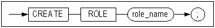

#### 전제 조건

SYS 사용자와 CREATE ROLE 시스템 권한을 가진 사용자만이 롤(ROLE)을 생성할 수
있다.

#### 설명

명시된 이름으로 새로운 롤(ROLE)을 생성한다. 사용자에게 부여할 수 있는
권한(privilege)들의 묶음을 롤이라고 한다.

처음 롤을 생성하면 롤에는 아무런 권한이 없다. GRANT 구문을 사용해서 롤에
권한들을 추가한 다음, 롤을 사용자에게 부여하도록 한다. 사용자가 롤에 의해 부여된
권한을 사용하려면 데이터베이스에 다시 접속해야 한다.

롤에 부여할 수 있는 권한은 시스템 권한과 객체 권한이며, 이에 대한 사용 방법은
GRANT 예제와 REVOKE 예제를 참조한다.

*role_name*

생성될 롤의 이름을 명시한다. 이름은 데이터베이스 내에서 유일해야 한다.

#### 예제

\<질의\> 이름이 alti_role인 롤을 생성한다.

```
iSQL> CREATE ROLE alti_role;
Create success.
```


### CREATE SEQUENCE 

#### 구문

**create_sequence ::=**


**sequence_options ::=**

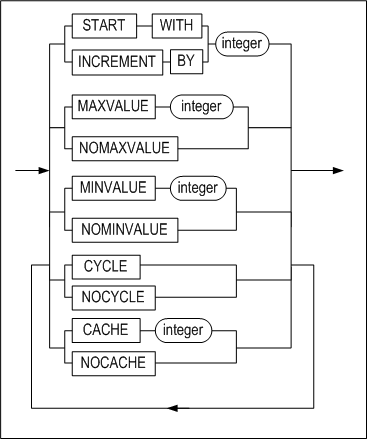

**sync_table_clause ::=**


#### 전제 조건

SYS 사용자 또는 CREATE SEQUENCE 시스템 권한을 가진 사용자만이 이 구문으로
시퀀스를 생성할 수 있다. 만약 다른 사용자의 스키마에 시퀀스를 생성하려면, CREATE
ANY SEQUENCE 권한을 가져야한다.

#### 설명

이 구문은 명시된 시퀀스 이름으로 새로운 시퀀스를 생성한다. 생성된 시퀀스는
시퀀스 번호를 자동으로 생성하는데 사용된다.

*user_name*

생성될 시퀀스의 소유자 이름을 명시한다. 생략하면 Altibase는 현재 세션에 연결된
사용자의 스키마에 시퀀스를 생성한다.

*seq_name*

생성될 시퀀스 이름을 명시한다. 시퀀스 이름은 "[객체 이름
규칙](#object_name)"을 따라야 한다.

*START WITH*

시퀀스의 시작값을 명시한다. 이는 MINVALUE와 MAXVALUE 사이의 값으로 지정
가능하다. 이 값이 생략되고 INCREMENT BY의 값이 0보다 크면, 기본값은 시퀀스의
최소값과 동일하다. 이 값이 생략되고 INCREMENT BY의 값이 0보다 작으면, 기본값은
시퀀스의 최대값과 동일하다.

*INCREMENT BY*

시퀀스의 증감분을 명시한다. 기본값은 1이다. 이 값의 절대값은 MAXVALUE와
MINVALUE의 차이보다 작아야 한다.

*MAXVALUE*

시퀀스의 최대값을 명시한다. 이는 -9223372036854775805부터
9223372036854775806까지의 범위내에서 지정 가능하다. 생략할 경우, INCREMENT BY의
값이 0보다 크면 기본값은 9223372036854775806이다. INCREMENT BY의 값이 0보다
작으면, 기본값은 -1이다.

*NOMAXVALUE*

시퀀스의 최대값을 지정하지 않을때 사용된다.

*MINVALUE*

시퀀스의 최소값을 명시한다. 이는 -9223372036854775806부터
9223372036854775805까지의 범위내에서 지정 가능하다. 생략할 경우, INCREMENT BY의
값이 0보다 크면 기본값은 1이다. INCREMENT BY의 값이 0보다 작으면, 기본값은
-9223372036854775806이다.

*NOMINVALUE*

시퀀스의 최소값을 지정하지 않을때 사용된다.

*CYCLE*

이는 시퀀스가 최대값 또는 최소값 한계에 도달했을 때 다음 시퀀스 값을 계속
생성할지 여부를 지정하는 옵션이다. 오름차순 시퀀스의 경우는 시퀀스의 다음 값은
최소값에서 다시 순환되고, 내림차순 시퀀스의 경우는 최대값부터 다시 순환된다.

*NOCYCLE*

시퀀스의 순환을 허용하지 않을때 사용된다.

*CACHE*

시퀀스 값을 더 빠르게 액세스 하기 위하여 명시된 개수 만큼의 시퀀스 값들이
메모리에 캐시된다. 캐시는 시퀀스가 처음 참조될 때 채워지며 다음 시퀀스 값을
요청할 때마다 캐시된 시퀀스에서 검색된다. 캐시된 마지막 시퀀스 값을 사용한
이후의 다음 시퀀스 값 요청시에 시퀀스 값들이 메모리에 캐시된다. 이 값을 생략하면
기본값은 20이다.

*NOCACHE*

시퀀스를 메모리에 캐시하지 않는 경우 사용된다.

*ENABLE \| DISABLE SYNC TABLE*

시퀀스를 이중화하기 위한 시퀀스 이중화용 테이블을 생성할 것인지 여부를 지정한다.

- ENABLE: 시퀀스 이중화용 테이블을 생성한다. 테이블의 이름은 [sequence
  이름]\$seq로 자동 부여된다.
- DISABLE: 시퀀스 이중화용 테이블을 생성하지 않는다.

이 옵션을 명시하지 않으면 기본적으로 시퀀스 이중화용 테이블이 생성되지 않는다.

#### 주의 사항

- 새로 생성된 시퀀스에 대한 *sequence_name.*CURRVAL시도는 실패한다.
  *sequence_name.*CURRVAL로 새로 생성된 시퀀스에 접근하려면 먼저
  *sequence_name.*NEXTVAL을 사용해야만 한다.
- 시퀀스 이름의 길이가 36 바이트 이하여야 시퀀스 이중화용 테이블을 생성할 수 있다.


#### 예제

다음 SQL문들을 이용하여 새로운 시퀀스를 정의하고 시퀀스 값과 정보를 확인해본다.

```
iSQL> CREATE TABLE seqtbl(i1 INTEGER);
Create success.
iSQL> CREATE OR REPLACE PROCEDURE proc1
AS
BEGIN
  FOR i IN 1 .. 10 LOOP
    INSERT INTO seqtbl VALUES(i);
  END LOOP;
END;
/
Create success.
iSQL> EXEC proc1;
Execute success.
```

\<질의\> 다음 SQL문을 이용하여 시퀀스 객체로부터 정보를 확인한다.

```
iSQL> select * from v$seq;
```

이 구문은 생성되어 있는 모든 시퀀스 객체에 대한 정보를 읽어 들인다. Select \*
from seq와 달리 다른 사용자의 시퀀스 정보도 확인할 수 있다. V\$SEQ 성능 뷰에
대한 자세한 내용은 *General Reference*의 데이터 딕셔너리 장의 성능 뷰 절을
참고한다.

\<질의\> 13 부터 시작해서 3씩 증가하고 최소값이 0, 최대값이 무한대인
seq1시퀀스를 생성하라.

```
iSQL> CREATE SEQUENCE seq1
  START WITH 13
  INCREMENT BY 3
  MINVALUE 0 NOMAXVALUE;
Create success.

iSQL> INSERT INTO seqtbl VALUES(seq1.NEXTVAL);
1 row inserted.
iSQL> INSERT INTO seqtbl VALUES(seq1.NEXTVAL);
1 row inserted.
iSQL> SELECT * FROM seqtbl;
SEQTBL.I1   
--------------
1           
2           
3           
4           
5           
6           
7           
8           
9           
10          
13          
16          
12 rows selected.
```

\<질의\> 시퀀스 seq1을 50씩 증가 시키되 최대값 100에 도달한 경우에는 다시
최소값부터 시작하도록 변경하라.

```
iSQL> ALTER SEQUENCE sys.seq1
  INCREMENT BY 50
  MAXVALUE 100
  CYCLE;
Alter success.

iSQL> INSERT INTO sys.seqtbl VALUES(seq1.NEXTVAL);
1 row inserted.
iSQL> INSERT INTO sys.seqtbl VALUES(seq1.NEXTVAL);
1 row inserted.
iSQL> INSERT INTO sys.seqtbl VALUES(seq1.NEXTVAL);
1 row inserted.
iSQL> INSERT INTO sys.seqtbl VALUES(seq1.NEXTVAL);
1 row inserted.
iSQL> SELECT * FROM sys.seqtbl;
SEQTBL.I1   
--------------
1           
2           
3           
4           
5           
6           
7           
8           
9           
10          
13          
16          
66          
0           
50          
100         
16 rows selected.
```

\<질의\> 새 번호 생성 전에 시퀀스 seq1의 현재 값을 확인하라.

```
iSQL> SELECT seq1.CURRVAL FROM dual;
SEQ1.CURRVAL         
-----------------------
100                   
1 row selected.
```

\<질의\> 칼럼 i1의 값을 seq1 시퀀스의 다음 값인 0으로 갱신하라.

```
iSQL> UPDATE SEQTBL SET i1 = seq1.NEXTVAL;
16 rows updated.
```

\<질의\> 시퀀스 seq1의 현재 값을 확인하라.

```
iSQL> SELECT seq1.CURRVAL FROM dual;
SEQ1.CURRVAL         
-----------------------
0                   
1 row selected.
```

\<질의\> 빠른 액세스를 위해 명시된 값 (25개) 만큼 시퀀스 값들을 메모리에
캐시하도록 시퀀스 seq1을 변경하라.

```
iSQL> ALTER SEQUENCE seq1
INCREMENT BY 2
MAXVALUE 200
CACHE 25;
Alter success.

iSQL> CREATE OR REPLACE PROCEDURE proc2
AS
BEGIN
  FOR i IN 1 .. 30 LOOP
    INSERT INTO sqqtbl VALUES(seq1.NEXTVAL);
  END LOOP;
END;
/
Create success.
iSQL> EXEC proc2;
Execute success.
iSQL> SELECT * FROM seqtbl;
SEQTBL.I1   
--------------
0           
50          
100         
0           
50          
100         
0           
50          
100         
0           
50          
100         
0           
50          
100         
0           
2           
4           
6           
8           
10
12
14          
.
.
.         
58          
60          
46 rows selected.
```

<질의> SYS 계정으로 데이터베이스에 접속한 경우 아래 쿼리는 모든 시퀀스들의 정보를
출력한다.

```
iSQL> SELECT * FROM SEQ;
USER_NAME 
--------------------------------------------
SEQUENCE_NAME      CURRENT_VALUE      INCREMENT_BY 
------------------------------------------------
MIN_VALUE          MAX_VALUE          CYCLE             CACHE_SIZE 
------------------------------------------------
SYS 
SEQ1               60                 2 
0                  200                YES               25 
1 row selected.
```

<질의> 다음 SQL문들을 이용하여 여러 계정에서 새로운 시퀀스를 정의하고 시퀀스 값과
정보를 확인해본다.

```
iSQL> CONNECT sys/manager;
Connect success.
iSQL> CREATE USER user1 IDENTIFIED BY user1;
Create success.
iSQL> CREATE USER user2 IDENTIFIED BY user2;
Create success.
iSQL> CONNECT user1/user1;
Connect success.
iSQL> CREATE SEQUENCE seq1 MAXVALUE 100 CYCLE;
Create success.
iSQL> CREATE SEQUENCE seq2;
Create success.
```

\<질의\> user1이 생성한 모든 시퀀스의 정보를 출력한다.

```
iSQL> SELECT * FROM SEQ;
SEQUENCE_NAME                             CURRENT_VALUE   INCREMENT_BY    
------------------------------------------------
MIN_VALUE              MAX_VALUE              CYCLE           CACHE_SIZE      
------------------------------------------------
SEQ1                                      1               1               
1                      100                    YES             20              
SEQ2                                      1               1               
1                      9223372036854775806    NO              20              
2 rows selected.
iSQL> CONNECT user2/user2;
Connect success.
iSQL> CREATE SEQUENCE seq1 INCREMENT BY -30;
Create success.
iSQL> CREATE SEQUENCE seq2 INCREMENT BY -10 MINVALUE -100;
Create success.
iSQL> CONNECT sys/manager;
Connect success.
iSQL> CREATE SEQUENCE seq2 START WITH 20 INCREMENT BY 30;
Create success.
iSQL> CREATE SEQUENCE seq3 CACHE 40;
Create success.
```

\<질의\> SYS 계정으로 데이터베이스에 접속한 경우 아래 쿼리는 모든 시퀀스의
정보를 출력한다.

```
iSQL> SELECT * FROM SEQ;
USER_NAME 
--------------------------------------------
SEQUENCE_NAME      CURRENT_VALUE         INCREMENT_BY 
------------------------------------------------
MIN_VALUE          MAX_VALUE             CYCLE              CACHE_SIZE 
------------------------------------------------
SYS 
SEQ1               60                    2 
0                  200                   YES                25 
SYS 
SEQ2               20                    30 
1                  9223372036854775806   NO                 20 
SYS 
SEQ3               1                     1 
1                  9223372036854775806   NO                 40 
USER1 
SEQ1               1                     1 
1                  100                   YES                20 
USER1 
SEQ2               1                     1 
1                  9223372036854775806   NO                 20 
USER2 
SEQ1               -1                    -30 
-9223372036854775806 -1                  NO                 20 
USER2 
SEQ2               -1                    -10 
-100               -1                    NO                 20 
7 rows selected.
```

\<질의\> 캐시의 크기가 100이고 시퀀스 이중화용 테이블을 생성하는 시퀀스 seq1를
생성하라.

```
CREATE SEQUENCE seq1 CACHE 100 ENABLE SYNC TABLE;
```


### CREATE SYNONYM 

#### 구문

**create_synonym ::=**


#### 전제 조건

아래의 조건 중 하나 이상을 만족해야 한다.

- SYS 사용자이다.
- 사용자 자신의 스키마에 시노님을 생성하려면, CREATE SYNONYM 또는 CREATE ANY
  SYNONYM 시스템 권한을 가지고 있어야 한다.
- 다른 사용자의 스키마에 시노님을 생성하려면, CREATE ANY SYNONYM 시스템 권한을
  가지고 있어야 한다.
- PUBLIC 시노님 생성하려면, CREATE PUBLIC SYNONYM 시스템 권한을 가지고 있어야
  한다.

#### 설명

이 구문은 시노님을 생성하는 SQL문으로, 시노님이란 다음 객체들에 대한 별칭을
의미한다.

- 테이블
- 뷰
- 시퀀스
- 저장 프로시저 및 저장 함수
- 다른 시노님

다음 SQL문에서 시노님을 사용할 수 있다.

| DML 문                                                       | DDL 문             |
| ------------------------------------------------------------ | ------------------ |
| SELECT <br />INSERT <br />UPDATE <br />DELETE <br />MOVE <br />LOCK TABLE <br />MERGE <br />ENQUEUE <br />DEQUEUE | GRANT <br />REVOKE |

*OR REPLACE*

이 절은 시노님이 이미 존재한다면 재생성 할 것을 지정한다. 이 절을 사용하면
사용자가 시노님을 먼저 삭제하지 않고도 존재하는 시노님의 정의를 변경할 수 있다.

*PUBLIC 시노님과 PRIVATE 시노님*

PUBLIC 시노님은 모든 사용자가 사용할 수 있는 시노님이며, PRIVATE 시노님은 그
시노님의 소유자만 사용할 수 있는 시노님이다.

PUBLIC 시노님을 생성하려면 이 구문에 PUBLIC을 명시해야 한다. 이를 명시하지
않으면 기본으로 PRIVATE 시노님이 생성된다.

*user_name*

시노님 앞에 위치하는 사용자명은 시노님 소유자명이다.

PUBLIC 시노님을 생성하는 경우에는 소유자명을 명시하지 않는다.

PRIVATE 시노님을 생성하는 경우에 소유자명을 명시할 수 있다. 소유자명을 명시하지
않을 경우 시노님은 CREATE SYNONYM문을 수행하는 세션에 연결된 사용자의 스키마에
생성된다.

*synonym_name*

생성할 시노님 이름과 동일한 이름의 테이블, 뷰, 시퀀스, 저장프로시저, 저장함수,
또는 다른 시노님이 존재할 경우에는 오류가 반환된다. 시노님은 이들 객체와 동일한
이름 영역 (namespace)에 저장되므로, 시노님의 이름은 자신이 속할 스키마 내에서
유일해야 한다. 시노님의 이름은  "[객체 이름 규칙](#object_name)"을
따라야 한다.

*FOR clause*

별칭을 제공할 대상 객체를 명시하는 절이다.

*user_name*

별칭을 제공할 대상 객체의 소유자명을 명시한다. 지정하지 않을 경우에 Altibase는
현재 세션에 접속되어 시노님을 생성하고 있는 사용자의 스키마에 속하는 것으로
간주한다.

*object_name*

별칭을 제공할 대상 객체명을 명시한다.

만약 그 객체가 데이터베이스 내에 존재하지 않더라도 시노님 생성 시에는 오류가
리턴되지 않고 시노님 생성은 성공한다. 즉, 시노님 생성시에는 대상 스키마 객체가
현재 존재하지 않아도 되며, 별칭을 제공할 객체에 대한 권한이 없어도 된다.

#### 권한과 시노님

시노님에 대한 DML문을 수행하기 위해서는 사용자가 시노님의 대상 객체에 대한 DML
실행 권한을 가지고 있어야 한다.

시노님에 대하여 DML 실행 권한을 부여 또는 박탈할 때, 실제로는 시노님의 대상이
되는 객체에 그 권한이 부여되거나 박탈된다.

따라서 시노님에 대한 DML문 수행 시 권한 오류가 발생하는 경우, 시노님 대상 객체에
대한 DML 실행 권한이 사용자에게 부여되어 있는지 SYS_GRANT_SYSTEM\_ 또는
SYS_GRANT_OBJECT 메타 테이블에서 확인해야 한다. 사용자에게 적절한 권한이 없는
경우 권한을 부여해야 한다. 사용자에게 권한을 부여할 때, 대상 객체에 대한 권한을
부여하여도 되고 시노님에 대한 권한을 부여해도 된다.

사용자에게 대상 객체에 대한 적절한 권한이 이미 있다면 시노님을 생성한 후
시노님에 대한 권한까지 부여할 필요는 없다.

또한 시노님에 대한 권한을 부여함으로써 객체에 대한 권한이 부여된 경우, 해당
시노님이 삭제되더라도 객체에 대한 권한은 그대로 유지된다. 이는 시노님에 대한
권한을 부여하더라도 실제로는 시노님 자체에 대한 권한이 아니라 시노님 대상 객체에
대한 권한이 부여되기 때문이다.

#### 객체 이름 검색 우선 순위

SQL문에서 참조되는 객체가 데이터베이스 내의 어떤 객체인지를 결정하기 위해서,
Altibase는 테이블, 뷰, 시퀀스, 저장프로시저, 또는 저장함수의 이름을 먼저
찾아본다. 여기에 존재하지 않으면 그 이름의 시노님을 찾는다. 시노님 내에서는
PRIVATE 시노님이 PUBLIC 시노님보다 검색 우선 순위가 높다.

예를 들어 SQL문에서 참조되는 이름을 가지는 객체가 데이터베이스에 존재하는지
Altibase가 검사하는 순서는 다음과 같다.

- SELECT \* FROM NAME

1. “NAME”이라는 이름의 테이블 또는 뷰를 찾는다.
2. 이름이 “NAME”인 테이블 또는 뷰가 존재하지 않으면 현재 세션에 접속한 사용자의
   스키마에서 그 이름의 PRIVATE 시노님을 찾는다.
3. 그 이름의 PRIVATE 시노님이 존재하지 않으면 PUBLIC 시노님을 찾는다.

- SELECT \* FROM USER.NAME

1. “USER” 스키마에서 “NAME”이라는 이름의 테이블 또는 뷰를 찾는다.
2. 이름이 “NAME”인 테이블 또는 뷰가 존재하지 않으면 “USER” 스키마에서 그 이름의
   PRIVATE 시노님을 찾는다.
3. 그 이름의 PRIVATE 시노님이 존재하지 않으면, PUBLIC 시노님을 찾지는 않는다.
   대신 오류를 반환한다.

#### 예제

\<질의\> 사용자 altibase가 소유한 dept 테이블에 별칭으로 my_dept라는 시노님을
현재 사용자 소유로 생성하고 이 시노님을 이용해서 DML문을 수행한다.

```
iSQL> CONNECT altibase/altibase;
Connect success.
iSQL> CREATE TABLE dept 
     (
     id integer,
     name char(10), 
     location varchar(40), 
     member integer
     );
Create success.
iSQL> GRANT INSERT ON dept TO mylee;
Grant success.
iSQL> GRANT SELECT ON dept TO mylee;
Grant success.
iSQL> CONNECT mylee/mylee;
Connect success.
iSQL> CREATE SYNONYM mylee.my_dept FOR altibase.dept;
Create success.
iSQL> INSERT INTO my_dept VALUES (1,'rndn1',NULL,4);
1 row inserted.
iSQL> SELECT * FROM my_dept;
MY_DEPT.ID  MY_DEPT.NAME  MY_DEPT.LOCATION 
-------------------------------------------------------
MY_DEPT.MEMBER 
-----------------
1           rndn1 
4           
1 row selected.
```


### CREATE TABLE

#### 구문

**create_table ::=**


[table_constraint
::=](#table_constraint), [temporary_attributes_clause
::=](#temporary_attributes_clause),
[table_partitioning_clause](#table_partitioning_clause), [access_mode_clause
::=](#access_mode_clause_CREATETALBE), [physical_attributes_clause
::=](#create_table_physical_attributes_clause), [log_compression_clause
::=](#log_compression_clause), [logging_clause ::=](#logging_clause),
[parallel_clause::=](#parallel_clause), [table_compression_clause
::=](#table_compression_clause), [lob_column_properties
::=](#lob_column_properties)

**column_definition ::=**


**encrypt_clause::=**


**variable_clause::=**


**in_row_clause::=**


**default_clause::=**


**column_constraint ::=**


**unique_clause ::=**


**unique_specification ::=**


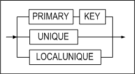


**sort_order_clause ::=**


**directkey_clause ::=**


**using_index_clause ::=**


**index_attribute_clause ::=**


[memory_index_attributes ::=](#memory_index_attributes), [disk_index_attributes
::=](#disk_index_attributes)

**references_clause::=**


**check_clause ::=**


**table_constraint ::=**


**table_unique_clause ::=**


**referential_constraint ::=**


[references_clause ::=](#references_clause)

**temporary_attributes_clause ::=**

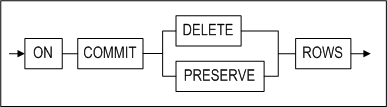

**table_partitioning_clause ::=**

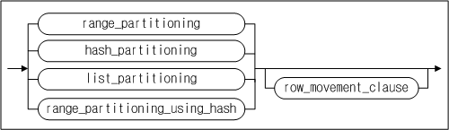

**range_partitioning ::=**


**partition_default_clause ::=**


**table_partition_description ::=**


[lob_column_properties ::=](#lob_column_properties)*,* [access_mode_clause
::=](#access_mode_clause_CREATETALBE)

**partition_range_clause ::=**


[table_partition_description ::=](#table_partition_description)

**hash_partitioning ::=**


[table_partition_description ::=](#table_partition_description)

**list_partitioning ::=**


[partition_default_clause ::=](#partition_default_clause)

**partition_list_clause ::=**


**range_partitioning_using_hash ::=**


[partition_default_clause ::=](#partition_default_clause)

[partition_range_clause ::=](#partition_range_clause)

**row_movement_clause ::=**


**access_mode_clause ::=**


**tablespace_clause ::=**


**physical_attributes_clause ::=**


**storage_clause ::=**


**log_compression_clause ::=**

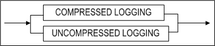

**logging_clause ::=**


**parallel_clause::=**


**table_compression_clause ::=**


**lob_column_properties ::=**


**LOB_storage_clause ::=**


**lob_attributes ::=**


#### 전제 조건

아래의 조건 중 하나 이상을 만족해야 한다.

- SYS 사용자이다.
- 사용자 자신의 스키마에 테이블을 생성하려면 CREATE TABLE 또는 CREATE ANY
  TABLE 시스템 권한을 가지고 있어야 한다.
- 다른 사용자의 스키마에 테이블을 생성하려면 CREATE ANY TABLE 시스템 권한을
  가지고 있어야 한다.

#### 설명

명시된 이름의 새로운 테이블을 생성한다.

*[GLOBAL] TEMPORARY*

[GLOBAL] TEMPORARY는 테이블이 임시 테이블임을 지정한다. GLOBAL 지정 여부에 따른
차이점은 없으므로 생략해도 된다. 이렇게 생성된 테이블의 정의는 모든 세션에서 볼
수 있지만, 임시 테이블의 데이터는 해당 테이블에 데이터를 삽입하는 세션에서만 볼
수 있다.

사용자가 처음으로 임시 테이블을 만들면, 테이블의 메타 데이터만 데이터 딕셔너리에
저장되고, 테이블의 데이터를 위한 공간은 할당되지 않는다. 해당 테이블에 처음으로
DML 작업이 수행되는 순간에 테이블 세그먼트를 위한 공간이 할당된다. 임시 테이블의
정의는 일반적인 테이블의 정의와 마찬가지로 데이터베이스에서 지속되지만, 임시
테이블의 테이블 세그먼트와 임시 테이블에 저장된 모든 데이터는 세션 또는
트랜잭션에 한정된다. ON COMMIT 키워드를 사용해서 테이블 세그먼트와 데이터가 세션
레벨인지 또는 트랜잭션 레벨인지를 지정할 수 있다. 자세한 설명은 아래의
*temporary_attributes_clause*를 참고하라.

세션에 한정되는 임시 테이블은 세션이 임시 테이블에 바인딩 되지 않은 경우에만
해당 임시 테이블에 대해 DDL 작업(ALTER TABLE, DROP TABLE, CREATE INDEX 등)이
허용된다.

트랜잭션에 한정되는 임시 테이블은 바인딩 여부에 상관 없이 임시 테이블에 대한 DDL
작업이 허용된다. 하지만, Altibase 내부적으로 DDL 작업 수행 전에 커밋을 먼저 하기
때문에, 임시 테이블에 대한 DDL 수행 후에 그 테이블의 데이터는 사라진다.

- 임시 테이블의 제약 사항:
  - 임시 테이블은 파티셔닝이 불가능하다.
  - 임시 테이블에는 외래 키를 지정할 수 없다.
  - lob_storage_clause의 TABLESPACE에는 임시 테이블을 저장하는 휘발성
    테이블스페이스만 올 수 있다.
  - 임시 테이블은 휘발성 테이블스페이스만 저장할 수 있다.
  - 임시 테이블에 대해서는 분산 트랜잭션이 지원되지 않는다.

*user_name*

생성될 테이블 소유자 이름을 명시한다. 생략하면 Altibase는 현재 세션에 연결된
사용자의 스키마에 테이블을 생성한다.

*tbl_name*

생성될 테이블 이름을 명시한다. 테이블 이름은  "[객체 이름
규칙](#object_name)"을 따라야 한다.

*column_definition*

- DEFAULT  
  칼럼에 DEFAULT 절을 명시하지 않고 테이블을 생성한 경우, 데이터 삽입시 해당
  칼럼의 값을 명시하지 않으면 NULL이 입력된다.
- TIMESTAMP  
  TIMESTAMP 칼럼은 여러 면에서 다른 데이터 타입들처럼 다뤄진다. 예를 들어,
  CREATE TABLE 문에 칼럼의 데이터 타입으로 TIMESTAMP를 명시한 경우 내부적으로
  데이터 크기가 8Byte인 TIMESTAMP 칼럼이 생성된다. 그러나 TIMESTAMP 칼럼의
  값은 시스템에 의해 결정되기 때문에 명시적으로 DEFAULT 값을 설정할 수 없다.
  또한 TIMESTAMP 칼럼은 한 테이블에 하나만 생성할 수 있다.

*column_constraint*

새로운 테이블을 생성할 때 칼럼에 대한 제약조건을 설정한다. 명시적으로 제약조건의
이름을 지정할 수 있다. LOCALUNIQUE 제약조건은 파티션드 테이블에 사용될 수 있다.

- PRIMARY KEY

  기본키의 값은 테이블 내에서 유일해야 하며 기본키에 속하는 칼럼은 널(NULL) 값을
  가질 수 없다. 한 테이블 내에 정의 가능한 기본키의 개수는 하나이며, 최대 32개
  칼럼들의 조합에 대해 기본 키를 생성할 수 있다.

- UNIQUE

  UNIQUE 제약조건을 정의하면 유니크 키에 해당하는 칼럼 (또는 칼럼의 조합)은 같은
  값을 2개 이상 가질 수 없다. 단, 널 값은 허용된다.

  같은 칼럼 또는 같은 칼럼의 조합에 대해 유니크 제약조건과 기본키를 동시에 정의할
  수 없다. 또한, 같은 칼럼 또는 같은 칼럼의 조합에 대해 2개 이상의 유니크
  제약조건도 존재할 수 없다. 그러나 다른 칼럼 또는 다른 칼럼들의 조합에는 존재할
  수 있다. 최대 32개 칼럼의 조합에 대해 유니크 제약조건을 생성할 수 있다.

- LOCALUNIQUE

  각 지역 인덱스별로 UNIQUE 제약조건을 만족해야 함을 명시하는 키워드이다.

- (NOT) NULL

  해당 칼럼이 널 값을 가질 수 있다(없다)는 것을 의미한다.

- CHECK

  해당 칼럼에 대한 무결성 규칙(Integrity Rule)을 지정한다. *column_constraint*
  절의 *condition* 내에서는 해당 칼럼만 참조할 수 있다. CHECK 제약조건의 검사조건에는 아래와 같은 몇 가지 제한 사항이 있다.

  - 부질의(subquery), 시퀀스, LEVEL 또는 ROWNUM 등의 모든 의사칼럼(Pseudo
    Column), 및 SYSDATE 또는 USER_ID 같은 비결정적(Non-deterministic) SQL 함수가
    포함될 수 없다.
  - PRIOR 연산자를 사용할 수 없다.
  - LOB 타입의 데이터를 사용할 수 없다.

- 참조 무결성(referential integrity)

- TIMESTAMP

*directkey_clause*

이 절은 Direct Key 인덱스를 생성시 사용할 수 있다. Direct Key 인덱스에 대한
자세한 내용은 CREATE INDEX 구문을 참고한다

*check_clause*

이 절에는 테이블의 각 레코드 값이 만족해야 하는 조건을 지정한다. 조건의 결과는
참, 거짓, 또는 NULL 중 하나이어야 한다.

이 절은 칼럼 제약조건 또는 테이블 전체 제약조건이 될 수 있다.

*table_constraint*

한 칼럼 또는 칼럼들의 조합에 대한 제약조건을 명시하는 절이다. 다음의 테이블
제약조건이 있다.

- PRIMARY KEY
- UNIQUE
- LOCALUNIQUE
- CHECK
- 참조 무결성(referential integrity)

*using_index_clause*

제약조건을 위해 자동으로 생성되는 인덱스가 저장될 테이블스페이스를 지정하는
절이다.

PRIMARY KEY, UNIQUE 또는 LOCALUNIQUE 제약을 명시할 경우, 자동으로 생성되는 로컬
인덱스가 저장될 테이블스페이스를 각 인덱스 파티션 별로 지정할 수 있다. 자세한
설명은 CREATE INDEX 구문의 *index_partitioning_clause*를 참조한다.

*references_clause*

외래키를 정의하는 절이다. 외래키에 의해 참조되는 다른 테이블의 참조키(referenced
key)는 그 테이블에서 유니크 제약조건에 해당하거나 그 테이블의 기본키이어야 한다.
만약 이 절에 참조키의 칼럼들을 명시하지 않은 경우, 해당 테이블의 기본키가
자동으로 참조키가 된다.

- NO ACTION

  “부모(parent) 테이블” (참조키가 있는 테이블)에 대해 INSERT, DELETE, 또는 UPDATE
  구문을 실행하면, Altibase는 “자식(child) 테이블” (참조키를 참조하는 외래키를
  가진 테이블)에 대한 무결성 검사를 한 후에 이 구문을 수행한다. NO ACTION은 무결성
  검사 후에 자식 테이블에 대해서는 어떠한 작업도 하지 않음을 명시하는 옵션이다.

  예를 들어 다음과 같이 employees 테이블을 생성하면, departments 테이블에서 어떤
  부서를 삭제하려 할 때, employees 테이블의 레코드가 이 부서 번호를 참조하고
  있다면, 삭제 시도는 실패하고 에러가 발생할 것이다.

  ```
  CREATE TABLE employees (
  ENO INTEGER PRIMARY KEY, 
  DNO INTEGER, 
  NAME CHAR(10), 
  FOREIGN KEY(DNO) REFERENCES 
  departments(DNO) ON DELETE NO ACTION ); 
  ```


- ON DELETE CASCADE

  이는 부모 테이블의 행이 삭제되면 외래 키 값을 가진 자식 테이블에서 이 행을
  참조하는 모든 행도 삭제될 것을 명시하는 옵션이다.

  예를 들어 예를 들어 다음과 같이 employees 테이블을 생성하면, departments
  테이블에서 어떤 부서를 삭제하려 할 때, employees 테이블에서 이 부서 번호를
  참조하는 모든 행도 삭제된다.

  ```
  CREATE TABLE employees (
  ENO INTEGER PRIMARY KEY, 
  DNO INTEGER, 
  NAME CHAR(10), 
  FOREIGN KEY(DNO) REFERENCES 
  departments (DNO) ON DELETE CASCADE ); 
  ```


- ON DELETE SET NULL

  부모 테이블의 행이 삭제되면 그 행을 참조하는 자식 테이블의 외래 키 칼럼의 값이
  모두 NULL로 변경될 것을 명시하는 옵션이다. 이 옵션의 참조 무결성을 위해 해당
  칼럼은 NULL이 허용되어야 한다.

  예를 들어 departments 테이블을 참조하는 employees 테이블을 생성한 후에,
  departments 테이블에서 어떤 부서를 삭제한다. 이 때, employees 테이블에서 삭제된
  부서 번호를 참조하는 모든 칼럼의 값은 NULL로 변경된다.

  ```
  CREATE TABLE employees (
  ENO INTEGER PRIMARY KEY, 
  DNO SMALLINT, 
  NAME CHAR(10), 
  CONSTRAINT dno_fk FOREIGN KEY (dno) REFERENCES 
  departments (dno) ON DELETE SET NULL ); 
  ```

*MAXROWS*

테이블에 입력될 수 있는 최대 레코드 개수를 지정한다. 레코드 삽입시 전체 레코드
개수가 여기에서 지정한 수보다 많아질 경우 입력 시도는 실패하고 에러가 반환된다.
MAXROWS 절은 table_partitioning_clause 절과 함께 명시할 수 없다.

*temporary_attributes_clause*

이 절은 임시 테이블의 데이터가 트랜잭션에 한정되는지 또는 세션에 한정되는지를
지정하며, 아래 두 가지 옵션이 가능하다:

*ON COMMIT DELETE ROWS*

트랜잭션에 한정되는 임시 테이블을 생성한다. 임시 테이블에 처음으로 데이터를
삽입하는 트랜잭션이 그 임시 테이블에 바인딩 된다. 트랜잭션 레벨의 바인딩은
COMMIT 또는 ROLLBACK 구문 수행으로 풀리게 된다. 트랜잭션이 커밋되면, Altibase는
해당 임시 테이블을 truncate 한다.

*ON COMMIT PRESERVE ROWS*

세션에 한정되는 임시 테이블을 생성한다. 세션에서 임시 테이블에 처음으로 데이터가
삽입될 때 세션은 임시 테이블에 바인딩 된다. 이 바인딩은 세션이 종료 되거나 그
세션에서 테이블에 TRUNCATE 작업이 수행 될 때 풀린다. 사용자가 세션을 종료하면,
Altibase는 세션에 바인딩 된 임시 테이블을 truncate 한다.

*table_partitioning_clause*

파티션드 테이블을 생성하는 절이다. 범위 파티셔닝(range partitioning), 해시 파티셔닝(hash partitioning), 리스트 파티셔닝(list partitioning), 해시를 사용한 범위 파티셔닝(range using hash partitioning) 방법으로 파티션드 테이블을 생성한다. 파티션드 테이블을 생성할 때 *row_movement_clause*도 명시할 수 있다.

*range_partitioning*

범위 파티션드 테이블 생성시 파티션 키 값의 범위를 명시하는 절이다. 주로 DATE 자료형에 많이 사용된다. 사용자가 지정한 값을 기준으로 테이블이 분할되기 때문에, 파티션별로 데이터의 고른 분포는 보장되지 않는다. 각 파티션의 범위는 그 범위의 최대값을 설정함으로써 결정된다.

명시된 범위 외의 모든 값과 NULL은 기본 파티션(default partition)에 속하게 된다.
여러 칼럼들의 조합으로 파티션 키를 정의할 수 있다.

범위 파티션드 테이블 생성시 기본 파티션 절은 생략할 수 있다.
기본 파티션 절이 생략된 경우에만 ALTER TABLE ADD PARTITION 구문을 사용할 수 있다.

###### 범위 파티션드 테이블 생성 시 주의 사항

- 기본 파티션이 없는 범위 파티션드 테이블을 생성할 수 있다.
- 범위 파티션드 객체에서 파티션 추가는 기본 파티션이 없는 범위 파티션드 테이블에서만 사용할 수 있다.
- 기본 파티션이 없는 범위 파티션드 테이블은 기본 파티션 추가 연산을 수행할 수 없다.
- 기본 파티션이 있는 범위 파티션드 테이블은 기본 파티션 삭제 연산을 수행할 수 없다.
- 기본 파티션이 없는 범위 파티션드 테이블은 CONJOIN/DISJOIN 구문을 사용할 수 없다.
- 범위 파티션드 테이블이 이중화 대상 테이블인 경우 파티션 추가 연산을 수행할 수 없다.

> 기본 파티션이 없는 범위 파티션드 테이블을 생성하면 SYS_TABLE_PARTITIONS_에서 PARTITION_NAME 이 없는 파티션이 추가로 생성된다.
>
> ```sql
> iSQL> CREATE TABLE t1 
>       ( 
>         i1 INT, 
>         i2 INT
>       ) 
>       PARTITION BY RANGE ( i1 ) 
>       ( 
>         PARTITION p1 VALUES LESS THAN (10), 
>         PARTITION p2 VALUES LESS THAN (20) 
>       );
> 
> iSQL> SELECT PARTITION_NAME as p_name
>            , PARTITION_MIN_VALUE as min
>            , PARTITION_MAX_VALUE as max
>         FROM SYSTEM_.SYS_TABLES_ T
>            , SYSTEM_.SYS_TABLE_PARTITIONS_ p
>        WHERE T.USER_ID = 2 
>          AND T.TABLE_NAME = 'T1'
>          AND T.TABLE_ID = P.TABLE_ID;
> P_NAME      MIN         MAX         
> ----------------------------------------
> P1                      10          
> P2          10          20          
>             20                      
> 3 rows selected.
> ```

*table_partition_description*

파티션별로 테이블스페이스를 지정할 수 있다. 또한 테이블에 한 개 이상의 LOB
컬럼이 있을 경우, 각 LOB 컬럼의 속성을 따로 명시할 수 있다. 그리고 파티션의
데이터에 대한 접근 모드를 설정할 수 있다.

테이블스페이스 절이 생략되면, 그 파티션은 해당 테이블의 기본
테이블스페이스(default tablespace)에 저장된다.

또한 LOB 컬럼이 저장될 테이블스페이스를 지정하지 않으면 LOB 데이터는 해당
파티션의 테이블스페이스에 저장된다.

다음의 예제에서 사용자의 기본 테이블스페이스는 tbs_05이다.

```
CREATE TABLE print_media_demo
( 
	product_id INTEGER,
	ad_photo BLOB,
	ad_print BLOB,
	ad_composite BLOB
)
PARTITION BY RANGE (product_id)
(
	PARTITION p1 VALUES LESS THAN (3000) TABLESPACE tbs_01 
	LOB (ad_photo) STORE AS (TABLESPACE tbs_02 ),
	PARTITION p2 VALUES DEFAULT 
	LOB (ad_composite) STORE AS (TABLESPACE tbs_03)
) TABLESPACE tbs_04;
```

파티션 p1의 테이블스페이스는 명시적으로 지정되었으므로 tbs_01테이블스페이스에
저장된다. 그리고 해당 파티션의 ad_photo 컬럼은 tbs_02테이블스페이스에 저장된다.
기본 파티션인 p2의 테이블스페이스는 지정되지 않았으므로 print_media_demo
테이블의 기본 테이블스페이스인 tbs_04에 저장된다. 만약 이 테이블의
테이블스페이스를 지정하지 않았다면 사용자의 기본 테이블스페이스인 tbs_05에
저장될 것이다.

위의 설명을 그림으로 나타내면 다음과 같다.

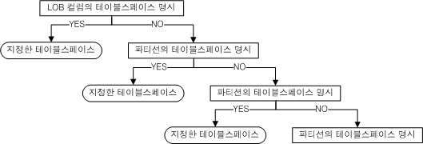

*partition_range_clause*

파티션에 저장될 상한값(noninclusive)을 지정한다. 이 값은 다른 파티션의 상한값과
겹치지 않아야 한다.

*hash_partitioning*

이 절은 파티션 키 값에 대응하는 해시 값을 기준으로 테이블을 분할할 것을
명시한다. 이는 데이터가 파티션별로 고르게 분산되기를 원하는 경우에 적합하다.
여러 칼럼들의 조합으로 파티션 키를 정의할 수 있다.

*list_partitioning*

이 절은 값의 집합을 기준으로 테이블을 분할할 것을 명시한다. 명시된 다른 파티션에
속하도록 명시되지 않은 값들은 자동으로 기본 파티션에 포함되기 때문에 기본
파티션은 생략할 수 없다.

기본 파티션에 속해 있던 값들의 집합으로 새로운 파티션을 추가하면 기본
파티션에서는 그 값이 제거될 것이다. 각 파티션이 가질 수 있는 값들은 서로 중복될
수 없기 때문이다. 리스트 파티션드 테이블을 위한 파티션 키는 단일 컬럼에만 정의될
수 있다.

*partition_list_clause*

각 리스트 파티션은 적어도 1개 이상의 값을 가져야 한다. 한 리스트의 값은 다른 어떤 리스트에도 있을 수 없다.

*range_partitioning_using_hash*

이 절은 파티션 키값에 대응하는 해시 값을 사용해 범위를 명시하는 절이다. 파티션 키는 단일 컬럼으로 지정하며 해시 값을 1000으로 나눈 나머지(mod) 값으로 범위를 지정한다. 1000은 고정값으로 변경할 수 없다. 데이터를 고르게 분포하는 해시 파티셔닝의 장점과 합병, 분할이 가능한 범위 파티셔닝의 장점을 결합한 파티셔닝이다.

*row_movement_clause*

파티션드 테이블의 레코드가 갱신되어 파티션 키에 해당하는 칼럼의 값이 다른
파티션에 속하는 값으로 변경된 경우, 이 절은 그 레코드를 자동으로 다른 파티션으로
이동시킬지 아니면 에러를 발생시킬 것인지를 결정한다. 이 절을 생략하면 DISABLE
ROW MOVEMENT옵션이 기본으로 설정된다.

*CREATE TABLE … AS SELECT*

테이블 생성시, 다른 테이블에서 새로운 테이블로 칼럼의 속성과 데이터를 그대로
복사하려면 이 구문을 사용한다. 새로운 테이블의 칼럼 수는 SELECT 절로 검색되는
칼럼의 개수와 동일해야 한다. 또한 새로운 칼럼의 데이터 타입은 명시할 수 없고,
데이터가 검색되는 원래 칼럼의 데이터 타입과 동일하게 된다.

생성될 테이블의 칼럼 명을 명시하지 않을 경우에는 검색되는 칼럼의 이름이 그대로
사용된다. 검색 대상이 칼럼이 아니고 표현식인 경우 alias가 반드시 존재해야 한다.
이 alias가 새로운 테이블의 칼럼명이 될 것이다.

*access_mode_clause*

데이터에 대한 접근 모드를 설정할 수 있다. 읽기 전용(Read-Only) 모드,
읽기/쓰기(READ/WRITE) 모드 또는 읽기/추가(READ/APPEND) 모드 중에서 선택할 수
있으며, 생략하면 기본으로 '읽기/쓰기' 모드로 설정된다.

> 주의: 테이블이나 파티션에 대한 접근 모드가 '읽기 전용' 또는 '읽기/추가'로
> 설정되어 있어도 이중화에 의한 복제, TRUNCATE 구문 수행, LOB 칼럼 변경은
> 허용된다.

*tablespace_clause*

테이블이 저장될 테이블스페이스를 지정하는 절이다.

이 절을 생략할 경우 테이블은 이 테이블을 생성하려 하는 사용자의 기본
테이블스페이스에 저장될 것이다. 사용자 생성 시 DEFAULT TABLESPACE를 생략했었다면
테이블은 시스템 메모리 기본 테이블스페이스(SYSTEM MEMORY DEFAULT TABLESPACE)에
생성된다.

CREATE TABLE 문 내에 UNIQUE 또는 PRIMARY KEY 제약조건이 명시된 경우 이들을 위한
인덱스는 테이블이 저장되는 테이블스페이스에 생성될 것이다.

*physical_attributes_clause*

PCTFREE, PCTUSED, INITRANS 및 MAXTRANS를 지정하는 절이다. 이 절이 파티션드
테이블에 명시될 경우 PCTFREE와 PCTUSED 값은 그 테이블의 모든 파티션에 적용될
것이다.

- PCTFREE 절  
  페이지에 이미 저장되어 있는 레코드가 갱신될 때 이용하기 위해 예약해 둔 여유
  공간의 양을 비율로 정의한다. 레코드는 이 예약된 공간 외에만 삽입된다. 이
  값은 한 페이지내의 여유 공간을 백분율로 표시한다.  
  예를 들어 PCTFREE가 20으로 명시된 테이블의 경우, 각 페이지 크기의 80%에만
  레코드가 입력되며, 나머지 20%는 레코드의 갱신 용도로 사용된다. 이 값은
  디스크 기반의 테이블에 대해서만 의미가 있다.  
  명시할 수 있는 값은 0에서 99까지의 정수이며, 백분율을 의미한다. 명시하지
  않을 경우 기본 PCTFREE 값은 10이다. 이 옵션은 테이블에 할당된 페이지에만
  적용된다.
- PCTUSED 절  
  한 페이지가 레코드 삽입이 가능한 상태로 다시 돌아가기 위해 페이지의 사용
  공간이 줄어들어야 하는 최소 비율을 나타낸다. 여유 공간의 비율이 PCTFREE에
  도달한 페이지에는 더 이상 레코드가 삽입되지 않고, 갱신 또는 삭제만 허용된다.
  이후 레코드 갱신 또는 삭제 작업으로 페이지의 사용 공간의 비율이 PCTUSED에서
  명시한 값 이하로 떨어지게 되면 이 페이지는 다시 레코드 삽입이 가능한 상태로
  된다.  
  예를 들어 PCTUSED 값을 40으로 명시한 경우, 어떤 페이지의 여유 공간의 비율이
  PCTFREE에 명시된 값에 도달하면, 이 페이지의 사용 공간 비율이 39% 이하로
  떨어질 때까지 이 페이지에는 레코드 삽입이 불가능하다. 사용 공간의 비율이 40%
  미만으로 떨어져야 비로소 새로운 레코드가 다시 그 페이지에 삽입된다. 이 값은
  디스크 기반 테이블에 대해서만 의미가 있다.  
  명시할 수 있는 값은 0에서 99까지의 정수이며, 백분율을 의미한다. 명시하지
  않을 경우 기본 PCTUSED 값은 40 이다. 이 옵션은 테이블에 할당된 페이지에만
  적용된다.
- INITRANS 절  
  TTS(Touched Transaction Slot)의 초기 개수를 지정한다. 기본값은 2이다.
- MAXTRANS 절  
  TTS(Touched Transaction Slot)의 최대 개수를 지정한다. 기본값은 120이다.

> 참고
>
> 위의 PCTFREE와 PCTUSED는 페이지 사용의 최적화를 위해 다음과 같은 형태로 함께
> 사용된다. 이 예제에서는 PCTFREE는 20, PCTUSED는 40으로 지정하였다.
>
> 각 페이지의 20%는 기존 레코드에 대한 변경 연산을 위한 공간으로 예약되며, 이
> 페이지의 나머지 80%의 공간까지만 새로운 레코드들이 삽입된다.
>
> 이 시점이 되면 더 이상 어떠한 새로운 레코드도 이 페이지에 삽입될 수 없다. 이미
> 저장된 레코드에 대한 갱신과 삭제 연산만이 가능하다. 갱신 연산은 예약해둔 20%의
> 빈 공간을 사용한다. 레코드가 삭제되어 사용중인 공간이 40% 아래로 떨어지면 그
> 페이지에 다시 새로운 레코드를 삽입할 수 있다.
>
> 페이지 공간의 사용은 PCTFREE와 PCTUSED의 값을 이용하여 위와 같은 방법으로 계속
> 순환된다.

*storage_clause*

사용자가 세그먼트에 대한 익스텐트 관리 파라미터를 지정할 수 있는 구문이다.

- INITEXTENTS 절  
  세그먼트 생성시 초기 할당되는 익스텐트 개수를 지정한다. 명시하지 않을 경우
  기본으로 1개의 익스텐트가 할당된다.
- NEXTEXTENTS 절  
  세그먼트 크기 확장시마다 추가될 익스텐트 개수를 명시한다. 명시하지 않을 경우
  기본으로 1개의 익스텐트만큼 확장된다.
- MINEXTENTS 절  
  세그먼트의 최소 익스텐트 개수를 지정한다. 명시하지 않을 경우 기본값은 1이다.
- MAXEXTENTS 절  
  세그먼트가 포함할 수 있는 최대 익스텐트 개수를 지정한다. 명시하지 않을 경우
  제한이 없는 것으로 지정된다.

*LOB_storage_clause*

디스크 테이블의 LOB 칼럼 데이터는 LOB 칼럼이 속한 테이블과 별도의
테이블스페이스에 저장될 수 있다. 그러나 메모리 테이블의 경우는 별도 저장이
불가능하다. 즉, 테이블과 동일한 테이블스페이스에만 저장될 수 있다.

*parallel_clause*

병렬 질의를 처리하는 쓰레드의 개수를 명시한다. 이 절을 생략하면 NOPARALLEL을
지정한 것과 동일하다.

- NOPARALLEL : 쿼리를 병렬로 처리하지 않는다.
- PARALLEL *integer* : integer에 명시한 개수만큼의 쓰레드가 병렬로 쿼리를
  처리한다. 입력 가능한 값의 범위는 1\~65535이다. PARALLEL 1은 NOPARALLEL과
  동일하다.

현재 Altibase는 아래와 같은 병렬 질의만 지원한다.

- 파티션드 테이블을 스캔하는 병렬 질의.
- 일반 테이블을 스캔하는 병렬 질의. 단, 테이블 전체를 스캔(full scan)하지 않는 쿼리, 서브쿼리, 반복 실행되는 경우 병렬 수행이 불가능하다.
- 실행 계획에 HASH, SORT, GRAG 노드가 포함되는 병렬 질의. 단, 이러한 노드의
  경우에는 각 노드당 병렬 작업 쓰레드가 한 개씩만 생성된다.

*table_compression_clause*

압축할 칼럼의 이름을 쉼표로 구분하여 명시한다. MAXROWS 절에는 압축 칼럼당
자동으로 생성되는 딕셔너리 테이블에 입력할 수 있는 행의 최대 개수를 명시한다.
명시하지 않으면 기본값은 일반 테이블과 동일한 2<sup>64</sup>-1개이다.

CREATE TABLE 구문에 이 절과 *subquery*를 모두 명시하여 테이블 생성과 데이터
삽입을 하나의 구문으로 수행하는 것을 지원하지 않는다.

압축이 가능한 데이터 타입과 각 타입 별 최소 크기는 다음과 같다.

| 데이터 타입              | 최소 크기 |
| ------------------------ | --------- |
| CHAR, VARCHAR, BYTE      | 6         |
| NCHAR, NVARCHAR (UTF-8)  | 6         |
| NCHAR, NVARCHAR (UTF-16) | 3         |
| NIBBLE                   | 13        |
| BIT, VARBIT              | 25        |
| DATE                     |           |

#### 주의 사항

다음은 테이블 생성시 유념해야 할 몇 가지 사항이다.

- 정의한 칼럼 크기가 최대 허용 크기를 넘거나 최소 크기 보다 작으면 오류가
  발생한다. 최대와 최소 크기는 각 데이터 타입마다 다르다.
- 한 테이블의 최대 칼럼 수는 1024개이다.
- 기본키는 한 테이블에 한 개만 존재할 수 있다.
- 참조 제약조건의 경우 외래키와 참조키의 칼럼 개수는 동일해야 한다. 또한
  외래키와 참조키의 각 칼럼 데이터 타입은 동일해야 한다.
- 한 테이블에 생성할 수 있는 인덱스, 기본키 및 유니크 키의 총 개수는 1024개를
  넘을 수 없다.
- CREATE TABLE AS SELECT의 경우 칼럼 명을 명시하였다면 그 개수는 검색 대상에
  명시한 칼럼 개수와 동일해야 한다.
- CREATE TABLE AS SELECT문 실행시 CREATE TABLE 문에 칼럼 명을 명시하지 않고
  SELECT문의 검색 대상에는 표현식을 사용한 경우, 반드시 새로운 테이블의 칼럼
  이름으로 사용될 별명(alias name)을 표현식에 명시해야 한다.
- MAXROWS 절에 파티션드 테이블 사용은 지원되지 않는다.
- 범위 파티션드 테이블과 해시 파티션드 테이블을 위한 파티션 키 컬럼은 최대
  32개로 구성될 수 있다.(인덱스 생성 시 인덱스 키 칼럼의 개수 제한과
  동일하다.)
- NOLOGGING(FORCE/NOFORCE) 옵션으로 생성된 인덱스의 경우 시스템이나 미디어
  고장시 인덱스의 일관성이 보장되지 않을 수 있다. 인덱스 일관성이 깨진 경우
  ‘The index is inconsistent.’라는 오류 메시지가 나온다. 이러한 오류를
  해결하려면 일관성이 깨진 인덱스를 찾아 삭제한 후에 해당 인덱스를 다시
  생성하도록 한다. 인덱스의 일관성은 V\$DISK_BTREE_HEADER성능 뷰에서 확인할 수
  있다.
- CREATE INDEX 구문과 마찬가지로 로컬 파티션드 인덱스가 저장될
  테이블스페이스를 지정할 수 없다.
- CREATE TABLE ... AS SELECT의 경우, CHECK 제약조건을 지정할 수 없다.
- PRIMARY KEY, UNIQUE, TIMESTAMP 제약조건을 갖는 칼럼은 압축이 불가능하다.

#### 예제

##### 테이블 생성

다음 테이블들을 생성하라.

- 테이블 이름: employees  
  칼럼: 사원번호, 사원이름과 성, 직책, 전화번호, 부서번호, 월급, 성별, 생일,
  입사일자, 상태

  ```
  iSQL> CREATE TABLE employees(
    eno INTEGER PRIMARY KEY,
    e_lastname CHAR(20) NOT NULL, 
    e_firstname CHAR(20) NOT NULL,
    emp_job VARCHAR(15),
    emp_tel CHAR(15),
    dno SMALLINT,
    salary NUMBER(10,2) DEFAULT 0,
    sex CHAR(1) CHECK(sex IN ('M', 'F')),
    birth CHAR(6),
    join_date DATE,
    status CHAR(1) DEFAULT 'H');
  Create success.
  ```


- 테이블 이름: orders  
  칼럼: 주문번호, 주문일자, 판매사원, 고객번호, 상품번호, 주문수량, 도착
  예정일자, 주문상태

  ```
  iSQL> CREATE TABLE orders(
    ono BIGINT,
    order_date DATE,
    eno INTEGER NOT NULL,
    cno BIGINT NOT NULL,
    gno CHAR(10) NOT NULL,
    qty INTEGER DEFAULT 1,
    arrival_date DATE,
    processing CHAR(1) DEFAULT '0', PRIMARY KEY(ono, order_date));
  Create success.
  ```


- CREATE TABLE … AS SELECT 사용  
  다음 질의는 직원 테이블에서 부서 번호가 1002인 조건을 만족하는 데이터를 가진
  테이블 dept_1002를 생성한다.

  ```
  iSQL> CREATE TABLE dept_1002
    AS SELECT * FROM employees
    WHERE dno = 1002;
  Create success.
  ```


- TIMESTAMP 타입 칼럼을 가지는 테이블을 생성한다.

  ```
  iSQL> CREATE TABLE tbl_timestamp(
  i1 TIMESTAMP CONSTRAINT const2 PRIMARY KEY, 
  i2 INTEGER,
  i3 DATE,
  i4 Byte(8));
  Create success.
  ```

   테이블 tbl_timestamp의 속성은 다음과 같다.

  ```
  [ TABLESPACE : SYS_TBS_MEM_DATA ]
  [ ATTRIBUTE ]                                                         
  ------------------------------------------------------------------------------
  NAME                                     TYPE                        IS NULL 
  ------------------------------------------------------------------------------
  I1                                       TIMESTAMP       FIXED       NOT NULL
  I2                                       INTEGER         FIXED       
  I3                                       DATE            FIXED       
  I4                                       BYTE(8)         FIXED       
  [ INDEX ]                                                       
  ------------------------------------------------------------------------------
  NAME                                     TYPE     IS UNIQUE     COLUMN
  ------------------------------------------------------------------------------
  CONST2                                   BTREE    UNIQUE        I1 ASC
  [ PRIMARY KEY ]                                                 
  ------------------------------------------------------------------------------
  I1
  ```

  명시적으로 Byte(8) 데이터 타입을 선언한 칼럼 i4와 TIMESTAMP 데이터 타입 칼럼인
  i1을 구별하는 방법은 SYS_CONSTRAINTS_와 SYS_CONSTRAINT_COLUMNS\_ 메타 테이블을
  조회해서 칼럼 타입이 TIMESTAMP 인지를 확인하는 것이다.

  > 참고: INSERT나 UPDATE 수행 시 사용자가 TIMESTAMP 칼럼 값을 DEFAULT로 명시한
  > 경우, 당시의 시스템 시간값이 그 TIMESTAMP 칼럼에 쓰여진다.

  ```
  iSQL> INSERT INTO tbl_timestamp VALUES(DEFAULT, 2, '02-FEB-01', Byte'A1111002');
  1 row inserted.
  iSQL> UPDATE tbl_timestamp SET i1 = DEFAULT, i2 = 102, i3 = '02-FEB-02', i4 = Byte'B1111002' WHERE i2 = 2;
  1 row updated.
  iSQL> SELECT * FROM tbl_timestamp;
  I1                I2          I3           I4
  ------------------------------------------------------------------
  4E3778C900037AE9  102         02-FEB-2002  B111100200000000
  1 row selected.
  ```

  마찬가지로 INSERT나 UPDATE 수행 시 사용자가 TIMESTAMP 칼럼 값을 명시하지 않은
  경우, 당시의 시스템 시간 값이 INSERT 또는 UPDATE 수행에 사용된다.

  ```
  iSQL> INSERT INTO tbl_timestamp(i2, i3, i4) VALUES(4, '02-APR-01', Byte'C1111002');
  1 row inserted.
  iSQL> UPDATE tbl_timestamp SET i2=104, i3='02-APR-02', i4=BYTE'D1111002' WHERE i2=4;
  1 row updated.
  iSQL> SELECT * FROM tbl_timestamp;
  I1                I2          I3           I4
  ------------------------------------------------------------------
  4E3778C900037AE9  102         02-FEB-2002  B111100200000000
  4E37794900083702  104         02-APR-2002  D111100200000000
  2 rows selected.
  ```


- 임시 테이블 생성 및 사용

  \<질의\> 한 세션에서 임시 테이블을 생성하고 데이터를 삽입한 후, 해당 세션에서는
  데이터가 조회되고, 다른 세션에서는 조회되는 데이터가 없는 것을 보여준다.

  ```
  iSQL> create volatile tablespace my_vol_tbs size 12M autoextend on maxsize 1G; 
  Create success. 
  iSQL> create temporary table t1(i1 integer, i2 varchar(10)) on commit delete rows tablespace my_vol_tbs; 
  Create success. 
  iSQL> create temporary table t2(i1 integer, i2 varchar(10)) on commit preserve rows tablespace my_vol_tbs; 
  Create success. 
  iSQL> desc t2; 
  [ TABLESPACE : MY_VOL_TBS ] 
  [ ATTRIBUTE ]                                                         
  ------------------------------------------------------------------------------ 
  NAME                                     TYPE                        IS NULL 
  ------------------------------------------------------------------------------ 
  I1                                       INTEGER         FIXED       
  I2                                       VARCHAR(10)     FIXED       
  T2 has no index 
  T2 has no primary key 
  iSQL> alter table t2 add constraint t2_pk primary key (i1); 
  Alter success. 
  iSQL> insert into t2 values (1, 'abc'); 
  1 row inserted. 
  iSQL> insert into t2 values (2, 'def'); 
  1 row inserted. 
  iSQL> select * from t2; 
  I1          I2          
  --------------------------- 
  1           abc         
  2           def         
  2 rows selected. 
  iSQL> connect sys/manager; 
  Connect success. 
  iSQL> select * from t2; 
  I1          I2          
  --------------------------- 
  No rows selected.
  ```


- 질의에서 지정한 테이블스페이스에 테이블을 생성하라.

  \<질의\> 테이블 소유자가 uare1인 테이블 tbl1을 생성하라. (사용자 생성 시 기본
  테이블스페이스가 지정되지 않았다.)

  ```
  iSQL> CONNECT uare1/rose1;
  Connect success.
  iSQL> CREATE TABLE tbl1(
      i1 INTEGER,
      i2 VARCHAR(3));
  Create success.
  ```

  > 참고: 사용자 생성 시 기본 테이블스페이스가 지정되지 않은 경우 시스템 메모리
  > 기본 테이블스페이스에 테이블이 생성 된다.

  \<질의\> 사용자 생성 시 지정된 기본 테이블스페이스 user_data에 다음 조건을
  만족하는 테이블 books과 inventory를 생성하라.

  books 칼럼: 책번호, 책이름, 저자, 판, 출판연도, 가격, 출판사코드 (테이블 books에
  입력할 수 있는 최대 레코드 개수는 2개이다.)

  inventory 칼럼: 예약구독번호, 책번호, 상점코드, 구입날짜, 구입량, 지불여부

  ```
  iSQL> CREATE TABLE books(
    isbn CHAR(10) CONSTRAINT const1 PRIMARY KEY,
    title VARCHAR(50),
    author VARCHAR(30),
    edition INTEGER DEFAULT 1,
    publishingyear INTEGER,
    price NUMBER(10,2),
  pubcode CHAR(4)) MAXROWS 2
  TABLESPACE user_data;
  Create success.
  
  iSQL> CREATE TABLE inventory(
    subscriptionid CHAR(10) PRIMARY KEY,
    isbn CHAR(10) CONSTRAINT fk_isbn REFERENCES books (isbn),
    storecode CHAR(4),
    purchasedate DATE,
    quantity INTEGER,
  paid CHAR(1))
  TABLESPACE user_data;
  Create success.
  ```

  또는

  ```
  iSQL> CREATE TABLE inventory(
    subscriptionid CHAR(10),
    isbn CHAR(10),
    storecode CHAR(4),
    purchasedate DATE,
    quantity INTEGER,
    paid CHAR(1),
    PRIMARY KEY(subscriptionid),
  CONSTRAINT fk_isbn FOREIGN KEY(isbn) REFERENCES books(isbn))
  TABLESPACE user_data;
  Create success.
  ```


- Direct Key 인덱스를 사용하여 테이블 생성

  \<질의\> 테이블 tab1을 생성할 때 id(INTEGER) 칼럼을 UNIQUE 하면서, Direct Key
  인덱스로 설정한다.

  ```
  iSQL> CREATE TABLE tab1 (id UNIQUE DIRECTKEY );
  Create success.
  ```


- 각 인덱스 파티션을 위한 테이블스페이스 지정

  \<질의\> I1 컬럼에 대한 UNIQUE 제약을 갖는 파티션드 테이블 T1을 생성하라.

  ```
  CREATE TABLE T1 
  ( 
    I1 INTEGER UNIQUE USING INDEX LOCAL
    (
      PARTITION P1_UNIQUE ON P1 TABLESPACE TBS3,
      PARTITION P2_UNIQUE ON P2 TABLESPACE TBS2,
      PARTITION P3_UNIQUE ON P3 TABLESPACE TBS1
    )
  )
  PARTITION BY RANGE (I1)
  ( 
    PARTITION P1 VALUES LESS THAN (100),
    PARTITION P2 VALUES LESS THAN (200) TABLESPACE MEM_TBS1,
    PARTITION P3 VALUES DEFAULT TABLESPACE MEM_TBS2 
  ) TABLESPACE SYS_TBS_DISK_DATA;
  ```


- 범위 파티셔닝(range partitioning)

  \<질의 1\> 아래 그림과 같이 2006년의 각 분기별로 파티셔닝하여 range_sales
  테이블을 생성한다.

  ```
  CREATE TABLE range_sales
  ( 
    prod_id NUMBER(6),
    cust_id NUMBER,
    time_id DATE
  ) 
  PARTITION BY RANGE (time_id)
  (
    PARTITION Q1_2006 VALUES LESS THAN (TO_DATE('01-APR-2006')),
    PARTITION Q2_2006 VALUES LESS THAN (TO_DATE('01-JUL-2006')),
    PARTITION Q3_2006 VALUES LESS THAN (TO_DATE('01-OCT-2006')),
    PARTITION Q4_2006 VALUES LESS THAN (TO_DATE('01-JAN-2007')),
    PARTITION DEF VALUES DEFAULT 
  ) TABLESPACE SYS_TBS_DISK_DATA;
  ```


  \<질의 2\> 파티션의 테이블스페이스를 지정하여 파티션드 테이블 생성

  ```
  CREATE TABLE T1 
  ( 
    I1 INTEGER, 
    I2 INTEGER 
  )
  PARTITION BY RANGE (I1)
  ( 
    PARTITION P1 VALUES LESS THAN (100),
    PARTITION P2 VALUES LESS THAN (200) TABLESPACE TBS1,
    PARTITION P3 VALUES DEFAULT TABLESPACE TBS2 
  ) TABLESPACE SYS_TBS_DISK_DATA;
  ```


  \<질의 3\> 다중 컬럼을 파티션 키로 갖는 파티션드 테이블 생성

  ```
  CREATE TABLE T1 
  ( 
    I1 DATE, 
    I2 INTEGER 
  )
  PARTITION BY RANGE (I1, I2)
  ( 
    PARTITION P1 VALUES LESS THAN (TO_DATE('01-JUL-2006'), 100),
    PARTITION P2 VALUES LESS THAN (TO_DATE('01-JAN-2007'), 200),
    PARTITION P3 VALUES DEFAULT 
  ) TABLESPACE SYS_TBS_DISK_DATA;
  ```


  \<질의 4\> 필요시 데이터가 자동으로 다른 파티션으로 옮겨지는 파티션드 테이블
  생성

  ```
  CREATE TABLE T1 
  ( 
    I1 INTEGER, 
    I2 INTEGER 
  )
  PARTITION BY LIST (I1)
  ( 
    PARTITION P1 VALUES (100, 200),
    PARTITION P2 VALUES (150, 250),
    PARTITION P3 VALUES DEFAULT 
  ) ENABLE ROW MOVEMENT TABLESPACE SYS_TBS_DISK_DATA;
  ```


- 리스트 파티셔닝(list partitioning)

  \<질의\> nls_territory 컬럼의 값이 ‘CHINA’ 또는 ‘THAILAND’인 asia 파티션,
  ‘GERMANY’, ‘ITALY’, ‘SWITZERLAND’인 europe 파티션, ‘AMERICA’인 west 파티션,
  ‘INDIA’인 east 파티션, 그 외 나머지 값은 기본 파티션으로 분할되는 list_customers
  테이블을 생성한다.

  ```
  CREATE TABLE list_customers 
  ( 
  	customer_id	NUMBER(6), 
  	cust_first_name	VARCHAR(20), 
  	cust_last_name	VARCHAR(20), 
  	nls_territory	VARCHAR(30), 
  	cust_email	VARCHAR(30)
  )
  PARTITION BY LIST (nls_territory) 
  (
  	PARTITION asia VALUES ('CHINA', 'THAILAND'),
  	PARTITION europe VALUES ('GERMANY', 'ITALY', 'SWITZERLAND'),
  	PARTITION west VALUES ('AMERICA'),
  	PARTITION east VALUES ('INDIA'),
  	PARTITION rest VALUES DEFAULT 
  ) TABLESPACE SYS_TBS_DISK_DATA;
  ```


- 해시 파티셔닝(hash partitioning)

  \<질의\> product_id에 따라서 4개의 해시 파티션으로 분할되는 테이블을 생성한다.

  ```
  CREATE TABLE hash_products 
  ( 
  	product_id		NUMBER(6), 
  	product_name		VARCHAR(50), 
  	product_description 	VARCHAR(2000) 
  )
  PARTITION BY HASH (product_id)
  ( 
  	PARTITION p1, 
  	PARTITION p2, 
  	PARTITION p3, 
  	PARTITION p4 
  ) TABLESPACE SYS_TBS_DISK_DATA;
  ```

  \<질의\> LOB 데이터를 별도의 테이블스페이스에 저장하되, image1칼럼은
  테이블스페이스 lob_data1에, image2 칼럼은 테이블스페이스 lob_data2에 저장하는
  테이블을 생성한다.

  ```
  CREATE TABLE lob_products 
  (
    product_id integer, 
    image1 BLOB, 
    image2 BLOB
  ) TABLESPACE SYS_TBS_DISK_DATA
  LOB(image1) STORE AS ( TABLESPACE lob_data1 )
  LOB(image2) STORE AS ( TABLESPACE lob_data2 );
  ```


- 해시를 사용한 범위 파티셔닝(range using hash partitioning)

  \<질의\> product_id에 따라서 4개의 해시 값을 사용하여 범위 파티션으로 분할되는 테이블을 생성한다.
  
```
  CREATE TABLE range_using_hash_products
  (
  	product_id NUMBER(6),
  	product_name VARCHAR(50),
  	product_description VARCHAR(2000)
  )
PARTITION BY RANGE_USING_HASH (product_id)
  (
  	PARTITION p1 VALUES LESS THAN (250),
  	PARTITION p2 VALUES LESS THAN (500),
	PARTITION p3 VALUES LESS THAN (750),
  	PARTITION p4 VALUES DEFAULT
  ) TABLESPACE SYS_TBS_DISK_DATA;
```

  

- 세그먼트 내의 익스텐트 관리 파라미터를 지정한 테이블 생성

  \<질의\> 디스크 테이블스페이스인 usertbs에 local_tbl 테이블을 생성한다. 단
  테이블 생성시 익스텐트 10개를 할당하고 세그먼트 확장시마다 1개씩 확장하도록 한다.

  ```
  iSQL> CREATE TABLE local_tbl (i1 INTEGER, i2 VARCHAR(32) ) 
                      TABLESPACE usertbs
                      STORAGE ( INITEXTENTS 10 NEXTEXTENTS 1 );
  Create success.
  ```

  \<질의\> 디스크 테이블스페이스인 usertbs에 local_tbl 테이블을 생성한다. 단,
  테이블 생성시 최소 익스텐트 개수는 3으로 하고 최대 익스텐트 개수는 100으로
  제한한다.

  ```
  iSQL> CREATE TABLE local_tbl ( i1 INTEGER, i2 VARCHAR(32) ) 
                      TABLESPACE usertbs
                      STORAGE ( INITEXTENTS 3 MINEXTENTS 3 MAXEXTENTS 100 );
  Create success.
  ```


### CREATE DISK TABLESPACE 

#### 구문

**create_disk_tablespace ::=**


**datafile_spec ::=**


**autoextend_clause ::=**


**maxsize_clause ::=**


#### 전제 조건

SYS 사용자이거나 CREATE TABLESPACE 시스템 권한을 가진 사용자만이
테이블스페이스를 생성할 수 있다.

#### 설명

데이터베이스 내에 영구적으로 데이터베이스 객체를 저장할 수 있는 디스크
테이블스페이스를 생성하는 구문이다. 이 구문에 의해 생성되는 테이블스페이스에는
테이블과 인덱스가 저장될 수 있다.

*DISK*

디스크 테이블스페이스를 생성한다. DISK 키워드 없이 CREATE TABLESPACE 구문을
실행하여도 디스크 테이블스페이스가 생성된다.

DATA

사용자의 데이터가 저장될 테이블스페이스가 생성된다. DATA 키워드가 없이 CREATE
TABLESPACE 구문을 실행하여도 데이터 테이블스페이스가 생성된다.

*tblspace_name*

생성될 테이블스페이스 이름을 명시한다. 테이블스페이스 이름은  2장 "객체 이름
규칙"을 따라야 한다.

*datafile_spec*

디스크 테이블스페이스를 구성하는 데이터 파일을 명시한다.

*EXTENTSIZE 절*

페이지의 집합인 익스텐트(extent)의 크기를 명시하는 절이다. 생성 시 한번 결정되면
이후 변경할 수 없다. 기본 단위는 kB(킬로바이트, K로 표현됨)이며, MB(메가바이트,
M으로 표현됨), 또는 GB(기가바이트, G로 표현됨) 단위로 크기를 명시할 수 있다.

명시하지 않을 경우 기본값은 한 페이지 크기의 64배이다. 익스텐트 크기를 명시할
경우에는 한 페이지 크기의 배수로 설정해야 한다. 만약 페이지 크기의 배수로
지정하지 않을 경우에는 내부적으로 페이지의 배수에 가장 가까운 값으로 수정되어
처리된다.

또한 디스크 테이블스페이스의 익스텐트 크기는 최소한 페이지 크기의 5배 이상으로
지정해야 한다. 즉 페이지의 크기가 8kB이기 때문에 익스텐트의 크기는 최소한 40kB
이상으로 지정해야 한다.

*SEGMENT MANAGEMENT 절*

디스크 테이블스페이스 생성시 세그먼트 관리 방법을 결정한다. 세그먼트 관리 방법은
테이블스페이스 생성시 옵션으로 선택할 수 있다. 옵션을 명시하지 않으면 새로
생성되는 디스크 테이블스페이스는 프로퍼티 DEFAULT_SEGMENT_MANAGEMENT_TYPE에
설정된 방법으로 관리된다. (기본값은 AUTO이다.)

- MANUAL : 프리 리스트(Freelist) 기반의 테이블스페이스 가용 공간 관리 방식으로
  세그먼트 생성
- AUTO : 비트맵(Bitmap) 인덱스 기반의 테이블스페이스 가용 공간 관리 방식으로
  세그먼트 생성

*file_name*

생성될 데이터 파일 이름을 절대 경로로 명시한다.

*SIZE 절*

데이터 파일의 크기를 명시한다. 이 절을 생략하면, 기본 값은 100MB이다. 기본
크기는 SYS_DATA_FILE_INIT_SIZE 프로퍼티로 변경 가능하다.

정수 값 뒤에 Kilobytes(K), Megabytes(M), 또는 Gigabytes(G)로 단위를 명시할 수
있다. 단위를 명시하지 않을 경우 기본 단위는 Kilobytes(K)이다.

*REUSE*

기존 데이터 파일의 재사용 여부를 지정한다. 명시한 이름을 가진 파일이 이미
존재한다면 반드시 REUSE옵션을 명시해야 한다. 단 존재하는 파일을 재사용할 때에는
기존 데이터가 소실되기 때문에 주의가 필요하다.  
그러나 존재하지 않는 파일 이름에 대해 이 옵션을 사용할 경우 이 옵션은 무시되며,
새로운 파일이 생성된다.

*autoextend_clause*

데이터 파일에 대하여 확장할 수 있는 최대 공간까지 자동으로 확장될지 여부를
명시하는 절이다. 이 절 생략시, 기본으로 자동확장 기능은 꺼진다.

*ON*

파일에 대한 자동 확장 기능이 켜진다.

*OFF*

파일에 대한 자동 확장 기능이 꺼진다.

*NEXT*

파일 크기가 자동으로 확장 될 때 다음에 증가 크기를 명시한다. AUTOEXTEND를 ON으로 하고 이 값을 명시하지 않을 경우, 기본 NEXT 값은
USER_DATA_FILE_NEXT_SIZE 프로퍼티에 지정된 값이다.

Kilobytes(K), Megabytes(M), 또는 Gigabytes(G) 로 단위를 명시할 수 있다. 단위를
명시하지 않을 경우 기본 단위는 Kilobytes이다.

*maxsize_clause*

데이터 파일이 자동 확장 가능한 최대 크기를 명시한다. AUTOEXTEND를 ON으로 하고 이
값을 명시하지 않을 경우, 기본값은 USER_DATA_FILE_MAX_SIZE 프로퍼티에 지정된
값이다.

Kilobytes(K), Megabytes(M), 또는 Gigabytes(G) 로 단위를 명시할 수 있다. 단위를
명시하지 않을 경우 기본 단위는 Kilobytes이다.

*UNLIMITED*

파일이 자동 확장되는 크기에 제한이 없음을 명시한다. 이 옵션이 사용되면, 실제
파일의 최대 크기는 운영체제 또는 파일 시스템상의 가용 공간의 양에 의해 결정될
것이다.

#### 예제

\<질의\> 다음은 3개의 데이터 파일을 가진 user_data 테이블스페이스를 생성한다.
단, 세그먼트는 “free list” 방식으로 관리되게 한다.

```
iSQL> CREATE TABLESPACE user_data
    DATAFILE '/tmp/tbs1.user' SIZE 10M,
    '/tmp/tbs2.user' SIZE 10M,
    '/tmp/tbs3.user' SIZE 10M
    SEGMENT MANAGEMENT MANUAL;
Create success.
```

\<질의\> 테이블스페이스를 구성하는 데이터 파일이 tbs.user인 10MB의 user_data
테이블스페이스를 생성한다. (user_data 테이블스페이스에 기록되는 테이블이나
인덱스는 tbs.user 파일에 저장될 것이다.)

```
iSQL> CREATE TABLESPACE user_data DATAFILE '/tmp/tbs.user' SIZE 10M AUTOEXTEND
ON;
Create success.
```

\<질의\> User_data 테이블스페이스를 생성한다. 더 큰 공간이 요구될 때 500kB 씩
증가되고 최대 크기 100MB까지 자동 확장된다.

```
iSQL> CREATE TABLESPACE user_data
    DATAFILE '/tmp/tbs.user' SIZE 500K REUSE
    AUTOEXTEND ON NEXT 500K MAXSIZE 100M;
Create success.
```

\<질의\> 자동으로 확장되지 않는 데이터 파일 tbs.user로 구성된 테이블스페이스
user_data를 생성한다.

```
iSQL> CREATE TABLESPACE user_data
    DATAFILE '/tmp/tbs.user' AUTOEXTEND OFF;
Create success.
```


### CREATE MEMORY TABLESPACE 

#### 구문

**create_memory_tablespace ::=**


**initsize_clause ::=**

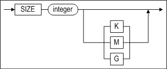

**autoextend_clause ::=**


**maxsize_clause ::=**


**checkpoint_path_clause ::=**

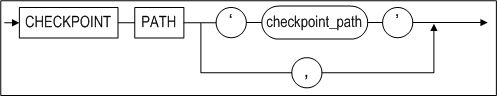

**splitsize_clause ::=**

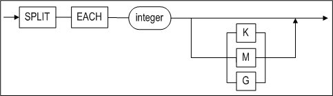

#### 전제 조건

테이블스페이스는 SYS 사용자이거나 CREATE TABLESPACE 시스템 권한을 가진
사용자만이 테이블스페이스를 생성할수 있다.

#### 설명

데이터베이스 내에 데이터베이스 객체를 저장할 수 있는 메모리 데이터
테이블스페이스를 생성하는 구문이다. 이 구문으로 생성된 테이블스페이스에는 메모리
테이블이 저장될 수 있다.

*MEMORY*

메모리 테이블스페이스를 생성할 것을 지정한다.

*DATA*

사용자의 데이터를 저장할 테이블스페이스를 생성할 것을 지정한다. DATA 키워드 없이
CREATE TABLESPACE 구문을 수행하여도 기본적으로 데이터 테이블스페이스가 생성된다.

*tablespace_name*

생성될 테이블스페이스의 이름을 명시한다. 테이블스페이스 이름은  2장 "객체 이름
규칙"을 따라야 한다.

*initsize_clause*

생성될 테이블스페이스의 초기 크기를 지정한다.

*SIZE*

테이블스페이스의 초기 크기를 명시한다. 이는 메모리 테이블스페이스의 기본 확장 크기의 배수여야 한다. (즉,
EXPAND_CHUNK_PAGE_COUNT 프로퍼티에 지정된 페이지 개수 \* 메모리 테이블스페이스의
한 페이지 크기 (32kB))

예를 들어 EXPAND_CHUNK_PAGE_COUNT프로퍼티를 128로 지정했다면, 메모리
테이블스페이스의 기본 확장 크기는 128 \* 4MB가 될 것이다. 그러므로 초기 크기는
4MB의 배수여야 한다.

이 값은 Kilobytes(K), Megabytes(M), 또는 Gigabytes(G) 단위로 명시할 수 있다.
단위를 명시하지 않을 경우 기본 단위는 Kilobytes이다.

*autoextend_clause*

테이블스페이스가 자동으로 확장될 지 여부를 명시한다. 이 절을 생략하면,
AUTOEXTEND는 기본으로 꺼진다.

*ON*

AUTOEXTEND 옵션이 켜진다.

*OFF*

AUTOEXTEND 옵션이 꺼진다.

*NEXT*

테이블스페이스가 자동으로 크기가 증가될 때 증가할 양을 명시한다.

단, 이 크기는 메모리 테이블스페이스의 기본 확장 크기의 배수여야 한다.
(EXPAND_CHUNK_PAGE_COUNT 프로퍼티에 지정된 페이지 개수 \* 메모리
테이블스페이스의 한 페이지 크기 (32kB))

AUTOEXTEND를 ON으로 지정하고 이 값을 명시하지 않을 경우, 기본값은
EXPAND_CHUNK_PAGE_COUNT프로퍼티에 지정한 값이다.

AUTOEXTEND가 OFF일 때 이 값은 의미없다. 

이 값은 Kilobytes(K), Megabytes(M), 또는 Gigabytes(G) 단위로 명시할 수 있다. 단위를 명시하지 않을 경우 기본 단위는 Kilobytes이다.

*maxsize_clause*

테이블스페이스 자동 확장 시 확장할 수 있는 최대 크기를 명시한다. AUTOEXTEND는 ON
으로 지정하고 이 값을 명시하지 않을 경우 기본값은 UNLIMITED이다.

AUTOEXTEND가 OFF이면 이 값은 의미없다.

이 값은 Kilobytes(K), Megabytes(M), 또는 Gigabytes(G) 단위로 명시할 수 있다. 단위를 명시하지 않을 경우 기본 단위는 Kilobytes이다.

*UNLIMITED*

테이블스페이스가 자동 확장되는 크기에 제한이 없음을 명시한다.

이 옵션이 사용되면, 테이블스페이스는 그 크기가 데이터베이스내의 모든 메모리
테이블스페이스와 모든 휘발성 테이블스페이스의 총 크기가 MEM_MAX_DB_SIZE
프로퍼티에 지정된 크기에 도달할 때까지 자동으로 증가될 것이다.

*checkpoint_path_clause*

메모리 테이블스페이스에 저장된 데이터의 영속성을 보장하기 위해 데이터는 파일에
저장되어야 한다. 이러한 메모리 테이블스페이스의 데이터 저장 파일을 “체크포인트
이미지”라고 한다.

checkpoint_path절은 체크포인트 이미지 파일이 저장될 체크포인트 경로(Path)들을
지정한다. 체크포인트 경로를 지정하지 않은 경우 MEM_DB_DIR 프로퍼티에 지정한 경로가 기본
경로로 사용된다.

*checkpoint_path*

메모리 테이블스페이스의 체크포인트시 체크포인트 이미지가 저장되는 경로이다.
체크포인트 및 테이블스페이스 로딩시 디스크 입출력 비용을 분산할 수 있도록 다수의
경로가 지정될 수 있다.

*split_each_clause*

이 절은 체크포인트 파일을 좀 더 작은 파일로 분리시키기 위해 사용된다. 이는
메모리 테이블스페이스의 크기가 운영체제에서 지원하는 최대 파일 크기를 초과할 때,
또는 입출력 비용을 분산하기 위해서 유용하다. 분할된 파일의 크기는 사용자가
지정할 수 있다. 크기를 지정하지 않을 경우 DEFAULT_MEM_DB_FILE_SIZE 프로퍼티에
지정된 값이 기본으로 사용된다.

이 값은 Kilobytes(K), Megabytes(M), 또는 Gigabytes(G) 단위로 명시할 수 있다.
단위를 명시하지 않을 경우 기본 단위는 Kilobytes이다.

#### 예제

\<질의 1\> 초기 크기가 512MB이고, 자동 확장되지 않는 사용자 정의 메모리 데이터
테이블스페이스를 생성한다. (체크포인트 이미지는 MEM_DB_DIR 프로퍼티에 지정된
경로에 저장된다. 분할될 체크포인트 이미지 파일의 크기는 DEFAULT_MEM_DB_FILE_SIZE
프로퍼티의 값을 따른다.)

```
iSQL> CREATE MEMORY DATA TABLESPACE user_data SIZE 512M;
Create success.
```

\<질의 2\> 초기 크기가 512MB이고, 128MB 단위로 자동 확장되는[<sup>4</sup>] 사용자 정의
메모리 데이터 테이블스페이스를 생성한다. (체크포인트 이미지는 MEM_DB_DIR
프로퍼티에 지정된 경로에 저장된다. 분할될 체크포인트 이미지 파일의 크기는
DEFAULT_MEM_DB_FILE_SIZE 프로퍼티의 값을 따른다.)

> [<sup>4</sup>] 테이블스페이스의 최대 크기를 MAXSIZE절을 이용하여 지정하지 않았으므로, 기본적으로 UNLIMITTED를 지정한 것과 같다. 이 경우 시스템에 존재하는 모든 메모리
> 테이블스페이스와 휘발성 테이블스페이스의 크기의 총합이 MEM_MAX_DB_SIZE
> 프로퍼티에 지정된 값을 벗어나지 않는 한도 내에서 테이블스페이스의 확장이
> 이루어진다.

```
iSQL> CREATE MEMORY DATA TABLESPACE user_data 
SIZE 512M 
AUTOEXTEND ON NEXT 128M;
Create success.
```

\<질의 3\> 초기 크기가 512MB 이고, 최대 1GB까지 128MB 단위로 자동 확장되는
사용자 정의 메모리 데이터 테이블스페이스를 생성한다. (체크포인트 이미지는
다중화를 위해 3개의 디렉토리에 나누어 저장하고, 분할될 체크포인트 이미지 파일의
크기를 256M로 한다.)

```
iSQL> CREATE MEMORY DATA TABLESPACE user_data 
SIZE 512M AUTOEXTEND ON NEXT 128M MAXSIZE 1G 
CHECKPOINT PATH ‘/dbs/path1’, ‘/dbs/path2’, ‘/dbs/path3’ 
SPLIT EACH 256M;
Create success.
```


### CREATE VOLATILE TABLESPACE 

#### 구문 

**create_tablespace ::=**


**initsize_clause ::=**


**autoextend_clause ::=**


**maxsize_clause ::=**


#### 전제 조건

테이블스페이스는 SYS 사용자이거나 CREATE TABLESPACE 시스템 권한을 가진 사용자만
테이블스페이스를 생성할 수 있다.

#### 설명

데이터베이스 내에 데이터베이스 객체를 저장할 수 있는 휘발성 테이블스페이스를
생성하는 구문이다. 이 구문으로 생성한 테이블스페이스에는 휘발성 테이블을 생성할
수 있다.

*VOLATILE*

휘발성 테이블스페이스를 생성할 것을 지정한다.

*DATA*

사용자의 데이터를 저장할 테이블스페이스를 생성할 것을 지정한다. DATA 키워드 없이
CREATE TABLESPACE 구문을 수행하여도 기본으로 데이터 테이블스페이스가 생성된다.

*tablespace_name*

생성될 테이블스페이스의 이름을 명시한다. 테이블스페이스 이름은  2장 "객체 이름 규칙"을 따라야 한다.

*initsize_clause*

생성될 테이블스페이스의 초기 크기를 지정한다.

*SIZE*

테이블스페이스의 초기 크기를 명시한다. 이는 메모리 테이블스페이스의 기본 확장 크기의 배수여야 한다. (즉,
EXPAND_CHUNK_PAGE_COUNT 프로퍼티에 지정된 페이지 개수 \* 메모리 테이블스페이스의
한 페이지 크기 (32kB))

예를 들어 EXPAND_CHUNK_PAGE_COUNT프로퍼티를 128로 지정했다면, 메모리
테이블스페이스의 기본 확장 크기는 128 \* 4MB가 될 것이다. 그러므로 초기 크기는
4MB의 배수여야 한다.

이 값은 Kilobytes(K), Megabytes(M), 또는 Gigabytes(G) 단위로 명시할 수 있다.
단위를 명시하지 않을 경우 기본 단위는 Kilobytes이다.

*autoextend_clause*

테이블스페이스가 자동으로 확장될 지 여부를 명시한다. 이 절을 생략하면,
AUTOEXTEND는 기본으로 꺼진다.

*ON*

AUTOEXTEND 옵션이 켜진다.

*OFF*

AUTOEXTEND 옵션이 꺼진다.

*NEXT*

테이블스페이스가 자동으로 크기가 증가될 때 증가할 양을 명시한다. 단, 이 크기는 메모리 테이블스페이스의 기본 확장 크기의 배수여야 한다. (EXPAND_CHUNK_PAGE_COUNT 프로퍼티에 지정된 페이지 개수 \* 메모리
테이블스페이스의 한 페이지 크기 (32kB))

AUTOEXTEND를 ON으로 지정하고 이 값을 명시하지 않을 경우, 기본값은
EXPAND_CHUNK_PAGE_COUNT프로퍼티에 지정한 값이다.

AUTOEXTEND가 OFF일 때 이 값은 의미없다.

이 값은 Kilobytes(K), Megabytes(M), 또는 Gigabytes(G) 단위로 명시할 수 있다.
단위를 명시하지 않을 경우 기본 단위는 Kilobytes이다.

*maxsize_clause*

테이블스페이스 자동 확장 시 확장할 수 있는 최대 크기를 명시한다. AUTOEXTEND는 ON
으로 지정하고 이 값을 명시하지 않을 경우 기본값은 UNLIMITED이다.

AUTOEXTEND가 OFF이면 이 값은 의미없다.

이 값은 Kilobytes(K), Megabytes(M), 또는 Gigabytes(G) 단위로 명시할 수 있다.
단위를 명시하지 않을 경우 기본 단위는 Kilobytes이다.

*UNLIMITED*

테이블스페이스가 자동 확장되는 크기에 제한이 없음을 명시한다.

이 옵션이 사용되면, 테이블스페이스는 그 크기가 데이터베이스내의 모든 메모리
테이블스페이스와 모든 휘발성 테이블스페이스의 총 크기가 MEM_MAX_DB_SIZE
프로퍼티에 지정된 크기에 도달할 때까지 자동으로 증가될 것이다.

#### 예제

\<질의 1\> 초기 크기가 512MB이고, 자동 확장되지 않는 사용자 정의 휘발성 데이터
테이블스페이스를 생성한다.

```
iSQL> CREATE VOLATILE DATA TABLESPACE user_data SIZE 512M;
Create success.
```

\<질의 2\> 초기 크기가 512MB이고, 128MB 단위로 자동 확장되는 사용자 정의 휘발성
데이터 테이블스페이스를 생성한다.

```
iSQL> CREATE VOLATILE DATA TABLESPACE user_data SIZE 512M AUTOEXTEND ON NEXT
128M;
Create success.
```

### CREATE TEMPORARY TABLESPACE 

#### 구문

**create_temporary_tablespace ::=**


**datafile_spec ::=**


**autoexetend_clause ::=**


#### 전제 조건

SYS 사용자이거나 CREATE TABLESPACE 시스템 권한을 가진 사용자만이 임시
테이블스페이스를 생성할 수 있다.

#### 설명

어떤 세션이 지속되는 동안 사용되는 임시 결과를 저장하기 위한 임시
테이블스페이스를 생성하는 구문이다. 임시 테이블스페이스는 디스크 공간에 생성되고
임시 테이블스페이스의 데이터는 데이터 파일에 저장된다.

데이터베이스 내에 데이터베이스 객체를 영구적으로 저장하려면 CREATE DISK
TABLESPACE 문을 사용하도록 한다.

*tblspace_name*

생성할 임시 테이블스페이스 이름을 명시한다. 테이블스페이스 이름은  2장 "객체 이름 규칙"을 따라야 한다.

*TEMPFILE datafile_space*

임시 테이블스페이스를 구성하는 임시 파일(들)을 명시하는 절이다.

#### 예제

\<질의\> 임시 테이블스페이스를 구성하는 데이터 파일이 tbs.temp인 5MB의 temp_data
테이블스페이스를 생성한다.

```
iSQL> CREATE TEMPORARY TABLESPACE temp_data
  TEMPFILE '/tmp/tbs.temp' SIZE 5M 
  AUTOEXTEND ON; 
Create success.
```


### CREATE TRIGGER

#### 구문

**create_trigger ::=**


**simple_dml_trigger ::=**


**trigger_event ::=**


**referencing_clause ::=**


**trigger_action::=**


**psm_body::=**


**instead_of_dml_trigger::=**


#### 전제 조건

아래의 조건 중 하나 이상을 만족해야 한다.

- SYS 사용자이다.
- 사용자 자신의 테이블에 트리거를 생성하려면, CREATE TRIGGER 또는 CREATE ANY
  TRIGGER 시스템 권한을 가지고 있어야 한다.
- 다른 사용자의 테이블에 트리거를 생성하려면, CREATE ANY TRIGGER 시스템 권한을
  가지고 있어야 한다.

#### 설명 

명시된 이름으로 트리거를 생성한다.

*OR REPLACE*

이 절은 트리거가 이미 존재한다면 같은 이름의 트리거로 교체할 때 사용된다. 즉, 이
절은 존재하는 트리거를 제거한 후 재생성하는 대신에 기존 트리거의 정의를
변경한다.

*user_name*

생성될 트리거의 소유자 이름을 명시한다. 생략하면 Altibase는 현재 사용자가 소유한
테이블에 트리거를 생성한다.

*trigger_name*

생성될 트리거의 이름을 명시한다. 트리거 이름은 2장 "객체 이름 규칙"을 따라야 한다.

*AFTER*

트리거가 동작될 시점을 지정한다. AFTER 옵션은 *trigger_event*가 수행된 후에
트리거가 동작될 것을 지정한다.

*BEFORE*

BEFORE 옵션은 *trigger_event*가 수행되기 전에 트리거가 동작될 것을 지정한다.

*INSTEAD OF*

INSTEAD OF 옵션은 트리거를 유발한 DML 구문은 수행되지 않고 트리거만 동작할 것을
지정한다. INSTEAD OF 트리거는 뷰에만 생성할 수 있다. 만약 뷰에 LOB 칼럼이 있는
경우 INSTEAD OF 옵션으로 트리거를 생성할 수는 있으나, 트리거의 동작을 유발하는
DML문이 실행될 때 오류가 발생한다.

*trigger_event*

이는 테이블의 데이터를 변경시키는 이벤트로 트리거의 동작을 유발시킨다. 단
데이터베이스의 무결성을 지키기 위해 이중화 수신자에 의해 적용되는 테이블
데이터의 변경은 트리거 이벤트로 처리되지 않는다 (즉, 트리거 동작을 유발시키지
않는다). 한 개의 트리거에 여러 개의 트리거 이벤트를 지정할 수 있다.
*trigger_event*로 다음의 세 가지 유형의 DML문을 지정할 수 있다.

- DELETE  
  해당 테이블의 데이터를 삭제하는 DELETE 구문 수행 시 트리거가 동작한다.
- INSERT  
  해당 테이블에 데이터를 삽입하는 INSERT 구문 수행 시 트리거가 동작한다. LOB 칼럼이 있는 테이블은 'BEFORE INSERT ... FOR EACH ROW' 구문으로 트리거를 생성할 수 있으나, 트리거의 동작을 유발하는 DML 문이 실행될 때 오류가 발생한다.
- UPDATE  
  해당 테이블의 데이터를 변경하는 UPDATE 구문 수행 시 트리거가 동작한다.
  UPDATE 트리거 이벤트에 OF 절을 사용하면 OF 절에 명시된 컬럼이 변경될 때만 트리거가 동작한다. LOB 칼럼이 있는 테이블은 'BEFORE UPDATE ... FOR EACH ROW' 구문으로 트리거를 생성할 수 있으나, 트리거의 동작을 유발하는 DML 문이 실행될 때 오류가 발생한다.

*ON table_name*

트리거가 동작할지를 결정하기 위해 참조하는 테이블을 지정한다. 트리거는
*table_name*에 정의된 테이블의 변경에 따라 동작이 유발될 것이다.

트리거는 일반 테이블만 참조할 수 있다. 뷰, 시퀀스, 저장 프로시저와 같은 객체를
기반으로 트리거를 생성할 수 없다.

이중화에 포함되어 있는 테이블에는 트리거를 생성할 수 없다. 그러나, 트리거가 이미
존재하는 테이블에 대한 이중화 생성은 가능하다.

User_name이 생략되면, Altibase는 현재 사용자 소유의 테이블을 기반으로 트리거를
생성할 것이다.

*REFERENCING 절*

트리거의 특성상 old row와 new row의 개념을 갖는다. 즉, 트리거가 참조하는
테이블의 데이터 변경시, 변경된 각 row는 이전 값과 이후 값을 갖게 된다.
REFERENCING 절을 사용해서 old row 및 new row를 참조할 수 있다.

REFERENCING 절은 다음과 같은 제약을 갖는다.

- REFERENCING 절은 FOR EACH ROW 옵션과 함께인 경우에만 사용할 수 있다.
- REFERENCING 절은 *trigger_action* 절에서 참조할 수 있도록 다음과 같은 구조를
  가져야 한다.
- {OLD\|OLD ROW\|OLD ROW AS\|OLD AS} alias_name  
  변경되기 이전의 로우(row)를 의미한다. 이는 WHEN 절 또는 trigger_action의
  psm_body 내에서 참조될 수 있다. 트리거 이벤트가 INSERT문일 때는 이전의 값이
  없기 때문에 NULL 값을 갖는다.
- {NEW\|NEW ROW\|NEW ROW AS\|NEW AS} alias_name  
  변경된 후의 로우(row)를 의미한다. 단, BEFORE TRIGGER의 경우 트리거 바디
  내에서 이들 데이터를 변경하는 것이 가능하다. 트리거 이벤트가 DELETE문일 경우
  이후 값이 없기 때문에 NULL 값을 갖으며 값을 변경해도 DELETE에 영향을 주지 않는다.

*trigger_action*

트리거 작동 절은 다음과 같은 세 가지 부분으로 구성된다.

- Action granularity: 트리거가 수행되는 단위 지정 (ROW 또는 STATEMENT)
- Action WHEN condition: 트리거 동작 여부를 결정하는 추가 조건을 선택적으로
  명시
- Action body: 트리거가 실제로 무엇을 수행하는지 명시

*FOR EACH {ROW\|STATEMENT}*

트리거 수행 단위를 명시한다. 테이블의 데이터 변경시 여기에 명시된 단위에 따라서
트리거가 발생한다. 기본값은 FOR EACH STATEMENT이다.

- FOR EACH ROW: trigger_event에 의해 영향을 받고 WHEN 절의 조건을 만족하는 각
  row에 대해서 트리거의 action body 가 수행된다.  
  REFERENCING 절 또는 WHEN 절을 사용하기 위해서는 반드시 FOR EACH ROW 절을
  사용하여야 한다.
- FOR EACH STATEMENT: 트리거 동작을 유발하는 DML 구문의 수행 후 또는 전에 한
  번만 트리거가 동작하게 된다.

*WHEN search_condition*

트리거가 동작 여부를 결정하는 조건을 명시한다. WHEN 절의 *search_conditio*n이
TRUE 인 경우에만 트리거의 action body가 수행되며, FALSE인 경우에는 트리거의
action body가 수행되지 않는다. WHEN 절이 명시되지 않으면, 트리거 이벤트 발생 시
항상 트리거의 action body가 수행된다.

WHEN 절에 조건을 사용하기 위해서는 다음과 같은 제약을 만족해야 한다.

- WHEN 절은 반드시 FOR EACH ROW 절과 함께인 경우에만 사용할 수 있다.
- WHEN 절에는 REFERENCING절에 정의된 alias_name만을 사용할 수 있다.
- WHEN 절에는 부질의를 사용할 수 없다.
- WHEN 절에는 저장 프로시저를 사용할 수 없다.

*psm_body*

트리거의 “action body”를 의미하며, 트리거가 수행할 구문이 여기에 기술된다. 저장
프로시저의 블록 구문과 동일한 방법으로 기술할 수 있다.

Psm_body는 다음과 같은 제약을 만족하여야 한다.

트리거의 특성 및 개념 상 action body를 위한 SQL statement 구문은 다음과 같은
것을 사용할 수 없다.

- COMMIT 또는 ROLLBACK 등과 같은 트랜잭션 관련구문을 사용할 수 없다.
- CONNECT 등과 같은 세션 관련구문을 사용할 수 없다.
- CREATE TABLE 등과 같은 스키마 관련구문을 사용할 수 없다.
- 저장 프로시저를 호출할 수 없다.
- 회기하는 트리거, 즉 trigger_event에 명시된 연산을 수행하는 트리거는 생성할
  수 없다.

*ENABLE \| DISABLE*

사용자가 트리거를 생성할 때 활성화(enable) 또는 비활성화(disable)를 선택할 수
있다. 기본 값은 활성화 상태이다.

- 트리거를 생성할 때 비활성화 상태로 설정하면 동작하지 않으며, ALTER TRIGGER
  구문으로 트리거 상태를 변경할 수 있다.

저장 프로시저의 블록 구문에 대한 자세한 설명은 *Stored Procedures Manual*을
참조하기 바란다.

#### 주의 사항

- 트리거의 수행 순서  
  하나의 테이블에 대하여 하나 이상의 트리거를 정의할 수 있다. 여러 개의
  트리거가 정의되어 있을 때 트리거가 동작되는 순서는 일정하지 않다. 트리거
  동작 순서가 중요할 경우에는 여러 개의 트리거를 하나로 통합하여 재작성 하여야
  한다.
- 트리거의 수행 실패  
  트리거를 수행하던 도중 오류가 발생하면, 해당 트리거를 발생시킨 DML 구문도
  실패하게 된다.
- 트리거 내에서 참조되는 테이블에 발생하는 DDL  
  테이블이 삭제되면 그 테이블에 대해 생성되어 있는 모든 트리거도 삭제된다.  
  그러나 트리거의 action body내에서 참조하는 테이블이 변경되거나 삭제될
  경우에는 트리거는 제거되지 않는다. 참조 테이블이 삭제되어 해당 트리거의
  action body가 수행될 수 없는 경우, 그 트리거를 발생시킨 DML 구문은 실패할
  것이다. 참조 테이블이 변경된 경우에는 트리거 발생시에 트리거가 내부적으로 재
  컴파일되어 정상적으로 수행될 것이다.
- 트리거와 이중화  
  이중화로 인해 반영되는 테이블 데이터의 변경은 트리거 동작을 발생시키지
  않는다.

#### 예제

\<질의\> 다음 예제는 행의 삭제를 추적하기 위해 트리거를 어떻게 사용하는지를
보여준다. 이 예제에서 배달이 완료(processing=’D’)된 주문에 관련된 데이터가
orders 테이블에서 삭제될 때, 트리거는 FOR EACH ROW 기준으로 동작되고 orders
테이블의 ono, cno, qty 및 arrival_date 칼럼의 원래 값을 참조한다. 이 트리거는
orders 테이블에서 삭제된 행의 값을 log_tbl에 입력한다.

```
iSQL> CREATE TABLE log_tbl(
  ono BIGINT,
  cno BIGINT,
  qty INTEGER,
  arrival_date DATE,
  sysdate DATE);
Create success.

iSQL> CREATE TRIGGER del_trigger
  AFTER DELETE ON orders
  REFERENCING OLD ROW old_row
  FOR EACH ROW
  AS BEGIN
    INSERT INTO log_tbl VALUES(old_row.ono, old_row.cno, old_row.qty, old_row.arrival_date, sysdate);
  END;
/
Create success.

iSQL> DELETE FROM orders WHERE processing = 'D';
2 rows deleted.
iSQL> SELECT * FROM log_tbl;
ONO                  CNO                  QTY         ARRIVAL_DATE
------------------------------------------------------------------------
SYSDATE
---------------
11290011             17                   1000        05-DEC-2011
25-APR-2012
11290100             11                   500         07-DEC-2011
25-APR-2012
2 rows selected.
```

\<질의\> 다음의 예제에서, 트리거는 scores 테이블에 레코드가 입력될 때, score
칼럼의 값이 지정되어 있지 않으면(NULL이면) 이 값을 0으로 변경한다. 이를 위해서
FOR EACH ROW 기준으로 발생되는 BEFORE INSERT 트리거를 생성하면 된다.

```
iSQL> CREATE TABLE scores( id INTEGER, score INTEGER );
Create success.
iSQL> CREATE TRIGGER scores_trigger
BEFORE INSERT ON scores
REFERENCING NEW ROW NEW_ROW
FOR EACH ROW
AS BEGIN
  IF NEW_ROW.SCORE IS NULL THEN
     NEW_ROW.SCORE := 0;
  END IF;
END;
/
Create success.

iSQL> INSERT INTO scores VALUES( 1, 20 );
1 row inserted.
iSQL> INSERT INTO scores VALUES( 5, NULL );
1 row inserted.
iSQL> INSERT INTO scores VALUES( 17, 75 );
1 row inserted.

iSQL> SELECT * FROM SCORES;
ID          SCORE       
---------------------------
1           20          
5           0           
17          75          
3 rows selected.
```

\<질의\> 트리거를 비활성화(disable) 상태로 생성하여 동작을 확인한 후에
활성화(enable) 상태로 변경하여 동작을 확인한다.

```
iSQL> CREATE TABLE scores( id INTEGER, score INTEGER );
Create success.

iSQL> CREATE TRIGGER scores_trigger
BEFORE INSERT ON scores
REFERENCING NEW ROW NEW_ROW
FOR EACH ROW
DISABLE
AS BEGIN
IF NEW_ROW.SCORE IS NULL THEN
NEW_ROW.SCORE := 0;
END IF;
END;
/
Create success.

iSQL> INSERT INTO scores VALUES( 1, 20 );
1 row inserted.
iSQL> INSERT INTO scores VALUES( 5, NULL );
1 row inserted.
iSQL> INSERT INTO scores VALUES( 17, 75 );
1 row inserted.

iSQL> SELECT * FROM SCORES;
ID SCORE
---------------------------
1 20
5
17 75
3 rows selected.

iSQL> ALTER TRIGGER scores_trigger ENABLE;
Alter success.

iSQL> INSERT INTO scores VALUES( 100, NULL );
1 row inserted.

iSQL> SELECT * FROM SCORES;
ID SCORE
---------------------------
1 20
5
17 75
100 0
4 rows selected.
```


### CREATE USER 

#### 구문

**create_user ::=**


**<a name="password_parameters"><a/>**

**password_parameters ::=**


#### 전제 조건

SYS 사용자와 CREATE USER 시스템 권한을 가진 사용자만이 사용자를 생성할 수 있다.

#### 설명

명시된 사용자 이름, 암호, 테이블스페이스 접근 권한으로 데이터베이스 사용자를
생성하는 구문이다.

*user_name*

생성될 사용자 이름을 명시한다. 사용자의 이름은 데이터베이스 내에서 유일해야
한다. 사용자 이름은 2장의 "객체 이름 규칙"을 따라야 한다.

*IDENTIFIED BY password*

Altibase는 비밀 번호를 사용해서 사용자를 인증한다. 사용자 비밀 번호의 최대
길이는 40바이트이다. 만일 이보다 더 긴 문자열의 비밀 번호를 명시하여 사용자를
생성하면, 오류가 반환된다. 비밀 번호는 기본적으로 대소문자 구분 없이 대문자로
인식된다. 만약 사용자 암호의 대소문자를 구분하기 위해서는
CASE_SENSITIVE_PASSWORD 프로퍼티를 1로 설정한 다음, CREATE USER 구문으로
사용자를 생성할 때 암호를 큰따옴표(")로 묶는다.

사용자 비밀 번호는 2장의 "객체 이름 규칙"을 따라야 한다.

*TEMPORARY TABLESPACE 절*

이는 사용자가 테이블에 연산 수행시 중간 결과가 저장될 용도로 사용될 기본 임시
테이블스페이스(DEFAULT TEMPORARY TABLESPACE)를 지정하는 절이다.

이를 명시하지 않으면 시스템 임시 테이블스페이스<sup>[5]</sup>가 해당 사용자의 기본 임시
테이블스페이스로 지정된다.

> <sup>[5]</sup>: SYSTEM TEMPORARY TABLESPACE는 쿼리 수행 중에 발생되는 임시 데이타들을 저장하는데 사용된다. 로깅이 수행되지 않기 때문에 매체 오류시 이 테이블스페이스의
> 데이터는 복구가 불가능하다.

사용자가 디스크 기반 테이블에 대한 SQL문을 수행할 때 일반적으로 임시
테이블스페이스가 사용된다. 

만약 SQL문내의 모든 테이블들이 메모리에 존재하는 테이블이라면, 쿼리 수행시
Altibase가 사용하는 공간도 모두 메모리이며, 사용자가 힌트를 사용하지 않는다면
임시 테이블스페이스를 사용하지 않는다.

임시 테이블스페이스는 한 사용자에 하나만 지정할 수 있다.

*DEFAULT TABLESPACE 절*

사용자가 생성한 객체를 저장할 기본 테이블스페이스를 명시한다. 이 절을 생략하면
시스템 메모리 기본 테이블스페이스가 사용자의 기본 테이블스페이스가 된다.

기본 테이블스페이스는 한 사용자에 하나만 지정할 수 있다.

*ACCESS 절*

명시한 (*tablespace_name*) 테이블스페이스에 접근 가능 여부를 지정하는 절이다.
ACCESS *tablespace_name* ON으로 지정한 테이블스페이스에 대해서는 사용자는 접근
권한을 부여 받는다. OFF로 명시한 테이블스페이스에 대해서는 사용자가 접근이
불가능하다.

물론, ALTER TABLESPACE 시스템 권한이 부여된 사용자는 테이블스페이스 접근이
가능하다.

*ENABLE/ DISABLE*

사용자의 TCP 접속을 허용하거나 제한할 수 있다. 이 절은 SYS 사용자만 수행할 수
있다.

*FAILED_LOGIN_ATTEMPTS*

로그인을 시도할 때 이 값에 설정한 횟수만큼 실패하면 해당 계정은 잠금이 해제될
때까지 로그인이 불가능하다.  
PASSWORD_LOCK_TIME이 설정되어 있는 경우 해당 기간이 경과하면 잠금이 자동으로
해제된다.

*PASSWORD_LOCK_TIME*

차단된 계정이 해제되기 위해 경과되어야 하는 날짜(단위: 일)를 지정한다. 예를
들어, 이 값을 5로 지정했을 때 계정이 잠긴다면, 해당 계정은 5일이 지난 후에
잠금이 풀리고 로그인이 가능해진다.

*PASSWORD_LIFE_TIME*

계정의 패스워드가 유효한 기간(단위: 일)을 지정한다. 마지막으로 패스워드를 변경한
시점을 기준으로 PASSWORD_LIFE_TIME이 적용된다.

*PASSWORD_GRACE_TIME*

계정의 패스워드가 만료된 이후의 변경할 수 있는 유예 기간(단위: 일)을 지정한다.
패스워드 유효 기간이 만료되면 유예 기간이 경과하기 전에 해당 계정으로 로그인하여
패스워드를 변경해야 한다. 만약 패스워드 유예기간도 경과하면, SYS 계정으로
로그인하여 해당 계정의 패스워드를 변경해야 한다.

*PASSWORD_REUSE_TIME*

동일한 패스워드를 재사용하기 위해 경과해야 하는 기간(단위:일)을 지정한다. 즉,
여기에 설정한 기간이 지난 후에 동일한 패스워드를 재사용할 수 있다.

*PASSWORD_REUSE_MAX*

동일한 패스워드를 재사용하기 위한 패스워드 변경 횟수를 지정한다. 즉, 여기에
설정한 횟수만큼 패스워드를 변경한 후에 동일한 패스워드를 재사용할 수 있다.

> 주의: PASSWORD_REUSE_MAX 또는 PASSWORD_REUSE_TIME 중 하나만 지정하면, 동일한
> 패스워드를 재사용할 수 없다.

*PASSWORD_VERIFY_FUNCTION*

여기에 사용자 정의 콜백 함수(CALLBACK function)를 등록하여 패스워드를 검증하도록
할 수 있다. 사용자 정의 콜백 함수는 반드시 'TRUE'를 반환해야 한다.

패스워드 검증용 콜백 함수는 아래와 같은 입력 파라미터와 반환 타입을 가져야 한다:

```
CREATE OR REPLACE FUNCTION pwd_verify_function (
  username varchar(20),
  password varchar(20))
  RETURN varchar(100)
AS
result        varchar(100);
...
BEGIN
    ...
    result := 'TRUE';
    RETURN result;
END;
/
```


#### 제한 사항

한 사용자는 여러 데이터 테이블스페이스를 사용할 수 있다. 그러나 한 사용자는 임시
테이블스페이스는 하나만 사용할 수 있다.

사용자가 명시적으로 시스템 언두 테이블스페이스에 접근하거나, 언두 테이블스페이스
내에 테이블이나 인덱스 등을 생성하는 것은 불가능하다. 또한, 시스템 언두
테이블스페이스는 데이터베이스 내에 오직 하나만 존재하며, 사용자가 이를
생성하거나 삭제할 수 없다.

#### 예제

\<질의\> 사용자 명이 uare1이고 암호가 rose1인 사용자를 생성하라.

```
iSQL> CREATE USER uare1 IDENTIFIED BY rose1;
Create success.
```

\<질의\> 사용자 이름이 uare4이고 암호가 rose4인 사용자를 생성하라. 또한
user_data를 사용자의 기본 테이블스페이스로, temp_data 테이블스페이스를 임시
테이블스페이스로 사용하며, 메모리 테이블스페이스인 SYS_TBS_MEMORY에 대해 접근
권한을 가지고 있다.

```
iSQL> CREATE USER uare4
        IDENTIFIED BY rose4
        DEFAULT TABLESPACE user_data
        TEMPORARY TABLESPACE temp_data
        ACCESS SYS_TBS_MEMORY ON;
Create success.
```

\<질의\> 로그인을 5번 실패하면 해당 계정이 잠기고, 5일 후에 잠금이 풀리게 되는
사용자 rose2를 생성한다.

```
iSQL> CREATE USER rose2 IDENTIFIED BY rose2 
  LIMIT (FAILED_LOGIN_ATTEMPTS 5, PASSWORD_LOCK_TIME 5);
```

\<질의\> 5일 후에 패스워드가 만료되고, 그 후 5일간 유예기간을 갖는 사용자
rose3을 생성한다.

```
iSQL> CREATE USER rose3 IDENTIFIED BY rose3
  LIMIT (PASSWORD_LIFE_TIME 5, PASSWORD_GRACE_TIME 5);
```

\<질의\> 패스워드를 3회 변경하고 10일이 지난 후에 동일한 패스워드를 재사용할 수
있는 사용자 rose4를 생성한다.

```
iSQL> CREATE USER rose4 IDENTIFIED BY rose4
  LIMIT (PASSWORD_REUSE_MAX 3, PASSWORD_REUSE_TIME 10);
```


### CREATE VIEW

#### 구문

**create_view ::=**


**query_restriction_clause ::=**


#### 전제 조건

아래의 조건 중 하나 이상을 만족해야 사용할 수 있다.

- SYS 사용자이다.
- 사용자 자신의 스키마에 테이블을 생성하려면, CREATE TABLE 또는 CREATE ANY
  TABLE 시스템 권한을 가지고 있어야 한다.
- 다른 사용자의 스키마에 테이블을 생성하려면, CREATE ANY TABLE 시스템 권한을
  가지고 있어야 한다.

#### 설명

명시된 이름으로 새로운 뷰를 생성한다. 뷰(view)란 하나 이상의 테이블 또는 뷰를
기반으로 하는 논리적인 테이블(logical table)이다. 뷰는 실제 데이터를 가지고 있지
않다. 뷰의 기반이 된 테이블을 베이스 테이블(base table)이라 한다.

*OR REPLACE*

이 절은 뷰가 이미 존재한다면 같은 이름의 뷰로 교체할 때 사용된다. 즉, 이 절은
존재하는 뷰를 제거한 후 재 생성하는 대신에 기존 뷰의 정의를 변경하는 기능을
제공한다.

*FORCE*

뷰의 베이스 테이블 존재 여부와 뷰를 내포하고 있는 스키마 소유자의 권한 유무에
상관없이 뷰가 생성되도록 하는 옵션이다.

이는 의미상으로 오류를 내포한 무효한 상태의 뷰가 생성될 수 있음을 의미한다. 이런
경우, 뷰에 대해 SELECT 문 수행 시 오류가 발생할 것이기 때문에, FORCE 옵션을
사용해 뷰를 생성한 후에는 뷰를 SELECT 해보거나 SYS_VIEWS\_ 메타 테이블을 조회해
뷰의 상태를 확인해야 한다.

*NO FORCE*

이 옵션을 사용하면 뷰의 베이스 테이블이 존재하고 뷰를 내포하고 있는 스키마
소유자가 권한을 가지고 있을 때만 뷰가 생성된다. 이 옵션이 기본값이다.

*user_name*

생성될 뷰의 소유자 이름을 명시한다. 생략하면 Altibase는 현재 세션에 연결된
사용자의 스키마에 뷰를 생성한다.

*view_name*

생성될 뷰의 이름을 명시한다. 뷰의 이름은 2장 "객체 이름 규칙"을 따라야 한다.

*alias_name*

베이스 테이블로부터 검색하는 대상이 표현식인 경우 표현식을 위한 별칭을 명시해야
한다. 이 별칭이 뷰의 칼럼 명이 된다. 별칭의 개수는 subquery의 검색 대상(표현식과
칼럼)의 총 개수와 동일해야 한다.

*subquery*

베이스 테이블로부터 조회하는 열과 행을 식별하는 부질의를 명시한다.

*WITH READ ONLY*

뷰가 읽기 전용임을 지정할 수 있다. 이 옵션을 명시하지 않으면, INSERT, UPDATE,
DELETE 같은 변경 연산을 수행할 수 있는 Updatable View가 생성된다.

#### 주의 사항

- 뷰가 저장된 스키마의 소유자는 뷰의 기반이 되는 테이블 또는 뷰로부터 SELECT
  문을 수행하는데 필요한 권한을 가지고 있어야 한다.
- 베이스 테이블에 대한 SELECT문의 검색 대상에 명시할 수 있는 표현식의 개수는
  최대 1024개이다.
- CURRVAL과 NEXTVAL 의사열을 베이스 테이블에 대한 SELECT문의 검색 대상에
  사용할 수 없다.

#### 예제

##### 뷰 생성하기

\<질의\> 다음 예제는 employees 테이블을 기반으로 한 이름이 avg_sal인 뷰를
생성한다. 뷰는 각 부서의 평균 월급을 부서별로 보여준다.

```
iSQL> CREATE VIEW avg_sal AS
  SELECT dno, AVG(salary) emp_avg_sal
FROM employees
  GROUP BY dno;
Create success.
iSQL> SELECT * FROM avg_sal;
AVG_SAL.DNO  AVG_SAL.EMP_AVG_SAL 
------------------------------------
A001  2066.66667  
C001  1576.66667  
C002  1660     
D001  2075.75   
F001  1845     
                  
6 rows selected.
```

부질의 내에서 표현식 AVG(salary)에 대한 별칭으로 emp_avg_sal이 제공되어 있기
때문에, 뷰의 칼럼을 위한 별칭은 명시할 필요가 없다.

##### 조인 뷰<sup>[6]</sup> 생성하기

> <sup>[6]</sup>:조인 뷰는 뷰의 부질의에 조인을 내포하는 것을 의미한다.

\<질의\> 다음 뷰는 주문된 상품을 담당하고 있는 사원 이름과 상품을 주문한 고객의
이름을 보여준다.

```
iSQL> CREATE VIEW emp_cus AS 
 SELECT DISTINCT e.e_firstname, e.e_lastname, 
  c.c_firstname, c.c_lastname 
 FROM employees e, customers c, orders o 
 WHERE e.eno = o.eno AND o.cno = c.cno;
Create success.
iSQL> SELECT * FROM emp_cus;
E_FIRSTNAME           E_LASTNAME            C_FIRSTNAME           C_LASTNAME
---------------------------------------------------------------------------------------------
Alvar                 Marquez               Estevan               Sanchez
Sandra                Hammond               Pierre                Martin
.
.
.
William               Blake                 Saeed                 Pahlavi
Sandra                Hammond               Saeed                 Pahlavi
22 rows selected.
```


### CREATE MATERIALIZED VIEW

#### 구문

**create_materialized_view ::=**


[table_partitioning_clause ::=](#table_partitioning_clause), [tablespace_clause
::=](#tablespace_clause), [logging_clause ::=](#logging_clause),
[lob_column_properties ::=](#lob_column_properties)

**physical_attributes_clause ::=**


[storage_clause ::=](#storage_clause)

**build_clause ::=**


**refresh_clause ::=**


#### 전제 조건

아래의 조건 중 하나 이상을 만족해야 사용할 수 있다.

- SYS 사용자이다.
- 사용자 자신의 스키마에 materialized view를 생성하려면, CREATE MATERIALIZED
  VIEW 또는 CREATE ANY MATERIALIZED VIEW 시스템 권한을 가지고 있어야 한다.
  또한, 자신의 소유가 아닌 베이스 테이블 각각에 대한 SELECT 객체 권한 또는
  SELECT ANY TABLE 시스템 권한이 있어야 한다.
- 다른 사용자의 스키마에 materialized view를 생성하려면, CREATE ANY
  MATERIALIZED VIEW 시스템 권한을 가지고 있어야 한다. 또한, 소유자의 소유가
  아닌 베이스 테이블 각각에 대한 SELECT 객체 권한 또는 SELECT ANY TABLE 시스템
  권한이 있어야 한다.
- Materialized view를 생성하면, materialized view 객체와 함께 데이터베이스
  내부적으로 사용될 한 개의 뷰와 한 개의 테이블이 자동으로 materialized view의
  스키마에 생성된다. 추가로 생성되는 이러한 객체들은 materialized view의
  데이터를 유지하기 위해 사용된다. Materialized View를 생성하려는 사용자는
  이러한 객체들을 생성하는데 필요한 권한을 가지고 있어야 한다.

#### 설명

명시된 이름으로 새로운 materialized view를 생성한다. Materialized view란 쿼리의
결과를 저장하고 있는 데이터베이스 객체이다. 쿼리의 FROM 절에는 테이블, 뷰, 및
다른 materialized view가 올 수 있다. 이러한 객체들을 "베이스 테이블"이라고 한다.

Materialized view는 쿼리문의 결과를 일반 테이블처럼 테이블스페이스에 저장하며,
주로 데이터 웨어하우스 목적으로 사용된다. 즉, 빈번히 실행되며 수행에 많은 시간이
소요되는 조인이나 집계 함수가 포함된 쿼리문을 materialized view로 생성해 두면,
쿼리 실행 시 수행 시간을 단축할 수 있다.

Altibase는 읽기 전용 materialized view만 제공한다.

*user_name*

생성될 materialized view의 소유자 이름을 명시한다. 생략하면 Altibase는 현재
세션에 연결된 사용자의 스키마에 materialized view를 생성한다.

*mview_name*

생성될 materialized view의 이름을 명시한다. materialized view의 이름은 2장 "객체 이름 규칙"을 따라야 한다. Altibase는 지정한 materialized view의 이름과 동일한 이름으로 materialized view의 데이터를 유지하기
위해 사용되는 테이블을 자동으로 생성한다.

*c_alias*

베이스 테이블로부터 검색하는 대상이 표현식인 경우 표현식을 위한 별칭을 명시해야
한다. 이 별칭이 materialized view의 칼럼 명이 된다. 별칭의 개수는 subquery의
검색 대상(표현식과 칼럼)의 총 개수와 동일해야 한다.

*table_partitioning_clause*

CREATE TABLE 구문의 *table_partitioning_clause* 설명을 참고하라.

*segment_attributes_clause*

CREATE TABLE 구문의 *segment_attributes_clause* 설명을 참고하라.

*lob_column_properties*

CREATE TABLE 구문의 *lob_column_properties* 설명을 참고하라.

*phsical_attributes_clause*

CREATE TABLE 구문의 *phsical_attributes_clause* 설명을 참고하라.

*build_clause 절*

이 절은 Materialized view의 데이터가 최초로 구축되는 시점을 지정한다. 이 절을
생략하면 기본값은 IMMEDIATE이다.

- IMMEDIATE: Materialized view가 생성되는 시점에 데이터 구축.
- DEFERRED: Materialized view이 생성된 후 리프레쉬가 수행될 때 데이터 구축.

*refresh_clause 절*

Materialized view의 베이스 테이블이 변경되면, materialized view의 데이터도
업데이트되어야 한다. 이 절은 Materialized view가 refresh되는 방법과 시기를
지정한다. 이 절을 생략하면 FORCE와 ON DEMAND가 기본값으로 설정된다.

REFRESH 키워드 뒤에 COMPLETE, FAST, FORCE 중의 하나 또는 ON DEMAND, ON COMMIT
중의 하나는 반드시 지정되어야 한다.

- COMPLETE: Materialized view를 생성할 때 정의한 subquery를 수행하여 데이터가
  구축될 것을 지정한다.
- FAST: 현재 미지원.
- FORCE: refresh가 발생할 때, fast refresh가 가능하면 수행하고, 그렇지 않으면
  complete refresh로 수행할 것을 데이터베이스에 지시한다. Altibase는 현재
  FAST를 지원하지 않으므로, FORCE를 지정하는 것은 COMPLETE를 지정한 것과
  동일하다.
- ON DEMAND: 사용자가 요청할 때에만 refresh가 되도록 지정한다.
- ON COMMIT: 현재 미지원
- NEVER REFRESH: 현재 미지원

> 참고: Altibase가 기본적으로 제공하는 REFERESH_MATERIALIZED_VIEW 저장 프로시저를
> 호출해서 사용자가 materialized view의 refresh를 수동으로 요청할 수 있다.
> REFERESH_MATERIALIZED_VIEW 저장 프로시저에 대한 자세한 내용은 *Stored Procedures
> Manual*의 "10장 내장 함수와 저장 프로시저"를 참고하라.

*subquery 절*

Materialized view의 쿼리문을 명시한다. 사용자가 materialized view를 생성하면, 이
절에 명시한 부질의가 실행되며, 그 결과가 materialized view에 저장된다.

#### 예제

\<질의\> employees 테이블을 베이스 테이블로 하여 이름이 mv1인 materialized
view를 생성하라. 이 때 build절과 refresh절을 지정하지 않았기 때문에, 사용자
요청으로만 refresh가 가능하며, refresh시에 complete refresh가 수행된다.

```
CREATE MATERIALIZED VIEW mv1 AS
SELECT * FROM employees;
```


### DISJOIN TABLE

#### 구문

**disjoin_table ::=**

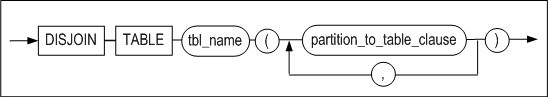


**partition_to_table_clause ::=**

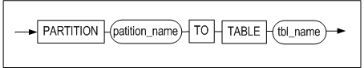

#### 전제 조건

아래의 조건 중 하나 이상을 만족해야 테이블을 생성할 수 있다.

-   SYS 사용자이다.

-   사용자 자신의 스키마에 테이블을 생성하려면, CREATE TABLE 또는 CREATE ANY
    TABLE 시스템 권한을 가지고 있어야 한다.

-   다른 사용자의 스키마에 테이블을 생성하려면, CREATE ANY TABLE 시스템 권한을
    가지고 있어야 한다.

아래의 조건 중 하나 이상을 만족해야 테이블을 제거할 수 있다.

-   SYS 사용자이다.

-   테이블의 소유자이다.

-   DROP ANY TABLE 시스템 권한을 가진 사용자이다.

#### 설명

파티션드 테이블의 파티션이 1개 이상의 테이블로 변환된다. 파티션드 테이블은
삭제되고 논 파티션드 테이블이 생성된다. 파티션들은 각각 명시된 테이블로 변환되며
데이터는 이동된다. 테이블 스페이스 옵션을 지정하지 않으면 사용자의 기본
테이블스페이스에 새 테이블이 생성된다.

*partition_to_table*

파티션드 테이블의 파티션 이름과 변환할 테이블의 이름을 명시한다.

#### 주의 사항

DISJOIN TABLE 구문 사용시에 다음과 같은 점에 주의해야 한다.

-   대상 테이블과 생성되는 파티션드 테이블 이름에 소유자를 명시하지 않는다.

-   새로 생성된 파티션드 테이블에 관련된 메타 테이블이 새로 생성되며, 파티션드
    테이블로 변환된 대상 테이블 관련 메타 테이블은 모두 삭제된다.

-   대상 테이블과 관련된 PSM, 패키지, 뷰는 사용할 수 없다.

-   해시 파티션드 테이블은 지원하지 않는다.

-   기본 파티션이 생략된 파티션드 테이블은 지원하지 않는다.

-   대상 파티션드 테이블은 파티션의 속성과 제약 조건, 스키마 등을 동일하게
    갖는다.

#### 예제

\<질의\> 테이블t1의 p1, p2, p3 파티션을 각각 테이블 t2, t3, t4로 변환한다.

```
iSQL> disjoin table t1
(
  partition p1 to table t2,
  partition p2 to table t3,
  partition p3 to table t4
);
Disjoin success.
```


### DROP DATABASE 

#### 구문

**drop_database ::=**


#### 전제 조건

이 구문은 SYS 사용자가 –sysdba 관리자 모드에서만 수행할 수 있으며, PROCESS 구동
단계에서만 수행할 수 있다.

#### 설명

시스템에서 데이터베이스를 삭제하는 구문이다.

*database_name*

삭제할 데이터베이스 이름을 명시한다.

이 구문이 실행되면 해당 데이터베이스가 사용하고 있던 데이터 파일과 로그 파일,
로그 앵커 파일 등이 모두 삭제된다.

#### 예제

\<질의\> mydb라는 이름의 데이터베이스를 삭제하라.

```
iSQL(sysdba)> DROP DATABASE mydb;
Checking Log Anchor files
[Ok] /home /altibase_home/logs/loganchor0 Exist.
[Ok] /home /altibase_home/logs/loganchor1 Exist.
[Ok] /home /altibase_home/logs/loganchor2 Exist.
Removing DB files
Removing Log files
Removing Log Anchor files
Drop success.
```


### DROP DATABASE LINK

데이터베이스 링크에 대한 내용은 DatabaseLink User's Manual을 참고한다.

### DROP DIRECTORY 

#### 구문

**drop_directory ::=**


#### 전제 조건

SYS 사용자와 DROP ANY DIRECTORY 시스템 권한을 가진 사용자만이 디렉토리 객체를
삭제할 수 있다.

#### 설명

디렉토리를 제거하는 구문이다. 단, 실제 파일 시스템상의 디렉토리가 삭제되지는
않고 데이터베이스내의 디렉토리 객체만 삭제된다.

*directory_name*

제거할 디렉토리 이름을 명시한다.

#### 예제

\<질의\> 이름이 alti_dir1인 디렉토리 객체를 삭제하라.

```
iSQL> DROP DIRECTORY alti_dir1;
Drop success.
```


### DROP INDEX 

#### 구문

**drop_index ::=**


#### 전제 조건

SYS 사용자, 인덱스 소유자, 테이블에 INDEX 객체 권한을 가진 사용자, DROP ANY
INDEX 시스템 권한을 가진 사용자만이 인덱스를 삭제할 수 있다.

#### 설명

데이터베이스에서 인덱스를 제거하는 구문이다.

*user_name*

제거될 인덱스 소유자 이름를 명시한다. 생략하면 Altibase는 현재 세션에 연결된
사용자의 스키마에 속한 것으로 간주한다.

*index_name*

제거할 인덱스 이름을 명시한다.

#### 예제

\<질의\> 인덱스 emp_idx1을 삭제하라.

```
iSQL> DROP INDEX emp_idx1;
Drop success.
```


### DROP JOB 

#### 구문

**drop_job ::=**


#### 전제 조건

SYS 사용자만이 이 구문을 사용할 수 있다.

#### 설명

데이터베이스에서 JOB을 삭제한다.

*job_name*

삭제할 JOB의 이름을 명시한다.

#### 예제

\<질의\> 이름이 job1인 JOB을 제거하라.

```
iSQL> DROP JOB job1;
Drop success.
```


### DROP QUEUE 

#### 구문

**drop_queue ::=**


#### 전제 조건

SYS 사용자, 테이블 소유자, DROP ANY TABLE 시스템 권한을 가진 사용자만이 큐를
삭제할 수 있다.

#### 설명

지정한 이름의 큐을 삭제하는 구문이다. 큐를 삭제하면 큐와 함께 생성되었던 큐
테이블, 큐 테이블의 인덱스, 및 큐 테이블의 MSGID값을 생성하는데 사용되었던
시퀀스도 삭제된다.

#### 예제

\<질의\> Q1이라는 이름을 가지는 메시지 큐와 부속 객체들을 모두 삭제하라.

```
iSQL> DROP QUEUE Q1;
```


### DROP REPLICATION 

#### 구문

**drop_replication ::=**


#### 전제 조건

SYS 사용자만이 이중화 객체를 삭제할 수 있다.

#### 설명

이중화 객체를 제거하는 SQL 문이다.

*replication_name*

제거할 이중화 객체의 이름을 명시한다.

#### 주의 사항

실행중인 이중화 객체는 제거할 수 없다. 즉 이중화 개시(ALTER REPLICATION START)가
되어있을 경우 삭제할 수 없고, 이중화 종료(ALTER REPLICATION STOP) 후에 삭제할 수
있다.

#### 예제

\<질의\> 이중화 rep1을 삭제하라.

```
iSQL> DROP REPLICATION rep1;
```


### DROP ROLE

#### 구문

**drop_role ::=**


#### 전제 조건

SYS 사용자와 DROP ANY ROLE 시스템 권한을 가진 사용자만이 롤(ROLE)을 삭제할 수
있다.

#### 설명

명시된 롤을 제거한다.

*role_name*

제거할 롤의 이름을 명시한다.

#### 예제

\<질의\> 이름이 alti_role인 롤을 제거한다.

```
iSQL> DROP ROLE alti_role;
Drop success.
```


### DROP SEQUENCE 

#### 구문

**drop_sequence ::=**


#### 전제 조건

SYS 사용자, 시퀀스의 소유자, DROP ANY SEQUENCE 시스템 권한을 가진 사용자만이
시퀀스를 삭제할 수 있다.

#### 설명

명시된 시퀀스를 삭제하는 구문이다.

*user_name*

제거될 시퀀스의 소유자 이름을 명시한다. 생략하면 Altibase는 현재 세션에 연결된
사용자의 스키마에 속한 것으로 간주한다.

*seq_name*

제거할 시퀀스 이름을 명시한다.

#### 예제

\<질의\> 시퀀스 seq1을 삭제하라.

```
iSQL> DROP SEQUENCE seq1;
Drop success.
```


### DROP SYNONYM 

#### 구문

**drop_synonym ::=**


#### 전제 조건

SYS 사용자, 시노님의 소유자, DROP ANY SYNONYM 시스템 권한을 가진 사용자만이
시노님을 삭제할 수 있다.

또한, SYS 사용자와 DROP PUBLIC SYNONYM 시스템 권한을 가진 사용자만이 PUBLIC
시노님을 삭제할 수 있다.

#### 설명

명시된 시노님을 데이터베이스에서 삭제하는 구문이다.

*PUBLIC*

PUBLIC 시노님을 삭제하기 위해서는 PUBLIC을 명시해야 한다. PUBLIC을 명시하지
않으면 명시한 이름의 PRIVATE 시노님이 삭제될 것이다.

PUBLIC을 명시한 경우 user_name은 명시할 수 없다.

*user_name*

삭제할 시노님의 소유자 이름을 명시한다. 생략하면 Altibase는 현재 세션에 연결된
사용자의 스키마에 속한 것으로 간주한다.

*synonym_name*

삭제할 시노님의 이름을 명시한다.

#### 예제

\<질의\> my_dept 시노님을 삭제하라.

```
iSQL> DROP SYNONYM my_dept;
Drop success.
```

\<질의\> PUBLIC 시노님인 dept를 삭제하라.

```
iSQL> DROP PUBLIC SYNONYM dept;
Drop success.
```


### DROP TABLE 

#### 구문

**drop_table ::=**


#### 전제 조건

SYS 사용자, 테이블의 소유자, DROP ANY TABLE 시스템 권한을 가진 사용자만이
테이블을 삭제할 수 있다.

#### 설명

명시된 테이블과 테이블의 데이터를 데이터베이스에서 제거하는 구문이다.

테이블을 바로 제거하지 않고, 휴지통으로 옮길 경우 RECYCLEBIN_ENABLE 프로퍼티의
값을 1로 설정한다. 같은 이름의 테이블이 여러 번 DROP될 수 있으며, 휴지통의
크기를 넘을 수는 없다.

*user_name*

제거될 테이블의 소유자 이름을 명시한다. 생략하면 Altibase는 현재 세션에 연결된
사용자의 스키마에 속한 것으로 간주한다.

*table_name*

제거될 테이블의 이름을 명시한다.

*{CASCADE \| CASCADE CONSTRAINTS}*

삭제될 테이블의 기본 키, 유니크 키를 참조하는 다른 테이블들의 참조 무결성
제약조건(referential integrity constraint)도 함께 삭제된다.

#### 예제

\<질의\> employees 테이블을 삭제하라.

```
iSQL> DROP TABLE employees;
Drop success.
```


### DROP TABLESPACE

#### 구문

**drop_tablespace ::=**


#### 전제 조건

SYS 사용자와 DROP TABLESPACE 시스템 권한을 가진 사용자만이 테이블스페이스를
삭제할 수 있다.

#### 설명

데이터베이스에서 테이블스페이스를 제거하는 구문이다.

*tblspace_name*

제거할 테이블스페이스를 명시한다.

*INCLUDING CONTENTS*

테이블스페이스 내의 모든 내용도 삭제된다. 만약 테이블스페이스 내에 하나 이상의
객체가 존재할 경우 테이블스페이스를 삭제하려면 반드시 이 절을 명시해야 한다.
그렇지 않은 경우 Altibase는 오류를 발생시키고 DROP TABLESPACE문의 수행은
실패한다.

*AND DATAFILES*

INCLUDING CONTENTS 절과 함께 AND DATAFILES 절을 명시하면 파일 시스템에서 삭제될
테이블스페이스와 관련된 모든 파일이 삭제된다.

디스크 테이블스페이스를 삭제할 경우 디스크 테이블스페이스의 모든 데이터 파일이
파일 시스템으로부터 삭제된다.

메모리 테이블스페이스를 삭제할 경우 메모리 테이블스페이스의 모든 체크포인트
이미지 파일들이 파일 시스템으로부터 삭제된다. 그러나, 체크포인트 경로는 삭제되지
않는다.

또한 휘발성 테이블스페이스에 대해서는 AND DATAFILES 절을 사용할 수 없다.

*CASCADE CONSTRAINTS*

삭제될 테이블스페이스 내에 존재하는 테이블들의 기본 키, 유니크 키를 참조하는
다른 테이블스페이스에 존재하는 테이블들의 참조 무결성 제약조건(referential
integrity constraint)들도 함께 제거하려면 이 절을 명시해야 한다. 즉, 이런 참조
무결성 제약조건이 존재하는 상태에서 이 절을 명시하지 않고 수행하면 Altibase는
오류를 발생시키고 DROP TABLESPACE문의 수행은 실패할 것이다.

#### 제한 사항

다음 테이블스페이스는 시스템 테이블스페이스로, 사용자가 삭제할 수 없다.

-   SYS_TBS_MEM_DIC

-   SYS_TBS_MEM_DATA

-   SYS_TBS_DISK_DATA

-   SYS_TBS_DISK_UNDO

-   SYS_TBS_DISK_TEMP

#### 예제

\<질의 1\> 테이블스페이스 user_data를 제거하라.

```
iSQL> DROP TABLESPACE user_data;
Drop success.
```

\<질의 2\> 디스크 테이블스페이스 user_data의 모든 객체(object)와 데이터 파일들과
함께 테이블스페이스를 삭제하라.

```
iSQL> DROP TABLESPACE user_data INCLUDING CONTENTS AND DATAFILES;
Drop success.
```

\<질의 3\> 메모리 테이블스페이스 user_data의 모든 객체(object)와 데이터 파일들과
함께 테이블스페이스를 삭제하라.

```
iSQL> DROP TABLESPACE user_memory_tbs INCLUDING CONTENTS AND DATAFILES;
Drop success.
```

\<질의 4\> 테이블스페이스 user_data의 모든 객체(object)와 거기에 저장된 모든
테이블의 기본 키 또는 유니크 키를 참조하는 다른 테이블스페이스에 존재하는
테이블들의 모든 참조 무결성 제약조건들을 테이블스페이스와 함께 삭제하라.

```
iSQL> DROP TABLESPACE user_data INCLUDING CONTENTS CASCADE CONSTRAINTS;
Drop success.
```


### DROP TRIGGER

#### 구문

**drop_trigger ::=**


#### 전제 조건

SYS 사용자, 트리거의 소유자, DROP ANY TRIGGER 시스템 권한을 가진 사용자만이
트리거를 삭제할 수 있다.

#### 설명

데이터베이스에서 명시된 트리거를 제거하는 구문이다.

*user_name*

제거될 트리거의 소유자 이름을 명시한다. 생략하면 Altibase는 현재 사용자의 스키마
내에 속한 트리거를 제거한다.

*trigger_name*

제거될 트리거의 이름을 명시한다.

#### 예제

\<질의\> 트리거 del_trigger을 삭제하라.

```
iSQL> DROP TRIGGER del_trigger;
Drop success.
```


### DROP USER 

#### 구문

**drop_user ::=**


#### 전제 조건

SYS 사용자와 DROP USER 시스템 권한을 가진 사용자만이 사용자를 삭제할 수 있다.

#### 설명

데이터베이스에서 명시된 사용자를 제거하는 구문이다.

*user_name*

제거될 사용자 이름을 명시한다.

*CASCADE*

데이터베이스 사용자 뿐만 아니라 그 사용자의 스키마에 속한 모든 객체를 삭제한다.
또한 해당 사용자 소유 테이블에 정의된 기본키 또는 유니크 키를 참조하는 다른
테이블들의 참조 무결성 제약조건(referential integrity constraint)들도 함께
삭제된다.

삭제될 사용자 스키마에 객체가 있는 경우 CASCADE를 생략하면, 에러가 반환되고
사용자 삭제 구문 실행은 실패할 것이다.

#### 예제

\<질의\> 사용자 uare1을 삭제하라.

```
iSQL> DROP USER uare1;
Drop success.
```

\<질의\> 사용자 uare4와 그것에 속한 모든 objects를 삭제하라.

```
iSQL> DROP USER uare4 CASCADE;
Drop success.
```


### DROP VIEW

#### 구문

**drop_view ::=**


#### 전제 조건

SYS 사용자, 뷰의 소유자, DROP ANY VIEW 시스템 권한을 가진 사용자만이 뷰를 삭제할
수 있다.

#### 설명

데이터베이스에서 명시된 뷰를 제거하는 구문이다.

*user_name*

제거될 뷰의 소유자 이름을 명시한다. 생략하면 Altibase는 현재 사용자의 스키마
내에 속하는 뷰를 제거한다.

*view_name*

제거될 뷰의 이름을 명시한다.

#### 예제

\<질의\> 뷰 avg_sal을 제거하라.

```
iSQL> DROP VIEW avg_sal;
Drop success.
```


### DROP MATERIALIZED VIEW

#### 구문

**drop_mview ::=**


#### 전제 조건

아래의 사용자만이 이 구문으로 materialized view를 삭제할 수 있다.

-   SYS 사용자

-   Materialized view의 소유자

-   DROP ANY MATERIALIZED VIEW 시스템 권한을 가진 사용자

#### 설명

지정한 materialized view를 데이터베이스에서 제거하는 구문이다.

*user_name*

제거될 materialized view의 소유자 이름을 명시한다. 생략하면 Altibase는 현재
사용자의 스키마 내에 속하는 materialized view를 제거한다.

*mview_name*

제거될 materialized view의 이름을 명시한다.

#### 예제

\<질의\> 이름이 mv1인 materialized view를 제거하라.

```
DROP MATERIALIZED VIEW mv1;
```


### FLASHBACK TABLE

#### 구문

**flashback_table::=**


#### 전제 조건

아래의 조건 중 하나 이상을 만족해야 이 구문을 수행할 수 있다.

-   SYS 사용자이다.

-   사용자 자신의 테이블이면, CREATE TABLE 또는 CREATE ANY TABLE 시스템 권한을
    가지고 있어야 한다.

-   다른 사용자의 테이블이면, CREATE ANY TABLE 시스템 권한을 가지고 있어야 한다.

#### 설명

휴지통에 있는 테이블을 복원하는 구문이다. 동일 이름의 테이블이 휴지통에 여러 개
존재할 경우 가장 먼저 DROP된 테이블이 데이터베이스로 복원된다.

*table_name*

휴지통에서 복원될 테이블의 객체 이름을 명시한다. 테이블 이름은 삭제되기 전의
원본 테이블 이름이나 시스템에서 생성된 객체 이름도 명시할 수 있다. 단 동일한
이름의 테이블이 복수로 존재한다면, 가장 먼저 휴지통으로 DROP된 테이블부터
복원된다.

*RENAME TO table_name*

테이블을 복원할 때 새로운 이름을 명시할 수 있으며, 사용자의 스키마에 동일 이름이
있으면 다른 이름으로 변경할 수 있다.

### GRANT

#### 구문

**grant ::=**

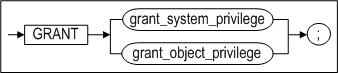

**grant_system_privilege ::=**


**grant_object_privilege ::=**


#### 전제 조건

SYS 사용자와 GRANT ANY PRIVILEGES 시스템 권한을 가진 사용자만이 시스템 권한을
부여할 수 있다. 또한 객체 권한은 객체의 소유자이거나 WITH GRANT OPTION으로 객체
권한을 부여받은 사용자만이 그 객체에 대한 권한을 다른 사용자에게 부여할 수 있다.

SYS 사용자와 GRANT ANY ROLE 시스템 권한을 가진 사용자만이 롤(role)에 시스템
권한을 부여할 수 있다.

#### 설명

명시된 사용자에게 데이터베이스와 객체에 접근하기 위한 권한들을 부여하는
구문이다.

권한은 시스템 권한과 객체 권한으로 분류된다.

*grant_system_privilege*

시스템 권한은 일반적으로 SYS 사용자에 의해 관리된다. SYS 사용자는 사용자들에게
특정 데이터베이스 작업을 수행하는 것을 허용하기 위해서 제한된 시스템 권한을
부여할 수 있다. 시스템 권한은 모든 스키마에 있는 객체들을 제어하는 광범위한
권한으로 볼 수 있다.

시스템 권한은 DDL문과 DCL문을 수행하기 위해서 필요하다.

grant_object_privilege

사용자가 특정 객체에 대한 권한을 부여 받으면, 사용자는 객체를 접근 및 조작할 수
있다. 객체 접근 권한은 일반적으로 객체 소유자에 의해 관리된다.

시스템 권한이 없으면, DML문을 수행을 위해서 객체 권한이 필요하다.

#### 시스템 권한 (System Privileges) 

*system_privilege*

부여될 시스템 접근 권한의 이름을 명시한다.

*role*

부여될 롤의 이름을 명시한다.

-   롤(role)은 다른 role이나 PUBLIC에게 부여할 수 없다.

-   한 사용자에게 롤을 최대 126개까지 부여할 수 있다.

-   사용자에게 롤을 부여해도 사용자에게 바로 적용되는 것이 아니다. 사용자가
    데이터베이스에 다시 접속(connect)한 후에 롤의 권한이 적용된다.

*ALL PRIVILEGES*

모든 시스템 권한을 사용자에게 부여하기 위해 사용되는 옵션이다.

*TO user*

시스템 권한을 부여할 사용자 이름을 명시한다.

*TO role*

시스템 권한을 부여할 롤(role)의 이름을 명시한다.

*TO PUBLIC*

모든 사용자에게 시스템 권한을 부여함을 명시하는 옵션이다.

##### 주의 사항

-   SYS 사용자와 GRANT ANY PRIVILEGES 권한을 가진 사용자는 모든 시스템 권한을
    다른 사용자에게 부여할 수 있다.
-   SYS 사용자는 모든 시스템 권한을 가진다.
-   시스템 권한 중 ANY 키워드는 모든 스키마에 대한 권한을 가진다. 예를 들어
    SELECT ANY TABLE 권한은 데이터베이스 내에 있는 모든 테이블을 SELECT 할 수
    있다.
-   CREATE 권한은 객체를 생성할 수 있는 권한이며, 해당 객체를 삭제하는 권한도
    포함한다.
-   CREATE TABLE 객체 권한은 테이블 뿐만 아니라 인덱스를 생성하는 권한을
    포함한다. 이 인덱스 생성 권한은 시스템 권한이 아니라 객체 권한이다.
-   새로운 사용자가 생성될 때 기본적으로 CREATE MATERIALIZED VIEW, CREATE
    LIBRARY, CREATE SESSION, CREATE TABLE, CREATE SEQUENCE, CREATE SYNONYM,
    CREATE PROCEDURE, CREATE VIEW, CREATE TRIGGER, 그리고 CREATE DATABASE LINK
    권한이 그 사용자에게 부여된다.  

다음 쿼리를 사용하면 Altibase가 지원하는 모든 시스템 권한들의 목록을 볼 수
있다.

```
iSQL> SELECT * FROM SYSTEM_.SYS_PRIVILEGES_ where PRIV_TYPE = 2;
```

Altibase는 다음과 같은 시스템 접근 권한을 지원한다.

| PrivID | System privilege  | Name                         | Purpose                                                                                                                                             |
|--------|-------------------|------------------------------|-----------------------------------------------------------------------------------------------------------------------------------------------------|
| 1      |                   | ALL                          | 사용자에게 모든 시스템 권한을 부여한다. 단, 이 권한을 사용자에게 부여해도 ALTER DATABASE, DROP DATABASE, MANAGER TABLESPACE 권한은 부여되지 않는다. |
| 201    | DATABASE          | ALTER SYSTEM                 | Altibase 프로퍼티 설정을 동적으로 변경할 수 있다.                                                                                                   |
| 233    |                   | ALTER DATABASE               | SYS 사용자 외의 다른 사용자에게는 부여되지 않는다.                                                                                                  |
| 234    |                   | DROP DATABASE                | SYS 사용자 외의 다른 사용자에게는 부여되지 않는다.                                                                                                  |
| 202    | INDEX             | CREATE ANY INDEX             | 자신의 스키마 뿐 아니라 다른 사용자의 스키마 내에서도 인덱스 생성이 가능하다.                                                                       |
| 203    |                   | ALTER ANY INDEX              | 데이터베이스에 존재하는 모든 인덱스의 정의를 변경할 수 있다.                                                                                        |
| 204    |                   | DROP ANY INDEX               | 데이터베이스에 존재하는 모든 인덱스를 삭제할 수 있다.                                                                                               |
| 205    | PROCEDURE         | CREATE PROCEDURE             | 자신의 스키마 내에 저장 프로시저나 함수를 생성할 수 있다.                                                                                           |
| 206    |                   | CREATE ANY PROCEDURE         | 자신의 스키마 뿐 아니라 다른 사용자의 스키마 내에 저장 프로시저나 함수를 생성할 수 있다.                                                            |
| 207    |                   | ALTER ANY PROCEDURE          | 데이터베이스에 존재하는 모든 저장 프로시저나 함수를 재컴파일 할 수 있다.                                                                            |
| 208    |                   | DROP ANY PROCEDURE           | 데이터베이스에 존재하는 모든 저장 프로시저나 함수를 삭제할 수 있다.                                                                                 |
| 209    |                   | EXECUTE ANY PROCEDURE        | 데이터베이스에 존재하는 모든 저장 프로시저나 함수를 실행할 수 있다.                                                                                 |
| 210    | SEQUENCE          | CREATE SEQUENCE              | 자신의 스키마 내에 시퀀스를 생성할 수 있다.                                                                                                         |
| 211    |                   | CREATE ANY SEQUENCE          | 자신의 스키마 뿐 아니라 다른 사용자의 스키마 내에서도 시퀀스 생성이 가능하다.                                                                       |
| 212    |                   | ALTER ANY SEQUENCE           | 데이터베이스에 존재하는 모든 시퀀스의 정의를 변경할 수 있다.                                                                                        |
| 213    |                   | DROP ANY SEQUENCE            | 데이터베이스에 존재하는 모든 시퀀스를 삭제할 수 있다.                                                                                               |
| 214    |                   | SELECT ANY SEQUENCE          | 데이터베이스에 존재하는 모든 시퀀스를 조회할 수 있다.                                                                                               |
| 215    | SESSION           | CREATE SESSION               | 서버에 연결할 수 있다.                                                                                                                              |
| 216    |                   | ALTER SESSION                | 자동으로 모든 사용자에게 부여된다.                                                                                                                  |
| 217    | TABLE             | CREATE TABLE                 | 자신의 스키마 내에 테이블을 생성할 수 있다.                                                                                                         |
| 218    |                   | CREATE ANY TABLE             | 자신의 스키마 뿐 아니라 다른 사용자의 스키마 내에서도 테이블 생성이 가능하다.                                                                       |
| 219    |                   | ALTER ANY TABLE              | 데이터베이스에 존재하는 모든 테이블에 대해서 truncate(모든 레코드 삭제)하거나 모든 테이블의 정의를 변경할 수 있다.                                  |
| 220    |                   | DELETE ANY TABLE             | 데이터베이스에 존재하는 모든 테이블의 레코드를 삭제 할 수 있다.                                                                                     |
| 221    |                   | DROP ANY TABLE               | 데이터베이스에 존재하는 모든 테이블을 삭제할 수 있다.                                                                                               |
| 222    |                   | INSERT ANY TABLE             | 데이터베이스에 존재하는 모든 테이블에 새로운 레코드를 삽입할 수 있다.                                                                               |
| 223    |                   | LOCK ANY TABLE               | 데이터베이스에 존재하는 모든 테이블에 테이블 잠금을 할 수 있다.                                                                                     |
| 224    |                   | SELECT ANY TABLE             | 데이터베이스에 존재하는 모든 테이블의 데이터를 조회할 수 있다.                                                                                      |
| 225    |                   | UPDATE ANY TABLE             | 데이터베이스에 존재하는 모든 테이블의 데이터를 변경할 수 있다.                                                                                      |
| 226    | USER              | CREATE USER                  | 새로운 사용자를 생성할 수 있다.                                                                                                                     |
| 227    |                   | ALTER USER                   | 모든 사용자의 암호를 변경할 수 있다.                                                                                                                |
| 228    |                   | DROP USER                    | 사용자를 제거할 수 있다.                                                                                                                            |
| 229    | VIEW              | CREATE VIEW                  | 자신의 스키마 내에 뷰를 생성할 수 있다.                                                                                                             |
| 230    |                   | CREATE ANY VIEW              | 자신의 스키마 뿐 아니라 다른 사용자의 스키마 내에서도 뷰 생성이 가능하다.                                                                           |
| 231    |                   | DROP ANY VIEW                | 데이터베이스에 존재하는 모든 뷰를 삭제 할 수 있다.                                                                                                  |
| 232    | MISCELLANEOUS     | GRANT ANY PRIVILEGES         | 모든 시스템 권한을 다른 사용자에게 부여할 수 있다.                                                                                                  |
| 235    | TABLESPACES       | CREATE TABLESPACE            | 테이블스페이스를 생성할 수 있다.                                                                                                                    |
| 236    |                   | ALTER TABLESPACE             | 테이블스페이스 정의를 변경할 수 있다.                                                                                                               |
| 237    |                   | DROP TABLESPACE              | 테이블스페이스를 삭제할 수 있다.                                                                                                                    |
| 238    |                   | MANAGE TABLESPACE            | SYS 사용자 외의 다른 사용자에게는 부여되지 않는다.                                                                                                  |
| 240    |                   | SYSDBA                       | SYS 사용자 외의 다른 사용자에게는 부여되지 않는다.                                                                                                  |
| 241    | TRIGGER           | CREATE TRIGGER               | 자신의 스키마 내에 새로운 트리거를 생성할 수 있다.                                                                                                  |
| 242    |                   | CREATE ANY TRIGGER           | 자신의 스키마 뿐 아니라 다른 사용자의 스키마 내에서도 트리거 생성이 가능하다.                                                                       |
| 243    |                   | ALTER ANY TRIGGER            | 데이터베이스에 존재하는 모든 트리거의 정의를 변경할 수 있다.                                                                                        |
| 244    |                   | DROP ANY TRIGGER             | 데이터베이스에 존재하는 모든 트리거를 제거할 수 있다.                                                                                               |
| 245    | SYNONYM           | CREATE SYNONYM               | 자기 소유의 시노님 (private synonym)을 생성할 수 있다.                                                                                              |
| 246    |                   | CREATE PUBLIC SYNONYM        | PUBLIC 시노님을 생성할 수 있다.                                                                                                                     |
| 247    |                   | CREATE ANY SYNONYM           | 자신의 스키마 뿐 아니라 다른 사용자의 스키마 내에서도 PRIVATE 시노님을 생성할 수 있다.                                                              |
| 248    |                   | DROP ANY SYNONYM             | PRIVATE 시노님을 삭제할 수 있다.                                                                                                                    |
| 249    |                   | DROP PUBLIC SYNONYM          | PUBLIC 시노님을 삭제할 수 있다.                                                                                                                     |
| 250    | DIRECTORY         | CREATE ANY DIRECTORY         | 저장프로시저 내에서 파일 제어를 위해 사용되는 디렉토리 객체를 생성할 수 있다.                                                                       |
| 251    |                   | DROP ANY DIRECTORY           | 디렉토리 객체를 삭제할 수 있다.                                                                                                                     |
| 252    | MATERIALIZED VIEW | CREATE MATERIALIZED VIEW     | 자신의 스키마 내에 새로운 MATERIALIZED VIEW를 생성할 수 있다.                                                                                       |
| 253    |                   | CREATE ANY MATERIALIZED VIEW | 자신의 스키마 뿐 아니라 다른 사용자의 스키마 내에 MATERIALIZED VIEW를 생성할 수 있다.                                                               |
| 254    |                   | ALTER ANY MATERIALIZED VIEW  | 데이터베이스에 존재하는 모든 MATERIALIZED VIEW를 변경할 수 있다.                                                                                    |
| 255    |                   | DROP ANY MATERIALIZED VIEW   | 데이터베이스에 존재하는 모든 MATERIALIZED VIEW를 삭제 할 수 있다.                                                                                   |
| 256    | LIBRARY           | CREATE LIBRARY               | 자신의 스키마 내에 새로운 라이브러리 객체를 생성할 수 있다.                                                                                         |
| 257    |                   | CREATE ANY LIBRARY           | 자신의 스키마 뿐 아니라 다른 사용자의 스키마 내에서도 라이브러리 객체 생성이 가능하다.                                                              |
| 258    |                   | ALTER ANY LIBRARY            | 데이터베이스에 존재하는 모든 라이브러리 객체를 컴파일할 수 있다.                                                                                    |
| 259    |                   | DROP ANY LIBRARY             | 데이터베이스에 존재하는 모든 라이브러리 객체를 제거할 수 있다.                                                                                      |
| 260    | DATABASE LINK     | CREATE DATABASE LINK         | 새로운 데이터베이스 링크를 생성할 수 있다.                                                                                                          |
| 261    |                   | CREATE PUBLIC_DATABASE LINK  | PUBLIC 데이터베이스 링크를 생성할 수 있다.                                                                                                          |
| 262    |                   | DROP PUBLIC DATABASE LINK    | PUBLIC 데이터베이스 링크를 삭제할 수 있다.                                                                                                          |
| 263    | ROLE              | CREATE ROLE                  | 새로운 롤을 생성할 수 있다.                                                                                                                         |
| 264    |                   | DROP ANY ROLE                | 데이터베이스에 존재하는 모든 롤을 삭제할 수 있다.                                                                                                   |
| 265    |                   | GRANT ANY ROLE               | 모든 롤을 다른 사용자에게 부여할 수 있다.                                                                                                           |
| 266    | JOB               | CREATE ANY JOB               | 자신의 스키마 뿐 아니라 다른 사용자의 스키마 내에서 새로운 JOB을 생성할 수 있다.                                                                    |
| 268    |                   | ALTER ANY JOB                | 데이터베이스에 존재하는 모든 JOB을 변경할 수 있다.                                                                                                  |
| 267    |                   | DROP ANY JOB                 | 데이터베이스에 존재하는 모든 JOB을 삭제할 수 있다.                                                                                                  |

#### 객체 권한 (Object privileges) 

*object_privilege*

어떤 객체에 대한 특정 권한만을 부여하고자 할 때 사용되는 절이다. (이 절의
아래에 어떤 객체에 대해서 어떤 권한이 지원되는지를 [보여주는 표](#grant_tbl2)가
있다.)

*ALL [PRIVILEGES]*

객체에 대한 모든 가능한 권한을 부여하는 옵션이다.

*ON object*

어느 객체에 대해서 권한을 부여할 것인지를 명시하는 절이다. 객체에는 테이블,
시퀀스, 저장 프로시저가 있다.

*ON DIRECTORY directory_name*

권한을 부여할 대상인 저장 프로시저 내에서 사용하는 디렉토리 객체의 이름을
명시한다.

*TO user*

객체에 대한 객체 권한을 부여 받는 사용자를 명시한다.

*TO PUBLIC*

모든 사용자에게 객체 권한을 부여한다.

*TO role*

객체 권한을 부여할 롤(role)의 이름을 명시한다.

*WITH GRANT OPTION*

권한 수여자가 다른 사용자들에게 자신이 받은 객체 권한을 부여할 수 있는 옵션이다.
단 롤에 객체 권한을 부여할 때는 WITH GRANT OPTION을 사용할 수 없다.

> ##### 요약 정리
>
> -   객체의 소유자란 객체를 생성한 사용자로서, 해당 객체에 대한 모든 객체 권한을
>     가진다.
>
> -   객체 권한은 객체의 소유자이거나, WITH GRANT OPTION으로 객체 권한을 부여받은
>     사용자만이 그 객체에 대한 권한을 다른 사용자에게 부여할 수 있다.
>
> -   SYS 사용자가 객체 권한을 부여받지 못하였다면, 권한은 SYS로써 한정될 뿐 다른
>     사용자에게 권한을 부여할 수 없다.
>

다음 쿼리로 Altibase에서 지원하는 모든 객체 권한들에 대한 정보를 볼 수 있다.

```
SELECT * FROM SYSTEM_.SYS_PRIVILEGES_ where PRIV_TYPE = 1;
```

Altibase는 다음과 같은 객체 접근 권한을 지원한다.

<a name="grant_tbl2"><a/>

| Priv ID | Object privileges | Table | Sequence | PSM/ External Procedure | View | directory | External Library |
|---------|-------------------|-------|----------|-------------------------|------|-----------|------------------|
| 101     | ALTER             | O     | O        |                         |      |           |                  |
| 102     | DELETE            | O     |          |                         |      |           |                  |
| 103     | EXECUTE           |       |          | O                       |      |           | O                |
| 104     | INDEX             | O     |          |                         |      |           |                  |
| 105     | INSERT            | O     |          |                         |      |           |                  |
| 106     | REFERENCES        | O     |          |                         |      |           |                  |
| 107     | SELECT            | O     | O        |                         | O    |           |                  |
| 108     | UPDATE            | O     |          |                         |      |           |                  |
| 109     | READ              |       |          |                         |      | O         |                  |
| 110     | WRITE             |       |          |                         |      | O         |                  |

모든 사용자는 자동으로 메타 테이블에 대한 SELECT 권한을 가진다.

#### 예제

##### 시스템 접근 권한

\<질의1\> 다음은 사용자 user5에게 EXECUTE ANY PROCEDURE, SELECT ANY TABLE, ALTER
ANY SEQUENCE, INSERT ANY TABLE, SELECT ANY SEQUENCE 등의 시스템 권한을 부여하는
예제이다.

```
iSQL> CREATE TABLE seqtbl(i1 INTEGER);
Create success.
iSQL> CREATE OR REPLACE PROCEDURE proc1
AS
BEGIN
  FOR i IN 1 .. 10 LOOP
    INSERT INTO seqtbl VALUES(i);
  END LOOP;
END;
/
Create success.

iSQL> CREATE USER uare5 IDENTIFIED BY rose5;
Create success.
iSQL> GRANT EXECUTE ANY PROCEDURE, SELECT ANY TABLE TO uare5;
Grant success.
iSQL> CONNECT uare5/rose5;
Connect success.
iSQL> EXEC sys.proc1;
Execute success.
iSQL> SELECT * FROM sys.seqtbl;
SEQTBL.I1   
--------------
1           
2           
3           
4           
5           
6           
7           
8           
9           
10          
10 rows selected.

iSQL> CONNECT sys/manager;
Connect success.
iSQL> CREATE SEQUENCE seq1
  START WITH 13
  INCREMENT BY 3
  MINVALUE 0 NOMAXVALUE;
Create success.
iSQL> INSERT INTO seqtbl VALUES(seq1.NEXTVAL);
1 row inserted.
iSQL> INSERT INTO seqtbl VALUES(seq1.NEXTVAL);
1 row inserted.
iSQL> SELECT * FROM seqtbl;
SEQTBL.I1   
--------------
1           
2           
3           
4           
5           
6           
7           
8           
9           
10          
13          
16          
12 rows selected.

iSQL> GRANT ALTER ANY SEQUENCE, INSERT ANY TABLE, SELECT ANY SEQUENCE TO uare5;
Grant success.
iSQL> CONNECT uare5/rose5;
Connect success.	
iSQL> ALTER SEQUENCE sys.seq1
  INCREMENT BY 50
  MAXVALUE 100
  CYCLE;
Alter success.

iSQL> INSERT INTO sys.seqtbl VALUES(sys.seq1.NEXTVAL);
1 row inserted.
iSQL> INSERT INTO sys.seqtbl VALUES(sys.seq1.NEXTVAL);
1 row inserted.
iSQL> INSERT INTO sys.seqtbl VALUES(sys.seq1.NEXTVAL);
1 row inserted.
iSQL> INSERT INTO sys.seqtbl VALUES(sys.seq1.NEXTVAL);
1 row inserted.
iSQL> SELECT * FROM sys.seqtbl;
SEQTBL.I1   
--------------
1           
2           
3           
4           
5           
6           
7           
8           
9           
10          
13          
16          
66          
0           
50          
100         
16 rows selected.
```

\<질의 2\> 이름이 alti_role인 롤을 생성한 후, 롤에게 create user와 drop user
등의 시스템 권한을 부여한다.

```
iSQL> create role alti_role;
Create success.
iSQL> grant create user, drop user to alti_role;
Grant success.
iSQL> create user user01 identified by user01;
Create success.
iSQL> grant alti_role to user01;
Grant success.
iSQL> connect user01/user01
Connect success.
iSQL> create user user02 identified by user02;
Create success.
iSQL> drop user user02;
Drop success.
```


##### 객체 권한

\<질의1\> 사용자 uare6가 WITH GRANT OPTION으로 employees 테이블에 대한 SELECT와 DELETE 객체 권한을 부여 받은 후, 같은 권한을 다른 사용자 uare7과 uare8에게 부여한다.

```sql
iSQL> CREATE USER uare6 IDENTIFIED BY rose6;
Create success.
iSQL> GRANT CREATE USER TO uare6;
Grant success.
iSQL> @ ?/sample/APRE/schema/schema

iSQL> CONNECT sys/manager;
Connect success.
iSQL> GRANT SELECT, DELETE ON employees TO uare6 WITH GRANT OPTION;
Grant success.
iSQL> CONNECT uare6/rose6;
Connect success.
iSQL> CREATE USER uare7 IDENTIFIED BY rose7;
Create success.
iSQL> GRANT SELECT, DELETE ON sys.employees TO uare7;
Grant success.
iSQL> CONNECT uare7/rose7;
Connect success.
iSQL> DELETE FROM SYS.employees WHERE eno = 12;
1 row deleted.
iSQL> SELECT eno, e_lastname FROM sys.employees WHERE eno = 12;
ENO         E_LASTNAME                 
-------------------------------------
No rows selected.
iSQL> CONNECT sys/manager;
Connect success.
iSQL> CREATE USER uare8 IDENTIFIED BY rose8;
Create success.
iSQL> CONNECT uare6/rose6;
Connect success.
iSQL> GRANT SELECT, DELETE ON sys.employees TO uare8;
Grant success.
```

WITH GRANT OPTION 으로 객체권한을 부여받은 사용자 uare6는 자신이 생성한 사용자 uare7 뿐만 아니라 원래의 권한 부여자(SYS)가 생성한 사용자 uare8에게도 객체 권한을 부여할 수 있다.

```sql
iSQL> CONNECT uare8/rose8;
Connect success.
iSQL> DELETE FROM sys.employees WHERE eno = 13;
1 row deleted.

iSQL> SELECT eno, e_lastname FROM sys.employees WHERE eno = 13;
ENO         E_LASTNAME                 
-------------------------------------
No rows selected.
```

\<질의 2\> 다음은 사용자에게 시스템 권한, 객체 권한을 부여한 후 각각의 권한을 해제하는 예제이다.

1. SYS 사용자가 uare9에게 모든 시스템 권한을 부여한다.

   ```sql
   iSQL> CONNECT sys/manager;
   Connect success.
   iSQL> CREATE TABLE book(
     isbn CHAR(10) PRIMARY KEY,
     title VARCHAR(50),
     author VARCHAR(30),
     edition INTEGER DEFAULT 1,
     publishingyear INTEGER,
     price NUMBER(10,2),
     pubcode CHAR(4));
   Create success.
   iSQL> CREATE TABLE inventory(
     subscriptionid CHAR(10) PRIMARY KEY,
     storecode CHAR(4),
     purchasedate DATE,
     quantity INTEGER,
     paid CHAR(1));
   Create success.
   
   iSQL> CREATE USER uare9 IDENTIFIED BY rose9;
   Create success.
   iSQL> GRANT ALL PRIVILEGES TO uare9;
   Grant success.
   ```


2. SYS는 사용자 uare9에게 객체 book에 대한 REFERENCES 권한을 WITH GRANT OPTION 으로 부여한다.

   ~~~sql
   iSQL> GRANT REFERENCES ON book TO uare9 WITH GRANT OPTION;
   Grant success.
   ~~~

   사용자 uare9은 SYS로부터 객체 book에 대한 REFERENCES 권한을 WITH GRANT OPTION 으로 부여 받았기 때문에, uare9은 다른 사용자(uare10)에게 객체 book에 대해 REFERENCES 객체 권한을 부여할 수 있다.

3. uare9이 SYS의 객체인 book 테이블에 데이터를 입력한다.

   ```sql
   iSQL> CONNECT uare9/rose9;
   Connect success.
   
   iSQL> INSERT INTO sys.book VALUES ('0070521824', 'Software Engineering', 'Roger S. Pressman', 4, 1982, 100000, 'CHAU');
   1 row inserted.
   iSQL> INSERT INTO sys.book VALUES ('0137378424', 'Database Processing', 'David M. Kroenke', 6, 1972, 80000, 'PREN');
   1 row inserted.
   ```

   uare9이 SYS의 객체인 inventory 테이블에 데이터를 입력한다.

      ```sql
   iSQL> INSERT INTO sys.inventory VALUES('BORD000002', 'BORD', '12-Jun-2003', 6, 'N');
   1 row inserted.
   iSQL> INSERT INTO sys.inventory VALUES('MICR000001', 'MICR', '07-Jun-2003', 7, 'N');
   1 row inserted.
      ```


4. uare9이 SYS의 객체인 book 테이블을 조회한다.

   ```sql
   iSQL> SELECT * FROM sys.book;
   ISBN                  TITLE                 AUTHOR                EDITION     PUBLISHINGYEAR PRICE       PUBCODE               
   ---------------------------------------------------------------------------------------------------------------------------------------
   0070521824            Software Engineering  Roger S. Pressman     4           1982        100000      CHAU                  
   0137378424            Database Processing   David M. Kroenke      6           1972        80000       PREN                  
   2 rows selected.
   ```

   uare9이 SYS의 객체인 inventory 테이블을 조회한다.

      ```sql
   iSQL> SELECT * FROM sys.inventory;
   SUBSCRIPTIONID        STORECODE             PURCHASEDATE QUANTITY    PAID                  
   -------------------------------------------------------------------------------------------------
   BORD000002            BORD                  12-JUN-2003  6           N                     
   MICR000001            MICR                  07-JUN-2003  7           N                     
   2 rows selected.
   
   iSQL> CREATE TABLE book(
     isbn CHAR(10) PRIMARY KEY,
     title VARCHAR(50),
     author VARCHAR(30),
     edition INTEGER DEFAULT 1,
     publishingyear INTEGER,
     price NUMBER(10,2),
     pubcode CHAR(4));
   Create success.
   
   iSQL> CREATE TABLE inventory(
     subscriptionid CHAR(10) PRIMARY KEY,
     isbn CHAR(10) CONSTRAINT fk_isbn REFERENCES book(isbn), 
     storecode CHAR(4),
     purchasedate DATE,
     quantity INTEGER,
     paid CHAR(1));
   Create success.
      ```

5. uare9은 SYS로부터 ALL PRIVILEGES를 부여 받았으므로 다른 사용자를 생성할 수 있다.

   ~~~sql
   iSQL> CREATE USER uare10 IDENTIFIED BY rose10;
   Create success.
   ~~~

6. SYS는 uare9에게 REFERENCES 권한을 WITH GRANT OPTION으로 부여했기 때문에, uare9는 다른 사용자(uare10)에게 이 권한을 부여할 수 있다.

   ~~~sql
   iSQL> GRANT REFERENCES ON sys.book TO uare10;
   Grant success.
   ~~~


7. GRANT ANY PRIVILEGES를 부여 받은 uare9이 다른 사용자(uare10)에게 시스템 권한을 부여한다.

   ```sql
   iSQL> GRANT ALTER ANY TABLE, INSERT ANY TABLE, SELECT ANY TABLE, DELETE ANY
   TABLE TO uare10;
   Grant success.
   ```

8. 사용자 uare10은 ALTER ANY TABLE과 REFERENCE 권한이 있기 때문에, 다른 사용자 소유의 테이블에 제약조건을 추가할 수 있다.

   ```sql
   iSQL> CONNECT uare10/rose10;
   Connect success.
   iSQL> ALTER TABLE sys.inventory
     ADD COLUMN (isbn CHAR(10) CONSTRAINT fk_isbn REFERENCES sys.book(isbn));
   Alter success.
   ```

9. 사용자 uare10은 INSERT ANY TABLE 권한이 있기 때문에, 사용자 uare9가 소유한 테이블에 데이터를 입력할 수 있다.

   ~~~sql
   iSQL> INSERT INTO uare9.book VALUES('0471316156', 'JAVA and CORBA', 'Robert Orfali', 2, 1998, 50000, 'PREN');
   1 row inserted.
   iSQL> INSERT INTO uare9.inventory VALUES('TOWE000001', '0471316156', 'TOWE', '01-Jun-2003', 5, 'N');
   1 row inserted.
   ~~~

   사용자 uare10은 INSERT ANY TABLE 권한이 있기 때문에, SYS소유의 테이블에 데이터를 입력할 수 있다.

     ```sql
   iSQL> INSERT INTO sys.book VALUES('053494566X', 'Working Classes', 'Robert Orfali', 1, 1999, 80000, 'WILE');
   1 row inserted.
   iSQL> INSERT INTO sys.inventory VALUES('MICR000005', 'WILE', '28-JUN-1999', 8, 'N', '053494566X');
   1 row inserted.
     ```

10. 사용자 uare10은 SELECT ANY TABLE 권한이 있기 때문에, uare9소유의 테이블을 조회할 수 있다.

    ```sql
    iSQL> SELECT * FROM uare9.book;
    ISBN                  TITLE                 AUTHOR                EDITION     PUBLISHINGYEAR PRICE       PUBCODE               
    ---------------------------------------------------------------------------------------------------------------------------------------
    0471316156            JAVA and CORBA        Robert Orfali         2           1998        50000       PREN  
    1 row selected.
    iSQL> SELECT * FROM uare9.inventory;
    SUBSCRIPTIONID        ISBN                  STORECODE             PURCHASEDATE QUANTITY    PAID
    ------------------------------------------------------------------------------------------------------------------------
    TOWE000001            0471316156            TOWE                  01-JUN-2003  5           N  
    1 row selected.
    ```

    사용자 uare10은 SELECT ANY TABLE 권한이 있기 때문에, SYS소유의 테이블을 조회할 수 있다.

    ~~~sql
    iSQL> SELECT * FROM sys.book;
    ISBN                  TITLE                 AUTHOR                EDITION     PUBLISHINGYEAR PRICE       PUBCODE               
    ---------------------------------------------------------------------------------------------------------------------------------------
    0070521824            Software Engineering  Roger S. Pressman     4           1982        100000      CHAU                  
    0137378424            Database Processing   David M. Kroenke      6           1972        80000       PREN                  
    053494566X            Working Classes       Robert Orfali         1           1999        80000       WILE  
    3 rows selected.
    iSQL> SELECT * FROM sys.inventory;
    SUBSCRIPTIONID        STORECODE             PURCHASEDATE QUANTITY    PAID                  ISBN
    ------------------------------------------------------------------------------------------------------------------------
    BORD000002            BORD                  12-JUN-2003  6           N
    MICR000001            MICR                  07-JUN-2003  7           N
    MICR000005            WILE                  28-JUN-1999  8           N                     053494566X  
    3 rows selected.
    ~~~


11. 사용자 uare10은 DELETE ANY TABLE 권한이 있기 때문에, SYS와 uare9소유의 테이블의 데이터를 삭제할 수 있다.

    ```sql
    iSQL> DELETE FROM uare9.inventory WHERE subscriptionid = 'TOWE000001';
    1 row deleted.
    iSQL> SELECT * FROM uare9.inventory;
    SUBSCRIPTIONID        ISBN                  STORECODE             PURCHASEDATE QUANTITY    PAID
    ------------------------------------------------------------------------------------------------------------------------
    No rows selected.
    
    iSQL> DELETE FROM sys.inventory WHERE subscriptionid = 'MICR000005';
    1 row deleted.
    iSQL> SELECT * FROM sys.inventory;
    SUBSCRIPTIONID        STORECODE             PURCHASEDATE QUANTITY    PAID                  ISBN
    ------------------------------------------------------------------------------------------------------------------------
    BORD000002            BORD                  12-JUN-2003  6           N
    MICR000001            MICR                  07-JUN-2003  7           N              
    2 rows selected.
    ```


12. 사용자 uare9이 REVOKE ALL 구문을 사용하지 않고 uare10으로부터 모든 권한을 해제한다.

    ```sql
    iSQL> CONNECT uare9/rose9;
    Connect success.
    iSQL> REVOKE ALTER ANY TABLE, INSERT ANY TABLE, SELECT ANY TABLE, DELETE ANY TABLE FROM uare10;
    Revoke success.
    ```


13. 사용자 uare10의 REFERENCES 권한과 함께 관련된 참조 무결성 제약조건(referential integrity constraints)도 같이 삭제한다.

    ```sql
    iSQL> REVOKE REFERENCES ON sys.book FROM uare10 CASCADE CONSTRAINTS;
    Revoke success.
    ```


14. 사용자 uare9의 모든 시스템 권한을 해제한다.

    ```sql
    iSQL> CONNECT sys/manager;
    Connect success.
    iSQL> REVOKE ALL PRIVILEGES FROM uare9;
    Revoke success.
    ```


15. 사용자 uare9의 GRANT ANY PRIVILEGES 권한을 해제한다.

    ```sql
    iSQL> REVOKE GRANT ANY PRIVILEGES FROM uare9;
    Revoke success.
    ```


16. 사용자 uare9의 REFERENCES 권한을 해제한다.

    ```sql
    iSQL> REVOKE REFERENCES ON book FROM uare9;
    Revoke success.
    ```


\<질의 3\> user01의 T1 테이블에 대한 SELECT, UPDATE, INSERT, DELETE 객체 권한을 alti_role 롤에 부여한다. 그리고 alti_role 롤을 다른 사용자 user02에게 부여한다.

```sql
iSQL> create role alti_role;
Create success.
iSQL> create user user01 identified by user01;
Create success.
iSQL> create user user02 identified by user02;
Create success.
iSQL> connect user01/user01
Connect success.
iSQL> create table t1 (i1 integer);
Create success.
iSQL> grant select,insert,update,delete on t1 to alti_role;
Grant success.
iSQL> connect sys/manager
Connect success.
iSQL> grant alti_role to user02;
Grant success.
iSQL> connect user02/user02;
Connect success.
iSQL> insert into user01.t1 values (1);
1 row inserted.
iSQL> insert into user01.t1 values (2);
1 row inserted.
iSQL> select * from user01.t1;
T1.I1       
--------------
1           
2           
2 rows selected.
iSQL> update user01.t1 set i1=3 where i1=1;
1 row updated.
iSQL> select * from user01.t1;
T1.I1       
--------------
2           
3           
2 rows selected.
iSQL> delete from user01.t1 where i1=2;
1 row deleted.
iSQL> select * from user01.t1;
T1.I1       
--------------
3           
1 row selected.
```


### PURGE TABLE 

#### 구문

**purge_table::=**


#### 전제 조건

SYS 사용자, 테이블의 소유자, DROP ANY TABLE 시스템 권한을 가진 사용자만이 이
구문을 수행할 수 있다.

#### 설명

명시한 테이블이 휴지통에서 제거되는 구문이다. 동일 이름의 테이블이 휴지통에 여러
개 존재할 경우 가장 먼저 DROP된 테이블이 데이터베이스에서 삭제된다.

*user_name*

테이블의 소유자 이름을 명시한다.

*table_name*

휴지통에서 제거할 테이블의 이름을 명시한다. 테이블의 이름은 DROP 되기 전의
테이블의 이름이거나 휴지통으로 옮겨지면서 시스템에서 부여된 객체의 이름을 명시할
수 있다.

#### 예제

\<질의\> DROP이 수행된 테이블 t1을 휴지통에서 비운다.

```
iSQL> alter session set recyclebin_enable = 1;
Alter success.
iSQL> create table t1 (i1 integer);
Create success.
iSQL> drop table t1;
Drop success.
iSQL> purge table t1;
Purge success.
```


### RENAME TABLE 

#### 구문

**rename ::=**


#### 전제 조건

SYS 사용자, 테이블이 속한 스키마의 소유자, 테이블에 ALTER 객체 권한을 가진
사용자, 또는 ALTER ANY TABLE 시스템 권한을 가진 사용자만이 테이블 이름을 변경할
수 있다.

#### 설명

명시된 테이블의 이름을 새로운 이름으로 변경한다. 테이블의 이름만 변경되고 그
안에 저장된 데이터는 유지된다.

*user_name*

이름이 변경될 테이블의 소유자 이름을 명시한다. 생략하면 Altibase는 현재 세션에
연결된 사용자의 스키마에 속한 것으로 간주한다.

*old_name*

테이블의 현재 이름을 명시한다.

*new_name*

테이블에 주어질 새로운 이름을 명시한다.

#### 주의 사항

이중화 대상 테이블일 경우 테이블의 이름을 변경할 수 없다.

#### 예제

\<질의\> 테이블 employees의 이름을 emp1으로 변경하라.

```
iSQL> RENAME employees TO emp1;
Rename success.
```

또는

```
iSQL> ALTER TABLE employees
  RENAME TO emp1;
Alter success.
```


### REVOKE 

#### 구문

**revoke ::=**

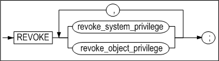

**revoke_system_privilege ::=**


**revoke_object_privilege ::=**


#### 전제 조건

SYS 사용자와 원래 그 권한을 부여한 사용자만이 해당 권한을 해제할 수 있다.

#### 설명

REVOKE 구문은 명시된 사용자가 가진 시스템 권한 또는 특정 객체에 대한 객체 권한
또는 롤을 해제한다. 또는 롤에 부여된 시스템 권한 또는 객체 권한을 해제한다.

시스템 및 객체 접근 권한, 롤을 해제하려면 GRANT 명령으로 직접 부여되었던
권한들에 대해서만 해제할 수 있다.

##### 시스템 접근 권한 (System privilege)

*role*

해제할 롤을 명시한다.

*system_privilege*

해제할 시스템 권한을 명시하는 절이다. 시스템 권한의 목록은 GRANT구문의 설명을
참고한다.

*ALL PRIVILEGES*

이 REVOKE 문을 실행하는 사용자에 의해서 부여된 모든 시스템 권한을 해제하는
옵션이다.

ALL PRIVILEGES 옵션으로 부여된 시스템 권한은 ALL PRIVILEGES 옵션을 사용해서
해제하거나 각각의 권한을 따로따로 해제해도 된다.

*FROM user*

시스템 권한을 해제할 사용자를 명시한다.

*FROM role*

어느 롤에서 시스템 권한을 해제할지 명시한다.

*FROM PUBLIC*

모든 사용자로부터 시스템 권한을 해제하는 옵션이다.

> Note: PUBLIC옵션으로 부여된 시스템 권한은 PUBLIC옵션으로 해제할 수 있다.
>

##### 객체 권한 (Object privilege)

*role*

해제할 롤을 명시한다.

*object_privilege*

해제할 객체 권한을 명시하는 절이다. 객체 권한의 목록은 GRANT구문의 설명을
참고한다.

*ALL [PRIVILEGES]*

이 REVOKE 문을 실행하는 사용자에 의해서 부여된 모든 객체 권한을 해제하는
옵션이다.

ALL PRIVILEGES 옵션으로 권한을 해제하면, 사용자에게 부여된 모든 객체 권한이
해제된다. 즉, ALL [PRIVILEGES] 옵션을 사용하지 않고 부여된 객체 권한도 해제된다.
예을 들어, 다음 구문으로 부여된 객체 권한은:

```
GRANT SELECT ON object TO user;
```

다음 방법으로 명시적으로 해제될 수 있다:

```
REVOKE SELECT ON object FROM user;
```

또한, 다음 구문을 사용하면 모든 다른 권한도 함께 해제된다:

```
REVOKE ALL ON object FROM user;
```

*ON object*

어느 객체(테이블, 시퀀스, 저장 프로시저 등)에 대한 권한을 해제할지를 명시하는
절이다.

*ON DIRECTORY directory_name*

어느 디렉토리 객체에 대한 객체 권한을 해제할지를 명시하는 절이다.

*FROM user*

객체 권한을 해제할 사용자를 명시하는 절이다.

*FROM role*

어느 롤에서 객체 권한을 해제할지 명시한다.

*FROM PUBLIC*

모든 사용자로부터 객체 권한을 해제하는 옵션이다.

*CASCADE CONSTRAINTS*

REFERENCES 권한 또는 ALL [PRIVILEGS]를 사용해서 해제할 때 사용할 수 있는
옵션이다. 이 옵션을 사용해서 사용자의 권한을 해제하면 관련된 모든 참조 무결성
제약조건(referential integrity constraints)도 함께 삭제된다.

#### 예제

\<질의\> 객체 권한을 해제하라.

```
iSQL> CONNECT uare6/rose6;
Connect success.
iSQL> REVOKE SELECT, DELETE ON sys.employees
  FROM uare7, uare8;
Revoke success.
iSQL> CONNECT uare7/rose7;
Connect success.
iSQL> SELECT eno, e_lastname FROM sys.employees WHERE eno = 15;
[ERR-311B1: The user must have the SELECT_ANY_TABLE privilege(s) to execute this statement.]
```

employees 테이블에 대한 SELECT와 DELETE 권한 해제 후, 그 테이블에 SELECT 문을
실행하면 오류 메시지를 볼 수 있다.

\<질의 2\> 롤에 부여된 create user, drop user의 시스템 권한 중에서 create user
권한을 해제한다.

```
iSQL> create role alti_role;
Create success.
iSQL> grant create user, drop user to alti_role;
Grant success.
iSQL> create user user01 identified by user01;
Create success.
iSQL> grant alti_role to user01;
Grant success.
iSQL> connect user01/user01
Connect success.
iSQL> create user user02 identified by user02;
Create success.
iSQL> drop user user02;
Drop success.
iSQL> connect sys/manager
Connect success.
iSQL> revoke create user from alti_role;
Revoke success.
iSQL> connect user01/user01
Connect success.
iSQL> create user user02 identified by user02;
[ERR-311B1 : The user must have CREATE_USER privilege(s) to execute this statement.]
```

\<질의 3\> alti_role 롤에서 사용자 user01의 테이블 t1에 대한 DELETE 객체 권한을
해제한다.

```
iSQL> create role alti_role;
Create success.
iSQL> create user user01 identified by user01;
Create success.
iSQL> create user user02 identified by user02;
Create success.

iSQL> connect user01/user01 
Connect success. 
iSQL> create table t1 (i1 integer); 
Create success. 
iSQL> grant select,insert,update,delete on t1 to alti_role; 
Grant success. 
 
iSQL> connect sys/manager 
Connect success. 
iSQL> grant alti_role to user02; 
Grant success. 
 
iSQL> connect user02/user02; 
Connect success. 
iSQL> insert into user01.t1 values (1); 
1 row inserted. 
iSQL> insert into user01.t1 values (2); 
1 row inserted. 

iSQL> select * from user01.t1; 
I1           
-------------- 
1            
2            
2 rows selected. 
iSQL> update user01.t1 set i1=3 where i1=1; 
1 row updated. 
iSQL> select * from user01.t1; 
I1           
-------------- 
2            
3            
2 rows selected. 
iSQL> delete from user01.t1 where i1=2; 
1 row deleted. 
iSQL> select * from user01.t1; 
I1           
-------------- 
3           
1 row selected. 
 
iSQL> connect user01/user01 
Connect success. 
iSQL> revoke delete on t1 from alti_role; 
Revoke success. 
 
iSQL> connect user02/user02 
Connect success. 
iSQL> delete from user01.t1 where i1=3; 
[ERR-311B1 : The user must have DELETE_ANY_TABLE privilege(s) to execute this statement.]
```


### TRUNCATE TABLE 

#### 구문

**truncate ::=**


#### 전제 조건

SYS 사용자, 테이블이 속한 스키마의 소유자, 테이블에 ALTER 객체 권한을 가진
사용자, 또는 ALTER ANY TABLE 시스템 권한을 가진 사용자만이 테이블 이름을 변경할
수 있다.

#### 설명

명시된 테이블의 모든 레코드를 삭제하는 구문이다.

*user_name*

레코드가 삭제될 테이블의 소유자 이름을 명시한다. 생략하면 Altibase는 현재 세션에
연결된 사용자의 스키마에 속한 것으로 간주한다.

*tbl_name*

레코드가 삭제될 테이블 이름을 명시한다.

*table_name* 에는 큐 테이블 명을 지정하여 ENQUE된 메시지를 한꺼번에 삭제할 수
있다.

#### TRUNCATE vs. DELETE

TRUNCATE 문을 수행한 경우는 해당 테이블에 할당된 모든 페이지가 데이터베이스에
free page로 반납된다. 따라서 이 페이지들은 다른 테이블에 의해 사용될 수 있다.
그러나 DELETE 문을 수행하여 해당 테이블의 모든 레코드를 삭제한 경우는 free
page가 생기더라도 데이터베이스에 다시 반납되지 않고 해당 테이블 내에 유지되기
때문에 메모리 사용량이 줄지 않는다.

TRUNCATE 구문은 DDL구문이므로 이 구문을 성공적으로 수행한 후에는 rollback이
불가능하다.

#### 주의 사항

레코드의 삭제가 성공적으로 수행되었다면 삭제된 레코드는 복구될 수 없다. 그러나
수행 완료 전에 오류가 발생한 경우나 서버가 죽은 경우엔 롤백이 가능하다.

#### 예제

\<질의\> 테이블 employees의 모든 데이터를 삭제하라.

```
iSQL> TRUNCATE TABLE employee;
Truncate success.
```


# 4.데이터 조작어

이 장에서는 데이터 조작에 사용되는 DML 구문에 대해서 상세히 설명한다.

### DELETE 

#### 구문

**delete ::=**


**from_clause ::=**


**where_clause ::=**


<a name="returning_clause"><a/>

**returning_clause ::=**


**limit_clause ::=**

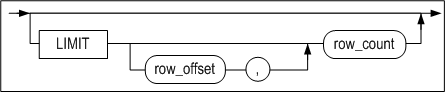

**multiple_delete ::=**


[tbl_ref ::=](#tbl_ref)

#### 전제 조건

SYS 사용자, 테이블 소유자, DELETE ANY TABLE 시스템 권한을 가진 사용자 및
테이블에 대한 DELETE 객체 권한을 가진 사용자만이 이 구문으로 해당 테이블의
레코드를 삭제할 수 있다.

뷰의 레코드를 삭제할 경우, 사용자는 베이스 테이블에 대해 위와 동일한 권한을
가져야 한다.

#### 설명

조건을 만족하는 레코드를 해당 테이블에서 삭제하는 구문이다. 또한 이 구문으로
특정 파티션에 있는 데이터를 삭제할 수도 있다.

WHERE 절은 SELECT구문의 WHERE 절과 동일하다. WHERE 절을 생략하면 테이블의 모든
데이터가 삭제된다.

*user_name*

레코드를 삭제할 테이블의 소유자 이름을 명시한다. 생략하면 Altibase는 테이블이
현재 세션에 연결된 사용자의 스키마에 속한 것으로 간주한다.

*tbl_name*

삭제될 레코드를 포함한 테이블 이름을 명시한다.

*view_name*

레코드가 삭제될 뷰의 이름을 명시한다.

*subquery*

레코드를 삭제하려는 뷰를 서브쿼리로 명시한다.

*returning_clause*

returning 절은 DML 문에 의해 영향을 받은 레코드를 조회한다.

*expr*

각 expr는 DML 문에 의해 영향을 받는 칼럼의 이름이거나 칼럼 타입과 호환되는
데이터 표현식이어야 한다.

*INTO*

INTO 절은 변경된 레코드의 값들이 각 값에 대응하는 variable_name 변수로 저장될
것을 지시한다.

*variable_name*

각 variable_name은 조회된 expr 값을 저장할 호스트 변수 또는 PSM 변수이다. RECORD
타입의 변수를 사용하는 경우를 제외하면, 변수의 개수는 expr 리스트의 expr 개수와
동일해야 한다.

호스트 변수 또는 PSM 변수의 타입은 대응하는 expr의 타입과 호환되어야 한다.

> 참고: iSQL에서는 변수 이름 앞에 ':'을 붙여 사용해야 한다.

Returning 절의 제약 사항:

- UPDATE, DELETE, 및 INSERT문의 경우, 각 expr에는 aggregate 함수가 올 수 없다.
- 이 절은 테이블에 대해서만 사용할 수 있다.
- 이 절로 LOB 타입을 조회할 수 없다.
- expr에 별칭(alias) 또는 부질의(subquery)가 올 수 없다.
- expr에 시퀀스를 사용할 수 없다.

> 참고: PSM 내에서 BULK COLLECT 절을 사용해서 한꺼번에 여러 행을 collection 변수로
> 반환할 수 있다. 이에 대한 자세한 내용은 *Stored Procedures Manual*을 참고하라.

*multiple_delete*

join 조건을 만족하는 레코드가 tbl_name에 지정된 테이블에서 삭제하는 구문이다.

multiple delete 제약 사항:

- limit_clause 와 returning_clause 를 사용할 수 없다.
- dictionary table 을 사용할 수 없다.
- full outer join 을 사용할 수 없다.

#### HINTS 옵션

힌트의 문법과 자세한 설명은 2장의 "힌트 구문"과 "힌트 목록"을 참고하기 바란다.

#### 예제

##### 단순 데이터 삭제

\<질의\> 테이블의 모든 데이터를 삭제하라.

```
DELETE FROM orders;
```

\<질의\> T1 테이블의 P2 파티션의 모든 데이터를 삭제한다

```
DELETE FROM T1 PARTITION (P2);
```

\<질의\> 직원 ’William’이 받은 주문들을 삭제한다.

```
DELETE
FROM orders
  WHERE eno = (SELECT eno FROM employees
                WHERE e_firstname = 'William');
```


##### 조인 뷰의 데이터 삭제

\<질의\> employees와 departments 테이블의 조인 뷰를 생성한 후, 'BUSINESS DEPT'
부서에 속한 사원을 삭제한다. employees 테이블의 데이터 삭제 전후 행 개수를
비교하면, employees 테이블의 데이터가 삭제된 것을 확인할 수 있다.

```
iSQL> CREATE VIEW simple_emp AS
        SELECT e.eno, e.e_lastname, e.salary, d.dname
          FROM employees e, departments d
          WHERE e.dno = d.dno;
Create success.
iSQL> select * from simple_emp;
ENO         E_LASTNAME            SALARY      DNAME
-----------------------------------------------------------------------------------
3           Kobain                2000        RESEARCH DEVELOPMENT DEPT 1
16          Chen                  2300        RESEARCH DEVELOPMENT DEPT 1
6           Momoi                 1700        RESEARCH DEVELOPMENT DEPT 2
13          Jones                 980         RESEARCH DEVELOPMENT DEPT 2
10          Bae                   4000        SOLUTION DEVELOPMENT DEPT
11          Liu                   2750        SOLUTION DEVELOPMENT DEPT
14          Miura                 2003        SOLUTION DEVELOPMENT DEPT
15          Davenport             1000        SOLUTION DEVELOPMENT DEPT
17          Fubuki                1400        QUALITY ASSURANCE DEPT
4           Foster                1800        CUSTOMERS SUPPORT DEPT
1           Moon                              PRESALES DEPT
5           Ghorbani              2500        PRESALES DEPT
8           Wang                              MARKETING DEPT
9           Diaz                  1200        MARKETING DEPT
18          Huxley                1900        MARKETING DEPT
7           Fleischer             500         BUSINESS DEPT
12          Hammond               1890        BUSINESS DEPT
19          Marquez               1800        BUSINESS DEPT
20          Blake                             BUSINESS DEPT
19 rows selected.

iSQL> select count(*) from employees;
COUNT
-----------------------
20
1 row selected.

iSQL> DELETE FROM simple_emp WHERE dname='BUSINESS DEPT';
4 rows deleted.

iSQL> select count(*) from employees;
COUNT
-----------------------
16
1 row selected.
```

##### Multiple table 데이터 삭제

\<질의\> employees와 departments 테이블의 'MARKETING DEPT' 부서에 속한 사원을 삭제한다.

```
iSQL> DELETE e, d FROM employees e, departments d WHERE e.dno = d.dno and d.dname = 'MARKETING DEPT';
4 rows deleted.

iSQL> select count(*) from  employees e, departments d WHERE e.dno = d.dno and d.dname = 'MARKETING DEPT';
COUNT
-----------------------
0
1 row selected.
```

##### Returing 절을 사용한 삭제

\<질의\> 삭제된 행의 값을 출력 바인드 변수인 :v1, :v2로 반환하도록 한다.

```
iSQL> create table employees ( eno integer, ename varchar(20));
Create success.
 
iSQL> var v1 output integer;
iSQL> var v2 output varchar(30);

iSQL> insert into employees values (1, 'jake');
iSQL> insert into employees values (2, 'nikita');
iSQL> insert into employees values (3, 'dana');

iSQL> prepare delete from employees where eno=2 return eno, ename into :v1, :v2;
1 row deleted.

iSQL> print var
[ HOST VARIABLE ]
-------------------------------------------------------
NAME                 TYPE                 VALUE
-------------------------------------------------------
V1                   INTEGER              2
V2                   VARCHAR(30)          nikita

```


### INSERT 

#### 구문

**insert ::=**


**single_table_insert ::=**


[returning_clause ::=](#returning_clause),
[subquery ::=](#subquery)

**table_clause ::=**


[subquery ::=](#subquery)

**multi_table_insert ::=**


[subquery ::=](#subquery)

**values_clause ::=**


**wait_clause ::=**


#### 전제 조건

SYS 사용자, 테이블 소유자, INSERT ANY TABLE 시스템 권한을 가진 사용자 및
테이블에 대한 INSERT 객체 권한을 가진 사용자만이 이 구문으로 해당 테이블에
레코드를 삽입할 수 있다.

뷰에 레코드를 INSERT할 때, 사용자는 베이스 테이블에 대해서 위와 동일한 권한을
가져야 한다.

#### 설명

명시한 테이블 또는 특정 파티션에 새로운 레코드를 삽입하는 구문이다. 만약 해당
테이블에 인덱스가 존재할 경우엔 인덱스 데이터도 변경될 것이다.

*user_name*

레코드가 삽입될 테이블의 소유자 이름을 명시한다. 생략하면 Altibase는 그 테이블이
현재 세션에 연결된 사용자의 스키마에 속한 것으로 간주한다.

*tbl_name*

레코드가 삽입될 테이블의 이름을 명시한다.

*view_name*

레코드가 삽입될 뷰의 이름을 명시한다.

*subquery*

레코드를 삽입하려는 뷰를 서브쿼리로 명시한다.

*NULL*

일부 칼럼의 값은 명시하고 일부 칼럼의 값은 명시하지 않고 데이터를 삽입할 경우,
값을 주지 않은 칼럼에 기본값이 설정되어 있지 않으면 널이 삽입된다. ( TIMESTAMP
칼럼의 기본값은 INSERT 연산이 수행된 시점의 시스템 시각 값이다. 따라서 TIMESTAMP
칼럼의 입력 값을 명시하지 않을 경우 널이 아닌 시스템 시각 값이 삽입된다. )

VALUES 절에 명시적으로 널을 지정하면 널이 삽입된다.

*multi_table_insert 절*

다중 테이블 삽입절은 서브쿼리에서 생성된 결과 집합의 행을 한 개 이상의 테이블에
삽입하기 위해 사용된다. 서브쿼리의 select 리스트에 수식이 있다면, VALUES 절에서
참조할 수 있도록 수식에 별칭(alias)을 반드시 주어야 한다.

*DEFAULT*

VALUES 절에 DEFAULT를 명시하면 해당 칼럼에 정의된 기본값이 삽입된다. 전체
칼럼들에 대해 기본값을 삽입하려면 DEFAULT VALUES 절을 사용한다.

TIMESTAMP 칼럼에 DEFAULT를 명시하면 시스템 시각 값이 삽입될 것이다.

*INSERT \~ SELECT*

SELECT 질의 결과를 테이블에 삽입하는 구문이다. 삽입할 테이블과 조회하는 테이블이
같아도 된다. 삽입할 칼럼의 개수와 조회하는 칼럼의 개수는 동일해야 하며, 대응하는
칼럼은 서로 호환 가능한 데이터 타입이어야 한다.

*returning_clause*

DELETE 구문의 returning_clause를 참고하라.

*wait_clause*

wait_clause에 대한 설명은 SELECT문의 FOR UPDATE 절 참조한다.

#### HINTS 옵션

힌트의 문법과 자세한 설명은 "힌트 구문"과 "힌트 목록"을 참고하기 바란다.

#### 주의 사항

- INSERT 문으로 데이터를 입력할 때, 다음의 사항들을 유념해야 한다.
  - 명시한 칼럼의 개수와 삽입할 값들의 개수는 동일해야 하며 호환 가능한 데이터형
    이어야 한다.
  - 파티션을 지정할 경우 해당 파티션에 일치하지 않는 값은 입력할 수 없다.
  - 기본값이 정의되어 있지 않고 NOT NULL 제약이 없는 칼럼에 입력값을 명시하지
    않고 INSERT를 수행할 경우, NULL이 삽입된다.
  - CHECK 제약조건으로 인해 INSERT가 실패할 수 있다.

- Direct-Path INSERT사용에는 다음과 같은 제약이 있다.
  - 대상 테이블은 디스크 테이블이어야 하며, LOB 칼럼 또는 인덱스를 가질 수 없다.
  - 이중화 대상 테이블에 대해서 Direct-Path INSERT를 사용할 수 없다.
  - 대상 테이블은 트리거나 참조 무결성 제약조건을 가질 수 없다.
  - 대상 테이블은 CHECK 제약조건을 가질 수 없다.

#### 예제

##### 단순 데이터 입력

\<질의\> 이름이 Louise Leroux인 고객 정보 입력

```
INSERT INTO customers VALUES ( '25', 'Leroux', 'Louise', 'student',
'025282222', 'F', '0101', 150763, '#3 825 - 17th Ave SW Calgary Canada'); 
1 row inserted.
```

\<질의\> Rosalia Jung인 고객의 정보 중 사번, 이름, 성별만 입력

```
INSERT INTO employees(eno, e_firstname, e_lastname, sex) VALUES(21, 'Rosalia', 'Jung', 'F');
1 row inserted.
```

\<질의\> 여러 개의 레코드를 한번에 입력(Multi Row Insert)

```
INSERT INTO GOODS VALUES('Y111100001', 'YY-300' , 'AC0001', 1000 , 78000),
('Y111100002', 'YY-310' , 'DD0001', 100 , 98000), ('Y111100003', 'YY-H5000',
'AC0002', 780 , 35800);

3 rows inserted.
```


##### 복합 데이터 입력

\<질의\> 지연중인 주문에 대한 고객 번호와 주문일을 orders 테이블에서
delayed_processing 테이블로 복사하라.

```
iSQL> CREATE TABLE delayed_processing(
  cno CHAR(14), order_date DATE);
Create success.
iSQL> INSERT INTO delayed_processing
  SELECT cno, order_date
  FROM orders
  WHERE PROCESSING = 'D';
1 row inserted.
```


##### 파티션에 데이터 입력

```
CREATE TABLE T1 ( I1 INTEGER, I2 INTEGER )
PARTITION BY RANGE ( I1 )
( 
	PARTITION P1 VALUES LESS THAN ( 300 ),
	PARTITION P2 VALUES LESS THAN ( 400 ),
	PARTITION P3 VALUES DEFAULT 
) TABLESPACE SYS_TBS_DISK_DATA;

INSERT INTO T1 PARTITION ( P1 ) VALUES ( 123, 456 );
1 row inserted.
```


##### Direct-Path INSERT 힌트 사용한 입력

\<질의\> T1테이블의 모든 데이터를 Direct-Path INSERT 방식으로 T2테이블에
입력한다.

```
INSERT /*+ APPEND */ INTO T2 SELECT * FROM T1;
```


##### 다중 테이블 삽입

\<질의\> 한번에 여러 개의 행을 하나의 테이블에 삽입한다.

```
CREATE TABLE t (
pid INTEGER,
fname VARCHAR(20),
lname VARCHAR(25));

INSERT INTO t VALUES (1, 'Dan', 'Morgan'), (2, 'Jeremiah', 'Wilton'), (3, 'Helen', 'Lofstrom');
```

\<질의\> 서브쿼리의 결과를 여러 테이블에 삽입한다.

```
CREATE TABLE sal_history (
eno INTEGER,
join_date DATE,
salary NUMBER(10,2));

CREATE TABLE dno_history (
eno INTEGER,
dno SMALLINT,
chg_date DATE);

INSERT ALL
INTO sal_history VALUES(emp_id,join_date,salary)
INTO dno_history VALUES(emp_id,dept_id,sysdate)
SELECT eno EMP_ID, join_date, salary, dno DEPT_ID
FROM employees;
```


##### Returing 절을 사용한 입력

\<질의\> 다음 예제는 입력된 행의 값을 출력 바인드 변수 :v1, :v2로 반환한다.

```
iSQL> create table employees ( eno integer, ename varchar(20));
Create success.
 
iSQL> var v1 output integer;
iSQL> var v2 output varchar(30);

iSQL> prepare insert into employees values (1, 'jake') return eno, ename into :v1, :v2;
1 row inserted.

iSQL> print var
[ HOST VARIABLE ]
-------------------------------------------------------
NAME                 TYPE                 VALUE
-------------------------------------------------------
V1                   INTEGER              1
V2                   VARCHAR(30)          jake
```


##### 조인 뷰에 데이터 입력

\<질의\> employees와 departments 테이블의 조인 뷰를 생성한 후, 레코드를
삽입한다.

```
iSQL> CREATE VIEW simple_emp AS
         SELECT eno, e_lastname, e_firstname, emp.dno dno
         FROM employees emp, departments dept
         WHERE emp.dno = dept.dno;
Create success.
iSQL> select * from simple_emp;
ENO         E_LASTNAME            E_FIRSTNAME           DNO
-------------------------------------------------------------------------
3           Kobain                Ken                   1001
16          Chen                  Wei-Wei               1001
.
.
.
20          Blake                 William               4002
19 rows selected.

iSQL> INSERT INTO simple_emp(eno, e_lastname, e_firstname, dno) VALUES(50, 'Kim', 'Yong', 1001);
1 row inserted.
iSQL> select * from simple_emp;
ENO         E_LASTNAME            E_FIRSTNAME           DNO
-------------------------------------------------------------------------
3           Kobain                Ken                   1001
16          Chen                  Wei-Wei               1001
50          Kim                   Yong                  1001
.
.
.
20          Blake                 William               4002
20 rows selected.
```


### LOCK TABLE

#### 구문

**lock_table ::=**


#### 전제 조건

SYS 사용자, 테이블의 소유자와 LOCK ANY TABLE 시스템 권한을 가진 사용자만이 이
구문으로 테이블을 잠글수있다.

#### 설명

lock_mode에 명시한 잠금 모드로 특정한 모드 내에서 테이블 잠금(lock table)을
설정하는 기능이다. 테이블에 잠금이 걸리면 관련 트랜잭션이 커밋되거나 롤백될
때까지 계속 그 잠금이 유지된다.

*user_name*

잠금이 걸릴 테이블의 소유자 이름을 명시한다. 생략하면 Altibase는 그 테이블이
현재 세션에 연결된 사용자의 스키마에 속한 것으로 간주한다.

*tbl_name*

잠금이 걸릴 테이블의 이름을 명시한다.

*partition_name*

잠금이 걸릴 파티션의 이름을 명시한다.
파티션의 이름을 명시하면, 파티션에 잠금 모드를 적용하고 테이블에는 ROW SHARE 또는 ROW EXCLUSIVE를 적용한다.

|      잠금 모드      |     파티션 적용     |  테이블 적용  |
| :-----------------: | :-----------------: | :-----------: |
|      ROW SHARE      |      ROW SHARE      |   ROW SHARE   |
|    SHARE UPDATE     |    SHARE UPDATE     |   ROW SHARE   |
|    ROW EXCLUSIVE    |    ROW EXCLUSIVE    | ROW EXCLUSIVE |
| SHARE ROW EXCLUSIVE | SHARE ROW EXCLUSIVE | ROW EXCLUSIVE |
|        SHARE        |        SHARE        |   ROW SHARE   |
|      EXCLUSIVE      |      EXCLUSIVE      | ROW EXCLUSIVE |

*lock_mode*

테이블 잠금을 설정할 때, 다음의 잠금 모드 중에서 하나를 명시해야 한다.

- ROW SHARE  
  이 모드로 잠금이 설정된 테이블에 다른 트랜잭션에 의한 동시 접근을 허용한다.
  그러나 다른 사용자들이 독점적인 접근을 위해 이 테이블에 EXCLUSIVE 모드로
  잠금을 거는 것은 금한다.
- SHARE UPDATE  
  ROW SHARE와 동일한 기능의 잠금 모드이다.
- ROW EXCLUSIVE  
  이 모드로 잠금이 설정된 테이블에 다른 트랜잭션에 의한 동시 접근을 허용한다.
  그러나 다른 사용자들이 독점적인 접근을 위해 이 테이블에 EXCLUSIVE 또는 SHARE
  모드로 잠금을 거는 것은 금한다. 데이터를 갱신, 삽입하거나 또는 삭제할 때
  자동으로 이 잠금이 획득된다.
- SHARE ROW EXCLUSIVE  
  다른 트랜잭션이 이 모드로 잠금이 설정된 테이블을 읽는 것이 허용된다. 그러나
  다른 사용자들이 독점적인 접근을 위해 이 테이블에 SHARE 모드로 잠금을 거는
  것은 금한다.
- SHARE  
  다른 트랜잭션이 이 모드로 잠금이 걸린 테이블을 읽는 것은 허용하지만 갱신하는
  것은 금한다.
- EXCLUSIVE  
  현재 트랜잭션이 이 모드로 잠금이 걸린 테이블을 읽거나 갱신하는 것은
  허용하지만, 다른 트랜잭션은 불가하다.

*WAIT \| NOWAIT*

잠금이 획득될 때까지 대기할 지 여부를 지정하는 옵션이다. 생략하면, 행 단위
잠금이 획득될 때까지 무한정 기다린다.

- WAIT n  
  트랜잭션이 행 단위 잠금(row lock)이 걸리기까지 n 초 만큼 기다리고도 획득에
  실패하면 에러가 반환될 것이다.
- NOWAIT  
  트랜잭션이 잠금 획득이 즉시 안 될 경우 행 단위 잠금이 걸리기까지 기다리지
  않는다. 이 경우 이미 다른 사용자에 의해서 해당 테이블에 이미 잠금이 걸려
  있다는 것을 나타내는 에러를 반환한다.

*UNTIL NEXT DDL*

세션이 NON-AUTOCOMMIT 모드일 때 테이블에 DDL(데이터 정의어)을 수행하면, DDL이
실행되기 직전에 자동으로 커밋을 수행한다.

그러나 lock_mode에서 EXCLUSIVE 모드를 지정하고 이 절을 실행하면, DDL을 수행하기
직전에 자동으로 커밋을 수행하지 않는다. 이 기능은 하나의 트랜잭션에 한 번만
수행할 수 있다.

<table style="width: 634px;">
<tbody>
<tr>
<td style="width: 236px;" rowspan="2">
<p><strong>SQL Statement</strong></p>
</td>
<td style="width: 87px;" rowspan="2">
<p><strong>Mode of Table Lock</strong></p>
</td>
<td style="width: 363px;" colspan="5">
<p><strong>Lock Modes Permitted?</strong></p>
</td>
</tr>
<tr>
<td style="width: 48px; text-align: center;">
<p><strong>IS</strong></p>
</td>
<td style="width: 71px; text-align: center;">
<p><strong>IX</strong></p>
</td>
<td style="width: 76px; text-align: center;">
<p><strong>S</strong></p>
</td>
<td style="width: 77px; text-align: center;">
<p><strong>SIX</strong></p>
</td>
<td style="width: 91px; text-align: center;">
<p><strong>X</strong></p>
</td>
</tr>
<tr>
<td style="width: 236px;">
<p>SELECT &hellip; FROM <em>tbl_name</em> &hellip;</p>
</td>
<td style="width: 87px;">
<p>IS</p>
</td>
<td style="width: 48px;">
<p>Y(IS)</p>
</td>
<td style="width: 71px;">
<p>Y(IX)</p>
</td>
<td style="width: 76px;">
<p>Y(S)</p>
</td>
<td style="width: 77px;">
<p>Y(SIX)</p>
</td>
<td style="width: 91px;">
<p>N(X)</p>
</td>
</tr>
<tr>
<td style="width: 236px;">
<p>INSERT INTO <em>tbl_name</em> &hellip;</p>
</td>
<td style="width: 87px;">
<p>IX</p>
</td>
<td style="width: 48px;">
<p>Y(IX)</p>
</td>
<td style="width: 71px;">
<p>Y(IX)</p>
</td>
<td style="width: 76px;">
<p>N(SIX)</p>
</td>
<td style="width: 77px;">
<p>N(SIX)</p>
</td>
<td style="width: 91px;">
<p>N(X)</p>
</td>
</tr>
<tr>
<td style="width: 236px;">
<p>UPDATE tbl_name &hellip;</p>
</td>
<td style="width: 87px;">
<p>IX</p>
</td>
<td style="width: 48px;">
<p>Y*(IX)</p>
</td>
<td style="width: 71px;">
<p>Y*(IX)</p>
</td>
<td style="width: 76px;">
<p>N(SIX)</p>
</td>
<td style="width: 77px;">
<p>N(SIX)</p>
</td>
<td style="width: 91px;">
<p>N(X)</p>
</td>
</tr>
<tr>
<td style="width: 236px;">
<p>DELETE FROM <em>tbl_name</em> &hellip;</p>
</td>
<td style="width: 87px;">
<p>IX</p>
</td>
<td style="width: 48px;">
<p>Y*(IX)</p>
</td>
<td style="width: 71px;">
<p>Y*(IX)</p>
</td>
<td style="width: 76px;">
<p>N(SIX)</p>
</td>
<td style="width: 77px;">
<p>N(SIX)</p>
</td>
<td style="width: 91px;">
<p>N(X)</p>
</td>
</tr>
<tr>
<td style="width: 236px;">
<p>SELECT &hellip; FROM <em>tbl_name</em> FOR UPDATE &hellip;</p>
</td>
<td style="width: 87px;">
<p>IS</p>
</td>
<td style="width: 48px;">
<p>Y*(IX)</p>
</td>
<td style="width: 71px;">
<p>Y*(IX)</p>
</td>
<td style="width: 76px;">
<p>Y*(S)</p>
</td>
<td style="width: 77px;">
<p>Y*(SIX)</p>
</td>
<td style="width: 91px;">
<p>N(X)</p>
</td>
</tr>
<tr>
<td style="width: 236px;">
<p>LOCK TABLE <em>tbl_name</em> IN ROW SHARE MODE</p>
</td>
<td style="width: 87px;">
<p>IS</p>
</td>
<td style="width: 48px;">
<p>Y(IS)</p>
</td>
<td style="width: 71px;">
<p>Y(IX)</p>
</td>
<td style="width: 76px;">
<p>Y(S)</p>
</td>
<td style="width: 77px;">
<p>Y(SIX)</p>
</td>
<td style="width: 91px;">
<p>N(X)</p>
</td>
</tr>
<tr>
<td style="width: 236px;">
<p>LOCK TABLE <em>tbl_name</em> IN ROW EXCLUSIVE MODE</p>
</td>
<td style="width: 87px;">
<p>IX</p>
</td>
<td style="width: 48px;">
<p>Y(IX)</p>
</td>
<td style="width: 71px;">
<p>Y(IX)</p>
</td>
<td style="width: 76px;">
<p>N(SIX)</p>
</td>
<td style="width: 77px;">
<p>N(SIX)</p>
</td>
<td style="width: 91px;">
<p>N(X)</p>
</td>
</tr>
<tr>
<td style="width: 236px;">
<p>LOCK TABLE <em>tbl_name</em> IN SHARE MODE</p>
</td>
<td style="width: 87px;">
<p>S</p>
</td>
<td style="width: 48px;">
<p>Y(S)</p>
</td>
<td style="width: 71px;">
<p>N(SIX)</p>
</td>
<td style="width: 76px;">
<p>Y(S)</p>
</td>
<td style="width: 77px;">
<p>N(SIX)</p>
</td>
<td style="width: 91px;">
<p>N(X)</p>
</td>
</tr>
<tr>
<td style="width: 236px;">
<p>LOCK TABLE <em>tbl_name</em> IN SHARE ROW EXCLUSIVE MODE</p>
</td>
<td style="width: 87px;">
<p>SIX</p>
</td>
<td style="width: 48px;">
<p>Y(SIX)</p>
</td>
<td style="width: 71px;">
<p>N(SIX)</p>
</td>
<td style="width: 76px;">
<p>N(SIX)</p>
</td>
<td style="width: 77px;">
<p>N(SIX)</p>
</td>
<td style="width: 91px;">
<p>N(X)</p>
</td>
</tr>
<tr>
<td style="width: 236px;">
<p>LOCK TABLE <em>tbl_name</em> IN EXCLUSIVE MODE</p>
</td>
<td style="width: 87px;">
<p>X</p>
</td>
<td style="width: 48px;">
<p>N(X)</p>
</td>
<td style="width: 71px;">
<p>N(X)</p>
</td>
<td style="width: 76px;">
<p>N(X)</p>
</td>
<td style="width: 77px;">
<p>N(X)</p>
</td>
<td style="width: 91px;">
<p>N(X)</p>
</td>
</tr>
<tr>
<td style="width: 686px;" colspan="7">
<p>IS: row share (Intent share lock)</p>
<p>IX: row exclusive (Intent exclusive lock)</p>
<p>S: share</p>
<p>SIX: share row exclusive (Share with Intent exclusive lock)</p>
<p>X: exclusive</p>
<p>* Y: 다른 트랜잭션에 의해 행 잠금 충돌이 일어나지 않은 경우, 그 트랜잭션은 잠금 획득이 가능하다. 그렇지 않으면 기다림이 발생한다.</p>
<p>&nbsp;</p>
<p><strong>괄호 내에 표시된 잠금 타입은:</strong></p>
<p>1. 다른 트랜잭션에 의해 현재의 잠금 모드 전환이 허용되는 경우(Y), 현재 걸려있는 잠금 타입이 괄호 안의 타입으로 전환된다.</p>
<p>2. 다른 트랜잭션에 의해 현재의 잠금 모드 전환이 허용되지 않는 경우(N), 잠금 타입은 현재 잠금을 획득하고 있는 트랜잭션이 새로운 잠금을 획득할 때만 괄호 안의 타입으로 전환이 가능하다.</p>
</td>
</tr>
</tbody>
</table>

[표 4‑1] Summary of Table Locks

#### 예제

다음은 LOCK TABLE과 SELECT 문이 사용 될 때 Altibase가 데이터 동시성, 무결성,
그리고 일관성을 어떻해 관리하는가를 보여주는 예제이다.

| Transaction A                                                | Time Point | Transaction B                                                |
| ------------------------------------------------------------ | ---------- | ------------------------------------------------------------ |
| iSQL\> AUTOCOMMIT OFF; Set autocommit off success.           |            | iSQL\> AUTOCOMMIT OFF; Set autocommit off success.           |
|                                                              | 1          | (request X lock on employees) iSQL\> LOCK TABLE employees IN EXCLUSIVE MODE; Command execute success. (acquire X lock on employees) |
| iSQL\> DROP TABLE employees; [ERR-11170: The transaction has exceeded the lock timeout specified by the user.] | 2          |                                                              |
|                                                              | 3          | iSQL\> UPDATE employees SET salary = 2500000 WHERE eno = 15; 1 row updated. |
| (request S lock on employees) iSQL\> LOCK TABLE employees IN SHARE MODE; (the request conflicts with the X lock already held by transaction B) wait wait wait | 4          |                                                              |
|                                                              | 5          | iSQL\> COMMIT; Commit success. (release X lock on employees) |
| (resume) Lock success. (acquire S lock on employees) iSQL\> SELECT salary FROM employees WHERE eno = 15; SALARY -------------- 2500 1 row selected. (커밋된 데이터가 보인다.) | 6          |                                                              |
| iSQL\> ROLLBACK; Rollback success. (release S lock on employees) | 7          |                                                              |
| iSQL\> LOCK TABLE employees IN EXCLUSIVE MODE; Lock success. (acquire X lock on employees) | 8          |                                                              |
|                                                              |            | iSQL\> SELECT SALARY FROM employees WHERE eno = 15; wait wait wait |
| iSQL\> UPDATE employees SET eno = 30 WHERE eno = 15; 1 row updated. | 10         |                                                              |
| iSQL\> COMMIT; Commit success. (release X loc on employees)  | 11         |                                                              |
|                                                              | 12         | (resume) SALARY -------------- 2500 1 row selected.          |

### SELECT 

#### 구문

**select ::=**


[for_update_clause
::=](#for_update_clause)

**with_clause ::=**


<a name="subquery"><a/>

**subquery ::=**


[limit_clause ::=](#limit_clause)

**select_clause ::=**


[hierarchical_query_clause ::=](#hierarchical_query_clause), [group_by_clause
::=](#group_by_clause)

**select_list ::=**


<a name="tbl_reference"><a/>

**tbl_reference ::=**

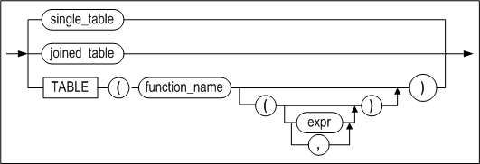

[joined_table ::=](#joined_table)

<a name="single_table"><a/>

**single_table ::=**


**pivot_clause ::=**


<a name="pivot_for_clause"><a/>

**pivot_for_clause ::=**


**pivot_in_clause ::=**


**unpivot_clause ::=**


[pivot_for_clause ::=](#pivot_for_clause)

**unpivot_in_clause ::=**


<a name="joined_table"><a/>

**joined_table ::=**


[tbl_reference ::=](#tbl_reference), [single_table ::=](#single_table),

**join_type ::=**


**apply_type ::=**


<a name="where_clause"><a/>

**where_clause ::=**


<a name="hierarchical_query_clause"><a/>

**hierarchical_query_clause ::=**


<a name="group_by_clause"><a/>

**group_by_clause ::=**


**rollup_cube_clause ::=**


**grouping_sets_clause ::=**


**grouping_expression_list ::=**


**expression_list ::=**


**order_by_clause ::=**


<a name="imit_clause"><a/>

**limit_clause ::=**


<a name="for_update_clause"><a/>

**for_update_clause ::=**


#### 전제 조건

SYS 사용자, 테이블 소유자, SELECT ANY TABLE 시스템 권한을 가진 사용자 및
테이블에 대한 SELECT 객체 권한을 가진 사용자만이 이 구문으로 해당 테이블에서
데이터를 조회할 수 있다.

#### 설명

한 개 이상의 테이블 또는 뷰에서 데이터를 검색하는 구문이다.

*with_clause*

Altibase는 with_clause 절을 인라인 뷰 또는 임시 테이블로 처리하여 최적화한다.

일반적인 WITH query_name절은 AS 다음에 따라오는 부질의(subquery)에 이름을
부여한다. 부질의에 부여된 이름은 주질의 내의 여러 위치에서 참조될 수 있다.

그러나 재귀적인 WITH 구문(이하 recursive with 또는 재귀 질의)에서는 반드시
query_name 뒤에 칼럼의 별명을 지정하고, 부질의 내에서 집합 연산자를 사용해야
해당 질의를 반복적으로 수행할 수 있다. subquery 내에는 집합 연산자를 기준으로 두
개의 질의가 존재하며, 앞의 질의는 주 질의(기준 질의)가 되고 뒤의 질의가 재귀
질의가 된다. 재귀 질의는 프로퍼티 RECURSION_LEVEL_MAXIMUM에 설정한 레벨
값(기본값 1000)까지 최대 출력된다. 자세한 내용은 Altibase 매뉴얼 중 *General
Reference*의 Altibase 프로퍼티 장을 참조한다.

사용자는 이 절을 주질의 및 대부분 유형의 부질의에 명시할 수 있다.

- 제약 사항:
  - 하나의 SQL 문에 하나의 with_clause만 명시할 수 있다. query_name은 자신을
    정의하는 부질의에서는 사용할 수 없다. 단 with_clause 안에서 여러 개의 쿼리
    이름을 정의하는 경우, 뒤이어 정의되는 다른 부질의에는 앞서 정의한 다른 쿼리
    이름을 사용할 수 있다.
  - RECURSIVE WITH 구문에서 주 질의와 재귀 질의의 위치가 변경되면 안된다. 또한
    query_name을 재귀 질의에서 한 번은 명시적으로 참조해야 한다. 그러나 재귀
    질의에서는 집계 함수, DISTINCT 키워드, GROUP BY 절을 사용할 수 없다.
  - RECURSIVE WITH 구문의 주 질의에 query_name을 참조하는 서브쿼리를 사용할 수
    없다.
  - RECURSIVE WITH 구문의 재귀 질의에 query_name을 참조하는 뷰 또는 Outer Join의
    오른쪽 테이블에 사용할 수 없다.

*TOP (expr)*

쿼리의 결과 집합 중 반환할 행의 개수를 지정하는 절이다. *expr*에는 정수만 올 수
있다.

*select_list 절*

DISTINCT를 명시할 경우 결과 집합에서 중복된 레코드는 제거된다.

만약 GROUP BY 절이 존재한다면 상수, 집계 함수(aggregate functions), GROUP BY
절에 명시된 표현식과 이들을 조합한 표현식만 SELECT 리스트에 명시 가능하다.

SELECT 리스트가 칼럼이 포함되지 않은 수식 또는 상수로만 이루어져 있는 경우, FROM
절 이하를 생략할 수 있다.

SELECT 리스트에 \*만 명시한 것은 FROM 절의 모든 테이블과 뷰의 모든 칼럼들을
의미한다. SELECT 리스트에 \*가 칼럼 또는 수식과 함께 명시된 경우에도 마찬가지
의미이다.

*FROM 절*

같은 별명(alias_name)을 FROM 절에 두 번 이상 사용할 수 없다. 같은 테이블 명을
FROM절에 여러 번 사용할 때, 다른 별명을 주어야 한다. 즉, 별명을 명시하지 않고
같은 테이블 명을 두 번 이상 사용할 수 없다.

FROM절에 올 수 있는 테이블 또는 뷰의 최대 개수는 32개이다.

- *OUTER JOIN*

  조인 조건을 만족하지 않는 데이터를 처리하기 위한 JOIN의 확장 형태이다. (INNER)
  JOIN이 두 테이블에서 키 값이 일치하는 데이터만 가져오는 것에 비해 OUTER JOIN은
  어느 한 쪽의 데이터를 모두 가져온다. 즉, 한 테이블의 행에 대응하는 행이 다른
  테이블에 존재하지 않을 때, 빈 칼럼들에 대해서 결과 집합에는 NULL로 채워져서
  반환된다.

- *인라인 뷰(Inline View)*

  FROM 절에 오는 부질의(subquery)를 인라인 뷰라고 한다.

- *Lateral View*

  FROM 절에 오는 인라인 뷰는 FROM 절에 나열된 다른 객체나 상위 쿼리에 있는 객체를
  참조할 수 없다. 그러나 FROM 절의 인라인 뷰를 Lateral View로 정의하면 인라인 뷰의
  외부 객체를 참조할 수 있게 된다.

  인라인 뷰를 Lateral View로 정의하려면, LATERAL 또는 APPLY 키워드를 인라인 뷰
  앞에 지정하면 된다. 단, Lateral View가 참조할 수 있는 객체는 해당 Lateral View의
  왼쪽에 지정된 객체들뿐이다. Lateral View로 정의하더라도 Lateral View가 외부
  객체를 참조하지 않으면, Altibase 서버가 해당 Lateral View를 일반적인 인라인 뷰로
  취급한다.APPLY 키워드는 인라인 뷰를 Lateral View로 정의하면서 APPLY 키워드의
  왼쪽 객체와 해당 Lateral View의 조인도 함께 수행한다. 일반적인 조인문이 ON
  키워드 뒤에 조인 조건을 지정하는 것과 달리, APPLY 키워드를 사용하는 조인의
  경우에는 조인 조건이 필요 없다.

  APPLY 키워드를 사용해서 다음의 조인 유형을 지정할 수 있다.
  - CROSS APPLY는 왼쪽 객체와 Lateral View를 Inner Join 할 것을 지정한다.
  - OUTER APPLY는 왼쪽 객체와 Lateral View를 Left Outer Join 할 것을 지정한다.

  > **주의사항**:  아래와 같이 Lateral View를 사용하는 경우, 오류 메시지가 반환된다.
  >
  > - Lateral View에서 Fixed Table을 참조하는 경우
  > - Lateral View에 PIVOT 절, UNPIVOT 절이 사용된 경우
  > - Lateral View에서 해당 Lateral View의 오른쪽에 지정된 객체를 참조하는 경우
  > - Lateral View가 참조하는 객체와 Lateral View를 Right Outer Join 또는
  >   Full-Outer Join을 하는 경우
  > - LATERAL 키워드와 APPLY 키워드를 붙여서 같이 사용한 경우
  > - APPLY 키워드와 ON 절을 함께 사용한 경우

- *pivot_clause*

  pivot_clause는 데이터 집계 연산 및 별개의 행으로 존재하는 데이터를 칼럼으로
  재배열하여 보여주기 위해 사용할 수 있다. 이것은 GROUP BY 절에 두 개의 칼럼을
  사용할 때보다 데이터를 더 읽기 쉽게 보여준다.  

  편의상, 많은 수의 칼럼 출력 또는 변형 연산의 결과로 생기는 특정 칼럼들의 이름을
  명시하는 어려움을 방지하기 위해서 pivot_clause는 일반적으로 인라인 뷰와 함께
  사용된다.  

  pivot_clause는 다음의 단계를 수행한다.

  1. 먼저 pivot_clause 는 마치 GROUP BY 절처럼 그룹 연산을 수행한다. 그 결과는 pivot_clause내의 참조되지 않은 모든 칼럼과 pivot_in_clause에 명시된 값에 대해 그룹화된다.
  2. 다음으로 pivot_clause는 결과로 나온 그룹화된 칼럼들과 집계된 값들을 회전된
     표 형식으로 배열한다.

- *pivot_for_clause*

  pivot_in_clause에 명시된 값이 칼럼 형태로 바꾸어질 때 이에 해당하는 칼럼 이름을
  명시한다.

- *pivot_in_clause*

  pivot_for_clause에 명시된 칼럼들에 존재하는 값을 이 절에 명시할 수 있다. 이
  값들은 pivot 연산에서 칼럼 이름으로 사용될 것이다.

- *unpivot_clause*

  unpivot_clause는 칼럼의 데이터들을 행으로 변환시켜 결과를 반환한다. 

  INCLUDE \| EXCLUDE NULLS 옵션은 UNPIVOT 절로 생성되는 칼럼의 값에 NULL을 허용할
  것인지를 선택할 수 있다. EXCLUDE NULLS는 NULL 값이 생략된 결과를 반환하며,
  생략하면 EXCLUDE NULLS로 동작한다.

  column_name에는 UNPIVOT 구문으로 생성되는 칼럼에 해당하는 값들이 반환되는 칼럼
  이름을 지정한다.

  unpivot_clause에서 사용한 칼럼의 개수만큼 pivot_for_clause 와 pivot_in_clause에
  사용되는 칼럼 개수도 같아야 한다. 또한 alias의 개수도 같아야 한다.

  ```
  unpivot ( ( column, column ) for ( column, column ) in ( ( column, column ) as (
  column, column ) ) );
  ```

  다음처럼 칼럼 개수가 다른 구문은 지원하지 않는다.

  ```
  unpivot ( ( column, column ) for column in ( ( column, column ) as column ) );
  ```


- *Table Function*

  사용자 정의 함수에서 Associative Array 타입이나 Record 타입을 사용할 때 반환되는
  결과를 테이블 형태로 변환하여 출력한다.

*where 조건절*

WHERE 절의 조건에 대한 설명은 8장 조건 연산자를 참고한다.

*Hierarchical Query 절*

계층적 질의(Hierarchical query)란 데이터 조회시 계층적 구조로 출력되는
쿼리문이다. 테이블에 부모, 자식 관계를 가지는 데이터가 존재하는 경우 이 쿼리문을
이용해서 부모, 자식 관계를 계층적으로 출력할 수 있다. 즉, 주어진 검색 조건을
갖는 루트 행에 대하여, 그 행과 그의 종속 행에 대한 계층적 조건을 만족하는 행들을
검색한다.

만약 ORDER BY 절 또는 GROUP BY 절을 사용하여 계층적 데이터를 조회하면, CONNECT
BY절로 수립된 계층적 순서가 바뀔 수 있으므로 주의가 필요하다. 단, ORDER SIBLINGS
BY를 사용하면 계층 구조를 보존하면서 동일한 레벨의 자식들 사이에서 순서를 정할
수 있다.

- *START WITH 절*

  계층적 질의의 루트 행으로 사용될 행을 식별하는 조건을 명시하는 절이다. 이 조건을
  만족하는 모든 행들이 루트 행으로 사용된다. 이 절을 생략하면 Altibase는 테이블에
  있는 모든 행들을 루트 행으로 사용한다.

  ROWNUM 의사칼럼은 이 절에 사용될 수 없다.

- *CONNECT BY 절*

  계층 구조에서 부모 행들과 자식 행들간의 관계를 식별하는 조건을 명시한다.

  CONNECT BY 절은 부질의를 포함할 수 없고 조인과 함께 사용될 수도 없다.

  CONNECT BY 절은 WHERE 절 이후 ORDER BY, GROUP BY, HAVING 절 이전에 사용하여야
  한다.

  NOCYLE 키워드는 계층적 질의의 결과 집합에 순환구조가 존재하더라도, 순환이
  발생하기 전까지의 행을 반환할 것을 데이터베이스에 요구한다.

  SYS_CONNECT_BY_PATH함수는 계층적 질의에서 현재 행까지의 PATH 정보를 쉽게 가져올 수 있다. 이 함수에 대한 자세한 내용은 "6장 SQL 함수"를 참고하라.

- *PRIOR 연산자*

  이전에 검색된 행과 현재 행을 구분하기 위해서 PRIOR 연산자를 사용한다. 즉,
  부모행을 언급하기 위해 반드시 PRIOR 연산자를 사용해야 한다.

  PRIOR 연산자는 CONNECT BY 절을 포함하는 질의문의 SELECT 리스트, WHERE 절, 또는
  CONNECT BY 절에서만 사용할 수 있다.

  질의에 집합 연산자 (UNION, INTERSECT, 등)가 사용되면, PRIOR 연산자는 ORDER BY
  절에 올 수 없다.

- *CONNECT_BY_ROOT 연산자*

  CONNECT_BY_ROOT는 계층적 질의에서만 사용 가능한 단일 연산자이다. 칼럼에 이
  연산자를 사용하면 루트 행의 칼럼 값을 반환한다.

  START WITH 조건 또는 CONNECT BY 조건에 이 연산자를 사용할 수 없다.


- *CONNECT_BY_ISLEAF 의사칼럼*

  CONNECT_BY_ISLEAF 의사칼럼은 현재 행이 CONNECT BY 조건에 의해 정의된 트리에서
  리프 노드(자식 노드가 없는 노드)인 경우 1을 반환하고, 그렇지 않으면 0을
  반환한다.

- *LEVEL 의사칼럼*

  계층적 질의를 포함하는 SQL문은 *select_list*에 LEVEL 의사칼럼을 포함할 수 있다.
  LEVEL 의사칼럼은 루트 행과 종속 행간의 계층적 거리를 나타낸다. 즉, 루트 행의
  LEVEL은 1이고, 자식 행의 LEVEL은 2, 손자 행의 LEVEL은 3, 등이 된다.

  LEVEL의사칼럼은 WHERE 절, ORDER BY 절, GROUP BY 절, HAVING 절에서도 사용
  가능하다. 또한, LEVEL 의사칼럼은 다음 예처럼 쿼리문에 CONNECT BY 절이 없더라도
  *select_list* 에 올 수 있다:

  ```
  select level from t1;
  ```


- *IGNORE*

  행들간 계층 관계가 순환 형태를 이룰 경우 Altibase는 오류를 반환한다. (여기서
  순환이란 한 행이 다른 행의 부모 행도 되고 자식 행도 되는 경우를 말한다.) 단,
  IGNORE LOOP이 명시되었을 경우, 질의 수행시의 순환 형성이 오류를 발생시키지 않고,
  순환 형태의 행들이 질의 결과 집합에서 제거된다.

*GROUP BY 절*

GROUP BY 절은 주어진 하나 이상의 표현식에 대해서 같은 값을 가지는 레코드들끼리
그룹짓고, 각 그룹별로 집계한 정보를 한 행으로 반환받기 위해 사용되는 절이다.

WHERE 조건을 사용하여 반환되는 그룹을 제한할 수 없는 대신에, HAVING 절을
사용하여 반환되는 그룹을 제한할 수 있다.

HAVING 및 GROUP BY 절은 WHERE 절과 *hierarchical_clause* 뒤에 위치시킨다. 만약
ORDER BY 절이 있다면 이는 쿼리문의 맨 마지막에 와야 한다.

*rollup_cube_clause, grouping_sets_clause*

ROLLUP, CUBE, GROUPING SETS는 GROUP BY절이 확장된 것으로써, 여러 개의 그룹화
세트를 지정할 수 있다. 즉, ROLLUP, CUBE 또는 GROUPING SETS를 사용하면 GROUP BY
절을 포함하는 여러 쿼리를 UNION ALL로 결합한 것과 동일한 결과를 얻을 수 있다.

- 제약 사항:
  - GROUP BY 절에서 ROLLUP ,CUBE 또는 GROUPING SETS는 한 번만 명시할 수 있다.
  - SELECT 대상에 부질의(subquery)를 인자로 가지는 집계 함수를 사용할 수 없다.
  - GROUP BY 절에 GROUPING SETS를 사용하면 ORDER BY 절에 윈도우 함수를 사용할 수 없다.
  - CUBE절에 최대 15개의 수식을 지정할 수 있다.
  - GROUPING SETS와 중첩 집계 함수를 함께 사용할 수 없다.

*ROLLUP*

ROLLUP은 GROUP BY 절과 함께 사용되며, GROUP BY 절에 의해서 그룹 지어진 집합
결과에 대하여 상세한 정보를 반환하는 기능을 수행한다.

SUM연산과 함께 사용되면, 총계뿐만 아니라 ROLLUP에서 지정하는 칼럼들의 그룹별
소계까지 구한다.

ROLLUP은 그룹화 칼럼들의 개수가 n개일 때 (n+1)개의 GROUP BY가 수행된다. 예를
들어, GROUP BY 절 내에 ROLLUP(a,b,c)를 사용하면 반환되는 그룹의 조합은 다음과
같다:

```
(a,b,c), (a,b), (a), ( )
```


- *부분 롤업(Partial ROLLUP)*

  아래 예제와 같이 GROUP BY의 그룹화 칼럼 중 일부분에만 ROLLUP을 적용하는 것을
  "부분 ROLLUP"이라고 한다:

  ```
  GROUP BY a, ROLLUP(b, c), d
  ```

  이 경우, 반환되는 그룹의 조합은 다음과 같다:

  ```
  (a, d, b, c), (a, d, b), (a, d)
  ```


- *복합 칼럼(Composite Columns) 사용하기*

  아래 예제와 같이 ROLLUP 절에 복합 칼럼의 리스트를 명시할 수 있다:

  ```
  GROUP BY ROLLUP((a, b), (c, d))
  ```

  이 경우, 반환되는 그룹의 조합은 다음과 같다:

  ```
  (a, b, c, d), (a, b), ( )
  ```


*CUBE*

CUBE는 명시된 그룹화 칼럼들의 가능한 모든 조합으로 그룹화를 수행한다. 그룹화
칼럼의 개수가 n개일 때, CUBE는 2<sup>n</sup>개의 조합에 대해 그룹화를 수행한다. 예를 들어,
GROUP BY CUBE(a,b,c)를 명시하면, (2<sup>3</sup>=8)개의 조합이 아래와 같이 반환된다:

```
(a,b,c), (a,b), (a,c), (b,c), (a), (b), (c), ( )
```

- *부분 큐브(Partial CUBE)*

  부분 CUBE는 부분 ROLLUP과 유사하다. 즉, CUBE 연산자에 명시한 칼럼들의 가능한
  모든 조합이 CUBE 바깥에 있는 칼럼과 함께 결합되어 반환되는 그룹이 결정된다. 부분
  CUBE의 문법은 다음과 같다:

  ```
  GROUP BY a, CUBE(b, c), d
  ```

  이 경우, 아래의 조합에 대한 소계가 반환된다:

  ```
  (a, d, b, c), (a, d, b), (a, d, c), (a, d)
  ```

- *복합 칼럼(Composite Columns) 사용하기*

  아래 예제와 같이 CUBE 절에 복합 칼럼의 리스트를 명시할 수 있다:

  ```
  GROUP BY CUBE((a, b), (c, d))
  ```

  이 경우, 반환되는 그룹의 조합은 다음과 같다:

  ```
  (a, b, c, d), (a, b), (c, d), ( )
  ```


*GROUPING SETS*

ROLLUP이나 CUBE에 의해 생성되는 그룹화 세트 중에서 일부만 필요한 경우에 GROUPING
SETS에 원하는 그룹화 세트만 지정할 수 있다.

SUM연산과 함께 사용되면, GROUPING SETS에서 지정하는 그룹별 총계를 구한다.

GROUPING SETS은 그룹화된 칼럼의 개수가 n개일 때 n개의 GROUP BY가 수행된다. 예를
들어, GROUP BY절 내에 GROUPING SETS(a, b, c)를 사용하면 반환되는 그룹의 조합은
다음과 같다.

```
(a), (b), (c)
```


- *부분 GROUPING SETS (Partial GROUPING SETS)*

  아래 예제와 같이 GROUP BY의 그룹화 칼럼 중 일부분에만 GROUPING SETS을 적용하는
  것을 "부분 GROUPING SETS"이라고 한다.

  ```
  GROUP BY a, GROUPING SETS(b, c), d
  ```

  이 경우, 반환되는 그룹의 조합은 다음과 같다:

  ```
  (a, b, d), (a, c, d)
  ```


- *복합 칼럼(Composite Columns) 사용하기*

  아래 예제와 같이 GROUPING SETS절에 복합 칼럼의 리스트를 명시할 수 있다.

  ```
  GROUP BY GROUPING SETS((a, b), (c, d))
  ```

  이와 같이 GROUPING SETS 목록에서 내부 괄호 안에 2개 이상의 칼럼들이 있는 경우
  하나의 칼럼으로 취급된다. 반환되는 그룹의 조합은 다음과 같다.

  ```
  (a, b), (c, d)
  ```


- *빈 그룹(Empty Group) 사용하기*

  아래 예제와 같이 GROUPING SETS절에 빈 괄호("()")를 사용해서 '빈 그룹'을 명시할
  수 있다.

  ```
  GROUP BY GROUPING SETS((), a, b, c)
  ```

  빈 그룹은 그룹화 없이 총계를 구하기 위해 사용할 수 있다.

*HAVING 조건절*

HAVING 절에는 상수, 집계 함수(aggregate functions), GROUP BY 절에 명시된
표현식과 이들을 조합한 표현식만 올 수 있다.

이 절은 명시된 조건이 참인 그룹에 해당하는 레코드만 반환한다.

HAVING 절의 조건문에 대한 자세한 설명은 "8장 조건 연산자"를 참고하기 바란다.

*UNION (ALL), INTERSECT, MINUS*

집합 연산자는 두 SELECT 문의 결과 집합을 하나로 결합한다. 각 질의가 반환하는
칼럼들의 개수와 데이터 타입이 동일해야 하지만, 칼럼 길이는 달라도 된다. 집합
연산자의 앞 부분에 위치하는 *select_list* 의 표현식 이름이 전체 결과 집합의 칼럼
이름이 될 것이다.

집합 연산자에 대한 자세한 설명은 5장 집한 연산자를 참고한다.

*ORDER BY 절*

검색된 레코드들을 정렬하는 절이다. 결과 집합은 오름차순 또는 내림차순으로 정렬
가능하다. 기본으로 오름차순 정렬된다.

ORDER BY 절 없이 같은 질의를 반복해서 수행할 때, 결과 집합이 일관되게 정렬된다는
보장이 없다.

ORDER BY 절은 SELECT 문에서 한번만 올 수 있다. 이는 부질의 (subquery)에서는
사용할 수 없다.

ORDER BY 절에 표현식을 명시한 경우에는 표현식 연산의 결과 값에 대해 정렬된다.
표현식은 *select_list* 또는 FROM 절의 테이블 또는 뷰의 컬럼을 기반으로 작성될
것이다. ORDER BY 절에 상수를 명시한 경우에는 *select_list* 내에서의 그 위치에
해당하는 검색 대상 값에 대해 정렬 한다.

집합 연산자(UNION, INTERSECT 등)를 사용한 경우, 위치(position) 또는 검색 대상의
별명만 ORDER BY 절에 사용 가능하다.

GROUP BY가 존재할 경우 그룹 표현식만 사용 가능하다.

ORDER BY 절에 다수의 표현식도 올 수 있다. 결과 집합은 먼저 첫 번째 표현식의 값을
기준으로 정렬되고, 첫번째 표현식의 값이 같은 레코드들은 두번째 표현식의 값을
기준으로 정렬되며, 같은 방식으로 이 후 표현식에 대해서도 정렬된다.

오름차순의 인덱스가 정렬 기준 칼럼에 존재한다면, 오름차순으로 정렬할 때는 다른
모든 것들의 뒤에, 그리고 내림차순으로 정렬할 때는 다른 다른 것들의 앞에, NULL 이
정렬된다. 내림차순의 인덱스가 정렬 기준 칼럼에 존재한다면, 오름차순으로 정렬할
때는 다른 모든 것들의 앞에, 그리고 내림차순으로 정렬할 때는 다른 다른 것들의
뒤에, NULL 이 정렬된다. 인덱스가 정렬 기준 칼럼에 존재하지 않는다면, 정렬 순서에
상관없이 NULL은 다른 모든 것들의 뒤에 나타난다.

검색 대상에 DISTINCT를 사용하면, ORDER BY 절에는 SELECT 리스트내의 표현식 또는
이들 표현식의 조합만 올 수 있다.

GROUP BY 절이 있다면, 다음의 표현식이 ORDER BY 절에 올 수 있다.

- 상수
- 집계 함수 (aggregate functions)
- GROUP BY 절의 표현식
- 위의 조합으로 이루어진 표현식

NULLS FIRST 또는 NULLS LAST 키워드를 사용해서 NULL을 정렬 순서에서 맨 처음 또는
맨 마지막에 위치시킬 수 있다.

*LIMIT 절*

LIMIT 절은 반환되는 행의 개수를 제한하기 위해 사용된다.

- row_offset: 반환할 첫번째 레코드를 지정한다. 생략하면 전체 결과 집합의
  첫번째 레코드부터 반환될 것이다.
- row_count: 반환할 레코드의 개수를 지정한다.

부질의에서도 LIMIT절을 사용할 수 있다.

*FOR UPDATE 절*

현재 트랜잭션이 끝날 때까지 다른 사용자들이 행(row)을 잠그거나 수정할 수 없도록
선택된 행을 잠근다.

WAIT 옵션은 테이블의 잠금을 획득하기 위해 얼마나 대기할지를 지정한다. 적용할 수
있는 시간 단위는 second(초), millisecond(msec, 1/1000초), microsecond(usec,
1/1000000초)이며 표기하지 않으면 초 단위가 적용된다. 반면, NOWAIT 옵션은 잠금을
획득할 테이블이 이미 다른 트랜잭션에 의해 잠금이 걸린 상태라면 기다리지 말 것을
지시한다.

FOR UPDATE 절은 최 상위 SELECT 문에서만 사용 가능하다. 즉, 부질의에는 사용할 수
없다. 그러므로 다음과 같은 질의는 사용할 수 없다:  

```
select eno from employees where (select eno from departments for update);
```

FOR UPDATE 절은 DISTINCT, GROUP BY절, 집계 함수, 집합 연산자(UNION, INTERSECT
등)와 함께 사용 할 수 없다.

#### 조인

조인이란 두 개 이상의 테이블, 뷰, materialized 뷰로부터 로우를 결합하는 것을
일컫는다. 쿼리의 FROM 절에 여러 테이블이 있을 때 조인이 수행된다.

조인 조건(join condition)은 두 테이블을 결합하는 방법을 정의한다. 조인 조건은
FROM 절이나 WHERE 절 중의 하나에 지정할 수 있다. 조인 조건에 있는 칼럼이 select
리스트에 반드시 있을 필요는 없다. 조인 조건은 주로 각 테이블로부터 두 칼럼을
비교하는데, Altibase는 조인 조건이 TRUE로 판정되는 각 테이블의 로우를 결합해서
반환한다.

세 개 이상의 테이블을 조인하는 경우, Altibase는 두 테이블을 먼저 조인한 다음 그
결과를 다른 테이블과 조인한다. 쿼리 옵티마이저는 조인할 테이블의 순서를 결정할
때 조인 조건, 인덱스, 통계 정보 등에 기반한다.

> 주의: LOB 칼럼은 조인 조건에 사용될 수 없다.

Altibase는 아래의 조인을 지원한다.

- Cross Join
- Inner Join
- Outer Join
- Semi Join
- Anti Join

*Cross Join*

조인 조건을 갖지 않는 두 테이블을 결합한다. 한 테이블의 각 로우는 다른 테이블의
각각의 로우와 결합한다. Cartesian Products라고도 한다.

아래는 Cross Join 쿼리의 예제이다.

```
SELECT * FROM T1, T2;
```

*Inner Join*

Inner Join은 일반적인 조인을 말하며, 두 테이블에서 조인 조건을 만족하는 로우들만
결합해서 반환한다.

아래는 Inner Join 쿼리의 예제이다.

```
SELECT * FROM T1, T2 WHERE T1.i1 = T2.i1;
SELECT * FROM T1 INNER JOIN T2 ON T1.i1 = T2.i1;
SELECT * FROM T1, T2, T3 WHERE T1.i1 = T2.i1 AND T2.i1 < T3.i2;
```


*Outer Join*

Outer Join은 두 개의 다른 테이블에서 조인 조건을 만족하는 로우를 판별해서
반환한다. Inner Join과 Outer Join의 차이점은 한 테이블에만 조인 조건을 만족하는
로우가 있고 다른 테이블에는 조인 조건을 만족하는 로우가 없는 경우, Inner Join은
해당 로우를 반환하지 않는 반면 Outer Join은 조인 조건을 만족하는 로우가 없는
테이블의 값을 NULL로 반환한다.

Outer Join은 다음 세 종류가 있다 : Left Outer Join, Right Outer Join, Full Outer Join

- *Left Outer Join*

  LEFT OUTER JOIN 키워드의 왼편에 테이블 A가, 오른편에 테이블 B가 있을 때, 조인
  조건을 만족하는 A의 모든 로우가 반환된다. B에 만족하는 로우가 없는 경우에는
  결과집합의 해당 자리에 NULL이 반환된다.

  아래는 Left Outer Join 쿼리의 예제이다.

  ```
  SELECT * FROM A LEFT OUTER JOIN B ON A.c1 = B.c1;
  SELECT * FROM A, B WHERE A.c1 = B.c1(+);
  ```


- *Right Outer Join*

  RIGHT OUTER JOIN 키워드의 왼편에 테이블 A가, 오른편에 테이블 B가 있을 때, 조인
  조건을 만족하는 B의 모든 로우가 반환된다. A에 만족하는 로우가 없는 경우에는
  결과집합의 해당 자리에 NULL이 반환된다.

  아래는 Right Outer Join 쿼리의 예제이다.

  ```
  SELECT * FROM A RIGHT OUTER JOIN B ON A.c1 = B.c1;
  SELECT * FROM A, B WHERE A.c1(+) = B.c1;
  ```


- *Full Outer Join*

  FULL OUTER JOIN 키워드의 왼편에 테이블 A가, 오른편에 테이블 B가 있을 때, A와 B
  중 한 테이블에만 조인 조건을 만족하는 로우가 있어도 해당 로우가 반환된다. 조인
  조건을 만족하는 로우가 없는 테이블에 대해서는 결과집합의 해당 자리에 NULL이
  반환된다.

  아래는 Full Outer Join 쿼리의 예제이다.

  ```
  SELECT * FROM A FULL OUTER JOIN B ON A.c1 = B.c1;
  ```


*Semi Join*

테이블 A와 테이블 B를 Semi Join하는 경우, B에 존재하는 A의 모든 로우를 반환한다.
A의 한 로우에 대해서 B의 여러 로우가 일치하더라도 한 로우만 반환된다.

아래는 Semi Join 쿼리의 예제이다.

```
SELECT * FROM T1 WHERE EXISTS ( SELECT i1 FROM T2 WHERE T1.i1 = T2.i1 ); 
SELECT * FROM T1 WHERE i1 IN ( SELECT i1 FROM T2 );
```


*Anti Join*

테이블 A와 테이블 B를 Anti Join하는 경우, B에 존재하지 않는 A의 로우들만
반환한다.

```
SELECT * FROM T1 WHERE NOT EXISTS ( SELECT i1 FROM T2 WHERE T1.i1 = T2.i1 );
SELECT * FROM T1 WHERE i1 NOT IN ( SELECT i1 FROM T2 );
```

##### 예제

위에서 설명한 각 조인의 실행 결과를 보여주기 위해 employee와 dept 테이블을
생생한다.

```
CREATE TABLE employee(name VARCHAR(10), empid INTEGER, deptname VARCHAR(20));
CREATE TABLE dept(deptname VARCHAR(20), manager VARCHAR(10));

INSERT INTO employee VALUES('Harry', 	3415, 	'Finance');
INSERT INTO employee VALUES('Sally', 	2241, 	'Sales');
INSERT INTO employee VALUES('George', 	3401, 	'Finance');
INSERT INTO employee VALUES('Harriet', 	2202, 	'Production');

INSERT INTO dept VALUES('Sales','Bob');
INSERT INTO dept VALUES('Sales','Thomas');
INSERT INTO dept VALUES('Production','Katie');
INSERT INTO dept VALUES('Production','Mark');
```

아래는 Cross Join 쿼리와 그 결과이다.

```
iSQL> SELECT * FROM employee, dept;
NAME        EMPID       DEPTNAME              DEPTNAME              MANAGER
--------------------------------------------------------------------------------------
Harry       3415        Finance               Sales                 Bob
Harry       3415        Finance               Sales                 Thomas
Harry       3415        Finance               Production            Katie
Harry       3415        Finance               Production            Mark
Sally       2241        Sales                 Sales                 Bob
Sally       2241        Sales                 Sales                 Thomas
Sally       2241        Sales                 Production            Katie
Sally       2241        Sales                 Production            Mark
George      3401        Finance               Sales                 Bob
George      3401        Finance               Sales                 Thomas
George      3401        Finance               Production            Katie
George      3401        Finance               Production            Mark
Harriet     2202        Production            Sales                 Bob
Harriet     2202        Production            Sales                 Thomas
Harriet     2202        Production            Production            Katie
Harriet     2202        Production            Production            Mark
16 rows selected.
```

아래는 Inner Join 쿼리와 그 결과이다.

```
iSQL> SELECT * FROM employee A, dept B WHERE A.deptname = B.deptname;
NAME        EMPID       DEPTNAME              DEPTNAME              MANAGER
--------------------------------------------------------------------------------------
Sally       2241        Sales                 Sales                 Thomas
Sally       2241        Sales                 Sales                 Bob
Harriet     2202        Production            Production            Mark
Harriet     2202        Production            Production            Katie
4 rows selected.
```

아래는 Left Outer Join 쿼리와 그 결과이다.

```
iSQL> SELECT * FROM employee A LEFT OUTER JOIN dept B ON A.deptname = B.deptname;
NAME        EMPID       DEPTNAME              DEPTNAME              MANAGER
--------------------------------------------------------------------------------------
Harry       3415        Finance
Sally       2241        Sales                 Sales                 Thomas
Sally       2241        Sales                 Sales                 Bob
George      3401        Finance
Harriet     2202        Production            Production            Mark
Harriet     2202        Production            Production            Katie
6 rows selected.
```

아래는 Right Outer Join 쿼리와 그 결과이다.

```
iSQL> SELECT * FROM employee A RIGHT OUTER JOIN dept B ON A.deptname = B.deptname;
NAME        EMPID       DEPTNAME              DEPTNAME              MANAGER
--------------------------------------------------------------------------------------
Sally       2241        Sales                 Sales                 Bob
Sally       2241        Sales                 Sales                 Thomas
Harriet     2202        Production            Production            Katie
Harriet     2202        Production            Production            Mark
4 rows selected.
```

아래는 Semi Outer Join 쿼리와 그 결과이다.

```
iSQL> SELECT * FROM employee A WHERE EXISTS ( SELECT deptname FROM dept B WHERE A.deptname = B.deptname );
NAME        EMPID       DEPTNAME
--------------------------------------------------
Sally       2241        Sales
Harriet     2202        Production
2 rows selected.
```

아래는 Anti Outer Join 쿼리와 그 결과이다.

```
iSQL> SELECT * FROM employee A WHERE NOT EXISTS ( SELECT deptname FROM dept B WHERE A.deptname = B.deptname );
NAME        EMPID       DEPTNAME
--------------------------------------------------
Harry       3415        Finance
George      3401        Finance
2 rows selected.
```


#### HINTS 절

힌트의 문법과 자세한 설명은 "힌트 구문"과 "힌트 목록"을 참고하기 바란다.

#### 제약사항

Altibase는 SQL질의 및 저장프로시저 수행에 있어 다음과 같은 제약을 가진다.

- 최대 65536개까지의 내부 튜플<sup>[7]</sup>만 질의 처리에 사용될 수 있다.

  > <sup>[7]</sup> 내부 튜플(internal tuple) : 알티베이스가 질의 처리를 위해 할당하는 메모리의 단위이다

- FROM절에에 최대 32개 까지의 테이블 또는 뷰를 사용할 수 있다.

- WHERE, GROUP BY, ORDER BY 같은 연산식이 사용 가능한 절에 최대 32개까지의
  테이블 또는 뷰를 사용할 수 있다.

위와 같은 제약을 위배하게 되면 다음과 같은 에러가 발생하게 된다.

- qpERR_ABORT_QTC_TUPLE_SHORTAGE  
  : There are too many DML statements in the stored procedure, or the SQL
  query is too long.
- qpERR_ABORT_QTC_TOO_MANY_TABLES  
  : Too many tables are referenced in a phrase.

#### 예제

##### 단순 조회

\<질의\> 모든 사원의 이름, 고용일, 월급을 검색하라.

```
iSQL> SELECT e_firstname, e_lastname, join_date, salary 
 FROM employees;
E_FIRSTNAME           E_LASTNAME            JOIN_DATE    SALARY
-----------------------------------------------------------------------
Chan-seung            Moon
Susan                 Davenport             18-NOV-2009  1500
Ken                   Kobain                11-JAN-2010  2000
.
.
.
20 rows selected.
```

\<질의\> 급여가 가장 많은 사원의 이름, 고용일, 월급을 검색하라.

```
iSQL> SELECT TOP (1) e_firstname, e_lastname, join_date, salary
    2  FROM employees ORDER BY salary;
E_FIRSTNAME           E_LASTNAME            JOIN_DATE    SALARY
--------------------------------------------------------------------------
Gottlieb              Fleischer             24-JAN-2004  500
1 row selected.
```

\<질의\> FROM절 이하가 생략된 쿼리의 예제이다.

```
iSQL> SELECT cos(0), 256;
COS(0)                 256
--------------------------------------
1                      256
1 row selected.
```

\<질의\> 현재 날짜와 departments 테이블의 모든 칼럼 값을 검색하라.

```
iSQL> SELECT sysdate, *
 FROM departments;
SYSDATE      DNO         DNAME                           DEP_LOCATION     MGR_NO
--------------------------------------------------------------------------------------------
26-JUN-2013  1001        RESEARCH DEVELOPMENT DEPT 1     New York         16
26-JUN-2013  1002        RESEARCH DEVELOPMENT DEPT 2     Sydney           13
26-JUN-2013  1003        SOLUTION DEVELOPMENT DEPT       Osaka            14
26-JUN-2013  2001        QUALITY ASSURANCE DEPT          Seoul            17
26-JUN-2013  3001        CUSTOMERS SUPPORT DEPT          London           4
26-JUN-2013  3002        PRESALES DEPT                   Peking           5
26-JUN-2013  4001        MARKETING DEPT                  Brasilia         8
26-JUN-2013  4002        BUSINESS DEPT                   Palo Alto        7
8 rows selected.
```


##### WITH subquery 절 사용

\<질의\> dept_costs와 avg_cost라는 쿼리 이름을 생성하여 주 질의에서 이들 이름을
사용한다.

```
iSQL> WITH
    2 dept_costs AS (
    3 SELECT DNAME, SUM(salary) dept_total
    4 FROM employees e, departments d
    5          WHERE e.dno = d.dno
    6          GROUP BY DNAME),
    7 avg_cost AS (
    8     SELECT SUM(dept_total)/COUNT(*) avg
    9         FROM dept_costs)
    10 SELECT * FROM dept_costs
    11 WHERE dept_total > (SELECT avg FROM avg_cost)
    12    ORDER BY DNAME;
DEPT_COSTS.DNAME                DEPT_COSTS.DEPT_TOTAL 
---------------------------------------------------------
BUSINESS DEPT                   4190        
RESEARCH DEVELOPMENT DEPT 1     4300        
SOLUTION DEVELOPMENT DEPT       9753        
3 rows selected.
```


##### 파티션을 사용한 조회

```
CREATE TABLE T1 (I1 INTEGER)
PARTITION BY RANGE (I1)
( 
PARTITION P1 VALUES LESS THAN (100),
PARTITION P2 VALUES LESS THAN (200),
PARTITION P3 VALUES DEFAULT 
) TABLESPACE SYS_TBS_DISK_DATA;

INSERT INTO T1 VALUES (55);

INSERT INTO T1 VALUES (123);

SELECT * FROM T1 PARTITION (P1);
 I1
----------
 55

SELECT * FROM T1 PARTITION (P2);
 I1
----------
 123

SELECT * FROM T1 PARTITION (P3);
No rows selected.
```


##### 검색 조건 사용

\<질의\> 월급이 100만원 이하인 직원의 이름, 업무, 입사일, 월급을 월급 순서로
정렬하라.

```
iSQL> SELECT e_firstname, e_lastname, emp_job, salary 
 FROM employees 
 WHERE salary < 1500 
 ORDER BY 4 DESC;
E_FIRSTNAME           E_LASTNAME            EMP_JOB          SALARY
------------------------------------------------------------------------
Takahiro              Fubuki                PM               1400
Curtis                Diaz                  planner          1200
Jason                 Davenport             webmaster        1000
Mitch                 Jones                 PM               980
Gottlieb              Fleischer             manager          500
5 rows selected.
```


##### Hierachical query 사용 검색

\<질의\> id 열의 값이 0인 행을 루트로 하는 행들을 얻기 위한 계층적 질의문은
다음과 같다.

```
iSQL> CREATE TABLE hier_order(id INTEGER, parent INTEGER);
Create success.
iSQL> INSERT INTO hier_order VALUES(0, NULL);
1 row inserted.
iSQL> INSERT INTO hier_order VALUES(1, 0);
1 row inserted.
iSQL> INSERT INTO hier_order VALUES(2, 1);
1 row inserted.
iSQL> INSERT INTO hier_order VALUES(3, 1);
1 row inserted.
iSQL> INSERT INTO hier_order VALUES(4, 1);
1 row inserted.
iSQL> INSERT INTO hier_order VALUES(5, 0);
1 row inserted.
iSQL> INSERT INTO hier_order VALUES(6, 0);
1 row inserted.
iSQL> INSERT INTO hier_order VALUES(7, 6);
1 row inserted.
iSQL> INSERT INTO hier_order VALUES(8, 7);
1 row inserted.
iSQL> INSERT INTO hier_order VALUES(9, 7);
1 row inserted.
iSQL> INSERT INTO hier_order VALUES(10, 6);
1 row inserted.
iSQL> SELECT ID, parent, LEVEL
FROM hier_order START WITH id = 0 CONNECT BY PRIOR id = parent ORDER BY level;
ID          PARENT      LEVEL                
------------------------------------------------
0                       1                    
6           0           2                    
5           0           2                    
1           0           2                    
10          6           3                    
4           1           3                    
7           6           3                    
3           1           3                    
2           1           3                    
8           7           4                    
9           7           4                    
11 rows selected.
```


[그림 4‑1] 계층적 구조 데이터

\<질의\> START WITH 절을 생략하여 테이블 내의 모든 행을 루트 행으로 사용하고
PRIOR id = parent 조건을 만족하는 질의이다.

```
iSQL> SELECT id, parent, level
FROM hier_order CONNECT BY PRIOR id = parent ORDER BY id;
ID          PARENT      LEVEL                
------------------------------------------------
0                       1                    
1           0           1                    
1           0           2                    
2           1           1                    
2           1           3                    
2           1           2                    
3           1           2                    
3           1           1                    
3           1           3                    
4           1           1                    
4           1           2                    
4           1           3                    
5           0           1                    
5           0           2                    
6           0           2                    
6           0           1                    
7           6           1                    
7           6           2                    
7           6           3                    
8           7           3                    
8           7           1                    
8           7           2                    
8           7           4                    
9           7           2                    
9           7           3                    
9           7           4                    
9           7           1                    
10          6           1                    
10          6           2                    
10          6           3                    
30 rows selected.
```

\<질의\> 다음 계층적 질의문은 순환을 형성하는 행을 제외한 결과 집합을 얻기
위하여 IGNORE LOOP 절을 사용한 예이다.

```
iSQL> CREATE TABLE triple(
  num INTEGER,
  tri INTEGER,
  PRIMARY KEY(num, tri));
Create success.
iSQL> CREATE OR REPLACE PROCEDURE proc_tri
AS
  v1 INTEGER;
BEGIN
  FOR v1 IN 1 .. 1000 LOOP
    INSERT INTO triple VALUES(v1, v1 * 3);
  END LOOP;
  INSERT INTO triple VALUES(1, 1);
END;
/
Create success.
iSQL> EXEC proc_tri;
Execute success.
iSQL> SELECT num, tri, level
  FROM triple
  WHERE num < 3001
    START WITH num = 1
    CONNECT BY PRIOR tri = num
    IGNORE LOOP;
NUM         TRI         LEVEL                
------------------------------------------------
1           1           1                    
1           3           2                    
3           9           3                    
9           27          4                    
27          81          5                    
81          243         6                    
243         729         7                    
729         2187        8                    
1           3           1                    
3           9           2                    
9           27          3                    
27          81          4                    
81          243         5                    
243         729         6                    
729         2187        7                    
15 rows selected.
```

\<질의\> 계층적 질의에서 CONNECT_BY_ROOT 연산자를 사용해서 각 id의 루트 노드를
구하라.

```
CREATE TABLE hier_order(id INTEGER, name varchar(10), parent INTEGER);
INSERT INTO hier_order VALUES(0, 'Moon', NULL);
INSERT INTO hier_order VALUES(1, 'Davenport', 0);
INSERT INTO hier_order VALUES(2, 'Kobain', 1);
INSERT INTO hier_order VALUES(3, 'Foster', 1);
INSERT INTO hier_order VALUES(4, 'Ghorbani', 1);
INSERT INTO hier_order VALUES(5, 'Momoi', 0);
INSERT INTO hier_order VALUES(6, 'Fleischer', 0);
INSERT INTO hier_order VALUES(7, 'Wang', 6);
INSERT INTO hier_order VALUES(8, 'Diaz', 7);
INSERT INTO hier_order VALUES(9, 'Liu', 7);
INSERT INTO hier_order VALUES(10, 'Hammond', 6);

iSQL> SELECT id, CONNECT_BY_ROOT id "Root_Id"
   FROM hier_order
   WHERE LEVEL > 1
   START WITH id = 0 
   CONNECT BY PRIOR id = parent 
   ORDER BY id, "Root_Id";
ID          Root_Id
---------------------------
1           0
2           0
3           0
4           0
5           0
6           0
7           0
8           0
9           0
10          0
10 rows selected.
```

\<질의\> 계층적 질의에서 CONNECT_BY_ISLEAF 의사 칼럼을 사용해서 각 행이 리프
노드인지 여부를 구하라.

```
iSQL> SELECT id, CONNECT_BY_ISLEAF "IsLeaf",
       LEVEL
  FROM hier_order
  START WITH id = 0 
  CONNECT BY PRIOR id = parent 
  ORDER BY id, "IsLeaf";
ID          IsLeaf               LEVEL
----------------------------------------------------------
0           0                    1
1           0                    2
2           1                    3
3           1                    3
4           1                    3
5           1                    2
6           0                    2
7           0                    3
8           1                    4
9           1                    4
10          1                    3
11 rows selected.
```

\<질의\> ORDER SIBLINGS BY를 사용해서 계층 구조를 보존하면서, name을 기준으로
정렬하라.

```
iSQL> SELECT name, id, parent, LEVEL
      FROM hier_order
      START WITH id = 0
      CONNECT BY PRIOR id = parent
      ORDER SIBLINGS BY name;
NAME        ID          PARENT      LEVEL
--------------------------------------------------------------
Moon        0                       1
Davenport   1           0           2
Foster      3           1           3
Ghorbani    4           1           3
Kobain      2           1           3
Fleischer   6           0           2
Hammond     10          6           3
Wang        7           6           3
Diaz        8           7           4
Liu         9           7           4
Momoi       5           0           2
11 rows selected.
```


##### Recursive query 검색

\<질의\> id 열의 값이 0인 행을 루트로 하는 행들을 얻기 위한 계층적 질의문은
다음과 같다. (순환 데이타)

```
iSQL> INSERT INTO hier_order VALUES(7, 9);
1 row inserted.
iSQL> WITH q1 (q1_i1,q1_i2, lvl) as
    2 (
    3 SELECT id,parent,1 FROM hier_order WHERE id = 0
    4 UNION ALL
    5 SELECT a.id,a.parent,lvl+1 from hier_order a, q1 b where a.parent = b.q1_i1
    6 )
    7 select * from q1 limit 18;
Q1_I1       Q1_I2       LVL         
----------------------------------------
0                       1           
1           0           2           
5           0           2           
6           0           2           
2           1           3           
3           1           3           
4           1           3           
7           6           3           
10          6           3           
8           7           4           
9           7           4           
7           9           5           
8           7           6           
9           7           6           
7           9           7           
8           7           8           
9           7           8           
7           9           9           
18 rows selected.
```


##### GROUP BY를 이용한 조회

\<질의\> 부서별 급여 평균을 계산하라.

```
iSQL> SELECT dno, AVG(salary) AS avg_sal 
 FROM employees 
 GROUP BY dno;
DNO         AVG_SAL
---------------------------
1001        2150
1002        1340
1003        2438.25
2001        1400
3001        1800
3002        2500
4001        1550
4002        1396.66667
            1500
9 rows selected.
```


- SELECT 목록의 열 중 집계 함수가 사용되지 않은 모든 열은 GROUP BY 절에 있어야
  한다.
- 칼럼에 별명을 주거나, 칼럼 이름과 다른 별명을 사용하고 싶으면 위의 AS
  avg_sal 처럼 칼럼의 이름 뒤에 사용하고 싶은 별명을 적어주면 된다. 칼럼
  별명을 만들 때 AS 키워드는 생략 가능하다.
- 하이픈 두개 (“--“)가 오면 그 줄의 이후 부분은 모두 주석(comment) 으로
  처리된다.

\<질의\> 여러 열에 GROUP BY 절을 사용해서 각 부서내에서 각 직위별로 지급되는
급여 총액을 출력하라.

```
iSQL> SELECT dno, emp_job, COUNT(emp_job) num_emp, SUM(salary) sum_sal 
 FROM employees 
 GROUP BY dno, emp_job;
DNO         EMP_JOB          NUM_EMP              SUM_SAL
-------------------------------------------------------------------
3002        CEO              1
            designer         1                    1500
1001        engineer         1                    2000
3001        PL               1                    1800
3002        PL               1                    2500
1002        programmer       1                    1700
4002        manager          1                    500
4001        manager          1
4001        planner          2                    3100
1003        programmer       1                    4000
1003        webmaster        2                    3750
4002        sales rep        3                    3690
1002        PM               1                    980
1003        PM               1                    2003
1001        manager          1                    2300
2001        PM               1                    1400
16 rows selected.
```

\<질의\> 평균 급여가 \$1500 USD를 넘는 부서의 평균 급여를 출력하라.

```
iSQL> SELECT dno, AVG(salary)
  FROM employees
  WHERE AVG(salary) > 1500
  GROUP BY dno;
[ERR-31061 : An aggregate function is not allowed here. 
0003 :   WHERE AVG(SALARY) > 1500000
              ^                    ^
]
```

\<질의\> HAVING 절을 사용하여 위의 오류를 수정할 수 있다.

```
iSQL> SELECT dno, AVG(salary) 
 FROM employees 
 GROUP BY dno 
 HAVING AVG(salary) > 1500;
DNO         AVG(SALARY)
---------------------------
1001        2150
1003        2438.25
3001        1800
3002        2500
4001        1550
5 rows selected.
```

\<질의\> 3개 이상 주문된 상품번호와 그 상품들의 총 수를 출력하라.

```
iSQL> SELECT gno, COUNT(*)
  FROM orders
  GROUP BY gno
  HAVING COUNT(*) > 2;
GNO         COUNT                
------------------------------------
A111100002  3                    
C111100001  4                    
D111100008  3                    
E111100012  3                    
4 rows selected.
```

\<질의\> 12월 한 달 동안 2개 이상 주문된 상품번호와 그 상품들의 평균 주문양을
평균 주문양 순서대로 출력하라.

```
iSQL> SELECT gno, AVG(qty) month_avg
  FROM orders
  WHERE order_date BETWEEN '01-Dec-2011' AND '31-Dec-2011'
  GROUP BY gno
  HAVING COUNT(*) > 1
  ORDER BY AVG(qty);
GNO         MONTH_AVG   
---------------------------
A111100002  35          
D111100003  300         
D111100004  750         
C111100001  1637.5      
D111100010  1750        
D111100002  1750        
E111100012  4233.33333  
D111100008  5500        
8 rows selected.
```

\<질의\> GROUP BY절에 ROLLUP을 사용해서 다음 세 조합에 대해 급여의 소계를
구한다: (dno, sex), (dno), (총계).

```
iSQL> select dno, sex, sum(SALARY) from employees group by rollup( dno, sex);
DNO         SEX  SUM(SALARY)
---------------------------------
1001        F  2300
1001        M  2000
1001           4300
1002        M  2680
1002           2680
1003        F  4000
1003        M  5753
1003           9753
2001        M  1400
2001           1400
3001        M  1800
3001           1800
3002        M  2500
3002           2500
4001        M  3100
4001           3100
4002        F  1890
4002        M  2300
4002           4190
            F  1500
               1500
               31223
22 rows selected.
```

\<질의\> GROUP BY절에 CUBE를 사용해서 그룹화 칼럼의 모든 조합에 대한 급여의
소계를 구한다: (dno, sex), (dno), (sex), (총계).

```
iSQL> select dno, sex, sum(SALARY) from employees group by cube( dno, sex);
DNO         SEX  SUM(SALARY)
---------------------------------
               31223
1001        F  2300
1001        M  2000
1001           4300
1002        M  2680
1002           2680
1003        F  4000
1003        M  5753
1003           9753
2001        M  1400
2001           1400
3001        M  1800
3001           1800
3002        M  2500
3002           2500
4001        M  3100
4001           3100
4002        F  1890
4002        M  2300
4002           4190
            F  1500
               1500
            F  9690
            M  21533
24 rows selected.
```

\<질의\> GROUP BY 절에 GROUPING SETS를 사용해서 다음의 세 그룹화에 대해 급여
소계를 구하라: (dno,sex), (dno), ()

```
iSQL> SELECT dno, sex, SUM(salary) 
FROM employees 
GROUP BY GROUPING SETS( (dno, sex), dno, () );
DNO         SEX  SUM(SALARY)
---------------------------------
3002        M  2500
            F  1500
1001        M  2000
3001        M  1800
1002        M  2680
4002        M  2300
4001        M  3100
1003        F  4000
1003        M  5753
4002        F  1890
1001        F  2300
2001        M  1400
3002           2500
               1500
1001           4300
3001           1800
1002           2680
4002           4190
4001           3100
1003           9753
2001           1400
               31223
22 rows selected.
```


##### ORDER BY를 이용한 조회

\<질의\> 모든 사원의 이름, 부서 번호 및 급여를 부서 번호를 기준으로 정렬한 후
급여를 기준으로 해서 내림차순으로 출력하라.

```
iSQL> SELECT e_firstname, e_lastname, dno, salary 
 FROM employees 
 ORDER BY dno, salary DESC;
E_FIRSTNAME           E_LASTNAME            DNO         SALARY
-------------------------------------------------------------------------
Wei-Wei               Chen                  1001        2300
Ken                   Kobain                1001        2000
Ryu                   Momoi                 1002        1700
Mitch                 Jones                 1002        980
Elizabeth             Bae                   1003        4000
.
.
.
20 rows selected.
```

\<질의\> 다음은 모든 사원의 이름 및 급여를 부서 번호를 기준으로 정렬한 후 급여를
기준으로 해서 내림차순으로 출력하는 질의이다. (SELECT 목록에 없는 열을 기준으로
정렬할 수도 있다.)

```
iSQL> SELECT e_firstname, e_lastname, salary 
 FROM employees 
 ORDER BY dno, salary DESC;
E_FIRSTNAME           E_LASTNAME            SALARY
------------------------------------------------------------
Wei-Wei               Chen                  2300
Ken                   Kobain                2000
Ryu                   Momoi                 1700
Mitch                 Jones                 980
Elizabeth             Bae                   4000
.
.
.
20 rows selected.
```


##### 연산자 사용 조회

\<질의\> 재고 상품의 이름, 각 제품의 재고 값을 출력하라.

```
iSQL> SELECT gname, (stock*price) inventory_value 
 FROM goods;
GNAME      INVENTORY_VALUE 
-------------------------------------
IM-300     78000000 
IM-310     9800000 
NT-H5000   27924000
.
.
.
30 rows selected.
```


##### 별명(alias_name)을 사용한 조회

\<질의\> 부서 위치에 별명(지역명)을 지정하여 검색하라.

```
iSQL> SELECT dname, 'District Name', dep_location location
 FROM departments;
DNAME                        'District Name'       LOCATION 
------------------------------------------------
Applied Technology Team       District Name        Mapo 
Engine Development Team       District Name        Yeoido 
Marketing Team                District Name        Gangnam 
Planning & Management Team    District Name        Gangnam 
Sales Team                    District Name        Shinchon 
5 rows selected.
```


##### LIMIT절을 사용한 조회

\<질의\> employees테이블에서 사원 이름을 3번째 레코드 부터 5명만 출력하라.

```
iSQL> SELECT e_firstname first_name, e_lastname last_name 
 FROM employees 
 LIMIT 3, 5;
FIRST_NAME            LAST_NAME
-----------------------------------------------
Ken                   Kobain
Aaron                 Foster
Farhad                Ghorbani
Ryu                   Momoi
Gottlieb              Fleischer
5 rows selected.
```

\<질의\> 관리자 테이블에서 첫 번째 레코드에 해당하는 사원의 이름과 급여를
출력하라.

```
iSQL> CREATE TABLE managers(
 mgr_no INTEGER PRIMARY KEY, 
 m_lastname VARCHAR(20), 
 m_firstname VARCHAR(20), 
 address VARCHAR(60));
Create success.
iSQL> INSERT INTO managers VALUES(7, 'Fleischer', 'Gottlieb', '44-25 YouIDo-dong Youngdungpo-gu Seoul Korea');
1 row inserted.
iSQL> INSERT INTO managers VALUES(8, 'Wang', 'Xiong', '3101 N Wabash Ave Brooklyn NY');
1 row inserted.
iSQL> INSERT INTO managers VALUES(12, 'Hammond', 'Sandra', '130 Gongpyeongno Jung-gu Daegu Korea');
1 row inserted.
iSQL> SELECT e_firstname, e_lastname, salary FROM employees WHERE eno = (SELECT mgr_no FROM managers LIMIT 1);
E_FIRSTNAME           E_LASTNAME            SALARY
------------------------------------------------------------
Gottlieb              Fleischer             500
1 row selected.
```


##### FOR UPDATE를 사용한 조회

| Transaction A                                                | Time Point | Transaction B                                                |
| ------------------------------------------------------------ | ---------- | ------------------------------------------------------------ |
| iSQL\> AUTOCOMMIT OFF; Set autocommit off success.           |            | iSQL\> AUTOCOMMIT OFF; Set autocommit off success.           |
| (request X lock on employees) iSQL\> LOCK TABLE employees IN EXCLUSIVE MODE; Lock success. (acquire X lock on employees) iSQL\> SELECT e_lastname FROM employees WHERE eno = 15; E_LASTNAME ------------------------ Davenport 1 row selected. | 1          |                                                              |
|                                                              | 2          | iSQL\> SELECT e_lastname FROM employees WHERE eno = 15 FOR UPDATE; (request conflicts with the X lock already held by transaction A) wait wait wait |
| iSQL\> UPDATE employees SET ENO = 30 WHERE eno = 15; 1 row updated. iSQL\> SELECT e_lastname FROM employees WHERE eno = 30; E_LASTNAME ------------------------ Davenport 1 row selected. | 3          |                                                              |
| iSQL\> COMMIT; Commit success.                               | 4          |                                                              |
|                                                              | 5          | (resume) E_LASTNAME ------------------------ No rows selected. |

##### HINTS를 사용한 조회

- *Table Access Method Hints*

  : full scan, index scan, index ascending order scan, index descending order
  scan, no index scan

  다음은 사원들 중 모든 여사원의 번호, 이름, 직업을 검색하는 질의이다.

  ```
  SELECT eno, e_firstname, e_lastname, emp_job FROM employees WHERE sex = 'F';
  ```

  예를 들어, 많은 수의 사원들이 있는 사원 테이블의 성별(SEX) 칼럼에 인덱스가
  정의되어 있고, 이 칼럼의 값은 ‘M’ 또는 ‘F’이다.

  만약, 남자 직원과 여자 직원의 비율이 같다면 full scan으로 전체 테이블을 검색하는
  것이 index scan으로 검색하는 것보다 더 빠를 것이다. 그러나, 만약 여자 직원의
  비율이 남자 직원보다 상대적으로 적다면, index scan이 전체 테이블의 full scan
  보다 빠를 것이다. 즉, 칼럼이 서로 다른 두 개의 값만을 가지고 있을 때, 쿼리
  옵티마이저는 각 값의 행들이 50%씩 존재한다고 가정해서 비용 기반 접근 방식으로서
  index scan 보다 전체 테이블의 full scan을 선택한다.

  아래의 질의들에서 access 회수를 비교해 보면 각각 20과 4인 것을 알수 있다.

  \<질의\> 성별이 여자인 직원의 사원 번호, 이름, 직업을 출력하라. (full scan 이용)

  ```
  iSQL> SELECT /*+ FULL SCAN(employees) */ eno, e_firstname, e_lastname, emp_job
   FROM employees 
   WHERE sex = 'F';
  ENO E_FIRSTNAME E_LASTNAME EMP_JOB 
  ------------------------------------------------
  .
  .
  .
  ------------------------------------------------
  PROJECT ( COLUMN_COUNT: 4, TUPLE_SIZE: 65 )
   SCAN ( TABLE: EMPLOYEES, FULL SCAN, ACCESS: 20, SELF_ID: 2 )
  ------------------------------------------------
  ```


  \<질의\> 성별이 여자인 직원의 사원 번호, 이름, 직업을 출력하라. (index 이용)

  ```
  iSQL> CREATE INDEX gender_index ON employees(sex);
  Create success.
  iSQL> SELECT /*+ INDEX(employees, gender_INDEX) use gender_index because there are few female employees */ eno, e_firstname, e_lastname, emp_job
   FROM employees
   WHERE sex = 'F';
  ENO E_FIRSTNAME E_LASTNAME EMP_JOB 
  ------------------------------------------------
  .
  .
  .
  ------------------------------------------------
  PROJECT ( COLUMN_COUNT: 4, TUPLE_SIZE: 65 )
   SCAN ( TABLE: EMPLOYEES, INDEX: GENDER_INDEX, ACCESS: 4, SELF_ID: 2 )
  ------------------------------------------------
  ```

  <질의\> 1사분기(1월에서 3월까지) 동안의 모든 주문에 대한 주문번호, 상품번호,
  주문량을 출력하라 (index 이용). 각 월에 해당하는 주문 테이블의 이름이
  orders_\#\# 라고 가정한다.

  ```
  create view orders as
  select ono, order_date, eno, cno, gno, qty from orders_01
  union all
  select ono, order_date, eno, cno, gno, qty from orders_02
  union all
  select ono, order_date, eno, cno, gno, qty from orders_03;
  create index order1_gno on orders_01(gno);
  create index order2_gno on orders_02(gno);
  create index order3_gno on orders_03(gno);
  
  iSQL> select /*+ index( orders, 
             orders1_gno, orders2_gno,orders3_gno ) */
             ONO, GNO, QTY
        from orders;
  ONO                  GNO         QTY         
  -------------------------------------------------
  .
  .
  .
  ------------------------------------------------
  PROJECT ( COLUMN_COUNT: 3, TUPLE_SIZE: 24 )
   VIEW ( ORDERS, ACCESS: 14, SELF_ID: 6 )
    PROJECT ( COLUMN_COUNT: 6, TUPLE_SIZE: 48 )
     VIEW ( ACCESS: 14, SELF_ID: 5 )
      BAG-UNION
       PROJECT ( COLUMN_COUNT: 6, TUPLE_SIZE: 48 )
        SCAN ( TABLE: ORDERS_01, INDEX: ORDERS1_GNO, ACCESS: , SELF_ID: 0 )
       PROJECT ( COLUMN_COUNT: 6, TUPLE_SIZE: 48 )
        SCAN ( TABLE: ORDERS_02, INDEX: ORDERS2_GNO, ACCESS: 4, SELF_ID: 1 )
       PROJECT ( COLUMN_COUNT: 6, TUPLE_SIZE: 48 )
        SCAN ( TABLE: ORDERS_03, INDEX: ORDERS3_GNO, ACCESS: 7, SELF_ID: 4 )
  ------------------------------------------------
  
  ```


- *Join Order Hints (ordered, optimized)*

  \<질의\> 주문된 상품을 담당하고 있는 직원의 사원번호, 이름과 해당 고객의 이름을
  출력하라. (employees 테이블과 customers 테이블을 조인하고, 그 결과를 orders
  테이블과 조인하기 위해 ORDERED 힌트를 사용하라.)

  ```
  iSQL> SELECT /*+ ORDERED */ DISTINCT o.eno, e.e_lastname, c.c_lastname
  FROM employees e, customers c, orders o
  WHERE e.eno = o.eno AND o.cno = c.cno;
  ENO E_LASTNAME C_LASTNAME 
  ------------------------------------------------
  .
  .
  .
  ------------------------------------------------
  PROJECT ( COLUMN_COUNT: 3, TUPLE_SIZE: 48 )
   DISTINCT ( ITEM_SIZE: 40, ITEM_COUNT: 21, BUCKET_COUNT: 1024, ACCESS: 21, SELF_ID: 4, REF_ID: 3 )
   JOIN
   JOIN
   SCAN ( TABLE: EMPLOYEES E, FULL SCAN, ACCESS: 20, SELF_ID: 1 )
   SCAN ( TABLE: CUSTOMERS C, FULL SCAN, ACCESS: 400, SELF_ID: 2 )
   SCAN ( TABLE: ORDERS O, FULL SCAN, ACCESS: 12000, SELF_ID: 3 )
  ------------------------------------------------
  
  ```

  \<질의\> 주문된 상품을 담당하고 있는 직원의 사원번호, 이름과 해당 고객의 이름을
  출력하라. (FROM 절의 테이블들의 순서에 상관없이 옵티마이저에 의해서 테이블 조인
  순서가 결정되도록 하라.)

  ```
  iSQL> SELECT DISTINCT o.eno, e.e_lastname, c.c_lastname
  FROM employees e, customers c, orders o 
  WHERE e.eno = o.eno AND o.cno = c.cno;
  ENO E_LASTNAME C_LASTNAME 
  ------------------------------------------------
  .
  .
  .
  ------------------------------------------------
  PROJECT ( COLUMN_COUNT: 3, TUPLE_SIZE: 48 )
   DISTINCT ( ITEM_SIZE: 40, ITEM_COUNT: 21, BUCKET_COUNT: 1024, ACCESS: 21, SELF_ID: 4, REF_ID: 1 )
   JOIN
   JOIN
   SCAN ( TABLE: CUSTOMERS C, FULL SCAN, ACCESS: 20, SELF_ID: 2 )
   SCAN ( TABLE: ORDERS O, INDEX: ODR_IDX2, ACCESS: 30, SELF_ID: 3 )
   SCAN ( TABLE: EMPLOYEES E, INDEX: __SYS_IDX_ID_366, ACCESS: 30, SELF_ID: 1 )
  ------------------------------------------------
  ```


- *Optimizer Mode Hints (rule, cost)*

  ```
  iSQL> SELECT /*+ RULE */ * FROM t1, t2 WHERE t1.i1 = t2.i1;
  iSQL> SELECT /*+ COST */ * FROM t1, t2 WHERE t1.i1 = t2.i1;
  ```

- *Normal Form Hints (CNF, DNF)*

  ```
  iSQL> SELECT /*+ CNF */ * FROM t1 WHERE i1 = 1 OR i1 = 2;
  iSQL> SELECT /*+ DNF */ * FROM t1 WHERE i1 = 1 OR i1 = 2;
  ```

- *Join Method Hints (nested loop, hash, sort, sort merge)*

  ```
  iSQL> SELECT /*+ USE_NL (t1,t2) */ * FROM t1, t2 WHERE t1.i1 = t2.i1;
  iSQL> SELECT /*+ USE_HASH (t1,t2) */ * FROM t1, t2 WHERE t1.i1 = t2.i1;
  iSQL> SELECT /*+ USE_SORT (t1,t2) */ * FROM t1, t2 WHERE t1.i1 = t2.i1;
  iSQL> SELECT /*+ USE_MERGE (t1,t2) */ * FROM t1, t2 WHERE t1.i1 = t2.i1;
  ```


- *Hash Bucket Size Hints (hash bucket count, group bucket count, set bucket count)*

  ```
  iSQL> SELECT /*+ HASH BUCKET COUNT (20) */ DISTINCT * FROM t1;
  iSQL> SELECT * FROM t1 GROUP BY i1, i2;
  iSQL> SELECT /*+ GROUP BUCKET COUNT (20) */ * FROM t1 GROUP BY i1, i2;
  iSQL> SELECT * FROM t1 INTERSECT SELECT * FROM t2;
  iSQL> SELECT /*+ SET BUCKET COUNT (20) */  * FROM t1 INTERSECT SELECT * FROM t2;
  ```


- *Push Predicate Hints*

  \<질의\> 1사분기(1월에서 3월까지) 동안 발생한 주문 중에서 한번의 주문수량이
  10000개이상인 고객의 명단과 상품번호을 구하라.(고객 테이블과 주문 테이블을
  조인하기 위해 Push Predicate 힌트를 사용하라.)

  ```
  create view orders as
  select ono, order_date, eno, cno, gno, qty from orders_01
  union all
  select ono, order_date, eno, cno, gno, qty from orders_02
  union all
  select ono, order_date, eno, cno, gno, qty from orders_03;
  iSQL> select /*+ PUSH_PRED(orders) */ c_lastname, gno
      2   from customers, orders
      3  where customers.cno = orders.cno
      4    and orders.qty >= 10000;
  C_LASTNAME            GNO        
  -------------------------------------
  .
  .
  .
  ------------------------------------------------
  PROJECT ( COLUMN_COUNT: 2, TUPLE_SIZE: 34 )
   JOIN
    SCAN ( TABLE: CUSTOMERS, FULL SCAN, ACCESS: 20, SELF_ID: 2 )
    FILTER
     [ FILTER ]
     AND
      OR
       ORDERS.QTY >= 10000
     VIEW ( ORDERS, ACCESS: 1, SELF_ID: 8 )
      PROJECT ( COLUMN_COUNT: 6, TUPLE_SIZE: 48 )
       VIEW ( ACCESS: 1, SELF_ID: 7 )
        BAG-UNION
        PROJECT ( COLUMN_COUNT: 6, TUPLE_SIZE: 48 )
          SCAN ( TABLE: ORDERS_01, INDEX: ODR1_IDX2, ACCESS: 3, SELF_ID: 3 )
           [ VARIABLE KEY ]
           OR
            AND
           [ FILTER ]
           AND
            OR
         PROJECT ( COLUMN_COUNT: 6, TUPLE_SIZE: 48 )
          SCAN ( TABLE: ORDERS_02, INDEX: ODR2_IDX2, ACCESS: 4, SELF_ID: 4 )
           [ VARIABLE KEY ]
           OR
            AND
           [ FILTER ]
           AND
            OR
         PROJECT ( COLUMN_COUNT: 6, TUPLE_SIZE: 48 )
          SCAN ( TABLE: ORDERS_03, INDEX: ODR3_IDX2, ACCESS: 7, SELF_ID: 6 )
           [ VARIABLE KEY ]
           OR
            AND
           [ FILTER ]
           AND
            OR
  ------------------------------------------------
  ```


##### OUTER JOIN을 이용한 조회

\<질의\> 모든 부서에 대한 부서 번호와 사원 이름을 출력하라. (단, 사원이 전혀
없는 부서 번호 5001도 출력되게 하라.)

```
iSQL> INSERT INTO departments VALUES('5001', 'Quality Assurance', 'Jonglo', 22);
1 row inserted.
iSQL> SELECT d.dno, e.e_lastname
FROM departments d LEFT OUTER JOIN employees e ON d.dno = e.dno
ORDER BY d.dno;
DNO E_LASTNAME 
-------------------------------
.
5001
.
```

\<질의\> 모든 부서에 대한 부서 번호와 사원 이름을 출력하라. (단, 부서에 소속이
되어 있지 않은 CEO도 출력되게 하라.)

```
iSQL> SELECT d.dno, e.e_lastname
FROM departments d RIGHT OUTER JOIN employees e ON d.dno = e.dno
ORDER BY d.dno;
DNO E_LASTNAME 
-------------------------------
.
            Davenport
.
```

\<질의\> 부서의 위치와 상품을 모아 놓은 장소가 같은 곳에 해당하는 부서의
부서번호, 부서 이름, 상품 번호를 출력하라.

```
iSQL> INSERT INTO departments VALUES('6002', 'headquarters', 'CE0002', 100);
1 row inserted.
iSQL> SELECT d.dno, d.dname, g.gno
FROM departments d FULL OUTER JOIN goods g
 ON d.dep_location = g.goods_location;
DNO         DNAME                           GNO 
------------------------------------------------------------
.
6002        headquarters                    E111100005
.
```


##### In-line View를 이용한 조회

\<질의\> 자신이 속한 부서의 평균 급여보다 급여를 많이 받는 모든 사원의 이름,
급여, 부서 번호 및 그 부서의 평균 급여를 출력하라.

```
iSQL> SELECT e.e_last name, e.salary, e.dno, v1.salavg
  FROM employees e,
      (SELECT dno, AVG(salary) salavg FROM employees GROUP BY dno) v1
  WHERE e.dno = v1.dno
    AND e.salary > v1.salavg;
ENAME   SALARY   DNO   SALAVG 
------------------------------------------------
.
.
.
```


##### Lateral View를 이용한 조회

\<질의\> 각 부서의 부서명과 급여 총계, 급여 평균을 검색하라.

```
iSQL> SELECT DEPT.dname, LV.*
     FROM departments DEPT, LATERAL ( SELECT sum(salary), avg(salary)
          FROM employees EMP WHERE DEPT.dno = EMP.dno ) LV;
DNAME                           SUM(SALARY) AVG(SALARY)
-----------------------------------------------------------------------
RESEARCH DEVELOPMENT DEPT 1     4300        2150
RESEARCH DEVELOPMENT DEPT 2     2680        1340
SOLUTION DEVELOPMENT DEPT       9753        2438.25
QUALITY ASSURANCE DEPT          1400        1400
CUSTOMERS SUPPORT DEPT          1800        1800
PRESALES DEPT                   2500        2500
MARKETING DEPT                  3100        1550
BUSINESS DEPT                   4190        1396.66666666667
8 rows selected.
```

\<질의\> 각 부서에서 사원 번호가 가장 빠른 사원 1인의 이름과 부서명을 검색하라.
부서에 사원이 없다면 부서명이라도 출력해야 한다.

```
insert into departments values(8000, 'empty dept', 'seoul', 20);

iSQL> SELECT LV.e_firstname, LV.e_lastname, DEPT.dname
    FROM departments DEPT OUTER APPLY ( SELECT TOP 1 e_firstname, e_lastname
        FROM employees EMP WHERE DEPT.dno = EMP.dno ORDER BY eno ) LV;
E_FIRSTNAME           E_LASTNAME            DNAME
--------------------------------------------------------------------------------
Ken                   Kobain                RESEARCH DEVELOPMENT DEPT 1
Ryu                   Momoi                 RESEARCH DEVELOPMENT DEPT 2
Elizabeth             Bae                   SOLUTION DEVELOPMENT DEPT
Takahiro              Fubuki                QUALITY ASSURANCE DEPT
Aaron                 Foster                CUSTOMERS SUPPORT DEPT
Chan-seung            Moon                  PRESALES DEPT
Xiong                 Wang                  MARKETING DEPT
Gottlieb              Fleischer             BUSINESS DEPT
                                            empty dept
9 rows selected.
```


##### PIVOT/UNPIVOT 절을 이용한 조회

\<질의\> 각 부서별 남자와 여자 직원의 수를 구하라.

```
iSQL> SELECT * FROM 
 (SELECT d.dname, e.sex 
   FROM departments d, employees e 
   WHERE d.dno = e.dno) 
 PIVOT (COUNT(*) FOR sex in ('M', 'F')) 
 ORDER BY dname;
DNAME                           'M'                  'F'
----------------------------------------------------------------------
BUSINESS DEPT                   3                    1
CUSTOMERS SUPPORT DEPT          1                    0
MARKETING DEPT                  3                    0
PRESALES DEPT                   2                    0
QUALITY ASSURANCE DEPT          1                    0
RESEARCH DEVELOPMENT DEPT 1     1                    1
RESEARCH DEVELOPMENT DEPT 2     2                    0
SOLUTION DEVELOPMENT DEPT       3                    1
8 rows selected.
```

\<질의\> 다음 예제는 비교를 위해서 GROUP BY와 ORDER BY 절을 이용한 질의를
보여준다. 같은 정보를 출력하지만, 읽기가 더 힘든 것을 알 수 있다.

```
iSQL> SELECT d.dname, e.sex, count(*) FROM departments d, employees e WHERE d.dno = e.dno GROUP BY d.dname, e.sex ORDER BY d.dname, e.sex DESC;
DNAME                           SEX  COUNT
--------------------------------------------------------------
BUSINESS DEPT                   M  3
BUSINESS DEPT                   F  1
CUSTOMERS SUPPORT DEPT          M  1
MARKETING DEPT                  M  3
PRESALES DEPT                   M  2
QUALITY ASSURANCE DEPT          M  1
RESEARCH DEVELOPMENT DEPT 1     M  1
RESEARCH DEVELOPMENT DEPT 1     F  1
RESEARCH DEVELOPMENT DEPT 2     M  2
SOLUTION DEVELOPMENT DEPT       M  3
SOLUTION DEVELOPMENT DEPT       F  1
11 rows selected.
```

\<질의\> 사원의 전화번호와 성별이 각각 출력되도록 한다.

```
iSQL> SELECT eno, e_lastname, e_firstname, "info", "item"
        FROM employees
        UNPIVOT ("info" FOR "item" IN (emp_tel as 'telno', 
                                                sex as 'sex'))
       ;
ENO         E_LASTNAME            E_FIRSTNAME           info             item   
------------------------------------------------------------------------
1           Moon                  Chan-seung            01195662365      telno  
1           Moon                  Chan-seung            M                sex    
2           Davenport             Susan                 0113654540       telno  
2           Davenport             Susan                 F                sex    
3           Kobain                Ken                   0162581369       telno  
3           Kobain                Ken                   M                sex    
4           Foster                Aaron                 0182563984       telno  
4           Foster                Aaron                 M                sex    
...
20          Blake                 William               01154112366      telno  
20          Blake                 William               M                sex    
40 rows selected.
```


##### Table Fuction 조회

\<질의\> 사용자 정의 함수 'func1'를 생성하여, 10개의 행을 검색하라.

```
iSQL> CREATE TYPESET type1
AS
  TYPE rec1 IS RECORD (c1 INTEGER, c2 INTEGER);
  TYPE arr1 IS TABLE OF rec1 INDEX BY INTEGER;
END;
/
Create success.
iSQL> CREATE FUNCTION func1(i1 INTEGER)
RETURN type1.arr1
AS
  v1 type1.arr1;
BEGIN
  for i in 1 .. i1 loop
    v1[i].c1 := i;
    v1[i].c2 := i * i;
  END LOOP;
  RETURN v1;
END;
/
Create success.
iSQL> SELECT * FROM TABLE( func1(10) );
C1          C2          
---------------------------
1           1           
2           4           
3           9           
4           16          
5           25          
6           36          
7           49          
8           64          
9           81          
10          100         
10 rows selected.
```


### UPDATE 

#### 구문

**update ::=**


[returning_clause ::=](#returning_clause)

**set_clause_list ::=**


**where_clause ::=**


**limit_clause ::=**


**multiple_update ::=**


**tbl_ref ::=**


**one_table ::=**


**join_table ::=**


#### 전제 조건

SYS 사용자, 테이블 소유자, UPDATE ANY TABLE 시스템 권한을 가진 사용자 및
테이블에 대한 UPDATE 객체 권한을 가진 사용자만이 이 구문으로 해당 테이블의
데이터를 갱신할 수 있다.

뷰의 레코드를 UPDATE할 때 사용자는 베이스 테이블에 대해서 위와 동일한 권한을
가져야 한다.

#### 설명

조건을 만족하는 레코드를 찾아 명시한 칼럼들의 값을 변경하는 구문이다.

파티션을 명시할 경우 해당 파티션에서 조건을 만족하는 레코드의 칼럼 값을
변경한다.

*user_name*

변경될 레코드가 속한 테이블의 소유자 이름을 명시한다. 생략하면 Altibase는
테이블이 현재 세션에 연결된 사용자의 스키마에 속한 것으로 간주한다.

*tbl_name*

변경될 레코드가 속한 테이블의 이름을 명시한다.

*view_name*

갱신될 뷰의 이름을 명시한다.

*subquery*

갱신 대상이 될 뷰를 서브쿼리로 명시한다.

*set_clause_list*

변경할 칼럼 이름과 값을 명시한다. 이 절에서 부질의를 사용할 수 있으며, 아래의
사항을 유의한다.

- 부질의는 한 개의 행만 반환해야 한다.
- SET절에 명시된 칼럼의 개수와 검색 대상 칼럼의 개수가 동일해야 한다.
- 부질의에 대한 결과가 없으면 칼럼에 NULL이 갱신된다.
- 부질의를 사용할 때, 칼럼에 DEFAULT을 할당하면 칼럼의 DEFAULT 속성 값으로
  갱신된다.

*TIMESTAMP 칼럼의 데이터 수정*

TIMESTAMP 칼럼에 대해 UPDATE문 수행 시 기본적으로 칼럼 값이 시스템 시간 값으로
갱신된다. 따라서 TIMESTAMP 칼럼의 데이터 수정 시 값을 명시하지 않으면 널이 아닌
시스템 시간 값으로 변경된다.

TIMESTAMP 칼럼의 값을 시스템 시간으로 변경하는 또다른 방법은 칼럼 값에
DEFAULT키워드를 사용하는 것이다.

*returning_clause*

DELETE 구문의 returning_clause를 참고하라.

*multiple_update*

join 조건을 만족하는 레코드를 찾아 명시한 컬럼들의 값을 변경하는 구문이다.

multiple update 제약 사항:

- limit_clause 와 returning_clause 를 사용할 수 없다.
- dictionary table 을 사용할 수 없다.
- full outer join 을 사용할 수 없다.

*tbl_ref*

multiple update 를 하기 위한 table 을 명시한다.

*one_table*

한 개의 table이거나 혹은 view 를 명시한다.

*join_table*

table 사이의 join 조건을 명시한다.

#### HINTS 옵션

힌트의 문법과 자세한 설명은 "힌트 구문"과 "힌트 목록"을 참고하기 바란다.

#### 주의 사항

- SET 절에 같은 칼럼을 두번 이상 사용할 수 없다.
- 파티션 키 칼럼의 값이 수정되어 그 데이터가 포함된 레코드가 다른 파티션으로
  이동해야 할 필요가 있을 경우, 파티션드 테이블이 ENABLE ROW MOVEMENT 옵션을
  이용해서 생성되었거나 ALTER TABLE ENABLE ROW MOVEMENT 구문으로 테이블 속성이
  변경되었다면 레코드가 자동으로 이동되지만, 그렇지 않을 때에는 에러가 발생한다.
- 널 제약조건이 있는 칼럼에 널을 삽입하거나 그 칼럼의 값을 널로 변경할 수 없다.
- CHECK 제약조건으로 인해 UPDATE가 실패할 수 있다.

#### 예제

##### 칼럼 데이터 갱신

\<질의\> 이름이 Davenport인 직원의 월급을 갱신하라.

```
iSQL> UPDATE employees
SET salary = 2500
WHERE e_lastname = 'Davenport';
1 row updated.
```

\<질의\> 전 직원의 월급을 7% 인상하라.

```
iSQL> UPDATE employees
SET salary = salary * 1.07;
20 rows updated.
```


##### WHERE 절에 부질의를 사용해서 데이터 갱신

\<질의\> MYLEE 직원이 받은 주문들의 수량을 50개씩 빼라.

```
iSQL> UPDATE orders
SET qty = qty - 50
WHERE eno IN(
 SELECT eno
 FROM employees
 WHERE e_lastname ='Hammond');
9 rows updated.
```


##### 파티션드 테이블의 데이터 갱신

```
iSQL> UPDATE T1 PARTITION(P1) SET I1 = 200;
```


##### SET 절에 부질의를 갖는 데이터 갱신

\<질의\> 다음 예제는 두개의 중첩된 SELECT 부질의를 갖는 UPDATE 문의 구조를
보여준다.

```
iSQL> CREATE TABLE bonuses
 (eno INTEGER, bonus NUMBER(10, 2) DEFAULT 100, commission NUMBER(10, 2) DEFAULT 50);
Create success.
iSQL> INSERT INTO bonuses(eno)
 (SELECT e.eno FROM employees e, orders o
 WHERE e.eno = o.eno
 GROUP BY e.eno);
3 rows inserted.
iSQL> SELECT * FROM bonuses;
BONUSES.ENO BONUSES.BONUS BONUSES.COMMISSION 
------------------------------------------------
12          100           50 
19          100           50 
20          100           50 
3 rows selected.
iSQL> UPDATE bonuses
SET eno = eno + 100, (bonus, commission) = 
 (SELECT 1.1 * AVG(bonus), 1.5 * AVG(commission) FROM bonuses)
 WHERE eno IN 
 (SELECT eno
 FROM orders
 WHERE qty >= 10000);
1 row updated.
iSQL> SELECT * FROM bonuses;
BONUSES.ENO BONUSES.BONUS BONUSES.COMMISSION 
------------------------------------------------
12          100           50 
20          100           50 
119         110           75 
3 rows selected.
```

> Note: WHERE 절의 부질의 결과가 한 건도 없으면 어떠한 레코드도 영향을 받지
> 않으나, SET 절의 부질의 결과가 한 건도 없으면 해당 칼럼은 널값으로 갱신될
> 것이다.

```
iSQL> UPDATE orders
SET qty = qty - 50
WHERE eno IN(
 SELECT eno
 FROM employees
 WHERE e_lastname ='Frederick');
No rows updated.
iSQL> UPDATE employees 
SET dno = 
 (SELECT dno 
 FROM departments
 WHERE dep_location = 'Timbuktu');
20 rows updated.
iSQL> SELECT e_lastname, dno
 FROM employees
 WHERE eno = 12;
E_LASTNAME DNO 
-------------------------------
Hammond 
1 row selected.
```

\<질의\> 다음 예제는 UPDATE질의문의 SET절에 DEFAULT를 칼럼에 할당한 후에
질의문을 수행한다.

```
iSQL> CREATE TABLE EMPLOYEES (
ENO  INTEGER PRIMARY KEY,
E_LASTNAME CHAR(20) NOT NULL,
E_FIRSTNAME CHAR(20) NOT NULL,
EMP_JOB VARCHAR(15),
EMP_TEL CHAR(15),
DNO SMALLINT,
SALARY NUMBER(10,2) DEFAULT 0,
SEX CHAR(1),
BIRTH CHAR(6),
JOIN_DATE DATE,
STATUS CHAR(1) DEFAULT 'H' );
Create success.
iSQL> SELECT E_FIRSTNAME, SALARY, EMP_JOB FROM EMPLOYEES WHERE EMP_JOB = 'manager' ;
E_FIRSTNAME          SALARY       EMP_JOB
-------------------------------------------------------
Gottlieb              500         manager
Xiong                              manager
Wei-Wei               2300        manager
3 rows selected.
iSQL> UPDATE EMPLOYEES SET SALARY=DEFAULT WHERE EMP_JOB = 'manager';
3 rows updated.
iSQL> SELECT E_FIRSTNAME, SALARY, EMP_JOB FROM EMPLOYEES WHERE EMP_JOB = 'manager';
E_FIRSTNAME          SALARY       EMP_JOB
-------------------------------------------------------
Gottlieb               0           manager
Xiong                  0           manager
Wei-Wei                0           manager
3 rows selected.
```


##### Returing 절을 사용한 갱신

\<질의\> 다음 예제는 갱신된 행의 값을 출력 바인드 변수 :v1, :v2로 반환한다.

```
iSQL> create table employees ( eno integer, ename varchar(20));
Create success.
 
iSQL> var v1 output integer;
iSQL> var v2 output varchar(30);

iSQL> insert into employees values (1, 'jake');
iSQL> insert into employees values (2, 'nikita');
iSQL> insert into employees values (3, 'dana');

iSQL> prepare update employees set ename='rachel' where eno=3 return eno, ename into :v1, :v2;
1 row updated.

iSQL> print var
[ HOST VARIABLE ]
-------------------------------------------------------
NAME                 TYPE                 VALUE
-------------------------------------------------------
V1                   INTEGER              3
V2                   VARCHAR(30)          rachel
```


##### 조인 뷰의 데이터 갱신

\<질의\> employees와 departments 테이블의 조인 뷰를 생성한 후, 칼럼 salary를
갱신한다.

```
iSQL> CREATE VIEW simple_emp AS
        SELECT e.eno, e.e_lastname, e.salary, d.dname
          FROM employees e, departments d
          WHERE e.dno = d.dno;
Create success.
iSQL> select * from simple_emp;
ENO         E_LASTNAME            SALARY      DNAME
-----------------------------------------------------------------------------------
3           Kobain                2000        RESEARCH DEVELOPMENT DEPT 1
16          Chen                  2300        RESEARCH DEVELOPMENT DEPT 1
6           Momoi                 1700        RESEARCH DEVELOPMENT DEPT 2
13          Jones                 980         RESEARCH DEVELOPMENT DEPT 2
10          Bae                   4000        SOLUTION DEVELOPMENT DEPT
11          Liu                   2750        SOLUTION DEVELOPMENT DEPT
14          Miura                 2003        SOLUTION DEVELOPMENT DEPT
15          Davenport             1000        SOLUTION DEVELOPMENT DEPT
17          Fubuki                1400        QUALITY ASSURANCE DEPT
4           Foster                1800        CUSTOMERS SUPPORT DEPT
1           Moon                              PRESALES DEPT
5           Ghorbani              2500        PRESALES DEPT
8           Wang                              MARKETING DEPT
9           Diaz                  1200        MARKETING DEPT
18          Huxley                1900        MARKETING DEPT
7           Fleischer             500         BUSINESS DEPT
12          Hammond               1890        BUSINESS DEPT
19          Marquez               1800        BUSINESS DEPT
20          Blake                             BUSINESS DEPT
19 rows selected.

iSQL> UPDATE simple_emp SET salary=3000 WHERE dname='RESEARCH DEVELOPMENT DEPT 1';
2 rows updated.
```

##### Multiple table 갱신

\<질의\> employees와 departments 테이블을 join 후 칼럼 salary를 갱신한다.

```
UPDATE employees e, departments d SET salary=4000 WHERE e.dno = d.dno and d.dname='BUSINESS DEPT';
4 rows updated.
```


### MOVE 

#### 구문

**move ::=**


[where_clause ::=](#where_clause), [limit_clause
::=](#limit_clause)

**column_commalist ::=**


**expression_commalist ::=**


#### 전제 조건

테이블의 레코드를 이동(MOVE)하기 위해서는 테이블에서 레코드를 삭제할 수 있는
권한과 테이블에 레코드를 삽입할 수 있는 권한이 있어야 한다. 데이터 이동은 삽입과
삭제로 수행되기 때문이다.

INTO 절에 명시된 테이블에 레코드를 삽입하기 위해서는 SYS 사용자이거나 테이블의
소유자이거나 INSERT ANY TABLE 시스템 권한을 가진 사용자, 또는 그 테이블에 대한
INSERT 객체 권한을 가진 사용자이어야 한다.

FROM 절에 명시된 테이블에서 레코드를 삭제하기 위해서는 SYS 사용자이거나 테이블의
소유자이거나 DELETE ANY TABLE 시스템 권한을 가진 사용자, 또는 그 테이블에 대한
DELETE 객체 권한을 가진 사용자이어야 한다.

#### 설명

한 테이블에서 조건을 만족하는 레코드를 찾아 다른 테이블로 이동하는 구문이다.
또한 특정 파티션에 있는 데이터도 이동이 가능하다.

*hints*

FROM절에 대한 힌트를 제공한다. 이는 SELECT구문에서 사용하는 힌트와 동일하다.

*source_tbl_name, target_tbl_name*

데이터 이동에 관련된 테이블(원본 테이블과 대상 테이블)을 명시한다. 여기에는 뷰나
메타 테이블이 올 수 없다.

*column_commalist*

대상 테이블에 속하는 실제 칼럼들의 리스트이다.

*expression_commalist*

쉼표로 구분된 표현식들의 리스트이다. 각 표현식은 FROM 테이블에 속한 칼럼, 상수,
또는 표현식일 수 있다.

*where_clause*

SELECT 구문의 WHERE 절과 구조가 동일하다.

*limit_clause*

SELECT구문의 LIMIT 절과 구조가 동일하다.

#### 주의 사항

- 동일한 테이블간의 데이터 이동은 불가능하다.
- 파티션을 지정할 경우 해당 파티션에 맞지 않는 값은 입력될 수 없다.
- CHECK 제약조건으로 인해 MOVE가 실패할 수 있다.

#### 예제

\<질의\> t2테이블의 i1, i2 칼럼으로부터 t2.i2=4조건을 만족하는 모든 레코드를 t1
테이블의 i1, i2 칼럼에 삽입하고 t2 테이블에서 삭제한다.

```
iSQL> MOVE INTO T1(I1, I2) FROM T2(I1, I2) WHERE T2.I2 = 4;
```

\<질의\> t2테이블의 i1, i2, i3 칼럼으로 이루어진 레코드를 t1 테이블에 삽입하고
t2테이블에서 삭제한다. (테이블t1에는 t2의 i1, i2, i3 칼럼에 대응되는 칼럼이
있어야 하며 칼럼 개수가 서로 동일해야 한다.)

```
iSQL> MOVE INTO T1 FROM T2(I1, I2, I3);
```


### MERGE

#### 구문

**merge ::=**


**merge_operation_spec ::=**


**matched_update_clause ::=**


**not_matched_insert_clause::=**


**no_rows_insert_clause ::=**


#### 전제 조건

데이터베이스 유저는 MERGE 구문을 사용하기 위해서 조회 테이블에 대한 SELECT 권한과 변경 테이블에 대한 INSERT 및 UPDATE 권한을 가져야 한다.

#### 설명

MERGE 구문은 ON절에 명시한 조건에 해당하는 데이터가 있는 경우에 원하는 값으로 변경하고, 없는 경우에 새로운 데이터를 삽입하는 작업을 수행한다. 예시로 SELECT 구문으로 데이터를 조회해서 데이터가 있는 경우 UPDATE 구문을 수행하고, 없는 경우 INSERT 구문을 수행하는 작업을 하나의 MERGE 구문으로 대체할 수 있다.

*hints*

힌트는 MERGE 키워드 다음에만 명시할 수 있다. 명시한 힌트는 INSERT 문이나 UPDATE 문에 적용된다.

*INTO 절*

데이터를 변경하거나 삽입할 테이블을 지정한다. INTO 절에 뷰는 사용할 수 없다.

*USING 절*

INTO 절 테이블과 비교할 데이터를 지정한다. 테이블 이름이나 SELECT 구문 또는 뷰를 사용할 수 있다.

*ON 절*

INTO 절 테이블에 변경하거나 삽입하려는 데이터의 조건을 명시한다. ON 절의 조건에 의해서 동일한 레코드에 여러 번 반복하여 변경되거나 동일한 레코드가 여러 번 반복하여 삽입될 수 있다. ON 절 다음에 matched_update_clause, not_matched_insert_clause, no_rows_insert_clause 세 가지 절을 사용할 수 있다. 각 절은 한 번씩 명시할 수 있으며 순서는 상관없다.

*matched_update_clause*

ON 절의 조건을 만족하는 데이터가 있는 경우에 해당 레코드를 변경하는 UPDATE 구문을 작성한다. 변경할 테이블은 INTO 절에서 명시하였으므로 생략한다.

- 제약 사항:
  - ON 조건 절에서 참조되는 칼럼은 갱신이 불가능하다.

*not_matched_insert_clause*

ON 절의 조건을 만족하는 데이터가 없는 경우에 새로운 레코드를 삽입하는 INSERT 구문을 작성한다. 삽입할 테이블은 INTO 절에서 명시하였으므로 생략한다. INSERT 키워드 다음에 칼럼 리스트를 생략하려면, VALUES 절에 오는 값의 개수는 INTO 절 테이블의 칼럼 수와 일치해야 한다.

*no_rows_insert_clause*

USING 절에 명시한 테이블이나 SELECT 구문 또는 뷰 결과에 데이터가 없는 경우에 새로운 레코드를 삽입하는 INSERT 구문을 작성한다. 삽입할 테이블은 INTO 절에서 명시하였으므로 생략한다. INSERT 키워드 다음에 칼럼 리스트를 생략하려면, VALUES 절에 오는 값의 개수는 대상 테이블의 칼럼 수와 일치해야 한다.

#### 예제

\<질의\> 조건에 따라 TEST_MERGE 테이블에 데이터를 삽입하거나 변경하는 예제이다.

TEST_MERGE 테이블에 ON 절의 조건을 만족하는 레코드는 USING 절에 데이터로 변경되고, 만족하지 않는 경우에 새로운 레코드가 삽입되는 것을 보여준다. ON 절의 조건과 같이, INTO 절의 TEST_MERGE 테이블과 USING 절의 데이터를 비교하여 EMPNO 칼럼 값이 같은 레코드가 있다면, INTO 절 TEST_MERGE 테이블에서 해당 레코드의 LASTNAME 칼럼 값을 변경한다. EMPNO 칼럼 값이 같은 레코드가 없다면, INTO 절 TEST_MERGE 테이블에 USING 절의 데이터를 새로운 레코드로 삽입한다.

```
DROP TABLE TEST_MERGE;
CREATE TABLE TEST_MERGE (EMPNO INT, LASTNAME CHAR(20));
INSERT INTO TEST_MERGE VALUES(1, 'KIM');
INSERT INTO TEST_MERGE VALUES(2, 'LEE');
INSERT INTO TEST_MERGE VALUES(5, 'PARK');
INSERT INTO TEST_MERGE VALUES(4, 'CHOI');
INSERT INTO TEST_MERGE VALUES(7, 'YUN');

iSQL> SELECT * FROM TEST_MERGE WHERE EMPNO IN (1, 7, 9);
EMPNO       LASTNAME                        
-----------------------------------------------
1           KIM                             
7           YUN                             
2 rows selected.

iSQL> MERGE INTO TEST_MERGE OLD_T
USING
     (
      SELECT 1 EMPNO, 'KANG' LASTNAME FROM DUAL UNION ALL
      SELECT 7 EMPNO, 'SON' LASTNAME FROM DUAL UNION ALL
      SELECT 9 EMPNO, 'CHEON' LASTNAME FROM DUAL
     ) NEW_T
  ON OLD_T.EMPNO = NEW_T.EMPNO
 WHEN MATCHED THEN
      UPDATE SET OLD_T.LASTNAME = NEW_T.LASTNAME
 WHEN NOT MATCHED THEN
      INSERT (OLD_T.EMPNO, OLD_T.LASTNAME) VALUES(NEW_T.EMPNO, NEW_T.LASTNAME);
3 rows merged.
  
iSQL> SELECT * FROM TEST_MERGE WHERE EMPNO IN (1, 7, 9);
EMPNO       LASTNAME                        
-----------------------------------------------
1           KANG                            
7           SON                             
9           CHEON                           
3 rows selected.
```

TEST_MERGE 테이블에 EMPNO = 1 과 EMPNO = 7 인 레코드는 LASTNAME = 'KANG' 과 LASTNAME = 'SON' 으로 변경되었고, EMPNO = 9, LASTNAME = 'CHEON' 이 새로운 레코드로 삽입되었다.

\<질의\> ON 절 오사용으로 인한 동일한 레코드의 반복 변경되는 예제이다.

```
DROP TABLE TEST_MERGE;
CREATE TABLE TEST_MERGE (EMPNO INT, LASTNAME CHAR(20));
INSERT INTO TEST_MERGE VALUES(1, 'KIM');
INSERT INTO TEST_MERGE VALUES(2, 'LEE');
INSERT INTO TEST_MERGE VALUES(5, 'PARK');
INSERT INTO TEST_MERGE VALUES(4, 'CHOI');
INSERT INTO TEST_MERGE VALUES(7, 'YUN');

DROP TABLE TEST_MERGE2;
CREATE TABLE TEST_MERGE2 (EMPNO INT, LASTNAME CHAR(20));
INSERT INTO TEST_MERGE2 VALUES(8, 'JANG');
INSERT INTO TEST_MERGE2 VALUES(1, 'KIM');
INSERT INTO TEST_MERGE2 VALUES(7, 'YUN');

iSQL> SELECT * FROM TEST_MERGE;
EMPNO       LASTNAME
-------------------------------------
1           KIM
2           LEE
5           PARK
4           CHOI
7           YUN
5 rows selected.

iSQL> SELECT * FROM TEST_MERGE2;
EMPNO       LASTNAME
-------------------------------------
8           JANG
1           KIM
7           YUN
3 rows selected.

iSQL> MERGE INTO TEST_MERGE OLD_T
USING TEST_MERGE2 NEW_T
  ON OLD_T.EMPNO = NEW_T.EMPNO OR OLD_T.EMPNO = 8
 WHEN MATCHED THEN
      UPDATE SET LASTNAME = 'MATCHED'
 WHEN NOT MATCHED THEN
      INSERT VALUES( EMPNO, 'NOTMATCHED' )
 WHEN NO ROWS THEN
      INSERT VALUES( 10, 'NO ROWS' );
5 rows merged.

iSQL> SELECT * FROM TEST_MERGE;
EMPNO       LASTNAME
-------------------------------------
2           LEE
5           PARK
4           CHOI
1           MATCHED
7           MATCHED
8           MATCHED
6 rows selected.
```

ON 절의 OLD_T.EMPNO = NEW_T.EMPNO 조건을 만족하지 않아서 TEST_MERGE 테이블에 EMPNO = 8, LASTNAME = 'NOTMATCHED' 인 새로운 레코드로 삽입되었고, 이후에 ON 절의 OLD_T.EMPNO = 8 조건을 만족하여 EMPNO = 8 인 레코드가 LASTNAME = 'MATCHED' 으로 3회 반복하여 변경되었다.

\<질의\> WHEN NO ROWS THEN 절이 수행되는 예제이다.

```
DROP TABLE TEST_MERGE;
CREATE TABLE TEST_MERGE (EMPNO INT, LASTNAME CHAR(20));
INSERT INTO TEST_MERGE VALUES(1, 'KIM');
INSERT INTO TEST_MERGE VALUES(2, 'LEE');
INSERT INTO TEST_MERGE VALUES(5, 'PARK');
INSERT INTO TEST_MERGE VALUES(4, 'CHOI');
INSERT INTO TEST_MERGE VALUES(7, 'YUN');

DROP TABLE TEST_MERGE2;
CREATE TABLE TEST_MERGE2 (EMPNO INT, LASTNAME CHAR(20));

iSQL> SELECT * FROM TEST_MERGE;
EMPNO       LASTNAME
-------------------------------------
1           KIM
2           LEE
5           PARK
4           CHOI
7           YUN
5 rows selected.

MERGE INTO TEST_MERGE OLD_T
USING TEST_MERGE2 NEW_T
ON NEW_T.EMPNO = OLD_T.EMPNO AND NEW_T.EMPNO = 10
WHEN MATCHED THEN
    UPDATE SET LASTNAME = 'MATCHED'
WHEN NOT MATCHED THEN
    INSERT VALUES( 10, 'NOTMATCHED' )
WHEN NO ROWS THEN
    INSERT VALUES( 10, 'NO ROWS' ) ;
1 row merged.

iSQL> SELECT * FROM TEST_MERGE;
EMPNO       LASTNAME                        
-----------------------------------------------
1           KIM                             
2           LEE                             
5           PARK                            
4           CHOI                            
7           YUN                             
10          NO ROWS                         
6 rows selected
```


### ENQUEUE 

#### 구문

**enqueue ::=**


**values_clause ::=**


#### 설명

큐에 메시지를 삽입하는 구문이다. ENQUEUE 구문은 INSERT 구문과 유사한 구조를
가지는데 INTO 절 이후에 반드시 하나 이상의 큐 칼럼 명을 명시해야 한다.

일반적인 경우 사용자는 자신이 저장할 메시지만 지정하여 메시지를 입력하는데,
메시지를 구분하거나 분류하여 차별화 할 필요가 있을 때에는 Correlation ID를
명시적으로 지정하여 입력할 수 있다.

#### 예제

\<질의\> “This is a message”라는 메시지를 Q1메시지 큐에 입력하라.

```
ENQUEUE INTO Q1(message) VALUES ('This is a message');
```

\<질의\> “This is a message”라는 메시지를 237이라는 Correlation ID로 Q1메시지
큐에 입력하라.

```
ENQUEUE INTO Q1(message,corrid) VALUES ('This is a message', 237);
```


### DEQUEUE 

#### 구문

**dequeue ::=**


**fifo_option ::=**


#### 설명

DEQUEUE 구문은 *where_clause* 절의 조건에 맞는 메시지를 얻어 오고 해당 메시지를
큐에서 삭제한다.

*fifo_option*

FIFO 옵션이 설정되어 있거나 아무 옵션도 설정하지 않은 경우에는 조건에 맞는
메시지 중 가장 오래된 메시지를 얻어 오고, LIFO 옵션이 설정된 경우에는 가장
최신의 메시지를 얻어 온다.

*WAIT integer*

DEQUEUE 문은 큐가 비어있을 경우에 메시지가 들어올 때까지 대기한다. WAIT절에
명시한 시간만큼 대기하며, 시간 단위는 second(초), millisecond(msec, 1/1000초),
microsecond(μsec, 1/1000000초)이며 표기하지 않으면 초 단위가 적용된다. 대기
시간이 설정되지 않은 경우, DEQUEUE 문은 무한정 대기할 것이다.

#### 주의사항

DEQUEUE 구문의 사용시에 다음과 같은 점에 주의해야 한다.

- *queue_column_list*에는 큐 테이블 내의 칼럼명만 지정 가능하다.
- DEQUEUE문은 SELECT 구문의 일부 특징을 가지고 있지만 DEQUEUE문의 FROM 절에는
  단 하나의 큐 테이블 이름만 지정이 가능하다. 두개 이상의 큐 테이블 이름이
  오면 에러가 발생한다.
- DEQUEUE구문의 WHERE 절에는 부질의(Subquey)가 올 수 없다.

#### 예제

\<질의\> 메시지 큐 Q1에서 Correlation ID가 237인 메시지들을 모두 읽어라.

```
DEQUEUE MESSAGE, CORRID FROM Q1 WHERE CORRID=237;
```


# 5.데이터 제어어

이장에서는 사용자 세션 제어와 트랜잭션을 제어하는 SQL문에 대해서 설명한다.

### ALTER REPLICATION 

#### 구문

**alter_replication_dcl ::=**


#### 설명

CREATE REPLICATION 구문으로 이중화 생성 후 이중화의 동작을 제어하는 구문이다.
이중화에 관한 자세한 내용은 *Replication Manual* 을 참고한다.

*STOP*

이중화를 중지한다.

*FLUSH*

이 구문이 실행된 세션은 이중화 송신 쓰레드에 의해서 현재 로그(FLUSH구문이 실행된
시점의 로그)까지 변경 내용이 상대방 서버에 전송되도록 *wait_time* 초 만큼
기다린다.

만약 ALL옵션이 함께 사용되면, 구문이 실행된 세션은 현재 로그가 아닌 가장 최근
로그까지의 변경 내용이 상대방 서버에 전송되도록 기다린다.

#### 예제

- 이름이 rep1인 이중화 객체의 이중화를 중지하라.

  \<질의\> 이중화를 중지하라.

  ```
  iSQL> ALTER REPLICATION rep1 STOP;
  Alter success.
  ```


### ALTER SESSION 

#### 구문

**alter_session::=**


[set_transaction_clause::=](#set_transaction)

**alter_session_set_clause::=**


**replication_mode_set_clause::=**


**dblink_session_close_clause::=**


#### 설명

현재 세션(Session)의 속성을 변경하는 구문이다.

*alter_session_set_clause*

alter_session_set_clause 절의 property_name과 property\_ value에 관한 자세한
내용은 Altibase 매뉴얼 중 *General Reference*의 Altibase 프로퍼티 장을 참조한다.

*replication_mode_set_clause*

*replication*\_*mode_set_clause*는 현재 세션에서 수행하는 트랜잭션을 위한 이중화
모드 속성을 설정하는 절이다.

DEFAULT를 명시하면 이중화는 이중화 객체 생성시 기본모드로 채택된 모드로 동작할
것이다. 그러나 NONE을 명시하면 세션에서 수행되는 모든 DDL, DML, DCL 문이 이중화
대상에서 제외된다.

이중화 모드에 대한 보다 자세한 내용은 *Replication Manual*을 참조한다.

*dblink_session \_close_clause*

사용자가 서버에 접속하면 서버에는 세션이 생성된다. 이 세션에서 데이터베이스
링크를 사용하면, 데이터베이스 링크 작업을 위한 데이터베이스 링크 세션이
사용자에게 할당된 세션내에 생성된다. 그리고 이 사용자 세션이 종료될 때,
데이터베이스 링크 세션도 같이 종료된다. 그런데 데이터베이스 링크 작업을 한번
수행한 후, 이 사용자 세션을 종료하지 않은 채로 계속 유지한다면, 불필요한
데이터베이스 링크 세션이 남아있게 된다.

이 경우 이 절을 사용하여 데이터베이스 링크 세션을 정리할 수 있다.

*set_transaction_clause*

현재 세션에서 수행되는 트랜잭션에 read only, read/write 또는 고립화 수준(isolation level)을 설정할 수 있다. 자세한
내용은 이 매뉴얼의 [SET TRANSACTION](#set_transaction) 구문을 참조한다.

#### 예제

\<질의\> 현재 세션은 그냥두고 데이터베이스 링크 세션만 종료한다.

```
iSQL> ALTER SESSION CLOSE DATABASE LINK ALL;
```


### ALTER SYSTEM 

#### 구문

**alter_system ::=**


**alter_system_set_clause ::=**


#### 설명

Altibase의 시스템 프로퍼티를 변경하는 구문이다. SYS 사용자 또는 ALTER SYSTEM
권한을 가진 사용자만이 ALTER SYSTEM 문의 모든 기능을 수행할 수 있다.

*CHECKPOINT*

체크포인트를 수행하는 옵션이다.

*MEMORY COMPACT*

메모리 콤팩션을 수행하는 구문이다. 이 구문은 IBM AIX플랫폼에서만 동작한다.

*START/STOP FLUSHER integer*

Altibase 플러셔를 구동하거나 정지시키는 구문이다. 정수값의 플러셔 ID는
V\$FLUSHER 성능 뷰를 통해서 조회할 수 있다.

*ARCHIVE LOG START/STOP*

START를 실행하면 아카이브로그 쓰레드가 시작되고, STOP하면 종료된다. Altibase가
아카이브로그 모드로 운영중일때만 이 구문을 실행할 수 있다.

Altibase가 아카이브로그 모드로 운영중인지 여부는 V\$LOG 또는 V\$ARCHIVE 성능
뷰에서 확인이 가능하다. 아카이브로그 모드에 대한 자세한 내용은 *Administrator’s
Manual*의 10장 백업 및 복구를 참고한다.

*SWITCH LOGFILE*

로그파일을 강제로 아카이브하는 구문이다. 현재 로그파일이 꽉 차지 않았더라도, 이
구문을 실행하면 Altibase는 사용중이던 로그파일을 닫고 다음 로그파일에 로깅을
계속한다.

이 구문은 sysdba모드로만 수행할 수 있다.

*SET alter_system_set_clause*

Altibase 프로퍼티 값을 변경하는 구문이다. 프로퍼티에 대한 자세한 내용은 *General
Reference*의 Altibase 프로퍼티를 참조한다.

*FLUSH BUFFER_POOL*

버퍼에 있는 모든 페이지를 디스크로 내리고, 버퍼를 비운다.

이 구문은 sysdba모드로만 수행할 수 있다. 사용할 때는 반드시 주의를 기울여야
한다. 이 구문을 수행할 경우 버퍼에 있는 모든 페이지가 삭제되기 때문에, 다음에
수행되는 질의문은 접근하는 모든 페이지에 대해서 버퍼 미스(Buffer Miss, 버퍼에서
레코드를 찾는 데 실패하는 것을 말함)를 발생시킨다.

*COMPACT SQL_PLAN_CACHE*

SQL Plan Cache에서 사용되지 않는 실행 계획을 삭제한다.

*RESET SQL_PLAN_CACHE*

SQL Plan Cache에 사용되지 않는 실행 계획을 삭제하고 Plan Cache 관련 통계 정보를
초기화한다.

*START \| STOP \| RELOAD AUDIT*

감사(Auditing)를 시작 또는 중지하거나, 감사 조건을 재적용하는 구문이다.

*RELOAD ACCESS LIST*

IP 패킷의 접근을 허용하거나 차단하는 목록을 갱신한다. sysdba 관리자 모드로만 이
구문을 수행할 수 있다. ACCESS_LIST_FILE 프로퍼티에 설정된 파일의 목록으로 ACCESS
LIST를 구성한다. ACCESS LIST에 대한 자세한 내용은 ACCESS_LIST 프로퍼티를
참조한다.

#### 예제

\<질의\> 플러셔 1번을 중지시킨다.

```
iSQL> ALTER SYSTEM STOP FLUSHER 1;
```

\<질의\> 아카이브로그 모드일 경우 아카이브 로그 쓰레드를 시작시킨다.

```
iSQL> ALTER SYSTEM ARCHIVE LOG START;
```


### AUDIT

#### 구문

**audit ::=**


**audit_operation_clause ::=**


**by_clause ::=**


**audit_object_clause ::=**


**ddl_clause ::=**


#### 전제 조건

SYS 사용자만이 이 구문으로 감사 조건을 설정할 수 있다.

#### 설명

Altibase 서버 내에서 실행되고 있는 특정 구문 또는 모든 구문을 실시간으로
추적하고, 로그를 남기는 것을 감사(Audit)라고 한다. 이 구문을 사용해서 감사
조건을 설정할 수 있다.

*audit_operation_clause*

이 절은 Altibase 서버에서 특정한 SQL 구문이 수행되는 것을 감사하도록 지정한다.

이 절의 sql_statement_type에는 감사 대상 작업을 지정한다. 콤마(,)로 연결해서
여러 개를 명시할 수도 있다. 지정 가능한 감사 작업은 다음과 같다.

- SELECT
- INSERT
- UPDATE
- DELETE
- MOVE
- MERGE
- ENQUEUE
- DEQUEUE
- LOCK
- EXEC or EXECUTE
- COMMIT
- ROLLBACK
- SAVEPOINT
- CONNECT
- DISCONNECT
- ALTER SESSION
- ALTER SYSTEM

ALL은 위에 나열한 모든 구문에 대해 감사할 것을 지정한다.

*by_clause*

특정 사용자가 실행하는 구문을 감사할 것을 지정한다.

*audit_object_clause*

이 절은 Altibase 서버에서 특정 객체에 대해 특정한 작업이 수행되는 것을
감사하도록 지정한다.

이 절에는 감사 대상 작업을 콤마(,)로 연결해서 명시할 수 있다. 아래는 감사 대상이
될 수 있는 작업 별로 지정 가능한 객체의 종류와, 각 경우에 감사 내역은 무엇인지를
나타낸 표이다.

| 작업         | 객체 종류 | 감사 내역                               |
| ------------ | --------- | --------------------------------------- |
| SELECT       | TABLE     | 대상 테이블 객체에 수행되는 SELECT 구문 |
| INSERT       | TABLE     | 대상 테이블 객체에 수행되는 INSERT 구문 |
| UPDATE       | TABLE     | 대상 테이블 객체에 수행되는 UPDATE 구문 |
| DELETE       | TABLE     | 대상 테이블 객체에 수행되는 DELETE 구문 |
| MOVE         | TABLE     | 대상 테이블 객체에 수행되는 MOVE 구문   |
| MERGE        | TABLE     | 대상 테이블 객체에 수행되는 MERGE 구문  |
| ENQUEUE      | QUEUE     | 대상 큐 객체에 수행되는 ENQUEUE 구문    |
| DEQUEUE      | QUEUE     | 대상 큐 객체에 수행되는 DEQUEUE 구문    |
| LOCK         | TABLE     | 대상 테이블 객체에 수행되는 LOCK 구문   |
| EXEC/EXECUTE | PROCEDURE | 대상 프로시저 객체를 실행하는 구문      |

ALL은 객체 유형에 대해서 수행 가능한 모든 SQL 구문을 감사할 것을 지정한다. 단,
위의 표에 나열한 구문에 한해서이다.

*object_name*

감사 대상이 되는 객체 이름을 명시한다. 지정할 수 있는 객체의 종류는 테이블, 뷰,
큐, 시퀀스, 저장 프로시저 및 저장 함수이다.

*ddl_clause*

이 절은 Altibase 서버에서 DDL 구문이 수행되는 것을 감사하도록 지정한다.

*BY ACCESS \| SESSION*

BY ACCESS를 지정하면 조건에 부합하는 구문 또는 작업에 대해 각각 하나의 감사
로그가 기록된다. 예를 들어 BY ACCESS를 지정하여 감사를 진행하면 한 세션에서
동일한 SQL 구문이 10회 실행된 경우 감사 로그도 10개가 기록된다.

BY SESSION은 1 prepare - n execute 구조에서 중복 로그를 방지하기 위해 하나의 감사 로그만 기록된다.
또한 마지막에 수행된 구문의 통계 로그는 해당 구문이 종료되는 시점에 기록된다.

둘 중 하나도 지정하지 않으면 BY SESSION이 디폴트이다.

감사 대상이 CONNECT, DISCONNECT, DDL 경우에는 BY ACCESS\|SESSION을 지원하지
않는다.

*WHENEVER [NOT] SUCCESSFUL*

WHENEVER SUCCESSFUL을 지정하면 성공하는 SQL구문과 작업만 감사한다.

WHENEVER NOT SUCCESSFUL을 지정하면 실패하는 SQL구문과 작업만 감사한다.

이 절을 생략하면 Altibase는 성공이나 실패에 상관없이 감사를 수행한다.

'BY SESSION WHENEVER SUCCESSFUL'로 지정한 경우, 한 세션에서 수행된 동일한 SQL
구문들이 모두 성공적으로 수행되는 경우에만 그 구문에 대한 로그가 기록된다.

'BY SESSION WHENEVER NOT SUCCESSFUL'로 지정한 경우, 한 세션에서 수행되는 동일한
SQL 구문들 중 하나라도 실패할 경우에 그 구문에 대한 로그가 기록된다.

#### 주의 사항

AUDIT 구문으로 감사 조건을 설정하여도, 서버의 감사 작업에 새로운 조건들이 바로
적용되는 것은 아니다. 운영 중인 서버에 새로운 감사 조건들이 적용되기 위해서는
아래의 구문을 사용해서 감사를 재시작하거나 감사 조건들을 RELOAD해야 한다.

```
ALTER SYSTEM STOP AUDIT;
ALTER SYSTEM START AUDIT;
ALTER SYSTEM RELOAD AUDIT;
```


#### 예제

\<질의1\> 사용자 user1의 friends 테이블에 대한 INSERT, UPDATE 또는 DELETE문 수행
중 실패한 경우에 대한 정보를 모두 기록하라.

```
iSQL> AUDIT insert, update, delete ON user1.friends BY ACCESS WHENEVER NOT
SUCCESSFUL;
```

\<질의2\> 사용자 user1의 friends 테이블에 대한 DDL문 수행들이 세션에서 모두
성공한 경우에 로그를 기록하라.

```
iSQL> AUDIT all ON user1.friends BY SESSION WHENEVER SUCCESSFUL;
```

\<질의3\> Altibase 서버에 대해 수행되는 모든 CONNECT, DISCONNECT 구문의 실패
정보를 기록하라.

```
iSQL> AUDIT connect, disconnect WHENEVER NOT SUCCESSFUL;
Audit success.
```

\<질의4\> Altibase 서버 내에서 수행되는 모든 INSERT 구문에 대한 정보를 세션
단위로 기록하라.

```
iSQL> AUDIT insert;
Audit success.
```

\<질의5\> 사용자 user1이 수행하는 모든 DDL 구문에 대한 로그를 기록하라.

```
iSQL> AUDIT DDL BY user1;
Audit success.
```


### COMMIT 

#### 구문

**commit::=**


#### 설명

현재의 트랜잭션을 데이터베이스에 명시적으로 커밋하는 구문이다.

AUTOCOMMIT 모드가 FALSE일때 사용할 수 있다.

*WORK*

WORK 키워드는 표준 SQL을 준수하도록 한다.

*FORCE global_tx_id*

XA환경에서 트랜잭션이 in-doubt 상태가 될 경우에 이를 강제로 커밋하는 구문이다.

global_tx_id는 글로벌 트랜잭션의 포맷(format) 아이디, 글로벌 트랜잭션(global
transaction) 아이디, 브랜치 수식자(branch qualifier)를 문자열로 나타낸 것이다.

#### 주의 사항

AUTOCOMMIT 모드 시에 이 문장을 수행할 수 없다.

#### 예제

다음 구문은 트랜잭션이 이전에 수행한 모든 명령들을 데이터베이스에 반영한다..

```
iSQL> COMMIT;
Commit success.
```


### DELAUDIT

#### 구문

**delaudit ::=**


**delaudit_user_clause ::=**


**delaudit_object_clause ::=**


#### 전제 조건

SYS 사용자만이 이 구문으로 감사 조건을 삭제할 수 있다.

#### 설명

Altibase 서버 내에서 감사를 하기 위해 설정한 감사 조건을 삭제하는 구문이다.

*delaudit_user_clause*

AUDIT ... BY *user_name* 구문으로 설정한 구문 감사와 DDL 감사 조건들 중 지정한
사용자 이름과 일치하는 것을 삭제한다.

ALL

BY *user_name*절 없이 설정한 구문 감사 조건과 DDL 감사 조건을 일괄적으로
삭제한다. 객체 감사 조건은 삭제되지 않는다.

*delaudit_object_clause*

특정 객체에 대해 설정된 감사 조건을 삭제한다.

#### 주의 사항

DELAUDIT 구문이 실행되면, SYS_AUDIT_OPTS_에서 감사 조건들이 삭제된다.

감사가 이미 시작되어 있는 경우에는 이 구문을 실행할 수 없다. 만약 감사가
시작되어 있는 상태에서 감사 조건을 삭제할 경우 에러가 발생하며, ALTER SYSTEM
STOP AUDIT으로 감사를 종료 후 삭제한다.

#### 예제

\<질의1\> 사용자 user1에 대한 감사 조건을 삭제한다. 구문 실행 후에,
SYS_AUDIT_OPTS_에서 감사 조건이 삭제된 것을 확인할 수 있다.

```
iSQL> DELAUDIT by user1;
Audit success.
iSQL> SELECT * from SYSTEM_.SYS_AUDIT_OPTS_;
No rows selected.
```

\<질의 2\> 구문 감사가 시작된 후에, DELAUDIT을 실행하면 에러가 발생한다. 감사를
종료 후 삭제할 수 있다.

```
iSQL> alter system start audit;
Alter success.
iSQL> delaudit by user1;
[ERR-313B2 : Audit has already started.]
iSQL> alter system stop audit;
Alter success.
iSQL> delaudit by user1;
Audit success.
```


### NOAUDIT

#### 구문

**noaudit ::=**


**audit_operation_clause ::=**


**by_clause ::=**


**audit_object_clause ::=**


**ddl_clause ::=**


#### 전제 조건

SYS 사용자만이 이 구문으로 감사 조건을 해제할 수 있다.

#### 설명

NOAUDIT 구문은 이전에 AUDIT 구문으로 설정한 감사 조건을 해제하기 위해 사용된다.

*audit_operation_clause*

이 절은 특정 SQL 구문에 대한 감사를 중지하기 위해 사용된다.

sql_statement_type에는 중지할 감사 작업을 지정한다. 지정 가능한 감사 작업에
대해서는 AUDIT 구문의 설명을 참고하라.

ALL은 이전에 AUDIT ALL 구문으로 설정한 모든 구문에 대한 감사를 중지하기 위해
사용된다.

*audit_object_clause*

이 절은 특정 객체에 대한 감사 조건을 해제하기 위해 사용된다.

sql_operation에는 ON 절에 명시한 객체에 대해 감사를 중지할 SQL 작업을 지정하면
된다. 지정 가능한 SQL 작업에 대해서는 AUDIT 구문의 설명을 참고하라.

ALL은 객체 유형에 대해서 수행 가능한 모든 SQL 구문을 지정하는 것과 동일한 역할을
한다.

ddl_clause

이 절은 DDL 구문에 대한 감사를 중지하도록 지정한다.

*WHENEVER [NOT] SUCCESSFUL*

WHENEVER SUCCESSFUL은 SQL 구문과 객체에 대한 작업이 성공하는 것에 대한 감사를
중지할 것을 지정한다.

WHENEVER NOT SUCCESSFUL은 SQL 구문과 객체에 대한 작업이 실패하는 것에 대한
감사를 중지할 것을 지정한다.

이 절을 생략하면 성공 또는 실패 여부에 상관없이 지정한 구문 또는 객체에 대한
작업을 감사하는 것을 중지할 것을 지정한다.

#### 주의 사항

NOAUDIT 구문으로 어떤 감사 조건을 해제하여도, 서버의 감사 작업에 바로 적용되는
것은 아니다. 운영 중인 서버에 감사 조건의 해제가 적용되기 위해서는 아래의 구문을
사용해서 감사를 재시작하거나 감사 조건들을 RELOAD해야 한다.

```
ALTER SYSTEM STOP AUDIT;
ALTER SYSTEM START AUDIT;
ALTER SYSTEM RELOAD AUDIT;
```


#### 예제

\<질의1\> 테이블 friends에서 SELECT 구문의 성공에 대한 감사를 해제하라.

```
iSQL> NOAUDIT select ON friends WHENEVER SUCCESSFUL;
Audit success.
```

\<질의2\> SELECT 구문에 대한 감사를 해제하라.

```
iSQL> NOAUDIT select;
Audit success.
```

\<질의3\> DDL 문에 대한 감사를 해제하라.

```
iSQL> NOAUDIT DDL;
Audit success.
```


### SAVEPOINT

#### 구문

**savepoint::=**


#### 설명

저장점을 생성하는 구문이다. 저장점의 생성은 지금까지 실행된 트랜잭션 처리의
결과를 임시로 저장하는 것을 의미한다. 즉, 저장점은 트랜잭션 내에서 롤백할 지점을
명시적으로 지정한 것이다. 저장점은 AUTOCOMMIT 모드가 FALSE 일 때 유효하다.

#### 주의 사항

자동반영(AUTOCOMMIT) 모드일 때 사용할 수 없다.

#### 예제

```
iSQL> AUTOCOMMIT OFF;
Set autocommit off success.
iSQL> CREATE TABLE savept(num INTEGER);
Create success.
iSQL> INSERT INTO savept VALUES(1);
1 row inserted.
iSQL> SAVEPOINT sp1;
Savepoint success.
iSQL> INSERT INTO savept VALUES(2);
1 row inserted.
iSQL> SELECT * FROM savept;
SAVEPT.NUM 
--------------
1 
2 
2 rows selected.
```

저장점 sp1 지점까지 트랜잭션을 롤백한다.

```
iSQL> ROLLBACK TO SAVEPOINT sp1;
Rollback success.
iSQL> SELECT * FROM savept;
SAVEPT.NUM 
--------------
1 
1 row selected.
iSQL> COMMIT;
Commit success.
```


### ROLLBACK 

#### 구문

**rollback ::=**


#### 설명

*ROLLBACK (TO SAVEPOINT)*

현재의 트랜잭션을 모두 롤백하거나 (이전에 정의한) 저장점까지 부분 롤백하는
구문이다.

*FORCE global_tx_id*

XA환경에서 “in-doubt”상태의 트랜잭션을 강제로 롤백하는 구문이다.

global_tx_id는 글로벌 트랜잭션의 포맷(format) 아이디, 글로벌 트랜잭션(global
transaction) 아이디, 브랜치 수식자(branch qualifier)를 문자열로 나타낸 것이다.

#### 주의 사항

이 구문은 AUTOCOMMIT 모드일 때는 사용할 수 없다.

#### 예제

```
iSQL> AUTOCOMMIT OFF;
Set autocommit off success.
iSQL> UPDATE employees SET salary = 2300 WHERE eno = 3;
1 row updated.
iSQL> SAVEPOINT emp3_sal;
Savepoint success.
iSQL> DELETE FROM employees WHERE eno = 19;
1 row deleted.
iSQL> SAVEPOINT emp19_ret;
Savepoint success.
iSQL> INSERT INTO employees(eno, e_lastname, e_firstname, salary, sex) VALUES(21, 'Templeton', 'Kimmie', 3000, 'F');
1 row inserted.
iSQL> SAVEPOINT emp21_join;
Savepoint success.
iSQL> UPDATE employees SET salary = 2200 WHERE eno=18;
1 row updated.
iSQL> SELECT eno, e_lastname, e_firstname, salary FROM employees WHERE eno in (3, 18, 19, 21);
ENO         E_LASTNAME            E_FIRSTNAME           SALARY
-------------------------------------------------------------------------
3           Kobain                Ken                   2300
18          Huxley                John                  2200
21          Templeton             Kimmie                3000
3 rows selected.
```

저장점 emp21_join 지점까지 트랜잭션을 롤백한다.

```
iSQL> ROLLBACK TO SAVEPOINT emp21_join;
Rollback success.
iSQL> SELECT eno, e_lastname, e_firstname, salary FROM employees WHERE eno in (3, 18, 19, 21);
ENO         E_LASTNAME            E_FIRSTNAME           SALARY
-------------------------------------------------------------------------
3           Kobain                Ken                   2300
18          Huxley                John                  1900
21          Templeton             Kimmie                3000
3 rows selected.
```

저장점 emp19_ret 지점까지 트랜잭션을 롤백한다.

```
iSQL> ROLLBACK TO SAVEPOINT emp19_ret;
Rollback success.
iSQL> SELECT eno, e_lastname, e_firstname, salary FROM employees WHERE eno in (3, 18, 19, 21);
ENO         E_LASTNAME            E_FIRSTNAME           SALARY
-------------------------------------------------------------------------
3           Kobain                Ken                   2300
18          Huxley                John                  1900
2 rows selected.
```

첫 번째 UPDATE 문, 첫번째 DELETE문과 마지막 DML문 (두 번째 INSERT문)에 의해
수행된 모든 변경을 커밋한다. 모든 다른 DML 문들의 변경사항은 COMMIT 되기 전에
롤백되어 사라졌다. 또한 저장점 emp21_join은 더 이상 유효하지 않다.

```
iSQL> ROLLBACK TO SAVEPOINT emp21_join;
[ERR-11016 : Savepoint not found]
iSQL> INSERT INTO employees(eno, e_lastname, e_firstname, sex, join_date) VALUES(22, 'Chow', 'May', 'F', TO_DATE('2011-11-19 00:00:00', 'YYYY-MM-DD HH:MI:SS'));
1 row inserted.
iSQL> COMMIT;
Commit success.
iSQL> SELECT eno, e_lastname, e_firstname, salary FROM employees;
ENO         E_LASTNAME            E_FIRSTNAME           SALARY
-------------------------------------------------------------------------
1           Moon                  Chan-seung
2           Davenport             Susan                 1500
4           Foster                Aaron                 1800
5           Ghorbani              Farhad                2500
6           Momoi                 Ryu                   1700
7           Fleischer             Gottlieb              500
8           Wang                  Xiong
9           Diaz                  Curtis                1200
10          Bae                   Elizabeth             4000
11          Liu                   Zhen                  2750
12          Hammond               Sandra                1890
13          Jones                 Mitch                 980
14          Miura                 Yuu                   2003
15          Davenport             Jason                 1000
16          Chen                  Wei-Wei               2300
17          Fubuki                Takahiro              1400
18          Huxley                John                  1900
20          Blake                 William
3           Kobain                Ken                   2300
22          Chow                  May                   0
20 rows selected.
iSQL> COMMIT;
Commit success.
```


### SET TRANSACTION 

#### 구문

<a name="set_transaction"><a/>

**set_transaction ::=**


#### 설명

SET TRANSACTION 구문은 현재 세션에서 수행되는 트랜잭션에 read only, read/write
또는 고립화 수준(isolation level)을 설정할 수 있다.

고립화 수준을 READ COMMITTED 또는 SERIALIZABLE로 설정하면 행 수준 잠금과
다중버전 제어기법의 조합을 통하여 높은 수준의 데이터 일관성, 동시성 그리고
성능을 제공한다.

SET TRANSACTION 구문에 의해 수행된 동작들은 다른 사용자들이나 다른 트랜잭션이
아닌 오로지 현재 트랜잭션에만 영향을 미친다.

다음과 같은 3개의 고립화 수준 중 하나를 설정할 수 있다.

*READ COMMITTED*

테이블 내의 커밋된 데이터에 대해 읽기를 허용하며, 커밋되지 않은 데이터에
대해서는 이전 버전의 값을 읽도록 동작한다. Altibase의 기본 고립화 수준은 READ
COMMITTED이다.

*REPEATABLE READ*

트랜잭션이 읽어간 데이터에 대해 그 트랜잭션이 완료될 때까지 잠금을 걸어서, 해당
데이터에 대한 다른 트랜잭션의 변경을 금지한다. 이러한 동작은 반복적으로 그 값을
다시 읽었을 때도 항상 같은 값이 반환될 것을 보장한다. 그러나 잠금이 걸려 있는
상태에서도 읽어간 검색 범위안에 포함되는 새로운 레코드를 다른 트랜잭션이
삽입하는 것은 가능하다. 이러한 레코드는 잠금을 걸고 있는 읽기 트랜잭션에 의한
최초 조회시에는 보이지 않았지만 삽입 이후에는 보일 것이다. 이를 “Phantom
Reads”라고 한다.

*SERIALIZABLE*

이는 가장 높은 고립화 수준이다. 이는 한번 SELECT하여 가져간 모든 데이터에
공유잠금을 걸뿐만 아니라, 그 검색 범위안에 있는 모든 키 값에 대해서도 잠금을
걸게 된다. 이는 “phantom reads”를 방지하는 효과를 내어 트랜잭션의
독립성(isolation)을 보장한다.

#### 주의 사항

현재 세션이 AUTOCOMMIT 모드일 경우에는 이 구문을 사용할 수 없다.

활성화된 트랜잭션이 있을 경우에는 이 구문을 사용할 수 없다.

#### 예제

```
iSQL> AUTOCOMMIT OFF;
Set autocommit off success.

iSQL> SET TRANSACTION ISOLATION LEVEL READ COMMITTED;
Command execute success.

iSQL> SET TRANSACTION ISOLATION LEVEL REPEATABLE READ;
Command execute success.

```


| Transaction A                                                | Time Point | Transaction B                                                |
| ------------------------------------------------------------ | ---------- | ------------------------------------------------------------ |
| iSQL\> AUTOCOMMIT OFF; Set autocommit off success.           |            | iSQL\> AUTOCOMMIT OFF; Set autocommit off success.           |
| iSQL\> SET TRANSACTION READ ONLY; Command execute success.   | 1          |                                                              |
| iSQL\> SELECT e_last name FROM employees WHERE eno = 20; E_LASTNAME ------------------------ Blake 1 row selected. | 2          |                                                              |
|                                                              | 3          | iSQL\> UPDATE employees SET e_lastname = 'Jung' WHERE eno = 20; 1 row updated. |
| iSQL\> SELECT e_lastname FROM employees WHERE eno = 20; E_LASTNAME ------------------------ Blake 1 row selected. | 4          |                                                              |
|                                                              | 5          | iSQL\> commit; Commit success.                               |
| iSQL\> SELECT e_lastname FROM employees WHERE eno = 20; E_LASTNAME ------------------------ Jung 1 row selected. | 6          |                                                              |

# 6.집합 연산자 

이 장에서는 SQL 질의 실행 결과 집합을 대상으로 연산하는 집합 연산자들에 대해서
설명한다.

### UNION

#### 구문

```
SELECT statement1 UNION SELECT statement2
```


#### 설명

두 질의문의 결과를 모두 반환하는 연산자이다. 단, 양쪽 질의의 결과에 동일한 값이
있을 경우 한건만 반환된다.

#### 예제

\<질의\> 생일이 1980년 이후인 사원과 100개 미만의 주문량을 받은 사원의
사원번호를 출력하라. 중복된 사원번호는 한번만 출력되게 하라.

```
iSQL> SELECT eno
     FROM employees
     WHERE birth > '800101'
     UNION
     SELECT eno
     FROM orders
     WHERE qty < 100;
ENO
--------------
4
7
8
12
13
15
20
7 rows selected.
```


### UNION ALL

#### 구문

```
SELECT statement1 UNION ALL SELECT statement2
```


#### 설명

두 질의문의 결과를 모두 반환하는 연산자이다. 양쪽 질의의 결과에 동일한 값이 있을
경우에 중복된 값이 모두 반환된다.

#### 예제

\<질의\> 생일이 1980년 이후인 사원과 100개 미만의 주문량을 받은 사원의
사원번호를 출력하라. 중복된 사원번호도 모두 출력되게 하라.

```
iSQL> SELECT eno
     FROM employees
     WHERE birth > '800101'
     UNION ALL
     SELECT eno
     FROM orders
     WHERE qty < 100;
ENO
--------------
4
7
8
12
13
15
12
20
20
9 rows selected.
```


### INTERSECT

#### 구문

```
SELECT *statement1* **INTERSECT** SELECT *statement2*
```


#### 설명

두 질의문의 결과 중 공통된 행을 반환하는 연산자이다.

#### 예제

\<질의\> 한번이라도 주문된 적이 있는 상품을 모두 출력하라.

```
iSQL> SELECT gno FROM goods 
INTERSECT 
SELECT gno FROM orders;
GNO
--------------
.
.
.
```


### MINUS

#### 구문

```
SELECT statement1 MINUS SELECT statement2
```


#### 설명

첫번째 검색 결과에서 두 번째 검색 결과를 제외한 결과를 반환하는 연산자이다.

#### 예제

\<질의\> 한번도 주문된 적이 없는 상품들의 제품번호를 출력하라.

```
iSQL> SELECT gno FROM goods
MINUS
SELECT gno FROM orders;
GNO         
--------------
.
.
.
```


### 연산 순서

연산의 순서 즉, 연산자 우선 순위는 데이터베이스 서버가 수식 내의 연산자들을
처리하는 순서이다. 다수의 연산자를 포함하는 수식이 처리될 때, 높은 우선순위의
연산자가 낮은 우선순위의 연산자보다 먼저 처리된다. 같은 우선순위를 갖는 연산자는
수식 내에서 나열된 순서 즉, 왼쪽에서 오른쪽으로 처리된다.

#### 설명

SQL 연산자의 연산 우선순위를 내림차순으로 다음 표에 보여주고 있다. 수식 내에
괄호를 사용하여 우선순위 규칙보다 우선 적용되게 할수 있다.

| 우선순위 레벨 | 연산자           |
| ------------- | ---------------- |
| 1             | 모든 비교 연산자 |
| 2             | NOT              |
| 3             | AND              |
| 4             | OR               |

#### 예제

\<질의\> 월급이 1850 달러를 넘는 엔지니어의 이름, 직위, 급여와 급여에 상관없이
모든 영업 사원의 이름, 직위, 급여를 출력하라.

```
iSQL> SELECT e_firstname, e_lastname, emp_job, salary
FROM employees
WHERE emp_job = 'sales rep'
  OR emp_job = 'engineer'
  AND salary >= 1850;
E_FIRSTNAME           E_LASTNAME            EMP_JOB          SALARY
------------------------------------------------------------------------------
Ken                   Kobain                engineer         2000
Sandra                Hammond               sales rep        1890
Alvar                 Marquez               sales rep        1800
William               Blake                 sales rep
4 rows selected.
```

\<질의\> 월급이 1850 달러를 넘는 엔지니어의 이름, 직위, 급여와 월급이 1850
달러를 넘는 영업 사원의 이름, 직위, 급여를 출력하라.

```
iSQL> SELECT e_firstname, e_lastname, emp_job, salary
FROM employees
WHERE (emp_job = 'sales rep'
  OR emp_job = 'engineer')
  AND salary >= 1850;
E_FIRSTNAME           E_LASTNAME            EMP_JOB          SALARY
------------------------------------------------------------------------------
Ken                   Kobain                engineer         2000
Sandra                Hammond               sales rep        1890
2 rows selected.
```


7.SQL 함수
========

### SQL 함수 소개

Altibase에 내장되어 제공되는 SQL 함수들은 다양한 SQL 구문 내에서 사용할 수 있다.
내장된 SQL 함수 외에 사용자가 저장 함수를 정의하는 것도 가능하다. 이에 대해서는
*Stored Procedures Manual*을 참고하기 바란다.

SQL 함수 호출 시 정의된 데이터 타입이 아닌 다른 데이터 타입의 인자를 입력할
경우, Altibase는 SQL 함수 수행 전 인자에 넘어온 데이터를 SQL함수에 정의된 데이터
타입으로 변환한다. SQL 함수 호출 시 NULL 인자를 넘기면, SQL 함수는 NULL을
반환한다.

이 절은 Altibase가 제공하는 SQL 함수의 목록을 보여주고, 그들이 어떻게
분류되는지를 설명한다.

#### SQL 함수 분류 

SQL 함수는 크게 다음의 표처럼 분류된다.

| 함수 구분                       | 설명                                                         |
| ------------------------------- | :----------------------------------------------------------- |
| 집계 함수 (Aggregate functions) | 질의의 결과를 그룹별로 하나의 결과를 반환하는 함수이다. 이 함수는 select_list, ORDER BY, HAVING 절에 올 수 있다. <br /><br />**집계 함수** AVG, CORR, COUNT, COVAR_POP, COVAR_SAMP, CUME_DIST, FIRST, GROUP_CONCAT, LAST, LISTAGG, MAX, MIN, PERCENTILE_CONT, PERCENTILE_DISC, PERCENT_RANK, RANK, STATS_ONE_WAY_ANOVA, STDDEV, STDDEV_POP, STDDEV_SAMP, SUM, VARIANCE, VAR_POP, VAR_SAMP, MEDIAN |
| 윈도우 함수 (Window functions)  | 그룹을 기반으로 하여 집계 값을 계산한다. 그룹은 OVER 절 아래의 PARTITION BY 및 ROWS/RANGE 하위 절에 의해 정의된다. <br /><br />**집계(Aggregate) 윈도우 함수** AVG, CORR, COUNT, COVAR_POP, COVAR_SAMP, LISTAGG, MAX, MIN, PERCENTILE_CONT, PERCENTILE_DISC, RATIO_TO_REPORT, STDDEV, SUM, VARIANCE, GROUP_CONCAT, MEDIAN <br /><br />**순위(Ranking) 윈도우 함수** RANK, DENSE_RANK, ROW_NUMBER, LAG, LAG_IGNORE_NULLS, LEAD, LAG_IGNORE_NULLS, NTILE, FIRST, LAST <br /><br />**행 순서 관련 윈도우 함수** FIRST_VALUE, FIRST_VALUE_IGNORE_NULLS, LAST_VALUE, LAST_VALUE_IGNORE_NULLS, NTH_VALUE, NTH_VALUE_IGNORE_NULLS |
| 숫자 함수                       | 숫자 입력 값에 대한 작업을 수행하고 숫자 값을 반환한다. <br />ABS, ACOS, ASIN, ATAN, ATAN2, CEIL, COS, COSH, EXP, FLOOR, ISNUMERIC, LN, LOG, MOD, NUMAND, NUMOR, NUMSHIFT, NUMXOR, POWER, RAND, RANDOM, ROUND, SIGN, SIN, SINH, SQRT, TAN, TANH, TRUNC, BITAND, BITOR, BITXOR, BITNOT |
| 문자 함수                       | 문자열 입력 값에 대한 작업을 수행하고 문자열이나 숫자 값을 반환한다. <br /><br />**문자열 반환 함수** CHR, CHOSUNG, CONCAT, DIGITS, INITCAP, LOWER, LPAD, LTRIM, NCHR, PKCS7PAD16, PKCS7UNPAD16, RANDOM_STRING, REGEXP_COUNT, REGEXP_REPLACE, REPLICATE, REPLACE2, REVERSE_STR, RPAD, RTRIM, STUFF, SUBSTRB(SUBSTR, SUBSTRING), TRANSLATE, TRIM, UPPER <br /><br />**숫자 값 반환 함수** ASCII, CHAR_LENGTH(CHARACTER_LENGTH,LENGTH), DIGEST,INSTR(POSITION, INSTRB), OCTET_LENGTH(LENGTHB), REGEXP_INSTR, REGEXP_SUBSTR, SIZEOF |
| 날짜 함수                       | 날짜 및 시간 입력 값에 대한 작업을 수행하며 문자열, 숫자 또는 날짜/시간 값을 반환한다. <br />ADD_MONTHS, DATEADD, DATEDIFF, DATENAME, EXTRACT(DATEPART), LAST_DAY, MONTHS_BETWEEN, NEXT_DAY, SESSION_TIMEZONE, SYSDATE, SYSTIMESTAMP, UNIX_DATE, UNIX_TIMESTAMP, CURRENT_DATE, CURRENT_TIMESTAMP, DB_TIMEZONE, CONV_TIMEZONE, ROUND, TRUNC |
| 변환 함수                       | 입력 값(문자, 숫자 또는 날짜/시간)에 대해 문자, 날짜/시간, 또는 숫자 값으로 변환한다. <br />ASCIISTR, BIN_TO_NUM, CONVERT, DATE_TO_UNIX, HEX_ENCODE, HEX_DECODE, HEX_TO_NUM, OCT_TO_NUM, RAW_TO_FLOAT, RAW_TO_INTEGER, RAW_TO_NUMERIC, RAW_TO_VARCHAR, TO_BIN, TO_CHAR(datetime), TO_CHAR(number), TO_DATE, TO_HEX, TO_INTERVAL, TO_NCHAR(character), TO_NCHAR(datetime), TO_NCHAR(number), TO_NUMBER, TO_OCT, TO_RAW, UNISTR, UNIX_TO_DATE |
| 암호화 함수                     | 문자열에 대해 암호화와 복호화를 수행한다. <br />AESDECRYPT, AESENCRYPT, DESENCRYPT, DESDECRYPT, TDESDECRYPT/TRIPLE_DESDECRYPT, TDESENCRYPT/TRIPLE_DESENCRYPT |
| 기타 함수                       | BASE64_DECODE, BASE64_DECODE_STR, BASE64_ENCODE, BASE64_ENCODE_STR, BINARY_LENGTH, CASE2, CASE WHEN, COALESCE, DECODE, DIGEST, DUMP, EMPTY_BLOB, EMPTY_CLOB, GREATEST, GROUPING, GROUPING_ID, HASH, HOST_NAME, INVOKE_USER_ID, INVOKE_USER_NAME, LEAST, LNNVL, MSG_CREATE_QUEUE, MSG_DROP_QUEUE, MSG_SND_QUEUE, MSG_RCV_QUEUE, NULLIF, NVL, NVL2, QUOTE_PRINTABLE_DECODE, QUOTE_PRINTABLE_ENCODE, RAW_CONCAT, RAW_SIZEOF, ROWNUM, SENDMSG, USER_ID, USER_NAME, SESSION_ID, SUBRAW, SYS_CONNECT_BY_PATH, SYS_GUID_STR, USER_LOCK_REQUEST, USER_LOCK_RELEASE, SYS_CONTEXT 등 |

### 집계 함수

여러 행에 대해 처리하여 단일 값을 반환하는 함수이다. 집계 함수는 SELECT 목록이나
ORDER BY 또는 HAVING 절 안에 나타날 수 있다.

SELECT 문에 GROUP BY 절이 포함되었다면 상수, 집계 함수(aggregate functions),
GROUP BY 절에 명시된 표현식과 이들을 조합한 표현식만 SELECT 목록에 올 수 있다.

#### AVG

##### 구문

```
AVG ( [ALL | DISTINCT] expression)
```


##### 설명

입력된 *expression*의 평균값을 구하는 함수이다. NULL은 계산에서 제외된다. 이
함수는 FLOAT 타입의 값을 반환한다.

##### 예제

\<질의\> 상품 테이블에서 평균 가격을 계산하여 출력하라.

```
iSQL> SELECT AVG(price) FROM goods;
AVG(PRICE)  
--------------
30406.173   
1 row selected.
```


#### CORR

##### 구문 

```
CORR (expr1, expr2) OVER {...}
```


##### 설명

입력된 *expr1*와 *expr2*의 상관 계수(coefficient of correlation)를 구한다.
결과는 -1보다 크거나 같거나 1보다 작거나 같다. 0에 가까울수록 상관관계가 약하며
1에 가까울수록 상관 관계가 깊다. 반환 값의 타입은 DOUBLE이며 인자를 DOUBLE로
변환하여 계산한다.

CORR 함수는 집계 함수와 분석 함수로 사용할 수 있다.

##### 예제

\<질의\> 사원번호와 급여의 상관계수를 구한다.

```
iSQL> SELECT CORR(ENO,SALARY) FROM employees;
CORR(ENO,SALARY)
-------------------------
-0.02180715597157
1 row selected.
```


#### COUNT

##### 구문

```
COUNT ( [ * | [ALL | DISTINCT] expression ] )
```


##### 설명

질의에 의해 검색되는 행의 수를 반환하는 함수이다. 칼럼의 값이 널인 행은 계산
되지 않는다.

##### 예제

\<질의\> 사원 테이블의 전체 레코드의 개수를 출력하라.

```
iSQL> SELECT COUNT(*) Rec_count FROM employees;
REC_COUNT            
-----------------------
20                   
1 row selected.
```

\<질의\> 사원 테이블 생일 자료의 개수를 출력하라.

```
iSQL> SELECT COUNT(birth) Rec_count 
    FROM employees;
REC_COUNT            
-----------------------
13                   
1 row selected.
```


#### COVAR_SAMP

##### 구문 

```
COVAR_SAMP (expr1, expr2) OVER {...}
```


##### 설명

입력된 *expr1*와 *expr2*의 표본 공분산(sample covariance)을 구한다. 한 개의 입력
값이 상승할 때 다른 값이 상승한다면 결과는 양수이며, 입력 값이 상승할 때 다른
값이 하락하면 결과는 음수이다. 반환 값의 타입은 DOUBLE이며, 인자를 DOUBLE로
변환하여 계산한다.

COVAR_SAMP 함수는 집계 함수와 분석 함수로 사용할 수 있다.

##### 예제

\<질의\> 사원번호와 급여의 표본 공분산을 구한다.

```
iSQL> SELECT COVAR_SAMP(ENO,SALARY) FROM employees;
COVAR_SAMP(ENO,SALARY)
-------------------------
-95.0698529411784
1 row selected.
```


#### COVAR_POP

##### 구문

```
COVAR_POP (expr1, expr2) OVER {...}
```


##### 설명

입력된 *expr1*와 *expr2*의 모공 분산(population covariance)을 구한다. 한 개의
입력 값이 상승할 때 다른 값도 상승한다면 결과는 양수이며, 입력 값이 상승할 때
다른 값이 하락하면 결과는 음수이다. 반환 값의 타입은 DOUBLE이며, 인자를 DOUBLE로
변환하여 계산한다.

COVAR_POP 함수는 집계 함수와 분석 함수로 사용할 수 있다.

##### 예제

\<질의\> 사원번호와 급여의 모공 분산을 구한다.

```
iSQL> SELECT COVAR_POP(ENO,SALARY) FROM employees;
COVAR_POP(ENO,SALARY)
-------------------------
-89.4775086505208
1 row selected.
```


#### CUME_DIST

##### 구문


[window_order_clause::=](#window_order_clause)

##### 설명

CUME_DIST함수는 결과 집합(또는 파티션)의 특정 멤버를 기준으로 정렬된 그룹의
누적분포도를 계산한다. 반환 값은 0보다 크고 1보다 작거나 같다.

> 주의: CUME_DIST의 인자 개수와 WITHIN GROUP절의 인자 개수는 일치해야 하며,
> 인자의 타입은 자동으로 호환되지 않는다. CUME_DIST인자의 데이터타입은 제한되지
> 않으나 상수사용을 권장한다.

##### 예제

\<질의\> CUME_DIST함수를 사용하여 급여(SALARY)의 누적분포 값을 확인한다.

```
iSQL> select SALARY from EMPLOYEES ORDER BY 1;
SALARY
--------------
500
980
1000
1200
1400
1500
1700
1800
1800
1890
1900
2000
2003
2300
2500
2750
4000
...
20 rows selected. 

iSQL>  select cume_dist(1500) within group (order by SALARY ) from EMPLOYEES ;
CUME_DIST(1500) within group (order by SAL
---------------------------------------------
0.333333333333333
1 row selected.
```


#### FIRST

##### 구문


##### 설명

ORDER BY에 의해 정렬된 데이터에 대해 첫 번째 부분만 aggregation하는 함수이다.
aggregation_function에 사용할 수 있는 함수는 MIN, MAX, SUM, AVG, COUNT,
VARIANCE, STDDEV 7가지이다.

##### 예제

\<질의\> 사원 테이블에서 부서별로 연봉을 가장 많이 받는 사원의 사원번호와 연봉을
구하라.

```
iSQL> SELECT dno, MAX(eno) KEEP(DENSE_RANK FIRST ORDER BY salary desc) as empno, MAX(salary) AS max_sal
        FROM EMPLOYEES
        GROUP BY dno;
DNO          EMPNO          MAX_SAL
-----------------------------------------
1001         16              2300
1002         6               1700
1003         10              4000
2001         17              1400
3001         4               1800
3002         1               2500
4001         8               1900
4002         20              1090
              2               1500
9 row selected.
```


#### GROUP_CONCAT

##### 구문

```
GROUP_CONCAT (expr1 [, arg1])
```


##### 설명

이 함수는 각 그룹에서 NULL이 아닌 *expr1*을 연결한 문자열을 반환한다.

*arg1*: 구분자 문자. 지정하지 않으면 문자열에 구분자가 삽입되지 않는다.

##### 예제

\<질의\> employees 테이블에서 각 부서별로 직원들의 성을 연결한 문자열을
반환하라.

```
iSQL> SELECT dno, CAST(GROUP_CONCAT(e_lastname, '|') AS VARCHAR (100)) AS names FROM employees GROUP BY dno;
DNO
--------------
NAMES
--------------------------------------------------------------------------------------------------------
1001
Kobain              |Chen                
1002
Momoi               |Jones               
1003
Bae                 |Liu                 |Miura               |Davenport           
2001
Fubuki              
3001
Foster              
3002
Moon                |Ghorbani            
4001
Wang                |Diaz                |Huxley              
4002
Fleischer           |Hammond             |Marquez             |Blake               

Davenport           
9 rows selected.
```


#### LAST

##### 구문


##### 설명

ORDER BY에 의해 정렬된 데이터에 대해 마지막 부분만 aggregation하는 함수이다.
aggregation_function에 사용할 수 있는 함수는 MIN, MAX, SUM, AVG, COUNT,
VARIANCE, STDDEV이다.

##### 예제

\<질의\> 사원 테이블에서 부서별로 연봉을 가장 적게 받는 사원의 사원번호와 연봉을
구하라.

```
iSQL> SELECT dno, MIN(eno) KEEP(DENSE_RANK LAST ORDER BY salary desc) as empno, MIN(salary) AS min_sal
        FROM EMPLOYEES
        GROUP BY dno;
DNO          EMPNO          MIN_SAL
-----------------------------------------
1001         3               2300
1002         13              1700
1003         15              4000
2001         17              1400
3001         4               1800
3002         5               2500
4001         9               1900
4002         7               1090
              2               1500
9 row selected.
```


#### MAX

##### 구문

```
MAX ([ALL | DISTINCT] expression)
```


##### 설명

입력된 *expression*중에서 최대값을 구하는 함수이다.

##### 예제

\<질의\> 상품 테이블에서 가장 비싼 가격을 출력하라.

```
iSQL> SELECT MAX(price) FROM goods;
MAX(PRICE)  
--------------
100000      
1 row selected.
```


#### MEDIAN

##### 구문

```
MEDIAN ([ALL | DISTINCT] expression)
```


##### 설명

입력된 *expression*중에서 중간 값(middle value; interpolated value)을 구하는 함수이다.

##### 예제

\<질의\> 상품 테이블의 중간 가격을 출력하라.

```
iSQL> SELECT MEDIAN(price) FROM goods;
MEDIAN(PRICE)
----------------
9916.49
1 row selected.
```


#### MIN

##### 구문

```
MIN ([ALL | DISTINCT] expression)
```


##### 설명

입력된 *expression*중에서 최소값을 구하는 함수이다.

##### 예제

\<질의\> 상품 테이블의 가장 싼 가격을 출력하라.

```
iSQL> SELECT MIN(price) FROM goods;
MIN(PRICE)  
--------------
966.99      
1 row selected.
```


#### PERCENT_RANK

##### 구문


[window_order_clause::=](#window_order_clause)

##### 설명

PERCENT_RANK 함수는 결과 집합(또는 파티션)의 특정 멤버를 기준으로 백분율순위를
매긴다. 반환 값은 0에서 1까지의 백분율 순위이다.

> 주의: PERCENT_RANK의 인자 개수와 WITHIN GROUP절의 인자 개수는 일치해야 하며,
> 인자의 타입은 자동으로 호환되지 않는다. PERCENT_RANK인자의 데이터타입은 제한되지
> 않으나 상수사용을 권장한다.

##### 예제

\<질의\> 부서번호(DNO)가 1003이고 급여(SALARY)가 1000인 직원의 백분율순위를
출력한다.

```
iSQL> select  DNO, SALARY from EMPLOYEES ORDER BY 1,2;
DNO         SALARY
---------------------------
1001        2000
1001        2300
1002        980
1002        1700
1003        1000
1003        2003
1003        2750
1003        4000
2001        1400
3001        1800
3002        2500
3002
4001        1200
4001        1900
4001
4002        500
4002        1800
4002        1890
4002
            1500
20 rows selected.
iSQL> select percent_rank(1003,1000) within group (order by DNO, SALARY ) from EMPLOYEES ;
RNK
-------------------------
0.2
1 row selected.
```


#### STATS_ONE_WAY_ANOVA

##### 구문 


##### 설명

STATS_ONE_WAY_ANOVA 함수는 일원 분산 분석(One-way ANOVA) 함수로써, 3번째 인자에
대한 값만 float 타입으로 반환한다.

이 함수는 3개의 인자를 가지며, 3번째 인자가 생략되면 SIG로 동작한 값이 반환된다.
expr1은 expr2를 그룹화하는 칼럼이며, expr2는 expr1에 속하는 수치 데이터이다.

3번째 인자에 대한 설명은 아래의 표와 같다.

<table>
<tbody>
<tr>
<th>
<p>반환값</p>
</th>
<th>
<p>설명</p>
</th>
</tr>
<tr>
<td>
<p>SIG</p>
</td>
<td>
<p>Significance</p>
</td>
</tr>
<tr>
<td>
<p>F_RATIO</p>
</td>
<td>
<p>그룹간의 평균 제곱에 대하여 그룹내의 평균 제곱의 비율</p>
</td>
</tr>
<tr>
<td>
<p>MEAN_SQUARES_WITHIN<br /> (MSW)</p>
</td>
<td>
<p>그룹내의 평균 제곱</p>
</td>
</tr>
<tr>
<td>
<p>MEAN_SQUARES_BETWEEN<br /> (MSB)</p>
</td>
<td>
<p>그룹간의 평균 제곱</p>
</td>
</tr>
<tr>
<td>
<p>DF_WITHIN(DFW)</p>
</td>
<td>
<p>그룹 내 자유도</p>
</td>
</tr>
<tr>
<td>
<p>DF_BETWEEN(DFB)</p>
</td>
<td>
<p>그룹간의 자유도</p>
</td>
</tr>
<tr>
<td>
<p>SUM_SQUARES_WITHIN<br /> (SSW)</p>
</td>
<td>
<p>그룹 내 제곱의 합</p>
</td>
</tr>
<tr>
<td>
<p>SUM_SQUARES_BETWEEN<br /> (SSB)</p>
</td>
<td>
<p>그룹 사이의 제곱의 합</p>
</td>
</tr>
</tbody>
</table>

##### 예제

```
iSQL> select * from t3;
        ID      VALUE
---------- ----------
         1          1
         1          2
         1          3
         2          3
         2          4

iSQL> select stats_one_way_anova(id, value, 'SUM_SQUARES_BETWEEN') SSB, 
            stats_one_way_anova(id, value, 'SUM_SQUARES_WITHIN') SSW,
            stats_one_way_anova(id, value, 'DF_BETWEEN') DFB, 
            stats_one_way_anova(id, value, 'DF_WITHIN') DFW, 
            stats_one_way_anova(id, value, 'MEAN_SQUARES_BETWEEN') MSB, 
            stats_one_way_anova(id, value, 'MEAN_SQUARES_WITHIN') MSW, 
            stats_one_way_anova(id, value, 'F_RATIO') F, 
            stats_one_way_anova(id, value, 'SIG') P_VALUE  from t3;
       SSB        SSW        DFB        DFW        MSB        MSW          F    P_VALUE
---------- ---------- ---------- ---------- ---------- ---------- ---------- ----------
       2.7        2.5          1          3        2.7 .833333333       3.24 .169679927
```


#### STDDEV

##### 구문

```
STDDEV ([ALL | DISTINCT] expression)
```


##### 설명

STDDEV는 입력된 *expression* 들의 표준편차를 반환한다.

시스템 호출에 의한 반복적인 실수 연산의 오차 누적에 따라 반환 값의 오차가 발생할
수 있다.

##### 예제

\<질의\> 직원 테이블에서 급여의 표준편차를 구하라.

```
iSQL> SELECT STDDEV(salary) standard_deviation 
  FROM employees;
STANDARD_DEVIATION
-------------------------
797.706786762566
1 row selected.
```


#### STDDEV_POP

##### 구문

```
STDDEV_POP (expression)
```


##### 설명

입력된 *expression* 의 NULL이 아닌 모든 행에 대하여 표준편차를 반환한다.

NULL이 아닌 행의 개수가 1보다 작으면 NULL을 반환한다. 시스템 호출에 의한
반복적인 실수 연산의 오차 누적에 따라 반환 값의 오차가 발생할 수 있다.

##### 예제

\<질의\> 직원 테이블에서 급여의 표준편차를 구하라.

```
iSQL> SELECT STDDEV_POP(salary) FROM employees;
STDDEV_POP(SALARY)
-------------------------
773.889256492736
1 row selected.
```


#### STDDEV_SAMP

##### 구문

```
STDDEV_SAMP ([ALL | DISTINCT] expression)
```


##### 설명

입력된 *expression*의 NULL이 아닌 모든 행에 대하여 표본 표준편차를 반환한다.
NULL이 아닌 행의 개수가 2보다 작으면 NULL을 반환한다.

시스템 호출에 의한 반복적인 실수 연산의 오차 누적에 따라 반환 값의 오차가 발생할
수 있다.

##### 예제

\<질의\> 직원 테이블에서 급여의 표본 표준편차를 구하라.

```
iSQL> SELECT STDDEV_SAMP(salary) FROM employees;
STDDEV_SAMP(SALARY)
-------------------------
797.706786762566
1 row selected.
```


#### SUM

##### 구문

```
SUM ([ALL | DISTINCT] expression)
```


##### 설명

입력된 *expression*의 합을 구하는 함수이다.

##### 예제

\<질의\> 상품 테이블에서 모든 보관 수량의 합을 구하라.

```
iSQL> SELECT SUM(stock) FROM goods;
SUM(STOCK)           
-----------------------
379420               
1 row selected.
```


#### VARIANCE

##### 구문

```
VARIANCE ([ALL | DISTINCT] expression)
```


##### 설명

VARIANCE는 입력된 *expression*들의 변동량을 반환한다.

시스템 호출에 의한 반복적인 실수 연산의 오차 누적에 따라 반환 값의 오차가 발생할
수 있다.

##### 예제

\<질의\> 직원 테이블에서 급여의 변동량을 구하라.

```
iSQL> SELECT VARIANCE(salary) variance 
  FROM employees;
VARIANCE
-------------------------
636336.117647059
```


#### VAR_POP

##### 구문

```
VAR_POP (expression)
```


##### 설명

입력된 *expression*의 NULL이 아닌 모든 행에 대하여 모집단 분산(population
variance)을 반환한다.

NULL이 아닌 행의 개수가 1보다 작으면, NULL을 반환한다.

시스템 호출에 의한 반복적인 실수 연산의 오차 누적에 따라 반환 값의 오차가 발생할
수 있다.

##### 예제

\<질의\> 직원 테이블에서 급여의 모분산을 구하라.

```
iSQL> SELECT VAR_POP(salary) FROM employees;
VAR_POP(SALARY)
-------------------------
598904.581314879
1 row selected.
```


#### VAR_SAMP

##### 구문

```
VAR_SAMP (expression)
```


##### 설명

입력된 *expression*의 NULL이 아닌 모든 행에 대하여 표본 분산값을 반환한다.

NULL이 아닌 행의 개수가 2보다 작으면 NULL을 반환한다.

시스템 호출에 의한 반복적인 실수 연산의 오차 누적에 따라 반환 값의 오차가 발생할
수 있다.

##### 예제

\<질의\> 직원 테이블에서 급여의 표본 분산을 구하라.

```
iSQL> SELECT VAR_SAMP(salary) FROM employees;
VAR_SAMP(SALARY)
-------------------------
636336.117647059
row selected.
```


### 윈도우(분석) 함수

분석 함수(analytic functions)라고 흔히 알려져 있는 윈도우 함수(ANSI/ISO SQL
표준은 window functions이란 용어를 사용함)는 행들의 그룹을 기반으로 하여 집계
값을 계산한다.

윈도우 함수(또는 분석 함수)는 쿼리가 반환하는 결과 집합 내에서 여러 개의 행들,
또는 행들의 그룹에 대해 작업을 한다는 점에서 일반적인 집계 함수와 유사하다.
하지만 윈도우 함수가 작업하는 행들의 그룹은 GROUP BY 절이 아니라 OVER 절 아래의
PARTITION BY 및 ROWS/RANGE 하위 절에 의해 정의된다. 또한 이러한 그룹 내에서의
순서도 주 쿼리의 ORDER BY 절이 아니라 OVER 절 아래의 ORDER BY 하위 절에 의해
결정된다.

이 절에서는 PARTITION BY 하위 절로 나뉘어진 그룹을 “파티션”이라 부르고,
ROWS/RANGE 하위 절로 결정되는 그룹을 “윈도우”라고 부를 것이다.

Altibase는 버전 6.3.1부터 아래의 윈도우 함수를 지원한다.

-   집계(Aggregate) 윈도우 함수: AVG, COUNT, MAX, MIN, STDDEV, SUM, VARIANCE,
    GROUP_CONCAT, RATIO_TO_REPORT 등

-   순위(Ranking) 윈도우 함수: RANK, DENSE_RANK, ROW_NUMBER, LAG, LEAD, NTILE 등

-   행 순서 관련 윈도우 함수: FIRST_VALUE, LAST_VALUE, NTH_VALUE 등

집계 윈도우 함수는 한 파티션 내에서 칼럼 값들의 합계 또는 평균을 구하는 계산을
수행한다. Altibase는 "집계 함수" 절에서 기술한 모든 집계 함수를 윈도우 함수로
사용하는 것을 지원한다(CUME_DIST, PERCENT_RANK는 예외). 집계 함수는 일반적으로
그룹 별로 한 개의 결과 행을 반환하지만, 윈도우 함수에서 사용될 때는 결과 값이 행
별로 반환된다.

순위 윈도우 함수는 한 파티션 내에서 각 행의 순위 값을 반환한다. 이 유형의
함수들은 OVER 절 아래의 ORDER BY 하위 절을 필요로 한다.

행 순서 관련 함수는 하나의 정렬된 분할 집합 내에서 첫 번째나 마지막 값, 또는
해당 집합 내에서 이전 또는 다음 값을 검색한다.

집계 함수를 제외한 나머지 함수는 아래의 절에서 함수 별로 설명한다.

#### 구문

**window_function ::=**


**window_specification ::=**


**window_partition_clause ::=**


<a name="window_order_clause"><a/>

**window_order_clause ::=**


**window_frame_clause ::=**


#### 설명

윈도우 함수는 SELECT 목록 또는 ORDER BY 절에만 올 수 있다.

윈도우 함수가 포함된 질의가 처리되는 단계는 다음과 같다.

-   1단계: 윈도우 함수와 ORDER BY 절 (만약 존재하면)을 제외한 질의 처리

-   2단계: 윈도우 함수에 PARTITION BY 하위절이 포함된 경우, 1단계의 질의 결과를
    윈도우 함수가 적용될 파티션으로 분리

-   3단계: ORDER BY 하위절이 있는 경우 파티션 별로 정렬

-   4단계: ROWS/RANGE 절이 있는 경우 윈도우 프레임 결정

-   5단계: 윈도우 함수 계산 수행

-   6단계: ORDER BY 절이 있는 경우 처리

*window_function*

윈도우 함수로 사용할 함수의 이름을 명시한다.

*arg_expr*

윈도우 함수를 위한 인자로 사용될 수식을 명시한다.

*IGNORE NULLS*

*IGNORE NULLS* 구문을 명시하면 널(null)이 아닌 값이 반환된다.

*OVER window_specificatoin*

OVER는 이 함수가 쿼리의 결과 집합에 대해 작업할 것을 질의 처리기에게 알려주는
키워드이다.

이 절을 포함하는 윈도우 함수를 select 리스트 또는 ORDER BY 절에 명시할 수 있다.

쿼리의 select 리스트에 사용된 모든 윈도우 함수 뒤에는 OVER 절이 따라온다. OVER
절은 윈도우 함수를 적용하기 위해 결과 집합을 분할하는 방법과 정렬하는 방법을
결정한다. OVER 키워드 다음에는 분할 및 정렬 정책을 지정하는 아래의 세 하위 절이
따라올 수 있다.

*window_partition_clause*

이 절은 쿼리 결과 집합을 그룹(파티션)으로 묶을 기준이 되는 한 개 이상의 칼럼
또는 표현식을 명시한다. 모든 윈도우 함수가 이 절을 지원하지만, 사용은
선택적이다. 이 절을 생략하면, 윈도우 함수는 전체 결과 집합을 하나의 파티션으로
처리한다.

집계 관련 함수가 ORDER BY 하위 절 없이 이 절을 사용한다면 함수 인자에 DISTINCT
키워드를 사용할 수 있다.

*window_order_clause*

이 절은 파티션 내에서 데이터 정렬 기준이 되는 한 개 이상의 칼럼 또는 표현식을
명시한다. 집계 함수는 이 절을 선택적으로 사용할 수 있지만, 순위 함수의 경우 이
절을 반드시 사용해야 한다.

집계 관련 함수가, 이 절을 사용하면 함수 인자에 DISTINCT 키워드를 사용할 수 없다.

NULLS FIRST 또는 NULLS LAST 키워드를 사용해서 NULL을 정렬 순서에서 맨 처음 또는
맨 마지막에 위치시킬 수 있다.

*window_frame_clause*

이 절은 행을 기준으로 함수의 대상이 되는 윈도우(물리적 또는 논리적인 행의
집합)를 정의하며, 함수는 윈도우 내의 모든 행에 적용된다. 윈도우는 쿼리 결과 집합
또는 파티션을 위에서 아래로 통과해서 움직인다.

ROWS는 행의 수를 기준으로 윈도우를 명시하고, RANGE는 행의 값을 기준으로 윈도우를
명시한다. 아래의 예를 참고하라:

-   RANGE BETWEEN 50 PRECEDING AND 150 FOLLOWING  
    파티션 내에서 (현재 행의 값 – 50)에서 (현재 행의 값 + 150)까지의 값에
    해당하는 모든 행이 윈도우로 정의된다.

-   ROWS BETWEEN 1 PRECEDING AND 1 FOLLOWING  
    현재 행을 기준으로 파티션 내에서 앞, 뒤로 한 행씩 포함한 행이 윈도우로
    정의된다.

-   RANGE UNBOUNDED PRECEDING  
    현재 행을 기준으로 파티션 내의 첫 번째 행까지 윈도우로 정의된다.

-   ROWS BETWEEN UNBOUNDED PRECEDING AND UNBOUNDED FOLLOWING  
    현재 행을 기준으로 파티션 내의 첫 번째 행부터 마지막 행까지 윈도우로
    정의된다.

순위 관련 함수는 이 절을 사용할 수 없지만, 집계 관련 함수는 선택적으로 사용할 수
있다. 행 순서 관련 함수는 이 절을 선택적으로 사용할 수 있지만, 이 절을 사용하지
않는다면 함수 사용의 의미가 없을 것이다.

이 절을 지정하려면 ORDER BY 하위 절이 반드시 있어야 한다. 이 절이 포함된 경우
윈도우 함수 인자에 DISTINCT 키워드를 사용할 수 없다.

또한 ROWS/RANGE 절을 지원하는 윈도우 함수를 사용하면서 ROWS/RANGE 절을 지정하지
않는다면, 기본값은 'RANGE BETWEEN UNBOUNDED PRECEDING AND CURRENT ROW'이다.

*value*에 표현식은 올 수 없고 양의 정수만 올 수 있다.

윈도우 함수의 ORDER BY 하위 절에 DATE 타입의 표현식이 사용된 경우, RANGE 절의
*value* 위치에 아래의 형식을 사용할 수 있다.

```
INTERVAL n [YEAR | MONTH | DAY | HOUR | MINUTE | SECOND]
```


#### DENSE_RANK

##### 구문

```
DENSE_RANK () OVER {...}
```


##### 설명

DENSE_RANK 함수는 RANK함수처럼 결과 집합 또는 파티션의 특정 멤버를 기준으로
순위를 매긴다. 그러나 중복 순위 발생 후에 건너뛰지 않고 다음 순위가 매겨진다.
반환 값의 타입은 BIGINT이다.

#### FIRST_VALUE

##### 구문

```
FIRST_VALUE (expr) OVER {...}
```


##### 설명

파티션 또는 윈도우 내에서 첫 번째 행의 값을 구하는 함수이다.

##### 제약 사항

-   함수 인자에 DISTINCT 키워드를 사용할 수 없다.

-   OVER 절이 반드시 존재해야 한다.

#### FIRST_VALUE_IGNORE_NULLS

##### 구문

```
FIRST_VALUE_IGNORE_NULLS (expr) OVER {...}
```


##### 설명

파티션 또는 윈도우 내에서 널 값을 제외한 첫 번째 행의 값을 구하는 함수이다.

##### 제약 사항

FIRST_VALUE 함수와 동일하다.

#### LAG

##### 구문

```
LAG (expr [, offset [, default_value]]) OVER {...}
```


##### 설명

정렬된 각 파티션 내에서 현재 행을 기준으로 이전의 *offset* 번째 행의 값을 구하는
함수이다. *offset*에는 양의 정수만 올 수 있고, 생략하면 기본값은 1이다. 파티션
내에서 지정한 *offset*을 넘어서는 행에 대해서는 *default_value*가 적용된다.
*default_value*를 생략하면 기본값은 NULL이다.

##### 제약 사항

-   함수 인자에 DISTINCT 키워드를 사용할 수 없다.

-   OVER 절 내에 ORDER BY 하위절이 반드시 존재해야 한다.

-   *offset*에는 양의 정수만 올 수 있다.

#### LAG_IGNORE_NULLS

##### 구문

```
LAG_IGNORE_NULLS (expr [, offset [, default_value]]) OVER {...}
```


##### 설명

정렬된 각 파티션 내에서 현재 행을 기준으로 이전의 *offset* 번째 행부터 NULL이
아닌 첫 번째 값을 구하는 함수이다. *offset*에는 양의 정수만 올 수 있고, 생략하면
기본값은 1이다. 파티션 내에서 지정한 *offset*을 넘어서는 행에 대해서는
*default_value*가 적용된다. *default_value*를 생략하면 기본값은 NULL이다.

##### 제약 사항

LAG 함수와 동일하다.

#### LAST_VALUE

##### 구문

```
LAST_VALUE (expr) OVER {...}
```


##### 설명

파티션 또는 윈도우 내에서 마지막 번째 행의 값을 구하는 함수이다.

##### 제약 사항

-   함수 인자에 DISTINCT 키워드를 사용할 수 없다.

-   OVER 절이 반드시 존재해야 한다.

#### LAST_VALUE_IGNORE_NULLS

##### 구문

```
LAST_VALUE_IGNORE_NULLS (expr) OVER {...}
```


##### 설명

파티션 또는 윈도우 내에서 널 값을 제외한 마지막 번째 행의 값을 구하는 함수이다.

##### 제약 사항

LAST_VALUE 함수와 동일하다.

#### LEAD

##### 구문

```
LEAD (expr [, offset [, default_value]]) OVER {...}
```


##### 설명

정렬된 각 파티션 내에서 현재 행을 기준으로 이후의 *offset* 번째 행의 값을 구하는
함수이다. *offset*에는 양의 정수만 올 수 있고, 생략하면 기본값은 1이다. 파티션
내에서 지정한 *offset*을 넘어서는 행에 대해서는 *default_value*가 적용된다.
*default_value*를 생략하면 기본값은 NULL이다.

##### 제약 사항

-   함수 인자에 DISTINCT 키워드를 사용할 수 없다.

-   OVER 절 내에 ORDER BY 하위절이 반드시 존재해야 한다.

-   *offset*에는 양의 정수 값의 상수만 올 수 있다.

#### LEAD_IGNORE_NULLS

##### 구문

```
LEAD_IGNORE_NULLS (expr [, offset [, default_value]]) OVER {...}
```


##### 설명

정렬된 각 파티션 내에서 현재 행을 기준으로 이후의 *offset* 번째부터 NULL이 아닌
첫 번째 행의 값을 구하는 함수이다. *offset*에는 양의 정수만 올 수 있고, 생략하면
기본값은 1이다. 파티션 내에서 지정한 *offset*을 넘어서는 행에 대해서는
*default_value*가 적용된다. *default_value*를 생략하면 기본값은 NULL이다.

##### 제약 사항

LEAD 함수와 동일하다.

#### LISTAGG

##### 구문 


##### 설명

입력된 *expr*에 해당하는 칼럼 값을 order_by_clause에 지정한 그룹내의 순서대로
하나의 칼럼처럼 값을 반환하는 함수이다. *arg*는 반환 값의 문자열을 구분하는
구분자이며, 지정하지 않으면 문자열에 구분자가 삽입되지 않는다.

LISTAGG 함수는 집계 함수와 분석 함수로 사용할 수 있다.

##### 예제

\<질의\> 다음은 집계 함수에서 LISTAGG를 사용하는 예제이다. emp 테이블에서
empno로 그룹화하여 job의 순서대로 name을 출력할 때, 이름 사이에 ';'을 삽입하여
출력하라.

```
iSQL> select empno, cast(listagg(name,';') within group( order by job) as varchar(100)) "emp_job"
    from emp group by empno;  

EMPNO       
--------------
emp_job                                                                                               
emp_job                                                                                               
--------------------------------------------------------------------------------------------------------
10          
king                                                                                                  
20          
jun;jake                                                                                              
30          
hong;key;ward                                                                                         
40          
kuku;adams;cris;ford                                                                                  
50          
yoon;poo;blake;smith;poul                                                                             
60          
rin;jones;woo;miller;kim;martin                                                                       
6 rows selected.

```

\<질의\> 다음은 분석 함수에서 LISTAGG를 사용하는 예제이다. emp 테이블에서 job의
순서대로 name을 출력할 때, 이름 사이에 ';'을 삽입하여 출력하라.

```
iSQL> select empno, cast(listagg(name,';') within group( order by job) 
    over ( partition by empno ) as varchar(100)) "emp_job"
    from emp; 

EMPNO       
--------------
emp_job                                                                                               
--------------------------------------------------------------------------------------------------------
10          
king                                                                                                  
20          
jun;jake                                                                                              
20          
jun;jake                                                                                              
30          
hong;key;ward                                                                                         
30          
hong;key;ward                                                                                         
30          
hong;key;ward                                                                                         
40          
kuku;adams;cris;ford                                                                                  
40          
kuku;adams;cris;ford                                                                                  
40          
kuku;adams;cris;ford                                                                                  
40          
kuku;adams;cris;ford                                                                                  
50          
yoon;poo;blake;smith;poul                                                                             
50          
yoon;poo;blake;smith;poul                                                                             
50          
yoon;poo;blake;smith;poul                                                                             
50          
yoon;poo;blake;smith;poul                                                                             
50          
yoon;poo;blake;smith;poul                                                                             
60          
rin;jones;woo;miller;kim;martin                                                                       
60          
rin;jones;woo;miller;kim;martin                                                                       
60          
rin;jones;woo;miller;kim;martin                                                                       
60          
rin;jones;woo;miller;kim;martin                                                                       
60          
rin;jones;woo;miller;kim;martin                                                                       
60          
rin;jones;woo;miller;kim;martin                                                                       
21 rows selected.

```


#### NTH_VALUE

##### 구문

```
NTH_VALUE (expr, offset) OVER {...}
```


##### 설명

파티션 또는 윈도우 내에서 *offset* 번째 행의 값을 구하는 함수이다.

##### 제약 사항

-   함수 인자에 DISTINCT 키워드를 사용할 수 없다.

-   OVER 절이 반드시 존재해야 한다.

#### NTH_VALUE_IGNORE_NULLS

##### 구문

```
NTH_VALUE_IGNORE_NULLS (expr, offset) OVER {...}
```


##### 설명

파티션 또는 윈도우 내에서 널 값을 제외한 *offset* 번째 행의 값을 구하는
함수이다.

##### 제약 사항

NTH_VALUE 함수와 동일하다.

#### NTILE

##### 구문


[window_partition_clause::=](#window_partition_clause)

##### 설명

NTILE함수는 정렬된 데이터의 특정 멤버를 기준으로 입력된 *expr*의 숫자만큼
균등하게 배분하여 그룹의 순번을 정한다. 반환 값의 타입은 BIGINT이다.

##### 예제

\<질의\> 정렬된 급여를 기준으로 3개의 그룹으로 균등하게 나누어서 그룹의 순번을
확인한다.

```
iSQL> select E_FIRSTNAME, SALARY, NTILE(3) OVER(ORDER BY SALARY)  FROM EMPLOYEES;
E_FIRSTNAME           SALARY      NTILE(3)OVER(ORDERBYSALARY)
------------------------------------------------------------------
Gottlieb              500         1
Mitch                 980         1
Jason                 1000        1
Curtis                1200        1
Takahiro              1400        1
Susan                 1500        1
Ryu                   1700        1
Aaron                 1800        2
Alvar                 1800        2
Sandra                1890        2
John                  1900        2
Ken                   2000        2
Yuu                   2003        2
Wei-Wei               2300        2
Farhad                2500        3
Zhen                  2750        3
Elizabeth             4000        3
Chan-seung                        3
Xiong                             3
William                           3
20 rows selected.
```


#### PERCENTILE_CONT

##### 구문 


##### 설명 

이 함수는 연속 분포 모델을 가정한 역분포 함수이다. 이 함수는 연속 분포 모델에서
백분율의 값을 가지고 정렬한 후 백분율에 해당하는 값을 반환한다. 이 함수는 FLOAT
타입의 값을 반환하며, NULL 값은 무시된다.

*expr1*에는 0과 1사이의 상수 값을 지정하며, *expr2*는 숫자 타입을 지정할 수
있다.

PERCENTILE_CONT 함수는 집계 함수와 분석 함수로 사용할 수 있다.

##### 예제

\<질의\> 다음은 집계 함수에서 PERCENTILE_CONT를 사용하는 예제이다. emp
테이블에서 empno 내에서 중간 급여를 출력하라.

```
iSQL> select empno, 
 percentile_cont(0.5) within group (order by sal asc) "median asc cont",
 percentile_cont(0.5) within group (order by sal desc) "median desc cont"
 from emp
 group by empno;
EMPNO median asc cont median desc cont 
--------------------------------------------------------------
10 1000 1000 
20 1225 1225 
30 1300 1300 
40 1850 1850 
50 1600 1600 
60 1375 1375 
6 rows selected.
```

\<질의\> 다음은 분석 함수에서 PERCENTILE_CONT를 사용하는 예제이다.

```
iSQL> select empno, 
 percentile_cont(0.5) within group (order by sal asc) 
 over ( partition by empno ) "median asc cont",
 percentile_cont(0.5) within group (order by sal desc) 
 over ( partition by empno ) "median desc cont"
 from emp;
EMPNO median asc cont median desc cont 
--------------------------------------------------------------
10 1000 1000 
20 1225 1225 
20 1225 1225 
30 1300 1300 
30 1300 1300 
30 1300 1300 
40 1850 1850 
40 1850 1850 
40 1850 1850 
40 1850 1850 
50 1600 1600 
50 1600 1600 
50 1600 1600 
50 1600 1600 
50 1600 1600 
60 1375 1375 
60 1375 1375 
60 1375 1375 
60 1375 1375 
60 1375 1375 
60 1375 1375 
21 rows selected.
```


#### PERCENTILE_DISC

##### 구문 


##### 설명

이 함수는 이산 분포 모델을 가정한 역분포 함수이다. 이 함수는 불연속 분포
모델에서 백분율의 값을 가지고 정렬한 후 백분율에 해당하는 값을 반환한다. 이
함수는 FLOAT 타입의 값을 반환하며, NULL 값은 무시된다.

*expr1*에는 0과 1사이의 상수 값을 지정하며, *expr2*는 숫자 타입을 지정할 수
있다.

PERCENTILE_DISC 함수는 집계 함수와 분석 함수로 사용할 수 있다.

##### 예제

\<질의\> 다음은 집계 함수에서 PERCENTILE_DISC를 사용하는 예제이다. emp
테이블에서 empno 내에서 중간 급여를 출력하라. PERCENTILE_CONT가 짝수 개의
그룹내에서 중앙 값의 평균을 구하는 반면, PERCENTILE_DISC는 중앙 값 사이의 첫번
째 값을 출력한다.

```
iSQL> select empno, 
 percentile_disc(0.5) within group (order by sal asc) "median asc cont",
 percentile_disc(0.5) within group (order by sal desc) "median desc cont"
 from emp 
 group by empno; 
EMPNO median asc cont median desc cont 
----------------------------------------------------------
10 1000 1000 
20 1200 1250 
30 1300 1300 
40 1500 2200 
50 1600 1600 
60 1250 1500 
6 rows selected.
```

\<질의\> 다음은 분석 함수에서 PERCENTILE_DISC를 사용하는 예제이다.

```
iSQL> select empno, 
 percentile_disc(0.5) within group (order by sal asc) 
 over ( partition by empno ) "median asc cont",
 percentile_disc(0.5) within group (order by sal desc) 
 over ( partition by empno ) "median desc cont"
 from emp;
EMPNO median asc cont median desc cont 
----------------------------------------------------------
10 1000 1000 
20 1200 1250 
20 1200 1250 
30 1300 1300 
30 1300 1300 
30 1300 1300 
40 1500 2200 
40 1500 2200 
40 1500 2200 
40 1500 2200 
50 1600 1600 
50 1600 1600 
50 1600 1600 
50 1600 1600 
50 1600 1600 
60 1250 1500 
60 1250 1500 
60 1250 1500 
60 1250 1500 
60 1250 1500 
60 1250 1500 
21 rows selected.
```


#### RANK

##### 구문


[window_order_clause::=](#window_order_clause)

##### 설명

RANK 함수는 결과 집합 (또는 파티션)의 특정 멤버를 기준으로 순위를 매긴다. 같은
값에는 동일한 순위가 매겨지고, 그만큼 건너뛰어 다음 순위가 매겨진다. 반환 값의
타입은 BIGINT이다. RANK함수는 집계 함수와 분석 함수로 사용할 수 있다.

> 주의 : RANK의 인자 개수와 WITHIN GROUP 절의 인자 개수는 일치해야 하며, 인자의
> 타입은 자동으로 호환되지 않는다. RANK인자의 데이터 타입은 제한되지 않으나 상수
> 사용을 권장한다.

##### 예제

\<질의\> 부서번호(DNO)가1003이고 급여가(SALARY)가 1001인 직원의 순위를 출력하라.

```
iSQL> select DNO, SALARY from EMPLOYEES ORDER BY 1,2;
DNO         SALARY
---------------------------
1001        2000
1001        2300
1002        980
1002        1700
1003        1000
1003        2003
1003        2750
1003        4000
2001        1400
3001        1800
3002        2500
3002
4001        1200
4001        1900
4001
4002        500
4002        1800
4002        1890
4002
            1500
20 rows selected.
iSQL> select rank(1003,1001) within group (order by DNO, SALARY ) from EMPLOYEES ;
RNK
-----------------------
6
1 row selected.
```


#### RATIO_TO_REPORT

##### 구문


[window_partition_clause::=](#window_partition_clause)

##### 설명

RATIO_TO_REPORT 함수는 파티션의 특정 멤버를 기준으로 입력 표현식이 차지하는
비율을 구한다. 입력 표현 식에 null을 입력하면 null이 반환된다.
window_partition_clause 구문을 생략하면 반환되는 모든 열의 값을 기준으로 비율이
계산된다.

##### 예제

\<질의\> 사원들의 급여가 각각의 부서 내에서 차지하는 비율을 확인한다.

```
iSQL> select E_FIRSTNAME, DNO, SALARY, RATIO_TO_REPORT(SALARY) OVER (PARTITION BY DNO) AS Result from EMPLOYEES LIMIT 9;
E_FIRSTNAME           DNO         SALARY      RESULT
---------------------------------------------------------------
Ken                   1001        2000        0.465116279
Wei-Wei               1001        2300        0.534883721
Ryu                   1002        1700        0.634328358
Mitch                 1002        980         0.365671642
Elizabeth             1003        4000        0.410130216
Zhen                  1003        2750        0.281964524
Yuu                   1003        2003        0.205372706
Jason                 1003        1000        0.102532554
Takahiro              2001        1400        1
9 rows selected.
```


#### ROW_NUMBER

##### 구문

```
ROW_NUMBER () OVER {...}
```


##### 설명

ROW_NUMBER 함수는 결과 집합 또는 파티션의 특정 멤버를 기준으로 연속적인 유일한
수를 부여한다. 1부터 시작하여 ORDER BY 식에 명시된 순서대로 부여된다.

결과 집합에 같은 값이 존재하면, 중복 값에 부여되는 row number 의 순서는 보장되지
않는다. 부여되는 row number의 순서를 보장할 필요가 있다면, 다른 칼럼을 ORDER BY
절에 지정하라. 반환 값의 타입은 BIGINT이다.

##### 예제

\<질의\> 각 부서별로 급여가 낮은 순서대로 출력하라.

```
iSQL(sysdba)> SELECT e_lastname, dno, salary, RANK() OVER (PARTITION BY dno ORDER BY salary DESC) FROM employees;
E_LASTNAME            DNO         SALARY      RANK
------------------------------------------------------------------------
Chen                  1001        2300        1
Kobain                1001        2000        2
Momoi                 1002        1700        1
.
.
.
Hammond               4002        1890        1
Marquez               4002        1800        2
Fleischer             4002        500         3
Blake                 4002                    4
Davenport                         1500        1
20 rows selected.
```

\<질의\> 다음 예제는 RANK, DENSE_RANK, 및 ROW_NUMBER 함수의 결과가 다름을
보여준다.

```
iSQL(sysdba)> SELECT salary, 
 RANK() OVER (ORDER BY salary DESC), 
 DENSE_RANK() OVER (ORDER BY salary DESC), 
 ROW_NUMBER() OVER (ORDER BY salary DESC) 
 FROM employees;
SALARY      RANK                 DENSE_RANK           ROW_NUMBER
---------------------------------------------------------------------------
4000        1                    1                    1
2750        2                    2                    2
2500        3                    3                    3
2300        4                    4                    4
2003        5                    5                    5
2000        6                    6                    6
1900        7                    7                    7
1890        8                    8                    8
1800        9                    9                    9
1800        9                    9                    10
1700        11                   10                   11
1500        12                   11                   12
1400        13                   12                   13
1200        14                   13                   14
1000        15                   14                   15
980         16                   15                   16
500         17                   16                   17
            18                   17                   18
            18                   17                   19
            18                   17                   20
20 rows selected.
```

\<질의\> 부서별 최고 급여에 대한 사원 각자의 급여 비율을 모든 사원에 대하여
구하라.

```
iSQL(sysdba)> SELECT e_lastname, dno, salary, 
 ROUND(salary/MAX(salary) OVER (PARTITION BY dno)*100) rel_sal 
 FROM employees;
E_LASTNAME            DNO         SALARY      REL_SAL
---------------------------------------------------------------
Kobain                1001        2000        87
Chen                  1001        2300        100
.
.
.
Diaz                  4001        1200        63
Fleischer             4002        500         26
Marquez               4002        1800        95
Blake                 4002
Hammond               4002        1890        100
Davenport                         1500        100
20 rows selected.
```

\<질의\> 아래의 예제는 FIRST_VALUE, LAST_VALUE, NTH_VALUE함수를 사용하여 성별로
최저 급여, 최고 급여 및 세 번째로 적은 급여를 구한다.

```
iSQL> select sex, salary, 
       FIRST_VALUE( salary ) OVER ( PARTITION BY sex ORDER BY salary ROWS BETWEEN UNBOUNDED PRECEDING AND UNBOUNDED FOLLOWING ) F_VALUE,
       LAST_VALUE( salary ) OVER ( PARTITION BY sex ORDER BY salary ROWS BETWEEN UNBOUNDED PRECEDING AND UNBOUNDED FOLLOWING ) L_VALUE,
       NTH_VALUE( salary, 3 ) OVER ( PARTITION BY sex ORDER BY salary ROWS BETWEEN UNBOUNDED PRECEDING AND UNBOUNDED FOLLOWING ) N_VALUE
    from employees;
SEX  SALARY      F_VALUE     L_VALUE     N_VALUE     
-----------------------------------------------------------
F  1500        1500        4000        2300        
F  1890        1500        4000        2300        
F  2300        1500        4000        2300        
F  4000        1500        4000        2300        
M  500          500                        1000        
M  980          500                        1000        
M  1000        500                        1000        
M  1200        500                        1000        
M  1400        500                        1000        
M  1700        500                        1000        
M  1800        500                        1000        
M  1800        500                        1000        
M  1900        500                        1000        
M  2000        500                        1000        
M  2003        500                        1000        
M  2500        500                        1000        
M  2750        500                        1000        
M                 500                        1000        
M                 500                        1000        
M                 500                        1000        
20 rows selected.
```

\<질의\> 아래는 LAG, LEAD 함수를 사용한 예제이다.

```
iSQL(sysdba) > SELECT salary, 
       RANK() OVER (ORDER BY salary DESC), 
       DENSE_RANK() OVER (ORDER BY salary DESC), 
       ROW_NUMBER() OVER (ORDER BY salary DESC), 
       LAG( salary ) OVER (ORDER BY salary DESC) LAG,
       LEAD( salary ) OVER (ORDER BY salary DESC) LEAD
       FROM employees;
SALARY      RANK                 DENSE_RANK           ROW_NUMBER           LAG         LEAD        
----------------------------------------------------------------------------------------------------------
4000        1                    1                    1                                    2750        
2750        2                    2                    2                    4000        2500        
2500        3                    3                    3                    2750        2300        
2300        4                    4                    4                    2500        2003        
2003        5                    5                    5                    2300        2000        
2000        6                    6                    6                    2003        1900        
1900        7                    7                    7                    2000        1890        
1890        8                    8                    8                    1900        1800        
1800        9                    9                    9                    1890        1800        
1800        9                    9                    10                  1800        1700        
1700        11                 10                   11                  1800        1500        
1500        12                 11                   12                  1700        1400        
1400        13                 12                   13                   1500        1200        
1200        14                 13                   14                   1400        1000        
1000        15                 14                   15                   1200        980         
980          16                 15                   16                   1000        500         
500          17                 16                   17                   980                     
                18                 17                   18                   500                     
                18                 17                   19                                           
                18                 17                   20                                           
20 rows selected.
```


### 숫자 함수

이 함수는 매개 변수로 숫자 값을 입력 받아 계산 작업을 수행하고 숫자 값을
반환한다.

#### ABS

##### 구문

```
ABS (number)
```


##### 설명

입력된 숫자의 절대값을 반환하는 함수이다.

##### 예제

\<질의\> 세 숫자의 절대 값을 출력하라.

```
iSQL> SELECT ABS(-1), ABS(0.0), ABS(1) FROM dual;
ABS(-1)     ABS(0.0)    ABS(1)      
----------------------------------------
1           0           1           
1 row selected.
```

\<질의\> 상품 테이블에서 가장 비싼 품목의 가격과 가장 싼 품목의 가격 차이를
구하라.

```
iSQL> SELECT ABS(MIN(price) - MAX(price)) absolute_value FROM goods;
ABSOLUTE_VALUE 
-----------------
99033.01    
1 row selected.
```


#### ACOS

##### 구문

```
ACOS (number)
```


##### 설명

아크코사인, 즉 역코사인을 반환하는 함수이다. 아크코사인은 코사인 값이 *number*인
각도이다. *number*는 -1에서 1 까지의 값이어야 한다. 입력 값이 이 범위에 속하지
않으면 0.000000을 반환한다. 이 함수는 0에서 π(pi)사이의 DOUBLE타입 숫자 값을
라디안 단위로 반환한다.

*1 라디안(radian) = 180º/pi*

##### 예제

\<질의\>

```
iSQL> SELECT ACOS(.3) Arc_Cosine FROM dual;
ARC_COSINE  
--------------
1.2661036727795
1 row selected.
```


#### ASIN

##### 구문

```
ASIN (number)
```


##### 설명

아크사인, 즉 역사인을 반환하는 함수이다. 아크사인은 사인 값이 *number*인
각도이다. *number*는 -1에서 1 까지의 값이어야 한다. 입력 값이 이 범위에 속하지
않으면 0.000000을 반환한다. 이 함수는 -π/2에서 π/2사이의 DOUBLE타입 숫자 값을
라디안 단위로 반환한다.

##### 예제

\<질의\>

```
iSQL> SELECT ASIN(.3) Arc_Sine FROM dual;
ARC_SINE    
--------------
0.304692654015398
1 row selected.
```


#### ATAN

##### 구문

```
ATAN (number)
```


##### 설명

아크탄젠트, 즉 역탄젠트를 반환하는 함수이다. 아크탄젠트는 탄젠트 값이 *number*인
각도이다. 이 함수는 -π/2에서 π/2사이의 DOUBLE타입 숫자 값을 라디안 단위로
반환한다.

##### 예제

\<질의\>

```
iSQL> SELECT ATAN(.3) Arc_Tangent FROM dual;
ARC_TANGENT 
--------------
0.291456794477867
1 row selected.
```


#### ATAN2

##### 구문

```
ATAN2 (n, m)
```


##### 설명

이 함수는 실수 타입의 두 입력 인자를 가지며, *n* / *m*의 아크탄젠트 값을
반환한다. 이 함수는 –π(exclusive)에서 π(inclusive)사이의 DOUBLE타입 숫자 값을
라디안 단위로 반환한다.

##### 예제

\<질의\>

```
iSQL> SELECT ATAN2(.3, .2) Arc_Tangent2 FROM dual;
ARC_TANGENT2 
---------------
0.982793723247329
1 row selected.
```


#### CEIL

##### 구문

```
CEIL (number)
```


##### 설명

입력된 값 이상의 가장 작은 정수를 반환하는 함수이다.

##### 예제

\<질의\> 각 입력 값에 대해 입력 값 이상의 가장 작은 정수를 구하라.

```
iSQL> SELECT CEIL(99.9), CEIL(-99.9) FROM dual;
CEIL(99.9)  CEIL(-99.9) 
---------------------------
100         -99         
1 row selected.
```

\<질의\> 상품 테이블에서 가장 비싼 품목의 가격과 가장 싼 품목의 가격 차이를 구해
그 값 이상의 가장 작은 정수를 구하라.

```
iSQL> SELECT CEIL(ABS (MIN(price) - MAX(price))) Smallest_int FROM goods;
SMALLEST_INT 
---------------
99034       
1 row selected.
```

#### COS

##### 구문

**COS** (*number*)

##### 설명

라디안 단위의 부동 소수점 숫자 입력 값의 코사인 값을 라디안 단위로 반환하는
함수이다. 반환 데이터 타입은 DOUBLE이다.

##### 예제

\<질의\>

```
iSQL> SELECT COS(180 * 3.14159265359/180) Cos_of_180_degrees FROM dual;
COS_OF_180_DEGREES 
---------------------
-1          
1 row selected.
```


#### COSH

##### 구문

```
COSH (number)
```


##### 설명

입력 값의 쌍곡선 코사인(hyperbolic 코사인) 값을 반환하는 함수이다. 반환 데이터
타입은 DOUBLE이다.

*COSH(n) = ( e n + e -n )/2*

##### 예제

\<질의\>

```
iSQL> SELECT COSH(0) FROM dual;
COSH(0)     
--------------
1           
1 row selected.
```


#### EXP

##### 구문

```
EXP (n)
```


##### 설명

이 함수는 e의 *n*제곱을 반환한다. (e = 2.71828183…) 반환 데이터 타입은
DOUBLE이다.

##### 예제

\<질의\>

```
iSQL> SELECT EXP(2.4) FROM dual;
EXP(2.4)    
--------------
11.0231763806416
1 row selected.
```


#### FLOOR

##### 구문

```
FLOOR (number)
```


##### 설명

입력된 값 이하의 가장 큰 정수를 반환하는 함수이다.

##### 예제

\<질의\> 각 입력 값에 대해 입력 값 이하의 가장 큰 정수를 구하라.

```
iSQL> SELECT FLOOR(99.9), FLOOR(-99.9) FROM dual;
FLOOR(99.9) FLOOR(-99.9) 
----------------------------
99          -100        
1 row selected.
```

\<질의\> 상품 테이블에서 가장 비싼 품목의 가격과 가장 싼 품목의 가격 차이를 구해
그 값 이하의 가장 큰 정수를 구하라.

```
iSQL> SELECT FLOOR(ABS(MIN(price) - MAX(price))) Largest_int FROM goods;
LARGEST_INT 
--------------
99033       
1 row selected.
```


#### ISNUMERIC, IS_NUMERIC

##### 구문

```
ISNUMERIC (expr)
```


##### 설명

입력한 수식이 숫자 데이터 타입으로 유효한지를 판단한다. 입력한 값이 유효하면 1을, 그렇지 않으면 0을 반환한다.

IS_NUMERIC은 ISNUMERIC과 같은 함수이다.

##### 예제

\<질의\> 입력한 데이터 '1.4'가 유효한 숫자형인지 판단하라.

```
iSQL> select isnumeric('1.4') from dual;
ISNUMERIC('1.4')
-------------------
1
1 row selected.
```


#### LN

##### 구문

```
LN (n)
```


##### 설명

LN 함수는 *n*의 자연로그를 반환한다. 입력 값은 0 보다 커야 된다.

##### 예제

\<질의\>

```
iSQL> SELECT LN(2.4) FROM dual;
LN(2.4)     
--------------
0.8754687373539
1 row selected.
```


#### LOG

##### 구문

```
LOG (m, n)
```


##### 설명

LOG 함수는 밑이 *m*인 *n*의 로그를 반환한다. 밑 *m*은 0과 1이 아닌 양수이어야
하고, *n*은 양수이어야 한다.

##### 예제

\<질의\>

```
iSQL> SELECT LOG(10, 100) FROM dual;
LOG(10, 100) 
---------------
2           
1 row selected.
```


#### MOD

##### 구문

```
MOD (m, n)
```


##### 설명

*m*을 *n* 으로 나눈 나머지를 반환하는 함수이다.

##### 예제

\<질의\> 10을 3으로 나눈 나머지를 구하라.

```
iSQL> SELECT MOD(10, 3) FROM dual;
MOD(10, 3)  
--------------
1           
1 row selected.
```

\<질의\> 모든 사람의 급여의 합을 가장 적은 사람의 급여로 나눈 나머지를 구하라.

```
iSQL> SELECT MOD(SUM(salary), MIN(salary)) Remainder FROM employees;
REMAINDER   
--------------
223000      
1 row selected.
```


#### NUMAND

##### 구문

```
NUMAND (bigint_a, bigint_b)
```


##### 설명

BIGINT 타입인 bigint_a와 bigint_a의 비트 AND 연산의 결과를 BIGINT 타입의 결과값으로 반환하는 함수이다.

##### 예제

\<질의\>

```
iSQL> SELECT NUMAND( 3, 5 ) FROM DUAL;
NUMAND( 3, 5 )       
-----------------------
1                    
1 row selected.
```


#### NUMOR

##### 구문

```
NUMOR (bigint_a, bigint_b)
```


##### 설명

BIGINT 타입인 bigint_a와 bigint_a의 비트 OR 연산의 결과를 BIGINT 타입의 결과값으로 반환하는 함수이다.

##### 예제

\<질의\>

```
iSQL> SELECT NUMOR( 3, 5 ) FROM DUAL;
NUMOR( 3, 5 )       
-----------------------
7                    
1 row selected.
```


#### NUMSHIFT

##### 구문

```
NUMSHIFT (bigint, n)
```


##### 설명

BIGINT 타입인 bigint에  비트 n 개 만큼 SHIFT한 결과를 BIGINT 타입의 결과값으로 반환하는 함수이다.

##### 예제

\<질의\>

```
iSQL> SELECT NUMSHIFT( 3, -5 ) FROM DUAL;
NUMSHIFT( 3, -5 )       
-----------------------
96                    
1 row selected.
```


#### NUMXOR

##### 구문

```
NUMXOR (bigint_a, bigint_b)
```


##### 설명

BIGINT 타입인 bigint_a와 bigint_a의 비트 XOR 연산의 결과를 BIGINT 타입의 결과값으로 반환하는 함수이다.

##### 예제

\<질의\>

```
iSQL> SELECT NUMXOR( 3, 5 ) FROM DUAL;
NUMXOR( 3, 5 )       
-----------------------
6                    
1 row selected.
```


#### POWER

##### 구문

```
POWER (m, n)
```


##### 설명

POWER 함수는 *m*의 *n* 제곱을 반환한다. *m*과 *n*은 임의의 숫자일 수 있고, *m*이
음수이면 *n*은 정수이어야 한다.

##### 예제

\<질의\>

```
iSQL> SELECT POWER(3, 2) FROM dual;
POWER(3, 2) 
--------------
9           
1 row selected.
```


#### RAND

##### 구문

```
RAND ()
```


##### 설명

이 함수는 0 이상부터 1 미만 사이의 임의 숫자를 생성하여 double 타입의 값으로
반환한다.

##### 예제

\<질의\>

```
iSQL> SELECT RAND() FROM dual;
RAND
-------------------------
0.981041718735602
1 row selected.
```


#### RANDOM

##### 구문

```
RANDOM (number)
```


##### 설명

이 함수는 의사 랜덤 정수형 값(pseudo random integer value)을 반환한다. 반환 값의
범위는 0 부터 INTEGER 형의 최대값, 즉 2,147,483,647이다.

*number*가 0이 아니면 이 값을 random seed 값으로 사용해서 구한 의사 랜덤 정수를
반환한다. 0이 아닌 같은 seed 값을 사용해서 반복적으로 RANDOM 함수를 호출하면,
같은 값이 반환될 것이다.

##### 예제

\<질의\>

```
iSQL> SELECT RANDOM(0) FROM dual;
RANDOM(0)   
--------------
16838       
1 row selected.
```

\<질의\>

```
iSQL> SELECT RANDOM(100) FROM dual;
RANDOM(100) 
--------------
12662       
1 row selected.
```


#### ROUND (number)

##### 구문

```
ROUND ( n1 [ , n2 ] )
```


##### 설명

반올림 함수이다. *n1*를 소수점 아래 *n2* + 1 번째 자리에서 반올림하여 *n2*번째
자리까지 반환한다. *n2*를 생략하면 소수점 아래 첫번째 자리에서 반올림하여
정수값을 반환한다. *n2*가 음수일 경우 소수점 앞 n2번째 자리에서 반올림한 값을
반환한다.

##### 예제

\<질의\> 다음 ROUND 함수로 표현한 두 개의 식의 결과를 출력하라: ROUND(123.9994,
3), ROUND(123.9995, 3)

```
iSQL> SELECT ROUND(123.9994, 3), ROUND(123.9995, 3) FROM dual;
ROUND(123.9994, 3) ROUND(123.9995, 3) 
-----------------------------------------
123.999     124         
1 row selected.
```

\<질의\> 가장 싼 상품의 값을 정수값으로 반올림해서 출력하라.

```
iSQL> SELECT ROUND( MIN(price) ) FROM goods;
ROUND( MIN(PRICE) ) 
----------------------
967         
1 row selected.
```


| 예제              | 결과 |
|-------------------|------|
| ROUND(748.58, -1) | 750  |
| ROUND(748.58, -2) | 700  |
| ROUND(748.58, -3) | 1000 |

ROUND는 항상 값을 반환한다. *n2*가 음수이고 이 값이 소수점 앞의 자릿수보다 클
경우 이 함수는 0을 반환한다.

| 예제              | 결과 |
|-------------------|------|
| ROUND(748.58, -4) | 0    |

#### SIGN

##### 구문

```
SIGN (number)
```


##### 설명

*number*의 부호를 반환하는 함수이다. 입력 값이 양수이면 1, 입력 값이 음수이면
-1, 입력 값이 0이면 0을 돌려준다.

##### 예제

\<질의\>

```
iSQL> SELECT SIGN(15), SIGN(0), SIGN(-15) FROM dual;
SIGN(15)    SIGN(0)     SIGN(-15)   
----------------------------------------
1           0           -1          
1 row selected.
```

\<질의\> 급여가 1000달러보다 많으면 1, 적으면 –1, 1000달러이면 0을 출력하라.

```
iSQL> SELECT e_firstname, e_lastname, SIGN(salary-1000) As Wage_class
        FROM employees;
E_FIRSTNAME           E_LASTNAME            WAGE_CLASS  
------------------------------------------------------------
Chan-seung            Moon                              
Susan                 Davenport             1           
Ken                   Kobain                1           
.
.
.
20 rows selected.
```


#### SIN

##### 구문

```
SIN (n)
```


##### 설명

입력한 *n* (라디안 단위)의 사인 값을 구하는 삼각 함수이다. 반환 데이터 타입은
DOUBLE이다.

##### 예제

\<질의\>

```
iSQL> SELECT SIN (30 * 3.14159265359/180) Sine_of_30_degrees FROM dual;
SINE_OF_30_DEGREES 
---------------------
0.5         
1 row selected.
```


#### SINH

##### 구문

```
SINH (n)
```


##### 설명

입력한 *n*의 hyperbolic 사인을 반환하는 함수이다.

*SINH(n) = ( e<sup> n</sup> - e<sup> -n</sup> )/2*

##### 예제

\<질의\>

```
iSQL> SELECT SINH(1) Hyperbolic_sine_of_1 FROM dual;
HYPERBOLIC_SINE_OF_1 
-----------------------
1.1752011936438   
1 row selected.
```


#### SQRT

##### 구문

```
SQRT (n)
```


##### 설명

SQRT 함수는 *n*의 제곱근을 반환한다. *n*은 음수가 아니어야 한다.

##### 예제

\<질의\> 10의 제곱근을 구하라.

```
iSQL> SELECT SQRT(10) FROM dual;
SQRT(10)
-------------------------
3.16227766016838 
1 row selected.
```


#### TAN

##### 구문

```
TAN (n) 
```


##### 설명

입력한 *n*의 탄젠트를 반환하는 삼각 함수이다. 입력 인수는 라디안 단위이며 반환
값은 DOUBLE 타입이다.

##### 예제

\<질의\> 135도 각도의 탄젠트를 구하라.

```
iSQL> SELECT TAN (135 * 3.14159265359/180) Tangent_of_135_degrees FROM dual;
TANGENT_OF_135_DEGREES 
-------------------------
-1          
1 row selected.
```


#### TANH

##### 구문

```
TANH (n)
```


##### 설명

입력한 *n*의 hyperbolic 탄젠트를 반환하는 함수이다.

##### 예제

\<질의\>

```
iSQL> SELECT TANH(.5) Hyperbolic_tangent_of_ FROM dual;
HYPERBOLIC_TANGENT_OF_ 
-------------------------
0.462117    
1 row selected.
```


#### TRUNC(number)

##### 구문

```
TRUNC ( n1 [ , n2 ] )
```


##### 설명

*n1*을 소수점아래 *n2* 번째 자리에서 버림한여 FLOAT 타입 값을 반환한다.

*n2*이 생략될 경우 0으로 취급하여 소수점 아래 자리를 모두 버린 정수를 반환한다.
*n2*가 음수일 경우 소수점 앞 n2번째 자리를 버린다.

##### 예제

\<질의\> 다음의 각 수식에 대해 TRUNC 함수의 결과를 구하라.

```
iSQL> SELECT TRUNC(15.79, 1), TRUNC(15.79, -1) FROM dual;
TRUNC(15.79, 1) TRUNC(15.79, -1) 
------------------------------------
15.7        10          
1 row selected.
```

\<질의\> 가장 싼 상품의 정수값을 출력하라.

```
iSQL> SELECT TRUNC(MIN(price)) FROM goods;
TRUNC(MIN(PRICE)) 
--------------------
966         
1 row selected.
```


#### BITAND

##### 구문

```
BITAND (bit_a, bit_b)
```


##### 설명

bit_a와 bit_a의 비트에 대한 AND 연산 결과를 반환하는 함수이다.

##### 예제

```
iSQL> SELECT TO_CHAR( BITAND( BIT'01010101', BIT'10101010' ) ) FROM DUAL;
TO_CHAR( BITAND( BIT'01010101', BIT'1010
--------------------------------------------
00000000
1 row selected.
```


#### BITOR

##### 구문

```
BITOR (bit_a, bit_b)
```


##### 설명

bit_a와 bit_b의 비트에 대한 OR 연산 결과를 반환하는 함수이다.

##### 예제

```
iSQL> SELECT TO_CHAR( BITOR( BIT'01010101', BIT'10101010' ) ) FROM DUAL;
TO_CHAR( BITOR( BIT'01010101', BIT'10101
--------------------------------------------
11111111
```


#### BITXOR

##### 구문

```
BITXOR (bit_a, bit_b)
```


##### 설명

bit_a와 bit_b의 비트에 대한 XOR(exlusive OR) 연산 결과를 반환하는 함수이다.

##### 예제

```
iSQL> SELECT TO_CHAR( BITXOR( BIT'01010101', BIT'10101010' ) ) FROM DUAL;
TO_CHAR( BITXOR( BIT'01010101', BIT'1010
--------------------------------------------
11111111
1 row selected.
```


#### BITNOT

##### 구문

```
BITNOT (bit_a)
```


##### 설명

bit_a의 비트에 대한 NOT 연산 결과를 반환하는 함수이다.

##### 예제

```
iSQL> SELECT TO_CHAR( BITNOT( BIT'01010101' ) ) FROM DUAL;
TO_CHAR( BITNOT( BIT'01010101' ) )
--------------------------------------
10101010
1 row selected.
```


### 문자 함수

문자 함수는 문자 또는 문자열을 입력 받아서 문자나 숫자 값을 반환한다. 이들은
반환하는 데이터 타입에 따라서 크게 두 가지 종류로 분류될 수 있다.

- ##### 문자 값을 반환하는 문자 함수

  CHR, CHOSUNG, CONCAT, DIGITS, INITCAP, LOWER, LPAD, LTRIM, NCHR, PKCS7PAD16, PKCS7UNPAD16, RANDOM_STRING, REGEXP_COUNT, REGEXP_REPLACE, REPLICATE, REPLACE2, REVERSE_STR, RPAD, RTRIM, STUFF, SUBSTRB(SUBSTR, SUBSTRING), TRANSLATE, TRIM, UPPER
  
- ##### 숫자 값을 반환하는 문자 함수

  ASCII, CHAR_LENGTH(CHARACTER_LENGTH,LENGTH), DIGEST,INSTR(POSITION, INSTRB), OCTET_LENGTH(LENGTHB), REGEXP_INSTR, REGEXP_SUBSTR, SIZEOF

#### ASCII

##### 구문

```
ASCII (expr)
```


##### 설명

문자 식 *expr*에서 가장 첫 (즉, 왼쪽) 문자의 ASCII 코드 값을 반환한다.

##### 예제

\<질의\> 문자 'A'의 ASCII 코드를 출력하라.

```
ISQL> SELECT ASCII('A') FROM DUAL;
ASCII('A')  
--------------
65          
1 ROW SELECTED.
```


#### CHAR_LENGTH, CHARACTER_LENGTH, LENGTH

##### 구문

```
CHAR_LENGTH (expr)
CHARACTER_LENGTH (expr)
LENGTH (expr)
```

##### 설명

입력 문자열의 길이를 돌려준다.

##### 예제

\<질의\> 관리자 테이블에서 주소의 길이를 출력하라. 단, 데이터베이스 캐릭터 셋이 KO16KSC5601 이다.

```
CREATE TABLE managers(
mgr_no INTEGER PRIMARY KEY, 
m_lastname VARCHAR(20),
m_firstname VARCHAR(20),
address VARCHAR(60));
INSERT INTO managers VALUES(1, 'Jones', 'Davey', '3101 N. Wabash Ave. Brooklyn, NY');
INSERT INTO managers VALUES(15, 'Min', 'Sujin', '서울 마포구 아현 1');

iSQL> SELECT CHAR_LENGTH(address) FROM managers;
CHAR_LENGTH (ADDRESS)
------------------------
32
11
2 rows selected.
```


#### CHOSUNG

##### 구문

```
CHOSUNG (expr1)
```


##### 설명

이 함수는 입력한 한글 문자열에서 각 글자의 초성만 추출하여 반환한다. *expr1*에는
CHAR, VARCHAR 타입의 문자열이 올 수 있다. 한글 이외의 언어로 된 문자열을 입력
문자열로 사용하면 입력 문자열이 그대로 반환된다.

> 주의
>
> 문자집합(character set)이 KSC5601인 데이터베이스의 CHAR, VARCHAR 타입
> 칼럼을 입력 문자열로 사용할 때에만 초성이 정확하게 반환된다. 유니코드를 사용하는
> NCHAR, NVARCHAR 타입의 칼럼을 입력 문자열로 사용하면 초성이 정확하게 반환되지
> 않으므로 주의하라.

##### 예제

\<질의\> '알티베이스'에서 초성을 추출하라.

```
iSQL> SELECT CHOSUNG('알티베이스') chosung FROM dual;
CHOSUNG
-----------
ㅇㅌㅂㅇㅅ
1 row selected.
```


#### CHR

##### 구문

```
CHR (n)
```


##### 설명

입력 ASCII 코드값을 해당하는 문자로 변환하는 함수이다.

##### 예제

\<질의\> ‘ALTIBASE’를 ASCII 코드값을 이용해서 출력하기.

```
iSQL> SELECT CHR(65) || CHR(76) || CHR(84) || CHR(73) || CHR(66) || CHR(65) || CHR(83) || CHR(69) mmdbms
FROM dual;
MMDBMS                            
------------------------------------
ALTIBASE                          
1 row selected.
```

\<질의\> SELECT 질의 결과를 적절한 포맷으로 출력하기 위해 ASCII 코드 값 10을
갖는 줄 바꿈 문자를 이용해라.

```
iSQL> SELECT RTRIM(c_firstname) || ' ' || c_lastname || CHR(10) || sex || ' ' || cus_job || CHR(10) || address cus_info
FROM customers
WHERE cno = 10;
CUS_INFO                                                                                                        
------------------------------------------------
Anh Dung Nguyen
M
8A Ton Duc Thang Street District 1 HCMC Vietnam
1 row selected.
```

> 참고
>
> | 제어 문자   | ASCII 코드 값 |
> |-------------|---------------|
> | 탭          | 9             |
> | 줄 바꿈     | 10            |
> | 캐리지 리턴 | 13            |
>

#### CONCAT

##### 구문

```
CONCAT (expr1, expr2)
```


##### 설명

*expr1*과 *expr2*를 연결한 문자열을 반환한다. 이 함수는 연결 연산자 (\|\|)와
동일하다.

##### 예제

```
iSQL> SELECT CONCAT(CONCAT(CONCAT(CONCAT(CONCAT(RTRIM(e_firstname), ' '),
RTRIM(e_lastname)), ' is a ' ), emp_job ), '.') Job
FROM employees
WHERE eno = 10;
JOB
-------------------------------------------------------------------
Elizabeth Bae is a programmer.
1 row selected.
```


#### DIGITS

##### 구문

```
DIGITS (n)
```


##### 설명

입력 정수를 문자열로 반환한다.

*n*의 데이터 형에 따라서 다른 길이의 문자열이 반환된다. SMALLINT 일 경우 5자리,
INTEGER일 경우 10자리, BIGINT일 경우 19 자리의 문자열이 반환된다. 입력 수의 자리
수가 문자열의 자리수보다 작을 경우 앞 부분이 0으로 채워진다.

##### 예제

\<질의\> 다른 숫자 데이터 형의 세 입력 숫자를 문자열로 출력하라.

```
CREATE TABLE T1 (I1 SMALLINT, I2 INTEGER, I3 BIGINT);
INSERT INTO T1 VALUES (357, 12, 5000);

iSQL> SELECT DIGITS(I1), DIGITS(I2), DIGITS(I3) FROM T1;
DIGITS(I1)  DIGITS(I2)  DIGITS(I3)           
------------------------------------------------
00357  0000000012  0000000000000005000  
1 row selected.
```


#### INITCAP

##### 구문

```
INITCAP (expr)
```


##### 설명

이 함수는 입력 문자열의 각 단어의 첫 번째 문자를 대문자로 변환해서 그 결과를
반환한다. 단어는 공백, 또는 문자나 숫자가 아닌 문자로 구분된다.

##### 예제

\<질의\> 'the soap' 문자열의 각 단어의 첫 문자를 대문자로 출력하라.

```
iSQL> SELECT INITCAP ('the soap') Capital FROM dual;
CAPITAL
------------
The Soap
1 row selected.
```


#### INSTR, INSTRB, POSITION

##### 구문

```
INSTR (expr, substring [, start [, occurrence]])
INSTRB (expr, substring [,start [, occurrence]])
POSITION (expr, substring [,start [, occurrence]])
```

##### 설명

INSTR 함수는 입력 *expr* 문자열에서 *substring*을 찾아서 *substring*의 첫 번째
문자의 위치를 반환한다. *substring*이 없으면 0이 반환된다. INSTRB 함수는 지정한
문자열의 위치를 문자 단위가 아닌 바이트 단위로 반환한다.

*start*는 *expr* 내에서 탐색을 시작하는 위치를 가리킨다. 기본 start 값은 1, 즉
첫 번째 문자이다. 음수이면 *expr* 의 맨 끝에서부터 찾기 시작한다. 0으로 지정하면
0이 반환된다. *Start* 값이 *expr* 의 길이보다 크면 에러가 발생한다.

*occurrence*는 *expr*내에서 몇 번째 나타나는 *substring*의 위치를 반환할 지를
가리킨다. 기본값은 1이다. *occurrence*가 1이면 처음 탐색되는 *substring*의
위치를 반환한다. *occurrence*가 2이면 두 번째로 나타나는 *substring*의 위치를
반환한다. 이 값이 0이거나, *expr*내에서 찾을 수 있는 *substring* 의 개수보다 더
크면 이 함수는 0을 반환한다. 음수로 설정하면 에러가 발생한다.

INSTRB, POSITION 함수는 INSTR과 같은 함수이다.

##### 예제

\<질의\> 문자열 ‘CORPORATE FLOOR’에서 ‘OR’의 위치를, 앞에서 3번째 문자부터
탐색을 시작하여 2번째로 탐색된 문자열의 위치를 출력하라.

```
iSQL> SELECT INSTR ('CORPORATE FLOOR','OR', 3, 2)  Instring FROM dual;
INSTRING    
--------------
14          
1 row selected.
```

\<질의\> 문자열 ‘알티베이스5 데이터베이스’에서 ‘베이’의 위치를 뒤에서 3번째
문자부터 탐색을 시작하여 2번째로 탐색된 문자열의 위치를 출력하라. (단,
데이터베이스 문자 집합이 KO16KSC5601로 설정되어 있다.)

```
iSQL> SELECT INSTR ('알티베이스5 데이터베이스','베이', 3, 2)  Instring FROM dual;
INSTRING    
--------------
11          
1 row selected.
```


#### LOWER

##### 구문

```
LOWER (expr)
```


##### 설명

이 함수는 입력된 문자열의 모든 문자를 소문자로 변환한 문자열을 반환한다.

##### 예제

\<질의\> 입력 문자열을 소문자로 변환하여 출력하라.

```
iSQL> SELECT LOWER('ONE PAGE PROPOSAL') Lowercase FROM dual;
LOWERCASE          
---------------------
one page proposal  
1 row selected.
```


#### LPAD

##### 구문

```
LPAD (expr1, n [,expr2])
```


##### 설명

이 함수는 *expr1*의 왼쪽에 *expr2*를 전체 길이가 *n*이 될 때까지 반복적으로
삽입하여 그 결과를 반환한다. *expr2*를 명시하지 않으면, 공백 문자가 삽입된다.
만약, *expr1*의 길이가 *n* 보다 길면 *expr1*의 왼쪽부터 길이 *n*만큼의 문자열을
반환한다.

단 *n* 은 바이트의 개수가 아니라 문자 개수를 의미하므로 사용하는 언어(설정된
문자 집합)에 따라 문자열의 바이트 크기는 다를 수 있다.

##### 예제

\<질의\> 다음은 “abc”라는 문자열의 왼쪽에 “xyz”라는 문자열을 삽입하여 총 10
글자를 반환하는 예이다.

```
iSQL> SELECT LPAD('abc', 10, 'xyz') Lpad_ex FROM dual;
LPAD_EX     
------------------------------------------------
xyzxyzxabc  
1 row selected.
```


#### LTRIM

##### 구문

```
LTRIM (expr1 [,expr2])
```


##### 설명

*expr1*의 가장 왼쪽 문자부터 시작해서 *expr1*의 각 문자들과 *expr2*의 각
문자들을 비교한다. *expr1*의 현재 문자가 *expr2*에 있는 한 문자와 같으면
*expr1*의 문자를 삭제한다. 이 과정을 *expr1*의 현재 문자와 일치하는 문자가
*expr2*에 없을 때까지 삭제하여 그 결과를 출력한다.

*expr2*의 기본값은 한 개의 공백이다. 그러므로, *expr2*가 생략된 경우 *expr1*의
앞(왼쪽)에 있는 공백이 모두 제거된다.

##### 예제

\<질의\> 문자열 'abaAabLEFT TRIM' 중 가장 왼쪽에 나타나 있는 a와 b를 제외한
문자열을 출력하라.

```
iSQL> SELECT LTRIM ('abaAabLEFT TRIM', 'ab') Ltrim_ex FROM dual; 
LTRIM_EX         
-------------------
AabLEFT TRIM     
1 row selected.
```

\<질의\> 각 사원의 입사일 정보에서 날짜를 제거하여 입사 년월만 출력하라.

```
iSQL> SELECT e_lastname, LTRIM(LTRIM(join_date, '1234567890'), '-') Join_Month 
 FROM employees;
E_LASTNAME            JOIN_MONTH
-----------------------------------------------------------
.
.
.
Ghorbani              DEC-2009
Momoi                 SEP-2010
Fleischer             JAN-2004
Wang                  NOV-2009
.
.
.
20 rows selected.
```


#### NCHR

##### 구문

```
NCHR (n)
```


##### 설명

이 함수는 국가 문자 집합(national character set)에서 *n* 값에 해당하는 문자를
반환한다. 반환 값의 타입은 NVARCHAR이다.

##### 예제

내셔날 캐릭터 셋의 187(U+00BB)을 문자로 나타낸다.

```
iSQL> SELECT NCHR(187) FROM DUAL;
NC
--
>>
1 row selected.
```


#### OCTET_LENGTH, LENGTHB

##### 구문

```
OCTET_LENGTH (expr)
```


##### 설명

이 함수는 입력된 문자열의 길이를 바이트 단위로 돌려준다.

문자열의 바이트 길이는 데이터베이스 캐릭터 셋 또는 내셔날 캐릭터 셋에 따라
다르다.

LENGTHB 는 OCTET_LENGT와 같은 함수이다.

##### 예제

\<질의\> 문자열 '우리나라'의 길이를 바이트 단위로 출력하라. (단, 데이터베이스
캐릭터 셋이 K016KSC5601로 설정되어 있다.)

```
iSQL> SELECT OCTET_LENGTH('우리나라') FROM dual;
OCTET_LENGTH('우리나라') 
---------------------------
8           
1 row selected.
```

\<질의\> 관리자 테이블에서 주소의 길이를 바이트 단위로 출력하라.

```
iSQL> SELECT OCTET_LENGTH(address) 
FROM managers;
OCTET_LENGTH(ADDRESS) 
------------------------
32          
18          
2 rows selected.
```


#### PKCS7PAD16

##### 구문

```
PKCS7PAD16 (expr)
```


##### 설명

이 함수는 *expr*의 전체 바이트 길이를 16의 배수에 맞춰준다. 이 함수는 8 또는
16의 배수 길이의 문자열만 입력할 수 있는 암복호화 함수를 사용할 때 유용하다.

입력된 데이터의 길이를 16의 배수에 맞추기 위한 패딩 규칙은 다음과 같다.

-   문자열의 길이가 16의 배수보다 부족한 경우: 부족한 문자열의 숫자만큼 입력 값
    뒤에 문자가 채워진다. 예를 들어, 4바이트가 부족한 경우 "0x04" 문자 4개가
    패딩된다.

-   문자열의 길이가 16의 배수인 경우: 마지막 문자열 뒤에 "0x10(16)" 문자가
    채워진다.

##### 예제

AESDECRYPT 예제를 참조하라.

#### PKCS7UNPAD16

##### 구문

```
PKCS7UNPAD16 (expr)
```


##### 설명

이 함수는 PKCS7PAD16() 함수를 이용하여 생성된 16의 배수 길이 바이트 문자열을
패딩되기 전의 데이터로 복원한다. 하지만 *expr*이 PKCS7PAD16 함수의 패딩 규칙에
의해 생성된 문자열이 아닌 경우에는 에러가 발생한다.

이 함수는 8 또는 16의 배수 길이의 문자열만 입력할 수 있는 암복호화 함수를 사용할
때 유용하다.

##### 예제

AESDECRYPT 예제를 참조하라.

#### RANDOM_STRING

##### 구문

```
RANDOM_STRING (option, length)
```


##### 설명

*option*에서 명시한 형태로 *length*의 길이만큼 임의의 문자열을 생성한다. 이
함수의 반환형은 VARCHAR이다.

*length*에는 임의로 생성할 문자열의 길이를 명시하며, 0\~4000까지 입력이
가능하다. *option*에는 아래의 파라미터 중 하나를 명시할 수 있다.

-   'u', 'U' : 알파벳 문자 중에서 대문자의 문자열을 임의로 생성

-   'l', 'L' : 알파벳 문자 중에서 소문자의 문자열을 임의로 생성

-   'a', 'A' : 대소문자를 구문하지 않고 알파벳 문자를 임의로 생성

-   'x', 'X' : 대문자와 숫자를 임의로 생성

-   'p', 'P' : 프린트할 수 있는 모든 문자를 임의로 생성

##### 예제

\<질의\>

```
iSQL> SELECT RANDOM_STRING( 'U', 10 ) from dual;
RANDOM_STRING( 'U', 10 )
---------------------------
BCJVFUMXPK
1 row selected.

iSQL> SELECT RANDOM_STRING( 'l', 10 ) from dual;
RANDOM_STRING( 'l', 10 )
----------------------------
fgddcmpydo
1 row selected.

iSQL> SELECT RANDOM_STRING( 'p', 10 ) from dual;
RANDOM_STRING( 'p', 10 )
----------------------------
fEn$bLq6jZ
1 row selected.
```


#### REGEXP_COUNT

##### 구문

```
REGEXP_COUNT (expr, pattern_expr[, start])
```


##### 설명

이 함수는 문자열 *expr*의 *start* 위치부터 *pattern_expr*이 나타나는 횟수를
반환한다.

*pattern_expr* 에는 이 함수를 이용하여 찾으려는 정규 표현식 패턴을 입력하며,
최대 1024 바이트까지 입력할 수 있다. 만약 *expr*과 *pattern_expr*의 데이터
타입이 다른 경우에는 *pattern_expr*의 타입이 *expr*의 타입으로 변환된다.

*start*는 검색을 시작할 위치이며, 0이 아닌 양수를 입력한다. 이 값을 생략할 경우
기본값은 1이며, 입력된 *expr* 문자열의 첫 번째 문자부터 검색을 시작한다.

*pattern_expr*에는 검색 패턴을 정규 표현식으로 표현한 값이 올 수 있다. 정규
표현식에 대한 자세한 설명은 "[A.부록: 정규 표현식](#부록-정규-표현식)"을
참고하라.

##### 예제

\<질의\> 입력한 문자열에서 'Guro'라는 표현이 처음부터 몇 번 나타나는지 출력한다.

```
iSQL> SELECT 
REGEXP_COUNT('Daerungpost-Tower II Guro-3 Dong, Guro-gu Seoul',
'Guro', 1) "REGEXP_COUNT"
FROM DUAL;
REGEXP_COUNT
---------------
2
1 row selected.
```

\<질의\> 입력한 문자열에서 띄어쓰기가 없는 substring이 처음부터 몇 번 나타나는지
출력한다.

```
iSQL> SELECT
        REGEXP_COUNT('Daerungpost-Tower II Guro-3 Dong, Guro-gu Seoul',
       '[^ ]+', 1) "REGEXP_COUNT"
       FROM DUAL;
REGEXP_COUNT
---------------
6
1 row selected.
```


#### REGEXP_INSTR

##### 구문

```
REGEXP_INSTR (expr, pattern_expr [, start [, occurrence]])
```


##### 설명

REGEXP_INSTR는 INSTR 함수의 기능을 확장한 함수이다.

두 번째 인자에 찾으려는 문자열 대신에 정규 표현식 패턴이 오는 것과 *start*에
양수만 올 수 있는 것이 INSTR 함수와 다른 점이다. *pattern_expr*에는 최대
1024바이트까지 입력할 수 있다. 그 외의 인자는 INSTR 함수와 동일하므로 INSTR
함수의 설명을 참조하기 바란다.

*pattern_expr*에는 검색 패턴을 정규 표현식으로 표현한 값이 올 수 있다. 정규
표현식에 대한 자세한 설명은 "[A.부록: 정규 표현식](#부록-정규-표현식)"을
참고하라.

##### 예제

\<질의\> 다음 예제는 문자열에서 공백이 포함되지 않은 substring의 출현을 찾는다.
5번째로 나타나는 공백이 포함되지 않은 substring의 첫 위치를 출력한다.

```
iSQL> SELECT 
REGEXP_INSTR('Daerungpost-Tower II Guro-3 Dong, Guro-gu Seoul',
'[^ ]+', 1, 5) "REGEXP_INSTR"
FROM DUAL;
REGEXP_INSTR
---------------
35
1 row selected.
```


#### REGEXP_REPLACE

##### 구문

```
REGEXP_REPLACE (expr, pattern_expr [, replace_string [, start [,occurrence]]])
```


##### 설명

이 함수는 *expr*에서 *pattern_expr*과 일치하는 문자열을 찾아서 다른 문자로
치환하거나 제거한다.

*pattern_expr*에는 이 함수를 이용하여 찾으려는 정규 표현식 패턴을 입력하며, 최대
1024 바이트까지 입력할 수 있다. 만약 *pattern_expr*이 빈 문자열이거나 NULL이면
expr이 그대로 반환된다.

*replace_string*을 입력하면 *expr*에서 일치하는 문자열을 *replace_string*으로
치환한 결과를 반환한다. *replace_string*이 생략되거나 NULL인 경우 *expr*에서
정규 표현식 패턴과 일치하는 문자열이 제거된 결과가 반환된다.

*start*는 검색을 시작할 위치이며, 0이 아닌 양수를 입력한다. 이 값을 생략하면
기본값은 1이며, 입력된 *expr* 문자열의 첫 번째 문자부터 검색을 시작한다.

*occurrence*는 *expr*의 몇 번째 나타나는 *pattern_expr*을 치환할 것인지를 설정할
수 있다. 기본값은 0이며, 탐색되는 모든 *pattern_expr*을 치환함을 의미한다.

*pattern_expr*에는 검색 패턴을 정규 표현식으로 표현한 값이 올 수 있다. 정규
표현식에 대한 자세한 설명은 "A.부록: 정규 표현식"을 참고한다.

##### 예제

\<질의\> 입력한 문자열에서 'Guro'와 일치하는 문자열 중 2번째를 'Mapo'로
치환하라.

```
iSQL> SELECT
REGEXP_REPLACE('Daerungpost-Tower II Guro-3 Dong, Guro-gu Seoul',
'Guro', 'Mapo', 1, 2) "REGEXP_REPLACE"
FROM DUAL;
REGEXP_REPLACE 
----------------------------------------------------------------------
Daerungpost-Tower II Guro-3 Dong, Mapo-gu Seoul 
1 row selected. 
```


#### REGEXP_SUBSTR

##### 구문

```
REGEXP_SUBSTR (expr, pattern_expr [, start [, occurrence]])
```


##### 설명

REGEXP_SUBSTR 함수는 *expr*에서 *pattern_expr*과 일치하는 문자열을 찾아서
반환한다.

*pattern_expr*에는 이 함수를 이용하여 찾으려는 정규 표현식 패턴을 입력하며, 최대
1024 바이트까지 입력할 수 있다.

*start*는 검색을 시작할 위치이며, 0이 아닌 양수를 입력한다. 이 값을 생략할 경우
기본값은 1이며, 입력된 *expr* 문자열의 첫 번째 문자부터 검색을 시작한다.

*occurrence*는 *expr*에서 몇 번째 나타나는 *pattern_expr*을 반환할 것인지를
가리킨다. 기본값은 1이며, 처음 탐색되는 *pattern_expr*을 의미한다.

*pattern_expr*에는 검색 패턴을 정규 표현식으로 표현한 값이 올 수 있다. 정규
표현식에 대한 자세한 설명은 "[A.부록: 정규 표현식](#부록-정규-표현식)"을
참고하라.

##### 예제

\<질의\> 입력한 문자열에서 'Guro'와 일치하는 문자열이 2번째 나오는 substring을
반환하라.

```
iSQL> SELECT 
REGEXP_SUBSTR('Daerungpost-Tower II Guro-3 Dong, Guro-gu Seoul',
'Guro', 1, 2) "REGEXP_SUBSTR"
FROM DUAL;
REGEXP_SUBSTR
---------------
Guro
1 row selected.
```

\<질의\> 입력한 문자열에서 띄어쓰기가 없는 3번째 문자열을 반환하라.

```
iSQL> SELECT
  REGEXP_SUBSTR('Daerungpost-Tower II Guro-3 Dong, Guro-gu Seoul',
  '[^ ]+', 1, 3) "REGEXP_SUBSTR" FROM DUAL;
REGEXP_SUBSTR
---------------------------------------------------
Guro-3
1 row selected.
```


#### REPLACE2

##### 구문

```
REPLACE2 (expr1 , expr2, [expr3])
```


##### 설명

이 함수는 *expr1*내에서 모든 *expr2*를 *expr3*으로 치환하여 그 결과를 반환한다.
*expr3*이 생략되거나 NULL인 경우 *expr2*은 제거된다. 만약 *expr2*이 NULL이면
*expr1* 이 그대로 반환된다.

TRANSLATE 함수가 각 문자에 대해 하나씩 치환되는 것에 반해 REPLACE2 함수는
문자열을 제거시킬 뿐만 아니라 한 문자열을 다른 문자열로 대치한다.

REPLACE는 REPLACE2와 같은 함수이다.

##### 예제

\<질의\> departments 테이블의 dname칼럼의 값에서 “team”을 “division”으로 모두
치환하라.

```
iSQL> SELECT REPLACE2(dname, 'team', 'division')
FROM departments;
REPLACE2(DNAME, 'team', 'division') 
------------------------------------------------
Engine Development Division
Marketing Division
Planning and Management Division
Sales Division
5 rows selected.
```

\<질의\> 다음 예제는 “abcdefghi” 문자열에서 “cde”를 “xx”로 바꾼다.

```
iSQL> SELECT REPLACE2('abcdefghicde', 'cde', 'xx') FROM dual;
REPLACE2('abcdefghicde', 'cde', 'xx')  
-----------------------------------------
abxxfghixx                
1 row selected.
```


#### REPLICATE

##### 구문

```
REPLICATE (expr, n)
```


##### 설명

이 함수는 *expr* 를 *n*만큼 반복한 문자열을 반환한다. *expr* 는 문자열이고 *n*은
양수이어야 한다. 만약 *n*이 0 또는 음수이면 REPLICATE 함수는 NULL을 반환한다.

##### 예제

\<질의\> 문자열 “KSKIM”을 3회 반복한 문자열을 출력하라.

```
iSQL> SELECT REPLICATE ('KSKIM', 3) FROM dual;
REPLICATE ('KSKIM', 3)
-----------------------------------
KSKIMKSKIMKSKIM
1 row selected.
```


#### RPAD

##### 구문

```
RPAD (expr1, n [,expr2])
```


##### 설명

이 함수는 *expr1*의 오른쪽 끝에 *expr2*를 전체 길이가 *n*이 될 때까지 반복적으로
붙여서 그 결과를 반환한다. *expr2*를 명시하지 않으면, 공백 문자가 붙는다. 만약,
*expr1*의 길이가 *n* 보다 길면 *expr1*의 왼쪽부터 길이 *n*만큼의 문자열을
반환한다.

단 *n* 은 바이트의 개수가 아니라 문자 개수를 의미하므로 사용하는 언어(설정된
문자 집합)에 따라 문자열의 바이트 크기는 다를 수 있다.

##### 예제

\<질의\> 다음은 “123”이라는 문자 식의 오른쪽에 “0” 문자열을 삽입하여 총 10 자리
숫자를 반환하는 예이다.

```
iSQL> SELECT TO_NUMBER(RPAD('123', 10, '0')) rpad_ex FROM dual;
RPAD_EX     
--------------
1230000000  
1 row selected.
```

#### RTRIM

##### 구문

```
RTRIM (expr1 [, expr2])
```


##### 설명

*expr1*의 가장 오른쪽 문자부터 시작해서 *expr1*의 각 문자들과 *expr2*의 각
문자들을 비교한다. *expr1*의 현재 문자가 *expr2*에 있는 한 문자와 같으면
*expr1*의 문자를 삭제한다. 이 과정을 *expr1*의 현재 문자와 일치하는 문자가
*expr2*에 없을 때까지 삭제하여 그 결과를 출력한다.

*expr2*의 기본값은 한 개의 공백이다. 그러므로, *expr2*가 생략된 경우 *expr1*의
뒤(오른쪽)에서부터 공백이 모두 제거된다.

##### 예제

\<질의\> 문자열 “RIGHTTRIMbaAbab” 가장 오른쪽에 나타나는 ‘a’와 ‘b’문자를 제거한
문자열을 출력하라.

```
iSQL> SELECT RTRIM ('RIGHTTRIMbaAbab', 'ab') rtrim_ex FROM dual;
RTRIM_EX         
-------------------
RIGHTTRIMbaA     
1 row selected.
```

\<질의\> 각 사원의 입사일 정보에서 년도를 제거하여 입사 일월만 출력하라.

```
iSQL> SELECT e_lastname, RTRIM(RTRIM(join_date, '1234567890'), '-') Join_Date 
 FROM employees;
E_LASTNAME            JOIN_DATE
---------------------------------------------------------------------------
.
.
.
Ghorbani              20-DEC
Momoi                 09-SEP
Fleischer             24-JAN
Wang                  29-NOV
.
.
.
20 rows selected.
```


#### SIZEOF

##### 구문

```
SIZEOF (expr)
```


##### 설명

이 함수는 문자열의 크기 또는 거기에 할당된 크기를 반환한다. 입력 값은 CHAR,
VARCHAR, 또는 숫자형 데이터 타입일 수 있다. 입력 값이 숫자형 데이터 타입이면,
VARCHAR로 변환하여 거기에 할당된 크기를 되돌려 준다.

OCTET_LENGTH 함수가 입력 문자열의 실제 크기를 반환하는 것에 반해 SIZEOF 함수는
입력 문자열에 할당된 공간의 크기 또는 테이블 생성시 정의된 칼럼의 크기를
반환한다.

Note: SIZEOF 함수는 INTEGER, BIGINT, SMALLINT데이터 타입에 대해서는 20을
반환하며, DECIMAL, FLOAT, NUMBER, NUMERIC 타입에 대해서는 47, 그리고DOUBLE, REAL
타입에 대해서는 22를 반환한다.

##### 예제

\<질의\> 테이블 dual의 칼럼 dummy에 할당된 크기를 출력하라.

```
iSQL> SELECT SIZEOF(dummy) FROM dual;
SIZEOF(DUMMY)   
--------------
1           
1 row selected. 
```


#### SUBSTR, SUBSTRB, SUBSTRING

##### 구문

```
SUBSTR (expr, start [, length])
```


##### 설명

SUBSTR 함수는 *expr*에서 *start*번째 문자부터 *length* 길이만큼의 문자열을
반환한다.

*start*가 양수이면, 이 함수는 입력 문자열의 앞에서 *start*번째 문자부터 시작해서
*length* 길이만큼의 문자열을 반환한다. *start*가 음수이면, 이 함수는 입력
문자열의 끝에서 *start*번째 문자부터 시작해서 *length* 길이만큼의 문자열을
반환한다. *start*가 0이면, 1을 지정한 것처럼 처리된다.

*length* 을 생략하면 문자열의 끝까지 모든 문자가 반환된다.

입력 문자열은 CHAR 또는 VARCHAR 또는 숫자 데이터 타입일 수 있다. 입력 값이 숫자
데이터 타입일 경우, 이는 VARCHAR로 변환된다. 리턴 값의 타입은 VARCHAR이다.

SUBSTR 함수가 위치와 길이를 입력 문자열의 문자 단위로 결정하는데 반해, SUBSTRB
함수는 위치와 길이를 문자가 아닌 바이트 단위로 결정한다.

SUBSTRING은 SUBSTR와 같은 함수이다.

##### 예제

\<질의\> 문자열 “SALESMAN”의 첫번째 문자부터 시작해서 길이 5만큼의 substring을
반환하라.

```
iSQL> SELECT SUBSTR('SALESMAN', 1 ,5) Substring FROM dual;
SUBSTRING  
-------------
SALES     
1 row selected.
```

\<질의\> 입력 문자열 “ABCDEFG”의 substring을 반환하라.

```
iSQL> SELECT SUBSTR('ABCDEFG', -5 ,4) Substring FROM dual;
SUBSTRING  
-------------
CDEF     
1 row selected.
```

\<질의\> 문자열 “ABCDEFG”에서 5번째 바이트 부터 2 바이트 길이 만큼의 문자를
출력하라.

```
iSQL> SELECT SUBSTRB('ABCDEFG', 5, 2) Substring_with_bytes FROM dual;
SUBSTRING_WITH_BYTES  
------------------------
EF       
1 row selected.
```


#### TRANSLATE

##### 구문

```
TRANSLATE (expr1 , expr2, expr3)
```


##### 설명

TRANSLATE는 *expr1*의 각 문자를 체크하여 *expr2* 중에 있는지 확인한다. 만약
*expr2*에서 찾을 수 없으면, *expr1*의 문자는 그대로 남는다. 그러나 만약에
*expr2*에 같은 문자가 있다면, *expr1*의 문자는 *expr3*에서 일치하는 위치의
문자로 교체된다. 이 함수는 이런 방식으로 교체되어 *expr1*이 수정된 결과를
반환한다.

문자열 *expr2*의 문자들 개수가 *expr3*에 있는 문자들 개수보다 많아도 된다. 이
경우, *expr2*의 끝 부분의 문자들은 *expr3*에서 대응하는 문자가 없을 것이다. 만약
이런 문자들이 *expr1*에서 발견된다면, 이 문자는 제거된다. *expr1*에서 *expr2*의
모든 문자를 제거하고자 한다면, *expr3*에 빈 문자열을 입력하라.

*expr3*이 *expr2*보다 길면, expr3의 나머지 문자들은 무시된다. 같은 문자가
*expr2*에 여러 개 있으면, 처음 나타나는 문자가 문자가 사용된다.

##### 예제

\<질의\> 재고량이 50000개가 넘는 상품의 이름에서 “M”을 “L”로 바꾸어라.

```
iSQL> SELECT TRANSLATE(gname, 'M', 'L')
FROM goods
WHERE stock > 50000;
TRANSLATE(GNAME, 'M', 'L')                
--------------------------------------------
TL-U200                                   
L-190G                                    
2 rows selected.
```

\<질의\> 문자열의 대문자는 소문자로 변환하라.

```
iSQL> SELECT 
TRANSLATE('0123456789ABCDEFGHIJKLMNOPQRSTUVWXYZ0123456789',        
'ABCDEFGHIJKLMNOPQRSTUVWXYZ',                  
'abcdefghijlkmnopqrstuvwxyz')  
FROM dual;
TRANSLATE('0123456789ABCDEFGHIJKLMNOPQRS 
------------------------------------------------
0123456789abcdefghijlkmnopqrstuvwxyz0123456789 
1 row selected.
```

\<질의\> 라이센스 번호에서 알파벳 문자는 제거하고 숫자만 남겨서 반환하라.

```
iSQL> SELECT TRANSLATE('3PQR334',
'0123456789ABCDEFGHIJKLMNOPQRSTUVWXYZ',
'0123456789') License
FROM dual;
LICENSE         
------------------
3334            
1 row selected.
```


#### TRIM

##### 구문

```
TRIM (expr1 [, expr2])
```


##### 설명

TRIM은 *expr2*에 존재하지 않는 첫번째 문자로 시작하고 *expr2*에 존재하지 않는
마지막 문자로 끝나는 *expr1*의 substring을 반환한다. 이들 두 문자 사이의 *expr1*
일부분이 변환없이 반환된다.

즉, TRIM은 *expr2*에서 찾을 수 있는 모든 문자를 *expr1*의 처음과 끝에서 제거하여
그 결과를 반환한다.

그러므로, 이 함수는 LTRIM과 RTRIM을 같은 값의 *expr2*를 사용해서 함께 실행한
것과 결과가 같다.

*expr2*의 기본 값은 한 개의 공백 문자이다. 이는 *expr2*가 명시되지 않을 경우,
*expr1*의 양쪽 끝의 모든 공백이 제거됨을 의미한다.

##### 예제

\<질의\> 문자열 “abbAaBbAbba”에서 양쪽 끝에서부터 a와 b를 제거한 문자열을
출력하라.

```
iSQL> SELECT TRIM ('abbAaBbAbba', 'ab') trim_ex FROM dual;
TRIM_EX      
---------------
AaBbA        
1 row selected.
```


#### UPPER

##### 구문

```
UPPER (char)
```


##### 설명

이 함수는 입력 문자열의 모든 문자를 대문자로 바꿔서 반환한다.

##### 예제

\<질의\> 문자열 “Capital”을 대문자로 출력하라.

```
iSQL> SELECT UPPER('Capital') Uppercase FROM dual;
UPPERCASE  
-------------
CAPITAL  
1 row selected.
```


#### REVERSE_STR

##### 구문

```
REVERSE_STR (expr)
```


##### 설명

이 함수는 expr의 문자 순서를 거꾸로 바꾼 결과를 반환한다.

##### 예제

\<질의\> 문자열 “KSKIM”을 거꾸로 출력하라.

```
iSQL> SELECT REVERSE_STR ('KSKIM') FROM dual;
REVERSE_STR ('KSKIM')  
-------------------------
MIKSK  
1 row selected.
```

\<질의\> 문자열 ‘알티베이스5’를 거꾸로 출력하라. (단, 데이터베이스 문자 집합이
KO16KSC5601로 설정되어 있다.)

```
iSQL> SELECT REVERSE_STR ('알티베이스4') FROM dual;
REVERSE_STR ('알티베이스5')  
-------------------------
5스이베티알
1 row selected.
```


#### STUFF

##### 구문

```
STUFF (expr1, start, length, expr2)
```


##### 설명

이 함수는 *start*로 명시한 위치부터 *length* 길이만큼 제거하고 *expr2*를 그
자리에 삽입한 문자열을 반환한다.

*length*에 0이 입력되면, *expr1*에서 아무것도 삭제하지 않고 *expr2*를 삽입한다.
이 경우 *expr2*의 삽입 위치는 *start*가 가리키는 위치의 왼쪽이다. *length*가
*expr1*의 *start* 위치 오른쪽 문자들의 길이보다 크면, *start* 의 오른쪽에 있는
문자열을 모두 지운 후 *expr2*를 삽입한다.

*expr2*를 *expr1*의 맨 뒤에 붙이려면, *start*를 (*expr1*의 길이+1)로 지정하고,
*length* 는 0또는 양수로 지정하라.

*start*또는 *length* 의 값이 음수이거나 *start*가 (*expr1*의 길이+1) 보다 클
경우에는 에러가 발생한다.

##### 예제

\<질의\> STUFF 함수를 이용하여 “KDHONG”을 “KILDONG HONG”으로 변환하라.

```
iSQL> SELECT STUFF (‘KDHONG’, 2, 1, ‘ILDONG ’) FROM dual;
STUFF (‘KDHONG’, 2, 1, ‘ILDONG ’)
--------------------------------------------------
KILDONG HONG
1 row selected.
```

\<질의\> *expr2*을 *expr1* 앞에 삽입하라.

```
iSQL> SELECT STUFF (‘KDHONG’, 1, 0, ‘ILDONG ’) FROM dual;
STUFF (‘KDHONG’, 1, 0, ‘ILDONG ’)
--------------------------------------------------
ILDONG KDHONG
1 row selected.
```

\<질의\> *expr2*을 *expr1* 뒤에 삽입하라.

```
iSQL> SELECT STUFF (‘KDHONG’, 7, 0, ‘ILDONG ’) FROM dual;
STUFF (‘KDHONG’, 7, 0, ‘ILDONG ’)
--------------------------------------------------
KDHONGILDONG 
1 row selected.
```

\<질의\> *start*의 왼쪽에 *expr2*가 삽입되도록 *length*를 0으로 입력하라.

```
iSQL> SELECT STUFF (‘KDHONG’, 2, 0, ‘ILDONG ’) FROM dual;
STUFF (‘KDHONG’, 2, 0, ‘ILDONG ’)
--------------------------------------------------
KILDONG DHONG
1 row selected.
```

\<질의\> 데이터베이스 문자 집합이 KO16KSC5601로 설정된 경우 STUFF 함수를
이용해서 입력 문자열의 내용을 변경하라.

```
iSQL> SELECT STUFF ('알티베이스0', 5, 1, '데이터베이스') FROM dual;
STUFF ('알티베이스0', 5, 1, '데이터베이스’)
------------------------------------------------
알티베이데이터베이스0
1 row selected.
```


### 날짜시간 함수

이들 함수는 날짜 및 시간 입력 값에 대한 작업을 수행하여 문자, 숫자 또는
날짜/시간 타입의 값을 반환한다. 입력 인자의 값이 문자 데이터 타입이면, 그 값은
ALTIBASE_DATE_FORMAT 환경변수 또는 DEFAULT_DATE_FORMAT 프로퍼티 (앞의 것이
우선순위가 높음)에 설정된 형식을 따라야 한다. 또한, 이 형식은 iSQL 에서 이들
함수 수행시 반환되는 날짜/시간 값을 출력하는데 사용된다.

DATE 데이터 타입과 이 타입의 데이터 반환시 사용되는 날짜형 데이터 형식에 대한
자세한 설명은 *General Reference*를 참고하기 바란다.

#### ADD_MONTHS

##### 구문

```
ADD_MONTHS (date, number)
```


##### 설명

이 함수는 *date*에 *number*개월을 더하여 그 결과를 반환한다. 인자 *number*는
정수이거나 정수로 변환이 가능한 값이면 된다. *date*의 날짜가 해당 월의 마지막
날짜인 경우에는 *number* 개월을 더한 달의 마지막 날짜를 반환한다.

##### 예제

\<질의\> 사원번호가 10인 사원의 입사일과 입사 6개월 후의 날짜를 출력하라.

```
iSQL> SELECT join_date, ADD_MONTHS(join_date, 6) 
 FROM employees 
 WHERE eno = 10;
JOIN_DATE    ADD_MONTHS(JOIN_DATE, 6)
-----------------------------------------
05-JAN-2010  05-JUL-2010
1 row selected.
```

\<질의\> 사원번호가 20인 사원의 입사일과 입사 6개월 후의 날짜를 출력하라.

```
iSQL> SELECT join_date, ADD_MONTHS(join_date, 6) 
 FROM employees 
 WHERE eno = 20;
JOIN_DATE    ADD_MONTHS(JOIN_DATE, 6)
-----------------------------------------
28-FEB-2010  31-AUG-2010
1 row selected.
```


#### CONV_TIMEZONE

##### 구문

```
CONV_TIMEZONE(expr, src_tz, dest_tz)
```


##### 설명

이 함수는 *src_tz* 타임 존 기준의 *expr*을 *dest_tz* 타임 존 기준으로 변환한다.
*src_tz*와 *dest_tz*에는 타임 존의 지역 이름이나 약어, 또는 UTC 오프셋 값을
입력할 수 있다.

##### 예제

\<질의\> UTC 오프셋 +00:00 기준의 현재 시각을 KST 타임 존 기준으로 변환하여
출력하고, SYSDATE 함수 출력과 비교한다. 데이터베이스 서버의 타임 존이 KST이므로,
결과가 같을 것이다.

```
iSQL> SELECT to_char(conv_timezone(unix_date, '+00:00', 'KST'), 'MM/DD HH:MI') kst_date FROM dual;
KST_DATE
--------------------------------------
06/12 17:27
1 row selected.
iSQL> SELECT to_char(sysdate, 'MM/DD HH:MI') FROM dual;
TO_CHAR(SYSDATE, 'MM/DD HH:MI')
--------------------------------------
06/12 17:27
1 row selected.
```


#### CURRENT_DATE

##### 구문

```
CURRENT_DATE
```


##### 설명

이 함수는 Altibase가 운영중인 시스템의 현재 날짜와 시간을 클라이언트 세션의 타임
존 기준으로 반환한다.

##### 예제

\<질의\> 시스템의 현재 날짜를 클라이언트 타임 존 기준으로 출력하라.

```
iSQL> SELECT to_char(current_date,'YYYY MM/DD HH:MI') current_date FROM DUAL;
CURRENT_DATE
-----------------------------------------------------
2013 06/12 15:33
1 row selected.
```


#### CURRENT_TIMESTAMP

##### 구문

```
CURRENT_TIMESTAMP
```


##### 설명

이 함수는 Altibase가 운영중인 시스템의 현재 날짜와 시간을 클라이언트 세션의 타임
존 기준으로 반환한다.

이 함수는 CURRENT_DATE 함수의 별칭(alias)이다.

##### 예제

\<질의\> 시스템의 현재 날짜를 클라이언트 타임 존 기준으로 출력하라.

```
iSQL> SELECT to_char(current_timestamp,'YYYY MM/DD HH:MI') current_timestamp FROM DUAL;
CURRENT_TIMESTAMP
-----------------------------------------------------
2013 06/12 15:34
1 row selected.
```

#### TIMESTAMPADD

##### 구문

```
TIMESTAMPADD (date_field_name, number, date)
```

##### 설명

이 함수는 *date*의 *date_field_name*부분을 *number* 만큼 증가시켜 그 결과를 반환한다. *number*가 정수가 아닐 경우 소수점 이하 부분은 버린 후에 적용한다.

*date_field_name*이 ‘SECOND’일 경우에는 *number*는 68년(2144448000초) 이내의 값이어야 하고, ‘MICROSECOND’일 경우에는 *number*는 30일(2592000000000마이크로초) 이내의 값이어야 한다.

TIMESTAMPADD 함수에 사용할 수 있는 *date_field_name*은 다음과 같으며 예제와 같이 'SQL_TSI_' 접두어를 붙여 사용할 수 도 있다.

| Date Field Name                      | 내용                                           |
| ------------------------------------ | ---------------------------------------------- |
| SQL_TSI_YEAR 또는 YEAR               | *date*의 년도에 *number* 만큼을 더한다.        |
| SQL_TSI_QUARTER 또는 QUARTER         | *date*의 월에 3\**number* 만큼을 더한다.       |
| SQL_TSI_MONTH 또는 MONTH             | *date*의 월에 *number* 만큼을 더한다.          |
| SQL_TSI_WEEK 또는 WEEK               | *date*의 일에 7\**number* 만큼을 더한다.       |
| SQL_TSI_DAY 또는 DAY                 | *date*의 일에 *number* 만큼을 더한다.          |
| SQL_TSI_HOUR 또는 HOUR               | *date*의 시에 *number* 만큼을 더한다.          |
| SQL_TSI_MINUTE 또는 MINUTE           | *date*의 분에 *number* 만큼을 더한다.          |
| SQL_TSI_SECOND 또는 SECOND           | *date*의 초에 *number* 만큼을 더한다.          |
| SQL_TSI_MICROSECOND 또는 MICROSECOND | *date*의 마이크로 초에 *number* 만큼을 더한다. |

##### 예제

```
iSQL> ALTER SESSION SET DEFAULT_DATE_FORMAT = 'HH:MI:SS';
iSQL> SELECT TIMESTAMPADD( SQL_TSI_SECOND, 1, TO_DATE('12:12:00', 'hh24:mi:ss') ) FROM dual;
TIMESTAMPADD( SQL_TSI_SECOND, 1, TO_DATE('
---------------------------------------------
12:12:01
1 row selected.
iSQL> SELECT TIMESTAMPADD( MINUTE, 1, TO_DATE('12:12:00', 'hh24:mi:ss') ) FROM dual;
TIMESTAMPADD( MINUTE, 1, TO_DATE('12:12:00
---------------------------------------------
12:13:00
1 row selected.
```

#### DATEADD

##### 구문

```
DATEADD (date, number, date_field_name)
```


##### 설명

이 함수는 *date*의 *date_field_name*부분을 *number* 만큼 증가시켜 그 결과를
반환한다. *number*가 정수가 아닐 경우 소수점 이하 부분은 버린 후에 적용한다.

*date_field_name*이 ‘SECOND’일 경우에는 *number*는 68년 이내의 값이어야 하고,
‘MICROSECOND’일 경우에는 *number*는 30일 이내의 값이어야 한다.

DATEADD 함수에 사용할 수 있는 *date_field_name*은 다음과 같다.

| Date Field Name | 내용                                           |
|-----------------|------------------------------------------------|
| CENTURY         | *date*의 년도에 100\**number* 만큼을 더한다.   |
| YEAR            | *date*의 년도에 *number* 만큼을 더한다.        |
| QUARTER         | *date*의 월에 3\**number* 만큼을 더한다.       |
| MONTH           | *date*의 월에 *number* 만큼을 더한다.          |
| WEEK            | *date*의 일에 7\**number* 만큼을 더한다.       |
| DAY             | *date*의 일에 *number* 만큼을 더한다.          |
| HOUR            | *date*의 시에 *number* 만큼을 더한다.          |
| MINUTE          | *date*의 분에 *number* 만큼을 더한다.          |
| SECOND          | *date*의 초에 *number* 만큼을 더한다.          |
| MICROSECOND     | *date*의 마이크로 초에 *number* 만큼을 더한다. |

##### 예제

\<질의\> 입사한지 40일이 안 된 사원의 수를 구하라.

```
iSQL> SELECT COUNT(*) FROM employees
WHERE join_date > DATEADD (SYSDATE, -40, ‘DAY’);
COUNT
----------
5
1 row selected.
```


#### DATEDIFF

##### 구문

```
DATEDIFF (startdate, enddate, date_field_name)
```


##### 설명

이 함수는 enddate에서 startdate를 뺀 값(즉, enddate-startdate)을
date_field_name에 명시한 단위로 반환한다. enddate보다 startdate의 값이 더 크면
음수가 반환된다.

이 함수는 *enddate*와 *startdate*의 값을 *date_field_name*에 명시한 단위의
값으로 각각 구해서 빼는 것으로, DATEDIFF 함수의 결과값은 항상 정수이다.

DATEDIFF 함수에 사용 가능한 *date_field_name*은 다음과 같다.

-   CENTURY

-   YEAR

-   QUARTER

-   MONTH

-   WEEK

-   DAY

-   HOUR

-   MINUTE

-   SECOND

-   MICROSECOND

DATEDIFF 함수가 반환하는 값의 범위는 *date_field_name*의 값에 따라서 한정되어
있다. *date_field_name*이 ‘MICROSECOND’일 때는 *enddate* 에서 *startdate*을 뺀
값이 30일 이내여야 한다. 그리고 초를 나타내는 ‘SECOND’일 경우에 *enddate* 와
*startdate*의 차는 평년(365일)을 기준으로 68년이다. 이 범위를 초과하면 에러가 발생한다.

이 함수의 반환 데이터 타입은 BIGINT이다.

##### 예제

\<질의\> 2005년 8월 31일과 2005년 11월 30일 간의 개월 수의 차를 구하라.

```
iSQL> SELECT DATEDIFF ('31-AUG-2005', '30-NOV-2005', 'MONTH') FROM dual;
DATEDIFF ('31-AUG-2005', '30-NOV-2005',  
-------------------------------------------
3                    
1 row selected.
```


#### DATENAME

##### 구문

```
DATENAME (date, date_field_name)
```


##### 설명

이 함수는 입력 *date_field_name*에 따라서 지정한 *date*의 월 또는 요일의 이름을
반환한다.

다음 표는 DATENAME 함수에 사용 가능한 *date_field_name*을 보여준다.

| Date Field Name     | 설명                    |
|---------------------|-------------------------|
| MONTH, Month, month | 월의 이름 (전체 이름)   |
| MON, Mon, mon       | 월의 이름 (약자)        |
| DAY, Day, day       | 요일의 이름 (전체 이름) |
| DY, Dy, dy          | 요일의 이름 (약자)      |

*date_field_name*별 가능한 출력 결과는 다음과 같다. *date_field_name*은 대문자,
소문자, 또는 첫문자만 대문자로 입력할 수 있고, 이 값에 일치하는 결과가 출력될
것이다.

-   MONTH  
    JANUARY, FEBRUARY, MARCH, APRIL, MAY, JUNE, JULY, AUGUST, SEPTEMBER,
    OCTOBER, NOVEMBER, DECEMBER

-   MON  
    JAN, FEB, MAR, APR, MAY, JUN, JUL, AUG, SEP, OCT, NOV, DEC

-   DAY  
    SUNDAY, MONDAY, TUESDAY, WEDNESDAY, THURSDAY, FRIDAY, SATURDAY

-   DY  
    SUN, MON, TUE, WED, THU, FRI, SAT

##### 예제

\<질의\> 1980년 12월 28일의 월의 이름을 구하라.

```
iSQL> SELECT DATENAME ('28-DEC-1980', 'Month') FROM dual;
DATENAME ('28-DEC-1980', 'Month')  
-------------------------------------
December    
1 row selected.
```


#### DB_TIMEZONE

##### 구문

```
DB_TIMEZONE()
```


##### 설명

이 함수는 데이터베이스 서버에 설정된 타임 존을 반환한다. 반환 값은 타임 존의
지역 이름이나 약어, 또는 UTC 오프셋 형태이다.

##### 예제

\<질의\> 데이터베이스 서버에 설정되어 있는 타임 존을 출력하라.

```
iSQL> SELECT DB_TIMEZONE() FROM DUAL;
DB_TIMEZONE
--------------------------------------------
+09:00
1 row selected.
```


#### EXTRACT, DATEPART

##### 구문

```
EXTRACT (date, date_field_name)
DATEPART (date, date_field_name)
```

##### 설명

이들 함수는 동일하며, 입력 *date*에서 *date_field_name* 에 해당하는 값만
반환한다.

| Date Field Name | 내용                                                                                              |
|-----------------|---------------------------------------------------------------------------------------------------|
| CENTURY         | 세기 (예를 들어, 2011의 경우 21을 1999의 경우는 20을 반환)                                        |
| YEAR            | 년                                                                                                |
| QUARTER         | 분기                                                                                              |
| MONTH           | 월                                                                                                |
| WEEK            | 일년 중 몇 번째 주인지 반환함. (그 해의 첫 번째 토요일과 그 앞의 날은 그 해의 첫 번째 주가 된다.) |
| WEEKOFMONTH     | 그 달의 몇 번째 주인지 반환함. (그 달의 첫 번째 토요일과 그 앞의 날은 그 달의 첫 번째 주가 된다.) |
| DAY             | 일                                                                                                |
| DAYOFYEAR       | 일년 중 몇 번째 날인지 반환함.                                                                    |
| DAYOFWEEK       | 주의 몇 번째 날인지 반환함. (일요일 = 1)                                                          |
| HOUR            | 시                                                                                                |
| MINUTE          | 분                                                                                                |
| SECOND          | 초                                                                                                |
| MICROSECOND     | 마이크로 초                                                                                       |

##### 예제

\<질의\> 사원번호가 10인 사원이 입사한 분기를 구하라.

```
iSQL> SELECT DATEPART (join_date, 'QUARTER')
FROM employees
WHERE eno = 10;
DATEPART (JOIN_DATE, 'QUARTER')
----------------------------------
1
1 row selected.
```


#### MONTHS_BETWEEN 

##### 구문

```
MONTHS_BETWEEN (date1, date2)
```


##### 설명

이 함수는 *date1*에서 *date2*를 뺀 값을 개월 수로 반환한다. *date1*이
*date2*보다 작다면 음수가 반환될 것이다.

*date1*과 *date2*가 같은 달의 같은 날이거나, 다른 달의 같은 날 또는 서로 다른
달의 마지막 날이라면 정수가 반환될 것이다. 이 경우에는 *date1*과 *date2*의 시간,
분, 초, 마이크로 초 부분은 무시된다.

다른 경우에는, 반환되는 값은 정수가 아닌 값이며, 이는 한 달을 31일로 간주하여
입력 날짜의 시간, 분, 초, 마이크로 초 부분을 변환해서 소수 부분이 계산된 것이다.

반환형은 DOUBLE이다.

##### 예제

\<질의\> 1995년 2월 2일에서 1995년 1월 1일을 뺀 값을 개월 수로 구하라.

```
iSQL> SELECT MONTHS_BETWEEN (TO_DATE('02-02-1995','MM-DD-YYYY'), TO_DATE('01-01-1995','MM-DD-YYYY') ) Months FROM DUAL;
MONTHS                 
-------------------------
1.03225806451613      
1 row selected.
```

<a name="round-1"><a/>

#### ROUND (date)

##### 구문

```
ROUND (date [, date_field_name])
```


##### 설명

이 함수는 지정한 *date_field_name*의 단위에 맞춰서 *date*를 반올림한 날짜를
반환한다. *date_field_name*의 기본값은 ‘DAY’이다.

다음 표는 ROUND함수에 사용 가능한 *date_field_name*을 보여준다.

| Date Field Name                                       | 설명                                                         |
| ----------------------------------------------------- | ------------------------------------------------------------ |
| CENTURY <br />SCC <br />CC                            | 반올림한 세기의 첫번째 날을 반환함. xx51년 이상은 다음 세기로 올림. (단, 세기는 xxx1년부터 시작함) |
| YEAR<br />SYYYY <br />YYYY <br />YYY <br />YY <br />Y | 7월 1일부터 다음 해로 올림.                                  |
| QUARTER <br />Q                                       | 반올림한 분기의 첫번째 날을 반환함. 분기의 두 번째 달의 16일부터 다음 분기로 올림. |
| MONTH <br />MON <br />MM <br />RM                     | 16일부터 다음 달로 올림.                                     |
| WEEK <br />WW                                         | 목요일부터 다음 주 일요일로 올림.                            |
| DAY <br />DDD <br />DD <br />J                        | PM 12:00부터 다음 일로 올림.                                 |
| HOUR <br />HH <br />HH12 <br />HH24                   | 30분부터 다음 시로 올림.                                     |
| MINUTE <br />MI                                       | 30초부터 다음 분으로 올림.                                   |

##### 예제

\<질의\> 1980년 12월 27일을 YEAR로 반올림하여 출력하라.

```
iSQL> SELECT ROUND ( TO_DATE('27-DEC-1980', 'DD-MON-YYYY'), 'YEAR') FROM dual;
ROUND ( TO_DATE('27-DEC-1980', 'DD-MON-Y
-------------------------------------------
1981/01/01 00:00:00
1 row selected.
```


#### LAST_DAY

##### 구문

```
LAST_DAY (date)
```


##### 설명

이 함수는 *date*을 포함하는 달의 마지막 일을 반환한다. 반환 타입은 항상
DATE이다.

##### 예제

\<질의\> 12월의 마지막 일을 출력하라.

```
iSQL> SELECT LAST_DAY(TO_DATE('15-DEC-2001')) FROM dual;
LAST_DAY(TO_DATE('15-DEC-2001')) 
-----------------------------------
2001/12/31 00:00:00  
1 row selected.
```

\<질의\> 사원들이 입사한 달의 마지막 일을 출력하라.

```
iSQL> SELECT LAST_DAY(join_date ) FROM employees;
LAST_DAY(JOIN_DATE ) 
-----------------------
                     
1999/11/30 00:00:00  
2000/01/31 00:00:00
.
.
. 
20 rows selected.
```


#### NEXT_DAY

##### 구문

```
NEXT_DAY (date, weekday)
```


##### 설명

이 함수는 입력된 날짜(*date*) 이후에 첫번째로 오는 *weekday* 로 명시한 요일의
날짜를 반환한다. *date*의 요일이 *weekday*와 같다면, 다음 주 같은 요일의 날짜가
반환된다.

*weekday*인자는 요일 중 하나이어야 한다. 대소문자는 구별하지 않고 요일의 전체
이름 또는 약어로 지정 가능하다.

##### 예제

\<질의\> 각 사원들의 입사일과 입사일 후 첫번째 일요일을 출력하라.

```
iSQL> SELECT join_date, NEXT_DAY(join_date, 'SUNDAY') First_sunday FROM employees;
JOIN_DATE            FIRST_SUNDAY         
---------------------------------------------
.
.
.
24-JAN-2004  25-JAN-2004
29-NOV-2009  06-DEC-2009
14-JUN-2010  20-JUN-2010
05-JAN-2010  10-JAN-2010
.
.
.
20 rows selected.
```


#### SESSION_TIMEZONE

##### 구문

```
SESSION_TIMEZONE()
```


##### 설명

이 함수는 데이터베이스 세션에 설정된 타임 존을 반환한다. 반환 값은 타임 존의
지역 이름, 약어, 또는 UTC 오프셋 형태이다.

##### 예제

\<질의\> 데이터베이스 세션에 설정되어 있는 타임 존을 출력하라.

```
iSQL> SELECT SESSION_TIMEZONE() FROM DUAL;
SESSION_TIMEZONE                               
--------------------------------------------
+09:00                                    
1 row selected.
```


#### SYSDATE

##### 구문

```
SYSDATE
```


##### 설명

이 함수는 Altibase가 운영중인 시스템의 현재 날짜와 시간을 출력한다.

##### 예제

\<질의\> 시스템 날짜(현재 날짜)를 출력하라.

```
iSQL> SELECT SYSDATE System_Date FROM dual;
SYSTEM_DATE          
-----------------------
2005/01/20 09:49:33  
1 row selected.
```


#### SYSTIMESTAMP

##### 구문

```
SYSTIMESTAMP
```


##### 설명

이 함수는 Altibase가 운영중인 시스템의 현재 날짜와 시간을 출력한다. 이 함수는
SYSDATE 함수의 alias이며 시간대(time zone)은 지원하지 않는다.

##### 예제

\<질의\> 시스템 날짜(현재 날짜)를 출력하라.

```
iSQL> SELECT SYSTIMESTAMP  FROM dual;
SYSTIMESTAMP
-----------------------
2005/01/20 09:49:33  
1 row selected.
```


#### SYSDATETIME

##### 구문

```
SYSDATETIME
```


##### 설명

이 함수는 Altibase가 운영중인 시스템의 현재 날짜와 시간을 출력한다. 이 함수는
SYSDATE 함수의 alias이며 시간대(time zone)은 지원하지 않는다.

##### 예제

\<질의\> 시스템 날짜(현재 날짜)를 출력하라.

```
iSQL> SELECT SYSDATETIME  FROM dual;
SYSTIMESTAMP
-----------------------
2005/01/20 09:49:33  
1 row selected.
```


#### TRUNC (date) 

##### 구문

```
TRUNC (date [, ‘fmt’])
```


##### 설명

버림 함수이다.

이 함수는 *fmt*에 명시된 단위까지만 반환한다. 즉, *fmt*로 명시된 단위보다 낮은
단위에 해당하는 모든 부분은0으로 교체된다.

*fmt*를 생략하면 시간 단위 이하 부분은 제거되고 날짜까지만 반환된다.

TRUNC 함수에 사용할 수 있는 단위는 ROUND에서 지원하는 단위 외에 아래의 단위도
지원한다. ROUND에서 지원하는 단위는 [ROUND](#round-1) 함수에서 제공하는 표를
참조한다.

-   SECOND

-   MICROSECOND

##### 예제

\<질의\> 다음 예는 시스템 시간의 시간을 버림한 결과를 돌려준다.

```
iSQL> SELECT TRUNC(SYSDATE) FROM DUAL;    
<결과>
TRUNC(SYSDATE)       
-----------------------
2005/07/19 00:00:00  
1 row selected.
```

\<질의\> 다음 예는 날짜를 버림한 결과를 돌려준다.

```
iSQL> SELECT TRUNC(TO_DATE('2005-JUL-19','YYYY-MON-DD'), 'YEAR') New_Year FROM DUAL;
<결과>
NEW_YEAR             
-----------------------
2005/01/01 00:00:00  
1 row selected.
```


#### UNIX_DATE

##### 구문

```
UNIX_DATE
```


##### 설명

이 함수는 Altibase가 운영중인 시스템의 현재 날짜와 시간을 UTC +00:00 타임 존
기준으로 출력한다.

##### 예제

\<질의\> 시스템의 현재 날짜를 출력하라.

```
iSQL> SELECT to_char(UNIX_DATE,'YYYY MM/DD HH:MI') unix_date FROM DUAL;
UNIX_DATE
-----------------------------------------------------------
2013 06/12 06:32
1 row selected.
```


#### UNIX_TIMESTAMP

##### 구문

```
UNIX_TIMESTAMP
```


##### 설명

이 함수는 Altibase가 운영중인 시스템의 현재 날짜와 시간을 UTC +00:00 타임 존
기준으로 출력한다.

이 함수는 UNIX_DATE 함수의 별칭(alias)이다.

##### 예제

\<질의\> 시스템의 현재 날짜를 출력하라.

```
iSQL> SELECT to_char(UNIX_TIMESTAMP,'YYYY MM/DD HH:MI') unix_timestamp FROM DUAL;
UNIX_TIMESTAMP
-----------------------------------------------------
2013 06/12 06:33
1 row selected.
```


### 변환 함수

변환 함수는 어떤 데이터 타입의 입력 값을 다른 데이터 타입으로 변환한다.

#### ASCIISTR

##### 구문

```
ASCIISTR(expr)
```


##### 설명

이 함수는 임의의 캐릭터 셋을 갖는 문자열을 ASCII 문자열로 변환해서 반환한다.
ASCII가 아닌 문자가 *expr*에 올 경우, \\xxxx와 같이 UTF-16 코드로 표현된다. 반환
타입은 VARCHAR이다.

문자열을 국가 문자 집합(national character set)으로 변환하려면, UNISTR 함수를
사용하라.

##### 예제

\<질의\> 입력 문자열을 ASCII 문자열로 변환하라.

```
iSQL> SELECT ASCIISTR('ABÄCDE') FROM DUAL;
ASCIISTR('
----------
AB\00C4CDE
1 row selected.
SQL> select asciistr('abcåñö') from dual;
ASCIISTR('ABCÅÑÖ')
------------------
abc\00E5\00F1\00F6
1 row selected.

```


#### BIN_TO_NUM 

##### 구문

```
BIN_TO_NUM (expr)
```


##### 설명

이 함수는 expr을 10진수로 변환한다. *expr*은 이진수 또는 1과 0으로만 이루어진
최대 길이 32의 문자열이어야 한다. 반환형은 INTEGER이다.

> Note 
>
> *expr*에 산술 연산이 있다면, 숫자들은 10진수로 다뤄진다. 그러나 서버
> 내부에서는 그 산술 연산의 결과로 생기는 수를 10진수가 아닌 2진수로 받아들이기
> 때문에 결과 숫자는 0과 1로만 이루어져야 한다.

##### 예제

\<질의\> 주어진 2진수를 10진수로 변환하라.

```
iSQL> SELECT BIN_TO_NUM ('1010') FROM dual;
BIN_TO_NUM ('1010') 
----------------------
10          
1 row selected.
```


#### CONVERT

##### 구문

```
CONVERT(expr, dest_char_set [, source_char_set] )
```


##### 설명

이 함수는 *expr*을 *source_char_set*에서 *dest_char_set*으로 변환한다*.
dest_char_set*과 *source_char_set*에는 Altibase가 지원하는 캐릭터 셋이 입력될 수
있다. *expr*에 *source_char_set* 에 해당하지 않는 문자가 포함된 경우,
물음표(“?”)가 반환될 것이다. *source_char_set*을 생략할 경우 현재 데이터베이스에
설정된 데이터베이스 캐릭터 셋이 *source_char_set*이 된다.

##### 예제

\<질의\> “ABC”라는 글자를 UTF8에서 US7ASCII캐릭터셋으로 변환한다.

```
iSQL> select convert( 'ABC', 'US7ASCII', 'UTF8') from dual;
CONVER
------
ABC
```


#### DATE_TO_UNIX

##### 구문

```
DATE_TO_UNIX (expr)
```


##### 설명

이 함수는 DATE 타입의 *expr*을 1970-01-01 00:00:00 (UTC +00:00 타임 존) 기준의
초 단위 값으로 변환하여 반환하다. *expr*에 입력 가능한 값의 범위는 아래와 같다.

```
[1970-01-01 00:00:00 - 3999-12-31 23:59:59]
```

*expr*이 위 범위의 최소값보다 작으면 최소값을 변환한 결과를, 최대값보다 크면
최대값을 변환한 결과를 반환한다.

##### 예제

```
iSQL> SELECT DATE_TO_UNIX( TO_DATE( '2009-04-07 04:48:30', 'YYYY-MM-DD HH:MI:SS' )) date_to_unix FROM dual;
DATE_TO_UNIX
---------------------------------------------
1239079710
1 row selected.
```


#### HEX_DECODE

##### 구문

```
HEX_DECODE(expr)
```


##### 설명

이 함수는 16진수 문자열을 ASCII 문자열로 변환해서 반환한다. 반환 타입은
VARCHAR이다.

##### 예제

\<질의\> 입력한 16진수 문자열을 ASCII 문자열로 변환하라.

```
iSQL> select hex_decode('414241434445') from dual;
HEX_DECODE('414241434445')
------------------------------
ABACDE
1 row selected.
```


#### HEX_ENCODE

##### 구문

```
HEX_ENCODE(expr)
```


##### 설명

이 함수는 ASCII 문자열을 각 문자에 대응하는 16진수 문자열로 변환해서 반환한다.
반환 타입은 VARCHAR이다.

##### 예제

\<질의\> 입력한 ASCII 문자열을 16진수 문자열로 변환하라.

```
iSQL> SELECT HEX_ENCODE('ABACDE') FROM DUAL;
HEX_ENCODE('ABACDE')
------------------------
414241434445
1 row selected.
```


#### HEX_TO_NUM 

##### 구문

```
HEX_TO_NUM (expr)
```


##### 설명

이 함수는 *expr*을 10진수로 변환한다. *expr*은 0에서 9까지의 숫자와 A에서
F까지의 알파벳으로 이루어진 최대 길이 8인 문자열이어야 한다.

반환형은 INTEGER이다.

##### 예제

\<질의\> 주어진 16진수를 10진수로 변환하라.

```
iSQL> SELECT HEX_TO_NUM ('1A') FROM dual;
HEX_TO_NUM ('1A') 
--------------------
26          
1 row selected.
```


#### OCT_TO_NUM 

##### 구문

```
OCT_TO_NUM (expr)
```


##### 설명

이 함수는 *expr*을 10진수로 변환한다. *expr*은 0에서 7까지의 숫자로 이루어진 최대
길이 11인 문자열이어야 한다.

반환형은 INTEGER이다.

> Note
>
> *expr*에 산술 연산이 있다면, 숫자들은 10진수로 다뤄진다. 그러나 서버
> 내부에서는 그 산술 연산의 결과로 생기는 수를 10진수가 아닌 8진수로 받아들이기
> 때문에 결과 숫자는 0에서 7까지의 숫자로만 이루어져야 한다.

##### 예제

\<질의\> 주어진 8진수를 10진수로 변환하라.

```
iSQL> SELECT OCT_TO_NUM ('71') FROM dual;
OCT_TO_NUM ('71') 
--------------------
57          
1 row selected.
```


#### RAW_TO_INTEGER

##### 구문

```
RAW_TO_INTEGER (expr)
```


##### 설명

이 함수는 TO_RAW 함수를 이용하여 VARBYTE로 변환된 값을 다시 INTEGER 데이터
타입으로 반환한다.

##### 예제

\<질의\> VARBYTE 타입으로 변환된 '01000000' 값을 INTEGER 데이터 타입으로
출력하라.

```
iSQL> SELECT RAW_TO_INTEGER(VARBYTE'01000000') FROM DUAL;
RAW_TO_INTEGER(VARBYTE'01000000') 
------------------------------------
1   
1 row selected.
```


#### RAW_TO_NUMERIC, RAW_TO_FLOAT

##### 구문

```
RAW_TO_NUMERIC (expr)
RAW_TO_FLOAT (expr)
```


##### 설명

이 함수는 TO_RAW 함수를 이용하여 VARBYTE 데이터 타입으로 변환된 값을 NUMERIC
또는 FLOAT 데이터 타입으로 변환하여 반환한다.

##### 예제

\<질의\> VARBYTE 타입으로 변환된 '02C101' 값을 NUMERIC 데이터 타입으로 출력하라.

```
iSQL> SELECT RAW_TO_NUMERIC(VARBYTE'02C101') FROM DUAL;
RAW_TO_NUMERIC(VARBYTE'02C101') 
----------------------------------
1   
1 row selected.
```


#### RAW_TO_VARCHAR

##### 구문

```
RAW_TO_VARCHAR (n)
```


##### 설명

이 함수는 실제 VARCHAR 형의 데이터를 TO_RAW 함수를 이용하여 변환된 VARBYTE 형의
값을 다시 VARCHAR 형으로 변환하는 함수이다.

##### 예제

\<질의\> TO_RAW 함수로 생성된 VARBYTE 형의 값 '050068656C6C6F' 값을 VARCHAR
데이터로 변환하라.

```
iSQL>SELECT RAW_TO_VARCHAR('050068656C6C6F') FROM DUAL;
RAW_TO_VARCHAR('050068656C6C6F')  
------------------------------------
hello
1 row selected.
```


#### TO_BIN

##### 구문

```
TO_BIN (n)
```


##### 설명

이 함수는 *n*을 이진수로 변환한다. *n*은 10진수 또는 0에서 9까지의 숫자로
이루어진 문자열이어야 한다.

가능한 입력 값의 범위는 -2147483647에서 2147483647, 즉 –(2<sup>31</sup>-1) 에서
(2<sup>31</sup>-1)이다. 음수가 입력되면, 그 음수의 절대값을 이진후로 변환하여 모든 비트를
반대로 바꾸고 1을 더한 값이 반환된다.

반환 값은 부호가 있다. 앞 부분의 0은 출력되지 않기 때문에, 양수의 경우 부호 값은
보이지 않는다.

반환형은 VARCHAR이다.

##### 예제

\<질의\> 주어진 값을 이진수로 변환하라.

```
iSQL> SELECT TO_BIN(1000) FROM dual;
TO_BIN(1000)                      
------------------------------------
1111101000                        
1 row selected.
```


#### TO_CHAR(날짜형) 

##### 구문

```
TO_CHAR (date [, ‘fmt’])
```


##### 설명

이 함수는 날짜형의 *date*를 *fmt*에 명시된 날짜시간 포맷의 VARCHAR 타입 문자열로
변환하여 반환한다. *fmt*가 생략되었을 경우 altibase.properties에 있는
DEFAULT_DATE_FORMAT 프로퍼티에 지정된 형식으로 반환될 것이다.
DEFAULT_DATE_FORMAT 프로퍼티의 기본값은 DD-MON-RRRR 이다. 날짜형 데이터의 변환에
이용되는 날짜 데이터 형식에 대한 상세한 설명은 *General Reference*를 참고하기
바란다.

##### 예제

\<질의\> 모든 사원의 입사일을 YYYY-MM-DD HH:MI:SS 형식으로 출력하라.

```
iSQL> SELECT e_firstname, e_lastname, TO_CHAR(join_date, 'YYYY-MM-DD HH:MI:SS') Join_date FROM employees;
E_FIRSTNAME           E_LASTNAME            JOIN_DATE
---------------------------------------------------------------------------
.
.
.
Farhad                Ghorbani              2009-12-20 00:00:00
Ryu                   Momoi                 2010-09-09 00:00:00
Gottlieb              Fleischer             2004-01-24 00:00:00
Xiong                 Wang                  2009-11-29 00:00:00
.
.
.
20 rows selected.
```


#### TO_CHAR (number)

##### 구문

```
TO_CHAR (n [,’format’])
```


##### 설명

이 함수는 입력된 숫자형 값을 VARCHAR 타입으로 변환하여 반환한다. 반환되는 결과의
형식을 지정하는 것이 가능하다.

문자열이 입력되면, 이는 내부적으로 10진수로 받아들여지며 산술식이 포함된 경우
문자형 데이터로 변환되기 전에 산술 연산이 수행될 수도 있다.

*format*에 가능한 형식은 *General Reference* 1장의 "숫자형 데이터 형식" 절을
참고하라.

##### 예제

\<질의\> 다음 SQL문은 문자열과 숫자를 함축적 변환을 사용하여 숫자로 해석한 후
TO_CHAR 함수를 이용하여 문자형으로 변환하여 출력한다.

```
iSQL> SELECT TO_CHAR('01110' + 1) FROM dual;
TO_CHAR('01110' + 1)                                
------------------------------------------------
1111                                                
1 row selected.
```

\<질의\> 다음은 숫자를 다양한 형식의 문자열로 출력하는 예를 보여준다.

```
iSQL> SELECT TO_CHAR (123, '99999') FROM dual;
TO_CHAR (123, '99999')  
--------------------------
   123           
1 row selected.

iSQL> SELECT TO_CHAR (123.4567, '999999') FROM dual;
TO_CHAR (123.4567, '999999')  
--------------------------------
    123          
1 row selected.

iSQL> SELECT TO_CHAR (1234.578, '9999.99') FROM dual;
TO_CHAR (1234.578, '9999.99')  
---------------------------------
 1234.58         
1 row selected.

iSQL> SELECT TO_CHAR (1234.578, '999.99999') FROM dual;
TO_CHAR (1234.578, '999.99999')  
-----------------------------------
########## 
1 row selected.
```


#### TO_DATE

##### 구문

```
TO_DATE (expr [, ‘fmt’ ])
```


##### 설명

TO_DATE는 CHAR, VARCHAR 타입 데이터를 DATE 타입으로 변환한다. *fmt*는 *expr*의
날짜 형식을 지정한다. *fmt*가 생략되었을 경우 *expr*은 ALTIBASE_DATE_FORMAT환경
변수 또는 DEFAULT_DATE_FORMAT 프로퍼티에 설정된 형식을 따라야 한다.

만약 입력 날짜에 년 또는 월을 명시하지 않은 경우 TO_DATE 함수가 실행된 시점의 년
또는 월의 값이 반환될 것이다. 예를 들어,
TO_DATE(TO_CHAR(sysdate,'YYYY'),'YYYY')를 실행한 시각이 2005/08/24 17:32:34일
경우, 실행 결과는 ‘2005/08/01 00:00:00’이 될 것이다. 입력 날짜에 월을 명시하지
않았으므로 실행 시의 월인 8월과, 일, 시, 분, 초는 초기값인 1일 00시 00분 00초가
결과값이 된다.

##### 예제

\<질의\> 2001년 11월 19일에 입사한 사원의 번호, 이름, 성별과 입사일을 입력하라.

```
iSQL> INSERT INTO employees(eno, e_lastname, e_firstname, sex, join_date) VALUES(22, 'Jones', 'Mary', 'F', TO_DATE('2011-11-19 00:00:00', 'YYYY-MM-DD HH:MI:SS'));
1 row inserted.
```

\<질의\> 입력 날짜에 월과 일을 명시하지 않은 경우 TO_DATE 결과

```
iSQL> select to_char(to_date(to_char(sysdate, 'YYYY'), 'YYYY'), 'YYYYMMDD HH24:MI:SS') from dual;
TO_CHAR(TO_DATE(TO_CHAR(SYSDATE,'YYYY'),
-------------------------------------------- 
20080501 00:00:00
1 row selected.
(단, SYSDATE = 20080502 13:17:20)
```


#### TO_HEX

##### 구문

```
TO_HEX (n)
```


##### 설명

이 함수는 *n*을 16진수로 변환한다. *n*은 10진수 또는 0에서 9까지의 숫자로
이루어진 문자열이어야 한다.

반환형은 VARCHAR이다.

##### 예제

\<질의\> 주어진 값을 16진수로 변환하라.

```
iSQL> SELECT TO_HEX(1000) FROM dual;
TO_HEX(1000)  
----------------
3E8       
1 row selected.
```


#### TO_INTERVAL, NUMTODSINTERVAL

##### 구문

```
TO_INTERVAL(n, 'interval_unit')
```


##### 설명

TO_INTERVAL(NUMTODSINTERVAL) 함수는 n을 interval_unit 단위로 변환해서 반환한다.
n은 숫자 타입이나 숫자 타입으로 변환할 수 있는 값을 입력할 수 있으며, SECOND
단위 기준으로 -9e18 \~ 9e18의 범위 내에서 입력할 수 있다.

아래의 표는 interval_unit에 입력할 수 있는 단위를 나타내며, 대소문자를 구별하지
않는다.

| INTERVAL     | 설명 |
|--------------|------|
| YEAR \| YY   | 년   |
| MONTH \| MM  | 월   |
| DAY \| DD    | 일   |
| HOUR \| HH   | 시간 |
| MINUTE \| MI | 분   |
| SECOND \| SS | 초   |

년, 월 단위의 연산은 시스템 호출에 의한 반복적인 오차 누적에 따라 반환 값의
오차가 발생할 수 있다.

##### 예제

```
iSQL> select to_interval( 1, 'day') Days from dual;
DAYS 
-----------------------
1 
1 row selected.

iSQL> select sysdate + to_interval( 24 * 60 * 60, 'second') tomorrow from dual;
TOMORROW 
---------------
16-APR-2015 
1 row selected.
 
iSQL> SELECT TO_DATE('2015-02-01', 'YYYY-MM-DD') + TO_INTERVAL( 1, 'month' ) NEXT_MONTH FROM DUAL;
NEXT_MONTH   
---------------
03-MAR-2015
1 row selected.
```


#### TO_NCHAR(character)

##### 구문

```
TO_NCHAR (expr)
```


##### 설명

이 함수는 문자형 데이터를 데이터베이스 캐릭터셋에서 내셔널 캐릭터셋으로
변환한다. 반환형은 NVARCHAR이다.

이 함수는 CONVERT 함수와 동일하다.

##### 예제

\<질의\> 문자 ‘안’을 내셔널 캐릭터셋 UTF-16으로 변환하여 그 정보(dump)를
출력하라. (단, ‘안’의 code point는 U+C548이다.)

```
iSQL> select dump( to_nchar('안'), 16 ) from dual;
DUMP( TO_NCHAR('안'), 16 )
------------------------------------------------------------------------------
Type=NVARCHAR(UTF16) Length=4: 2,0,c5,48
```


#### TO_NCHAR(datetime)

##### 구문

```
TO_NCHAR (datetime [,’fmt’])
```


##### 설명

이 함수는 날짜형 데이터를 데이터베이스 캐릭터셋에서 내셔널 캐릭터셋으로
변환한다. 반환형은 NVARCHAR이다.

##### 예제

\<질의\> 각 사원의 입사일을 내셔널 캐릭터셋으로 변환해서 출력하라.

```
iSQL> SELECT e_lastname, e_firstname, TO_NCHAR(join_date, 'YYYY-MM-DD HH:MI:SS') Join_date 
 FROM employees;
E_LASTNAME            E_FIRSTNAME           JOIN_DATE
---------------------------------------------------------------------------
.
.
.
Momoi                 Ryu                   2010-09-09 00:00:00
Fleischer             Gottlieb              2004-01-24 00:00:00
Wang                  Xiong                 2009-11-29 00:00:00
Diaz                  Curtis                2010-06-14 00:00:00
.
.
.
20 rows selected.
```


#### TO_NCHAR(number)

##### 구문

```
TO_NCHAR (n [,’fmt’])
```


##### 설명

이 함수는 숫자형 데이터를 데이터베이스 캐릭터셋에서 내셔널 캐릭터셋으로
변환한다. 반환형은 NVARCHAR이다.

##### 예제

```
iSQL> SELECT TO_NCHAR('01110' + 1) FROM dual;
TO_NCHAR('01110' + 1)
------------------------------------------------
1111
1 row selected.
```


#### TO_NUMBER, PLUS

##### 구문

```
TO_NUMBER (char [, number_fmt] )
```


##### 설명

TO_NUMBER 함수는 문자열 *char*를 숫자 데이터 타입으로 변환한다. 사용자는 원하는 숫자 출력 형식을 지정할 수 있다. 숫자 출력 형식에 대한 자세한 설명은 *General Reference* 를 참고하기 바란다.

반환형은 FLOAT이다.

PLUS는 TO_NUMBER와 같은 함수이다.

##### 예제

\<질의\> 문자열 200.00을 FLOAT로 변환하여 그 값을 이용해서 갱신하라.

```
iSQL> UPDATE employees
SET salary = salary + TO_NUMBER( '200.00') 
WHERE eno = 10;
1 row updated.
```

\<질의\> 문자열을 다양한 숫자 출력 형식으로 변환하라.

```
iSQL> SELECT TO_NUMBER ( '0123.4500', '0990.9909' ) FROM dual;
TO_NUMBER ( '0123.4500', '0990.9909' )
-----------------------------------------
123.45
1 row selected.

iSQL> SELECT TO_NUMBER ( '$12,3.45-', '09,$0.00S' ) FROM dual;
TO_NUMBER ( '$12,3.45-', '09,$0.00S' )
-----------------------------------------
-123.45
1 row selected.

iSQL> SELECT TO_NUMBER ( '<$183.5>', '$9,000.0PR' ) FROM dual;
TO_NUMBER ( '<$183.5>', '$9,000.0PR' )
-----------------------------------------
-183.5
1 row selected
```


#### TO_OCT

##### 구문

```
TO_OCT (n)
```


##### 설명

이 함수는 주어진 *n*을 8진수로 변환한다. *n*은 10진수 또는 0에서 9까지의 수로
이루어진 문자열이어야 한다.

반환형은 VARCHAR이다.

##### 예제

\<질의\> 주어진 값을 8진수로 변환하라.

```
iSQL> SELECT TO_OCT(1000) FROM dual;
TO_OCT(1000)  
----------------
1750          
1 row selected.
```


#### TO_RAW

##### 구문

```
TO_RAW (n)
```


##### 설명

이 함수는 n에 입력한 모든 데이터 타입의 값을 VARBYTE 타입의 형태로 변환하여
반환한다.

##### 예제

\<질의\> 입력한 값을 VARBYTE 타입으로 출력하라.

```
iSQL> SELECT TO_RAW(1000) FROM DUAL;
TO_RAW(1000)  
----------------
E803  
1 row selected. 
```


#### UNISTR

##### 구문

```
UNISTR(expr)
```


##### 설명

이 함수는 입력 문자열을 내셔널 캐릭터셋으로 변환한다.

*expr*은 유니코드로 인코딩된 값일 수 있다. 유니코드로 인코딩된 값은 \\xxxx와
같은 UTF16 코드 유닛으로 입력된다. 반환 타입은 NVARCHAR이다.

ASCIISTR 함수와는 반대되는 기능을 하는 함수이다.

##### 예제

\<질의\> ASCII 문자와 유니코드로 인코딩된 문자가 같이 들어있는 문자열을 내셔널
캐릭터셋으로 변환하라.

```
iSQL> SELECT UNISTR('abc\00e5\00f1\00f6') FROM DUAL;
UNISTR
------
abcåñö
1 row selected.
```


#### UNIX_TO_DATE

##### 구문

```
UNIX_TO_DATE (expr)
```


##### 설명

이 함수는 expr을 DATE 타입으로 변환하여 반환하다. expr은 아래와 같은 값이어야
한다.

-   1970-01-01 00:00:00 (UTC +00:00 타임 존) 기준의 초 단위 값

-   값의 범위: 0 - 64060588799

*expr*이 위 범위의 최소값보다 작으면 최소값을 변환한 결과를, 최대값보다 크면
최대값을 변환한 결과를 반환한다.

##### 예제

```
iSQL> SELECT TO_CHAR( UNIX_TO_DATE( 1239079710 ), 'YYYY-MM-DD HH:MI:SS' ) unix_to_date FROM dual;
UNIX_TO_DATE
--------------------------------------------------------------
2009-04-07 04:48:30 
1 row selected.
```


### 암호화 함수

알티베이스는 문자열을 암호화하고 암호화된 문자열을 복호화하는 함수를 제공한다.
알티베이스에 사용된 암복호화 알고리즘은 DES(Data Encryption Standard)와
AES(Advanced Encryption Standard)이다.

알티베이스의 암호화 함수는 CBC(Cipher Block Chaining) 모드를 사용한 블록
암호화를 수행한다. 8바이트 블록 암호화를 위해서 DES 알고리즘을 사용하고 있으며,
16바이트 블록 암호화를 위해서는 이보다 향상된 AES 알고리즘을 사용한다. 만약
암호화하려는 문자열의 길이가 8바이트 또는 16바이트의 배수가 아닌 경우 PKCS7PAD16
함수를 사용하여 부족한 길이만큼 문자를 채울 수 있다.

각 알고리즘을 사용하는 암호화 함수는 아래와 같다.

-   AES: AESDECRYPT, AESENCRYPT

-   DES: DESDECRYPT, DESENCRYPT, TDESDECRYPT, TDESENCRYPT

#### AESDECRYPT

##### 구문

```
AESDECRYPT (VARCHAR  encrypted_string,
            VARCHAR  key_string) 
```


##### 설명

*encrypted_string*: 복호화할 문자열이다. 이 문자열의 길이는 16의 배수이어야
한다.

*key_string*: 암호화 키로 사용되었던 문자열이다.

> 주의
>
> : 암호화된 문자열을 화면에 출력하면 터미널 에뮬레이터 오류가 발생할 수
> 있다.

##### 예제

암호화한 텍스트를 테이블에 저장 및 복호화하여 출력하라.

```
create table t1( encrypted_string varchar(40) );
```

1) 암호화한 텍스트를 테이블에 삽입하기

```
iSQL> INSERT INTO T1 VALUES(AESENCRYPT(PKCS7PAD16('ABC AES TEST'), 'WORRAPS1WORRAPS2'));
1 row inserted.
```


2) 암호화할 때 사용한 것과 동일한 키를 이용하여 암호화된 텍스트를 복호화해서
출력하라.

```
iSQL> SELECT PKCS7UNPAD16(AESDECRYPT(encrypted_string, 'WORRAPS1WORRAPS2')) FROM T1;
PKCS7UNPAD16(AESDECRYPT(encrypted_string, 'WORRAPS1WORRA 
-----------------------------------------------------
ABC AES TEST 
1 row selected.
```


#### AESENCRYPT

##### 구문

```
AESENCRYPT (VARCHAR  expr,
            VARCHAR  key_string)
```


##### 설명

*expr*: 암호화할 문자열이다. 이 문자열의 길이는 16의 배수이어야 한다.

*key_string*: 암호화 키로 사용할 문자열이다. 이 문자열의 최소 길이는 16이다.
입력된 *key_string*의 길이에 따라 아래의 길이만큼의 문자열만 암호화 키로
사용되고 나머지 문자들은 무시된다.

-   16 \<= *key_string*의 길이 \< 24: 16

-   24 \<= *key_string*의 길이 \< 32: 24

-   *key_string*의 길이 \>= 32: 32

##### 예제

AESDECRYPT 예제를 참조하라.

#### DESDECRYPT

##### 구문

```
DESDECRYPT (VARCHAR  encrypted_string,
            VARCHAR  key_string)
```


##### 설명

*encrypted_string*: 복호화할 문자열이다. 이 문자열의 길이는 8의 배수이어야 한다.

*key_string*: 암호화 키로 사용되었던 문자열이다. 이 문자열의 최소 길이는 8이다.
9번째와 이후의 문자는 무시된다.

> 주의
>
> : 암호화된 문자열을 화면에 출력하면 터미널 에뮬레이터 오류가 발생할 수
> 있다.

##### 예제1

암호화한 텍스트를 테이블에 저장 및 복호화하여 출력하라.

```
create table t1( encrypted_string varchar(40) );
```

1) 암호화한 텍스트를 테이블에 삽입하기

```
iSQL> insert into t1 values( desencrypt( 'A4 ALTIBASE Corporation.', 'altibase'
) );
1 row inserted.
```

2) 암호화된 텍스트를 조회하면 알아볼 수 없을 것이다.

```
iSQL> select * from t1; 
T1.ENCRYPTED_STRING 
-------------------------------------------- 
Z\uf900\u5b87\ub94c]\uffff\uffffu\uffffxE\uffffIXek 
                     \uffff 
1 row selected. 
```

3) 암호화 할 때 사용한 것과 동일한 키를 이용하여 암호화된 텍스트를 복호화해서
출력하라.

```
iSQL> select desdecrypt(encrypted_string, 'altibase') from t1; 
DESDECRYPT(ENCRYPTED_STRING, 'altibase') 
-------------------------------------------- 
A4 ALTIBASE Corporation. 
1 row selected.
```


##### 예제2

PKCS7PAD16와 PKCS7UNPAD16 함수를 사용해서 길이가 8의 배수가 아닌 문자열을
암복호화하라.

```
create table t1( encrypted_string varchar(40) );
```

1) PKCS7PAD16 함수를 사용해서 길이가 8의 배수가 아닌 문자열을 암호화하여
저장하라.

```
iSQL> insert into t1 values( DESENCRYPT( PKCS7PAD16( 'Altibase Client Query utility.'), 'altibase' ) ); 
1 row inserted. 
```

2) PKCS7UNPAD16 함수를 사용해서 1번에서 암호화한 텍스트를 복호화하라.

```
iSQL> select PKCS7PAD16( DESDECRYPT( encrypted_string, 'altibase' ) ) desdecrypt_str from t1; 
DESDECRYPT_STR
---------------------------------------------------- 
Altibase Client Query utility. 
1 row selected. 
```


#### DESENCRYPT

##### 구문

```
DESENCRYPT (VARCHAR  expr,
            VARCHAR  key_string)
```


##### 설명

*expr*: 암호화할 문자열이다. 이 문자열의 길이는 8의 배수이어야 한다.

*key_string*: 암호화 키로 사용할 문자열이다. 이 문자열의 최소 길이는 8이다.
9번째와 이후의 문자는 무시된다.

##### 예제

DESDECRYPT 예제를 참조한다.

#### TDESDECRYPT, TRIPLE_DESDECRYPT

##### 구문

```
TRIPLE_DESDECRYPT (VARCHAR  input_string,
                   VARCHAR  key_string,
                   [, SMALLINT keying_option
                   [, VARCHAR initial_vector]])
```

##### 설명

이전에 TDESENCRYPT 또는 TRIPLE_DESENCRYPT 함수를 사용해서 암호화된 문자열을
입력받아 복호화한 후 그 문자열을 반환하는 함수이다.

*input_string*: 복호화할 문자열이다. 이 문자열의 길이는 8바이트의 배수이어야
한다.

*key_string*: 암호화 키로 사용되었던 문자열이다.

*keying_option*: 암호화할 때 사용했던 키 모드를 지정한다.

*initial_vector*: 암호화할 때 사용했던 초기화 벡터이다.

> 주의
>
> : 암호화된 문자열을 화면에 출력하면 터미널 에뮬레이터 오류가 발생할 수
> 있다.

##### 예제

암호화한 텍스트를 테이블에 저장 및 복호화하여 출력하라.

```
create table t1( encrypted_string varchar(40) );
```

1) 암호화한 텍스트를 테이블에 삽입하기

```
iSQL> insert into t1 values( tdesencrypt( 'A4 ALTIBASE Corporation.', 'altibaselocation'));
1 row inserted. 
```

2) 암호화된 텍스트를 조회하면 알아볼 수 없을 것이다.

```
iSQL> select * from t1;
ENCRYPTED_STRING
--------------------------------------------
-m
y???????/o??
1 row selected. 
```

3) 암호화 할 때 사용한 것과 동일한 키를 이용하여 암호화된 텍스트를 복호화해서
출력하라.

```
iSQL> select tdesdecrypt(encrypted_string, 'altibaselocation') from t1;
TDESDECRYPT(ENCRYPTED_STRING, 'altibaseloc
----------------------------------------------
A4 ALTIBASE Corporation.
1 row selected.
```


#### TDESENCRYPT, TRIPLE_DESENCRYPT

##### 구문

```
TRIPLE_DESENCRYPT (VARCHAR  input_string,
                   VARCHAR  key_string,
                [, SMALLINT keying_option
                [, VARCHAR initial_vector]]))
```

##### 설명

TDESENCRYPT와 TRIPLE_DESENCRYPT 함수는 입력 문자열을 3DES로 암호화하여, 암호화된
문자열을 반환하는 함수이다. Triple-DES encryption(3DES)는 문자열을 DES
알고리즘에 3번 통과시켜 암호화하는 것을 말한다.

*input_string*: 암호화할 문자열이다. 이 문자열의 길이는 8바이트의 배수이어야
한다.

*key_string*: 암호화 키로 사용할 문자열이다.

*keying_option*: 키 모드를 지정한다. 키 모드는 0 또는 1이고, 지정하지 않으면,
기본값은 0이다. 0이면 2개의 키 모드(two-key mode)이고, 이 때 *key_string*의
길이는 16바이트 이상이어야 한다. 1이면 3개의 키 모드(three-key mode)이고,
*key_string*의 길이는 24바이트 이상이어야 한다.

*initial_vector*: 초기화 벡터로 암호화 과정에서 사용되는 난수이다. 8바이트 이상
길이의 문자열이다. 지정하지 않으면, 기본값은 '00000000'이다.

##### 예제

TDESDECRYPT 예제를 참조하라.

### 기타 함수

#### BASE64_DECODE

##### 구문

```
BASE64_DECODE(expr)
```


##### 설명

이 함수는 base64형태로 인코딩된 VARBYTE타입의 입력 문자열을 디코딩하여
VARBYTE타입의 원 데이터를 반환한다.

##### 예제

```
iSQL> SELECT BASE64_DECODE(VARBYTE'71673D3D') FROM DUAL;
BASE64_DECODE(VARBYTE'71673D3D')
-----------------------------
AA
1 row selected.
```


#### BASE64_DECODE_STR

##### 구문

```
BASE64_DECODE_STR(expr)
```


##### 설명

이 함수는 base64로 인코딩된 입력 문자열을 디코딩한 원 데이터를 16진수 문자열로
반환한다. 입력 문자열은 0-9, a-z, A-Z, +, / 문자로 구성되어야 하며, 길이는 4의
배수이어야 한다. 입력 데이터 끝에 입력 문자열의 길이를 4의 배수로 만들기 위한
패딩용으로 '=' 문자가 허용된다. 반환 타입은 VARCHAR이다.

##### 예제

```
iSQL> SELECT BASE64_DECODE_STR('qw==') FROM DUAL;
BASE64_DECODE_STR('qw==')  
-----------------------------
AB      
1 row selected.
```


#### BASE64_ENCODE

##### 구문

```
BASE64_ENCODE(expr)
```


##### 설명

이 함수는 VARBYTE타입의 값을 base64형태로 인코딩하여 VARBYTE타입의 문자열을
반환한다.

##### 예제

```
iSQL> SELECT BASE64_ENCODE(VARBYTE'AA') FROM DUAL;
BASE64_ENCODE(VARBYTE'AA')
-----------------------------
71673D3D
1 row selected.
```


#### BASE64_ENCODE_STR

##### 구문

```
BASE64_ENCODE_STR(expr)
```


##### 설명

이 함수는 16진수 입력 문자열을 base64로 인코딩한 결과를 VARCHAR 타입의 문자열로
반환한다. 입력 문자열은 0-9, a-z, A-Z 문자로 구성되어야 하며, 길이는 2의
배수이어야 한다.

##### 예제

```
iSQL> SELECT BASE64_ENCODE_STR('AB') FROM DUAL;
BASE64_ENCODE_STR('AB')  
---------------------------
qw==  
1 row selected.
```


#### BINARY_LENGTH

##### 구문

```
BINARY_LENGTH (expr)
```


##### 설명

이 함수는 BLOB, BYTE, NIBBLE과 같은 이진 데이터 형의 데이터 길이를 반환한다.

##### 예제

\<질의\> 세 가지 이진 데이터 형 값의 길이를 출력하라.

```
iSQL> CREATE TABLE T1 (I1 BLOB, I2 Byte(10), I3 NIBBLE(10) );
Create success.

iSQL> INSERT INTO T1 VALUES ( BLOB'3FD', Byte'123FD', NIBBLE'90BCD');
1 row inserted.

iSQL> SELECT BINARY_LENGTH (I1), BINARY_LENGTH (I2), BINARY_LENGTH (I3) FROM T1;
BINARY_LENGTH (I1) BINARY_LENGTH (I2) BINARY_LENGTH (I3) 
------------------------------------------------------
2           10          5           
1 row selected.
```


#### CASE2

##### 구문

```
CASE2 (expr1, ret_expr1,
     [,expr2, ret_expr2,..,]
     [, default])
```

##### 설명

이 함수는 *expr1*이 참이면 *ret_expr1* 을 반환한다. 만약 *expr1*이 거짓이면 *expr2*를 계산해서 참이면 *ret_expr2*를 반환한다. 참인 수식이 나올 때까지 이 과정을 계속한다. 참인 수식이 나오지 않으면, *default* 가 반환된다. 참인 수식이 없고 *default*도 지정되어 있지 않으면 NULL이 반환된다.

##### 예제

\<질의\> 직원들의 급여를 출력하라. 월급여가 2000 보다 크면 ‘HIGH’를, 1500 보다
작으면 ‘LOW’을 출력하고, 급여 정보가 없으면 NULL을 출력하라.

```
iSQL> SELECT e_lastname, e_firstname, emp_job, CASE2(salary > 2000, 'HIGH', salary < 1500, 'LOW', salary IS NULL, 'NULL', TO_CHAR(salary)) Salary 
 FROM employees;
E_LASTNAME            E_FIRSTNAME           EMP_JOB          SALARY
---------------------------------------------------------------------------
Moon                  Chan-seung            CEO              NULL
Davenport             Susan                 designer         1500
Kobain                Ken                   engineer         2000
Foster                Aaron                 PL               1800
Ghorbani              Farhad                PL               HIGH
Momoi                 Ryu                   programmer       1700
Fleischer             Gottlieb              manager          LOW
Wang                  Xiong                 manager          NULL
.
.
.
20 rows selected.
```


#### CASE WHEN 

##### 구문

**case**


**simple_case_expr**


**searched_case_expr**


**else_clause**


##### 설명

CASE WHEN에 *searched_case_expr*이 사용되면, 이는 CASE2 함수와 동일하다. 즉, 첫
번째 *condition*이 참이면 첫번째 *return_expr*을 반환한다. 명시된 *condition*
모두 거짓이면, *else_clause*가 있을 경우 *else_expr*이 반환되고 그렇지 않을 경우
NULL이 반환된다. 이런 방식으로 이 함수를 사용하면 여러 종류의 비교 연산자가
사용될 수 있다.

CASE WHEN에 *simple_case_expr* 이 사용되면, *expr*은 동등 연산자(=)를 사용해서
각 *comparison_expr*과 비교될 것이다.

##### 예제

\<질의\> c1 컬럼의 세 번째 문자가 a이면 ‘aaaaa’를, b이면 ‘bbbbb’를, c이면
‘ccccc’를 출력하라.

```
create table test (c1 char(10));
insert into test values('abcdefghi');
iSQL> select CASE substring(c1,3,1)
       WHEN 'a' THEN 'aaaaa'
       WHEN 'b' THEN 'bbbbb'    
       WHEN 'c' THEN 'ccccc'    
       END
      from test;

CASE SUBSTRING(C1,3,1)
-------------------------
ccccc
1 row selected.
```


#### COALESCE

##### 구문

```
COALESCE (expr1, expr2, …, exprn)
```


##### 설명

입력된 수식들 중에서 NULL이 아닌 첫 번째 수식을 반환하는 함수이다.

*expr1*이 NULL이 아니면 *expr1* 수식을 반환하고, NULL이면 다음 수식들 중에서
NULL 이 아닌 첫 번째 수식을 반환한다. 만약 입력한 모든 수식이 NULL이면, 이
함수는 NULL을 반환한다.

COALESCE 함수는 두 개 이상의 수식을 명시해야 한다.

##### 예제

\<질의\> 입력된 수식들 중 NULL이 아닌 첫 번째 수식을 구하라.

```
iSQL> select coalesce( NULL, 'a') from dual;
COALESCE( NULL, 'a')
------------------------
a
1 row selected.

iSQL> select coalesce( NULL, NULL, NULL) from dual;
COALESCE( NULL, NULL, NULL)
------------------------------

1 row selected.
```


#### DECODE

##### 구문

```
DECODE (expr, comparison_expr1, ret_expr1,
     [, comparison_expr2, ret_expr2,..,]
     [, default])
```

##### 설명

DECODE 함수는 *simple_case_expr*이 사용된 CASE WHEN 과 동일하다. 즉, *expr*이
각각의 *comparison_expr*과 동등 연산자(=)를 사용해서 순차적으로 비교된 후,
처음으로 그 결과가 참이 되는 *comparison_expr*에 해당하는 *ret_expr*이 반환된다.
어떤 *comparison_expr*과의 비교도 참이 아니면, *default*가 반환된다. 참이 되는
*comparison_expr*이 없고, *default*도 명시되지 않았으면, NULL이 반환된다.

##### 예제

\<질의\> i가 NULL 이면 ‘NULL’, 1 이면 ‘ONE’, 2 이면 ‘TWO’를 반환하라.

```
CREATE TABLE t2(i NUMBER);
INSERT INTO t2 VALUES(NULL);
INSERT INTO t2 VALUES(1);
INSERT INTO t2 VALUES(2);
INSERT INTO t2 VALUES(3);
iSQL> SELECT DECODE(i, NULL, 'NULL', 1, 'ONE', 2, 'TWO') Revised_i FROM t2;
REVISED_I  
-------------
NULL  
ONE   
TWO   
      
4 rows selected.
```

\<질의\> 모든 사원의 현재 급여를 출력하라. emp_job이 ‘engineer’이면 급여를 10%
인상, ‘sales rep’이면 12% 인상, ‘manager’이면 20% 인상하며, 그 외의 사원은 실제
급여를 출력하라.

```
iSQL> SELECT emp_job, salary,
 DECODE(RTRIM(emp_job, ' '),
 'engineer', salary*1.1,
 'sales rep', salary*1.12,
 'manager', salary*1.20,
 salary) Revised_salary
FROM employees;
EMP_JOB      SALARY      REVISED_SALARY 
------------------------------------------------
CEO 
designer     1500        1500 
engineer     2000        2200 
engineer     1800        1980 
engineer     2500        2750 
programmer   1700        1700 
manager      500         600
.
.
.
20 rows selected.
```


#### DIGEST

##### 구문

```
DIGEST(expr, algorithm_name)
```


##### 설명

이 함수는 표준 암호화 해쉬 알고리즘을 사용해서 *expr*의 해쉬 다이제스트를
VARCHAR타입으로 반환한다. 현재 Altibase에서 지원하는 알고리즘은 SHA-1, SHA-256
및 SHA-512이다.

##### 예제

\<질의\> 입력 문자열에 대한 다이제스트를 SHA-1 알고리즘을 사용해서 구하라.

```
iSQL> SELECT DIGEST('I am a boy.', 'SHA-1') FROM DUAL;
DIGEST('I am a boy. ', 'SHA-1')             
--------------------------------------------
A817613E0B781BBF01816F36A8B0DC7C98B2C0CC
1 row selected.
```

\<질의\> 입력 문자열에 대한 다이제스트를 SHA-256과 SHA-512 알고리즘을 사용해서
각각 구하라.

```
iSQL> SELECT DIGEST('TEST', 'SHA-256') FROM DUAL;
DIGEST('TEST', 'SHA-256')                                         
--------------------------------------------------------------------
94EE059335E587E501CC4BF90613E0814F00A7B08BC7C648FD865A2AF6A22CC2  
1 row selected.
 
iSQL> SELECT DIGEST('TEST', 'SHA-512') FROM DUAL;
DIGEST('TEST', 'SHA-512')                                                                                                         
------------------------------------------------------------------------------------------------------------------------------------
7BFA95A688924C47C7D22381F20CC926F524BEACB13F84E203D4BD8CB6BA2FCE81C57A5F059BF3D509926487BDE925B3BCEE0635E4F7BAEBA054E5DBA696B2BF  
1 row selected.
```


#### DUMP

##### 구문

```
DUMP (expr)
```


##### 설명

이 함수는 입력된 자료를 분석하여 ‘자료형, 길이, 내용’의 형식으로 반환한다.

예제

\<질의\> 사원의 번호와 이름에 입력된 자료형에 관한 정보를 3개만 출력하라.

```
iSQL> SELECT DUMP(eno) Emp_Number, DUMP(e_lastname) Last_Name, DUMP(e_firstname) First_Name FROM employees LIMIT 3;
EMP_NUMBER
----------------------------------------------------------------------
LAST_NAME
----------------------------------------------------------------------------------------------------------------------------------------------
FIRST_NAME
----------------------------------------------------------------------------------------------------------------------------------------------
Type=INTEGER(ASCII) Length=4: 1,0,0,0
Type=CHAR(ASCII) Length=22: 20,0,77,111,111,110,32,32,32,32,32,32,32,32,32,32,32,32,32,32,32,32
Type=CHAR(ASCII) Length=22: 20,0,67,104,97,110,45,115,101,117,110,103,32,32,32,32,32,32,32,32,32,32
Type=INTEGER(ASCII) Length=4: 2,0,0,0
Type=CHAR(ASCII) Length=22: 20,0,68,97,118,101,110,112,111,114,116,32,32,32,32,32,32,32,32,32,32,32
Type=CHAR(ASCII) Length=22: 20,0,83,117,115,97,110,32,32,32,32,32,32,32,32,32,32,32,32,32,32,32
Type=INTEGER(ASCII) Length=4: 3,0,0,0
Type=CHAR(ASCII) Length=22: 20,0,75,111,98,97,105,110,32,32,32,32,32,32,32,32,32,32,32,32,32,32
Type=CHAR(ASCII) Length=22: 20,0,75,101,110,32,32,32,32,32,32,32,32,32,32,32,32,32,32,32,32,32
3 rows selected.

```


#### EMPTY_BLOB, EMPTY_CLOB

##### 구문

```
EMPTY_BLOB()
EMPTY_CLOB()
```


##### 설명

이 함수들은 INSERT와 UPDATE에서 사용할 수 있는 함수로써, LOB 칼럼이
초기화되었지만 데이터는 보이지 않는 empty 상태를 의미한다. 따라서 이 함수를
사용한 칼럼은 NOT NULL 상태를 나타낸다.

##### 예제

```
iSQL> CREATE TABLE test (id number, text clob);
Create success.
iSQL> INSERT INTO test values(1, null);
1 row inserted.
iSQL> INSERT INTO test values (2, 'some data is here');
1 row inserted.
iSQL> INSERT INTO test values (3, empty_clob());
1 row inserted.
iSQL> SELECT * FROM test WHERE text is null;
TEST.ID
--------------
TEST.TEXT
-----------------------------------------------------------------------------------
1
1 row selected.

iSQL> SELECT * FROM test WHERE text is not null;
TEST.ID
--------------
TEST.TEXT
-----------------------------------------------------------------------------------
2
some data is here
3 
2 rows selected.
```


#### GREATEST

##### 구문

```
GREATEST (expr1 [, expr2, expr3…])
```


##### 설명

이 함수는 입력 표현식들 중에서 가장 큰 값, 즉 알파벳 순으로 정렬했을 때 가장
마지막에 오는 값을 반환한다. 반환형은 VARCHAR 이다.

##### 예제

\<질의\> 입력 식들을 알파벳 순으로 정렬했을 때 가장 마지막에 오는 수식을
반환하라.

```
iSQL> SELECT GREATEST('HARRY', 'HARRIOT', 'HAROLD') Greatest FROM dual;
GREATEST  
------------
HARRY    
1 row selected.
```


#### GROUPING

##### 구문

```

```


##### 설명

이 함수의 인자로 지정한 칼럼의 값이 ROLLUP, CUBE, 또는 GROUPING SETS 연산에 의해
NULL로 반환되는 행의 경우, 이 함수는 1을 반환한다. 즉, 이 함수가 반환하는 값이
1이면, 그 행이 소계를 반환하는 행임을 나타낸다. 그렇지 않은 행일 경우 0이
반환된다.

GROUP BY 절에 속하는 수식만 이 함수의 인자가 될 수 있다.

##### 예제

GROUPING_ID 함수의 예제를 참고하라.

#### HASH
##### 구문
```
HASH (expr1 [, expr2])
```
##### 설명
해시 값을 구하는 함수이다. 선택적으로 나머지 연산을 수행할 수 있다.
- expr2가 없는 경우는 expr1의 해시 값을 리턴한다.
- expr2가 있는 경우에는, expr1의 해시 값을 expr2로 나머지 연산을 수행한 값을 리턴한다.
- 리턴값은 BIGINT 타입이다.
- 동일한 데이터 타입의 동일한 값은 같은 해시 값을 가진다.
- 상이한 데이터 타입의 동일한 값은 서로 다른 해시 값을 가질 수 있다.

##### 예제
```
iSQL> SELECT DUMMY, HASH(DUMMY), HASH('X') FROM DUAL;
DUMMY                 HASH(DUMMY)          HASH('X')
--------------------------------------------------------------------
X                     2870066102           2870066102
1 row selected.

iSQL> SELECT HASH(1), HASH(1,3), MOD(HASH(1),3) FROM DUAL;
HASH(1)              HASH(1,3)            MOD(HASH(1),3)
-------------------------------------------------------------------
1780082249           2                    2
1 row selected.

iSQL> SELECT HASH(SMALLINT'1'), HASH(BIGINT'1'), HASH(VARCHAR'1') FROM DUAL;
HASH(SMALLINT'1')    HASH(BIGINT'1')      HASH(VARCHAR'1')
-------------------------------------------------------------------
1780082249           4027148833           424066797
1 row selected.
```

#### HOST_NAME

##### 구문

```
HOST_NAME ()
```


##### 설명

이 함수는 현재 접속한 호스트의 이름을 반환한다. 최대 길이는 64이며, 반환 타입은
VARCHAR이다.

##### 예제

```
iSQL> SELECT HOST_NAME() FROM DUAL;
HOST_NAME()
--------------------------------------------------
HDB-NODE1
1 row selected.
```


#### GROUPING_ID

##### 구문

```
GROUPING_ID (expr1 [, expr2, expr3…])
```


##### 설명

이 함수는 인자로 명시한 각 *expr*을 조회(SELECT)한 값이 GROUP BY 아래의 ROLLUP,
CUBE 또는 GROUPING SETS절에 의해 NULL이 되었는지 여부를 나타내는 비트 문자열에
대응하는 이진수를 10진수 값으로 반환한다. 즉, 각 행에 대해, GROUPING_ID는 인자의
각 *expr*에 대해 GROUPING 함수를 사용했을 때 반환될 1과 0의 조합으로 2진수를
만들어 그 값을 10진수로 반환한다.

GROUP BY 절에 속하는 수식만 이 함수의 인자가 될 수 있다.

이 함수의 최대 인자수는 60개이다.

##### 예제

\<질의\> 그룹화 칼럼 각각의 GROUPING 값과 GROUPING_ID 값을 비교한다.

```
iSQL> select dno, sex, sum(SALARY), 
grouping(dno) d, grouping(sex) s, grouping_id(dno, sex ) ds
     from employees
     group by cube( dno, sex);
DNO         SEX  SUM(SALARY) D           S           DS
---------------------------------------------------------------------------------
               31223       1           1           3
1001        F  2300        0           0           0
1001        M  2000        0           0           0
1001           4300        0           1           1
1002        M  2680        0           0           0
1002           2680        0           1           1
1003        F  4000        0           0           0
1003        M  5753        0           0           0
1003           9753        0           1           1
2001        M  1400        0           0           0
2001           1400        0           1           1
3001        M  1800        0           0           0
3001           1800        0           1           1
3002        M  2500        0           0           0
3002           2500        0           1           1
4001        M  3100        0           0           0
4001           3100        0           1           1
4002        F  1890        0           0           0
4002        M  2300        0           0           0
4002           4190        0           1           1
            F  1500        0           0           0
               1500        0           1           1
            F  9690        1           0           2
            M  21533       1           0           2
24 rows selected.
```

#### INVOKE_USER_ID
##### 구문
```
INVOKE_USER_ID()
```
##### 설명
이 함수는 현재 실행하고 있는 사용자의 ID를 반환한다. 반환 타입은 INTEGER이다.

#### INVOKE_USER_NAME
##### 구문
```
INVOKE_USER_NAME()
```
##### 설명
이 함수는 현재 실행하고 있는 사용자의 이름을 반환한다. 반환 타입은 VARCHAR이다.


#### LEAST

##### 구문

```
LEAST(expr1 [, expr2, expr3…])
```


##### 설명

이 함수는 입력 표현식들 중에서 가장 작은 값, 즉 알파벳 순으로 정렬했을 때 가장
처음에 오는 값을 반환한다. 반환형은 VARCHAR 이다.

##### 예제

\<질의\> 입력 식들을 알파벳 순으로 정렬했을 때 가장 처음에 오는 수식을 반환하라.

```
iSQL> SELECT LEAST('HARRY','HARRIOT','HAROLD') Least FROM dual;
LEAST    
-----------
HAROLD   
1 row selected.
```


#### LNNVL

##### 구문

```
LNNVL (condition)
```


##### 설명

이 함수는 아래 표와 같이 조건의 결과가 FALSE 또는 NULL인 경우 TRUE를 반환하고,
TRUE인 경우 FALSE를 반환한다.

| 조건의 결과 | LNNVL의 결과 |
|-------------|--------------|
| TRUE        | FALSE        |
| FALSE       | TRUE         |
| NULL        | TRUE         |

##### 예제

\<질의\> 급여 데이터가 존재하지 않거나 급여가 2000 미만인 사원들의 이름과 급여를
출력하라.

```
SELECT e_firstname, e_lastname, salary 
FROM employees 
WHERE LNNVL(salary >= 2000);
```


#### MSG_CREATE_QUEUE

##### 구문

```
MSG_CREATE_QUEUE (key)
```


##### 설명

이 함수는 명시한 key값을 가진 메시지 큐를 생성한다. 메시지 큐가 정상적으로
생성되면 0을 반환하며, 같은 key값을 가진 메시지 큐가 이미 있거나 시스템 콜이
실패하면 1을 반환한다. 반환 값의 타입은 INTEGER이다.

##### 예제

\<질의\> key 값이 1004인 메시지 큐를 생성한다.

```
iSQL> select msg_create_queue(1004) from dual;
MSG_CREATE_QUEUE(1004)
----------------------------- 
0
1 row selected.
```


#### MSG_DROP_QUEUE

##### 구문

```
MSG_DROP_QUEUE(key)
```


##### 설명

이 함수는 명시한 key값을 가진 메시지 큐를 삭제한다. 메시지 큐가 정상적으로
삭제되면 0을 반환하고, 메시지 큐가 없거나 시스템 콜이 실패하면 1을 반환한다. 반환
값의 타입은 INTEGER이다.

##### 예제

\<질의\> key 값이 1004인 메시지 큐를 삭제한다.

```
iSQL> select msg_drop_queue(1004) from dual;
MSG_DROP_QUEUE(1004)
-----------------------------
0
1 row selected.
```


#### MSG_SND_QUEUE

##### 구문

```
MSG_SND_QUEUE(key,message)
```


##### 설명

이 함수는 명시한 key값을 가진 메시지 큐에 메시지를 전송(Enqueue)한다. 메시지
전송이 성공하면 0을 반환하며, 메시지 크기가 메시지 버퍼(8K)보다 크거나 시스템
콜이 실패하면 1을 반환한다. 반환 값의 타입은 INTEGER이다.

##### 예제

\<질의\> key값이 1004인 메시지 큐에 altibase메시지를 전송한다.

```
iSQL> select msg_snd_queue(1004, varchar'altibase') from dual;
MSG_DROP_QUEUE(1004)
-----------------------------
0
1 row selected.
```


#### MSG_RCV_QUEUE

##### 구문

```
MSG_RCV_QUEUE(key)
```


##### 설명

이 함수는 명시한 key값을 가진 메시지 큐의 메시지를 수신(Dequeue)한다. 메시지가
정상적으로 수신되면 메시지를 반환하며, 메시지가 없거나 시스템 콜이 실패하면 NULL을
반환한다. 반환 값의 타입은 VARBYTE이다.

##### 예제

\<질의\> key가 1004인 메시지 큐의 메시지를 수신한다.

```
iSQL> select raw_to_varchar(msg_rcv_queue(1004)) from dual;
RAW_TO_VARCHAR(MSG_RCV_QUEUE(1004))
-----------------------------
altibase
1 row selected.
```


#### NULLIF

##### 구문

```
NULLIF (expr1, expr2)
```


##### 설명

입력한 *expr1*과 *expr2*이 동일하면 NULL을 반환하고, 그렇지 않으면 *expr1*을
반환한다.

##### 예제

\<질의\> 입력한 두 개의 수식이 동일한지 판단하라.

```
iSQL> select nullif(10,9) from dual;
NULLIF(10,9)
---------------
10
1 row selected.
iSQL> select nullif(10,10) from dual;
NULLIF(10,10)
----------------

1 row selected.
```


#### NVL

##### 구문

```
NVL (expr1, expr2)
```


##### 설명

이 함수는 *expr1*이 NULL이면 *expr2*를, NULL이 아니면 *expr1*을 그대로 반환한다.

*expr1*의 데이터 타입은 DATE, CHAR 및 NUMBER일 수 있다. *expr2*와 *expr1*의
데이터 타입이 일치해야 한다.

##### 예제

\<질의\> 모든 사원의 이름과 급여를 출력한다. 급여 데이터가 없는 사원에 대해서는
'Unknown'을 출력하라.

```
iSQL> SELECT e_firstname, e_lastname, NVL(TO_CHAR(salary), 'Unknown') 
 FROM employees;
E_FIRSTNAME           E_LASTNAME            NVL(TO_CHAR(SALARY), 'Unknown')
----------------------------------------------------------------------------
Chan-seung            Moon                  Unknown
Susan                 Davenport             1500
Ken                   Kobain                2000
.
.
.
20 rows selected.
```


#### NVL2

##### 구문

```
NVL2 (expr1, expr2, expr3)
```


##### 설명

*expr1*이 NULL이 아니면 NVL2는 *expr2*를 반환하고, NULL이면 *expr3*를 반환한다.

##### 예제

\<질의\> 사원의 이름과 급여를 출력하되, 급여 데이터가 있을 경우는 10% 인상된
급여를, 없을 경우는 'Unknown'을 출력하라.

```
iSQL> SELECT e_firstname, e_lastname, salary, NVL2(TO_CHAR(salary), TO_CHAR(salary * 1.1), 'Unknown') Nvl2_salary 
 FROM employees;
E_FIRSTNAME           E_LASTNAME            SALARY      NVL2_SALARY
--------------------------------------------------------------------------
Chan-seung            Moon                              Unknown
Susan                 Davenport             1500        1650
Ken                   Kobain                2000        2200
Aaron                 Foster                1800        1980
.
.
.
20 rows selected.
```


#### RAW_CONCAT

##### 구문

```
RAW_CONCAT (expr1, expr2)
```


##### 설명

이 함수는 NULL이 아닌 입력된 복수의 VARBYTE 데이터 타입의 값을 연결하여
반환한다. VARBYTE에 정의할 수 있는 입력 값은 '00'부터 'FF'까지 입력이 가능하다.

##### 예제

\<질의\> VARBYTE 타입의 'AABB'와 'CCDD'를 연결한 문자열을 출력하라.

```
iSQL> SELECT RAW_CONCAT(VARBYTE'AABB', VARBYTE'CCDD') FROM DUAL;
RAW_CONCAT(VARBYTE'AABB',VARBYTE'CCDD')  
-------------------------------------------
AABBCCDD  
1 row selected.

iSQL> SELECT RAW_CONCAT(VARBYTE'AABB', VARBYTE'GGDD') FROM DUAL;
[ERR-21011 : Invalid literal]
```


#### RAW_SIZEOF

##### 구문

```
RAW_SIZEOF (expr)
```


##### 설명

이 함수는 입력된 *expr* 에 할당된 데이터 공간의 실제 크기를 반환한다. 모든
데이터 타입의 값을 입력할 수 있으며, 출력 시에는 헤더가 포함된 값을 BYTE 단위로
반환된다. 이 값은 DUMP 함수가 출력하는 길이(length)의 값과 동일하다.

##### 예제

\<질의\> 테이블 dual의 칼럼 dummy에 할당된 크기를 출력하라. SIZEOF 함수와 달리
헤더의 2바이트를 포함한다.

```
iSQL> SELECT RAW_SIZEOF(DUMMY) FROM DUAL;
RAW_SIZEOF(DUMMY) 
--------------------
3   
1 row selected.
```


#### ROWNUM

##### 구문

```
ROWNUM
```


##### 설명

ROWNUM은 의사 레코드 번호(pseudo rownum)를 BIGINT타입으로 반환한다. 반환 범위는
1부터 BIGINT형의 최대값이다.

레코드 번호는 테이블이나 뷰에 나타나는 레코드 순서에 따라 부여된다. 그러나,
ORDER BY, GROUP BY, HAVING 절이 사용되면 순서가 바뀔 수 있다.

##### 예제

\<질의\> 사원 이름순으로 검색하여 앞에서 3명까지만 사원의 사번, 이름, 전화번호,
상태를 출력하라.

```
iSQL> SELECT eno, e_lastname, e_firstname, emp_tel FROM employees 
 WHERE ROWNUM < 4 
 ORDER BY e_lastname;
ENO         E_LASTNAME            E_FIRSTNAME           EMP_TEL
---------------------------------------------------------------------------
2           Davenport             Susan                 0113654540
3           Kobain                Ken                   0162581369
1           Moon                  Chan-seung            01195662365
3 rows selected.
```


#### SENDMSG

##### 구문

```
SENDMSG ( VARCHAR ipaddr,
          INTEGER port,
          VARCHAR msg,
          INTEGER ttl )
```

##### 설명

SENDMSG는 사용자 메시지를 지정된 IP 주소와 포트 번호에 Socket datagram으로
전송한다. 일반 IP 주소를 입력하면 UDP datagram을 전송하며, Multicast IP 주소를
입력하면 Multicast datagram을 전송한다.

Multicast IP 주소는 예약된 Multicast group을 제외한 225.0.0.0\~238.0.0.255로
제한된다.

사용가능한 포트 번호는 1025에서 65535까지이다.

*msg*는 최대 2048바이트를 넘을 수 없다.

*ttl*은 TimeToLive의 준말로, 이 인자는 Multicast IP 주소로 메시지 전송시
유용하다. 이는 아래와 같이 멀티캐스트 전송시 전송 범위를 제한한다. 가능한 *ttl*
값의 범위는 0에서 255 까지이다.

| TTL    | 범위                                                                |
|--------|---------------------------------------------------------------------|
| 0      | 호스트 내부로 제한되어, 네트워크 인터페이스를 지나서 출력되지 않음. |
| 1      | 동일 서브넷으로 제한되어, 라우터를 넘어서 포워딩하지 않음.          |
| \< 32  | 동일 사이트(SITE)로 제한, 조직이나 부서로 제한됨.                   |
| \< 64  | 동일 지역(Region)으로 제한.                                         |
| \< 128 | 동일 대륙으로 제한.                                                 |
| ≤ 255  | 무제한, 전세계.                                                     |

반환값은 전송된 메시지의 길이를 나타내는 INTEGER형이다.

##### 예제

\<질의\> 일반 IP 주소로 사용자 메시지를 전송하라 (이 경우, *ttl* 값은 무시된다).

```
iSQL> SELECT SENDMSG( '192.168.1.60', 12345, 'THIS IS A MESSAGE', 1 ) FROM T1;
SENDMSG( '192.168.1.60', 12345, 'THIS IS
-------------------------------------------
17
1 row selected.
```

\<질의\> Multicast IP 주소로 사용자 메시지를 전송하라 (이 경우, *ttl* 값이
적용된다).

```
iSQL> SELECT SENDMSG( '226.0.0.37', 12345, 'THIS IS A MESSAGE', 0 ) FROM T1;
SENDMSG( '192.168.1.60', 12345, 'THIS IS
-------------------------------------------
17
1 row selected.
```


#### USER_ID

##### 구문

USER_ID()


##### 설명

이 함수는 현재 접속한 사용자의 ID를 반환한다. 반환 타입은 INTEGER이다.

##### 예제

\<질의\> 현재 접속한 사용자의 모든 테이블 정보를 조회하라.

```
SELECT table_name FROM system_.sys_tables_ WHERE user_id = USER_ID();
```


#### USER_LOCK_REQUEST

##### 구문

```
USER_LOCK_REQUEST(INTEGER id)
```


##### 설명

사용자가 파라미터에 해당 id를 명시하여 잠금(lock)을 요청하는 함수이다. id
파라미터에 입력 가능한 값은 0\~1073741823이며, 반환 값은 아래와 같다. 반환
타입은 INTEGER이다.

-   0: 성공

-   1: 타임아웃

-   3: 파라미터 에러

-   4: 동일 ID로 사용자 잠금 요청이 성공한 상태

##### 예제

\<질의\> ID가 5인 사용자 잠금을 요청한다.

```
iSQL> SELECT USER_LOCK_REQUEST( 5 ) FROM DUAL;
USER_LOCK_REQUEST( 5 )
-------------------------
0
1 row selected. 
```


#### USER_LOCK_RELEASE

##### 구문

```
USER_LOCK_RELEASE(INTEGER id)
```


##### 설명

사용자가 파라미터에 해당 id를 명시하여 잠금(lock)을 해제하는 함수이다. 세션에
해당하는 사용자 잠금을 갖고 있지 않은 경우, 해제할 수 없다.

id 파라미터에 입력 가능한 값은 0\~1073741823이며, 반환 값은 아래와 같다. 반환
타입은 INTEGER이다.

-   0: 성공

-   3: 파라미터 에러

-   4: 보유하지 않은 사용자 잠금 해제 불가

##### 예제

\<질의\> ID가 5인 사용자 잠금을 해제한다.

```
iSQL> SELECT USER_LOCK_RELEASE( 5 ) FROM DUAL;
USER_LOCK_RELEASE( 5 )
-------------------------
0
1 row selected. 
```


#### USER_NAME

##### 구문

```
USER_NAME()
```


##### 설명

이 함수는 현재 접속한 사용자의 이름을 반환한다. 반환 타입은 VARCHAR이다.

##### 예제

\<질의\> 현재 접속한 사용자의 이름을 조회하라.

```
SELECT user_name(), user_id() FROM dual;
```


#### SESSION_ID

##### 구문

```
SESSION_ID()
```


##### 설명

이 함수는 현재 접속한 사용자의 세션 식별자를 반환한다. 반환 타입은 INTEGER이다.

##### 예제

\<질의\> 현재 접속한 사용자가 사용중인 캐릭터셋을 조회하라.

```
iSQL> SELECT client_nls FROM v$session WHERE id = SESSION_ID();
CLIENT_NLS
--------------------------------------------
US7ASCII
1 row selected.
```


#### SUBRAW

##### 구문

```
SUBRAW (expr1, start [, length])
```


##### 설명

SUBRAW 함수는 입력한 *expr* 문자열에서 start번째의 byte부터 length 길이만큼의
byte열을 반환한다.

*start*는 *expr* 내에서 탐색을 시작하는 위치를 가리킨다. 기본 start 값은 1, 즉
첫 번째 문자이다. 0으로 지정하면 1을 지정한 것처럼 처리된다. 음수이면 *expr* 의
맨 끝에서부터 찾기 시작한다.

*start* 값이 *expr* 의 길이보다 크면 에러가 발생하며, length 값을 생략하면
문자열이 끝까지 반환된다.

BYTE 또는 VARBYTE 데이터 타입으로 입력할 수 있으며, 반환 값의 타입은
VARBYTE이다.

##### 예제

\<질의\> 입력한 문자열 'AABBCC'의 첫 번째부터 2 byte 만큼의 문자열을 출력한다.

```
iSQL> SELECT SUBRAW(VARBYTE'AABBCC',1,2) FROM DUAL;
SUBRAW(VARBYTE'AABBCC',1,2)  
-------------------------------
AABB
1 row selected.
```


#### SYS_CONNECT_BY_PATH

##### 구문

```
SYS_CONNECT_BY_PATH(column, delimiter)
```


##### 설명

최상위 노드에서 현재 노드까지의 칼럼 값 경로를 구하는 함수이다. 함수 인자
*delimiter*에 구분자를 지정할 수 있다.

반환 타입은 VARCHAR(32000)이다.

##### 예제

\<질의\> 아래는 루트로부터 각 id에 이르는 경로를 구하는 예제이다. 출력 결과의
가독성을 높이기 위해 CAST 연산자를 사용하였다.

```
iSQL> SELECT id, 
   CAST(SYS_CONNECT_BY_PATH(id, '/') AS VARCHAR(20)) "Path"
   FROM hier_order
   START WITH id = 0 
   CONNECT BY PRIOR id = parent
   ORDER BY id;
ID          Path
-------------------------------------
0           /0
1           /0/1
2           /0/1/2
3           /0/1/3
4           /0/1/4
5           /0/5
6           /0/6
7           /0/6/7
8           /0/6/7/8
9           /0/6/7/9
10          /0/6/10
11 rows selected.
```


#### SYS_CONTEXT

##### 구문


##### 설명

이 함수는 현재 세션에 접속한 환경 정보(context)를 namespace로 하여 관련된
파라미터의 결과값을 반환한다

##### 파라미터

| 파라미터        | 결과값                                            |
|-----------------|---------------------------------------------------|
| CLIENT_INFO     | 사용자 세션 정보를 128바이트까지 반환             |
| IP_ADDRESS      | 연결된 IP 주소                                    |
| ISDBA           | DBA 권한의 사용자인지 여부 [TRUE \| FALSE]        |
| LANGUAGE        | 사용자 세션에서 사용중인 언어                     |
| NLS_CURRENCY    | 현재 세션의 화폐                                  |
| NLS_DATE_FORMAT | 현재 세션의 날짜 형식                             |
| NLS_TERRITORY   | 현재 세션의 지역                                  |
| ACTION          | DBMS_APPLICATION_INFO 패키지로 설정된 모듈의 상태 |
| CURRENT_SCHEMA  | 현재 스키마에서 사용중인 기본 스키마의 이름       |
| DB_NAME         | DB_NAME으로 지정한 이름                           |
| HOST            | 클라이언트에 연결된 호스트 이름                   |
| INSTANCE        | 현재 인스턴스의 ID 숫자                           |
| MODULE          | DBMS_APPLICATION_INFO 패키지로 설정한 모듈 이름   |
| SESSION_USER    | 로그온 할 때 데이터베이스 사용자의 이름           |
| SID             | 세션 ID                                           |

##### 예제

```
iSQL> SELECT SYS_CONTEXT('USERENV','SID') FROM DUAL;
SYS_CONTEXT('USERENV','SID')
-------------------------------------------------------
87
```


#### SYS_GUID_STR

##### 구문

```
SYS_GUID_STR()
```


##### 설명

이 함수는 16바이트로 구성된 전역적으로 고유한 식별자를 생성하여 길이가 32인
16진수 문자열로 반환한다. 반환 타입은 VARCHAR이다.

##### 예제

```
iSQL> SELECT SYS_GUID_STR() FROM DUAL;
SYS_GUID_STR                      
------------------------------------
A8C09B011C02856E092284D95091D27A  
1 row selected.
 
iSQL> SELECT DUMP(SYS_GUID_STR()) FROM DUAL;
 DUMP(SYS_GUID_STR())                                                                                                                                                                        
----------------------------------------------------------------------------------------------------------------------------------------------------------------------------------------------
Type=VARCHAR(KSC5601) Length=34: 32,0,65,56,67,48,57,66,48,49,49,67,48,50,56,53,54,69,48,57,50,50,56,52,68,67,53,48,57,49,68,50,55,65                                                       
1 row selected.
```


#### QUOTE_PRINTABLE_DECODE

##### 구문

```
QUOTE_PRINTABLE_DECODE(expr)
```


##### 설명

이 함수는 Quoted printable형태로 변환된 VARBYTE타입의 문자열을 디코딩하여
VARBYTE타입의 데이터로 반환한다.

##### 예제

```
iSQL> SELECT QUOTED_PRINTABLE_DECODE(VARBYTE'3D4142') FROM DUAL;
QUOTED_PRINTABLE_DECODE(VARBYTE'3D4142’)
-----------------------------
AB
1 row selected.
```


#### QUOTE_PRINTABLE_ENCODE

##### 구문

```
QUOTE_PRINTABLE_ENCODE(expr)
```


##### 설명

이 함수는 VARBYTE타입의 문자열을 Quoted printable형태로 변환하여 VARBYTE
타입으로 반환한다.

##### 예제

```
iSQL> SELECT QUOTED_PRINTABLE_ENCODE(VARBYTE'ABCD') FROM DUAL;
QUOTED_PRINTABLE_ENCODE('ABCD'
-----------------------------
3D41423D4344
1 row selected.
```


#### 중첩 함수

##### 설명

단일 행 함수는 여러 번 중첩될 수 있다. 중첩 함수는 가장 안쪽부터 시작해서
바깥쪽으로 계산 된다.

##### 예제

\<질의\> 각 사원이 입사한 날로부터 여섯 달이 경과한 뒤 첫 번째 월요일의 날짜를
입사일 순으로 출력하라.

```
iSQL> SELECT TO_CHAR(NEXT_DAY(ADD_MONTHS(join_date, 6), 'MONDAY'), 'DD-Mon-YYYY') Monday_six_months 
 FROM employees 
 ORDER BY join_date;
MONDAY_SIX_MONTHS
--------------------------------------
26-Jul-2004
21-May-2007
05-May-2008
24-May-2010
.
.
.
20 rows selected.
```


8.산술 연산자
===========

이 장에서는 SQL문에 사용되는 산술연산자들에 대해서 자세히 설명한다.

### 산술 연산자

산술 연산자는 숫자 값에 대해 부호를 붙이거나, 더하기, 빼기, 곱하기, 및 나누기를
하는데 사용되는 연산자이다. 이런 연자자들 중 일부는 날짜 데이터에 대한 계산을
수행하는데 사용될수도 있다. 산술 연산자는 숫자 데이터 타입 또는 내부적으로
숫자형으로 변환이 가능한 데이터 타입에 대해서 수행될 수 있다.

#### 산술 연산자의 종류

다음은 Altibase에서 지원하는 산술 연산자의 종류와 이에 대한 간단한 설명이다.

| 산술 연산자       | 설명                        |
|-------------------|-----------------------------|
| 단항 연산자(+)    | 명시적으로 양수를 나타낸다  |
| 단항 연산자(-)    | 입력 수의 부호를 반전시킨다 |
| 이항 연산자(사칙) | 두 입력 수에 대해 계산한다  |
| 연결 연산자       | 두 문자열을 합친다          |

### 단항 연산자 

#### 양수 부호

##### 구문

```
+ number
```


##### 설명

이 연산자는 입력된 *number*를 명시적으로 양수로 표시한다.

#### 음수 부호

##### 구문

```
- number
```


##### 설명

이 연산자는 입력한 *number*의 부호를 반전시킨다.

### 이항 연산자

#### 더하기

##### 구문

```
number1 + number2
```


##### 설명

이 연산자는 *number1* 와 *number2* 를 더한 결과를 돌려준다.

#### 빼기

##### 구문

```
number1 - number2
```


##### 설명

이 연산자는 *number1*에서 *number2*를 뺀 결과를 돌려준다.

#### 곱하기

##### 구문

```
number1 x number2
```


##### 설명

이 연산자는 *number1*과 *number1*를 곱한 결과를 돌려준다.

#### 나누기

##### 구문

```
number1 / number2
```


##### 설명

이 연산자는 *number1*를 *number2*로 나눈 결과를 돌려준다.

#### 날짜 타입의 데이터에 산술 연산 수행

##### 구문

DATE 타입의 값에 수를 더하거나 뺄 때, 그 수는 일 단위로 해석된다. 그러므로, DATE
타입 값에 시, 분, 또는 초를 더하거나 빼려면 더하거나 빼고자 하는 시, 분, 초의
숫자를 아래와 같이 일로 변환해서 입력해야 한다.

```
date [ + | - ] n
date – date
date [ + | - ] days (더하기/빼기 n일: n)
date [ + | - ] hours (더하기/빼기 n시간: n/24) )
date [ + | - ] minutes (더하기/빼기 n분: n/(24*60) )
date [ + | - ] seconds (더하기/빼기 n초: n/(24*60*60))
```

> 주의
>
> :DATE 타입 값에 대한 곱하기 또는 나누기 연산은 불가능하다.

##### 예제

\<질의\> 부서 4001에 속한 모든 사원의 이름 및 근무한 주 수를 출력하라.

```
iSQL> SELECT e_firstname, e_lastname, (SYSDATE-join_date)/7 Weeks_worked 
 FROM employees 
 WHERE dno = 4001;
E_FIRSTNAME           E_LASTNAME            WEEKS_WORKED
-----------------------------------------------------------------------
Xiong                 Wang                  115.778199044248
Curtis                Diaz                  87.6353419013905
John                  Huxley                224.492484758533
3 rows selected
```

\<질의\> 현재 시간에서 10분 후의 시간을 출력하라.

```
iSQL> SELECT SYSDATE + (10/(24*60)) '10 MINUTES LATER' FROM dual;
10 MINUTES LATER 
-----------------------
2005/01/20 09:59:34 
1 row selected.
```


### 연결 연산자

##### 구문

```
char1 || char2
```


##### 설명

이 연산자는 두개의 문자열 *char1*과 *char2*를 합친다.

##### 예제

\<질의\> 사원 이름과 직책사이에 ‘ is a ’를 삽입하여 하나의 칼럼으로 출력하라.

```
iSQL> SELECT RTRIM(e_firstname) || ' ' || RTRIM(e_lastname) || ' is a ' || emp_job || '.' Job_Description FROM employees;
JOB_DESCRIPTION
-------------------------------------------------------------------
.
.
.
Aaron Foster is a PL.
Farhad Ghorbani is a PL.
Ryu Momoi is a programmer.
Gottlieb Fleischer is a manager.
.
.
.
20 rows selected.
```


### CAST 연산자

##### 구문

```
CAST (expr AS data_type)
```


##### 설명

이 연산자는 *expr*을 명시적으로 주어진 *data_type*의 값으로 변환한다. (BLOB과
CLOB 타입을 제외한 모든 타입이 지원된다.)

##### 예제

\<질의\> 문자열을 DOUBLE타입의 값으로 변환하라.

```
iSQL> SELECT CAST(‘3.14159265359’ AS DOUBLE) PI FROM dual;
PI
------------------------- 
3.14159265359
1 row selected.
```


9.조건 연산자
===========

이장에서는 SQL문에 사용되는 조건 연산자들에 대해서 자세히 설명한다.

### SQL 조건의 개요

SQL 조건은 한 개 이상의 논리 연산자와 수식으로 구성된다. 조건의 반환 값은 TRUE,
FALSE, 또는 UNKOWN 셋 중의 하나이다.

조건은 SELECT 구문의 다음 절에 사용될 수 있다:

-   WHERE

-   START WITH

-   CONNECT BY

-   HAVING

또한, 조건은 DELETE 또는 UPDATE 구문의 WHERE 절에도 사용될 수 있다.

이 절은 다양한 종류의 조건에 대해서 상세히 설명한다.

#### 논리 조건

다음의 논리 조건들이 Altibase에서 지원된다. 다음 표는 각각에 대한 간략한 설명을
보여준다.

| 논리 연산자  | 설명                                                         |
| ------------ | ------------------------------------------------------------ |
| 논리곱 (AND) | 입력 조건들의 논리곱 결과를 돌려준다. 두 조건이 모두 TRUE이면 TRUE를 반환한다. <br />둘 중 하나라도 FALSE이면 FALSE를 반환한다. |
| 부정 (NOT)   | 입력된 값의 반대 결과를 돌려준다.                            |
| 논리합 (OR)  | 입력 조건들의 논리합 결과를 돌려준다. 두 조건이 모두 FALSE이면 FALSE를 반환한다. <br />둘 중 하나라도 TRUE이면 TRUE를 반환한다. |

#### 비교 조건

비교 조건은 단순 비교와 그룹 비교로 분류될 수 있다.

단순 비교 조건은 한 수식이 한 수식과 비교되는 것이다.

그룹 비교 조건은 한 수식이 여러 수식들과 비교되거나 부질의에 의해 반환되는
다수의 행과 비교되는 것이다.

#### 그 외의 조건

Altibase에서 지원되는 다른 조건들이 다음 표에 간략히 설명되어 있다.

| 조건 타입        | 설명                                                         |
| ---------------- | ------------------------------------------------------------ |
| BETWEEN 조건     | BETWEEN 조건은 비교 조건의 일종으로 어떤 값이 일정 범위 내에 속하는지 검사한다. |
| EXISTS 조건      | EXISTS 조건은 부질의가 적어도 하나 이상의 행을 반환하는지 검사한다. |
| IN 조건          | IN 조건은 어떤 값이 리스트 또는 부질의가 반환한 결과 중의 하나 이상의 값과 같은지 검사한다. <br />NOT IN 조건은 어떤 값이 리스트 또는 부질의가 반환한 결과 중의 모든 값과 같지 않은지를 검사한다. |
| INLIST 조건      | INLIST 조건은 어떤 값이 주어진 목록 안에 있는지 검사한다.    |
| IS NULL 조건     | IS NULL 조건은 어떤 값이 널인지 검사한다.                    |
| LIKE 조건        | LIKE 조건은 패턴 일치 검사 조건으로 문자열이 주어진 패턴을 포함하는지 검사한다. |
| REGEXP_LIKE 조건 | REGEXP_LIKE 조건은 문자열이 주어진 정규 표현식을 포함하는지 검사한다. |
| UNIQUE 조건      | UNIQUE 조건은 부질의가 오직 하나의 행을 반환하는지 검사한다. |

### 논리 연산자

#### AND

##### 구문

```
condition1 AND condition2
```


##### 설명

AND는 *condition1*과 *condition2*를 논리곱 연산한 결과를 돌려준다.

논리곱 연산의 결과는 다음과 같다.

| *Condition1 (우)<br />\ <br />Condition2(하)* | TRUE    | FALSE | UNKNOWN |
| --------------------------------------------- | ------- | ----- | ------- |
| TRUE                                          | TRUE    | FALSE | UNKNOWN |
| FALSE                                         | FALSE   | FALSE | FALSE   |
| UNKNOWN                                       | UNKNOWN | FALSE | UNKNOWN |

##### 예제

\<질의\> 엔지니어이면서 급여가 2000 이상인 직원의 이름, 급여, 입사일을 출력하라.

```
iSQL> SELECT e_firstname, e_lastname, salary, join_date 
 FROM employees 
 WHERE emp_job = 'engineer' 
 AND salary >= 2000;
E_FIRSTNAME           E_LASTNAME            SALARY      JOIN_DATE
--------------------------------------------------------------------------
Ken                   Kobain                2000        11-JAN-2010
1 row selected.
```


#### NOT

##### 구문

```
NOT condition
```


##### 설명

NOT은 입력 *condition*의 반대 결과를 돌려준다.

| *Condition*  | TRUE  | FALSE | UNKNOWN |
|--------------|-------|-------|---------|
| NOT 결과     | FALSE | TRUE  | UNKNOWN |

##### 예제

\<질의\> 1980년 이전에 태어난 사원을 제외한 사원들의 이름, 부서, 생일을
출력하라.

```
iSQL> SELECT e_lastname, e_firstname, dno, birth 
 FROM employees 
 WHERE NOT birth < BYTE'800101';
E_LASTNAME            E_FIRSTNAME           DNO         BIRTH
---------------------------------------------------------------------
Foster                Aaron                 3001        820730
Fleischer             Gottlieb              4002        840417
Wang                  Xiong                 4001        810726
Hammond               Sandra                4002        810211
Jones                 Mitch                 1002        801102
Davenport             Jason                 1003        901212
6 rows selected.
```


#### OR

##### 구문

```
condition1 OR condition2
```


##### 설명

OR은 *condition1*과 *condition2*를 논리합 연산한 결과를 돌려준다.

논리합 연산의 결과는 다음과 같다.

| *Condition1 (우)<br />\ <br />Condition2(하)* | TRUE | FALSE   | UNKNOWN |
| --------------------------------------------- | ---- | ------- | ------- |
| TRUE                                          | TRUE | TRUE    | TRUE    |
| FALSE                                         | TRUE | FALSE   | UNKNOWN |
| UNKNOWN                                       | TRUE | UNKNOWN | UNKNOWN |

##### 예제

\<질의\> 재고 수량이 20000 이상이거나 단가가 100000원 이상인 상품의 데이터를
출력하라.

```
iSQ> SELECT *
       FROM GOODS
      WHERE STOCK > 20000 OR PRICE >= 100000;
GNO         GNAME                 GOODS_LOCATION  STOCK       PRICE       
--------------------------------------------------------------------------------
C111100001  IT-U950               FA0001     35000       7820.55     
D111100008  TM-U200               AC0006     61000       10000       
E111100004  M-190G                CE0001     88000       5638.76     
E111100012  M-U420                CE0003     43200       3566.78     
F111100001  AU-100                AC0010     10000       100000      
5 rows selected.
```


### 비교조건

비교조건은 한 수식이 한개 또는 여러 개의 수식과 비교되는지에 따라서 크게 단순
비교조건과 그룹 비교조건으로 분류될 수 있다.

#### 단순 비교 조건

##### 구문

**simple_comparison_condition ::=**


##### 설명

단순 비교 조건은 명시된 연산자를 기준으로 양쪽의 수식을 비교하여 TRUE, FALSE
또는 UNKNOWN을 반환한다.

단순 비교 조건은 두 식의 크기를 비교하는 것과 두 식이 동일한지를 판단하는 것으로
분류될 수 있다.

두 개 이상의 수식이 연산자의 양쪽에 존재할 때 (위의 다이어그램에서 아래쪽에
해당), 오직 동등 비교만 수행될 수 있다. 즉, 크기 비교는 불가능하다.

또한, 연산자 왼쪽의 수식 개수는 오른쪽 수식의 개수와 동일해야 한다. 이 규칙은
수식이 부질의(subquery) 형태로 올 경우 SELECT 목록의 개수에도 적용된다.

게다가, 부질의가 단순 비교에 사용될 때 이는 오직 한 레코드만 반환해야 한다.

##### 예제

\<질의\> 재고금액이 1억원 이상인 상품의 품명, 보관수량, 원가, 재고금액을
출력하라. (재고금액은 보관수량 \* 원가이다.)

```
iSQL> SELECT gname, stock, price, stock*price value_of_inv
FROM goods
WHERE stock*price > 100000000;
GNAME      STOCK    PRICE      VALUE_OF_INV 
------------------------------------------------
IT-U950    35000    7820.55    273719250 
TM-T88     10000    72000      720000000 
TM-U950    8000     96200      769600000
.
.
.
11 rows selected.
```


#### 그룹 비교 조건

##### 구문

**group_comparison_condition ::=**


##### 설명

그룹 비교 조건에서는 왼쪽의 수식이 오른쪽의 각 수식 또는 부질의 결과와 비교된다.
다수의 행을 반환하는 부질의도 허용된다.

연산자 왼쪽에 두 개 이상의 수식이 올 경우, 오직 동등 비교만 수행될 수 있고, 크기
비교는 불가능하다. 또한, 오른쪽 수식에는 그룹으로 묶기 위해서 괄호를 사용해야
한다. 각 그룹내의 요소들의 개수 또는 부질의에 의해 반환되는 칼럼의 개수는 왼쪽
수식의 개수와 동일해야 한다.

-   ANY / SOME  
    ANY와 SOME 키워드는 같은 의미를 가지고 있다. 이 키워드를 포함하는 그룹 비교
    조건은 왼쪽 수식과 오른쪽 수식들 또는 부질의 결과 중 적어도 하나의 수식과
    비교한 결과가 TRUE이면, TRUE를 반환한다.

-   ALL  
    ALL 키워드를 포함하는 그룹 비교 조건은 왼쪽의 수식과 오른쪽의 수식들 또는
    부질의 결과 모두를 비교해서 모든 경우에 대해서 TRUE일때, TRUE를 반환한다.

##### 예제

\<질의\> 성이 “B”로 시작되는 사원이 받은 모든 주문에 대한 정보를 출력하라.

```
iSQL> SELECT ono, order_date, processing 
 FROM orders 
 WHERE eno = ANY 
(SELECT eno FROM employees WHERE e_lastname LIKE 'B%');
ONO                  ORDER_DATE   PROCESSING
--------------------------------------------------
12300003             29-DEC-2011  P
12300004             30-DEC-2011  P
12300006             30-DEC-2011  P
12300008             30-DEC-2011  P
12300009             30-DEC-2011  P
12300011             30-DEC-2011  P
12300013             30-DEC-2011  P
12310001             31-DEC-2011  O
12310003             31-DEC-2011  O
12310005             31-DEC-2011  O
12310006             31-DEC-2011  O
12310010             31-DEC-2011  O
12 rows selected.
```


### 그 외의 조건

#### BETWEEN

##### 구문 

**between_condition ::=**


##### 설명

BEETWEEN 비교는 어떤 값이 주어진 범위에 속하는지를 체크하기 위해 사용된다.

‘column1 between x1 and x2’는 ‘column1 \>= x1 and column1 \<= x2’와 논리적으로
동일하다.

##### 예제

\<질의\> 재고금액이 100만원 이상 1000만원 이하인 상품의 품명, 보관수량, 원가,
재고금액을 출력하라. (재고금액은 보관수량 \* 원가이다.)

```
iSQL> SELECT gname, stock, price, stock*price value_of_inv
FROM goods
WHERE stock*price BETWEEN 1000000 AND 10000000;
GNAME      STOCK      PRICE     VALUE_OF_INV 
------------------------------------------------
IM-310     100        98000     9800000 
.
.
.
M-T500     5000       1000.54   5002700 
7 rows selected.
```


#### EXISTS

##### 구문

**exists_condition ::=**


##### 설명

EXIST는 부질의의 결과가 적어도 하나 이상 존재하는지 검사한다. 적어도 하나의 행이
존재하면 EXIST는 TRUE를 반환한다.

##### 예제

\<질의\> 적어도 두 종류 이상의 상품을 주문한 고객의 고객번호를 출력하라. (먼저
부질의에서는 주문 테이블에서 같은 고객번호이지만 다른 상품을 주문한 행의 쌍을
모두 찾는다. 즉, 한 고객이 한 개 이상의 다른 상품을 주문한 것을 의미한다. 만약,
그러한 행의 쌍이 존재하면, EXISTS는 TRUE를 반환하고, 그 고객번호는 출력된다.)

```
iSQL> SELECT DISTINCT cno
FROM orders a
WHERE EXISTS
 (SELECT *
 FROM orders b
 WHERE a.cno = b.cno
 AND NOT(a.gno = b.gno));
CNO 
------------------
19
15
14
11
6
5
3
2
1
9 rows selected.
```

\<질의\> 모든 상품을 주문한 고객의 이름을 출력하라. 맨 아래쪽에 위치하는 가장
안쪽 질의는 주문 테이블에서 고객이 주문한 상품들을 찾는다. 가운데 질의는 그
고객에 의해 주문되지 않은 상품을 찾는다. 만약, 그 고객에 의해 주문되지 않은
상품이 없으면 그 고객의 이름이 출력될 것이다.)

```
iSQL> SELECT customers.c_lastname
FROM customers
WHERE NOT EXISTS
 (SELECT *
 FROM goods
 WHERE NOT EXISTS
 (SELECT *
 FROM orders
 WHERE orders.cno = customers.cno
 AND orders.gno = goods.gno));
CNAME 
------------------------
No rows selected.
```


#### IN

##### 구문

**in_condition ::=**


##### 설명

IN 조건은 ‘= ANY’ 조건을 사용한 그룹 비교와 동일하다. 이런 종류의 조건은 왼쪽의
수식이 오른쪽 수식들 중 어느 하나와 일치하면 TRUE를 반환한다.

NOT IN 조건은 ‘!= ALL’ 조건을 사용한 그룹 비교와 동일하다. 이런 종류의 조건은
오른쪽 수식들 중 어느 하나도 왼쪽 수식과 일치하지 않을 때 TRUE를 반환한다.

##### 예제

\<질의\> 응용프로그램 개발 팀 또는 마케팅 팀에서 일하고 있는 사원의 이름, 업무,
전화번호, 입사일을 출력하라.

```
iSQL> SELECT e_firstname, e_lastname, emp_job, emp_tel 
 FROM employees 
 WHERE dno IN (1003, 4001);
E_FIRSTNAME           E_LASTNAME            EMP_JOB          EMP_TEL
---------------------------------------------------------------------------
Elizabeth             Bae                   programmer       0167452000
.
.
.
7 rows selected.
```

위 SQL문의 WHERE 절은 다음과 같은 의미를 지닌다:

```
WHERE DNO = 1003 or DNO = 4001
```

\<질의\> 상품 C111100001을 주문한 고객의 이름을 출력하라.

```
iSQL> SELECT DISTINCT customers.c_lastname, customers.c_firstname 
 FROM customers 
 WHERE customers.cno 
 IN (SELECT orders.cno FROM orders WHERE orders.gno = 'C111100001');
C_LASTNAME            C_FIRSTNAME
-----------------------------------------------
Martin                Pierre
Fedorov               Fyodor
Dureault              Phil
Sanchez               Estevan
4 rows selected.
```


#### INLIST

##### 구문

**inlist_condition ::=**


##### 설명

INLIST는 *comma_separated_values*내 각각의 값들 중 어느 하나가 *expr*과 일치하면
TRUE를 반환한다.

NOT INLIST는 *comma_separated_values*내 각각의 값들 중 어느 것도 *expr*과
일치하지 않으면 TRUE를 반환한다.

*comma_separated_values*내의 각 값은 ASCII 문자로만 이루어진 문자열이어야 한다.

##### 예제

```
iSQL> SELECT dno, e_firstname, e_lastname 
 FROM employees 
 WHERE INLIST (dno, '1003,4001' );
DNO         E_FIRSTNAME           E_LASTNAME
------------------------------------------------------------
1003        Elizabeth             Bae
1003        Zhen                  Liu
1003        Yuu                   Miura
1003        Jason                 Davenport
4001        Xiong                 Wang
4001        Curtis                Diaz
4001        John                  Huxley
7 rows selected.
```


#### IS NULL

##### 구문

**isnull_condition ::=**


##### 설명

IS NULL 조건은 표현식(expression)이 널(NULL) 인지 아닌지 검사하기 위해 사용된다.

##### 예제

\<질의\> 생일이 입력 되지 않은 직원의 사원번호, 이름, 업무를 출력하라.

```
iSQL> SELECT eno, e_firstname, e_lastname, emp_job 
 FROM employees 
 WHERE salary IS NULL;
ENO         E_FIRSTNAME           E_LASTNAME            EMP_JOB
---------------------------------------------------------------------------
1           Chan-seung            Moon                  CEO
8           Xiong                 Wang                  manager
20          William               Blake                 sales rep
3 rows selected.
```


#### LIKE

##### 구문

**like_condition ::=**


##### 설명

LIKE는 패턴 일치 검사 조건으로써, 어떤 문자열이 주어진 패턴(문자열)을 포함하는지를 검사한다. LIKE 조건은 퍼센트("%")와 밑줄(“\_”) 문자를 와일드카드 문자로 사용한다. "%"는 문자열을 나타내고, "\_"는 한 문자를 나타낸다.

그러나 "%" 또는 "\_"를 와일드카드 문자가 아닌 실제 문자 "%" 또는 "\_"로 사용하려는 경우에는 이스케이프(ESCAPE) 문자를 사용하면 된다. ESCAPE 키워드 다음에 이스케이프 문자로 사용할 문자를 명시하고, 패턴 문자열에서 "%" 또는 "\_" 앞에 이 이스케이프 문자를 기술하면, "%" 또는 "\_"가 와일드카드 문자로 인식되지 않는다.

패턴 문자열의 길이는 최대 4000 바이트로 제한된다.

##### 예제

\<질의\> 성이 “D”로 시작되는 직원들의 사원번호, 이름, 부서번호, 전화번호를 출력하라.

```
iSQL> SELECT eno, e_lastname, e_firstname, dno, emp_tel FROM employees WHERE e_lastname LIKE 'D%';
ENO         E_LASTNAME            E_FIRSTNAME           DNO         EMP_TEL
----------------------------------------------------------------------------
2           Davenport             Susan                             0113654540
9           Diaz                  Curtis                4001        0165293668
15          Davenport             Jason                 1003        0119556884
3 rows selected.
```

\<질의\> 부서 이름에 밑줄("\_")이 포함된 모든 부서에 대한 정보를 출력하라.

```
iSQL> INSERT INTO departments VALUES(5002, 'USA_HQ', 'Palo Alto', 100);
1 row inserted.
iSQL> SELECT * FROM departments
WHERE dname LIKE '%\_%' ESCAPE '\';
DNO         DNAME                           DEP_LOCATION  MGR_NO
---------------------------------------------------------------------------
5002        USA_HQ                          Palo Alto     100
1 row selected.

```

위 예제에서 백슬래시 ("\\")가 escape 문자로 정의되었다. 이 escape 문자가 밑줄("\_") 앞에 있으므로 밑줄이 와일드카드로 다뤄지지 않는다.

\<질의\> 이름에 “h”가 들어간 모든 사원의 이름을 출력하라.

```
iSQL> SELECT e_firstname 
 FROM employees 
 WHERE e_firstname LIKE '%h%';
E_FIRSTNAME
------------------------
Chan-seung
Farhad
Elizabeth
Zhen
Mitch
Takahiro
John
7 rows selected.
```


#### REGEXP_LIKE

##### 구문

**regexp_like_condition ::=**


##### 설명

REGEXP_LIKE는 LIKE 검사 조건과 유사하다. LIKE가 단순한 패턴 일치 검사라면, REGEXP_LIKE는 정규 표현식 일치 검사를 수행한다. Altibase는 POSIX Basic Regular Expression (BRE)을 지원한다. 정규 표현식에 대한 자세한 설명은 "[A.부록: 정규 표현식](#부록-정규-표현식)"을 참고하라.

*source_expr*에는 검색 대상이 되는 칼럼이나 문자 표현식이 올 수 있으며, 일반적으로 CHAR, VARCHAR 같은 문자 타입의 칼럼이 온다.

*pattern_expr*에는 검색 패턴을 정규 표현식으로 표현한 값이 올 수 있으며, 일반적으로 문자열이 온다. *pattern_expr*에는 최대 1024바이트까지 입력할 수 있다.

##### 예제

\<질의\> 이름의 성이 "D"로 시작되는 직원들의 사원번호, 이름, 부서번호, 전화번호를 출력하라.

```
iSQL> SELECT eno, e_lastname, e_firstname, dno, emp_tel FROM employees WHERE REGEXP_LIKE(e_lastname, '^D');
ENO         E_LASTNAME            E_FIRSTNAME           DNO         EMP_TEL
----------------------------------------------------------------------------
2           Davenport             Susan                             0113654540
9           Diaz                  Curtis                4001        0165293668
15          Davenport             Jason                 1003        0119556884
3 rows selected.
```

\<질의\> 이름의 성이 다섯 개의 문자로 이루어진 직원을 출력하라.

```
iSQL> SELECT eno, e_lastname, emp_job 
        FROM employees
        WHERE REGEXP_LIKE (trim(e_lastname), '^.{5}$');
ENO         E_LASTNAME            EMP_JOB
-------------------------------------------------------
6           Momoi                 programmer
13          Jones                 PM
14          Miura                 PM
20          Blake                 sales rep
4 rows selected.
```


#### UNIQUE

##### 구문

**unique_condition ::=**


##### 설명

UNIQUE는 부질의가 오직 하나의 레코드만 반환하는지 검사한다.

##### 예제

\<질의\> CEO가 오직 한명이면, 다음의 메시지를 출력하라: “There is only one CEO.”

```
iSQL> SELECT 'There is only one CEO.' message 
 FROM dual 
 WHERE UNIQUE 
  (SELECT * 
  FROM employees 
  WHERE emp_job = 'CEO');
MESSAGE
--------------------------
There is only one CEO.
1 row selected.
```

\<질의\> 고객 테이블에 여성이 한명만 있을 경우 다음의 메시지를 출력하라: 'There
is only one female customer.'

```
iSQL> SELECT 'There is only one female customer.' message
FROM dual
WHERE UNIQUE
 (SELECT *
 FROM customers
 WHERE SEX = 'F');
ENAME 
------------------------
No rows selected.
```

<a name="부록-정규-표현식"><a/>

A.부록: 정규 표현식
=================

이 장에서 Altibase에서 지원하는 정규 표현식에 대해서 설명한다. 

이 장에서 사용한 샘플 스키마는 $ALTIBASE_HOME/sample/APRE/schema/schema.sql을 이용했다. 

### 정규 표현식

정규 표현식(regular expression)이란 텍스트 패턴을 기술하는 표기법으로, 하나 이상의 문자열과 메타 문자(metacharacter)로 구성된다. 

Altibase는 Altibase 정규 표현식 모드와 PCRE2 호환 모드를 제공한다. Altibase 정규 표현식 모드는 POSIX 기본 정규 표현식(Basic Regular Expression, BRE)과 확장 정규 표현식(Extended Regular Expression, ERE)의 문법을 일부 지원하며 PCRE2 호환 모드는 PCRE2 라이브러리의 정규 표현식 문법을 지원한다. 

정규 표현식 문법이나 기능은 구현체마다 세부 구현이 다르다. DBMS 벤더마다 도입한 정규 표현식 라이브러리나 정규 표현식 라이브러리 버전이 각각 달라서 Altibase에서 지원하는 정규 표현식 문법과 기능이 타 DBMS와 차이가 있을 수 있다.

Altibase SQL에서 정규 표현식은 아래의 문자 함수나 연산자와 함께 사용할 수 있다.

- REGEXP_COUNT
- REGEXP_REPLACE
- REGEXP_INSTR
- REGEXP_SUBSTR
- REGEXP_LIKE 조건 연산자


### 정규 표현식 모드 설정 방법

사용자는 Altibase 정규 표현식 모드와 PCRE2 호환 모드, 두 가지 정규 표현식 모드 중 하나를 선택해서 사용해야 한다. Altibase 정규 표현식 모드가 기본으로 설정되어 있으므로 PCRE2 호환 모드를 사용하고 싶다면 다음 구문으로 정규 표현식 모드를 변경해야 한다.

> ###### 시스템 단위 변경

Altibase 서버가 구동된 상태에서 시스템 프로퍼티를 변경하는 구문으로 정규 표현식 모드를 변경하는 방법이다. 변경한 설정을 적용하려면 세션을 재접속해야 한다. 

~~~sql
ALTER SYSTEM SET REGEXP_MODE=1;
~~~

> ###### 세션 단위 변경

Altibase 서버가 구동된 상태에서 세션의 속성을 변경하는 구문으로 정규 표현식 모드를 변경하는 방법이다.

~~~sql
ALTER SESSION SET REGEXP_MODE=1;
~~~

> ######  Altibase 서버에 영구적으로 변경

변경한 정규 표현식 모드를 영구적으로 Altibase 서버에 적용하는 방법이다. Altibase 서버 프로퍼티 파일에 REGEXP_MODE=1을 추가하고 Altibase 서버를 재시작한다.

~~~sql
$ vi $ALTIBASE_HOME/conf/altibase.properties
REGEXP_MODE=1
~~~


### Altibase 정규 표현식 모드

Altibase의 정규 표현식 모드 중 Altibase 정규 표현식 모드에 대해 살펴보자.

#### 특징

Altibase 정규 표현식 모드는 Altibase의 기본 설정 모드이다. POSIX 기본 정규 표현식과 확장 정규 표현식의 문법을 일부 지원하며 최소한의 정규 표현식 문법을 지원한다.

Altibase 정규 표현식 모드는 아래와 같은 제약 사항이 있다. 

-   멀티바이트 문자를 지원하지 않는다.
-   역참조(backreference, \\digit)를 지원하지 않는다.
-   전방 탐색(lookahead, ?=)과 후방 탐색(lookbehind, ?\<=)을 지원하지 않는다.
-   (?(condition)B\|C)와 같은 조건부 정규 표현식(conditional regular expression)을 지원하지 않는다.

#### 정규 표현식 문법

다음은 Altibase 정규 표현식 모드의 정규 표현식 문법에 대한 설명이다.

##### 메타 문자

메타 문자는 정규 표현식에서 사용하는 특별한 의미를 가지는 기호이다.

| 메타 문자 | 의미                                                         |
| :-------- | :----------------------------------------------------------- |
| \         | 뒤에 오는 메타 문자를 보통 문자로 취급한다.                  |
| ^         | 문자열의 시작 위치를 의미한다.                               |
| .         | 새로운 행을 제외한 임의의 문자 하나와 일치한다. 공백도 한 문자로 인식한다. |
| $         | 문자열의 마지막 위치 또는 줄바꿈 문자로 끝나는 문자열을 의미한다. |
| \|        | 여러 식 중에 하나를 선택한다.                                |
| ()        | 하위 표현식 또는 그룹. 여러 식을 하나로 묶어서 복잡한 정규식을 표현할 수 있다. |
| []        | 문자 클래스를 의미한다.                                      |

##### 반복 찾기

다음은 여러 번 반복되는 문자 또는 문자 집합을 검색할 때 사용하는 메타 문자와 구문이다.

| 메타 문자/구문 | 의미                                                  |
| :------------- | :---------------------------------------------------- |
| *              | 0회 이상 반복되는 문자 또는 문자 집합을 검색한다.     |
| +              | 1회 이상 반복되는 문자 또는 문자 집합을 검색한다.     |
| ?              | 0회 또는 1회 일치하는 문자 또는 문자 집합을 검색한다. |
| {m}            | m회 일치하는 문자 또는 문자 집합을 검색한다.          |
| {m,}           | m회 이상 일치하는 문자 또는 문자 집합을 검색한다.     |
| {m,n}          | 최소 m회, 최대 n회 일치하는 문자 집합을 검색한다.     |

##### 공백 문자

다음은 정규 표현식에서 탭이나 줄바꿈과 같은 눈에 보이지 않는 문자를 검색할 때 사용하는 이스케이프 시퀀스(escape sequence)이다. 

| 이스케이프 시퀀스 | 의미                         |
| :---------------- | :--------------------------- |
| \t                | 탭(tab)                      |
| \n                | 줄바꿈(line feed)            |
| \r                | 캐리지 리턴(carriage return) |
| \f                | 다음 페이지(form feed)       |

##### 문자 클래스

문자 클래스는 자주 사용하는 문자 집합들을 정의한 것이다. 문자 클래스는 이스케이프 스퀀스로 표현하거나 대괄호로 둘러싸인 POSIX 표기법을 사용할 수도 있다. 

| 이스케이프 시퀀스 | POSIX 문자 클래스 | 의미                                                         |
| :---------------- | :---------------- | :----------------------------------------------------------- |
|                   | [:alnum:]         | 알파벳 대소문자와 숫자                                       |
| \\a               | [:alpha:]         | 알파벳 대소문                                                |
| \\A               |                   | \\a를 제외한 모든 문자                                       |
| \\b               |                   | 단어 경계. 단어의 시작이나 마지막                            |
| \\B               |                   | \\b를 제외한 모든 문자                                       |
|                   | [:blank:]         | 공백 문자(space)나 탭(\t)                                    |
| \\c               | [:cntrl:]         | 아스키 코드의 제어 문자. 0번부터 31번, 그리고 127번 문자     |
| \\C               |                   | \\c를 제외한 모든 문자                                       |
| \\d               | [:digit:]         | 10진 숫자                                                    |
| \\D               |                   | \\d를 제외한 모든 문자                                       |
|                   | [:graph:]         | 아스키 코드에서 출력할 수 있는 문자 32 ~ 126 중, 공백 문자(32)를 제외한 문자 |
| \\l               | [:lower:]         | 알파벳 소문자                                                |
|                   | [:print:]         | 아스키 코드에서 출력할 수 있는 문자 32 ~ 126                 |
| \\p               | [:punct:]         | 아스키 코드에서 출력할 수 있는 문자 32 ~ 126 중, 공백 문자, 숫자, 알파벳을 제외한 문자 |
| \\P               |                   | \\p를 제외한 모든 문자                                       |
| \\s               | [:space:]         | 눈에 보이지 않는 공백 문자(space, carriage return, newline, vertical tab, form feed) |
| \\S               |                   | \\s를 제외한 모든 문자                                       |
| \\u               | [:upper:]         | 알파벳 대문자                                                |
| \\w               | [:word:]          | 알파벳 대소문자, 숫자, 언더바(\_)                            |
| \\W               |                   | \\w를 제외한 모든 문자                                       |
| \\x               | [:xdigit:]        | 16진수. 0-9, a-f, A-F                                        |
| \\X               |                   | \\x를 제외한 모든 문자                                       |

### PCRE2 호환 모드

Altibase의 정규 표현식 모드 중 PCRE2 호환 모드에 대해 살펴보자.

PCRE2 호환 모드는 PCRE2 라이브러리의 정규 표현식 문법을 지원한다. 사용된 PCRE2 라이브러리의 버전은 10.40이다.

#### 특징

먼저, PCRE2 호환 모드는 아래와 같은 특징과 제약 사항이 있다.

- Altibase 서버 캐릭터셋이 US7ASCII 또는 UTF-8일 때 사용할 수 있다.
- 한글 검색이 가능하다.
- 역참조, 전방 탐색, 후방 탐색 그리고 조건부 정규 표현식을 지원한다.
- Altibase 정규 표현식 모드와 PCRE2 호환 모드의 정규 표현식 문법은 일부 차이가 있다. 따라서, PCRE2 호환 모드로 설정하면  Altibase 정규 표현식 모드에서 지원하는 문법을 사용할 수 없거나 같은 정규 표현식 문법을 사용하더라도 질의문의 결과가 달라질 수 있다. 대표적인 차이점은 하단의 [정규 표현식 모드 별 문법 차이점](#정규-표현식-모드-별-문법-차이점)을 참고한다.

#### 정규 표현식 문법

PCR2E 호환 모드에서 사용할 수 있는 대표적인 정규 표현식 문법에 대해 알아보자. 본 매뉴얼에서 다루지 않은 PCRE2 라이브러리의 정규 표현식 문법은 [PCRE2 패턴 매뉴얼 페이지](https://www.pcre.org/current/doc/html/pcre2pattern.html)를 참고하기 바란다.

##### 메타 문자

메타 문자는 정규 표현식에서 사용하는 특별한 의미를 가지는 기호이다. PCRE2 호환 모드에서 메타 문자는 대괄호 안을 제외한 어느 곳에서나 인식되는 메타 문자와 대괄호 안에서 사용되는 메타 문자가 있다. 

> ###### 대괄호 밖에서의 메타 문자

| 메타 문자 | 의미                                    |
| :-------- | :-------------------------------------- |
| \         | 여러 용도로 사용되는 이스케이프 문자    |
| ^         | 문자열(또는 여러 줄 모드에서 줄)의 시작 |
| $         | 문자열(또는 여러 줄 모드에서 줄)의 끝   |
| .         | 줄바꿈 문자를 제외한 모든 문자와 일치   |
| [         | 문자 클래스 정의 시작                   |
| \|        | 여러 식 중 하나를 선택                  |
| (         | 그룹 또는 제어 동사 시작                |
| )         | 그룹 또는 제어 동사 끝                  |
| *         | 0회 이상 일치하는 문자                  |
| +         | 1회 이상 일치하는 문자                  |
| ?         | 0 또는 1회 일치하는 문자                |
| {         | 최소/최대값                             |

> ###### 대괄호 안에서의 메타 문자

| 메타 문자 | 의미                                                    |
| :-------- | :------------------------------------------------------ |
| \         | 뒤의 문자를 일반 문자로 인식                            |
| ^         | ^ 바로 뒤 문자나 범위 또는 집합 안의 문자나 범위를 제외 |
| -         | 문자 범위                                               |
| [         | 문자 클래스 시작                                        |
| ]         | 문자 클래스의 종료                                      |

##### 출력할 수 없는 문자

다음은 출력할 수 없는 문자를 의미하는 이스케이프 시퀀스를 정리한 표이다. 

| 이스케이프 시퀀스 | 의미                                                         |
| :---------------- | :----------------------------------------------------------- |
| \a                | 경고음 문자                                                  |
| \c*x*             | control-*x* 문자. *x*는 출력 가능한 아스키 문자가 올 수 있다. |
| \e                | ESC 문자(escape). 아스키 코드의 27번째 문자(hex 1B)          |
| \f                | 다음 페이지(form feed). 아스키 코드의 12번째 문자(hex 0C)    |
| \n                | 줄바꿈 문자(line feed). 아스키 코드의 10번째 문자(hex 0A)    |
| \r                | 캐리지 리턴(carriage return). 아스키 코드의 13번째 문자(hex 0D) |
| \t                | 탭(tab). 아스키 코드의 9번째 문자(hex 09)                    |
| \0*dd*            | 아스키 코드의 8진수 코드 *dd*에 해당하는 문자. 예를 들어 \061은 숫자 1을 의미한다. |
| \\*ddd*           | 아스키 코드의 8진수 코드 *ddd*에 해당하는 문자 또는 역참조를 의미한다. |
| \o{*ddd..*}       | 아스키 코드의 8진수 코드 *ddd...* 에 해당하는 문자           |
| \x*hh*            | 아스키 코드의 16진수 코드 *hh*에 해당하는 문자. 예를 들어 \x31은  숫자 1을 의미한다. |
| \x{*hhh..*}       | 아스키 코드의 16진수 코드 *hhh...* 에 해당하는 문자          |
| \N{U+*hhh..*}     | 유니코드 16진수 코드 *hhh..* 값에 해당하는 문자              |

**예제**

<질의> 이스케이프 시퀀스를 사용하여 아스키 코드 16진수 31에 해당하는 숫자 1을 포함하는 문자열을 검색한다.

~~~sql
iSQL> SELECT GNAME FROM GOODS WHERE REGEXP_LIKE(GNAME, '\x31');
GNAME
------------------------
IM-310
M-150
M-180
M-190G
M-U310
M-T153
M-T102
AU-100
8 rows selected.
~~~

##### 일반 문자 유형

다음은 자주 사용하는 일반 문자 집합들을 의미하는 이스케이프 시퀀스를 정리한 표이다. 

| 이스케이프 시퀀스 | 의미                                         |
| :---------------- | :------------------------------------------- |
| \d                | 10진수 숫자                                  |
| \D                | 10진수 숫자가 아닌 문자                      |
| \h                | 수평 공백 문자, 예를 들어 스페이스와 탭 문자 |
| \H                | 수평 공백 문자가 아닌 문자                   |
| \N                | 줄바꿈 문자가 아닌 문자                      |
| \p{*xx*}          | *xx* 속성을 가진 유니코드 문자               |
| \P{*xx*}          | *xx* 속성이 없는 유니코드 문자               |
| \R                | 줄바꿈 문자                                  |
| \s                | 공백 문자                                    |
| \S                | 공백 문자가 아닌 문자                        |
| \v                | 수직 공백 문자, 예를 들어 줄바꿈 문자        |
| \V                | 수직 공백 문자가 아닌 문자                   |
| \w                | 단어(word) 문자                              |
| \W                | 단어(word) 문자가 아닌 문자                  |
| \X                | 유니코드 확장 문자소 클러스터                |

> ###### 유니코드 문자 속성

\p{*xx*}와 \P{*xx*}에서 사용 가능한 유니코드에서 일반 범주로 분류된 문자 속성을 나타내는 표이다. *xx*로 표시되는 속성은 대소문자를 구분하며 중괄호("{}")는 선택 사항으로 아래의 두 예제는 같은 속성을 의미한다. 

~~~sql
\p{L}
\pL
~~~

| 속성 | 의미                                                         |
| :--- | :----------------------------------------------------------- |
| C    | 기타(Other). C로 시작하는 속성을 모두 포함한다.              |
| Cc   | 제어(Control)                                                |
| Cf   | 형식(Format)                                                 |
| Cn   | 미할당(Unassigned)                                           |
| Co   | 내부 용도(Private use)                                       |
|      |                                                              |
| L    | 문자(Letter). L로 시작하는 속성을 모두 포함한다.             |
| Ll   | 영문자 소문자(Lower case letter)                             |
| Lm   | 수정자(Modifier letter)                                      |
| Lo   | 기타 문자(Other letter)                                      |
| Lt   | 첫 글자가 영문자 대문자인 문자(Title case letter)            |
| Lu   | 영문자 대문자(Upper case letter)                             |
| L&   | 영문자 소문자, 대문자 또는 첫 글자가 대문자인 문자(Ll, Lu, or Lt) |
|      |                                                              |
| M    | 표시(Mark). M으로 시작하는 속성을 모두 포함한다.             |
| Mc   | 띄어쓰기 표시(Spacing mark)                                  |
| Me   | 둘러싸는 표시(Enclosing mark)                                |
| Mn   | 비공백 표시(Non-spacing mark)                                |
|      |                                                              |
| N    | 숫자(Number). N으로 시작하는 속성을 모두 포함한다.           |
| Nd   | 10진수(Decimal number)                                       |
| Nl   | 문자로 표현하는 숫자(Letter number)                          |
| No   | 기타 숫자(Other number)                                      |
|      |                                                              |
| P    | 문장 부호, 구두법(Punctuation). P로 시작하는 속성을 모두 포함한다. |
| Pc   | 연결 문장 부호(Connector punctuation)                        |
| Pd   | 대시 또는 하이픈 문장 부호(Dash punctuation)                 |
| Pe   | 종결 문장 부호. 닫힌, 엄격한 구두법(Close punctuation)       |
| Pf   | 종결 문장 부호(Final punctuation)                            |
| Pi   | 시작 문장 부호(Initial punctuation)                          |
| Po   | 기타 구두(Other punctuation)                                 |
| Ps   | 시작 문장 부호. 열린 구두법(Open punctuation)                |
|      |                                                              |
| S    | 기호(Symbol). S로 시작하는 속성을 모두 포함한다.             |
| Sc   | 화폐 기호(Currency symbol)                                   |
| Sk   | 수정자 기호(Modifier symbol)                                 |
| Sm   | 수학 기호(Mathematical symbol)                               |
| So   | 기타 기호(Other symbol)                                      |
|      |                                                              |
| Z    | 구분자(Separator). Z로 시작하는 속성을 모두 포함한다.        |
| Zl   | 행 구분자(Line separator)                                    |
| Zp   | 단락 구분자(Paragraph separator)                             |
| Zs   | 공백 구분자(Space separator)                                 |
|      |                                                              |
| Xan  | 알파벳과 숫자. L 속성과 N 속성을 모두 포함한다.<br />Alphanumeric: union of properties L and N |
| Xps  | POSIX 공백 문자: Z 속성 또는 탭, 줄바꿈 문자, 수직 탭, 다음 페이지, 캐리지 리턴<br />POSIX space: property Z or tab, NL, VT, FF, CR |
| Xsp  | Perl 공백 문자: Z 속성 또는 탭, 줄바꿈 문자, 수직 탭, 다음 페이지, 캐리지 리턴<br />Perl space: property Z or tab, NL, VT, FF, CR |
| Xuc  | 유니버설 문자 이름<br />Univerally-named character: one that can be represented by a Universal Character Name) |
| Xwd  | Perl 단어: 속성 Xan 또는 밑줄<br />Perl word: property Xan or underscore |

**예제**

<질의> 이스케이프 시퀀스 \p를 사용하여 EMPLOYEES 테이블의 EMP_JOB 컬럼에서 영문자 소문자와 일치하는 유니코드 문자가 포함된 데이터를 조회한다.

~~~sql
iSQL> SELECT EMP_JOB FROM EMPLOYEES WHERE REGEXP_LIKE(EMP_JOB, '\p{Ll}');
EMP_JOB
-------------------
webmaster
manager
planner
3 rows selected.
~~~

> ###### 유니코드 스크립트 이름

\p{*xx*}와 \P{*xx*}의 *xx* 속성에 다음과 같이 유니코드 스크립트 이름을 사용할 수도 있다.

~~~sql
\p{Greek}
\P{Han}
~~~

지원하는 스크립트 목록은 아래와 같다.

~~~
Adlam, Ahom, Anatolian_Hieroglyphs, Arabic, Armenian, Avestan, Balinese, Bamum, Bassa_Vah, Batak, Bengali, Bhaiksuki, Bopomofo, Brahmi, Braille, Buginese, Buhid, Canadian_Aboriginal, Carian, Caucasian_Albanian, Chakma, Cham, Cherokee, Chorasmian, Common, Coptic, Cuneiform, Cypriot, Cypro_Minoan, Cyrillic, Deseret, Devanagari, Dives_Akuru, Dogra, Duployan, Egyptian_Hieroglyphs, Elbasan, Elymaic, Ethiopic, Georgian, Glagolitic, Gothic, Grantha, Greek, Gujarati, Gunjala_Gondi, Gurmukhi, Han, Hangul, Hanifi_Rohingya, Hanunoo, Hatran, Hebrew, Hiragana, Imperial_Aramaic, Inherited, Inscriptional_Pahlavi, Inscriptional_Parthian, Javanese, Kaithi, Kannada, Katakana, Kayah_Li, Kharoshthi, Khitan_Small_Script, Khmer, Khojki, Khudawadi, Lao, Latin, Lepcha, Limbu, Linear_A, Linear_B, Lisu, Lycian, Lydian, Mahajani, Makasar, Malayalam, Mandaic, Manichaean, Marchen, Masaram_Gondi, Medefaidrin, Meetei_Mayek, Mende_Kikakui, Meroitic_Cursive, Meroitic_Hieroglyphs, Miao, Modi, Mongolian, Mro, Multani, Myanmar, Nabataean, Nandinagari, New_Tai_Lue, Newa, Nko, Nushu, Nyakeng_Puachue_Hmong, Ogham, Ol_Chiki, Old_Hungarian, Old_Italic, Old_North_Arabian, Old_Permic, Old_Persian, Old_Sogdian, Old_South_Arabian, Old_Turkic, Old_Uyghur, Oriya, Osage, Osmanya, Pahawh_Hmong, Palmyrene, Pau_Cin_Hau, Phags_Pa, Phoenician, Psalter_Pahlavi, Rejang, Runic, Samaritan, Saurashtra, Sharada, Shavian, Siddham, SignWriting, Sinhala, Sogdian, Sora_Sompeng, Soyombo, Sundanese, Syloti_Nagri, Syriac, Tagalog, Tagbanwa, Tai_Le, Tai_Tham, Tai_Viet, Takri, Tamil, Tangsa, Tangut, Telugu, Thaana, Thai, Tibetan, Tifinagh, Tirhuta, Toto, Ugaritic, Vai, Vithkuqi, Wancho, Warang_Citi, Yezidi, Yi, Zanabazar_Square
~~~

> ###### 유니코드 확장 문자소 클러스터

\X 이스케이프 시퀀스는 유니코드 확장 문자소 클러스터(Unicode extended grapheme cluster)를 의미한다. 자소 집합(grapheme cluster)은 사람이 읽을 수 있는 단일 문자를 말하며 하나의 자소 집합은 여러 개의 코드 포인트(code points)로 이루어진다. 

확장 문자소 클러스터로 구성된 유니코드 캐릭터들과 매치된다. 확장 문자소에 대한 자세한 정보는 [유니코드 공식 문서 UAX #29: Unicode Text Segmentation](http://www.unicode.org/reports/tr29/#Grapheme_Cluster_Boundaries)를 참고하기 바란다. 확장 문자소 매칭에 대한 자세한 정보는 [PCRE2 패턴 매뉴얼 페이지](https://www.pcre.org/current/doc/html/pcre2pattern.html)를 참고하기 바란다.

##### POSIX 문자 클래스

문자 클래스는 자주 사용하는 문자 집합들을 정의한 것이다. 문자 클래스는 [일반 문자 유형](#일반-문자-유형)처럼 이스케이프 시퀀스로 표현하거나 아래 표와 같이 대괄호로 둘러싸인 POSIX 표기법을 사용할 수도 있다. POSIX 문자 클래스는 "[:" 와 ":]"로 둘러싸여 있다. 바깥쪽 대괄호는 문자 집합을 정의하는 것이고 안쪽 대괄호는 POSIX 문자 클래스 문법 자체를 의미한다. 

| POSIX 문자 클래스 | 의미                                                         |
| :---------------- | :----------------------------------------------------------- |
| [[:alnum:]]       | 알파벳과 숫자                                                |
| [[:alpha:]]       | 알파벳 문자                                                  |
| [[:ascii:]]       | 아스키 코드에서 0번부터 127번까지의 문자                     |
| [[:blank:]]       | 스페이스나 탭                                                |
| [[:cntrl:]]       | 아스키 코드에서 127번 문자와 31번 이하의 문자                |
| [[:digit:]]       | 숫자                                                         |
| [[:graph:]]       | 아스키 코드에서 출력할 수 있는 문자 32 ~ 126 중, 공백 문자(32)를 제외한 문자 |
| [[:lower:]]       | 알파벳 소문자                                                |
| [[:print:]]       | 아스키 코드에서 출력할 수 있는 문자 32 ~ 126                 |
| [[:punct:]]       | 아스키 코드에서 출력할 수 있는 문자 32 ~ 126 중, 공백 문자, 숫자, 알파벳을 제외한 문자 |
| [[:space:]]       | 출력되지 않는 공백 문자(space, carriage return, newline, vertical tab, form feed) 등 |
| [[:upper:]]       | 알파벳 대문자                                                |
| [[:word:]]        | 알파벳, 숫자, _                                              |
| [[:xdigit:]]      | 16진수 숫자, 0-9, a-f, A-F                                   |

**예제**

<질의> POSIX 문자 클래스를 사용하여 EMPLOYEES 테이블의 EMP_JOB 컬럼에서 영문자 대문자가 포함된 데이터를 조회하라.

~~~sql
iSQL> SELECT EMP_JOB FROM EMPLOYEES WHERE REGEXP_LIKE(EMP_JOB, '[[:upper:]]');
EMP_JOB          
-------------------
CEO              
PL               
PL               
PM               
PM               
PM               
6 rows selected.
~~~

##### 간단한 어설션

어설션(assertions)은 어떤 문자 또는 문자열의 앞과 뒤를 확인하는 것을 의미한다. [메타 문자](#메타-문자-1)에서 소개한 "^"와 "$"는 어설션의 하나이며 '앵커'라고 부르기도 한다. 

| 이스케이프 시퀀스 | 설명                                                         |
| :---------------- | :----------------------------------------------------------- |
| \A                | 문자열의 시작 위치                                           |
| \b                | 단어 경계. 단어의 시작이나 마지막 위치                       |
| \B                | 단어 경계가 없을 때 일치                                     |
| \G                | 문자열에서 첫 번째 일치 위치                                 |
| \z                | 문자열의 마지막 위치                                         |
| \Z                | 문자열의 마지막 위치 또는 문자열의 마지막 문자인 줄바꿈 문자 바로 전 위치 |

**예제**

<질의> CUSTOMERS 테이블에서 Street 단어가 포함된 주소(ADDRESS)와 고객 번호(CNO)를 조회하라.

~~~sql
iSQL> SELECT CNO, ADDRESS FROM CUSTOMERS WHERE REGEXP_COUNT(ADDRESS, '\bStreet\b') > 0;
CNO                  ADDRESS                                             
----------------------------------------------------------------------------
5                    142 Francis Street Western Australia AUS            
10                   8A Ton Duc Thang Street District 1 HCMC Vietnam     
12                   3484 Taylor Street Dallas TX USA                    
13                   12th Floor Five Kemble Street London UK             
18                   2 Chaoyang Men Wai Street Chaoyang Beijing          
19                   3300 L Street NW Washington DC USA                  
6 rows selected.
~~~

<질의> EMPLOYEES 테이블에서 er 문자로 끝나는 직업을 가진 직원 번호(EMP_JOB)와 직업 이름(EMO)을 조회하라.

~~~sql
iSQL> SELECT ENO, EMP_JOB FROM EMPLOYEES WHERE REGEXP_LIKE(EMP_JOB, 'er\Z');
ENO         EMP_JOB                                             
-------------------------------------------------------------------
2           designer                                            
3           engineer                                            
6           programmer                                          
7           manager                                             
8           manager                                             
9           planner                                             
10          programmer                                          
11          webmaster                                           
15          webmaster                                           
16          manager                                             
18          planner                                             
11 rows selected.
~~~


##### 그룹화 구문

"("와 ")"는 그룹을 표현하는 메타 문자이다. 괄호 안에 여러 표현식을 하나로 묶어 그룹화한 영역을 캡쳐 그룹(capture group)이라고 한다.

| 문법            | 설명                                                         |
| :-------------- | :----------------------------------------------------------- |
| (...)           | 괄호 안에서 지정한 문자열을 검색<br />capture group          |
| (?\<name\>...)  | 캡쳐 그룹의 이름을 지정하는 펄 문법이다.<br />named capture group (Perl) |
| (?'name'...)    | 캡쳐 그룹의 이름을 지정하는 펄 문법이다.<br />named capture group (Perl) |
| (?P\<name\>...) | 캡쳐 그룹의 이름을 지정하는 파이썬 문법이다.<br />named capture group (Python) |
| (?:...)         | 비캡쳐 그룹<br />non-capture group                           |
| (?\|...)        | 비캡쳐 그룹<br />non-capture group; reset group numbers for capture groups in each alternative |
| (?>...)         | 역참조 기능을 없앤 비캡쳐 그룹<br />atomic non-capture group |
| (*atomic:...)   | 역참조 기능을 없앤 비캡쳐 그룹<br />atomic non-capture group |

**예제**

<질의> GOODS 테이블에서 상품 이름(GNAME)이 TM-T, TM-U, M-T, M-U가 포함된 상품을 조회하라.

~~~sql
iSQL> SELECT GNAME FROM GOODS WHERE REGEXP_LIKE(GNAME, '(TM|M)-(T|U)') ;
GNAME                                     
--------------------------------------------
TM-T88                                    
TM-U950                                   
TM-U925                                   
TM-U375                                   
TM-U325                                   
TM-U200                                   
TM-U300                                   
TM-U590                                   
TM-U295                                   
M-T245                                    
M-U310                                    
M-T153                                    
M-T102                                    
M-T500                                    
M-T300                                    
M-T260                                    
M-U420                                    
M-U290
~~~

##### 탐색 구문

찾고자 하는 문자열의 앞 또는 뒤에 지정한 문자열이 있는지 확인한다. 

| 문법                                                         | 설명                                                         |
| :----------------------------------------------------------- | :----------------------------------------------------------- |
| (?=...)<br />(\*pla:...)<br />(\*positive_lookahead:...)     | 긍정형 전방 탐색(Positive lookaheads)<br />찾고자 하는 문자열 바로 오른쪽에 `...` 에 해당하는 문자열이 있는 문자열을 검색한다. |
| (?!...)<br />(\*nla:...)<br />(\*negative_lookahead:...)     | 부정형 전방 탐색(Negative lookaheads)<br />찾고자 하는 문자열 바로 오른쪽에 `...` 에 해당하는 문자열이 없는 문자열을 검색한다. |
| (?<=...)<br />(\*plb:...)<br />(\*positive_lookbehind:...)   | 긍정형 후방 탐색(Positive lookbehinds)<br />찾고자 하는 문자열 바로 왼쪽에 `...` 에 해당하는 문자열이 있는 문자열을 검색한다. |
| (?<!...)<br />(\*nlb:...)<br />(\*negative_lookbehind:...)   | 부정형 후방 탐색(Negative lookbehinds)<br />찾고자 하는 문자열 바로 왼쪽에 `...` 에 해당하는 문자열이 없는 문자열을 검색한다. |
| (?*...)<br />(\*napla:...)<br />(\*non_atomic_positive_lookahead:...) | 비원자성 긍정형 전방 탐색(Non-atomic positive lookaheads)<br />역참조가 가능한 긍정형 전방 탐색 |
| (?<\*...)<br />(\*naplb:...)<br />(\*non_atomic_positive_lookbehind:...) | 비원자성 긍정형 후방 탐색(Non-atomic positive lookaheads)<br />역참조가 가능한 긍정형 후방 탐색 |

**예제**

<질의> 긍정형 전방 탐색을 사용하여 EMPLOYEES 테이블의 EMP_JOB 컬럼에서 sales 바로 오른쪽에 rep가 있는 데이터를 조회하라.

~~~sql
iSQL> SELECT EMP_JOB FROM EMPLOYEES WHERE REGEXP_LIKE(EMP_JOB, 'sales (?=rep)');
EMP_JOB                                                                                               
--------------------------------------------------------------------------------------------------------
sales rep                                                                                             
sales rep                                                                                             
sales rep                                                                                             
3 rows selected.

iSQL> SELECT EMP_JOB FROM EMPLOYEES WHERE REGEXP_LIKE(EMP_JOB, 'sales (*pla:rep)');
EMP_JOB                                                                                               
--------------------------------------------------------------------------------------------------------
sales rep                                                                                             
sales rep                                                                                             
sales rep                                                                                             
3 rows selected.
~~~

<질의> 부정형 전방탐색을 사용하여 GOODS 테이블의 GNAME 컬럼에서 TM- 문자열 오른쪽에 U가 나오지 않는 데이터를 조회하라. 

~~~sql
iSQL> SELECT GNAME FROM GOODS WHERE REGEXP_LIKE(GNAME, 'TM-(?!U)');
GNAME                                                                                                 
--------------------------------------------------------------------------------------------------------
TM-H5000                                                                                              
TM-T88                                                                                                
TM-L60                                                                                                
3 rows selected.

iSQL> SELECT GNAME FROM GOODS WHERE REGEXP_LIKE(GNAME, 'TM-(*nla:U)');
GNAME                                                                                                 
--------------------------------------------------------------------------------------------------------
TM-H5000                                                                                              
TM-T88                                                                                                
TM-L60                                                                                                
3 rows selected.
~~~

##### 수량자

찾고자 하는 문자가 몇 번 반복하는 지 지정하여 검색한다. 

| 문법   | 설명                                                         |
| :----- | :----------------------------------------------------------- |
| ?      | 앞의 문자가 0번 또는 1번 나오는 문자를 찾는다. 욕심 많은(greedy) 수량자 방식으로 검색한다. |
| ?+     | 앞의 문자가 0번 또는 1번 나오는 문자를 찾는다. 독점적인(possessive) 수량자 방식으로 검색한다. |
| ??     | 앞의 문자가 0번 또는 1번 나오는 문자를 찾는다. 게으른(lazy) 수량자 방식으로 검색한다. |
| *      | 앞의 문자가 0 번 이상 등장하는 문자를 찾는다. 욕심 많은 수량자 방식으로 검색한다. |
| *+     | 앞의 문자가 0 번 이상 등장하는 문자를 찾는다. 독점적인 수량자 방식으로 검색한다. |
| *?     | 앞의 문자가 0 번 이상 등장하는 문자를 찾는다. 게으른 수량자 방식으로 검색한다. |
| +      | 앞의 문자가 1회 이상 나오는 문자를 찾는다. 욕심 많은 수량자 방식으로 검색한다. |
| ++     | 앞의 문자가 1회 이상 나오는 문자를 찾는다. 독점적인 수량자 방식으로 검색한다. |
| +?     | 앞의 문자가 1회 이상 나오는 문자를 찾는다. 게으른 수량자 방식으로 검색한다. |
| {n}    | 앞의 문자가 n회 나오는 문자를 찾는다.                        |
| {n,m}  | 앞의 문자가 최소 n번, 최대 m회 반복되는 문자를 찾는다. 욕심 많은 수량자 방식으로 검색한다. |
| {n,m}+ | 앞의 문자가 최소 n번, 최대 m회 반복되는 문자를 찾는다. 독점적인 수량자 방식으로 검색한다. |
| {n,m}? | 앞의 문자가 최소 n번, 최대 m회 반복되는 문자를 찾는다. 게으른 수량자 방식으로 검색한다. |
| {n,}   | 앞의 문자가 n회 이상 나오는 문자를 찾는다. 욕심 많은 수량자 방식으로 검색한다. |
| {n,}+  | 앞의 문자가 n회 이상 나오는 문자를 찾는다. 독점적인 수량자 방식으로 검색한다. |
| {n,}?  | 앞의 문자가 n회 이상 나오는 문자를 찾는다. 게으른 수량자 방식으로 검색한다. |

**예제**

<질의> CUSTOMERS 테이블에서 고객 주소에서 숫자 뒤에 th가 1번 나오는 주소(ADDRESS)와 고객 번호(CNO)를 조회하라.

~~~sql
iSQL> SELECT CNO, ADDRESS FROM CUSTOMERS WHERE REGEXP_LIKE(ADDRESS, '[0-9]th{1}');
CNO                  ADDRESS                                                       
--------------------------------------------------------------------------------------
2                    4712 West 10th Avenue Vancouver BC Canada                     
9                    10th Floor No. 334 Jiujiang Road Shanghai                     
13                   12th Floor Five Kemble Street London UK                       
3 rows selected.
~~~

##### 역참조

참조해둔 패턴을 숫자 또는 이름으로 다시 사용하는 것을 의미한다.

| 문법       | 설명                                                       |
| :--------- | :--------------------------------------------------------- |
| \n         | 번호를 사용하여 참조 (정규식에 따라 순번이 모호할 수 있음) |
| \gn        | 번호를 사용하여 참조                                       |
| \g{n}      | 번호를 사용하여 참조                                       |
| \g+n       | 번호를 사용한 상대 참조 (PCRE2 확장 문법)                  |
| \g-n       | 번호를 사용한 상대 참조                                    |
| \g{+n}     | 번호를 사용한 상대 참조 (PCRE2 확장 문법)                  |
| \g{-n}     | 번호를 사용한 상대 참조                                    |
| \k\<name\> | 이름을 사용하여 참조 (Perl 문법)                           |
| \k'name'   | 이름을 사용하여 참조 (Perl 문법)                           |
| \g{name}   | 이름을 사용하여 참조 (Perl 문법)                           |
| \k{name}   | 이름을 사용하여 참조 (.NET 문법)                           |
| (?P=name)  | 이름을 사용하여 참조 (Python 문법)                         |

##### 조건부 일치

"\|"로 구분된 문자 중 하나를 하나를 선택하여 검색한다.

| 문법             | 설명                          |
| :--------------- | :---------------------------- |
| expr\|expr\|expr | 여러 식 중에 하나를 선택한다. |

**예제**

<질의> EMPLOYEES 테이블에서 016이나 018로 시작하는 전화번호(EMP_TEL)와 직원 번호(ENO)를 조회하라.

~~~sql
ISQL> SELECT ENO, EMP_TEL FROM EMPLOYEES WHERE REGEXP_LIKE(EMP_TEL, '^016|018');
ENO         EMP_TEL          
--------------------------------
3           0162581369       
4           0182563984       
9           0165293668       
10          0167452000       
13          0187636550       
17          0165293886       
19          0185698550       
7 rows selected.
~~~

##### 정규표현식의 옵션

"(?"와 ")" 사이에 묶인 문자로, 정규표현식에서 특별한 지시를 내리는 기호이다. 

| 옵션    | 설명                                                         |
| :------ | :----------------------------------------------------------- |
| (?i)    | 대소문자 무시                                                |
| (?J)    | 같은 이름을 가지는 그룹 허용                                 |
| (?m)    | 다중 행에서 검색                                             |
| (?n)    | 자동 캡쳐를 사용하지 않음                                    |
| (?s)    | 단일 행에서 검색                                             |
| (?U)    | 비탐욕적(게으른) 방법으로 검색                               |
| (?x)    | 공백 문자를 무시한다. 문자 클래스 안의 공백 문자는 예외이다. |
| (?xx)   | 공백 문자를 무시한다. 문자 클래스 안의 공백 문자도 무시한다. |
| (?-...) | 설정된 옵션(들) 해제                                         |
| (?^)    | imnsx 옵션 해제                                              |

**예제**

<질의> EMPLOYEES 테이블에서 대소문자 구분없이 m이 포함된 성(E_LASTNAME)을 검색하라.

~~~sql
iSQL> SELECT E_LASTNAME FROM EMPLOYEES WHERE REGEXP_LIKE(E_LASTNAME, '(?i)m');
E_LASTNAME                                                    
----------------------------------------------------------------
Moon                                                          
Momoi                                                         
Hammond                                                       
Miura                                                         
Marquez                                                       
5 rows selected.
iSQL> 
~~~

##### 주석

정규표현식에서 사용하는 주석이다. "(?#"는 주석의 시작을 의미하며 닫는 괄호(")")는 주석의 끝을 의미한다.

| 문법     | 설명 |
| :------- | :--- |
| (?#....) | 주석 |

**예제**

<질의>

~~~sql
iSQL> SELECT EMP_JOB FROM EMPLOYEES WHERE REGEXP_LIKE(EMP_JOB, '(?i)M(?#test)A(s|n)');
EMP_JOB
-------------------
webmaster
manager
2 rows selected.
~~~


​	

### 정규 표현식 모드 별 문법 차이점

Altibase 정규 표현식 모드와 PCRE2 호환 모드의 정규 표현식 문법 차이를 나타내는 대표적인 예이다.

| 정규 표현식 문법  | Altibase 정규 표현식 모드                                    | PCRE2 호환 모드                                              | 차이                                                         |
| ----------------- | :----------------------------------------------------------- | :----------------------------------------------------------- | :----------------------------------------------------------- |
| POSIX 문자 클래스 | `SELECT REGEXP_COUNT('ABCDEFG1234567abcdefgh!@#$%^&*(','[:punct:]+');` | `SELECT REGEXP_COUNT('ABCDEFG1234567abcdefgh!@#$%^&*(','[[:punct:]]+');` | POSIX 문자 클래스 표현식이 다르다.                           |
| 이스케이프 스퀀스 | `SELECT REGEXP_COUNT('ABCDEFG1234567abcdefgh!@#$%^&*(','\l+');` | `SELECT REGEXP_COUNT('ABCDEFG1234567abcdefgh!@#$%^&*(','[[:lower:]]+');` | PCRE2 호환 모드에서는 `\l`문법을 지원하지 않는다. [[:lower:]]로 대체할 수 있다. |
| POSIX 동등 클래스 | [=A=]                                                        | -                                                            | 지원하지 않는다.                                             |
|                   | [A-[.CH.]]                                                   | -                                                            | 지원하지 않는다.                                             |


### 정규 표현식 에러 메시지

PCRE2 호환 모드에서 발생하는 에러 중 0x2106C 에러 코드는 아래와 같은 형식으로 에러 메시지가 출력된다. <1%s>는 PCRE2 라이브러리에서 반환한 메시지이며 <0%s>는 Altibase 에서 해당 에러가 발생한 위치를 의미한다. 이 에러 메시지에 대한 원인과 조치 방법은 Error Message Reference의 [15.Regular Expression Error Code](https://github.com/ALTIBASE/Documents/blob/master/Manuals/Altibase_trunk/kor/Error%20Message%20Reference.md#15regular-expression-error-code) 장에서 확인할 수 있다.

~~~bash
ERR-2106C : PCRE2 error: <1%s> (occurred in <0%s>)
~~~

