- [SQL Reference](#sql-reference)
  - [서문](#%EC%84%9C%EB%AC%B8)
    - [이 매뉴얼에 대하여](#%EC%9D%B4-%EB%A7%A4%EB%89%B4%EC%96%BC%EC%97%90-%EB%8C%80%ED%95%98%EC%97%AC)
  - [1.Altibase SQL 소개](#1altibase-sql-%EC%86%8C%EA%B0%9C)
    - [SQL 개요](#sql-%EA%B0%9C%EC%9A%94)
    - [SQL문 분류](#sql%EB%AC%B8-%EB%B6%84%EB%A5%98)
  - [2.Altibase SQL 기본](#2altibase-sql-%EA%B8%B0%EB%B3%B8)
    - [주석](#%EC%A3%BC%EC%84%9D)
    - [Altibase 객체 (Object)](#altibase-%EA%B0%9D%EC%B2%B4-object)
    - [힌트 구문](#%ED%9E%8C%ED%8A%B8-%EA%B5%AC%EB%AC%B8)
    - [힌트 목록](#%ED%9E%8C%ED%8A%B8-%EB%AA%A9%EB%A1%9D)
  - [3.데이터 정의어](#3%EB%8D%B0%EC%9D%B4%ED%84%B0-%EC%A0%95%EC%9D%98%EC%96%B4)
    - [ALTER DATABASE](#alter-database)
    - [ALTER DATABASE LINKER](#alter-database-linker)
    - [ALTER INDEX](#alter-index)
    - [ALTER JOB](#alter-job)
    - [ALTER QUEUE](#alter-queue)
    - [ALTER REPLICATION](#alter-replication)
    - [ALTER SEQUENCE](#alter-sequence)
    - [ALTER TABLE](#alter-table)
    - [ALTER TABLESPACE](#alter-tablespace)
    - [ALTER TRIGGER](#alter-trigger)
    - [ALTER USER](#alter-user)
    - [ALTER VIEW](#alter-view)
    - [ALTER MATERIALIZED VIEW](#alter-materialized-view)
    - [COMMENT](#comment)
    - [CONJOIN TABLE](#conjoin-table)
    - [CREATE DATABASE](#create-database)
    - [CREATE DATABASE LINK](#create-database-link)
    - [CREATE DIRECTORY](#create-directory)
    - [CREATE INDEX](#create-index)
    - [CREATE JOB](#create-job)
    - [CREATE QUEUE](#create-queue)
    - [CREATE REPLICATION](#create-replication)
    - [CREATE ROLE](#create-role)
    - [CREATE SEQUENCE](#create-sequence)
    - [CREATE SYNONYM](#create-synonym)
    - [CREATE TABLE](#create-table)


Altibase® Application Development

# SQL Reference


Altibase Application Development SQL Reference

Release 7.1

Copyright ⓒ 2001\~2019 Altibase Corp. All Rights Reserved.

본 문서의 저작권은 ㈜알티베이스에 있습니다. 이 문서에 대하여 당사의 동의 없이
무단으로 복제 또는 전용할 수 없습니다.

**㈜알티베이스**

08378 서울시 구로구 디지털로 306 대륭포스트타워Ⅱ 10층

전화: 02-2082-1114 팩스: 02-2082-1099

고객서비스포털: <http://support.altibase.com>

homepage: [http://www.altibase.com](http://www.altibase.com/)


## 서문

### 이 매뉴얼에 대하여

이 매뉴얼은 데이터 베이스에서 사용되는 SQL(Structured Query Language)의 사용법에 대해 설명한다.

#### 대상 사용자

이 매뉴얼은 다음과 같은 Altibase 사용자를 대상으로 작성되었다.

- 데이터베이스 관리자
- 성능 관리자
- 데이터베이스 사용자
- 응용 프로그램 개발자
- 기술지원부

다음과 같은 배경 지식을 가지고 이 매뉴얼을 읽는 것이 좋다.

- 컴퓨터, 운영 체제 및 운영 체제 유틸리티 운용에 필요한 기본 지식
- 관계형 데이터베이스 사용 경험 또는 데이터베이스 개념에 대한 이해
- 컴퓨터 프로그래밍 경험
- 데이터베이스 서버 관리, 운영 체제 관리 또는 네트워크 관리 경험

#### 소프트웨어 환경

이 매뉴얼은 데이터베이스 서버로 Altibase 버전 7.1을 사용한다는 가정 하에 작성되었다.

#### 이 매뉴얼의 구성

이 매뉴얼은 다음과 같이 구성되어 있다.

- 제 1장 Altibase SQL 소개  
  이 장은 Altibase를 사용하기 위한 SQL의 개요, 분류, 구조에 대해서 설명한다.
- 제 2장 Altibase SQL 기본  
  이 장에서는 Altibase의 SQL을 사용하기 위한 기본적인 사항들을 설명한다.
- 제 3장 데이터 정의어  
  이 장은 Altibase에서 사용되는 데이터 정의어(DDL)에 대해서 각각 설명한다.
- 제 4장 데이터 조작어  
  이 장은 Altibase에서 사용되는 데이터 조작어(DML)에 대해서 각각 설명한다.
- 제 5장 데이터 제어어  
  이 장은 Altibase에서 사용되는 데이터 제어어(DCL)에 대해서 각각 설명한다.
- 제 6장 집합 연산자  
  이 장은 Altibase의 SQL에서 사용되는 집합 연산자에 대해서 설명한다.
- 제 7장 함수  
  이 장은 Altibase에서 제공하는 함수들에 대해서 설명한다.
- 제 8장 산술 연산자  
  이 장은 Altibase의 SQL에서 사용되는 산술 연산자에 대해서 설명한다.
- 제 9장 조건 연산자  
  이 장은 Altibase의 SQL문에서 조건절에 사용할 수 있는 조건 연산자에 대해서
  설명한다.
- A. 부록 : 정규 표현식  
  Altibase가 지원하는 정규 표현식에 대해서 설명한다.

#### 문서화 규칙

이 절에서는 이 매뉴얼에서 사용하는 규칙에 대해 설명한다. 이 규칙을 이해하면 이
매뉴얼과 설명서 세트의 다른 매뉴얼에서 정보를 쉽게 찾을 수 있다.

여기서 설명하는 규칙은 다음과 같다.

- 구문 다이어그램
- 샘플 코드 규칙

##### 구문 다이어그램

이 매뉴얼에서는 다음 구성 요소로 구축된 다이어그램을 사용하여, 명령문의 구문을
설명한다.

| 구성 요소                       | 의미                                                         |
| ------------------------------- | ------------------------------------------------------------ |
|  | 명령문이 시작한다. 완전한 명령문이 아닌 구문 요소는 화살표로 시작한다. |
|  | 명령문이 다음 라인에 계속된다. 완전한 명령문이 아닌 구문 요소는 이 기호로 종료한다. |
|  | 명령문이 이전 라인으로부터 계속된다. 완전한 명령문이 아닌 구문 요소는 이 기호로 시작한다. |
|  | 명령문이 종료한다.                                           |
|  | 필수 항목                                                    |
|  | 선택적 항목                                                  |
|  | 선택사항이 있는 필수 항목. 한 항목만 제공해야 한다.          |
|  | 선택사항이 있는 선택적 항목.                                 |
|  | 선택적 항목. 여러 항목이 허용된다. 각 반복 앞부분에 콤마가 와야 한다. |

##### 샘플 코드 규칙

코드 예제는 SQL, Stored Procedure, iSQL 또는 다른 명령 라인 구문들을 예를 들어
설명한다.

아래 테이블은 코드 예제에서 사용된 인쇄 규칙에 대해 설명한다.

| 규칙         | 의미                                                         | 예제                                                         |
| ------------ | ------------------------------------------------------------ | ------------------------------------------------------------ |
| [ ]          | 선택 항목을 표시                                             | VARCHAR [(*size*)][[FIXED \|] VARIABLE]                      |
| { }          | 필수 항목 표시. 반드시 하나 이상을 선택해야 되는 표시        | { ENABLE \| DISABLE \| COMPILE }                             |
| \|           | 선택 또는 필수 항목 표시의 인자 구분 표시                    | { ENABLE \| DISABLE \| COMPILE } [ ENABLE \| DISABLE \| COMPILE ] |
| . . .        | 그 이전 인자의 반복 표시 예제 코드들의 생략되는 것을 표시    | SQL\> SELECT ename FROM employee; ENAME ------------------------ SWNO HJNO HSCHOI . . . 20 rows selected. |
| 그 밖에 기호 | 위에서 보여진 기호 이 외에 기호들                            | EXEC :p1 := 1; acc NUMBER(11,2);                             |
| 기울임 꼴    | 구문 요소에서 사용자가 지정해야 하는 변수, 특수한 값을 제공해야만 하는 위치 | SELECT \* FROM *table_name*; CONNECT *userID*/*password*;    |
| 소문자       | 사용자가 제공하는 프로그램의 요소들, 예를 들어 테이블 이름, 칼럼 이름, 파일 이름 등 | SELECT ename FROM employee;                                  |
| 대문자       | 시스템에서 제공하는 요소들 또는 구문에 나타나는 키워드       | DESC SYSTEM_.SYS_INDICES_;                                   |

#### 관련 자료

자세한 정보를 위하여 다음 문서 목록을 참조하기 바란다.

- Installation Guide
- Administrator’s Manual
- Replication Manual
- Precompiler User’s Manual
- CLI User’s Manual
- Application Program Interface User’s Manual
- iSQL User’s Manual
- Utilities Manual
- Error Message Reference

#### Altibase는 여러분의 의견을 환영합니다.

이 매뉴얼에 대한 여러분의 의견을 보내주시기 바랍니다. 사용자의 의견은 다음
버전의 매뉴얼을 작성하는데 많은 도움이 됩니다. 보내실 때에는 아래 내용과 함께
고객서비스포털(*http://support.altibase.com/kr/* )로 보내주시기 바랍니다.

- 사용 중인 매뉴얼의 이름과 버전
- 매뉴얼에 대한 의견
- 사용자의 성함, 주소, 전화번호

이 외에도 Altibase 기술지원 설명서의 오류와 누락된 부분 및 기타 기술적인
문제들에 대해서 이 주소로 보내주시면 정성껏 처리하겠습니다. 또한, 기술적인
부분과 관련하여 즉각적인 도움이 필요한 경우에도 고객서비스포털을 통해 서비스를
요청하시기 바랍니다.

여러분의 의견에 항상 감사드립니다.

## 1.Altibase SQL 소개

이 장에서는 Altibase SQL의 특징과 구성에 대해서 간략하게 소개하고 있다.

### SQL 개요

SQL(Structured Query Language)은 데이터베이스 객체를 정의하고 관리하며,
데이터베이스의 데이터를 조작하고 검색하기 위한 언어이다. 이 절은 Altibase의 SQL
특성에 대해 기술한다.

#### Altibase SQL 특징

##### 빠른 질의 성능

Altibase의 경우 대부분의 질의들에 대해 SQL 준비 (PREPARE)과정 후 실행하기 전까지
시스템 카탈로그 정보가 변하지 않는 점에 착안해서 준비과정에서 최적화된 실행 계획
트리(execution plan tree)를 만들어 두고 실행시에는 이 실행 계획 트리를
사용하도록 하여 실제 질의가 반복 실행될 때의 수행속도를 대폭 향상시켰다. 이와
같은 방법은 초기 데이터베이스 스키마 생성 후 데이터 정의어(DDL) 구문의 수행은
거의 일어나지 않고 데이터 조작어(DML) 구문의 수행이 빈번한 응용 애플리케이션에
매우 유용하다.

##### SQL/92 표준 지원

Altibase SQL은 SQL/92 표준 사양을 지원하므로 다른 데이터베이스의 SQL 사용 경험이
있는 사용자들은 별도의 숙지 없이 Altibase를 쉽게 사용할 수 있다.

##### 강력한 부질의(subquery) 지원

일반적으로 부질의는 SELECT 구문, CREATE TABLE \~ AS SELECT 구문, INSERT \~
SELECT 구문의 수식과 IN 절에 주로 사용된다. 여기에 사용되는 부질의는 대부분 여러
칼럼의 여러 레코드를 검색해 준다.

Altibase의 경우 부질의의 결과가 하나의 값(한 레코드의 한 칼럼)일 경우, 그
부질의는 상수값 대신에 사용할 수 있으며 부질의는 빠른 검색을 지원하므로, 여러
SQL문으로 처리하는 것보다 부질의를 포함하는 SQL문으로 처리하는 것이 더 낫다.
따라서 복잡한 응용 애플리케이션에서 부질의는 유용하다.

##### 다양한 시스템 제공 함수 지원

SQL/92의 표준 사양 이외에 Altibase는 사용자에게 유용한 다양한 시스템 함수를
지원한다.

#### 질의 최적화와 실행 계획

질의 성능을 높이기 위해서는 SQL구문을 효과적으로 작성해야 한다. Altibase가
SQL구문을 처리하는 방식을 이해하는 것은 최적화된 SQL구문을 작성하는데 도움이 될
것이다.

Altibase에서의 SQL문 처리 과정은 크게 준비(PREPARE) 과정과 실행(EXECUTE)
과정으로 나뉘어진다.

- 준비 과정  
  SQL문의 문법을 분석하여 정당성을 검사하고 최적화 한 후 실행 계획을 수립해
  실행 계획 트리(execution plan tree)를 생성하는 과정이다. 이 과정에서 메타
  테이블에 접근해 테이블과 인덱스 정보 등을 읽어서 최적화된 접근 계획을
  수립한다.  
  따라서 클라이언트가 direct execution 대신에 준비와 실행을 나뉘어서
  수행한다면, 준비 후 메타의 변경이 일어나지 않아야 준비(PREPARE) 과정에서
  생성된 실행 계획 트리가 실행시에 수정 없이 그대로 사용될 수 있다. 예를 들어,
  준비 과정에서 존재했던 인덱스가 실행 과정에서는 존재하지 않는다면 준비
  과정에서 인덱스를 사용하는 것으로 최적화된 실행 계획 트리는 실행 과정에서는
  무효한 것이 되어 사용할 수 없게 된다.
- 실행 과정  
  준비 과정에서 생성된 실행 계획에 따라 질의문을 실제로 수행하는 과정이다.
  클라이언트가 호스트 변수를 사용한 SQL문을 prepare 한 후 호스트 변수 값을
  변경하면서 여러번 수행하는 경우, 준비 과정은 한번 수행되고 변수값 설정과
  실행 과정은 여러번 수행된다.

### SQL문 분류

Altibase가 지원하는 전체 SQL문은 다음과 같이 분류된다.

- 데이터 정의어 (DDL)
- 데이터 조작어 (DML)
- 데이터 제어어 (DCL)

이 장에서는 각 SQL문에 대해 간략히 소개한다.

자세한 사용방법은 3장 데이터 정의어, 4장 데이터 조작어, 5장 데이터 제어어를
참조한다.

#### 데이터 정의어(DDL)

DDL(Data Definition Language)은 데이터베이스 객체를 정의하고 변경하는데
사용된다.

| SQL 문             | 설명                                                     |
| :----------------- | -------------------------------------------------------- |
| ALTER DATABASE     | 데이터베이스 정의 변경                                   |
| ALTER INDEX        | 인덱스 정의 변경                                         |
| ALTER JOB          | 작업(JOB) 변경                                           |
| ALTER REPLICATION  | 이중화의 정의 변경                                       |
| ALTER SEQUENCE     | 시퀀스의 정의 변경                                       |
| ALTER TABLE        | 테이블의 정의 변경                                       |
| ALTER TABLESPACE   | 테이블스페이스 정의 변경                                 |
| ALTER TRIGGER      | 트리거 정의 변경                                         |
| ALTER USER         | 사용자의 암호 변경                                       |
| ALTER VIEW         | 뷰 재 컴파일                                             |
| CONJOIN TABLE      | 논 파티션드 테이블을 파티션드 테이블의 파티션으로 변환   |
| CREATE DATABASE    | 데이터베이스 생성                                        |
| CREATE DIRECTORY   | 저장 프로시저 내에서 파일 처리를 위한 디렉토리 객체 생성 |
| CREATE INDEX       | 인덱스 생성                                              |
| CREATE JOB         | 작업(JOB) 생성                                           |
| CREATE QUEUE       | 큐 생성                                                  |
| CREATE REPLICATION | 이중화 생성                                              |
| CREATE SEQUENCE    | 시퀀스 생성                                              |
| CREATE SYNONYM     | 객체의 별칭(시노님) 생성                                 |
| CREATE TABLE       | 테이블 생성                                              |
| CREATE TABLESPACE  | 테이블스페이스 생성                                      |
| CREATE TRIGGER     | 트리거 생성                                              |
| CREATE USER        | 사용자 생성                                              |
| CREATE VIEW        | 뷰 생성                                                  |
| DISJOIN TABLE      | 파티션을 논 파티션드 테이블로 변환                       |
| DROP DIRECTORY     | 디렉토리 객체 삭제                                       |
| DROP INDEX         | 인덱스 삭제                                              |
| DROP JOB           | 작업(JOB) 삭제                                           |
| DROP QUEUE         | 큐 삭제                                                  |
| DROP REPLICATION   | 이중화 삭제                                              |
| DROP SEQUENCE      | 시퀀스 삭제                                              |
| DROP SYNONYM       | 시노님 삭제                                              |
| DROP TABLE         | 테이블 삭제                                              |
| DROP TABLESPACE    | 테이블스페이스 삭제                                      |
| DROP TRIGGER       | 트리거 삭제                                              |
| DROP USER          | 사용자 삭제                                              |
| DROP VIEW          | 뷰 삭제                                                  |
| FLASHBACK TABLE    | 휴지통의 테이블 복원                                     |
| GRANT              | 권한 부여                                                |
| PURGE TABLE        | 휴지통의 테이블 제거                                     |
| RENAME             | 테이블 이름 변경                                         |
| REVOKE             | 권한 취소                                                |
| TRUNCATE TABLE     | 테이블의 모든 레코드 삭제                                |

[표 1‑1] 데이터 정의어 목록

메타 정보가 변경되는 위의 DDL 구문들이 수행되면 그 세션의 현재 시작되어 있는
트랜잭션은 종료되고 새로운 트랜잭션으로 그 DDL 문이 처리된 후 그 트랜잭션은
종료된다. 즉 DDL 문은 하나의 트랜잭션으로 처리되는 SQL문들이다. 다시 말해서
AUTOCOMMIT 모드가 비설정(OFF)된 상태에서 데이터 조작어(DML)를 수행하고
명시적으로 커밋(COMMIT)을 호출하지 않았다 하더라도 위의 SQL문들을 수행하면
Altibase 내부적으로 이전에 수행된 데이터 조작어(DML)들이 모두 묵시적으로
커밋된다. 즉, 위 DDL문을 수행하기 전에 수행된 DML 트랜잭션은 DDL문 수행 후
롤백문을 이용해 철회될 수 없다.

#### 데이터 조작어(DML)

DML(Data Manipulation Language) 문은 데이터를 조작하는데 사용된다. 데이터
정의어(DDL)와 달리 AUTOCOMMIT 모드가 비설정(OFF) 되어 있는 상태에서 DML문을
수행하면 수행 후 묵시적으로 커밋되지 않는다. 따라서, AUTOCOMMIT 모드가
비설정(OFF)된 상태에서 어떤 트랜잭션이 여러 개의 DML문을 수행하고
롤백(rollback)을 호출하면 그 트랜잭션은 철회된다.

| SQL 문     | 설명                                    |
| ---------- | --------------------------------------- |
| DELETE     | 데이터의 삭제                           |
| INSERT     | 데이터의 삽입                           |
| LOCK TABLE | 특정한 모드에서 테이블 잠금             |
| SELECT     | 데이터의 검색                           |
| UPDATE     | 데이터의 변경                           |
| MOVE       | 한 테이블에서 다른 테이블로 데이터 이동 |
| ENQUEUE    | 메시지를 큐에 삽입                      |
| DEQUEUE    | 메시지를 큐에서 꺼내고 큐에서 삭제      |

[표 1‑2] 데이터 조작어 목록

#### 데이터 제어어(DCL)

DCL(Data Control Language) 문은 데이터를 제어하는데 사용된다.

세션 제어문과 트랜잭션 제어문은 각 세션에만 영향을 미치고 다른 세션에는 영향을
미치지 않는다.

##### 이중화 객체 제어문

| SQL 문                         | 설명             |
| ------------------------------ | ---------------- |
| ALTER REPLICATION...STOP/FLUSH | 이중화 객체 제어 |

[표 1‑3] 이중화 객체 제어문 목록

##### 데이터베이스 링크 객체 제어문

| SQL 문                | 설명                         |
| --------------------- | ---------------------------- |
| ALTER DATABASE LINKER | 데이터베이스 링크 시작, 종료 |

[표 1‑4] 데이터베이스 링크 객체 제어문 목록

##### 시스템 제어문

| SQL 문       | 설명                                               |
| ------------ | -------------------------------------------------- |
| ALTER SYSTEM | 프로퍼티 변경, 체크포인트와 데이터베이스 백업 수행 |

[표 1‑5] 시스템 제어문 목록

##### 세션 제어문

| SQL 문        | 설명                 |
| ------------- | -------------------- |
| ALTER SESSION | 세션의 프로퍼티 변경 |

[표 1‑6] 세션 제어문 목록

##### 트랜잭션 제어문

| SQL 문                                                       | 설명                                                         |
| ------------------------------------------------------------ | ------------------------------------------------------------ |
| COMMIT                                                       | 트랜잭션 정상 종료                                           |
| ROLLBACK <br />or <br />ROLLBACK TO SAVEPOINT *savepoint_name* | 트랜잭션 전체 철회 또는 <br />*savepoint_name* 시점으로 트랜잭션 부분 철회 |
| SAVEPOINT *savepoint_name*                                   | 트랜잭션내에서 마커 설정                                     |
| SET TRANSACTION                                              | READ-ONLY 또는 READ-WRITE 트랜잭션 시작, 또는 <br />트랜잭션의 ISOLATION LEVEL 설정 변경 |

[표 1‑7] 트랜잭션 제어문 목록

##### 감사(Audit) 제어문

| SQL 문   | 설명           |
| -------- | -------------- |
| AUDIT    | 감사 조건 설정 |
| DELAUDIT | 감사 조건 삭제 |
| NOAUDIT  | 감사 조건 해제 |

[표 1‑8] 감사 제어문 목록


## 2.Altibase SQL 기본

이 장에서는 Altibase의 SQL을 사용하기 위한 기본적인 사항들을 설명한다.

### 주석

Altibase에서는 SQL문의 임의의 위치에 다음 두 가지 형식의 주석을 사용할 수 있다.

- /\*         \*/  
  C언어의 주석 형식과 동일한 방식으로 주석의 시작에 ‘/\*’를 명시하고 주석의
  끝에 ‘\*/’를 명시한다. 여러 줄의 주석을 쓸 때 사용한다.
- \--  
  한 줄의 주석을 쓸 때 ‘-‘를 연이어 두 번 명시하여 사용한다.

### Altibase 객체 (Object)

Altibase에서 제공하는 데이터베이스 객체(object)는 스키마가 객체와 비스키마
객체로 구분되며, 그 종류는 다음과 같다.

- ###### 스키마 객체
  - 제약조건 (constraint)
  - 인덱스 (index)
  - 시퀀스 (sequence)
  - 시노님 (synonym)
  - 테이블 (table)
  - 저장 프로시저 (stored procedure)
  - 뷰 (view)
  - 트리거 (trigger)
  - 데이터베이스 링크(database link)

- ###### 비 스키마 객체
  - 사용자 (user)
  - 이중화 (replication)
  - 테이블스페이스 (tablespace)
  - 디렉토리 (directory)

#### <a name="object_name"><a/>객체 이름 규칙 

##### 객체 이름

데이터베이스 객체 이름에는 다음의 규칙이 적용된다.

- 객체의 이름의 최대 길이는 40바이트이다.

- SQL문에서 객체의 이름을 쓸 때 인용부호는 사용해도 되고 사용하지 않아도 된다.
  인용부호로 큰따옴표(“)를 사용한다. 객체 생성시 따옴표로 묶어서 이름을
  지정하면, 이 후에 그 객체를 참조할 때는 항상 큰따옴표로 묶은 이름을 사용해야
  한다.

- 인용부호가 없는 이름은 아무런 구분자 없이 사용되며, 대소문자가 구별되지
  않는다. Altibase는 내부적으로 이름을 대문자로 변경하며, 인용부호로 묶은
  이름은 대소문자가 구별된다. 다음의 이름은 Altibase 내에서 같은 이름으로
  사용되기 때문에 같은 이름의 공간에서 다른 객체로 사용될 수 없다:  

  ```
  employees, EMPLOYEES, “EMPLOYEES”
  ```

- 인용부호가 없는 이름은 A-Z, a-z, 0-9, \_, \$, \#을 포함할 수 있다. 또한 객체
  이름의 첫 글자는 문자이거나 \_ 이어야 한다. 그러나 V\$, X\$ 또는 D\$로
  시작할 수는 없다.  
  인용부호가 있는 이름은 문자, 구두점 또는 공백을 포함할 수 있다. 그러나
  큰따옴표(“)를 포함할 수 없다.

- Altibase의 예약어는 객체 이름으로 사용될 수 없다. (Altibase의 예약어 목록은
  아래에 나열해 두었다.)

- 같은 이름공간(Name Space)내에는 같은 이름의 객체가 존재할 수 없다.  

  - 다음의 스키마 객체들은 한 이름공간을 공유한다:  
    테이블, 뷰, 시퀀스, 시노님, 저장 프로시저  
  - 다음의 스키마 객체들은 자신의 이름공간을 따로 소유한다:  
    제약조건, 인덱스, 트리거, 데이터베이스 링크 객체  
  - 테이블과 뷰는 동일한 이름 공간를 공유하므로 동일한 스키마 내에 같은 이름의
    테이블과 뷰는 존재할 수 없다. 그러나 테이블과 인덱스는 서로 다른 이름공간에
    존재하기 때문에 동일한 스키마 내에 같은 이름의 테이블과 인덱스가 존재할 수
    있다.  
  - 사용자, 이중화 객체, 테이블스페이스, 디렉터리 객체 같은 비스키마 객체들은
    자신의 이름공간을 소유한다.

Altibase가 제공하는 객체에 대한 자세한 설명은 *Administrator’s Manual*을
참고하기 바란다.

##### 비밀번호

사용자가 Altibase에 접속하기 위해 사용하는 비밀번호 역시 객체 이름과 유사한
제약조건을 가진다. 암호에 사용가능한 문자는 A-Z, a-z, 0-9, \_, \$ 이다. 또한
Altibase의 예약어는 비밀번호에 사용될 수 없다. 첫 글자는 반드시 문자 또는 \_여야
한다. 비밀번호의 최대 길이는 40바이트이다.

Altibase는 기본적으로 사용자 암호를 대소문자 구분 없이 대문자로 인식하여 다룬다.
사용자 암호의 대소문자를 구분하기 위해서는 CASE_SENSITIVE_PASSWORD 프로퍼티를
1로 설정한 다음, CREATE USER 구문으로 사용자를 생성할 때 암호를 큰따옴표(")로
묶는다. 만약 큰따옴표를 쓰지 않고, 암호를 지정하면 CASE_SENSITIVE_PASSWORD
프로퍼티가 1이더라도, 데이터베이스에서 암호를 대문자로 인식한다.

##### 예약어

다음 단어들은 Altibase에 예약되어 있는 단어들로 데이터베이스 객체 이름이나
비밀번호로 사용할 수 없다. 키워드 오른쪽의 (O)는 해당 키워드가 객체 이름으로는
사용될 수 없지만 테이블의 칼럼 이름으로는 허용됨을 표시한다. 데이터베이스 객체
생성시 또는 SQL구문 작성시에 이를 유념해야 한다. V\$RESERVED_WORDS 성능뷰로
예약어를 확인할 수 있다.

<table width="520">
<tbody>
<tr>
<td width="170">
<p>_PROWID</p>
</td>
<td width="189">
<p>FIFO(O)</p>
</td>
<td width="161">
<p>PRIMARY</p>
</td>
</tr>
<tr>
<td width="170">
<p>ACCESS(O)</p>
</td>
<td width="189">
<p>FIXED(O)</p>
</td>
<td width="161">
<p>PRIOR</p>
</td>
</tr>
<tr>
<td width="170">
<p>ADD</p>
</td>
<td width="189">
<p>FLASHBACK(O)</p>
</td>
<td width="161">
<p>PROCEDURE</p>
</td>
</tr>
<tr>
<td width="170">
<p>AFTER(O)</p>
</td>
<td width="189">
<p>FLUSH(O)</p>
</td>
<td width="161">
<p>PURGE</p>
</td>
</tr>
<tr>
<td width="170">
<p>AGER(O)</p>
</td>
<td width="189">
<p>FLUSHER(O)</p>
</td>
<td width="161">
<p>QUEUE</p>
</td>
</tr>
<tr>
<td width="170">
<p>ALL</p>
</td>
<td width="189">
<p>FOLLOWING(O)</p>
</td>
<td width="161">
<p>RAISE</p>
</td>
</tr>
<tr>
<td width="170">
<p>ALTER</p>
</td>
<td width="189">
<p>FOR</p>
</td>
<td width="161">
<p>READ</p>
</td>
</tr>
<tr>
<td width="170">
<p>AND</p>
</td>
<td width="189">
<p>FOREIGN</p>
</td>
<td width="161">
<p>REBUILD</p>
</td>
</tr>
<tr>
<td width="170">
<p>ANY</p>
</td>
<td width="189">
<p>FROM</p>
</td>
<td width="161">
<p>RECOVER</p>
</td>
</tr>
<tr>
<td width="170">
<p>APPLY</p>
</td>
<td width="189">
<p>FULL(O)</p>
</td>
<td width="161">
<p>REMOVE</p>
</td>
</tr>
<tr>
<td width="170">
<p>ARCHIVE(O)</p>
</td>
<td width="189">
<p>FUNCTION(O)</p>
</td>
<td width="161">
<p>RENAME</p>
</td>
</tr>
<tr>
<td width="170">
<p>ARCHIVELOG(O)</p>
</td>
<td width="189">
<p>GOTO(O)</p>
</td>
<td width="161">
<p>REPLACE</p>
</td>
</tr>
<tr>
<td width="170">
<p>AS</p>
</td>
<td width="189">
<p>GRANT</p>
</td>
<td width="161">
<p>RETURN</p>
</td>
</tr>
<tr>
<td width="170">
<p>ASC</p>
</td>
<td width="189">
<p>GROUP</p>
</td>
<td width="161">
<p>RETURNING</p>
</td>
</tr>
<tr>
<td width="170">
<p>AT(O)</p>
</td>
<td width="189">
<p>HAVING</p>
</td>
<td width="161">
<p>REVOKE</p>
</td>
</tr>
<tr>
<td width="170">
<p>AUDIT(O)</p>
</td>
<td width="189">
<p>IF(O)</p>
</td>
<td width="161">
<p>RIGHT</p>
</td>
</tr>
<tr>
<td width="170">
<p>AUTOEXTEND(O)</p>
</td>
<td width="189">
<p>IN</p>
</td>
<td width="161">
<p>ROLLBACK</p>
</td>
</tr>
<tr>
<td width="170">
<p>BACKUP(O)</p>
</td>
<td width="189">
<p>INDEX</p>
</td>
<td width="161">
<p>ROLLUP</p>
</td>
</tr>
<tr>
<td width="170">
<p>BEFORE(O)</p>
</td>
<td width="189">
<p>INITRANS(O)</p>
</td>
<td width="161">
<p>ROW</p>
</td>
</tr>
<tr>
<td width="170">
<p>BEGIN(O)</p>
</td>
<td width="189">
<p>INNER(O)</p>
</td>
<td width="161">
<p>ROWCOUNT</p>
</td>
</tr>
<tr>
<td width="170">
<p>BETWEEN</p>
</td>
<td width="189">
<p>INSERT</p>
</td>
<td width="161">
<p>ROWNUM</p>
</td>
</tr>
<tr>
<td width="170">
<p>BODY(O)</p>
</td>
<td width="189">
<p>INSTEAD</p>
</td>
<td width="161">
<p>ROWTYPE</p>
</td>
</tr>
<tr>
<td width="170">
<p>BULK</p>
</td>
<td width="189">
<p>INTERSECT</p>
</td>
<td width="161">
<p>SAVEPOINT</p>
</td>
</tr>
<tr>
<td width="170">
<p>BY</p>
</td>
<td width="189">
<p>INTO</p>
</td>
<td width="161">
<p>SEGMENT</p>
</td>
</tr>
<tr>
<td width="170">
<p>CASCADE(O)</p>
</td>
<td width="189">
<p>IS</p>
</td>
<td width="161">
<p>SELECT</p>
</td>
</tr>
<tr>
<td width="170">
<p>CASE</p>
</td>
<td width="189">
<p>ISOLATION(O)</p>
</td>
<td width="161">
<p>SEQUENCE</p>
</td>
</tr>
<tr>
<td width="170">
<p>CAST(O)</p>
</td>
<td width="189">
<p>JOIN(O)</p>
</td>
<td width="161">
<p>SESSION</p>
</td>
</tr>
<tr>
<td width="170">
<p>CHECKPOINT(O)</p>
</td>
<td width="189">
<p>KEY(O)</p>
</td>
<td width="161">
<p>SET</p>
</td>
</tr>
<tr>
<td width="170">
<p>CLOSE(O)</p>
</td>
<td width="189">
<p>LANGUAGE(O)</p>
</td>
<td width="161">
<p>SHARD</p>
</td>
</tr>
<tr>
<td width="170">
<p>COALESCE(O)</p>
</td>
<td width="189">
<p>LATERAL</p>
</td>
<td width="161">
<p>SOME</p>
</td>
</tr>
<tr>
<td width="170">
<p>COLUMN</p>
</td>
<td width="189">
<p>LEFT(O)</p>
</td>
<td width="161">
<p>SPLIT</p>
</td>
</tr>
<tr>
<td width="170">
<p>COMMENT(O)</p>
</td>
<td width="189">
<p>LESS(O)</p>
</td>
<td width="161">
<p>SQLCODE</p>
</td>
</tr>
<tr>
<td width="170">
<p>COMMIT(O)</p>
</td>
<td width="189">
<p>LEVEL</p>
</td>
<td width="161">
<p>SQLERRM</p>
</td>
</tr>
<tr>
<td width="170">
<p>COMPILE(O)</p>
</td>
<td width="189">
<p>LIBRARY(O)</p>
</td>
<td width="161">
<p>START</p>
</td>
</tr>
<tr>
<td width="170">
<p>COMPRESS</p>
</td>
<td width="189">
<p>LIFO(O)</p>
</td>
<td width="161">
<p>STEP</p>
</td>
</tr>
<tr>
<td width="170">
<p>COMPRESSED(O)</p>
</td>
<td width="189">
<p>LIKE</p>
</td>
<td width="161">
<p>STORAGE</p>
</td>
</tr>
<tr>
<td width="170">
<p>CONJOIN(O)</p>
</td>
<td width="189">
<p>LIMIT(O)</p>
</td>
<td width="161">
<p>STORE</p>
</td>
</tr>
<tr>
<td width="170">
<p>CONNECT</p>
</td>
<td width="189">
<p>LINK</p>
</td>
<td width="161">
<p>SYNONYM</p>
</td>
</tr>
<tr>
<td width="170">
<p>CONSTANT</p>
</td>
<td width="189">
<p>LINKER</p>
</td>
<td width="161">
<p>TABLE</p>
</td>
</tr>
<tr>
<td width="170">
<p>CONSTRAINTS(O)</p>
</td>
<td width="189">
<p>LOB</p>
</td>
<td width="161">
<p>THAN</p>
</td>
</tr>
<tr>
<td width="170">
<p>CONTINUE(O)</p>
</td>
<td width="189">
<p>LOCAL</p>
</td>
<td width="161">
<p>THEN</p>
</td>
</tr>
<tr>
<td width="170">
<p>CREATE</p>
</td>
<td width="189">
<p>LOCK</p>
</td>
<td width="161">
<p>TO</p>
</td>
</tr>
<tr>
<td width="170">
<p>CROSS</p>
</td>
<td width="189">
<p>LOGANCHOR</p>
</td>
<td width="161">
<p>TOP</p>
</td>
</tr>
<tr>
<td width="170">
<p>CUBE(O)</p>
</td>
<td width="189">
<p>LOGGING</p>
</td>
<td width="161">
<p>TRIGGER</p>
</td>
</tr>
<tr>
<td width="170">
<p>CURSOR(O)</p>
</td>
<td width="189">
<p>LOOP</p>
</td>
<td width="161">
<p>TRUE</p>
</td>
</tr>
<tr>
<td width="170">
<p>CYCLE(O)</p>
</td>
<td width="189">
<p>MAXROWS</p>
</td>
<td width="161">
<p>TRUNCATE</p>
</td>
</tr>
<tr>
<td width="170">
<p>DATABASE(O)</p>
</td>
<td width="189">
<p>MAXTRANS</p>
</td>
<td width="161">
<p>TYPE</p>
</td>
</tr>
<tr>
<td width="170">
<p>DECLARE(O)</p>
</td>
<td width="189">
<p>MERGE</p>
</td>
<td width="161">
<p>TYPESET</p>
</td>
</tr>
<tr>
<td width="170">
<p>DECRYPT(O)</p>
</td>
<td width="189">
<p>MINUS</p>
</td>
<td width="161">
<p>UNION</p>
</td>
</tr>
<tr>
<td width="170">
<p>DEFAULT</p>
</td>
<td width="189">
<p>MODE</p>
</td>
<td width="161">
<p>UNIQUE</p>
</td>
</tr>
<tr>
<td width="170">
<p>DELAUDIT(O)</p>
</td>
<td width="189">
<p>MODIFY</p>
</td>
<td width="161">
<p>UNLOCK</p>
</td>
</tr>
<tr>
<td width="170">
<p>DELETE</p>
</td>
<td width="189">
<p>MOVE</p>
</td>
<td width="161">
<p>UNPIVOT</p>
</td>
</tr>
<tr>
<td width="170">
<p>DEQUEUE(O)</p>
</td>
<td width="189">
<p>MOVEMENT</p>
</td>
<td width="161">
<p>UNTIL</p>
</td>
</tr>
<tr>
<td width="170">
<p>DESC</p>
</td>
<td width="189">
<p>NEW</p>
</td>
<td width="161">
<p>UPDATE</p>
</td>
</tr>
<tr>
<td width="170">
<p>DETERMINISTIC(O)</p>
</td>
<td width="189">
<p>NOAUDIT</p>
</td>
<td width="161">
<p>USING</p>
</td>
</tr>
<tr>
<td width="170">
<p>DIRECTORY(O)</p>
</td>
<td width="189">
<p>NOCOPY</p>
</td>
<td width="161">
<p>VALUES</p>
</td>
</tr>
<tr>
<td width="170">
<p>DISABLE(O)</p>
</td>
<td width="189">
<p>NOCYCLE</p>
</td>
<td width="161">
<p>VARIABLE</p>
</td>
</tr>
<tr>
<td width="170">
<p>DISASTER(O)</p>
</td>
<td width="189">
<p>NOLOGGING</p>
</td>
<td width="161">
<p>VC2COLL</p>
</td>
</tr>
<tr>
<td width="170">
<p>DISCONNECT(O)</p>
</td>
<td width="189">
<p>NOT</p>
</td>
<td width="161">
<p>VIEW</p>
</td>
</tr>
<tr>
<td width="170">
<p>DISJOIN(O)</p>
</td>
<td width="189">
<p>NULL</p>
</td>
<td width="161">
<p>VOLATILE</p>
</td>
</tr>
<tr>
<td width="170">
<p>DISTINCT</p>
</td>
<td width="189">
<p>NULLS</p>
</td>
<td width="161">
<p>WAIT</p>
</td>
</tr>
<tr>
<td width="170">
<p>DROP</p>
</td>
<td width="189">
<p>OF</p>
</td>
<td width="161">
<p>WHEN</p>
</td>
</tr>
<tr>
<td width="170">
<p>EACH(O)</p>
</td>
<td width="189">
<p>OFF</p>
</td>
<td width="161">
<p>WHENEVER</p>
</td>
</tr>
<tr>
<td width="170">
<p>ELSE</p>
</td>
<td width="189">
<p>OFFLINE</p>
</td>
<td width="161">
<p>WHERE</p>
</td>
</tr>
<tr>
<td width="170">
<p>ELSEIF(O)</p>
</td>
<td width="189">
<p>OLD</p>
</td>
<td width="161">
<p>WHILE</p>
</td>
</tr>
<tr>
<td width="170">
<p>ELSIF(O)</p>
</td>
<td width="189">
<p>ON</p>
</td>
<td width="161">
<p>WITH</p>
</td>
</tr>
<tr>
<td width="170">
<p>ENABLE(O)</p>
</td>
<td width="189">
<p>ONLINE</p>
</td>
<td width="161">
<p>WITHIN</p>
</td>
</tr>
<tr>
<td width="170">
<p>END(O)</p>
</td>
<td width="189">
<p>OPEN</p>
</td>
<td width="161">
<p>WORK</p>
</td>
</tr>
<tr>
<td width="170">
<p>ENQUEUE(O)</p>
</td>
<td width="189">
<p>OR</p>
</td>
<td width="161">
<p>WRAPPED</p>
</td>
</tr>
<tr>
<td width="170">
<p>ESCAPE(O)</p>
</td>
<td width="189">
<p>ORDER</p>
</td>
<td width="161">
<p>WRITE</p>
</td>
</tr>
<tr>
<td width="170">
<p>EXCEPTION</p>
</td>
<td width="189">
<p>OTHERS</p>
</td>
<td width="161">&nbsp;</td>
</tr>
<tr>
<td width="170">
<p>EXEC(O)</p>
</td>
<td width="189">
<p>OUT</p>
</td>
<td width="161">&nbsp;</td>
</tr>
<tr>
<td width="170">
<p>EXECUTE(O)</p>
</td>
<td width="189">
<p>OUTER</p>
</td>
<td width="161">&nbsp;</td>
</tr>
<tr>
<td width="170">
<p>EXISTS</p>
</td>
<td width="189">
<p>OVER</p>
</td>
<td width="161">&nbsp;</td>
</tr>
<tr>
<td width="170">
<p>EXIT(O)</p>
</td>
<td width="189">
<p>PACKAGE</p>
</td>
<td width="161">&nbsp;</td>
</tr>
<tr>
<td width="170">
<p>EXTENT(O)</p>
</td>
<td width="189">
<p>PARALLEL</p>
</td>
<td width="161">&nbsp;</td>
</tr>
<tr>
<td width="170">
<p>EXTENTSIZE(O)</p>
</td>
<td width="189">
<p>PARTITION</p>
</td>
<td width="161">&nbsp;</td>
</tr>
<tr>
<td width="170">
<p>FALSE</p>
</td>
<td width="189">
<p>PIVOT</p>
</td>
<td width="161">&nbsp;</td>
</tr>
<tr>
<td width="170">
<p>FETCH(O)</p>
</td>
<td width="189">
<p>PRECEDING</p>
</td>
<td width="161">&nbsp;</td>
</tr>
</tbody>
</table>
[표 2-1] 예약어 목록

### 힌트 구문

#### 구문

hints ::=


#### 전제 조건

힌트는 아래의 구문에 명시할 수 있다

- 단순 SELECT, UPDATE, DELETE, INSERT 구문
- 복잡한 구문에서 메인 쿼리 또는 서브쿼리
- 복합 구문(집합 연산자로 묶인)에서 첫 번째 쿼리

#### 설명

SELECT, UPDATE, DELETE, INSERT 키워드 다음에 힌트를 명시할 수 있다.

주석 구분자(/\*) 다음의 플러스 기호(+)는 그 주석이 힌트임을 Altibase에 알려주는
역할을 한다. 플러스 기호(+)는 주석 구분자 바로 뒤에 공백 없이 위치해야 한다.

하나의 주석 내에 공백으로 분리하여 여러 힌트를 명시할 수 있다.

힌트에 문법 오류가 있어도 힌트는 무시되고 쿼리는 실행된다.

각각의 힌트에 대한 문법은 다음 절 "힌트 목록"을 참조한다.

SQL 튜닝을 위한 힌트 선택은 *Performance Tuning Guide*를 참조한다.

#### 예제

##### Direct-Path INSERT Hint

\<질의\> T1테이블의 모든 데이터를 Direct-Path INSERT 방식으로 T2테이블에
입력한다.

```
INSERT /*+ APPEND */ INTO T2 SELECT * FROM T1;
```


##### Table Access Method Hints (full scan, index scan, index ascending order scan, index descending order scan, no index scan)

다음은 사원들 중 모든 여사원의 번호, 이름, 직업을 검색하는 질의이다.

```
SELECT eno, e_firstname, e_lastname, emp_job FROM employees WHERE sex = 'F';
```

예를 들어 많은 수의 사원들이 있는 사원 테이블의 성별(SEX) 칼럼에 인덱스가
정의되어 있고, 이 칼럼의 값은 ‘M’ 또는 ‘F’이다.

만약, 남자 직원과 여자 직원의 비율이 같다면 full scan으로 전체 테이블을 검색하는
것이 index scan으로 검색하는 것보다 더 빠를 것이다. 그러나, 만약 여자 직원의
비율이 남자 직원보다 상대적으로 적다면, index scan이 전체 테이블의 full scan
보다 빠를 것이다. 즉, 칼럼이 서로 다른 두 개의 값만을 가지고 있을 때, 쿼리
옵티마이저는 각 값의 행들이 50%씩 존재한다고 가정해서 비용 기반 접근 방식으로서
index scan 보다 전체 테이블의 full scan을 선택한다.

아래의 질의들에서 access 회수를 비교해 보면 각각 20과 4인 것을 알수 있다.

\<질의\> 성별이 여자인 직원의 사원 번호, 이름, 직업을 출력하라. (full scan 이용)

```
iSQL> SELECT /*+ FULL SCAN(employees) */ eno, e_firstname, e_lastname, emp_job
 FROM employees 
 WHERE sex = 'F';
ENO E_FIRSTNAME E_LASTNAME EMP_JOB 
------------------------------------------------
.
.
.
------------------------------------------------
PROJECT ( COLUMN_COUNT: 4, TUPLE_SIZE: 65, COST: 0.18 )
 SCAN ( TABLE: EMPLOYEES, FULL SCAN, ACCESS: 20, COST: 0.14 )
------------------------------------------------
```

\<질의\> 성별이 여자인 직원의 사원 번호, 이름, 직업을 출력하라. (index 이용)

```
iSQL> CREATE INDEX gender_index ON employees(sex);
Create success.
iSQL> SELECT /*+ INDEX(employees, gender_INDEX) use gender_index because there are few female employees */ eno, e_firstname, e_lastname, emp_job
 FROM employees
 WHERE sex = 'F';
ENO E_FIRSTNAME E_LASTNAME EMP_JOB 
------------------------------------------------
.
.
.
------------------------------------------------
PROJECT ( COLUMN_COUNT: 4, TUPLE_SIZE: 65 )
 SCAN ( TABLE: EMPLOYEES, INDEX: GENDER_INDEX, ACCESS: 4, SELF_ID: 2 )
------------------------------------------------
```

\<질의\> 1사분기(1월에서 3월까지) 동안의 모든 주문에 대한 주문번호, 상품번호,
주문량을 출력하라 (index 이용). 각 월에 해당하는 주문 테이블의 이름이 orders_\#\# 라고 가정한다.

```
create view orders as
select ono, order_date, eno, cno, gno, qty from orders_01
union all
select ono, order_date, eno, cno, gno, qty from orders_02
union all
select ono, order_date, eno, cno, gno, qty from orders_03;
create index order1_gno on orders_01(gno);
create index order2_gno on orders_02(gno);
create index order3_gno on orders_03(gno);

iSQL> select /*+ index( orders, 
           orders1_gno, orders2_gno,orders3_gno ) */
           ONO, GNO, QTY
      from orders;
ONO                  GNO         QTY         
-------------------------------------------------
.
.
.
------------------------------------------------
PROJECT ( COLUMN_COUNT: 3, TUPLE_SIZE: 24 )
 VIEW ( ORDERS, ACCESS: 14, SELF_ID: 6 )
  PROJECT ( COLUMN_COUNT: 6, TUPLE_SIZE: 48 )
   VIEW ( ACCESS: 14, SELF_ID: 5 )
    BAG-UNION
     PROJECT ( COLUMN_COUNT: 6, TUPLE_SIZE: 48 )
      SCAN ( TABLE: ORDERS_01, INDEX: ORDERS1_GNO, ACCESS: , SELF_ID: 0 )
     PROJECT ( COLUMN_COUNT: 6, TUPLE_SIZE: 48 )
      SCAN ( TABLE: ORDERS_02, INDEX: ORDERS2_GNO, ACCESS: 4, SELF_ID: 1 )
     PROJECT ( COLUMN_COUNT: 6, TUPLE_SIZE: 48 )
      SCAN ( TABLE: ORDERS_03, INDEX: ORDERS3_GNO, ACCESS: 7, SELF_ID: 4 )
------------------------------------------------
```


##### Join Order Hints (ordered, optimized)

\<질의\> 주문된 상품을 담당하고 있는 직원의 사원번호, 이름과 해당 고객의 이름을
출력하라. (employees 테이블과 customers 테이블을 조인하고, 그 결과를 orders
테이블과 조인하기 위해 ORDERED 힌트를 사용하라.)

```
iSQL> SELECT /*+ ORDERED */ DISTINCT o.eno, e.e_lastname, c.c_lastname
FROM employees e, customers c, orders o
WHERE e.eno = o.eno AND o.cno = c.cno;
ENO E_LASTNAME C_LASTNAME 
------------------------------------------------
.
.
.
------------------------------------------------
PROJECT ( COLUMN_COUNT: 3, TUPLE_SIZE: 48 )
 DISTINCT ( ITEM_SIZE: 40, ITEM_COUNT: 21, BUCKET_COUNT: 1024, ACCESS: 21, SELF_ID: 4, REF_ID: 3 )
 JOIN
 JOIN
 SCAN ( TABLE: EMPLOYEES E, FULL SCAN, ACCESS: 20, SELF_ID: 1 )
 SCAN ( TABLE: CUSTOMERS C, FULL SCAN, ACCESS: 400, SELF_ID: 2 )
 SCAN ( TABLE: ORDERS O, FULL SCAN, ACCESS: 12000, SELF_ID: 3 )
------------------------------------------------
```

\<질의\> 주문된 상품을 담당하고 있는 직원의 사원번호, 이름과 해당 고객의 이름을
출력하라. (FROM 절의 테이블들의 순서에 상관없이 옵티마이저에 의해서 테이블 조인
순서가 결정되도록 하라.)

```
iSQL> SELECT DISTINCT o.eno, e.e_lastname, c.c_lastname
FROM employees e, customers c, orders o 
WHERE e.eno = o.eno AND o.cno = c.cno;
ENO E_LASTNAME C_LASTNAME 
------------------------------------------------
.
.
.
------------------------------------------------
PROJECT ( COLUMN_COUNT: 3, TUPLE_SIZE: 48 )
 DISTINCT ( ITEM_SIZE: 40, ITEM_COUNT: 21, BUCKET_COUNT: 1024, ACCESS: 21, SELF_ID: 4, REF_ID: 1 )
 JOIN
 JOIN
 SCAN ( TABLE: CUSTOMERS C, FULL SCAN, ACCESS: 20, SELF_ID: 2 )
 SCAN ( TABLE: ORDERS O, INDEX: ODR_IDX2, ACCESS: 30, SELF_ID: 3 )
 SCAN ( TABLE: EMPLOYEES E, INDEX: __SYS_IDX_ID_366, ACCESS: 30, SELF_ID: 1 )
------------------------------------------------
```


##### Optimizer Mode Hints (rule, cost)

```
iSQL> SELECT /*+ RULE */ * FROM t1, t2 WHERE t1.i1 = t2.i1;
iSQL> SELECT /*+ COST */ * FROM t1, t2 WHERE t1.i1 = t2.i1;
```


##### Normal Form Hints (cnf, dnf)

```
iSQL> SELECT /*+ CNF */ * FROM t1 WHERE i1 = 1 OR i1 = 2;
iSQL> SELECT /*+ DNF */ * FROM t1 WHERE i1 = 1 OR i1 = 2;
```


##### Join Method Hints (nested loop, hash, sort, sort merge)

```
iSQL> SELECT /*+ USE_NL (t1,t2) */ * FROM t1, t2 WHERE t1.i1 = t2.i1;
iSQL> SELECT /*+ USE_HASH (t1,t2) */ * FROM t1, t2 WHERE t1.i1 = t2.i1;
iSQL> SELECT /*+ USE_SORT (t1,t2) */ * FROM t1, t2 WHERE t1.i1 = t2.i1;
iSQL> SELECT /*+ USE_MERGE (t1,t2) */ * FROM t1, t2 WHERE t1.i1 = t2.i1;
```


##### Hash Bucket Size Hints (hash bucket count, group bucket count, set bucket count)

```
iSQL> SELECT /*+ HASH BUCKET COUNT (20) */ DISTINCT * FROM t1;
iSQL> SELECT * FROM t1 GROUP BY i1, i2;
iSQL> SELECT /*+ GROUP BUCKET COUNT (20) */ * FROM t1 GROUP BY i1, i2;
iSQL> SELECT * FROM t1 INTERSECT SELECT * FROM t2;
iSQL> SELECT /*+ SET BUCKET COUNT (20) */  * FROM t1 INTERSECT SELECT * FROM t2;
```


##### Push Predicate Hints

\<질의\> 1사분기(1월에서 3월까지) 동안 발생한 주문 중에서 한번의 주문수량이
10000개이상인 고객의 명단과 상품번호을 구하라.(고객 테이블과 주문 테이블을
조인하기 위해 Push Predicate 힌트를 사용하라.)

```
iSQL> create view orders_t as
    2 select ono, order_date, eno, cno, gno, qty from orders orders_01
    3 union all
    4 select ono, order_date, eno, cno, gno, qty from orders orders_02
    5 union all
    6 select ono, order_date, eno, cno, gno, qty from orders orders_03;
Create success.
iSQL> alter session set explain plan = only;
Alter success.
iSQL> alter session set trclog_detail_predicate =1;
Alter success.
iSQL> select /*+ PUSH_PRED(orders_t) */ c_lastname, gno
    2 from customers, orders_t
    3 where customers.cno = orders_t.cno
    4 and orders_t.qty >= 10000;
C_LASTNAME            GNO
-------------------------------------
.
.
.
-----------------------------------------------------------
PROJECT ( COLUMN_COUNT: 2, TUPLE_SIZE: 34, COST: 1.68 )
 JOIN ( METHOD: NL, COST: 1.67 )
  SCAN ( TABLE: SYS.CUSTOMERS, FULL SCAN, ACCESS: ??, COST: 0.23 )
  VIEW ( SYS.ORDERS_T, ACCESS: ??, COST: 0.07 )
   PROJECT ( COLUMN_COUNT: 6, TUPLE_SIZE: 48, COST: 0.04 )
    VIEW ( ACCESS: ??, COST: 0.04 )
     BAG-UNION
      PROJECT ( COLUMN_COUNT: 6, TUPLE_SIZE: 48, COST: 0.01 )
       SCAN ( TABLE: SYS.ORDERS ORDERS_01, INDEX: SYS.ODR_IDX2, RANGE SCAN, ACCESS: ??, COST: 0.01 )
        [ VARIABLE KEY ]
        OR
         AND
          CUSTOMERS.CNO = ORDERS_01.CNO
        [ FILTER ]
        ORDERS_01.QTY >= 10000
      PROJECT ( COLUMN_COUNT: 6, TUPLE_SIZE: 48, COST: 0.01 )
       SCAN ( TABLE: SYS.ORDERS ORDERS_02, INDEX: SYS.ODR_IDX2, RANGE SCAN, ACCESS: ??, COST: 0.01 )
        [ VARIABLE KEY ]
        OR
         AND
          CUSTOMERS.CNO = ORDERS_02.CNO
        [ FILTER ]
        ORDERS_02.QTY >= 10000
      PROJECT ( COLUMN_COUNT: 6, TUPLE_SIZE: 48, COST: 0.01 )
       SCAN ( TABLE: SYS.ORDERS ORDERS_03, INDEX: SYS.ODR_IDX2, RANGE SCAN, ACCESS: ??, COST: 0.01 )
        [ VARIABLE KEY ]
        OR
         AND
          CUSTOMERS.CNO = ORDERS_03.CNO
        [ FILTER ]
        ORDERS_03.QTY >= 10000
-----------------------------------------------------------
```


### 힌트 목록

이 절은 힌트 사용법과 의미를 간략히 설명한다. 각 힌트가 쿼리 옵티마이저를 위해 처리하는 방식에 대한 설명은 *Performance Tuning Guide*의 3장 쿼리 옵티마이저를 참고한다.

힌트는 그 기능에 따라 아래와 같이 분류된다.

| 분류 기준                            | 힌트                                                         |
| ------------------------------------ | ------------------------------------------------------------ |
| 최적화 접근법과 목표                 | [COST](#cost) [RULE](#rule) [FIRST_ROWS](#first_rows)        |
| 정규화 형태                          | [CNF](#cnf) [DNF](#dnf) NO_EXPAND USE_CONCAT                 |
| 액세스 방법                          | [FULL SCAN](#full-scan) [INDEX](#index) [INDEX ASC](#index-asc) INDEX_ASC [INDEX DESC](#index-desc) <br />INDEX_DESC [NO INDEX](#no-index) NO_INDEX |
| 병렬 처리                            | [PARALLEL](#parallel) NO_PARALLEL                            |
| 조인 순서                            | LEADING [ORDERED](#ORDERED)                                  |
| 조인 방법                            | [USE_NL](#use_nl) [USE_FULL_NL](#use_full_nl) [USE_FULL_STORE_NL](#use_full_store_nl) [USE_INDEX_NL](#use_index_nl) <br />[USE_ANTI](#use_anti) [USE_HASH](#use_hash) [USE_ONE_PASS_HASH](#use_one_pass_hash) [USE_TWO_PASS_HASH](#use_two_pass_hash) <br />[USE_INVERSE_HASH](#use_inverse_hash) [USE_SORT](#use_sort) [USE_ONE_PASS_SORT](#use_one_pass_sort) <br />[USE_TWO_PASS_SORT](#use_two_pass_sort) [USE_MERGE](#use_inverse_hash) <br />NO_USE_NL NO_USE_HASH NO_USE_MERGE NO_USE_SORT |
| 중첩된 부질의 중첩 풀기 시 조인 방법 | [NL_SJ](#nl_sj) [HASH_SJ](#hash_sj) [SORT_SJ](#sort_sj) [MERGE_SJ](#merge_sj) [NL_AJ](#nl_aj) [HASH_AJ](#hash_aj) [SORT_AJ](#sort_aj) [MERGE_AJ](#merge_aj) [INVERSE_JOIN](#inverse_join) [NO_INVERSE_JOIN](#no_inverse_join) |
| 쿼리 변환                            | [NO_MERGE](#no_merge) [NO_TRANSITIVE_PRED](#no_transitive_pred) [NO_UNNEST](#no_unnest) [UNNEST](#unnest) |
| 중간 결과 저장 매체                  | [TEMP_TBS_DISK](#temp_tbs_disk) [TEMP_TBS_MEMORY](#temp_tbs_memory) |
| 해시 버킷 크기                       | [GROUP BUCKET COUNT](#group-bucket-count) [HASH BUCKET COUNT](#hash-bucket-count) [SET BUCKET COUNT](#set-bucket-count) |
| 그룹 처리 방법                       | [GROUP_HASH](#group_hash) [GROUP_SORT](#group_sort)          |
| 중복 제거 처리 방법                  | [DISTINCT_HASH](#distinct_hash) [DISTINCT_SORT](#datafile_spec) |
| 뷰 최적화 방법                       | [NO_PUSH_SELECT_VIEW](#no_push_select_view) [PUSH_SELECT_VIEW](#push_select_view) [PUSH_PRED](#push_pred) |
| 단순 쿼리                            | [EXEC_FAST](#exec_fast) [NO_EXEC_FAST](#no_exec_fast)        |
| 단순 필터                            | [SERIAL_FILTER](#serial_filter) [NO_SERIAL_FILTER](#no_serial_filter)        |
| 그 외                                | [APPEND](#append) [DELAY](#delay) [NO_DELAY](#no-delay) HIGH_PRECISION [KEEP_PLAN](#keep_plan) <br />[NO_PLAN_CACHE](#no_plan_cache) RESULT_CACHE TOP_RESULT_CACHE<br />[PLAN_CACHE_KEEP](#PLAN_CACHE_KEEP) |

ALTIBASE 는 모든 힌트에 대해 운영 프로그램을 수정하지 않고 ALTIBASE 에만 적용되는 힌트를 제공한다. 
기존 힌트에 'ALTI_' 접두사를 붙여 사용하며 두 개 이상의 키워드로 구성된 힌트일 경우 space 를 under bar 로 대체한 후 'ALTI_' 접두사를 붙여 사용한다.

#### APPEND

Direct-Path INSERT가 수행되도록 지시하는 힌트이다. 이 힌트는 INSERT 구문에만
사용할 수 있다. Direct-Path INSERT는 데이터가 입력될 때 페이지의 빈 공간을 찾아
들어가는 대신 새로운 페이지를 만들어 데이터를 입력하는 방식이다. Direct-Path
INSERT와 관련된 통계 정보는 V\$DIRECT_PATH_INSERT 성능 뷰를 조회해서 확인할 수
있다.


#### CNF

WHERE절의 조건문들을 Conjunctive Normal Form으로 정규화할 것을 지시하는
힌트이다.


#### COST

비용 기반으로 최적화된 실행 계획을 생성하도록 지시하는 힌트이다.


#### DELAY 

쿼리의 프로퍼티와 상관없이 실행 계획의 그래프를 기준으로 hierarchy, sorting,
windowing, grouping, set, distinction의 실행(execute)이 패치(fetch)에서
수행되도록 하는 지연 기능을 활성화한다.

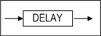

#### DISTINCT_HASH

해싱 방식으로 DISTINCT를 처리할 것을 지시하는 힌트이다.

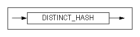

#### DISTINCT_SORT

정렬 방식으로 DISTINCT를 처리할 것을 지시하는 힌트이다.


#### DNF

WHERE절의 조건문들을 Disjunctive Normal Form으로 정규화할 것을 지시하는
힌트이다.


#### EXEC_FAST 

EXECUTOR_FAST_SIMPLE_QUERY 프로퍼티가 비활성화된 상태에서 힌트가 명시되면,
단순한 SELECT, INSERT, UPDATE, DELETE 구문은 SIMPLE QUERY로 동작한다. SIMPLE
QUERY가 적용된 경우 실행 계획에 출력된다.


#### FIRST_ROWS

처음 *n*개의 행을 가장 효율적으로 반환할 수 있는 실행 계획을 생성하도록 지시하는
힌트이다.

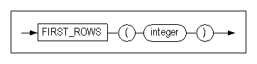

#### FULL SCAN

명시한 테이블에 대해 테이블 전체 스캔을 수행할 것을 지시하는 힌트이다.


#### GROUP BUCKET COUNT

GROUP-AGGREGATION과 AGGREGATION 실행 노드의 해시 버킷 수를 지정하는 힌트이다.


#### GROUP_HASH

해싱 방식으로 GROUP BY절을 처리할 것을 지시하는 힌트이다.


#### GROUP_SORT

정렬 방식으로 GROUP BY절을 처리할 것을 지시하는 힌트이다.


#### HASH_AJ

중첩된 부질의가 Hash Join을 사용하여 Anti Join 하도록 지시하는 힌트이다. 해당
힌트는 부질의 내부에 정의해야 효과가 있으며, 만약 부질의가 Semi Join으로
풀리거나, 풀 수 없는 경우에는 효과가 없다.


#### HASH BUCKET COUNT

HASH와 DISTINCT 실행 노드의 해시 버킷 수를 지정하는 힌트이다.


#### HASH_SJ

중첩된 부질의가 Hash Join을 사용하여 Semi Join 하도록 지시하는 힌트이다. 해당
힌트는 부질의 내부에 정의해야 효과가 있다. 만약 부질의가 Anti Join으로 풀리거나
풀리지 않는 경우에는 효과가 없다.

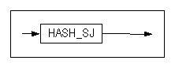

#### HIGH_PRECISION

사칙 연산 및 mod 연산 시 오차 발생을 방지하기 위하여 사용하는 힌트이다.

이 힌트를 사용할 때 데이타 타입으로 float 타입을 사용하여 연산한다. float
타입으로 연산할 경우 real이나 double 데이터 타입보다 연산 성능이 떨어질 수
있지만, 38자리까지의 사칙 연산 및 mod 연산의 정밀도를 보장한다.


#### INDEX

명시된 인덱스를 사용하여 해당 테이블에 대해서 인덱스 스캔을 수행하도록 지시하는
힌트이다.


#### INDEX ASC

명시된 인덱스를 사용하여 해당 테이블에 대해서 인덱스 스캔을 수행하되, 오름
차순으로 탐색한다.


#### INDEX_ASC

INDEX ASC힌트와 같은 동작을 한다.


#### INDEX DESC

명시된 인덱스를 사용하여 해당 테이블에 대해서 인덱스 스캔을 수행하되, 내림
차순으로 탐색한다.


#### INDEX_DESC

INDEX DESC와 같은 동작을 한다


#### INVERSE_JOIN

중첩된 부질의가 Semi Join 또는 Anti Join을 하는 경우 Inverse Join[^1]을 반드시
사용하도록 지시하는 힌트이며, 부질의 내에 명시해야 한다.

[^1]: Inverse Join이란 Inverse Index Nested Loop, Inverse Hash, Inverse Sort를 통칭한다. Inverse Join에 대한 자세한 설명은 Performance Tuning Guide를 참조하기 바란다.

해당 힌트는 Semi Join 또는 Anti Join 방법을 지시하는 다른 힌트와 함께 사용할 수
있다. 예를 들어 HASH_SJ와 함께 사용하는 경우, Hash Join이면서 Inverse Join인
Inverse Hash 조인을 사용하도록 지시한다.


#### KEEP_PLAN

KEEP_PLAN는 한 번 생성된 플랜이 참조하는 테이블의 통계 정보가 변경되더라도
플랜이 재생성되는 것을 방지하고 그대로 사용하도록 지시하는 힌트이다. KEEP_PLAN
힌트는 쿼리의 direct/execute 수행뿐 아니라 prepare/execute 수행시에도 사용
가능하다.


#### LEADING

힌트에 사용된 테이블들을 먼저 조인되도록 한다. 두 개 이상의 LEADING 힌트를 사용한
경우에는 처음 LEADING 힌트만 효과가 있다. ORDERED 힌트와 함께 사용된 경우에는 
ORDERED 힌트가 무시된다. 힌트에 사용된 테이블에 Lateral View를 명시한 경우에는 
효과가 없다.


#### MERGE_AJ

중첩된 부질의가 Merge Join을 사용하여 Anti Join 하도록 지시하는 힌트이다. 해당
힌트는 부질의 내부에 정의해야 효과가 있으며, 만약 부질의가 Semi Join으로
풀리거나, 풀 수 없는 경우에는 효과가 없다.


#### MERGE_SJ

중첩된 부질의가 Merge Join을 사용하여 Semi Join 하도록 지시하는 힌트이다. 해당
힌트는 부질의 내부에 정의해야 효과가 있으며, 만약 부질의가 Anti Join으로
풀리거나, 풀 수 없는 경우에는 효과가 없다.


#### NL_AJ

중첩된 부질의가 Nested Loop Join을 사용하여 Anti Join 하도록 지시하는 힌트이다.
해당 힌트는 부질의 내부에 정의해야 효과가 있으며, 만약 부질의가 Semi Join으로
풀리거나, 풀 수 없는 경우에는 효과가 없다.


#### NL_SJ

중첩된 부질의가 Nested Loop Join을 사용하여 Semi Join 하도록 지시하는 힌트이다.
해당 힌트는 부질의 내부에 정의해야 효과가 있다. 만약 부질의가 Anti Join으로
풀리거나 풀리지 않는 경우에는 효과가 없다.

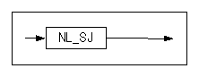

#### NO_DELAY 

쿼리의 프로퍼티와 상관없이 실행 계획의 그래프를 기준으로 hierarchy, sorting,
windowing, grouping, set, distinction의 실행(execute)이 패치(fetch)에서
수행되도록 하는 지연 기능을 비활성화한다.


#### NO_EXEC_FAST 

EXECUTOR_FAST_SIMPLE_QUERY 프로퍼티가 활성화된 상태에서 힌트가 명시되면, 단순한
SELECT, INSERT, UPDATE, DELETE 구문이더라도 SIMPLE QUERY로 동작되지 않는다.


#### NO_EXPAND

CNF힌트와 같은 동작을 한다.


#### NO INDEX

명시된 인덱스를 사용해서 해당 테이블에 대한 인덱스 스캔을 수행하지 않도록
지시하는 힌트이다.


#### NO_INDEX

NO INDEX힌트와 같은 동작을 한다.


#### NO_INVERSE_JOIN

중첩 부질의가 Semi Join 또는 Anti Join을 하는 경우, Inverse Join이 아닌 One-pass
Hash Join이나 Two-pass Hash join을 선택하여 사용하도록 지시하는 힌트이다. 부질의
내에 명시해야 한다.

해당 힌트는 Semi Join 또는 Anti Join 방법을 지시하는 다른 힌트와 함계 사용할 수
있다. 예를 들어 HASH_SJ와 함께 사용하는 경우, Hash Join이면서 One-Pass Hash
Join과 Two-Pass Hash Join 중 하나를 사용하도록 지시한다.


#### NO_MERGE

메인 쿼리와 인라인 뷰 쿼리를 하나의 쿼리로 병합하지 않도록 지시하는 힌트이다.


#### NO_PARALLEL

NOPARALLEL 힌트와 같은 동작을 한다.

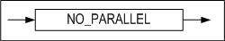

#### NO_PLAN_CACHE

NO_PLAN_CACHE는 생성된 플랜을 플랜 캐시에 저장하지 않도록 지시하는 힌트이다.


#### NO_PUSH_SELECT_VIEW

뷰 외부의 WHERE절의 조건을 뷰 내부로 이동하여 처리하지 않도록 지시하는 힌트이다.


#### NO_SERIAL_FILTER

SERIAL_EXECUTE_MODE 프로퍼티가 활성화된 상태에서 힌트가 명시되면,
Serial Execute Mode 로 동작되지 않는다.


#### NO_TRANSITIVE_PRED

조건절 이행을 배제하는 힌트이다. 조건절 이행에 대해서는 "Performance Tuning
Guide \> 3장 쿼리 옵티마이저 \> 쿼리 변환 > 조건절 이행"을 참고한다.


#### NO_UNNEST

Subquery Unnesting을 하지 말 것을 지시하는 힌트이다.


#### NO_USE_HASH

HASH를 제외한 힌트 중에 조인방법이 선택된다.


#### NO_USE_MERGE

MERGE를 제외한 힌트 중에 조인방법이 선택된다.


#### NO_USE_NL

NL를 제외한 힌트 중에 조인방법이 선택된다.

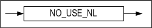

#### NO_USE_SORT

SORT를 제외한 힌트 중에 조인방법이 선택된다


#### PARALLEL

파티션드 테이블을 스캔할 때 병렬 질의를 설정할 수 있는 힌트이다.

- NOPARALLEL: 병렬로 처리하지 않는다.
- PARALLEL integer: integer에 명시된 개수만큼의 쓰레드가 병렬로 처리한다.


#### PLAN_CACHE_KEEP

Plan을 victim 선정 과정에서 제외시켜 Plan Cache내에 유지하도록 지시하는 힌트이다.
해당 힌트는 hardprepare 과정에서 적용된다. 그래서 사용자가 해당 plan을 unkeep으로 전환했을 때
softprepare가 발생해도 다시 keep 상태로 전환되지 않는다.


#### ORDERED

FROM절에 나열된 순서대로 조인하도록 지시하는 힌트이다.


#### PUSH_PRED

메인 쿼리의 WHERE 절에서 뷰와 관련된 조인 조건절을 뷰 안으로 밀어넣도록 지시하는
힌트이다.


#### PUSH_SELECT_VIEW

뷰 외부의 WHERE절의 조건을 뷰 내부로 이동하여 처리하도록 지시하는 힌트이다.


#### RESULT_CACHE

중간 결과를 캐시하는 ResultCache를 사용하는 힌트이다.


#### RULE

비용을 배제하고 규칙 기반으로 최적화된 실행 계획을 생성하도록 지시하는 힌트이다.


#### SET BUCKET COUNT

SET-INTERECT와 SET-DIFFERENCE 실행 노드의 해시 버킷 수를 지정하는 힌트이다.


#### SERIAL_FILTER

SERIAL_EXECUTE_MODE 프로퍼티가 비활성화된 상태에서 힌트가 명시되면,
Serial Execute Mode 로 동작한다.


#### SORT_AJ

중첩된 부질의가 Sort Join을 사용하여 Anti Join 하도록 지시하는 힌트이다. 해당
힌트는 부질의 내부에 정의해야 효과가 있으며, 만약 부질의가 Semi Join으로
풀리거나, 풀 수 없는 경우에는 효과가 없다.


#### SORT_SJ

중첩된 부질의가 Sort Join을 사용하여 Semi Join 하도록 지시하는 힌트이다. 해당
힌트는 부질의 내부에 정의해야 효과가 있다. 만약 부질의가 Anti Join으로 풀리거나
풀리지 않는 경우에는 효과가 없다.


#### TEMP_TBS_DISK

질의 처리 중에 생성되는 모든 중간 결과를 디스크 임시 공간에 저장하도록 지시하는
힌트이다.


#### TEMP_TBS_MEMORY

질의 처리 중에 생성되는 모든 중간 결과를 메모리 임시 공간에 저장하도록 지시하는
힌트이다.


#### TOP_RESULT_CACHE

최종 결과를 캐시하는 Top Result Cache를 사용하는 힌트이다.


#### UNNEST

Subquery Unnesting을 하도록 지시하는 힌트이다.

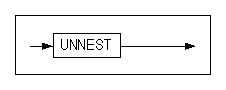

#### USE_ANTI

Full outer join 쿼리에서 명시된 테이블에 대해 left outer join과 anti outer
join을 수행하고 그 결과를 concatenation하도록 지시하는 힌트이다. 단, 조인되는
양쪽 칼럼에 인덱스가 모두 존재하는 경우에만 해당 힌트가 적용된다.
ANTI-OUTER-JOIN 노드를 참고한다.


#### USE_CONCAT

DNF 힌트와 같은 동작을 한다.


#### USE_FULL_NL

Full nested loop 조인을 사용해서 명시된 테이블을 조인하도록 지시하는 힌트이다.


#### USE_FULL_STORE_NL

Full store nested loop 조인을 사용해서 명시된 테이블을 조인하도록 지시하는
힌트이다.


#### USE_HASH

Hash 조인을 사용해서 명시된 테이블을 조인하도록 지시하는 힌트이다. 단 hasing
술어가 하나도 없을 경우 Nested loop 조인이 사용된다.


#### USE_INDEX_NL

Index nested loop 조인을 사용해서 명시된 테이블을 조인하도록 지시하는 힌트이다.

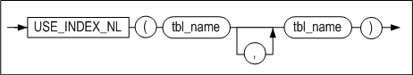

#### USE_INVERSE_HASH

inverse hash 조인을 사용해서 명시된 테이블을 조인하도록 지시하는 힌트이다.


#### USE_MERGE

Sort Merge 조인을 사용해서 명시된 테이블을 조인하도록 지시하는 힌트이다. 단
sorting 술어가 하나도 없을 경우 Nested loop 조인이 사용된다.


#### USE_NL

Nested loop 조인을 사용해서 명시된 테이블을 조인하도록 지시하는 힌트이다.


#### USE_ONE_PASS_HASH

One-pass hash 조인을 사용해서 명시된 테이블을 조인하도록 지시하는 힌트이다.


#### USE_ONE_PASS_SORT

One-pass sort 조인을 사용해서 명시된 테이블을 조인하도록 지시하는 힌트이다.


#### USE_SORT

Sort 조인을 사용해서 명시된 테이블을 조인하도록 지시하는 힌트이다. 단 sorting
술어가 하나도 없을 경우 Nested loop 조인이 사용된다.


#### USE_TWO_PASS_HASH

Two-pass hash 조인을 사용해서 명시된 테이블을 조인하도록 지시하는 힌트이다.


#### USE_TWO_PASS_SORT

Two-pass sort 조인을 사용해서 명시된 테이블을 조인하도록 지시하는 힌트이다. 


## 3.데이터 정의어

이 장에서는 데이터베이스 객체를 생성하는데 사용하는 SQL 문장인 DDL 문장의 문법과
특징을 사용 예제를 들어서 상세하게 설명한다.

### ALTER DATABASE 

#### 구문

**alter_database :: =**


**startup_clause ::=**


**rename_datafile_clause ::=**


**create_datafile_clause ::=**


**create_checkpoint_image_clause ::=**

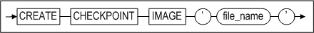

**session_clause ::=**


**archivelog_option ::=**


**backup_clause ::=**


**incremental_backup_clause ::=**


**incremental_level_clause ::=**


**with_tag_clause ::=**


**recover_clause ::=**


**from_tag_clause ::=**


**until_option ::=**

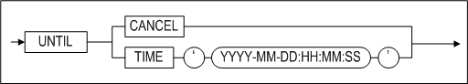

**restore_clause ::=**


**restore_database_clause ::=**


**restore_tablespace_clause ::=**


**change_backup_directory_clause ::=**


**move_backup_clause ::=**


**delete_backup_clause ::=**


**change_tracking_clause ::=**


**snapshot_clause ::=**


#### 전제 조건

ALTER DATABASE구문은 Altibase 다단계 구동에서 서비스 전 단계에서 SYS 사용자가 –sysdba 관리자 모드로 접속한 후 수행할 수 있다. 단 SESSION CLOSE 의 경우에는 –sysdba 모드로 접속하지 않아도 사용할 수 있다.

#### 설명

기존 데이터베이스의 정의를 변경하는 구문이다.

*database_name*

변경될 데이터베이스 이름을 명시한다.

*startup_clauses*

이 절은 Altibase 구동 단계를 명시하는데 사용된다.

*CONTROL*

데이터베이스 구동 단계를 CONTROL 단계로 변경한다. 이 단계에서 데이터베이스
미디어 복구가 가능하다. 또한, 테이블스페이스를 Discard할 수 있는 단계이다.
데이터베이스 다단계 구동 단계에 대한 자세한 설명은 *Administrator’s Manual*을
참조한다.
CONTROL 다음 단계인 META단계로 가기 위해서는 다음 구문을 수행해야 한다:

```
ALTER DATABASE dababase_name META;
```

*META*

데이터베이스 구동 단계를 META 단계로 변경한다. 전 단계인 CONTROL단계에서 이
단계로 오는 중에 데이터베이스 메타 데이터가 로딩된다. 다음 단계로 가기 위해서는
다음 구문을 수행해야 한다:

```
ALTER DATABASE dababase_name SERVICE;
```

*SERVICE*

데이터베이스 구동 단계를 SERVICE 단계로 변경한다. 이 단계로 오면서 메모리 DB와
디스크 DB가 로딩된다. 이 단계에서 이중화 또는 SNMP 등의 확장 서비스가 모두
구동될 수 있다. 데이터베이스가 이 단계로 성공적으로 구동되었다면, 필요한 복구가
완료되어 시스템이 정상적으로 서비스를 제공하는 상태임을 의미한다.

*UPGRADE*

이 옵션은 데이터베이스 구동 단계를 META UPGRADE 단계로 변경한다. 데이터베이스가
이 단계로 구동될 때, 모든 복구 작업이 완료된다.

다음 단계로 가기 위해서는 다음 구문을 수행해야 한다:

```
ALTER DATABASE dababase_name SERVICE;
```

RESETLOGS

CONTROL 단계에서 불완전 복구를 수행한 후, 서버를 정상 구동하기 위해 필요한
작업이다. 불완전 복구로 인해 더 이상 필요하지 않게 된 로그 레코드들을
초기화한다.

다음 단계로 가기 위해서는 다음 구문을 수행해야 한다:

```
ALTER DATABASE dababase_name SERVICE;
```

*META RESETUNDO*

이 옵션을 사용하면, SYS_TBS_DISK_UNDO 테이블스페이스가 초기화된다. 그러나
테이블스페이스 파일의 크기는 변경되지 않는다. 이 구문 실행 전에, 데이터베이스의
무결성을 검사하고 디스크 가비지 콜레션이 수행된 것을 확인하고, 서버를 정상
종료해야 한다.

*SHUTDOWN NORMAL*

서버에 접속한 모든 클라이언트의 연결이 정상적으로 해제될 때까지 대기한 후 서버를
정상 종료한다.

*SHUTDOWN IMMEDIATE*

서버에 접속된 모든 클라이언트의 연결을 강제로 해제한 후, 서버를 정상 종료한다.

*SHUTDOWN EXIT*

이 옵션은 Altibase 서버를 강제로 종료하는데 사용된다. 이 방법으로 Altibase가
종료되면, 데이터베이스의 내용이 올바르지 않게 되어 다음 서버 구동시에 복구
작업이 수행될 것이다.

*RENAME DATAFILE*

이 구문은 디스크 데이터파일 위치를 이동시켜야 할 때 사용하는 기능으로,
데이터베이스에 속한 데이터 파일을 새로운 이름으로 변경하거나 다른 디렉터리에
둔다. TO ‘*datafile_path*’에 명시된 데이터 파일은 존재해야 한다. 이 절은 CONTROL
단계에서만 실행 가능하다. *datafile_path*는 절대 경로여야 한다.

참고로, 메모리 테이블스페이스의 체크포인트 이미지파일을 이동하기 위해서는 ALTER
TABLESPACE 구문이 사용된다.

*CREATE DATAFILE*

이 구문은 디스크 데이터 파일이 유실되었을 때, 로그 앵커의 정보를 참고하여 데이터
파일을 생성하기 위해 사용된다. 이 구문을 실행한 후에는 매체 완전 복구를 수행하여
데이터 파일을 복구하도록 한다.

이 구문은 CONTROL 단계에서만 실행 가능하다. 

데이터 파일이 생성될 *datafile_path*는 절대 경로이어야 한다.

참고로 메모리 테이블스페이스의 체크포인트 이미지파일을 생성하려면 ALTER
TABLESPACE 구문을 사용한다.

*CREATE CHECKPOINT IMAGE*

이 구문은 메모리 체크포인트 이미지파일이 유실되었을 때, 로그 앵커의 정보를
참고하여 체크포인트 이미지 파일을 생성하기 위해 사용된다. 이 구문을 실행한
후에는 매체 완전 복구를 수행하여 메모리 체크포인트 이미지 파일을 복구하도록
한다.

체크포인트 이미지파일은 메모리 테이블스페이스에 정의된 체크포인트 경로에
생성되므로, 경로는 지정할 필요가 없고 파일명만 명시하면 된다.

이 구문은 CONTROL 단계에서만 실행 가능하다.

\<질의\> ‘MEM-TBS-1’ 이름의 체크포인트 이미지파일을 다시 생성한다.

```
iSQL\> ALTER DATABASE CREATE CHECKPOINT IMAGE 'MEM-TBS-1';
```

*SESSION CLOSE*

이 구문은 세션을 강제로 종료시킨다. 세션ID(number) 및 사용자 이름을 지정하여
해당 세션을 종료할 수 있으며, ALL구문으로 모든 세션을 한 번에 종료할 수도 있다.

현재 접속한 사용자의 세션은 종료되지 않는다. 이 구문이 실행되면 해당 세션의
트랜잭션은 롤백된다.

> Note: 세션이 락을 잡기 위해 대기중이라면 즉시 종료되지 않는다.
>

*archivelog_option*

CONTROL 단계에서 아카이브로그 모드와 노아카이브로그 모드를 전환하는데 사용된다.

*BACKUP LOGANCHOR*

데이터베이스가 아카이브로그 모드로 운영중일때, 이 구문은 서비스를 중지하지 않은
상태에서 로그 앵커를 온라인 백업하는데 사용된다.

*BACKUP TABLESPACE*

데이터베이스가 아카이브로그 모드로 운영중일때, 이 구문은 서비스를 중지하지 않은
상태에서 지정된 테이블스페이스를 백업 디렉토리에 백업하는데 사용된다.

*BACKUP DATABASE*

데이터베이스가 아카이브로그 모드로 운영중일때, 이 구문은 서비스를 중지하지 않은
상태에서 모든 메모리 테이블스페이스, 디스크 테이블스페이스, 및 로그앵커를
백업하는데 사용된다.

*incremental_backup_clause*

데이터베이스 전체 또는 특정 테이블스페이스들을 증분 백업한다.

*incremental_level_clause*

증분 백업 레벨을 지정한다.

*WITH TAG tag_name*

백업에 태그 이름을 지정한다.

*RECOVER DATABASE*

이 구문은 매체 완전복구를 수행한다. 아카이브 로그 디렉토리의 로그 파일을
판독하여 매체 오류가 발생한 데이터 파일들을 현재 시점으로 복구한다.

*FROM TAG tag_name*

태그 이름이 *tag_name*인 백업으로부터 데이터베이스를 복원 또는 복구할 것을
지정한다.

*RECOVER DATABASE UNTIL TIME*

이 구문은 특정 시점으로 매체 불완전 복구를 수행하는데 사용된다. 아카이브 로그
디렉토리의 로그 파일을 판독하여 매체 오류가 발생한 데이터 파일들을 특정 시점으로
복구한다.

*RECOVER DATABASE UNTIL CANCEL*

이 구문은 아카이브 로그 파일들 중 유효한 가장 최근 시점으로 매체 불완전 복구를
수행하는데 사용된다. 아카이브 로그 디렉토리의 로그 파일을 판독하여 매체 오류가
발생한 데이터 파일들을 유효한 시점까지 복구한다.

*restore_database_clause*

데이터베이스에 대한 매체 완전복원을 수행하거나 또는 특정 태그 이름이나 특정
시점으로 불완전 복원을 수행한다.

*restore_tablespace_clause*

테이블스페이스를 완전 복원한다.

*change_backup_directory_clause*

증분 백업 수행으로 생성되는 백업 파일들의 위치를 지정한다.

*move_backup_clause [WITH CONTENTS]*

증분 백업 디렉토리를 변경한다. WITH CONTENTS 옵션을 지정하면 기존 백업 파일이
새로운 디렉토리로 이동한다.

*delete_backup_clause*

유효 기간이 지난 증분 백업 파일을 삭제한다.

change_tracking_clause

증분 백업을 위한 페이지 변경 추적 기능의 활성화 또는 비활성화를 지정한다.

*snapshot_clauses*

BEGIN SNAPSHOT을 할 때의 시점을 기준 SNAPSHOT SCN으로 설정하고, 설정된 SCN을
기준으로 iLoader를 사용하여 데이터를 EXPORT한다.

#### 예제

\<질의\> 데이터베이스 mydb를 구동하여 정상 서비스를 제공하도록 한다.

```
iSQL> ALTER DATABASE mydb SERVICE;
```

\<질의\> 아카이브로그 모드로 데이터베이스를 전환한다.

```
iSQL> ALTER DATABASE ARCHIVELOG;
```

\<질의\> 불완전 복구 수행 후 데이터베이스를 정상 구동한다.

```
iSQL> ALTER DATABASE mydb META RESETLOGS;
```

\<질의\> SYS_TBS_DISK_UNDO 테이블스페이스를 초기화한다.

```
iSQL> ALTER DATABASE mydb META RESETUNDO;
```

\<질의\> SYS_TBS_DISK_DATA 테이블스페이스를 /altibase_backup디렉터리에 백업한다.

```
iSQL> ALTER DATABASE TABLESPACE SYS_TBS_DISK_DATA TO ‘/altibase_backup/’;
```

\<질의\> 이전 백업으로부터 2008년 2월 16일 오후 12시 시점으로 데이터베이스를
복원한다.

```
iSQL> ALTER DATABASE RECOVER DATABASE UNTIL TIME ‘2008-02-16:12:00:00’;
```

\<질의\> 이전 백업으로부터 유실된 로그파일 20001번 이전인 로그파일 20000번까지의
변경이 반영되도록 데이터베이스를 복원한다.

```
iSQL> ALTER DATABASE RECOVER DATABASE UNTIL CANCEL;
```


### ALTER DATABASE LINKER 

데이터베이스 링크에 대한 내용은 DatabaseLink User's Manual을 참고한다.

### ALTER INDEX

#### 구문

**alter_index ::=**


**directkey_mod_clause ::=**


**rebuild_clause ::=**


**index_attribute ::=**

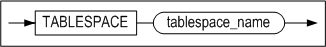

**alter_index_properties::=**


**alter_index_segment_attribute_clause::=**


**storage_clause::=**


**allocate_extent_clause::=**

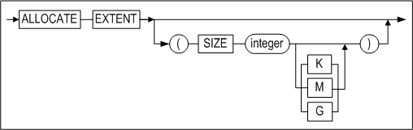

#### 전제 조건

SYS 사용자, 인덱스가 속한 스키마의 소유자 또는 ALTER ANY INDEX 시스템 권한을
가진 사용자만이 이 구문으로 인덱스를 변경할 수 있다.

#### 설명

기존 인덱스 정의를 변경하거나 재구축한다.

*user_name*

변경될 인덱스의 소유자 이름을 명시한다.

생략하면 Altibase는 현재 세션에 연결된 사용자의 스키마에 속한 것으로 간주한다.

*index_name*

변경될 인덱스의 이름을 명시한다.

directkey_mod_clause

이 절은 인덱스가 Direct Key인덱스를 사용할 것인지 여부를 명시할 때 사용된다.
Direct Key 인덱스에 대한 자세한 내용은 [CREATE INDEX](#create-index) 구문을 참고한다

- MAXSIZE integer  
  Direct Key 인덱스의 최대 크기를 설정할 수 있다.
- OFF  
  Direct Key 인덱스를 일반 인덱스로 변경한다.

*rebuild_clause*

존재하는 인덱스 또는 인덱스의 한 파티션을 재구축한다.

*index_attribute*

재구축된 인덱스 파티션이 저장될 테이블스페이스를 명시한다.

*RENAME*

변경될 인덱스의 이름을 명시한다.

*AGING*

이는 인덱스 페이지에 트랜잭션 커밋 SCN을 기록하고, 구 버전(old version)의
노드들을 삭제하는데 사용된다. 이 구문은 디스크 기반 인덱스에만 사용 가능하다.

*REORGANIZATION*

메모리 B-tree 인덱스의 리프 노드를 이웃 노드와 통합하여 인덱스 공간을
재구성한다.

데이터에 비해 인덱스 범위가 크거나 특정 인덱스에 단편화 현상이 있을 경우에
사용하면 공간 효율성이 향상된다. 메모리 기반 B트리 인덱스만 사용 가능하다.

*alter_index_segment_attribute_clause*

- INITRANS 절  
  초기 TTS(Touched Transaction Slot)의 개수를 변경한다.
- MAXTRANS 절  
  최대 TTS(Touched Transaction Slot)의 개수를 변경한다.

*storage_clause*

사용자가 세그먼트내의 익스텐트 관리 파라미터를 지정할 수 있는 구문이다.

- INITEXTENTS 절  
  ALTER INDEX 구문의 INITEXTENTS 파라미터는 무시된다.
- NEXTEXTENTS 절  
  세그먼트 확장시 추가될 익스텐트 개수를 지정한다.
- MINEXTENTS 절  
  한 세그먼트의 최소 익스텐트 개수를 지정한다.
- MAXEXTENTS 절  
  한 세그먼트의 최대 익스텐트 개수를 지정한다.

*allocate_extent_clause*

이는 인덱스 세그먼트에 명시적으로 익스텐트를 할당하는데 사용된다. 인덱스
세그먼트에 추가될 익스텐트의 총 크기를 지정해야 한다. 디스크 테이블스페이스가
여러개의 데이터 파일로 구성되어 있다면 익스텐트는 여러 파일들에 걸쳐서 고르게
할당된다.

#### 예제

##### Direct Key Index 변경

\<질의\> 인덱스 idx1을 Direct Key 인덱스로 변경하라.

```
iSQL> ALTER INDEX idx1 DIRECTKEY;
```

\<질의\> Direct Key 인덱스 idx1을 일반 인덱스로 변경하라.

```
iSQL> ALTER INDEX idx1 DIRECTKEY OFF;
```

\<질의\> 인덱스 idx3을 Direct Key 인덱스로 변경할 때 MAXSIZE를 10으로 설정한다.

```
iSQL> ALTER INDEX idx3 DIRECTKEY MAXSIZE 10;
```


##### 인덱스 파티션 재구축

\<질의\> 인덱스 파티션 idx_p5를 테이블스페이스 tbs1에 구축하라.

```
iSQL> ALTER INDEX IDX1 REBUILD PARTITION idx_p5 TABLESPACE tbs1;
```


##### 인덱스 이름 변경

\<질의\> 인덱스 emp_idx1의 이름을 emp_idx2로 변경하라.

```
iSQL> ALTER INDEX emp_idx1 RENAME TO emp_idx2;
```


##### 인덱스에 익스텐트 할당

\<질의\> 디스크 테이블스페이스에 위치하는 인덱스 local_idx 에 10M만큼의
익스텐트를 할당한다.

```
iSQL> ALTER INDEX felt_idx ALLOCATE EXTENT ( SIZE 10M );
```


##### 인덱스 Reorganization 수행

\<질의\> 인덱스 idx1의 reorganization을 수행하라

```
iSQL> ALTER INDEX idx1 REORGANIZATION;
```


### ALTER JOB 

#### 구문

**alter_job ::=**

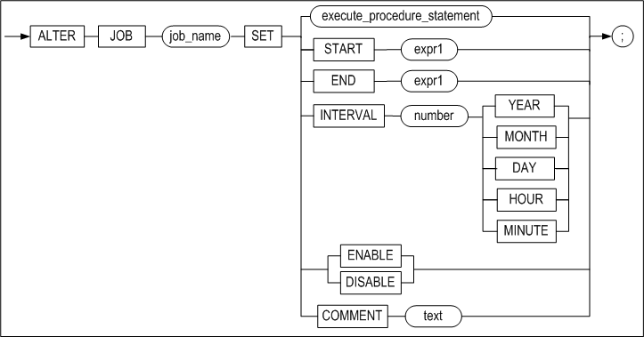

**execute_procedure_statement ::=**


#### 전제 조건

SYS 사용자만이 이 구문으로 JOB을 변경할 수 있다. 생성된 JOB을 수행하려면 JOB을
생성 시 또는 생성 후에 반드시 ENABLE로 활성화해야 한다.

#### 설명

CREATE JOB 구문으로 생성한 JOB의 정의를 변경할 수 있다. 이 구문으로 JOB에 등록된
프로시저의 실행 구문, JOB의 시작 시간과 끝나는 시간, JOB의 실행 주기 등을 변경할
수 있다.

*job_name*

변경할 JOB의 이름을 명시한다.

*START*

JOB이 처음 시작할 시간을 명시한다.

*END*

JOB이 끝날 시간을 명시한다.

*expr1*

DATE 타입의 값 또는 수식만 올 수 있다.

*INTERVAL number*

JOB이 처음 실행된 이후에 다음에 실행하는 주기를 명시한다. 시간 단위는 number
다음에 명시되는 YEAR, MONTH, DAY, HOUR, MINUTE에 따라 결정된다.

*expr2*

명시한 프로시저를 실행하기 위한 입력 인자 값을 상수 또는 수식으로 지정한다.

*ENABLE/DISABLE*

각각의 JOB을 작업 스케줄러에서 실행하거나 하지 않도록 변경할 수 있다.

*COMMENT*

사용자가 JOB에 대한 설명을 변경할 수 있다.

#### 예제

\<질의\> job2를 활성화 상태로 변경하라.

```
iSQL> ALTER JOB job2 SET ENABLE;
Alter success.
```

\<질의\> job2를 비활성화 상태로 변경하라.

```
iSQL> ALTER JOB job2 SET DISABLE;
Alter success.
```

\<질의\> job1이 실행되는 시작 시간을 ‘2013년 1월 1일’로 변경하라.

```
iSQL> ALTER JOB job1 SET START to_date('20130101','YYYYMMDD');
Alter success.
```

\<질의\> job2에서 실행할 프로시저를 usr1의 proc1 프로시저로 변경하라.

```
iSQL> alter job job2 set exec usr1.proc1;
Alter success.
```

\<질의\> job2의 시작 시간을 '2013/06/03 10:00:00'으로 변경하라.

```
iSQL> alter job job2 set start to_date('2013/06/03 10:00:00','YYYY/MM/DD HH24:MI:SS');
Alter success.
```

\<질의\> job2의 끝나는 시간을 ‘2013/06/07 10:00:00’으로 변경하라.

```
iSQL> alter job job2 set end to_date('2013/06/07 10:00:00', 'YYYY/MM/DD HH24:MI:SS');
Alter success.
```

\<질의\> job2의 실행 주기를 10분 간격으로 변경하라.

```
iSQL> alter job job2 set interval 10 minute;
Alter success.
```


### ALTER QUEUE 

#### 구문

**alter_queue ::=**


#### 설명

큐의 정의를 변경한다.

*COMPACT*

큐가 위치하는 테이블스페이스에 데이터가 없는 빈 페이지들을 반환한다. 이 때,
데이터가 실제로 옮겨지지는 않는다.

*MSGID RESET*

큐의 MSGID를 초기화한다.

### ALTER REPLICATION 

#### 구문

**alter_replication ::=**


**replication_item ::=**

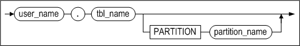

**alter_replication_set_clause ::=**


**offline_clause ::=**


#### 전제 조건

SYS 사용자만이 이중화 동작을 변경할 수 있다.

#### 설명

CREATE REPLICATION 구문으로 이중화 생성 후 이중화의 동작을 정의하는 구문이다.
이중화 종료 등의 제어문에 대한 설명은 '데이터 제어어> alter_replication_dcl' 문을 참조한다.

이중화에 관한 자세한 내용은 *Replication Manual* 을 참고한다.

*replication_name*

이중화 객체의 이름을 명시한다.

*SYNC*

지역 서버에 있는 이중화 대상 테이블들의 모든 데이터를 원격 서버의 해당 테이블로
전송한 후 이중화가 시작된다.

*SYNC ONLY*

지역 서버에 있는 이중화 대상 테이블들의 모든 데이터를 원격 서버의 해당 테이블로
전송한다. 이중화 송신 쓰레드는 생성되지 않는다.

*PARALLEL parallel_factor*

*Parallel_factor* 값은 생략 가능하다. 생략할 경우 1로 인식된다.  
*Parallel_factor*의 최대값은 CPU 개수 \* 2이다. 최대값을 초과하여 지정해도 최대
값 이상으로 설정되지 않는다. 0 또는 음수 값을 지정하면 오류 메시지가 반환된다.

*TABLE replication_item*

지역서버의 이중화 대상 테이블 중에서 SYNC로 동기화할 테이블 또는 파티션을
지정한다. 이 절이 명시되면 지정된 테이블 또는 파티션이 동기화된 후 이전에
마지막으로 이중화를 수행했던 시점부터 이중화가 시작된다. TABLE 절을 사용하지
않았을 때에는 모든 이중화 대상 테이블과 파티션이 동기화된 후 현재 로그의
위치부터 이중화가 시작된다.

*START*

가장 최근에 마지막으로 이중화했던 시점부터 이중화를 시작한다.

*QUICKSTART*

현재 시점부터 이중화를 시작한다.

*START/ QUICKSTART RETRY*

RETRY 옵션을 사용하여 이중화를 START하거나 QUICKSTART하면, 핸드쉐이크가
실패하더라도 송신 쓰레드가 지역서버에 생성된다. 지역서버와 원격서버간의
핸드쉐이크가 이후 성공할 때, 이중화가 시작된다.

이 옵션이 사용되면, iSQL은 첫 핸드쉐이크 시도가 실패하더라도 핸드쉐이크 성공
메시지를 출력한다. 그러므로 사용자는 이 구문의 실행 결과를 트래이스 로그 또는
성능 뷰를 통해서 확인해야 한다.

RETRY 옵션 없이 이중화 시작시 첫 핸드쉐이크 시도가 실패하면 ,에러가 발생하고
이중화 시작은 중지된다. 단, RETRY 옵션은 EAGER 모드에서는 지원되지 않는다.

*STOP*

데이터 제어어의 ALTER REPLICATION 절을 참조한다.

*RESET*

이 명령은 이중화 정보(재시작 SN 같은)를 초기화시킨다. 이는 이중화가 중지 중일
때만 실행될 수 있다. 이는 DROP REPLICATION 구문과 CREATE REPLICATION 구문을
연달아 실행한 것과 같은 효과를 낸다.

*ADD TABLE*

이중화 객체에 테이블을 추가한다. 이중화가 중지되어 있는 상태에서만 테이블을
이중화 객체에 추가할 수 있다.

*TABLE FROM replication_item TO replication_item*

이중화 대상 테이블 또는 파티션 이름을 테이블 소유자 이름과 함께 명시한다

DROP TABLE

이중화 테이블을 이중화 객체로부터 삭제한다. 이중화가 중지되어 있는 상태에서만
이중화 테이블을 삭제할 수 있다.

*FLUSH*

데이터 제어어의 ALTER REPLICATION 절을 참조한다.

*SET HOST*

특정 호스트를 현재 호스트로 지정한다. 이중화를 중지한 상태에서 변경 가능하다.

*alter_replication_set_clause*

이 절은 이중화 객체가 LAZY로 설정되어 있고 이중화를 중지한 상태에서 아래의
옵션을 변경할 수 있다.

- RECOVERY : 데이터 복구를 위하여 사용하거나 사용하지 않도록 변경할 수 있다.
- GAPLESS : 이중화 갭 해소 옵션을 사용하거나 사용하지 않도록 변경할 수 있다.
- GROUPING : 이중화 트랜잭션 그룹 옵션을 사용하거나 사용하지 않도록 변경할 수
  있다.
- PARALLEL : 병렬 적용자 옵션을 사용하거나 사용하지 않게 변경 할 수 있다.
  그리고 적용자의 개수를 변경할 수 있다.

*offline_cluase*

오프라인 옵션을 변경하거나 설정된 오프라인 경로를 이용하여 이중화를 수행할 수
있다.

#### 주의 사항

이중화로 작업을 하는 사용자들이 이중화를 이용하기 전에 명심해야 할 몇가지 사항이
있다. ALTER REPLICATION 구문을 실행하기 전에 *Replication Manual*을 숙지하기
바란다.

#### 예제

##### 이름이 rep1인 이중화 객체를 시작하라.

\<질의\> 지역서버의 데이터를 원격서버로 전송한 후 이중화를 시작하라.

```
iSQL> ALTER REPLICATION rep1 SYNC;
Alter success.
```

\<질의\> 이중화 rep1이 가장 최근에 마지막으로 수행한 이중화 시점부터 rep1
이중화를 시작하라.

```
iSQL> ALTER REPLICATION rep1 START;
Alter success.
```

\<질의\> 현재 시점부터 이중화를 시작하라.

```
iSQL> ALTER REPLICATION rep1 QUICKSTART;
Alter success.
```


##### 이름이 rep1인 이중화 객체에서 이중화 대상 테이블 employees을 삭제하라.

```
iSQL> ALTER REPLICATION rep1 STOP;
Alter success.
iSQL> ALTER REPLICATION rep1 DROP TABLE FROM sys.employees TO sys.employees;
Alter success.
```


##### 이름이 rep1인 이중화 객체에 파티션드 테이블 tbl_sales의 파티션 p2를 추가하라.

```
iSQL> ALTER REPLICATION rep1 STOP;
Alter success.
iSQL> ALTER REPLICATION rep1 ADD TABLE
 FROM sys.tbl_sales PARTITION p2 TO sys.tbl_sales PARTITION p2;
Alter success.
```


##### 이름이 rep1인 이중화 객체에 테이블 employees을 추가하라.

```
iSQL> ALTER REPLICATION rep1 STOP;
Alter success.
iSQL> ALTER REPLICATION rep1 ADD TABLE FROM sys.employees TO sys.employees;
Alter success.
```


### ALTER SEQUENCE 

#### 구문

**alter_sequence ::=**


**sequence_options ::=**

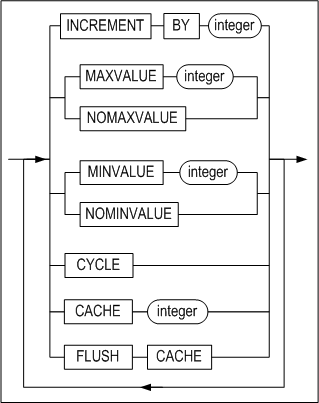

**sync_table_clause ::=**


#### 전제 조건

SYS 사용자, 시퀀스가 속한 스키마의 소유자 또는 ALTER ANY SEQUENCE 시스템 권한을
가진 사용자만이 이 구문으로 시퀀스를 변경할 수 있다.

#### 설명

CREATE SEQUENCE 구문으로 시퀀스 생성 후 시퀀스의 정의를 변경하는 구문이다. 더
자세한 설명은 CREATE SEQUENCE 문을 참고한다.

*user_name*

변경될 시퀀스의 소유자 이름이다. 생략하면 Altibase는 현재 세션에 연결된 사용자의
스키마에 속한 것으로 간주한다.

*seq_name*

변경될 시퀀스 이름이다.

*INCREMENT BY*

시퀀스 값의 증감분을 명시하는데 사용된다.

*MAXVALUE*

시퀀스의 최대값을 명시하는데 사용된다.

*MINVALUE*

시퀀스의 최소값을 명시하는데 사용된다.

*CYCLE*

이는 시퀀스 값이 최대 또는 최소 한계 값에 도달한 후에도 그 시퀀스의 다음 값이
계속되는 것을 허용한다. 오름차순 시퀀스인 경우는 최대값에 도달한 후 최소값부터
다시 시작된다. 반면 내림차순 시퀀스인 경우는 최대값에 도달한 후 최대값부터 다시
시작된다.

*CACHE*

시퀀스 값을 더 빠르게 액세스 하기 위하여 명시된 개수 만큼의 시퀀스 값들이
메모리에 캐시된다. 캐시는 시퀀스가 처음 참조될 때 채워지며 다음에 시퀀스 값이
요청될 때마다 캐시 된 값이 검색된다. 캐시에서 마지막 시퀀스 값이 사용된 이후
다음 시퀀스 값 요청시 새로운 시퀀스 값들이 메모리 캐시된다. 이 옵션을 생략할
경우 기본값은 20이다.

*FLUSH CACHE*

메모리에 캐시된 시퀀스 값들을 지워버린다. 이 옵션을 사용해서 캐시를 플러시한 후
시퀀스 값이 요청되면, 새로운 시퀀스 값들이 메모리에 캐시된다.

*ENABLE SYNC TABLE*

시퀀스 번호를 복제하기 위한 시퀀스 이중화용 테이블을 생성한다. 시퀀스 이중화
전용 테이블의 이름은 [sequence 이름]\$seq으로 자동 부여된다.

*DISABLE SYNC TABLE*

시퀀스를 이중화하기 위해 사용하던 시퀀스 이중화용 테이블을 삭제한다.

#### 주의 사항

존재하는 시퀀스의 정의를 변경할 때, 시퀀스가 이미 생성된 이후 이므로 START WITH
절은 사용될 수 없다.

시퀀스 이름의 길이가 36 바이트 이하여야 시퀀스 이중화용 테이블을 생성할 수 있다.

시퀀스에 대한 자세한 설명은 CREATE SEQUENCE 구문의 설명을 참고한다.

#### 예제

\<질의\> 시퀀스 seq1을 최소값이 0, 최대값이 100이고 1씩 증가하도록 변경하라.

```
iSQL> ALTER SEQUENCE seq1
    INCREMENT BY 1
    MINVALUE 0
    MAXVALUE 100;
Alter success.             
```

\<질의\> 시퀀스 seq2의 최소값, 최대값을 무한대로 변경하라.

```
iSQL> ALTER SEQUENCE seq2
    NOMAXVALUE 
    NOMINVALUE;
Alter success.
```

\<질의\> 시퀀스 seq1의 캐시된 시퀀스 값을 메모리에서 지운다.

```
iSQL> ALTER SEQUENCE seq1 FLUSH CACHE;
Alter success.
```

\<질의\> 시퀀스 seq1의 이중화를 위한 시퀀스 이중화용 테이블을 생성하라.

```
iSQL> ALTER SEQUENCE seq1 ENABLE SYNC TABLE;
```


### ALTER TABLE 

#### 구문

**alter_table::=**


**log_compression_clause ::=**


**alter_table_properties::=**


**alter_table_tablespace::=**


**table_move_index_clause::=**


**table_lob_column_clause::=**


**logging_clause::=**


**parallel_clause::=**


**row_movement_clause::=**


**alter_table_segment_properties::=**

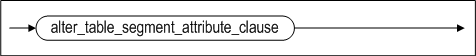

**alter_table_segment_attribute_clause::=**


**storage_clause::=**


**alter_table_partitioning::=**


**add_table_partition ::=**


**alter_partition ::=**


**partition_index_clause ::=**

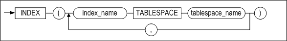

**partition_lob_column_clause ::=**

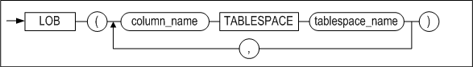

**coalesce_table_partition ::=**


**drop_table_partition ::=**


**merge_table_partition ::=**


**rename_table_partition ::=**


**split_table_partition ::=**


**truncate_table_partition ::=**


**partition_spec ::=**


**table_partition_description ::=**


**index_partition_spec ::=**


**index_partition_description ::=**


**partition_access_mode ::=**


**access_mode_clause ::=**


**column_clauses::=**


**add_column_clauses::=**


<a name="column_definition"><a/>

**column_definition::=**


**partition_lob_storage_clause ::=**


**alter_column_clause ::=**


**modify_column_clause::=**


**modify_column_spec::=**


**drop_column_clause::=**


**rename_column_clause::=**


**reorganize_column_clause::=**


**constraints_clauses::=**


**add_table_constraint_clauses ::=**

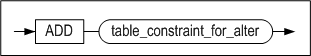

**table_constraint_for_alter::=**

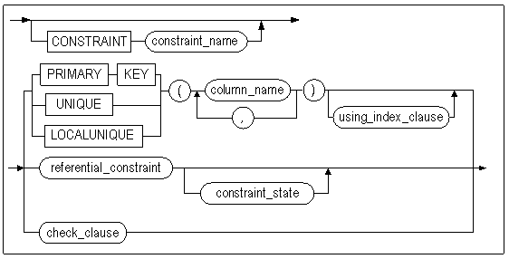

**constraint_state::=**


**modify_constraint_clause::=**


**rename_constraint_clauses ::=**

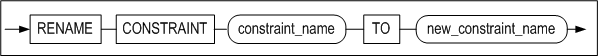

**drop_constraint_clause::=**


**aging_clause::=**


**compact_clause::=**


**allocate_extent_clause::=**


#### 전제 조건

SYS 사용자, 테이블이 속한 스키마의 소유자, 테이블에 ALTER 객체 권한을 가진
사용자 또는 ALTER ANY TABLE 시스템 권한을 가진 사용자만이 이 구문으로 테이블
정의를 변경할 수 있다.

#### 설명

ALTER TABLE 구문은 명시된 테이블 정의를 변경하는 SQL문이다. 이 구문의 수행 후
해당 테이블의 메타 정보가 변경된다.

ALTER TABLE 구문으로 파티션드 테이블(partitioned table)의 속성을 변경할 수 있다.
파티션드 테이블 관련 구문에는 테이블스페이스 변경(ALTER), 추가(ADD),
병합(COALESCE), 삭제(DROP), 합병(MERGE), 이름변경(RENAME), 분할(SPLIT), 및
레코드 삭제(TRUNCATE)가 있다.

아래 표는 각 구문을 범위, 해시, 리스트 파티션드 테이블에 사용할 수 있는지 여부를
나타낸다.

|                     | 범위 파티션드 테이블 | 리스트 파티션드 테이블 | 해시 파티션드 테이블 |
| ------------------- | -------------------- | ---------------------- | -------------------- |
| 테이블스페이스 변경 | ○                    | ○                      | ○                    |
| 추가                | X                    | X                      | ○                    |
| 병합                | X                    | X                      | ○                    |
| 삭제                | ○                    | ○                      | X                    |
| 합병                | ○                    | ○                      | X                    |
| 이름 변경           | ○                    | ○                      | ○                    |
| 분할                | ○                    | ○                      | X                    |
| 레코드 삭제         | ○                    | ○                      | ○                    |

[표 3‑1] 파티셔닝 방법에 따른 지원 연산

*user_name*

변경될 테이블의 소유자 이름이다. 생략하면 Altibase는 현재 세션에 연결된 사용자의
스키마에 속한 것으로 간주한다.

*tbl_name*

변경될 테이블 이름이다.

*parallel_clause*

CREATE TABLE의 parallel_clause 설명을 참고한다.

*alter_table_segment_attribute_clause*

- PCTFREE 절  
  이 절은 페이지에 이미 저장되어 있는 레코드를 갱신할 때 이용하기 위해 예약해
  둔 여유 공간의 비율을 변경하기 위해 사용된다. ALTER TABLE 구문의
  alter_table_segment_attribute_clause을 사용해 Altibase 운영 중에 세그먼트
  속성을 변경할 수 있다. 그러나 즉시 세그먼트의 모든 페이지에 변경 사항이
  반영되는 것은 아니며, 이후 연산에 의해 접근된 테이블 페이지에 대해서
  개별적으로 적용된다.
- PCTUSED 절  
  이 절은 한 페이지가 다시 레코드 삽입이 가능한 상태로 돌아가기 위한 페이지
  사용 공간의 최소 비율을 변경하기 위해 사용된다.
- INITRANS 절  
  이 절은 초기 TTS(Touched Transaction Slot)의 개수를 변경하기 위해 사용된다.
- MAXTRANS 절  
  이 절은 최대 TTS(Touched Transaction Slot)의 개수를 변경하기 위해 사용된다.

*storage_clause*

이 절은 사용자가 세그먼트 내의 익스텐트를 관리하기 위한 파라미터를 지정하기 위해
사용한다.

- INITEXTENTS 절  
  ALTER TABLE 구문의 INITEXTENTS 파라미터는 무시된다.
- NEXTEXTENTS 절  
  이절은 세그먼트 확장시 세그먼트에 추가될 익스텐트의 개수를 지정한다.
- MINEXTENTS 절  
  이 절은 세그먼트의 최소 익스텐트 개수를 지정한다.
- MAXEXTENTS 절  
  이 절은 세그먼트의 최대 익스텐트 개수를 지정한다.

*add_table_partition*

이는 파티션드 테이블에 파티션을 추가하는 절이다. 이 절은 해시 파티션드
테이블에만 사용할 수 있다. 기존 파티션들에 로컬 인덱스가 이미 생성되어 있는
경우, 추가된 파티션에도 로컬 인덱스가 자동으로 생성된다. 이 때 로컬 인덱스의
이름은 시스템에 의해 자동으로 결정되고, 그 인덱스는 새로 추가된 파티션과 같은
테이블스페이스에 저장된다.

*partition_spec*

이 절은 파티션의 이름과 파티션이 저장될 테이블스페이스를 명시하는데 사용된다.
테이블스페이스 이름은 생략이 가능하며 이 때에는 파티션의 데이터는 해당 테이블이
위치한 테이블스페이스에 저장된다. 또한, 해당 테이블에 인덱스가 존재한다면 인덱스
파티션이 저장될 테이블스페이스를 지정할 수 있다.

*alter_partition*

이 절은 파티션의 테이블스페이스를 변경하는 절이다. 변경되는 파티션의 레코드 뿐
아니라 파티션에 생성한 로컬 인덱스와 LOB 칼럼도 이동할 수 있다.

그러나 인덱스는 동일한 저장 매체의 테이블스페이스로만 이동할 수 있으며, LOB
칼럼은 파티션이 디스크 테이블스페이스로 이동할 때에만 파티션과 다른
테이블스페이스로 지정할 수 있다.

*partition_index_clause*

파티션의 테이블 스페이스를 변경할 때, 파티션의 로컬 인덱스가 이동할
테이블스페이스를 지정한다.

*partition_lob_column_clause*

파티션의 테이블 스페이스를 변경할 때, 파티션의 LOB 칼럼이 이동할
테이블스페이스를 지정한다.

*table_partition_description*

이 절은 각 파티션이 저장될 테이블스페이스를 명시하고 LOB 컬럼이 있는 경우 LOB
컬럼의 속성을 지정하는데 사용된다.

테이블스페이스 절이 생략되면, 해당 테이블의 기본 테이블스페이스에 파티션이
저장된다. 마찬가지로 LOB 컬럼을 위한 테이블스페이스 절이 생략된 경우에는 해당
파티션의 테이블스페이스에 LOB컬럼의 데이터가 저장된다.

테이블스페이스 적용 방식에 관한 더 자세한 내용은 CREATE TABLE
구문의 *table_partition_description* 설명을 참고한다.

*index_partition_spec*

SPLIT PARTITION, MERGE PARTITION, 또는 ADD PARTITION을 실행할 경우 새로운
파티션이 생성된다. 이 때, 이 절은 테이블 파티션과 함께 자동으로 생성되는 인덱스
파티션이 저장될 테이블스페이스를 지정하기 위해 사용될 수 있다.

*coalesce_table_partition*

이 절은 해시 파티션에만 사용할 수 있다. 해시 파티션을 병합하고 데이터를
재구성한다. 파티션을 병합하면 마지막 파티션이 선택되어 그 파티션의 데이터는
남아있는 다른 파티션에 분배된 후 제거된다.

*drop_table_partition*

이 절은 파티션을 제거하는데 사용된다. 파티션에 있는 데이터와 함께 로컬 인덱스도
제거된다. 데이터를 삭제하지 않으려면, 파티션을 DROP을 하기 전에 다른 파티션과
합병(MERGE)한다.

*merge_table_partition*

두 개의 파티션을 한 개의 파티션으로 합병한다. INTO 절에 합병될 새로운 파티션의
이름을 지정한다. 새로운 파티션의 이름으로 합병될 두 개의 파티션 이름 중의 하나
또는 해당 테이블에 존재하지 않는 파티션의 이름을 사용할 수 있다.

범위 파티션을 합병할 경우, 두 개의 파티션 중 더 큰 상한값을 갖는 파티션으로
합병된다.

리스트 파티션을 합병할 경우, 두 개의 파티션이 갖는 파티션 키 값의 합집합을 갖는
파티션으로 합병된다.

어떤 파티션과 기본 파티션을 합병할 경우에는 합병된 파티션의 도메인은 기본
파티션의 도메인으로 포함되어 기본 파티션만 남게 된다.

해당 테이블에 로컬 인덱스가 있는 경우에는 합병된 파티션의 로컬 인덱스가
삭제된다.

테이블에 LOB 컬럼이 있는 경우에는 LOB 컬럼에 대한 속성을 따로 명시할 수 있다.

테이블스페이스를 명시하지 않을 경우, 새로 생성될 파티션의 이름이 원래 존재하는
파티션의 이름과 같고 그 파티션이 다른 테이블스페이스에 저장되어 있었다 하더라도
새로운 파티션은 테이블의 기본 테이블스페이스에 저장된다.

*rename_table_partition*

파티션의 이름을 변경한다.

*split_table_partition*

하나의 파티션을 두 개의 파티션으로 분리한다.

AT 절은 범위 파티션에만 사용할 수 있으며, 2개의 파티션으로 나누는 기준이 되는
파티션 키 값을 여기에 명시한다. 이 값은 바로 앞의 파티션 키 값보다 커야 하고,
분리하기 전의 파티션의 파티션 키 값보다는 작아야한다.

VALUES 절은 리스트 파티션에만 사용할 수 있으며, 기존의 파티션 키 값의 리스트에서
분리하기를 원하는 값의 리스트를 여기에 명시한다. VALUES 절에 올 수 있는 값은
기존 파티션 키 값의 리스트에 반드시 들어있는 값이어야 한다. 그러나 그 리스트의
모든 값을 포함할 수는 없다.

INTO 절은 분리된 2개의 파티션의 이름과 파티션이 저장될 테이블스페이스 등을
지정할 수 있는 구문이다.

테이블에 로컬 인덱스가 있는 경우 로컬 인덱스 파티션도 테이블 파티션과 같이
분리된다.

테이블에 LOB 컬럼이 있는 경우 LOB 컬럼에 대한 속성을 따로 정의할 수 있다.

*truncate_table_partition*

해당 파티션 안에 있는 모든 데이터를 삭제한다.

*partition_access_mode*

파티션에 대한 접근 모드를 읽기 전용 모드, 읽기/쓰기 모드 또는 읽기/추가 모드로
변경한다.

*add_column_clause*

테이블에 새로운 칼럼을 추가한다.

*partition lob storage_clause*

파티션드 테이블에 LOB 칼럼을 추가할 경우 이 절을 사용해서 LOB 칼럼 파티션을 어떤
테이블스페이스에 저장할 것인지 지정할 수 있다.

*alter_column_clause*

기존 칼럼의 기본 값을 변경한다.

*modify_column_clause*

기존 칼럼의 자료형(data type)을 변경한다.

기존 칼럼의 자료형(data type)을 변경한다. SRID는 4바이트 범위 내의 정수를 사용할 수 있다. 만약 SRID의 값을 변경할 경우 테이블에 입력된 값과 일치하는 값만 선택할 수 있다.

다음의 표는 특정 자료형이 다른 자료형으로 변경이 가능한지 여부를 나타낸다. △로
표시한 부분은 자료형을 변경했을 때, 테이블의 데이터가 NULL이 아닌 경우 자료
손실(data loss)이 발생할 수 있음을 나타낸다. 만일 이러한 자료 손실을
감수하고서라도 자료형을 변경하고자 하는 경우 TOLERATE DATA LOSS 옵션을 사용하면
된다.

- ###### 자료형 변경시 전제 조건

  - 문자형 데이터 타입 --\> 숫자형 데이터 타입  
    문자형 데이터가 숫자와 소숫점으로만 구성되어야 한다.  
    문자형 데이터가 숫자형 데이터 타입의 범위 내에 있어야 한다.
  - 문자형 데이터 타입 --\> 문자형 데이터 타입  
    변경 전 데이터 타입의 길이보다 칼럼의 크기가 크거나 같아야 한다.
  - 숫자형 데이터 타입 --\> 문자형 데이터 타입  
    변경 전 데이터 타입의 길이보다 칼럼의 크기가 크거나 같아야 한다.
  - 숫자형 데이터 타입 --\> 숫자형 데이터 타입  
    데이터가 변경하려는 숫자형 데이터 타입의 범위 내에 있어야 한다.
  - 문자형 데이터 타입 --\> 날짜형 데이터 타입  
    변경전의 데이터가 날짜형으로 저장되어 있어야 한다.  
    데이터 형식이 DEFAULT_DATE_FORMAT 프로퍼티와 일치해야 한다.
  - 날짜형 데이터 타입 --\> 문자형 데이터 타입  
    문자형으로 변환될 때 DEFAULT_DATE_FORMAT으로 변경된다.

| 변경후 변경전 | char | var char | nchar | nvarchar | clob | big int | dou ble | float | int eger | num ber | num eric | real | small int | date | blob | byte | nibble | bit  | varbit | geometry |
| ------------- | ---- | -------- | ----- | -------- | ---- | ------- | ------- | ----- | -------- | ------- | -------- | ---- | --------- | ---- | ---- | ---- | ------ | ---- | ------ | -------- |
| char          | o    | o        | o     | o        |      | △       | △       | △     | △        | △       | △        | △    | △         | △    |      |      |        |      |        |          |
| varchar       | o    | o        | o     | o        |      | △       | △       | △     | △        | △       | △        | △    | △         | △    |      |      |        |      |        |          |
| nchar         | o    | o        | o     | o        |      | △       | △       | △     | △        | △       | △        | △    | △         | △    |      |      |        |      |        |          |
| nvarchar      | o    | o        | o     | o        |      | △       | △       | △     | △        | △       | △        | △    | △         | △    |      |      |        |      |        |          |
| clob          |      |          |       |          |      |         |         |       |          |         |          |      |           |      |      |      |        |      |        |          |
| bigint        | o    | o        | o     | o        |      | o       | △       | △     | o        | △       | △        | △    | o         |      |      |      |        |      |        |          |
| double        | o    | o        | o     | o        |      | △       | o       | △     | △        | △       | △        | △    | △         |      |      |      |        |      |        |          |
| float         | o    | o        | o     | o        |      | △       | △       | △     | △        | △       | △        | △    | △         |      |      |      |        |      |        |          |
| integer       | o    | o        | o     | o        |      | o       | △       | △     | o        | △       | △        | △    | o         |      |      |      |        |      |        |          |
| number        | o    | o        | o     | o        |      | △       | △       | △     | △        | △       | △        | △    | △         |      |      |      |        |      |        |          |
| numeric       | o    | o        | o     | o        |      | △       | △       | △     | △        | △       | △        | △    | △         |      |      |      |        |      |        |          |
| real          | o    | o        | o     | o        |      | △       | △       | △     | △        | △       | △        | o    | △         |      |      |      |        |      |        |          |
| smallint      | o    | o        | o     | o        |      | o       | △       | △     | o        | △       | △        | △    | o         |      |      |      |        |      |        |          |
| date          | △    | △        | △     | △        |      |         |         |       |          |         |          |      |           | o    |      |      |        |      |        |          |
| blob          |      |          |       |          |      |         |         |       |          |         |          |      |           |      |      |      |        |      |        |          |
| byte          |      |          |       |          |      |         |         |       |          |         |          |      |           |      |      | o    |        |      |        |          |
| nibble        |      |          |       |          |      |         |         |       |          |         |          |      |           |      |      |      | o      |      |        |          |
| bit           |      |          |       |          |      |         |         |       |          |         |          |      |           |      |      |      |        | o    | o      |          |
| varbit        |      | o        |       |          |      |         |         |       |          |         |          |      |           |      |      |      |        | o    | o      |          |
| geometry      |      |          |       |          |      |         |         |       |          |         |          |      |           |      |      |      |        |      |        | o        |

O: 데이터 타입 변경 조건을 만족하면, TOLERATE DATA LOSS 옵션을 명시할 필요없이
기존 칼럼의 자료형 변경 가능  
△: 데이터 타입 변경 조건을 만족하고,TOLERATE DATA LOSS 옵션을 명시해야 기존
칼럼의 자료형 변경 가능

*drop_column_clause*

하나의 컬럼 혹은 여러 개의 컬럼을 삭제한다.

*rename_column_clause*

칼럼 이름을 변경한다.

*reorganize_column_clause*

칼럼의 데이터를 실제로 저장하고 있는 딕셔너리 테이블의 데이터를 재구축할 칼럼을
명시한다.

*column_definition*

- DEFAULT  
  새로운 칼럼을 추가할 때 DEFAULT 절을 명시하지 않으면 각 행의 새로운 칼럼의
  초기값은 NULL이다. 그러나 DEFAULT 절을 명시한 경우에는 기존 행에 칼럼 추가
  시 명시한 DEFAULT 값이 입력된다.
- TIMESTAMP  
  TIMESTAMP 칼럼을 추가한다.

*column_constraint*

새로운 칼럼에 대해 제약조건을 명시한다.

- NULL/NOT NULL  
  칼럼에 NULL 값 허용 여부를 지정한다. ALTER TABLE 구문을 사용해서 NULL 값이
  허용되지 않는 칼럼을 추가하고자 하면 기본값을 반드시 지정해야 한다. 즉,
  테이블에 새로 추가될 칼럼은 NULL 값을 허용하거나 기본값이 지정되어 있어야
  한다.
- CHECK *condition*  
  해당 칼럼에 대한 무결성 규칙(Integrity Rule)을 지정한다. *column_constraint*
  절의 *condition* 내에서는 해당 칼럼만 참조할 수 있다.
- USING INDEX TABLESPACE *tablespace_name*  
  제약 조건을 위해 생성되는 인덱스가 저장될 테이블스페이스를 지정한다.

> ALTER TABLE 문의 상당수의 절이 CREATE TABLE 문과 같은 기능을 가지고 있다.
> 그러한 절들에 대한 자세한 정보는 CREATE TABLE 문을 참고한다.


*constraints_clauses*

테이블에 제약조건을 추가, 삭제하거나 이름을 변경하는 절이다.

- add_table_constraints_clause  
  테이블에 제약조건을 추가하는 절이다.
- rename_table_constraints_clause  
  제약조건의 이름을 변경하는 절이다.
- drop_table_constraints_clause  
  존재하는 제약조건을 제거하는 절이다.
- DROP CONSTRAINT  
  제약조건 삭제
- DROP PRIMARY KEY  
  기본키 삭제
- DROP UNIQUE  
  UNIQUE 제약 삭제
- DROP LOCALUNIQUE

*RENAME TO*

테이블의 이름을 변경한다.

*MAXROWS*

테이블 생성 시 지정된 테이블의 최대 레코드 개수를 변경한다. 자세한 설명은 CREATE TABLE 문을 참고한다.

*ENABLE/DISABLE*

해당 테이블(*tbl_name)*의 모든 인덱스들을 비활성화 또는 활성화 상태로 변경하는
옵션이다. 서버 재구동 시 또는 데이터베이스 운영 중에 인덱스 빌딩 시간을
최소화[^2]하여 성능을 향상시킬 수 있다. 예를 들어, iLoader로 대량의 데이터를
데이터베이스에 적재할 때 (또는 기존 테이블의 내용을 새 테이블로 이동할 때)
데이터가 저장될 테이블에 인덱스가 많은 경우, 인덱스 구축으로 인해 데이터 로딩에
많은 시간이 소요[^3]된다. 그러므로 인덱스를 비활성화(disable)시킨 상태에서
대량의 레코드 삽입 후 인덱스를 다시 활성화(enable) 하면 데이터 로딩 시간이
단축되어 성능을 향상시킬 수 있다.

[^2]: 재구동 시의 성능을 극대화시키기 위해 인덱스 병렬 구축을 위한 구문을 제공한다.

[^3]: 데이타베이스에 대량의 데이타를 가진 테이블에 대해서 인덱스 생성시 인덱스 생성 소요 시간은 인덱스의 개수에 비례한다. 하나의 테이블에 대해서 여러 개의 인덱스를 동시에 구축하는 방법은 제공하지 않지만, 각 인덱스 별로 병렬 구축을
수행한다면 인덱스 빌딩 시간을 최대한 단축시킬 수 있다.

*aging_clause*

테이블 내에서 이미 논리적으로 삭제된 구 버전(old version)들을 물리적으로
삭제한다. 파티션을 지정하여 수행할 수 있다.

*compact_clause*

데이터가 없는 빈 페이지들을 테이블스페이스에 반환한다. MAXPAGES 구문으로 압축할
수 있는 최대 페이지 크기를 지정할 수 있다. 압축을 수행하여도, Altibase는 실제로
데이터를 옮기지는 않는다. 이 구문은 메모리 테이블과 휘발성 테이블에 대해서만
지원되며, 파티션을 지정하여 수행할 수 있다.

*allocate_extent_clause*

테이블 세그먼트에 명시적으로 익스텐트를 할당한다. SIZE에는 테이블 세그먼트에
추가적으로 할당될 익스텐트의 총 크기를 지정한다. 여기에 명시한 값이 한 익스텐트
크기의 배수가 아니라면, 할당되는 익스텐트의 개수는 반올림된다. 디스크
테이블스페이스가 여러 데이터 파일로 구성되어 있다면 익스텐트는 여러 파일들에
걸쳐서 고르게 할당된다.

ACCESS *access_mode_clause*

테이블에 대한 접근 모드를 읽기 전용 모드, 읽기/쓰기 모드 또는 읽기/추가 모드로
변경한다.

*alter_table_tablespace*

테이블의 테이블스페이스를 변경할 수 있으며, 기존 테이블에 생성한 인덱스와 LOB
칼럼도 함께 이동할 수 있다. 이 때 파티션드 테이블 여부에 따라 레코드 이동과 컬럼
속성의 변경이 묵시적으로 수행될 수 있다.

- ###### 논파티션드 테이블의 경우

  - 테이블의 레코드를 이동한다.
  - 디스크 테이블스페이스에서 메모리 또는 휘발성으로 테이블스페이스를 변경할
    때는 VARIABLE이 가능한 컬럼을 VARIABLE로 변경한다
  - 메모리 또는 휘발성 테이블스페이스에서 디스크로 테이블스페이스를 변경할 때는
    모든 컬럼을 FIXED로 변경한다.

- ###### **파티션드 테이블의 경우**

  - 파티션드 테이블의 테이블스페이스만 변경할 수 있다. 이 때, 파티션의
    테이블스페이스를 변경하지 않고, 파티션의 레코드도 이동하지 않는다.
  - 파티션의 테이블스페이스를 변경하려면, alter_partition 절을 참고한다.


*table_move_index_clause*

테이블스페이스를 변경할 때, 해당 테이블의 인덱스를 저장할 테이블스페이스를
지정할 수 있다.

단 테이블과 동일한 종류(메모리, 휘발성, 디스크)의 테이블스페이스로만 이동할 수
있다.

*table_lob_column_clause*

테이블스페이스를 변경할 때, 해당 테이블의 LOB 칼럼이 저장할 테이블스페이스를
지정할 수 있다.

단 파티션이 디스크 테이블스페이스로 이동하는 경우에만, LOB 칼럼을 저장할
테이블스페이스를 다른 디스크 테이블스페이스로 지정할 수 있다.

*TOUCH*

SCN(System Commit Number)을 증가시켜 옵티마이저가 테이블이 변경된 것으로
인식하게 한다. 해당 테이블이 포함된 질의의 실행 계획을 재생성한다.

#### 주의 사항

- 이중화 대상 테이블의 정의는 변경할 수 없다. 칼럼의 자료형을 변경하는 것은
  테이블의 정의를 변경하는 것이므로 이중화 대상 테이블에는 허용되지 않는다.
- 테이블에 파티션이 하나만 있으면 COALESCE/DROP TABLE PARTITION을 사용할 수 없다.

- 해시 파티션드 테이블에 DROP PARTITION과 MERGE PARTITION절을 사용할 수 없다. 대신
  COALESCE PARTITION 절을 이용하도록 한다. 또한 해시 파티션드 테이블에는 SPLIT
  PARTITION을 사용할 수 없다.

- 범위 파티션드 테이블의 경우 병합할 파티션은 서로 인접해 있어야 한다.

- 다른 테이블에 의해 참조되는 기본키(PRIMARY KEY) 또는 유니크 키가 테이블에
  존재하면 그 테이블의 정의는 변경할 수 없다.

- 칼럼 추가 또는 삭제로 테이블의 전체 칼럼 수가 0이 되거나 최대 칼럼 수인 1024개를
  초과할 수 없다. 만약 테이블에 VARIABLE 속성의 칼럼이 있다면 그 테이블의 최대
  허용 칼럼 수는 IN ROW 절에 지정한 값에 따라 1024개 이하가 될 것이다.

- 기본키는 한 테이블에 한 개만 존재할 수 있다.

- 참조 제약의 경우 외래키(foreign key)와 참조키(기본 키 또는 유니크 키)의 칼럼
  개수와 각 칼럼의 자료형은 동일해야 한다.

- 외래키와 관련있는 칼럼의 경우 칼럼의 자료형을 변경할 수 없다. 외래키가 걸려 있는
  칼럼이거나 외래키에 의해 참조되는 키 (기본키 또는 유니크 키)가 걸려 있는 칼럼의
  경우 데이터 타입 변경이 칼럼의 값을 변경시킬 수 있으므로, 데이터 타입 변경을
  허용하지 않는다.

- 한 테이블에 생성할 수 있는 인덱스의 최대 개수는 64개이다. 한 테이블의 기본키와
  유니크 제약조건의 개수의 총합이 64개를 넘을 수 없다.

- 파티션드 테이블의 테이블스페이스를 변경할 때 각 파티션의 레코드는 이동하지
  않는다.

- 메모리 또는 휘발성 테이블스페이스에서 디스크 테이블스페이스로 변경될 때 모든
  칼럼은 FIXED로 변경된다.

#### 제한 사항

- ADD/DROP CONSTRAINT 절을 사용해서 기존 칼럼에 TIMESTAMP 제약조건을 추가 또는
  삭제할 수 없다.
- TIMESTAMP 제약조건을 가진 칼럼에 INSERT 또는 UPDATE 수행 시 기본값으로 시스템
  시간 값이 입력된다. 따라서 ALTIER TABLE SET/DROP DEFAULT 문을 이용하여 DEFAULT를
  변경 또는 삭제할 수 없다. 자세한 설명은 CREATE TABLE 문을
  참고한다.
- GEOMETRY 칼럼의 SRID를 변경할 때, 테이블에 입력된 값과 일치하는 값만 선택할 수 있다. 예를 들어 테이블 안에 100, 101, 102를 SRID로 갖는 값이 입력된 경우 어떤 값으로도 변경할 수 없다. 

#### 예제

##### 칼럼 추가/삭제

\<질의\> 테이블 books에 다음 칼럼들을 추가하라.

```
isbn: CHAR(10) PRIMARY KEY
edition: INTEGER DEFAULT 1

iSQL> ALTER TABLE books
    ADD COLUMN (isbn CHAR(10) PRIMARY KEY,
    edition INTEGER DEFAULT 1);
Alter success.
```

또는

```
iSQL> ALTER TABLE books
    ADD COLUMN (isbn CHAR(10) CONSTRAINT const1
PRIMARY KEY, edition INTEGER DEFAULT 1);
Alter success.
```

\<질의\> 테이블 books에서 isbn 칼럼을 삭제하라.

```
iSQL> ALTER TABLE books
    DROP COLUMN isbn;
Alter success.
```

\<질의\> 테이블 books에 TIMESTAMP 칼럼을 추가하라.

```
iSQL> ALTER TABLE books
ADD COLUMN (due_date TIMESTAMP);
Alter success.
```

\<질의\> 테이블 books에 isbn, due_date 칼럼인 due_date을 삭제하라.

```
iSQL> ALTER TABLE books
     DROP COLUMN (isbn, due_date);
Alter success.
```


##### 기존 칼럼에 제약조건 추가/삭제

\<질의\> 테이블 books의 기존 bno(북넘버) 칼럼에 UNIQUE 제약조건을 추가하라.

```
iSQL> ALTER TABLE books
    ADD UNIQUE(bno);
Alter success.
```

또는

```
iSQL> ALTER TABLE books
    ADD CONSTRAINT const1 UNIQUE(bno);
Alter success
```

\<질의\> 테이블 boosk의 const1 제약조건의 이름을 변경하라.

```
iSQL> ALTER TABLE books
    RENAME CONSTRAINT const1 TO const_unique;
Alter success
```

\<질의\> 테이블 books의 bno 칼럼의 UNIQUE 제약조건을 삭제하라.

```
iSQL> ALTER TABLE books
    DROP UNIQUE(bno);
Alter success.
```

또는

```
iSQL> ALTER TABLE books
    DROP CONSTRAINT const_unique;
Alter success
```

\<질의\> 테이블 inventory에 다음 칼럼 추가 시 books 테이블의 isbn을 참조하는
외래키 fk_isbn을 추가하라.

```
isbn: CHAR(10) 
iSQL> ALTER TABLE inventory
    ADD COLUMN(isbn CHAR(10) CONSTRAINT fk_isbn REFERENCES books(isbn));
Alter success.
```

\<질의\> 테이블 inventory의 제약조건 fk_isbn을 삭제하라.

```
iSQL> ALTER TABLE inventory
  DROP CONSTRAINT fk_isbn;
Alter success.
```

\<질의\> 테이블 books에서 기본키 제약을 삭제하라.

```
iSQL> ALTER TABLE books
    DROP PRIMARY KEY;
Alter success.
```

\<질의\> 테이블 books의 칼럼 bno(북넘버)에 PRIMARY KEY 제약을 추가하고, 이때
인덱스는 시스템 고장이나 미디어 고장이 발생하더라도 사용할 수 있게 LOGGING옵션을
사용하라.

```
iSQL> ALTER TABLE books
    ADD PRIMARY KEY (bno) USING INDEX PARALLEL 4;
Alter success.
```

또는

```
iSQL> ALTER TABLE books
    ADD PRIMARY KEY (bno) USING INDEX LOGGING
 PARALLEL 4;
Alter success.
```

\<질의\> 테이블 books의 칼럼 bno(북넘버)에 PRIMARY KEY 제약을 추가하고, 이때
인덱스는 NOLOGGING 옵션으로 생성하되 서버가 죽더라도 인덱스를 사용할 수 있게
FORCE옵션도 사용하라.

```
iSQL> ALTER TABLE books
    ADD PRIMARY KEY (bno) USING INDEX NOLOGGING  PARALLEL 4;
Alter success.
```

또는

```
iSQL> ALTER TABLE books
    ADD PRIMARY KEY (bno) USING INDEX NOLOGGING FORCE PARALLEL 4;
Alter success.
```

\<질의\> 테이블 books의 칼럼 bno(북넘버)에 PRIMARY KEY 제약을 추가하고, 이때
인덱스는 NOLOGGING 옵션으로 생성하고 디스크에 반영하지 않게 NOFORCE옵션을
사용하라.

```
iSQL> ALTER TABLE books
    ADD PRIMARY KEY (bno) USING INDEX NOLOGGING NOFORCE PARALLEL 4;
Alter success.
```

\<질의\> 테이블 books의 bno(북넘버) 칼럼에 값이 1에서 1000000 사이의 값이어야
한다는 CHECK 제약조건을 추가하라.

```
iSQL> ALTER TABLE books ADD CHECK ( bno >= 1 AND bno <= 1000000 );
Alter success.
```


##### 각 인덱스 파티션을 위한 테이블스페이스 지정

\<질의\> 파티션드 테이블 t1에 LOCALUNIQUE 제약을 갖는 i2 컬럼을 추가하라.

```
iSQL> ALTER TABLE T1 ADD COLUMN 
(I2 INTEGER LOCALUNIQUE USING INDEX LOCAL
(
  PARTITION P1_LOCALUNIQUE ON P1 TABLESPACE TBS3,
  PARTITION P2_LOCALUNIQUE ON P2 TABLESPACE TBS2,
  PARTITION P3_LOCALUNIQUE ON P3 TABLESPACE TBS1
)
);
```

\<질의\> 파티션드 테이블 t3에 LOCALUNIQUE 제약을 갖는 i7 컬럼을 추가하되, 생성될
파티션드 인덱스의 각 파티션이 저장될 테이블스페이스를 지정하라.

```
iSQL> ALTER TABLE t3
ADD COLUMN ( i7 INTEGER LOCALUNIQUE USING INDEX LOCAL
(
  PARTITION p1_localunique ON p1 TABLESPACE PMT_TBS,
  PARTITION p2_localunique ON p2 TABLESPACE PMT_TBS,
  PARTITION p3_localunique ON p3 TABLESPACE PMT_TBS2,
  PARTITION p4_localunique ON p4 TABLESPACE PMT_TBS3,
  PARTITION pd_localunique ON pd TABLESPACE PMT_TBS4
)
);
Alter success.
```


##### 칼럼 이름 변경

테이블의 칼럼 이름을 변경할 때 사용한다. 새로운 칼럼 이름은 그 테이블에 있는
다른 칼럼 이름과 같아서는 안 된다. 칼럼 이름이 변경됐을 때, 예전 칼럼과 관련 된
인덱스 및 모든 제약 조건은 새로운 칼럼이 승계한다.

예전 칼럼을 참조하는 저장 프로시저가 존재하면 해당 프로시저는 invalid 한 상태가
된다. 이렇게 된 저장 프로시저를 사용 가능하도록 하려면 사용자는 저장
프로시저내의 칼럼 이름을 새로운 이름으로 변경해야 한다.

\<질의\> 테이블 departments에서 칼럼 이름 dno를 dcode로 변경하라.

```
iSQL> ALTER TABLE departments
  RENAME COLUMN dno TO dcode;
Alter success.
```


##### DEFAULT 값 설정/삭제

\<질의\> 테이블 employees에서 sex 칼럼의 기본값을 ‘M’으로 설정하라.

```
iSQL> ALTER TABLE employees
  ALTER (sex SET DEFAULT 'M');
Alter success.
```

\<질의\> 테이블 employees에서 sex 칼럼의 기본값 설정을 삭제하라.

```
iSQL> ALTER TABLE employees
  ALTER (sex DROP DEFAULT);
Alter success.
```


##### 자료형 변경

\<질의\> 테이블 books의 isbn 칼럼의 자료형을 CHAR(20) 형으로, edition 칼럼의
자료형을 BIGINT 형으로 변경하라.

```
iSQL> ALTER TABLE books MODIFY COLUMN (isbn CHAR(20), edition BIGINT);
Alter success.
```

\<질의\> books 테이블에서 isbn 칼럼의 자료형을 CHAR(20)에서 BIGINT형으로,
edition 칼럼의 자료형을 BIGINT에서 FLOAT형으로 변경하라.

```
iSQL> ALTER TABLE books MODIFY COLUMN (isbn BIGINT TOLERATE DATA LOSS, edition FLOAT TOLERATE DATA LOSS);
Alter success.
```

\<질의\> t1 테이블에서 i1칼럼의 자료형을 CHAR(20)에서 DATE 형으로 변경하라.

```
iSQL> CREATE TABLE t1 (i1 CHAR(20));
insert into t1 values (sysdate);
Create success.

ALTER TABLE t1 MODIFY COLUMN (i1 DATE TOLERATE DATA LOSS);
Alter success.
```

\<질의\> 테이블 t에서 c4 칼럼의 자료형을 CHAR(14)에서 DATE 형으로 변경하라.

```
iSQL> ALTER TABLE t ADD COLUMN (c4 CHAR(14));
Alter success.

iSQL> INSERT INTO t(c4) VALUES('20161123112119');
1 row inserted.

iSQL>ALTER SESSION SET DEFAULT_DATE_FORMAT = 'YYYYMMDDHHMISS';
Alter success.

iSQL> ALTER TABLE t MODIFY COLUMN (c4 DATE TOLERATE DATA LOSS);
Alter success.

```


##### 테이블 이름 변경

\<질의\> 테이블 books의 이름을 ebooks으로 변경하라.

```
iSQL> RENAME books TO ebooks;
Rename success.
```

또는

```
iSQL> ALTER TABLE books
RENAME TO ebooks;
Alter success.
```


##### 테이블의 최대 레코드 개수 변경

\<질의\> 테이블 departmenst에 최대 입력할 수 있는 레코드의 개수를 6000000개로
설정하라.

```
iSQL> ALTER TABLE departments MAXROWS 6000000;
Alter success.
```


##### 인덱스 활성화/비활성화

\<질의\> 테이블 orders의 모든 인덱스를 비활성하라.

```
iSQL> ALTER TABLE orders ALL INDEX DISABLE;
Alter success.
```


##### 파티션드 테이블 생성

\<질의\> 범위, 리스트, 해시 파티션드 테이블을 생성하라.

```
CREATE TABLE T1 
( 
	I1 INTEGER, 
	I2 INTEGER 
)    
PARTITION BY RANGE(I1)
( 
	PARTITION P1 VALUES LESS THAN (100),
	PARTITION P2 VALUES LESS THAN (200),
	PARTITION P3 VALUES DEFAULT 
) TABLESPACE SYS_TBS_DISK_DATA;

 CREATE TABLE T2 
( 
	I1 INTEGER, 
	I2 INTEGER 
)
PARTITION BY LIST (I1)
( 
	PARTITION P1 VALUES (1,2,3,4),
	PARTITION P2 VALUES (5,6,7,8),
	PARTITION P3 VALUES DEFAULT 
) TABLESPACE SYS_TBS_DISK_DATA;

 CREATE TABLE T3 
( 
	I1 INTEGER 
)   
PARTITION BY HASH (I1)
( 
	PARTITION P1, 
	PARTITION P2 
) TABLESPACE SYS_TBS_DISK_DATA;

CREATE TABLE T4
(
	I1 INTEGER,
	I2 INTEGER
)
PARTITION BY RANGE(I1)
(
	PARTITION P1 VALUES LESS THAN (100),
	PARTITION P2 VALUES DEFAULT
);

CREATE TABLE T5
(
	I1 INTEGER,
	I2 INTEGER
)
PARTITION BY LIST (I1)
(
	PARTITION P1 VALUES DEFAULT
);

CREATE TABLE T6
(
	I1 INTEGER
)
PARTITION BY HASH (I1)
(
	PARTITION P1
);
```


##### 파티션 추가(ADD PARTITION)

\<질의\> 해시 파티션드 테이블에 새로운 파티션을 추가하라..

```
ALTER TABLE T3 ADD PARTITION P3;
```


##### 파티션 병합(COALESCE PARTITION)

\<질의\> 해시 파티션드 테이블의 파티션을 병합하라.(T3에는 2개의 해시 파티션만
남는다)

```
ALTER TABLE T3 COALESCE PARTITION;
```


##### 파티션 삭제(DROP PARTITION)

\<질의\> 테이블 T1에서 파티션 P2를 삭제한다.

```
ALTER TABLE T1 DROP PARTITION P2;
```


##### 파티션 합병(MERGE PARTITION)

\<질의\> 테이블 T1에 남아있는 파티션인 P1, P3를 P_1_3이라는 새로운 이름을 갖는
파티션으로 합병한다.

```
ALTER TABLE T1 MERGE PARTITIONS P1, P3 INTO PARTITION P_1_3;
```


##### 파티션 이름 변경(RENAME PARTITION)

\<질의\> 파티션 P1의 이름을 P1_LIST로 변경한다.

```
ALTER TABLE T2 RENAME PARTITION P1 TO P1_LIST;
```


##### 파티션 분리(SPLIT PARTITION)

\<질의\> 범위 파티션드 테이블 T1에서 기본 파티션인 P3를 350을 기준으로 분리한다.
이를 수행하면 200 \~ 350의 범위를 갖는 P_200_350이라는 이름의 파티션 하나가
생성되고, 기존의 기본 파티션의 이름은 P_OVER_350으로 변경될 것이다.

```
ALTER TABLE T1 SPLIT PARTITION P3
AT ( 350 ) INTO ( PARTITION P_200_350, PARTITION P_OVER_350 );
```

\<질의\> 리스트 파티션드 테이블의 경우에는 AT 대신 VALUES를 사용해서 분리한다.

```
ALTER TABLE T2 
SPLIT PARTITION P1_LIST VALUES ( 2, 4 ) 
INTO 
( 
	PARTITION P_2_4 TABLESPACE TBS1, 
	PARTITION P_1_3 TABLESPACE TBS2 
);
```


##### 파티션 데이터 삭제(TRUNCATE PARTITION)

\<질의\> 파티션 P5에 들어있는 모든 데이터를 삭제한다.

```
ALTER TABLE T1 TRUNCATE PARTITION P5;
```


##### 파티션드 테이블 인덱스 생성

```
CREATE INDEX T4_IDX ON T4 ( I1 )
LOCAL
(
	PARTITION T4_P1_IDX ON P1,
	PARTITION T4_P2_IDX ON P2
);

CREATE INDEX T5_IDX ON T5 ( I1 )
LOCAL
(
	PARTITION T5_P1_IDX ON P1
);

CREATE INDEX T6_IDX ON T6 ( I1 )
LOCAL
(
	PARTITION T6_P1_IDX ON P1
);
```


##### 인덱스 파티션 이름 지정

\<질의\> 해시 파티션드 테이블에 새로운 파티션 추가 시, 인덱스 파티션 이름을
지정한다.

```
ALTER TABLE T6 ADD PARTITION P2 INDEX ( T6_IDX PARTITION T6_P2_IDX );
```

\<질의\> 테이블 T4에 남아있는 파티션인 P1, P2를 P1으로 합병하고 인텍스 파티션
이름을 지정한다.

```
ALTER TABLE T4 MERGE PARTITIONS P1, P2 INTO PARTITION P1 INDEX ( T4_IDX
PARTITION T4_P1_IDX );


```

\<질의\> 범위 파티션드 테이블 T4에서 기본 파티션인 P1를 100을 기준으로 분리한다.
P1은 In-place 분리이기 때문에 인덱스 파티션 이름을 지정할 수 없다.

```
ALTER TABLE T4 SPLIT PARTITION P1 AT ( 100 ) INTO
(
  PARTITION P1,
  PARTITION P2 INDEX ( T4_IDX PARTITION T4_P2_IDX )
);
```

\<질의\> 리스트 파티션드 테이블의 경우에는 AT 대신 VALUES를 사용해서 분리한다.
P1은 In-place 분리이기 때문에 인덱스 파티션 이름을 지정할 수 없다.

```
ALTER TABLE T5 SPLIT PARTITION P1 VALUES ( 2, 4 ) INTO
(
  PARTITION P1,
  PARTITION P2 INDEX ( T5_IDX PARTITION T5_P2_IDX )
);
```


##### row_movement_clause 절 이용

\<질의\> 테이블 T1은 반드시 파티션드 테이블이어야 한다. 논파티션드 테이블일 경우
에러가 발생한다.

```
ALTER TABLE T1 ENABLE ROW MOVEMENT;
```


##### 테이블에 익스텐트 할당

\<질의\> 디스크 테이블스페이스에 존재하는 LOCAL_TBL 테이블에 10M만큼의
익스텐트를 할당한다.

```
iSQL> ALTER TABLE LOCAL_TBL ALLOCATE EXTENT ( SIZE 10M );
Alter success.
```


##### 테이블의 테이블스페이스 변경

\<질의\> 논파티션드 테이블을 생성하여 다른 저장 매체의 테이블스페이스로
변경하라.

```
iSQL> CREATE MEMORY TABLESPACE mem_tbs_0 SIZE 32M AUTOEXTEND ON;
Create success.
iSQL> CREATE VOLATILE TABLESPACE vol_tbs_0 SIZE 32M AUTOEXTEND ON;
Create success.
iSQL> CREATE TABLE sales_table
 (
 sales_date DATE,
 sales_id NUMBER,
 sales_city VARCHAR(20)
 )
 TABLESPACE SYS_TBS_DISK_DATA UNCOMPRESSED LOGGING;
Create success.
iSQL> -- Disk -> Memory
iSQL> ALTER TABLE sales_table ALTER TABLESPACE SYS_TBS_MEM_DATA;
Alter success.
iSQL> -- Memory -> Memory
iSQL> ALTER TABLE sales_table ALTER TABLESPACE mem_tbs_0;
Alter success.
iSQL> -- Memory -> Volatile
iSQL> ALTER TABLE sales_table ALTER TABLESPACE vol_tbs_0;
Alter success.
iSQL> -- Volatile -> Disk
iSQL> ALTER TABLE sales_table ALTER TABLESPACE SYS_TBS_DISK_DATA;
Alter success.
iSQL> -- Disk -> Volatile
iSQL> ALTER TABLE sales_table ALTER TABLESPACE vol_tbs_0;
Alter success.
iSQL> -- Volatile -> Memory
iSQL> ALTER TABLE sales_table ALTER TABLESPACE mem_tbs_0;
Alter success.
iSQL> -- Memory -> Disk
iSQL> ALTER TABLE sales_table ALTER TABLESPACE SYS_TBS_DISK_DATA;
Alter success.
```

\<질의\> 파티션드 테이블을 생성하여 다른 저장 매체의 테이블스페이스로 변경하라.

```
iSQL> CREATE TABLE part_table
  (
  sales_date DATE,
  sales_id NUMBER,
  sales_city VARCHAR(20)
  )
  PARTITION BY LIST(sales_city)
  (
  PARTITION part_1 VALUES ( 'SEOUL' , 'INCHEON' ),
  PARTITION part_2 VALUES ( 'PUSAN' , 'JUNJU' ),
  PARTITION part_3 VALUES ( 'CHUNGJU' , 'DAEJUN' ),
  PARTITION part_def VALUES DEFAULT
  )
  TABLESPACE SYS_TBS_DISK_DATA UNCOMPRESSED LOGGING; 
Create success.

iSQL> -- Disk -> Memory
iSQL> ALTER TABLE part_table ALTER TABLESPACE SYS_TBS_MEM_DATA;
Alter success.

iSQL> -- Memory -> Memory
iSQL> ALTER TABLE part_table ALTER TABLESPACE mem_tbs_0;
Alter success.

iSQL> -- Memory -> Volatile
iSQL> ALTER TABLE part_table ALTER TABLESPACE vol_tbs_0;
Alter success.

iSQL> -- Volatile -> Disk
iSQL> ALTER TABLE part_table ALTER TABLESPACE SYS_TBS_DISK_DATA;
Alter success.

iSQL> -- Disk -> Volatile
iSQL> ALTER TABLE part_table ALTER TABLESPACE vol_tbs_0;
Alter success.

iSQL> -- Volatile -> Memory
iSQL> ALTER TABLE part_table ALTER TABLESPACE mem_tbs_0;
Alter success.

iSQL> -- Memory -> Disk
iSQL> ALTER TABLE part_table ALTER TABLESPACE SYS_TBS_DISK_DATA;
Alter success.
```


<질의\> 파티션드 테이블을 다른 테이블스페이스로 변경하고, 파티션드 테이블의
인덱스를 저장할 테이블스페이스를 변경한다.

```
iSQL> CREATE DISK TABLESPACE disk_tbs_0 DATAFILE '/tmp/tbs.user.0';
Create success.
iSQL> CREATE DISK TABLESPACE disk_tbs_1 DATAFILE '/tmp/tbs.user.1';
Create success.
iSQL> CREATE MEMORY TABLESPACE mem_tbs_0 SIZE 32M AUTOEXTEND ON;
Create success.
iSQL> CREATE MEMORY TABLESPACE mem_tbs_1 SIZE 32M AUTOEXTEND ON;
Create success.
iSQL> CREATE VOLATILE TABLESPACE vol_tbs_0 SIZE 32M AUTOEXTEND ON;
Create success.
iSQL> CREATE VOLATILE TABLESPACE vol_tbs_1 SIZE 32M AUTOEXTEND ON;
Create success.
iSQL> CREATE TABLE text_table
     (
     id NUMBER,
     date DATE,
     text VARCHAR(500)
     )
     PARTITION BY RANGE ( id )
     (
     PARTITION part_1 VALUES LESS THAN ( 100 ),
     PARTITION part_2 VALUES LESS THAN ( 200 ),
     PARTITION part_def VALUES DEFAULT
     )
     TABLESPACE disk_tbs_0 UNCOMPRESSED LOGGING;
Create success.

iSQL> CREATE INDEX text_table_idx on text_table ( date ) LOCAL;
Create success.

iSQL> -- Disk -> Memory
iSQL> ALTER TABLE text_table ALTER TABLESPACE mem_tbs_0 INDEX ( text_table_idx TABLESPACE mem_tbs_1 );
Alter success.

iSQL> -- Memory -> Volatile
iSQL> ALTER TABLE text_table ALTER TABLESPACE vol_tbs_0 INDEX ( text_table_idx TABLESPACE vol_tbs_1 );
Alter success.

iSQL> -- Volatile -> Disk
iSQL> ALTER TABLE text_table ALTER TABLESPACE disk_tbs_0 INDEX ( text_table_idx TABLESPACE disk_tbs_1 );
Alter success.

iSQL> -- Disk -> Volatile
iSQL> ALTER TABLE text_table ALTER TABLESPACE vol_tbs_1 INDEX ( text_table_idx TABLESPACE vol_tbs_0 );
Alter success.

iSQL> -- Volatile -> Memory
iSQL> ALTER TABLE text_table ALTER TABLESPACE mem_tbs_1 INDEX ( text_table_idx TABLESPACE mem_tbs_0 );
Alter success.

iSQL> -- Memory -> Disk
iSQL> ALTER TABLE text_table ALTER TABLESPACE disk_tbs_1 INDEX ( text_table_idx TABLESPACE disk_tbs_0 );
Alter success.
```

\<질의\> 메모리 파티션드 테이블을 디스크 테이블스페이스로 변경하고, Lob 컬럼은
디스크 테이블스페이스로 변경하라.

```
iSQL> CREATE TABLE clob_table
     (
     id NUMBER,
     date DATE,
     text CLOB
     )
     PARTITION BY RANGE ( id )
     (
     PARTITION part_1 VALUES LESS THAN ( 100 ),
     PARTITION part_2 VALUES LESS THAN ( 200 ),
     PARTITION part_def VALUES DEFAULT
     )
     TABLESPACE mem_tbs_0 UNCOMPRESSED LOGGING;
Create success.

iSQL> -- Memory -> Disk
iSQL> ALTER TABLE clob_table ALTER TABLESPACE disk_tbs_0 LOB ( text TABLESPACE disk_tbs_1 );
Alter success.
```

\<질의\> 파티션드 테이블을 생성하고, 파티션을 다른 저장 매체인 테이블스페이스로
이동하라.

```
iSQL> CREATE TABLE data_table
     (
     id NUMBER,
     date DATE,
     data VARCHAR(500)
     )
     PARTITION BY RANGE ( id )
     (
     PARTITION part_1 VALUES LESS THAN ( 100 ),
     PARTITION part_2 VALUES LESS THAN ( 200 ),
     PARTITION part_def VALUES DEFAULT
     )
     TABLESPACE disk_tbs_0 UNCOMPRESSED LOGGING;
Create success.

iSQL> -- Disk -> Memory
iSQL> ALTER TABLE data_table ALTER PARTITION part_1 TABLESPACE mem_tbs_0;
Alter success.

iSQL> -- Memory -> Volatile
iSQL> ALTER TABLE data_table ALTER PARTITION part_1 TABLESPACE vol_tbs_0;
Alter success.

iSQL> -- Volatile -> Disk
iSQL> ALTER TABLE data_table ALTER PARTITION part_1 TABLESPACE disk_tbs_0;
Alter success.

iSQL> -- Disk -> Volatile
iSQL> ALTER TABLE data_table ALTER PARTITION part_1 TABLESPACE vol_tbs_1;
Alter success.

iSQL> -- Volatile -> Memory
iSQL> ALTER TABLE data_table ALTER PARTITION part_1 TABLESPACE mem_tbs_1;
Alter success.

iSQL> -- Memory -> Disk
iSQL> ALTER TABLE data_table ALTER PARTITION part_1 TABLESPACE disk_tbs_1;
Alter success.
```

\<질의\> 파티션드 테이블을 생성하고, 파티션을 다른 저장 매체의 테이블스페이스로
이동한다. 인덱스는 다른 테이블스페이스로 이동하라.

```
iSQL> CREATE TABLE data_table
     (
     id NUMBER,
     date DATE,
     data VARCHAR(500)
     )
     PARTITION BY RANGE ( id )
     (
     PARTITION part_1 VALUES LESS THAN ( 100 ),
     PARTITION part_2 VALUES LESS THAN ( 200 ),
     PARTITION part_def VALUES DEFAULT
     )
     TABLESPACE disk_tbs_0 UNCOMPRESSED LOGGING;
Create success.

iSQL> CREATE INDEX data_table_idx on data_table ( date ) LOCAL;
Create success.

iSQL> -- Disk -> Memory
iSQL> ALTER TABLE data_table ALTER PARTITION part_1 TABLESPACE mem_tbs_0 INDEX ( data_table_idx TABLESPACE mem_tbs_1 );
Alter success.

iSQL> -- Memory -> Volatile
iSQL> ALTER TABLE data_table ALTER PARTITION part_1 TABLESPACE vol_tbs_0 INDEX ( data_table_idx TABLESPACE vol_tbs_1 );
Alter success.

iSQL> -- Volatile -> Disk
iSQL> ALTER TABLE data_table ALTER PARTITION part_1 TABLESPACE disk_tbs_0 INDEX ( data_table_idx TABLESPACE disk_tbs_1 );
Alter success.

iSQL> -- Disk -> Volatile
iSQL> ALTER TABLE data_table ALTER PARTITION part_1 TABLESPACE vol_tbs_1 INDEX ( data_table_idx TABLESPACE vol_tbs_0 );
Alter success.

iSQL> -- Volatile -> Memory
iSQL> ALTER TABLE data_table ALTER PARTITION part_1 TABLESPACE mem_tbs_1 INDEX ( data_table_idx TABLESPACE mem_tbs_0 );
Alter success.

iSQL> -- Memory -> Disk
iSQL> ALTER TABLE data_table ALTER PARTITION part_1 TABLESPACE disk_tbs_1 INDEX ( data_table_idx TABLESPACE disk_tbs_0 );
Alter success.
```

\<질의\> 메모리 파티션드 테이블을 생성하고, 메모리 파티션 part_1을 디스크
테이블스페이스로 변경한다. Lob 컬럼은 다른 디스크 테이블스페이스 disk_tbs_1으로
변경하라.

```
iSQL> CREATE TABLE blob_table
     (
     id NUMBER,
     date DATE,
     data blob
     )
     PARTITION BY RANGE ( id )
     (
     PARTITION part_1 VALUES LESS THAN ( 100 ),
     PARTITION part_2 VALUES LESS THAN ( 200 ),
     PARTITION part_def VALUES DEFAULT
     )
     TABLESPACE mem_tbs_0 UNCOMPRESSED LOGGING;
Create success.

iSQL> -- Memory -> Disk
iSQL> ALTER TABLE blob_table ALTER PARTITION part_1 TABLESPACE disk_tbs_0 LOB ( data TABLESPACE disk_tbs_1 );
Alter success.
```


### ALTER TABLESPACE 

#### 구문

**alter_tablespace ::=**


**datafile_tempfile_clause ::=**


**datafile_spec ::=**


**autoextend_clause ::=**


**maxsize_clause ::=**

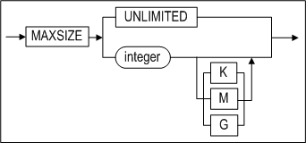

**modify_datafile_clause ::=**


**modify_autoextend_clause ::=**

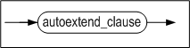

**modify_checkpoint_path_clause ::=**

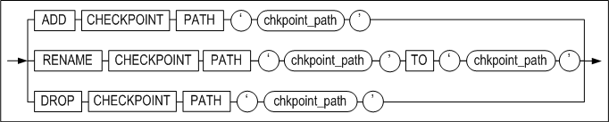

**status_clause ::=**


**backup_clause ::=**


#### 전제 조건

SYS 사용자 또는 ALTER TABLESPACE 시스템 권한을 가진 사용자가 ALTER TABLESPACE
문의 모든 기능을 수행할 수 있다.

#### 설명

ALTER TABLESPACE 문으로 디스크, 임시, 메모리 또는 휘발성 테이블스페이스의 정의를
변경한다. 또한 데이터 파일, 임시 파일, 체크포인트 경로, 자동 확장 관련 설정,
테이블스페이스 상태 등에 대해서도 변경할 수 있다.

*tablespace_name*

변경될 테이블스페이스 이름이다.

*datafile_tempfile_clause*

데이터 파일 또는 임시 파일을 추가, 삭제, 또는 변경하는 절이다.

datafile_spec, maxsize_clause, autoextend_clause에 대한 상세한 설명은 CREATE
TABLESPACE문을 참고한다.

*ADD DATAFILE \| TEMPFILE* 

데이터 파일이나 임시 파일들을 테이블스페이스에 추가하는 절이다.

*RENAME DATAFILE \| TEMPFILE* 

테이블스페이스에 속한 데이터 파일이나 임시 파일들을 새로운 이름으로 변경한다.
한번에 여러 개의 파일 이름을 변경할 수 있다. TO 뒤에 오는 새로운 이름을 가지는
파일은 미리 생성되어 있어야 한다.

*modify_datafile_clause*

디스크 테이블스페이스의 데이터 파일이나 임시 파일의 autoextend 속성과 파일
크기를 변경하는 절이다.

*modify_autoextend_clause*

메모리 또는 휘발성 테이블스페이스의 자동 확장 관련 속성(여부, 확장단위, 최대
크기)을 변경한다.

*DROP DATAFILE \| TEMPFILE* 

데이터 파일이나 임시 파일들을 테이블스페이스에서 제거하는 절이다. 한번에 하나
이상의 파일을 테이블스페이스에서 제거할 수 있다. 이 절을 수행하더라도
운영체제상의 파일이 삭제되는 것은 아니므로 이는 사용자가 수동으로 관리를 해야
한다.

*modify_checkpoint_path_clause*

체크포인트 이미지 경로를 추가, 변경, 또는 삭제하는 절이다. 체크포인트 이미지
경로 관련 연산들은 CONTROL 구동 단계에서만 가능하다.

*ADD CHECKPOINT PATH 절*

메모리 테이블스페이스에 새로운 체크포인트 경로를 추가한다. DBA는 다른 체크포인트
경로 안에 존재하는 기존의 체크포인트 이미지들을 새로운 체크포인트 경로로
이동해도 된다. 메모리 테이블스페이스를 로드할 때, Altibase는 모든 체크포인트
경로에 대해서 체크포인트 이미지 파일을 검색하기 때문에, 체크포인트 이미지는
테이블스페이스의 체크포인트 경로 중 하나에 저장되어 있으면 된다.

새로운 체크포인트 경로를 추가한 후에 체크포인트가 발생하면, 체크포인트 이미지
파일이 새로운 체크포인트 경로까지 포함한 모든 체크포인트 경로에 골고루 분배된다.

명시한 체크포인트 경로가 존재하지 않거나, Altibase 서버를 구동한 사용자 계정이
체크포인트 경로에 적절한 권한 (permission) 을 갖고 있지 않으면 에러가 발생한다.
그러므로, DBA는 추가될 체크포인트 경로를 파일 시스템 상에 직접 생성하고, 그
경로에 대한 적절한 권한을 사용자 계정에 줘야 한다.

*RENAME CHECKPOINT PATH 절*

메모리 테이블스페이스의 기존 체크포인트 경로를 TO 이하 절로 지정한 경로로
변경한다. DBA는 파일 시스템 상에서 실제 체크포인트 경로의 이름을 변경하는 작업을
직접 수행해야 한다. 해당 체크포인트 경로가 존재하지 않거나, Altibase 서버를
구동한 사용자 계정이 체크포인트 경로에 대한 적절한 권한(permission)을 갖고 있지
않으면 에러가 발생한다.

*DROP CHECKPOINT PATH 절*

메모리 테이블스페이스의 기존 체크포인트 경로를 삭제한다. DBA는 삭제된 체크포인트
경로의 디렉토리 안에 존재하는 기존의 체크포인트 이미지들을 테이블스페이스에
남아있는 다른 체크포인트 경로로 이동해야 한다. 메모리 테이블스페이스를 로드할
때, Altibase는 모든 체크포인트 경로에 대해서 체크포인트 이미지 파일을 검색하기
때문에, 체크포인트 이미지는 테이블스페이스의 체크포인트 경로 중 하나에 저장되어
있으면 된다.

파일 시스템 상에서 실제 체크포인트 경로를 삭제하는 작업은 DBA가 직접 수행하여야
한다. 메모리 테이블스페이스에는 최소한 하나의 체크포인트 경로가 존재해야 한다.
만약 메모리 테이스블스페이스에 남아있는 하나뿐인 유일한 체크포인트 경로를
제거하려고 하는 경우 에러가 발생한다.

*status_clause*

디스크 테이블스페이스와 메모리 테이블스페이스의 상태를 ONLINE, OFFLINE, 또는
DISCARD로 전이한다.

*OFFLINE*

디스크 테이블스페이스의 상태가 OFFLINE인 경우 테이블스페이스의 버퍼의 모든
데이터 페이지 내용이 데이터 파일에 기록되며, 버퍼 풀에서 무효화된다.

메모리 테이블스페이스의 경우에는 데이터의 페이지 내용이 체크포인트 이미지 파일에
기록되고, 페이지 메모리가 해제된다.

테이블스페이스의 모든 인덱스 메모리가 해제되며, 테이블에 생성된 인덱스도 사용할
수 없다. 또한 해당 테이블스페이스에 속한 테이블은 테이블스페이스가 ONLINE상태로
전이할 때까지 일시적으로 사용이 불가능한 상태가 된다.

*ONLINE*

디스크 테이블스페이스가 온라인이 되면, 그 테이블스페이스의 모든 데이터 파일에
접근 가능하며, 그 테이블스페이스 안에 속한 테이블은 다시 사용할 수 있는 상태로
된다.

메모리 테이블스페이스가 온라인이 되면, 그 테이블스페이스의 모든 데이터 페이지를
위한 메모리가 다시 할당되며, 체크포인트 이미지 파일로부터 그 메모리로 데이터가
로드된다.

만약 참조되는 테이블스페이스가 OFFLINE이면, 테이블스페이스를 ONLINE으로
전이시키는 연산은 성공하지만 그 테이블스페이스에 저장되어 있는 테이블에 접근하는
것은 불가능할 것이다.

참조되는 테이블스페이스란 디스크 테이블스페이스의 경우 테이블이 소속된
테이블스페이스와 그 테이블과 연관된 인덱스, BLOB/CLOB 칼럼, 테이블 파티션 등이
다른 테이블스페이스에 존재할 수 있는데, 이 테이블스페이스를 일컫는다.

*DISCARD*

CONTROL 구동 단계에서 디스크 테이블스페이스 또는 메모리 테이블스페이스의 상태를
디스카드(DISCARD)로 전이한다.

디스카드 된 테이블스페이스에 속한 테이블, 인덱스, BLOB/CLOB 칼럼은 사용이
불가능해진다. 또한 데이터베이스 구동 과정인 RESTART RECOVERY와 REFINE DB
단계에서 DISCARD된 테이블스페이스는 모두 무시된다.

테이블스페이스가 한번 DISCARD 되면 그 테이블스페이스는 DROP TABLESPACE로 삭제만
가능하며 ONLINE으로 돌아갈 수 없다.

*backup clause*

디스크 또는 메모리 테이블스페이스의 데이터 파일을 복사하는 온라인 백업(핫
백업)의 시작과 완료를 명시하는 구문이다.

*BEGIN BACKUP*

테이블스페이스를 구성하는 모든 데이터 파일들에 온라인 백업 모드를 설정하는
절이다. 이 구문과 END BACKUP사이에 놓인 백업 중인 테이블스페이스에도 트랜잭션의
접근이 가능하다.

사용자는 데이터 파일을 “온라인 백업”(직접 복사)하기 전에 BEGIN BACKUP을 먼저
실행해야 한다. 또한 사용자는 한 개 이상의 테이블스페이스를 동시에 온라인 백업
모드로 설정하는 것도 가능하다. 그러나 디스크 임시 테이블스페이스는 온라인 백업이
불가능하다.

*END BACKUP*

디스크 또는 메모리 테이블스페이스의 온라인 백업이 완료되었음을 명시한다.
사용자는 온라인 백업을 완료한 직후에 바로 END BACKUP 구문을 수행해야 한다.

#### 주의사항

- ALTER TABLESPACE 구문을 사용한 데이터 파일 추가 작업과 속성 변경 작업은 온라인
  모드에서 가능하고, 데이터 파일의 이름 변경은 다단계 구동 단계 중 CONTROL
  단계에서만 가능하다.
- status_clause는 임시 테이블스페이스 또는 휘발성 테이블스페이스에는 사용할 수
  없다.

#### 예제

\<질의 1\> 64 MB의 데이터 파일 tbs2.user를 user_disk_tbs 테이블스페이스에
추가하고 더 큰 공간이 필요할 때 파일이 512kB 크기씩 자동으로 증가하게 하라.

```
iSQL> ALTER TABLESPACE user_disk_tbs
    ADD DATAFILE '/tmp/tbs2.user' SIZE 64M 
    AUTOEXTEND ON NEXT 512K; 
Alter success.
```

\<질의 2\> 체크포인트시의 디스크 입출력 분산을 위해 ‘/home/path’ 체크포인트
경로를 user_memory_tbs 테이블스페이스에 추가하라. 또한, 확장 단위를 256M, 최대
크기를 1G로 변경하라. (경로 추가 작업은 CONTROL 단계에서만 가능하고, 속성 변경은
SERVICE 단계에서 할 수 있다.)

```
iSQL(sysdba)>>startup control; 
iSQL(sysdba)>>ALTER TABLESPACE user_memory_tbs ADD CHECKPOINT PATH '/home/path'; 
Alter success.

iSQL> ALTER TABLESPACE user_memory_tbs ALTER AUTOEXTEND ON NEXT 256M  MAXSIZE 1G; 
Alter success.
```

\<질의 3\> user_volatile_tbs 테이블스페이스의 확장 단위를 256M, 최대 크기를 1G로
변경하라.

```
iSQL> ALTER TABLESPACE user_volatile_tbs ALTER AUTOEXTEND ON NEXT 256M MAXSIZE
1G;
Alter success.
```


### ALTER TRIGGER 

#### 구문

**alter_trigger ::=**


#### 전제 조건

SYS 사용자, 트리거가 속한 스키마의 소유자 또는 ALTER ANY TRIGGER 시스템 권한을
가진 사용자만이 이 구문으로 트리거를 변경할 수 있다.

#### 설명

명시한 트리거의 작동을 가능, 불가능하게 하거나 컴파일 한다.

*user_name*

변경될 트리거의 소유자 이름을 명시한다. 생략하면 Altibase는 현재 세션에 접속한
사용자의 스키마에 속한 것으로 간주한다.

*trigger_name*

변경될 트리거의 이름을 명시한다.

*ENABLE*

명시한 트리거의 작동을 사용 가능하게 한다.

*DISABLE*

명시한 트리거의 작동을 불가능하게 한다.

*COMPILE*

명시한 트리거의 유효성 여부에 관계 없이 명시적으로 컴파일 한다. 명시적
재컴파일은 수행 중에 트리거가 유효하지 않은 경우 암시적으로 컴파일 하는 부하를
제거한다.

#### 예제

\<질의\> 다음 예는 명시한 트리거의 작동을 불가능하게 한다. 트리거 del_trigger를
생성하는 구문은 CREATE TRIGGER 문의 예제를 참조한다.

```
iSQL> ALTER TRIGGER del_trigger DISABLE;
Alter success.
```


### ALTER USER 

#### 구문

**alter_user ::=**


[password_parameters ::=](#password_parameters)


#### 전제 조건

SYS 사용자 또는 ALTER USER 시스템 권한을 가진 사용자만이 이 구문을 이용해서
사용자 정의를 변경할 수 있다. 그러나 현재 접속한 사용자가 자신의 암호를 변경할
때에는 권한이 필요없다.

#### 설명

사용자의 암호를 변경하는 구문이다.

*IDENTIFIED 절*

사용자의 새로운 암호를 명시한다. 새로운 암호는 BY 뒤에 지정한다.

이외 다른 절의 기능들은 CREATE USER 문의 해당하는 절과 동일하므로 CREATE USER
문을 참고한다.

*LIMIT 절*

이 절을 사용해서 어떤 계정에 대한 패스워드 관리 정책을 변경한다. 이 절은 SYS
사용자만 수행할 수 있다.
패스워드 관리 정책 변경시 명시하지 않은 기존의 정책은 초기화된다.

*ACCOUNT LOCK/UNLOCK*

이 절을 사용해서 명시적으로 어떤 계정을 잠그거나 잠금을 해제할 수 있다.

*ENABLE/ DISABLE*

사용자가 사용중인 TCP 접속을 제한할 수 있다. 이 절은 SYS 사용자만 수행할 수
있다.

#### 주의사항

- SYSDBA 모드로 접속가능한 SYS 사용자의 암호를 변경하고자 할 경우, 먼저 ALTER
  USER 문으로 암호를 변경한 후 운영체제의 콘솔 (유닉스 쉘 혹은 DOS 창)에서
  altipasswd를 실행하여 암호를 한번 더 변경해야 한다. altipasswd에 대한 자세한
  내용은 *Utilities Manual*을 참고한다.
- ALTER USER 문으로 암호를 변경한 후 server, is, 및 il 같이 암호가 고정
  삽입되어 있는 쉘 스크립트 파일 내에서도 계정의 암호를 변경해야, 오류 없이
  스크립트 파일을 실행할 수 있다.

#### 예제

\<질의\> 사용자 tom의 암호를 ab1rose로 변경하라.

```
iSQL> ALTER USER tom
    IDENTIFIED BY ab1rose;
Alter success.
```

\<질의\> 사용자의 기본 테이블스페이스를 변경하라.

```
iSQL> ALTER USER tom
  DEFAULT TABLESPACE uare_data;
Alter success.
```

\<질의\> 사용자 rose2의 패스워드 관리 정책을 변경하는 구문이다.

```
iSQL> ALTER USER rose2 LIMIT (FAILED_LOGIN_ATTEMPTS 7, PASSWORD_LOCK_TIME 7);
```

\<질의\> 사용자 rose2의 패스워드 관리 정책을 다음과 같이 변경한다. 로그인을
시도하는 횟수에 제한을 하지 않고, 계정의 잠금 상태가 10일동안 유지하도록 한다.

```
iSQL> ALTER USER rose2 LIMIT (FAILED_LOGIN_ATTEMPTS UNLIMITED,
PASSWORD_LOCK_TIME 10);
```

\<질의\> rose2 계정을 잠근 후, rose2 사용자로 접속이 되지 않은 것을 보여준다.

```
ALTER USER rose2 ACCOUNT LOCK;
iSQL> CONNECT rose2/rose2;
[ERR-31370 : The account is locked.]
```


### ALTER VIEW

#### 구문

**alter_view ::=**


#### 전제 조건

SYS 사용자, 뷰가 속한 스키마의 소유자 또는 ALTER ANY TABLE 시스템 권한을 가진
사용자만이 이 구문으로 뷰를 변경할 수 있다.

#### 설명

뷰가 유효하지 않을 때(invalid) 그 뷰를 재 컴파일 하는데 사용한다. 예를 들어,
뷰의 기반 테이블중에 하나가 ALTER TABLE 문에 의하여 정의가 변경된 경우
명시적으로 뷰를 재 컴파일 하는데 사용할 수 있다.

*user_name*

재 컴파일 될 뷰의 소유자 이름을 명시한다. 생략하면 Altibase는 현재 세션에 연결된
사용자의 스키마에 속한 것으로 간주한다.

*view_name*

재 컴파일 될 뷰의 이름을 명시한다. 뷰의 이름은 1장의 "[객체 이름
규칙](#object_name)"을 따라야 한다.

뷰를 재 컴파일 때 Altibase는 뷰 생성문을 읽어와 다시 컴파일을 수행하므로 뷰 생성
시 발생할 수 있는 오류들이 ALTER VIEW 문 수행 시에도 발생할 수 있다. 뷰를 생성할
때 FORCE 옵션을 사용했다면, ALTER VIEW 문으로 뷰를 컴파일하는데 성공한 후에도
뷰가 여전히 무효인 상태일 수 있다.

ALTER VIEW 문은 기존 뷰의 정의를 변경하지 않는다. 뷰를 재 정의하려면 CREATE OR
REPLACE VIEW 문을 사용해야 한다.

#### 예제

\<질의\> 기반 테이블 employees의 정의를 변경 후, 뷰 avg_sal 을 재 컴파일하라.
(avg_sal 뷰의 생성은 CREATE VIEW 의 예제를 참고하라.)

```
iSQL> ALTER TABLE employees
     ADD COLUMN (email VARCHAR(20));
Alter success.
iSQL> ALTER VIEW avg_sal COMPILE;
Alter success.
iSQL> SELECT * FROM avg_sal;
DNO   EMP_AVG_SAL 
---------------------
..
6 rows selected.
```


### ALTER MATERIALIZED VIEW

#### 구문

**alter_materialized_view ::=**


#### 전제 조건

아래의 사용자만이 이 구문으로 materialized view의 속성을 변경할 수 있다.

- SYS 사용자
- Materialized view의 소유자
- ALTER ANY MATERIALIZED VIEW 시스템 권한을 가진 사용자

#### 설명

ALTER MATERIALIZED VIEW 구문을 사용해서 기존 materialized view의 refresh 방법과
시기를 변경할 수 있다.

각 키워드에 대한 자세한 내용은 CREATE MATERIALIZED
VIEW  구문의 설명을 참고하라.

#### 예제

\<질의\> materialized view의 리프레쉬 방법을 변경하라.

```
ALTER MATERIALIZED VIEW mv1 REFRESH COMPLETE ON DEMAND;
```


### COMMENT

#### 구문

**comment_on ::=**


#### 전제 조건

SYS 사용자, 테이블(뷰)이 속한 스키마의 소유자, 테이블(뷰)에 대해 ALTER 객체
권한을 가진 사용자, 또는 ALTER ANY TABLE 시스템 권한을 가진 사용자만이 이
구문으로 주석을 작성할 수 있다.

#### 설명

명시된 테이블, 뷰 또는 칼럼에 대한 주석을 작성하거나 수정하는데 사용한다.

*user_name*

COMMENT 문을 실행할 객체의 소유자 이름을 명시한다. 생략하면 Altibase는 현재
세션에 연결된 사용자의 스키마에 속한 것으로 간주한다.

*table_name, view_name*

주석을 다는 테이블 혹은 뷰의 이름을 명시한다.

*column_name*

주석을 다는 칼럼 이름을 명시한다.

*comment*

주석 내용을 명시한다. 주석은 최대 4000 바이트까지 입력할 수 있다. 주석을
삭제하고자 할 때에는 작은 따옴표(‘) 사이에 주석 내용을 쓰지 말고 COMMENT 문을
실행하여 기존 내용을 지운다.

#### 예제

\<질의\> 사용자 library1의 테이블 books와 그 테이블의 title칼럼에 주석을
추가한다.

```
iSQL> COMMENT ON TABLE library1.books IS 'Table of Book Info';
Comment Created.
iSQL> COMMENT ON COLUMN library1.books.title IS 'Title of Book';
Comment Created.
```

\<질의\> 사용자 library1의 테이블 books 와 그 칼럼의 주석을 조회한다.

```
iSQL> SET VERTICAL ON;
iSQL> SELECT * FROM system_.sys_comments_ WHERE user_name = ‘LIBRARY1’ AND table_name = ‘BOOKS’;
SYS_COMMENTS_.USER_NAME   : LIBRARY1
SYS_COMMENTS_.TABLE_NAME  : BOOKS
SYS_COMMENTS_.COLUMN_NAME : TITLE
SYS_COMMENTS_.COMMENTS    : title of book

SYS_COMMENTS_.USER_NAME   : LIBRARY1
SYS_COMMENTS_.TABLE_NAME  : BOOKS
SYS_COMMENTS_.COLUMN_NAME : 
SYS_COMMENTS_.COMMENTS    : table of book info

2 rows selected.
```

\<질의\> 테이블 books와 그 테이블의 title칼럼의 주석을 제거한다.

```
iSQL> COMMENT ON TABLE library1.books IS ’’;
Comment created.
iSQL> COMMENT ON COLUMN library1.books.title IS ’’;
Comment created.
```


### CONJOIN TABLE

#### 구문

**conjoin_table ::=**


[row_movement_clause ::=](#row_movement_clause),
[tablespace_clause ::=](#tablespace_clause), [physical_attributes_clause
::=](#physical_attributes_clause), [logging_clause ::=](#logging_clause),
[lob_column_properties ::=](#lob_column_properties)

**conjoin_range_clause ::=**

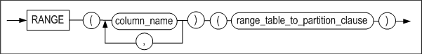

**range_table_to_partition_clause ::=**


**conjoin_list_clause ::=**


**list_table_to_partition_clause ::=**


#### 전제 조건

아래의 조건 중 하나 이상을 만족해야 테이블을 생성할 수 있다.

- SYS 사용자이다.
- 사용자 자신의 스키마에 테이블을 생성하려면, CREATE TABLE 또는 CREATE ANY
  TABLE 시스템 권한을 가지고 있어야 한다.
- 다른 사용자의 스키마에 테이블을 생성하려면, CREATE ANY TABLE 시스템 권한을
  가지고 있어야 한다.

아래의 조건 중 하나 이상을 만족해야 테이블을 제거할 수 있다.

- SYS 사용자이다.
- 테이블의 소유자이다.
- DROP ANY TABLE 시스템 권한을 가진 사용자이다.

#### 설명

1개 이상의 논 파티션드 테이블을 파티션드 테이블로 변환한다. 논 파티션드 테이블은
삭제되고 파티션드 테이블은 생성된다. 테이블들은 각각 명시된 파티션으로 변환되며
데이터는 이동한다. 테이블스페이스 옵션을 지정하지 않으면 사용자의 기본
테이블스페이스에 새 파티션드 테이블이 생성된다.

*conjoin_range_clause*

논 파티션드 테이블이 범위 파티션드 테이블로 변환된다.

*conjoin_list_clause*

논 파티션드 테이블이 리스트 파티션드 테이블로 변환된다.

*range_table_to_partition*

범위 파티션드 테이블로 변환할 대상인 논 파티션드 테이블 이름과 변환할 파티션
이름을 명시한다.

*list_table_to_partition*

리스트 파티션드 테이블로 변환할 대상인 논 파티션드 테이블 이름과 변환할 파티션
이름을 명시한다.

#### 주의 사항

- 대상 테이블과 생성되는 파티션드 테이블 이름 앞에 소유자 이름을 붙이지
  않는다.
- 파티션으로 이동한 데이터는 파티션 키 조건에 맞지 않을 수 있다.
- 새로 생성된 파티션드 테이블에 관련된 메타 테이블이 새로 생성되며, 파티션드
  테이블로 변환된 대상 테이블의 관련 메타 테이블은 모두 삭제된다.
- 대상 테이블과 관련된 PSM, 패키지, 뷰는 사용할 수 없다.
- 해시 파티션드 테이블은 지원하지 않는다.
- 생성되는 파티션드 테이블의 스키마는 대상 테이블의 스키마와 동일해야 한다.
  대상 테이블은 칼럼 개수와 이름, 순서와 자료형, in row와 compressed logging
  옵션, CHECK 및 NOT NULL 제약조건이 전부 동일해야 한다.
- 대상 테이블에 숨은 칼럼과 보안 칼럼과 압축 칼럼이 없어야 한다.
- 대상 테이블에 이벤트로 동작하는 트리거가 없어야 한다.

#### 예제

\<질의\> 테이블t1과 t2를 리스트 파티션드 테이블t3으로 변환한다.

```
iSQL> conjoin table t3
partition by list(i1)
(
  table t1 to partition p1 values (1,2,3,4,5),
  table t2 to partition p2 values default
)
tablespace tbs3;
Conjoin success.
```


### CREATE DATABASE

#### 구문

**create_database ::=**


#### 전제 조건

이 구문은 PROCESS 구동 단계에서만 수행할 수 있으므로, SYS 사용자가 –sysdba
모드로 실행한 iSQL에서만 실행할 수 있다.

#### 설명

데이터베이스를 생성하는 구문이다. 데이터베이스 생성시 딕셔너리
테이블스페이스(Dictionary Tablespace), 언두 테이블스페이스(Undo Tablespace),
임시 테이블스페이스(Temp Tablespace)등 다수의 시스템 테이블스페이스(System
Tablespace)가 만들어진다. 생성되는 시스템 테이블스페이스는 시스템에 의해 정의된
이름과 Altibase 프로퍼티의 기본값을 갖는다.

사용자 정의 테이블스페이스는 이후에 사용자가 추가로 생성할 수 있다.

데이터베이스 생성시 데이터베이스 캐릭터 셋과 내셔널 캐릭터 셋을 반드시 지정해야
한다.

*database_name*

생성할 데이터베이스 이름을 명시한다. 명시하는 데이터베이스 이름은 프로퍼티
파일에 DB_NAME프로퍼티로 지정한 이름과 동일해야 한다. 다른 경우에는 오류가
발생한다.

*INITSIZE 절*

메모리 데이터베이스의 초기 크기를 나타내며, 128M 또는 4G 등의 형식으로 사용할 수
있다. 단위 없이 숫자만 명시할 경우, 기본으로 MB(Mega Bytes) 단위로 지정된다.

디스크 데이터베이스와 관련된 시스템 테이블스페이스도 CREATE DATABASE문 수행 시에
자동으로 생성된다.

시스템 테이블스페이스에 대한 기본값들은 프로퍼티 파일에서 아래의 프로퍼티를
읽어서 결정된다.

- SYS_DATA_TBS_EXTENT_SIZE, SYS_TEMP_TBS_EXTENT_SIZE, SYS_UNDO_TBS_EXTENT_SIZE
- SYS_DATA_FILE_INIT_SIZE, SYS_TEMP_FILE_INIT_SIZE, SYS_UNDO_FILE_INIT_SIZE
- SYS_DATA_FILE_MAX_SIZE, SYS_TEMP_FILE_MAX_SIZE, SYS_UNDO_FILE_MAX_SIZE
- SYS_DATA_FILE_NEXT_SIZE, SYS_TEMP_FILE_NEXT_SIZE, SYS_UNDO_FILE_NEXT_SIZE

*ARCHIVELOG \| NOARCHIVELOG*

데이터베이스를 archive log 모드 또는 noachive log 모드로 운영할지를 명시한다.
아카이브로그 모드로 운영시 매체 복구에 대비할 수 있는 반면, 노아카이브로그
모드로 운영할 때에는 매체 복구가 불가능하다.

Altibase 백업과 복구에 대한 자세한 정보는 *Administrator’s Manual*을 참고하기
바란다.

*charset*

데이터베이스의 캐릭터 셋, 내셔날 캐릭터 셋을 지정한다.

- 지정 가능한 데이터베이스 캐릭터 셋  
  US7ASCII  
  KO16KSC5601  
  MS949  
  BIG5  
  GB231280  
  MS936  
  UTF8  
  SHIFTJIS  
  MS932  
  EUCJP
- 지정 가능한 내셔널 캐릭터 셋  
  UTF8  
  UTF16

#### 예제

\<질의\> 이름이 mydb이고, 데이터베이스 캐릭터 셋은 KSC5601, 내셔널 캐릭터 셋은
UTF16인 10MB 크기의 데이터베이스를 생성하라.

```
$ isql -s localhost -u sys -p manager -sysdba
..
iSQL> STARTUP PROCESS;
Trying Connect to Altibase.. Connected with Altibase.

TRANSITION TO PHASE: PROCESS
Command execute success.
iSQL> CREATE DATABASE mydb INITSIZE=10M 
NOARCHIVELOG 
CHARACTER SET KSC5601 
NATIONAL CHARACTER SET UTF16;
.
.
Create success.
```


### CREATE DATABASE LINK

데이터베이스 링크에 대한 내용은 DatabaseLink User's Manual을 참고한다.

### CREATE DIRECTORY

#### 구문


#### 전제 조건

SYS 사용자 또는 CREATE ANY DIRECTORY 시스템 권한을 가진 사용자만이 이 구문으로
디렉토리 객체를 생성할 수 있다.

#### 설명

저장프로시저에서 파일 조작이 가능하다는 것은 운영 체제 파일 시스템상의 텍스트
파일에 대한 읽기 및 쓰기가 가능하다는 것을 의미한다. 이 기능을 이용하여 사용자는
저장프로시저 실행에 대해서 메시지를 파일에 남길 수도 있으며, 파일로 질의 결과를
리포팅 하거나 파일로부터 데이터를 읽어와 테이블에 삽입하는 등 다양한 작업을
수행할 수 있다.

CREATE DIRECTORY구문은 이러한 저장프로시저가 사용하는 파일들이 위치하는
디렉토리에 해당하는 데이터베이스 객체를 생성하는데 사용된다.

CREATE DIRECTORY문으로 생성된 디렉토리 객체의 소유자는 항상 SYS사용자이다. 실제
디렉토리 객체를 생성한 사용자는 이 객체에 대한 읽기와 쓰기 권한(WITH GRANT
OPTION 포함)을 부여받을 뿐이다.

CREATE DIRECTORY문의 실행은 SYS_DIRECTORIES\_ 메타 테이블에 디렉토리 정보를
기록할 뿐이며, 실제 운영 체제의 파일 시스템에 디렉토리를 생성하지는 않는다.
따라서 사용자는 실제 파일 시스템에 수동으로 디렉토리를 생성해야 한다.

*OR REPLACE*

이미 존재하는 디렉토리를 대체하여 같은 이름의 새로운 디렉토리를 생성하기 위한
옵션이다. 파일 시스템상의 실제 디렉토리는 삭제되지 않는다.

*directory_name*

데이터베이스 객체로서의 디렉토리 이름을 명시한다. 디렉토리 이름은  "[객체
이름 규칙](#object_name)"을 따라야 한다.

*path_name*

운영 체제 파일 시스템 상의 디렉토리의 절대 경로를 문자열로 명시한다.

#### 예제

\<질의\> /home/altibase/altibase_home/psm_msg 디렉토리를 가리키는 alti_dir1
디렉토리 객체를 생성하라.

```
iSQL> create directory alti_dir1 as '/home/altibase/altibase_home/psm_msg';
Create success.
```

\<질의\> /home/altibase/altibase_home/psm_result 디렉토리를 가리키는 alti_dir1
디렉토리 객체를 생성하라. 이미 alti_dir1 이름의 디렉토리가 데이터베이스에
존재하는 경우 이를 대체하여 생성하라.

```
iSQL> create or replace directory alti_dir1 as '/home/altibase/altibase_home/psm_result';
Create success.
```


<a name="create_index"><a/>

### CREATE INDEX 

#### 구문

**create_index ::=**


**table_index_clause ::=**


**memory_index_clause ::=**


**disk_index_clause::=**


**domain_index_clause ::=**


**directkey_clause ::=**


**memory_index_attributes ::=**


**storage_clause ::=**


**index_partitioning_clause ::=**


**index_partition_definition ::=**

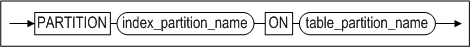

**disk_index_attributes::=**

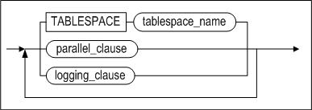

**parallel_clause ::=**


**logging_clause ::=**


**physical_attributes_clause ::=**


#### 전제 조건

SYS 사용자, CREATE INDEX 시스템 권한을 가진 사용자 또는 인덱스가 생성될 테이블에
대한 INDEX 객체 권한을 가진 사용자만이 이 구문으로 인덱스를 생성할 수 있다.

함수 기반 인덱스(Function-based indexes)를 생성하려면, 일반 인덱스와 동일한
권한이 필요하다. 다만, 수식에 사용자 정의 함수가 포함될 경우, 해당 함수는
DETERMINISTIC으로 생성된 것이어야 한다. 또한, 사용자는 함수 기반 인덱스에 사용된
다른 사용자 소유의 사용자 정의 함수에 대해 EXECUTE 객체 권한을 가지고 있어야
한다.

#### 설명

테이블의 한 개 이상의 칼럼 또는 수식에 대해 인덱스를 생성하는 구문이다. 파티션드
인덱스(즉, 로컬 인덱스)를 생성할 때 LOCALUNIQUE 옵션을 사용해서 로컬 유니크
속성을 부여할 수 있다. 디스크 파티션드 테이블에 인덱스를 생성할 때 LOCALUNIQUE
옵션 또는 LOCAL 키워드를 사용하지 않으면, 논파티션드 인덱스를 생성한다.

파티션드 인덱스는 파티션 키 칼럼과 인덱스 키 칼럼의 관계에 따라 프리픽스드
인덱스(prefixed-index)와 논프리픽스드 인덱스(non-prefixed index)로 구분된다.
파티션 키 칼럼과 인덱스 키 칼럼의 가장 왼쪽 컬럼이 같은 경우 프리픽스드
인덱스이며, 같지 않은 경우 논프리픽스드 인덱스이다.

함수 기반 인덱스는 수식을 기반으로 생성된 인덱스이다. 이 수식은 내장 SQL 함수
또는 사용자 정의 함수를 포함할 수 있다.

*user_name*

생성될 인덱스의 소유자 이름을 명시한다. 생략하면 Altibase는 현재 세션에 연결된
사용자의 스키마에 인덱스를 생성한다.

*index_name*

생성될 인덱스 이름을 명시한다. 인덱스 이름은 1장의 "[객체 이름
규칙](#object_name)"을 따라야 한다.

*UNIQUE*

중복 값을 허용하지 않는다.

*LOCALUNIQUE*

파티션드 인덱스 생성시 사용할 수 있다. 파티션드 인덱스의 각 인덱스 파티션별로
UNIQUE제약 조건을 만족해야 함을 가리킨다.

*index_expr*

여기에는 인덱스가 기반할 칼럼 또는 수식을 명시한다.

수식에는 테이블의 칼럼, 상수, SQL 함수, 및 사용자 정의 함수가 포함될 수 있다.
칼럼이 아니라 수식을 명시하는 경우, 함수 기반 인덱스가 생성된다.

함수 기반 인덱스의 제약 사항:

- 수식에는 함수 기반 인덱스가 생성될 테이블의 칼럼만 포함될 수 있다. 또한,
  칼럼 이름 앞에 스키마와 테이블 이름을 지정할 수 없다.
- 수식에는 상수(문자열 또는 숫자)가 포함될 수 있다.
- 수식에 SUM 같은 집계 함수를 사용할 수 없다.
- 수식에 포함되는 저장 프로시저에는 커서 및 %ISOPEN 등의 커서 속성, SQLCODE,
  SQLERRM 등을 사용할 수 없다.
- 글로벌 파티션드 인덱스의 경우, 수식은 파티셔닝 키가 될 수 없다.
- 함수 인자가 없더라도 모든 함수에 괄호를 명시해야 한다. 그렇지 않으면
  데이터베이스 서버가 칼럼 이름으로 인식한다.
- 수식에 완전하게 기술되지 않는 DATE 상수를 허용한다. 즉, DATE 타입 값에
  년도를 지정하지 않으면 현재 년도가 기본값이 되며, 월을 지정하지 않으면 현재
  월이 기본값이 된다. 타임 존 값은 Altibase의 DATE 타입에 지정할 수 없다.
- 수식에는 항상 동일한 값을 반환하는 내장 SQL 함수만 포함될 수 있다. 예를
  들어, SYSDATE 함수는 사용할 수 없다.
- 수식에 포함되는 사용자 정의 함수는 DETERMINISTIC으로 선언되어야 한다.
- 수식에는 부질의(subquery)가 포함될 수 없다.
- 수식에는 시퀀스가 포함될 수 없다.
- 수식에는 어떠한 의사 칼럼(pseudo column)도 포함될 수 없다.
- 수식에 PRIOR 연산자를 사용할 수 없다.
- 수식에 LOB 데이터를 사용할 수 없다.
- QUERY_REWRITE_ENABLE 프로퍼티가 1인 경우에만, 쿼리 최적화 과정에서 함수 기반
  인덱스가 선택될 수 있다.

*ASC/DESC*

각각의 인덱스 키 칼럼이 오름차순인지 내림차순인지를 지정한다.

*index_partitioning_clause*

생성될 인덱스가 파티션드 인덱스임을 명시하고, 인덱스 파티션들이 저장될
테이블스페이스를 지정하는 절이다. 이 절을 생략하면, 인덱스 파티션들은 테이블의
기본 테이블스페이스에 저장될 것이다.

파티션드 인덱스를 생성하는 가장 쉬운 방법은 인덱스 생성시 LOCAL 키워드를
명시하는 것이다. 아니면, 각 테이블 파티션별로 생성될 인덱스 파티션에 대한 속성을
상세히 명시해야 한다.

LOCAL 키워드만 명시하면, 각 테이블 파티션별로 인덱스 파티션이 자동으로 생성되며
각 인덱스 파티션의 이름은 시스템에 의해 자동으로 부여된다. 인덱스 파티션 이름은
SYS_IDX1, SYS_IDX2, ... 와 같은 형태로 순차적으로 붙여진다.

모든 테이블 파티션 또는 그 일부에 인덱스 파티션을 직접 명시할 수 있다. 일부에만
명시하는 경우 나머지 테이블 파티션에 대한 인덱스 파티션은 자동적으로 생성되며,
생성 방식은 상기와 동일하다.

파티션드 인덱스 생성시 테이블스페이스를 명시하지 않으면, 각 인덱스 파티션이
저장될 테이블스페이스는 아래 도표의 과정을 거쳐서 결정된다.


> 주의: 메모리 인덱스는 테이블스페이스에 저장되지 않으므로, 각 파티션이 저장될
> 테이블스페이스를 지정하더라도 이는 무시된다.


*BTREE*

B+-Tree 인덱스를 생성하도록 지시한다. 이는 범위 검색 시 유용하다. INDEXTYPE IS
절 생략 시 기본으로 B+-Tree 인덱스가 생성된다.

*RTREE*

R-Tree 인덱스를 생성하도록 지시한다. 이는 다차원 데이터 처리 시 유용하다.

*directkey_clause*

이 절은 Direct Key인덱스를 생성시 사용할 수 있다. Direct Key란 인덱스 노드에
저장되는 레코드이며, Direct Key 인덱스에는 레코드 포인터와 함께 실제 레코드도
저장되기 때문에 인덱스 스캔 비용을 줄일 수 있다.

- MAXSIZE integer  
  Direct Key의 최대 크기를 설정할 수 있으며, 명시하지 않을 경우 기본값은
  8바이트이다. 지원하는 데이터 타입의 MAXSIZE 값은 아래의 표를 참조한다.  
  Partial Key를 지원하는 문자형 타입은 MAXSIZE 값보다 설정 값이 큰 경우에는
  MAXSIZE만큼 prefix가 되어 Direct Key로 저장된다. 그러나 Partial Key를
  지원하지 않는 타입은 MAXSIZE 값보다 설정 값이 큰 경우 인덱스 생성에
  실패한다.

- Direct Key 인덱스의 제약사항
  - 복합 키 인덱스(Composite Index)에 Direct Key인덱스를 생성하는 경우 첫 번째
    칼럼만 Direct Key로 설정된다.
  - 압축 칼럼과 암호화 칼럼은 Direct Key 인덱스를 설정할 수 없다.
  - 디스크 인덱스에는 Direct Key 인덱스를 설정할 수 없다.

아래는 Direct Key인덱스를 지원하는 데이터 타입을 나타내는 표이다.

<table>
<tbody>
<tr>
<th>
<p>분류</p>
</th>
<th>
<p>자료형</p>
</th>
<th>
<p>MAXSIZE</p>
<p>(Full Key 지원)</p>
</th>
<th>
<p>Partial Key 지원</p>
</th>
</tr>
<tr>
<td rowspan="5" >
<p>Native 숫자형</p>
</td>
<td>
<p>BINGINT</p>
</td>
<td>
<p>8</p>
</td>
<td>
<p>X</p>
</td>
</tr>
<tr>
<td>
<p>DOUBLE</p>
</td>
<td>
<p>8</p>
</td>
<td>
<p>X</p>
</td>
</tr>
<tr>
<td>
<p>INTEGER</p>
</td>
<td>
<p>4</p>
</td>
<td>
<p>X</p>
</td>
</tr>
<tr>
<td>
<p>REAL</p>
</td>
<td>
<p>4</p>
</td>
<td>
<p>X</p>
</td>
</tr>
<tr>
<td>
<p>SMALLINT</p>
</td>
<td>
<p>2</p>
</td>
<td>
<p>X</p>
</td>
</tr>
<tr>
<td rowspan="3">
<p>Non-Native 숫자형</p>
</td>
<td >
<p>FLOAT</p>
<p>FLOAT(p)</p>
</td>
<td>
<p>23</p>
<p>3 + ( ( p + 2 ) / 2 )</p>
</td>
<td>
<p>X</p>
</td>
</tr>
<tr>
<td >
<p>NUMBER</p>
<p>NUMBER(p, s)</p>
<p>NUMBER(p)</p>
</td>
<td>
<p>23</p>
<p>3 + ( ( p + 2 ) / 2 )</p>
<p>3 + ( ( p + 2 ) / 2 )</p>
</td>
<td>
<p>X</p>
</td>
</tr>
<tr>
<td>
<p>NUMERIC</p>
<p>NUMERIC(p, s)</p>
<p>NUMERIC(p)<br /> &nbsp;(=DECIMAL)</p>
</td>
<td >
<p>23</p>
<p>3 + ( ( p + 2 ) / 2 )</p>
<p>3 + ( ( p + 2 ) / 2 )</p>
</td>
<td>
<p>X</p>
</td>
</tr>
<tr>
<td rowspan="4">
<p>문자형</p>
</td>
<td>
<p>CHAR(M)</p>
</td>
<td>
<p>M + 2</p>
</td>
<td>
<p>O</p>
</td>
</tr>
<tr>
<td>
<p>VARCHAR(M)</p>
</td>
<td>
<p>M + 2</p>
</td>
<td>
<p>O</p>
</td>
</tr>
<tr>
<td>
<p>NCHAR(M)</p>
</td>
<td>
<p>(M * 2) + 2 &lt;UTF16&gt;</p>
<p>(M * 3) + 2 &lt;UTF8</p>
</td>
<td>
<p>O</p>
</td>
</tr>
<tr>
<td>
<p>NVARCHAR(M)</p>
</td>
<td>
<p>(M * 2) + 2 &lt;UTF16&gt;</p>
<p>(M * 3) + 2 &lt;UTF8&gt;</p>
</td>
<td>
<p>O</p>
</td>
</tr>
<tr>
<td>
<p>날짜형</p>
</td>
<td>
<p>DATE</p>
</td>
<td>
<p>8</p>
</td>
<td>
<p>X</p>
</td>
</tr>
<tr>
<td rowspan="4">
<p>이진 데이터형</p>
</td>
<td>
<p>BIT(M)</p>
</td>
<td>
<p>(M / 8) + 4</p>
</td>
<td>
<p>X</p>
</td>
</tr>
<tr>
<td>
<p>VARBIT(M)</p>
</td>
<td>
<p>(M / 8) + 4</p>
</td>
<td>
<p>&nbsp;</p>
</td>
</tr>
<tr>
<td>
<p>BYTE(M)</p>
</td>
<td>
<p>M + 2</p>
</td>
<td>
<p>X</p>
</td>
</tr>
<tr>
<td>
<p>NIBBLE(M)</p>
</td>
<td>
<p>(M / 2) + 1</p>
</td>
<td>
<p>&nbsp;</p>
</td>
</tr>
</tbody>
</table>


*physical_attributes_clause*

- INITRANS 절  
  TTS(Touched Transaction Slot)의 초기 개수를 지정한다. 기본값은 8개이다.
- MAXTRANS 절  
  TTS의 최대 개수를 지정한다. 기본값은 50개이다.

*TABLESPACE 절*

인덱스가 저장될 테이블스페이스 이름을 명시한다. 이 절을 생략하면 Altibase는
인덱스를 그 인덱스가 속하는 스키마 소유자의 기본 테이블스페이스에 생성한다.
그러나 메모리 테이블에 인덱스를 생성하는 구문에는 테이블스페이스를 지정하더라도
메모리 인덱스는 테이블스페이스에 저장되지 않으므로 이는 무시된다.

*parallel_clause*

이는 인덱스를 생성하는 쓰레드의 개수를 결정하는 데 사용되는 힌트(hint)로 인덱스
생성시 성능 향상을 목적으로 사용한다. Altibase는 사용자가 힌트로 지정한
parallel_factor, 인덱스 생성 대상 테이블의 크기 및 인덱스 생성 시 사용가능한
메모리 양을 고려하여 최적화된 인덱스 생성 쓰레드의 개수를 결정한다.

parallel_factor의 입력 가능한 값의 범위는 0 \~ 512이고, 기본값은 Altibase가
동작중인 호스트 장비의 CPU 개수이다. 인덱스 생성 쓰래드 개수는 위에서 설명한
최적화 방법으로 결정되기 때문에 parallel_factor는 생략해도 무방하다.

이 구문을 생략하거나 0으로 설정한 경우, parallel_factor와 동일한 의미를 갖는
altibase.properties 파일에 설정된 INDEX_BUILD_THREAD_COUNT 프로퍼티 값이 대신
사용된다. INDEX_BUILD_THREAD_COUNT프로퍼티도 명시되어 있지 않은 경우, CPU 개수에
기반하여 최적화된 인덱스 생성 쓰레드 개수가 결정된다.

parallel_factor의 값을 실제 CPU 개수보다 큰 값으로 설정하는 경우, 혹은 최대값인
512를 초과해 설정하는 경우, CPU 개수를 힌트로 사용하여 최적화된 인덱스 생성
쓰레드 개수가 결정된다.

*logging_clause*

로깅(LOGGING) 또는 노로깅(NOLOGGING) 옵션을 사용하면 디스크 테이블을 위한
인덱스를 생성할 때 발생하는 로그를 기록하거나 기록하지 않게 할 수 있다. 기본
값은 로깅을 하는 것이며, 이는 인덱스 생성시 관련 로그가 기록됨을 의미한다.

생성된 디스크 인덱스를 강제로 디스크에 저장할 것인지 여부를 지정하려면 FORCE
또는 NOFORCE 옵션을 사용한다.

*logging_clause*에 대한 자세한 설명은 *Administrator’s Manual*의 “데이터베이스
객체 및 권한” 장의 “인덱스”를 참고한다.

*storage_clause*

사용자가 세그먼트내의 익스텐트를 관리하는 파라미터를 지정할 수 있는 구문이다.

- INITEXTENTS 절  
  세그먼트 생성시 기본으로 할당되는 익스텐트의 개수를 지정한다. 기본값은
  1이다.
- NEXTEXTENTS 절  
  세그먼트 크기 확장시마다 추가될 익스텐트 개수를 명시한다. 기본값은 1이다.
- MINEXTENTS 절  
  세그먼트의 최소 익스텐트 개수를 지정한다. 기본값은 1이다.
- MAXEXTENTS 절  
  세그먼트의 최대 익스텐트 개수를 지정한다. 명시하지 않을 경우 세그먼트 내의
  익스텐트 최대 개수는 제한이 없다.

#### 주의 사항

- 파티션드 테이블에 인덱스(즉, 파티션드 인덱스)를 생성하는 경우, 각 로컬 인덱스가
  저장될 테이블스페이스는 index_partitioning_clause 에 따로따로 지정할 수 있다.
  disk_index_attributes는 파티션드 인덱스 전체를 위한 테이블스페이스를 지정하는데
  사용될 수 없다. 즉, 파티션드 인덱스 전체를 위한 테이블스페이스는 지정할 수 없다.
  또한 로컬 인덱스는 B+-tree 인덱스일 수만 있다.
- 시스템이나 미디어 고장시 NOLOGGING(FORCE/NOFORCE) 옵션으로 생성된 인덱스의
  일관성은 보장되지 않을 수 있다. 이 경우 ‘The index is inconsistent.’라는 오류
  메시지가 발생할 것이다. 이러한 오류를 해결하려면 일관성이 깨어진 인덱스를 찾아
  삭제한 후에 해당 인덱스를 다시 생성하도록 한다. 인덱스의 일관성은
  V\$DISK_BTREE_HEADER 성능 뷰로 확인할 수 있다.

- LOB 칼럼은 인덱스 키 칼럼이 될 수 없다.


#### 예제

\<질의 1\> 사원 테이블의 eno 칼럼 (오름차순)과 dno칼럼 (내림차순)에 인덱스
emp_idx2를 생성하라.

```
iSQL> CREATE INDEX emp_idx2
    ON employees (eno ASC, dno DESC);
Create success.
```

\<질의 2\> 사원 테이블의 dno 칼럼에 내림차순의 유니크 인덱스 emp_idx2를
생성하라. (이는 사원 테이블에 레코드가 전혀 없거나 칼럼 dno에 unique한 값들만
존재 할 때 가능하다.)

```
iSQL> CREATE UNIQUE INDEX emp_idx2
    ON employees (dno DESC);
Create success.
```

\<질의 3\>테이블 employees의 eno 칼럼에 오름차순으로 B+tree 인덱스 emp_idx3를
생성하라. 이미 사원 테이블의 eno칼럼에 PRIMARY KEY가 존재하기 때문에 인덱스
emp_idx3를 생성하기 전에 기본키 제약을 삭제해야 한다. 그렇지 않으면, 다음 오류가
발생할 것이다:

```
ERR-3104C: Duplicate key columns in an index

iSQL> ALTER TABLE employees
    DROP PRIMARY KEY;
Alter success.
iSQL> CREATE INDEX emp_idx3
    ON employees (eno ASC)
    INDEXTYPE IS BTREE;
Create success.
```

\<질의 4\> user_data 테이블스페이스에 table_user 테이블의 i1칼럼에 인덱스 idx1을
생성하라.

```
iSQL> CREATE INDEX idx1
    ON table_user (i1)
    TABLESPACE user_data;
Create success.
```

\<질의 5\> user_data 테이블스페이스에 table_user 테이블의 i1 칼럼에 인덱스
idx2을 병렬 옵션으로 생성하라.

```
iSQL> CREATE INDEX idx1
    ON table_user (i1)
    TABLESPACE user_data PARALLEL 4;
Create success. 
```

\<질의 6\> 로컬 인덱스, 즉 product_id를 기준으로 각 테이블 파티션에 대응하는
파티션별로 인덱스를 생성하라. 파티션의 이름은 자동으로 부여되도록 하라.

```
CREATE INDEX prod_idx ON products(product_id) LOCAL;
```

\<질의 7\> 각각의 인덱스 파티션을 지정해서 로컬 인덱스를 생성하라.

```
CREATE INDEX prod_idx ON products(product_id) 
LOCAL
( 
  PARTITION p_idx1 ON p1 TABLESPACE tbs_disk1,
  PARTITION p_idx2 ON p2 TABLESPACE tbs_disk2,
  PARTITION p_idx3 ON p3 TABLESPACE tbs_disk3 
);
```

\<질의 8\> 인덱스 파티션 일부만 지정해서 로컬 인덱스를 생성하라. 지정하지 않은
파티션은 자동으로 결정된다.

```
CREATE INDEX prod_idx ON products(product_id) 
LOCAL
( 
  PARTITION p_idx1 ON p1 TABLESPACE tbs_disk1,
  PARTITION p_idx3 ON p3 TABLESPACE tbs_disk3 
);
```

\<질의 9\> 테이블 employees의 사원번호(eno)에 인덱스 idx1을 생성하되 시스템
고장이나 미디어 고장이 발생하더라도 사용할 수 있게 LOGGING 옵션을 사용하라.
Employees 테이블이 디스크 테이블스페이스에 있다고 가정한다.

```
iSQL> CREATE INDEX idx1
    ON employees (eno);
Create success.

또는

iSQL> CREATE INDEX idx1
    ON employees (eno) LOGGING ;
Create success.
```

\<질의 10\> 테이블 employees의 eno 칼럼(오름차순)과 dno칼럼(오름차순)에 인덱스
idx1을 NOLOGGING 옵션으로 생성하라. 단, 인덱스 생성 후 시스템 고장이
발생하더라도 인덱스가 사용가능하도록 FORCE옵션을 사용하라. Employees 테이블이
디스크 테이블스페이스에 있다고 가정한다.

```
iSQL> CREATE INDEX idx1
    ON employees (eno ASC, dno ASC)
    NOLOGGING;
Create success.

또는
사원번호(eno): ASC
부서번호(dno): ASC
iSQL> CREATE INDEX idx1
    ON employees (eno ASC, dno ASC)
    NOLOGGING FORCE;
Create success.
```

\<질의 11\> 테이블 employees의 eno 칼럼(오름차순)과 dno칼럼(오름차순)에 인덱스
idx1을 NOLOGGING 옵션으로 생성하고, 디스크에 반영하지 않게 NOFORCE옵션을
사용하라. Employees 테이블이 디스크 테이블스페이스에 있다고 가정한다.

```
iSQL> CREATE INDEX idx1
    ON employees (eno ASC, dno ASC)
    NOLOGGING NOFORCE;
Create success.
```

\<질의 12\> 디스크 테이블스페이스 USERTBS의 LOCAL_TBL 테이블에 인덱스
LOCAL_IDX를 생성하라. 단, 인덱스 생성시 익스텐트 1개가 할당되고 인덱스 세그먼트
크기 확장시마다 2개씩 증가되며, 세그먼트의 총 익스텐트 개수는 제한하지 않는다.

```
iSQL> CREATE INDEX LOCAL_IDX ON LOCAL_TBL ( I1 ) 
 TABLESPACE USERTBS
 STORAGE ( INITEXTENTS 1 NEXTEXTENTS 2 MAXEXTENTS UNLIMITED );
Create success.
```

\<질의 13\> employees 테이블의 salary 칼럼을 사용해서 연봉에 기반한 함수 기반
인덱스를 생성하라.

```
iSQL> CREATE INDEX income_idx ON employees (salary*12);
Create success.
```

\<질의 14\> 사용자 정의 함수를 사용해서 \<질의 13\>과 동일한 인덱스를 생성하라.

```
CREATE OR REPLACE FUNCTION get_annual_salary
(salary in integer) 
RETURN integer
DETERMINISTIC
AS
BEGIN
    RETURN salary*12;
END;
/

iSQL> CREATE INDEX income_idx ON employees(sys.get_annual_salary(salary));
Create success.
```

\<질의 15\> 테이블 employees의 eno 칼럼에 Direct Key 인덱스를 생성하라.

```
iSQL> CREATE INDEX direct_idx ON employees ( eno ) DIRECTKEY ;
Create success.
```

\<질의 16\> 테이블 tab1의 name 칼럼(varchar(100))에 32바이트의 레코드를 저장할
수 있는 Direct Key 인덱스를 생성하라.

```
iSQL> CREATE INDEX idx1 ON tab1 ( name ) DIRECTKEY MAXSIZE 32;
Create success.
```


### CREATE JOB 

#### 구문

**create_job ::=**


**execute_procedure_statement ::=**


**start_end_clause ::=**


**interval_clause ::=**


#### 전제 조건

SYS 사용자만이 이 구문으로 JOB을 생성할 수 있다. 생성된 JOB을 수행하려면 JOB을
생성 시 또는 생성 후에 반드시 ENABLE로 활성화해야 한다.

#### 설명

CREATE JOB 구문으로 작업 스케줄러에서 관리할 JOB을 생성할 수 있다. 생성하는
각각의 JOB은 실행할 프로시저와 시작 시간, 끝나는 시간 및 실행 주기 등의 일정을
지정할 수 있다.

*execute_procedure_statement*

JOB에 등록할 프로시저의 실행 구문을 명시한다. JOB 한 개에 한 개의 프로시저만
등록할 수 있다. 프로시저의 사용자 이름은 생략할 수 있으며, SYS 사용자로
간주한다. expr2에는 명시한 프로시저를 실행하기 위한 입력 인자 값을 상수 또는
수식으로 지정한다.

프로시저에 대한 자세한 설명은 *Stored Procedures Manual*을 참조한다.

*start_end_clause*

JOB을 실행하는 시작 시간과 끝나는 시간을 설정할 수 있다. expr1에는 DATE 타입의
값 또는 수식만 올 수 있다.

*interval_clause*

JOB이 처음 실행된 이후에 다음에 반복적으로 실행할 주기를 명시한다. 시간 단위는
number 다음에 명시되는 YEAR, MONTH, DAY, HOUR, MINUTE에 따라 결정된다.

*ENABLE/DISABLE*

사용자가 각각의 JOB을 ENABLE/DISABLE을 선택하여 작업 스케줄러에서 수행 여부를
설정할 수 있다. 생략하면, 기본값은 DISABLE이다.

*COMMENT*

JOB에 대한 설명을 기술할 수 있다.

#### 주의 사항

아래는 JOB을 사용하는 관리자가 염두에 두어야 할 사항들이다.

- 입출력 모드가 OUT 또는 INOUT인 인자를 가진 저장 프로시저는 JOB에 등록될 수
  없다.
- 작업 스케줄러에 의해 JOB이 실행되려면 JOB_SCHEDULER_ENABLE 프로퍼티가
  1이어야 하며, JOB_THREAD_COUNT 프로퍼티가 0보다 커야 한다.
- JOB으로 수행되는 프로시저에서 오류가 발생하는 경우, QP_MSGLOG_FILE
  프로퍼티에 설정된 트레이스 로그 파일(기본:
  \$ALTIBASE_HOME/trc/altibase_qp.log)로 에러 메시지 등의 로그가 저장된다.
- 프로시저 내에 SYSTEM_.PRINTLN 같은 출력 함수가 사용된 경우, QP_MSGLOG_FILE
  프로퍼티에 설정된 트레이스 로그 파일(기본:
  \$ALTIBASE_HOME/trc/altibase_qp.log)로 출력 내용이 기록된다.

#### 예제

\<질의\> 현재부터 시작되어 한 달에 한 번 주기로 proc1 프로시저를 실행하는 job1을
생성하라 (job1의 상태는 DISABLE이다).

```
iSQL> CREATE JOB job1 EXEC proc1 START sysdate INTERVAL 1 MONTH;
Create success.
```

\<질의\> 2016년 8월 1일부터 8월 31일까지 매일 00:00:00에 proc 프로시저를
수행하는 job2을 생성하고, job2의 상태를 활성화(ENABLE)하라.

```
iSQL> CREATE JOB job2 EXEC proc
START to_date('2016/08/01 00:00:00', 'YYYY-MM-DD HH:MI:SS')
END to_date('2016/08/31 00:00:00', 'YYYY-MM-DD HH:MI:SS')
INTERVAL 1 DAY
ENABLE;
Create success.
```


### CREATE QUEUE 

#### 구문

**create_queue ::=**


[column_definition ::=](#column_definition)

#### 전제 조건

아래의 조건 중 하나 이상을 만족해야 테이블을 생성할 수 있다.

- SYS 사용자이다.
- 사용자 자신의 스키마에 테이블을 생성하려면, CREATE TABLE 또는 CREATE ANY
  TABLE 시스템 권한을 가지고 있어야 한다.
- 다른 사용자의 스키마에 테이블을 생성하려면, CREATE ANY TABLE 시스템 권한을
  가지고 있어야 한다.

#### 설명

큐에 삽입 가능한 최대 메시지의 길이를 지정하거나 사용자가 직접 칼럼을 정의하여
큐를 생성하는 구문이다. 큐 테이블에 저장 가능한 최대 레코드 수도 지정할 수 있다.

*queue_name*

큐의 이름을 지정한다. 최대로 가능한 큐 이름의 길이는 28 바이트이다.

*size*

큐에 저장될 메시지의 최대 크기(단위: 바이트)를 지정한다. 지정 가능한 값의 범위는
1에서 32000바이트이다.

*FIXED\|variable_clause*

메시지의 저장 방식을 지정한다. (자세한 설명은 *General Reference*를 참고한다.)

*column_definition*

사용자 정의 칼럼을 지정한다.

*MAXROWS count*

큐 테이블에 저장 가능한 최대 레코드 수를 지정한다. 지정 가능한 값의 범위는 1에서
4294967295(232-1)이며, 생략할 경우 기본값은 최대값인 4294967295이다.

#### 주의사항

- 큐 생성시에 데이터베이스 내부적으로 “큐 이름”+ “_NEXT_MSG_ID”라는 명칭의 테이블 객체가 생성된다. 따라서 생성 하고자 하는 큐의 이름 또는 “큐 이름”+ “_NEXT_MSG_ID”과 동일한 이름의 테이블, 뷰, 시퀀스, 시노님, 또는 저장 프로시저가 이미 존재하는 경우에 에러가 발생한다.


#### 예제

\<질의\> 메시지의 길이가 최대 40이고, 최대 레코드 개수가 1,000,000인 Q1이라는
이름의 큐를 생성하라.

```
iSQL> CREATE QUEUE Q1(40) MAXROWS 1000000;
Create success.
```

\<질의\> 'Q1' 이름의 큐를 생성할 때, numeric(5,2) 타입의 값을 저장할 수 있는
2개의 칼럼을 생성하라.

```
iSQL> CREATE QUEUE Q1(c1 numeric(5,2), c2 numeric(5,2));
Create success.
```

\<질의\> 사용자 칼럼을 정의한 'Q2' 이름의 큐를 생성하고, 해당 칼럼에 메세지를
입력 후, 삭제하라.

```
iSQL> CREATE QUEUE Q2(V1 VARCHAR(10), V2 INTEGER, V3 NUMERIC(5,3));
Create success.

iSQL> ENQUEUE INTO Q2(V1, V2, V3) VALUES ('abc', 1, 99.999);
1 row inserted.

iSQL> DEQUEUE V1, V2, V3 FROM Q2;
V1          V2          V3
----------------------------------------
abc         1           99.999
1 row selected.
```


### CREATE REPLICATION 

#### 구문

**create_replication ::=**


**option_clause ::=**


**replication_item ::=**


#### 전제 조건

SYS 사용자만이 이중화 객체를 생성할 수 있다.

#### 설명

이중화 객체를 생성하는 구문으로, 이는 지역 서버에서 원격 서버로의 이중화 연결을
설정한다. 이중화는 테이블 간에 1:1 로 일어난다. 즉, 한 테이블은 상대편의 오직
하나의 테이블에만 매칭된다.

데이터 충돌을 해결하기 위해 이중화 생성 구문에 AS MASTER 또는 AS SLAVE를
지정하여 Master-Slave scheme을 사용할 수 있다. 이중화 충돌 해결에 대한 자세한
내용은 *Replication Manual*을 참고한다.

*replication_name*

이중화 이름을 명시한다. 지역 서버와 원격 서버의 이중화 객체의 이름이 동일해야
한다. 이중화 이름은 "[객체 이름 규칙](#object_name)"을 따라야 한다.

*FOR ANALYSIS \| FOR ANALYSIS PROPAGATION*

XLog Sender를 생성한다. 자세한 설명은 *Log Analyzer User’s Manual*을 참고한다.

*FOR PROPAGABLE LOGGING*

이중화 수신자가 지역 서버로부터 전송 받은 로그를 다른 서버로 복제하기 위해
로그를 기록한다. 이 기능은 recovery option과 함께 사용하지 않는다.

*FOR PROPAGATION*

복제된 로그를 이중화된 다른 서버로 전송한다.

*option_clause*

이중화 객체의 RECOVERY, OFFLINE, GROUPING, PARALLEL, GAPLESS 옵션을 지정하는
절이다.

이 기능은 각각 데이터 복구를 위해 사용되거나, 오프라인 이중화 수행시 사용된다.
또한 성능을 위하여 이중화 트랜잭션을 그룹화하거나 병렬 적용자 옵션을 지정할 때
사용할 수 있다. 이중화 격차를 일정 수준 이하로 유지하기 위하여 갭 해소(GAPLESS)
옵션도 지정할 수 있다. 자세한 설명은 *Replication Manual*을 참고한다.

*replication_host_ip*

원격 서버의 IP 주소를 입력한다.

*replication_host_port_no*

원격 서버의 수신 쓰레드가 사용하는 포트번호를 입력한다. 이는 원격 서버
altibase.properties 파일의 REPLICATION_PORT_NO프로퍼티 값과 일치해야 한다.

*USING conn_type [ib_latency]*

원격 서버와의 통신방법(TCP 또는 InfiniBand)을 설정할 수 있다. 인피니밴드를
사용할 경우에만 ib_latency 값을 설정할 수 있다. 인피니밴드를 사용하려면
IB_ENABLE 프로퍼티 값이 1이어야 한다.

*user_name*

이중화 대상 테이블의 소유자 이름을 명시한다.

*tbl_name*

이중화 대상 테이블 이름을 명시한다.

*partition_name*

이중화 대상 파티션 이름을 명시한다.

#### 예제

\<질의\> 다음 조건에 부합하는 이중화 *rep1*을 생성하라.

- 지역 서버의 IP 주소가 192.168.1.60 이고 포트 번호가 25524
- 원격 서버의 IP 주소가 192.168.1.12 이고 포트 번호가 35524
- employees 테이블과 departments 테이블을 이중화

지역 서버의 경우 (IP: 192.168.60)

```
iSQL> CREATE REPLICATION rep1
    WITH '192.168.1.12',35524
    FROM sys.employees TO sys.employees,
    FROM sys.departments TO sys.departments;
Create success.
```

원격 서버의 경우 (IP: 192.168.1.12)

```
iSQL> CREATE REPLICATION rep1
    WITH '192.168.1.60',25524
    FROM sys.employees TO sys.employees,
    FROM sys.departments TO sys.departments;
Create success. 
```

\<질의\> 원격 서버가 이중화 rep1의 로그를 수신 후, 다른 원격 서버로 로그를
복제하여 전송하기 위한 이중화 rep2를 생성하여 전송한다.

```
iSQL> CREATE REPLICATION rep1 
    FOR PROPAGABLE LOGGING WITH '192.168.1.12',35524
    FROM sys.t1 TO sys.t1;
iSQL> SELECT replication_name, role 
    FROM system_.sys_replications_;
REPLICATION_NAME                          ROLE
---------------------------------------------------------
REP1                                      2
1 row selected.

iSQL> CREATE REPLICATION rep2
    FOR PROPAGATION WITH '192.168.1.60',25524 
    FROM sys.t1 TO sys.t1;
Create success.
iSQL> SELECT replication_name, role 
    FROM system_.sys_replications_;
REPLICATION_NAME                          ROLE
---------------------------------------------------------
REP2                                      3
1 row selected.
```


### CREATE ROLE

#### 구문

**create_role ::=**


#### 전제 조건

SYS 사용자와 CREATE ROLE 시스템 권한을 가진 사용자만이 롤(ROLE)을 생성할 수
있다.

#### 설명

명시된 이름으로 새로운 롤(ROLE)을 생성한다. 사용자에게 부여할 수 있는
권한(privilege)들의 묶음을 롤이라고 한다.

처음 롤을 생성하면 롤에는 아무런 권한이 없다. GRANT 구문을 사용해서 롤에
권한들을 추가한 다음, 롤을 사용자에게 부여하도록 한다. 사용자가 롤에 의해 부여된
권한을 사용하려면 데이터베이스에 다시 접속해야 한다.

롤에 부여할 수 있는 권한은 시스템 권한과 객체 권한이며, 이에 대한 사용 방법은
GRANT 예제와 REVOKE 예제를 참조한다.

*role_name*

생성될 롤의 이름을 명시한다. 이름은 데이터베이스 내에서 유일해야 한다.

#### 예제

\<질의\> 이름이 alti_role인 롤을 생성한다.

```
iSQL> CREATE ROLE alti_role;
Create success.
```


### CREATE SEQUENCE 

#### 구문

**create_sequence ::=**

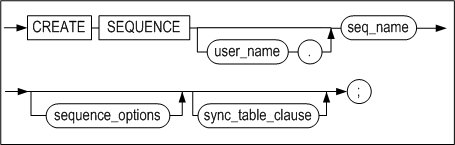

**sequence_options ::=**


**sync_table_clause ::=**


#### 전제 조건

SYS 사용자 또는 CREATE SEQUENCE 시스템 권한을 가진 사용자만이 이 구문으로
시퀀스를 생성할 수 있다. 만약 다른 사용자의 스키마에 시퀀스를 생성하려면, CREATE
ANY SEQUENCE 권한을 가져야한다.

#### 설명

이 구문은 명시된 시퀀스 이름으로 새로운 시퀀스를 생성한다. 생성된 시퀀스는
시퀀스 번호를 자동으로 생성하는데 사용된다.

*user_name*

생성될 시퀀스의 소유자 이름을 명시한다. 생략하면 Altibase는 현재 세션에 연결된
사용자의 스키마에 시퀀스를 생성한다.

*seq_name*

생성될 시퀀스 이름을 명시한다. 시퀀스 이름은 "[객체 이름
규칙](#object_name)"을 따라야 한다.

*START WITH*

시퀀스의 시작값을 명시한다. 이는 MINVALUE와 MAXVALUE 사이의 값으로 지정
가능하다. 이 값이 생략되고 INCREMENT BY의 값이 0보다 크면, 기본값은 시퀀스의
최소값과 동일하다. 이 값이 생략되고 INCREMENT BY의 값이 0보다 작으면, 기본값은
시퀀스의 최대값과 동일하다.

*INCREMENT BY*

시퀀스의 증감분을 명시한다. 기본값은 1이다. 이 값의 절대값은 MAXVALUE와
MINVALUE의 차이보다 작아야 한다.

*MAXVALUE*

시퀀스의 최대값을 명시한다. 이는 -9223372036854775805부터
9223372036854775806까지의 범위내에서 지정 가능하다. 생략할 경우, INCREMENT BY의
값이 0보다 크면 기본값은 9223372036854775806이다. INCREMENT BY의 값이 0보다
작으면, 기본값은 -1이다.

*MINVALUE*

시퀀스의 최소값을 명시한다. 이는 -9223372036854775806부터
9223372036854775805까지의 범위내에서 지정 가능하다. 생략할 경우, INCREMENT BY의
값이 0보다 크면 기본값은 1이다. INCREMENT BY의 값이 0보다 작으면, 기본값은
-9223372036854775806이다.

*CYCLE*

이는 시퀀스가 최대값 또는 최소값 한계에 도달했을 때 다음 시퀀스 값을 계속
생성할지 여부를 지정하는 옵션이다. 오름차순 시퀀스의 경우는 시퀀스의 다음 값은
최소값에서 다시 순환되고, 내림차순 시퀀스의 경우는 최대값부터 다시 순환된다.

*CACHE*

시퀀스 값을 더 빠르게 액세스 하기 위하여 명시된 개수 만큼의 시퀀스 값들이
메모리에 캐시된다. 캐시는 시퀀스가 처음 참조될 때 채워지며 다음 시퀀스 값을
요청할 때마다 캐시된 시퀀스에서 검색된다. 캐시된 마지막 시퀀스 값을 사용한
이후의 다음 시퀀스 값 요청시에 시퀀스 값들이 메모리에 캐시된다. 이 값을 생략하면
기본값은 20이다.

*ENABLE \| DISABLE SYNC TABLE*

시퀀스를 이중화하기 위한 시퀀스 이중화용 테이블을 생성할 것인지 여부를 지정한다.

- ENABLE: 시퀀스 이중화용 테이블을 생성한다. 테이블의 이름은 [sequence
  이름]\$seq로 자동 부여된다.
- DISABLE: 시퀀스 이중화용 테이블을 생성하지 않는다.

이 옵션을 명시하지 않으면 기본적으로 시퀀스 이중화용 테이블이 생성되지 않는다.

#### 주의 사항

- 새로 생성된 시퀀스에 대한 *sequence_name.*CURRVAL시도는 실패한다.
  *sequence_name.*CURRVAL로 새로 생성된 시퀀스에 접근하려면 먼저
  *sequence_name.*NEXTVAL을 사용해야만 한다.
- 시퀀스 이름의 길이가 36 바이트 이하여야 시퀀스 이중화용 테이블을 생성할 수 있다.


#### 예제

다음 SQL문들을 이용하여 새로운 시퀀스를 정의하고 시퀀스 값과 정보를 확인해본다.

```
iSQL> CREATE TABLE seqtbl(i1 INTEGER);
Create success.
iSQL> CREATE OR REPLACE PROCEDURE proc1
AS
BEGIN
  FOR i IN 1 .. 10 LOOP
    INSERT INTO seqtbl VALUES(i);
  END LOOP;
END;
/
Create success.
iSQL> EXEC proc1;
Execute success.
```

\<질의\> 다음 SQL문을 이용하여 시퀀스 객체로부터 정보를 확인한다.

```
iSQL> select * from v$seq;
```

이 구문은 생성되어 있는 모든 시퀀스 객체에 대한 정보를 읽어 들인다. Select \*
from seq와 달리 다른 사용자의 시퀀스 정보도 확인할 수 있다. V\$SEQ 성능 뷰에
대한 자세한 내용은 *General Reference*의 데이터 딕셔너리 장의 성능 뷰 절을
참고한다.

\<질의\> 13 부터 시작해서 3씩 증가하고 최소값이 0, 최대값이 무한대인
seq1시퀀스를 생성하라.

```
iSQL> CREATE SEQUENCE seq1
  START WITH 13
  INCREMENT BY 3
  MINVALUE 0 NOMAXVALUE;
Create success.

iSQL> INSERT INTO seqtbl VALUES(seq1.NEXTVAL);
1 row inserted.
iSQL> INSERT INTO seqtbl VALUES(seq1.NEXTVAL);
1 row inserted.
iSQL> SELECT * FROM seqtbl;
SEQTBL.I1   
--------------
1           
2           
3           
4           
5           
6           
7           
8           
9           
10          
13          
16          
12 rows selected.
```

\<질의\> 시퀀스 seq1을 50씩 증가 시키되 최대값 100에 도달한 경우에는 다시
최소값부터 시작하도록 변경하라.

```
iSQL> ALTER SEQUENCE sys.seq1
  INCREMENT BY 50
  MAXVALUE 100
  CYCLE;
Alter success.

iSQL> INSERT INTO sys.seqtbl VALUES(seq1.NEXTVAL);
1 row inserted.
iSQL> INSERT INTO sys.seqtbl VALUES(seq1.NEXTVAL);
1 row inserted.
iSQL> INSERT INTO sys.seqtbl VALUES(seq1.NEXTVAL);
1 row inserted.
iSQL> INSERT INTO sys.seqtbl VALUES(seq1.NEXTVAL);
1 row inserted.
iSQL> SELECT * FROM sys.seqtbl;
SEQTBL.I1   
--------------
1           
2           
3           
4           
5           
6           
7           
8           
9           
10          
13          
16          
66          
0           
50          
100         
16 rows selected.
```

\<질의\> 새 번호 생성 전에 시퀀스 seq1의 현재 값을 확인하라.

```
iSQL> SELECT seq1.CURRVAL FROM dual;
SEQ1.CURRVAL         
-----------------------
100                   
1 row selected.
```

\<질의\> 칼럼 i1의 값을 seq1 시퀀스의 다음 값인 0으로 갱신하라.

```
iSQL> UPDATE SEQTBL SET i1 = seq1.NEXTVAL;
16 rows updated.
```

\<질의\> 시퀀스 seq1의 현재 값을 확인하라.

```
iSQL> SELECT seq1.CURRVAL FROM dual;
SEQ1.CURRVAL         
-----------------------
0                   
1 row selected.
```

\<질의\> 빠른 액세스를 위해 명시된 값 (25개) 만큼 시퀀스 값들을 메모리에
캐시하도록 시퀀스 seq1을 변경하라.

```
iSQL> ALTER SEQUENCE seq1
INCREMENT BY 2
MAXVALUE 200
CACHE 25;
Alter success.

iSQL> CREATE OR REPLACE PROCEDURE proc2
AS
BEGIN
  FOR i IN 1 .. 30 LOOP
    INSERT INTO sqqtbl VALUES(seq1.NEXTVAL);
  END LOOP;
END;
/
Create success.
iSQL> EXEC proc2;
Execute success.
iSQL> SELECT * FROM seqtbl;
SEQTBL.I1   
--------------
0           
50          
100         
0           
50          
100         
0           
50          
100         
0           
50          
100         
0           
50          
100         
0           
2           
4           
6           
8           
10
12
14          
.
.
.         
58          
60          
46 rows selected.
```

<질의> SYS 계정으로 데이터베이스에 접속한 경우 아래 쿼리는 모든 시퀀스들의 정보를
출력한다.

```
iSQL> SELECT * FROM SEQ;
USER_NAME 
--------------------------------------------
SEQUENCE_NAME      CURRENT_VALUE      INCREMENT_BY 
------------------------------------------------
MIN_VALUE          MAX_VALUE          CYCLE             CACHE_SIZE 
------------------------------------------------
SYS 
SEQ1               60                 2 
0                  200                YES               25 
1 row selected.
```

<질의> 다음 SQL문들을 이용하여 여러 계정에서 새로운 시퀀스를 정의하고 시퀀스 값과
정보를 확인해본다.

```
iSQL> CONNECT sys/manager;
Connect success.
iSQL> CREATE USER user1 IDENTIFIED BY user1;
Create success.
iSQL> CREATE USER user2 IDENTIFIED BY user2;
Create success.
iSQL> CONNECT user1/user1;
Connect success.
iSQL> CREATE SEQUENCE seq1 MAXVALUE 100 CYCLE;
Create success.
iSQL> CREATE SEQUENCE seq2;
Create success.
```

\<질의\> user1이 생성한 모든 시퀀스의 정보를 출력한다.

```
iSQL> SELECT * FROM SEQ;
SEQUENCE_NAME                             CURRENT_VALUE   INCREMENT_BY    
------------------------------------------------
MIN_VALUE              MAX_VALUE              CYCLE           CACHE_SIZE      
------------------------------------------------
SEQ1                                      1               1               
1                      100                    YES             20              
SEQ2                                      1               1               
1                      9223372036854775806    NO              20              
2 rows selected.
iSQL> CONNECT user2/user2;
Connect success.
iSQL> CREATE SEQUENCE seq1 INCREMENT BY -30;
Create success.
iSQL> CREATE SEQUENCE seq2 INCREMENT BY -10 MINVALUE -100;
Create success.
iSQL> CONNECT sys/manager;
Connect success.
iSQL> CREATE SEQUENCE seq2 START WITH 20 INCREMENT BY 30;
Create success.
iSQL> CREATE SEQUENCE seq3 CACHE 40;
Create success.
```

\<질의\> SYS 계정으로 데이터베이스에 접속한 경우 아래 쿼리는 모든 시퀀스의
정보를 출력한다.

```
iSQL> SELECT * FROM SEQ;
USER_NAME 
--------------------------------------------
SEQUENCE_NAME      CURRENT_VALUE         INCREMENT_BY 
------------------------------------------------
MIN_VALUE          MAX_VALUE             CYCLE              CACHE_SIZE 
------------------------------------------------
SYS 
SEQ1               60                    2 
0                  200                   YES                25 
SYS 
SEQ2               20                    30 
1                  9223372036854775806   NO                 20 
SYS 
SEQ3               1                     1 
1                  9223372036854775806   NO                 40 
USER1 
SEQ1               1                     1 
1                  100                   YES                20 
USER1 
SEQ2               1                     1 
1                  9223372036854775806   NO                 20 
USER2 
SEQ1               -1                    -30 
-9223372036854775806 -1                  NO                 20 
USER2 
SEQ2               -1                    -10 
-100               -1                    NO                 20 
7 rows selected.
```

\<질의\> 캐시의 크기가 100이고 시퀀스 이중화용 테이블을 생성하는 시퀀스 seq1를
생성하라.

```
CREATE SEQUENCE seq1 CACHE 100 ENABLE SYNC TABLE;
```


### CREATE SYNONYM 

#### 구문

**create_synonym ::=**


#### 전제 조건

아래의 조건 중 하나 이상을 만족해야 한다.

- SYS 사용자이다.
- 사용자 자신의 스키마에 시노님을 생성하려면, CREATE SYNONYM 또는 CREATE ANY
  SYNONYM 시스템 권한을 가지고 있어야 한다.
- 다른 사용자의 스키마에 시노님을 생성하려면, CREATE ANY SYNONYM 시스템 권한을
  가지고 있어야 한다.
- PUBLIC 시노님 생성하려면, CREATE PUBLIC SYNONYM 시스템 권한을 가지고 있어야
  한다.

#### 설명

이 구문은 시노님을 생성하는 SQL문으로, 시노님이란 다음 객체들에 대한 별칭을
의미한다.

- 테이블
- 뷰
- 시퀀스
- 저장 프로시저 및 저장 함수
- 다른 시노님

다음 SQL문에서 시노님을 사용할 수 있다.

| DML 문                                                       | DDL 문             |
| ------------------------------------------------------------ | ------------------ |
| SELECT <br />INSERT <br />UPDATE <br />DELETE <br />MOVE <br />LOCK TABLE <br />MERGE <br />ENQUEUE <br />DEQUEUE | GRANT <br />REVOKE |

*OR REPLACE*

이 절은 시노님이 이미 존재한다면 재생성 할 것을 지정한다. 이 절을 사용하면
사용자가 시노님을 먼저 삭제하지 않고도 존재하는 시노님의 정의를 변경할 수 있다.

*PUBLIC 시노님과 PRIVATE 시노님*

PUBLIC 시노님은 모든 사용자가 사용할 수 있는 시노님이며, PRIVATE 시노님은 그
시노님의 소유자만 사용할 수 있는 시노님이다.

PUBLIC 시노님을 생성하려면 이 구문에 PUBLIC을 명시해야 한다. 이를 명시하지
않으면 기본으로 PRIVATE 시노님이 생성된다.

*user_name*

시노님 앞에 위치하는 사용자명은 시노님 소유자명이다.

PUBLIC 시노님을 생성하는 경우에는 소유자명을 명시하지 않는다.

PRIVATE 시노님을 생성하는 경우에 소유자명을 명시할 수 있다. 소유자명을 명시하지
않을 경우 시노님은 CREATE SYNONYM문을 수행하는 세션에 연결된 사용자의 스키마에
생성된다.

*synonym_name*

생성할 시노님 이름과 동일한 이름의 테이블, 뷰, 시퀀스, 저장프로시저, 저장함수,
또는 다른 시노님이 존재할 경우에는 오류가 반환된다. 시노님은 이들 객체와 동일한
이름 영역 (namespace)에 저장되므로, 시노님의 이름은 자신이 속할 스키마 내에서
유일해야 한다. 시노님의 이름은  "[객체 이름 규칙](#object_name)"을
따라야 한다.

*FOR clause*

별칭을 제공할 대상 객체를 명시하는 절이다.

*user_name*

별칭을 제공할 대상 객체의 소유자명을 명시한다. 지정하지 않을 경우에 Altibase는
현재 세션에 접속되어 시노님을 생성하고 있는 사용자의 스키마에 속하는 것으로
간주한다.

*object_name*

별칭을 제공할 대상 객체명을 명시한다.

만약 그 객체가 데이터베이스 내에 존재하지 않더라도 시노님 생성 시에는 오류가
리턴되지 않고 시노님 생성은 성공한다. 즉, 시노님 생성시에는 대상 스키마 객체가
현재 존재하지 않아도 되며, 별칭을 제공할 객체에 대한 권한이 없어도 된다.

#### 권한과 시노님

시노님에 대한 DML문을 수행하기 위해서는 사용자가 시노님의 대상 객체에 대한 DML
실행 권한을 가지고 있어야 한다.

시노님에 대하여 DML 실행 권한을 부여 또는 박탈할 때, 실제로는 시노님의 대상이
되는 객체에 그 권한이 부여되거나 박탈된다.

따라서 시노님에 대한 DML문 수행 시 권한 오류가 발생하는 경우, 시노님 대상 객체에
대한 DML 실행 권한이 사용자에게 부여되어 있는지 SYS_GRANT_SYSTEM\_ 또는
SYS_GRANT_OBJECT 메타 테이블에서 확인해야 한다. 사용자에게 적절한 권한이 없는
경우 권한을 부여해야 한다. 사용자에게 권한을 부여할 때, 대상 객체에 대한 권한을
부여하여도 되고 시노님에 대한 권한을 부여해도 된다.

사용자에게 대상 객체에 대한 적절한 권한이 이미 있다면 시노님을 생성한 후
시노님에 대한 권한까지 부여할 필요는 없다.

또한 시노님에 대한 권한을 부여함으로써 객체에 대한 권한이 부여된 경우, 해당
시노님이 삭제되더라도 객체에 대한 권한은 그대로 유지된다. 이는 시노님에 대한
권한을 부여하더라도 실제로는 시노님 자체에 대한 권한이 아니라 시노님 대상 객체에
대한 권한이 부여되기 때문이다.

#### 객체 이름 검색 우선 순위

SQL문에서 참조되는 객체가 데이터베이스 내의 어떤 객체인지를 결정하기 위해서,
Altibase는 테이블, 뷰, 시퀀스, 저장프로시저, 또는 저장함수의 이름을 먼저
찾아본다. 여기에 존재하지 않으면 그 이름의 시노님을 찾는다. 시노님 내에서는
PRIVATE 시노님이 PUBLIC 시노님보다 검색 우선 순위가 높다.

예를 들어 SQL문에서 참조되는 이름을 가지는 객체가 데이터베이스에 존재하는지
Altibase가 검사하는 순서는 다음과 같다.

- SELECT \* FROM NAME

1. “NAME”이라는 이름의 테이블 또는 뷰를 찾는다.
2. 이름이 “NAME”인 테이블 또는 뷰가 존재하지 않으면 현재 세션에 접속한 사용자의
   스키마에서 그 이름의 PRIVATE 시노님을 찾는다.
3. 그 이름의 PRIVATE 시노님이 존재하지 않으면 PUBLIC 시노님을 찾는다.

- SELECT \* FROM USER.NAME

1. “USER” 스키마에서 “NAME”이라는 이름의 테이블 또는 뷰를 찾는다.
2. 이름이 “NAME”인 테이블 또는 뷰가 존재하지 않으면 “USER” 스키마에서 그 이름의
   PRIVATE 시노님을 찾는다.
3. 그 이름의 PRIVATE 시노님이 존재하지 않으면, PUBLIC 시노님을 찾지는 않는다.
   대신 오류를 반환한다.

#### 예제

\<질의\> 사용자 altibase가 소유한 dept 테이블에 별칭으로 my_dept라는 시노님을
현재 사용자 소유로 생성하고 이 시노님을 이용해서 DML문을 수행한다.

```
iSQL> CONNECT altibase/altibase;
Connect success.
iSQL> CREATE TABLE dept 
     (
     id integer,
     name char(10), 
     location varchar(40), 
     member integer
     );
Create success.
iSQL> GRANT INSERT ON dept TO mylee;
Grant success.
iSQL> GRANT SELECT ON dept TO mylee;
Grant success.
iSQL> CONNECT mylee/mylee;
Connect success.
iSQL> CREATE SYNONYM mylee.my_dept FOR altibase.dept;
Create success.
iSQL> INSERT INTO my_dept VALUES (1,'rndn1',NULL,4);
1 row inserted.
iSQL> SELECT * FROM my_dept;
MY_DEPT.ID  MY_DEPT.NAME  MY_DEPT.LOCATION 
-------------------------------------------------------
MY_DEPT.MEMBER 
-----------------
1           rndn1 
4           
1 row selected.
```


### CREATE TABLE

#### 구문

**create_table ::=**


[table_constraint
::=](#table_constraint), [temporary_attributes_clause
::=](#temporary_attributes_clause),
[table_partitioning_clause](#table_partitioning_clause), [access_mode_clause
::=](#access_mode_clause_CREATETALBE), [physical_attributes_clause
::=](#create_table_physical_attributes_clause), [log_compression_clause
::=](#log_compression_clause), [logging_clause ::=](#logging_clause),
[parallel_clause::=](#parallel_clause), [table_compression_clause
::=](#table_compression_clause), [lob_column_properties
::=](#lob_column_properties)

**column_definition ::=**


**encrypt_clause::=**


**variable_clause::=**


**in_row_clause::=**

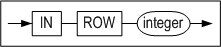

**default_clause::=**


**column_constraint ::=**


**unique_clause ::=**


**unique_specification ::=**


**sort_order_clause ::=**


**directkey_clause ::=**


**using_index_clause ::=**


**index_attribute_clause ::=**


[memory_index_attributes ::=](#memory_index_attributes), [disk_index_attributes
::=](#disk_index_attributes)

**references_clause::=**


**check_clause ::=**


<a name="table_constraint"><a/>

**table_constraint ::=**


**table_unique_clause ::=**


**referential_constraint ::=**


[references_clause ::=](#references_clause)

<a name="temporary_attributes_clause"><a/>

**temporary_attributes_clause ::=**


<a name="table_partitioning_clause"><a/>

**table_partitioning_clause ::=**


**range_partitioning ::=**


**partition_default_clause ::=**


<a name="table_partition_description"><a/>

**table_partition_description ::=**


[lob_column_properties ::=](#lob_column_properties)*,* [access_mode_clause
::=](#access_mode_clause_CREATETALBE)

**partition_range_clause ::=**


[table_partition_description ::=](#table_partition_description)


**hash_partitioning ::=**


[table_partition_description ::=](#table_partition_description)


**list_partitioning ::=**


[partition_default_clause ::=](#partition_default_clause)

**partition_list_clause ::=**


<a name="row_movement_clause"><a/>

**row_movement_clause ::=**


<a name="access_mode_clause_CREATETALBE)"><a/>

**access_mode_clause ::=**


<a name="tablespace_clause"><a/>

**tablespace_clause ::=**


<a name="physical_attributes_clause"><a/>

<a name="create_table_physical_attributes_clause"><a/>

**physical_attributes_clause ::=**


**storage_clause ::=**


<a name="log_compression_clause"><a/>

**log_compression_clause ::=**


<a name="logging_clause"><a/>

**logging_clause ::=**


<a name="parallel_clause"><a/>

**parallel_clause::=**


<a name="table_compression_clause"><a/>

**table_compression_clause ::=**


<a name="lob_column_properties"><a/>

**lob_column_properties ::=**


**LOB_storage_clause ::=**


**lob_attributes ::=**

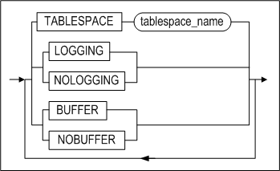

#### 전제 조건

아래의 조건 중 하나 이상을 만족해야 한다.

- SYS 사용자이다.
- 사용자 자신의 스키마에 테이블을 생성하려면 CREATE TABLE 또는 CREATE ANY
  TABLE 시스템 권한을 가지고 있어야 한다.
- 다른 사용자의 스키마에 테이블을 생성하려면 CREATE ANY TABLE 시스템 권한을
  가지고 있어야 한다.

#### 설명

명시된 이름의 새로운 테이블을 생성한다.

*[GLOBAL] TEMPORARY*

[GLOBAL] TEMPORARY는 테이블이 임시 테이블임을 지정한다. GLOBAL 지정 여부에 따른
차이점은 없으므로 생략해도 된다. 이렇게 생성된 테이블의 정의는 모든 세션에서 볼
수 있지만, 임시 테이블의 데이터는 해당 테이블에 데이터를 삽입하는 세션에서만 볼
수 있다.

사용자가 처음으로 임시 테이블을 만들면, 테이블의 메타 데이터만 데이터 딕셔너리에
저장되고, 테이블의 데이터를 위한 공간은 할당되지 않는다. 해당 테이블에 처음으로
DML 작업이 수행되는 순간에 테이블 세그먼트를 위한 공간이 할당된다. 임시 테이블의
정의는 일반적인 테이블의 정의와 마찬가지로 데이터베이스에서 지속되지만, 임시
테이블의 테이블 세그먼트와 임시 테이블에 저장된 모든 데이터는 세션 또는
트랜잭션에 한정된다. ON COMMIT 키워드를 사용해서 테이블 세그먼트와 데이터가 세션
레벨인지 또는 트랜잭션 레벨인지를 지정할 수 있다. 자세한 설명은 아래의
*temporary_attributes_clause*를 참고하라.

세션에 한정되는 임시 테이블은 세션이 임시 테이블에 바인딩 되지 않은 경우에만
해당 임시 테이블에 대해 DDL 작업(ALTER TABLE, DROP TABLE, CREATE INDEX 등)이
허용된다.

트랜잭션에 한정되는 임시 테이블은 바인딩 여부에 상관 없이 임시 테이블에 대한 DDL
작업이 허용된다. 하지만, Altibase 내부적으로 DDL 작업 수행 전에 커밋을 먼저 하기
때문에, 임시 테이블에 대한 DDL 수행 후에 그 테이블의 데이터는 사라진다.

- 임시 테이블의 제약 사항:
  - 임시 테이블은 파티셔닝이 불가능하다.
  - 임시 테이블에는 외래 키를 지정할 수 없다.
  - lob_storage_clause의 TABLESPACE에는 임시 테이블을 저장하는 휘발성
    테이블스페이스만 올 수 있다.
  - 임시 테이블은 휘발성 테이블스페이스만 저장할 수 있다.
  - 임시 테이블에 대해서는 분산 트랜잭션이 지원되지 않는다.

*user_name*

생성될 테이블 소유자 이름을 명시한다. 생략하면 Altibase는 현재 세션에 연결된
사용자의 스키마에 테이블을 생성한다.

*tbl_name*

생성될 테이블 이름을 명시한다. 테이블 이름은  "[객체 이름
규칙](#object_name)"을 따라야 한다.

*column_definition*

- DEFAULT  
  칼럼에 DEFAULT 절을 명시하지 않고 테이블을 생성한 경우, 데이터 삽입시 해당
  칼럼의 값을 명시하지 않으면 NULL이 입력된다.
- TIMESTAMP  
  TIMESTAMP 칼럼은 여러 면에서 다른 데이터 타입들처럼 다뤄진다. 예를 들어,
  CREATE TABLE 문에 칼럼의 데이터 타입으로 TIMESTAMP를 명시한 경우 내부적으로
  데이터 크기가 8Byte인 TIMESTAMP 칼럼이 생성된다. 그러나 TIMESTAMP 칼럼의
  값은 시스템에 의해 결정되기 때문에 명시적으로 DEFAULT 값을 설정할 수 없다.
  또한 TIMESTAMP 칼럼은 한 테이블에 하나만 생성할 수 있다.

*column_constraint*

새로운 테이블을 생성할 때 칼럼에 대한 제약조건을 설정한다. 명시적으로 제약조건의
이름을 지정할 수 있다. LOCALUNIQUE 제약조건은 파티션드 테이블에 사용될 수 있다.

- PRIMARY KEY

  기본키의 값은 테이블 내에서 유일해야 하며 기본키에 속하는 칼럼은 널(NULL) 값을
  가질 수 없다. 한 테이블 내에 정의 가능한 기본키의 개수는 하나이며, 최대 32개
  칼럼들의 조합에 대해 기본 키를 생성할 수 있다.

- UNIQUE

  UNIQUE 제약조건을 정의하면 유니크 키에 해당하는 칼럼 (또는 칼럼의 조합)은 같은
  값을 2개 이상 가질 수 없다. 단, 널 값은 허용된다.

  같은 칼럼 또는 같은 칼럼의 조합에 대해 유니크 제약조건과 기본키를 동시에 정의할
  수 없다. 또한, 같은 칼럼 또는 같은 칼럼의 조합에 대해 2개 이상의 유니크
  제약조건도 존재할 수 없다. 그러나 다른 칼럼 또는 다른 칼럼들의 조합에는 존재할
  수 있다. 최대 32개 칼럼의 조합에 대해 유니크 제약조건을 생성할 수 있다.

- LOCALUNIQUE

  각 지역 인덱스별로 UNIQUE 제약조건을 만족해야 함을 명시하는 키워드이다.

- (NOT) NULL

  해당 칼럼이 널 값을 가질 수 있다(없다)는 것을 의미한다.

- CHECK

  해당 칼럼에 대한 무결성 규칙(Integrity Rule)을 지정한다. *column_constraint*
  절의 *condition* 내에서는 해당 칼럼만 참조할 수 있다. CHECK 제약조건의 검사조건에는 아래와 같은 몇 가지 제한 사항이 있다.

  - 부질의(subquery), 시퀀스, LEVEL 또는 ROWNUM 등의 모든 의사칼럼(Pseudo
    Column), 및 SYSDATE 또는 USER_ID 같은 비결정적(Non-deterministic) SQL 함수가
    포함될 수 없다.
  - PRIOR 연산자를 사용할 수 없다.
  - LOB 타입의 데이터를 사용할 수 없다.

- 참조 무결성(referential integrity)

- TIMESTAMP


*directkey_clause*

이 절은 Direct Key 인덱스를 생성시 사용할 수 있다. Direct Key 인덱스에 대한
자세한 내용은 CREATE INDEX 구문을 참고한다

*check_clause*

이 절에는 테이블의 각 레코드 값이 만족해야 하는 조건을 지정한다. 조건의 결과는
참, 거짓, 또는 NULL 중 하나이어야 한다.

이 절은 칼럼 제약조건 또는 테이블 전체 제약조건이 될 수 있다.

*table_constraint*

한 칼럼 또는 칼럼들의 조합에 대한 제약조건을 명시하는 절이다. 다음의 테이블
제약조건이 있다.

- PRIMARY KEY
- UNIQUE
- LOCALUNIQUE
- CHECK
- 참조 무결성(referential integrity)

*using_index_clause*

제약조건을 위해 자동으로 생성되는 인덱스가 저장될 테이블스페이스를 지정하는
절이다.

PRIMARY KEY, UNIQUE 또는 LOCALUNIQUE 제약을 명시할 경우, 자동으로 생성되는 로컬
인덱스가 저장될 테이블스페이스를 각 인덱스 파티션 별로 지정할 수 있다. 자세한
설명은 CREATE INDEX 구문의 *index_partitioning_clause*를 참조한다.

*references_clause*

외래키를 정의하는 절이다. 외래키에 의해 참조되는 다른 테이블의 참조키(referenced
key)는 그 테이블에서 유니크 제약조건에 해당하거나 그 테이블의 기본키이어야 한다.
만약 이 절에 참조키의 칼럼들을 명시하지 않은 경우, 해당 테이블의 기본키가
자동으로 참조키가 된다.

- NO ACTION

  “부모(parent) 테이블” (참조키가 있는 테이블)에 대해 INSERT, DELETE, 또는 UPDATE
  구문을 실행하면, Altibase는 “자식(child) 테이블” (참조키를 참조하는 외래키를
  가진 테이블)에 대한 무결성 검사를 한 후에 이 구문을 수행한다. NO ACTION은 무결성
  검사 후에 자식 테이블에 대해서는 어떠한 작업도 하지 않음을 명시하는 옵션이다.

  예를 들어 다음과 같이 employees 테이블을 생성하면, departments 테이블에서 어떤
  부서를 삭제하려 할 때, employees 테이블의 레코드가 이 부서 번호를 참조하고
  있다면, 삭제 시도는 실패하고 에러가 발생할 것이다.

  ```
  CREATE TABLE employees (
  ENO INTEGER PRIMARY KEY, 
  DNO INTEGER, 
  NAME CHAR(10), 
  FOREIGN KEY(DNO) REFERENCES 
  departments(DNO) ON DELETE NO ACTION ); 
  ```


- ON DELETE CASCADE

  이는 부모 테이블의 행이 삭제되면 외래 키 값을 가진 자식 테이블에서 이 행을
  참조하는 모든 행도 삭제될 것을 명시하는 옵션이다.

  예를 들어 예를 들어 다음과 같이 employees 테이블을 생성하면, departments
  테이블에서 어떤 부서를 삭제하려 할 때, employees 테이블에서 이 부서 번호를
  참조하는 모든 행도 삭제된다.

  ```
  CREATE TABLE employees (
  ENO INTEGER PRIMARY KEY, 
  DNO INTEGER, 
  NAME CHAR(10), 
  FOREIGN KEY(DNO) REFERENCES 
  departments (DNO) ON DELETE CASCADE ); 
  ```


- ON DELETE SET NULL

  부모 테이블의 행이 삭제되면 그 행을 참조하는 자식 테이블의 외래 키 칼럼의 값이
  모두 NULL로 변경될 것을 명시하는 옵션이다. 이 옵션의 참조 무결성을 위해 해당
  칼럼은 NULL이 허용되어야 한다.

  예를 들어 departments 테이블을 참조하는 employees 테이블을 생성한 후에,
  departments 테이블에서 어떤 부서를 삭제한다. 이 때, employees 테이블에서 삭제된
  부서 번호를 참조하는 모든 칼럼의 값은 NULL로 변경된다.

  ```
  CREATE TABLE employees (
  ENO INTEGER PRIMARY KEY, 
  DNO SMALLINT, 
  NAME CHAR(10), 
  CONSTRAINT dno_fk FOREIGN KEY (dno) REFERENCES 
  departments (dno) ON DELETE SET NULL ); 
  ```


*MAXROWS*

테이블에 입력될 수 있는 최대 레코드 개수를 지정한다. 레코드 삽입시 전체 레코드
개수가 여기에서 지정한 수보다 많아질 경우 입력 시도는 실패하고 에러가 반환된다.
MAXROWS 절은 table_partitioning_clause 절과 함께 명시할 수 없다.

*temporary_attributes_clause*

이 절은 임시 테이블의 데이터가 트랜잭션에 한정되는지 또는 세션에 한정되는지를
지정하며, 아래 두 가지 옵션이 가능하다:

*ON COMMIT DELETE ROWS*

트랜잭션에 한정되는 임시 테이블을 생성한다. 임시 테이블에 처음으로 데이터를
삽입하는 트랜잭션이 그 임시 테이블에 바인딩 된다. 트랜잭션 레벨의 바인딩은
COMMIT 또는 ROLLBACK 구문 수행으로 풀리게 된다. 트랜잭션이 커밋되면, Altibase는
해당 임시 테이블을 truncate 한다.

*ON COMMIT PRESERVE ROWS*

세션에 한정되는 임시 테이블을 생성한다. 세션에서 임시 테이블에 처음으로 데이터가
삽입될 때 세션은 임시 테이블에 바인딩 된다. 이 바인딩은 세션이 종료 되거나 그
세션에서 테이블에 TRUNCATE 작업이 수행 될 때 풀린다. 사용자가 세션을 종료하면,
Altibase는 세션에 바인딩 된 임시 테이블을 truncate 한다.

*table_partitioning_clause*

파티션드 테이블을 생성하는 절이다. 범위 파티셔닝(range partitioning), 해시
파티셔닝(hash partitioning), 리스트 파티셔닝(list partitioning) 방법으로
파티션드 테이블을 생성할 수 있다. 파티션드 테이블을 생성할 때
*row_movement_clause*도 명시할 수 있다.

*range_partitioning*

범위 파티션드 테이블 생성시 파티션 키 값의 범위를 명시하는 절이다. 주로 DATE
자료형에 많이 사용된다. 사용자가 지정한 값을 기준으로 테이블이 분할되기 때문에,
파티션별로 데이터의 고른 분포는 보장되지 않는다. 각 파티션의 범위는 그 범위의
최대값을 설정함으로써 결정된다.

명시된 범위 외의 모든 값과 NULL은 기본 파티션(default partition)에 속하게 된다.
기본 파티션 절은 생략할 수 없다. 여러 칼럼들의 조합으로 파티션 키를 정의할 수
있다.

*table_partition_description*

파티션별로 테이블스페이스를 지정할 수 있다. 또한 테이블에 한 개 이상의 LOB
컬럼이 있을 경우, 각 LOB 컬럼의 속성을 따로 명시할 수 있다. 그리고 파티션의
데이터에 대한 접근 모드를 설정할 수 있다.

테이블스페이스 절이 생략되면, 그 파티션은 해당 테이블의 기본
테이블스페이스(default tablespace)에 저장된다.

또한 LOB 컬럼이 저장될 테이블스페이스를 지정하지 않으면 LOB 데이터는 해당
파티션의 테이블스페이스에 저장된다.

다음의 예제에서 사용자의 기본 테이블스페이스는 tbs_05이다.

```
CREATE TABLE print_media_demo
( 
	product_id INTEGER,
	ad_photo BLOB,
	ad_print BLOB,
	ad_composite BLOB
)
PARTITION BY RANGE (product_id)
(
	PARTITION p1 VALUES LESS THAN (3000) TABLESPACE tbs_01 
	LOB (ad_photo) STORE AS (TABLESPACE tbs_02 ),
	PARTITION p2 VALUES DEFAULT 
	LOB (ad_composite) STORE AS (TABLESPACE tbs_03)
) TABLESPACE tbs_04;
```


파티션 p1의 테이블스페이스는 명시적으로 지정되었으므로 tbs_01테이블스페이스에
저장된다. 그리고 해당 파티션의 ad_photo 컬럼은 tbs_02테이블스페이스에 저장된다.
기본 파티션인 p2의 테이블스페이스는 지정되지 않았으므로 print_media_demo
테이블의 기본 테이블스페이스인 tbs_04에 저장된다. 만약 이 테이블의
테이블스페이스를 지정하지 않았다면 사용자의 기본 테이블스페이스인 tbs_05에
저장될 것이다.

위의 설명을 그림으로 나타내면 다음과 같다.


*partition_range_clause*

파티션에 저장될 상한값(noninclusive)을 지정한다. 이 값은 다른 파티션의 상한값과
겹치지 않아야 한다.

*hash_partitioning*

이 절은 파티션 키 값에 대응하는 해시 값을 기준으로 테이블을 분할할 것을
명시한다. 이는 데이터가 파티션별로 고르게 분산되기를 원하는 경우에 적합하다.
여러 칼럼들의 조합으로 파티션 키를 정의할 수 있다.

*list_partitioning*

이 절은 값의 집합을 기준으로 테이블을 분할할 것을 명시한다. 명시된 다른 파티션에
속하도록 명시되지 않은 값들은 자동으로 기본 파티션에 포함되기 때문에 기본
파티션은 생략할 수 없다.

기본 파티션에 속해 있던 값들의 집합으로 새로운 파티션을 추가하면 기본
파티션에서는 그 값이 제거될 것이다. 각 파티션이 가질 수 있는 값들은 서로 중복될
수 없기 때문이다. 리스트 파티션드 테이블을 위한 파티션 키는 단일 칼럼에만 정의될
수 있다.

*partition_list_clause*

각 리스트 파티션은 적어도 1개 이상의 값을 가져야 한다. 한 리스트의 값은 다른
어떤 리스트에도 있을 수 없다.

*row_movement_clause*

파티션드 테이블의 레코드가 갱신되어 파티션 키에 해당하는 칼럼의 값이 다른
파티션에 속하는 값으로 변경된 경우, 이 절은 그 레코드를 자동으로 다른 파티션으로
이동시킬지 아니면 에러를 발생시킬 것인지를 결정한다. 이 절을 생략하면 DISABLE
ROW MOVEMENT옵션이 기본으로 설정된다.

*CREATE TABLE … AS SELECT*

테이블 생성시, 다른 테이블에서 새로운 테이블로 칼럼의 속성과 데이터를 그대로
복사하려면 이 구문을 사용한다. 새로운 테이블의 칼럼 수는 SELECT 절로 검색되는
칼럼의 개수와 동일해야 한다. 또한 새로운 칼럼의 데이터 타입은 명시할 수 없고,
데이터가 검색되는 원래 칼럼의 데이터 타입과 동일하게 된다.

생성될 테이블의 칼럼 명을 명시하지 않을 경우에는 검색되는 칼럼의 이름이 그대로
사용된다. 검색 대상이 칼럼이 아니고 표현식인 경우 alias가 반드시 존재해야 한다.
이 alias가 새로운 테이블의 칼럼명이 될 것이다.

*access_mode_clause*

데이터에 대한 접근 모드를 설정할 수 있다. 읽기 전용(Read-Only) 모드,
읽기/쓰기(READ/WRITE) 모드 또는 읽기/추가(READ/APPEND) 모드 중에서 선택할 수
있으며, 생략하면 기본으로 '읽기/쓰기' 모드로 설정된다.

> 주의: 테이블이나 파티션에 대한 접근 모드가 '읽기 전용' 또는 '읽기/추가'로
> 설정되어 있어도 이중화에 의한 복제, TRUNCATE 구문 수행, LOB 칼럼 변경은
> 허용된다.

*tablespace_clause*

테이블이 저장될 테이블스페이스를 지정하는 절이다.

이 절을 생략할 경우 테이블은 이 테이블을 생성하려 하는 사용자의 기본
테이블스페이스에 저장될 것이다. 사용자 생성 시 DEFAULT TABLESPACE를 생략했었다면
테이블은 시스템 메모리 기본 테이블스페이스(SYSTEM MEMORY DEFAULT TABLESPACE)에
생성된다.

CREATE TABLE 문 내에 UNIQUE 또는 PRIMARY KEY 제약조건이 명시된 경우 이들을 위한
인덱스는 테이블이 저장되는 테이블스페이스에 생성될 것이다.

*physical_attributes_clause*

PCTFREE, PCTUSED, INITRANS 및 MAXTRANS를 지정하는 절이다. 이 절이 파티션드
테이블에 명시될 경우 PCTFREE와 PCTUSED 값은 그 테이블의 모든 파티션에 적용될
것이다.

- PCTFREE 절  
  페이지에 이미 저장되어 있는 레코드가 갱신될 때 이용하기 위해 예약해 둔 여유
  공간의 양을 비율로 정의한다. 레코드는 이 예약된 공간 외에만 삽입된다. 이
  값은 한 페이지내의 여유 공간을 백분율로 표시한다.  
  예를 들어 PCTFREE가 20으로 명시된 테이블의 경우, 각 페이지 크기의 80%에만
  레코드가 입력되며, 나머지 20%는 레코드의 갱신 용도로 사용된다. 이 값은
  디스크 기반의 테이블에 대해서만 의미가 있다.  
  명시할 수 있는 값은 0에서 99까지의 정수이며, 백분율을 의미한다. 명시하지
  않을 경우 기본 PCTFREE 값은 10이다. 이 옵션은 테이블에 할당된 페이지에만
  적용된다.
- PCTUSED 절  
  한 페이지가 레코드 삽입이 가능한 상태로 다시 돌아가기 위해 페이지의 사용
  공간이 줄어들어야 하는 최소 비율을 나타낸다. 여유 공간의 비율이 PCTFREE에
  도달한 페이지에는 더 이상 레코드가 삽입되지 않고, 갱신 또는 삭제만 허용된다.
  이후 레코드 갱신 또는 삭제 작업으로 페이지의 사용 공간의 비율이 PCTUSED에서
  명시한 값 이하로 떨어지게 되면 이 페이지는 다시 레코드 삽입이 가능한 상태로
  된다.  
  예를 들어 PCTUSED 값을 40으로 명시한 경우, 어떤 페이지의 여유 공간의 비율이
  PCTFREE에 명시된 값에 도달하면, 이 페이지의 사용 공간 비율이 39% 이하로
  떨어질 때까지 이 페이지에는 레코드 삽입이 불가능하다. 사용 공간의 비율이 40%
  미만으로 떨어져야 비로소 새로운 레코드가 다시 그 페이지에 삽입된다. 이 값은
  디스크 기반 테이블에 대해서만 의미가 있다.  
  명시할 수 있는 값은 0에서 99까지의 정수이며, 백분율을 의미한다. 명시하지
  않을 경우 기본 PCTUSED 값은 40 이다. 이 옵션은 테이블에 할당된 페이지에만
  적용된다.
- INITRANS 절  
  TTS(Touched Transaction Slot)의 초기 개수를 지정한다. 기본값은 2이다.
- MAXTRANS 절  
  TTS(Touched Transaction Slot)의 최대 개수를 지정한다. 기본값은 120이다.

> 참고
>
> 위의 PCTFREE와 PCTUSED는 페이지 사용의 최적화를 위해 다음과 같은 형태로 함께
> 사용된다. 이 예제에서는 PCTFREE는 20, PCTUSED는 40으로 지정하였다.
>
> 각 페이지의 20%는 기존 레코드에 대한 변경 연산을 위한 공간으로 예약되며, 이
> 페이지의 나머지 80%의 공간까지만 새로운 레코드들이 삽입된다.
>
> 이 시점이 되면 더 이상 어떠한 새로운 레코드도 이 페이지에 삽입될 수 없다. 이미
> 저장된 레코드에 대한 갱신과 삭제 연산만이 가능하다. 갱신 연산은 예약해둔 20%의
> 빈 공간을 사용한다. 레코드가 삭제되어 사용중인 공간이 40% 아래로 떨어지면 그
> 페이지에 다시 새로운 레코드를 삽입할 수 있다.
>
> 페이지 공간의 사용은 PCTFREE와 PCTUSED의 값을 이용하여 위와 같은 방법으로 계속
> 순환된다.

*storage_clause*

사용자가 세그먼트에 대한 익스텐트 관리 파라미터를 지정할 수 있는 구문이다.

- INITEXTENTS 절  
  세그먼트 생성시 초기 할당되는 익스텐트 개수를 지정한다. 명시하지 않을 경우
  기본으로 1개의 익스텐트가 할당된다.
- NEXTEXTENTS 절  
  세그먼트 크기 확장시마다 추가될 익스텐트 개수를 명시한다. 명시하지 않을 경우
  기본으로 1개의 익스텐트만큼 확장된다.
- MINEXTENTS 절  
  세그먼트의 최소 익스텐트 개수를 지정한다. 명시하지 않을 경우 기본값은 1이다.
- MAXEXTENTS 절  
  세그먼트가 포함할 수 있는 최대 익스텐트 개수를 지정한다. 명시하지 않을 경우
  제한이 없는 것으로 지정된다.

*LOB_storage_clause*

디스크 테이블의 LOB 칼럼 데이터는 LOB 칼럼이 속한 테이블과 별도의
테이블스페이스에 저장될 수 있다. 그러나 메모리 테이블의 경우는 별도 저장이
불가능하다. 즉, 테이블과 동일한 테이블스페이스에만 저장될 수 있다.

*parallel_clause*

병렬 질의를 처리하는 쓰레드의 개수를 명시한다. 이 절을 생략하면 NOPARALLEL을
지정한 것과 동일하다.

- NOPARALLEL : 쿼리를 병렬로 처리하지 않는다.
- PARALLEL *integer* : integer에 명시한 개수만큼의 쓰레드가 병렬로 쿼리를
  처리한다. 입력 가능한 값의 범위는 1\~65535이다. PARALLEL 1은 NOPARALLEL과
  동일하다.

현재 Altibase는 아래와 같은 병렬 질의만 지원한다.

- 파티션드 테이블을 스캔하는 병렬 질의
- 실행 계획에 HASH, SORT, GRAG 노드가 포함되는 병렬 질의. 단, 이러한 노드의
  경우에는 각 노드당 병렬 작업 쓰레드가 한 개씩만 생성된다.

*table_compression_clause*

압축할 칼럼의 이름을 쉼표로 구분하여 명시한다. MAXROWS 절에는 압축 칼럼당
자동으로 생성되는 딕셔너리 테이블에 입력할 수 있는 행의 최대 개수를 명시한다.
명시하지 않으면 기본값은 일반 테이블과 동일한 2<sup>64</sup>-1개이다.

CREATE TABLE 구문에 이 절과 *subquery*를 모두 명시하여 테이블 생성과 데이터
삽입을 하나의 구문으로 수행하는 것을 지원하지 않는다.

압축이 가능한 데이터 타입과 각 타입 별 최소 크기는 다음과 같다.

| 데이터 타입              | 최소 크기 |
| ------------------------ | --------- |
| CHAR, VARCHAR, BYTE      | 6         |
| NCHAR, NVARCHAR (UTF-8)  | 6         |
| NCHAR, NVARCHAR (UTF-16) | 3         |
| NIBBLE                   | 13        |
| BIT, VARBIT              | 25        |
| DATE                     |           |

#### 주의 사항

다음은 테이블 생성시 유념해야 할 몇 가지 사항이다.

- 정의한 칼럼 크기가 최대 허용 크기를 넘거나 최소 크기 보다 작으면 오류가
  발생한다. 최대와 최소 크기는 각 데이터 타입마다 다르다.
- 한 테이블의 최대 칼럼 수는 1024개이다.
- 기본키는 한 테이블에 한 개만 존재할 수 있다.
- 참조 제약조건의 경우 외래키와 참조키의 칼럼 개수는 동일해야 한다. 또한
  외래키와 참조키의 각 칼럼 데이터 타입은 동일해야 한다.
- 한 테이블에 생성할 수 있는 인덱스, 기본키 및 유니크 키의 총 개수는 1024개를
  넘을 수 없다.
- CREATE TABLE AS SELECT의 경우 칼럼 명을 명시하였다면 그 개수는 검색 대상에
  명시한 칼럼 개수와 동일해야 한다.
- CREATE TABLE AS SELECT문 실행시 CREATE TABLE 문에 칼럼 명을 명시하지 않고
  SELECT문의 검색 대상에는 표현식을 사용한 경우, 반드시 새로운 테이블의 칼럼
  이름으로 사용될 별명(alias name)을 표현식에 명시해야 한다.
- MAXROWS 절에 파티션드 테이블 사용은 지원되지 않는다.
- 범위 파티션드 테이블과 해시 파티션드 테이블을 위한 파티션 키 컬럼은 최대
  32개로 구성될 수 있다.(인덱스 생성 시 인덱스 키 칼럼의 개수 제한과
  동일하다.)
- NOLOGGING(FORCE/NOFORCE) 옵션으로 생성된 인덱스의 경우 시스템이나 미디어
  고장시 인덱스의 일관성이 보장되지 않을 수 있다. 인덱스 일관성이 깨진 경우
  ‘The index is inconsistent.’라는 오류 메시지가 나온다. 이러한 오류를
  해결하려면 일관성이 깨진 인덱스를 찾아 삭제한 후에 해당 인덱스를 다시
  생성하도록 한다. 인덱스의 일관성은 V\$DISK_BTREE_HEADER성능 뷰에서 확인할 수
  있다.
- CREATE INDEX 구문과 마찬가지로 로컬 파티션드 인덱스가 저장될
  테이블스페이스를 지정할 수 없다.
- CREATE TABLE ... AS SELECT의 경우, CHECK 제약조건을 지정할 수 없다.
- PRIMARY KEY, UNIQUE, TIMESTAMP 제약조건을 갖는 칼럼은 압축이 불가능하다.

#### 예제

##### 테이블 생성

다음 테이블들을 생성하라.

- 테이블 이름: employees  
  칼럼: 사원번호, 사원이름과 성, 직책, 전화번호, 부서번호, 월급, 성별, 생일,
  입사일자, 상태

  ```
  iSQL> CREATE TABLE employees(
    eno INTEGER PRIMARY KEY,
    e_lastname CHAR(20) NOT NULL, 
    e_firstname CHAR(20) NOT NULL,
    emp_job VARCHAR(15),
    emp_tel CHAR(15),
    dno SMALLINT,
    salary NUMBER(10,2) DEFAULT 0,
    sex CHAR(1) CHECK(sex IN ('M', 'F')),
    birth CHAR(6),
    join_date DATE,
    status CHAR(1) DEFAULT 'H');
  Create success.
  ```


- 테이블 이름: orders  
  칼럼: 주문번호, 주문일자, 판매사원, 고객번호, 상품번호, 주문수량, 도착
  예정일자, 주문상태

  ```
  iSQL> CREATE TABLE orders(
    ono BIGINT,
    order_date DATE,
    eno INTEGER NOT NULL,
    cno BIGINT NOT NULL,
    gno CHAR(10) NOT NULL,
    qty INTEGER DEFAULT 1,
    arrival_date DATE,
    processing CHAR(1) DEFAULT '0', PRIMARY KEY(ono, order_date));
  Create success.
  ```


- CREATE TABLE … AS SELECT 사용  
  다음 질의는 직원 테이블에서 부서 번호가 1002인 조건을 만족하는 데이터를 가진
  테이블 dept_1002를 생성한다.

  ```
  iSQL> CREATE TABLE dept_1002
    AS SELECT * FROM employees
    WHERE dno = 1002;
  Create success.
  ```


- TIMESTAMP 타입 칼럼을 가지는 테이블을 생성한다.

  ```
  iSQL> CREATE TABLE tbl_timestamp(
  i1 TIMESTAMP CONSTRAINT const2 PRIMARY KEY, 
  i2 INTEGER,
  i3 DATE,
  i4 Byte(8));
  Create success.
  ```

   테이블 tbl_timestamp의 속성은 다음과 같다.

  ```
  [ TABLESPACE : SYS_TBS_MEM_DATA ]
  [ ATTRIBUTE ]                                                         
  ------------------------------------------------------------------------------
  NAME                                     TYPE                        IS NULL 
  ------------------------------------------------------------------------------
  I1                                       TIMESTAMP       FIXED       NOT NULL
  I2                                       INTEGER         FIXED       
  I3                                       DATE            FIXED       
  I4                                       BYTE(8)         FIXED       
  [ INDEX ]                                                       
  ------------------------------------------------------------------------------
  NAME                                     TYPE     IS UNIQUE     COLUMN
  ------------------------------------------------------------------------------
  CONST2                                   BTREE    UNIQUE        I1 ASC
  [ PRIMARY KEY ]                                                 
  ------------------------------------------------------------------------------
  I1
  ```

  명시적으로 Byte(8) 데이터 타입을 선언한 칼럼 i4와 TIMESTAMP 데이터 타입 칼럼인
  i1을 구별하는 방법은 SYS_CONSTRAINTS_와 SYS_CONSTRAINT_COLUMNS\_ 메타 테이블을
  조회해서 칼럼 타입이 TIMESTAMP 인지를 확인하는 것이다.

  > 참고: INSERT나 UPDATE 수행 시 사용자가 TIMESTAMP 칼럼 값을 DEFAULT로 명시한
  > 경우, 당시의 시스템 시간값이 그 TIMESTAMP 칼럼에 쓰여진다.

  ```
  iSQL> INSERT INTO tbl_timestamp VALUES(DEFAULT, 2, '02-FEB-01', Byte'A1111002');
  1 row inserted.
  iSQL> UPDATE tbl_timestamp SET i1 = DEFAULT, i2 = 102, i3 = '02-FEB-02', i4 = Byte'B1111002' WHERE i2 = 2;
  1 row updated.
  iSQL> SELECT * FROM tbl_timestamp;
  I1                I2          I3           I4
  ------------------------------------------------------------------
  4E3778C900037AE9  102         02-FEB-2002  B111100200000000
  1 row selected.
  ```

  마찬가지로 INSERT나 UPDATE 수행 시 사용자가 TIMESTAMP 칼럼 값을 명시하지 않은
  경우, 당시의 시스템 시간 값이 INSERT 또는 UPDATE 수행에 사용된다.

  ```
  iSQL> INSERT INTO tbl_timestamp(i2, i3, i4) VALUES(4, '02-APR-01', Byte'C1111002');
  1 row inserted.
  iSQL> UPDATE tbl_timestamp SET i2=104, i3='02-APR-02', i4=BYTE'D1111002' WHERE i2=4;
  1 row updated.
  iSQL> SELECT * FROM tbl_timestamp;
  I1                I2          I3           I4
  ------------------------------------------------------------------
  4E3778C900037AE9  102         02-FEB-2002  B111100200000000
  4E37794900083702  104         02-APR-2002  D111100200000000
  2 rows selected.
  ```


- 임시 테이블 생성 및 사용

  \<질의\> 한 세션에서 임시 테이블을 생성하고 데이터를 삽입한 후, 해당 세션에서는
  데이터가 조회되고, 다른 세션에서는 조회되는 데이터가 없는 것을 보여준다.

  ```
  iSQL> create volatile tablespace my_vol_tbs size 12M autoextend on maxsize 1G; 
  Create success. 
  iSQL> create temporary table t1(i1 integer, i2 varchar(10)) on commit delete rows tablespace my_vol_tbs; 
  Create success. 
  iSQL> create temporary table t2(i1 integer, i2 varchar(10)) on commit preserve rows tablespace my_vol_tbs; 
  Create success. 
  iSQL> desc t2; 
  [ TABLESPACE : MY_VOL_TBS ] 
  [ ATTRIBUTE ]                                                         
  ------------------------------------------------------------------------------ 
  NAME                                     TYPE                        IS NULL 
  ------------------------------------------------------------------------------ 
  I1                                       INTEGER         FIXED       
  I2                                       VARCHAR(10)     FIXED       
  T2 has no index 
  T2 has no primary key 
  iSQL> alter table t2 add constraint t2_pk primary key (i1); 
  Alter success. 
  iSQL> insert into t2 values (1, 'abc'); 
  1 row inserted. 
  iSQL> insert into t2 values (2, 'def'); 
  1 row inserted. 
  iSQL> select * from t2; 
  I1          I2          
  --------------------------- 
  1           abc         
  2           def         
  2 rows selected. 
  iSQL> connect sys/manager; 
  Connect success. 
  iSQL> select * from t2; 
  I1          I2          
  --------------------------- 
  No rows selected.
  ```


- 질의에서 지정한 테이블스페이스에 테이블을 생성하라.

  \<질의\> 테이블 소유자가 uare1인 테이블 tbl1을 생성하라. (사용자 생성 시 기본
  테이블스페이스가 지정되지 않았다.)

  ```
  iSQL> CONNECT uare1/rose1;
  Connect success.
  iSQL> CREATE TABLE tbl1(
      i1 INTEGER,
      i2 VARCHAR(3));
  Create success.
  ```

  > 참고: 사용자 생성 시 기본 테이블스페이스가 지정되지 않은 경우 시스템 메모리
  > 기본 테이블스페이스에 테이블이 생성 된다.

  \<질의\> 사용자 생성 시 지정된 기본 테이블스페이스 user_data에 다음 조건을
  만족하는 테이블 books과 inventory를 생성하라.

  books 칼럼: 책번호, 책이름, 저자, 판, 출판연도, 가격, 출판사코드 (테이블 books에
  입력할 수 있는 최대 레코드 개수는 2개이다.)

  inventory 칼럼: 예약구독번호, 책번호, 상점코드, 구입날짜, 구입량, 지불여부

  ```
  iSQL> CREATE TABLE books(
    isbn CHAR(10) CONSTRAINT const1 PRIMARY KEY,
    title VARCHAR(50),
    author VARCHAR(30),
    edition INTEGER DEFAULT 1,
    publishingyear INTEGER,
    price NUMBER(10,2),
  pubcode CHAR(4)) MAXROWS 2
  TABLESPACE user_data;
  Create success.
  
  iSQL> CREATE TABLE inventory(
    subscriptionid CHAR(10) PRIMARY KEY,
    isbn CHAR(10) CONSTRAINT fk_isbn REFERENCES books (isbn),
    storecode CHAR(4),
    purchasedate DATE,
    quantity INTEGER,
  paid CHAR(1))
  TABLESPACE user_data;
  Create success.
  ```

  또는

  ```
  iSQL> CREATE TABLE inventory(
    subscriptionid CHAR(10),
    isbn CHAR(10),
    storecode CHAR(4),
    purchasedate DATE,
    quantity INTEGER,
    paid CHAR(1),
    PRIMARY KEY(subscriptionid),
  CONSTRAINT fk_isbn FOREIGN KEY(isbn) REFERENCES books(isbn))
  TABLESPACE user_data;
  Create success.
  ```


- Direct Key 인덱스를 사용하여 테이블 생성

  \<질의\> 테이블 tab1을 생성할 때 id(INTEGER) 칼럼을 UNIQUE 하면서, Direct Key
  인덱스로 설정한다.

  ```
  iSQL> CREATE TABLE tab1 (id UNIQUE DIRECTKEY );
  Create success.
  ```


- 각 인덱스 파티션을 위한 테이블스페이스 지정

  \<질의\> I1 컬럼에 대한 UNIQUE 제약을 갖는 파티션드 테이블 T1을 생성하라.

  ```
  CREATE TABLE T1 
  ( 
    I1 INTEGER UNIQUE USING INDEX LOCAL
    (
      PARTITION P1_UNIQUE ON P1 TABLESPACE TBS3,
      PARTITION P2_UNIQUE ON P2 TABLESPACE TBS2,
      PARTITION P3_UNIQUE ON P3 TABLESPACE TBS1
    )
  )
  PARTITION BY RANGE (I1)
  ( 
    PARTITION P1 VALUES LESS THAN (100),
    PARTITION P2 VALUES LESS THAN (200) TABLESPACE MEM_TBS1,
    PARTITION P3 VALUES DEFAULT TABLESPACE MEM_TBS2 
  ) TABLESPACE SYS_TBS_DISK_DATA;
  ```


- 범위 파티셔닝(range partitioning)

  \<질의 1\> 아래 그림과 같이 2006년의 각 분기별로 파티셔닝하여 range_sales
  테이블을 생성한다.

  ```
  CREATE TABLE range_sales
  ( 
    prod_id NUMBER(6),
    cust_id NUMBER,
    time_id DATE
  ) 
  PARTITION BY RANGE (time_id)
  (
    PARTITION Q1_2006 VALUES LESS THAN (TO_DATE('01-APR-2006')),
    PARTITION Q2_2006 VALUES LESS THAN (TO_DATE('01-JUL-2006')),
    PARTITION Q3_2006 VALUES LESS THAN (TO_DATE('01-OCT-2006')),
    PARTITION Q4_2006 VALUES LESS THAN (TO_DATE('01-JAN-2007')),
    PARTITION DEF VALUES DEFAULT 
  ) TABLESPACE SYS_TBS_DISK_DATA;
  ```


  \<질의 2\> 파티션의 테이블스페이스를 지정하여 파티션드 테이블 생성

  ```
  CREATE TABLE T1 
  ( 
    I1 INTEGER, 
    I2 INTEGER 
  )
  PARTITION BY RANGE (I1)
  ( 
    PARTITION P1 VALUES LESS THAN (100),
    PARTITION P2 VALUES LESS THAN (200) TABLESPACE TBS1,
    PARTITION P3 VALUES DEFAULT TABLESPACE TBS2 
  ) TABLESPACE SYS_TBS_DISK_DATA;
  ```


  \<질의 3\> 다중 컬럼을 파티션 키로 갖는 파티션드 테이블 생성

  ```
  CREATE TABLE T1 
  ( 
    I1 DATE, 
    I2 INTEGER 
  )
  PARTITION BY RANGE (I1, I2)
  ( 
    PARTITION P1 VALUES LESS THAN (TO_DATE('01-JUL-2006'), 100),
    PARTITION P2 VALUES LESS THAN (TO_DATE('01-JAN-2007'), 200),
    PARTITION P3 VALUES DEFAULT 
  ) TABLESPACE SYS_TBS_DISK_DATA;
  ```


  \<질의 4\> 필요시 데이터가 자동으로 다른 파티션으로 옮겨지는 파티션드 테이블
  생성

  ```
  CREATE TABLE T1 
  ( 
    I1 INTEGER, 
    I2 INTEGER 
  )
  PARTITION BY LIST (I1)
  ( 
    PARTITION P1 VALUES (100, 200),
    PARTITION P2 VALUES (150, 250),
    PARTITION P3 VALUES DEFAULT 
  ) ENABLE ROW MOVEMENT TABLESPACE SYS_TBS_DISK_DATA;
  ```


- 리스트 파티셔닝(list partitioning)

  \<질의\> nls_territory 컬럼의 값이 ‘CHINA’ 또는 ‘THAILAND’인 asia 파티션,
  ‘GERMANY’, ‘ITALY’, ‘SWITZERLAND’인 europe 파티션, ‘AMERICA’인 west 파티션,
  ‘INDIA’인 east 파티션, 그 외 나머지 값은 기본 파티션으로 분할되는 list_customers
  테이블을 생성한다.

  ```
  CREATE TABLE list_customers 
  ( 
  	customer_id	NUMBER(6), 
  	cust_first_name	VARCHAR(20), 
  	cust_last_name	VARCHAR(20), 
  	nls_territory	VARCHAR(30), 
  	cust_email	VARCHAR(30)
  )
  PARTITION BY LIST (nls_territory) 
  (
  	PARTITION asia VALUES ('CHINA', 'THAILAND'),
  	PARTITION europe VALUES ('GERMANY', 'ITALY', 'SWITZERLAND'),
  	PARTITION west VALUES ('AMERICA'),
  	PARTITION east VALUES ('INDIA'),
  	PARTITION rest VALUES DEFAULT 
  ) TABLESPACE SYS_TBS_DISK_DATA;
  ```


- 해시 파티셔닝(hash partitioning)

  \<질의\> product_id에 따라서 4개의 해시 파티션으로 분할되는 테이블을 생성한다.

  ```
  CREATE TABLE hash_products 
  ( 
  	product_id		NUMBER(6), 
  	product_name		VARCHAR(50), 
  	product_description 	VARCHAR(2000) 
  )
  PARTITION BY HASH (product_id)
  ( 
  	PARTITION p1, 
  	PARTITION p2, 
  	PARTITION p3, 
  	PARTITION p4 
  ) TABLESPACE SYS_TBS_DISK_DATA;
  ```

  \<질의\> LOB 데이터를 별도의 테이블스페이스에 저장하되, image1칼럼은
  테이블스페이스 lob_data1에, image2 칼럼은 테이블스페이스 lob_data2에 저장하는
  테이블을 생성한다.

  ```
  CREATE TABLE lob_products 
  (
    product_id integer, 
    image1 BLOB, 
    image2 BLOB
  ) TABLESPACE SYS_TBS_DISK_DATA
  LOB(image1) STORE AS ( TABLESPACE lob_data1 )
  LOB(image2) STORE AS ( TABLESPACE lob_data2 );
  ```


- 세그먼트 내의 익스텐트 관리 파라미터를 지정한 테이블 생성

  \<질의\> 디스크 테이블스페이스인 usertbs에 local_tbl 테이블을 생성한다. 단
  테이블 생성시 익스텐트 10개를 할당하고 세그먼트 확장시마다 1개씩 확장하도록 한다.

  ```
  iSQL> CREATE TABLE local_tbl (i1 INTEGER, i2 VARCHAR(32) ) 
                      TABLESPACE usertbs
                      STORAGE ( INITEXTENTS 10 NEXTEXTENTS 1 );
  Create success.
  ```

  \<질의\> 디스크 테이블스페이스인 usertbs에 local_tbl 테이블을 생성한다. 단,
  테이블 생성시 최소 익스텐트 개수는 3으로 하고 최대 익스텐트 개수는 100으로
  제한한다.

  ```
  iSQL> CREATE TABLE local_tbl ( i1 INTEGER, i2 VARCHAR(32) ) 
                      TABLESPACE usertbs
                      STORAGE ( INITEXTENTS 3 MINEXTENTS 3 MAXEXTENTS 100 );
  Create success.
  ```


