[SQL Reference](#sql-reference)

- [4.데이터 조작어](#4%EB%8D%B0%EC%9D%B4%ED%84%B0-%EC%A1%B0%EC%9E%91%EC%96%B4)
  - [DELETE](#delete)
  - [INSERT](#insert)
  - [LOCK TABLE](#lock-table)
  - [SELECT](#select)
  - [UPDATE](#update)
  - [MOVE](#move)
  - [MERGE](#merge)
  - [ENQUEUE](#enqueue)
  - [DEQUEUE](#dequeue)
- [5.데이터 제어어](#5%EB%8D%B0%EC%9D%B4%ED%84%B0-%EC%A0%9C%EC%96%B4%EC%96%B4)
  - [ALTER REPLICATION](#alter-replication)
  - [ALTER SESSION](#alter-session)
  - [ALTER SYSTEM](#alter-system)
  - [AUDIT](#audit)
  - [COMMIT](#commit)
  - [DELAUDIT](#delaudit)
  - [NOAUDIT](#noaudit)
  - [SAVEPOINT](#savepoint)
  - [ROLLBACK](#rollback)
  - [SET TRANSACTION](#set-transaction)
- [6.집합 연산자](#6%EC%A7%91%ED%95%A9-%EC%97%B0%EC%82%B0%EC%9E%90)
  - [UNION](#union)
  - [UNION ALL](#union-all)
  - [INTERSECT](#intersect)
  - [MINUS](#minus)
  - [연산 순서](#%EC%97%B0%EC%82%B0-%EC%88%9C%EC%84%9C)


## 4.데이터 조작어

이 장에서는 데이터 조작에 사용되는 DML 구문에 대해서 상세히 설명한다.

### DELETE 

#### 구문

**delete ::=**


**from_clause ::=**


**where_clause ::=**

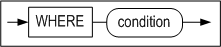

<a name="returning_clause"><a/>

**returning_clause ::=**


**limit_clause ::=**


**multiple_delete ::=**


[tbl_ref ::=](#tbl_ref)

#### 전제 조건

SYS 사용자, 테이블 소유자, DELETE ANY TABLE 시스템 권한을 가진 사용자 및
테이블에 대한 DELETE 객체 권한을 가진 사용자만이 이 구문으로 해당 테이블의
레코드를 삭제할 수 있다.

뷰의 레코드를 삭제할 경우, 사용자는 베이스 테이블에 대해 위와 동일한 권한을
가져야 한다.

#### 설명

조건을 만족하는 레코드를 해당 테이블에서 삭제하는 구문이다. 또한 이 구문으로
특정 파티션에 있는 데이터를 삭제할 수도 있다.

WHERE 절은 SELECT구문의 WHERE 절과 동일하다. WHERE 절을 생략하면 테이블의 모든
데이터가 삭제된다.

*user_name*

레코드를 삭제할 테이블의 소유자 이름을 명시한다. 생략하면 Altibase는 테이블이
현재 세션에 연결된 사용자의 스키마에 속한 것으로 간주한다.

*tbl_name*

삭제될 레코드를 포함한 테이블 이름을 명시한다.

*view_name*

레코드가 삭제될 뷰의 이름을 명시한다.

*subquery*

레코드를 삭제하려는 뷰를 서브쿼리로 명시한다.

*returning_clause*

returning 절은 DML 문에 의해 영향을 받은 레코드를 조회한다.

*expr*

각 expr는 DML 문에 의해 영향을 받는 칼럼의 이름이거나 칼럼 타입과 호환되는
데이터 표현식이어야 한다.

*INTO*

INTO 절은 변경된 레코드의 값들이 각 값에 대응하는 variable_name 변수로 저장될
것을 지시한다.

*variable_name*

각 variable_name은 조회된 expr 값을 저장할 호스트 변수 또는 PSM 변수이다. RECORD
타입의 변수를 사용하는 경우를 제외하면, 변수의 개수는 expr 리스트의 expr 개수와
동일해야 한다.

호스트 변수 또는 PSM 변수의 타입은 대응하는 expr의 타입과 호환되어야 한다.

> 참고: iSQL에서는 변수 이름 앞에 ':'을 붙여 사용해야 한다.

Returning 절의 제약 사항:

- UPDATE, DELETE, 및 INSERT문의 경우, 각 expr에는 aggregate 함수가 올 수 없다.
- 이 절은 테이블에 대해서만 사용할 수 있다.
- 이 절로 LOB 타입을 조회할 수 없다.
- expr에 별칭(alias) 또는 부질의(subquery)가 올 수 없다.
- expr에 시퀀스를 사용할 수 없다.

> 참고: PSM 내에서 BULK COLLECT 절을 사용해서 한꺼번에 여러 행을 collection 변수로
> 반환할 수 있다. 이에 대한 자세한 내용은 *Stored Procedures Manual*을 참고하라.

*multiple_delete*

join 조건을 만족하는 레코드가 tbl_name에 지정된 테이블에서 삭제하는 구문이다.

multiple delete 제약 사항:

- limit_clause 와 returning_clause 를 사용할 수 없다.
- dictionary table 을 사용할 수 없다.
- full outer join 을 사용할 수 없다.

#### HINTS 옵션

힌트의 문법과 자세한 설명은 2장의 "힌트 구문"과 "힌트 목록"을 참고하기 바란다.

#### 예제

##### 단순 데이터 삭제

\<질의\> 테이블의 모든 데이터를 삭제하라.

```
DELETE FROM orders;
```

\<질의\> T1 테이블의 P2 파티션의 모든 데이터를 삭제한다

```
DELETE FROM T1 PARTITION (P2);
```

\<질의\> 직원 ’William’이 받은 주문들을 삭제한다.

```
DELETE
FROM orders
  WHERE eno = (SELECT eno FROM employees
                WHERE e_firstname = 'William');
```


##### 조인 뷰의 데이터 삭제

\<질의\> employees와 departments 테이블의 조인 뷰를 생성한 후, 'BUSINESS DEPT'
부서에 속한 사원을 삭제한다. employees 테이블의 데이터 삭제 전후 행 개수를
비교하면, employees 테이블의 데이터가 삭제된 것을 확인할 수 있다.

```
iSQL> CREATE VIEW simple_emp AS
        SELECT e.eno, e.e_lastname, e.salary, d.dname
          FROM employees e, departments d
          WHERE e.dno = d.dno;
Create success.
iSQL> select * from simple_emp;
ENO         E_LASTNAME            SALARY      DNAME
-----------------------------------------------------------------------------------
3           Kobain                2000        RESEARCH DEVELOPMENT DEPT 1
16          Chen                  2300        RESEARCH DEVELOPMENT DEPT 1
6           Momoi                 1700        RESEARCH DEVELOPMENT DEPT 2
13          Jones                 980         RESEARCH DEVELOPMENT DEPT 2
10          Bae                   4000        SOLUTION DEVELOPMENT DEPT
11          Liu                   2750        SOLUTION DEVELOPMENT DEPT
14          Miura                 2003        SOLUTION DEVELOPMENT DEPT
15          Davenport             1000        SOLUTION DEVELOPMENT DEPT
17          Fubuki                1400        QUALITY ASSURANCE DEPT
4           Foster                1800        CUSTOMERS SUPPORT DEPT
1           Moon                              PRESALES DEPT
5           Ghorbani              2500        PRESALES DEPT
8           Wang                              MARKETING DEPT
9           Diaz                  1200        MARKETING DEPT
18          Huxley                1900        MARKETING DEPT
7           Fleischer             500         BUSINESS DEPT
12          Hammond               1890        BUSINESS DEPT
19          Marquez               1800        BUSINESS DEPT
20          Blake                             BUSINESS DEPT
19 rows selected.

iSQL> select count(*) from employees;
COUNT
-----------------------
20
1 row selected.

iSQL> DELETE FROM simple_emp WHERE dname='BUSINESS DEPT';
4 rows deleted.

iSQL> select count(*) from employees;
COUNT
-----------------------
16
1 row selected.
```

##### Multiple table 데이터 삭제

\<질의\> employees와 departments 테이블의 'MARKETING DEPT' 부서에 속한 사원을 삭제한다.

```
iSQL> DELETE e, d FROM employees e, departments d WHERE e.dno = d.dno and d.dname = 'MARKETING DEPT';
4 rows deleted.

iSQL> select count(*) from  employees e, departments d WHERE e.dno = d.dno and d.dname = 'MARKETING DEPT';
COUNT
-----------------------
0
1 row selected.
```

##### Returing 절을 사용한 삭제

\<질의\> 삭제된 행의 값을 출력 바인드 변수인 :v1, :v2로 반환하도록 한다.

```
iSQL> create table employees ( eno integer, ename varchar(20));
Create success.
 
iSQL> var v1 output integer;
iSQL> var v2 output varchar(30);

iSQL> insert into employees values (1, 'jake');
iSQL> insert into employees values (2, 'nikita');
iSQL> insert into employees values (3, 'dana');

iSQL> prepare delete from employees where eno=2 return eno, ename into :v1, :v2;
1 row deleted.

iSQL> print var
[ HOST VARIABLE ]
-------------------------------------------------------
NAME                 TYPE                 VALUE
-------------------------------------------------------
V1                   INTEGER              2
V2                   VARCHAR(30)          nikita

```


### INSERT 

#### 구문

**insert ::=**


**single_table_insert ::=**


[returning_clause ::=](#returning_clause),
[subquery ::=](#subquery)

**table_clause ::=**


[subquery ::=](#subquery)

**multi_table_insert ::=**


[subquery ::=](#subquery)

**values_clause ::=**


**wait_clause ::=**

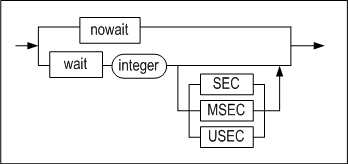

#### 전제 조건

SYS 사용자, 테이블 소유자, INSERT ANY TABLE 시스템 권한을 가진 사용자 및
테이블에 대한 INSERT 객체 권한을 가진 사용자만이 이 구문으로 해당 테이블에
레코드를 삽입할 수 있다.

뷰에 레코드를 INSERT할 때, 사용자는 베이스 테이블에 대해서 위와 동일한 권한을
가져야 한다.

#### 설명

명시한 테이블 또는 특정 파티션에 새로운 레코드를 삽입하는 구문이다. 만약 해당
테이블에 인덱스가 존재할 경우엔 인덱스 데이터도 변경될 것이다.

*user_name*

레코드가 삽입될 테이블의 소유자 이름을 명시한다. 생략하면 Altibase는 그 테이블이
현재 세션에 연결된 사용자의 스키마에 속한 것으로 간주한다.

*tbl_name*

레코드가 삽입될 테이블의 이름을 명시한다.

*view_name*

레코드가 삽입될 뷰의 이름을 명시한다.

*subquery*

레코드를 삽입하려는 뷰를 서브쿼리로 명시한다.

*NULL*

일부 칼럼의 값은 명시하고 일부 칼럼의 값은 명시하지 않고 데이터를 삽입할 경우,
값을 주지 않은 칼럼에 기본값이 설정되어 있지 않으면 널이 삽입된다. ( TIMESTAMP
칼럼의 기본값은 INSERT 연산이 수행된 시점의 시스템 시각 값이다. 따라서 TIMESTAMP
칼럼의 입력 값을 명시하지 않을 경우 널이 아닌 시스템 시각 값이 삽입된다. )

VALUES 절에 명시적으로 널을 지정하면 널이 삽입된다.

*multi_table_insert 절*

다중 테이블 삽입절은 서브쿼리에서 생성된 결과 집합의 행을 한 개 이상의 테이블에
삽입하기 위해 사용된다. 서브쿼리의 select 리스트에 수식이 있다면, VALUES 절에서
참조할 수 있도록 수식에 별칭(alias)을 반드시 주어야 한다.

*DEFAULT*

VALUES 절에 DEFAULT를 명시하면 해당 칼럼에 정의된 기본값이 삽입된다. 전체
칼럼들에 대해 기본값을 삽입하려면 DEFAULT VALUES 절을 사용한다.

TIMESTAMP 칼럼에 DEFAULT를 명시하면 시스템 시각 값이 삽입될 것이다.

*INSERT \~ SELECT*

SELECT 질의 결과를 테이블에 삽입하는 구문이다. 삽입할 테이블과 조회하는 테이블이
같아도 된다. 삽입할 칼럼의 개수와 조회하는 칼럼의 개수는 동일해야 하며, 대응하는
칼럼은 서로 호환 가능한 데이터 타입이어야 한다.

*returning_clause*

DELETE 구문의 returning_clause를 참고하라.

*wait_clause*

wait_clause에 대한 설명은 SELECT문의 FOR UPDATE 절 참조한다.

#### HINTS 옵션

힌트의 문법과 자세한 설명은 "힌트 구문"과 "힌트 목록"을 참고하기 바란다.

#### 주의 사항

- INSERT 문으로 데이터를 입력할 때, 다음의 사항들을 유념해야 한다.
  - 명시한 칼럼의 개수와 삽입할 값들의 개수는 동일해야 하며 호환 가능한 데이터형
    이어야 한다.
  - 파티션을 지정할 경우 해당 파티션에 일치하지 않는 값은 입력할 수 없다.
  - 기본값이 정의되어 있지 않고 NOT NULL 제약이 없는 칼럼에 입력값을 명시하지
    않고 INSERT를 수행할 경우, NULL이 삽입된다.
  - CHECK 제약조건으로 인해 INSERT가 실패할 수 있다.

- Direct-Path INSERT사용에는 다음과 같은 제약이 있다.
  - 대상 테이블은 디스크 테이블이어야 하며, LOB 칼럼 또는 인덱스를 가질 수 없다.
  - 이중화 대상 테이블에 대해서 Direct-Path INSERT를 사용할 수 없다.
  - 대상 테이블은 트리거나 참조 무결성 제약조건을 가질 수 없다.
  - 대상 테이블은 CHECK 제약조건을 가질 수 없다.

#### 예제

##### 단순 데이터 입력

\<질의\> 이름이 Louise Leroux인 고객 정보 입력

```
INSERT INTO customers VALUES ( '25', 'Leroux', 'Louise', 'student',
'025282222', 'F', '0101', 150763, '#3 825 - 17th Ave SW Calgary Canada'); 
1 row inserted.
```

\<질의\> Rosalia Jung인 고객의 정보 중 사번, 이름, 성별만 입력

```
INSERT INTO employees(eno, e_firstname, e_lastname, sex) VALUES(21, 'Rosalia', 'Jung', 'F');
1 row inserted.
```

\<질의\> 여러 개의 레코드를 한번에 입력(Multi Row Insert)

```
INSERT INTO GOODS VALUES('Y111100001', 'YY-300' , 'AC0001', 1000 , 78000),
('Y111100002', 'YY-310' , 'DD0001', 100 , 98000), ('Y111100003', 'YY-H5000',
'AC0002', 780 , 35800);

3 rows inserted.
```


##### 복합 데이터 입력

\<질의\> 지연중인 주문에 대한 고객 번호와 주문일을 orders 테이블에서
delayed_processing 테이블로 복사하라.

```
iSQL> CREATE TABLE delayed_processing(
  cno CHAR(14), order_date DATE);
Create success.
iSQL> INSERT INTO delayed_processing
  SELECT cno, order_date
  FROM orders
  WHERE PROCESSING = 'D';
1 row inserted.
```


##### 파티션에 데이터 입력

```
CREATE TABLE T1 ( I1 INTEGER, I2 INTEGER )
PARTITION BY RANGE ( I1 )
( 
	PARTITION P1 VALUES LESS THAN ( 300 ),
	PARTITION P2 VALUES LESS THAN ( 400 ),
	PARTITION P3 VALUES DEFAULT 
) TABLESPACE SYS_TBS_DISK_DATA;

INSERT INTO T1 PARTITION ( P1 ) VALUES ( 123, 456 );
1 row inserted.
```


##### Direct-Path INSERT 힌트 사용한 입력

\<질의\> T1테이블의 모든 데이터를 Direct-Path INSERT 방식으로 T2테이블에
입력한다.

```
INSERT /*+ APPEND */ INTO T2 SELECT * FROM T1;
```


##### 다중 테이블 삽입

\<질의\> 한번에 여러 개의 행을 하나의 테이블에 삽입한다.

```
CREATE TABLE t (
pid INTEGER,
fname VARCHAR(20),
lname VARCHAR(25));

INSERT INTO t VALUES (1, 'Dan', 'Morgan'), (2, 'Jeremiah', 'Wilton'), (3, 'Helen', 'Lofstrom');
```

\<질의\> 서브쿼리의 결과를 여러 테이블에 삽입한다.

```
CREATE TABLE sal_history (
eno INTEGER,
join_date DATE,
salary NUMBER(10,2));

CREATE TABLE dno_history (
eno INTEGER,
dno SMALLINT,
chg_date DATE);

INSERT ALL
INTO sal_history VALUES(emp_id,join_date,salary)
INTO dno_history VALUES(emp_id,dept_id,sysdate)
SELECT eno EMP_ID, join_date, salary, dno DEPT_ID
FROM employees;
```


##### Returing 절을 사용한 입력

\<질의\> 다음 예제는 입력된 행의 값을 출력 바인드 변수 :v1, :v2로 반환한다.

```
iSQL> create table employees ( eno integer, ename varchar(20));
Create success.
 
iSQL> var v1 output integer;
iSQL> var v2 output varchar(30);

iSQL> prepare insert into employees values (1, 'jake') return eno, ename into :v1, :v2;
1 row inserted.

iSQL> print var
[ HOST VARIABLE ]
-------------------------------------------------------
NAME                 TYPE                 VALUE
-------------------------------------------------------
V1                   INTEGER              1
V2                   VARCHAR(30)          jake
```


##### 조인 뷰에 데이터 입력

\<질의\> employees와 departments 테이블의 조인 뷰를 생성한 후, 레코드를
삽입한다.

```
iSQL> CREATE VIEW simple_emp AS
         SELECT eno, e_lastname, e_firstname, emp.dno dno
         FROM employees emp, departments dept
         WHERE emp.dno = dept.dno;
Create success.
iSQL> select * from simple_emp;
ENO         E_LASTNAME            E_FIRSTNAME           DNO
-------------------------------------------------------------------------
3           Kobain                Ken                   1001
16          Chen                  Wei-Wei               1001
.
.
.
20          Blake                 William               4002
19 rows selected.

iSQL> INSERT INTO simple_emp(eno, e_lastname, e_firstname, dno) VALUES(50, 'Kim', 'Yong', 1001);
1 row inserted.
iSQL> select * from simple_emp;
ENO         E_LASTNAME            E_FIRSTNAME           DNO
-------------------------------------------------------------------------
3           Kobain                Ken                   1001
16          Chen                  Wei-Wei               1001
50          Kim                   Yong                  1001
.
.
.
20          Blake                 William               4002
20 rows selected.
```


### LOCK TABLE

#### 구문

**lock_table ::=**


#### 전제 조건

SYS 사용자, 테이블의 소유자와 LOCK ANY TABLE 시스템 권한을 가진 사용자만이 이
구문으로 테이블을 잠글수있다.

#### 설명

lock_mode에 명시한 잠금 모드로 특정한 모드 내에서 테이블 잠금(lock table)을
설정하는 기능이다. 테이블에 잠금이 걸리면 관련 트랜잭션이 커밋되거나 롤백될
때까지 계속 그 잠금이 유지된다.

*user_name*

잠금이 걸릴 테이블의 소유자 이름을 명시한다. 생략하면 Altibase는 그 테이블이
현재 세션에 연결된 사용자의 스키마에 속한 것으로 간주한다.

*tbl_name*

잠금이 걸릴 테이블의 이름을 명시한다.

*partition_name*

잠금이 걸릴 파티션의 이름을 명시한다.
파티션의 이름을 명시하면, 파티션에 잠금 모드를 적용하고 테이블에는 ROW SHARE 또는 ROW EXCLUSIVE를 적용한다.

|      잠금 모드      |     파티션 적용     |  테이블 적용  |
| :-----------------: | :-----------------: | :-----------: |
|      ROW SHARE      |      ROW SHARE      |   ROW SHARE   |
|    SHARE UPDATE     |    SHARE UPDATE     |   ROW SHARE   |
|    ROW EXCLUSIVE    |    ROW EXCLUSIVE    | ROW EXCLUSIVE |
| SHARE ROW EXCLUSIVE | SHARE ROW EXCLUSIVE | ROW EXCLUSIVE |
|        SHARE        |        SHARE        |   ROW SHARE   |
|      EXCLUSIVE      |      EXCLUSIVE      | ROW EXCLUSIVE |

*lock_mode*

테이블 잠금을 설정할 때, 다음의 잠금 모드 중에서 하나를 명시해야 한다.

- ROW SHARE  
  이 모드로 잠금이 설정된 테이블에 다른 트랜잭션에 의한 동시 접근을 허용한다.
  그러나 다른 사용자들이 독점적인 접근을 위해 이 테이블에 EXCLUSIVE 모드로
  잠금을 거는 것은 금한다.
- SHARE UPDATE  
  ROW SHARE와 동일한 기능의 잠금 모드이다.
- ROW EXCLUSIVE  
  이 모드로 잠금이 설정된 테이블에 다른 트랜잭션에 의한 동시 접근을 허용한다.
  그러나 다른 사용자들이 독점적인 접근을 위해 이 테이블에 EXCLUSIVE 또는 SHARE
  모드로 잠금을 거는 것은 금한다. 데이터를 갱신, 삽입하거나 또는 삭제할 때
  자동으로 이 잠금이 획득된다.
- SHARE ROW EXCLUSIVE  
  다른 트랜잭션이 이 모드로 잠금이 설정된 테이블을 읽는 것이 허용된다. 그러나
  다른 사용자들이 독점적인 접근을 위해 이 테이블에 SHARE 모드로 잠금을 거는
  것은 금한다.
- SHARE  
  다른 트랜잭션이 이 모드로 잠금이 걸린 테이블을 읽는 것은 허용하지만 갱신하는
  것은 금한다.
- EXCLUSIVE  
  현재 트랜잭션이 이 모드로 잠금이 걸린 테이블을 읽거나 갱신하는 것은
  허용하지만, 다른 트랜잭션은 불가하다.

*WAIT \| NOWAIT*

잠금이 획득될 때까지 대기할 지 여부를 지정하는 옵션이다. 생략하면, 행 단위
잠금이 획득될 때까지 무한정 기다린다.

- WAIT n  
  트랜잭션이 행 단위 잠금(row lock)이 걸리기까지 n 초 만큼 기다리고도 획득에
  실패하면 에러가 반환될 것이다.
- NOWAIT  
  트랜잭션이 잠금 획득이 즉시 안 될 경우 행 단위 잠금이 걸리기까지 기다리지
  않는다. 이 경우 이미 다른 사용자에 의해서 해당 테이블에 이미 잠금이 걸려
  있다는 것을 나타내는 에러를 반환한다.

*UNTIL NEXT DDL*

세션이 NON-AUTOCOMMIT 모드일 때 테이블에 DDL(데이터 정의어)을 수행하면, DDL이
실행되기 직전에 자동으로 커밋을 수행한다.

그러나 lock_mode에서 EXCLUSIVE 모드를 지정하고 이 절을 실행하면, DDL을 수행하기
직전에 자동으로 커밋을 수행하지 않는다. 이 기능은 하나의 트랜잭션에 한 번만
수행할 수 있다.

<table style="width: 634px;">
<tbody>
<tr>
<td style="width: 236px;" rowspan="2">
<p><strong>SQL Statement</strong></p>
</td>
<td style="width: 87px;" rowspan="2">
<p><strong>Mode of Table Lock</strong></p>
</td>
<td style="width: 363px;" colspan="5">
<p><strong>Lock Modes Permitted?</strong></p>
</td>
</tr>
<tr>
<td style="width: 48px; text-align: center;">
<p><strong>IS</strong></p>
</td>
<td style="width: 71px; text-align: center;">
<p><strong>IX</strong></p>
</td>
<td style="width: 76px; text-align: center;">
<p><strong>S</strong></p>
</td>
<td style="width: 77px; text-align: center;">
<p><strong>SIX</strong></p>
</td>
<td style="width: 91px; text-align: center;">
<p><strong>X</strong></p>
</td>
</tr>
<tr>
<td style="width: 236px;">
<p>SELECT &hellip; FROM <em>tbl_name</em> &hellip;</p>
</td>
<td style="width: 87px;">
<p>IS</p>
</td>
<td style="width: 48px;">
<p>Y(IS)</p>
</td>
<td style="width: 71px;">
<p>Y(IX)</p>
</td>
<td style="width: 76px;">
<p>Y(S)</p>
</td>
<td style="width: 77px;">
<p>Y(SIX)</p>
</td>
<td style="width: 91px;">
<p>N(X)</p>
</td>
</tr>
<tr>
<td style="width: 236px;">
<p>INSERT INTO <em>tbl_name</em> &hellip;</p>
</td>
<td style="width: 87px;">
<p>IX</p>
</td>
<td style="width: 48px;">
<p>Y(IX)</p>
</td>
<td style="width: 71px;">
<p>Y(IX)</p>
</td>
<td style="width: 76px;">
<p>N(SIX)</p>
</td>
<td style="width: 77px;">
<p>N(SIX)</p>
</td>
<td style="width: 91px;">
<p>N(X)</p>
</td>
</tr>
<tr>
<td style="width: 236px;">
<p>UPDATE tbl_name &hellip;</p>
</td>
<td style="width: 87px;">
<p>IX</p>
</td>
<td style="width: 48px;">
<p>Y*(IX)</p>
</td>
<td style="width: 71px;">
<p>Y*(IX)</p>
</td>
<td style="width: 76px;">
<p>N(SIX)</p>
</td>
<td style="width: 77px;">
<p>N(SIX)</p>
</td>
<td style="width: 91px;">
<p>N(X)</p>
</td>
</tr>
<tr>
<td style="width: 236px;">
<p>DELETE FROM <em>tbl_name</em> &hellip;</p>
</td>
<td style="width: 87px;">
<p>IX</p>
</td>
<td style="width: 48px;">
<p>Y*(IX)</p>
</td>
<td style="width: 71px;">
<p>Y*(IX)</p>
</td>
<td style="width: 76px;">
<p>N(SIX)</p>
</td>
<td style="width: 77px;">
<p>N(SIX)</p>
</td>
<td style="width: 91px;">
<p>N(X)</p>
</td>
</tr>
<tr>
<td style="width: 236px;">
<p>SELECT &hellip; FROM <em>tbl_name</em> FOR UPDATE &hellip;</p>
</td>
<td style="width: 87px;">
<p>IS</p>
</td>
<td style="width: 48px;">
<p>Y*(IX)</p>
</td>
<td style="width: 71px;">
<p>Y*(IX)</p>
</td>
<td style="width: 76px;">
<p>Y*(S)</p>
</td>
<td style="width: 77px;">
<p>Y*(SIX)</p>
</td>
<td style="width: 91px;">
<p>N(X)</p>
</td>
</tr>
<tr>
<td style="width: 236px;">
<p>LOCK TABLE <em>tbl_name</em> IN ROW SHARE MODE</p>
</td>
<td style="width: 87px;">
<p>IS</p>
</td>
<td style="width: 48px;">
<p>Y(IS)</p>
</td>
<td style="width: 71px;">
<p>Y(IX)</p>
</td>
<td style="width: 76px;">
<p>Y(S)</p>
</td>
<td style="width: 77px;">
<p>Y(SIX)</p>
</td>
<td style="width: 91px;">
<p>N(X)</p>
</td>
</tr>
<tr>
<td style="width: 236px;">
<p>LOCK TABLE <em>tbl_name</em> IN ROW EXCLUSIVE MODE</p>
</td>
<td style="width: 87px;">
<p>IX</p>
</td>
<td style="width: 48px;">
<p>Y(IX)</p>
</td>
<td style="width: 71px;">
<p>Y(IX)</p>
</td>
<td style="width: 76px;">
<p>N(SIX)</p>
</td>
<td style="width: 77px;">
<p>N(SIX)</p>
</td>
<td style="width: 91px;">
<p>N(X)</p>
</td>
</tr>
<tr>
<td style="width: 236px;">
<p>LOCK TABLE <em>tbl_name</em> IN SHARE MODE</p>
</td>
<td style="width: 87px;">
<p>S</p>
</td>
<td style="width: 48px;">
<p>Y(S)</p>
</td>
<td style="width: 71px;">
<p>N(SIX)</p>
</td>
<td style="width: 76px;">
<p>Y(S)</p>
</td>
<td style="width: 77px;">
<p>N(SIX)</p>
</td>
<td style="width: 91px;">
<p>N(X)</p>
</td>
</tr>
<tr>
<td style="width: 236px;">
<p>LOCK TABLE <em>tbl_name</em> IN SHARE ROW EXCLUSIVE MODE</p>
</td>
<td style="width: 87px;">
<p>SIX</p>
</td>
<td style="width: 48px;">
<p>Y(SIX)</p>
</td>
<td style="width: 71px;">
<p>N(SIX)</p>
</td>
<td style="width: 76px;">
<p>N(SIX)</p>
</td>
<td style="width: 77px;">
<p>N(SIX)</p>
</td>
<td style="width: 91px;">
<p>N(X)</p>
</td>
</tr>
<tr>
<td style="width: 236px;">
<p>LOCK TABLE <em>tbl_name</em> IN EXCLUSIVE MODE</p>
</td>
<td style="width: 87px;">
<p>X</p>
</td>
<td style="width: 48px;">
<p>N(X)</p>
</td>
<td style="width: 71px;">
<p>N(X)</p>
</td>
<td style="width: 76px;">
<p>N(X)</p>
</td>
<td style="width: 77px;">
<p>N(X)</p>
</td>
<td style="width: 91px;">
<p>N(X)</p>
</td>
</tr>
<tr>
<td style="width: 686px;" colspan="7">
<p>IS: row share (Intent share lock)</p>
<p>IX: row exclusive (Intent exclusive lock)</p>
<p>S: share</p>
<p>SIX: share row exclusive (Share with Intent exclusive lock)</p>
<p>X: exclusive</p>
<p>* Y: 다른 트랜잭션에 의해 행 잠금 충돌이 일어나지 않은 경우, 그 트랜잭션은 잠금 획득이 가능하다. 그렇지 않으면 기다림이 발생한다.</p>
<p>&nbsp;</p>
<p><strong>괄호 내에 표시된 잠금 타입은:</strong></p>
<p>1. 다른 트랜잭션에 의해 현재의 잠금 모드 전환이 허용되는 경우(Y), 현재 걸려있는 잠금 타입이 괄호 안의 타입으로 전환된다.</p>
<p>2. 다른 트랜잭션에 의해 현재의 잠금 모드 전환이 허용되지 않는 경우(N), 잠금 타입은 현재 잠금을 획득하고 있는 트랜잭션이 새로운 잠금을 획득할 때만 괄호 안의 타입으로 전환이 가능하다.</p>
</td>
</tr>
</tbody>
</table>

[표 4‑1] Summary of Table Locks

#### 예제

다음은 LOCK TABLE과 SELECT 문이 사용 될 때 Altibase가 데이터 동시성, 무결성,
그리고 일관성을 어떻해 관리하는가를 보여주는 예제이다.

| Transaction A                                                | Time Point | Transaction B                                                |
| ------------------------------------------------------------ | ---------- | ------------------------------------------------------------ |
| iSQL\> AUTOCOMMIT OFF; Set autocommit off success.           |            | iSQL\> AUTOCOMMIT OFF; Set autocommit off success.           |
|                                                              | 1          | (request X lock on employees) iSQL\> LOCK TABLE employees IN EXCLUSIVE MODE; Command execute success. (acquire X lock on employees) |
| iSQL\> DROP TABLE employees; [ERR-11170: The transaction has exceeded the lock timeout specified by the user.] | 2          |                                                              |
|                                                              | 3          | iSQL\> UPDATE employees SET salary = 2500000 WHERE eno = 15; 1 row updated. |
| (request S lock on employees) iSQL\> LOCK TABLE employees IN SHARE MODE; (the request conflicts with the X lock already held by transaction B) wait wait wait | 4          |                                                              |
|                                                              | 5          | iSQL\> COMMIT; Commit success. (release X lock on employees) |
| (resume) Lock success. (acquire S lock on employees) iSQL\> SELECT salary FROM employees WHERE eno = 15; SALARY -------------- 2500 1 row selected. (커밋된 데이터가 보인다.) | 6          |                                                              |
| iSQL\> ROLLBACK; Rollback success. (release S lock on employees) | 7          |                                                              |
| iSQL\> LOCK TABLE employees IN EXCLUSIVE MODE; Lock success. (acquire X lock on employees) | 8          |                                                              |
|                                                              |            | iSQL\> SELECT SALARY FROM employees WHERE eno = 15; wait wait wait |
| iSQL\> UPDATE employees SET eno = 30 WHERE eno = 15; 1 row updated. | 10         |                                                              |
| iSQL\> COMMIT; Commit success. (release X loc on employees)  | 11         |                                                              |
|                                                              | 12         | (resume) SALARY -------------- 2500 1 row selected.          |

### SELECT 

#### 구문

**select ::=**


[for_update_clause
::=](#for_update_clause)

**with_clause ::=**


<a name="subquery"><a/>

**subquery ::=**


[limit_clause ::=](#limit_clause)

**select_clause ::=**


[hierarchical_query_clause ::=](#hierarchical_query_clause), [group_by_clause
::=](#group_by_clause)

**select_list ::=**

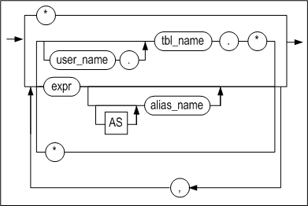

<a name="tbl_reference"><a/>

**tbl_reference ::=**


[joined_table ::=](#joined_table)

<a name="single_table"><a/>

**single_table ::=**


**pivot_clause ::=**


<a name="pivot_for_clause"><a/>

**pivot_for_clause ::=**


**pivot_in_clause ::=**


**unpivot_clause ::=**


[pivot_for_clause ::=](#pivot_for_clause)

**unpivot_in_clause ::=**


<a name="joined_table"><a/>

**joined_table ::=**

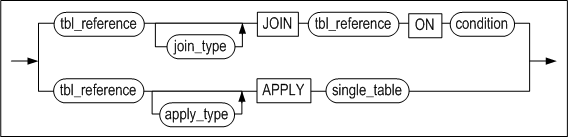

[tbl_reference ::=](#tbl_reference), [single_table ::=](#single_table),

**join_type ::=**

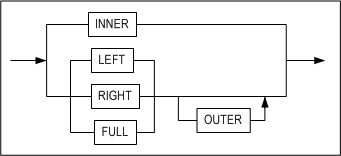

**apply_type ::=**


<a name="where_clause"><a/>

**where_clause ::=**

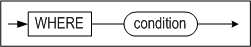

<a name="hierarchical_query_clause"><a/>

**hierarchical_query_clause ::=**

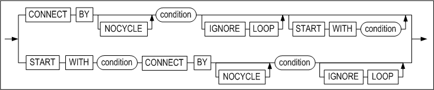

<a name="group_by_clause"><a/>

**group_by_clause ::=**


**rollup_cube_clause ::=**


**grouping_sets_clause ::=**


**grouping_expression_list ::=**

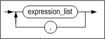

**expression_list ::=**


**order_by_clause ::=**


<a name="imit_clause"><a/>

**limit_clause ::=**


<a name="for_update_clause"><a/>

**for_update_clause ::=**


#### 전제 조건

SYS 사용자, 테이블 소유자, SELECT ANY TABLE 시스템 권한을 가진 사용자 및
테이블에 대한 SELECT 객체 권한을 가진 사용자만이 이 구문으로 해당 테이블에서
데이터를 조회할 수 있다.

#### 설명

한 개 이상의 테이블 또는 뷰에서 데이터를 검색하는 구문이다.

*with_clause*

Altibase는 with_clause 절을 인라인 뷰 또는 임시 테이블로 처리하여 최적화한다.

일반적인 WITH query_name절은 AS 다음에 따라오는 부질의(subquery)에 이름을
부여한다. 부질의에 부여된 이름은 주질의 내의 여러 위치에서 참조될 수 있다.

그러나 재귀적인 WITH 구문(이하 recursive with 또는 재귀 질의)에서는 반드시
query_name 뒤에 칼럼의 별명을 지정하고, 부질의 내에서 집합 연산자를 사용해야
해당 질의를 반복적으로 수행할 수 있다. subquery 내에는 집합 연산자를 기준으로 두
개의 질의가 존재하며, 앞의 질의는 주 질의(기준 질의)가 되고 뒤의 질의가 재귀
질의가 된다. 재귀 질의는 프로퍼티 RECURSION_LEVEL_MAXIMUM에 설정한 레벨
값(기본값 1000)까지 최대 출력된다. 자세한 내용은 Altibase 매뉴얼 중 *General
Reference*의 Altibase 프로퍼티 장을 참조한다.

사용자는 이 절을 주질의 및 대부분 유형의 부질의에 명시할 수 있다.

- 제약 사항:
  - 하나의 SQL 문에 하나의 with_clause만 명시할 수 있다. query_name은 자신을
    정의하는 부질의에서는 사용할 수 없다. 단 with_clause 안에서 여러 개의 쿼리
    이름을 정의하는 경우, 뒤이어 정의되는 다른 부질의에는 앞서 정의한 다른 쿼리
    이름을 사용할 수 있다.
  - RECURSIVE WITH 구문에서 주 질의와 재귀 질의의 위치가 변경되면 안된다. 또한
    query_name을 재귀 질의에서 한 번은 명시적으로 참조해야 한다. 그러나 재귀
    질의에서는 집계 함수, DISTINCT 키워드, GROUP BY 절을 사용할 수 없다.
  - RECURSIVE WITH 구문의 주 질의에 query_name을 참조하는 서브쿼리를 사용할 수
    없다.
  - RECURSIVE WITH 구문의 재귀 질의에 query_name을 참조하는 뷰 또는 Outer Join의
    오른쪽 테이블에 사용할 수 없다.

*TOP (expr)*

쿼리의 결과 집합 중 반환할 행의 개수를 지정하는 절이다. *expr*에는 정수만 올 수
있다.

*select_list 절*

DISTINCT를 명시할 경우 결과 집합에서 중복된 레코드는 제거된다.

만약 GROUP BY 절이 존재한다면 상수, 집계 함수(aggregate functions), GROUP BY
절에 명시된 표현식과 이들을 조합한 표현식만 SELECT 리스트에 명시 가능하다.

SELECT 리스트가 칼럼이 포함되지 않은 수식 또는 상수로만 이루어져 있는 경우, FROM
절 이하를 생략할 수 있다.

SELECT 리스트에 \*만 명시한 것은 FROM 절의 모든 테이블과 뷰의 모든 칼럼들을
의미한다. SELECT 리스트에 \*가 칼럼 또는 수식과 함께 명시된 경우에도 마찬가지
의미이다.

*FROM 절*

같은 별명(alias_name)을 FROM 절에 두 번 이상 사용할 수 없다. 같은 테이블 명을
FROM절에 여러 번 사용할 때, 다른 별명을 주어야 한다. 즉, 별명을 명시하지 않고
같은 테이블 명을 두 번 이상 사용할 수 없다.

FROM절에 올 수 있는 테이블 또는 뷰의 최대 개수는 32개이다.

- *OUTER JOIN*

  조인 조건을 만족하지 않는 데이터를 처리하기 위한 JOIN의 확장 형태이다. (INNER)
  JOIN이 두 테이블에서 키 값이 일치하는 데이터만 가져오는 것에 비해 OUTER JOIN은
  어느 한 쪽의 데이터를 모두 가져온다. 즉, 한 테이블의 행에 대응하는 행이 다른
  테이블에 존재하지 않을 때, 빈 칼럼들에 대해서 결과 집합에는 NULL로 채워져서
  반환된다.

- *인라인 뷰(Inline View)*

  FROM 절에 오는 부질의(subquery)를 인라인 뷰라고 한다.

- *Lateral View*

  FROM 절에 오는 인라인 뷰는 FROM 절에 나열된 다른 객체나 상위 쿼리에 있는 객체를
  참조할 수 없다. 그러나 FROM 절의 인라인 뷰를 Lateral View로 정의하면 인라인 뷰의
  외부 객체를 참조할 수 있게 된다.

  인라인 뷰를 Lateral View로 정의하려면, LATERAL 또는 APPLY 키워드를 인라인 뷰
  앞에 지정하면 된다. 단, Lateral View가 참조할 수 있는 객체는 해당 Lateral View의
  왼쪽에 지정된 객체들뿐이다. Lateral View로 정의하더라도 Lateral View가 외부
  객체를 참조하지 않으면, Altibase 서버가 해당 Lateral View를 일반적인 인라인 뷰로
  취급한다.APPLY 키워드는 인라인 뷰를 Lateral View로 정의하면서 APPLY 키워드의
  왼쪽 객체와 해당 Lateral View의 조인도 함께 수행한다. 일반적인 조인문이 ON
  키워드 뒤에 조인 조건을 지정하는 것과 달리, APPLY 키워드를 사용하는 조인의
  경우에는 조인 조건이 필요 없다.

  APPLY 키워드를 사용해서 다음의 조인 유형을 지정할 수 있다.
  - CROSS APPLY는 왼쪽 객체와 Lateral View를 Inner Join 할 것을 지정한다.
  - OUTER APPLY는 왼쪽 객체와 Lateral View를 Left Outer Join 할 것을 지정한다.

  > **주의사항**:  아래와 같이 Lateral View를 사용하는 경우, 오류 메시지가 반환된다.
  >
  > - Lateral View에서 Fixed Table을 참조하는 경우
  > - Lateral View에 PIVOT 절, UNPIVOT 절이 사용된 경우
  > - Lateral View에서 해당 Lateral View의 오른쪽에 지정된 객체를 참조하는 경우
  > - Lateral View가 참조하는 객체와 Lateral View를 Right Outer Join 또는
  >   Full-Outer Join을 하는 경우
  > - LATERAL 키워드와 APPLY 키워드를 붙여서 같이 사용한 경우
  > - APPLY 키워드와 ON 절을 함께 사용한 경우

- *pivot_clause*

  pivot_clause는 데이터 집계 연산 및 별개의 행으로 존재하는 데이터를 칼럼으로
  재배열하여 보여주기 위해 사용할 수 있다. 이것은 GROUP BY 절에 두 개의 칼럼을
  사용할 때보다 데이터를 더 읽기 쉽게 보여준다.  

  편의상, 많은 수의 칼럼 출력 또는 변형 연산의 결과로 생기는 특정 칼럼들의 이름을
  명시하는 어려움을 방지하기 위해서 pivot_clause는 일반적으로 인라인 뷰와 함께
  사용된다.  

  pivot_clause는 다음의 단계를 수행한다.

  1. 먼저 pivot_clause 는 마치 GROUP BY 절처럼 그룹 연산을 수행한다. 그 결과는 pivot_clause내의 참조되지 않은 모든 칼럼과 pivot_in_clause에 명시된 값에 대해 그룹화된다.
  2. 다음으로 pivot_clause는 결과로 나온 그룹화된 칼럼들과 집계된 값들을 회전된
     표 형식으로 배열한다.

- *pivot_for_clause*

  pivot_in_clause에 명시된 값이 칼럼 형태로 바꾸어질 때 이에 해당하는 칼럼 이름을
  명시한다.

- *pivot_in_clause*

  pivot_for_clause에 명시된 칼럼들에 존재하는 값을 이 절에 명시할 수 있다. 이
  값들은 pivot 연산에서 칼럼 이름으로 사용될 것이다.

- *unpivot_clause*

  unpivot_clause는 칼럼의 데이터들을 행으로 변환시켜 결과를 반환한다. 

  INCLUDE \| EXCLUDE NULLS 옵션은 UNPIVOT 절로 생성되는 칼럼의 값에 NULL을 허용할
  것인지를 선택할 수 있다. EXCLUDE NULLS는 NULL 값이 생략된 결과를 반환하며,
  생략하면 EXCLUDE NULLS로 동작한다.

  column_name에는 UNPIVOT 구문으로 생성되는 칼럼에 해당하는 값들이 반환되는 칼럼
  이름을 지정한다.

  unpivot_clause에서 사용한 칼럼의 개수만큼 pivot_for_clause 와 pivot_in_clause에
  사용되는 칼럼 개수도 같아야 한다. 또한 alias의 개수도 같아야 한다.

  ```
  unpivot ( ( column, column ) for ( column, column ) in ( ( column, column ) as (
  column, column ) ) );
  ```

  다음처럼 칼럼 개수가 다른 구문은 지원하지 않는다.

  ```
  unpivot ( ( column, column ) for column in ( ( column, column ) as column ) );
  ```


- *Table Function*

  사용자 정의 함수에서 Associative Array 타입이나 Record 타입을 사용할 때 반환되는
  결과를 테이블 형태로 변환하여 출력한다.

*where 조건절*

WHERE 절의 조건에 대한 설명은 8장 조건 연산자를 참고한다.

*Hierarchical Query 절*

계층적 질의(Hierarchical query)란 데이터 조회시 계층적 구조로 출력되는
쿼리문이다. 테이블에 부모, 자식 관계를 가지는 데이터가 존재하는 경우 이 쿼리문을
이용해서 부모, 자식 관계를 계층적으로 출력할 수 있다. 즉, 주어진 검색 조건을
갖는 루트 행에 대하여, 그 행과 그의 종속 행에 대한 계층적 조건을 만족하는 행들을
검색한다.

만약 ORDER BY 절 또는 GROUP BY 절을 사용하여 계층적 데이터를 조회하면, CONNECT
BY절로 수립된 계층적 순서가 바뀔 수 있으므로 주의가 필요하다. 단, ORDER SIBLINGS
BY를 사용하면 계층 구조를 보존하면서 동일한 레벨의 자식들 사이에서 순서를 정할
수 있다.

- *START WITH 절*

  계층적 질의의 루트 행으로 사용될 행을 식별하는 조건을 명시하는 절이다. 이 조건을
  만족하는 모든 행들이 루트 행으로 사용된다. 이 절을 생략하면 Altibase는 테이블에
  있는 모든 행들을 루트 행으로 사용한다.

  ROWNUM 의사칼럼은 이 절에 사용될 수 없다.

- *CONNECT BY 절*

  계층 구조에서 부모 행들과 자식 행들간의 관계를 식별하는 조건을 명시한다.

  CONNECT BY 절은 부질의를 포함할 수 없고 조인과 함께 사용될 수도 없다.

  CONNECT BY 절은 WHERE 절 이후 ORDER BY, GROUP BY, HAVING 절 이전에 사용하여야
  한다.

  NOCYLE 키워드는 계층적 질의의 결과 집합에 순환구조가 존재하더라도, 순환이
  발생하기 전까지의 행을 반환할 것을 데이터베이스에 요구한다.

  SYS_CONNECT_BY_PATH함수는 계층적 질의에서 현재 행까지의 PATH 정보를 쉽게 가져올 수 있다. 이 함수에 대한 자세한 내용은 "6장 SQL 함수"를 참고하라.

- *PRIOR 연산자*

  이전에 검색된 행과 현재 행을 구분하기 위해서 PRIOR 연산자를 사용한다. 즉,
  부모행을 언급하기 위해 반드시 PRIOR 연산자를 사용해야 한다.

  PRIOR 연산자는 CONNECT BY 절을 포함하는 질의문의 SELECT 리스트, WHERE 절, 또는
  CONNECT BY 절에서만 사용할 수 있다.

  질의에 집합 연산자 (UNION, INTERSECT, 등)가 사용되면, PRIOR 연산자는 ORDER BY
  절에 올 수 없다.

- *CONNECT_BY_ROOT 연산자*

  CONNECT_BY_ROOT는 계층적 질의에서만 사용 가능한 단일 연산자이다. 칼럼에 이
  연산자를 사용하면 루트 행의 칼럼 값을 반환한다.

  START WITH 조건 또는 CONNECT BY 조건에 이 연산자를 사용할 수 없다.


- *CONNECT_BY_ISLEAF 의사칼럼*

  CONNECT_BY_ISLEAF 의사칼럼은 현재 행이 CONNECT BY 조건에 의해 정의된 트리에서
  리프 노드(자식 노드가 없는 노드)인 경우 1을 반환하고, 그렇지 않으면 0을
  반환한다.

- *LEVEL 의사칼럼*

  계층적 질의를 포함하는 SQL문은 *select_list*에 LEVEL 의사칼럼을 포함할 수 있다.
  LEVEL 의사칼럼은 루트 행과 종속 행간의 계층적 거리를 나타낸다. 즉, 루트 행의
  LEVEL은 1이고, 자식 행의 LEVEL은 2, 손자 행의 LEVEL은 3, 등이 된다.

  LEVEL의사칼럼은 WHERE 절, ORDER BY 절, GROUP BY 절, HAVING 절에서도 사용
  가능하다. 또한, LEVEL 의사칼럼은 다음 예처럼 쿼리문에 CONNECT BY 절이 없더라도
  *select_list* 에 올 수 있다:

  ```
  select level from t1;
  ```


- *IGNORE*

  행들간 계층 관계가 순환 형태를 이룰 경우 Altibase는 오류를 반환한다. (여기서
  순환이란 한 행이 다른 행의 부모 행도 되고 자식 행도 되는 경우를 말한다.) 단,
  IGNORE LOOP이 명시되었을 경우, 질의 수행시의 순환 형성이 오류를 발생시키지 않고,
  순환 형태의 행들이 질의 결과 집합에서 제거된다.

*GROUP BY 절*

GROUP BY 절은 주어진 하나 이상의 표현식에 대해서 같은 값을 가지는 레코드들끼리
그룹짓고, 각 그룹별로 집계한 정보를 한 행으로 반환받기 위해 사용되는 절이다.

WHERE 조건을 사용하여 반환되는 그룹을 제한할 수 없는 대신에, HAVING 절을
사용하여 반환되는 그룹을 제한할 수 있다.

HAVING 및 GROUP BY 절은 WHERE 절과 *hierarchical_clause* 뒤에 위치시킨다. 만약
ORDER BY 절이 있다면 이는 쿼리문의 맨 마지막에 와야 한다.

*rollup_cube_clause, grouping_sets_clause*

ROLLUP, CUBE, GROUPING SETS는 GROUP BY절이 확장된 것으로써, 여러 개의 그룹화
세트를 지정할 수 있다. 즉, ROLLUP, CUBE 또는 GROUPING SETS를 사용하면 GROUP BY
절을 포함하는 여러 쿼리를 UNION ALL로 결합한 것과 동일한 결과를 얻을 수 있다.

- 제약 사항:
  - GROUP BY 절에서 ROLLUP ,CUBE 또는 GROUPING SETS는 한 번만 명시할 수 있다.
  - SELECT 대상에 부질의(subquery)를 인자로 가지는 집계 함수를 사용할 수 없다.
  - ROLLUP, CUBE 또는 GROUPING SETS과 window 함수를 함께 사용할 수 없다.
  - CUBE절에 최대 15개의 수식을 지정할 수 있다.
  - GROUPING SETS와 중첩 집계 함수를 함께 사용할 수 없다.

*ROLLUP*

ROLLUP은 GROUP BY 절과 함께 사용되며, GROUP BY 절에 의해서 그룹 지어진 집합
결과에 대하여 상세한 정보를 반환하는 기능을 수행한다.

SUM연산과 함께 사용되면, 총계뿐만 아니라 ROLLUP에서 지정하는 칼럼들의 그룹별
소계까지 구한다.

ROLLUP은 그룹화 칼럼들의 개수가 n개일 때 (n+1)개의 GROUP BY가 수행된다. 예를
들어, GROUP BY 절 내에 ROLLUP(a,b,c)를 사용하면 반환되는 그룹의 조합은 다음과
같다:

```
(a,b,c), (a,b), (a), ( )
```


- *부분 롤업(Partial ROLLUP)*

  아래 예제와 같이 GROUP BY의 그룹화 칼럼 중 일부분에만 ROLLUP을 적용하는 것을
  "부분 ROLLUP"이라고 한다:

  ```
  GROUP BY a, ROLLUP(b, c), d
  ```

  이 경우, 반환되는 그룹의 조합은 다음과 같다:

  ```
  (a, d, b, c), (a, d, b), (a, d)
  ```


- *복합 칼럼(Composite Columns) 사용하기*

  아래 예제와 같이 ROLLUP 절에 복합 칼럼의 리스트를 명시할 수 있다:

  ```
  GROUP BY ROLLUP((a, b), (c, d))
  ```

  이 경우, 반환되는 그룹의 조합은 다음과 같다:

  ```
  (a, b, c, d), (a, b), ( )
  ```


*CUBE*

CUBE는 명시된 그룹화 칼럼들의 가능한 모든 조합으로 그룹화를 수행한다. 그룹화
칼럼의 개수가 n개일 때, CUBE는 2n개의 조합에 대해 그룹화를 수행한다. 예를 들어,
GROUP BY CUBE(a,b,c)를 명시하면, (23=8)개의 조합이 아래와 같이 반환된다:

```
(a,b,c), (a,b), (a,c), (b,c), (a), (b), (c), ( )
```

- *부분 큐브(Partial CUBE)*

  부분 CUBE는 부분 ROLLUP과 유사하다. 즉, CUBE 연산자에 명시한 칼럼들의 가능한
  모든 조합이 CUBE 바깥에 있는 칼럼과 함께 결합되어 반환되는 그룹이 결정된다. 부분
  CUBE의 문법은 다음과 같다:

  ```
  GROUP BY a, CUBE(b, c), d
  ```

  이 경우, 아래의 조합에 대한 소계가 반환된다:

  ```
  (a, d, b, c), (a, d, b), (a, d, c), (a, d)
  ```

- *복합 칼럼(Composite Columns) 사용하기*

  아래 예제와 같이 CUBE 절에 복합 칼럼의 리스트를 명시할 수 있다:

  ```
  GROUP BY CUBE((a, b), (c, d))
  ```

  이 경우, 반환되는 그룹의 조합은 다음과 같다:

  ```
  (a, b, c, d), (a, b), (c, d), ( )
  ```


*GROUPING SETS*

ROLLUP이나 CUBE에 의해 생성되는 그룹화 세트 중에서 일부만 필요한 경우에 GROUPING
SETS에 원하는 그룹화 세트만 지정할 수 있다.

SUM연산과 함께 사용되면, GROUPING SETS에서 지정하는 그룹별 총계를 구한다.

GROUPING SETS은 그룹화된 칼럼의 개수가 n개일 때 n개의 GROUP BY가 수행된다. 예를
들어, GROUP BY절 내에 GROUPING SETS(a, b, c)를 사용하면 반환되는 그룹의 조합은
다음과 같다.

```
(a), (b), (c)
```


- *부분 GROUPING SETS (Partial GROUPING SETS)*

  아래 예제와 같이 GROUP BY의 그룹화 칼럼 중 일부분에만 GROUPING SETS을 적용하는
  것을 "부분 GROUPING SETS"이라고 한다.

  ```
  GROUP BY a, GROUPING SETS(b, c), d
  ```

  이 경우, 반환되는 그룹의 조합은 다음과 같다:

  ```
  (a, b, d), (a, c, d)
  ```


- *복합 칼럼(Composite Columns) 사용하기*

  아래 예제와 같이 GROUPING SETS절에 복합 칼럼의 리스트를 명시할 수 있다.

  ```
  GROUP BY GROUPING SETS((a, b), (c, d))
  ```

  이와 같이 GROUPING SETS 목록에서 내부 괄호 안에 2개 이상의 칼럼들이 있는 경우
  하나의 칼럼으로 취급된다. 반환되는 그룹의 조합은 다음과 같다.

  ```
  (a, b), (c, d)
  ```


- *빈 그룹(Empty Group) 사용하기*

  아래 예제와 같이 GROUPING SETS절에 빈 괄호("()")를 사용해서 '빈 그룹'을 명시할
  수 있다.

  ```
  GROUP BY GROUPING SETS((), a, b, c)
  ```

  빈 그룹은 그룹화 없이 총계를 구하기 위해 사용할 수 있다.

*HAVING 조건절*

HAVING 절에는 상수, 집계 함수(aggregate functions), GROUP BY 절에 명시된
표현식과 이들을 조합한 표현식만 올 수 있다.

이 절은 명시된 조건이 참인 그룹에 해당하는 레코드만 반환한다.

HAVING 절의 조건문에 대한 자세한 설명은 "8장 조건 연산자"를 참고하기 바란다.

*UNION (ALL), INTERSECT, MINUS*

집합 연산자는 두 SELECT 문의 결과 집합을 하나로 결합한다. 각 질의가 반환하는
칼럼들의 개수와 데이터 타입이 동일해야 하지만, 칼럼 길이는 달라도 된다. 집합
연산자의 앞 부분에 위치하는 *select_list* 의 표현식 이름이 전체 결과 집합의 칼럼
이름이 될 것이다.

집합 연산자에 대한 자세한 설명은 5장 집한 연산자를 참고한다.

*ORDER BY 절*

검색된 레코드들을 정렬하는 절이다. 결과 집합은 오름차순 또는 내림차순으로 정렬
가능하다. 기본으로 오름차순 정렬된다.

ORDER BY 절 없이 같은 질의를 반복해서 수행할 때, 결과 집합이 일관되게 정렬된다는
보장이 없다.

ORDER BY 절은 SELECT 문에서 한번만 올 수 있다. 이는 부질의 (subquery)에서는
사용할 수 없다.

ORDER BY 절에 표현식을 명시한 경우에는 표현식 연산의 결과 값에 대해 정렬된다.
표현식은 *select_list* 또는 FROM 절의 테이블 또는 뷰의 컬럼을 기반으로 작성될
것이다. ORDER BY 절에 상수를 명시한 경우에는 *select_list* 내에서의 그 위치에
해당하는 검색 대상 값에 대해 정렬 한다.

집합 연산자(UNION, INTERSECT 등)를 사용한 경우, 위치(position) 또는 검색 대상의
별명만 ORDER BY 절에 사용 가능하다.

GROUP BY가 존재할 경우 그룹 표현식만 사용 가능하다.

ORDER BY 절에 다수의 표현식도 올 수 있다. 결과 집합은 먼저 첫 번째 표현식의 값을
기준으로 정렬되고, 첫번째 표현식의 값이 같은 레코드들은 두번째 표현식의 값을
기준으로 정렬되며, 같은 방식으로 이 후 표현식에 대해서도 정렬된다.

오름차순의 인덱스가 정렬 기준 칼럼에 존재한다면, 오름차순으로 정렬할 때는 다른
모든 것들의 뒤에, 그리고 내림차순으로 정렬할 때는 다른 다른 것들의 앞에, NULL 이
정렬된다. 내림차순의 인덱스가 정렬 기준 칼럼에 존재한다면, 오름차순으로 정렬할
때는 다른 모든 것들의 앞에, 그리고 내림차순으로 정렬할 때는 다른 다른 것들의
뒤에, NULL 이 정렬된다. 인덱스가 정렬 기준 칼럼에 존재하지 않는다면, 정렬 순서에
상관없이 NULL은 다른 모든 것들의 뒤에 나타난다.

검색 대상에 DISTINCT를 사용하면, ORDER BY 절에는 SELECT 리스트내의 표현식 또는
이들 표현식의 조합만 올 수 있다.

GROUP BY 절이 있다면, 다음의 표현식이 ORDER BY 절에 올 수 있다.

- 상수
- 집계 함수 (aggregate functions)
- GROUP BY 절의 표현식
- 위의 조합으로 이루어진 표현식

NULLS FIRST 또는 NULLS LAST 키워드를 사용해서 NULL을 정렬 순서에서 맨 처음 또는
맨 마지막에 위치시킬 수 있다.

*LIMIT 절*

LIMIT 절은 반환되는 행의 개수를 제한하기 위해 사용된다.

- row_offset: 반환할 첫번째 레코드를 지정한다. 생략하면 전체 결과 집합의
  첫번째 레코드부터 반환될 것이다.
- row_count: 반환할 레코드의 개수를 지정한다.

부질의에서도 LIMIT절을 사용할 수 있다.

*FOR UPDATE 절*

현재 트랜잭션이 끝날 때까지 다른 사용자들이 행(row)을 잠그거나 수정할 수 없도록
선택된 행을 잠근다.

WAIT 옵션은 테이블의 잠금을 획득하기 위해 얼마나 대기할지를 지정한다. 적용할 수
있는 시간 단위는 second(초), millisecond(msec, 1/1000초), microsecond(usec,
1/1000000초)이며 표기하지 않으면 초 단위가 적용된다. 반면, NOWAIT 옵션은 잠금을
획득할 테이블이 이미 다른 트랜잭션에 의해 잠금이 걸린 상태라면 기다리지 말 것을
지시한다.

FOR UPDATE 절은 최 상위 SELECT 문에서만 사용 가능하다. 즉, 부질의에는 사용할 수
없다. 그러므로 다음과 같은 질의는 사용할 수 없다:  

```
select eno from employees where (select eno from departments for update);
```

FOR UPDATE 절은 DISTINCT, GROUP BY절, 집계 함수, 집합 연산자(UNION, INTERSECT
등)와 함께 사용 할 수 없다.

#### 조인

조인이란 두 개 이상의 테이블, 뷰, materialized 뷰로부터 로우를 결합하는 것을
일컫는다. 쿼리의 FROM 절에 여러 테이블이 있을 때 조인이 수행된다.

조인 조건(join condition)은 두 테이블을 결합하는 방법을 정의한다. 조인 조건은
FROM 절이나 WHERE 절 중의 하나에 지정할 수 있다. 조인 조건에 있는 칼럼이 select
리스트에 반드시 있을 필요는 없다. 조인 조건은 주로 각 테이블로부터 두 칼럼을
비교하는데, Altibase는 조인 조건이 TRUE로 판정되는 각 테이블의 로우를 결합해서
반환한다.

세 개 이상의 테이블을 조인하는 경우, Altibase는 두 테이블을 먼저 조인한 다음 그
결과를 다른 테이블과 조인한다. 쿼리 옵티마이저는 조인할 테이블의 순서를 결정할
때 조인 조건, 인덱스, 통계 정보 등에 기반한다.

> 주의: LOB 칼럼은 조인 조건에 사용될 수 없다.

Altibase는 아래의 조인을 지원한다.

- Cross Join
- Inner Join
- Outer Join
- Semi Join
- Anti Join

*Cross Join*

조인 조건을 갖지 않는 두 테이블을 결합한다. 한 테이블의 각 로우는 다른 테이블의
각각의 로우와 결합한다. Cartesian Products라고도 한다.

아래는 Cross Join 쿼리의 예제이다.

```
SELECT * FROM T1, T2;
```

*Inner Join*

Inner Join은 일반적인 조인을 말하며, 두 테이블에서 조인 조건을 만족하는 로우들만
결합해서 반환한다.

아래는 Inner Join 쿼리의 예제이다.

```
SELECT * FROM T1, T2 WHERE T1.i1 = T2.i1;
SELECT * FROM T1 INNER JOIN T2 ON T1.i1 = T2.i1;
SELECT * FROM T1, T2, T3 WHERE T1.i1 = T2.i1 AND T2.i1 < T3.i2;
```


*Outer Join*

Outer Join은 두 개의 다른 테이블에서 조인 조건을 만족하는 로우를 판별해서
반환한다. Inner Join과 Outer Join의 차이점은 한 테이블에만 조인 조건을 만족하는
로우가 있고 다른 테이블에는 조인 조건을 만족하는 로우가 없는 경우, Inner Join은
해당 로우를 반환하지 않는 반면 Outer Join은 조인 조건을 만족하는 로우가 없는
테이블의 값을 NULL로 반환한다.

Outer Join은 다음 세 종류가 있다 : Left Outer Join, Right Outer Join, Full Outer Join

- *Left Outer Join*

  LEFT OUTER JOIN 키워드의 왼편에 테이블 A가, 오른편에 테이블 B가 있을 때, 조인
  조건을 만족하는 A의 모든 로우가 반환된다. B에 만족하는 로우가 없는 경우에는
  결과집합의 해당 자리에 NULL이 반환된다.

  아래는 Left Outer Join 쿼리의 예제이다.

  ```
  SELECT * FROM A LEFT OUTER JOIN B ON A.c1 = B.c1;
  SELECT * FROM A, B WHERE A.c1 = B.c1(+);
  ```


- *Right Outer Join*

  RIGHT OUTER JOIN 키워드의 왼편에 테이블 A가, 오른편에 테이블 B가 있을 때, 조인
  조건을 만족하는 B의 모든 로우가 반환된다. A에 만족하는 로우가 없는 경우에는
  결과집합의 해당 자리에 NULL이 반환된다.

  아래는 Right Outer Join 쿼리의 예제이다.

  ```
  SELECT * FROM A RIGHT OUTER JOIN B ON A.c1 = B.c1;
  SELECT * FROM A, B WHERE A.c1(+) = B.c1;
  ```


- *Full Outer Join*

  FULL OUTER JOIN 키워드의 왼편에 테이블 A가, 오른편에 테이블 B가 있을 때, A와 B
  중 한 테이블에만 조인 조건을 만족하는 로우가 있어도 해당 로우가 반환된다. 조인
  조건을 만족하는 로우가 없는 테이블에 대해서는 결과집합의 해당 자리에 NULL이
  반환된다.

  아래는 Full Outer Join 쿼리의 예제이다.

  ```
  SELECT * FROM A FULL OUTER JOIN B ON A.c1 = B.c1;
  ```


*Semi Join*

테이블 A와 테이블 B를 Semi Join하는 경우, B에 존재하는 A의 모든 로우를 반환한다.
A의 한 로우에 대해서 B의 여러 로우가 일치하더라도 한 로우만 반환된다.

아래는 Semi Join 쿼리의 예제이다.

```
SELECT * FROM T1 WHERE EXISTS ( SELECT i1 FROM T2 WHERE T1.i1 = T2.i1 ); 
SELECT * FROM T1 WHERE i1 IN ( SELECT i1 FROM T2 );
```


*Anti Join*

테이블 A와 테이블 B를 Anti Join하는 경우, B에 존재하지 않는 A의 로우들만
반환한다.

```
SELECT * FROM T1 WHERE NOT EXISTS ( SELECT i1 FROM T2 WHERE T1.i1 = T2.i1 );
SELECT * FROM T1 WHERE i1 NOT IN ( SELECT i1 FROM T2 );
```

##### 예제

위에서 설명한 각 조인의 실행 결과를 보여주기 위해 employee와 dept 테이블을
생생한다.

```
CREATE TABLE employee(name VARCHAR(10), empid INTEGER, deptname VARCHAR(20));
CREATE TABLE dept(deptname VARCHAR(20), manager VARCHAR(10));

INSERT INTO employee VALUES('Harry', 	3415, 	'Finance');
INSERT INTO employee VALUES('Sally', 	2241, 	'Sales');
INSERT INTO employee VALUES('George', 	3401, 	'Finance');
INSERT INTO employee VALUES('Harriet', 	2202, 	'Production');

INSERT INTO dept VALUES('Sales','Bob');
INSERT INTO dept VALUES('Sales','Thomas');
INSERT INTO dept VALUES('Production','Katie');
INSERT INTO dept VALUES('Production','Mark');
```

아래는 Cross Join 쿼리와 그 결과이다.

```
iSQL> SELECT * FROM employee, dept;
NAME        EMPID       DEPTNAME              DEPTNAME              MANAGER
--------------------------------------------------------------------------------------
Harry       3415        Finance               Sales                 Bob
Harry       3415        Finance               Sales                 Thomas
Harry       3415        Finance               Production            Katie
Harry       3415        Finance               Production            Mark
Sally       2241        Sales                 Sales                 Bob
Sally       2241        Sales                 Sales                 Thomas
Sally       2241        Sales                 Production            Katie
Sally       2241        Sales                 Production            Mark
George      3401        Finance               Sales                 Bob
George      3401        Finance               Sales                 Thomas
George      3401        Finance               Production            Katie
George      3401        Finance               Production            Mark
Harriet     2202        Production            Sales                 Bob
Harriet     2202        Production            Sales                 Thomas
Harriet     2202        Production            Production            Katie
Harriet     2202        Production            Production            Mark
16 rows selected.
```

아래는 Inner Join 쿼리와 그 결과이다.

```
iSQL> SELECT * FROM employee A, dept B WHERE A.deptname = B.deptname;
NAME        EMPID       DEPTNAME              DEPTNAME              MANAGER
--------------------------------------------------------------------------------------
Sally       2241        Sales                 Sales                 Thomas
Sally       2241        Sales                 Sales                 Bob
Harriet     2202        Production            Production            Mark
Harriet     2202        Production            Production            Katie
4 rows selected.
```

아래는 Left Outer Join 쿼리와 그 결과이다.

```
iSQL> SELECT * FROM employee A LEFT OUTER JOIN dept B ON A.deptname = B.deptname;
NAME        EMPID       DEPTNAME              DEPTNAME              MANAGER
--------------------------------------------------------------------------------------
Harry       3415        Finance
Sally       2241        Sales                 Sales                 Thomas
Sally       2241        Sales                 Sales                 Bob
George      3401        Finance
Harriet     2202        Production            Production            Mark
Harriet     2202        Production            Production            Katie
6 rows selected.
```

아래는 Right Outer Join 쿼리와 그 결과이다.

```
iSQL> SELECT * FROM employee A RIGHT OUTER JOIN dept B ON A.deptname = B.deptname;
NAME        EMPID       DEPTNAME              DEPTNAME              MANAGER
--------------------------------------------------------------------------------------
Sally       2241        Sales                 Sales                 Bob
Sally       2241        Sales                 Sales                 Thomas
Harriet     2202        Production            Production            Katie
Harriet     2202        Production            Production            Mark
4 rows selected.
```

아래는 Semi Outer Join 쿼리와 그 결과이다.

```
iSQL> SELECT * FROM employee A WHERE EXISTS ( SELECT deptname FROM dept B WHERE A.deptname = B.deptname );
NAME        EMPID       DEPTNAME
--------------------------------------------------
Sally       2241        Sales
Harriet     2202        Production
2 rows selected.
```

아래는 Anti Outer Join 쿼리와 그 결과이다.

```
iSQL> SELECT * FROM employee A WHERE NOT EXISTS ( SELECT deptname FROM dept B WHERE A.deptname = B.deptname );
NAME        EMPID       DEPTNAME
--------------------------------------------------
Harry       3415        Finance
George      3401        Finance
2 rows selected.
```


#### HINTS 절

힌트의 문법과 자세한 설명은 "힌트 구문"과 "힌트 목록"을 참고하기 바란다.

#### 제약사항

Altibase는 SQL질의 및 저장프로시저 수행에 있어 다음과 같은 제약을 가진다.

- 최대 65536개까지의 내부 튜플<sup>[7]</sup>만 질의 처리에 사용될 수 있다.

  > <sup>[7]</sup> 내부 튜플(internal tuple) : 알티베이스가 질의 처리를 위해 할당하는 메모리의 단위이다

- FROM절에에 최대 32개 까지의 테이블 또는 뷰를 사용할 수 있다.

- WHERE, GROUP BY, ORDER BY 같은 연산식이 사용 가능한 절에 최대 32개까지의
  테이블 또는 뷰를 사용할 수 있다.

위와 같은 제약을 위배하게 되면 다음과 같은 에러가 발생하게 된다.

- qpERR_ABORT_QTC_TUPLE_SHORTAGE  
  : There are too many DML statements in the stored procedure, or the SQL
  query is too long.
- qpERR_ABORT_QTC_TOO_MANY_TABLES  
  : Too many tables are referenced in a phrase.

#### 예제

##### 단순 조회

\<질의\> 모든 사원의 이름, 고용일, 월급을 검색하라.

```
iSQL> SELECT e_firstname, e_lastname, join_date, salary 
 FROM employees;
E_FIRSTNAME           E_LASTNAME            JOIN_DATE    SALARY
-----------------------------------------------------------------------
Chan-seung            Moon
Susan                 Davenport             18-NOV-2009  1500
Ken                   Kobain                11-JAN-2010  2000
.
.
.
20 rows selected.
```

\<질의\> 급여가 가장 많은 사원의 이름, 고용일, 월급을 검색하라.

```
iSQL> SELECT TOP (1) e_firstname, e_lastname, join_date, salary
    2  FROM employees ORDER BY salary;
E_FIRSTNAME           E_LASTNAME            JOIN_DATE    SALARY
--------------------------------------------------------------------------
Gottlieb              Fleischer             24-JAN-2004  500
1 row selected.
```

\<질의\> FROM절 이하가 생략된 쿼리의 예제이다.

```
iSQL> SELECT cos(0), 256;
COS(0)                 256
--------------------------------------
1                      256
1 row selected.
```

\<질의\> 현재 날짜와 departments 테이블의 모든 칼럼 값을 검색하라.

```
iSQL> SELECT sysdate, *
 FROM departments;
SYSDATE      DNO         DNAME                           DEP_LOCATION     MGR_NO
--------------------------------------------------------------------------------------------
26-JUN-2013  1001        RESEARCH DEVELOPMENT DEPT 1     New York         16
26-JUN-2013  1002        RESEARCH DEVELOPMENT DEPT 2     Sydney           13
26-JUN-2013  1003        SOLUTION DEVELOPMENT DEPT       Osaka            14
26-JUN-2013  2001        QUALITY ASSURANCE DEPT          Seoul            17
26-JUN-2013  3001        CUSTOMERS SUPPORT DEPT          London           4
26-JUN-2013  3002        PRESALES DEPT                   Peking           5
26-JUN-2013  4001        MARKETING DEPT                  Brasilia         8
26-JUN-2013  4002        BUSINESS DEPT                   Palo Alto        7
8 rows selected.
```


##### WITH subquery 절 사용

\<질의\> dept_costs와 avg_cost라는 쿼리 이름을 생성하여 주 질의에서 이들 이름을
사용한다.

```
iSQL> WITH
    2 dept_costs AS (
    3 SELECT DNAME, SUM(salary) dept_total
    4 FROM employees e, departments d
    5          WHERE e.dno = d.dno
    6          GROUP BY DNAME),
    7 avg_cost AS (
    8     SELECT SUM(dept_total)/COUNT(*) avg
    9         FROM dept_costs)
    10 SELECT * FROM dept_costs
    11 WHERE dept_total > (SELECT avg FROM avg_cost)
    12    ORDER BY DNAME;
DEPT_COSTS.DNAME                DEPT_COSTS.DEPT_TOTAL 
---------------------------------------------------------
BUSINESS DEPT                   4190        
RESEARCH DEVELOPMENT DEPT 1     4300        
SOLUTION DEVELOPMENT DEPT       9753        
3 rows selected.
```


##### 파티션을 사용한 조회

```
CREATE TABLE T1 (I1 INTEGER)
PARTITION BY RANGE (I1)
( 
PARTITION P1 VALUES LESS THAN (100),
PARTITION P2 VALUES LESS THAN (200),
PARTITION P3 VALUES DEFAULT 
) TABLESPACE SYS_TBS_DISK_DATA;

INSERT INTO T1 VALUES (55);

INSERT INTO T1 VALUES (123);

SELECT * FROM T1 PARTITION (P1);
 I1
----------
 55

SELECT * FROM T1 PARTITION (P2);
 I1
----------
 123

SELECT * FROM T1 PARTITION (P3);
No rows selected.
```


##### 검색 조건 사용

\<질의\> 월급이 100만원 이하인 직원의 이름, 업무, 입사일, 월급을 월급 순서로
정렬하라.

```
iSQL> SELECT e_firstname, e_lastname, emp_job, salary 
 FROM employees 
 WHERE salary < 1500 
 ORDER BY 4 DESC;
E_FIRSTNAME           E_LASTNAME            EMP_JOB          SALARY
------------------------------------------------------------------------
Takahiro              Fubuki                PM               1400
Curtis                Diaz                  planner          1200
Jason                 Davenport             webmaster        1000
Mitch                 Jones                 PM               980
Gottlieb              Fleischer             manager          500
5 rows selected.
```


##### Hierachical query 사용 검색

\<질의\> id 열의 값이 0인 행을 루트로 하는 행들을 얻기 위한 계층적 질의문은
다음과 같다.

```
iSQL> CREATE TABLE hier_order(id INTEGER, parent INTEGER);
Create success.
iSQL> INSERT INTO hier_order VALUES(0, NULL);
1 row inserted.
iSQL> INSERT INTO hier_order VALUES(1, 0);
1 row inserted.
iSQL> INSERT INTO hier_order VALUES(2, 1);
1 row inserted.
iSQL> INSERT INTO hier_order VALUES(3, 1);
1 row inserted.
iSQL> INSERT INTO hier_order VALUES(4, 1);
1 row inserted.
iSQL> INSERT INTO hier_order VALUES(5, 0);
1 row inserted.
iSQL> INSERT INTO hier_order VALUES(6, 0);
1 row inserted.
iSQL> INSERT INTO hier_order VALUES(7, 6);
1 row inserted.
iSQL> INSERT INTO hier_order VALUES(8, 7);
1 row inserted.
iSQL> INSERT INTO hier_order VALUES(9, 7);
1 row inserted.
iSQL> INSERT INTO hier_order VALUES(10, 6);
1 row inserted.
iSQL> SELECT ID, parent, LEVEL
FROM hier_order START WITH id = 0 CONNECT BY PRIOR id = parent ORDER BY level;
ID          PARENT      LEVEL                
------------------------------------------------
0                       1                    
6           0           2                    
5           0           2                    
1           0           2                    
10          6           3                    
4           1           3                    
7           6           3                    
3           1           3                    
2           1           3                    
8           7           4                    
9           7           4                    
11 rows selected.
```


[그림 4‑1] 계층적 구조 데이터

\<질의\> START WITH 절을 생략하여 테이블 내의 모든 행을 루트 행으로 사용하고
PRIOR id = parent 조건을 만족하는 질의이다.

```
iSQL> SELECT id, parent, level
FROM hier_order CONNECT BY PRIOR id = parent ORDER BY id;
ID          PARENT      LEVEL                
------------------------------------------------
0                       1                    
1           0           1                    
1           0           2                    
2           1           1                    
2           1           3                    
2           1           2                    
3           1           2                    
3           1           1                    
3           1           3                    
4           1           1                    
4           1           2                    
4           1           3                    
5           0           1                    
5           0           2                    
6           0           2                    
6           0           1                    
7           6           1                    
7           6           2                    
7           6           3                    
8           7           3                    
8           7           1                    
8           7           2                    
8           7           4                    
9           7           2                    
9           7           3                    
9           7           4                    
9           7           1                    
10          6           1                    
10          6           2                    
10          6           3                    
30 rows selected.
```

\<질의\> 다음 계층적 질의문은 순환을 형성하는 행을 제외한 결과 집합을 얻기
위하여 IGNORE LOOP 절을 사용한 예이다.

```
iSQL> CREATE TABLE triple(
  num INTEGER,
  tri INTEGER,
  PRIMARY KEY(num, tri));
Create success.
iSQL> CREATE OR REPLACE PROCEDURE proc_tri
AS
  v1 INTEGER;
BEGIN
  FOR v1 IN 1 .. 1000 LOOP
    INSERT INTO triple VALUES(v1, v1 * 3);
  END LOOP;
  INSERT INTO triple VALUES(1, 1);
END;
/
Create success.
iSQL> EXEC proc_tri;
Execute success.
iSQL> SELECT num, tri, level
  FROM triple
  WHERE num < 3001
    START WITH num = 1
    CONNECT BY PRIOR tri = num
    IGNORE LOOP;
NUM         TRI         LEVEL                
------------------------------------------------
1           1           1                    
1           3           2                    
3           9           3                    
9           27          4                    
27          81          5                    
81          243         6                    
243         729         7                    
729         2187        8                    
1           3           1                    
3           9           2                    
9           27          3                    
27          81          4                    
81          243         5                    
243         729         6                    
729         2187        7                    
15 rows selected.
```

\<질의\> 계층적 질의에서 CONNECT_BY_ROOT 연산자를 사용해서 각 id의 루트 노드를
구하라.

```
CREATE TABLE hier_order(id INTEGER, name varchar(10), parent INTEGER);
INSERT INTO hier_order VALUES(0, 'Moon', NULL);
INSERT INTO hier_order VALUES(1, 'Davenport', 0);
INSERT INTO hier_order VALUES(2, 'Kobain', 1);
INSERT INTO hier_order VALUES(3, 'Foster', 1);
INSERT INTO hier_order VALUES(4, 'Ghorbani', 1);
INSERT INTO hier_order VALUES(5, 'Momoi', 0);
INSERT INTO hier_order VALUES(6, 'Fleischer', 0);
INSERT INTO hier_order VALUES(7, 'Wang', 6);
INSERT INTO hier_order VALUES(8, 'Diaz', 7);
INSERT INTO hier_order VALUES(9, 'Liu', 7);
INSERT INTO hier_order VALUES(10, 'Hammond', 6);

iSQL> SELECT id, CONNECT_BY_ROOT id "Root_Id"
   FROM hier_order
   WHERE LEVEL > 1
   START WITH id = 0 
   CONNECT BY PRIOR id = parent 
   ORDER BY id, "Root_Id";
ID          Root_Id
---------------------------
1           0
2           0
3           0
4           0
5           0
6           0
7           0
8           0
9           0
10          0
10 rows selected.
```

\<질의\> 계층적 질의에서 CONNECT_BY_ISLEAF 의사 칼럼을 사용해서 각 행이 리프
노드인지 여부를 구하라.

```
iSQL> SELECT id, CONNECT_BY_ISLEAF "IsLeaf",
       LEVEL
  FROM hier_order
  START WITH id = 0 
  CONNECT BY PRIOR id = parent 
  ORDER BY id, "IsLeaf";
ID          IsLeaf               LEVEL
----------------------------------------------------------
0           0                    1
1           0                    2
2           1                    3
3           1                    3
4           1                    3
5           1                    2
6           0                    2
7           0                    3
8           1                    4
9           1                    4
10          1                    3
11 rows selected.
```

\<질의\> ORDER SIBLINGS BY를 사용해서 계층 구조를 보존하면서, name을 기준으로
정렬하라.

```
iSQL> SELECT name, id, parent, LEVEL
      FROM hier_order
      START WITH id = 0
      CONNECT BY PRIOR id = parent
      ORDER SIBLINGS BY name;
NAME        ID          PARENT      LEVEL
--------------------------------------------------------------
Moon        0                       1
Davenport   1           0           2
Foster      3           1           3
Ghorbani    4           1           3
Kobain      2           1           3
Fleischer   6           0           2
Hammond     10          6           3
Wang        7           6           3
Diaz        8           7           4
Liu         9           7           4
Momoi       5           0           2
11 rows selected.
```


##### Recursive query 검색

\<질의\> id 열의 값이 0인 행을 루트로 하는 행들을 얻기 위한 계층적 질의문은
다음과 같다. (순환 데이타)

```
iSQL> INSERT INTO hier_order VALUES(7, 9);
1 row inserted.
iSQL> WITH q1 (q1_i1,q1_i2, lvl) as
    2 (
    3 SELECT id,parent,1 FROM hier_order WHERE id = 0
    4 UNION ALL
    5 SELECT a.id,a.parent,lvl+1 from hier_order a, q1 b where a.parent = b.q1_i1
    6 )
    7 select * from q1 limit 18;
Q1_I1       Q1_I2       LVL         
----------------------------------------
0                       1           
1           0           2           
5           0           2           
6           0           2           
2           1           3           
3           1           3           
4           1           3           
7           6           3           
10          6           3           
8           7           4           
9           7           4           
7           9           5           
8           7           6           
9           7           6           
7           9           7           
8           7           8           
9           7           8           
7           9           9           
18 rows selected.
```


##### GROUP BY를 이용한 조회

\<질의\> 부서별 급여 평균을 계산하라.

```
iSQL> SELECT dno, AVG(salary) AS avg_sal 
 FROM employees 
 GROUP BY dno;
DNO         AVG_SAL
---------------------------
1001        2150
1002        1340
1003        2438.25
2001        1400
3001        1800
3002        2500
4001        1550
4002        1396.66667
            1500
9 rows selected.
```


- SELECT 목록의 열 중 집계 함수가 사용되지 않은 모든 열은 GROUP BY 절에 있어야
  한다.
- 칼럼에 별명을 주거나, 칼럼 이름과 다른 별명을 사용하고 싶으면 위의 AS
  avg_sal 처럼 칼럼의 이름 뒤에 사용하고 싶은 별명을 적어주면 된다. 칼럼
  별명을 만들 때 AS 키워드는 생략 가능하다.
- 하이픈 두개 (“--“)가 오면 그 줄의 이후 부분은 모두 주석(comment) 으로
  처리된다.

\<질의\> 여러 열에 GROUP BY 절을 사용해서 각 부서내에서 각 직위별로 지급되는
급여 총액을 출력하라.

```
iSQL> SELECT dno, emp_job, COUNT(emp_job) num_emp, SUM(salary) sum_sal 
 FROM employees 
 GROUP BY dno, emp_job;
DNO         EMP_JOB          NUM_EMP              SUM_SAL
-------------------------------------------------------------------
3002        CEO              1
            designer         1                    1500
1001        engineer         1                    2000
3001        PL               1                    1800
3002        PL               1                    2500
1002        programmer       1                    1700
4002        manager          1                    500
4001        manager          1
4001        planner          2                    3100
1003        programmer       1                    4000
1003        webmaster        2                    3750
4002        sales rep        3                    3690
1002        PM               1                    980
1003        PM               1                    2003
1001        manager          1                    2300
2001        PM               1                    1400
16 rows selected.
```

\<질의\> 평균 급여가 \$1500 USD를 넘는 부서의 평균 급여를 출력하라.

```
iSQL> SELECT dno, AVG(salary)
  FROM employees
  WHERE AVG(salary) > 1500
  GROUP BY dno;
[ERR-31061 : An aggregate function is not allowed here. 
0003 :   WHERE AVG(SALARY) > 1500000
              ^                    ^
]
```

\<질의\> HAVING 절을 사용하여 위의 오류를 수정할 수 있다.

```
iSQL> SELECT dno, AVG(salary) 
 FROM employees 
 GROUP BY dno 
 HAVING AVG(salary) > 1500;
DNO         AVG(SALARY)
---------------------------
1001        2150
1003        2438.25
3001        1800
3002        2500
4001        1550
5 rows selected.
```

\<질의\> 3개 이상 주문된 상품번호와 그 상품들의 총 수를 출력하라.

```
iSQL> SELECT gno, COUNT(*)
  FROM orders
  GROUP BY gno
  HAVING COUNT(*) > 2;
GNO         COUNT                
------------------------------------
A111100002  3                    
C111100001  4                    
D111100008  3                    
E111100012  3                    
4 rows selected.
```

\<질의\> 12월 한 달 동안 2개 이상 주문된 상품번호와 그 상품들의 평균 주문양을
평균 주문양 순서대로 출력하라.

```
iSQL> SELECT gno, AVG(qty) month_avg
  FROM orders
  WHERE order_date BETWEEN '01-Dec-2011' AND '31-Dec-2011'
  GROUP BY gno
  HAVING COUNT(*) > 1
  ORDER BY AVG(qty);
GNO         MONTH_AVG   
---------------------------
A111100002  35          
D111100003  300         
D111100004  750         
C111100001  1637.5      
D111100010  1750        
D111100002  1750        
E111100012  4233.33333  
D111100008  5500        
8 rows selected.
```

\<질의\> GROUP BY절에 ROLLUP을 사용해서 다음 세 조합에 대해 급여의 소계를
구한다: (dno, sex), (dno), (총계).

```
iSQL> select dno, sex, sum(SALARY) from employees group by rollup( dno, sex);
DNO         SEX  SUM(SALARY)
---------------------------------
1001        F  2300
1001        M  2000
1001           4300
1002        M  2680
1002           2680
1003        F  4000
1003        M  5753
1003           9753
2001        M  1400
2001           1400
3001        M  1800
3001           1800
3002        M  2500
3002           2500
4001        M  3100
4001           3100
4002        F  1890
4002        M  2300
4002           4190
            F  1500
               1500
               31223
22 rows selected.
```

\<질의\> GROUP BY절에 CUBE를 사용해서 그룹화 칼럼의 모든 조합에 대한 급여의
소계를 구한다: (dno, sex), (dno), (sex), (총계).

```
iSQL> select dno, sex, sum(SALARY) from employees group by cube( dno, sex);
DNO         SEX  SUM(SALARY)
---------------------------------
               31223
1001        F  2300
1001        M  2000
1001           4300
1002        M  2680
1002           2680
1003        F  4000
1003        M  5753
1003           9753
2001        M  1400
2001           1400
3001        M  1800
3001           1800
3002        M  2500
3002           2500
4001        M  3100
4001           3100
4002        F  1890
4002        M  2300
4002           4190
            F  1500
               1500
            F  9690
            M  21533
24 rows selected.
```

\<질의\> GROUP BY 절에 GROUPING SETS를 사용해서 다음의 세 그룹화에 대해 급여
소계를 구하라: (dno,sex), (dno), ()

```
iSQL> SELECT dno, sex, SUM(salary) 
FROM employees 
GROUP BY GROUPING SETS( (dno, sex), dno, () );
DNO         SEX  SUM(SALARY)
---------------------------------
3002        M  2500
            F  1500
1001        M  2000
3001        M  1800
1002        M  2680
4002        M  2300
4001        M  3100
1003        F  4000
1003        M  5753
4002        F  1890
1001        F  2300
2001        M  1400
3002           2500
               1500
1001           4300
3001           1800
1002           2680
4002           4190
4001           3100
1003           9753
2001           1400
               31223
22 rows selected.
```


##### ORDER BY를 이용한 조회

\<질의\> 모든 사원의 이름, 부서 번호 및 급여를 부서 번호를 기준으로 정렬한 후
급여를 기준으로 해서 내림차순으로 출력하라.

```
iSQL> SELECT e_firstname, e_lastname, dno, salary 
 FROM employees 
 ORDER BY dno, salary DESC;
E_FIRSTNAME           E_LASTNAME            DNO         SALARY
-------------------------------------------------------------------------
Wei-Wei               Chen                  1001        2300
Ken                   Kobain                1001        2000
Ryu                   Momoi                 1002        1700
Mitch                 Jones                 1002        980
Elizabeth             Bae                   1003        4000
.
.
.
20 rows selected.
```

\<질의\> 다음은 모든 사원의 이름 및 급여를 부서 번호를 기준으로 정렬한 후 급여를
기준으로 해서 내림차순으로 출력하는 질의이다. (SELECT 목록에 없는 열을 기준으로
정렬할 수도 있다.)

```
iSQL> SELECT e_firstname, e_lastname, salary 
 FROM employees 
 ORDER BY dno, salary DESC;
E_FIRSTNAME           E_LASTNAME            SALARY
------------------------------------------------------------
Wei-Wei               Chen                  2300
Ken                   Kobain                2000
Ryu                   Momoi                 1700
Mitch                 Jones                 980
Elizabeth             Bae                   4000
.
.
.
20 rows selected.
```


##### 연산자 사용 조회

\<질의\> 재고 상품의 이름, 각 제품의 재고 값을 출력하라.

```
iSQL> SELECT gname, (stock*price) inventory_value 
 FROM goods;
GNAME      INVENTORY_VALUE 
-------------------------------------
IM-300     78000000 
IM-310     9800000 
NT-H5000   27924000
.
.
.
30 rows selected.
```


##### 별명(alias_name)을 사용한 조회

\<질의\> 부서 위치에 별명(지역명)을 지정하여 검색하라.

```
iSQL> SELECT dname, 'District Name', dep_location location
 FROM departments;
DNAME                        'District Name'       LOCATION 
------------------------------------------------
Applied Technology Team       District Name        Mapo 
Engine Development Team       District Name        Yeoido 
Marketing Team                District Name        Gangnam 
Planning & Management Team    District Name        Gangnam 
Sales Team                    District Name        Shinchon 
5 rows selected.
```


##### LIMIT절을 사용한 조회

\<질의\> employees테이블에서 사원 이름을 3번째 레코드 부터 5명만 출력하라.

```
iSQL> SELECT e_firstname first_name, e_lastname last_name 
 FROM employees 
 LIMIT 3, 5;
FIRST_NAME            LAST_NAME
-----------------------------------------------
Ken                   Kobain
Aaron                 Foster
Farhad                Ghorbani
Ryu                   Momoi
Gottlieb              Fleischer
5 rows selected.
```

\<질의\> 관리자 테이블에서 첫 번째 레코드에 해당하는 사원의 이름과 급여를
출력하라.

```
iSQL> CREATE TABLE managers(
 mgr_no INTEGER PRIMARY KEY, 
 m_lastname VARCHAR(20), 
 m_firstname VARCHAR(20), 
 address VARCHAR(60));
Create success.
iSQL> INSERT INTO managers VALUES(7, 'Fleischer', 'Gottlieb', '44-25 YouIDo-dong Youngdungpo-gu Seoul Korea');
1 row inserted.
iSQL> INSERT INTO managers VALUES(8, 'Wang', 'Xiong', '3101 N Wabash Ave Brooklyn NY');
1 row inserted.
iSQL> INSERT INTO managers VALUES(12, 'Hammond', 'Sandra', '130 Gongpyeongno Jung-gu Daegu Korea');
1 row inserted.
iSQL> SELECT e_firstname, e_lastname, salary FROM employees WHERE eno = (SELECT mgr_no FROM managers LIMIT 1);
E_FIRSTNAME           E_LASTNAME            SALARY
------------------------------------------------------------
Gottlieb              Fleischer             500
1 row selected.
```


##### FOR UPDATE를 사용한 조회

| Transaction A                                                | Time Point | Transaction B                                                |
| ------------------------------------------------------------ | ---------- | ------------------------------------------------------------ |
| iSQL\> AUTOCOMMIT OFF; Set autocommit off success.           |            | iSQL\> AUTOCOMMIT OFF; Set autocommit off success.           |
| (request X lock on employees) iSQL\> LOCK TABLE employees IN EXCLUSIVE MODE; Lock success. (acquire X lock on employees) iSQL\> SELECT e_lastname FROM employees WHERE eno = 15; E_LASTNAME ------------------------ Davenport 1 row selected. | 1          |                                                              |
|                                                              | 2          | iSQL\> SELECT e_lastname FROM employees WHERE eno = 15 FOR UPDATE; (request conflicts with the X lock already held by transaction A) wait wait wait |
| iSQL\> UPDATE employees SET ENO = 30 WHERE eno = 15; 1 row updated. iSQL\> SELECT e_lastname FROM employees WHERE eno = 30; E_LASTNAME ------------------------ Davenport 1 row selected. | 3          |                                                              |
| iSQL\> COMMIT; Commit success.                               | 4          |                                                              |
|                                                              | 5          | (resume) E_LASTNAME ------------------------ No rows selected. |

##### HINTS를 사용한 조회

- *Table Access Method Hints*

  : full scan, index scan, index ascending order scan, index descending order
  scan, no index scan

  다음은 사원들 중 모든 여사원의 번호, 이름, 직업을 검색하는 질의이다.

  ```
  SELECT eno, e_firstname, e_lastname, emp_job FROM employees WHERE sex = 'F';
  ```

  예를 들어, 많은 수의 사원들이 있는 사원 테이블의 성별(SEX) 칼럼에 인덱스가
  정의되어 있고, 이 칼럼의 값은 ‘M’ 또는 ‘F’이다.

  만약, 남자 직원과 여자 직원의 비율이 같다면 full scan으로 전체 테이블을 검색하는
  것이 index scan으로 검색하는 것보다 더 빠를 것이다. 그러나, 만약 여자 직원의
  비율이 남자 직원보다 상대적으로 적다면, index scan이 전체 테이블의 full scan
  보다 빠를 것이다. 즉, 칼럼이 서로 다른 두 개의 값만을 가지고 있을 때, 쿼리
  옵티마이저는 각 값의 행들이 50%씩 존재한다고 가정해서 비용 기반 접근 방식으로서
  index scan 보다 전체 테이블의 full scan을 선택한다.

  아래의 질의들에서 access 회수를 비교해 보면 각각 20과 4인 것을 알수 있다.

  \<질의\> 성별이 여자인 직원의 사원 번호, 이름, 직업을 출력하라. (full scan 이용)

  ```
  iSQL> SELECT /*+ FULL SCAN(employees) */ eno, e_firstname, e_lastname, emp_job
   FROM employees 
   WHERE sex = 'F';
  ENO E_FIRSTNAME E_LASTNAME EMP_JOB 
  ------------------------------------------------
  .
  .
  .
  ------------------------------------------------
  PROJECT ( COLUMN_COUNT: 4, TUPLE_SIZE: 65 )
   SCAN ( TABLE: EMPLOYEES, FULL SCAN, ACCESS: 20, SELF_ID: 2 )
  ------------------------------------------------
  ```


  \<질의\> 성별이 여자인 직원의 사원 번호, 이름, 직업을 출력하라. (index 이용)

  ```
  iSQL> CREATE INDEX gender_index ON employees(sex);
  Create success.
  iSQL> SELECT /*+ INDEX(employees, gender_INDEX) use gender_index because there are few female employees */ eno, e_firstname, e_lastname, emp_job
   FROM employees
   WHERE sex = 'F';
  ENO E_FIRSTNAME E_LASTNAME EMP_JOB 
  ------------------------------------------------
  .
  .
  .
  ------------------------------------------------
  PROJECT ( COLUMN_COUNT: 4, TUPLE_SIZE: 65 )
   SCAN ( TABLE: EMPLOYEES, INDEX: GENDER_INDEX, ACCESS: 4, SELF_ID: 2 )
  ------------------------------------------------
  ```

  <질의\> 1사분기(1월에서 3월까지) 동안의 모든 주문에 대한 주문번호, 상품번호,
  주문량을 출력하라 (index 이용). 각 월에 해당하는 주문 테이블의 이름이
  orders_\#\# 라고 가정한다.

  ```
  create view orders as
  select ono, order_date, eno, cno, gno, qty from orders_01
  union all
  select ono, order_date, eno, cno, gno, qty from orders_02
  union all
  select ono, order_date, eno, cno, gno, qty from orders_03;
  create index order1_gno on orders_01(gno);
  create index order2_gno on orders_02(gno);
  create index order3_gno on orders_03(gno);
  
  iSQL> select /*+ index( orders, 
             orders1_gno, orders2_gno,orders3_gno ) */
             ONO, GNO, QTY
        from orders;
  ONO                  GNO         QTY         
  -------------------------------------------------
  .
  .
  .
  ------------------------------------------------
  PROJECT ( COLUMN_COUNT: 3, TUPLE_SIZE: 24 )
   VIEW ( ORDERS, ACCESS: 14, SELF_ID: 6 )
    PROJECT ( COLUMN_COUNT: 6, TUPLE_SIZE: 48 )
     VIEW ( ACCESS: 14, SELF_ID: 5 )
      BAG-UNION
       PROJECT ( COLUMN_COUNT: 6, TUPLE_SIZE: 48 )
        SCAN ( TABLE: ORDERS_01, INDEX: ORDERS1_GNO, ACCESS: , SELF_ID: 0 )
       PROJECT ( COLUMN_COUNT: 6, TUPLE_SIZE: 48 )
        SCAN ( TABLE: ORDERS_02, INDEX: ORDERS2_GNO, ACCESS: 4, SELF_ID: 1 )
       PROJECT ( COLUMN_COUNT: 6, TUPLE_SIZE: 48 )
        SCAN ( TABLE: ORDERS_03, INDEX: ORDERS3_GNO, ACCESS: 7, SELF_ID: 4 )
  ------------------------------------------------
  
  ```


- *Join Order Hints (ordered, optimized)*

  \<질의\> 주문된 상품을 담당하고 있는 직원의 사원번호, 이름과 해당 고객의 이름을
  출력하라. (employees 테이블과 customers 테이블을 조인하고, 그 결과를 orders
  테이블과 조인하기 위해 ORDERED 힌트를 사용하라.)

  ```
  iSQL> SELECT /*+ ORDERED */ DISTINCT o.eno, e.e_lastname, c.c_lastname
  FROM employees e, customers c, orders o
  WHERE e.eno = o.eno AND o.cno = c.cno;
  ENO E_LASTNAME C_LASTNAME 
  ------------------------------------------------
  .
  .
  .
  ------------------------------------------------
  PROJECT ( COLUMN_COUNT: 3, TUPLE_SIZE: 48 )
   DISTINCT ( ITEM_SIZE: 40, ITEM_COUNT: 21, BUCKET_COUNT: 1024, ACCESS: 21, SELF_ID: 4, REF_ID: 3 )
   JOIN
   JOIN
   SCAN ( TABLE: EMPLOYEES E, FULL SCAN, ACCESS: 20, SELF_ID: 1 )
   SCAN ( TABLE: CUSTOMERS C, FULL SCAN, ACCESS: 400, SELF_ID: 2 )
   SCAN ( TABLE: ORDERS O, FULL SCAN, ACCESS: 12000, SELF_ID: 3 )
  ------------------------------------------------
  
  ```

  \<질의\> 주문된 상품을 담당하고 있는 직원의 사원번호, 이름과 해당 고객의 이름을
  출력하라. (FROM 절의 테이블들의 순서에 상관없이 옵티마이저에 의해서 테이블 조인
  순서가 결정되도록 하라.)

  ```
  iSQL> SELECT DISTINCT o.eno, e.e_lastname, c.c_lastname
  FROM employees e, customers c, orders o 
  WHERE e.eno = o.eno AND o.cno = c.cno;
  ENO E_LASTNAME C_LASTNAME 
  ------------------------------------------------
  .
  .
  .
  ------------------------------------------------
  PROJECT ( COLUMN_COUNT: 3, TUPLE_SIZE: 48 )
   DISTINCT ( ITEM_SIZE: 40, ITEM_COUNT: 21, BUCKET_COUNT: 1024, ACCESS: 21, SELF_ID: 4, REF_ID: 1 )
   JOIN
   JOIN
   SCAN ( TABLE: CUSTOMERS C, FULL SCAN, ACCESS: 20, SELF_ID: 2 )
   SCAN ( TABLE: ORDERS O, INDEX: ODR_IDX2, ACCESS: 30, SELF_ID: 3 )
   SCAN ( TABLE: EMPLOYEES E, INDEX: __SYS_IDX_ID_366, ACCESS: 30, SELF_ID: 1 )
  ------------------------------------------------
  ```


- *Optimizer Mode Hints (rule, cost)*

  ```
  iSQL> SELECT /*+ RULE */ * FROM t1, t2 WHERE t1.i1 = t2.i1;
  iSQL> SELECT /*+ COST */ * FROM t1, t2 WHERE t1.i1 = t2.i1;
  ```

- *Normal Form Hints (CNF, DNF)*

  ```
  iSQL> SELECT /*+ CNF */ * FROM t1 WHERE i1 = 1 OR i1 = 2;
  iSQL> SELECT /*+ DNF */ * FROM t1 WHERE i1 = 1 OR i1 = 2;
  ```

- *Join Method Hints (nested loop, hash, sort, sort merge)*

  ```
  iSQL> SELECT /*+ USE_NL (t1,t2) */ * FROM t1, t2 WHERE t1.i1 = t2.i1;
  iSQL> SELECT /*+ USE_HASH (t1,t2) */ * FROM t1, t2 WHERE t1.i1 = t2.i1;
  iSQL> SELECT /*+ USE_SORT (t1,t2) */ * FROM t1, t2 WHERE t1.i1 = t2.i1;
  iSQL> SELECT /*+ USE_MERGE (t1,t2) */ * FROM t1, t2 WHERE t1.i1 = t2.i1;
  ```


- *Hash Bucket Size Hints (hash bucket count, group bucket count, set bucket count)*

  ```
  iSQL> SELECT /*+ HASH BUCKET COUNT (20) */ DISTINCT * FROM t1;
  iSQL> SELECT * FROM t1 GROUP BY i1, i2;
  iSQL> SELECT /*+ GROUP BUCKET COUNT (20) */ * FROM t1 GROUP BY i1, i2;
  iSQL> SELECT * FROM t1 INTERSECT SELECT * FROM t2;
  iSQL> SELECT /*+ SET BUCKET COUNT (20) */  * FROM t1 INTERSECT SELECT * FROM t2;
  ```


- *Push Predicate Hints*

  \<질의\> 1사분기(1월에서 3월까지) 동안 발생한 주문 중에서 한번의 주문수량이
  10000개이상인 고객의 명단과 상품번호을 구하라.(고객 테이블과 주문 테이블을
  조인하기 위해 Push Predicate 힌트를 사용하라.)

  ```
  create view orders as
  select ono, order_date, eno, cno, gno, qty from orders_01
  union all
  select ono, order_date, eno, cno, gno, qty from orders_02
  union all
  select ono, order_date, eno, cno, gno, qty from orders_03;
  iSQL> select /*+ PUSH_PRED(orders) */ c_lastname, gno
      2   from customers, orders
      3  where customers.cno = orders.cno
      4    and orders.qty >= 10000;
  C_LASTNAME            GNO        
  -------------------------------------
  .
  .
  .
  ------------------------------------------------
  PROJECT ( COLUMN_COUNT: 2, TUPLE_SIZE: 34 )
   JOIN
    SCAN ( TABLE: CUSTOMERS, FULL SCAN, ACCESS: 20, SELF_ID: 2 )
    FILTER
     [ FILTER ]
     AND
      OR
       ORDERS.QTY >= 10000
     VIEW ( ORDERS, ACCESS: 1, SELF_ID: 8 )
      PROJECT ( COLUMN_COUNT: 6, TUPLE_SIZE: 48 )
       VIEW ( ACCESS: 1, SELF_ID: 7 )
        BAG-UNION
        PROJECT ( COLUMN_COUNT: 6, TUPLE_SIZE: 48 )
          SCAN ( TABLE: ORDERS_01, INDEX: ODR1_IDX2, ACCESS: 3, SELF_ID: 3 )
           [ VARIABLE KEY ]
           OR
            AND
           [ FILTER ]
           AND
            OR
         PROJECT ( COLUMN_COUNT: 6, TUPLE_SIZE: 48 )
          SCAN ( TABLE: ORDERS_02, INDEX: ODR2_IDX2, ACCESS: 4, SELF_ID: 4 )
           [ VARIABLE KEY ]
           OR
            AND
           [ FILTER ]
           AND
            OR
         PROJECT ( COLUMN_COUNT: 6, TUPLE_SIZE: 48 )
          SCAN ( TABLE: ORDERS_03, INDEX: ODR3_IDX2, ACCESS: 7, SELF_ID: 6 )
           [ VARIABLE KEY ]
           OR
            AND
           [ FILTER ]
           AND
            OR
  ------------------------------------------------
  ```


##### OUTER JOIN을 이용한 조회

\<질의\> 모든 부서에 대한 부서 번호와 사원 이름을 출력하라. (단, 사원이 전혀
없는 부서 번호 5001도 출력되게 하라.)

```
iSQL> INSERT INTO departments VALUES('5001', 'Quality Assurance', 'Jonglo', 22);
1 row inserted.
iSQL> SELECT d.dno, e.e_lastname
FROM departments d LEFT OUTER JOIN employees e ON d.dno = e.dno
ORDER BY d.dno;
DNO E_LASTNAME 
-------------------------------
.
5001
.
```

\<질의\> 모든 부서에 대한 부서 번호와 사원 이름을 출력하라. (단, 부서에 소속이
되어 있지 않은 CEO도 출력되게 하라.)

```
iSQL> SELECT d.dno, e.e_lastname
FROM departments d RIGHT OUTER JOIN employees e ON d.dno = e.dno
ORDER BY d.dno;
DNO E_LASTNAME 
-------------------------------
.
            Davenport
.
```

\<질의\> 부서의 위치와 상품을 모아 놓은 장소가 같은 곳에 해당하는 부서의
부서번호, 부서 이름, 상품 번호를 출력하라.

```
iSQL> INSERT INTO departments VALUES('6002', 'headquarters', 'CE0002', 100);
1 row inserted.
iSQL> SELECT d.dno, d.dname, g.gno
FROM departments d FULL OUTER JOIN goods g
 ON d.dep_location = g.goods_location;
DNO         DNAME                           GNO 
------------------------------------------------------------
.
6002        headquarters                    E111100005
.
```


##### In-line View를 이용한 조회

\<질의\> 자신이 속한 부서의 평균 급여보다 급여를 많이 받는 모든 사원의 이름,
급여, 부서 번호 및 그 부서의 평균 급여를 출력하라.

```
iSQL> SELECT e.e_last name, e.salary, e.dno, v1.salavg
  FROM employees e,
      (SELECT dno, AVG(salary) salavg FROM employees GROUP BY dno) v1
  WHERE e.dno = v1.dno
    AND e.salary > v1.salavg;
ENAME   SALARY   DNO   SALAVG 
------------------------------------------------
.
.
.
```


##### Lateral View를 이용한 조회

\<질의\> 각 부서의 부서명과 급여 총계, 급여 평균을 검색하라.

```
iSQL> SELECT DEPT.dname, LV.*
     FROM departments DEPT, LATERAL ( SELECT sum(salary), avg(salary)
          FROM employees EMP WHERE DEPT.dno = EMP.dno ) LV;
DNAME                           SUM(SALARY) AVG(SALARY)
-----------------------------------------------------------------------
RESEARCH DEVELOPMENT DEPT 1     4300        2150
RESEARCH DEVELOPMENT DEPT 2     2680        1340
SOLUTION DEVELOPMENT DEPT       9753        2438.25
QUALITY ASSURANCE DEPT          1400        1400
CUSTOMERS SUPPORT DEPT          1800        1800
PRESALES DEPT                   2500        2500
MARKETING DEPT                  3100        1550
BUSINESS DEPT                   4190        1396.66666666667
8 rows selected.
```

\<질의\> 각 부서에서 사원 번호가 가장 빠른 사원 1인의 이름과 부서명을 검색하라.
부서에 사원이 없다면 부서명이라도 출력해야 한다.

```
insert into departments values(8000, 'empty dept', 'seoul', 20);

iSQL> SELECT LV.e_firstname, LV.e_lastname, DEPT.dname
    FROM departments DEPT OUTER APPLY ( SELECT TOP 1 e_firstname, e_lastname
        FROM employees EMP WHERE DEPT.dno = EMP.dno ORDER BY eno ) LV;
E_FIRSTNAME           E_LASTNAME            DNAME
--------------------------------------------------------------------------------
Ken                   Kobain                RESEARCH DEVELOPMENT DEPT 1
Ryu                   Momoi                 RESEARCH DEVELOPMENT DEPT 2
Elizabeth             Bae                   SOLUTION DEVELOPMENT DEPT
Takahiro              Fubuki                QUALITY ASSURANCE DEPT
Aaron                 Foster                CUSTOMERS SUPPORT DEPT
Chan-seung            Moon                  PRESALES DEPT
Xiong                 Wang                  MARKETING DEPT
Gottlieb              Fleischer             BUSINESS DEPT
                                            empty dept
9 rows selected.
```


##### PIVOT/UNPIVOT 절을 이용한 조회

\<질의\> 각 부서별 남자와 여자 직원의 수를 구하라.

```
iSQL> SELECT * FROM 
 (SELECT d.dname, e.sex 
   FROM departments d, employees e 
   WHERE d.dno = e.dno) 
 PIVOT (COUNT(*) FOR sex in ('M', 'F')) 
 ORDER BY dname;
DNAME                           'M'                  'F'
----------------------------------------------------------------------
BUSINESS DEPT                   3                    1
CUSTOMERS SUPPORT DEPT          1                    0
MARKETING DEPT                  3                    0
PRESALES DEPT                   2                    0
QUALITY ASSURANCE DEPT          1                    0
RESEARCH DEVELOPMENT DEPT 1     1                    1
RESEARCH DEVELOPMENT DEPT 2     2                    0
SOLUTION DEVELOPMENT DEPT       3                    1
8 rows selected.
```

\<질의\> 다음 예제는 비교를 위해서 GROUP BY와 ORDER BY 절을 이용한 질의를
보여준다. 같은 정보를 출력하지만, 읽기가 더 힘든 것을 알 수 있다.

```
iSQL> SELECT d.dname, e.sex, count(*) FROM departments d, employees e WHERE d.dno = e.dno GROUP BY d.dname, e.sex ORDER BY d.dname, e.sex DESC;
DNAME                           SEX  COUNT
--------------------------------------------------------------
BUSINESS DEPT                   M  3
BUSINESS DEPT                   F  1
CUSTOMERS SUPPORT DEPT          M  1
MARKETING DEPT                  M  3
PRESALES DEPT                   M  2
QUALITY ASSURANCE DEPT          M  1
RESEARCH DEVELOPMENT DEPT 1     M  1
RESEARCH DEVELOPMENT DEPT 1     F  1
RESEARCH DEVELOPMENT DEPT 2     M  2
SOLUTION DEVELOPMENT DEPT       M  3
SOLUTION DEVELOPMENT DEPT       F  1
11 rows selected.
```

\<질의\> 사원의 전화번호와 성별이 각각 출력되도록 한다.

```
iSQL> SELECT eno, e_lastname, e_firstname, "info", "item"
        FROM employees
        UNPIVOT ("info" FOR "item" IN (emp_tel as 'telno', 
                                                sex as 'sex'))
       ;
ENO         E_LASTNAME            E_FIRSTNAME           info             item   
------------------------------------------------------------------------
1           Moon                  Chan-seung            01195662365      telno  
1           Moon                  Chan-seung            M                sex    
2           Davenport             Susan                 0113654540       telno  
2           Davenport             Susan                 F                sex    
3           Kobain                Ken                   0162581369       telno  
3           Kobain                Ken                   M                sex    
4           Foster                Aaron                 0182563984       telno  
4           Foster                Aaron                 M                sex    
...
20          Blake                 William               01154112366      telno  
20          Blake                 William               M                sex    
40 rows selected.
```


##### Table Fuction 조회

\<질의\> 사용자 정의 함수 'func1'를 생성하여, 10개의 행을 검색하라.

```
iSQL> CREATE TYPESET type1
AS
  TYPE rec1 IS RECORD (c1 INTEGER, c2 INTEGER);
  TYPE arr1 IS TABLE OF rec1 INDEX BY INTEGER;
END;
/
Create success.
iSQL> CREATE FUNCTION func1(i1 INTEGER)
RETURN type1.arr1
AS
  v1 type1.arr1;
BEGIN
  for i in 1 .. i1 loop
    v1[i].c1 := i;
    v1[i].c2 := i * i;
  END LOOP;
  RETURN v1;
END;
/
Create success.
iSQL> SELECT * FROM TABLE( func1(10) );
C1          C2          
---------------------------
1           1           
2           4           
3           9           
4           16          
5           25          
6           36          
7           49          
8           64          
9           81          
10          100         
10 rows selected.
```


### UPDATE 

#### 구문

**update ::=**

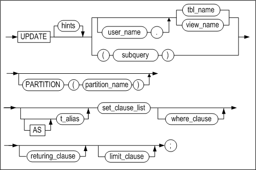

[returning_clause ::=](#returning_clause)

**set_clause_list ::=**


**where_clause ::=**


**limit_clause ::=**


**multiple_update ::=**

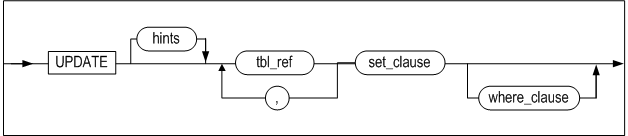

**tbl_ref ::=**

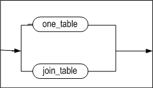

**one_table ::=**


**join_table ::=**


#### 전제 조건

SYS 사용자, 테이블 소유자, UPDATE ANY TABLE 시스템 권한을 가진 사용자 및
테이블에 대한 UPDATE 객체 권한을 가진 사용자만이 이 구문으로 해당 테이블의
데이터를 갱신할 수 있다.

뷰의 레코드를 UPDATE할 때 사용자는 베이스 테이블에 대해서 위와 동일한 권한을
가져야 한다.

#### 설명

조건을 만족하는 레코드를 찾아 명시한 칼럼들의 값을 변경하는 구문이다.

파티션을 명시할 경우 해당 파티션에서 조건을 만족하는 레코드의 칼럼 값을
변경한다.

*user_name*

변경될 레코드가 속한 테이블의 소유자 이름을 명시한다. 생략하면 Altibase는
테이블이 현재 세션에 연결된 사용자의 스키마에 속한 것으로 간주한다.

*tbl_name*

변경될 레코드가 속한 테이블의 이름을 명시한다.

*view_name*

갱신될 뷰의 이름을 명시한다.

*subquery*

갱신 대상이 될 뷰를 서브쿼리로 명시한다.

*set_clause_list*

변경할 칼럼 이름과 값을 명시한다. 이 절에서 부질의를 사용할 수 있으며, 아래의
사항을 유의한다.

- 부질의는 한 개의 행만 반환해야 한다.
- SET절에 명시된 칼럼의 개수와 검색 대상 칼럼의 개수가 동일해야 한다.
- 부질의에 대한 결과가 없으면 칼럼에 NULL이 갱신된다.
- 부질의를 사용할 때, 칼럼에 DEFAULT을 할당하면 칼럼의 DEFAULT 속성 값으로
  갱신된다.

*TIMESTAMP 칼럼의 데이터 수정*

TIMESTAMP 칼럼에 대해 UPDATE문 수행 시 기본적으로 칼럼 값이 시스템 시간 값으로
갱신된다. 따라서 TIMESTAMP 칼럼의 데이터 수정 시 값을 명시하지 않으면 널이 아닌
시스템 시간 값으로 변경된다.

TIMESTAMP 칼럼의 값을 시스템 시간으로 변경하는 또다른 방법은 칼럼 값에
DEFAULT키워드를 사용하는 것이다.

*returning_clause*

DELETE 구문의 returning_clause를 참고하라.

*multiple_update*

join 조건을 만족하는 레코드를 찾아 명시한 컬럼들의 값을 변경하는 구문이다.

multiple update 제약 사항:

- limit_clause 와 returning_clause 를 사용할 수 없다.
- dictionary table 을 사용할 수 없다.
- full outer join 을 사용할 수 없다.

*tbl_ref*

multiple update 를 하기 위한 table 을 명시한다.

*one_table*

한 개의 table이거나 혹은 view 를 명시한다.

*join_table*

table 사이의 join 조건을 명시한다.

#### HINTS 옵션

힌트의 문법과 자세한 설명은 "힌트 구문"과 "힌트 목록"을 참고하기 바란다.

#### 주의 사항

- SET 절에 같은 칼럼을 두번 이상 사용할 수 없다.
- 파티션 키 칼럼의 값이 수정되어 그 데이터가 포함된 레코드가 다른 파티션으로
  이동해야 할 필요가 있을 경우, 파티션드 테이블이 ENABLE ROW MOVEMENT 옵션을
  이용해서 생성되었거나 ALTER TABLE ENABLE ROW MOVEMENT 구문으로 테이블 속성이
  변경되었다면 레코드가 자동으로 이동되지만, 그렇지 않을 때에는 에러가 발생한다.
- 널 제약조건이 있는 칼럼에 널을 삽입하거나 그 칼럼의 값을 널로 변경할 수 없다.
- CHECK 제약조건으로 인해 UPDATE가 실패할 수 있다.

#### 예제

##### 칼럼 데이터 갱신

\<질의\> 이름이 Davenport인 직원의 월급을 갱신하라.

```
iSQL> UPDATE employees
SET salary = 2500
WHERE e_lastname = 'Davenport';
1 row updated.
```

\<질의\> 전 직원의 월급을 7% 인상하라.

```
iSQL> UPDATE employees
SET salary = salary * 1.07;
20 rows updated.
```


##### WHERE 절에 부질의를 사용해서 데이터 갱신

\<질의\> MYLEE 직원이 받은 주문들의 수량을 50개씩 빼라.

```
iSQL> UPDATE orders
SET qty = qty - 50
WHERE eno IN(
 SELECT eno
 FROM employees
 WHERE e_lastname ='Hammond');
9 rows updated.
```


##### 파티션드 테이블의 데이터 갱신

```
iSQL> UPDATE T1 PARTITION(P1) SET I1 = 200;
```


##### SET 절에 부질의를 갖는 데이터 갱신

\<질의\> 다음 예제는 두개의 중첩된 SELECT 부질의를 갖는 UPDATE 문의 구조를
보여준다.

```
iSQL> CREATE TABLE bonuses
 (eno INTEGER, bonus NUMBER(10, 2) DEFAULT 100, commission NUMBER(10, 2) DEFAULT 50);
Create success.
iSQL> INSERT INTO bonuses(eno)
 (SELECT e.eno FROM employees e, orders o
 WHERE e.eno = o.eno
 GROUP BY e.eno);
3 rows inserted.
iSQL> SELECT * FROM bonuses;
BONUSES.ENO BONUSES.BONUS BONUSES.COMMISSION 
------------------------------------------------
12          100           50 
19          100           50 
20          100           50 
3 rows selected.
iSQL> UPDATE bonuses
SET eno = eno + 100, (bonus, commission) = 
 (SELECT 1.1 * AVG(bonus), 1.5 * AVG(commission) FROM bonuses)
 WHERE eno IN 
 (SELECT eno
 FROM orders
 WHERE qty >= 10000);
1 row updated.
iSQL> SELECT * FROM bonuses;
BONUSES.ENO BONUSES.BONUS BONUSES.COMMISSION 
------------------------------------------------
12          100           50 
20          100           50 
119         110           75 
3 rows selected.
```

> Note: WHERE 절의 부질의 결과가 한 건도 없으면 어떠한 레코드도 영향을 받지
> 않으나, SET 절의 부질의 결과가 한 건도 없으면 해당 칼럼은 널값으로 갱신될
> 것이다.

```
iSQL> UPDATE orders
SET qty = qty - 50
WHERE eno IN(
 SELECT eno
 FROM employees
 WHERE e_lastname ='Frederick');
No rows updated.
iSQL> UPDATE employees 
SET dno = 
 (SELECT dno 
 FROM departments
 WHERE dep_location = 'Timbuktu');
20 rows updated.
iSQL> SELECT e_lastname, dno
 FROM employees
 WHERE eno = 12;
E_LASTNAME DNO 
-------------------------------
Hammond 
1 row selected.
```

\<질의\> 다음 예제는 UPDATE질의문의 SET절에 DEFAULT를 칼럼에 할당한 후에
질의문을 수행한다.

```
iSQL> CREATE TABLE EMPLOYEES (
ENO  INTEGER PRIMARY KEY,
E_LASTNAME CHAR(20) NOT NULL,
E_FIRSTNAME CHAR(20) NOT NULL,
EMP_JOB VARCHAR(15),
EMP_TEL CHAR(15),
DNO SMALLINT,
SALARY NUMBER(10,2) DEFAULT 0,
SEX CHAR(1),
BIRTH CHAR(6),
JOIN_DATE DATE,
STATUS CHAR(1) DEFAULT 'H' );
Create success.
iSQL> SELECT E_FIRSTNAME, SALARY, EMP_JOB FROM EMPLOYEES WHERE EMP_JOB = 'manager' ;
E_FIRSTNAME          SALARY       EMP_JOB
-------------------------------------------------------
Gottlieb              500         manager
Xiong                              manager
Wei-Wei               2300        manager
3 rows selected.
iSQL> UPDATE EMPLOYEES SET SALARY=DEFAULT WHERE EMP_JOB = 'manager';
3 rows updated.
iSQL> SELECT E_FIRSTNAME, SALARY, EMP_JOB FROM EMPLOYEES WHERE EMP_JOB = 'manager';
E_FIRSTNAME          SALARY       EMP_JOB
-------------------------------------------------------
Gottlieb               0           manager
Xiong                  0           manager
Wei-Wei                0           manager
3 rows selected.
```


##### Returing 절을 사용한 갱신

\<질의\> 다음 예제는 갱신된 행의 값을 출력 바인드 변수 :v1, :v2로 반환한다.

```
iSQL> create table employees ( eno integer, ename varchar(20));
Create success.
 
iSQL> var v1 output integer;
iSQL> var v2 output varchar(30);

iSQL> insert into employees values (1, 'jake');
iSQL> insert into employees values (2, 'nikita');
iSQL> insert into employees values (3, 'dana');

iSQL> prepare update employees set ename='rachel' where eno=3 return eno, ename into :v1, :v2;
1 row updated.

iSQL> print var
[ HOST VARIABLE ]
-------------------------------------------------------
NAME                 TYPE                 VALUE
-------------------------------------------------------
V1                   INTEGER              3
V2                   VARCHAR(30)          rachel
```


##### 조인 뷰의 데이터 갱신

\<질의\> employees와 departments 테이블의 조인 뷰를 생성한 후, 칼럼 salary를
갱신한다.

```
iSQL> CREATE VIEW simple_emp AS
        SELECT e.eno, e.e_lastname, e.salary, d.dname
          FROM employees e, departments d
          WHERE e.dno = d.dno;
Create success.
iSQL> select * from simple_emp;
ENO         E_LASTNAME            SALARY      DNAME
-----------------------------------------------------------------------------------
3           Kobain                2000        RESEARCH DEVELOPMENT DEPT 1
16          Chen                  2300        RESEARCH DEVELOPMENT DEPT 1
6           Momoi                 1700        RESEARCH DEVELOPMENT DEPT 2
13          Jones                 980         RESEARCH DEVELOPMENT DEPT 2
10          Bae                   4000        SOLUTION DEVELOPMENT DEPT
11          Liu                   2750        SOLUTION DEVELOPMENT DEPT
14          Miura                 2003        SOLUTION DEVELOPMENT DEPT
15          Davenport             1000        SOLUTION DEVELOPMENT DEPT
17          Fubuki                1400        QUALITY ASSURANCE DEPT
4           Foster                1800        CUSTOMERS SUPPORT DEPT
1           Moon                              PRESALES DEPT
5           Ghorbani              2500        PRESALES DEPT
8           Wang                              MARKETING DEPT
9           Diaz                  1200        MARKETING DEPT
18          Huxley                1900        MARKETING DEPT
7           Fleischer             500         BUSINESS DEPT
12          Hammond               1890        BUSINESS DEPT
19          Marquez               1800        BUSINESS DEPT
20          Blake                             BUSINESS DEPT
19 rows selected.

iSQL> UPDATE simple_emp SET salary=3000 WHERE dname='RESEARCH DEVELOPMENT DEPT 1';
2 rows updated.
```

##### Multiple table 갱신

\<질의\> employees와 departments 테이블을 join 후 칼럼 salary를 갱신한다.

```
UPDATE employees e, departments d SET salary=4000 WHERE e.dno = d.dno and d.dname='BUSINESS DEPT';
4 rows updated.
```


### MOVE 

#### 구문

**move ::=**

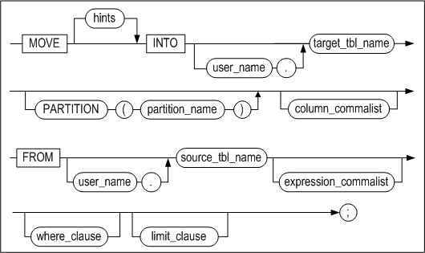

[where_clause ::=](#where_clause), [limit_clause
::=](#limit_clause)

**column_commalist ::=**


**expression_commalist ::=**


#### 전제 조건

테이블의 레코드를 이동(MOVE)하기 위해서는 테이블에서 레코드를 삭제할 수 있는
권한과 테이블에 레코드를 삽입할 수 있는 권한이 있어야 한다. 데이터 이동은 삽입과
삭제로 수행되기 때문이다.

INTO 절에 명시된 테이블에 레코드를 삽입하기 위해서는 SYS 사용자이거나 테이블의
소유자이거나 INSERT ANY TABLE 시스템 권한을 가진 사용자, 또는 그 테이블에 대한
INSERT 객체 권한을 가진 사용자이어야 한다.

FROM 절에 명시된 테이블에서 레코드를 삭제하기 위해서는 SYS 사용자이거나 테이블의
소유자이거나 DELETE ANY TABLE 시스템 권한을 가진 사용자, 또는 그 테이블에 대한
DELETE 객체 권한을 가진 사용자이어야 한다.

#### 설명

한 테이블에서 조건을 만족하는 레코드를 찾아 다른 테이블로 이동하는 구문이다.
또한 특정 파티션에 있는 데이터도 이동이 가능하다.

*hints*

FROM절에 대한 힌트를 제공한다. 이는 SELECT구문에서 사용하는 힌트와 동일하다.

*source_tbl_name, target_tbl_name*

데이터 이동에 관련된 테이블(원본 테이블과 대상 테이블)을 명시한다. 여기에는 뷰나
메타 테이블이 올 수 없다.

*column_commalist*

대상 테이블에 속하는 실제 칼럼들의 리스트이다.

*expression_commalist*

쉼표로 구분된 표현식들의 리스트이다. 각 표현식은 FROM 테이블에 속한 칼럼, 상수,
또는 표현식일 수 있다.

*where_clause*

SELECT 구문의 WHERE 절과 구조가 동일하다.

*limit_clause*

SELECT구문의 LIMIT 절과 구조가 동일하다.

#### 주의 사항

- 동일한 테이블간의 데이터 이동은 불가능하다.
- 파티션을 지정할 경우 해당 파티션에 맞지 않는 값은 입력될 수 없다.
- CHECK 제약조건으로 인해 MOVE가 실패할 수 있다.

#### 예제

\<질의\> t2테이블의 i1, i2 칼럼으로부터 t2.i2=4조건을 만족하는 모든 레코드를 t1
테이블의 i1, i2 칼럼에 삽입하고 t2 테이블에서 삭제한다.

```
iSQL> MOVE INTO T1(I1, I2) FROM T2(I1, I2) WHERE T2.I2 = 4;
```

\<질의\> t2테이블의 i1, i2, i3 칼럼으로 이루어진 레코드를 t1 테이블에 삽입하고
t2테이블에서 삭제한다. (테이블t1에는 t2의 i1, i2, i3 칼럼에 대응되는 칼럼이
있어야 하며 칼럼 개수가 서로 동일해야 한다.)

```
iSQL> MOVE INTO T1 FROM T2(I1, I2, I3);
```


### MERGE

#### 구문

**merge ::=**


**merge_operation_spec ::=**


**matched_update_clause ::=**

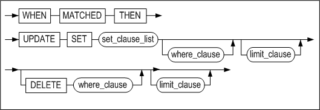

**not_matched_insert_clause::=**


**no_rows_insert_clause ::=**


#### 전제 조건

데이터베이스 유저는 MERGE 구문을 사용하기 위해서 조회 테이블에 대한 SELECT 권한과 변경 테이블에 대한 INSERT 및 UPDATE 권한을 가져야 한다.

#### 설명

MERGE 구문은 ON절에 명시한 조건에 해당하는 데이터가 있는 경우에 원하는 값으로 변경하고, 없는 경우에 새로운 데이터를 삽입하는 작업을 수행한다. 예시로 SELECT 구문으로 데이터를 조회해서 데이터가 있는 경우 UPDATE 구문을 수행하고, 없는 경우 INSERT 구문을 수행하는 작업을 하나의 MERGE 구문으로 대체할 수 있다.

*hints*

힌트는 MERGE 키워드 다음에만 명시할 수 있다. 명시한 힌트는 INSERT 문이나 UPDATE 문에 적용된다.

*INTO 절*

데이터를 변경하거나 삽입할 테이블을 지정한다. INTO 절에 뷰는 사용할 수 없다.

*USING 절*

INTO 절 테이블과 비교할 데이터를 지정한다. 테이블 이름이나 SELECT 구문 또는 뷰를 사용할 수 있다.

*ON 절*

INTO 절 테이블에 변경하거나 삽입하려는 데이터의 조건을 명시한다. ON 절의 조건에 의해서 동일한 레코드에 여러 번 반복하여 변경되거나 동일한 레코드가 여러 번 반복하여 삽입될 수 있다. ON 절 다음에 matched_update_clause, not_matched_insert_clause, no_rows_insert_clause 세 가지 절을 사용할 수 있다. 각 절은 한 번씩 명시할 수 있으며 순서는 상관없다.

*matched_update_clause*

ON 절의 조건을 만족하는 데이터가 있는 경우에 해당 레코드를 변경하는 UPDATE 구문을 작성한다. 변경할 테이블은 INTO 절에서 명시하였으므로 생략한다.

- 제약 사항:
  - ON 조건 절에서 참조되는 칼럼은 갱신이 불가능하다.

*not_matched_insert_clause*

ON 절의 조건을 만족하는 데이터가 없는 경우에 새로운 레코드를 삽입하는 INSERT 구문을 작성한다. 삽입할 테이블은 INTO 절에서 명시하였으므로 생략한다. INSERT 키워드 다음에 칼럼 리스트를 생략하려면, VALUES 절에 오는 값의 개수는 INTO 절 테이블의 칼럼 수와 일치해야 한다.

*no_rows_insert_clause*

USING 절에 명시한 테이블이나 SELECT 구문 또는 뷰 결과에 데이터가 없는 경우에 새로운 레코드를 삽입하는 INSERT 구문을 작성한다. 삽입할 테이블은 INTO 절에서 명시하였으므로 생략한다. INSERT 키워드 다음에 칼럼 리스트를 생략하려면, VALUES 절에 오는 값의 개수는 대상 테이블의 칼럼 수와 일치해야 한다.

#### 예제

\<질의\> 조건에 따라 TEST_MERGE 테이블에 데이터를 삽입하거나 변경하는 예제이다.

TEST_MERGE 테이블에 ON 절의 조건을 만족하는 레코드는 USING 절에 데이터로 변경되고, 만족하지 않는 경우에 새로운 레코드가 삽입되는 것을 보여준다. ON 절의 조건과 같이, INTO 절의 TEST_MERGE 테이블과 USING 절의 데이터를 비교하여 EMPNO 칼럼 값이 같은 레코드가 있다면, INTO 절 TEST_MERGE 테이블에서 해당 레코드의 LASTNAME 칼럼 값을 변경한다. EMPNO 칼럼 값이 같은 레코드가 없다면, INTO 절 TEST_MERGE 테이블에 USING 절의 데이터를 새로운 레코드로 삽입한다.

```
DROP TABLE TEST_MERGE;
CREATE TABLE TEST_MERGE (EMPNO INT, LASTNAME CHAR(20));
INSERT INTO TEST_MERGE VALUES(1, 'KIM');
INSERT INTO TEST_MERGE VALUES(2, 'LEE');
INSERT INTO TEST_MERGE VALUES(5, 'PARK');
INSERT INTO TEST_MERGE VALUES(4, 'CHOI');
INSERT INTO TEST_MERGE VALUES(7, 'YUN');

iSQL> SELECT * FROM TEST_MERGE WHERE EMPNO IN (1, 7, 9);
EMPNO       LASTNAME                        
-----------------------------------------------
1           KIM                             
7           YUN                             
2 rows selected.

iSQL> MERGE INTO TEST_MERGE OLD_T
USING
     (
      SELECT 1 EMPNO, 'KANG' LASTNAME FROM DUAL UNION ALL
      SELECT 7 EMPNO, 'SON' LASTNAME FROM DUAL UNION ALL
      SELECT 9 EMPNO, 'CHEON' LASTNAME FROM DUAL
     ) NEW_T
  ON OLD_T.EMPNO = NEW_T.EMPNO
 WHEN MATCHED THEN
      UPDATE SET OLD_T.LASTNAME = NEW_T.LASTNAME
 WHEN NOT MATCHED THEN
      INSERT (OLD_T.EMPNO, OLD_T.LASTNAME) VALUES(NEW_T.EMPNO, NEW_T.LASTNAME);
3 rows merged.
  
iSQL> SELECT * FROM TEST_MERGE WHERE EMPNO IN (1, 7, 9);
EMPNO       LASTNAME                        
-----------------------------------------------
1           KANG                            
7           SON                             
9           CHEON                           
3 rows selected.
```

TEST_MERGE 테이블에 EMPNO = 1 과 EMPNO = 7 인 레코드는 LASTNAME = 'KANG' 과 LASTNAME = 'SON' 으로 변경되었고, EMPNO = 9, LASTNAME = 'CHEON' 이 새로운 레코드로 삽입되었다.

\<질의\> ON 절 오사용으로 인한 동일한 레코드의 반복 변경되는 예제이다.

```
DROP TABLE TEST_MERGE;
CREATE TABLE TEST_MERGE (EMPNO INT, LASTNAME CHAR(20));
INSERT INTO TEST_MERGE VALUES(1, 'KIM');
INSERT INTO TEST_MERGE VALUES(2, 'LEE');
INSERT INTO TEST_MERGE VALUES(5, 'PARK');
INSERT INTO TEST_MERGE VALUES(4, 'CHOI');
INSERT INTO TEST_MERGE VALUES(7, 'YUN');

DROP TABLE TEST_MERGE2;
CREATE TABLE TEST_MERGE2 (EMPNO INT, LASTNAME CHAR(20));
INSERT INTO TEST_MERGE2 VALUES(8, 'JANG');
INSERT INTO TEST_MERGE2 VALUES(1, 'KIM');
INSERT INTO TEST_MERGE2 VALUES(7, 'YUN');

iSQL> SELECT * FROM TEST_MERGE;
EMPNO       LASTNAME
-------------------------------------
1           KIM
2           LEE
5           PARK
4           CHOI
7           YUN
5 rows selected.

iSQL> SELECT * FROM TEST_MERGE2;
EMPNO       LASTNAME
-------------------------------------
8           JANG
1           KIM
7           YUN
3 rows selected.

iSQL> MERGE INTO TEST_MERGE OLD_T
USING TEST_MERGE2 NEW_T
  ON OLD_T.EMPNO = NEW_T.EMPNO OR OLD_T.EMPNO = 8
 WHEN MATCHED THEN
      UPDATE SET LASTNAME = 'MATCHED'
 WHEN NOT MATCHED THEN
      INSERT VALUES( EMPNO, 'NOTMATCHED' )
 WHEN NO ROWS THEN
      INSERT VALUES( 10, 'NO ROWS' );
5 rows merged.

iSQL> SELECT * FROM TEST_MERGE;
EMPNO       LASTNAME
-------------------------------------
2           LEE
5           PARK
4           CHOI
1           MATCHED
7           MATCHED
8           MATCHED
6 rows selected.
```

ON 절의 OLD_T.EMPNO = NEW_T.EMPNO 조건을 만족하지 않아서 TEST_MERGE 테이블에 EMPNO = 8, LASTNAME = 'NOTMATCHED' 인 새로운 레코드로 삽입되었고, 이후에 ON 절의 OLD_T.EMPNO = 8 조건을 만족하여 EMPNO = 8 인 레코드가 LASTNAME = 'MATCHED' 으로 3회 반복하여 변경되었다.

\<질의\> WHEN NO ROWS THEN 절이 수행되는 예제이다.

```
DROP TABLE TEST_MERGE;
CREATE TABLE TEST_MERGE (EMPNO INT, LASTNAME CHAR(20));
INSERT INTO TEST_MERGE VALUES(1, 'KIM');
INSERT INTO TEST_MERGE VALUES(2, 'LEE');
INSERT INTO TEST_MERGE VALUES(5, 'PARK');
INSERT INTO TEST_MERGE VALUES(4, 'CHOI');
INSERT INTO TEST_MERGE VALUES(7, 'YUN');

DROP TABLE TEST_MERGE2;
CREATE TABLE TEST_MERGE2 (EMPNO INT, LASTNAME CHAR(20));

iSQL> SELECT * FROM TEST_MERGE;
EMPNO       LASTNAME
-------------------------------------
1           KIM
2           LEE
5           PARK
4           CHOI
7           YUN
5 rows selected.

MERGE INTO TEST_MERGE OLD_T
USING TEST_MERGE2 NEW_T
ON NEW_T.EMPNO = OLD_T.EMPNO AND NEW_T.EMPNO = 10
WHEN MATCHED THEN
    UPDATE SET LASTNAME = 'MATCHED'
WHEN NOT MATCHED THEN
    INSERT VALUES( 10, 'NOTMATCHED' )
WHEN NO ROWS THEN
    INSERT VALUES( 10, 'NO ROWS' ) ;
1 row merged.

iSQL> SELECT * FROM TEST_MERGE;
EMPNO       LASTNAME                        
-----------------------------------------------
1           KIM                             
2           LEE                             
5           PARK                            
4           CHOI                            
7           YUN                             
10          NO ROWS                         
6 rows selected
```


### ENQUEUE 

#### 구문

**enqueue ::=**

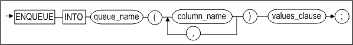

**values_clause ::=**


#### 설명

큐에 메시지를 삽입하는 구문이다. ENQUEUE 구문은 INSERT 구문과 유사한 구조를
가지는데 INTO 절 이후에 반드시 하나 이상의 큐 칼럼 명을 명시해야 한다.

일반적인 경우 사용자는 자신이 저장할 메시지만 지정하여 메시지를 입력하는데,
메시지를 구분하거나 분류하여 차별화 할 필요가 있을 때에는 Correlation ID를
명시적으로 지정하여 입력할 수 있다.

#### 예제

\<질의\> “This is a message”라는 메시지를 Q1메시지 큐에 입력하라.

```
ENQUEUE INTO Q1(message) VALUES ('This is a message');
```

\<질의\> “This is a message”라는 메시지를 237이라는 Correlation ID로 Q1메시지
큐에 입력하라.

```
ENQUEUE INTO Q1(message,corrid) VALUES ('This is a message', 237);
```


### DEQUEUE 

#### 구문

**dequeue ::=**


**fifo_option ::=**


#### 설명

DEQUEUE 구문은 *where_clause* 절의 조건에 맞는 메시지를 얻어 오고 해당 메시지를
큐에서 삭제한다.

*fifo_option*

FIFO 옵션이 설정되어 있거나 아무 옵션도 설정하지 않은 경우에는 조건에 맞는
메시지 중 가장 오래된 메시지를 얻어 오고, LIFO 옵션이 설정된 경우에는 가장
최신의 메시지를 얻어 온다.

*WAIT integer*

DEQUEUE 문은 큐가 비어있을 경우에 메시지가 들어올 때까지 대기한다. WAIT절에
명시한 시간만큼 대기하며, 시간 단위는 second(초), millisecond(msec, 1/1000초),
microsecond(μsec, 1/1000000초)이며 표기하지 않으면 초 단위가 적용된다. 대기
시간이 설정되지 않은 경우, DEQUEUE 문은 무한정 대기할 것이다.

#### 주의사항

DEQUEUE 구문의 사용시에 다음과 같은 점에 주의해야 한다.

- *queue_column_list*에는 큐 테이블 내의 칼럼명만 지정 가능하다.
- DEQUEUE문은 SELECT 구문의 일부 특징을 가지고 있지만 DEQUEUE문의 FROM 절에는
  단 하나의 큐 테이블 이름만 지정이 가능하다. 두개 이상의 큐 테이블 이름이
  오면 에러가 발생한다.
- DEQUEUE구문의 WHERE 절에는 부질의(Subquey)가 올 수 없다.

#### 예제

\<질의\> 메시지 큐 Q1에서 Correlation ID가 237인 메시지들을 모두 읽어라.

```
DEQUEUE MESSAGE, CORRID FROM Q1 WHERE CORRID=237;
```


## 5.데이터 제어어

이장에서는 사용자 세션 제어와 트랜잭션을 제어하는 SQL문에 대해서 설명한다.

### ALTER REPLICATION 

#### 구문

**alter_replication_dcl ::=**


#### 설명

CREATE REPLICATION 구문으로 이중화 생성 후 이중화의 동작을 제어하는 구문이다.
이중화에 관한 자세한 내용은 *Replication Manual* 을 참고한다.

*STOP*

이중화를 중지한다.

*FLUSH*

이 구문이 실행된 세션은 이중화 송신 쓰레드에 의해서 현재 로그(FLUSH구문이 실행된
시점의 로그)까지 변경 내용이 상대방 서버에 전송되도록 *wait_time* 초 만큼
기다린다.

만약 ALL옵션이 함께 사용되면, 구문이 실행된 세션은 현재 로그가 아닌 가장 최근
로그까지의 변경 내용이 상대방 서버에 전송되도록 기다린다.

#### 예제

- 이름이 rep1인 이중화 객체의 이중화를 중지하라.

  \<질의\> 이중화를 중지하라.

  ```
  iSQL> ALTER REPLICATION rep1 STOP;
  Alter success.
  ```


### ALTER SESSION 

#### 구문

**alter_session::=**

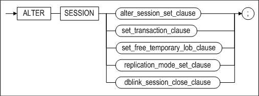

[set_transaction_clause::=](#set_transaction)

**alter_session_set_clause::=**


**replication_mode_set_clause::=**


**dblink_session_close_clause::=**


#### 설명

현재 세션(Session)의 속성을 변경하는 구문이다.

*alter_session_set_clause*

alter_session_set_clause 절의 property_name과 property\_ value에 관한 자세한
내용은 Altibase 매뉴얼 중 *General Reference*의 Altibase 프로퍼티 장을 참조한다.

*replication_mode_set_clause*

*replication*\_*mode_set_clause*는 현재 세션에서 수행하는 트랜잭션을 위한 이중화
모드 속성을 설정하는 절이다.

DEFAULT를 명시하면 이중화는 이중화 객체 생성시 기본모드로 채택된 모드로 동작할
것이다. 그러나 NONE을 명시하면 세션에서 수행되는 모든 DDL, DML, DCL 문이 이중화
대상에서 제외된다.

이중화 모드에 대한 보다 자세한 내용은 *Replication Manual*을 참조한다.

*dblink_session \_close_clause*

사용자가 서버에 접속하면 서버에는 세션이 생성된다. 이 세션에서 데이터베이스
링크를 사용하면, 데이터베이스 링크 작업을 위한 데이터베이스 링크 세션이
사용자에게 할당된 세션내에 생성된다. 그리고 이 사용자 세션이 종료될 때,
데이터베이스 링크 세션도 같이 종료된다. 그런데 데이터베이스 링크 작업을 한번
수행한 후, 이 사용자 세션을 종료하지 않은 채로 계속 유지한다면, 불필요한
데이터베이스 링크 세션이 남아있게 된다.

이 경우 이 절을 사용하여 데이터베이스 링크 세션을 정리할 수 있다.

*set_transaction_clause*

현재 세션에서 수행되는 트랜잭션에 read only, read/write 또는 고립화 수준(isolation level)을 설정할 수 있다. 자세한
내용은 이 매뉴얼의 [SET TRANSACTION](#set_transaction) 구문을 참조한다.

#### 예제

\<질의\> 현재 세션은 그냥두고 데이터베이스 링크 세션만 종료한다.

```
iSQL> ALTER SESSION CLOSE DATABASE LINK ALL;
```


### ALTER SYSTEM 

#### 구문

**alter_system ::=**


**alter_system_set_clause ::=**


#### 설명

Altibase의 시스템 프로퍼티를 변경하는 구문이다. SYS 사용자 또는 ALTER SYSTEM
권한을 가진 사용자만이 ALTER SYSTEM 문의 모든 기능을 수행할 수 있다.

*CHECKPOINT*

체크포인트를 수행하는 옵션이다.

*MEMORY COMPACT*

메모리 콤팩션을 수행하는 구문이다. 이 구문은 IBM AIX플랫폼에서만 동작한다.

*START/STOP FLUSHER integer*

Altibase 플러셔를 구동하거나 정지시키는 구문이다. 정수값의 플러셔 ID는
V\$FLUSHER 성능 뷰를 통해서 조회할 수 있다.

*ARCHIVE LOG START/STOP*

START를 실행하면 아카이브로그 쓰레드가 시작되고, STOP하면 종료된다. Altibase가
아카이브로그 모드로 운영중일때만 이 구문을 실행할 수 있다.

Altibase가 아카이브로그 모드로 운영중인지 여부는 V\$LOG 또는 V\$ARCHIVE 성능
뷰에서 확인이 가능하다. 아카이브로그 모드에 대한 자세한 내용은 *Administrator’s
Manual*의 10장 백업 및 복구를 참고한다.

*SWITCH LOGFILE*

로그파일을 강제로 아카이브하는 구문이다. 현재 로그파일이 꽉 차지 않았더라도, 이
구문을 실행하면 Altibase는 사용중이던 로그파일을 닫고 다음 로그파일에 로깅을
계속한다.

이 구문은 sysdba모드로만 수행할 수 있다.

*SET alter_system_set_clause*

Altibase 프로퍼티 값을 변경하는 구문이다. 프로퍼티에 대한 자세한 내용은 *General
Reference*의 Altibase 프로퍼티를 참조한다.

*FLUSH BUFFER_POOL*

버퍼에 있는 모든 페이지를 디스크로 내리고, 버퍼를 비운다.

이 구문은 sysdba모드로만 수행할 수 있다. 사용할 때는 반드시 주의를 기울여야
한다. 이 구문을 수행할 경우 버퍼에 있는 모든 페이지가 삭제되기 때문에, 다음에
수행되는 질의문은 접근하는 모든 페이지에 대해서 버퍼 미스(Buffer Miss, 버퍼에서
레코드를 찾는 데 실패하는 것을 말함)를 발생시킨다.

*COMPACT SQL_PLAN_CACHE*

SQL Plan Cache에서 사용되지 않는 실행 계획을 삭제한다.

*RESET SQL_PLAN_CACHE*

SQL Plan Cache에 사용되지 않는 실행 계획을 삭제하고 Plan Cache 관련 통계 정보를
초기화한다.

*START \| STOP \| RELOAD AUDIT*

감사(Auditing)를 시작 또는 중지하거나, 감사 조건을 재적용하는 구문이다.

*RELOAD ACCESS LIST*

IP 패킷의 접근을 허용하거나 차단하는 목록을 갱신한다. sysdba 관리자 모드로만 이
구문을 수행할 수 있다. ACCESS_LIST_FILE 프로퍼티에 설정된 파일의 목록으로 ACCESS
LIST를 구성한다. ACCESS LIST에 대한 자세한 내용은 ACCESS_LIST 프로퍼티를
참조한다.

#### 예제

\<질의\> 플러셔 1번을 중지시킨다.

```
iSQL> ALTER SYSTEM STOP FLUSHER 1;
```

\<질의\> 아카이브로그 모드일 경우 아카이브 로그 쓰레드를 시작시킨다.

```
iSQL> ALTER SYSTEM ARCHIVE LOG START;
```


### AUDIT

#### 구문

**audit ::=**


**audit_operation_clause ::=**


**by_clause ::=**


**audit_object_clause ::=**


**ddl_clause ::=**


#### 전제 조건

SYS 사용자만이 이 구문으로 감사 조건을 설정할 수 있다.

#### 설명

Altibase 서버 내에서 실행되고 있는 특정 구문 또는 모든 구문을 실시간으로
추적하고, 로그를 남기는 것을 감사(Audit)라고 한다. 이 구문을 사용해서 감사
조건을 설정할 수 있다.

*audit_operation_clause*

이 절은 Altibase 서버에서 특정한 SQL 구문이 수행되는 것을 감사하도록 지정한다.

이 절의 sql_statement_type에는 감사 대상 작업을 지정한다. 콤마(,)로 연결해서
여러 개를 명시할 수도 있다. 지정 가능한 감사 작업은 다음과 같다.

- SELECT
- INSERT
- UPDATE
- DELETE
- MOVE
- MERGE
- ENQUEUE
- DEQUEUE
- LOCK
- EXEC or EXECUTE
- COMMIT
- ROLLBACK
- SAVEPOINT
- CONNECT
- DISCONNECT
- ALTER SESSION
- ALTER SYSTEM

ALL은 위에 나열한 모든 구문에 대해 감사할 것을 지정한다.

*by_clause*

특정 사용자가 실행하는 구문을 감사할 것을 지정한다.

*audit_object_clause*

이 절은 Altibase 서버에서 특정 객체에 대해 특정한 작업이 수행되는 것을
감사하도록 지정한다.

이 절에는 감사 대상 작업을 콤마(,)로 연결해서 명시할 수 있다. 아래는 감사 대상이
될 수 있는 작업 별로 지정 가능한 객체의 종류와, 각 경우에 감사 내역은 무엇인지를
나타낸 표이다.

| 작업         | 객체 종류 | 감사 내역                               |
| ------------ | --------- | --------------------------------------- |
| SELECT       | TABLE     | 대상 테이블 객체에 수행되는 SELECT 구문 |
| INSERT       | TABLE     | 대상 테이블 객체에 수행되는 INSERT 구문 |
| UPDATE       | TABLE     | 대상 테이블 객체에 수행되는 UPDATE 구문 |
| DELETE       | TABLE     | 대상 테이블 객체에 수행되는 DELETE 구문 |
| MOVE         | TABLE     | 대상 테이블 객체에 수행되는 MOVE 구문   |
| MERGE        | TABLE     | 대상 테이블 객체에 수행되는 MERGE 구문  |
| ENQUEUE      | QUEUE     | 대상 큐 객체에 수행되는 ENQUEUE 구문    |
| DEQUEUE      | QUEUE     | 대상 큐 객체에 수행되는 DEQUEUE 구문    |
| LOCK         | TABLE     | 대상 테이블 객체에 수행되는 LOCK 구문   |
| EXEC/EXECUTE | PROCEDURE | 대상 프로시저 객체를 실행하는 구문      |

ALL은 객체 유형에 대해서 수행 가능한 모든 SQL 구문을 감사할 것을 지정한다. 단,
위의 표에 나열한 구문에 한해서이다.

*object_name*

감사 대상이 되는 객체 이름을 명시한다. 지정할 수 있는 객체의 종류는 테이블, 뷰,
큐, 시퀀스, 저장 프로시저 및 저장 함수이다.

*ddl_clause*

이 절은 Altibase 서버에서 DDL 구문이 수행되는 것을 감사하도록 지정한다.

*BY ACCESS \| SESSION*

BY ACCESS를 지정하면 조건에 부합하는 구문 또는 작업에 대해 각각 하나의 감사
로그가 기록된다. 예를 들어 BY ACCESS를 지정하여 감사를 진행하면 한 세션에서
동일한 SQL 구문이 10회 실행된 경우 감사 로그도 10개가 기록된다.

BY SESSION을 지정하면 동일한 세션에서 동일한 SQL 구문이 실행될 때에는 하나의
감사 로그만 기록된다. 즉 BY SESSION을 지정하여 감사를 진행하면 한 세션에서
동일한 SQL 구문이 실행될 때 중복해서 로그를 남기지 않는다.

둘 중 하나도 지정하지 않으면 BY SESSION이 디폴트이다.

감사 대상이 CONNECT, DISCONNECT, DDL 경우에는 BY ACCESS\|SESSION을 지원하지
않는다.

*WHENEVER [NOT] SUCCESSFUL*

WHENEVER SUCCESSFUL을 지정하면 성공하는 SQL구문과 작업만 감사한다.

WHENEVER NOT SUCCESSFUL을 지정하면 실패하는 SQL구문과 작업만 감사한다.

이 절을 생략하면 Altibase는 성공이나 실패에 상관없이 감사를 수행한다.

'BY SESSION WHENEVER SUCCESSFUL'로 지정한 경우, 한 세션에서 수행된 동일한 SQL
구문들이 모두 성공적으로 수행되는 경우에만 그 구문에 대한 로그가 기록된다.

'BY SESSION WHENEVER NOT SUCCESSFUL'로 지정한 경우, 한 세션에서 수행되는 동일한
SQL 구문들 중 하나라도 실패할 경우에 그 구문에 대한 로그가 기록된다.

#### 주의 사항

AUDIT 구문으로 감사 조건을 설정하여도, 서버의 감사 작업에 새로운 조건들이 바로
적용되는 것은 아니다. 운영 중인 서버에 새로운 감사 조건들이 적용되기 위해서는
아래의 구문을 사용해서 감사를 재시작하거나 감사 조건들을 RELOAD해야 한다.

```
ALTER SYSTEM STOP AUDIT;
ALTER SYSTEM START AUDIT;
ALTER SYSTEM RELOAD AUDIT;
```


#### 예제

\<질의1\> 사용자 user1의 friends 테이블에 대한 INSERT, UPDATE 또는 DELETE문 수행
중 실패한 경우에 대한 정보를 모두 기록하라.

```
iSQL> AUDIT insert, update, delete ON user1.friends BY ACCESS WHENEVER NOT
SUCCESSFUL;
```

\<질의2\> 사용자 user1의 friends 테이블에 대한 DDL문 수행들이 세션에서 모두
성공한 경우에 로그를 기록하라.

```
iSQL> AUDIT all ON user1.friends BY SESSION WHENEVER SUCCESSFUL;
```

\<질의3\> Altibase 서버에 대해 수행되는 모든 CONNECT, DISCONNECT 구문의 실패
정보를 기록하라.

```
iSQL> AUDIT connect, disconnect WHENEVER NOT SUCCESSFUL;
Audit success.
```

\<질의4\> Altibase 서버 내에서 수행되는 모든 INSERT 구문에 대한 정보를 세션
단위로 기록하라.

```
iSQL> AUDIT insert;
Audit success.
```

\<질의5\> 사용자 user1이 수행하는 모든 DDL 구문에 대한 로그를 기록하라.

```
iSQL> AUDIT DDL BY user1;
Audit success.
```


### COMMIT 

#### 구문

**commit::=**


#### 설명

현재의 트랜잭션을 데이터베이스에 명시적으로 커밋하는 구문이다.

AUTOCOMMIT 모드가 FALSE일때 사용할 수 있다.

*WORK*

WORK 키워드는 표준 SQL을 준수하도록 한다.

*FORCE global_tx_id*

XA환경에서 트랜잭션이 in-doubt 상태가 될 경우에 이를 강제로 커밋하는 구문이다.

global_tx_id는 글로벌 트랜잭션의 포맷(format) 아이디, 글로벌 트랜잭션(global
transaction) 아이디, 브랜치 수식자(branch qualifier)를 문자열로 나타낸 것이다.

#### 주의 사항

AUTOCOMMIT 모드 시에 이 문장을 수행할 수 없다.

#### 예제

다음 구문은 트랜잭션이 이전에 수행한 모든 명령들을 데이터베이스에 반영한다..

```
iSQL> COMMIT;
Commit success.
```


### DELAUDIT

#### 구문

**delaudit ::=**


**delaudit_user_clause ::=**


**delaudit_object_clause ::=**


#### 전제 조건

SYS 사용자만이 이 구문으로 감사 조건을 삭제할 수 있다.

#### 설명

Altibase 서버 내에서 감사를 하기 위해 설정한 감사 조건을 삭제하는 구문이다.

*delaudit_user_clause*

AUDIT ... BY *user_name* 구문으로 설정한 구문 감사와 DDL 감사 조건들 중 지정한
사용자 이름과 일치하는 것을 삭제한다.

ALL

BY *user_name*절 없이 설정한 구문 감사 조건과 DDL 감사 조건을 일괄적으로
삭제한다. 객체 감사 조건은 삭제되지 않는다.

*delaudit_object_clause*

특정 객체에 대해 설정된 감사 조건을 삭제한다.

#### 주의 사항

DELAUDIT 구문이 실행되면, SYS_AUDIT_OPTS_에서 감사 조건들이 삭제된다.

감사가 이미 시작되어 있는 경우에는 이 구문을 실행할 수 없다. 만약 감사가
시작되어 있는 상태에서 감사 조건을 삭제할 경우 에러가 발생하며, ALTER SYSTEM
STOP AUDIT으로 감사를 종료 후 삭제한다.

#### 예제

\<질의1\> 사용자 user1에 대한 감사 조건을 삭제한다. 구문 실행 후에,
SYS_AUDIT_OPTS_에서 감사 조건이 삭제된 것을 확인할 수 있다.

```
iSQL> DELAUDIT by user1;
Audit success.
iSQL> SELECT * from SYSTEM_.SYS_AUDIT_OPTS_;
No rows selected.
```

\<질의 2\> 구문 감사가 시작된 후에, DELAUDIT을 실행하면 에러가 발생한다. 감사를
종료 후 삭제할 수 있다.

```
iSQL> alter system start audit;
Alter success.
iSQL> delaudit by user1;
[ERR-313B2 : Audit has already started.]
iSQL> alter system stop audit;
Alter success.
iSQL> delaudit by user1;
Audit success.
```


### NOAUDIT

#### 구문

**noaudit ::=**


**audit_operation_clause ::=**


**by_clause ::=**

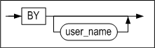

**audit_object_clause ::=**


**ddl_clause ::=**


#### 전제 조건

SYS 사용자만이 이 구문으로 감사 조건을 해제할 수 있다.

#### 설명

NOAUDIT 구문은 이전에 AUDIT 구문으로 설정한 감사 조건을 해제하기 위해 사용된다.

*audit_operation_clause*

이 절은 특정 SQL 구문에 대한 감사를 중지하기 위해 사용된다.

sql_statement_type에는 중지할 감사 작업을 지정한다. 지정 가능한 감사 작업에
대해서는 AUDIT 구문의 설명을 참고하라.

ALL은 이전에 AUDIT ALL 구문으로 설정한 모든 구문에 대한 감사를 중지하기 위해
사용된다.

*audit_object_clause*

이 절은 특정 객체에 대한 감사 조건을 해제하기 위해 사용된다.

sql_operation에는 ON 절에 명시한 객체에 대해 감사를 중지할 SQL 작업을 지정하면
된다. 지정 가능한 SQL 작업에 대해서는 AUDIT 구문의 설명을 참고하라.

ALL은 객체 유형에 대해서 수행 가능한 모든 SQL 구문을 지정하는 것과 동일한 역할을
한다.

ddl_clause

이 절은 DDL 구문에 대한 감사를 중지하도록 지정한다.

*WHENEVER [NOT] SUCCESSFUL*

WHENEVER SUCCESSFUL은 SQL 구문과 객체에 대한 작업이 성공하는 것에 대한 감사를
중지할 것을 지정한다.

WHENEVER NOT SUCCESSFUL은 SQL 구문과 객체에 대한 작업이 실패하는 것에 대한
감사를 중지할 것을 지정한다.

이 절을 생략하면 성공 또는 실패 여부에 상관없이 지정한 구문 또는 객체에 대한
작업을 감사하는 것을 중지할 것을 지정한다.

#### 주의 사항

NOAUDIT 구문으로 어떤 감사 조건을 해제하여도, 서버의 감사 작업에 바로 적용되는
것은 아니다. 운영 중인 서버에 감사 조건의 해제가 적용되기 위해서는 아래의 구문을
사용해서 감사를 재시작하거나 감사 조건들을 RELOAD해야 한다.

```
ALTER SYSTEM STOP AUDIT;
ALTER SYSTEM START AUDIT;
ALTER SYSTEM RELOAD AUDIT;
```


#### 예제

\<질의1\> 테이블 friends에서 SELECT 구문의 성공에 대한 감사를 해제하라.

```
iSQL> NOAUDIT select ON friends WHENEVER SUCCESSFUL;
Audit success.
```

\<질의2\> SELECT 구문에 대한 감사를 해제하라.

```
iSQL> NOAUDIT select;
Audit success.
```

\<질의3\> DDL 문에 대한 감사를 해제하라.

```
iSQL> NOAUDIT DDL;
Audit success.
```


### SAVEPOINT

#### 구문

**savepoint::=**


#### 설명

저장점을 생성하는 구문이다. 저장점의 생성은 지금까지 실행된 트랜잭션 처리의
결과를 임시로 저장하는 것을 의미한다. 즉, 저장점은 트랜잭션 내에서 롤백할 지점을
명시적으로 지정한 것이다. 저장점은 AUTOCOMMIT 모드가 FALSE 일 때 유효하다.

#### 주의 사항

자동반영(AUTOCOMMIT) 모드일 때 사용할 수 없다.

#### 예제

```
iSQL> AUTOCOMMIT OFF;
Set autocommit off success.
iSQL> CREATE TABLE savept(num INTEGER);
Create success.
iSQL> INSERT INTO savept VALUES(1);
1 row inserted.
iSQL> SAVEPOINT sp1;
Savepoint success.
iSQL> INSERT INTO savept VALUES(2);
1 row inserted.
iSQL> SELECT * FROM savept;
SAVEPT.NUM 
--------------
1 
2 
2 rows selected.
```

저장점 sp1 지점까지 트랜잭션을 롤백한다.

```
iSQL> ROLLBACK TO SAVEPOINT sp1;
Rollback success.
iSQL> SELECT * FROM savept;
SAVEPT.NUM 
--------------
1 
1 row selected.
iSQL> COMMIT;
Commit success.
```


### ROLLBACK 

#### 구문

**rollback ::=**


#### 설명

*ROLLBACK (TO SAVEPOINT)*

현재의 트랜잭션을 모두 롤백하거나 (이전에 정의한) 저장점까지 부분 롤백하는
구문이다.

*FORCE global_tx_id*

XA환경에서 “in-doubt”상태의 트랜잭션을 강제로 롤백하는 구문이다.

global_tx_id는 글로벌 트랜잭션의 포맷(format) 아이디, 글로벌 트랜잭션(global
transaction) 아이디, 브랜치 수식자(branch qualifier)를 문자열로 나타낸 것이다.

#### 주의 사항

이 구문은 AUTOCOMMIT 모드일 때는 사용할 수 없다.

#### 예제

```
iSQL> AUTOCOMMIT OFF;
Set autocommit off success.
iSQL> UPDATE employees SET salary = 2300 WHERE eno = 3;
1 row updated.
iSQL> SAVEPOINT emp3_sal;
Savepoint success.
iSQL> DELETE FROM employees WHERE eno = 19;
1 row deleted.
iSQL> SAVEPOINT emp19_ret;
Savepoint success.
iSQL> INSERT INTO employees(eno, e_lastname, e_firstname, salary, sex) VALUES(21, 'Templeton', 'Kimmie', 3000, 'F');
1 row inserted.
iSQL> SAVEPOINT emp21_join;
Savepoint success.
iSQL> UPDATE employees SET salary = 2200 WHERE eno=18;
1 row updated.
iSQL> SELECT eno, e_lastname, e_firstname, salary FROM employees WHERE eno in (3, 18, 19, 21);
ENO         E_LASTNAME            E_FIRSTNAME           SALARY
-------------------------------------------------------------------------
3           Kobain                Ken                   2300
18          Huxley                John                  2200
21          Templeton             Kimmie                3000
3 rows selected.
```

저장점 emp21_join 지점까지 트랜잭션을 롤백한다.

```
iSQL> ROLLBACK TO SAVEPOINT emp21_join;
Rollback success.
iSQL> SELECT eno, e_lastname, e_firstname, salary FROM employees WHERE eno in (3, 18, 19, 21);
ENO         E_LASTNAME            E_FIRSTNAME           SALARY
-------------------------------------------------------------------------
3           Kobain                Ken                   2300
18          Huxley                John                  1900
21          Templeton             Kimmie                3000
3 rows selected.
```

저장점 emp19_ret 지점까지 트랜잭션을 롤백한다.

```
iSQL> ROLLBACK TO SAVEPOINT emp19_ret;
Rollback success.
iSQL> SELECT eno, e_lastname, e_firstname, salary FROM employees WHERE eno in (3, 18, 19, 21);
ENO         E_LASTNAME            E_FIRSTNAME           SALARY
-------------------------------------------------------------------------
3           Kobain                Ken                   2300
18          Huxley                John                  1900
2 rows selected.
```

첫 번째 UPDATE 문, 첫번째 DELETE문과 마지막 DML문 (두 번째 INSERT문)에 의해
수행된 모든 변경을 커밋한다. 모든 다른 DML 문들의 변경사항은 COMMIT 되기 전에
롤백되어 사라졌다. 또한 저장점 emp21_join은 더 이상 유효하지 않다.

```
iSQL> ROLLBACK TO SAVEPOINT emp21_join;
[ERR-11016 : Savepoint not found]
iSQL> INSERT INTO employees(eno, e_lastname, e_firstname, sex, join_date) VALUES(22, 'Chow', 'May', 'F', TO_DATE('2011-11-19 00:00:00', 'YYYY-MM-DD HH:MI:SS'));
1 row inserted.
iSQL> COMMIT;
Commit success.
iSQL> SELECT eno, e_lastname, e_firstname, salary FROM employees;
ENO         E_LASTNAME            E_FIRSTNAME           SALARY
-------------------------------------------------------------------------
1           Moon                  Chan-seung
2           Davenport             Susan                 1500
4           Foster                Aaron                 1800
5           Ghorbani              Farhad                2500
6           Momoi                 Ryu                   1700
7           Fleischer             Gottlieb              500
8           Wang                  Xiong
9           Diaz                  Curtis                1200
10          Bae                   Elizabeth             4000
11          Liu                   Zhen                  2750
12          Hammond               Sandra                1890
13          Jones                 Mitch                 980
14          Miura                 Yuu                   2003
15          Davenport             Jason                 1000
16          Chen                  Wei-Wei               2300
17          Fubuki                Takahiro              1400
18          Huxley                John                  1900
20          Blake                 William
3           Kobain                Ken                   2300
22          Chow                  May                   0
20 rows selected.
iSQL> COMMIT;
Commit success.
```


### SET TRANSACTION 

#### 구문

<a name="set_transaction"><a/>

**set_transaction ::=**


#### 설명

SET TRANSACTION 구문은 현재 세션에서 수행되는 트랜잭션에 read only, read/write
또는 고립화 수준(isolation level)을 설정할 수 있다.

고립화 수준을 READ COMMITTED 또는 SERIALIZABLE로 설정하면 행 수준 잠금과
다중버전 제어기법의 조합을 통하여 높은 수준의 데이터 일관성, 동시성 그리고
성능을 제공한다.

SET TRANSACTION 구문에 의해 수행된 동작들은 다른 사용자들이나 다른 트랜잭션이
아닌 오로지 현재 트랜잭션에만 영향을 미친다.

다음과 같은 3개의 고립화 수준 중 하나를 설정할 수 있다.

*READ COMMITTED*

테이블 내의 커밋된 데이터에 대해 읽기를 허용하며, 커밋되지 않은 데이터에
대해서는 이전 버전의 값을 읽도록 동작한다. Altibase의 기본 고립화 수준은 READ
COMMITTED이다.

*REPEATABLE READ*

트랜잭션이 읽어간 데이터에 대해 그 트랜잭션이 완료될 때까지 잠금을 걸어서, 해당
데이터에 대한 다른 트랜잭션의 변경을 금지한다. 이러한 동작은 반복적으로 그 값을
다시 읽었을 때도 항상 같은 값이 반환될 것을 보장한다. 그러나 잠금이 걸려 있는
상태에서도 읽어간 검색 범위안에 포함되는 새로운 레코드를 다른 트랜잭션이
삽입하는 것은 가능하다. 이러한 레코드는 잠금을 걸고 있는 읽기 트랜잭션에 의한
최초 조회시에는 보이지 않았지만 삽입 이후에는 보일 것이다. 이를 “Phantom
Reads”라고 한다.

*SERIALIZABLE*

이는 가장 높은 고립화 수준이다. 이는 한번 SELECT하여 가져간 모든 데이터에
공유잠금을 걸뿐만 아니라, 그 검색 범위안에 있는 모든 키 값에 대해서도 잠금을
걸게 된다. 이는 “phantom reads”를 방지하는 효과를 내어 트랜잭션의
독립성(isolation)을 보장한다.

#### 주의 사항

현재 세션이 AUTOCOMMIT 모드일 경우에는 이 구문을 사용할 수 없다.

활성화된 트랜잭션이 있을 경우에는 이 구문을 사용할 수 없다.

#### 예제

```
iSQL> AUTOCOMMIT OFF;
Set autocommit off success.

iSQL> SET TRANSACTION ISOLATION LEVEL READ COMMITTED;
Command execute success.

iSQL> SET TRANSACTION ISOLATION LEVEL REPEATABLE READ;
Command execute success.

```


| Transaction A                                                | Time Point | Transaction B                                                |
| ------------------------------------------------------------ | ---------- | ------------------------------------------------------------ |
| iSQL\> AUTOCOMMIT OFF; Set autocommit off success.           |            | iSQL\> AUTOCOMMIT OFF; Set autocommit off success.           |
| iSQL\> SET TRANSACTION READ ONLY; Command execute success.   | 1          |                                                              |
| iSQL\> SELECT e_last name FROM employees WHERE eno = 20; E_LASTNAME ------------------------ Blake 1 row selected. | 2          |                                                              |
|                                                              | 3          | iSQL\> UPDATE employees SET e_lastname = 'Jung' WHERE eno = 20; 1 row updated. |
| iSQL\> SELECT e_lastname FROM employees WHERE eno = 20; E_LASTNAME ------------------------ Blake 1 row selected. | 4          |                                                              |
|                                                              | 5          | iSQL\> commit; Commit success.                               |
| iSQL\> SELECT e_lastname FROM employees WHERE eno = 20; E_LASTNAME ------------------------ Jung 1 row selected. | 6          |                                                              |

## 6.집합 연산자 

이 장에서는 SQL 질의 실행 결과 집합을 대상으로 연산하는 집합 연산자들에 대해서
설명한다.

### UNION

#### 구문

```
SELECT statement1 UNION SELECT statement2
```


#### 설명

두 질의문의 결과를 모두 반환하는 연산자이다. 단, 양쪽 질의의 결과에 동일한 값이
있을 경우 한건만 반환된다.

#### 예제

\<질의\> 생일이 1980년 이후인 사원과 100개 미만의 주문량을 받은 사원의
사원번호를 출력하라. 중복된 사원번호는 한번만 출력되게 하라.

```
iSQL> SELECT eno
     FROM employees
     WHERE birth > '800101'
     UNION
     SELECT eno
     FROM orders
     WHERE qty < 100;
ENO
--------------
4
7
8
12
13
15
20
7 rows selected.
```


### UNION ALL

#### 구문

```
SELECT statement1 UNION ALL SELECT statement2
```


#### 설명

두 질의문의 결과를 모두 반환하는 연산자이다. 양쪽 질의의 결과에 동일한 값이 있을
경우에 중복된 값이 모두 반환된다.

#### 예제

\<질의\> 생일이 1980년 이후인 사원과 100개 미만의 주문량을 받은 사원의
사원번호를 출력하라. 중복된 사원번호도 모두 출력되게 하라.

```
iSQL> SELECT eno
     FROM employees
     WHERE birth > '800101'
     UNION ALL
     SELECT eno
     FROM orders
     WHERE qty < 100;
ENO
--------------
4
7
8
12
13
15
12
20
20
9 rows selected.
```


### INTERSECT

#### 구문

```
SELECT *statement1* **INTERSECT** SELECT *statement2*
```


#### 설명

두 질의문의 결과 중 공통된 행을 반환하는 연산자이다.

#### 예제

\<질의\> 한번이라도 주문된 적이 있는 상품을 모두 출력하라.

```
iSQL> SELECT gno FROM goods 
INTERSECT 
SELECT gno FROM orders;
GNO
--------------
.
.
.
```


### MINUS

#### 구문

```
SELECT statement1 MINUS SELECT statement2
```


#### 설명

첫번째 검색 결과에서 두 번째 검색 결과를 제외한 결과를 반환하는 연산자이다.

#### 예제

\<질의\> 한번도 주문된 적이 없는 상품들의 제품번호를 출력하라.

```
iSQL> SELECT gno FROM goods
MINUS
SELECT gno FROM orders;
GNO         
--------------
.
.
.
```


### 연산 순서

연산의 순서 즉, 연산자 우선 순위는 데이터베이스 서버가 수식 내의 연산자들을
처리하는 순서이다. 다수의 연산자를 포함하는 수식이 처리될 때, 높은 우선순위의
연산자가 낮은 우선순위의 연산자보다 먼저 처리된다. 같은 우선순위를 갖는 연산자는
수식 내에서 나열된 순서 즉, 왼쪽에서 오른쪽으로 처리된다.

#### 설명

SQL 연산자의 연산 우선순위를 내림차순으로 다음 표에 보여주고 있다. 수식 내에
괄호를 사용하여 우선순위 규칙보다 우선 적용되게 할수 있다.

| 우선순위 레벨 | 연산자           |
| ------------- | ---------------- |
| 1             | 모든 비교 연산자 |
| 2             | NOT              |
| 3             | AND              |
| 4             | OR               |

#### 예제

\<질의\> 월급이 1850 달러를 넘는 엔지니어의 이름, 직위, 급여와 급여에 상관없이
모든 영업 사원의 이름, 직위, 급여를 출력하라.

```
iSQL> SELECT e_firstname, e_lastname, emp_job, salary
FROM employees
WHERE emp_job = 'sales rep'
  OR emp_job = 'engineer'
  AND salary >= 1850;
E_FIRSTNAME           E_LASTNAME            EMP_JOB          SALARY
------------------------------------------------------------------------------
Ken                   Kobain                engineer         2000
Sandra                Hammond               sales rep        1890
Alvar                 Marquez               sales rep        1800
William               Blake                 sales rep
4 rows selected.
```

\<질의\> 월급이 1850 달러를 넘는 엔지니어의 이름, 직위, 급여와 월급이 1850
달러를 넘는 영업 사원의 이름, 직위, 급여를 출력하라.

```
iSQL> SELECT e_firstname, e_lastname, emp_job, salary
FROM employees
WHERE (emp_job = 'sales rep'
  OR emp_job = 'engineer')
  AND salary >= 1850;
E_FIRSTNAME           E_LASTNAME            EMP_JOB          SALARY
------------------------------------------------------------------------------
Ken                   Kobain                engineer         2000
Sandra                Hammond               sales rep        1890
2 rows selected.
```

