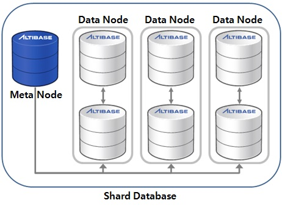
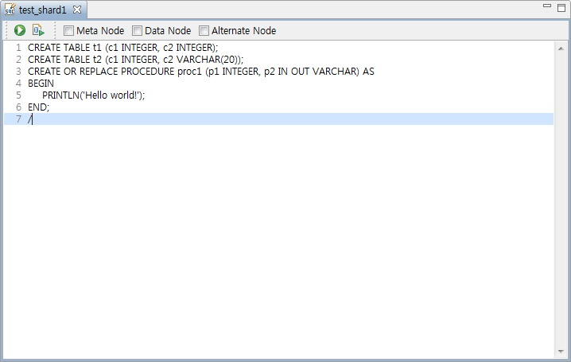
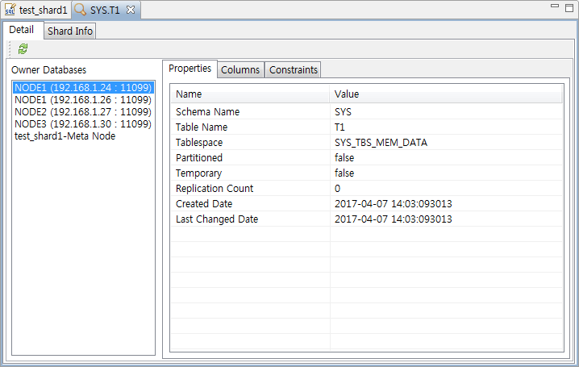
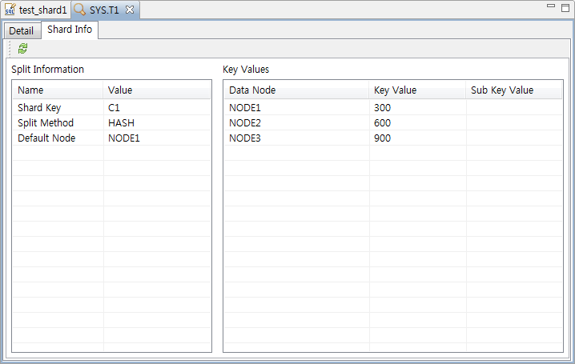
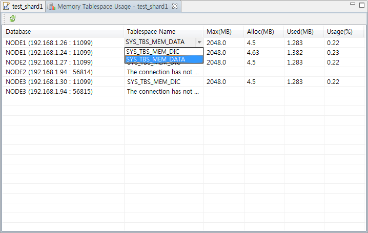
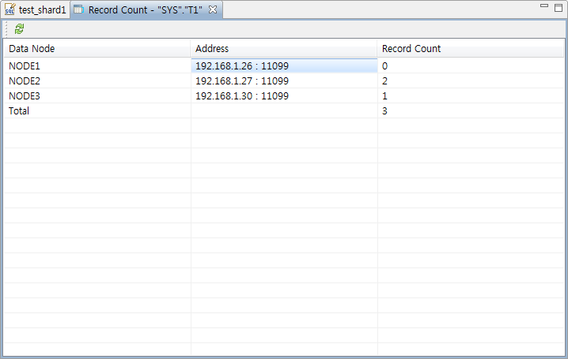
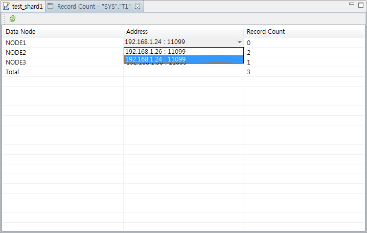
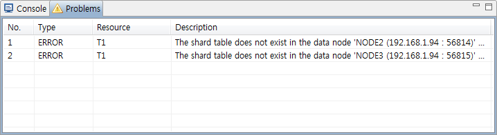
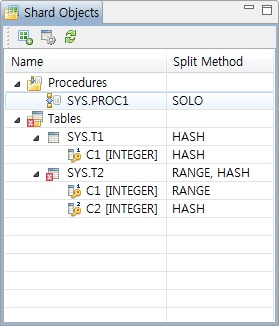

<!-- START doctoc generated TOC please keep comment here to allow auto update -->
<!-- DON'T EDIT THIS SECTION, INSTEAD RE-RUN doctoc TO UPDATE -->

- [Altibase Sharding Guide](#altibase-sharding-guide)
  - [서문](#%EC%84%9C%EB%AC%B8)
    - [이 매뉴얼에 대하여](#%EC%9D%B4-%EB%A7%A4%EB%89%B4%EC%96%BC%EC%97%90-%EB%8C%80%ED%95%98%EC%97%AC)
  - [Altibase Sharding Concept](#altibase-sharding-concept)
    - [Altibase Sharding Overview](#altibase-sharding-overview)
    - [Altibase Sharding Terminology](#altibase-sharding-terminology)
  - [Altibase Sharding Administration](#altibase-sharding-administration)
    - [Altibase Administration](#altibase-administration)
    - [Zookeeper Administration](#zookeeper-administration)
    - [Sharding Backup and Recovery](#sharding-backup-and-recovery)
    - [Altibase Sharding Sizing](#altibase-sharding-sizing)
    - [Altibase Sharding Restriction](#altibase-sharding-restriction)
  - [Using Altibase Sharding](#using-altibase-sharding)
    - [Sharding Usage Flow](#sharding-usage-flow)
    - [Multiple Error Handling](#multiple-error-handling)
    - [Sharding Built-in Function](#sharding-built-in-function)
    - [Sharding Tuning](#sharding-tuning)
  - [SHARD DDL](#shard-ddl)
    - [ADD](#add)
    - [DROP](#drop)
    - [DROP FORCE](#drop-force)
    - [JOIN](#join)
    - [FAILOVER](#failover)
    - [FAILBACK](#failback)
    - [MOVE](#move)
  - [Altibase Sharding Package](#altibase-sharding-package)
    - [DBMS_SHARD](#dbms_shard)
    - [DBMS_SHARD_GET_DIAGNOSTICS](#dbms_shard_get_diagnostics)
  - [Stored Procedures](#stored-procedures)
  - [Sharded Sequence](#sharded-sequence)
  - [Altibase Sharding Property](#altibase-sharding-property)
  - [Altibase Sharding Dictionary](#altibase-sharding-dictionary)
    - [Shard Meta Table](#shard-meta-table)
    - [Performance View](#performance-view)
    - [Shard Performance View](#shard-performance-view)
  - [Precompiler](#precomplier)
  - [ODBC](#odbc)
  - [ShardCLI](#shardcli)
  - [ShardJDBC (*under construction*)](#shardjdbc-under-construction)
  - [Utilities](#utilities)

<!-- END doctoc generated TOC please keep comment here to allow auto update -->

Altibase® Administration

Altibase Sharding Guide
=======================

Altibase Administration Altibase Sharding Guide

Release 7.2

Copyright ⓒ 2001\~2021 Altibase Corp. All Rights Reserved.

본 문서의 저작권은 ㈜알티베이스에 있습니다. 이 문서에 대하여 당사의 동의
없이 무단으로 복제 또는 전용할 수 없습니다.

**㈜알티베이스**

08378 서울시 구로구 디지털로 306 대륭포스트타워Ⅱ 10층

전화: 02-2082-1114 팩스: 02-2082-1099

고객서비스포털: <http://support.altibase.com>

homepage: [http://www.altibase.com](http://www.altibase.com/)

## 서문

### 이 매뉴얼에 대하여

이 매뉴얼은 Altibase의 분산 데이터베이스 기술인 Altibase Sharding에 대해 설명한다.

#### 대상 사용자

이 매뉴얼은 다음과 같은 Altibase 사용자를 대상으로 작성되었다.

-   데이터베이스 관리자

-   응용프로그램 개발자

-   DB 설계자

다음과 같은 배경 지식을 가지고 이 매뉴얼을 읽는 것이 좋다.

-   컴퓨터, 운영 체제 및 운영 체제 유틸리티 운용에 필요한 기본 지식

-   관계형 데이터베이스 사용 경험 또는 데이터베이스 개념에 대한 이해

-   컴퓨터 프로그래밍 경험

-   데이터베이스 서버 관리, 운영 체제 관리 또는 네트워크 관리 경험

#### 소프트웨어 환경

이 매뉴얼은 데이터베이스 서버로 Altibase 7.2 또는 그 이상의 버전을 사용한다는 가정 하에 작성되었다.

#### 문서화 규칙

이 절에서는 이 매뉴얼에서 사용하는 규칙에 대해 설명한다. 이 규칙을 이해하면 이 매뉴얼과 설명서 세트의 다른 매뉴얼에서 정보를 쉽게 찾을 수 있다.

여기서 설명하는 규칙은 다음과 같다.

-   구문 다이어그램

-   샘플 코드 규칙

##### 구문 다이어그램

이 매뉴얼에서는 다음 구성 요소로 구축된 다이어그램을 사용하여, 명령문의 구문을 설명한다.

| 구성 요소                        | 의미                                                         |
| -------------------------------- | ------------------------------------------------------------ |
|  | 명령문이 시작한다. 완전한 명령문이 아닌 구문 요소는 화살표로 시작한다. |
|  | 명령문이 다음 라인에 계속된다. 완전한 명령문이 아닌 구문 요소는 이 기호로 종료한다. |
|  | 명령문이 이전 라인으로부터 계속된다. 완전한 명령문이 아닌 구문 요소는 이 기호로 시작한다. |
|  | 명령문이 종료한다.                                           |
|  | 필수 항목                                                    |
|  | 선택적 항목                                                  |
|  | 선택사항이 있는 필수 항목. 한 항목만 제공해야 한다.          |
|  | 선택사항이 있는 선택적 항목.                                 |
|  | 선택적 항목. 여러 항목이 허용된다. 각 반복 앞부분에 콤마가 와야 한다. |

##### 샘플 코드 규칙

코드 예제는 SQL, Stored Procedure, iSQL, 또는 다른 명령 라인 구문들을 예를 들어
설명한다.

아래 테이블은 코드 예제에서 사용된 인쇄 규칙에 대해 설명한다.

| 규칙         | 의미                                                         | 예제                                                         |
| ------------ | ------------------------------------------------------------ | ------------------------------------------------------------ |
| [ ]          | 선택 항목을 표시                                             | VARCHAR [(*size*)][[FIXED \|] VARIABLE]                      |
| { }          | 필수 항목 표시. 반드시 하나 이상을 선택해야 되는 표시        | { ENABLE \| DISABLE \| COMPILE }                             |
| \|           | 선택 또는 필수 항목 표시의 인자 구분 표시                    | { ENABLE \| DISABLE \| COMPILE } [ ENABLE \| DISABLE \| COMPILE ] |
| . . .        | 그 이전 인자의 반복 표시 예제 코드들의 생략되는 것을 표시    | SQL\> SELECT ename FROM employee;  ENAME  ------------------------  SWNO  HJNO  HSCHOI  .  .  .  20 rows selected. |
| 그 밖에 기호 | 위에서 보여진 기호 이 외에 기호들                            | EXEC :p1 := 1; acc NUMBER(11,2);                             |
| 기울임 꼴    | 구문 요소에서 사용자가 지정해야 하는 변수, 특수한 값을 제공해야만 하는 위치 | SELECT \* FROM *table_name*;  CONNECT *userID*/*password*; |
| 소문자       | 사용자가 제공하는 프로그램의 요소들, 예를 들어 테이블 이름, 칼럼 이름, 파일 이름 등 | SELECT ename FROM employee;                                  |
| 대문자       | 시스템에서 제공하는 요소들 또는 구문에 나타나는 키워드       | DESC SYSTEM_.SYS_INDICES_;                                   |

#### 관련 자료

자세한 정보를 위하여 다음 문서 목록을 참조하기 바란다.

-   Administrator’s Manual
-   Replication Manual
-   CLI User's Manual
-   JDBC User's Manual
-   Utilities Manual
-   iLoader User's Manual
-   Error Message Reference

#### Altibase는 여러분의 의견을 환영합니다.

이 매뉴얼에 대한 여러분의 의견을 보내주시기 바랍니다. 사용자의 의견은 다음
버전의 매뉴얼을 작성하는데 많은 도움이 됩니다. 보내실 때에는 아래 내용과 함께
고객서비스포털( http://support.altibase.com/kr/ )로 보내주시기 바랍니다.

-   사용 중인 매뉴얼의 이름과 버전

-   매뉴얼에 대한 의견

-   사용자의 성함, 주소, 전화번호

이 외에도 Altibase 기술지원 설명서의 오류와 누락된 부분 및 기타 기술적인
문제들에 대해서 이 주소로 보내주시면 정성껏 처리하겠습니다. 또한, 기술적인
부분과 관련하여 즉각적인 도움이 필요한 경우에도 고객서비스포털을 통해 서비스를
요청하시기 바랍니다.

여러분의 의견에 항상 감사 드립니다.

### Shard Manager

#### 개요

Shard Manager는 Altibase Sharding의 데이터 노드와 샤드 객체에 대한 구성 및
관리를 돕는 도구이다.

Altibase Sharding은 다수의 데이터베이스로 구성되기 때문에, 각 데이터베이스와
객체를 관리하는 비용이 많이 들 수 있다. 이러한 환경에서 관리자는 Shard Manager를
사용함으로써 여러 데이터베이스에서 수행해야 하는 반복 작업을 단순화하여 업무
효율성을 향상시키고, 데이터 노드와 샤드 객체를 시각화하여 구성에 대한 이해도를
증진시킬 수 있다.

#### 특징

Shard Manager의 특징은 다음과 같다.

-   데이터 노드를 손쉽게 등록/수정/해제할 수 있다.

-   객체를 샤드 객체로 손쉽게 등록/해제할 수 있다.

-   여러 노드에 걸쳐 존재하는 분산 객체의 개별 정보 및 분산 정보를 하나의 창에서
    확인할 수 있다.

-   한 메타 노드와 이에 등록된 데이터 노드들에 대해, SQL을 메타 노드/데이터
    노드/alternate 데이터 노드 단위로 한 번에 수행할 수 있다.

-   데이터 노드와 샤드 객체의 유효성을 검사하여 구조적 결함 정보를 제공한다.

-   샤드 테이블의 데이터 유효성을 확인하고, 자동 데이터 재구축을 수행할 수 있다.

#### 설치

이 절에서는 Shard Manager를 설치할 때 필요한 환경과 선행 조건, 그리고 설치 및
제거 방법을 안내한다.

##### 시스템 요구사항

Shard Manager는 아래와 같은 환경에서 설치 및 실행이 가능하다.

Linux용 Shard Manager는 JRE를 포함하지 않는다. 따라서 사용자가 실행 환경에
적합한 버전의 JRE를 설치해야 한다.

운영체제별 자세한 지원 사항은 다음의 링크된 페이지에서 확인할 수
있다( [http://www.eclipse.org/projects/project-plan.php?projectid=eclipse\#target_environments](http://www.eclipse.org/projects/project-plan.php?projectid=eclipse%23target_environments) ).

| 리소스                        | 최소 요구사항               |
|-------------------------------|-----------------------------|
| OS                            | Windows 32 bit Linux 64 bit |
| 메모리                        | 512 MB                      |
| Java Runtime Environment(JRE) | JRE Version 5               |
| 디스크 공간                   | 90 MB                       |
| 화면 해상도                   | 1024 \* 786 pixels          |
| CPU                           | Pentium III 800MHz          |

##### 호환가능 데이터베이스

Shard Manager와 호환가능한 데이터베이스는 아래와 같다.

-   Altibase Sharding 2.0 이상 버전을 지원한다.

-   메타 노드의 경우, 샤드 메타가 생성되어있어야 한다.

샤드 메타 생성에 대한 자세한 내용은 '*샤드 메타 생성'*을 참조한다.

##### 설치와 제거

제공된 압축(zip) 파일을 원하는 위치에 해제하면 Shard Manager 설치가 완료된다.
Shard Manager를 제거하기 위해서는 설치 시 생성한 Shard Manager 디렉토리를
삭제하면 제거가 완료된다.

#### 사용자 인터페이스

아래는 Shard Manager를 최초로 실행한 화면이다.

화면에서 빈 공간은 샤드 데이터베이스 뷰, 샤드 객체 뷰에 따라 다른 뷰(쿼리 뷰,
상세 뷰, 레코드 카운트 뷰, 메모리 테이블스페이스 사용률 뷰)를 보여준다.

##### 샤드 데이터베이스 뷰

샤드 데이터베이스 뷰는 메타 노드와 종속된 데이터 노드를 하나의 그룹으로 표현하는
샤드 데이터베이스를 중심으로 샤드 정보를 보여준다. 기본 전체 화면의 왼쪽 상단에
위치한다.

샤드 데이터베이스 뷰에서 표현하는 정보는 3가지이다.

1.  샤드 데이터베이스: 사용자가 등록한 메타 노드와 그의 데이터 노드를 하나의
    그룹으로 나타낸다. 메타 노드로 접속을 성공하면, 샤드 데이터베이스는 메타
    노드로부터 데이터 노드의 정보를 가져와 트리 구조의 하위 노드로 표현한다.

2. 데이터 노드: 메타 노드에 등록된 데이터 노드이다. 하위 노드로 데이터 노드의
   연결 정보를 보여준다.

3. 데이터 노드의 연결정보: 메타 노드에 등록된 데이터 노드의 연결 정보이다.

**Label Expression**

-   샤드 데이터베이스: 샤드 데이터베이스 추가 시 사용자가 부여한 이름

-   데이터 노드: 메타 노드에 등록된 데이터 노드 이름

-   데이터 노드의 연결정보: IP 주소 : 포트 번호

**Icon Expression**

-   샤드 데이터베이스: 메타 노드에 성공적으로 접속하면 아이콘 오른쪽 하단에
    초록색 화살표를 표시한다.

-   데이터 노드의 연결정보: 원형 아이콘은 접속 성공 시 초록색, 실패 시
    빨간색으로 표시된다. 해당 연결 정보가 데이터 노드의 alternate이면 아이콘
    오른쪽 하단에 'A' 문자를 표시한다.

##### 샤드 객체 뷰

샤드 객체 뷰는 샤드 데이터베이스 뷰에서 선택된 샤드 데이터베이스에 속한 샤드
객체를 보여준다. 기본 전체화면의 왼쪽 하단에 위치한다.

각각의 객체는 객체 종류에 따라 'Procedures', 'Tables'의 트리 하위 노드로
표현된다.

-   프로시저: 샤드 메타에 등록된 샤드 프로시저이다.

-   프로시저 파라미터: 샤드 프로시저에서 샤드 키 또는 서브 샤드 키로 사용되는
    파라미터 정보테이블: 샤드 메타에 등록된 샤드 테이블이다.

-   테이블 컬럼: 샤드 테이블에서 샤드 키 또는 서브 샤드 키로 사용되는 컬럼 정보

**Label Expression**

-   프로시저, 테이블: 사용자 이름.객체 이름

-   프로시저 파라미터: 프로시저 파라미터 이름 [데이터 타입]

-   테이블 컬럼: 테이블 컬럼 이름 [데이터 타입]

**Icon Expression**

-   프로시저 파라미터: 파라미터 타입에 따라 IN은 오른쪽, OUT은 왼쪽, IN OUT은
    양쪽 화살표 아이콘을 표시한다. 열쇠 그림 위의 숫자가 1이면 샤드 키, 2이면
    서브 샤드 키를 의미한다.

-   테이블 컬럼: 열쇠 그림 위의 숫자가 1이면 샤드 키, 2이면 서브 샤드 키를
    의미한다.

**칼럼 설명**

-   Name: 샤드 객체의 이름을 표시한다.

-   Split Method: 샤드 객체의 분산 방식을 표시한다.

**샤드 객체 뷰 툴바**

-   Add New Shard Object(): 샤드 객체를 추가한다.

-   Rebuild Shard Table(): 샤드 테이블의 데이터 유효성을 확인하고, 자동 데이터 재구축을 수행한다.

##### 쿼리 뷰

쿼리 뷰는 사용자가 입력한 쿼리를 메타 노드와 데이터 노드, alternate 데이터
노드를 대상으로 수행하는 뷰이다.

샤드 데이터베이스를 연결할 때 자동으로 뷰가 나타나며, 대상 데이터베이스의 이름이
뷰의 제목으로 사용된다. 사용자가 쿼리 뷰를 열 때에는 샤드 데이터베이스 뷰에서
샤드 데이터베이스를 마우스 오른쪽 버튼을 누르거나 선택 후, Database 메뉴를 열어
'Open Query View'를 선택하면 생성된다. 기본 전체 화면 오른쪽 상단에 위치한다.

##### 쿼리 뷰 툴바

-   Execute Statement (): 커서로 선택한 문자 블록 또는 해당 커서가 위치한 라인이 수행된다.

-   Execute Script (): 쿼리 뷰에 입력한 모든 SQL문이 수행된다.

사용자가 선택한 체크박스에 따라 메타 노드, 데이터 노드, alternate 데이터 노드를
대상으로 쿼리를 수행하며, 쿼리 수행 결과는 콘솔 뷰에 출력된다. 사용자는 쿼리
뷰에 다수의 SQL문을 입력할 수 있으며, 일부 또는 전체 SQL문을 선택하여 수행할 수
있다. SQL문은 사용자가 노드에 입력한 순서대로 수행된다.

##### 상세 뷰

상세 뷰는 특정 객체에 대해 각 노드에 저장된 해당 객체의 상세 정보와 메타 노드에
등록된 분산 정보를 보여준다. 대상 객체의 사용자 이름과 객체 이름이 개별 뷰의
제목으로 쓰인다. 샤드 객체 뷰에서 객체를 마우스 오른쪽 버튼으로 누르거나, 선택
후 Shard Object 메뉴를 열어 'Show Detail'을 선택하면 생성되며, 기본 전체화면의
오른쪽 상단에 위치한다.

상세 뷰는 샤드 객체의 정보를 'Detail'과 'Shard Info'라는 탭으로 분류하여
보여준다.

-   Detail: 각 노드에 저장된 객체의 상세 정보를 보여준다.

-   Shard Info: 대상 객체가 샤드 객체인 경우, 메타 노드에 등록된 분산 정보를
    보여준다.

-   Owner Databases: 샤드 객체 뷰에서 선택된 객체와 동일한 스키마 이름과 객체
    이름을 가진 객체가 저장되어 있는 데이터베이스 리스트를 보여준다. (Label
    Expression: '데이터 노드 이름 (IP 주소 : 포트 번호)' or '샤드 데이터베이스
    이름-Meta Node')

-   Owner Databases에서 선택된 데이터베이스에 존재하는 분산 객체의 정보는 오른쪽
    화면에 탭 형식으로 분류하여 나타낸다. 샤드 테이블의 경우 'Properties',
    'Columns', 'Constraints'로 분류하고, 샤드 프로시저의 경우 'Properties',
    'Parameters', 'Code'로 분류한다.

-   Shard Information: 분산 방식과 샤드 키, 서브 샤드 키, 기본 노드를 보여준다.

-   Key Values: 선택한 샤드 객체가 분산된 데이터 노드의 이름과 샤드 키 값, 서브
    샤드 키의 값을 보여준다.

##### 메모리 테이블스페이스 사용률 뷰

메모리 테이블스페이스 사용률 뷰는 데이터 노드와 alternate 데이터 노드의 메모리
테이블스페이스 사용률을 보여준다. 접속한 데이터베이스를 마우스 오른쪽 버튼으로
누르거나, 선택 후 Database 메뉴를 열어 'Show Memory Tablespace Usage'를 클릭하면
생성된다. 생성 시 기본 전체화면 오른쪽 상단에 위치한다.

**칼럼 설명**

-   Database: 데이터 노드의 연결정보로 접속한 데이터베이스(Label Expression:
    '데이터 노드 이름 (IP 주소 : 포트 번호)' or '샤드 데이터베이스 이름-Meta
    Node')

-   Tablespace Name: 메모리 테이블스페이스 이름, 노드에 존재하는 메모리
    테이블스페이스가 다수일 경우, 선택할 수 있다.

-   Max(MB): 메모리 테이블스페이스에서 사용할 수 있는 최대 메모리 크기,
    테이블스페이스 생성 시 최대 크기를 지정하지 않았다면 MEM_MAX_DB_SIZE
    프로퍼티에 지정된 크기를, AUTOEXTEND가 OFF라면 메모리 테이블스페이스가
    할당받은 크기를 출력한다.

-   Alloc(MB): 메모리 테이블스페이스에 할당된 메모리 크기

-   Used(MB): 'Alloc(MB)'의 값 중, 실제 사용하는 메모리 크기

-   Usage(%): 메모리 테이블스페이스 사용률 (= Alloc(MB) / Max(MB) \* 100)

##### 레코드 카운트 뷰

샤드 테이블의 레코드는 여러 데이터 노드에 분산되어 저장된다. 레코드 카운트 뷰는
각 데이터 노드의 분산 테이블에 저장된 레코드 개수를 표시한다. 샤드 객체 뷰에서
테이블을 마우스 오른쪽 버튼으로 누르거나, 선택 후 'Shard Object' 메뉴에서 'Show
Record Count'를 클릭하면 생성된다. 기본 전체화면의 오른쪽 상단에 위치한다.

**칼럼 설명**

-   Data Node: 메타 노드가 가진 데이터 노드의 이름

-   Address: 데이터 노드의 연결정보, alternate 데이터 노드가 존재할 경우,
    연결정보를 선택할 수 있다. (Label Expression: 'IP 주소 : 포트 번호')

-   Record Count: Data Node와 Address 컬럼에서 선택된 데이터베이스에 저장된
    테이블의 레코드 개수

##### 콘솔 뷰

프로그램 수행 중 사용자에게 전달할 정보가 기록되는 뷰이다. 프로그램의 수행
상태와 쿼리 실행결과 등이 기록된다. 기본 전체화면 오른쪽 하단에 위치한다.

##### 문제 뷰

유효성 검사를 수행했을 때, 객체가 위반한 규칙에 대한 정보를 보여주는 뷰이다.
기본 전체화면 오른쪽 하단에 위치한다.

**칼럼 설명**

-   No.: 선택한 객체가 위반한 규칙에 순차적으로 부여되는 일련번호이다.

-   Type: 규칙의 종류를 표시한다.

-   Resource: 규칙을 위반한 대상 객체를 표시한다. 예를 들어, 선택한 객체가
    'T1'이라는 이름의 테이블이고 위반한 규칙의 설명이 '데이터 노드가 가진 분산
    테이블의 컬럼 구성은 메타 노드에 등록된 샤드 테이블과 같아야 한다'라면
    구성이 달라 규칙을 위반한 컬럼의 이름을 표시한다.

-   Description: 위반한 규칙에 대한 상세 설명을 기술한다.

#### 샤드 데이터베이스 관리

이 절에서는 Shard Manager의 기능과 사용 방법에 대해 기술한다.

##### 샤드 데이터베이스 등록

1.  툴바 또는 Database 메뉴에 위치한 'Add New Shard Database'를 클릭한다.

2.  샤드 데이터베이스 이름과 메타 노드의 연결정보를 입력한다.

3.  'Test' 버튼을 클릭하여 입력한 연결정보를 통해 메타 노드에 접속이 정상적으로
    이루어지는지 확인한다.

4.  'Next' 버튼을 클릭하여 다음 페이지에서 메타 노드로부터 가져온 데이터 노드
    이름, 연결정보, 그리고 접속하는데 사용될 JDBC 드라이버 파일을 확인한다.

5.  각 데이터 노드 접속에 필요한 드라이버가 메타 노드와 다를 경우, Driver Path
    열에서 해당하는 칸에 위치한 연필 아이콘을 클릭하여 드라이버 파일을 변경한다.

6.  'Finish' 버튼을 클릭하여 샤드 데이터베이스를 저장한다.

7.  정상적으로 샤드 데이터베이스가 생성되었다면 해당 샤드 데이터베이스가 샤드
    데이터베이스 뷰에 나타난다.

##### 샤드 데이터베이스 편집

1.  샤드 데이터베이스 뷰에서 수정할 샤드 데이터베이스를 클릭한다.

2.  샤드 데이터베이스 뷰 위에서 마우스 오른쪽 버튼을 누르거나, Database 메뉴를
    열어 'Edit Shard Database'를 클릭한다.

3.  메타 노드 연결정보를 수정한 뒤, 'Test'버튼을 클릭하여 접속 여부를 확인한다.

4.  'Next' 버튼을 클릭하여 다음 페이지에서 수정된 메타 노드로부터 가져온 데이터
    노드 리스트를 확인한다.

5.  각 데이터 노드 접속에 필요한 드라이버 파일의 변경이 필요할 시, Driver Path
    열에서 해당하는 칸에 위치한 연필 아이콘을 클릭하여 파일을 변경한다.

6.  'Finish' 버튼을 클릭하여 수정된 샤드 데이터베이스를 저장한다.

##### 샤드 데이터베이스 제거

1.  샤드 데이터베이스 뷰에서 삭제할 샤드 데이터베이스를 마우스 오른쪽 버튼으로
    누르거나, 클릭 후 Database 메뉴를 열어 'Remove Shard Database'를 클릭한다.

2.  삭제 여부를 묻는 팝업 창에서 삭제할 샤드 데이터베이스가 맞는지 확인한 뒤,
    'Yes' 버튼을 클릭한다.

3.  정상적으로 샤드 데이터베이스가 삭제되었다면 해당 샤드 데이터베이스가 샤드
    데이터베이스 뷰에서 사라진다.

##### 샤드 데이터베이스 연결

샤드 데이터베이스 뷰에서 특정 샤드 데이터베이스를 연결한다. 연결할 샤드
데이터베이스를 더블클릭하거나, 마우스 오른쪽 버튼으로 눌러 'Connect'를 클릭한다.
연결이 정상적으로 수행되면 아이콘 오른쪽 하단에 초록색 화살표를 표시하고, 트리
하위 노드로 메타 노드에 등록된 데이터 노드를 표시한다.

##### 샤드 데이터베이스 연결 해제

샤드 데이터베이스 뷰에서 연결을 해제한다. 연결 해제할 샤드 데이터베이스를
더블클릭하거나, 마우스 오른쪽 버튼을 눌러 'Disconnect'를 클릭한다. 연결이
정상적으로 해제되었다면 아이콘 오른쪽 하단에 있는 초록색 화살표가 사라지고, 트리
하위 노드들이 사라진다.

##### 데이터 노드 추가

1.  메타 노드에 새 데이터 노드를 생성한다.

2.  샤드 데이터베이스 뷰에서 데이터 노드를 추가하고자 하는 연결된 상태의 샤드
    데이터베이스를 마우스 오른쪽 버튼으로 누르거나, 클릭 후 Data Node 메뉴를
    열어 'Add Data Node'를 클릭한다.

3.  데이터 노드 이름과 연결정보, 필요한 경우 alternate 데이터 노드의 연결
    정보까지 입력한다.

4.  'Test' 버튼을 클릭하여 입력한 연결정보에 접속이 정상적으로 이루어지는지
    확인한다.

5.  'OK' 버튼을 클릭하여 데이터 노드를 추가한다.

6.  정상적으로 데이터 노드가 추가되었다면, 샤드 데이터베이스 뷰 내 대상 샤드
    데이터베이스의 트리 하위 노드로 추가된 데이터 노드가 나타난다.

##### 데이터 노드 수정

1.  메타 노드에서 해당 데이터 노드의 연결 정보를 수정한다.

2.  샤드 데이터베이스 뷰에서 수정할 데이터 노드를 마우스 오른쪽 버튼으로
    누르거나, 클릭 후 Data Node 메뉴를 열어 'Edit Data Node'를 클릭한다.

3.  데이터 노드의 연결정보를 수정한다.

4.  'Test' 버튼을 클릭하여 입력한 연결정보에 접속이 정상적으로 이루어지는지
    확인한다.

5.  'OK' 버튼을 클릭하여 수정을 완료한다.

##### 데이터 노드 삭제

메타 노드에서 해당 데이터 노드를 삭제한다.

1.  샤드 데이터베이스 뷰에서 삭제할 데이터 노드를 마우스 오른쪽 버튼으로
    누르거나, 클릭 후 Data Node 메뉴를 열어 'Remove Data Node'를 클릭한다.

2.  삭제 여부를 묻는 팝업 창에서 삭제할 데이터 노드에 대한 정보를 확인한 뒤,
    'Yes' 버튼을 클릭한다.

3.  정상적으로 데이터 노드가 삭제되었다면 샤드 데이터베이스 뷰 내 대상 데이터
    노드가 사라진다.

##### Alternate 노드 삭제

메타 노드에서 해당 데이터 노드의 alternate 연결정보가 삭제된다.

1.  샤드 데이터베이스 뷰에서 삭제할 alternate 데이터 노드 연결정보의 트리 상위
    노드인 데이터 노드를 마우스 오른쪽 버튼으로 누르거나, 클릭 후 Data Node
    메뉴를 열어 'Remove Alternate Node'를 클릭한다.

2.  삭제 여부를 묻는 팝업 창에서 삭제할 alternate 데이터 노드를 확인한 뒤 'Yes'
    버튼을 클릭한다.

3.  정상적으로 alternate 데이터 노드가 삭제되었다면 샤드 데이터베이스 뷰 내 대상
    데이터 노드의 트리 하위 노드인 alternate 데이터 노드의 연결정보가 사라진다.

##### 메모리 테이블스페이스 사용률 확인

1.  샤드 데이터베이스 뷰에서 메모리 테이블스페이스의 사용률을 확인하려는 샤드
    데이터베이스를 마우스 오른쪽 버튼으로 누르거나, 클릭 후 Database 메뉴를 열어
    'Show Memory Tablespace Usage'를 클릭한다.

2.  확인하고자 하는 데이터베이스의 행에서 Tablespace Name 열에 해당하는 칸을
    클릭하여 원하는 메모리 테이블스페이스를 선택한다.

#### 샤드 객체 관리

##### 샤드 객체 설정

메타 노드에 샤드 객체의 분산 정보를 저장한다.

1. 샤드 객체 뷰의 툴바에 위치한 'Add New Shard Object' 버튼() 또는 메뉴에서 'Shard Object' - 'Add New Shard Object' 항목을 클릭한다.

2. 'Available Database Object' 테이블에서 샤드 객체로 지정할 항목의 체크박스를
   클릭하여 선택한다.

   

3. 분산 방식이 '복제(Clone)'나 '독립(Solo)'이 아니면, 선택한 샤드 객체의 샤드
   키와, 서브 샤드 키를 지정한 뒤, 샤드 키 분산 방식, 서브 샤드 키 분산 방식,
   기본 노드를 선택한다.

4. 'Key Values' 테이블에서 분산 정보에 등록할 노드와 샤드 키 값, 서브 샤드 키
   값을 작성한다.

5. 'Submit' 버튼을 클릭하여 샤드 객체 설정을 메타 노드에 요청한다.

6. 샤드 객체 설정이 완료되면, 해당 객체는 샤드 객체 뷰에 표시된다. 지정한 분산
   방식은 'Split Method'에 표시되고, 샤드 키와 서브 샤드 키는 객체의 하위
   노드로 표시된다.

##### 샤드 객체 해제

메타 노드에서 해당 객체에 대한 분산 정보를 삭제한다.

1.  샤드 객체 뷰에서 원하는 샤드 객체를 마우스 오른쪽 버튼으로 누르거나, 클릭 후
    'Shard Object' 메뉴를 열어 'Unset Shard Object'를 클릭한다.

2.  샤드 객체 해제 여부를 묻는 팝업 창에서 대상 객체를 확인한 뒤, 'Yes' 버튼을
    클릭하여 메타 노드에 샤드 객체 해제를 요청한다.

3.  샤드 객체 해제를 완료하면, 샤드 객체 뷰에서 해당하는 샤드 객체가 나타나지
    않는다.

##### 샤드 객체 정보 확인

샤드 객체 뷰에서 원하는 객체를 마우스 오른쪽 버튼으로 누르거나, 클릭 후 Shard
Object 메뉴를 열어 'Show Detail'을 클릭한다.

##### 샤드 객체 삭제

샤드 객체를 해제한 후, 메타 노드와 분산 정보에 등록된 데이터 노드에서 해당
객체를 삭제한다.

1.  샤드 객체 뷰에서 원하는 객체를 마우스 오른쪽 버튼으로 누르거나, 클릭 후
    Shard Object 메뉴를 열어, 객체 종류가 테이블일 경우 'Drop Table'를,
    프로시저일 경우 'Drop Procedure'를 클릭한다.

2.  삭제 여부를 묻는 팝업 창에서 삭제할 객체를 확인한 뒤, 'Yes' 버튼을 클릭한다.

3.  샤드 객체일 경우, Shard Manager가 해당 객체에 대해 샤드 객체 해제를 수행한
    뒤 삭제한다.

4.  정상적으로 객체가 삭제되었다면 샤드 객체 뷰 내 해당 객체가 사라진다.

##### 테이블 레코드 카운트 확인

1.  샤드 객체 뷰에서 원하는 테이블을 마우스 오른쪽 버튼으로 누르거나 클릭 후
    Shard Object 메뉴를 열어, 'Show Record Count'를 클릭한다.

2.  확인하고자 하는 데이터 노드의 행에서 Address 열에 해당하는 칸을 클릭하여
    원하는 연결정보를 선택한다.

##### 자동 데이터 재구축

샤드 테이블의 데이터 유효성 확인과 구조 변경에 따른 노드간 데이터 재분배를
손쉽게 수행한다.

1.  샤드 객체 뷰의 툴바에 위치한 'Rebuild Shard Table'() 또는 메뉴에서 'Shard Object' - 'Rebuild Shard Table' 항목을 클릭한다.

2.  'Available Tables' 리스트에서 데이터 검증 또는 재구축을 할 샤드 테이블을
    선택하여 'Selected Tables' 리스트로 옮긴다.

3.  'Next' 버튼을 누르면 데이터 검증을 수행하고 다음 페이지로 이동한다.

4.  데이터 검증 결과를 확인한다. 검증 과정에서 오류가 발생한 샤드 테이블은
    자동으로 데이터 재구축 단계에서 제외된다.

5.  'Next' 버튼을 눌러 다음 페이지로 이동한다.

6.  데이터 재구축 시 사용할 일괄 처리 행의 단위(Batch Count) 값을 지정한다.

7.  'Rebuild' 버튼을 눌러 자동 데이터 재구축을 수행한다.

8.  'Selected Tables'에서 테이블을 선택하여 각 테이블의 재구축 수행 시 출력된
    로그와 노드의 레코드 카운트를 확인한다.

#### SQL 실행

##### 쿼리 뷰 열기

샤드 데이터베이스 뷰에서 원하는 샤드 데이터베이스를 마우스 오른쪽 버튼으로
누르거나, 클릭 후 Database 메뉴를 열어 'Show Query View'를 클릭한다.

##### SQL 실행

선택한 노드 종류에 해당하는 데이터베이스에서 입력한 SQL문이 실행된다.

1.  쿼리 뷰 내 SQL 입력 창에 실행하고자 하는 SQL문을 입력한다.

2.  쿼리 뷰 내 툴바에 위치한 체크박스 중, 입력한 SQL문을 실행하고자 하는 노드
    종류를 선택한다.

3.  입력한 SQL문 중 특정 쿼리만 수행하려면, 해당 구문을 마우스 커서로 드래그하여
    선택한 뒤 쿼리 뷰의 툴바에서 'Execute Statement'()을 클릭한다. 입력한 전체 SQL문을 모두 수행하고 싶을 경우에는 'Execute Script'()을 클릭하여 SQL 문을 실행한다.

4.  콘솔 뷰를 통해 각 데이터베이스에서의 실행 결과를 확인한다.

#### 샤드 데이터베이스 유효성 검사

데이터 노드 및 객체 구성에 대한 유효성 검사를 수행하는 방법에 대해 설명한다.
현재 Shard Manager에서 확인하는 구성 규칙은 다음과 같다.

1.  샤드 객체의 분산 정보에 포함된 데이터 노드가 메타 노드에 등록된 데이터
    노드인가?

2.  샤드 객체와 동일한 객체 타입, 사용자 이름, 객체 이름을 가진 객체가 분산할
    데이터 노드에 존재하는가?

3.  데이터 노드가 보유한 분산 테이블의 컬럼이 샤드 테이블의 컬럼과 동일한 이름,
    데이터 타입, 순서를 가지는가?

4.  데이터 노드가 보유한 분산 테이블의 제약사항이 샤드 테이블의 제약사항과
    동일한 종류 및 컬럼 구성을 가지는가?

5.  데이터 노드가 보유한 분산 프로시저의 파라미터가 샤드 프로시저의 파라미터와
    동일한 이름, 데이터 타입, 순서를 가지는가?

##### 샤드 데이터베이스 유효성 검사

샤드 데이터베이스 뷰 내에서 검사할 샤드 데이터베이스를 마우스 오른쪽 버튼으로
누르거나, 클릭 후 Database 메뉴를 열어 Validate/Validate를 클릭한다.

##### 규칙위반 검사

유효성 검사를 수행하여 규칙을 위반한 요소가 발견되면, 샤드 데이터베이스 뷰와
샤드 객체 뷰에서 규칙을 위반한 객체와 그 상위 트리 요소의 아이콘 왼쪽 하단에
엑스 표시가 있는 빨간 네모가 나타난다. 이러한 객체를 선택하면 Problems 뷰에서
위반한 규칙을 확인할 수 있다.

##### 유효성 검사 결과 삭제

유효성 검사 결과를 삭제하고자 할 때는 샤드 데이터베이스 뷰에서 해당 샤드
데이터베이스를 마우스 오른쪽 버튼으로 누르거나, 클릭 후 Database 메뉴를 열어
Validate/Clear Validation Result를 클릭한다.
