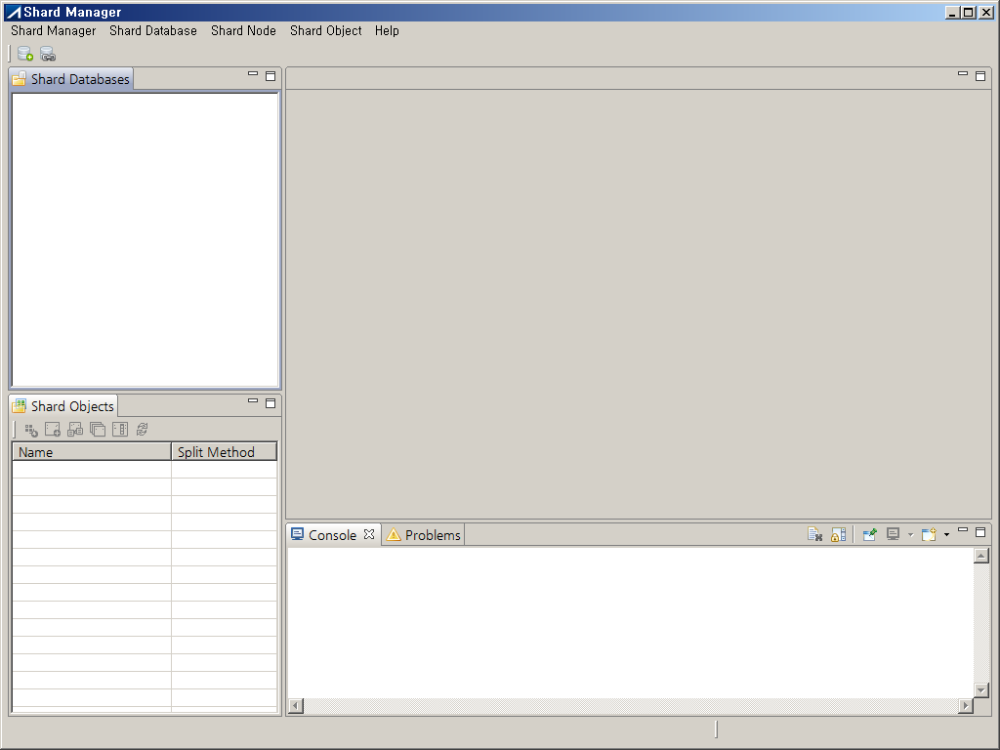
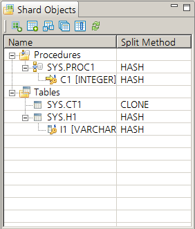
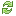
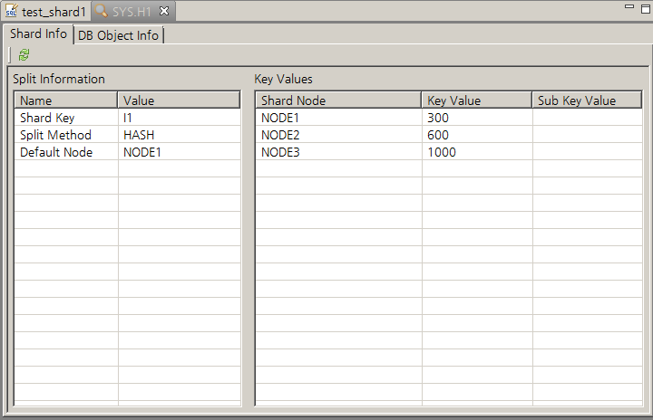
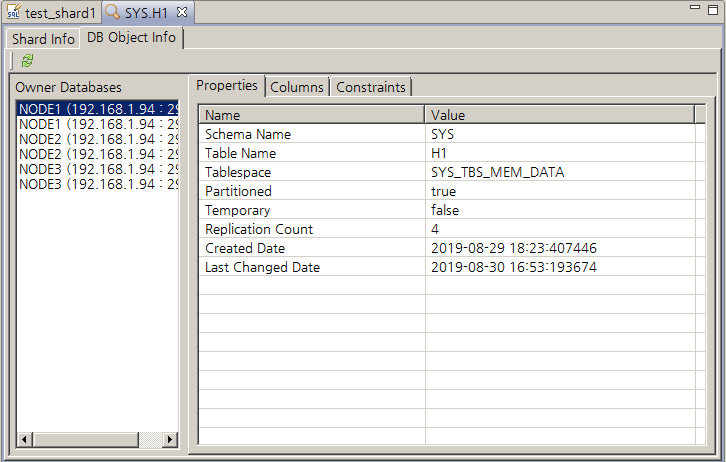
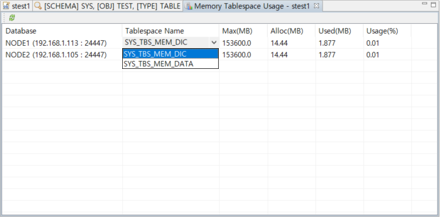
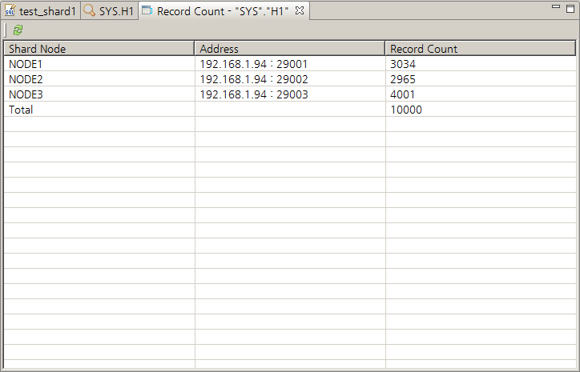
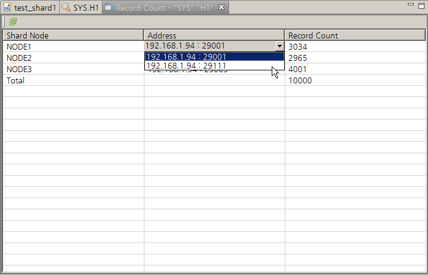

<!-- START doctoc generated TOC please keep comment here to allow auto update -->
<!-- DON'T EDIT THIS SECTION, INSTEAD RE-RUN doctoc TO UPDATE -->

- [Shard Manager](#shard-manager)
  - [서문](#%EC%84%9C%EB%AC%B8)
    - [이 매뉴얼에 대하여](#%EC%9D%B4-%EB%A7%A4%EB%89%B4%EC%96%BC%EC%97%90-%EB%8C%80%ED%95%98%EC%97%AC)
  - [Overview](#overview)
  - [Installstion](#installstion)
  - [User Interface](#user-interface)
    - [Shard Databases View](#shard-databases-view)
    - [Shard Objects View](#shard-objects-view)
    - [Query View](#query-view)
    - [Detail View](#detail-view)
    - [Memory Tablespace Usage View](#memory-tablespace-usage-view)
    - [Record Count View](#record-count-view)
    - [Console View](#console-view)
  - [Shard Database Management](#shard-database-management)
    - [Create New Shard Database](#create-new-shard-database)
    - [Load from Running Shard Database](#load-from-running-shard-database)
    - [Connect Shard Database](#connect-shard-database)
    - [Disconnect Shard Database](#disconnect-shard-database)
    - [Remove Shard Database](#remove-shard-database)
    - [Generate Report](#generate-report)
  - [Shard Node Management](#shard-node-management)
    - [Add Shard Node](#add-shard-node)
    - [Drop Shard Node](#drop-shard-node)
  - [Shard Object Management](#shard-object-management)
    - [Set Shard Object](#set-shard-object)
    - [Unset Shard Object](#unset-shard-object)
    - [Create Shard Table](#create-shard-table)
    - [Create Shard Procedure](#create-shard-procedure)
    - [Drop Table](#drop-table)
    - [Drop Procedure](#drop-procedure)

<!-- END doctoc generated TOC please keep comment here to allow auto update -->

Shard Manager
=======================
Release 7.2

Copyright ⓒ 2001\~2021 Altibase Corp. All Rights Reserved.

본 문서의 저작권은 ㈜알티베이스에 있습니다. 이 문서에 대하여 당사의 동의없이 무단으로 복제 또는 전용할 수 없습니다.

**㈜알티베이스**

08378 서울시 구로구 디지털로 306 대륭포스트타워Ⅱ 10층

전화: 02-2082-1114 팩스: 02-2082-1099

고객서비스포털: <http://support.altibase.com>

homepage: [http://www.altibase.com](http://www.altibase.com/)

## 서문

### 이 매뉴얼에 대하여

이 매뉴얼은 Altibase의 분산 데이터베이스 기술인 Sharding을 관리할 수 있는 GUI 툴인 Shard Manager 에 대해 설명한다.

#### 대상 사용자

이 매뉴얼은 다음과 같은 Altibase 사용자를 대상으로 작성되었다.

-   데이터베이스 관리자

-   응용프로그램 개발자

-   DB 설계자

다음과 같은 배경 지식을 가지고 이 매뉴얼을 읽는 것이 좋다.

-   컴퓨터, 운영 체제 및 운영 체제 유틸리티 운용에 필요한 기본 지식

-   관계형 데이터베이스 사용 경험 또는 데이터베이스 개념에 대한 이해

-   컴퓨터 프로그래밍 경험

-   데이터베이스 서버 관리, 운영 체제 관리 또는 네트워크 관리 경험

#### 소프트웨어 환경

이 매뉴얼은 데이터베이스 서버로 Altibase 7.2 또는 그 이상의 버전을 사용한다는 가정 하에 작성되었다.

#### 문서화 규칙

이 절에서는 이 매뉴얼에서 사용하는 규칙에 대해 설명한다. 이 규칙을 이해하면 이 매뉴얼과 설명서 세트의 다른 매뉴얼에서 정보를 쉽게 찾을 수 있다.

여기서 설명하는 규칙은 다음과 같다.

-   구문 다이어그램

-   샘플 코드 규칙

##### 구문 다이어그램

이 매뉴얼에서는 다음 구성 요소로 구축된 다이어그램을 사용하여, 명령문의 구문을 설명한다.

| 구성 요소                        | 의미                                                         |
| -------------------------------- | ------------------------------------------------------------ |
|  | 명령문이 시작한다. 완전한 명령문이 아닌 구문 요소는 화살표로 시작한다. |
|  | 명령문이 다음 라인에 계속된다. 완전한 명령문이 아닌 구문 요소는 이 기호로 종료한다. |
|  | 명령문이 이전 라인으로부터 계속된다. 완전한 명령문이 아닌 구문 요소는 이 기호로 시작한다. |
|  | 명령문이 종료한다.                                           |
|  | 필수 항목                                                    |
|  | 선택적 항목                                                  |
|  | 선택사항이 있는 필수 항목. 한 항목만 제공해야 한다.          |
|  | 선택사항이 있는 선택적 항목.                                 |
|  | 선택적 항목. 여러 항목이 허용된다. 각 반복 앞부분에 콤마가 와야 한다. |

##### 샘플 코드 규칙

코드 예제는 SQL, Stored Procedure, iSQL, 또는 다른 명령 라인 구문들을 예를 들어
설명한다.

아래 테이블은 코드 예제에서 사용된 인쇄 규칙에 대해 설명한다.

| 규칙         | 의미                                                         | 예제                                                         |
| ------------ | ------------------------------------------------------------ | ------------------------------------------------------------ |
| [ ]          | 선택 항목을 표시                                             | VARCHAR [(*size*)][[FIXED \|] VARIABLE]                      |
| { }          | 필수 항목 표시. 반드시 하나 이상을 선택해야 되는 표시        | { ENABLE \| DISABLE \| COMPILE }                             |
| \|           | 선택 또는 필수 항목 표시의 인자 구분 표시                    | { ENABLE \| DISABLE \| COMPILE } [ ENABLE \| DISABLE \| COMPILE ] |
| . . .        | 그 이전 인자의 반복 표시 예제 코드들의 생략되는 것을 표시    | SQL\> SELECT ename FROM employee;  ENAME  ------------------------  SWNO  HJNO  HSCHOI  .  .  .  20 rows selected. |
| 그 밖에 기호 | 위에서 보여진 기호 이 외에 기호들                            | EXEC :p1 := 1; acc NUMBER(11,2);                             |
| 기울임 꼴    | 구문 요소에서 사용자가 지정해야 하는 변수, 특수한 값을 제공해야만 하는 위치 | SELECT \* FROM *table_name*;  CONNECT *userID*/*password*; |
| 소문자       | 사용자가 제공하는 프로그램의 요소들, 예를 들어 테이블 이름, 칼럼 이름, 파일 이름 등 | SELECT ename FROM employee;                                  |
| 대문자       | 시스템에서 제공하는 요소들 또는 구문에 나타나는 키워드       | DESC SYSTEM_.SYS_INDICES_;                                   |

#### 관련 자료

자세한 정보를 위하여 다음 문서 목록을 참조하기 바란다.

-   Altibase Sharding Guide

#### Altibase는 여러분의 의견을 환영합니다.

이 매뉴얼에 대한 여러분의 의견을 보내주시기 바랍니다. 사용자의 의견은 다음
버전의 매뉴얼을 작성하는데 많은 도움이 됩니다. 보내실 때에는 아래 내용과 함께
고객서비스포털( http://support.altibase.com/kr/ )로 보내주시기 바랍니다.

-   사용 중인 매뉴얼의 이름과 버전
-   매뉴얼에 대한 의견
-   사용자의 성함, 주소, 전화번호

이 외에도 Altibase 기술지원 설명서의 오류와 누락된 부분 및 기타 기술적인
문제들에 대해서 이 주소로 보내주시면 정성껏 처리하겠습니다. 또한, 기술적인
부분과 관련하여 즉각적인 도움이 필요한 경우에도 고객서비스포털을 통해 서비스를
요청하시기 바랍니다.

여러분의 의견에 항상 감사 드립니다.

## Overview
Shard Manager는 Altibase Sharding의 샤드 노드와 샤드 객체에 대한 구성 및 관리를 돕는 GUI 도구이다.

Altibase Sharding은 다수의 데이터베이스로 구성되기 때문에, 각 데이터베이스와 객체를 관리하는 비용이 많이 들 수 있다. 이러한 환경에서 관리자는 Shard Manager를 사용함으로써 여러 데이터베이스에서 수행해야 하는 반복 작업을 단순화하여 업무 효율성을 향상시키고, 샤드 노드와 샤드 객체를 시각화하여 구성에 대한 이해도를 증진시킬 수 있다.

Shard Manager의 특징은 다음과 같다.
-   샤드 데이터베이스를 손쉽게 추가/삭제할 수 있다.
-   샤드 노드를 손쉽게 추가/삭제할 수 있다.
-   DB 객체를 샤드 객체로 손쉽게 등록/해제할 수 있다.
-   여러 노드에 걸쳐 존재하는 분산 객체의 개별 정보 및 분산 정보를 하나의 창에서 확인할 수 있다.
-   여러 노드들에 대해, SQL(DDL)을 전체 샤드노드들에 한 번에 수행할 수 있다.
-   샤드 노드 구성, 샤드 객체 분포 및 스키마, 그리고 데이터 분포를 HTML 형태의 레포트로 확인할 수 있다.

## Installstion
이 절에서는 Shard Manager를 설치할 때 필요한 환경과 선행 조건, 그리고 설치 및 제거 방법을 안내한다.

#### System Requirements
Please refer to Shard Manager Release Notes.

#### Compatible Databases 
Please refer to Shard Manager Release Notes.

#### Installation and Removal
제공된 압축(zip) 파일을 원하는 위치에 해제하면 Shard Manager 설치가 완료된다. Shard Manager를 제거하기 위해서는 설치 시 생성한 Shard Manager 디렉토리를 삭제하면 제거가 완료된다.

## User Interface
Shard Manager는 그래픽 사용자 인터페이스 (GUI) 모드를 제공한다.

샤드 데이터베이스 관리를 직관적으로 수행할 수 있다. 

사용자 인터페이스는 Windows OS를 기준으로 설명한다. 

ShardManager.exe를 클릭해서 최초로 실행한 화면이다.

화면에서 빈 공간은 샤드 데이터베이스 뷰, 샤드 객체 뷰에 따라 다른 뷰(쿼리 뷰, 상세 뷰, 레코드 카운트 뷰, 메모리 테이블스페이스 사용률 뷰)를 보여준다.

### Shard Databases View
샤드 데이터베이스 뷰는 샤드 노드들의 그룹인 샤드 데이터베이스를 중심으로 샤드 정보를 보여준다. 기본 전체 화면의 왼쪽 상단에 위치한다.

사용자가 등록한 샤드 노드들을 하나의 그룹으로 나타낸다. 특정 샤드 노드로 접속을 성공하면, 샤드 데이터베이스는 현재 접속 노드로부터 샤드 노드들의 정보를 가져와 트리 구조의 하위 노드로 표현한다.

#### Label Expression
- 샤드 데이터베이스: 샤드 데이터베이스 추가 시 사용자가 부여한 이름
- 샤드 노드: 샤드 메타에 등록된 샤드 노드 이름
- 샤드 노드의 연결정보: IP 주소 : 포트 번호 (SMN)
  - SMN: Shard Meta Number 

#### Icon Expression
-   샤드 데이터베이스: 샤드 노드에 성공적으로 접속하면 아이콘 오른쪽 하단에 초록색 화살표를 표시한다.
-   샤드 노드의 연결정보: 원형 아이콘은 접속 성공 시 초록색, 실패 시 빨간색으로 표시된다.

### Shard Objects View
샤드 객체 뷰는 샤드 데이터베이스 뷰에서 선택된 샤드 데이터베이스에 속한 샤드 객체를 보여준다. 기본 전체화면의 왼쪽 하단에 위치한다.

샤드 객체는 종류에 따라 'Procedures', 'Tables'의 트리 하위 노드로 표현된다.
-   프로시저: 샤드 메타에 등록된 샤드 프로시저이다.
-   프로시저 파라미터: 샤드 프로시저에서 샤드 키로 사용되는 파라미터 정보
-   테이블: 샤드 메타에 등록된 샤드 테이블이다.
-   테이블 컬럼: 샤드 테이블에서 샤드 키로 사용되는 컬럼 정보

#### Label Expression
-   프로시저, 테이블: 사용자 이름.객체 이름
-   프로시저 파라미터: 프로시저 파라미터 이름 [데이터 타입]
-   테이블 컬럼: 테이블 컬럼 이름 [데이터 타입]

#### Icon Expression
-   프로시저 파라미터: 파라미터 타입에 따라 IN은 오른쪽, OUT은 왼쪽, IN OUT은 양쪽 화살표 아이콘을 표시한다. 열쇠 그림 위의 숫자가 1이면 샤드 키를 의미한다.
-   테이블 컬럼: 열쇠 그림 위의 숫자가 1이면 샤드 키를 의미한다.

#### Column Description
-   Name: 샤드 객체의 이름을 표시한다.
-   Split Method: 샤드 객체의 분산 방식을 표시한다.

#### Toolbar
[comment]: <> "-   Set Shard Object(): 샤드 객체를 추가한다."

[comment]: <> "-   Resharding for Shardkey table(): Shardkey table (Hash, Range, List) 리샤딩을 수행한다."

[comment]: <> "-   Resharding for Solo table(): Solo table 리샤딩을 수행한다."

-   Create Shard Table (): 새로운 테이블 생성과 Set Shard Table을 동시에 수행한다.
-   Refresh (): 샤드 객체 뷰를 업데이트 한다.

### Query View
쿼리 뷰에서 사용가능한 쿼리 종류는 Data Definition Language(DDL)과 Data Control Language(DCL)이다. 

쿼리 뷰는 Data Manipulation Language(DML)인 SELECT, INSERT, DELETE, UPDATE 를 지원하지 않는다.

샤드 데이터베이스를 연결할 때 자동으로 뷰가 나타나며, 대상 데이터베이스의 이름이 뷰의 제목으로 사용된다. 사용자가 쿼리 뷰를 직접 열 때에는 샤드 데이터베이스 뷰에서 샤드 데이터베이스를 마우스 오른쪽 버튼을 누르거나 선택 후, Shard Database 메뉴를 열어 'Open Query View'를 선택하면 생성된다. 기본 전체 화면 오른쪽 상단에 위치한다.

#### Toolbar
-   Execute Statement (): 커서로 선택한 문자 블록 또는 해당 커서가 위치한 라인이 수행된다.
-   Execute Script (): 쿼리 뷰에 입력한 모든 SQL문이 수행된다.

'One Node'를 선택하면, 사용자가 최초 접속한 샤드노드, 즉, user session 이 맺어진 샤드 노드에만 해당 쿼리를 수행한다.

'All Nodes'를 선택하면, 전체 샤드 노드들을 대상으로 해당 쿼리를 수행한다. 

쿼리 뷰에 여러 SQL문을 입력할 수 있으며, 일부 또는 전체 SQL문을 선택하여 수행할 수 있다. SQL문은 입력한 순서대로 수행된다.

### Detail View
상세 뷰는 특정 객체에 대해 분산 정보와 각 노드별 해당 객체의 상세 정보를 보여준다. 

대상 객체의 사용자 이름과 객체 이름이 개별 뷰의 제목으로 쓰인다. 샤드 객체 뷰에서 객체를 마우스 오른쪽 버튼으로 누르거나, 선택 후 Shard Object 메뉴를 열어 'Show Detail'을 선택하면 생성되며, 기본 전체화면의 오른쪽 상단에 위치한다.

상세 뷰는 샤드 객체 정보를 'Shard Info'와  'DB Object Info'라는 탭으로 분류하여 보여준다.

-   Shard Info Tab: 대상 객체가 샤드 객체인 경우, 분산 정보를 보여준다.
    - Split Information: 샤드 키, 분산 방식, 기본 노드를 보여준다.
    - Key Values: 선택한 샤드 객체가 분산된 샤드 노드의 이름과 샤드 키 값을 보여준다.

- DB Object Info Tab: 각 노드에 저장된 객체의 상세 정보를 보여준다.
  - Owner Databases: 샤드 객체 뷰에서 선택된 객체와 동일한 스키마 이름과 객체 이름을 가진 객체가 저장되어 있는 데이터베이스 리스트를 보여준다. 개별 노드별로 '샤드 노드 이름 (IP 주소 : 포트 번호)'를 표시한다.
  - Owner Databases에서 선택된 데이터베이스에 존재하는 분산 객체의 정보는 오른쪽 화면에 탭 형식으로 분류하여 나타낸다. 샤드 테이블의 경우 'Properties', 'Columns', 'Constraints'로 분류하고, 샤드 프로시저의 경우 'Properties', 'Parameters', 'Code'로 분류한다.

### Memory Tablespace Usage View
메모리 테이블스페이스 사용률 뷰는 샤드 데이터베이스를 구성하는 DB의 메모리 테이블스페이스 사용률을 보여준다. 

접속한 샤드 데이터베이스를 마우스 오른쪽 버튼으로 누르거나, 선택 후 Shard Database 메뉴를 열어 'Show Memory Tablespace Usage'를 클릭하면 생성된다. 생성 시 기본 전체화면 오른쪽 상단에 위치한다.

#### Column Description
- Database: 샤드 노드의 연결정보로 접속한 데이터베이스
  - Label Expression: '샤드 노드 이름 (IP 주소 : 포트 번호)'
- Tablespace Name: 메모리 테이블스페이스 이름, 노드에 존재하는 메모리 테이블스페이스가 다수일 경우, 선택할 수 있다.
- Max(MB): 메모리 테이블스페이스에서 사용할 수 있는 최대 메모리 크기, 테이블스페이스 생성 시 최대 크기를 지정하지 않았다면 MEM_MAX_DB_SIZE 프로퍼티에 지정된 크기를, AUTOEXTEND가 OFF라면 메모리 테이블스페이스가 할당받은 크기를 출력한다.
- Alloc(MB): 메모리 테이블스페이스에 할당된 메모리 크기
- Used(MB): 'Alloc(MB)'의 값 중, 실제 사용하는 메모리 크기
- Usage(%): 메모리 테이블스페이스 사용률 (= Alloc(MB) / Max(MB) \* 100)

### Record Count View
샤드 테이블의 레코드는 여러 샤드 노드에 분산되어 저장된다. 레코드 카운트 뷰는 각 샤드 노드에 저장된 레코드 개수를 표시한다. 

샤드 객체 뷰에서 테이블을 마우스 오른쪽 버튼으로 누르거나, 선택 후 'Shard Object' 메뉴에서 'Show Record Count'를 클릭하면 생성된다. 기본 전체화면의 오른쪽 상단에 위치한다.

[comment]: <> ""

#### Column Description
-   Shard Node: 샤드 메타에 저장된 노드의 이름
-   Address: 샤드 노드의 연결정보를 표시한다. 
    -   Label Expression: 'IP 주소 : 포트 번호'
-   Record Count: Shard Node별 및 합산한 레코드 개수를 표시한다.

### Console View
프로그램 수행 중 사용자에게 전달할 정보가 기록되는 뷰이다. 

프로그램의 수행 상태와 쿼리 실행결과 등이 기록된다. 기본 전체화면 오른쪽 하단에 위치한다.

## Shard Database Management

### Create New Shard Database
새로운 샤드 데이터베이스를 만든다. 

Altibase Sharding Guide 의 Altibase Installation 부분을 참고하여, 데이타베이스를 준비한다.
- 샤딩관련 프로퍼티가 설정되어 있어야 한다.
- 샤딩관련 패키지들이 설치되어 있어야 한다.
- 샤드메타는 생성되지 않은 상태여야 한다.
- Zookeeper 설정이 되어있고, 구동이 되어있는 상태여야 한다.

1.  툴바 또는 Shard Database 메뉴에 위치한 'Create New Shard Database'를 클릭한다.
2.  입력 항목들의 의미는 Altibase Sharding Guide 에서 DBMS_SHARD 패키지의 SET_LOCAL_NODE 와 SET_REPLICATION 부분을 참고한다.
3.  'Test' 버튼을 클릭하여 입력한 연결정보를 통해 노드에 접속이 정상적으로 이루어지는지 확인한다.
4.  'OK' 버튼을 클릭하여 샤드 데이터베이스를 저장한다.
7.  정상적으로 샤드 데이터베이스가 생성되었다면 해당 샤드 데이터베이스가 샤드 데이터베이스 뷰에 나타난다.

### Load from Running Shard Database
미리 구성되어 있는 Altibase Sharding에 접속해 샤드 데이터베이스를 등록하는 메뉴이다.  

1.  툴바 또는 Shard Database 메뉴에 위치한 'Load from Running Shard Database'를 클릭한다.					  
2.  샤드 데이터베이스 이름과 최초 접속 노드의 연결정보를 입력한다. 샤드 데이터베이스 이름은 사용자가 임의로 설정하는 이름이다. 최초 접속 노드 연결정보는 샤드 노드와 샤드 객체 정보를 가지고 오기 위해서 필요하다. 
3.  'Test' 버튼을 클릭하여 입력한 연결정보를 통해 최초 접속 노드에 접속이 정상적으로 이루어지는지 확인한다.
4.  'Next' 버튼을 클릭하여 다음 페이지에서 최초 접속 노드로부터 가져온 샤드 노드 이름, 연결정보, 그리고 접속하는데 사용될 JDBC 드라이버 파일을 확인한다.
5.  각 샤드 노드 접속에 필요한 JDBC 드라이버 파일이 최초 접속 노드에서 사용한 파일과 다르면, Driver Path 열에서 해당하는 칸에 위치한 연필 아이콘을 클릭하여 드라이버 파일을 변경한다.
6.  'Finish' 버튼을 클릭하여 샤드 데이터베이스를 저장한다.
7.  정상적으로 샤드 데이터베이스가 생성되었다면 해당 샤드 데이터베이스가 샤드 데이터베이스 뷰에 나타난다.

### Connect Shard Database
샤드 데이터베이스에 연결한다.

1. 샤드 데이터베이스 뷰에서 연결할 샤드 데이터베이스를 더블클릭하거나, 마우스 오른쪽 버튼으로 눌러 'Connect'를 클릭한다.
2. 연결이 정상적으로 수행되면 아이콘 오른쪽 하단에 초록색 화살표를 표시하고, 트리 하위 노드로 샤드 메타에 등록된 샤드 노드를 표시한다.

### Disconnect Shard Database
샤드 데이터베이스 연결을 해제한다.

1. 샤드 데이터베이스 뷰에서 연결 해제할 샤드 데이터베이스를 더블클릭하거나, 마우스 오른쪽 버튼을 눌러 'Disconnect'를 클릭한다. 
2. 연결이 정상적으로 해제되었다면 아이콘 오른쪽 하단에 있는 초록색 화살표가 사라지고, 트리 하위 노드들이 사라진다.

### Remove Shard Database
해당 샤드 데이타베이스에서 disconnect 되어있는 상태에서만 수행할 수 있다.
- 샤드 객체: 모든 샤드 객체를 해제하고, 대응되는 DB 객체를 drop 한다. 
- 샤드 노드: 모든 샤드 노드를 drop 한다. 
- 샤드 데이터베이스: Shard Manager에서 제거한다.

1. 샤드 데이터베이스 뷰에서 삭제할 샤드 데이터베이스를 마우스 오른쪽 버튼으로 누르거나, 클릭 후 Shard Database 메뉴를 열어 'Remove Shard Database'를 클릭한다.
2. 삭제 여부를 묻는 팝업 창에서 삭제할 샤드 데이터베이스가 맞는지 확인한 뒤,'Yes' 버튼을 클릭한다.
3. 정상적으로 샤드 데이터베이스가 삭제되었다면, 해당 샤드 데이터베이스가 샤드 데이터베이스 뷰에서 사라진다.

### Generate Report
샤드 데이터베이스의 현황을 요약한 HTML 포맷의 Shard Confinguration, Record Count 레포트를 제공한다. 

- Shard Confinguration Report: 샤드 노드 구성과 샤드 객체 구성 및 DDL을 보여준다. 
- Record Count Report: 샤드 테이블의 노드(DB)별 레코드 갯수 분포를 보여준다. 이때 DB별 레코드 반환 시점의 차이로 인해 레코드 갯수 차이가 있을 수 있다.

1. Shard Databases View 에서 대상 샤드 데이터베이스를 마우스 오른쪽 버튼으로 누르거나, 메뉴바에서 Shard Database 메뉴를 열어 'Generate Report'를 클릭한다.
2. 레포트 생성 완료 시 Console View 에 파일 경로가 나타난다. 샤드 매니저가 설치된 경로의 report 디렉토리에 report 파일이 생성된다.  파일 이름은 수행 시작 시간을 기준으로 yyyyMMdd_HHmmss_[ShardConf | ShardRecord].html 형식으로 만들어진다.

## Shard Node Management

### Add Shard Node
샤드 노드를 추가한다. 

Create New Shard Database 시와 동일하게 데이타베이스를 준비한다.

새로운 샤드 노드를 추가하기 전에, 기존 샤드 노드가 있었다면, 기존 샤드 노드와 동일한 데이터베이스 객체들을 미리 생성해 놓아야 한다.
- 기존에 이미 데이터베이스 객체들이 생성된 샤드 노드가 있다면, 해당 노드에서 aexport 유틸리티를 이용하여, 객체 생성구문을 얻을 수 있다.
- 아래의 예외사항들을 제외한, 모든 데이터베이스 객체들을 생성해 놓아야 한다.
- 샤드 테이블들 및 백업테이블들인 _BAK_ 테이블들은 모두 생성되어 있되, 비어 있어야 한다.
- k-safety 복제를 위하여 시스템적으로 관리되는 이중화 객체들(repl_set_~)은 자동으로 생성되므로, 미리 생성해 놓으면 안된다.
- sys_shard 계정에 대한 객체들은 자동 생성되므로, sys_shard 계정의 객체들을 삭제하거나 새로 생성하면 안된다.

1.  샤드 데이터베이스에 새로운 샤드 노드를 추가한다.
2.  샤드 데이터베이스 뷰에서 샤드 데이터베이스를 마우스 오른쪽 버튼으로 누르거나, 클릭 후 Shard Node 메뉴를 열어 'Add Shard Node'를 클릭한다.
3.  입력 항목들의 의미는 Altibase Sharding Guide 에서 DBMS_SHARD 패키지의 SET_LOCAL_NODE 부분을 참고한다.
4.  'Test' 버튼을 클릭하여 입력한 연결정보에 접속이 정상적으로 이루어지는지 확인한다.
5.  'OK' 버튼을 클릭하여 샤드 노드를 추가한다. 
6.  정상적으로 수행되었으면, 샤드 데이터베이스에 등록한 샤드 노드가 추가된다.

### Drop Shard Node
샤드 노드를 삭제한다.

1.  샤드 데이터베이스 뷰에서 삭제할 샤드 노드를 마우스 오른쪽 버튼으로 누르거나, 클릭 후 Shard Node 메뉴를 열어 'Drop Shard Node'를 클릭한다.
2.  삭제 여부를 묻는 팝업 창에서 삭제할 샤드 노드에 대한 정보를 확인한 뒤, 'Yes' 버튼을 클릭한다. 
3.  내부적으로, 해당 샤드 노드에 SHARD DDL인 ALTER DATABASE SHARD DROP 구문을 수행시켜 준다.
4.  정상적으로 샤드 노드가 삭제되었다면 샤드 데이터베이스 뷰 내 대상 노드가 사라진다.

해당 샤드 노드에 클론 객체를 제외한, 분산정의된 객체가 있는 경우는 미리 리샤딩을 통하여, 다른 샤드 노드로 분산정의를 변경해 놓아야 한다. 그렇지 않으면, 본 기능 수행시 에러가 발생한다.

## Shard Object Management

### Set Shard Object
일반 DB 객체를 샤드 객체로 설정한다.

1. 메뉴에서 'Shard Object' - 'Set Shard Object' 항목을 클릭한다.
2. 'Available Database Object' 테이블에서 샤드 객체로 지정할 항목의 체크박스를 클릭하여 선택한다. 
3. Solo 혹은 Clone 을 제외하고, shardkey table/procedure 이면, 선택한 샤드 객체의 샤드 키를 지정한 뒤, 샤드 키 분산 방식, 기본 노드를 선택한다.
4. 'Key Values' 테이블에서 분산 정보에 등록할 노드와 샤드 키 값을 작성한다. shardkey table은 partitioned table만 가능하고, 샤드 키 값은 파티션 키 값과 동일하게 자동으로 설정된다. 해당 파티션별 분산노드만 지정하면 된다.
5. 'Submit' 버튼을 클릭하여 샤드 객체 설정을 한다.
6. 샤드 객체 설정이 완료되면, 해당 객체는 샤드 객체 뷰에 표시된다. 지정한 분산 방식은 'Split Method'에 표시되고, 샤드 키는 객체의 하위 노드로 표시된다.

### Unset Shard Object
샤드 객체 정보를 설정 해제하여, 일반 DB 객체로 변경한다.

1.  샤드 객체 뷰에서 원하는 샤드 객체를 마우스 오른쪽 버튼으로 누르거나, 클릭 후 'Shard Object' 메뉴를 열어 'Unset Shard Object'를 클릭한다.
2.  샤드 객체 해제를 완료하면, 샤드 객체 뷰에서 해당하는 샤드 객체가 제거된다. 

### Create Shard Table
테이블을 생성하고, 해당 테이블을 샤드객체로 등록할 수 있도록 한다.

1. 메뉴에서 'Shard Object' - 'Create Shard Table' 항목을 클릭한다.
2. 테이블 생성 DDL을 입력하고 수행할 수 있는 창이 뜬다.
3. 테이블 생성 후 다음 단계로 넘어가면, Set Shard Object 창이 뜬다.
4. 샤드 객체 설정이 완료되면, 해당 객체는 샤드 객체 뷰에 표시된다. 지정한 분산 방식은 'Split Method'에 표시되고, 샤드 키는 객체의 하위 노드로 표시된다.

### Create Shard Procedure
프로시져를 생성하고, 해당 프로시져를 샤드객체로 등록할 수 있도록 한다.

1. 메뉴에서 'Shard Object' - 'Create Shard Procedure' 항목을 클릭한다.
2. 프로시져 생성 DDL을 입력하고 수행할 수 있는 창이 뜬다.
3. 프로시져 생성 후 다음 단계로 넘어가면, Set Shard Object 창이 뜬다.
4. 샤드 객체 설정이 완료되면, 해당 객체는 샤드 객체 뷰에 표시된다. 지정한 분산 방식은 'Split Method'에 표시되고, 샤드 키는 객체의 하위 노드로 표시된다.

### Drop Table
샤드 객체 설정을 해제한 후, 모든 샤드노드들에서 해당 테이블을 drop 한다.

1.  샤드 객체 뷰에서 원하는 객체를 마우스 오른쪽 버튼으로 누르거나, 클릭 후 Shard Object 메뉴를 열어, 'Drop Table'를 클릭한다.
2.  삭제 여부를 묻는 팝업 창에서 삭제할 객체를 확인한 뒤, 'Yes' 버튼을 클릭한다.
3.  정상적으로 객체가 삭제되었다면 샤드 객체 뷰 내 해당 객체가 사라진다.

### Drop Procedure
샤드 객체 설정을 해제한 후, 모든 샤드노드들에서 해당 프로시져를 drop 한다.

1.  샤드 객체 뷰에서 원하는 객체를 마우스 오른쪽 버튼으로 누르거나, 클릭 후 Shard Object 메뉴를 열어, 'Drop Procedure'를 클릭한다.
2.  삭제 여부를 묻는 팝업 창에서 삭제할 객체를 확인한 뒤, 'Yes' 버튼을 클릭한다.
3.  정상적으로 객체가 삭제되었다면 샤드 객체 뷰 내 해당 객체가 사라진다.

[comment]: <> "#### Resharding"

[comment]: <> "샤드 노드간 샤드 테이블의 데이터 재분배를 손쉽게 수행한다. GUI 모드에서 리샤딩 대상 테이블 종류에 따라 Resharding for Shard Key Distributed table (Hash, Range, List), Resharding for Clone table, Resharding for Solo table를 선택 가능하다. CLI 모드에서는 -reshard 옵션과 동작을 정의한 XML을 작성해 리샤딩을 수행한다."

[comment]: <> "##### Resharding for Shard Key Distributed table"

[comment]: <> "1.  샤드 객체 뷰의 툴바에 위치한 'Resharding for Shard Key Distributed table' 아이콘 또는 메뉴에서 'Shard Object' -> 'Resharding' -> 'Resharding for Shard Key Distributed table'을 클릭한다."

[comment]: <> "2.  'Shard Tables' 리스트에서 리샤딩 대상 샤드 테이블을 클릭하여 선택한다."

[comment]: <> "3.  샤드 테이블을 선택하면 'Partitions' 테이블에 파티션의 목록이 표시된다. 'Distribution' 테이블에는 노드별 레코드 갯수가 표시된다."

[comment]: <> "4.  'Partitions' 테이블에서 ToNode 컬럼값을 클릭하여 이동할 노드를 선택한다. 'Shard Tables'에서 다른 테이블을 선택하여 여러 테이블을 resharding한번으로 작업할 수 있다. 작업 대상 파티션 노드 변경사항은 'Resharding candidates'에 표시된다."

[comment]: <> "5.  'OK' 버튼을 누르면 작업 대상 파티션 노드 변경사항이 차례로 수행된다."

[comment]: <> "6.  '테이블 레코드 카운트 확인'을 수행하여 Resharding으로 레코드 재분배 결과를 확인할 수 있다."

[comment]: <> "##### Resharding for Clone table"

[comment]: <> "1. 샤드 객체 뷰의 툴바에 위치한 'Resharding for Clone table' 아이콘 또는 메뉴에서 'Shard Object' -> 'Resharding' -> 'Resharding for Clone table'을 클릭한다."

[comment]: <> "2. 'Clone Tables' 리스트에서 리샤딩 대상 샤드 테이블을 클릭하여 선택한다."

[comment]: <> "3. 'Nodes' 테이블의 'New' 항목을 선택하여 복사 또는 이동할 노드를 선택한다. Clone table은 최소한 한개 이상의 노드에 있어야 한다."

[comment]: <> "4. 'Shard Object' 뷰에서 리샤딩 한 테이블의 'Show Detail'을 수행하여 리샤딩 결과를 확인할 수 있다."

[comment]: <> "##### Resharding for Solo table"

[comment]: <> "1. 샤드 객체 뷰의 툴바에 위치한 'Resharding for Solo table' 아이콘 또는 메뉴에서 'Shard Object' -> 'Resharding' -> 'Resharding for Solo table'을 클릭한다."

[comment]: <> "2. 'Solo Tables' 리스트에서 리샤딩 대상 샤드 테이블을 클릭하여 선택한다."

[comment]: <> "3. 'Nodes' 테이블의 'New' 항목을 선택하여 이동할 노드를 선택한다. Solo table은 하나의 노드에만 존재할 수 있다."

[comment]: <> "4. 'Shard Object' 뷰에서 리샤딩 한 테이블의 'Show Detail'을 수행하여 리샤딩 결과를 확인할 수 있다."
