<!-- START doctoc generated TOC please keep comment here to allow auto update -->
<!-- DON'T EDIT THIS SECTION, INSTEAD RE-RUN doctoc TO UPDATE -->

- [Altibase Sharding Guide](#altibase-sharding-guide)
  - [서문](#%EC%84%9C%EB%AC%B8)
    - [이 매뉴얼에 대하여](#%EC%9D%B4-%EB%A7%A4%EB%89%B4%EC%96%BC%EC%97%90-%EB%8C%80%ED%95%98%EC%97%AC)
  - [Altibase Sharding Concept](#altibase-sharding-concept)
    - [Altibase Sharding Overview](#altibase-sharding-overview)
    - [Altibase Sharding Terminology](#altibase-sharding-terminology)
  - [Altibase Sharding Administration](#altibase-sharding-administration)
    - [Altibase Administration](#altibase-administration)
    - [Zookeeper Administration](#zookeeper-administration)
    - [Sharding Backup and Recovery](#sharding-backup-and-recovery)
    - [Altibase Sharding Sizing](#altibase-sharding-sizing)
    - [Altibase Sharding Restriction](#altibase-sharding-restriction)
  - [Using Altibase Sharding](#using-altibase-sharding)
    - [Sharding Usage Flow](#sharding-usage-flow)
    - [Multiple Error Handling](#multiple-error-handling)
    - [Sharding Built-in Function](#sharding-built-in-function)
    - [Sharding Tuning](#sharding-tuning)
  - [Global DDL](#global-ddl)
  - [SHARD DDL](#shard-ddl)
    - [ADD](#add)
    - [DROP](#drop)
    - [DROP FORCE](#drop-force)
    - [JOIN](#join)
    - [FAILOVER](#failover)
    - [FAILBACK](#failback)
    - [FAILBACK SYNC](#failback-sync)
    - [MOVE](#move)
  - [Altibase Sharding Package](#altibase-sharding-package)
    - [DBMS_SHARD](#dbms_shard)
    - [DBMS_SHARD_GET_DIAGNOSTICS](#dbms_shard_get_diagnostics)
  - [Stored Procedures](#stored-procedures)
  - [Sequence](#sequence)
    - [Sharded Sequence](#sharded-sequence)
    - [Global Sequence](#global-sequence)
  - [Altibase Sharding Property](#altibase-sharding-property)
  - [Altibase Sharding Dictionary](#altibase-sharding-dictionary)
    - [Shard Meta Table](#shard-meta-table)
    - [Performance View](#performance-view)
    - [Shard Performance View](#shard-performance-view)
  - [Precompiler](#precomplier)
  - [ODBC](#odbc)
  - [ShardCLI](#shardcli)
  - [ShardJDBC (*under construction*)](#shardjdbc-under-construction)
  - [Utilities](#utilities)

<!-- END doctoc generated TOC please keep comment here to allow auto update -->

Altibase® Administration

Altibase Sharding Guide
=======================


Altibase Administration Altibase Sharding Guide

Release 7.2

Copyright ⓒ 2001\~2021 Altibase Corp. All Rights Reserved.

본 문서의 저작권은 ㈜알티베이스에 있습니다. 이 문서에 대하여 당사의 동의
없이 무단으로 복제 또는 전용할 수 없습니다.

**㈜알티베이스**

08378 서울시 구로구 디지털로 306 대륭포스트타워Ⅱ 10층

전화: 02-2082-1114 팩스: 02-2082-1099

고객서비스포털: <http://support.altibase.com>

homepage: [http://www.altibase.com](http://www.altibase.com/)

## 서문

### 이 매뉴얼에 대하여

이 매뉴얼은 Altibase의 분산 데이터베이스 기술인 Altibase Sharding에 대해 설명한다.

#### 대상 사용자

이 매뉴얼은 다음과 같은 Altibase 사용자를 대상으로 작성되었다.

-   데이터베이스 관리자

-   응용프로그램 개발자

-   DB 설계자

다음과 같은 배경 지식을 가지고 이 매뉴얼을 읽는 것이 좋다.

-   컴퓨터, 운영 체제 및 운영 체제 유틸리티 운용에 필요한 기본 지식

-   관계형 데이터베이스 사용 경험 또는 데이터베이스 개념에 대한 이해

-   컴퓨터 프로그래밍 경험

-   데이터베이스 서버 관리, 운영 체제 관리 또는 네트워크 관리 경험

#### 소프트웨어 환경

이 매뉴얼은 데이터베이스 서버로 Altibase 7.2 또는 그 이상의 버전을 사용한다는 가정 하에 작성되었다.

#### 문서화 규칙

이 절에서는 이 매뉴얼에서 사용하는 규칙에 대해 설명한다. 이 규칙을 이해하면 이 매뉴얼과 설명서 세트의 다른 매뉴얼에서 정보를 쉽게 찾을 수 있다.

여기서 설명하는 규칙은 다음과 같다.

-   구문 다이어그램

-   샘플 코드 규칙

##### 구문 다이어그램

이 매뉴얼에서는 다음 구성 요소로 구축된 다이어그램을 사용하여, 명령문의 구문을 설명한다.

| 구성 요소                        | 의미                                                         |
| -------------------------------- | ------------------------------------------------------------ |
|  | 명령문이 시작한다. 완전한 명령문이 아닌 구문 요소는 화살표로 시작한다. |
|  | 명령문이 다음 라인에 계속된다. 완전한 명령문이 아닌 구문 요소는 이 기호로 종료한다. |
|  | 명령문이 이전 라인으로부터 계속된다. 완전한 명령문이 아닌 구문 요소는 이 기호로 시작한다. |
|  | 명령문이 종료한다.                                           |
|  | 필수 항목                                                    |
|  | 선택적 항목                                                  |
|  | 선택사항이 있는 필수 항목. 한 항목만 제공해야 한다.          |
|  | 선택사항이 있는 선택적 항목.                                 |
|  | 선택적 항목. 여러 항목이 허용된다. 각 반복 앞부분에 콤마가 와야 한다. |

##### 샘플 코드 규칙

코드 예제는 SQL, Stored Procedure, iSQL, 또는 다른 명령 라인 구문들을 예를 들어
설명한다.

아래 테이블은 코드 예제에서 사용된 인쇄 규칙에 대해 설명한다.

| 규칙         | 의미                                                         | 예제                                                         |
| ------------ | ------------------------------------------------------------ | ------------------------------------------------------------ |
| [ ]          | 선택 항목을 표시                                             | VARCHAR [(*size*)][[FIXED \|] VARIABLE]                      |
| { }          | 필수 항목 표시. 반드시 하나 이상을 선택해야 되는 표시        | { ENABLE \| DISABLE \| COMPILE }                             |
| \|           | 선택 또는 필수 항목 표시의 인자 구분 표시                    | { ENABLE \| DISABLE \| COMPILE } [ ENABLE \| DISABLE \| COMPILE ] |
| . . .        | 그 이전 인자의 반복 표시 예제 코드들의 생략되는 것을 표시    | SQL\> SELECT ename FROM employee; <br/>ENAME<br/> ------------------------<br/> SWNO<br/> HJNO<br/> HSCHOI<br/> .<br/> .<br/> . <br/>20 rows selected. |
| 그 밖에 기호 | 위에서 보여진 기호 이 외에 기호들                            | EXEC :p1 := 1; acc NUMBER(11,2);                             |
| 기울임 꼴    | 구문 요소에서 사용자가 지정해야 하는 변수, 특수한 값을 제공해야만 하는 위치 | SELECT \* FROM *table_name*;<br/> CONNECT *userID*/*password*; |
| 소문자       | 사용자가 제공하는 프로그램의 요소들, 예를 들어 테이블 이름, 칼럼 이름, 파일 이름 등 | SELECT ename FROM employee;                                  |
| 대문자       | 시스템에서 제공하는 요소들 또는 구문에 나타나는 키워드       | DESC SYSTEM_.SYS_INDICES_;                                   |

#### 관련 자료

자세한 정보를 위하여 다음 문서 목록을 참조하기 바란다.

-   Administrator’s Manual
-   Replication Manual
-   CLI User's Manual
-   JDBC User's Manual
-   Utilities Manual
-   iLoader User's Manual
-   Error Message Reference

#### Altibase는 여러분의 의견을 환영합니다.

이 매뉴얼에 대한 여러분의 의견을 보내주시기 바랍니다. 사용자의 의견은 다음
버전의 매뉴얼을 작성하는데 많은 도움이 됩니다. 보내실 때에는 아래 내용과 함께
고객서비스포털( http://support.altibase.com/kr/ )로 보내주시기 바랍니다.

-   사용 중인 매뉴얼의 이름과 버전

-   매뉴얼에 대한 의견

-   사용자의 성함, 주소, 전화번호

이 외에도 Altibase 기술지원 설명서의 오류와 누락된 부분 및 기타 기술적인
문제들에 대해서 이 주소로 보내주시면 정성껏 처리하겠습니다. 또한, 기술적인
부분과 관련하여 즉각적인 도움이 필요한 경우에도 고객서비스포털을 통해 서비스를
요청하시기 바랍니다.

여러분의 의견에 항상 감사 드립니다.

## Altibase Sharding Concept
이 장은 Altibase Sharding의 개요와 용어를 설명한다.

### Altibase Sharding Overview

#### 샤딩 개념 및 모델
샤딩(Sharding)은 하나의 데이터베이스에 저장했던 데이터를 여러개의 데이터베이스들에 분산하여 저장 및 처리하는 스케일 아웃 기술이다.

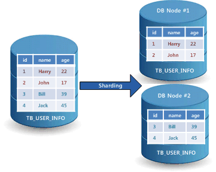

대부분의 샤딩 시스템들은 서버측 샤딩(server-side sharding)만을 지원하거나, 클라이언트측 샤딩(client-side sharding)만을 지원한다. 

알티베이스는 쿼리에 따라서 서버측 샤딩과 클라이언트측 샤딩으로 자동으로 판단하는 하이브리드 샤딩(hybrid sharding)을 지원한다.

#### 서버측 샤딩(server-side sharding)

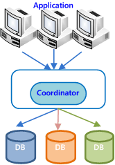

서버측 샤딩은 응용프로그램들과 호환하기 위하여 분할된 데이터베이스를 통합하는 코디네이터(coordinator)가 필요하다. 코디네이터는 응용프로그램에서 요청 받은 질의처리에 필요한 데이터의 위치를 파악하고, 해당하는 샤드 노드들에 질의를 분산 처리하여 그 결과를 통합하여 반환한다.

서버측 샤딩은 코디네이터가 병목(bottle-neck)이 될 수 있는 단점이 있다. 

#### 클라이언트측 샤딩(client-side sharding)
일반적인 클라이언트측 샤딩의 특징은 다음과 같다.
-   커넥션 시점 샤딩  
    응용프로그램에서 특정 노드를 지정하여 접속하는 방식이다. 다른 노드에 접근하기 위해서는 재접속을 해야 한다.
-   SQL 작성 시점 샤딩  
    응용프로그램에서 쿼리를 작성(혹은 생성)할 때 수행할 노드를 지정하는 방식이다. 다른 노드에 접근하기 위해서는 쿼리를 재작성(혹은 재생성)해야 한다.

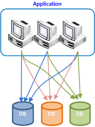

클라이언트측 샤딩은 클라이언트에서 데이터가 위치한 샤드노드를 미리 알고, 해당 샤드노드에 직접 접속하여 처리하는 구조이다. 이 구조는 샤드노드 추가에 따른 코디네이터 부하 한계로 인한 제약점이 없다는 장점이 있다. 

그러나, 클라이언트 레벨에서 대량 데이터 조인 및 집계처리를 포함한 모든 형태의 분산처리를 직접하려면, 클라이언트들이 모두 컴퓨팅 파워가 서버급이어야 하는데, 그럴 수 없으므로, 클라이언트측 샤딩에서는 단순하게 처리할 수 있는것들만을 처리할 수 있는 단점이 있다.

#### 알티베이스 하이브리드 샤딩(Altibase hybrid sharding)
알티베이스 하이브리드 샤딩은 쿼리별로 자동으로 서버측 샤딩 혹은 클라이언트측 샤딩으로 처리한다. 그래서, 각 샤딩방식의 장점을 취하고 단점을 보완할 수 있다.
- 쿼리별로 자동으로 판단함으로써, 기존 응용프로그램 소스나 기존 SQL의 수정을 최소화 할 수 있도록 하였다.
- 클라이언트측 쿼리로 판명되는 경우에, 쿼리를 수행하는 순간마다 쿼리에 bind 된 값에 의거하여, 자동으로 수행할 샤드 노드가 선택된다. 사용자는 샤드 노드를 구분할 필요가 없다.
- 사용자가 하이브리드 샤딩을 고려하여 쿼리를 튜닝할 수 있도록 추가적인 분산쿼리 키워드를 제공한다.
- 샤드 전용 클라이언트 라이브러리를 사용하여야 하이브리드 샤딩방식이 적용된다. 샤드 전용 클라이언트 라이브러리를 사용하지 않으면 서버측 샤딩방식으로만 동작한다.

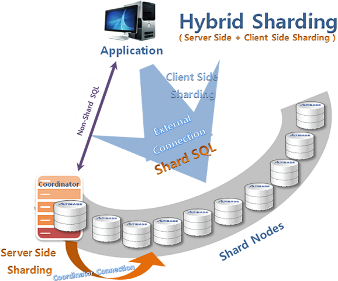

#### Altibase Sharding 구성 개요

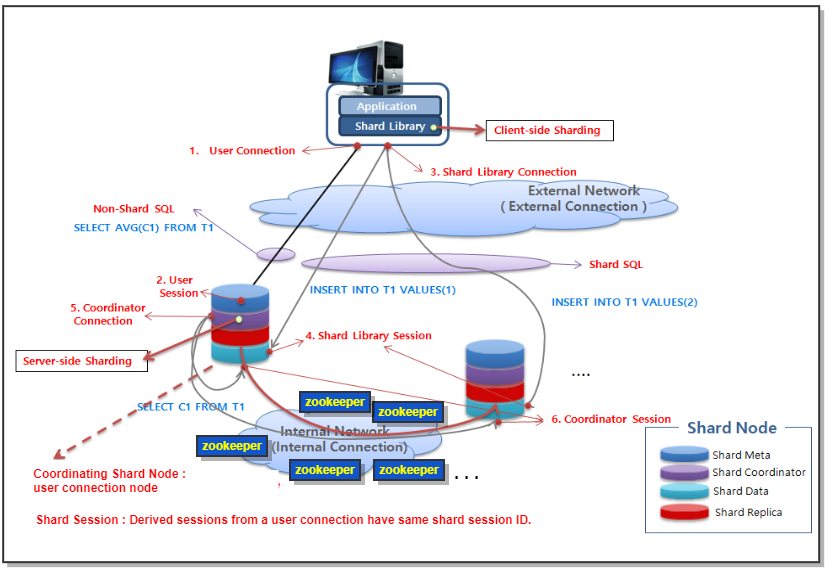

-   응용프로그램 
-   샤드 라이브러리
-   샤드 노드
    -   샤드 코디네이터
    -   샤드 메타 데이터
    -   샤드 데이터
    -   샤드 레플리카
-   ZooKeeper

#### 샤딩 클러스터 시스템
개별 노드들은 사용자의 Shard DDL(ADD, DROP, JOIN, FAILOVER, FAILBACK) 구문 수행이나, 시스템의 자동 FAILOVER 수행에 의하여, 샤딩 클러스터 시스템에 참여하거나 제외될 수 있다. 

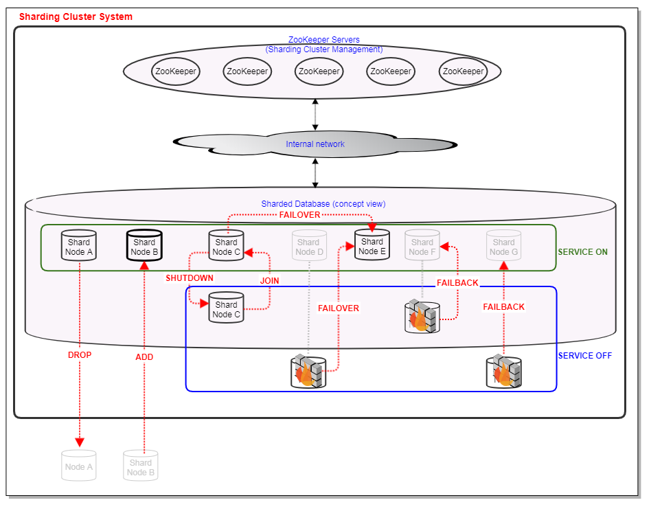

#### 샤딩 고가용성(High Availability)
Altibase Sharding 시스템은 모든 샤드 노드가 K-safety 만큼의 샤드 데이터 복제본을 유지하여, 모든 샤드 노드가 Active 노드이면서 동시에 Standby 노드의 역할을 한다.

Altibase Sharding 시스템은 단일 장애점(SPOF: single point of failure)이 없는 시스템 구성으로 높은 신뢰성을 가질 수 있다.

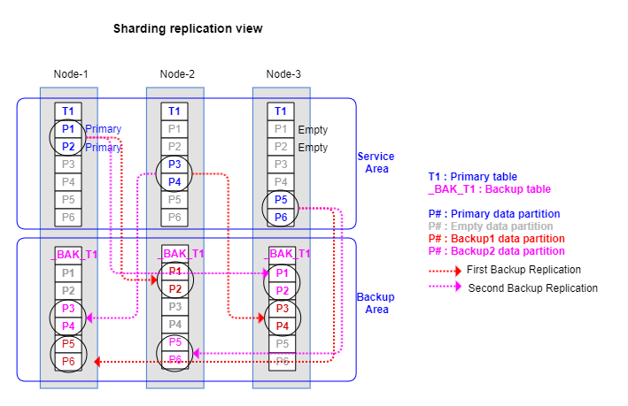

#### 알티베이스 샤딩의 업무 적용 범위
- 서버대수 증가에 따라 성능이 선형적으로 증가해야 하고,
- 트랜잭션 ACID(Atomicity, Consistency, Isolation, and Durability)가 보장되어야 하고,
- 데이터 유실없는 고가용성(High Availability)가 보장되어야 하는,
- OLTP(Online Transaction Processing) 시스템  

#### 최적 경로의 쿼리 수행을 통한 분산 트랜잭션의 우수한 성능
하나의 샤드 트랜잭션내의 다양한 쿼리들은 개별적으로 최적의 경로로 수행될 수 있어서, 분산 트랜잭션의 성능이 우수하다.

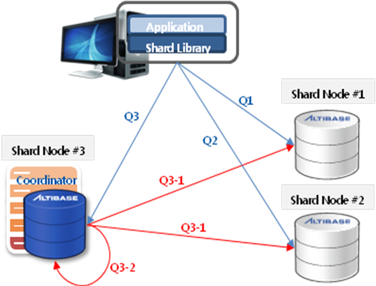

위 그림은 하이브리드 샤딩으로 사용자의 쿼리가 수행되는 예를 보여준다.
- 설명의 편의상, t1 테이블은 node1 와 node2 에만 분산정의된 것으로 가정한다. 
- 또한, key=1 데이타는 node1 에 위치하고, key=2 데이타는 node2 에 위치하는 것으로 가정한다.
- Q3-1와 Q3-2는 샤드 쿼리 분석기가 Q3에서 생성한 분산 쿼리와 통합 쿼리이다.
```
Q1) insert into t1(key, c1) values (1, 100);
Q2) update t1 set c1=c1+1 where key=2;
Q3) select sum(c) total_count from (select count(*) c from t1);
    Q3-1) select count(*) c from t1;
    Q3-2) select sum(c) total_count from temp;
```

#### 분산 방식
Altibase Sharding은 아래와 같은 분산 방식을 제공한다.
-   해시(hash) 분산 방식
-   범위(range) 분산 방식
-   리스트(list) 분산 방식
-   클론(clone) 분산 방식
-   솔로(solo) 분산 방식

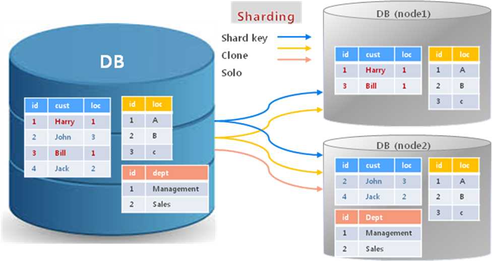

##### 해시(Hash) 분산 방식
Altibase Sharding의 해시 분산은 샤드 키에 해당하는 값을 내장된 hash함수를 이용하여 분산하는 것을 말한다. 해시 함수는 데이터를 균등하게 분산하는데 이용된다. 

해시 함수로부터 구한 해시 값에 나머지 연산을 수행한 값을 이용하여, 전체 데이터를 1000개의 그룹으로 나누어 관리한다. 
-   hash_group[1] = { record(x) \| if (mod(hash(shard key value of x),1000)==0) };
-   hash_group[2] = { record(x) \| if (mod(hash(shard key value of x),1000)==1) };
-   …
-   hash_group[1000] = { record(x) \| if (mod(hash(shard key value of x),1000)==999) };

이렇게 구분된 1000개의 hash group을 사용자의 필요에 따라 분산 정의한 예시이다.
-   1\~300번 hash group    –\> 샤드 노드1
-   301\~600번 hash group  –\> 샤드 노드2
-   601\~1000번 hash group –\> 샤드 노드3

데이터를 분산하기 전 다음과 같은 해시 분산 방식으로 데이터를 분산했을 때, 데이터의 분포 상태를 예측할 수 있다.
```
iSQL> SELECT hash, count(*) FROM (SELECT mod(hash(user_id),1000)+1 hash FROM table) GROUP BY hash;
```

##### 범위(Range) 분산 방식
- 해시 분산 방식을 사용하면 데이터가 비교적 균등하게 분산되는 반면, 특정 데이터가 어느 노드에 위치하는지 직관적으로 알기는 어려워진다.
- 범위 분산 방식은 샤드 키 값으로 해당 데이터가 어느 노드에 위치하는지 관리자가 쉽게 알 수 있어 유리하다.
- 범위 분산 방식으로 데이터를 고르게 분산했더라도, 운영 중에 데이터가 변경됨으로써 불균형이 발생할 수 있기 때문에 지속적으로 데이터 분포의 모니터링이 필요하다.

아래는 alphanumeric 의 샤드 키 값에 대한 임의의 범위 분산 설정 예시이다.
-   { record(x) \| (shard key value of x) \< ‘9’ }        -\> 샤드 노드 1
-   { record(x) \| ‘9’ \<= (shard key value of x) \< ‘M’ } -\> 샤드 노드 2
-   { record(x) \| ‘M’ \<= (shard key value of x) \< ‘Z’ } -\> 샤드 노드 3

범위 분산 방식 역시 데이터를 분산하기 전에 쿼리로 데이터의 분포를 예측할 수 있다.
```
iSQL> SELECT user_id, count(*) FROM table GROUP BY user_id;
```

##### 리스트(List) 분산 방식
리스트 분산은 샤드 키 값을 특정값과 일치하는지 확인하여 분산하는 방식이다. 

아래는 도시명을 이용한 임의의 리스트 분산 설정한 예시이다.
-   { record(x) \| (shard key value of x) = ‘서울’ } -\> 샤드 노드 1
-   { record(x) \| (shard key value of x) = ‘부산’ } -\> 샤드 노드 2
-   { record(x) \| (shard key value of x) = ‘대구’ } -\> 샤드 노드 3

##### 복제(Clone) 분산 방식
복제 분산 방식은 샤드 키를 지정할 필요가 없고, 모든 샤드 노드들에 해당 샤드 객체의 데이터가 중복 저장된다.

##### 독립(Solo) 분산 방식
독립 분산은 복제 분산 방식은 샤드 키를 지정할 필요가 없고, 사용자가 지정한 하나의 노드에만 객체를 저장한다.
-   TABLE_1 –\> 샤드 노드 1
-   TABLE_2 –\> 샤드 노드 2
-   TABLE_3 –\> 샤드 노드 1

### Altibase Sharding Terminology

#### 샤드 노드(shard node) 
샤딩 시스템을 구성하는 전체 데이터들이 분산되어 저장되는 개별적인 데이터베이스들이다. 최대 128개의 샤드 노드를 지원한다.

#### sharded database
여러개의 샤드 노드들로 구성된 사용자 입장에서 논리적으로 하나인 데이터베이스를 sharded database 라고 한다. 

#### 샤드 클러스터 관리자
Split brain 방지등의 샤딩 클러스터 관리를 위하여 Apache Zookeeper를 사용한다.

#### 샤드 클러스터 관리자 메타 정보
샤드 클러스터 관리를 위하여 Zookeeper에서 관리하는 메타정보를 의미한다.

#### ZooKeeper client
샤드 노드별로 구동되는 Altibase server가 Zookeeper client로 동작한다.

#### 샤딩 클러스터 시스템(Sharding Cluster System)
여러개의 샤드 노드들로 구성된 sharded database 와 샤드 클러스터 관리자(ZooKeeper)를 합하여 샤딩 클러스터 시스템이라고 한다. 

#### 샤드 메타 데이터 (shard meta data) 
샤드 노드의 정보, 샤드 객체, 분산 설정 등 분산 정보가 저장되는 샤드 메타 테이블들의 데이터를 총칭하여 샤드 메타 데이터라고 한다. 샤드 메타 테이블들은 sys_shard 사용자의 객체로 관리된다.

#### 샤드 코디네이터(shard coordinator) 
분산된 데이터베이스를 통합하여 질의를 수행하는 분산 질의 처리기이다. 사용자 커넥션에서 접속한 샤드 노드에 생성된다.

#### 파셜 코디네이터(partial coordinator) 
non-shard DML 처리를 위한 분산 질의 처리기이다. 해당 DML의 대상이 되는 데이타가 존재하는 모든 샤드 노드들에 생성된다.

#### 샤드 라이브러리(shard library) 
하이브리드 샤딩을 지원하는 클라이언트 프로그램 라이브러리이다.

#### 샤드 데이터(shard data) 
분산된 데이터 조각이다. 전체 분산 데이터베이스의 데이터 일부를 가지고 있다.

#### 샤드 레플리카(shard replica) 
샤드 데이터에 대한 복제본이다. k-safety 값 만큼의 복제본을 가지고 있다.

#### 샤드 커넥션(shard connection)
각종 커넥션들을 통칭하여 샤드 커넥션이라고 한다.

#### 외부 커넥션(external connection)
외부 커넥션은 사용자 커넥션과 샤드 라이브러리 커넥션의 두 가지가 있다.

#### 사용자 커넥션(user connection)
사용자의 클라이언트 응용프로그램에서 명시적으로 접속한 연결이다.

#### 샤드 라이브러리 커넥션(shard library connection )
샤드 라이브러리를 사용한 클라이언트가 데이터 처리를 위해 모든 샤드 노드들에 자동으로 접속한 연결이다.

#### 내부 커넥션 (internal connection)
샤드 노드들 간에 내부적으로 사용하는 것으로 코디네이터 커넥션이 있다.

#### 코디네이터 커넥션 (coordinator connection)
샤드 노드들 간에 내부적으로 사용하는 연결이다.

#### 샤드 세션(shard session)
사용자 커넥션으로 연결된 세션과 관련된 모든 세션을 샤드 세션이라 한다.

#### 코디네이팅 샤드 노드(coordinating shard node)
샤드 노드들 중 사용자가 접속한(사용자 커넥션) 샤드노드를 말한다.

#### 로컬 객체(local object) 혹은 일반 객체
분산 정의를 하지 않은 객체를 지칭한다. 로컬 객체에 대한 작업은 샤딩 클러스터 전체와는 관련없이, user session으로 접속한 노드에서만 처리된다. 

#### 샤드 객체(shard object) 혹은 분산 객체
분산 저장 및 처리되는 객체를 지칭한다. 현재 지원하는 분산객체는 다음과 같다.
-   Table
-   Procedure
-   Sharded sequence
-   Global sequence

#### 샤드 테이블(shard table)
샤드 테이블은 일반 테이블에 샤드 분산 설정을 한 테이블을 말한다.
- 샤드 테이블을 설정하기 위해서 먼저 모든 샤드 노드에 동일한 스키마의 테이블이 생성되어 있어야 한다.
- 샤드 테이블은 샤드키 테이블과 솔로 테이블 그리고 클론 테이블이 있다.
- 샤드키 테이블은 분산 방식에 대응되는 파티션드 테이블로 생성되어 있어야 한다. 파티션 키가 샤드 키로 사용된다. 
  - 해시 분산 샤드키 테이블: RANGE_USING_HASH 파티셔닝
  - 범위 분산 샤드키 테이블: RANGE 파티셔닝
  - 리스트 분산 샤드키 테이블: LIST 파티셔닝
- 샤드키 테이블을 샤드객체로 등록시에 파티션별로 노드를 지정하도록 되어있다.
- 클론 테이블은 global_transaction_level 을 3 으로 설정한 경우에만 DML을 수행할 수 있다. select 는 global_transaction_level의 설정과 관련없이 수행할 수 있다.
- 노드 추가시 리샤딩은 파티션 단위로만 할 수 있다. 그러므로, 향후 노드 확장을 고려하여, 파티션의 범위 및 갯수를 정하는 것이 좋다.
- 샤드 테이블 분산객체로 등록은 아래 구문을 사용한다. 자세한 설명은 DBMS_SHARD 패키지를 참조한다.
  - DBMS_SHARD.SET_SHARD_TABLE_SHARDKEY(...)
  - DBMS_SHARD.SET_SHARD_TABLE_SOLO(...)
  - DBMS_SHARD.SET_SHARD_TABLE_CLONE(...)

#### 샤드 프로시저
샤드 프로시저는 일반 프로시저에 샤드 분산 설정을 한 프로시저를 말한다.
- 샤드 프로시저를 설정하기 위해서 먼저 모든 샤드 노드에 동일한 내용의 프로시저가 생성되어 있어야 한다.
- 샤드 프로시저는 샤드키 프로시저와 솔로 프로시저 그리고 클론 프로시저가 있다.
- 샤드키 프로시저는 프로시저의 파라미터들 중 하나가 샤드 키로 사용되며, 프로시저가 호출될 때의 파라미터 값으로 샤드 노드를 선택하여 선택된 노드에서 프로시저가 수행된다.
- 샤드키 프로시저는 해시와 범위 그리고 리스트 분산방식을 지원한다.
- 샤드 프로시저 분산객체로 등록은 아래 구문을 사용한다. 자세한 설명은 DBMS_SHARD 패키지를 참조한다.
  - DBMS_SHARD.SET_SHARD_PROCEDURE_SHARDKEY(...)
  - DBMS_SHARD.SET_SHARD_PROCEDURE_SOLO(...)
  - DBMS_SHARD.SET_SHARD_PROCEDURE_CLONE(...)

#### 샤드키(shard key)
- 샤드키 테이블에 대한 샤드키는 데이터를 분산하는 기준이 되는 테이블의 컬럼이다.
- 샤드키 프로시저에 대한 샤드키는 호출되는 프로시저의 노드를 결정하는 프로시저의 파라미터를 말한다.
- 샤드키는 하나의 컬럼 혹은 파라미터에 대해서만 정의할 수 있다.
- 현재 샤드키로 사용할 수 있는 데이터 타입은 다음과 같다.
  -   smallint
  -   integer
  -   bigint
  -   char
  -   varchar

#### 분산쿼리 키워드(distributed query keyword)
분산쿼리 키워드를 이용하여, 임의의 쿼리를 수행할 샤드 노드의 범위를 정해서 쿼리를 수행하게 할 수 있다. 분산쿼리 키워드의 종류는 다음과 같다.
-   SHARD
-   NODE[META]
-   NODE[DATA]
-   NODE[DATA_PARTIAL]
-   SHARD_PARTIAL
-   SHARD_LOCAL

#### 샤드 쿼리(shard query)
샤드 쿼리는 동일한 쿼리를 샤드노드별로 별개로 수행하여 취합한 결과가 하나의 데이터베이스에서 처리한 결과와 동일 할 경우를 지칭한다. 논샤드 쿼리는 샤드 쿼리가 아닌 쿼리를 지칭한다.
- 샤드쿼리는 최대한 클라이언트측 샤딩으로 수행되며, 성능 및 스케일 아웃에 유리하다.
- 단, 분산쿼리 키워드를 사용한 쿼리는 논리적으로 샤드 쿼리에 해당하는 경우일지라도, 서버사이드로 수행된다.
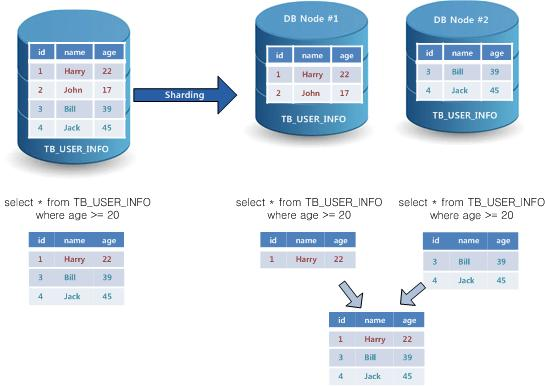

[그림 1‑5] 샤드 쿼리

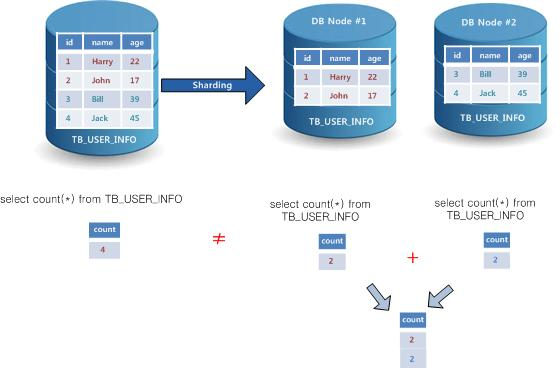

[그림 1‑6] 논샤드 쿼리

샤드 쿼리의 몇 가지 예를 보면 다음과 같다.
```
SELECT * FROM s1 WHERE k1=1;
SELECT * FROM s1;
UPDATE s1 SET i2=1 WHERE k1=1;
DELETE FROM s1 WHERE k1>3;
```

논샤드 쿼리의 몇 가지 예를 보면 다음과 같다.
```
SELECT count(*) FROM s1;
SELECT * FROM s1 order by k1;
```

#### 샤드 쿼리 분석기(shard query analyzer)
샤드 쿼리 분석기는 사용자의 쿼리를 서버측 샤딩으로 수행하는 쿼리와 클라이언트측 샤딩으로 수행하는 쿼리로 구분하는 역할을 한다.

#### 샤드 쿼리 최적화기(shard query optimizer)
샤드 코디네이터의 샤드 쿼리 최적화기는 서버측 샤딩에 대한 최적의 분산 쿼리를 생성하고, 분산 쿼리에 대한 분산 플랜을 생성한다.

사용자 쿼리가 서버측 샤딩으로 수행되는 쿼리로 분류된 경우, 해당 쿼리를 서버측에서 수행하기 위해서 분산부와 통합부로 구분한다. 분산부는 각 샤드 노드에서 수행할 부분이고, 통합부는 각 노드에서 수행한 결과를 모아서 수행할 부분이다.

#### 샤드 플랜(shard plan)
질의가 샤드 코디네이터에서 분산 수행되는 경우의 질의 수행계획을 말한다.

#### 샤드 쿼리 실행기 (Shard Query Executor)
샤드 쿼리 실행기는 클라이언트측 샤딩의 실행기와 서버측 샤딩의 실행기로 구분한다. 클라이언트측 샤딩의 실행기는 샤드 라이브러리에서 동작하며, 서버측 샤딩의 실행기는 샤드 노드에서 샤드 코디네이터를 통해서 동작한다.

#### 샤드 트랜잭션(shard transaction)
애플리케이션이 생성한 트랜잭션에서 수행하는 질의에 따라 샤드 노드들에 분산 트랜잭션을 생성하게 된다. 이 트랜잭션들을 샤드 트랜잭션이라고 한다.

클라이언트측 샤딩으로 생성된 트랜잭션과 서버측 샤딩으로 생성된 트랜잭션을 하나의 트랜잭션으로 통합하여 수행한다.

샤드 트랜잭션은 다음과 같이 분류할 수 있으며, GLOBAL_TRANSACTION_LEVEL 프라퍼티를 이용하여, system 및 session 별로 설정 및 변경할 수 있다.
-   다중 노드 트랜잭션(multiple node transaction)
    - 분산 트랜잭션을 개별 샤드 노드별로 처리한다. 노드장애등의 상황에서 커밋이 안되는 노드가 발생할 수 있다.
-   글로벌 트랜잭션(global transaction)
    - 분산 트랜잭션을 two-phase commit를 사용하여 처리하여, 분산 트랜잭션에 참여한 모든 샤드노드에 전체 커밋 혹은 전체 롤백이 되는것을 보장한다.
-   글로벌 일관 트랜잭션(global consistent transaction)
    - 글로벌 트랜잭션에서 보장하는것에 추가하여, 글로벌 읽기 일관성을 보장한다.

#### 샤드 메타 번호(SMN: Shard Meta Number)
샤드 메타 번호(SMN)란 샤드 메타데이터에 대한 변경 버전 이력 관리 번호 이다.
- 분산 정의 변경은 노드 추가/제거, 샤드 객체 등록/해제 등의 변경을 말한다.
- SMN은 다음의 세 가지 유형의 SMN이 존재한다. 
  - Meta SMN: 샤드 메타 데이터를 변경하는 트랜잭션 내부에서만 존재하고, 해당 트랜잭션이 COMMIT 이 되는 순간 모든 샤드 노드들의 Data SMN 에 적용이 된다.
  - Data SMN: 샤드 노드별로 데이터의 형상이 어떤 SMN 기준으로 되어있는지를 나타낸다.
  - Session SMN: 개별 세션이 인식하고 있는 SMN
    - 각 세션은 최초 접속 시에 해당 노드의 Data SMN을 자신의 Session SMN으로 할당받아 수행한다.
    - Data SMN이 변경되어 기존의 Session SMN과 다르게 되면, 자동으로 최신 Data SMN으로 Session SMN을 갱신한다.

#### 레플리카 셋(Replica Set)
레플리카 셋(Replica Set)이란 Altibase Sharding 시스템에서 무중단 서비스를 제공하기 위해 생성한 복제(Replication)들의 관계를 저장한 객체이다.

#### K-safety
K-safety는 장애 감내(fault tolerance)를 위하여 샤드데이터를 복제하는 갯수를 지정한다. k-safety는 0, 1 또는 2의 값을 가질 수 있으며, 이러한 복제들은 장애가 발생한 샤드노드에 대한 fail-over를 수행할 수 있도록 한다.

#### 리샤딩 (Resharding)
리샤딩이란 서비스 운영 중에 데이터 일부를 하나의 샤드 노드에서 다른 샤드 노드로 이동하는 것을 말한다.
- 리샤딩은 주로 노드 증설 혹은 특정 노드의 부하 집중에 따른 데이터 이동을 위하여 사용되며, 서비스 운영 중에 사용할 수 있는 장점을 가진다.
- 리샤딩은 "ALTER DATABASE SHARD MOVE" SHARD DDL 구문으로 제공된다.

## Altibase Sharding Administration
이 장에서는 Altibase Sharding을 구성하고 사용환경을 설정하는 방법을 설명한다.

### Altibase Administration

#### Altibase Sharding platform
Altibase Sharding은 아래의 platform 들을 지원한다.
| OS    | CPU                          | Version         | Bit (Server) | Bit (Client) |
| ----- | ---------------------------- | --------------- | ------------ | ------------ |
| LINUX | x86-64 (GNU glibc 2.12 이상) | redhat 6.0 이상 | 64-bit       | 64-bit       |
| LINUX | PowerPC7 (BE)                | redhat 6.5 이상 | 64-bit       | 64-bit       |
| LINUX | PowerPC8 (LE)                | redhat 7.2 이상 | 64-bit       | 64-bit       |

#### Altibase directories and files
여기서는 Sharding 관련 특이사항들만 기술한다.
- $ALTIBASE_HOME/xlogs directory
  k-safety 복제를 위한 xlog 화일들이 위치한다.
- $ALTIBASE_HOME/ZookeeperServer directory
  Zookeeper 프로그램이 위치한다.
- $ALTIBASE_HOME/conf/altibase.properties.shard file
  샤드 환경에서의 권장 설정값들이 기록되는 파일이다.
- $ALTIBASE_HOME/trc/altibase_sd.log
  샤드 관련 경고 메시지나 트레이스 메시지 등이 기록되는 파일이다.

#### Altibase Installation
Altibase 패키지 인스톨러를 이용하여 Altibase 소프트웨어의 설치를 완료한 후에 아래와 같은 샤딩 환경 설정을 하면 된다.

#### 샤드 환경 설정
기존의 설치된 Altibase를 샤드 노드로 설정하기 위해서는 다음 과정이 선행되어야 한다.
-   sharded database 생성
-   샤딩관련 프로퍼티 설정 : SHARD_ENABLE 및 기타 샤딩관련 프라퍼티를 설정한다.
-   샤딩관련 패키지 생성 : DBMS_SHARD 패키지 및 기타 샤딩관련 패키지를 생성한다.
-   Zookeeper 설정

##### sharded database 생성 
논리적으로 하나인 sharded database를 생성하기 위해서는, 각 샤드 노드별로 sharded database의 일부 조각인 개별적인 데이터베이스들을 생성해야한다. 
- 샤딩을 위하여 개별 데이터베이스를 생성시에, 모든 샤드 노드의 개별 데이터베이스 생성은 동일하게 이뤄져야한다. 
- 개별 데이터베이스를 생성시에 입력된 데이터베이스 이름은 논리적으로 하나인 sharded database 이름으로 사용되므로, 모든 샤드 노드별 데이터베이스가 동일한 이름을 갖아야 한다. 
- create database *my_sharded_db_name* INITSIZE=10M noarchivelog character set *UTF8* national character set *UTF8*;
  이탤릭체로 표시된 부분과 *TRANSACTION_TABLE_SIZE* 는 모든 샤드 노드에서 동일해야한다.

##### 샤딩관련 프로퍼티 설정
SHARD_ENABLE 프로퍼티를 활성화한 후 서버를 재시작하면, 샤드 노드의 메타 저장소 및 코드네이터 기능이 활성화 된다.
```
iSQL> SELECT name, value1 FROM v$property WHERE name = 'SHARD_ENABLE';
NAME   : SHARD_ENABLE
VALUE1 : 1
```

샤드 노드 기능이 활성화되면, 샤드 패키지를 생성하거나 샤드관련 내장 함수, 성능 뷰를 사용할 수 있다.

SHARD_ENABLE 프로퍼티 이외에도, 여러가지 샤딩관련 프라퍼티들이 있다. 

샤딩관련 프라퍼티들의 권장 설정값들은 \$ALTIBASE_HOME/conf/altibase.properties.shard 에 저장되어 있다. 샤딩을 최초 구성시에는, 이 화일을 복사하여 \$ALTIBASE_HOME/conf/altibase.properties 를 만들고, 추가적인 변경사항을 고려해주면 된다. 인스톨러를 이용하여 샤딩용으로 선택하여 설치한 경우에는 이 과정을 인스톨러에서 자동으로 처리해 준다.

기존에 사용하던 altibase.properties 를 기반으로 하여 변경을 하고 싶은 경우에는, 단독DB환경에서의 권장값이 기록되어 있는 altibase.properties.sample 과 샤딩 환경에서의 권장값이 기록되어 있는 altibase.properties.shard 를 비교하여, 해당 편차를 기존의 altibase.properties 에 변경해주면 된다.

##### 샤딩관련 패키지 생성
- 샤딩관련 패키지는 \$ALTIBASE_HOME/packages에 있으며, installer를 이용하여 알티베이스를 설치시에는 기본으로 설치된다.
  - DBMS_SHARD (참고: 본 매뉴얼에 상세 설명이 있음.)
  - DBMS_SHARD_GET_DIAGNOSTICS (참고: 본 매뉴얼에 상세 설명이 있음.)
  - DBMS_METADATA (참고: Stored Procedures 매뉴얼에 상세 설명이 있음.)
- 만약, 위의 패키지들이 설치되어 있지 않으면, 아래와 같이 설치할 수 있다.
```
is –f $ALTIBASE_HOME/packages/dbms_shard.sql
is –f $ALTIBASE_HOME/packages/dbms_shard.plb
is –f $ALTIBASE_HOME/packages/dbms_shard_get_diagnostics.sql
is –f $ALTIBASE_HOME/packages/dbms_shard_get_diagnostics.plb
is -f $ALTIBASE_HOME/packages/dbms_metadata.sql
is -f $ALTIBASE_HOME/packages/dbms_metadata.plb
```

### Zookeeper Administration

#### Zookeeper 설정
- \$ALTIBASE_HOME 하위에서 ZookeeperServer.tar.gz 가 존재한다. 이것은 Zookeeper 3.5.6 버전이다. 샤딩에서는 이 버전의 Zookeeper를 사용해야 한다.
- 인스톨러를 이용하여 설치하는 경우에는 \$ALTIBASE_HOME 하위에 ZookeeperServer 디렉토리가 있고, 이곳에 이미 Zookeeper 화일들이 존재할것이다.
- 만일, \$ALTIBASE_HOME 하위에  ZookeeperServer 디렉토리가 없다면, \$ALTIBASE_HOME 디렉토리에서 tar -xvf ZookeeperServer.tar.gz 명령을 사용하여 Zookeeper 화일들을 풀어 주어야 한다. 
- Zookeeper 관리를 위한 자세한 내용은 https://zookeeper.apache.org/doc/r3.5.5/zookeeperAdmin.html 를 참고한다. 본 매뉴얼에서는 Zookeeper 설정을 위한 기본적인 내용만 다룬다.
- Zookeeper server를 사용하기 위해서는 JDK 1.8 이상 버전을 사용해야 한다.
- \$ALTIBASE_HOME/ZookeeperServer/conf에 zoo.cfg를 생성한다.(zoo_sample.cfg를 복사해 필요한 부분만 바꿔 사용해도 된다.)
  - tickTime : The number of milliseconds of each tick
  - initLimit : The number of ticks that the initial synchronization phase can take
  - syncLimit : The number of ticks that can pass between sending a request and getting an acknowledgement
  - clientPort : Zookeeper 연결을 위한 port 이다. 다수의 Zookeeper 서버가 기본적으로는 동일한 port를 사용해야 한다.
  - server.X : Zookeeper 서버의 IP와 내부 연결 port 이다. 모든 장비에서 동일한 순서를 사용해야 한다. 샤딩에서는 Zookeeper 서버는 3개, 5개, 7개 중에 하나로 구성하는 것으로 제한한다.
    - 예제 
      - server.1=192.168.1.10:2888:3888
      - server.2=192.168.1.11:2888:3888
      - server.3=192.168.1.12:2888:3888
  - dataDir : Zookeeper 데이터가 저장될 path 이다. 절대 경로를 사용해야 한다.
    - 해당 샤드 노드는 Zookeeper client로만 사용된다면, 해당 경로에 실제 데이타들은 생성되지 않는다.
    - zoo_sample.cfg 은 예제의 목적으로 dataDir=/tmp/zookeeper 로 설정되어 있다. /tmp 디렉토리의 내용은 시스템 부팅시에 삭제되므로, 필수적으로 안전한 경로로 재지정이 필요하다.
- Altibase 서버 구동시에 Zookeeper client로서 Zookeeper server에 접속하기 위한 정보를 zoo.cfg 파일에서 가져온다.

#### Zookeeper server 사용
- zoo.cfg에 저장된 dataDir에 접근해 server ID명을 데이터로 가지는 myid라는 이름의 파일을 생성한다.
  - 위의 server.X 설정 예제를 사용하여 구성시에 아래와 같이 myid라는 파일을 생성한다.
    - 192.168.1.10 장비의 dataDir에 "1"이라는 데이터를 가지는 myid라는 파일을 생성한다.
    - 192.168.1.11 장비의 dataDir에 "2"이라는 데이터를 가지는 myid라는 파일을 생성한다.
    - 192.168.1.12 장비의 dataDir에 "3"이라는 데이터를 가지는 myid라는 파일을 생성한다.
- \$ALTIBASE_HOME/ZookeeperServer/bin의 zkServer.sh 스크립트를 사용해 서버를 띄운다.(zkServer.sh start를 수행한다.)
- zoo.cfg에 존재하는 모든 Zookeeper 서버를 각각의 노드에서 개별적으로 start 시켜 주어야 한다.
- \$ALTIBASE_HOME/ZookeeperServer/bin의 zkCli.sh 스크립트를 사용해 정상적으로 연결되었는지 체크한다.
- Zookeeper server는 샤드노드와 상관없이 구성될 수 있다. 
  - Altibase 소프트웨어 패키지만 설치 후에, 데이타베이스는 생성하지 않고, Altibase 소프트웨어 패키지 내부에 있는 Zookeeper 소프트웨어만을 이용하여 구성할 수 있다.
  - Altibase 소프트웨어 패키지와 상관없이, Zookeeper 소프트웨어만을 설치해서 구성할 수도 있다.

#### Zookeeper client 사용
- 샤드 노드들의 Altibase 서버가 Zookeeper client로 동작한다.
- SHARD DDL(alter database shard add / join / failback) 구문 사용시, 샤드 노드들의 Altibase 서버가 Zookeeper client로서 자동으로 Zookeeper server에 연결한다.
- Zookeeper server에 접속이 된 이후에는, Zookeeper server와 통신이 안될 경우, 해당 샤드노드의 알티베이스 서버는 스스로 shutdown 한다.
- tickTime \* syncLimit 시간동안 연결이 되지 않을 경우, 연결이 끊긴 것으로 판단한다.
- zkCli.sh : Zookeeper server에서 기본적으로 제공하는 client 프로그램으로 간단하게 데이터를 체크할 수 있다.
  - 기본적으로 zkCli.sh만 실행할 경우 localhost:2181에 연결되며 이를 변경하고 싶을 경우 -server 옵션으로 서버명(혹은 IP)와 port를 넣으면 된다.
  - [명령어 /path]의 형태로 명령을 내릴수 있으며 path는 반드시 full path여야 하며 마지막에 /가 들어가면 안된다.
  - 명령어 list
    - ls : 해당 path의 하위 path의 list를 가져온다.(값은 가져오지 않는다.)
      - watch 옵션을 줄 경우 하위 path가 추가되면 알람이 발생한다.
    - get : 해당 path의 데이터를 가져온다. 데이터가 없다면 null로 표기된다.
      - watch 옵션을 줄 경우 하위 path가 추가되면 알람이 발생한다.
    - set : 해당 path의 값을 세팅한다.
    - create : 해당 path를 생성한다. 단, 상위 path가 반드시 존재해야 한다.
      - \-e 옵션을 주면 ephemeral로 생성되어, 생성한 client와 연결이 끊기면 자동적으로 삭제된다.
    - delete : 해당 path를 제거한다. 단, 하위 path가 존재하면 실패한다.
    - deleteall : 해당 path와 하위 path를 모두 제거한다.

#### Zookeeper 사용시 주의 사항
- Zookeeper native client C library는 리눅스만 지원하고, Altibase server는 Zookeeper native client C library를 이용하여, Zookeeper에 클라이언트로서 접속하도록 되어 있다. 즉, 샤딩을 지원하는 알티베이스는 리눅스만 지원한다.
- Zookeeper server는 절반 이상이 살아있을때만 정상작동 하며 그 이하의 서버만 살아있을 경우 절반 이상이 될때까지 client의 요청을 무시한다.
- Zookeeper의 path에는 한개의 값만 존재할 수 있다. 단, 하위 path는 다수가 존재 할 수 있다.(동일 이름은 불가능하다)
- 각 Zookeeper client(즉, 개별적인 Altibase 서버)는 zoo.cfg에 있는 Zookeeper server 들 중 무작위로 하나를 선택해 연결한다. 해당 Zookeeper server와의 연결이 끊어지면, 자동으로 다른 Zookeeper server 들 중에 하나와 연결을 시도한다.
- Zookeeper 의 snapshot files 혹은 transactional log files 에 corruption 이 발생한 경우의 troubleshooting 은  https://zookeeper.apache.org/doc/r3.5.5/zookeeperAdmin.html#sc_troubleshooting 을 참고한다.

#### Zookeeper 샤딩 클러스터 메타 데이터
Zookeeper에 샤딩 클러스터 메타 데이터를 아래와 같이 관리한다.
- (W) : watch를 걸 디렉토리
- (E) : data 없이 비어있는 디렉토리
- (ep) : ephemeral node

| root path          | sub path               | 2nd sub path            | 3rd sub path                                                 | 설명                                                         |
| ------------------ | ---------------------- | ----------------------- | ------------------------------------------------------------ | ------------------------------------------------------------ |
| /altibase_shard(E) | /cluster_meta(E)       |                         |                                                              | 클러스터  메타                                               |
|                    |                        | /validation(E)          |                                                              | 본 경로 이하의 데이터는 cluster의 모든 참석 노드가 동일하게 가지고 있어야 하는 값이다. 해당 값이 다를 경우 샤딩에 참여할 수 없다. |
|                    |                        |                         | /sharded_database_name                                       | 개별 DB 생성시 입력한 DB의 이름 |
|                    |                        |                         | /k-safety                                                    | 복사본의 수 |
|                    |                        |                         | /replication_mode                                            | 12: consistent (현재 consistent mode 하나만을 지원한다.) |
|                    |                        |                         | /character_set                                               | DB 생성시 입력한 character set |
|                    |                        |                         | /national_character_set                                      | DB 생성시 입력한 national character set |
|                    |                        |                         | /binary_version                                              | 알티베이스 binary version(sm version) |
|                    |                        |                         | /shard_version                                               | 알티베이스 shard version |
|                    |                        |                         | /parallel_count                                              | 이중화 복제를 처리하는 applier의 수 |
|                    |                        |                         | /trans_TBL_size                                              | 트랜잭션 테이블의 크기 |
|                    |                        | /SMN                    |                                                              | 현재 서비스하는 클러스터의 SMN |
|                    |                        | /failover_history       |                                                              | 장애 발생 기록 : 장애가 발생한 이력(노드 이름 : 장애 발생시 SMN )을 리스트로 관리한다. |
|                    |                        | /fault_detection_time   |                                                              | 아직 처리하지 않은 장애 중 첫 장애가 발생한 시간            |
|                    |                        | /zookeeper_meta_lock(E) | /locked(ep)                                                  | zookeeper의 클러스터 메타를 변경하는 작업을 수행시 사용하는 lock이다. lock을 잡았을 때 locked라는  path를 ephemeral node로 생성한다. lock을 잡는 샤드노드와 session ID를 값으로 가지며, 해당 값이 모두 동일한 작업이 lock을 잡으러 들어올 경우 lock을 이미 잡은것으로 판단한다. |
|                    |                        | /shard_meta_lock(E)     | /locked(ep)                                                  | 샤드 메타를 변경하는 작업을 수행시 사용하는 lock이다. lock을 잡았을 때 locked라는 path를 ephemeral node로 생성한다. lock을 잡는 샤드노드와 Tx ID를 값으로 가지며, 해당 값이 모두 동일한 작업이 lock을 잡으러 들어올 경우 lock을 잡은것으로 판단한다. |
|                    | /node_meta(E)          |                         |                                                              | 각 노드들의 메타 데이터이다. node name별로 하위 path로 관리된다. |
|                    |                        | /node_name1(E)          |                                                              | 해당 노드의 node name (중복 불가) |
|                    |                        |                         | /shard_node_id                                               | 해당 노드의 node ID (중복 불가) |
|                    |                        |                         | [/node_ip:port](http://node_ipport/)                         | 해당 노드의 외부 IP 및 Port |
|                    |                        |                         | [/internal_node_ip:port](http://internal_node_ipport/)       | 해당 노드의 내부 IP 및 Port |
|                    |                        |                         | [/internal_replication_host_ip:port](http://internal_replication_host_ipport/) | 해당 노드의 replication 내부 IP 및 Port |
|                    |                        |                         | /conn_type                                                   | 해당 노드의 internal 연결 방식 |
|                    |                        |                         | /state                                                       | add / run / shutdown / join / failover / failback 중 하나 |
|                    |                        |                         | /failoverTo                                                  | 해당 노드에 장애가 발생해 failover가 발생했을 경우 해당 노드의 데이터를 failover 해간 노드의 이름이 failover가 완료된 후에 기록된다. 해당 노드에 failover가 발생하지 않았을 경우나 failback이 완료된 경우에는 비어있다. |
|                    |                        | ...                     |                                                              | 샤드노드별로 위의 내용이 반복된다. |
|                    | /connection_info(W)(E) | /node_name1(ep)(E)      |                                                              | 샤드노드가 접속되면, ephemeral 로 자동 생성되며, 접속이 끝어지면 자동으로 삭제된다. 어떤 샤드노드가 비정상종료하면, 삭제 이벤트가 발생하고, 이 이벤트를 다른 샤드노드들에서 감지하여 failover 동작이 개시된다. |
|                    |                        | /node_name2(ep)(E)      |                                                              |                                                              |
|                    |                        | ...                     |                                                              | 클러스터에 접속된 모든 샤드노드별로 하나씩 생성된다. |

### Sharding Backup and Recovery

#### 기본 고려사항
- 공통 고려사항
  - 백업과 복구는 각각의 개별 노드들에 대하여 독립적으로 수행하는것을 전제로 한다.
  - 개별 노드의 백업과 복구는 Administrator's Manual 을 참고한다. 
  - 여기서는 샤딩클러스터 환경에서의 추가적인 고려사항들만을 기술한다. 
  - 백업과 복구시에 Zookeeper도 같이 고려가 되어야 한다. 이에 대해서는 https://zookeeper.apache.org/doc/r3.5.5/zookeeperAdmin.html 를 참고한다.
  - 장비문제로 장비를 교체하여 복구를 하는 경우에는, 해당 장비의 IP정보는 예전 장비의 설정대로 맞추어 주어야 한다. 
- 논리적 백업/복구 고려사항
  - 샤딩클러스터에 참여된 상태에서는 기본적으로 쿼리 수행은 특정 노드를 대상으로 하지 않고, 전체 클러스터를 대상으로 한다.
  - 샤딩클러스터에 참여된 상태에서도 NODE[META] 분산쿼리 키워드를 사용하면, 쿼리 수행은 사용자 세션이 접속한 샤드 노드로 대상이 국한된다.
  - iLoader에서도 NODE[META] 와 NODE[DATA | DATA() | DATA('*node1_name'*, '*node2_name'*...)] 등의 분산쿼리 키워드를 사용할 수 있으며, 이에 대한 내용은 iLoader 매뉴얼을 참고한다.
- 오프라인 백업/복구 고려사항
  - 오프라인백업 및 복구시에 xlogfile들도 백업 및 복구해야 한다.
  - 샤딩클러스터 전체 노드들에 대하여, 한꺼번에 오프라인백업을 한 경우에는, 샤딩클러스터 전체 노드에 대하여 한꺼번에 복구하는 용도로 사용할수 있다. 
  - 오프라인백업을 이용하여, 특정 노드만을 복구하는 경우에는, 기본적으로는 해당 노드는 샤딩클러스터에 참여(failback 혹은 join) 시켜서 사용할수 없다.
- 온라인 백업/복구 고려사항
  - 완전복구된 노드에 대해서만, 샤딩클러스터에 참여(failback 혹은 join) 시켜서 사용하는 것을 기본으로 한다.
  - 온라인 백업/복구는 아카이브 로그화일들을 포함하여 로그화일들과 xlogfile들이 온전하다는 것을 기본 전제로 한다.

#### 불완전복구 상황별 고려사항
- k-safety가 1 이상에서, 특정 노드를 shutdown 했는데, 해당 노드에 장애 발생후, 해당 노드가 불완전복구된 상황
  - 이 경우에 해당 불완전복구된 노드를 join시키면 데이터 손실이 발생한다.
  - failover SHARD DDL을 이용하여, 해당 노드를 수동으로 failover시키서, 해당 노드의 데이터를 다른 노드에서 정상운영되도록 한다.
  - 정상 failover 이후에, drop force SHARD DDL을 이용하여, 해당 노드를 샤딩클러스터에서 제거한다.
  - 샤딩클러스터에서 제거된 노드는, 데이터도 모두 제거한 이후에, 새로운 노드로 샤딩클러스터에 추가하여 사용할 수 있다.
- k-safety가 1 이상에서, 노드 장애로 failover되어 데이터 손실없이 정상운영되고 있는데, 장애 노드가 불완전복구된 상황
  - 이 경우에 해당 불완전복구된 노드로 failback 을 시키면 데이터 손실이 발생한다.
  - drop force SHARD DDL을 이용하여, 해당 노드를 샤딩클러스터에서 제거한다.
  - 샤딩클러스터에서 제거된 노드는, 데이터도 모두 제거한 이후에, 새로운 노드로 샤딩클러스터에 추가하여 사용할 수 있다.
- k-safety 값 이상으로 복제관계에 있는 여러 노드들이 동시에 죽은 경우에는, 정상 failover되지 못하는 노드가 발생할 수 있다. 
  - 이 경우에는 먼저 failback을 수행 한 이후에, 나머지 failover 되지 못한 노드들에 대하여 수동으로 failover를 해주어야 한다.
  - 이러한 상황에서 failback 되어야 할 노드가 불완전복구된 상황에서의 처리방법을 아래에서 기술한다.
    - k-safety가 1 이상에서, 어떤 노드가 불완전복구된 상황이라는것의 의미는, 해당 노드에서 서비스 하던 데이터가 손상되었을 수도 있고, 해당 노드에 저장되어 있던 k-safety 복제본의 데이터가 손상되었을 수도 있다는 것이다.
    - 그럼에도 불구하고, 해당 불완전복구된 노드로 failback 을 시키면, 이후에, 해당 노드로 다른 죽은 노드를 failover시킬때, failover 된 데이터에도 손실이 발생되어 있을 수 있다는 것이다.
    - 그러므로, drop force SHARD DDL을 이용하여, 문제 노드을 샤딩클러스터에서 제거한 이후에, 수동으로 논리적 백업/복구 방식으로 최대한 데이터를 복구해 주어야 한다.
    - 장애노드의 데이터는 불완전복구본, 오프라인 백업본 혹은 논리적 백업본을 이용하여, 최대한의 데이터를 확보한다.
    - 각 장애노드에서 최대한 확보한 데이터는, 샤딩클러스터에 논리적 복구를 이용하여 데이터를 다시 적재하여 사용할 수 있다. 
- k-safety가 0 에서, 장애노드가 불완전복구된 상황
  - 불완전복구된 것이 가장 최신의 데이터를 갖고 있는 상황이라면, 불완전복구된 상태로 샤딩클러스터에 참여(failback 혹은 join) 시켜서 사용한다.
  - 오프라인 백업본이 가장 최신의 데이터를 갖고 있는 상황이라면, 오프라인 복구시킨 상태로 샤딩클러스터에 참여(failback 혹은 join) 시켜서 사용한다.
  - failback 혹은 join 이후에, 추가로 보완할 데이터가 확보되면, 해당 데이터는 샤딩클러스터에 논리적 복구를 이용하여 데이터를 다시 적재하여 사용할 수 있다.
  - 특정 노드에 영구장애가 발생하여, 어떠한 형태로도 샤딩클러스터에 참여(failback 혹은 join) 시켜서 사용할 수 없는 경우에는 
    - drop force SHARD DDL을 이용하여, 해당 노드를 샤딩클러스터에서 제거한다.
    - 해당 노드의 데이터는 불완전복구본, 오프라인 백업본 혹은 논리적 백업본을 이용하여, 최대한의 데이터를 확보한다.
    - 최대한 확보한 데이터는, 샤딩클러스터에 논리적 복구를 이용하여 데이터를 다시 적재하여 사용할 수 있다. 

### Altibase Sharding Sizing

#### 전체 시스템을 stand-alone 으로 구성할때의 사이즈에 대비하여 단일 샤드 노드의 sizing
- CPU size per node
  - (CPU size for stand-alone) * (k-safety + 1) / (number of nodes)
- disk size per node
  - (disk size for stand-alone) * (k-safety + 1) / (number of nodes)
- memory size per node
  - ((memory size for stand-alone) * (k-safety + 1) / (number of nodes)) + ((number of sessions per node) * (memory size per session))
  - statements를 위한 메모리는 개별 statement가 끝나면 메모리에서 해제되므로, 위 메모리 산정공식에는 별도로 기재하지 않았습니다.
- network size per node
  - 2 * (network size for stand-alone) * (k-safety + 1) / (number of nodes)
  - select시 노드간 데이타 전송량 고려하였습니다.

#### Number of sessions per node
- total = user sessions + library sessions + coordinator sessions + partial coordinator sessions
- user sessions = (number of clients) / (number of nodes)
- library sessions = (number of clients)
- coordinator sessions = (number of clients)
- partial coordinator sessions = (number of clients) * (number of nodes)

#### Number of statements per node
- Number of sessions per node 와 동일함.
- 단, Number of sessions per node는 한번 session을 맺으면, 계속 지속하는 형태이고,  Number of statements per node는 개별 statement가 끝나면 메모리에서 해제됨. 

### Altibase Sharding Restriction

#### 기본 조건
- 샤드 노드들은 샤드 메타 및 샤드 관련 객체들의 스키마 정보가 동일해야 한다.
- 샤드 노드별 데이터베이스들의 계정이름 및 암호는 모두 동일하게 설정되어 있어야 한다. 
- 샤드 테이블은 기본 키가 있어야 한다.
- 기본 키 컬럼들 중 하나를 파키션 키 컬럼으로 사용하는 파티션 테이블만 샤드키 테이블로 설정할 수 있으며, 파티션 키가 샤드키로 설정된다.
- 샤드 키 컬럼은 update할 수 없다.

#### 프라퍼티 제약조건
-   ISOLATION_LEVEL은 0(read committed)만 지원한다.
-   AUTO_COMMIT은 0(non-autocommit)만 지원한다.

#### DDL 제약사항
- 아래의 샤딩관련 객체에는 DDL을 수행할 수 없습니다. 
  - 샤드 테이블에 대해서 k-safety 복제를 위하여 자동 생성되는 백업 테이블
  - 백업 테이블에 대한 인덱스
  - 샤드 프로시져
  - 샤드 테이블의 k-safety 복제를 위하여 자동 생성되는 이중화객체
- 샤딩관련 객체에 DDL을 수행하기 위해서는, 샤딩객체에서 설정해제하고, DDL을 한 이후에 다시 샤딩객체로 설정하여야 합니다.
- 예외적으로 아래의 DDL은, 샤딩객체에서 설정해제하지 않고 수행할 수 있도록, 허용되어 있습니다.
  - 이중화객체에 대한 FLUSH 구문
- 단, 샤드 테이블 및 샤드 테이블에 대한 인덱스 객체에는 global DDL 기능을 이용하여 DDL을 수행할 수 있습니다.

#### 미지원 기능
- global unique constraint
- global non-partitioned index
- global secondary index
- global foreign-key
- geometry/encryption/compression column type
- updatable view
- materialized view
- dblink
- XA
- fetch across commit(FAC)
- queue
- statement attribute

#### 미지원 쿼리
- DML with limit
- DML with multi-tables 
- clone table update/delete with non-deterministic element
- insert multi-rows 
- insert with all default values
- insert with return into
- recursive with
- move
- merge
- table function
- set transaction

#### 미지원 PSM 기능
본 매뉴얼의 PSM Restriction 항목을 참고한다.

#### 연결 제약조건
-   샤드 전용 클라이언트 라이브러리를 사용하여야 하이브리드 샤딩방식이 적용된다. 샤드 전용 클라이언트 라이브러리를 사용하지 않으면 서버측 샤딩방식으로만 동작한다.
    - 샤드 전용 클라이언트 라이브러리는 ShardCLI와 ShardJDBC 두가지를 제공한다.
    - CAPI와 APRE(precompiler)는 서버 사이드 방식만 지원하고, 클라이언트 사이드 방식은 지원하지 않는다.
-   SSL 을 지원하지 않는다.
-   IPv6 를 지원하지 않는다.
-   Altibase Sharding은 응용프로그램에서 데이터베이스로 커넥션을 생성할 때, 일부 샤드 노드에서 장애가 발생하면 이를 에러로 처리하고 커넥션 생성이 실패한다.  

#### 기타 샤딩 특이사항
- LOCK TABLE 구문은 user connection 이 접속한 노드에만 효력을 미친다.
- LOCK TABLE 구문에서 UNTIL NEXT DDL 옵션은 샤딩환경에서는 지원하지 않는다.
- DDL의 경우 prepare 단계는 내부적으로 parsing / validation / optimization 을 거치게 된다. 이때, parsing 은 성공했는데, validation 혹은 optimization 에서 실패시의 특이사항
  - stand-alone DB에서는 자동으로 commit 이 수행되도록 되어 있다.
  - 샤딩환경에서는 자동 commit 이 수행되지 않는다.
- sys 계정의 암호 변경
  - 샤드노드들 간에는 sys 계정으로 연동합니다. 그러므로, 모든 샤드노드의 sys 계정의 암호는 동일하여야 합니다.
  - 특정 샤드노드의 sys 계정의 암호를 변경하면, 타 샤드노드들과 연동이 되지 않아 문제가 발생합니다.
  - sys 계정의 암호 변경을 위해서는 모든 샤드노드들을 shutdown 한 후에 재구동 한 상태에서 동일하게 암호를 변경한 후에 모든 샤드노드들을 샤딩 클러스터에 JOIN 시켜야 합니다.
    - 샤드노드들을 샤딩 클러스터에 JOIN 시키기 전에, 필수적으로 altipasswd 툴을 이용한 암호 변경작업도 해주어야 합니다. 
- alter session set replication = false 기능을 사용할 수 없다. 
  - 특정 세션의 DML만 k-safety 복제가 되지 않아, 샤딩 데이타정합성에 위배가 되기 때문이다.

#### 하위 호환성
-   샤딩 기능은 하위 호환성을 갖지 않는다. 샤드 버전이 동일한 서버, 클라이언트에 대해서만 샤딩 기능을 사용할 수 있다.
-   샤딩 버전은 다음과 같이 확인할 수 있다.
```
$ALTIBASE_HOME/bin/altibase -v
```

## Using Altibase Sharding 

이 장에서는, 앞에서 설명한 샤드 환경 설정과 Zookeeper 설정은 되어 있는 상황에서의, Altibase Sharding 사용 방법을 설명한다. 

### Sharding Usage Flow
아래의 모든 작업은 sys 사용자로 작업을 해햐 한다.

1. 샤드 노드별로 아래 구문을 수행하여, 샤드 메타를 각각 생성한다.
   - DBMS_SHARD.CREATE_META()
2. 샤드 노드별로 아래 구문을 수행하여, 노드별 로컬 정보를 각각 설정한다.
   - DBMS_SHARD.SET_LOCAL_NODE(...)
3. 첫번째로 추가될 샤드 노드에 아래 구문을 수행하여, k-safety 관련 전역 복제 정보를 설정한다.
   - DBMS_SHARD.SET_REPLICATION(...)
   - 두번째 이후로 추가되는 노드들은 별도의 설정없이 동일한 k-safety 관련 전역 복제 정보를 사용한다.
   - 모든 노드에 설정해도 되지만, 전역정보 이므로, 첫 번째로 추가되는 노드의 설정과 동일하여야 한다.
4. 샤드 노드별로 각종 데이터베이스 객체들을 생성한다.
   - 객체 생성 DDL을 사용한다.
   - 모든 샤드 노드들은 동일한 데이터베이스 객체들을 갖아야 한다.
5. 샤드 노드별로 아래 SHARD DDL 구문을 수행하여, 모든 노드들을 샤딩 클러스터에 추가한다.
   - ALTER DATABASE SHARD ADD;
   - 개별 샤드 노드들은 샤딩 클러스터에 추가되지 전까지는, sys 사용자를 제외한 다른 일반 사용자의 접속은 차단된다.
6. 샤딩 클러스터에 참여된 하나의 노드에서, 아래 구문들을 이용하여, 객체별 분산정의를 한다.
   - DBMS_SHARD.SET_SHARD_TABLE_SHARDKEY(...), DBMS_SHARD.SET_SHARD_PROCEDURE_SHARDKEY(...) 등등
   - 위 구문들을 이용하여, 객체별 분산정의를 하면, 샤딩 클러스터에 참여된 모든 샤드노드들에 동시에 적용된다. 모든 작업이 성공적으로 수행되면 자동으로 commit 되고, 그렇지 않으면, 자동으로 rollback 된다.

### Multiple Error Handling
- sharding 환경에서는 하나의 operation에 대하여, 여러 노드에서 동일한 혹은 서로 다른 에러들이 발생할 수 있으므로, 대표에러라는 개념이 있다.
- 대표에러의 에러코드 
  - 동일한 에러가 여러개 발생한 경우에는 해당 에러코드로 설정된다.
  - 동일하지 않은 에러가 하나라도 있는 경우에는 다중에러라는 에러코드(16진수: 0xE113F, 10진수: 921919)가 설정된다.
- 대표에러의 에러메시지
  - 동일한 에러가 여러개 발생했든, 서로 다른 에러가 여러개 발생했든 상관없이, 발생한 에러의 에러메시지는 모두 합쳐서, 대표에러의 에러메시지를 만든다. 
  - 복수개의 동일에러 일지라도 발생한 에러메시지들을 모두 합치는 이유는, 에러가 발생한 노드별로 고유의 부가 정보가 에러메시지에 표기되어 있을 수 있기 때문이다.
- 대표에러 혹은 모든 개별에러를 확인하는 방법은 개별 응용프로그램 사용자 인터페이스 설명부분을 참고한다.

### Sharding Built-in Function
Altibase Sharding은 사용자 편의를 위해 추가적인 샤드 함수를 제공한다.
#### shard_node_name
##### 구문
```
shard_node_name()
```
##### 설명
샤드 노드의 이름을 반환한다.
##### 예제
\<질의\> 샤드 노드 별 s1 테이블의 레코드 개수를 구하라.
```
iSQL> shard SELECT shard_node_name(),count(*) FROM s1;
```
#### shard_key
##### 구문
```
shard_key(key_column, value)
```
##### 설명
샤드 노드를 지정하여 질의를 수행한다.
##### 예제
\<질의\> s1테이블의 k1 이 1 에 해당하는 샤드 노드에서 s1 테이블의 레코드 개수를 구하라.
```
iSQL> SELECT count(*) FROM s1 WHERE shard_key(k1,1); 
```

### Sharding Tuning

#### Sharding Explain Plan
Altibase Sharding 사용자는 iSQL의 Explain Plan 기능을 통해 쿼리가 수행되는 실행계획을 조회할 수 있다.

샤딩 상세 실행계획 조회시 아래와 같이 설정한 후에 해당 쿼리를 수행한다.
- alter session set TRCLOG_DETAIL_SHARD = 1 ;
  - 내부적으로 cache 된 plan을 사용하지 않고 새로이 plan을 생성한다.
- alter session set TRCLOG_DETAIL_PREDICATE = 1 ;
  - shard coordinator가 특정 샤드 노드로 쿼리를 보내어 수행한 이력 및 플랜을 조회할 수 있다. 
- alter session set EXPLAIN PLAN = ON (or ONLY) ;

샤딩 실행계획에서 추가된 항목들은 아래와 같다.
- SHARD-COORDINATOR 실행계획 노드
  - 사용자가 입력한 쿼리 중 여타 샤드 노드에서 수행할 쿼리를 원격 수행하고, 그 결과를 통합하여 상위 실행계획 노드로 전달하는 역할을 한다.
- NON-SHARD QUERY REASON
  - 사용자 쿼리를 논샤드 쿼리로 판단한 이유가 표시된다.
- QUERY TRANSFORMABLE
  - 논샤드 쿼리에 대한 샤드 퀴리 변환 최적화 가능 여부(Yes/No)가 표시된다.

#### 분산쿼리 키워드
분산쿼리 키워드를 이용하여, 임의의 쿼리를 수행할 샤드 노드의 범위와 수행방식을 정해서 쿼리를 수행하게 할 수 있다.
- 단, SHARD_LOCAL 키워드를 제외한 나머지 키워드는 하나의 statement내에서 하나의 분산쿼리 키워드 만 사용할 수 있다.

##### 구문
-   SHARD
    - SELECT, INSERT, UPDATE, DELETE
-   NODE[META]
    - SELECT, INSERT, UPDATE, DELETE
-   NODE[DATA | DATA() | DATA('*node1_name'*, '*node2_name'*...)]
    - SELECT
-   NODE[DATA_PARTIAL | DATA_PARTIAL() | DATA_PARTIAL('*node1_name'*, '*node2_name'*...)]
    - SELECT
-   SHARD_PARTIAL
    - SELECT
-   SHARD_LOCAL
    - SELECT

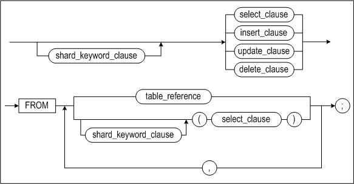

**shard_keyword_clause::=**

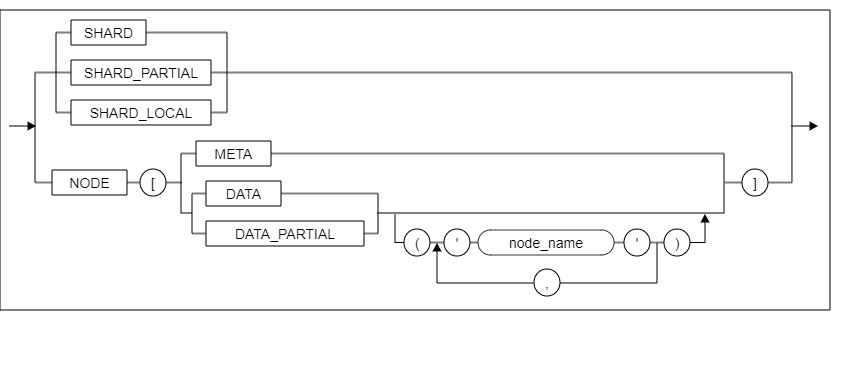

##### *SHARD* 분산쿼리 키워드
SHARD 분산쿼리 키워드를 사용하면, 쿼리에 존재하는 샤드객체의 분산정의가 존재하는 모든 샤드 노드(들)에 쿼리를 전송하고 수행하여 취합한다. 분산 수행할 수 있는 샤딩객체가 전혀 없을 때는 에러가 발생한다.

샤딩에서는 아래 두개의 쿼리가 동일한 결과를 얻어온다.
-   SELECT count(\*) FROM *s1;*
-   SELECT sum(cn) FROM SHARD ( SELECT count(\*) cn FROM s1);

집계함수 중 몇가지(SUM,MIN,MAX,COUNT,AVG)에 대해서는 시스템 내부적으로 자동으로 최적화되어 수행하지만, 그외의 경우에는 최적화되어서 수행되지 않으므로, 성능이 느릴 수 있다. 이러한 경우에, 사용자가 분산쿼리 키워드를 이용하여, 수동으로 쿼리 튜닝할 수 있다.
-   SELECT i1, sum(cn) FROM SHARD (SELECT i1, count(\*) cn FROM s1 GROUP BY i1);
-   SELECT \* FROM SHARD (SELECT \* FROM s1 limit 10) limit 10;

##### *SHARD_PARTIAL* 분산쿼리 키워드
SHARD_PARTIAL 분산쿼리 키워드는 쿼리를 전송받은 노드가 보조적인 샤드 코디네이터로서 전역수행 하도록 명령하는 키워드이다.
SHARD_PARTIAL 키워드가 적용된 쿼리 구간 내부에는 반드시 SHARD_LOCAL 키워드가 존재해야 한다.

SHARD_PARTIAL 키워드가 적용된 쿼리는 SHARD_LOCAL 키워드가 적용된 부분 쿼리의 분산수행 분석결과에 따라 해당하는 노드(들)에 쿼리를 전송하고,
해당 쿼리를 전송받은 노드는 SHARD_LOCAL 키워드가 적용된 부분 쿼리에 대해서는 지역 수행하며, 그 외의 부분 쿼리에 대해서는 전역 수행하여 결과를 반환한다.

아래와 같은 쿼리의 수행 시 SHARD_LOCAL 키워드가 적용된 t1이 존재하는 모든 샤드 노드(들)에 SHARD_PARTIAL 키워드가 적용된 쿼리가 전송되고,
이를 전송받은 노드는 SELECT * FROM t1에 대해서는 지역수행하고, SELECT * FROM t2에 대해서는 전역수행 하여 결과를 반환하게 된다.
-   SELECT * FROM SHARD_PARTIAL( SELECT * FROM SHARD_LOCAL(SELECT * FROM t1) , t2 );

성능을 위한 쿼리 튜닝의 일환으로 데이터 노드(들)에서 직접 전역수행 할 시 성능상 이점이 있는경우 활용될 수 있다.

##### *SHARD_LOCAL* 분산쿼리 키워드
SHARD_LOCAL 분산쿼리 키워드는 다른 분산 쿼리 키워드 내에 사용 될 수 있는 키워드로서,
데이터 노드가 보조적인 샤드 코디네이터 역할을 수행하도록 지시하는 SHARD_PARTIAL 키워드 등과 함께 사용되어
SHARD_LOCAL 키워드가 적용된 부분 쿼리에 대해서 전역 수행하지 않고, 지역수행 하도록 하는 역할을 한다.

##### *NODE* 분산쿼리 키워드
NODE 분산쿼리 키워드는 인자로 명시한 노드에서 쿼리를 분석 및 변환없이 수행하고, 그 수행 결과를 취합한다. 샤드 쿼리 분석기를 통하지 않고 해당 쿼리를 바로 전달한다. 사용 가능한 NODE 유형은 다음과 같다.
-   NODE[META] : 사용자 세션이 접속한 샤드 노드에서 쿼리 분석 및 변환없이 지역수행
-   NODE[DATA] 또는 NODE[DATA()] : 모든 샤드 노드들에서 쿼리 분석 및 변환없이 지역수행
-   NODE[DATA(*'node1_name*', *node2_name*',...)] : 명시된 노드(들)에서 쿼리 분석 및 변환없이 지역수행
-   NODE[DATA_PARTIAL] 또는 NODE[DATA_PARTIAL()] : 모든 샤드 노드들에서 쿼리 분석 및 변환없이 전역수행
-   NODE[DATA_PARTIAL(*'node1_name*', *node2_name*',...)] : 명시된 노드(들)에서 쿼리 분석 및 변환없이 전역수행

샤드 노드별 데이터 상태를 확인할 경우에 유용하게 쓰일 수 있다. 아래는 몇가지 사용예이다.
```
NODE[META] SELECT count(*) FROM t1;
NODE[DATA] SELECT count(*) FROM s1;
SELECT * FROM NODE[META](SELECT count(*) FROM s1);
SELECT * FROM NODE[DATA('node1', 'node2')](SELECT count(*) FROM s1);
SELECT * FROM NODE[DATA('node2')](SELECT i1,sum(i1) FROM s1 GROUP BY i1);
SELECT * FROM NODE[DATA_PARTIAL('node1', 'node2')](SELECT count(*) FROM SHARD_LOCAL(SELECT * FROM s1)); 
SELECT * FROM NODE[DATA_PARTIAL('node2')](SELECT i1,sum(i1) FROM SHARD_LOCAL(SELECT * FROM s1) GROUP BY i1);
```

> ##### 주의 사항
> NODE 분산쿼리 키워드의 적용 결과는 단순히 해당 노드의 수행 결과를 얻어 취합하는 것이므로 결과의 정합성을 보장하지 않는다. 그러므로, NODE 분산쿼리 키워드는 DBA가 임시적으로 사용하는 목적으로만 사용해야 한다.

#### Sharding Query Tuning
샤딩에서 쿼리 튜닝이란, 클라이언트 사이드로 수행될 수 있도록 쿼리를 만드는 것이 일차적인 목적이다.

단일 테이블에 대하여, 클라이언트 사이드로 쿼리가 수행되기 위한 조건
- 솔로 테이블에 대한 모든 쿼리
- 클론 테이블에 대한 모든 쿼리
- 샤드키 테이블에 대한 쿼리에서 WHERE 조건절에 샤드키 컬럼에 대한 조건이 equal(=) 조건으로 명시되는 경우
- 샤드키 테이블에 대한 쿼리에서 DISTINCT 절에 샤드키 컬럼이 명시되는 경우
- 샤드키 테이블에 대한 aggregation 쿼리에서 GROUP BY 절에 샤드키 컬럼이 명시되는 경우 
- SELECT * FROM t1 과 같이 샤드키 테이블에 대하여 단순히 결과를 취합하는 경우
- 샤드키 테이블에 대한 INSERT 쿼리에서 샤드키 컬럼에 해당하는 값이 직접적으로 사용되는 경우
  - 샤드키 컬럼에 해당하는 값에 수식이 있거나, 시퀀스, 또는 서브 쿼리가 있는 경우에는 서버 사이드로 수행한다.
  - INSERT ~ SELECT ~ 쿼리는 서버 사이드로 수행된다.

JOIN 쿼리에 대하여, 클라이언트 사이드 쿼리로 수행되기 위한 조건
- 클론 테이블과 샤드키 테이블간의 JOIN 쿼리
- 동일한 분산 정의를 갖는 샤드키 테이블간의 샤드키 컬럼을 사용한 equal(=) JOIN 쿼리
- 동일한 분산 정의를 갖는 샤드키 테이블간의 샤드키 컬럼을 사용한 equal any(IN) SUBQUERY JOIN 쿼리

기타 샤딩 최적화가 수행되는 조건
- AGGREGATION 분산 최적화는 SHARD_AGGREGATION_TRANSFORM_ENABLE property 설명 부분을 참고한다.
- Limit, Selection, Projection, Out reference predicate 최적화는 SHARD_TRANSFORM_MODE property 설명 부분을 참고한다.

#### Sharding Hint
- 분산쿼리에 힌트가 올바르게 적용되었는지 확인하기 위해서는, PLAN으로 분산쿼리를 확인하여야 한다.
  - 의도와 맞지 않게 힌트가 적용된 경우는, 원래 쿼리를 분산쿼리에 맞추어 변경을 해준 후에, 해당 변경된 쿼리에 힌트를 부여해야 한다. 
- 샤딩에서는 인덱스 힌트를 통해서 결과 레코드들의 순서를 보장하는 기능은 사용할 수 없다.
  - 단, 단일노드 쿼리인 경우에는 인덱스 힌트를 통해서 결과 레코드들의 순서를 보장할 수 있다. (이 경우에도, 샤드 실행계획을 보고, 최종 실행노드에서 수행되는 쿼리에 해당 인덱스 힌트가 들어 있는지 확인해야 한다.)
- PUSH_PRED 힌트를 사용하면, 서버측 샤딩으로 수행되는 노드간 조인의 조인 조건절을 바인드 파라메터화 하여, 조인 비용을 감소시키고, 인덱스를 활용을 통해 쿼리 속도를 향상시킬 수 있다. 이 경우, 조인 방식과 순서는 PUSH_PRED 힌트에 의해 강제된다.
  - 다음과 같은 쿼리가 있다.
    - SELECT * FROM t1, t2 WHERE t1.i1=t2.i1 AND t2.i2>3;
  - 이를 PUSH_PRED 힌트를 사용하여, 다음과 같이 변경할 수 있다.
    - SELECT /*+ PUSH_PRED(v1) */ * FROM ( SELECT * FROM t1 ) v1, t2 WHERE v1.i1=t2.i1 AND t2.i2>3;

## Global DDL
- Sharding 환경에서 DDL 수행시 샤딩 클러스터의 모든 노드로 DDL 을 실행하는 기능이다.
- 모든 노드에서 DDL 수행이 성공하면 commit 되지만, 그렇지 않으면 rollback 된다.

#### ALTER SESSION SET GLOBAL_DDL = value
- Sharding 환경에서만 GLOBAL_DDL 세션 프로퍼티 변경이 가능하다.
- GLOBAL_DDL 세션 프로퍼티는 0 과 1 이 가능하며, 1로 설정한 상태에서 수행되는 DDL은 모든 노드로 전송된다.

#### Global DDL 이 가능한 DDL 목록
- table
  - truncate table
  - create table
    - create ddl as select는 안 됨
  - drop table
    - shard object는 안 됨
  - access table
- partiton (global non partitioned index 가 없어야 함)
  - drop partition
    - shard object는 안 됨
  - merge partition
    - shard object는 안 됨
  - split partition
    - k-safety > 0 은 미지원
    - right in-place split partition만 지원됨
      - left in-place: 두 개의 새 파티션 중 첫 번째 파티션이 기존 파티션의 이름과 같은 경우
      - right in-place : 두 개의 새 파티션 중 두 번째 파티션이 기존 파티션의 이름과 같은 경우
      - out place: 두 개의 새 파티션 모두 기존 파티션과 이름이 다른 경우
  - truncate partition
  - access partition
- column
  - add column
    - trailing null 이어야함
    - not null 속성이 없어야함
    - check 속성이 없어야함
    - hidden column 이 아니어야함
    - primary key, unique, local unique 속성이 없어야함
    - timestamp type 아니어야함
  - drop column
  - alter column
    - not null
    - nullable
- constraints
  - add constraint
  - modify constraint
  - rename constraint
  - drop constraint
- index
  - create index
  - drop index
- global sequence
  - create sequence
  - alter sequence
    - shard object만 지원
  - drop sequence
    - shard object는 미지원

#### 샤드 테이블 제약조건 지원범위
- 샤드 테이블에 생성할 수 있는 제약조건은 UNIQUE와 FOREIGN KEY 두 가지이다.

##### UNIQUE KEY
- UNIQUE 제약조건을 구성하는 컬럼에 샤드키를 포함해야 한다.

###### 예제
```
iSQL> ALTER TABLE HASH_CHILD ADD CONSTRAINT UK_HASH_CHILD UNIQUE ( SHARD_KEY, COL_1, ... );
```

##### FOREIGN KEY
- 제약조건을 한 노드내에서 검증할 수 있는 경우만 허용한다.
  - 부모 샤드 테이블이 복제 분산 방식이라면, 무조건 허용한다.
  - 그 외 분산 방식의 경우,
    - 부모와 자식 샤드 테이블의 분산 정보가 서로 동일해야 한다.
    - 외래키와 참조키를 구성하는 컬럼 대상에 모두 샤드키가 포함되어 있어야 하며 동일한 순서에 위치해야 한다.

###### 예제
```
iSQL> ALTER TABLE CHILD ADD CONSTRAINT FK_HASH_CHILD FOREIGN KEY ( SHARD_KEY, COL_1, ... ) REFERENCES PARENT ( SHARD_KEY, COL_2, ... ); 
```

## SHARD DDL
- Shard DDL은 샤딩 클러스터 시스템의 노드 구성 형상에 영향을 주는 명령어이다.
- SYS 사용자만 수행할 수 있다.
- GLOBAL_TRANSACTION_LEVEL 설정 값이 2 또는 3 이어야 한다.
- SHARD_ENABLE 설정 값이 1 이어야 한다.
- SHARD 메타정보가 구성되어 있어야 한다.
- Zookeeper가 구성되어 있어야 한다.
- 다른 세션에서 이미 다른 SHARD DDL을 수행중이면, 해당 SHARD DDL의 수행이 완료될때까지는 대기된다. 

### ADD

#### 구문
ALTER DATABASE SHARD ADD ;

#### 설명
본 구문을 수행하는 노드를 샤딩 클러스터에 추가 하기 위한 구문이다.

노드가 샤딩 클러스터에 추가되면, 자동으로 SHARD_ADMIN_MODE가 0 으로 변경되고, 일반 사용자도 해당 노드에 접속할 수 있게 된다.

샤딩 클러스터에 속한 모든 노드들이 정상적인 상황에서만 수행이 가능한 명령이다. 
- shutdown 된 노드가 있다면, 먼저 join을 수행하여야 한다.
- failover 된 노드가 있다면, 먼저 failback이 수행되어야 한다.
- drop 명령어에 의해서 샤딩 클러스터에서 제거된 노드는, 더이상 샤딩 클러스터에 속한 노드가 아니므로, drop 된 노드가 있어도 본 ADD 구문을 수행할 수 있다. 

신규노드 추가 사전작업
- 샤드 메타를 생성한다.
  - DBMS_SHARD.CREATE_META()
- 해당샤드노드의 로컬 정보를 설정한다.
  - DBMS_SHARD.SET_LOCAL_NODE(...)
- 최초의 샤드노드라면, k-safety 관련 전역 복제 정보를 설정한다.
  - DBMS_SHARD.SET_REPLICATION(...)
- 두번째 이후로 추가되는 노드들은 DBMS_SHARD.SET_REPLICATION(...)을 수행하지 않아도, 기존 샤드노드들과 동일한 k-safety 관련 전역 복제 정보가 사용된다.
- 두번째 이후로 추가되는 노드들에 DBMS_SHARD.SET_REPLICATION(...)을 수행해도 된다. 단, 첫 번째로 추가된 샤드노드의 설정과 동일하여야 한다.

새로운 샤드 노드를 추가하기 전에, 기존 샤드 노드가 있었다면, 기존 샤드 노드와 동일한 데이터베이스 객체들을 미리 생성해 놓아야 한다.
- 기존에 이미 데이터베이스 객체들이 생성된 샤드 노드가 있다면, 해당 노드에서 aexport 유틸리티를 이용하여, 객체 생성구문을 얻을 수 있다.
- 아래의 예외사항들을 제외한, 모든 데이터베이스 객체들을 생성해 놓아야 한다.
- 샤드 테이블들 및 백업테이블들인 \_BAK_ 테이블들은 모두 생성되어 있되, 비어 있어야 한다.
- k-safety 복제를 위하여 시스템적으로 관리되는 이중화 객체들(repl_set_~)은 "ALTER DATABASE SHARD ADD;" 구문을 수행하면 자동으로 생성되므로, 미리 생성해 놓으면 안된다.
- 위의 "신규노드 추가 사전작업"에서 sys_shard 계정에 대한 객체들은 자동 생성되므로, sys_shard 계정의 객체들을 삭제하거나 새로 생성하면 안된다.

새로운 샤드 노드를 추가하기 전에, 기존 샤드 노드에 외래키가 있었다면, 기존 샤드 노드와 동일한 외래키를 미리 생성해 놓아야 한다.
- 백업테이블들인 \_BAK_ 테이블들에도 동일한 외래키를 미리 생성해 놓아야 한다.
- 만약 부모 샤드 테이블이 복제 분산 방식이라면, 자식 백업테이블과 부모 샤드 테이블간 외래키를 생성해야 한다
```
iSQL> ALTER TABLE HASH_CHILD ADD CONSTRAINT FK_HASH_CHILD FOREIGN KEY ( SHARD_KEY, COL_1, ... ) REFERENCES HASH_PARENT ( SHARD_KEY, COL_2, ... );
iSQL> ALTER TABLE _BAK_HASH_CHILD ADD CONSTRAINT _BAK_FK_HASH_CHILD FOREIGN KEY ( SHARD_KEY, COL_1, ... ) REFERENCES _BAK_HASH_PARENT ( SHARD_KEY, COL_2, ... );
```
```
iSQL> ALTER TABLE HASH_CHILD ADD CONSTRAINT FK_HASH_CHILD FOREIGN KEY ( SHARD_KEY, COL_1, ... ) REFERENCES CLONE_PARENT ( SHARD_KEY, COL_2, ... );
iSQL> ALTER TABLE _BAK_HASH_CHILD ADD CONSTRAINT _BAK_FK_HASH_CHILD FOREIGN KEY ( SHARD_KEY, COL_1, ... ) REFERENCES CLONE_PARENT ( SHARD_KEY, COL_2, ... );
```

샤드 노드를 추가하는 순간 아래와 같은 작업이 내부적으로 수행된다.
- Zookeeper 에 접속되고, Zookeeper 메타에 추가되는 샤드 노드에 대한 정보가 설정된다.
- 클론 테이블은 이미 추가된 다른 샤드 노드에서 복제하여 동일하게 데이터가 설정된다.
- 샤드 메타정보도 이미 추가된 다른 샤드 노드에서 복제하여 동일하게 데이터가 설정된다.

### DROP

#### 구문
ALTER DATABASE SHARD DROP ;

#### 설명
본 구문을 수행하는 노드를 샤딩 클러스터에 제거 하기 위한 구문이다.
- 샤딩 클러스터에 속한 모든 노드들이 정상적인 상황에서만 수행이 가능한 명령이다. 
- 본 구문의 수행 노드는 샤딩 클러스터에 추가되어 정상적으로 운영중인 상태이어야 한다. 
- 노드가 샤딩 클러스터에 제거되면, 자동으로 SHARD_ADMIN_MODE가 1 으로 변경되고, 일반 사용자는 해당 노드에 접속할 수 없게 된다.
- 클론 테이블을 제외하고, 해당 샤드 노드에 속한 샤드 테이블의 데이터 영역이 있다면, 샤드 노드를 삭제 할 수 없다. 
  리샤딩을 이용하여, 해당 데이터 영역을 다른 샤드 노드로 이동 시킨 후에, 샤드 노드를 삭제 할 수 있다. 

### DROP FORCE
(*under construction*)

#### 구문
ALTER DATABASE SHARD DROP "target_node_name" FORCE ;

#### 설명
- failover 된 노드가 영구장애가 발생하여, 이 노드로 failback을 시킬 수 없는 경우에 해당 노드를 강제로 샤딩 클러스터에서 제거하기 위한 기능이다.
- 비정상종료되었으나 failover가 되지 않은 노드가 존재하는 상황에서는 어떤 노드를 DROP FORCE 구문으로 제거할 수 없다.
  - 이런 노드들을 먼저 FAILOVER shard DDL을 이용하여 failover를 시킨 후에만, DROP FORCE shard DDL을 수행할 수 있다.
- 사용자의 shutdown 명령어에 의해 shutdown된 노드이지만, 영구장애가 발생하여, JOIN shard DDL을 할 수 없는 경우에도, 먼저 FAILOVER shard DDL을 이용하여 failover를 시킨 후에만, DROP FORCE shard DDL을 수행할 수 있다.
- DROP FORCE 구문은 가장 최근에 failover 된 노드를 대상으로만 수행할 수 있다.
- DROP FORCE 구문은 제거될 노드 자신에서는 수행할 수 없다. 정상적인 노드에서 수행하여 다른 어떤 노드를 강제로 제거할 수 있다. 

### JOIN

#### 구문
ALTER DATABASE SHARD JOIN ;

#### 설명
본 구문을 수행하는 노드를 샤딩 클러스터에 다시 참여 시키기 위한 구문이다.

본 구문의 수행 노드는 샤딩 클러스터에 추가된 후에, shutdown 명령으로 샤딩 클러스터에서 이탈된 상태이어야 한다. 

노드가 샤딩 클러스터에 다시 참여되면, 자동으로 SHARD_ADMIN_MODE가 0 으로 변경되고, 일반 사용자도 해당 노드에 접속할 수 있게 된다.

### FAILOVER

#### 구문
ALTER DATABASE SHARD FAILOVER "target_node_name" ;

#### 설명
특정 노드에 장애가 발생하였을 때, 다른 노드에서 장애가 발생한 노드의 데이터 영역을 서비스 할 수 있도록 하는 작업이다.

단, 설정된 K-Safety 값을 넘어서는 노드이름으로 연속된 노드들의 장애가 발생하는 경우에는, 장애가 발생한 노드의 데이터 영역을 서비스 할 수 없는 채로 failover를 한다.

기본적으로는 Zookeeper에 의해 장애노드가 감지되면 자동으로 수행된다. 또한, 정상적인 노드에 대해서도 사용자가 수동으로 FAILOVER shard DDL을 수행 할 수도 있다. 그리고, 비정상종료되었으나 자동 failover가 되지 않은 노드가 있다면, 사용자가 수동으로 FAILOVER shard DDL을 수행해 주어야 한다.

사용자의 shutdown 명령어에 의해 shutdown된 노드이지만, 영구장애가 발생하여, JOIN shard DDL을 할 수 없는 경우에는, 사용자가 수동으로 FAILOVER shard DDL을 수행해 주어야 한다.

정상적인 상태의 노드들 중에 노드 이름으로 오름차순으로 정렬 했을때, 장애가 발생한 target node 의 이름과 비교해서 바로 다음 순서에 있는 노드를 next alive node 라고 한다. 이름 순으로 가장 마지막에 있던 노드의 next alive node는 이름 순으로 가장 처음에 위치하는 노드가 된다. 즉, 이름 순서는 환(ring)의 형태로 검색하도록 되어 있다.

failover가 완료되면, next alive node가 장애가 발생한 target node에서 서비스하던 데이터를 서비스 하게 된다.

자동으로 failover가 될때이든, 사용자가 수동으로 failover 명령어를 수행할 때이든, 장애가 발생한 target node 는 자동으로 shutdown 된다.

사용자가 수동으로 failover 명령어를 수행할 때는, 수행 노드와 target node가 동일 노드일때는 명령수행이 실패한다. 또한, 수행노드는 정상적으로 운영중이 상태이어야 한다. 그리고, 이미 failover 된 노드를 다시 failover 시킬 수는 없다.

자동으로 failover가 수행되는 경우에, next alive node가 failover 명령어의 수행노드가 된다. 또한, 여러 노드에 장애가 발생할 경우 시스템 내부적으로, 장애가 발생한 노드들의 이름들로 list가 구성되고, 장애를 감지한 수행노드를 기준으로 정렬된 역순으로 failover 를 수행하게 된다.

예를들어, N1~6 노드가 존재하는데, N1 노드와 N3 노드가 장애노드가 되었을 때, N4가 감지하였을 경우 N3 노드 먼저 그리고, N1 노드 순서로 failover되고, N2 노드가 감지할 경우 N1 노드 먼저 그리고, N3 노드의 순서로 failover 된다.

failover된 노드는, 사용자의 failback 명령에 의해서만 다시 샤딩 클러스터에 참여할 수 있다.

단, failover된 노드에 영구장애가 발생해서, 해당 노드를 failback 시킬 수 없을 때는, 해당 노드를 DROP FORCE shard DDL을 이용하여, 제거 할 수 있다.

### FAILBACK

#### 구문
ALTER DATABASE SHARD FAILBACK ;

#### 설명
본 구문을 수행하는 노드를 샤딩 클러스터에 다시 failback 시키기 위한 구문이다.
- 장애가 발생하여 자동으로 failover 된 노드를 failback 시킬 수 있다.
- 사용자가 수동으로 failover 구문을 수행하여 failover 된 노드를 failback 시킬 수 있다.
- 비정상종료되었으나 failover가 되지 않은 노드가 존재하는 상황에서는 FAILBACK 구문을 수행할 수 없다.
  - 이런 노드들을 먼저 FAILOVER 구문을 이용하여 failover를 시킨 후에만, FAILBACK 구문을 수행할 수 있다.
- FAILBACK 구문은 가장 최근에 failover 된 노드에서만 수행할 수 있다.
- 단, 사용자의 shutdown 명령어에 의해 shutdown된 노드에서는 FAILBACK 구문을 수행할 수 없다. 이 경우에는 JOIN 구문을 이용하여 샤딩 클러스터에 재 참여하여야 한다.

### FAILBACK SYNC

#### 구문
ALTER DATABASE SHARD FAILBACK SYNC ;

#### 설명
FAILBACK SYNC 구문은 아래 사항을 제외하고, 나머지는 일반 FAILBACK 구문과 동일하다.
- failover시에 시스템 내부적으로 역이중화를 생성하여, failback시에 failover 이후에 변경된 데이터만 다시 failback 되는 노드로 반영하도록 되어 있다.
- 그러나, k-safety를 초과하여 연속 failover가 발생하였거나, failover 된 노드중에 DROP FORCE 구문으로 제거된 노드가 존재하는 경우에는, 변경 데이타만 반영하는것이 불가능하게 된다.
- 이 경우에 FAILBACK SYNC 구문을 사용해야만 하고, 전체 데이터를 모두 복제하여 failback 노드의 데이터를 구성하게 된다.
- DROP FORCE 구문으로 어떤 노드를 제거하기 전에 failover 된 노드를 대상으로 failback 할때는 FAILBACK SYNC 구문을 사용해야 한다.
- DROP FORCE 구문으로 어떤 노드를 제거한 후에 신규로 failover 된 노드를 대상으로 failback 할때는 일반 FAILBACK 구문을 사용하면 된다.

### MOVE

#### 구문
```
ALTER DATABASE SHARD MOVE { TABLE ["user_name" . ] "table_name" [ PARTITION {"(partition_name)"} ] | PROCEDURE ["user_name" . ] "procedure_name" [ KEY ( "value" ) ] }+  TO "node_name" ;
```

#### 설명
시스템 운영중에 본 구문을 수행하여, 샤드 테이블 및 샤드 프로시져의 분산정의를 변경하기 위한 구문이다.
- 샤드 객체의 분산 영역에 대한 정의를 사용자가 지정한 노드로 이동시킨다.
- 샤드키 테이블에 대하여는 개별 파티션별로 지정한 노드로 이동이 가능하다.
- 솔로 테이블에 대하여는 해당 테이블 전체에 대하여 지정한 노드로 이동이 가능하다.
- 샤드키 프로시져에 대하여는 샤드키의 value 하나에 대하여 호출될 노드의 변경이 가능하다.
- 솔로 프로시져에 대하여 호출될 노드의 변경이 가능하다.
- 두 노드간의 이동이 가능하다. 원천 노드가 두개 이상인 경우는 수행할 수 없다. 
- 한번에 다수의 샤드 객체에 대한 변경이 가능하다.

#### 예제
```
ALTER DATABASE SHARD MOVE TABLE user1.table1 PARTITION (p1), TABLE user2.soloTable1, TABLE user1.table2 PARTITION (p2), PROCEDURE user1.shardproc1 key ( 123 )  TO NODE4 ;
```

#### 주의사항
- 외래키와 참조키를 지닌 샤드 테이블을 이동하려면, 부모와 자식 샤드 테이블을 동시에 변경하도록 제약한다.
- 만약 부모 샤드 테이블이 복제 분산 방식이라면, 자식 샤드 테이블만 변경한다.

#### 예제1
```
iSQL> ALTER DATABASE SHARD MOVE TABLE user1.hash.parent PARTITION (p1), TABLE user1.hash.child PARTITION (p1) TO NODE4;
iSQL> ALTER DATABASE SHARD MOVE TABLE user1.solo.parent, TABLE user1.solo.child TO NODE4;
```
#### 예제2
```
iSQL> ALTER TABLE user1.hash.child ADD CONSTRAINT fk_hash_child FOREIGN KEY ( shard_key, c1 ) REFERENCES ser1.clone.parent ( shard_key, col_2 );
iSQL> ALTER DATABASE SHARD MOVE TABLE user1.hash.child TO NODE4;
```

## Altibase Sharding Package
### DBMS_SHARD
DBMS_SHARD 패키지는 Altibase Sharding의 샤드 설정과 관리에 사용한다.
- DBMS_SHARD 패키지의 프로시저들은 global transaction level 2 이상에서만 수행할 수 있다.
- node name은 모두 대문자로 처리된다.

아래의 표와 같이 DBMS_SHARD 패키지를 구성하는 프로시저와 함수를 제공한다.
- CREATE_META: 샤드 노드에서 샤드 메타 테이블을 생성한다.
- SET_LOCAL_NODE: 지역 샤드 노드의 정보를 설정한다.
- SET_REPLICATION: 샤딩 클러스터 시스템의 데이터 복제 방식을 설정한다.
- SET_SHARD_TABLE_SHARDKEY: 샤드키 테이블 샤드객체로 등록한다.
- SET_SHARD_TABLE_SOLO: 솔로 테이블 샤드객체로 등록한다.
- SET_SHARD_TABLE_CLONE: 클론 테이블 샤드객체로 등록한다.
- SET_SHARD_PROCEDURE_SHARDKEY: 샤드키 프로시저 샤드객체로 등록한다.
- SET_SHARD_PROCEDURE_SOLO: 솔로 프로시저 샤드객체로 등록한다.
- SET_SHARD_PROCEDURE_CLONE: 클론 프로시저 샤드객체로 등록한다.
- SET_SHARD_SEQUENCE_GLOBAL: 글로벌 시퀀스 샤드객체로 등록한다.
- UNSET_SHARD_TABLE: 샤드 테이블을 해제한다.
- UNSET_SHARD_PROCEDURE: 샤드 프로시저를 해제한다.
- UNSET_SHARD_SEQUENCE: 글로벌 시퀀스를 샤드객체에서 해제한다.

#### CREATE_META
##### 구문
```
DBMS_SHARD.CREATE_META()
```

##### 파라미터
없음.

##### 설명
현재 접속 노드에서 샤드 메타 테이블을 생성한다.
- create_meta를 수행하면 SYS_SHARD 계정이 생성되고 샤드에 메타를 저장할 테이블과 인덱스, 시퀀스가 생성된다.
- 본 프로시저는 수행 성공하면 자동으로 commit 되며, 수행 실패하면 자동으로 rollback 된다.  

##### 예제
```
iSQL> EXEC dbms_shard.create_meta();
```

#### SET_LOCAL_NODE
##### 구문
```
DBMS_SHARD.SET_LOCAL_NODE( 
  shard_node_id in integer,
  node_name in varchar(10),
  host_ip in varchar(64),
  port_no in integer,
  internal_host_ip in varchar(64),
  internal_port_no in integer,
  internal_replication_host_ip in varchar(64),
  internal_replication_port_no in integer,
  conn_type in integer default NULL );
```
##### 파라미터
- shard_node_id: 지역 샤드 노드의 샤드 노드 식별자로 전체 클러스터 시스템에서 유일해야한다.
  - shard_node_id 값 범위: 1 \~ 9200
  - 기존 node drop 후에, 신규 node add 하는 경우에, 기존에 사용했던 shard_node_id 를 재사용하지 말고 신규로 번호를 부여하는 것이 좋다.
  - 기존 shard_node_id 를 재사용하는 경우에, 기존 shard_node_id로 사용되던, sharded sequence가 있었다면, 이미 발부했던 sequence를 다시 발부할 수 있게 되는 문제가 있다.
    - shard_node_id 를 재사용하고자 하는 경우에는, 해당 sharded sequence의 초기값을 기존에 발급되었던 값보다 큰 값으로 설정해주어야 한다.
- node_name: 지역 샤드 노드에서 사용할 노드 이름을 입력하며, 샤드 노드 이름도 전체 클러스터 시스템에서 유일해야한다. node_name 은 모두 대문자로 처리된다.
- host_ip: 지역 샤드 노드에서 서비스에 사용할 호스트 IP를 입력한다. 
- port_no: 지역 샤드 노드에서 서비스에 사용할 Port를 입력한다. 
- internal_host_ip: 지역 샤드 노드에서 코디네이터가 내부적으로 사용할 호스트 IP를 입력한다.
- internal_port_no: 지역 샤드 노드에서 코디네이터가 내부적으로 사용할 Port를 입력한다. 
- internal_replication_host_ip: 지역 샤드 노드에서 내부 복제용으로 사용할 호스트 IP를 입력한다. internal_host_ip와 동일한 값을 사용할 것을 권장한다. 
- internal_replication_port_no: 지역 샤드 노드에서 내부 복제용으로 사용할 Port로 REPLICATION_PORT_NO 프로퍼티 값과 동일한 값을 입력해야한다. 
- conn_type: 내부적으로 사용되는 코디네이터 연결 방식으로 입력하지 않는 경우 TCP를 사용한다.
  - 1: TCP
  - 8: InfiniBand 

##### 설명
지역 샤드 노드의 정보를 설정한다.
- 샤드 노드를 추가하기 위해서는 먼저 지역 샤드 노드의 정보를 등록해야한다. 
- 한번 샤딩 클러스터에 참여한 후에는, 지역 샤드 노드 정보의 재 설정은 불가하며, 재설정을 위해서는 노드 제거 및 추가를 해야한다. 
- 한번도 샤딩 클러스터에 참여하지 않은 경우에만 변경가능하며, 변경은 최초 설정과 동일한 인터페이스를 통해 수행할 수 있다.
- 현재 ip address는 ip v4형식만 지원한다.
- 본 프로시저는 수행 성공하면 자동으로 commit 되며, 수행 실패하면 자동으로 rollback 된다.  

#### 예제
node_id 가 1 이고, 'NODE1'이라는 이름을 갖는 지역 샤드 노드의 정보를 등록한다. 
```
iSQL> EXEC DBMS_SHARD.SET_LOCAL_NODE(1, 'NODE1', '192.168.1.10', 20300, '192.168.1.10', 20300, '192.168.1.10', 30300 );
```

#### SET_REPLICATION
##### 구문
```
DBMS_SHARD.SET_REPLICATION(
  k_safety          in integer,
  replication_mode  in varchar(10) default NULL,
  parallel_count    in integer default NULL )
```

##### 파라미터
- k_safety: 시스템 내에서 유지할 복제본의 갯수
- replication_mode: 이중화에서 사용할 복제 방식
  - 'consistent' 모드 한가지만 지원함.
- parallel_count: 이중화 병렬 적용자의 수

##### 설명
샤딩 클러스터 시스템에서 사용할 복제 정보를 입력한다.
- 본 프로시저는 수행 성공하면 자동으로 commit 되며, 수행 실패하면 자동으로 rollback 된다.  

##### 예제
샤딩 클러스터 시스템에서 2개의 복제본을 유지하고 동기복제 방식을 사용하고, 이중화 병렬 적용자는 3 으로 설정한다.
```
iSQL> EXEC DBMS_SHARD.SET_REPLICATION(2, 'consistent', 3);
```
#### SET_SHARD_TABLE_SHARDKEY
##### 구문
```
DBMS_SHARD.SET_SHARD_TABLE_SHARDKEY( 
  user_name                     in varchar(128),
  table_name                    in varchar(128),
  partiton_node_list            in varvchar(32000), 
  method_for_irregular          in char(1) default 'E',
  replication_parallel_count    in integer default 1 )
```

##### 파라미터
- user_name: 테이블 소유자의 이름
- table_name: 테이블 이름
- partiton_node_list: 파티션이름과 노드이름의 쌍들을 콤마로 구분한 리스트이며, 모든 파티션 이름들이 기술되어야 한다.
- method_for_irregular: 해당 테이블에 데이터가 기 존재시 수행 옵션
  - E: (error) 기본 값으로 샤드 객체로 등록하려는 테이블에 분산정의에 맞지 않는 데이터가 존재하면 에러를 발생한다.
  - T: (truncate) 샤드 객체로 등록 하려는 테이블에서 분산정의에 맞지 않는 데이터를 삭제 한다.
- replication_parallel_count: 테이블과 백업 테이블 동기화 시 replication parallel count

##### 설명
샤드키 테이블 샤드객체로 등록한다.
- 전체 샤드 노드에 해당 테이블의 스키마와 인덱스 및 constraint는 동일해야 한다. 또한, view 테이블은 샤드 객체로 등록할 수 없다.
- 파티션 테이블만 등록될 수 있으며, 파티션키 컬럼은 PK 컬럼들중에 하나여야 하며, 파티션키 컬럼이 샤드키 컬럼으로 등록된다.
  - 파티션의 종류는 range with hash 와 range 그리고 list 세가지만 가능하다.
  - range with hash 파티션은 hash 분산으로 등록된다.
  - range 파티션은 range 분산으로 등록된다.
  - list 파티션은 list 분산으로 등록된다.
  - list 파티션 정의시 개별 파티션별로 list value는 하나씩만 가져야 한다.
- 본 프로시져 수행 시 백업 테이블은 재생성되고, 분산정의에 맞추어 원천테이블의 파티션별로 데이터가 백업 테이블의 파티션에 동기화 된다.
- 이미 수행중인 트랜잭션이 있는 경우 commit 혹은 rollback 처리 후에 본 프로시저를 수행할 수 있다.
- 본 프로시저는 수행 성공하면 자동으로 commit 되며, 수행 실패하면 자동으로 rollback 된다.  

##### 예제
```
iSQL> EXEC DBMS_SHARD.SET_SHARD_TABLE_SHARDKEY('SYS','T1','P1 NODE1, P2 NODE2' );
iSQL> EXEC DBMS_SHARD.SET_SHARD_TABLE_SHARDKEY('SYS','T1','P1 NODE1, P2 NODE2', 'E', 5 );
```
#### SET_SHARD_TABLE_SOLO
##### 구문
```
DBMS_SHARD.SET_SHARD_TABLE_SOLO( 
  user_name                     in varchar(128),
  table_name                    in varchar(128),
  node_name                     in varchar(10),
  method_for_irregular          in char(1) default 'E' ,
  replication_parallel_count    in integer default 1 )
```

##### 파라미터
- user_name: 테이블 소유자의 이름
- table_name: 테이블 이름
- node_name: 솔로 테이블이 존재할 노드 이름
- method_for_irregular: 해당 테이블에 데이터가 기 존재시 수행 옵션
  - E: (error) 기본 값으로 샤드 객체로 등록하려는 테이블에 분산정의에 맞지 않는 데이터가 존재하면 에러를 발생한다.
  - T: (truncate) 샤드 객체로 등록 하려는 테이블에서 분산정의에 맞지 않는 데이터를 삭제 한다.
- replication_parallel_count: 테이블과 백업 테이블 동기화 시 replication parallel count

##### 설명
솔로 테이블 샤드객체로 등록한다.
- 전체 샤드 노드에 해당 테이블의 스키마와 인덱스 및 constraint는 동일해야 한다. 또한, view 테이블은 샤드 객체로 등록할 수 없다.
- 본 프로시져 수행 시 백업 테이블은 재생성되고, 분산정의에 맞추어 원천테이블의 데이터가 백업 테이블에 동기화 된다.
- 이미 수행중인 트랜잭션이 있는 경우 commit 혹은 rollback 처리 후에 본 프로시저를 수행할 수 있다.
- 본 프로시저는 수행 성공하면 자동으로 commit 되며, 수행 실패하면 자동으로 rollback 된다.  

##### 예제
```
iSQL> EXEC dbms_shard.set_shard_solo('sys','t2','node1');
iSQL> EXEC dbms_shard.set_shard_solo('sys','t2','node1','T',5);
```

#### SET_SHARD_TABLE_CLONE
##### 구문
```
DBMS_SHARD.SET_SHARD_TABLE_CLONE( 
  user_name                     in varchar(128),
  table_name                    in varchar(128),
  reference_node_name           in varchar(10) default NULL,
  replication_parallel_count    in integer default 1 )
```

##### 파라미터
- user_name: 테이블 소유자의 이름
- table_name: 테이블 이름
- reference_node_name: 최초 데이터 동기화의 기준이 되는 참조 노드 이름
- replication_parallel_count: 클론 테이블 최초 동기화 시 replication parallel count

##### 설명
클론 테이블 샤드객체로 등록한다.
- 전체 샤드 노드에 해당 테이블의 스키마와 인덱스 및 constraint는 동일해야 한다. 또한, view 테이블은 샤드 객체로 등록할 수 없다.
- reference_node_name이 설정 된 경우 전 노드의 해당 클론 테이블은 참조 노드의 테이블 데이터를 기준으로 동기화 된다.
- reference_node_name이 NULL인 경우는 전 노드의 해당 클론 테이블에 데이터가 존재하면 에러가 발생 한다.
- reference_node 이외의 노드의 데이터는 삭제 되고 에러가 발생해도 데이터가 원복되지는 않는다.
- 이미 수행중인 트랜잭션이 있는 경우 commit 혹은 rollback 처리 후에 본 프로시저를 수행할 수 있다.
- 본 프로시저는 수행 성공하면 자동으로 commit 되며, 수행 실패하면 자동으로 rollback 된다.
- 참고로, select 이외의 DML을 클론 테이블에 수행하려고 하는 경우에는 global_transaction_level 을 3 으로 설정하여야 한다.

##### 예제
```
iSQL> EXEC dbms_shard.set_shard_table_clone('sys','t1','node1');
```

#### SET_SHARD_PROCEDURE_SHARDKEY

##### 구문
```
SET_SHARD_PROCEDURE_SHARDKEY(
  user_name in varchar(128),
  proc_name in varchar(128),
  split_method in varchar(1),
  key_param_name in varchar(128),
  value_node_list in varvchar(32000), 
  default_node_name in varchar(40) default NULL,
  proc_replace in char(1) default 'N')
```

##### 파라미터
- user_name: 프로시저 소유자의 이름
- proc_name: 프로시저 이름
- split_method: 분산 방식(H: 해시 분산 방식 R: 범위 분산 방식 L: 리스트 분산 방식)
- key_param_name: 샤드 키 파라미터 이름
- value_node_list: value와 node 이름의 쌍들을 콤마로 구분한 리스트
  - 해시분산 방식의 경우 지정 가능한 value 의 범위는 1 ~ 1000 사이의 정수이다.
- default_node_name: 기본 샤드 노드(범위가 지정되지 않은 샤드키 파라미터 값이 사용되면, 기본 샤드 노드의 프로시저가 호출된다.)
- proc_replace: 기존 분산정보 변경여부  ('Y': 변경, 'N': 에러발생)
  - Y: 기존에 동일이름의 샤드 프로시져가 있으면, 현재 등록하는 분산정보로 변경된다.
  - N: 기존에 동일이름의 샤드 프로시져가 있으면, 에러가 발생한다.

##### 설명
샤드키 프로시저 샤드객체로 등록한다.
- 전 노드의 해당 프로시저의 내용이 동일해야 한다.
- 이미 수행중인 트랜잭션이 있는 경우 commit 혹은 rollback 처리 후에 본 프로시저를 수행할 수 있다.
- 본 프로시저는 수행 성공하면 자동으로 commit 되며, 수행 실패하면 자동으로 rollback 된다.
- User defined type의 parameter를 갖는 procedure는 shard procedure로 등록할 수 없습니다.
  - 따라서, procedure의 parameter의 type이 array, record, row, reference cursor type이면 shard procedure로 등록할 수 없습니다.

##### 예제
```
iSQL> EXEC DBMS_SHARD.SET_SHARD_PROCEDURE_SHARDKEY( 'SYS', 'PROC1', 'L', 'KEY_PARAM','1 NODE1,2 NODE2, 3 NODE3');
iSQL> EXEC DBMS_SHARD.SET_SHARD_PROCEDURE_SHARDKEY( 'SYS', 'PROC1', 'L', 'KEY_PARAM','1 NODE1,2 NODE2, 3 NODE3', ' ,'Y');
```

#### SET_SHARD_PROCEDURE_SOLO

##### 구문
```
SET_SHARD_PROCEDURE_SOLO(
  user_name in varchar(128),
  proc_name in varchar(128),
  node_name in varchar(10),
  proc_replace in char(1) default 'N')
```

##### 파라미터
- user_name: 프로시저 소유자의 이름
- proc_name: 프로시저 이름
- node_name: 솔로 프로시저가 호출될 노드의 이름
- proc_replace: 기존 분산정보 변경여부  ('Y': 변경, 'N': 에러발생)
  - Y: 기존에 동일이름의 샤드 프로시져가 있으면, 현재 등록하는 분산정보로 변경된다.
  - N: 기존에 동일이름의 샤드 프로시져가 있으면, 에러가 발생한다.

##### 설명
솔로 프로시저 샤드객체로 등록한다.
- 전 노드의 해당 프로시저의 내용이 동일해야 한다.
- 이미 수행중인 트랜잭션이 있는 경우 commit 혹은 rollback 처리 후에 본 프로시저를 수행할 수 있다.
- 본 프로시저는 수행 성공하면 자동으로 commit 되며, 수행 실패하면 자동으로 rollback 된다.  
- User defined type의 parameter를 갖는 procedure는 shard procedure로 등록할 수 없습니다.
  - 따라서, procedure의 parameter의 type이 array, record, row, reference cursor type이면 shard procedure로 등록할 수 없습니다.

##### 예제
```
iSQL> EXEC DBMS_SHARD.SET_SHARD_PROCEDURE_SOLO( 'SYS', 'PROC1', 'NODE3');
iSQL> EXEC DBMS_SHARD.SET_SHARD_PROCEDURE_SOLO( 'SYS', 'PROC1', 'NODE3', 'Y');
```

#### SET_SHARD_PROCEDURE_CLONE

##### 구문
```
SET_SHARD_PROCEDURE_CLONE(
  user_name in varchar(128),
  proc_name in varchar(128),
  proc_replace in char(1) default 'N')
```

##### 파라미터
- user_name: 프로시저 소유자의 이름
- proc_name: 프로시저 이름
- proc_replace: 기존 분산정보 변경여부  ('Y': 변경, 'N': 에러발생)
  - Y: 기존에 동일이름의 샤드 프로시져가 있으면, 현재 등록하는 분산정보로 변경된다.
  - N: 기존에 동일이름의 샤드 프로시져가 있으면, 에러가 발생한다.

##### 설명
클론 프로시저 샤드객체로 등록한다.
- 전 노드의 해당 프로시저의 내용이 동일해야 한다.
- 이미 수행중인 트랜잭션이 있는 경우 commit 혹은 rollback 처리 후에 본 프로시저를 수행할 수 있다.
- 본 프로시저는 수행 성공하면 자동으로 commit 되며, 수행 실패하면 자동으로 rollback 된다.  
- User defined type의 parameter를 갖는 procedure는 shard procedure로 등록할 수 없습니다.
  - 따라서, procedure의 parameter의 type이 array, record, row, reference cursor type이면 shard procedure로 등록할 수 없습니다.

##### 예제
```
iSQL> EXEC DBMS_SHARD.SET_SHARD_PROCEDURE_CLONE( 'SYS', 'PROC1');
iSQL> EXEC DBMS_SHARD.SET_SHARD_PROCEDURE_CLONE( 'SYS', 'PROC1', 'Y');
```

#### SET_SHARD_SEQUENCE_GLOBAL
##### 구문
```
SET_SHARD_SEQUENCE_GLOBAL(
  user_name in varchar(128),
  sequence_name in varchar(128),
  node_name in varchar(12))
```

##### 파라미터
- user_name: 시퀀스 소유자의 이름
- sequence_name: 시퀀스 이름
- node_name: 시퀀스 관리 테이블이 존재할 노드 이름

###### 설명
글로벌 시퀀스를 샤드객체로 등록한다.
- Global option으로 생성한 시퀀스만 샤드객체로 등록할 수 있다.
- 본 프로시저 수행시 각 노드의 샤드로 등록할 시퀀스에 LOCK을 잡는다.
- 본 프로시저 수행시 시퀀스 관리 테이블의 row를 모두 삭제하고 시퀀스를 관리하는 노드에 row를 새로 만든다. 
- 이미 수행중인 트랜잭션이 있는 경우 commit 혹은 rollback 처리 후에 본 프로시저를 수행할 수 있다.
- 본 프로시저는 수행 성공하면 자동으로 commit 되며, 수행 실패하면 자동으로 rollback 된다.

##### 예제
```
iSQL> EXEC dbms_shard.set_shard_sequence_global('SYS', 'SEQ1', 'NODE1');
```

#### UNSET_SHARD_TABLE
##### 구문
```
DBMS_SHARD.UNSET_SHARD_TABLE(
  user_name  in varchar(128),
  table_name in varchar(128),
  drop_bak_tbl in char(1) default 'Y')
```

##### 파라미터
- user_name: 테이블 소유자의 이름
- table_name: 테이블 이름
- 백업 테이블 삭제 여부('Y': 삭제, 'N': 미삭제)

##### 설명
샤드 테이블을 해제한다.
- 샤드 테이블에 대한 분산정의만 해제되는 것이고, 테이블 자체가 삭제되는것은 아니다.
- 이미 수행중인 트랜잭션이 있는 경우 commit 혹은 rollback 처리 후에 본 프로시저를 수행할 수 있다.
- 본 프로시저는 수행 성공하면 자동으로 commit 되며, 수행 실패하면 자동으로 rollback 된다.  

##### 예제
```
iSQL> EXEC dbms_shard.unset_shard_table('sys','t5');
iSQL> EXEC dbms_shard.unset_shard_table('sys','t5', 'N');
```

#### UNSET_SHARD_PROCEDURE
##### 구문
```
DBMS_SHARD.UNSET_SHARD_PROCEDURE(
  user_name in varchar(128),
  proc_name in varchar(128))
```

##### 파라미터
- user_name: 프로시저 소유자의 이름
- proc_name: 프로시저 이름

##### 설명
샤드 프로시저를 해제한다.
- 샤드 프로시저에 대한 분산정의만 해제되는 것이고, 프로시저 자체가 삭제되는것은 아니다.
- 이미 수행중인 트랜잭션이 있는 경우 commit 혹은 rollback 처리 후에 본 프로시저를 수행할 수 있다.
- 본 프로시저는 수행 성공하면 자동으로 commit 되며, 수행 실패하면 자동으로 rollback 된다.  

##### 예제
```
iSQL> EXEC dbms_shard.unset_shard_procedure('sys','proc1');
```

#### UNSET_SHARD_SEQUENCE

##### 구문
```
UNSET_SHARD_SEQUENCE(
  user_name in varchar(128),
  sequence_name in varchar(128))
```

##### 파라미터
- user_name: 시퀀스 소유자의 이름
- sequence_name: 시퀀스 이름

##### 설명
글로벌 시퀀스를 샤드객체에서 해제한다.
- 글로벌 시퀀스를 삭제하지 않는다.
- 본 프로시저 수행시 각 노드의 샤드객체에서 해제 할 시퀀스에 LOCK을 잡는다.
- 본 프로시저 수행시 시퀀스 관리 테이블의 row를 모두 삭제한다.
- 이미 수행중인 트랜잭션이 있는 경우 commit 혹은 rollback 처리 후에 본 프로시저를 수행할 수 있다.
- 본 프로시저는 수행 성공하면 자동으로 commit 되며, 수행 실패하면 자동으로 rollback 된다.

##### 예제
```
iSQL> EXEC dbms_shard.unset_shard_sequence('SYS', 'SEQ1');
```

### DBMS_SHARD_GET_DIAGNOSTICS
Sharding 환경에서 PSM내에서 발생한 multiple node error를 확인하는 기능을 제공합니다.

아래의 함수를 제공한다.
- GET_ERROR_COUNT: Multi error에 등록된 error 개수를 반환한다.
- GET_ERROR_CODE: Error code를 반환한다.
- GET_ERROR_MESSAGE: Error message를 반환한다.
- GET_ERROR_NODE_ID: Error가 발생한 node의 ID를 반환한다.
- GET_ERROR_SEQNUM_BY_NODE_ID: Node ID에 해당하는 error 순번을 반환한다.

#### 예제
```
FOR I IN 1 .. DBMS_GET_DIAGNOSTICS.GET_ERROR_COUNT() LOOP
  PRINTLN( 'NODE ID : ' || DBMS_GET_DIAGNOSTICS.GET_ERROR_NODE_ID(I) );
  PRINTLN( 'ERROR CODE : ' || DBMS_GET_DIAGNOSTICS.GET_ERROR_CODE(I) );
  PRINTLN( 'ERROR MESSAGE : ' || DBMS_GET_DIAGNOSTICS.GET_ERROR_MESSAGE(I) );
END LOOP;
```

#### GET_ERROR_COUNT
##### 구문
```
function DBMS_SHARD_GET_DIAGNOSTICS.GET_ERROR_COUNT() return integer
```
##### 파라미터
없음.
##### Return Value
Multi error에 등록된 error 개수를 반환한다.

#### GET_ERROR_CODE
##### 구문
```
function DBMS_SHARD_GET_DIAGNOSTICS.GET_ERROR_CODE(seqno in integer) return integer
```
##### 파라미터
- seqno: 1 부터 DBMS_SHARD_GET_DIAGNOSTICS.GET_ERROR_COUNT() 의 return value 사이의 자연수
##### Return Value
순번(seqno)에 해당하는 error code를 반환한다.

#### GET_ERROR_MESSAGE
##### 구문
```
function DBMS_SHARD_GET_DIAGNOSTICS.GET_ERROR_MESSAGE(seqno in integer) return varchar
```
##### 파라미터
- seqno: 1 부터 DBMS_SHARD_GET_DIAGNOSTICS.GET_ERROR_COUNT() 의 return value 사이의 자연수
##### Return Value
순번(seqno)에 해당하는 error message를 반환한다.

#### GET_ERROR_NODE_ID
##### 구문
```
function DBMS_SHARD_GET_DIAGNOSTICS.GET_ERROR_NODE_ID(seqno in integer) return integer
```
##### 파라미터
- seqno: 1 부터 DBMS_SHARD_GET_DIAGNOSTICS.GET_ERROR_COUNT() 의 return value 사이의 자연수
##### Return Value
순번(seqno)에 해당하는 error가 발생한 NODE_ID를 반환한다.


#### GET_ERROR_SEQNUM_BY_NODE_ID
##### 구문
```
function DBMS_SHARD_GET_DIAGNOSTICS.GET_ERROR_SEQNUM_BY_NODE_ID(nodeid in integer) return integer
```
##### 파라미터
- nodeid: NODE_ID를 이용하여 특정 노드에서 발생한 error를 확인하고자 하는 경우에 사용한다.
##### Return Value
nodeid 를 인자로 하여 특정 노드에서 발생한 error의 순번(seqno)을 반환한다.


## Stored Procedures
여기서는 샤딩환경에서 stored procedure가 stand-alone 환경에서의 stored procedure와 다른 부분만을 설명한다.

#### PSM Execution Policy
- 아래에 local 범위로 동작한다고 명시한 경우를 제외하고는, global 범위로 동작한다.
- Query에 의해서 실행한 function, trigger는 local 범위로 동작한다.
  - Query에 의해서 실행되지 않고, 사용자 프로그램에서 직접 호출되는 function은 global 범위로 동작한다.
- 분산객체로 등록된 shard procedure 해당 분산노드에서 실행되는데, 해당 노드에서는 local 범위로 동작한다.
  - 이때, 분산노드라 함은, clone procedure인 경우는 전체 노드들이고, 그외 solo procedure 혹은 shardkey procedure인 경우는 분산정의에 의거한 특정 노드가 된다.
  - 분산객체로 등록되지 않은 procedure를 global procedure 라고 하고, 이러한 procedure는 global 범위로 동작한다.
  - global procedure에서 shard procedure를 execute immediate로 호출하는 경우는 분산 실행하는 shard procedure로 처리된다.
  - global procedure에서 shard procedure를 execute immediate로 호출하지 않고, 바로 호출하는 경우는 일반 procedure로 처리하며, global 범위로 동작한다.
- Job scheduler, DBMS_CONCURRENT_EXEC package와 같이 별도의 session으로 실행하는 procedure는 local 범위로 동작한다.
- 어떤 PSM이 Local 범위로 동작하는 상태에서, 해당 PSM내에서 호출되는 PSM은 local 범위로 동작한다.
- Local 범위로 실행시 제약사항
  - clone table에 write (insert, delete, update) 할 수 없다.

#### PSM Restriction
- Shard procedure에서는 DCL, DDL 을 수행할 수 없습니다.
- 동일 트랜잭션내에서 global procedure를 호출하기전에 user session이 아닌 다른 노드에서 commit되지 않은 트랜잭션이 있는 경우에는, global procedure에서 DCL, DDL을 수행할 수 없다.
  - global procedure에서 DCL, DDL을 실행하는 것이 필요할 때는, 해당 procedure를 호출하기 전에 commit을 수행하여야 한다.
- autonomous transaction pragma 를 지원하지 않는다.
- 분산실행되는 query또는 procedure에서 package global variable을 지원하지 않는다.
  - 단, CONSTANT 속성이 있는 경우는 분산실행 되더라도 동일한 값을 갖는것이 보장되므로, 분산실행에 사용될 수 있다.
  - global procedure에서 쿼리내부가 아닌곳에서 package global variable을 사용하는 것은 지원한다.
- PSM 내의 SELECT clause 에 PSM 변수 사용 시에는 cast 함수를 씌워서 PSM 변수에 대한 data type을 명시적으로 지정하는 work around 사용이 필요합니다.
  - ex.) SELECT cast(psm_var1 as integer) INTO v1 FROM t1 WHERE i1 = 1; 

#### 다중에러 처리
- 다중에러 및 대표에러에 대한 설명은 [Multiple Error Handling](#multiple-error-handling)을 참고한다.
- 하나의 operation에 대하여, 여러 노드에서 서로 다른 에러가 발생한 경우에는, 다중에러에 대한 대표에러로써, SHARD_MULTIPLE_ERRORS exception 이 발생한다.
- SHARD_MULTIPLE_ERRORS 인 경우에, 여러개의 에러를 확인하고자 하는 경우는 DBMS_SHARD_GET_DIAGNOSTICS package를 사용할 수 있다.

##### 예제
```
CREATE OR REPLACE PROCEDURE PROC1 AS
BEGIN
  INSERT INTO T2 SELECT * FROM T1;
  EXCEPTION
    WHEN DUP_VAL_ON_INDEX THEN                 -- error reduce되는 경우
      PRINTLN('DUP VAL ON INDEX');
      PRINTLN('SQLCODE : ' || SQLCODE);
      PRINTLN('SQLERRM : ' || SQLERRM);
    WHEN SHARD_MULTIPLE_ERRORS THEN            -- error reduce되지 않는 경우
      PRINTLN('SHARD MULTIPLE ERRORS');
      PRINTLN('SQLCODE : ' || SQLCODE);
      PRINTLN('SQLERRM : ' || SQLERRM);
    WHEN OTHERS THEN                           -- 기타 catch할 수 없는 error
      PRINTLN('OTHERS ERROR');
      PRINTLN('SQLCODE : ' || SQLCODE);
      PRINTLN('SQLERRM : ' || SQLERRM);
END;
/
```

## Sequence
Sharding 환경에서는 기존 시퀀스 외에 sharded sequence와 global sequence를 추가로 제공한다.
Sharding 환경에서는 시퀀스의 CURRVAL을 지원하지 않는다.

### Sharded Sequence
- Sharded sequence는 sharding 환경에서 unique number generator 역할을 한다.
- 전 노드에 걸쳐서 유일성(uniqueness)는 보장하지만, 연속성(sequentiality)는 보장하지 않는다.
- 동일 노드 내에서는 순서를 보장한다.
- node_id 를 prefix 로 사용하여 유일성을 제공한다. 그러므로, node_id 를 재사용하면 유일성이 깨질 수 있다.
- node_id 는 1~9200 사이의 값을 가질 수 있다.

#### 문법
- 여기서는 sharded sequence 가 일반 시퀀스와 다른 부분을 설명한다.
- Sharded sequence는 기존 시퀀스 문법에서 시퀀스 옵션에서 SHARD clause를 추가로 지원하는 것을 지칭한다.
  - 시퀀스 옵션에 대한 설명은 SQL Reference 매뉴얼의 CREATE SEQUENCE 부분을 참고한다.
- Sharded sequence는 SYNC TABLE 옵션을 지원하지 않는다.
  - SYNC TABLE 옵션에 대한 설명은 SQL Reference 매뉴얼의 CREATE SEQUENCE 부분을 참고한다.
- Sharded sequence의 SHARD clause
  - SHARD
    - FIXED 혹은 VARIABLE을 지정하지 않으면, FIXED 가 기본으로 지정된다.
  - SHARD FIXED
    - node id prefix를 제외한 자릿수가 15 자리로 고정된다.
  - SHARD VARIABLE
    - node id prefix를 제외한 자릿수가 MAXVALUE 설정에 맞추어, 1~15 자리가 될 수 있다.

#### MIN/MAX VALUE
- 사용자는 node_id prefix를 포함하지 않고, 원하는 MIN/MAX VALUE를 설정한다.
- Default
  - MIN VALUE : -999,999,999,999,999
  - MAX VALUE : 999,999,999,999,999
- PREFIX(1 ~ 9,200) 까지 고려하면 아래와 같다.
  - MIN : -9,200 999,999,999,999,999
  - MAX : 9,200 999,999,999,999,999
- node_id가 prefix로 사용되므로, sharded sequence를 사용시에는 BIGINT 타입의 변수를 사용할것을 권장한다.

#### 예제
```
-- Sharded sequence (with fixed scale) @node_id = 1
iSQL> CREATE SEQUENCE S1 SHARD;
iSQL> SELECT S1.NEXTVAL;
1000000000000001
 
-- Sharded sequence with fixed scale @node_id = 1
iSQL> CREATE SEQUENCE S2 SHARD FIXED;
iSQL> SELECT S2.NEXTVAL;
1000000000000001
 
-- Sharded sequence with fixed scale and maxvalue 1,000 @node_id = 1
iSQL> CREATE SEQUENCE S5 SHARD FIXED MAXVALUE 1000;
iSQL> SELECT S5.NEXTVAL;
1000000000000001
 
-- Sharded sequence with variable scale (and maxvalue 999,999,999,999,999) @node_id = 1
iSQL> CREATE SEQUENCE S3 SHARD VARIABLE;
iSQL> SELECT S3.NEXTVAL;
1000000000000001

-- Sharded sequence with variable scale and maxvalue 1,000 @node_id = 1
iSQL> CREATE SEQUENCE S4 SHARD VARIABLE MAXVALUE 1000;
iSQL> SELECT S4.NEXTVAL;
10001
```

### Global Sequence
- Global sequence는 sharding 환경에서 전 노드에 걸쳐서 유일성과 연속성을 보장한다.
- Global sequence를 사용할 때 노드에 시퀀스 캐시 크기 만큼의 시퀀스 값을 관리 노드로부터 미리 확보한다.
  - 시퀀스의 캐시가 남아 있으면 다른 노드와 동기화 없이 시퀀스 값을 얻을 수 있다.
  - 시퀀스의 캐시 크기 만큼 시퀀스 값을 미리 확보하므로 서로 다른 노드간에는 연속성이 지켜지지 않을 수 있다.
  - 정확한 연속성을 원하는 경우 시퀀스를 생성할 때 NOCACHE 옵션을 사용한다.
    - 단, NOCACHE 옵션을 사용하면 시퀀스 값을 얻을 때마다 동기화가 필요하여 성능이 매우 떨어진다.
- DBMS_SHARD.SET_SHARD_SEQUENCE_GLOBAL 프로시저를 통해서 샤드 객체로 등록한 뒤 사용할 수 있다.
- 옵션을 변경하는 것은 GLOBAL_DDL 프로퍼티가 1일 때만 가능하다.

#### 문법
- 여기서는 global sequence 가 일반 시퀀스와 다른 부분을 설명한다.
- Global sequence는 기존 시퀀스 문법에서 시퀀스 옵션에서 GLOBAL clause를 추가로 지원하는 것을 지칭한다.
  - 시퀀스 옵션에 대한 설명은 SQL Reference 매뉴얼의 CREATE SEQUENCE 부분을 참고한다.
  - GLOBAL 옵션을 사용해서 시퀀스를 생성하면 global sequence를 관리하기 위한 테이블을 생성한다. 테이블의 이름은 [sequence 이름]$gsq로 자동 부여된다.
- Global sequence는 SYNC TABLE 옵션을 지원하지 않는다.
  - SYNC TABLE 옵션에 대한 설명은 SQL Reference 매뉴얼의 CREATE SEQUENCE 부분을 참고한다.

#### 예제1

기본 옵션으로 global sequence를 생성하라.
```
-- Create global sequence @node_id = 1
iSQL > CREATE SEQUENCE S1 GLOBAL;

-- Create global sequence @node_id = 2
iSQL > CREATE SEQUENCE S1 GLOBAL;

-- Create global sequence @node_id = 3
iSQL > CREATE SEQUENCE S1 GLOBAL;


-- Set global sequence @node_id = 1
iSQL> exec dbms_shard.set_shard_sequence_global('SYS', 'S1', 'NODE1');
Execute success.

-- Get sequence number @node_id = 1
iSQL> select s1.nextval from dual;
S1.NEXTVAL
-----------------------
1
1 row selected.

-- Get sequence number @node_id = 2
iSQL> select s1.nextval from dual;
S1.NEXTVAL
-----------------------
21
1 row selected.

-- Get sequence number @node_id = 3
iSQL> select s1.nextval from dual;
S1.NEXTVAL
-----------------------
41
1 row selected.
```

#### 예제2
NOCACHE 옵션을 사용하여 global sequence를 생성하라.
```
-- Create global sequence @node_id = 1
iSQL > CREATE SEQUENCE S1 GLOBAL NOCACHE;

-- Create global sequence @node_id = 2
iSQL > CREATE SEQUENCE S1 GLOBAL NOCACHE;

-- Create global sequence @node_id = 3
iSQL > CREATE SEQUENCE S1 GLOBAL NOCACHE;


-- Set global sequence @node_id = 1
iSQL> exec dbms_shard.set_shard_sequence_global('SYS', 'S1', 'NODE1');
Execute success.

-- Get sequence number @node_id = 1
iSQL> select s1.nextval from dual;
S1.NEXTVAL
-----------------------
1
1 row selected.

-- Get sequence number @node_id = 2
iSQL> select s1.nextval from dual;
S1.NEXTVAL
-----------------------
2
1 row selected.

-- Get sequence number @node_id = 3
iSQL> select s1.nextval from dual;
S1.NEXTVAL
-----------------------
3
1 row selected.
```

## Altibase Sharding Property

| **분류**                  | **프로퍼티**                                                 | **동적 변경 허용** | **변경 레벨**   |
| ------------------------- | ------------------------------------------------------------ | ------------------ | --------------- |
| 초기화      | SHARD_ENABLE                                                                | No              |                 |
| 일반 사용자 접속제한 | SHARD_ADMIN_MODE                                                      | Yes                 | SYSTEM                |
| 내부 연결   | SHARD_INTERNAL_CONN_ATTR_RETRY_COUNT<br />SHARD_INTERNAL_CONN_ATTR_RETRY_DELAY<br />SHARD_INTERNAL_CONN_ATTR_CONNECTION_TIMEOUT<br />SHARD_INTERNAL_CONN_ATTR_LOGIN_TIMEOUT | Yes                | SYSTEM          |
| 쿼리 분석   | TRCLOG_DETAIL_SHARD                                          | Yes                | SYSTEM, SESSION |
| 쿼리 변환   | SHARD_AGGREGATION_TRANSFORM_ENABLE<br />SHARD_TRANSFORM_MODE | Yes<br />Yes            | SYSTEM          |
| 메시지 로그 | SD_MSGLOG_COUNT <br />SD_MSGLOG_FILE<br />SD_MSGLOG_FLAG<br />SD_MSGLOG_SIZE | No<br />No<br />Yes<br />No       | SYSTEM          |
| SHARD DDL lock 처리 | SHARD_DDL_LOCK_TIMEOUT<br />SHARD_DDL_LOCK_TRY_COUNT | Yes<br />Yes           | SYSTEM, SESSION |
| 트랜잭션 | GLOBAL_TRANSACTION_LEVEL<br />VERSIONING_MIN_TIME<br />INDOUBT_FETCH_TIMEOUT<br />INDOUBT_FETCH_METHOD<br />SHARD_STATEMENT_RETRY<br />SHARED_TRANS_HASH_BUCKET_COUNT | Yes<br />Yes<br />Yes<br />Yes<br />Yes<br />No | SYSTEM, SESSION |
| xlogfile | XLOGFILE_DIR<br />XLOGFILE_PREPARE_COUNT<br />XLOGFILE_SIZE<br />XLOGFILE_REMOVE_INTERVAL<br />XLOGFILE_REMOVE_INTERVAL_BY_FILE_CREATE | No<br />No<br />No<br />Yes<br />Yes | SYSTEM |


#### SHARD_ENABLE

##### 데이터 타입

Unsigned Integer

##### 기본값

0

##### 속성

읽기 전용, 단일 값

##### 값의 범위

[0, 1]

##### 설명

Altibase Sharding의 샤드 노드로 설정한다.

0: Disabled

1: Enabled


#### SHARD_ADMIN_MODE
##### 데이터 타입
Unsigned Integer
##### 기본값
1
##### 속성
변경 가능, 단일 값
##### 값의 범위
[0, 1]
##### 설명
이 프로퍼티는 관리자 모드로 접근하는 것만 허용할지를 제어한다. 1 로 설정하는 경우에, SYS 또는 SYSTEM_ 사용자가 서버와 연결을 맺어 작업을 할 수 있고 그 외 일반 사용자들은 연결 자체가 실패한다.
- 0: OFF
- 1: ON

자동 설정(암시적 설정)
- SHARD_ENABLE 을 1 로 알티베이스 서버를 기동한 경우에, 자동으로 SHARD_ADMIN_MODE 는 1 로 설정 된다.
- 노드가 샤딩 클러스터에 참여하여 정상적으로 운영중에는 자동으로 SHARD_ADMIN_MODE 는 0 으로 변경된다.
- Shard DDL 혹은 비정상적 상황으로 인하여, 노드가 샤딩 클러스터에서 이탈한 경우에는, 자동으로 SHARD_ADMIN_MODE 는 1 으로 변경된다.

명시적 설정
- ALTER SYSTEM SET SHARD_ADMIN_MODE로 변경 가능하다.
- 일반사용자는 ALTER SYSTEM 권한을 가지는 경우 변경 가능하다.
- Altibase 운영 중 ALTER SYSTEM 문을 이용하여 이 프로퍼티의 값을 변경할 수 있다.

#### SHARD_INTERNAL_CONN_ATTR_RETRY_COUNT

##### 데이터 타입

Unsigned Integer

##### 기본값

1

##### 속성

변경 가능, 단일 값

##### 값의 범위

[0, 1024]

##### 설명

코디네이터 커넥션의 재접속 횟수를 설정한다.

#### SHARD_INTERNAL_CONN_ATTR_RETRY_DELAY (단위: 초)

##### 데이터 타입

Unsigned Integer

##### 기본값

1

##### 속성

변경 가능, 단일 값

##### 값의 범위

[0, 3600]

##### 설명

코디네이터 커넥션의 재접속 지연 시간을 설정한다.

#### SHARD_INTERNAL_CONN_ATTR_CONNECTION_TIMEOUT (단위: 초)

##### 데이터 타입

Unsigned Integer

##### 기본값

0

##### 속성

변경 가능, 단일 값

##### 값의 범위

[0, 2^32-1]

##### 설명

코디네이터 커넥션의 데이터 수신 최대 지연 시간을 설정한다.

#### SHARD_INTERNAL_CONN_ATTR_LOGIN_TIMEOUT (단위: 초)

##### 데이터 타입

Unsigned Integer

##### 기본값

60

##### 속성

변경 가능, 단일 값

##### 값의 범위

[0, 2^32-1]

##### 설명

코디네이터 커넥션 접속이 이루어진 후 인증 절차가 완료될 때까지 허용된 시간을
설정한다.

#### TRCLOG_DETAIL_SHARD

##### 데이터 타입

Unsigned Integer

##### 기본값

0

##### 속성

변경 가능, 단일 값

##### 값의 범위

[0, 1]

##### 설명

Isql에서 explain plan 기능과 함께 사용 시 샤드 분석 정보를 출력한다. 이 trace
log를 사용하기 위해 1을 설정한다.

단, 이 프로퍼티의 값을 1로 설정할 경우에는 내부적으로 cache 된 plan을 사용하지
않고 새로이 plan을 생성한다.

Altibas Sharding 운영 중 ALTER SESSION, ALTER SYSTEM 문을 이용하여 이 프로퍼티의
값을 변경할 수 있다.

#### SHARD_AGGREGATION_TRANSFORM_ENABLE

##### 데이터 타입

Unsigned Integer

##### 기본값

1

##### 속성

변경 가능, 단일 값

##### 값의 범위

[0, 1]

##### 설명

Altibase Sharding 환경에서 AGGREGATION 분산 수행을 최적화하기 위해 다음 집계 함수를 사용한 쿼리를 내부적으로 변환한다.

- SUM
- MIN
- MAX
- COUNT
- AVG
- STDDEV
- VARIANCE

예를 들어 다음 구문은 SHARD_AGGREGATION_TRANSFORM_ENABLE 값에 따라 아래와 같이 변환하여 수행한다.

SELECT count(*) FROM t1;

```
SHARD_AGGREGATION_TRANSFORM_ENABLE = 0
-> SELECT count(*) FROM shard(SELECT * FROM t1)
SHARD_AGGREGATION_TRANSFORM_ENABLE = 1
-> SELECT sum(c) FROM shard(SELECT count(*) c FROM t1);
```

> 주의 사항
>
> - AVG의 경우 SUM(SUM()) / SUM(COUNT()) 로 변환되어서 부동소숫점 타입의 결과가 상이할 수 있다.

Altibase Sharding 운영 중 ALTER SYSTEM 문을 이용하여 이 프로퍼티의 값을 변경할 수 있다.

#### SHARD_TRANSFORM_MODE

##### 데이터 타입

Unsigned Integer

##### 기본값

15

##### 속성

변경 가능, 단일 값

##### 값의 범위

[0, 15]

##### 설명

Altibase Sharding 환경에서 쿼리의 Limit, Selection, Projection 최적화 변환 기능을 제어한다.

해당 프로퍼티 값은 BITMAP 형태이며,

- Limit 최적화 변환 기능 켜짐은 1 ( 이진수 표현 0b0001 )
- Selection 최적화 변환 기능 켜짐은 2 ( 이진수 표현 0b0010 )
- Projection 최적화 변환 기능 켜짐은 4 ( 이진수 표현 0b0100 )
- Out reference predicate 최적화 변환 기능 켜짐은 8 ( 이진수 표현 0b1000 )

위 값에 조합으로 제어된다.

예를 들어 다음 구문은 SHARD_TRANSFORM_MODE 값에 따라 아래와 같이 변환하여 수행한다.

SELECT * FROM T1 A LIMIT 1;

```
SHARD_TRANSFORM_MODE = 0;
-> SELECT * FROM SHARD( SELECT * FROM T1 A ) A LIMIT 1;
SHARD_TRANSFORM_MODE = 1;
-> SELECT * FROM SHARD( SELECT * FROM T1 A LIMIT FOR SHARD CAST( 1 AS BIGINT ) + CAST( 1 AS BIGINT ) - 1 ) A LIMIT 1;
```

SELECT A.I1 FROM T1 A, T1 B WHERE A.I1 > 0;

```
SHARD_TRANSFORM_MODE = 0;
-> SELECT A.I1 FROM SHARD( SELECT * FROM T1 as A ) A, SHARD( SELECT * FROM T1 as B ) B WHERE A.I1 > 0;
SHARD_TRANSFORM_MODE = 2;
-> SELECT A.I1 FROM SHARD( SELECT * FROM T1 as A WHERE ( ( A.I1 > 0 ) ) ) A, SHARD( SELECT * FROM T1 as B ) B WHERE A.I1 > 0;
SHARD_TRANSFORM_MODE = 4;
-> SELECT A.I1 FROM SHARD( SELECT SYS.A.I1 AS I1 FROM T1 as A ) A, SHARD( SELECT NULL FROM T1 as B ) B WHERE A.I1 > 0;
```

> 주의 사항
>
> - LIMIT 의 경우, Shard Split Method 에 따라 분산된 데이터 형태 차이로 Standalone 과 결과 값이 다를 수 있다.

Altibase Sharding 운영 중 ALTER SYSTEM 문을 이용하여 이 프로퍼티의 값을 변경할 수 있다.

#### SD_MSGLOG_COUNT

##### 데이터 타입

Unsigned Integer

##### 기본값

10

##### 속성

읽기 전용, 단일 값

##### 값의 범위

[0, 2^32-1]

##### 설명

샤드 관련 메시지 파일의 최대 개수를 지정한다.

#### SD_MSGLOG_FILE

##### 데이터 타입

String

##### 기본값

altibase_sd.log

##### 속성

읽기 전용, 단일 값

##### 값의 범위

없음

##### 설명

샤드 관련 메시지가 기록되는 파일이다.

#### SD_MSGLOG_FLAG

##### 데이터 타입

Unsigned Integer

##### 기본값

65537

##### 속성

변경 가능, 단일 값

##### 값의 범위

[0, 2^32-1]

##### 설명

샤드 관련 경고 메시지나 트레이스 메시지를 SD_MSGLOG_FILE에 기록 할지 여부를
나타내는 플래그 값이다.

0 : 기본 에러 메시지

1 : 샤드 메타 에러 메시지

65536 : 샤드 메타 변경 트레이스 메시지

샤드 관련 트레이스 로깅 레벨을 확인하는 방법은 *General Reference*의
V\$TRACELOG를 참조한다.

#### SD_MSGLOG_SIZE
##### 데이터 타입
Unsigned Integer
##### 기본값
10 \* 1024 \* 1024
##### 속성
읽기 전용, 단일 값
##### 값의 범위
[0, 2^32-1]
##### 설명
샤드 관련 메시지 파일의 최대 크기를 지정한다.

#### SHARD_DDL_LOCK_TIMEOUT
##### 데이터 타입
Unsigned Integer
##### 기본값
3
##### 속성
변경가능, 단일 값
##### 값의 범위
[0, 65535]
##### 설명
Shard DDL은 다수의 노드에 DDL을 수행하는 것을 통해서 하나의 Shard DDL을 완료할 수 있다. 그러므로, 원격 노드에 수행되는 DDL에 대한 DDL_LOCK_TIMEOUT을 지정해야한다. 이 값은 Shard DDL 내부에서 사용되는 DDL에 대한 DDL_LOCK_TIMEOUT을 지정하기 위해 사용된다.

#### SHARD_DDL_LOCK_TRY_COUNT 
##### 데이터 타입
Unsigned Integer
##### 기본값
200
##### 속성
변경가능, 단일 값
##### 값의 범위
[0, 2^32-1]
##### 설명
Shard DDL은 다수의 노드에 DDL을 수행하는데, 이 때, 각 노드에서 수행된 DDL이 lock timeout 등의 오류로 실패할 수 있다. 이 프로퍼티는 각 노드에서 수행되는 DDL을 재수행 하는 횟수를 지정한다.

#### GLOBAL_TRANSACTION_LEVEL
##### 데이터 타입
Unsigned Integer
##### 기본값
1
##### 속성
변경가능, 단일 값
##### 값의 범위
[1,2,3]
##### 설명
세션에 설정된 글로벌 트랜잭션 레벨을 나타낸다. 아래 항목들에 대한 설명은 본 매뉴얼의 shard transaction 항목을 참고한다.
- 1 : multiple node transaction
- 2 : global transaction
- 3 : global consistent transaction

세션에서 global_transaction_level을 변경시에 이미 트랜잭션이 시작되어 있는 경우에는, 1 과 2 는 서로 변경이 되지만, 1 혹은 2 에서 3 으로 변경할 수는 없다. 또한, 3 에서 1 혹은 2 로도 변경할 수도 없다.

#### VERSIONING_MIN_TIME
##### 데이터 타입
Unsigned Integer
##### 기본값
0 (샤딩 권장값 500)
##### 속성
변경가능, 단일 값, millisecond
##### 값의 범위
[0 ~ 100000]
##### 설명
데이터베이스 스냅샷 유지 시간(millisecond)
- 샤딩에서 GLOBAL_TRANSACTION_LEVEL=3 으로 사용하는 세션이 하나라도 있으면, VERSIONING_MIN_TIME 을 0 이 아닌값으로 지정해야 합니다.
- 분산 정합성에서 2개 이상의 노드에서 동일한 스냅샷을 scan 하기 위해 요구자 SCN 을 사용하는데 이러한 요구자 SCN 을 허용하기 위해 데이터베이스 스냅샷을 유지하는 최소 시간이 프로퍼티 값입니다.

#### INDOUBT_FETCH_TIMEOUT
##### 데이터 타입
Unsigned Integer
##### 기본값
10
##### 속성
변경가능, 단일 값, second
##### 값의 범위
[0 ~ 86400]
##### 설명
Indoubt 트랜잭션 최대 대기 시간(second)

#### INDOUBT_FETCH_METHOD
##### 데이터 타입
Unsigned Integer
##### 기본값
1
##### 속성
변경가능, 단일 값, second
##### 값의 범위
[0,1]
##### 설명
Indoubt 트랜잭션으로 인한 최대 지연 후 처리 방법
- 0: skip
- 1: error

#### SHARD_STATEMENT_RETRY
##### 데이터 타입
Unsigned Integer
##### 기본값
1
##### 속성
변경가능, 단일 값
##### 값의 범위
[0 ~ 65535]
##### 설명
샤드 데이터베이스의 최신 스냅샷을 얻기 위한 재시도 횟수

#### SHARED_TRANS_HASH_BUCKET_COUNT
##### 데이터 타입
Unsigned Integer
##### 기본값
1024
##### 속성
읽기 전용, 단일 값 (단위 : 해시 저장소 개수)
##### 값의 범위
[16,16384]
##### 설명
공유 트랜잭션 관리를 위한 자료구조의 Hash 저장소 크기를 설정한다.

#### XLOGFILE_DIR
##### 데이터 타입
String
##### 기본값
\$ALTIBASE_HOME/xlogs
##### 속성
읽기 전용, 다중 값
##### 값의 범위
없음
##### 설명
consistent replication의 xlogfile 들이 존재할 경로를 지정한다.

#### XLOGFILE_PREPARE_COUNT
##### 데이터 타입
Unsigned Integer
##### 기본값
5
##### 속성
읽기 전용, 단일 값
##### 값의 범위
[1, 2^32-1]
##### 설명
consistent replication에서 성능상 이점을 위해 xlogfile 들을 미리 만들어 놓는 개수를 뜻한다.

#### XLOGFILE_SIZE (단위: 바이트) 
##### 데이터 타입
Unsigned long

##### 기본값
10 \* 1024 \* 1024

##### 속성
읽기 전용, 단일 값

##### 값의 범위
[64 \* 1024, 2^64-1]

##### 설명
consistent replication에서 생성하는 개별 xlogfile 의 size를 뜻한다.

#### XLOGFILE_REMOVE_INTERVAL(단위 : 초)
##### 데이터 타입
Unsigned Integer
##### 기본값
600
##### 속성
변경 가능, 단일 값
##### 값의 범위
[3, 2592000]
##### 설명
consistent replication에서 사용이 완료된 xlogfile 들을 삭제하는 주기를 뜻한다.
- Altibase 운영 중 ALTER SYSTEM 문을 이용하여 이 프로퍼티의 값을 변경할 수 있다.

#### XLOGFILE_REMOVE_INTERVAL_BY_FILE_CREATE
##### 데이터 타입
Unsigned Integer
##### 기본값
10
##### 속성
변경 가능, 단일 값
##### 값의 범위
[1, 2^32-1]
##### 설명
consistent replication에서 특정 수의 xlogfile을 만들때마다, 사용이 완료된 xlogfile 들을 삭제하는데, 이때의 특정 수의 xlogfile 을 뜻한다.
- Altibase 운영 중 ALTER SYSTEM 문을 이용하여 이 프로퍼티의 값을 변경할 수 있다.


## Altibase Sharding Dictionary
Altibase Sharding의 데이터 딕셔너리는 샤드 객체 정보를 저장하는 샤드 메타 테이블들과 단일 샤드 노드의 샤딩 관련 시스템 프로세스 정보를 보여주는 성능 뷰(Performance View)들,
그리고 전체 샤딩 시스템의 실시간 정보를 보여주는 샤드 성능 뷰(Shard Performance View)들로 나뉘어진다.

### Shard Meta Table
분산 데이터베이스에 생성된 분산 객체에 대한 정보를 저장하고 있으며, SYS_SHARD 사용자의 테이블이다.
- 분산 데이터베이스 질의 및 분산 노드 관리시에 샤드 메타 테이블을 사용한다.
- 샤드 메타 테이블의 소유자는 일반 메타 테이블과는 달리 SYS_SHARD 사용자이며, 샤드 메타 테이블에 대한 변경은 DBMS_SHARD 패키지를 이용해야 한다.
- DBMS_SHARD 패키지 이외의 방법으로 샤드 메타 테이블을 변경하면 샤딩 시스템 구동이 실패하거나, 분산 데이터베이스 관련 정보를 상실하여 시스템에 치명적인 손상이 발생할 수 있다.
- Altibase Sharding에 새로운 기능이 제공되거나 기존 구문의 기능 변경 시 샤드 메타 테이블 스키마가 변경될 수 있다. 샤드 메타 테이블 스키마의 변경이 발생하면 데이터베이스 마이그레이션이 필요하다.
- Altibase Sharding하위 버전에서 상위 버전으로 업그레이드 시 이를 고려해야 한다.

#### 샤드 메타 테이블 종류
- VERSION_: Altibase Sharding의 버전을 기록하는 샤드 메타 테이블
- LOCAL_META_INFO_: 지역 데이터베이스의 샤드 정보를 기록하는 샤드 메타 테이블
- GLOBAL_META_INFO_: 샤드 메타 제어 정보를 기록하는 샤드 메타 테이블
- NODES_: 샤드 노드 정보를 기록하는 샤드 메타 테이블
- OBJECTS_: 샤드 객체 정보를 기록하는 샤드 메타 테이블
- RANGES_: 샤드 키 분산 테이블 및 프로시져 정보를 기록하는 샤드 메타 테이블
- CLONES_: 복제 분산 테이블 및 프로시져 정보를 기록하는 샤드 메타 테이블
- SOLOS_: 독립 분산 테이블 및 프로시져 정보를 기록하는 샤드 메타 테이블
- REPLICA_SETS_: 샤드 노드의 레플리카 셋을 기록하는 샤드 메타 테이블
- FAILOVER_HISTORY_: 샤드 시스템의 failover history를 기록하는 샤드 메타 테이블

#### SYS_SHARD.VERSION_
Altibase Sharding의 버전을 기록하는 메타 테이블이다.
- MAJOR_VER (INTEGER): Altibase Sharding 메이저 버전을 나타낸다.
- MINOR_VER (INTEGER): Altibase Sharding 마이너 버전을 나타낸다.
- PATCH_VER (INTEGER): Altibase Sharding 패치 버전을 나타낸다.

#### SYS_SHARD.LOCAL_META_INFO_
지역 데이터베이스의 샤드 노드 하나에 대한 정보만을 기록하는 메타 테이블이다.
- SHARD_NODE_ID (INTEGER): 지역 데이터베이스의 샤드 노드 식별자로 전체 샤딩 시스템에서 유일해야 한다.
- SHARDED_DB_NAME (VARCHAR(40)): 지역 샤드 노드가 참여할 논리적인 sharded database 이름을 나타내며, 지역 데이터베이스의 DB 이름으로 자동으로 설정된다. 
- NODE_NAME (VARCHAR(40)): 지역 샤드 노드의 이름이다.
- HOST_IP (VARCHAR(64)): 지역 샤드 노드에서 서비스에 사용할 호스트 IP 이다. 
- PORT_NO (INTEGER): 지역 샤드 노드에서 서비스에 사용할 port 이다. 
- INTERNAL_HOST_IP (VARCHAR(64)): 지역 샤드 노드에서 코디네이터가 내부적으로 사용하는 호스트 IP 이다. 
- INTERNAL_PORT_NO (INTEGER): 지역 샤드 노드에서 코디네이터가 내부적으로 사용할 port 이다. 
- INTERNAL_REPLICATION_HOST_IP (VARCHAR(64)): 지역 샤드 노드에서 내부 복제용으로 사용할 호스트 IP 이다.
- INTERNAL_REPLICATION_PORT_NO (INTEGER): 지역 샤드 노드에서 내부 복제용으로 사용할 port로 REPLICATION_PORT_NO 프로퍼티 값과 동일한 값으로 유지되어야 한다.
- INTERNAL_CONN_TYPE (INTEGER): 내부적으로 사용되는 코디네이터 연결 방식이다. 1로 설정된 경우 TCP를 사용하며 8인 경우 인피니 밴드를 사용한다.  
- K_SAFETY (INTEGER): 시스템 내에서 유지할 복제본의 개수를 나타낸다.
- REPLICATION_MODE (INTEGER): 시스템에서 사용하는 샤드 이중화 모드를 나타낸다. 
  - 12: 'CONSISTENT' 샤드 이중화 모드
- PARALLEL_COUNT (INTEGER): 샤드 이중화에서 사용하는 이중화 병렬 적용자의 수를 나타낸다. 

#### SYS_SHARD.GLOBAL_META_INFO_
샤드 메타 정보에 대한 내용을 기록하는 메타 테이블이다.
- ID (INTEGER):시스템 내부적으로 복제를 위해 사용되는 키 값
- SHARD_META_NUMBER (BIGINT):데이터베이스의 샤드 메타에서 유지하는 메타 정보 중 가장 최신 메타에 대한 샤드 메타 번호(Shard Meta Number)를 나타낸다.

#### SYS_SHARD.NODES_
Altibase Sharding의 모든 샤드 노드들의 정보를 기록하는 메타 테이블이다.
- NODE_ID (INTEGER): 샤드 노드의 지역 식별자
- NODE_NAME (VARCHAR(40)): 샤드 노드 이름
- HOST_IP (VARCHAR(64)): 샤드 라이브러리 또는 외부 응용프로그램에서 연결할 샤드 노드의 IP address를 나타낸다.
- PORT_NO (INTEGER): 샤드 라이브러리 또는 외부 응용프로그램에서 연결할 샤드 노드의 port 번호를 나타낸다.
- ALTERNATE_HOST_IP (VARCHAR(64)): Unused, reserved for future use
- ALTERNATE_PORT_NO (INTEGER): Unused, reserved for future use
- INTERNAL_HOST_IP (VARCHAR(64)): 샤드 노드의 코디네이터가 연결할 internal IP address
- INTERNAL_PORT_NO (INTEGER): 샤드 노드의 코디네이터가 연결할 internal port 번호
- INTERNAL_ALTERNATE_HOST_IP (VARCHAR(64)): Unused, reserved for future use
- INTERNAL_ALTERNATE_PORT_NO (INTEGER): Unused, reserved for future use
- INTERNAL_CONN_TYPE (INTEGER): 샤드 노드의 internal 연결 방식
- SMN (BIGINT): 샤드 메타 번호

#### SYS_SHARD.OBJECTS_
Altibase Sharding의 샤드 객체 정보를 기록하는 메타 테이블이다.
- SHARD_ID (INTEGER): 샤드 객체 식별자
- USER_NAME (VARCHAR(128)): 샤드 객체 소유자
- OBJECT_NAME (VARCHAR(128)): 샤드 객체 이름
- OBJECT_TYPE (CHAR(1)): 샤드 객체 종류 T : 테이블 P : 프로시저
- SPLIT_METHOD (CHAR(1)): 분산 방식(H: hash, R: range, L: list, C: clone, S: solo)
- KEY_COLUMN_NAME (VARCHAR(128)): 샤드 키 이름
- SUB_SPLIT_METHOD (CHAR(1)): Unused, reserved for future use
- SUB_KEY_COLUMN_NAME (VARCHAR(128)): Unused, reserved for future use
- DEFAULT_NODE_ID (INTEGER): 기본 샤드 노드 번호
- DEFAULT_PARTITION_NAME (VARCHAR(128)): 기본 파티션 이름
- DEFAULT_PARTITION_REPLICA_SET_ID (INTEGER): 기본 파티션에 연결된 레플리카셋 ID
- SMN (BIGINT): 샤드 메타 번호

#### SYS_SHARD.RANGES_
샤드 키 분산 테이블(HASH, RANGE, LIST)의 분산 정보를 기록하는 메타 테이블이다.
- SHARD_ID (INTEGER): 샤드 객체 식별자
- PARTITION_NAME (VARCHAR(128)): 샤드 객체의 파티션 이름
- VALUE (VARCHAR(100)): 샤드 키 값
- SUB_VALUE (VARCHAR(100)):: Unused, reserved for future use
- NODE_ID (INTEGER): VALUE를 기준으로 저장되는 데이터의 노드 번호를 나타낸다.
- SMN (BIGINT): 샤드 메타 번호
- REPLICA_SET_ID (INTEGER): 샤드 객체와 연결된 레플리카 셋의 식별번호

#### SYS_SHARD.CLONES_
샤드 객체에 클론 분산 방식이 적용된 분산 정보를 기록하는 메타 테이블이다.
- SHARD_ID (INTEGER): 샤드 객체 식별자
- NODE_ID (INTEGER): 샤드 노드의 지역 식별자
- SMN (BIGINT): 샤드 메타 번호
- REPLICA_SET_ID (INTEGER): 샤드 객체와 연결된 레플리카 셋의 식별번호

#### SYS_SHARD.SOLOS_
샤드 객체에 솔로 분산 방식이 적용된 샤드 테이블 정보를 기록하는 메타 테이블이다.
- SHARD_ID (INTEGER): 샤드 객체 식별자
- NODE_ID (INTEGER): 샤드 노드의 지역 식별자
- SMN (BIGINT): 샤드 메타 번호
- REPLICA_SET_ID (INTEGER): 샤드 객체와 연결된 레플리카 셋의 식별번호

#### SYS_SHARD.REPLICA_SETS_
Sharding HA를 제공하기 위해 생성한 데이터 복제(Replication)간의 관계를 나타내는 레플리카 셋을 저장한 메타 테이블이다.
- REPLICA_SET_ID (INTEGER): 레플리카 셋의 식별자
- PRIMARY_NODE_NAME (VARCHAR(40)): 레플리카 셋과 연결된 주 노드 이름
- FIRST_BACKUP_NODE_NAME (VARCHAR(40)): 레플리카 셋의 첫번째 Backup 노드 이름
- SECOND_BACKUP_NODE_NAME (VARCHAR(40)): 레플리카 셋의 두번째 Backup 노드 이름
- STOP_FIRST_BACKUP_NODE_NAME (VARCHAR(40)): 이중화가 중지된 상태에서의 레플리카 셋의 첫번째 Backup 노드 이름
- STOP_SECOND_BACKUP_NODE_NAME (VARCHAR(40)): 이중화가 중지된 상태에서의 레플리카 셋의 두번째 Backup 노드 이름
- FIRST_REPLICATION_NAME (VARCHAR(40)): 첫번째 Backup의 이중화 이름
- FIRST_REPL_FROM_NODE_NAME (VARCHAR(40)): 첫번째 Backup의 송신자 노드의 이름
- FIRST_REPL_TO_NODE_NAME (VARCHAR(40)): 첫번째 Backup의 수신자 노드의 이름
- SECOND_REPLICATION_NAME (VARCHAR(40)): 두번째 Backup의 이중화 이름
- SECOND_REPL_FROM_NODE_NAME (VARCHAR(40)): 두번째 Backup의 송신자 노드의 이름
- SECOND_REPL_TO_NODE_NAME (VARCHAR(40)): 두번째 Backup의 수신자 노드의 이름
- SMN (BIGINT): 샤드 메타 번호

#### SYS_SHARD.FAILOVER_HISTORY_
Failover 발생시 레플리카 셋(ReplicaSet)의 변경 내역을 저장한 메타 테이블이다.
- REPLICA_SET_ID (INTEGER): 레플리카 셋의 식별자
- PRIMARY_NODE_NAME (VARCHAR(40)): 레플리카 셋과 연결된 주 노드 이름
- FIRST_BACKUP_NODE_NAME (VARCHAR(40)): 레플리카 셋의 첫번째 Backup 노드 이름
- SECOND_BACKUP_NODE_NAME (VARCHAR(40)): 레플리카 셋의 두번째 Backup 노드 이름
- STOP_FIRST_BACKUP_NODE_NAME (VARCHAR(40)): 이중화가 중지된 상태에서의 레플리카 셋의 첫번째 Backup 노드 이름
- STOP_SECOND_BACKUP_NODE_NAME (VARCHAR(40)): 이중화가 중지된 상태에서의 레플리카 셋의 두번째 Backup 노드 이름
- FIRST_REPLICATION_NAME (VARCHAR(40)): 첫번째 Backup의 이중화 이름
- FIRST_REPL_FROM_NODE_NAME (VARCHAR(40)): 첫번째 Backup의 송신자 노드의 이름
- FIRST_REPL_TO_NODE_NAME (VARCHAR(40)): 첫번째 Backup의 수신자 노드의 이름
- SECOND_REPLICATION_NAME (VARCHAR(40)): 두번째 Backup의 이중화 이름
- SECOND_REPL_FROM_NODE_NAME (VARCHAR(40)): 두번째 Backup의 송신자 노드의 이름
- SECOND_REPL_TO_NODE_NAME (VARCHAR(40)): 두번째 Backup의 수신자 노드의 이름
- SMN (BIGINT): 샤드 메타 번호

### Performance View
Altibase Sharding에서 성능 뷰는 단일 샤드 노드에서 실행중인 프로세스에 대한 정보를 의미하며 현재 사용자 세션이 접속된 시스템에 대한 정보를 보여준다.

Altibase에서 제공하는 성능 뷰를 통해서 단일 샤드 노드의 다양한 실행 정보를 얻을수 있으며 자세한 내용은 *General Reference* 의 성능 뷰를 참고한다.

### Shard Performance View
Altibase Sharding에서 제공하는 샤딩 전용의 성능 뷰로 전체 샤딩 시스템과 관련한 내부 정보(예. 샤드 세션 정보)를 사용자가 모니터링 할 수 있다.

샤드 성능 뷰의 전체 목록은 iSQL에서 다음과 같이 조회할 수 있다.
iSQL\> SELECT \* FROM S$TAB;

샤드 성능 뷰의 스키마는 일반 테이블과 마찬가지로 iSQL 에서 DESC 명령어를 통해 확인할 수 있고, 데이터는 일반 테이블과 동일하게 SELECT문을 이용하여 검색할 수 있다.

#### 샤드 성능 뷰의 종류
- S$CONNECTION_INFO: 현재 세션에서의 코디네이팅 샤드 노드와 다른 샤드 노드의 연결 상태에 대한 정보
- S$DIST_LOCK_WAIT: 샤딩 시스템에서 분산 데드락으로 탐지된 트랜잭션 간의 대기 정보
- S$LOCK_WAIT: 샤딩 시스템에서 수행되는 분산 트랜잭션 간의 대기 정보
- S$PENDING_WAIT: 샤딩 시스템에서 읽기 정합성 보장을 위해 Pending 트랜잭션의 완료를 대기하고 있는 트랜잭션들의 정보
- S$PROPERTY: 모든 샤드 노드의 시스템 프로퍼티 정보
- S$SESSION: 모든 샤드 노드의 샤드 세션에 대한 세션 정보
- S$STATEMENT: 모든 샤드 노드의 세션에서 수행되는 모든 구문 정보
- S$TIME_SCN: 분산 트랜잭션의 읽기 정합성 보장을 위해 허용되는 시간별 SCN
- S$TRANSACTION: 샤드 트랜잭션 객체의 정보

#### S$CONNECTION_INFO
현재 세션에서의 코디네이팅 샤드 노드와 다른 샤드 노드의 연결 상태에 대한 정보
- NODE_ID (INTEGER): 샤드 노드의 지역 식별자
- NODE_NAME (VARCHAR(40)): 샤드 노드 이름
- COMM_NAME (VARCHAR(64)): 접속 정보
- TOUCH_COUNT (INTEGER): 현재 트랜잭션의 DML 발생 횟수
- LINK_FAILURE (INTEGER): 샤드 노드의 연결 상태 0: 정상 1: 실패

#### S$DIST_LOCK_WAIT
샤딩 시스템에서 분산 데드락으로 탐지된 트랜잭션 간의 대기 정보
- NODE_NAME (VARCHAR(40)): 샤드 노드 이름
- TRANS_ID (BIGINT): 대기 트랜잭션 식별자
- SHARD_PIN (VARCHAR(20)): 대기 트랜잭션의 샤드핀
- DISTRIBUTION_FIRST_STMT_SCN (VARCHAR(29)): 대기 트랜잭션에서 최초 수행한 statement 의 SCN
- DISTRIBUTION_FIRST_STMT_TIME (VARCHAR(64)): 대기 트랜잭션에서 최초 수행한 statement 의 시작 시간
- DISTRIBUTION_LEVEL (INTEGER): 대기 트랜잭션에서 수행한 statement 의 최대 분산 레벨      
  - 0: INIT
  - 1: SINGLE
  - 2: MULTI
  - 3: PARALLEL
- WAIT_FOR_TRANS_ID (BIGINT): 대기 대상 트랜잭션 식별자   
- WAIT_FOR_SHARD_PIN (VARCHAR(20)): 대기 대상 트랜잭션의 샤드핀 
- WAIT_FOR_DISTRIBUTION_FIRST_STMT_SCN (VARCHAR(29)): 대기 대상 트랜잭션에서 최초 수행한 statement 의 SCN
- WAIT_FOR_DISTRIBUTION_FIRST_STMT_TIME (VARCHAR(64)): 대기 대상 트랜잭션에서 최초 수행한 statement 의 시작 시간
- WAIT_FOR_DISTRIBUTION_LEVEL (INTEGER): 대기 대상 트랜잭션에서 수행한 statement 의 최대 분산 레벨  
- DISTRIBUTION_DEADLOCK_DETECTION (VARCHAR(64)): 대기 트랜잭션의 분산 데드락 탐지 원인
  - VIEWSCN, TIME, SHARD_PIN_SEQ, SHARD_PIN_NODE_ID, ALL_EQUAL
  - 분산 데드락이 탐지 되지 않았으면 NONE 이다.
- DISTRIBUTION_DEADLOCK_WAIT_TIME (BIGINT): 대기 트랜잭션에서 수행중인 statement 가 실패 처리 될때까지의 전체 유예 시간 (Microsecond) 
- DISTRIBUTION_DEADLOCK_ELAPSED_TIME (BIGINT): 대기  트랜잭션에서 수행중인 statement 가 분산 데드락으로 탐지된 후 경과된 시간 (Microsecond)

#### S$LOCK_WAIT
샤딩 시스템에서 수행되는 분산 트랜잭션 간의 대기 정보
- NODE_NAME (VARCHAR(40)): 샤드 노드 이름
- TRANS_ID (BIGINT): 대기 트랜잭션 식별자
- SHARD_PIN (VARCHAR(20)): 대기 트랜잭션의 샤드핀
- DISTRIBUTION_FIRST_STMT_SCN (VARCHAR(29)): 대기 트랜잭션에서 최초 수행한 statement 의 SCN
- DISTRIBUTION_FIRST_STMT_TIME (VARCHAR(64)): 대기 트랜잭션에서 최초 수행한 statement 의 시작 시간
- DISTRIBUTION_LEVEL (INTEGER): 대기 트랜잭션에서 수행한 statement 의 최대 분산 레벨
  - 0: INIT
  - 1: SINGLE
  - 2: MULTI
  - 3: PARALLEL
- WAIT_FOR_TRANS_ID (BIGINT): 대기 대상 트랜잭션 식별자
- WAIT_FOR_SHARD_PIN (VARCHAR(20)): 대기 대상 트랜잭션의 샤드핀
- WAIT_FOR_DISTRIBUTION_FIRST_STMT_SCN (VARCHAR(29)): 대기 대상 트랜잭션에서 최초 수행한 statement 의 SCN
- WAIT_FOR_DISTRIBUTION_FIRST_STMT_TIME (VARCHAR(64)): 대기 대상 트랜잭션에서 최초 수행한 statement 의 시작 시간
- WAIT_FOR_DISTRIBUTION_LEVEL (INTEGER): 대기 대상 트랜잭션에서 수행한 statement 의 최대 분산 레벨

#### S$PENDING_WAIT
샤딩 시스템에서 읽기 정합성 보장을 위해 Pending 트랜잭션의 완료를 대기하고 있는 트랜잭션들의 정보
- NODE_NAME (VARCHAR(40)): 샤드 노드 이름
- TRANS_ID (BIGINT): 현재 대기하고 있는 트랜잭션의 식별자
- SHARD_PIN (VARCHAR(20)): 현재 대기하고 있는 트랜잭션의 샤드핀
- WAIT_FOR_TRANS_ID (BIGINT): Pending 트랜잭션의 식별자 
- WAIT_FOR_XID (VARCHAR(256)): Pending 트랜잭션의 XID
- WAIT_FOR_SHARD_PIN (VARCHAR(20)): Pending 트랜잭션의 샤드핀

#### S$PROPERTY
샤딩 시스템의 각 노드에 설정된 시스템 프로퍼티의 정보를 보여준다.
- NODE_NAME (VARCHAR(40)): 샤드 노드 이름
- 그 외 컬럼들은 V$PROPERTY 와 동일하다.

#### S$SESSION
샤드 세션과 관련한 모든 샤드 노드의 세션에 대한 정보를 보여준다.
- ID (VARCHAR(20)): 샤드 세션 식별자
- SHARD_META_NUMBER (BIGINT): 세션이 인식하고 있는 SMN
- NODE_NAME (VARCHAR(40)): 샤드 노드 이름
- SHARD_CLIENT (VARCHAR(1)): 샤드 클라이언트 라이브러리 사용 유무
  - Y : 샤드 클라이언트 라이브러리 사용
  - N : 샤드 클라이언트 라이브러리 미사용
- SHARD_SESSION_TYPE (VARCHAR(1)): 샤드 세션 유형
  - U : 사용자와 코디네이터간의 사용자(User) 세션
  - C : 코디네이터와 샤드 데이터간의 코디네이터(Coordinator) 세션
  - L : 사용자와 샤드 데이터간의 샤드 라이브러리(Library) 세션
- SESSION_ID (BIGINT): 샤드 노드의 V$SESSION.ID
- GLOBAL_TRANSACTION_LEVEL (INTEGER): 글로벌 트랜잭션 레벨
  - 1 : multiple node transaction
  - 2 : global transaction
  - 3 : global consistent transaction
- GCTX_COORD_SCN (BIGINT): 샤드 코디네이터가 요구자 SCN 으로 사용하기 위해 수집한 SCN
- GCTX_PREPARE_SCN (BIGINT): 글로벌 트랜잭션이 참여 노드에 PREPARE 명령 수행 후 수집한 가장 높은 SCN
- GCTX_GLOBAL_COMMIT_SCN (BIGINT): 글로벌 트랜잭션이 참여 노드로 COMMIT 을 수행하기 위해 결정한 COMMIT SCN
- GCTX_LAST_SYSTEM_SCN (BIGINT): 글로벌 트랜잭션이 수집한 시스템의 최신 SCN
- SHARD_STATEMENT_RETRY (INTEGER): 현재 세션의 샤드 데이터베이스의 최신 스냅샷을 얻기 위한 재시도 횟수
- INDOUBT_FETCH_TIMEOUT (INTEGER): 현재 세션의 Indoubt 트랜잭션 최대 대기 시간
- INDOUBT_FETCH_METHOD (INTEGER): 현재 세션의 Indoubt 트랜잭션으로 인한 최대 지연 후 처리 방법
  - 0 : Indoubt 트랜잭션이 수정한 값을 보지 않고 다음 값을 읽는다.
  - 1 : 에러 발생
- LAST_SHARD_META_NUMBER (BIGINT): 해당 세션에 리샤딩이 발생하기 이전 기준이 되었던 SMN
- RECEIVED_SHARD_META_NUMBER (BIGINT): 마지막으로 수신한 SMN
  - 사용자 세션, 라이브러리 세션은 샤드 클라이언트로 부터 가장 최근에 수신한 SMN
  - 코디네이터 세션은 사용자 세션으로 부터 가장 최근에 수신한 SMN
- SHARD_STMT_EXEC_SEQ (INTEGER): 세션의 현재 트랜잭션 내의 STATEMENT 수행 번호      
  - SHARD CLIENT에 의해 클라이언트 측 수행시 1 ~ 1999999999 까지 증가하며 기록된다.
  - COORDINATOR에 의해 서버 측 수행 시 2000000001 ~ 3999999999 까지 증가하며 기록된다.
  - 하나의 트랜잭션내에서 위 범위를 넘어가면 에러가 발생된다.
- 그 외 컬럼들은 V$SESSION 과 동일하다.

#### S$STATEMENT
모든 샤드 노드의 세션 별로 실행중이거나 가장 최근 실행된 구문에 대한 정보를 보여준다.
- SHARD_SESSION_ID (VARCHAR(20)): 샤드 세션 식별자
- NODE_NAME (VARCHAR(40)): 샤드 노드 이름
- SHARD_SESSION_TYPE (VARCHAR(1)): 세션의 샤드 세션 유형 (S$SESSION.SHARD_SESSION_TYPE 과 동일하다.)
- QUERY_TYPE (VARCHAR(1)): 사용자 쿼리에 대한 샤드 쿼리 타입
  - S (Shard query) : 분산 수행 결과와 단일 수행 결과의 정합성이 보장되는 경우
  - N (Non-shard query) : 분산 수행 결과와 단일 수행 결과의 정합성이 보장되지 않는 경우
  - 단, 코디네이터 커넥션을 통해 수행되는 구문의 경우 분석 대상이 아니므로 '-' 로 표시된다.
- GCTX_REQUEST_SCN (BIGINT): 현재 statement 에서 읽기 정합성을 위해 요구한 SCN  
- DISTRIBUTION_FIRST_STMT_SCN (BIGINT): 분산 트랜잭션에서 최초 수행한 statement 의 SCN  
- DISTRIBUTION_FIRST_STMT_TIME (BIGINT): 분산 트랜잭션에서 최초 수행한 statement 의 시작 시간     
- DISTRIBUTION_LEVEL (INTEGER): 분산 트랜잭션에서 수행한 statement 의 분산 레벨
  - 0: INIT
  - 1: SINGLE
  - 2: MULTI
  - 3: PARALLEL
- SHARD_PARTIAL_EXEC_TYPE (VARCHAR(13)): STATEMENT의 PARTIAL COORDINATING TYPE
  - NORMAL        : Partial coordinating 되지 않은 statement
  - PARTIAL COORD : Partial coordinating statement
  - PARTIAL QUERY : Partial coordinating statement로 부터 파생된 부분 분산 수행 statement
- 그 외 컬럼들은 V$STATEMENT 와 동일하다.

#### S$TIME_SCN
분산 트랜잭션의 읽기 정합성 보장을 위해 허용되는 시간별 SCN
- NODE_NAME (VARCHAR(40)): 샤드 노드 이름
- TIME (VARCHAR(32)): 시간
- SYSTEM_SCN (VARCHAR(29)): 해당 시간의 SYSTEM SCN
- BASE (CHAR(1)): 현재 읽기가 허용되는 최소 SCN 인 경우 'Y' 로 표시한다.

#### S$TRANSACTION
샤드 트랜잭션 객체의 정보
- NODE_NAME (VARCHAR(40)): 샤드 노드 이름
- MEMORY_VIEW_SCN (VARCHAR(29)): minimum memory view SCN   
- MIN_MEMORY_LOB_VIEW_SCN (VARCHAR(29)): minimum memory LOB view SCN
- DISK_VIEW_SCN (VARCHAR(29)): minimum disk view SCN
- MIN_DISK_LOB_VIEW_SCN (VARCHAR(29)): minimum disk LOB view SCN
- LAST_REQUEST_VIEW_SCN (VARCHAR(29)): 현재 해당 트랜잭션에서 요구자 SCN 을 가지는 구문 중 가장 오래된 SCN
  - 이 값이 2의 63제곱이면 어떤 구문도 요구자 SCN을 가지지 않았다는것을 의미한다.
- PREPARE_SCN (VARCHAR(29)): PREPARE 시점의 시스템 SCN
  - 이 값이 2의 63제곱이면 PREPARE SCN 을 얻지 않았다는것을 의미한다.
- GLOBAL_CONSISTENCY (INTEGER): 분산 트랜잭션의 읽기 정합성 보장 여부
- SHARD_PIN (VARCHAR(20)): 트랜잭션에 설정된 샤드핀(분산데드락 검출시 사용한다.)
- DISTRIBUTION_FIRST_STMT_TIME (VARCHAR(64)): 분산 트랜잭션에서 최초 수행한 statement 의 시작 시간(분산데드락 검출시 사용한다.)
- DISTRIBUTION_FIRST_STMT_SCN (VARCHAR(29)): 분산 트랜잭션에서 최초 수행한 statement 의 SCN(분산데드락 검출시 사용한다.)
- DISTRIBUTION_LEVEL (INTEGER): 분산 트랜잭션에서 수행한 statement 의 마지막 분산 레벨(분산데드락 검출시 사용한다.)
  - 0: INIT
  - 1: SINGLE
  - 2: MULTI
  - 3: PARALLEL
- DISTRIBUTION_DEADLOCK_DETECTION (VARCHAR(64)): 현재 분산 트랜잭션의 분산 데드락 탐지 원인
  - VIEWSCN, TIME, SHARD_PIN_SEQ, SHARD_PIN_NODE_ID, ALL_EQUAL
  - 분산 데드락이 탐지 되지 않았으면 NONE 이다.
- DISTRIBUTION_DEADLOCK_WAIT_TIME (BIGINT): 현재 분산 트랜잭션에서 수행중인 statement 가 실패 처리 될때까지의 전체 유예 시간을 나타낸다. (Microsecond)
- DISTRIBUTION_DEADLOCK_ELAPSED_TIME (BIGINT): 현재 분산 트랜잭션에서 수행중인 statement 가 분산 데드락으로 탐지된 후 경과된 시간. (Microsecond)
  - DISTRIBUTION_DEADLOCK_WAIT_TIME 값에 도달하면 stamtenet 는 실패 처리 된다. 
- 그 외 컬럼들은 V$TRANSACTION 과 동일하다.

## Precomplier
여기서는 샤딩환경에서의 Precomplier 특이사항만 기술한다.

#### 다중에러 처리
- 다중에러 및 대표에러에 대한 설명은 [Multiple Error Handling](#multiple-error-handling)을 참고한다. 
- SQLCODE
  - 대표에러에 대한 에러 코드
- sqlca.sqlerrm.sqlerrmc
  - 대표에러에 대한 에러 메시지
- EXEC GET DIAGNOSTICS
  - 가져올 에러의 번호(순서)를 인자로 지정하여 해당 에러를 가져온다. 1번 에러를 요청할 때 대표 에러를 반환한다.
- SQLCODE, sqlca.sqlerrm.sqlerrmc 및 EXEC GET DIAGNOSTICS 구문에 대한 설명은 Precomplier 매뉴얼을 참고한다.

## ODBC
여기서는 샤딩환경에서의 ODBC 특이사항만 기술한다.

#### 다중에러 처리
- 다중에러 및 대표에러에 대한 설명은 [Multiple Error Handling](#multiple-error-handling)을 참고한다. 
- SQLError(...) 
  - 대표에러를 최초로 반환한다. 발생한 에러가 여러 개일 경우 호출할 때마다 그 다음 개별에러들을 반환한다.
- SQLGetDiagRec(..., RecNumber, ...)
  - 가져올 에러의 번호(순서)를 인자로 지정하여 해당 에러를 가져온다. 1번 에러를 요청할 때 대표 에러를 반환한다.

## ShardCLI
ShardCLI는 CLI 응용프로그램을 하이브리드 샤딩으로 동작할 수 있도록 하는 기능이다.

#### ShardCLI 라이브러리
CLI 응용프로그램 빌드 시 기존의 ODBCCLI 라이브러리를 ShardCLI 라이브러리로 바꾸어야 한다.
- ShardCLI 라이브러리는 libshardcli.a와 libshardcli_sl.so 두 개의 파일을 지원한다.
  - CLI 에서 libodbccli.a 을 이용하여 build 하고 있던것을 ShardCLI에서는 libshardcli.a 로 교체하여 build 하여야 한다.
  - CLI 에서 공유라이브러리 방식인 libodbccli_sl.so 를 이용하여 build 하고 있던것은 ShardCLI에서는 libshardcli_sl.so 로 교체하여 build 하여야 한다.

#### ShardCLI 제약사항
- 다중-쓰레드(multi-thread) 클라이언트 프로그램에서 데이터베이스 커넥션 공유를 지원하지 않는다.
- AUTOCOMMIT OFF 로 접속하여야 한다. AUTOCOMMIT ON 으로는 접속이 되지 않는다.
- array binding 및 array fetch 는 지원하지 않는다.

#### 다중에러 처리
- 다중에러 및 대표에러에 대한 설명은 [Multiple Error Handling](#multiple-error-handling)을 참고한다. 
- SQLError(...) 
  - 대표에러를 최초로 반환한다. 발생한 에러가 여러 개일 경우 호출할 때마다 그 다음 개별에러들을 반환한다.
- SQLGetDiagRec(..., RecNumber, ...)
  - 가져올 에러의 번호(순서)를 인자로 지정하여 해당 에러를 가져온다. 1번 에러를 요청할 때 대표 에러를 반환한다.

#### Fail-Over  (*under construction*)
사용자 커넥션에 대한 Fail-Over는 응용 프로그램에서 API의 연결 함수 호출시 입력한 연결 속성 문자열에 명시하거나 연결 설정 파일에 명시한 샤드 노드의 IP, PORT로 시도한다.
- 사용자 커넥션에 대한 Fail-Over는 Replication환경에서 Altibase Fail-Over의 사용법과 동일하며, Replication환경에서 Altibase Fail-Over의 사용법은 *Altibase Replication Manual*을 참고한다.

Fail-Over 콜백 함수는 사용자 커넥션에 대해서만 동작하며 샤드 라이브러리 커넥션에 대한 Fail-Over 콜백 함수는 지원하지 않는다.

##### CTF(Connection Time Failover)  (*under construction*)

CTF의 경우에는 데이터 베이스 연결이 되는지에 따라 성공 여부를 바로 알 수 있다.

다만, 분산 환경에서는 일부 노드의 에러로 인해 실패했을 때, 일부 노드에 접속 되어있을 수 있으므로 명시적으로 SQLDisconnect를 호출하여 전체 연결을 끊어 주어야 한다.

##### STF(Service Time Failover)  (*under construction*)
ShardCLI 경우는 SQLPrepare, SQLExecute, SQLFetch등에서 SQL_SUCCESS가 아닌 에러가 발생하면, SQLGetDiagRec에 statement 핸들을 넘기고, 이 함수의 5번째 인자에 반환되는 native 에러 코드 값이 ALTIBASE_FAILOVER_SUCCESS인 진단 레코드(diagnostic record)가 있으면 STF가 성공한 것으로 판단할 수 있다.

ShardCLI 함수에서 SQL_SUCCESS가 아닌 에러가 발생하였을 때 다음의 순서로 에러 로직을 처리한다.

1. STF가 성공한 경우(ALTIBASE_FAILOVER_SUCCESS) Rollback을 수행하며 Rollback이 성공하면 트랜잭션 재시작 위치로 되돌아 가서 응용 프로그램 로직을 수행한다.
   1. 트랜잭션 재시작 위치는 SQLPrepare,SQLExecute를 사용하는 경우 최초 SQLPrepare 이전으로 돌아가야 하며 Bind는 다시 하지 않아도 된다.
   2. SQLDirectExec를 사용하는 경우에는 SQLDirectExec 이전으로 돌아가면 된다.
   3. STF 성공 후 Rollback을 하는 중에 다시 Fail-Over가 발생할 수 있으므로 이 경우에는 Rollback을 한번 더 수행한다.
2. STF가 실패하고 더 이상 서비스 가능한 가용 노드가 없는 경우(ALTIBASE_SHARD_NODE_FAILOVER_IS_NOT_AVAILABLE) 전체 노드에 대한 연결을 명시적으로 끊고 최초 연결부터 재시도 한다.
   1. 샤딩 환경에서는 다수의 노드에 접속이 이뤄져 있으므로 명시적으로 SQLDisconnect를 호출해야 모든 노드에 연결이 끊긴다
3. 그 외의 에러에 대해서는 응용 프로그램 에러 처리 로직을 수행한다.

##### ShardCLI Failover Sample Code  (*under construction*)
- Altibase Sharding의 failover를 포함하는 ShardCLI sample 코드는 \$ALTIBASE_HOME/sample/SHARD/Fail-Over/failoversample.cpp에 있다.
- failoversample.cpp의 코드는 “CREATE TABLE T1 (I1 VARCHAR(20), I2 INTEGER);”의 구문으로 T1 테이블을 생성한 후 T1 테이블을 샤드 테이블로 등록하였다고 가정한다.
- 해당 프로그램은 최초 접속할 샤드 노드의 port와 alternate port를 순차적으로 입력받아 연결하고 응용 프로그램 로직을 수행하여 Direct-Execute 방식으로 데이터를 한 건 입력하고 Prepare-Execute 방식으로 질의를 수행한 후 검색된 데이터를 출력하는 프로그램이다.
- 예제 프로그램을 수행중에 특정 노드에 장애가 있는 경우 최초 접속시에 CTF가 동작하며 실행 중에는 STF를 통해 fail-over 된다.
- 주의할 점은, 접속을 재시도 하기 위해서는 남아 있을 수 있는 커넥션을 종료하기 위해서 SQLDisconnect를 명시적으로 호출해 주어야 하며, 에러가 발생했을 때에는 다수의 노드에서 발생했을 수 있는 에러를 확인하기 위해서 SQLDiagRec을 통해 모든 노드의 에러를 점검해야 한다.
- 에러 점검을 통해서 Service Time Fail-over가 되면 연결이 종료되지 않은 샤드 노드에 남아 있는 트랜잭션을 정리하기 위해서 SQLEndTran(ROLLBACK)을 호출해 준 후 다시 Prepare 혹은 DirecExecute 로직으로 돌아가서 수행 한다.

#### CLI 대비 ShardCLI API 지원 범위  (*completed*)
| Attribute      | SQLCLI              | ShardCLI |
| -------------- | ------------------- | -------- |
| 연결 관리      | SQLAllocConnect     | O        |
|                | SQLAllocEnv         | O        |
|                | SQLAllocStmt        | O        |
|                | SQLAllocHandle      | O        |
|                | SQLCloseCursor      | O        |
|                | SQLConnect          | O        |
|                | SQLDisconnect       | O        |
|                | SQLDriverConnect    | O        |
|                | SQLEndTran          | O        |
|                | SQLFreeConnect      | O        |
|                | SQLFreeEnv          | O        |
|                | SQLFreeHandle       | O        |
|                | SQLFreeStmt         | O        |
|                | SQLTransact         | O        |
| SQL 실행 요청  | SQLBindParameter    | O        |
|                | SQLExecDirect       | O        |
|                | SQLExecute          | O        |
|                | SQLNativeSql        | O        |
|                | SQLParamData        | X        |
|                | SQLPrepare          | O        |
|                | SQLPutData          | X        |
| SQL 실행 검색  | SQLBindCol          | O        |
|                | SQLColAttribute     | O        |
|                | SQLDescribeCol      | O        |
|                | SQLDescribeParam    | O        |
|                | SQLError            | O        |
|                | SQLFetch            | O        |
|                | SQLFetchScroll      | X        |
|                | SQLGetConnectAttr   | O        |
|                | SQLGetData          | O        |
|                | SQLGetInfo          | O        |
|                | SQLGetStmtAttr      | O        |
|                | SQLGetTypeInfo      | O        |
|                | SQLNumParams        | O        |
|                | SQLNumResultCols    | O        |
|                | SQLRowCount         | O        |
|                | SQLMoreResults      | O        |
| 속성 처리      | SQLGetEnvAttr       | O        |
|                | SQLGetFunctions     | X        |
|                | SQLSetConnectAttr   | O        |
|                | SQLSetEnvAttr       | O        |
|                | SQLSetStmtAttr      | X        |
| 메타 정보 처리 | SQLColumns          | O        |
|                | SQLForeignKeys      | O        |
|                | SQLGetDescField     | X        |
|                | SQLGetDescRec       | X        |
|                | SQLGetDiagField     | O        |
|                | SQLGetDiagRec       | O        |
|                | SQLPrimaryKeys      | O        |
|                | SQLProcedureColumns | O        |
|                | SQLProcedures       | O        |
|                | SQLSetDescField     | O        |
|                | SQLSpecialColumns   | O        |
|                | SQLStatistics       | O        |
|                | SQLTablePrivileges  | O        |
|                | SQLTables           | O        |
| LOB            | SQLBindFileToCol    | O        |
|                | SQLBindFileToParam  | O        |
|                | SQLGetLobLength     | O        |
|                | SQLGetLob           | O        |
|                | SQLPutLob           | O        |
|                | SQLTrimLob          | O        |
|                | SQLFreeLob          | O        |
| 기타           | SQLBulkOperations   | X        |
|                | SQLCancel           | X        |
|                | SQLGetPlan          | X        |
|                | SQLSetPos           | X        |


## ShardJDBC (*under construction*)

#### 제약사항
일반 Altibase jdbc 드라이버는 지원하는데 sharding jdbc 드라이버에서 지원하지 않는 기능은 다음과 같다.

##### 접속
- AUTOCOMMIT OFF 로 접속하여야 한다. AUTOCOMMIT ON 으로는 접속이 되지 않는다.

##### Savepoint 
* Savepoint 관련 기능은 지원하지 않는다.
  * java.sql.Connection
    * rollback(Savepoint aSavepoint)
    * setSavepoint()
    * setSavepoint(String aName)
    * releaseSavepoint(Savepoint aSavepoint)
##### Scrollable Statement
* Sharding의 특성상 ResultSetType은 FORWARD_ONLY만 지원한다.
  * java.sql.Connection  
    * createStatement(int aResultSetType, int aResultSetConcurrency, int aResultSetHoldability)
    * prepareStatement(String aSql, int aResultSetType, int aResultSetConcurrency)
##### Lob  
* Multiple node lob 데이터 처리
  * java.sql.PreparedStatement
      * 다수의 노드에 대해 lob데이터를 insert 또는 update 하는 기능
        * setXXX 호출 후 execute할때 NOT SUPPORTED 에러가 발생한다.
          * setCharacterStream(int aParameterIndex, Reader aReader, int aLength)
          * setBinaryStream(int aParameterIndex, InputStream aValue, int aLength)
          * setAsciiStream(int aParameterIndex, InputStream aValue, int aLength)
          * setBlob(int aIndex, Blob aValue)
          * setClob(int aIndex, Clob aValue)
* 서버사이드 lob 데이터 처리
  * 서버에서 lob을 지원하지 않는다.      
##### Statement Batch
* Statement가 실행될때마다 노드를 결정해야 하기때문에 batch기능은 PreparedStatement 에서만 지원
  * java.sql.Statement
    * addBatch(String aSql)
    * clearBatch()
    * executeBatch()
##### XADataSource
* XA관련 인터페이스는 지원하지 않는다.
  * javax.sql.XADataSource
      * getXAConnection()
      * getXAConnection(String user, String password)


#### Properties
jdbc sharding 기능을 위해 다음 속성들이 추가되었다.
##### shard_transaction_level
| 기본값    | 1                                                             |
|----------|---------------------------------------------------------------|
| 값의 범위 | [0 \| 1 ]                                                 |
| 필수 여부 | No                                                            |
| 설정 범위 | 세션                                                           |
| 설명     | 샤드트랜잭션 레벨을 설정한다. <br>0 : single node transaction<br>1 : multiple node transaction |

##### shard_conn_type
| 기본값    | TCP                                                           |
|----------|---------------------------------------------------------------|
| 값의 범위 | [TCP \| SSL \| IB]<br>[1 \| 6 \| 8]                           |
| 필수 여부 | No                                                            |
| 설정 범위 | 세션                                                           |
| 설명     | 클라이언트와 데이터 노드의 네트워크 연결 방식을 결정한다.<br>TCP(1) : tcp<br>SSL(6) : ssl<br>IB(8) : infiniband(JNI라이브러리 필요)   |

##### shard_lazy_connect
| 기본값    | true                                                           |
|----------|---------------------------------------------------------------|
| 값의 범위 | [true \| false]                                               |
| 필수 여부 | No                                                            |
| 설정 범위 | 세션                                                           |
| 설명     | 데이터노드와의 연결을 수립할 때 지연된 연결을 사용할지 여부를 결정한다.<br>false : meta접속 후 바로 데이터노드들로 접속하고 prepare시에도 각 노드들로 prepare요청을 한꺼번에 보낸다.<br>true : execute시 필요한 노드에 대해 연결하고 prepare요청을 보낸다.   |

##### reshard_enable
| 기본값    | false                                                           |
|----------|---------------------------------------------------------------|
| 값의 범위 | [true \| false]                                               |
| 필수 여부 | No                                                            |
| 설정 범위 | 세션                                                           |
| 설명     | 온라인 리샤딩 사용 여부를 결정한다.                                 |

#### 버전 확인
Altibase.jar 파일 하나에 sharding 기능이 통합되어 있으며, 다음과 같이 java -jar 를 해보면 sharding을 지원하는지 확인할 수 있다.
```
$ java -jar Altibase.jar
Altibase 7.2.0.0.0 with CMP 7.1.7 for JDBC 3.0 compiled with JDK 5(sharding included)
```
#### 연결 설정
##### DriverManager
기존 jdbc url에 sharding prefix를 추가한다.
```
String sUrl = "jdbc:sharding:Altibase://127.0.0.1:20300/mydb"
Connection sCon = DriverManager.getConnection( sUrl, sProps);
...
```
##### DataSource
javax.sql.DataSource를 구현하고 있는 AltibaseShardingDataSource를 사용하면 된다.
```
String sUrl = "jdbc:sharding:Altibase://127.0.0.1:20300/mydb";
AltibaseShardingDataSource sDataSource = new AltibaseShardingDataSource();
sDataSource.setURL(sUrl);
sDataSource.setUser("sys");
sDataSource.setPassword("manager");
Connection sCon = sDataSource.getConnection();
...
```
#### Connection Pool 설정
Meta서버와의 접속에 커넥션풀링 기능을 사용할 수 있다. 커넥션풀로는 DBCP와 같은 오픈소스 커넥션풀이나 
AltibaseShardingConnnectionPoolDataSource를 사용할 수 있으며 데이터 노드와의 접속은 드라이버 
자체적으로 캐싱을 하고 있기 때문에 pooling이 되지 않는다.

##### DBCP
dbcp는 다음과 같이 DriverClassName을 이용해 connection pool을 생성할 수 있다.
###### Simple JDBC
```
public DataSource createDataSourceNode(String aUrl)
{
    BasicDataSource sResult = new BasicDataSource();  // Apache DBCP Connection Pool DataSource
    sResult.setDriverClassName(Altibase.jdbc.driver.AltibaseDriver.class.getName());
    sResult.setUrl(aUrl);  // with shard prefix (ex : jdbc:sharding:Altibase://127.0.0.1:20300/mydb)
    sResult.setUsername("sys");
    sResult.setPassword("manager");
    return sResult;
}
```
###### Spring
```
<bean id="shardDataSource" class="org.apache.commons.dbcp.BasicDataSource">
    <property name="driverClassName" value="Altibase.jdbc.driver.AltibaseDriver" />
    <property name="url" value="jdbc:sharding:Altibase://127.0.0.1:20300/mydb" />
    <property name="username" value="sys" />
    <property name="password" value="manager" />
    <property name="initialSize" value="3" />
    <property name="maxActive" value="10" />
</bean>
```
##### ConnectionPoolDataSource
shardjdbc는 javax.sql.ConnectionPoolDataSource를 구현하고 있는 AltibaseShardingConnectionPoolDataSource를
제공한다. 사용법은 기존 AltibaseConnectionPoolDataSource와 같으며 오픈소스 커넥션풀을 사용할 수 없는 환경에서 
이용할 수 있다.

```
private Connection getConnection() throws SQLException
{
    String sURL = "jdbc:sharding:Altibase://127.0.0.1/mydb";
    AltibaseShardingConnectionPoolDataSource sDataSource = new AltibaseShardingConnectionPoolDataSource();
    sDataSource.setURL(sURL);
    PooledConnection sPooledConn = sDataSource.getPooledConnection("SYS", "MANAGER");
    return sPooledConn.getConnection();
}
```
#### 환경변수
병렬로 shard sql을 실행할때 사용할 쓰레드풀의 설정을 환경변수로부터 읽어들일 수 있다.

| Name                      | Description                                  |   Default   |
|---------------------------|----------------------------------------------|-------------|
| SHARD_JDBC_POOL_CORE_SIZE | pool에 유지할 쓰레드의 갯수(idle포함)            |  CPU코어수    |
| SHARD_JDBC_POOL_MAX_SIZE  | pool에서 허용 할 수 있는 최대 스레드 수            |   128        |
| SHARD_JDBC_IDLE_TIMEOUT   | 현재 풀에 core size 수보다 많은 thread가 있는 경우, 초과한 만큼의 thread는 IDLE 상태가 되어 있는 기간이 idle_timeout 를 넘으면 종료한다. |   10(분)           |

#### 로깅
로깅과 관련된 셋팅도 환경변수로 가능하다. 기본적으로 SHARD_JDBC_TRCLOG_LEVEL 환경변수를 
INFO나 SEVERE로 설정하면 로그를 남길 수 있다.

| Name                            | Description                                  |   Default   |
|---------------------------------|----------------------------------------------|-------------|
| SHARD_JDBC_TRCLOG_LEVEL         | shardjdbc 로그 레벨                           |  OFF        |
| SHARD_JDBC_TRCLOG_PRINT_STDERR  | 부모로거에 넘길지 여부.<br>TRUE로 설정하면 보통 콘솔에도 로그가 남는다.  |  FALSE      |
##### 로그 레벨
원래 JDK Logging은 SEVERE, WARNING, INFO, CONFIG, FINE, FINER, FINEST 순으로 레벨셋팅이 
가능하지만 shardjdbc는 이중 SEVERE와 INFO레벨 둘만 사용한다

| Name         | Description                                   |
|--------------|-----------------------------------------------|
| INFO         | sharding과 관련된 객체들의 정보가 로깅에 포함된다.   |
| SEVERE       | 정상적인 상황에서는 로그가 남지않고 exception이 올라왔을때 해당 exception의 정보가 로그로 남는다. |
##### 로그 파일 경로
| 환경변수여부                       | 경로                                     |
|----------------------------------|-----------------------------------------|
| 환경변수에 ALTIBASE_HOME이 있을 때  | ${ALTIBASE_HOME}/trc/shardjdbc.trc      |
| 환경변수에 ALTIBASE_HOME이 없을 때  | 클라이언트 실행 경로                       |
##### 로그 파일 Rotate
기본 로그파일 하나당 사이즈는 약 15메가 이고 크기를 넘어가면 5개까지 rotate된다.

#### Failover
##### 응용프로그램 가이드
Altibase Sharding 환경에서는 여러 샤드 노드에서 수행중인 트랜잭션 및 커넥션이
있으며, 이들은 최적화 과정을 거쳐서 샤드 라이브러리 혹은 서버에서 내부적으로
처리된다. 그러므로 특정 노드의 장애나 접속 에러 시에도 일부 커넥션이 남아 있거나
트랜잭션이 완전히 철회되지 않을 수 있다.

이러한 분산 환경에서 응용 프로그램이 트랜잭션 처리를 일관되게 하기 위해서는
NON-AUTOCOMMIT을 사용하여 다음의 가이드에 따라 작성되어야 Fail-Over가 정상적으로
처리될 수 있다.

##### CTF(Connection Time Failover)

CTF의 경우에는 데이터 베이스 연결이 되는지에 따라 성공 여부를 바로 알 수 있다.

단, ShardJDBC같은 경우 lazy 방식이 기본이기 때문에 트랜잭션이 이미 시작된 경우 execute 시점에 
노드의 에러로 장애가 발생하더라도 CTF가 발생하지 않고 STF가 올라오게 된다. 

따라서 최초 사용자 커넥션 생성이 실패했을 때 전체 연결을 끊을 필요는 없으며 사용자 커넥션 접속만 
재시도하면 된다. 

##### STF(Service Time Failover)

ShardJDBC 경우는 prepare, execute, fetch등에서 ShardFailOverSuccessException 예외가 
발생하면 STF가 성공한 것으로 판단할 수 있다.

- NON-AUTOCOMMIT 트랜잭션

ShardJDBC에서 예외가 발생하였을 때 다음의 순서로 에러로직을 처리한다.

1. STF가 성공한 경우(ShardFailOverSuccessException) Rollback을 수행하며 Rollback이
   성공하면 트랜잭션 재시작 위치로 되돌아 가서 응용 프로그램 로직을 수행한다.
   1. 트랜잭션 재시작 위치는 prepare를 사용하는 경우 최초 prepare 이전, execute시는
      execute 이전으로 하면 된다. 또한 이때 Bind는 다시 하지 않아도 된다.
   2. direct execute를 사용하는 경우에는 direct execute 이전으로 돌아가면 된다.
   3. STF 성공 후 Rollback을 하는 중에 다시 Fail-Over가 발생할 수 있으므로 이
      경우에는 Rollback을 한번 더 수행한다. 
2. STF가 실패하고 더 이상 서비스 가능한 가용 노드가 없는
   경우(ShardFailoverIsNotAvailableException) 전체 노드에 대한 연결을
   명시적으로 끊고 최초 연결부터 재시도 한다.
   1. 샤딩 환경에서는 다수의 노드에 접속이 이뤄져 있으므로 명시적으로
      Connection.close()를 호출해야 모든 노드에 연결이 끊긴다
3. 그 외의 에러에 대해서는 응용 프로그램 에러 처리 로직을 수행한다.

##### ShardJDBC Failover Sample Code

Altibase Sharding의 failover를 포함하는 ShardJDBC sample 코드는
\$ALTIBASE_HOME/sample/SHARD/Fail-Over/FailoverSample.java에 있으며, 해당
프로그램은 ShardJDBC를 이용하여 작성한 fail-over를 고려한 응용 프로그램 예제이다.

FailoverSample.java의 코드는 “CREATE TABLE T1 (I1 VARCHAR(20), I2 INTEGER);”의
구문으로 T1 테이블을 생성한 후 T1 테이블을 샤드 테이블로 등록하였다고 가정한다.

해당 프로그램은 최초 접속할 샤드 노드의 port와 alternate port를 순차적으로
입력받아 연결하고 응용 프로그램 로직을 수행하여 Direct-Execute 방식으로 데이터를
한 건 입력하고 Prepare-Execute 방식으로 질의를 수행한 후 검색된 데이터를
출력하는 프로그램이다.

예제 프로그램을 수행중에 특정 노드에 장애가 있는 경우 최초 접속시에는 에러가 발생하지 않지만
실행 중에는 STF를 통해 fail-over 된다.

주의할 점은, 접속을 재시도 하기 위해서는 남아 있을 수 있는 커넥션을 종료하기
위해서 Connection.close()를 명시적으로 호출해 주어야 하며, 에러가 발생했을 때에는
다수의 노드에서 발생했을 수 있는 에러를 확인하기 위해서 SQLException.getNextException()통해 모든
노드의 에러를 점검해야 한다.

에러 점검을 통해서 Service Time Fail-over가 되면 연결이 종료되지 않은 샤드
노드에 남아 있는 트랜잭션을 정리하기 위해서 Connection.rollback()을 호출해 준 후
다시 prepare 혹은 execute 로직으로 돌아가서 수행 한다.

자세한 코드 내용은 \$ALTIBASE_HOME/sample/SHARD/Fail-Over/FailoverSample.java를
참고한다.

## Utilities
해당 유틸리티 매뉴얼을 기본으로 참조한다. 여기서는, 샤딩환경에서의 특이사항만을 기술한다.

### iloader
- 모든 기능은 서버사이드로 동작하여, 성능이 느릴 수 있다.
- replication false 옵션을 사용할 수 없다.
  - k-safety 복제가 되지 않아, 샤딩 데이타정합성에 위배가 되기 때문이다.
- mode TRUNCATE 옵션을 샤드 테이블에 대하여 사용할 수 없다.
  - 향후 샤드 테이블에 대한 TRUNCATE 구문이 허용되면, 그때부터 본 기능이 동작할 것이다.
- direct 옵션을 샤드 테이블에 대하여 사용할 수 없다.
  - k-safety 복제가 되지 않아, 샤딩 데이타정합성에 위배가 되기 때문이다.
- geometry/encryption/compression column type 을 지원하지 않는다.
- SSL 옵션을 사용할 수 없다.
- commit 1 옵션을 사용할 수 없다. (commit 1 에서 iLoader가 AUTOCOMMIT 모드로 동작하기 때문이다.)

### shardLoader
- iLoader를 shardCLI library를 사용하여 build 한 것이다. upload 와 download 가 client-side 로 수행되므로, iLoader 보다 성능이 빠를 수 있다.
- array 옵션 및 atomic 옵션을 사용할 수 없다.
- 추가로 iloader 의 모든 제약사항이 동일하게 적용된다.
