<!-- START doctoc generated TOC please keep comment here to allow auto update -->
<!-- DON'T EDIT THIS SECTION, INSTEAD RE-RUN doctoc TO UPDATE -->


- [Altibase Sharding Guide](#altibase-sharding-guide)
  - [서문](#%EC%84%9C%EB%AC%B8)
    - [이 매뉴얼에 대하여](#%EC%9D%B4-%EB%A7%A4%EB%89%B4%EC%96%BC%EC%97%90-%EB%8C%80%ED%95%98%EC%97%AC)
  - [1.Altibase Sharding 소개](#1altibase-sharding-%EC%86%8C%EA%B0%9C)
    - [샤딩 개요](#%EC%83%A4%EB%94%A9-%EA%B0%9C%EC%9A%94)
    - [용어](#%EC%9A%A9%EC%96%B4)
    - [Altibase Sharding 개요](#altibase-sharding-%EA%B0%9C%EC%9A%94)
    - [Altibase Sharding 구성](#altibase-sharding-%EA%B5%AC%EC%84%B1)
    - [Altibase Sharding 특징](#altibase-sharding-%ED%8A%B9%EC%A7%95)
  - [2.Altibase Sharding 설치와 설정](#2altibase-sharding-%EC%84%A4%EC%B9%98%EC%99%80-%EC%84%A4%EC%A0%95)
    - [Altibase Sharding 설치](#altibase-sharding-%EC%84%A4%EC%B9%98)
    - [Altibase Sharding 설정](#altibase-sharding-%EC%84%A4%EC%A0%95)
    - [샤드 메타 설정](#%EC%83%A4%EB%93%9C-%EB%A9%94%ED%83%80-%EC%84%A4%EC%A0%95)
    - [프로퍼티](#%ED%94%84%EB%A1%9C%ED%8D%BC%ED%8B%B0)
    - [디렉토리](#%EB%94%94%EB%A0%89%ED%86%A0%EB%A6%AC)
  - [3.Altibase Sharding 사용방법](#3altibase-sharding-%EC%82%AC%EC%9A%A9%EB%B0%A9%EB%B2%95)
    - [Altibase Sharding 제약사항](#altibase-sharding-%EC%A0%9C%EC%95%BD%EC%82%AC%ED%95%AD)
    - [샤드 노드](#%EC%83%A4%EB%93%9C-%EB%85%B8%EB%93%9C)
    - [샤드 객체](#%EC%83%A4%EB%93%9C-%EA%B0%9D%EC%B2%B4)
    - [분산 정보 설정](#%EB%B6%84%EC%82%B0-%EC%A0%95%EB%B3%B4-%EC%84%A4%EC%A0%95)
    - [샤드 키](#%EC%83%A4%EB%93%9C-%ED%82%A4)
    - [샤드 트랜잭션](#%EC%83%A4%EB%93%9C-%ED%8A%B8%EB%9E%9C%EC%9E%AD%EC%85%98)
    - [샤드 쿼리](#%EC%83%A4%EB%93%9C-%EC%BF%BC%EB%A6%AC)
    - [샤드 키워드](#%EC%83%A4%EB%93%9C-%ED%82%A4%EC%9B%8C%EB%93%9C)
    - [샤드 함수](#%EC%83%A4%EB%93%9C-%ED%95%A8%EC%88%98)
    - [샤드 실행계획](#%EC%83%A4%EB%93%9C-%EC%8B%A4%ED%96%89%EA%B3%84%ED%9A%8D)
    - [쿼리 튜닝](#%EC%BF%BC%EB%A6%AC-%ED%8A%9C%EB%8B%9D)
    - [모니터링](#%EB%AA%A8%EB%8B%88%ED%84%B0%EB%A7%81)
    - [Fail-Over](#fail-over)
    - [샤딩 분산 시스템 변경](#%EC%83%A4%EB%94%A9-%EB%B6%84%EC%82%B0-%EC%8B%9C%EC%8A%A4%ED%85%9C-%EB%B3%80%EA%B2%BD)
  - [4.Altibase Sharding 딕셔너리](#4altibase-sharding-%EB%94%95%EC%85%94%EB%84%88%EB%A6%AC)
    - [샤드 메타](#%EC%83%A4%EB%93%9C-%EB%A9%94%ED%83%80)
    - [SYS_SHARD.VERSION\_](#sys_shardversion%5C_)
    - [SYS_SHARD.LOCAL_META_INFO\_](#sys_shardlocal_meta_info%5C_)
    - [SYS_SHARD. GLOBAL_META_INFO\_](#sys_shard-global_meta_info%5C_)
    - [SYS_SHARD.NODES\_](#sys_shardnodes%5C_)
    - [SYS_SHARD.OBJECTS\_](#sys_shardobjects%5C_)
    - [SYS_SHARD.RANGES\_](#sys_shardranges%5C_)
    - [SYS_SHARD.CLONES\_](#sys_shardclones%5C_)
    - [SYS_SHARD.SOLOS\_](#sys_shardsolos%5C_)
    - [성능 뷰 (Performance View)](#%EC%84%B1%EB%8A%A5-%EB%B7%B0-performance-view)
    - [V\$SHARD_CONNECTION_INFO](#v%5Cshard_connection_info)
    - [샤드 성능 뷰 (Shard Performance View)](#%EC%83%A4%EB%93%9C-%EC%84%B1%EB%8A%A5-%EB%B7%B0-shard-performance-view)
    - [S\$SHARD_CONNECTION_INFO](#s%5Cshard_connection_info)
    - [S\$PROPERTY](#s%5Cproperty)
    - [S\$SESSION](#s%5Csession)
    - [S\$STATEMENT](#s%5Cstatement)
  - [5.Altibase Sharding 패키지](#5altibase-sharding-%ED%8C%A8%ED%82%A4%EC%A7%80)
    - [DBMS_SHARD](#dbms_shard)
  - [6.Altibase Sharding 유틸리티](#6altibase-sharding-%EC%9C%A0%ED%8B%B8%EB%A6%AC%ED%8B%B0)
    - [shardLoader](#shardloader)
    - [Shard Manager](#shard-manager)

<!-- END doctoc generated TOC please keep comment here to allow auto update -->

Altibase® Administration

Altibase Sharding Guide
=======================


Altibase Administration Altibase Sharding Guide

Release 7.1

Copyright ⓒ 2001\~2018 Altibase Corp. All Rights Reserved.

본 문서의 저작권은 ㈜알티베이스에 있습니다. 이 문서에 대하여 당사의 동의
없이 무단으로 복제 또는 전용할 수 없습니다.

**㈜알티베이스**

08378 서울시 구로구 디지털로 306 대륭포스트타워Ⅱ 10층

전화: 02-2082-1114 팩스: 02-2082-1099

고객서비스포털: <http://support.altibase.com>

homepage: [http://www.altibase.com](http://www.altibase.com/)

서문
----

### 이 매뉴얼에 대하여

이 매뉴얼은 Altibase의 분산 데이터베이스 기술인 Altibase Sharding에 대해
설명한다.

#### 대상 사용자

이 매뉴얼은 다음과 같은 Altibase 사용자를 대상으로 작성되었다.

-   데이터베이스 관리자

-   응용프로그램 개발자

-   DB 설계자

다음과 같은 배경 지식을 가지고 이 매뉴얼을 읽는 것이 좋다.

-   컴퓨터, 운영 체제 및 운영 체제 유틸리티 운용에 필요한 기본 지식

-   관계형 데이터베이스 사용 경험 또는 데이터베이스 개념에 대한 이해

-   컴퓨터 프로그래밍 경험

-   데이터베이스 서버 관리, 운영 체제 관리 또는 네트워크 관리 경험

#### 소프트웨어 환경

이 매뉴얼은 데이터베이스 서버로 Altibase 7.1 또는 그 이상의 버전을 사용한다는
가정 하에 작성되었다.

#### 이 매뉴얼의 구성

이 매뉴얼은 다음과 같이 구성되어 있다.

-   제 1장 Altibase Sharding 소개  
    이 장은 샤딩의 일반적인 개념과 Altibase Shading을 설명한다.

-   제 2 장 Altibase Sharding 설치와 설정  
    이 장에서는 Altibase Sharding을 설정하는 방법을 설명한다.

-   제 3 장 Altibase Sharding 딕셔너리  
    이 장에서는 Altibase Sharding의 객체 및 시스템 정보를 제공하는 딕셔너리를
    설명한다.

-   제 4장 Altibase Sharding 사용 방법  
    이 장에서는 Altibase Sharding의 사용 방법을 설명한다.

-   제 5 장 Altibase Sharding 패키지  
    이 장에서는 Altibase Sharding 패키지를 구성하는 프로시저와 함수를 설명한다.

-   제 6장 Altibase Sharding 유틸리티  
    이 장에서는 Altibase Sharding에서 지원하는 유틸리티를 설명한다.

#### 문서화 규칙

이 절에서는 이 매뉴얼에서 사용하는 규칙에 대해 설명한다. 이 규칙을 이해하면 이
매뉴얼과 설명서 세트의 다른 매뉴얼에서 정보를 쉽게 찾을 수 있다.

여기서 설명하는 규칙은 다음과 같다.

-   구문 다이어그램

-   샘플 코드 규칙

##### 구문 다이어그램

이 매뉴얼에서는 다음 구성 요소로 구축된 다이어그램을 사용하여, 명령문의 구문을
설명한다.

| 구성 요소                        | 의미                                                         |
| -------------------------------- | ------------------------------------------------------------ |
|  | 명령문이 시작한다. 완전한 명령문이 아닌 구문 요소는 화살표로 시작한다. |
|  | 명령문이 다음 라인에 계속된다. 완전한 명령문이 아닌 구문 요소는 이 기호로 종료한다. |
|  | 명령문이 이전 라인으로부터 계속된다. 완전한 명령문이 아닌 구문 요소는 이 기호로 시작한다. |
|  | 명령문이 종료한다.                                           |
|  | 필수 항목                                                    |
|  | 선택적 항목                                                  |
|  | 선택사항이 있는 필수 항목. 한 항목만 제공해야 한다.          |
|  | 선택사항이 있는 선택적 항목.                                 |
|  | 선택적 항목. 여러 항목이 허용된다. 각 반복 앞부분에 콤마가 와야 한다. |

##### 샘플 코드 규칙

코드 예제는 SQL, Stored Procedure, iSQL, 또는 다른 명령 라인 구문들을 예를 들어
설명한다.

아래 테이블은 코드 예제에서 사용된 인쇄 규칙에 대해 설명한다.

| 규칙         | 의미                                                         | 예제                                                         |
| ------------ | ------------------------------------------------------------ | ------------------------------------------------------------ |
| [ ]          | 선택 항목을 표시                                             | VARCHAR [(*size*)][[FIXED \|] VARIABLE]                      |
| { }          | 필수 항목 표시. 반드시 하나 이상을 선택해야 되는 표시        | { ENABLE \| DISABLE \| COMPILE }                             |
| \|           | 선택 또는 필수 항목 표시의 인자 구분 표시                    | { ENABLE \| DISABLE \| COMPILE } [ ENABLE \| DISABLE \| COMPILE ] |
| . . .        | 그 이전 인자의 반복 표시 예제 코드들의 생략되는 것을 표시    | SQL\> SELECT ename FROM employee; <br/>ENAME<br/> ------------------------<br/> SWNO<br/> HJNO<br/> HSCHOI<br/> .<br/> .<br/> . <br/>20 rows selected. |
| 그 밖에 기호 | 위에서 보여진 기호 이 외에 기호들                            | EXEC :p1 := 1; acc NUMBER(11,2);                             |
| 기울임 꼴    | 구문 요소에서 사용자가 지정해야 하는 변수, 특수한 값을 제공해야만 하는 위치 | SELECT \* FROM *table_name*;<br/> CONNECT *userID*/*password*; |
| 소문자       | 사용자가 제공하는 프로그램의 요소들, 예를 들어 테이블 이름, 칼럼 이름, 파일 이름 등 | SELECT ename FROM employee;                                  |
| 대문자       | 시스템에서 제공하는 요소들 또는 구문에 나타나는 키워드       | DESC SYSTEM_.SYS_INDICES_;                                   |

#### 관련 자료

자세한 정보를 위하여 다음 문서 목록을 참조하기 바란다.

-   Administrator’s Manual

-   Replication Manual

-   CLI User's Manual

-   Utilities Manual

-   iLoader User's Manual

-   Error Message Reference

#### Altibase는 여러분의 의견을 환영합니다.

이 매뉴얼에 대한 여러분의 의견을 보내주시기 바랍니다. 사용자의 의견은 다음
버전의 매뉴얼을 작성하는데 많은 도움이 됩니다. 보내실 때에는 아래 내용과 함께
고객서비스포털( http://support.altibase.com/kr/ )로 보내주시기 바랍니다.

-   사용 중인 매뉴얼의 이름과 버전

-   매뉴얼에 대한 의견

-   사용자의 성함, 주소, 전화번호

이 외에도 Altibase 기술지원 설명서의 오류와 누락된 부분 및 기타 기술적인
문제들에 대해서 이 주소로 보내주시면 정성껏 처리하겠습니다. 또한, 기술적인
부분과 관련하여 즉각적인 도움이 필요한 경우에도 고객서비스포털을 통해 서비스를
요청하시기 바랍니다.

여러분의 의견에 항상 감사 드립니다.

1.Altibase Sharding 소개
----------------------

이 장은 Altibase Sharding의 개념과 특징에 대하여 설명한다.

### 샤딩 개요

#### 샤딩 개념 및 모델

샤딩(Sharding)은 한 대의 데이터베이스에 저장했던 데이터를 여러 대의
데이터베이스에 분산하여 저장 및 처리하는 스케일 아웃 기술이다.


[그림 1‑1] sharding 개념

샤딩의 유형은 일반적으로 코디네이터를 이용하여 데이터를 분산하여 처리하는 서버측
샤딩(server-side sharding)과 응용프로그램에서 데이터를 분산하여 처리하는
클라이언트측 샤딩(client-side sharding) 방식이 있다. 그리고 이 두 가지 방식을
모두 수용하는 하이브리드 샤딩(hybrid sharding) 방식도 가능하다.

-   서버측 샤딩(Server-side Sharding)

-   클라이언트측 샤딩(Client-side Sharding)

-   하이브리드 샤딩(hybrid sharding)

#### 서버측 샤딩(Server-side Sharding)

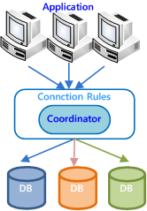

[그림 1‑2] 서버측 샤딩

서버측 샤딩은 응용프로그램들과 호환하기 위하여 분할된 데이터베이스를 통합하는
코디네이터(coordinator)가 필요하다. 코디네이터는 응용프로그램에서 요청 받은
질의처리에 필요한 데이터의 위치를 파악하고, 해당하는 데이터베이스들에 질의를
분산 처리하여 그 결과를 통합하여 반환한다.

이 구조는 코디네이터의 도움으로 기존 응용프로그램 변경을 최소화할 수 있는 장점이 있다. 반면 코디네이터 처리 용량을 넘어서면 병목현상(bottle-neck)이 발생하여 샤딩 시스템을 확장하기 어려운 단점이 있다. 

#### 클라이언트측 샤딩(Client-side Sharding)

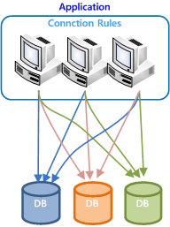

[그림 1‑3] 클라이언트측 샤딩

클라이언트측 샤딩은 응용프로그램에서 데이터가 위치한 데이터베이스를 미리 알고,
직접 데이터베이스에 접속하는 구조이다.

이 구조는 샤딩 확장에 따른 용량과 성능 확장이 가능하고 코디네이터 부하 한계로 인한 제약점이 없다는 장점이 있다. 그러나, 응용 프로그램에서 분산 데이터베이스 접속을 판단하고 통합 질의를 수행해야하기 때문에, 프로그램 작성이 복잡해진다는 단점이 있다.

#### 하이브리드 샤딩(Hybrid Sharding)

하이브리드 샤딩은 클라이언트측 샤딩과 서버측 샤딩을 동시에 사용할 수 있는 샤딩
방식이다.

애플리케이션은 데이터의 통합이 필요한 경우 서버측 샤딩을 선택하거나, 확장과
성능이 필요한 경우 클라이언트측 샤딩을 선택하여 각 샤딩의 장점을 취하고 단점을
보완할 수 있다.

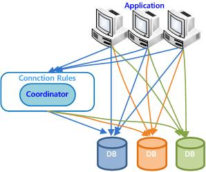

[그림 1‑4] 하이브리드 샤딩

### 용어

##### 샤드 노드(shard node) 

샤딩 시스템을 구성하는 각각의 데이터베이스 인스턴스이다. 최대 128개의 샤드 노드를 지원한다.

##### 샤드 메타(shard meta) 

샤드 노드의 정보, 샤드 객체, 분산 설정 등 샤드 관련 정보가 저장되는 메타 테이블들을 총칭하여 샤드 메타라고 한다. 샤드 메타 테이블들은 sys_shard 사용자의 객체로 관리된다.

##### 샤드 코디네이터(shard coordinator) 

분산된 데이터베이스를 통합하여 질의를 최적화하고 수행하는 분산 질의 처리기이다.

##### 샤드 라이브러리(shard library) 

하이브리드 샤딩을 지원하는 응용프로그램 라이브러리이다.

##### 샤드 데이터(shard data) 

분산된 데이터 조각이다. 전체 분산 데이터베이스의 데이터 일부를 가지고 있다.

##### 샤드 커넥션(shard connection)

외부 커넥션과 내부 커넥션을 통칭하여 샤드 커넥션이라고 한다.

##### 외부 커넥션(external connection)

외부 네트워크를 사용한 샤드 노드의 연결을 외부 커넥션이라고 하며 외부 커넥션은 사용자 커넥션과 샤드 라이브러리 커넥션의 두 가지가 있다.

###### 사용자 커넥션(user connection)

클라이언트가 샤드 메타 데이터베이스에 명시적으로 접속한 연결이다.

###### 샤드 라이브러리 커넥션(shard library connection )

샤드 라이브러리를 사용한 클라이언트가 데이터 처리를 위해 샤드 노드들에 자동으로 접속한 연결이다.

##### 내부 커넥션 (internal connection)

내부 네트워크를 사용한 샤드 노드의 연결을 내부 커넥션이라고하며 샤드 노드들 간에 내부적으로 사용하는 것으로 코디네이터 커넥션이 있다.

###### 코디네이터 커넥션 (coordinator connection)

샤드 노드들 간에 내부적으로 사용하는 연결이다.

##### 샤드 세션(shard session)

사용자 커넥션으로 연결된 세션과 관련하여 열린 모든 세션의 그룹을 샤드 세션이라 한다.

##### 코디네이팅 샤드 노드(coordinating shard node)

샤드 노드들 중 사용자가 접속한(사용자 커넥션) 샤드 노드를 말한다.

##### 분산 방식(split method)

샤딩 시스템에서 데이터를 위치시키는 방법이다. 데이터의 특성에 맞게 적용할 수 있는 다양한 분산 방식을 제공한다. 현재 지원하는 분산 방식은 다음과 같다.

-   HASH

-   RANGE

-   LIST

-   COMPOSITE

-   CLONE

-   SOLO

##### 샤드 객체(shard object)

분산 저장 및 처리되는 객체를 지칭한다. 현재 지원하는 분산객체는 다음과 같다.

-   Table
-   Procedure

##### 샤드 테이블(shard table)

Altibase Sharding에서 제공하는 분산 방식에 따라 설정된 테이블을 샤드 테이블이라고 하며 샤드 테이블에 대한 정보는 샤드 메타에 등록된다. 
샤드 테이블은 다음과 같이 분류된다.

* 샤드 키 분산 테이블  
  * 단일 샤드 키 분산 테이블 ( HASH, RANGE, LIST )

  * 복합 샤드 키 분산 테이블 ( COMPOSITE )
* 복제 분산 테이블 ( CLONE )
* 독립 분산 테이블 ( SOLO )

##### 샤드 쿼리(shard query)

샤딩으로 분산된 데이터베이스에서 쿼리는 샤드 쿼리와 논샤드 쿼리로 분류한다.

샤드 쿼리는 분산된 테이블의 레코드를 쿼리 수행하여도 결과가 논리적으로 동일한
테이블의 레코드를 처리한 것과 동일하다. 논샤드 쿼리는 샤드 쿼리가 아닌 모든
쿼리를 지칭한다.

클라이언트측 샤딩으로 수행할 경우, 스케일 아웃이 가능하다. 샤딩으로
데이터베이스를 분산하면, 샤드 쿼리를 사용하는 것이 좋다.


[그림 1‑5] 샤드 쿼리


[그림 1‑6] 논샤드 쿼리

샤드 쿼리의 몇 가지 예를 보면 다음과 같다.

```
SELECT * FROM s1 WHERE k1=1;
SELECT * FROM s1;
UPDATE s1 SET i2=1 WHERE k1=1;
DELETE FROM s1 WHERE k1>3;
```

샤드 쿼리가 아닌 몇 가지 예를 보면 다음과 같다.

```
SELECT count(*) FROM s1;
SELECT k1, count(*) FROM s1 group by k1;
SELECT * FROM s1 order by k1;
```

Altibase Sharding은 스케일아웃을 위하여 가능한 한 샤드 쿼리를 샤드 라이브러리를
사용하여 하이브리드 샤딩(클라이언트측 샤딩)으로 수행하는 것을 권장한다.

논샤드 쿼리는 샤드 코디네이터의 중간 처리를 거치게 되어 질의 처리 성능이 샤드 쿼리에 비해 떨어지므로 논샤드 쿼리를 튜닝하여 클라이언트측 샤딩으로 수행하는 것이 좋다.

##### 샤드 뷰(shard view)

Altibase Sharding은 샤드 뷰를 제공한다. 쿼리가 논샤드 쿼리인 경우, 앞에 "SHARD"
키워드를 추가하면 샤드 노드에 논샤드 쿼리를 전송할 수 있다.

샤드 뷰를 사용하면 샤드 코디네이터의 부하를 줄이거나, 사용자가 의도하여 분산
쿼리를 수행할 수 있다.

샤드 코디네이터의 부하를 줄이는 예는 다음과 같다.

```
SELECT sum(k1) FROM s1;
```

위 쿼리를 각 샤드 노드에서 부분 합을 얻고 코디네이터에서 취합하도록 다음과
같이 수정할 수 있다. 가능한 한 코디네이터의 부하를 샤드 노드로 분산하는 것이
스케일아웃 측면에서 더 유리하다.

```
SELECT sum(s) FROM SHARD(SELECT sum(k1) s FROM s1);
```

또한 아래와 같이 샤드 뷰를 이용하여 테이블의 레코드 수를 노드별로 얻는
쿼리 작성도 가능하다.

```
SELECT * FROM shard(SELECT shard_node_name(), count(*) FROM s1); 
```

##### 샤드 쿼리 분석기(shard query analyzer)

사용자의 쿼리가 샤드 쿼리인지 논샤드 쿼리인지 분석한다. 샤드 쿼리인 경우 샤드
코디네이터 없이 클라이언트측 샤딩에서 독립적으로 수행할 수 있도록 분석 결과를
생성한다.

샤드 분석결과는 쿼리 수행 시마다 재사용되어, 샤드 코디네이터에서 샤드 쿼리 분석으로
생기는 부하는 크지 않다.

##### 샤드 쿼리 최적화기(shard query optimizer)

사용자의 쿼리가 논샤드 쿼리이면 쿼리를 분석하여 샤드 데이터 영역에 요청할 부분과 샤드
코디네이터에서 수행할 부분으로 분리하고, 최적화하여 분산 플랜을 생성한다.

##### 샤드 키(shard key)

분산 정의의 기준이 되는 컬럼 또는 파라미터이다. 현재 샤드 키로 사용할 수 있는
데이터 타입은 다음과 같다.

-   smallint

-   integer

-   bigint

-   char

-   varchar

##### 샤드 키워드(shard keyword)

Altibase Sharding에서 지원하는 키워드로 논샤드 쿼리를 샤드 쿼리로 수행하게
하거나, 임의의 데이터가 존재하는 샤드 노드로 쿼리를 수행하게 할 수 있다. 샤드 키워드의 종류는
다음과 같다.

-   SHARD

-   NODE

샤드 지원 구문(SELECT, INSERT, UPDATE, DELETE)의 앞이나 SELECT문의 샤드 뷰 앞에
사용하면 해당 쿼리를 샤드 쿼리로 수행하여 결과를 반환한다.

```
SHARD SELECT shard_node_name(),count(*) FROM s1;
NODE[DATA] SELECT shard_node_name(),count(*) FROM v$session;
NODE[DATA(‘node1’)] DELETE FROM s1;
```

##### 샤드 프로시저(shard procedure)

샤딩 시스템에 설정된 분산 정의된 프로시저로 지정된 인자의 값을 기준으로 분산 수행된다. 프로시저 내의 쿼리에 대해서는 사용자가 분산 처리하도록 작성해야 한다.

##### 샤드 플랜(shard plan)

질의가 샤드 코디네이터에서 분산 수행되는 경우의 질의 수행계획을 말한다. 샤드
플랜에는 샤드 노드에서 분산 수행된 질의의 수행계획을 포함한다.

##### 샤드 트랜잭션(shard transaction)

애플리케이션이 생성한 트랜잭션에서 수행하는 질의의 따라 샤드 노드들에 분산 트랜잭션을 생성하게 된다. 이 트랜잭션들을 샤드 트랜잭션이라고 한다. 

샤드 트랜잭션은 다음과 같이 분류할 수 있다.

-   다중 노드 트랜잭션(multiple node transaction)  
    분산 트랜잭션을 허용하지만, 샤드 트랜잭션의 일관성을 보장하지 않는다.
-   글로벌 트랜잭션(global transaction)  
    분산 트랜잭션을 허용하고, 샤드 트랜잭션의 일관성을 보장한다.

##### 샤드 메타 번호(Shard Meta Number )

샤드 메타 번호(SMN)란 샤드 메타에 대한 버전 관리 번호 이다.

##### 용어 및 개요 정리

전체적인 Altibase Sharding 시스템에서 사용되는 용어에 대해서 [그림 1-7]에서 도식화 하였다.

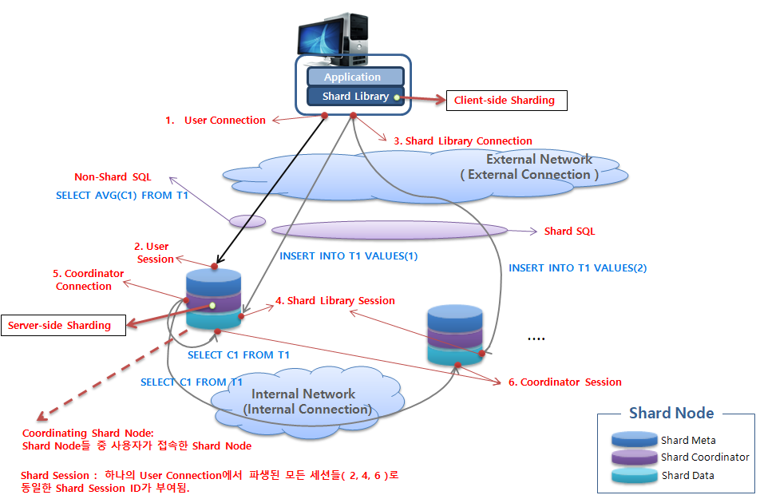

[그림 1‑7] Altibase Sharding 용어 및 개요

### Altibase Sharding 개요

#### Altibase Sharding 소개

Altibase Sharding은 Altibase에 샤딩 기술을 도입하여 저장 용량과 시간당 처리량을
향상시키고 대용량의 데이터베이스를 분산처리할 수 있게 한다.

Altibase Sharding은 하이브리드 샤딩으로써, 기존의 SQL을 분석하여 자동으로
클라이언트측 샤딩이나 서버측 샤딩으로 수행할 것인지를 분석하여 경로를
최적화한다.

Altibase Sharding은 다양한 분산 방식과 분산 객체, 유틸리티를 지원하고 있으며,
다양한 업무에서 샤딩을 적용할 수 있다.

기존의 SQL을 수정하지 않고, 샤드 전용 라이브러리만 교체하는 것으로 Altibase
Sharding을 쉽게 적용할 수 있다. 뿐만 아니라 기존 응용프로그램을 전혀 수정하지
않은 상태에서도 서버측 샤딩을 적용할 수 있다.


[그림 1‑8] Altibase Sharding의 하이브리드 샤딩

#### Altibase Sharding 구성 요소

Altibase Sharding은 사용자 응용프로그램 측에서 동작하는 샤드
라이브러리와 샤드 노드 존재하는 샤드 메타, 데이터 그리고 샤드 코디네이터로 구성되며, 이들 구성요소가 서로 유기적으로 연계되어 분산 처리를 수행한다.

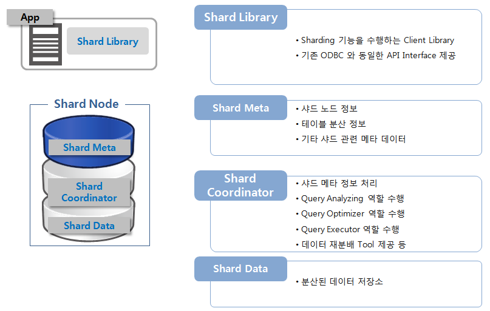

[그림 1-9] Altibase Sharding 구성 요소

#### Altibase Sharding 장점

Altibase Sharding은 일반적인 샤딩의 장점 외에도 추가적인 장점을 가지고 있다.

##### 선형 확장성

Altibase Sharding은 Altibase에 샤딩 기술을 도입하여 성능 병목을 제거하고 샤드
노드를 추가하여 저장 용량과 시간당 처리량을 선형적으로 향상시켜 대용량의
데이터를 분산 처리할 수 있다.

##### 오류 독립성

Altibase Sharding을 통해 사용자는 하나의 데이터베이스를 논리적으로 나누어 관리할
수 있다. 하나의 샤드 노드가 비정상적이거나 속도가 느려지더라도 다른 샤드 노드의 성능이나 가용성에는 영향을 미치지 않는다.

##### 애플리케이션 호환성

Altibase Sharding은 서버측 샤딩과 클라이언트측 샤딩을 동시에 지원하는 하이브리드
샤딩을 지원한다. 사용자 쿼리의 쿼리 최적화를 통해, 자동으로 성능에 유리한
클라이언트측 샤딩으로 수행되거나 호환성이 높은 서버측 샤딩으로 수행된다.

특히, Altibase Sharding의 하이브리드 샤딩은 기존 응용프로그램 소스나 기존 SQL을
수정하지 않고, 샤드 전용 라이브러리만 교체하는 것으로 적용할 수 있다.

##### 사용자 정의 데이터 분산

Altibase Sharding을 통해 사용자는 데이터베이스의 데이터를 원하는 형태로 분산할
수 있도록 정의할 수 있다.

예를 들면, 특정 관할 구역에 대한 데이터를 사용자가 원하는 샤드 노드에 위치시킬
수 있기 때문에, 논리적으로 특정 구역에 대한 데이터를 모을 수 있다.

또한 지역적으로 가까운 데이터들을 물리적으로 가까운 샤드 노드에 위치시킬 수
있기 때문에, 물리적으로 특정 관할 구역에 가까운 데이터를 모아둘 수도 있다.

##### 이중화를 통한 고가용성 

Altibase Sharding은 이중화를 지원한다. 이중화를 이용하여 샤딩환경에서도 안전한 HA(High
Availability)를 구축할 수 있다.

### Altibase Sharding 구성 

Altibase Sharding은 다음 요소로 구성되어 있다.

-   응용프로그램 
-   샤드 라이브러리
-   샤드 노드
    -   샤드 메타
    -   샤드 데이터

응용프로그램은 샤드 라이브러리를 사용하여 클라이언트측 샤딩과 서버측 샤딩을
사용할 수 있으며, 그 외의 라이브러리를 사용하는 경우 서버측 샤딩만을 사용할 수
있다.

샤드 메타는 샤드 노드 구성 및 샤드 객체에 관련된 정보 및 샤딩에 필요한 메타 데이터를 저장한다.

샤드 코디네이터는 샤드 쿼리 분석기, 최적화기, 실행기로 구성되어있으며 쿼리를 분석하고 최적화하여 전체 샤드 노드들간의 데이터 및 트랜잭션 처리를 조율한다.

샤드 데이터는 실제 데이터가 분산 저장되어 있는 데이터베이스이다.

#### 샤딩 시스템 구성

Altibase Sharding 시스템은 모든 샤드 노드가 샤드 메타, 코디네이터 및 데이터 저장소에 대한 역할을 할 수 있도록 구성해야 한다.

하나의 샤드 노드는 그림 1-10과 같이 고가용성을 고려하여 데이터를 Standby로 이중화하는 것을 권장한다.

Altibase Sharding 시스템은 단일 장애점(SPOF: single point of failure)이 없는 시스템 구성으로 높은 신뢰성을 가질 수 있으며 코디네이터의 부하를 분산 시킬 수 있는 장점을 가지고 있다.

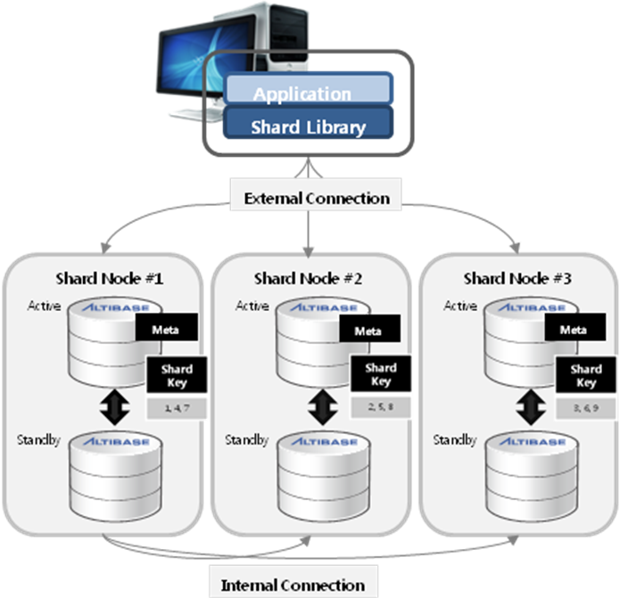

[그림 1‑10] Altibase Sharding 시스템 구성

### Altibase Sharding 특징

Altibase Sharding은 Altibase DBMS를 기반으로 데이터를 분산 저장하며, 클라이언트측 샤딩과 서버측
샤딩을 동시에 사용하는 하이브리드 샤딩을 제공한다.

#### 지능적인 클라이언트측 샤딩

일반적으로 샤딩은 서버측 샤딩을 주로 제공하면서, 부분적으로 클라이언트측 샤딩을
지원한다. 그러나 알티베이스의 샤딩은 클라이언트측 샤딩을 서버측 샤딩과 동일하게
제공한다.

일반적인 클라이언트측 샤딩의 특징은 다음과 같다.

-   커넥션 시점 샤딩  
    응용프로그램에서 특정 노드를 지정하여 접속하는 방식이다. 다른 
    노드에 접근하기 위해서는 재접속을 해야 한다.

-   SQL생성 시점 샤딩  
    응용프로그램에서 쿼리를 생성할 때 수행할 노드를 지정하는 방식이다.
    다른 노드에 접근하기 위해서는 쿼리를 재생성해야 한다.

Altibase Sharding의 클라이언트측 샤딩의 특징은 다음과 같다.

-   SQL수행 시점 샤딩  
    서버측 샤딩과 동일하게, 응용프로그램에서 쿼리를 수행하는 시점에 자동으로
    수행할 샤드 노드가 선택된다. 사용자는 샤드 노드를 구분할 필요가 없다.

-   하이브리드 샤딩  
    쿼리에 따라 클라이언트측이나 서버측으로 수행경로를 변경하여 성능을 최대화한다.

#### 쉬운 SQL 작성

Altibase Sharding환경에서는 별도의 API나 SQL 힌트 등의 추가 인터페이스 없이
사용자의 질의(SQL)만으로 샤딩 기능을 사용할 수 있다. 또한 분산 테이블과 일반
테이블을 구분하지 않고 SQL을 작성하는 것만으로 샤딩을 사용할 수 있다.

특히, Altibase Sharding은 사용자가 하이브리드 샤딩을 고려하여 쿼리를 튜닝할 수
있도록 추가적인 샤드 키워드를 제공하여 쉽게 SQL을 작성할 수 있다.

#### 쉬운 샤드 설정

Altibase Sharding은 Altibase 패키지에 내장된 기본 기능이다. Altibase Sharding을
사용하려면, 이 기능을 활성화하고 샤드 설정만 추가하면 이미 사용중인
데이터베이스를 샤드 데이터베이스로 변경할 수 있다. 따라서 데이터베이스를
재생성할 필요가 없으며, 프로퍼티 설정을 통하여 샤드 노드로 사용할 수
있다.  

Altibase Sharding은 샤딩 시스템을 운영, 관리하는데 필요한 DBMS_SHARD 패키지를
제공한다. 이 패키지에서 제공하는 서브프로그램을 이용하여 샤드를 구성하고
관리하며, 다른 샤드 노드에 직접 접속하지 않고도 원격 샤드 노드를 관리할 수 있는
기능을 제공한다.

#### No SPOF(No Single Point Of Failure)

Altibase Sharding의 샤드 메타와 샤드 코디네이터는 모든 샤드 노드에서 동일하게 수행할 수 있는 구성 요소 이므로, 통합 구성시 전체 샤딩 시스템의 단일 장애점(single point of failure)이 없다는 특징을 갖는다.

#### 샤드 쿼리 분석기 (Shard Query Analyzer)

Altibase Sharding의 샤드 쿼리 분석기는 사용자의 질의를 분석하여 최적의 수행
경로와 수행 방법을 선택한다.

샤드 쿼리 분석기는 샤드 노드에 입력되는 모든 쿼리를 분석하여 서버측 샤딩으로
수행하는 쿼리와 클라이언트측 샤딩으로 수행하는 쿼리로 구분한다.

클라이언트측 샤딩으로 수행하는 경우 샤딩의 확장성과 성능을 모두 극대화할 수
있으며, 서버측 샤딩으로 수행하는 경우 샤드 쿼리 최적화기가 가장 효율적인 분산
플랜을 생성한다.

#### 샤드 쿼리 최적화기 (Shard Query Optimizer)

샤드 코디네이터의 샤드 쿼리 최적화기는 서버측 샤딩에 대한 최적의 분산 쿼리를 생성하고, 분산 쿼리에
대한 분산 플랜을 생성한다.

사용자 쿼리가 서버측 샤딩으로 수행되는 쿼리로 분류된 경우, 해당 쿼리를
서버측에서 수행하기 위해서 분산부와 통합부로 구분한다. 분산부는 각 샤드 노드에서
수행할 부분(분산) 쿼리이고, 통합부는 각 노드에서 수행한 결과를 모아서
수행할 나머지(통합) 쿼리이다.

가능한 많은 부분을 분산부로 처리하는 것이 성능을 극대화할 수 있기 때문에 샤드
쿼리 최적화기는 최대한 샤드 쿼리 변환(Shard Transformation)을 수행한다.

#### 샤드 쿼리 실행기 (Shard Query Executor)

Altibase Sharding의 샤드 쿼리 실행기는 클라이언트측 샤딩의 실행기와 서버측
샤딩의 실행기로 구분한다. 클라이언트측 샤딩의 실행기는 샤드 라이브러리에서
동작하며, 서버측 샤딩의 실행기는 샤드 노드에서 샤드 코디네이터를 통해서 동작한다.

##### OLTP 쿼리

클라이언트측 샤딩의 실행기는 응응프로그램의 클라이언트 라이브러리에서 동작한다.
사용자의 쿼리를 최초 prepare시 분석한 후 쿼리 execute 시에는 추가 분석없이
실행할 수 있으므로, 다음과 같은 OLTP (Online Transaction Processing) 업무 특성에
적합하다.

-   대용량 데이터베이스를 대상으로 하는 업무

-   매우 짧은 시간에 읽거나 조작하는 업무를 하나의 트랜잭션 단위로 수행하는 업무

-   읽거나 조작하는 데이터가 매우 적은 업무

-   매우 많은 사용자가 동시에 수행하는 업무

-   매우 짧은 시간에 높은 처리량이 요구되는 업무

##### OLAP 쿼리

서버측 샤딩의 실행기는 현재 접속 중인 노드에서 동작하고, 샤드 쿼리 분석기가 변환한 분산
쿼리와 통합 쿼리를 수행한다. 서버측 샤딩의 실행기는 분산 쿼리를 각 샤드
노드에서 동시에 병렬 수행하고 통합 쿼리를 수행하므로, 샤드 노드의 수에
비례하여 성능과 처리량을 늘어난다. 따라서 다음과 같은 OLAP (Online Analytical
Processing) 업무 특성에 적합하다.

-   동일한 데이터에 여러 기준을 적용하여 다차원 데이터 분석을 하는 업무

##### 샤드 트랜잭션

샤드 트랜잭션이란 클라이언트측 샤딩으로 생성된 트랜잭션과 서버측 샤딩으로 생성된
트랜잭션을 통합함으로써, 트랜잭션내의 쿼리를 클라이언트측인지 서버측 샤딩인지
구분하지 않고 수행하는 기능이다.

Altibase Sharding의 하이브리드 샤딩은 OLTP성 쿼리와 OLAP성 쿼리를 하나의
트랜잭션으로 지원하므로, 각 쿼리를 최적의 수행 경로로 수행한다.


[그림 1‑12] Shard Query Analyzer & Optimizer & Executor

위 그림은 하이브리드 샤딩으로 사용자의 쿼리가 수행되는 예를 보여준다. Q3-1와
Q3-2는 샤드 쿼리 분석기가 Q3에서 생성한 분산 쿼리와 통합 쿼리이다.

```
Q1) insert into t1(key, c1) values (1, 100);
Q2) update t1 set c1=c1+1 where key=2;
Q3) select sum(c) total_count from (select count(*) c from t1);
Q3-1) select count(*) c from t1;
Q3-2) select sum(c) total_count from temp;
```

#### 글로벌 트랜잭션

샤드 트랜잭션은 분산 트랜잭션의 일관성을 보장하기 위하여 2단계 커밋(2-Phase
Commit)을 이용한 글로벌 트랜잭션을 지원한다.

> ##### 주의 사항
>
> 복제(clone) 분할 방식을 사용하면 데이터가 서버에 중복하여 저장되기 때문에,
> 글로벌 트랜잭션을 이용하더라도 데이터의 일관성이 보장되지 않을 수 있다.

#### 다양한 샤드 쿼리와 함수 지원

Altibase Sharding은 아래의 쿼리를 지원한다.

-   INSERT

-   INSERT SELECT

-   UPDATE

-   DELETE

-   SELECT

    \- Join

    \- Outer Join

    \- Aggregate function

    \- Grouping

    \- Ordering

    \- Subquery

쿼리가 샤드 쿼리인지 논샤드 쿼리인지 여부는 샤드 플랜을 조회하여 확인할 수 있다.
논샤드 쿼리로 플랜이 조회되는 경우 샤드(SHARD) 키워드를 이용하여 좀 더 효율적인
쿼리로 튜닝할 수 있다. 뿐만 아니라 다음과 같은 샤드 지원 함수들을 제공한다.

-   SHARD_NODE_NAME

-   SHARD_KEY

#### 다양한 분산 객체

일반적인 샤딩은 샤드 테이블에 한해 물리적 데이터 분산만 적용하지만, Altibase
Sharding은 샤드 프로시저를 분산하여 수행할 수 있다.

샤드 프로시저의 경우 인자를 샤드 키로 적용하여 논리적인 분산을 수행하는 방식으로
샤딩을 수행한다.

#### 다양한 분산 방식

Altibase Sharding은 아래와 같이 다양하게 데이터 분산 방식을 제공한다.

샤드 키는 테이블 종류(파티셔닝 테이블, 메모리 테이블, 디스크 테이블 등)와
상관없이 설정할 수 있으며 최대 두 개까지 샤드 키를 갖는 복합 키를 지원한다.

샤드 키 분산 방식은 아래와 같다.

-   해시(hash) 분산 방식

-   범위(range) 분산 방식

-   리스트(list) 분산 방식

-   복합(composite) 샤드 키 분산 방식

-   복제(clone) 분산 방식

-   독립(solo) 분산 방식


[그림 1‑13] Altibase Sharding 분산 방식

##### 해시(Hash) 분산 방식

Altibase Sharding의 해시 분산은 샤드 키에 해당하는 값을 내장된 hash함수를
이용하여 분산하는 것을 말한다.

Altibase는 대부분의 데이터 타입에 최적화된 해시 함수를 제공한다. 해시 함수는
데이터를 균등하게 분산하는데 이용된다. Altibase Sharding은 해시 함수로부터 구한
해시 값에 나머지 연산을 수행한 값을 이용하여, 전체 데이터를 1000개의 그룹으로
나누어 관리한다. 각 그룹마다 샤드 노드를 지정하여 데이터를 임의로 분산시킬 수
있다.

-   hash_group[1] = { record(x) \| if (mod(hash(shard key value of x),1000)==0)
    };

-   hash_group[2] = { record(x) \| if (mod(hash(shard key value of x),1000)==1)
    };

-   …

-   hash_group[1000] = { record(x) \| if (mod(hash(shard key value of
    x),1000)==999) };

이렇게 구분된 1000개의 hash group을 사용자의 필요에 따라 분산 정의한다. 예를
들면 user\_ id를 기준으로 해시 분산 방식으로 설정하는 경우, user_id의 해시 값을
1000개의 그룹으로 나누어 다음과 같이 설정한다.

-   1\~300번 hash group – 샤드 노드1

-   301\~600번 hash group – 샤드 노드2

-   601\~1000번 hash group – 샤드 노드 3

데이터를 분산하기 전 다음과 같은 해시 분산 방식으로 데이터를 분산했을 때
데이터의 분포 상태를 예측할 수 있다.

```
iSQL> SELECT hash, count(*) FROM (SELECT mod(hash(user_id),1000)+1 hash FROM table) GROUP BY hash;
```

##### 범위(Range) 분산 방식

해시 분산 방식을 사용하면 데이터가 비교적 균등하게 분산되는 반면, 특정 데이터가
어느 노드에 위치하는지 알기 어려워진다.

범위 분산 방식은 샤드 키 값으로 해당 데이터가 어느 노드에 위치하는지
관리자가 쉽게 알 수 있어 유리하다. 또한 해시 분산 방식에 비해 비교적 샤드 노드
확장이 쉬운 장점이 있다. 다만, 데이터가 샤드 노드들에 고르게 분산될 수 있도록
범위를 지정하는 것이 좋다.

예를 들면 샤드키 user\_ id 로 범위 분산 방식을 적용하는 경우 다음과 같이
설정한다.

-   { record(x) \| (shard key value of x) \<= ‘9’ } -\> 샤드 노드 1

-   { record(x) \| ‘9’ \< (shard key value of x) \<= ‘M’ } -\> 샤드 노드 2

-   { record(x) \| ‘M’ \< (shard key value of x) \<= ‘Z’ } -\> 샤드 노드 3

범위 분산 방식 역시 데이터를 분산하기 전에 쿼리로 데이터의 분포를 예측할 수
있다.

```
iSQL> SELECT hash, count(*) FROM (SELECT mod(hash(user_id),1000)+1 hash FROM table) GROUP BY hash;
```

그러나 범위 분산 방식으로 데이터를 고르게 분산했더라도, 운영 중에 데이터가
변경됨으로써 불균형이 발생할 수 있기 때문에 지속적으로 데이터 분포의 모니터링이
필요하다.

##### 리스트(List) 분산 방식

리스트 분산은 샤드 키 값을 특정값과 일치하는지 확인하여 분산하는 방식이다. 범위
분산 방식보다 더 직관적이고 특정 샤드 키 값에 대하여 쿼리를 수행하는 경우에도
유리하다.

예를 들면 지역을 샤드 키로 설정하고 리스트 분산 방식으로 설정하면 다음과 같다.

-   { record(x) \| (shard key value of x) = ‘서울’ } -\> 샤드 노드1

-   { record(x) \| (shard key value of x) = ‘부산’ } -\> 샤드 노드 2

-   { record(x) \| (shard key value of x) = ‘대구’ } -\> 샤드 노드 3

이 경우 데이터를 지역별로 분산하여, 지역별 통계 쿼리 작성에 유리하다. 리스트
분산 방식도 범위 분산 방식처럼 데이터가 샤드 노드들에 고르게 분산될 수 있도록
지정하는 것이 좋다.

##### 복합(Composite) 샤드 키 분산 방식

복합 샤드 키 분산 방식은 두 개의 샤드 키를 적용한 분산 방식으로 각 샤드 키는
해시, 범위, 리스트 분산 방식 중 선택하여 적용한다.

예를 들면 지역명을 샤드 키(리스트 분산)로 적용하고 고객번호를 서브 샤드 키(해시
분산)로 적용하면 다음과 같다.

-   { record(x) \| (shard key value of x) = ‘서울’ and hash(sub-shard key value
    of x) \<= 500 } -\> 샤드 노드1

-   { record(x) \| (shard key value of x) = ‘서울’ and hash(sub-shard key value
    of x) \<= 1000 } -\> 샤드 노드 2

-   { record(x) \| (shard key value of x) = ‘강원’ and hash(sub-shard key value
    of x) \<= 1000 } -\> 샤드 노드 3

##### 복제(Clone) 분산 방식

샤딩 환경에서는 데이터가 분산 저장되기 때문에 여러 샤드 노드에서 수행되는
질의를 처리하기 어렵다. 이런 문제를 보완하기 위해 Altibase Sharding은 데이터
전체를 사용자가 지정한 여러 샤드 노드에 복제 저장하는 복제 분산 방식을
제공한다.

복제 분산 방식은 객체의 데이터를 분산하는 것이 아니라, 객체 자체를 중복 저장하는
방식이다. 복제 분산 방식을 적용한 샤드 테이블은 join, subquery등 샤드 쿼리의
제약이 거의 없이 사용할 수 있다.

복제 분산 방식은 샤드 키를 지정할 필요가 없고 사용자가 원하는 샤드 노드를
선택적으로 지정한다.

복제 분산이 적용된 샤드 객체에 대한 접근은 샤드 노드들 중에서 임의 선택하여
수행한다. 예를 들어 복제 분산이 적용된 샤드 테이블을 조회하는 경우, 복제
테이블이 저장된 노드들 중에서 트랜잭션에서 가장 먼저 접근한 샤드 노드를
우선하여 선택한다. 먼저 접근한 샤드 노드가 없는 경우에는, 노드를 임의로
선택하여 데이터를 조회한다.

##### 독립(Solo) 분산 방식

독립 분산은 샤드 키를 적용한 데이터 단위의 분산이 아닌 샤드 객체 단위의 분산
방식이다. 사용자가 지정한 하나의 노드에만 객체를 저장한다는 면에서 복제 분산
방식과 차이가 있다.

-   TABLE_1 –\> 샤드 노드 1

-   TABLE_2 –\> 샤드 노드 2

-   TABLE_3 –\> 샤드 노드 1

샤드 객체 전체를 하나의 샤드 노드에 위치시키기 때문에 샤드 키를 추가할 필요가
없고 샤드 객체 하나만을 대상으로 쿼리를 수행할 때 쿼리 제약이 없다.

#### 쉬운 마이그레이션

기존 데이터베이스를 샤드 데이터베이스로 마이그레이션하는 경우, shardLoader
유틸리티를 사용하여 쉽고 빠르게 마이그레이션할 수 있다. shardLoader는 샤드
데이터베이스 데이터 업로드 전용 유틸리티로 사용방법은 iLoader와 유사하다.

shardLoader는 클라이언트측 샤딩 기능을 이용한 데이터 업로드 유틸리티로 데이터
노드의 수가 많을수록 업로드 속도도 향상된다.

기존의 iLoader도 사용가능 하지만, iLoader는 서버측 샤딩으로 동작하므로
shardLoader를 사용하는 것 보다는 성능이 떨어진다.

#### 다양한 분산 데이터 이동 방법 지원

샤딩 시스템을 운영하다보면, 샤드 노드의 불균형 상태가 발생할 수 있다.

-   특정 샤드 노드의 분산 데이터 집중

-   특정 샤드 노드의 읽기/쓰기 집중

-   특정 샤드 노드의 장애로 인한 교체

-   샤드 노드 증설

관리자는 이 때 데이터 분산 방법의 변경을 고려해야 한다. Altibase Sharding은
데이터 분산 방법을 변경하고 데이터 이동을 위해서 다음의 두 가지 방법을 제공한다.

* 데이터 재구축 (Rebuild Data)
* 리샤딩 (Resharding)

##### 데이터 재구축 (Rebuild Data)

데이터 재구축은 샤딩 시스템의 구성을 전체적으로 점검하고 재구성 하는 방법으로
전체 샤딩 시스템의 데이터를 한번에 고려하여 재구축 할 수 있다.

이를 위해서 다음의 샤드 패키지를 제공하며, 샤드 데이터의 분산 방법을 변경 후
데이터 재구축 관련 패키지를 이용하여 데이터 점검과 이동을 할 수 있다.

- DBMS_SHARD.CHECK_DATA
- DBMS_SHARD.REBUILD_DATA
- DBMS_SHARD.REBUILD_DATA_NODE

이 샤드 패키지는 분산 정보와 데이터의 유효성을 확인하고 전체 샤딩 시스템을
고려하여 데이터를 재구축 하므로 서비스 운영중에 사용할 수 없다.

##### 리샤딩 (Resharding)

Altibase Sharding의 리샤딩이란 서비스 운영 중에 데이터 일부를 하나의 샤드
노드에서 다른 샤드 노드로 이동하는 것을 말한다.

리샤딩은 주로 노드 증설 혹은 특정 노드의 부하 집중에 따른 데이터 이동을 위하여
사용되며, 서비스 운영 중에 사용할 수 있는 장점을 가진다.

2.Altibase Sharding 설치와 설정
-----------------------------

이 장에서는 Altibase Sharding을 구성하고 사용환경을 설정하는 방법을 설명한다.

### Altibase Sharding 설치

Altibase Sharding은 별도의 설치가 필요없다.

Altibase 패키지 인스톨러를 이용하여 설치를 완료하였다면, 몇 가지 추가 설정만으로
Altibase Sharding을 사용할 수 있다. 추가 설정은 이 문서의 *'Altibase Sharding 설정*'을 참조한다.

#### 운영체제

Altibase Sharding은 현재 아래의 운영체제에서만 지원한다.

| OS    | CPU                          | Version         | Bit (Server) | Bit (Client) |
| ----- | ---------------------------- | --------------- | ------------ | ------------ |
| LINUX | x86-64 (GNU glibc 2.12 이상) | redhat 6.0 이상 | 64-bit       | 64-bit       |
| LINUX | PowerPC7 (BE)                | redhat 6.5 이상 | 64-bit       | 64-bit       |
| LINUX | PowerPC8 (LE)                | redhat 7.2 이상 | 64-bit       | 64-bit       |

[표 1. Altibase Sharding 지원 운영체제]

#### 데이터베이스 버전

-   Altibase : Altibase 7.1.0 이상

### Altibase Sharding 설정

Altibase Hybrid Sharding을 위해 서버와 클라이언트의 샤딩 관련 설정은 통일성있게
적용해야 한다.

-   샤드 환경 설정

-   클라이언트 설정

    -   샤딩 응용프로그램 서버 연결 설정

    -   샤딩 응용프로그램 라이브러리 설정

#### 샤드 환경 설정

기존의 설치된 Altibase를 샤드 노드로 설정하기 위해서는 다음
과정이 필요하다.

-   프로퍼티 설정  
    SHARD_ENABLE

-   샤드 패키지 생성  
    DBMS_SHARD

##### 프로퍼티 설정 

SHARD_ENABLE 프로퍼티를 활성화한 후 서버를 재시작하면, 샤드 노드의 메타 저장소 및 코드네이터 기능이 활성화 된다.
기능이 활성화된다.

```
iSQL> SELECT name, value1 FROM v$property WHERE name = 'SHARD_ENABLE';
NAME   : SHARD_ENABLE
VALUE1 : 1
```

샤드 노드 기능이 활성화되면, 샤드 패키지를 생성하거나 샤드
관련 내장 함수, 성능 뷰를 사용할 수 있다.

##### 샤드 패키지 생성

샤드 패키지는
\$ALTIBASE_HOME/packages에 있다. 샤드 패키지는 샤드 기능을 제어할 수 있는 사용자
인터페이스를 제공한다.

```
is –f $ALTIBASE_HOME/packages/dbms_shard.sql
is –f $ALTIBASE_HOME/packages/dbms_shard.plb
```

DBMS_SHARD 패키지의 함수 및 프로시저에 대한 자세한 설명은 이 문서의 *DBMS_SHARD패키지*
설명을 참조한다.

#### 클라이언트 설정

##### 샤딩 응용프로그램 서버 연결 설정

응용프로그램은 최초 접속 시 데이터베이스 서버의 ip/port를 전체 부하를 고려하여 샤드 코디네이터 역할을 할 수 있는 하나의 샤드 노드를 선택한 후 해당 노드의 ip/port로 지정한다. 

최초 접속 샤드 노드를 이중화를 할 경우 장애 복구를 위해 connect시 AlternateServer를 설정 한다.

##### 샤딩 응용프로그램 라이브러리 설정

cli 응용프로그램 빌드 시 기존의 odbccli 라이브러리를 shardcli 라이브러리로
바꾸어야 한다.

shardcli 라이브러리는 libshardcli.a와 libshardcli_sl.so 두 개의 파일을 지원한다.

### 샤드 메타 설정

Altibase Sharding을 사용하기 위해서는 샤드 메타를 생성해야 한다. 각 샤드 노드는 Altibase Sharding에 필요한 모든 메타 정보를 샤드 메타에 영구적으로 저장한다.

Altibase Sharding에서 샤드 메타는 샤드 노드 식별자를 제외한 모든 샤드 메타 정보를 각 샤드 노드에서 동일하게 유지되어야 한다.

샤드 메타 설정은 DBMS_SHARD 패키지를 이용한다.

#### 샤드 메타(Shard meta) 생성

샤드 패키지인 DBMS_SHARD 패키지에는 샤드 메타를 생성하는 서브 프로그램이 포함되어 있다. 최초 한번만 수행하면 샤드 메타가 생성된다. 

샤드 노드에서 샤드 메타 및 코디네이터를 활성화 하기 위해서 샤드 메타에 대한 노드 식별자를 샤딩 시스템에서 유일한 값으로 지정해야 한다.

##### 구문

```
DBMS_SHARD.CREATE_META( meta_node_id in integer )
```

##### 설명

샤드 메타는 sys 사용자로 생성해야 한다. 샤드 메타를 생성하는 내부 과정은 다음과
같이 처리한다.

sys_shard 사용자를 생성한다.

sys_shard.version\_ 테이블을 생성하고, 현재 shard version을 입력한다.

sys_shard.local_meta_info_ 와 sys_shard.global_meta_info_ 테이블을 생성하고 샤드 메타 정보를 입력한다.

sys_shard.nodes_ 테이블과 인덱스를 생성한다.
 sys_shard.objects_ 테이블과 인덱스를 생성한다.
 sys_shard.ranges_ 테이블과 인덱스를 생성한다.
 sys_shard. clones _ 테이블과 인덱스를 생성한다.
 sys_shard.solos_ 테이블과 인덱스를 생성한다.

샤드 메타 생성 구문에 대한 자세한 설명은 DBMS_SHARD 패키지의 CREATE_META 을 참조한다.

##### 예제

\<질의\> 샤드 메타 식별자가 1인 샤드 메타를 생성한다.

```
iSQL> EXEC DBMS_SHARD.CREATE_META(1);
```

#### 샤드 메타 식별자 재설정

샤드 노드의 샤드 메타 식별자를 재설정한다.

##### 구문

```
DBMS_SHARD.RESET_META_NODE_ID( meta_node_id in integer )
```

##### 설명

샤드 노드에서 CREATE_META 구문 수행시 지정한 샤드 메타에 대한 노드 식별자를 변경하고자 하는 경우 사용한다.

샤드 메타 식별자 설정 구문에 대한 자세한 설명은 DBMS_SHARD 패키지의 *RESET_META_NODE_ID*를 참조한다.

##### 예제

\<질의\> 샤드 메타 식별자를 2로 변경한다. 

```
iSQL> EXEC DBMS_SHARD.RESET_META_NODE_ID(2);
```

#### 샤드 메타 생성 및 식별자 변경 관련 주의 사항

샤드 메타를 생성하거나 식별자를 변경하는 작업은 샤딩 시스템 전반에 영향을 미치므로 아래 주의사항을 숙지하고 진행하도록 한다. 

* 샤드 메타 생성 및 식별자 변경 전에 접속한 연결에 대해서는 정상적인 샤딩 서비스를 이용할 수 없으므로 
샤드 메타 생성 및 식별자 변경 후 재접속해야 한다. 
* 샤드 메타 생성 및 식별자 변경을 위해 사용한 연결은 변경 완료 후 종료해야 한다.
* 샤드 메타 생성 및 식별자 변경 관련 작업은 샤딩 시스템 운영전에 완료해야 한다.

#### 샤드 메타 관리

샤드 메타는 전체 샤딩 시스템의 분산 정보를 가지고 있으며 각 노드에서 샤드 메타 정보를 통해 데이터의 위치를 판단하여 질의를 분석하고 처리한다. 그러므로, 모든 샤드 노드에서 동일한 샤드 메타를 유지해야 한다.

또한, 샤드 메타는 시점 별로 다른 버전을 가질 수 있어서 이에 대한 형상 관리를 수행한다. 그러므로, 샤드 메타의 변경은 모든 노드에 동일하게 수행되어야 한다.

#### 샤드 메타 형상

SMN이란 샤드 메타의 분산 정의 변경 이력 번호 이며, 시스템 내부적으로 관리된다.

분산 정의 변경은 노드 등록/제거, 샤드 객체 등록/제거 등의 변경을 말한다.

좀 더 쉽게 설명하면 초기 상태의 샤드 메타는 SMN은 1이며, 노드를 추가하여 샤드 메타에 신규 정보가 추가되고 트랜잭션이 완료되면 새로운 샤드 메타 변경 이력은 SMN 2가 된다.

샤드 메타 변경 작업은 AUTOCOMMIT OFF로 설정하여 한번의 작업으로 수행해야 한다.SMN은 다음의 세 가지 유형의 SMN이 존재한다. 

* Meta SMN
  * 샤드 메타가 유지하는 샤드 메타 변경 이력 중 가장 최신의SMN

* Data SMN 
  * 데이터의 형상이 어떤 버전의 샤드 메타 기준으로 되어있는지에 대한 SMN

* Session SMN
  * 개별 세션이 인식하고 있는 SMN

다음과 같은 샤드 메타의 변경을 유발하는 샤드 노드 설정은 샤드 메타에 변경 이력이 Meta SMN과 함께 저장된다.

Meta SMN의 변경은 실제 Altibase Sharding 시스템에서 인식하지 않으며 각 노드에서 샤드 메타 적용 구문(ALTER SYSTEM RELOAD SHARD META NUMBER LOCAL)을 통해 Data SMN을 변경하여 이후의 작업들이 변경된 SMN을 기준으로 동작할 수 있도록 해야한다. 

각 세션은 최초 접속 시에 Data SMN을 자신의 Session SMN으로 할당받아 수행한다.

샤드 메타 적용 구문이 수행되어 Data SMN이 변경되면 이전에 접속한 세션은 각각 자신의 접속 시점에 유지되던 Session SMN을 기준으로 샤딩 서비스를 수행하며 이를 보정해 주기 위해서 서버 내부에서 SMN 차이를 보정해 주는 코디네이터가 동작한다.

Session SMN은 해당 세션이 트랜잭션을 COMMIT하는 시점에 이전 Session SMN과 Data SMN을 비교하여 다른 경우 최신 Data SMN으로 갱신한다.

```
SMN 변경 예제>
iSQL> AUTOCOMMIT OFF;
iSQL> EXEC DBMS_SHARD.SET_NODE(‘node1’,‘192.168.1.10’,20300);
iSQL> EXEC DBMS_SHARD.SET_NODE(‘node2’,‘192.168.1.11’,20300, ‘192.168.1.101’,20300);
iSQL> COMMIT;
iSQL> ALTER SYSTEM RELOAD SHARD META NUMBER LOCAL;
iSQL> COMMIT;
```

### 프로퍼티

본 절에서는 Altibase Sharding 프로퍼티를 설명한다.

Altibase Sharding 

프로퍼티는 크게 다음과 같이 분류할 수 있다.

| **분류**                  | **프로퍼티**                                                 | **동적 변경 허용** | **변경 레벨**   |
| ------------------------- | ------------------------------------------------------------ | ------------------ | --------------- |
| 초기화 관련 프로퍼티      | SHARD_ENABLE                                                 | No                 |                 |
| 내부 연결 관련 프로퍼티   | SHARD_INTERNAL_CONN_ATTR_RETRY_COUNT SHARD_INTERNAL_CONN_ATTR_RETRY_DELAY SHARD_INTERNAL_CONN_ATTR_CONNECTION_TIMEOUT SHARD_INTERNAL_CONN_ATTR_LOGIN_TIMEOUT | Yes                | SYSTEM          |
| 쿼리 분석 관련 프로퍼티   | TRCLOG_SHARD_DETAIL                                          | Yes                | SYSTEM, SESSION |
| 메시지 로그 관련 프로퍼티 | SD_MSGLOG_COUNT SD_MSGLOG_FILE SD_MSGLOG_FLAG SD_MSGLOG_SIZE | No No Yes No       | SYSTEM          |

#### SHARD_ENABLE

##### 데이터 타입

Unsigned Integer

##### 기본값

0

##### 속성

읽기 전용, 단일 값

##### 값의 범위

[0, 1]

##### 설명

Altibase Sharding의 샤드 노드로 설정한다.

0: Disabled

1: Enabled

#### SHARD_INTERNAL_CONN_ATTR_RETRY_COUNT

##### 데이터 타입

Unsigned Integer

##### 기본값

1

##### 속성

변경 가능, 단일 값

##### 값의 범위

[0, 1024]

##### 설명

코디네이터 커넥션의 재접속 횟수를 설정한다.

#### SHARD_INTERNAL_CONN_ATTR_RETRY_DELAY (단위: 초)

##### 데이터 타입

Unsigned Integer

##### 기본값

1

##### 속성

변경 가능, 단일 값

##### 값의 범위

[0, 3600]

##### 설명

코디네이터 커넥션의 재접속 지연 시간을 설정한다.

#### SHARD_INTERNAL_CONN_ATTR_CONNECTION_TIMEOUT (단위: 초)

##### 데이터 타입

Unsigned Integer

##### 기본값

0

##### 속성

변경 가능, 단일 값

##### 값의 범위

[0, 232-1]

##### 설명

코디네이터 커넥션의 데이터 수신 최대 지연 시간을 설정한다.

#### SHARD_INTERNAL_CONN_ATTR_LOGIN_TIMEOUT (단위: 초)

##### 데이터 타입

Unsigned Integer

##### 기본값

60

##### 속성

변경 가능, 단일 값

##### 값의 범위

[0, 232-1]

##### 설명

코디네이터 커넥션 접속이 이루어진 후 인증 절차가 완료될 때까지 허용된 시간을
설정한다.

#### TRCLOG_DETAIL_SHARD

##### 데이터 타입

Unsigned Integer

##### 기본값

0

##### 속성

변경 가능, 단일 값

##### 값의 범위

[0, 1]

##### 설명

Isql에서 explain plan 기능과 함께 사용 시 샤드 분석 정보를 출력한다. 이 trace
log를 사용하기 위해 1을 설정한다.

단, 이 프로퍼티의 값을 1로 설정할 경우에는 내부적으로 cache 된 plan을 사용하지
않고 새로이 plan을 생성한다.

Altibas Sharding 운영 중 ALTER SESSION, ALTER SYSTEM 문을 이용하여 이 프로퍼티의
값을 변경할 수 있다.

#### SD_MSGLOG_COUNT

##### 데이터 타입

Unsigned Integer

##### 기본값

10

##### 속성

읽기 전용, 단일 값

##### 값의 범위

[0, 232-1]

##### 설명

샤드 관련 메시지 파일의 최대 개수를 지정한다.

#### SD_MSGLOG_FILE

##### 데이터 타입

String

##### 기본값

altibase_sd.log

##### 속성

읽기 전용, 단일 값

##### 값의 범위

없음

##### 설명

샤드 관련 메시지가 기록되는 파일이다.

#### SD_MSGLOG_FLAG

##### 데이터 타입

Unsigned Integer

##### 기본값

1

##### 속성

변경 가능, 단일 값

##### 값의 범위

[0, 232-1]

##### 설명

샤드 관련 경고 메시지나 트레이스 메시지를 SD_MSGLOG_FILE에 기록 할지 여부를
나타내는 플래그 값이다.

0 : 기본 에러 메시지

1 : 샤드 메타 에러 메시지

샤드 관련 트레이스 로깅 레벨을 확인하는 방법은 *General Reference*의
V\$TRACELOG를 참조한다.

#### SD_MSGLOG_SIZE

##### 데이터 타입

Unsigned Integer

##### 기본값

10 \* 1024 \* 1024

##### 속성

읽기 전용, 단일 값

##### 값의 범위

[0, 232-1]

##### 설명

샤드 관련 메시지 파일의 최대 크기를 지정한다.

### 디렉토리

Altibase Sharding 의 환경 설정에 관한 디렉토리는 Altibase 서버와 동일하다.

본 장에서는 Altibase Sharding 의 추가적인 내용만을 설명한다.

#### trc 디렉토리

altibase_sd.log

샤드 관련 경고 메시지나 트레이스 메시지 등이 기록되는 파일들이다.

3.Altibase Sharding 사용방법
--------------------------

이 장에서는 Altibase Sharding 사용 방법을 자세히 설명한다. 앞에서 설명한 샤드 노드
설정과 샤드 패키지 생성 과정 이후의 사용 방법을 기술한다.

### Altibase Sharding 제약사항

Altibase Sharding의 제약 조건을 설명한다. 이 조건을 만족하지 않을 경우 Altibase
Sharding을 사용할 수 없다.

#### 선행 조건

-   샤딩은 하나의 데이터베이스를 여러 데이터베이스로 나누어 저장하는 기술이다.
    따라서 각 데이터베이스는 서로 독립적으로 운영되고 관리되어야 한다.
-   전체 샤딩 시스템에서 동작하는 샤드 노드들은 샤드 메타 및 샤드 관련 테이블 스키마 정보가 동일해야 한다.

#### 데이터 제약조건

-   샤딩은 데이터가 분산 가능한 형태인 경우에 효과적이다. 사용자의 업무 형태,
    데이터 특성에 따라 샤딩의 적용 여부를 판단해야 한다.
-   데이터가 분산 가능하지 않거나 대부분의 질의가 샤드 쿼리가 아닌 경우, 샤딩을
    적용하더라도 여러 데이터베이스를 다루는 부하때문에 하나의 데이터베이스로
    운영하는 것에 비해 장점이 많지 않다.
-   샤딩은 데이터가 분산 가능하고, 질의가 샤드 쿼리인 경우, 우수한 확장성을
    보장한다.
-   샤딩은 여러 샤드 노드에 데이터의 로드가 고르게 분산되어야 한다. 이를 위하여
    분산 방식과 샤드 키를 적절하게 선택해야 한다.
-   샤딩은 운영 중에 데이터가 고르게 분산되어 있는지 확인하고 필요한 경우에는
    데이터를 재분산 해야 한다.
-   샤드 키 테이블에서 기본 키 또는 유니크 속성을 갖는 컬럼은 샤드 키와 동일한
    컬럼이어야 하며 그렇지 않은 경우 샤딩 시스템 전역에서 유니크 속성에 대한
    정합성을 보장하지 않는다.
-   단일 샤드 키 테이블의 생성시 해당 샤드 테이블 분산 방식에 대응되는 파티션드
    테이블로 생성해야 하며 파티션 키와 샤드 키는 동일해야한다.
    - 각 파티션의 경계는 분산 경계를 포함해야 한다.
-   샤드 객체의 스키마가 상이한 경우 올바른 수행 결과를 보장하지 않는다.
-   샤드 테이블에 대한 변경 가능 뷰(Updatable View)는 갱신할 수 없다.
-   샤드 테이블에 트리거(Trigger)를 사용할 수 없다.
-   패키지는 샤드 객체로 지원하지 않는다.
-   이 외의 쿼리에 대한 제약사항은 샤드 쿼리 절을 참고한다.

#### 연결 제약조건

-   클라이언트와 서버 간에 연결관계가 복잡하다.
-   네트워크에서 발생할 수 있는 문제들이 샤딩 환경에서 확률적으로 더 많이 발생할
    수 있다.

#### 샤드 노드 장애

-   여러 개의 샤드 노드들 중에서 일부 샤드 노드에 네트워크나 서버 장애가
    발생하는 경우가 있다. 이것을 전체 데이터베이스 시스템의 장애로 볼 것인지,
    일부 데이터베이스 시스템의 장애로 볼 것인지는 응용프로그램마다 다를 수
있으나, Altibase Sharding은 장애 노드를 접근하지 않는 작업은 정상 동작한다.
-   Altibase Sharding은 응용프로그램에서 데이터베이스로 커넥션을 생성할 때, 일부
    샤드 노드에서 장애가 발생하면 이를 에러로 처리하고 커넥션 생성이 실패한다.
-   만약 커넥션 생성 후, 사용자 쿼리가 prepare, bind, execute를 수행시에는 일부
    샤드 노드에 장애가 발생하더라도 장애가 발생하지 않는 샤드 노드로 서비스를
    계속 수행할 수 있다.
-   일부 샤드 노드의 장애에도 불구하고 나머지 샤드 노드에서 서비스를 계속하기
    위해서는 응용프로그램의 에러 처리 방식을 수정하는 것을 통해서 서비스를
    지속할 수 있다.
-   Altibase Sharding은 샤드 구성 전에 사용하던 기존의 응용프로그램을 그대로
    사용할 경우, 에러 처리는 일부 샤드 노드의 장애를 전체 데이터베이스의 장애로
    판단한다.

#### 하위 호환성

-   샤드 기능은 하위 호환성을 갖지 않는다. 다시말해 샤드 버전이 동일한 서버,
    클라이언트에 대해서만 샤드 기능을 사용할 수 있다.  
    샤드 버전은 다음과 같이 확인할 수 있다.

```
$ALTIBASE_HOME/bin/altibase -v
```

### 샤드 노드

Altibase Sharding을 사용하기 위하여 각 샤드 노드에 샤딩 관련 정보를 설정해야
한다.

샤딩 관련 메타 정보는 샤드 메타 식별자(META_NODE_ID) 를 제외하고는 모두 동일하게
유지해야 한다.

샤딩 시스템을 최초로 구성하거나 노드를 추가하기 위해서는 모든 노드에 동일한
순서로 샤드 노드 설정 과정을 거치거나 aexport 등을 이용해 복제하여, 샤드 메타
정보를 동일하도록 유지해야 한다.

샤드 노드 설정을 전역적으로 적용하기 위해서 샤드 매니저를 사용하는 것을
권장한다.

수동으로 설정 하는 경우 가용 노드를 포함한 모든 샤드 노드에서 동일한 설정 작업을
수행하고 작업의 완료를 알리기 위해서 샤드 메타 적용 구문(ALTER SYSTEM RELOAD
SHARD META NUMBER LOCAL)을 수행해야 한다.

```
iSQL> AUTOCOMMIT OFF;
iSQL> EXEC DBMS_SHARD.SET_NODE(‘node1’,‘192.168.1.10’,20300);
iSQL> EXEC DBMS_SHARD.SET_NODE(‘node2’,‘192.168.1.11’,20300,
‘192.168.1.101’,20300);
iSQL> COMMIT;
iSQL> ALTER SYSTEM RELOAD SHARD META NUMBER LOCAL;
```


#### 샤드 노드 추가

샤드 패키지인 DBMS_SHARD 패키지에는 샤드 노드를 추가하는 서브 프로그램을
제공한다. 샤드 노드를 추가하기 위해서는 샤드 패키지를 생성해야 한다.

##### 구문

```
DBMS_SHARD.SET_NODE
```

##### 설명

샤드 노드를 추가한다. 필요에 따라 alternate 샤드 노드를 추가할 수 있다. 샤드
노드 이름의 대소문자는 구별하지 않는다.

현재 ip address는 ip v4형식만 지원한다.

##### 예제

```
iSQL> EXEC DBMS_SHARD.SET_NODE(‘node1’,‘192.168.1.10’,20300);
iSQL> EXEC DBMS_SHARD.SET_NODE(‘node2’,‘192.168.1.11’,20300, ‘192.168.1.101’,20300);
iSQL> SELECT * FROM sys_shard.nodes_;
```

#### 샤드 노드 삭제

샤드 패키지인 DBMS_SHARD 패키지에는 샤드 노드를 삭제하는 서브 프로그램을
제공한다.

##### 구문

```
DBMS_SHARD.UNSET_NODE
```

##### 설명

추가한 샤드 노드를 삭제한다.

##### 예제

```
iSQL> EXEC DBMS_SHARD.UNSET_NODE(‘node1’);
iSQL> SELECT * FROM sys_shard.nodes_;
```

### 샤드 객체 

Altibase Sharding은 현재 다음 두 가지 샤드 객체(shard object)를 지원한다. 샤드
객체란 일반 테이블 혹은 프로시저에 샤드 설정을 추가한 객체를 의미한다.

-   샤드 테이블

-   샤드 프로시저

샤드 객체에 샤드를 설정하기 위해서는 아래의 절차를 수행하여야 한다.

-   테이블에 샤드 키 컬럼 지정 또는 프로시저에 샤드 키 파라미터 지정
-   분산 방식 지정
-   분산 노드 지정

샤드 객체 설정을 전역적으로 적용하기 위해서 샤드 매니저를 사용하는 것을
권장한다.

수동으로 설정 하는 경우 가용 노드를 포함한 모든 샤드 노드에서 동일한 설정 작업을
수행하고 작업의 완료를 알리기 위해서 샤드 메타 적용 구문(ALTER SYSTEM RELOAD
SHARD META NUMBER LOCAL)을 수행해야 한다.

```
iSQL> AUTOCOMMIT OFF;
iSQL> EXEC DBMS_SHARD.SET_SHARD_TABLE(‘user1’,‘t1’,‘h’,‘i1’,‘node1’);
iSQL> EXEC DBMS_SHARD.SET_SHARD_TABLE(‘user1’,‘t2’,‘r’,‘i1’,‘node1’);
iSQL> COMMIT;
iSQL> ALTER SYSTEM RELOAD SHARD META NUMBER LOCAL;
```

> 주의 사항
>
> * 샤드 객체 설정은 데이터의 이동을 수반하지 않는다. 데이터 이동 관련 내용은 *"리샤딩"*을 참고한다. 

#### 샤드 테이블 생성

샤드 테이블을 설정하기 위해서 먼저 각 샤드 노드에 테이블이 생성되어 있어야 한다.

샤드 테이블은 단일 샤드 키 분산 테이블과 복합 샤드 키 분산 테이블, 복제 분산
테이블 그리고 독립 분산 테이블이 있다.

복제 분산 테이블과 독립 분산 테이블 그리고 복합 샤드 키 분산 테이블은 Altibase의
일반 테이블 생성과 동일하며, 모든 샤드 노드에 동일한 스키마의 테이블을 생성한다.
단일 샤드 키 분산 테이블은 샤드 키 컬럼을 파티션 키로 하여 파티션드 테이블로
생성해야한다.

단일 샤드 키 분산 테이블은 분산 방식에 따라 각 샤드 테이블 유형에 대응되는
파티션드 테이블을 생성해야 한다.

| 샤드 테이블        | 파티셔닝 방법    |
| ------------------ | ---------------- |
| 해시 분산 테이블   | RANGE_USING_HASH |
| 범위 분산 테이블   | RANGE            |
| 리스트 분산 테이블 | LIST             |

[표 2]. 단일 샤드 키 분산 테이블 별 파티셔닝 방법

[표 2]에 나타난 것과 같이 해시 분산 테이블의 경우 RANGE_USING_HASH, 범위 분산
테이블의 경우 RANGE 그리고 리스트 분산 테이블의 경우 LIST 파티션드 테이블로
생성해야 하며, 파티션 키와 샤드 키는 동일한 컬럼을 사용해야 한다.

테이블 생성시 파티션의 범위는 분산 범위와 동일하거나 노드 확장을 위해서 더
세부적으로 지정하는 것을 추천한다.

만약 샤드 노드 2개를 사용하며 해시로 분산하며 향후 샤드 노드 2개를 더 추가할
계획을 가지고 있다면 4개의 파티션을 생성하는 것이 노드 추가 및 데이터 이동 시
유리하다.

##### 구문

CREATE TABLE

##### 설명

샤드 테이블을 생성한다. CREATE TABLE에 대한 자세한 내용은 *SQL Reference*를
참고한다.

##### 예제

```
iSQL> CREATE TABLE T1(I1 INTEGER PRIMARY KEY, I2 CHAR(10))
PARTITION BY RANGE_USING_HASH ( I1 )
(
 PARTITION P1 VALUES LESS THAN (250),
 PARTITION P2 VALUES LESS THAN (500),
 PARTITION P3 VALUES LESS THAN (750),
 PARTITION P4 VALUES DEFAULT
 );
Create success.

iSQL> CREATE TABLE T2(I1 CHAR(10) PRIMARY KEY, I2 CHAR(100));
Create success.
```

#### 샤드 테이블 설정

테이블을 샤드 테이블로 설정한다. 샤드 노드에 미리 생성되어 있는 테이블에 샤드
설정을 추가한다.

샤드 설정 후, 샤드 쿼리를 수행하기 위하여 모든 샤드 노드에 동일한 스키마의
테이블이 생성되어 있어야 한다. DBMS_SHARD 패키지는 샤드 테이블을 추가하는 서브
프로그램을 제공한다.

##### 구문

```
DBMS_SHARD.SET_SHARD_TABLE
DBMS_SHARD.SET_SHARD_TABLE_COMPOSITE
```

##### 설명

샤드 테이블을 설정한다. 샤드 테이블 설정 구문에 대한 자세한 설명은 DBMS_SHARD
패키지의 *SET_SHARD_TABLE* 또는 *SET_SHARD_TABLE_COMPOSITE*를 참조한다.

##### 예제

```
iSQL> EXEC DBMS_SHARD.SET_SHARD_TABLE(‘user1’,‘t1’,‘h’,‘i1’,‘node1’);
iSQL> EXEC DBMS_SHARD.SET_SHARD_TABLE_COMPOSITE(‘user1’,‘t2’,‘h’,‘i1’,‘r',‘i2',‘node1’); 
iSQL> SELECT * FROM sys_shard.objects_;
```

#### 샤드 테이블 해제

샤드 테이블을 해제할 수 있다. 샤드 테이블을 해제한다고 해서 테이블까지 삭제되는
것은 아니며, 테이블을 삭제하더라도 샤드 테이블이 해제되지는 않는다. 샤드
테이블의 설정은 테이블의 이름에 기반하므로 테이블이 재생성되고 샤드 키 이름이
동일하게 생성된다면 이전에 생성한 샤드 설정은 유효하다.

DBMS_SHARD 패키지에는 샤드 테이블을 해제하는 서브 프로그램을 제공한다.

##### 구문

```
DBMS_SHARD.UNSET_SHARD_TABLE
```

##### 설명

샤드 테이블을 해제한다.

##### 예제

```
iSQL> EXEC DBMS_SHARD.UNSET_SHARD_TABLE(‘user1’,‘t1’);
```

#### 샤드 프로시저 설정

샤드 프로시저는 일반 프로시저에 샤드 설정을 추가한 프로시저를 말한다.

샤드 프로시저는 실제 데이터를 갖지 않지만, 데이터를 다루는데 사용하는 함수로서
프로시저가 분산된 데이터를 처리한다. 프로시저의 수행을 분산하여 샤딩에서 사용할
수 있다.

샤드 프로시저의 파라미터들 중 하나가 샤드 키로 사용되며, 프로시저가 호출될 때의
파라미터 값으로 샤드 노드를 선택하여 선택된 노드에서 프로시저가
수행된다.

DBMS_SHARD 패키지는 샤드 프로시저를 추가하는 서브 프로그램을 제공한다.

##### 구문

```
DBMS_SHARD.SET_SHARD_PROCEDURE
DBMS_SHARD.SET_SHARD_PROCEDURE_COMPOSITE
```

##### 설명

샤드 프로시저를 설정한다. 샤드 프로시저 설정 구문에 대한 자세한 설명은
DBMS_SHARD 패키지의 *SET_SHARD_PROCEDURE* 또는 *SET_SHARD_PROCEDURE_COMPOSITE*을
참조한다.

##### 예제

```
iSQL> EXEC DBMS_SHARD.SET_SHARD_PROCEDURE(‘user1’,‘proc1’,‘h’,‘p1’,‘node1’);
iSQL> EXEC DBMS_SHARD.SET_SHARD_PROCEDURE_COMPOSITE(‘user1’,‘proc2’,‘h’,‘p1’,‘l',‘p2',‘node1’);
iSQL> SELECT * FROM sys_shard.objects_;
```

#### 샤드 프로시저 해제

샤드 프로시저를 해제할 수 있다. 샤드 프로시저를 해제하여도 프로시저까지 삭제되는
것은 아니다. 또한, 프로시저를 삭제하더라도 샤드 프로시저가 해제되는 것은 아니다.
샤드 프로시저의 설정은 프로시저의 이름에 기반하므로 프로시저가 재생성되고 샤드
키 파라미터의 이름이 동일하게 생성된다면 이전에 생성한 샤드 설정은 유효하다.

DBMS_SHARD 패키지에는 샤드 프로시저를 해제하는 서브 프로그램을 제공한다.

##### 구문

```
DBMS_SHARD.UNSET_SHARD_PROCEDURE
```

##### 설명

샤드 프로시져를 해제한다.

##### 예제

```
iSQL> EXEC DBMS_SHARD.UNSET_SHARD_PROCEDURE (‘user1’,‘proc1’);
```

### 분산 정보 설정

Altibase Sharding은 샤드 객체에 대하여 다음과 같은 분산 방식(split method)으로
분산 정보를 설정한다.

-   단일 샤드 키 분산 설정

    -   해시(hash) 분산 설정

    -   범위(range) 분산 설정

    -   리스트(list) 분산 설정

-   복합(composite) 샤드 키 분산 설정

-   복제(clone) 분산 설정

-   독립(solo) 분산 설정

본 장에서는 각 분산 방식에 대해 수동으로 설정하는 방법을 설명한다.

분산 정보 설정을 전역적으로 적용하기 위해서 샤드 매니저를 사용하는 것을
권장한다.

수동으로 설정 하는 경우 가용 노드를 포함한 모든 샤드 노드에서 동일한 설정 작업을
수행하고 작업의 완료를 알리기 위해서 샤드 메타 적용 구문(ALTER SYSTEM RELOAD
SHARD META NUMBER LOCAL)을 수행해야 한다.

```
iSQL> AUTOCOMMIT OFF;
iSQL> EXEC DBMS_SHARD.SET_SHARD_HASH(‘user1’,‘t1’,300,‘node1’);
iSQL> EXEC DBMS_SHARD.SET_SHARD_HASH(‘user1’,’‘t1’,600,‘node2’);
iSQL> EXEC DBMS_SHARD.SET_SHARD_HASH(‘user1’,’‘t1’,1000,‘node3’);
iSQL> COMMIT;
iSQL> ALTER SYSTEM RELOAD SHARD META NUMBER LOCAL;
```

> 주의 사항
>
> * 분산 설정은 데이터의 이동을 수반하지 않는다. 데이터 이동 관련 내용은 *"리샤딩"*을 참고한다. 

#### 해시(Hash) 분산 설정

해시 분산은 샤드 키 값을 hash하여 분산하는 방식이다.

Altibase Sharding은 hash 값을 0부터 999까지 1000개의 hash group으로 관리한다.

Hash group 0부터 299까지는 node1에 저장하고, hash group 300부터 599까지는
node2에 저장하고, hash group 600부터 999까지는 node3에 저장할 경우 다음과 같이
분산 정의한다.

-   hash_group[\<300] -\> node1
-   hash_group[\<600] -\> node2
-   hash_group[\<1000] -\> node3

만일 기본 샤드 노드가 node3으로 정의되어 있다면 마지막 정의는 생략해도
동일하다.

##### 구문 

```
DBMS_SHARD.SET_SHARD_HASH
```

##### 설명

해시 방식의 분산 정보를 설정한다.

##### 예제

user1 사용자의 t1은 이미 해시 분산으로 설정되어 있다고 가정한다.

```
iSQL> EXEC DBMS_SHARD.SET_SHARD_HASH(‘user1’,‘t1’,300,‘node1’);
iSQL> EXEC DBMS_SHARD.SET_SHARD_HASH(‘user1’,’‘t1’,600,‘node2’);
iSQL> EXEC DBMS_SHARD.SET_SHARD_HASH(‘user1’,’‘t1’,1000,‘node3’);
iSQL> SELECT * FROM sys_shard.ranges_;
```

#### 범위(Range) 분산 설정

범위 분산은 샤드 키 값의 범위를 지정하여 분산하는 방식이다.

샤드 키 값이 ‘H’ 보다 작은 경우 node1에 저장하고, ‘H’보다 크고 ‘T’보다 작은 경우
node2에 저장하고, ‘T’보다 크고 ‘Z’보다 작은 경우 node3에 저장한다.

-   shard key value \< ‘H’ 경우 –\> node1
-   ‘H’ \<= shard key value \< ‘T’ 경우’ –\> node2
-   ‘M’ \<= shard key value \< ‘Z’ 경우 –\> node3

샤드 키 값이 NULL인 경우 만약 기본 샤드 노드가 정의되지 않았다면 에러가 발생하게
된다.

##### 구문 

```
DBMS_SHARD.SET_SHARD_RANGE
```

##### 설명

범위 방식의 분산 정보를 설정한다.

##### 예제

user1 사용자의 t1은 이미 범위 분산으로 설정되어 있다고 가정한다.

```
iSQL> EXEC DBMS_SHARD.SET_SHARD_RANGE(‘user1’,‘t1’,‘H’,‘node1’);
iSQL> EXEC DBMS_SHARD.SET_SHARD_RANGE(‘user1’,‘t1’,‘T’,‘node2’);
iSQL> EXEC DBMS_SHARD.SET_SHARD_RANGE(‘user1’,‘t1’,‘Z’,’‘node3’);
iSQL> SELECT * FROM sys_shard.ranges_;
```

#### 리스트(List) 분산 설정

리스트 분산은 샤드 키 값을 equal 연산으로 비교하여 분산하는 방식이다.

샤드 키 값이 ‘서울’인 경우 node1에 저장하고, ‘부산’인 경우 node2에 저장하고,
‘대구’인 경우 node3에 저장한다.

-   ‘서울’ –\> node1

-   ‘부산’ –\> node2

-   ‘대구’ –\> node3

이 때 ‘서울’, ‘부산’, ‘대구’ 외의 샤드 키 값은 기본 샤드 노드에 저장된다. 만약
기본 샤드 노드가 정의되지 않았다면 에러가 발생한다.

##### 구문

```
DBMS_SHARD.SET_SHARD_LIST
```

##### 설명

리스트 방식의 분산정보를 설정한다.

##### 예제

user1 사용자의 t1은 이미 list 분산으로 설정되어 있다고 가정한다.

```
iSQL> EXEC DBMS_SHARD.SET_SHARD_LIST(‘user1’,‘t1’,‘서울’, ‘node1’);
iSQL> EXEC DBMS_SHARD.SET_SHARD_LIST(‘user1’,‘t1’,‘부산’, ‘node2’);
iSQL> EXEC DBMS_SHARD.SET_SHARD_LIST(‘user1’,‘t1’,‘대구’, ‘node3’);
iSQL> SELECT * FROM sys_shard.ranges_;
```

#### 복합(Composite) 샤드 키 분산 설정

Altibase Sharding 은 두 개의 샤드 키를 적용하는 분산 방법으로 복합 샤드 키
분산을 제공한다.

샤드 키 분산 방식(hash, range, list)중에서 두 개의 샤드 키를 적용한 다중 분산
기법으로써, 각각의 샤드 키는 서로 다른 분산 방법을 적용할 수 있다. 단, 복합 샤드
키를 적용할 경우에는 아래의 패키지를 적용하여 샤드 객체를 설정해야 한다.

-   SET_SHARD_TABLE_COMPOSITE

-   SET_SHARD_PROCEDURE_COMPOSITE

복합 샤드 키를 적용한 샤드 객체를 해제 방법은 샤드 객체 해제 방법과 동일하다.

##### 구문 

```
DBMS_SHARD.SET_SHARD_COMPOSITE
```

##### 설명

복합 샤드 키 분산 정보를 설정한다.

##### 예제

user1 사용자의 t1은 이미 복합 샤드 키 분산으로 설정되어 있다고 가정한다.

```
iSQL> EXEC DBMS_SHARD.SET_SHARD_COMPOSITE(‘user1’,‘t1’,‘서울’,‘강남구’,‘node1’);
iSQL> EXEC DBMS_SHARD.SET_SHARD_COMPOSITE(‘user1’,‘t1’,‘서울’,‘강북구’,‘node2’);
iSQL> EXEC DBMS_SHARD.SET_SHARD_COMPOSITE(‘user1’,‘t1’,‘서울’,‘강서구’,‘node3’);
iSQL> EXEC DBMS_SHARD.SET_SHARD_COMPOSITE(‘user1’,‘t1’,‘부산’,‘강서구’,‘node1’);
iSQL> EXEC DBMS_SHARD.SET_SHARD_COMPOSITE(‘user1’,‘t1’,‘부산’,‘금정구’,‘node2’);
iSQL> EXEC DBMS_SHARD.SET_SHARD_COMPOSITE(‘user1’,‘t1’,‘부산’,‘남구’,‘node3’);
iSQL> SELECT * FROM sys_shard.ranges_;
```

#### 복제(Clone) 분산 설정

복제 분산은 샤드 키를 적용한 데이터 분산이 아닌 샤드 객체가 복제되어 저장된
상태를 의미한다. 복제 분산을 적용하는 샤드 객체는 샤드 키가 필요없고 복제될 샤드
노드만 지정한다.

##### 구문

```
DBMS_SHARD.SET_SHARD_CLONE
```

##### 설명

복제 방식의 분산정보를 설정한다.

##### 예제

user1 사용자의 t1은 이미 복제 분산으로 설정되어 있다고 가정한다.

```
iSQL> EXEC DBMS_SHARD.SET_SHARD_CLONE(‘user1’,‘t1’,‘node1’);
iSQL> EXEC DBMS_SHARD.SET_SHARD_CLONE(‘user1’,‘t1’,‘node2’);
iSQL> EXEC DBMS_SHARD.SET_SHARD_CLONE(‘user1’,‘t1’,‘node3’);
iSQL> SELECT * FROM sys_shard.clones_;
```

> 주의 사항
>
> * 복제 분산 테이블로 설정 이후에 들어온 DML에 대해서 복제된다. 
> * 장애가 발생한 노드의 데이터의 동기화는 자동으로 이뤄지지 않으므로 장애 복구후 데이터 동기화는 수동으로  수행해야한다. 

#### 독립(Solo) 분산 설정

독립 분산은 샤드 키를 적용한 데이터 분산이 아닌 샤드 객체 단위의 분산 방식이다.
독립 분산 역시 샤드 키를 지정하지 않고 사용자가 원하는 하나의 노드를 지정한다.

##### 구문

```
DBMS_SHARD.SET_SHARD_SOLO
```

##### 설명

독립 방식의 분산정보를 설정한다.

##### 예제

user1 사용자의 t1은 이미 독립 분산으로 설정되어 있다고 가정한다.

```
iSQL> EXEC DBMS_SHARD.SET_SHARD_SOLO(‘user1’,‘t1’,‘node1’);
iSQL> SELECT * FROM sys_shard.solos_;
```

### 샤드 키

샤드 키(shard key)는 데이터를 분산하는 기준이 되는 테이블의 컬럼 혹은 프로시저의
파라미터를 말한다. 샤드 키는 최대 두 개의 컬럼 혹은 파라미터에 대해서 정의할 수
있다.

샤드 키는 다음과 같은 데이터 타입을 지원한다.

-   smallint

-   integer

-   bigint

-   char

-   varchar

샤드 키의 설정에 대한 설명은 이 장의 '샤드 객체'를 참고한다.

### 샤드 트랜잭션

Altibase Sharding은 분산된 여러 데이터베이스를 다루게 되므로 이에 대한 트랜잭션
처리가 필요하다. Altibase Sharding에서 다루는 여러 데이터베이스에 대한
트랜잭션을 다음과 같이 구분한다.

-   다중 노드 트랜잭션 (multiple node transaction)

-   글로벌 트랜잭션 (global transaction)

#### 다중 노드 트랜잭션

Altibase Sharding에서 ACID는 보장하지는 않지만, 여러 샤드 노드에 대한
트랜잭션을 허용하는 트랜잭션을 말한다.

Altibase Sharding에서 트랜잭션을 시작할 때 다중 노드 트랜잭션을 선언하면 여러
샤드 노드에 모두 쿼리를 수행할 수 있다. 트랜잭션의 커밋, 롤백은 모든 샤드 노드로
순차적으로 수행된다.

커밋 또는 롤백 시 샤드 노드에 장애가 발생한 경우, 샤드 라이브러리는 그 즉시
에러를 반환한다. 따라서, 데이터의 일관성 확인이 필요하다.

##### 구문

```
SQLSetConnectAttr (
	SQLHDBC 	dbc,
	SQLINTEGER 	Attribute,
	SQLPOINTER	ValuePtr,
	SQLINTEGER 	StringLength );
```

##### 설명

다중 노드 트랜잭션을 설정한다. 다중 노드 트랜잭션으로 설정할 때에는
*StringLength* 인자 값에 ALTIBASE_SHARD_MULTIPLE_NODE_TRANSACTION을 입력한다.
SQLSetConnectAttr에 대한 자세한 설명은 “*CLI User's Manual \> 2. Altibase CLI
함수”*를 참조한다.

##### 예제

```
SQLSetConnectAttr(dbc, SQL_ATTR_AUTOCOMMIT, (void*)SQL_AUTOCOMMIT_OFF, ALTIBASE_SHARD_MULTIPLE_NODE_TRANSACTION);
```

#### 글로벌 트랜잭션

Altibase Sharding에서 ACID를 보장하면서 여러 샤드 노드에 대한 트랜잭션
일관성을 보장하는 트랜잭션을 말한다.

##### 구문

```
SQLSetConnectAttr (
	SQLHDBC 	dbc,
	SQLINTEGER 	Attribute,
	SQLPOINTER	ValuePtr,
	SQLINTEGER 	StringLength );
```

##### 설명

글로벌 트랜잭션을 설정한다. 글로벌 트랜잭션으로 설정할 때에는 *StringLength*
인자 값에 ALTIBASE_SHARD_GLOBAL_TRANSACTION을 입력한다. SQLSetConnectAttr에 대한
자세한 설명은 “*CLI User's Manual \> 2. Altibase CLI 함수”*를 참조한다.

##### 예제

```
SQLSetConnectAttr(dbc, SQL_ATTR_AUTOCOMMIT, (void*)SQL_AUTOCOMMIT_OFF, ALTIBASE_SHARD_GLOBAL_TRANSACTION);
```

### 샤드 쿼리

샤드 쿼리(shard query)란 분산된 각 데이터베이스에서의 질의 결과의 합이
논리적으로 분산되지 않은 상태의 데이터베이스 질의 결과와 같은 경우를 말한다.

Altibase Sharding은 다음과 같은 구문을 지원한다.

-   INSERT

-   INSERT SELECT

-   UPDATE

-   DELETE

-   SELECT

각 구문에 대해 대표적인 샤드 쿼리의 판단 기준은 다음과 같다.

-   샤드 키에 대한 equal value 형식의 조건절이 있는 형태

-   SELECT \* FROM t1과 같이 단순히 결과를 취합하는 형태

그러나 현실에서는 보다 다양하고 복잡한 형태의 쿼리가 수행되므로 일부 사례 설명을
위해 아래와 같은 테이블이 생성되어 있다고 가정한다.

-   동일한 샤드 키 분산 방식을 적용한 샤드 테이블 s1, s2

-   (샤드 키 컬럼 k1, 일반 컬럼 i1)

-   복제 분산 방식을 적용한 샤드 테이블 c1 (일반 컬럼 i1)

-   독립 분산 방식을 적용한 샤드 테이블 so1 (일반 컬럼 i1)

-   일반 테이블 t1 (일반 컬럼 i1)

#### INSERT

모든 샤드 테이블(s1, c1, so1)에 대해 모든 형태의 insert 구문을 지원한다.

Insert 값에 따라 단일 샤드 노드에서 수행하는 샤드 쿼리는 다음과 같다.

-   INSERT INTO s1(k1, i1) VALUES(?, 2);

-   INSERT INTO so1(i1) VALUES(?);

샤드 키 분산 테이블에 INSERT를 수행하는 경우 샤드 키에 해당하는 값에 수식이
있거나, 시퀀스, 또는 서브 쿼리가 있을 수 있다. 이 때 샤드 코디네이터가 그 값을 미리
계산한 후에 해당 노드로 전달한다.

-   INSERT INTO s1(i1, i2) VALUES(?+1, 2)

-   INSERT INTO s1(i1, i2) VALUES(seq1.nextval, 2)

-   INSERT INTO s1(i1, i2) VALUES((SELECT 1 FROM dual), 2)

여러 노드에 걸쳐 있는 복제 분산 테이블의 경우 다중 노드에 수행한다.

-   INSERT INTO c1(i1) VALUES (?)

##### 구문

```
INSERT INTO s1 VALUES(1, 2);
```

##### 예제

\<질의\> s1테이블에 insert를 수행하라.

```
iSQL> INSERT INTO s1 VALUES(1, 2);
```

> ##### 제약 사항
>
> - 다중 테이블 삽입절은 사용할 수 없다.
> - 다중 로우 삽입절은 사용 할 수 없다.

#### INSERT SELECT

Insert select문은 항상 다중 노드 수행 쿼리이므로 내부 커넥션으로 수행된다.Insert
select문을 이용하면 다른 분산 테이블에 데이터를 복사할 수 있다.

##### 구문

```
INSERT INTO s2 SELECT * FROM s1;
```

##### 예제

\<질의\> 분산 테이블 s1의 데이터를 분산 테이블 s2에 복사하라.

```
iSQL> INSERT INTO s2 SELECT * FROM s1;
```

#### UPDATE

조건절에 따라 UPDATE 문을 단일 노드 수행 쿼리와 다중 노드 수행
쿼리로 나눈다. 샤드 키 컬럼은 update할 수 없다.

##### 구문

```
UPDATE s1 SET i1=3 WHERE k1=1;
```

##### 예제

\<질의\> s1테이블의 k1컬럼이 1인 레코드에 대해 i1컬럼을 3으로 update하라.

```
iSQL> UPDATE s1 SET i1=3 WHERE k1=1;
```

\<질의\> s1테이블의 i1컬럼을 모두 3으로 update하라.

```
iSQL> UPDATE s1 SET i1=3;
```

#### DELETE

조건절에 따라 DELETE 문을 단일 노드 수행 쿼리와 다중 노드 수행
쿼리로 나눈다.

##### 구문

```
DELETE FROM s1 WHERE k1=1;
```

##### 예제

\<질의\> s1테이블에서 k1 칼럼의 값이 1인 레코드를 삭제한다.

```
iSQL> DELETE FROM s1 WHERE k1=1;
```

#### SELECT

Select문은 조건절에 따라 수행방법이 영향을 받는다.

##### 구문

```
SELECT * FROM s1 WHERE k1=1;
```

##### 예제

\<질의\> s1테이블의 k1칼럼의 값이 1인 레코드를 조회한다.

```
iSQL> SELECT * FROM s1 WHERE k1=1;
```

> ##### 주의 사항
>
> Select문은 사용 유형이 다양한 만큼 그 수행 여부에 영향을 줄 수 있는 요소가 많다.

Altibase Sharding은 샤드 테이블에 대해 다음과 같은 유형을 지원한다.

-   Join

-   Aggregate function

-   Grouping

-   Ordering

-   Subquery

##### Join

Select 시 샤드 테이블에 다음과 같은 형태의 join구문을 지원한다.

###### Inner join

동일한 샤드 키 분산 방식이 적용된 샤드 테이블(s1,s2)간의 샤드 키 inner join을
지원한다.

-   SELECT \~ FROM *s1, s2* WHERE *s1.k1 = s2.k1*

Join 구문 역시 쿼리 최적화를 통해 수행되기 때문에 샤드 키를 필터로 적용할 경우
샤드 키에 해당하는 노드로 샤드 라이브러리 커넥션을 생성하여 해당 노드에 직접
수행한다. 하지만 샤드 키 필터를 적용하지 않을 경우 내부 커넥션을 생성하여 모든
노드에 수행한 후 샤드 코디네이터가 그 결과를 취합하여 사용자에게 전달한다.

-   SELECT \~ FROM s1, s2 WHERE s1.k1 = s2.k1 AND [s1.k1\|s2.k1] = ?  
    =\> 샤드 라이브러리 커넥션으로 특정 노드에 직접 수행

-   SELECT \~ FROM s1, s2 WHERE s1.k1 = s2.k1 AND [s1.i1\|s2.i1] = ?  
    =\> 내부 커넥션으로 모든 노드를 수행하고 취합 후 전달 받음

복제 분산 테이블(c1)의 경우 모든 샤드 테이블(s1,c1,so1)에 대해 inner join을
지원한다.

-   SELECT \~ FROM *c1, s1* WHERE *c1.i1 = s1.i1*

-   SELECT \~ FROM c1, so1 WHERE c1.i1 = so1.i1

독립 분산 테이블(so1)과 복제 분산 테이블(c1)의 inner join시 특정 노드를
지정하는 독립 분산 테이블(so1)의 특성상 필터의 유무와 무관하게 샤드 라이브러리 커넥션으로
동작한다.

-   SELECT \~ FROM *c1, so1* WHERE *c1.i1 = so1.i1*

-   =\> 샤드 라이브러리 커넥션으로 특정 노드로 직접 수행

###### Outer join

동일한 샤드 키 분산 방식이 적용된 샤드 테이블(s1,s2)간의 샤드 키 outer join을
지원한다.

-   SELECT \~ FROM *s1* LEFT OUTER JOIN *s2* ON *s1.k1 = s2.k1*

-   SELECT \~ FROM *s1* RIGHT OUTER JOIN *s2* ON *s1.k1 = s2.k1*

-   SELECT \~ FROM *s1* FULL OUTER JOIN *s2* ON *s1.k1 = s2.k1*

샤드 키 분산 테이블(s1)과 복제 분산 테이블(c1)의 경우 아래 유형에 한해 지원한다.

-   SELECT \~ FROM *s1* LEFT OUTER JOIN *c1* ON *c1.i1 = s1.i1*

복제 분산 테이블(c1)과 독립 분산 테이블(so1)간의 모든 outer join 을 지원한다.

-   SELECT \~ FROM *c1* LEFT OUTER JOIN *so1* ON *c1.i1 = so1.i1*

-   SELECT \~ FROM *c1* RIGHT OUTER JOIN *so1* ON c*1.i1 = so1.i1*

-   SELECT \~ FROM *c1* FULL OUTER JOIN *so1* ON *so1.i1 = c1.i1*

Outer join이 inner join으로 변환될 경우를 지원한다. 다음 쿼리는 쿼리 변환기를
거쳐 inner join으로 변환되어 수행한다.

-   SELECT \~ FROM *s1* RIGHT OUTER JOIN *c1* ON *c1.i1 = s1.i1* WHERE *s1.i1 =
    1*

-   =\> SELECT \~ FROM *s1* INNER JOIN *c1* ON *c1.i1 = s1.i1* WHERE *s1.i1 = 1*

###### Semi- join

동일한 샤드 키 분산 방식이 적용된 샤드 테이블(s1,s2)간의 semi-join을 지원한다.

-   SELECT \~ FROM *s1* WHERE *EXISTS* (SELECT \~ FROM *s2* WHERE *s1.k1 =
    s2.k1* AND \~) AND \~

복제 분산 테이블(c1)의 경우 모든 샤드 테이블에 대해 semi-join을 지원한다.

-   SELECT \~ FROM c1 WHERE *EXISTS* (SELECT \~ FROM *s1* WHERE *c1.i1 = s1.i1*
    AND \~) AND \~

-   SELECT \~ FROM s1 WHERE *EXISTS* (SELECT \~ FROM *c1* WHERE *c1.i1 = so1.i1*
    AND \~) AND \~

##### Aggregate function

Altibase Sharding 은 샤드 테이블에 대해 아래 집계 함수를 지원한다.

-   COUNT

-   MIN

-   MAX

-   SUM

-   AVG

-   STDDEV

-   VARIANCE

샤드 키 분산 테이블의 경우 분산 데이터의 특성상 노드 각각에 대해 집계를
수행하므로 그 결과는 모든 데이터의 집계 결과와 논리적으로 같을 수 없다. 따라서
샤드 키 분산 테이블(s1)의 경우 샤드 키 컬럼으로 필터링 되는 경우에 한해
지원한다.

-   SELECT *count(\*)* FROM *s1* WHERE *k1 = ?* \~

-   SELECT *sum(k1)* FROM *s1* WHERE *k1 = ?* \~

특정 샤드 노드에서 동작하는 복제 분산 테이블(c1)과 독립 분산 테이블(so1)은
일반 테이블의 경우와 동일하게 수행한다.

-   SELECT *count(\*)* FROM *c1*\~

-   SELECT *sum(k1)* FROM *so1* \~

##### Grouping

Altibase Sharding은 샤드 테이블에 대해 다음 grouping 방식을 지원한다.

-   GROUP BY 구문

-   DISTINCT 구문

샤드 키 분산 테이블(s1)에서 샤드 키 컬럼을 grouping 대상으로 포함하는 모든
구문을 지원한다.

-   SELECT \~ FROM *s1* \~ GROUP BY *k1*,\~

-   SELECT distinct *k1*,\~ FROM *s1* \~

-   SELECT distinct *k1*,\~ FROM *s1* \~ GROUP BY *k1*,\~

특정 노드에서 동작하는 복제 분산 테이블(c1)과 독립 분산 테이블(so1)은
별다른 제약없이 수행된다.

-   SELECT \~ FROM *c1* \~ GROUP BY \~

-   SELECT distinct \~ FROM *c1* \~

-   SELECT distinct \~ FROM *so1* \~ GROUP BY \~

##### Ordering

Altibase Sharding 은 샤드 테이블(s1, c1, so1)에 대해 순차적 정렬 방식을
지원한다.

-   SELECT \~ FROM *s1* \~ORDER BY \~

-   SELECT \~ FROM *c1* \~ORDER BY \~

-   SELECT \~ FROM *so1* \~ORDER BY \~

##### Subquery

Altibase Sharding 은 샤드 테이블을 포함하는 subquery 유형을 지원한다.

-   INSERT SELECT

-   Inline view

-   Subquery expression

###### INSERT SELECT

INSERT에 사용되는 샤드 테이블의 subquery 형태를 지원한다.

-   INSERT \~ SELECT \~ FROM *s1* \~

-   INSERT \~ SELECT \~ FROM *c1* \~

-   INSERT \~ SELECT \~ FROM *so1* \~

###### Inline view

From 절에 사용되는 샤드 테이블의 inline view 형태를 지원한다.

-   SELECT \~ FROM (SELECT \~ FROM s1 \~) s, \~

-   SELECT \~ FROM (SELECT \~ FROM c1 \~) c, \~

-   SELECT \~ FROM (SELECT \~ FROM so1 \~) so, \~

###### Subquery expression

샤드 키 분산 테이블(s1)을 사용한 subquery를 expression 형태로 사용할 경우에는
샤드 키에 대한 필터가 반드시 존재해야 한다. 이는 subquery expression의 결과가
single row여야 하고 grouping에 대한 샤드 키 필터가 존재해야 하는 이유와
동일하다.

-   SELECT (SELECT \~ FROM *s1* WHERE *s1.k1 = ?*) FROM \~

-   SELECT \~ FROM t1 WHERE t1.i1 = (SELECT max(i1) FROM *s1* WHERE *s1.k1 = ?*)

-   SELECT i1 FROM t1 WHERE i1 in (select *k1* from *s1*)

-   SELECT i1 FROM t1 WHERE i1 in (select *i1* from *s1*)

Subquery 내부에서 사용된 복제 분산 테이블(c1)과 독립 분산 테이블(so1)은 필터의
제한 없이 수행 가능하다.

-   SELECT (SELECT \~ FROM *c1*) FROM t1 \~

-   SELECT \~ FROM t1 WHERE t1.i1 = (SELECT max(i1) FROM *so1*)

복제 분산 테이블(c1)이 사용된 subquery는 샤드 테이블(s1,c1,so1)인 외부 컬럼과의
subquery join식을 지원한다.

-   SELECT \* FROM *s1* WHERE k1 in (SELECT i1 FROM *c1*)

-   SELECT \* FROM *s1* WHERE s1.i1 in (SELECT i1 FROM *c1* GROUP BY i1)

-   SELECT \* FROM *so1* WHERE i1 = (SELECT i1 FROM *c1* WHERE i1 = so1.i1)

-   SELECT \* FROM *c1 a* WHERE a.i1 = (SELECT min(i1) FROM *c1* WHERE i1 =
    a.i1)

###### 제약 사항

분산 키 적용 테이블(s1, ss1)간의 subquery join 식은 지원하지 않는다.

-   SELECT \~ FROM *s1* WHERE *s1.k1* in (SELECT *k1* FROM *ss1*)

분산 키 적용 테이블(s1)과 독립 분산 테이블(so1)의 subquery join식은 지원하지
않는다.

-   SELECT \~ FROM *s1* WHERE *s1.k1* in (SELECT *i1* FROM *so1*)

샤드 테이블이 사용된 subquery는 일반 테이블의 외부 컬럼과 join 식을 지원하지
않는다.

-   SELECT i1 FROM *t1* WHERE i1 in (SELECT k1 FROM *s1* WHERE *k1 = t1.i1*)

-   SELECT \* FROM *t1* WHERE i1 = (SELECT i1 FROM *c1* WHERE *i1 = t1.i1*)

-   SELECT \* FROM *t1* WHERE exists (SELECT i1 FROM *so1* WHERE *i1 = t1.i1*)

Unnesting, view merge 등의 서브 쿼리에 대한 변환이 수행될 경우 변환 결과에 따라
그 수행 여부가 결정된다.

### 샤드 키워드

사용자는 특정 노드의 현재 데이터 상태를 확인하거나 특정 노드의 데이터를 취합하는
것을 원할 수 있다.

Altibase Sharding은 사용자의 요구사항을 처리하기 위해 샤드 메타, 코디네이터 또는
샤드 데이터(저장소) 역할로 특정 샤드 노드에 쿼리를 전송하고 그 수행 결과를
취합할 수 있는 샤드 키워드를 제공한다.

-   SHARD

-   NODE[META \| DATA \| DATA() \| DATA('*node1_name'*, '*node2_name'*...)]

#### 구문

샤드 키워드는 다음 구문에 한해 제공하며 구문식은 다음과 같다.

-   INSERT

-   UPDATE

-   DELETE

-   SELECT


**shard_keyword_clause::=**

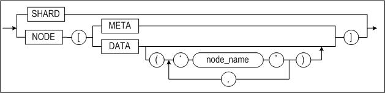

#### SHARD

SHARD 키워드를 사용하면 샤드 쿼리 분석기를 통해 쿼리에 존재하는 샤드 객체 분산
정보가 존재하는 모든 샤드 노드에 쿼리를 전송하고 수행하여 취합한다.

각 노드의 데이터를 취합한 결과가 논리적으로 동일할 수 없는 즉, 샤드 쿼리가 아닌
다음의 사례를 살펴보자.

-   SELECT count(\*) FROM *s1;*

일반 쿼리에 SHARD 키워드를 적용하면 분산 정보가 존재하는 모든 노드를 대상으로
쿼리를 수행하고 그 결과를 얻어온다.

-   SHARD SELECT count(\*) FROM *s1;*

-   SELECT \* FROM SHARD*(* SELECT count(\*) FROM *s1);*

아래와 같은 형태를 적절히 활용하면 사용자가 원하는 유용한 결과를 얻을 수 있다.

-   SELECT sum(cn) FROM SHARD ( SELECT count(\*) cn FROM s1);

-   SELECT i1, sum(cn) FROM SHARD (SELECT i1, count(\*) cn FROM s1) GROUP BY i1;

-   SELECT \* FROM SHARD (SELECT \* FROM s1 limit 10) limit 10;

##### 구문

```
SHARD SELECT * FROM s1 WHERE k1>1;
SELECT * FROM SHARD(SELECT * FROM s1 WHERE k1>1);
```

##### 예제

\<질의\> s1테이블의 전체 레코드 개수를 구하라.

```
iSQL> SELECT sum(cn) FROM SHARD(SELECT count(*) cn FROM s1);
```

#### NODE

NODE 키워드는 인자로 명시한 노드에 쿼리를 전송하고 그 수행 결과를 취합한다. 샤드
쿼리 분석기를 통하지 않고 해당 쿼리를 바로 전달한다.

사용 가능한 NODE 유형은 다음과 같다.

-   NODE[META] : 코디네이팅 샤드 노드에 대한 쿼리 수행
-   NODE[DATA] 또는 NODE[DATA()] : 모든 샤드 노드들에 대해 쿼리 분석 및 변환없이
    수행
-   NODE[DATA(*'node1_name*', *node2_name*',...)] : 명시된 노드(들)에 대해 쿼리
    분석 및 변환없이 수행

노드를 구성하고 샤드 객체 구성 전 후의 데이터 상태를 확인할 경우에 유용하게 쓰일
수 있다.

##### 구문

```
NODE[META] SELECT count(*) FROM t1;
NODE[DATA] SELECT count(*) FROM s1;
SELECT * FROM NODE[META](SELECT count(*) FROM s1);
SELECT * FROM NODE[DATA]('node1', 'node2')](SELECT count(*) FROM s1);
```

\<질의\> 코디네이팅 샤드 노드에 존재하는 t2테이블의 레코드 개수를 구하라.

```
iSQL> CREATE TABLE t2 AS SELECT * FROM s1
iSQL> EXEC dbms_shard.set_shard_table('sys','t2','H','i1');
iSQL> EXEC dbms_shard.set_shard_hash('sys','t2',1000,'node1');
iSQL> NODE[META] SELECT count(*) FROM t1;
```

\<질의\> 'node2' 에 존재하는 s1 샤드 테이블에 대해 샤드키가 아닌 i1
컬럼의 group별 합을 수행하라.

```
iSQL> SELECT * FROM NODE[DATA('node2')](SELECT i1,sum(i1) FROM s1 GROUP BY i1);
```

> ##### 주의 사항
>
> 샤드 키워드의 적용 결과는 단순히 해당 노드의 수행 결과를 얻어 취합하는 것이므로
> 결과의 정합성을 보장하지 않는다. 따라서 사용에 각별한 주의가 필요하다.

### 샤드 함수

Altibase Sharding은 사용자 편의를 위해 추가적인 샤드 함수를 제공한다.

#### shard_node_name

##### 구문

```
shard_node_name()
```

##### 설명

샤드 노드의 이름을 반환한다.

##### 예제

\<질의\> 샤드 노드 별 s1테이블의 레코드 개수를 구하라.

```
iSQL> shard SELECT shard_node_name(),count(*) FROM s1;
```

#### shard_key

##### 구문

```
shard_key(key_column, value)
```

##### 설명

샤드 노드를 지정하여 질의를 수행한다.

##### 예제

\<질의\> s1테이블의 k1이 1에 해당하는 샤드 노드에서 s1테이블의 레코드 개수를
구하라.

```
iSQL> SELECT count(*) FROM s1 WHERE shard_key(k1,1); 
```

### 샤드 실행계획

Altibase Sharding 사용자는 iSQL을 통해 쿼리가 수행되는 실행계획을 조회할 수
있다.

샤드 최적화기가 생성한 실행계획과 샤드 노드에서 생성한 실행계획을 모두 조회할 수
있으며 쿼리를 분석하여 최적화 하는데 사용할 수 있다.

일반적으로 Altibase Sharding에서 사용되는 논샤드 쿼리는 가능한 샤드 쿼리로
변경하여 사용하는 것이 성능상 유리하다.

#### 실행 노드 확인

샤드 최적화기가 생성한 실행노드의 기능과 explain plan으로 출력되는 형식, 해당
노드가 출력되는 쿼리 예제를 살펴본다.

##### 출력 형식

SHARD-COORDINATOR

##### 설명

SHARD-COORDINATOR 실행노드는 사용자가 입력한 쿼리 중 샤드 노드에서 수행할 쿼리를
수행하고, 그 결과를 통합하여 상위 실행노드로 전달한다.

보다 상세한 수행 결과를 조회하기 위하여 다음 명령을 사용한다.

ALTER SESSION SET TRCLOG_DETAIL_PREDICATE = 1;

TRCLOG_DETAIL_PREDICATE 프로퍼티 값을 1로 설정하면, SHARD-COORDINATOR가 특정
샤드 노드로 쿼리를 보내어 수행한 이력 및 플랜을 조회할 수 있다. 

다음은 쿼리 문의 실행 결과 출력이다.

```
iSQL> alter session set explain plan = on;
Alter success.
iSQL> alter session set trclog_detail_predicate = 1;
Alter success.
iSQL> select * from t1, t2 where t1.i1=t2.i1;
I1          I2          I1          I2
-----------------------------------------------------
7           test1       7           test2
10          test1       10          test2
1           test1       1           test2
3           test1       3           test2
5           test1       5           test2
6           test1       6           test2
8           test1       8           test2
2           test1       2           test2
4           test1       4           test2
9           test1       9           test2
10 rows selected.
------------------------------------------------------------
PROJECT ( COLUMN_COUNT: 4, TUPLE_SIZE: 32, COST: 1174.86 )
 SHARD-COORDINATOR
  [ SHARD EXECUTION ]
  NODE1 (executed)
   ::-----------------------------------------------------------
   ::PROJECT ( COLUMN_COUNT: 4, TUPLE_SIZE: 32, COST: 6339.74 )
   :: JOIN ( METHOD: INDEX_NL, COST: 935.45 )
   ::  SCAN ( TABLE: SYS.T1, FULL SCAN, ACCESS: 2, COST: 116.76 )
   ::  SCAN ( TABLE: SYS.T2, INDEX: SYS.IDX2, RANGE SCAN, ACCESS: 2, COST: 116.76 )
   ::-----------------------------------------------------------
  NODE2 (executed)
   ::-----------------------------------------------------------
   ::PROJECT ( COLUMN_COUNT: 4, TUPLE_SIZE: 32, COST: 6339.74 )
   :: JOIN ( METHOD: INDEX_NL, COST: 935.45 )
   ::  SCAN ( TABLE: SYS.T1, FULL SCAN, ACCESS: 5, COST: 116.76 )
   ::  SCAN ( TABLE: SYS.T2, INDEX: SYS.IDX2, RANGE SCAN, ACCESS: 5, COST: 116.76 )
   ::-----------------------------------------------------------
  NODE3 (executed)
   ::-----------------------------------------------------------
   ::PROJECT ( COLUMN_COUNT: 4, TUPLE_SIZE: 32, COST: 6339.74 )
   :: JOIN ( METHOD: INDEX_NL, COST: 935.45 )
   ::  SCAN ( TABLE: SYS.T1, FULL SCAN, ACCESS: 3, COST: 116.76 )
   ::  SCAN ( TABLE: SYS.T2, INDEX: SYS.IDX2, RANGE SCAN, ACCESS: 3, COST: 116.76 )
   ::-----------------------------------------------------------
------------------------------------------------------------
```

#### 샤드 쿼리 분석

Altibase Sharding 은 isql을 통해 사용자 구문에 대한 샤드 쿼리 분석 결과를
확인하는 방법을 제공하며 다음과 같은 조건하에 동작한다.

- alter session set EXPLAIN PLAN = ON (or ONLY);
- alter session set TRCLOG_DETAIL_SHARD = 1;

단, TRCLOG_DETAIL_SHARD=1 의 경우 내부적으로 cache 된 plan을 사용하지 않고
새로이 plan을 생성하므로 사용상 주의가 필요하다.

##### ANALYSIS COST

샤드 쿼리 분석의 최소단위는 쿼리 구문이며 샤드 쿼리 분석기는 구문 단위의 분석을
수행한다.

주어진 구문에 대해 분석을 수행하고 구문 변환을 시도한 후 다시 반복해서 구문
분석을 시도한다.

샤드 쿼리 분석 비용은 사용자 구문에 대해 시도한 총 분석 횟수로 계산된다.

##### QUERY TYPE

사용자 쿼리는 다음과 같이 구분할 수 있다.

- 샤드 쿼리(Shard query) : 분산 수행 결과와 단일 수행 결과의 정합성이 보장되는
  구문
- 논샤드 쿼리(Non-shard query) : 분산 수행 결과와 단일 수행 결과의 정합성이
  보장되지 않는 구문

샤드 라이브러리를 연동한 경우라면 샤드 쿼리는 클라이언트측 샤딩을 수행하고
논샤드 쿼리는 서버측 샤딩을 수행한다.

##### NON-SHARD QUERY REASON

사용자 쿼리를 논샤드 쿼리로 분석한 이유이다.

##### QUERY TRANSFORMABLE

사용자 쿼리가 논샤드 쿼리로 분류된 경우라면 서버측 샤딩을 수행하게 된다.

샤드 쿼리 최적화기는 해당 쿼리를 서버측에서 수행하기 위해 샤드 쿼리 변환을 통해
최적의 분산부 쿼리 생성을 시도하는데 이 경우 최적화된 분산부 쿼리 생성 가능성을
다음과 같이 표현한다.

- 변환된 분산부 쿼리 생성이 가능하면 'Yes'
- 변환된 분산부 쿼리 생성이 불가하면 'No'

##### 쿼리 분석 예제

다음은 분산된 샤드 테이블 s1에 대한 샤드 쿼리분석 결과이다.

```
< Print shard analysis information Example >

iSQL> alter session set explain plan = only;
Alter success.
iSQL> alter session set trclog_detail_shard = 1;
Alter success.
iSQL> SELECT * FROM s1;

I1 I2 I3
----------------------------------------
No rows selected.
------------------------------------------------------------
PROJECT ( COLUMN_COUNT: 3, TUPLE_SIZE: 20, COST: BLOCKED )
SHARD-COORDINATOR
------------------------------------------------------------
[ SHARD ANALYSIS INFORMATION ]
ANALYSIS COST : 1
SHARD QUERY TYPE : Shard query
------------------------------------------------------------
iSQL> SELECT count(*) FROM s1;
COUNT(*)
-----------------------
No rows selected.
------------------------------------------------------------
PROJECT ( COLUMN_COUNT: 1, TUPLE_SIZE: 8, COST: BLOCKED )
GROUP-AGGREGATION ( ITEM_SIZE: ??, GROUP_COUNT: ??, BUCKET_COUNT: 1, ACCESS: ??, COST: BLOCKED )
SHARD-COORDINATOR
[ DISTRIBUTION QUERY ]
SELECT COUNT(*) FROM S1;
------------------------------------------------------------
[ SHARD ANALYSIS INFORMATION ]
ANALYSIS COST : 3
QUERY TYPE : Non-shard query
NON-SHARD QUERY REASON : GROUP BY needed multiple nodes.
QUERY TRANSFORMABLE : Yes
------------------------------------------------------------
```


### 쿼리 튜닝 

Altibase Sharding은 샤드 쿼리로 적용되지 않는 복잡한 논샤드 쿼리를 변환없이
사용할 수 있다는 장점이 있으나 논샤드 쿼리는 샤드 코디네이터의 처리 과정을
거치게 되므로 성능 저하를 유발할 수 있다.

그러므로, 샤딩 시스템을 좀 더 효율적으로 사용하기 위해서 샤드 키워드를 이용하여
쿼리를 튜닝하면 성능을 획기적으로 개선할 수 있다.

#### Grouping

grouping의 키로 샤드 키가 포함된 경우 샤드 쿼리 분석기는 샤드 쿼리로 판단한다.

그러나 grouping key에 샤드 키가 포함되지 않으면, 샤드 코디네이터가 전체 데이터를
수집하여 처리하므로 성능 저하의 원인이 될 수 있다. 이런 경우 grouping을 각 샤드
노드에서 수행하도록 변경하면 샤드 노드의 부하도 줄고 쿼리 속도도 빨라진다.

```
SELECT c1, count(*), sum(i2), avg(i2) FROM s1 GROUP BY c1;
```

위의 쿼리에 다음과 같이 SHARD 키워드를 사용하여 변경할 수 있다.

```
SELECT c1, sum(c), sum(s), sum(s)/count(a) FROM SHARD(SELECT c1, count(*) c, sum(i2) s, count(i2) a FROM s1 GROUP BY c1) GROUP BY c1;
```

#### Pushdown

서로 다른 분산방식의 테이블을 조인하는 경우, 조인은 샤드 코디네이터가 수행하게
된다.

이 때, 조인 비용을 줄이기 위해서 조건절을 샤드 노드에서 수행하도록 변경하면 샤드
코디네이터를 거치지 않아 쿼리 속도가 빨라진다.

다음과 같은 쿼리가 있다.

```
SELECT * FROM t1, t2 WHERE t1.i1=t2.i1 AND t1.i2>3;
```

이를 SHARD 키워드를 사용하여 다음과 같이 변경할 수 있다.

```
SELECT * FROM SHARD(SELECT * FROM T1 WHERE I2>3) t1, t2 WHERE t1.i1=t2.i1;
```

### 모니터링 

Altibase Sharding 사용자는 샤딩 시스템에서 제공하는 샤드 성능 뷰를 이용하여 모든
샤드 노드의 수행 상태를 확인할 수 있다.

샤드 성능 뷰 이외의 내용을 확인하고 싶은 경우 NODE 키워드를 이용하여 전체 샤드
노드를 모니터링 할 수 있다. NODE 키워드는 샤드 객체로 등록하지 않았더라도 쿼리를
수행할 수 있도록 해준다.

NODE 키워드는 모든 샤드 노드에 대해 쿼리를 전송하므로 노드의 상태에 따라 쿼리가
실패할 수 있다.

NODE 키워드는 모든 샤드 노드에 대해 쿼리를 동시에 수행하므로 모든 샤드 노드를
한번에 관찰하기에 유용하다.

#### Property 조회

S\$PROPERTY를 이용하여 샤딩 시스템에서 사용되는 모든 노드의 시스템 프로퍼티를
확인할 수 있다.

예를 들어 샤딩 시스템에서 시스템 프로퍼티가 다르게 설정된 프로퍼티를 검출하는
방법은 다음과 같다.

```
iSQL> SELECT DISTINCT name FROM s$property
WHERE D_STOREDCOUNT != STOREDCOUNT
OR D_MIN != MIN
OR D_MAX != MAX
OR D_VALUE1 != VALUE1
OR D_VALUE2 != VALUE2
OR D_VALUE3 != VALUE3
OR D_VALUE4 != VALUE4
OR D_VALUE5 != VALUE5
OR D_VALUE6 != VALUE6
OR D_VALUE7 != VALUE7
OR D_VALUE8 != VALUE8
ORDER BY 1;
NAME
--------------------------------------------------------------------------------------------------------------------
ARCHIVE_DIR
AUDIT_LOG_DIR
DEFAULT_DISK_DB_DIR
DOUBLE_WRITE_DIRECTORY
EXTPROC_AGENT_SOCKET_FILEPATH
IPCDA_FILEPATH
IPC_FILEPATH
LOGANCHOR_DIR
LOG_DIR
MEM_DB_DIR
MIN_LOG_RECORD_SIZE_FOR_COMPRESS
PORT_NO
QUERY_PROF_LOG_DIR
RP_CONFLICT_MSGLOG_DIR
SERVER_MSGLOG_DIR
SHARD_META_ENABLE
SID
UNIXDOMAIN_FILEPATH
18 rows selected.
```


#### Session 조회

S\$SESSION을 이용하여 현재 접속한 샤드 노드와 관련된 모든 노드의 세션을
확인할 수 있다.

다음은 현재 접속한 샤드 노드와 관련한 모든 세션을 확인하는 방법이다.

```
iSQL> SET vertical on;
iSQL> SELECT id, session_id, shard_client, client_app_info, node_name,
d_session_id, d_shard_client, d_client_app_info, d_session_type FROM s$session;
ID : 1-0-1503915253
SESSION_ID : 1
SHARD_CLIENT : N
CLIENT_APP_INFO : isql
NODE_NAME : NODE1
D_SESSION_ID : 1
D_SHARD_CLIENT : N
D_CLIENT_APP_INFO : shard_meta
D_SESSION_TYPE : I
ID : 1-0-1503915253
SESSION_ID : 1
SHARD_CLIENT : N
CLIENT_APP_INFO : isql
NODE_NAME : NODE2
D_SESSION_ID : 1
D_SHARD_CLIENT : N
D_CLIENT_APP_INFO : shard_meta
D_SESSION_TYPE : I
ID : 1-0-1503915253
SESSION_ID : 1
SHARD_CLIENT : N
CLIENT_APP_INFO : isql
NODE_NAME : NODE3
D_SESSION_ID : 1
D_SHARD_CLIENT : N
D_CLIENT_APP_INFO : shard_meta
D_SESSION_TYPE : I
3 rows selected.
```

위의 방법 이외에도 NODE 키워드를 이용하여 각 샤드 노드의 V\$SESSION을 한번에
조회할 수 있다.

```
NODE[DATA] SELECT shard_node_name(), count(*) total_session, sum(decode(trans_id,0,0,1)) running_session from v$session;
```

뿐만 아니라, 특정 샤드 노드에 대해서도 수행이 가능하다.

```
NODE[DATA(‘node1’)] SELECT shard_node_name(), count(*) total_session, sum(decode(trans_id,0,0,1)) running_session from v$session;
```

#### Statement 조회

S\$STATEMENT를 이용하여 현재 접속한 샤드 노드와 관련된 모든 노드의 세션에서
실행되는(또는 가장 최근 실행된) 구문을 확인할 수 있다.

다음은 현재 접속한 샤드 노드와 관련한 모든 세션에서 수행되는 모든 구문을
확인하는 방법이다.

```
iSQL> SET vertical on;
iSQL> SELECT shard_session_id, shard_session_type, node_name, session_id,
statement_id, query_type, substr(query, 1, 6) FROM s$statement;
SHARD_SESSION_ID : 1-0-907178928
SHARD_SESSION_TYPE : E
NODE_NAME : META
SESSION_ID : 1
STATEMENT_ID : 65538
QUERY_TYPE : N
SUBSTR(QUERY, 1, 50) : SELECT
SHARD_SESSION_ID : 1-0-907178928
SHARD_SESSION_TYPE : I
NODE_NAME : NODE1
SESSION_ID : 3
STATEMENT_ID : 196608
QUERY_TYPE : -
SUBSTR(QUERY, 1, 50) : SELECT
SHARD_SESSION_ID : 1-0-907178928
SHARD_SESSION_TYPE : I
NODE_NAME : NODE2
SESSION_ID : 1
STATEMENT_ID : 65537
QUERY_TYPE : -
SUBSTR(QUERY, 1, 50) : SELECT
SHARD_SESSION_ID : 1-0-907178928
SHARD_SESSION_TYPE : I
NODE_NAME : NODE3
SESSION_ID : 1
STATEMENT_ID : 65537
QUERY_TYPE : -
SUBSTR(QUERY, 1, 50) : SELECT
4 rows selected.
```

위의 방법 이외에도 NODE 키워드를 이용하여 샤드 노드의 v\$statement을 한번에
조회할 수 있다.

```
NODE[DATA] SELECT shard_node_name(), sum(execute_success) from v$statement
```

뿐만 아니라, 특정 샤드 노드에 대해서도 수행이 가능하다.

```
NODE[DATA(‘node1’)] SELECT shard_node_name(), sum(execute_success) from v$statement
```

### Fail-Over

Altibase Sharding의 Fail-Over기능은 특정 샤드 노드에 장애가 발생 하였을 때, 해당
노드의 가용(Alternate) 서버로 자동 전환되는 기능이며 샤드 노드 설정 및 응용
프로그램 설정을 통해서 사용 가능하다.

Altibase Sharding의 Fail-Over를 이해하기 위해서는 Sharding에서 사용하는 커넥션에
대한 이해가 필요하다.

Altibase Sharding에서 사용하는 커넥션은 다음과 같이 세 가지의 커넥션이 존재하며
각각의 연결 장애 시에 따라 Fail-Over가 발생할 수 있다.

- 사용자 커넥션(User Connection)
- 샤드 라이브러리 커넥션(Shard Library Connection)
- 코디네이터 커넥션(Coordinator Connection)

각 커넥션에 대한 Fail-Over는 장애를 인식하는 시점에 따라 CTF (Connection Time
Fail-Over)와 STF (Service Time Fail-Over)로 분류할 수 있으며, 커넥션 마다
Fail-Over의 동작이 다르므로 각 커넥션에 대한 Fail-Over 동작을 이해해야 한다.

Altibase Sharding에서의 Fail-Over는 다수의 샤드 노드에 대한 커넥션에 대해서
고려해야하므로 응용 프로그램 처리 가이드에 따라 처리할 것을 권장한다.

Fail-Over에 대한 개요 및 사용 방법은 *Altibase Replication Manual*을 참고한다.

#### 사용자 커넥션

사용자 커넥션에 대한 Fail-Over는 응용 프로그램에서 API의 연결 함수 호출시 입력한
연결 속성 문자열에 명시하거나 연결 설정 파일에 명시한 샤드 노드의 IP, PORT로
시도한다.

사용자 커넥션에 대한 Fail-Over는 Replication환경에서 Altibase Fail-Over의
사용법과 동일하며, Replication환경에서 Altibase Fail-Over의 사용법은 *Altibase
Replication Manual*을 참고한다.

#### 샤드 라이브러리 커넥션

샤드 라이브러리 커넥션은 사용자 커넥션 연결 시에 샤드 라이브러리에서 내부적으로
샤드 노드에 접속하는 것을 말한다.

샤드 라이브러리 커넥션의 통신 방법은 샤드 노드 설정 시 관리자가 입력한 통신
방법을 기본으로 사용하며, Fail-Over는 시스템 관리자가 등록한 샤드 노드의 외부
커넥션 IP,PORT로 시도한다.

예를들어, 관리자가 NODE1을 다음과 같은 프로시저를 통해서 설정할 수 있다.

```
iSQL> EXEC dbms_shard.set_node('node1', '192.168.1.30', 20300, '192.168.1.31', 20400, 1);
Execute success.
```

위의 예제에서 NODE1의 샤드 라이브러리 커넥션은 “'192.168.1.30', 20300”에 연결을
시도하며 문제 발생시 “'192.168.1.31', 20400”으로 Fail-Over 시도한다.

샤드 라이브러리 커넥션에 대한 Fail-Over설정을 변경하기 위해서는 다음의
프로시저를 통해서 변경 가능하다.

```
iSQL> EXEC dbms_shard.reset_node_external('node1', '192.168.100.1', 20300,
'192.168.100.2', 20300 );
Execute success.
```

만약, 샤드 라이브러리 커넥션의 통신 방법을 커넥션 별로 변경하고 싶은 경우 사용자
커넥션의 커넥션 스트링에 SHARD_CONN_TYPE 속성으로 지정 가능하며 다음의 통신
타입을 지원한다

- 1: TCP
- 6: SSL
- 8: IB

##### 제약 사항

- Altibase Sharding에서 Fail-Over 콜백 함수는 사용자 커넥션에 대해서만
  동작하며 샤드 라이브러리 커넥션에 대한 Fail-Over 콜백 함수는 지원하지
  않는다.

#### 코디네이터 커넥션

코디네이터 커넥션에 대한 Fail-Over는 시스템 관리자가 등록한 샤드 노드의 내부
커넥션 IP, PORT로 시도한다.

예를들어, 관리자가 NODE1을 다음과 같은 프로시저를 통해서 설정할 수 있다.

```
iSQL> EXEC dbms_shard.set_node('node1', '192.168.1.30', 20300, '192.168.1.31', 20400, 1);
Execute success.
```

위의 예제에서 NODE1의 코디네이터 커넥션은 “'192.168.1.30', 20300”에 연결을
시도하며 문제 발생시 “'192.168.1.31', 20400”으로 Fail-Over 시도한다.

코디네이터 커넥션에 대한 Fail-Over설정을 변경하기 위해서는 다음의 프로시저를
통해서 변경 가능하다.

```
iSQL> EXEC dbms_shard.reset_node_internal('node1', '192.168.100.11', 20300,
'192.168.100.12', 20300 );
Execute success.
```

코디네이터 커넥션의 Fail-Over 동작은 다음의 프로퍼티를 통해서 세부적으로 설정
가능하다. 각 프로퍼티의 세부 설명은 이 문서의 프로퍼티 설명을 참조한다.

* SHARD_INTERNAL_CONN_ATTR_RETRY_COUNT
* SHARD_INTERNAL_CONN_ATTR_RETRY_DELAY
* SHARD_INTERNAL_CONN_ATTR_CONNECTION_TIMEOUT
* SHARD_INTERNAL_CONN_ATTR_LOGIN_TIMEOUT

#### 응용 프로그램 가이드

Altibase Sharding 환경에서는 여러 샤드 노드에서 수행중인 트랜잭션 및 커넥션이
있으며, 이들은 최적화 과정을 거쳐서 샤드 라이브러리 혹은 서버에서 내부적으로
처리된다. 그러므로 특정 노드의 장애나 접속 에러 시에도 일부 커넥션이 남아 있거나
트랜잭션이 완전히 철회되지 않을 수 있다.

이러한 분산 환경에서 응용 프로그램이 트랜잭션 처리를 일관되게 하기 위해서는
NON-AUTOCOMMIT을 사용하여 다음의 가이드에 따라 작성되어야 Fail-Over가 정상적으로
처리될 수 있다.

다만, 응용 프로그램이 다수의 샤드 노드를 접근하지 않도록 설계된 경우에는
AUTOCOMMIT 모드를 사용할 수 있으나 이 경우에도 AUTOCOMMIT에 대한 가이드에 따라
처리되어야 Fail-Over 이후에 서비스가 정상적으로 처리될 수 있다.

##### CTF(Connection Time Failover)

CTF의 경우에는 데이터 베이스 연결이 되는지에 따라 성공 여부를 바로 알 수 있다.

다만, 분산 환경에서는 일부 노드의 에러로 인해 실패했을 때, 일부 노드에 접속
되어있을 수 있으므로 명시적으로 SQLDisconnect를 호출하여 전체 연결을 끊어 주어야
한다.

CTF는 트랜잭션이 시작되기 전에 발생하므로 Commit 모드는 고려하지 않아도 된다.

##### STF(Service Time Failover)

ShardCLI 경우는 SQLPrepare, SQLExecute, SQLFetch등에서 SQL_SUCCESS가 아닌 에러가
발생하면, SQLGetDiagRec에 statement 핸들을 넘기고, 이 함수의 5번째 인자에
반환되는 native 에러 코드 값이 ALTIBASE_FAILOVER_SUCCESS인 진단
레코드(diagnostic record)가 있으면 STF가 성공한 것으로 판단할 수 있다.

- NON-AUTOCOMMIT 트랜잭션

ShardCLI 함수에서 SQL_SUCCESS가 아닌 에러가 발생하였을 때 다음의 순서로 에러
로직을 처리한다.

1. STF가 성공한 경우(ALTIBASE_FAILOVER_SUCCESS) Rollback을 수행하며 Rollback이
   성공하면 트랜잭션 재시작 위치로 되돌아 가서 응용 프로그램 로직을 수행한다.
   1. 트랜잭션 재시작 위치는 SQLPrepare,SQLExecute를 사용하는 경우 최초
      SQLPrepare 이전으로 돌아가야 하며 Bind는 다시 하지 않아도 된다.
   2. SQLDirectExec를 사용하는 경우에는 SQLDirectExec 이전으로 돌아가면 된다.
   3. STF 성공 후 Rollback을 하는 중에 다시 Fail-Over가 발생할 수 있으므로 이
      경우에는 Rollback을 한번 더 수행한다.
2. STF가 실패하고 더 이상 서비스 가능한 가용 노드가 없는
   경우(ALTIBASE_SHARD_NODE_FAILOVER_IS_NOT_AVAILABLE) 전체 노드에 대한 연결을
   명시적으로 끊고 최초 연결부터 재시도 한다.
   1. 샤딩 환경에서는 다수의 노드에 접속이 이뤄져 있으므로 명시적으로
      SQLDisconnect를 호출해야 모든 노드에 연결이 끊긴다
3. 그 외의 에러에 대해서는 응용 프로그램 에러 처리 로직을 수행한다.

- AUTOCOMMIT 트랜잭션

  ShardCLI 함수에서 SQL_SUCCESS가 아닌 에러가 발생하였을 때 다음의 순서로 에러
  로직을 처리한다.

1. STF가 성공한 경우(ALTIBASE_FAILOVER_SUCCESS) 트랜잭션 재시작 위치로 되돌아
   가서 응용 프로그램 로직을 수행한다.
   1. 트랜잭션 재시작 위치는 SQLPrepare, SQLExecute를 사용하는 경우 최초
      SQLPrepare 이전으로 돌아가야 하며 Bind는 다시 하지 않아도 된다.
   2. SQLDirectExec를 사용하는 경우에는 SQLDirectExec 이전으로 돌아가면 된다.
2. STF가 실패하고 더 이상 서비스 가능한 가용 노드가 없는 경우
   (ALTIBASE_SHARD_NODE_FAILOVER_IS_NOT_AVAILABLE) 전체 노드에 대한 연결을
   명시적으로 끊고 최초 연결부터 재시도 한다.
   1. 샤딩 환경에서는 다수의 노드에 접속이 이뤄져 있으므로 명시적으로
      SQLDisconnect를 호출해야 모든 노드에 연결이 끊긴다.

##### ShardCLI Failover Sample Code

Altibase Sharding의 failover를 포함하는 Shardcli sample 코드는
\$ALTIBASE_HOME/sample/SHARD/Fail-Over/failoversample.cpp에 있으며, 해당
프로그램은 ShardCLI를 이용하여 작성한 fail-over를 고려한 응용 프로그램 예제이다.

failoversample.cpp의 코드는 “CREATE TABLE T1 (I1 VARCHAR(20), I2 INTEGER);”의
구문으로 T1 테이블을 생성한 후 T1 테이블을 샤드 테이블로 등록하였다고 가정한다.

해당 프로그램은 최초 접속할 샤드 노드의 port와 alternate port를 순차적으로
입력받아 연결하고 응용 프로그램 로직을 수행하여 Direct-Execute 방식으로 데이터를
한 건 입력하고 Prepare-Execute 방식으로 질의를 수행한 후 검색된 데이터를
출력하는 프로그램이다.

예제 프로그램을 수행중에 특정 노드에 장애가 있는 경우 최초 접속시에 CTF가
동작하며 실행 중에는 STF를 통해 fail-over 된다.

주의할 점은, 접속을 재시도 하기 위해서는 남아 있을 수 있는 커넥션을 종료하기
위해서 SQLDisconnect를 명시적으로 호출해 주어야 하며, 에러가 발생했을 때에는
다수의 노드에서 발생했을 수 있는 에러를 확인하기 위해서 SQLDiagRec을 통해 모든
노드의 에러를 점검해야 한다.

에러 점검을 통해서 Service Time Fail-over가 되면 연결이 종료되지 않은 샤드
노드에 남아 있는 트랜잭션을 정리하기 위해서 SQLEndTran(ROLLBACK)을 호출해 준 후
다시 Prepare 혹은 DirecExecute 로직으로 돌아가서 수행 한다.

자세한 코드 내용은 \$ALTIBASE_HOME/sample/SHARD/Fail-Over/failoversample.cpp를
참고한다.

### 샤딩 분산 시스템 변경

샤딩 시스템 운영중에 데이터 저장소가 부족하거나 서비스 용량이 추가로 필요한 경우
신규 샤드 노드를 추가할 수 있다.

신규 노드가 추가되면 데이터를 이동시켜 부하를 나누어 줄 수 있으며, 이 때 기존
시스템 분석을 통해서 적절한 양의 데이터를 이동 시켜야 한다.

샤딩 시스템을 운영하면서 특정 샤드 노드에 데이터가 집중되는 현상이 발생할 수
있으며, 특정 샤드 노드에 데이터가 집중되면 부하의 불균형을 가져와 전체 시스템
성능이 저하되거나 저장 공간이 부족하여 시스템 운영에 문제를 불러일으킬 수 있다.

이런 문제를 해소하기 위해서 데이터가 집중된 샤드 노드의 데이터를 다른 샤드
노드로 분배해야 한다.

샤드 노드의 구성 변경이나 노드의 일부 하드웨어 장애로 인해서 샤드 노드를
제거하는 경우에도 제거되는 샤드 노드의 데이터를 보존하기 위해서는 운영중인 다른
샤드 노드로 데이터를 옮겨 준 후 샤드 노드를 제거해야 한다.

이 외에도 샤딩 시스템을 재구축 하기 위해서 샤드 키를 변경하는 등의 데이터 재구축
작업을 필요로 할 수 있으며, , 정리하면 샤딩 분산 시스템 변경을 필요로 하는
시점은 다음과 같은 경우이다.

- 샤드 노드 추가
- 샤드 데이터 분포 조정
- 샤드 노드 제거
- 샤딩 데이터 재구축

Altibase Sharding은 이와 같은 다양한 샤딩 시스템 변경에 대한 분산 데이터 이동
방법을 지원하기 위해서 서비스 중에 데이터를 이동시키는 리샤딩과 서비스 중지 후
데이터를 이동시키는 데이터 재구축을 제공한다. 이 외에도 분산 데이터의 정합성을
확인하기 위한 유효성 검사 방법을 제공한다.

- 유효성 검사
- 리샤딩
- 데이터 재구축

리샤딩과 데이터 재구축을 통한 데이터 이동을 비교하면 아래 표와 같다.

| 지원 항목        | 리샤딩                         | 데이터 재구축                             |
| ---------------- | ------------------------------ | ----------------------------------------- |
| 테이블 종류      | 파티션드 테이블                | 일반 테이블, 파티션드 테이블              |
| 분산 방식        | HASH, RANGE, LIST, SOLO, CLONE | HASH, RANGE, LIST, COMPOSITE              |
| 변경 작업        | 동일 분산 방식의 범위 변경     | 분산 방식 변경 및 범위 변경, 샤드 키 변경 |
| 데이터 이동 단위 | 파티션 단위                    | 테이블 단위                               |
| 서비스 중단 여부 | 서비스 무중단                  | 서비스 중단                               |
| 대상 노드        | 1 대 1                         | 1 대 N, N 대 N                            |

[표 3]. 리샤딩과 데이터 재구축 기능 비교

#### 노드 추가

샤딩 시스템에 샤드 노드를 추가하는 방법으로 샤드 매니저를 통한 방법과 수동으로
샤드 노드를 추가하는 방법을 제공한다.

수동으로 노드를 추가하는 것은 DBMS_SHARD 패키지의 SET_NODE 프로시저를 통해서
가능하다.

다만, 수동으로 샤드 노드를 추가하는 경우 기존 샤드 노드와 동일하게 샤드 메타를
복제해야하며, 샤드 메타의 일부가 다른 경우 데이터 서비스가 비정상 적으로 동작할
수 있으므로 권장하지 않는다.

수동으로 샤드 노드를 추가하는 것에 대한 자세한 설명은 본 장의 *“샤드 노드”* 절을
참고한다.

샤드 매니저를 통해 샤드 노드를 추가하는 경우 자동으로 샤드 메타를 복제하여 샤딩
시스템에 참여할 수 있도록 한다.

샤드 매니저를 통한 샤드 노드 추가는 6장 Altibase Sharding 유틸리티의 *Shard
Manager* 를 참고한다.

> 주의 사항 
>
> 노드 추가를 완료해도 해당 노드에 샤드 객체는 생성되어 있지 않으므로
> 동일한 스키마로 사용자가 샤드 객체를 생성해야한다.

#### 노드 제거

샤딩 시스템에서 노드를 제거하는 경우는 일반적이지 않으나 해당 노드에 영구적인
장애가 발생하거나 혹은 시스템의 축소를 위해서 노드를 제거할 수 있다.

샤드 노드를 제거하기 위해서는 노드 제거를 위한 데이터 이동 계획을 수립하고 이에
따라 해당 노드에 존재하는 데이터를 다른 샤드 노드로 이동시킨다.

데이터 이동이 완료되면 제거되는 노드에 사용자 커넥션으로 연결된 응용프로그램을
서비스 가능한 다른 샤드 노드로 이동시켜야한다.

그 후, 샤드 노드 추가와 동일하게 샤드 매니저나 DBMS_SHARD 패키지의 UNSET_NODE로
샤드 메타에서 해당 노드를 삭제한다.

샤드 노드 삭제가 시스템에서 인식되면 해당 노드에 존재하는 응용프로그램의 샤드
라이브러리 커넥션이 시간이 경과함에 따라 자동적으로 다른 샤드 노드로 이동한다.
시스템 관리자는 해당 노드의 세션이 모두 종료된 것을 확인하면 더 이상 시스템에
영향을 주지 않으므로 제거가 완료되었다고 볼 수 있다.

샤드 매니저를 통한 샤드 노드 삭제는 6장 Altibase Sharding 유틸리티의 *Shard
Manager* 를 참고하며 DBMS_SHARD 패키지의 UNSET_NODE에 대한 자세한 내용은 본 장의
*“샤드 노드”* 절을 참고한다.

> 주의 사항 
>
> 노드 제거가 완료되도 해당 노드에 샤드 객체를 명시적으로 DROP 하지 않으면 객체가 제거되지 않는다. 

#### 유효성 검사

샤드 테이블의 샤드 키 분산 방식 변경으로 인해 샤드 키와 데이터의 불일치가
발생할 수 있다. 분산 정보가 재설정 된 경우 기존의 분산 데이터는 샤드 키에
유효한(correct) 데이터와 유효하지 않은(incorrect) 데이터로 구분된다.

Altibase Sharding 은 샤드 키 분산 정보와 분산 데이터의 유효성을 검사하는
방법을 제공한다.

##### 구문

```
DBMS_SHARD.CHECK_DATA
```

##### 설명

분산 테이블의 샤드 키 분산 정보와 샤드 노드별 유효 또는 유효하지 않은 데이터
행 수를 반환한다.

##### 예제

U1 사용자의 s1 테이블에 대한 샤드 키 k1의 분산방식을 다음과 같이 변경할 경우
변경 전 후의 데이터 유효성을 검사한다.

- hash( 500:NODE1,1000:NODE2)
- =\> range(330:NODE1,660:NODE2,default:NODE3)

```
iSQL> EXEC dbms_shard.check_data('u1','s1');
shard_key_column:K1
shard_information:{"SplitMethod":"H","RangeInfo":[{"Value":"500","Node":"NODE1"},{"Value":"1000","Node":"NODE2"}]}
node_name:NODE1, record_count:491, correct_count:491, incorrect_count:0
node_name:NODE2, record_count:509, correct_count:509, incorrect_count:0
total_record_count   :1000
total_incorrect_count:0
Execute success.

iSQL> EXEC dbms_shard.unset_shard_table('u1','s1');
iSQL> EXEC dbms_shard.set_shard_table('u1','s1','r','k1','node3');
iSQL> EXEC dbms_shard.set_shard_range('u1','s1',330,'node1');
iSQL> EXEC dbms_shard.set_shard_range('u1','s1',660,'node2');

iSQL> EXEC dbms_shard.check_data('u1','s1');
shard_key_column:K1
shard_information:{"SplitMethod":"R","DefaultNode":"NODE3",  "RangeInfo":[{"Value":"330","Node":"NODE1"},{"Value":"660","Node":"NODE2"}]}
node_name:NODE1, record_count:491, correct_count:178, incorrect_count:313
node_name:NODE2, record_count:509, correct_count:181, incorrect_count:328
node_name:NODE3, record_count:0, correct_count:0, incorrect_count:0
total_record_count   :1000
total_incorrect_count:641
Execute success.
```

#### 데이터 재구축

Altibase Sharding은 샤드 테이블의 분산 정보를 변경한 후, 기존의 데이터를
재구축하거나 특정 샤드 노드를 지정하여 데이터를 이동시키는 방법을 제공한다.

데이터 재구축을 위해서는 기존 분산 테이블을 해제(unset)한 후, 새로운 분산
방식으로 분산 테이블을 재설정(set)하는 과정을 선행해야 한다. 그러므로
진행중인 관련 테이블을 사용 중인 응용 프로그램을 종료 시킨 후 수행하여야
한다.

성능을 고려하여, 데이터 재구축은 변경된 분산 기준에 맞지 않는
데이터(incorrect data)만 이동(move)시키는 방식으로 수행되며 여러 세션에서
동시에 수행 가능하다. 단, 내부적으로 데이터의 이동이 수반되기 때문에
데이터의 정합성 보장을 위해서 다음과 같은 환경으로 수행하길 권장한다.

-   Non-autocommit

-   Global Transaction

데이터 재구축은 샤드 키 분산(hash, range, list, composite) 방식을 적용한
샤드 테이블에 한해 지원하며, 복제 분산 방식과 독립 분산 방식은 지원하지
않는다.

-   hash(500,1000) \<-\> hash(300,600,1000) (O)

-   hash \<-\> range (O)

-   hash \<-\> list,hash (O)

-   range \<-\> clone (X)

-   solo \<-\> hash (X)

-   clone \<-\> solo (X)

##### 구문

```
DBMS_SHARD.REBUILD_DATA
DBMS_SHARD.REBUILD_DATA_NODE
```

##### 설명

샤드 키 분산 방식에 따라 데이터를 재분배한다.

##### 예제

새로운 샤드 키 분산 방식으로 분산 테이블을 재설정하였다고 가정한다.

```
iSQL> ALTER SESSION SET autocommit = false;
iSQL> ALTER SESSION SET dblink_global_transaction_level = 2;

iSQL> EXEC dbms_shard.rebuild_data('u1','s1',100);
[11:34:47] target node(1/3): "NODE1"
[11:34:47] 100 moved
[11:34:47] 200 moved
[11:34:47] 300 moved
[11:34:47] 313 moved
[11:34:47] target node(2/3): "NODE2"
[11:34:47] 100 moved
[11:34:47] 200 moved
[11:34:47] 300 moved
[11:34:47] 328 moved
[11:34:47] target node(3/3): "NODE3"
[11:34:48] done.
Execute success.

iSQL> EXEC dbms_shard.check_data('u1','s1');
shard_key_column:K1
shard_information:{"SplitMethod":"R","DefaultNode":"NODE3","RangeInfo":[{"Value":"330","Node":"NODE1"},{"Value":"660","Node":"NODE2"}]}
node_name:NODE1, record_count:330, correct_count:330, incorrect_count:0
node_name:NODE2, record_count:330, correct_count:330, incorrect_count:0
node_name:NODE3, record_count:340, correct_count:340, incorrect_count:0
total_record_count   :1000
total_incorrect_count:0
Execute success.

iSQL> COMMIT;
```

#### 리샤딩

Altibase Sharding의 리샤딩은 서비스 중에 노드를 추가하거나 데이터의 분포가 특정
샤드 노드에 밀집되어있을 때 샤드 노드들의 데이터 범위를 변경하고 데이터를 재분배
하는 것을 말한다.

Altibase Sharding에서 제공하는 리샤딩은 데이터베이스 서비스에 영향을 최소화하여
백그라운드로 진행되므로, 응용 프로그램의 변화나 서비스 중단 없이 수행 가능하다.

서비스의 영향을 최소화 하기 위해서 데이터 이동은 한번에 하나의 샤드 노드에서
다른 하나의 샤드 노드로 이동하며 다수의 노드간 데이터 이동은 유발하지 않는다.

리샤딩은 온라인중에 데이터를 이동하기 위해서 내부적으로 이중화를 사용하며,
트랜잭션의 중단이 발생하지 않도록 Shard Meta Number(SMN)라는 개념을 두어 리샤딩
이전에 접속한 클라이언트와 이후에 접속한 클라이언트가 끊김없이 서비스 가능하도록
지원한다. SMN에 대한 자세한 내용은 2장 Altibase Sharding 설치와 설정의 *샤드
메타 설정*을 참고한다.

리샤딩은 샤드 테이블의 종류에 따라서 다음과 같이 분류될 수 있고, 샤드 매니저를
통해서 수행할 수 있다. 샤드 매니저의 리샤딩 사용 법에 대한 자세한 설명은 6장
Altibase Sharding 유틸리티의*Shard Manager*절을 참조한다.

- 단일 샤드 키 분산 테이블 리샤딩
- 복제 분산 테이블 리샤딩
- 독립 분산 테이블 리샤딩

##### 단일 샤드 키 분산 테이블 리샤딩

단일 샤드 키 분산 테이블의 리샤딩은 샤드 테이블의 파티션 단위로 수행 가능하다.

단일 샤드 키 분산 테이블 리샤딩을 계획할 때 주의해야할 것은 샤딩 시스템으로
요청되는 질의를 잘 고려하여 동일 샤드 키로 처리되는 샤드 테이블 그룹을 함께
이동시켜야 한다는 것이다.

만약, TABLE1과 TABLE2가 ID라는 컬럼으로 동일한 샤드 키와 설정을 가지고 있다면
리샤딩 이후에도 TABLE1과 TABLE2에 대해서 동일한 데이터 분포를 가질 수 있도록
해야한다. 그렇지 않고 TABLE1만 이동하는 경우 TABLE1과 TABLE2를 조인하는 질의가
요청되면 샤드 쿼리라고 하더라도 서버 사이드로 동작하여 성능 저하를 유발할 수
있다.

###### 샤드 데이터 분포 조정을 위한 리샤딩

샤드 데이터 분포가 특정 샤드 노드에 편향될 경우 해당 데이터를 다른 샤드 노드로
분산 시킬 수 있다.

리샤딩은 파티션 단위로 진행 가능하므로 샤드 테이블이 이미 파티션으로 분할
되어있다면 샤드 매니저를 통해 원하는 파티션을 선택해서 리샤딩이 가능하다.

그렇지 않고, 신규 샤드 노드로 전달해 줄 데이터가 파티션으로 분할되어있지 않은
경우 전체 샤드 노드에 파티션드 테이블 분할 구문을 사용하여 파티션을 분할해 준 후
리샤딩을 진행한다. 다만, 파티션드 테이블을 분할하는 경우 데이터가 이동하는 동안
테이블 락으로 인해서 데이터 양에 따라 서비스가 장시간 중단될 수 있으므로 노드
확장을 고려해서 미리 다수의 파티션으로 분할해 놓을 것을 권장한다.

파티션드 테이블의 분할 구문에 대한 자세한 내용은 *SQL Reference*를 참고한다.

###### 샤드 노드 추가를 동반한 리샤딩

노드 추가로 인한 단일 샤드 키 분산 테이블의 리샤딩은 아래와 같이 단계별로
구분해서 작업을 진행한다.

1. 노드 추가
2. 샤드 관련 객체들 생성 및 설정
3. 샤드 테이블 별 리샤딩

먼저 샤드 매니저를 통해 샤드 노드를 추가한 후 리샤딩을 원하는 테이블들을
선정한다. 수동으로도 샤드 노드를 추가하고 샤드 메타를 동기화 할 수 있으나
권장하지 않는다.

리샤딩을 원하는 테이블과 샤드 메타는 기존 샤드 노드와 동일하게 설정한 후
리샤딩을 수행해야하며 샤드 매니저를 통하여 샤드 노드를 추가하는 경우 자동으로
샤드 메타를 복제해 준다. 다만, 샤드 테이블은 생성되어 있지 않으므로 동일한
스키마로 사용자가 생성해야한다.

이 경우에도 파티션 단위로 리샤딩이 가능하므로 샤드 데이터 분포 조정의 설명과
동일하게 수행할 수 있다.

###### 샤드 노드 제거를 동반한 리샤딩

샤드 노드 제거를 위해서는 제거되는 노드에서 처리중인 데이터를 제거되지 않는 다른
샤드 노드로 옮긴 후 샤드 노드를 제거해야 데이터를 잃어버리지 않는다.

그러므로, 샤드 데이터 분포 조정과 동일하게 데이터를 이동 후 샤드 노드 제거를
진행한다.

노드 제거에서 설명한 것 처럼 노드 제거는 해당 노드가 가지고 있는 샤드 관련
객체를 삭제 후 노드 삭제를 진행한다. 노드 삭제가 모든 샤드 노드에서 적용되고
해당 샤드 메타가 적용되고 응용 프로그램의 연결이 모두 끊기면 노드 제거가
완료된다.

##### 복제 분산 테이블 리샤딩

복제 분산 테이블의 리샤딩은 신규 샤드 노드 추가를 동반한 경우에만 고려하여
리샤딩을 진행하면 된다. 데이터 분포에 대한 조정 및 샤드 노드 제거와 관련해서는
리샤딩을 고려할 필요가 없다.

신규 샤드 노드를 추가하는 경우 샤드 노드 추가 후 샤드 매니저를 통해 리샤딩을
수행하면 신규 노드에 복제 분산 테이블이 복제되어 서비스가 가능하다.

##### 독립 분산 테이블 리샤딩

독립 분산 테이블은 테이블 단위로 리샤딩이 가능하며 샤드 노드 추가나 삭제 그리고
데이터 분포 조정을 필요로 할 때 고려해야 한다.

독립 분산 테이블의 리샤딩은 테이블 단위로 진행 된다는 것을 제외하고 단일 키 분산
테이블과 동일하다.

## 4.Altibase Sharding 딕셔너리

Altibase Sharding의 데이터 딕셔너리는 샤드 객체 정보를 저장하는 샤드 메타와 단일
샤드 노드의 샤딩 관련 시스템 프로세스 정보를 보여주는 성능 뷰(Performance View),
그리고 전체 샤딩 시스템의 실시간 정보를 보여주는 샤드 성능 뷰(Shard Performance
View)로 나뉘어진다.

본 장은 샤드 데이터베이스 객체 정보 및 Altibase Sharding시스템 정보를 제공하는
데이터 딕셔너리에 대해 설명한다.

### 샤드 메타

샤드 메타란 Altibase Sharding을 사용하는 전체 분산 데이터베이스에 생성된 객체에
대한 모든 정보를 저장하고 있는 SYS_SHARD사용자의 시스템 정의 테이블이다.

#### 구조 및 기능

샤드 메타 테이블은 분산 데이터베이스 객체를 관리하기 위해 시스템에 의해 정의된
테이블이다.

Altibase Sharding은 분산 데이터베이스 질의를 처리하기 위해 샤드 객체 정보를
조회하며 샤드 객체 및 노드 정보를 저장 및 변경할 때 샤드 메타 테이블을 사용한다.

샤드 메타 테이블의 소유자는 일반 메타 테이블과는 달리 SYS_SHARD 사용자이며, 샤드
메타에 대한 변경은 DBMS\_ SHARD 패키지를 이용해야 한다.

#### 샤드 메타 테이블 조회

DBMS_SHARD패키지를 이용하여 분산 데이터베이스 관련 정보를 등록, 삭제 및 변경 시
샤드 메타 테이블의 레코드가 시스템에 의해 생성, 삭제 또는 변경된다.

변경된 데이터베이스 객체 정보는 샤드 메타 테이블을 조회함으로써 확인할 수 있다.
샤드 메타 테이블의 레코드는 일반 테이블과 같이 SELECT 문으로 조회가 가능하다.

#### 샤드 메타 테이블 데이터 변경

Altibase Sharding 시스템 사용자가 DBMS_SHARD 패키지 이외의 방법으로 샤드 메타 를
변경하면 샤딩 시스템 구동이 실패하거나, 분산 데이터베이스 관련 정보를 상실하여
시스템에 치명적인 손상이 발생할 수 있다.

#### 샤드 메타 테이블 스키마 변경

Altibase Sharding에 새로운 기능이 제공되거나 기존 구문의 기능 변경 시 샤드 메타
테이블 스키마가 변경될 수 있다. 샤드 메타 테이블 스키마의 변경이 발생하면
데이터베이스 마이그레이션이 필요하다.

Altibase Sharding하위 버전에서 상위 버전으로 업그레이드 시 이를 고려해야 한다.

#### 샤드 메타 테이블 종류

다음 표는 샤드 메타 테이블의 목록이다.

| **샤드 메타 테이블 이름** | **설명**                                                  |
| ------------------------- | --------------------------------------------------------- |
| **VERSION\_**             | Altibase Sharding의 버전을 기록하는 샤드 메타 테이블      |
| **LOCAL_META_INFO\_**     | 지역 데이터베이스의 샤드 정보를 기록하는 샤드 메타 테이블 |
| **GLOBAL_META_INFO\_**    | 샤드 메타 제어 정보를 기록하는 샤드 메타 테이블           |
| **NODES\_**               | 샤드 노드 정보를 기록하는 샤드 메타 테이블                |
| **OBJECTS\_**             | 샤드 객체 정보를 기록하는 샤드 메타 테이블                |
| **RANGES\_**              | 샤드 키 분산 테이블 정보를 기록하는 샤드 메타 테이블      |
| **CLONES\_**              | 복제 분산 테이블 정보를 기록하는 샤드 메타 테이블         |
| **SOLOS\_**               | 독립 분산 테이블 정보를 기록하는 샤드 메타 테이블         |

### SYS_SHARD.VERSION\_

Altibase Sharding의 버전을 기록하는 메타 테이블이다.

| Column name | Type    | Description                   |
| ----------- | ------- | ----------------------------- |
| MAJOR_VER   | INTEGER | Altibase Sharding 메이저 버전 |
| MINOR_VER   | INTEGER | Altibase Sharding 마이너 버전 |
| PATCH_VER   | INTEGER | Altibase sharding 패치 버전   |

#### 칼럼 정보

##### MAJOR_VER

메이저 버전을 나타낸다.

##### MINOR_VER

마이너 버전을 나타낸다.

##### PATCH_VER

패치 버전을 나타낸다.

### SYS_SHARD.LOCAL_META_INFO\_

지역 데이터베이스의 샤드 정보를 기록하는 메타 테이블이다.

| Column name  | Type    | Description      |
| ------------ | ------- | ---------------- |
| META_NODE_ID | INTEGER | 샤드 메타 식별자 |

#### 칼럼 정보

##### META_NODE_ID

지역 데이터베이스의 샤드 메타 식별자로 전체 샤딩 시스템에서 유일해야 한다.

CREATE_META 프로시저를 통해 최초로 샤드 메타를 생성시에 입력해야하며
RESET_META_NODE_ID로 변경 가능하다.

### SYS_SHARD. GLOBAL_META_INFO\_

샤드 메타 정보에 대한 내용을 기록하는 메타 테이블이다.

| Column name | Type    | Description                                        |
| ----------- | ------- | -------------------------------------------------- |
| ID          | INTEGER | 이중화를 위한 주 키                                |
| SMN         | BIGINT  | 샤드 메타가 가지고 있는 가장 최신의 샤드 메타 번호 |

#### 칼럼 정보

##### ID

시스템 내부적으로 복제를 위해 사용되는 키 값

##### SMN

데이터베이스의 샤드 메타에서 유지하는 메타 정보중 가장 최신 메타에 대한 샤드
메타 번호(Shard Meta Number)를 나타낸다.

### SYS_SHARD.NODES\_

Altibase Sharding의 샤드 노드 정보를 기록하는 메타 테이블이다.

| Column name                | Type        | Description                                 |
| -------------------------- | ----------- | ------------------------------------------- |
| NODE_ID                    | INTEGER     | 샤드 노드의 지역 식별자                     |
| NODE_NAME                  | VARCHAR(40) | 샤드 노드 이름                              |
| HOST_IP                    | VARCHAR(64) | 샤드 노드 external ip address               |
| PORT_NO                    | INTEGER     | 샤드 노드 external port 번호                |
| ALTERNATE_HOST_IP          | VARCHAR(64) | 샤드 노드의 external alternative ip address |
| ALTERNATE_PORT_NO          | INTEGER     | 샤드 노드의 external alternative port 번호  |
| INTERNAL_HOST_IP           | VARCHAR(64) | 샤드 노드의 internal ip address             |
| INTERNAL_PORT_NO           | INTEGER     | 샤드 노드의 internal port 번호              |
| INTERNAL_ALTERNATE_HOST_IP | VARCHAR(64) | 샤드 노드의 internal alternative ip address |
| INTERNAL_ALTERNATE_PORT_NO | INTEGER     | 샤드 노드의 internal alternative port 번호  |
| INTERNAL_CONN_TYPE         | INTEGER     | 샤드 노드의 internal 연결 방식              |
| SMN                        | BIGINT      | 샤드 메타 번호                              |

#### 칼럼 정보

##### NODE_ID

샤드 노드의 지역 식별자를 나타낸다.

##### NODE_NAME

샤드 노드의 이름을 나타내며 샤드 노드의 이름은 유일해야 한다.

##### HOST_IP

샤드 라이브러리 또는 외부 응용프로그램에서 연결할 샤드 노드의 ip address를
나타낸다.

##### PORT_NO

샤드 라이브러리 또는 외부 응용프로그램에서 연결할 샤드 노드의 port 번호를
나타낸다.

##### ALTERNATE_HOST_IP

샤드 라이브러리 또는 외부 응용프로그램에서 연결할 샤드 노드의 alternate 서버 ip
address를 나타낸다.

##### ALTERNATE_PORT_IP

샤드 라이브러리 또는 외부 응용프로그램에서 연결할 샤드 노드의 alternate 서버
port 번호를 나타낸다.

##### INTERNAL_HOST_IP

코디네이터가 연결할 샤드 노드의 ip address를 나타낸다.

##### INTERNAL_PORT_NO

코디네이터가 연결할 샤드 노드의 port 번호를 나타낸다.

##### INTERNAL_ALTERNATE_HOST_IP

코디네이터가 연결할 샤드 노드의 alternate 서버 ip address를 나타낸다.

##### INTERNAL_ALTERNATE_PORT_NO

코디네이터가 연결할 샤드 노드의 alternate 서버 port 번호를 나타낸다.

##### INTERNAL_CONN_TYPE

코디네이터가 연결할 샤드 노드의 연결 방식을 나타낸다.

1: TCP  
8: IB (Infiniband)

##### SMN

샤드 메타에 대한 버전 관리 번호를 나타낸다.

### SYS_SHARD.OBJECTS\_

Altibase Sharding의 샤드 객체 정보를 기록하는 메타 테이블이다.

| Column name         | Type         | Description                                                  |
| ------------------- | ------------ | ------------------------------------------------------------ |
| SHARD_ID            | INTEGER      | 샤드 객체 식별자                                             |
| USER_NAME           | VARCHAR(128) | 샤드 객체 소유자                                             |
| OBJECT_NAME         | VARCHAR(128) | 샤드 객체 이름                                               |
| OBJECT_TYPE         | CHAR(1)      | 샤드 객체 종류 T : 테이블 P : 프로시저                       |
| SPLIT_METHOD        | CHAR(1)      | 분산 방식 H : 해시(hash) R : 범위(range) L : 리스트(list) C : 복제(clone) S : 독립(solo) |
| KEY_COLUMN_NAME     | VARCHAR(128) | 샤드 키 이름                                                 |
| SUB_SPLIT_METHOD    | CHAR(1)      | 서브 샤드 키 분산 방식 H : 해시(hash) R : 범위(range) L : 리스트(list) |
| SUB_KEY_COLUMN_NAME | VARCHAR(128) | 서브 샤드 키 칼럼 이름                                       |
| DEFAULT_NODE_ID     | INTEGER      | 기본 샤드 노드 번호                                          |
| SMN                 | BIGINT       | 샤드 메타 번호                                               |

#### 칼럼 정보

##### SHARD_ID

샤드 객체의 번호를 나타낸다.

##### USER_NAME

샤드 객체의 소유자 이름을 나타낸다.

##### OBJECT_NAME

샤드 객체 이름을 나타낸다.

##### OBJECT_TYPE

샤드 객체 종류를 나타낸다.

##### SPLIT_METHOD

샤드 객체 분산 방식을 나타낸다.

##### KEY_COLUMN_NAME

샤드 객체의 샤드 키 이름을 나타낸다.

##### SUB_SPLIT_METHOD

샤드 객체의 서브 샤드 키 분산 방식을 나타낸다.

##### SUB_KEY_COLUMN_NAME

샤드 객체의 서브 샤드 키 칼럼 이름을 나타낸다.

##### DEFAULT_NODE_ID

샤드 객체의 기본 샤드 노드를 나타낸다. 분산 설정이 완전하지 않을 경우 설정 기준
이외의 데이터가 저장되는 샤드 노드이다.

##### SMN

샤드 메타에 대한 버전 관리 번호를 나타낸다.

### SYS_SHARD.RANGES\_

샤드 키 분산 테이블(HASH, RANGE, LIST, COMPOSITE)의 분산 정보를 기록하는 메타
테이블이다.

| Column name | Type         | Description      |
| ----------- | ------------ | ---------------- |
| SHARD_ID    | INTEGER      | 샤드 객체 식별자 |
| VALUE       | VARCHAR(100) | 샤드 키 값       |
| SUB_VALUE   | VARCHAR(100) | 서브 샤드 키 값  |
| NODE_ID     | INTEGER      | 샤드 노드 번호   |
| SMN         | BIGINT       | 샤드 메타 번호   |

#### 칼럼 정보

##### SHARD_ID

샤드 객체의 번호를 나타낸다.

##### VALUE

샤드 키 값을 나타낸다.

##### SUB_VALUE

서브 샤드 키 값을 나타낸다.

##### NODE_ID

VALUE와 SUB_VALUE를 기준으로 저장되는 데이터의 노드 번호를 나타낸다.

##### SMN

샤드 메타에 대한 버전 관리 번호를 나타낸다.

### SYS_SHARD.CLONES\_

샤드 객체에 복제 분산 방식이 적용된 분산 정보를 기록하는 메타 테이블이다.

| Column name | Type    | Description             |
| ----------- | ------- | ----------------------- |
| SHARD_ID    | INTEGER | 샤드 객체 식별자        |
| NODE_ID     | INTEGER | 샤드 노드의 지역 식별자 |
| SMN         | BIGINT  | 샤드 메타 번호          |

#### 칼럼 정보

##### SHARD_ID

샤드 객체 번호를 나타낸다.

##### NODE_ID

데이터가 복제 저장되는 샤드 노드의 지역 식별자 번호를 나타낸다.

##### SMN

샤드 메타에 대한 버전 관리 번호를 나타낸다.

### SYS_SHARD.SOLOS\_

샤드 객체에 독립 분산 방식이 적용된 샤드 테이블 정보를 기록하는 메타 테이블이다.

| Column name | Type    | Description             |
| ----------- | ------- | ----------------------- |
| SHARD_ID    | INTEGER | 샤드 객체 식별자        |
| NODE_ID     | INTEGER | 샤드 노드의 지역 식별자 |
| SMN         | BIGINT  | 샤드 메타 번호          |

#### 칼럼 정보

##### SHARD_ID

샤드 객체 번호를 나타낸다.

##### NODE_ID

데이터가 독립 저장되는 샤드 노드의 지역 식별자 번호를 나타낸다.

##### SMN

샤드 메타에 대한 버전 관리 번호를 나타낸다.

### 성능 뷰 (Performance View)

성능 뷰 (performance view)란 메모리에 존재하는 구조이지만 일반 테이블 형태로
제공되어 시스템 메모리, 프로세스 상태, 세션, 버퍼, 쓰레드 등에 대한 Altibase
시스템 내부 정보를 사용자에게 제공하는 뷰이다.

사용자가 테이블에 저장된 데이터를 검색하기 위하여 SQL을 사용하는 것처럼,
Altibase 운용 시 사용되는 메모리 객체 (예. 세션 정보, 로그 정보)에 관한 정보를
SQL문을 이용하여 성능 뷰로부터 쉽게 검색할 수 있다.

이 절에서는 Altibase Sharding과 연관된 성능 뷰의 종류, 구조 및 기능, 그리고 각
뷰에서 제공하는 정보에 대해 설명한다.

#### 구조 및 기능

Altibase Sharding에서 성능 뷰는 단일 샤드 노드에서 실행중인 프로세스에 대한
정보를 의미하며 현재 접속된 시스템에 대한 정보를 보여준다.

Altibase에서 제공하는 성능 뷰를 통해서 단일 샤드 노드의 다양한 실행 정보를 얻을
수 있다. 자세한 내용은 *General Reference*를 참고한다.

기존의 성능 뷰 이외에 Altibase Sharding만을 위한 성능 뷰가 제공되고 있으며 해당
성능 뷰는 샤딩 시스템으로 운영 중에만 의미가 있다.

#### 성능 뷰의 종류

샤딩 시스템에서 제공하는 성능 뷰의 이름은 Altibase와 동일하게 V\$로 시작한다.
아래 표는 샤딩 시스템 관련 성능 뷰의 목록이다.

| **이름**                 | **설명**                                              |
| ------------------------ | ----------------------------------------------------- |
| V\$SHARD_CONNECTION_INFO | 현재 세션에서의 코디네이터 연결 접속 상태에 대한 정보 |

### V\$SHARD_CONNECTION_INFO

샤드 코디네이터로써 현재 세션에서의 코디네이터 연결 접속 상태에 대한 정보를
보여주는 성능 뷰 이다.

| Column name     | Type        | Description                                        |
| --------------- | ----------- | -------------------------------------------------- |
| NODE_ID         | INTEGER     | 샤드 노드의 지역 식별자                            |
| NODE_NAME       | VARCHAR(40) | 샤드 노드 이름                                     |
| COMM_NAME       | VARCHAR(64) | 접속 정보                                          |
| AUTOCOMMIT_FLAG | INTEGER     | autocommit 플래그 0: non-autocommit 1: auto commit |
| TOUCH_COUNT     | INTEGER     | 현재 트랜잭션의 DML 발생 횟수                      |
| LINK_FAILURE    | INTEGER     | 샤드 노드의 연결 상태 0: 정상 1: 실패              |

#### 칼럼 정보

##### NODE_ID

연결된 샤드 노드의 지역 식별자를 나타낸다.

##### NODE_NAME

연결된 샤드 노드의 이름을 나타낸다.

##### COMM_NAME

샤드 노드와의 현재 접속 상태를 나타낸다.

##### AUTOCOMMIT_FLAG

샤드 노드와 연결된 세션에서 autocommit 여부를 나타낸다.

##### TOUCH_COUNT

샤드 노드와의 연결된 세션 중 현재 트랜잭션에서 발생한 DML 횟수를 나타낸다.

##### LINK_FAILURE

조회 시점의 샤드 노드와의 연결 상태를 나타낸다.

### 샤드 성능 뷰 (Shard Performance View)

Altibase Sharding에서 제공하는 샤딩 전용의 성능 뷰로 전체 샤딩 시스템과 관련한
내부 정보(예. 샤드 세션 정보)를 사용자가 모니터링 할 수 있다.

이 절에서는 Altibase Sharding이 지원하는 샤드 성능 뷰의 구조 및 기능, 종류, 조회
방법, 그리고 각 뷰에서 제공하는 정보에 대해 설명한다.

#### 구조 및 기능

기존의 성능 뷰와 다르게 샤드 성능 뷰는 전체 샤딩 시스템과 연관된 정보를 한눈에
볼 수 있도록 제공한다.

예를들어, 사용자는 전체 샤딩 시스템의 프로퍼티 설정을 보기 위해서 각 노드에 접속
후 해당 노드의 성능 뷰를 모두 검색해 볼 수 있다. 그러나, 이와 같은 방법으로 전체
샤딩 시스템의 프로퍼티를 검색하는 것은 샤드 노드가 늘어남에 따라 사용자의 불편을
증가시킨다.

그러므로, 전체 샤드 시스템의 프로퍼티를 검색하기 위해서 특정 샤드 노드에
접속해서 샤드 성능 뷰를 통해 서비스 중인 샤드 노드의 프로퍼티를 검색할 수 있다.

이와 같이 사용자는 샤드 성능 뷰를 통해 편리하게 전체 시스템을 모니터링 할 수
있다.

#### 샤드 성능 뷰의 조회 방법

샤드 성능 뷰의 전체 목록은 iSQL에서 다음과 같이 조회할 수 있다.

iSQL\> SELECT \* FROM S\$TAB;

샤드 성능 뷰의 스키마는 일반 테이블과 마찬가지로 iSQL 에서 DESC 명령어를 통해
확인할 수 있고, 데이터는 일반 테이블과 동일하게 SELECT문을 이용하여 검색할 수
있다.

#### 샤드 성능 뷰의 종류

샤드 성능 뷰의 이름은 S\$로 시작한다. 아래 표는 전체 샤드 성능 뷰의 목록이다.

| **이름**           | **설명**                                                     |
| ------------------ | ------------------------------------------------------------ |
| S\$CONNECTION_INFO | 현재 세션에서의 코디네이팅 샤드 노드와 다른 샤드 노드의 연결 상태에 대한 정보 |
| S\$PROPERTY        | 샤딩 시스템의 모든 샤드 노드에 설정된 시스템 프로퍼티 정보   |
| S\$SESSION         | 현재 접속한 샤드 노드와 관련된 모든 샤드 노드의 세션 정보    |
| S\$STATEMENT       | 현재 접속한 샤드 노드와 관련된 모든 샤드 노드의 세션에서 수행되는 모든 구문 정보 |

### S\$SHARD_CONNECTION_INFO

현재 세션에서 코디네이터가 연결한 접속 상태에 대한 정보를 보여주는 성능 뷰 이다.

| Column name     | Type        | Description                                        |
| --------------- | ----------- | -------------------------------------------------- |
| NODE_ID         | INTEGER     | 샤드 노드의 지역 식별자                            |
| NODE_NAME       | VARCHAR(40) | 샤드 노드 이름                                     |
| COMM_NAME       | VARCHAR(64) | 접속 정보                                          |
| AUTOCOMMIT_FLAG | INTEGER     | autocommit 플래그 0: non-autocommit 1: auto commit |
| TOUCH_COUNT     | INTEGER     | 현재 트랜잭션의 DML 발생 횟수                      |
| LINK_FAILURE    | INTEGER     | 샤드 노드의 연결 상태 0: 정상 1: 실패              |

#### 칼럼 정보

##### NODE_ID

연결된 샤드 노드의 지역 식별자를 나타낸다.

##### NODE_NAME

연결된 샤드 노드의 이름을 나타낸다.

##### COMM_NAME

샤드 노드와의 현재 접속 상태를 나타낸다.

##### AUTOCOMMIT_FLAG

샤드 노드와 연결된 세션에서 autocommit 여부를 나타낸다.

##### TOUCH_COUNT

샤드 노드와의 연결된 세션 중 현재 트랜잭션에서 발생한 DML 횟수를 나타낸다.

##### LINK_FAILURE

조회 시점의 샤드 노드와의 연결 상태를 나타낸다.

### S\$PROPERTY

샤딩 시스템의 각 노드에 설정된 시스템 프로퍼티의 정보를 보여준다.

| Column name   | Type         | Description                                |
| ------------- | ------------ | ------------------------------------------ |
| NAME          | VARCHAR(256) | 프로퍼티의 이름                            |
| STOREDCOUNT   | INTEGER      | 현재 접속한 노드의 V\$PROPERTY.STOREDCOUNT |
| ATTR          | BIGINT       | 현재 접속한 노드의 V\$PROPERTY.ATTR        |
| MIN           | VARCHAR(256) | 현재 접속한 노드의 V\$PROPERTY.MIN         |
| MAX           | VARCHAR(256) | 현재 접속한 노드의 V\$PROPERTY.MAX         |
| VALUE1        | VARCHAR(256) | 현재 접속한 노드의 V\$PROPERTY.VALUE1      |
| VALUE2        | VARCHAR(256) | 현재 접속한 노드의 V\$PROPERTY.VALUE2      |
| VALUE3        | VARCHAR(256) | 현재 접속한 노드의 V\$PROPERTY.VALUE3      |
| VALUE4        | VARCHAR(256) | 현재 접속한 노드의 V\$PROPERTY.VALUE4      |
| VALUE5        | VARCHAR(256) | 현재 접속한 노드의 V\$PROPERTY.VALUE5      |
| VALUE6        | VARCHAR(256) | 현재 접속한 노드의 V\$PROPERTY.VALUE6      |
| VALUE7        | VARCHAR(256) | 현재 접속한 노드의 V\$PROPERTY.VALUE7      |
| VALUE8        | VARCHAR(256) | 현재 접속한 노드의 V\$PROPERTY.VALUE8      |
| NODE_NAME     | VARCHAR(40)  | 샤드 노드의 이름                           |
| D_STOREDCOUNT | INTEGER      | 샤드 노드의 V\$PROPERTY.STOREDCOUNT        |
| D_ATTR        | BIGINT       | 샤드 노드의 V\$PROPERTY.ATTR               |
| D_MIN         | VARCHAR(256) | 샤드 노드의 V\$PROPERTY.MIN                |
| D_MAX         | VARCHAR(256) | 샤드 노드의 V\$PROPERTY.MAX                |
| D_VALUE1      | VARCHAR(256) | 샤드 노드의 V\$PROPERTY.VALUE1             |
| D_VALUE2      | VARCHAR(256) | 샤드 노드의 V\$PROPERTY.VALUE2             |
| D_VALUE3      | VARCHAR(256) | 샤드 노드의 V\$PROPERTY.VALUE3             |
| D_VALUE4      | VARCHAR(256) | 샤드 노드의 V\$PROPERTY.VALUE4             |
| D_VALUE5      | VARCHAR(256) | 샤드 노드의 V\$PROPERTY.VALUE5             |
| D_VALUE6      | VARCHAR(256) | 샤드 노드의 V\$PROPERTY.VALUE6             |
| D_VALUE7      | VARCHAR(256) | 샤드 노드의 V\$PROPERTY.VALUE7             |
| D_VALUE8      | VARCHAR(256) | 샤드 노드의 V\$PROPERTY.VALUE8             |

#### 칼럼 정보

##### NAME

해당 프로퍼티의 이름을 나타낸다.

##### NODE_NAME

노드의 이름을 나타낸다.

##### 그 외 컬럼

위 항목을 제외한 모든 칼럼은 *General Reference* 의 V\$PROPERTY 의 칼럼 정보를
참고한다.

### S\$SESSION

현재 접속한 샤드 노드와 관련된 모든 샤드 노드의 세션에 대한 정보를 보여준다.

| Column name                          | Type         | Description                                                  |
| ------------------------------------ | ------------ | ------------------------------------------------------------ |
| ID                                   | VARCHAR(20)  | 샤드 세션 식별자                                             |
| SESSION_ID                           | BIGINT       | 현재 접속 노드의 V\$SESSION.ID                               |
| SHARD_CLIENT                         | VARCHAR(1)   | 현재 접속 노드의 세션에 대한 샤드 클라이언트 라이브러리 사용 유무 |
| TRANS_ID                             | BIGINT       | 현재 접속 노드의 V\$SESSION.TRANS_ID                         |
| TASK_STATE                           | VARCHAR(11)  | 현재 접속 노드의 V\$SESSION.TASK_STATE                       |
| COMM_NAME                            | VARCHAR(64)  | 현재 접속 노드의 V\$SESSION.COMM_NAME                        |
| XA_SESSION_FLAG                      | INTEGER      | 현재 접속 노드의 V\$SESSION.XA_SESSION_FLAG                  |
| XA_ASSOCIATE_FLAG                    | INTEGER      | 현재 접속 노드의 V\$SESSION.XA_ASSOCIATE_FLAG                |
| QUERY_TIME_LIMIT                     | BIGINT       | 현재 접속 노드의 V\$SESSION.QUERY_TIME_LIMIT                 |
| DDL_TIME_LIMIT                       | BIGINT       | 현재 접속 노드의 V\$SESSION.DDL_TIME_LIMIT                   |
| FETCH_TIME_LIMIT                     | BIGINT       | 현재 접속 노드의 V\$SESSION.FETCH_TIME_LIMIT                 |
| UTRANS_TIME_LIMIT                    | BIGINT       | 현재 접속 노드의 V\$SESSION.UTRANS_TIME_LIMIT                |
| IDLE_TIME_LIMIT                      | BIGINT       | 현재 접속 노드의 V\$SESSION.IDLE_TIME_LIMIT                  |
| IDLE_START_TIME                      | INTEGER      | 현재 접속 노드의 V\$SESSION.IDLE_START_TIME                  |
| ACTIVE_FLAG                          | INTEGER      | 현재 접속 노드의 V\$SESSION.ACTIVE_FLAG                      |
| OPENED_STMT_COUNT                    | INTEGER      | 현재 접속 노드의 V\$SESSION.OPENED_STMT_COUNT                |
| CLIENT_PACKAGE_VERSION               | VARCHAR(40)  | 현재 접속 노드의 V\$SESSION.CLIENT_PACKAGE_VERSION           |
| CLIENT_PROTOCOL_VERSION              | VARCHAR(40)  | 현재 접속 노드의 V\$SESSION.CLIENT_PROTOCOL_VERSION          |
| CLIENT_PID                           | BIGINT       | 현재 접속 노드의 V\$SESSION.CLIENT_PID                       |
| CLIENT_TYPE                          | VARCHAR(40)  | 현재 접속 노드의 V\$SESSION.CLIENT_TYPE                      |
| CLIENT_APP_INFO                      | VARCHAR(128) | 현재 접속 노드의 V\$SESSION.CLIENT_APP_INFO                  |
| CLIENT_NLS                           | VARCHAR(40)  | 현재 접속 노드의 V\$SESSION.CLIENT_NLS                       |
| DB_USERNAME                          | VARCHAR(128) | 현재 접속 노드의 V\$SESSION.DB_USERNAME                      |
| DB_USERID                            | INTEGER      | 현재 접속 노드의 V\$SESSION.DB_USERID                        |
| DEFAULT_TBSID                        | BIGINT       | 현재 접속 노드의 V\$SESSION.DEFAULT_TBSID                    |
| DEFAULT_TEMP_TBSID                   | BIGINT       | 현재 접속 노드의 V\$SESSION.DEFAULT_TEMP_TBSID               |
| SYSDBA_FLAG                          | INTEGER      | 현재 접속 노드의 V\$SESSION.SYSDBA_FLAG                      |
| AUTOCOMMIT_FLAG                      | INTEGER      | 현재 접속 노드의 V\$SESSION.AUTOCOMMIT_FLAG                  |
| SESSION_STATE                        | VARCHAR(13)  | 현재 접속 노드의 V\$SESSION.SESSION_STATE                    |
| ISOLATION_LEVEL                      | INTEGER      | 현재 접속 노드의 V\$SESSION.ISOLATION_LEVEL                  |
| REPLICATION_MODE                     | INTEGER      | 현재 접속 노드의 V\$SESSION.REPLICATION_MODE                 |
| TRANSACTION_MODE                     | INTEGER      | 현재 접속 노드의 V\$SESSION.TRANSACTION_MODE                 |
| COMMIT_WRITE_WAIT_MODE               | INTEGER      | 현재 접속 노드의 V\$SESSION.COMMIT_WRITE_WAIT_MODE           |
| OPTIMIZER_MODE                       | INTEGER      | 현재 접속 노드의 V\$SESSION.OPTIMIZER_MODE                   |
| HEADER_DISPLAY_MODE                  | INTEGER      | 현재 접속 노드의 V\$SESSION.HEADER_DISPLAY_MODE              |
| CURRENT_STMT_ID                      | INTEGER      | 현재 접속 노드의 V\$SESSION.CURRENT_STMT_ID                  |
| STACK_SIZE                           | INTEGER      | 현재 접속 노드의 V\$SESSION.STACK_SIZE                       |
| DEFAULT_DATE_FORMAT                  | VARCHAR(64)  | 현재 접속 노드의 V\$SESSION.DEFAULT_DATE_FORMAT              |
| TRX_UPDATE_MAX_LOGSIZE               | BIGINT       | 현재 접속 노드의 V\$SESSION.TRX_UPDATE_MAX_LOGSIZE           |
| PARALLEL_DML_MODE                    | INTEGER      | 현재 접속 노드의 V\$SESSION.PARALLEL_DML_MODE                |
| LOGIN_TIME                           | INTEGER      | 현재 접속 노드의 V\$SESSION.LOGIN_TIME                       |
| FAILOVER_SOURCE                      | VARCHAR(256) | 현재 접속 노드의 V\$SESSION.FAILOVER_SOURCE                  |
| NLS_TERRITORY                        | VARCHAR(40)  | 현재 접속 노드의 V\$SESSION.NLS_TERRITORY                    |
| NLS_ISO_CURRENCY                     | VARCHAR(40)  | 현재 접속 노드의 V\$SESSION.NLS_ISO_CURRENCY                 |
| NLS_CURRENCY                         | VARCHAR(10)  | 현재 접속 노드의 V\$SESSION.NLS_CURRENCY                     |
| NLS_NUMERIC_CHARACTERS               | VARCHAR(2)   | 현재 접속 노드의 V\$SESSION.NLS_NUMERIC_CHARACTERS           |
| TIME_ZONE                            | VARCHAR(40)  | 현재 접속 노드의 V\$SESSION.TIME_ZONE                        |
| LOB_CACHE_THRESHOLD                  | INTEGER      | 현재 접속 노드의 V\$SESSION.LOB_CACHE_THRESHOLD              |
| QUERY_REWRITE_ENABLE                 | VARCHAR(7)   | 현재 접속 노드의 V\$SESSION.QUERY_REWRITE_ENABLE             |
| DBLINK_GLOBAL_TRANSACTION_LEVEL      | INTEGER      | 현재 접속 노드의 V\$SESSION.DBLINK_GLOBAL_TRANSACTION_LEVEL  |
| DBLINK_REMOTE_STATEMENT_AUTOCOMMIT   | INTEGER      | 현재 접속 노드의 V\$SESSION.DBLINK_REMOTE_STATEMENT_AUTOCOMMIT |
| MAX_STATEMENTS_PER_SESSION           | INTEGER      | 현재 접속 노드의 V\$SESSION.MAX_STATEMENTS_PER_SESSION       |
| SSL_CIPHER                           | VARCHAR(256) | 현재 접속 노드의 V\$SESSION.SSL_CIPHER                       |
| SSL_CERTIFICATE_SUBJECT              | VARCHAR(256) | 현재 접속 노드의 V\$SESSION.SSL_CERTIFICATE_SUBJECT          |
| SSL_CERTIFICATE_ISSUER               | VARCHAR(256) | 현재 접속 노드의 V\$SESSION.SSL_CERTIFICATE_ISSUER           |
| MODULE                               | VARCHAR(128) | 현재 접속 노드의 V\$SESSION.MODULE                           |
| ACTION                               | VARCHAR(128) | 현재 접속 노드의 V\$SESSION.ACTION                           |
| REPLICATION_DDL_SYNC                 | INTEGER      | 현재 접속 노드의 V\$SESSION.REPLICATION_DDL_SYNC             |
| REPLICATION_DDL_SYNC_TIMELIMIT       | BIGINT       | 현재 접속 노드의 V\$SESSION.REPLICATION_DDL_SYNC_TIMELIMIT   |
| NODE_NAME                            | VARCHAR(40)  | 샤드 노드의 이름                                             |
| D_SESSION_ID                         | BIGINT       | 샤드 노드의 V\$SESSION.ID                                    |
| D_SHARD_CLIENT                       | VARCHAR(1)   | 샤드 노드의 세션에 대한 샤드 클라이언트 라이브러리 사용 유무 |
| D_SESSION_TYPE                       | VARCHAR(1)   | 샤드 노드의 세션에 대한 샤드 커넥션 타입                     |
| D_TRANS_ID                           | BIGINT       | 샤드 노드의 V\$SESSION.TRANS_ID                              |
| D_TASK_STATE                         | VARCHAR(11)  | 샤드 노드의 V\$SESSION.TASK_STATE                            |
| D_COMM_NAME                          | VARCHAR(64)  | 샤드 노드의 V\$SESSION.COMM_NAME                             |
| D_XA_SESSION_FLAG                    | INTEGER      | 샤드 노드의 V\$SESSION.XA_SESSION_FLAG                       |
| D_XA_ASSOCIATE_FLAG                  | INTEGER      | 샤드 노드의 V\$SESSION.XA_ASSOCIATE_FLAG                     |
| D_QUERY_TIME_LIMIT                   | BIGINT       | 샤드 노드의 V\$SESSION.QUERY_TIME_LIMIT                      |
| D_DDL_TIME_LIMIT                     | BIGINT       | 샤드 노드의 V\$SESSION.DDL_TIME_LIMIT                        |
| D_FETCH_TIME_LIMIT                   | BIGINT       | 샤드 노드의 V\$SESSION.FETCH_TIME_LIMIT                      |
| D_UTRANS_TIME_LIMIT                  | BIGINT       | 샤드 노드의 V\$SESSION.UTRANS_TIME_LIMIT                     |
| D_IDLE_TIME_LIMIT                    | BIGINT       | 샤드 노드의 V\$SESSION.IDLE_TIME_LIMIT                       |
| D_IDLE_START_TIME                    | INTEGER      | 샤드 노드의 V\$SESSION.IDLE_START_TIME                       |
| D_ACTIVE_FLAG                        | INTEGER      | 샤드 노드의 V\$SESSION.ACTIVE_FLAG                           |
| D_OPENED_STMT_COUNT                  | INTEGER      | 샤드 노드의 V\$SESSION.OPENED_STMT_COUNT                     |
| D_CLIENT_PACKAGE_VERSION             | VARCHAR(40)  | 샤드 노드의 V\$SESSION.CLIENT_PACKAGE_VERSION                |
| D_CLIENT_PROTOCOL_VERSION            | VARCHAR(40)  | 샤드 노드의 V\$SESSION.CLIENT_PROTOCOL_VERSION               |
| D_CLIENT_PID                         | BIGINT       | 샤드 노드의 V\$SESSION.CLIENT_PID                            |
| D_CLIENT_TYPE                        | VARCHAR(40)  | 샤드 노드의 V\$SESSION.CLIENT_TYPE                           |
| D_CLIENT_APP_INFO                    | VARCHAR(128) | 샤드 노드의 V\$SESSION.CLIENT_APP_INFO                       |
| D_CLIENT_NLS                         | VARCHAR(40)  | 샤드 노드의 V\$SESSION.CLIENT_NLS                            |
| D_DB_USERNAME                        | VARCHAR(128) | 샤드 노드의 V\$SESSION.DB_USERNAME                           |
| D_DB_USERID                          | INTEGER      | 샤드 노드의 V\$SESSION.DB_USERID                             |
| D_DEFAULT_TBSID                      | BIGINT       | 샤드 노드의 V\$SESSION.DEFAULT_TBSID                         |
| D_DEFAULT_TEMP_TBSID                 | BIGINT       | 샤드 노드의 V\$SESSION.DEFAULT_TEMP_TBSID                    |
| D_SYSDBA_FLAG                        | INTEGER      | 샤드 노드의 V\$SESSION.SYSDBA_FLAG                           |
| D_AUTOCOMMIT_FLAG                    | INTEGER      | 샤드 노드의 V\$SESSION.AUTOCOMMIT_FLAG                       |
| D_SESSION_STATE                      | VARCHAR(13)  | 샤드 노드의 V\$SESSION.SESSION_STATE                         |
| D_ISOLATION_LEVEL                    | INTEGER      | 샤드 노드의 V\$SESSION.ISOLATION_LEVEL                       |
| D_REPLICATION_MODE                   | INTEGER      | 샤드 노드의 V\$SESSION.REPLICATION_MODE                      |
| D_TRANSACTION_MODE                   | INTEGER      | 샤드 노드의 V\$SESSION.TRANSACTION_MODE                      |
| D_COMMIT_WRITE_WAIT_MODE             | INTEGER      | 샤드 노드의 V\$SESSION.COMMIT_WRITE_WAIT_MODE                |
| D_OPTIMIZER_MODE                     | INTEGER      | 샤드 노드의 V\$SESSION.OPTIMIZER_MODE                        |
| D_HEADER_DISPLAY_MODE                | INTEGER      | 샤드 노드의 V\$SESSION.HEADER_DISPLAY_MODE                   |
| D_CURRENT_STMT_ID                    | INTEGER      | 샤드 노드의 V\$SESSION.CURRENT_STMT_ID                       |
| D_STACK_SIZE                         | INTEGER      | 샤드 노드의 V\$SESSION.STACK_SIZE                            |
| D_DEFAULT_DATE_FORMAT                | VARCHAR(64)  | 샤드 노드의 V\$SESSION.DEFAULT_DATE_FORMAT                   |
| D_TRX_UPDATE_MAX_LOGSIZE             | BIGINT       | 샤드 노드의 V\$SESSION.TRX_UPDATE_MAX_LOGSIZE                |
| D_PARALLEL_DML_MODE                  | INTEGER      | 샤드 노드의 V\$SESSION.PARALLEL_DML_MODE                     |
| D_LOGIN_TIME                         | INTEGER      | 샤드 노드의 V\$SESSION.LOGIN_TIME                            |
| D_FAILOVER_SOURCE                    | VARCHAR(256) | 샤드 노드의 V\$SESSION.FAILOVER_SOURCE                       |
| D_NLS_TERRITORY                      | VARCHAR(40)  | 샤드 노드의 V\$SESSION.NLS_TERRITORY                         |
| D_NLS_ISO_CURRENCY                   | VARCHAR(40)  | 샤드 노드의 V\$SESSION.NLS_ISO_CURRENCY                      |
| D_NLS_CURRENCY                       | VARCHAR(10)  | 샤드 노드의 V\$SESSION.NLS_CURRENCY                          |
| D_NLS_NUMERIC_CHARACTERS             | VARCHAR(2)   | 샤드 노드의 V\$SESSION.NLS_NUMERIC_CHARACTERS                |
| D_TIME_ZONE                          | VARCHAR(40)  | 샤드 노드의 V\$SESSION.TIME_ZONE                             |
| D_LOB_CACHE_THRESHOLD                | INTEGER      | 샤드 노드의 V\$SESSION.LOB_CACHE_THRESHOLD                   |
| D_QUERY_REWRITE_ENABLE               | VARCHAR(7)   | 샤드 노드의 V\$SESSION.QUERY_REWRITE_ENABLE                  |
| D_DBLINK_GLOBAL_TRANSACTION_LEVEL    | INTEGER      | 샤드 노드의 V\$SESSION.DBLINK_GLOBAL_TRANSACTION_LEVEL       |
| D_DBLINK_REMOTE_STATEMENT_AUTOCOMMIT | INTEGER      | 샤드 노드의 V\$SESSION.DBLINK_REMOTE_STATEMENT_AUTOCOMMIT    |
| D_MAX_STATEMENTS_PER_SESSION         | INTEGER      | 샤드 노드의 V\$SESSION.MAX_STATEMENTS_PER_SESSION            |
| D_SSL_CIPHER                         | VARCHAR(256) | 샤드 노드의 V\$SESSION.SSL_CIPHER                            |
| D_SSL_CERTIFICATE_SUBJECT            | VARCHAR(256) | 샤드 노드의 V\$SESSION.SSL_CERTIFICATE_SUBJECT               |
| D_SSL_CERTIFICATE_ISSUER             | VARCHAR(256) | 샤드 노드의 V\$SESSION.SSL_CERTIFICATE_ISSUER                |
| D_MODULE                             | VARCHAR(128) | 샤드 노드의 V\$SESSION.MODULE                                |
| D_ACTION                             | VARCHAR(128) | 샤드 노드의 V\$SESSION.ACTION                                |
| D_REPLICATION_DDL_SYNC               | INTEGER      | 샤드 노드의 V\$SESSION.REPLICATION_DDL_SYNC                  |
| D_REPLICATION_DDL_SYNC_TIMELIMIT     | BIGINT       | 샤드 노드의 V\$SESSION.REPLICATION_DDL_SYNC_TIMELIMIT        |

#### 칼럼 정보

##### ID

샤드 세션을 구별하는 고유 식별자이다.

##### SHARD_CLIENT

현재 접속 노드의 세션에 대한 샤드 클라이언트 라이브러리의 사용 여부이다.

##### NODE_NAME

노드의 이름을 나타낸다.

##### D_SHARD_CLIENT

샤드 노드의 세션에 대한 샤드 클라이언트 라이브러리의 사용 여부이다.

##### D_SESSION_TYPE

샤드 노드의 세션에 대한 샤드 커넥션 유형이다.

- 외부 커넥션일 경우 'E' (external connection)
- 내부 커넥션일 경우 'I' (internal connection)

##### 그 외 컬럼

위 항목을 제외한 모든 칼럼은 *General Reference* 의 V\$SESSION 의 칼럼 정보를
참고한다.

### S\$STATEMENT

현재 접속한 샤드 노드와 관련된 모든 샤드 노드의 세션 별로 가장 최근 실행된
구문에 대한 정보를 보여준다.

| Column name               | Type           | Description                                        |
| ------------------------- | -------------- | -------------------------------------------------- |
| SHARD_SESSION_ID          | VARCHAR(20)    | 샤드 세션 식별자                                   |
| NODE_NAME                 | VARCHAR(40)    | 샤드 노드의 이름                                   |
| SESSION_ID                | INTEGER        | 샤드 노드의 V\$STATEMENT.SESSION_ID                |
| SHARD_SESSION_TYPE        | VARCHAR(1)     | 샤드 노드의 세션에 대한 샤드 커넥션 타입           |
| STATEMENT_ID              | INTEGER        | 샤드 노드의 V\$STATEMENT.ID                        |
| QUERY_TYPE                | VARCHAR(1)     | 사용자 쿼리에 대한 샤드 쿼리 타입                  |
| PARENT_ID                 | INTEGER        | 샤드 노드의 V\$STATEMENT.PARENT_ID                 |
| CURSOR_TYPE               | INTEGER        | 샤드 노드의 V\$STATEMENT.CURSOR_TYPE               |
| TX_ID                     | BIGINT         | 샤드 노드의 V\$STATEMENT.TX_ID                     |
| QUERY                     | VARCHAR(12684) | 샤드 노드의 V\$STATEMENT.QUERY                     |
| LAST_QUERY_START_TIME     | INTEGER        | 샤드 노드의 V\$STATEMENT.LAST_QUERY_START_TIME     |
| QUERY_START_TIME          | INTEGER        | 샤드 노드의 V\$STATEMENT.QUERY_START_TIME          |
| FETCH_START_TIME          | INTEGER        | 샤드 노드의 V\$STATEMENT.FETCH_START_TIME          |
| EXECUTE_STATE             | VARCHAR(8)     | 샤드 노드의 V\$STATEMENT.EXECUTE_STATE             |
| FETCH_STATE               | VARCHAR(12)    | 샤드 노드의 V\$STATEMENT.FETCH_STATE               |
| ARRAY_FLAG                | INTEGER        | 노드의 V\$STATEMENT.ARRAY_FLAG                     |
| ROW_NUMBER                | INTEGER        | 샤드 노드의 V\$STATEMENT.ROW_NUMBER                |
| EXECUTE_FLAG              | INTEGER        | 샤드 노드의 V\$STATEMENT.EXECUTE_FLAG              |
| BEGIN_FLAG                | INTEGER        | 샤드 노드의 V\$STATEMENT.BEGIN_FLAG                |
| TOTAL_TIME                | BIGINT         | 샤드 노드의 V\$STATEMENT.TOTAL_TIME                |
| PARSE_TIME                | BIGINT         | 샤드 노드의 V\$STATEMENT.PARSE_TIME                |
| VALIDATE_TIME             | BIGINT         | 샤드 노드의 V\$STATEMENT.VALIDATE_TIME             |
| OPTIMIZE_TIME             | BIGINT         | 샤드 노드의 V\$STATEMENT.OPTIMIZE_TIME             |
| EXECUTE_TIME              | BIGINT         | 샤드 노드의 V\$STATEMENT.EXECUTE_TIME              |
| FETCH_TIME                | BIGINT         | 샤드 노드의 V\$STATEMENT.FETCH_TIME                |
| SOFT_PREPARE_TIME         | BIGINT         | 샤드 노드의 V\$STATEMENT.SOFT_PREPARE_TIME         |
| SQL_CACHE_TEXT_ID         | VARCHAR(64)    | 샤드 노드의 V\$STATEMENT.SQL_CACHE_TEXT_ID         |
| SQL_CACHE_PCO_ID          | INTEGER        | 샤드 노드의 V\$STATEMENT.SQL_CACHE_PCO_ID          |
| OPTIMIZER                 | BIGINT         | 샤드 노드의 V\$STATEMENT.OPTIMIZER                 |
| COST                      | BIGINT         | 샤드 노드의 V\$STATEMENT.COST                      |
| USED_MEMORY               | BIGINT         | 샤드 노드의 V\$STATEMENT.USED_MEMORY               |
| READ_PAGE                 | BIGINT         | 샤드 노드의 V\$STATEMENT.READ_PAGE                 |
| WRITE_PAGE                | BIGINT         | 샤드 노드의 V\$STATEMENT.WRITE_PAGE                |
| GET_PAGE                  | BIGINT         | 샤드 노드의 V\$STATEMENT.GET_PAGE                  |
| CREATE_PAGE               | BIGINT         | 샤드 노드의 V\$STATEMENT.CREATE_PAGE               |
| UNDO_READ_PAGE            | BIGINT         | 샤드 노드의 V\$STATEMENT.UNDO_READ_PAGE            |
| UNDO_WRITE_PAGE           | BIGINT         | 샤드 노드의 V\$STATEMENT.UNDO_WRITE_PAGE           |
| UNDO_GET_PAGE             | BIGINT         | 샤드 노드의 V\$STATEMENT.UNDO_GET_PAGE             |
| UNDO_CREATE_PAGE          | BIGINT         | 샤드 노드의 V\$STATEMENT.UNDO_CREATE_PAGE          |
| MEM_CURSOR_FULL_SCAN      | BIGINT         | 샤드 노드의 V\$STATEMENT.MEM_CURSOR_FULL_SCAN      |
| MEM_CURSOR_INDEX_SCAN     | BIGINT         | 샤드 노드의 V\$STATEMENT.MEM_CURSOR_INDEX_SCAN     |
| DISK_CURSOR_FULL_SCAN     | BIGINT         | 샤드 노드의 V\$STATEMENT.DISK_CURSOR_FULL_SCAN     |
| DISK_CURSOR_INDEX_SCAN    | BIGINT         | 샤드 노드의 V\$STATEMENT.DISK_CURSOR_INDEX_SCAN    |
| EXECUTE_SUCCESS           | BIGINT         | 샤드 노드의 V\$STATEMENT.EXECUTE_SUCCESS           |
| EXECUTE_FAILURE           | BIGINT         | 샤드 노드의 V\$STATEMENT.EXECUTE_FAILURE           |
| FETCH_SUCCESS             | BIGINT         | 샤드 노드의 V\$STATEMENT.FETCH_SUCCESS             |
| FETCH_FAILURE             | BIGINT         | 샤드 노드의 V\$STATEMENT.FETCH_FAILURE             |
| PROCESS_ROW               | BIGINT         | 샤드 노드의 V\$STATEMENT.PROCESS_ROW               |
| MEMORY_TABLE_ACCESS_COUNT | BIGINT         | 샤드 노드의 V\$STATEMENT.MEMORY_TABLE_ACCESS_COUNT |
| SEQNUM                    | INTEGER        | 샤드 노드의 V\$STATEMENT.SEQNUM                    |
| EVENT                     | VARCHAR(128)   | 샤드 노드의 V\$STATEMENT.EVENT                     |
| P1                        | BIGINT         | 샤드 노드의 V\$STATEMENT.P1                        |
| P2                        | BIGINT         | 샤드 노드의 V\$STATEMENT.P2                        |
| P3                        | BIGINT         | 샤드 노드의 V\$STATEMENT.P3                        |
| WAIT_TIME                 | BIGINT         | 샤드 노드의 V\$STATEMENT.WAIT_TIME                 |
| SECOND_IN_TIME            | BIGINT         | 샤드 노드의 V\$STATEMENT.SECOND_IN_TIME            |
| SIMPLE_QUERY              | INTEGER        | 샤드 노드의 V\$STATEMENT.SIMPLE_QUERY              |

#### 칼럼 정보

##### SHARD_SESSION_ID

해당 구문이 속한 세션의 샤드 세션 식별자이다.

##### NODE_NAME

샤드 노드의 이름을 나타낸다.

##### SHARD_SESSION_TYPE

해당 구문이 속한 노드의 세션에 대한 샤드 커넥션 유형이다.

##### QUERY_TYPE

Altibase Sharding 관점으로 분류한 사용자 쿼리의 유형이다.

- 분산 수행 결과와 단일 수행 결과의 정합성이 보장되는 경우 'S' (shard query)
- 분산 수행 결과와 단일 수행 결과의 정합성이 보장되지 않는 경우 'N' (non-shard
  query)

단, 샤드 노드에서 내부 커넥션을 통해 수행되는 구문의 경우 분석 대상이 아니므로
'-' 로 표시된다.

##### 그 외 컬럼

위 항목을 제외한 모든 칼럼은 *General Reference*의 V\$STATEMENT의 칼럼 정보를
참고한다.

5.Altibase Sharding 패키지
------------------------

Altibase Sharding 패키지를 구성하는 프로시저와 함수에 대해 설명한다.

### DBMS_SHARD

DBMS_SHARD 패키지는 Altibase Sharding의 샤드 설정과 관리에 사용한다.

아래의 표와 같이 DBMS_SHARD 패키지를 구성하는 프로시저와 함수를 제공한다.

| 프로시저 및 함수              | 설명                                                         |
| ----------------------------- | ------------------------------------------------------------ |
| CREATE_META                   | 샤드 노드에서 샤드 메타 테이블을 생성한다.                   |
| RESET_META_NODE_ID            | 현재 접속 노드 식별자를 변경한다.                            |
| EXECUTE_IMMEDIATE             | 샤드 노드로 ad-hoc 쿼리를 수행한다.                          |
| SET_NODE                      | 샤드 노드를 등록한다.                                        |
| RESET_NODE_EXTERNAL           | 샤드 라이브러리 또는 외부 응용프로그램에서 연결할 샤드 노드 접속 정보를 변경한다. |
| RESET_NODE_INTERNAL           | 코디네이터가 연결할 샤드 노드 접속 정보를 변경한다.          |
| SET_SHARD_TABLE               | 샤드 테이블을 등록한다.                                      |
| SET_SHARD_TABLE_COMPOSITE     | 복합 샤드 키를 갖는 샤드 테이블을 등록한다.                  |
| SET_SHARD_PROCEDURE           | 샤드 프로시저를 등록한다.                                    |
| SET_SHARD_PROCEDURE_COMPOSITE | 복합 샤드 키를 갖는 샤드 프로시저를 등록한다.                |
| SET_SHARD_HASH                | HASH 방식의 분산정보를 등록한다.                             |
| SET_SHARD_RANGE               | RANGE 방식의 분산정보를 등록한다.                            |
| SET_SHARD_LIST                | LIST 방식의 분산정보를 등록한다.                             |
| SET_SHARD_CLONE               | CLONE 방식의 분산정보를 등록한다.                            |
| SET_SHARD_SOLO                | SOLO 방식의 분산정보를 등록한다.                             |
| SET_SHARD_COMPOSITE           | 복합 샤드 키 방식의 분산정보를 등록한다.                     |
| CHECK_DATA                    | 샤드 키와 데이터의 유효성을 확인한다.                        |
| REBUILD_DATA                  | 변경된 샤드 키 분산방식에 따라 모든 샤드 노드의 데이터를 재분배한다. |
| REBUILD_DATA_NODE             | 변경된 샤드 키 분산방식에 따라 특정 샤드 노드의 데이터를 재분배한다. |
| UNSET_NODE                    | 샤드 노드를 해제한다.                                        |
| UNSET_SHARD_TABLE             | 샤드 테이블을 해제한다.                                      |
| UNSET_SHARD_TABLE_BY_ID       | shard_id로 샤드 테이블을 해제한다.                           |
| UNSET_SHARD_PROCEDURE         | 샤드 프로시저를 해제한다.                                    |
| UNSET_SHARD_PROCEDURE_BY_ID   | shard_id로 샤드 프로시저를 해제한다.                         |

#### CREATE_META

##### 구문

```
CREATE_META(meta_node_id in integer)
```

##### 파라미터

| 이름         | 입출력 | 데이터 타입 | 설명             |
| ------------ | ------ | ----------- | ---------------- |
| meta_node_id | IN     | INTEGER     | 샤드 메타 식별자 |

##### 설명

현재 접속 노드에서 샤드 메타 테이블을 생성한다.

create_meta를 수행하면 SYS_SHARD 계정이 생성되고 샤드에 메타를 저장할 테이블과
인덱스, 시퀀스가 생성된다. 이후부터 Altibase Sharding 기능을 사용할 수 있다.

meta_node_id 파라미터는 샤드 메타 식별자이며 DBMS_SHARD.RESET_META_NODE_ID 를
통해서 변경 가능하다.

meta_node_id는 전체 샤딩 시스템에서 유일한 값이어야 한다.

##### 예제

```
iSQL> EXEC dbms_shard.create_meta(1);
Execute success.
```

> ##### 주의 사항
>
> - 메타 테이블을 삭제하면 샤딩을 사용할 수 없으므로 주의해야 한다.
> - meta_node_id 값 범위: 0\~65535

#### RESET_META_NODE_ID

##### 구문

```
RESET_META_NODE_ID(meta_node_id in integer)
```

##### 파라미터

| 이름         | 입출력 | 데이터 타입 | 설명             |
| ------------ | ------ | ----------- | ---------------- |
| meta_node_id | IN     | INTEGER     | 샤드 메타 식별자 |

##### 설명

샤드 메타 식별자를 변경한다.

##### 예제

```
iSQL> EXEC dbms_shard.reset_meta_node_id(1);
Execute success.
```

> ##### 주의 사항
>
> - meta_node_id는 Altibase Sharding 시스템 내에서 구별 가능한 유일값이어야 한다.
> - meta_node_id 값 범위: 0\~65535

#### EXECUTE_IMMEDIATE

##### 구문

```
EXECUTE_IMMEDIATE(
 query     in varchar(65534),
 node_name in varchar(40) default NULL)
```

##### 파라미터

| 이름      | 입출력 | 데이터 타입    | 설명      |
| --------- | ------ | -------------- | --------- |
| query     | IN     | VARCHAR(65534) | 샤드 쿼리 |
| node_name | IN     | VARCHAR(40)    | 샤드 노드 |

##### 설명

샤드 노드에서 임의의 샤드 노드에 특정(ad-hoc) 쿼리를 수행한다. node_name을
지정하지 않으면, 모든 샤드 노드에 수행한다.

##### 예제

```
iSQL> EXEC dbms_shard.execute_immediate(‘TRUNCATE TABLE s1’,’node1’);
Execute success.
```

#### SET_NODE

##### 구문

```
SET_NODE(
 node_name         in varchar(40),
 host_ip           in varchar(16),
 port_no           in integer,
 alternate_host_ip in varchar(16) default NULL,
 alternate_port_no in integer default NULL)
```

##### 파라미터

| 이름              | 입출력 | 데이터 타입 | 설명                                                         |
| ----------------- | ------ | ----------- | ------------------------------------------------------------ |
| node_name         | IN     | VARCHAR(40) | 샤드 노드 이름                                               |
| host_ip           | IN     | VARCHAR(16) | 샤드 노드의 IP                                               |
| port_no           | IN     | INTEGER     | 샤드 노드의 PORT 번호                                        |
| alternate_host_ip | IN     | VARCHAR(16) | 샤드 노드의 Alternate IP                                     |
| alternate_port_no | IN     | INTEGER     | 샤드 노드의 Alternate PORT 번호                              |
| onn_type          | IN     | INTEGER     | 내부적으로 사용되는 코디네이터 연결 방식 1: TCP (기본값) 8: IB (Infiniband) |

##### 설명

샤드 노드에서 샤드 노드의 이름과 IP 및 PORT 정보와 Alternate IP 및 Alternate
Port를 설정한다.

##### 예제

```
iSQL> EXEC dbms_shard.set_node('node1','192.168.1.11',20300);
Execute success.
iSQL> EXEC dbms_shard.set_node('node2','192.168.1.12',20300);
Execute success.
iSQL> EXEC dbms_shard.set_node('node3','192.168.1.13',20300);
Execute success.
iSQL> EXEC dbms_shard.set_node('NODE3','192.168.1.23',11094,'192.168.1.24',11094);
Execute success.
iSQL> EXEC dbms_shard.set_node('node4', '192.168.1.30', 20300, '192.168.1.31',
20400, 1);
Execute success.
```

#### RESET_NODE_EXTERNAL

##### 구문

```
RESET_NODE_EXTERNAL(node_name in varchar(40),
                    host_ip   in varchar(16),
                    port_no   in integer,
                    alternate_host_ip in varchar(16),
                    alternate_port_no in integer)
```

##### 파라미터

| 이름              | 입출력 | 데이터 타입 | 설명                            |
| ----------------- | ------ | ----------- | ------------------------------- |
| node_name         | IN     | VARCHAR(40) | 샤드 노드 이름                  |
| host_ip           | IN     | VARCHAR(16) | 샤드 노드의 Alternate IP        |
| port_no           | IN     | INTEGER     | 샤드 노드의 PORT 번호           |
| alternate_host_ip | IN     | VARCHAR(16) | 샤드 노드의 Alternate IP        |
| alternate_port_no | IN     | INTEGER     | 샤드 노드의 Alternate PORT 번호 |

##### 설명

샤드 메타에 설정한 외부(샤드 라이브러리 연결) 연결 접속 정보를 변경한다.

RESET_NODE_EXTERNAL 프로시저를 이용하여 샤드라이브러리와 샤드 노드 간 접속
정보를 변경 할 수 있으며,  
내부적으로 사용되는 코디네이터연결 접속 정보 변경을 위해서는 RESET_NODE_INTERNAL
프로시저를 사용해야 한다.

##### 예제

```
iSQL> EXEC dbms_shard.reset_node_external('node1', '192.168.100.1', 20300,
'192.168.100.2', 20300 );
Execute success.
```

#### RESET_NODE_INTERNAL

##### 구문

```
RESET_NODE_INTERNAL(node_name in varchar(40),
                    host_ip   in varchar(16),
                    port_no   in integer,
                    alternate_host_ip in varchar(16),
                    alternate_port_no in integer,
                    conn_type in integer)
```

##### 파라미터

| 이름              | 입출력 | 데이터 타입 | 설명                                                    |
| ----------------- | ------ | ----------- | ------------------------------------------------------- |
| node_name         | IN     | VARCHAR(40) | 샤드 노드 이름                                          |
| host_ip           | IN     | VARCHAR(16) | 샤드 노드의 IP                                          |
| port_no           | IN     | INTEGER     | 샤드 노드의 PORT 번호                                   |
| alternate_host_ip | IN     | VARCHAR(16) | 샤드 노드의 Alternate IP                                |
| alternate_port_no | IN     | INTEGER     | 샤드 노드의 Alternate PORT 번호                         |
| conn_type         | IN     | INTEGER     | 코디네이터 연결 방식 1: TCP (기본값) 8: IB (Infiniband) |

##### 설명

샤드 메타에 설정한 내부(코디네이터 연결) 연결 접속 정보를 변경한다..

RESET_NODE_INTERNAL 프로시저를 이용하여 코디네이터와 샤드 노드 간 접속 정보를
변경 할 수 있으며,  
샤드라이브러리에서 사용하는 외부 응용프로그램과 샤드 노드 간 접속 정보 변경을
위해서는 RESET_NODE_EXTERNAL 프로시저를 사용해야 한다.

##### 예제

```
iSQL> EXEC dbms_shard.reset_node_external ('node1', '192.168.100.1', 20300,
'192.168.100.2', 20300, 1);
Execute success.
```

#### SET_SHARD_TABLE

##### 구문

```
SET_SHARD_TABLE(
 user_name         in varchar(128),
 table_name        in varchar(128),
 split_method      in varchar(1),
 key_column_name   in varchar(128) default NULL,
 default_node_name in varchar(40) default NULL)
```

##### 파라미터

| 이름              | 입출력 | 데이터 타입  | 설명                                                         |
| ----------------- | ------ | ------------ | ------------------------------------------------------------ |
| user_name         | IN     | VARCHAR(128) | 테이블 소유자의 이름                                         |
| table_name        | IN     | VARCHAR(128) | 테이블 이름                                                  |
| split_method      | IN     | VARCHAR(1)   | 분산 방식 H: 해시 분산 방식 R: 범위 분산 방식 L: 리스트 분산 방식 C: 복제 분산 방식 S: 독립 분산 방식 |
| key_column_name   | IN     | VARCHAR(128) | 샤드 키 컬럼 이름                                            |
| default_node_name | IN     | VARCHAR(40)  | 기본 샤드 노드                                               |

**설명**

샤드 노드에 샤드 테이블 정보를 설정한다.

기본 샤드 노드란 샤드 키 분산 객체에 한해 분산 정보가 정의되지 않은 경우에
선택되는 샤드 노드를 의미하며, 지정하지 않을 수도 있다. 기본 샤드 노드를
지정하지 않을 경우, 샤드 키 분산 정보에 맞지 않는 샤드 키 값이 입력되면, 처리할
수 없으므로 에러가 발생한다.

##### 예제

```
iSQL> EXEC dbms_shard.set_shard_table('sys','t1','H','i1','node3');
Execute success.
iSQL> EXEC dbms_shard.set_shard_table('sys','t2','R','i1', 'node3');
Execute success.
iSQL> EXEC dbms_shard.set_shard_table('sys','t3','L','i1', 'node3');
Execute success.
iSQL> EXEC dbms_shard.set_shard_table('sys','t4','C');
Execute success.
iSQL> EXEC dbms_shard.set_shard_table('sys','t5','S');
Execute success.
```

> ##### 주의사항
>
> - 샤드 테이블을 설정하기 위해서는 반드시 샤드 노드에 동일한 테이블 스키마가
>   생성되어야 한다.
> - 테이블을 제거(drop)하더라도 샤드 테이블 정보는 삭제되지 않는다.

#### SET_SHARD_TABLE_COMPOSITE

##### 구문

```
SET_SHARD_TABLE_COMPOSITE(
 user_name  in varchar(128),
 table_name in varchar(128),
 split_method in varchar(1),
 key_column_name in varchar(128),
 sub_split_method in varchar(1),
 sub_key_column_name in varchar(128),
 default_node_name in varchar(40) default NULL)
```

##### 파라미터

| 이름                | 입출력 | 데이터 타입  | 설명                                                         |
| ------------------- | ------ | ------------ | ------------------------------------------------------------ |
| user_name           | IN     | VARCHAR(128) | 테이블 소유자의 이름                                         |
| table_name          | IN     | VARCHAR(128) | 테이블 이름                                                  |
| split_method        | IN     | VARCHAR(1)   | 샤드 키 분산 방식 H: 해시 분산 방식 R: 범위 분산 방식 L: 리스트 분산 방식 |
| key_column_name     | IN     | VARCHAR(128) | 샤드 키 컬럼 이름                                            |
| sub_split_method    | IN     | VARCHAR(1)   | 서브 샤드 키 분산 방식 H: 해시 분산 방식 R: 범위 분산 방식 L: 리스트 분산 방식 |
| sub_key_column_name | IN     | VARCHAR(128) | 서브 샤드 키 컬럼 이름                                       |
| default_node_name   | IN     | VARCHAR(40)  | 기본 샤드 노드(default node)                                 |

**설명**

샤드 노드에서 복합 샤드 키를 적용하는 샤드 테이블의 정보를 설정한다.

##### 예제

```
iSQL> EXEC dbms_shard.set_shard_table_composite(‘sys’,’t6’,’L’,’i1’,'L','i2',’node3’);
Execute success.
```

> ##### 주의사항
>
> - 복합 샤드키를 적용한 샤드 테이블 역시 샤드 노드에 동일한 테이블 스키마가
>   생성되어야 한다.
> - 테이블을 제거(drop)하더라도 샤드 테이블 정보는 삭제되지 않는다.

#### SET_SHARD_PROCEDURE

##### 구문

```
SET_SHARD_PROCEDURE(
 user_name in varchar(128),
 proc_name in varchar(128),
 split_method in varchar(1),
 key_param_name in varchar(128) default NULL,
 default_node_name in varchar(40) default NULL)

```

##### 파라미터

| 이름              | 입출력 | 데이터 타입  | 설명                                                         |
| ----------------- | ------ | ------------ | ------------------------------------------------------------ |
| user_name         | IN     | VARCHAR(128) | 프로시저 소유자의 이름                                       |
| proc_name         | IN     | VARCHAR(128) | 프로시저 이름                                                |
| split_method      | IN     | VARCHAR(1)   | 분산 방식 H: 해시 분산 방식 R: 범위 분산 방식 L: 리스트 분산 방식 C: 복제 분산 방식 S: 독립 분산 방식 |
| key_param_name    | IN     | VARCHAR(128) | 샤드 키 파라미터 이름                                        |
| default_node_name | IN     | VARCHAR(40)  | 기본 샤드 노드                                               |

##### 설명

샤드 노드에 샤드 프로시저의 정보를 설정한다.

Altibase Sharding 에서 지원하는 분산 방법의 종류는 샤드 테이블과 동일하다.

##### 예제

```
iSQL> EXEC dbms_shard.set_shard_procdure('sys','proc1','H','p1','node3');
Execute success.
iSQL> EXEC dbms_shard.set_shard_procdure('sys','proc2','R','p1','node3');
Execute success.
iSQL> EXEC dbms_shard.set_shard_procdure('sys','proc3','L','p1','node3');
Execute success.
iSQL> EXEC dbms_shard.set_shard_procdure('SYS','proc4','C');
Execute success.
iSQL> EXEC dbms_shard.set_shard_procdure('SYS','proc5','S');
Execute success.
```

> ##### 주의사항
>
> - 샤드 프로시저를 설정하기 위해서는 반드시 샤드 노드에 동일한 프로시저가
>   생성되어야 한다.
> - 프로시저를 제거(drop)하더라도 샤드 프로시저 정보는 삭제되지 않는다.

#### SET_SHARD_PROCEDURE_COMPOSITE

##### 구문

```
SET_SHARD_PROCEDURE_COMPOSITE(
 user_name in varchar(128),
 proc_name in varchar(128),
 split_method in varchar(1),
 key_param_name in varchar(128) default NULL,
 sub_split_method in varchar(1),
 sub_key_param_name in varchar(128) default NULL,
 default_node_name in varchar(40) default NULL)
```

##### 파라미터

| 이름               | 입출력 | 데이터 타입  | 설명                                                         |
| ------------------ | ------ | ------------ | ------------------------------------------------------------ |
| user_name          | IN     | VARCHAR(128) | 프로시저 소유자의 이름                                       |
| proc_name          | IN     | VARCHAR(128) | 프로시저 이름                                                |
| split_method       | IN     | VARCHAR(1)   | 샤드 키 파라미터 분산 방식 H: 해시 분산 방식 R: 범위 분산 방식 L: 리스트 분산 방식 |
| key_param_name     | IN     | VARCHAR(128) | 샤드 키 파라미터 이름                                        |
| sub_split_method   | IN     | VARCHAR(1)   | 서브 샤드 키 파라미터 분산 방식 H: 해시 분산 방식 R: 범위 분산 방식 L: 리스트 분산 방식 |
| sub_key_param_name | IN     | VARCHAR(128) | 서브 샤드 키 파라미터 이름                                   |
| default_node_name  | IN     | VARCHAR(40)  | 기본 샤드 노드(default node)                                 |

##### 설명

샤드 노드에 복합 샤드 키를 적용하는 샤드 프로시저의 정보를 설정한다.

Altibase Sharding에서 지원하는 분산 방법의 종류는 샤드 테이블과 동일하다.

##### 예제

```
iSQL> EXEC dbms_shard.set_shard_procdure_composite('sys','proc6','L','p1', 'L','p2','node3');
Execute success.
```

> ##### 주의사항
>
> - 복합 샤드 키 프로시저를 설정하기 위해서는 반드시 샤드 노드에 동일한
>   프로시저가 생성되어야 한다.
> - 프로시저를 제거(drop)하더라도 샤드 프로시저 정보는 삭제되지 않는다.

#### SET_SHARD_HASH

##### 구문

```
SET_SHARD_HASH(    user_name in varchar(128),
                   object_name in varchar(128),
                   hash_max in integer,
                   node_name in varchar(40))
```

##### 파라미터

| 이름        | 입출력 | 데이터 타입  | 설명                                        |
| ----------- | ------ | ------------ | ------------------------------------------- |
| user_name   | IN     | VARCHAR(128) | 객체 소유자의 이름                          |
| object_name | IN     | VARCHAR(128) | 객체 이름                                   |
| hash_max    | IN     | INTEGER      | 해시 분산의 상한값 [1-1000] (non-inclusive) |
| node_name   | IN     | VARCHAR(40)  | 기본 샤드노드                               |

##### 설명

샤드 노드에 해시 방식으로 분산되는 샤드 객체의 정보를 설정한다. 지정 가능한 해시
상한값은 [ 1 \~ 1000 ]으로 정의한다.

실제 샤드 키에 대한 해시 값은 [ 0 \~ 999 ]이다.

구간별로 샤드 노드를 적절하게 지정해야 하며, 만약 지정하지 않을 경우 기본 샤드
노드로 데이터가 분산된다.

##### 예제

\<질의\> sys.t1 테이블에 샤드 키의 hash 값에 따라 데이터가 다음과 같이 분산된다.

- 0 \~ 499는 node1으로 분산
- 500 \~ 799는 node2로 분산
- 나머지 hash 값(800 \~ 999)은 기본 샤드 노드로 분산

```
iSQL> EXEC dbms_shard.set_shard_table('sys','t1','H','i1','node3');
Execute success.
iSQL> EXEC dbms_shard.set_shard_hash('sys','t1',500,'node1');
Execute success.
iSQL> EXEC dbms_shard.set_shard_hash('sys','t1',800,'node2');
Execute success
```

#### SET_SHARD_RANGE

##### 구문

```
SET_SHARD_RANGE(     user_name    in  varchar(128),
                     object_name  in  varchar(128),
                     value_max    in  varchar(100),
                     node_name    in  varchar(40))
```

##### 파라미터

| 이름        | 입출력 | 데이터 타입  | 설명                                      |
| ----------- | ------ | ------------ | ----------------------------------------- |
| user_name   | IN     | VARCHAR(128) | 객체 소유자의 이름                        |
| object_name | IN     | VARCHAR(128) | 객체 이름                                 |
| value_max   | IN     | VARCHAR(100) | 범위 분산 샤드 키의 상한값(non-inclusive) |
| node_name   | IN     | VARCHAR(40)  | 기본 샤드 노드                            |

##### 설명

샤드 노드에 범위 분산 방식으로 샤드 객체의 분산 정보를 설정한다.

##### 예제

\<질의\> sys.t2 테이블에 샤드 키 값에 따라 데이터가 다음과 같이 분산된다.

- 0 \~ 299는 node1으로 분산
- 300 \~ 599는 node2로 분산
- 나머지 값은 기본 샤드 노드로 분산

```
iSQL> EXEC dbms_shard.set_shard_table('sys','t2','R','i1','node3');
Execute success.
iSQL> EXEC dbms_shard.set_shard_range('sys','t2',300,'node1');
Execute success.
iSQL> EXEC dbms_shard.set_shard_range('sys','t2',600,'node2');
Execute success. 
```

#### SET_SHARD_LIST

##### 구문

```
SET_SHARD_LIST(    user_name    in  varchar(128),
                   object_name  in  varchar(128),
                   value        in  varchar(100),
                   node_name    in  varchar(40))
```

##### 파라미터

| 이름        | 입출력 | 데이터 타입  | 설명                           |
| ----------- | ------ | ------------ | ------------------------------ |
| user_name   | IN     | VARCHAR(128) | 객체 소유자의 이름             |
| object_name | IN     | VARCHAR(128) | 객체 이름                      |
| value       | IN     | VARCHAR(100) | 리스트 분산의 샤드 키의 최대값 |
| node_name   | IN     | VARCHAR(40)  | 기본 샤드 노드                 |

##### 설명

샤드 노드에 리스트 분산 방식의 샤드 객체에 대한 분산 정보를 설정한다.

##### 예제

```
iSQL> EXEC dbms_shard.set_shard_list('sys','t3','1a','node1');
Execute success.
iSQL> EXEC dbms_shard.set_shard_list('sys','t3','2a','node2');
Execute success.
iSQL> EXEC dbms_shard.set_shard_list('sys','t3','3a','node3');
Execute success.
```

#### SET_SHARD_COMPOSITE

##### 구문

```
SET_SHARD_COMPOSITE(
 user_name    in  varchar(128),
 object_name  in  varchar(128),
 value        in  varchar(100),
 sub_value    in  varchar(100),
 node_name    in  varchar(40))
```

##### 파라미터

| 이름        | 입출력 | 데이터 타입  | 설명                  |
| ----------- | ------ | ------------ | --------------------- |
| user_name   | IN     | VARCHAR(128) | 객체 소유자의 이름    |
| object_name | IN     | VARCHAR(128) | 객체 이름             |
| value       | IN     | VARCHAR(100) | 샤드 키의 최대값      |
| sub_value   | IN     | VARCHAR(100) | 서브 샤드 키의 최대값 |
| node_name   | IN     | VARCHAR(40)  | 기본 샤드 노드        |

##### 설명

샤드 노드에 복합 샤드 키를 적용한 샤드 객체의 분산 정보를 설정한다.

##### 예제

```
iSQL> EXEC dbms_shard.set_shard_composite('sys','t6','서울','강남구','node1');
Execute success.
iSQL> EXEC dbms_shard.set_shard_composite('sys','t6','서울','강북구','node2');
Execute success.
iSQL> EXEC dbms_shard.set_shard_composite('sys','t6','서울','강서구','node3');
Execute success.

iSQL> EXEC dbms_shard.set_shard_composite('sys','proc6','서울','강남구','node1');
Execute success.
iSQL> EXEC dbms_shard.set_shard_composite('sys','proc6','서울','강북구','node2');
Execute success.
iSQL> EXEC dbms_shard.set_shard_composite('sys','proc6','서울','강서구','node3');
Execute success
```

#### SET_SHARD_CLONE

##### 구문

```
SET_SHARD_CLONE(    user_name    in  varchar(128),
                    object_name  in  varchar(128),
                    node_name    in  varchar(40))
```

##### 파라미터

| 이름        | 입출력 | 데이터 타입  | 설명               |
| ----------- | ------ | ------------ | ------------------ |
| user_name   | IN     | VARCHAR(128) | 객체 소유자의 이름 |
| object_name | IN     | VARCHAR(128) | 객체 이름          |
| node_name   | IN     | VARCHAR(40)  | 샤드 노드          |

##### 설명

샤드 노드에 복제 분산 방식으로 샤드 객체의 분산 정보를 설정한다.

##### 예제

```
iSQL> EXEC dbms_shard.set_shard_clone('sys','t4','node1');
Execute success.
iSQL> EXEC dbms_shard.set_shard_clone('sys','t4','node2');
Execute success.
iSQL> EXEC dbms_shard.set_shard_clone('sys','t4','node3');
```

#### SET_SHARD_SOLO

##### 구문

```
SET_SHARD_SOLO(    user_name    in  varchar(128),
                   object_name  in  varchar(128),
                   node_name    in  varchar(40))
```

##### 파라미터

| 이름        | 입출력 | 데이터 타입  | 설명               |
| ----------- | ------ | ------------ | ------------------ |
| user_name   | IN     | VARCHAR(128) | 객체 소유자의 이름 |
| object_name | IN     | VARCHAR(128) | 객체 이름          |
| node_name   | IN     | VARCHAR(40)  | 샤드 노드          |

##### 설명

샤드 노드에 독립 분산 방식의 샤드 객체의 분산 정보를 설정한다.

##### 예제

```
iSQL> EXEC dbms_shard.set_shard_solo('sys','t5','node1');
Execute success.
iSQL> EXEC dbms_shard.set_shard_solo('sys','proc5','node1');
Execute success.
```

#### CHECK_DATA

##### 구문

```
CHECK_DATA(user_name            in  varchar(128),
           table_name           in  varchar(128),
           additional_node_list in varchar(1000) default null)
```

##### 파라미터

| 이름                 | 입출력 | 데이터 타입   | 설명                             |
| -------------------- | ------ | ------------- | -------------------------------- |
| user_name            | IN     | VARCHAR(128)  | 테이블 소유자의 이름             |
| table_name           | IN     | VARCHAR(128)  | 테이블 이름                      |
| additional_node_list | IN     | VARCHAR(1000) | 샤드 노드의 이름 (기본값 : null) |

##### 설명

샤드 테이블의 샤드 키와 데이터의 유효성을 확인한다.

additional_node_list는 테이블의 분산 정의에 등록되지 않은 샤드 노드의 정보를
확인한다. 샤드 노드의 이름은 쉼표(,)로 구분하여 나열한다.

##### 예제

```
iSQL> EXEC dbms_shard.check_data('sys','t1');
shard_key_column:I1
shard_information:{"SplitMethod":"H","RangeInfo":[{"Value":"500","Node":"NODE1"},{"Value":"1000","Node":"NODE2"}]}
node_name:NODE1, record_count:491, correct_count:491, incorrect_count:0
node_name:NODE2, record_count:509, correct_count:509, incorrect_count:0
total_record_count   :1000
total_incorrect_count:0
Execute success.
```

node1\~node4로 분산한 t1 테이블을 노드 node1\~node2로 재설정한 후 node3, node4를
포함한 정보까지 확인할 수 있는 예제이다.

```
iSQL> EXEC dbms_shard.check_data('sys','t1','node3, node4');
shard_key_column:I1
shard_information:{"SplitMethod":"H","RangeInfo":[{"Value":"500","Node":"NODE1"},{"Value":"1000","Node":"NODE2"}]}
node_name:NODE1, record_count:491, correct_count:491, incorrect_count:0
node_name:NODE2, record_count:509, correct_count:509, incorrect_count:0
node_name:NODE3, record_count:100, correct_count:0, incorrect_count:100
node_name:NODE4, record_count:100, correct_count:0, incorrect_count:100
total_record_count   :1000
total_incorrect_count:200
Execute success.
```

> ##### 주의사항
>
> 복합 샤드 키를 포함한 샤드 키 분산 테이블에 한해 적용된다.

#### REBUILD_DATA

##### 구문

```
REBUILD_DATA(user_name            in  varchar(128),
             table_name           in  varchar(128),
             batch_count          in bigint default 0,
             additional_node_list in varchar(1000) default null)
```

##### 파라미터

| 이름                 | 입출력 | 데이터 타입   | 설명                                   |
| -------------------- | ------ | ------------- | -------------------------------------- |
| user_name            | IN     | VARCHAR(128)  | 테이블 소유자의 이름                   |
| table_name           | IN     | VARCHAR(128)  | 테이블 이름                            |
| batch_count          | IN     | BIGINT        | 일괄 처리 행의 단위 (기본값 : 전체 행) |
| additional_node_list | IN     | VARCHAR(1000) | 샤드 노드의 이름 (기본값 : null)       |

##### 설명

모든 샤드 노드의 데이터를 변경된 샤드 키 분산 방식으로 재분배한다.

additional_node_list는 테이블의 분산 정의에 등록되지 않은 샤드 노드를 포함하여
데이터를 재분배한다. 샤드 노드의 이름은 쉼표(,)로 구분하여 나열한다.

##### 예제

```
iSQL> EXEC dbms_shard.unset_shard_table('sys','t1');
iSQL> EXEC dbms_shard.set_shard_table('sys','t1','R','i1','node3');
iSQL> EXEC dbms_shard.set_shard_range('sys','t1',330,'node1');
iSQL> EXEC dbms_shard.set_shard_range('sys','t1',660,'node2');
iSQL> EXEC dbms_shard.check_data('sys','t1');
shard_key_column:I1
shard_information:{"SplitMethod":"R", "DefaultNode":"NODE3", "RangeInfo":[{"Value":"330","Node":"NODE1"}, {"Value":"660","Node":"NODE2"}]}
node_name:NODE1, record_count:491, correct_count:178, incorrect_count:313
node_name:NODE2, record_count:509, correct_count:181, incorrect_count:328
node_name:NODE3, record_count:0, correct_count:0, incorrect_count:0
total_record_count   :1000
total_incorrect_count:641
Execute success.

iSQL> ALTER SESSION SET dblink_global_transaction_level = 2;
iSQL> ALTER SESSION SET autocommit = false;

iSQL> EXEC dbms_shard.rebuild_data('sys','t1',100);
[11:34:47] target node(1/3): "NODE1"
[11:34:47] 100 moved
[11:34:47] 200 moved
[11:34:47] 300 moved
[11:34:47] 313 moved
[11:34:47] target node(2/3): "NODE2"
[11:34:47] 100 moved
[11:34:47] 200 moved
[11:34:47] 300 moved
[11:34:47] 328 moved
[11:34:47] target node(3/3): "NODE3"
[11:34:48] done.
Execute success.

iSQL> EXEC dbms_shard.check_data('sys','t1');
shard_key_column:I1
shard_information:{"SplitMethod":"R","DefaultNode":"NODE3","RangeInfo":[{"Value":"330","Node":"NODE1"},{"Value":"660","Node":"NODE2"}]}
node_name:NODE1, record_count:330, correct_count:330, incorrect_count:0
node_name:NODE2, record_count:330, correct_count:330, incorrect_count:0
node_name:NODE3, record_count:340, correct_count:340, incorrect_count:0
total_record_count   :1000
total_incorrect_count:0
Execute success.
iSQL> COMMIT; 

iSQL> EXEC dbms_shard.rebuild_data('sys','t1',1000,'node3');
[17:33:02] target node(1/3): "NODE1"
[17:33:02] target node(2/3): "NODE2"
[17:33:02] 1000 moved
[17:33:02] 2000 moved
[17:33:02] 3000 moved
...
[17:33:02] 16000 moved
[17:33:02] 16617 moved
[17:33:02] target node(3/3): "NODE3"
[17:33:02] 1000 moved
[17:33:03] 2000 moved
[17:33:03] 3000 moved
[17:33:03] 4000 moved
...
[17:33:04] 33000 moved
[17:33:04] 33381 moved
[17:33:04] done.
Execute success.
```

> ##### 주의사항
>
> - 복합 샤드 키를 포함한 샤드 키 테이블에 한해 적용된다.
> - 기존의 샤드 분산 테이블을 해제하고 새로운 분산방식을 적용한 후, 이
>    프로시저를 수행해야 한다.
> - Global transaction , Non-autocommit 모드에서 수행하여야 정합성이 보장된다.

#### REBUILD_DATA_NODE

##### 구문

```
REBUILD_DATA_NODE(user_name  in  varchar(128),
                 table_name  in varchar(128),
                 node_name   in varchar(40),
                 batch_count in bigint default 0)
```

##### 파라미터

| 이름        | 입출력 | 데이터 타입  | 설명                             |
| ----------- | ------ | ------------ | -------------------------------- |
| user_name   | IN     | VARCHAR(128) | 테이블 소유자의 이름             |
| table_name  | IN     | VARCHAR(128) | 테이블 이름                      |
| node_name   | IN     | VARCHAR(40)  | 샤드 노드 이름                   |
| batch_count | IN     | BIGINT       | 일괄 처리 행의 단위 (기본값 : 0) |

##### 설명

변경된 샤드 키 분산방식에 따라 특정 샤드 노드의 데이터를 재분배한다.

##### 예제

```
iSQL> EXEC dbms_shard.unset_shard_table('sys', 't1');
iSQL> EXEC dbms_shard.set_shard_table('sys','t1','R','i1','node3');
iSQL> EXEC dbms_shard.set_shard_range('sys','t1',330,'node1');
iSQL> EXEC dbms_shard.set_shard_range('sys','t1',500,'node2');

iSQL> EXEC dbms_shard.check_data('sys','t1');
shard_key_column:I1
shard_information:{"SplitMethod":"R","DefaultNode":"NODE3","RangeInfo":[{"Value":"330","Node":"NODE1"},{"Value":"500","Node":"NODE2"}]}
node_name:NODE1, record_count:330, correct_count:330, incorrect_count:0
node_name:NODE2, record_count:330, correct_count:170, incorrect_count:160
node_name:NODE3, record_count:340, correct_count:340, incorrect_count:0
total_record_count   :1000
total_incorrect_count:160
Execute success.

iSQL> ALTER SESSION SET dblink_global_transaction_level = 2;
iSQL> ALTER SESSION SET autocommit = false;

iSQL> EXEC dbms_shard.rebuild_data_node('sys','t1','node2',100);
[14:12:25] 100 moved
[14:12:25] 160 moved
Execute success.

iSQL> EXEC dbms_shard.check_data('sys','t1');
shard_key_column:I1
shard_information:{"SplitMethod":"R","DefaultNode":"NODE3","RangeInfo":[{"Value":"330","Node":"NODE1"},{"Value":"500","Node":"NODE2"}]}
node_name:NODE1, record_count:330, correct_count:330, incorrect_count:0
node_name:NODE2, record_count:170, correct_count:170, incorrect_count:0
node_name:NODE3, record_count:500, correct_count:500, incorrect_count:0
total_record_count   :1000
total_incorrect_count:0
Execute success.

iSQL> COMMIT;
```

> ##### 주의사항
>
> REBUILD_DATA 와 동일한 다음의 주의사항을 가지고 있다.
>
> - 복합 샤드 키를 포함한 샤드 키 테이블에 한해 적용된다.
> - 기존의 샤드 분산 테이블을 해제하고 새로운 분산방식을 적용한 후, 이
>   프로시저를 수행해야 한다.
> - Global transaction , Non-autocommit 모드에서 수행하여야 정합성이 보장된다.

#### UNSET_NODE

##### 구문

```
UNSET_NODE(node_name in varchar(40))
```

##### 파라미터

| 이름      | 입출력 | 데이터 타입 | 설명      |
| --------- | ------ | ----------- | --------- |
| node_name | IN     | VARCHAR(40) | 샤드 노드 |

##### 설명

샤드 노드에서 이전에 설정한 샤드 노드 정보를 삭제한다.

##### 예제

```
iSQL> EXEC dbms_shard.unset_node('node1');
Execute success.
```

#### UNSET_SHARD_TABLE

##### 구문

```
UNSET_SHARD_TABLE(     user_name  in varchar(128),
                       table_name in varchar(128))
```

##### 파라미터

| 이름       | 입출력 | 데이터 타입  | 설명                 |
| ---------- | ------ | ------------ | -------------------- |
| user_name  | IN     | VARCHAR(128) | 테이블 소유자의 이름 |
| table_name | IN     | VARCHAR(128) | 테이블 이름          |

##### 설명

샤드 노드에서 샤드 테이블의 정보를 삭제한다.

UNSET_SHARD_TABLE() 함수를 사용하여 샤드 테이블 정보를 삭제하면, 분산 정보도
모두 삭제된다.

##### 예제

```
iSQL> EXEC dbms_shard.unset_shard_table('sys','t5');
Execute success.
```

#### UNSET_SHARD_TABLE_BY_ID

##### 구문

```
UNSET_SHARD_TABLE_BY_ID(shard_id in integer)
```

##### 파라미터

| 이름     | 입출력 | 데이터 타입 | 설명           |
| -------- | ------ | ----------- | -------------- |
| shard_id | IN     | INTEGER     | 샤드 객체 번호 |

##### 설명

샤드 메타에서 샤드 테이블의 정보를 삭제한다.

UNSET_SHARD_TABLE_BY_ID() 함수를 사용하여 샤드 테이블 정보를 삭제하면, 분산
정보도 모두 삭제된다.

삭제된 shard_id는 sys_shard.objects_에서 조회할 수 있다.

##### 예제

```
iSQL> EXEC dbms_shard.unset_shard_table_by_id(123);
Execute success.
```

#### UNSET_SHARD_PROCEDURE

##### 구문

```
UNSET_SHARD_PROCEDURE(
  user_name in varchar(128),
  proc_name in varchar(128))
```

##### 파라미터

| 이름      | 입출력 | 데이터 타입  | 설명                   |
| --------- | ------ | ------------ | ---------------------- |
| user_name | IN     | VARCHAR(128) | 프로시저 소유자의 이름 |
| proc_name | IN     | VARCHAR(128) | 프로시저 이름          |

##### 설명

샤드 노드에서 샤드 프로시저의 정보를 삭제한다.

UNSET_SHARD_PROCEDURE() 함수를 사용하여 샤드 프로시저 정보를 삭제하면, 분산
정보도 모두 삭제된다.

##### 예제

```
iSQL> EXEC dbms_shard.unset_shard_procedure('sys','proc1');
Execute success.
```

#### UNSET_SHARD_PROCEDURE_BY_ID

##### 구문

```
UNSET_SHARD_PROCEDURE_BY_ID(
	shard_id in integer)
```

##### 파라미터

| 이름     | 입출력 | 데이터 타입 | 설명           |
| -------- | ------ | ----------- | -------------- |
| shard_id | IN     | INTEGER     | 샤드 객체 번호 |

##### 설명

샤드 노드에서 샤드 프로시저의 정보를 삭제한다.

UNSET_SHARD_PROCEDURE_BY_ID() 함수를 사용하여 샤드 테이블 정보를 삭제하면, 각
분산 방식 때 정의했던 분산 정보도 모두 삭제된다.

샤드 메타를 삭제할 shard_id 는 sys_shard.objects_에서 조회할 수 있다.

##### 예제

```
iSQL> EXEC dbms_shard.unset_shard_procedure_by_id(123);
Execute success. 
```

## 6.Altibase Sharding 유틸리티

이 장에서는 Altibase Sharding에서 지원하는 유틸리티를 설명한다.

Altibase Sharding에서 지원하는 유틸리티는 다음과 같다.

-   shardLoader

-   Shard Manager

### shardLoader

shardLoader는 iloader와 기능이 동일하다. 샤드 노드에 직접 접속하여 데이터를 처리하므로 빠른 데이터 적재가 가능하다. shardLoader는 데이터 마이그레이션과 데이터 재분배에 사용할 수 있다.

#### 설치 방법

shardLoader는 Altibase 패키지를 설치할 때 자동으로 설치된다. 실행 파일의 위치는 다음과 같다.

```
$ALTIBASE_HOME/bin
```

#### shardLoader 설정

iLoader와 동일하다. 사용방법은 “*iLoader User's Manual \> 1. iLoader 개요 \> iLoader의 소개 \> iLoader 설정”*을 참조한다.

#### 명령행 옵션

iLoader와 동일하다. 사용방법은 *iLoader User's Manual \> 2. iLoader 사용 방법 \>명령행 옵션”*을 참조한다.

> #### 주의사항
>
> shardLoader는 lob 컬럼, array 등 몇 가지 옵션을 제공하지 않는다. 해당 기능을 사용하기 위해서는 각 샤드 노드 별로 iLoader를 사용해야 한다.

### Shard Manager

#### 개요

Shard Manager는 Altibase Sharding의 샤드 노드와 샤드 객체에 대한 구성 및 관리를 돕는 도구이다.

Altibase Sharding은 다수의 데이터베이스로 구성되기 때문에, 각 데이터베이스와 객체를 관리하는 비용이 많이 들 수 있다. 이러한 환경에서 관리자는 Shard Manager를 사용함으로써 여러 데이터베이스에서 수행해야 하는 반복 작업을 단순화하여 업무 효율성을 향상시키고, 샤드 노드와 샤드 객체를 시각화하여 구성에 대한 이해도를 증진시킬 수 있다.

#### 특징

Shard Manager의 특징은 다음과 같다.

-   샤드 노드를 손쉽게 등록/수정/해제할 수 있다.
-   DB 객체를 샤드 객체로 손쉽게 등록/해제할 수 있다.
-   여러 노드에 걸쳐 존재하는 분산 객체의 개별 정보 및 분산 정보를 하나의 창에서 확인할 수 있다.
-   여러 샤드 노드들에 대해, SQL을 Primary DB/Alternate DB 단위로 한 번에 수행할 수 있다.

#### 설치

이 절에서는 Shard Manager를 설치할 때 필요한 환경과 선행 조건, 그리고 설치 및 제거 방법을 안내한다.

##### 시스템 요구사항

Shard Manager는 아래와 같은 환경에서 설치 및 실행이 가능하다.

Linux용 Shard Manager는 JRE를 포함하지 않는다. 따라서 사용자가 실행 환경에 적합한 버전의 JRE를 설치해야 한다.

운영체제별 자세한 지원 사항은 다음의 링크된 페이지에서 확인할 수 있다( [http://www.eclipse.org/projects/project-plan.php?projectid=eclipse\#target_environments](http://www.eclipse.org/projects/project-plan.php?projectid=eclipse%23target_environments) ).

| 리소스                        | 최소 요구사항                    |
| ----------------------------- | -------------------------------- |
| OS                            | Windows 32 bit 또는 Linux 64 bit |
| 메모리                        | 512 MB                           |
| Java Runtime Environment(JRE) | JRE Version 5                    |
| 디스크 공간                   | 90 MB                            |
| 화면 해상도                   | 1024 \* 786 pixels               |
| CPU                           | Pentium III 800MHz               |

##### 호환가능 데이터베이스

Shard Manager와 호환가능한 데이터베이스는 아래와 같다.

-   샤드 패키지가 설치되어 있어야 한다. 
-   샤드 메타가 생성되어 있어야 한다.

설치할 패키지는 $ALTIBASE_HOME/packages에 포함되어 있으며 설치 대상 목록은 다음과 같다.

- dbms_shard.sql, dbms_shard.plb
- dbms_lock.sql, dbms_lock.plb
- utl_shard_online_rebuild.sql, utl_shard_online_rebuild.plb

샤드 메타 생성에 대한 자세한 내용은 '*샤드 메타 생성'*을 참조한다.

##### 설치와 제거

제공된 압축(zip) 파일을 원하는 위치에 해제하면 Shard Manager 설치가 완료된다. Shard Manager를 제거하기 위해서는 설치 시 생성한 Shard Manager 디렉토리를 삭제하면 제거가 완료된다.

#### 사용자 인터페이스

아래는 Shard Manager를 최초로 실행한 화면이다.

화면에서 빈 공간은 샤드 데이터베이스 뷰, 샤드 객체 뷰에 따라 다른 뷰(쿼리 뷰, 상세 뷰, 레코드 카운트 뷰, 메모리 테이블스페이스 사용률 뷰)를 보여준다.

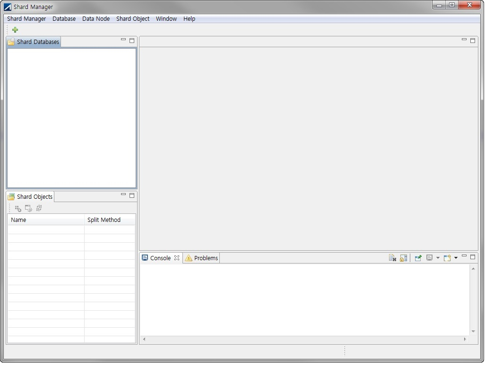

##### 샤드 데이터베이스 뷰

샤드 데이터베이스 뷰는 샤드 노드를 하나의 그룹으로 표현하는 샤드 데이터베이스를 중심으로 샤드 정보를 보여준다. 기본 전체 화면의 왼쪽 상단에 위치한다.

샤드 데이터베이스 뷰에서 표현하는 정보는 3가지이다.

1. 샤드 데이터베이스: 사용자가 등록한 샤드 노드를 하나의 그룹으로 나타낸다. 특정 샤드 노드로 접속을 성공하면, 샤드 데이터베이스는현재 접속 노드로부터 샤드 노드들의 정보를 가져와 트리 구조의 하위 노드로 표현한다.
2. 샤드 노드: 샤드 메타에 등록된 샤드 노드이다. 하위 노드로 Primary/Alternate DB의 연결 정보를 보여준다.
3. DB의 연결정보: 샤드 노드를 구성하는 Primary/Alternate DB 연결 정보이다.

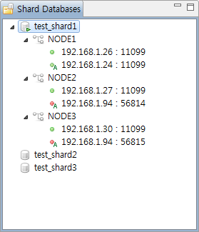

**Label Expression**

-   샤드 데이터베이스: 샤드 데이터베이스 추가 시 사용자가 부여한 이름
-   샤드 노드: 샤드 메타에 등록된 샤드 노드 이름
-   샤드 노드의 연결정보: IP 주소 : 포트 번호

**Icon Expression**

-   샤드 데이터베이스: 샤드 노드에 성공적으로 접속하면 아이콘 오른쪽 하단에 초록색 화살표를 표시한다.
-   샤드 노드의 연결정보: 원형 아이콘은 접속 성공 시 초록색, 실패 시 빨간색으로 표시된다. 해당 연결 정보가 샤드 노드의 alternate DB는 아이콘 오른쪽 하단에 'A' 문자를 표시한다.

##### 샤드 객체 뷰

샤드 객체 뷰는 샤드 데이터베이스 뷰에서 선택된 샤드 데이터베이스에 속한 샤드 객체를 보여준다. 기본 전체화면의 왼쪽 하단에 위치한다.

샤드 객체는 종류에 따라 'Procedures', 'Tables'의 트리 하위 노드로 표현된다.

-   프로시저: 샤드 메타에 등록된 샤드 프로시저이다.
-   프로시저 파라미터: 샤드 프로시저에서 샤드 키 또는 서브 샤드 키로 사용되는 파라미터 정보
-   테이블: 샤드 메타에 등록된 샤드 테이블이다.
-   테이블 컬럼: 샤드 테이블에서 샤드 키 또는 서브 샤드 키로 사용되는 컬럼 정보

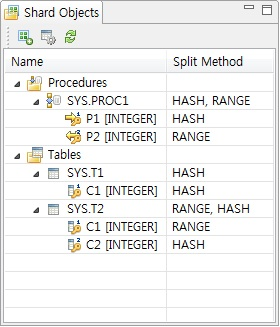

**Label Expression**

-   프로시저, 테이블: 사용자 이름.객체 이름
-   프로시저 파라미터: 프로시저 파라미터 이름 [데이터 타입]
-   테이블 컬럼: 테이블 컬럼 이름 [데이터 타입]

**Icon Expression**

-   프로시저 파라미터: 파라미터 타입에 따라 IN은 오른쪽, OUT은 왼쪽, IN OUT은 양쪽 화살표 아이콘을 표시한다. 열쇠 그림 위의 숫자가 1이면 샤드 키, 2이면 서브 샤드 키를 의미한다.
-   테이블 컬럼: 열쇠 그림 위의 숫자가 1이면 샤드 키, 2이면 서브 샤드 키를 의미한다.

**칼럼 설명**

-   Name: 샤드 객체의 이름을 표시한다.

-   Split Method: 샤드 객체의 분산 방식을 표시한다.

**샤드 객체 뷰 툴바**

-   Add New Shard Object(): 샤드 객체를 추가한다.
-   Resharding(): 샤드 테이블의 리샤딩을 수행한다.


##### 쿼리 뷰

쿼리 뷰는 사용자가 입력한 쿼리를 샤드 노드를 구성하는 Primary, Alternate DB를 대상으로 수행하는 뷰이다.

샤드 데이터베이스를 연결할 때 자동으로 뷰가 나타나며, 대상 데이터베이스의 이름이 뷰의 제목으로 사용된다. 사용자가 쿼리 뷰를 열 때에는 샤드 데이터베이스 뷰에서 샤드 데이터베이스를 마우스 오른쪽 버튼을 누르거나 선택 후, Database 메뉴를 열어 'Open Query View'를 선택하면 생성된다. 기본 전체 화면 오른쪽 상단에 위치한다.

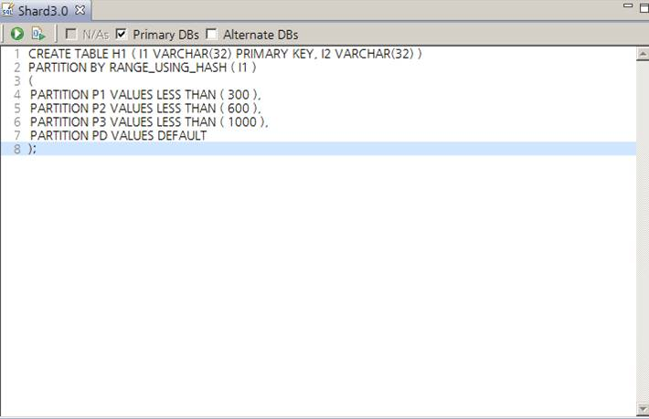

##### 쿼리 뷰 툴바

-   Execute Statement (): 커서로 선택한 문자 블록 또는 해당 커서가 위치한 라인이 수행된다.
-   Execute Script (): 쿼리 뷰에 입력한 모든 SQL문이 수행된다.

사용자가 선택한 체크박스에 따라 Primary 또는 Alternate DB DB를 대상으로 쿼리를 수행하며, 쿼리 수행 결과는 콘솔 뷰에 출력된다. 

쿼리 뷰에 여러 SQL문을 입력할 수 있으며, 일부 또는 전체 SQL문을 선택하여 수행할 수 있다. SQL문은 입력한 순서대로 수행된다.

##### 상세 뷰

상세 뷰는 특정 객체에 대해 각 노드에 저장된 해당 객체의 상세 정보와 샤드 메타에 등록된 분산 정보를 보여준다. 

대상 객체의 사용자 이름과 객체 이름이 개별 뷰의 제목으로 쓰인다. 샤드 객체 뷰에서 객체를 마우스 오른쪽 버튼으로 누르거나, 선택 후 Shard Object 메뉴를 열어 'Show Detail'을 선택하면 생성되며, 기본 전체화면의 오른쪽 상단에 위치한다.

상세 뷰는 샤드 객체 정보를 'Detail'과 'Shard Info'라는 탭으로 분류하여 보여준다.

-   Detail: 각 노드에 저장된 객체의 상세 정보를 보여준다.
    -   Owner Databases: 샤드 객체 뷰에서 선택된 객체와 동일한 스키마 이름과 객체 이름을 가진 객체가 저장되어 있는 데이터베이스 리스트를 보여준다. (Label Expression: '샤드 노드 이름 (IP 주소 : 포트 번호)' )
    -   Owner Databases에서 선택된 데이터베이스에 존재하는 분산 객체의 정보는 오른쪽 화면에 탭 형식으로 분류하여 나타낸다. 샤드 테이블의 경우 'Properties', 'Columns', 'Constraints'로 분류하고, 샤드 프로시저의 경우 'Properties', 'Parameters', 'Code'로 분류한다.

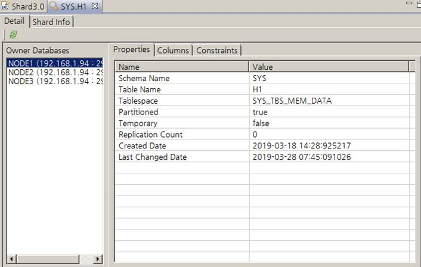

- Shard Info: 대상 객체가 샤드 객체인 경우, 샤드 메타에 등록된 분산 정보를 보여준다.
  - Split Information: 분산 방식과 샤드 키, 서브 샤드 키, 기본 노드를 보여준다.
  - Key Values: 선택한 샤드 객체가 분산된 샤드 노드의 이름과 샤드 키 값, 서브 샤드 키의 값을 보여준다.

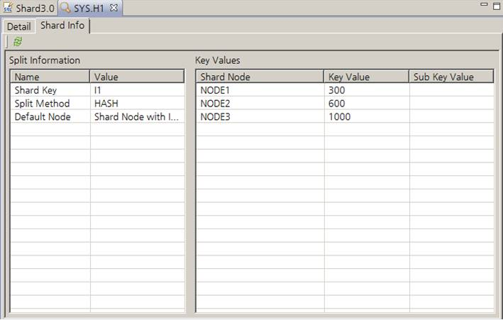

##### 메모리 테이블스페이스 사용률 뷰

메모리 테이블스페이스 사용률 뷰는 샤드 노드를 구성하는 DB의 메모리 테이블스페이스 사용률을 보여준다. 

접속한 데이터베이스를 마우스 오른쪽 버튼으로 누르거나, 선택 후 Database 메뉴를 열어 'Show Memory Tablespace Usage'를 클릭하면 생성된다. 생성 시 기본 전체화면 오른쪽 상단에 위치한다.

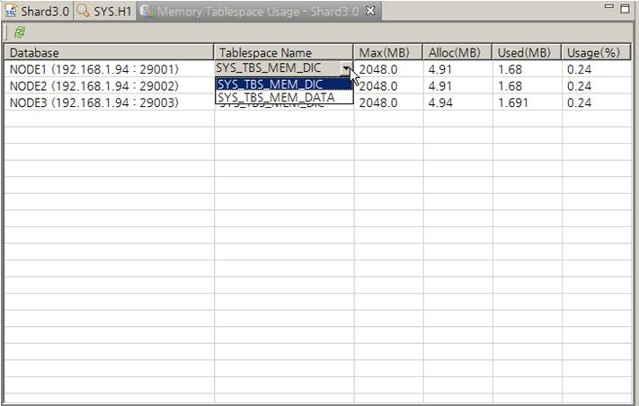

**칼럼 설명**

-   Database: 샤드 노드의 연결정보로 접속한 데이터베이스(Label Expression: '샤드 노드 이름 (IP 주소 : 포트 번호)'
-   Tablespace Name: 메모리 테이블스페이스 이름, 노드에 존재하는 메모리 테이블스페이스가 다수일 경우, 선택할 수 있다.
-   Max(MB): 메모리 테이블스페이스에서 사용할 수 있는 최대 메모리 크기, 테이블스페이스 생성 시 최대 크기를 지정하지 않았다면 MEM_MAX_DB_SIZE 프로퍼티에 지정된 크기를, AUTOEXTEND가 OFF라면 메모리 테이블스페이스가 할당받은 크기를 출력한다.
-   Alloc(MB): 메모리 테이블스페이스에 할당된 메모리 크기
-   Used(MB): 'Alloc(MB)'의 값 중, 실제 사용하는 메모리 크기
-   Usage(%): 메모리 테이블스페이스 사용률 (= Alloc(MB) / Max(MB) \* 100)

##### 레코드 카운트 뷰

샤드 테이블의 레코드는 여러 샤드 노드에 분산되어 저장된다. 레코드 카운트 뷰는 각 샤드 노드에 저장된 레코드 개수를 표시한다. 기본적으로 Primary DB에 저장된 테이블 레코드 갯수를 보여준다.

샤드 객체 뷰에서 테이블을 마우스 오른쪽 버튼으로 누르거나, 선택 후 'Shard Object' 메뉴에서 'Show Record Count'를 클릭하면 생성된다. 기본 전체화면의 오른쪽 상단에 위치한다.

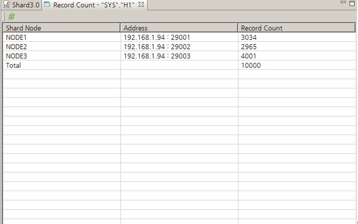

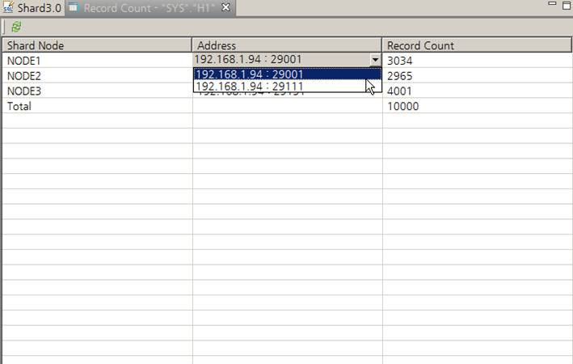

**칼럼 설명**

-   Shard Node: 샤드 메타에 저장된 노드의 이름
-   Address: 샤드 노드의 연결정보로 노드에 Alternate DB가 있으면 연결정보를 선택할 수 있다. (Label Expression: 'IP 주소 : 포트 번호')
-   Record Count: Shard Node와 Address 컬럼에서 선택된 데이터베이스에 저장된 테이블의 레코드 개수

##### 콘솔 뷰

프로그램 수행 중 사용자에게 전달할 정보가 기록되는 뷰이다. 

프로그램의 수행 상태와 쿼리 실행결과 등이 기록된다. 기본 전체화면 오른쪽 하단에 위치한다.

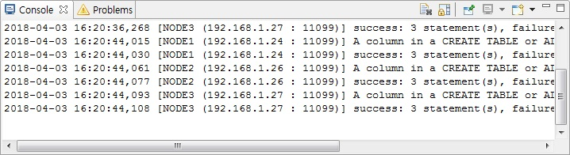

#### 샤드 데이터베이스 관리

이 절에서는 Shard Manager의 기능과 사용 방법에 대해 기술한다.

##### 샤드 데이터베이스 등록

1.  툴바 또는 Database 메뉴에 위치한 'Add New Shard Database'를 클릭한다.
2.  샤드 데이터베이스 이름과 최초 접속 노드의 연결정보를 입력한다. 최초 접속 노드 연결정보는 샤드 노드와 샤드 객체 정보를 가지고 오기 위해서 필요하다. 
3.  'Test' 버튼을 클릭하여 입력한 연결정보를 통해 최초 접속 노드에 접속이 정상적으로 이루어지는지 확인한다.
4.  'Next' 버튼을 클릭하여 다음 페이지에서 최초 접속 노드로부터 가져온 샤드 노드 이름, 연결정보, 그리고 접속하는데 사용될 JDBC 드라이버 파일을 확인한다.
5.  각 샤드 노드 접속에 필요한 JDBC 드라이버 파일이 최초 접속 노드에서 사용한 파일과 다르면, Driver Path 열에서 해당하는 칸에 위치한 연필 아이콘을 클릭하여 드라이버 파일을 변경한다.
6.  'Finish' 버튼을 클릭하여 샤드 데이터베이스를 저장한다.
7.  정상적으로 샤드 데이터베이스가 생성되었다면 해당 샤드 데이터베이스가 샤드 데이터베이스 뷰에 나타난다.

##### 샤드 데이터베이스 편집

1.  샤드 데이터베이스 뷰에서 수정할 샤드 데이터베이스를 클릭한다.
2.  샤드 데이터베이스 뷰 위에서 마우스 오른쪽 버튼을 누르거나, Database 메뉴를 열어 'Edit Shard Database'를 클릭한다.
3.  최초 접속 노드 연결정보를 수정한 뒤, 'Test'버튼을 클릭하여 접속 여부를 확인한다.
4.  'Next' 버튼을 클릭하여 다음 페이지에서 수정된 최초 접속 노드로부터 가져온 데이터 노드 리스트를 확인한다.
5.  각 샤드 노드 접속에 필요한 JDBC 드라이버 파일의 변경이 필요하면, Driver Path 열에서 해당하는 칸에 위치한 연필 아이콘을 클릭하여 파일을 변경한다.
6.  'Finish' 버튼을 클릭하여 수정된 샤드 데이터베이스를 저장한다.

##### 샤드 데이터베이스 연결

샤드 데이터베이스에 연결한다.

1. 샤드 데이터베이스 뷰에서 연결할 샤드 데이터베이스를 더블클릭하거나, 마우스 오른쪽 버튼으로 눌러 'Connect'를 클릭한다.
2. 연결이 정상적으로 수행되면 아이콘 오른쪽 하단에 초록색 화살표를 표시하고, 트리
   하위 노드로 샤드 메타에 등록된 샤드 노드를 표시한다.

##### 샤드 데이터베이스 연결 해제

샤드 데이터베이스 연결을 해제한다.

1. 샤드 데이터베이스 뷰에서 연결 해제할 샤드 데이터베이스를 더블클릭하거나, 마우스 오른쪽 버튼을 눌러 'Disconnect'를 클릭한다. 
2. 연결이 정상적으로 해제되었다면 아이콘 오른쪽 하단에 있는 초록색 화살표가 사라지고, 트리 하위 노드들이 사라진다.

##### 샤드 데이터베이스 제거

1. 샤드 데이터베이스 뷰에서 삭제할 샤드 데이터베이스를 마우스 오른쪽 버튼으로 누르거나, 클릭 후 Database 메뉴를 열어 'Remove Shard Database'를 클릭한다.
2. 삭제 여부를 묻는 팝업 창에서 삭제할 샤드 데이터베이스가 맞는지 확인한 뒤,'Yes' 버튼을 클릭한다.
3. 정상적으로 샤드 데이터베이스가 삭제되었다면, 해당 샤드 데이터베이스가 샤드 데이터베이스 뷰에서 사라진다.

##### 샤드 노드 추가

샤드 노드를 추가한다.

1.  샤드 데이터베이스에 새로운 샤드 노드를 추가한다.
2.  샤드 데이터베이스 뷰에서 샤드 데이터베이스를 마우스 오른쪽 버튼으로 누르거나, 클릭 후 Shard Node 메뉴를 열어 'Add Data Node'를 클릭한다.
3.  노드 이름과 Primary DB 연결정보를 반드시 입력하며, 선택적으로 alternate DB의 연결정보까지 입력할 수 있다.
4.  'Test' 버튼을 클릭하여 입력한 연결정보에 접속이 정상적으로 이루어지는지 확인한다.
5.  'OK' 버튼을 클릭하여 샤드 노드를 추가한다. 
    1.  샤드 노드의 DB 메타(Primary/Alternate)에 다른 샤드 노드에 등록된 샤드 객체가 미리 생성되어 있지 않으면, 샤드 노드 등록에 실패한다.
    2.  추가되는 샤드 노드에 Alternate DB 연결정보가 입력되어 있으면, 샤드 매니저가 샤드 테이블을 이중화하기 위한 이중화 객체를 Primary DB와 Alternate DB간에 자동으로 생성한다.
6.  정상적으로 수행되었으면, 샤드 데이터베이스에 등록한 샤드 노드가 추가된다.

##### 샤드 노드 삭제

 샤드 노드를 삭제한다.

1.  샤드 데이터베이스 뷰에서 삭제할 샤드 노드를 마우스 오른쪽 버튼으로 누르거나, 클릭 후 Shard Node 메뉴를 열어 'Remove Shard Node'를 클릭한다.
2.  삭제 여부를 묻는 팝업 창에서 삭제할 샤드 노드에 대한 정보를 확인한 뒤, 'Yes' 버튼을 클릭한다. Primary
    DB와 Alternate DB간 샤드 매니저가 생성한 이중화 객체가 있으면, 이를 감지해서 이중화 객체를 중지하고 삭제할 것인지 물어본다. 
3.  정상적으로 샤드 노드가 삭제되었다면 샤드 데이터베이스 뷰 내 대상 노드가 사라진다.

##### Alternate DB 추가

샤드 메타에 Alternate DB 정보를 추가한다. 노드에서 Alternate DB가 추가된다.

1. 샤드 데이터베이스 뷰에서 alternate DB를 추가할 샤드 노드 연결정보의 트리 상위 노드인 샤드 노드를 마우스 오른쪽 버튼으로 누르거나, 클릭 후 Shard Node 메뉴를 열어 'Add Alternate DB'를 클릭한다.
2. 추가할 alternate DB 접속 정보를 입력한다.
3. 'Test' 버튼을 클릭하여 입력한 연결정보로 접속이 정상적으로 이루어지는지 확인한다.
4. 'OK' 버튼을 클릭하여 Alternate DB를 추가한다.
   1. Primary DB에 생성되어 있는 샤드 객체가 Alternate DB의 DB 메타에 미리 생성되어 있지 않으면, 이를 알려주고 Alternate DB 추가가 실패한다.
   2. Primary DB에 생성되어 있는 샤드 테이블이 Alternate DB의 DB 메타에 미리 생성되어 있으면, 샤드 테이블을 이중화 하기 위한 이중화 객체가 Primary DB와 Alternate DB간에 자동으로 생성된다.
5. 정상적으로 alternate DB가 추가되었다면 샤드 데이터베이스 뷰 내 대상 샤드 노드의 트리 하위 노드로 Alternate DB정보가 추가된다.

##### Alternate DB 삭제

샤드 메타에서 Alternate DB 정보를 삭제한다. 노드에서 Alternate DB가 제거된다.

1.  샤드 데이터베이스 뷰에서 삭제할 Alternate DB가 포함된 샤드 노드를 마우스 오른쪽 버튼으로 누르거나, 클릭 후 Shard Node 메뉴를 열어 'Remove Alternate Node'를 클릭한다.
2.  삭제 여부를 묻는 팝업 창에서 삭제할 Alternate DB를 확인한 뒤 'Yes' 버튼을 클릭한다.
3.  정상적으로 alternate DB가 삭제되었다면 샤드 데이터베이스 뷰 내 대상 샤드 노드의 트리 하위 노드인 Alternate DB 정보가 사라진다.

##### 메모리 테이블스페이스 사용률 확인

1.  샤드 데이터베이스 뷰에서 메모리 테이블스페이스의 사용률을 확인하려는 샤드 데이터베이스를 마우스 오른쪽 버튼으로 누르거나, 클릭 후 Database 메뉴를 열어 'Show Memory Tablespace Usage'를 클릭한다.
2.  확인하고자 하는 데이터베이스의 행에서 Tablespace Name 열에 해당하는 칸을 클릭하여 원하는 메모리 테이블스페이스를 선택한다.

#### 샤드 객체 관리

##### 샤드 객체 설정

일반 DB 객체를 샤드 객체로 설정한다. 샤드 메타에 샤드 객체 정보가 저장된다.

1. 샤드 객체 뷰의 툴바에 위치한 'Add New Shard Object' 버튼() 또는 메뉴에서 'Shard Object' - 'Add New Shard Object' 항목을 클릭한다.
2. 'Available Database Object' 테이블에서 샤드 객체로 지정할 항목의 체크박스를 클릭하여 선택한다.
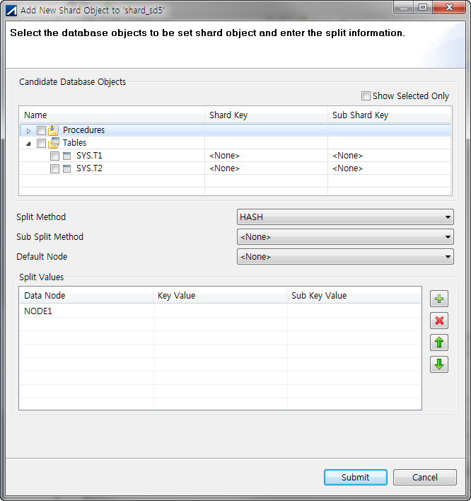
3. 'Composite'을 제외한 샤드 키 분산 테이블이면, 선택한 샤드 객체의 샤드 키와 서브 샤드 키를 지정한 뒤, 샤드 키 분산 방식, 서브 샤드 키 분산 방식, 기본 노드를 선택한다.
4. 'Key Values' 테이블에서 분산 정보에 등록할 노드와 샤드 키 값, 서브 샤드 키 값을 작성한다.
5. 'Submit' 버튼을 클릭하여 샤드 객체 설정을 샤드 노드에 요청한다.
6. 샤드 객체 설정이 완료되면, 해당 객체는 샤드 객체 뷰에 표시된다. 지정한 분산 방식은 'Split Method'에 표시되고, 샤드 키와 서브 샤드 키는 객체의 하위 노드로 표시된다.

##### 샤드 객체 해제

샤드 메타에서 샤드 객체 정보를 삭제하여, 일반 DB 객체로 변경한다.

1.  샤드 객체 뷰에서 원하는 샤드 객체를 마우스 오른쪽 버튼으로 누르거나, 클릭 후 'Shard Object' 메뉴를 열어 'Unset Shard Object'를 클릭한다.
2.  샤드 객체 해제를 완료하면, 샤드 객체 뷰에서 해당하는 샤드 객체가 제거된다. 
    

##### 샤드 객체 삭제

샤드 객체를 해제한 후, 샤드 메타에서 삭제한다. 그리고, 샤드 데이터베이스에 등록된 모든 DB에서 해당 객체를 삭제한다.

1.  샤드 객체 뷰에서 원하는 객체를 마우스 오른쪽 버튼으로 누르거나, 클릭 후 Shard Object 메뉴를 열어, 객체 종류가 테이블일 경우 'Drop Table'를, 프로시저일 경우 'Drop Procedure'를 클릭한다.
2.  삭제 여부를 묻는 팝업 창에서 삭제할 객체를 확인한 뒤, 'Yes' 버튼을 클릭한다.
3.  정상적으로 객체가 삭제되었다면 샤드 객체 뷰 내 해당 객체가 사라진다.

##### 샤드 객체 정보 확인

샤드 객체 뷰에서 원하는 객체를 마우스 오른쪽 버튼으로 누르거나, 클릭 후 Shard Object 메뉴를 열어 'Show Detail'을 클릭한다.

##### 테이블 레코드 카운트 확인

1.  샤드 객체 뷰에서 원하는 테이블을 마우스 오른쪽 버튼으로 누르거나 클릭 후 Shard Object 메뉴를 열어, 'Show Record Count'를 클릭한다.
2.  확인하고자 하는 샤드 노드의 행에서 Address 열에 해당하는 칸을 클릭하여 원하는 연결정보를 선택한다.

##### Resharding

샤드 노드간 샤드 테이블의 데이터 재분배를 손쉽게 수행한다.

1.  샤드 객체 뷰의 툴바에 위치한 'Resharding'() 또는 메뉴에서 'Shard Object' - 'Resharding' 항목을 클릭한다.
2.  'Shard Tables' 리스트에서 대상 샤드 테이블을 클릭하여 선택한다.
3.  샤드 테이블을 선택하면 'Partitions' 테이블에 파티션의 목록이 표시된다. 'Distribution' 테이블에는 노드별 레코드 갯수가 표시된다.
4.  'Partitions' 테이블에서 ToNode 컬럼값을 클릭하여 이동할 노드를 선택한다. 'Shard Tables'에서 다른 테이블을 선택하여 여러 테이블을 resharding한번으로 작업할 수 있다. 작업 대상 파티션 노드 변경사항은 'Resharding candidates'에 표시된다.
5.  'OK' 버튼을 누르면 작업 대상 파티션 노드 변경사항이 차례로 수행된다.
6.  '테이블 레코드 카운트 확인'을 수행하여 Resharding으로 레코드 재분배 결과를 확인할 수 있다.

#### SQL 실행

##### 쿼리 뷰 열기

샤드 데이터베이스 뷰에서 원하는 샤드 데이터베이스를 마우스 오른쪽 버튼으로 누르거나, 클릭 후 Database 메뉴를 열어 'Show Query View'를 클릭한다.

##### SQL 실행

선택한 노드 종류에 해당하는 데이터베이스에서 입력한 SQL문이 실행된다.

1.  쿼리 뷰 내 SQL 입력 창에 실행하고자 하는 SQL문을 입력한다.
2.  쿼리 뷰 내 툴바에 위치한 체크박스 중, 입력한 SQL문을 실행하고자 하는 대상 DB 종류를 선택한다.
3.  입력한 SQL문 중 특정 쿼리만 수행하려면, 해당 구문을 마우스 커서로 드래그하여 선택한 뒤 쿼리 뷰의 툴바에서 'Execute Statement'()을 클릭한다. 입력한 전체 SQL문을 모두 수행하고 싶을 경우에는 'Execute Script'()을 클릭하여 SQL 문을 실행한다.
4.  콘솔 뷰를 통해 각 데이터베이스에서의 실행 결과를 확인한다.
