Stored Procedures Manual
========================

#### Trunk

Altibase® Application Development

<br><br><br><br><br><br><!-- PDF 변환을 위한 여백입니다. --> 


<!-- PDF 변환을 위한 여백입니다. --> 

<div align="left">
    
</div>
<br><br><!-- PDF 변환을 위한 여백입니다. --> 


<!-- PDF 변환을 위한 여백입니다. --> 

<pre>
Altibase Application Development Stored Procedures Manual
Trunk
Copyright ⓒ 2001~2023 Altibase Corp. All Rights Reserved.<br>
본 문서의 저작권은 ㈜알티베이스에 있습니다. 이 문서에 대하여 당사의 동의없이 무단으로 복제 또는 전용할 수 없습니다.<br>
<b>㈜알티베이스</b>
08378 서울시 구로구 디지털로 306 대륭포스트타워Ⅱ 10층
전화 : 02-2082-1114
팩스 : 02-2082-1099
고객서비스포털 : <a href='http://support.altibase.com'>http://support.altibase.com</a>
홈페이지      : <a href='http://www.altibase.com/'>http://www.altibase.com</a></pre>


<br>

# 목차

- [서문](#%EC%84%9C%EB%AC%B8)
  - [이 매뉴얼에 대하여](#%EC%9D%B4-%EB%A7%A4%EB%89%B4%EC%96%BC%EC%97%90-%EB%8C%80%ED%95%98%EC%97%AC)
- [1.저장 프로시저](#1%EC%A0%80%EC%9E%A5-%ED%94%84%EB%A1%9C%EC%8B%9C%EC%A0%80)
  - [저장 프로시저의 개요](#%EC%A0%80%EC%9E%A5-%ED%94%84%EB%A1%9C%EC%8B%9C%EC%A0%80%EC%9D%98-%EA%B0%9C%EC%9A%94)
  - [저장 프로시저의 구조](#%EC%A0%80%EC%9E%A5-%ED%94%84%EB%A1%9C%EC%8B%9C%EC%A0%80%EC%9D%98-%EA%B5%AC%EC%A1%B0)
  - [저장 프로시저 사용시 주의 사항](#%EC%A0%80%EC%9E%A5-%ED%94%84%EB%A1%9C%EC%8B%9C%EC%A0%80-%EC%82%AC%EC%9A%A9%EC%8B%9C-%EC%A3%BC%EC%9D%98-%EC%82%AC%ED%95%AD)
- [2.저장 프로시저 SQL문](#2%EC%A0%80%EC%9E%A5-%ED%94%84%EB%A1%9C%EC%8B%9C%EC%A0%80-sql%EB%AC%B8)
  - [개요](#%EA%B0%9C%EC%9A%94)
  - [CREATE PROCEDURE](#create-procedure)
  - [ALTER PROCEDURE](#alter-procedure)
  - [DROP PROCEDURE](#drop-procedure)
  - [EXECUTE](#execute)
  - [CREATE FUNCTION](#create-function)
  - [ALTER FUNCTION](#alter-function)
  - [DROP FUNCTION](#drop-function)
- [3.저장 프로시저 블록](#3%EC%A0%80%EC%9E%A5-%ED%94%84%EB%A1%9C%EC%8B%9C%EC%A0%80-%EB%B8%94%EB%A1%9D)
  - [저장 프로시저 블록](#%EC%A0%80%EC%9E%A5-%ED%94%84%EB%A1%9C%EC%8B%9C%EC%A0%80-%EB%B8%94%EB%A1%9D)
  - [지역 변수 선언](#%EC%A7%80%EC%97%AD-%EB%B3%80%EC%88%98-%EC%84%A0%EC%96%B8)
  - [SELECT INTO](#select-into)
  - [RETURNING INTO 절](#returning-into-%EC%A0%88)
  - [할당문](#%ED%95%A0%EB%8B%B9%EB%AC%B8)
  - [LABEL](#label)
  - [PRINT](#print)
  - [RETURN](#return)
  - [INSERT 확장](#insert-%ED%99%95%EC%9E%A5)
  - [UPDATE 확장](#update-%ED%99%95%EC%9E%A5)
- [4.흐름 제어](#4%ED%9D%90%EB%A6%84-%EC%A0%9C%EC%96%B4)
  - [개요](#%EA%B0%9C%EC%9A%94-1)
  - [IF](#if)
  - [CASE](#case)
  - [LOOP](#loop)
  - [WHILE LOOP](#while-loop)
  - [FOR LOOP](#for-loop)
  - [EXIT](#exit)
  - [CONTINUE](#continue)
  - [GOTO](#goto)
  - [NULL](#null)
- [5.커서](#5%EC%BB%A4%EC%84%9C)
  - [커서의 개요](#%EC%BB%A4%EC%84%9C%EC%9D%98-%EA%B0%9C%EC%9A%94)
  - [CURSOR](#cursor)
  - [OPEN](#open)
  - [FETCH](#fetch)
  - [CLOSE](#close)
  - [Cursor FOR LOOP](#cursor-for-loop)
  - [커서 속성](#%EC%BB%A4%EC%84%9C-%EC%86%8D%EC%84%B1)
- [6.사용자 정의 타입](#6%EC%82%AC%EC%9A%A9%EC%9E%90-%EC%A0%95%EC%9D%98-%ED%83%80%EC%9E%85)
  - [개요](#%EA%B0%9C%EC%9A%94-2)
  - [사용자 정의 타입의 정의](#%EC%82%AC%EC%9A%A9%EC%9E%90-%EC%A0%95%EC%9D%98-%ED%83%80%EC%9E%85%EC%9D%98-%EC%A0%95%EC%9D%98)
  - [Associative Array 관련 함수](#associative-array-%EA%B4%80%EB%A0%A8-%ED%95%A8%EC%88%98)
  - [RECORD 타입 변수 및 Associative Array변수의 사용](#record-%ED%83%80%EC%9E%85-%EB%B3%80%EC%88%98-%EB%B0%8F-associative-array%EB%B3%80%EC%88%98%EC%9D%98-%EC%82%AC%EC%9A%A9)
  - [REF CURSOR](#ref-cursor)
- [7.타입 세트](#7%ED%83%80%EC%9E%85-%EC%84%B8%ED%8A%B8)
  - [개요](#%EA%B0%9C%EC%9A%94-3)
  - [CREATE TYPESET](#create-typeset)
  - [DROP TYPESET](#drop-typeset)
- [8.동적 SQL](#8%EB%8F%99%EC%A0%81-sql)
  - [동적 SQL의 개요](#%EB%8F%99%EC%A0%81-sql%EC%9D%98-%EA%B0%9C%EC%9A%94)
  - [EXECUTE IMMEDIATE](#execute-immediate)
  - [OPEN FOR](#open-for)
- [9.예외 처리](#9%EC%98%88%EC%99%B8-%EC%B2%98%EB%A6%AC)
  - [개요](#%EA%B0%9C%EC%9A%94-4)
  - [EXCEPTION](#exception)
  - [RAISE](#raise)
  - [RAISE_APPLICATION_ERROR](#raise_application_error)
  - [사용자 정의 예외](#%EC%82%AC%EC%9A%A9%EC%9E%90-%EC%A0%95%EC%9D%98-%EC%98%88%EC%99%B8)
  - [SQLCODE와 SQLERRM](#sqlcode%EC%99%80-sqlerrm)
  - [Exception Handler](#exception-handler)
- [10.프라그마(Pragma)](#10%ED%94%84%EB%9D%BC%EA%B7%B8%EB%A7%88pragma)
  - [개요](#%EA%B0%9C%EC%9A%94-5)
  - [자율 트랜잭션 프라그마(Autonomous_Transaction Pragma)](#%EC%9E%90%EC%9C%A8-%ED%8A%B8%EB%9E%9C%EC%9E%AD%EC%85%98-%ED%94%84%EB%9D%BC%EA%B7%B8%EB%A7%88autonomous_transaction-pragma)
  - [예외 초기화 프라그마(Exception_Init Pragma)](#%EC%98%88%EC%99%B8-%EC%B4%88%EA%B8%B0%ED%99%94-%ED%94%84%EB%9D%BC%EA%B7%B8%EB%A7%88exception_init-pragma)
- [11.저장 패키지](#11%EC%A0%80%EC%9E%A5-%ED%8C%A8%ED%82%A4%EC%A7%80)
  - [개요](#%EA%B0%9C%EC%9A%94-6)
  - [CREATE PACKAGE](#create-package)
  - [CREATE PACKAGE BODY](#create-package-body)
  - [ALTER PACKAGE](#alter-package)
  - [DROP PACKAGE](#drop-package)
  - [EXECUTE](#execute-1)
- [12.Altibase 저장 프로시저와 내장 함수](#12altibase-%EC%A0%80%EC%9E%A5-%ED%94%84%EB%A1%9C%EC%8B%9C%EC%A0%80%EC%99%80-%EB%82%B4%EC%9E%A5-%ED%95%A8%EC%88%98)
  - [파일 제어](#%ED%8C%8C%EC%9D%BC-%EC%A0%9C%EC%96%B4)
  - [TCP 접속 제어](#tcp-%EC%A0%91%EC%86%8D-%EC%A0%9C%EC%96%B4)
  - [DBMS Stats](#dbms-stats)
  - [그 외 함수들](#%EA%B7%B8-%EC%99%B8-%ED%95%A8%EC%88%98%EB%93%A4)
- [13.Altibase 저장 패키지](#13altibase-%EC%A0%80%EC%9E%A5-%ED%8C%A8%ED%82%A4%EC%A7%80)
  - [시스템 정의 저장 패키지](#%EC%8B%9C%EC%8A%A4%ED%85%9C-%EC%A0%95%EC%9D%98-%EC%A0%80%EC%9E%A5-%ED%8C%A8%ED%82%A4%EC%A7%80)
  - [DBMS_APPLICATION_INFO](#dbms_application_info)
  - [DBMS_ALERT](#dbms_alert)
  - [DBMS_CONCURRENT_EXEC 패키지](#dbms_concurrent_exec-%ED%8C%A8%ED%82%A4%EC%A7%80)
  - [DBMS_LOCK](#dbms_lock)
  - [DBMS_METADATA](#dbms_metadata)
  - [DBMS_OUTPUT](#dbms_output)
  - [DBMS_RANDOM](#dbms_random)
  - [DBMS_RECYCLEBIN 패키지](#dbms_recyclebin-%ED%8C%A8%ED%82%A4%EC%A7%80)
  - [DBMS_SQL](#dbms_sql)
  - [DBMS_SQL_PLAN_CACHE](#dbms_sql_plan_cache)
  - [DBMS_STATS](#dbms_stats)
  - [DBMS_STANDARD](#dbms_standard)
  - [DBMS_UTILITY](#dbms_utility)
  - [STANDARD](#standard)
  - [SYS_SPATIAL](#sys_spatial)
  - [UTL_COPYSWAP](#utl_copyswap)
  - [UTL_FILE](#utl_file)
  - [UTL_RAW](#utl_raw)
  - [UTL_SMTP](#utl_smtp)
  - [UTL_TCP](#utl_tcp)
- [A.부록: 예제](#a%EB%B6%80%EB%A1%9D-%EC%98%88%EC%A0%9C)
  - [저장 프로시저 예제](#%EC%A0%80%EC%9E%A5-%ED%94%84%EB%A1%9C%EC%8B%9C%EC%A0%80-%EC%98%88%EC%A0%9C)
  - [파일 제어 예제](#%ED%8C%8C%EC%9D%BC-%EC%A0%9C%EC%96%B4-%EC%98%88%EC%A0%9C)
  - [UTL_SMTP 예제](#utl_smtp-%EC%98%88%EC%A0%9C)
  - [SENDMAIL DAEMON 확인 예제](#sendmail-daemon-%ED%99%95%EC%9D%B8-%EC%98%88%EC%A0%9C)

<br>

서문
====

### 이 매뉴얼에 대하여

이 매뉴얼은 저장 프로시저의 개념 및 사용 방법에 대해 설명한다.

#### 대상 사용자

이 매뉴얼은 다음과 같은 Altibase 사용자를 대상으로 작성되었다.

-   데이터베이스 관리자

-   성능 관리자

-   데이터베이스 사용자

-   응용 프로그램 개발자

다음과 같은 배경 지식을 가지고 이 매뉴얼을 읽는 것이 좋다.

-   컴퓨터, 운영 체제 및 운영 체제 유틸리티 운용에 필요한 기본 지식

-   관계형 데이터베이스 사용 경험 또는 데이터베이스 개념에 대한 이해

-   컴퓨터 프로그래밍 경험

#### 소프트웨어 환경

이 매뉴얼은 데이터베이스 서버로 Altibase 버전 7.1을 사용한다는 가정 하에
작성되었다.

#### 이 매뉴얼의 구성

이 매뉴얼은 다음과 같이 구성되어 있다.

-   제 1장 저장 프로시저  
    이 장은 저장 프로시저의 개념 및 구조, 사용 시 주의 사항에 대해 설명한다.

-   제 2장 저장 프로시저 SQL문  
    이 장은 저장 프로시저 SQL문에 대한 사용 방법에 대해 설명한다.

-   제 3장 저장 프로시저 블록  
    이 장은 저장 프로시저 블록의 개념, 저장 프로시저 바디 내에서 선언하는 지역
    변수 및 사용가능한 문장에 대해 설명한다.

-   제 4장 흐름 제어  
    이 장은 저장 프로시저 바디 내에서 절차적 프로그램 작성이 가능하도록 프로그램
    흐름을 제어할 수 있는 흐름 제어문에 대해 설명한다.

-   제 5장 커서  
    이 장은 저장 프로시저 내에서 조회 레코드 건수가 여러 개인 SELECT문을 처리할
    수 있도록 커서를 정의하고 레코드를 제어할 수 있는 커서 관련문들에 대해
    설명한다.

-   제 6장 사용자 정의 타입  
    이 장은 저장 프로시저 내에서 사용자 정의 타입인 record 및 associative
    array의 정의 및 사용 방법에 대해 설명한다.

-   제 7장 타입 세트  
    이 장은 사용자 정의 타입의 집합인 타입 세트의 정의 및 사용 방법에 대해
    설명한다.

-   제 8장 동적 SQL  
    이 장은 실행 시간에 사용자가 원하는 질의를 만들어서 실행하기 위한 동적 SQL에
    대해 설명한다.

-   제 9장 예외 처리  
    이 장은 저장 프로시저 실행 중 오류 발생 시 저장 프로시저 내에서 오류에 대한
    예외 처리가 가능하도록 하는 예외 처리 관련문에 대해 설명한다.

-   제 10장 프라그마(Pragma)  
    이 장은 저장 프로시저 컴파일 시 영향을 미치는 Pragma에 대해 설명하고, 이를
    사용하는 방법을 설명한다.

-   제 11장 저장 패키지  
    이 장은 패키지를 생성하고 사용하는 방법을 설명한다.

-   제 12장 Altibase 저장 프로시저와 내장 함수  
    Altibase는 다양한 종류의 내장된 저장 프로시저와 함수를 제공한다. 이 장은
    이들 저장 프로시저와 함수를 소개하고 그 사용법에 대해 설명한다.

-   제 13장 Altibase 저장 패키지  
    Altibase에서 제공하는 저장 패키지에 대해 설명한다.

-   A. 부록  
    이 장은 이 매뉴얼의 예제에서 사용한 스키마에 대한 설명과 저장 프로시저를
    이용한 예제 프로그램을 설명한다.

#### 문서화 규칙

이 절에서는 이 매뉴얼에서 사용하는 규칙에 대해 설명한다. 이 규칙을 이해하면 이
매뉴얼과 설명서 세트의 다른 매뉴얼에서 정보를 쉽게 찾을 수 있다.

여기서 설명하는 규칙은 다음과 같다.

-   구문 다이어그램

-   샘플 코드 규칙

##### 구문 다이어그램

이 매뉴얼에서는 다음 구성 요소로 구축된 다이어그램을 사용하여, 명령문의 구문을
설명한다.

| 구성 요소                                   | 의미                                                         |
| ------------------------------------------- | ------------------------------------------------------------ |
|  | 명령문이 시작한다. 완전한 명령문이 아닌 구문 요소는 화살표로 시작한다. |
|  | 명령문이 다음 라인에 계속된다. 완전한 명령문이 아닌 구문 요소는 이 기호로 종료한다. |
|  | 명령문이 이전 라인으로부터 계속된다. 완전한 명령문이 아닌 구문 요소는 이 기호로 시작한다. |
|  | 명령문이 종료한다.                                           |
|  | 필수 항목                                                    |
|  | 선택적 항목                                                  |
|  | 선택사항이 있는 필수 항목. 한 항목만 제공해야 한다.          |
|  | 선택사항이 있는 선택적 항목                                  |
|  | 선택적 항목. 여러 항목이 허용된다. 각 반복 앞부분에 콤마가 와야 한다. |

##### 샘플 코드 규칙

코드 예제는 SQL, Stored Procedure, iSQL, 또는 다른 명령 라인 구문들을 예를 들어
설명한다.

아래 테이블은 코드 예제에서 사용된 인쇄 규칙에 대해 설명한다.

| 규칙         | 의미                                                                                | 예제                                                                                                      |
|--------------|-------------------------------------------------------------------------------------|-----------------------------------------------------------------------------------------------------------|
| [ ]          | 선택 항목을 표시                                                                    | VARCHAR [(*size*)] [[FIXED \|] VARIABLE]                                                                  |
| { }          | 필수 항목 표시. 반드시 하나 이상을 선택해야 되는 표시                               | { ENABLE \| DISABLE \| COMPILE }                                                                          |
| \|           | 선택 또는 필수 항목 표시의 인자 구분 표시                                           | { ENABLE \| DISABLE \| COMPILE } [ ENABLE \| DISABLE \| COMPILE ]                                         |
| . . .        | 그 이전 인자의 반복 표시 예제 코드들의 생략되는 것을 표시                           | SQL\> SELECT ename FROM employee; ENAME ------------------------ SWNO HJNO HSCHOI . . . 20 rows selected. |
| 그 밖에 기호 | 위에서 보여진 기호 이 외에 기호들                                                   | EXEC :p1 := 1; acc NUMBER(11,2);                                                                          |
| 기울임 꼴    | 구문 요소에서 사용자가 지정해야 하는 변수, 특수한 값을 제공해야만 하는 위치         | SELECT \* FROM *table_name*; CONNECT *userID*/*password*;                                                 |
| 소문자       | 사용자가 제공하는 프로그램의 요소들, 예를 들어 테이블 이름, 칼럼 이름, 파일 이름 등 | SELECT ename FROM employee;                                                                               |
| 대문자       | 시스템에서 제공하는 요소들 또는 구문에 나타나는 키워드                              | DESC SYSTEM_.SYS_INDICES_;                                                                                |

#### 샘플 스키마

이 매뉴얼 내의 예제중의 일부는 employees, departments 및 orders테이블 같은 샘플
테이블에 기반하여 작성되었다. 이들 테이블은 \$ALTIBASE_HOME/sample/APRE/schema
디렉토리의 schema.sql을 사용하여 생성할 수 있다. 샘플 스키마에 대한 온전한
정보는 *General Reference*를 참고하기 바란다.

#### 관련 자료

자세한 정보를 위하여 다음 문서 목록을 참조하기 바란다.

-   Installation Guide

-   Getting Started Guide

-   SQL Reference

-   iSQL User’s Manual

-   Error Message Reference

#### Altibase는 여러분의 의견을 환영합니다.

이 매뉴얼에 대한 여러분의 의견을 보내주시기 바랍니다. 사용자의 의견은 다음
버전의 매뉴얼을 작성하는데 많은 도움이 됩니다. 보내실 때에는 아래 내용과 함께
고객서비스포털(*http://support.altibase.com/kr/* )로 보내주시기 바랍니다.

-   사용 중인 매뉴얼의 이름과 버전

-   매뉴얼에 대한 의견

-   사용자의 성함, 주소, 전화번호

이 외에도 Altibase 기술지원 설명서의 오류와 누락된 부분 및 기타 기술적인
문제들에 대해서 이 주소로 보내주시면 정성껏 처리하겠습니다. 또한, 기술적인
부분과 관련하여 즉각적인 도움이 필요한 경우에도 고객서비스포털을 통해 서비스를
요청하시기 바랍니다.

여러분의 의견에 항상 감사드립니다.


1.저장 프로시저
=============

### 저장 프로시저의 개요

저장 프로시저(Stored Procedure)란 SQL문들과 흐름 제어문, 할당문, 오류 처리 루틴
등으로 구성된 데이터베이스 객체 (object) 중의 하나이다. 저장 프로시저는 생성될
때 컴파일 되어 바로 실행 가능한 상태로 데이터베이스에 저장되며 여러 세션에서
동시에 하나의 저장 프로시저를 실행하는 것도 가능하다

“저장 프로시저(Stored Procedure)”라는 용어는 때때로 저장 프로시저와 저장
함수(Stored Function)를 모두 지칭하기도 한다. 저장 프로시저와 저장 함수의 다른
점은 저장 함수가 실행 시 값을 반환하는 것 외에는 차이가 없다.

저장 프로시저와 저장 함수는 각각 CREATE PROCEDURE 와 CREATE FUNCTION 구문을
사용해서 생성할 수 있다. 이 구문에 대한 자세한 설명은 2장 “저장 프로시저
SQL문”을 참고하기 바란다.

#### 저장 프로시저의 종류

##### 저장 프로시저

저장 프로시저는 SQL구문이나 다른 저장 프로시저 내에서 입력 인자, 출력 인자,
입출력 인자를 가지고 실행할 수 있다. 저장 프로시저 호출 시, 프로시저의 바디
부분에 정의된 절차에 따라서 SQL문을 수행하게 된다. 저장 프로시저는 반환 값을
가지지 않지만, 출력 인자와 입출력 인자들을 통해 프로시저를 호출한 클라이언트에게
값을 전달할 수도 있다. 이는 반환 값을 갖지 않기 때문에 SQL문의 연산식
(expression) 내에서 피연산자로 사용될 수 없다.

##### 저장 함수

값을 반환하는 것만 제외하면 저장 프로시저와 동일하다. 저장 프로시저와 달리
하나의 반환 값을 가지므로 SQL문의 연산식 (expression)내에서 피연산자로 사용할 수
있다.

##### 타입 세트

저장 프로시저의 사용자 정의 타입들을 정의한 집합이다. 이는 주로 저장
프로시저끼리 인자 또는 리턴 값으로 사용자 정의 타입을 주고받을 때 사용한다.

자세한 내용은 7장 “타입 세트”에서 다룬다.

#### 저장 프로시저의 특징

##### SQL 구문을 이용한 절차적 프로그램

Altibase PSM (Persistent Stored Module)은 흐름 제어문과 예외 처리문을 제공하므로
SQL문을 사용해서 절차적 프로그래밍이 가능하다.

##### 성능

여러 SQL문을 순차적으로 수행하는 클라이언트 프로그램의 경우에는 각 SQL문 수행 시
마다 데이터베이스 서버와 통신을 해야 하므로 통신 비용이 많이 발생한다. 반면,
저장 프로시저로 작성된 프로그램은 프로시저 호출 시 한번의 통신만으로 여러
SQL문을 수행할 수 있다.

따라서, 저장 프로시저를 사용하면 통신 부하의 감소와 함께 데이터베이스 서버와
클라이언트 응용 프로그램간의 데이터 타입의 차이로 인해 발생하는 내부적인 데이터
타입 변환의 부하도 줄일 수 있다.

##### 모듈화

업무 절차를 구현하는데 필요한 모든 SQL작업을 하나의 저장 프로시저로 묶어
모듈화하여 관리할 수 있다.

##### 소스 코드 관리의 용이성

저장 프로시저는 데이터베이스 서버에 저장되는 모듈이기 때문에, 업무 로직의 변경
시 여러 클라이언트에 설치된 프로그램들을 모두 수정할 필요 없이 저장 프로시저만
변경하면 되므로 프로그램 관리가 용이하다.

##### 공유와 생산성

한 사용자가 생성한 저장 프로시저는 데이터베이스에 저장되므로 접근 권한이 부여된
다른 사용자도 해당 저장 프로시저를 실행할 수 있어 서로 공유할 수 있을 뿐만
아니라, 한 저장 프로시저 내에서 다른 저장 프로시저의 호출이 가능하므로 같은 업무
절차의 재 프로그래밍이 필요 없으므로 생산성을 높일 수 있다.

##### SQL과의 통합성

저장 프로시저 내의 흐름 제어문의 조건절은 SELECT문의 조건절을 그대로 사용할 수
있다. 즉, C/C++등의 주 언어의 흐름 제어문의 조건절에서는 사용할 수 없는 SQL문
스타일의 기능을 사용할 수 있다. 또한, 연산식에 부질의 (subquery)를 사용하거나
SQL문이 지원하는 시스템 제공 함수들을 그대로 사용할 수 있다는 점 등 SQL문과
밀착된 프로그래밍이 가능하다.

##### 에러 및 예외처리

저장 프로시저 내에서 Exception Handler를 제공하므로 SQL문 수행 도중 오류가
발생했을 때 적절한 대응 조치를 서버 내에서 바로 처리할 수 있다.

##### 저장성

저장 프로시저 또한 데이터베이스 객체이기 때문에 사용자가 삭제하기 전까지
데이터베이스 내에 저장된다. 따라서 업무 절차 또한 데이터베이스에 저장하여
보존시킬 수 있다.

##### 보안강화

저장 프로시저 및 저장 함수 등의 PSM 코드 프로그램을 altiwrap 유틸리티로
암호화하여 노출되는 것을 방지할 수 있다. 이 유틸리티에 대한 설명은 *Utilities
Manual*을 참고한다. Altibase가 암호화할 수 있는 구문은 아래와 같다.

-   CREATE [OR REPLACE] PROCEDURE

-   CREATE [OR REPLACE] FUNCTION

-   CREATE [OR REPLACE] TYPESET

-   CREATE [OR REPLACE] PACKAGE

-   CREATE [OR REPLACE] PACKAGE BODY


### 저장 프로시저의 구조

저장 프로시저는 블록으로 구조화된 언어로, 저장 프로시저의 바디는 여러 개의
논리적인 블록들로 구성된다.

저장 프로시저는 크게 헤더와 바디로 나뉘어진다. 저장 프로시저의 바디는 하나의 큰
블록으로서 선언부, 프로시저의 실제 바디, 예외 처리부로 구성된다. 바디는 다시
여러 개의 하위 블록들을 가질 수 있다.

저장 프로시저 구조를 예를 들어 설명하면 다음과 같다.


블록2는 블록1의 하위 블록으로 블록1의 구조와 같이 선언부, 바디, 예외 처리부로
구성될 수도 있다.

흐름 제어문도 명시적인 시작과 끝을 알 수 있는 하나의 블록이다.


### 저장 프로시저 사용시 주의 사항

#### 트랜잭션 관리

저장 프로시저 내에서 사용 가능한 트랜잭션 제어문은 COMMIT, ROLLBACK문이다. 저장
프로시저 내에서 사용한 트랜잭션 제어문은 저장 프로시저 밖의 작업에도 영향을 미칠
수 있다.

예를 들어서 NON-AUTOCOMMIT 모드에서 다음과 같은 작업을 수행했다고 가정하자.

```
iSQL> INSERT INTO t1 values (1);
iSQL> INSERT INTO t1 values (2);
iSQL> EXECUTE proc1;
```

proc1이 “INSERT INTO t1 values (3)” 구문과 “ROLLBACK” 문을 수행한다면 프로시저
내에서 입력한 3 뿐만 아니라 프로시저 외부의 iSQL에서 입력한 1과 2도
ROLLBACK된다. 즉, 위의 두 INSERT문과 EXECUTE문은 하나의 트랜잭션으로 처리된다.

#### 제약 사항

커서가 OPEN된 상태에서 COMMIT 또는 ROLLBACK을 실행할 수 있다.

SELECT문 내에서 호출되는 저장 함수의 경우 저장 함수 내에 INSERT, UPDATE,
DELETE문은 사용할 수 없으며, 트랜잭션 제어문도 수행할 수 없다.

INSERT, UPDATE, DELETE문 내에서 호출되는 저장 함수내에서도 트랜잭션 제어문을
수행할 수 없다.

#### 관련 메타 테이블

저장 프로시저 관련 메타 테이블에 대한 자세한 내용은 *General Reference* 의 데이터 딕셔너리 부분을 참조한다.


2.저장 프로시저 SQL문
===================

### 개요

#### 저장 프로시저 SQL문

아래 표는 저장 프로시저, 함수와 타입 세트를 생성하고 관리하는 데 사용하는 DDL문을 보여준다.

CREATE TYPESET 과 DROP TYPESET 구문에 대한 설명은 7장 타입 세트를 참고하기 바란다.

<table>
    <tr>
        <th>종류</th><th>관련문장</th><th>설명</th>
	</tr>
    <tr>
        <TD rowspan="3">생성</TD><TD>CREATE [OR REPLACE] PROCEDURE문</TD><TD>새로운 저장 프로시저를 생성하거나 이미 생성된 저장 프로시저의 정의를 변경하는 문장이다.</TD>
    </tr>
    <TR>
        <TD>CREATE [OR REPLACE] FUNCTION 문</TD><TD>새로운 저장 함수를 생성하거나 이미 생성된 저장 함수의 정의를 변경하는 문장이다.</TD>       
    </TR>
    <TR>
        <TD>CREATE [OR REPLACE] TYPESET 문</TD><TD>타입 세트를 생성 또는 변경하는 문장이다.</TD>
    </TR>
    <TR>
        <TD rowspan="2">변경</TD><TD>ALTER PROCEDURE 문</TD><TD>이 구문은 저장 프로시저를 재컴파일하여  프로시저를 유효한 상태로 변경하고자 할 때 사용한다.</TD>
    </TR>
    <TR>
        <TD>ALTER FUNCTION 문</TD><TD>ALTER PROCEDURE문과 동일하다.</TD>
    </TR>
    <TR>
        <TD rowspan="3">삭제</TD><TD>DROP PROCEDURE 문</TD><TD>생성된 저장 프로시저를 삭제하는 문장이다.</TD>
    </TR>
    <TR>
    	<TD>DROP FUNCTION 문</TD><TD>생성된 저장 함수를 삭제하는 문장이다.</TD>
    </TR>
    <TR>
        <TD>DROP TYPESET 문</TD><TD>생성된 타입 세트를 삭제하는 문장이다.</TD>
    </TR>  
    <TR>
        <TD rowspan="2">실행</TD> <TD>EXECUTE 문</TD><TD>저장 프로시저 또는 저장 함수를 실행하는 문장이다.</TD>        
    </TR>
    <TR>
     	<TD>function_name</TD><TD>SQL문 내에서 호출할 때 이름으로 참조할 수 있다.</TD>        
    </TR>
</table>

#### 데이터 타입

저장 프로시저에서는 다음과 같은 데이터 타입을 지원한다.

-   SQL 데이터 타입

-   BOOLEAN 타입

-   FILE_TYPE  
    저장 프로시저 내에서만 사용 가능하며, 파일 제어를 위한 타입이다. 자세한
    내용은 11장의 “파일 제어”를 참조한다.

-   사용자 정의 타입  
    저장 프로시저 내에서만 사용 가능하며, RECORD 및 ASSOCIATIVE ARRAY를
    지원한다. 자세한 내용은 6장 “사용자 정의 타입”을 참조한다.

##### SQL 데이터 타입

SQL 구문에서 사용 가능한 데이터 타입 모두 PSM (저장 프로시저, 저장 함수)에서
사용할 수 있다. 각 데이터 타입에 대한 자세한 내용은 *General Reference*의
"데이터 타입" 장을 참조한다.

아래 표에 나열한 SQL 데이터 타입은 SQL과 PSM에서 사용 가능한 최대 크기가 다르다.

| 데이터 타입 | SQL에서 최대 크기            | PSM에서 최대 크기                                            |
| ----------- | ---------------------------- | ------------------------------------------------------------ |
| CHAR(M)     | 32000                        | 65534                                                        |
| VARCHAR(M)  | 32000                        | 65534                                                        |
| NCHAR(M)    | 16000 (UTF-16) 10666 (UTF-8) | 32766 (UTF-16) 21843 (UTF-8)                                 |
| NVARCHAR(M) | 16000 (UTF-16) 10666 (UTF-8) | 32766 (UTF-16) 21843 (UTF-8)                                 |
| BLOB        | 2GB - 1                      | 100MB <br />LOB_OBJECT_BUFFER_SIZE 프로퍼티에 의해 결정 <br />(기본값: 32KB) |
| CLOB        | 2GB - 1                      | 100MB <br />LOB_OBJECT_BUFFER_SIZE 프로퍼티에 의해 결정 <br />(기본값: 32KB) |

SQL에서 CHAR, VARCHAR, NCHAR, NVARCHAR 타입의 크기를 지정하지 않으면 크기는
1이다.

저장 프로시저와 저장 함수에서 파라미터 또는 반환 값의 데이터 타입을CHAR, NCHAR,
NVARCHAR, VARCHAR로 설정한 경우, 데이터 타입의 크기를 지정하지 않으면 아래
프로퍼티에 설정된 크기로 사용된다.

-   PSM_CHAR_DEFAULT_PRECISION

-   PSM_NCHAR_UTF8_DEFAULT_PRECISION

-   PSM_NCHAR_UTF16_DEFAULT_PRECISION

-   PSM_NVARCHAR_UTF8_DEFAULT_PRECISION

-   PSM_NVARCHAR_UTF16_DEFAULT_PRECISION

-   PSM_VARCHAR_DEFAULT_PRECISION

각 프로퍼티에 대한 자세한 설명은 General Reference를 참고 한다.

##### BOOLEAN 타입

BOOLEAN 타입은 저장 프로시저 또는 저장 함수에서만 사용 가능하며, TRUE 또는
FALSE, NULL 값만 가질 수 있다.

BOOLEAN 변수는 다음과 같이 선언할 수 있다.

```
variable_name BOOLEAN;
```

BOOLEAN 타입은 SQL 데이터 타입 중 어느 것과도 호환되지 않으므로 사용시 아래와
같은 제약이 있다.

-   테이블 칼럼에 BOOLEAN 값을 입력할 수 없다.

-   테이블 칼럼의 값을 BOOLEAN 변수에 fetch할 수 없다.

-   BOOLEAN 타입을 반환하는 저장 함수나 내장 함수를 SQL문에 사용할 수 없다.

-   BOOLEAN 값은 출력 함수(PRINT, PUT 등)의 인자로 전달할 수 없다.

BOOLEAN 타입은 아래와 같이 사용할 수 있다.

```
done BOOLEAN;
...
done := TRUE;
done := FALSE;
done := NULL;
...
IF done = TRUE THEN
...
IF done = FALSE THEN
...
IF done THEN
...
IF done is NULL THEN
...
```


### CREATE PROCEDURE

#### 구문

create_procedure::=


parameter_declaration::=


invoker_rights_clause::=


#### 기능

저장 프로시저를 새로 생성하거나 이미 생성되어 있는 저장 프로시저를 새로운 저장
프로시저로 변경하는 기능을 수행한다.

##### parameter_declaration

인자는 생략할 수 있으며, 인자를 명시할 경우엔 인자의 명칭, 데이터 타입 및 입출력
구분을 명시해야 한다. 사용 가능한 입출력 구분 값은 다음 세가지 중의 하나이고
생략 시에 IN이 기본값이 된다. 인자가 OUT 또는 INOUT인 경우에는 DEFAULT
expression은 정의할 수 없다.

-   IN: 프로시저 호출시 입력값으로 주어지는 입력 인자

-   OUT: 프로시저 실행 후 출력 값을 반환하는 인자

-   INOUT: 입출력 공용 인자로 프로시저 호출시 입력값을 줄 수 있고, 실행 후에
    출력 값을 반환할 수 있다

저장 프로시저가 실행될 때, IN 인자를 사용해서 프로시저에 값을 전달하고,
프로시저는 OUT인자를 사용해서 호출한 루틴에 값을 반환한다.

IN 인자는 저장 프로시저 내에서 상수처럼 동작하므로, 프로시저 내에서 할당문을
사용해 인자에 값을 대입할 수 없으며 SELECT문의 INTO 절에도 사용할 수 없다.

인자를 전달하는 방법은 값(value)을 전달하는 방법과 NOCOPY옵션을 사용하여
참조(reference)값을 전달하는 방법이 있다. NOCOPY옵션은 ASSOCIATIVE ARRAY타입만
지원한다.

인자는 기본 값을 가질 수 있다. 저장 프로시저가 호출될 때 기본값이 정의된 인자에
값을 넘겨 주지 않을 경우, 기본 값이 사용된다.

##### invoker_rights_clause

프로시저를 실행할 때 생성자(DEFINER)권한으로 객체를 참조할 것인지
실행자(CURRENT_USER) 권한으로 참조할 것인지 명시할 수 있다. 이 절을 생략하면
AUTHID DEFINER가 기본으로 설정된다.

-   AUTHID CURRENT_USER  
    프로시저 사용자가 소유한 객체를 참조하여 프로시저를 실행한다.

-   AUTHID DEFINER  
    프로시저 생성자의 객체를 참조하여 프로시저를 생성한 사용자(DEFINER) 권한으로
    실행한다.

##### declaration_section

3장의 “[지역 변수 선언](#지역-변수-선언)”절 참고

##### data_type

3장의 “[지역 변수 선언](#지역-변수-선언)”절 참고

##### Exception Handler

9장 “[Exception Handler](#exception-handler-2)” 참고

##### CREATE PROCEDURE 문의 실행

저장 프로시저 생성 구문은 텍스트 편집기에서 작성해서 iSQL에 붙여넣거나, iSQL에서
직접 한 라인씩 입력할 수도 있다.

각 SQL문, 저장 프로시저 제어문, 그리고 블록 (END)의 끝에 세미콜론(“;”)을
입력한다.

iSQL에서 CREATE PROCEDURE문을 실행할 때는 마지막 END; 문의 다음 라인에 반드시
슬래시(“/”)를 입력해야 프로시저 생성문이 실행된다. CREATE PROCEDURE문 실행 시
컴파일 오류가 발생하지 않고 블록이 성공적으로 컴파일 되면 “Create Success”
메시지가 출력된다.

저장 프로시저 바디 부분에 대해서는 다음 장에서부터 각각 블록, 흐름 제어문, 커서,
Exception Handler 부분으로 구분해서 설명한다.

#### 예제

##### 예제1 (IN 인자 사용)

```
CREATE TABLE t1 (i1 INTEGER UNIQUE, i2 INTEGER, i3 INTEGER);
INSERT INTO t1 VALUES (1,1,1);
INSERT INTO t1 VALUES (2,2,2);
INSERT INTO t1 VALUES (3,3,3);
INSERT INTO t1 VALUES (4,4,4);
INSERT INTO t1 VALUES (5,5,5);
SELECT * FROM t1;

CREATE OR REPLACE PROCEDURE proc1
(p1 IN INTEGER, p2 IN INTEGER, p3 IN INTEGER)
AS
  v1 INTEGER;
  v2 t1.i2%type;
  v3 INTEGER;
BEGIN
  SELECT *
  INTO v1, v2, v3
  FROM t1
  WHERE i1 = p1 AND i2 = p2 AND i3 = p3;

  IF v1 = 1 AND v2 = 1 AND v3 = 1 THEN
    UPDATE t1 SET i2 = 7 WHERE i1 = v1;
  ELSIF v1 = 2 AND v2 = 2 AND v3 = 2 THEN
    UPDATE t1 SET i2 = 7 WHERE i1 = v1;
  ELSIF v1 = 3 AND v2 = 3 AND v3 = 3 THEN
    UPDATE t1 SET i2 = 7 WHERE i1 = v1;
  ELSIF v1 = 4 AND v2 = 4 AND v3 = 4 THEN
    UPDATE t1 SET i2 = 7 WHERE i1 = v1;
  ELSE
    DELETE FROM t1;
  END IF;
  INSERT INTO t1 VALUES (p1+10, p2+10, p3+10);
END;
/

iSQL> EXEC proc1 (2,2,2);
Execute success.
iSQL> SELECT * FROM t1;
T1.I1       T1.I2       T1.I3       
----------------------------------------
1           1           1           
3           3           3           
4           4           4           
5           5           5           
2           7           2           
12          12          12          
6 rows selected.
```


##### 예제2 (기본값이 있는 인자 사용)

```
CREATE TABLE t1 (i1 INTEGER, i2 INTEGER, i3 INTEGER);

CREATE OR REPLACE PROCEDURE proc1
(p1 IN INTEGER DEFAULT 1, p2 IN INTEGER DEFAULT 1, p3 IN INTEGER DEFAULT 1)
AS
BEGIN
  INSERT INTO t1 VALUES (p1, p2, p3);
END;
/

EXEC proc1;
SELECT * FROM t1;
EXEC proc1(2);
SELECT * FROM t1;
EXEC proc1(3,3);
SELECT * FROM t1;
EXEC proc1(4,4,4);

iSQL> SELECT * FROM t1;
T1.I1       T1.I2       T1.I3       
----------------------------------------
1           1           1           
2           1           1           
3           3           1           
4           4           4           
4 rows selected.
```


##### 예제3

```
CREATE OR REPLACE PROCEDURE proc1
(emp_id INTEGER, amount NUMBER(10,2))
AS
BEGIN
  UPDATE employees SET salary = salary + amount
  WHERE eno = emp_id;
END;
/

iSQL> EXEC proc1(15, '250');
Execute success.

iSQL> SELECT * FROM employees WHERE eno=15;
ENO         E_LASTNAME            E_FIRSTNAME           EMP_JOB          
------------------------------------------------------------------------------
EMP_TEL          DNO         SALARY      SEX  BIRTH   JOIN_DATE    STATUS  
-----------------------------------------------------------------------------------
15          Davenport             Jason                 webmaster        
0119556884       1003        1250        M  901212               H  
1 row selected.

```


##### 예제4 (출력, 입출력 인자 사용)

```
CREATE TABLE t4(i1 INTEGER, i2 INTEGER);
INSERT INTO t4 VALUES(1,1);
INSERT INTO t4 VALUES(1,1);
INSERT INTO t4 VALUES(1,1);
INSERT INTO t4 VALUES(1,1);
INSERT INTO t4 VALUES(1,1);

CREATE OR REPLACE PROCEDURE proc1(a1 OUT INTEGER, a2 IN OUT INTEGER)
AS
BEGIN
  SELECT COUNT(*) INTO a1 FROM t4 WHERE i2 = a2;
END;
/

iSQL> VAR t3 INTEGER;
iSQL> VAR t4 INTEGER;
iSQL> EXEC :t4 := 1;
Execute success.
iSQL> EXEC proc1(:t3, :t4);
Execute success.
iSQL> PRINT t3;
NAME                 TYPE                 VALUE
-----------------------------------------------
T3                   INTEGER              5
```


##### 예제5

```
CREATE OR REPLACE PROCEDURE proc1(p1 INTEGER, p2 IN OUT INTEGER, p3 OUT INTEGER)
AS
BEGIN
  p2 := p1;
  p3 := p1 + 100;
END;
/

iSQL> VAR v1 INTEGER;
iSQL> VAR v2 INTEGER;
iSQL> VAR v3 INTEGER;
iSQL> EXEC :v1 := 3;
Execute success.
iSQL> EXEC proc1(:v1, :v2, :v3);
Execute success.
iSQL> PRINT VAR;
[ HOST VARIABLE ]
-----------------------------------------------
NAME                 TYPE                 VALUE
-----------------------------------------------
V1                   INTEGER              3
V2                   INTEGER              3
V3                   INTEGER              103
```


##### 예제6 (입출력 인자 사용)

```
CREATE TABLE t3(i1 INTEGER);
INSERT INTO t3 VALUES(1);
INSERT INTO t3 VALUES(1);
INSERT INTO t3 VALUES(1);

CREATE OR REPLACE PROCEDURE proc1(a1 IN OUT INTEGER)
AS
BEGIN
  SELECT COUNT(*) INTO a1 FROM t3 WHERE i1 = a1;
END;
/

iSQL> VAR p1 INTEGER;
iSQL> EXEC :p1 := 1;
Execute success.
iSQL> EXEC proc1(:p1);
Execute success.
iSQL> PRINT p1;
NAME                 TYPE                 VALUE
-----------------------------------------------
P1                   INTEGER              3
```


##### 예제7

```
CREATE OR REPLACE PROCEDURE proc1(p1 INTEGER, p2 IN OUT INTEGER, p3 OUT INTEGER)
AS
BEGIN
  p2 := p1 + p2;
  p3 := p1 + 100;
END;
/
iSQL> VAR v1 INTEGER;
iSQL> VAR v3 INTEGER;
iSQL> EXEC :v1 := 3;
Execute success.
iSQL> EXEC :v2 := 5;
Execute success.
iSQL> EXEC proc1(:v1, :v2, :v3);
Execute success.
iSQL> PRINT VAR;
[ HOST VARIABLE ]
-----------------------------------------------
NAME                 TYPE                 VALUE
-----------------------------------------------
V1                   INTEGER              3
V2                   INTEGER              8
V3                   INTEGER              103
```


##### 예제8 (입출력 인자에서 NOCOPY옵션 사용)

```
iSQL> CREATE TYPESET TYPE1 AS
TYPE ARR_TYPE IS TABLE OF INTEGER INDEX BY INTEGER;
END;
/
Create success.
iSQL> CREATE OR REPLACE PROCEDURE PRINT_PROC( P1 IN NOCOPY TYPE1.ARR_TYPE )
AS
BEGIN
FOR I IN P1.FIRST() .. P1.LAST() LOOP
PRINTLN(P1[I]);
END LOOP;
END;
/
Create success.
iSQL> CREATE OR REPLACE PROCEDURE PROC1
AS
VAR1 TYPE1.ARR_TYPE;
BEGIN
FOR I IN 1 .. 10 LOOP
VAR1[I] := I;
END LOOP;
PRINT_PROC(VAR1);
END;
/
Create success.
iSQL> EXEC PROC1;
1
2
3
4
5
6
7
8
9
10
Execute success.
```


##### 예제9 (AUTHID CURRENT_USER)

```
객체 생성: user1
iSQL> connect user1/user1;
Connect success.

iSQL> create table t1( c1 integer );
Create success.

iSQL> insert into t1 values ( 1 );
1 row inserted.

iSQL> create or replace procedure proc1 authid current_user as
     var1 integer;
     begin
     select c1 into var1 from t1;
     println( var1 );
     end;
     /
Create success.

iSQL> select proc_name , object_type , authid
     from system_.sys_procedures_
     where proc_name ='PROC1';

PROC_NAME                                                               
----------------------------------------------------
OBJECT_TYPE AUTHID      
---------------------------------------------------
PROC1                                                                     
0           1          
1 row selected.

iSQL> connect user2/user2;
Connect success.

iSQL> create table t1( c1 integer );
Create success.

iSQL> insert into t1 values ( 100 );
1 row inserted.

객체 생성: user2
iSQL> connect user2/user2;
Connect success.

iSQL> create table t1( c1 integer );
Create success.

iSQL> insert into t1 values ( 100 );
1 row inserted.

프로시저 실행: user1
iSQL> exec proc1;
1
Execute success.

프로시저 실행: user2
iSQL> exec user1.proc1;
100
Execute success.

```


##### 예제10 (AUTHID DEFINER)

```
객체 생성: user1iSQL> connect user1/user1;
Connect success.

iSQL> create table t1( c1 integer );
Create success.

iSQL> insert into t1 values ( 1 );
1 row inserted.

iSQL> create or replace procedure proc1 authid definer as
     var1 integer;
     begin
     select c1 into var1 from t1;
     println( var1 );
     end;
     /
Create success.

iSQL> select proc_name , object_type , authid
     from system_.sys_procedures_
     where proc_name ='PROC1';
PROC_NAME                                                           
----------------------------------------------------------------
OBJECT_TYPE AUTHID      
---------------------------
PROC1                                                                            
0           0          
1 row selected.
iSQL> connect user2/user2;
Connect success.

iSQL> create table t1( c1 integer );
Create success.

iSQL> insert into t1 values ( 100 );
1 row inserted.

객체 생성: user2
iSQL> connect user2/user2;
Connect success.

iSQL> create table t1( c1 integer );
Create success.

iSQL> insert into t1 values ( 100 );
1 row inserted.

프로시저 실행: user1
iSQL> exec proc1;
1
Execute success.

프로시저 실행: user2
iSQL> exec user1.proc1;
1
Execute success.

```


### ALTER PROCEDURE

#### 구문


#### 기능

저장 프로시저 생성 이후에 이 프로시저 내에서 참조하는 테이블, 시퀀스 등의
데이터베이스 오브젝트 혹은 이 저장 프로시저가 호출하는 다른 저장 프로시저, 저장
함수 등의 정의가 변경되어서, 현재 이 저장 프로시저의 실행 계획으로는 이를 실행할
수 없는 경우에 이 저장 프로시저는 무효한 (invalid) 상태라고 한다.

예를 들면 처음 저장 프로시저 생성 시 존재하던 인덱스가 삭제된 경우 이전 실행
계획은 인덱스를 통해 테이블에 접근하도록 계획되어 있으므로 이전의 실행 계획을
이용해서 테이블에 접근할 수 없게 된다.

무효한 상태의 프로시저가 호출되면, Altibase 서버는 바로 자동으로 이를 재 컴파일
한다. 그러나 런타임 시에 컴파일하는 것은 심각한 성능 이슈를 불러올 수 있으므로,
프로시저가 무효한 상태가 되었을 때 수동으로 컴파일 하는 것이 좋다.

ALTER PROCEDURE 문은 사용자가 명시적으로 저장 프로시저를 컴파일 때 사용된다.

#### 예제

##### 예제 1

```
CREATE TABLE t1 (i1 NUMBER, i2 VARCHAR(10), i3 DATE);

CREATE OR REPLACE PROCEDURE proc1
(p1 IN NUMBER, p2 IN VARCHAR(10), p3 IN DATE)
AS
BEGIN
  IF p1 > 0 then
    INSERT INTO t1 VALUES (p1, p2, p3);
  END IF;
END;
/
iSQL> EXECUTE proc1 (1, 'seoul', '20-JUN-2002');
Execute success.
iSQL> EXECUTE proc1 (-3, 'daegu', '21-APR-2002');
Execute success.
iSQL> SELECT * FROM t1;
T1.I1       T1.I2       T1.I3                
-----------------------------------------------
1           seoul       20-JUN-2002
1 row selected.
```


##### 예제 2

```
CREATE TABLE t1 (i1 NUMBER, i2 VARCHAR(10), i3 DATE DEFAULT SYSDATE);

ALTER PROCEDURE proc1 COMPILE;

iSQL> EXECUTE proc1 (2, 'incheon', SYSDATE);
Execute success.
iSQL> SELECT * FROM t1;
T1.I1       T1.I2       T1.I3                
-----------------------------------------------
2           incheon     28-DEC-2010
1 row selected.
```


### DROP PROCEDURE

#### 구문


#### 기능

데이터베이스에서 저장 프로시저를 삭제하는 구문이다.

삭제하고자 하는 프로시저를 다른 저장 프로시저에서 참조하고 있다 하더라도, 그
프로시저는 삭제된다.

삭제되고 없는 저장 프로시저나 함수가 호출될 때 Altibase는 오류 코드를 반환한다.

#### 예제

```
DROP PROCEDURE proc1;
```


### EXECUTE

#### 구문

##### execute_procedure_statement::=


##### execute_function_statement::=

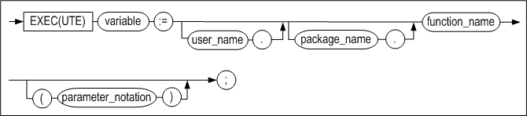

##### parameter_notation::=


#### 기능

저장 프로시저 또는 저장 함수를 실행한다.

##### parameter_notation

파라미터에 값을 전달하는 방식은 아래와 같다.

-   위치기반(Positional) : 기본적인 전달 방식으로, 정의된 파라미터의 위치에 맞춰
    값이 입력된다.

-   이름기반(Name-based) : 정의된 파라미터의 이름을 입력하고 화살표(=\>) 뒤에
    값을 입력하는 방식이다. 파라미터의 순서에 관계없이 값을 전달할 수 있다.

-   혼합(Mixed): 위치기반과 이름기반 방식을 함께 사용할 수 있다. 그러나 반드시
    위치기반 전달 방식을 먼저 입력해야 한다.

#### 예제

\<질의\>

```
CREATE OR REPLACE PROCEDURE proc1(eid INTEGER, amount NUMBER(10,2))
AS
  current_salary NUMBER(10,2);
BEGIN
  SELECT salary
  INTO current_salary
  FROM employees
  WHERE eno = eid;

  UPDATE employees
  SET salary = salary + amount
  WHERE eno = eid;
END;
/

iSQL> SELECT * FROM employees WHERE eno = 15;
ENO         E_LASTNAME            E_FIRSTNAME           EMP_JOB          
------------------------------------------------------------------------------
EMP_TEL          DNO         SALARY      SEX  BIRTH   JOIN_DATE    STATUS  
-----------------------------------------------------------------------------------
15          Davenport             Jason                 webmaster        
0119556884       1003        501000      M  901212               H  
1 row selected.

iSQL> EXEC proc1(15, 333333);
Execute success.
iSQL> SELECT * FROM employees WHERE eno = 15;
ENO         E_LASTNAME            E_FIRSTNAME           EMP_JOB          
------------------------------------------------------------------------------
EMP_TEL          DNO         SALARY      SEX  BIRTH   JOIN_DATE    STATUS  
-----------------------------------------------------------------------------------
15          Davenport             Jason                 webmaster        
0119556884       1003        834333      M  901212               H  
1 row selected.
<질의>
iSQL> EXEC proc1(amount => 333333, eid => 15);
Execute success.

iSQL> SELECT * FROM employees WHERE eno = 15;
ENO         E_LASTNAME            E_FIRSTNAME           EMP_JOB          
------------------------------------------------------------------------------
EMP_TEL          DNO         SALARY      SEX  BIRTH   JOIN_DATE    STATUS  
-----------------------------------------------------------------------------------
15          Davenport             Jason                 webmaster        
0119556884       1003        834333      M  901212               H  
1 row selected.
```


### CREATE FUNCTION

#### 구문

create_function::=


parameter_declaration::=


invoker_rights_clause::=


#### 기능

저장 함수를 새로 생성하거나 이미 생성되어 있는 저장 함수를 대체한다.

##### parameter_declaration

CREATE PROCEDURE절의 “parameter_declaration” 참고

##### RETURN data_type

저장 함수는 저장 프로시저와 달리 실행 후 하나의 값을 반환한다. 그러므로 반드시
반환 데이터 타입을 명시해야 한다.

##### DETERMINISTIC

동일한 파라미터 값으로 함수를 호출하면, 항상 같은 결과가 반환됨을 표시한다.
DETERMINISTIC으로 선언한 함수는 Check Constraint와 함수 기반
인덱스(Function-Based Index)에서 사용할 수 있다. 이 옵션을 생략하면,
non-deterministic 함수로 선언된다.

##### invoker_rights_clause

함수를 실행할 때 생성자(DEFINER)권한으로 객체를 참조할 것인지
실행자(CURRENT_USER) 권한으로 참조할 것인지 명시할 수 있다. 이 절을 생략하면
생성자 권한으로 함수가 실행된다.

-   AUTHID CURRENT_USER  
    함수 사용자가 소유한 객체를 참조하여 함수를 실행한다.

-   AUTHID DEFINER  
    함수 생성자의 객체를 참조하여 생성자(DEFINER) 권한으로 함수를 실행한다.

##### Declaration Section

3장의 “[지역 변수 선언](#지역-변수-선언)” 절 참고

##### Data Types

3장의 “[지역 변수 선언](#지역-변수-선언)” 절 참고

##### Exception Handler

9장 Exception Handler 참고

##### CREATE FUNCTION 문의 실행

CREATE PROCEDURE절의 “CREATE PROCEDURE문의 실행” 참고

#### 예제

##### 예제 1

```
CREATE TABLE t1(
  seq_no INTEGER,
  user_id VARCHAR(9),
  rate NUMBER,
  start_date DATE,
  end_date DATE);
INSERT INTO t1 VALUES(0, '000000500', 200.50, '23-May-2002', '23-Apr-2002');
INSERT INTO t1 VALUES(0, '000000501', 190, '23-Nov-2002', '23-Dec-2002');
INSERT INTO t1 VALUES(0, '000000523', 100, '12-Dec-2001', '12-Jan-2001');
INSERT INTO t1 VALUES(0, '000000532', 100, '11-Dec-2001', '11-Jan-2002');
INSERT INTO t1(seq_no, user_id, start_date, end_date) VALUES(0, '000000524', '30-Oct-2001', '30-Nov-2001');
INSERT INTO t1 VALUES(0, '000000524', 200.50, '30-Apr-2002', '30-May-2002');
INSERT INTO t1 VALUES(0, '000000524', 200.50, '30-Apr-2002', '30-May-2002');
INSERT INTO t1 VALUES(1, '000000524', 100, '30-Apr-2002', '30-May-2002');
INSERT INTO t1 VALUES(1, '000000524', 115.0, '19-Jan-2002', '19-Mar-2002');
INSERT INTO t1 VALUES(0, '000000502', 120.0, '27-Jan-2002', '27-Feb-2002');
INSERT INTO t1 VALUES(1, '000000504', 150.0, '26-Nov-2001', '26-Dec-2001');

iSQL> SELECT * FROM t1;
T1.SEQ_NO   T1.USER_ID  T1.RATE     T1.START_DATE        
------------------------------------------------------------
T1.END_DATE          
-----------------------
0           000000500  200.5       2002/05/23 00:00:00  
2002/04/23 00:00:00  
0           000000501  190         2002/11/23 00:00:00  
2002/12/23 00:00:00  
0           000000523  100         2001/12/12 00:00:00  
2001/01/12 00:00:00  
0           000000532  100         2001/12/11 00:00:00  
2002/01/11 00:00:00  
0           000000524              2001/10/30 00:00:00  
2001/11/30 00:00:00  
0           000000524  200.5       2002/04/30 00:00:00  
2002/05/30 00:00:00  
0           000000524  200.5       2002/04/30 00:00:00  
2002/05/30 00:00:00  
1           000000524  100         2002/04/30 00:00:00  
2002/05/30 00:00:00  
1           000000524  115         2002/01/19 00:00:00  
2002/03/19 00:00:00  
0           000000502  120         2002/01/27 00:00:00  
2002/02/27 00:00:00  
1           000000504  150         2001/11/26 00:00:00  
2001/12/26 00:00:00  
11 rows selected.

CREATE OR REPLACE FUNCTION get_rate
(p1 IN CHAR(30), p2 IN CHAR(30), p3 IN VARCHAR(9))
RETURN NUMBER
AS
  v_rate NUMBER;
BEGIN
  SELECT NVL(SUM(rate), 0)
  INTO v_rate
  FROM (SELECT rate
        FROM t1
        WHERE start_date = TO_DATE(p1)
          AND end_date = TO_DATE(p2)
          AND user_id = '000000' || p3
          AND seq_no = 0);
  RETURN v_rate;
END;
/

iSQL> VAR res NUMBER;
iSQL> EXECUTE :res := get_rate('30-Apr-2002', '30-May-2002', '524');
Execute success.
iSQL> PRINT res;
NAME                 TYPE                 VALUE
-----------------------------------------------
RES                  NUMBER               401
```


##### 예제 2 (AUTHID CURRENT_USER)

###### **객체 생성: user1**

```
iSQL> connect user1/user1;
Connect success.

iSQL> create table t1( c1 integer );
Create success.

iSQL> insert into t1 values ( 1 );
1 row inserted.

iSQL> create or replace function func1 return integer authid current_user as
     cursor cur1 is select c1 from t1;
     var1 integer;
     begin
     open cur1;
     fetch cur1 into var1;
     close cur1;
     return var1;
     end;
     /
Create success.

iSQL> select proc_name , object_type , authid
    2 from system_.sys_procedures_
    3 where proc_name = 'FUNC1';
PROC_NAME                                                                                                                         
------------------------------------------------------------------------------------------------------------------------------------
OBJECT_TYPE AUTHID      
---------------------------
FUNC1                                                                                                                             
1           1          
1 row selected.
```


###### **객체 생성: user2**

```
iSQL> connect user2/user2;
Connect success.

iSQL> create table t1( c1 integer );
Create success.

iSQL> insert into t1 values ( 100 );
1 row inserted.

```


###### **함수 실행: user1**

```
iSQL> var a integer;

iSQL> exec :a := func1;
Execute success.

iSQL> print a
NAME                 TYPE                 VALUE
-------------------------------------------------------
A                    INTEGER              1


iSQL> select func1 from dual;
FUNC1       
--------------
1          
1 row selected.

```


###### **함수 실행: user2**

```
iSQL> var a integer;

iSQL> exec :a := user1.func1;
Execute success.

iSQL> print a
NAME                 TYPE                 VALUE
-------------------------------------------------------
A                    INTEGER              100


iSQL> select user1.func1 from dual;
USER1.FUNC1
--------------
100        
1 row selected.

```


##### 예제 3 (AUTHID DEFINER)

###### **객체 생성: user1**

```
iSQL> connect user1/user1;
Connect success.

iSQL> create table t1( c1 integer );
Create success.

iSQL> insert into t1 values ( 1 );
1 row inserted.

iSQL> create or replace function func1 return integer authid definer as
      cursor cur1 is select c1 from t1;
      var1 integer;
      begin
      open cur1;
      fetch cur1 into var1;
      close cur1;
      return var1;
      end;
      /
Create success.

iSQL> select proc_name , object_type , authid
      from system_.sys_procedures_
      where proc_name ='FUNC1';
PROC_NAME                                                                                                                         
-------------------------------------------------------------------------------
OBJECT_TYPE AUTHID      
---------------------------
FUNC1                                                                                                                             
1           0          
1 row selected.
```


###### **객체 생성: user2**

```
iSQL> connect user2/user2;
Connect success.

iSQL> create table t1( c1 integer );
Create success.

iSQL> insert into t1 values ( 100 );
1 row inserted.
```


###### **함수 실행: user1**

```
iSQL> var a integer;

iSQL> exec :a := func1;
Execute success.

iSQL> print a
NAME                 TYPE                 VALUE
-------------------------------------------------------
A                    INTEGER              1


iSQL> select func1 from dual;
FUNC1       
--------------
1          
1 row selected.
```


###### **함수 실행: user2**

```
iSQL> var a integer;

iSQL> exec :a := user1.func1;
Execute success.


iSQL> print a
NAME                 TYPE                 VALUE
-------------------------------------------------------
A                    INTEGER              1


iSQL> select user1.func1 from dual;
USER1.FUNC1
--------------
1          
1 row selected.
```


#### 주의 사항

제약조건(constraint) 또는 함수 기반 인덱스(Function-based Index)가 사용하는
함수의 경우, 함수의 반환값이 바뀌면 안되기 때문에 함수를 재정의하는 것 자체가
불가능하다. 또한 함수 기반 인덱스가 기반하는 함수 내에서 호출되는 함수를
변경하거나 제거하면, 함수 기반 인덱스가 생성되어 있는 테이블에 대한 DML이 실패할
수 있으므로 사용자의 주의가 필요하다.

### ALTER FUNCTION

#### 구문


#### 기능

저장 프로시저와 마찬가지로, 저장 함수 생성 후에 함수 내에서 참조하는 데이터베이스 객체의 정의가 변경되어 현재 이 저장 함수의 실행 계획으로는 더 이상 실행할 수 없는 경우에 이 저장 함수는 무효한 상태라고 한다.

ALTER FUNCTION문은 저장 함수를 명시적으로 재 컴파일 하여 유효한 상태의 실행 계획을 다시 생성하기 위해 사용된다.

더 자세한 설명은 ALTER PROCECURE 절을 참고한다.

#### 예제

```
ALTER FUNCTION get_dept_name COMPILE;
```


### DROP FUNCTION

#### 구문


#### 기능

저장 함수를 삭제하는 구문이다.

삭제하고자 하는 저장 함수를 다른 저장 프로시저 또는 저자 함수에서 참조하고 있다
하더라도, 그 저장 함수는 삭제된다.

이미 삭제된 저장 함수를 참조하고 있던 임의의 저장 프로시저 또는 저장 함수가
실행될 때 Altibase는 오류를 출력한다.

#### 예제

```
DROP FUNCTION get_dept_name;
```


#### 주의 사항

제약조건(constraints) 또는 함수 기반 인덱스가 참조하는 함수는 삭제가 불가능하다.


3.저장 프로시저 블록
==================

저장 프로시저와 저장 함수는 한 개 이상의 블록으로 구성된다. 이 장에서는 블록을
사용해서 저장 프로시저 내에 절차화된 프로그램을 작성하는 방법을 설명한다.

### 저장 프로시저 블록

#### 구문


 

 

 

블록은 크게 선언부(Declare Section), 블록 바디(Block Body), 예외 처리부(Exception Handler Section)의 세 부분으로 나뉘어진다.

DECLARE, BEGIN, EXCEPTION 등의 키워드 뒤에는 세미콜론을 사용하지 않지만 END 및 기타 모든 프로시저 내의 명령문 뒤에는 세미콜론이 있어야 한다.

저장 프로시저의 코드에 주석 처리를 할 수 있다. 단일 행 주석에는 ‘--‘를 문장 앞에 붙이고, 여러 행을 주석 처리 할 경우는 ‘/\*’와 ‘\*/’ 사이에 주석 처리할 문장이 놓이도록 작성한다.

저장 프로시저 헤더 없이 독립적으로 저장 프로시저 블록을 사용할 수 있다. 이를 익명 블록(anonymous block)라고 한다. 익명 블록은 7.1.0.2.3 버전부터 지원하며 아래와 같은 특징이 있다.

- PSM 객체를 생성 및 데이터베이스에 저장하지 않는다.
- RETURN 절의 값을 반환하지 않는다.
- 저장 프로시저와 달리 INPUT, OUTPUT, INOUTPUT 용도의 바인드 변수(bind variables)를 사용할 수 있다.

```
iSQL> VAR OUT1 OUTPUT INTEGER;
iSQL> VAR INOUT1 INOUTPUT INTEGER;
iSQL> EXEC :INOUT1 := 1;

iSQL> DECLARE
    VAR1 INTEGER;
BEGIN
    VAR1 := :INOUT1;
    :OUT1 := VAR1;
    :INOUT1 := VAR1 + 1;
END;
/
Execute success.

iSQL> PRINT VAR;
[ HOST VARIABLE ]
-------------------------------------------------------
NAME                 TYPE                 VALUE
-------------------------------------------------------
OUT1                 INTEGER              1
INOUT1               INTEGER              2
```

이 장에서는 선언부와 블록 바디에 사용할 수 있는 구문 중 SELECT INTO문, 변수
할당문, LABEL문, PRINT문, RETURN문에 대해서 설명한다.

저장 프로시저 내에서 사용 가능한 흐름 제어문, 커서 관련문, 예외 처리에 관련된
내용은 다음 장에서 순서대로 설명하고 있다. 그 외 SQL문들에 대한 자세한 내용은
*SQL Reference*을 참조한다.

#### 선언부

선언부는 메인 블록에서는 AS와 BEGIN 키워드 사이에 위치하며, 하위 블록에서는
DECLARE와 BEGIN 키워드 사이에 위치한다. 해당 블록 내에서 사용하는 지역 변수,
커서와 사용자 정의 예외 등을 선언한다.

이 장에서는 지역 변수만을 설명한다. 커서와 예외 처리는 5장 커서와 9장 예외
처리에서 각각 설명한다.

#### 블록 바디

BEGIN과 END사이의 부분으로 SQL문과 흐름 제어문을 포함한다.

블록 바디 내에 기술 가능한 SQL문과 흐름 제어문은 다음과 같다.

-   DML 문: SELECT/INSERT/DELETE/UPDATE/MOVE/MERGE/ENQUEUE/DEQUEUE

-   트랜잭션 처리문: COMMIT/ROLLBACK/SAVEPOINT

-   흐름 제어문: IF, CASE, FOR, LOOP, WHILE, EXIT, CONTINUE, NULL

-   할당문

-   출력문: PRINT, RETURN

-   커서 관련문: OPEN, FETCH, CLOSE, Cursor FOR LOOP

-   동적 SQL문: EXECUTE IMMEDIATE

-   예외처리 구문: RAISE, RAISE_APPLICATION_ERROR

저장 프로시저의 장점 중 하나는 SQL문과 달리 블록을 사용하여 명령문을 중첩할 수
있다는 점이다. 명령문을 사용할 수 있는 위치에는 블록을 중첩할 수 있으므로,
명령문을 블록으로 만들어서 중첩시키면 된다.

#### 예외처리부

EXCEPTION과 END 사이의 부분으로 저장 프로시저 또는 함수 실행 중에 오류가
발생했을 때 처리할 루틴을 기술한다.

### 지역 변수 선언

#### 구문


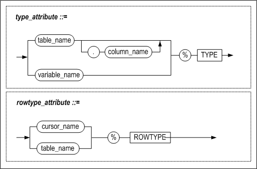

#### 기능

##### variable_name

변수의 이름을 명시할 때 사용된다.

변수의 이름은 하나의 블록 범위 내에서 유일해야 한다.

칼럼과 같은 이름을 가지는 변수를 SQL 문장 내에서 사용할 경우, 이것은 칼럼 명으로
인식된다. 다음의 예에서 eno는 칼럼 명으로 인식되어 employees테이블의 모든
레코드가 삭제된다.

```
DECLARE
eno INTEGER := 100;
BEGIN
DELETE FROM employees WHERE eno = eno;
…

```

다음과 같은 방법으로 모호성을 없앨 수 있다.

```
<<del_block>>
DECLARE
eno INTEGER := 100;
BEGIN
DELETE FROM employees WHERE eno = del_block.eno;

```

블록 이름에 관한 설명은 이 장의 “LABEL” 절을 참고한다.

##### pragma declaration

10장의 프라그마(Pragma) 절을 참조한다.

##### data_type

변수의 데이터 타입을 명시한다. 저장 프로시저 내에서 사용 가능한 데이터 타입은
아래와 같다.

-   SQL문에서 사용할 수 데이터 타입: 2장의 "[데이터 타입](#데이터-타입)" 참조

-   BOOLEAN 타입: 2장의 "[데이터 타입](#데이터-타입)" 참조

-   %TYPE 속성을 사용해서 이미 데이터 타입이 지정된 칼럼이나 변수와 같은 타입
    사용

-   %ROWTYPE 속성을 사용해서 여러 개의 칼럼이 모인 레코드 타입을 정의

-   사용자 정의 타입: 6장“[사용자 정의 타입](#사용자-정의-타입)" 참조

%TYPE과 %ROWTYPE 속성은 테이블 정의가 변경될 때마다 저장 프로시저 내에서 코드를
변경해야 하는 번거로움을 예방한다. 즉, 칼럼의 데이터 타입이 변경될 때,
%TYPE속성을 사용해서 정의된 변수는 자동으로 변경된 타입에 맞추어 진다. 이는
데이터의 독립성을 실현하고 유지 보수 비용을 낮추는데 기여한다.

##### CONSTANT

이 옵션은 특정 변수를 값을 할당할 수 없는 상수로 사용하고자 하는 경우에 사용할
수 있다. 이렇게 정의된 변수는 읽기 전용변수로만 사용할 수 있다.

다음과 같이 max_val을 선언하면 max_val에는 임의의 값을 할당할 수 없고 선언 시
할당한100의 값을 가지는 상수처럼 취급된다.

```
max_val CONSTANT integer := 100;
```


##### NOCOPY

지역 변수의 NOCOPY옵션은 매개 변수의 NOCOPY옵션의 동작과 동일하다. 즉, 변수를
선언할 때 NOCOPY옵션을 명시하면 값이 변수에 할당될 때 주소만 복사된다.
NOCOPY옵션은 ASSOCIATIVE ARRAY 또는 VARRAY 구조의 하위 배열에 접근할 때 사용된다.

##### DEFAULT

다음과 같이 변수 선언 시 초기값을 설정할 때 사용된다.

```
curr_val INTEGER DEFAULT 100;
count_val INTEGER := 0;
```


##### Cursor Declaration

5장의 “[커서](#커서)” 절 참조

##### Exception Declaration

9장의 “[예외 처리](#예외-처리)” 절 참조

##### 중첩 블록 및 변수의 범위

선언부에 명시한 변수들의 영향력은 자신이 선언된 BLOCK문의 BEGIN에서 시작되고
END에서 종료된다.

만약 block2가 block1 내에 정의되어 있고 각각의 블록 내에 같은 이름을 가지는
v_result 변수를 선언하였다면, block2의 밖에서 사용되는 v_result는 block1 에
정의된 변수를 참조하고 block2내에서 사용된 v_result는 block2에서 선언한
변수이다.

아래에 block2 (중첩 블록)에 있는 변수 y는 block1 (외부 블록)에 있는 변수 x를
참조할 수 있지만, 변수 x는 변수 y를 참조할 수 없다. 중첩 블록 내에 외부 블록에
있는 변수 x와 동일한 이름이 주어지면 그 값은 중첩 블록 내에서만 유효하다.


##### 제약 조건

다음과 같은 기능은 변수 선언부에서 지원하지 않는 기능들이다.

-   변수에 NOT NULL 속성을 지정할 수 없다.

- 여러 개의 변수들을 한꺼번에 선언할 수 없다. 즉 다음과 같이 선언할 수 없다.

  ```
  i, j, k INTEGER;
  ```


#### 예제

##### %TYPE 사용

```
DECLARE
my_title books.title%TYPE;
```

my_title은 books테이블의 title 칼럼과 같은 데이터 타입을 가지는 변수로 정의된다.

##### %ROWTYPE 사용

```
DECLARE
dept_rec departments%ROWTYPE
```

dept_rec은 레코드 타입의 변수로서 departments 테이블 또는 departments 라는
이름의 커서와 동일한 레코드 타입을 가지게 된다.

##### 예제 1

CONSTANT와 %ROWTYPE 을 사용해서 변수를 선언하는 예제이다.

```
CREATE TABLE t1(i1 INTEGER, i2 INTEGER);

CREATE OR REPLACE PROCEDURE proc1
AS
  v1 constant INTEGER := 1;
  v2 constant t1.i1%TYPE := 1;
BEGIN
  INSERT INTO t1 VALUES (v1, v2);
END;
/

EXEC proc1;
iSQL> SELECT * FROM t1;
T1.I1       T1.I2       
---------------------------
1           1           
1 row selected.

--DROP TABLE t1;
CREATE TABLE t1 (i1 INTEGER, i2 INTEGER, i3 INTEGER);
INSERT INTO t1 VALUES(1,1,1);

CREATE OR REPLACE PROCEDURE proc1
AS
  r1 t1%ROWTYPE;
BEGIN
  INSERT INTO t1 VALUES(3,3,3);
  <<s>>
  DECLARE
    r1 t1%ROWTYPE;

  BEGIN
    SELECT i1, i2, i3 INTO s.r1.i1, s.r1.i2, s.r1.i3 FROM t1 WHERE i1 = 1;
    INSERT INTO t1 VALUES (s.r1.i1, s.r1.i2, s.r1.i3);
  END;

END;
/

iSQL> EXEC proc1;
Execute success.
iSQL> SELECT * FROM t1;
T1.I1       T1.I2       T1.I3       
----------------------------------------
1           1           1           
3           3           3           
1           1           1           
3 rows selected.

```


##### 예제 2

%ROWTYPE 속성을 사용하는 예제이다.

```
CREATE TABLE emp(
    eno INTEGER,
    ename CHAR(10),
    emp_job CHAR(15),
    join_date DATE,
    salary NUMBER(10,2),
    dno BYTE(2));

CREATE TABLE emp401(
    eno INTEGER,
    ename CHAR(10),
    emp_job CHAR(15),
    join_date DATE,
    leave_date DATE,
    salary NUMBER(10,2),
    dno BYTE(2),
    fund NUMBER(10,2) DEFAULT 0);

INSERT INTO emp VALUES (10, 'DKLEE', 'ENGINEER', '01-Jul-2000', 30000000, BYTE'D001');
INSERT INTO emp VALUES (20, 'SWMYUNG', 'MANAGER', '01-Nov-1999', 50000000, BYTE'C002');

CREATE OR REPLACE PROCEDURE proc1(p1 INTEGER)
AS
BEGIN
  DECLARE
    emp_rec emp%ROWTYPE;
  BEGIN
    SELECT * INTO emp_rec
    FROM emp
    WHERE eno = p1;
    INSERT INTO emp401(eno, ename, emp_job, join_date, leave_date, salary, dno)
      VALUES(emp_rec.eno, emp_rec.ename, emp_rec.emp_job, emp_rec.join_date, sysdate, emp_rec.salary, emp_rec.dno);
  END;
END;
/

iSQL> EXEC proc1(10);
Execute success.
iSQL> SELECT * FROM emp401;
EMP401.ENO  EMP401.ENAME  EMP401.EMP_JOB   EMP401.JOIN_DATE     
-----------------------------------------------
EMP401.LEAVE_DATE    EMP401.SALARY EMP401.DNO  EMP401.FUND
-----------------------------------------------
10          DKLEE       ENGINEER         2000/07/01 00:00:00  
2005/01/27 16:26:26  30000000    D001  0           
1 row selected.

```


##### 예제 3

NOCOPY 옵션을 사용하는 예제이다.

```
iSQL>create or replace procedure proc1
as
      type arr_type is table of INTEGER index by INTEGER;
      var1 arr_type;
      var2 arr_type;
      var3 NOCOPY arr_type;
    begin
      for i in 1 .. 5 loop
        var1[i] := i;
      end loop;
      var2 := var1;
      var3 := var1;
    end;
/
Create success.
iSQL>  exec proc1;
Execute success.
iSQL> create or replace procedure proc2
    as
      type arr_type_1d is table of INTEGER index by INTEGER;
      type arr_type_2d is table of arr_type_1d index by INTEGER;
      var_2d arr_type_2d;
      var_1d NOCOPY arr_type_1d;
    begin
      for i in 1 .. 5 loop
        var_1d := var_2d[i];  
        for j in 1 .. 5 loop
          var_1d[j] := i * j;
        end loop;
      end loop;
      for i in 1 .. 5 loop
        var_1d := var_2d[i];
        for j in 1 .. 5 loop
          println(var_1d[j]);
        end loop;
      end loop;
    end;
    /
Create success.
iSQL> exec proc2;
1
2
3
4
5
2
4
6
8
10
3
6
9
12
15
4
8
12
16
20
5
10
15
20
25
Execute success.

```


### SELECT INTO

#### 구문


*select_list*와 *rest_of_select_statement*는 SELECT 구문의 문법과 동일하므로 *SQL Reference*을 참고한다.

#### 기능

저장 프로시저에서 SELECT 문을 사용할 경우, SELECT문은 INTO 절을 포함해야 한다.

저장 프로시저 또는 함수 내에서 INTO 절을 가지는 SELECT 문은 하나의 레코드만
검색할 수 있다. INTO 절이 사용된 SELECT 구문이 여러 행을 반환하거나 한 행도
반환하지 않으면 오류가 발생한다.

SELECT 절의 *select_list*와 INTO 절의 상응하는 *variable_name*은 개수가 동일해야
하며 호환 가능한 데이터 타입이어야 한다. %ROWTYPE속성으로 정의한 변수를 INTO
절에 사용하는 경우에도 %ROWTYPE변수 내의 칼럼의 개수와 *select_list*의 칼럼의
개수가 동일해야 하며, 상응하는 칼럼의 데이터 타입은 호환 가능해야 한다.

저장 프로시저는 표준 예외 사항이 발생하는 경우 오류를 발생 시킨다. NO_DATA_FOUND
및 TOO_MANY_ROWS 등의 예외 사항을 사용하여 블록의 예외 처리부에서 오류를 처리할
수 있다. 예외 처리에 대한 상세한 설명은 9장 예외 처리를 참조한다.

##### BULK COLLECT 절

한번에 한 레코드씩 가져오는 INTO 절과 달리, BULK COLLECT 절은 SELECT 문의 수행
결과를 한꺼번에 가져온다. INTO 뒤에는 아래 두 종류의 바인드 변수를 지정할 수
있다.

-   array_record_name  
    SELECT 문이 반환하는 레코드들을 저장할 RECORD 타입의 associative array
    변수 또는 VARRAY 변를 지정한다.

-   array_variable_name  
    SELECT 리스트의 각 칼럼에 대해 배열 변수를 지정한다. 각 배열 변수의 데이터
    타입은 SELECT 리스트 내에서 대응하는 칼럼의 데이터 타입과 호환되어야 하며,
    배열 변수의 개수는 SELECT 리스트의 칼럼 개수와 동일해야 한다.

BULK COLLECT 절을 사용해서 질의문의 결과 집합을 한번에 배열로 가져오는 것이
loop문을 사용해서 결과 행을 한 건씩 가져오는 것보다 더 효율적이다.

#### 예제

##### 예제 1

```
CREATE TABLE t1(i1 INTEGER, i2 INTEGER, i3 INTEGER);
INSERT INTO t1 VALUES(1,1,1);

CREATE OR REPLACE PROCEDURE proc1
AS
  v1 INTEGER;
  r1 t1%ROWTYPE;
BEGIN
  INSERT INTO t1 VALUES (3,3,3);
  <<s>>
  DECLARE
    v1 proc1.r1.i1%TYPE;
    r1 t1%ROWTYPE;
  BEGIN
    SELECT i1,i2,i3
    INTO s.r1.i1, s.r1.i2, s.r1.i3
    FROM t1  
    WHERE i1 = 1;

    INSERT INTO t1 VALUES(s.r1.i1, s.r1.i2, s.r1.i3);
  END;
END;
/

iSQL> EXEC proc1;
Execute success.
iSQL> SELECT * FROM t1;
T1.I1       T1.I2       T1.I3       
----------------------------------------
1           1           1           
3           3           3           
1           1           1           
3 rows selected.

```


##### 예제 2

```
CREATE TABLE t1 (i1 INTEGER, i2 INTEGER, i3 INTEGER);
INSERT INTO t1 VALUES(100, 100, 100);

CREATE SEQUENCE seq1;

CREATE SEQUENCE seq2;

CREATE SEQUENCE seq3;

CREATE OR REPLACE PROCEDURE proc1
AS
BEGIN
  <<seq1>>
  DECLARE
   nextval INTEGER;
  BEGIN
   nextval := 10;
    INSERT INTO t1 VALUES (seq1.NEXTVAL,0,0);
  END;
END;
/

CREATE OR REPLACE PROCEDURE proc2
AS
BEGIN
  INSERT INTO t1 VALUES (seq1.NEXTVAL, seq2.NEXTVAL, seq3.NEXTVAL);
  INSERT INTO t1 VALUES (seq1.NEXTVAL, seq2.NEXTVAL, seq3.NEXTVAL);
  INSERT INTO t1 VALUES (seq1.NEXTVAL, seq2.NEXTVAL, seq3.NEXTVAL);
END;
/   

CREATE OR REPLACE PROCEDURE proc3
AS
  v1 INTEGER;
  v2 INTEGER;
  v3 INTEGER;
BEGIN
  SELECT seq1.currval, seq2.NEXTVAL, seq3.NEXTVAL
  INTO v1, v2, v3 FROM t1 WHERE i1 = 100;
  INSERT INTO t1 VALUES (v1, v2, v3);

  SELECT seq1.currval, seq1.NEXTVAL, seq1.currval
  INTO v1, v2, v3 FROM t1 WHERE i1 = 100;
  INSERT INTO t1 VALUES (v1, v2, v3);

  SELECT seq1.currval, seq2.NEXTVAL, seq3.NEXTVAL
  INTO v1, v2, v3 FROM t1 WHERE i1 = 100;
  INSERT INTO t1 VALUES (v1, v2, v3);
END;
/

EXEC proc1;
SELECT * FROM t1;
EXEC proc2;
SELECT * FROM t1;
EXEC proc3;
SELECT * FROM t1;
EXEC proc2;
SELECT * FROM t1;
EXEC proc3;

iSQL> SELECT * FROM t1;
T1.I1       T1.I2       T1.I3       
----------------------------------------
100         100         100         
10          0           0           
1           1           1           
2           2           2           
3           3           3           
3           4           4           
4           4           4           
4           5           5           
5           6           6           
6           7           7           
7           8           8           
7           9           9           
8           8           8           
8           10          10          
14 rows selected.

```


##### 예제 3

```
CREATE TABLE t1(i1 INTEGER, i2 INTEGER, i3 INTEGER);

CREATE TABLE t2(i1 INTEGER, i2 INTEGER, i3 INTEGER);
INSERT INTO t1 VALUES (1,1,1);
INSERT INTO t1 VALUES (2,2,2);

CREATE OR REPLACE PROCEDURE proc1
AS
  v1 INTEGER;
  r1 t1%ROWTYPE;
BEGIN
  SELECT i1 INTO v1 FROM t1 WHERE i1 = 1;
  SELECT * INTO r1 FROM t1 WHERE i1 = 1;
  INSERT INTO t2 VALUES (v1, r1.i2, r1.i3);
  <<s>>
  DECLARE
    r1 t1%ROWTYPE;
  BEGIN
    SELECT i1, i2, i3 INTO s.r1.i1, s.r1.i2, s.r1.i3
    FROM t1 WHERE i1 = 2;
    INSERT INTO t2 VALUES (s.r1.i1, s.r1.i2, s.r1.i3);
  END;
END;
/

iSQL> EXEC proc1;
Execute success.
iSQL> SELECT * FROM t2;
T2.I1       T2.I2       T2.I3       
----------------------------------------
1           1           1           
2           2           2           
2 rows selected.

```


##### 예제 4

```
CREATE TABLE t3(i1 INTEGER);

CREATE OR REPLACE PROCEDURE proc1
AS
  max_qty orders.qty%TYPE;
BEGIN
  SELECT MAX(qty)
  INTO max_qty
  FROM orders;

  INSERT INTO t3 VALUES(max_qty);
END;
/

iSQL> exec proc1;
Execute success
iSQL> SELECT * FROM t3;
T3.I1       
--------------
10000       
1 row selected.

```


##### 예제 5

```
CREATE TABLE delayed_processing(
  cno CHAR(14),
  order_date DATE);

CREATE OR REPLACE PROCEDURE proc1
AS
  de_cno CHAR(14);
  de_order_date DATE;
BEGIN
  INSERT INTO delayed_processing

  SELECT cno, order_date
  INTO de_cno, de_order_date
  FROM orders
  WHERE processing = 'D';

END;
/
iSQL> EXEC proc1;
Execute success.
iSQL> SELECT * FROM delayed_processing;
DELAYED_PROCESSING.CNO  DELAYED_PROCESSING.ORDER_DATE
-----------------------------------------------
7610011000001  2000/11/29 00:00:00  
7001011001001  2000/11/29 00:00:00  
2 rows selected.

```


##### 예제 6

```
create table t1(i1 int,i2 int);
insert into t1 values(1,1);
insert into t1 values(2,2);
insert into t1 values(3,3);

CREATE OR REPLACE PROCEDURE proc1
AS
  type myvarchararr is table of varchar(10) index by integer;
  v2 myvarchararr;
BEGIN
  SELECT i2 BULK COLLECT INTO v2 FROM t1;
  FOR i IN v2.first() .. v2.last() LOOP
    println('v2['||i||']='||v2[i]);
  END LOOP;
END;
/

iSQL> EXEC proc1();
v2[1]=1
v2[2]=2
v2[3]=3
Execute success.

```


### RETURNING INTO 절

#### 구문

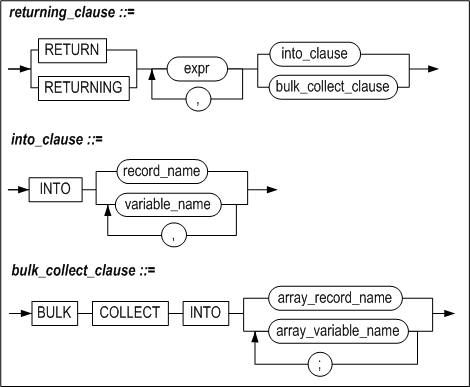

#### 기능

RETURNING INTO 절은 그 절이 속해 있는 DELETE, INSERT, 또는 UPDATE 문의 실행으로
영향을 받은 레코드 값을 저장할 변수를 명시한다. 변수는 개별적인 변수이거나 배열
변수일 수 있다.

##### expr

각 expr는 DML 문에 의해 영향을 받는 칼럼의 이름이거나 칼럼 타입과 호환되는
데이터 표현식이어야 한다.

##### into_clause

INTO 절은 변경된 레코드의 값들이 각 값에 대응하는 variable_name 변수로 저장될
것을 지시한다.

##### variable_name

각 variable_name은 조회된 expr 값을 저장할 PSM 변수이다. RECORD 타입의 변수를
사용하는 경우를 제외하면, 변수의 개수는 expr 리스트의 expr 개수와 동일해야 한다.
PSM 변수의 타입은 대응하는 expr의 타입과 호환되어야 한다.

##### record_name

구문이 반환하는 행을 저장할 RECORD 타입 변수의 이름이다.

##### bulk_collect_clause

한번에 한 레코드씩 가져오는 INTO 절과 달리, BULK COLLECT 절은 구문이 반환하는
행들을 한꺼번에 가져온다. INTO 뒤에는 아래 두 종류의 바인드 변수를 지정할 수
있다.

-   array_record_name  
    RECORD 타입의 associative array 변수 또는 VARRAY 변를 지정한다.

-   array_variable_name  
    expr 리스트의 각 칼럼에 대응하는 배열 변수를 지정한다. 각 배열 변수의 데이터
    타입은 expr 리스트 내에서 대응하는 칼럼의 데이터 타입과 호환되어야 하며,
    배열 변수의 개수는 expr 리스트의 칼럼 개수와 동일해야 한다.

#### 예제

##### 예제 1

```
iSQL> create table employees ( eno integer, ename varchar(20));
Create success.

iSQL> create or replace procedure proc1
as
  x1 integer;
  x2 varchar(30);
begin
      insert into employees values (1, 'jake') return eno, ename into x1, x2;
      println( 'x1='||x1||', x2='||x2);
end;
/
Create success.

iSQL> exec proc1;
x1=1, x2=jake
Execute success.

```


##### 예제 2

```
iSQL> create table employees ( eno integer, ename varchar(20));
Create success.
iSQL> create or replace procedure proc1
as
  type myintarr is table of integer index by integer;
  type myvarchararr is table of varchar(30) index by integer;

  v1 myintarr;
  v2 myvarchararr;

begin
      insert into employees values (1, 'jake') return eno, ename bulk collect into v1, v2;
      for i in v1.first() .. v1.last() loop
      println( 'v1['||i||']='||v1[i] );
      end loop;
      for i in v2.first() .. v2.last() loop
      println( 'v2['||i||']='||v2[i] );
      end loop;
end;
/
Create success.
iSQL> exec proc1;
v1[1]=1
v2[1]=jake
Execute success.

```


##### 예제 3

```
iSQL> create table employees ( eno integer, ename varchar(20));
Create success.
iSQL> create or replace procedure proc1
as
  type myrec is record( i1 integer, i2 varchar(30) );
  type myrecarr is table of myrec index by integer;

  r1 myrecarr;
  s1 myrec;

begin
    insert into employees values (1, 'jake') return eno, ename bulk collect into r1;
    for i in r1.first() .. r1.last() loop
    s1 := r1[i];
    println( 'r1['||i||'].eno='||s1.i1||', r1['||i||'].ename='||s1.i2 );
    end loop;
end;
/
Create success.
iSQL> exec proc1;
r1[1].eno=1, r1[1].ename=jake
Execute success.

```


##### 예제 4

```
create table employees ( eno integer, ename varchar(20));
insert into employees values (1, 'jake');
insert into employees values (2, 'nikita');
insert into employees values (3, 'dana');

iSQL> create or replace procedure proc1
as
  x1 integer;
  x2 varchar(30);
begin
      delete from employees where eno = 1 return eno, ename into x1, x2;
      println( 'x1='||x1||', x2='||x2);
end;
/
Create success.
iSQL> exec proc1;
x1=1, x2=jake
Execute success.

```


##### 예제 5

```
create table employees ( eno integer, ename varchar(20));
insert into employees values (1, 'no1.jake');
insert into employees values (1, 'no2.jake');
insert into employees values (1, 'no3.jake');

iSQL> create or replace procedure proc1
as
  type myintarr is table of integer index by integer;
  type myvarchararr is table of varchar(30) index by integer;

  v1 myintarr;
  v2 myvarchararr;

begin
      delete from employees where eno = 1 return eno, ename bulk collect into v1, v2;

      for i in v1.first() .. v1.last() loop
      println( 'v1['||i||']='||v1[i] );
      end loop;
      for i in v2.first() .. v2.last() loop
      println( 'v2['||i||']='||v2[i] );
      end loop;

end;
/
Create success.
iSQL> exec proc1;
v1[1]=1
v1[2]=1
v1[3]=1
v2[1]=no1.jake
v2[2]=no2.jake
v2[3]=no3.jake
Execute success.

```


##### 예제 6

```
create table employees ( eno integer, ename varchar(20));
insert into employees values (1, 'no1.jake');
insert into employees values (1, 'no2.jake');
insert into employees values (1, 'no3.jake');

iSQL> create or replace procedure proc1
as
  type myrec is record( i1 integer, i2 varchar(30) );
  type myrecarr is table of myrec index by integer;

  r1 myrecarr;
  s1 myrec;

begin
    delete from employees where eno = 1 return eno, ename bulk collect into r1;
    for i in r1.first() .. r1.last() loop
    s1 := r1[i];
    println( 'r1['||i||'].eno='||s1.i1||', r1['||i||'].ename='||s1.i2 );
    end loop;
end;
/
Create success.
iSQL> exec proc1;
r1[1].eno=1, r1[1].ename=no1.jake
r1[2].eno=1, r1[2].ename=no2.jake
r1[3].eno=1, r1[3].ename=no3.jake
Execute success.

```


##### 예제 7

```
create table employees ( eno integer, ename varchar(20));
insert into employees values (1, 'jake');
insert into employees values (2, 'nikita');
insert into employees values (3, 'dana');

iSQL> create or replace procedure proc1
as
  x1 integer;
  x2 varchar(30);
begin
      update employees set ename = 'mikhaila' where eno = 1 return eno, ename into x1, x2;
      println( 'x1='||x1||', x2='||x2);
end;
/
Create success.
iSQL> exec proc1;
x1=1, x2=mikhaila
Execute success.

```


##### 예제 8

```
create table employees ( eno integer, ename varchar(20));
insert into employees values (1, 'no1.jake');
insert into employees values (1, 'no2.jake');
insert into employees values (1, 'no3.jake');

iSQL> create or replace procedure proc1
as
  type myintarr is table of integer index by integer;
  type myvarchararr is table of varchar(30) index by integer;

  v1 myintarr;
  v2 myvarchararr;

begin
      update employees set eno = 5, ename = 'mikhaila' where eno = 1 return eno, ename bulk collect into v1, v2;

      for i in v1.first() .. v1.last() loop
      println( 'v1['||i||']='||v1[i] );
      end loop;
      for i in v2.first() .. v2.last() loop
      println( 'v2['||i||']='||v2[i] );
      end loop;

end;
/
Create success.
iSQL> exec proc1;
v1[1]=5
v1[2]=5
v1[3]=5
v2[1]=mikhaila
v2[2]=mikhaila
v2[3]=mikhaila
Execute success.

```


##### 예제 9

```
create table employees ( eno integer, ename varchar(20));
insert into employees values (1, 'no1.jake');
insert into employees values (1, 'no2.jake');
insert into employees values (1, 'no3.jake');

iSQL> create or replace procedure proc1
as
  type myrec is record( i1 integer, i2 varchar(30) );
  type myrecarr is table of myrec index by integer;

  r1 myrecarr;
  s1 myrec;

begin
    update employees set eno = 5, ename = 'mikhaila' where eno = 1 return eno, ename bulk collect into r1;
    for i in r1.first() .. r1.last() loop
    s1 := r1[i];
    println( 'r1['||i||'].eno='||s1.i1||', r1['||i||'].ename='||s1.i2 );
    end loop;
end;
/
Create success.
iSQL> exec proc1;
r1[1].eno=5, r1[1].ename=mikhaila
r1[2].eno=5, r1[2].ename=mikhaila
r1[3].eno=5, r1[3].ename=mikhaila
Execute success.

```


### 할당문

#### 구문


#### 기능

지역변수, OUT 또는 IN/OUT 형의 인자에 값을 할당하고자 할 때 사용하는 할당문이다.

다음의 두 가지 방법을 사용해서 변수 또는 인자에 값을 할당할 수 있다.

-   “:=” 연산자 사용  
    *variable_name* := value;  
    *parameter_name* := value;

-   SET 키워드 사용  
    SET *variable_name* = value;  
    SET *parameter_name* = value;

%ROWTYPE속성을 사용해서 정의된 RECORD 타입 변수의 각 칼럼 값은
*record_variable_name*.*field_name*으로 참조할 수 있다.

#### 예제

##### 예제 1

```
CREATE TABLE t1(i1 INTEGER, i2 INTEGER, i3 INTEGER);

CREATE OR REPLACE PROCEDURE proc1
AS
  i INTEGER;
BEGIN
  i := 5;

  WHILE i <= 10 LOOP
    INSERT INTO t1 VALUES (i, i+1, i+2);
    i := i + 1;
  END LOOP;

END;
/

iSQL> EXEC proc1;
Execute success.
iSQL> SELECT * FROM t1;
T1.I1       T1.I2       T1.I3       
----------------------------------------
5           6           7           
6           7           8           
7           8           9           
8           9           10          
9           10          11          
10          11          12          
6 rows selected.

```


##### 예제 2

```
CREATE TABLE t1(i1 INTEGER, i2 INTEGER, i3 INTEGER);

CREATE OR REPLACE FUNCTION plus20(p1 IN INTEGER)
RETURN INTEGER
AS
  v1 INTEGER;
BEGIN
  v1 := p1 + 20;
  RETURN v1;
END;
/

CREATE OR REPLACE PROCEDURE proc1
AS
  v1 INTEGER;
  in_arg INTEGER;
BEGIN
  in_arg := 80;
  v1 := plus20(in_arg);
  INSERT INTO t1 VALUES (v1, v1, v1);
END;
/

iSQL> EXEC proc1;
Execute success.
iSQL> SELECT * FROM t1;
T1.I1       T1.I2       T1.I3       
----------------------------------------
100         100         100         
1 row selected.

```


### LABEL

LABLE문은 저장 프로시저 내부의 특정 위치에 명칭을 지정하는데 사용된다. LABEL은
블록 내에 다음과 같이 지정할 수 있다.

\<\< User_defined_label_name \>\>

#### 기능

사용자가 정의한 LABEL 명은 다음 3가지 경우에 사용된다.

-   같은 이름의 여러 변수들의 범위를 제한하거나, 변수 이름과 칼럼 이름이 같아서
    발생하는 모호성을 없애기 위한 경우

-   중첩된 LOOP에서 빠져나오고 싶은 경우

-   GOTO 문장을 사용하는 경우

#### 제약조건

1. 동일 블록 내에 같은 이름의 LABEL이 존재하면 안 된다. 아래 예제의 경우
    LABEL1이 동일 블록 내에 두 번 지정되어 컴파일 시 에러가 출력된다.

  ```
  CREATE OR REPLACE PROCEDURE PROC1
  AS
      V1 INTEGER;
  BEGIN
      <<LABEL1>>
      V1 := 1;
      <<LABEL1>>   
      V1 := V1 + 1;
  …
  ```


2. 같은 이름을 가지는 변수의 범위를 제한하기 위하여 사용하는 경우, 반드시
    DECLARE 문 위에 LABEL을 선언해야 한다. 단, LABEL을 여러 개 선언하는 것은
    허용된다. 아래 예제에서는 (1)에서 선언한 변수 V1이 2번 참조된다.

  ```
  CREATE OR REPLACE PROCEDURE PROC1
  AS
      V1 INTEGER;
  BEGIN
      <<LABEL1>>    --- LABLE 지정
      <<LABEL2>>
       DECLARE
              V1 INTEGER; .......(1)
       BEGIN
              <<LABEL3>>
              DECLARE
                  V1 INTEGER; ......(2)
              BEGIN    
                  LABEL1.V1 := 1;   -- (1)의 V1 참조
                  LABEL2.V1 := 2;   -- (1)의 V1 참조
                  LABEL3.V1 := 3;   -- (2)의 V1 참조
              END;
         END;
  END;
  /
  아래 예제의 경우 DECLARE문 위에 LABEL을 지정하지 않아서 에러가 나게 된다.
  CREATE OR REPLACE PROCEDURE PROC1
  AS
      V1 INTEGER;
  BEGIN
      <<LABEL1>>
       V1 := 1;
       DECLARE
           V1 INTEGER;
        BEGIN
            LABEL1.V1 := 1;   --- ERROR.
  ```


3. 2의 경우와 유사하게 중첩된 LOOP에서 빠져나올 때 사용하는 경우 반드시 LOOP
    시작 직전에 LABEL을 선언해야 한다. LOOP전에 LABEL을 여러 개 선언하는 것은
    허용된다.

  ```
  CREATE OR REPLACE PROCEDURE PROC1
  AS
      V1 INTEGER;
  BEGIN
       V1 := 0;
      <<LABEL1>>
      <<LABEL2>>
       FOR I IN 1 .. 10 LOOP
            V1 := V1 + 1;
             FOR I IN 1 .. 10 LOOP
                  V1 := V1 + 1;
                  EXIT LABEL1 WHEN V1 = 30;
              END LOOP;
        END LOOP;
  END;
  /
  ```

  아래 예제는 한 LABEL이 LOOP 시작 직전에 선언되지 않은 경우이다. 이 LABEL을 이용해서는 중첩된
  LOOP를 빠져나올 수 없으므로, 저장 프로시저 컴파일 시 에러가 발생하게 된다.

  ```
  CREATE OR REPLACE PROCEDURE PROC1
  AS
      V1 INTEGER;
  BEGIN
      <<LABEL1>>
       V1 := 0;
      <<LABEL2>>
       FOR I IN 1 .. 10 LOOP
            V1 := V1 + 1;
             FOR I IN 1 .. 10 LOOP
                  V1 := V1 + 1;
                EXIT LABEL1 WHEN V1 = 30; -- ERROR
            END LOOP;
        END LOOP;
  END;
  /
  ```


### PRINT

#### 구문


#### 기능

PRINT구문은 저장 프로시저 실행 시에 사용자가 원하는 텍스트를 해당 프로시저를
호출한 클라이언트에게 출력한다.

PRINT 구문은 주로 디버깅 및 테스트 목적으로 사용하도록 Altibase가 제공하는
시스템 프로시저이다.

PRINTLN은 PRINT와 동일하나 출력 메시지의 마지막에 개행 문자 (“\\n”)를 붙여서
출력한다.

PRINT, PRINTLN의 소유자는 SYSTEM_이므로 사용 시 아래처럼 이를 명시해도 된다:

```
SYSTEM_.PRINTLN(‘Hello World’);
```

그러나 이들에 대한 PUBLIC시노님이 기본적으로 생성되어 있기 때문에 SYSTEM_을 굳이
명시하지 않아도 된다.

##### String

클라이언트로 출력할 문자열을 기술한다.

사용자 메시지 출력 시 문자열과 함께 변수 값 등을 출력하고 싶은 경우에는 예제2와
같이 문자열 연결 연산자인 “\|\|” 를 사용해서 하나의 문자열로 만들어서 출력하면
된다.

#### 예제

##### 예제1

```
CREATE OR REPLACE PROCEDURE proc1
AS
  v1 BIGINT;
BEGIN
  v1 := BIGINT'9223372036854775807';
  system_.println ('1');
  system_.println (v1);
  system_.println ('2');
END;
/

iSQL> EXEC proc1;
1
9223372036854775807
2
Execute success.
```


##### 예제2

```
CREATE OR REPLACE PROCEDURE proc1
AS
  eno_count INTEGER;
BEGIN
  SELECT COUNT(eno) INTO eno_count FROM employees;
  println('The NUMBER of Employees: ' || eno_count);
END;
/

iSQL> EXEC proc1;
The NUMBER of Employees: 20
Execute success.
```


##### 예제3

다음 예제는 쿼리 결과를 형식에 맞춰 출력하기 위해 PRINT와 PRINTLN구문과 함께
loop를 사용하는 방법을 보여준다.

```
CREATE OR REPLACE PROCEDURE showProcedures
AS
  CURSOR c1 IS
    SELECT SYSTEM_.sys_procedures_.proc_name, decode(SYSTEM_.sys_procedures_.object_TYPE, 0, 'Procedure',1,'Function')
    FROM system_.sys_procedures_ ;

  v1 CHAR(40);
  v2 CHAR(20);
BEGIN
  OPEN c1;
  SYSTEM_.PRINTLN('--------------------------');
  SYSTEM_.PRINT('Proc_Name');
  SYSTEM_.PRINTLN('    Procedure/Function');
  SYSTEM_.PRINTLN('--------------------------');

LOOP
    FETCH C1 INTO v1, v2;
    EXIT WHEN C1%NOTFOUND;
    PRINT(' ');
    PRINT(v1);
    PRINTLN(v2);
END LOOP;

  PRINTLN('------------------------');
  CLOSE c1;
END;
/

iSQL> EXEC showProcedures;
-----------------------------------------------
Proc_Name                           Procedure/Function
-----------------------------------------------

 PRINT                                   Procedure
 PRINTLN                                 Procedure
.
.

 SHOWPROCEDURES                          Procedure
-----------------------------------------------
Execute success.
```


### RETURN

#### 구문


#### 기능

저장 프로시저의 수행을 도중에 중단 하거나, 저장 함수에서 값을 반환하고 수행을
중단하려 하는 경우에 사용하는 제어문이다.

저장 프로시저는 RETURN문에 반환할 값을 지정하게 되면 에러가 발생한다. 반면 저장
함수는 항상 값을 반환해야 하기 때문에 RETURN 문에 반환할 값을 명시하여야 한다.

##### expression

저장 함수의 경우에 반환할 값을 기술한다. 반환 값은 연산식의 형태로도 기술할 수
있다.

#### 예제

##### 예제1

```
CREATE TABLE t1(i1 INTEGER, i2 INTEGER, i3 INTEGER);

INSERT INTO t1 VALUES(1,1,1);

CREATE OR REPLACE FUNCTION times_half(p1 IN INTEGER)
RETURN INTEGER
AS
BEGIN
  RETURN p1 / 2;
END;
/

iSQL> SELECT times_half(times_half(8)) FROM t1;
TIMES_HALF(TIMES_HALF(8))
----------------------------
2           
1 row selected.
```


##### 예제2

```
CREATE TABLE t1(i1 INTEGER, i2 INTEGER, i3 INTEGER);

INSERT INTO t1 VALUES(1,1,1);
INSERT INTO t1 VALUES(10,10,10);
INSERT INTO t1 VALUES(100,100,100);

CREATE OR REPLACE FUNCTION max_all_val
RETURN INTEGER
AS
  v1 INTEGER;
BEGIN
  SELECT MAX(i1) INTO v1 FROM t1;
  RETURN v1;
END;
/

iSQL> SELECT max_all_val FROM t1;
MAX_ALL_VAL
--------------
100         
100         
100         
3 rows selected.
```


##### 예제3

```
CREATE TABLE t4(i1 INTEGER, i2 INTEGER);

INSERT INTO t4 VALUES(3, 0);
INSERT INTO t4 VALUES(2, 0);
INSERT INTO t4 VALUES(1, 0);
INSERT INTO t4 VALUES(0, 0);

CREATE OR REPLACE FUNCTION func_plus_10(p1 INTEGER)
RETURN INTEGER
AS
BEGIN
  RETURN p1+10;
END;
/

iSQL> SELECT func_plus_10(i1) FROM t4;
FUNC_PLUS_10(I1)
-------------------
13          
12          
11          
10          
4 rows selected.
```


### INSERT 확장

#### 구문


#### 기능

INSERT 구문의 저장 프로시저 확장 기능이다.

저장 프로시저 내에서 테이블 또는 특정 파티션에 새로운 레코드를 삽입할 때 레코드 타입 변수의 값을 삽입하는 구문이다.

[SQL Reference INSERT](https://github.com/ALTIBASE/Documents/blob/master/Manuals/Altibase_trunk/kor/SQL3.md#insert)에서 single_table_insert절과 values_clause 절을 위에 정의한 구문으로 대체하여 확장기능을 실행할 수 있다.

##### single_table_insert

single_table_insert 절은 한 개의 레코드를 한 개의 테이블에 삽입하기 위해 사용된다.

INSERT 확장 기능은 삽입할 칼럼 이름을 명시할 수 없으므로 주의해야 한다.

##### record_name

명시한 테이블에 삽입할 레코드 변수의 이름이다. RECORD 타입과 ROWTYPE 타입의 변수를 명시한다.

레코드 변수의 칼럼의 개수와 테이블의 칼럼의 개수가 동일해야 한다. 또한 레코드 타입 내부에 정의한 칼럼은 명시한 테이블 칼럼의 타입과 순서대로 정확히 일치하거나 호환이 가능해야 한다. 만약 테이블의 칼럼에 NOT NULL 제약조건이 있으면 대응되는 레코드의 칼럼에 NULL 값을 사용할 수 없다.

#### 예제

##### 예제1

프로시저에서 레코드 타입 변수 r1을 테이블 t1에 삽입하는 예제이다.

```
CREATE TABLE t1(
    i1 INTEGER,
    i2 INTEGER,
    i3 INTEGER );

CREATE OR REPLACE PROCEDURE proc1
AS
    r1 t1%ROWTYPE;
BEGIN
    FOR i IN 1 .. 5 LOOP
        r1.i1 := i+10;
        r1.i2 := i+20;
        r1.i3 := i+30;
        INSERT INTO t1 VALUES r1;
    END LOOP;
END;
/

iSQL> EXEC proc1();
Execute success.
iSQL> SELECT * FROM t1;
I1          I2          I3          
----------------------------------------
11          21          31         
12          22          32         
13          23          33         
14          24          34         
15          25          35
5 rows selected.

```

##### 예제2

ORDER 테이블의 행을 삭제할 때, 트리거 내부에서 OLD ROW 레코드 타입 변수의 값을  log_tbl 테이블에 삽입하는 예제이다.

```
CREATE TABLE log_tbl (
  ONO            BIGINT,
  ORDER_DATE     DATE,
  ENO            INTEGER,
  CNO            BIGINT,
  GNO            CHAR(10),
  QTY            INTEGER,
  ARRIVAL_DATE   DATE,
  PROCESSING     CHAR(1) );

CREATE TRIGGER del_trigger
AFTER DELETE ON orders
REFERENCING OLD ROW old_row
FOR EACH ROW
AS BEGIN
INSERT INTO log_tbl VALUES old_row;
END;
/

iSQL> DELETE FROM orders WHERE processing = 'D';
2 rows deleted.

iSQL> SELECT * FROM log_tbl;
ONO                  ORDER_DATE   ENO         CNO                  
------------------------------------------------------------------------
GNO         QTY         ARRIVAL_DATE PROCESSING  
------------------------------------------------------
11290011             29-NOV-2011  12          17                  
E111100001  1000        05-DEC-2011  D  
11290100             29-NOV-2011  19          11                 
E111100001  500         07-DEC-2011  D  
2 rows selected.

```


### UPDATE 확장

#### 구문


#### 기능

UPDATE 구문의 저장 프로시저 확장 기능이다.

저장 프로시저 내에서 테이블 또는 특정 파티션의 레코드를 레코드 타입 변수의 값으로 변경하는 구문이다.

[SQL Reference UPDATE](https://github.com/ALTIBASE/Documents/blob/master/Manuals/Altibase_trunk/kor/SQL3.md#update)에서 set_cluase_list 절을 위에 정의한 구문으로 대체하여 확장기능을 실행할 수 있다.

##### record_name

변경할 레코드 변수의 이름이다. RECORD 타입과 ROWTYPE 타입의 변수를 명시한다.

레코드 변수의 칼럼의 개수와 명시한 테이블의 칼럼의 개수가 동일해야 한다. 또한 레코드 타입 내부에 정의한 칼럼은 명시한 테이블 칼럼의 타입과 순서대로 정확히 일치하거나 호환이 가능해야 한다. 만약 테이블의 칼럼에 NOT NULL 제약조건이 있으면 대응되는 레코드의 칼럼에 NULL 값을 사용할 수 없다.

#### 예제

##### 예제1

programmer 직업을 가진 직원의 월급을 갱신하라. 프로시저 내부에서 레코드 타입 변수의 값을 삽입하는 예제이다.

```
CREATE OR REPLACE PROCEDURE proc1 as
    TYPE TYPE_REC IS RECORD( eno INTEGER, SALARY NUMBER(10,2) );
    TYPE TYPE_ARR IS TABLE OF TYPE_REC INDEX BY INTEGER;
    emps TYPE_ARR;
    idx  INTEGER;
BEGIN
    SELECT ENO, SALARY BULK COLLECT INTO emps FROM EMPLOYEES WHERE EMP_JOB = 'programmer';

    FOR idx IN emps.FIRST() .. emps.LAST() LOOP
        emps[idx].SALARY := emps[idx].SALARY * 1.02;

        UPDATE (SELECT ENO, SALARY FROM EMPLOYEES)
            SET ROW = emps[idx]
            WHERE ENO = emps[idx].eno;
    END LOOP;
END;
/

iSQL> SELECT * FROM EMPLOYEES WHERE EMP_JOB = 'programmer';
ENO         E_LASTNAME            E_FIRSTNAME           EMP_JOB          
------------------------------------------------------------------------------
EMP_TEL          DNO         SALARY      SEX  BIRTH   JOIN_DATE    STATUS  
-----------------------------------------------------------------------------------
6           Momoi                 Ryu                   programmer       
0197853222       1002        1700        M  790822  09-SEP-2010  H  
10          Bae                   Elizabeth             programmer       
0167452000       1003        4000        F  710213  05-JAN-2010  H  
2 rows selected.
iSQL> EXEC PROC1();
Execute success.

iSQL> SELECT * FROM EMPLOYEES WHERE EMP_JOB = 'programmer';
ENO         E_LASTNAME            E_FIRSTNAME           EMP_JOB          
------------------------------------------------------------------------------
EMP_TEL          DNO         SALARY      SEX  BIRTH   JOIN_DATE    STATUS  
-----------------------------------------------------------------------------------
6           Momoi                 Ryu                   programmer       
0197853222       1002        1734        M  790822  09-SEP-2010  H  
10          Bae                   Elizabeth             programmer       
0167452000       1003        4080        F  710213  05-JAN-2010  H  
2 rows selected.

```


4.흐름 제어
=========

### 개요

이 장은 저장 프로시저 바디 내에서의 흐름 제어 방법을 설명한다.

#### 구문


저장 프로시저에서 사용할 수 있는 흐름 제어문은 다음과 같다.

-   조건 분기문인 IF문과 CASE문

-   조건을 만족할 때 반복 수행하는 LOOP문, WHILE문과 FOR문

-   반복 수행문의 흐름을 제어하는 EXIT문와 CONTINUE문

-   아무것도 수행하지 않음을 명시적으로 나타낼 수 있는 NULL문

-   특정 위치로 이동할 수 있는 GOTO문

#### 제약 사항

부질의(subquery)가 포함된 조건은 IF문 또는 CASE문의 조건으로 사용될 수 없다. 단,
아래의 조건은 예외이다:

-   EXIST (subquery)

-   NOT EXIST (subquery)

### IF

#### 구문


#### 기능

조건을 만족하는 경우와 그렇지 않은 경우에 따라 처리 흐름을 분기하는 조건
분기문이다. IF절은 조건은 검사해서 true이면 THEN절로 제어를 이동하고,
false이거나 NULL이면 ELSE절로 제어를 이동한다.

##### condition

조건절에는 SQL문의 WHERE절에서 사용 가능한 모든 술어(predicate)들을 사용할 수
있다. 지원하는 술어들에 대한 상세 내용은 *SQL Reference*의 SELECT 구문을
참조한다.

##### ELS(E)IF

ELS(E)IF절의 경우 이전의 IF문의 조건과는 다른 조건을 명시할 수 있다.

ELSIF는 한 단어이며 하나의 IF문 내에 여러 개의 ELS(E)IF절을 사용할 수 있다.

##### ELSE

앞서IF와 ELS(E)IF에서 열거된 모든 조건을 만족하지 않는 경우 ELSE절의 문장이
수행된다. ELSE절은 명시하거나, 하나의 IF문 내에 한번만 기술 가능하다.

##### 중첩 IF 문

IF문은 다른 IF문 내에 중첩되어 기술할 수 있다. 즉, IF문은 다른 IF, ELS(E)IF 또는
ELSE 문의 결과로 수행되는 일련의 작업 내에 포함될 수 있다. 각 IF 문은 END IF로
종료해야 한다.

#### 예제

##### 예제1

```
CREATE OR REPLACE PROCEDURE proc1
AS
  CURSOR c1 IS SELECT eno, emp_job, salary FROM employees;
  emp_id employee.eno%TYPE;
  e_job employee.emp_job%TYPE;
  e_salary employee.salary%TYPE;
BEGIN
  OPEN c1;
  LOOP
    FETCH c1 INTO emp_id, e_job, e_salary;
    EXIT WHEN c1%NOTFOUND;

    IF e_salary IS NULL THEN
      IF e_job = 'CEO' THEN
        e_salary := 5000;
      ELSIF e_job = 'MANAGER' THEN
        e_salary := 4500;
      ELSIF e_job = 'ENGINEER' THEN
        e_salary := 4300;
      ELSIF e_job = 'PROGRAMMER' THEN
        e_salary := 4100;
      ELSE
        e_salary := 4000;
      END IF;

      UPDATE employees SET salary = e_salary WHERE eno = emp_id;
    END IF;

  END LOOP;
  CLOSE c1;
END;
/

iSQL> SELECT eno, emp_job FROM employees WHERE salary IS NULL;
ENO         EMP_JOB          
--------------------------------
1           CEO              
8           manager          
20          sales rep         
3 rows selected.
iSQL> EXEC proc1;
Execute success.
iSQL> SELECT eno, emp_job, salary FROM employees
WHERE eno=1 OR eno=8 OR eno=20;
ENO         EMP_JOB          SALARY      
---------------------------------------------
1           CEO              5000     
8           manager          4500     
20          sales rep         4000     
3 rows selected.
```


##### 예제2

```
CREATE TABLE t1 (i1 VARCHAR(20), i2 NUMBER, i3 DATE);
CREATE TABLE t2 (i1 VARCHAR(20), i2 NUMBER, i3 DATE);

INSERT INTO t1 VALUES ('21-JUL-2001', 2, '01-JUL-2000');
INSERT INTO t2 VALUES (NULL,NULL,'01-FEB-1990');
INSERT INTO t2 VALUES (NULL,NULL,'02-FEB-1990');

CREATE OR REPLACE FUNCTION func2
(p1 IN DATE, p2 IN CHAR(30))
RETURN NUMBER
AS
BEGIN
  RETURN (TO_NUMBER(TO_CHAR(p1, 'dd')) + TO_NUMBER(p2));
END;
/
CREATE OR REPLACE FUNCTION func1
(p1 IN DATE, p2 IN DATE)
RETURN DATE
AS
BEGIN
  IF p1 >= p2 THEN
    RETURN add_months(p1, 3);
  ELSE
    RETURN add_months(p1, 4);
  END IF;
END;
/

CREATE OR REPLACE PROCEDURE proc1
AS
  v1  VARCHAR(20);
  v2  NUMBER;
  v3  DATE;
BEGIN
  SELECT i1, func2(TO_DATE(i1), TO_CHAR(i3, 'yyyy')), i3
  INTO v1,v2,v3 FROM t1 WHERE i2 = 2;
  INSERT INTO t2 VALUES (v1,v2,v3);

  IF v2 not in (2001, 2002, 2003) AND v1 = '21-JUL-2001' THEN
    UPDATE t2
    SET i1 = func1(v1, '17-JUL-2001'),
        i2 = nvl(i2, 10)
    WHERE i3 = '01-FEB-1990';

    UPDATE t2
    SET i1 = func1(v1, '27-JUL-2001'),
        i2 = nvl(i2, 10*2)
    WHERE i3 = '02-FEB-1990';
  END IF;

END;
/

iSQL> EXEC proc1;
Execute success.
iSQL> SELECT * FROM t2;
T2.I1                 T2.I2       T2.I3                
-----------------------------------------------
21-JUL-2001           2021        2000/07/01 00:00:00  
21-OCT-01             10          1990/02/01 00:00:00  
21-NOV-01             20          1990/02/02 00:00:00  
3 rows selected.

```


##### 예제3

```
CREATE TABLE payroll(
  eno INTEGER,
  bonus NUMBER(10, 2));

CREATE OR REPLACE PROCEDURE proc1
AS
BEGIN
  DECLARe
    CURSOR c1 IS
      SELECT DISTINCT(eno), SUM(qty) FROM orders GROUP BY eno;
      emp_id orders.eno%TYPE;
      sum_qty orders.qty%TYPE;
      bonus NUMBER(10, 2);
    BEGIN
      OPEN c1;
      IF c1%ISOPEN THEN
        LOOP
          FETCH c1 INTO emp_id, sum_qty;
          EXIT WHEN c1%NOTFOUND;
          IF sum_qty > 25000 THEN
            bonus := 1000;
          ELSIF sum_qty > 15000 THEN
            bonus := 500;
          ELSE
            bonus := 200;
          END IF;

        INSERT INTO payroll VALUES(emp_id, bonus);
      END LOOP;
    END IF;
  END;
END;
/

iSQL> EXEC proc1;
Execute success.
iSQL> SELECT DISTINCT(eno), SUM(qty) sum FROM orders GROUP BY eno;
ENO         SUM                  
------------------------------------
12          17870                
19          25350                
20          13210                
3 rows selected.
iSQL> SELECT * FROM payroll;
PAYROLL.ENO PAYROLL.BONUS
-----------------------------
12          500         
19          1000        
20          200         
3 rows selected.

```


### CASE

#### 구문


#### 기능

특정 변수의 값에 따라서 처리 경로를 결정하는 조건 분기문이다.

IF문과 동일한 기능이지만 CASE문을 사용하면 프로그램의 가독성을 높일 수 있다.
CASE문은 위의 다이어그램에서 보여 주 듯이 다음 두 가지가 있다.

-   *case_statement_1*: 조건식이 참일 때에 특정한 문장을 수행하는 방식

-   *case_statemen_2*: 하나의 변수가 특정한 값이 되었을 때에 특정한 문장을
    수행하는 방식

단, 하나의 CASE문에서 이 두 가지 방식을 혼용할 수 없다.

CASE 절을 모두 만족하지 못하면 ELSE절의 문장을 수행하게 되며, ELSE절이 없는
경우에는 어떠한 문장도 수행하지 않는다.

##### condition

검사할 조건을 기술한다. SELECT 구문의 WHERE절과 같이 술어 문으로 명시한다.

##### case_variable

저장 프로지저의 처리를 분기시키는 기준이 되는 변수명을 기술한다.

##### when_value

*case_variable* 변수와 비교할 실제 상수 값을 기술한다.

##### ELSE

CASE 조건식이 모두 거짓이 되었을 때 수행해야 할 처리 구문을 ELSE 절에 기술한다.
ELSE절은 없어도 상관 없으며 하나의 CASE문에 한번 사용 가능하다.

조건식이 모두 거짓이 되었음에도 ELSE절이 없을 경우 CASE문은 어떠한 문장도
수행하지 않고 지나간다.

#### 예제

##### 예제1

```
CREATE OR REPLACE PROCEDURE proc1
AS
  CURSOR c1 IS SELECT eno, emp_job, salary FROM employees;
  emp_id employees.eno%TYPE;
  e_job employees.emp_job%TYPE;
  e_salary employees.salary%TYPE;
BEGIN
  OPEN c1;

  LOOP
    FETCH c1 INTO emp_id, e_job, e_salary;
    EXIT WHEN c1%NOTFOUND;

    IF e_salary IS NULL THEN
      CASE
        WHEN e_job = 'CEO' THEN e_salary := 5000;
        WHEN e_job = 'MANAGER' THEN e_salary := 4500;
        WHEN e_job = 'ENGINEER' THEN e_salary := 4300;
        WHEN e_job = 'PROGRAMMER' THEN e_salary := 4100;
        ELSE e_salary := 4000;
      END CASE;
      UPDATE employees SET salary = e_salary WHERE eno = emp_id;
    END IF;

  END LOOP;

  CLOSE c1;
END;
/

iSQL> EXEC proc1;
Execute success.
iSQL> SELECT eno, emp_job, salary FROM employees
WHERE eno=1 OR eno=8 OR eno=20;
ENO         EMP_JOB          SALARY      
---------------------------------------------
1           CEO              5000     
8           manager          4500     
20          sales rep         4000     
3 rows selected.

```


##### 예제2

```
@SCHEMA.SQL

CREATE OR REPLACE PROCEDURE PROC1
AS
  CURSOR C1 IS SELECT ENO, EMP_JOB, SALARY FROM EMPLOYEES;
  EMP_ID EMPLOYEES.ENO%TYPE;
  E_JOB EMPLOYEES.EMP_JOB%TYPE;
  E_SALARY EMPLOYEES.SALARY%TYPE;
BEGIN
  OPEN C1;

  LOOP
    FETCH C1 INTO EMP_ID, E_JOB, E_SALARY;
    EXIT WHEN C1%NOTFOUND;

    IF E_SALARY IS NULL THEN
      CASE E_JOB
        WHEN 'CEO' THEN E_SALARY := 5000;
        WHEN 'MANAGER' THEN E_SALARY := 4500;
        WHEN 'ENGINEER' THEN E_SALARY := 4300;
        WHEN 'PROGRAMMER' THEN E_SALARY := 4100;
        ELSE E_SALARY := 4000;
      END CASE;
      UPDATE EMPLOYEES SET SALARY = E_SALARY WHERE ENO = EMP_ID;
    END IF;

  END LOOP;

  CLOSE C1;
END;
/

ISQL> SELECT ENO, EMP_JOB FROM EMPLOYEES WHERE SALARY IS NULL;
ENO         EMP_JOB          
--------------------------------
1           CEO              
8           MANAGER          
20          SALES REP         
3 ROWS SELECTED.
ISQL> EXEC PROC1;
EXECUTE SUCCESS.
ISQL> SELECT ENO, EMP_JOB, SALARY FROM EMPLOYEES WHERE ENO=1 OR ENO=8 OR ENO=20;
ENO         EMP_JOB          SALARY      
---------------------------------------------
1           CEO              5000     
8           MANAGER          4500     
20          SALES REP         4000     
3 ROWS SELECTED.

```


### LOOP

#### 구문

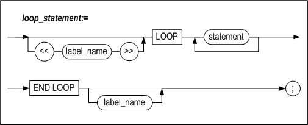

#### 기능

LOOP구문은 조건을 따로 지정하지 않고 반복적으로 구문(들)을 수행하고자 하는
경우에 사용된다.

그러나 LOOP 구문에서 EXIT문을 사용하지 않게 되면 무한 LOOP에 빠져서 시스템에
문제를 일으킬 수 있으므로 주의한다.

#### 예제

```
CREATE TABLE item(id INTEGER, counter NUMBER(2));

CREATE OR REPLACE PROCEDURE proc1
AS
BEGIN
  DECLARE
    v_id item.id%TYPE := 501;
    v_counter NUMBER(2) := 1;
  BEGIN
    LOOP
      INSERT INTO item VALUES(v_id, v_counter);
      v_counter := v_counter + 1;
      EXIT WHEN v_counter > 10;
    END LOOP;
  END;
END;
/

iSQL> EXEC proc1;
Execute success.
iSQL> SELECT * FROM item;
ITEM.ID     ITEM.COUNTER
----------------------------
501         1           	
501         2           
…          
501         9           
501         10          
10 rows selected.

```


### WHILE LOOP

#### 구문


#### 기능

조건이 참인 경우만 LOOP을 수행하고자 할 때 사용하는 반복문이다. 만약 처음부터 이
조건이 참이 아니면, WHILE문은 한 번도 수행되지 않는다.

##### condition

LOOP을 수행할 지의 여부를 결정하는 조건절을 명시한다. 조건절에는 SQL문의
WHERE절에서 사용 가능한 모든 술어(predicate)들을 사용할 수 있다.

#### 예제

```
CREATE TABLE t1(i1 INTEGER, i2 INTEGER, i3 INTEGER);

CREATE OR REPLACE PROCEDURE proc1
AS
  v1 INTEGER;
BEGIN
  v1 := 1;

  WHILE v1 < 3 LOOP
    v1 := v1 + 1;
    INSERT INTO t1 VALUES (v1, v1, v1);
    IF v1 = 2 THEN
      CONTINUE;
    END IF;
  END LOOP;

END;
/

iSQL> EXEC proc1;
Execute success.
iSQL> SELECT * FROM t1;
T1.I1       T1.I2       T1.I3       
----------------------------------------
2           2           2           
3           3           3           
2 rows selected.

```


### FOR LOOP

#### 구문


#### 기능

FOR LOOP문은 일정 횟수만큼 반복해서 구문(들)을 수행하고자 할 때 사용된다. 두
개의 점 (“..”)을 사용해서 범위를 지정할 수 있는데 이는 FOR loop에 진입하기 전에
한 번만 체크된다. 범위의 작은 값과 큰 값을 같은 값으로 지정하면, loop내부는 한
번만 실행된다.

##### counter_name

일정한 값만큼 증가, 혹은 감소시킬 변수를 하나 기술한다. 이 변수는 블록의
선언부에 선언할 필요가 없다. 또한 이 변수의 범위는 LOOP과 END LOOP으로 둘러싸여
있는 문장들에만 한정된다. FOR LOOP내에서 이 변수에 새로운 값을 할당할 수 없다.

##### REVERSE

REVERSE 모드를 지정하면 *counter_name* 변수의 값을 *upper_bound*에서
*lower_bound*까지 감소시키면서 FOR 문을 수행한다.

##### lower_bound

*counter_name* 변수가 가질 수 있는 값 중 가장 작은 값이다. 정수형 또는 정수형과
호환성이 있는 표현식을 지정하여야 한다.

여기에는 지역변수를 사용할 수도 있으나, 이 값은 FOR 문이 맨 처음으로 실행될 때에
딱 한번 그 값을 계산하여 저장해 두고 사용하므로, 추후 해당 지역변수를 변경하여도
FOR문의 동작에는 영향을 미치지 않는다.

여기에 실수형을 명시하면 반올림된 정수값으로 변환된다.

##### upper_bound

*counter_name* 변수가 가질 수 있는 값 중 가장 큰 값이다. *lower_bound*와
마찬가지로 정수형 또는 정수형과 호환성이 있는 표현식을 지정하여야 한다. 정수형이
아닌 수를 명시하면 반올림된 정수값으로 변환된다.

만약 FOR 문이 맨 처음으로 수행될 때 *upper_bound*가 *lower_bound*보다 작으면
어떠한 에러도 내지 않고 단지 FOR 문을 건너 뛰고 다음 문장을 수행한다.

*lower_bound* 처럼, 여기에는 지역변수를 사용할 수도 있으나, 이 값은 FOR 문이 맨
처음으로 실행될 때에 딱 한번 그 값을 계산하여 저장해 두고 사용하므로, 추후 해당
지역변수를 변경하여도 FOR문의 동작에는 영향을 미치지 않는다.

##### step_size

증가 또는 감소시킬 값을 지정한다. 생략하면 기본적으로 FOR 문은 *counter_name*
변수를 1씩 증, 혹은 감소 시킨다.

단, *step size*는 1보다 작을 수 없다. 정수형이 아닌 수를 명시한 경우에는
반올림된 정수값으로 변환된다.

#### 예제

##### 예제1

```
CREATE TABLE t6(i1 INTEGER, sum INTEGER);

CREATE OR REPLACE PROCEDURE proc1
AS
  v1 INTEGER;
  sum INTEGER := 0;
BEGIN
  FOR i IN 1 .. 50 LOOP
    v1 := 2 * i - 1;
    sum := sum + v1;
    INSERT INTO t6 VALUES(v1, sum);
  END LOOP;
END;
/

iSQL> EXEC proc1;
Execute success.
iSQL> SELECT * FROM t6;
T6.I1       T6.SUM      
---------------------------
1           1           
3           4           
5           9
…        
97          2401        
99          2500        
50 rows selected.
```


##### 예제2

```
CREATE OR REPLACE PROCEDURE proc1
AS
  eno_count INTEGER;
BEGIN
  SELECT COUNT(eno) INTO eno_count FROM employees;
  FOR i IN 1 .. eno_count LOOP
    UPDATE employees SET salary = salary * 1.2 WHERE eno = i;
  END LOOP;
END;
/

iSQL> SELECT eno, salary FROM employees WHERE eno in (11,12,13);
ENO         SALARY      
---------------------------
11          2750     
12          1890     
13          980      
3 rows selected.

iSQL> EXEC proc1;
Execute success.
iSQL> SELECT eno, salary FROM employees WHERE eno IN (11,12,13);
ENO         SALARY      
---------------------------
11          3300     
12          2268     
13          1176     
3 rows selected.

```


##### 예제3

```
CREATE TABLE t1(i1 INTEGER, i2 INTEGER, i3 INTEGER);

CREATE OR REPLACE PROCEDURE proc1
AS
BEGIN
  <<a>>
  INSERT INTO t1 VALUES (1,1,1);
  IF 1 = 1 THEN
    NULL;
  END IF;
  <<b>>
  FOR v1 IN 1 .. 3 LOOP
    <<c>>
    FOR v1 IN 1 .. 3 LOOP
      INSERT INTO t1 VALUES (b.v1, b.v1, c.v1);
    END LOOP;
  END LOOP;
END;    
/

iSQL> EXEC proc1;
Execute success.
iSQL> SELECT * FROM t1;
T1.I1       T1.I2       T1.I3       
----------------------------------------
1           1           1           
1           1           1           
1           1           2           
1           1           3           
2           2           1           
2           2           2           
2           2           3           
3           3           1           
3           3           2           
3           3           3           
10 rows selected.

--#####################
--	reverse
--#####################

CREATE TABLE t6(i1 INTEGER, sum INTEGER);

CREATE OR REPLACE PROCEDURE proc1
AS  
  sum INTEGER := 0;
BEGIN
  FOR i IN reverse 1 .. 100 LOOP
    sum := sum + i;
    INSERT INTO t6 VALUES(i, sum);
  END LOOP;
END;
/

iSQL> EXEC proc1;
Execute success.
iSQL> SELECT * FROM t6;
T6.I1       T6.SUM      
---------------------------
100         100         
99          199         
98          297
…
3           5047        
2           5049        
1           5050        
100 rows selected.

--#####################
--	step
--#####################

CREATE TABLE t6(i1 INTEGER, sum INTEGER);

CREATE OR REPLACE PROCEDURE proc1
AS  
  sum INTEGER := 0;
BEGIN
  FOR i IN 1 .. 100 STEP 2 LOOP
    sum := sum + i;
    INSERT INTO t6 VALUES(i, sum);
  END LOOP;
END;
/

iSQL> EXEC proc1;
Execute success.
iSQL> SELECT * FROM t6;
T6.I1       T6.SUM      
---------------------------
1           1           
3           4           
5           9
…
97          2401        
99          2500        
50 rows selected.
```


### EXIT

#### 구문


#### 기능

EXIT문을 감싸고 있는 가장 가까운 LOOP 문을 빠져나간다. 그러나 *label_name*이
명시적으로 주어진 경우에는 *label_name*이 정의된 LOOP을 빠져나간다.

LOOP문 내부가 아닌 다른 블록에서 EXIT문을 사용하면 오류가 발생한다.

```
<<outer>>
LOOP
  ...
  LOOP
    ...
    EXIT outer WHEN ...  -- EXIT both LOOPs
  END LOOP;
  ...
END LOOP outer;

EXIT WHEN count > 100;

IF count > 100 THEN  
  EXIT;
END IF;
```

EXIT문은 아래의 LOOP문 내에서 사용 가능하다.

-   LOOP

-   WHILE LOOP

-   FOR LOOP

-   CURSOR FOR LOOP

##### label_name

EXIT문을 감싸고 있는 가장 가까운 LOOP가 아닌 그보다 더 바깥의 LOOP으로
빠져나가야 하는 경우, 해당 LOOP의 바로 앞에 LABEL을 정의하고 그 이름을 여기에
명시한다.

##### WHEN condition

특정 조건이 참인 경우 루프를 빠져나갈 수 있도록 WHEN 절에 조건식을 지정할 수
있다. 조건절에는 SELECT문의 WHERE절에서 사용 가능한 모든 술어들을 사용할 수
있다.

EXIT 문을 만나서 WHEN 절에 명시된 조건이 참이면 저장 프로시저는 가장 가까운
루프나 지정된 LABEL 블록문을 빠져 나가서 그 다음 문장을 수행한다.

EXIT WHEN은 간단한 IF 구문과 유사하다. 다음의 두 문장들은 동일한 기능을 한다.

```
EXIT WHEN count > 100;

IF count > 100 THEN  
   EXIT;
END IF;
```


#### 예제

```
CREATE TABLE stock(
  gno BYTE(5) primary key,
  stock INTEGER,
  price numeric(10,2));

CREATE OR REPLACE PROCEDURE proc1
AS
  CURSOR c1 IS SELECT gno, stock, price FROM goods;
  rec1 c1%ROWTYPE;
BEGIN
  OPEN c1;
  LOOP
    FETCH c1 INTO rec1;
    IF c1%found THEN
      IF rec1.stock > 0 AND rec1.stock < 1000 THEN
        INSERT INTO stock VALUES(rec1.gno, rec1.stock, rec1.price);
      END IF;
    ELSIF c1%NOTFOUND THEN
      EXIT;
    END IF;
  END LOOP;
  CLOSE c1;
END;
/

iSQL> EXEC proc1;
Execute success.
iSQL> SELECT * FROM stock;
STOCK.GNO   STOCK.STOCK STOCK.PRICE
----------------------------------------
A111100002  100         98000       
B111100001  780         35800       
D111100003  650         45100       
E111100001  900         2290.54     
E111100006  900         2338.62     
5 rows selected.

--#####################
--	EXIT WHEN
--#####################

CREATE OR REPLACE PROCEDURE proc1
AS
  CURSOR c1 IS SELECT gno, stock, price FROM goods;
  rec1 c1%ROWTYPE;
BEGIN
  OPEN c1;
  IF c1%ISOPEN THEN
    LOOP
      FETCH c1 INTO rec1;
      EXIT WHEN c1%NOTFOUND;
      IF rec1.stock > 0 AND rec1.stock < 1000 THEN
        INSERT INTO stock VALUES(rec1.gno, rec1.stock, rec1.price);
      END IF;
    END LOOP;
  END IF;
  CLOSE c1;
END;
/

iSQL> EXEC proc1;
Execute success.
iSQL> SELECT * FROM stock;
STOCK.GNO   STOCK.STOCK STOCK.PRICE
----------------------------------------
A111100002  100         98000       
B111100001  780         35800       
D111100003  650         45100       
E111100001  900         2290.54     
E111100006  900         2338.62     
5 rows selected.
```


### CONTINUE

#### 구문


#### 기능

현재 CONTINUE문을 감싸고 있는 LOOP에서 CONTINUE문 이후의 문장들을 전부 무시하고
LOOP의 맨 처음으로 되돌아간다.

CONTINUE문을 사용할 수 있는 LOOP문은 다음과 같다.

-   WHILE

-   FOR

-   CURSOR FOR

LOOP문 내부가 아닌 다른 곳에서 CONTINUE문을 사용하면 오류가 발생한다.

#### 예제

```
CREATE TABLE t8(i1 INTEGER, mathpower INTEGER default 0);

INSERT INTO t8(i1) VALUES(7);
INSERT INTO t8(i1) VALUES(3);
INSERT INTO t8(i1) VALUES(20);
INSERT INTO t8(i1) VALUES(15);
INSERT INTO t8(i1) VALUES(6);
INSERT INTO t8(i1) VALUES(1);
INSERT INTO t8(i1) VALUES(9);

CREATE OR REPLACE PROCEDURE proc1
AS
BEGIN
  DECLARE
    CURSOR c1 IS SELECT i1 FROM t8;
    rec c1%ROWTYPE;
  BEGIN
    OPEN c1;
    LOOP
      FETCH c1 INTO rec;
      EXIT WHEN c1%NOTFOUND;

      IF power(rec.i1, rec.i1) > 50000 THEN
        continue;
      ELSE
        UPDATE t8 SET mathpower = power(rec.i1, rec.i1)
        WHERE i1 = rec.i1;
      END IF;
    END LOOP;
    CLOSE c1;
  END;
END;
/

iSQL> EXEC proc1;
Execute success.
iSQL> SELECT * FROM t8;
T8.I1       T8.MATHPOWER
----------------------------
7           0           
20          0           
15          0           
9           0           
3           27          
6           46656       
1           1           
7 rows selected.
```


### GOTO

#### 구문


#### 기능

지정된 LABEL로 제어를 이동하는 분기문이다.

##### label_name

제어를 이동할 LABEL의 이름이다.

#### 제약 사항

GOTO는 다음과 같은 제약사항을 가진다.

- IF 나 CASE 블록 내에서 사용될 때, THEN, ELS(E)IF, ELSE 또는 WHEN 문에
  해당하는 블록 안으로 이동할 수 없다. 따라서 아래 예제의 경우 에러를
  출력한다.

  ```
  CREATE OR REPLACE PROCEDURE PROC1
  AS
      V1 INTEGER;
  BEGIN
      V1 := 1;
      IF V1 = 1 THEN
          GOTO LABEL1;
      ELSE
          <<LABEL1>>
          PRINTLN(V1);
      END IF;
  END;
  /
  [ERR-3120F : Illegal GOTO statement.
  In PROC1
  0007 :     GOTO LABEL1;
                 ^     ^
  ]
  ```


- 외부 블록에서 내부 블록으로 이동할 수 없다. 모든 BEGIN/END 블록 및 LOOP
  문장에 이 제약 조건이 적용된다.

  ```
  CREATE OR REPLACE PROCEDURE PROC1
  AS
      V1 INTEGER;
  BEGIN
      V1 := 1;
      DECLARE
          V2 INTEGER;
      BEGIN
          <<LABEL1>>
          V2 := 1;
      END;
      GOTO LABEL1;
  END;
  /
  [ERR-3120F : Illegal GOTO statement.
  In PROC1
  0012 :   GOTO LABEL1;
               ^     ^
  ]
  ```


#### 예제

\<예제 1\> 예외 처리부에서 분기하는 경우, 그 예외 처리부가 속한 블록으로는 분기할 수
없다. 따라서 다음의 예제1은 에러를 반환한다.

```
CREATE OR REPLACE PROCEDURE PROC1
AS
    E1 EXCEPTION;
BEGIN
    RAISE E1;
    <<LABEL1>>
    PRINTLN('END');
    EXCEPTION
        WHEN E1 THEN
        GOTO LABEL1;
END;
/
[ERR-3120F : Illegal GOTO statement.
In PROC1
0010 :       GOTO LABEL1;
                 ^     ^
]
```


\<예제 2\> 그러나, 예외 처리부로부터 그 상위 블록으로의 분기는 가능하다. 예제2 의 경우 V1이
5가 될 때까지 EXCEPTION을 4번 발생시키고 정상으로 종료한다.

```
CREATE OR REPLACE PROCEDURE PROC1
AS
    E1 EXCEPTION;
    V1 INTEGER;
BEGIN
    V1 := 1;
    <<LABEL1>>
    V1 := V1 + 1;
    PRINTLN('BLOCK1');
    BEGIN
        PRINTLN('BLOCK2');
        PRINTLN(V1);
        IF V1 = 5 THEN
            PRINTLN('goto label2 '||v1);
            GOTO LABEL2;
        ELSE
            RAISE E1;
        END IF;
        EXCEPTION
            WHEN E1 THEN
            PRINTLN('goto label1 '|| v1);
            GOTO LABEL1;
    END;
    <<LABEL2>>
    PRINTLN('BLOCK1 AFTER BLOCK2');
END;
/

iSQL> EXEC PROC1;
BLOCK1
BLOCK2
2
goto label1 2
BLOCK1
BLOCK2
3
goto label1 3
BLOCK1
BLOCK2
4
goto label1 4
BLOCK1
BLOCK2
5
goto label2 5
BLOCK1 AFTER BLOCK2
Execute success.
```


### NULL

#### 구문


#### 기능

NULL문은 흐름에 영향을 미치지 않고 아무것도 수행하지 않고 다음으로 넘어감을
명시적으로 나타내기 위해서 사용한다. 프로그램의 가독성을 높이기 위해서 사용한다.

#### 예제

```
CREATE OR REPLACE PROCEDURE bonus (amount NUMBER(10,2))
AS
  CURSOR c1 IS SELECT eno, sum(qty) FROM orders group by eno;
  order_eno orders.eno%TYPE;
  order_qty orders.qty%TYPE;
BEGIN
  OPEN c1;
  LOOP
    FETCH c1 INTO order_eno, order_qty;
    EXIT WHEN c1%NOTFOUND;
    IF order_qty > 20000 THEN
      UPDATE employees SET salary = salary + amount
      WHERE eno = order_eno;
    ELSE
      NULL;
    END IF;
  END LOOP;
  CLOSE c1;
END;
/

iSQL> SELECT e.eno, salary, sum(qty)
FROM employees e, orders o
WHERE e.eno = o.eno
group by e.eno, salary;
ENO         SALARY      SUM(QTY)             
-----------------------------------------------
12          1890        17870                
19          1800        25350                
20                      13210                
3 rows selected.
iSQL> EXEC bonus(75);
Execute success.
iSQL> SELECT eno, salary FROM employees WHERE eno = 19;
ENO         SALARY      
---------------------------
19          1875     
1 row selected.
```


5.커서
====

이 장은 커서를 관리하고 사용하는 방법을 설명한다.


### 커서의 개요

저장 프로시저 내에서 테이블의 레코드를 읽어 오는 방법에는 SELECT INTO문을
사용하는 방법과 커서를 사용하는 방법이 있다.

SELECT INTO문의 경우 결과 레코드의 수는 반드시 한 개여야 하고 그 이외의 경우
오류가 발생한다. 따라서 여러 개의 레코드를 검색해야 할 경우 커서를 사용해야
한다.

#### 커서 선언

커서는 저장 프로시저 블록의 선언부에 커서명과 함께 수행할 SELECT문을 정의해야
한다. 이는 선언된 후에, 아래 2가지 방법 중의 하나로 관리될 수 있다.

-   OPEN, FETCH, CLOSE 사용

-   Cursor FOR LOOP 사용

#### OPEN, FETCH와 CLOSE로 커서 관리하기

커서는 블록 바디 내에서 OPEN, FETCH, CLOSE 문을 사용해서 관리할 수 있다.
OPEN문은 커서를 초기화하는데 사용된다. FETCH문은 레코드를 반복적으로 가져오는데
사용된다. 마지막으로 CLOSE문은 커서를 해제한다.

##### OPEN

커서를 사용하기 위해서 커서와 관련된 모든 리소스들을 초기화 하는 단계이다. 커서
정의 시에 사용자 파라미터를 지정한 경우 OPEN 구문에서 파라미터의 값을 전달해야
한다.

##### FETCH

커서의 SELECT문을 만족하는 결과 집합으로부터 한 번에 한 레코드씩 가져와서 사용자
변수에 저장한다. 별도의 변수에 각 칼럼을 저장할 수도 있고, 전체 레코드를
%ROWTYPE을 사용해서 정의한 RECORD 타입 변수에 저장할 수도 있다.

RECORD 타입 변수에 대한 설명은 [6장 사용자 정의 타입](#6사용자-정의-타입)을 참고하기 바란다.

##### CLOSE

사용이 끝난 커서의 리소스를 해제한다. OPEN문을 사용해서 열어둔 커서는 해당
프로시저가 종료되기 전에 반드시 CLOSE문을 사용해서 닫아야 한다.

#### Cursor FOR LOOP 로 커서 관리하기

커서의 OPEN, FETCH, CLOSE 단계를 한번에 수행하는 LOOP문의 하나이다. 결과
레코드가 존재하지 않을 때까지 LOOP를 반복 수행한다. 커서에 대해서 명시적으로
OPEN문이나 CLOSE문을 사용할 필요가 없는 경우에 편리한 구문이다.

### CURSOR

#### 구문


#### 기능

커서를 정의한다. CURSOR구문에서는 커서명과 커서가 레코드를 가져오는 데 사용할
SELECT문을 명시해야 한다.

##### cursor_name

OPEN, FETCH, CLOSE 및 Cursor FOR LOOP에서 참조할 커서의 이름을 지정한다.

##### cursor_parameter_declaration

커서의 SELECT문에 인자가 필요한 경우, 프로시저의 파라미터를 지정하는 문법과 같은
방법으로 파라미터들을 지정할 수 있다. 이 인자들은 다음과 같은 제약이 있다.

-   커서 인자는 SELECT문 안에서만 사용할 수 있다

-   %ROWTYPE 은 사용할 수 없다.

-   커서 인자는 OUT 또는 IN/OUT 인자일 수 없다.

이 파라미터들은 커서 OPEN이나 커서 FOR문으로부터 값을 받아서 SELECT문을 수행하게
된다.

```
DECLARE
  CURSOR c1 IS
    SELECT empno, ename, job, sal
    FROM emp
    WHERE sal > 2000;
  CURSOR c2
    (low INTEGER DEFAULT 0,
    high INTEGER DEFAULT 99) IS
    SELECT ......;
```


##### data_type

3장의 “지역 변수 선언” 절을 참고한다.

#### 예제

```
CREATE TABLE highsal
 (eno INTEGER, e_firstname CHAR(20), e_lastname CHAR(20), salary NUMBER(10,2));

CREATE OR REPLACE PROCEDURE proc1
AS
BEGIN
  DECLARE
   CURSOR c1 IS
     SELECT eno, e_firstname, e_lastname, salary FROM employees
   WHERE salary IS not NULL
   ORDER BY salary desc;
   emp_first CHAR(20);
   emp_last CHAR(20);
   emp_no INTEGER;
   emp_sal NUMBER(10,2);
  BEGIN
   OPEN c1;
   FOR i IN 1 .. 5 LOOP
     FETCH c1 INTO emp_no, emp_first, emp_last, emp_sal;
     EXIT WHEN c1%NOTFOUND;
     INSERT INTO highsal VALUES(emp_no, emp_first, emp_last, emp_sal);
   END LOOP;
   CLOSE c1;
 END;
END;
/
iSQL> EXEC proc1;
EXECUTE success.
iSQL> SELECT * FROM highsal;
ENO         E_FIRSTNAME           E_LASTNAME            SALARY
-------------------------------------------------------------------------
10          Elizabeth             Bae                   4000
11          Zhen                  Liu                   2750
5           Farhad                Ghorbani              2500
16          Wei-Wei               Chen                  2300
14          Yuu                   Miura                 2003
5 rows selected.
```


### OPEN

#### 구문


#### 기능

이 구문은 커서를 초기화하고, 쿼리를 수행하여 결과 집합을 결정하는 데 사용된다.
이 후에 FETCH문을 사용해서 데이터를 가져올 수 있다.

이 구문을 실행하면 Altibase는 커서 사용에 필요한 모든 리소스들을 할당한다.

이미 OPEN된 커서를 다시 OPEN하려고 시도하면 CURSOR_ALREADY_OPEN 에러가 발생한다.

##### cursor_name

OPEN 하고자 하는 커서의 이름을 지정한다.

이 커서는 블록의 선언부에 선언되어 있어야 한다.

##### cursor_parameter_name

커서에 사용자 파라미터가 명시된 경우 전달할 값을 지정한다. 인자를 가지는 커서의
경우, 아래와 같이 선언한다.

```
DECLARE
 CURSOR c1(pname VARCHAR(40), pno INTEGER) IS
  SELECT empno, ename, job, sal
  FROM emp
  WHERE eame = pname;
BEGIN
 OPEN c1;
 ......
END;
```

인자가 존재하는 경우 다음과 같이 커서 OPEN시 값을 넘겨준다.

```
OPEN c1(emp_name, 100);
OPEN c1('mylee', 100);
OPEN c1(emp_name, dept_no);
```


#### 예제

##### 예제1

```
CREATE TABLE mgr
(mgr_eno INTEGER, mgr_first CHAR(20), mgr_last CHAR(20), mgr_dno SMALLINT);

CREATE OR REPLACE PROCEDURE proc1
AS
BEGIN
 DECLARE
  CURSOR emp_cur IS
   SELECT eno, e_firstname, e_lastname, dno FROM employees
   WHERE emp_job = 'manager';
   emp_no employees.eno%TYPE;
   emp_first employees.e_firstname%TYPE;
   emp_last employees.e_lastname%TYPE;   
   emp_dno employees.dno%TYPE;
 BEGIN
  OPEN emp_cur;
  LOOP
   FETCH emp_cur INTO emp_no, emp_first, emp_last, emp_dno;
   EXIT WHEN emp_cur%NOTFOUND;
   INSERT INTO mgr VALUES(emp_no, emp_first, emp_last, emp_dno);
  END LOOP;
  CLOSE emp_cur;
 END;
END;
/
iSQL> EXEC proc1;
Execute success.
iSQL> select * from mgr;
MGR.MGR_ENO MGR.MGR_FIRST         MGR.MGR_LAST          MGR.MGR_DNO
-------------------------------------------------------------------------
7           Gottlieb              Fleischer             4002
8           Xiong                 Wang                  4001
16          Wei-Wei               Chen                  1001
3 rows selected.
```


##### 예제2

```
CREATE TABLE t1(i1 INTEGER, i2 INTEGER, i3 INTEGER);

CREATE TABLE t2(i1 INTEGER, i2 INTEGER, i3 INTEGER);

INSERT INTO t1 VALUES(1,1,1);
INSERT INTO t1 VALUES(2,2,2);
INSERT INTO t1 VALUES(30,30,30);
INSERT INTO t1 VALUES(50,50,50);

CREATE OR REPLACE PROCEDURE proc1
AS
 CURSOR c1(k1 INTEGER, k2 INTEGER, k3 INTEGER) IS
  SELECT * FROM t1
  WHERE i1 <= k1 AND i2 <= k2 AND i3 <= k3;
BEGIN
 FOR rec1 IN c1(2,2,2) LOOP
  INSERT INTO t2 VALUES (rec1.i1, rec1.i2, rec1.i3);
 END LOOP;
END;
/
iSQL> SELECT * FROM t2;
T2.I1      T2.I2      T2.I3
----------------------------------------
No rows selected.
iSQL> EXEC proc1;
EXECUTE success.
iSQL> SELECT * FROM t2;
T2.I1      T2.I2      T2.I3
----------------------------------------
1          1          1
2          2          2
2 rows selected.
```


### FETCH

#### 구문


#### 기능

OPEN된 커서로부터 하나의 행을 가져와서 INTO절에 명시된 변수에 그 값을 저장한다.

이 때, 커서의 SELECT문에 명시한 칼럼들에 상응하는 사용자변수를 각각 나열해서
칼럼 별로 각각 저장하거나, RECORD 타입 변수명만 명시해서 커서로부터 가져온 한
행을 RECORD 타입 변수에 저장되도록 할 수도 있다.

FETCH문에 RECORD타입 변수를 사용하는 데는 다음과 같은 제약이 있다.

-   가져온 한 행을 저장하는데 오직 한 개의 RECORD 타입 변수만 사용할 수 있다.

-   SELECT문에서 가져오는 모든 칼럼들을 한 RECORD 타입 변수에 저장할 수 있어야
    한다.

-   RECORD 타입 변수는 일반 변수와 섞어서 사용할 수 없다.

만약 OPEN되지 않은 커서로부터 FETCH를 하려고 시도하면 INVALID_CURSOR 오류가
발생한다.

##### cursor_name

FETCH 하고자 하는 커서의 이름을 지정한다. 이 커서는 블록의 선언부에 선언되어
있어야 한다.

##### record_name

커서의 SELECT 문이 반환하는 레코드를 받을 RECORD 타입 변수명을 지정한다. 이때
사용되는 RECORD 타입 변수는 SEELCT구문의 select list와 칼럼의 개수가 같고 타입이
순서대로 정확히 일치해야 한다.

따라서 커서의 SELECT문이 한 테이블의 모든 칼럼을 가져오는 경우, 그 테이블에 대해
%ROWTYPE속성을 사용해서 선언한 RECORD 타입 변수를 주로 사용하게 된다.

##### variable_name

값을 저장할 변수의 이름이다. 이 변수들의 개수는 커서의 SELECT 문에서 명시한
칼럼의 개수와 동일해야 한다. 또한 나열한 변수의 순서대로 상응하는 칼럼의 타입과
각각 일치해야 한다.

```
LOOP
  FETCH c1 INTO my_name, my_empno, my_deptno;
  EXIT WHEN c1%NOTFOUND;
END LOOP;
```


##### fetch_bulk_collect_clause

LIMIT 구문을 사용하면 BULK COLLECT절에서 반환되는 행의 개수를 조정할 수 있다.
BULK COLLECT절의 자세한 설명은 SELECT INTO구문의 BULK COLLECT절 설명을 참조한다.

#### 예제

##### 예제 1

```
CREATE TABLE emp_temp(eno INTEGER, e_firstname CHAR(20), e_lastname CHAR(20));
CREATE OR REPLACE PROCEDURE proc1
AS
BEGIN
 DECLARE
 CURSOR c1 IS SELECT eno, e_firstname, e_lastname FROM employees;
  emp_rec c1%ROWTYPE;
 BEGIN
  OPEN c1;
  LOOP
   FETCH c1 INTO emp_rec;
   EXIT WHEN c1%NOTFOUND;
   INSERT INTO emp_temp
   VALUES(emp_rec.eno, emp_rec.e_firstname, emp_rec.e_lastname);
  END LOOP;
  CLOSE c1;
 END;
END;
/
iSQL> select eno, e_firstname, e_lastname from emp_temp;
ENO         E_FIRSTNAME           E_LASTNAME
------------------------------------------------------------
1           Chan-seung            Moon
2           Susan                 Davenport
3           Ken                   Kobain
.
.
.
18          John                  Huxley
19          Alvar                 Marquez
20          William               Blake
20 rows selected.
```


##### 예제 2

```
iSQL> create table emp_temp(eno integer, e_firstname char(20), e_lastname char(20));
Create success.iSQL> select * from emp_temp;
EMP_TEMP.ENO EMP_TEMP.E_FIRSTNAME  EMP_TEMP.E_LASTNAME
-------------------------------------------------------------
1             Chan-seung              Moon
2             Susan                    Davenport
3             Ken                      Kobain
4             John                     Huxley
5             Alvar                    Marquez
6             William                  Blake
6 rows selected.

iSQL> create or replace procedure proc1 as
type emp_rec is record(eno integer, e_firstname char(20), e_lastname char(20));
type emp_arr is table of emp_rec index by integer;
cursor c1 is select * from emp_temp;
arr1 emp_arr;
begin
open c1;
loop
fetch c1 bulk collect into arr1 limit 4;
exit when c1%NOTFOUND;
println('count : '|| arr1.count());
end loop;
close c1;
end;
/
iSQL>exec proc1;
count : 4
count : 2
Execute success.
```


### CLOSE

#### 구문


#### 기능

열려있는 커서를 닫고 해당 커서에 할당된 리소스를 해제한다.

커서가 열려있지 않았거나, 이미 닫힌 커서를 닫으려고 하면 INVALID_CURSOR 에러가
발생한다.

사용자가 커서를 명시적으로 CLOSE하지 않아도 커서가 선언된 블록을 빠져나가게 되면
자동으로 CLOSE 되지만, 커서를 CLOSE 한다는 것은 커서와 관련된 모든 리소스를
시스템에 반납한다는 것을 의미하므로, 사용이 끝난 커서는 즉시 CLOSE해주는 것이
바람직하다.

##### cursor_name

CLOSE하고자 하는 커서의 이름을 명시한다.

#### 예제

```
CLOSE c1;
```


### Cursor FOR LOOP

#### 구문


#### 기능

커서 열기, 결과 가져오기와 커서 닫기를 자동으로 처리하는 기능을 한다.

Cursor FOR LOOP은 블록 선언부에 선언한 커서를 이용하여, 한 번의 LOOP를 수행할
때마다 쿼리 실행 결과를 한 행씩 반환한다. 이 때 하나의 행은 RECORD타입의 변수에
저장되고 루프안에서 이를 자유롭게 사용할 수 있다.

##### label\_ name

EXIT문이나 CONTINUE문에서 LOOP을 지칭하는데 필요한 LABEL을 명시할 수 있다.

##### counter_name

커서를 이용하여 FETCH된 하나의 행이 저장될 RECORD타입의 변수명을 지정한다. 이
변수는 블록의 선언부에 선언되어 있지 않아도 FETCH된 행이 가지는 칼럼의 개수와
타입에 맞춰서 자동으로 생성된다.

이렇게 생성된 변수는 *counter_name*.*column_name* 형식으로 참조할 수 있다. 이때
*column_name*은 SELECT구문의 select list 에 존재하는 칼럼의 이름과 동일하다.
따라서 select list에 연산식을 사용한 경우는 해당 연산식에 별칭 (alias)를
지정하여 참조 가능하도록 만들어야 한다.

##### cursor_name

루프 안에서 사용하게 될 커서의 이름를 지정한다. 이 커서는 블록의 선언부에
선언되어 있어야 한다.

##### cursor_parameter_name

OPEN절의 “cursor_parameter_name”을 참조한다.

#### 예제

```
CREATE TABLE emp_temp(eno INTEGER, e_firstname CHAR(20), e_lastname CHAR(20));

CREATE OR REPLACE PROCEDURE proc1
AS
BEGIN
  DECLARE
    CURSOR c1 IS SELECT eno, e_firstname, e_lastname FROM employees;
  BEGIN
    FOR emp_rec IN c1 LOOP
      INSERT INTO emp_temp VALUES(emp_rec.eno, emp_rec.e_firstname, emp_rec.e_lastname);
    END LOOP;
  END;
END;
/

iSQL> EXEC proc1;
Execute success.
iSQL> SELECT * FROM emp_temp;
ENO         E_FIRSTNAME           E_LASTNAME
------------------------------------------------------------
1           Chan-seung            Moon
2           Susan                 Davenport
.
.
.
19          Alvar                 Marquez
20          William               Blake
20 rows selected.
```


### 커서 속성

저장 프로시저 내에서 커서와 관련된 수행 도중 커서의 상태를 파악하기 위해서
Altibase가 관리하고 있는 속성값들을 참조할 수 있다.

#### 구문


#### 기능

특정 커서의 속성을 참조할 수 있다. 정수형을 반환하는 ROWCOUNT커서 속성을
제외하고, 커서 속성은 커서의 상태를 나타내는 BOOLEAN형의 표현식이다.

커서의 현재 상태에 따라 각각의 속성 값은 TRUE또는 FALSE일 수 있다.

사용자는 DECLARE 구문에 직접 정의한 커서의 속성 값뿐만 아니라 시스템에서 정의한
암시적 커서의 속성 값도 참조할 수 있다. 암시적 커서는 DELETE, UPDATE, INSERT와
한 건의 레코드가 반환되는 SELECT INTO 구문을 위해 선언된다. 이는 가장 최근에
수행된 SQL 구문에 해당하는 커서의 속성 값을 갖는다.

##### %FOUND

커서에 명시한 SELECT문의 조건을 만족하는 행이 존재하는지 여부를 나타낸다. 단,
다음의 경우에는 조건을 만족하는 행의 존재 여부에 상관없이 %FOUND의 값이 무조건
FALSE 이다.

-   열지 않은 커서

-   FETCH 를 한번도 하지 않은 커서

-   이미 닫은 커서

암시적 커서의 경우는 DELETE, UPDATE, INSERT문의 수행 결과로 1건 이상이 영향을
받거나, SELECT INTO의 반환되는 레코드가 1건 이상일 때, %FOUND의 값은 TRUE가
된다.

그러나 SELECT INTO의 반환되는 레코드가 2건 이상일 때에는 %FOUND를 검사하기 전에
TOO_MANY_ROWS 예외가 발생하므로, 이 경우 %FOUND 커서 속성이 아닌 예외로 처리해야
한다.

%FOUND속성의 값은 다음과 같이 참조할 수 있다.

```
DELETE FROM emp;
  IF SQL%FOUND THEN     -- delete succeeded
    INSERT INTO emp VALUES ( ...... );
  ......
  END IF;
```


##### %NOTFOUND

커서에 명시한 SELECT문의 조건을 만족하는 행이 존재하는지 여부를 나타낸다. 항상
%FOUND와 반대의 값을 가진다.

암시적 커서의 경우는 DELETE, UPDATE, INSERT 구문이 성공적으로 수행되었으나
영향을 받은 레코드가 하나도 없거나, 또는 SELECT INTO가 반환하는 레코드가 하나도
없을 때, %NOTFOUND의 값이 TRUE로 된다. 그러나 SELECT INTO가 반환하는 레코드가
없을 때는 %NOTFOUND 속성을 검사하기 전에 NO_DATA_FOUND 예외가 발생하므로,
%NOTFOUND 커서 속성이 아닌 예외로 처리해야 한다.

%NOTFOUND속성의 값은 다음과 같이 참조할 수 있다.

```
DELETE FROM emp;
  IF SQL%NOTFOUND THEN
  ......
  END IF;
```


##### %ISOPEN

커서가 열렸는지 여부를 나타낸다. 커서를 닫으면 이 값은 FALSE가 된다.

%ISOPEN의 값은 다음과 같이 참조할 수 있다.

```
OPEN c1;  -- CURSOR OPEN
  IF c1%ISOPEN THEN     
  ......
  END IF;
```


##### %ROWCOUNT

커서를 사용하여 현재 몇 개의 행을 FETCH 하였는지를 나타낸다.

주의할 점은 %ROWCOUNT는 커서의 SELECT문을 만족하는 행의 수가 아니라, FETCH를
성공할 때마다 1씩 증가한다는 것이다. FETCH 를 한번도 하지 않은 커서의 경우
%ROWCOUNT는 0이다.

열기 전의 커서와 닫은 이후의 커서에 대해 속성을 참조하면 INVALID_CURSOR 에러를
반환한다.

```
DELETE FROM emp;
  IF SQL%ROWCOUNT > 10 THEN     
  ......
  END IF;
```


#### 예제

##### 예제1

```
CREATE TABLE t1(i1 INTEGER, i2 INTEGER, i3 INTEGER);

CREATE TABLE t3(i1 INTEGER);
INSERT INTO t1 VALUES(2,2,2);

CREATE OR REPLACE PROCEDURE proc1
AS
  v1 INTEGER;
BEGIN
  SELECT i1 INTO v1 FROM t1 WHERE i1 = 2;
  IF SQL%found THEN
    INSERT INTO t1 SELECT * FROM t1;

    v1 := SQL%ROWCOUNT;
    INSERT INTO t3 VALUES(v1);
  END IF;
END;
/

iSQL> EXEC proc1;
Execute success.
iSQL> SELECT * FROM t3;
T3.I1       
--------------
1           
1 row selected.
```


##### 예제2

```
CREATE TABLE t1(i1 INTEGER, i2 INTEGER, i3 INTEGER);

CREATE TABLE t2(i1 INTEGER, i2 INTEGER, i3 INTEGER);

CREATE TABLE t3(i1 INTEGER);
INSERT INTO t1 VALUES(1,1,1);
INSERT INTO t1 VALUES(1,1,1);
INSERT INTO t1 VALUES(1,1,1);

CREATE OR REPLACE PROCEDURE proc1
AS
  CURSOR c1 IS SELECT * FROM t1;
  v1 INTEGER;
  v2 INTEGER;
  v3 INTEGER;
BEGIN
  OPEN c1;

  IF c1%ISOPEN  THEN
    LOOP
      FETCH c1 INTO v1, v2, v3;
        IF c1%FOUND THEN
          INSERT INTO t2 VALUES (v1, v2, v3);
        ELSIF c1%NOTFOUND THEN
          EXIT;
        END IF;
    END LOOP;
  END IF;

    v1 := c1%ROWCOUNT;
    INSERT INTO t3 VALUES (v1);
  CLOSE c1;
END;
/

iSQL> EXEC proc1;
Execute success.
iSQL> SELECT * FROM t1;
T1.I1       T1.I2       T1.I3       
----------------------------------------
1           1           1           
1           1           1           
1           1           1           
3 rows selected.
iSQL> SELECT * FROM t2;
T2.I1       T2.I2       T2.I3       
----------------------------------------
1           1           1           
1           1           1           
1           1           1           
3 rows selected.
iSQL> SELECT * FROM t3;
T3.I1       
--------------
3           
1 row selected.
```


##### 예제3

```
CREATE TABLE emp_temp(eno INTEGER, e_firstname CHAR(20), e_lastname CHAR(20));

CREATE OR REPLACE PROCEDURE proc1
AS
BEGIN
 DECLARE
  CURSOR c1 IS SELECT eno, e_firstname, e_lastname FROM employees;
   emp_rec c1%ROWTYPE;
 BEGIN
  OPEN c1;

  LOOP
   FETCH c1 INTO emp_rec;
   EXIT WHEN c1%ROWCOUNT > 10 OR c1%NOTFOUND;
   INSERT INTO emp_temp
   VALUES(emp_rec.eno, emp_rec.e_firstname, emp_rec.e_lastname);
  END LOOP;

  CLOSE c1;
 END;
END;
/
iSQL> EXEC proc1;
EXECUTE success.
iSQL> SELECT * FROM emp_temp;
ENO         E_FIRSTNAME           E_LASTNAME
------------------------------------------------------------
1           Chan-seung            Moon
2           Susan                 Davenport
3           Ken                   Kobain
4           Aaron                 Foster
5           Farhad                Ghorbani
6           Ryu                   Momoi
7           Gottlieb              Fleischer
8           Xiong                 Wang
9           Curtis                Diaz
10          Elizabeth             Bae
10 rows selected.
```


6.사용자 정의 타입
================

이 장에서는 저장 프로시저와 저장 함수에서 사용할 수 있는 사용자 정의 타입에
대해서 설명하고 있다.


### 개요

사용자 정의 타입인 RECORD 타입, Associative Arrays, VARRAY는 데이터를 논리적 단위로
구성하여 처리하는 기능을 제공한다. 이들 타입은 저장 프로시저나 함수의 인자 또는 리턴 타입으로 사용될 수 있다. 하지만, 클라이언트로는 해당 타입의 값을 전송할 수 없다. 현재 precompiler(apre)에서 제한적으로 Associative Array와 VARRAY 는 지원한다.)

#### RECORD타입

RECORD타입은 칼럼의 집합으로 이루어진 사용자 정의 데이터 타입이다. 이를 이용하여
각각의 서로 다른 종류의 데이터들을 논리적 단위로 구성하여 처리할 수 있다. 예를
들어 이름 , 급여, 부서 등의 서로 다른 데이터들을 ‘사원’ 이라는 하나의 데이터로
처리하는 경우 하나의 RECORD 타입으로 묶어 처리할 수 있다. 블록안에 정의된
RECORD타입의 범위는 지역적이다. 즉, 그 타입을 정의한 블록 내에서만 사용할 수
있다.

RECORD타입의 정의는 6장의 “사용자 정의 타입의 정의” 절을 참고한다. 정의하는
방법을 제외한 다른 사용방법은 %ROWTYPE속성을 사용해서 선언하는 RECORD 타입
변수와 동일하다.

#### Associative Arrays

Associative Array는 해시 테이블과 유사하다. Associative Array는 키-값 쌍의
집합이다. 각 키는 유일한 값이어야 하고, 키에 상응하는 값에 접근할 때 사용된다.
다음의 문법으로 접근할 수 있다.

```
variable_name[index] 또는 variable_name(index)
```

키 (*index*)의 데이터 타입은 INTEGER 또는 VARCHAR이어야 한다. Associative
Array를 이용하여 데이터의 개수와 상관없이 동일한 타입의 데이터들을 하나의 단위로
묶어 처리를 할 수 있다. 예를 들어 사원들중 사원번호 1\~100까지의 사원 데이터를
처리하는 경우 100개의 데이터를 하나의 Associative Array로 처리할 수 있다.

Associative Array의 선언 방법은 6장의 “사용자 정의 타입의 정의” 절을 참고한다.

Associative Array변수의 배열 요소 접근을 위해서는 다음과 같이 대괄호( [ ] ) 또는
소괄호(())를 사용한다.

예1) V1[ 1 ] := 1;

예2) V2( 1 ) := 1;

#### VARRAY

VARRAY 타입은 동일한 데이터 타입의 연속된 데이터를 저장할 수 있는 ARRAY 형식의 사용자 정의 데이터 타입이다. VARRAY의 키(index)는 INTEGER 타입이며, 타입을 선언할 때 설정한 size 만큼 사용할 수 있다. 키는 1부터 시작하며 최대 2,147,483,647개까지 설정할 수 있다.

각 VARRAY 변수마다 VARRAY_MEMORY_MAXIMUM 프로퍼티로 설정한 메모리 크기 내에서 사용할 수 있다. 프로퍼티에 대한 자세한 정보는 *General Reference*를 참고 한다.

VARRAY의 선언 방법은 6장의 "사용자 정의 타입의 정의" 절을 참고한다.

VARRAY 변수를 사용하려면 생성자를 통해서 초기화를 해야 한다. 아래와 같이 생성자로 변수를 초기화할 수 있다.

```
variable_name := type_name( ); 
또는 
variable_name := type_name( 초기값1, 초기값2, ..., 초기값*N* );
```

초기화를 한 다음 확장을 통해서 사용할 공간을 확보해야 한다. 확장은 1씩 할 수도 있고, 여러 개를 한 번에 확장할 수 있다.

변수를 확장하는 방법은 6장의 "Array 관련 함수" 절의 EXTEND 함수를 참고한다.

VARRAY 변수를 BULK COLLECT절에 사용하는 경우는 초기화 및 확장을 하지 않고 사용할 수 있다.

VARRAY 변수의 배열 요소 접근 방법은 Associative Array와 동일하다.

VARRAY 변수는 ARRAY 중간의 요소를 삭제할 수 없다. VARRAY 변수는 전체를 삭제하거나, 제일 마지막 요소부터 삭제할 수 있다. 배열 요소의 삭제 방법은 6장의 "Array 관련 함수" 절의 TRIM 함수와 DELETE 함수를 참고한다.

#### REF CURSOR (커서 변수)

커서 변수는 다중 레코드를 검색하는 동적 SQL문에서 사용할 수 있는 변수이다.
이러한 커서 변수는 특정 질의문에 종속되지 않기 때문에 커서보다 훨씬 유연하다.
저장 프로시저 또는 함수간 인자로 전달이 가능하고, 클라이언트로도 전달할 수 있다.

커서와 다른 점은 커서는 항상 선언시에 명시한 질의문만 참조할 수 있지만, 커서
변수는 커서 OPEN 시에 다른 질의문을 참조할 수 있다는 점이다.


### 사용자 정의 타입의 정의

#### 구문


##### type_name

사용자 정의 타입의 이름을 명시한다.

##### associative_array_type_spec

data_type으로 이루어진 Associative Array 타입을 정의한다. INDEX BY 절을 생략하면
기본 데이터 타입은 INTEGER 이다.

##### record_type_spec

data_type으로 이루어진 RECORD 타입을 정의한다. data_type에는 SQL구문에서 사용
가능한 어떤 데이터 타입도 올 수 있다.

##### ref_cursor_type_spec

REF CURSOR 타입을 정의한다.

##### varray_type_spec

data_type으로 이루어진 VARRAY 타입을 정의한다. size에 최대 구성요소의 개수를 설정한다. size는 최대  2,147,483,647개까지 설정할 수 있다.

#### 예제

##### 예제1

이름 (VARCHAR(20)), 부서 (INTEGER), 봉급 (NUMBER(8))을 갖는 이름이 employee인
RECORD 타입을 정의하라.

```
DECLARE
TYPE employee IS RECORD( name VARCHAR(20),
 dept  INTEGER,
 salary  NUMBER(8));
…
BEGIN
…
```


##### 예제2

VARCHAR(20)을 구성 요소로 하고 INTEGER타입을 인덱스로 하는 이름이 namelist인
Associative Array를 정의하라.

```
DECLARE
TYPE namelist IS TABLE OF VARCHAR(20)
 INDEX BY INTEGER;
…
BEGIN
…
```


##### 예제3

사용자 정의 RECORD타입인 employee를 구성 요소로 가지고 VARCHAR(10) 타입을
인덱스로 하는 employeelist 라는 이름의 Associative Array를 정의하라.

```
DECLARE
TYPE employee IS RECORD( name VARCHAR(20),
  dept INTEGER,
  salary NUMBER(8));
TYPE employeelist IS TABLE OF employee
  INDEX BY VARCHAR(10));
…
BEGIN
…
```

##### 예제4

사용자 정의 RECORD타입인 employee를 구성 요소로 가지고, 100개의 최대 구성 요소를 갖는 employeelist 라는 이름의 VARRAY를 정의하라.

```
DECLARE
TYPE employee IS RECORD( name VARCHAR(20),
  dept INTEGER,
  salary NUMBER(8) );
TYPE employeelist IS VARRAY(100) OF employee;
…
BEGIN
…
```

### Associative Array 관련 함수

#### 구문

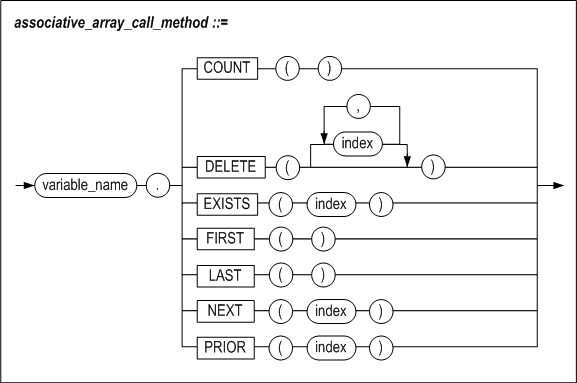

#### 기능

Associative array 변수의 배열 요소 관리를 위한 여러가지 함수를 제공한다. 이
함수들은 SQL 함수와 달리 ()를 생략할 수 없다.

##### COUNT

Associative array의 구성 요소의 개수를 반환한다.

##### DELETE

DELETE()는 모든 구성 요소를 제거하고 제거된 구성 요소의 개수를 반환한다.

DELETE(n)은 n에 해당하는 요소를 제거하고 제거된 구성 요소의 개수를 반환한다.

DELETE(m, n)은 범위 m부터 n에 속하는 모든 구성 요소를 제거하고 제거된 구성
요소의 개수를 반환한다. m의 값이 n보다 크면, 아무것도 제거되지 않는다. 값이
같으면, 한 요소만 제거될 것이다.

##### EXISTS

EXISTS(n) 은 n에 해당하는 구성 요소가 존재하는지 검사해서 존재하면 boolean 값
TRUE를 그렇지 않으면 FALSE를 반환한다.

##### FIRST

정수 값으로 색인화된 경우, 가장 작은 index번호를 반환한다. 문자열로 색인화된
경우, 가장 낮은 키 값을 반환한다. 구성 요소가 하나도 없으면 NULL을 반환한다.

##### LAST

정수 값으로 색인화된 경우, 가장 큰 index번호를 반환한다. 문자열로 색인화된 경우,
가장 높은 키 값을 반환한다. 구성 요소가 하나도 없으면 NULL을 반환한다.

##### NEXT

NEXT(n)은 n의 다음 index번호를 반환한다. VARCHAR 키를 갖는 배열의 경우, 키
문자열들을 바이너리 값 기준으로 정렬하여 바로 다음 키 값을 반환한다. 가장 다음
index가 없으면 NULL을 반환한다.

##### PRIOR

PRIOR(n)은 n의 이전 index번호를 반환한다. VARCHAR 키를 갖는 배열의 경우, 키
문자열들을 바이너리 값 기준으로 정렬하여 바로 앞의 키 값을 반환한다. 이전
index가 없으면 NULL을 반환한다.

#### 예제

##### 예제1

Associative array변수 V1의 요소를 삭제

```
CREATE OR REPLACE PROCEDURE PROC1(
    P1 IN VARCHAR(10),
    P2 IN VARCHAR(10) )
AS
    TYPE MY_ARR IS TABLE OF INTEGER
    INDEX BY VARCHAR(10);
    V1 MY_ARR;
    V2 INTEGER;
BEGIN
    V1['FSDGADS'] := 1;
    V1['AA'] := 2;
    V1['7G65'] := 3;
    V1['N887K'] := 4;
    V1['KU'] := 5;
    V1['34'] := 6;

    PRINTLN( 'V1 COUNT IS : '||V1.COUNT() );

    V2 := V1.DELETE(P1, P2);
    PRINTLN( 'DELETED COUNT IS : '||V2);
    PRINTLN( 'V1 COUNT IS : '||V1.COUNT() );
END;
/
```

실행 결과

EXEC PROC1('005T34', 'BC35'); -- 이 범위에 포함되는 인덱스를 가지는 요소는
V1['34'], V1['7G65'], V1['AA']으로 총 3개가 지워져야 한다.

```
V1 COUNT IS : 6      
DELETED COUNT IS : 3  
V1 COUNT IS : 3           
Execute success.
```


##### 예제2

Associative array변수 V1을 오름차순과 내림차순으로 출력해라.

```
CREATE OR REPLACE PROCEDURE PROC1
AS
  TYPE MY_ARR1 IS TABLE OF INTEGER INDEX BY INTEGER;
  V1 MY_ARR1;
V1_IDX INTEGER;
 BEGIN

  V1[435754] := 1;
  V1[95464]  := 2;
  V1[38]     := 3;
  V1[57334]  := 4;
  V1[138]    := 5;
  V1[85462]  := 6;

  PRINTLN( 'ASCENDING ORDER V1');

  V1_IDX := V1.FIRST();

  LOOP
    IF V1_IDX IS NULL
    THEN
      EXIT;
    ELSE
      PRINTLN( 'V1 IDX IS : '||V1_IDX||' VALUE IS : '||V1[V1_IDX] );
      V1_IDX := V1.NEXT(V1_IDX);
    END IF;
  END LOOP;

  PRINTLN( 'DESCENDING ORDER V1');

  V1_IDX := V1.LAST();

  LOOP
    IF V1_IDX IS NULL
    THEN
      EXIT;
    ELSE
      PRINTLN( 'V1 IDX IS : '||V1_IDX||' VALUE IS : '||V1[V1_IDX] );
      V1_IDX := V1.PRIOR(V1_IDX);
    END IF;
  END LOOP;
END;
/
```

실행 결과

```
EXEC PROC1;

ASCENDING ORDER V1
V1 IDX IS : 38 VALUE IS : 3
V1 IDX IS : 138 VALUE IS : 5
V1 IDX IS : 57334 VALUE IS : 4
V1 IDX IS : 85462 VALUE IS : 6
V1 IDX IS : 95464 VALUE IS : 2
V1 IDX IS : 435754 VALUE IS : 1
DESCENDING ORDER V1
V1 IDX IS : 435754 VALUE IS : 1
V1 IDX IS : 95464 VALUE IS : 2
V1 IDX IS : 85462 VALUE IS : 6
V1 IDX IS : 57334 VALUE IS : 4
V1 IDX IS : 138 VALUE IS : 5
V1 IDX IS : 38 VALUE IS : 3
Execute success.
```

### Varray 관련 함수

#### 구문


#### 기능

VARRAY 변수의 배열 요소 관리를 위한 여러가지 함수를 제공한다. 이 함수들은 ()를 생략할 수 없다.

##### COUNT

VARRAY의 구성 요소의 개수를 반환한다.

##### LIMIT

VARRAY의 최대 구성 요소의 개수를 반환한다. 최대 구성 요소의 개수는 VARRAY 타입을 정의할 때 지정한 size이다.

#### EXTEND

VARRAY변수를 최대 구성 요소 개수 내에서 확장하고, 확장한 구성 요소의 개수를 반환한다. 최대 구성 요소 개수를 넘으면 오류를 반환한다.

EXTEND()는 VARRAY 변수를 1 확장한다.

EXTEND(n)은 VARRAY 변수를 n 확장한다.

EXTEND(m, n)은 VARRAY 변수를 m확장하면서 n번째 요소를 복제한다.

#### TRIM

VARRAY변수의 마지막부터 구성 요소를 제거하고 제거된 구성 요소의 개수를 반환한다.

TRIM()은 VARRAY 변수의 마지막 구성 요소를 1개 제거한다.

TRIM(n)은 VARRAY 변수의 마지막 n개의 구성 요소를 제거한다.

##### EXISTS

EXISTS(n) 은 n에 해당하는 구성 요소가 존재하는지 검사해서 존재하면 boolean 값
TRUE를 그렇지 않으면 FALSE를 반환한다.

##### FIRST

정수 값으로 색인화된 경우, 가장 작은 index번호를 반환한다. 문자열로 색인화된
경우, 가장 낮은 키 값을 반환한다. 구성 요소가 하나도 없으면 NULL을 반환한다.

##### LAST

정수 값으로 색인화된 경우, 가장 큰 index번호를 반환한다. 문자열로 색인화된 경우,
가장 높은 키 값을 반환한다. 구성 요소가 하나도 없으면 NULL을 반환한다.

##### NEXT

NEXT(n)은 n의 다음 index번호를 반환한다. VARCHAR 키를 갖는 배열의 경우, 키
문자열들을 바이너리 값 기준으로 정렬하여 바로 다음 키 값을 반환한다. 가장 다음
index가 없으면 NULL을 반환한다.

##### PRIOR

PRIOR(n)은 n의 이전 index번호를 반환한다. VARCHAR 키를 갖는 배열의 경우, 키
문자열들을 바이너리 값 기준으로 정렬하여 바로 앞의 키 값을 반환한다. 이전
index가 없으면 NULL을 반환한다.

#### 예제

##### 예제1

VARRAY 변수 V1의 요소를 삭제

```
CREATE OR REPLACE PROCEDURE PROC1( ) AS
    TYPE MY_ARR IS VARRAY(10) OF INTEGER;
    V1 MY_ARR;
    V2 INTEGER;
BEGIN
    V1 := MY_ARR( );
    V2 := V1.EXTEND( V1.LIMIT( ) );
 
    FOR I IN 1 .. V1.LIMIT( ) LOOP
      V1(I) := I;
    END LOOP;
    PRINTLN( 'V1 COUNT IS : '||V1.COUNT() );
 
    V2 := V1.TRIM( );
    PRINTLN( 'DELETED COUNT IS : '||V2);
    PRINTLN( 'V1 COUNT IS : '||V1.COUNT() );
 
    FOR I IN V1.FIRST() .. V1.LAST() LOOP
      PRINTLN( 'V1(' || I || ') : ' || V1(I) );
    END LOOP;
 
    V2 := V1.TRIM(3);
    PRINTLN( 'DELETED COUNT IS : '||V2);
    PRINTLN( 'V1 COUNT IS : '||V1.COUNT() );
 
    FOR I IN V1.FIRST() .. V1.LAST() LOOP
      PRINTLN( 'V1(' || I || ') : ' || V1(I) );
    END LOOP;
 
    V2 := V1.DELETE( );
    PRINTLN( 'DELETED COUNT IS : '||V2);
    PRINTLN( 'V1 COUNT IS : '||V1.COUNT() );
END;
/
```

실행 결과

TRIM( )은 마지막 1개, TRIM(3)은 마지막 3개, DELETE는 나머지 구성 요소를 제거한다.

```
EXEC PROC1;
 
V1 COUNT IS : 10
DELETED COUNT IS : 1
V1 COUNT IS : 9
V1(1) : 1
V1(2) : 2
V1(3) : 3
V1(4) : 4
V1(5) : 5
V1(6) : 6
V1(7) : 7
V1(8) : 8
V1(9) : 9
DELETED COUNT IS : 3
V1 COUNT IS : 6
V1(1) : 1
V1(2) : 2
V1(3) : 3
V1(4) : 4
V1(5) : 5
V1(6) : 6
DELETED COUNT IS : 6
V1 COUNT IS : 0
Execute success.
```

### 저장 프로시저내에서 사용자 정의 타입 변수의 사용

여기서는 사용자 정의 타입을 저장 프로시저 내에서 사용할 때의 규칙 및 예제를
다룬다. 사용자 정의 타입을 파라미터 및 리턴값으로 사용하는 부분은 7장 타입
세트를 참고한다.

#### 타입 호환성

```
L_VALUE := R_VALUE;
```

위와 같은 할당문에 사용될 때 사용자 정의 타입의 타입 호환성을 살펴보면 다음과
같다.

| L_VALUE의 타입    | R_VALUE의 타입    | 호환성                                                       |
| ----------------- | ----------------- | ------------------------------------------------------------ |
| RECORD 타입       | RECORD 타입       | 같은 이름을 갖는 동일한 레코드 타입간에만 호환된다. <br />레코드 타입의 내부 구조가 같은 다른 레코드 타입은 서로 호환되지 않는다. |
| RECORD 타입       | %ROWTYPE          | 내부에 정의된 칼럼의 개수만 동일하면 호환된다.               |
| %ROWTYPE          | RECORD 타입       | 내부에 정의된 칼럼의 개수만 동일하면 호환된다.               |
| Associative Array | Associative Array | 동일한 타입 (즉, 같은 이름의 타입) 간에만 호환된다.          |
| VARRAY            | VARRAY            | 동일한 타입 (즉, 같은 이름의 타입) 간에만 호환된다.          |

다음 예제와 같이 사용자 정의 타입은 그 내부 구조가 동일하다 하더라도 할당문은
실패하게 된다.

##### 예제1

RECORD 타입 변수의 할당

```
CREATE OR REPLACE PROCEDURE PROC1
AS
TYPE emp_rec_type1 IS RECORD (
                 name    VARCHAR(20),
                 job_id  VARCHAR(10),
                 salary  NUMBER(8) );

TYPE emp_rec_type2 IS RECORD (
                 name    VARCHAR(20),
                 job_id  VARCHAR(10),
                 salary  NUMBER(8) );

v_emp1 emp_rec_type1;
v_emp2 emp_rec_type2;
BEGIN
     v_emp1.name := 'smith';
     v_emp1.job_id := 'RND1069';
     v_emp1.salary := '10000000';

     v_emp2 := v_emp1;    -- 실패.
```

두 변수가 같은 내부 구조이지만 각각 다른 타입이므로 할당은 실패한다. 그러나
아래처럼 타입이 일치하는 요소간의 할당은 가능하다.

v_emp2.name := v_emp1.name;

#### RECORD 타입 변수 예제

##### 예제1

사원의 이름, 급여, 부서를 저장하는 RECORD타입의 변수를 생성한다.

```
iSQL> CREATE OR REPLACE PROCEDURE PROC1
AS
TYPE emp_rec_type IS RECORD (
name VARCHAR(20),
job_id VARCHAR(10),
salary NUMBER(8) );
v_emp emp_rec_type;
BEGIN
v_emp.name := 'smith';
v_emp.job_id := 'RND1069';
v_emp.salary := '10000000';
PRINTLN('NAME : '||v_emp.name||' '||
          'JOB ID : '||v_emp.job_id||' '||
          'SALARY : '||v_emp.salary );
END;
/
```


#### ASSOCIATIVE ARRAY 타입 예제

##### 예제 1

사원번호가 1에서 20사이에 속한 사원의 이름을 출력한다.

```
iSQL> CREATE OR REPLACE PROCEDURE PROC1
AS
TYPE emp_array_type IS TABLE OF VARCHAR(20) INDEX BY INTEGER;
v_emp emp_array_type;
BEGIN
FOR I IN 1 .. 20 LOOP
SELECT e_lastname INTO v_emp[I] FROM employees WHERE eno = I;
END LOOP;
FOR I IN v_emp.FIRST() .. v_emp.LAST() LOOP
PRINTLN( v_emp[I] );
END LOOP;
END;
/
iSQL>  EXEC PROC1;
Moon
Davenport
Kobain
Foster
Ghorbani
Momoi
Fleischer
Wang
Diaz
Bae
Liu
Hammond
Jones
Miura
Davenport
Chen
Fubuki
Huxley
Marquez
Blake
Execute success.
```


##### 예제 2

사원번호가 1에서 20 사이에 속한 사원의 이름, 급여, 부서를 출력한다.

```
iSQL> CREATE OR REPLACE PROCEDURE PROC1
AS
TYPE emp_rec_type IS RECORD (
         first_name VARCHAR(20),
         last_name VARCHAR(20),
                emp_job VARCHAR(15),
         salary NUMBER(8) );
TYPE emp_array_type IS TABLE OF emp_rec_type
 INDEX BY INTEGER;
v_emp emp_array_type;
BEGIN
FOR I IN 1 .. 20 LOOP
 SELECT e_firstname, e_lastname, emp_job, salary INTO v_emp[I]
 FROM employees
 WHERE eno = I;
END LOOP;
FOR I IN v_emp.FIRST() .. v_emp.LAST() LOOP
PRINTLN( v_emp[I].first_name||' '||
v_emp[I].last_name||' '||
v_emp[I].emp_job||' '||
v_emp[I].salary );
END LOOP;
END;
/
Create success.
iSQL> EXEC PROC1;
Chan-seung           Moon                 CEO
Susan                Davenport            designer 1500
Ken                  Kobain               engineer 2000
Aaron                Foster               PL 1800
Farhad               Ghorbani             PL 2500
Ryu                  Momoi                programmer 1700
Gottlieb             Fleischer            manager 500
Xiong                Wang                 manager
Curtis               Diaz                 planner 1200
Elizabeth            Bae                  programmer 4000
Zhen                 Liu                  webmaster 2750
Sandra               Hammond              sales rep 1890
Mitch                Jones                PM 980
Yuu                  Miura                PM 2003
Jason                Davenport            webmaster 1000
Wei-Wei              Chen                 manager 2300
Takahiro             Fubuki               PM 1400
John                 Huxley               planner 1900
Alvar                Marquez              sales rep 1800
William              Blake                sales rep
Execute success.
```

#### VARRAY 타입 예제

##### 예제 1

사원번호가 1에서 20 사이에 속한 사원의 이름을 출력한다.

```
iSQL> CREATE OR REPLACE PROCEDURE PROC1
AS
TYPE emp_array_type IS VARRAY(20) OF VARCHAR(20);
v_emp emp_array_type;
BEGIN
  SELECT e_lastname BULK COLLECT INTO v_emp FROM employees WHERE eno BETWEEN 1 AND 20;
 
  FOR I IN v_emp.FIRST() .. v_emp.LAST() LOOP
    PRINTLN( v_emp[I] );
  END LOOP;
END;
/
Create success.
 
iSQL> EXEC PROC1;
Moon
Davenport
Kobain
Foster
Ghorbani
Momoi
Fleischer
Wang
Diaz
Bae
Liu
Hammond
Jones
Miura
Davenport
Chen
Fubuki
Huxley
Marquez
Blake
Execute success.
```

##### 예제 2

사원번호가 1에서 20 사이에 속한 사원의 이름, 급여, 부서를 출력한다.

```

iSQL> CREATE OR REPLACE PROCEDURE PROC1
AS
TYPE emp_rec_type IS RECORD (
         first_name VARCHAR(20),
         last_name VARCHAR(20),
                emp_job VARCHAR(15),
         salary NUMBER(8) );
TYPE emp_array_type IS VARRAY(20) OF emp_rec_type;
v_emp emp_array_type;
BEGIN
 SELECT e_firstname, e_lastname, emp_job, salary BULK COLLECT INTO v_emp
 FROM employees
 WHERE eno BETWEEN 1 AND 20;
  FOR I IN v_emp.FIRST() .. v_emp.LAST() LOOP
    PRINTLN( v_emp[I].first_name||' '||
      v_emp[I].last_name||' '||
      v_emp[I].emp_job||' '||
      v_emp[I].salary );
  END LOOP;
END;
/
Create success.
 
 
iSQL> EXEC PROC1;
Chan-seung           Moon                 CEO
Susan                Davenport            designer 1500
Ken                  Kobain               engineer 2000
Aaron                Foster               PL 1800
Farhad               Ghorbani             PL 2500
Ryu                  Momoi                programmer 1700
Gottlieb             Fleischer            manager 500
Xiong                Wang                 manager
Curtis               Diaz                 planner 1200
Elizabeth            Bae                  programmer 4000
Zhen                 Liu                  webmaster 2750
Sandra               Hammond              sales rep 1890
Mitch                Jones                PM 980
Yuu                  Miura                PM 2003
Jason                Davenport            webmaster 1000
Wei-Wei              Chen                 manager 2300
Takahiro             Fubuki               PM 1400
John                 Huxley               planner 1900
Alvar                Marquez              sales rep 1800
William              Blake                sales rep
Execute success.
```


#### 중첩 RECORD 타입 변수

##### 예제

사원 이름을 저장하는 RECORD 타입을 생성하고 이 타입과 부서와 급여를 저장하는
중첩 RECORD 타입 변수를 생성한다.

```
iSQL> CREATE OR REPLACE PROCEDURE PROC1
AS
TYPE emp_name_type IS RECORD ( first_name VARCHAR(20),last_name VARCHAR(20) );
TYPE emp_rec_type IS RECORD ( name emp_name_type,d_num NUMBER(8),salary NUMBER(8) );
TYPE emp_array_type IS TABLE OF emp_rec_type INDEX BY INTEGER;
v_emp emp_array_type;
v_emp_name emp_name_type;
BEGIN
FOR I IN 1 .. 10 LOOP
SELECT e_firstname, e_lastname INTO v_emp_name FROM employees WHERE eno = I;
SELECT dno, salary INTO v_emp[i].d_num, v_emp[I].salary FROM employees WHERE eno = I;
v_emp[I].name := v_emp_name;
END LOOP;
FOR I IN v_emp.FIRST() .. v_emp.LAST() LOOP
v_emp_name := v_emp[I].name;
PRINTLN( v_emp_name.first_name || ' ' ||
v_emp_name.last_name || ' ' ||
v_emp[I].d_num || ' ' ||
v_emp[I].salary );
END LOOP;
END;
/
Create success.
iSQL> EXEC PROC1;
Chan-seung           Moon                 3002
Susan                Davenport             1500
Ken                  Kobain               1001 2000
Aaron                Foster               3001 1800
Farhad               Ghorbani             3002 2500
Ryu                  Momoi                1002 1700
Gottlieb             Fleischer            4002 500
Xiong                Wang                 4001
Curtis               Diaz                 4001 1200
Elizabeth            Bae                  1003 4000
Execute success.
```


#### 다차원 ASSOCIATIVE ARRAY 타입 변수 예제

##### 예제

고객 이름과 주문 번호를 저장하는 다차원 associative array 타입의 변수를
생성한다.

```
iSQL> CREATE OR REPLACE PROCEDURE PROC1
AS
TYPE order_array_type IS TABLE OF INTEGER INDEX BY INTEGER;
TYPE customer_order_rec_type IS RECORD ( first_name VARCHAR(20), last_name VARCHAR(20), orders order_array_type );
TYPE customer_order_array_type IS TABLE OF customer_order_rec_type;
v_cust_order customer_order_array_type;
v_order_array NOCOPY order_array_type;
BEGIN
FOR I IN 1 .. 5 LOOP
v_order_array := v_cust_order[I].orders;
SELECT c_firstname, c_lastname INTO v_cust_order[I].first_name, v_cust_order[I].last_name FROM customers WHERE cno = I;
SELECT ono BULK COLLECT INTO v_order_array FROM orders WHERE cno = I;
END LOOP;
FOR i in 1 .. 5 LOOP
println ( v_cust_order[I].first_name || ' ' || v_cust_order[I].last_name );
v_order_array := v_cust_order[I].orders;
FOR J IN v_order_array.FIRST() .. v_order_array.LAST() LOOP
PRINTLN ( '   order no : ' || v_order_array[J] );
END LOOP;
END LOOP;
END;
/
Create success.
iSQL> EXEC PROC1;
Estevan              Sanchez
   order no : 12300001
   order no : 12310008
   order no : 12310012
Pierre               Martin
   order no : 12300002
   order no : 12310006
Gabriel              Morris
   order no : 11290007
   order no : 12300012
Soo-jung             Park
   order no : 12300005
James                Stone
   order no : 12100277
   order no : 12310004
   order no : 12310009
Execute success
```

다차원 VARRAY 타입 변수 예제

예제

고객 이름과 주문 번호를 저장하는 다차원 VARRAY 타입의 변수를 생성한다.

```
iSQL> CREATE OR REPLACE PROCEDURE PROC1
AS
TYPE order_array_type IS VARRAY(5) OF INTEGER;
TYPE customer_order_rec_type IS RECORD ( first_name VARCHAR(20), last_name VARCHAR(20), orders order_array_type );
TYPE customer_order_array_type IS VARRAY(5) OF customer_order_rec_type;
v_cust_order customer_order_array_type;
v_order_array NOCOPY order_array_type;
ret INTEGER;
BEGIN
  v_cust_order := customer_order_array_type();
  FOR I IN 1 .. 5 LOOP
    ret := v_cust_order.extend();
    v_cust_order[I].orders := order_array_type();
    v_order_array := v_cust_order[I].orders;
    SELECT c_firstname, c_lastname INTO v_cust_order[I].first_name, v_cust_order[I].last_name FROM customers WHERE cno = I;
    SELECT ono BULK COLLECT INTO v_order_array FROM orders WHERE cno = I;
  END LOOP;
  FOR i in 1 .. 5 LOOP
    println ( v_cust_order[I].first_name || ' ' || v_cust_order[I].last_name );
    v_order_array := v_cust_order[I].orders;
    FOR J IN v_order_array.FIRST() .. v_order_array.LAST() LOOP
      PRINTLN ( '   order no : ' || v_order_array[J] );
    END LOOP;
  END LOOP;
END;
/
Create success.
 
iSQL> EXEC PROC1;
Estevan              Sanchez
   order no : 12300001
   order no : 12310008
   order no : 12310012
Pierre               Martin
   order no : 12300002
   order no : 12310006
Gabriel              Morris
   order no : 11290007
   order no : 12300012
Soo-jung             Park
   order no : 12300005
James                Stone
   order no : 12100277
   order no : 12310004
   order no : 12310009
Execute success.
```


### REF CURSOR

저장 프로시저는 동적 SQL의 실행으로 얻은 결과 집합 (Result set)을 커서 변수(REF
CURSOR)를 통해서 클라이언트에게 전달할 수 있다.

OPEN FOR 문으로 커서 변수를 열고 질의를 실행한 후, 커서를 OUT인자를 통해서
클라이언트로 전달하면 클라이언트는 결과집합에 접근할 수 있게 된다. 여러 개의
커서를 전달하면, 클라이언트에서는 다중 결과 집합에 접근이 가능하다. 커서 변수를
열기 위한 OPEN FOR 구문을 제외하고, 기존의 커서 관련 구문을 그대로 이용할 수
있다.

커서 변수는 저장 프로시저의 OUT또는 IN/OUT 인자로만 전달할 수 있고, 저장
함수에서 RETURN 문으로는 반환할 수 없다.

저장 프로시저에서 OPEN된 상태로 커서 변수가 클라이언트로 전달되어야
클라이언트에서 결과집합을 FETCH할 수 있다. 즉, 커서 상태가 CLOSE 상태로 전달될
경우 결과집합을 사용할 수 없다.

저장 프로시저에서 UPDATE, INSERT 문을 실행할 경우, 영향 받은 레코드 수(Affected
Row Count)는 반환하지 않는다.

클라이언트에서 커서 변수로 결과집합을 받는 방법은 클라이언트의 형태에 따라
달라진다. 커서 변수를 이용하여 결과 집합을 클라이언트로 전달하는 것은 Altibase
CLI와 JDBC 애플리케이션에서만 가능하다. Embedded SQL (Altibase Precompiler
(APRE))에서는 커서 변수를 통해 프로시저의 결과 집합을 받을 수 없다.

#### 예제

REF CURSOR를 이용한 저장 프로시저를 생성한다.

1. 테이블 emp와 staff을 생성하고 값을 입력한다.

   ```
   CREATE TABLE EMP (ENO INTEGER, ENAME CHAR(20), DNO INTEGER);
   CREATE TABLE STAFF (NAME CHAR(20), DEPT CHAR(20), JOB CHAR(20), SALARY INTEGER);

   INSERT INTO EMP VALUES (10, 'DULGI PAPA', 100);
   INSERT INTO EMP VALUES (20, 'KUNHAN' , 200);
   INSERT INTO EMP VALUES (30, 'OKASA' , 300);

   INSERT INTO STAFF VALUES ('DULGI PAPA' , '100' , 'PAPA', 100);
   INSERT INTO STAFF VALUES ('SHINCHA' , '200' , 'ENGINEER' , 200);
   INSERT INTO STAFF VALUES ('JI HYUNG', '300', '', 0);
   ```

2. REF CUR인 사용자 정의 타입 MY_CUR 를 정의하고, 이를 포함하는 타입세트 MY_TYPE를
   정의한다.CREATE TYPESET MY_TYPE

   ```
   CREATE TYPESET MY_TYPE
   AS
     TYPE MY_CUR IS REF CURSOR;
   END;
   /
   ```

3. MY_CUR타입의 OUT 인자 P1과 P2, INTEGER 타입의 IN 인자 SAL을 가지는 저장
   프로시저 PROC1을 생성한다.

   ```
   CREATE OR REPLACE PROCEDURE PROC1 (P1 OUT MY_TYPE.MY_CUR, P2 OUT MY_TYPE.MY_CUR, SAL IN INTEGER)
   AS
     SQL_STMT  VARCHAR2(200);
   BEGIN
     SQL_STMT := 'SELECT NAME,DEPT,JOB FROM STAFF WHERE SALARY > ?';
     OPEN P1 FOR 'SELECT ENO, ENAME, DNO FROM EMP';
     OPEN P2 FOR SQL_STMT USING SAL;
   END;
   /
   ```


4. 데이터베이스 서버에 연결한 후, 프로시저 PROC1을 실행한다.

   ```
   SQLRETURN execute_proc()
   {
     SQLCHAR errMsg[MSG_LEN];
     char sql[1000];
     SQLHSTMT     stmt = SQL_NULL_HSTMT;
   
     int sal;
     int sal_len;
     int eno;
     int eno_len;
     int dno;
     int dno_len;
     SQLCHAR ename[ENAME_LEN+1];
     SQLCHAR name[NAME_LEN+1];
     SQLCHAR dept[DEPT_LEN+1];
     SQLCHAR job[JOB_LEN+1];
   
     int job_ind;
   
     SQLRETURN rc = SQL_SUCCESS;
   
     if (SQL_ERROR == SQLAllocStmt(dbc, &stmt))
     {
         printf("SQLAllocStmt error!!\n");
         return SQL_ERROR;
     }
   
   /* 실행할 SQL 문을 준비 */
     sprintf(sql, "EXEC proc1(?)");
     if ( SQLPrepare(stmt,(SQLCHAR *)sql,SQL_NTS) == SQL_ERROR )
     {
       printf("ERROR: prepare stmt\n");
     }
     else
     {
       printf("SUCCESS: prepare stmt\n");
     }
   
   /* 변수 sal에 100을 할당 */
     sal = 100;
   
     /* SQL 문장에 매개변수(sal)를 연결시킴 */
     if ( SQLBindParameter( stmt,
                            1,
                            SQL_PARAM_INPUT,
                            SQL_C_SLONG,
                            SQL_INTEGER,
                            0,
                            0,
                            &sal,
                            0,
                            NULL) == SQL_ERROR )
     {
       printf("ERROR: Bind Parameter\n");
     }
     else
     {
       printf("SUCCESS: 1 Bind Parameter\n");
     }
   
   /* SQL 문장 실행, 프로시져 PROC1을 실행해서 'SELECT eno, ename, dno FROM emp'의 결과값은 P1에 'SELECT name,dept,job FROM staff WHERE salary > ?'(USING SAL)의 결과값은 P2에 가져온다  */
   if (SQL_ERROR == SQLExecute(stmt))
     {
       printf("ERROR: Execute Procedure\n");
     }
   
   /* 'SELECT eno, ename, dno FROM emp'의 결과값을 변수(eno, ename, dno)에 저장 */
     if (SQL_ERROR == SQLBindCol(stmt, 1, SQL_C_SLONG, &eno, 0, (long *)&eno_len))
     {
       printf("ERROR: Bind 1 Column\n");
     }
     if (SQL_ERROR == SQLBindCol(stmt, 2, SQL_C_CHAR, ename, sizeof(ename), NULL))
     {
       printf("ERROR: Bind 2 Column\n");
     }
     if (SQL_ERROR == SQLBindCol(stmt, 3, SQL_C_SLONG, &dno, 0, (long *)&dno_len))
     {
       printf("ERROR: Bind 3 Column\n");
     }
   
   /* P1에 결과값이 있는 동안 결과값을 받아 화면에 출력 */
     while (SQL_SUCCESS == rc)
     {
       rc = SQLFetch(stmt);
       if (SQL_SUCCESS == rc)
       {
         printf("Result Set 1 : %d,%s,%d\n" ,eno, ename, dno);
       }
       else
       {
         if (SQL_NO_DATA == rc)
         {
     break;
         }
         else
         {
            printf("ERROR: SQLFetch [%d]\n", rc);
            execute_err(dbc, stmt, sql);
            break;
         }
       }
     }
   
   /* 다음 결과(P2)로 이동 */
     rc = SQLMoreResults(stmt);
     if (SQL_ERROR == rc)
     {
       printf("ERROR: SQLMoreResults\n");
     }
     else
   {
   
   /* 'SELECT name,dept,job FROM staff WHERE salary > ?'(USING SAL)의 결과값을 변수(name, dept, job)에 저장 */
   
      if (SQL_ERROR == SQLBindCol(stmt, 1, SQL_C_CHAR, name, sizeof(name), NULL))
      {
     printf("ERROR: Bind 1 Column\n");
      }
      if (SQL_ERROR == SQLBindCol(stmt, 2, SQL_C_CHAR, dept, sizeof(dept), NULL))
      {
     printf("ERROR: Bind 2 Column\n");
      }
      if (SQL_ERROR == SQLBindCol(stmt, 3, SQL_C_CHAR, job, sizeof(job), (long *)&job_ind))
      {
     printf("ERROR: Bind 3 Column\n");
      }
   
   /* P2에 결과값이 있는 동안 결과값을 받아 화면에 출력 */
      while (SQL_SUCCESS == rc)
      {
     rc = SQLFetch(stmt);
     if (SQL_SUCCESS == rc)
     {
       if( job_ind == -1 )
          printf("Result Set 2 : %s,%s,NULL\n" ,name, dept);
       else
          printf("Result Set 2 : %s,%s,%s\n" ,name, dept, job);
     }
     else
     {
       if (SQL_NO_DATA == rc)
       {
        break;
       }
       else
       {
       printf("ERROR: SQLFetch [%d]\n", rc);
       execute_err(dbc, stmt, sql);
       break;
       }
     }
      }
     }
   
     if (SQL_ERROR == SQLFreeStmt( stmt, SQL_DROP ))
     {
       printf("sql free stmt error\n");
     }
   }    
   
   ```


7.타입 세트
=========

이 장에서는 타입 세트를 정의하고 사용하는 방법에 대해 설명한다.


### 개요

타입 세트(Type Set)는 저장 프로시저에서 사용하는 사용자 정의 타입들을 한 곳에
모아서 관리하도록 해주는 데이터베이스 객체(Object)이다.

#### 특징

##### 사용자 정의 타입의 공유

사용자 정의 타입들을 한 곳에서 관리하므로 각각의 저장 프로시저 내에서 동일한
구조의 사용자 정의 타입을 중복해서 선언하지 않아도 된다.

##### 사용자 정의 타입을 인자 또는 리턴값으로 사용

동일한 타입세트에 속해 있는 타입은 인자 또는 리턴값으로 프로시저 간 전달이
가능하다. 단, 클라이언트로는 전송할 수 없다.

##### 데이터 타입들을 논리적 단위로 통합 관리

타입세트는 저장 프로시저와 저장 함수에서 사용하는 타입들을 데이터의 논리적
단위로 통합 관리하기 용이하게 해 준다.

##### 결과 집합 전달

저장 프로시저 내부에서 실행된 SQL문의 결과 집합을 REF CURSOR 타입을 사용하여
클라이언트로 전달할 수 있다.

#### 구조

아래 그림과 샘플 코드에서처럼, 타입 세트를 사용하면 여러 저장 프로시저에서
사용하는 사용자 정의 타입을 공유하고 관리하는 것이 가능하며, 데이터 이동이
용이하다.


##### TYPESET 1

사용자 정의 타입 emp_rec_type과 emp_arr_type 을 typeset_1안에 정의한다.

```
CREATE TYPESET typeset_1
AS
TYPE emp_rec_type IS RECORD (
                 name    VARCHAR(20),
                 job_id  VARCHAR(10),
                 salary  NUMBER(8) );

TYPE emp_arr_type IS TABLE OF emp_rec_type
       INDEX BY INTEGER;
END;
/
```


##### PROCEDURE 1

저장 프로시저 procedure_1에서 emp_arr_type을 OUT 인자로 하는 procedure_2를
호출한다.

```
CREATE PROCEDURE procedure_1
AS
V1 typeset_1.emp_arr_type;
BEGIN
  procedure_2( V1 );
  PRINTLN(V1[1].name);
PRINTLN(V1[1].job_id);
PRINTLN(V1[1].salary);

END;
/
```


##### PROCEDURE 2

저장 프로시저 procedure_2의 OUT 인자에 function_3의 반환값을 할당한다.

```
CREATE PROCEDURE procedure_2
( P1 OUT typeset_1.emp_arr_type )
AS
V1 typeset_1.emp_rec_type;
BEGIN
V1 := function_3();
P1[1] := V1;
END;
/
```


##### FUNCTION 3

typeset_1.emp_rec_type타입의 값을 반환한다.

```
CREATE FUNCTION function_3
RETURN typeset_1.emp_rec_type
AS
  V1 typeset_1.emp_rec_type;
BEGIN
V1.name := 'Smith';
V1.job_id := 1010;
V1.salary := 200;

RETURN V1;
END;
/
```


### CREATE TYPESET

#### 구문


#### 전제 조건

SYS 사용자 또는 CREATE PROCEDURE, CREATE ANY PROCEDURE 시스템 권한을 가진
사용자만 실행 가능하다.

#### 설명

저장 프로시저에서 사용할 사용자 정의 타입을 포함하는 타입 세트를 정의한다. 타입
세트 내에서 정의한 타입은 프로시저의 INPUT / OUTPUT 인자로 사용할 때 용이하다.

##### user_name

생성될 타입 세트의 소유자 이름을 명시한다. 생략하면 Altibase는 현재 세션에
연결된 사용자의 스키마에 타입 세트를 생성한다

##### typeset_name

타입 세트의 이름이다.

##### type_declaration

6장 사용자 정의 타입에서 “사용자 정의 타입의 정의”절을 참고한다.

#### 예제

##### 예제1

my_typeset이란 이름의 타입 세트를 생성한다.

```
CREATE TYPESET my_typeset
AS
TYPE emp_rec_type IS RECORD(
      name VARCHAR(20), id INTEGER );
TYPE emp_arr_type IS TABLE OF emp_rec_type
       INDEX BY INTEGER;
END;
/
```


##### 예제2

my_typeset을 이용하는 프로시저 my_proc1을 생성한다.

```
CREATE PROCEDURE my_proc1
AS
V1 my_typeset.emp_rec_type;
V2 my_typeset.emp_arr_type;
BEGIN
V1.name := 'jejeong';
V1.id    := 10761;
V2[1]    := V1;

V1.name := 'ehkim';
V1.id    := 11385;
V2[2]    := V1;

V1.name := 'mslee';
V1.id    := 13693;
V2[3]    := V1;

PRINTLN('NAME : '||V2[1].name||
          '  ID : '||V2[1].id );
PRINTLN('NAME : '||V2[2].name||
          '  ID : '||V2[2].id );
PRINTLN('NAME : '||V2[3].name||
          '  ID : '||V2[3].id );
END;
/
```

결과

```
iSQL> exec my_proc1;
NAME : jejeong  ID : 10761
NAME : ehkim  ID : 11385
NAME : mslee  ID : 13693
Execute success.
```


### DROP TYPESET

#### 구문


#### 전제 조건

SYS 사용자이거나 객체의 생성자 또는 DROP ANY PROCEDURE 시스템 권한을 가진
사용자만 실행 가능하다.

#### 설명

명시된 타입 세트를 제거한다. 제거된 타입 세트를 사용하던 저장 프로시저는
유효하지 않은(Invalid) 상태가 된다.

##### user_name

제거될 타입 세트의 소유자 이름을 명시한다. 생략하면 Altibase는 제거될 타입
세트가 현재 세션에 연결된 사용자의 스키마에 속한 것으로 간주한다.

##### typeset_name

타입 세트의 이름이다.

#### 예제

my_typeset이란 이름의 타입 세트를 삭제한다.

```
DROP TYPESET my_typeset;
```


8.동적 SQL
========

이 장에서는 저장 프로시저와 저장 함수에서 동적 SQL을 사용하는 방법을 설명한다.


### 동적 SQL의 개요

동적 SQL(Dynamic SQL)은 실행 시간에 사용자가 원하는 질의를 만들어서 실행하는
것이다.

일반적인 저장 프로시저의 SQL 실행 방법은 정적인(Static) 방법으로, 저장
프로시저가 최초로 실행될 때 SQL문의 실행계획이 생성된다. 그러나 저장 프로시저를
실행할 때 결정되는 SQL 구문은 동적 SQL을 사용해야 한다.

#### 동적 SQL의 실행

아래 다이어그램은 정적 SQL과 동적 SQL이 포함된 저장 프로시저를 생성하고 실행할
때 Altibase 내부에서 이를 수행하는 과정을 비교하고 있다.

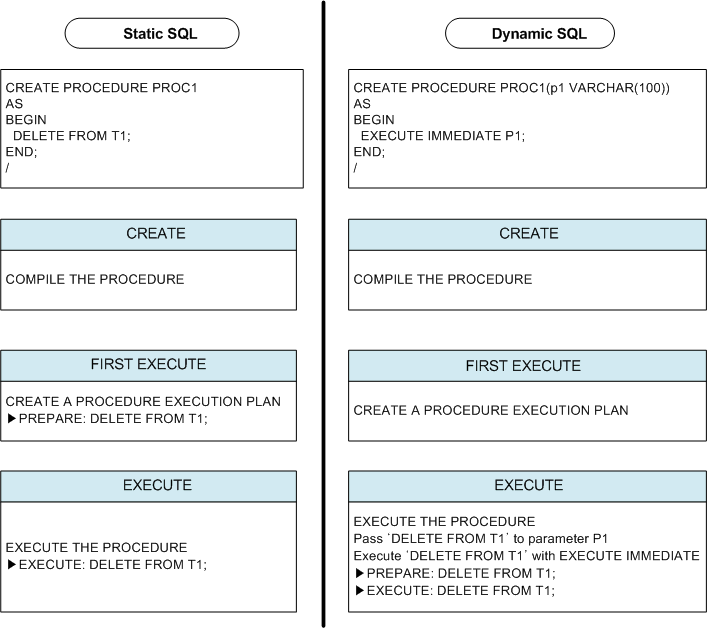

[그림 8‑1] 정적 SQL과 동적 SQL의 실행 과정 비교

[그림 8- 1]의 왼쪽 저장 프로시저는 ‘DELETE FROM T1’ 문을 정적으로 처리한 것이고,
오른쪽 저장 프로시저는 동일한 DELETE 문을 EXECUTE IMMEDIATE를 사용하여 동적으로
처리한 것이다.

전자는 프로시저가 최초로 실행되는 시점에 DELETE문에 대한 실행계획이 만들어져
Plan Cache에 저장되고, 반복 호출 시 Plan Cache에서 실행계획을 찾아서 수행
(EXECUTE)한다. 후자도 마찬가지로 프로시저가 최초로 호출되는 시점에 DELETE 문에
대해 실행계획이 생성되어 Plan Cache에 저장된다.

#### 특징

동적 SQL의 장점은 저장 프로시저 실행 시에 SQL문을 사용자 마음대로 변경하여
실행시킬 수 있다는 것이다. 또한 SQL문의 종류에 관계없이 DBMS가 지원하는 SQL은
무엇이든 실행시킬 수 있다.

동적 SQL은 다음의 상황에서 유용하다.

-   쿼리할 테이블의 이름이 실행시에 결정 될 때

-   상황에 따라 질의의 힌트나 조건절의 조건 연산자를 바꾸어 실행할 필요가 있을
    때

-   DDL과 DML구문이 빈번하게 일어나서 저장 프로시저 내의 SQL문을 그 때 그때
    최적화할 필요가 있을 때

-   실행 비용이 최적화 비용보다 큰 SQL을 자주 실행할 필요가 있을 때

-   재활용성 가능성이 높은 저장 프로시저가 필요할 때

단, 동적 SQL문은 문장의 생성, 삭제 및 바인딩 비용이 매우 크므로 정적 SQL과
비교해서 낮은 성능을 보일 수 있다. 동적 SQL문의 사용은 응용프로그램 구조를
유연하게 하는 반면 성능을 저하시킬 수 있다.

### EXECUTE IMMEDIATE

동적으로 DDL, DCL, DML 및 단일 레코드를 결과로 반환하는 SELECT 질의를 실행하기
위해 사용한다.

#### 구문

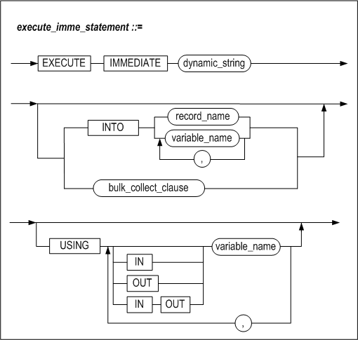

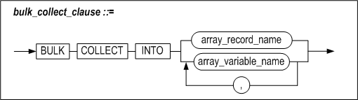


#### 설명

##### dynamic_string

실행할 질의문을 가지는 문자열이다.

##### INTO

INTO절은 SELECT ... INTO 구문과 마찬가지로 가져온 결과 집합을 저장할 변수들을
명시한다.

##### bulk_collect_clause

BULK COLLECT 절은 SELECT 문의 수행 결과를 한꺼번에 가져온다. INTO 뒤에는
SELECT문이 반환하는 레코드들을 저장하기 위해 RECORD 타입 변수의 배열 또는
레코드의 각 칼럼에 대응하는 호스트 변수의 배열이 칼럼 개수만큼 와야 한다.

BULK COLLECT 절을 사용해서 질의문의 결과 집합을 한번에 배열로 가져오는 방법이
loop문을 사용해서 결과 행을 한 건씩 가져오는 것보다 더 효율적이다.

##### USING

USING절은 실행 시에 SQL구문에 바인드할 인자를 명시하는데 사용된다. 인자는 SQL문
내의 물음표 (“?”) 위치에 보이는 순서대로 바인드 된다. IN, OUT, IN/OUT 인자를
지정할 수 있다.

#### 예제

다음은 DML문을 동적 SQL을 사용해서 실행하는 예제이다.

```
CREATE PROCEDURE fire_emp(v_emp_id INTEGER) AS
BEGIN
  EXECUTE IMMEDIATE
  'DELETE FROM employees WHERE eno = ?'
    USING v_emp_id;
END;
/

CREATE PROCEDURE insert_table (
      table_name  VARCHAR(100),
      dept_no     NUMBER,
      dept_name   VARCHAR(100),
      location    VARCHAR(100))
AS
      stmt    VARCHAR2(200);
BEGIN
   stmt := 'INSERT INTO ' || table_name ||
           ' values (?, ?, ?)';
   EXECUTE IMMEDIATE stmt
           USING dept_no, dept_name, location;
END;
/
```

EXECUTE IMMEDIATE dynamic_string 구문은 해당 질의문을 Direct-Execute 방식으로
실행한다. USING 뒤에 나오는 변수는 바인드할 인자이다. DDL 및 DCL의 경우도 DML과
마찬가지로 EXECUTE IMMEDIATE를 사용하여 실행할 수 있다.

#### 제약사항

저장 프로시저 내에서 동적 SQL 형태로 사용 가능한 질의문은 다음과 같다.

-   DML  
    SELECT, INSERT, UPDATE, DELETE, MOVE, MERGE, LOCK TABLE, ENQUEUE, DEQUEUE

-   DDL  
    CREATE, ALTER, DROP

-   DCL  
    ALTER SYSTEM, ALTER SESSION, COMMIT, ROLLBACK

동적 SQL사용을 지원하지 않는 구문은 다음과 같다.

-   iSQL을 통해서만 실행할 수 있는 구문

-   SELECT \* FROM tab;

-   DESC table_name

-   SET TIMING

-   SET AUTOCOMMIT

-   CONNECT

-   DISCONNECT

### OPEN FOR

이 구문은 커서변수 (REF CURSOR)를 초기화하고 쿼리를 수행하여 결과 집합을
결정하는 데 사용된다. 결과 집합의 데이터는 FETCH 문을 사용해서 가져올 수도 있고,
저장 프로시저의 인자를 사용해서 클라이언트로 전달할 수도 있다. USING 절을
이용하여 인자를 바인딩할 수도 있다.

#### 구문


#### 설명

##### cursor_variable_name

REF CURSOR 타입의 커서 변수의 이름이다.

##### select_statement

select_statement는 실행될 질의문이다. SELECT구문만 사용할 수 있으며 USING 절과
함께 사용할 수 없다.

##### dynamic_string

dynamic_string은 실행될 질의문이다. 문자열 형태의 SELECT 구문만 사용할 수 있다.

##### USING

USING 절은 실행 시에 SQL구문에 바인드할 인자를 명시하는 데 사용된다. 인자는
SQL문 내의 물음표 (“?”) 위치에 보이는 순서대로 바인드 된다.

#### 예제

다음은 여러 행을 가져오는 동적 SQL문의 실행 결과를 클라이언트로 전달하기 위해서,
프로시저 내부에서 REF CURSOR타입의 커서 변수를 사용하는 예제이다.

클라이언트로 전달된 커서변수를 통하여 결과집합을 FETCH하는 방법은 Precompiler
User's Manual, CLI User's Manual, API User's Manual 을 참고한다.

```
CREATE OR REPLACE PROCEDURE fetch_employee
AS
  TYPE MY_CUR IS REF CURSOR;
  emp_cv MY_CUR;
  emp_rec employees%ROWTYPE;
  stmt VARCHAR2(200);
  v_job VARCHAR2(10) := 'webmaster';
BEGIN
  stmt := 'SELECT * FROM employees WHERE emp_job = ?';
  OPEN emp_cv FOR stmt USING v_job;
  LOOP
    FETCH emp_cv INTO emp_rec;
    EXIT WHEN emp_cv%NOTFOUND;
    PRINTLN('[Name]: ' || emp_rec.e_firstname || emp_rec.e_lastname ||
            ' [Job Id]: ' || emp_rec.emp_job);
  END LOOP;
  CLOSE emp_cv;
END;
/
```


9.예외 처리
=========

### 개요

저장 프로시저 수행 중에 발생하는 예외 (Exception)는 예외 처리부에서 각 예외 별로
지정하여 처리할 수 있다.

#### 종류

Altibase 저장 프로시저에서 발생하는 예외에는 두 가지 종류가 있다.

-   시스템 정의 예외 (System-defined Exception)

-   사용자 정의 예외 (User-defined Exception)

저장 프로시저가 지원하는 예외에는 와 사용자가 임의로 정의하여 사용할 수 있는 가
있다.

##### 시스템 정의 예외

시스템 정의 예외는 Altibase 내에 미리 정의해 둔 것으로, 저장 프로시저의 선언부에
따로 선언할 필요가 없다.

발생 가능한 몇몇 시스템 정의 예외는 다음과 같다.

| 예외 이름           | 발생 원인                                                                                                                                                                              |
|---------------------|----------------------------------------------------------------------------------------------------------------------------------------------------------------------------------------|
| CURSOR_ALREADY_OPEN | 이미 열려 있는 커서를 닫지 않고 다시 열려고 하는 경우 발생한다. Cursor FOR LOOP의 경우 내부에서 묵시적으로 커서가 열리므로 루프 내에서 OPEN문을 사용하여 명시적으로 커서를 열 수 없다. |
| DUP_VAL_ON_INDEX    | Unique 인덱스가 정의된 칼럼에 중복된 값을 입력하려 하는 경우 발생한다.                                                                                                                 |
| INVALID_CURSOR      | 열려 있지 않은 커서를 사용해서 FETCH 또는 CLOSE하려는 경우 등과 같이, 현재 커서 상태에서 수행할 수 없는 작업을 수행하려 하는 경우에 발생한다.                                          |
| NO_DATA_FOUND       | SELECT 문에 의해 반환된 데이터가 한 건도 없을 때 발생한다.                                                                                                                             |
| TOO_MANY_ROWS       | SELECT INTO문은 하나의 레코드만 반환해야 하는데 둘 이상의 레코드가 반환된 경우 발생한다.                                                                                               |

##### 사용자 정의 예외

사용자정의 예외는 사용자가 명시적으로 선언한 것으로, RAISE문을 사용해서
의도적으로 발생시켜야 한다.

```
DECLARE
  comm_missing  EXCEPTION;    -- DECLARE user defined EXCEPTION
BEGIN
  ......
  RAISE comm_missing;   -- raising EXCEPTION
  ......
  EXCEPTION
    WHEN comm_missing THEN ......
```

사용자정의 예외를 시스템 정의 예외와 같은 이름으로 정의할 경우, 사용자 정의
예외가 시스템 정의 예외보다 우선된다. 즉, 예외 처리부 내에서 사용자 정의 예외로
간주될 것이다.

#### 예외 선언

시스템 정의 예외의 경우 시스템 내부에 예외 이름이 정의되어 있으므로 명시적으로
선언할 필요가 없다.

반면에, 사용자 정의 예외의 경우 선언부에 명시적으로 그 이름을 정의한 후 사용해야
한다.

#### 예외 발생

시스템 정의 예외는 명시적으로 발생시킬 필요가 없다. 저장 프로시저 수행 도중
시스템 정의 예외가 발생하면 그 예외를 처리하는 Exception Handler가 존재하는지
확인한다. 존재할 경우 자동으로 그 쪽으로 분기해서 Exception Handler에 정의된
작업을 처리한다.

반면, 사용자 정의 예외의 경우 저장 프로시저 내에서 명시적으로 예외를 발생시켜야
한다. 사용자 정의 예외는 RAISE문을 사용해서 발생시킬 수 있다.

#### 예외 처리부

사용자 정의 예외 및 시스템 정의 예외가 발생할 경우 처리할 작업들을 여기에
정의한다.

### EXCEPTION

#### 구문

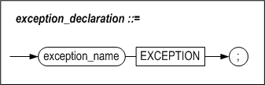

#### 설명

사용자 정의 예외를 정의한다

##### exception_name

한 블록 내에서 유일한 이름이어야 한다. 자신이 선언된 블록의 BEGIN와 END 문
범위내에서 유효하다.

#### 예제

```
DECLARE
  error_1   EXCEPTION;
  error_2   EXCEPTION;
  error_3   EXCEPTION;
```


### RAISE

#### 구문


#### 설명

이 구문은 명시적으로 예외를 발생시키기 위해 사용된다. 예외가 발생하면 발생한
예외에 해당하는 exception handler의 루틴으로 제어가 넘어간다.

##### exception_name

발생시키고자 하는 예외 이름을 지정한다.

이 이름은 블록 선언부에 선언되어 있는 예외 또는 시스템 정의 예외의 이름이어야
한다.

선언되지 않은 예외를 여기에 명시하면, 저장 프로시저 컴파일은 실패한다. 저장
프로시저 실행 시 예외가 발생했는데 해당하는 exception handler가 존재하지 않을
경우에는, 저장 프로시저의 수행을 중단하고 오류를 돌려 준다.

사용자 정의 예외의 경우 외부 블록과 내부 블록에 같은 예외 이름을 정의할 수도
있다. 이 경우 모호함을 없애기 위해서 각 블록에 LABEL을 붙이고 RAISE문에서는 예외
이름 앞에 LABEL 명을 명시하여 사용하면 된다.

외부 블록에서 선언된 예외는 내부 블록에서 선언된 예외에 해당하는 exception
handler내에서 발생시킬 수 있다.

예외 명을 지정하지 않아도 되는 경우는 exception handler안에서만 사용되는
경우로서 이때는 앞서 발생한 예외를 다시 한번 발생시킨다.

#### 예제

##### 예제 1

다음은 VALUE_ERROR 예외를 예외 처리부에서 처리하고, 같은 예외를 다시 발생시키는
예제이다.

```
CREATE OR REPLACE PROCEDURE PROC1
AS
BEGIN
  RAISE VALUE_ERROR;
  EXCEPTION
    WHEN VALUE_ERROR THEN
      PRINTLN('VALUE ERROR CATCHED. BUT RE-RAISE.');
      RAISE;
END;
/
iSQL> EXEC PROC1;
VALUE ERROR CATCHED. BUT RE-RAISE.        
[ERR-3116F : Value error
0004 :   RAISE VALUE_ERROR;
        ^                 ^
]
```


##### 예제2

다음은 예제 1의 PROC1에서 발생한 예외를 처리하는 예제이다

```
CREATE OR REPLACE PROCEDURE PROC2
AS
BEGIN
  PROC1;
  EXCEPTION
    WHEN OTHERS THEN
    PRINTLN('EXCEPTION FROM PROC1 CATCHED.');
    PRINTLN('SQLCODE : '||SQLCODE);
END;
/
iSQL> EXEC PROC2;
VALUE ERROR CATCHED. BUT RE-RAISE.
EXCEPTION FROM PROC1 CATCHED.
SQLCODE : 201071
Execute success.
```


### RAISE_APPLICATION_ERROR

사용자 정의 에러코드 및 에러 메시지를 가지고 예외를 발생시킨다. 에러코드는
990000부터 991000까지의 범위로, 1001 개의 사용자 에러코드가 지원된다.

#### 구문

```
RAISE_APPLICATION_ERROR (
	errcode INTEGER,
    errmsg VARCHAR(2047) );
```

#### 파라미터

| 이름    | 입출력 | 데이터 타입 | 설명                                                      |
|---------|--------|-------------|-----------------------------------------------------------|
| errcode | IN     | INTEGER     | 사용자 정의 에러 코드 (990000 에서 991000 까지 사용 가능) |
| errmsg  | IN     | VARCHAR     | 사용자 정의 에러 메시지 텍스트                            |

#### 설명

이 프로시저는 사용자가 정의한 에러 코드와 에러메시지를 가지는 예외를 발생시킨다.

#### 예제

다음은 사용자 정의 에러를 발생시키는 예제이다. 단, iSQL에서 에러코드는 16진수
값으로 표시된다.

```
CREATE OR REPLACE PROCEDURE PROC1
AS
BEGIN
    RAISE_APPLICATION_ERROR( 990000,
	 'This is my error msg. ' );
END;
/
iSQL> EXEC PROC1;
[ERR-F1B30 : This is my error msg.
at "SYS.PROC1", line 4]
```


### 사용자 정의 예외

사용자가 직접 RAISE문을 사용해서 예외를 발생시키는 경우는 다음 2가지 경우이다.

-   사용자가 정의한 예외를 처리하는 경우

-   시스템이 정의한 예외을 처리하는 경우

#### 사용자 정의 예외의 에러코드

사용자가 정의한 예외를 처리하는 경우, SQLCODE의 값은 항상 **201232**로 고정되어
있다**.**

```
CREATE OR REPLACE PROCEDURE PROC1
AS
    E1 EXCEPTION;
BEGIN
    RAISE E1;
EXCEPTION
WHEN E1 THEN
    PRINTLN('SQLCODE: ' || SQLCODE);  -- 에러코드 출력
    PRINTLN('SQLERRM: ' || SQLERRM);  -- 에러메시지 출력
END;
/

iSQL> EXEC PROC1;
SQLCODE: 201232
SQLERRM: User-Defined Exception.
Execute success.
```

만약 이 예외를 예외 처리부에서 사용자 정의 예외로 처리하지 않는 경우, 발생하는
에러는 다음과 같다. 즉 사용자 정의 예외를 위한 exception handler가 없다는
의미이다.

```
CREATE OR REPLACE PROCEDURE PROC1
AS
    E1 EXCEPTION;
BEGIN
    RAISE E1;
END;
/

iSQL> EXEC PROC1;
[ERR-31157 : Unhandled exception : E1]
```

사용자 정의 예외가 예외 처리부에서 처리될 때는 항상 다음의 에러 코드를 가진다.

| Exception Name | Error Code(integer) | Error Code(hexadecimal) | Error Section                          |
| -------------- | ------------------- | ----------------------- | :------------------------------------- |
|                | 201232              | 31210                   | qpERR_ABORT_QSX_USER_DEFINED_EXCEPTION |

#### 시스템 정의 예외의 에러코드

시스템 정의 예외가 발생하는 경우에는 다음과 같이 시스템에 지정된 에러코드가
출력된다.

```
CREATE OR REPLACE PROCEDURE PROC1
AS
BEGIN
    RAISE NO_DATA_FOUND;
EXCEPTION
WHEN NO_DATA_FOUND THEN
    PRINTLN('SQLCODE: ' || SQLCODE);  -- 에러코드 출력
    PRINTLN('SQLERRM: ' || SQLERRM);  -- 에러메시지 출력
END;
/
iSQL> EXEC PROC1;
SQLCODE: 201066
SQLERRM: No data found.
at "SYS.PROC1", line 4
Execute success.
```

다음과 같이 시스템 정의 예외의 경우에는 별도의 예외처리를 예외 처리부에서 하지
않더라도 이미 정의된 에러코드가 출력되는 것을 볼 수 있다.

```
CREATE OR REPLACE PROCEDURE PROC1
AS
BEGIN
    RAISE NO_DATA_FOUND;
END;
/

iSQL> EXEC PROC1;
[ERR-3116A : No data found.
at "SYS.PROC1", line 4]
```

참고로 많이 사용되는 시스템 정의 예외의 에러코드는 다음과 같다. 각 예외의 원인에
대해서는 앞서 설명한 “시스템 정의 예외” 절을 참고하기 바란다.

| Exception Name        | Error Code (integer) | Error Code (hexadecimal) | Error Section                           |
|-----------------------|----------------------|--------------------------|-----------------------------------------|
| "CURSOR_ALREADY_OPEN" | 201062               | 31166                    | qpERR_ABORT_QSX_CURSOR_ALREADY_OPEN     |
| "DUP_VAL_ON_INDEX"    | 201063               | 31167                    | qpERR_ABORT_QSX_DUP_VAL_ON_INDEX        |
| "INVALID_CURSOR"      | 201064               | 31168                    | qpERR_ABORT_QSX_INVALID_CURSOR          |
| "NO_DATA_FOUND"       | 201066               | 3116A                    | qpERR_ABORT_QSX_NO_DATA_FOUND           |
| "TOO_MANY_ROWS        | 201070               | 3116E                    | qpERR_ABORT_QSX_TOO_MANY_ROWS           |
| "INVALID_PATH"        | 201237               | 31215                    | qpERR_ABORT_QSX_FILE_INVALID_PATH       |
| "INVALID_MODE"        | 201235               | 31213                    | qpERR_ABORT_QSX_INVALID_FILEOPEN_MODE   |
| "INVALID_FILEHANDLE"  | 201238               | 31216                    | qpERR_ABORT_QSX_FILE_INVALID_FILEHANDLE |
| "INVALID_OPERATION"   | 201239               | 31217                    | qpERR_ABORT_QSX_FILE_INVALID_OPERATION  |
| "READ_ERROR"          | 201242               | 3121A                    | qpERR_ABORT_QSX_FILE_READ_ERROR         |
| "WRITE_ERROR"         | 201243               | 3121B                    | qpERR_ABORT_QSX_FILE_WRITE_ERROR        |
| "ACCESS_DENIED"       | 201236               | 31214                    | qpERR_ABORT_QSX_DIRECTORY_ACCESS_DENIED |
| "DELETE_FAILED"       | 201240               | 31218                    | qpERR_ABORT_QSX_FILE_DELETE_FAILED      |
| "RENAME_FAILED"       | 201241               | 31219                    | qpERR_ABORT_QSX_FILE_RENAME_FAILED      |

모든 에러 코드 리스트는 Error Message Reference를 참조한다.

### SQLCODE와 SQLERRM

SQLCODE, SQLERRM은 SQL문 수행 시 발생한 예외에 해당하는 에러코드와 메시지를
얻어와서 이에 대한 적절한 대응을 하기 위해 Exception Handler에서 사용된다.

SQLCODE, SQLERRM에 에러가 세팅 되는 경우는 다음과 같다.

-   저장 프로시저 실행 도중 에러가 발생한 경우

-   사용자 정의 예외가 발생한 경우

-   시스템 정의 예외가 발생한 경우

-   사용자가 RAISE_APPLICATION_ERROR로 자신이 정의한 에러를 발생시킨 경우

-   Exception Handler 내에서 다시 RAISE하는 경우

위와 같은 경우 기존의 SQLCODE와 SQLERRM는 새로 발생한 에러코드와 에러메시지로
변경된다.

또한, Exception Handler가 정상적으로 동작한 후에는 SQLCODE와 SQLERRM의 값은 예외
발생 이전의 에러코드와 에러메시지로 원복 되는데, 이는 LIFO (last in, first out)
스택의 원리로 동작하기 때문이다.

따라서, 한번 발생한 예외로 인해 SQLCODE와 SQLERRM에 셋팅된 값은 그 블록의 상위
블록으로 제어가 넘어가지 않는 한 스택에 계속 남아있게 된다.

다음의 예제를 보면,

```
CREATE OR REPLACE PROCEDURE PROC1
AS
BEGIN
  BEGIN
    RAISE NO_DATA_FOUND;
  EXCEPTION
    WHEN OTHERS THEN
      BEGIN
        PRINTLN('1SQLCODE : '||SQLCODE);
        PRINTLN('1SQLERRM : '||SQLERRM);
        RAISE VALUE_ERROR;
      EXCEPTION
        WHEN OTHERS THEN
          PRINTLN('2SQLCODE : '||SQLCODE);
          PRINTLN('2SQLERRM : '||SQLERRM);
      END;
    PRINTLN('3SQLCODE : '||SQLCODE);
    PRINTLN('3SQLERRM : '||SQLERRM);
  END;
  PRINTLN('4SQLCODE : '||SQLCODE);
 PRINTLN('4SQLERRM : '||SQLERRM);
END;
/
```

위 예제의 경우 다음과 같은 결과를 출력한다.

```
iSQL> EXEC PROC1;
1SQLCODE : 201066
1SQLERRM : No data found.
at "SYS.PROC1", line 5
2SQLCODE : 201071
2SQLERRM : Value error
at "SYS.PROC1", line 11
3SQLCODE : 201066
3SQLERRM : No data found.
at "SYS.PROC1", line 5
4SQLCODE : 0
4SQLERRM : Successfully completed
Execute success.
```

이를 도식화하면 SQLCODE, SQLERRM의 범위는 다음과 같음을 알 수 있다.


### Exception Handler

#### 구문


#### 기능

Exception Handler에는 예외가 발생했을 때의 처리 루틴을 기술한다.

예외가 발생했을 때, Altibase는 어느 exception handler에 제어를 넘길 것인지
결정한다. Exception Handler를 찾아내는 규칙은 다음과 같다.

-   현재 블록부터 시작하여 현재 블록을 포함하고 있는 바깥 블록들로 예외의 이름이
    같은 Exception Handler를 찾는다. 도중에 어느 한 블록에서라도 OTHERS 핸들러를
    만나게 되면 OTHERS 핸들러에서 예외처리를 하게 된다.

-   맨 바깥블록까지 Exception Handler가 발견되지 않는다면, 사용자에게 “Unhandled
    Exception” 에러를 출력하고 프로시저의 수행은 즉시 중지된다.

발생한 에러를 확인하기 위해 exception handler에서 SQLCODE와 SQLERRM을 사용할 수
있다. 즉, SQLCODE는 Altibase 에러코드 번호를 반환하고, SQLERRM은 대응하는 에러
메시지를 반환하다.

SQLCODE와 SQLERRM은 SQL구문에서 직접 사용할 수는 없다. 대신에 그 값을 지역
변수에 대입하고 그 변수를 SQL 구문에서 사용하면 된다.

##### exception name

처리 하고자 하는 시스템 정의 예외 또는 사용자 정의 예외의 이름을 기술한다.

예외 발생시에 동일한 처리를 하고자 하는 예외들을 OR로 묶어서 하나의 루틴으로
처리할 수 있다.

##### others

이전에 기술된 모든 Exception Handler에서 현재 발생한 예외를 처리하지 못할 경우
최종적으로 OTHERS 루틴에서 처리된다.

#### 예제

##### 예제1

```
CREATE TABLE t1(i1 INTEGER, i2 INTEGER, i3 INTEGER);

CREATE TABLE t2(i1 INTEGER, i2 INTEGER, i3 INTEGER);
INSERT INTO t1 VALUES(1,1,1);
INSERT INTO t1 VALUES(2,2,2);

CREATE OR REPLACE PROCEDURE proc1
AS
BEGIN
  DECLARE
    CURSOR c1 IS SELECT * FROM t1;
      v1 INTEGER;
      v2 INTEGER;
      v3 INTEGER;
  BEGIN
    -- OPEN c1;

    FETCH c1 INTO v1, v2, v3;
    INSERT INTO t2 VALUES (v1, v2, v3);

    CLOSE c1;

  EXCEPTION
    WHEN INVALID_CURSOR THEN
    INSERT INTO t2 VALUES (-999, -999, -999);

  END;

END;
/

iSQL> EXEC proc1;
Execute success.

iSQL> SELECT * FROM t2;
T2.I1       T2.I2       T2.I3       
----------------------------------------
-999        -999        -999        
1 row selected.
```


##### 예제2

```
CREATE TABLE t1(i1 INTEGER, i2 INTEGER, i3 INTEGER);

CREATE OR REPLACE PROCEDURE proc1(p1 IN INTEGER)
AS
  v1 INTEGER;
  err1 EXCEPTION;
BEGIN
  IF p1 < 0 THEN
    RAISE err1;
  END IF;

  SELECT i1 INTO v1 FROM t1;

EXCEPTION
  WHEN NO_DATA_FOUND OR TOO_MANY_ROWS THEN
    INSERT INTO t1 VALUES(1,1,1);
  WHEN OTHERS THEN
    INSERT INTO t1 VALUES(0,0,0);

END;
/

iSQL> EXEC proc1(1);
Execute success.
iSQL> SELECT * FROM t1;
T1.I1       T1.I2       T1.I3       
----------------------------------------
1           1           1           
1 row selected.
iSQL> EXEC proc1(-8);
Execute success.
iSQL> SELECT * FROM t1;
T1.I1       T1.I2       T1.I3       
----------------------------------------
1           1           1           
0           0           0           
2 rows selected.
```


##### 예제3

```
CREATE TABLE t1(i1 INTEGER NOT NULL);

CREATE OR REPLACE PROCEDURE proc1
AS
  code INTEGER;
  errm VARCHAR(200);
BEGIN
  INSERT INTO t1 VALUES(NULL);
EXCEPTION
WHEN OTHERS THEN

-- 변수 code에 SQLCODE 에러코드 값 대입
 code := SQLCODE;

-- 변수 errm에 SQLERRM 에러 메시지 저장

errm := SUBSTRING(SQLERRM, 1, 200);
  system_.println('SQLCODE : ' || code);
  system_.println('SQLERRM : ' || errm);
END;
/

iSQL> EXEC proc1;
SQLCODE : 200820
SQLERRM : Unable to insert (or update) NULL into NOT NULL column.
at "SYS.PROC1", line 6
Execute success.
```


10.프라그마(Pragma)
================

### 개요

프라그마(Pragma)를 사용하면 프라그마의 종류에 따라 컴파일 동작이 달라진다.
프라그마는 저장 프로시저, 저장 함수, 저장 패키지에서 사용할 수 있다.

#### 종류

Altibase에서 사용할 수 있는 프라그마는 아래와 같다. 각각의 프라그마에 대해서는
다음 절에서 설명한다.

-   자율 트랜잭션 프라그마(Autonomous_Transaction Pragma)

-   예외 초기화 프라그마(Exception_Init Pragma)

#### 구문

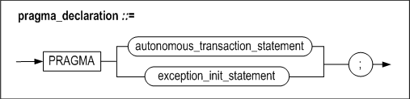


### 자율 트랜잭션 프라그마(Autonomous_Transaction Pragma)

#### 구문

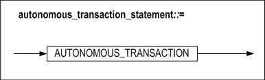

#### 기능

자율 트랜잭션 프라그마(Autonomous transaction Pragma)를 사용하면 PSM 객체가
트랜잭션 내에서 동작하는 방식을 변경할 수 있다. 자율 트랜잭션 프라그마는 PSM
객체 생성의 컴파일 시에 설정된다.

자율 트랜잭션 프라그마가 설정된 PSM 객체는 독립적으로 동작하여 주 트랜잭션과
자원을 공유하지 않는다. 따라서 락, 커밋, 복구 등의 동작이 독립적으로 수행된다.
자율 트랜잭션 프라그마는 모듈 중심 또는 재사용성이 높은 프로그램을 작성할 때
유용하다.


자율 트랜잭션 프라그마를 정의할 수 있는 위치는 아래와 같다.

-   최상위 저장 프로시저

-   최상위 저장 함수

-   최상위 저장 패키지의 서브 프로그램

-   트리거의 psm_body

자율 트랜잭션과 중첩 트랜잭션의 차이는 아래와 같다.

|                 | 자율 트랜잭션                                                                                | 중첩 트랜잭션                                                                              |
|-----------------|----------------------------------------------------------------------------------------------|--------------------------------------------------------------------------------------------|
| 예외처리        | 트랜잭션 단위의 예외처리 (자율 트랜잭션에서 오류 발생시 트랜잭션 수준의 복구)                | 문장 단위의 예외처리                                                                       |
| 트랜잭션 의존성 | 독립적인 트랜잭션                                                                            | 연관성 있는 트랜잭션과 의존적                                                              |
| 가시성          | 자율 트랜잭션 종료 시에 다른 세션에서 상태 확인 가능.                                        | 중첩 트랜잭션의 종료 후에도 commit 수행이 되지 않았다면 다른 세션에서 확인 불가능          |
| 자원 공유 여부  | 다른 트랜잭션과 자원을 공유하지 않음 (lock, savepoint , rollback , commit은 독립적으로 동작) | 연관성이 있는 트랜잭션과 자원 공유 (lock, savepoint , rollback , commit은 의존적으로 동작) |

#### 주의사항

자율 트랜잭션은 주 트랜잭션과 잠금, 자원 사용, 커밋 종속성 여부를 공유하지
않으므로 주 트랜잭션이 복구(rollback)되더라도 자율 트랜잭션이 수행된 내용이
복구(rollback)되지 않는다.

자율 트랜잭션은 주 트랜잭션과 별도로 동작하기 때문에 주 트랜잭션에서 참조 중인
객체에 접근할 때 교착상태 (deadlock)에 빠질 수 있다.

#### 예제

##### 저장 프로시저에서 pragma autonomous_transaction 선언

```
iSQL> create table t1(c1 integer);
Create success.
iSQL> create or replace procedure proc1 as
pragma autonomous_transaction;
begin
insert into t1 values ( 1 );
commit;
end;
/
Create success.
```


##### 저장 함수에서 pragma autonomous_transaction 선언

```
iSQL> create table t1(c1 integer);
Create success.
iSQL> create or replace function sub2 return integer as
pragma autonomous_transaction;
begin
insert into t1 values ( 100 );
commit;
return 100;
end;
/
Create success
```


##### 패키지 서브프로그램에서 pragma autonomous_transaction 선언

```
iSQL> create table t1(c1 integer);
Create success.
iSQL> create or replace package pkg1 as
procedure sub1;
function sub2 return integer;
end;
/
Create success.
iSQL> create or replace package body pkg1 as
procedure sub1 as
pragma autonomous_transaction;
begin
insert into t1 values ( 1 );
commit;
end;
function sub2 return integer as
pragma autonomous_transaction;
begin
insert into t1 values ( 100 );
commit;
return 100;
end;
end;
/
Create success.
```


##### 트리거에서 pragma autonomous_transaction 선언

```
iSQL>create table t1( c1 integer );
Create success.
iSQL>create table t2( c1 integer );
Create success.
iSQL>insert into t1 values(1);
1 row inserted.
iSQL>create or replace trigger tri1
after insert on t1
for each row
pragma autonomous_transaction;
var1 integer;
var2 integer;
begin
var1 := 1;
select c1 into var2 from t1 where c1 = var1;
insert into t2 values( var2 + var1 );
commit;
end;
/
Create success.
iSQL>insert into t1 values ( 2 );
1 row inserted.
iSQL> select * from t1;
C1
--------------
1
2
2 rows selected.
iSQL> select * from t2;
C1
--------------
2
1 row selected.
```


### 예외 초기화 프라그마(Exception_Init Pragma)

#### 구문


#### 기능

예외 초기화 프라그마(Exception init Pragma)는 사용자가 예외 변수를 Altibase의
에러 코드로 초기화 할 수 있는 기능이다. 사용자는 예외 핸들링의 OTHERS 핸들러를
대신하여 Altibase 에러 코드로 초기화된 예외 변수를 사용할 수 있다.

예외 초기화 프라그마를 정의할 수 있는 위치는 아래와 같다.

-   저장 프로시저의 선언부

-   저장 함수의 선언부

-   저장 패키지의 선언부

-   저장 패키지 서브프로그램의 선언부

##### exception_name

초기화 할 예외 변수를 지정한다. 이 예외 변수는 프라그마와 동일한 블록에
선언되어야 한다.

##### error_code

exception_name에서 설정한 예외가 발생할 때 발생하는 Altibase에러 코드 번호를
지정한다. Altibase에러 코드에 대한 자세한 정보는 *Error Message Reference*를
참고한다.

#### 예제

##### 특정 예외가 발생

에러 번호가 201070를 발생하는 저장 프로시저의 에러 메시지를 “Too many rows”로
초기화한다.

```
iSQL> create table t1(c1 integer);
Create success.
iSQL> insert into t1 values ( 1 );
1 row inserted.
iSQL> insert into t1 values ( 2 );
1 row inserted.
iSQL> select * from t1;
C1
--------------
1
2
2 rows selected.
iSQL> create or replace procedure proc1 as
v1 integer;
e1 exception;
pragma exception_init(e1, 201070 );
begin
select c1 into v1 from t1;
exception
when e1 then
println(SQLERRM);
println('catch exception');
end;
/
Create success.
iSQL> exec proc1;
Too many rows
at "SYS.PROC1", line 6
catch exception
Execute success.
```


##### 위의 예제에서 예외 핸들러를 Others로 변경한 저장 프로시저

```
iSQL> create table t1(c1 integer);
Create success.
iSQL> insert into t1 values ( 1 );
1 row inserted.
iSQL> insert into t1 values ( 2 );
1 row inserted.
iSQL> select * from t1;
C1
--------------
1
2
2 rows selected.
iSQL> create or replace procedure proc1 as
    v1 integer;
    e1 exception;
    begin
    select c1 into v1 from t1;
    exception
    when others then
    println(SQLERRM);
    println('catch exception');
    end;
    /
Create success.
iSQL> exec proc1;
Too many rows
at "SYS.PROC1", line 5
catch exception
Execute success.
```


##### 예외변수e1에 초기화한 예외와 다른 에러가 발생한 경우

초기화한 예외는 "Too many rows" 이며, 실제 발생한 에러는 "No data found" 이다.

```
iSQL> create or replace procedure proc2 as
v1 integer;
e1 exception;
pragma exception_init(e1, 201070 );
begin
select c1 into v1 from t1 where c1 = 3;
end;
/
Create success.
iSQL> exec proc2;
[ERR-3116A : No data found.
at "SYS.PROC2", line 6]
```


11.저장 패키지
===========

이 장은 저장 패키지를 생성하고 사용하는 방법을 설명한다.

### 개요

패키지(package)는 저장 프로시저에서 사용되는 사용자 정의 타입, 변수, 상수, 서브
프로그램(procedure 또는 function), 커서 및 예외(exception)을 그룹화한 객체이다.
패키지는 패키지 스펙(package specification)과 패키지 바디(package body)로
이루어진다. 패키지는 하나의 스펙을 가지며, 패키지 스펙은 사용자 정의 타입을
정의하거나, 변수, 상수, 서브 프로그램(procedure 또는 function), 커서 또는
예외(exception)를 선언한다. 또한 패키지의 서브 프로그램을
다중정의(overloading)하여 사용할 수 있다. 선언된 객체는 패키지 외부에서 참조할
수 있다. 즉, 패키지 스펙을 애플리케이션 프로그래밍 인터페이스(API)로 보아도
무방하다.

패키지 스펙에 커서나 서브프로그램이 포함되어 있다면, 해당 패키지에 대해 반드시
패키지 바디를 생성해야 한다. 이 패키지 바디에는 커서를 위한 쿼리와
서브프로그램을 위한 코드를 정의해야 한다. 패키지 바디에도 객체를 선언하고 정의할
수 있지만, 이렇게 선언된 객체는 패키지 외부에서 접근이 불가능하다.

마지막으로 패키지 바디는 초기화 부분과 예외 처리 부분을 포함할 수 있다. 이
초기화 부분은 세션 별로 최초 패키지 실행 시 한 번만 실행된다. 패키지 바디는
사용자의 직접적인 접근이 불가능하며, 그 내용이 변하더라도 패키지 스펙에는 영향을
주지 않는다. 패키지 바디는 패키지의 내부 객체가 참조될 때 실제로 실행되는
부분이며, 패키지 스펙은 이러한 내용을 외부로부터 보호하는 역할을 한다. 패키지는
세션 별로 최초 실행 시 메모리에 로딩되어, 해당 세션이 종료되기 전까지 유지된다.

#### 특징

-   모듈화  
    한 업무와 관련된 타입, 변수, 상수, 커서, 예외 및 서브프로그램 등의 객체를
    모듈화하는 것이 가능하다.

-   응용프로그램 작성 용이  
    모듈화를 함으로써 응용프로그램 작성과 유지보수가 쉬워진다.

-   정보 보호  
    패키지 바디는 패키지 스펙을 통해서만 접근이 가능하기 때문에 상세한 구현
    내용을 숨길 수 있다. 따라서, 패키지 바디에 대해서는 외부로부터의 접근을
    막아서 정보 보호가 가능하다.

-   성능 향상  
    최초로 패키지를 실행할 때 패키지를 세션에 로딩해 두기 때문에, 동일한
    세션에서 반복 호출 시 실행 속도가 빠르다.

#### 구조

하나의 패키지는 패키지 스펙과 패키지 바디로 구성된다. 패키지 스펙과 바디의
선언부(declaration section)에는 타입, 변수, 상수, 커서, 예외 및 서브프로그램
등을 선언할 수 있으며, 바디에는 선언된 객체를 구체적으로 정의할 수 있다.

패키지 바디의 초기화 부분은 선택적인 기능으로써, 세션 별로 최초 패키지 실행 시
한 번만 실행된다. 초기화 부분은 패키지 내에서 선언되거나 참조되는 변수들의 값을
셋팅하기 위해 주로 사용된다. 또한, 패키지 바디에는 예외 처리 부분도 기술될 수
있다.

아래 그림은 패키지 스펙과 바디의 구조를 도식화한 것이다.


#### 제약 사항

-   패키지 내에 정의된 커서는 서브프로그램이 실행되는 동안 유지된다. 즉,
    서브프로그램의 실행이 종료되면 커서는 묵시적으로 닫힌다.


### CREATE PACKAGE

#### 구문

##### create_package ::=


##### invoker_rights_clause::=


##### declare_section ::=


##### procedure_declaration ::=


##### function_declaration ::=


#### 기능

패키지 스펙을 생성하거나 이미 생성되어 있는 패키지 스펙을 대체한다.

##### invoker_rights_clause

패키지를 실행할 때 생성자(DEFINER)권한으로 실행할지 실행자(CURRENT_USER)
권한으로 실행할지 명시할 수 있다. 이 절을 생략하면 생성자 권한으로 패키지가
실행된다.

-   AUTHID CURRENT_USER  
    패키지 사용자가 소유한 객체를 참조하여 패키지를 실행한다.

-   AUTHID DEFINER  
    패키지 생성자( DEFINER)의 객체를 참조하여 생성자 권한으로 실행한다.

##### declare_section

사용자 정의 타입을 정의하거나, 변수, 상수, 서브 프로그램(프로시저 또는 함수),
커서 및 예외를 선언한다. *type_definition*의 문법은 6장의 "사용자 정의 타입의
정의"절을 참고하고, variable, constant, cursor, 및 exception 선언절의 문법은
3장의 "[지역 변수 선언](#지역-변수-선언)"절을 참고하기 바란다.

#### 예제

##### 예제 1

사용자 정의 타입, 변수, 프로시저, 및 함수를 포함하는 패키지 스펙을 생성하는
예제이다.

```
CREATE OR REPLACE PACKAGE pkg1 AS
TYPE rec1 IS RECORD(c1 INTEGER, c2 INTEGER);
v1 rec1;
v2 INTEGER;
PROCEDURE proc1;
FUNCTION func1 RETURN INTEGER;
END;
/
```


##### 예제 2 (AUTHID CURRENT_USER)

###### **객체 생성: user1**

```
iSQL> connect user1/user1;
Connect success.

iSQL> create table t1( c1 integer );
Create success.

iSQL> insert into t1 values ( 1 );
1 row inserted.

iSQL> create or replace package pkg1 authid current_user as
     var1 integer;
     procedure sub1;
     end;
     /
Create success.

iSQL> create or replace package body pkg1 as
     procedure sub1 as
     begin
     select c1 into var1 from t1;
     println( var1 );
     end;
     end;
     /
Create success.

iSQL> select package_name , package_type , authid
      from system_.sys_packages_
      where package_name = 'PKG1';
PACKAGE_NAME     
----------------------------
PACKAGE_TYPE AUTHID      
----------------------------
PKG1                                                                                                                              
6           1          
PKG1                                                                                                                              
7           1          
2 rows selected.
```


###### **객체 생성: user2**

```
iSQL> connect user2/user2;
Connect success.

iSQL> create table t1( c1 integer );
Create success.

iSQL> insert into t1 values ( 100 );
1 row inserted.
```


###### **패키지 실행: user1**

```
iSQL> exec pkg1.sub1;
1
Execute success.
```


###### **패키지 실행: user2**

```
iSQL> exec user1.pkg1.sub1;
100
Execute success.
```


##### 예제 3 (AUTHID DEFINER)

###### **객체 생성: user1**

```
iSQL> connect user1/user1;
Connect success.

iSQL> create table t1( c1 integer );
Create success.

iSQL> insert into t1 values ( 1 );
1 row inserted.


iSQL> create or replace package pkg1 authid definer as
     var1 integer;
     procedure sub1;
     end;
     /
Create success.

iSQL> create or replace package body pkg1 as

     procedure sub1 as
     begin
     select c1 into var1 from t1;
     println( var1 );
     end;

     end;
     /
Create success.

iSQL> select package_name , package_type , authid
    2 from system_.sys_packages_
    3 where package_name = 'PKG1';
PACKAGE_NAME                                                                                                                      
------------------------------------------------------------------------------------------------------------------------------------
PACKAGE_TYPE AUTHID      
----------------------------
PKG1                                                                                                                              
6           0          
PKG1                                                                                                                              
7           0          
2 rows selected.
```


###### **객체 생성: user2**

```
iSQL> connect user2/user2;
Connect success.

iSQL> create table t1( c1 integer );
Create success.

iSQL> insert into t1 values ( 100 );
1 row inserted.
```


###### **패키지 실행: user1**

```
iSQL> exec pkg1.sub1;
1
Execute success.
```


###### **패키지 실행: user2**

```
iSQL> exec user1.pkg1.sub1;
1
Execute success.
```


### CREATE PACKAGE BODY

#### 구문

##### create_package_body ::=


##### initialize_section::=


##### declare_section ::=


#### 기능

패키지 바디를 생성하거나 이미 생성되어 있는 패키지 바디를 대체한다.

##### declare_section

패키지 스펙에 선언된 모든 커서 및 서브프로그램을 정의한다. 패키지 스펙의 각
서브프로그램 선언과 대응하는 패키지 바디의 정의가 일치해야 한다.

패키지 내부에서만 참조할 수 있는 객체를 선언하고 정의할 수도 있다.
*type_definition*의 문법은 6장의 "사용자 정의 타입의 정의"절을 참고하고,
variable, constant, cursor, 및 exception 선언절의 문법은 3장의 "[지역 변수
선언](#지역-변수-선언)"절을 참고하기 바란다. 프로시저와 함수 정의 문법은 2장의
"CREATE PROCEDURE" 및 "CREATE FUNCTION" 절을 참고하라.

##### initialize_section

패키지의 초기화 및 예외 처리를 작성하는 부분이다. 어떤 세션에서 패키지를 최초로
호출할 때 *initialize_section*이 실행되며, 이 후에 같은 세션에서 그 패키지를
반복 호출하면 이 부분은 실행되지 않는다.

#### 예제

\<예제1\> 패키지 스펙을 생성하지 않은 채로 패키지 바디를 생성하여 오류가
발생하는 예제이다.

```
iSQL> select * from system_.sys_packages_ where package_name = 'PKG2';
No rows selected.

iSQL> create or replace package body pkg2 as
      v1 integer;
      procedure proc1 as
      begin
      v1 := 1;
      end;
      end;
      /
[ERR-313BE : Package specification not found. ]
```

\<예제2\> 아래는 패키지 스펙과 패키지 바디를 정상적으로 생성하는 예제이다.

```
CREATE OR REPLACE PACKAGE pkg1 AS
TYPE rec1 IS RECORD(c1 INTEGER, c2 INTEGER);
v1 rec1;
v2 INTEGER;
PROCEDURE proc1;
FUNCTION func1 RETURN INTEGER;
END;
/

iSQL> create or replace package body pkg1 as
type rec2 is record(c3 integer, c4 integer);
v3 rec1;
v4 rec2;
v5 integer;
procedure proc1 as
  begin
  v5 := 1;
  v2 := 2;
end;
function func1 return integer as
  begin
  return v2;
end;
end;
/
Create success.
```

\<예제3\> 아래는 initialize_section을 갖는 패키지 바디를 생성해서 실행하는
예제이다. 최초 호출 시에만 initialize_section이 실행되는 것을 확인할 수 있다.

```
create or replace package pkg1 as
v1 integer;
procedure proc1;
end;
/
create or replace package body pkg1 as
v2 integer;
procedure proc1 as
v3 integer;
begin
  v3 := v1 + v2;
  println(v3);
  println('statement 1');
end;
begin
  v1 := 100;
  v2 := 31;
  println('statement 2');
end;
/

iSQL> exec pkg1.proc1;
statement 2
131
statement 1
Execute success.
iSQL> exec pkg1.proc1;
131
statement 1
Execute success.
```

\<예제4\> 아래는 패키지 서브프로그램의 이름이 같지만 데이터 타입을 다르게
다중정의(overloading)하여 사용하는 예제이다.

```
iSQL> create or replace package pkg1 as
function func return varchar(10);
function func(p1 in varchar ) return varchar(10);
function func(p1 in number ) return varchar(10);
function func(p1 in date ) return varchar(10);
end;
/
Create success.

iSQL> create or replace package body pkg1 as
function func return varchar(10) is
begin
return 'none';
end;
function func(p1 in varchar ) return varchar(10) is
begin
return 'varchar';
end;
function func(p1 in number ) return varchar(10) is
begin
return 'number';
end;
function func(p1 in date ) return varchar(10) is

begin
return 'date';
end;
end;
/
Create success.
```


#### 주의 사항

-   패키지 바디를 생성하기 위해서는 먼저 패키지 스펙을 생성해야 한다.

-   패키지 스펙에 선언된 프로시저나 함수를 하나도 빠뜨리지 않고 패키지 바디에
    정의해야 한다.

-   패키지의 서브프로그램을 다중정의(overloading)하여 사용할 때, 원하지 않는
    서브프로그램이 수행되는 것을 방지하려면 CAST 또는 TO_DATE와 같은 함수로
    데이터 타입을 일치시켜야 한다.

### ALTER PACKAGE

#### 구문

##### alter_package ::=


#### 기능

패키지 스펙 또는 패키지 바디 또는 패키지를 명시적으로 재컴파일한다. 패키지를
컴파일하면, 패키지를 구성하는 변수, 커서, 사용자 정의 타입 및 서브프로그램도
같이 컴파일된다.

#### 예제

```
iSQL> alter package pkg1 compile;
Alter success.

iSQL> alter package pkg1 compile specification;
Alter success.

iSQL> alter package pkg1 compile body;
Alter success.

iSQL> alter package pkg1 compile package;
Alter success.
```


### DROP PACKAGE

#### 구문

##### drop_package ::=


#### 기능

패키지를 삭제하는 구문이다. 이 구문으로 패키지 바디만 선택적으로 삭제하거나
패키지 전체를 삭제할 수 있다.

#### 예제

```
iSQL> drop package body pkg1;
Drop success.

iSQL> drop package pkg1;
Drop success.
```


### EXECUTE

#### 구문

##### execute_procedure_statement ::=


##### execute_function_statement ::=

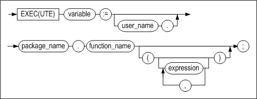

#### 기능

패키지 내의 프로시저 또는 함수를 실행한다.

#### 예제

```
create or replace package pkg1 as
v1 integer;
procedure proc1;
function func1 return integer;
end;
/

create or replace package body pkg1 as
procedure proc1 as
begin
println(v1);
end;

function func1 return integer as
begin
return 1;
end;
end;
/

iSQL> exec pkg1.v1 := pkg1.func1;
Execute success.

iSQL> exec pkg1.proc1;
1
Execute success.
```


12.Altibase 저장 프로시저와 내장 함수
==================================

Altibase는 다양한 종류의 내장된 저장 프로시저와 함수를 제공한다. 저장 프로시저
내에서의 파일 제어 함수와 TCP 접속 제어 관련 저장 프로시저가 그것이다. 이 장은
이들 저장 프로시저와 함수를 소개하고 그 사용법에 대해 설명한다.

이 장은 아래의 토픽을 포함한다.

-   파일 제어

-   TCP 접속 제어

-   DBMS Stats

### 파일 제어

프로시저의 파일 제어 기능은 운영 체제의 텍스트 파일에 대한 읽기와 쓰기를
가능하게 한다. 이 기능을 이용하여 사용자는 저장 프로시저 실행에 대한 별도의
메시지 등을 파일에 남길 수도 있으며, 파일로 결과를 출력하거나 파일로부터
데이터를 읽어와 테이블에 삽입하는 등 다양한 작업을 수행할 수 있다.

이 절은 이러한 파일 제어 기능에 대해서 설명한다.

#### 디렉토리 관리

저장 프로시저에서 파일들을 생성하고 제어하기 위해서는 이들 파일들이 저장될
디렉토리가 필요한데, 이는 데이터베이스 객체로서 DML문을 사용해서 생성하고 관리할
수 있다.

##### 디렉토리 생성

저장 프로시저 파일 제어 기능에서 사용하는 파일들을 저장할 디렉토리들은 CREATE
DIRECTORY문을 사용하여 데이터베이스 객체로 생성한다.

CREATE DIRECTORY문을 수행하면 SYS_DIRECTORIES\_ 메타 테이블에 디렉토리 정보가
등록되며, 실제 운영 체제의 파일 시스템에 디렉토리가 생성되지는 않는다. 따라서
사용자는 실제 파일 시스템에 디렉토리를 생성하는 작업을 먼저 수동으로 해야 한다.

사용자는 CREATE DIRECTORY문에 데이터베이스가 참조할 논리적인 디렉토리명과 실제
파일 시스템 상에서의 디렉토리 절대 경로를 명시해야 한다.

예를 들어 다음과 같이 /home/altibase/altibase_home/psm_msg 디렉토리 밑에
alti_dir1 디렉토리를 생성한다.

```
$ mkdir /home/altibase/altibase_home/psm_msg/alti_dir1
```

다음으로, alti_dir1 디렉토리 내의 파일들을 제어할 수 있도록 대응하는 디렉토리
객체를 데이터베이스 내에 생성한다.

```
iSQL> create directory alti_dir1 as '/home/altibase/altibase_home/psm_msg';
Create success.
```

##### 디렉토리 변경

CREATE OR REPLACE DIRECTORY문을 사용해 이미 생성한 디렉토리의 절대 경로를 다음과
같이 변경할 수 있다.

```
iSQL> create or replace directory alti_dir1 as '/home/altibase/altibase_home/psm_result';
Create success.
```

위의 예제에서 alti_dir1 디렉토리가 이미 데이터베이스에 존재할 경우에는 사용자가
명시한 절대 경로 정보를 변경하며, alti_dir1 디렉토리가 존재하지 않을 경우에는
새로운 객체를 데이터베이스에 생성한다.

##### 디렉토리 삭제

디렉토리 객체는 DROP DIRECTORY문을 사용해서 데이터베이스에서 삭제할 수 있다.

DROP DIRECTORY문을 사용해 디렉토리를 삭제하는 경우 데이터베이스에서 관리하는
오브젝트만 삭제되며 실제 파일 시스템 상의 디렉토리가 제거되는 것은 아니다.

따라서 사용자는 파일 시스템 상에 존재하는 불필요한 디렉토리와 파일들은 운영 체제
명령어를 이용해 직접 제거해야 한다.

다음은 DROP DIRECTORY문을 사용해 데이터베이스에서 디렉토리를 삭제하는 예제이다.

```
iSQL> DROP DIRECTORY alti_dir1;
Drop success.
```


#### 파일 제어

##### 데이타 타입

저장 프로시저 내에서 파일 제어를 위해서 Altibase는 FILE_TYPE이라는 데이터 타입을
지원한다.

FILE_TYPE은 내부적으로 파일 식별자 및 기타 정보를 가지고 있으나, 사용자가 직접
이 내부 데이터에 접근할 수는 없다.

저장 프로시저 내에서 FILE_TYPE 데이터 타입의 지역변수들은 파일 제어 관련 시스템
저장 프로시저 및 저장 함수들의 인자로 사용될 수 있다.

FILE_TYPE으로 변수를 선언하는 예제는 다음과 같다.

```
CREATE OR REPLACE PROCEDURE WRITE_T1
AS
	V1	FILE_TYPE;
	ID 	INTEGER;
	NAME 	VARCHAR(40);
BEGIN
……
END;
/
```


##### 파일 제어 프로시저와 함수

Altibase는 저장 프로시저 및 저장 함수 내에서 파일 제어와 관련해서 다음과 같은
시스템 프로시저와 함수를 제공한다.

| 시스템 프로시저 및 함수명 | 설명                                                         |
| ------------------------- | ------------------------------------------------------------ |
| FCLOSE                    | 파일을 닫는다.                                               |
| FCLOSE_ALL                | 현재 세션에 열려있는 모든 파일을 닫는다.                     |
| FCOPY                     | 파일을 복사한다.                                             |
| FFLUSH                    | 파일에 데이터를 물리적으로 기록한다.                         |
| FOPEN                     | 읽기 또는 쓰기 목적으로 파일을 오픈한다.                     |
| FREMOVE                   | 파일을 삭제한다.                                             |
| FRENAME                   | 파일명을 변경한다.                                           |
| GET_LINE                  | 파일에서 한 라인을 읽는다.                                   |
| IS_OPEN                   | 파일이 열려있는지 검사한다.                                  |
| NEW_LINE                  | 개행 문자를 출력한다.                                        |
| PUT                       | 문자열을 파일에 기록한다                                     |
| PUT_LINE                  | 문자열에 개행 문자를 붙여서 파일에 기록한다 (= PUT+NEW_LINE). |

위 표의 시스템 프로시저와 함수들은 최초 데이터베이스 생성시 시스템 내에서 자동
생성되는 저장 프로시저 및 저장 함수로 PUBLIC 시노님으로 정의되어 있어 임의의
사용자가 이들을 이용해 저장 프로시저 내에서 파일을 제어 할 수 있다.

이러한 시스템 프로시저 및 함수를 사용한 파일 제어 작업은 다음 그림과 같이
표현된다.


##### 주의사항

다음은 저장 프로시저 실행 시 오류를 발생시킬 수 있는 사항들이므로 주의해야 한다.

###### **디렉토리** 이름

파일제어 함수 사용시 디렉토리 파라미터는 CREATE DIRECTORY문으로 생성한 디렉토리
객체의 이름을 사용하되 반드시 대문자로 표기한다.

예를 들어,

```
CREATE DIRECTORY alti_dir AS ‘…’;
```

위와 같이 디렉토리 객체를 생성하였다면 저장 프로시저 내에서는 다음과 같이
사용해야 한다.

```
file = FOPEN( ‘ALTI_DIR’, ‘a.txt’, ‘r’ );
```

디렉토리 생성 시 소문자로 디렉토리 객체의 이름을 명시하여도 데이터베이스 내 객체
이름은 모두 대문자로 저장되기 때문에 시스템 프로시저 및 함수의 파라미터로
디렉토리 이름을 입력할 때는 대문자를 사용해야 한다.

###### **한 라인의 문자열 길이**

파일 내 한 라인의 최대 문자열 길이는 32767 bytes를 넘을 수 없다. 만약 최대
길이를 초과할 경우 오류가 발생한다.

###### **파일 데이터 타입**

FILE_TYPE은 사용자가 임의로 변수 값을 대입하거나 정보를 읽을 수 없으며, 시스템
프로시저 및 함수의 파라미터로만 사용할 수 있다.

###### **파일 제어 관련 시스템 프로시저 및 함수**

파일 제어 관련 시스템 프로시저 및 함수들은 기본적인 시스템 정의 예외 외에 다른
예외들을 발생시킬 수 있다.

예를 들면 디스크 공간 부족, 열 수 있는 파일 핸들 부족, 또는 운영체제 상에서
오류가 발생할 경우 INVALID OPERATION 등의 예기치 않은 오류를 발생시킨다.

파일 제어 관련 시스템 프로시저 및 함수들은 인자를 잘못 넘겨 받은 경우
VALUE_ERROR EXCEPTION을 발생시킨다.

#### FCLOSE

열려있는 파일 핸들을 닫고 다시 초기화 하는 기능을 제공하는 저장 프로시저다.

##### 구문

```
FCLOSE ( file IN OUT FILE_TYPE );
```


##### 파라미터

| 이름 | 입출력 | 데이터 타입 | 설명      |
|------|--------|-------------|-----------|
| file | IN OUT | FILE_TYPE   | 파일 핸들 |

##### 결과값

저장 프로시저이므로 반환하는 결과값은 없다.

##### 예외

수행 시 오류 발생 없이 항상 성공한다. 이미 닫힌 파일 핸들에 대해 수행할 때도
오류 없이 성공한다.

##### 예제

FOPEN후에는 FCLOSE를 호출하여 열린 파일 핸들을 다음과 같이 닫아 주어야 한다.

```
CREATE OR REPLACE PROCEDURE PROC1
AS
    V1 FILE_TYPE;
    V2 VARCHAR(1024);
BEGIN
    V1 := FOPEN( 'ALTI_DIR', 'schema.sql', 'r' );
    GET_LINE( V1, V2, 100 );
    PRINTLN(V2);
    FCLOSE(V1);
END;
/
```


#### FCLOSE_ALL

현재 세션에 열려있는 모든 파일 핸들을 닫는 기능을 제공하는 저장 프로시저다. 저장
프로시저 수행 중 예외가 발생했을 때에도 파일을 닫기 위해서, 주로 예외 처리 시에
사용한다.

##### 구문

```
FCLOSE_ALL;
```


##### 파라미터

파라미터가 없다.

##### 결과값

저장 프로시저이므로 반환하는 결과값은 없다.

##### 예외

수행 시 오류를 발생시키지 않으며 항상 성공한다.

##### 예제

다음은 예외 처리 시 열려 있는 모든 파일 핸들을 닫는 예제이다.

```
CREATE OR REPLACE PROCEDURE PROC1
AS
    V1 FILE_TYPE;
    V2 VARCHAR(1024);
BEGIN
    V1 := FOPEN( 'ALTI_DIR', 'schema.sql', 'r' );
    GET_LINE( V1, V2, 100 );
    PRINTLN(V2);
FCLOSE(V1);
EXCEPTION
    WHEN READ_ERROR THEN
         PRINTLN('READ ERROR!!!');
         FCLOSE_ALL;
END;
/
```


#### FCOPY

파일을 라인 단위로 복사하는 기능을 제공하는 저장 프로시저이다. 결과 파일이 해당
디렉토리 내에 존재하지 않을 경우에는 새로운 파일을 생성하여 소스 파일 내용을
복사하고, 이미 결과 파일이 존재하는 경우에는 오류 없이 그대로 내용을 덮어 쓴다.

##### 구문

```
FCOPY (
location IN VARCHAR(40),
filename IN VARCHAR(256),
dest_dir IN VARCHAR(40),
dest_file IN VARCHAR(256),
start_line IN INTEGER DEFAULT 1,
end_line IN INTEGER DEFAULT NULL);
```


##### 파라미터

| 이름       | 입출력 | 데이터 타입  | 설명                                                         |
| ---------- | ------ | ------------ | ------------------------------------------------------------ |
| location   | IN     | VARCHAR(40)  | 소스 파일이 위치하는 경로에 해당하는 디렉토리 객체의 이름    |
| filename   | IN     | VARCHAR(256) | 소스 파일의 이름                                             |
| dest_dir   | IN     | VARCHAR(40)  | 결과 파일이 위치하는 경로에 해당하는 디렉토리 객체의 이름    |
| dest_file  | IN     | VARCHAR(256) | 결과 파일의 이름                                             |
| start_line | IN     | INTEGER      | 복사할 시작 라인 번호 <br />기본값: 1                        |
| end_line   | IN     | INTEGER      | 복사할 마지막 라인 번호. NULL로 주게 되면 파일의 끝까지 복사한다. <br />기본값: NULL |

##### 결과값

저장 프로시저이므로 반환하는 결과값은 없다.

##### 예외

FCOPY는 다음의 시스템 정의 예외들을 발생시킬 수 있다.

-   INVALID_PATH

-   ACCESS_DENIED

-   INVALID_OPERATION

-   READ_ERROR

-   WRITE_ERROR

예외 처리에 대한 자세한 설명은 이 장의 “파일 제어 예외 처리” 절을 참조한다.

##### 예제

다음은 a.txt의 파일의 모든 내용을 b.txt에 복사하는 에제이다.

```
iSQL> EXEC FCOPY( 'ALTI_DIR', 'a.txt', 'ALTI_DIR', 'b.txt' );
Execute success.

$ cat a.txt
1-ABCDEFG
2-ABCDEFG
3-ABCDEFG
4-ABCDEFG
5-ABCDEFG
6-ABCDEFG
7-ABCDEFG
8-ABCDEFG
9-ABCDEFG
10-ABCDEFG

$ cat b.txt
1-ABCDEFG
2-ABCDEFG
3-ABCDEFG
4-ABCDEFG
5-ABCDEFG
6-ABCDEFG
7-ABCDEFG
8-ABCDEFG
9-ABCDEFG
10-ABCDEFG
```

다음은 특정 라인만을 a.txt에서 b.txt로 복사하는 예제이다.

```
iSQL> EXEC FCOPY( 'ALTI_DIR', 'a.txt', 'ALTI_DIR2', 'b.txt', 4, 9 );
Execute success.

$ cat a.txt
1-ABCDEFG
2-ABCDEFG
3-ABCDEFG
4-ABCDEFG
5-ABCDEFG
6-ABCDEFG
7-ABCDEFG
8-ABCDEFG
9-ABCDEFG
10-ABCDEFG

$ cat b.txt
4-ABCDEFG
5-ABCDEFG
6-ABCDEFG
7-ABCDEFG
8-ABCDEFG
9-ABCDEFG
```


#### FFLUSH

파일에 물리적으로 기록하는 기능을 제공하는 저장 프로시저다.

##### 구문

```
FFLUSH ( file IN FILE_TYPE );
```


##### 파라미터

| 이름 | 입출력 | 데이터 타입 | 설명      |
|------|--------|-------------|-----------|
| file | IN     | FILE_TYPE   | 파일 핸들 |

##### 결과값

저장 프로시저이므로 반환하는 결과값은 없다.

##### 예외

FFLUSH는 다음의 시스템 정의 예외들을 발생시킬 수 있다.

-   INVALID_FILEHANDLE

-   WRITE_ERROR

예외 처리에 대한 자세한 설명은 이 장의 “파일 제어 예외 처리” 절을 참조한다.

##### 예제

다음은 T1 테이블의 I1 칼럼의 모든 데이터를 파일에 한번에 기록하는 예제로
PUT_LINE의 마지막 인자인 *autoflush* 에 FALSE를 넘겨 PUT_LINE 호출 때마다 flush
하지 않고 마지막에 한번 FFLUSH를 호출해 flush 하는 예제이다.

```
CREATE OR REPLACE PROCEDURE PROC1
AS
   V1 FILE_TYPE;
   R2 T1%ROWTYPE;
   CURSOR C1 IS SELECT I1 FROM T1;
BEGIN
   V1 := FOPEN( 'ALTI_DIR', 'a.txt', 'w' );
   FOR R2 IN C1 LOOP
       PUT_LINE( V1, R2.I1, FALSE );
   END LOOP;
   FFLUSH(V1);
   FCLOSE(V1);
EXCEPTION
   WHEN INVALID_PATH THEN
       PRINTLN('CANNOT OPEN FILE.');
   WHEN NO_DATA_FOUND THEN
       PRINTLN('NO DATA FOUND.');
       FCLOSE( V1 );
END;
/
```


#### FOPEN

파일을 열고 파일 핸들을 반환하는 기능을 제공하는 저장 함수이다.

##### 구문

```
FILE_TYPE variable :=
FOPEN (
         location IN VARCHAR(40),
         filename IN VARCHAR(256),
         open_mode IN VARCHAR(4) );
```


##### 파라미터

| 이름      | 입출력 | 데이터 타입  | 설명                                                         |
| --------- | ------ | ------------ | ------------------------------------------------------------ |
| location  | IN     | VARCHAR(40)  | 파일이 위치하는 경로에 해당하는 디렉토리 객체의 이름         |
| filename  | IN     | VARCHAR(256) | 파일의 이름                                                  |
| open_mode | IN     | VARCHAR(4)   | 입력 가능 옵션은 다음 세 가지이다.<br /> r: 읽기 w: 쓰기 a: 이어 쓰기 <br />* 주의 사항: rw, wa와 같이 조합해서 사용 할 수 없다. |

##### 결과값

성공적으로 수행할 경우 데이터 타입이 FILE_TYPE인 파일 핸들을 반환한다.

##### 예외

FOPEN은 다음의 시스템 정의 예외들을 발생시킬 수 있다.

-   INVALID_PATH

-   ACCESS_DENIED

-   INVALID_OPERATION

-   INVALID_MODE

예외 처리에 대한 자세한 설명은 이 장의 “파일 제어 예외 처리” 절을 참조한다.

##### 예제

파일을 읽거나 쓰기 위해서는 우선 FOPEN을 사용해 다음과 같이 파일을 열어야 한다.

```
CREATE OR REPLACE PROCEDURE PROC1
AS
    V1 FILE_TYPE;
    V2 VARCHAR(1024);
BEGIN
    V1 := FOPEN( 'ALTI_DIR', 'schema.sql', 'r' );
    GET_LINE( V1, V2, 100 );
    PRINTLN(V2);
    FCLOSE(V1);
END;
/
```


#### FREMOVE

해당 파일을 삭제하는 기능을 제공하는 저장 프로시저다.

##### 구문

```
FREMOVE (
  location IN VARCHAR(40),
  filename IN VARCHAR(256));
```


##### 파라미터

| 이름     | 입출력 | 데이터 타입  | 설명                                                 |
|----------|--------|--------------|------------------------------------------------------|
| location | IN     | VARCHAR(40)  | 파일이 위치하는 경로에 해당하는 디렉토리 객체의 이름 |
| filename | IN     | VARCHAR(256) | 파일의 이름                                          |

##### 결과값

저장 프로시저이므로 반환하는 결과값은 없다.

##### 예외

FREMOVE는 다음의 시스템 정의 예외들을 발생시킬 수 있다.

-   INVALID_PATH

-   ACCESS_DENIED

-   DELETE_FAILED

예외 처리에 대한 자세한 설명은 이 장의 “파일 제어 예외 처리” 절을 참조한다.

##### 예제

다음은 파일을 삭제하는 예제이다.

```
--## 현재 디렉토리 내의 파일 리스트
$ ls
a.sql       a.txt       b.txt       schema.sql

--## FREMOVE 실행
iSQL> EXEC FREMOVE('ALTI_DIR','b.txt');
Execute success.

--# 저장 프로시저 수행 후 디렉토리내의 파일 리스트
$ ls
a.sql       a.txt       schema.sql
```


#### FRENAME

UNIX mv 명령어와 동일한 기능을 가지며, 파일의 이름을 바꾸거나, 다른 위치로
옮기는 기능을 제공하는 저장 프로시저다.

##### 구문

```
FRENAME (
location IN VARCHAR(40),
filename IN VARCHAR(256),
dest_dir IN VARCHAR(40),
dest_file IN VARCHAR(256),
overwrite IN BOOLEAN DEFAULT FALSE );
```


##### 파라미터

| 이름      | 입출력 | 데이터 타입  | 설명                                                         |
| --------- | ------ | ------------ | ------------------------------------------------------------ |
| location  | IN     | VARCHAR(40)  | 원본 파일이 위치하는 경로에 해당하는 디렉토리                |
| filename  | IN     | VARCHAR(256) | 원본 파일의 이름                                             |
| dest_dir  | IN     | VARCHAR(40)  | 결과 파일이 위치하는 경로에 해당하는 디렉토리                |
| dest_file | IN     | VARCHAR(256) | 결과 파일의 이름                                             |
| overwrite | IN     | BOOLEAN      | 이미 파일이 존재하는 경우 덮어 쓸지 여부를 지정한다. <br />TRUE: 기존 파일을 새로운 파일로 덮어 쓴다. <br />FALSE: 덮어 쓰지 않는다. <br />기본값: FALSE |

##### 결과값

저장 프로시저이므로 반환하는 결과값은 없다.

##### 예외

FRENAME에서 발생 가능한 시스템 정의 예외들은 다음과 같다.

-   INVALID_PATH

-   ACCESS_DENIED

-   RENAME_FAILED

예외 처리에 대한 자세한 설명은 이 장의 “파일 제어 예외 처리” 절을 참조한다.

##### 예제

다음은 a.txt 파일을 result.txt로 이름을 변경하는 예제이다.

```
--## 현재 디렉토리내의 파일 리스트
$ ls
a.sql       a.txt       schema.sql

--## FRENAME 수행
iSQL> EXEC FRENAME('ALTI_DIR','a.txt','ALTI_DIR','result.txt',TRUE);
Execute success.

--# 저장 프로시저 수행 후 디렉토리내의 파일 리스트
$ ls
a.sql       result.txt  schema.sql
```


#### GET_LINE

해당 파일에서 한 줄씩 읽어오는 기능을 제공하는 저장 프로시저다.

##### 구문

```
GET_LINE (
   file IN FILE_TYPE,
   buffer OUT VARCHAR(32768),
   len IN INTEGER DEFAULT NULL);
```


##### 파라미터

| 이름   | 입출력 | 데이터 타입    | 설명                                                         |
| ------ | ------ | -------------- | ------------------------------------------------------------ |
| file   | IN     | FILE_TYPE      | 파일 핸들                                                    |
| buffer | OUT    | VARCHAR(32768) | 파일에서 읽은 한 라인을 저장할 버퍼                          |
| len    | IN     | INTEGER        | 파일의 한 라인에서 읽어 올 최대 bytes 수로 입력하지 않을 경우 1024 bytes 크기만큼 읽어온다. <br />기본값: NULL |

##### 결과값

저장 프로시저이므로 반환하는 결과값은 없다.

##### 예외

GET_LINE에서 발생 가능한 시스템 정의 예외는 다음과 같다.

-   NO_DATA_FOUND

-   READ_ERROR

-   INVALID_FILEHANDLE

예외 처리에 대한 자세한 설명은 이 장의 “파일 제어 예외 처리” 절을 참조한다.

##### 예제

다음은 파일의 한 라인에서 100 bytes를 읽어 출력하는 예제이다.

```
iSQL> CREATE OR REPLACE PROCEDURE PROC1
    2 AS
    3     V1 FILE_TYPE;
    4     V2 VARCHAR(1024);
    5 BEGIN
    6     V1 := FOPEN( 'ALTI_DIR', 'schema.sql', 'r' );
    7     GET_LINE( V1, V2, 100 );
    8     PRINTLN(V2);
    9     FCLOSE(V1);
    10 END;
    11 /
Create success.
iSQL> EXEC PROC1;
create table t1 (i1 integer, i2 integer, i3 integer);
Execute success.
```


#### IS_OPEN

파일이 열려 있는지 여부를 검사하는 기능을 제공하는 저장 함수다.

##### 구문

```
BOOLEAN variable :=
IS_OPEN ( file IN FILE_TYPE );
```


##### 파라미터

| 이름 | 입출력 | 데이터 타입 | 설명      |
|------|--------|-------------|-----------|
| file | IN     | FILE_TYPE   | 파일 핸들 |

##### 결과값

결과값은 BOOLEAN 데이터 타입으로 열려있으면 TRUE, 열려있지 않으면 FALSE를
반환한다.

##### 예외

파일 핸들이 정상적으로 열려 있는 경우에 TRUE를 반환하며 그 외의 경우에는 모두
FALSE를 반환하므로 수행 시 오류가 발생하지 않는다.

##### 예제

다음은 파일 핸들이 열려 있는지 없는지 검사하는 예제이다.

```
CREATE OR REPLACE PROCEDURE PROC1
AS
    V1 FILE_TYPE;
BEGIN
    IF IS_OPEN(V1) = FALSE THEN
        PRINTLN('V1 IS NOT OPENED.');
    ELSE
        PRINTLN('V1 IS OPENED.');
    END IF;
    V1 := FOPEN( 'ALTI_DIR', 'a.txt', 'w' );
    PRINTLN('FOPEN FUNCTION CALLED.');
    IF IS_OPEN(V1) = FALSE THEN
        PRINTLN('V1 IS NOT OPENED.');
    ELSE
        PRINTLN('V1 IS OPENED.');
    END IF;
    FCLOSE( V1 );
    PRINTLN('FCLOSE FUNCTION CALLED.');
    IF IS_OPEN(V1) = FALSE THEN
        PRINTLN('V1 IS NOT OPENED.');
    ELSE
        PRINTLN('V1 IS OPENED.');
    END IF;
END;
/
```


#### NEW_LINE

파일에 해당 개수의 개행 문자를 기록하는 기능을 제공하는 저장 프로시저다.

##### 구문

```
NEW_LINE  (
file IN FILE_TYPE,
lines IN INTEGER DEFAULT 1 );
```


##### 파라미터

| 이름  | 입출력 | 데이터 타입 | 설명                       |
|-------|--------|-------------|----------------------------|
| file  | IN     | FILE_TYPE   | 파일 핸들                  |
| lines | IN     | INTEGER     | 기록할 라인의 수 기본값: 1 |

##### 결과값

저장 프로시저이므로 반환하는 결과값은 없다.

##### 예외

NEW_LINE에서 발생 가능한 시스템 정의 예외는 다음과 같다.

-   INVALID_FILEHANDLE

-   WRITE_ERROR

예외 처리에 대한 자세한 설명은 이 장의 “파일 제어 예외 처리” 절을 참조한다.

##### 예제

다음은 파일에 문자열을 기록하는 예제이다.

```
CREATE OR REPLACE PROCEDURE PROC1
AS
    V1 FILE_TYPE;
BEGIN
    V1 := FOPEN( 'ALTI_DIR', 'a.txt', 'w' );
    PUT_LINE( V1, 'REPORT', TRUE );
    NEW_LINE( V1, 3 );
    PUT_LINE( V1, '------', TRUE );
    FCLOSE( V1 );
END;
/

--## 위의 저장 프로시저 수행 후 a.txt 파일 결과
$ cat a.txt
REPORT


------
$
```


#### PUT

파일에 문자열을 기록하는 기능을 제공하는 저장 프로시저다.

##### 구문

```
PUT (
  file IN FILE_TYPE,
  buffer IN VARCHAR(32768));
```


##### 파라미터

| 이름   | 입출력 | 데이터 타입    | 설명                               |
|--------|--------|----------------|------------------------------------|
| file   | IN     | FILE_TYPE      | 파일 핸들                          |
| buffer | IN     | VARCHAR(32768) | 기록할 문자열을 저장하고 있는 버퍼 |

##### 결과값

저장 프로시저이므로 반환하는 결과값은 없다.

##### 예외

PUT은 다음의 시스템 정의 예외들을 발생시킬 수 있다.

-   INVALID_FILEHANDLE

-   WRITE_ERROR

예외 처리에 대한 자세한 설명은 이 장의 “파일 제어 예외 처리” 절을 참조한다.

##### 예제

다음은 파일에 문자열을 기록하는 예제이다.

```
CREATE OR REPLACE PROCEDURE PROC1
AS
    V1 FILE_TYPE;
BEGIN
    V1 := FOPEN( 'ALTI_DIR', 'a.txt', 'w' );
    PUT( V1, 'REPORT');
    PUT( V1, '-->');
    PUT_LINE( V1, 'SUCCESS', TRUE );
    FCLOSE( V1 );
END;
/
--## 위의 저장 프로시저 수행 후 a.txt 파일 결과
$ cat a.txt
REPORT-->SUCCESS
$
```


#### PUT_LINE

파일에 문자열을 포함한 한 라인을 기록하는 기능을 제공하는 저장 프로시저다.

##### 구문

```
PUT_LINE (
file IN FILE_TYPE,
buffer IN VARCHAR(32767),
autoflush IN BOOLEAN DEFAULT FALSE);
```


##### 파라미터

| 이름      | 입출력 | 데이터 타입    | 설명                                             |
| --------- | ------ | -------------- | ------------------------------------------------ |
| file      | IN     | FILE_TYPE      | 파일 핸들                                        |
| Buffer    | IN     | VARCHAR(32767) | 기록할 문자열을 저장하고 있는 버퍼               |
| autoflush | IN     | BOOLEAN        | 호출할 때마다 flush할지 여부 <br />기본값: FALSE |

##### 결과값

저장 프로시저이므로 반환하는 결과값은 없다.

##### 예외

PUT_LINE는 다음의 시스템 정의 예외들을 발생시킬 수 있다.

-   INVALID_FILEHANDLE

-   WRITE_ERROR

예외 처리에 대한 자세한 설명은 이 장의 “파일 제어 예외 처리” 절을 참조한다.

##### 예제

다음은 파일에 문자열의 라인을 기록하는 예제이다.

```
CREATE OR REPLACE PROCEDURE PROC1
AS
    V1 FILE_TYPE;
BEGIN
    V1 := FOPEN('ALTI_DIR', 'a.txt', 'w');
    PUT_LINE(V1, '1-ABCDEFG');
    PUT_LINE(V1, '2-ABCDEFG');
    PUT_LINE(V1, '3-ABCDEFG');
    PUT_LINE(V1, '4-ABCDEFG');
    PUT_LINE(V1, '5-ABCDEFG');
    PUT_LINE(V1, '6-ABCDEFG');
    PUT_LINE(V1, '7-ABCDEFG');
    PUT_LINE(V1, '8-ABCDEFG');
    PUT_LINE(V1, '9-ABCDEFG');
    PUT_LINE(V1, '10-ABCDEFG');
    FCLOSE(V1);
END;
/
```

위의 저장 프로시저를 수행한 후 파일 내용은 다음과 같다.

```
$ cat a.txt
1-ABCDEFG
2-ABCDEFG
3-ABCDEFG
4-ABCDEFG
5-ABCDEFG
6-ABCDEFG
7-ABCDEFG
8-ABCDEFG
9-ABCDEFG
10-ABCDEFG
```


#### 파일 제어 예외 처리

저장 프로시저 또는 함수 실행 중에 발생할 수 있는 파일 제어 관련 예외를 처리할 때
명심해야 할 몇 가지 주의 사항을 설명한다.

파일 제어 관련 내장 프로시저와 함수 실행 중 발생 가능한 예외는 다음 표와 같다.
이들 예외는 다른 시스템 정의 예외처럼 exception handler에서 처리할 수 있다.

| 예외 이름          | 설명                                                                                                                      |
|--------------------|---------------------------------------------------------------------------------------------------------------------------|
| INVALID_PATH       | 해당 디렉토리 객체가 존재하지 않음 (즉 명시한 객체는 CREATE DIRECTORY문으로 만들어진 디렉토리 객체가 아님)                |
| INVALID_MODE       | 파일 열기 모드의 값이 유효하지 않음 (r, w, a 중 하나를 지정해야 함)                                                       |
| INVALID_FILEHANDLE | 파일 핸들이 유효하지 않음 (파일이 열린 상태가 아님)                                                                       |
| INVALID_OPERATION  | 실제 디렉토리 및 파일이 파일 시스템 상에 존재하지 않거나 파일 시스템에 의해 접근이 거부됨                                 |
| READ_ERROR         | 열기에 성공한 파일이 READ 시 존재하지 않거나, 파일 시스템에 의해 파일이 접근 거부됨                                       |
| WRITE_ERROR        | 열기에 성공한 파일이 WRITE 시 존재하지 않거나, 파일 시스템에 의해 파일이 접근 거부되거나, 쓰기 모드로 연 파일이 아닌 경우 |
| ACCESS_DENIED      | 디렉토리 객체에 대한 접근이 거부됨 (GRANT문으로 사용자에게 객체 접근 권한을 부여 해야 함)                                 |
| DELETE_FAILED      | 삭제할 파일이 존재하지 않거나, 파일 시스템에 의해 파일 접근이 거부된 경우                                                 |
| RENAME_FAILED      | overwrite옵션을 주지 않았는데 이미 바꿀 파일이 존재하거나, 기타 운영 체제 에러가 발생한 경우                              |

#### 예제

##### 예제1

다음은 디렉토리와 파일 이름을 입력으로 받아 파일을 열어 파일의 내용을 조회하는
프로시저다. 이 때, 디렉토리 또는 파일 이름이 잘못 지정되거나 데이터가 존재하지
않는 빈 파일이 지정될 수도 있다. 그러므로 이 저장 프로시저는 INVALID_PATH 및
NO_DATA_FOUND 예외를 처리할 수 있는 exception handler를 포함하고 있다.

```
--# CREATE VERIFY PROCEDURE
CREATE OR REPLACE PROCEDURE PROC2( PATH VARCHAR(40), FILE VARCHAR(40) )
AS
   V1 FILE_TYPE;
   V2 VARCHAR(100);
BEGIN
   V1 := FOPEN( PATH, FILE, 'r' );
   LOOP
       GET_LINE( V1, V2, 100 );
       PRINT( V2 );
   END LOOP;
EXCEPTION
   WHEN INVALID_PATH THEN
       PRINTLN('CANNOT OPEN FILE.');
   WHEN NO_DATA_FOUND THEN
       PRINTLN('NO DATA FOUND.');
       FCLOSE( V1 );
END;
/
```


##### 예제2

다음 예제는 테이블의 데이터를 파일로 쓰거나 파일에서 읽는 방법을 보여준다.

사용자를 생성하고 그 사용자에게 적절한 권한을 부여한다.

```
CONNECT SYS/MANAGER;
CREATE USER MHJEONG IDENTIFIED BY MHJEONG;
GRANT CREATE ANY DIRECTORY TO MHJEONG;
GRANT DROP ANY DIRECTORY TO MHJEONG;
```

테이블을 생성하고 데이터를 입력한 후, 디렉토리 객체를 생성한다.

```
CONNECT MHJEONG/MHJEONG;
CREATE TABLE T1( ID INTEGER, NAME VARCHAR(40) );
INSERT INTO T1 VALUES( 1, ‘JAKIM’ );
INSERT INTO T1 VALUES( 2, ‘PEH’ );
INSERT INTO T1 VALUES( 3, ‘KUMDORY’ );
INSERT INTO T1 VALUES( 4, ‘KHSHIM’ );
INSERT INTO T1 VALUES( 5, ‘LEEKMO’ );
INSERT INTO T1 VALUES( 6, ‘MHJEONG’ );
CREATE DIRECTORY MYDIR AS ‘/home1/mhjeong’;
```

T1테이블의 모든 레코드를 읽어서, 그 데이터를 t1.txt파일에 쓰는 저장 프로시저를
생성한다.

```
CREATE OR REPLACE PROCEDURE WRITE_T1
AS
  V1 FILE_TYPE;
  ID INTEGER;
  NAME VARCHAR(40);
BEGIN
  DECLARE
    CURSOR T1_CUR IS
    SELECT * FROM T1;
  BEGIN
    OPEN T1_CUR;
    V1 := FOPEN( ‘MYDIR’, ‘t1.txt’, ‘w’ );
    LOOP
      FETCH T1_CUR INTO ID, NAME;
      EXIT WHEN T1_CUR%NOTFOUND;
      PUT_LINE( V1, ‘ID : ‘||ID||’ NAME : ‘||NAME);
    END LOOP;
    CLOSE T1_CUR;
    FCLOSE(V1);
  END;
END;
/
```

파일 t1.txt의 내용을 읽어서 화면에 출력하는 저장 프로시저를 생성한다.

```
CREATE OR REPLACE PROCEDURE READ_T1
AS
  BUFFER VARCHAR(200);
  V1 FILE_TYPE;
BEGIN
  V1 := FOPEN( ‘MYDIR’, ‘t1.txt’, ‘r’ );
  LOOP
    GET_LINE( V1, BUFFER, 200 );
    PRINT( BUFFER );
  END LOOP;
  FCLOSE( V1 );
EXCEPTION
  WHEN NO_DATA_FOUND THEN
    FCLOSE( V1 );
END;
/
```


##### 실행 결과

위에서 생성한 저장 프로시저를 실행하면, 다음의 결과가 출력된다.

```
iSQL> exec write_t1;
EXECUTE success.
iSQL> exec read_t1;
ID : 1 NAME : JAKIM
ID : 2 NAME : PEH
ID : 3 NAME : KUMDORY
ID : 4 NAME : KHSHIM
ID : 5 NAME : LEEKMO
ID : 6 NAME : MHJEONG
EXECUTE success.
```

파일 시스템의 해당 디렉토리에 다음의 파일이 있을 것이다.

```
$ cd /home1/mhjeong
$ cat t1.txt
ID : 1 NAME : JAKIM
ID : 2 NAME : PEH
ID : 3 NAME : KUMDORY
ID : 4 NAME : KHSHIM
ID : 5 NAME : LEEKMO
ID : 6 NAME : MHJEONG
```


### TCP 접속 제어

#### TCP 접속 제어

##### 데이타 타입

저장 프로시저에서 TCP 접속을 제어하기 위해서 CONNECT_TYPE이라는 데이터 타입을
지원한다.

CONNECT_TYPE은 내부적으로 TCP 소켓 관련 정보를 저장하고 있으나, 사용자가 내부
데이터에는 접근할 수 없다.

##### CONNECT_TYPE의 함수

저장 프로시저 내에서 CONNECT_TYPE의 지역 변수들은 아래 함수의 인자 또는 반환
값으로 사용될 수 있다.

| 함수명              | 설명                                                         |
| ------------------- | ------------------------------------------------------------ |
| CLOSEALL_CONNECT    | 세션에 연결된 모든 접속 핸들을 닫는다.                       |
| CLOSE_CONNECT       | 세션에 연결된 접속 핸들을 닫는다.                            |
| IS_CONNECTED        | CONNECT_TYPE의 접속 핸들이 연결된 상태를 확인한다.           |
| OPEN_CONNECT        | 읽기 또는 쓰기의 목적으로 파일을 연다.                       |
| WRITE_RAW           | RAW(VARBYTE) 타입의 자료를 접속된 핸들을 통해 네트워크에 전송한다. |
| CHECK_CONNECT_STATE | 현재 연결의 상태와 변경하기 원하는 상태를 비교하여, 상태변이가 가능한지 검사한다. |
| CHECK_CONNECT_REPLY | 접속 핸들의 프로토콜에 적합하게 응답 메시지를 검사한다.      |
| SEND_TEXT           | VARCHAR 타입의 데이터를 원격 서버에 전송한다.                |
| RECV_TEXT           | 원격 서버에서 VARCHAR 타입의 데이터를 수신한다.              |
| WRITE_RAW_VALUE     | RAW 타입의 VALUE 데이터를 원격 서버에 전송한다.              |

##### TCP 접속 제어 연결 상태

| 연결 상태  | 식별값 |
| :--------- | :----- |
| NO CONNECT | 0      |
| CONNECTED  | 1      |
| SMTP HELO  | 2      |
| SMTP MAIL  | 3      |
| SMTP RCPT  | 4      |
| SMTP OPEN  | 5      |
| SMTP DATA  | 6      |
| SMTP CRLF  | 7      |

##### TCP 접속 제어 프로토콜 타입

| 프로토콜 타입 | 식별값 |
| :------------ | :----- |
| SMTP          | 1      |


#### CLOSEALL_CONNECT

현재 세션에 연결되어 있는 모든 접속 핸들을 닫는 저장 함수이다.

##### 구문

```
CONNECT_TYPE variable :=
CLOSEALL_CONNECT();
```


##### 결과값

성공적으로 수행하면 0을 반환한다.

##### 예외

이 함수는 예외를 발생시키지 않는다.

##### 예제

```
CREATE OR REPLACE PROCEDURE PROC1
AS
    V1 INTEGER;
BEGIN
    V1 := CLOSEALL_CONNECT();
END;
/
```


#### CLOSE_CONNECT

현재 세션에 연결되어 있는 접속 핸들을 닫는 저장 함수이다.

##### 구문

```
CONNECT_TYPE variable :=
CLOSE_CONNECT(
         coon IN CONNECT_TYPE);
```


##### 파라미터

| 이름 | 입출력 | 데이터 타입  | 설명      |
|------|--------|--------------|-----------|
| coon | IN     | CONNECT_TYPE | 접속 핸들 |

##### 결과값

성공적으로 수행하면 0을 반환한다.

##### 예외

이 함수는 예외를 발생시키지 않는다.

##### 예제

```
CREATE OR REPLACE PROCEDURE PROC1
AS
    V1 CONNECT_TYPE;
    V2 INTEGER;
BEGIN
    V1 := OPEN_CONNECT('127.0.0.1', 22007, 1000, 3000);
    V2 := WRITE_RAW(V1, TO_RAW('MESSAGE'), RAW_SIZEOF('MESSAGE'));
    V2 := CLOSE_CONNECT(V1);
END;
/
```


#### IS_CONNECTED

CONNECT_TYPE 접속 핸들의 연결 상태를 확인하는 함수이다.

##### 구문

```
CONNECT_TYPE variable :=
IS_CONNECTED(
         coon IN CONNECT_TYPE);
```


##### 파라미터

| 이름 | 입출력 | 데이터 타입  | 설명      |
|------|--------|--------------|-----------|
| coon | IN     | CONNECT_TYPE | 접속 핸들 |

##### 결과값

접속 핸들이 연결 상태이면 0을 반환하고, 연결되지 않았다면  -1을 반환한다.

##### 예제

```
CREATE OR REPLACE PROCEDURE PROC1
    AS
    V1 CONNECT_TYPE;
    V2 INTEGER;
BEGIN
    V1 := OPEN_CONNECT('127.0.0.1', 22007, 1000, 3000);
    V2 := IS_CONNECTED(V1);
    IF V2 = 0 THEN
        PRINTLN('CONNECTD');
        V2 := WRITE_RAW(V1, TO_RAW('MESSAGE'), RAW_SIZEOF('MESSAGE'));
        V2 := CLOSE_CONNECT(V1);
    ELSE
        PRINTLN('NOT CONNECTD');
    END IF;
END;
/
```


#### OPEN_CONNECT

TCP 소켓을 생성하고, 입력한 IP와 PORT로 원격 서버에 접속하는 기능을 제공하는
저장 함수이다.

##### 구문

```
CONNECT_TYPE variable :=
OPEN_CONNECT(
         ip IN VARCHAR(64),
         port IN INTEGER,
         connect_timeout IN INTEGER,
         tx_buffersize IN INTEGER);
```


##### 파라미터

| 이름            | 입출력 | 데이터 타입 | 설명                                                         |
| --------------- | ------ | ----------- | ------------------------------------------------------------ |
| ip              | IN     | VARCHAR(64) | 원격 서버의 IP 주소                                          |
| port            | IN     | INTEGER     | 원격 서버의 PORT 번호                                        |
| connect_timeout | IN     | INTEGER     | 접속을 허용하는 시간(마이크로초).<br />0 또는 Null을 입력하면 접속될 때까지 대기한다. |
| tx_buffersize   | IN     | INTEGER     | 송신 버퍼의 크기를 설정한다. <br />2048\~32767 바이트까지 설정할 수 있으며, Null 또는 2048 이하의 값은 2048 바이트로 설정된다. |

##### 결과값

성공적으로 수행할 경우 데이터 타입이 CONNECT_TYPE인 접속 핸들을 반환한다.

##### 예외

접속 핸들이 정상적으로 네트워크에 정상적으로 연결되지 않았다면, CONNECT_TYPE은
NULL값을 반환한다. IS_CONNECTED() 함수를 이용하여 반환된 CONNECT_TYPE의 값으로
접속 여부를 확인할 수 있다.

##### 예제

```
CREATE OR REPLACE PROCEDURE PROC1
AS
    V1 CONNECT_TYPE;
    V2 INTEGER;
BEGIN
    V1 := OPEN_CONNECT('127.0.0.1', 22007, 1000, 3000);
    V2 := WRITE_RAW(V1, TO_RAW('MESSAGE'), RAW_SIZEOF('MESSAGE'));
    V2 := CLOSE_CONNECT(V1);
END;
/
```


#### WRITE_RAW

RAW(VARBYTE) 타입의 자료를 접속된 핸들을 통해 네트워크에 전송하는 함수이다.

##### 구문

```
CONNECT_TYPE variable :=
WRITE_RAW (
         coon IN CONNECT_TYPE,
         data IN VARBYTE,
         length IN INTEGER );
```


##### 파라미터

| 이름   | 입출력 | 데이터 타입  | 설명                 |
|--------|--------|--------------|----------------------|
| coon   | IN     | CONNECT_TYPE | 접속 핸들            |
| data   | IN     | VARBYTE      | 전송될 데이터        |
| length | IN     | INTEGER      | 전송될 데이터의 길이 |

##### 결과값

성공적으로 수행할 경우 네트워크에 전송된 데이터의 길이를 반환한다.

##### 예외

수행시 오류가 발생하면 -1을 반환한다.

만약 접속 핸들이 유실되었다면 IS_CONNECTED() 함수를 확인하여 결과값이 -1이 반환되어 확인할 수 있다.

##### 예제

```
CREATE OR REPLACE PROCEDURE PROC1
AS
    V1 CONNECT_TYPE;
    V2 INTEGER;
BEGIN
    V1 := OPEN_CONNECT('127.0.0.1', 22007, 1000, 3000);
    V2 := WRITE_RAW(V1, TO_RAW('MESSAGE'), RAW_SIZEOF('MESSAGE'));
    V2 := CLOSE_CONNECT(V1);
END;
```


#### CHECK_CONNECT_STATE

현재 연결의 상태와 변경하기 원하는 상태를 비교하여, 상태변이가 가능한지 검사한다.

##### 구문

```
INTEGER variable :=
CHECK_CONNECT_STATE(
  c IN CONNECT_TYPE,
  next_state IN INTEGER );
```


##### 파라미터

| 이름       | 입출력 | 데이터 타입  | 설명                      |
| :--------- | :----- | :----------- | :------------------------ |
| c          | IN     | CONNECT_TYPE | 원격 서버의 접속 핸들     |
| next_state | IN     | INTEGER      | 변경하기 원하는 상태의 값 |

##### 결과값

성공적으로 수행하면 0을 반환한다.

##### 예외

현재 연결 상태에서 원하는 상태로 변경을 지원하지 않을 때, UNSUPPORTED_STATE 예외가 발생한다.

##### 예제

```
CREATE OR REPLACE PROCEDURE PROC1
AS
    V1 CONNECT_TYPE;
    V2 INTEGER;
BEGIN
    V1 := OPEN_CONNECT( '127.0.0.1', 25, null, null );
    V2 := CHECK_CONNECT_STATE( V1, 1 ); --# 1은 Connected 상태
    V2 := CLOSE_CONNECT( V1 );
END;
/
```


#### CHECK_CONNECT_REPLY

현재 연결의 프로토콜에 적합한 응답 결과인지 검사한다.

##### 구문

```
INTEGER variable :=
CHECK_CONNECT_REPLY(
  protocol_type IN INTEGER,
  reply IN VARCHAR(65534) );
```


##### 파라미터

| 이름          | 입출력 | 데이터 타입    | 설명            |
| :------------ | :----- | :------------- | :-------------- |
| protocol_type | IN     | INTEGER        | 프로토콜 타입   |
| reply         | IN     | VARCHAR(65534) | 응답받은 메세지 |

##### 결과값

성공적으로 수행하면 0을 반환한다.

##### 예외

지원하지 않는 프로토콜 타입을 사용하거나 응답의 내용이 에러인 경우 SMTP_REPLY_ERROR 예외가 발생한다.

##### 예제

```
CREATE OR REPLACE PROCEDURE PROC1
AS
    V1 CONNECT_TYPE;
    V2 INTEGER;
    V3 VARCHAR(65534);
BEGIN
    V1 := OPEN_CONNECT( '127.0.0.1', 25, null, null );
    V2 := CHECK_CONNECT_STATE( V1, 1 ); --# 1은 Connected 상태
    IF ( V2 > 0 ) THEN
        V3 := RECV_TEXT( V1, 100 );
        V2 := CHECK_CONNECT_REPLY( 1, V3 ); --# 1은 SMTP
    END IF;
END;
/
```


#### SEND_TEXT

VARCHAR 타입의 자료를 접속된 핸들을 통해 네트워크에 전송하는 함수이다.

##### 구문

```
INTEGER variable :=
SEND_TEXT(
  c IN CONNECT_TYPE,
  data IN VARCHAR(65534),
  length IN INTEGER );
```


##### 파라미터

| 이름   | 입출력 | 데이터 타입    | 설명                  |
| :----- | :----- | :------------- | :-------------------- |
| c      | IN     | CONNECT_TYPE   | 원격 서버의 접속 핸들 |
| data   | IN     | VARCHAR(65534) | 전송할 데이터         |
| length | IN     | INTEGER        | 전송할 데이터의 길이  |

##### 결과값

성공적으로 수행할 경우, 네크워크로 전송된 데이터의 길이를 반환한다.

##### 예외

수행시 오류가 발생하면 -1을 반환한다.

##### 예제

```
CREATE OR REPLACE PROCEDURE PROC1
AS
    V1 CONNECT_TYPE;
    V2 INTEGER;
BEGIN
    V1 := OPEN_CONNECT( '127.0.0.1', 25, null, null );
    V2 := SEND_TEXT( V1, 'HELO 127.0.0.1' || CHR( 13 ) || CHR( 10 ), 16 );
    V2 := CLOSE_CONNECT( V1 );
END;
/
```


#### RECV_TEXT

접속된 핸들을 통해 네트워크로 VARCHAR 타입의 자료를 전송받는 함수이다.

##### 구문

```
VARCHAR variable :=
RECV_TEXT(
  c IN CONNECT_TYPE,
  length IN INTEGER );
```


##### 파라미터

| 이름   | 입출력 | 데이터 타입  | 설명                        |
| :----- | :----- | :----------- | :-------------------------- |
| c      | IN     | CONNECT_TYPE | 원격 서버의 접속 핸들       |
| length | IN     | INTEGER      | 전송받을 응답 데이터의 길이 |

##### 결과값

성공적으로 수행할 경우, 네크워크로 받은 VARCHAR 데이터를 반환한다.

##### 예외

수행시 오류가 발생하면 null 를 반환한다.

##### 예제

```
CREATE OR REPLACE PROCEDURE PROC1
AS
    V1 CONNECT_TYPE;
    V2 INTEGER;
    V3 VARCHAR(65534);
BEGIN
    V1 := OPEN_CONNECT( '127.0.0.1', 25, null, null );
    V2 := SEND_TEXT( V1, 'HELO 127.0.0.1'  || CHR( 13 ) || CHR( 10 ), 16 );
    V3 := RECV_TEXT( V1, 100 );
    V2 := CLOSE_CONNECT( V1 );
END;
/
```


#### WRITE_RAW_VALUE

RAW 타입의 VALUE 데이터를 접속된 핸들을 통해 네트워크에 전송하는 함수이다.

##### 구문

```
INTEGER variable :=
WRITE_RAW_VALUE(
  c IN CONNECT_TYPE,
  data IN RAW(65534),
  length IN INTEGER );
```


##### 파라미터

| 이름   | 입출력 | 데이터 타입  | 설명                  |
| :----- | :----- | :----------- | :-------------------- |
| c      | IN     | CONNECT_TYPE | 원격 서버의 접속 핸들 |
| data   | IN     | RAW(65534)   | 전송할 데이터         |
| length | IN     | INTEGER      | 전송할 데이터의 길이  |

##### 결과값

성공적으로 수행할 경우, 네크워크로 전송된 데이터의 길이를 반환한다.

##### 예외

수행시 오류가 발생하면 -1을 반환한다.

##### 예제

```
CREATE OR REPLACE PROCEDURE PROC1
AS
    V1 CONNECT_TYPE;
    V2 INTEGER;
    V3 VARCHAR(65534);
BEGIN
    V1 := OPEN_CONNECT( '127.0.0.1', 25, null, null );
    V2 := WRITE_RAW_VALUE( V1, TO_RAW( 'HELO 127.0.0.1'  || CHR( 13 ) || CHR( 10 ) ), 16 );
    V2 := CLOSE_CONNECT( V1 );
END;
/
```


### DBMS Stats

DBMS Stats 은 Altibase 데이터베이스의 통계 자료를 수집, 변경(설정), 삭제하는
기능이다. 이 기능은 시스템 저장 프로시저 형태로 제공된다.

#### 개요

데이터베이스 내의 객체들에 대한 통계 자료는 쿼리 옵티마이저가 최적화된 실행
계획을 만들기 위해 사용한다. DBMS Stats 저장 프로시저를 이용해서 이 통계 자료를
구축하고 갱신할 수 있으며, 개별의 칼럼, 인덱스, 테이블 또는 시스템 별로 통계
자료를 설정하거나 삭제할 수 있다.

#### DBMS Stats 프로시저

Altibase는 통계 자료 수집을 위해 다음과 같은 시스템 저장 프로시저를 제공한다. 이
저장 프로시저를 사용해서 통계 자료를 수집하고 실행 계획을 재구축할 수 있다.

| 이름                  | 설명                                             |
|-----------------------|--------------------------------------------------|
| GATHER_SYSTEM_STATS   | 데이터베이스 시스템에 대한 통계 자료를 수집한다. |
| GATHER_DATABASE_STATS | 모든 테이블에 대한 통계 자료를 수집한다.         |
| GATHER_TABLE_STATS    | 특정 테이블에 대한 통계 자료를 수집한다.         |
| GATHER_INDEX_STATS    | 특정 인덱스에 대한 통계 자료를 수집한다.         |

아래는 개별적인 칼럼, 인덱스, 테이블 또는 시스템 관련 통계 자료를 변경하는 저장
프로시저이다.

| 이름             | 설명                                             |
|------------------|--------------------------------------------------|
| SET_SYSTEM_STATS | 데이터베이스 시스템에 대한 통계 자료를 변경한다. |
| SET_TABLE_STATS  | 특정 테이블에 대한 통계 자료를 변경한다.         |
| SET_INDEX_STATS  | 특정 인덱스에 대한 통계 자료를 변경한다.         |
| SET_COLUMN_STATS | 특정 테이블의 칼럼에 대한 통계 자료를 변경한다.  |

아래는 개별적인 칼럼, 인덱스, 테이블 또는 시스템 관련 통계 자료를 조회하는 저장
프로시저이다.

| 이름             | 설명                                             |
|------------------|--------------------------------------------------|
| GET_SYSTEM_STATS | 데이터베이스 시스템에 대한 통계 자료를 조회한다. |
| GET_TABLE_STATS  | 특정 테이블에 대한 통계 자료를 조회한다.         |
| GET_INDEX_STATS  | 특정 인덱스에 대한 통계 자료를 조회한다.         |
| GET_COLUMN_STATS | 특정 테이블의 칼럼에 대한 통계 자료를 조회한다.  |

아래는 개별적인 칼럼, 인덱스, 테이블 또는 시스템 관련 통계 자료를 복사 및
삭제하는 저장 프로시저이다.

| 이름                  | 설명                                             |
|-----------------------|--------------------------------------------------|
| COPY_TABLE_STATS      | 통계 정보를 새로운 파티션에 복사한다.            |
| DELETE_SYSTEM_STATS   | 데이터베이스 시스템에 대한 통계 자료를 삭제한다. |
| DELETE_DATABASE_STATS | 모든 테이블에 대한 통계 자료를 삭제한다.         |
| DELETE_TABLE_STATS    | 특정 테이블에 대한 통계 자료를 삭제한다.         |
| DELETE_INDEX_STATS    | 특정 인덱스에 대한 통계 자료를 삭제한다.         |
| DELETE_COLUMN_STATS   | 특정 테이블의 칼럼에 대한 통계 자료를 삭제한다.  |

#### 주의사항

-   통계 자료 수집 시 Altibase 서버에 부하가 가중될 수 있다.

-   통계 자료는 그 근사치를 수집한다.

-   통계 자료 수집 후 통계 자료를 수집한 대상 객체와 관련된 모든 쿼리의 실행
    계획을 재구축하게 된다. 이때 Altibase 서버의 성능이 다소 떨어질 수 있다.

#### COPY_TABLE_STATS

원본 파티션의 통계 정보를 새로운 파티션으로 복사한다. 원본 파티션의 통계 정보가
없는 경우에는 복사하지 않는다.

##### 구문

```
COPY_TABLE_STATS(
  ownname IN VARCHAR(128),
  tabname IN VARCHAR(128),
  srcpartname IN VARCHAR(128),
  dstpartname IN VARCHAR(128));
```


##### 파라미터

| 이름          | 입출력 | 데이터 타입  | 설명                                                   |
|---------------|--------|--------------|--------------------------------------------------------|
| *ownname*     | IN     | VARCHAR(128) | 원본 및 대상 파티션의 테이블 소유자의 이름             |
| *tabname*     | IN     | VARCHAR(128) | 원본 파티션의 테이블 이름 및 대상 파티션의 테이블 이름 |
| *srcpartname* | IN     | VARCHAR(128) | 원본 파티션의 이름                                     |
| *dstpartname* | IN     | VARCHAR(128) | 대상 파티션의 이름                                     |

##### 결과값

저장 프로시저이므로 결과값을 반환하지 않는다.

##### 예제

```
iSQL> EXEC COPY_TABLE_STATS('SYS','T1','P3','P4');
Execute success.
```


#### GATHER_DATABASE_STATS

이 프로시저는 데이터베이스에 존재하는 모든 테이블에 대한 통계 자료를 수집한다.

##### 구문

```
GATHER_DATABASE_STATS (
  estimate_percent   FLOAT   DEFAULT 0,
  degree                INTEGER DEFAULT 0,
  gather_system_stats BOOLEAN DEFAULT FALSE,
  no_invalidate       BOOLEAN DEFAULT FALSE);
```


##### 파라미터

| 이름                  | 입출력 | 데이터 타입 | 설명                                                         |
| --------------------- | ------ | ----------- | ------------------------------------------------------------ |
| *estimate_percent*    | IN     | FLOAT       | 통계치를 추정하기 위해 수집할 샘플링 데이터의 양을 수집 대상 전체의 데이터 양으로 나눈 비율. <br />0 \~ 1.0의 값을 지정할 수 있다. 입력하지 않거나, NULL을 입력할 경우, 각 수집 대상의 크기에 따라 자동으로 설정된다. |
| *degree*              | IN     | INTEGER     | 통계 자료 수집을 병렬로 수행할 쓰레드의 수. <br />입력하지 않을 경우, 기본값은 0이다. |
| *gather_system_stats* | IN     | BOOLEAN     | 데이터베이스 시스템에 대한 통계 자료 수집을 같이 할 것인지 여부이다. <br />기본값은 FALSE이며, 이 경우 사용자는 GATHER_SYSTEM_STATS 나 SET_SYSTEM_STATS를 실행하여 시스템 통계 자료를 수집하거나 설정하여야 한다. |
| *no_invalidate*       | IN     | BOOLEAN     | 통계 자료를 수집한 테이블들과 관련된 모든 쿼리들의 실행 계획을 재구축할지 여부이다. <br />실행 계획을 재구축하지 않으려면 TRUE를 입력한다. 입력하지 않을 경우의 기본값은 FALSE로, 실행 계획을 재구축 한다. |

##### 결과값

저장 프로시저이므로 결과값을 반환하지 않는다.

##### 예제

```
iSQL> EXEC GATHER_DATABASE_STATS();
SYSTEM_.SYS_TABLES_
SYSTEM_.SYS_COLUMNS_
SYSTEM_.SYS_DATABASE_
SYSTEM_.SYS_USERS_
.
.
.
Execute success.
```


#### GATHER_INDEX_STATS

특정 인덱스에 대한 통계 자료를 수집한다.

##### 구문

```
GATHER_INDEX_STATS (
  ownname             VARCHAR(128),
  idxname             VARCHAR(128),
  estimate_percent    FLOAT   DEFAULT 0,
  degree              INTEGER DEFAULT 0,
  no_invalidate       BOOLEAN DEFAULT FALSE);
```


##### 파라미터

| 이름               | 입출력 | 데이터 타입  | 설명                                                         |
| ------------------ | ------ | ------------ | ------------------------------------------------------------ |
| *ownname*          | IN     | VARCHAR(128) | 인덱스 소유자의 이름                                         |
| *idxname*          | IN     | VARCHAR(128) | 통계 자료를 수집할 인덱스의 이름                             |
| *estimate_percent* | IN     | FLOAT        | 통계치를 추정하기 위해 수집할 샘플링 데이터의 양을 수집 대상 전체의 데이터 양으로 나눈 비율. <br />0 \~ 1.0의 값을 지정할 수 있다. 입력하지 않거나, NULL을 입력할 경우, 각 수집 대상의 크기에 따라 자동으로 설정된다. |
| *degree*           | IN     | INTEGER      | 통계 자료 수집을 병렬로 수행할 쓰레드의 수. <br />입력하지 않을 경우, 기본값은 0이다. |
| *no_invalidate*    | IN     | BOOLEAN      | 통계 자료를 수집한 테이블들과 관련된 모든 쿼리들의 실행 계획을 재구축할지 여부이다. <br />실행 계획을 재구축하지 않으려면 TRUE를 입력한다. 입력하지 않을 경우의 기본값은 FALSE로, 실행 계획을 재구축 한다. |

##### 결과값

저장 프로시저이므로 결과값을 반환하지 않는다.

##### 예제

```
iSQL> EXEC GATHER_INDEX_STATS( 'SYS','T1_IDX');
Execute success.
```


#### GATHER_SYSTEM_STATS

이 프로시저는 데이터베이스 시스템에 대한 통계 자료를 수집한다. 이 저장
프로시저는 SYS 사용자만이 수행할 수 있다.

##### 구문

```
GATHER_SYSTEM_STATS ( );
```


##### 결과값

저장 프로시저이므로 결과값을 반환하지 않는다.

##### 예제

```
iSQL> EXEC GATHER_SYSTEM_STATS();
Execute success.
```


#### GATHER_TABLE_STATS

이 프로시저는 특정 테이블과 그 테이블에 정의된 인덱스들에 대한 통계 자료를
수집한다.

##### 구문

```
GATHER_TABLE_STATS (
  ownname              VARCHAR(128),
  tabname              VARCHAR(128),
  partname             VARCHAR(128) DEFAULT NULL,
  estimate_percent     FLOAT   DEFAULT 0,
  degree               INTEGER DEFAULT 0,
  no_invalidate        BOOLEAN DEFAULT FALSE );
```


##### 파라미터

| 이름               | 입출력 | 데이터 타입  | 설명                                                         |
| ------------------ | ------ | ------------ | ------------------------------------------------------------ |
| *ownname*          | IN     | VARCHAR(128) | 테이블 소유자의 이름                                         |
| *tabname*          | IN     | VARCHAR(128) | 통계 자료를 수집할 테이블의 이름                             |
| *partname*         | IN     | VARCHAR(128) | 테이블의 파티션 이름. 파티션을 지정하면, 그 파티션에 대한 통계 자료만 수집한다. <br />입력하지 않을 경우의 기본값은 NULL이며, 지정한 테이블의 모든 파티션에 대한 통계 자료를 수집한다. |
| *estimate_percent* | IN     | FLOAT        | 통계치를 추정하기 위해 수집할 샘플링 데이터의 양을 수집 대상 전체의 데이터 양으로 나눈 비율. <br />0 \~ 1.0의 값을 지정할 수 있다. 입력하지 않거나, NULL을 입력할 경우, 각 수집 대상의 크기에 따라 자동으로 설정된다. |
| *degree*           | IN     | INTEGER      | 통계 자료 수집을 병렬로 수행할 쓰레드의 수. <br />입력하지 않을 경우, 기본값은 0이다. |
| *no_invalidate*    | IN     | BOOLEAN      | 통계 자료를 수집한 테이블들과 관련된 모든 쿼리들의 실행 계획을 재구축할지 여부이다. <br />실행 계획을 재구축하지 않으려면 TRUE를 입력한다. 입력하지 않을 경우의 기본값은 FALSE로, 실행 계획을 재구축 한다. |

##### 결과값

저장 프로시저이므로 결과값을 반환하지 않는다.

##### 예제

```
iSQL> EXEC GATHER_TABLE_STATS( 'SYS','T1');
Execute success.
```


#### SET_COLUMN_STATS

이 프로시저는 테이블의 칼럼에 대한 통계 자료를 변경한다.

##### 구문

```
SET_COLUMN_STATS (
  ownname          VARCHAR(128),
  tabname          VARCHAR(128),
  colname          VARCHAR(128),
  partname         VARCHAR(128) DEFAULT NULL,
  numdist          BIGINT  DEFAULT NULL,
  numnull          BIGINT  DEFAULT NULL,
  avgclen          BIGINT  DEFAULT NULL,
  minvalue         VARCHAR(48) DEFAULT NULL,
  maxvalue         VARCHAR(48) DEFAULT NULL,
  no_invalidate    BOOLEAN DEFAULT FALSE );
```


##### 파라미터

| 이름            | 입출력 | 데이터 타입  | 설명                                                         |
| --------------- | ------ | ------------ | ------------------------------------------------------------ |
| *ownname*       | IN     | VARCHAR(128) | 테이블 소유자의 이름                                         |
| *tabname*       | IN     | VARCHAR(128) | 통계 자료를 변경할 테이블의 이름                             |
| *colname*       | IN     | VARCHAR(128) | 통계 자료를 변경할 칼럼의 이름                               |
| *partname*      | IN     | VARCHAR(128) | 테이블의 파티션 이름. 파티션을 지정하면 해당 파티션에 대한 통계 자료만 변경한다. <br />기본값은 NULL이며, 테이블의 모든 파티션에 대한 통계 자료를 변경한다. |
| *numdist*       | IN     | BIGINT       | 칼럼에서 고유한 값의 개수                                    |
| *numnull*       | IN     | BIGINT       | 칼럼에서 NULL의 개수                                         |
| *avgclen*       | IN     | BIGINT       | 칼럼의 평균 길이                                             |
| *minvalue*      | IN     | VARCHAR(48)  | 칼럼의 최소값. DATE 타입은 반드시 "YYYY-MM-DD HH:MI:SS" 형식으로 입력한다. |
| *maxvalue*      | IN     | VARCHAR(48)  | 칼럼의 최대값. DATE 타입은 반드시 "YYYY-MM-DD HH:MI:SS" 형식으로 입력한다. |
| *no_invalidate* | IN     | BOOLEAN      | 통계 자료가 수집된 테이블들과 관련된 모든 쿼리들의 실행 계획을 재구축할지 여부. <br />기본값은 FALSE이며, 실행 계획을 재구축한다. 만약 재구축하지 않으려면, TRUE를 입력한다. |

##### 결과값

저장 프로시저이므로 결과값을 반환하지 않는다.

##### 예제

```
iSQL> EXEC SET_COLUMN_STATS('SYS', 'T1', 'I1', NULL, 1000);
Execute success.
```


#### SET_INDEX_STATS

이 프로시저는 인덱스에 대한 통계 자료를 변경한다.

##### 구문

```
SET_INDEX_STATS (
  ownname           VARCHAR(128),
  index             VARCHAR(128),
  keycnt            BIGINT DEFAULT NULL,
  numpage           BIGINT DEFAULT NULL,
  numdist           BIGINT DEFAULT NULL,
  clusfct           BIGINT DEFAULT NULL,
  idxheight         BIGINT DEFAULT NULL,
  avgslotcnt        BIGINT DEFAULT NULL,
  no_invalidate     BOOLEAN DEFAULT FALSE );
```


##### 파라미터

| 이름            | 입출력 | 데이터 타입  | 설명                                                                                                                                                                   |
|-----------------|--------|--------------|------------------------------------------------------------------------------------------------------------------------------------------------------------------------|
| *ownname*       | IN     | VARCHAR(128) | 인덱스 소유자의 이름                                                                                                                                                   |
| *index*         | IN     | VARCHAR(128) | 통계 자료를 변경할 인덱스의 이름                                                                                                                                       |
| *keycnt*        | IN     | BIGINT       | 인덱스의 레코드 개수                                                                                                                                                   |
| *numpage*       | IN     | BIGINT       | 인덱스의 페이지 개수                                                                                                                                                   |
| *numdist*       | IN     | BIGINT       | 인덱스에서 고유한 키의 개수                                                                                                                                            |
| *clusfct*       | IN     | BIGINT       | 인덱스에 부합하게 데이터가 정렬되어 있는 정도                                                                                                                          |
| *idxheight*     | IN     | BIGINT       | 인덱스의 루트에서 리프 노드까지의 깊이                                                                                                                                 |
| avgslotcnt      | IN     | BIGINT       | 인덱스 리프 노드에 저장된 레코드의 평균 개수                                                                                                                           |
| *no_invalidate* | IN     | BOOLEAN      | 통계 자료가 수집된 인덱스들과 관련된 모든 쿼리들의 실행 계획을 재구축할지 여부. 기본값은 FALSE이며, 실행 계획을 재구축한다. 만약 재구축하지 않으려면, TRUE를 입력한다. |

##### 결과값

저장 프로시저이므로 결과값을 반환하지 않는다.

##### 예제

```
iSQL> EXEC SET_INDEX_STATS('SYS', 'IDX1', 1000);
Execute success.
```


#### SET_SYSTEM_STATS

이 프로시저는 데이터베이스 시스템에 대한 통계 자료를 변경한다. 이 저장
프로시저는 SYS 사용자만이 수행할 수 있다.

##### 구문

```
SET_SYSTEM_STATS (
  statname            VARCHAR(100),
  statvalue           DOUBLE);
```


##### 파라미터

| 이름        | 입출력 | 데이터 타입  | 설명                                                         |
| ----------- | ------ | ------------ | ------------------------------------------------------------ |
| *statname*  | IN     | VARCHAR(100) | 변경할 시스템 통계 정보의 이름이다. 아래의 값 중에서 하나를 입력해야 한다. <br />SREAD_TIME: 하나의 페이지를 읽는 평균 소요 시간<br />MREAD_TIME: 여러 페이지를 읽는 평균 소요 시간<br />MREAD_PAGE_COUNT: 한번에 읽어 온 페이지 개수<br />HASH_TIME : 평균 해시 수행 시간<br />COMPARE_TIME: 평균 비교 수행 시간<br />STORE_TIME: 평균 메모리 임시 테이블 저장 수행 시간 |
| *statvalue* | IN     | DOUBLE       | 시스템 통계 정보의 값                                        |

##### 결과값

저장 프로시저이므로 결과값을 반환하지 않는다.

##### 예제

```
iSQL> EXEC SET_SYSTEM_STATS('SREAD_TIME', 100);
Execute success.
```


#### SET_TABLE_STATS

이 프로시저는 테이블에 대한 통계 자료를 변경한다.

##### 구문

```
SET_TABLE_STATS (
  ownname         VARCHAR(128),
  tabname         VARCHAR(128),
  partname        VARCHAR(128) DEFAULT NULL,
  numrow          BIGINT  DEFAULT NULL,
  numblk          BIGINT  DEFAULT NULL,
  avgrlen         BIGINT  DEFAULT NULL,
  onerowreadtime  DOUBLE  DEFAULT NULL,
  no_invalidate   BOOLEAN DEFAULT FALSE );
```


##### 파라미터

| 이름            | 입출력 | 데이터 타입  | 설명                                                         |
| --------------- | ------ | ------------ | ------------------------------------------------------------ |
| *ownname*       | IN     | VARCHAR(128) | 테이블 소유자의 이름                                         |
| *tabname*       | IN     | VARCHAR(128) | 통계 자료를 변경할 테이블의 이름                             |
| *partname*      | IN     | VARCHAR(128) | 테이블의 파티션 이름. <br />파티션을 지정하면 해당 파티션에 대한 통계 자료만 변경된다. 입력하지 않을 경우 기본값은 NULL이며, 지정한 테이블의 모든 파티션에 대한 통계 자료가 변경된다. |
| *numrow*        | IN     | BIGINT       | 테이블의 레코드 개수                                         |
| *numblk*        | IN     | BIGINT       | 테이블의 페이지 개수                                         |
| *avgrlen*       | IN     | BIGINT       | 테이블의 레코드 평균 길이                                    |
| onerowreadtime  | IN     | DOUBLE       | 테이블의 레코드를 읽는 시간                                  |
| *no_invalidate* | IN     | BOOLEAN      | 통계 자료가 수집된 테이블들과 관련된 모든 쿼리들의 실행 계획을 재구축할지 여부. <br />기본값은 FALSE이며, 실행 계획을 재구축한다. 만약 재구축하지 않으려면, TRUE를 입력한다. |

##### 결과값

저장 프로시저이므로 결과값을 반환하지 않는다.

##### 예제

```
iSQL> EXEC SET_TABLE_STATS('SYS', 'T1', NULL, 1000);
Execute success.
```


#### GET_COLUMN_STATS

이 프로시저는 테이블의 칼럼에 대한 통계 자료를 조회한다.

##### 구문

```
GET_COLUMN_STATS (
  ownname          VARCHAR(128),
  tabname          VARCHAR(128),
  colname          VARCHAR(128),
  partname         VARCHAR(128) DEFAULT NULL,
  numdist          BIGINT,
  numnull          BIGINT,
  avgrlen          BIGINT,
  minvalue         VARCHAR(48),
  maxvalue         VARCHAR(48) );
```

##### 파라미터

| 이름       | 입출력 | 데이터 타입  | 설명                                                         |
| ---------- | ------ | ------------ | ------------------------------------------------------------ |
| *ownname*  | IN     | VARCHAR(128) | 테이블 소유자의 이름                                         |
| *tabname*  | IN     | VARCHAR(128) | 통계 자료를 조회할 테이블의 이름                             |
| *colname*  | IN     | VARCHAR(128) | 통계 자료를 조회할 칼럼의 이름                               |
| *partname* | IN     | VARCHAR(128) | 테이블의 파티션 이름. <br />파티션을 지정하면 해당 파티션에 대한 통계 자료만 조회한다. 기본값은 NULL이다. |
| *numdist*  | OUT    | BIGINT       | 칼럼에서 고유한 값의 개수. <br />수집된 통계 정보가 없는 경우 NULL 값이 반환된다. |
| *numnull*  | OUT    | BIGINT       | 칼럼에서 NULL의 개수. <br />수집된 통계 정보가 없는 경우 NULL 값이 반환된다. |
| *avgrlen*  | OUT    | BIGINT       | 칼럼의 평균 길이. <br />수집된 통계 정보가 없는 경우 NULL 값이 반환된다. |
| *minvalue* | OUT    | VARCHAR(48)  | 칼럼의 최소값. <br />수집된 통계 정보가 없는 경우 NULL 값이 반환된다. |
| *maxvalue* | OUT    | VARCHAR(48)  | 칼럼의 최대값. <br />수집된 통계 정보가 없는 경우 NULL 값이 반환된다. |

##### 결과값

저장 프로시저이므로 결과값을 반환하지 않는다.

##### 예제

```
iSQL> EXEC GET_COLUMN_STATS('SYS', 'T1', 'I1', NULL, :v1,:v2,:v3,:v4,:v5);
Execute success.
```


#### GET_INDEX_STATS

이 프로시저는 인덱스에 대한 통계 자료를 조회한다.

##### 구문

```
GET_INDEX_STATS (
  ownname          VARCHAR(128),
  index            VARCHAR(128),
  partname         VARCHAR(128) DEFAULT NULL,
  keycnt           BIGINT,
  numpage          BIGINT,
  numdist          BIGINT,
  clstfct          BIGINT,
  idxheight        BIGINT,
  cachedpage       BIGINT,
  avgslotcnt       BIGINT );
```


##### 파라미터

| 이름         | 입출력 | 데이터 타입  | 설명                                                         |
| ------------ | ------ | ------------ | ------------------------------------------------------------ |
| *ownname*    | IN     | VARCHAR(128) | 인덱스 소유자의 이름                                         |
| *index*      | IN     | VARCHAR(128) | 통계 자료를 조회할 인덱스의 이름                             |
| *partname*   | IN     | VARCHAR(128) | 테이블의 파티션 이름. 파티션을 지정하면, 그 파티션에 대한 통계 자료만 수집한다. <br />입력하지 않을 경우의 기본값은 NULL이다. |
| *keycnt*     | OUT    | BIGINT       | 인덱스의 레코드 개수. <br />수집된 통계 정보가 없는 경우에는 NULL 값을 반환한다. |
| *numpage*    | OUT    | BIGINT       | 인덱스의 페이지 개수. <br />수집된 통계 정보가 없는 경우에는 NULL 값을 반환한다. |
| *numdist*    | OUT    | BIGINT       | 인덱스에서 고유한 키의 개수. <br />수집된 통계 정보가 없는 경우에는 NULL 값을 반환한다. |
| *clstfct*    | OUT    | BIGINT       | 인덱스에 부합하게 데이터가 정렬되어 있는 정도. <br />수집된 통계 정보가 없는 경우에는 NULL 값을 반환한다. |
| *idxheight*  | OUT    | BIGINT       | 인덱스의 루트에서 리프 노드까지의 깊이. <br />수집된 통계 정보가 없는 경우에는 NULL 값을 반환한다. |
| *cachedpage* | OUT    | BIGINT       | 데이터베이스 버퍼에 캐쉬된 페이지의 개수. <br />수집된 통계 정보가 없는 경우에는 NULL 값을 반환한다. |
| avgslotcnt   | OUT    | BIGINT       | 인덱스 리프 노드에 저장된 레코드의 평균 개수. <br />수집된 통계 정보가 없는 경우에는 NULL 값을 반환한다. |

##### 결과값

저장 프로시저이므로 결과값을 반환하지 않는다.

##### 예제

```
iSQL> EXEC GET_INDEX_STATS('SYS', 'IDX1' null,:v1,:v2,:v3,:v4,:v5,:v6,:v7);
Execute success.
```


#### GET_SYSTEM_STATS

이 프로시저는 데이터베이스 시스템에 대한 통계 자료를 조회한다.

##### 구문

```
GET_SYSTEM_STATS (
  statname            VARCHAR(100),
  statvalue           DOUBLE);
```


##### 파라미터

| 이름        | 입출력 | 데이터 타입  | 설명                                                         |
| ----------- | ------ | ------------ | ------------------------------------------------------------ |
| *statname*  | IN     | VARCHAR(100) | 조회할 시스템 통계 정보의 이름이다. 아래의 값 중에서 하나를 입력해야 한다. <br />SREAD_TIME: 하나의 페이지를 읽는 평균 소요 시간<br />MREAD_TIME: 여러 페이지를 읽는 평균 소요 시간<br />MREAD_PAGE_COUNT: 한번에 읽어 온 페이지 개수<br />HASH_TIME : 평균 해시 수행 시간<br />COMPARE_TIME : 평균 비교 수행 시간<br />STORE_TIME: 평균 메모리 임시 테이블 저장 수행 시간 |
| *statvalue* | IN     | DOUBLE       | 시스템 통계 정보의 값.<br />수집된 통계 정보가 없을 경우에는 NULL 값을 반환한다. |

##### 결과값

저장 프로시저이므로 결과값을 반환하지 않는다.

##### 예제

```
iSQL> EXEC GET_SYSTEM_STATS('SREAD_TIME', :v1);
Execute success.
```

#### GET_TABLE_STATS

이 프로시저는 테이블에 대한 통계 자료를 조회한다.

##### 구문

```
GET_TABLE_STATS (
ownname          VARCHAR(128),
tabname          VARCHAR(128),
partname         VARCHAR(128) DEFAULT NULL,
numrow            BIGINT,
numpage           BIGINT,
avgrlen           BIGINT,
cashedpage       BIGINT,
onerowreadtime   DOUBLE );
```

##### 파라미터

| 이름             | 입출력 | 데이터 타입  | 설명                                                                                                                   |
|------------------|--------|--------------|------------------------------------------------------------------------------------------------------------------------|
| *ownname*        | IN     | VARCHAR(128) | 테이블 소유자의 이름                                                                                                   |
| *tabname*        | IN     | VARCHAR(128) | 통계 자료를 조회할 테이블의 이름                                                                                       |
| *partname*       | IN     | VARCHAR(128) | 테이블의 파티션 이름. 파티션을 지정하면 해당 파티션에 대한 통계 자료만 조회된다. 입력하지 않을 경우 기본값은 NULL이다. |
| *numrow*         | OUT    | BIGINT       | 테이블의 레코드 개수 수집된 통계 정보가 없는 경우 NULL 값이 반환된다.                                                  |
| *numpage*        | OUT    | BIGINT       | 테이블의 페이지 개수 수집된 통계 정보가 없는 경우 NULL 값이 반환된다.                                                  |
| *avgrlen*        | OUT    | BIGINT       | 테이블의 레코드 평균 길이 수집된 통계 정보가 없는 경우 NULL 값이 반환된다.                                             |
| *cashedpage*     | OUT    | BIGINT       | 데이터베이스 버퍼에 캐쉬된 페이지의 개수 수집된 통계 정보가 없는 경우 NULL 값이 반환된다.                              |
| *onerowreadtime* | OUT    | DOUBLE       | 테이블의 레코드를 읽는 평균 시간 수집된 통계 정보가 없는 경우 NULL 값이 반환된다.                                      |

##### 결과값

저장 프로시저이므로 결과값을 반환하지 않는다.

##### 예제

```
iSQL> EXEC GET_TABLE_STATS('SYS', 'T1', NULL, :v1,:v2,:v3,:v4,:v5);
Execute success.
```


#### DELETE_COLUMN_STATS

이 프로시저는 테이블의 칼럼에 대한 통계 자료를 삭제한다.

##### 구문

```
DELETE_COLUMN_STATS (
ownname          VARCHAR(128),
tabname          VARCHAR(128),
colname          VARCHAR(128),
partname         VARCHAR(128) DEFAULT NULL,
cascade_part    BOOLEAN DEFAULT TRUE,
no_invalidate   BOOLEAN DEFAULT FALSE );
```


##### 파라미터

| 이름            | 입출력 | 데이터 타입  | 설명                                                                                                                                                                                                                                                                                                                                          |
|-----------------|--------|--------------|-----------------------------------------------------------------------------------------------------------------------------------------------------------------------------------------------------------------------------------------------------------------------------------------------------------------------------------------------|
| *ownname*       | IN     | VARCHAR(128) | 테이블 소유자의 이름                                                                                                                                                                                                                                                                                                                          |
| *tabname*       | IN     | VARCHAR(128) | 통계 자료를 삭제할 칼럼이 속해 있는 테이블                                                                                                                                                                                                                                                                                                    |
| *colname*       | IN     | VARCHAR(128) | 통계 자료를 삭제할 칼럼의 이름                                                                                                                                                                                                                                                                                                                |
| *partname*      | IN     | VARCHAR(128) | 통계 자료를 삭제할 테이블 파티션의 이름. 파티션을 지정하면 *cascade_part* 값에 상관없이 지정한 파티션의 지정한 칼럼에 대한 통계 자료만 삭제된다. 만약 NULL인 경우, *cascade_part* 값에 따라 삭제될 칼럼 통계 자료가 결정된다.                                                                                                                 |
| *cascade_part*  | IN     | BOOLEAN      | *tabname*에 파티션드 테이블을 지정하고, *partname*이 NULL일 경우 이 값에 따라 삭제될 칼럼 통계 자료가 결정된다. 이 값이 TRUE이면 파티션드 테이블의 전체적인 칼럼 통계 자료 뿐만 아니라 테이블의 모든 파티션에 해당하는 칼럼의 통계 자료도 삭제된다. FALSE를 입력하면 파티션드 테이블의 전체적인 칼럼 통계 자료만 삭제한다. 기본값은 TRUE이다. |
| *no_invalidate* | IN     | BOOLEAN      | 통계 자료가 삭제된 테이블들과 관련된 모든 쿼리들의 실행 계획을 재구축할지 여부이다. 기본값은 FALSE이며, 실행 계획을 재구축한다. TRUE를 입력하면, 실행계획을 재구축하지 않는다.                                                                                                                                                                |

##### 결과값

저장 프로시저이므로 결과값을 반환하지 않는다.

##### 예제

```
iSQL> EXEC DELETE_COLUMN_STATS('SYS', 'T1', 'I1');
Execute success.
```


#### DELETE_DATABASE_STATS

이 프로시저는 데이터베이스에 존재하는 모든 테이블에 대한 통계 자료를 삭제한다.

##### 구문

```
DELETE_DATABASE_STATS (
no_invalidate       BOOLEAN DEFAULT FALSE);
```


##### 파라미터

| 이름            | 입출력 | 데이터 타입 | 설명                                                         |
| --------------- | ------ | ----------- | ------------------------------------------------------------ |
| *no_invalidate* | IN     | BOOLEAN     | 통계 자료를 삭제한 테이블들과 관련된 모든 쿼리들의 실행 계획을 재구축할지 여부이다. <br />입력하지 않을 경우에 기본값은 FALSE로, 실행 계획을 재구축하지 않는다. TRUE를 입력하면, 실행 계획을 재구축한다. |

##### 결과값

저장 프로시저이므로 결과값을 반환하지 않는다.

##### 예제

```
iSQL> EXEC DELETE_DATABASE_STATS();
SYSTEM_.SYS_TABLES_
SYSTEM_.SYS_COLUMNS_
SYSTEM_.SYS_DATABASE_
SYSTEM_.SYS_USERS_
.
.
.
Execute success.
```


#### DELETE_INDEX_STATS

이 프로시저는 특정 인덱스에 대한 통계 자료를 삭제한다.

##### 구문

```
DELETE_INDEX_STATS (
ownname              VARCHAR(128),
idxname              VARCHAR(128),
no_invalidate        BOOLEAN DEFAULT FALSE);
```


##### 파라미터

| 이름            | 입출력 | 데이터 타입  | 설명                                                         |
| --------------- | ------ | ------------ | ------------------------------------------------------------ |
| *ownname*       | IN     | VARCHAR(128) | 인덱스 소유자의 이름                                         |
| *idxname*       | IN     | VARCHAR(128) | 통계 자료를 삭제할 인덱스의 이름                             |
| *no_invalidate* | IN     | BOOLEAN      | 통계 자료를 삭제한 테이블들과 관련된 모든 쿼리들의 실행 계획을 재구축할지 여부이다. <br />기본값은 FALSE로, 실행 계획을 재구축한다. 실행 계획을 재구축하지 않으려면 TRUE를 입력한다. |

##### 결과값

저장 프로시저이므로 결과값을 반환하지 않는다.

##### 예제

```
iSQL> EXEC DELETE_INDEX_STATS('SYS','T1_IDX');
Execute success.
```


#### DELETE_SYSTEM_STATS

이 프로시저는 데이터베이스 시스템에 대한 통계 자료를 삭제한다. 이 저장
프로시저는 SYS 사용자만이 수행할 수 있다.

##### 구문

```
DELETE_SYSTEM_STATS ( );
```


##### 결과값

저장 프로시저이므로 결과값을 반환하지 않는다.

##### 예제

```
iSQL> EXEC DELETE_SYSTEM_STATS();
Execute success.
```


#### DELETE_TABLE_STATS

이 프로시저는 특정 테이블과 그 테이블에 정의된 칼럼, 인덱스들에 대한 통계 자료를
삭제한다.

##### 구문

```
DELETE_TABLE_STATS (
ownname           VARCHAR(128),
tabname           VARCHAR(128),
partname          VARCHAR(128) DEFAULT NULL,
cascade_part      BOOLEAN DEFAULT TRUE,
cascade_column    BOOLEAN DEFAULT TRUE,
cascade_index     BOOLEAN DEFAULT TRUE,
no_invalidate     BOOLEAN DEFAULT FALSE );
```


##### 파라미터

| 이름             | 입출력 | 데이터 타입  | 설명                                                         |
| ---------------- | ------ | ------------ | ------------------------------------------------------------ |
| *ownname*        | IN     | VARCHAR(128) | 테이블 소유자의 이름                                         |
| *tabname*        | IN     | VARCHAR(128) | 통계 자료를 삭제할 테이블의 이름                             |
| *partname*       | IN     | VARCHAR(128) | 통계 자료를 삭제할 테이블 파티션의 이름. <br />파티션을 지정하면, *casdace_part* 값에 상관없이 해당 파티션의 통계 자료만 삭제된다. <br />이 값이 NULL이고 지정한 테이블이 파티션드 테이블인 경우, *casdace_part* 값에 따라 삭제될 테이블 통계 자료가 결정된다. |
| *cascade_part*   | IN     | BOOLEAN      | *tabname*이 파티션드 테이블이고 *partname*이 NULL일 경우, 이 값이 TRUE이면 전체적인 테이블 통계 자료 뿐만 아니라 테이블의 모든 파티션의 통계 자료도 삭제된다. <br />이 값이 FALSE이면 지정한 테이블의 통계 자료만 삭제된다. 기본값은 TRUE이다. |
| *cascade_column* | IN     | BOOLEAN      | 지정한 테이블의 통계 자료 뿐만 아니라, 지정한 테이블에 속한 모든 칼럼의 통계 자료도 삭제할지 여부이다. <br />기본값은 TRUE이며, 지정한 테이블과 테이블의 모든 칼럼의 통계 자료도 삭제한다. <br />이 값이 FALSE이면 지정한 테이블의 통계 자료만 삭제한다. |
| *cascade_index*  | IN     | BOOLEAN      | 지정한 테이블의 통계 자료 뿐만 아니라, 지정한 테이블에 속한 모든 인덱스의 통계 자료도 삭제할지 여부이다. <br />기본값은 TRUE이며, 지정한 테이블과 테이블의 모든 인덱스의 통계 자료도 삭제한다. FALSE가 입력되면 지정한 테이블의 통계 자료만 삭제한다. |
| *no_invalidate*  | IN     | BOOLEAN      | 통계 자료를 삭제한 테이블들과 관련된 모든 쿼리들의 실행 계획을 재구축할지 여부이다. <br />기본값은 FALSE로, 실행 계획을 재구축한다. 실행 계획을 재구축하지 않으려면 TRUE를 입력한다. |

##### 결과값

저장 프로시저이므로 결과값을 반환하지 않는다.

##### 예제

```
iSQL> EXEC DELETE_TABLE_STATS( 'SYS','T1');
Execute success.
```


### 그 외 함수들

#### REMOVE_XID

XA 환경에서 “heuristically completed” 된 (데이터베이스 서버에 의해 임의로 롤백
되거나 커밋 된) 트랜잭션의 XID 정보를 강제로 삭제한다.

##### 구문

```
REMOVE_XID (xidname     IN VARCHAR(256));
```


##### 파라미터

| 이름      | 입출력 | 데이터 타입  | 설명              |
|-----------|--------|--------------|-------------------|
| *xidname* | IN     | VARCHAR(256) | 삭제할 XID의 이름 |

##### 결과값

저장 프로시저이므로 반환하는 결과값은 없다.

##### 예외

REMOVE_XID는 다음의 시스템 정의 예외들을 발생시킬 수 있다.

-   NOT_EXIST_XID

-   InvalidXaState

#### REFRESH_MATERIALIZED_VIEW

베이스 테이블의 데이터 변경 사항을 materialized view에 반영하는 저장
프로시저이다. 즉, 이 저장 프로시저를 실행하면 해당 materialized view의 데이터가
베이스 테이블의 최신 데이터로 갱신된다.

리프레쉬 하려는 materialized view의 소유자가 아닌 사용자가 이 저장 프로시저를
실행하려면 아래의 권한이 있어야 한다:

-   ALTER ANY MATERIALIZED VIEW 시스템 권한

-   SELECT ANY TABLE 시스템 권한 또는 materialized view 를 위해 자동으로 생성된
    뷰에 대한 SELECT 객체 권한

-   INSERT ANY TABLE 및 DELETE ANY TABLE 시스템 권한, 또는 materialized view를
    위해 자동으로 생성된 테이블에 대한 INSERT 및 DELETE 객체 권한

##### 구문

```
REFRESH_MATERIALIZED_VIEW (
owner_name        IN VARCHAR(128),
mview_name        IN VARCHAR(128));
```

##### 파라미터

| 이름         | 입출력 | 데이터 타입  | 설명                            |
|--------------|--------|--------------|---------------------------------|
| *owner_name* | IN     | VARCHAR(128) | Materialized view의 소유자 이름 |
| *mview_name* | IN     | VARCHAR(128) | Materialized view의 이름        |

##### 결과값

저장 프로시저이므로 반환되는 결과값이 없다.

##### 예외

-   권한 부재로 인한 SELECT, DELETE, 또는 INSERT 실패 예외

-   테이블스페이스 공간 부족, materialized view 최대 행 초과 등의 예외

-   아래 주의 사항과 관련한 예외

##### 주의 사항

아래의 몇 가지 이유로 리프레쉬가 실패할 수 있다.

-   사용자가 베이스 테이블의 정의를 변경하거나 테이블을 삭제한 경우

-   사용자가 ALTER TABLE 구문을 사용하여 materialized view를 위해 자동으로
    생성된 테이블의 정의를 변경한 경우

-   Lock Timeout이 발생하는 경우

-   테이블 제약 조건(constratints)에 대한 위반이 발생하는 경우

#### SET_CLIENT_INFO

V\$SESSION의 CLIENT_APP_INFO 칼럼과 CLIENT_INFO 칼럼정보를 설정한다.

##### 구문

```
SET_CLIENT_INFO (client_info IN VARCHAR(128));
```


##### 파라미터

| 이름          | 입출력 | 데이터 타입  | 설명            |
| ------------- | ------ | ------------ | --------------- |
| *client_info* | IN     | VARCHAR(128) | 클라이언트 정보 |

##### 결과값

저장 프로시저이므로 반환하는 결과값은 없다.

##### 예외

이 프로시저는 예외를 발생시키지 않는다.

#### SET_MODULE

V\$SESSION에 MODULE칼럼과 ACTION 칼럼의 정보를 설정한다.

##### 구문

```
SET_MODULE (module IN VARCHAR(128),action IN VARCHAR(128));
```


##### 파라미터

| 이름     | 입출력 | 데이터 타입  | 설명          |
|----------|--------|--------------|---------------|
| *module* | IN     | VARCHAR(128) | 모듈 정보     |
| *action* | IN     | VARCHAR(128) | 모듈 활성정보 |

##### 결과값

저장 프로시저이므로 반환하는 결과값은 없다.

##### 예외

이 프로시저는 예외를 발생시키지 않는다.

#### SLEEP

이 프로시저는 seconds 인자에 지정한 초만큼 세션을 쉬게 한다.

##### 구문

```
SLEEP (seconds IN INTEGER);
```


##### 파라미터

| 이름      | 입출력 | 데이터 타입 | 설명           |
| --------- | ------ | ----------- | -------------- |
| *seconds* | IN     | INTEGER     | 쉬는 시간 (초) |

##### 결과값

저장 프로시저이므로 반환하는 결과값은 없다.

##### 예외

이 프로시저는 예외를 발생시키지 않는다.


13.Altibase 저장 패키지
====================

이 장에서는 Altibase가 제공하는 저장 패키지에 대해 설명한다.

### 시스템 정의 저장 패키지

시스템 정의 저장 패키지는 Altibase에서 기본으로 제공하는 패키지로써, SYS
사용자의 소유가 된다.

#### 시스템 패키지의 종류

Altibase에서 제공하는 패키지는 아래와 같다.

| 패키지                                               | 설명                                                         |
| ---------------------------------------------------- | ------------------------------------------------------------ |
| [DBMS_APPLICATION_INFO](#dbms_application_info)      | 클라이언트의 애플리케이션 정보를 관리하기 위해 성능 뷰의 값을 설정한다. |
| [DBMS_ALERT](#dbms_alert)                            | 데이터베이스에 발생하는 이벤트를 다른 사용자에게 알린다.     |
| [DBMS_CONCURRENT_EXEC](#dbms_concurrent_exec-패키지) | 프로시저를 동시에 실행한다.                                  |
| [DBMS_LOCK](#dbms_lock)                              | 사용자가 잠금(Lock)을 요청하거나 해제한다.                   |
| [DBMS_METADATA](#dbms_metadata)                      | 데이터베이스 딕셔너리로부터 객체 생성 DDL 구문 또는 권한 GRANT 구문을 추출하는 기능을 제공한다. |
| [DBMS_OUPUT](#dbms_output)                           | 버퍼에 저장된 문자열을 사용자가 클라이언트에게 출력한다.     |
| [DBMS_RANDOM](#dbms_random)                          | 임의의 숫자를 생성한다.                                      |
| [DBMS_RECYCLEBIN](#dbms_recyclebin-패키지)           | 삭제(Drop)되어 휴지통에서 관리되고 있는 테이블을 시스템에서 완전히 삭제(Purge)한다. |
| [DBMS_SQL](#dbms_sql)                                | 동적 SQL을 사용한다.                                         |
| [DBMS_SQL_PLAN_CACHE](#dbms_sql_plan_cache)          | 특정 실행 계획(Execution Plan)을 SQL Plan Cache에 유지하거나 삭제하는 기능을 하는 저장 프로시저를 제공한다. |
| [DBMS_STATS](#dbms_stats)                            | 통계 정보를 조회 및 변경한다.                                |
| [DBMS_STANDARD](#dbms_standard)                      | 다양한 기본 서브프로그램을 제공한다.                         |
| [DBMS_UTILITY](#dbms_utility)                        | 다양한 유틸리티 서브프로그램을 제공한다.                     |
| [STANDARD](#standard)                                | 기본 데이터 타입 외에 PSM내에서 별도의 선언없이 사용할 수 있는 타입을 정의한다. |
| [SYS_SPATIAL](#sys_spatial)                          | Geometry에 관련 서브프로그램을 제공한다.                     |
| [UTL_COPYSWAP](#utl_copyswap)                        | Copy & Swap 방식으로 Online DDL을 지원한다.                  |
| [UTL_FILE](#standard)                                | 운영 체제에서 관리하는 텍스트 파일을 읽고(Read) 쓴다(Write). |
| [UTL_RAW](#utl_raw)                                  | RAW(VARBYTE) 타입의 데이터를 다른 데이터 타입으로 변환한다.  |
| [UTL_SMTP](#utl_smtp)                                | SMTP 서버로 EMAIL을 전송하도록, SMTP 프로토콜을 수행한다.    |
| [UTL_TCP](#utl_tcp)                                  | 저장 프로시저에서 TCP 접속을 제어한다.                       |

### DBMS_APPLICATION_INFO

DBMS_APPLICATION_INFO 패키지는 V\$SESSION 성능 뷰의 값들을 설정하거나 가져와서,
애플리케이션의 성능을 추적 및 관리한다.

DBMS_APPLICATION_INFO 패키지를 구성하는 프로시저와 함수는 아래의 표와 같이
제공한다.

| 프로시저 및 함수 | 설명                                           |
|------------------|------------------------------------------------|
| READ_CLIENT_INFO | V\$SESSION에 설정된 모듈과 액션 값을 가져온다. |
| READ_MODULE      | V\$SESSION에 설정된 모듈과 액션 값을 가져온다. |
| SET_ACTION       | V\$SESSION의 ACTION 값을 설정한다.             |
| SET_CLIENT_INFO  | V\$SESSION의 CLIENT_INFO 값을 설정한다.        |
| SET_MODULE       | V\$SESSION의 MODULE 및 ACTION 값을 설정한다.   |

#### READ_CLIENT_INFO

현재 세션에 접속한 클라이언트의 애플리케이션 정보를 가져온다.

##### 구문

```
DBMS_APPLICATION_INFO.READ_CLIENT_INFO(client_info OUT VARCHAR(128));
```


##### 파라미터

| 이름          | 입출력 | 데이터 타입  | 설명                                  |
|---------------|--------|--------------|---------------------------------------|
| *client_info* | OUT    | VARCHAR(128) | 설정된 클라이언트의 애플리케이션 정보 |

##### 결과값

커서를 실행하여 처리된 레코드의 개수를 반환한다.

##### 예외

예외를 발생시키지 않는다.

##### 예제

현재 세션에서 수행중인 클라이언트의 정보 값을 가져와 출력한다.

```
iSQL> var v1 varchar(128);
iSQL> EXEC DBMS_APPLICATION_INFO.READ_CLIENT_INFO(:v1);
iSQL> EXEC PRINTLN(:v1);
```


#### READ_MODULE

V\$SESSION 성능 뷰에 설정된 MODULE 및 ACTION의 값을 가져온다.

##### 구문

```
DBMS_APPLICATION_INFO.READ_MODULE(module_name OUT VARCHAR(128), action_name OUT VARCHAR(128));
```


##### 파라미터

| 이름          | 입출력 | 데이터 타입  | 설명             |
|---------------|--------|--------------|------------------|
| *module_name* | OUT    | VARCHAR(128) | 설정된 모듈의 값 |
| *action_name* | OUT    | VARCHAR(128) | 설정된 액션의 값 |

##### 결과값

저장 프로시저이므로 결과값을 반환하지 않는다.

##### 예외

예외를 발생시키지 않는다.

##### 예제

수행중인 프로시저의 모듈명과 액션 값을 가져와 출력한다.

```
iSQL> var v1 varchar(128);
iSQL> var v2 varchar(128)
iSQL> EXEC DBMS_APPLICATION_INFO.READ_MODEUL(:v1, :v2);
iSQL> EXEC PRINTLN(:v1);
iSQL> EXEC PRINTLN(:v2);
```


#### SET_ACTION

V\$SESSION 성능 뷰에 있는 ACTION 칼럼의 값을 설정하는 프로시저이다.

##### 구문

```
DBMS_APPLICATION_INFO.SET_ACTION (action_name VARCHAR(128));
```


##### 파라미터

| 이름          | 입출력 | 데이터 타입  | 설명                    |
|---------------|--------|--------------|-------------------------|
| *action_name* | IN     | VARCHAR(128) | 설정할 ACTION 칼럼의 값 |

##### 결과값

저장 프로시저이므로 결과값을 반환하지 않는다.

##### 예외

예외를 발생시키지 않는다.

##### 예제

수행중인 프로시저의 동작 상태를 stop으로 변경한다.

```
iSQL> EXEC DBMS_APPLICATION_INFO.SET_ACTION( 'stop');
```


#### SET_CLIENT_INFO

V\$SESSION 성능 뷰에 접속된 클라이언트의 정보를 설정한다.

##### 구문

```
DBMS_APPLICATION_INFO.SET_CLIENT_INFO(client_info VARCHAR(128));
```


##### 파라미터

| 이름          | 입출력 | 데이터 타입  | 설명                           |
|---------------|--------|--------------|--------------------------------|
| *client_info* | IN     | VARCHAR(128) | 클라이언트의 애플리케이션 정보 |

##### 결과값

저장 프로시저이므로 결과값을 반환하지 않는다.

##### 예외

예외를 발생시키지 않는다.

##### 예제

클라이언트 정보를 test_application으로 설정한다.

```
iSQL> EXEC DBMS_APPLICATION_INFO.SET_CLIENT_INFO('test_application');
```


#### SET_MODULE

V\$SESSION 성능 뷰의 MODULE 및 ACTION 칼럼의 값을 설정하는 프로시저이다.

##### 구문

```
DBMS_APPLICATION_INFO.SET_MODULE(module_name VARCHAR(128), action_name
VARCHAR(128));
```

##### 파라미터

| 이름          | 입출력 | 데이터 타입  | 설명             |
|---------------|--------|--------------|------------------|
| *module_name* | IN     | VARCHAR(128) | 설정할 모듈의 값 |
| *action_name* | IN     | VARCHAR(128) | 설정할 액션의 값 |

##### 결과값

저장 프로시저이므로 결과값을 반환하지 않는다.

##### 예외

예외를 발생시키지 않는다.

##### 예제

수행중인 프로시저의 모듈명을 altibase_module로 동작 상태를 running으로 변경한다.

```
iSQL> EXEC DBMS_APPLICATION_INFO.SET_MODULE('altibase_module', 'running');
```


### DBMS_ALERT

DBMS_ALERT패키지는 데이터베이스에 발생하는 이벤트를 다른 사용자에게 알리는
기능이며 인터페이스 형태로 지원한다.

| 프로시저 및 함수 | 설명                         |
|------------------|------------------------------|
| REGISTER         | 알람을 등록한다.             |
| REMOVE_EVENT     | 특정 알람을 해제한다..       |
| REMOVEALL        | 모든 알람을 해제한다.        |
| SET_DEFAULTS     | 알람의 대기 시간을 설정한다. |
| SIGNAL           | 알람에게 신호를 전달한다.    |
| WAITANY          | 모든 알람을 대기한다.        |
| WAITONE          | 특정 알람을 대기한다.        |

#### REGISTER

알람을 등록한다.

##### 구문

DBMS_ALERT.REGISTER( *name* );

##### 파라미터

| 이름   | 입출력 | 데이터 타입  | 설명      |
|--------|--------|--------------|-----------|
| *name* | IN     | VARCHAR2(30) | 알람 이름 |

##### 결과값

없음

##### 예외

예외를 발생시키지 않는다.

##### 예제

```
iSQL> EXEC DBMS_ALERT.REGISTER (‘S1’);
```


#### REMOVE_EVENT

등록되어 있는 특정 알람을 해제한다. 해제된 알람은 신호를 받을 수 없다.

##### 구문

```
DBMS_ALERT.REMOVE_EVENT( name );
```


##### 파라미터

| 이름 | 입출력 | 데이터 타입  | 설명      |
|------|--------|--------------|-----------|
| name | IN     | VARCHAR2(30) | 알람 이름 |

##### 결과값

없음

##### 예외

예외를 발생시키지 않는다.

##### 예제

```
iSQL> EXEC DBMS_ALERT.REMOVE_EVENT (‘S1’);
```


#### REMOVEALL

등록되어 있는 모든 알람을 해제한다. 해제된 알람은 신호를 받을 수 없다.

##### 구문

```
DBMS_ALERT.REMOVEALL();
```


##### 파라미터

없음

##### 결과값

없음

##### 예외

예외를 발생시키지 않는다.

##### 예제

```
EXEC DBMS_ALERT.REMOVEALL ();
```


#### SET_DEFAULTS

알람이 기다리는 시간을 설정한다.

##### 구문

```
DBMS_ALERT.SET_DEFAULTS( poll_interval );
```


##### 파라미터

| 이름            | 입출력 | 데이터 타입 | 설명                        |
|-----------------|--------|-------------|-----------------------------|
| *poll_interval* | IN     | INTEGER     | 알람의 대기 시간 (단위: 초) |

##### 결과값

없음

##### 예외

예외를 발생시키지 않는다.

##### 예제

```
EXEC DBMS_ALERT.SET_DEFAULTS (5);
```


#### SIGNAL

알람에게 메시지가 포함된 신호를 보낸다. 신호를 여러 번 보낼 수 있다. 등록된
알람만 신호를 받을 수 있다.

##### 구문

```
DBMS_ALERT.SIGNAL( name, message );
```


##### 파라미터

| 이름      | 입출력 | 데이터 타입    | 설명      |
|-----------|--------|----------------|-----------|
| *name*    | IN     | VARCHAR2(30)   | 알람 이름 |
| *message* | IN     | VARCHAR2(1800) | 메시지    |

##### 결과값

없음

##### 예외

예외를 발생시키지 않는다.

##### 예제

```
EXEC DBMS_ALERT.SIGNAL (‘S1’, 'MESSAGE 001’);
```


#### WAITANY

모든 알람이 신호를 기다린다. 등록되어 있는 알람만 신호를 받을 수 있으며, 신호를
받지 않은 상태에서 일정시간(timeout)이 지나면 프로시저가 종료된다.

##### 구문

```
DBMS_ALERT.WAITANY( name, message, status, timeout );
```


##### 파라미터

| 이름      | 입출력 | 데이터 타입    | 설명                                 |
|-----------|--------|----------------|--------------------------------------|
| *name*    | OUT    | VARCHAR2(30)   | 알람 이름                            |
| *message* | OUT    | VARCHAR2(1800) | 메시지                               |
| *status*  | OUT    | INTEGER        | 상태 (성공: 0, 실패: 1)              |
| *timeout* | IN     | INTEGER        | 알람의 대기 시간(Timeout) (단위: 초) |

##### 결과값

없음

##### 예외

예외를 발생시키지 않는다.

##### 예제

```
VAR MESSAGE VARCHAR (1800);
VAR STATUS INTEGER;
EXEC DBMS_ALERT.WAITANY ( :NAME, :MESSAGE, :STATUS, 5 );
```


#### WAITONE

특정 알람이 신호를 기다린다. 등록되어 있는 알람만 신호를 받을 수 있으며, 신호를
받지 않은 상태에서 일정시간(timeout)이 지나면 프로시저가 종료된다.

##### 구문

```
DBMS_ALERT.WAITONE( name, message, status, timeout );
```


##### 파라미터

| 이름      | 입출력 | 데이터 타입    | 설명                                 |
|-----------|--------|----------------|--------------------------------------|
| *name*    | OUT    | VARCHAR2(30)   | 알람 이름                            |
| *message* | OUT    | VARCHAR2(1800) | 메시지                               |
| *status*  | OUT    | INTEGER        | 상태 (성공: 0, 실패: 1)              |
| *timeout* | IN     | INTEGER        | 알람의 대기 시간(Timeout) (단위: 초) |

##### 결과값

없음

##### 예외

예외를 발생시키지 않는다.

##### 예제

```
VAR NAME VARCHAR (30);
VAR MESSAGE VARCHAR (1800);
VAR STATUS INTEGER;
EXEC :name := 'S1';
EXEC DBMS_ALERT.WAITONE ( :NAME, :MESSAGE, :STATUS, 5 );
```


### DBMS_CONCURRENT_EXEC 패키지

DBMS_CONCURRENT_EXEC 패키지는 프로시저를 동시에 실행할 수 있는 기능을 제공한다.
이 기능은 시스템 정의 저장 패키지 형태로 제공된다.

#### DBMS_CONCURRENT_EXEC의 프로시저와 함수

DBMS_CONCURRENT_EXEC 패키지를 구성하는 프로시저와 함수는 아래의 표에 목록화되어
있다.

| 프로시저/함수   | 설명                                                                                        |
|-----------------|---------------------------------------------------------------------------------------------|
| INITIALIZE      | DBMS_CONCURRENT_EXEC 패키지를 초기화하고, 프로시저를 동시에 실행할 수 있는 개수를 설정한다. |
| REQUEST         | DBMS_CONCURRENT_EXEC 패키지에서 프로시저의 실행을 요청한다.                                 |
| WAIT_ALL        | DBMS_CONCURRENT_EXEC 패키지에서 요청한 모든 프로시저가 완료하기를 기다린다.                 |
| WAIT_REQ        | 요청된 Request ID에 해당하는 프로시저 동작이 완료하기를 기다린다.                           |
| GET_ERROR_COUNT | 요청한 프로시저 동작 중 발생한 오류 개수를 반환한다.                                        |
| GET_ERROR       | Request ID에 해당하는 프로시저 실행 구문, 오류 코드, 오류 메시지를 가져온다.                |
| PRINT_ERROR     | Request ID에 해당하는 프로시저 실행 구문, 오류 코드, 오류 메시지를 출력한다.                |
| GET_LAST_REQ_ID | 마지막으로 패키지에서 수행이 성공한 Request ID를 반환한다.                                  |
| GET_REQ_TEXT    | Request ID에 해당하는 프로시저 실행 구문을 반환한다.                                        |
| FINALIZE        | DBMS_CONCURRENT_EXEC 패키지를 실행한 메모리를 시스템에 반납하고, 패키지는 초기화한다.       |

#### 관련 프로퍼티

DBMS_CONCURRENT_EXEC 관련 프로퍼티를 altibase.properties에 설정할 수 있다.

-   CONCURRENT_EXEC_DEGREE_MAX

-   CONCURRENT_EXEC_DEGREE_DEFAULT

-   CONCURRENT_EXEC_WAIT_INTERVAL

더 자세한 정보는 *General Reference*를 참고한다.

#### 제약 사항

DBMS_CONCURRENT_EXEC 패키지를 사용할 때 제약사항은 다음과 같다.

-   결과를 반환하지 않는 프로시저만 실행할 수 있으나, 결과를 반환하는 함수는
    실행할 수 없다.

-   파라미터의 입출력 형태가 OUT 속성인 프로시저는 실행할 수 없다.

-   패키지의 프로시저나 함수를 재귀적으로 호출할 수 없다. 재귀적인 호출을 할
    경우 RECURSIVE_CALL_IS_NOT_ALLOWED 예외가 발생한다.

-   병렬 질의(Parallel Query)에서는 사용할 수 없다.

-   DBMS_CONCURRENT_EXEC 패키지에서 실행하는 프로시저는 PRINT, PRINTLN을
    이용하여 화면에 출력할 수 없다. 출력할 내용은
    \$ALTIBASE_HOME/trc/altibase_qp.log에 저장한다.

#### INITIALIZE

DBMS_CONCURRENT_EXEC 패키지를 초기화하고, 병렬로 처리할 수 있는 프로시저의
개수를 설정한다. 병렬 처리될 프로시저의 개수를 지정하지 않으면,
CONCURRENT_EXEC_DEGREE_DEFAULT 프로퍼티에 설정된 값이 적용된다. 병렬로 처리될 수
있는 프로시저의 최대 개수는 CONCURRENT_EXEC_DEGREE_MAX 프로퍼티에서 설정한 값을
초과할 수 없다. 하지만 다른 세션에서 CONCURRENT_EXEC_DEGREE_MAX 프로퍼티의 설정
개수만큼 이미 사용하고 있다면, 0을 반환하고 동작하지 않는다.

##### 구문

```
INTERGER variable :=
  DBMS_CONCURRENT_EXEC.INITIALIZE (in_degree INTEGER DEFAULT NULL );
```

##### 파라미터

| 이름       | 입출력 | 데이터 타입 | 설명                          |
|------------|--------|-------------|-------------------------------|
| *in_dgree* | IN     | INTEGER     | 병렬로 처리할 프로시저의 개수 |

##### 결과값

성공적으로 수행할 경우 설정한 프로시저의 개수(DEGREE)를 반환한다. 그러나
서버에서 프로시저를 처리할 자원을 할당받지 못한 경우, 0을 반환한다.

##### 예외

DBMS_CONCURRENT_EXEC 패키지에서 실행되는 프로시저가 INITIALIZE를 호출하는 경우
다음의 예외가 발생할 수 있다.

```
RECURSIVE_CALL_IS_NOT_ALLOWED
```


##### 예제

DBMS_CONCURRENT_EXEC 패키지를 초기화하면서, 병렬로 처리할 프로시저의 개수를
4개로 지정한다.

```
VARIABLE OUT_DEGREE INTEGER;
EXEC :OUT_DEGREE := DBMS_CONCURRENT_EXEC.INITIALIZE(4);
```


#### REQUEST

DBMS_CONCURRENT_EXEC 패키지에 프로시저 실행을 요청한다.

##### 구문

```
INTERGER variable :=
  DBMS_CONCURRENT_EXEC.REQUEST(text VARCHAR(8192) );
```


##### 파라미터

| 이름   | 입출력 | 데이터 타입   | 설명                                    |
|--------|--------|---------------|-----------------------------------------|
| *text* | IN     | VARCHAR(8192) | 실행할 프로시저를 인자와 함께 입력한다. |

##### 결과값

요청에 성공하면 즉시 Request ID를 반환한다. Request ID는 DBMS_CONCURRENT_EXEC
패키지에서 관리한다.

요청에 실패하면 -1을 반환한다. 그러나 프로시저의 실행에 실패하여도, Request ID를
가져올 수 있으며, 프로시저가 실행될 때 발생한 오류는 GET_ERROR 함수를 사용하여
확인할 수 있다.

##### 예외

DBMS_CONCURRENT_EXEC 패키지에서 실행되는 프로시저가 이 함수를 호출하는 경우
다음의 예외가 발생할 수 있다.

```
RECURSIVE_CALL_IS_NOT_ALLOWED
```


##### 예제

DBMS_CONCURRENT_EXEC 패키지에서 프로시저들을 병렬로 실행되도록 요청한다.

```
VARIABLE REQ_ID1 INTEGER;
VARIABLE REQ_ID2 INTEGER;
VARIABLE REQ_ID3 INTEGER;
VARIABLE REQ_ID4 INTEGER;
EXEC :REQ_ID1 := DBMS_CONCURRENT_EXEC.REQUEST('PROC1');
EXEC :REQ_ID2 := DBMS_CONCURRENT_EXEC.REQUEST('PROC2(1, 1, 3)');
EXEC :REQ_ID3 := DBMS_CONCURRENT_EXEC.REQUEST('PROC3(''ABC'', 3, 3)');
EXEC :REQ_ID4 := DBMS_CONCURRENT_EXEC.REQUEST('PROC3(''DEF'', 3, 3)');
```


#### WAIT_ALL

DBMS_CONCURRENT_EXEC 패키지를 이용하여 병렬로 수행을 요청한 프로시저의 동작이
모두 완료될 때까지 대기한다.

##### 구문

```
INTERGER variable :=
  DBMS_CONCURRENT_EXEC.WAIT_ALL(  );
```

##### 결과값

성공적으로 수행할 경우 1을 반환한다. 실패한 경우 -1을 반환한다.

##### 예외

DBMS_CONCURRENT_EXEC 패키지에서 실행하는 프로시저에서 WAIT_ALL을 호출하는 경우
다음의 예외가 발생할 수 있다.

```
RECURSIVE_CALL_IS_NOT_ALLOWED
```


##### 예제

아래는 DBMS_CONCURRENT_EXEC 패키지에서 요청한 프로시저들이 모두 완료될 때까지
기다리는 예제이다.

```
VARIABLE RC INTEGER;
VARIABLE REQ_ID1 INTEGER;
VARIABLE REQ_ID2 INTEGER;
VARIABLE REQ_ID3 INTEGER;
VARIABLE REQ_ID4 INTEGER;
EXEC :REQ_ID1 := DBMS_CONCURRENT_EXEC.REQUEST('PROC1');
EXEC :REQ_ID2 := DBMS_CONCURRENT_EXEC.REQUEST('PROC2(1, 1, 3)');
EXEC :REQ_ID3 := DBMS_CONCURRENT_EXEC.REQUEST('PROC3(''ABC'', 3, 3)');
EXEC :REQ_ID4 := DBMS_CONCURRENT_EXEC.REQUEST('PROC3(''DEF'', 3, 3)');
EXEC :RC := DBMS_CONCURRENT_EXEC.WAIT_ALL( );
```


#### WAIT_REQ

DBMS_CONCURRENT_EXEC 패키지에서 병렬로 처리중인 특정 프로시저의 동작이 완료될
때까지 대기한다.

##### 구문

```
INTERGER variable :=  
  DBMS_CONCURRENT_EXEC.WAIT_REQ( req_id INTEGER);
```


##### 파라미터

| 이름     | 입출력 | 데이터 타입 | 설명                            |
|----------|--------|-------------|---------------------------------|
| *req_id* | IN     | INTEGER     | 패키지로 실행되는 프로시저의 ID |

##### 결과값

성공적으로 수행한 경우 1을 반환한다.

해당 Request ID가 존재하지 않으면 -1을 반환한다.

##### 예외

DBMS_CONCURRENT_EXEC 패키지에서 실행되는 프로시저가 이 함수를 호출하는 경우
다음의 예외가 발생할 수 있다.

```
RECURSIVE_CALL_IS_NOT_ALLOWED
```


##### 예제

DBMS_CONCURRENT_EXEC 패키지에서 'REQ_ID1'으로 요청한 프로시저가 동작이 완료될
때까지 기다리는 예제이다.

```
VARIABLE RC INTEGER;
VARIABLE REQ_ID1 INTEGER;
VARIABLE REQ_ID2 INTEGER;
VARIABLE REQ_ID3 INTEGER;
VARIABLE REQ_ID4 INTEGER;
EXEC :REQ_ID1 := DBMS_CONCURRENT_EXEC.REQUEST('PROC1');
EXEC :REQ_ID2 := DBMS_CONCURRENT_EXEC.REQUEST('PROC2(1, 1, 3)');
EXEC :REQ_ID3 := DBMS_CONCURRENT_EXEC.REQUEST('PROC3(''ABC'', 3, 3)');
EXEC :REQ_ID4 := DBMS_CONCURRENT_EXEC.REQUEST('PROC3(''DEF'', 3, 3)');
EXEC :RC := DBMS_CONCURRENT_EXEC.WAIT_REQ(:REQ_ID1);
```


#### GET_ERROR_COUNT

DBMS_CONCURRENT_EXEC 패키지에서 요청한 프로시저가 동작할 때 발생하는 오류의
개수를 반환한다. 오류가 발생하는 개수를 정확하게 알기 위해서 우선 WAIT_ALL
함수를 호출한 다음에 GET_ERROR_COUNT 함수를 호출한다.

##### 구문

```
INTERGER variable :=
  DBMS_CONCURRENT_EXEC.GET_ERROR_COUNT( );
```

##### 결과값

성공적으로 수행한 경우 오류 개수를 반환한다.

0을 반환하면 요청한 프로시저 동작을 모두 성공한 것이다.

##### 예외

DBMS_CONCURRENT_EXEC 패키지에서 실행되는 프로시저가 이 함수를 호출하는 경우
다음의 예외가 발생할 수 있다.

```
RECURSIVE_CALL_IS_NOT_ALLOWED
```


##### 예제

아래는 DBMS_CONCURRENT_EXEC 패키지에서 요청한 프로시저가 동작 중에 발생한 오류의
개수를 구하는 예제이다.

```
VARIABLE ERR_COUNT INTEGER;
VARIABLE RC INTEGER;
VARIABLE REQ_ID1 INTEGER;
VARIABLE REQ_ID2 INTEGER;
VARIABLE REQ_ID3 INTEGER;
VARIABLE REQ_ID4 INTEGER;
EXEC :REQ_ID1 := DBMS_CONCURRENT_EXEC.REQUEST('PROC1');
EXEC :REQ_ID2 := DBMS_CONCURRENT_EXEC.REQUEST('PROC2(1, 1, 3)');
EXEC :REQ_ID3 := DBMS_CONCURRENT_EXEC.REQUEST('PROC3(''ABC'', 3, 3)');
EXEC :REQ_ID4 := DBMS_CONCURRENT_EXEC.REQUEST('PROC3(''DEF'', 3, 3)');
EXEC :RC := DBMS_CONCURRENT_EXEC.WAIT_ALL( );
EXEC :ERR_COUNT := DBMS_CONCURRENT_EXEC.GET_ERROR_COUNT( );
```


#### GET_ERROR

DBMS_CONCURRENT_EXEC 패키지에서 요청한 ID에 해당하는 프로시저에 대하여 실행
구문, 오류 코드, 오류 메세지를 가져온다. 오류 정보를 정확하게 알기 위해서 우선
WAIT_ALL 함수를 호출한 다음에 GET_ERROR 함수를 호출한다.

##### 구문

```
INTERGER variable :=
  DBMS_CONCURRENT_EXEC.GET_ERROR(
     req_id IN INTEGER,
     text OUT VARCHAR(8192),
     err_code OUT INTEGER,
     err_msg OUT VARCHAR(8192));
```


##### 파라미터

| 이름       | 입출력 | 데이터 타입   | 설명                             |
|------------|--------|---------------|----------------------------------|
| *req_id*   | IN     | INTEGER       | 오류 정보를 가져올 프로시저의 ID |
| *text*     | OUT    | VARCHAR(8192) | 프로시저의 실행 구문             |
| *err_code* | OUT    | INTEGER       | 오류 코드                        |
| *err_msg*  | OUT    | VARCHAR(8192) | 오류 메세지                      |

##### 결과값

성공적으로 수행한 경우 Request ID를 반환한다. 해당 Request ID가 존재하지 않거나,
오류가 발생하지 않은 경우에는 -1을 반환한다.

##### 예외

DBMS_CONCURRENT_EXEC 패키지에서 실행되는 프로시저가 이 함수를 호출하는 경우
다음의 예외가 발생할 수 있다.

```
RECURSIVE_CALL_IS_NOT_ALLOWED
```


##### 예제

다음은 DBMS_CONCURRENT_EXEC 패키지에서 요청한 프로시저가 동작 중에 발생한 오류를
가져오는 예제이다.

```
VARIABLE RC INTEGER;
VARIABLE TEXT VARCHAR(8192);
VARIABLE ERR_CODE INTEGER;
VARIABLE ERR_MSG VARCHAR(8192);
VARIABLE REQ_ID INTEGER;
EXEC :REQ_ID := DBMS_CONCURRENT_EXEC.REQUEST('PROC1');
EXEC :RC := DBMS_CONCURRENT_EXEC.WAIT_REQ(:REQ_ID);
EXEC :REQ_ID := DBMS_CONCURRENT_EXEC.GET_ERROR( :REQ_ID, :TEXT, :ERR_CODE, :ERR_MSG);
```


#### PRINT_ERROR

DBMS_CONCURRENT_EXEC 패키지에서 요청한 ID에 해당하는 프로시저 실행 구문, 오류
코드, 오류 메시지를 출력한다.

##### 구문

```
INTERGER variable :=
  DBMS_CONCURRENT_EXEC.PRINT_ERROR(req_id IN INTEGER);
```


##### 파라미터

| 이름     | 입출력 | 데이터 타입 | 설명             |
|----------|--------|-------------|------------------|
| *req_id* | IN     | INTEGER     | 출력을 요청할 ID |

##### 예외

DBMS_CONCURRENT_EXEC 패키지에서 실행되는 프로시저가 이 함수를 호출하는 경우
다음의 예외가 발생할 수 있다.

```
RECURSIVE_CALL_IS_NOT_ALLOWED
```


##### 예제

다음은 DBMS_CONCURRENT_EXEC 패키지를 통해서 요청한 프로시저 동작으로 발생한
오류를 출력하는 예제이다.

```
VARIABLE RC INTEGER;
VARIABLE REQ_ID1 INTEGER;
VARIABLE REQ_ID2 INTEGER;
VARIABLE REQ_ID3 INTEGER;
VARIABLE REQ_ID4 INTEGER;
EXEC :REQ_ID1 := DBMS_CONCURRENT_EXEC.REQUEST('PROC1');
EXEC :REQ_ID2 := DBMS_CONCURRENT_EXEC.REQUEST('PROC2(1, 1, 3)');
EXEC :REQ_ID3 := DBMS_CONCURRENT_EXEC.REQUEST('PROC3(''ABC'', 3, 3)');
EXEC :REQ_ID4 := DBMS_CONCURRENT_EXEC.REQUEST('PROC3(''DEF'', 3, 3)');
EXEC :RC := DBMS_CONCURRENT_EXEC.WAIT_ALL();
EXEC DBMS_CONCURRENT_EXEC.PRINT_ERROR(:REQ_ID1);
EXEC DBMS_CONCURRENT_EXEC.PRINT_ERROR(:REQ_ID2)
EXEC DBMS_CONCURRENT_EXEC.PRINT_ERROR(:REQ_ID3);
EXEC DBMS_CONCURRENT_EXEC.PRINT_ERROR(:REQ_ID4);
```


#### GET_LAST_REQ_ID

DBMS_CONCURRENT_EXEC 패키지에서 수행을 성공한 마지막 Request_ID를 반환한다.

##### 구문

```
INTERGER variable :=
  DBMS_CONCURRENT_EXEC.GET_LAST_REQ_ID( );
```

##### 결과값

성공적으로 수행한 경우 마지막 Request ID를 반환한다.

##### 예외

이 함수는 예외를 발생하지 않는다.

##### 예제

다음은 DBMS_CONCURRENT_EXEC 패키지를 통해서 마지막으로 요청한 프로시저 동작의
ID를 얻는 예제이다.

```
VARIABLE LAST_REQ_ID INTEGER;
VARIABLE REQ_ID1 INTEGER;
VARIABLE REQ_ID2 INTEGER;
VARIABLE REQ_ID3 INTEGER;
VARIABLE REQ_ID4 INTEGER;
EXEC :REQ_ID1 := DBMS_CONCURRENT_EXEC.REQUEST('PROC1');
EXEC :REQ_ID2 := DBMS_CONCURRENT_EXEC.REQUEST('PROC2(1, 1, 3)');
EXEC :REQ_ID3 := DBMS_CONCURRENT_EXEC.REQUEST('PROC3(''ABC'', 3, 3)');
EXEC :REQ_ID4 := DBMS_CONCURRENT_EXEC.REQUEST('PROC3(''DEF'', 3, 3)');
EXEC :LAST_REQ_ID := DBMS_CONCURRENT_EXEC.GET_LAST_REQ_ID( );
```


#### GET_REQ_TEXT

DBMS_CONCURRENT_EXEC 패키지에서 요청한 프로시저의 실행 구문을 반환한다.

##### 구문

```
VARCHAR(8192) variable :=
  DBMS_CONCURRENT_EXEC.GET_REQ_TEXT(req_id IN INTEGER);
```

##### 파라미터

| 이름     | 입출력 | 데이터 타입 | 설명                          |
|----------|--------|-------------|-------------------------------|
| *req_id* | IN     | INTEGER     | 반환을 요청하는 프로시저의 ID |

##### 결과값

성공적으로 수행한 경우 프로시저 실행 구문을 반환한다. Request ID가 존재하지 않는
경우에는 NULL을 반환한다.

##### 예외

이 함수는 예외를 발생하지 않는다.

##### 예제

다음은 DBMS_CONCURRENT_EXEC 패키지를 통해서 요청한 프로시저 동작 구문을 얻는
예제이다.

```
VARIABLE REQ_ID1 INTEGER;
VARIABLE REQ_ID2 INTEGER;
VARIABLE REQ_ID3 INTEGER;
VARIABLE REQ_ID4 INTEGER;
EXEC :REQ_ID1 := DBMS_CONCURRENT_EXEC.REQUEST('PROC1');
EXEC :REQ_ID2 := DBMS_CONCURRENT_EXEC.REQUEST('PROC2(1, 1, 3)');
EXEC :REQ_ID3 := DBMS_CONCURRENT_EXEC.REQUEST('PROC3(''ABC'', 3, 3)');
EXEC :REQ_ID4 := DBMS_CONCURRENT_EXEC.REQUEST('PROC3(''DEF'', 3, 3)');
EXEC PRINTLN(DBMS_CONCURRENT_EXEC.GET_REQ_TEXT(:REQ_ID1));
EXEC PRINTLN(DBMS_CONCURRENT_EXEC.GET_REQ_TEXT(:REQ_ID2));
EXEC PRINTLN(DBMS_CONCURRENT_EXEC.GET_REQ_TEXT(:REQ_ID3));
EXEC PRINTLN(DBMS_CONCURRENT_EXEC.GET_REQ_TEXT(:REQ_ID4));
```


#### FINALIZE

세션에서 실행되는 DBMS_CONCURRENT_EXEC 패키지를 초기화하고, 사용된 자원들을
시스템에 반납한다.

##### 구문

```
INTERGER variable :=
  DBMS_CONCURRENT_EXEC.FINALIZE( );
```

##### 결과값

성공적으로 수행한 경우 1을 반환한다.

##### 예외

DBMS_CONCURRENT_EXEC 패키지에서 실행되는 프로시저가 이 함수를 호출하는 경우
다음의 예외가 발생할 수 있다.

```
RECURSIVE_CALL_IS_NOT_ALLOWED
```


##### 예제

다음은 DBMS_CONCURRENT_EXEC 패키지를 초기화하고, 사용한 시스템 자원을 반납하는
예제이다.

```
VARIABLE RC INTEGER;
VARIABLE REQ_ID INTEGER;
EXEC :REQ_ID := DBMS_CONCURRENT_EXEC.REQUEST('PROC1');
EXEC :RC := DBMS_CONCURRENT_EXEC.FINALIZE( );
```


### DBMS_LOCK

DBMS_LOCK 패키지는 잠금(Lock)을 관리하는 인터페이스를 제공한다. 잠금을 요청하고,
해제할 수 있다.

DBMS_LOCK 패키지를 구성하는 프로시저와 함수는 아래의 표와 같이 제공한다.

| 프로시저 및 함수 | 설명                              |
|------------------|-----------------------------------|
| RELEASE          | 사용자 잠금을 해제한다.           |
| REQUEST          | 사용자 잠금을 요청한다.           |
| SLEEP            | 설정한 시간만큼 세션을 쉬게 한다. |
| SLEEP2           | 설정한 시간만큼 세션을 쉬게 한다. |

#### 관련 프로퍼티

DBMS_LOCK 관련 프로퍼티를 altibase.properties에 설정할 수 있다.

-   USER_LOCK_POOL_INIT_SIZE

-   USER_LOCK_REQUEST_CHECK_INTERVAL

-   USER_LOCK_REQUEST_LIMIT

-   USER_LOCK_REQUEST_TIMEOUT

더 자세한 정보는 *General Reference*를 참고한다.

#### RELEASE

사용자 잠금을 해제하는 함수이다.

##### 구문

```
INTEGER variable :=
  DBMS_LOCK.RELEASE(id IN INTEGER);
```


##### 파라미터

| 이름 | 입출력 | 데이터 타입 | 설명                    |
|------|--------|-------------|-------------------------|
| *id* | IN     | INTEGER     | Lock ID 0 \~ 1073741823 |

##### 결과값

결과값은 아래와 같다.

-   0 : Success

-   3 : Parameter error

-   4: Already own lock specified by id

##### 예외

이 함수는 예외를 발생시키지 않지만, 실패할 경우 0이 아닌 다른 값을 반환한다.

##### 예제

ID가 0인 잠금을 해제한다.

```
iSQL> var v1 integer;
iSQL> v1 := dbsm_lock.release(0);
```


#### REQUEST

사용자 잠금을 요청하는 함수이다.

##### 구문

```
INTEGER variable :=
  DBMS_LOCK.REQUEST(
    id IN INTEGER,
    lockmode IN INTEGER DEFAULT x_mode,
    timeout IN INTEGER DEFAULT MAXWAIT,
    release_on_commit IN BOOLEAN DEFAULT FALSE);
```

##### 파라미터

| 이름                | 입출력 | 데이터 타입 | 설명                                                                    |
|---------------------|--------|-------------|-------------------------------------------------------------------------|
| *id*                | IN     | INTEGER     | Lock ID 0 \~ 1073741823                                                 |
| *lockmode*          | IN     | INTEGER     | 호환성을 위한 파라미터이며 무시된다. x_mode(exclusive lock)만 지원된다. |
| *timeout*           | IN     | INTEGER     | 호환성을 위한 파라미터이며 무시된다. 기본값은 MAXWAIT이다.              |
| *release_on_commit* | IN     | INTEGER     | 호환성을 위한 파라미터이며 무시된다. 기본값은 FALSE이다.                |

##### 결과값

결과값은 아래와 같다.

-   0 : Success

-   1 : Timeout

-   3 : Parameter error

-   4: Already own lock specified by id

##### 예외

이 함수는 예외를 발생시키지 않지만, 실패할 경우 0이 아닌 다른 값을 반환한다.

##### 예제

ID가 0인 잠금을 요청한다.

```
iSQL> var v1 integer;
iSQL> v1 := dbsm_lock.request(0);
```


#### SLEEP

설정한 시간만큼 세션을 쉬게 하는 프로시저이다.

##### 구문

```
DBMS_LOCK.SLEEP(seconds IN INTEGER);
```


##### 파라미터

| 이름     | 입출력 | 데이터 타입 | 설명                                |
|----------|--------|-------------|-------------------------------------|
| *second* | IN     | INTEGER     | 세션의 쉬는 시간(초) 최댓값은 없다. |

##### 결과값

저장 프로시저이므로 결과값을 반환하지 않는다.

##### 예외

예외를 발생시키지 않는다.

#### SLEEP2

설정한 시간만큼 세션을 쉬게 하는 프로시저이다.

##### 구문

```
DBMS_LOCK.SLEEP2(seconds IN INTEGER, microseconds IN INTEGER);
```


##### 파라미터

| 이름     | 입출력 | 데이터 타입 | 설명                                |
|----------|--------|-------------|-------------------------------------|
| *second* | IN     | INTEGER     | 세션의 쉬는 시간(초) 최댓값은 없다. |
| *microseconds* | IN | INTEGER | 세션이 쉬는 시간(마이크로초) 최대값은 999999 |

##### 결과값

저장 프로시저이므로 결과값을 반환하지 않는다.

##### 예외

예외를 발생시키지 않는다.

### DBMS_METADATA

DBMS_METADATA 패키지는 데이터베이스 딕셔너리로부터 객체 생성 DDL 구문 또는 권한 GRANT 구문을
추출하는 기능을 제공한다. 아래는 DBMS_METADATA 패키지를 구성하는 프로시저와 함수를 정리한 표이다.

| 프로시저 및 함수      | 설명                                                   |
| --------------------- | ------------------------------------------------------ |
| GET_DDL               | 지정한 객체에 대한 DDL 구문 반환                       |
| GET_DEPENDENT_DDL     | 지정한 객체에 종속된 객체들의 DDL 구문 반환            |
| GET_GRANTED_DDL       | 지정한 사용자에게 부여된 권한들에 대한 GRANT 구문 반환 |
| SET_TRANSFORM_PARAM   | 반환되는 DDL 문 내의 특정 항목들의 포함 여부 설정      |
| SHOW_TRANSFORM_PARAMS | 현재 설정된 transform parameter 값 출력                |

#### GET_DDL

지정한 객체에 대한 생성 DDL 구문을 반환한다.

##### 구문

```
DBMS_METADATA.GET_DDL (
   object_type     IN VARCHAR(20),
   object_name     IN VARCHAR(128),
   schema          IN VARCHAR(128) DEFAULT NULL)
RETURN VARCHAR(65534);
```

##### 파라미터

| 이름          | 입출력 | 데이터 타입  | 설명                                                         |
| ------------- | ------ | ------------ | ------------------------------------------------------------ |
| *object_type* | IN     | VARCHAR(20)  | 객체 종류                                                    |
| *object_name* | IN     | VARCHAR(128) | 객체 이름 (대소문자 구분)                                    |
| *schema*      | IN     | VARCHAR(128) | 객체 소유자 (대소문자 구분).<br />object_type이 스키마 객체이면 기본값은 현재 접속한 사용자이고, 비스키마 객체이면 기본값은 NULL이다. |

###### object_type

스키마 객체

- CONSTRAINT
- DB_LINK
- FUNCTION
- INDEX
- LIBRARY
- MATERIALIZED_VIEW
- PACKAGE
- PACKAGE_SPEC
- PACKAGE_BODY
- PROCEDURE
- QUEUE
- REF_CONSTRAINT
- SEQUENCE
- SYNONYM
- TABLE
- TRIGGER
- TYPESET
- VIEW

비스키마 객체

- DIRECTORY
- JOB
- REPLICATION
- ROLE
- TABLESPACE: 메모리 시스템 테이블스페이스는 DDL문이 반환되지 않고,
  디스크 시스템 테이블스페이스는 ALTER 구문이 반환된다.
- USER

##### 결과값

DDL 구문

##### 예외

invalid_argval
not_supported_obj_type
schema_not_found
object_not_found
not_supported_ddl

##### 예제

접속 사용자가 소유한 모든 테이블의 생성 DDL 구문을 구하는 예제이다.

```
set vertical on;
SELECT TO_CHAR(dbms_metadata.get_ddl('TABLE', table_name, null)) as ddl
FROM system_.sys_tables_
WHERE table_type = 'T' AND user_id = user_id()
ORDER BY table_name;
```

#### GET_DEPENDENT_DDL

지정한 객체에 종속된 객체들의 생성 DDL 구문을 반환한다.

##### 구문

```
DBMS_METADATA.GET_DEPENDENT_DDL (
   object_type          IN VARCHAR(20),
   base_object_name     IN VARCHAR(128),
   base_object_schema   IN VARCHAR(128) DEFAULT NULL)
RETURN VARCHAR(65534);
```

##### 파라미터

| 이름                 | 입출력 | 데이터 타입  | 설명                                                         |
| -------------------- | ------ | ------------ | ------------------------------------------------------------ |
| *object_type*        | IN     | VARCHAR(20)  | 객체 종류                                                    |
| *base_object_name*   | IN     | VARCHAR(128) | 베이스 객체 이름 (대소문자 구분)                             |
| *base_object_schema* | IN     | VARCHAR(128) | 베이스 객체 소유자 (대소문자 구분).<br />기본값은 현재 접속한 사용자이다. |

###### object_type

- COMMENT
- CONSTRAINT
- INDEX
- OBJECT_GRANT
- REF_CONSTRAINT
- TRIGGER

##### 결과값

DDL 구문

##### 예외

invalid_argval
not_supported_obj_type
schema_not_found
object_not_found

##### 예제

접속 사용자의 T1 테이블에 대한 모든 객체 권한을 구하는 예제이다.

```
set vertical on;
SELECT TO_CHAR(dbms_metadata.get_dependent_ddl('OBJECT_GRANT', 'T1')) as ddl
FROM dual;
```

#### GET_GRANTED_DDL

지정한 사용자에게 부여된 권한들의 생성 DDL 구문을 반환한다.

##### 구문

```
DBMS_METADATA.GET_GRANTED_DDL (
   object_type          IN VARCHAR(20),
   grantee              IN VARCHAR(128) DEFAULT NULL)
RETURN VARCHAR(65534);
```

##### 파라미터

| 이름          | 입출력 | 데이터 타입  | 설명                                                         |
| ------------- | ------ | ------------ | ------------------------------------------------------------ |
| *object_type* | IN     | VARCHAR(20)  | 객체 종류                                                    |
| *grantee*     | IN     | VARCHAR(128) | grantee (대소문자 구분).<br />기본값은 현재 접속한 사용자이다. |

###### object_type

- OBJECT_GRANT
- ROLE_GRANT
- SYSTEM_GRANT

##### 결과값

DDL 구문

##### 예외

invalid_argval
not_supported_obj_type
grantee_not_found
object_not_found

##### 예제

USER1 사용자에 부여된 모든 시스템 권한을 구하는 예제이다.

```
set vertical on;
SELECT TO_CHAR(dbms_metadata.get_granted_ddl('SYSTEM_GRANT', 'USER1')) as ddl
FROM dual;
```

#### SET_TRANSFORM_PARAM

반환되는 DDL 문 내의 특정 항목들의 포함 여부를 설정한다. 파라미터 설정은 같은 세션 내에서만 적용된다.

##### 구문

```
DBMS_METADATA.SET_TRANSFORM_PARAM (
   name          IN VARCHAR(40),
   value         IN CHAR(1));
```

##### 파라미터

| 이름    | 입출력 | 데이터 타입 | 설명          |
| ------- | ------ | ----------- | ------------- |
| *name*  | IN     | VARCHAR(40) | 파라미터 이름 |
| *value* | IN     | CHAR(1)     | 값            |

###### 객체 종류별 적용되는 파라미터

| Object Type                    | Name               | Description                                                  | Default |
| ------------------------------ | ------------------ | ------------------------------------------------------------ | ------- |
| 모든 객체                      | SQLTERMINATOR      | DDL 문에 SQL 종결자(terminator)를 덧붙일지 여부를 지정한다.<br />T: SQL 종결자를 덧붙임<br/>F: SQL 종결자를 덧붙이지 않음 | F       |
| TABLE<br/>INDEX<br/>CONSTRAINT | SEGMENT_ATTRIBUTES | segment attributes (physical attributes, storage clause, tablespace, logging) 포함 여부를 지정한다.<br />T: 포함<br/>F: 미포함 | T       |
|                                | STORAGE            | storage clause 포함 여부를 지정한다.<br />T: 포함<br/>F: 미포함 | T       |
|                                | TABLESPACE         | tablespace 포함 여부를 지정한다.<br/>T: 포함<br/>F: 미포함   | T       |
| TABLE                          | CONSTRAINTS        | foreign key를 제외한 constraint(primary key, unique, check)의 포함 여부를 지정한다.<br/>T: 포함<br/>F: 미포함 | T       |
|                                | REF_CONSTRAINTS    | foreign key 포함 여부를 지정한다.<br/>T: 포함<br/>F: 미포함  |         |

##### 결과값

없음

##### 예외

invalid_argval

##### 예제

반환되는 DDL문에 SQL 종결자를 덧붙이도록 설정하는 예제이다.

```
exec dbms_metadata.set_transform_param('SQLTERMINATOR', 'T');
```

#### SHOW_TRANSFORM_PARAMS

현재 설정된 transform parameter 값을 출력한다.

##### 구문

```
DBMS_METADATA.SHOW_TRANSFORM_PARAMS;
```

##### 결과값

없음

##### 예외

예외를 발생시키지 않는다.

### DBMS_OUTPUT

DBMS_OUTPUT 패키지는 버퍼에 저장된 문자열을 사용자가 클라이언트에게 출력할 수
있는 인터페이스를 제공한다. DBMS_OUTPUT 패키지를 구성하는 프로시저와 함수는
아래의 표와 같이 제공한다.

| 프로시저 및 함수 | 설명                                       |
|------------------|--------------------------------------------|
| NEW_LINE         | 버퍼에 저장된 문자열과 함께 개행 문자 출력 |
| PUT              | 버퍼에 문자열을 저장                       |
| PUT_LINE         | 버퍼에 저장된 문자열을 출력                |

#### NEW_LINE

개행 문자(“\\n”)를 출력한다.

##### 구문

```
DBMS_OUTPUT.NEWLINE;
```


##### 파라미터

없음

##### 결과값

저장 프로시저이므로 결과값을 반환하지 않는다.

##### 예외

예외를 발생시키지 않는다.

#### PUT

버퍼에 문자열을 저장하는 함수이다.

##### 구문

```
DBMS_OUTPUT.PUT(str IN VARCHAR(65534));
```


##### 파라미터

| 이름  | 입출력 | 데이터 타입    | 설명                               |
|-------|--------|----------------|------------------------------------|
| *str* | IN     | VARCHAR(65534) | 파일에서 읽은 문자열을 저장할 버퍼 |

##### 결과값

저장 프로시저이므로 결과값을 반환하지 않는다.

##### 예외

예외를 발생시키지 않는다.

#### PUT_LINE

버퍼에 출력되는 문자열 마지막에 개행 문자(“\\n”)를 붙여서 출력하는 함수이다.

##### 구문

```
DBMS_OUTPUT.PUT_LINE(str IN VARCHAR(65533));
```


##### 파라미터

| 이름  | 입출력 | 데이터 타입    | 설명                               |
|-------|--------|----------------|------------------------------------|
| *str* | IN     | VARCHAR(65534) | 파일에서 읽은 문자열을 저장할 버퍼 |

##### 결과값

저장 프로시저이므로 결과값을 반환하지 않는다.

##### 예외

예외를 발생시키지 않는다.

### DBMS_RANDOM

DBMS_RANDOM 패키지는 임의의 숫자를 생성한다. DBMS_RANDOM 패키지를 구성하는
프로시저와 함수는 아래의 표와 같이 제공한다.

| 프로시저 및 함수 | 설명                                     |
|------------------|------------------------------------------|
| INITIALIZE       | 패키지 초기화                            |
| SEED             | 주어진 값이나 문자열을 시드(seed)로 설정 |
| STRING           | 임의의 문자열 생성                       |
| VALUE            | 주어진 범위 내에서 임의의 값을 생성      |
| RANDOM           | 임의의 숫자를 생성한다.                  |

#### INITIALIZE

DBMS_RANDOM 패키지를 초기화하는 프로시저이다.

##### 구문

```
DBMS_RANDOM.INITIALIZE(val IN INTEGER);
```


##### 파라미터

| 이름  | 입출력 | 데이터 타입 | 설명             |
|-------|--------|-------------|------------------|
| *val* | IN     | INTEGER     | 시드로 설정된 값 |

##### 결과값

저장 프로시저이므로 결과값을 반환하지 않는다.

##### 예외

예외를 발생시키지 않는다.

#### SEED

주어진 값이나 문자열을 시드(seed)로 하여 임의의 시퀀스 값을 생성하는
프로시저이다.

##### 구문

```
DBMS_RANDOM.SEED(seedval IN INTEGER);
DBMS_RANDOM.SEED(seedval IN VARCHAR(2000));
```


##### 파라미터

| 이름      | 입출력 | 데이터 타입                | 설명                         |
|-----------|--------|----------------------------|------------------------------|
| *seedval* | IN     | INTEGER 또는 VARCHAR(2000) | 시드로 설정할 값 또는 문자열 |

##### 결과값

저장 프로시저이므로 결과값을 반환하지 않는다.

##### 예외

예외를 발생시키지 않는다.

#### STRING

임의의 문자열을 생성한다.

##### 구문

```
DBMS_RANDOM.STRING(opt IN CHAR, len IN NUMBER);
```


##### 파라미터

| 이름  | 입출력 | 데이터 타입 | 설명                 |
|-------|--------|-------------|----------------------|
| *opt* | IN     | CHAR        | 생성할 문자열.       |
| *len* | IN     | NUMBER      | 생성할 문자열의 길이 |

##### 설명

*opt*에는 아래의 파라미터 중 하나를 명시할 수 있다.

-   'u', 'U' : 임의의 대문자 알파벳 생성

-   'l', 'L' : 임의의 소문자 알파벳 생성

-   'a', 'A' : 대소문자를 구문하지 않고 임의의 알파벳 생성

-   'x', 'X' : 대문자 알파벳과 숫자를 생성

-   'p', 'P' : 출력할 수 있는 모든 문자열 생성

*len(gth)*에는 임의로 생성할 문자열의 길이를 명시하며, 0\~4000까지 입력이
가능하다.

##### 결과값

저장 프로시저이므로 결과값을 반환하지 않는다.

##### 예외

예외를 발생시키지 않는다.

#### VALUE

주어진 범위 내에서 임의의 값을 생성하는 프로시저이다. 범위가 지정되지 않으면,
0\~1 사이의 임의의 숫자를 반환한다.

##### 구문

```
NUMBER variable := DBMS_RANDOM.VALUE(low IN NUMBER, high IN NUMBER);
```


##### 파라미터

| 이름   | 입출력 | 데이터 타입 | 설명                             |
|--------|--------|-------------|----------------------------------|
| *low*  | IN     | NUMBER      | 임의의 값을 생성할 범위의 최솟값 |
| *high* | IN     | NUMBER      | 임의의 값을 생성할 범위의 최댓값 |

##### 결과값

저장 프로시저이므로 결과값을 반환하지 않는다.

##### 예외

예외를 발생시키지 않는다.

#### RANDOM

이 함수는 임의의 정수형 값을 생성하는 프로시저이다.

##### 구문

DBMS_RANDOM. RANDOM();


##### 파라미터

없음

##### 결과값

성공적으로 수행하면 임의의 정수값을 반환한다.

##### 예외

예외를 발생시키지 않는다.

##### 예제

임의의 숫자를 출력한다.

```
iSQL> select dbms_random.random() from dual;
```


### DBMS_RECYCLEBIN 패키지

DBMS_RECYCLEBIN 패키지는 삭제(Drop)되어 휴지통에서 관리되고 있는 테이블을
시스템에서 완전히 삭제(Purge)할 수 있는 기능을 제공한다. 이 기능은 시스템 정의
저장 패키지 형태로 제공된다.

#### DBMS_RECYCLEBIN의 프로시저와 함수

DBMS_RECYCYLEBIN 패키지를 구성하는 프로시저와 함수는 아래의 표에 목록화되어
있다.

| 프로시저/함수         | 설명                                                                           |
|-----------------------|--------------------------------------------------------------------------------|
| PURGE_USER_RECYCLEBIN | 휴지통에 있는 테이블을 사용자별로 시스템에서 제거한다.                         |
| PURGE_ALL_RECYCLEBIN  | 휴지통의 모든 테이블을 모두 제거한다.                                          |
| PURGE_TABLESPACE      | 명시한 테이블스페이스의 모든 테이블을 제거한다.                                |
| PURGE_ORIGINAL_NAME   | DROP되기 전의 테이블 이름으로 휴지통에 존재하는 복수의 테이블을 모두 제거한다. |

#### 관련 프로퍼티

DBMS_RECYCLEBIN 관련 프로퍼티를 altibase.properties에 설정할 수 있다.

-   RECYCLEBIN_DISK_MAX_SIZE

-   RECYCLEBIN_MEM_MAX_SIZE

-   RECYCLEBIN_ENABLE

더 자세한 정보는 *General Reference*를 참고한다.

#### PURGE_USER_RECYCLEBIN

휴지통에서 관리되고 있는 테이블을 사용자 별로 데이터베이스 시스템에서 완전히
삭제한다.

##### 구문

```
EXEC DBMS_RECYCLEBIN.PURGE_USER_RECYCLEBIN;
```


##### 예제

현재 접속중인 사용자가 DROP한 테이블을 휴지통에서 모두 삭제한다.

```
EXEC DBMS_RECYCLEBIN.PURGE_USER_RECYCLEBIN;
```


#### PURGE_ALL_RECYCLEBIN

휴지통에서 관리되고 있는 모든 테이블을 데이터베이스 시스템에서 제거한다.

##### 구문

```
EXEC DBMS_RECYCLEBIN.PURGE_ALL_RECYCLEBIN;
```


##### 예제

휴지통에 있는 모든 테이블을 삭제한다.

```
EXEC DBMS_RECYCLEBIN.PURGE_ALL_RECYCLEBIN;
```


#### PURGE_TABLESPACE

휴지통에 있는 명시된 테이블스페이스의 모든 테이블을 시스템에서 제거한다.

##### 구문

```
EXEC DBMS_RECYCLEBIN.PURGE_TABLESPACE(
  tablespace_name IN VARCHAR(64));
```

##### 파라미터

| 이름              | 입출력 | 데이터 타입 | 설명                  |
|-------------------|--------|-------------|-----------------------|
| *tablespace_name* | IN     | VARCHAR(64) | 테이블스페이스의 이름 |

##### 예제

TBS_DISK_DATA 테이블스페이스에 존재하는 테이블을 휴지통에서 모두 삭제한다.

```
EXEC DBMS_RECYCLEBIN.PURGE_TABLESPACE('TBS_DISK_DATA');
```


#### PURGE_ORIGINAL_NAME

삭제(DROP)되기 전의 테이블 이름으로 휴지통에서 테이블을 제거한다. 동일한 이름의
테이블이 여러 번 삭제될 수 있으며, 휴지통에서 이를 한 번에 삭제할 수 있다.

##### 구문

```
EXEC DBMS_RECYCLEBIN.PURGE_ORIGINAL_NAME(
  original_table_name IN VARCHAR(128));
```

##### 파라미터

| 이름                  | 입출력 | 데이터 타입  | 설명                      |
|-----------------------|--------|--------------|---------------------------|
| *original_table_name* | IN     | VARCHAR(128) | 삭제되기 전의 테이블 이름 |

##### 예제

삭제되기 전의 테이블 이름이 'TABLE1'인 테이블을 시스템에서 모두 제거한다.

```
EXEC DBMS_RECYCLEBIN.PURGE_ORIGINAL_NAME('TABLE1');
```


### DBMS_SQL

DBMS_SQL 패키지는 동적 SQL을 사용하는 프로시저와 함수를 아래와 같이 제공한다.

| 프로시저 및 함수    | 설명                                                                                                                |
|---------------------|---------------------------------------------------------------------------------------------------------------------|
| OPEN_CURSOR         | 커서를 오픈한다. PSM_CURSOR_OPEN_LIMIT 프로퍼티에서 오픈할 수 있는 커서의 최대 개수를 설정할 수 있다(기본값: 32개). |
| IS_OPEN             | 커서가 열려있는지 여부를 확인하여 결과를 반환한다.                                                                  |
| PARSE               | SQL 구문을 파싱한다.                                                                                                |
| BIND_VARIABLE       | SQL 구문에 포함된 변수를 바인딩한다.                                                                                |
| EXECUTE_CURSOR      | 커서를 실행한다.                                                                                                    |
| DEFINE_COLUMN       | 커서에서 fetch될 칼럼의 타입을 정의한다. SELECT 구문에서만 사용한다.                                                |
| FETCH_ROWS          | 커서에서 fetch하려는 행을 가져온다. SELECT 구문에서만 사용한다.                                                     |
| COLUMN_VALUE        | 커서에서 변수에 해당하는 칼럼의 값을 가져온다. SELECT 구문에서만 사용한다.                                          |
| CLOSE_CURSOR        | 커서를 닫는다.                                                                                                      |
| LAST_ERROR_POSITION | 파싱할 때 발생한 에러 위치를 반환한다.                                                                              |

#### 관련 프로퍼티

DBMS_SQL 패키지 관련 프로퍼티를 altibase.properties에 설정할 수 있다.

-   PSM_CURSOR_OPEN_LIMIT

더 자세한 정보는 *General Reference*를 참고한다.

#### BIND_VARIABLE

SQL 구문에 포함된 변수를 바인딩한다.

##### 구문

```
DBMS_SQL.BIND_VARIABLE(c, name, value);
```


##### 파라미터

| 이름  | 입출력 | 데이터 타입                                                  | 설명                                                         |
| ----- | ------ | ------------------------------------------------------------ | ------------------------------------------------------------ |
| c     | IN     | INTEGER                                                      | 커서 번호                                                    |
| name  | IN     | VARCHAR2(128)                                                | 콜론(:)으로 시작하는 변수 이름                               |
| value | IN     | VARCHAR2(32000), <br />CHAR(32000), <br />INTEGER, <br />BIGINT, <br />SMALLINT, <br />DOUBLE, <br />REAL, <br />NUMERIC(38), <br />DATE | 언어 옵션(지원되지 않으므로, 어떤 값을 지정하여도 내부적으로 무시) |

##### 결과값

저장 프로시저이므로 결과값을 반환하지 않는다.

##### 예외

예외를 발생시키지 않는다.

##### 예제

```
iSQL> create or replace procedure proc1
as
c integer;
b1 integer;
begin
c := dbms_sql.open_cursor;
println( c );
dbms_sql.parse( c, 'insert into t1 values ( :b1 )', dbms_sql.native );
b1 := 999;
dbms_sql.bind_variable( c, ':b1', b1 );
end;
/
Create success.

iSQL> exec proc1;
0
Execute success.
```


#### CLOSE_CURSOR

커서를 닫는다. 커서가 닫히지 않은 경우, 세션이 종료될 때 자동으로 닫힌다.

##### 구문

```
DBMS_SQL.CLOSE_CURSOR(c);
```


##### 파라미터

| 이름 | 입출력 | 데이터 타입 | 설명      |
|------|--------|-------------|-----------|
| c    | IN     | INTEGER     | 커서 번호 |

##### 결과값

저장 프로시저이므로 결과값을 반환하지 않는다.

##### 예외

예외를 발생시키지 않는다.

##### 예제

```
iSQL> create or replace procedure proc1
as
c integer;
b1 integer;
c1 integer;
rc bigint;
begin
c := dbms_sql.open_cursor;
println( c );
dbms_sql.close_cursor( c );
end;
/
Create success.

iSQL> exec proc1;
0
Execute success.
```


#### COLUMN_VALUE

커서에서 바인드 변수에 해당하는 칼럼의 값을 가져온다. SELECT 구문에서만
사용한다.

##### 구문

```
DBMS_SQL.COLUMN_VALUE(c, position, column_value);
```


##### 파라미터

| 이름         | 입출력 | 데이터 타입                                                  | 설명                                        |
| ------------ | ------ | ------------------------------------------------------------ | ------------------------------------------- |
| c            | IN     | INTEGER                                                      | 커서 번호                                   |
| position     | IN     | INTEGER                                                      | fetch할 칼럼의 상대적 위치. 1부터 시작한다. |
| column_value | OUT    | VARCHAR2(32000), <br />CHAR(32000), <br />INTEGER, <br />BIGINT, <br />SMALLINT, <br />DOUBLE, <br />REAL, <br />NUMERIC(38), <br />DATE | 칼럼의 값을 저장                            |

##### 결과값

저장 프로시저이므로 결과값을 반환하지 않는다.

##### 예외

예외를 발생시키지 않는다.

##### 예제

```
iSQL> create or replace procedure proc1
as
c integer;
b1 integer;
c1 integer;
rc bigint;
begin
c := dbms_sql.open_cursor;
println( c );
dbms_sql.parse( c, 'select i1 from t1 where i1 = :b1', dbms_sql.native );
b1 := 999;
dbms_sql.bind_variable( c, ':b1', b1 );
rc := dbms_sql.execute_cursor( c );
dbms_sql.define_column( c, 1, c1 );
loop
exit when dbms_sql.fetch_rows( c ) = 0;
dbms_sql.column_value(c, 1, c1);
println( 'fetch -> ' || c1 );
end loop;
end;
/
Create success.

iSQL> exec proc1;
0
fetch -> 999
Execute success.
```


#### DEFINE_COLUMN

커서에서 FETCH될 칼럼의 타입을 정의한다. SELECT 구문에서만 사용한다.

##### 구문

```
DBMS_SQL.DEFINE_COLUMN(c, position, column_value);
```


##### 파라미터

| 이름         | 입출력 | 데이터 타입                                                  | 설명                         |
| ------------ | ------ | ------------------------------------------------------------ | ---------------------------- |
| c            | IN     | INTEGER                                                      | 커서 번호                    |
| position     | IN     | INTEGER                                                      | 칼럼의 위치. 1부터 시작한다. |
| column_value | IN     | VARCHAR2(32000), <br />CHAR(32000), <br />INTEGER, <br />BIGINT, <br />SMALLINT, <br />DOUBLE, <br />REAL, <br />NUMERIC(38), <br />DATE | 칼럼의 타입을 정의           |

##### 결과값

저장 프로시저이므로 결과값을 반환하지 않는다.

##### 예외

예외를 발생시키지 않는다.

##### 예제

```
iSQL> create or replace procedure proc1
as
c integer;
b1 integer;
c1 integer;
rc bigint;
begin
c := dbms_sql.open_cursor;
println( c );
dbms_sql.parse( c, 'select i1 from t1 where i1 = :b1', dbms_sql.native );
b1 := 999;
dbms_sql.bind_variable( c, ':b1', b1 );
rc := dbms_sql.execute_cursor( c );
dbms_sql.define_column( c, 1, c1 );
end;
/
Create success.

iSQL> exec proc1;
0
Execute success.
```


#### EXECUTE_CURSOR

커서를 실행한다.

##### 구문

```
BIGINT variable:=DBMS_SQL.EXECUTE_CURSOR(c);
```


##### 파라미터

| 이름 | 입출력 | 데이터 타입 | 설명      |
|------|--------|-------------|-----------|
| c    | IN     | INTEGER     | 커서 번호 |

##### 결과값

커서를 실행하여 처리된 레코드의 개수를 반환한다.

##### 예외

예외를 발생시키지 않는다.

##### 예제

```
iSQL> create or replace procedure proc1
as
c integer;
b1 integer;
rc bigint;
begin
c := dbms_sql.open_cursor;
println( c );
dbms_sql.parse( c, 'insert into t1 values ( :b1 )', dbms_sql.native );
b1 := 999;
dbms_sql.bind_variable( c, ':b1', b1 );
rc := dbms_sql.execute_cursor( c );
println( rc );
end;
/
Create success.

iSQL> exec proc1;
0
1
Execute success.
```


#### FETCH_ROWS

커서에서 fetch하려는 행(row)을 가져온다. SELECT 구문에서만 사용할 수 있다.

##### 구문

```
INTEGER variable:=DBMS_SQL.FETCH_ROWS(c);
```


##### 파라미터

| 이름 | 입출력 | 데이터 타입 | 설명      |
|------|--------|-------------|-----------|
| c    | IN     | INTEGER     | 커서 번호 |

##### 결과값

fetch할 행(row)이 없으면 0을 반환하고, 있으면 1을 반환한다.

##### 예외

예외를 발생시키지 않는다.

##### 예제

```
iSQL> create or replace procedure proc1
as
c integer;
b1 integer;
c1 integer;
rc bigint;
begin
c := dbms_sql.open_cursor;
println( c );
dbms_sql.parse( c, 'select i1 from t1 where i1 = :b1', dbms_sql.native );
b1 := 999;
dbms_sql.bind_variable( c, ':b1', b1 );
rc := dbms_sql.execute_cursor( c );
dbms_sql.define_column( c, 1, c1 );
rc := dbms_sql.fetch_rows( c );
println( rc );
end;
/
Create success.

iSQL> exec proc1;
0
1
Execute success.
```


#### IS_OPEN

커서가 열려있는지를 확인하여 결과를 반환한다.

##### 구문

```
BOOLEAN variable:=DBMS_SQL.IS_OPEN(c);
```


##### 파라미터

| 이름 | 입출력 | 데이터 타입 | 설명      |
|------|--------|-------------|-----------|
| c    | IN     | INTEGER     | 커서 번호 |

##### 결과값

커서가 오픈되었으면 TRUE, 오픈되지 않았으면 FALSE를 반환한다.

##### 예외

예외를 발생시키지 않는다.

##### 예제

```
iSQL> create or replace procedure proc1
as
c integer;
begin
c := dbms_sql.open_cursor;
println( c );
if dbms_sql.is_open( c ) = TRUE
then
println( 'cursor opened' );
else
println( 'invalid cursor' );
end if;
end;
/
Create success.

iSQL> exec proc1;
0
cursor opened
Execute success.
```


#### LAST_ERROR_POSITION

파싱할 때 발생한 에러의 위치를 반환한다.

이 함수는 PARSE 프로시저를 호출한 직후에 사용해야 올바른 결과를 얻을 수 있다.

##### 구문

```
DBMS_SQL.LAST_ERROR_POSITION;
```


##### 결과값

에러 위치를 반환한다.

##### 예외

예외를 발생시키지 않는다.

##### 예제

```
iSQL> create or replace procedure proc1( a varchar(128) )
as
c integer;
begin
c := dbms_sql.open_cursor;
dbms_sql.parse( c, a, dbms_sql.native );
exception
 when others
  then
    println( dbms_sql.last_error_position );
    dbms_sql.close_cursor( c );
end;
/
Create success.
iSQL> exec proc1( 'select empno, ^a from emp' );
14
Execute success.
```


#### OPEN_CURSOR

커서를 연다.

##### 구문

```
INTEGER variable:=DBMS_SQL.OPEN_CURSOR;
```


##### 결과값

성공적으로 수행할 경우 커서의 번호를 반환한다.

##### 예외

예외를 발생시키지 않는다.

##### 예제

```
iSQL> create or replace procedure proc1
as
c integer;
begin
c := dbms_sql.open_cursor;
println( c );
end;
/
Create success.

iSQL> exec proc1;
0
Execute success
```

#### PARSE

SQL 구문을 파싱한다.

##### 구문

```
DBMS_SQL.PARSE(c, sql, language_flag);
```


##### 파라미터

| 이름          | 입출력 | 데이터 타입     | 설명                                                               |
|---------------|--------|-----------------|--------------------------------------------------------------------|
| c             | IN     | INTEGER         | 커서 번호                                                          |
| sql           | IN     | VARCHAR2(32000) | 파싱할 SQL                                                         |
| language_flag | IN     | INTEGER         | 언어 옵션(지원되지 않으므로, 어떤 값을 지정하여도 내부적으로 무시) |

##### 결과값

저장 프로시저이므로 결과값을 반환하지 않는다.

##### 예외

예외를 발생시키지 않는다.

##### 예제

```
iSQL> create or replace procedure proc1
as
c integer;
begin
c := dbms_sql.open_cursor;
println( c );
dbms_sql.parse( c, 'insert into t1 values ( 1 )', dbms_sql.native );
end;
/
Create success.

iSQL> exec proc1;
0
Execute success.
```

### DBMS_SQL_PLAN_CACHE

DBMS_SQL_PLAN_CACHE 패키지는 특정 실행 계획(Execution Plan)을 SQL Plan Cache에 유지하거나 삭제하는 기능을 하는 다음 2가지의 저장 프로시저를 제공한다.

| 프로시저 및 함수 | 설명                                                         |
| ---------------- | ------------------------------------------------------------ |
| KEEP_PLAN        | 지정한 실행 계획을 SQL Plan Cache에서 삭제하지 않고 유지한다. |
| UNKEEP_PLAN      | KEEP_PLAN 저장 프로시저로 등록한 실행 계획을 해제한다. 해제된 실행 계획은 체크-인(check-in) 방식에 따라 SQL Plan Cache에서 삭제될 수 있다. |

#### KEEP_PLAN

입력 파라미터로 받은 실행 계획을 SQL Plan Cache 교체 대상에서 제외하고 SQL Plan Cache에 KEEP 상태로 유지한다. 단, 실행 계획이 리빌드(Rebuild)등으로 유효하지 않은 상태(Invalid)가 되면 UNKEEP 상태로 변경한다.
실행 계획을 KEEP 상태로 유지하려는 SQL 문의 SQL_TEXT_ID는 V$SQL_PLAN_CACHE_SQLTEXT 에서 SQL_TEXT_ID, SQL_TEXT 컬럼으로 확인할 수 있다. 이 SQL_TEXT_ID를 Parent PCO로 갖는 모든 Child PCO 모두 KEEP 상태를 유지한다.
Parent PCO의 KEEP 상태는 V$SQL_PLAN_CACHE_SQLTEXT 성능 뷰 PLAN_CACHE_KEEP 컬럼으로 확인할 수 있으며 Child PCO 경우 V$SQL_PLAN_CACHE_PCO 성능 뷰 PLAN_CACHE_KEEP 컬럼으로 확인할 수 있다.
실행 계획의 KEEP 상태를 해제하려면 UNKEEP_PLAN 저장 프로시저를 사용한다.

##### 구문

```
DBMS_SQL_PLAN_CACHE.KEEP_PLAN(sql_text_id);
```


##### 파라미터

| 이름        | 입출력 | 데이터 타입 | 설명                                   |
| ----------- | ------ | ----------- | -------------------------------------- |
| sql_text_id | IN     | VARCHAR(64) | SQL Plan Cache내에서 SQL 문장의 식별자 |

##### 결과값

저장 프로시저이므로 결과값을 반환하지 않는다.

##### 예외

예외를 발생시키지 않는다.

##### 예제

```
iSQL> SELECT SQL_TEXT_ID FROM V$SQL_PLAN_CACHE_SQLTEXT WHERE SQL_TEXT LIKE 'select count%';
SQL_TEXT_ID
------------------------
00510
1 rows selected.

iSQL> EXEC DBMS_SQL_PLAN_CACHE.KEEP_PLAN('00510');
Execute success.
```

#### UNKEEP_PLAN

입력 파라미터로 받은 실행 계획의 KEEP 상태를 해제한다. 해제된 실행 계획은 SQL Plan Cache 관리 정책, 체크-인(check-in) 방식에 따라 SQL Plan Cache에서 삭제될 수 있다.


##### 구문

```
DBMS_SQL_PLAN_CACHE.UNKEEP_PLAN(sql_text_id);
```


##### 파라미터

| 이름        | 입출력 | 데이터 타입 | 설명                                   |
| ----------- | ------ | ----------- | -------------------------------------- |
| sql_text_id | IN     | VARCHAR(64) | SQL Plan Cache내에서 SQL 문장의 식별자 |

##### 결과값

저장 프로시저이므로 결과값을 반환하지 않는다.

##### 예외

예외를 발생시키지 않는다.

##### 예제

```
iSQL> SELECT SQL_TEXT_ID FROM V$SQL_PLAN_CACHE_SQLTEXT WHERE PLAN_CACHE_KEEP = 'KEEP';
SQL_TEXT_ID
------------------------
00510
1 row selected.

iSQL> EXEC DBMS_SQL_PLAN_CACHE.UNKEEP_PLAN('00510');
Execute success.
```


### DBMS_STATS

DBMS_STATS 패키지는 통계 정보를 조회 및 변경할 수 있는 인터페이스를 제공한다.
저장 프로시저 및 함수를 이용해서 통계 정보를 구축하고 갱신할 수 있으며, 개별의
칼럼, 인덱스, 테이블 또는 시스템 별로 통계 자료를 설정하거나 삭제할 수 있다.

DBMS_STATS 패키지를 구성하는 프로시저와 함수는 아래의 표와 같이 제공한다.

| 프로시저 및 함수      | 설명                                                         |
|-----------------------|--------------------------------------------------------------|
| COPY_TABLE_STATS      | 파티션의 통계 정보를 새로운 파티션에 복사한다.               |
| DELETE_COLUMN_STATS   | 특정 테이블의 칼럼에 대한 통계 자료를 삭제한다.              |
| DELETE_DATABASE_STATS | 모든 테이블에 대한 통계 자료를 삭제한다.                     |
| DELETE_INDEX_STATS    | 특정 인덱스에 대한 통계 자료를 삭제한다.                     |
| DELETE_TABLE_STATS    | 특정 테이블에 대한 통계 자료를 삭제한다.                     |
| DELETE_SYSTEM_STATS   | 데이터베이스 시스템에 대한 통계 자료를 삭제한다.             |
| GATHER_DATABASE_STATS | 모든 테이블에 대한 통계 자료를 수집한다.                     |
| GATHER_INDEX_STATS    | 특정 인덱스에 대한 통계 자료를 수집한다.                     |
| GATHER_SYSTEM_STATS   | 데이터베이스 시스템에 대한 통계 자료를 수집한다.             |
| GATHER_TABLE_STATS    | 특정 테이블에 대한 통계 자료를 수집한다.                     |
| GET_COLUMN_STATS      | 특정 테이블의 칼럼에 대한 통계 자료를 조회한다.              |
| GET_INDEX_STATS       | 특정 인덱스에 대한 통계 자료를 조회한다.                     |
| GET_SYSTEM_STATS      | 데이터베이스 시스템에 대한 통계 자료를 조회한다.             |
| GET_TABLE_STATS       | 특정 테이블에 대한 통계 자료를 조회한다.                     |
| SET_COLUMN_STATS      | 특정 테이블의 칼럼에 대한 통계 자료를 변경한다.              |
| SET_INDEX_STATS       | 특정 인덱스에 대한 통계 자료를 변경한다.                     |
| SET_PRIMARY_KEY_STATS | 특정 테이블의 PRIMARY KEY INDEX에 대한 통계 자료를 변경한다. |
| SET_SYSTEM_STATS      | 데이터베이스 시스템에 대한 통계 자료를 변경한다.             |
| SET_TABLE_STATS       | 특정 테이블에 대한 통계 자료를 변경한다.                     |
| SET_UNIQUE_KEY_STATS  | 특정 테이블의 UNIQUE KEY INDEX에 대한 통계 자료를 변경한다.  |

#### SET_PRIMARY_KEY_STATS

이 프로시저는 PRIMARY KEY INDEX에 대한 통계 자료를 변경한다.

##### 구문

```
SET_PRIMARY_KEY_STATS (
  ownname		VARCHAR(128),
  tabname		VARCHAR(128),
  keycount	    BIGINT DEFAULT NULL,
  numpage		BIGINT DEFAULT NULL,
  numdist		BIGINT DEFAULT NULL,
  clusteringfactor BIGINT DEFAULT NULL,
  indexheight	BIGINT DEFAULT NULL,
  avgslotcnt	BIGINT DEFAULT NULL,
  no_invalidate	BOOLEAN DEFAULT FALSE );
```


##### 파라미터

| 이름             | 입출력 | 데이터 타입  | 설명                                                         |
| ---------------- | ------ | ------------ | ------------------------------------------------------------ |
| ownname          | IN     | VARCHAR(128) | 인덱스 소유자의 이름                                         |
| tablename        | IN     | VARCHAR(128) | 통계자료를 변경할 테이블의 이름                              |
| keycount         | IN     | BIGINT       | 인덱스의 레코드 개수                                         |
| numpage          | IN     | BIGINT       | 인덱스의 페이지 개수                                         |
| numdist          | IN     | BIGINT       | 인덱스에서 고유한 키의 개수                                  |
| clusteringfactor | IN     | BIGINT       | 인덱스에 부합하게 데이터가 정렬되어 있는 정도                |
| indexheight      | IN     | BIGINT       | 인덱스의 루트에서 리프 노드까지의 깊이                       |
| avgslotcnt       | IN     | BIGINT       | 인덱스 리프 노드에 저장된 레코드의 평균 개수                 |
| no_invalidate    | IN     | BOOLEAN      | 통계 자료가 수집된 인덱스들과 관련된 모든 쿼리들의 실행 계획을 재구축할지 여부. <br />기본값은 FALSE이며, 실행 계획을 재구축한다. 만약 재구축하지 않으려면, TRUE를 입력한다. |

##### 결과값

저장 프로시저이므로 결과값을 반환하지 않는다.

##### 예외

예외를 발생시키지 않는다.

##### 예제

```
iSQL> EXEC DBMS_STATS.SET_PRIMARY_KEY_STATS( 'SYS', 'T1', 1, 2, 3, 4, 5, 6, TRUE );
__SYS_IDX_ID_148 c integer;
Execute success.
```


#### SET_UNIQUE_KEY_STATS

이 프로시저는 UNIQUE KEY INDEX에 대한 통계 자료를 변경한다.

##### 구문

```
SET_UNIQUE_KEY_STATS (
  ownname 		VARCHAR(128),
  tabname 		VARCHAR(128),
  colnamelist 	VARCHAR(32000),
  keycount 		BIGINT DEFAULT NULL,
  numpage 		BIGINT DEFAULT NULL,
  numdist 		BIGINT DEFAULT NULL,
  clusteringfactor BIGINT DEFAULT NULL,
  indexheight 	BIGINT DEFAULT NULL,
  avgslotcnt 	BIGINT DEFAULT NULL,
  no_invalidate 	BOOLEAN DEFAULT FALSE );
```


##### 파라미터

| 이름             | 입출력 | 데이터 타입    | 설명                                                                                                                                                                   |
|------------------|--------|----------------|------------------------------------------------------------------------------------------------------------------------------------------------------------------------|
| ownname          | IN     | VARCHAR(128)   | 인덱스 소유자의 이름                                                                                                                                                   |
| tablename        | IN     | VARCHAR(128)   | 통계 자료를 변경할 테이블의 이름                                                                                                                                       |
| colnamelist      | IN     | VARCHAR(32000) | 통계 자료를 변경할 칼럼 이름의 리스트. UNIQUE KEY INDEX를 생성할 때 컬럼에 DESC를 명시한 경우 colnamelist에도 대문자로 명시해야 한다.                                  |
| keycount         | IN     | BIGINT         | 인덱스의 레코드 개수                                                                                                                                                   |
| numpage          | IN     | BIGINT         | 인덱스의 페이지 개수                                                                                                                                                   |
| numdist          | IN     | BIGINT         | 인덱스에서 고유한 키의 개수                                                                                                                                            |
| clusteringfactor | IN     | BIGINT         | 인덱스에 부합하게 데이터가 정렬되어 있는 정도                                                                                                                          |
| indexheight      | IN     | BIGINT         | 인덱스의 루트에서 리프 노드까지의 깊이                                                                                                                                 |
| avgslotcnt       | IN     | BIGINT         | 인덱스 리프 노드에 저장된 레코드의 평균 개수                                                                                                                           |
| no_invalidate    | IN     | BIGINT         | 통계 자료가 수집된 인덱스들과 관련된 모든 쿼리들의 실행 계획을 재구축할지 여부. 기본값은 FALSE이며, 실행 계획을 재구축한다. 만약 재구축하지 않으려면, TRUE를 입력한다. |

##### 결과값

저장 프로시저이므로 결과값을 반환하지 않는다.

##### 예외

예외를 발생시키지 않는다.

##### 예제

```
iSQL> EXEC DBMS_STATS.SET_UNIQUE_KEY_STATS( 'SYS', 'T1', 'C1,C2', 1, 2, 3, 4, 5, 6, TRUE );
__SYS_IDX_ID_149
Execute success.
```


### DBMS_STANDARD

DBMS_STANDARD 패키지는 패키지 이름을 명시하지 않고 사용할 수 있는 다양한 서브 프로그램을 제공한다. DBMS_STANDARD 패키지를 구성하는 프로시저와 함수는 아래의 표와 같다.

| 프로시저 및 함수   | 설명                                                         |
| ------------------ | ------------------------------------------------------------ |
| DELETING           | Trigger가 DELETE로부터 시작한 것인지 여부를 반환한다.        |
| INSERTING          | Trigger가 INSERT로부터 시작한 것인지 여부를 반환한다.        |
| UPDATING           | Trigger가 UPDATE로부터 시작한 것인지 여부를 반환한다.        |
| UPDATING (colname) | Trigger가 특정 컬럼의 UPDATE로부터 시작한 것인지 여부를 반환한다. |

#### DELETING

Trigger가 DELETE로부터 시작한 것인지를 반환한다.

##### 구문

```
BOOLEAN variable := DBMS_STANDARD.DELETING;
BOOLEAN variable := DELETING;
```


##### 결과값

trigger가 DELETE로부터 시작한 경우 TRUE를 반환한다.

##### 예외

예외를 발생시키지 않는다.

예제

```
CREATE TABLE T1 (C1 INTEGER);
CREATE TABLE TMP ( C1 VARCHAR(10) );
INSERT INTO T1 VALUES(1);

CREATE OR REPLACE TRIGGER TRIG1
BEFORE DELETE ON T1
FOR EACH ROW
BEGIN
 IF DELETING THEN
  INSERT INTO TMP VALUES ('DELETE');
 END IF;
END;
/

iSQL> DELETE FROM T1;
1 row deleted.
iSQL> SELECT & FROM TMP;
1 row selected.
```


#### INSERTING

Trigger가 INSERT로부터 시작한 것인지를 반환한다.

##### 구문

```
BOOLEAN variable := DBMS_STANDARD.INSERTING;
BOOLEAN variable := INSERTING;
```


##### 결과값

trigger가 INSERT로부터 시작한 경우 TRUE를 반환한다.

##### 예외

예외를 발생시키지 않는다.

##### 예제

```
CREATE TABLE T1 (C1 INTEGER);
CREATE TABLE TMP (C1 VARCHAR(10));

CREATE OR REPLACE TRIGGER TRIG1
BEFORE INSERT ON T1
FOR EACH ROW
BEGIN
 IF INSERTING THEN
  INSERT INTO TMP VALUES ('INSERT');
 END IF;
END;
/

iSQL> INSERT INTO T1 VALUES(2);
1 row inserted.
iSQL> SELECT * FROM TMP;
TMP.C1
--------------
INSERT
1 row selected.
```


#### UPDATING

Trigger가 UPDATE로부터 시작한 것인지를 반환한다.

##### 구문

```
BOOLEAN variable := DBMS_STANDARD.UPDATING;
BOOLEAN variable := UPDATING;
```


##### 결과값

trigger가 UPDATE로부터 시작한 경우 TRUE를 반환한다.

##### 예외

예외를 발생시키지 않는다.

##### 예제

```
(CREATE TABLE T1 (C1 INTEGER);
CREATE TABLE TMP (C1 VARCHAR(10));

INSERT INTO T1 VALUES(1);

CREATE OR REPLACE TRIGGER TRIG1
BEFORE UPDATE ON T1
FOR EACH ROW
BEGIN
 IF UPDATING THEN
  INSERT INTO TMP VALUES ('UPDATE');
 END IF;
END;
/

iSQL> UPDATE T1 SET C1 = 2;
1 row updated.
iSQL> SELECT * FROM TMP;
TMP.C1
--------------
UPDATE
1 row selected.
```


#### UPDATING (colname)

Trigger가 특정 컬럼의 UPDATE로부터 시작한 것인지를 반환한다.

##### 구문

```
BOOLEAN variable := DBMS_STANDARD.UPDATING(COLNAME IN VARCHAR(128));
BOOLEAN variable := UPDATING(COLNAME IN VARCHAR(128));
```


##### 파라미터

| 이름    | 입출력 | 데이터 타입  | 설명                  |
| :------ | :----- | :----------- | :-------------------- |
| COLNAME | IN     | VARCHAR(128) | 컬럼 이름을 명시한다. |

##### 결과값

trigger가 특정 컬럼의 UPDATE로부터 시작한 경우 TRUE를 반환한다.

##### 예외

예외를 발생시키지 않는다.

##### 예제

```
CREATE TABLE T1 (C1 INTEGER, C2 INTEGER);
CREATE TABLE TMP (C1 VARCHAR(10));

INSERT INTO T1 VALUES(1, 2);

CREATE OR REPLACE TRIGGER TRIG1
BEFORE UPDATE ON T1
FOR EACH ROW
BEGIN
 IF UPDATING('C1') THEN
  INSERT INTO TMP VALUES ('UPDATE-C1');
ELSE
 INSERT INTO TMP VALUES ('OTHER');
 END IF;
END;
/

iSQL> UPDATE T1 SET C1 = 2;
1 row updated.
iSQL> SELECT * FROM TMP;
TMP.C1
--------------
UPDATE-C1
1 row selected.
iSQL> UPDATE T1 SET C2 = 3;
1 row updated.
iSQL> SELECT * FROM TMP;
TMP.C1
--------------
UPDATE-C1
OTHER
2 rows selected.
```


### DBMS_UTILITY

DBMS_UTILITY 패키지는 다양한 유틸리티 서브프로그램을 제공한다. DBMS_UTILITY
패키지를 구성하는 프로시저와 함수는 아래의 표와 같다.

| 프로시저 및 함수       | 설명                                                  |
|------------------------|-------------------------------------------------------|
| FORMAT_CALL_STACK      | 호출 시점의 스택 정보를 가져온다.                     |
| FORMAT_ERROR_BACKTRACE | 예외가 발생한 시점의 스택 정보를 가져온다.            |
| FORMAT_ERROR_STACK     | FORMAT_ERROR_BACKTRACE 함수와 동일한 정보를 가져온다. |

#### FORMAT_CALL_STACK

호출 시점의 스택 정보를 문자열로 가져오는 함수이다.

##### 구문

```
VARCHAR variable := DBMS_UTILITY.FORMAT_CALL_STACK;
```


##### 결과값

호출 시점의 스택 정보를 반환한다.

##### 예외

예외를 발생시키지 않는다.

##### 예제

```
iSQL> create or replace procedure proc1
is
  a integer;
begin
  a := 1;
  println( dbms_utility.format_call_stack );
end;
/
Create success.

iSQL> create or replace procedure proc2 as begin
  proc1;
end;
/
Create success.

iSQL> exec proc2;
object     line       object
handle     number     name
6261376    6          procedure "SYS.PROC1"
6258720    2          procedure "SYS.PROC2"
Execute success.
```


#### FORMAT_ERROR_BACKTRACE

예외가 발생한 시점의 스택 정보를 문자열로 가져오는 함수이다. 예외가 발생하지
않았다면 NULL 값을 가져온다.

##### 구문

```
VARCHAR variable := DBMS_UTILITY.FORMAT_ERROR_BACKTRACE;
```


##### 결과값

예외가 발생한 시점의 스택 정보를 반환한다. 예외가 발생하지 않았다면 NULL을
반환한다.

##### 예외

예외를 발생시키지 않는다.

##### 예제

```
iSQL> create or replace procedure proc1
is
  a integer;
begin
  a := 'aaaaa';
end;
/
Create success.

iSQL> create or replace procedure proc2 as begin
  proc1;
exception
when others then
  println( dbms_utility.format_error_backtrace );
end;
/
Create success.

iSQL> exec proc2;
ERR-21011 : Invalid literal
at "SYS.PROC1", line 5
at "SYS.PROC2", line 2
Execute success.
```


### STANDARD

STANDARD 패키지는 기본 데이터 타입 외에 PSM내에서 별도의 선언없이 사용할 수 있는
타입을 정의한다. STANDARD 패키지는 아래의 표에 명시한 타입을 제공한다.

| STANADARD 패키지 타입 이름 | 타입       |
|----------------------------|------------|
| SYS_REFCURSOR              | REF CURSOR |

##### 예제

```
iSQL> CREATE OR REPLACE PROCEDURE PROC1 AS
CUR1 SYS_REFCURSOR;
VAR1 INTEGER;
BEGIN
OPEN CUR1 FOR 'SELECT ROWNUM FROM DUAL';
FETCH CUR1 INTO VAR1;
 PRINTLN(VAR1);
CLOSE CUR1;
END;
/
```


### SYS_SPATIAL

Spatial에 관련한 서브프로그램을 제공한다.

SYS_SPATIAL 패키지를 구성하는 프로시저와 함수는 아래 표와 같다.
각 프로시저의 자세한 내용은 *Spatial SQL Reference* 의 'C.부록: Geometry 참조테이블 > 관련 저장 프로시저' 절의 설명을 참고한다.

| 프로시저 및 함수       | 설명                                                         |
| ---------------------- | ------------------------------------------------------------ |
| ADD_SPATIAL_REF_SYS    | SPATIAL_REF_SYS_ 테이블에 Spatial Reference System 메타데이터를 등록한다. |
| DELETE_SPATIAL_REF_SYS | SPATIAL_REF_SYS_ 테이블에 Spatial Reference System 메타데이터를 삭제한다. |


### UTL_COPYSWAP

UTL_COPYSWAP 패키지는 테이블 스키마 복사, 데이터 복제, 테이블 교환 인터페이스를
제공한다.

UTL_COPYSWAP 패키지를 구성하는 프로시저와 함수는 아래의 표와 같다.
UTL_COPYSWAP을 사용하기 위한 전제 조건은 CHECK_PRECONDITION의 설명을 참고한다.

| 프로시저 및 함수     | 설명                                                                             |
|----------------------|----------------------------------------------------------------------------------|
| CHECK_PRECONDITION   | 권한, 세션 프로퍼티, 시스템 프로퍼티, 이중화 제약조건을 검사한다.                |
| COPY_TABLE_SCHEMA    | 테이블 스키마를 복사한다. 이후에 복사한 테이블에 사용자가 원하는 DDL을 수행한다. |
| REPLICATE_TABLE      | 데이터를 복제한다.                                                               |
| SWAP_TABLE           | 테이블을 교환한다.                                                               |
| SWAP_TABLE_PARTITION | 테이블 파티션을 교환한다.                                                        |
| FINISH               | COPY_TABLE_SCHEMA, REPLICATE_TABLE에서 생성한 것을 정리한다.                     |

#### CHECK_PRECONDITION

UTL_COPYSWAP을 사용하기 위한 권한, 세션 프로퍼티, 시스템 프로퍼티, 이중화
제약조건 등의 전제조건을 검사하는 프로시저이다.

검사할 전제 조건들은 아래와 같다.

-   권한  
    SYS 사용자이어야 한다.

-   세션 프로퍼티  
    AUTOCOMMIT 프로퍼티가 FALSE이어야 한다.  
    REPLICATION 프로퍼티가 TRUE이어야 한다.

-   시스템 프로퍼티  
    REPLICATION_PORT_NO 프로퍼티가 0이 아니어야 한다.  
    REPLICATION_DDL_ENABLE 프로퍼티가 1이어야 한다.  
    REPLICATION_ALLOW_DUPLICATE_HOSTS 프로퍼티가 1이어야 한다.

-   이중화 제약 조건  
    Compressed Column을 지원하지 않는다.  
    관련 Eager Sender/Receiver Thread가 없어야 한다.

##### 구문

```
UTL_COPYSWAP.CHECK_PRECONDITION(
  source_user_name IN VARCHAR(128),
  source_table_name IN VARCHAR(128) );
```

##### 파라미터

| 이름                | 입출력 | 데이터 타입   | 설명                      |
|---------------------|--------|---------------|---------------------------|
| *source_user_name*  | IN     | VARCHAR2(128) | 원본 테이블의 소유자 이름 |
| *source_table_name* | IN     | VARCHAR2(128) | 원본 테이블 이름          |

##### 결과값

저장 프로시저이므로 반환되는 결과값은 없다.

##### 예외

파라미터를 잘못 입력하면, 예외가 발생한다.

##### 예제

```
iSQL> CREATE TABLE T1 ( I1 INTEGER PRIMARY KEY, V1 VARCHAR(1024) );
Create success.
iSQL> EXEC UTL_COPYSWAP.CHECK_PRECONDITION( 'SYS', 'T1' );
[SESSION PROPERTY] AUTOCOMMIT property value must be FALSE.
[SYSTEM PROPERTY] REPLICATION_PORT_NO property value must be larger than 0.
[SYSTEM PROPERTY] REPLICATION_DDL_ENABLE property value must be 1.
[SYSTEM PROPERTY] REPLICATION_ALLOW_DUPLICATE_HOSTS property value must be 1.
Execute success.
```


#### COPY_TABLE_SCHEMA

Table Schema를 복사하는 프로시저이다. 이후에 복사한 Table에 사용자가 원하는
DDL을 수행한다. 복사 대상은 아래와 같다.

-   Table 기본 정보

-   Column

-   Index

-   Constraint

-   Trigger

-   Comment

-   Partition

##### 구문

```
UTL_COPYSWAP.COPY_TABLE_SCHEMA(
  target_user_name IN VARCHAR(128),
  target_table_name IN VARCHAR(128),
  source_user_name IN VARCHAR(128),
  source_table_name IN VARCHAR(128) );
```


##### 파라미터

| 이름                | 입출력 | 데이터 타입   | 설명                      |
|---------------------|--------|---------------|---------------------------|
| *target_user_name*  | IN     | VARCHAR2(128) | 사본 테이블의 소유자 이름 |
| *target_table_name* | IN     | VARCHAR2(128) | 사본 테이블 이름          |
| *source_user_name*  | IN     | VARCHAR2(128) | 원본 테이블의 소유자 이름 |
| *source_table_name* | IN     | VARCHAR2(128) | 원본 테이블 이름          |

##### 결과값

저장 프로시저이므로 반환되는 결과값은 없다.

##### 예외

파라미터를 잘못 입력하면, 예외가 발생한다.

##### 예제

```
iSQL> CREATE TABLE T1 ( I1 INTEGER PRIMARY KEY, V1 VARCHAR(1024) );
Create success.
iSQL> INSERT INTO T1 VALUES ( 1, 'ABC' );
1 row inserted.
iSQL> ALTER SESSION SET AUTOCOMMIT = FALSE;
Alter success.
iSQL> ALTER SYSTEM SET REPLICATION_DDL_ENABLE = 1;
Alter success.
iSQL> ALTER SYSTEM SET REPLICATION_ALLOW_DUPLICATE_HOSTS = 1;
Alter success.
iSQL> EXEC UTL_COPYSWAP.COPY_TABLE_SCHEMA( 'SYS', 'T1_COPY', 'SYS', 'T1' );
Execute success.
iSQL> SELECT COUNT(*) FROM T1_COPY;
COUNT
-----------------------
0    
1 row selected.
iSQL> ALTER TABLE T1_COPY ALTER TABLESPACE SYS_TBS_DISK_DATA;
Alter success.
```


#### REPLICATE_TABLE

Replication을 사용하여 데이터를 복제하는 프로시저이다.

##### 구문

```
UTL_COPYSWAP.REPLICATE_TABLE(
  replication_name IN VARCHAR(35),
  target_user_name IN VARCHAR(128),
  target_table_name IN VARCHAR(128),
  source_user_name IN VARCHAR(128),
  source_table_name IN VARCHAR(128),
  sync_parallel_factor IN INTEGER DEFAULT 8,
  receiver_applier_count IN INTEGER DEFAULT 8 );
```


##### 파라미터

| 이름                     | 입출력 | 데이터 타입   | 설명                           |
|--------------------------|--------|---------------|--------------------------------|
| *replication_name*       | IN     | VARCHAR2(35)  | 이중화 이름                    |
| *target_user_name*       | IN     | VARCHAR2(128) | 사본 테이블의 소유자 이름      |
| *target_table_name*      | IN     | VARCHAR2(128) | 사본 테이블 이름               |
| *source_user_name*       | IN     | VARCHAR2(128) | 원본 테이블의 소유자 이름      |
| *source_table_name*      | IN     | VARCHAR2(128) | 원본 테이블 이름               |
| *sync_parallel_factor*   | IN     | INTEGER       | 초기 동기화에 적용할 병렬 인자 |
| *receiver_applier_count* | IN     | INTEGER       | 증분 동기화에 적용할 병렬 인자 |

##### 결과값

저장 프로시저이므로 반환되는 결과값은 없다.

##### 예외

파라미터를 잘못 입력하면, 예외가 발생한다.

##### 예제

```
iSQL> CREATE TABLE T1 ( I1 INTEGER PRIMARY KEY, V1 VARCHAR(1024) );
Create success.
iSQL> INSERT INTO T1 VALUES ( 1, 'ABC' );
1 row inserted.
iSQL> ALTER SESSION SET AUTOCOMMIT = FALSE;
Alter success.
iSQL> ALTER SYSTEM SET REPLICATION_DDL_ENABLE = 1;
Alter success.
iSQL> ALTER SYSTEM SET REPLICATION_ALLOW_DUPLICATE_HOSTS = 1;
Alter success.
iSQL> EXEC UTL_COPYSWAP.COPY_TABLE_SCHEMA( 'SYS', 'T1_COPY', 'SYS', 'T1' );
Execute success.
iSQL> SELECT COUNT(*) FROM T1_COPY;
COUNT
-----------------------
0    
1 row selected.
iSQL> ALTER TABLE T1_COPY ALTER TABLESPACE SYS_TBS_DISK_DATA;
Alter success.
iSQL> EXEC UTL_COPYSWAP.REPLICATE_TABLE( 'REP_LOCAL', 'SYS', 'T1_COPY', 'SYS', 'T1' );
Execute success.
iSQL> SELECT COUNT(*) FROM T1_COPY;
COUNT
-----------------------
1    
1 row selected.
```


#### SWAP_TABLE

Replication을 이용한 동기화를 완료하고 테이블을 교환하는 프로시저이다. 교환
대상은 아래와 같다.

-   Table 기본 정보

-   Column

-   Index

-   Constraint

-   Trigger

-   Comment

-   Partition

##### 구문

```
UTL_COPYSWAP.SWAP_TABLE(  
  replication_name IN VARCHAR(35),  
  target_user_name IN VARCHAR(128),  
  target_table_name IN VARCHAR(128),  
  source_user_name IN VARCHAR(128),  
  source_table_name IN VARCHAR(128),  
  force_to_rename_encrypt_column IN BOOLEAN DEFAULT FALSE,  
  ignore_foreign_key_child IN BOOLEAN DEFAULT FALSE );
```


##### 파라미터

| 이름                             | 입출력 | 데이터 타입   | 설명                                                                 |
|----------------------------------|--------|---------------|----------------------------------------------------------------------|
| *replication_name*               | IN     | VARCHAR2(35)  | 이중화 이름                                                          |
| *target_user_name*               | IN     | VARCHAR2(128) | 사본 테이블의 소유자 이름                                            |
| *target_table_name*              | IN     | VARCHAR2(128) | 사본 테이블 이름                                                     |
| *source_user_name*               | IN     | VARCHAR2(128) | 원본 테이블의 소유자 이름                                            |
| *source_table_name*              | IN     | VARCHAR2(128) | 원본 테이블 이름                                                     |
| *force_to_rename_encrypt_column* | IN     | BOOLEAN       | 암호화 컬럼이 있고 암호화 모듈이 Rename을 지원하면, TRUE로 설정한다. |
| *ignore_foreign_key_child*       | IN     | BOOLEAN       | 원본 테이블을 참조하는 테이블이 있으면, TRUE로 설정한다.             |

##### 결과값

저장 프로시저이므로 반환되는 결과값은 없다.

##### 예외

파라미터를 잘못 입력하면, 예외가 발생한다.

##### 예제

```
iSQL> CREATE TABLE T1 ( I1 INTEGER PRIMARY KEY, V1 VARCHAR(1024) );
Create success.
iSQL> INSERT INTO T1 VALUES ( 1, 'ABC' );
1 row inserted.
iSQL> ALTER SESSION SET AUTOCOMMIT = FALSE;
Alter success.
iSQL> ALTER SYSTEM SET REPLICATION_DDL_ENABLE = 1;
Alter success.
iSQL> ALTER SYSTEM SET REPLICATION_ALLOW_DUPLICATE_HOSTS = 1;
Alter success.
iSQL> EXEC UTL_COPYSWAP.COPY_TABLE_SCHEMA( 'SYS', 'T1_COPY', 'SYS', 'T1' );
Execute success.
iSQL> SELECT COUNT(*) FROM T1_COPY;
COUNT
-----------------------
0    
1 row selected.
iSQL> ALTER TABLE T1_COPY ALTER TABLESPACE SYS_TBS_DISK_DATA;
Alter success.
iSQL> EXEC UTL_COPYSWAP.REPLICATE_TABLE( 'REP_LOCAL', 'SYS', 'T1_COPY', 'SYS', 'T1' );
Execute success.
iSQL> SELECT COUNT(*) FROM T1_COPY;
COUNT
-----------------------
1    
1 row selected.
iSQL> INSERT INTO T1 VALUES ( 2, 'XYZ' );
1 row inserted.
iSQL> COMMIT;
Commit success.
iSQL> EXEC UTL_COPYSWAP.SWAP_TABLE( 'REP_LOCAL', 'SYS', 'T1_COPY', 'SYS', 'T1' );
Execute success.
iSQL> SELECT COUNT(*) FROM T1_COPY;
COUNT
-----------------------
2    
1 row selected.
```


#### SWAP_TABLE_PARTITION

Replication을 이용한 동기화를 완료하고 Table partition을 교환하는 프로시저이다.
교환 대상은 아래와 같다.

-   Partition

##### 구문

```
PROCEDURE swap_table_partition(  
  replication_name IN VARCHAR(35),  
  target_user_name IN VARCHAR(128),  
  target_table_name IN VARCHAR(128),  
  source_user_name IN VARCHAR(128),  
  source_table_name IN VARCHAR(128),  
  table_partition_name IN VARCHAR(128) );
```


##### 파라미터

| 이름                   | 입출력 | 데이터 타입   | 설명                      |
|------------------------|--------|---------------|---------------------------|
| *replication_name*     | IN     | VARCHAR2(35)  | 이중화 이름               |
| *target_user_name*     | IN     | VARCHAR2(128) | 사본 테이블의 소유자 이름 |
| *target_table_name*    | IN     | VARCHAR2(128) | 사본 테이블 이름          |
| *source_user_name*     | IN     | VARCHAR2(128) | 원본 테이블의 소유자 이름 |
| *source_table_name*    | IN     | VARCHAR2(128) | 원본 테이블 이름          |
| *table_partition_name* | IN     | VARCHAR2(128) | 교환대상인 테이블 파티션  |

##### 결과값

저장 프로시저이므로 반환되는 결과값은 없다.

##### 예외

파라미터를 잘못 입력하면, 예외가 발생한다.

##### 예제

```
iSQL> create table t1 (i1 int, i2 int)
partition by range (i1)
(
    partition p1 values less than (10),
    partition p2 values less than (20),
    partition p3 values default
)tablespace sys_tbs_disk_data;
Create success.

iSQL> alter table t1 add constraint pk_t1 primary key(i1) using index local
(
    partition  pk_p1 on p1 tablespace SYS_TBS_DISK_DATA,
    partition  pk_p2 on p2 tablespace SYS_TBS_DISK_DATA,
    partition  pk_p3 on p3 tablespace SYS_TBS_DISK_DATA
);
Alter success.
iSQL> INSERT INTO T1 VALUES ( 15, 15 );
1 row inserted.
iSQL> ALTER SESSION SET AUTOCOMMIT = FALSE;
Alter success.
iSQL> ALTER SYSTEM SET REPLICATION_DDL_ENABLE = 1;
Alter success.
iSQL> ALTER SYSTEM SET REPLICATION_ALLOW_DUPLICATE_HOSTS = 1;
Alter success.
iSQL> EXEC UTL_COPYSWAP.COPY_TABLE_SCHEMA( 'SYS', 'T1_COPY', 'SYS', 'T1' );
Execute success.
iSQL> SELECT COUNT(*) FROM T1_COPY;
COUNT
-----------------------
0    
1 row selected.
iSQL> ALTER TABLE T1_COPY ALTER TABLESPACE SYS_TBS_MEM_DATA;
Alter success.
iSQL> EXEC UTL_COPYSWAP.REPLICATE_TABLE( 'REP_LOCAL', 'SYS', 'T1_COPY', 'SYS', 'T1' );
Execute success.
iSQL> SELECT COUNT(*) FROM T1_COPY;
COUNT
-----------------------
1    
1 row selected.
iSQL> INSERT INTO T1 VALUES ( 16, 16 );
1 row inserted.

iSQL> commit ;
iSQL> EXEC UTL_COPYSWAP.SWAP_TABLE_PARTITION( 'REP_LOCAL', 'SYS', 'T1_COPY', 'SYS', 'T1','P2' );
Execute success.
iSQL> SELECT COUNT(*) FROM T1_COPY;
COUNT
-----------------------
2    
1 row selected.
```


#### FINISH

COPY_TABLE_SCHEMA, REPLICATE_TABLE에서 생성한 것을 정리하는 프로시저이다.

##### 구문

```
UTL_COPYSWAP.FINISH(  
  replication_name IN VARCHAR(35),  
  target_user_name IN VARCHAR(128),  
  target_table_name IN VARCHAR(128),  
  print_all_errors IN BOOLEAN DEFAULT FALSE );
```


##### 파라미터

| 이름                | 입출력 | 데이터 타입   | 설명                                                 |
|---------------------|--------|---------------|------------------------------------------------------|
| *replication_name*  | IN     | VARCHAR2(35)  | 이중화 이름                                          |
| *target_user_name*  | IN     | VARCHAR2(128) | 사본 테이블의 소유자 이름                            |
| *target_table_name* | IN     | VARCHAR2(128) | 사본 테이블 이름                                     |
| *print_all_errors*  | IN     | BOOLEAN       | Replication 관련 에러를 출력하려면, TRUE로 설정한다. |

##### 결과값

저장 프로시저이므로 반환되는 결과값은 없다.

##### 예외

파라미터를 잘못 입력하면, 예외가 발생한다.

##### 예제

```
iSQL> CREATE TABLE T1 ( I1 INTEGER PRIMARY KEY, V1 VARCHAR(1024) );
Create success.
iSQL> INSERT INTO T1 VALUES ( 1, 'ABC' );
1 row inserted.
iSQL> ALTER SESSION SET AUTOCOMMIT = FALSE;
Alter success.
iSQL> ALTER SYSTEM SET REPLICATION_DDL_ENABLE = 1;
Alter success.
iSQL> ALTER SYSTEM SET REPLICATION_ALLOW_DUPLICATE_HOSTS = 1;
Alter success.
iSQL> EXEC UTL_COPYSWAP.COPY_TABLE_SCHEMA( 'SYS', 'T1_COPY', 'SYS', 'T1' );
Execute success.
iSQL> SELECT COUNT(*) FROM T1_COPY;
COUNT
-----------------------
0    
1 row selected.
iSQL> ALTER TABLE T1_COPY ALTER TABLESPACE SYS_TBS_DISK_DATA;
Alter success.
iSQL> EXEC UTL_COPYSWAP.REPLICATE_TABLE( 'REP_LOCAL', 'SYS', 'T1_COPY', 'SYS', 'T1' );
Execute success.
iSQL> SELECT COUNT(*) FROM T1_COPY;
COUNT
-----------------------
1    
1 row selected.
iSQL> INSERT INTO T1 VALUES ( 2, 'XYZ' );
1 row inserted.
iSQL> COMMIT;
Commit success.
iSQL> EXEC UTL_COPYSWAP.SWAP_TABLE( 'REP_LOCAL', 'SYS', 'T1_COPY', 'SYS', 'T1' );
Execute success.
iSQL> SELECT COUNT(*) FROM T1_COPY;
COUNT
-----------------------
2    
1 row selected.
iSQL> EXEC UTL_COPYSWAP.FINISH( 'REP_LOCAL', 'SYS', 'T1_COPY' );
Execute success.
iSQL> SELECT COUNT(*) FROM T1_COPY;
[ERR-31031 : Table or view was not found :
0001 : SELECT COUNT(*) FROM T1_COPY
^      ^
```


#### 주의사항

-   REPLICATE_TABLE 프로시저를 사용하여 데이터를 복제하려면, 원본 테이블의
    크기에 비례하여 Tablespace에 여유 공간이 필요하다. REPLICATE_TABLE
    프로시저가 생성한 로그 파일은 REPLICATE_TABLE 프로시저가 종료될 때까지
    Checkpoint로 제거되지 않는다.

-   UTL_COPYSWAP 패키지를 사용하는 동안 원본 테이블에 적용하는 DML을
    Replication이 분석할 수 있어야 한다. 이중화에서 분석할 수 없는 DML은 손실될
    수 있다.  
    - 원본 테이블에 DML을 수행할 때, REPLICATION 세션 프로퍼티가 TRUE이어야
    한다.  
    - 원본 테이블이 Replication 대상 테이블이면, Replication을 통해 원본
    테이블에 데이터를 반영하지 않도록 원본 테이블에 대응하는 원격 서버의
    Replication을 정지해야 한다.

-   FINISH 프로시저를 사용하여 사본 테이블을 제거할 때, RECYCLEBIN_ENABLE
    프로퍼티의 값이 1이면 휴지통으로 옮겨진다.

### UTL_FILE

UTL_FILE 패키지는 운영 체제에서 관리하는 텍스트 파일에 접근하여 읽기, 쓰기를
가능하게 한다.

UTL_FILE 패키지를 구성하는 프로시저와 함수는 아래의 표와 같이 제공한다.

| 프로시저 및 함수 | 설명                                                              |
|------------------|-------------------------------------------------------------------|
| FCLOSE           | 파일을 닫는다.                                                    |
| FCLOSE_ALL       | 현재 세션에 열려있는 모든 파일을 닫는다.                          |
| FCOPY            | 파일을 복사한다.                                                  |
| FFLUSH           | 파일에 데이터를 물리적으로 기록한다.                              |
| FOPEN            | 읽기 또는 쓰기 목적으로 파일을 오픈한다.                          |
| FREMOVE          | 파일을 삭제한다.                                                  |
| FRENAME          | 파일명을 변경한다.                                                |
| GET_LINE         | 파일에서 한 라인을 읽는다.                                        |
| IS_OPEN          | 파일이 열려있는지 검사한다.                                       |
| NEW_LINE         | 개행 문자를 출력한다.                                             |
| PUT              | 문자열을 파일에 기록한다                                          |
| PUT_LINE         | 문자열에 개행 문자를 붙여서 파일에 기록한다 (= PUT+NEW_LINE)한다. |

UTL_FILE 패키지에 해당하는 프로시저와 함수에 대한 자세한 설명은 Altibase 저장
프로시저의 "파일 제어"를 참고한다.

#### FCLOSE

열려 있는 파일 핸들을 닫고 다시 초기화 하는 기능을 제공하는 저장 프로시저이다.

##### 구문

```
UTL_FILE.FCLOSE(file IN OUT FILE_TYPE);
```


##### 파라미터

| 이름   | 입출력 | 데이터 타입 | 설명      |
|--------|--------|-------------|-----------|
| *file* | IN OUT | FILE_TYPE   | 파일 핸들 |

##### 결과값

저장 프로시저이므로 결과값을 반환하지 않는다.

##### 예외

예외를 발생시키지 않는다.

#### FCLOSE_ALL

현재 세션에 열려있는 모든 파일 핸들을 닫는 기능을 제공하는 저장 프로시저이다.

##### 구문

```
UTL_FILE.FCLOSE_ALL;
```


##### 파라미터

파라미터가 없다.

##### 결과값

저장 프로시저이므로 반환하는 결과값은 없다.

##### 예외

수행 시 오류를 발생시키지 않으며 항상 성공한다.

#### FCOPY

파일을 라인 단위로 복사하는 기능을 제공하는 저장 프로시저이다. 결과 파일이 해당
디렉토리에 존재하지 않으면 파일이 생성되면서 소스 파일의 내용을 복사하고, 이미
결과 파일이 존재하면 내용을 그대로 덮어 쓴다.

##### 구문

```
UTL_FILE.FCOPY (
  location IN VARCHAR(40),
  filename IN VARCHAR(256),
  dest_dir IN VARCHAR(40),
  dest_file IN VARCHAR(256),
  start_line IN INTEGER DEFAULT 1,
  end_line IN INTEGER DEFAULT NULL);
```


##### 파라미터

| 이름         | 입출력 | 데이터 타입  | 설명                                                                        |
|--------------|--------|--------------|-----------------------------------------------------------------------------|
| *location*   | IN     | VARCHAR(40)  | 복사할 대상의 원본 파일이 위치하는 디렉토리의 이름                          |
| *filename*   | IN     | VARCHAR(256) | 소스 파일의 이름                                                            |
| *dest_dir*   | IN     | VARCHAR(40)  | 결과 파일이 위치하는 디렉토리의 이름                                        |
| *dest_file*  | IN     | VARCHAR(256) | 결과 파일의 이름                                                            |
| *start_line* | IN     | INTEGER      | 복사할 시작 라인 번호 (기본값: 1)                                           |
| *end_line*   | IN     | INTEGER      | 복사할 마지막 라인 번호. 기본값이면, 파일의 끝까지 복사한다. (기본값: NULL) |

##### 결과값

저장 프로시저이므로 반환하는 결과값은 없다.

##### 예외

FCOPY는 다음의 시스템 정의 예외들을 발생시킬 수 있다.

-   INVALID_PATH

-   ACCESS_DENIED

-   INVALID_OPERATION

-   READ_ERROR

-   WRITE_ERROR

#### FFLUSH

버퍼에 존재하는 데이터를 물리적으로 파일에 기록하는 저장 프로시저이다.

##### 구문

```
UTL_FILE.FFLUSH(file IN FILE_TYPE);
```


##### 파라미터

| 이름   | 입출력 | 데이터 타입 | 설명      |
|--------|--------|-------------|-----------|
| *file* | IN     | FILE_TYPE   | 파일 핸들 |

##### 결과값

저장 프로시저이므로 반환하는 결과값은 없다.

##### 예외

FFLUSH는 다음의 시스템 정의 예외들을 발생시킬 수 있다.

-   INVALID_FILEHANDLE

-   WRITE_ERROR

#### FOPEN

파일을 읽거나 쓰기 위해 오픈한다.

##### 구문

```
UTL_FILE.FOPEN(
  location IN VARCHAR(40),
  filename IN VARCHAR(256),
  open_mode IN VARCHAR(4),
  max_linesize IN INTEGER DEFAULT NULL);
```


##### 파라미터

| 이름           | 입출력 | 데이터 타입  | 설명                                                         |
| -------------- | ------ | ------------ | ------------------------------------------------------------ |
| *location*     | IN     | VARCHAR(40)  | 파일이 위치한 디렉토리 객체의 이름                           |
| *filename*     | IN     | VARCHAR(256) | 파일의 이름                                                  |
| *open_mode*    | IN     | VARCHAR(4)   | 입력 가능 옵션은 다음 세 가지이다. <br />r: 읽기 w: 쓰기 a: 이어 쓰기 <br />* 주의 사항: rw, wa와 같이 조합해서 사용할 수 없다. |
| *max_linesize* | IN     | INTEGER      | 호환성을 위한 파라미터이며 무시된다.                         |

##### 결과값

성공적으로 수행할 경우 데이터 타입이 FILE_TYPE인 파일 핸들을 반환한다.

##### 예외

FOPEN은 다음의 시스템 정의 예외들을 발생시킬 수 있다.

-   INVALID_PATH

-   ACCESS_DENIED

-   INVALID_OPERATION

-   INVALID_MODE

#### FREMOVE

파일을 삭제하는 저장 프로시저이다.

##### 구문

```
UTL_FILE.FREMOVE (
  location IN VARCHAR(40),
  filename IN VARCHAR(256));
```


##### 파라미터

| 이름       | 입출력 | 데이터 타입  | 설명                        |
|------------|--------|--------------|-----------------------------|
| *location* | IN     | VARCHAR(40)  | 파일이 위치한 디렉토리 이름 |
| *filename* | IN     | VARCHAR(256) | 파일의 이름                 |

##### 결과값

저장 프로시저이므로 반환하는 결과값은 없다.

##### 예외

FREMOVE는 다음의 시스템 정의 예외들을 발생시킬 수 있다.

-   INVALID_PATH

-   ACCESS_DENIED

-   DELETE_FAILED

#### FRENAME

파일의 이름을 바꾸거나, 다른 위치로 옮기는 저장 프로시저이다. UNIX mv 명령어와
동일한 기능이다.

##### 구문

```
UTL_FILE.FRENAME (
  location IN VARCHAR(40),
  filename IN VARCHAR(256),
  dest_dir IN VARCHAR(40),
  dest_file IN VARCHAR(256),
  overwrite IN BOOLEAN DEFAULT FALSE );
```


##### 파라미터

| 이름        | 입출력 | 데이터 타입  | 설명                                                         |
| ----------- | ------ | ------------ | ------------------------------------------------------------ |
| *location*  | IN     | VARCHAR(40)  | 원본 파일이 위치하는 디렉토리                                |
| *filename*  | IN     | VARCHAR(256) | 원본 파일의 이름                                             |
| *dest_dir*  | IN     | VARCHAR(40)  | 결과 파일이 위치하는 디렉토리                                |
| *dest_file* | IN     | VARCHAR(256) | 결과 파일의 이름                                             |
| *overwrite* | IN     | BOOLEAN      | 결과 파일이 이미 존재하는 경우 갱신 여부 <br />TRUE: 새로운 파일로 갱신 <br />FALSE(기본값): 갱신하지 않는다. |

##### 결과값

저장 프로시저이므로 반환하는 결과값은 없다.

##### 예외

FRENAME에서 발생 가능한 시스템 정의 예외들은 다음과 같다.

-   INVALID_PATH

-   ACCESS_DENIED

-   RENAME_FAILED

#### GET_LINE

파일에서 한 줄씩 읽어오는 저장 프로시저이다.

##### 구문

```
UTL_FILE.GET_LINE(
  file IN FILE_TYPE,  
  buffer OUT VARCHAR(32768),  
  len IN INTEGER DEFAULT NULL);
```


##### 파라미터

| 이름     | 입출력 | 데이터 타입    | 설명                                                                                                                 |
|----------|--------|----------------|----------------------------------------------------------------------------------------------------------------------|
| *file*   | IN     | FILE_TYPE      | 파일 핸들                                                                                                            |
| *buffer* | OUT    | VARCHAR(32768) | 파일에서 읽은 한 라인을 저장할 버퍼                                                                                  |
| *len*    | IN     | INTEGER        | 파일의 하나의 라인에서 읽어 올 수 있는 최대 bytes이다. 입력하지 않을 경우 1024 bytes 크기만큼 읽어온다. 기본값: NULL |

##### 결과값

저장 프로시저이므로 반환하는 결과값은 없다.

##### 예외

GET_LINE에서 발생 가능한 시스템 정의 예외는 다음과 같다.

-   NO_DATA_FOUND

-   READ_ERROR

-   INVALID_FILEHANDLE

#### IS_OPEN

파일이 열렸는지 확인한다.

##### 구문

```
UTL_FILE.IS_OPEN(file IN FILE_TYPE);
```


##### 파라미터

| 이름   | 입출력 | 데이터 타입 | 설명      |
|--------|--------|-------------|-----------|
| *file* | IN     | FILE_TYPE   | 파일 핸들 |

##### 결과값

열려있으면 TRUE, 열려있지 않으면 FALSE를 반환한다.

##### 예외

예외를 발생시키지 않는다.

#### NEW_LINE

파일에 개행 문자(“\\n”)를 기록하는 저장 프로시저이다.

##### 구문

```
UTL_FILE.NEW_LINE(
  file IN FILE_TYPE,  
  lines IN INTEGER DEFAULT 1);
```


##### 파라미터

| 이름    | 입출력 | 데이터 타입 | 설명                       |
|---------|--------|-------------|----------------------------|
| *file*  | IN     | FILE_TYPE   | 파일 핸들                  |
| *lines* | IN     | INTEGER     | 기록할 라인의 수 기본값: 1 |

##### 결과값

저장 프로시저이므로 결과값을 반환하지 않는다.

##### 예외

예외를 발생시키지 않는다

#### PUT

버퍼에 파일에서 읽은 문자열을 저장하는 저장 프로시저이다.

##### 구문

```
UTL_FILE.PUT(
  file IN FILE_TYPE,
  buffer IN VARCHAR(32768));
```


##### 파라미터

| 이름     | 입출력 | 데이터 타입    | 설명                               |
|----------|--------|----------------|------------------------------------|
| *file*   | IN     | FILE_TYPE      | 파일 핸들                          |
| *buffer* | IN     | VARCHAR(32768) | 파일에서 읽은 문자열을 저장할 버퍼 |

##### 결과값

저장 프로시저이므로 반환하는 결과값은 없다.

##### 예외

PUT은 다음의 시스템 정의 예외들을 발생시킬 수 있다.

-   INVALID_FILEHANDLE

-   WRITE_ERROR

#### PUT_LINE

파일에 문자열을 포함한 한 라인을 기록하는 저장 프로시저이다.

##### 구문

```
UTL_FILE.PUT_LINE(
  file IN FILE_TYPE,
  buffer IN VARCHAR(32768)
  autoflush IN BOOLEAN DEFAULT FALSE);
```


##### 파라미터

| 이름        | 입출력 | 데이터 타입    | 설명                                               |
|-------------|--------|----------------|----------------------------------------------------|
| *file*      | IN     | FILE_TYPE      | 파일 핸들                                          |
| *buffer*    | IN     | VARCHAR(32768) | 파일에서 읽은 문자열을 저장할 버퍼                 |
| *autoflush* | IN     | BOOLEAN        | 버퍼를 비울 것인지 여부 기본값: FALSE(비우지 않음) |

##### 결과값

저장 프로시저이므로 반환하는 결과값은 없다.

##### 예외

PUT_LINE는 다음의 시스템 정의 예외들을 발생시킬 수 있다.

-   INVALID_FILEHANDLE

-   WRITE_ERROR

### UTL_RAW

UTL_RAW 패키지는 RAW(VARBYTE) 타입의 데이터를 다른 데이터 타입으로 변환하거나
조작할 수 있는 함수이다. UTL_RAW 패키지를 구성하는 프로시저와 함수는 아래의 표와
같이 제공한다.

| 프로시저 및 함수         | 설명                                                  |
|--------------------------|-------------------------------------------------------|
| CAST_FROM_BINARY_INTEGER | INTEGER 타입의 데이터를 RAW 타입으로 변환한다.        |
| CAST_FROM_NUMBER         | NUMERIC 타입의 데이터를 RAW 타입으로 변환한다.        |
| CAST_TO_BINARY_INTEGER   | RAW 타입의 데이터를 BINARY_INTEGER 타입으로 변환한다. |
| CAST_TO_NUMBER           | RAW 타입의 데이터를 NUMERIC 타입으로 변환한다.        |
| CAST_TO_RAW              | VARCHAR 타입의 데이터를 RAW 타입으로 변환한다.        |
| CAST_TO_VARCHAR2         | RAW 타입의 데이터를 VARCHAR 타입으로 변환한다.        |
| CONCAT                   | RAW 타입의 데이터를 연결한다.                         |
| LENGTH                   | 입력된 데이터 길이를 반환한다.                        |
| SUBSTR                   | 입력된 데이터의 일부 문자열을 반환한다.               |

#### CAST_FROM_BINARY_INTEGER

INTEGER 타입의 데이터를 RAW 타입으로 변환하여 반환하는 함수이다.

##### 구문

```
UTL_RAW.CAST_FROM_BINARY_INTEGER(
  n IN INTEGER,
  endianess IN INTEGER DEFAULT 1);
```


##### 파라미터

| 이름        | 입출력 | 데이터 타입 | 설명                                          |
|-------------|--------|-------------|-----------------------------------------------|
| *n*         | IN     | INTEGER     | 변환할 데이터                                 |
| *endianess* | IN     | INTEGER     | 호환성을 위한 파라미터이며, 이 값은 무시된다. |

##### 결과값

입력된 INTEGER 타입의 데이터를 RAW 타입으로 반환한다.

##### 예외

예외를 발생시키지 않는다.

##### 예제

INTEGER 타입의 123456를 RAW 타입의 데이터로 변환하여 출력한다.

```
iSQL> select utl_raw.cast_from_binary_integer(123456) from dual;
CAST_FROM_BINARY_INTEGER(123456)  
------------------------------------
40E20100          
1 row selected.
```


#### CAST_FROM_NUMBER

NUMERIC 타입의 데이터를 RAW 타입으로 변환하여 반환하는 함수이다.

##### 구문

```
UTL_RAW.CAST_FROM_NUMBER(n IN NUMBER);
```


##### 파라미터

| 이름 | 입출력 | 데이터 타입 | 설명                       |
|------|--------|-------------|----------------------------|
| *n*  | IN     | NUMBER      | RAW 타입으로 변환할 데이터 |

##### 결과값

입력된 NUMERIC 타입의 데이터를 RAW 타입으로 반환한다.

##### 예외

예외를 발생시키지 않는다.

##### 예제

NUMBER 타입의 1.123456789를 RAW 타입으로 변환하여 출력한다.

```
iSQL> select utl_raw.cast_from_number(1.123456789) from dual;
CAST_FROM_NUMBER(1.123456789)
------------------------------------------------------------------------------------
07C1010C22384E5A
1 row selected.
```


#### CAST_TO_BINARY_INTEGER

RAW 타입의 데이터를 INTEGER 타입으로 변환하여 반환하는 함수이다

##### 구문

```
UTL_RAW.CAST_TO_BINARY_INTEGER(
  r IN RAW(8),
  endianess IN INTEGER DEFAULT 1);
```


##### 파라미터

| 이름        | 입출력 | 데이터 타입 | 설명                                          |
|-------------|--------|-------------|-----------------------------------------------|
| *r*         | IN     | RAW(8)      | INTEGER 타입으로 변환할 데이터                |
| *endianess* | IN     | INTEGER     | 호환성을 위한 파라미터이며, 이 값은 무시된다. |

##### 결과값

입력된 RAW 타입의 데이터를 INTEGER타입으로 반환한다.

##### 예외

예외를 발생시키지 않는다.

##### 예제

RAW 타입의 40E20100를 INTEGER로 변환하여 출력한다.

```
iSQL> select utl_raw.cast_to_binary_integer('40E20100') from dual;
CAST_TO_BINARY_INTEGER('40E20100')
-------------------------------------
123456      
1 row selected.
```


#### CAST_TO_NUMBER

RAW 타입의 데이터를 NUMERIC 타입으로 변환하여 반환하는 함수이다.

##### 구문

```
UTL_RAW.CAST_TO_NUMBER(r IN RAW(32767));
```


##### 파라미터

| 이름 | 입출력 | 데이터 타입 | 설명                           |
|------|--------|-------------|--------------------------------|
| *r*  | IN     | RAW(32767)  | NUMERIC 타입으로 변환할 데이터 |

##### 결과값

입력된 RAW 타입의 데이터를 NUMERIC 타입으로 반환한다.

##### 예외

예외를 발생시키지 않는다.

##### 예제

RAW 타입의 07C1010C22384E5A 데이터를 NUMBER로 변환하여 출력한다.

```
iSQL> select utl_raw.cast_to_number('07C1010C22384E5A') from dual;
CAST_TO_NUMBER('07C1010C22384E5A')
-------------------------------------
1.12345679  
1 row selected.
```


#### CAST_TO_RAW

VARCHAR 타입의 데이터를 RAW(VARBYTE) 타입으로 변환하여 반환하는 함수이다.

##### 구문

```
UTL_RAW.CAST_TO_RAW(c IN VARCHAR(32767));
```


##### 파라미터

| 이름 | 입출력 | 데이터 타입    | 설명                       |
|------|--------|----------------|----------------------------|
| *c*  | IN     | VARCHAR(32767) | RAW 타입으로 변환할 데이터 |

##### 결과값

입력된 데이터를 RAW 타입으로 반환한다.

##### 예외

예외를 발생시키지 않는다.

##### 예제

'altibase'를 RAW 타입으로 출력한다.

```
iSQL> select cast(utl_raw.cast_to_raw('altibase') as raw(10)) from dual;
CAST(UTL_RAW.CAST_TO_RAW('altibase') as RA  
----------------------------------------------
0800616C746962617365  
1 row selected.
```


#### CAST_TO_VARCHAR2

RAW 타입의 데이터를 VARCHAR 타입으로 변환하여 반환하는 함수이다.

##### 구문

```
UTL_RAW.CAST_TO_VARCHAR2(c IN RAW(32767));
```


##### 파라미터

| 이름 | 입출력 | 데이터 타입 | 설명                           |
|------|--------|-------------|--------------------------------|
| *c*  | IN     | RAW(32767)  | VARCHAR 타입으로 변환할 데이터 |

##### 결과값

입력된 데이터를 VARCHAR 타입으로 변환하여 반환한다.

##### 예외

예외를 발생시키지 않는다.

##### 예제

0800616C746962617365 RAW 타입의 데이터를 VARCHAR 타입으로 변환하여 출력한다.

```
iSQL> select cast(utl_raw.cast_to_varchar2('0800616C746962617365') as varchar(8)) from dual;
CAST(UTL_RAW.CAST_TO_VARCHAR2('0800616C746  
----------------------------------------------
altibase  
1 row selected.
```


#### CONCAT

파라미터에 입력된 RAW(VARBYTE) 타입의 데이터를 연결하여 반환하는 함수이다.

##### 구문

```
UTL_RAW.CONCAT(
  r1 IN RAW(32767) DEFAULT NULL,
  r2 IN RAW(32767) DEFAULT NULL,
  r3 IN RAW(32767) DEFAULT NULL,
  r4 IN RAW(32767) DEFAULT NULL,
  r5 IN RAW(32767) DEFAULT NULL,
  r6 IN RAW(32767) DEFAULT NULL,
  r7 IN RAW(32767) DEFAULT NULL,
  r8 IN RAW(32767) DEFAULT NULL,
  r9 IN RAW(32767) DEFAULT NULL,
  r10 IN RAW(32767) DEFAULT NULL,
  r11 IN RAW(32767) DEFAULT NULL,
  r12 IN RAW(32767) DEFAULT NULL);
```


##### 파라미터

| 이름       | 입출력 | 데이터 타입 | 설명                                          |
|------------|--------|-------------|-----------------------------------------------|
| *r1...r12* | IN     | RAW(32767)  | RAW 타입의 데이터 r1\~r12까지 입력할 수 있다. |

##### 결과값

r1\~r12까지 연결한 데이터를 반환한다.

##### 예외

예외를 발생시키지 않는다.

##### 예제

RAW 타입의 AA와 BB를 연결하여 출력한다.

```
iSQL> select cast(utl_raw.concat(raw'aa', raw'bb') as raw(4)) from dual;
CAST(UTL_RAW.CONCAT(RAW'aa', RAW'bb') as R  
----------------------------------------------
AABB      
1 row selected.
```


#### LENGTH

입력된 RAW 타입의 데이터 길이를 반환하는 함수이다

##### 구문

```
UTL_RAW.LENGTH(r IN RAW(32767));
```


##### 파라미터

| 이름 | 입출력 | 데이터 타입 | 설명                            |
|------|--------|-------------|---------------------------------|
| *c*  | IN     | RAW(32767)  | 길이를 반환할 RAW 타입의 데이터 |

##### 결과값

입력된 RAW 타입의 데이터 길이를 반환한다.

##### 예외

예외를 발생시키지 않는다.

##### 예제

'altibase' 문자열을 RAW 타입의 데이터 길이로 출력한다.

```
iSQL> select utl_raw.length(utl_raw.cast_to_raw('altibase')) from dual;
LENGTH(UTL_RAW.CAST_TO_RAW('altibase'))
------------------------------------------
12          
1 row selected.
```


#### SUBSTR

입력된 RAW 타입의 데이터에서 문자열의 일부를 반환하는 함수이다.

##### 구문

```
UTL_RAW.SUBSTR(
  r IN RAW(32767),
  pos IN INTEGER,
  len IN INTEGER);
```


##### 파라미터

| 이름  | 입출력 | 데이터 타입 | 설명                                                                                                                                     |
|-------|--------|-------------|------------------------------------------------------------------------------------------------------------------------------------------|
| *r*   | IN     | RAW(32767)  | 입력된 데이터                                                                                                                            |
| *pos* | IN     | INTEGER     | 데이터의 반환을 시작하는 위치. 이 값이 양수이면, 입력 데이터의 앞에서부터 시작한다. 이 값이 음수이면, 입력 데이터의 뒤에서부터 시작한다. |
| *len* | IN     | INTEGER     | 반환할 데이터의 길이. 생략하면 문자열의 끝까지 반환된다.                                                                                 |

##### 결과값

입력된 데이터의 시작 위치부터 지정한 길이만큼의 RAW 데이터를 반환한다.

##### 예외

예외를 발생시키지 않는다.

##### 예제

0102030405 RAW 타입의 데이터에서 첫 번째부터 2만큼 길이가 되는 데이터를
반환한다.

```
iSQL> select cast(utl_raw.substr('0102030405',1,2) as raw(2)) from dual;
CAST(UTL_RAW.SUBSTR('0102030405',1,2) as R  
----------------------------------------------
0102  
```


### UTL_SMTP

UTL_SMTP 패키지는 SMTP 서버로 EMAIL을 전송하도록, SMTP 프로토콜을 수행할 수 있다.
UTL_SMTP 패키지를 구성하는 프로시저와 함수는 아래의 표와 같이 제공한다.

| 프로시저 및 함수 | 설명                                                         |
| :--------------- | :----------------------------------------------------------- |
| OPEN_CONNECTION  | TCP 소켓을 생성하여, SMTP 서버에 접속한다.                   |
| HELO             | SMTP 프로토콜의 초기화인 HELO domain 명령어를 전송한다.      |
| MAIL             | SMTP 프로토콜의 송신자 설정인 MAIL FROM:\<reverse-path>명령어를 전송한다. |
| RCPT             | SMTP 프로토콜의 수신자 설정인 RCPT TO:\<forward-path>명령어를 전송한다. |
| OPEN_DATA        | SMTP 프로토콜의 데이터 전송 시작인 DATA 명령어를 전송한다.   |
| WRITE_DATA       | SMTP 프로토콜으로 데이터를 전송한다.                         |
| WRITE_RAW_DATA   | SMTP 프로토콜으로 RAW 데이터를 전송한다.                     |
| CLOSE_DATA       | SMTP 프로토콜의 데이터 전송 종료인 \<CRLF> . \<CRLF>를 전송한다. |
| QUIT             | SMTP 프로토콜의 QUIT 명령어로 연결을 종료한다.               |


#### OPEN_CONNECTION

TCP 소켓을 생성하고, 입력한 IP와 PORT로 SMTP 서버에 접속한다.

##### 구문

```
UTL_SMTP.OPEN_CONNECTION (
  host IN VARCHAR(64),
  port IN INTEGER DEFAULT 25,
  tx_timeout IN INTEGER DEFAULT NULL );
```


##### 파라미터

| 이름       | 입출력 | 데이터 타입 | 설명                                          |
| :--------- | :----- | :---------- | :-------------------------------------------- |
| host       | IN     | VARCHAR(64) | SMTP 서버의 IP 주소                           |
| port       | IN     | INTEGER     | SMTP 서버의 포트 번호                         |
| tx_timeout | IN     | INTEGER     | 호환성을 위한 파라마터이며, 이 값은 무시된다. |

##### 결과값

성공적으로 수행할 경우, CONNECT_TYPE인 접속 핸들을 반환한다.

##### 예외

수행에 실패하는 경우, CONNECT_TYPE은 NULL값으로 반환한다.

##### 예제

```
CREATE OR REPLACE PROCEDURE PROC1
AS
  V1 CONNECT_TYPE;
  V2 INTEGER;
BEGIN
  V1 := SMTP.OPEN_CONNECTION( '127.0.0.1', 25, null );
  V2 := CLOSE_CONNECT( V1 );
END;
/
```


#### HELO

연결된 SMTP 서버로 HELO domain 명령어를 전송하여, 초기화 핸드 셰이킹를 수행한다.

##### 구문

```
UTL_SMTP.HELO (
  c IN OUT CONNECT_TYPE,
  domain IN VARCHAR(64) );
```


##### 파라미터

| 이름   | 입출력 | 데이터 타입  | 설명                  |
| :----- | :----- | :----------- | :-------------------- |
| c      | IN OUT | CONNECT_TYPE | SMTP 서버의 접속 핸들 |
| domain | IN     | VARCHAR(64)  | 도메인 이름           |

##### 결과값

SMTP 서버의 응답 코드와 메시지를 포함한 VARCHAR 타입의 결과값을 반환한다.
서버 접속에 실패하는 경우 NULL값으로 반환한다.

##### 예외

SMTP 서버에서 실패인 응답 코드를 받거나, SMTP 프로토콜 위반 시에 예외가 발생한다.
HELO 함수를 호출하기 전에 OPEN_CONNECTION 함수를 호출해야 한다.

##### 예제

```
CREATE OR REPLACE PROCEDURE PROC1
AS
  V1 CONNECT_TYPE;
  V2 INTEGER;
  V3 VARCHAR(65534);
BEGIN
  V1 := SMTP.OPEN_CONNECTION( '127.0.0.1', 25, null );
  V3 := SMTP.HELO( V1, '127.0.0.1', null );
  V2 := CLOSE_CONNECT( V1 );
END;
/
```


#### MAIL

연결된 SMTP 서버로 MAIL FORM:\<reverse-path> 명령어를 전송하여, 송신자를 지정한다.

##### 구문

```
UTL_SMTP.MAIL (
  c IN OUT CONNECT_TYPE,
  sender IN VARCHAR(256),
  parameters IN VARCHAR DEFAULT NULL );
```


##### 파라미터

| 이름       | 입출력 | 데이터 타입  | 설명                                          |
| :--------- | :----- | :----------- | :-------------------------------------------- |
| c          | IN OUT | CONNECT_TYPE | SMTP 서버의 접속 핸들                         |
| sender     | IN     | VARCHAR(256) | 송신자의 주소                                 |
| parameters | IN     | VARCHAR      | 호환성을 위한 파라마터이며, 이 값은 무시된다. |

##### 결과값

SMTP 서버의 응답 코드와 메시지를 포함한 VARCHAR 타입의 결과값을 반환한다.
서버 접속에 실패하는 경우 NULL값으로 반환한다.

##### 예외

SMTP 서버에서 실패인 응답 코드를 받거나, SMTP 프로토콜 위반 시에 예외가 발생한다.
MAIL 함수를 호출하기 전에 HELO 함수를 호출해야 한다.

##### 예제

```
CREATE OR REPLACE PROCEDURE PROC1
AS
  V1 CONNECT_TYPE;
  V2 INTEGER;
  V3 VARCHAR(65534);
BEGIN
  V1 := SMTP.OPEN_CONNECTION( '127.0.0.1', 25, null );
  V3 := SMTP.HELO( V1, '127.0.0.1', null );
  V3 := SMTP.MAIL( V1, 'test@test.com', null );
  V2 := CLOSE_CONNECT( V1 );
END;
/
```


#### RCPT

연결된 SMTP 서버로 RCPT TO:\<forward-path> 명령어를 전송하여, 수신자를 지정한다.

##### 구문

```
UTL_SMTP.RCPT (
  c IN OUT CONNECT_TYPE,
  recipient IN VARCHAR(256),
  parameters IN VARCHAR DEFAULT NULL );
```


##### 파라미터

| 이름       | 입출력 | 데이터 타입  | 설명                                          |
| :--------- | :----- | :----------- | :-------------------------------------------- |
| c          | IN OUT | CONNECT_TYPE | SMTP 서버의 접속 핸들                         |
| recipient  | IN     | VARCHAR(256) | 수신자의 주소                                 |
| parameters | IN     | VARCHAR      | 호환성을 위한 파라마터이며, 이 값은 무시된다. |

##### 결과값

SMTP 서버의 응답 코드와 메시지를 포함한 VARCHAR 타입의 결과값을 반환한다.
서버 접속에 실패하는 경우 NULL값으로 반환한다.

##### 예외

SMTP 서버에서 실패인 응답 코드를 받거나, SMTP 프로토콜 위반 시에 예외가 발생한다.
RCPT 함수를 호출하기 전에 MAIL 함수를 호출해야 한다.

##### 예제

```
CREATE OR REPLACE PROCEDURE PROC1
AS
  V1 CONNECT_TYPE;
  V2 INTEGER;
  V3 VARCHAR(65534);
BEGIN
  V1 := SMTP.OPEN_CONNECTION( '127.0.0.1', 25, null );
  V3 := SMTP.HELO( V1, '127.0.0.1', null );
  V3 := SMTP.MAIL( V1, ['test@test.com](http://nok.altibase.com/mailto:)', null );
  V3 := SMTP.RCPT( V1, ['test@test.com](http://nok.altibase.com/mailto:)', null );
  V2 := CLOSE_CONNECT( V1 );
END;
/
```


#### OPEN_DATA

연결된 SMTP 서버로 DATA 명령어를 전송하여, 데이터 전송을 시작한다.

##### 구문

```
UTL_SMTP.DATA (
  c IN OUT CONNECT_TYPE,
  body IN VARCHAR DEFAULT NULL );
```


##### 파라미터

| 이름 | 입출력 | 데이터 타입  | 설명                                          |
| :--- | :----- | :----------- | :-------------------------------------------- |
| c    | IN OUT | CONNECT_TYPE | SMTP 서버의 접속 핸들                         |
| body | IN     | VARCHAR      | 호환성을 위한 파라마터이며, 이 값은 무시된다. |

##### 결과값

SMTP 서버의 응답 코드와 메시지를 포함한 VARCHAR 타입의 결과값을 반환한다.
서버 접속에 실패하는 경우 NULL값으로 반환한다.

##### 예외

SMTP 서버에서 실패인 응답 코드를 받거나, SMTP 프로토콜 위반 시에 예외가 발생한다.
DATA 함수를 호출하기 전에 RCPT 함수를 호출해야 한다.

##### 예제

```
CREATE OR REPLACE PROCEDURE PROC1
AS
  V1 CONNECT_TYPE;
  V2 INTEGER;
  V3 VARCHAR(65534);
BEGIN
  V1 := SMTP.OPEN_CONNECTION( '127.0.0.1', 25, null );
  V3 := SMTP.HELO( V1, '127.0.0.1', null );
  V3 := SMTP.MAIL( V1, ['test@test.com](http://nok.altibase.com/mailto:)', null );
  V3 := SMTP.RCPT( V1, ['test@test.com](http://nok.altibase.com/mailto:)', null );
  V3 := SMTP.OPEN_DATA( V1, null );
  V2 := CLOSE_CONNECT( V1 );
END;
/
```


#### WRITE_DATA

연결된 SMTP 서버로 데이터 전송을 한다.

##### 구문

```
UTL_SMTP.WRITE_DATA (
  c IN OUT CONNECT_TYPE,
  data IN VARCHAR(65534) );
```


##### 파라미터

| 이름 | 입출력 | 데이터 타입    | 설명                  |
| :--- | :----- | :------------- | :-------------------- |
| c    | IN OUT | CONNECT_TYPE   | SMTP 서버의 접속 핸들 |
| data | IN     | VARCHAR(65534) | 전송할 데이터         |

##### 결과값

성공적을 수행할 경우, 전송한 데이터의 길이를 반환한다. 실패하면 -1을 반환한다.

##### 예외

SMTP 프로토콜 위반 시에 예외가 발생한다.
WRITE_DATA 함수를 호출하기 전에 OPEN_DATA 함수를 호출해야 한다.

##### 예제

```
CREATE OR REPLACE PROCEDURE PROC1
AS
  V1 CONNECT_TYPE;
  V2 INTEGER;
  V3 VARCHAR(65534);
BEGIN
  V1 := SMTP.OPEN_CONNECTION( '127.0.0.1', 25, null );
  V3 := SMTP.HELO( V1, '127.0.0.1', null );
  V3 := SMTP.MAIL( V1, ['test@test.com](http://nok.altibase.com/mailto:)', null );
  V3 := SMTP.RCPT( V1, ['test@test.com](http://nok.altibase.com/mailto:)', null );
  V3 := SMTP.OPEN_DATA( V1, null );
  V3 := SMTP.WRITE_DATA( V1, 'test' );
  V2 := CLOSE_CONNECT( V1 );
END;
/
```


#### WRITE_RAW_DATA

연결된 SMTP 서버로 RAW 데이터 전송을 한다.

##### 구문

```
UTL_SMTP.WRITE_DATA (
  c IN OUT CONNECT_TYPE,
  data IN RAW(65534) );
```


##### 파라미터

| 이름 | 입출력 | 데이터 타입  | 설명                  |
| :--- | :----- | :----------- | :-------------------- |
| c    | IN OUT | CONNECT_TYPE | SMTP 서버의 접속 핸들 |
| data | IN     | RAW(65534)   | 전송할 RAW 데이터     |

##### 결과값

성공적을 수행할 경우, 전송한 데이터의 길이를 반환한다. 실패하면 -1을 반환한다.

##### 예외

SMTP 프로토콜 위반 시에 예외가 발생한다.
WRITE_RAW_DATA 함수를 호출하기 전에 OPEN_DATA 함수를 호출해야 한다.

##### 예제

```
CREATE OR REPLACE PROCEDURE PROC1
AS
  V1 CONNECT_TYPE;
  V2 INTEGER;
  V3 VARCHAR(65534);
BEGIN
  V1 := SMTP.OPEN_CONNECTION( '127.0.0.1', 25, null );
  V3 := SMTP.HELO( V1, '127.0.0.1', null );
  V3 := SMTP.MAIL( V1, ['test@test.com](http://nok.altibase.com/mailto:)', null );
  V3 := SMTP.RCPT( V1, ['test@test.com](http://nok.altibase.com/mailto:)', null );
  V3 := SMTP.OPEN_DATA( V1, null );
  V3 := SMTP.WRITE_RAW_DATA( V1, TO_RAW( 'test' ) );
  V2 := CLOSE_CONNECT( V1 );
END;
/
```


#### CLOSE_DATA

연결된 SMTP 서버로 \<CRLF>.\<CRLF> 명령어를 전송하여, 데이터 전송을 종료한다.

##### 구문

```
UTL_SMTP.CLOSE_DATA (
  c IN OUT CONNECT_TYPE );
```


##### 파라미터

| 이름 | 입출력 | 데이터 타입  | 설명                  |
| :--- | :----- | :----------- | :-------------------- |
| c    | IN OUT | CONNECT_TYPE | SMTP 서버의 접속 핸들 |

##### 결과값

SMTP 서버의 응답 코드와 메시지를 포함한 VARCHAR 타입의 결과값을 반환한다.
서버 접속에 실패하는 경우 NULL값으로 반환한다.

##### 예외

SMTP 서버에서 실패인 응답 코드를 받거나, SMTP 프로토콜 위반 시에 예외가 발생한다.
CLOSE_DATA 함수를 호출하기 전에 OPEN_DATA 함수를 호출해야 한다.

##### 예제

```
CREATE OR REPLACE PROCEDURE PROC1
AS
  V1 CONNECT_TYPE;
  V2 INTEGER;
  V3 VARCHAR(65534);
BEGIN
  V1 := SMTP.OPEN_CONNECTION( '127.0.0.1', 25, null );
  V3 := SMTP.HELO( V1, '127.0.0.1', null );
  V3 := SMTP.MAIL( V1, ['test@test.com](http://nok.altibase.com/mailto:)', null );
  V3 := SMTP.RCPT( V1, ['test@test.com](http://nok.altibase.com/mailto:)', null );
  V3 := SMTP.OPEN_DATA( V1, null );
  V3 := SMTP.WRITE_RAW_DATA( V1, TO_RAW( 'test' ) );
  V3 := SMTP.CLOSE_DATA( V1 );
  V2 := CLOSE_CONNECT( V1 );
END;
/
```


#### QUIT

연결된 SMTP 서버로 QUIT 명령어를 전송하여, SMTP 세션과 SMTP 서버와의 연결을 종료한다.

##### 구문

```
UTL_SMTP.QUIT (
  c IN OUT CONNECT_TYPE );
```


##### 파라미터

| 이름 | 입출력 | 데이터 타입  | 설명                  |
| :--- | :----- | :----------- | :-------------------- |
| c    | IN OUT | CONNECT_TYPE | SMTP 서버의 접속 핸들 |

##### 결과값

SMTP 서버의 응답 코드와 메시지를 포함한 VARCHAR 타입의 결과값을 반환한다.
서버 접속에 실패하는 경우 NULL값으로 반환한다.

##### 예외

SMTP 서버에서 실패인 응답 코드를 받거나, SMTP 프로토콜 위반 시에 예외가 발생한다.
QUIT 함수를 호출하기 전에 OPEN_CONNECTION 함수를 호출해야 한다.

##### 예제

```
CREATE OR REPLACE PROCEDURE PROC1
AS
  V1 CONNECT_TYPE;
  V3 VARCHAR(65534);
BEGIN
  V1 := SMTP.OPEN_CONNECTION( '127.0.0.1', 25, null );
  V3 := SMTP.HELO( V1, '127.0.0.1', null );
  V3 := SMTP.MAIL( V1, ['test@test.com](http://nok.altibase.com/mailto:)', null );
  V3 := SMTP.RCPT( V1, ['test@test.com](http://nok.altibase.com/mailto:)', null );
  V3 := SMTP.OPEN_DATA( V1, null );
  V3 := SMTP.WRITE_RAW_DATA( V1, TO_RAW( 'test' ) );
  V3 := SMTP.CLOSE_DATA( V1 );
  V3 := SMTP.QUIT( V1 );
END;
/
```


### UTL_TCP

UTL_TCP 패키지는 저장 프로시저에서 TCP 접속을 제어한다. UTL_TCP 패키지를
구성하는 프로시저와 함수는 아래의 표와 같이 제공한다.

| 프로시저 및 함수      | 설명                                      |
|-----------------------|-------------------------------------------|
| CLOSE_ALL_CONNECTIONS | 세션에 연결된 모든 접속 핸들을 닫는다.    |
| CLOSE_CONNECTION      | 연결된 접속 핸들을 닫는다.                |
| IS_CONNECT            | 접속 핸들의 연결 상태를 확인한다.         |
| OPEN_CONNECTION       | 소켓을 생성하여 원격 서버에 접속한다.     |
| WRITE_RAW             | RAW 타입의 데이터를 원격 서버로 전송한다. |

#### CLOSE_ALL_CONNECTIONS

현재 세션에 접속된 모든 접속 핸들을 닫는 프로시저이다.

##### 구문

```
UTL_TCP.CLOSE_ALL_CONNECTIONS;
```


##### 결과값

저장 프로시저이므로 반환되는 결과값은 없다.

##### 예외

예외를 발생시키지 않는다.

##### 예제

```
iSQL> CREATE OR REPLACE PROCEDURE PROC1
AS
BEGIN
UTL_TCP.CLOSE_ALL_CONNECTIONS();
END;
/
```


#### CLOSE_CONNECTION

연결된 접속 핸들을 닫는 프로시저이다.

##### 구문

```
UTL_TCP.CLOSE_CONNECTION(c IN CONNECT_TYPE);
```


##### 파라미터

| 이름 | 입출력 | 데이터 타입  | 설명      |
|------|--------|--------------|-----------|
| *c*  | IN     | CONNECT_TYPE | 접속 핸들 |

##### 결과값

저장 프로시저이므로 반환되는 결과값은 없다.

##### 예외

예외를 발생시키지 않는다.

##### 예제

```
iSQL> CREATE OR REPLACE PROCEDURE PROC1
 AS
 V1 CONNECT_TYPE;
 V2 INTEGER;
 BEGIN
 V1 := UTL_TCP.OPEN_CONNECTION('127.0.0.1', 22007, NULL, NULL, 1024);
 V2 := UTL_TCP.WRITE_RAW(V1, TO_RAW('MESSAGE'), RAW_SIZEOF('MESSAGE'));
 UTL_TCP.CLOSE_CONNECTION(V1);
 END;
 /
```


#### IS_CONNECT

접속 핸들의 연결 상태를 확인한다.

##### 구문

```
UTL_TCP.IS_CONNECT(c IN CONNECT_TYPE);
```


##### 파라미터

| 이름 | 입출력 | 데이터 타입  | 설명      |
|------|--------|--------------|-----------|
| *c*  | IN     | CONNECT_TYPE | 접속 핸들 |

##### 결과값

성공적으로 수행할 경우 1을 반환한다. 실패한 경우 -1을 반환한다.

##### 예외

예외를 발생시키지 않는다.

##### 예제

```
iSQL> CREATE OR REPLACE PROCEDURE PROC1
    AS
    V1 CONNECT_TYPE;
    V2 INTEGER;
    BEGIN
    V1 := UTL_TCP.OPEN_CONNECTION('127.0.0.1', 22007, NULL, NULL, 1000);
    V2 := UTL_TCP.IS_CONNECT(V1);
    IF V2 = 0 THEN
        PRINTLN('CONNECTED');
        V2 := UTL_TCP.WRITE_RAW(V1, TO_RAW('MESSAGE'), RAW_SIZEOF('MESSAGE'));
        UTL_TCP.CLOSE_CONNECTION(V1);
    ELSE
        PRINTLN('NOT CONNECTD');
    END IF;
    END;
    /
```


#### OPEN_CONNECTION

원격 서버에 접속하기 위하여 소켓을 생성하고, 접속하는 프로시저이다.

##### 구문

```
UTL_TCP.OPEN_CONNECTION(
  remote_host IN VARCHAR(64),
  remote_port IN INTEGER,
  local_host IN VARCHAR(64) DEFAULT NULL,
  local_port IN INTEGER DEFAULT NULL,
  in_buffer_size IN INTEGER DEF DEFAULT NULL,
  out_buffer_size IN INTEGER DEF DEFAULT NULL,
  charset IN VARCHAR(16) DEFAULT NULL,
  newline IN VARCHAR(2) DEFAULT CRLF,
  tx_timeout IN INTEGER DEF DEFAULT NULL,
  wallet_path IN VARCHAR(256) DEFAULT NULL,
  wallet_password IN VARCHAR DEFAULT NULL));
```


##### 파라미터

| 이름              | 입출력 | 데이터 타입  | 설명                                                                                                            |
|-------------------|--------|--------------|-----------------------------------------------------------------------------------------------------------------|
| *remote_host*     | IN     | VARCHAR(64)  | 원격 서버의 IP 주소                                                                                             |
| *remote_port*     | IN     | INTEGER      | 원격 서버의 포트 번호                                                                                           |
| *local_host*      | IN     | VARCHAR(64)  | 호환성을 위한 파라미터이며, 이 값은 무시된다.                                                                   |
| *local_port*      | IN     | INTEGER      | 호환성을 위한 파라미터이며, 이 값은 무시된다.                                                                   |
| *in_buffer_size*  | IN     | INTEGER      | 호환성을 위한 파라미터이며, 이 값은 무시된다.                                                                   |
| *out_buffer_size* | IN     | INTEGER      | 내부 송신 버퍼의 크기를 설정한다. 최솟값은 2048바이트, 최댓값은 32767바이트이다. Null 값은 최솟값으로 설정된다. |
| *charset*         | IN     | VARCHAR(16)  | 호환성을 위한 파라미터이며, 이 값은 무시된다.                                                                   |
| *newline*         | IN     | VARCHAR(2)   | 호환성을 위한 파라미터이며, 이 값은 무시된다.                                                                   |
| *tx_timeout*      | IN     | INTEGER      | 호환성을 위한 파라미터이며, 이 값은 무시된다.                                                                   |
| *wallet_path*     | IN     | VARCHAR(256) | 호환성을 위한 파라미터이며, 이 값은 무시된다.                                                                   |
| *wallet_password* | IN     | VARCHAR      | 호환성을 위한 파라미터이며, 이 값은 무시된다.                                                                   |

##### 결과값

성공적으로 수행할 경우 CONNECT_TYPE인 접속 핸들을 반환한다.

##### 예외

네트워크의 접속 실패 등으로 예외가 발생하면, CONNECT_TYPE으로 NULL 값이
반환된다. UTL_TCP.IS_CONNECT() 함수를 이용하여 접속 핸들의 연결 상태를 확인할 수
있다.

##### 예제

```
iSQL> CREATE OR REPLACE PROCEDURE PROC1
 AS
 V1 CONNECT_TYPE;
 V2 INTEGER;
 BEGIN
 V1 := UTL_TCP.OPEN_CONNECTION('127.0.0.1', 22007, NULL, NULL, 1024);
 V2 := UTL_TCP.WRITE_RAW(V1, TO_RAW('MESSAGE'), RAW_SIZEOF('MESSAGE'));
 UTL_TCP.CLOSE_CONNECTION(V1);
 END;
 /
```


#### WRITE_RAW

입력된 RAW 타입의 데이터를 네트워크에 접속된 핸들이 원격 서버로 전송한다.

##### 구문

```
UTL_TCP.WRITE_RAW(
  c IN CONNECT_TYPE,
  data IN RAW(65534),
  len IN INTEGER DEFAULT NULL);
```


##### 파라미터

| 이름   | 입출력 | 데이터 타입  | 설명                     |
|--------|--------|--------------|--------------------------|
| *c*    | IN     | CONNECT_TYPE | 접속 핸들                |
| *data* | IN     | RAW(65534)   | 전송하려는 데이터        |
| *len*  | IN     | INTEGER      | 전송하려는 데이터의 길이 |

##### 결과값

성공적으로 수행할 경우 네트워크로 전송한 데이터의 길이를 반환한다. 실패하면 -1을
반환한다.

##### 예외

접속 핸들의 연결이 유실되면, UTL_TCP.IS_CONNECT() 함수를 이용하여 접속 핸들의
상태를 확인할 수 있다.

##### 예제

```
iSQL> CREATE OR REPLACE PROCEDURE PROC1
    AS
    V1 CONNECT_TYPE;
    V2 INTEGER;
    BEGIN
    V1 := UTL_TCP.OPEN_CONNECTION('127.0.0.1', 22007, NULL, NULL, 1024);
    V2 := UTL_TCP.WRITE_RAW(V1, TO_RAW('MESSAGE'), RAW_SIZEOF('MESSAGE'));
    UTL_TCP.CLOSE_CONNECTION(V1);
    END;
    /
```


# A.부록: 예제

### 저장 프로시저 예제

#### 예제 1

리플리케이션 객체를 생성하는 스크립트를 출력하는 dumpReplScrip 저장 프로시저를
생성한다.

지역서버의 IP 주소가 192.168.1.12 이고 이중화 포트번호가 35524, 원격서버의 IP
주소가 192.168.1.60 이고 이중화 포트번호가 25524 인 두 서버간에 EMPLOYEES
테이블과 DEPARTMENTS 테이블을 이중화 한다고 가정한다.

원격 서버에서:

```
iSQL> CREATE REPLICATION rep1 WITH '192.168.1.12',35524 FROM SYS.EMPLOYEES TO SYS.EMPLOYEES, FROM SYS.DEPARTMENTS TO SYS.DEPARTMENTS;
Create success.

iSQL> ALTER REPLICATION rep1 START;
Alter success.
```

지역 서버에서:

```
iSQL> CREATE REPLICATION rep1 WITH '192.168.1.60',25524 FROM SYS.EMPLOYEES TO SYS.EMPLOYEES, FROM SYS.DEPARTMENTS TO SYS.DEPARTMENTS;
Create success.
iSQL> ALTER REPLICATION rep1 START;
Alter success.

iSQL> create or replace procedure dumpReplScript
(p1 varchar(40))
as
cursor c1 is
select  system_.sys_replications_.replication_name,
system_.sys_replications_.host_ip,
system_.sys_replications_.port_no,
system_.SYS_REPLICATIONS_.ITEM_COUNT
from system_.sys_replications_
where system_.sys_replications_.replication_name = UPPER(P1);
r_name varchar(40);
r_ip varchar(40);
r_port varchar(20);
r_item_cnt integer;
r_local_user_name varchar(40);
r_local_table_name varchar(40);
r_remote_user_name varchar(40);
r_remote_table_name varchar(40);
cursor c2 is
select system_.SYS_REPL_ITEMS_.LOCAL_USER_NAME,
system_.SYS_REPL_ITEMS_.LOCAL_TABLE_NAME,
system_.SYS_REPL_ITEMS_.REMOTE_USER_NAME,
system_.SYS_REPL_ITEMS_.REMOTE_TABLE_NAME
from system_.sys_repl_items_
where system_.SYS_REPL_ITEMS_.replication_name = r_name;
begin
open c1;
SYSTEM_.PRINTLN('---------------------------------------');
SYSTEM_.PRINTLN('');
loop
fetch C1 into r_name, r_ip, r_port, r_item_cnt;
exit when C1%NOTFOUND;
SYSTEM_.PRINT(' CREATE REPLICATION ');
SYSTEM_.PRINT(r_name);
SYSTEM_.PRINT(' WITH ''');
SYSTEM_.PRINT(r_ip);
SYSTEM_.PRINT(''',');
SYSTEM_.PRINT(r_port);
SYSTEM_.PRINTLN(' ');
open c2;
        for i in 1 .. r_item_cnt loop
fetch c2 into r_local_user_name,
r_local_table_name,
r_remote_user_name,
r_remote_table_name;
SYSTEM_.PRINT(' FROM ');
SYSTEM_.PRINT(r_local_user_name);
SYSTEM_.PRINT('.');
SYSTEM_.PRINT(r_local_table_name);
SYSTEM_.PRINT(' TO ');
SYSTEM_.PRINT(r_remote_user_name);
SYSTEM_.PRINT('.');
SYSTEM_.PRINT(r_remote_table_name);
if i <> r_item_cnt then
SYSTEM_.PRINTLN(',');
else
SYSTEM_.PRINTLN(';');
end if;
        end loop;
close c2;
end loop;
close c1;
SYSTEM_.PRINTLN('');
SYSTEM_.PRINTLN('---------------------------------------');
end;
/
```

dumpReplScript 저장 프로시저를 실행한 출력 결과이다.

```
iSQL> exec dumpReplScript('rep1');
----------------------------------------------------------
 CREATE REPLICATION REP1 WITH '192.168.1.60',25524
 FROM SYS.DEPARTMENTS TO SYS.DEPARTMENTS,
 FROM SYS.EMPLOYEES TO SYS.EMPLOYEES;
----------------------------------------------------------
Execute success.
```


#### 예제 2

리플리케이션의 이름과 정보를 출력하기 위한 저장 프로시저 showReplications를
생성한다.

```
create or replace procedure showReplications
as
cursor c1 is select system_.sys_replications_.replication_name, system_.sys_replications_.host_ip, system_.sys_replications_.port_no, decode(system_.sys_replications_.is_started,1,'Running',0,'Not Running')
from system_.sys_replications_;
r_name varchar(40);
r_ip varchar(40);
r_port varchar(20);
r_status varchar(20);
r_local_user_name varchar(40);
r_local_table_name varchar(40);
r_remote_user_name varchar(40);
r_remote_table_name varchar(40);
cursor c2 is select system_.SYS_REPL_ITEMS_.LOCAL_USER_NAME, system_.SYS_REPL_ITEMS_.LOCAL_TABLE_NAME, system_.SYS_REPL_ITEMS_.REMOTE_USER_NAME
system_.SYS_REPL_ITEMS_.REMOTE_TABLE_NAME
from system_.sys_repl_items_
where system_.SYS_REPL_ITEMS_.replication_name
= r_name;
begin
open c1;
SYSTEM_.PRINTLN('-----------------------------------------');
SYSTEM_.PRINTLN('     Replications   Infos');
SYSTEM_.PRINTLN('-----------------------------------------');
SYSTEM_.PRINTLN(' Name          Ip            Port       Status');
SYSTEM_.PRINTLN('-----------------------------------------');
SYSTEM_.PRINTLN('');
loop
fetch C1 into r_name, r_ip, r_port, r_status;
exit when C1%NOTFOUND;
SYSTEM_.PRINT(' ');
SYSTEM_.PRINT(r_name);
SYSTEM_.PRINT('              ');
SYSTEM_.PRINT(r_ip);
SYSTEM_.PRINT('        ');
SYSTEM_.PRINT(r_port);
SYSTEM_.PRINT('      ');
SYSTEM_.PRINTLN(r_status);
SYSTEM_.PRINTLN('+++++++++++++++++++++++++++++++++++++');
SYSTEM_.PRINTLN(' Local Table Name   Remote Table Name');
SYSTEM_.PRINTLN('+++++++++++++++++++++++++++++++++++++');
open c2;
loop
fetch c2 into r_local_user_name, r_local_table_name, r_remote_user_name, r_remote_table_name;
exit when C2%NOTFOUND;
SYSTEM_.PRINT('         ');
SYSTEM_.PRINT(r_local_user_name);
SYSTEM_.PRINT('.');
SYSTEM_.PRINT(r_local_table_name);
SYSTEM_.PRINT('                          ');
SYSTEM_.PRINT(r_remote_user_name);
SYSTEM_.PRINT('.');
SYSTEM_.PRINTLN(r_remote_table_name);
end loop;
close c2;
end loop;
close c1;
SYSTEM_.PRINTLN('');
SYSTEM_.PRINTLN('-----------------------------------------');
end;
/
```

다음은 showReplications 저장 프로시저를 이용한 출력 결과이다.

```
iSQL> exec showReplications;
----------------------------------------------------------
 Replication Info
----------------------------------------------------------
 Name      IP              Port        Status
----------------------------------------------------------
 REP1      192.168.1.60    25524       Running
 ++++++++++++++++++++++++++++++++++++++++++++++++++++
 Local Table Name      Remote Table Name
 ++++++++++++++++++++++++++++++++++++++++++++++++++++
 SYS.DEPARTMENTS        SYS.DEPARTMENTS
 SYS.EMPLOYEES          SYS.EMPLOYEES
----------------------------------------------------------
EXECUTE success.
```


#### 예제 3

어떤 사용자의 테이블을 출력하기 위한 SHOWTABLES 저장 프로시저를 생성한다.

```
create or replace procedure SHOWTABLES(p1 in varchar(40))
as
cursor c1 is select SYSTEM_.SYS_TABLES_.TABLE_NAME
from SYSTEM_.SYS_TABLES_
where SYSTEM_.SYS_TABLES_.USER_ID =
(select SYSTEM_.SYS_USERS_.USER_ID
from SYSTEM_.SYS_USERS_
where SYSTEM_.SYS_USERS_.USER_NAME =
upper(p1)
AND system_.SYS_TABLES_.TABLE_TYPE = 'T');
v1 CHAR(40);     
begin
open c1;
SYSTEM_.PRINTLN('-------------------');
SYSTEM_.PRINT(p1);
SYSTEM_.PRINTLN(' Table');
SYSTEM_.PRINTLN('-------------------');
loop
fetch C1 into v1;
exit when C1%NOTFOUND;
SYSTEM_.PRINT(' ');
SYSTEM_.PRINTLN(v1);
end loop;
SYSTEM_.PRINTLN('-------------------');
close c1;
end;
/
```

다음은 showTables 저장 프로시저를 이용한 출력 결과이다.

```
iSQL> exec showTables('SYS');
-------------------
SYS Table
-------------------
 CUSTOMERS                                
 GOODS                                   
 DUMMY                                   
 ORDERS                                  
 EMPLOYEES                                
 DEPARTMENTS                              
-------------------
Execute success.
```


#### 예제 4

특정 프로시저의 내용을 출력하는 showProcBody 저장 프로시저를 생성한다.

```
create or replace procedure showProcBody(p1 in varchar(40))
as
cursor c1 is
    select system_.sys_proc_parse_.parse
    from system_.sys_proc_parse_
    where system_.sys_proc_parse_.proc_oid = (
    select SYSTEM_.sys_procedures_.proc_oid
    from system_.sys_procedures_
    where SYSTEM_.sys_procedures_.proc_name = upper(p1))
order by system_.sys_proc_parse_.seq_no;
v1 varchar(4000);
begin
open c1;
    SYSTEM_.PRINTLN('---------------------------------');
    system_.print(p1);
    SYSTEM_.PRINTLN(' Procedure');
    SYSTEM_.PRINTLN('---------------------------------');
    SYSTEM_.PRINTLN('');
    loop
      fetch C1 into v1;
    exit when C1%NOTFOUND;
    SYSTEM_.PRINTLN(v1);
    end loop;
  close c1;
  SYSTEM_.PRINTLN('');
  SYSTEM_.PRINTLN('---------------------------------');
end;
/
```

다음은 저장 프로시저 텍스트 정보가 존재하는 메타 테이블 조회 결과이다.

```
select system_.sys_proc_parse_.proc_oid, system_.sys_proc_parse_.parse
from system_.sys_proc_parse_
where system_.sys_proc_parse_.proc_oid = (
select SYSTEM_.sys_procedures_.proc_oid
from system_.sys_procedures_
where SYSTEM_.sys_procedures_.proc_name = upper('proc1'));
PROC_OID             
-----------------------
PARSE                                                                                                 
-----------------------------------------------------------
7695216              

create or replace procedure PROC1
(P1 in NUMBER, P2 in VARCHAR(10), P3 in DATE)
as
begin
    if P1 >  
7695216              
 0 then
        insert into T1 values (P1, P2, P3);
    end if;
end                                   
2 rows selected.
```

다음은 showProcBody 저장 프로시저를 실행한 출력 결과이다.

```
iSQL> exec showProcBody('proc1');
---------------------------------
proc1 Procedure
---------------------------------

create or replace procedure PROC1
(P1 in NUMBER, P2 in VARCHAR(10), P3 in DATE)
as
begin
    if P1 >
0 then
        insert into T1 values (P1, P2, P3);
    end if;
end

---------------------------------
Execute success.
```


#### 예제 5

커서 변수를 사용하는 저장 프로시저를 생성한다. Altibase CLI(ODBC) 응용프로그램
내에서 이 프로시저를 실행하면 프로시저 내에서 커서변수를 열어서 응용프로그램으로
결과 집합을 전달한다.

```
CREATE OR REPLACE TYPESET MY_TYPE
AS
  TYPE MY_CUR IS REF CURSOR;
END;
/

CREATE OR REPLACE PROCEDURE OPENCURSOR2
( P1 OUT MY_TYPE.MY_CUR, P2 IN INTEGER )
AS
BEGIN
  OPEN P1 FOR 'SELECT C1 FROM T1 WHERE C1 <= ?' USING P2;
END;
/

iSQL> EXEC OPENCURSOR2(4);
C1
--------------
1
2
3
4
4 rows selected.

/* ODBC 프로그램 */
    ...
    SQLINTEGER c1;
    SQLINTEGER param1;

    /* allocate Statement handle */
    if (SQL_ERROR == SQLAllocStmt(dbc, &stmt))
    {
        printf("SQLAllocStmt error!!\n");
        return SQL_ERROR;
    }

    sprintf(query,"EXEC OPENCURSOR2(?)");

    if (SQLPrepare(stmt, (SQLCHAR *) query, SQL_NTS)== SQL_ERROR)
    {
       printf("ERROR: prepare stmt\n");
       execute_err(dbc, stmt, query);
       return SQL_ERROR;
    }

    if (SQLBindParameter(stmt, 1, SQL_PARAM_INPUT, SQL_C_SLONG,
                 SQL_INTEGER, 0, 0, &param1, 0, NULL) == SQL_ERROR)
    {
       printf("ERROR: Bind Parameter 1\n");
       execute_err(dbc, stmt, query);
       return SQL_ERROR;
    }

    param1 = 4;
    if (SQLExecute( stmt ) != SQL_SUCCESS)
    {
        execute_err(dbc, stmt, query);
        SQLFreeStmt(stmt, SQL_DROP);
        return SQL_ERROR;
    }

   if (SQL_ERROR ==
SQLBindCol(stmt, 1, SQL_C_SLONG, &c1, 0, NULL))
   {
     printf("ERROR: Bind 1 Column\n");
   }

   while ( (rc = SQLFetch(stmt)) != SQL_NO_DATA)
    {
        if ( rc != SQL_SUCCESS )
        {
            execute_err(dbc, stmt, query);
            break;
        }
        printf(" Result Set : [ %d ] \n", c1 );
    }

    SQLFreeStmt(stmt, SQL_DROP);

    ....

$ refcursor
===========================================================
 Result Set : [ 1 ]
 Result Set : [ 2 ]
 Result Set : [ 3 ]
 Result Set : [ 4 ]
```


### 파일 제어 예제

#### 예제 1

다음은 파일에 테이블의 내용을 기록하고 그 파일로부터 데이터를 읽어오는 예제이다.

사용자 생성 및 사용자에게 적절한 권한을 부여한다.

```
CONNECT SYS/MANAGER;
CREATE USER JEJEONG IDENTIFIED BY JEJEONG;
GRANT CREATE ANY DIRECTORY TO JEJEONG;
GRANT DROP ANY DIRECTORY TO JEJEONG;
```

테이블과 디렉토리 객체를 생성한다.

```
CONNECT JEJEONG/JEJEONG;
CREATE TABLE T1( ID INTEGER, NAME VARCHAR(40) );
INSERT INTO T1 VALUES( 1, 'JEJEONG');
INSERT INTO T1 VALUES( 2, 'EJPARK' );
INSERT INTO T1 VALUES( 3, 'WSKIM'  );
INSERT INTO T1 VALUES( 4, 'KKSHIM' );
INSERT INTO T1 VALUES( 5, 'CSKIM'  );
INSERT INTO T1 VALUES( 6, 'KDHONG' );
CREATE DIRECTORY MYDIR AS '/home/JEJEONG';
```

테이블 T1에 있는 모든 레코드를 읽어서 t1.txt 파일에 기록하는 저장 프로시저를
생성한다.

```
CREATE OR REPLACE PROCEDURE WRITE_T1
AS
  V1 FILE_TYPE;
  ID INTEGER;
  NAME VARCHAR(40);
BEGIN
  DECLARE
    CURSOR T1_CUR IS
      SELECT * FROM T1;
  BEGIN
    OPEN T1_CUR;
    V1 := FOPEN( 'MYDIR', 't1.txt', 'w' );
    LOOP
      FETCH T1_CUR INTO ID, NAME;
      EXIT WHEN T1_CUR%NOTFOUND;
      PUT_LINE( V1, 'ID : '||ID||' NAME : '||NAME);
    END LOOP;
    CLOSE T1_CUR;
    FCLOSE(V1);
  END;
END;
/
```

파일 t1.txt에 있는 내용을 읽어 화면에 출력하는 저장 프로시저를 생성한다.

```
CREATE OR REPLACE PROCEDURE READ_T1
AS
  BUFFER VARCHAR(200);
  V1 FILE_TYPE;
BEGIN
  V1 := FOPEN('MYDIR', 't1.txt', 'r' );
  LOOP
    GET_LINE( V1, BUFFER, 200 );
    PRINT( BUFFER );
  END LOOP;
  FCLOSE( V1 );
EXCEPTION
  WHEN NO_DATA_FOUND THEN
    FCLOSE( V1 );
END;
/
```


위의 저장 프로시저를 생성한 후 실행하면 다음과 같은 결과가 나온다.

```
iSQL> exec write_t1;
Execute success.
iSQL> exec read_t1;
ID : 1    NAME : JEJEONG
ID : 2    NAME : EJPARK
ID : 3    NAME : WSKIM
ID : 4    NAME : KKSHIM
ID : 5    NAME : CSKIM
ID : 6    NAME : KDHONG
Execute success.
```

파일 시스템 상의 실제 디렉토리에서 파일을 확인하면 결과는 다음과 같다.

```
$ cd /home/JEJEONG
$ cat t1.txt
ID : 1    NAME : JEJEONG
ID : 2    NAME : EJPARK
ID : 3    NAME : WSKIM
ID : 4    NAME : KKSHIM
ID : 5    NAME : CSKIM
ID : 6    NAME : KDHONG
```


### UTL_SMTP 예제

##### 상황

터미널과 알티베이스 서버의 캐릭터 셋이 EUC-KR이며,
첨부 파일과 캐릭터셋 UFT-8으로 변환해서 한글 텍스트를 메일로 전성하려 한다.
첨부 파일은 utl_smtp.sql 의 압축이며, 이진값 텍스트으로 보내고 있다.

##### 예제

```
CREATE OR REPLACE PROCEDURE TEST2()
AS
    c CONNECT_TYPE;
    r VARCHAR(512);
BEGIN
    c := UTL_SMTP.OPEN_CONNECTION( '127.0.0.1', '25', NULL );
    r := UTL_SMTP.HELO( c, '127.0.0.1' );
    r := UTL_SMTP.MAIL( c, 'test@test.com' );
    r := UTL_SMTP.RCPT( c, '[test@test.com](mailto:test@test.com)');
    r := UTL_SMTP.OPEN_DATA( c );
    UTL_SMTP.WRITE_DATA( c, 'MIME-Version: 1.0' || CHR(13) || CHR(10) );
    UTL_SMTP.WRITE_DATA( c, 'Content-Type: multipart/mixed; boundary="0A1B2C3D4E5F"' || CHR(13) || CHR(10) );
    UTL_SMTP.WRITE_DATA( c, '--0A1B2C3D4E5F' || CHR(13) || CHR(10) );
    UTL_SMTP.WRITE_DATA( c, 'Content-Type: text/plain; charset=utf-8' || CHR(13) || CHR(10) );
    UTL_SMTP.WRITE_DATA( c, 'Content-Transfer-Encoding: 7bit' || CHR(13) || CHR(10) );
    UTL_SMTP.WRITE_DATA( c, 'Content-Disposition: inline' || CHR(13) || CHR(10) );
    UTL_SMTP.WRITE_RAW_DATA( c, to_raw(convert('Subject: 가나다','utf8')) );
    UTL_SMTP.WRITE_DATA( c, CHR(13) || CHR(10) );
    UTL_SMTP.WRITE_RAW_DATA( c, to_raw(convert('가나다','utf8')) );
    UTL_SMTP.WRITE_DATA( c, CHR(13) || CHR(10) );
    UTL_SMTP.WRITE_DATA( c, '--0A1B2C3D4E5F' || CHR(13) || CHR(10) );
    UTL_SMTP.WRITE_DATA( c, 'Content-Type: application/octet-stream; name="test.zip"' || CHR(13) || CHR(10) );
    UTL_SMTP.WRITE_DATA( c, 'Content-Transfer-Encoding: base64' || CHR(13) || CHR(10) );
    UTL_SMTP.WRITE_DATA( c, 'Content-Disposition: attachment; filename="test.zip"' || CHR(13) || CHR(10) );
    UTL_SMTP.WRITE_DATA( c, CHR(13) || CHR(10) );
    UTL_SMTP.WRITE_DATA( c, base64_encode_str( '504B03041403000008004E7AA24AD7949D9F9E010000500500000C00000075746C5F736D74702E73716CBD545D4FF23014BEEFAF3897607CF5054543B8AAA5207176A4762A57A46E8D3419EB6C8B1FFFDE4D5DC6F08390184F76757A9EAFD36D877BBF5308F68098FCC5EAFB85874EBFDFFFD7FDDF39DD079C7A7D279D2A4E6D6EACF4DA64602C68EFC0ADEE9C4EB4B45AB9839201A729BC3138B0CA29FBA892B2FF2B758810E1140B0A21074EA7012614A6985CE03185954FE76EE973C057088D2246C42464607295CD6393652A2E6DB760619C87F79A30B8C69C9C63DE3A396EEF23F8B68AD435A878041D53FE13C03FCFBD5E2AB3F26B0018D2118E02012C0A0268234E45C4199090314AC45CCCA674B0667DA152D382B8D26D0E7E124FCC52EA6C3354A552377B9D6E7B5DA540A5B5CA761DA7B244D98DF5757B279FF7974B2B975E59574F3657B0DD9C8D73BF8B39AB629D6B95F9BF30F7F66A25D2CBC2E1A6B36FD1531E123A8C388527ABBDAAF05BC3D555221AB7DCEB1D1517FD15B9954F3B0B344538BEA9041AD9E3D438B56BF81AFEB0D27E072065C301FAFAE38FCE820981AB190BD9ECB2FE078C8A19F7E20EAAC6008D396602E82D255149C11AC720C20FAAC2E52B504B01023F031403000008004E7AA24AD7949D9F9E010000500500000C0000000000000000002080B4810000000075746C5F736D74702E73716C504B050600000000010001003A000000C80100000000' ) );
    UTL_SMTP.WRITE_DATA( c, CHR(13) || CHR(10) );
    UTL_SMTP.WRITE_DATA( c, '--0A1B2C3D4E5F--' || CHR(13) || CHR(10) );
    r := UTL_SMTP.CLOSE_DATA( c );
    r := UTL_SMTP.QUIT( c );
END;
 /
```


### SENDMAIL DAEMON 확인 예제

#### 상황

UTL_SMTP 패키지를 사용하기 전에,
E-MAIL를 전송하는 E-MAIL Server의 Sendmail Daemon을 확인하고자 한다.

#### 예제

터미널에서 아래의 명령어를 수행한다.

1. telnet ip_address 25
2. helo ip_address
3. quit

아래의 예제는 현재 E-Mail Server에 접속된 터미널에서 수행한 것이다.

```
$ telnet 127.0.0.1 25
...
2xx ...
helo 127.0.0.1
2xx ...
quit
2xx ...
```
