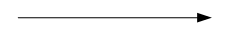
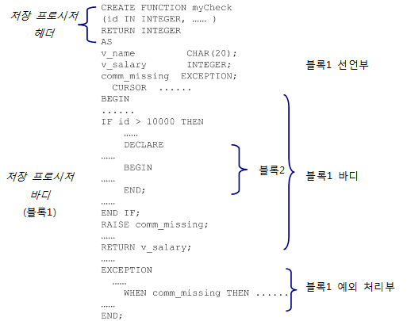
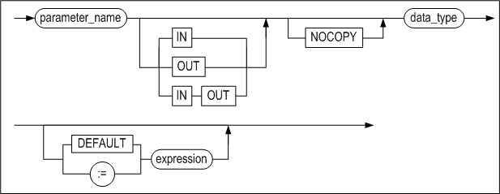
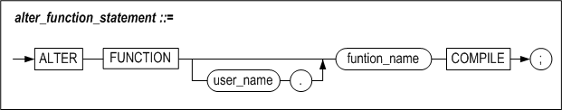
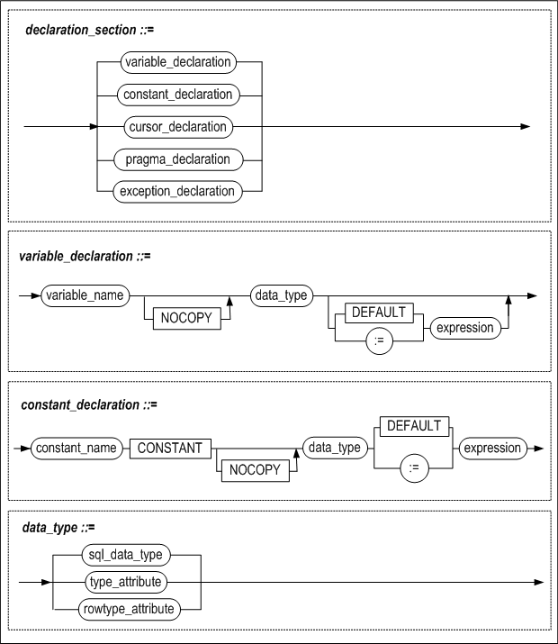
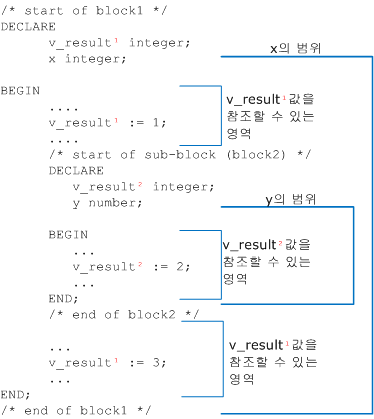
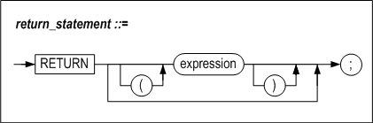
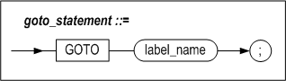
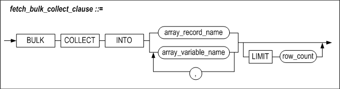
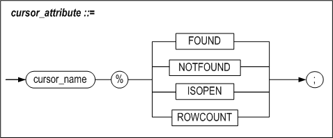

<!-- START doctoc generated TOC please keep comment here to allow auto update -->
<!-- DON'T EDIT THIS SECTION, INSTEAD RE-RUN doctoc TO UPDATE -->
**Table of Contents**  *generated with [DocToc](https://github.com/thlorenz/doctoc)*

- [Stored Procedures Manual](#stored-procedures-manual)
  - [서문](#%EC%84%9C%EB%AC%B8)
    - [이 매뉴얼에 대하여](#%EC%9D%B4-%EB%A7%A4%EB%89%B4%EC%96%BC%EC%97%90-%EB%8C%80%ED%95%98%EC%97%AC)
  - [1.저장 프로시저](#1%EC%A0%80%EC%9E%A5-%ED%94%84%EB%A1%9C%EC%8B%9C%EC%A0%80)
    - [저장 프로시저의 개요](#%EC%A0%80%EC%9E%A5-%ED%94%84%EB%A1%9C%EC%8B%9C%EC%A0%80%EC%9D%98-%EA%B0%9C%EC%9A%94)
    - [저장 프로시저의 구조](#%EC%A0%80%EC%9E%A5-%ED%94%84%EB%A1%9C%EC%8B%9C%EC%A0%80%EC%9D%98-%EA%B5%AC%EC%A1%B0)
    - [저장 프로시저 사용시 주의 사항](#%EC%A0%80%EC%9E%A5-%ED%94%84%EB%A1%9C%EC%8B%9C%EC%A0%80-%EC%82%AC%EC%9A%A9%EC%8B%9C-%EC%A3%BC%EC%9D%98-%EC%82%AC%ED%95%AD)
  - [2.저장 프로시저 SQL문](#2%EC%A0%80%EC%9E%A5-%ED%94%84%EB%A1%9C%EC%8B%9C%EC%A0%80-sql%EB%AC%B8)
    - [개요](#%EA%B0%9C%EC%9A%94)
    - [CREATE PROCEDURE](#create-procedure)
    - [ALTER PROCEDURE](#alter-procedure)
    - [DROP PROCEDURE](#drop-procedure)
    - [EXECUTE](#execute)
    - [CREATE FUNCTION](#create-function)
    - [ALTER FUNCTION](#alter-function)
    - [DROP FUNCTION](#drop-function)
  - [3.저장 프로시저 블록](#3%EC%A0%80%EC%9E%A5-%ED%94%84%EB%A1%9C%EC%8B%9C%EC%A0%80-%EB%B8%94%EB%A1%9D)
    - [저장 프로시저 블록](#%EC%A0%80%EC%9E%A5-%ED%94%84%EB%A1%9C%EC%8B%9C%EC%A0%80-%EB%B8%94%EB%A1%9D)
    - [지역 변수 선언](#%EC%A7%80%EC%97%AD-%EB%B3%80%EC%88%98-%EC%84%A0%EC%96%B8)
    - [SELECT INTO](#select-into)
    - [RETURNING INTO 절](#returning-into-%EC%A0%88)
    - [할당문](#%ED%95%A0%EB%8B%B9%EB%AC%B8)
    - [LABEL](#label)
    - [PRINT](#print)
    - [RETURN](#return)
    - [INSERT 확장](#insert-%ED%99%95%EC%9E%A5)
    - [UPDATE 확장](#update-%ED%99%95%EC%9E%A5)
  - [4.흐름 제어](#4%ED%9D%90%EB%A6%84-%EC%A0%9C%EC%96%B4)
    - [개요](#%EA%B0%9C%EC%9A%94-1)
    - [IF](#if)
    - [CASE](#case)
    - [LOOP](#loop)
    - [WHILE LOOP](#while-loop)
    - [FOR LOOP](#for-loop)
    - [EXIT](#exit)
    - [CONTINUE](#continue)
    - [GOTO](#goto)
    - [NULL](#null)
  - [5.커서](#5%EC%BB%A4%EC%84%9C)
    - [커서의 개요](#%EC%BB%A4%EC%84%9C%EC%9D%98-%EA%B0%9C%EC%9A%94)
    - [CURSOR](#cursor)
    - [OPEN](#open)
    - [FETCH](#fetch)
    - [CLOSE](#close)
    - [Cursor FOR LOOP](#cursor-for-loop)
    - [커서 속성](#%EC%BB%A4%EC%84%9C-%EC%86%8D%EC%84%B1)
  - [6.사용자 정의 타입](#6%EC%82%AC%EC%9A%A9%EC%9E%90-%EC%A0%95%EC%9D%98-%ED%83%80%EC%9E%85)
    - [개요](#%EA%B0%9C%EC%9A%94-2)
    - [사용자 정의 타입의 정의](#%EC%82%AC%EC%9A%A9%EC%9E%90-%EC%A0%95%EC%9D%98-%ED%83%80%EC%9E%85%EC%9D%98-%EC%A0%95%EC%9D%98)
    - [Associative Array 관련 함수](#associative-array-%EA%B4%80%EB%A0%A8-%ED%95%A8%EC%88%98)
    - [RECORD 타입 변수 및 Associative Array변수의 사용](#record-%ED%83%80%EC%9E%85-%EB%B3%80%EC%88%98-%EB%B0%8F-associative-array%EB%B3%80%EC%88%98%EC%9D%98-%EC%82%AC%EC%9A%A9)
    - [REF CURSOR](#ref-cursor)
  - [7.타입 세트](#7%ED%83%80%EC%9E%85-%EC%84%B8%ED%8A%B8)
    - [개요](#%EA%B0%9C%EC%9A%94-3)
    - [CREATE TYPESET](#create-typeset)
    - [DROP TYPESET](#drop-typeset)

<!-- END doctoc generated TOC please keep comment here to allow auto update -->

- [Stored Procedures Manual](#stored-procedures-manual)
  - [서문](#%EC%84%9C%EB%AC%B8)
    - [이 매뉴얼에 대하여](#%EC%9D%B4-%EB%A7%A4%EB%89%B4%EC%96%BC%EC%97%90-%EB%8C%80%ED%95%98%EC%97%AC)
  - [1.저장 프로시저](#1%EC%A0%80%EC%9E%A5-%ED%94%84%EB%A1%9C%EC%8B%9C%EC%A0%80)
    - [저장 프로시저의 개요](#%EC%A0%80%EC%9E%A5-%ED%94%84%EB%A1%9C%EC%8B%9C%EC%A0%80%EC%9D%98-%EA%B0%9C%EC%9A%94)
    - [저장 프로시저의 구조](#%EC%A0%80%EC%9E%A5-%ED%94%84%EB%A1%9C%EC%8B%9C%EC%A0%80%EC%9D%98-%EA%B5%AC%EC%A1%B0)
    - [저장 프로시저 사용시 주의 사항](#%EC%A0%80%EC%9E%A5-%ED%94%84%EB%A1%9C%EC%8B%9C%EC%A0%80-%EC%82%AC%EC%9A%A9%EC%8B%9C-%EC%A3%BC%EC%9D%98-%EC%82%AC%ED%95%AD)
  - [2.저장 프로시저 SQL문](#2%EC%A0%80%EC%9E%A5-%ED%94%84%EB%A1%9C%EC%8B%9C%EC%A0%80-sql%EB%AC%B8)
    - [개요](#%EA%B0%9C%EC%9A%94)
    - [CREATE PROCEDURE](#create-procedure)
    - [ALTER PROCEDURE](#alter-procedure)
    - [DROP PROCEDURE](#drop-procedure)
    - [EXECUTE](#execute)
    - [CREATE FUNCTION](#create-function)
    - [ALTER FUNCTION](#alter-function)
    - [DROP FUNCTION](#drop-function)
  - [3.저장 프로시저 블록](#3%EC%A0%80%EC%9E%A5-%ED%94%84%EB%A1%9C%EC%8B%9C%EC%A0%80-%EB%B8%94%EB%A1%9D)
    - [저장 프로시저 블록](#%EC%A0%80%EC%9E%A5-%ED%94%84%EB%A1%9C%EC%8B%9C%EC%A0%80-%EB%B8%94%EB%A1%9D)
    - [지역 변수 선언](#%EC%A7%80%EC%97%AD-%EB%B3%80%EC%88%98-%EC%84%A0%EC%96%B8)
    - [SELECT INTO](#select-into)
    - [RETURNING INTO 절](#returning-into-%EC%A0%88)
    - [할당문](#%ED%95%A0%EB%8B%B9%EB%AC%B8)
    - [LABEL](#label)
    - [PRINT](#print)
    - [RETURN](#return)
  - [4.흐름 제어](#4%ED%9D%90%EB%A6%84-%EC%A0%9C%EC%96%B4)
    - [개요](#%EA%B0%9C%EC%9A%94-1)
    - [IF](#if)
    - [CASE](#case)
    - [LOOP](#loop)
    - [WHILE LOOP](#while-loop)
    - [FOR LOOP](#for-loop)
    - [EXIT](#exit)
    - [CONTINUE](#continue)
    - [GOTO](#goto)
    - [NULL](#null)
  - [5.커서](#5%EC%BB%A4%EC%84%9C)
    - [커서의 개요](#%EC%BB%A4%EC%84%9C%EC%9D%98-%EA%B0%9C%EC%9A%94)
    - [CURSOR](#cursor)
    - [OPEN](#open)
    - [FETCH](#fetch)
    - [CLOSE](#close)
    - [Cursor FOR LOOP](#cursor-for-loop)
    - [커서 속성](#%EC%BB%A4%EC%84%9C-%EC%86%8D%EC%84%B1)
  - [6.사용자 정의 타입](#6%EC%82%AC%EC%9A%A9%EC%9E%90-%EC%A0%95%EC%9D%98-%ED%83%80%EC%9E%85)
    - [개요](#%EA%B0%9C%EC%9A%94-2)
    - [사용자 정의 타입의 정의](#%EC%82%AC%EC%9A%A9%EC%9E%90-%EC%A0%95%EC%9D%98-%ED%83%80%EC%9E%85%EC%9D%98-%EC%A0%95%EC%9D%98)
    - [Associative Array 관련 함수](#associative-array-%EA%B4%80%EB%A0%A8-%ED%95%A8%EC%88%98)
    - [RECORD 타입 변수 및 Associative Array변수의 사용](#record-%ED%83%80%EC%9E%85-%EB%B3%80%EC%88%98-%EB%B0%8F-associative-array%EB%B3%80%EC%88%98%EC%9D%98-%EC%82%AC%EC%9A%A9)
    - [REF CURSOR](#ref-cursor)
  - [7.타입 세트](#7%ED%83%80%EC%9E%85-%EC%84%B8%ED%8A%B8)
    - [개요](#%EA%B0%9C%EC%9A%94-3)
    - [CREATE TYPESET](#create-typeset)
    - [DROP TYPESET](#drop-typeset)


Altibase® Application Development

Stored Procedures Manual 
========================


Altibase Application Development Stored Procedures Manual

Release 7.1

Copyright ⓒ 2001\~2019 Altibase Corp. All Rights Reserved.

본 문서의 저작권은 ㈜알티베이스에 있습니다. 이 문서에 대하여 당사의 동의 없이
무단으로 복제 또는 전용할 수 없습니다.

**㈜알티베이스**

08378 서울시 구로구 디지털로 306 대륭포스트타워Ⅱ 10층

전화: 02-2082-1114 팩스: 02-2082-1099

고객서비스포털: <http://support.altibase.com>

homepage: [http://www.altibase.com](http://www.altibase.com/)


서문
----

### 이 매뉴얼에 대하여

이 매뉴얼은 저장 프로시저의 개념 및 사용 방법에 대해 설명한다.

#### 대상 사용자

이 매뉴얼은 다음과 같은 Altibase 사용자를 대상으로 작성되었다.

-   데이터베이스 관리자

-   성능 관리자

-   데이터베이스 사용자

-   응용 프로그램 개발자

다음과 같은 배경 지식을 가지고 이 매뉴얼을 읽는 것이 좋다.

-   컴퓨터, 운영 체제 및 운영 체제 유틸리티 운용에 필요한 기본 지식

-   관계형 데이터베이스 사용 경험 또는 데이터베이스 개념에 대한 이해

-   컴퓨터 프로그래밍 경험

#### 소프트웨어 환경

이 매뉴얼은 데이터베이스 서버로 Altibase 버전 7.1을 사용한다는 가정 하에
작성되었다.

#### 이 매뉴얼의 구성

이 매뉴얼은 다음과 같이 구성되어 있다.

-   제 1장 저장 프로시저  
    이 장은 저장 프로시저의 개념 및 구조, 사용 시 주의 사항에 대해 설명한다.

-   제 2장 저장 프로시저 SQL문  
    이 장은 저장 프로시저 SQL문에 대한 사용 방법에 대해 설명한다.

-   제 3장 저장 프로시저 블록  
    이 장은 저장 프로시저 블록의 개념, 저장 프로시저 바디 내에서 선언하는 지역
    변수 및 사용가능한 문장에 대해 설명한다.

-   제 4장 흐름 제어  
    이 장은 저장 프로시저 바디 내에서 절차적 프로그램 작성이 가능하도록 프로그램
    흐름을 제어할 수 있는 흐름 제어문에 대해 설명한다.

-   제 5장 커서  
    이 장은 저장 프로시저 내에서 조회 레코드 건수가 여러 개인 SELECT문을 처리할
    수 있도록 커서를 정의하고 레코드를 제어할 수 있는 커서 관련문들에 대해
    설명한다.

-   제 6장 사용자 정의 타입  
    이 장은 저장 프로시저 내에서 사용자 정의 타입인 record 및 associative
    array의 정의 및 사용 방법에 대해 설명한다.

-   제 7장 타입 세트  
    이 장은 사용자 정의 타입의 집합인 타입 세트의 정의 및 사용 방법에 대해
    설명한다.

-   제 8장 동적 SQL  
    이 장은 실행 시간에 사용자가 원하는 질의를 만들어서 실행하기 위한 동적 SQL에
    대해 설명한다.

-   제 9장 예외 처리  
    이 장은 저장 프로시저 실행 중 오류 발생 시 저장 프로시저 내에서 오류에 대한
    예외 처리가 가능하도록 하는 예외 처리 관련문에 대해 설명한다.

-   제 10장 프라그마(Pragma)  
    이 장은 저장 프로시저 컴파일 시 영향을 미치는 Pragma에 대해 설명하고, 이를
    사용하는 방법을 설명한다.

-   제 11장 저장 패키지  
    이 장은 패키지를 생성하고 사용하는 방법을 설명한다.

-   제 12장 Altibase 저장 프로시저와 내장 함수  
    Altibase는 다양한 종류의 내장된 저장 프로시저와 함수를 제공한다. 이 장은
    이들 저장 프로시저와 함수를 소개하고 그 사용법에 대해 설명한다.

-   제 13장 Altibase 저장 패키지  
    Altibase에서 제공하는 저장 패키지에 대해 설명한다.

-   A. 부록  
    이 장은 이 매뉴얼의 예제에서 사용한 스키마에 대한 설명과 저장 프로시저를
    이용한 예제 프로그램을 설명한다.

#### 문서화 규칙

이 절에서는 이 매뉴얼에서 사용하는 규칙에 대해 설명한다. 이 규칙을 이해하면 이
매뉴얼과 설명서 세트의 다른 매뉴얼에서 정보를 쉽게 찾을 수 있다.

여기서 설명하는 규칙은 다음과 같다.

-   구문 다이어그램

-   샘플 코드 규칙

##### 구문 다이어그램

이 매뉴얼에서는 다음 구성 요소로 구축된 다이어그램을 사용하여, 명령문의 구문을
설명한다.

| 구성 요소                                   | 의미                                                         |
| ------------------------------------------- | ------------------------------------------------------------ |
|  | 명령문이 시작한다. 완전한 명령문이 아닌 구문 요소는 화살표로 시작한다. |
|  | 명령문이 다음 라인에 계속된다. 완전한 명령문이 아닌 구문 요소는 이 기호로 종료한다. |
|  | 명령문이 이전 라인으로부터 계속된다. 완전한 명령문이 아닌 구문 요소는 이 기호로 시작한다. |
|  | 명령문이 종료한다.                                           |
|  | 필수 항목                                                    |
|  | 선택적 항목                                                  |
|  | 선택사항이 있는 필수 항목. 한 항목만 제공해야 한다.          |
|  | 선택사항이 있는 선택적 항목                                  |
|  | 선택적 항목. 여러 항목이 허용된다. 각 반복 앞부분에 콤마가 와야 한다. |

##### 샘플 코드 규칙

코드 예제는 SQL, Stored Procedure, iSQL, 또는 다른 명령 라인 구문들을 예를 들어
설명한다.

아래 테이블은 코드 예제에서 사용된 인쇄 규칙에 대해 설명한다.

| 규칙         | 의미                                                                                | 예제                                                                                                      |
|--------------|-------------------------------------------------------------------------------------|-----------------------------------------------------------------------------------------------------------|
| [ ]          | 선택 항목을 표시                                                                    | VARCHAR [(*size*)] [[FIXED \|] VARIABLE]                                                                  |
| { }          | 필수 항목 표시. 반드시 하나 이상을 선택해야 되는 표시                               | { ENABLE \| DISABLE \| COMPILE }                                                                          |
| \|           | 선택 또는 필수 항목 표시의 인자 구분 표시                                           | { ENABLE \| DISABLE \| COMPILE } [ ENABLE \| DISABLE \| COMPILE ]                                         |
| . . .        | 그 이전 인자의 반복 표시 예제 코드들의 생략되는 것을 표시                           | SQL\> SELECT ename FROM employee; ENAME ------------------------ SWNO HJNO HSCHOI . . . 20 rows selected. |
| 그 밖에 기호 | 위에서 보여진 기호 이 외에 기호들                                                   | EXEC :p1 := 1; acc NUMBER(11,2);                                                                          |
| 기울임 꼴    | 구문 요소에서 사용자가 지정해야 하는 변수, 특수한 값을 제공해야만 하는 위치         | SELECT \* FROM *table_name*; CONNECT *userID*/*password*;                                                 |
| 소문자       | 사용자가 제공하는 프로그램의 요소들, 예를 들어 테이블 이름, 칼럼 이름, 파일 이름 등 | SELECT ename FROM employee;                                                                               |
| 대문자       | 시스템에서 제공하는 요소들 또는 구문에 나타나는 키워드                              | DESC SYSTEM_.SYS_INDICES_;                                                                                |

#### 샘플 스키마

이 매뉴얼 내의 예제중의 일부는 employees, departments 및 orders테이블 같은 샘플
테이블에 기반하여 작성되었다. 이들 테이블은 \$ALTIBASE_HOME/sample/APRE/schema
디렉토리의 schema.sql을 사용하여 생성할 수 있다. 샘플 스키마에 대한 온전한
정보는 *General Reference*를 참고하기 바란다.

#### 관련 자료

자세한 정보를 위하여 다음 문서 목록을 참조하기 바란다.

-   Installation Guide

-   Getting Started Guide

-   SQL Reference

-   iSQL User’s Manual

-   Error Message Reference

#### Altibase는 여러분의 의견을 환영합니다.

이 매뉴얼에 대한 여러분의 의견을 보내주시기 바랍니다. 사용자의 의견은 다음
버전의 매뉴얼을 작성하는데 많은 도움이 됩니다. 보내실 때에는 아래 내용과 함께
고객서비스포털(*http://support.altibase.com/kr/* )로 보내주시기 바랍니다.

-   사용 중인 매뉴얼의 이름과 버전

-   매뉴얼에 대한 의견

-   사용자의 성함, 주소, 전화번호

이 외에도 Altibase 기술지원 설명서의 오류와 누락된 부분 및 기타 기술적인
문제들에 대해서 이 주소로 보내주시면 정성껏 처리하겠습니다. 또한, 기술적인
부분과 관련하여 즉각적인 도움이 필요한 경우에도 고객서비스포털을 통해 서비스를
요청하시기 바랍니다.

여러분의 의견에 항상 감사드립니다.


1.저장 프로시저
-------------

### 저장 프로시저의 개요

저장 프로시저(Stored Procedure)란 SQL문들과 흐름 제어문, 할당문, 오류 처리 루틴
등으로 구성된 데이터베이스 객체 (object) 중의 하나이다. 저장 프로시저는 생성될
때 컴파일 되어 바로 실행 가능한 상태로 데이터베이스에 저장되며 여러 세션에서
동시에 하나의 저장 프로시저를 실행하는 것도 가능하다

“저장 프로시저(Stored Procedure)”라는 용어는 때때로 저장 프로시저와 저장
함수(Stored Function)를 모두 지칭하기도 한다. 저장 프로시저와 저장 함수의 다른
점은 저장 함수가 실행 시 값을 반환하는 것 외에는 차이가 없다.

저장 프로시저와 저장 함수는 각각 CREATE PROCEDURE 와 CREATE FUNCTION 구문을
사용해서 생성할 수 있다. 이 구문에 대한 자세한 설명은 2장 “저장 프로시저
SQL문”을 참고하기 바란다.

#### 저장 프로시저의 종류

##### 저장 프로시저 

저장 프로시저는 SQL구문이나 다른 저장 프로시저 내에서 입력 인자, 출력 인자,
입출력 인자를 가지고 실행할 수 있다. 저장 프로시저 호출 시, 프로시저의 바디
부분에 정의된 절차에 따라서 SQL문을 수행하게 된다. 저장 프로시저는 반환 값을
가지지 않지만, 출력 인자와 입출력 인자들을 통해 프로시저를 호출한 클라이언트에게
값을 전달할 수도 있다. 이는 반환 값을 갖지 않기 때문에 SQL문의 연산식
(expression) 내에서 피연산자로 사용될 수 없다.

##### 저장 함수 

값을 반환하는 것만 제외하면 저장 프로시저와 동일하다. 저장 프로시저와 달리
하나의 반환 값을 가지므로 SQL문의 연산식 (expression)내에서 피연산자로 사용할 수
있다.

##### 타입 세트 

저장 프로시저의 사용자 정의 타입들을 정의한 집합이다. 이는 주로 저장
프로시저끼리 인자 또는 리턴 값으로 사용자 정의 타입을 주고받을 때 사용한다.

자세한 내용은 7장 “타입 세트”에서 다룬다.

#### 저장 프로시저의 특징

##### SQL 구문을 이용한 절차적 프로그램

Altibase PSM (Persistent Stored Module)은 흐름 제어문과 예외 처리문을 제공하므로
SQL문을 사용해서 절차적 프로그래밍이 가능하다.

##### 성능

여러 SQL문을 순차적으로 수행하는 클라이언트 프로그램의 경우에는 각 SQL문 수행 시
마다 데이터베이스 서버와 통신을 해야 하므로 통신 비용이 많이 발생한다. 반면,
저장 프로시저로 작성된 프로그램은 프로시저 호출 시 한번의 통신만으로 여러
SQL문을 수행할 수 있다.

따라서, 저장 프로시저를 사용하면 통신 부하의 감소와 함께 데이터베이스 서버와
클라이언트 응용 프로그램간의 데이터 타입의 차이로 인해 발생하는 내부적인 데이터
타입 변환의 부하도 줄일 수 있다.

##### 모듈화

업무 절차를 구현하는데 필요한 모든 SQL작업을 하나의 저장 프로시저로 묶어
모듈화하여 관리할 수 있다.

##### 소스 코드 관리의 용이성

저장 프로시저는 데이터베이스 서버에 저장되는 모듈이기 때문에, 업무 로직의 변경
시 여러 클라이언트에 설치된 프로그램들을 모두 수정할 필요 없이 저장 프로시저만
변경하면 되므로 프로그램 관리가 용이하다.

##### 공유와 생산성

한 사용자가 생성한 저장 프로시저는 데이터베이스에 저장되므로 접근 권한이 부여된
다른 사용자도 해당 저장 프로시저를 실행할 수 있어 서로 공유할 수 있을 뿐만
아니라, 한 저장 프로시저 내에서 다른 저장 프로시저의 호출이 가능하므로 같은 업무
절차의 재 프로그래밍이 필요 없으므로 생산성을 높일 수 있다.

##### SQL과의 통합성

저장 프로시저 내의 흐름 제어문의 조건절은 SELECT문의 조건절을 그대로 사용할 수
있다. 즉, C/C++등의 주 언어의 흐름 제어문의 조건절에서는 사용할 수 없는 SQL문
스타일의 기능을 사용할 수 있다. 또한, 연산식에 부질의 (subquery)를 사용하거나
SQL문이 지원하는 시스템 제공 함수들을 그대로 사용할 수 있다는 점 등 SQL문과
밀착된 프로그래밍이 가능하다.

##### 에러 및 예외처리

저장 프로시저 내에서 Exception Handler를 제공하므로 SQL문 수행 도중 오류가
발생했을 때 적절한 대응 조치를 서버 내에서 바로 처리할 수 있다.

##### 저장성

저장 프로시저 또한 데이터베이스 객체이기 때문에 사용자가 삭제하기 전까지
데이터베이스 내에 저장된다. 따라서 업무 절차 또한 데이터베이스에 저장하여
보존시킬 수 있다.

##### 보안강화

저장 프로시저 및 저장 함수 등의 PSM 코드 프로그램을 altiwrap 유틸리티로
암호화하여 노출되는 것을 방지할 수 있다. 이 유틸리티에 대한 설명은 *Utilities
Manual*을 참고한다. Altibase가 암호화할 수 있는 구문은 아래와 같다.

-   CREATE [OR REPLACE] PROCEDURE

-   CREATE [OR REPLACE] FUNCTION

-   CREATE [OR REPLACE] TYPESET

-   CREATE [OR REPLACE] PACKAGE

-   CREATE [OR REPLACE] PACKAGE BODY


### 저장 프로시저의 구조

저장 프로시저는 블록으로 구조화된 언어로, 저장 프로시저의 바디는 여러 개의
논리적인 블록들로 구성된다.

저장 프로시저는 크게 헤더와 바디로 나뉘어진다. 저장 프로시저의 바디는 하나의 큰
블록으로서 선언부, 프로시저의 실제 바디, 예외 처리부로 구성된다. 바디는 다시
여러 개의 하위 블록들을 가질 수 있다.

저장 프로시저 구조를 예를 들어 설명하면 다음과 같다.



블록2는 블록1의 하위 블록으로 블록1의 구조와 같이 선언부, 바디, 예외 처리부로
구성될 수도 있다.

흐름 제어문도 명시적인 시작과 끝을 알 수 있는 하나의 블록이다.


### 저장 프로시저 사용시 주의 사항

#### 트랜잭션 관리

저장 프로시저 내에서 사용 가능한 트랜잭션 제어문은 COMMIT, ROLLBACK문이다. 저장
프로시저 내에서 사용한 트랜잭션 제어문은 저장 프로시저 밖의 작업에도 영향을 미칠
수 있다.

예를 들어서 NON-AUTOCOMMIT 모드에서 다음과 같은 작업을 수행했다고 가정하자.

```
iSQL> INSERT INTO t1 values (1);
iSQL> INSERT INTO t1 values (2);
iSQL> EXECUTE proc1;
```

proc1이 “INSERT INTO t1 values (3)” 구문과 “ROLLBACK” 문을 수행한다면 프로시저
내에서 입력한 3 뿐만 아니라 프로시저 외부의 iSQL에서 입력한 1과 2도
ROLLBACK된다. 즉, 위의 두 INSERT문과 EXECUTE문은 하나의 트랜잭션으로 처리된다.

#### 제약 사항

커서가 OPEN된 상태에서 COMMIT 또는 ROLLBACK을 실행할 수 있다.

SELECT문 내에서 호출되는 저장 함수의 경우 저장 함수 내에 INSERT, UPDATE,
DELETE문은 사용할 수 없으며, 트랜잭션 제어문도 수행할 수 없다.

INSERT, UPDATE, DELETE문 내에서 호출되는 저장 함수내에서도 트랜잭션 제어문을
수행할 수 없다.

#### 관련 메타 테이블

저장 프로시저 관련 메타 테이블에 대한 자세한 내용은 *General Reference* 의 데이터 딕셔너리 부분을 참조한다.


2.저장 프로시저 SQL문
-------------------

### 개요

#### 저장 프로시저 SQL문

아래 표는 저장 프로시저, 함수와 타입 세트를 생성하고 관리하는 데 사용하는 DDL문을 보여준다.

CREATE TYPESET 과 DROP TYPESET 구문에 대한 설명은 7장 타입 세트를 참고하기 바란다.

<table>
    <tr>
        <th>종류</th><th>관련문장</th><th>설명</th>
	</tr>
    <tr>
        <TD rowspan="3">생성</TD><TD>CREATE [OR REPLACE] PROCEDURE문</TD><TD>새로운 저장 프로시저를 생성하거나 이미 생성된 저장 프로시저의 정의를 변경하는 문장이다.</TD>
    </tr>
    <TR>
        <TD>CREATE [OR REPLACE] FUNCTION 문</TD><TD>새로운 저장 함수를 생성하거나 이미 생성된 저장 함수의 정의를 변경하는 문장이다.</TD>       
    </TR>
    <TR>
        <TD>CREATE [OR REPLACE] TYPESET 문</TD><TD>타입 세트를 생성 또는 변경하는 문장이다.</TD>
    </TR>
    <TR>
        <TD rowspan="2">변경</TD><TD>ALTER PROCEDURE 문</TD><TD>이 구문은 저장 프로시저를 재컴파일하여  프로시저를 유효한 상태로 변경하고자 할 때 사용한다.</TD>
    </TR>
    <TR>
        <TD>ALTER FUNCTION 문</TD><TD>ALTER PROCEDURE문과 동일하다.</TD>
    </TR>
    <TR>
        <TD rowspan="3">삭제</TD><TD>DROP PROCEDURE 문</TD><TD>생성된 저장 프로시저를 삭제하는 문장이다.</TD>
    </TR>
    <TR>
    	<TD>DROP FUNCTION 문</TD><TD>생성된 저장 함수를 삭제하는 문장이다.</TD>
    </TR>
    <TR>
        <TD>DROP TYPESET 문</TD><TD>생성된 타입 세트를 삭제하는 문장이다.</TD>
    </TR>  
    <TR>
        <TD rowspan="2">실행</TD> <TD>EXECUTE 문</TD><TD>저장 프로시저 또는 저장 함수를 실행하는 문장이다.</TD>        
    </TR>
    <TR>
     	<TD>function_name</TD><TD>SQL문 내에서 호출할 때 이름으로 참조할 수 있다.</TD>        
    </TR>
</table>

#### 데이터 타입

저장 프로시저에서는 다음과 같은 데이터 타입을 지원한다.

-   SQL 데이터 타입

-   BOOLEAN 타입

-   FILE_TYPE  
    저장 프로시저 내에서만 사용 가능하며, 파일 제어를 위한 타입이다. 자세한
    내용은 11장의 “파일 제어”를 참조한다.

-   사용자 정의 타입  
    저장 프로시저 내에서만 사용 가능하며, RECORD 및 ASSOCIATIVE ARRAY를
    지원한다. 자세한 내용은 6장 “사용자 정의 타입”을 참조한다.

##### SQL 데이터 타입

SQL 구문에서 사용 가능한 데이터 타입 모두 PSM (저장 프로시저, 저장 함수)에서
사용할 수 있다. 각 데이터 타입에 대한 자세한 내용은 *General Reference*의
"데이터 타입" 장을 참조한다.

아래 표에 나열한 SQL 데이터 타입은 SQL과 PSM에서 사용 가능한 최대 크기가 다르다.

| 데이터 타입 | SQL에서 최대 크기            | PSM에서 최대 크기                                            |
| ----------- | ---------------------------- | ------------------------------------------------------------ |
| CHAR(M)     | 32000                        | 65534                                                        |
| VARCHAR(M)  | 32000                        | 65534                                                        |
| NCHAR(M)    | 16000 (UTF-16) 10666 (UTF-8) | 32766 (UTF-16) 21843 (UTF-8)                                 |
| NVARCHAR(M) | 16000 (UTF-16) 10666 (UTF-8) | 32766 (UTF-16) 21843 (UTF-8)                                 |
| BLOB        | 2GB - 1                      | 100MB <br />LOB_OBJECT_BUFFER_SIZE 프로퍼티에 의해 결정 <br />(기본값: 32KB) |
| CLOB        | 2GB - 1                      | 100MB <br />LOB_OBJECT_BUFFER_SIZE 프로퍼티에 의해 결정 <br />(기본값: 32KB) |

SQL에서 CHAR, VARCHAR, NCHAR, NVARCHAR 타입의 크기를 지정하지 않으면 크기는
1이다.

저장 프로시저와 저장 함수에서 파라미터 또는 반환 값의 데이터 타입을CHAR, NCHAR,
NVARCHAR, VARCHAR로 설정한 경우, 데이터 타입의 크기를 지정하지 않으면 아래
프로퍼티에 설정된 크기로 사용된다.

-   PSM_CHAR_DEFAULT_PRECISION

-   PSM_NCHAR_UTF8_DEFAULT_PRECISION

-   PSM_NCHAR_UTF16_DEFAULT_PRECISION

-   PSM_NVARCHAR_UTF8_DEFAULT_PRECISION

-   PSM_NVARCHAR_UTF16_DEFAULT_PRECISION

-   PSM_VARCHAR_DEFAULT_PRECISION

각 프로퍼티에 대한 자세한 설명은 General Reference를 참고 한다.

##### BOOLEAN 타입

BOOLEAN 타입은 저장 프로시저 또는 저장 함수에서만 사용 가능하며, TRUE 또는
FALSE, NULL 값만 가질 수 있다.

BOOLEAN 변수는 다음과 같이 선언할 수 있다.

```
variable_name BOOLEAN;
```

BOOLEAN 타입은 SQL 데이터 타입 중 어느 것과도 호환되지 않으므로 사용시 아래와
같은 제약이 있다.

-   테이블 칼럼에 BOOLEAN 값을 입력할 수 없다.

-   테이블 칼럼의 값을 BOOLEAN 변수에 fetch할 수 없다.

-   BOOLEAN 타입을 반환하는 저장 함수나 내장 함수를 SQL문에 사용할 수 없다.

-   BOOLEAN 값은 출력 함수(PRINT, PUT 등)의 인자로 전달할 수 없다.

BOOLEAN 타입은 아래와 같이 사용할 수 있다.

```
done BOOLEAN;
...
done := TRUE;
done := FALSE;
done := NULL;
...
IF done = TRUE THEN
...
IF done = FALSE THEN
...
IF done THEN
...
IF done is NULL THEN
...
```


### CREATE PROCEDURE

#### 구문

create_procedure::=


parameter_declaration::=



invoker_rights_clause::=


#### 기능

저장 프로시저를 새로 생성하거나 이미 생성되어 있는 저장 프로시저를 새로운 저장
프로시저로 변경하는 기능을 수행한다.

##### parameter_declaration

인자는 생략할 수 있으며, 인자를 명시할 경우엔 인자의 명칭, 데이터 타입 및 입출력
구분을 명시해야 한다. 사용 가능한 입출력 구분 값은 다음 세가지 중의 하나이고
생략 시에 IN이 기본값이 된다. 인자가 OUT 또는 INOUT인 경우에는 DEFAULT
expression은 정의할 수 없다.

-   IN: 프로시저 호출시 입력값으로 주어지는 입력 인자

-   OUT: 프로시저 실행 후 출력 값을 반환하는 인자

-   INOUT: 입출력 공용 인자로 프로시저 호출시 입력값을 줄 수 있고, 실행 후에
    출력 값을 반환할 수 있다

저장 프로시저가 실행될 때, IN 인자를 사용해서 프로시저에 값을 전달하고,
프로시저는 OUT인자를 사용해서 호출한 루틴에 값을 반환한다.

IN 인자는 저장 프로시저 내에서 상수처럼 동작하므로, 프로시저 내에서 할당문을
사용해 인자에 값을 대입할 수 없으며 SELECT문의 INTO 절에도 사용할 수 없다.

인자를 전달하는 방법은 값(value)을 전달하는 방법과 NOCOPY옵션을 사용하여
참조(reference)값을 전달하는 방법이 있다. NOCOPY옵션은 ASSOCIATIVE ARRAY타입만
지원한다.

인자는 기본 값을 가질 수 있다. 저장 프로시저가 호출될 때 기본값이 정의된 인자에
값을 넘겨 주지 않을 경우, 기본 값이 사용된다.

##### invoker_rights_clause

프로시저를 실행할 때 생성자(DEFINER)권한으로 객체를 참조할 것인지
실행자(CURRENT_USER) 권한으로 참조할 것인지 명시할 수 있다. 이 절을 생략하면
AUTHID DEFINER가 기본으로 설정된다.

-   AUTHID CURRENT_USER  
    프로시저 사용자가 소유한 객체를 참조하여 프로시저를 실행한다.

-   AUTHID DEFINER  
    프로시저 생성자의 객체를 참조하여 프로시저를 생성한 사용자(DEFINER) 권한으로
    실행한다.

##### declaration_section

3장의 “[지역 변수 선언](#지역-변수-선언)”절 참고

##### data_type

3장의 “[지역 변수 선언](#지역-변수-선언)”절 참고

##### Exception Handler

9장 “[Exception Handler](#exception-handler-2)” 참고

##### CREATE PROCEDURE 문의 실행

저장 프로시저 생성 구문은 텍스트 편집기에서 작성해서 iSQL에 붙여넣거나, iSQL에서
직접 한 라인씩 입력할 수도 있다.

각 SQL문, 저장 프로시저 제어문, 그리고 블록 (END)의 끝에 세미콜론(“;”)을
입력한다.

iSQL에서 CREATE PROCEDURE문을 실행할 때는 마지막 END; 문의 다음 라인에 반드시
슬래시(“/”)를 입력해야 프로시저 생성문이 실행된다. CREATE PROCEDURE문 실행 시
컴파일 오류가 발생하지 않고 블록이 성공적으로 컴파일 되면 “Create Success”
메시지가 출력된다.

저장 프로시저 바디 부분에 대해서는 다음 장에서부터 각각 블록, 흐름 제어문, 커서,
Exception Handler 부분으로 구분해서 설명한다.

#### 예제

##### 예제1 (IN 인자 사용)

```
CREATE TABLE t1 (i1 INTEGER UNIQUE, i2 INTEGER, i3 INTEGER);
INSERT INTO t1 VALUES (1,1,1);
INSERT INTO t1 VALUES (2,2,2);
INSERT INTO t1 VALUES (3,3,3);
INSERT INTO t1 VALUES (4,4,4);
INSERT INTO t1 VALUES (5,5,5);
SELECT * FROM t1;

CREATE OR REPLACE PROCEDURE proc1
(p1 IN INTEGER, p2 IN INTEGER, p3 IN INTEGER)
AS
  v1 INTEGER;
  v2 t1.i2%type;
  v3 INTEGER;
BEGIN
  SELECT *
  INTO v1, v2, v3
  FROM t1
  WHERE i1 = p1 AND i2 = p2 AND i3 = p3;

  IF v1 = 1 AND v2 = 1 AND v3 = 1 THEN
    UPDATE t1 SET i2 = 7 WHERE i1 = v1;
  ELSIF v1 = 2 AND v2 = 2 AND v3 = 2 THEN
    UPDATE t1 SET i2 = 7 WHERE i1 = v1;
  ELSIF v1 = 3 AND v2 = 3 AND v3 = 3 THEN
    UPDATE t1 SET i2 = 7 WHERE i1 = v1;
  ELSIF v1 = 4 AND v2 = 4 AND v3 = 4 THEN
    UPDATE t1 SET i2 = 7 WHERE i1 = v1;
  ELSE
    DELETE FROM t1;
  END IF;
  INSERT INTO t1 VALUES (p1+10, p2+10, p3+10);
END;
/

iSQL> EXEC proc1 (2,2,2);
Execute success.
iSQL> SELECT * FROM t1;
T1.I1       T1.I2       T1.I3       
----------------------------------------
1           1           1           
3           3           3           
4           4           4           
5           5           5           
2           7           2           
12          12          12          
6 rows selected.
```


##### 예제2 (기본값이 있는 인자 사용)

```
CREATE TABLE t1 (i1 INTEGER, i2 INTEGER, i3 INTEGER);

CREATE OR REPLACE PROCEDURE proc1
(p1 IN INTEGER DEFAULT 1, p2 IN INTEGER DEFAULT 1, p3 IN INTEGER DEFAULT 1)
AS
BEGIN
  INSERT INTO t1 VALUES (p1, p2, p3);
END;
/

EXEC proc1;
SELECT * FROM t1;
EXEC proc1(2);
SELECT * FROM t1;
EXEC proc1(3,3);
SELECT * FROM t1;
EXEC proc1(4,4,4);

iSQL> SELECT * FROM t1;
T1.I1       T1.I2       T1.I3       
----------------------------------------
1           1           1           
2           1           1           
3           3           1           
4           4           4           
4 rows selected.
```


##### 예제3

```
CREATE OR REPLACE PROCEDURE proc1
(emp_id INTEGER, amount NUMBER(10,2))
AS
BEGIN
  UPDATE employees SET salary = salary + amount
  WHERE eno = emp_id;
END;
/

iSQL> EXEC proc1(15, '250');	
Execute success.

iSQL> SELECT * FROM employees WHERE eno=15;
ENO         E_LASTNAME            E_FIRSTNAME           EMP_JOB          
------------------------------------------------------------------------------
EMP_TEL          DNO         SALARY      SEX  BIRTH   JOIN_DATE    STATUS  
-----------------------------------------------------------------------------------
15          Davenport             Jason                 webmaster        
0119556884       1003        1250        M  901212               H  
1 row selected.

```


##### 예제4 (출력, 입출력 인자 사용)

```
CREATE TABLE t4(i1 INTEGER, i2 INTEGER);
INSERT INTO t4 VALUES(1,1);
INSERT INTO t4 VALUES(1,1);
INSERT INTO t4 VALUES(1,1);
INSERT INTO t4 VALUES(1,1);
INSERT INTO t4 VALUES(1,1);

CREATE OR REPLACE PROCEDURE proc1(a1 OUT INTEGER, a2 IN OUT INTEGER)
AS
BEGIN
  SELECT COUNT(*) INTO a1 FROM t4 WHERE i2 = a2;
END;
/

iSQL> VAR t3 INTEGER;
iSQL> VAR t4 INTEGER;
iSQL> EXEC :t4 := 1;
Execute success.
iSQL> EXEC proc1(:t3, :t4);
Execute success.
iSQL> PRINT t3;
NAME                 TYPE                 VALUE
-----------------------------------------------
T3                   INTEGER              5 
```


##### 예제5

```
CREATE OR REPLACE PROCEDURE proc1(p1 INTEGER, p2 IN OUT INTEGER, p3 OUT INTEGER)
AS
BEGIN
  p2 := p1;
  p3 := p1 + 100;
END;
/

iSQL> VAR v1 INTEGER;
iSQL> VAR v2 INTEGER;
iSQL> VAR v3 INTEGER;
iSQL> EXEC :v1 := 3;
Execute success.
iSQL> EXEC proc1(:v1, :v2, :v3);
Execute success.
iSQL> PRINT VAR;
[ HOST VARIABLE ]
-----------------------------------------------
NAME                 TYPE                 VALUE
-----------------------------------------------
V1                   INTEGER              3
V2                   INTEGER              3
V3                   INTEGER              103
```


##### 예제6 (입출력 인자 사용)

```
CREATE TABLE t3(i1 INTEGER);
INSERT INTO t3 VALUES(1);
INSERT INTO t3 VALUES(1);
INSERT INTO t3 VALUES(1);

CREATE OR REPLACE PROCEDURE proc1(a1 IN OUT INTEGER)
AS
BEGIN
  SELECT COUNT(*) INTO a1 FROM t3 WHERE i1 = a1;
END;
/

iSQL> VAR p1 INTEGER;
iSQL> EXEC :p1 := 1;
Execute success.
iSQL> EXEC proc1(:p1);
Execute success.
iSQL> PRINT p1;
NAME                 TYPE                 VALUE
-----------------------------------------------
P1                   INTEGER              3
```


##### 예제7

```
CREATE OR REPLACE PROCEDURE proc1(p1 INTEGER, p2 IN OUT INTEGER, p3 OUT INTEGER)
AS
BEGIN
  p2 := p1 + p2;
  p3 := p1 + 100;
END;
/
iSQL> VAR v1 INTEGER;
iSQL> VAR v3 INTEGER;
iSQL> EXEC :v1 := 3;
Execute success.
iSQL> EXEC :v2 := 5;
Execute success.
iSQL> EXEC proc1(:v1, :v2, :v3);
Execute success.
iSQL> PRINT VAR;
[ HOST VARIABLE ]
-----------------------------------------------
NAME                 TYPE                 VALUE
-----------------------------------------------
V1                   INTEGER              3
V2                   INTEGER              8
V3                   INTEGER              103
```


##### 예제8 (입출력 인자에서 NOCOPY옵션 사용)

```
iSQL> CREATE TYPESET TYPE1 AS
TYPE ARR_TYPE IS TABLE OF INTEGER INDEX BY INTEGER;
END;
/
Create success.
iSQL> CREATE OR REPLACE PROCEDURE PRINT_PROC( P1 IN NOCOPY TYPE1.ARR_TYPE )
AS
BEGIN
FOR I IN P1.FIRST() .. P1.LAST() LOOP
PRINTLN(P1[I]);
END LOOP;
END;
/
Create success.
iSQL> CREATE OR REPLACE PROCEDURE PROC1
AS
VAR1 TYPE1.ARR_TYPE;
BEGIN
FOR I IN 1 .. 10 LOOP
VAR1[I] := I;
END LOOP;
PRINT_PROC(VAR1);
END;
/
Create success.
iSQL> EXEC PROC1;
1
2
3
4
5
6
7
8
9
10
Execute success.
```


##### 예제9 (AUTHID CURRENT_USER)

```
객체 생성: user1
iSQL> connect user1/user1;
Connect success.

iSQL> create table t1( c1 integer );
Create success.

iSQL> insert into t1 values ( 1 );
1 row inserted.

iSQL> create or replace procedure proc1 authid current_user as
     var1 integer;
     begin
     select c1 into var1 from t1;
     println( var1 );
     end;
     /
Create success.

iSQL> select proc_name , object_type , authid
     from system_.sys_procedures_
     where proc_name ='PROC1';

PROC_NAME                                                               
----------------------------------------------------
OBJECT_TYPE AUTHID      
---------------------------------------------------
PROC1                                                                     
0           1          
1 row selected.

iSQL> connect user2/user2;
Connect success.

iSQL> create table t1( c1 integer );
Create success.

iSQL> insert into t1 values ( 100 );
1 row inserted.

객체 생성: user2
iSQL> connect user2/user2;
Connect success.

iSQL> create table t1( c1 integer );
Create success.

iSQL> insert into t1 values ( 100 );
1 row inserted.

프로시저 실행: user1
iSQL> exec proc1;
1
Execute success.

프로시저 실행: user2
iSQL> exec user1.proc1;
100
Execute success.

```


##### 예제10 (AUTHID DEFINER)

```
객체 생성: user1iSQL> connect user1/user1;
Connect success.

iSQL> create table t1( c1 integer );
Create success.

iSQL> insert into t1 values ( 1 );
1 row inserted.

iSQL> create or replace procedure proc1 authid definer as
     var1 integer;
     begin
     select c1 into var1 from t1;
     println( var1 );
     end;
     /
Create success.

iSQL> select proc_name , object_type , authid
     from system_.sys_procedures_
     where proc_name ='PROC1';
PROC_NAME                                                           
----------------------------------------------------------------
OBJECT_TYPE AUTHID      
---------------------------
PROC1                                                                            
0           0          
1 row selected.
iSQL> connect user2/user2;
Connect success.

iSQL> create table t1( c1 integer );
Create success.

iSQL> insert into t1 values ( 100 );
1 row inserted.

객체 생성: user2
iSQL> connect user2/user2;
Connect success.

iSQL> create table t1( c1 integer );
Create success.

iSQL> insert into t1 values ( 100 );
1 row inserted.

프로시저 실행: user1
iSQL> exec proc1;
1
Execute success.

프로시저 실행: user2
iSQL> exec user1.proc1;
1
Execute success.

```


### ALTER PROCEDURE 

#### 구문


#### 기능

저장 프로시저 생성 이후에 이 프로시저 내에서 참조하는 테이블, 시퀀스 등의
데이터베이스 오브젝트 혹은 이 저장 프로시저가 호출하는 다른 저장 프로시저, 저장
함수 등의 정의가 변경되어서, 현재 이 저장 프로시저의 실행 계획으로는 이를 실행할
수 없는 경우에 이 저장 프로시저는 무효한 (invalid) 상태라고 한다.

예를 들면 처음 저장 프로시저 생성 시 존재하던 인덱스가 삭제된 경우 이전 실행
계획은 인덱스를 통해 테이블에 접근하도록 계획되어 있으므로 이전의 실행 계획을
이용해서 테이블에 접근할 수 없게 된다.

무효한 상태의 프로시저가 호출되면, Altibase 서버는 바로 자동으로 이를 재 컴파일
한다. 그러나 런타임 시에 컴파일하는 것은 심각한 성능 이슈를 불러올 수 있으므로,
프로시저가 무효한 상태가 되었을 때 수동으로 컴파일 하는 것이 좋다.

ALTER PROCEDURE 문은 사용자가 명시적으로 저장 프로시저를 컴파일 때 사용된다.

#### 예제

##### 예제 1

```
CREATE TABLE t1 (i1 NUMBER, i2 VARCHAR(10), i3 DATE);

CREATE OR REPLACE PROCEDURE proc1
(p1 IN NUMBER, p2 IN VARCHAR(10), p3 IN DATE)
AS
BEGIN
  IF p1 > 0 then
    INSERT INTO t1 VALUES (p1, p2, p3);
  END IF;
END;
/
iSQL> EXECUTE proc1 (1, 'seoul', '20-JUN-2002');
Execute success.
iSQL> EXECUTE proc1 (-3, 'daegu', '21-APR-2002');
Execute success.
iSQL> SELECT * FROM t1;
T1.I1       T1.I2       T1.I3                
-----------------------------------------------
1           seoul       20-JUN-2002
1 row selected.
```


##### 예제 2

```
CREATE TABLE t1 (i1 NUMBER, i2 VARCHAR(10), i3 DATE DEFAULT SYSDATE);

ALTER PROCEDURE proc1 COMPILE;

iSQL> EXECUTE proc1 (2, 'incheon', SYSDATE);
Execute success.
iSQL> SELECT * FROM t1;
T1.I1       T1.I2       T1.I3                
-----------------------------------------------
2           incheon     28-DEC-2010
1 row selected.
```


### DROP PROCEDURE 

#### 구문


#### 기능

데이터베이스에서 저장 프로시저를 삭제하는 구문이다.

삭제하고자 하는 프로시저를 다른 저장 프로시저에서 참조하고 있다 하더라도, 그
프로시저는 삭제된다.

삭제되고 없는 저장 프로시저나 함수가 호출될 때 Altibase는 오류 코드를 반환한다.

#### 예제

```
DROP PROCEDURE proc1;
```


### EXECUTE 

#### 구문

##### execute_procedure_statement::=


##### execute_function_statement::=


##### parameter_notation::=


#### 기능

저장 프로시저 또는 저장 함수를 실행한다.

##### parameter_notation

파라미터에 값을 전달하는 방식은 아래와 같다.

-   위치기반(Positional) : 기본적인 전달 방식으로, 정의된 파라미터의 위치에 맞춰
    값이 입력된다.

-   이름기반(Name-based) : 정의된 파라미터의 이름을 입력하고 화살표(=\>) 뒤에
    값을 입력하는 방식이다. 파라미터의 순서에 관계없이 값을 전달할 수 있다.

-   혼합(Mixed): 위치기반과 이름기반 방식을 함께 사용할 수 있다. 그러나 반드시
    위치기반 전달 방식을 먼저 입력해야 한다.

#### 예제

\<질의\>

```
CREATE OR REPLACE PROCEDURE proc1(eid INTEGER, amount NUMBER(10,2))
AS
  current_salary NUMBER(10,2);
BEGIN
  SELECT salary
  INTO current_salary
  FROM employees
  WHERE eno = eid;
    
  UPDATE employees
  SET salary = salary + amount
  WHERE eno = eid;
END;
/

iSQL> SELECT * FROM employees WHERE eno = 15;
ENO         E_LASTNAME            E_FIRSTNAME           EMP_JOB          
------------------------------------------------------------------------------
EMP_TEL          DNO         SALARY      SEX  BIRTH   JOIN_DATE    STATUS  
-----------------------------------------------------------------------------------
15          Davenport             Jason                 webmaster        
0119556884       1003        501000      M  901212               H  
1 row selected.

iSQL> EXEC proc1(15, 333333);
Execute success.
iSQL> SELECT * FROM employees WHERE eno = 15;
ENO         E_LASTNAME            E_FIRSTNAME           EMP_JOB          
------------------------------------------------------------------------------
EMP_TEL          DNO         SALARY      SEX  BIRTH   JOIN_DATE    STATUS  
-----------------------------------------------------------------------------------
15          Davenport             Jason                 webmaster        
0119556884       1003        834333      M  901212               H  
1 row selected.
<질의>
iSQL> EXEC proc1(amount => 333333, eid => 15);
Execute success.

iSQL> SELECT * FROM employees WHERE eno = 15;
ENO         E_LASTNAME            E_FIRSTNAME           EMP_JOB          
------------------------------------------------------------------------------
EMP_TEL          DNO         SALARY      SEX  BIRTH   JOIN_DATE    STATUS  
-----------------------------------------------------------------------------------
15          Davenport             Jason                 webmaster        
0119556884       1003        834333      M  901212               H  
1 row selected.
```


### CREATE FUNCTION 

#### 구문

create_function::=


parameter_declaration::=


invoker_rights_clause::=


#### 기능

저장 함수를 새로 생성하거나 이미 생성되어 있는 저장 함수를 대체한다.

##### parameter_declaration

CREATE PROCEDURE절의 “parameter_declaration” 참고

##### RETURN data_type

저장 함수는 저장 프로시저와 달리 실행 후 하나의 값을 반환한다. 그러므로 반드시
반환 데이터 타입을 명시해야 한다.

##### DETERMINISTIC

동일한 파라미터 값으로 함수를 호출하면, 항상 같은 결과가 반환됨을 표시한다.
DETERMINISTIC으로 선언한 함수는 Check Constraint와 함수 기반
인덱스(Function-Based Index)에서 사용할 수 있다. 이 옵션을 생략하면,
non-deterministic 함수로 선언된다.

##### invoker_rights_clause

함수를 실행할 때 생성자(DEFINER)권한으로 객체를 참조할 것인지
실행자(CURRENT_USER) 권한으로 참조할 것인지 명시할 수 있다. 이 절을 생략하면
생성자 권한으로 함수가 실행된다.

-   AUTHID CURRENT_USER  
    함수 사용자가 소유한 객체를 참조하여 함수를 실행한다.

-   AUTHID DEFINER  
    함수 생성자의 객체를 참조하여 생성자(DEFINER) 권한으로 함수를 실행한다.

##### Declaration Section

3장의 “[지역 변수 선언](#지역-변수-선언)” 절 참고

##### Data Types

3장의 “[지역 변수 선언](#지역-변수-선언)” 절 참고

##### Exception Handler

9장 Exception Handler 참고

##### CREATE FUNCTION 문의 실행

CREATE PROCEDURE절의 “CREATE PROCEDURE문의 실행” 참고

#### 예제

##### 예제 1

```
CREATE TABLE t1(
  seq_no INTEGER,
  user_id VARCHAR(9),
  rate NUMBER,
  start_date DATE,
  end_date DATE);
INSERT INTO t1 VALUES(0, '000000500', 200.50, '23-May-2002', '23-Apr-2002');
INSERT INTO t1 VALUES(0, '000000501', 190, '23-Nov-2002', '23-Dec-2002');
INSERT INTO t1 VALUES(0, '000000523', 100, '12-Dec-2001', '12-Jan-2001');
INSERT INTO t1 VALUES(0, '000000532', 100, '11-Dec-2001', '11-Jan-2002');
INSERT INTO t1(seq_no, user_id, start_date, end_date) VALUES(0, '000000524', '30-Oct-2001', '30-Nov-2001');
INSERT INTO t1 VALUES(0, '000000524', 200.50, '30-Apr-2002', '30-May-2002');
INSERT INTO t1 VALUES(0, '000000524', 200.50, '30-Apr-2002', '30-May-2002');
INSERT INTO t1 VALUES(1, '000000524', 100, '30-Apr-2002', '30-May-2002');
INSERT INTO t1 VALUES(1, '000000524', 115.0, '19-Jan-2002', '19-Mar-2002');
INSERT INTO t1 VALUES(0, '000000502', 120.0, '27-Jan-2002', '27-Feb-2002');
INSERT INTO t1 VALUES(1, '000000504', 150.0, '26-Nov-2001', '26-Dec-2001');

iSQL> SELECT * FROM t1;
T1.SEQ_NO   T1.USER_ID  T1.RATE     T1.START_DATE        
------------------------------------------------------------
T1.END_DATE          
-----------------------
0           000000500  200.5       2002/05/23 00:00:00  
2002/04/23 00:00:00  
0           000000501  190         2002/11/23 00:00:00  
2002/12/23 00:00:00  
0           000000523  100         2001/12/12 00:00:00  
2001/01/12 00:00:00  
0           000000532  100         2001/12/11 00:00:00  
2002/01/11 00:00:00  
0           000000524              2001/10/30 00:00:00  
2001/11/30 00:00:00  
0           000000524  200.5       2002/04/30 00:00:00  
2002/05/30 00:00:00  
0           000000524  200.5       2002/04/30 00:00:00  
2002/05/30 00:00:00  
1           000000524  100         2002/04/30 00:00:00  
2002/05/30 00:00:00  
1           000000524  115         2002/01/19 00:00:00  
2002/03/19 00:00:00  
0           000000502  120         2002/01/27 00:00:00  
2002/02/27 00:00:00  
1           000000504  150         2001/11/26 00:00:00  
2001/12/26 00:00:00  
11 rows selected.

CREATE OR REPLACE FUNCTION get_rate
(p1 IN CHAR(30), p2 IN CHAR(30), p3 IN VARCHAR(9))
RETURN NUMBER
AS
  v_rate NUMBER;
BEGIN
  SELECT NVL(SUM(rate), 0)
  INTO v_rate
  FROM (SELECT rate
        FROM t1
        WHERE start_date = TO_DATE(p1)
          AND end_date = TO_DATE(p2)
          AND user_id = '000000' || p3
          AND seq_no = 0);
  RETURN v_rate;
END;
/

iSQL> VAR res NUMBER;
iSQL> EXECUTE :res := get_rate('30-Apr-2002', '30-May-2002', '524');
Execute success.
iSQL> PRINT res;
NAME                 TYPE                 VALUE
-----------------------------------------------
RES                  NUMBER               401
```


##### 예제 2 (AUTHID CURRENT_USER)

###### **객체 생성: user1**

```
iSQL> connect user1/user1;
Connect success.
 
iSQL> create table t1( c1 integer );
Create success.
 
iSQL> insert into t1 values ( 1 );
1 row inserted.
 
iSQL> create or replace function func1 return integer authid current_user as
     cursor cur1 is select c1 from t1;
     var1 integer;
     begin
     open cur1;
     fetch cur1 into var1;
     close cur1;
     return var1;
     end;
     /
Create success.
 
iSQL> select proc_name , object_type , authid
    2 from system_.sys_procedures_
    3 where proc_name = 'FUNC1';
PROC_NAME                                                                                                                         
------------------------------------------------------------------------------------------------------------------------------------
OBJECT_TYPE AUTHID      
---------------------------
FUNC1                                                                                                                             
1           1          
1 row selected.
```


###### **객체 생성: user2**

```
iSQL> connect user2/user2;
Connect success.
 
iSQL> create table t1( c1 integer );
Create success.
 
iSQL> insert into t1 values ( 100 );
1 row inserted.

```


###### **함수 실행: user1**

```
iSQL> var a integer;
 
iSQL> exec :a := func1;
Execute success.
 
iSQL> print a
NAME                 TYPE                 VALUE
-------------------------------------------------------
A                    INTEGER              1
 
 
iSQL> select func1 from dual;
FUNC1       
--------------
1          
1 row selected.

```


###### **함수 실행: user2**

```
iSQL> var a integer;
 
iSQL> exec :a := user1.func1;
Execute success.
 
iSQL> print a
NAME                 TYPE                 VALUE
-------------------------------------------------------
A                    INTEGER              100
 
 
iSQL> select user1.func1 from dual;
USER1.FUNC1 
--------------
100        
1 row selected.

```


##### 예제 3 (AUTHID DEFINER)

###### **객체 생성: user1**

```
iSQL> connect user1/user1;
Connect success.
 
iSQL> create table t1( c1 integer );
Create success.
 
iSQL> insert into t1 values ( 1 );
1 row inserted.
 
iSQL> create or replace function func1 return integer authid definer as
      cursor cur1 is select c1 from t1;
      var1 integer;
      begin
      open cur1;
      fetch cur1 into var1;
      close cur1;
      return var1;
      end;
      /
Create success.
 
iSQL> select proc_name , object_type , authid
      from system_.sys_procedures_
      where proc_name ='FUNC1';
PROC_NAME                                                                                                                         
-------------------------------------------------------------------------------
OBJECT_TYPE AUTHID      
---------------------------
FUNC1                                                                                                                             
1           0          
1 row selected.
```


###### **객체 생성: user2**

```
iSQL> connect user2/user2;
Connect success.
 
iSQL> create table t1( c1 integer );
Create success.
 
iSQL> insert into t1 values ( 100 );
1 row inserted.
```


###### **함수 실행: user1**

```
iSQL> var a integer;
 
iSQL> exec :a := func1;
Execute success.
 
iSQL> print a
NAME                 TYPE                 VALUE
-------------------------------------------------------
A                    INTEGER              1
 
 
iSQL> select func1 from dual;
FUNC1       
--------------
1          
1 row selected.
```


###### **함수 실행: user2**

```
iSQL> var a integer;
 
iSQL> exec :a := user1.func1;
Execute success.
 
 
iSQL> print a
NAME                 TYPE                 VALUE
-------------------------------------------------------
A                    INTEGER              1
 
 
iSQL> select user1.func1 from dual;
USER1.FUNC1 
--------------
1          
1 row selected.
```


#### 주의 사항

제약조건(constraint) 또는 함수 기반 인덱스(Function-based Index)가 사용하는
함수의 경우, 함수의 반환값이 바뀌면 안되기 때문에 함수를 재정의하는 것 자체가
불가능하다. 또한 함수 기반 인덱스가 기반하는 함수 내에서 호출되는 함수를
변경하거나 제거하면, 함수 기반 인덱스가 생성되어 있는 테이블에 대한 DML이 실패할
수 있으므로 사용자의 주의가 필요하다.

### ALTER FUNCTION 

#### 구문



#### 기능

저장 프로시저와 마찬가지로, 저장 함수 생성 후에 함수 내에서 참조하는 데이터베이스 객체의 정의가 변경되어 현재 이 저장 함수의 실행 계획으로는 더 이상 실행할 수 없는 경우에 이 저장 함수는 무효한 상태라고 한다.

ALTER FUNCTION문은 저장 함수를 명시적으로 재 컴파일 하여 유효한 상태의 실행 계획을 다시 생성하기 위해 사용된다.

더 자세한 설명은 ALTER PROCECURE 절을 참고한다.

#### 예제

```
ALTER FUNCTION get_dept_name COMPILE;
```


### DROP FUNCTION 

#### 구문


#### 기능

저장 함수를 삭제하는 구문이다.

삭제하고자 하는 저장 함수를 다른 저장 프로시저 또는 저자 함수에서 참조하고 있다
하더라도, 그 저장 함수는 삭제된다.

이미 삭제된 저장 함수를 참조하고 있던 임의의 저장 프로시저 또는 저장 함수가
실행될 때 Altibase는 오류를 출력한다.

#### 예제

```
DROP FUNCTION get_dept_name;
```


#### 주의 사항

제약조건(constraints) 또는 함수 기반 인덱스가 참조하는 함수는 삭제가 불가능하다.


3.저장 프로시저 블록
------------------

저장 프로시저와 저장 함수는 한 개 이상의 블록으로 구성된다. 이 장에서는 블록을
사용해서 저장 프로시저 내에 절차화된 프로그램을 작성하는 방법을 설명한다.

### 저장 프로시저 블록 

#### 구문


 

 

 

블록은 크게 선언부(Declare Section), 블록 바디(Block Body), 예외
처리부(Exception Handler Section)의 세 부분으로 나뉘어진다.

DECLARE, BEGIN, EXCEPTION 등의 키워드 뒤에는 세미콜론을 사용하지 않지만 END 및
기타 모든 프로시저 내의 명령문 뒤에는 세미콜론이 있어야 한다.

저장 프로시저의 코드에 주석 처리를 할 수 있다. 단일 행 주석에는 ‘--‘를 문장 앞에
붙이고, 여러 행을 주석 처리 할 경우는 ‘/\*’와 ‘\*/’ 사이에 주석 처리할 문장이
놓이도록 작성한다.

이 장에서는 선언부와 블록 바디에 사용할 수 있는 구문 중 SELECT INTO문, 변수
할당문, LABEL문, PRINT문, RETURN문에 대해서 설명한다.

저장 프로시저 내에서 사용 가능한 흐름 제어문, 커서 관련문, 예외 처리에 관련된
내용은 다음 장에서 순서대로 설명하고 있다. 그 외 SQL문들에 대한 자세한 내용은
*SQL Reference*을 참조한다.

#### 선언부 

선언부는 메인 블록에서는 AS와 BEGIN 키워드 사이에 위치하며, 하위 블록에서는
DECLARE와 BEGIN 키워드 사이에 위치한다. 해당 블록 내에서 사용하는 지역 변수,
커서와 사용자 정의 예외 등을 선언한다.

이 장에서는 지역 변수만을 설명한다. 커서와 예외 처리는 5장 커서와 9장 예외
처리에서 각각 설명한다.

#### 블록 바디 

BEGIN과 END사이의 부분으로 SQL문과 흐름 제어문을 포함한다.

블록 바디 내에 기술 가능한 SQL문과 흐름 제어문은 다음과 같다.

-   DML 문: SELECT/INSERT/DELETE/UPDATE/MOVE/MERGE/ENQUEUE/DEQUEUE

-   트랜잭션 처리문: COMMIT/ROLLBACK/SAVEPOINT

-   흐름 제어문: IF, CASE, FOR, LOOP, WHILE, EXIT, CONTINUE, NULL

-   할당문

-   출력문: PRINT, RETURN

-   커서 관련문: OPEN, FETCH, CLOSE, Cursor FOR LOOP

-   동적 SQL문: EXECUTE IMmedia/StoredProcedureTE

-   예외처리 구문: RAISE, RAISE_APPLICATION_ERROR

저장 프로시저의 장점 중 하나는 SQL문과 달리 블록을 사용하여 명령문을 중첩할 수
있다는 점이다. 명령문을 사용할 수 있는 위치에는 블록을 중첩할 수 있으므로,
명령문을 블록으로 만들어서 중첩시키면 된다.

#### 예외처리부

EXCEPTION과 END 사이의 부분으로 저장 프로시저 또는 함수 실행 중에 오류가
발생했을 때 처리할 루틴을 기술한다.

### 지역 변수 선언

#### 구문




#### 기능

##### variable_name

변수의 이름을 명시할 때 사용된다.

변수의 이름은 하나의 블록 범위 내에서 유일해야 한다.

칼럼과 같은 이름을 가지는 변수를 SQL 문장 내에서 사용할 경우, 이것은 칼럼 명으로
인식된다. 다음의 예에서 eno는 칼럼 명으로 인식되어 employees테이블의 모든
레코드가 삭제된다.

```
DECLARE
eno INTEGER := 100;
BEGIN
DELETE FROM employees WHERE eno = eno;
…

```

다음과 같은 방법으로 모호성을 없앨 수 있다.

```
<<del_block>>
DECLARE
eno INTEGER := 100;
BEGIN
DELETE FROM employees WHERE eno = del_block.eno;

```

블록 이름에 관한 설명은 이 장의 “LABEL” 절을 참고한다.

##### pragma declaration

10장의 프라그마(Pragma) 절을 참조한다.

##### data_type

변수의 데이터 타입을 명시한다. 저장 프로시저 내에서 사용 가능한 데이터 타입은
아래와 같다.

-   SQL문에서 사용할 수 데이터 타입: 2장의 "[데이터 타입](#데이터-타입)" 참조

-   BOOLEAN 타입: 2장의 "[데이터 타입](#데이터-타입)" 참조

-   %TYPE 속성을 사용해서 이미 데이터 타입이 지정된 칼럼이나 변수와 같은 타입
    사용

-   %ROWTYPE 속성을 사용해서 여러 개의 칼럼이 모인 레코드 타입을 정의

-   사용자 정의 타입: 6장“[사용자 정의 타입](#사용자-정의-타입)" 참조

%TYPE과 %ROWTYPE 속성은 테이블 정의가 변경될 때마다 저장 프로시저 내에서 코드를
변경해야 하는 번거로움을 예방한다. 즉, 칼럼의 데이터 타입이 변경될 때,
%TYPE속성을 사용해서 정의된 변수는 자동으로 변경된 타입에 맞추어 진다. 이는
데이터의 독립성을 실현하고 유지 보수 비용을 낮추는데 기여한다.

##### CONSTANT

이 옵션은 특정 변수를 값을 할당할 수 없는 상수로 사용하고자 하는 경우에 사용할
수 있다. 이렇게 정의된 변수는 읽기 전용변수로만 사용할 수 있다.

다음과 같이 max_val을 선언하면 max_val에는 임의의 값을 할당할 수 없고 선언 시
할당한100의 값을 가지는 상수처럼 취급된다.

```
max_val CONSTANT integer := 100;
```


##### NOCOPY

지역 변수의 NOCOPY옵션은 매개 변수의 NOCOPY옵션의 동작과 동일하다. 즉, 변수를
선언할 때 NOCOPY옵션을 명시하면 값이 변수에 할당될 때 주소만 복사된다.
NOCOPY옵션은 ASSOCIATIVE ARRAY구조의 하위 배열에 접근할 때 사용된다.

##### DEFAULT

다음과 같이 변수 선언 시 초기값을 설정할 때 사용된다.

```
curr_val INTEGER DEFAULT 100;
count_val INTEGER := 0;
```


##### Cursor Declaration

5장의 “[커서](#커서)” 절 참조

##### Exception Declaration

9장의 “[예외 처리](#예외-처리)” 절 참조

##### 중첩 블록 및 변수의 범위

선언부에 명시한 변수들의 영향력은 자신이 선언된 BLOCK문의 BEGIN에서 시작되고
END에서 종료된다.

만약 block2가 block1 내에 정의되어 있고 각각의 블록 내에 같은 이름을 가지는
v_result 변수를 선언하였다면, block2의 밖에서 사용되는 v_result는 block1 에
정의된 변수를 참조하고 block2내에서 사용된 v_result는 block2에서 선언한
변수이다.

아래에 block2 (중첩 블록)에 있는 변수 y는 block1 (외부 블록)에 있는 변수 x를
참조할 수 있지만, 변수 x는 변수 y를 참조할 수 없다. 중첩 블록 내에 외부 블록에
있는 변수 x와 동일한 이름이 주어지면 그 값은 중첩 블록 내에서만 유효하다.




##### 제약 조건

다음과 같은 기능은 변수 선언부에서 지원하지 않는 기능들이다.

-   변수에 NOT NULL 속성을 지정할 수 없다.

- 여러 개의 변수들을 한꺼번에 선언할 수 없다. 즉 다음과 같이 선언할 수 없다.

  ```
  i, j, k INTEGER;
  ```


#### 예제

##### %TYPE 사용

```
DECLARE
my_title books.title%TYPE;
```

my_title은 books테이블의 title 칼럼과 같은 데이터 타입을 가지는 변수로 정의된다.

##### %ROWTYPE 사용

```
DECLARE
dept_rec departments%ROWTYPE
```

dept_rec은 레코드 타입의 변수로서 departments 테이블 또는 departments 라는
이름의 커서와 동일한 레코드 타입을 가지게 된다.

##### 예제 1 

CONSTANT와 %ROWTYPE 을 사용해서 변수를 선언하는 예제이다.

```
CREATE TABLE t1(i1 INTEGER, i2 INTEGER);

CREATE OR REPLACE PROCEDURE proc1
AS
  v1 constant INTEGER := 1;
  v2 constant t1.i1%TYPE := 1;
BEGIN
  INSERT INTO t1 VALUES (v1, v2);
END;
/

EXEC proc1;
iSQL> SELECT * FROM t1;
T1.I1       T1.I2       
---------------------------
1           1           
1 row selected.

--DROP TABLE t1;
CREATE TABLE t1 (i1 INTEGER, i2 INTEGER, i3 INTEGER);
INSERT INTO t1 VALUES(1,1,1);

CREATE OR REPLACE PROCEDURE proc1
AS
  r1 t1%ROWTYPE;
BEGIN 
  INSERT INTO t1 VALUES(3,3,3);
  <<s>>
  DECLARE
    r1 t1%ROWTYPE;

  BEGIN
    SELECT i1, i2, i3 INTO s.r1.i1, s.r1.i2, s.r1.i3 FROM t1 WHERE i1 = 1;
    INSERT INTO t1 VALUES (s.r1.i1, s.r1.i2, s.r1.i3);
  END;

END;
/

iSQL> EXEC proc1;
Execute success.
iSQL> SELECT * FROM t1;
T1.I1       T1.I2       T1.I3       
----------------------------------------
1           1           1           
3           3           3           
1           1           1           
3 rows selected.

```


##### 예제 2

%ROWTYPE 속성을 사용하는 예제이다.

```
CREATE TABLE emp(
    eno INTEGER,
    ename CHAR(10),
    emp_job CHAR(15),
    join_date DATE,
    salary NUMBER(10,2),
    dno BYTE(2));

CREATE TABLE emp401(
    eno INTEGER,
    ename CHAR(10),
    emp_job CHAR(15),
    join_date DATE,
    leave_date DATE,
    salary NUMBER(10,2),
    dno BYTE(2),
    fund NUMBER(10,2) DEFAULT 0);

INSERT INTO emp VALUES (10, 'DKLEE', 'ENGINEER', '01-Jul-2000', 30000000, BYTE'D001');
INSERT INTO emp VALUES (20, 'SWMYUNG', 'MANAGER', '01-Nov-1999', 50000000, BYTE'C002');

CREATE OR REPLACE PROCEDURE proc1(p1 INTEGER)
AS
BEGIN
  DECLARE
    emp_rec emp%ROWTYPE;
  BEGIN
    SELECT * INTO emp_rec
    FROM emp
    WHERE eno = p1;
    INSERT INTO emp401(eno, ename, emp_job, join_date, leave_date, salary, dno)
      VALUES(emp_rec.eno, emp_rec.ename, emp_rec.emp_job, emp_rec.join_date, sysdate, emp_rec.salary, emp_rec.dno);
  END;
END;
/

iSQL> EXEC proc1(10);
Execute success.
iSQL> SELECT * FROM emp401;
EMP401.ENO  EMP401.ENAME  EMP401.EMP_JOB   EMP401.JOIN_DATE     
-----------------------------------------------
EMP401.LEAVE_DATE    EMP401.SALARY EMP401.DNO  EMP401.FUND 
-----------------------------------------------
10          DKLEE       ENGINEER         2000/07/01 00:00:00  
2005/01/27 16:26:26  30000000    D001  0           
1 row selected.

```


##### 예제 3

NOCOPY 옵션을 사용하는 예제이다.

```
iSQL>create or replace procedure proc1
as
      type arr_type is table of INTEGER index by INTEGER;
      var1 arr_type;
      var2 arr_type;
      var3 NOCOPY arr_type;
    begin
      for i in 1 .. 5 loop
        var1[i] := i;
      end loop;
      var2 := var1;
      var3 := var1;
    end;
/
Create success.
iSQL>  exec proc1;
Execute success.
iSQL> create or replace procedure proc2
    as
      type arr_type_1d is table of INTEGER index by INTEGER;
      type arr_type_2d is table of arr_type_1d index by INTEGER;
      var_2d arr_type_2d;
      var_1d NOCOPY arr_type_1d;
    begin
      for i in 1 .. 5 loop
        var_1d := var_2d[i];  
        for j in 1 .. 5 loop
          var_1d[j] := i * j;
        end loop;
      end loop;
      for i in 1 .. 5 loop
        var_1d := var_2d[i];
        for j in 1 .. 5 loop
          println(var_1d[j]);
        end loop;
      end loop;
    end;
    / 
Create success.
iSQL> exec proc2;
1
2
3
4
5
2
4
6
8
10
3
6
9
12
15
4
8
12
16
20
5
10
15
20
25
Execute success.

```


### SELECT INTO 

#### 구문


*select_list*와 *rest_of_select_statement*는 SELECT 구문의 문법과 동일하므로 *SQL Reference*을 참고한다.

#### 기능

저장 프로시저에서 SELECT 문을 사용할 경우, SELECT문은 INTO 절을 포함해야 한다.

저장 프로시저 또는 함수 내에서 INTO 절을 가지는 SELECT 문은 하나의 레코드만
검색할 수 있다. INTO 절이 사용된 SELECT 구문이 여러 행을 반환하거나 한 행도
반환하지 않으면 오류가 발생한다.

SELECT 절의 *select_list*와 INTO 절의 상응하는 *variable_name*은 개수가 동일해야
하며 호환 가능한 데이터 타입이어야 한다. %ROWTYPE속성으로 정의한 변수를 INTO
절에 사용하는 경우에도 %ROWTYPE변수 내의 칼럼의 개수와 *select_list*의 칼럼의
개수가 동일해야 하며, 상응하는 칼럼의 데이터 타입은 호환 가능해야 한다.

저장 프로시저는 표준 예외 사항이 발생하는 경우 오류를 발생 시킨다. NO_DATA_FOUND
및 TOO_MANY_ROWS 등의 예외 사항을 사용하여 블록의 예외 처리부에서 오류를 처리할
수 있다. 예외 처리에 대한 상세한 설명은 9장 예외 처리를 참조한다.

##### BULK COLLECT 절

한번에 한 레코드씩 가져오는 INTO 절과 달리, BULK COLLECT 절은 SELECT 문의 수행
결과를 한꺼번에 가져온다. INTO 뒤에는 아래 두 종류의 바인드 변수를 지정할 수
있다.

-   array_record_name  
    SELECT 문이 반환하는 레코드들을 저장할 RECORD 타입의 associative array
    변수를 지정한다.

-   array_variable_name  
    SELECT 리스트의 각 칼럼에 대해 배열 변수를 지정한다. 각 배열 변수의 데이터
    타입은 SELECT 리스트 내에서 대응하는 칼럼의 데이터 타입과 호환되어야 하며,
    배열 변수의 개수는 SELECT 리스트의 칼럼 개수와 동일해야 한다.

BULK COLLECT 절을 사용해서 질의문의 결과 집합을 한번에 배열로 가져오는 것이
loop문을 사용해서 결과 행을 한 건씩 가져오는 것보다 더 효율적이다.

#### 예제

##### 예제 1

```
CREATE TABLE t1(i1 INTEGER, i2 INTEGER, i3 INTEGER);
INSERT INTO t1 VALUES(1,1,1);

CREATE OR REPLACE PROCEDURE proc1
AS
  v1 INTEGER;
  r1 t1%ROWTYPE;
BEGIN
  INSERT INTO t1 VALUES (3,3,3);
  <<s>>
  DECLARE
    v1 proc1.r1.i1%TYPE;
    r1 t1%ROWTYPE;
  BEGIN
    SELECT i1,i2,i3 
    INTO s.r1.i1, s.r1.i2, s.r1.i3 
    FROM t1  
    WHERE i1 = 1;
      
    INSERT INTO t1 VALUES(s.r1.i1, s.r1.i2, s.r1.i3);
  END;
END;
/

iSQL> EXEC proc1;
Execute success.
iSQL> SELECT * FROM t1;
T1.I1       T1.I2       T1.I3       
----------------------------------------
1           1           1           
3           3           3           
1           1           1           
3 rows selected.

```


##### 예제 2

```
CREATE TABLE t1 (i1 INTEGER, i2 INTEGER, i3 INTEGER);
INSERT INTO t1 VALUES(100, 100, 100);

CREATE SEQUENCE seq1;

CREATE SEQUENCE seq2;

CREATE SEQUENCE seq3;

CREATE OR REPLACE PROCEDURE proc1
AS
BEGIN
  <<seq1>>
  DECLARE
   nextval INTEGER;
  BEGIN
   nextval := 10;
    INSERT INTO t1 VALUES (seq1.NEXTVAL,0,0);
  END;
END;
/

CREATE OR REPLACE PROCEDURE proc2
AS
BEGIN
  INSERT INTO t1 VALUES (seq1.NEXTVAL, seq2.NEXTVAL, seq3.NEXTVAL);
  INSERT INTO t1 VALUES (seq1.NEXTVAL, seq2.NEXTVAL, seq3.NEXTVAL);
  INSERT INTO t1 VALUES (seq1.NEXTVAL, seq2.NEXTVAL, seq3.NEXTVAL);
END;
/   

CREATE OR REPLACE PROCEDURE proc3
AS
  v1 INTEGER;
  v2 INTEGER;
  v3 INTEGER;
BEGIN
  SELECT seq1.currval, seq2.NEXTVAL, seq3.NEXTVAL
  INTO v1, v2, v3 FROM t1 WHERE i1 = 100;
  INSERT INTO t1 VALUES (v1, v2, v3);

  SELECT seq1.currval, seq1.NEXTVAL, seq1.currval
  INTO v1, v2, v3 FROM t1 WHERE i1 = 100;
  INSERT INTO t1 VALUES (v1, v2, v3);

  SELECT seq1.currval, seq2.NEXTVAL, seq3.NEXTVAL
  INTO v1, v2, v3 FROM t1 WHERE i1 = 100;
  INSERT INTO t1 VALUES (v1, v2, v3);
END;
/

EXEC proc1;
SELECT * FROM t1;
EXEC proc2;
SELECT * FROM t1;
EXEC proc3;
SELECT * FROM t1;
EXEC proc2;
SELECT * FROM t1;
EXEC proc3;

iSQL> SELECT * FROM t1;
T1.I1       T1.I2       T1.I3       
----------------------------------------
100         100         100         
10          0           0           
1           1           1           
2           2           2           
3           3           3           
3           4           4           
4           4           4           
4           5           5           
5           6           6           
6           7           7           
7           8           8           
7           9           9           
8           8           8           
8           10          10          
14 rows selected.

```


##### 예제 3

```
CREATE TABLE t1(i1 INTEGER, i2 INTEGER, i3 INTEGER);

CREATE TABLE t2(i1 INTEGER, i2 INTEGER, i3 INTEGER);
INSERT INTO t1 VALUES (1,1,1);
INSERT INTO t1 VALUES (2,2,2);

CREATE OR REPLACE PROCEDURE proc1
AS
  v1 INTEGER;
  r1 t1%ROWTYPE;
BEGIN
  SELECT i1 INTO v1 FROM t1 WHERE i1 = 1;
  SELECT * INTO r1 FROM t1 WHERE i1 = 1;
  INSERT INTO t2 VALUES (v1, r1.i2, r1.i3);
  <<s>>
  DECLARE
    r1 t1%ROWTYPE;
  BEGIN
    SELECT i1, i2, i3 INTO s.r1.i1, s.r1.i2, s.r1.i3
    FROM t1 WHERE i1 = 2;
    INSERT INTO t2 VALUES (s.r1.i1, s.r1.i2, s.r1.i3);
  END;
END;
/

iSQL> EXEC proc1;
Execute success.
iSQL> SELECT * FROM t2;
T2.I1       T2.I2       T2.I3       
----------------------------------------
1           1           1           
2           2           2           
2 rows selected.

```


##### 예제 4

```
CREATE TABLE t3(i1 INTEGER);

CREATE OR REPLACE PROCEDURE proc1
AS
  max_qty orders.qty%TYPE;
BEGIN
  SELECT MAX(qty)
  INTO max_qty
  FROM orders;

  INSERT INTO t3 VALUES(max_qty);
END;
/

iSQL> exec proc1;
Execute success
iSQL> SELECT * FROM t3;
T3.I1       
--------------
10000       
1 row selected.

```


##### 예제 5 

```
CREATE TABLE delayed_processing(
  cno CHAR(14),
  order_date DATE);

CREATE OR REPLACE PROCEDURE proc1
AS
  de_cno CHAR(14);
  de_order_date DATE;
BEGIN
  INSERT INTO delayed_processing

  SELECT cno, order_date
  INTO de_cno, de_order_date
  FROM orders
  WHERE processing = 'D';

END;
/
iSQL> EXEC proc1;
Execute success.
iSQL> SELECT * FROM delayed_processing;
DELAYED_PROCESSING.CNO  DELAYED_PROCESSING.ORDER_DATE 
-----------------------------------------------
7610011000001  2000/11/29 00:00:00  
7001011001001  2000/11/29 00:00:00  
2 rows selected.

```


##### 예제 6

```
create table t1(i1 int,i2 int);
insert into t1 values(1,1);
insert into t1 values(2,2);
insert into t1 values(3,3);

CREATE OR REPLACE PROCEDURE proc1
AS
  type myvarchararr is table of varchar(10) index by integer;
  v2 myvarchararr;
BEGIN
  SELECT i2 BULK COLLECT INTO v2 FROM t1;
  FOR i IN v2.first() .. v2.last() LOOP
    println('v2['||i||']='||v2[i]);
  END LOOP;
END;
/
 
iSQL> EXEC proc1();
v2[1]=1
v2[2]=2
v2[3]=3
Execute success.

```


### RETURNING INTO 절

#### 구문


#### 기능

RETURNING INTO 절은 그 절이 속해 있는 DELETE, INSERT, 또는 UPDATE 문의 실행으로
영향을 받은 레코드 값을 저장할 변수를 명시한다. 변수는 개별적인 변수이거나 배열
변수일 수 있다.

##### expr

각 expr는 DML 문에 의해 영향을 받는 칼럼의 이름이거나 칼럼 타입과 호환되는
데이터 표현식이어야 한다.

##### into_clause

INTO 절은 변경된 레코드의 값들이 각 값에 대응하는 variable_name 변수로 저장될
것을 지시한다.

##### variable_name

각 variable_name은 조회된 expr 값을 저장할 PSM 변수이다. RECORD 타입의 변수를
사용하는 경우를 제외하면, 변수의 개수는 expr 리스트의 expr 개수와 동일해야 한다.
PSM 변수의 타입은 대응하는 expr의 타입과 호환되어야 한다.

##### record_name

구문이 반환하는 행을 저장할 RECORD 타입 변수의 이름이다.

##### bulk_collect_clause

한번에 한 레코드씩 가져오는 INTO 절과 달리, BULK COLLECT 절은 구문이 반환하는
행들을 한꺼번에 가져온다. INTO 뒤에는 아래 두 종류의 바인드 변수를 지정할 수
있다.

-   array_record_name  
    RECORD 타입의 associative array 변수를 지정한다.

-   array_variable_name  
    expr 리스트의 각 칼럼에 대응하는 배열 변수를 지정한다. 각 배열 변수의 데이터
    타입은 expr 리스트 내에서 대응하는 칼럼의 데이터 타입과 호환되어야 하며,
    배열 변수의 개수는 expr 리스트의 칼럼 개수와 동일해야 한다.

#### 예제

##### 예제 1

```
iSQL> create table employees ( eno integer, ename varchar(20));
Create success.

iSQL> create or replace procedure proc1
as
  x1 integer;
  x2 varchar(30);
begin
      insert into employees values (1, 'jake') return eno, ename into x1, x2;
      println( 'x1='||x1||', x2='||x2);
end;
/
Create success.

iSQL> exec proc1;
x1=1, x2=jake
Execute success.

```


##### 예제 2

```
iSQL> create table employees ( eno integer, ename varchar(20));
Create success.
iSQL> create or replace procedure proc1
as
  type myintarr is table of integer index by integer;
  type myvarchararr is table of varchar(30) index by integer;
 
  v1 myintarr;
  v2 myvarchararr;
 
begin
      insert into employees values (1, 'jake') return eno, ename bulk collect into v1, v2;
      for i in v1.first() .. v1.last() loop
      println( 'v1['||i||']='||v1[i] );
      end loop;
      for i in v2.first() .. v2.last() loop
      println( 'v2['||i||']='||v2[i] );
      end loop;
end;
/
Create success.
iSQL> exec proc1;
v1[1]=1
v2[1]=jake
Execute success.

```


##### 예제 3

```
iSQL> create table employees ( eno integer, ename varchar(20));
Create success.
iSQL> create or replace procedure proc1
as
  type myrec is record( i1 integer, i2 varchar(30) );
  type myrecarr is table of myrec index by integer;
 
  r1 myrecarr;
  s1 myrec;
 
begin
    insert into employees values (1, 'jake') return eno, ename bulk collect into r1;
    for i in r1.first() .. r1.last() loop
    s1 := r1[i];
    println( 'r1['||i||'].eno='||s1.i1||', r1['||i||'].ename='||s1.i2 );
    end loop;
end;
/
Create success.
iSQL> exec proc1;
r1[1].eno=1, r1[1].ename=jake
Execute success.

```


##### 예제 4

```
create table employees ( eno integer, ename varchar(20));
insert into employees values (1, 'jake');
insert into employees values (2, 'nikita');
insert into employees values (3, 'dana');

iSQL> create or replace procedure proc1
as
  x1 integer;
  x2 varchar(30);
begin
      delete from employees where eno = 1 return eno, ename into x1, x2;
      println( 'x1='||x1||', x2='||x2);
end;
/
Create success.
iSQL> exec proc1;
x1=1, x2=jake
Execute success.

```


##### 예제 5

```
create table employees ( eno integer, ename varchar(20));
insert into employees values (1, 'no1.jake');
insert into employees values (1, 'no2.jake');
insert into employees values (1, 'no3.jake');

iSQL> create or replace procedure proc1
as
  type myintarr is table of integer index by integer;
  type myvarchararr is table of varchar(30) index by integer;
 
  v1 myintarr;
  v2 myvarchararr;
 
begin
      delete from employees where eno = 1 return eno, ename bulk collect into v1, v2;
 
      for i in v1.first() .. v1.last() loop
      println( 'v1['||i||']='||v1[i] );
      end loop;
      for i in v2.first() .. v2.last() loop
      println( 'v2['||i||']='||v2[i] );
      end loop;
 
end;
/
Create success.
iSQL> exec proc1;
v1[1]=1
v1[2]=1
v1[3]=1
v2[1]=no1.jake
v2[2]=no2.jake
v2[3]=no3.jake
Execute success.

```


##### 예제 6

```
create table employees ( eno integer, ename varchar(20));
insert into employees values (1, 'no1.jake');
insert into employees values (1, 'no2.jake');
insert into employees values (1, 'no3.jake');

iSQL> create or replace procedure proc1
as
  type myrec is record( i1 integer, i2 varchar(30) );
  type myrecarr is table of myrec index by integer;
 
  r1 myrecarr;
  s1 myrec;
 
begin
    delete from employees where eno = 1 return eno, ename bulk collect into r1;
    for i in r1.first() .. r1.last() loop
    s1 := r1[i];
    println( 'r1['||i||'].eno='||s1.i1||', r1['||i||'].ename='||s1.i2 );
    end loop;
end;
/
Create success.
iSQL> exec proc1;
r1[1].eno=1, r1[1].ename=no1.jake
r1[2].eno=1, r1[2].ename=no2.jake
r1[3].eno=1, r1[3].ename=no3.jake
Execute success.

```


##### 예제 7

```
create table employees ( eno integer, ename varchar(20));
insert into employees values (1, 'jake');
insert into employees values (2, 'nikita');
insert into employees values (3, 'dana');

iSQL> create or replace procedure proc1
as
  x1 integer;
  x2 varchar(30);
begin
      update employees set ename = 'mikhaila' where eno = 1 return eno, ename into x1, x2;
      println( 'x1='||x1||', x2='||x2);
end;
/
Create success.
iSQL> exec proc1;
x1=1, x2=mikhaila
Execute success.

```


##### 예제 8

```
create table employees ( eno integer, ename varchar(20));
insert into employees values (1, 'no1.jake');
insert into employees values (1, 'no2.jake');
insert into employees values (1, 'no3.jake');

iSQL> create or replace procedure proc1
as
  type myintarr is table of integer index by integer;
  type myvarchararr is table of varchar(30) index by integer;
 
  v1 myintarr;
  v2 myvarchararr;
 
begin
      update employees set eno = 5, ename = 'mikhaila' where eno = 1 return eno, ename bulk collect into v1, v2;
 
      for i in v1.first() .. v1.last() loop
      println( 'v1['||i||']='||v1[i] );
      end loop;
      for i in v2.first() .. v2.last() loop
      println( 'v2['||i||']='||v2[i] );
      end loop;
 
end;
/
Create success.
iSQL> exec proc1;
v1[1]=5
v1[2]=5
v1[3]=5
v2[1]=mikhaila
v2[2]=mikhaila
v2[3]=mikhaila
Execute success.

```


##### 예제 9

```
create table employees ( eno integer, ename varchar(20));
insert into employees values (1, 'no1.jake');
insert into employees values (1, 'no2.jake');
insert into employees values (1, 'no3.jake');

iSQL> create or replace procedure proc1
as
  type myrec is record( i1 integer, i2 varchar(30) );
  type myrecarr is table of myrec index by integer;
 
  r1 myrecarr;
  s1 myrec;
 
begin
    update employees set eno = 5, ename = 'mikhaila' where eno = 1 return eno, ename bulk collect into r1;
    for i in r1.first() .. r1.last() loop
    s1 := r1[i];
    println( 'r1['||i||'].eno='||s1.i1||', r1['||i||'].ename='||s1.i2 );
    end loop;
end;
/
Create success.
iSQL> exec proc1;
r1[1].eno=5, r1[1].ename=mikhaila
r1[2].eno=5, r1[2].ename=mikhaila
r1[3].eno=5, r1[3].ename=mikhaila
Execute success.

```


### 할당문

#### 구문


#### 기능

지역변수, OUT 또는 IN/OUT 형의 인자에 값을 할당하고자 할 때 사용하는 할당문이다.

다음의 두 가지 방법을 사용해서 변수 또는 인자에 값을 할당할 수 있다.

-   “:=” 연산자 사용  
    *variable_name* := value;  
    *parameter_name* := value;

-   SET 키워드 사용  
    SET *variable_name* = value;  
    SET *parameter_name* = value;

%ROWTYPE속성을 사용해서 정의된 RECORD 타입 변수의 각 칼럼 값은
*record_variable_name*.*field_name*으로 참조할 수 있다.

#### 예제

##### 예제 1

```
CREATE TABLE t1(i1 INTEGER, i2 INTEGER, i3 INTEGER);

CREATE OR REPLACE PROCEDURE proc1
AS
  i INTEGER;
BEGIN
  i := 5;

  WHILE i <= 10 LOOP
    INSERT INTO t1 VALUES (i, i+1, i+2);
    i := i + 1;
  END LOOP;

END;
/

iSQL> EXEC proc1;
Execute success.
iSQL> SELECT * FROM t1;
T1.I1       T1.I2       T1.I3       
----------------------------------------
5           6           7           
6           7           8           
7           8           9           
8           9           10          
9           10          11          
10          11          12          
6 rows selected.

```


##### 예제 2

```
CREATE TABLE t1(i1 INTEGER, i2 INTEGER, i3 INTEGER);

CREATE OR REPLACE FUNCTION plus20(p1 IN INTEGER)
RETURN INTEGER
AS
  v1 INTEGER;
BEGIN
  v1 := p1 + 20;
  RETURN v1;
END;
/

CREATE OR REPLACE PROCEDURE proc1
AS
  v1 INTEGER;
  in_arg INTEGER;
BEGIN
  in_arg := 80;
  v1 := plus20(in_arg);
  INSERT INTO t1 VALUES (v1, v1, v1);
END;
/

iSQL> EXEC proc1;
Execute success.
iSQL> SELECT * FROM t1; 
T1.I1       T1.I2       T1.I3       
----------------------------------------
100         100         100         
1 row selected.

```


### LABEL

LABLE문은 저장 프로시저 내부의 특정 위치에 명칭을 지정하는데 사용된다. LABEL은
블록 내에 다음과 같이 지정할 수 있다.

\<\< User_defined_label_name \>\>

#### 기능

사용자가 정의한 LABEL 명은 다음 3가지 경우에 사용된다.

-   같은 이름의 여러 변수들의 범위를 제한하거나, 변수 이름과 칼럼 이름이 같아서
    발생하는 모호성을 없애기 위한 경우

-   중첩된 LOOP에서 빠져나오고 싶은 경우

-   GOTO 문장을 사용하는 경우

#### 제약조건

1. 동일 블록 내에 같은 이름의 LABEL이 존재하면 안 된다. 아래 예제의 경우
    LABEL1이 동일 블록 내에 두 번 지정되어 컴파일 시 에러가 출력된다.

  ```
  CREATE OR REPLACE PROCEDURE PROC1
  AS
      V1 INTEGER;
  BEGIN
      <<LABEL1>>
      V1 := 1;
      <<LABEL1>>   
      V1 := V1 + 1;
  …
  ```


2. 같은 이름을 가지는 변수의 범위를 제한하기 위하여 사용하는 경우, 반드시
    DECLARE 문 위에 LABEL을 선언해야 한다. 단, LABEL을 여러 개 선언하는 것은
    허용된다. 아래 예제에서는 (1)에서 선언한 변수 V1이 2번 참조된다.

  ```
  CREATE OR REPLACE PROCEDURE PROC1
  AS
      V1 INTEGER;
  BEGIN
      <<LABEL1>>    --- LABLE 지정
      <<LABEL2>>
       DECLARE
              V1 INTEGER; .......(1)
       BEGIN
              <<LABEL3>>
              DECLARE
                  V1 INTEGER; ......(2)
              BEGIN    
                  LABEL1.V1 := 1;   -- (1)의 V1 참조
                  LABEL2.V1 := 2;   -- (1)의 V1 참조
                  LABEL3.V1 := 3;   -- (2)의 V1 참조
              END;
         END;
  END;
  /
  아래 예제의 경우 DECLARE문 위에 LABEL을 지정하지 않아서 에러가 나게 된다.
  CREATE OR REPLACE PROCEDURE PROC1
  AS
      V1 INTEGER;
  BEGIN
      <<LABEL1>>
       V1 := 1;
       DECLARE
           V1 INTEGER;
        BEGIN
            LABEL1.V1 := 1;   --- ERROR.
  ```


3. 2의 경우와 유사하게 중첩된 LOOP에서 빠져나올 때 사용하는 경우 반드시 LOOP
    시작 직전에 LABEL을 선언해야 한다. LOOP전에 LABEL을 여러 개 선언하는 것은
    허용된다.

  ```
  CREATE OR REPLACE PROCEDURE PROC1
  AS
      V1 INTEGER;
  BEGIN
       V1 := 0;
      <<LABEL1>>
      <<LABEL2>>
       FOR I IN 1 .. 10 LOOP
            V1 := V1 + 1;
             FOR I IN 1 .. 10 LOOP
                  V1 := V1 + 1;
                  EXIT LABEL1 WHEN V1 = 30; 
              END LOOP;
        END LOOP;
  END;
  /
  ```

  아래 예제는 한 LABEL이 LOOP 시작 직전에 선언되지 않은 경우이다. 이 LABEL을 이용해서는 중첩된
  LOOP를 빠져나올 수 없으므로, 저장 프로시저 컴파일 시 에러가 발생하게 된다.

  ```
  CREATE OR REPLACE PROCEDURE PROC1
  AS
      V1 INTEGER;
  BEGIN
      <<LABEL1>>
       V1 := 0;
      <<LABEL2>>
       FOR I IN 1 .. 10 LOOP
            V1 := V1 + 1;
             FOR I IN 1 .. 10 LOOP
                  V1 := V1 + 1;
                EXIT LABEL1 WHEN V1 = 30; -- ERROR 
            END LOOP;
        END LOOP;
  END;
  /
  ```


### PRINT 

#### 구문


#### 기능

PRINT구문은 저장 프로시저 실행 시에 사용자가 원하는 텍스트를 해당 프로시저를
호출한 클라이언트에게 출력한다.

PRINT 구문은 주로 디버깅 및 테스트 목적으로 사용하도록 Altibase가 제공하는
시스템 프로시저이다.

PRINTLN은 PRINT와 동일하나 출력 메시지의 마지막에 개행 문자 (“\\n”)를 붙여서
출력한다.

PRINT, PRINTLN의 소유자는 SYSTEM_이므로 사용 시 아래처럼 이를 명시해도 된다:

```
SYSTEM_.PRINTLN(‘Hello World’);
```

그러나 이들에 대한 PUBLIC시노님이 기본적으로 생성되어 있기 때문에 SYSTEM_을 굳이
명시하지 않아도 된다.

##### String

클라이언트로 출력할 문자열을 기술한다.

사용자 메시지 출력 시 문자열과 함께 변수 값 등을 출력하고 싶은 경우에는 예제2와
같이 문자열 연결 연산자인 “\|\|” 를 사용해서 하나의 문자열로 만들어서 출력하면
된다.

#### 예제

##### 예제1

```
CREATE OR REPLACE PROCEDURE proc1
AS
  v1 BIGINT;
BEGIN
  v1 := BIGINT'9223372036854775807';
  system_.println ('1');
  system_.println (v1);
  system_.println ('2');
END;
/

iSQL> EXEC proc1;
1
9223372036854775807
2
Execute success.
```


##### 예제2

```
CREATE OR REPLACE PROCEDURE proc1
AS
  eno_count INTEGER;
BEGIN
  SELECT COUNT(eno) INTO eno_count FROM employees;
  println('The NUMBER of Employees: ' || eno_count);
END;
/

iSQL> EXEC proc1;
The NUMBER of Employees: 20
Execute success.
```


##### 예제3

다음 예제는 쿼리 결과를 형식에 맞춰 출력하기 위해 PRINT와 PRINTLN구문과 함께
loop를 사용하는 방법을 보여준다.

```
CREATE OR REPLACE PROCEDURE showProcedures
AS
  CURSOR c1 IS
    SELECT SYSTEM_.sys_procedures_.proc_name, decode(SYSTEM_.sys_procedures_.object_TYPE, 0, 'Procedure',1,'Function')
    FROM system_.sys_procedures_ ;

  v1 CHAR(40);
  v2 CHAR(20);
BEGIN
  OPEN c1;
  SYSTEM_.PRINTLN('--------------------------');
  SYSTEM_.PRINT('Proc_Name');
  SYSTEM_.PRINTLN('    Procedure/Function');
  SYSTEM_.PRINTLN('--------------------------');

LOOP
    FETCH C1 INTO v1, v2;
    EXIT WHEN C1%NOTFOUND;
    PRINT(' ');
    PRINT(v1);
    PRINTLN(v2);
END LOOP;

  PRINTLN('------------------------');
  CLOSE c1;
END;
/

iSQL> EXEC showProcedures;
-----------------------------------------------
Proc_Name                           Procedure/Function
-----------------------------------------------

 PRINT                                   Procedure 
 PRINTLN                                 Procedure 
.
.

 SHOWPROCEDURES                          Procedure 
-----------------------------------------------
Execute success.
```


### RETURN 

#### 구문



#### 기능

저장 프로시저의 수행을 도중에 중단 하거나, 저장 함수에서 값을 반환하고 수행을
중단하려 하는 경우에 사용하는 제어문이다.

저장 프로시저는 RETURN문에 반환할 값을 지정하게 되면 에러가 발생한다. 반면 저장
함수는 항상 값을 반환해야 하기 때문에 RETURN 문에 반환할 값을 명시하여야 한다.

##### expression

저장 함수의 경우에 반환할 값을 기술한다. 반환 값은 연산식의 형태로도 기술할 수
있다.

#### 예제

##### 예제1

```
CREATE TABLE t1(i1 INTEGER, i2 INTEGER, i3 INTEGER);

INSERT INTO t1 VALUES(1,1,1);

CREATE OR REPLACE FUNCTION times_half(p1 IN INTEGER)
RETURN INTEGER
AS
BEGIN
  RETURN p1 / 2;
END;
/

iSQL> SELECT times_half(times_half(8)) FROM t1;
TIMES_HALF(TIMES_HALF(8)) 
----------------------------
2           
1 row selected.
```


##### 예제2

```
CREATE TABLE t1(i1 INTEGER, i2 INTEGER, i3 INTEGER);

INSERT INTO t1 VALUES(1,1,1);
INSERT INTO t1 VALUES(10,10,10);
INSERT INTO t1 VALUES(100,100,100);

CREATE OR REPLACE FUNCTION max_all_val
RETURN INTEGER
AS
  v1 INTEGER;
BEGIN
  SELECT MAX(i1) INTO v1 FROM t1;
  RETURN v1;
END;
/

iSQL> SELECT max_all_val FROM t1;
MAX_ALL_VAL 
--------------
100         
100         
100         
3 rows selected.
```


##### 예제3

```
CREATE TABLE t4(i1 INTEGER, i2 INTEGER);

INSERT INTO t4 VALUES(3, 0);
INSERT INTO t4 VALUES(2, 0);
INSERT INTO t4 VALUES(1, 0);
INSERT INTO t4 VALUES(0, 0);

CREATE OR REPLACE FUNCTION func_plus_10(p1 INTEGER)
RETURN INTEGER
AS
BEGIN
  RETURN p1+10;
END;
/

iSQL> SELECT func_plus_10(i1) FROM t4;
FUNC_PLUS_10(I1) 
-------------------
13          
12          
11          
10          
4 rows selected.
```


### INSERT 확장

#### 구문


#### 기능

INSERT 구문의 저장 프로시저 확장 기능이다.

저장 프로시저 내에서 테이블 또는 특정 파티션에 새로운 레코드를 삽입할 때 레코드 타입 변수의 값을 삽입하는 구문이다.

[SQL Reference INSERT](https://github.com/ALTIBASE/Documents/blob/master/Manuals/Altibase_trunk/kor/SQL3.md#insert)에서 single_table_insert절과 values_clause 절을 위에 정의한 구문으로 대체하여 확장기능을 실행할 수 있다.

##### single_table_insert

single_table_insert 절은 한 개의 레코드를 한 개의 테이블에 삽입하기 위해 사용된다.

INSERT 확장 기능은 삽입할 칼럼 이름을 명시할 수 없으므로 주의해야 한다.

##### record_name

명시한 테이블에 삽입할 레코드 변수의 이름이다. RECORD 타입과 ROWTYPE 타입의 변수를 명시한다.

레코드 변수의 칼럼의 개수와 테이블의 칼럼의 개수가 동일해야 한다. 또한 레코드 타입 내부에 정의한 칼럼은 명시한 테이블 칼럼의 타입과 순서대로 정확히 일치하거나 호환이 가능해야 한다. 만약 테이블의 칼럼에 NOT NULL 제약조건이 있으면 대응되는 레코드의 칼럼에 NULL 값을 사용할 수 없다.

#### 예제

##### 예제1

프로시저에서 레코드 타입 변수 r1을 테이블 t1에 삽입하는 예제이다.

```
CREATE TABLE t1(
    i1 INTEGER,
    i2 INTEGER,
    i3 INTEGER );

CREATE OR REPLACE PROCEDURE proc1
AS
    r1 t1%ROWTYPE;
BEGIN
    FOR i IN 1 .. 5 LOOP
        r1.i1 := i+10;
        r1.i2 := i+20;
        r1.i3 := i+30;
        INSERT INTO t1 VALUES r1;
    END LOOP;
END;
/

iSQL> EXEC proc1();
Execute success.
iSQL> SELECT * FROM t1;
I1          I2          I3          
----------------------------------------
11          21          31         
12          22          32         
13          23          33         
14          24          34         
15          25          35 
5 rows selected.

```

##### 예제2

ORDER 테이블의 행을 삭제할 때, 트리거 내부에서 OLD ROW 레코드 타입 변수의 값을  log_tbl 테이블에 삽입하는 예제이다.

```
CREATE TABLE log_tbl (
  ONO            BIGINT,
  ORDER_DATE     DATE, 
  ENO            INTEGER,
  CNO            BIGINT,
  GNO            CHAR(10),
  QTY            INTEGER,
  ARRIVAL_DATE   DATE, 
  PROCESSING     CHAR(1) );
 
CREATE TRIGGER del_trigger
AFTER DELETE ON orders
REFERENCING OLD ROW old_row
FOR EACH ROW
AS BEGIN 
INSERT INTO log_tbl VALUES old_row;
END;
/
 
iSQL> DELETE FROM orders WHERE processing = 'D';
2 rows deleted.
 
iSQL> SELECT * FROM log_tbl;
ONO                  ORDER_DATE   ENO         CNO                  
------------------------------------------------------------------------
GNO         QTY         ARRIVAL_DATE PROCESSING  
------------------------------------------------------ 
11290011             29-NOV-2011  12          17                  
E111100001  1000        05-DEC-2011  D  
11290100             29-NOV-2011  19          11                 
E111100001  500         07-DEC-2011  D  
2 rows selected.

```


### UPDATE 확장

#### 구문


#### 기능

UPDATE 구문의 저장 프로시저 확장 기능이다.

저장 프로시저 내에서 테이블 또는 특정 파티션의 레코드를 레코드 타입 변수의 값으로 변경하는 구문이다.

[SQL Reference UPDATE](https://github.com/ALTIBASE/Documents/blob/master/Manuals/Altibase_trunk/kor/SQL3.md#update)에서 set_cluase_list 절을 위에 정의한 구문으로 대체하여 확장기능을 실행할 수 있다.

##### record_name

변경할 레코드 변수의 이름이다. RECORD 타입과 ROWTYPE 타입의 변수를 명시한다.

레코드 변수의 칼럼의 개수와 명시한 테이블의 칼럼의 개수가 동일해야 한다. 또한 레코드 타입 내부에 정의한 칼럼은 명시한 테이블 칼럼의 타입과 순서대로 정확히 일치하거나 호환이 가능해야 한다. 만약 테이블의 칼럼에 NOT NULL 제약조건이 있으면 대응되는 레코드의 칼럼에 NULL 값을 사용할 수 없다.

#### 예제

##### 예제1

programmer 직업을 가진 직원의 월급을 갱신하라. 프로시저 내부에서 레코드 타입 변수의 값을 삽입하는 예제이다.

```
CREATE OR REPLACE PROCEDURE proc1 as
    TYPE TYPE_REC IS RECORD( eno INTEGER, SALARY NUMBER(10,2) );
    TYPE TYPE_ARR IS TABLE OF TYPE_REC INDEX BY INTEGER;
    emps TYPE_ARR;
    idx  INTEGER;
BEGIN
    SELECT ENO, SALARY BULK COLLECT INTO emps FROM EMPLOYEES WHERE EMP_JOB = 'programmer';
 
    FOR idx IN emps.FIRST() .. emps.LAST() LOOP
        emps[idx].SALARY := emps[idx].SALARY * 1.02;
 
        UPDATE (SELECT ENO, SALARY FROM EMPLOYEES)
            SET ROW = emps[idx]
            WHERE ENO = emps[idx].eno;
    END LOOP;
END;
/

iSQL> SELECT * FROM EMPLOYEES WHERE EMP_JOB = 'programmer';
ENO         E_LASTNAME            E_FIRSTNAME           EMP_JOB          
------------------------------------------------------------------------------
EMP_TEL          DNO         SALARY      SEX  BIRTH   JOIN_DATE    STATUS  
-----------------------------------------------------------------------------------
6           Momoi                 Ryu                   programmer       
0197853222       1002        1700        M  790822  09-SEP-2010  H  
10          Bae                   Elizabeth             programmer       
0167452000       1003        4000        F  710213  05-JAN-2010  H  
2 rows selected.
iSQL> EXEC PROC1();
Execute success.
 
iSQL> SELECT * FROM EMPLOYEES WHERE EMP_JOB = 'programmer';
ENO         E_LASTNAME            E_FIRSTNAME           EMP_JOB          
------------------------------------------------------------------------------
EMP_TEL          DNO         SALARY      SEX  BIRTH   JOIN_DATE    STATUS  
-----------------------------------------------------------------------------------
6           Momoi                 Ryu                   programmer       
0197853222       1002        1734        M  790822  09-SEP-2010  H  
10          Bae                   Elizabeth             programmer       
0167452000       1003        4080        F  710213  05-JAN-2010  H  
2 rows selected.

```


4.흐름 제어
---------

### 개요

이 장은 저장 프로시저 바디 내에서의 흐름 제어 방법을 설명한다.

#### 구문


저장 프로시저에서 사용할 수 있는 흐름 제어문은 다음과 같다.

-   조건 분기문인 IF문과 CASE문

-   조건을 만족할 때 반복 수행하는 LOOP문, WHILE문과 FOR문

-   반복 수행문의 흐름을 제어하는 EXIT문와 CONTINUE문

-   아무것도 수행하지 않음을 명시적으로 나타낼 수 있는 NULL문

-   특정 위치로 이동할 수 있는 GOTO문

#### 제약 사항

부질의(subquery)가 포함된 조건은 IF문 또는 CASE문의 조건으로 사용될 수 없다. 단,
아래의 조건은 예외이다:

-   EXIST (subquery)

-   NOT EXIST (subquery)

### IF 

#### 구문


#### 기능

조건을 만족하는 경우와 그렇지 않은 경우에 따라 처리 흐름을 분기하는 조건
분기문이다. IF절은 조건은 검사해서 true이면 THEN절로 제어를 이동하고,
false이거나 NULL이면 ELSE절로 제어를 이동한다.

##### condition

조건절에는 SQL문의 WHERE절에서 사용 가능한 모든 술어(predicate)들을 사용할 수
있다. 지원하는 술어들에 대한 상세 내용은 *SQL Reference*의 SELECT 구문을
참조한다.

##### ELS(E)IF

ELS(E)IF절의 경우 이전의 IF문의 조건과는 다른 조건을 명시할 수 있다.

ELSIF는 한 단어이며 하나의 IF문 내에 여러 개의 ELS(E)IF절을 사용할 수 있다.

##### ELSE

앞서IF와 ELS(E)IF에서 열거된 모든 조건을 만족하지 않는 경우 ELSE절의 문장이
수행된다. ELSE절은 명시하거나, 하나의 IF문 내에 한번만 기술 가능하다.

##### 중첩 IF 문

IF문은 다른 IF문 내에 중첩되어 기술할 수 있다. 즉, IF문은 다른 IF, ELS(E)IF 또는
ELSE 문의 결과로 수행되는 일련의 작업 내에 포함될 수 있다. 각 IF 문은 END IF로
종료해야 한다.

#### 예제

##### 예제1

```
CREATE OR REPLACE PROCEDURE proc1
AS
  CURSOR c1 IS SELECT eno, emp_job, salary FROM employees;
  emp_id employee.eno%TYPE;
  e_job employee.emp_job%TYPE;
  e_salary employee.salary%TYPE;
BEGIN
  OPEN c1;
  LOOP
    FETCH c1 INTO emp_id, e_job, e_salary;
    EXIT WHEN c1%NOTFOUND;

    IF e_salary IS NULL THEN
      IF e_job = 'CEO' THEN
        e_salary := 5000;
      ELSIF e_job = 'MANAGER' THEN
        e_salary := 4500;
      ELSIF e_job = 'ENGINEER' THEN
        e_salary := 4300;
      ELSIF e_job = 'PROGRAMMER' THEN
        e_salary := 4100;
      ELSE
        e_salary := 4000;
      END IF;

      UPDATE employees SET salary = e_salary WHERE eno = emp_id;
    END IF;

  END LOOP;
  CLOSE c1;
END;
/

iSQL> SELECT eno, emp_job FROM employees WHERE salary IS NULL;
ENO         EMP_JOB          
--------------------------------
1           CEO              
8           manager          
20          sales rep         
3 rows selected.
iSQL> EXEC proc1;
Execute success.
iSQL> SELECT eno, emp_job, salary FROM employees
WHERE eno=1 OR eno=8 OR eno=20;
ENO         EMP_JOB          SALARY      
---------------------------------------------
1           CEO              5000     
8           manager          4500     
20          sales rep         4000     
3 rows selected.
```


##### 예제2

```
CREATE TABLE t1 (i1 VARCHAR(20), i2 NUMBER, i3 DATE);
CREATE TABLE t2 (i1 VARCHAR(20), i2 NUMBER, i3 DATE);

INSERT INTO t1 VALUES ('21-JUL-2001', 2, '01-JUL-2000');
INSERT INTO t2 VALUES (NULL,NULL,'01-FEB-1990');
INSERT INTO t2 VALUES (NULL,NULL,'02-FEB-1990');

CREATE OR REPLACE FUNCTION func2
(p1 IN DATE, p2 IN CHAR(30))
RETURN NUMBER
AS
BEGIN
  RETURN (TO_NUMBER(TO_CHAR(p1, 'dd')) + TO_NUMBER(p2));
END;
/
CREATE OR REPLACE FUNCTION func1
(p1 IN DATE, p2 IN DATE)
RETURN DATE
AS
BEGIN
  IF p1 >= p2 THEN
    RETURN add_months(p1, 3);
  ELSE
    RETURN add_months(p1, 4);
  END IF;
END;
/

CREATE OR REPLACE PROCEDURE proc1
AS
  v1  VARCHAR(20);
  v2  NUMBER;
  v3  DATE;
BEGIN
  SELECT i1, func2(TO_DATE(i1), TO_CHAR(i3, 'yyyy')), i3
  INTO v1,v2,v3 FROM t1 WHERE i2 = 2;
  INSERT INTO t2 VALUES (v1,v2,v3);

  IF v2 not in (2001, 2002, 2003) AND v1 = '21-JUL-2001' THEN
    UPDATE t2
    SET i1 = func1(v1, '17-JUL-2001'),
        i2 = nvl(i2, 10)
    WHERE i3 = '01-FEB-1990';

    UPDATE t2
    SET i1 = func1(v1, '27-JUL-2001'),
        i2 = nvl(i2, 10*2)
    WHERE i3 = '02-FEB-1990';
  END IF;

END;
/

iSQL> EXEC proc1;
Execute success.
iSQL> SELECT * FROM t2;
T2.I1                 T2.I2       T2.I3                
-----------------------------------------------
21-JUL-2001           2021        2000/07/01 00:00:00  
21-OCT-01             10          1990/02/01 00:00:00  
21-NOV-01             20          1990/02/02 00:00:00  
3 rows selected.

```


##### 예제3

```
CREATE TABLE payroll(
  eno INTEGER,
  bonus NUMBER(10, 2));

CREATE OR REPLACE PROCEDURE proc1
AS
BEGIN
  DECLARe
    CURSOR c1 IS
      SELECT DISTINCT(eno), SUM(qty) FROM orders GROUP BY eno;
      emp_id orders.eno%TYPE;
      sum_qty orders.qty%TYPE;
      bonus NUMBER(10, 2);
    BEGIN
      OPEN c1;
      IF c1%ISOPEN THEN
        LOOP
          FETCH c1 INTO emp_id, sum_qty;
          EXIT WHEN c1%NOTFOUND;
          IF sum_qty > 25000 THEN
            bonus := 1000;
          ELSIF sum_qty > 15000 THEN
            bonus := 500;
          ELSE
            bonus := 200;
          END IF;

        INSERT INTO payroll VALUES(emp_id, bonus);
      END LOOP;
    END IF;
  END;
END;
/

iSQL> EXEC proc1;
Execute success.
iSQL> SELECT DISTINCT(eno), SUM(qty) sum FROM orders GROUP BY eno;
ENO         SUM                  
------------------------------------
12          17870                
19          25350                
20          13210                
3 rows selected.
iSQL> SELECT * FROM payroll;
PAYROLL.ENO PAYROLL.BONUS 
-----------------------------
12          500         
19          1000        
20          200         
3 rows selected.

```


### CASE 

#### 구문


#### 기능

특정 변수의 값에 따라서 처리 경로를 결정하는 조건 분기문이다.

IF문과 동일한 기능이지만 CASE문을 사용하면 프로그램의 가독성을 높일 수 있다.
CASE문은 위의 다이어그램에서 보여 주 듯이 다음 두 가지가 있다.

-   *case_statement_1*: 조건식이 참일 때에 특정한 문장을 수행하는 방식

-   *case_statemen_2*: 하나의 변수가 특정한 값이 되었을 때에 특정한 문장을
    수행하는 방식

단, 하나의 CASE문에서 이 두 가지 방식을 혼용할 수 없다.

CASE 절을 모두 만족하지 못하면 ELSE절의 문장을 수행하게 되며, ELSE절이 없는
경우에는 어떠한 문장도 수행하지 않는다.

##### condition

검사할 조건을 기술한다. SELECT 구문의 WHERE절과 같이 술어 문으로 명시한다.

##### case_variable

저장 프로지저의 처리를 분기시키는 기준이 되는 변수명을 기술한다.

##### when_value

*case_variable* 변수와 비교할 실제 상수 값을 기술한다.

##### ELSE

CASE 조건식이 모두 거짓이 되었을 때 수행해야 할 처리 구문을 ELSE 절에 기술한다.
ELSE절은 없어도 상관 없으며 하나의 CASE문에 한번 사용 가능하다.

조건식이 모두 거짓이 되었음에도 ELSE절이 없을 경우 CASE문은 어떠한 문장도
수행하지 않고 지나간다.

#### 예제

##### 예제1

```
CREATE OR REPLACE PROCEDURE proc1
AS
  CURSOR c1 IS SELECT eno, emp_job, salary FROM employees;
  emp_id employees.eno%TYPE;
  e_job employees.emp_job%TYPE;
  e_salary employees.salary%TYPE;
BEGIN
  OPEN c1;

  LOOP
    FETCH c1 INTO emp_id, e_job, e_salary;
    EXIT WHEN c1%NOTFOUND;

    IF e_salary IS NULL THEN
      CASE
        WHEN e_job = 'CEO' THEN e_salary := 5000;
        WHEN e_job = 'MANAGER' THEN e_salary := 4500;
        WHEN e_job = 'ENGINEER' THEN e_salary := 4300;
        WHEN e_job = 'PROGRAMMER' THEN e_salary := 4100;
        ELSE e_salary := 4000;
      END CASE;
      UPDATE employees SET salary = e_salary WHERE eno = emp_id;
    END IF;

  END LOOP;

  CLOSE c1;
END;
/

iSQL> EXEC proc1;
Execute success.
iSQL> SELECT eno, emp_job, salary FROM employees
WHERE eno=1 OR eno=8 OR eno=20;
ENO         EMP_JOB          SALARY      
---------------------------------------------
1           CEO              5000     
8           manager          4500     
20          sales rep         4000     
3 rows selected.

```


##### 예제2

```
@SCHEMA.SQL

CREATE OR REPLACE PROCEDURE PROC1
AS
  CURSOR C1 IS SELECT ENO, EMP_JOB, SALARY FROM EMPLOYEES;
  EMP_ID EMPLOYEES.ENO%TYPE;
  E_JOB EMPLOYEES.EMP_JOB%TYPE;
  E_SALARY EMPLOYEES.SALARY%TYPE;
BEGIN
  OPEN C1;

  LOOP
    FETCH C1 INTO EMP_ID, E_JOB, E_SALARY;
    EXIT WHEN C1%NOTFOUND;

    IF E_SALARY IS NULL THEN
      CASE E_JOB
        WHEN 'CEO' THEN E_SALARY := 5000;
        WHEN 'MANAGER' THEN E_SALARY := 4500;
        WHEN 'ENGINEER' THEN E_SALARY := 4300;
        WHEN 'PROGRAMMER' THEN E_SALARY := 4100;
        ELSE E_SALARY := 4000;
      END CASE;
      UPDATE EMPLOYEES SET SALARY = E_SALARY WHERE ENO = EMP_ID;
    END IF;

  END LOOP;

  CLOSE C1;
END;
/

ISQL> SELECT ENO, EMP_JOB FROM EMPLOYEES WHERE SALARY IS NULL;
ENO         EMP_JOB          
--------------------------------
1           CEO              
8           MANAGER          
20          SALES REP         
3 ROWS SELECTED.
ISQL> EXEC PROC1;
EXECUTE SUCCESS.
ISQL> SELECT ENO, EMP_JOB, SALARY FROM EMPLOYEES WHERE ENO=1 OR ENO=8 OR ENO=20;
ENO         EMP_JOB          SALARY      
---------------------------------------------
1           CEO              5000     
8           MANAGER          4500     
20          SALES REP         4000     
3 ROWS SELECTED.

```


### LOOP

#### 구문


#### 기능

LOOP구문은 조건을 따로 지정하지 않고 반복적으로 구문(들)을 수행하고자 하는
경우에 사용된다.

그러나 LOOP 구문에서 EXIT문을 사용하지 않게 되면 무한 LOOP에 빠져서 시스템에
문제를 일으킬 수 있으므로 주의한다.

#### 예제

```
CREATE TABLE item(id INTEGER, counter NUMBER(2));

CREATE OR REPLACE PROCEDURE proc1
AS
BEGIN
  DECLARE
    v_id item.id%TYPE := 501;
    v_counter NUMBER(2) := 1;
  BEGIN
    LOOP
      INSERT INTO item VALUES(v_id, v_counter);
      v_counter := v_counter + 1;
      EXIT WHEN v_counter > 10;
    END LOOP;
  END;
END;
/

iSQL> EXEC proc1;
Execute success.
iSQL> SELECT * FROM item;
ITEM.ID     ITEM.COUNTER 
----------------------------
501         1           	
501         2           
…          
501         9           
501         10          
10 rows selected.

```


### WHILE LOOP 

#### 구문


#### 기능

조건이 참인 경우만 LOOP을 수행하고자 할 때 사용하는 반복문이다. 만약 처음부터 이
조건이 참이 아니면, WHILE문은 한 번도 수행되지 않는다.

##### condition

LOOP을 수행할 지의 여부를 결정하는 조건절을 명시한다. 조건절에는 SQL문의
WHERE절에서 사용 가능한 모든 술어(predicate)들을 사용할 수 있다.

#### 예제

```
CREATE TABLE t1(i1 INTEGER, i2 INTEGER, i3 INTEGER);

CREATE OR REPLACE PROCEDURE proc1
AS
  v1 INTEGER;
BEGIN
  v1 := 1;

  WHILE v1 < 3 LOOP
    v1 := v1 + 1;
    INSERT INTO t1 VALUES (v1, v1, v1);
    IF v1 = 2 THEN
      CONTINUE;
    END IF; 
  END LOOP;

END;
/

iSQL> EXEC proc1;
Execute success.
iSQL> SELECT * FROM t1;
T1.I1       T1.I2       T1.I3       
----------------------------------------
2           2           2           
3           3           3           
2 rows selected.

```


### FOR LOOP 

#### 구문


#### 기능

FOR LOOP문은 일정 횟수만큼 반복해서 구문(들)을 수행하고자 할 때 사용된다. 두
개의 점 (“..”)을 사용해서 범위를 지정할 수 있는데 이는 FOR loop에 진입하기 전에
한 번만 체크된다. 범위의 작은 값과 큰 값을 같은 값으로 지정하면, loop내부는 한
번만 실행된다.

##### counter_name

일정한 값만큼 증가, 혹은 감소시킬 변수를 하나 기술한다. 이 변수는 블록의
선언부에 선언할 필요가 없다. 또한 이 변수의 범위는 LOOP과 END LOOP으로 둘러싸여
있는 문장들에만 한정된다. FOR LOOP내에서 이 변수에 새로운 값을 할당할 수 없다.

##### REVERSE

REVERSE 모드를 지정하면 *counter_name* 변수의 값을 *upper_bound*에서
*lower_bound*까지 감소시키면서 FOR 문을 수행한다.

##### lower_bound

*counter_name* 변수가 가질 수 있는 값 중 가장 작은 값이다. 정수형 또는 정수형과
호환성이 있는 표현식을 지정하여야 한다.

여기에는 지역변수를 사용할 수도 있으나, 이 값은 FOR 문이 맨 처음으로 실행될 때에
딱 한번 그 값을 계산하여 저장해 두고 사용하므로, 추후 해당 지역변수를 변경하여도
FOR문의 동작에는 영향을 미치지 않는다.

여기에 실수형을 명시하면 반올림된 정수값으로 변환된다.

##### upper_bound

*counter_name* 변수가 가질 수 있는 값 중 가장 큰 값이다. *lower_bound*와
마찬가지로 정수형 또는 정수형과 호환성이 있는 표현식을 지정하여야 한다. 정수형이
아닌 수를 명시하면 반올림된 정수값으로 변환된다.

만약 FOR 문이 맨 처음으로 수행될 때 *upper_bound*가 *lower_bound*보다 작으면
어떠한 에러도 내지 않고 단지 FOR 문을 건너 뛰고 다음 문장을 수행한다.

*lower_bound* 처럼, 여기에는 지역변수를 사용할 수도 있으나, 이 값은 FOR 문이 맨
처음으로 실행될 때에 딱 한번 그 값을 계산하여 저장해 두고 사용하므로, 추후 해당
지역변수를 변경하여도 FOR문의 동작에는 영향을 미치지 않는다.

##### step_size

증가 또는 감소시킬 값을 지정한다. 생략하면 기본적으로 FOR 문은 *counter_name*
변수를 1씩 증, 혹은 감소 시킨다.

단, *step size*는 1보다 작을 수 없다. 정수형이 아닌 수를 명시한 경우에는
반올림된 정수값으로 변환된다.

#### 예제

##### 예제1

```
CREATE TABLE t6(i1 INTEGER, sum INTEGER);

CREATE OR REPLACE PROCEDURE proc1
AS
  v1 INTEGER;
  sum INTEGER := 0;
BEGIN
  FOR i IN 1 .. 50 LOOP
    v1 := 2 * i - 1;
    sum := sum + v1;
    INSERT INTO t6 VALUES(v1, sum);
  END LOOP;
END;
/

iSQL> EXEC proc1;
Execute success.
iSQL> SELECT * FROM t6;
T6.I1       T6.SUM      
---------------------------
1           1           
3           4           
5           9
…        
97          2401        
99          2500        
50 rows selected.
```


##### 예제2

```
CREATE OR REPLACE PROCEDURE proc1
AS
  eno_count INTEGER;
BEGIN
  SELECT COUNT(eno) INTO eno_count FROM employees;
  FOR i IN 1 .. eno_count LOOP
    UPDATE employees SET salary = salary * 1.2 WHERE eno = i;
  END LOOP;
END;
/

iSQL> SELECT eno, salary FROM employees WHERE eno in (11,12,13);
ENO         SALARY      
---------------------------
11          2750     
12          1890     
13          980      
3 rows selected.

iSQL> EXEC proc1;
Execute success.
iSQL> SELECT eno, salary FROM employees WHERE eno IN (11,12,13);
ENO         SALARY      
---------------------------
11          3300     
12          2268     
13          1176     
3 rows selected.

```


##### 예제3

```
CREATE TABLE t1(i1 INTEGER, i2 INTEGER, i3 INTEGER);

CREATE OR REPLACE PROCEDURE proc1
AS
BEGIN
  <<a>>
  INSERT INTO t1 VALUES (1,1,1);
  IF 1 = 1 THEN
    NULL;
  END IF;
  <<b>>
  FOR v1 IN 1 .. 3 LOOP
    <<c>>
    FOR v1 IN 1 .. 3 LOOP
      INSERT INTO t1 VALUES (b.v1, b.v1, c.v1);
    END LOOP;
  END LOOP;
END;    
/

iSQL> EXEC proc1;
Execute success.
iSQL> SELECT * FROM t1;
T1.I1       T1.I2       T1.I3       
----------------------------------------
1           1           1           
1           1           1           
1           1           2           
1           1           3           
2           2           1           
2           2           2           
2           2           3           
3           3           1           
3           3           2           
3           3           3           
10 rows selected.

--#####################
--	reverse
--#####################

CREATE TABLE t6(i1 INTEGER, sum INTEGER);

CREATE OR REPLACE PROCEDURE proc1
AS  
  sum INTEGER := 0;
BEGIN
  FOR i IN reverse 1 .. 100 LOOP
    sum := sum + i;
    INSERT INTO t6 VALUES(i, sum);
  END LOOP;
END;
/

iSQL> EXEC proc1;
Execute success.
iSQL> SELECT * FROM t6;
T6.I1       T6.SUM      
---------------------------
100         100         
99          199         
98          297
…
3           5047        
2           5049        
1           5050        
100 rows selected.

--#####################
--	step
--#####################

CREATE TABLE t6(i1 INTEGER, sum INTEGER);

CREATE OR REPLACE PROCEDURE proc1
AS  
  sum INTEGER := 0;
BEGIN
  FOR i IN 1 .. 100 STEP 2 LOOP
    sum := sum + i;
    INSERT INTO t6 VALUES(i, sum);
  END LOOP;
END;
/

iSQL> EXEC proc1;
Execute success.
iSQL> SELECT * FROM t6;
T6.I1       T6.SUM      
---------------------------
1           1           
3           4           
5           9
…
97          2401        
99          2500        
50 rows selected.
```


### EXIT 

#### 구문


#### 기능

EXIT문을 감싸고 있는 가장 가까운 LOOP 문을 빠져나간다. 그러나 *label_name*이
명시적으로 주어진 경우에는 *label_name*이 정의된 LOOP을 빠져나간다.

LOOP문 내부가 아닌 다른 블록에서 EXIT문을 사용하면 오류가 발생한다.

```
<<outer>>
LOOP
  ...
  LOOP
    ...
    EXIT outer WHEN ...  -- EXIT both LOOPs
  END LOOP;
  ...
END LOOP outer;

EXIT WHEN count > 100;

IF count > 100 THEN  
  EXIT;
END IF;
```

EXIT문은 아래의 LOOP문 내에서 사용 가능하다.

-   LOOP

-   WHILE LOOP

-   FOR LOOP

-   CURSOR FOR LOOP

##### label_name

EXIT문을 감싸고 있는 가장 가까운 LOOP가 아닌 그보다 더 바깥의 LOOP으로
빠져나가야 하는 경우, 해당 LOOP의 바로 앞에 LABEL을 정의하고 그 이름을 여기에
명시한다.

##### WHEN condition

특정 조건이 참인 경우 루프를 빠져나갈 수 있도록 WHEN 절에 조건식을 지정할 수
있다. 조건절에는 SELECT문의 WHERE절에서 사용 가능한 모든 술어들을 사용할 수
있다.

EXIT 문을 만나서 WHEN 절에 명시된 조건이 참이면 저장 프로시저는 가장 가까운
루프나 지정된 LABEL 블록문을 빠져 나가서 그 다음 문장을 수행한다.

EXIT WHEN은 간단한 IF 구문과 유사하다. 다음의 두 문장들은 동일한 기능을 한다.

```
EXIT WHEN count > 100;

IF count > 100 THEN  
   EXIT;
END IF;
```


#### 예제

```
CREATE TABLE stock(
  gno BYTE(5) primary key,
  stock INTEGER,
  price numeric(10,2));

CREATE OR REPLACE PROCEDURE proc1
AS
  CURSOR c1 IS SELECT gno, stock, price FROM goods;
  rec1 c1%ROWTYPE;
BEGIN
  OPEN c1;
  LOOP
    FETCH c1 INTO rec1;
    IF c1%found THEN
      IF rec1.stock > 0 AND rec1.stock < 1000 THEN
        INSERT INTO stock VALUES(rec1.gno, rec1.stock, rec1.price);
      END IF;
    ELSIF c1%NOTFOUND THEN
      EXIT;
    END IF;
  END LOOP;
  CLOSE c1;
END;
/

iSQL> EXEC proc1;
Execute success.
iSQL> SELECT * FROM stock;
STOCK.GNO   STOCK.STOCK STOCK.PRICE 
----------------------------------------
A111100002  100         98000       
B111100001  780         35800       
D111100003  650         45100       
E111100001  900         2290.54     
E111100006  900         2338.62     
5 rows selected.

--#####################
--	EXIT WHEN
--#####################

CREATE OR REPLACE PROCEDURE proc1
AS
  CURSOR c1 IS SELECT gno, stock, price FROM goods;
  rec1 c1%ROWTYPE;
BEGIN
  OPEN c1;
  IF c1%ISOPEN THEN
    LOOP
      FETCH c1 INTO rec1;
      EXIT WHEN c1%NOTFOUND;
      IF rec1.stock > 0 AND rec1.stock < 1000 THEN
        INSERT INTO stock VALUES(rec1.gno, rec1.stock, rec1.price);
      END IF;
    END LOOP;
  END IF;
  CLOSE c1;
END;
/

iSQL> EXEC proc1;
Execute success.
iSQL> SELECT * FROM stock;
STOCK.GNO   STOCK.STOCK STOCK.PRICE 
----------------------------------------
A111100002  100         98000       
B111100001  780         35800       
D111100003  650         45100       
E111100001  900         2290.54     
E111100006  900         2338.62     
5 rows selected.
```


### CONTINUE 

#### 구문


#### 기능

현재 CONTINUE문을 감싸고 있는 LOOP에서 CONTINUE문 이후의 문장들을 전부 무시하고
LOOP의 맨 처음으로 되돌아간다.

CONTINUE문을 사용할 수 있는 LOOP문은 다음과 같다.

-   WHILE

-   FOR

-   CURSOR FOR

LOOP문 내부가 아닌 다른 곳에서 CONTINUE문을 사용하면 오류가 발생한다.

#### 예제

```
CREATE TABLE t8(i1 INTEGER, mathpower INTEGER default 0);

INSERT INTO t8(i1) VALUES(7);
INSERT INTO t8(i1) VALUES(3);
INSERT INTO t8(i1) VALUES(20);
INSERT INTO t8(i1) VALUES(15);
INSERT INTO t8(i1) VALUES(6);
INSERT INTO t8(i1) VALUES(1);
INSERT INTO t8(i1) VALUES(9);

CREATE OR REPLACE PROCEDURE proc1
AS
BEGIN
  DECLARE
    CURSOR c1 IS SELECT i1 FROM t8;
    rec c1%ROWTYPE;
  BEGIN
    OPEN c1;
    LOOP
      FETCH c1 INTO rec;
      EXIT WHEN c1%NOTFOUND;

      IF power(rec.i1, rec.i1) > 50000 THEN
        continue;
      ELSE
        UPDATE t8 SET mathpower = power(rec.i1, rec.i1)
        WHERE i1 = rec.i1;
      END IF;
    END LOOP;
    CLOSE c1;
  END;
END;
/

iSQL> EXEC proc1;
Execute success.
iSQL> SELECT * FROM t8;
T8.I1       T8.MATHPOWER 
----------------------------
7           0           
20          0           
15          0           
9           0           
3           27          
6           46656       
1           1           
7 rows selected.
```


### GOTO

#### 구문



#### 기능

지정된 LABEL로 제어를 이동하는 분기문이다.

##### label_name

제어를 이동할 LABEL의 이름이다.

#### 제약 사항

GOTO는 다음과 같은 제약사항을 가진다.

- IF 나 CASE 블록 내에서 사용될 때, THEN, ELS(E)IF, ELSE 또는 WHEN 문에
  해당하는 블록 안으로 이동할 수 없다. 따라서 아래 예제의 경우 에러를
  출력한다.

  ```
  CREATE OR REPLACE PROCEDURE PROC1
  AS
      V1 INTEGER;
  BEGIN
      V1 := 1;
      IF V1 = 1 THEN
          GOTO LABEL1;
      ELSE
          <<LABEL1>>
          PRINTLN(V1);
      END IF;
  END;
  /
  [ERR-3120F : Illegal GOTO statement.
  In PROC1
  0007 :     GOTO LABEL1;
                 ^     ^
  ]
  ```


- 외부 블록에서 내부 블록으로 이동할 수 없다. 모든 BEGIN/END 블록 및 LOOP
  문장에 이 제약 조건이 적용된다.

  ```
  CREATE OR REPLACE PROCEDURE PROC1
  AS
      V1 INTEGER;
  BEGIN
      V1 := 1;
      DECLARE
          V2 INTEGER;
      BEGIN
          <<LABEL1>>
          V2 := 1;
      END;
      GOTO LABEL1;
  END;
  /
  [ERR-3120F : Illegal GOTO statement.
  In PROC1
  0012 :   GOTO LABEL1;
               ^     ^
  ]
  ```


#### 예제

\<예제 1\> 예외 처리부에서 분기하는 경우, 그 예외 처리부가 속한 블록으로는 분기할 수
없다. 따라서 다음의 예제1은 에러를 반환한다.

```
CREATE OR REPLACE PROCEDURE PROC1
AS
    E1 EXCEPTION;
BEGIN
    RAISE E1;
    <<LABEL1>>
    PRINTLN('END');
    EXCEPTION
        WHEN E1 THEN
        GOTO LABEL1;
END;
/
[ERR-3120F : Illegal GOTO statement.
In PROC1
0010 :       GOTO LABEL1;
                 ^     ^
]
```


\<예제 2\> 그러나, 예외 처리부로부터 그 상위 블록으로의 분기는 가능하다. 예제2 의 경우 V1이
5가 될 때까지 EXCEPTION을 4번 발생시키고 정상으로 종료한다.

```
CREATE OR REPLACE PROCEDURE PROC1
AS
    E1 EXCEPTION;
    V1 INTEGER;
BEGIN
    V1 := 1;
    <<LABEL1>>
    V1 := V1 + 1;
    PRINTLN('BLOCK1');
    BEGIN
        PRINTLN('BLOCK2');
        PRINTLN(V1);
        IF V1 = 5 THEN
            PRINTLN('goto label2 '||v1);
            GOTO LABEL2;
        ELSE
            RAISE E1;
        END IF;
        EXCEPTION
            WHEN E1 THEN
            PRINTLN('goto label1 '|| v1);
            GOTO LABEL1;
    END;
    <<LABEL2>>
    PRINTLN('BLOCK1 AFTER BLOCK2');
END;
/

iSQL> EXEC PROC1;
BLOCK1
BLOCK2
2
goto label1 2
BLOCK1
BLOCK2
3
goto label1 3
BLOCK1
BLOCK2
4
goto label1 4
BLOCK1
BLOCK2
5
goto label2 5
BLOCK1 AFTER BLOCK2
Execute success.
```


### NULL 

#### 구문


#### 기능

NULL문은 흐름에 영향을 미치지 않고 아무것도 수행하지 않고 다음으로 넘어감을
명시적으로 나타내기 위해서 사용한다. 프로그램의 가독성을 높이기 위해서 사용한다.

#### 예제

```
CREATE OR REPLACE PROCEDURE bonus (amount NUMBER(10,2))
AS
  CURSOR c1 IS SELECT eno, sum(qty) FROM orders group by eno;
  order_eno orders.eno%TYPE;
  order_qty orders.qty%TYPE;
BEGIN
  OPEN c1;
  LOOP
    FETCH c1 INTO order_eno, order_qty;
    EXIT WHEN c1%NOTFOUND;
    IF order_qty > 20000 THEN
      UPDATE employees SET salary = salary + amount
      WHERE eno = order_eno;
    ELSE
      NULL;
    END IF;
  END LOOP;
  CLOSE c1;
END;
/

iSQL> SELECT e.eno, salary, sum(qty)
FROM employees e, orders o
WHERE e.eno = o.eno
group by e.eno, salary;
ENO         SALARY      SUM(QTY)             
-----------------------------------------------
12          1890        17870                
19          1800        25350                
20                      13210                
3 rows selected.
iSQL> EXEC bonus(75);
Execute success.
iSQL> SELECT eno, salary FROM employees WHERE eno = 19;
ENO         SALARY      
---------------------------
19          1875     
1 row selected. 
```


5.커서
----

이 장은 커서를 관리하고 사용하는 방법을 설명한다.


### 커서의 개요

저장 프로시저 내에서 테이블의 레코드를 읽어 오는 방법에는 SELECT INTO문을
사용하는 방법과 커서를 사용하는 방법이 있다.

SELECT INTO문의 경우 결과 레코드의 수는 반드시 한 개여야 하고 그 이외의 경우
오류가 발생한다. 따라서 여러 개의 레코드를 검색해야 할 경우 커서를 사용해야
한다.

#### 커서 선언

커서는 저장 프로시저 블록의 선언부에 커서명과 함께 수행할 SELECT문을 정의해야
한다. 이는 선언된 후에, 아래 2가지 방법 중의 하나로 관리될 수 있다.

-   OPEN, FETCH, CLOSE 사용

-   Cursor FOR LOOP 사용

#### OPEN, FETCH와 CLOSE로 커서 관리하기

커서는 블록 바디 내에서 OPEN, FETCH, CLOSE 문을 사용해서 관리할 수 있다.
OPEN문은 커서를 초기화하는데 사용된다. FETCH문은 레코드를 반복적으로 가져오는데
사용된다. 마지막으로 CLOSE문은 커서를 해제한다.

##### OPEN

커서를 사용하기 위해서 커서와 관련된 모든 리소스들을 초기화 하는 단계이다. 커서
정의 시에 사용자 파라미터를 지정한 경우 OPEN 구문에서 파라미터의 값을 전달해야
한다.

##### FETCH

커서의 SELECT문을 만족하는 결과 집합으로부터 한 번에 한 레코드씩 가져와서 사용자
변수에 저장한다. 별도의 변수에 각 칼럼을 저장할 수도 있고, 전체 레코드를
%ROWTYPE을 사용해서 정의한 RECORD 타입 변수에 저장할 수도 있다.

RECORD 타입 변수에 대한 설명은 6장 사용자 정의 타입으 참고하기 바란다.

##### CLOSE

사용이 끝난 커서의 리소스를 해제한다. OPEN문을 사용해서 열어둔 커서는 해당
프로시저가 종료되기 전에 반드시 CLOSE문을 사용해서 닫아야 한다.

#### Cursor FOR LOOP 로 커서 관리하기

커서의 OPEN, FETCH, CLOSE 단계를 한번에 수행하는 LOOP문의 하나이다. 결과
레코드가 존재하지 않을 때까지 LOOP를 반복 수행한다. 커서에 대해서 명시적으로
OPEN문이나 CLOSE문을 사용할 필요가 없는 경우에 편리한 구문이다.

### CURSOR 

#### 구문


#### 기능

커서를 정의한다. CURSOR구문에서는 커서명과 커서가 레코드를 가져오는 데 사용할
SELECT문을 명시해야 한다.

##### cursor_name

OPEN, FETCH, CLOSE 및 Cursor FOR LOOP에서 참조할 커서의 이름을 지정한다.

##### cursor_parameter_declaration

커서의 SELECT문에 인자가 필요한 경우, 프로시저의 파라미터를 지정하는 문법과 같은
방법으로 파라미터들을 지정할 수 있다. 이 인자들은 다음과 같은 제약이 있다.

-   커서 인자는 SELECT문 안에서만 사용할 수 있다

-   %ROWTYPE 은 사용할 수 없다.

-   커서 인자는 OUT 또는 IN/OUT 인자일 수 없다.

이 파라미터들은 커서 OPEN이나 커서 FOR문으로부터 값을 받아서 SELECT문을 수행하게
된다.

```
DECLARE
  CURSOR c1 IS 
    SELECT empno, ename, job, sal 
    FROM emp 
    WHERE sal > 2000;
  CURSOR c2 
    (low INTEGER DEFAULT 0, 
    high INTEGER DEFAULT 99) IS
    SELECT ......;
```


##### data_type

3장의 “지역 변수 선언” 절을 참고한다.

#### 예제

```
CREATE TABLE highsal
 (eno INTEGER, e_firstname CHAR(20), e_lastname CHAR(20), salary NUMBER(10,2));

CREATE OR REPLACE PROCEDURE proc1
AS
BEGIN
  DECLARE
   CURSOR c1 IS
     SELECT eno, e_firstname, e_lastname, salary FROM employees 
   WHERE salary IS not NULL
   ORDER BY salary desc;
   emp_first CHAR(20);
   emp_last CHAR(20);
   emp_no INTEGER;
   emp_sal NUMBER(10,2);
  BEGIN
   OPEN c1;
   FOR i IN 1 .. 5 LOOP
     FETCH c1 INTO emp_no, emp_first, emp_last, emp_sal;
     EXIT WHEN c1%NOTFOUND;
     INSERT INTO highsal VALUES(emp_no, emp_first, emp_last, emp_sal);
   END LOOP;
   CLOSE c1;
 END;
END;
/
iSQL> EXEC proc1;
EXECUTE success.
iSQL> SELECT * FROM highsal;
ENO         E_FIRSTNAME           E_LASTNAME            SALARY
-------------------------------------------------------------------------
10          Elizabeth             Bae                   4000
11          Zhen                  Liu                   2750
5           Farhad                Ghorbani              2500
16          Wei-Wei               Chen                  2300
14          Yuu                   Miura                 2003
5 rows selected.
```


### OPEN

#### 구문


#### 기능

이 구문은 커서를 초기화하고, 쿼리를 수행하여 결과 집합을 결정하는 데 사용된다.
이 후에 FETCH문을 사용해서 데이터를 가져올 수 있다.

이 구문을 실행하면 Altibase는 커서 사용에 필요한 모든 리소스들을 할당한다.

이미 OPEN된 커서를 다시 OPEN하려고 시도하면 CURSOR_ALREADY_OPEN 에러가 발생한다.

##### cursor_name

OPEN 하고자 하는 커서의 이름을 지정한다.

이 커서는 블록의 선언부에 선언되어 있어야 한다.

##### cursor_parameter_name

커서에 사용자 파라미터가 명시된 경우 전달할 값을 지정한다. 인자를 가지는 커서의
경우, 아래와 같이 선언한다.

```
DECLARE
 CURSOR c1(pname VARCHAR(40), pno INTEGER) IS 
  SELECT empno, ename, job, sal 
  FROM emp 
  WHERE eame = pname;
BEGIN
 OPEN c1;
 ......
END;
```

인자가 존재하는 경우 다음과 같이 커서 OPEN시 값을 넘겨준다.

```
OPEN c1(emp_name, 100);
OPEN c1('mylee', 100);
OPEN c1(emp_name, dept_no);
```


#### 예제

##### 예제1

```
CREATE TABLE mgr
(mgr_eno INTEGER, mgr_first CHAR(20), mgr_last CHAR(20), mgr_dno SMALLINT);

CREATE OR REPLACE PROCEDURE proc1
AS
BEGIN
 DECLARE
  CURSOR emp_cur IS
   SELECT eno, e_firstname, e_lastname, dno FROM employees
   WHERE emp_job = 'manager';
   emp_no employees.eno%TYPE;
   emp_first employees.e_firstname%TYPE;
   emp_last employees.e_lastname%TYPE;   
   emp_dno employees.dno%TYPE;
 BEGIN
  OPEN emp_cur;
  LOOP
   FETCH emp_cur INTO emp_no, emp_first, emp_last, emp_dno;
   EXIT WHEN emp_cur%NOTFOUND;
   INSERT INTO mgr VALUES(emp_no, emp_first, emp_last, emp_dno);
  END LOOP;
  CLOSE emp_cur;
 END;
END;
/
iSQL> EXEC proc1;
Execute success.
iSQL> select * from mgr;
MGR.MGR_ENO MGR.MGR_FIRST         MGR.MGR_LAST          MGR.MGR_DNO
-------------------------------------------------------------------------
7           Gottlieb              Fleischer             4002
8           Xiong                 Wang                  4001
16          Wei-Wei               Chen                  1001
3 rows selected.
```


##### 예제2

```
CREATE TABLE t1(i1 INTEGER, i2 INTEGER, i3 INTEGER);

CREATE TABLE t2(i1 INTEGER, i2 INTEGER, i3 INTEGER);

INSERT INTO t1 VALUES(1,1,1);
INSERT INTO t1 VALUES(2,2,2);
INSERT INTO t1 VALUES(30,30,30);
INSERT INTO t1 VALUES(50,50,50);

CREATE OR REPLACE PROCEDURE proc1
AS
 CURSOR c1(k1 INTEGER, k2 INTEGER, k3 INTEGER) IS
  SELECT * FROM t1
  WHERE i1 <= k1 AND i2 <= k2 AND i3 <= k3;
BEGIN
 FOR rec1 IN c1(2,2,2) LOOP
  INSERT INTO t2 VALUES (rec1.i1, rec1.i2, rec1.i3);
 END LOOP;
END;
/
iSQL> SELECT * FROM t2;
T2.I1      T2.I2      T2.I3 
----------------------------------------
No rows selected.
iSQL> EXEC proc1;
EXECUTE success.
iSQL> SELECT * FROM t2;
T2.I1      T2.I2      T2.I3 
----------------------------------------
1          1          1 
2          2          2 
2 rows selected.
```


### FETCH

#### 구문




#### 기능

OPEN된 커서로부터 하나의 행을 가져와서 INTO절에 명시된 변수에 그 값을 저장한다.

이 때, 커서의 SELECT문에 명시한 칼럼들에 상응하는 사용자변수를 각각 나열해서
칼럼 별로 각각 저장하거나, RECORD 타입 변수명만 명시해서 커서로부터 가져온 한
행을 RECORD 타입 변수에 저장되도록 할 수도 있다.

FETCH문에 RECORD타입 변수를 사용하는 데는 다음과 같은 제약이 있다.

-   가져온 한 행을 저장하는데 오직 한 개의 RECORD 타입 변수만 사용할 수 있다.

-   SELECT문에서 가져오는 모든 칼럼들을 한 RECORD 타입 변수에 저장할 수 있어야
    한다.

-   RECORD 타입 변수는 일반 변수와 섞어서 사용할 수 없다.

만약 OPEN되지 않은 커서로부터 FETCH를 하려고 시도하면 INVALID_CURSOR 오류가
발생한다.

##### cursor_name

FETCH 하고자 하는 커서의 이름을 지정한다. 이 커서는 블록의 선언부에 선언되어
있어야 한다.

##### record_name

커서의 SELECT 문이 반환하는 레코드를 받을 RECORD 타입 변수명을 지정한다. 이때
사용되는 RECORD 타입 변수는 SEELCT구문의 select list와 칼럼의 개수가 같고 타입이
순서대로 정확히 일치해야 한다.

따라서 커서의 SELECT문이 한 테이블의 모든 칼럼을 가져오는 경우, 그 테이블에 대해
%ROWTYPE속성을 사용해서 선언한 RECORD 타입 변수를 주로 사용하게 된다.

##### variable_name

값을 저장할 변수의 이름이다. 이 변수들의 개수는 커서의 SELECT 문에서 명시한
칼럼의 개수와 동일해야 한다. 또한 나열한 변수의 순서대로 상응하는 칼럼의 타입과
각각 일치해야 한다.

```
LOOP
  FETCH c1 INTO my_name, my_empno, my_deptno;
  EXIT WHEN c1%NOTFOUND;
END LOOP;
```


##### fetch_bulk_collect_clause

LIMIT 구문을 사용하면 BULK COLLECT절에서 반환되는 행의 개수를 조정할 수 있다.
BULK COLLECT절의 자세한 설명은 SELECT INTO구문의 BULK COLLECT절 설명을 참조한다.

#### 예제

##### 예제 1

```
CREATE TABLE emp_temp(eno INTEGER, e_firstname CHAR(20), e_lastname CHAR(20));
CREATE OR REPLACE PROCEDURE proc1
AS
BEGIN
 DECLARE
 CURSOR c1 IS SELECT eno, e_firstname, e_lastname FROM employees;
  emp_rec c1%ROWTYPE;
 BEGIN
  OPEN c1;
  LOOP
   FETCH c1 INTO emp_rec;
   EXIT WHEN c1%NOTFOUND;
   INSERT INTO emp_temp 
   VALUES(emp_rec.eno, emp_rec.e_firstname, emp_rec.e_lastname);
  END LOOP;
  CLOSE c1;
 END;
END;
/
iSQL> select eno, e_firstname, e_lastname from emp_temp;
ENO         E_FIRSTNAME           E_LASTNAME
------------------------------------------------------------
1           Chan-seung            Moon
2           Susan                 Davenport
3           Ken                   Kobain
.
.
.
18          John                  Huxley
19          Alvar                 Marquez
20          William               Blake
20 rows selected.
```


##### 예제 2

```
iSQL> create table emp_temp(eno integer, e_firstname char(20), e_lastname char(20));
Create success.iSQL> select * from emp_temp;
EMP_TEMP.ENO EMP_TEMP.E_FIRSTNAME  EMP_TEMP.E_LASTNAME
-------------------------------------------------------------
1             Chan-seung              Moon
2             Susan                    Davenport
3             Ken                      Kobain
4             John                     Huxley
5             Alvar                    Marquez
6             William                  Blake
6 rows selected.

iSQL> create or replace procedure proc1 as
type emp_rec is record(eno integer, e_firstname char(20), e_lastname char(20));
type emp_arr is table of emp_rec index by integer;
cursor c1 is select * from emp_temp;
arr1 emp_arr;
begin
open c1;
loop
fetch c1 bulk collect into arr1 limit 4;
exit when c1%NOTFOUND;
println('count : '|| arr1.count());
end loop;
close c1;
end;
/
iSQL>exec proc1;
count : 4
count : 2
Execute success.
```


### CLOSE

#### 구문


#### 기능

열려있는 커서를 닫고 해당 커서에 할당된 리소스를 해제한다.

커서가 열려있지 않았거나, 이미 닫힌 커서를 닫으려고 하면 INVALID_CURSOR 에러가
발생한다.

사용자가 커서를 명시적으로 CLOSE하지 않아도 커서가 선언된 블록을 빠져나가게 되면
자동으로 CLOSE 되지만, 커서를 CLOSE 한다는 것은 커서와 관련된 모든 리소스를
시스템에 반납한다는 것을 의미하므로, 사용이 끝난 커서는 즉시 CLOSE해주는 것이
바람직하다.

##### cursor_name

CLOSE하고자 하는 커서의 이름을 명시한다.

#### 예제

```
CLOSE c1;
```


### Cursor FOR LOOP 

#### 구문


#### 기능

커서 열기, 결과 가져오기와 커서 닫기를 자동으로 처리하는 기능을 한다.

Cursor FOR LOOP은 블록 선언부에 선언한 커서를 이용하여, 한 번의 LOOP를 수행할
때마다 쿼리 실행 결과를 한 행씩 반환한다. 이 때 하나의 행은 RECORD타입의 변수에
저장되고 루프안에서 이를 자유롭게 사용할 수 있다.

##### label\_ name

EXIT문이나 CONTINUE문에서 LOOP을 지칭하는데 필요한 LABEL을 명시할 수 있다.

##### counter_name

커서를 이용하여 FETCH된 하나의 행이 저장될 RECORD타입의 변수명을 지정한다. 이
변수는 블록의 선언부에 선언되어 있지 않아도 FETCH된 행이 가지는 칼럼의 개수와
타입에 맞춰서 자동으로 생성된다.

이렇게 생성된 변수는 *counter_name*.*column_name* 형식으로 참조할 수 있다. 이때
*column_name*은 SELECT구문의 select list 에 존재하는 칼럼의 이름과 동일하다.
따라서 select list에 연산식을 사용한 경우는 해당 연산식에 별칭 (alias)를
지정하여 참조 가능하도록 만들어야 한다.

##### cursor_name

루프 안에서 사용하게 될 커서의 이름를 지정한다. 이 커서는 블록의 선언부에
선언되어 있어야 한다.

##### cursor_parameter_name

OPEN절의 “cursor_parameter_name”을 참조한다.

#### 예제

```
CREATE TABLE emp_temp(eno INTEGER, e_firstname CHAR(20), e_lastname CHAR(20));

CREATE OR REPLACE PROCEDURE proc1
AS
BEGIN
  DECLARE
    CURSOR c1 IS SELECT eno, e_firstname, e_lastname FROM employees;
  BEGIN
    FOR emp_rec IN c1 LOOP
      INSERT INTO emp_temp VALUES(emp_rec.eno, emp_rec.e_firstname, emp_rec.e_lastname);
    END LOOP;
  END;
END;
/

iSQL> EXEC proc1;
Execute success.
iSQL> SELECT * FROM emp_temp;
ENO         E_FIRSTNAME           E_LASTNAME
------------------------------------------------------------
1           Chan-seung            Moon
2           Susan                 Davenport
.
.
.
19          Alvar                 Marquez
20          William               Blake
20 rows selected.
```


### 커서 속성

저장 프로시저 내에서 커서와 관련된 수행 도중 커서의 상태를 파악하기 위해서
Altibase가 관리하고 있는 속성값들을 참조할 수 있다.

#### 구문



#### 기능

특정 커서의 속성을 참조할 수 있다. 정수형을 반환하는 ROWCOUNT커서 속성을
제외하고, 커서 속성은 커서의 상태를 나타내는 BOOLEAN형의 표현식이다.

커서의 현재 상태에 따라 각각의 속성 값은 TRUE또는 FALSE일 수 있다.

사용자는 DECLARE 구문에 직접 정의한 커서의 속성 값뿐만 아니라 시스템에서 정의한
암시적 커서의 속성 값도 참조할 수 있다. 암시적 커서는 DELETE, UPDATE, INSERT와
한 건의 레코드가 반환되는 SELECT INTO 구문을 위해 선언된다. 이는 가장 최근에
수행된 SQL 구문에 해당하는 커서의 속성 값을 갖는다.

##### %FOUND

커서에 명시한 SELECT문의 조건을 만족하는 행이 존재하는지 여부를 나타낸다. 단,
다음의 경우에는 조건을 만족하는 행의 존재 여부에 상관없이 %FOUND의 값이 무조건
FALSE 이다.

-   열지 않은 커서

-   FETCH 를 한번도 하지 않은 커서

-   이미 닫은 커서

암시적 커서의 경우는 DELETE, UPDATE, INSERT문의 수행 결과로 1건 이상이 영향을
받거나, SELECT INTO의 반환되는 레코드가 1건 이상일 때, %FOUND의 값은 TRUE가
된다.

그러나 SELECT INTO의 반환되는 레코드가 2건 이상일 때에는 %FOUND를 검사하기 전에
TOO_MANY_ROWS 예외가 발생하므로, 이 경우 %FOUND 커서 속성이 아닌 예외로 처리해야
한다.

%FOUND속성의 값은 다음과 같이 참조할 수 있다.

```
DELETE FROM emp;
  IF SQL%FOUND THEN     -- delete succeeded
    INSERT INTO emp VALUES ( ...... );
  ......
  END IF;
```


##### %NOTFOUND

커서에 명시한 SELECT문의 조건을 만족하는 행이 존재하는지 여부를 나타낸다. 항상
%FOUND와 반대의 값을 가진다.

암시적 커서의 경우는 DELETE, UPDATE, INSERT 구문이 성공적으로 수행되었으나
영향을 받은 레코드가 하나도 없거나, 또는 SELECT INTO가 반환하는 레코드가 하나도
없을 때, %NOTFOUND의 값이 TRUE로 된다. 그러나 SELECT INTO가 반환하는 레코드가
없을 때는 %NOTFOUND 속성을 검사하기 전에 NO_DATA_FOUND 예외가 발생하므로,
%NOTFOUND 커서 속성이 아닌 예외로 처리해야 한다.

%NOTFOUND속성의 값은 다음과 같이 참조할 수 있다.

```
DELETE FROM emp;
  IF SQL%NOTFOUND THEN
  ......
  END IF;
```


##### %ISOPEN

커서가 열렸는지 여부를 나타낸다. 커서를 닫으면 이 값은 FALSE가 된다.

%ISOPEN의 값은 다음과 같이 참조할 수 있다.

```
OPEN c1;  -- CURSOR OPEN
  IF c1%ISOPEN THEN     
  ......
  END IF;
```


##### %ROWCOUNT

커서를 사용하여 현재 몇 개의 행을 FETCH 하였는지를 나타낸다.

주의할 점은 %ROWCOUNT는 커서의 SELECT문을 만족하는 행의 수가 아니라, FETCH를
성공할 때마다 1씩 증가한다는 것이다. FETCH 를 한번도 하지 않은 커서의 경우
%ROWCOUNT는 0이다.

열기 전의 커서와 닫은 이후의 커서에 대해 속성을 참조하면 INVALID_CURSOR 에러를
반환한다.

```
DELETE FROM emp;
  IF SQL%ROWCOUNT > 10 THEN     
  ......
  END IF;
```


#### 예제

##### 예제1

```
CREATE TABLE t1(i1 INTEGER, i2 INTEGER, i3 INTEGER);

CREATE TABLE t3(i1 INTEGER);
INSERT INTO t1 VALUES(2,2,2);

CREATE OR REPLACE PROCEDURE proc1
AS
  v1 INTEGER;
BEGIN
  SELECT i1 INTO v1 FROM t1 WHERE i1 = 2;
  IF SQL%found THEN
    INSERT INTO t1 SELECT * FROM t1;

    v1 := SQL%ROWCOUNT;
    INSERT INTO t3 VALUES(v1);
  END IF;
END;
/

iSQL> EXEC proc1;
Execute success.
iSQL> SELECT * FROM t3;
T3.I1       
--------------
1           
1 row selected.
```


##### 예제2

```
CREATE TABLE t1(i1 INTEGER, i2 INTEGER, i3 INTEGER);

CREATE TABLE t2(i1 INTEGER, i2 INTEGER, i3 INTEGER);

CREATE TABLE t3(i1 INTEGER);
INSERT INTO t1 VALUES(1,1,1);
INSERT INTO t1 VALUES(1,1,1);
INSERT INTO t1 VALUES(1,1,1);

CREATE OR REPLACE PROCEDURE proc1
AS
  CURSOR c1 IS SELECT * FROM t1;
  v1 INTEGER;
  v2 INTEGER;
  v3 INTEGER;
BEGIN
  OPEN c1;

  IF c1%ISOPEN  THEN
    LOOP
      FETCH c1 INTO v1, v2, v3;
        IF c1%FOUND THEN
          INSERT INTO t2 VALUES (v1, v2, v3);
        ELSIF c1%NOTFOUND THEN
          EXIT;
        END IF;
    END LOOP;
  END IF;

    v1 := c1%ROWCOUNT;
    INSERT INTO t3 VALUES (v1);
  CLOSE c1;
END;
/

iSQL> EXEC proc1;
Execute success.
iSQL> SELECT * FROM t1;
T1.I1       T1.I2       T1.I3       
----------------------------------------
1           1           1           
1           1           1           
1           1           1           
3 rows selected.
iSQL> SELECT * FROM t2;
T2.I1       T2.I2       T2.I3       
----------------------------------------
1           1           1           
1           1           1           
1           1           1           
3 rows selected.
iSQL> SELECT * FROM t3;
T3.I1       
--------------
3           
1 row selected.
```


##### 예제3

```
CREATE TABLE emp_temp(eno INTEGER, e_firstname CHAR(20), e_lastname CHAR(20));

CREATE OR REPLACE PROCEDURE proc1
AS
BEGIN
 DECLARE
  CURSOR c1 IS SELECT eno, e_firstname, e_lastname FROM employees;
   emp_rec c1%ROWTYPE;
 BEGIN
  OPEN c1;

  LOOP
   FETCH c1 INTO emp_rec;
   EXIT WHEN c1%ROWCOUNT > 10 OR c1%NOTFOUND;
   INSERT INTO emp_temp 
   VALUES(emp_rec.eno, emp_rec.e_firstname, emp_rec.e_lastname);
  END LOOP;

  CLOSE c1;
 END;
END;
/
iSQL> EXEC proc1;
EXECUTE success.
iSQL> SELECT * FROM emp_temp;
ENO         E_FIRSTNAME           E_LASTNAME
------------------------------------------------------------
1           Chan-seung            Moon
2           Susan                 Davenport
3           Ken                   Kobain
4           Aaron                 Foster
5           Farhad                Ghorbani
6           Ryu                   Momoi
7           Gottlieb              Fleischer
8           Xiong                 Wang
9           Curtis                Diaz
10          Elizabeth             Bae
10 rows selected.
```


6.사용자 정의 타입
----------------

이 장에서는 저장 프로시저와 저장 함수에서 사용할 수 있는 사용자 정의 타입에
대해서 설명하고 있다.


### 개요

사용자 정의 타입인 RECORD 타입 및 Associative Arrays는 데이터를 논리적 단위로
구성하여 처리하는 기능을 제공한다. 또한 다른 저장 프로시저 또는 함수로부터
호출되는 저장 프로시저 또는 함수의 인자 또는 리턴 타입으로 사용이 가능하다. 단,
클라이언트로는 해당 타입의 값을 전송할 수 없다.

#### RECORD타입

RECORD타입은 칼럼의 집합으로 이루어진 사용자 정의 데이터 타입이다. 이를 이용하여
각각의 서로 다른 종류의 데이터들을 논리적 단위로 구성하여 처리할 수 있다. 예를
들어 이름 , 급여, 부서 등의 서로 다른 데이터들을 ‘사원’ 이라는 하나의 데이터로
처리하는 경우 하나의 RECORD 타입으로 묶어 처리할 수 있다. 블록안에 정의된
RECORD타입의 범위는 지역적이다. 즉, 그 타입을 정의한 블록 내에서만 사용할 수
있다.

RECORD타입의 정의는 6장의 “사용자 정의 타입의 정의” 절을 참고한다. 정의하는
방법을 제외한 다른 사용방법은 %ROWTYPE속성을 사용해서 선언하는 RECORD 타입
변수와 동일하다.

#### Associative Arrays

Associative Array는 해시 테이블과 유사하다. Associative Array는 키-값 쌍의
집합이다. 각 키는 유일한 값이어야 하고, 키에 상응하는 값에 접근할 때 사용된다.
다음의 문법으로 접근할 수 있다.

```
variable_name[index] 또는 variable_name(index) 
```

키 (*index*)의 데이터 타입은 INTEGER 또는 VARCHAR이어야 한다. Associative
Array를 이용하여 데이터의 개수와 상관없이 동일한 타입의 데이터들을 하나의 단위로
묶어 처리를 할 수 있다. 예를 들어 사원들중 사원번호 1\~100까지의 사원 데이터를
처리하는 경우 100개의 데이터를 하나의 Associative Array로 처리할 수 있다.

Associative Array의 선언 방법은 6장의 “사용자 정의 타입의 정의” 절을 참고한다.

Associative Array변수의 배열 요소 접근을 위해서는 다음과 같이 대괄호( [ ] ) 또는
소괄호(())를 사용한다.

예1) V1[ 1 ] := 1;

예2) V2( 1 ) := 1;

#### REF CURSOR (커서 변수)

커서 변수는 다중 레코드를 검색하는 동적 SQL문에서 사용할 수 있는 변수이다.
이러한 커서 변수는 특정 질의문에 종속되지 않기 때문에 커서보다 훨씬 유연하다.
저장 프로시저 또는 함수간 인자로 전달이 가능하고, 클라이언트로도 전달할 수 있다.

커서와 다른 점은 커서는 항상 선언시에 명시한 질의문만 참조할 수 있지만, 커서
변수는 커서 OPEN 시에 다른 질의문을 참조할 수 있다는 점이다.

### 사용자 정의 타입의 정의

#### 구문


##### type_name

사용자 정의 타입의 이름을 명시한다.

##### associative_array_type_spec

data_type으로 이루어진 Associative Array 타입을 정의한다. INDEX BY 절을 생략하면
기본 데이터 타입은 INTEGER 이다.

##### record_type_spec

data_type으로 이루어진 RECORD 타입을 정의한다. data_type에는 SQL구문에서 사용
가능한 어떤 데이터 타입도 올 수 있다.

##### ref_cursor_type_spec

REF CURSOR 타입을 정의한다.

#### 예제

##### 예제1 

이름 (VARCHAR(20)), 부서 (INTEGER), 봉급 (NUMBER(8))을 갖는 이름이 employee인
RECORD 타입을 정의하라.

```
DECLARE 
TYPE employee IS RECORD( name VARCHAR(20),
 dept  INTEGER,
 salary  NUMBER(8));
…
BEGIN
…
```


##### 예제2 

VARCHAR(20)을 구성 요소로 하고 INTEGER타입을 인덱스로 하는 이름이 namelist인
Associative Array를 정의하라.

```
DECLARE
TYPE namelist IS TABLE OF VARCHAR(20)
 INDEX BY INTEGER;
…
BEGIN
…
```


##### 예제3 

사용자 정의 RECORD타입인 employee를 구성 요소로 가지고 VARCHAR(10) 타입을
인덱스로 하는 employeelist 라는 이름의 Associative Array를 정의하라.

```
DECLARE
TYPE employee IS RECORD( name VARCHAR(20),
  dept INTEGER,
  salary NUMBER(8));
TYPE employeelist IS TABLE OF employee
  INDEX BY VARCHAR(10));
…
BEGIN
…
```


### Associative Array 관련 함수

#### 구문


#### 기능

Associative array 변수의 배열 요소 관리를 위한 여러가지 함수를 제공한다. 이
함수들은 SQL 함수와 달리 ()를 생략할 수 없다.

##### COUNT

Associative array의 구성 요소의 개수를 반환한다.

##### DELETE

DELETE()는 모든 구성 요소를 제거하고 제거된 구성 요소의 개수를 반환한다.

DELETE(n)은 n에 해당하는 요소를 제거하고 제거된 구성 요소의 개수를 반환한다.

DELETE(m, n)은 범위 m부터 n에 속하는 모든 구성 요소를 제거하고 제거된 구성
요소의 개수를 반환한다. m의 값이 n보다 크면, 아무것도 제거되지 않는다. 값이
같으면, 한 요소만 제거될 것이다.

##### EXISTS

EXISTS(n) 은 n에 해당하는 구성 요소가 존재하는지 검사해서 존재하면 boolean 값
TRUE를 그렇지 않으면 FALSE를 반환한다.

##### FIRST

정수 값으로 색인화된 경우, 가장 작은 index번호를 반환한다. 문자열로 색인화된
경우, 가장 낮은 키 값을 반환한다. 구성 요소가 하나도 없으면 NULL을 반환한다.

##### LAST

정수 값으로 색인화된 경우, 가장 큰 index번호를 반환한다. 문자열로 색인화된 경우,
가장 높은 키 값을 반환한다. 구성 요소가 하나도 없으면 NULL을 반환한다.

##### NEXT

NEXT(n)은 n의 다음 index번호를 반환한다. VARCHAR 키를 갖는 배열의 경우, 키
문자열들을 바이너리 값 기준으로 정렬하여 바로 다음 키 값을 반환한다. 가장 다음
index가 없으면 NULL을 반환한다.

##### PRIOR

PRIOR(n)은 n의 이전 index번호를 반환한다. VARCHAR 키를 갖는 배열의 경우, 키
문자열들을 바이너리 값 기준으로 정렬하여 바로 앞의 키 값을 반환한다. 이전
index가 없으면 NULL을 반환한다.

#### 예제

##### 예제1 

Associative array변수 V1의 요소를 삭제

```
CREATE OR REPLACE PROCEDURE PROC1( 
    P1 IN VARCHAR(10),
    P2 IN VARCHAR(10) )
AS
    TYPE MY_ARR IS TABLE OF INTEGER
    INDEX BY VARCHAR(10);
    V1 MY_ARR;
    V2 INTEGER;
BEGIN
    V1['FSDGADS'] := 1;
    V1['AA'] := 2;
    V1['7G65'] := 3;
    V1['N887K'] := 4; 
    V1['KU'] := 5;
    V1['34'] := 6;
 
    PRINTLN( 'V1 COUNT IS : '||V1.COUNT() );
 
    V2 := V1.DELETE(P1, P2);
    PRINTLN( 'DELETED COUNT IS : '||V2);
    PRINTLN( 'V1 COUNT IS : '||V1.COUNT() ); 
END;
/
```

실행 결과

EXEC PROC1('005T34', 'BC35'); -- 이 범위에 포함되는 인덱스를 가지는 요소는
V1['34'], V1['7G65'], V1['AA']으로 총 3개가 지워져야 한다.

```
V1 COUNT IS : 6      
DELETED COUNT IS : 3  
V1 COUNT IS : 3           
Execute success.
```


##### 예제2 

Associative array변수 V1을 오름차순과 내림차순으로 출력해라.

```
CREATE OR REPLACE PROCEDURE PROC1
AS
  TYPE MY_ARR1 IS TABLE OF INTEGER INDEX BY INTEGER;
  V1 MY_ARR1;
V1_IDX INTEGER;
 BEGIN

  V1[435754] := 1;
  V1[95464]  := 2;
  V1[38]     := 3;
  V1[57334]  := 4;
  V1[138]    := 5;
  V1[85462]  := 6;

  PRINTLN( 'ASCENDING ORDER V1');

  V1_IDX := V1.FIRST();

  LOOP
    IF V1_IDX IS NULL
    THEN
      EXIT;
    ELSE
      PRINTLN( 'V1 IDX IS : '||V1_IDX||' VALUE IS : '||V1[V1_IDX] );
      V1_IDX := V1.NEXT(V1_IDX);
    END IF;
  END LOOP;
  
  PRINTLN( 'DESCENDING ORDER V1');

  V1_IDX := V1.LAST();

  LOOP
    IF V1_IDX IS NULL
    THEN
      EXIT;
    ELSE
      PRINTLN( 'V1 IDX IS : '||V1_IDX||' VALUE IS : '||V1[V1_IDX] );
      V1_IDX := V1.PRIOR(V1_IDX);
    END IF;
  END LOOP;
END;
/
```

실행 결과

```
EXEC PROC1;

ASCENDING ORDER V1
V1 IDX IS : 38 VALUE IS : 3
V1 IDX IS : 138 VALUE IS : 5
V1 IDX IS : 57334 VALUE IS : 4
V1 IDX IS : 85462 VALUE IS : 6
V1 IDX IS : 95464 VALUE IS : 2
V1 IDX IS : 435754 VALUE IS : 1
DESCENDING ORDER V1
V1 IDX IS : 435754 VALUE IS : 1
V1 IDX IS : 95464 VALUE IS : 2
V1 IDX IS : 85462 VALUE IS : 6
V1 IDX IS : 57334 VALUE IS : 4
V1 IDX IS : 138 VALUE IS : 5
V1 IDX IS : 38 VALUE IS : 3
Execute success.
```


### RECORD 타입 변수 및 Associative Array변수의 사용

여기서는 사용자 정의 타입을 저장 프로시저 내에서 사용할 때의 규칙 및 예제를
다룬다. 사용자 정의 타입을 파라미터 및 리턴값으로 사용하는 부분은 7장 타입
세트를 참고한다.

#### 타입 호환성

```
L_VALUE := R_VALUE;
```

위와 같은 할당문에 사용될 때 사용자 정의 타입의 타입 호환성을 살펴보면 다음과
같다.

| L_VALUE의 타입    | R_VALUE의 타입    | 호환성                                                       |
| ----------------- | ----------------- | ------------------------------------------------------------ |
| RECORD 타입       | RECORD 타입       | 같은 이름을 갖는 동일한 레코드 타입간에만 호환된다. <br />레코드 타입의 내부 구조가 같은 다른 레코드 타입은 서로 호환되지 않는다. |
| RECORD 타입       | %ROWTYPE          | 내부에 정의된 칼럼의 개수만 동일하면 호환된다.               |
| %ROWTYPE          | RECORD 타입       | 내부에 정의된 칼럼의 개수만 동일하면 호환된다.               |
| Associative Array | Associative Array | 동일한 타입 (즉, 같은 이름의 타입) 간에만 호환된다.          |

다음 예제와 같이 사용자 정의 타입은 그 내부 구조가 동일하다 하더라도 할당문은
실패하게 된다.

##### 예제1 

RECORD 타입 변수의 할당

```
CREATE OR REPLACE PROCEDURE PROC1
AS
TYPE emp_rec_type1 IS RECORD (
                 name    VARCHAR(20),
                 job_id  VARCHAR(10),
                 salary  NUMBER(8) );

TYPE emp_rec_type2 IS RECORD (
                 name    VARCHAR(20),
                 job_id  VARCHAR(10),
                 salary  NUMBER(8) );

v_emp1 emp_rec_type1;
v_emp2 emp_rec_type2;
BEGIN
     v_emp1.name := 'smith';
     v_emp1.job_id := 'RND1069';
     v_emp1.salary := '10000000';
     
     v_emp2 := v_emp1;    -- 실패. 
```

두 변수가 같은 내부 구조이지만 각각 다른 타입이므로 할당은 실패한다. 그러나
아래처럼 타입이 일치하는 요소간의 할당은 가능하다.

v_emp2.name := v_emp1.name;

#### RECORD 타입 변수 예제

##### 예제1 

사원의 이름, 급여, 부서를 저장하는 RECORD타입의 변수를 생성한다.

```
iSQL> CREATE OR REPLACE PROCEDURE PROC1
AS
TYPE emp_rec_type IS RECORD (
name VARCHAR(20),
job_id VARCHAR(10),
salary NUMBER(8) );
v_emp emp_rec_type;
BEGIN
v_emp.name := 'smith';
v_emp.job_id := 'RND1069';
v_emp.salary := '10000000';
PRINTLN('NAME : '||v_emp.name||' '||
          'JOB ID : '||v_emp.job_id||' '||
          'SALARY : '||v_emp.salary );
END;
/
```


#### ASSOCIATIVE ARRAY 타입 예제

##### 예제 1 

사원번호가 1에서 20사이에 속한 사원의 이름을 출력한다.

```
iSQL> CREATE OR REPLACE PROCEDURE PROC1
AS
TYPE emp_array_type IS TABLE OF VARCHAR(20) INDEX BY INTEGER;
v_emp emp_array_type;
BEGIN
FOR I IN 1 .. 20 LOOP
SELECT e_lastname INTO v_emp[I] FROM employees WHERE eno = I;
END LOOP;
FOR I IN v_emp.FIRST() .. v_emp.LAST() LOOP
PRINTLN( v_emp[I] );
END LOOP;
END;
/
iSQL>  EXEC PROC1;
Moon
Davenport
Kobain
Foster
Ghorbani
Momoi
Fleischer
Wang
Diaz
Bae
Liu
Hammond
Jones
Miura
Davenport
Chen
Fubuki
Huxley
Marquez
Blake
Execute success.
```


##### 예제 2

사원번호가 1에서 20 사이에 속한 사원의 이름, 급여, 부서를 출력한다.

```
iSQL> CREATE OR REPLACE PROCEDURE PROC1
AS
TYPE emp_rec_type IS RECORD (
         first_name VARCHAR(20),
         last_name VARCHAR(20),
                emp_job VARCHAR(15),
         salary NUMBER(8) );
TYPE emp_array_type IS TABLE OF emp_rec_type
 INDEX BY INTEGER;
v_emp emp_array_type;
BEGIN
FOR I IN 1 .. 20 LOOP
 SELECT e_firstname, e_lastname, emp_job, salary INTO v_emp[I]
 FROM employees
 WHERE eno = I;
END LOOP;
FOR I IN v_emp.FIRST() .. v_emp.LAST() LOOP
PRINTLN( v_emp[I].first_name||' '||
v_emp[I].last_name||' '||
v_emp[I].emp_job||' '||
v_emp[I].salary );
END LOOP;
END;
/ 
Create success.
iSQL> EXEC PROC1;
Chan-seung           Moon                 CEO
Susan                Davenport            designer 1500
Ken                  Kobain               engineer 2000
Aaron                Foster               PL 1800
Farhad               Ghorbani             PL 2500
Ryu                  Momoi                programmer 1700
Gottlieb             Fleischer            manager 500
Xiong                Wang                 manager
Curtis               Diaz                 planner 1200
Elizabeth            Bae                  programmer 4000
Zhen                 Liu                  webmaster 2750
Sandra               Hammond              sales rep 1890
Mitch                Jones                PM 980
Yuu                  Miura                PM 2003
Jason                Davenport            webmaster 1000
Wei-Wei              Chen                 manager 2300
Takahiro             Fubuki               PM 1400
John                 Huxley               planner 1900
Alvar                Marquez              sales rep 1800
William              Blake                sales rep
Execute success.
```


#### 중첩 RECORD 타입 변수

##### 예제

사원 이름을 저장하는 RECORD 타입을 생성하고 이 타입과 부서와 급여를 저장하는
중첩 RECORD 타입 변수를 생성한다.

```
iSQL> CREATE OR REPLACE PROCEDURE PROC1
AS
TYPE emp_name_type IS RECORD ( first_name VARCHAR(20),last_name VARCHAR(20) );
TYPE emp_rec_type IS RECORD ( name emp_name_type,d_num NUMBER(8),salary NUMBER(8) );
TYPE emp_array_type IS TABLE OF emp_rec_type INDEX BY INTEGER;
v_emp emp_array_type;
v_emp_name emp_name_type;
BEGIN
FOR I IN 1 .. 10 LOOP
SELECT e_firstname, e_lastname INTO v_emp_name FROM employees WHERE eno = I;
SELECT dno, salary INTO v_emp[i].d_num, v_emp[I].salary FROM employees WHERE eno = I;
v_emp[I].name := v_emp_name;
END LOOP;
FOR I IN v_emp.FIRST() .. v_emp.LAST() LOOP
v_emp_name := v_emp[I].name;
PRINTLN( v_emp_name.first_name || ' ' ||
v_emp_name.last_name || ' ' ||
v_emp[I].d_num || ' ' ||
v_emp[I].salary );
END LOOP;
END;
/
Create success.
iSQL> EXEC PROC1;
Chan-seung           Moon                 3002
Susan                Davenport             1500
Ken                  Kobain               1001 2000
Aaron                Foster               3001 1800
Farhad               Ghorbani             3002 2500
Ryu                  Momoi                1002 1700
Gottlieb             Fleischer            4002 500
Xiong                Wang                 4001
Curtis               Diaz                 4001 1200
Elizabeth            Bae                  1003 4000
Execute success.
```


#### 다차원 ASSOCIATIVE ARRAY 타입 변수 예제

##### 예제

고객 이름과 주문 번호를 저장하는 다차원 associative array 타입의 변수를
생성한다.

```
iSQL> CREATE OR REPLACE PROCEDURE PROC1
AS
TYPE order_array_type IS TABLE OF INTEGER INDEX BY INTEGER;
TYPE customer_order_rec_type IS RECORD ( first_name VARCHAR(20), last_name VARCHAR(20), orders order_array_type );
TYPE customer_order_array_type IS TABLE OF customer_order_rec_type;
v_cust_order customer_order_array_type;
v_order_array NOCOPY order_array_type;
BEGIN
FOR I IN 1 .. 5 LOOP
v_order_array := v_cust_order[I].orders;
SELECT c_firstname, c_lastname INTO v_cust_order[I].first_name, v_cust_order[I].last_name FROM customers WHERE cno = I;
SELECT ono BULK COLLECT INTO v_order_array FROM orders WHERE cno = I;
END LOOP;
FOR i in 1 .. 5 LOOP
println ( v_cust_order[I].first_name || ' ' || v_cust_order[I].last_name );
v_order_array := v_cust_order[I].orders; 
FOR J IN v_order_array.FIRST() .. v_order_array.LAST() LOOP
PRINTLN ( '   order no : ' || v_order_array[J] );
END LOOP;
END LOOP;
END;
/
Create success.
iSQL> EXEC PROC1;
Estevan              Sanchez
   order no : 12300001
   order no : 12310008
   order no : 12310012
Pierre               Martin
   order no : 12300002
   order no : 12310006
Gabriel              Morris
   order no : 11290007
   order no : 12300012
Soo-jung             Park
   order no : 12300005
James                Stone
   order no : 12100277
   order no : 12310004
   order no : 12310009
Execute success
```


### REF CURSOR

저장 프로시저는 동적 SQL의 실행으로 얻은 결과 집합 (Result set)을 커서 변수(REF
CURSOR)를 통해서 클라이언트에게 전달할 수 있다.

OPEN FOR 문으로 커서 변수를 열고 질의를 실행한 후, 커서를 OUT인자를 통해서
클라이언트로 전달하면 클라이언트는 결과집합에 접근할 수 있게 된다. 여러 개의
커서를 전달하면, 클라이언트에서는 다중 결과 집합에 접근이 가능하다. 커서 변수를
열기 위한 OPEN FOR 구문을 제외하고, 기존의 커서 관련 구문을 그대로 이용할 수
있다.

커서 변수는 저장 프로시저의 OUT또는 IN/OUT 인자로만 전달할 수 있고, 저장
함수에서 RETURN 문으로는 반환할 수 없다.

저장 프로시저에서 OPEN된 상태로 커서 변수가 클라이언트로 전달되어야
클라이언트에서 결과집합을 FETCH할 수 있다. 즉, 커서 상태가 CLOSE 상태로 전달될
경우 결과집합을 사용할 수 없다.

저장 프로시저에서 UPDATE, INSERT 문을 실행할 경우, 영향 받은 레코드 수(Affected
Row Count)는 반환하지 않는다.

클라이언트에서 커서 변수로 결과집합을 받는 방법은 클라이언트의 형태에 따라
달라진다. 커서 변수를 이용하여 결과 집합을 클라이언트로 전달하는 것은 Altibase
CLI와 JDBC 애플리케이션에서만 가능하다. Embedded SQL (Altibase Precompiler
(APRE))에서는 커서 변수를 통해 프로시저의 결과 집합을 받을 수 없다.

#### 예제

REF CURSOR를 이용한 저장 프로시저를 생성한다.

1. 테이블 emp와 staff을 생성하고 값을 입력한다.

   ```
   CREATE TABLE EMP (ENO INTEGER, ENAME CHAR(20), DNO INTEGER);
   CREATE TABLE STAFF (NAME CHAR(20), DEPT CHAR(20), JOB CHAR(20), SALARY INTEGER);
   
   INSERT INTO EMP VALUES (10, 'DULGI PAPA', 100);
   INSERT INTO EMP VALUES (20, 'KUNHAN' , 200);
   INSERT INTO EMP VALUES (30, 'OKASA' , 300);
   
   INSERT INTO STAFF VALUES ('DULGI PAPA' , '100' , 'PAPA', 100);
   INSERT INTO STAFF VALUES ('SHINCHA' , '200' , 'ENGINEER' , 200);
   INSERT INTO STAFF VALUES ('JI HYUNG', '300', '', 0);
   ```

2. REF CUR인 사용자 정의 타입 MY_CUR 를 정의하고, 이를 포함하는 타입세트 MY_TYPE를
   정의한다.CREATE TYPESET MY_TYPE

   ```
   CREATE TYPESET MY_TYPE
   AS
     TYPE MY_CUR IS REF CURSOR; 
   END;
   /
   ```

3. MY_CUR타입의 OUT 인자 P1과 P2, INTEGER 타입의 IN 인자 SAL을 가지는 저장
   프로시저 PROC1을 생성한다.

   ```
   CREATE OR REPLACE PROCEDURE PROC1 (P1 OUT MY_TYPE.MY_CUR, P2 OUT MY_TYPE.MY_CUR, SAL IN INTEGER)
   AS
     SQL_STMT  VARCHAR2(200);
   BEGIN
     SQL_STMT := 'SELECT NAME,DEPT,JOB FROM STAFF WHERE SALARY > ?';
     OPEN P1 FOR 'SELECT ENO, ENAME, DNO FROM EMP';
     OPEN P2 FOR SQL_STMT USING SAL;
   END;
   /
   ```


4. 데이터베이스 서버에 연결한 후, 프로시저 PROC1을 실행한다.

   ```
   SQLRETURN execute_proc()
   {
     SQLCHAR errMsg[MSG_LEN];
     char sql[1000];
     SQLHSTMT     stmt = SQL_NULL_HSTMT;
   
     int sal;
     int sal_len;
     int eno;
     int eno_len;
     int dno;
     int dno_len;
     SQLCHAR ename[ENAME_LEN+1];
     SQLCHAR name[NAME_LEN+1];
     SQLCHAR dept[DEPT_LEN+1];
     SQLCHAR job[JOB_LEN+1];
   
     int job_ind;
   
     SQLRETURN rc = SQL_SUCCESS;
   
     if (SQL_ERROR == SQLAllocStmt(dbc, &stmt))
     {
         printf("SQLAllocStmt error!!\n");
         return SQL_ERROR;
     }
   
   /* 실행할 SQL 문을 준비 */
     sprintf(sql, "EXEC proc1(?)");
     if ( SQLPrepare(stmt,(SQLCHAR *)sql,SQL_NTS) == SQL_ERROR )
     {
       printf("ERROR: prepare stmt\n");
     }
     else
     {
       printf("SUCCESS: prepare stmt\n");
     }
   
   /* 변수 sal에 100을 할당 */
     sal = 100;
   
     /* SQL 문장에 매개변수(sal)를 연결시킴 */
     if ( SQLBindParameter( stmt,
                            1,
                            SQL_PARAM_INPUT,
                            SQL_C_SLONG,
                            SQL_INTEGER,
                            0,
                            0,
                            &sal,
                            0,
                            NULL) == SQL_ERROR )
     {
       printf("ERROR: Bind Parameter\n");
     }
     else
     {
       printf("SUCCESS: 1 Bind Parameter\n");
     }
   
   /* SQL 문장 실행, 프로시져 PROC1을 실행해서 'SELECT eno, ename, dno FROM emp'의 결과값은 P1에 'SELECT name,dept,job FROM staff WHERE salary > ?'(USING SAL)의 결과값은 P2에 가져온다  */
   if (SQL_ERROR == SQLExecute(stmt))
     {
       printf("ERROR: Execute Procedure\n");
     }
   
   /* 'SELECT eno, ename, dno FROM emp'의 결과값을 변수(eno, ename, dno)에 저장 */ 
     if (SQL_ERROR == SQLBindCol(stmt, 1, SQL_C_SLONG, &eno, 0, (long *)&eno_len))
     {
       printf("ERROR: Bind 1 Column\n");
     }
     if (SQL_ERROR == SQLBindCol(stmt, 2, SQL_C_CHAR, ename, sizeof(ename), NULL))
     {
       printf("ERROR: Bind 2 Column\n");
     }
     if (SQL_ERROR == SQLBindCol(stmt, 3, SQL_C_SLONG, &dno, 0, (long *)&dno_len))
     {
       printf("ERROR: Bind 3 Column\n");
     }
   
   /* P1에 결과값이 있는 동안 결과값을 받아 화면에 출력 */
     while (SQL_SUCCESS == rc)
     {
       rc = SQLFetch(stmt);
       if (SQL_SUCCESS == rc)
       {
         printf("Result Set 1 : %d,%s,%d\n" ,eno, ename, dno);
       }
       else
       {
         if (SQL_NO_DATA == rc)
         {
     break;
         }
         else
         {
            printf("ERROR: SQLFetch [%d]\n", rc);
            execute_err(dbc, stmt, sql);
            break;
         }
       }
     }
   
   /* 다음 결과(P2)로 이동 */
     rc = SQLMoreResults(stmt);
     if (SQL_ERROR == rc)
     {
       printf("ERROR: SQLMoreResults\n");
     }
     else
   {
   
   /* 'SELECT name,dept,job FROM staff WHERE salary > ?'(USING SAL)의 결과값을 변수(name, dept, job)에 저장 */
   
      if (SQL_ERROR == SQLBindCol(stmt, 1, SQL_C_CHAR, name, sizeof(name), NULL))
      {
     printf("ERROR: Bind 1 Column\n");
      }
      if (SQL_ERROR == SQLBindCol(stmt, 2, SQL_C_CHAR, dept, sizeof(dept), NULL))
      {
     printf("ERROR: Bind 2 Column\n");
      }
      if (SQL_ERROR == SQLBindCol(stmt, 3, SQL_C_CHAR, job, sizeof(job), (long *)&job_ind))
      {
     printf("ERROR: Bind 3 Column\n");
      }
   
   /* P2에 결과값이 있는 동안 결과값을 받아 화면에 출력 */
      while (SQL_SUCCESS == rc)
      {
     rc = SQLFetch(stmt);
     if (SQL_SUCCESS == rc)
     {
       if( job_ind == -1 )
          printf("Result Set 2 : %s,%s,NULL\n" ,name, dept);
       else
          printf("Result Set 2 : %s,%s,%s\n" ,name, dept, job);
     }
     else
     {
       if (SQL_NO_DATA == rc)
       {
        break;
       }
       else
       {
       printf("ERROR: SQLFetch [%d]\n", rc);
       execute_err(dbc, stmt, sql);
       break;
       }
     }
      }
     }
   
     if (SQL_ERROR == SQLFreeStmt( stmt, SQL_DROP ))
     {
       printf("sql free stmt error\n");
     }
   }    
   
   ```


7.타입 세트
---------

이 장에서는 타입 세트를 정의하고 사용하는 방법에 대해 설명한다.


### 개요

타입 세트(Type Set)는 저장 프로시저에서 사용하는 사용자 정의 타입들을 한 곳에
모아서 관리하도록 해주는 데이터베이스 객체(Object)이다.

#### 특징

##### 사용자 정의 타입의 공유

사용자 정의 타입들을 한 곳에서 관리하므로 각각의 저장 프로시저 내에서 동일한
구조의 사용자 정의 타입을 중복해서 선언하지 않아도 된다.

##### 사용자 정의 타입을 인자 또는 리턴값으로 사용

동일한 타입세트에 속해 있는 타입은 인자 또는 리턴값으로 프로시저 간 전달이
가능하다. 단, 클라이언트로는 전송할 수 없다.

##### 데이터 타입들을 논리적 단위로 통합 관리

타입세트는 저장 프로시저와 저장 함수에서 사용하는 타입들을 데이터의 논리적
단위로 통합 관리하기 용이하게 해 준다.

##### 결과 집합 전달

저장 프로시저 내부에서 실행된 SQL문의 결과 집합을 REF CURSOR 타입을 사용하여
클라이언트로 전달할 수 있다.

#### 구조

아래 그림과 샘플 코드에서처럼, 타입 세트를 사용하면 여러 저장 프로시저에서
사용하는 사용자 정의 타입을 공유하고 관리하는 것이 가능하며, 데이터 이동이
용이하다.


##### TYPESET 1

사용자 정의 타입 emp_rec_type과 emp_arr_type 을 typeset_1안에 정의한다.

```
CREATE TYPESET typeset_1
AS
TYPE emp_rec_type IS RECORD (
                 name    VARCHAR(20),
                 job_id  VARCHAR(10),
                 salary  NUMBER(8) );

TYPE emp_arr_type IS TABLE OF emp_rec_type
       INDEX BY INTEGER;
END;
/
```


##### PROCEDURE 1

저장 프로시저 procedure_1에서 emp_arr_type을 OUT 인자로 하는 procedure_2를
호출한다.

```
CREATE PROCEDURE procedure_1
AS
V1 typeset_1.emp_arr_type;
BEGIN
  procedure_2( V1 );
  PRINTLN(V1[1].name);
PRINTLN(V1[1].job_id);
PRINTLN(V1[1].salary);

END;
/
```


##### PROCEDURE 2 

저장 프로시저 procedure_2의 OUT 인자에 function_3의 반환값을 할당한다.

```
CREATE PROCEDURE procedure_2
( P1 OUT typeset_1.emp_arr_type )
AS
V1 typeset_1.emp_rec_type;
BEGIN
V1 := function_3();
P1[1] := V1;
END;
/
```


##### FUNCTION 3

typeset_1.emp_rec_type타입의 값을 반환한다.

```
CREATE FUNCTION function_3
RETURN typeset_1.emp_rec_type
AS
  V1 typeset_1.emp_rec_type;
BEGIN
V1.name := 'Smith';
V1.job_id := 1010;
V1.salary := 200;

RETURN V1;
END;
/
```


### CREATE TYPESET

#### 구문


#### 전제 조건

SYS 사용자 또는 CREATE PROCEDURE, CREATE ANY PROCEDURE 시스템 권한을 가진
사용자만 실행 가능하다.

#### 설명

저장 프로시저에서 사용할 사용자 정의 타입을 포함하는 타입 세트를 정의한다. 타입
세트 내에서 정의한 타입은 프로시저의 INPUT / OUTPUT 인자로 사용할 때 용이하다.

##### user_name

생성될 타입 세트의 소유자 이름을 명시한다. 생략하면 Altibase는 현재 세션에
연결된 사용자의 스키마에 타입 세트를 생성한다

##### typeset_name

타입 세트의 이름이다.

##### type_declaration

6장 사용자 정의 타입에서 “사용자 정의 타입의 정의”절을 참고한다.

#### 예제

##### 예제1 

my_typeset이란 이름의 타입 세트를 생성한다.

```
CREATE TYPESET my_typeset
AS
TYPE emp_rec_type IS RECORD(
      name VARCHAR(20), id INTEGER );
TYPE emp_arr_type IS TABLE OF emp_rec_type
       INDEX BY INTEGER;
END;
/
```


##### 예제2 

my_typeset을 이용하는 프로시저 my_proc1을 생성한다.

```
CREATE PROCEDURE my_proc1
AS
V1 my_typeset.emp_rec_type;
V2 my_typeset.emp_arr_type;
BEGIN
V1.name := 'jejeong';
V1.id    := 10761;
V2[1]    := V1;

V1.name := 'ehkim';
V1.id    := 11385;
V2[2]    := V1;

V1.name := 'mslee';
V1.id    := 13693;
V2[3]    := V1;

PRINTLN('NAME : '||V2[1].name||
          '  ID : '||V2[1].id );
PRINTLN('NAME : '||V2[2].name||
          '  ID : '||V2[2].id );
PRINTLN('NAME : '||V2[3].name||
          '  ID : '||V2[3].id );
END;
/
```

결과

```
iSQL> exec my_proc1;
NAME : jejeong  ID : 10761
NAME : ehkim  ID : 11385
NAME : mslee  ID : 13693
Execute success.
```


### DROP TYPESET

#### 구문


#### 전제 조건

SYS 사용자이거나 객체의 생성자 또는 DROP ANY PROCEDURE 시스템 권한을 가진
사용자만 실행 가능하다.

#### 설명

명시된 타입 세트를 제거한다. 제거된 타입 세트를 사용하던 저장 프로시저는
유효하지 않은(Invalid) 상태가 된다.

##### user_name

제거될 타입 세트의 소유자 이름을 명시한다. 생략하면 Altibase는 제거될 타입
세트가 현재 세션에 연결된 사용자의 스키마에 속한 것으로 간주한다.

##### typeset_name

타입 세트의 이름이다.

#### 예제

my_typeset이란 이름의 타입 세트를 삭제한다.

```
DROP TYPESET my_typeset;
```


