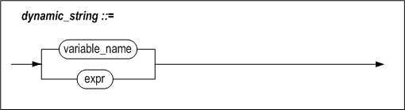
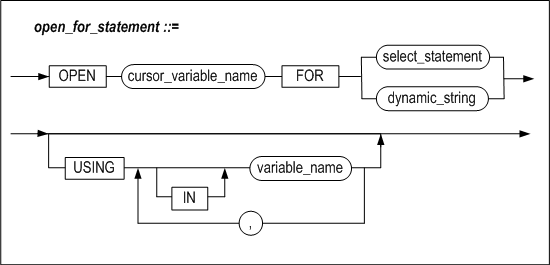
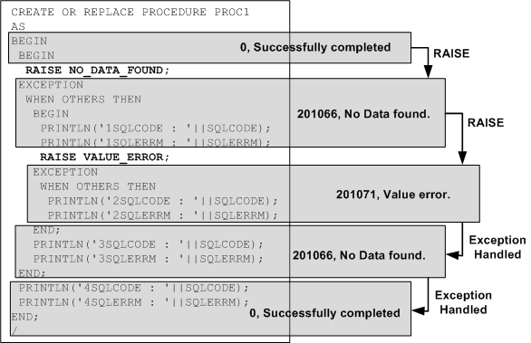
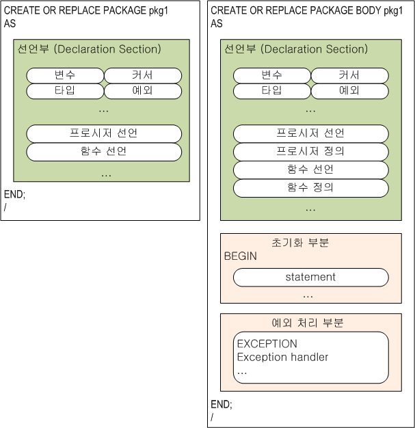
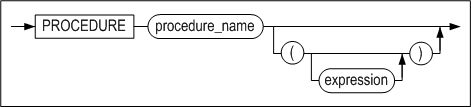
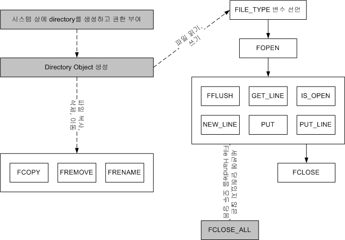

<!-- START doctoc generated TOC please keep comment here to allow auto update -->
<!-- DON'T EDIT THIS SECTION, INSTEAD RE-RUN doctoc TO UPDATE -->

[Stored Procedures Manual](#stored-procedures-manual)
- [8.동적 SQL](#8%EB%8F%99%EC%A0%81-sql)
  - [동적 SQL의 개요](#%EB%8F%99%EC%A0%81-sql%EC%9D%98-%EA%B0%9C%EC%9A%94)
  - [EXECUTE IMMEDIATE](#execute-immediate)
  - [OPEN FOR](#open-for)
- [9.예외 처리](#9%EC%98%88%EC%99%B8-%EC%B2%98%EB%A6%AC)
  - [개요](#%EA%B0%9C%EC%9A%94)
  - [EXCEPTION](#exception)
  - [RAISE](#raise)
  - [RAISE_APPLICATION_ERROR](#raise_application_error)
  - [사용자 정의 예외](#%EC%82%AC%EC%9A%A9%EC%9E%90-%EC%A0%95%EC%9D%98-%EC%98%88%EC%99%B8)
  - [SQLCODE와 SQLERRM](#sqlcode%EC%99%80-sqlerrm)
  - [Exception Handler](#exception-handler)
- [10.프라그마(Pragma)](#10%ED%94%84%EB%9D%BC%EA%B7%B8%EB%A7%88pragma)
  - [개요](#%EA%B0%9C%EC%9A%94-1)
  - [자율 트랜잭션 프라그마(Autonomous_Transaction Pragma)](#%EC%9E%90%EC%9C%A8-%ED%8A%B8%EB%9E%9C%EC%9E%AD%EC%85%98-%ED%94%84%EB%9D%BC%EA%B7%B8%EB%A7%88autonomous_transaction-pragma)
  - [예외 초기화 프라그마(Exception_Init Pragma)](#%EC%98%88%EC%99%B8-%EC%B4%88%EA%B8%B0%ED%99%94-%ED%94%84%EB%9D%BC%EA%B7%B8%EB%A7%88exception_init-pragma)
- [11.저장 패키지](#11%EC%A0%80%EC%9E%A5-%ED%8C%A8%ED%82%A4%EC%A7%80)
  - [개요](#%EA%B0%9C%EC%9A%94-2)
  - [CREATE PACKAGE](#create-package)
  - [CREATE PACKAGE BODY](#create-package-body)
  - [ALTER PACKAGE](#alter-package)
  - [DROP PACKAGE](#drop-package)
  - [EXECUTE](#execute)
- [12.Altibase 저장 프로시저와 내장 함수](#12altibase-%EC%A0%80%EC%9E%A5-%ED%94%84%EB%A1%9C%EC%8B%9C%EC%A0%80%EC%99%80-%EB%82%B4%EC%9E%A5-%ED%95%A8%EC%88%98)
  - [파일 제어](#%ED%8C%8C%EC%9D%BC-%EC%A0%9C%EC%96%B4)
  - [TCP 접속 제어](#tcp-%EC%A0%91%EC%86%8D-%EC%A0%9C%EC%96%B4)
  - [DBMS Stats](#dbms-stats)
  - [그 외 함수들](#%EA%B7%B8-%EC%99%B8-%ED%95%A8%EC%88%98%EB%93%A4)
- [13.Altibase 저장 패키지](#13altibase-%EC%A0%80%EC%9E%A5-%ED%8C%A8%ED%82%A4%EC%A7%80)
  - [시스템 정의 저장 패키지](#%EC%8B%9C%EC%8A%A4%ED%85%9C-%EC%A0%95%EC%9D%98-%EC%A0%80%EC%9E%A5-%ED%8C%A8%ED%82%A4%EC%A7%80)
  - [DBMS_APPLICATION_INFO](#dbms_application_info)
  - [DBMS_ALERT](#dbms_alert)
  - [DBMS_CONCURRENT_EXEC 패키지](#dbms_concurrent_exec-%ED%8C%A8%ED%82%A4%EC%A7%80)
  - [DBMS_LOCK](#dbms_lock)
  - [DBMS_METADATA](#dbms_metadata)
  - [DBMS_OUTPUT](#dbms_output)
  - [DBMS_RANDOM](#dbms_random)
  - [DBMS_RECYCLEBIN 패키지](#dbms_recyclebin-%ED%8C%A8%ED%82%A4%EC%A7%80)
  - [DBMS_SQL](#dbms_sql)
  - [DBMS_STATS](#dbms_stats)
  - [DBMS_UTILITY](#dbms_utility)
  - [STANDARD](#standard)
  - [UTL_COPYSWAP](#utl_copyswap)
  - [UTL_FILE](#utl_file)
  - [UTL_RAW](#utl_raw)
  - [UTL_TCP](#utl_tcp)
- [A.부록: 예제](#a%EB%B6%80%EB%A1%9D-%EC%98%88%EC%A0%9C)
  - [저장 프로시저 예제](#%EC%A0%80%EC%9E%A5-%ED%94%84%EB%A1%9C%EC%8B%9C%EC%A0%80-%EC%98%88%EC%A0%9C)
  - [파일 제어 예제](#%ED%8C%8C%EC%9D%BC-%EC%A0%9C%EC%96%B4-%EC%98%88%EC%A0%9C)

<!-- END doctoc generated TOC please keep comment here to allow auto update -->


Altibase® Application Development

Stored Procedures Manual 
========================


Altibase Application Development Stored Procedures Manual

Release 7.1

Copyright ⓒ 2001\~2019 Altibase Corp. All Rights Reserved.

본 문서의 저작권은 ㈜알티베이스에 있습니다. 이 문서에 대하여 당사의 동의 없이
무단으로 복제 또는 전용할 수 없습니다.

**㈜알티베이스**

08378 서울시 구로구 디지털로 306 대륭포스트타워Ⅱ 10층

전화: 02-2082-1114 팩스: 02-2082-1099

고객서비스포털: <http://support.altibase.com>

homepage: [http://www.altibase.com](http://www.altibase.com/)


8.동적 SQL
--------

이 장에서는 저장 프로시저와 저장 함수에서 동적 SQL을 사용하는 방법을 설명한다.


### 동적 SQL의 개요 

동적 SQL(Dynamic SQL)은 실행 시간에 사용자가 원하는 질의를 만들어서 실행하는
것이다.

일반적인 저장 프로시저의 SQL 실행 방법은 정적인(Static) 방법으로, 저장
프로시저가 최초로 실행될 때 SQL문의 실행계획이 생성된다. 그러나 저장 프로시저를
실행할 때 결정되는 SQL 구문은 동적 SQL을 사용해야 한다.

#### 동적 SQL의 실행

아래 다이어그램은 정적 SQL과 동적 SQL이 포함된 저장 프로시저를 생성하고 실행할
때 Altibase 내부에서 이를 수행하는 과정을 비교하고 있다.


[그림 8‑1] 정적 SQL과 동적 SQL의 실행 과정 비교

[그림 8- 1]의 왼쪽 저장 프로시저는 ‘DELETE FROM T1’ 문을 정적으로 처리한 것이고,
오른쪽 저장 프로시저는 동일한 DELETE 문을 EXECUTE IMMEDIATE를 사용하여 동적으로
처리한 것이다.

전자는 프로시저가 최초로 실행되는 시점에 DELETE문에 대한 실행계획이 만들어져
Plan Cache에 저장되고, 반복 호출 시 Plan Cache에서 실행계획을 찾아서 수행
(EXECUTE)한다. 후자도 마찬가지로 프로시저가 최초로 호출되는 시점에 DELETE 문에
대해 실행계획이 생성되어 Plan Cache에 저장된다.

#### 특징

동적 SQL의 장점은 저장 프로시저 실행 시에 SQL문을 사용자 마음대로 변경하여
실행시킬 수 있다는 것이다. 또한 SQL문의 종류에 관계없이 DBMS가 지원하는 SQL은
무엇이든 실행시킬 수 있다.

동적 SQL은 다음의 상황에서 유용하다.

-   쿼리할 테이블의 이름이 실행시에 결정 될 때

-   상황에 따라 질의의 힌트나 조건절의 조건 연산자를 바꾸어 실행할 필요가 있을
    때

-   DDL과 DML구문이 빈번하게 일어나서 저장 프로시저 내의 SQL문을 그 때 그때
    최적화할 필요가 있을 때

-   실행 비용이 최적화 비용보다 큰 SQL을 자주 실행할 필요가 있을 때

-   재활용성 가능성이 높은 저장 프로시저가 필요할 때

단, 동적 SQL문은 문장의 생성, 삭제 및 바인딩 비용이 매우 크므로 정적 SQL과
비교해서 낮은 성능을 보일 수 있다. 동적 SQL문의 사용은 응용프로그램 구조를
유연하게 하는 반면 성능을 저하시킬 수 있다.

### EXECUTE IMMEDIATE

동적으로 DDL, DCL, DML 및 단일 레코드를 결과로 반환하는 SELECT 질의를 실행하기
위해 사용한다.

#### 구문




#### 설명

##### dynamic_string 

실행할 질의문을 가지는 문자열이다.

##### INTO

INTO절은 SELECT ... INTO 구문과 마찬가지로 가져온 결과 집합을 저장할 변수들을
명시한다.

##### bulk_collect_clause

BULK COLLECT 절은 SELECT 문의 수행 결과를 한꺼번에 가져온다. INTO 뒤에는
SELECT문이 반환하는 레코드들을 저장하기 위해 RECORD 타입 변수의 배열 또는
레코드의 각 칼럼에 대응하는 호스트 변수의 배열이 칼럼 개수만큼 와야 한다.

BULK COLLECT 절을 사용해서 질의문의 결과 집합을 한번에 배열로 가져오는 방법이
loop문을 사용해서 결과 행을 한 건씩 가져오는 것보다 더 효율적이다.

##### USING

USING절은 실행 시에 SQL구문에 바인드할 인자를 명시하는데 사용된다. 인자는 SQL문
내의 물음표 (“?”) 위치에 보이는 순서대로 바인드 된다. IN, OUT, IN/OUT 인자를
지정할 수 있다.

#### 예제

다음은 DML문을 동적 SQL을 사용해서 실행하는 예제이다.

```
CREATE PROCEDURE fire_emp(v_emp_id INTEGER) AS
BEGIN
  EXECUTE IMMEDIATE
  'DELETE FROM employees WHERE eno = ?'
    USING v_emp_id;
END;
/

CREATE PROCEDURE insert_table (
      table_name  VARCHAR(100), 
      dept_no     NUMBER, 
      dept_name   VARCHAR(100), 
      location    VARCHAR(100))
AS
      stmt    VARCHAR2(200);
BEGIN
   stmt := 'INSERT INTO ' || table_name || 
           ' values (?, ?, ?)';
   EXECUTE IMMEDIATE stmt
           USING dept_no, dept_name, location;
END;
/
```

EXECUTE IMMEDIATE dynamic_string 구문은 해당 질의문을 Direct-Execute 방식으로
실행한다. USING 뒤에 나오는 변수는 바인드할 인자이다. DDL 및 DCL의 경우도 DML과
마찬가지로 EXECUTE IMMEDIATE를 사용하여 실행할 수 있다.

#### 제약사항

저장 프로시저 내에서 동적 SQL 형태로 사용 가능한 질의문은 다음과 같다.

-   DML  
    SELECT, INSERT, UPDATE, DELETE, MOVE, MERGE, LOCK TABLE, ENQUEUE, DEQUEUE

-   DDL  
    CREATE, ALTER, DROP

-   DCL  
    ALTER SYSTEM, ALTER SESSION, COMMIT, ROLLBACK

동적 SQL사용을 지원하지 않는 구문은 다음과 같다.

-   iSQL을 통해서만 실행할 수 있는 구문

-   SELECT \* FROM tab;

-   DESC table_name

-   SET TIMING

-   SET AUTOCOMMIT

-   CONNECT

-   DISCONNECT

### OPEN FOR 

이 구문은 커서변수 (REF CURSOR)를 초기화하고 쿼리를 수행하여 결과 집합을
결정하는 데 사용된다. 결과 집합의 데이터는 FETCH 문을 사용해서 가져올 수도 있고,
저장 프로시저의 인자를 사용해서 클라이언트로 전달할 수도 있다. USING 절을
이용하여 인자를 바인딩할 수도 있다.

#### 구문



#### 설명

##### cursor_variable_name 

REF CURSOR 타입의 커서 변수의 이름이다.

##### select_statement

select_statement는 실행될 질의문이다. SELECT구문만 사용할 수 있으며 USING 절과
함께 사용할 수 없다.

##### dynamic_string 

dynamic_string은 실행될 질의문이다. 문자열 형태의 SELECT 구문만 사용할 수 있다.

##### USING

USING 절은 실행 시에 SQL구문에 바인드할 인자를 명시하는 데 사용된다. 인자는
SQL문 내의 물음표 (“?”) 위치에 보이는 순서대로 바인드 된다.

#### 예제

다음은 여러 행을 가져오는 동적 SQL문의 실행 결과를 클라이언트로 전달하기 위해서,
프로시저 내부에서 REF CURSOR타입의 커서 변수를 사용하는 예제이다.

클라이언트로 전달된 커서변수를 통하여 결과집합을 FETCH하는 방법은 Precompiler
User's Manual, CLI User's Manual, API User's Manual 을 참고한다.

```
CREATE OR REPLACE PROCEDURE fetch_employee
AS
  TYPE MY_CUR IS REF CURSOR;
  emp_cv MY_CUR;
  emp_rec employees%ROWTYPE;
  stmt VARCHAR2(200);
  v_job VARCHAR2(10) := 'webmaster';
BEGIN
  stmt := 'SELECT * FROM employees WHERE emp_job = ?';
  OPEN emp_cv FOR stmt USING v_job;
  LOOP
    FETCH emp_cv INTO emp_rec;
    EXIT WHEN emp_cv%NOTFOUND;
    PRINTLN('[Name]: ' || emp_rec.e_firstname || emp_rec.e_lastname || 
            ' [Job Id]: ' || emp_rec.emp_job);
  END LOOP;
  CLOSE emp_cv;
END;
/ 
```


9.예외 처리
---------

### 개요

저장 프로시저 수행 중에 발생하는 예외 (Exception)는 예외 처리부에서 각 예외 별로
지정하여 처리할 수 있다.

#### 종류

Altibase 저장 프로시저에서 발생하는 예외에는 두 가지 종류가 있다.

-   시스템 정의 예외 (System-defined Exception)

-   사용자 정의 예외 (User-defined Exception)

저장 프로시저가 지원하는 예외에는 와 사용자가 임의로 정의하여 사용할 수 있는 가
있다.

##### 시스템 정의 예외

시스템 정의 예외는 Altibase 내에 미리 정의해 둔 것으로, 저장 프로시저의 선언부에
따로 선언할 필요가 없다.

발생 가능한 몇몇 시스템 정의 예외는 다음과 같다.

| 예외 이름           | 발생 원인                                                                                                                                                                              |
|---------------------|----------------------------------------------------------------------------------------------------------------------------------------------------------------------------------------|
| CURSOR_ALREADY_OPEN | 이미 열려 있는 커서를 닫지 않고 다시 열려고 하는 경우 발생한다. Cursor FOR LOOP의 경우 내부에서 묵시적으로 커서가 열리므로 루프 내에서 OPEN문을 사용하여 명시적으로 커서를 열 수 없다. |
| DUP_VAL_ON_INDEX    | Unique 인덱스가 정의된 칼럼에 중복된 값을 입력하려 하는 경우 발생한다.                                                                                                                 |
| INVALID_CURSOR      | 열려 있지 않은 커서를 사용해서 FETCH 또는 CLOSE하려는 경우 등과 같이, 현재 커서 상태에서 수행할 수 없는 작업을 수행하려 하는 경우에 발생한다.                                          |
| NO_DATA_FOUND       | SELECT 문에 의해 반환된 데이터가 한 건도 없을 때 발생한다.                                                                                                                             |
| TOO_MANY_ROWS       | SELECT INTO문은 하나의 레코드만 반환해야 하는데 둘 이상의 레코드가 반환된 경우 발생한다.                                                                                               |

##### 사용자 정의 예외

사용자정의 예외는 사용자가 명시적으로 선언한 것으로, RAISE문을 사용해서
의도적으로 발생시켜야 한다.

```
DECLARE
  comm_missing  EXCEPTION;    -- DECLARE user defined EXCEPTION
BEGIN
  ......
  RAISE comm_missing;   -- raising EXCEPTION
  ......
  EXCEPTION
    WHEN comm_missing THEN ......
```

사용자정의 예외를 시스템 정의 예외와 같은 이름으로 정의할 경우, 사용자 정의
예외가 시스템 정의 예외보다 우선된다. 즉, 예외 처리부 내에서 사용자 정의 예외로
간주될 것이다.

#### 예외 선언

시스템 정의 예외의 경우 시스템 내부에 예외 이름이 정의되어 있으므로 명시적으로
선언할 필요가 없다.

반면에, 사용자 정의 예외의 경우 선언부에 명시적으로 그 이름을 정의한 후 사용해야
한다.

#### 예외 발생

시스템 정의 예외는 명시적으로 발생시킬 필요가 없다. 저장 프로시저 수행 도중
시스템 정의 예외가 발생하면 그 예외를 처리하는 Exception Handler가 존재하는지
확인한다. 존재할 경우 자동으로 그 쪽으로 분기해서 Exception Handler에 정의된
작업을 처리한다.

반면, 사용자 정의 예외의 경우 저장 프로시저 내에서 명시적으로 예외를 발생시켜야
한다. 사용자 정의 예외는 RAISE문을 사용해서 발생시킬 수 있다.

#### 예외 처리부

사용자 정의 예외 및 시스템 정의 예외가 발생할 경우 처리할 작업들을 여기에
정의한다.

### EXCEPTION 

#### 구문


#### 설명

사용자 정의 예외를 정의한다

##### exception_name

한 블록 내에서 유일한 이름이어야 한다. 자신이 선언된 블록의 BEGIN와 END 문
범위내에서 유효하다.

#### 예제

```
DECLARE
  error_1   EXCEPTION;
  error_2   EXCEPTION;
  error_3   EXCEPTION;
```


### RAISE 

#### 구문


#### 설명

이 구문은 명시적으로 예외를 발생시키기 위해 사용된다. 예외가 발생하면 발생한
예외에 해당하는 exception handler의 루틴으로 제어가 넘어간다.

##### exception_name

발생시키고자 하는 예외 이름을 지정한다.

이 이름은 블록 선언부에 선언되어 있는 예외 또는 시스템 정의 예외의 이름이어야
한다.

선언되지 않은 예외를 여기에 명시하면, 저장 프로시저 컴파일은 실패한다. 저장
프로시저 실행 시 예외가 발생했는데 해당하는 exception handler가 존재하지 않을
경우에는, 저장 프로시저의 수행을 중단하고 오류를 돌려 준다.

사용자 정의 예외의 경우 외부 블록과 내부 블록에 같은 예외 이름을 정의할 수도
있다. 이 경우 모호함을 없애기 위해서 각 블록에 LABEL을 붙이고 RAISE문에서는 예외
이름 앞에 LABEL 명을 명시하여 사용하면 된다.

외부 블록에서 선언된 예외는 내부 블록에서 선언된 예외에 해당하는 exception
handler내에서 발생시킬 수 있다.

예외 명을 지정하지 않아도 되는 경우는 exception handler안에서만 사용되는
경우로서 이때는 앞서 발생한 예외를 다시 한번 발생시킨다.

#### 예제

##### 예제 1

다음은 VALUE_ERROR 예외를 예외 처리부에서 처리하고, 같은 예외를 다시 발생시키는
예제이다.

```
CREATE OR REPLACE PROCEDURE PROC1
AS
BEGIN
  RAISE VALUE_ERROR;
  EXCEPTION
    WHEN VALUE_ERROR THEN
      PRINTLN('VALUE ERROR CATCHED. BUT RE-RAISE.');
      RAISE;
END;
/
iSQL> EXEC PROC1;
VALUE ERROR CATCHED. BUT RE-RAISE.        
[ERR-3116F : Value error 
0004 :   RAISE VALUE_ERROR; 
        ^                 ^ 
]
```


##### 예제2

다음은 예제 1의 PROC1에서 발생한 예외를 처리하는 예제이다

```
CREATE OR REPLACE PROCEDURE PROC2
AS
BEGIN
  PROC1;
  EXCEPTION
    WHEN OTHERS THEN
    PRINTLN('EXCEPTION FROM PROC1 CATCHED.');
    PRINTLN('SQLCODE : '||SQLCODE);
END; 
/
iSQL> EXEC PROC2;
VALUE ERROR CATCHED. BUT RE-RAISE. 
EXCEPTION FROM PROC1 CATCHED. 
SQLCODE : 201071 
Execute success.
```


### RAISE_APPLICATION_ERROR

사용자 정의 에러코드 및 에러 메시지를 가지고 예외를 발생시킨다. 에러코드는
990000부터 991000까지의 범위로, 1001 개의 사용자 에러코드가 지원된다.

#### 구문

```
RAISE_APPLICATION_ERROR (
	errcode INTEGER, 
    errmsg VARCHAR(2047) );
```

#### 파라미터

| 이름    | 입출력 | 데이터 타입 | 설명                                                      |
|---------|--------|-------------|-----------------------------------------------------------|
| errcode | IN     | INTEGER     | 사용자 정의 에러 코드 (990000 에서 991000 까지 사용 가능) |
| errmsg  | IN     | VARCHAR     | 사용자 정의 에러 메시지 텍스트                            |

#### 설명

이 프로시저는 사용자가 정의한 에러 코드와 에러메시지를 가지는 예외를 발생시킨다.

#### 예제

다음은 사용자 정의 에러를 발생시키는 예제이다. 단, iSQL에서 에러코드는 16진수
값으로 표시된다.

```
CREATE OR REPLACE PROCEDURE PROC1
AS
BEGIN
    RAISE_APPLICATION_ERROR( 990000,
	 'This is my error msg. ' );
END;
/
iSQL> EXEC PROC1;
[ERR-F1B30 : This is my error msg.
at "SYS.PROC1", line 4]
```


### 사용자 정의 예외

사용자가 직접 RAISE문을 사용해서 예외를 발생시키는 경우는 다음 2가지 경우이다.

-   사용자가 정의한 예외를 처리하는 경우

-   시스템이 정의한 예외을 처리하는 경우

#### 사용자 정의 예외의 에러코드

사용자가 정의한 예외를 처리하는 경우, SQLCODE의 값은 항상 **201232**로 고정되어
있다**.**

```
CREATE OR REPLACE PROCEDURE PROC1
AS
    E1 EXCEPTION;
BEGIN
    RAISE E1;
EXCEPTION
WHEN E1 THEN
    PRINTLN('SQLCODE: ' || SQLCODE);  -- 에러코드 출력
    PRINTLN('SQLERRM: ' || SQLERRM);  -- 에러메시지 출력
END;
/

iSQL> EXEC PROC1;
SQLCODE: 201232
SQLERRM: User-Defined Exception.
Execute success.
```

만약 이 예외를 예외 처리부에서 사용자 정의 예외로 처리하지 않는 경우, 발생하는
에러는 다음과 같다. 즉 사용자 정의 예외를 위한 exception handler가 없다는
의미이다.

```
CREATE OR REPLACE PROCEDURE PROC1
AS
    E1 EXCEPTION;
BEGIN
    RAISE E1;
END;
/

iSQL> EXEC PROC1;
[ERR-31157 : Unhandled exception : E1]
```

사용자 정의 예외가 예외 처리부에서 처리될 때는 항상 다음의 에러 코드를 가진다.

| Exception Name | Error Code(integer) | Error Code(hexadecimal) | Error Section                          |
| -------------- | ------------------- | ----------------------- | :------------------------------------- |
|                | 201232              | 31210                   | qpERR_ABORT_QSX_USER_DEFINED_EXCEPTION |

#### 시스템 정의 예외의 에러코드

시스템 정의 예외가 발생하는 경우에는 다음과 같이 시스템에 지정된 에러코드가
출력된다.

```
CREATE OR REPLACE PROCEDURE PROC1
AS
BEGIN
    RAISE NO_DATA_FOUND;
EXCEPTION
WHEN NO_DATA_FOUND THEN
    PRINTLN('SQLCODE: ' || SQLCODE);  -- 에러코드 출력
    PRINTLN('SQLERRM: ' || SQLERRM);  -- 에러메시지 출력
END;
/
iSQL> EXEC PROC1;
SQLCODE: 201066
SQLERRM: No data found.
at "SYS.PROC1", line 4
Execute success.
```

다음과 같이 시스템 정의 예외의 경우에는 별도의 예외처리를 예외 처리부에서 하지
않더라도 이미 정의된 에러코드가 출력되는 것을 볼 수 있다.

```
CREATE OR REPLACE PROCEDURE PROC1
AS
BEGIN
    RAISE NO_DATA_FOUND;
END;
/

iSQL> EXEC PROC1;
[ERR-3116A : No data found.
at "SYS.PROC1", line 4]
```

참고로 많이 사용되는 시스템 정의 예외의 에러코드는 다음과 같다. 각 예외의 원인에
대해서는 앞서 설명한 “시스템 정의 예외” 절을 참고하기 바란다.

| Exception Name        | Error Code (integer) | Error Code (hexadecimal) | Error Section                           |
|-----------------------|----------------------|--------------------------|-----------------------------------------|
| "CURSOR_ALREADY_OPEN" | 201062               | 31166                    | qpERR_ABORT_QSX_CURSOR_ALREADY_OPEN     |
| "DUP_VAL_ON_INDEX"    | 201063               | 31167                    | qpERR_ABORT_QSX_DUP_VAL_ON_INDEX        |
| "INVALID_CURSOR"      | 201064               | 31168                    | qpERR_ABORT_QSX_INVALID_CURSOR          |
| "NO_DATA_FOUND"       | 201066               | 3116A                    | qpERR_ABORT_QSX_NO_DATA_FOUND           |
| "TOO_MANY_ROWS        | 201070               | 3116E                    | qpERR_ABORT_QSX_TOO_MANY_ROWS           |
| "INVALID_PATH"        | 201237               | 31215                    | qpERR_ABORT_QSX_FILE_INVALID_PATH       |
| "INVALID_MODE"        | 201235               | 31213                    | qpERR_ABORT_QSX_INVALID_FILEOPEN_MODE   |
| "INVALID_FILEHANDLE"  | 201238               | 31216                    | qpERR_ABORT_QSX_FILE_INVALID_FILEHANDLE |
| "INVALID_OPERATION"   | 201239               | 31217                    | qpERR_ABORT_QSX_FILE_INVALID_OPERATION  |
| "READ_ERROR"          | 201242               | 3121A                    | qpERR_ABORT_QSX_FILE_READ_ERROR         |
| "WRITE_ERROR"         | 201243               | 3121B                    | qpERR_ABORT_QSX_FILE_WRITE_ERROR        |
| "ACCESS_DENIED"       | 201236               | 31214                    | qpERR_ABORT_QSX_DIRECTORY_ACCESS_DENIED |
| "DELETE_FAILED"       | 201240               | 31218                    | qpERR_ABORT_QSX_FILE_DELETE_FAILED      |
| "RENAME_FAILED"       | 201241               | 31219                    | qpERR_ABORT_QSX_FILE_RENAME_FAILED      |

모든 에러 코드 리스트는 Error Message Reference를 참조한다.

### SQLCODE와 SQLERRM 

SQLCODE, SQLERRM은 SQL문 수행 시 발생한 예외에 해당하는 에러코드와 메시지를
얻어와서 이에 대한 적절한 대응을 하기 위해 Exception Handler에서 사용된다.

SQLCODE, SQLERRM에 에러가 세팅 되는 경우는 다음과 같다.

-   저장 프로시저 실행 도중 에러가 발생한 경우

-   사용자 정의 예외가 발생한 경우

-   시스템 정의 예외가 발생한 경우

-   사용자가 RAISE_APPLICATION_ERROR로 자신이 정의한 에러를 발생시킨 경우

-   Exception Handler 내에서 다시 RAISE하는 경우

위와 같은 경우 기존의 SQLCODE와 SQLERRM는 새로 발생한 에러코드와 에러메시지로
변경된다.

또한, Exception Handler가 정상적으로 동작한 후에는 SQLCODE와 SQLERRM의 값은 예외
발생 이전의 에러코드와 에러메시지로 원복 되는데, 이는 LIFO (last in, first out)
스택의 원리로 동작하기 때문이다.

따라서, 한번 발생한 예외로 인해 SQLCODE와 SQLERRM에 셋팅된 값은 그 블록의 상위
블록으로 제어가 넘어가지 않는 한 스택에 계속 남아있게 된다.

다음의 예제를 보면,

```
CREATE OR REPLACE PROCEDURE PROC1
AS
BEGIN
  BEGIN
    RAISE NO_DATA_FOUND;
  EXCEPTION
    WHEN OTHERS THEN
      BEGIN
        PRINTLN('1SQLCODE : '||SQLCODE);
        PRINTLN('1SQLERRM : '||SQLERRM);
        RAISE VALUE_ERROR;
      EXCEPTION
        WHEN OTHERS THEN
          PRINTLN('2SQLCODE : '||SQLCODE);
          PRINTLN('2SQLERRM : '||SQLERRM);
      END;
    PRINTLN('3SQLCODE : '||SQLCODE);
    PRINTLN('3SQLERRM : '||SQLERRM);
  END;
  PRINTLN('4SQLCODE : '||SQLCODE);
 PRINTLN('4SQLERRM : '||SQLERRM);
END;
/
```

위 예제의 경우 다음과 같은 결과를 출력한다.

```
iSQL> EXEC PROC1;
1SQLCODE : 201066
1SQLERRM : No data found.
at "SYS.PROC1", line 5
2SQLCODE : 201071
2SQLERRM : Value error
at "SYS.PROC1", line 11
3SQLCODE : 201066
3SQLERRM : No data found.
at "SYS.PROC1", line 5
4SQLCODE : 0
4SQLERRM : Successfully completed
Execute success.
```

이를 도식화하면 SQLCODE, SQLERRM의 범위는 다음과 같음을 알 수 있다.



### Exception Handler

#### 구문


#### 기능

Exception Handler에는 예외가 발생했을 때의 처리 루틴을 기술한다.

예외가 발생했을 때, Altibase는 어느 exception handler에 제어를 넘길 것인지
결정한다. Exception Handler를 찾아내는 규칙은 다음과 같다.

-   현재 블록부터 시작하여 현재 블록을 포함하고 있는 바깥 블록들로 예외의 이름이
    같은 Exception Handler를 찾는다. 도중에 어느 한 블록에서라도 OTHERS 핸들러를
    만나게 되면 OTHERS 핸들러에서 예외처리를 하게 된다.

-   맨 바깥블록까지 Exception Handler가 발견되지 않는다면, 사용자에게 “Unhandled
    Exception” 에러를 출력하고 프로시저의 수행은 즉시 중지된다.

발생한 에러를 확인하기 위해 exception handler에서 SQLCODE와 SQLERRM을 사용할 수
있다. 즉, SQLCODE는 Altibase 에러코드 번호를 반환하고, SQLERRM은 대응하는 에러
메시지를 반환하다.

SQLCODE와 SQLERRM은 SQL구문에서 직접 사용할 수는 없다. 대신에 그 값을 지역
변수에 대입하고 그 변수를 SQL 구문에서 사용하면 된다.

##### exception name

처리 하고자 하는 시스템 정의 예외 또는 사용자 정의 예외의 이름을 기술한다.

예외 발생시에 동일한 처리를 하고자 하는 예외들을 OR로 묶어서 하나의 루틴으로
처리할 수 있다.

##### others

이전에 기술된 모든 Exception Handler에서 현재 발생한 예외를 처리하지 못할 경우
최종적으로 OTHERS 루틴에서 처리된다.

#### 예제

##### 예제1

```
CREATE TABLE t1(i1 INTEGER, i2 INTEGER, i3 INTEGER);

CREATE TABLE t2(i1 INTEGER, i2 INTEGER, i3 INTEGER);
INSERT INTO t1 VALUES(1,1,1);
INSERT INTO t1 VALUES(2,2,2);

CREATE OR REPLACE PROCEDURE proc1
AS
BEGIN
  DECLARE
    CURSOR c1 IS SELECT * FROM t1;
      v1 INTEGER;
      v2 INTEGER;
      v3 INTEGER;
  BEGIN
    -- OPEN c1;

    FETCH c1 INTO v1, v2, v3;
    INSERT INTO t2 VALUES (v1, v2, v3);

    CLOSE c1;

  EXCEPTION
    WHEN INVALID_CURSOR THEN
    INSERT INTO t2 VALUES (-999, -999, -999);

  END;

END;
/

iSQL> EXEC proc1;
Execute success.

iSQL> SELECT * FROM t2;
T2.I1       T2.I2       T2.I3       
----------------------------------------
-999        -999        -999        
1 row selected.
```


##### 예제2

```
CREATE TABLE t1(i1 INTEGER, i2 INTEGER, i3 INTEGER);

CREATE OR REPLACE PROCEDURE proc1(p1 IN INTEGER)
AS
  v1 INTEGER;
  err1 EXCEPTION;
BEGIN
  IF p1 < 0 THEN
    RAISE err1;
  END IF;

  SELECT i1 INTO v1 FROM t1;

EXCEPTION
  WHEN NO_DATA_FOUND OR TOO_MANY_ROWS THEN
    INSERT INTO t1 VALUES(1,1,1);
  WHEN OTHERS THEN
    INSERT INTO t1 VALUES(0,0,0);

END;
/

iSQL> EXEC proc1(1);
Execute success.
iSQL> SELECT * FROM t1;
T1.I1       T1.I2       T1.I3       
----------------------------------------
1           1           1           
1 row selected.
iSQL> EXEC proc1(-8);
Execute success.
iSQL> SELECT * FROM t1;
T1.I1       T1.I2       T1.I3       
----------------------------------------
1           1           1           
0           0           0           
2 rows selected.
```


##### 예제3

```
CREATE TABLE t1(i1 INTEGER NOT NULL);

CREATE OR REPLACE PROCEDURE proc1
AS
  code INTEGER;
  errm VARCHAR(200);
BEGIN
  INSERT INTO t1 VALUES(NULL);
EXCEPTION
WHEN OTHERS THEN

-- 변수 code에 SQLCODE 에러코드 값 대입
 code := SQLCODE;

-- 변수 errm에 SQLERRM 에러 메시지 저장

errm := SUBSTRING(SQLERRM, 1, 200);
  system_.println('SQLCODE : ' || code);
  system_.println('SQLERRM : ' || errm);
END;
/

iSQL> EXEC proc1;
SQLCODE : 200820
SQLERRM : Unable to insert (or update) NULL into NOT NULL column.
at "SYS.PROC1", line 6
Execute success.
```


10.프라그마(Pragma)
----------------

### 개요

프라그마(Pragma)를 사용하면 프라그마의 종류에 따라 컴파일 동작이 달라진다.
프라그마는 저장 프로시저, 저장 함수, 저장 패키지에서 사용할 수 있다.

#### 종류

Altibase에서 사용할 수 있는 프라그마는 아래와 같다. 각각의 프라그마에 대해서는
다음 절에서 설명한다.

-   자율 트랜잭션 프라그마(Autonomous_Transaction Pragma)

-   예외 초기화 프라그마(Exception_Init Pragma)

#### 구문


### 자율 트랜잭션 프라그마(Autonomous_Transaction Pragma) 

#### 구문


#### 기능

자율 트랜잭션 프라그마(Autonomous transaction Pragma)를 사용하면 PSM 객체가
트랜잭션 내에서 동작하는 방식을 변경할 수 있다. 자율 트랜잭션 프라그마는 PSM
객체 생성의 컴파일 시에 설정된다.

자율 트랜잭션 프라그마가 설정된 PSM 객체는 독립적으로 동작하여 주 트랜잭션과
자원을 공유하지 않는다. 따라서 락, 커밋, 복구 등의 동작이 독립적으로 수행된다.
자율 트랜잭션 프라그마는 모듈 중심 또는 재사용성이 높은 프로그램을 작성할 때
유용하다.


자율 트랜잭션 프라그마를 정의할 수 있는 위치는 아래와 같다.

-   최상위 저장 프로시저

-   최상위 저장 함수

-   최상위 저장 패키지의 서브 프로그램

-   트리거의 psm_body

자율 트랜잭션과 중첩 트랜잭션의 차이는 아래와 같다.

|                 | 자율 트랜잭션                                                                                | 중첩 트랜잭션                                                                              |
|-----------------|----------------------------------------------------------------------------------------------|--------------------------------------------------------------------------------------------|
| 예외처리        | 트랜잭션 단위의 예외처리 (자율 트랜잭션에서 오류 발생시 트랜잭션 수준의 복구)                | 문장 단위의 예외처리                                                                       |
| 트랜잭션 의존성 | 독립적인 트랜잭션                                                                            | 연관성 있는 트랜잭션과 의존적                                                              |
| 가시성          | 자율 트랜잭션 종료 시에 다른 세션에서 상태 확인 가능.                                        | 중첩 트랜잭션의 종료 후에도 commit 수행이 되지 않았다면 다른 세션에서 확인 불가능          |
| 자원 공유 여부  | 다른 트랜잭션과 자원을 공유하지 않음 (lock, savepoint , rollback , commit은 독립적으로 동작) | 연관성이 있는 트랜잭션과 자원 공유 (lock, savepoint , rollback , commit은 의존적으로 동작) |

#### 주의사항

자율 트랜잭션은 주 트랜잭션과 잠금, 자원 사용, 커밋 종속성 여부를 공유하지
않으므로 주 트랜잭션이 복구(rollback)되더라도 자율 트랜잭션이 수행된 내용이
복구(rollback)되지 않는다.

자율 트랜잭션은 주 트랜잭션과 별도로 동작하기 때문에 주 트랜잭션에서 참조 중인
객체에 접근할 때 교착상태 (deadlock)에 빠질 수 있다.

#### 예제

##### 저장 프로시저에서 pragma autonomous_transaction 선언

```
iSQL> create table t1(c1 integer);
Create success.
iSQL> create or replace procedure proc1 as
pragma autonomous_transaction;
begin
insert into t1 values ( 1 );
commit;
end;
/
Create success.
```


##### 저장 함수에서 pragma autonomous_transaction 선언

```
iSQL> create table t1(c1 integer);
Create success.
iSQL> create or replace function sub2 return integer as
pragma autonomous_transaction;
begin
insert into t1 values ( 100 );
commit;
return 100;
end;
/
Create success
```


##### 패키지 서브프로그램에서 pragma autonomous_transaction 선언

```
iSQL> create table t1(c1 integer);
Create success.
iSQL> create or replace package pkg1 as
procedure sub1;
function sub2 return integer;
end;
/
Create success.
iSQL> create or replace package body pkg1 as
procedure sub1 as
pragma autonomous_transaction;
begin
insert into t1 values ( 1 );
commit;
end;
function sub2 return integer as
pragma autonomous_transaction;
begin
insert into t1 values ( 100 );
commit;
return 100;
end;
end;
/
Create success.
```


##### 트리거에서 pragma autonomous_transaction 선언

```
iSQL>create table t1( c1 integer );
Create success.
iSQL>create table t2( c1 integer );
Create success.
iSQL>insert into t1 values(1);
1 row inserted.
iSQL>create or replace trigger tri1
after insert on t1
for each row
pragma autonomous_transaction;
var1 integer;
var2 integer;
begin
var1 := 1;
select c1 into var2 from t1 where c1 = var1;
insert into t2 values( var2 + var1 );
commit;
end;
/
Create success.
iSQL>insert into t1 values ( 2 );
1 row inserted.
iSQL> select * from t1;
C1
--------------
1
2
2 rows selected.
iSQL> select * from t2;
C1
--------------
2
1 row selected.
```


### 예외 초기화 프라그마(Exception_Init Pragma)

#### 구문


#### 기능

예외 초기화 프라그마(Exception init Pragma)는 사용자가 예외 변수를 Altibase의
에러 코드로 초기화 할 수 있는 기능이다. 사용자는 예외 핸들링의 OTHERS 핸들러를
대신하여 Altibase 에러 코드로 초기화된 예외 변수를 사용할 수 있다.

예외 초기화 프라그마를 정의할 수 있는 위치는 아래와 같다.

-   저장 프로시저의 선언부

-   저장 함수의 선언부

-   저장 패키지의 선언부

-   저장 패키지 서브프로그램의 선언부

##### exception_name

초기화 할 예외 변수를 지정한다. 이 예외 변수는 프라그마와 동일한 블록에
선언되어야 한다.

##### error_code

exception_name에서 설정한 예외가 발생할 때 발생하는 Altibase에러 코드 번호를
지정한다. Altibase에러 코드에 대한 자세한 정보는 *Error Message Reference*를
참고한다.

#### 예제

##### 특정 예외가 발생

에러 번호가 201070를 발생하는 저장 프로시저의 에러 메시지를 “Too many rows”로
초기화한다.

```
iSQL> create table t1(c1 integer);
Create success.
iSQL> insert into t1 values ( 1 );
1 row inserted.
iSQL> insert into t1 values ( 2 );
1 row inserted.
iSQL> select * from t1;
C1
--------------
1
2
2 rows selected.
iSQL> create or replace procedure proc1 as
v1 integer;
e1 exception;
pragma exception_init(e1, 201070 );
begin
select c1 into v1 from t1;
exception
when e1 then
println(SQLERRM);
println('catch exception');
end;
/
Create success.
iSQL> exec proc1;
Too many rows
at "SYS.PROC1", line 6
catch exception
Execute success.
```


##### 위의 예제에서 예외 핸들러를 Others로 변경한 저장 프로시저

```
iSQL> create table t1(c1 integer);
Create success.
iSQL> insert into t1 values ( 1 );
1 row inserted.
iSQL> insert into t1 values ( 2 );
1 row inserted.
iSQL> select * from t1;
C1
--------------
1
2
2 rows selected.
iSQL> create or replace procedure proc1 as
    v1 integer;
    e1 exception;
    begin
    select c1 into v1 from t1;
    exception
    when others then
    println(SQLERRM);
    println('catch exception');
    end;
    /
Create success.
iSQL> exec proc1;
Too many rows
at "SYS.PROC1", line 5
catch exception
Execute success.
```


##### 예외변수e1에 초기화한 예외와 다른 에러가 발생한 경우

초기화한 예외는 "Too many rows" 이며, 실제 발생한 에러는 "No data found" 이다.

```
iSQL> create or replace procedure proc2 as
v1 integer;
e1 exception;
pragma exception_init(e1, 201070 );
begin
select c1 into v1 from t1 where c1 = 3;
end;
/
Create success.
iSQL> exec proc2;
[ERR-3116A : No data found.
at "SYS.PROC2", line 6]
```


11.저장 패키지
-----------

이 장은 저장 패키지를 생성하고 사용하는 방법을 설명한다.

### 개요

패키지(package)는 저장 프로시저에서 사용되는 사용자 정의 타입, 변수, 상수, 서브
프로그램(procedure 또는 function), 커서 및 예외(exception)을 그룹화한 객체이다.
패키지는 패키지 스펙(package specification)과 패키지 바디(package body)로
이루어진다. 패키지는 하나의 스펙을 가지며, 패키지 스펙은 사용자 정의 타입을
정의하거나, 변수, 상수, 서브 프로그램(procedure 또는 function), 커서 또는
예외(exception)를 선언한다. 또한 패키지의 서브 프로그램을
다중정의(overloading)하여 사용할 수 있다. 선언된 객체는 패키지 외부에서 참조할
수 있다. 즉, 패키지 스펙을 애플리케이션 프로그래밍 인터페이스(API)로 보아도
무방하다.

패키지 스펙에 커서나 서브프로그램이 포함되어 있다면, 해당 패키지에 대해 반드시
패키지 바디를 생성해야 한다. 이 패키지 바디에는 커서를 위한 쿼리와
서브프로그램을 위한 코드를 정의해야 한다. 패키지 바디에도 객체를 선언하고 정의할
수 있지만, 이렇게 선언된 객체는 패키지 외부에서 접근이 불가능하다.

마지막으로 패키지 바디는 초기화 부분과 예외 처리 부분을 포함할 수 있다. 이
초기화 부분은 세션 별로 최초 패키지 실행 시 한 번만 실행된다. 패키지 바디는
사용자의 직접적인 접근이 불가능하며, 그 내용이 변하더라도 패키지 스펙에는 영향을
주지 않는다. 패키지 바디는 패키지의 내부 객체가 참조될 때 실제로 실행되는
부분이며, 패키지 스펙은 이러한 내용을 외부로부터 보호하는 역할을 한다. 패키지는
세션 별로 최초 실행 시 메모리에 로딩되어, 해당 세션이 종료되기 전까지 유지된다.

#### 특징

-   모듈화  
    한 업무와 관련된 타입, 변수, 상수, 커서, 예외 및 서브프로그램 등의 객체를
    모듈화하는 것이 가능하다.

-   응용프로그램 작성 용이  
    모듈화를 함으로써 응용프로그램 작성과 유지보수가 쉬워진다.

-   정보 보호  
    패키지 바디는 패키지 스펙을 통해서만 접근이 가능하기 때문에 상세한 구현
    내용을 숨길 수 있다. 따라서, 패키지 바디에 대해서는 외부로부터의 접근을
    막아서 정보 보호가 가능하다.

-   성능 향상  
    최초로 패키지를 실행할 때 패키지를 세션에 로딩해 두기 때문에, 동일한
    세션에서 반복 호출 시 실행 속도가 빠르다.

#### 구조

하나의 패키지는 패키지 스펙과 패키지 바디로 구성된다. 패키지 스펙과 바디의
선언부(declaration section)에는 타입, 변수, 상수, 커서, 예외 및 서브프로그램
등을 선언할 수 있으며, 바디에는 선언된 객체를 구체적으로 정의할 수 있다.

패키지 바디의 초기화 부분은 선택적인 기능으로써, 세션 별로 최초 패키지 실행 시
한 번만 실행된다. 초기화 부분은 패키지 내에서 선언되거나 참조되는 변수들의 값을
셋팅하기 위해 주로 사용된다. 또한, 패키지 바디에는 예외 처리 부분도 기술될 수
있다.

아래 그림은 패키지 스펙과 바디의 구조를 도식화한 것이다.




#### 제약 사항

-   패키지 내에 정의된 커서는 서브프로그램이 실행되는 동안 유지된다. 즉,
    서브프로그램의 실행이 종료되면 커서는 묵시적으로 닫힌다.


### CREATE PACKAGE 

#### 구문

##### create_package ::=


##### invoker_rights_clause::=


##### declare_section ::=


##### procedure_declaration ::=



##### function_declaration ::=


#### 기능

패키지 스펙을 생성하거나 이미 생성되어 있는 패키지 스펙을 대체한다.

##### invoker_rights_clause

패키지를 실행할 때 생성자(DEFINER)권한으로 실행할지 실행자(CURRENT_USER)
권한으로 실행할지 명시할 수 있다. 이 절을 생략하면 생성자 권한으로 패키지가
실행된다.

-   AUTHID CURRENT_USER  
    패키지 사용자가 소유한 객체를 참조하여 패키지를 실행한다.

-   AUTHID DEFINER  
    패키지 생성자( DEFINER)의 객체를 참조하여 생성자 권한으로 실행한다.

##### declare_section

사용자 정의 타입을 정의하거나, 변수, 상수, 서브 프로그램(프로시저 또는 함수),
커서 및 예외를 선언한다. *type_definition*의 문법은 6장의 "사용자 정의 타입의
정의"절을 참고하고, variable, constant, cursor, 및 exception 선언절의 문법은
3장의 "[지역 변수 선언](#지역-변수-선언)"절을 참고하기 바란다.

#### 예제

##### 예제 1

사용자 정의 타입, 변수, 프로시저, 및 함수를 포함하는 패키지 스펙을 생성하는
예제이다.

```
CREATE OR REPLACE PACKAGE pkg1 AS
TYPE rec1 IS RECORD(c1 INTEGER, c2 INTEGER);
v1 rec1;
v2 INTEGER;
PROCEDURE proc1;
FUNCTION func1 RETURN INTEGER;
END;
/
```


##### 예제 2 (AUTHID CURRENT_USER)

###### **객체 생성: user1**

```
iSQL> connect user1/user1;
Connect success.
 
iSQL> create table t1( c1 integer );
Create success.
  
iSQL> insert into t1 values ( 1 );
1 row inserted.
  
iSQL> create or replace package pkg1 authid current_user as
     var1 integer;
     procedure sub1;
     end;
     /
Create success.
 
iSQL> create or replace package body pkg1 as
     procedure sub1 as
     begin
     select c1 into var1 from t1;
     println( var1 );
     end;
     end;
     /
Create success.
 
iSQL> select package_name , package_type , authid
      from system_.sys_packages_
      where package_name = 'PKG1';
PACKAGE_NAME     
----------------------------
PACKAGE_TYPE AUTHID      
----------------------------
PKG1                                                                                                                              
6           1          
PKG1                                                                                                                              
7           1          
2 rows selected.
```


###### **객체 생성: user2**

```
iSQL> connect user2/user2;
Connect success.
 
iSQL> create table t1( c1 integer );
Create success.
 
iSQL> insert into t1 values ( 100 );
1 row inserted.
```


###### **패키지 실행: user1**

```
iSQL> exec pkg1.sub1;
1
Execute success.
```


###### **패키지 실행: user2**

```
iSQL> exec user1.pkg1.sub1;
100
Execute success.
```


##### 예제 3 (AUTHID DEFINER)

###### **객체 생성: user1**

```
iSQL> connect user1/user1;
Connect success.
 
iSQL> create table t1( c1 integer );
Create success.
 
iSQL> insert into t1 values ( 1 );
1 row inserted.
 
 
iSQL> create or replace package pkg1 authid definer as
     var1 integer;
     procedure sub1;
     end;
     /
Create success.
 
iSQL> create or replace package body pkg1 as
    
     procedure sub1 as
     begin
     select c1 into var1 from t1;
     println( var1 );
     end;
    
     end;
     /
Create success.
 
iSQL> select package_name , package_type , authid
    2 from system_.sys_packages_
    3 where package_name = 'PKG1';
PACKAGE_NAME                                                                                                                      
------------------------------------------------------------------------------------------------------------------------------------
PACKAGE_TYPE AUTHID      
----------------------------
PKG1                                                                                                                              
6           0          
PKG1                                                                                                                              
7           0          
2 rows selected.
```


###### **객체 생성: user2**

```
iSQL> connect user2/user2;
Connect success.
 
iSQL> create table t1( c1 integer );
Create success.
 
iSQL> insert into t1 values ( 100 );
1 row inserted.
```


###### **패키지 실행: user1**

```
iSQL> exec pkg1.sub1;
1
Execute success.
```


###### **패키지 실행: user2**

```
iSQL> exec user1.pkg1.sub1;
1
Execute success.
```


### CREATE PACKAGE BODY

#### 구문

##### create_package_body ::=


##### initialize_section::=


##### declare_section ::=


#### 기능

패키지 바디를 생성하거나 이미 생성되어 있는 패키지 바디를 대체한다.

##### declare_section

패키지 스펙에 선언된 모든 커서 및 서브프로그램을 정의한다. 패키지 스펙의 각
서브프로그램 선언과 대응하는 패키지 바디의 정의가 일치해야 한다.

패키지 내부에서만 참조할 수 있는 객체를 선언하고 정의할 수도 있다.
*type_definition*의 문법은 6장의 "사용자 정의 타입의 정의"절을 참고하고,
variable, constant, cursor, 및 exception 선언절의 문법은 3장의 "[지역 변수
선언](#지역-변수-선언)"절을 참고하기 바란다. 프로시저와 함수 정의 문법은 2장의
"CREATE PROCEDURE" 및 "CREATE FUNCTION" 절을 참고하라.

##### initialize_section

패키지의 초기화 및 예외 처리를 작성하는 부분이다. 어떤 세션에서 패키지를 최초로
호출할 때 *initialize_section*이 실행되며, 이 후에 같은 세션에서 그 패키지를
반복 호출하면 이 부분은 실행되지 않는다.

#### 예제

\<예제1\> 패키지 스펙을 생성하지 않은 채로 패키지 바디를 생성하여 오류가
발생하는 예제이다.

```
iSQL> select * from system_.sys_packages_ where package_name = 'PKG2';
No rows selected.
 
iSQL> create or replace package body pkg2 as
      v1 integer;
      procedure proc1 as
      begin
      v1 := 1;
      end;
      end;
      /
[ERR-313BE : Package specification not found. ]
```

\<예제2\> 아래는 패키지 스펙과 패키지 바디를 정상적으로 생성하는 예제이다.

```
CREATE OR REPLACE PACKAGE pkg1 AS
TYPE rec1 IS RECORD(c1 INTEGER, c2 INTEGER);
v1 rec1;
v2 INTEGER;
PROCEDURE proc1;
FUNCTION func1 RETURN INTEGER;
END;
/

iSQL> create or replace package body pkg1 as
type rec2 is record(c3 integer, c4 integer);
v3 rec1;
v4 rec2;
v5 integer;
procedure proc1 as
  begin
  v5 := 1;
  v2 := 2;
end;
function func1 return integer as
  begin
  return v2;
end;
end;
/
Create success.
```

\<예제3\> 아래는 initialize_section을 갖는 패키지 바디를 생성해서 실행하는
예제이다. 최초 호출 시에만 initialize_section이 실행되는 것을 확인할 수 있다.

```
create or replace package pkg1 as
v1 integer;
procedure proc1;
end;
/
create or replace package body pkg1 as
v2 integer;
procedure proc1 as
v3 integer;
begin
  v3 := v1 + v2;
  println(v3);
  println('statement 1');
end;
begin
  v1 := 100;
  v2 := 31;
  println('statement 2');
end;
/

iSQL> exec pkg1.proc1;
statement 2
131
statement 1
Execute success.
iSQL> exec pkg1.proc1;
131
statement 1
Execute success.
```

\<예제4\> 아래는 패키지 서브프로그램의 이름이 같지만 데이터 타입을 다르게
다중정의(overloading)하여 사용하는 예제이다.

```
iSQL> create or replace package pkg1 as
function func return varchar(10);
function func(p1 in varchar ) return varchar(10);
function func(p1 in number ) return varchar(10);
function func(p1 in date ) return varchar(10);
end;
/
Create success.

iSQL> create or replace package body pkg1 as
function func return varchar(10) is
begin
return 'none';
end;
function func(p1 in varchar ) return varchar(10) is
begin
return 'varchar';
end;
function func(p1 in number ) return varchar(10) is
begin
return 'number';
end;
function func(p1 in date ) return varchar(10) is

begin
return 'date';
end;
end;
/ 
Create success.
```


#### 주의 사항

-   패키지 바디를 생성하기 위해서는 먼저 패키지 스펙을 생성해야 한다.

-   패키지 스펙에 선언된 프로시저나 함수를 하나도 빠뜨리지 않고 패키지 바디에
    정의해야 한다.

-   패키지의 서브프로그램을 다중정의(overloading)하여 사용할 때, 원하지 않는
    서브프로그램이 수행되는 것을 방지하려면 CAST 또는 TO_DATE와 같은 함수로
    데이터 타입을 일치시켜야 한다.

### ALTER PACKAGE 

#### 구문

##### alter_package ::=


#### 기능

패키지 스펙 또는 패키지 바디 또는 패키지를 명시적으로 재컴파일한다. 패키지를
컴파일하면, 패키지를 구성하는 변수, 커서, 사용자 정의 타입 및 서브프로그램도
같이 컴파일된다.

#### 예제

```
iSQL> alter package pkg1 compile;
Alter success.
 
iSQL> alter package pkg1 compile specification;
Alter success.
 
iSQL> alter package pkg1 compile body;
Alter success.
 
iSQL> alter package pkg1 compile package;
Alter success.
```


### DROP PACKAGE 

#### 구문

##### drop_package ::=


#### 기능

패키지를 삭제하는 구문이다. 이 구문으로 패키지 바디만 선택적으로 삭제하거나
패키지 전체를 삭제할 수 있다.

#### 예제

```
iSQL> drop package body pkg1;
Drop success.

iSQL> drop package pkg1;
Drop success.
```


### EXECUTE

#### 구문

##### execute_procedure_statement ::=


##### execute_function_statement ::=


#### 기능

패키지 내의 프로시저 또는 함수를 실행한다.

#### 예제

```
create or replace package pkg1 as
v1 integer;
procedure proc1;
function func1 return integer;
end;
/

create or replace package body pkg1 as
procedure proc1 as
begin
println(v1);
end;

function func1 return integer as
begin
return 1;
end;
end;
/

iSQL> exec pkg1.v1 := pkg1.func1;
Execute success.
 
iSQL> exec pkg1.proc1;
1
Execute success.
```


12.Altibase 저장 프로시저와 내장 함수
----------------------------------

Altibase는 다양한 종류의 내장된 저장 프로시저와 함수를 제공한다. 저장 프로시저
내에서의 파일 제어 함수와 TCP 접속 제어 관련 저장 프로시저가 그것이다. 이 장은
이들 저장 프로시저와 함수를 소개하고 그 사용법에 대해 설명한다.

이 장은 아래의 토픽을 포함한다.

-   파일 제어

-   TCP 접속 제어

-   DBMS Stats

### 파일 제어

프로시저의 파일 제어 기능은 운영 체제의 텍스트 파일에 대한 읽기와 쓰기를
가능하게 한다. 이 기능을 이용하여 사용자는 저장 프로시저 실행에 대한 별도의
메시지 등을 파일에 남길 수도 있으며, 파일로 결과를 출력하거나 파일로부터
데이터를 읽어와 테이블에 삽입하는 등 다양한 작업을 수행할 수 있다.

이 절은 이러한 파일 제어 기능에 대해서 설명한다.

#### 디렉토리 관리

저장 프로시저에서 파일들을 생성하고 제어하기 위해서는 이들 파일들이 저장될
디렉토리가 필요한데, 이는 데이터베이스 객체로서 DML문을 사용해서 생성하고 관리할
수 있다.

##### 디렉토리 생성

저장 프로시저 파일 제어 기능에서 사용하는 파일들을 저장할 디렉토리들은 CREATE
DIRECTORY문을 사용하여 데이터베이스 객체로 생성한다.

CREATE DIRECTORY문을 수행하면 SYS_DIRECTORIES\_ 메타 테이블에 디렉토리 정보가
등록되며, 실제 운영 체제의 파일 시스템에 디렉토리가 생성되지는 않는다. 따라서
사용자는 실제 파일 시스템에 디렉토리를 생성하는 작업을 먼저 수동으로 해야 한다.

사용자는 CREATE DIRECTORY문에 데이터베이스가 참조할 논리적인 디렉토리명과 실제
파일 시스템 상에서의 디렉토리 절대 경로를 명시해야 한다.

예를 들어 다음과 같이 /home/altibase/altibase_home/psm_msg 디렉토리 밑에
alti_dir1 디렉토리를 생성한다.

```
$ mkdir /home/altibase/altibase_home/psm_msg/alti_dir1
```

다음으로, alti_dir1 디렉토리 내의 파일들을 제어할 수 있도록 대응하는 디렉토리
객체를 데이터베이스 내에 생성한다.

```
iSQL> create directory alti_dir1 as '/home/altibase/altibase_home/psm_msg';
Create success.
```

##### 디렉토리 변경

CREATE OR REPLACE DIRECTORY문을 사용해 이미 생성한 디렉토리의 절대 경로를 다음과
같이 변경할 수 있다.

```
iSQL> create or replace directory alti_dir1 as '/home/altibase/altibase_home/psm_result';
Create success.
```

위의 예제에서 alti_dir1 디렉토리가 이미 데이터베이스에 존재할 경우에는 사용자가
명시한 절대 경로 정보를 변경하며, alti_dir1 디렉토리가 존재하지 않을 경우에는
새로운 객체를 데이터베이스에 생성한다.

##### 디렉토리 삭제

디렉토리 객체는 DROP DIRECTORY문을 사용해서 데이터베이스에서 삭제할 수 있다.

DROP DIRECTORY문을 사용해 디렉토리를 삭제하는 경우 데이터베이스에서 관리하는
오브젝트만 삭제되며 실제 파일 시스템 상의 디렉토리가 제거되는 것은 아니다.

따라서 사용자는 파일 시스템 상에 존재하는 불필요한 디렉토리와 파일들은 운영 체제
명령어를 이용해 직접 제거해야 한다.

다음은 DROP DIRECTORY문을 사용해 데이터베이스에서 디렉토리를 삭제하는 예제이다.

```
iSQL> DROP DIRECTORY alti_dir1;
Drop success.
```


#### 파일 제어

##### 데이타 타입

저장 프로시저 내에서 파일 제어를 위해서 Altibase는 FILE_TYPE이라는 데이터 타입을
지원한다.

FILE_TYPE은 내부적으로 파일 식별자 및 기타 정보를 가지고 있으나, 사용자가 직접
이 내부 데이터에 접근할 수는 없다.

저장 프로시저 내에서 FILE_TYPE 데이터 타입의 지역변수들은 파일 제어 관련 시스템
저장 프로시저 및 저장 함수들의 인자로 사용될 수 있다.

FILE_TYPE으로 변수를 선언하는 예제는 다음과 같다.

```
CREATE OR REPLACE PROCEDURE WRITE_T1
AS
	V1	FILE_TYPE;
	ID 	INTEGER;
	NAME 	VARCHAR(40);
BEGIN
……
END;
/
```


##### 파일 제어 프로시저와 함수

Altibase는 저장 프로시저 및 저장 함수 내에서 파일 제어와 관련해서 다음과 같은
시스템 프로시저와 함수를 제공한다.

| 시스템 프로시저 및 함수명 | 설명                                                         |
| ------------------------- | ------------------------------------------------------------ |
| FCLOSE                    | 파일을 닫는다.                                               |
| FCLOSE_ALL                | 현재 세션에 열려있는 모든 파일을 닫는다.                     |
| FCOPY                     | 파일을 복사한다.                                             |
| FFLUSH                    | 파일에 데이터를 물리적으로 기록한다.                         |
| FOPEN                     | 읽기 또는 쓰기 목적으로 파일을 오픈한다.                     |
| FREMOVE                   | 파일을 삭제한다.                                             |
| FRENAME                   | 파일명을 변경한다.                                           |
| GET_LINE                  | 파일에서 한 라인을 읽는다.                                   |
| IS_OPEN                   | 파일이 열려있는지 검사한다.                                  |
| NEW_LINE                  | 개행 문자를 출력한다.                                        |
| PUT                       | 문자열을 파일에 기록한다                                     |
| PUT_LINE                  | 문자열에 개행 문자를 붙여서 파일에 기록한다 (= PUT+NEW_LINE). |

위 표의 시스템 프로시저와 함수들은 최초 데이터베이스 생성시 시스템 내에서 자동
생성되는 저장 프로시저 및 저장 함수로 PUBLIC 시노님으로 정의되어 있어 임의의
사용자가 이들을 이용해 저장 프로시저 내에서 파일을 제어 할 수 있다.

이러한 시스템 프로시저 및 함수를 사용한 파일 제어 작업은 다음 그림과 같이
표현된다.



##### 주의사항

다음은 저장 프로시저 실행 시 오류를 발생시킬 수 있는 사항들이므로 주의해야 한다.

###### **디렉토리** 이름

파일제어 함수 사용시 디렉토리 파라미터는 CREATE DIRECTORY문으로 생성한 디렉토리
객체의 이름을 사용하되 반드시 대문자로 표기한다.

예를 들어,

```
CREATE DIRECTORY alti_dir AS ‘…’;
```

위와 같이 디렉토리 객체를 생성하였다면 저장 프로시저 내에서는 다음과 같이
사용해야 한다.

```
file = FOPEN( ‘ALTI_DIR’, ‘a.txt’, ‘r’ );
```

디렉토리 생성 시 소문자로 디렉토리 객체의 이름을 명시하여도 데이터베이스 내 객체
이름은 모두 대문자로 저장되기 때문에 시스템 프로시저 및 함수의 파라미터로
디렉토리 이름을 입력할 때는 대문자를 사용해야 한다.

###### **한 라인의 문자열 길이**

파일 내 한 라인의 최대 문자열 길이는 32767 bytes를 넘을 수 없다. 만약 최대
길이를 초과할 경우 오류가 발생한다.

###### **파일 데이터 타입**

FILE_TYPE은 사용자가 임의로 변수 값을 대입하거나 정보를 읽을 수 없으며, 시스템
프로시저 및 함수의 파라미터로만 사용할 수 있다.

###### **파일 제어 관련 시스템 프로시저 및 함수**

파일 제어 관련 시스템 프로시저 및 함수들은 기본적인 시스템 정의 예외 외에 다른
예외들을 발생시킬 수 있다.

예를 들면 디스크 공간 부족, 열 수 있는 파일 핸들 부족, 또는 운영체제 상에서
오류가 발생할 경우 INVALID OPERATION 등의 예기치 않은 오류를 발생시킨다.

파일 제어 관련 시스템 프로시저 및 함수들은 인자를 잘못 넘겨 받은 경우
VALUE_ERROR EXCEPTION을 발생시킨다.

#### FCLOSE 

열려있는 파일 핸들을 닫고 다시 초기화 하는 기능을 제공하는 저장 프로시저다.

##### 구문

```
FCLOSE ( file IN OUT FILE_TYPE );
```


##### 파라미터

| 이름 | 입출력 | 데이터 타입 | 설명      |
|------|--------|-------------|-----------|
| file | IN OUT | FILE_TYPE   | 파일 핸들 |

##### 결과값

저장 프로시저이므로 반환하는 결과값은 없다.

##### 예외

수행 시 오류 발생 없이 항상 성공한다. 이미 닫힌 파일 핸들에 대해 수행할 때도
오류 없이 성공한다.

##### 예제

FOPEN후에는 FCLOSE를 호출하여 열린 파일 핸들을 다음과 같이 닫아 주어야 한다.

```
CREATE OR REPLACE PROCEDURE PROC1
AS
    V1 FILE_TYPE;
    V2 VARCHAR(1024);
BEGIN
    V1 := FOPEN( 'ALTI_DIR', 'schema.sql', 'r' );
    GET_LINE( V1, V2, 100 );
    PRINTLN(V2);
    FCLOSE(V1);
END;
/
```


#### FCLOSE_ALL 

현재 세션에 열려있는 모든 파일 핸들을 닫는 기능을 제공하는 저장 프로시저다. 저장
프로시저 수행 중 예외가 발생했을 때에도 파일을 닫기 위해서, 주로 예외 처리 시에
사용한다.

##### 구문

```
FCLOSE_ALL;
```


##### 파라미터

파라미터가 없다.

##### 결과값

저장 프로시저이므로 반환하는 결과값은 없다.

##### 예외

수행 시 오류를 발생시키지 않으며 항상 성공한다.

##### 예제

다음은 예외 처리 시 열려 있는 모든 파일 핸들을 닫는 예제이다.

```
CREATE OR REPLACE PROCEDURE PROC1
AS
    V1 FILE_TYPE;
    V2 VARCHAR(1024);
BEGIN
    V1 := FOPEN( 'ALTI_DIR', 'schema.sql', 'r' );
    GET_LINE( V1, V2, 100 );
    PRINTLN(V2);
FCLOSE(V1);
EXCEPTION
    WHEN READ_ERROR THEN
         PRINTLN('READ ERROR!!!');
         FCLOSE_ALL;
END;
/
```


#### FCOPY

파일을 라인 단위로 복사하는 기능을 제공하는 저장 프로시저이다. 결과 파일이 해당
디렉토리 내에 존재하지 않을 경우에는 새로운 파일을 생성하여 소스 파일 내용을
복사하고, 이미 결과 파일이 존재하는 경우에는 오류 없이 그대로 내용을 덮어 쓴다.

##### 구문

```
FCOPY (
location IN VARCHAR(40),
filename IN VARCHAR(256),
dest_dir IN VARCHAR(40),
dest_file IN VARCHAR(256),
start_line IN INTEGER DEFAULT 1,
end_line IN INTEGER DEFAULT NULL);
```


##### 파라미터

| 이름       | 입출력 | 데이터 타입  | 설명                                                         |
| ---------- | ------ | ------------ | ------------------------------------------------------------ |
| location   | IN     | VARCHAR(40)  | 소스 파일이 위치하는 경로에 해당하는 디렉토리 객체의 이름    |
| filename   | IN     | VARCHAR(256) | 소스 파일의 이름                                             |
| dest_dir   | IN     | VARCHAR(40)  | 결과 파일이 위치하는 경로에 해당하는 디렉토리 객체의 이름    |
| dest_file  | IN     | VARCHAR(256) | 결과 파일의 이름                                             |
| start_line | IN     | INTEGER      | 복사할 시작 라인 번호 <br />기본값: 1                        |
| end_line   | IN     | INTEGER      | 복사할 마지막 라인 번호. NULL로 주게 되면 파일의 끝까지 복사한다. <br />기본값: NULL |

##### 결과값

저장 프로시저이므로 반환하는 결과값은 없다.

##### 예외

FCOPY는 다음의 시스템 정의 예외들을 발생시킬 수 있다.

-   INVALID_PATH

-   ACCESS_DENIED

-   INVALID_OPERATION

-   READ_ERROR

-   WRITE_ERROR

예외 처리에 대한 자세한 설명은 이 장의 “파일 제어 예외 처리” 절을 참조한다.

##### 예제

다음은 a.txt의 파일의 모든 내용을 b.txt에 복사하는 에제이다.

```
iSQL> EXEC FCOPY( 'ALTI_DIR', 'a.txt', 'ALTI_DIR', 'b.txt' );
Execute success.

$ cat a.txt
1-ABCDEFG
2-ABCDEFG
3-ABCDEFG
4-ABCDEFG
5-ABCDEFG
6-ABCDEFG
7-ABCDEFG
8-ABCDEFG
9-ABCDEFG
10-ABCDEFG

$ cat b.txt
1-ABCDEFG
2-ABCDEFG
3-ABCDEFG
4-ABCDEFG
5-ABCDEFG
6-ABCDEFG
7-ABCDEFG
8-ABCDEFG
9-ABCDEFG
10-ABCDEFG
```

다음은 특정 라인만을 a.txt에서 b.txt로 복사하는 예제이다.

```
iSQL> EXEC FCOPY( 'ALTI_DIR', 'a.txt', 'ALTI_DIR2', 'b.txt', 4, 9 );
Execute success.

$ cat a.txt
1-ABCDEFG
2-ABCDEFG
3-ABCDEFG
4-ABCDEFG
5-ABCDEFG
6-ABCDEFG
7-ABCDEFG
8-ABCDEFG
9-ABCDEFG
10-ABCDEFG

$ cat b.txt
4-ABCDEFG
5-ABCDEFG
6-ABCDEFG
7-ABCDEFG
8-ABCDEFG
9-ABCDEFG
```


#### FFLUSH 

파일에 물리적으로 기록하는 기능을 제공하는 저장 프로시저다.

##### 구문

```
FFLUSH ( file IN FILE_TYPE );
```


##### 파라미터

| 이름 | 입출력 | 데이터 타입 | 설명      |
|------|--------|-------------|-----------|
| file | IN     | FILE_TYPE   | 파일 핸들 |

##### 결과값

저장 프로시저이므로 반환하는 결과값은 없다.

##### 예외

FFLUSH는 다음의 시스템 정의 예외들을 발생시킬 수 있다.

-   INVALID_FILEHANDLE

-   WRITE_ERROR

예외 처리에 대한 자세한 설명은 이 장의 “파일 제어 예외 처리” 절을 참조한다.

##### 예제

다음은 T1 테이블의 I1 칼럼의 모든 데이터를 파일에 한번에 기록하는 예제로
PUT_LINE의 마지막 인자인 *autoflush* 에 FALSE를 넘겨 PUT_LINE 호출 때마다 flush
하지 않고 마지막에 한번 FFLUSH를 호출해 flush 하는 예제이다.

```
CREATE OR REPLACE PROCEDURE PROC1
AS
   V1 FILE_TYPE;
   R2 T1%ROWTYPE;
   CURSOR C1 IS SELECT I1 FROM T1;
BEGIN
   V1 := FOPEN( 'ALTI_DIR', 'a.txt', 'w' );
   FOR R2 IN C1 LOOP
       PUT_LINE( V1, R2.I1, FALSE );
   END LOOP;
   FFLUSH(V1);
   FCLOSE(V1);
EXCEPTION
   WHEN INVALID_PATH THEN
       PRINTLN('CANNOT OPEN FILE.');
   WHEN NO_DATA_FOUND THEN
       PRINTLN('NO DATA FOUND.');
       FCLOSE( V1 );
END;
/
```


#### FOPEN 

파일을 열고 파일 핸들을 반환하는 기능을 제공하는 저장 함수이다.

##### 구문

```
FILE_TYPE variable := 
FOPEN (
         location IN VARCHAR(40),
         filename IN VARCHAR(256),
         open_mode IN VARCHAR(4) );
```


##### 파라미터

| 이름      | 입출력 | 데이터 타입  | 설명                                                         |
| --------- | ------ | ------------ | ------------------------------------------------------------ |
| location  | IN     | VARCHAR(40)  | 파일이 위치하는 경로에 해당하는 디렉토리 객체의 이름         |
| filename  | IN     | VARCHAR(256) | 파일의 이름                                                  |
| open_mode | IN     | VARCHAR(4)   | 입력 가능 옵션은 다음 세 가지이다.<br /> r: 읽기 w: 쓰기 a: 이어 쓰기 <br />* 주의 사항: rw, wa와 같이 조합해서 사용 할 수 없다. |

##### 결과값

성공적으로 수행할 경우 데이터 타입이 FILE_TYPE인 파일 핸들을 반환한다.

##### 예외

FOPEN은 다음의 시스템 정의 예외들을 발생시킬 수 있다.

-   INVALID_PATH

-   ACCESS_DENIED

-   INVALID_OPERATION

-   INVALID_MODE

예외 처리에 대한 자세한 설명은 이 장의 “파일 제어 예외 처리” 절을 참조한다.

##### 예제

파일을 읽거나 쓰기 위해서는 우선 FOPEN을 사용해 다음과 같이 파일을 열어야 한다.

```
CREATE OR REPLACE PROCEDURE PROC1
AS
    V1 FILE_TYPE;
    V2 VARCHAR(1024);
BEGIN
    V1 := FOPEN( 'ALTI_DIR', 'schema.sql', 'r' );
    GET_LINE( V1, V2, 100 );
    PRINTLN(V2);
    FCLOSE(V1);
END;
/
```


#### FREMOVE 

해당 파일을 삭제하는 기능을 제공하는 저장 프로시저다.

##### 구문

```
FREMOVE (
  location IN VARCHAR(40),
  filename IN VARCHAR(256));
```


##### 파라미터

| 이름     | 입출력 | 데이터 타입  | 설명                                                 |
|----------|--------|--------------|------------------------------------------------------|
| location | IN     | VARCHAR(40)  | 파일이 위치하는 경로에 해당하는 디렉토리 객체의 이름 |
| filename | IN     | VARCHAR(256) | 파일의 이름                                          |

##### 결과값

저장 프로시저이므로 반환하는 결과값은 없다.

##### 예외

FREMOVE는 다음의 시스템 정의 예외들을 발생시킬 수 있다.

-   INVALID_PATH

-   ACCESS_DENIED

-   DELETE_FAILED

예외 처리에 대한 자세한 설명은 이 장의 “파일 제어 예외 처리” 절을 참조한다.

##### 예제

다음은 파일을 삭제하는 예제이다.

```
--## 현재 디렉토리 내의 파일 리스트
$ ls
a.sql       a.txt       b.txt       schema.sql

--## FREMOVE 실행
iSQL> EXEC FREMOVE('ALTI_DIR','b.txt');
Execute success.

--# 저장 프로시저 수행 후 디렉토리내의 파일 리스트
$ ls
a.sql       a.txt       schema.sql
```


#### FRENAME 

UNIX mv 명령어와 동일한 기능을 가지며, 파일의 이름을 바꾸거나, 다른 위치로
옮기는 기능을 제공하는 저장 프로시저다.

##### 구문

```
FRENAME (
location IN VARCHAR(40),
filename IN VARCHAR(256),
dest_dir IN VARCHAR(40),
dest_file IN VARCHAR(256),
overwrite IN BOOLEAN DEFAULT FALSE );
```


##### 파라미터

| 이름      | 입출력 | 데이터 타입  | 설명                                                         |
| --------- | ------ | ------------ | ------------------------------------------------------------ |
| location  | IN     | VARCHAR(40)  | 원본 파일이 위치하는 경로에 해당하는 디렉토리                |
| filename  | IN     | VARCHAR(256) | 원본 파일의 이름                                             |
| dest_dir  | IN     | VARCHAR(40)  | 결과 파일이 위치하는 경로에 해당하는 디렉토리                |
| dest_file | IN     | VARCHAR(256) | 결과 파일의 이름                                             |
| overwrite | IN     | BOOLEAN      | 이미 파일이 존재하는 경우 덮어 쓸지 여부를 지정한다. <br />TRUE: 기존 파일을 새로운 파일로 덮어 쓴다. <br />FALSE: 덮어 쓰지 않는다. <br />기본값: FALSE |

##### 결과값

저장 프로시저이므로 반환하는 결과값은 없다.

##### 예외

FRENAME에서 발생 가능한 시스템 정의 예외들은 다음과 같다.

-   INVALID_PATH

-   ACCESS_DENIED

-   RENAME_FAILED

예외 처리에 대한 자세한 설명은 이 장의 “파일 제어 예외 처리” 절을 참조한다.

##### 예제

다음은 a.txt 파일을 result.txt로 이름을 변경하는 예제이다.

```
--## 현재 디렉토리내의 파일 리스트
$ ls
a.sql       a.txt       schema.sql

--## FRENAME 수행
iSQL> EXEC FRENAME('ALTI_DIR','a.txt','ALTI_DIR','result.txt',TRUE);
Execute success.

--# 저장 프로시저 수행 후 디렉토리내의 파일 리스트
$ ls
a.sql       result.txt  schema.sql
```


#### GET_LINE 

해당 파일에서 한 줄씩 읽어오는 기능을 제공하는 저장 프로시저다.

##### 구문

```
GET_LINE (
   file IN FILE_TYPE,
   buffer OUT VARCHAR(32768),
   len IN INTEGER DEFAULT NULL);
```


##### 파라미터

| 이름   | 입출력 | 데이터 타입    | 설명                                                         |
| ------ | ------ | -------------- | ------------------------------------------------------------ |
| file   | IN     | FILE_TYPE      | 파일 핸들                                                    |
| buffer | OUT    | VARCHAR(32768) | 파일에서 읽은 한 라인을 저장할 버퍼                          |
| len    | IN     | INTEGER        | 파일의 한 라인에서 읽어 올 최대 bytes 수로 입력하지 않을 경우 1024 bytes 크기만큼 읽어온다. <br />기본값: NULL |

##### 결과값

저장 프로시저이므로 반환하는 결과값은 없다.

##### 예외

GET_LINE에서 발생 가능한 시스템 정의 예외는 다음과 같다.

-   NO_DATA_FOUND

-   READ_ERROR

-   INVALID_FILEHANDLE

예외 처리에 대한 자세한 설명은 이 장의 “파일 제어 예외 처리” 절을 참조한다.

##### 예제

다음은 파일의 한 라인에서 100 bytes를 읽어 출력하는 예제이다.

```
iSQL> CREATE OR REPLACE PROCEDURE PROC1
    2 AS
    3     V1 FILE_TYPE;
    4     V2 VARCHAR(1024);
    5 BEGIN
    6     V1 := FOPEN( 'ALTI_DIR', 'schema.sql', 'r' );
    7     GET_LINE( V1, V2, 100 );
    8     PRINTLN(V2);
    9     FCLOSE(V1);
    10 END;
    11 /
Create success.
iSQL> EXEC PROC1;
create table t1 (i1 integer, i2 integer, i3 integer);
Execute success.
```


#### IS_OPEN 

파일이 열려 있는지 여부를 검사하는 기능을 제공하는 저장 함수다.

##### 구문

```
BOOLEAN variable :=
IS_OPEN ( file IN FILE_TYPE );
```


##### 파라미터

| 이름 | 입출력 | 데이터 타입 | 설명      |
|------|--------|-------------|-----------|
| file | IN     | FILE_TYPE   | 파일 핸들 |

##### 결과값

결과값은 BOOLEAN 데이터 타입으로 열려있으면 TRUE, 열려있지 않으면 FALSE를
반환한다.

##### 예외

파일 핸들이 정상적으로 열려 있는 경우에 TRUE를 반환하며 그 외의 경우에는 모두
FALSE를 반환하므로 수행 시 오류가 발생하지 않는다.

##### 예제

다음은 파일 핸들이 열려 있는지 없는지 검사하는 예제이다.

```
CREATE OR REPLACE PROCEDURE PROC1
AS
    V1 FILE_TYPE;
BEGIN
    IF IS_OPEN(V1) = FALSE THEN
        PRINTLN('V1 IS NOT OPENED.');
    ELSE
        PRINTLN('V1 IS OPENED.');
    END IF;
    V1 := FOPEN( 'ALTI_DIR', 'a.txt', 'w' );
    PRINTLN('FOPEN FUNCTION CALLED.');
    IF IS_OPEN(V1) = FALSE THEN
        PRINTLN('V1 IS NOT OPENED.');
    ELSE
        PRINTLN('V1 IS OPENED.');
    END IF;
    FCLOSE( V1 );
    PRINTLN('FCLOSE FUNCTION CALLED.');
    IF IS_OPEN(V1) = FALSE THEN
        PRINTLN('V1 IS NOT OPENED.');
    ELSE
        PRINTLN('V1 IS OPENED.');
    END IF;
END;
/
```


#### NEW_LINE 

파일에 해당 개수의 개행 문자를 기록하는 기능을 제공하는 저장 프로시저다.

##### 구문

```
NEW_LINE  (
file IN FILE_TYPE,
lines IN INTEGER DEFAULT 1 );
```


##### 파라미터

| 이름  | 입출력 | 데이터 타입 | 설명                       |
|-------|--------|-------------|----------------------------|
| file  | IN     | FILE_TYPE   | 파일 핸들                  |
| lines | IN     | INTEGER     | 기록할 라인의 수 기본값: 1 |

##### 결과값

저장 프로시저이므로 반환하는 결과값은 없다.

##### 예외

NEW_LINE에서 발생 가능한 시스템 정의 예외는 다음과 같다.

-   INVALID_FILEHANDLE

-   WRITE_ERROR

예외 처리에 대한 자세한 설명은 이 장의 “파일 제어 예외 처리” 절을 참조한다.

##### 예제

다음은 파일에 문자열을 기록하는 예제이다.

```
CREATE OR REPLACE PROCEDURE PROC1
AS
    V1 FILE_TYPE;
BEGIN
    V1 := FOPEN( 'ALTI_DIR', 'a.txt', 'w' );
    PUT_LINE( V1, 'REPORT', TRUE );
    NEW_LINE( V1, 3 );
    PUT_LINE( V1, '------', TRUE );
    FCLOSE( V1 );
END;
/

--## 위의 저장 프로시저 수행 후 a.txt 파일 결과
$ cat a.txt
REPORT


------
$
```


#### PUT 

파일에 문자열을 기록하는 기능을 제공하는 저장 프로시저다.

##### 구문

```
PUT (
  file IN FILE_TYPE,
  buffer IN VARCHAR(32768));
```


##### 파라미터

| 이름   | 입출력 | 데이터 타입    | 설명                               |
|--------|--------|----------------|------------------------------------|
| file   | IN     | FILE_TYPE      | 파일 핸들                          |
| buffer | IN     | VARCHAR(32768) | 기록할 문자열을 저장하고 있는 버퍼 |

##### 결과값

저장 프로시저이므로 반환하는 결과값은 없다.

##### 예외

PUT은 다음의 시스템 정의 예외들을 발생시킬 수 있다.

-   INVALID_FILEHANDLE

-   WRITE_ERROR

예외 처리에 대한 자세한 설명은 이 장의 “파일 제어 예외 처리” 절을 참조한다.

##### 예제

다음은 파일에 문자열을 기록하는 예제이다.

```
CREATE OR REPLACE PROCEDURE PROC1
AS
    V1 FILE_TYPE;
BEGIN
    V1 := FOPEN( 'ALTI_DIR', 'a.txt', 'w' );
    PUT( V1, 'REPORT');
    PUT( V1, '-->');
    PUT_LINE( V1, 'SUCCESS', TRUE );
    FCLOSE( V1 );
END;
/
--## 위의 저장 프로시저 수행 후 a.txt 파일 결과
$ cat a.txt
REPORT-->SUCCESS
$
```


#### PUT_LINE 

파일에 문자열을 포함한 한 라인을 기록하는 기능을 제공하는 저장 프로시저다.

##### 구문

```
PUT_LINE (
file IN FILE_TYPE,
buffer IN VARCHAR(32767),
autoflush IN BOOLEAN DEFAULT FALSE);
```


##### 파라미터

| 이름      | 입출력 | 데이터 타입    | 설명                                             |
| --------- | ------ | -------------- | ------------------------------------------------ |
| file      | IN     | FILE_TYPE      | 파일 핸들                                        |
| Buffer    | IN     | VARCHAR(32767) | 기록할 문자열을 저장하고 있는 버퍼               |
| autoflush | IN     | BOOLEAN        | 호출할 때마다 flush할지 여부 <br />기본값: FALSE |

##### 결과값

저장 프로시저이므로 반환하는 결과값은 없다.

##### 예외

PUT_LINE는 다음의 시스템 정의 예외들을 발생시킬 수 있다.

-   INVALID_FILEHANDLE

-   WRITE_ERROR

예외 처리에 대한 자세한 설명은 이 장의 “파일 제어 예외 처리” 절을 참조한다.

##### 예제

다음은 파일에 문자열의 라인을 기록하는 예제이다.

```
CREATE OR REPLACE PROCEDURE PROC1
AS
    V1 FILE_TYPE;
BEGIN
    V1 := FOPEN('ALTI_DIR', 'a.txt', 'w');
    PUT_LINE(V1, '1-ABCDEFG');
    PUT_LINE(V1, '2-ABCDEFG');
    PUT_LINE(V1, '3-ABCDEFG');
    PUT_LINE(V1, '4-ABCDEFG');
    PUT_LINE(V1, '5-ABCDEFG');
    PUT_LINE(V1, '6-ABCDEFG');
    PUT_LINE(V1, '7-ABCDEFG');
    PUT_LINE(V1, '8-ABCDEFG');
    PUT_LINE(V1, '9-ABCDEFG');
    PUT_LINE(V1, '10-ABCDEFG');
    FCLOSE(V1);
END;
/
```

위의 저장 프로시저를 수행한 후 파일 내용은 다음과 같다.

```
$ cat a.txt
1-ABCDEFG
2-ABCDEFG
3-ABCDEFG
4-ABCDEFG
5-ABCDEFG
6-ABCDEFG
7-ABCDEFG
8-ABCDEFG
9-ABCDEFG
10-ABCDEFG
```


#### 파일 제어 예외 처리

저장 프로시저 또는 함수 실행 중에 발생할 수 있는 파일 제어 관련 예외를 처리할 때
명심해야 할 몇 가지 주의 사항을 설명한다.

파일 제어 관련 내장 프로시저와 함수 실행 중 발생 가능한 예외는 다음 표와 같다.
이들 예외는 다른 시스템 정의 예외처럼 exception handler에서 처리할 수 있다.

| 예외 이름          | 설명                                                                                                                      |
|--------------------|---------------------------------------------------------------------------------------------------------------------------|
| INVALID_PATH       | 해당 디렉토리 객체가 존재하지 않음 (즉 명시한 객체는 CREATE DIRECTORY문으로 만들어진 디렉토리 객체가 아님)                |
| INVALID_MODE       | 파일 열기 모드의 값이 유효하지 않음 (r, w, a 중 하나를 지정해야 함)                                                       |
| INVALID_FILEHANDLE | 파일 핸들이 유효하지 않음 (파일이 열린 상태가 아님)                                                                       |
| INVALID_OPERATION  | 실제 디렉토리 및 파일이 파일 시스템 상에 존재하지 않거나 파일 시스템에 의해 접근이 거부됨                                 |
| READ_ERROR         | 열기에 성공한 파일이 READ 시 존재하지 않거나, 파일 시스템에 의해 파일이 접근 거부됨                                       |
| WRITE_ERROR        | 열기에 성공한 파일이 WRITE 시 존재하지 않거나, 파일 시스템에 의해 파일이 접근 거부되거나, 쓰기 모드로 연 파일이 아닌 경우 |
| ACCESS_DENIED      | 디렉토리 객체에 대한 접근이 거부됨 (GRANT문으로 사용자에게 객체 접근 권한을 부여 해야 함)                                 |
| DELETE_FAILED      | 삭제할 파일이 존재하지 않거나, 파일 시스템에 의해 파일 접근이 거부된 경우                                                 |
| RENAME_FAILED      | overwrite옵션을 주지 않았는데 이미 바꿀 파일이 존재하거나, 기타 운영 체제 에러가 발생한 경우                              |

#### 예제

##### 예제1

다음은 디렉토리와 파일 이름을 입력으로 받아 파일을 열어 파일의 내용을 조회하는
프로시저다. 이 때, 디렉토리 또는 파일 이름이 잘못 지정되거나 데이터가 존재하지
않는 빈 파일이 지정될 수도 있다. 그러므로 이 저장 프로시저는 INVALID_PATH 및
NO_DATA_FOUND 예외를 처리할 수 있는 exception handler를 포함하고 있다.

```
--# CREATE VERIFY PROCEDURE
CREATE OR REPLACE PROCEDURE PROC2( PATH VARCHAR(40), FILE VARCHAR(40) )
AS
   V1 FILE_TYPE;
   V2 VARCHAR(100);
BEGIN
   V1 := FOPEN( PATH, FILE, 'r' );
   LOOP
       GET_LINE( V1, V2, 100 );
       PRINT( V2 );
   END LOOP;
EXCEPTION
   WHEN INVALID_PATH THEN
       PRINTLN('CANNOT OPEN FILE.');
   WHEN NO_DATA_FOUND THEN
       PRINTLN('NO DATA FOUND.');
       FCLOSE( V1 );
END;
/
```


##### 예제2

다음 예제는 테이블의 데이터를 파일로 쓰거나 파일에서 읽는 방법을 보여준다.

사용자를 생성하고 그 사용자에게 적절한 권한을 부여한다.

```
CONNECT SYS/MANAGER;
CREATE USER MHJEONG IDENTIFIED BY MHJEONG;
GRANT CREATE ANY DIRECTORY TO MHJEONG;
GRANT DROP ANY DIRECTORY TO MHJEONG;
```

테이블을 생성하고 데이터를 입력한 후, 디렉토리 객체를 생성한다.

```
CONNECT MHJEONG/MHJEONG;
CREATE TABLE T1( ID INTEGER, NAME VARCHAR(40) );
INSERT INTO T1 VALUES( 1, ‘JAKIM’ );
INSERT INTO T1 VALUES( 2, ‘PEH’ );
INSERT INTO T1 VALUES( 3, ‘KUMDORY’ );
INSERT INTO T1 VALUES( 4, ‘KHSHIM’ );
INSERT INTO T1 VALUES( 5, ‘LEEKMO’ );
INSERT INTO T1 VALUES( 6, ‘MHJEONG’ );
CREATE DIRECTORY MYDIR AS ‘/home1/mhjeong’;
```

T1테이블의 모든 레코드를 읽어서, 그 데이터를 t1.txt파일에 쓰는 저장 프로시저를
생성한다.

```
CREATE OR REPLACE PROCEDURE WRITE_T1
AS
  V1 FILE_TYPE;
  ID INTEGER;
  NAME VARCHAR(40);
BEGIN
  DECLARE
    CURSOR T1_CUR IS
    SELECT * FROM T1;
  BEGIN
    OPEN T1_CUR;
    V1 := FOPEN( ‘MYDIR’, ‘t1.txt’, ‘w’ );
    LOOP
      FETCH T1_CUR INTO ID, NAME;
      EXIT WHEN T1_CUR%NOTFOUND;
      PUT_LINE( V1, ‘ID : ‘||ID||’ NAME : ‘||NAME);
    END LOOP;
    CLOSE T1_CUR;
    FCLOSE(V1);
  END;
END;
/
```

파일 t1.txt의 내용을 읽어서 화면에 출력하는 저장 프로시저를 생성한다.

```
CREATE OR REPLACE PROCEDURE READ_T1
AS
  BUFFER VARCHAR(200);
  V1 FILE_TYPE;
BEGIN
  V1 := FOPEN( ‘MYDIR’, ‘t1.txt’, ‘r’ );
  LOOP
    GET_LINE( V1, BUFFER, 200 );
    PRINT( BUFFER );
  END LOOP;
  FCLOSE( V1 );
EXCEPTION
  WHEN NO_DATA_FOUND THEN
    FCLOSE( V1 );
END;
/
```


##### 실행 결과

위에서 생성한 저장 프로시저를 실행하면, 다음의 결과가 출력된다.

```
iSQL> exec write_t1;
EXECUTE success.
iSQL> exec read_t1;
ID : 1 NAME : JAKIM
ID : 2 NAME : PEH
ID : 3 NAME : KUMDORY
ID : 4 NAME : KHSHIM
ID : 5 NAME : LEEKMO
ID : 6 NAME : MHJEONG
EXECUTE success.
```

파일 시스템의 해당 디렉토리에 다음의 파일이 있을 것이다.

```
$ cd /home1/mhjeong
$ cat t1.txt
ID : 1 NAME : JAKIM
ID : 2 NAME : PEH
ID : 3 NAME : KUMDORY
ID : 4 NAME : KHSHIM
ID : 5 NAME : LEEKMO
ID : 6 NAME : MHJEONG
```


### TCP 접속 제어 

#### TCP 접속 제어

##### 데이타 타입

저장 프로시저에서 TCP 접속을 제어하기 위해서 CONNECT_TYPE이라는 데이터 타입을
지원한다.

CONNECT_TYPE은 내부적으로 TCP 소켓 관련 정보를 저장하고 있으나, 사용자가 내부
데이터에는 접근할 수 없다.

##### CONNECTY_TYPE의 함수

저장 프로시저 내에서 CONNECT_TYPE의 지역 변수들은 아래 함수의 인자 또는 반환
값으로 사용될 수 있다.

| 함수명           | 설명                                                               |
|------------------|--------------------------------------------------------------------|
| CLOSEALL_CONNECT | 세션에 연결된 모든 접속 핸들을 닫는다.                             |
| CLOSE_CONNECT    | 세션에 연결된 접속 핸들을 닫는다.                                  |
| IS_CONNECTED     | CONNECT_TYPE의 접속 핸들이 연결된 상태를 확인한다.                 |
| OPEN_CONNECT     | 읽기 또는 쓰기의 목적으로 파일을 연다.                             |
| WRITE_RAW        | RAW(VARBYTE) 타입의 자료를 접속된 핸들을 통해 네트워크에 전송한다. |

#### CLOSEALL_CONNECT

현재 세션에 연결되어 있는 모든 접속 핸들을 닫는 저장 함수이다.

##### 구문

```
CONNECT_TYPE variable := 
CLOSEALL_CONNECT(); 
```


##### 결과값

성공적으로 수행하면 0을 반환한다.

##### 예외

이 함수는 예외를 발생시키지 않는다.

##### 예제

```
CREATE OR REPLACE PROCEDURE PROC1
AS
    V1 INTEGER;
BEGIN
    V1 := CLOSEALL_CONNECT();
END;
/
```


#### CLOSE_CONNECT

현재 세션에 연결되어 있는 접속 핸들을 닫는 저장 함수이다.

##### 구문

```
CONNECT_TYPE variable := 
CLOSE_CONNECT(
         coon IN CONNECT_TYPE); 
```


##### 파라미터

| 이름 | 입출력 | 데이터 타입  | 설명      |
|------|--------|--------------|-----------|
| coon | IN     | CONNECT_TYPE | 접속 핸들 |

##### 결과값

성공적으로 수행하면 0을 반환한다.

##### 예외

이 함수는 예외를 발생시키지 않는다.

##### 예제

```
CREATE OR REPLACE PROCEDURE PROC1
AS
    V1 CONNECT_TYPE;
    V2 INTEGER;
BEGIN
    V1 := OPEN_CONNECT('127.0.0.1', 22007, 1000, 3000);
    V2 := WRITE_RAW(V1, TO_RAW('MESSAGE'), RAW_SIZEOF('MESSAGE'));
    V2 := CLOSE_CONNECT(V1);
END;
/
```


#### IS_CONNECTED

CONNECT_TYPE 접속 핸들의 연결 상태를 확인하는 함수이다.

##### 구문

```
CONNECT_TYPE variable := 
IS_CONNECTED(
         coon IN CONNECT_TYPE); 
```


##### 파라미터

| 이름 | 입출력 | 데이터 타입  | 설명      |
|------|--------|--------------|-----------|
| coon | IN     | CONNECT_TYPE | 접속 핸들 |

##### 결과값

접속 핸들이 연결 상태이면 0을 반환하고, 연결되지 않았다면  -1을 반환한다.

##### 예제

```
CREATE OR REPLACE PROCEDURE PROC1
    AS
    V1 CONNECT_TYPE;
    V2 INTEGER;
BEGIN
    V1 := OPEN_CONNECT('127.0.0.1', 22007, 1000, 3000);
    V2 := IS_CONNECTED(V1);
    IF V2 = 0 THEN
        PRINTLN('CONNECTD');
        V2 := WRITE_RAW(V1, TO_RAW('MESSAGE'), RAW_SIZEOF('MESSAGE'));
        V2 := CLOSE_CONNECT(V1);
    ELSE
        PRINTLN('NOT CONNECTD');
    END IF;
END;
/
```


#### OPEN_CONNECT

TCP 소켓을 생성하고, 입력한 IP와 PORT로 원격 서버에 접속하는 기능을 제공하는
저장 함수이다.

##### 구문

```
CONNECT_TYPE variable := 
OPEN_CONNECT(
         ip IN VARCHAR(64),
         port IN INTEGER,
         connect_timeout IN INTEGER,
         tx_buffersize IN INTEGER); 
```


##### 파라미터

| 이름            | 입출력 | 데이터 타입 | 설명                                                         |
| --------------- | ------ | ----------- | ------------------------------------------------------------ |
| ip              | IN     | VARCHAR(64) | 원격 서버의 IP 주소                                          |
| port            | IN     | INTEGER     | 원격 서버의 PORT 번호                                        |
| connect_timeout | IN     | INTEGER     | 접속을 허용하는 시간(마이크로초).<br />0 또는 Null을 입력하면 접속될 때까지 대기한다. |
| tx_buffersize   | IN     | INTEGER     | 송신 버퍼의 크기를 설정한다. <br />2048\~32767 바이트까지 설정할 수 있으며, Null 또는 2048 이하의 값은 2048 바이트로 설정된다. |

##### 결과값

성공적으로 수행할 경우 데이터 타입이 CONNECT_TYPE인 접속 핸들을 반환한다.

##### 예외

접속 핸들이 정상적으로 네트워크에 정상적으로 연결되지 않았다면, CONNECT_TYPE은
NULL값을 반환한다. IS_CONNECTED() 함수를 이용하여 반환된 CONNECT_TYPE의 값으로
접속 여부를 확인할 수 있다.

##### 예제

```
CREATE OR REPLACE PROCEDURE PROC1
AS
    V1 CONNECT_TYPE;
    V2 INTEGER;
BEGIN
    V1 := OPEN_CONNECT('127.0.0.1', 22007, 1000, 3000);
    V2 := WRITE_RAW(V1, TO_RAW('MESSAGE'), RAW_SIZEOF('MESSAGE'));
    V2 := CLOSE_CONNECT(V1);
END;
/
```


#### WRITE_RAW

RAW(VARBYTE) 타입의 자료를 접속된 핸들을 통해 네트워크에 전송하는 함수이다.

##### 구문

```
CONNECT_TYPE variable := 
WRITE_RAW (
         coon IN CONNECT_TYPE,
         data IN VARBYTE,
         length IN INTEGER ); 
```


##### 파라미터

| 이름   | 입출력 | 데이터 타입  | 설명                 |
|--------|--------|--------------|----------------------|
| coon   | IN     | CONNECT_TYPE | 접속 핸들            |
| data   | IN     | VARBYTE      | 전송될 데이터        |
| length | IN     | INTEGER      | 전송될 데이터의 길이 |

##### 결과값

성공적으로 수행할 경우 네트워크에 전송된 데이터의 길이를 반환한다.

##### 예외

수행시 오류가 발생하면 -1을 반환한다.

만약 접속 핸들이 유실되었다면 IS_CONNECTED() 함수를 확인하여 결과값이 -1이 반환되어 확인할 수 있다.

##### 예제

```
CREATE OR REPLACE PROCEDURE PROC1
AS
    V1 CONNECT_TYPE;
    V2 INTEGER;
BEGIN
    V1 := OPEN_CONNECT('127.0.0.1', 22007, 1000, 3000);
    V2 := WRITE_RAW(V1, TO_RAW('MESSAGE'), RAW_SIZEOF('MESSAGE'));
    V2 := CLOSE_CONNECT(V1);
END;
```


### DBMS Stats

DBMS Stats 은 Altibase 데이터베이스의 통계 자료를 수집, 변경(설정), 삭제하는
기능이다. 이 기능은 시스템 저장 프로시저 형태로 제공된다.

#### 개요

데이터베이스 내의 객체들에 대한 통계 자료는 쿼리 옵티마이저가 최적화된 실행
계획을 만들기 위해 사용한다. DBMS Stats 저장 프로시저를 이용해서 이 통계 자료를
구축하고 갱신할 수 있으며, 개별의 칼럼, 인덱스, 테이블 또는 시스템 별로 통계
자료를 설정하거나 삭제할 수 있다.

#### DBMS Stats 프로시저

Altibase는 통계 자료 수집을 위해 다음과 같은 시스템 저장 프로시저를 제공한다. 이
저장 프로시저를 사용해서 통계 자료를 수집하고 실행 계획을 재구축할 수 있다.

| 이름                  | 설명                                             |
|-----------------------|--------------------------------------------------|
| GATHER_SYSTEM_STATS   | 데이터베이스 시스템에 대한 통계 자료를 수집한다. |
| GATHER_DATABASE_STATS | 모든 테이블에 대한 통계 자료를 수집한다.         |
| GATHER_TABLE_STATS    | 특정 테이블에 대한 통계 자료를 수집한다.         |
| GATHER_INDEX_STATS    | 특정 인덱스에 대한 통계 자료를 수집한다.         |

아래는 개별적인 칼럼, 인덱스, 테이블 또는 시스템 관련 통계 자료를 변경하는 저장
프로시저이다.

| 이름             | 설명                                             |
|------------------|--------------------------------------------------|
| SET_SYSTEM_STATS | 데이터베이스 시스템에 대한 통계 자료를 변경한다. |
| SET_TABLE_STATS  | 특정 테이블에 대한 통계 자료를 변경한다.         |
| SET_INDEX_STATS  | 특정 인덱스에 대한 통계 자료를 변경한다.         |
| SET_COLUMN_STATS | 특정 테이블의 칼럼에 대한 통계 자료를 변경한다.  |

아래는 개별적인 칼럼, 인덱스, 테이블 또는 시스템 관련 통계 자료를 조회하는 저장
프로시저이다.

| 이름             | 설명                                             |
|------------------|--------------------------------------------------|
| GET_SYSTEM_STATS | 데이터베이스 시스템에 대한 통계 자료를 조회한다. |
| GET_TABLE_STATS  | 특정 테이블에 대한 통계 자료를 조회한다.         |
| GET_INDEX_STATS  | 특정 인덱스에 대한 통계 자료를 조회한다.         |
| GET_COLUMN_STATS | 특정 테이블의 칼럼에 대한 통계 자료를 조회한다.  |

아래는 개별적인 칼럼, 인덱스, 테이블 또는 시스템 관련 통계 자료를 복사 및
삭제복사하는 저장 프로시저이다.

| 이름                  | 설명                                             |
|-----------------------|--------------------------------------------------|
| COPY_TABLE_STATS      | 통계 정보를 새로운 파티션에 복사한다.            |
| DELETE_SYSTEM_STATS   | 데이터베이스 시스템에 대한 통계 자료를 삭제한다. |
| DELETE_DATABASE_STATS | 모든 테이블에 대한 통계 자료를 삭제한다.         |
| DELETE_TABLE_STATS    | 특정 테이블에 대한 통계 자료를 삭제한다.         |
| DELETE_INDEX_STATS    | 특정 인덱스에 대한 통계 자료를 삭제한다.         |
| DELETE_COLUMN_STATS   | 특정 테이블의 칼럼에 대한 통계 자료를 삭제한다.  |

#### 주의사항

-   통계 자료 수집 시 Altibase 서버에 부하가 가중될 수 있다.

-   통계 자료는 그 근사치를 수집한다.

-   통계 자료 수집 후 통계 자료를 수집한 대상 객체와 관련된 모든 쿼리의 실행
    계획을 재구축하게 된다. 이때 Altibase 서버의 성능이 다소 떨어질 수 있다.

#### COPY_TABLE_STATS

원본 파티션의 통계 정보를 새로운 파티션으로 복사한다. 원본 파티션의 통계 정보가
없는 경우에는 복사하지 않는다.

##### 구문

```
COPY_TABLE_STATS(
  ownname IN VARCHAR(128),
  tabname IN VARCHAR(128),
  srcpartname IN VARCHAR(128),
  dstpartname IN VARCHAR(128));
```


##### 파라미터

| 이름          | 입출력 | 데이터 타입  | 설명                                                   |
|---------------|--------|--------------|--------------------------------------------------------|
| *ownname*     | IN     | VARCHAR(128) | 원본 및 대상 파티션의 테이블 소유자의 이름             |
| *tabname*     | IN     | VARCHAR(128) | 원본 파티션의 테이블 이름 및 대상 파티션의 테이블 이름 |
| *srcpartname* | IN     | VARCHAR(128) | 원본 파티션의 이름                                     |
| *dstpartname* | IN     | VARCHAR(128) | 대상 파티션의 이름                                     |

##### 결과값

저장 프로시저이므로 결과값을 반환하지 않는다.

##### 예제

```
iSQL> EXEC COPY_TABLE_STATS('SYS','T1','P3','P4');
Execute success.
```


#### GATHER_DATABASE_STATS

이 프로시저는 데이터베이스에 존재하는 모든 테이블에 대한 통계 자료를 수집한다.

##### 구문

```
GATHER_DATABASE_STATS (
  estimate_percent   FLOAT   DEFAULT 0,
  degree                INTEGER DEFAULT 0,
  gather_system_stats BOOLEAN DEFAULT FALSE,
  no_invalidate       BOOLEAN DEFAULT FALSE);
```


##### 파라미터

| 이름                  | 입출력 | 데이터 타입 | 설명                                                         |
| --------------------- | ------ | ----------- | ------------------------------------------------------------ |
| *estimate_percent*    | IN     | FLOAT       | 통계치를 추정하기 위해 수집할 샘플링 데이터의 양을 수집 대상 전체의 데이터 양으로 나눈 비율. <br />0 \~ 1.0의 값을 지정할 수 있다. 입력하지 않거나, NULL을 입력할 경우, 각 수집 대상의 크기에 따라 자동으로 설정된다. |
| *degree*              | IN     | INTEGER     | 통계 자료 수집을 병렬로 수행할 쓰레드의 수. <br />입력하지 않을 경우, 기본값은 0이다. |
| *gather_system_stats* | IN     | BOOLEAN     | 데이터베이스 시스템에 대한 통계 자료 수집을 같이 할 것인지 여부이다. <br />기본값은 FALSE이며, 이 경우 사용자는 GATHER_SYSTEM_STATS 나 SET_SYSTEM_STATS를 실행하여 시스템 통계 자료를 수집하거나 설정하여야 한다. |
| *no_invalidate*       | IN     | BOOLEAN     | 통계 자료를 수집한 테이블들과 관련된 모든 쿼리들의 실행 계획을 재구축할지 여부이다. <br />실행 계획을 재구축하지 않으려면 TRUE를 입력한다. 입력하지 않을 경우의 기본값은 FALSE로, 실행 계획을 재구축 한다. |

##### 결과값

저장 프로시저이므로 결과값을 반환하지 않는다.

##### 예제

```
iSQL> EXEC GATHER_DATABASE_STATS();
SYSTEM_.SYS_TABLES_
SYSTEM_.SYS_COLUMNS_
SYSTEM_.SYS_DATABASE_
SYSTEM_.SYS_USERS_
.
.
.
Execute success. 
```


#### GATHER_INDEX_STATS

특정 인덱스에 대한 통계 자료를 수집한다.

##### 구문

```
GATHER_INDEX_STATS (
  ownname             VARCHAR(128),
  idxname             VARCHAR(128),
  estimate_percent    FLOAT   DEFAULT 0,
  degree              INTEGER DEFAULT 0,
  no_invalidate       BOOLEAN DEFAULT FALSE);
```


##### 파라미터

| 이름               | 입출력 | 데이터 타입  | 설명                                                         |
| ------------------ | ------ | ------------ | ------------------------------------------------------------ |
| *ownname*          | IN     | VARCHAR(128) | 인덱스 소유자의 이름                                         |
| *idxname*          | IN     | VARCHAR(128) | 통계 자료를 수집할 인덱스의 이름                             |
| *estimate_percent* | IN     | FLOAT        | 통계치를 추정하기 위해 수집할 샘플링 데이터의 양을 수집 대상 전체의 데이터 양으로 나눈 비율. <br />0 \~ 1.0의 값을 지정할 수 있다. 입력하지 않거나, NULL을 입력할 경우, 각 수집 대상의 크기에 따라 자동으로 설정된다. |
| *degree*           | IN     | INTEGER      | 통계 자료 수집을 병렬로 수행할 쓰레드의 수. <br />입력하지 않을 경우, 기본값은 0이다. |
| *no_invalidate*    | IN     | BOOLEAN      | 통계 자료를 수집한 테이블들과 관련된 모든 쿼리들의 실행 계획을 재구축할지 여부이다. <br />실행 계획을 재구축하지 않으려면 TRUE를 입력한다. 입력하지 않을 경우의 기본값은 FALSE로, 실행 계획을 재구축 한다. |

##### 결과값

저장 프로시저이므로 결과값을 반환하지 않는다.

##### 예제

```
iSQL> EXEC GATHER_INDEX_STATS( 'SYS','T1_IDX');
Execute success.
```


#### GATHER_SYSTEM_STATS

이 프로시저는 데이터베이스 시스템에 대한 통계 자료를 수집한다. 이 저장
프로시저는 SYS 사용자만이 수행할 수 있다.

##### 구문

```
GATHER_SYSTEM_STATS ( );
```


##### 결과값

저장 프로시저이므로 결과값을 반환하지 않는다.

##### 예제

```
iSQL> EXEC GATHER_SYSTEM_STATS();
Execute success.
```


#### GATHER_TABLE_STATS

이 프로시저는 특정 테이블과 그 테이블에 정의된 인덱스들에 대한 통계 자료를
수집한다.

##### 구문

```
GATHER_TABLE_STATS (
  ownname              VARCHAR(128),
  tabname              VARCHAR(128),
  partname             VARCHAR(128) DEFAULT NULL,
  estimate_percent     FLOAT   DEFAULT 0,
  degree               INTEGER DEFAULT 0,
  no_invalidate        BOOLEAN DEFAULT FALSE );
```


##### 파라미터

| 이름               | 입출력 | 데이터 타입  | 설명                                                         |
| ------------------ | ------ | ------------ | ------------------------------------------------------------ |
| *ownname*          | IN     | VARCHAR(128) | 테이블 소유자의 이름                                         |
| *tabname*          | IN     | VARCHAR(128) | 통계 자료를 수집할 테이블의 이름                             |
| *partname*         | IN     | VARCHAR(128) | 테이블의 파티션 이름. 파티션을 지정하면, 그 파티션에 대한 통계 자료만 수집한다. <br />입력하지 않을 경우의 기본값은 NULL이며, 지정한 테이블의 모든 파티션에 대한 통계 자료를 수집한다. |
| *estimate_percent* | IN     | FLOAT        | 통계치를 추정하기 위해 수집할 샘플링 데이터의 양을 수집 대상 전체의 데이터 양으로 나눈 비율. <br />0 \~ 1.0의 값을 지정할 수 있다. 입력하지 않거나, NULL을 입력할 경우, 각 수집 대상의 크기에 따라 자동으로 설정된다. |
| *degree*           | IN     | INTEGER      | 통계 자료 수집을 병렬로 수행할 쓰레드의 수. <br />입력하지 않을 경우, 기본값은 0이다. |
| *no_invalidate*    | IN     | BOOLEAN      | 통계 자료를 수집한 테이블들과 관련된 모든 쿼리들의 실행 계획을 재구축할지 여부이다. <br />실행 계획을 재구축하지 않으려면 TRUE를 입력한다. 입력하지 않을 경우의 기본값은 FALSE로, 실행 계획을 재구축 한다. |

##### 결과값

저장 프로시저이므로 결과값을 반환하지 않는다.

##### 예제

```
iSQL> EXEC GATHER_TABLE_STATS( 'SYS','T1');
Execute success.
```


#### SET_COLUMN_STATS

이 프로시저는 테이블의 칼럼에 대한 통계 자료를 변경한다.

##### 구문

```
SET_COLUMN_STATS (
  ownname          VARCHAR(128),
  tabname          VARCHAR(128),
  colname          VARCHAR(128),
  partname         VARCHAR(128) DEFAULT NULL,
  numdist          BIGINT  DEFAULT NULL, 
  numnull          BIGINT  DEFAULT NULL,
  avgclen          BIGINT  DEFAULT NULL,
  minvalue         VARCHAR(48) DEFAULT NULL,
  maxvalue         VARCHAR(48) DEFAULT NULL,
  no_invalidate    BOOLEAN DEFAULT FALSE );
```


##### 파라미터

| 이름            | 입출력 | 데이터 타입  | 설명                                                         |
| --------------- | ------ | ------------ | ------------------------------------------------------------ |
| *ownname*       | IN     | VARCHAR(128) | 테이블 소유자의 이름                                         |
| *tabname*       | IN     | VARCHAR(128) | 통계 자료를 변경할 테이블의 이름                             |
| *colname*       | IN     | VARCHAR(128) | 통계 자료를 변경할 칼럼의 이름                               |
| *partname*      | IN     | VARCHAR(128) | 테이블의 파티션 이름. 파티션을 지정하면 해당 파티션에 대한 통계 자료만 변경한다. <br />기본값은 NULL이며, 테이블의 모든 파티션에 대한 통계 자료를 변경한다. |
| *numdist*       | IN     | BIGINT       | 칼럼에서 고유한 값의 개수                                    |
| *numnull*       | IN     | BIGINT       | 칼럼에서 NULL의 개수                                         |
| *avgclen*       | IN     | BIGINT       | 칼럼의 평균 길이                                             |
| *minvalue*      | IN     | VARCHAR(48)  | 칼럼의 최소값. DATE 타입은 반드시 "YYYY-MM-DD HH:MI:SS" 형식으로 입력한다. |
| *maxvalue*      | IN     | VARCHAR(48)  | 칼럼의 최대값. DATE 타입은 반드시 "YYYY-MM-DD HH:MI:SS" 형식으로 입력한다. |
| *no_invalidate* | IN     | BOOLEAN      | 통계 자료가 수집된 테이블들과 관련된 모든 쿼리들의 실행 계획을 재구축할지 여부. <br />기본값은 FALSE이며, 실행 계획을 재구축한다. 만약 재구축하지 않으려면, TRUE를 입력한다. |

##### 결과값

저장 프로시저이므로 결과값을 반환하지 않는다.

##### 예제

```
iSQL> EXEC SET_COLUMN_STATS('SYS', 'T1', 'I1', NULL, 1000);
Execute success.
```


#### SET_INDEX_STATS

이 프로시저는 인덱스에 대한 통계 자료를 변경한다.

##### 구문

```
SET_INDEX_STATS (
  ownname           VARCHAR(128),
  index             VARCHAR(128),
  keycnt            BIGINT DEFAULT NULL,
  numpage           BIGINT DEFAULT NULL,
  numdist           BIGINT DEFAULT NULL,
  clusfct           BIGINT DEFAULT NULL,
  idxheight         BIGINT DEFAULT NULL,
  avgslotcnt        BIGINT DEFAULT NULL,
  no_invalidate     BOOLEAN DEFAULT FALSE );
```


##### 파라미터

| 이름            | 입출력 | 데이터 타입  | 설명                                                                                                                                                                   |
|-----------------|--------|--------------|------------------------------------------------------------------------------------------------------------------------------------------------------------------------|
| *ownname*       | IN     | VARCHAR(128) | 인덱스 소유자의 이름                                                                                                                                                   |
| *index*         | IN     | VARCHAR(128) | 통계 자료를 변경할 인덱스의 이름                                                                                                                                       |
| *keycnt*        | IN     | BIGINT       | 인덱스의 레코드 개수                                                                                                                                                   |
| *numpage*       | IN     | BIGINT       | 인덱스의 페이지 개수                                                                                                                                                   |
| *numdist*       | IN     | BIGINT       | 인덱스에서 고유한 키의 개수                                                                                                                                            |
| *clusfct*       | IN     | BIGINT       | 인덱스에 부합하게 데이터가 정렬되어 있는 정도                                                                                                                          |
| *idxheight*     | IN     | BIGINT       | 인덱스의 루트에서 리프 노드까지의 깊이                                                                                                                                 |
| avgslotcnt      | IN     | BIGINT       | 인덱스 리프 노드에 저장된 레코드의 평균 개수                                                                                                                           |
| *no_invalidate* | IN     | BOOLEAN      | 통계 자료가 수집된 인덱스들과 관련된 모든 쿼리들의 실행 계획을 재구축할지 여부. 기본값은 FALSE이며, 실행 계획을 재구축한다. 만약 재구축하지 않으려면, TRUE를 입력한다. |

##### 결과값

저장 프로시저이므로 결과값을 반환하지 않는다.

##### 예제

```
iSQL> EXEC SET_INDEX_STATS('SYS', 'IDX1', 1000);
Execute success.
```


#### SET_SYSTEM_STATS

이 프로시저는 데이터베이스 시스템에 대한 통계 자료를 변경한다. 이 저장
프로시저는 SYS 사용자만이 수행할 수 있다.

##### 구문

```
SET_SYSTEM_STATS (
  statname            VARCHAR(100),
  statvalue           DOUBLE);
```


##### 파라미터

| 이름        | 입출력 | 데이터 타입  | 설명                                                         |
| ----------- | ------ | ------------ | ------------------------------------------------------------ |
| *statname*  | IN     | VARCHAR(100) | 변경할 시스템 통계 정보의 이름이다. 아래의 값 중에서 하나를 입력해야 한다. <br />SREAD_TIME: 하나의 페이지를 읽는 평균 소요 시간<br />MREAD_TIME: 여러 페이지를 읽는 평균 소요 시간<br />MREAD_PAGE_COUNT: 한번에 읽어 온 페이지 개수<br />HASH_TIME : 평균 해시 수행 시간<br />COMPARE_TIME: 평균 비교 수행 시간<br />STORE_TIME: 평균 메모리 임시 테이블 저장 수행 시간 |
| *statvalue* | IN     | DOUBLE       | 시스템 통계 정보의 값                                        |

##### 결과값

저장 프로시저이므로 결과값을 반환하지 않는다.

##### 예제

```
iSQL> EXEC SET_SYSTEM_STATS('SREAD_TIME', 100);
Execute success.
```


#### SET_TABLE_STATS

이 프로시저는 테이블에 대한 통계 자료를 변경한다.

##### 구문

```
SET_TABLE_STATS (
  ownname         VARCHAR(128),
  tabname         VARCHAR(128),
  partname        VARCHAR(128) DEFAULT NULL,
  numrow          BIGINT  DEFAULT NULL, 
  numblk          BIGINT  DEFAULT NULL,
  avgrlen         BIGINT  DEFAULT NULL,
  onerowreadtime  DOUBLE  DEFAULT NULL,
  no_invalidate   BOOLEAN DEFAULT FALSE );
```


##### 파라미터

| 이름            | 입출력 | 데이터 타입  | 설명                                                         |
| --------------- | ------ | ------------ | ------------------------------------------------------------ |
| *ownname*       | IN     | VARCHAR(128) | 테이블 소유자의 이름                                         |
| *tabname*       | IN     | VARCHAR(128) | 통계 자료를 변경할 테이블의 이름                             |
| *partname*      | IN     | VARCHAR(128) | 테이블의 파티션 이름. <br />파티션을 지정하면 해당 파티션에 대한 통계 자료만 변경된다. 입력하지 않을 경우 기본값은 NULL이며, 지정한 테이블의 모든 파티션에 대한 통계 자료가 변경된다. |
| *numrow*        | IN     | BIGINT       | 테이블의 레코드 개수                                         |
| *numblk*        | IN     | BIGINT       | 테이블의 페이지 개수                                         |
| *avgrlen*       | IN     | BIGINT       | 테이블의 레코드 평균 길이                                    |
| onerowreadtime  | IN     | DOUBLE       | 테이블의 레코드를 읽는 시간                                  |
| *no_invalidate* | IN     | BOOLEAN      | 통계 자료가 수집된 테이블들과 관련된 모든 쿼리들의 실행 계획을 재구축할지 여부. <br />기본값은 FALSE이며, 실행 계획을 재구축한다. 만약 재구축하지 않으려면, TRUE를 입력한다. |

##### 결과값

저장 프로시저이므로 결과값을 반환하지 않는다.

##### 예제

```
iSQL> EXEC SET_TABLE_STATS('SYS', 'T1', NULL, 1000);
Execute success. 
```


#### GET_COLUMN_STATS

이 프로시저는 테이블의 칼럼에 대한 통계 자료를 조회한다.

##### 구문

```
GET_COLUMN_STATS (
  ownname          VARCHAR(128),
  tabname          VARCHAR(128),
  colname          VARCHAR(128),
  partname         VARCHAR(128) DEFAULT NULL,
  numdist          BIGINT, 
  numnull          BIGINT,
  avgrlen          BIGINT,
  minvalue         VARCHAR(48),
  maxvalue         VARCHAR(48) );
```

##### 파라미터

| 이름       | 입출력 | 데이터 타입  | 설명                                                         |
| ---------- | ------ | ------------ | ------------------------------------------------------------ |
| *ownname*  | IN     | VARCHAR(128) | 테이블 소유자의 이름                                         |
| *tabname*  | IN     | VARCHAR(128) | 통계 자료를 조회할 테이블의 이름                             |
| *colname*  | IN     | VARCHAR(128) | 통계 자료를 조회할 칼럼의 이름                               |
| *partname* | IN     | VARCHAR(128) | 테이블의 파티션 이름. <br />파티션을 지정하면 해당 파티션에 대한 통계 자료만 조회한다. 기본값은 NULL이다. |
| *numdist*  | OUT    | BIGINT       | 칼럼에서 고유한 값의 개수. <br />수집된 통계 정보가 없는 경우 NULL 값이 반환된다. |
| *numnull*  | OUT    | BIGINT       | 칼럼에서 NULL의 개수. <br />수집된 통계 정보가 없는 경우 NULL 값이 반환된다. |
| *avgrlen*  | OUT    | BIGINT       | 칼럼의 평균 길이. <br />수집된 통계 정보가 없는 경우 NULL 값이 반환된다. |
| *minvalue* | OUT    | VARCHAR(48)  | 칼럼의 최소값. <br />수집된 통계 정보가 없는 경우 NULL 값이 반환된다. |
| *maxvalue* | OUT    | VARCHAR(48)  | 칼럼의 최대값. <br />수집된 통계 정보가 없는 경우 NULL 값이 반환된다. |

##### 결과값

저장 프로시저이므로 결과값을 반환하지 않는다.

##### 예제

```
iSQL> EXEC GET_COLUMN_STATS('SYS', 'T1', 'I1', NULL, :v1,:v2,:v3,:v4,:v5);
Execute success.
```


#### GET_INDEX_STATS

이 프로시저는 인덱스에 대한 통계 자료를 조회한다.

##### 구문

```
GET_INDEX_STATS (
  ownname          VARCHAR(128),
  index            VARCHAR(128),
  partname         VARCHAR(128) DEFAULT NULL,
  keycnt           BIGINT,
  numpage          BIGINT,
  numdist          BIGINT,
  clstfct          BIGINT,
  idxheight        BIGINT,
  cachedpage       BIGINT,
  avgslotcnt       BIGINT );
```


##### 파라미터

| 이름         | 입출력 | 데이터 타입  | 설명                                                         |
| ------------ | ------ | ------------ | ------------------------------------------------------------ |
| *ownname*    | IN     | VARCHAR(128) | 인덱스 소유자의 이름                                         |
| *index*      | IN     | VARCHAR(128) | 통계 자료를 조회할 인덱스의 이름                             |
| *partname*   | IN     | VARCHAR(128) | 테이블의 파티션 이름. 파티션을 지정하면, 그 파티션에 대한 통계 자료만 수집한다. <br />입력하지 않을 경우의 기본값은 NULL이다. |
| *keycnt*     | OUT    | BIGINT       | 인덱스의 레코드 개수. <br />수집된 통계 정보가 없는 경우에는 NULL 값을 반환한다. |
| *numpage*    | OUT    | BIGINT       | 인덱스의 페이지 개수. <br />수집된 통계 정보가 없는 경우에는 NULL 값을 반환한다. |
| *numdist*    | OUT    | BIGINT       | 인덱스에서 고유한 키의 개수. <br />수집된 통계 정보가 없는 경우에는 NULL 값을 반환한다. |
| *clstfct*    | OUT    | BIGINT       | 인덱스에 부합하게 데이터가 정렬되어 있는 정도. <br />수집된 통계 정보가 없는 경우에는 NULL 값을 반환한다. |
| *idxheight*  | OUT    | BIGINT       | 인덱스의 루트에서 리프 노드까지의 깊이. <br />수집된 통계 정보가 없는 경우에는 NULL 값을 반환한다. |
| *cachedpage* | OUT    | BIGINT       | 데이터베이스 버퍼에 캐쉬된 페이지의 개수. <br />수집된 통계 정보가 없는 경우에는 NULL 값을 반환한다. |
| avgslotcnt   | OUT    | BIGINT       | 인덱스 리프 노드에 저장된 레코드의 평균 개수. <br />수집된 통계 정보가 없는 경우에는 NULL 값을 반환한다. |

##### 결과값

저장 프로시저이므로 결과값을 반환하지 않는다.

##### 예제

```
iSQL> EXEC GET_INDEX_STATS('SYS', 'IDX1' null,:v1,:v2,:v3,:v4,:v5,:v6,:v7);
Execute success.
```


#### GET_SYSTEM_STATS

이 프로시저는 데이터베이스 시스템에 대한 통계 자료를 조회한다.

##### 구문

```
GET_SYSTEM_STATS (
  statname            VARCHAR(100),
  statvalue           DOUBLE);
```


##### 파라미터

| 이름        | 입출력 | 데이터 타입  | 설명                                                         |
| ----------- | ------ | ------------ | ------------------------------------------------------------ |
| *statname*  | IN     | VARCHAR(100) | 조회할 시스템 통계 정보의 이름이다. 아래의 값 중에서 하나를 입력해야 한다. <br />SREAD_TIME: 하나의 페이지를 읽는 평균 소요 시간<br />MREAD_TIME: 여러 페이지를 읽는 평균 소요 시간<br />MREAD_PAGE_COUNT: 한번에 읽어 온 페이지 개수<br />HASH_TIME : 평균 해시 수행 시간<br />COMPARE_TIME : 평균 비교 수행 시간<br />STORE_TIME: 평균 메모리 임시 테이블 저장 수행 시간 |
| *statvalue* | IN     | DOUBLE       | 시스템 통계 정보의 값.<br />수집된 통계 정보가 없을 경우에는 NULL 값을 반환한다. |

##### 결과값

저장 프로시저이므로 결과값을 반환하지 않는다.

##### 예제

```
iSQL> EXEC GET_SYSTEM_STATS('SREAD_TIME', :v1);
Execute success.
```

#### GET_TABLE_STATS

이 프로시저는 테이블에 대한 통계 자료를 조회한다.

##### 구문

```
GET_TABLE_STATS (
ownname          VARCHAR(128),
tabname          VARCHAR(128),
partname         VARCHAR(128) DEFAULT NULL,
numrow            BIGINT, 
numpage           BIGINT, 
avgrlen           BIGINT,
cashedpage       BIGINT,
onerowreadtime   DOUBLE );
```

##### 파라미터

| 이름             | 입출력 | 데이터 타입  | 설명                                                                                                                   |
|------------------|--------|--------------|------------------------------------------------------------------------------------------------------------------------|
| *ownname*        | IN     | VARCHAR(128) | 테이블 소유자의 이름                                                                                                   |
| *tabname*        | IN     | VARCHAR(128) | 통계 자료를 조회할 테이블의 이름                                                                                       |
| *partname*       | IN     | VARCHAR(128) | 테이블의 파티션 이름. 파티션을 지정하면 해당 파티션에 대한 통계 자료만 조회된다. 입력하지 않을 경우 기본값은 NULL이다. |
| *numrow*         | OUT    | BIGINT       | 테이블의 레코드 개수 수집된 통계 정보가 없는 경우 NULL 값이 반환된다.                                                  |
| *numpage*        | OUT    | BIGINT       | 테이블의 페이지 개수 수집된 통계 정보가 없는 경우 NULL 값이 반환된다.                                                  |
| *avgrlen*        | OUT    | BIGINT       | 테이블의 레코드 평균 길이 수집된 통계 정보가 없는 경우 NULL 값이 반환된다.                                             |
| *cashedpage*     | OUT    | BIGINT       | 데이터베이스 버퍼에 캐쉬된 페이지의 개수 수집된 통계 정보가 없는 경우 NULL 값이 반환된다.                              |
| *onerowreadtime* | OUT    | DOUBLE       | 테이블의 레코드를 읽는 평균 시간 수집된 통계 정보가 없는 경우 NULL 값이 반환된다.                                      |

##### 결과값

저장 프로시저이므로 결과값을 반환하지 않는다.

##### 예제

```
iSQL> EXEC GET_TABLE_STATS('SYS', 'T1', NULL, :v1,:v2,:v3,:v4,:v5);
Execute success.
```


#### DELETE_COLUMN_STATS

이 프로시저는 테이블의 칼럼에 대한 통계 자료를 삭제한다.

##### 구문

```
DELETE_COLUMN_STATS (
ownname          VARCHAR(128),
tabname          VARCHAR(128),
colname          VARCHAR(128),
partname         VARCHAR(128) DEFAULT NULL,
cascade_part    BOOLEAN DEFAULT TRUE,
no_invalidate   BOOLEAN DEFAULT FALSE );
```


##### 파라미터

| 이름            | 입출력 | 데이터 타입  | 설명                                                                                                                                                                                                                                                                                                                                          |
|-----------------|--------|--------------|-----------------------------------------------------------------------------------------------------------------------------------------------------------------------------------------------------------------------------------------------------------------------------------------------------------------------------------------------|
| *ownname*       | IN     | VARCHAR(128) | 테이블 소유자의 이름                                                                                                                                                                                                                                                                                                                          |
| *tabname*       | IN     | VARCHAR(128) | 통계 자료를 삭제할 칼럼이 속해 있는 테이블                                                                                                                                                                                                                                                                                                    |
| *colname*       | IN     | VARCHAR(128) | 통계 자료를 삭제할 칼럼의 이름                                                                                                                                                                                                                                                                                                                |
| *partname*      | IN     | VARCHAR(128) | 통계 자료를 삭제할 테이블 파티션의 이름. 파티션을 지정하면 *cascade_part* 값에 상관없이 지정한 파티션의 지정한 칼럼에 대한 통계 자료만 삭제된다. 만약 NULL인 경우, *cascade_part* 값에 따라 삭제될 칼럼 통계 자료가 결정된다.                                                                                                                 |
| *cascade_part*  | IN     | BOOLEAN      | *tabname*에 파티션드 테이블을 지정하고, *partname*이 NULL일 경우 이 값에 따라 삭제될 칼럼 통계 자료가 결정된다. 이 값이 TRUE이면 파티션드 테이블의 전체적인 칼럼 통계 자료 뿐만 아니라 테이블의 모든 파티션에 해당하는 칼럼의 통계 자료도 삭제된다. FALSE를 입력하면 파티션드 테이블의 전체적인 칼럼 통계 자료만 삭제한다. 기본값은 TRUE이다. |
| *no_invalidate* | IN     | BOOLEAN      | 통계 자료가 삭제된 테이블들과 관련된 모든 쿼리들의 실행 계획을 재구축할지 여부이다. 기본값은 FALSE이며, 실행 계획을 재구축한다. TRUE를 입력하면, 실행계획을 재구축하지 않는다.                                                                                                                                                                |

##### 결과값

저장 프로시저이므로 결과값을 반환하지 않는다.

##### 예제

```
iSQL> EXEC DELETE_COLUMN_STATS('SYS', 'T1', 'I1');
Execute success.
```


#### DELETE_DATABASE_STATS

이 프로시저는 데이터베이스에 존재하는 모든 테이블에 대한 통계 자료를 삭제한다.

##### 구문

```
DELETE_DATABASE_STATS (
no_invalidate       BOOLEAN DEFAULT FALSE);
```


##### 파라미터

| 이름            | 입출력 | 데이터 타입 | 설명                                                         |
| --------------- | ------ | ----------- | ------------------------------------------------------------ |
| *no_invalidate* | IN     | BOOLEAN     | 통계 자료를 삭제한 테이블들과 관련된 모든 쿼리들의 실행 계획을 재구축할지 여부이다. <br />입력하지 않을 경우에 기본값은 FALSE로, 실행 계획을 재구축하지 않는다. TRUE를 입력하면, 실행 계획을 재구축한다. |

##### 결과값

저장 프로시저이므로 결과값을 반환하지 않는다.

##### 예제

```
iSQL> EXEC DELETE_DATABASE_STATS();
SYSTEM_.SYS_TABLES_
SYSTEM_.SYS_COLUMNS_
SYSTEM_.SYS_DATABASE_
SYSTEM_.SYS_USERS_
.
.
.
Execute success. 
```


#### DELETE_INDEX_STATS

이 프로시저는 특정 인덱스에 대한 통계 자료를 삭제한다.

##### 구문

```
DELETE_INDEX_STATS (
ownname              VARCHAR(128),
idxname              VARCHAR(128),
no_invalidate        BOOLEAN DEFAULT FALSE);
```


##### 파라미터

| 이름            | 입출력 | 데이터 타입  | 설명                                                         |
| --------------- | ------ | ------------ | ------------------------------------------------------------ |
| *ownname*       | IN     | VARCHAR(128) | 인덱스 소유자의 이름                                         |
| *idxname*       | IN     | VARCHAR(128) | 통계 자료를 삭제할 인덱스의 이름                             |
| *no_invalidate* | IN     | BOOLEAN      | 통계 자료를 삭제한 테이블들과 관련된 모든 쿼리들의 실행 계획을 재구축할지 여부이다. <br />기본값은 FALSE로, 실행 계획을 재구축한다. 실행 계획을 재구축하지 않으려면 TRUE를 입력한다. |

##### 결과값

저장 프로시저이므로 결과값을 반환하지 않는다.

##### 예제

```
iSQL> EXEC DELETE_INDEX_STATS('SYS','T1_IDX');
Execute success.
```


#### DELETE_SYSTEM_STATS

이 프로시저는 데이터베이스 시스템에 대한 통계 자료를 삭제한다. 이 저장
프로시저는 SYS 사용자만이 수행할 수 있다.

##### 구문

```
DELETE_SYSTEM_STATS ( );
```


##### 결과값

저장 프로시저이므로 결과값을 반환하지 않는다.

##### 예제

```
iSQL> EXEC DELETE_SYSTEM_STATS();
Execute success.
```


#### DELETE_TABLE_STATS

이 프로시저는 특정 테이블과 그 테이블에 정의된 칼럼, 인덱스들에 대한 통계 자료를
삭제한다.

##### 구문

```
DELETE_TABLE_STATS (
ownname           VARCHAR(128),
tabname           VARCHAR(128),
partname          VARCHAR(128) DEFAULT NULL,
cascade_part      BOOLEAN DEFAULT TRUE,
cascade_column    BOOLEAN DEFAULT TRUE,
cascade_index     BOOLEAN DEFAULT TRUE,
no_invalidate     BOOLEAN DEFAULT FALSE );
```


##### 파라미터

| 이름             | 입출력 | 데이터 타입  | 설명                                                         |
| ---------------- | ------ | ------------ | ------------------------------------------------------------ |
| *ownname*        | IN     | VARCHAR(128) | 테이블 소유자의 이름                                         |
| *tabname*        | IN     | VARCHAR(128) | 통계 자료를 삭제할 테이블의 이름                             |
| *partname*       | IN     | VARCHAR(128) | 통계 자료를 삭제할 테이블 파티션의 이름. <br />파티션을 지정하면, *casdace_part* 값에 상관없이 해당 파티션의 통계 자료만 삭제된다. <br />이 값이 NULL이고 지정한 테이블이 파티션드 테이블인 경우, *casdace_part* 값에 따라 삭제될 테이블 통계 자료가 결정된다. |
| *cascade_part*   | IN     | BOOLEAN      | *tabname*이 파티션드 테이블이고 *partname*이 NULL일 경우, 이 값이 TRUE이면 전체적인 테이블 통계 자료 뿐만 아니라 테이블의 모든 파티션의 통계 자료도 삭제된다. <br />이 값이 FALSE이면 지정한 테이블의 통계 자료만 삭제된다. 기본값은 TRUE이다. |
| *cascade_column* | IN     | BOOLEAN      | 지정한 테이블의 통계 자료 뿐만 아니라, 지정한 테이블에 속한 모든 칼럼의 통계 자료도 삭제할지 여부이다. <br />기본값은 TRUE이며, 지정한 테이블과 테이블의 모든 칼럼의 통계 자료도 삭제한다. <br />이 값이 FALSE이면 지정한 테이블의 통계 자료만 삭제한다. |
| *cascade_index*  | IN     | BOOLEAN      | 지정한 테이블의 통계 자료 뿐만 아니라, 지정한 테이블에 속한 모든 인덱스의 통계 자료도 삭제할지 여부이다. <br />기본값은 TRUE이며, 지정한 테이블과 테이블의 모든 인덱스의 통계 자료도 삭제한다. FALSE가 입력되면 지정한 테이블의 통계 자료만 삭제한다. |
| *no_invalidate*  | IN     | BOOLEAN      | 통계 자료를 삭제한 테이블들과 관련된 모든 쿼리들의 실행 계획을 재구축할지 여부이다. <br />기본값은 FALSE로, 실행 계획을 재구축한다. 실행 계획을 재구축하지 않으려면 TRUE를 입력한다. |

##### 결과값

저장 프로시저이므로 결과값을 반환하지 않는다.

##### 예제

```
iSQL> EXEC DELETE_TABLE_STATS( 'SYS','T1');
Execute success.
```


### 그 외 함수들

#### REMOVE_XID

XA 환경에서 “heuristically completed” 된 (데이터베이스 서버에 의해 임의로 롤백
되거나 커밋 된) 트랜잭션의 XID 정보를 강제로 삭제한다.

##### 구문

```
REMOVE_XID (xidname     IN VARCHAR(256));
```


##### 파라미터

| 이름      | 입출력 | 데이터 타입  | 설명              |
|-----------|--------|--------------|-------------------|
| *xidname* | IN     | VARCHAR(256) | 삭제할 XID의 이름 |

##### 결과값

저장 프로시저이므로 반환하는 결과값은 없다.

##### 예외

REMOVE_XID는 다음의 시스템 정의 예외들을 발생시킬 수 있다.

-   NOT_EXIST_XID

-   InvalidXaState

#### REFRESH_MATERIALIZED_VIEW

베이스 테이블의 데이터 변경 사항을 materialized view에 반영하는 저장
프로시저이다. 즉, 이 저장 프로시저를 실행하면 해당 materialized view의 데이터가
베이스 테이블의 최신 데이터로 갱신된다.

리프레쉬 하려는 materialized view의 소유자가 아닌 사용자가 이 저장 프로시저를
실행하려면 아래의 권한이 있어야 한다:

-   ALTER ANY MATERIALIZED VIEW 시스템 권한

-   SELECT ANY TABLE 시스템 권한 또는 materialized view 를 위해 자동으로 생성된
    뷰에 대한 SELECT 객체 권한

-   INSERT ANY TABLE 및 DELETE ANY TABLE 시스템 권한, 또는 materialized view를
    위해 자동으로 생성된 테이블에 대한 INSERT 및 DELETE 객체 권한

##### 구문

```
REFRESH_MATERIALIZED_VIEW (
owner_name        IN VARCHAR(128),
mview_name        IN VARCHAR(128));
```

##### 파라미터

| 이름         | 입출력 | 데이터 타입  | 설명                            |
|--------------|--------|--------------|---------------------------------|
| *owner_name* | IN     | VARCHAR(128) | Materialized view의 소유자 이름 |
| *mview_name* | IN     | VARCHAR(128) | Materialized view의 이름        |

##### 결과값

저장 프로시저이므로 반환되는 결과값이 없다.

##### 예외

-   권한 부재로 인한 SELECT, DELETE, 또는 INSERT 실패 예외

-   테이블스페이스 공간 부족, materialized view 최대 행 초과 등의 예외

-   아래 주의 사항과 관련한 예외

##### 주의 사항

아래의 몇 가지 이유로 리프레쉬가 실패할 수 있다.

-   사용자가 베이스 테이블의 정의를 변경하거나 테이블을 삭제한 경우

-   사용자가 ALTER TABLE 구문을 사용하여 materialized view를 위해 자동으로
    생성된 테이블의 정의를 변경한 경우

-   Lock Timeout이 발생하는 경우

-   테이블 제약 조건(constratints)에 대한 위반이 발생하는 경우

#### SET_CLIENT_INFO

V\$SESSION의 CLIENT_APP_INFO 칼럼과 CLIENT_INFO 칼럼정보를 설정한다.

##### 구문

```
SET_CLIENT_INFO (client_info IN VARCHAR(128));
```


##### 파라미터

| 이름           | 입출력 | 데이터 타입  | 설명            |
|----------------|--------|--------------|-----------------|
| *client_info * | IN     | VARCHAR(128) | 클라이언트 정보 |

##### 결과값

저장 프로시저이므로 반환하는 결과값은 없다.

##### 예외

이 프로시저는 예외를 발생시키지 않는다.

#### SET_MODULE

V\$SESSION에 MODULE칼럼과 ACTION 칼럼의 정보를 설정한다.

##### 구문

```
SET_MODULE (module IN VARCHAR(128),action IN VARCHAR(128));
```


##### 파라미터

| 이름     | 입출력 | 데이터 타입  | 설명          |
|----------|--------|--------------|---------------|
| *module* | IN     | VARCHAR(128) | 모듈 정보     |
| *action* | IN     | VARCHAR(128) | 모듈 활성정보 |

##### 결과값

저장 프로시저이므로 반환하는 결과값은 없다.

##### 예외

이 프로시저는 예외를 발생시키지 않는다.

#### SLEEP

이 프로시저는 seconds 인자에 지정한 초만큼 세션을 쉬게 한다.

##### 구문

```
SLEEP (seconds IN INTEGER);
```


##### 파라미터

| 이름      | 입출력 | 데이터 타입 | 설명           |
| --------- | ------ | ----------- | -------------- |
| *seconds* | IN     | INTEGER     | 쉬는 시간 (초) |

##### 결과값

저장 프로시저이므로 반환하는 결과값은 없다.

##### 예외

이 프로시저는 예외를 발생시키지 않는다.


13.Altibase 저장 패키지
--------------------

이 장에서는 Altibase가 제공하는 저장 패키지에 대해 설명한다.

### 시스템 정의 저장 패키지

시스템 정의 저장 패키지는 Altibase에서 기본으로 제공하는 패키지로써, SYS
사용자의 소유가 된다.

#### 시스템 패키지의 종류

Altibase에서 제공하는 패키지는 아래와 같다.

| 패키지                                               | 설명                                                         |
| ---------------------------------------------------- | ------------------------------------------------------------ |
| [DBMS_APPLICATION_INFO](#dbms_application_info)      | 클라이언트의 애플리케이션 정보를 관리하기 위해 성능 뷰의 값을 설정한다. |
| [DBMS_ALERT](#dbms_alert)                            | 데이터베이스에 발생하는 이벤트를 다른 사용자에게 알린다.     |
| [DBMS_CONCURRENT_EXEC](#dbms_concurrent_exec-패키지) | 프로시저를 동시에 실행한다.                                  |
| [DBMS_LOCK](#dbms_lock)                              | 사용자가 잠금(Lock)을 요청하거나 해제한다.                   |
| [DBMS_METADATA](#dbms_metadata)                      | 데이터베이스 딕셔너리로부터 객체 생성 DDL 구문 또는 권한 GRANT 구문을 추출하는 기능을 제공한다. |
| [DBMS_OUPUT](#dbms_output)                           | 버퍼에 저장된 문자열을 사용자가 클라이언트에게 출력한다.     |
| [DBMS_RANDOM](#dbms_random)                          | 임의의 숫자를 생성한다.                                      |
| [DBMS_RECYCLEBIN](#dbms_recyclebin-패키지)           | 삭제(Drop)되어 휴지통에서 관리되고 있는 테이블을 시스템에서 완전히 삭제(Purge)한다. |
| [DBMS_SQL](#dbms_sql)                                | 동적 SQL을 사용한다.                                         |
| [DBMS_STATS](#dbms_stats)                            | 통계 정보를 조회 및 변경한다.                                |
| [DBMS_UTILITY](#dbms_utility)                        | 다양한 유틸리티 서브프로그램을 제공한다.                     |
| [STANDARD](#standard)                                | 기본 데이터 타입 외에 PSM내에서 별도의 선언없이 사용할 수 있는 타입을 정의한다. |
| [UTL_COPYSWAP](#utl_copyswap)                        | Copy & Swap 방식으로 Online DDL을 지원한다.                  |
| [UTL_FILE](#standard)                                | 운영 체제에서 관리하는 텍스트 파일을 읽고(Read) 쓴다(Write). |
| [UTL_RAW](#utl_raw)                                  | RAW(VARBYTE) 타입의 데이터를 다른 데이터 타입으로 변환한다.  |
| [UTL_TCP](#utl_tcp)                                  | 저장 프로시저에서 TCP 접속을 제어한다.                       |

### DBMS_APPLICATION_INFO 

DBMS_APPLICATION_INFO 패키지는 V\$SESSION 성능 뷰의 값들을 설정하거나 가져와서,
애플리케이션의 성능을 추적 및 관리한다.

DBMS_APPLICATION_INFO 패키지를 구성하는 프로시저와 함수는 아래의 표와 같이
제공한다.

| 프로시저 및 함수 | 설명                                           |
|------------------|------------------------------------------------|
| READ_CLIENT_INFO | V\$SESSION에 설정된 모듈과 액션 값을 가져온다. |
| READ_MODULE      | V\$SESSION에 설정된 모듈과 액션 값을 가져온다. |
| SET_ACTION       | V\$SESSION의 ACTION 값을 설정한다.             |
| SET_CLIENT_INFO  | V\$SESSION의 CLIENT_INFO 값을 설정한다.        |
| SET_MODULE       | V\$SESSION의 MODULE 및 ACTION 값을 설정한다.   |

#### READ_CLIENT_INFO

현재 세션에 접속한 클라이언트의 애플리케이션 정보를 가져온다.

##### 구문

```
DBMS_APPLICATION_INFO.READ_CLIENT_INFO(client_info OUT VARCHAR(128));
```


##### 파라미터

| 이름          | 입출력 | 데이터 타입  | 설명                                  |
|---------------|--------|--------------|---------------------------------------|
| *client_info* | OUT    | VARCHAR(128) | 설정된 클라이언트의 애플리케이션 정보 |

##### 결과값

커서를 실행하여 처리된 레코드의 개수를 반환한다.

##### 예외

예외를 발생시키지 않는다.

##### 예제

현재 세션에서 수행중인 클라이언트의 정보 값을 가져와 출력한다.

```
iSQL> var v1 varchar(128);
iSQL> EXEC DBMS_APPLICATION_INFO.READ_CLIENT_INFO(:v1);
iSQL> EXEC PRINTLN(:v1);
```


#### READ_MODULE

V\$SESSION 성능 뷰에 설정된 MODULE 및 ACTION의 값을 가져온다.

##### 구문

```
DBMS_APPLICATION_INFO.READ_MODULE(module_name OUT VARCHAR(128), action_name OUT VARCHAR(128));
```


##### 파라미터

| 이름          | 입출력 | 데이터 타입  | 설명             |
|---------------|--------|--------------|------------------|
| *module_name* | OUT    | VARCHAR(128) | 설정된 모듈의 값 |
| *action_name* | OUT    | VARCHAR(128) | 설정된 액션의 값 |

##### 결과값

저장 프로시저이므로 결과값을 반환하지 않는다.

##### 예외

예외를 발생시키지 않는다.

##### 예제

수행중인 프로시저의 모듈명과 액션 값을 가져와 출력한다.

```
iSQL> var v1 varchar(128);
iSQL> var v2 varchar(128)
iSQL> EXEC DBMS_APPLICATION_INFO.READ_MODEUL(:v1, :v2);
iSQL> EXEC PRINTLN(:v1);
iSQL> EXEC PRINTLN(:v2);
```


#### SET_ACTION

V\$SESSION 성능 뷰에 있는 ACTION 칼럼의 값을 설정하는 프로시저이다.

##### 구문

```
DBMS_APPLICATION_INFO.SET_ACTION (action_name VARCHAR(128));
```


##### 파라미터

| 이름          | 입출력 | 데이터 타입  | 설명                    |
|---------------|--------|--------------|-------------------------|
| *action_name* | IN     | VARCHAR(128) | 설정할 ACTION 칼럼의 값 |

##### 결과값

저장 프로시저이므로 결과값을 반환하지 않는다.

##### 예외

예외를 발생시키지 않는다.

##### 예제

수행중인 프로시저의 동작 상태를 stop으로 변경한다.

```
iSQL> EXEC DBMS_APPLICATION_INFO.SET_ACTION( 'stop');
```


#### SET_CLIENT_INFO

V\$SESSION 성능 뷰에 접속된 클라이언트의 정보를 설정한다.

##### 구문

```
DBMS_APPLICATION_INFO.SET_CLIENT_INFO(client_info VARCHAR(128));
```


##### 파라미터

| 이름          | 입출력 | 데이터 타입  | 설명                           |
|---------------|--------|--------------|--------------------------------|
| *client_info* | IN     | VARCHAR(128) | 클라이언트의 애플리케이션 정보 |

##### 결과값

저장 프로시저이므로 결과값을 반환하지 않는다.

##### 예외

예외를 발생시키지 않는다.

##### 예제

클라이언트 정보를 test_application으로 설정한다.

```
iSQL> EXEC DBMS_APPLICATION_INFO.SET_CLIENT_INFO('test_application');
```


#### SET_MODULE

V\$SESSION 성능 뷰의 MODULE 및 ACTION 칼럼의 값을 설정하는 프로시저이다.

##### 구문

```
DBMS_APPLICATION_INFO.SET_MODULE(module_name VARCHAR(128), action_name
VARCHAR(128));
```

##### 파라미터

| 이름          | 입출력 | 데이터 타입  | 설명             |
|---------------|--------|--------------|------------------|
| *module_name* | IN     | VARCHAR(128) | 설정할 모듈의 값 |
| *action_name* | IN     | VARCHAR(128) | 설정할 액션의 값 |

##### 결과값

저장 프로시저이므로 결과값을 반환하지 않는다.

##### 예외

예외를 발생시키지 않는다.

##### 예제

수행중인 프로시저의 모듈명을 altibase_module로 동작 상태를 running으로 변경한다.

```
iSQL> EXEC DBMS_APPLICATION_INFO.SET_MODULE('altibase_module', 'running');
```


### DBMS_ALERT

DBMS_ALERT패키지는 데이터베이스에 발생하는 이벤트를 다른 사용자에게 알리는
기능이며 인터페이스 형태로 지원한다.

| 프로시저 및 함수 | 설명                         |
|------------------|------------------------------|
| REGISTER         | 알람을 등록한다.             |
| REMOVE_EVENT     | 특정 알람을 해제한다..       |
| REMOVEALL        | 모든 알람을 해제한다.        |
| SET_DEFAULTS     | 알람의 대기 시간을 설정한다. |
| SIGNAL           | 알람에게 신호를 전달한다.    |
| WAITANY          | 모든 알람을 대기한다.        |
| WAITONE          | 특정 알람을 대기한다.        |

#### REGISTER

알람을 등록한다.

##### 구문

DBMS_ALERT.REGISTER( *name* );

##### 파라미터

| 이름   | 입출력 | 데이터 타입  | 설명      |
|--------|--------|--------------|-----------|
| *name* | IN     | VARCHAR2(30) | 알람 이름 |

##### 결과값

없음

##### 예외

예외를 발생시키지 않는다.

##### 예제

```
iSQL> EXEC DBMS_ALERT.REGISTER (‘S1’);
```


#### REMOVE_EVENT

등록되어 있는 특정 알람을 해제한다. 해제된 알람은 신호를 받을 수 없다.

##### 구문

```
DBMS_ALERT.REMOVE_EVENT( name );
```


##### 파라미터

| 이름 | 입출력 | 데이터 타입  | 설명      |
|------|--------|--------------|-----------|
| name | IN     | VARCHAR2(30) | 알람 이름 |

##### 결과값

없음

##### 예외

예외를 발생시키지 않는다.

##### 예제

```
iSQL> EXEC DBMS_ALERT.REMOVE_EVENT (‘S1’);
```


#### REMOVEALL

등록되어 있는 모든 알람을 해제한다. 해제된 알람은 신호를 받을 수 없다.

##### 구문

```
DBMS_ALERT.REMOVEALL();
```


##### 파라미터

없음

##### 결과값

없음

##### 예외

예외를 발생시키지 않는다.

##### 예제

```
EXEC DBMS_ALERT.REMOVEALL ();
```


#### SET_DEFAULTS

알람이 기다리는 시간을 설정한다.

##### 구문

```
DBMS_ALERT.SET_DEFAULTS( poll_interval );
```


##### 파라미터

| 이름            | 입출력 | 데이터 타입 | 설명                        |
|-----------------|--------|-------------|-----------------------------|
| *poll_interval* | IN     | INTEGER     | 알람의 대기 시간 (단위: 초) |

##### 결과값

없음

##### 예외

예외를 발생시키지 않는다.

##### 예제

```
EXEC DBMS_ALERT.SET_DEFAULTS (5);
```


#### SIGNAL

알람에게 메시지가 포함된 신호를 보낸다. 신호를 여러 번 보낼 수 있다. 등록된
알람만 신호를 받을 수 있다.

##### 구문

```
DBMS_ALERT.SIGNAL( name, message );
```


##### 파라미터

| 이름      | 입출력 | 데이터 타입    | 설명      |
|-----------|--------|----------------|-----------|
| *name*    | IN     | VARCHAR2(30)   | 알람 이름 |
| *message* | IN     | VARCHAR2(1800) | 메시지    |

##### 결과값

없음

##### 예외

예외를 발생시키지 않는다.

##### 예제

```
EXEC DBMS_ALERT.SIGNAL (‘S1’, 'MESSAGE 001’);
```


#### WAITANY

모든 알람이 신호를 기다린다. 등록되어 있는 알람만 신호를 받을 수 있으며, 신호를
받지 않은 상태에서 일정시간(timeout)이 지나면 프로시저가 종료된다.

##### 구문

```
DBMS_ALERT.WAITANY( name, message, status, timeout );
```


##### 파라미터

| 이름      | 입출력 | 데이터 타입    | 설명                                 |
|-----------|--------|----------------|--------------------------------------|
| *name*    | OUT    | VARCHAR2(30)   | 알람 이름                            |
| *message* | OUT    | VARCHAR2(1800) | 메시지                               |
| *status*  | OUT    | INTEGER        | 상태 (성공: 0, 실패: 1)              |
| *timeout* | IN     | INTEGER        | 알람의 대기 시간(Timeout) (단위: 초) |

##### 결과값

없음

##### 예외

예외를 발생시키지 않는다.

##### 예제

```
VAR MESSAGE VARCHAR (1800);
VAR STATUS INTEGER;
EXEC DBMS_ALERT.WAITANY ( :NAME, :MESSAGE, :STATUS, 5 );
```


#### WAITONE

특정 알람이 신호를 기다린다. 등록되어 있는 알람만 신호를 받을 수 있으며, 신호를
받지 않은 상태에서 일정시간(timeout)이 지나면 프로시저가 종료된다.

##### 구문

```
DBMS_ALERT.WAITONE( name, message, status, timeout );
```


##### 파라미터

| 이름      | 입출력 | 데이터 타입    | 설명                                 |
|-----------|--------|----------------|--------------------------------------|
| *name*    | OUT    | VARCHAR2(30)   | 알람 이름                            |
| *message* | OUT    | VARCHAR2(1800) | 메시지                               |
| *status*  | OUT    | INTEGER        | 상태 (성공: 0, 실패: 1)              |
| *timeout* | IN     | INTEGER        | 알람의 대기 시간(Timeout) (단위: 초) |

##### 결과값

없음

##### 예외

예외를 발생시키지 않는다.

##### 예제

```
VAR NAME VARCHAR (30);
VAR MESSAGE VARCHAR (1800);
VAR STATUS INTEGER;
EXEC :name := 'S1';
EXEC DBMS_ALERT.WAITONE ( :NAME, :MESSAGE, :STATUS, 5 );
```


### DBMS_CONCURRENT_EXEC 패키지

DBMS_CONCURRENT_EXEC 패키지는 프로시저를 동시에 실행할 수 있는 기능을 제공한다.
이 기능은 시스템 정의 저장 패키지 형태로 제공된다.

#### DBMS_CONCURRENT_EXEC의 프로시저와 함수

DBMS_CONCURRENT_EXEC 패키지를 구성하는 프로시저와 함수는 아래의 표에 목록화되어
있다.

| 프로시저/함수   | 설명                                                                                        |
|-----------------|---------------------------------------------------------------------------------------------|
| INITIALIZE      | DBMS_CONCURRENT_EXEC 패키지를 초기화하고, 프로시저를 동시에 실행할 수 있는 개수를 설정한다. |
| REQUEST         | DBMS_CONCURRENT_EXEC 패키지에서 프로시저의 실행을 요청한다.                                 |
| WAIT_ALL        | DBMS_CONCURRENT_EXEC 패키지에서 요청한 모든 프로시저가 완료하기를 기다린다.                 |
| WAIT_REQ        | 요청된 Request ID에 해당하는 프로시저 동작이 완료하기를 기다린다.                           |
| GET_ERROR_COUNT | 요청한 프로시저 동작 중 발생한 오류 개수를 반환한다.                                        |
| GET_ERROR       | Request ID에 해당하는 프로시저 실행 구문, 오류 코드, 오류 메시지를 가져온다.                |
| PRINT_ERROR     | Request ID에 해당하는 프로시저 실행 구문, 오류 코드, 오류 메시지를 출력한다.                |
| GET_LAST_REQ_ID | 마지막으로 패키지에서 수행이 성공한 Request ID를 반환한다.                                  |
| GET_REQ_TEXT    | Request ID에 해당하는 프로시저 실행 구문을 반환한다.                                        |
| FINALIZE        | DBMS_CONCURRENT_EXEC 패키지를 실행한 메모리를 시스템에 반납하고, 패키지는 초기화한다.       |

#### 관련 프로퍼티

DBMS_CONCURRENT_EXEC 관련 프로퍼티를 altibase.properties에 설정할 수 있다.

-   CONCURRENT_EXEC_DEGREE_MAX

-   CONCURRENT_EXEC_DEGREE_DEFAULT

-   CONCURRENT_EXEC_WAIT_INTERVAL

더 자세한 정보는 *General Reference*를 참고한다.

#### 제약 사항

DBMS_CONCURRENT_EXEC 패키지를 사용할 때 제약사항은 다음과 같다.

-   결과를 반환하지 않는 프로시저만 실행할 수 있으나, 결과를 반환하는 함수는
    실행할 수 없다.

-   파라미터의 입출력 형태가 OUT 속성인 프로시저는 실행할 수 없다.

-   패키지의 프로시저나 함수를 재귀적으로 호출할 수 없다. 재귀적인 호출을 할
    경우 RECURSIVE_CALL_IS_NOT_ALLOWED 예외가 발생한다.

-   병렬 질의(Parallel Query)에서는 사용할 수 없다.

-   DBMS_CONCURRENT_EXEC 패키지에서 실행하는 프로시저는 PRINT, PRINTLN을
    이용하여 화면에 출력할 수 없다. 출력할 내용은
    \$ALTIBASE_HOME/trc/altibase_qp.log에 저장한다.

#### INITIALIZE 

DBMS_CONCURRENT_EXEC 패키지를 초기화하고, 병렬로 처리할 수 있는 프로시저의
개수를 설정한다. 병렬 처리될 프로시저의 개수를 지정하지 않으면,
CONCURRENT_EXEC_DEGREE_DEFAULT 프로퍼티에 설정된 값이 적용된다. 병렬로 처리될 수
있는 프로시저의 최대 개수는 CONCURRENT_EXEC_DEGREE_MAX 프로퍼티에서 설정한 값을
초과할 수 없다. 하지만 다른 세션에서 CONCURRENT_EXEC_DEGREE_MAX 프로퍼티의 설정
개수만큼 이미 사용하고 있다면, 0을 반환하고 동작하지 않는다.

##### 구문

```
INTERGER variable := 
  DBMS_CONCURRENT_EXEC.INITIALIZE (in_degree INTEGER DEFAULT NULL );
```

##### 파라미터

| 이름       | 입출력 | 데이터 타입 | 설명                          |
|------------|--------|-------------|-------------------------------|
| *in_dgree* | IN     | INTEGER     | 병렬로 처리할 프로시저의 개수 |

##### 결과값

성공적으로 수행할 경우 설정한 프로시저의 개수(DEGREE)를 반환한다. 그러나
서버에서 프로시저를 처리할 자원을 할당받지 못한 경우, 0을 반환한다.

##### 예외

DBMS_CONCURRENT_EXEC 패키지에서 실행되는 프로시저가 INITIALIZE를 호출하는 경우
다음의 예외가 발생할 수 있다.

```
RECURSIVE_CALL_IS_NOT_ALLOWED
```


##### 예제

DBMS_CONCURRENT_EXEC 패키지를 초기화하면서, 병렬로 처리할 프로시저의 개수를
4개로 지정한다.

```
VARIABLE OUT_DEGREE INTEGER;
EXEC :OUT_DEGREE := DBMS_CONCURRENT_EXEC.INITIALIZE(4);
```


#### REQUEST

DBMS_CONCURRENT_EXEC 패키지에 프로시저 실행을 요청한다.

##### 구문

```
INTERGER variable := 
  DBMS_CONCURRENT_EXEC.REQUEST(text VARCHAR(8192) );
```


##### 파라미터

| 이름   | 입출력 | 데이터 타입   | 설명                                    |
|--------|--------|---------------|-----------------------------------------|
| *text* | IN     | VARCHAR(8192) | 실행할 프로시저를 인자와 함께 입력한다. |

##### 결과값

요청에 성공하면 즉시 Request ID를 반환한다. Request ID는 DBMS_CONCURRENT_EXEC
패키지에서 관리한다.

요청에 실패하면 -1을 반환한다. 그러나 프로시저의 실행에 실패하여도, Request ID를
가져올 수 있으며, 프로시저가 실행될 때 발생한 오류는 GET_ERROR 함수를 사용하여
확인할 수 있다.

##### 예외

DBMS_CONCURRENT_EXEC 패키지에서 실행되는 프로시저가 이 함수를 호출하는 경우
다음의 예외가 발생할 수 있다.

```
RECURSIVE_CALL_IS_NOT_ALLOWED
```


##### 예제

DBMS_CONCURRENT_EXEC 패키지에서 프로시저들을 병렬로 실행되도록 요청한다.

```
VARIABLE REQ_ID1 INTEGER;
VARIABLE REQ_ID2 INTEGER;
VARIABLE REQ_ID3 INTEGER;
VARIABLE REQ_ID4 INTEGER;
EXEC :REQ_ID1 := DBMS_CONCURRENT_EXEC.REQUEST('PROC1');
EXEC :REQ_ID2 := DBMS_CONCURRENT_EXEC.REQUEST('PROC2(1, 1, 3)');
EXEC :REQ_ID3 := DBMS_CONCURRENT_EXEC.REQUEST('PROC3(''ABC'', 3, 3)');
EXEC :REQ_ID4 := DBMS_CONCURRENT_EXEC.REQUEST('PROC3(''DEF'', 3, 3)');
```


#### WAIT_ALL

DBMS_CONCURRENT_EXEC 패키지를 이용하여 병렬로 수행을 요청한 프로시저의 동작이
모두 완료될 때까지 대기한다.

##### 구문

```
INTERGER variable := 
  DBMS_CONCURRENT_EXEC.WAIT_ALL(  );
```

##### 결과값

성공적으로 수행할 경우 1을 반환한다. 실패한 경우 -1을 반환한다.

##### 예외

DBMS_CONCURRENT_EXEC 패키지에서 실행하는 프로시저에서 WAIT_ALL을 호출하는 경우
다음의 예외가 발생할 수 있다.

```
RECURSIVE_CALL_IS_NOT_ALLOWED
```


##### 예제

아래는 DBMS_CONCURRENT_EXEC 패키지에서 요청한 프로시저들이 모두 완료될 때까지
기다리는 예제이다.

```
VARIABLE RC INTEGER;
VARIABLE REQ_ID1 INTEGER;
VARIABLE REQ_ID2 INTEGER;
VARIABLE REQ_ID3 INTEGER;
VARIABLE REQ_ID4 INTEGER;
EXEC :REQ_ID1 := DBMS_CONCURRENT_EXEC.REQUEST('PROC1');
EXEC :REQ_ID2 := DBMS_CONCURRENT_EXEC.REQUEST('PROC2(1, 1, 3)');
EXEC :REQ_ID3 := DBMS_CONCURRENT_EXEC.REQUEST('PROC3(''ABC'', 3, 3)');
EXEC :REQ_ID4 := DBMS_CONCURRENT_EXEC.REQUEST('PROC3(''DEF'', 3, 3)');
EXEC :RC := DBMS_CONCURRENT_EXEC.WAIT_ALL( );
```


#### WAIT_REQ

DBMS_CONCURRENT_EXEC 패키지에서 병렬로 처리중인 특정 프로시저의 동작이 완료될
때까지 대기한다.

##### 구문

```
INTERGER variable :=  
  DBMS_CONCURRENT_EXEC.WAIT_REQ( req_id INTEGER);
```


##### 파라미터

| 이름     | 입출력 | 데이터 타입 | 설명                            |
|----------|--------|-------------|---------------------------------|
| *req_id* | IN     | INTEGER     | 패키지로 실행되는 프로시저의 ID |

##### 결과값

성공적으로 수행한 경우 1을 반환한다.

해당 Request ID가 존재하지 않으면 -1을 반환한다.

##### 예외

DBMS_CONCURRENT_EXEC 패키지에서 실행되는 프로시저가 이 함수를 호출하는 경우
다음의 예외가 발생할 수 있다.

```
RECURSIVE_CALL_IS_NOT_ALLOWED
```


##### 예제

DBMS_CONCURRENT_EXEC 패키지에서 'REQ_ID1'으로 요청한 프로시저가 동작이 완료될
때까지 기다리는 예제이다.

```
VARIABLE RC INTEGER;
VARIABLE REQ_ID1 INTEGER;
VARIABLE REQ_ID2 INTEGER;
VARIABLE REQ_ID3 INTEGER;
VARIABLE REQ_ID4 INTEGER;
EXEC :REQ_ID1 := DBMS_CONCURRENT_EXEC.REQUEST('PROC1');
EXEC :REQ_ID2 := DBMS_CONCURRENT_EXEC.REQUEST('PROC2(1, 1, 3)');
EXEC :REQ_ID3 := DBMS_CONCURRENT_EXEC.REQUEST('PROC3(''ABC'', 3, 3)');
EXEC :REQ_ID4 := DBMS_CONCURRENT_EXEC.REQUEST('PROC3(''DEF'', 3, 3)');
EXEC :RC := DBMS_CONCURRENT_EXEC.WAIT_REQ(:REQ_ID1);
```


#### GET_ERROR_COUNT

DBMS_CONCURRENT_EXEC 패키지에서 요청한 프로시저가 동작할 때 발생하는 오류의
개수를 반환한다. 오류가 발생하는 개수를 정확하게 알기 위해서 우선 WAIT_ALL
함수를 호출한 다음에 GET_ERROR_COUNT 함수를 호출한다.

##### 구문

```
INTERGER variable := 
  DBMS_CONCURRENT_EXEC.GET_ERROR_COUNT( );
```

##### 결과값

성공적으로 수행한 경우 오류 개수를 반환한다.

0을 반환하면 요청한 프로시저 동작을 모두 성공한 것이다.

##### 예외

DBMS_CONCURRENT_EXEC 패키지에서 실행되는 프로시저가 이 함수를 호출하는 경우
다음의 예외가 발생할 수 있다.

```
RECURSIVE_CALL_IS_NOT_ALLOWED
```


##### 예제

아래는 DBMS_CONCURRENT_EXEC 패키지에서 요청한 프로시저가 동작 중에 발생한 오류의
개수를 구하는 예제이다.

```
VARIABLE ERR_COUNT INTEGER;
VARIABLE RC INTEGER;
VARIABLE REQ_ID1 INTEGER;
VARIABLE REQ_ID2 INTEGER;
VARIABLE REQ_ID3 INTEGER;
VARIABLE REQ_ID4 INTEGER;
EXEC :REQ_ID1 := DBMS_CONCURRENT_EXEC.REQUEST('PROC1');
EXEC :REQ_ID2 := DBMS_CONCURRENT_EXEC.REQUEST('PROC2(1, 1, 3)');
EXEC :REQ_ID3 := DBMS_CONCURRENT_EXEC.REQUEST('PROC3(''ABC'', 3, 3)');
EXEC :REQ_ID4 := DBMS_CONCURRENT_EXEC.REQUEST('PROC3(''DEF'', 3, 3)');
EXEC :RC := DBMS_CONCURRENT_EXEC.WAIT_ALL( );
EXEC :ERR_COUNT := DBMS_CONCURRENT_EXEC.GET_ERROR_COUNT( );
```


#### GET_ERROR

DBMS_CONCURRENT_EXEC 패키지에서 요청한 ID에 해당하는 프로시저에 대하여 실행
구문, 오류 코드, 오류 메세지를 가져온다. 오류 정보를 정확하게 알기 위해서 우선
WAIT_ALL 함수를 호출한 다음에 GET_ERROR 함수를 호출한다.

##### 구문

```
INTERGER variable := 
  DBMS_CONCURRENT_EXEC.GET_ERROR(
     req_id IN INTEGER,
     text OUT VARCHAR(8192),
     err_code OUT INTEGER,
     err_msg OUT VARCHAR(8192));
```


##### 파라미터

| 이름       | 입출력 | 데이터 타입   | 설명                             |
|------------|--------|---------------|----------------------------------|
| *req_id*   | IN     | INTEGER       | 오류 정보를 가져올 프로시저의 ID |
| *text*     | OUT    | VARCHAR(8192) | 프로시저의 실행 구문             |
| *err_code* | OUT    | INTEGER       | 오류 코드                        |
| *err_msg*  | OUT    | VARCHAR(8192) | 오류 메세지                      |

##### 결과값

성공적으로 수행한 경우 Request ID를 반환한다. 해당 Request ID가 존재하지 않거나,
오류가 발생하지 않은 경우에는 -1을 반환한다.

##### 예외

DBMS_CONCURRENT_EXEC 패키지에서 실행되는 프로시저가 이 함수를 호출하는 경우
다음의 예외가 발생할 수 있다.

```
RECURSIVE_CALL_IS_NOT_ALLOWED
```


##### 예제

다음은 DBMS_CONCURRENT_EXEC 패키지에서 요청한 프로시저가 동작 중에 발생한 오류를
가져오는 예제이다.

```
VARIABLE RC INTEGER;
VARIABLE TEXT VARCHAR(8192);
VARIABLE ERR_CODE INTEGER;
VARIABLE ERR_MSG VARCHAR(8192);
VARIABLE REQ_ID INTEGER;
EXEC :REQ_ID := DBMS_CONCURRENT_EXEC.REQUEST('PROC1');
EXEC :RC := DBMS_CONCURRENT_EXEC.WAIT_REQ(:REQ_ID);
EXEC :REQ_ID := DBMS_CONCURRENT_EXEC.GET_ERROR( :REQ_ID, :TEXT, :ERR_CODE, :ERR_MSG);
```


#### PRINT_ERROR

DBMS_CONCURRENT_EXEC 패키지에서 요청한 ID에 해당하는 프로시저 실행 구문, 오류
코드, 오류 메시지를 출력한다.

##### 구문

```
INTERGER variable := 
  DBMS_CONCURRENT_EXEC.PRINT_ERROR(req_id IN INTEGER);
```


##### 파라미터

| 이름     | 입출력 | 데이터 타입 | 설명             |
|----------|--------|-------------|------------------|
| *req_id* | IN     | INTEGER     | 출력을 요청할 ID |

##### 예외

DBMS_CONCURRENT_EXEC 패키지에서 실행되는 프로시저가 이 함수를 호출하는 경우
다음의 예외가 발생할 수 있다.

```
RECURSIVE_CALL_IS_NOT_ALLOWED
```


##### 예제

다음은 DBMS_CONCURRENT_EXEC 패키지를 통해서 요청한 프로시저 동작으로 발생한
오류를 출력하는 예제이다.

```
VARIABLE RC INTEGER;
VARIABLE REQ_ID1 INTEGER;
VARIABLE REQ_ID2 INTEGER;
VARIABLE REQ_ID3 INTEGER;
VARIABLE REQ_ID4 INTEGER;
EXEC :REQ_ID1 := DBMS_CONCURRENT_EXEC.REQUEST('PROC1');
EXEC :REQ_ID2 := DBMS_CONCURRENT_EXEC.REQUEST('PROC2(1, 1, 3)');
EXEC :REQ_ID3 := DBMS_CONCURRENT_EXEC.REQUEST('PROC3(''ABC'', 3, 3)');
EXEC :REQ_ID4 := DBMS_CONCURRENT_EXEC.REQUEST('PROC3(''DEF'', 3, 3)');
EXEC :RC := DBMS_CONCURRENT_EXEC.WAIT_ALL();
EXEC DBMS_CONCURRENT_EXEC.PRINT_ERROR(:REQ_ID1);
EXEC DBMS_CONCURRENT_EXEC.PRINT_ERROR(:REQ_ID2)
EXEC DBMS_CONCURRENT_EXEC.PRINT_ERROR(:REQ_ID3);
EXEC DBMS_CONCURRENT_EXEC.PRINT_ERROR(:REQ_ID4);
```


#### GET_LAST_REQ_ID

DBMS_CONCURRENT_EXEC 패키지에서 수행을 성공한 마지막 Request_ID를 반환한다.

##### 구문

```
INTERGER variable := 
  DBMS_CONCURRENT_EXEC.GET_LAST_REQ_ID( );
```

##### 결과값

성공적으로 수행한 경우 마지막 Request ID를 반환한다.

##### 예외

이 함수는 예외를 발생하지 않는다.

##### 예제

다음은 DBMS_CONCURRENT_EXEC 패키지를 통해서 마지막으로 요청한 프로시저 동작의
ID를 얻는 예제이다.

```
VARIABLE LAST_REQ_ID INTEGER;
VARIABLE REQ_ID1 INTEGER;
VARIABLE REQ_ID2 INTEGER;
VARIABLE REQ_ID3 INTEGER;
VARIABLE REQ_ID4 INTEGER;
EXEC :REQ_ID1 := DBMS_CONCURRENT_EXEC.REQUEST('PROC1');
EXEC :REQ_ID2 := DBMS_CONCURRENT_EXEC.REQUEST('PROC2(1, 1, 3)');
EXEC :REQ_ID3 := DBMS_CONCURRENT_EXEC.REQUEST('PROC3(''ABC'', 3, 3)');
EXEC :REQ_ID4 := DBMS_CONCURRENT_EXEC.REQUEST('PROC3(''DEF'', 3, 3)');
EXEC :LAST_REQ_ID := DBMS_CONCURRENT_EXEC.GET_LAST_REQ_ID( );
```


#### GET_REQ_TEXT

DBMS_CONCURRENT_EXEC 패키지에서 요청한 프로시저의 실행 구문을 반환한다.

##### 구문

```
VARCHAR(8192) variable := 
  DBMS_CONCURRENT_EXEC.GET_REQ_TEXT(req_id IN INTEGER);
```

##### 파라미터

| 이름     | 입출력 | 데이터 타입 | 설명                          |
|----------|--------|-------------|-------------------------------|
| *req_id* | IN     | INTEGER     | 반환을 요청하는 프로시저의 ID |

##### 결과값

성공적으로 수행한 경우 프로시저 실행 구문을 반환한다. Request ID가 존재하지 않는
경우에는 NULL을 반환한다.

##### 예외

이 함수는 예외를 발생하지 않는다.

##### 예제

다음은 DBMS_CONCURRENT_EXEC 패키지를 통해서 요청한 프로시저 동작 구문을 얻는
예제이다.

```
VARIABLE REQ_ID1 INTEGER;
VARIABLE REQ_ID2 INTEGER;
VARIABLE REQ_ID3 INTEGER;
VARIABLE REQ_ID4 INTEGER;
EXEC :REQ_ID1 := DBMS_CONCURRENT_EXEC.REQUEST('PROC1');
EXEC :REQ_ID2 := DBMS_CONCURRENT_EXEC.REQUEST('PROC2(1, 1, 3)');
EXEC :REQ_ID3 := DBMS_CONCURRENT_EXEC.REQUEST('PROC3(''ABC'', 3, 3)');
EXEC :REQ_ID4 := DBMS_CONCURRENT_EXEC.REQUEST('PROC3(''DEF'', 3, 3)');
EXEC PRINTLN(DBMS_CONCURRENT_EXEC.GET_REQ_TEXT(:REQ_ID1));
EXEC PRINTLN(DBMS_CONCURRENT_EXEC.GET_REQ_TEXT(:REQ_ID2));
EXEC PRINTLN(DBMS_CONCURRENT_EXEC.GET_REQ_TEXT(:REQ_ID3));
EXEC PRINTLN(DBMS_CONCURRENT_EXEC.GET_REQ_TEXT(:REQ_ID4));
```


#### FINALIZE

세션에서 실행되는 DBMS_CONCURRENT_EXEC 패키지를 초기화하고, 사용된 자원들을
시스템에 반납한다.

##### 구문

```
INTERGER variable := 
  DBMS_CONCURRENT_EXEC.FINALIZE( );
```

##### 결과값

성공적으로 수행한 경우 1을 반환한다.

##### 예외

DBMS_CONCURRENT_EXEC 패키지에서 실행되는 프로시저가 이 함수를 호출하는 경우
다음의 예외가 발생할 수 있다.

```
RECURSIVE_CALL_IS_NOT_ALLOWED
```


##### 예제

다음은 DBMS_CONCURRENT_EXEC 패키지를 초기화하고, 사용한 시스템 자원을 반납하는
예제이다.

```
VARIABLE RC INTEGER;
VARIABLE REQ_ID INTEGER;
EXEC :REQ_ID := DBMS_CONCURRENT_EXEC.REQUEST('PROC1');
EXEC :RC := DBMS_CONCURRENT_EXEC.FINALIZE( );
```


### DBMS_LOCK

DBMS_LOCK 패키지는 잠금(Lock)을 관리하는 인터페이스를 제공한다. 잠금을 요청하고,
해제할 수 있다.

DBMS_LOCK 패키지를 구성하는 프로시저와 함수는 아래의 표와 같이 제공한다.

| 프로시저 및 함수 | 설명                              |
|------------------|-----------------------------------|
| RELEASE          | 사용자 잠금을 해제한다.           |
| REQUEST          | 사용자 잠금을 요청한다.           |
| SLEEP            | 설정한 시간만큼 세션을 쉬게 한다. |
| SLEEP2           | 설정한 시간만큼 세션을 쉬게 한다. |

#### 관련 프로퍼티

DBMS_LOCK 관련 프로퍼티를 altibase.properties에 설정할 수 있다.

-   USER_LOCK_POOL_INIT_SIZE

-   USER_LOCK_REQUEST_CHECK_INTERVAL

-   USER_LOCK_REQUEST_LIMIT

-   USER_LOCK_REQUEST_TIMEOUT

더 자세한 정보는 *General Reference*를 참고한다.

#### RELEASE

사용자 잠금을 해제하는 함수이다.

##### 구문

```
INTEGER variable := 
  DBMS_LOCK.RELEASE(id IN INTEGER);
```


##### 파라미터

| 이름 | 입출력 | 데이터 타입 | 설명                    |
|------|--------|-------------|-------------------------|
| *id* | IN     | INTEGER     | Lock ID 0 \~ 1073741823 |

##### 결과값

결과값은 아래와 같다.

-   0 : Success

-   3 : Parameter error

-   4: Already own lock specified by id

##### 예외

이 함수는 예외를 발생시키지 않지만, 실패할 경우 0이 아닌 다른 값을 반환한다.

##### 예제

ID가 0인 잠금을 해제한다.

```
iSQL> var v1 integer;
iSQL> v1 := dbsm_lock.release(0);
```


#### REQUEST

사용자 잠금을 요청하는 함수이다.

##### 구문

```
INTEGER variable := 
  DBMS_LOCK.REQUEST(
    id IN INTEGER, 
    lockmode IN INTEGER DEFAULT x_mode, 
    timeout IN INTEGER DEFAULT MAXWAIT, 
    release_on_commit IN BOOLEAN DEFAULT FALSE); 
```

##### 파라미터

| 이름                | 입출력 | 데이터 타입 | 설명                                                                    |
|---------------------|--------|-------------|-------------------------------------------------------------------------|
| *id*                | IN     | INTEGER     | Lock ID 0 \~ 1073741823                                                 |
| *lockmode*          | IN     | INTEGER     | 호환성을 위한 파라미터이며 무시된다. x_mode(exclusive lock)만 지원된다. |
| *timeout*           | IN     | INTEGER     | 호환성을 위한 파라미터이며 무시된다. 기본값은 MAXWAIT이다.              |
| *release_on_commit* | IN     | INTEGER     | 호환성을 위한 파라미터이며 무시된다. 기본값은 FALSE이다.                |

##### 결과값

결과값은 아래와 같다.

-   0 : Success

-   1 : Timeout

-   3 : Parameter error

-   4: Already own lock specified by id

##### 예외

이 함수는 예외를 발생시키지 않지만, 실패할 경우 0이 아닌 다른 값을 반환한다.

##### 예제

ID가 0인 잠금을 요청한다.

```
iSQL> var v1 integer;
iSQL> v1 := dbsm_lock.request(0);
```


#### SLEEP

설정한 시간만큼 세션을 쉬게 하는 프로시저이다.

##### 구문

```
DBMS_LOCK.SLEEP(seconds IN INTEGER);
```


##### 파라미터

| 이름     | 입출력 | 데이터 타입 | 설명                                |
|----------|--------|-------------|-------------------------------------|
| *second* | IN     | INTEGER     | 세션의 쉬는 시간(초) 최댓값은 없다. |

##### 결과값

저장 프로시저이므로 결과값을 반환하지 않는다.

##### 예외

예외를 발생시키지 않는다.

#### SLEEP2

설정한 시간만큼 세션을 쉬게 하는 프로시저이다.

##### 구문

```
DBMS_LOCK.SLEEP2(seconds IN INTEGER, microseconds IN INTEGER);
```


##### 파라미터

| 이름     | 입출력 | 데이터 타입 | 설명                                |
|----------|--------|-------------|-------------------------------------|
| *second* | IN     | INTEGER     | 세션의 쉬는 시간(초) 최댓값은 없다. |
| *microseconds* | IN | INTEGER | 세션이 쉬는 시간(마이크로초) 최대값은 999999 |

##### 결과값

저장 프로시저이므로 결과값을 반환하지 않는다.

##### 예외

예외를 발생시키지 않는다.

### DBMS_METADATA

DBMS_METADATA 패키지는 데이터베이스 딕셔너리로부터 객체 생성 DDL 구문 또는 권한 GRANT 구문을
추출하는 기능을 제공한다. 아래는 DBMS_METADATA 패키지를 구성하는 프로시저와 함수를 정리한 표이다. 

| 프로시저 및 함수      | 설명                                                   |
| --------------------- | ------------------------------------------------------ |
| GET_DDL               | 지정한 객체에 대한 DDL 구문 반환                       |
| GET_DEPENDENT_DDL     | 지정한 객체에 종속된 객체들의 DDL 구문 반환            |
| GET_GRANTED_DDL       | 지정한 사용자에게 부여된 권한들에 대한 GRANT 구문 반환 |
| SET_TRANSFORM_PARAM   | 반환되는 DDL 문 내의 특정 항목들의 포함 여부 설정      |
| SHOW_TRANSFORM_PARAMS | 현재 설정된 transform parameter 값 출력                |

#### GET_DDL

지정한 객체에 대한 생성 DDL 구문을 반환한다.

##### 구문

```
DBMS_METADATA.GET_DDL (
   object_type     IN VARCHAR(20),
   object_name     IN VARCHAR(128),
   schema          IN VARCHAR(128) DEFAULT NULL)
RETURN VARCHAR(65534);
```

##### 파라미터

| 이름          | 입출력 | 데이터 타입  | 설명                                                         |
| ------------- | ------ | ------------ | ------------------------------------------------------------ |
| *object_type* | IN     | VARCHAR(20)  | 객체 종류                                                    |
| *object_name* | IN     | VARCHAR(128) | 객체 이름 (대소문자 구분)                                    |
| *schema*      | IN     | VARCHAR(128) | 객체 소유자 (대소문자 구분).<br />object_type이 스키마 객체이면 기본값은 현재 접속한 사용자이고, 비스키마 객체이면 기본값은 NULL이다. |

###### object_type

스키마 객체

- CONSTRAINT
- DB_LINK
- FUNCTION
- INDEX
- LIBRARY
- MATERIALIZED_VIEW
- PACKAGE
- PACKAGE_SPEC
- PACKAGE_BODY
- PROCEDURE
- QUEUE
- REF_CONSTRAINT
- SEQUENCE
- SYNONYM
- TABLE
- TRIGGER
- TYPESET
- VIEW

비스키마 객체

- DIRECTORY
- JOB
- REPLICATION
- ROLE
- TABLESPACE: 메모리 시스템 테이블스페이스는 DDL문이 반환되지 않고,
  디스크 시스템 테이블스페이스는 ALTER 구문이 반환된다.
- USER

##### 결과값

DDL 구문

##### 예외

invalid_argval
not_supported_obj_type
schema_not_found
object_not_found
not_supported_ddl

##### 예제

접속 사용자가 소유한 모든 테이블의 생성 DDL 구문을 구하는 예제이다.

```
set vertical on;
SELECT TO_CHAR(dbms_metadata.get_ddl('TABLE', table_name, null)) as ddl
FROM system_.sys_tables_
WHERE table_type = 'T' AND user_id = user_id()
ORDER BY table_name;
```

#### GET_DEPENDENT_DDL

지정한 객체에 종속된 객체들의 생성 DDL 구문을 반환한다.

##### 구문

```
DBMS_METADATA.GET_DEPENDENT_DDL (
   object_type          IN VARCHAR(20),
   base_object_name     IN VARCHAR(128),
   base_object_schema   IN VARCHAR(128) DEFAULT NULL)
RETURN VARCHAR(65534);
```

##### 파라미터

| 이름                 | 입출력 | 데이터 타입  | 설명                                                         |
| -------------------- | ------ | ------------ | ------------------------------------------------------------ |
| *object_type*        | IN     | VARCHAR(20)  | 객체 종류                                                    |
| *base_object_name*   | IN     | VARCHAR(128) | 베이스 객체 이름 (대소문자 구분)                             |
| *base_object_schema* | IN     | VARCHAR(128) | 베이스 객체 소유자 (대소문자 구분).<br />기본값은 현재 접속한 사용자이다. |

###### object_type

- COMMENT
- CONSTRAINT
- INDEX
- OBJECT_GRANT
- REF_CONSTRAINT
- TRIGGER

##### 결과값

DDL 구문

##### 예외

invalid_argval
not_supported_obj_type
schema_not_found
object_not_found

##### 예제

접속 사용자의 T1 테이블에 대한 모든 객체 권한을 구하는 예제이다.

```
set vertical on;
SELECT TO_CHAR(dbms_metadata.get_dependent_ddl('OBJECT_GRANT', 'T1')) as ddl
FROM dual;
```

#### GET_GRANTED_DDL

지정한 사용자에게 부여된 권한들의 생성 DDL 구문을 반환한다.

##### 구문

```
DBMS_METADATA.GET_GRANTED_DDL (
   object_type          IN VARCHAR(20),
   grantee              IN VARCHAR(128) DEFAULT NULL)
RETURN VARCHAR(65534);
```

##### 파라미터

| 이름          | 입출력 | 데이터 타입  | 설명                                                         |
| ------------- | ------ | ------------ | ------------------------------------------------------------ |
| *object_type* | IN     | VARCHAR(20)  | 객체 종류                                                    |
| *grantee*     | IN     | VARCHAR(128) | grantee (대소문자 구분).<br />기본값은 현재 접속한 사용자이다. |

###### object_type

- OBJECT_GRANT
- ROLE_GRANT
- SYSTEM_GRANT

##### 결과값

DDL 구문

##### 예외

invalid_argval
not_supported_obj_type
grantee_not_found
object_not_found

##### 예제

USER1 사용자에 부여된 모든 시스템 권한을 구하는 예제이다.

```
set vertical on;
SELECT TO_CHAR(dbms_metadata.get_granted_ddl('SYSTEM_GRANT', 'USER1')) as ddl
FROM dual;
```

#### SET_TRANSFORM_PARAM

반환되는 DDL 문 내의 특정 항목들의 포함 여부를 설정한다. 파라미터 설정은 같은 세션 내에서만 적용된다.

##### 구문

```
DBMS_METADATA.SET_TRANSFORM_PARAM (
   name          IN VARCHAR(40),
   value         IN CHAR(1));
```

##### 파라미터

| 이름    | 입출력 | 데이터 타입 | 설명          |
| ------- | ------ | ----------- | ------------- |
| *name*  | IN     | VARCHAR(40) | 파라미터 이름 |
| *value* | IN     | CHAR(1)     | 값            |

###### 객체 종류별 적용되는 파라미터

| Object Type                    | Name               | Description                                                  | Default |
| ------------------------------ | ------------------ | ------------------------------------------------------------ | ------- |
| 모든 객체                      | SQLTERMINATOR      | DDL 문에 SQL 종결자(terminator)를 덧붙일지 여부를 지정한다.<br />T: SQL 종결자를 덧붙임<br/>F: SQL 종결자를 덧붙이지 않음 | F       |
| TABLE<br/>INDEX<br/>CONSTRAINT | SEGMENT_ATTRIBUTES | segment attributes (physical attributes, storage clause, tablespace, logging) 포함 여부를 지정한다.<br />T: 포함<br/>F: 미포함 | T       |
|                                | STORAGE            | storage clause 포함 여부를 지정한다.<br />T: 포함<br/>F: 미포함 | T       |
|                                | TABLESPACE         | tablespace 포함 여부를 지정한다.<br/>T: 포함<br/>F: 미포함   | T       |
| TABLE                          | CONSTRAINTS        | foreign key를 제외한 constraint(primary key, unique, check)의 포함 여부를 지정한다.<br/>T: 포함<br/>F: 미포함 | T       |
|                                | REF_CONSTRAINTS    | foreign key 포함 여부를 지정한다.<br/>T: 포함<br/>F: 미포함  |         |

##### 결과값

없음

##### 예외

invalid_argval

##### 예제

반환되는 DDL문에 SQL 종결자를 덧붙이도록 설정하는 예제이다.

```
exec dbms_metadata.set_transform_param('SQLTERMINATOR', 'T');
```

#### SHOW_TRANSFORM_PARAMS

현재 설정된 transform parameter 값을 출력한다. 

##### 구문

```
DBMS_METADATA.SHOW_TRANSFORM_PARAMS;
```

##### 결과값

없음

##### 예외

예외를 발생시키지 않는다.

### DBMS_OUTPUT

DBMS_OUTPUT 패키지는 버퍼에 저장된 문자열을 사용자가 클라이언트에게 출력할 수
있는 인터페이스를 제공한다. DBMS_OUTPUT 패키지를 구성하는 프로시저와 함수는
아래의 표와 같이 제공한다.

| 프로시저 및 함수 | 설명                                       |
|------------------|--------------------------------------------|
| NEW_LINE         | 버퍼에 저장된 문자열과 함께 개행 문자 출력 |
| PUT              | 버퍼에 문자열을 저장                       |
| PUT_LINE         | 버퍼에 저장된 문자열을 출력                |

#### NEW_LINE

개행 문자(“\\n”)를 출력한다.

##### 구문

```
DBMS_OUTPUT.NEWLINE;
```


##### 파라미터

없음

##### 결과값

저장 프로시저이므로 결과값을 반환하지 않는다.

##### 예외

예외를 발생시키지 않는다.

#### PUT

버퍼에 문자열을 저장하는 함수이다.

##### 구문

```
DBMS_OUTPUT.PUT(str IN VARCHAR(65534));
```


##### 파라미터

| 이름  | 입출력 | 데이터 타입    | 설명                               |
|-------|--------|----------------|------------------------------------|
| *str* | IN     | VARCHAR(65534) | 파일에서 읽은 문자열을 저장할 버퍼 |

##### 결과값

저장 프로시저이므로 결과값을 반환하지 않는다.

##### 예외

예외를 발생시키지 않는다.

#### PUT_LINE

버퍼에 출력되는 문자열 마지막에 개행 문자(“\\n”)를 붙여서 출력하는 함수이다.

##### 구문

```
DBMS_OUTPUT.PUT_LINE(str IN VARCHAR(65533));
```


##### 파라미터

| 이름  | 입출력 | 데이터 타입    | 설명                               |
|-------|--------|----------------|------------------------------------|
| *str* | IN     | VARCHAR(65534) | 파일에서 읽은 문자열을 저장할 버퍼 |

##### 결과값

저장 프로시저이므로 결과값을 반환하지 않는다.

##### 예외

예외를 발생시키지 않는다.

### DBMS_RANDOM

DBMS_RANDOM 패키지는 임의의 숫자를 생성한다. DBMS_RANDOM 패키지를 구성하는
프로시저와 함수는 아래의 표와 같이 제공한다.

| 프로시저 및 함수 | 설명                                     |
|------------------|------------------------------------------|
| INITIALIZE       | 패키지 초기화                            |
| SEED             | 주어진 값이나 문자열을 시드(seed)로 설정 |
| STRING           | 임의의 문자열 생성                       |
| VALUE            | 주어진 범위 내에서 임의의 값을 생성      |
| RANDOM           | 임의의 숫자를 생성한다.                  |

#### INITIALIZE

DBMS_RANDOM 패키지를 초기화하는 프로시저이다.

##### 구문

```
DBMS_RANDOM.INITIALIZE(val IN INTEGER);
```


##### 파라미터

| 이름  | 입출력 | 데이터 타입 | 설명             |
|-------|--------|-------------|------------------|
| *val* | IN     | INTEGER     | 시드로 설정된 값 |

##### 결과값

저장 프로시저이므로 결과값을 반환하지 않는다.

##### 예외

예외를 발생시키지 않는다.

#### SEED

주어진 값이나 문자열을 시드(seed)로 하여 임의의 시퀀스 값을 생성하는
프로시저이다.

##### 구문

```
DBMS_RANDOM.SEED(seedval IN INTEGER);
DBMS_RANDOM.SEED(seedval IN VARCHAR(2000));
```


##### 파라미터

| 이름      | 입출력 | 데이터 타입                | 설명                         |
|-----------|--------|----------------------------|------------------------------|
| *seedval* | IN     | INTEGER 또는 VARCHAR(2000) | 시드로 설정할 값 또는 문자열 |

##### 결과값

저장 프로시저이므로 결과값을 반환하지 않는다.

##### 예외

예외를 발생시키지 않는다.

#### STRING

임의의 문자열을 생성한다.

##### 구문

```
DBMS_RANDOM.STRING(opt IN CHAR, len IN NUMBER);
```


##### 파라미터

| 이름  | 입출력 | 데이터 타입 | 설명                 |
|-------|--------|-------------|----------------------|
| *opt* | IN     | CHAR        | 생성할 문자열.       |
| *len* | IN     | NUMBER      | 생성할 문자열의 길이 |

##### 설명

*opt*에는 아래의 파라미터 중 하나를 명시할 수 있다.

-   'u', 'U' : 임의의 대문자 알파벳 생성

-   'l', 'L' : 임의의 소문자 알파벳 생성

-   'a', 'A' : 대소문자를 구문하지 않고 임의의 알파벳 생성

-   'x', 'X' : 대문자 알파벳과 숫자를 생성

-   'p', 'P' : 출력할 수 있는 모든 문자열 생성

*len(gth)*에는 임의로 생성할 문자열의 길이를 명시하며, 0\~4000까지 입력이
가능하다.

##### 결과값

저장 프로시저이므로 결과값을 반환하지 않는다.

##### 예외

예외를 발생시키지 않는다.

#### VALUE

주어진 범위 내에서 임의의 값을 생성하는 프로시저이다. 범위가 지정되지 않으면,
0\~1 사이의 임의의 숫자를 반환한다.

##### 구문

```
NUMBER variable := DBMS_RANDOM.VALUE(low IN NUMBER, high IN NUMBER);
```


##### 파라미터

| 이름   | 입출력 | 데이터 타입 | 설명                             |
|--------|--------|-------------|----------------------------------|
| *low*  | IN     | NUMBER      | 임의의 값을 생성할 범위의 최솟값 |
| *high* | IN     | NUMBER      | 임의의 값을 생성할 범위의 최댓값 |

##### 결과값

저장 프로시저이므로 결과값을 반환하지 않는다.

##### 예외

예외를 발생시키지 않는다.

#### RANDOM

이 함수는 임의의 정수형 값을 생성하는 프로시저이다.

##### 구문

DBMS_RANDOM. RANDOM();


##### 파라미터

없음

##### 결과값

성공적으로 수행하면 임의의 정수값을 반환한다.

##### 예외

예외를 발생시키지 않는다.

##### 예제

임의의 숫자를 출력한다.

```
iSQL> select dbms_random.random() from dual;
```


### DBMS_RECYCLEBIN 패키지

DBMS_RECYCLEBIN 패키지는 삭제(Drop)되어 휴지통에서 관리되고 있는 테이블을
시스템에서 완전히 삭제(Purge)할 수 있는 기능을 제공한다. 이 기능은 시스템 정의
저장 패키지 형태로 제공된다.

#### DBMS_RECYCLEBIN의 프로시저와 함수

DBMS_RECYCYLEBIN 패키지를 구성하는 프로시저와 함수는 아래의 표에 목록화되어
있다.

| 프로시저/함수         | 설명                                                                           |
|-----------------------|--------------------------------------------------------------------------------|
| PURGE_USER_RECYCLEBIN | 휴지통에 있는 테이블을 사용자별로 시스템에서 제거한다.                         |
| PURGE_ALL_RECYCLEBIN  | 휴지통의 모든 테이블을 모두 제거한다.                                          |
| PURGE_TABLESPACE      | 명시한 테이블스페이스의 모든 테이블을 제거한다.                                |
| PURGE_ORIGINAL_NAME   | DROP되기 전의 테이블 이름으로 휴지통에 존재하는 복수의 테이블을 모두 제거한다. |

#### 관련 프로퍼티

DBMS_RECYCLEBIN 관련 프로퍼티를 altibase.properties에 설정할 수 있다.

-   RECYCLEBIN_DISK_MAX_SIZE

-   RECYCLEBIN_MEM_MAX_SIZE

-   RECYCLEBIN_ENABLE

더 자세한 정보는 *General Reference*를 참고한다.

#### PURGE_USER_RECYCLEBIN 

휴지통에서 관리되고 있는 테이블을 사용자 별로 데이터베이스 시스템에서 완전히
삭제한다.

##### 구문

```
EXEC DBMS_RECYCLEBIN.PURGE_USER_RECYCLEBIN;
```


##### 예제

현재 접속중인 사용자가 DROP한 테이블을 휴지통에서 모두 삭제한다.

```
EXEC DBMS_RECYCLEBIN.PURGE_USER_RECYCLEBIN;
```


#### PURGE_ALL_RECYCLEBIN

휴지통에서 관리되고 있는 모든 테이블을 데이터베이스 시스템에서 제거한다.

##### 구문

```
EXEC DBMS_RECYCLEBIN.PURGE_ALL_RECYCLEBIN;
```


##### 예제

휴지통에 있는 모든 테이블을 삭제한다.

```
EXEC DBMS_RECYCLEBIN.PURGE_ALL_RECYCLEBIN;
```


#### PURGE_TABLESPACE

휴지통에 있는 명시된 테이블스페이스의 모든 테이블을 시스템에서 제거한다.

##### 구문

```
EXEC DBMS_RECYCLEBIN.PURGE_TABLESPACE(
  tablespace_name IN VARCHAR(64));
```

##### 파라미터

| 이름              | 입출력 | 데이터 타입 | 설명                  |
|-------------------|--------|-------------|-----------------------|
| *tablespace_name* | IN     | VARCHAR(64) | 테이블스페이스의 이름 |

##### 예제

TBS_DISK_DATA 테이블스페이스에 존재하는 테이블을 휴지통에서 모두 삭제한다.

```
EXEC DBMS_RECYCLEBIN.PURGE_TABLESPACE('TBS_DISK_DATA');
```


#### PURGE_ORIGINAL_NAME

삭제(DROP)되기 전의 테이블 이름으로 휴지통에서 테이블을 제거한다. 동일한 이름의
테이블이 여러 번 삭제될 수 있으며, 휴지통에서 이를 한 번에 삭제할 수 있다.

##### 구문

```
EXEC DBMS_RECYCLEBIN.PURGE_ORIGINAL_NAME(
  original_table_name IN VARCHAR(128));
```

##### 파라미터

| 이름                  | 입출력 | 데이터 타입  | 설명                      |
|-----------------------|--------|--------------|---------------------------|
| *original_table_name* | IN     | VARCHAR(128) | 삭제되기 전의 테이블 이름 |

##### 예제

삭제되기 전의 테이블 이름이 'TABLE1'인 테이블을 시스템에서 모두 제거한다.

```
EXEC DBMS_RECYCLEBIN.PURGE_ORIGINAL_NAME('TABLE1');
```


### DBMS_SQL 

DBMS_SQL 패키지는 동적 SQL을 사용하는 프로시저와 함수를 아래와 같이 제공한다.

| 프로시저 및 함수    | 설명                                                                                                                |
|---------------------|---------------------------------------------------------------------------------------------------------------------|
| OPEN_CURSOR         | 커서를 오픈한다. PSM_CURSOR_OPEN_LIMIT 프로퍼티에서 오픈할 수 있는 커서의 최대 개수를 설정할 수 있다(기본값: 32개). |
| IS_OPEN             | 커서가 열려있는지 여부를 확인하여 결과를 반환한다.                                                                  |
| PARSE               | SQL 구문을 파싱한다.                                                                                                |
| BIND_VARIABLE       | SQL 구문에 포함된 변수를 바인딩한다.                                                                                |
| EXECUTE_CURSOR      | 커서를 실행한다.                                                                                                    |
| DEFINE_COLUMN       | 커서에서 fetch될 칼럼의 타입을 정의한다. SELECT 구문에서만 사용한다.                                                |
| FETCH_ROWS          | 커서에서 fetch하려는 행을 가져온다. SELECT 구문에서만 사용한다.                                                     |
| COLUMN_VALUE        | 커서에서 변수에 해당하는 칼럼의 값을 가져온다. SELECT 구문에서만 사용한다.                                          |
| CLOSE_CURSOR        | 커서를 닫는다.                                                                                                      |
| LAST_ERROR_POSITION | 파싱할 때 발생한 에러 위치를 반환한다.                                                                              |

#### 관련 프로퍼티

DBMS_SQL 패키지 관련 프로퍼티를 altibase.properties에 설정할 수 있다.

-   PSM_CURSOR_OPEN_LIMIT

더 자세한 정보는 *General Reference*를 참고한다.

#### BIND_VARIABLE

SQL 구문에 포함된 변수를 바인딩한다.

##### 구문

```
DBMS_SQL.BIND_VARIABLE(c, name, value);
```


##### 파라미터

| 이름  | 입출력 | 데이터 타입                                                  | 설명                                                         |
| ----- | ------ | ------------------------------------------------------------ | ------------------------------------------------------------ |
| c     | IN     | INTEGER                                                      | 커서 번호                                                    |
| name  | IN     | VARCHAR2(128)                                                | 콜론(:)으로 시작하는 변수 이름                               |
| value | IN     | VARCHAR2(32000), <br />CHAR(32000), <br />INTEGER, <br />BIGINT, <br />SMALLINT, <br />DOUBLE, <br />REAL, <br />NUMERIC(38), <br />DATE | 언어 옵션(지원되지 않으므로, 어떤 값을 지정하여도 내부적으로 무시) |

##### 결과값

저장 프로시저이므로 결과값을 반환하지 않는다.

##### 예외

예외를 발생시키지 않는다.

##### 예제

```
iSQL> create or replace procedure proc1
as
c integer;
b1 integer;
begin
c := dbms_sql.open_cursor;
println( c );
dbms_sql.parse( c, 'insert into t1 values ( :b1 )', dbms_sql.native );
b1 := 999;
dbms_sql.bind_variable( c, ':b1', b1 );
end;
/
Create success.

iSQL> exec proc1;
0
Execute success.
```


#### CLOSE_CURSOR 

커서를 닫는다. 커서가 닫히지 않은 경우, 세션이 종료될 때 자동으로 닫힌다.

##### 구문

```
DBMS_SQL.CLOSE_CURSOR(c);
```


##### 파라미터

| 이름 | 입출력 | 데이터 타입 | 설명      |
|------|--------|-------------|-----------|
| c    | IN     | INTEGER     | 커서 번호 |

##### 결과값

저장 프로시저이므로 결과값을 반환하지 않는다.

##### 예외

예외를 발생시키지 않는다.

##### 예제

```
iSQL> create or replace procedure proc1
as
c integer;
b1 integer;
c1 integer;
rc bigint;
begin
c := dbms_sql.open_cursor;
println( c );
dbms_sql.close_cursor( c );
end;
/
Create success.

iSQL> exec proc1;
0
Execute success. 
```


#### COLUMN_VALUE 

커서에서 바인드 변수에 해당하는 칼럼의 값을 가져온다. SELECT 구문에서만
사용한다.

##### 구문

```
DBMS_SQL.COLUMN_VALUE(c, position, column_value);
```


##### 파라미터

| 이름         | 입출력 | 데이터 타입                                                  | 설명                                        |
| ------------ | ------ | ------------------------------------------------------------ | ------------------------------------------- |
| c            | IN     | INTEGER                                                      | 커서 번호                                   |
| position     | IN     | INTEGER                                                      | fetch할 칼럼의 상대적 위치. 1부터 시작한다. |
| column_value | OUT    | VARCHAR2(32000), <br />CHAR(32000), <br />INTEGER, <br />BIGINT, <br />SMALLINT, <br />DOUBLE, <br />REAL, <br />NUMERIC(38), <br />DATE | 칼럼의 값을 저장                            |

##### 결과값

저장 프로시저이므로 결과값을 반환하지 않는다.

##### 예외

예외를 발생시키지 않는다.

##### 예제

```
iSQL> create or replace procedure proc1
as
c integer;
b1 integer;
c1 integer;
rc bigint;
begin
c := dbms_sql.open_cursor;
println( c );
dbms_sql.parse( c, 'select i1 from t1 where i1 = :b1', dbms_sql.native );
b1 := 999;
dbms_sql.bind_variable( c, ':b1', b1 );
rc := dbms_sql.execute_cursor( c );
dbms_sql.define_column( c, 1, c1 );
loop
exit when dbms_sql.fetch_rows( c ) = 0;
dbms_sql.column_value(c, 1, c1);
println( 'fetch -> ' || c1 );
end loop;
end;
/
Create success.

iSQL> exec proc1;
0
fetch -> 999
Execute success.
```


#### DEFINE_COLUMN 

커서에서 FETCH될 칼럼의 타입을 정의한다. SELECT 구문에서만 사용한다.

##### 구문

```
DBMS_SQL.DEFINE_COLUMN(c, position, column_value);
```


##### 파라미터

| 이름         | 입출력 | 데이터 타입                                                  | 설명                         |
| ------------ | ------ | ------------------------------------------------------------ | ---------------------------- |
| c            | IN     | INTEGER                                                      | 커서 번호                    |
| position     | IN     | INTEGER                                                      | 칼럼의 위치. 1부터 시작한다. |
| column_value | IN     | VARCHAR2(32000), <br />CHAR(32000), <br />INTEGER, <br />BIGINT, <br />SMALLINT, <br />DOUBLE, <br />REAL, <br />NUMERIC(38), <br />DATE | 칼럼의 타입을 정의           |

##### 결과값

저장 프로시저이므로 결과값을 반환하지 않는다.

##### 예외

예외를 발생시키지 않는다.

##### 예제

```
iSQL> create or replace procedure proc1
as
c integer;
b1 integer;
c1 integer;
rc bigint;
begin
c := dbms_sql.open_cursor;
println( c );
dbms_sql.parse( c, 'select i1 from t1 where i1 = :b1', dbms_sql.native );
b1 := 999;
dbms_sql.bind_variable( c, ':b1', b1 );
rc := dbms_sql.execute_cursor( c );
dbms_sql.define_column( c, 1, c1 );
end;
/
Create success.

iSQL> exec proc1;
0
Execute success.
```


#### EXECUTE_CURSOR

커서를 실행한다.

##### 구문

```
BIGINT variable:=DBMS_SQL.EXECUTE_CURSOR(c);
```


##### 파라미터

| 이름 | 입출력 | 데이터 타입 | 설명      |
|------|--------|-------------|-----------|
| c    | IN     | INTEGER     | 커서 번호 |

##### 결과값

커서를 실행하여 처리된 레코드의 개수를 반환한다.

##### 예외

예외를 발생시키지 않는다.

##### 예제

```
iSQL> create or replace procedure proc1
as
c integer;
b1 integer;
rc bigint;
begin
c := dbms_sql.open_cursor;
println( c );
dbms_sql.parse( c, 'insert into t1 values ( :b1 )', dbms_sql.native );
b1 := 999;
dbms_sql.bind_variable( c, ':b1', b1 );
rc := dbms_sql.execute_cursor( c );
println( rc );
end;
/
Create success.

iSQL> exec proc1;
0
1
Execute success.
```


#### FETCH_ROWS

커서에서 fetch하려는 행(row)을 가져온다. SELECT 구문에서만 사용할 수 있다.

##### 구문

```
INTEGER variable:=DBMS_SQL.FETCH_ROWS(c);
```


##### 파라미터

| 이름 | 입출력 | 데이터 타입 | 설명      |
|------|--------|-------------|-----------|
| c    | IN     | INTEGER     | 커서 번호 |

##### 결과값

fetch할 행(row)이 없으면 0을 반환하고, 있으면 1을 반환한다.

##### 예외

예외를 발생시키지 않는다.

##### 예제

```
iSQL> create or replace procedure proc1
as
c integer;
b1 integer;
c1 integer;
rc bigint;
begin
c := dbms_sql.open_cursor;
println( c );
dbms_sql.parse( c, 'select i1 from t1 where i1 = :b1', dbms_sql.native );
b1 := 999;
dbms_sql.bind_variable( c, ':b1', b1 );
rc := dbms_sql.execute_cursor( c );
dbms_sql.define_column( c, 1, c1 );
rc := dbms_sql.fetch_rows( c );
println( rc );
end;
/
Create success.

iSQL> exec proc1;
0
1
Execute success.
```


#### IS_OPEN

커서가 열려있는지를 확인하여 결과를 반환한다.

##### 구문

```
BOOLEAN variable:=DBMS_SQL.IS_OPEN(c);
```


##### 파라미터

| 이름 | 입출력 | 데이터 타입 | 설명      |
|------|--------|-------------|-----------|
| c    | IN     | INTEGER     | 커서 번호 |

##### 결과값

커서가 오픈되었으면 TRUE, 오픈되지 않았으면 FALSE를 반환한다.

##### 예외

예외를 발생시키지 않는다.

##### 예제

```
iSQL> create or replace procedure proc1
as
c integer;
begin
c := dbms_sql.open_cursor;
println( c );
if dbms_sql.is_open( c ) = TRUE
then
println( 'cursor opened' );
else
println( 'invalid cursor' );
end if;
end;
/
Create success.

iSQL> exec proc1;
0
cursor opened
Execute success.
```


#### LAST_ERROR_POSITION

파싱할 때 발생한 에러의 위치를 반환한다.

이 함수는 PARSE 프로시저를 호출한 직후에 사용해야 올바른 결과를 얻을 수 있다.

##### 구문

```
DBMS_SQL.LAST_ERROR_POSITION;
```


##### 결과값

에러 위치를 반환한다.

##### 예외

예외를 발생시키지 않는다.

##### 예제

```
iSQL> create or replace procedure proc1( a varchar(128) )
as
c integer;
begin
c := dbms_sql.open_cursor;
dbms_sql.parse( c, a, dbms_sql.native );
exception
 when others
  then
    println( dbms_sql.last_error_position );
    dbms_sql.close_cursor( c );
end;
/
Create success.
iSQL> exec proc1( 'select empno, ^a from emp' );
14
Execute success.
```


#### OPEN_CURSOR

커서를 연다.

##### 구문

```
INTEGER variable:=DBMS_SQL.OPEN_CURSOR;
```


##### 결과값

성공적으로 수행할 경우 커서의 번호를 반환한다.

##### 예외

예외를 발생시키지 않는다.

##### 예제

```
iSQL> create or replace procedure proc1
as
c integer;
begin
c := dbms_sql.open_cursor;
println( c );
end;
/
Create success.

iSQL> exec proc1;
0
Execute success
```


#### PARSE

SQL 구문을 파싱한다.

##### 구문

```
DBMS_SQL.PARSE(c, sql, language_flag);
```


##### 파라미터

| 이름          | 입출력 | 데이터 타입     | 설명                                                               |
|---------------|--------|-----------------|--------------------------------------------------------------------|
| c             | IN     | INTEGER         | 커서 번호                                                          |
| sql           | IN     | VARCHAR2(32000) | 파싱할 SQL                                                         |
| language_flag | IN     | INTEGER         | 언어 옵션(지원되지 않으므로, 어떤 값을 지정하여도 내부적으로 무시) |

##### 결과값

저장 프로시저이므로 결과값을 반환하지 않는다.

##### 예외

예외를 발생시키지 않는다.

##### 예제

```
iSQL> create or replace procedure proc1
as
c integer;
begin
c := dbms_sql.open_cursor;
println( c );
dbms_sql.parse( c, 'insert into t1 values ( 1 )', dbms_sql.native );
end;
/
Create success.

iSQL> exec proc1;
0
Execute success.
```


### DBMS_STATS

DBMS_STATS 패키지는 통계 정보를 조회 및 변경할 수 있는 인터페이스를 제공한다.
저장 프로시저 및 함수를 이용해서 통계 정보를 구축하고 갱신할 수 있으며, 개별의
칼럼, 인덱스, 테이블 또는 시스템 별로 통계 자료를 설정하거나 삭제할 수 있다.

DBMS_STATS 패키지를 구성하는 프로시저와 함수는 아래의 표와 같이 제공한다. 각
프로시저와 함수에 대한 자세한 설명은 Stored Procedures Manual의 DBMS Stats를
참조하기 바란다.

| 프로시저 및 함수      | 설명                                                         |
|-----------------------|--------------------------------------------------------------|
| COPY_TABLE_STATS      | 파티션의 통계 정보를 새로운 파티션에 복사한다.               |
| DELETE_COLUMN_STATS   | 특정 테이블의 칼럼에 대한 통계 자료를 삭제한다.              |
| DELETE_DATABASE_STATS | 모든 테이블에 대한 통계 자료를 삭제한다.                     |
| DELETE_INDEX_STATS    | 특정 인덱스에 대한 통계 자료를 삭제한다.                     |
| DELETE_TABLE_STATS    | 특정 테이블에 대한 통계 자료를 삭제한다.                     |
| DELETE_SYSTEM_STATS   | 데이터베이스 시스템에 대한 통계 자료를 삭제한다.             |
| GATHER_DATABASE_STATS | 모든 테이블에 대한 통계 자료를 수집한다.                     |
| GATHER_INDEX_STATS    | 특정 인덱스에 대한 통계 자료를 수집한다.                     |
| GATHER_SYSTEM_STATS   | 데이터베이스 시스템에 대한 통계 자료를 수집한다.             |
| GATHER_TABLE_STATS    | 특정 테이블에 대한 통계 자료를 수집한다.                     |
| GET_COLUMN_STATS      | 특정 테이블의 칼럼에 대한 통계 자료를 조회한다.              |
| GET_INDEX_STATS       | 특정 인덱스에 대한 통계 자료를 조회한다.                     |
| GET_SYSTEM_STATS      | 데이터베이스 시스템에 대한 통계 자료를 조회한다.             |
| GET_TABLE_STATS       | 특정 테이블에 대한 통계 자료를 조회한다.                     |
| SET_COLUMN_STATS      | 특정 테이블의 칼럼에 대한 통계 자료를 변경한다.              |
| SET_INDEX_STATS       | 특정 인덱스에 대한 통계 자료를 변경한다.                     |
| SET_PRIMARY_KEY_STATS | 특정 테이블의 PRIMARY KEY INDEX에 대한 통계 자료를 변경한다. |
| SET_SYSTEM_STATS      | 데이터베이스 시스템에 대한 통계 자료를 변경한다.             |
| SET_TABLE_STATS       | 특정 테이블에 대한 통계 자료를 변경한다.                     |
| SET_UNIQUE_KEY_STATS  | 특정 테이블의 UNIQUE KEY INDEX에 대한 통계 자료를 변경한다.  |

#### SET_PRIMARY_KEY_STATS

이 프로시저는 PRIMARY KEY INDEX에 대한 통계 자료를 변경한다.

##### 구문

```
SET_PRIMARY_KEY_STATS (
  ownname		VARCHAR(128),
  tabname		VARCHAR(128),
  keycount	    BIGINT DEFAULT NULL,
  numpage		BIGINT DEFAULT NULL,
  numdist		BIGINT DEFAULT NULL,
  clusteringfactor BIGINT DEFAULT NULL,
  indexheight	BIGINT DEFAULT NULL,
  avgslotcnt	BIGINT DEFAULT NULL,
  no_invalidate	BOOLEAN DEFAULT FALSE );
```


##### 파라미터

| 이름             | 입출력 | 데이터 타입  | 설명                                                         |
| ---------------- | ------ | ------------ | ------------------------------------------------------------ |
| ownname          | IN     | VARCHAR(128) | 인덱스 소유자의 이름                                         |
| tablename        | IN     | VARCHAR(128) | 통계자료를 변경할 테이블의 이름                              |
| keycount         | IN     | BIGINT       | 인덱스의 레코드 개수                                         |
| numpage          | IN     | BIGINT       | 인덱스의 페이지 개수                                         |
| numdist          | IN     | BIGINT       | 인덱스에서 고유한 키의 개수                                  |
| clusteringfactor | IN     | BIGINT       | 인덱스에 부합하게 데이터가 정렬되어 있는 정도                |
| indexheight      | IN     | BIGINT       | 인덱스의 루트에서 리프 노드까지의 깊이                       |
| avgslotcnt       | IN     | BIGINT       | 인덱스 리프 노드에 저장된 레코드의 평균 개수                 |
| no_invalidate    | IN     | BOOLEAN      | 통계 자료가 수집된 인덱스들과 관련된 모든 쿼리들의 실행 계획을 재구축할지 여부. <br />기본값은 FALSE이며, 실행 계획을 재구축한다. 만약 재구축하지 않으려면, TRUE를 입력한다. |

##### 결과값

저장 프로시저이므로 결과값을 반환하지 않는다.

##### 예외

예외를 발생시키지 않는다.

##### 예제

```
iSQL> EXEC DBMS_STATS.SET_PRIMARY_KEY_STATS( 'SYS', 'T1', 1, 2, 3, 4, 5, 6, TRUE );
__SYS_IDX_ID_148 c integer;
Execute success. 
```


#### SET_UNIQUE_KEY_STATS

이 프로시저는 UNIQUE KEY INDEX에 대한 통계 자료를 변경한다.

##### 구문

```
SET_UNIQUE_KEY_STATS (
  ownname 		VARCHAR(128),
  tabname 		VARCHAR(128),
  colnamelist 	VARCHAR(32000),
  keycount 		BIGINT DEFAULT NULL,
  numpage 		BIGINT DEFAULT NULL,
  numdist 		BIGINT DEFAULT NULL,
  clusteringfactor BIGINT DEFAULT NULL,
  indexheight 	BIGINT DEFAULT NULL,
  avgslotcnt 	BIGINT DEFAULT NULL,
  no_invalidate 	BOOLEAN DEFAULT FALSE );
```


##### 파라미터

| 이름             | 입출력 | 데이터 타입    | 설명                                                                                                                                                                   |
|------------------|--------|----------------|------------------------------------------------------------------------------------------------------------------------------------------------------------------------|
| ownname          | IN     | VARCHAR(128)   | 인덱스 소유자의 이름                                                                                                                                                   |
| tablename        | IN     | VARCHAR(128)   | 통계 자료를 변경할 테이블의 이름                                                                                                                                       |
| colnamelist      | IN     | VARCHAR(32000) | 통계 자료를 변경할 칼럼 이름의 리스트. UNIQUE KEY INDEX를 생성할 때 컬럼에 DESC를 명시한 경우 colnamelist에도 대문자로 명시해야 한다.                                  |
| keycount         | IN     | BIGINT         | 인덱스의 레코드 개수                                                                                                                                                   |
| numpage          | IN     | BIGINT         | 인덱스의 페이지 개수                                                                                                                                                   |
| numdist          | IN     | BIGINT         | 인덱스에서 고유한 키의 개수                                                                                                                                            |
| clusteringfactor | IN     | BIGINT         | 인덱스에 부합하게 데이터가 정렬되어 있는 정도                                                                                                                          |
| indexheight      | IN     | BIGINT         | 인덱스의 루트에서 리프 노드까지의 깊이                                                                                                                                 |
| avgslotcnt       | IN     | BIGINT         | 인덱스 리프 노드에 저장된 레코드의 평균 개수                                                                                                                           |
| no_invalidate    | IN     | BIGINT         | 통계 자료가 수집된 인덱스들과 관련된 모든 쿼리들의 실행 계획을 재구축할지 여부. 기본값은 FALSE이며, 실행 계획을 재구축한다. 만약 재구축하지 않으려면, TRUE를 입력한다. |

##### 결과값

저장 프로시저이므로 결과값을 반환하지 않는다.

##### 예외

예외를 발생시키지 않는다.

##### 예제

```
iSQL> EXEC DBMS_STATS.SET_UNIQUE_KEY_STATS( 'SYS', 'T1', 'C1,C2', 1, 2, 3, 4, 5, 6, TRUE );
__SYS_IDX_ID_149
Execute success.
```


### DBMS_UTILITY

DBMS_UTILITY 패키지는 다양한 유틸리티 서브프로그램을 제공한다. DBMS_UTILITY
패키지를 구성하는 프로시저와 함수는 아래의 표와 같이 제공한다.

| 프로시저 및 함수       | 설명                                                  |
|------------------------|-------------------------------------------------------|
| FORMAT_CALL_STACK      | 호출 시점의 스택 정보를 가져온다.                     |
| FORMAT_ERROR_BACKTRACE | 예외가 발생한 시점의 스택 정보를 가져온다.            |
| FORMAT_ERROR_STACK     | FORMAT_ERROR_BACKTRACE 함수와 동일한 정보를 가져온다. |

#### FORMAT_CALL_STACK

호출 시점의 스택 정보를 문자열로 가져오는 함수이다.

##### 구문

```
VARCHAR variable := DBMS_UTILITY.FORMAT_CALL_STACK; 
```


##### 결과값

호출 시점의 스택 정보를 반환한다.

##### 예외

예외를 발생시키지 않는다.

##### 예제

```
iSQL> create or replace procedure proc1
is
  a integer;
begin
  a := 1;
  println( dbms_utility.format_call_stack );
end;
/
Create success.

iSQL> create or replace procedure proc2 as begin
  proc1;
end;
/
Create success.

iSQL> exec proc2;
object     line       object
handle     number     name
6261376    6          procedure "SYS.PROC1"
6258720    2          procedure "SYS.PROC2"
Execute success.
```


#### FORMAT_ERROR_BACKTRACE 

예외가 발생한 시점의 스택 정보를 문자열로 가져오는 함수이다. 예외가 발생하지
않았다면 NULL 값을 가져온다.

##### 구문

```
VARCHAR variable := DBMS_UTILITY.FORMAT_ERROR_BACKTRACE; 
```


##### 결과값

예외가 발생한 시점의 스택 정보를 반환한다. 예외가 발생하지 않았다면 NULL을
반환한다.

##### 예외

예외를 발생시키지 않는다.

##### 예제

```
iSQL> create or replace procedure proc1
is
  a integer;
begin
  a := 'aaaaa';
end;
/
Create success.

iSQL> create or replace procedure proc2 as begin
  proc1;
exception
when others then
  println( dbms_utility.format_error_backtrace );
end;
/
Create success.

iSQL> exec proc2;
ERR-21011 : Invalid literal 
at "SYS.PROC1", line 5
at "SYS.PROC2", line 2
Execute success. 
```


### STANDARD

STANDARD 패키지는 기본 데이터 타입 외에 PSM내에서 별도의 선언없이 사용할 수 있는
타입을 정의한다. STANDARD 패키지는 아래의 표에 명시한 타입을 제공한다.

| STANADARD 패키지 타입 이름 | 타입       |
|----------------------------|------------|
| SYS_REFCURSOR              | REF CURSOR |

##### 예제

```
iSQL> CREATE OR REPLACE PROCEDURE PROC1 AS
CUR1 SYS_REFCURSOR;
VAR1 INTEGER;
BEGIN
OPEN CUR1 FOR 'SELECT ROWNUM FROM DUAL';
FETCH CUR1 INTO VAR1;
 PRINTLN(VAR1);
CLOSE CUR1;
END;
/
```


### UTL_COPYSWAP

UTL_COPYSWAP 패키지는 테이블 스키마 복사, 데이터 복제, 테이블 교환 인터페이스를
제공한다.

UTL_COPYSWAP 패키지를 구성하는 프로시저와 함수는 아래의 표와 같다.
UTL_COPYSWAP을 사용하기 위한 전제 조건은 CHECK_PRECONDITION의 설명을 참고한다.

| 프로시저 및 함수     | 설명                                                                             |
|----------------------|----------------------------------------------------------------------------------|
| CHECK_PRECONDITION   | 권한, 세션 프로퍼티, 시스템 프로퍼티, 이중화 제약조건을 검사한다.                |
| COPY_TABLE_SCHEMA    | 테이블 스키마를 복사한다. 이후에 복사한 테이블에 사용자가 원하는 DDL을 수행한다. |
| REPLICATE_TABLE      | 데이터를 복제한다.                                                               |
| SWAP_TABLE           | 테이블을 교환한다.                                                               |
| SWAP_TABLE_PARTITION | 테이블 파티션을 교환한다.                                                        |
| FINISH               | COPY_TABLE_SCHEMA, REPLICATE_TABLE에서 생성한 것을 정리한다.                     |

#### CHECK_PRECONDITION

UTL_COPYSWAP을 사용하기 위한 권한, 세션 프로퍼티, 시스템 프로퍼티, 이중화
제약조건 등의 전제조건을 검사하는 프로시저이다.

검사할 전제 조건들은 아래와 같다.

-   권한  
    SYS 사용자이어야 한다.

-   세션 프로퍼티  
    AUTOCOMMIT 프로퍼티가 FALSE이어야 한다.  
    REPLICATION 프로퍼티가 TRUE이어야 한다.

-   시스템 프로퍼티  
    REPLICATION_PORT_NO 프로퍼티가 0이 아니어야 한다.  
    REPLICATION_DDL_ENABLE 프로퍼티가 1이어야 한다.  
    REPLICATION_ALLOW_DUPLICATE_HOSTS 프로퍼티가 1이어야 한다.

-   이중화 제약 조건  
    Compressed Column을 지원하지 않는다.  
    관련 Eager Sender/Receiver Thread가 없어야 한다.

##### 구문

```
UTL_COPYSWAP.CHECK_PRECONDITION(
  source_user_name IN VARCHAR(128), 
  source_table_name IN VARCHAR(128) ); 
```

##### 파라미터

| 이름                | 입출력 | 데이터 타입   | 설명                      |
|---------------------|--------|---------------|---------------------------|
| *source_user_name*  | IN     | VARCHAR2(128) | 원본 테이블의 소유자 이름 |
| *source_table_name* | IN     | VARCHAR2(128) | 원본 테이블 이름          |

##### 결과값

저장 프로시저이므로 반환되는 결과값은 없다.

##### 예외

파라미터를 잘못 입력하면, 예외가 발생한다.

##### 예제

```
iSQL> CREATE TABLE T1 ( I1 INTEGER PRIMARY KEY, V1 VARCHAR(1024) );
Create success.
iSQL> EXEC UTL_COPYSWAP.CHECK_PRECONDITION( 'SYS', 'T1' );
[SESSION PROPERTY] AUTOCOMMIT property value must be FALSE.
[SYSTEM PROPERTY] REPLICATION_PORT_NO property value must be larger than 0.
[SYSTEM PROPERTY] REPLICATION_DDL_ENABLE property value must be 1.
[SYSTEM PROPERTY] REPLICATION_ALLOW_DUPLICATE_HOSTS property value must be 1.
Execute success.
```


#### COPY_TABLE_SCHEMA

Table Schema를 복사하는 프로시저이다. 이후에 복사한 Table에 사용자가 원하는
DDL을 수행한다. 복사 대상은 아래와 같다.

-   Table 기본 정보

-   Column

-   Index

-   Constraint

-   Trigger

-   Comment

-   Partition

##### 구문

```
UTL_COPYSWAP.COPY_TABLE_SCHEMA(
  target_user_name IN VARCHAR(128),
  target_table_name IN VARCHAR(128),
  source_user_name IN VARCHAR(128),
  source_table_name IN VARCHAR(128) ); 
```


##### 파라미터

| 이름                | 입출력 | 데이터 타입   | 설명                      |
|---------------------|--------|---------------|---------------------------|
| *target_user_name*  | IN     | VARCHAR2(128) | 사본 테이블의 소유자 이름 |
| *target_table_name* | IN     | VARCHAR2(128) | 사본 테이블 이름          |
| *source_user_name*  | IN     | VARCHAR2(128) | 원본 테이블의 소유자 이름 |
| *source_table_name* | IN     | VARCHAR2(128) | 원본 테이블 이름          |

##### 결과값

저장 프로시저이므로 반환되는 결과값은 없다.

##### 예외

파라미터를 잘못 입력하면, 예외가 발생한다.

##### 예제

```
iSQL> CREATE TABLE T1 ( I1 INTEGER PRIMARY KEY, V1 VARCHAR(1024) );
Create success.
iSQL> INSERT INTO T1 VALUES ( 1, 'ABC' );
1 row inserted.
iSQL> ALTER SESSION SET AUTOCOMMIT = FALSE;
Alter success.
iSQL> ALTER SYSTEM SET REPLICATION_DDL_ENABLE = 1;
Alter success.
iSQL> ALTER SYSTEM SET REPLICATION_ALLOW_DUPLICATE_HOSTS = 1;
Alter success.
iSQL> EXEC UTL_COPYSWAP.COPY_TABLE_SCHEMA( 'SYS', 'T1_COPY', 'SYS', 'T1' );
Execute success.
iSQL> SELECT COUNT(*) FROM T1_COPY;
COUNT
-----------------------
0    
1 row selected.
iSQL> ALTER TABLE T1_COPY ALTER TABLESPACE SYS_TBS_DISK_DATA;
Alter success.
```


#### REPLICATE_TABLE

Replication을 사용하여 데이터를 복제하는 프로시저이다.

##### 구문

```
UTL_COPYSWAP.REPLICATE_TABLE( 
  replication_name IN VARCHAR(35),
  target_user_name IN VARCHAR(128),
  target_table_name IN VARCHAR(128),
  source_user_name IN VARCHAR(128),
  source_table_name IN VARCHAR(128),
  sync_parallel_factor IN INTEGER DEFAULT 8,
  receiver_applier_count IN INTEGER DEFAULT 8 );
```


##### 파라미터

| 이름                     | 입출력 | 데이터 타입   | 설명                           |
|--------------------------|--------|---------------|--------------------------------|
| *replication_name*       | IN     | VARCHAR2(35)  | 이중화 이름                    |
| *target_user_name*       | IN     | VARCHAR2(128) | 사본 테이블의 소유자 이름      |
| *target_table_name*      | IN     | VARCHAR2(128) | 사본 테이블 이름               |
| *source_user_name*       | IN     | VARCHAR2(128) | 원본 테이블의 소유자 이름      |
| *source_table_name*      | IN     | VARCHAR2(128) | 원본 테이블 이름               |
| *sync_parallel_factor*   | IN     | INTEGER       | 초기 동기화에 적용할 병렬 인자 |
| *receiver_applier_count* | IN     | INTEGER       | 증분 동기화에 적용할 병렬 인자 |

##### 결과값

저장 프로시저이므로 반환되는 결과값은 없다.

##### 예외

파라미터를 잘못 입력하면, 예외가 발생한다.

##### 예제

```
iSQL> CREATE TABLE T1 ( I1 INTEGER PRIMARY KEY, V1 VARCHAR(1024) );
Create success.
iSQL> INSERT INTO T1 VALUES ( 1, 'ABC' );
1 row inserted.
iSQL> ALTER SESSION SET AUTOCOMMIT = FALSE;
Alter success.
iSQL> ALTER SYSTEM SET REPLICATION_DDL_ENABLE = 1;
Alter success.
iSQL> ALTER SYSTEM SET REPLICATION_ALLOW_DUPLICATE_HOSTS = 1;
Alter success.
iSQL> EXEC UTL_COPYSWAP.COPY_TABLE_SCHEMA( 'SYS', 'T1_COPY', 'SYS', 'T1' );
Execute success.
iSQL> SELECT COUNT(*) FROM T1_COPY;
COUNT
-----------------------
0    
1 row selected.
iSQL> ALTER TABLE T1_COPY ALTER TABLESPACE SYS_TBS_DISK_DATA;
Alter success.
iSQL> EXEC UTL_COPYSWAP.REPLICATE_TABLE( 'REP_LOCAL', 'SYS', 'T1_COPY', 'SYS', 'T1' );
Execute success.
iSQL> SELECT COUNT(*) FROM T1_COPY;
COUNT
-----------------------
1    
1 row selected.
```


#### SWAP_TABLE

Replication을 이용한 동기화를 완료하고 테이블을 교환하는 프로시저이다. 교환
대상은 아래와 같다.

-   Table 기본 정보

-   Column

-   Index

-   Constraint

-   Trigger

-   Comment

-   Partition

##### 구문

```
UTL_COPYSWAP.SWAP_TABLE(  
  replication_name IN VARCHAR(35),  
  target_user_name IN VARCHAR(128),  
  target_table_name IN VARCHAR(128),  
  source_user_name IN VARCHAR(128),  
  source_table_name IN VARCHAR(128),  
  force_to_rename_encrypt_column IN BOOLEAN DEFAULT FALSE,  
  ignore_foreign_key_child IN BOOLEAN DEFAULT FALSE );
```


##### 파라미터

| 이름                             | 입출력 | 데이터 타입   | 설명                                                                 |
|----------------------------------|--------|---------------|----------------------------------------------------------------------|
| *replication_name*               | IN     | VARCHAR2(35)  | 이중화 이름                                                          |
| *target_user_name*               | IN     | VARCHAR2(128) | 사본 테이블의 소유자 이름                                            |
| *target_table_name*              | IN     | VARCHAR2(128) | 사본 테이블 이름                                                     |
| *source_user_name*               | IN     | VARCHAR2(128) | 원본 테이블의 소유자 이름                                            |
| *source_table_name*              | IN     | VARCHAR2(128) | 원본 테이블 이름                                                     |
| *force_to_rename_encrypt_column* | IN     | BOOLEAN       | 암호화 컬럼이 있고 암호화 모듈이 Rename을 지원하면, TRUE로 설정한다. |
| *ignore_foreign_key_child*       | IN     | BOOLEAN       | 원본 테이블을 참조하는 테이블이 있으면, TRUE로 설정한다.             |

##### 결과값

저장 프로시저이므로 반환되는 결과값은 없다.

##### 예외

파라미터를 잘못 입력하면, 예외가 발생한다.

##### 예제

```
iSQL> CREATE TABLE T1 ( I1 INTEGER PRIMARY KEY, V1 VARCHAR(1024) );
Create success.
iSQL> INSERT INTO T1 VALUES ( 1, 'ABC' );
1 row inserted.
iSQL> ALTER SESSION SET AUTOCOMMIT = FALSE;
Alter success.
iSQL> ALTER SYSTEM SET REPLICATION_DDL_ENABLE = 1;
Alter success.
iSQL> ALTER SYSTEM SET REPLICATION_ALLOW_DUPLICATE_HOSTS = 1;
Alter success.
iSQL> EXEC UTL_COPYSWAP.COPY_TABLE_SCHEMA( 'SYS', 'T1_COPY', 'SYS', 'T1' );
Execute success.
iSQL> SELECT COUNT(*) FROM T1_COPY;
COUNT
-----------------------
0    
1 row selected.
iSQL> ALTER TABLE T1_COPY ALTER TABLESPACE SYS_TBS_DISK_DATA;
Alter success.
iSQL> EXEC UTL_COPYSWAP.REPLICATE_TABLE( 'REP_LOCAL', 'SYS', 'T1_COPY', 'SYS', 'T1' );
Execute success.
iSQL> SELECT COUNT(*) FROM T1_COPY;
COUNT
-----------------------
1    
1 row selected.
iSQL> INSERT INTO T1 VALUES ( 2, 'XYZ' );
1 row inserted.
iSQL> COMMIT;
Commit success.
iSQL> EXEC UTL_COPYSWAP.SWAP_TABLE( 'REP_LOCAL', 'SYS', 'T1_COPY', 'SYS', 'T1' );
Execute success.
iSQL> SELECT COUNT(*) FROM T1_COPY;
COUNT
-----------------------
2    
1 row selected.
```


#### SWAP_TABLE_PARTITION

Replication을 이용한 동기화를 완료하고 Table partition을 교환하는 프로시저이다.
교환 대상은 아래와 같다.

-   Partition

##### 구문

```
PROCEDURE swap_table_partition(  
  replication_name IN VARCHAR(35),  
  target_user_name IN VARCHAR(128),  
  target_table_name IN VARCHAR(128),  
  source_user_name IN VARCHAR(128),  
  source_table_name IN VARCHAR(128),  
  table_partition_name IN VARCHAR(128) );
```


##### 파라미터

| 이름                   | 입출력 | 데이터 타입   | 설명                      |
|------------------------|--------|---------------|---------------------------|
| *replication_name*     | IN     | VARCHAR2(35)  | 이중화 이름               |
| *target_user_name*     | IN     | VARCHAR2(128) | 사본 테이블의 소유자 이름 |
| *target_table_name*    | IN     | VARCHAR2(128) | 사본 테이블 이름          |
| *source_user_name*     | IN     | VARCHAR2(128) | 원본 테이블의 소유자 이름 |
| *source_table_name*    | IN     | VARCHAR2(128) | 원본 테이블 이름          |
| *table_partition_name* | IN     | VARCHAR2(128) | 교환대상인 테이블 파티션  |

##### 결과값

저장 프로시저이므로 반환되는 결과값은 없다.

##### 예외

파라미터를 잘못 입력하면, 예외가 발생한다.

##### 예제

```
iSQL> create table t1 (i1 int, i2 int)
partition by range (i1)
(
    partition p1 values less than (10),
    partition p2 values less than (20),
    partition p3 values default
)tablespace sys_tbs_disk_data;
Create success.

iSQL> alter table t1 add constraint pk_t1 primary key(i1) using index local
( 
    partition  pk_p1 on p1 tablespace SYS_TBS_DISK_DATA,
    partition  pk_p2 on p2 tablespace SYS_TBS_DISK_DATA,
    partition  pk_p3 on p3 tablespace SYS_TBS_DISK_DATA
);
Alter success.
iSQL> INSERT INTO T1 VALUES ( 15, 15 );
1 row inserted.
iSQL> ALTER SESSION SET AUTOCOMMIT = FALSE;
Alter success.
iSQL> ALTER SYSTEM SET REPLICATION_DDL_ENABLE = 1;
Alter success.
iSQL> ALTER SYSTEM SET REPLICATION_ALLOW_DUPLICATE_HOSTS = 1;
Alter success.
iSQL> EXEC UTL_COPYSWAP.COPY_TABLE_SCHEMA( 'SYS', 'T1_COPY', 'SYS', 'T1' );
Execute success.
iSQL> SELECT COUNT(*) FROM T1_COPY;
COUNT
-----------------------
0    
1 row selected.
iSQL> ALTER TABLE T1_COPY ALTER TABLESPACE SYS_TBS_MEM_DATA;
Alter success.
iSQL> EXEC UTL_COPYSWAP.REPLICATE_TABLE( 'REP_LOCAL', 'SYS', 'T1_COPY', 'SYS', 'T1' );
Execute success.
iSQL> SELECT COUNT(*) FROM T1_COPY;
COUNT
-----------------------
1    
1 row selected.
iSQL> INSERT INTO T1 VALUES ( 16, 16 );
1 row inserted.

iSQL> commit ;
iSQL> EXEC UTL_COPYSWAP.SWAP_TABLE_PARTITION( 'REP_LOCAL', 'SYS', 'T1_COPY', 'SYS', 'T1','P2' );
Execute success.
iSQL> SELECT COUNT(*) FROM T1_COPY;
COUNT
-----------------------
2    
1 row selected.
```


#### FINISH

COPY_TABLE_SCHEMA, REPLICATE_TABLE에서 생성한 것을 정리하는 프로시저이다.

##### 구문

```
UTL_COPYSWAP.FINISH(  
  replication_name IN VARCHAR(35),  
  target_user_name IN VARCHAR(128),  
  target_table_name IN VARCHAR(128),  
  print_all_errors IN BOOLEAN DEFAULT FALSE );
```


##### 파라미터

| 이름                | 입출력 | 데이터 타입   | 설명                                                 |
|---------------------|--------|---------------|------------------------------------------------------|
| *replication_name*  | IN     | VARCHAR2(35)  | 이중화 이름                                          |
| *target_user_name*  | IN     | VARCHAR2(128) | 사본 테이블의 소유자 이름                            |
| *target_table_name* | IN     | VARCHAR2(128) | 사본 테이블 이름                                     |
| *print_all_errors*  | IN     | BOOLEAN       | Replication 관련 에러를 출력하려면, TRUE로 설정한다. |

##### 결과값

저장 프로시저이므로 반환되는 결과값은 없다.

##### 예외

파라미터를 잘못 입력하면, 예외가 발생한다.

##### 예제

```
iSQL> CREATE TABLE T1 ( I1 INTEGER PRIMARY KEY, V1 VARCHAR(1024) );
Create success.
iSQL> INSERT INTO T1 VALUES ( 1, 'ABC' );
1 row inserted.
iSQL> ALTER SESSION SET AUTOCOMMIT = FALSE;
Alter success.
iSQL> ALTER SYSTEM SET REPLICATION_DDL_ENABLE = 1;
Alter success.
iSQL> ALTER SYSTEM SET REPLICATION_ALLOW_DUPLICATE_HOSTS = 1;
Alter success.
iSQL> EXEC UTL_COPYSWAP.COPY_TABLE_SCHEMA( 'SYS', 'T1_COPY', 'SYS', 'T1' );
Execute success.
iSQL> SELECT COUNT(*) FROM T1_COPY;
COUNT
-----------------------
0    
1 row selected.
iSQL> ALTER TABLE T1_COPY ALTER TABLESPACE SYS_TBS_DISK_DATA;
Alter success.
iSQL> EXEC UTL_COPYSWAP.REPLICATE_TABLE( 'REP_LOCAL', 'SYS', 'T1_COPY', 'SYS', 'T1' );
Execute success.
iSQL> SELECT COUNT(*) FROM T1_COPY;
COUNT
-----------------------
1    
1 row selected.
iSQL> INSERT INTO T1 VALUES ( 2, 'XYZ' );
1 row inserted.
iSQL> COMMIT;
Commit success.
iSQL> EXEC UTL_COPYSWAP.SWAP_TABLE( 'REP_LOCAL', 'SYS', 'T1_COPY', 'SYS', 'T1' );
Execute success.
iSQL> SELECT COUNT(*) FROM T1_COPY;
COUNT
-----------------------
2    
1 row selected.
iSQL> EXEC UTL_COPYSWAP.FINISH( 'REP_LOCAL', 'SYS', 'T1_COPY' );
Execute success.
iSQL> SELECT COUNT(*) FROM T1_COPY;
[ERR-31031 : Table or view was not found :
0001 : SELECT COUNT(*) FROM T1_COPY
^      ^
```


#### 주의사항

-   REPLICATE_TABLE 프로시저를 사용하여 데이터를 복제하려면, 원본 테이블의
    크기에 비례하여 Tablespace에 여유 공간이 필요하다. REPLICATE_TABLE
    프로시저가 생성한 로그 파일은 REPLICATE_TABLE 프로시저가 종료될 때까지
    Checkpoint로 제거되지 않는다.

-   UTL_COPYSWAP 패키지를 사용하는 동안 원본 테이블에 적용하는 DML을
    Replication이 분석할 수 있어야 한다. 이중화에서 분석할 수 없는 DML은 손실될
    수 있다.  
    - 원본 테이블에 DML을 수행할 때, REPLICATION 세션 프로퍼티가 TRUE이어야
    한다.  
    - 원본 테이블이 Replication 대상 테이블이면, Replication을 통해 원본
    테이블에 데이터를 반영하지 않도록 원본 테이블에 대응하는 원격 서버의
    Replication을 정지해야 한다.

-   FINISH 프로시저를 사용하여 사본 테이블을 제거할 때, RECYCLEBIN_ENABLE
    프로퍼티의 값이 1이면 휴지통으로 옮겨진다.

### UTL_FILE

UTL_FILE 패키지는 운영 체제에서 관리하는 텍스트 파일에 접근하여 읽기, 쓰기를
가능하게 한다.

UTL_FILE 패키지를 구성하는 프로시저와 함수는 아래의 표와 같이 제공한다.

| 프로시저 및 함수 | 설명                                                              |
|------------------|-------------------------------------------------------------------|
| FCLOSE           | 파일을 닫는다.                                                    |
| FCLOSE_ALL       | 현재 세션에 열려있는 모든 파일을 닫는다.                          |
| FCOPY            | 파일을 복사한다.                                                  |
| FFLUSH           | 파일에 데이터를 물리적으로 기록한다.                              |
| FOPEN            | 읽기 또는 쓰기 목적으로 파일을 오픈한다.                          |
| FREMOVE          | 파일을 삭제한다.                                                  |
| FRENAME          | 파일명을 변경한다.                                                |
| GET_LINE         | 파일에서 한 라인을 읽는다.                                        |
| IS_OPEN          | 파일이 열려있는지 검사한다.                                       |
| NEW_LINE         | 개행 문자를 출력한다.                                             |
| PUT              | 문자열을 파일에 기록한다                                          |
| PUT_LINE         | 문자열에 개행 문자를 붙여서 파일에 기록한다 (= PUT+NEW_LINE)한다. |

UTL_FILE 패키지에 해당하는 프로시저와 함수에 대한 자세한 설명은 Altibase 저장
프로시저의 "파일 제어"를 참고한다.

#### FCLOSE

열려 있는 파일 핸들을 닫고 다시 초기화 하는 기능을 제공하는 저장 프로시저이다.

##### 구문

```
UTL_FILE.FCLOSE(file IN OUT FILE_TYPE);
```


##### 파라미터

| 이름   | 입출력 | 데이터 타입 | 설명      |
|--------|--------|-------------|-----------|
| *file* | IN OUT | FILE_TYPE   | 파일 핸들 |

##### 결과값

저장 프로시저이므로 결과값을 반환하지 않는다.

##### 예외

예외를 발생시키지 않는다.

#### FCLOSE_ALL

현재 세션에 열려있는 모든 파일 핸들을 닫는 기능을 제공하는 저장 프로시저이다.

##### 구문

```
UTL_FILE.FCLOSE_ALL;
```


##### 파라미터

파라미터가 없다.

##### 결과값

저장 프로시저이므로 반환하는 결과값은 없다.

##### 예외

수행 시 오류를 발생시키지 않으며 항상 성공한다.

#### FCOPY

파일을 라인 단위로 복사하는 기능을 제공하는 저장 프로시저이다. 결과 파일이 해당
디렉토리에 존재하지 않으면 파일이 생성되면서 소스 파일의 내용을 복사하고, 이미
결과 파일이 존재하면 내용을 그대로 덮어 쓴다.

##### 구문

```
UTL_FILE.FCOPY (
  location IN VARCHAR(40),
  filename IN VARCHAR(256),
  dest_dir IN VARCHAR(40),
  dest_file IN VARCHAR(256),
  start_line IN INTEGER DEFAULT 1,
  end_line IN INTEGER DEFAULT NULL);
```


##### 파라미터

| 이름         | 입출력 | 데이터 타입  | 설명                                                                        |
|--------------|--------|--------------|-----------------------------------------------------------------------------|
| *location*   | IN     | VARCHAR(40)  | 복사할 대상의 원본 파일이 위치하는 디렉토리의 이름                          |
| *filename*   | IN     | VARCHAR(256) | 소스 파일의 이름                                                            |
| *dest_dir*   | IN     | VARCHAR(40)  | 결과 파일이 위치하는 디렉토리의 이름                                        |
| *dest_file*  | IN     | VARCHAR(256) | 결과 파일의 이름                                                            |
| *start_line* | IN     | INTEGER      | 복사할 시작 라인 번호 (기본값: 1)                                           |
| *end_line*   | IN     | INTEGER      | 복사할 마지막 라인 번호. 기본값이면, 파일의 끝까지 복사한다. (기본값: NULL) |

##### 결과값

저장 프로시저이므로 반환하는 결과값은 없다.

##### 예외

FCOPY는 다음의 시스템 정의 예외들을 발생시킬 수 있다.

-   INVALID_PATH

-   ACCESS_DENIED

-   INVALID_OPERATION

-   READ_ERROR

-   WRITE_ERROR

#### FFLUSH

버퍼에 존재하는 데이터를 물리적으로 파일에 기록하는 저장 프로시저이다.

##### 구문

```
UTL_FILE.FFLUSH(file IN FILE_TYPE);
```


##### 파라미터

| 이름   | 입출력 | 데이터 타입 | 설명      |
|--------|--------|-------------|-----------|
| *file* | IN     | FILE_TYPE   | 파일 핸들 |

##### 결과값

저장 프로시저이므로 반환하는 결과값은 없다.

##### 예외

FFLUSH는 다음의 시스템 정의 예외들을 발생시킬 수 있다.

-   INVALID_FILEHANDLE

-   WRITE_ERROR

#### FOPEN

파일을 읽거나 쓰기 위해 오픈한다.

##### 구문

```
UTL_FILE.FOPEN(
  location IN VARCHAR(40), 
  filename IN VARCHAR(256), 
  open_mode IN VARCHAR(4), 
  max_linesize IN INTEGER DEFAULT NULL);
```


##### 파라미터

| 이름           | 입출력 | 데이터 타입  | 설명                                                         |
| -------------- | ------ | ------------ | ------------------------------------------------------------ |
| *location*     | IN     | VARCHAR(40)  | 파일이 위치한 디렉토리 객체의 이름                           |
| *filename*     | IN     | VARCHAR(256) | 파일의 이름                                                  |
| *open_mode*    | IN     | VARCHAR(4)   | 입력 가능 옵션은 다음 세 가지이다. <br />r: 읽기 w: 쓰기 a: 이어 쓰기 <br />* 주의 사항: rw, wa와 같이 조합해서 사용할 수 없다. |
| *max_linesize* | IN     | INTEGER      | 호환성을 위한 파라미터이며 무시된다.                         |

##### 결과값

성공적으로 수행할 경우 데이터 타입이 FILE_TYPE인 파일 핸들을 반환한다.

##### 예외

FOPEN은 다음의 시스템 정의 예외들을 발생시킬 수 있다.

-   INVALID_PATH

-   ACCESS_DENIED

-   INVALID_OPERATION

-   INVALID_MODE

#### FREMOVE

파일을 삭제하는 저장 프로시저이다.

##### 구문

```
UTL_FILE.FREMOVE (
  location IN VARCHAR(40),
  filename IN VARCHAR(256));
```


##### 파라미터

| 이름       | 입출력 | 데이터 타입  | 설명                        |
|------------|--------|--------------|-----------------------------|
| *location* | IN     | VARCHAR(40)  | 파일이 위치한 디렉토리 이름 |
| *filename* | IN     | VARCHAR(256) | 파일의 이름                 |

##### 결과값

저장 프로시저이므로 반환하는 결과값은 없다.

##### 예외

FREMOVE는 다음의 시스템 정의 예외들을 발생시킬 수 있다.

-   INVALID_PATH

-   ACCESS_DENIED

-   DELETE_FAILED

#### FRENAME

파일의 이름을 바꾸거나, 다른 위치로 옮기는 저장 프로시저이다. UNIX mv 명령어와
동일한 기능이다.

##### 구문

```
UTL_FILE.FRENAME (
  location IN VARCHAR(40),
  filename IN VARCHAR(256),
  dest_dir IN VARCHAR(40),
  dest_file IN VARCHAR(256),
  overwrite IN BOOLEAN DEFAULT FALSE );
```


##### 파라미터

| 이름        | 입출력 | 데이터 타입  | 설명                                                         |
| ----------- | ------ | ------------ | ------------------------------------------------------------ |
| *location*  | IN     | VARCHAR(40)  | 원본 파일이 위치하는 디렉토리                                |
| *filename*  | IN     | VARCHAR(256) | 원본 파일의 이름                                             |
| *dest_dir*  | IN     | VARCHAR(40)  | 결과 파일이 위치하는 디렉토리                                |
| *dest_file* | IN     | VARCHAR(256) | 결과 파일의 이름                                             |
| *overwrite* | IN     | BOOLEAN      | 결과 파일이 이미 존재하는 경우 갱신 여부 <br />TRUE: 새로운 파일로 갱신 <br />FALSE(기본값): 갱신하지 않는다. |

##### 결과값

저장 프로시저이므로 반환하는 결과값은 없다.

##### 예외

FRENAME에서 발생 가능한 시스템 정의 예외들은 다음과 같다.

-   INVALID_PATH

-   ACCESS_DENIED

-   RENAME_FAILED

#### GET_LINE

파일에서 한 줄씩 읽어오는 저장 프로시저이다.

##### 구문

```
UTL_FILE.GET_LINE(
  file IN FILE_TYPE,  
  buffer OUT VARCHAR(32768),  
  len IN INTEGER DEFAULT NULL);
```


##### 파라미터

| 이름     | 입출력 | 데이터 타입    | 설명                                                                                                                 |
|----------|--------|----------------|----------------------------------------------------------------------------------------------------------------------|
| *file*   | IN     | FILE_TYPE      | 파일 핸들                                                                                                            |
| *buffer* | OUT    | VARCHAR(32768) | 파일에서 읽은 한 라인을 저장할 버퍼                                                                                  |
| *len*    | IN     | INTEGER        | 파일의 하나의 라인에서 읽어 올 수 있는 최대 bytes이다. 입력하지 않을 경우 1024 bytes 크기만큼 읽어온다. 기본값: NULL |

##### 결과값

저장 프로시저이므로 반환하는 결과값은 없다.

##### 예외

GET_LINE에서 발생 가능한 시스템 정의 예외는 다음과 같다.

-   NO_DATA_FOUND

-   READ_ERROR

-   INVALID_FILEHANDLE

#### IS_OPEN

파일이 열렸는지 확인한다.

##### 구문

```
UTL_FILE.IS_OPEN(file IN FILE_TYPE);
```


##### 파라미터

| 이름   | 입출력 | 데이터 타입 | 설명      |
|--------|--------|-------------|-----------|
| *file* | IN     | FILE_TYPE   | 파일 핸들 |

##### 결과값

열려있으면 TRUE, 열려있지 않으면 FALSE를 반환한다.

##### 예외

예외를 발생시키지 않는다.

#### NEW_LINE

파일에 개행 문자(“\\n”)를 기록하는 저장 프로시저이다.

##### 구문

```
UTL_FILE.NEW_LINE(
  file IN FILE_TYPE,  
  lines IN INTEGER DEFAULT 1);
```


##### 파라미터

| 이름    | 입출력 | 데이터 타입 | 설명                       |
|---------|--------|-------------|----------------------------|
| *file*  | IN     | FILE_TYPE   | 파일 핸들                  |
| *lines* | IN     | INTEGER     | 기록할 라인의 수 기본값: 1 |

##### 결과값

저장 프로시저이므로 결과값을 반환하지 않는다.

##### 예외

예외를 발생시키지 않는다

#### PUT

버퍼에 파일에서 읽은 문자열을 저장하는 저장 프로시저이다.

##### 구문

```
UTL_FILE.PUT(
  file IN FILE_TYPE,
  buffer IN VARCHAR(32768));
```


##### 파라미터

| 이름     | 입출력 | 데이터 타입    | 설명                               |
|----------|--------|----------------|------------------------------------|
| *file*   | IN     | FILE_TYPE      | 파일 핸들                          |
| *buffer* | IN     | VARCHAR(32768) | 파일에서 읽은 문자열을 저장할 버퍼 |

##### 결과값

저장 프로시저이므로 반환하는 결과값은 없다.

##### 예외

PUT은 다음의 시스템 정의 예외들을 발생시킬 수 있다.

-   INVALID_FILEHANDLE

-   WRITE_ERROR

#### PUT_LINE

파일에 문자열을 포함한 한 라인을 기록하는 저장 프로시저이다.

##### 구문

```
UTL_FILE.PUT_LINE(
  file IN FILE_TYPE,
  buffer IN VARCHAR(32768) 
  autoflush IN BOOLEAN DEFAULT FALSE);
```


##### 파라미터

| 이름        | 입출력 | 데이터 타입    | 설명                                               |
|-------------|--------|----------------|----------------------------------------------------|
| *file*      | IN     | FILE_TYPE      | 파일 핸들                                          |
| *buffer*    | IN     | VARCHAR(32768) | 파일에서 읽은 문자열을 저장할 버퍼                 |
| *autoflush* | IN     | BOOLEAN        | 버퍼를 비울 것인지 여부 기본값: FALSE(비우지 않음) |

##### 결과값

저장 프로시저이므로 반환하는 결과값은 없다.

##### 예외

PUT_LINE는 다음의 시스템 정의 예외들을 발생시킬 수 있다.

-   INVALID_FILEHANDLE

-   WRITE_ERROR

### UTL_RAW

UTL_RAW 패키지는 RAW(VARBYTE) 타입의 데이터를 다른 데이터 타입으로 변환하거나
조작할 수 있는 함수이다. UTL_RAW 패키지를 구성하는 프로시저와 함수는 아래의 표와
같이 제공한다.

| 프로시저 및 함수         | 설명                                                  |
|--------------------------|-------------------------------------------------------|
| CAST_FROM_BINARY_INTEGER | INTEGER 타입의 데이터를 RAW 타입으로 변환한다.        |
| CAST_FROM_NUMBER         | NUMERIC 타입의 데이터를 RAW 타입으로 변환한다.        |
| CAST_TO_BINARY_INTEGER   | RAW 타입의 데이터를 BINARY_INTEGER 타입으로 변환한다. |
| CAST_TO_NUMBER           | RAW 타입의 데이터를 NUMERIC 타입으로 변환한다.        |
| CAST_TO_RAW              | VARCHAR 타입의 데이터를 RAW 타입으로 변환한다.        |
| CAST_TO_VARCHAR2         | RAW 타입의 데이터를 VARCHAR 타입으로 변환한다.        |
| CONCAT                   | RAW 타입의 데이터를 연결한다.                         |
| LENGTH                   | 입력된 데이터 길이를 반환한다.                        |
| SUBSTR                   | 입력된 데이터의 일부 문자열을 반환한다.               |

#### CAST_FROM_BINARY_INTEGER

INTEGER 타입의 데이터를 RAW 타입으로 변환하여 반환하는 함수이다.

##### 구문

```
UTL_RAW.CAST_FROM_BINARY_INTEGER(
  n IN INTEGER, 
  endianess IN INTEGER DEFAULT 1);
```


##### 파라미터

| 이름        | 입출력 | 데이터 타입 | 설명                                          |
|-------------|--------|-------------|-----------------------------------------------|
| *n*         | IN     | INTEGER     | 변환할 데이터                                 |
| *endianess* | IN     | INTEGER     | 호환성을 위한 파라미터이며, 이 값은 무시된다. |

##### 결과값

입력된 INTEGER 타입의 데이터를 RAW 타입으로 반환한다.

##### 예외

예외를 발생시키지 않는다.

##### 예제

INTEGER 타입의 123456를 RAW 타입의 데이터로 변환하여 출력한다.

```
iSQL> select utl_raw.cast_from_binary_integer(123456) from dual;
CAST_FROM_BINARY_INTEGER(123456)  
------------------------------------
40E20100          
1 row selected.
```


#### CAST_FROM_NUMBER

NUMERIC 타입의 데이터를 RAW 타입으로 변환하여 반환하는 함수이다.

##### 구문

```
UTL_RAW.CAST_FROM_NUMBER(n IN NUMBER);
```


##### 파라미터

| 이름 | 입출력 | 데이터 타입 | 설명                       |
|------|--------|-------------|----------------------------|
| *n*  | IN     | NUMBER      | RAW 타입으로 변환할 데이터 |

##### 결과값

입력된 NUMERIC 타입의 데이터를 RAW 타입으로 반환한다.

##### 예외

예외를 발생시키지 않는다.

##### 예제

NUMBER 타입의 1.123456789를 RAW 타입으로 변환하여 출력한다.

```
iSQL> select utl_raw.cast_from_number(1.123456789) from dual;
CAST_FROM_NUMBER(1.123456789)
------------------------------------------------------------------------------------
07C1010C22384E5A
1 row selected. 
```


#### CAST_TO_BINARY_INTEGER

RAW 타입의 데이터를 INTEGER 타입으로 변환하여 반환하는 함수이다

##### 구문

```
UTL_RAW.CAST_TO_BINARY_INTEGER(
  r IN RAW(8), 
  endianess IN INTEGER DEFAULT 1);
```


##### 파라미터

| 이름        | 입출력 | 데이터 타입 | 설명                                          |
|-------------|--------|-------------|-----------------------------------------------|
| *r*         | IN     | RAW(8)      | INTEGER 타입으로 변환할 데이터                |
| *endianess* | IN     | INTEGER     | 호환성을 위한 파라미터이며, 이 값은 무시된다. |

##### 결과값

입력된 RAW 타입의 데이터를 INTEGER타입으로 반환한다.

##### 예외

예외를 발생시키지 않는다.

##### 예제

RAW 타입의 40E20100를 INTEGER로 변환하여 출력한다.

```
iSQL> select utl_raw.cast_to_binary_integer('40E20100') from dual;
CAST_TO_BINARY_INTEGER('40E20100') 
-------------------------------------
123456      
1 row selected.
```


#### CAST_TO_NUMBER

RAW 타입의 데이터를 NUMERIC 타입으로 변환하여 반환하는 함수이다.

##### 구문

```
UTL_RAW.CAST_TO_NUMBER(r IN RAW(32767));
```


##### 파라미터

| 이름 | 입출력 | 데이터 타입 | 설명                           |
|------|--------|-------------|--------------------------------|
| *r*  | IN     | RAW(32767)  | NUMERIC 타입으로 변환할 데이터 |

##### 결과값

입력된 RAW 타입의 데이터를 NUMERIC 타입으로 반환한다.

##### 예외

예외를 발생시키지 않는다.

##### 예제

RAW 타입의 07C1010C22384E5A 데이터를 NUMBER로 변환하여 출력한다.

```
iSQL> select utl_raw.cast_to_number('07C1010C22384E5A') from dual;
CAST_TO_NUMBER('07C1010C22384E5A') 
-------------------------------------
1.12345679  
1 row selected.
```


#### CAST_TO_RAW

VARCHAR 타입의 데이터를 RAW(VARBYTE) 타입으로 변환하여 반환하는 함수이다.

##### 구문

```
UTL_RAW.CAST_TO_RAW(c IN VARCHAR(32767));
```


##### 파라미터

| 이름 | 입출력 | 데이터 타입    | 설명                       |
|------|--------|----------------|----------------------------|
| *c*  | IN     | VARCHAR(32767) | RAW 타입으로 변환할 데이터 |

##### 결과값

입력된 데이터를 RAW 타입으로 반환한다.

##### 예외

예외를 발생시키지 않는다.

##### 예제

'altibase'를 RAW 타입으로 출력한다.

```
iSQL> select cast(utl_raw.cast_to_raw('altibase') as raw(10)) from dual;
CAST(UTL_RAW.CAST_TO_RAW('altibase') as RA  
----------------------------------------------
0800616C746962617365  
1 row selected.
```


#### CAST_TO_VARCHAR2

RAW 타입의 데이터를 VARCHAR 타입으로 변환하여 반환하는 함수이다.

##### 구문

```
UTL_RAW.CAST_TO_VARCHAR2(c IN RAW(32767));
```


##### 파라미터

| 이름 | 입출력 | 데이터 타입 | 설명                           |
|------|--------|-------------|--------------------------------|
| *c*  | IN     | RAW(32767)  | VARCHAR 타입으로 변환할 데이터 |

##### 결과값

입력된 데이터를 VARCHAR 타입으로 변환하여 반환한다.

##### 예외

예외를 발생시키지 않는다.

##### 예제

0800616C746962617365 RAW 타입의 데이터를 VARCHAR 타입으로 변환하여 출력한다.

```
iSQL> select cast(utl_raw.cast_to_varchar2('0800616C746962617365') as varchar(8)) from dual;
CAST(UTL_RAW.CAST_TO_VARCHAR2('0800616C746  
----------------------------------------------
altibase  
1 row selected.
```


#### CONCAT

파라미터에 입력된 RAW(VARBYTE) 타입의 데이터를 연결하여 반환하는 함수이다.

##### 구문

```
UTL_RAW.CONCAT(
  r1 IN RAW(32767) DEFAULT NULL, 
  r2 IN RAW(32767) DEFAULT NULL, 
  r3 IN RAW(32767) DEFAULT NULL, 
  r4 IN RAW(32767) DEFAULT NULL, 
  r5 IN RAW(32767) DEFAULT NULL, 
  r6 IN RAW(32767) DEFAULT NULL, 
  r7 IN RAW(32767) DEFAULT NULL, 
  r8 IN RAW(32767) DEFAULT NULL, 
  r9 IN RAW(32767) DEFAULT NULL, 
  r10 IN RAW(32767) DEFAULT NULL, 
  r11 IN RAW(32767) DEFAULT NULL, 
  r12 IN RAW(32767) DEFAULT NULL);
```


##### 파라미터

| 이름       | 입출력 | 데이터 타입 | 설명                                          |
|------------|--------|-------------|-----------------------------------------------|
| *r1...r12* | IN     | RAW(32767)  | RAW 타입의 데이터 r1\~r12까지 입력할 수 있다. |

##### 결과값

r1\~r12까지 연결한 데이터를 반환한다.

##### 예외

예외를 발생시키지 않는다.

##### 예제

RAW 타입의 AA와 BB를 연결하여 출력한다.

```
iSQL> select cast(utl_raw.concat(raw'aa', raw'bb') as raw(4)) from dual;
CAST(UTL_RAW.CONCAT(RAW'aa', RAW'bb') as R  
----------------------------------------------
AABB      
1 row selected.
```


#### LENGTH

입력된 RAW 타입의 데이터 길이를 반환하는 함수이다

##### 구문

```
UTL_RAW.LENGTH(r IN RAW(32767));
```


##### 파라미터

| 이름 | 입출력 | 데이터 타입 | 설명                            |
|------|--------|-------------|---------------------------------|
| *c*  | IN     | RAW(32767)  | 길이를 반환할 RAW 타입의 데이터 |

##### 결과값

입력된 RAW 타입의 데이터 길이를 반환한다.

##### 예외

예외를 발생시키지 않는다.

##### 예제

'altibase' 문자열을 RAW 타입의 데이터 길이로 출력한다.

```
iSQL> select utl_raw.length(utl_raw.cast_to_raw('altibase')) from dual;
LENGTH(UTL_RAW.CAST_TO_RAW('altibase')) 
------------------------------------------
12          
1 row selected. 
```


#### SUBSTR

입력된 RAW 타입의 데이터에서 문자열의 일부를 반환하는 함수이다.

##### 구문

```
UTL_RAW.SUBSTR(
  r IN RAW(32767), 
  pos IN INTEGER, 
  len IN INTEGER);
```


##### 파라미터

| 이름  | 입출력 | 데이터 타입 | 설명                                                                                                                                     |
|-------|--------|-------------|------------------------------------------------------------------------------------------------------------------------------------------|
| *r*   | IN     | RAW(32767)  | 입력된 데이터                                                                                                                            |
| *pos* | IN     | INTEGER     | 데이터의 반환을 시작하는 위치. 이 값이 양수이면, 입력 데이터의 앞에서부터 시작한다. 이 값이 음수이면, 입력 데이터의 뒤에서부터 시작한다. |
| *len* | IN     | INTEGER     | 반환할 데이터의 길이. 생략하면 문자열의 끝까지 반환된다.                                                                                 |

##### 결과값

입력된 데이터의 시작 위치부터 지정한 길이만큼의 RAW 데이터를 반환한다.

##### 예외

예외를 발생시키지 않는다.

##### 예제

0102030405 RAW 타입의 데이터에서 첫 번째부터 2만큼 길이가 되는 데이터를
반환한다.

```
iSQL> select cast(utl_raw.substr('0102030405',1,2) as raw(2)) from dual;
CAST(UTL_RAW.SUBSTR('0102030405',1,2) as R  
----------------------------------------------
0102  
```


### UTL_TCP

UTL_TCP 패키지는 저장 프로시저에서 TCP 접속을 제어한다. UTL_TCP 패키지를
구성하는 프로시저와 함수는 아래의 표와 같이 제공한다.

| 프로시저 및 함수      | 설명                                      |
|-----------------------|-------------------------------------------|
| CLOSE_ALL_CONNECTIONS | 세션에 연결된 모든 접속 핸들을 닫는다.    |
| CLOSE_CONNECTION      | 연결된 접속 핸들을 닫는다.                |
| IS_CONNECT            | 접속 핸들의 연결 상태를 확인한다.         |
| OPEN_CONNECTION       | 소켓을 생성하여 원격 서버에 접속한다.     |
| WRITE_RAW             | RAW 타입의 데이터를 원격 서버로 전송한다. |

#### CLOSE_ALL_CONNECTIONS

현재 세션에 접속된 모든 접속 핸들을 닫는 프로시저이다.

##### 구문

```
UTL_TCP.CLOSE_ALL_CONNECTIONS;
```


##### 결과값

저장 프로시저이므로 반환되는 결과값은 없다.

##### 예외

예외를 발생시키지 않는다.

##### 예제

```
iSQL> CREATE OR REPLACE PROCEDURE PROC1
AS
BEGIN
UTL_TCP.CLOSE_ALL_CONNECTIONS();
END;
/
```


#### CLOSE_CONNECTION

연결된 접속 핸들을 닫는 프로시저이다.

##### 구문

```
UTL_TCP.CLOSE_CONNECTION(c IN CONNECT_TYPE);
```


##### 파라미터

| 이름 | 입출력 | 데이터 타입  | 설명      |
|------|--------|--------------|-----------|
| *c*  | IN     | CONNECT_TYPE | 접속 핸들 |

##### 결과값

저장 프로시저이므로 반환되는 결과값은 없다.

##### 예외

예외를 발생시키지 않는다.

##### 예제

```
iSQL> CREATE OR REPLACE PROCEDURE PROC1
 AS
 V1 CONNECT_TYPE;
 V2 INTEGER;
 BEGIN
 V1 := UTL_TCP.OPEN_CONNECTION('127.0.0.1', 22007, NULL, NULL, 1024);
 V2 := UTL_TCP.WRITE_RAW(V1, TO_RAW('MESSAGE'), RAW_SIZEOF('MESSAGE'));
 UTL_TCP.CLOSE_CONNECTION(V1);
 END;
 /
```


#### IS_CONNECT

접속 핸들의 연결 상태를 확인한다.

##### 구문

```
UTL_TCP.IS_CONNECT(c IN CONNECT_TYPE);
```


##### 파라미터

| 이름 | 입출력 | 데이터 타입  | 설명      |
|------|--------|--------------|-----------|
| *c*  | IN     | CONNECT_TYPE | 접속 핸들 |

##### 결과값

성공적으로 수행할 경우 1을 반환한다. 실패한 경우 -1을 반환한다.

##### 예외

예외를 발생시키지 않는다.

##### 예제

```
iSQL> CREATE OR REPLACE PROCEDURE PROC1
    AS
    V1 CONNECT_TYPE;
    V2 INTEGER;
    BEGIN
    V1 := UTL_TCP.OPEN_CONNECTION('127.0.0.1', 22007, NULL, NULL, 1000);
    V2 := UTL_TCP.IS_CONNECT(V1);
    IF V2 = 0 THEN
        PRINTLN('CONNECTED');
        V2 := UTL_TCP.WRITE_RAW(V1, TO_RAW('MESSAGE'), RAW_SIZEOF('MESSAGE'));
        UTL_TCP.CLOSE_CONNECTION(V1);
    ELSE
        PRINTLN('NOT CONNECTD');
    END IF;
    END;
    /
```


#### OPEN_CONNECTION

원격 서버에 접속하기 위하여 소켓을 생성하고, 접속하는 프로시저이다.

##### 구문

```
UTL_TCP.OPEN_CONNECTION(
  remote_host IN VARCHAR(64), 
  remote_port IN INTEGER, 
  local_host IN VARCHAR(64) DEFAULT NULL, 
  local_port IN INTEGER DEFAULT NULL, 
  in_buffer_size IN INTEGER DEF DEFAULT NULL, 
  out_buffer_size IN INTEGER DEF DEFAULT NULL, 
  charset IN VARCHAR(16) DEFAULT NULL, 
  newline IN VARCHAR(2) DEFAULT CRLF, 
  tx_timeout IN INTEGER DEF DEFAULT NULL, 
  wallet_path IN VARCHAR(256) DEFAULT NULL, 
  wallet_password IN VARCHAR DEFAULT NULL));
```


##### 파라미터

| 이름              | 입출력 | 데이터 타입  | 설명                                                                                                            |
|-------------------|--------|--------------|-----------------------------------------------------------------------------------------------------------------|
| *remote_host*     | IN     | VARCHAR(64)  | 원격 서버의 IP 주소                                                                                             |
| *remote_port*     | IN     | INTEGER      | 원격 서버의 포트 번호                                                                                           |
| *local_host*      | IN     | VARCHAR(64)  | 호환성을 위한 파라미터이며, 이 값은 무시된다.                                                                   |
| *local_port*      | IN     | INTEGER      | 호환성을 위한 파라미터이며, 이 값은 무시된다.                                                                   |
| *in_buffer_size*  | IN     | INTEGER      | 호환성을 위한 파라미터이며, 이 값은 무시된다.                                                                   |
| *out_buffer_size* | IN     | INTEGER      | 내부 송신 버퍼의 크기를 설정한다. 최솟값은 2048바이트, 최댓값은 32767바이트이다. Null 값은 최솟값으로 설정된다. |
| *charset*         | IN     | VARCHAR(16)  | 호환성을 위한 파라미터이며, 이 값은 무시된다.                                                                   |
| *newline*         | IN     | VARCHAR(2)   | 호환성을 위한 파라미터이며, 이 값은 무시된다.                                                                   |
| *tx_timeout*      | IN     | INTEGER      | 호환성을 위한 파라미터이며, 이 값은 무시된다.                                                                   |
| *wallet_path*     | IN     | VARCHAR(256) | 호환성을 위한 파라미터이며, 이 값은 무시된다.                                                                   |
| *wallet_password* | IN     | VARCHAR      | 호환성을 위한 파라미터이며, 이 값은 무시된다.                                                                   |

##### 결과값

성공적으로 수행할 경우 CONNECT_TYPE인 접속 핸들을 반환한다.

##### 예외

네트워크의 접속 실패 등으로 예외가 발생하면, CONNECT_TYPE으로 NULL 값이
반환된다. UTL_TCP.IS_CONNECT() 함수를 이용하여 접속 핸들의 연결 상태를 확인할 수
있다.

##### 예제

```
iSQL> CREATE OR REPLACE PROCEDURE PROC1
 AS
 V1 CONNECT_TYPE;
 V2 INTEGER;
 BEGIN
 V1 := UTL_TCP.OPEN_CONNECTION('127.0.0.1', 22007, NULL, NULL, 1024);
 V2 := UTL_TCP.WRITE_RAW(V1, TO_RAW('MESSAGE'), RAW_SIZEOF('MESSAGE'));
 UTL_TCP.CLOSE_CONNECTION(V1);
 END;
 /
```


#### WRITE_RAW

입력된 RAW 타입의 데이터를 네트워크에 접속된 핸들이 원격 서버로 전송한다.

##### 구문

```
UTL_TCP.WRITE_RAW(
  c IN CONNECT_TYPE, 
  data IN RAW(65534), 
  len IN INTEGER DEFAULT NULL);
```


##### 파라미터

| 이름   | 입출력 | 데이터 타입  | 설명                     |
|--------|--------|--------------|--------------------------|
| *c*    | IN     | CONNECT_TYPE | 접속 핸들                |
| *data* | IN     | RAW(65534)   | 전송하려는 데이터        |
| *len*  | IN     | INTEGER      | 전송하려는 데이터의 길이 |

##### 결과값

성공적으로 수행할 경우 네트워크로 전송한 데이터의 길이를 반환한다. 실패하면 -1을
반환한다.

##### 예외

접속 핸들의 연결이 유실되면, UTL_TCP.IS_CONNECT() 함수를 이용하여 접속 핸들의
상태를 확인할 수 있다.

##### 예제

```
iSQL> CREATE OR REPLACE PROCEDURE PROC1
    AS
    V1 CONNECT_TYPE;
    V2 INTEGER;
    BEGIN
    V1 := UTL_TCP.OPEN_CONNECTION('127.0.0.1', 22007, NULL, NULL, 1024);
    V2 := UTL_TCP.WRITE_RAW(V1, TO_RAW('MESSAGE'), RAW_SIZEOF('MESSAGE'));
    UTL_TCP.CLOSE_CONNECTION(V1);
    END;
    /
```


## A.부록: 예제

### 저장 프로시저 예제

#### 예제 1

리플리케이션 객체를 생성하는 스크립트를 출력하는 dumpReplScrip 저장 프로시저를
생성한다.

지역서버의 IP 주소가 192.168.1.12 이고 이중화 포트번호가 35524, 원격서버의 IP
주소가 192.168.1.60 이고 이중화 포트번호가 25524 인 두 서버간에 EMPLOYEES
테이블과 DEPARTMENTS 테이블을 이중화 한다고 가정한다.

원격 서버에서:

```
iSQL> CREATE REPLICATION rep1 WITH '192.168.1.12',35524 FROM SYS.EMPLOYEES TO SYS.EMPLOYEES, FROM SYS.DEPARTMENTS TO SYS.DEPARTMENTS;
Create success.

iSQL> ALTER REPLICATION rep1 START;
Alter success.
```

지역 서버에서:

```
iSQL> CREATE REPLICATION rep1 WITH '192.168.1.60',25524 FROM SYS.EMPLOYEES TO SYS.EMPLOYEES, FROM SYS.DEPARTMENTS TO SYS.DEPARTMENTS;
Create success.
iSQL> ALTER REPLICATION rep1 START;
Alter success.

iSQL> create or replace procedure dumpReplScript
(p1 varchar(40))
as
cursor c1 is 
select  system_.sys_replications_.replication_name, 
system_.sys_replications_.host_ip,
system_.sys_replications_.port_no,
system_.SYS_REPLICATIONS_.ITEM_COUNT
from system_.sys_replications_ 
where system_.sys_replications_.replication_name = UPPER(P1);
r_name varchar(40);
r_ip varchar(40);
r_port varchar(20);
r_item_cnt integer;
r_local_user_name varchar(40);
r_local_table_name varchar(40);
r_remote_user_name varchar(40);
r_remote_table_name varchar(40);
cursor c2 is
select system_.SYS_REPL_ITEMS_.LOCAL_USER_NAME,	
system_.SYS_REPL_ITEMS_.LOCAL_TABLE_NAME,
system_.SYS_REPL_ITEMS_.REMOTE_USER_NAME,
system_.SYS_REPL_ITEMS_.REMOTE_TABLE_NAME 
from system_.sys_repl_items_ 
where system_.SYS_REPL_ITEMS_.replication_name = r_name;
begin
open c1;
SYSTEM_.PRINTLN('---------------------------------------');
SYSTEM_.PRINTLN('');
loop
fetch C1 into r_name, r_ip, r_port, r_item_cnt;
exit when C1%NOTFOUND;
SYSTEM_.PRINT(' CREATE REPLICATION ');
SYSTEM_.PRINT(r_name);
SYSTEM_.PRINT(' WITH ''');
SYSTEM_.PRINT(r_ip);
SYSTEM_.PRINT(''',');
SYSTEM_.PRINT(r_port);
SYSTEM_.PRINTLN(' ');
open c2;
        for i in 1 .. r_item_cnt loop
fetch c2 into r_local_user_name, 
r_local_table_name, 
r_remote_user_name, 
r_remote_table_name;
SYSTEM_.PRINT(' FROM ');
SYSTEM_.PRINT(r_local_user_name);
SYSTEM_.PRINT('.');
SYSTEM_.PRINT(r_local_table_name);
SYSTEM_.PRINT(' TO ');
SYSTEM_.PRINT(r_remote_user_name);
SYSTEM_.PRINT('.');
SYSTEM_.PRINT(r_remote_table_name);
if i <> r_item_cnt then
SYSTEM_.PRINTLN(',');
else
SYSTEM_.PRINTLN(';');
end if;
        end loop;
close c2;
end loop;
close c1;
SYSTEM_.PRINTLN('');
SYSTEM_.PRINTLN('---------------------------------------');
end;
/
```

dumpReplScript 저장 프로시저를 실행한 출력 결과이다.

```
iSQL> exec dumpReplScript('rep1');
----------------------------------------------------------
 CREATE REPLICATION REP1 WITH '192.168.1.60',25524 
 FROM SYS.DEPARTMENTS TO SYS.DEPARTMENTS,
 FROM SYS.EMPLOYEES TO SYS.EMPLOYEES;
----------------------------------------------------------
Execute success.
```


#### 예제 2

리플리케이션의 이름과 정보를 출력하기 위한 저장 프로시저 showReplications를
생성한다.

```
create or replace procedure showReplications
as
cursor c1 is select system_.sys_replications_.replication_name, system_.sys_replications_.host_ip, system_.sys_replications_.port_no, decode(system_.sys_replications_.is_started,1,'Running',0,'Not Running')
from system_.sys_replications_;
r_name varchar(40);
r_ip varchar(40);
r_port varchar(20);
r_status varchar(20);
r_local_user_name varchar(40);
r_local_table_name varchar(40);
r_remote_user_name varchar(40);
r_remote_table_name varchar(40);
cursor c2 is select system_.SYS_REPL_ITEMS_.LOCAL_USER_NAME, system_.SYS_REPL_ITEMS_.LOCAL_TABLE_NAME, system_.SYS_REPL_ITEMS_.REMOTE_USER_NAME
system_.SYS_REPL_ITEMS_.REMOTE_TABLE_NAME
from system_.sys_repl_items_ 
where system_.SYS_REPL_ITEMS_.replication_name 
= r_name;
begin
open c1;
SYSTEM_.PRINTLN('-----------------------------------------');
SYSTEM_.PRINTLN('     Replications   Infos');
SYSTEM_.PRINTLN('-----------------------------------------');
SYSTEM_.PRINTLN(' Name          Ip            Port       Status');
SYSTEM_.PRINTLN('-----------------------------------------');
SYSTEM_.PRINTLN('');
loop
fetch C1 into r_name, r_ip, r_port, r_status;
exit when C1%NOTFOUND;
SYSTEM_.PRINT(' ');
SYSTEM_.PRINT(r_name);
SYSTEM_.PRINT('              ');
SYSTEM_.PRINT(r_ip);
SYSTEM_.PRINT('        ');
SYSTEM_.PRINT(r_port);
SYSTEM_.PRINT('      ');
SYSTEM_.PRINTLN(r_status);
SYSTEM_.PRINTLN('+++++++++++++++++++++++++++++++++++++');
SYSTEM_.PRINTLN(' Local Table Name   Remote Table Name');
SYSTEM_.PRINTLN('+++++++++++++++++++++++++++++++++++++');
open c2;
loop
fetch c2 into r_local_user_name, r_local_table_name, r_remote_user_name, r_remote_table_name;
exit when C2%NOTFOUND;
SYSTEM_.PRINT('         ');
SYSTEM_.PRINT(r_local_user_name);
SYSTEM_.PRINT('.');
SYSTEM_.PRINT(r_local_table_name);
SYSTEM_.PRINT('                          ');
SYSTEM_.PRINT(r_remote_user_name);
SYSTEM_.PRINT('.');
SYSTEM_.PRINTLN(r_remote_table_name);
end loop;
close c2;
end loop;
close c1;
SYSTEM_.PRINTLN('');
SYSTEM_.PRINTLN('-----------------------------------------');
end;
/
```

다음은 showReplications 저장 프로시저를 이용한 출력 결과이다.

```
iSQL> exec showReplications;
----------------------------------------------------------
 Replication Info
----------------------------------------------------------
 Name      IP              Port        Status
----------------------------------------------------------
 REP1      192.168.1.60    25524       Running
 ++++++++++++++++++++++++++++++++++++++++++++++++++++
 Local Table Name      Remote Table Name
 ++++++++++++++++++++++++++++++++++++++++++++++++++++
 SYS.DEPARTMENTS        SYS.DEPARTMENTS
 SYS.EMPLOYEES          SYS.EMPLOYEES
----------------------------------------------------------
EXECUTE success.
```


#### 예제 3

어떤 사용자의 테이블을 출력하기 위한 SHOWTABLES 저장 프로시저를 생성한다.

```
create or replace procedure SHOWTABLES(p1 in varchar(40)) 
as
cursor c1 is select SYSTEM_.SYS_TABLES_.TABLE_NAME 
from SYSTEM_.SYS_TABLES_ 
where SYSTEM_.SYS_TABLES_.USER_ID = 
(select SYSTEM_.SYS_USERS_.USER_ID 
from SYSTEM_.SYS_USERS_ 
where SYSTEM_.SYS_USERS_.USER_NAME = 
upper(p1) 
AND system_.SYS_TABLES_.TABLE_TYPE = 'T');
v1 CHAR(40);     
begin
open c1;
SYSTEM_.PRINTLN('-------------------');
SYSTEM_.PRINT(p1);
SYSTEM_.PRINTLN(' Table');
SYSTEM_.PRINTLN('-------------------');
loop
fetch C1 into v1;
exit when C1%NOTFOUND;
SYSTEM_.PRINT(' ');
SYSTEM_.PRINTLN(v1);
end loop;
SYSTEM_.PRINTLN('-------------------');
close c1;
end;
/
```

다음은 showTables 저장 프로시저를 이용한 출력 결과이다.

```
iSQL> exec showTables('SYS');
-------------------
SYS Table
-------------------
 CUSTOMERS                                
 GOODS                                   
 DUMMY                                   
 ORDERS                                  
 EMPLOYEES                                
 DEPARTMENTS                              
-------------------
Execute success.
```


#### 예제 4

특정 프로시저의 내용을 출력하는 showProcBody 저장 프로시저를 생성한다.

```
create or replace procedure showProcBody(p1 in varchar(40)) 
as
cursor c1 is
    select system_.sys_proc_parse_.parse
    from system_.sys_proc_parse_
    where system_.sys_proc_parse_.proc_oid = (
    select SYSTEM_.sys_procedures_.proc_oid
    from system_.sys_procedures_ 
    where SYSTEM_.sys_procedures_.proc_name = upper(p1)) 
order by system_.sys_proc_parse_.seq_no;
v1 varchar(4000);
begin
open c1;
    SYSTEM_.PRINTLN('---------------------------------');
    system_.print(p1);
    SYSTEM_.PRINTLN(' Procedure');
    SYSTEM_.PRINTLN('---------------------------------');
    SYSTEM_.PRINTLN('');
    loop
      fetch C1 into v1;
    exit when C1%NOTFOUND;
    SYSTEM_.PRINTLN(v1);
    end loop;
  close c1;
  SYSTEM_.PRINTLN('');
  SYSTEM_.PRINTLN('---------------------------------');
end;
/
```

다음은 저장 프로시저 텍스트 정보가 존재하는 메타 테이블 조회 결과이다.

```
select system_.sys_proc_parse_.proc_oid, system_.sys_proc_parse_.parse
from system_.sys_proc_parse_
where system_.sys_proc_parse_.proc_oid = (
select SYSTEM_.sys_procedures_.proc_oid
from system_.sys_procedures_ 
where SYSTEM_.sys_procedures_.proc_name = upper('proc1'));
PROC_OID             
-----------------------
PARSE                                                                                                 
-----------------------------------------------------------
7695216              

create or replace procedure PROC1
(P1 in NUMBER, P2 in VARCHAR(10), P3 in DATE)
as
begin
    if P1 >  
7695216              
 0 then
        insert into T1 values (P1, P2, P3);
    end if;
end                                   
2 rows selected.
```

다음은 showProcBody 저장 프로시저를 실행한 출력 결과이다.

```
iSQL> exec showProcBody('proc1');
---------------------------------
proc1 Procedure
---------------------------------

create or replace procedure PROC1
(P1 in NUMBER, P2 in VARCHAR(10), P3 in DATE)
as
begin
    if P1 >
0 then
        insert into T1 values (P1, P2, P3);
    end if;
end

---------------------------------
Execute success.
```


#### 예제 5

커서 변수를 사용하는 저장 프로시저를 생성한다. Altibase CLI(ODBC) 응용프로그램
내에서 이 프로시저를 실행하면 프로시저 내에서 커서변수를 열어서 응용프로그램으로
결과 집합을 전달한다.

```
CREATE OR REPLACE TYPESET MY_TYPE
AS
  TYPE MY_CUR IS REF CURSOR;
END;
/

CREATE OR REPLACE PROCEDURE OPENCURSOR2
( P1 OUT MY_TYPE.MY_CUR, P2 IN INTEGER )
AS
BEGIN
  OPEN P1 FOR 'SELECT C1 FROM T1 WHERE C1 <= ?' USING P2;
END;
/

iSQL> EXEC OPENCURSOR2(4); 
C1
--------------
1
2
3
4
4 rows selected.

/* ODBC 프로그램 */
    ...
    SQLINTEGER c1;
    SQLINTEGER param1;

    /* allocate Statement handle */
    if (SQL_ERROR == SQLAllocStmt(dbc, &stmt))
    {
        printf("SQLAllocStmt error!!\n");
        return SQL_ERROR;
    }

    sprintf(query,"EXEC OPENCURSOR2(?)");

    if (SQLPrepare(stmt, (SQLCHAR *) query, SQL_NTS)== SQL_ERROR)
    {
       printf("ERROR: prepare stmt\n");
       execute_err(dbc, stmt, query);
       return SQL_ERROR;
    }

    if (SQLBindParameter(stmt, 1, SQL_PARAM_INPUT, SQL_C_SLONG,
                 SQL_INTEGER, 0, 0, &param1, 0, NULL) == SQL_ERROR)
    {
       printf("ERROR: Bind Parameter 1\n");
       execute_err(dbc, stmt, query);
       return SQL_ERROR;
    }

    param1 = 4;
    if (SQLExecute( stmt ) != SQL_SUCCESS)
    {
        execute_err(dbc, stmt, query);
        SQLFreeStmt(stmt, SQL_DROP);
        return SQL_ERROR;
    }

   if (SQL_ERROR == 
SQLBindCol(stmt, 1, SQL_C_SLONG, &c1, 0, NULL))
   {
     printf("ERROR: Bind 1 Column\n");
   }
   
   while ( (rc = SQLFetch(stmt)) != SQL_NO_DATA)
    {
        if ( rc != SQL_SUCCESS )
        {
            execute_err(dbc, stmt, query);
            break;
        }
        printf(" Result Set : [ %d ] \n", c1 );
    }

    SQLFreeStmt(stmt, SQL_DROP);
    
    .... 
   	
$ refcursor
===========================================================
 Result Set : [ 1 ] 
 Result Set : [ 2 ] 
 Result Set : [ 3 ] 
 Result Set : [ 4 ]
```


### 파일 제어 예제

#### 예제 1

다음은 파일에 테이블의 내용을 기록하고 그 파일로부터 데이터를 읽어오는 예제이다.

사용자 생성 및 사용자에게 적절한 권한을 부여한다.

```
CONNECT SYS/MANAGER;
CREATE USER JEJEONG IDENTIFIED BY JEJEONG;
GRANT CREATE ANY DIRECTORY TO JEJEONG;
GRANT DROP ANY DIRECTORY TO JEJEONG;
```

테이블과 디렉토리 객체를 생성한다.

```
CONNECT JEJEONG/JEJEONG;
CREATE TABLE T1( ID INTEGER, NAME VARCHAR(40) );
INSERT INTO T1 VALUES( 1, 'JEJEONG');
INSERT INTO T1 VALUES( 2, 'EJPARK' );
INSERT INTO T1 VALUES( 3, 'WSKIM'  );
INSERT INTO T1 VALUES( 4, 'KKSHIM' );
INSERT INTO T1 VALUES( 5, 'CSKIM'  );
INSERT INTO T1 VALUES( 6, 'KDHONG' );
CREATE DIRECTORY MYDIR AS '/home/JEJEONG';
```

테이블 T1에 있는 모든 레코드를 읽어서 t1.txt 파일에 기록하는 저장 프로시저를
생성한다.

```
CREATE OR REPLACE PROCEDURE WRITE_T1
AS
  V1 FILE_TYPE;
  ID INTEGER;
  NAME VARCHAR(40);
BEGIN
  DECLARE
    CURSOR T1_CUR IS
      SELECT * FROM T1;
  BEGIN
    OPEN T1_CUR;
    V1 := FOPEN( 'MYDIR', 't1.txt', 'w' );
    LOOP
      FETCH T1_CUR INTO ID, NAME;
      EXIT WHEN T1_CUR%NOTFOUND;
      PUT_LINE( V1, 'ID : '||ID||' NAME : '||NAME);
    END LOOP;
    CLOSE T1_CUR;
    FCLOSE(V1);
  END;
END;
/
```

파일 t1.txt에 있는 내용을 읽어 화면에 출력하는 저장 프로시저를 생성한다.

```
CREATE OR REPLACE PROCEDURE READ_T1
AS
  BUFFER VARCHAR(200);
  V1 FILE_TYPE;
BEGIN
  V1 := FOPEN('MYDIR', 't1.txt', 'r' );
  LOOP
    GET_LINE( V1, BUFFER, 200 );
    PRINT( BUFFER );
  END LOOP;
  FCLOSE( V1 );
EXCEPTION
  WHEN NO_DATA_FOUND THEN
    FCLOSE( V1 );
END;
/
```


위의 저장 프로시저를 생성한 후 실행하면 다음과 같은 결과가 나온다.

```
iSQL> exec write_t1;
Execute success.
iSQL> exec read_t1;
ID : 1    NAME : JEJEONG
ID : 2    NAME : EJPARK
ID : 3    NAME : WSKIM
ID : 4    NAME : KKSHIM
ID : 5    NAME : CSKIM
ID : 6    NAME : KDHONG
Execute success.
```

파일 시스템 상의 실제 디렉토리에서 파일을 확인하면 결과는 다음과 같다.

```
$ cd /home/JEJEONG
$ cat t1.txt
ID : 1    NAME : JEJEONG
ID : 2    NAME : EJPARK
ID : 3    NAME : WSKIM
ID : 4    NAME : KKSHIM
ID : 5    NAME : CSKIM
ID : 6    NAME : KDHONG
```


