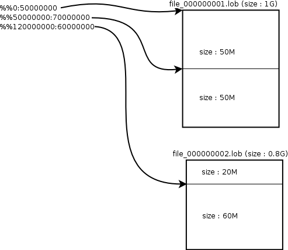

- [iLoader User’s Manual](#iloader-users-manual)
  - [서문](#%EC%84%9C%EB%AC%B8)
    - [이 매뉴얼에 대하여](#%EC%9D%B4-%EB%A7%A4%EB%89%B4%EC%96%BC%EC%97%90-%EB%8C%80%ED%95%98%EC%97%AC)
  - [1.iLoader 개요](#1iloader-%EA%B0%9C%EC%9A%94)
    - [iLoader의 소개](#iloader%EC%9D%98-%EC%86%8C%EA%B0%9C)
  - [2.iLoader 사용 방법](#2iloader-%EC%82%AC%EC%9A%A9-%EB%B0%A9%EB%B2%95)
    - [명령행 옵션](#%EB%AA%85%EB%A0%B9%ED%96%89-%EC%98%B5%EC%85%98)
    - [일반 옵션](#%EC%9D%BC%EB%B0%98-%EC%98%B5%EC%85%98)
    - [성능 옵션](#%EC%84%B1%EB%8A%A5-%EC%98%B5%EC%85%98)
    - [일괄식 모드](#%EC%9D%BC%EA%B4%84%EC%8B%9D-%EB%AA%A8%EB%93%9C)
    - [대화형 모드](#%EB%8C%80%ED%99%94%ED%98%95-%EB%AA%A8%EB%93%9C)
    - [도움말 및 기타옵션](#%EB%8F%84%EC%9B%80%EB%A7%90-%EB%B0%8F-%EA%B8%B0%ED%83%80%EC%98%B5%EC%85%98)
  - [3.FORM 파일](#3form-%ED%8C%8C%EC%9D%BC)
    - [FORM 파일이란?](#form-%ED%8C%8C%EC%9D%BC%EC%9D%B4%EB%9E%80)
  - [4.문제해결 및 FAQ](#4%EB%AC%B8%EC%A0%9C%ED%95%B4%EA%B2%B0-%EB%B0%8F-faq)
    - [문제해결](#%EB%AC%B8%EC%A0%9C%ED%95%B4%EA%B2%B0)
    - [FAQ](#faq)


Altibase® Tools & Utilities

iLoader User’s Manual
=====================


Altibase Tools & Utilities iLoader User's Manual

Release 7.1

Copyright ⓒ 2001\~ 2019 Altibase Corp. All Rights Reserved.

본 문서의 저작권은 ㈜알티베이스에 있습니다. 이 문서에 대하여 당사의 동의
없이 무단으로 복제 또는 전용할 수 없습니다.

**㈜알티베이스**

08378 서울시 구로구 디지털로 306 대륭포스트타워Ⅱ 10층

전화: 02-2082-1114 팩스: 02-2082-1099

고객서비스포털: <http://support.altibase.com>

homepage: [http://www.altibase.com](http://www.altibase.com/)


서문
----

### 이 매뉴얼에 대하여

이 매뉴얼은 iLoader 사용법에 대해 설명한다.

#### 대상 사용자

이 매뉴얼은 다음과 같은 Altibase 사용자를 대상으로 작성되었다.

-   데이터베이스 관리자

-   성능 관리자

-   데이터베이스 사용자

-   응용 프로그램 개발자

-   기술지원부

다음과 같은 배경 지식을 가지고 이 매뉴얼을 읽는 것이 좋다.

-   컴퓨터, 운영 체제 및 운영 체제 유틸리티 운용에 필요한 기본 지식

-   관계형 데이터베이스 사용 경험 또는 데이터베이스 개념에 대한 이해

-   컴퓨터 프로그래밍 경험

-   데이터베이스 서버 관리, 운영 체제 관리 또는 네트워크 관리 경험

#### 소프트웨어 환경

이 매뉴얼은 데이터베이스 서버로 Altibase 버전 7.1을 사용한다는 가정 하에
작성되었다.

#### 이 매뉴얼의 구성

이 매뉴얼은 다음과 같이 구성되어 있다.

-   제 1장 iLoader 개요  
    이 장은 ILoader 의 정의, 용도, 기능, 장점, 설치방법 등에 대해 간략히
    설명한다.

-   제 2장 iLoader 사용 방법  
    이 장은 iLoader 의 동작방식인 대화형 모드, 일괄식 모드 그리고 기타 도움말 및
    옵션에 대해 설명한다.

-   제 3장 iLoader 의 응용  
    이 장은 FROM 파일 구조 변경에 대해 SEQUENCE 작성, DATE FORMAT 작성, 조건절
    작성, TIMESTAMP 칼럼 입력기능, 기타에 대해서 설명한다.

-   제 4장 문제 해결 및 FAG  
    이 장은 iLoader 수행 시 발생할 수 있는 오류 및 운영상의 문제 와 FAQ 에
    대해서 설명한다.

#### 문서화 규칙

이 절에서는 이 매뉴얼에서 사용하는 규칙에 대해 설명한다. 이 규칙을 이해하면 이
매뉴얼과 설명서 세트의 다른 매뉴얼에서 정보를 쉽게 찾을 수 있다.

여기서 설명하는 규칙은 다음과 같다.

-   구문 다이어그램

-   샘플 코드 규칙

##### 구문 다이어그램

이 매뉴얼에서는 다음 구성 요소로 구축된 다이어그램을 사용하여, 명령문의 구문을
설명한다.

| 구성 요소                           | 의미                                                         |
| ----------------------------------- | ------------------------------------------------------------ |
|  | 명령문이 시작한다. 완전한 명령문이 아닌 구문 요소는 화살표로 시작한다. |
|  | 명령문이 다음 라인에 계속된다. 완전한 명령문이 아닌 구문 요소는 이 기호로 종료한다. |
|  | 명령문이 이전 라인으로부터 계속된다. 완전한 명령문이 아닌 구문 요소는 이 기호로 시작한다. |
|  | 명령문이 종료한다.                                           |
|  | 필수 항목                                                    |
|  | 선택적 항목                                                  |
|  | 선택사항이 있는 필수 항목. 한 항목만 제공해야 한다.          |
|  | 선택사항이 있는 선택적 항목                                  |
|  | 선택적 항목. 여러 항목이 허용된다. 각 반복 앞부분에 콤마가 와야 한다. |

##### 샘플 코드 규칙

코드 예제는 SQL, Stored Procedure, iSQL 또는 다른 명령 라인 구문들을 예를 들어
설명한다.

아래 테이블은 코드 예제에서 사용된 인쇄 규칙에 대해 설명한다.

| 규칙         | 의미                                                                                | 예제                                                                                                         |
|--------------|-------------------------------------------------------------------------------------|--------------------------------------------------------------------------------------------------------------|
| [ ]          | 선택 항목을 표시                                                                    | VARCHAR [(*size*)] [[FIXED \|] VARIABLE]                                                                     |
| { }          | 필수 항목 표시. 반드시 하나 이상을 선택해야 되는 표시                               | { ENABLE \| DISABLE \| COMPILE }                                                                             |
| \|           | 선택 또는 필수 항목 표시의 인자 구분 표시                                           | { ENABLE \| DISABLE \| COMPILE } [ ENABLE \| DISABLE \| COMPILE ]                                            |
| . . .        | 그 이전 인자의 반복 표시 예제 코드들의 생략되는 것을 표시                           | SQL\> SELECT ename FROM employee; ENAME  ----------------------- SWNO  HJNO  HSCHOI  . . . 20 rows selected. |
| 그 밖에 기호 | 위에서 보여진 기호 이 외에 기호들                                                   | EXEC :p1 := 1; acc NUMBER(11,2);                                                                             |
| 기울임 꼴    | 구문 요소에서 사용자가 지정해야 하는 변수, 특수한 값을 제공해야만 하는 위치         | SELECT \* FROM *table_name*; CONNECT *userID*/*password*;                                                    |
| 소문자       | 사용자가 제공하는 프로그램의 요소들, 예를 들어 테이블 이름, 칼럼 이름, 파일 이름 등 | SELECT ename FROM employee;                                                                                  |
| 대문자       | 시스템에서 제공하는 요소들 또는 구문에 나타나는 키워드                              | DESC SYSTEM_.SYS_INDICES_;                                                                                   |

#### 관련 자료

자세한 정보를 위하여 다음 문서 목록을 참조하기 바란다.

-   Installation Guide

-   Administrator’s Manual

-   Replication Manual

-   Precompiler User’s Manual

-   ODBC Reference

-   Application Program Interface User’s Manual

-   iSQL User’s Manual

-   Utilities Manual

-   Error Message Reference

#### Altibase는 여러분의 의견을 환영합니다.

이 매뉴얼에 대한 여러분의 의견을 보내주시기 바랍니다. 사용자의 의견은 다음
버전의 매뉴얼을 작성하는데 많은 도움이 됩니다. 보내실 때에는 아래 내용과 함께
고객서비스포털(*http://support.altibase.com/kr/* )로 보내주시기 바랍니다.

-   사용 중인 매뉴얼의 이름과 버전

-   매뉴얼에 대한 의견

-   사용자의 성함, 주소, 전화번호

이 외에도 Altibase 기술지원 설명서의 오류와 누락된 부분 및 기타 기술적인
문제들에 대해서 이 주소로 보내주시면 정성껏 처리하겠습니다. 또한, 기술적인
부분과 관련하여 즉각적인 도움이 필요한 경우에도 고객서비스포털을 통해 서비스를
요청하시기 바랍니다.

여러분의 의견에 항상 감사드립니다.

1.iLoader 개요
------------

### iLoader의 소개

#### 정의

iLoader는 Altibase 내에 존재하는 데이터를 테이블 단위로 다운로드하거나 업로드할
수 있도록 Altibase에서 제공하는 유틸리티이다. 다운로드되는 데이터는 텍스트 파일
형태로 저장되며, 해당 테이블의 속성에 대한 정보를 담는 FORM 파일을 필요로 한다.

#### 용도

Altibase의 iLoader는 데이터베이스의 이전이나, 테이블 단위 백업 등의 용도로 주로
사용된다. 그러나 데이터베이스의 스키마나 카탈로그 정보 등은 저장하지 않기
때문에, 백업의 용도로 사용할 때는 주의가 필요하다.

#### 기능

-   FORM 파일 생성  
    다운로드 또는 업로드 하려는 테이블의 정보를 담는 FORM 파일을 생성한다.

-   데이터 다운로드  
    FORM 파일을 이용하여 데이터베이스 내의 테이블의 데이터를 텍스트 파일
    형식으로 저장한다.

-   데이터 업로드  
    텍스트 파일 형식으로 저장된 데이터를 FORM 파일을 이용하여 데이터베이스 내의
    해당 테이블로 업로드 한다.

#### 장점

Altibase의 iLoader는 다음과 같은 몇 가지의 장점을 갖고 있다.

-   하나 이상의 파일을 사용하여 데이터를 업로드할 수 있다.

-   여러 개의 입력 레코드를 하나의 테이블로 업로드할 수 있다.

-   데이터를 한 번에 여러 테이블에 업로드할 수 있다.

-   이미 데이터가 입력된 테이블에 다른 데이터를 가하거나 교체할 수 있다.

-   자료 입력 및 관리를 체계화할 수 있다.

#### 설치 방법

iLoader는 Altibase 패키지를 설치할 때 자동으로 설치된다.

실행 파일의 위치는 다음과 같다.

```
$ALTIBASE_HOME/bin
```


#### iLoader 설정

iLoader는 서버에 접속하기 위해서 다음과 같은 정보가 필요하다.

-   ALTIBASE_HOME  
    서버 혹은 클라이언트가 설치된 경로

-   server_name  
    Altibase 서버가 구동되어 있는 컴퓨터 서버의 이름(또는 IP 주소)

-   port_no  
    TCP 또는 IPC로 접속할 때 사용할 포트 번호

-   user_id  
    데이터베이스에 등록된 사용자 ID

-   password  
    사용자 ID와 일치하는 암호

-   NLS_USE  
    데이터 검색 시, 사용자에게 보여주는 문자 집합

ALTIBASE_HOME은 환경 변수로 설정하도록 되어 있으며, 나머지는 커맨드 라인 옵션을
통해서 설정할 수 있다. (자세한 내용은 “일괄식 모드”를 참고한다.)

ALTIBASE_HOME은 일반적으로 서버가 설치될 때 자동으로 설정되는데 클라이언트의
경우에는 사용자가 직접 설정해야 한다. 설정되지 않았을 경우에는 올바로 동작하지
않을 수 있으므로 실행 전에 바르게 설정되어 있는지 확인할 것을 권장한다.

port_no와 NLS_USE는 환경 변수 또는 서버 설정 파일(altibase.properties)을
이용해서 설정할 수도 있다. 세가지 방법으로 모두 설정되어 있을 경우 적용 우선
순위는 다음과 같다.

1. 커맨드 라인 옵션

2. 환경 변수 (ALTIBASE_PORT_NO, ALTIBASE_NLS_USE)

3. 서버 설정 파일(altibase.properties)


그러므로 설정된 값과 다른 옵션으로 연결하고자 할 경우, 커맨드 라인 옵션을
사용하면 서버 설정 파일이나 환경 변수를 다시 변경하지 않아도 된다.

옵션이 설정되어 있지 않을 경우에는 iLoader가 처음 실행될 때 옵션 입력 프롬프트를
띄우고 사용자에게서 해당 값을 입력 받는다. 이 때 바르지 않은 형식이나 유효하지
않은 값을 입력할 경우, iLoader는 올바르게 동작하지 않을 수 있다.

특히 NLS_USE 옵션은 사용자가 설정하지 않았더라도 실행 시에 입력 프롬프트가
나타나지 않는다. 만약 사용자가 NLS_USE 옵션을 설정하지 않았다면 기본값인
US7ASCII를 이용해 접속을 시도한다. 이 때 데이터베이스의 캐릭터 셋이 US7ASCII이
아닐 경우에는 올바로 실행되지 않거나 사용자 데이터가 일부 깨질 수 있으므로
반드시 NLS_USE를 사용 환경에 맞는 값으로 설정해야 한다.

원활한 iLoader 사용을 위해 다음 환경 변수를 설정할 것을 권장한다.

-   ALTIBASE_HOME: 서버 혹은 클라이언트가 설치된 경로

-   ALTIBASE_PORT_NO: 서버에 접속할 때 사용할 포트 번호

-   ALTIBASE_NLS_USE: 데이터 검색 시, 사용자에게 보여주는 문자 집합

-   PATH: 실행파일이 있는 경로인 \$ALTIBASE_HOME/bin 추가

#### 환경변수

##### ALTIBASE_HOME

패키지가 설치된 디렉터리의 위치이다.

ALTIBASE_HOME은 일반적으로 서버가 설치될 때 자동으로 설정되지만, 클라이언트는
서버의 환경 변수와 충돌할 수 있으므로 사용자가 직접 설정해야 한다.

##### ALTIBASE_PORT_NO

접속할 서버의 포트 번호이다. -PORT 옵션 또는 altibase.properties 파일 내의
프로퍼티를 통해서 지정할 수 있다.

포트 번호 설정의 우선 순위는 -PORT 옵션, 환경변수 ALTIBASE_PORT_NO,
altibase.properties 파일 내의 프로퍼티 순이며 아무것도 설정되지 않았을 경우에는
포트 번호 입력 프롬프트가 출력된다.

##### ALTIBASE_SSL_PORT_NO

iLoader가 SSL/TLS 통신으로 접속할 서버의 포트 번호이다.

SSL 포트 번호 설정의 우선 순위는 -PORT 옵션, 환경변수 ALTIBASE_SSL_PORT_NO,
altibase.properties 파일 내의 프로퍼티 순이다. 만약 아무것도 설정되지 않았을
경우에는 포트 번호 입력 프롬프트가 출력된다.

##### ALTIBASE_NLS_USE

데이터 다운로드 및 업로드 시 데이터의 캐릭터 셋을 설정한다.

-   다운로드: 서버로부터 받은 데이터를 설정된 캐릭터 셋으로 저장한다.

-   업로드: 서버로 전송할 데이터의 캐릭터 셋이다.  
    주의) 업로드 할 때 데이터베이스의 캐릭터 셋과 ALTIBASE_NLS_USE에 설정한 값이
    다를 경우에는 데이터 업로드가 정상적으로 동작하지 않을 수 있다. 반드시
    적절한 값을 설정할 것을 권장한다.

\-NLS_USE 옵션 또는 altibase.properties파일의 프로퍼티를 통해서 지정할 수도 있다.

NLS_USE 설정의 우선순위는 FORM 파일의 DATA_NLS_USE(in 옵션 수행시에만 적용), -NLS_USE 옵션, 환경변수 ALTIBASE_NLS_USE, altibase.properties 내의 프로퍼티 순으로 참조 적용되며, 아무것도 설정되지 않았을 경우에는 기본 캐릭터 셋(US7ASCII)을 사용한다.

##### ALTIBASE_UT_FILE_PERMISSION

aexport, iLoader, iSQL이 생성하는 파일들의 권한을 설정하는 공통 환경변수이다. 
값을 설정하지 않으면 666 ( user:rw,  group:rw,  other: rw)로 설정된다.

예) user:rw,  group:--,  other:--로 설정하는 경우, export ALTIBASE_UT_FILE_PERMISSION=600

ISQL_FILE_PERMISSION, AEXPORT_FILE_PERMISSION, 또는 ILO_FILE_PERMISSION이 설정된 경우, 
ALTIBASE_UT_FILE_PERMISSION 환경 변수 보다 우선 처리된다.

예)export ALTIBASE_UT_FILE_PERMISSION=660; export ISQL_FILE_PERMISSION=600;

iSQL에서 생성되는 파일의 권한은 ISQL_FILE_PERMISSION=600이 우선처리되어 user:rw,  group:--,  other:--으로 설정된다. aexport, iloader가 생성하는 파일의 권한은  ALTIBASE_UT_FILE_PERMISSION=660에 따라 user:rw,  group:rw,  other:--으로 설정된다.

##### ILO_FILE_PERMISSION

iloader가 생성하는 파일 권한을 설정하는 환경 변수이다. 값을 설정하지 않으면 666 ( user:rw,  group:rw,  other: rw)로 설정된다.

예) user:rw,  group:--,  other:--로 설정하는 경우, export ILO_FILE_PERMISSION=600

2.iLoader 사용 방법
-----------------

이 장에서는 iLoader를 사용하는 방법에 대해 설명한다.

iLoader를 사용하기 위해 Altibase에서 제공하는 다양한 옵션들을 활용할 수 있다.

iLoader는 일괄식(Batch Mode)과 대화식(Interactive Mode) 모드로 동작할 수 있다.
일괄식 모드로 사용할 경우에는 명령행 옵션(Command Line Option)으로 iLoader를
수행시킨다.

### 명령행 옵션

Altibase가 제공하는 명령행 옵션은 iLoader를 위한 일반적인 옵션과 성능 향상을
위한 성능 옵션으로 구분된다.

-   일반 옵션

-   성능 옵션

아래의 옵션들은 iLoader를 위한 일반 옵션과 성능 옵션의 종류를 나타낸 것으로
각각의 옵션에 대한 설명들은 다음 절에서 설명한다.

```
iloader [-h]
    [-s server_name] [-u user_name] [-p password]
    [-port port_no] [-silent] [-nst] [-displayquery]
    [-NLS_USE nls_name]
    [-prefer_ipv6]
    [-ssl_ca CA_file_path | -ssl_capath CA_dir_path]
    [-ssl_cert certificate_file_path]
    [-ssl_key key_file_path]
    [-ssl_verify]
    [-ssl_cipher cipher_list]
    [{ in | out | formout | structout | help }
        [-d datafile or datafiles] [-f formatfile]
        [-T table_name] [-F firstrow] [-L lastrow]
        [-t field_term] [-r row_term] [-mode mode_type]
        [-commit commit_unit] [-bad badfile]
        [-log logfile] [-e enclosing] [-array count]
        [-replication {true | false}] [-split number]
        [-readsize size] [-errors count]
        [-lob lob_option_string] [-atomic]
        [-parallel count] [-direct]
        [-rule csv]
        [-partition]
        [-dry-run]
        [-prefetch_rows]
        [-async_prefetch off|on|auto]]
```


#### 주의사항

사용자 이름에 소문자, 특수 문자 또는 공백이 포함된 경우 큰따옴표를 사용해야
한다.

```
$ iloader -U \"user name\"
```


### 일반 옵션

Altibase는 다음의 옵션들을 기본적으로 사용해 iLoader를 수행한다.

| 인 자                                     | 설 명                                                        |
| ----------------------------------------- | ------------------------------------------------------------ |
| \-S\|-s *servername*                      | 서버의 호스트 이름 Altibase 서버가 구동되어 있는 컴퓨터 서버의 이름(또는 IP 주소)을 명시한다. 만약 ISQL_CONNECTION 환경 변수가 IPC 또는 UNIX로 되어 있을 때, 이 옵션에 원격 서버를 명시해서 접속을 시도하면, iSQL은 ISQL_CONNECTION의 설정을 무시하고 TCP로 원격 서버에 접속할 것이다. <br />이 때, ISQL_CONNECTION 설정이 무시되었다는 경고 메시지가 출력된다. IPv4 주소 또는 IPv6 주소를 사용할 수 있다. IPv6 주소는 “[“과 “]”로 에워싸여야 한다. <br />예를 들어, localhost 를 명시하고자 할 때, 가능한 값은 다음과 같다. localhost (호스트 이름), 127.0.0.1 (IPv4주소), [::1] (IPv6주소) IPv6 주소 표기법에 대한 자세한 내용은 *Administrator’s Manual*을 참고하기 바란다. |
| \-U\|-u *login_id*                        | 사용자 아이디                                                |
| \-P\|-p *password*                        | 사용자 비밀번호                                              |
| \-PORT *port_no*                          | TCP 또는 IPC로 접속할 때 해당 포트 번호를 명시한다. 단 유닉스 환경에서 IPC로 접속 시 이 옵션은 명시하지 않아야 한다. 만약 명시하면 경고 메시지가 출력된 후, 서버에 접속한다. <br />TCP로 접속하려면 먼저 클라이언트에서 환경 변수 ‘ISQL_CONNECTION=TCP’를 설정하고, 옵션에 PORT_NO를 입력한다.  <br />ISQL_CONNECTION 환경 변수의 값이 IPC가 아니고 -PORT 옵션을 생략한다면, ALTIBASE_PORT_NO와 PORT_NO 프로퍼티를 차례로 참조하고 모두 설정되어 있지 않다면, 포트 번호 입력 프롬프트가 출력된다. |
| \-NLS_USE *charset*                       | 데이터 검색 시, 사용자에게 보여주는 문자 집합(Character Set)이다. iSQL을 실행하는 터미널의 encoding을 명시하여 준다. <br />   US7ASCII <br />   KO16KSC5601 <br />   MS949 <br />   BIG5 <br />   GB231280 <br />   MS936 <br />   UTF8 <br />   SHIFTJIS <br />   MS932 <br />   EUCJP <br />생략 시 환경변수 ALTIBASE_NLS_USE, altibase.properties를 차례로 참조하며, 설정되지 않았을 경우에는 기본 문자 집합 (US7ASCII)을 사용한다. |
| \-prefer_ipv6                             | \-S 옵션으로 호스트 이름을 입력했을 때, 접속할 IP 주소의 버전을 결정하는 옵션이다.  이 옵션을 명시하면, 호스트 이름을 IPv6 주소로 바꾸어 접속한다. 이 옵션을 명시하지 않으면, isql은 IPv4 주소로 접속한다. <br />선호하는 버전의 IP 주소로의 접속이 실패하면, 다른 IP 버전 주소로 접속을 다시 시도한다. 예를 들어, -S 옵션에 “localhost”를 입력하고 이 옵션을 명시하면, isql 은 처음에 IPv6 주소인 [::1]로 접속하고, 이 접속이 실패하면 IPv4 주소인 127.0.0.1로 접속을 다시 시도한다. |
| \-ssl_ca *CA_file_path*                   | 접속할 알티베이스 서버의 공개키(public key)가 포함된 CA(인증 기관, Certification Authority) 인증서 파일의 위치를 지정한다. |
| \-ssl_capath *CA_dir_path*                | 접속할 알티베이스 서버의 공개키가 포함된 CA 인증서 파일이 저장되어 있는 디렉토리를 지정한다. |
| \-ssl_cert *certificate_file_path*        | 클라이언트 인증서 파일의 위치를 지정한다.                    |
| \-ssl_key *key_file_path*                 | 클라이언트 개인키 파일의 위치를 지정한다.                    |
| \-ssl_verify                              | 이 옵션을 지정하면 클라이언트가 서버로부터 전달받은 인증서를 검증한다. |
| \-ssl_cipher *cipher_list*                | SSL 암호화를 위해 사용할 알고리즘의 이름 후보들을 지정한다. General Reference에서 SSL_CIPHER_LIST 프로퍼티를 참고한다. |
| in \| out \| formout \| structout \| help | 자료 복사의 방향을 지시 (반드시 한가지만 입력) in : 파일에서 데이터베이스 테이블로 복사 out : 데이터베이스 테이블에서 파일로 복사 formout: 테이블의 포맷(format) 파일을 만들 때 사용된다. structout: formout과 비슷한 기능으로 주어진 테이블과 매칭되는 구조체를 파일로 만들 때 사용된다. (클라이언트 프로그램을 작성할 때 사용) help: 도움말 사용법을 보여준다. |
| \-T *table_name*                          | 복사할 테이블의 이름, 데이터의 업로드나 다운로드 시에는 FORM 파일에 테이블 이름이 있으므로 이 옵션은 무시된다. |
| \-d *datafile(datafiles)*                 | 데이터베이스에서 파일로, 또는 파일에서 데이터베이스로 자료를 복사할 때 사용되는 자료 파일의 전체 경로 formout인 경우에는 사용되지 않는다. 입력할 수 있는 파일 수는 최대 32개이며, 업로드 할 때에만 파일들을 연속으로 쓸 수 있다.  -d 옵션에 데이터를 순서대로 입력하여 업로드 할 경우, 순서대로 업로드 된다.  또한 다운로드 할 때 parallel 옵션과 함께 사용하면, 최소한 parallel 옵션에서 지정한 수만큼 파일이 생성된다. |
| \-rule csv                                | 데이터 파일의 포맷을 csv 형태로 명시한다.  이 옵션은 –t 또는 -e 옵션과 함께 사용할 수 없다. 사용하면 에러가 발생한다. -t, -r, -e, -rule csv 옵션 중 어느 것도 사용하지 않으면 csv가 기본으로 사용된다. |
| \-f *formatfile*                          | 이전의 iLoader 호출에 의해 생성된 format 파일의 전체 경로    |
| \-F *firstrow*                            | 복사 할 첫 번째 행의 번호 (기본 값은 1) 이 옵션은 데이터를 업로드할 때에만 유효하다. |
| \-L *lastrow*                             | 복사 할 마지막 행의 번호 (기본 값은 마지막 행의 번호) 이 옵션은 데이터 업로드 시에만 유효하다. |
| \-t *field_term*                          | 필드 사이의 구분자로, 기본값은 ‘\^’ 이다. %t 는 TAB을 %n은 새로운 줄(newline)을 의미한다. %r은 carriage return을 의미한다. -t, -r, -e 옵션은 각각 다른 값을 가져야 한다. 예) -t \^%t \< 주의 \>  명령행에서 ‘, “, \\, & 등의 문자는 자체적으로 처리하므로 구분자로 사용하지 않는 것이 좋다. 구분자를 명시할 때 (예를 들어 \|) iLoader 프롬프트 상에서는 -t \| 또는 “\|” 로, 일반 명령 프롬프트에서는 -t \|, ‘\|’ 또는 “\|”로 입력할 수 있다. |
| \-r *row_term*                            | 행 사이의 구분자 (기본 값은 ‘\\n’ 이다.) 세부 입력 방법은 -t option과 같다. |
| \-e *enclosing*                           | 칼럼 사이의 구분자 세부 입력 방법은 -t option과 같다.        |
| \-lob *lob_option_string*                 | LOB 데이터는 최대 4GB의 크기를 가지므로 32-bit OS 에서 2GB 보다 큰 LOB 데이터를 하나의 파일에 저장할 때 문제가 발생할 수 있다. 따라서 이 옵션을 이용해 LOB 타입의 데이터를 다루는 방식을 설정할 수 있다. 이 옵션이 지정되지 않았을 경우 LOB 칼럼도 다른 칼럼과 마찬가지로 처리된다. |
| \-replication true/false                  | 이중화를 off 하고 데이터를 로딩할 수 있는 옵션이다. (생략할 경우 true가 적용된다.) |
| \-mode *mode_type*                        | APPEND : 기존의 테이블에 추가하여 삽입(기본값) REPLACE: DELETE 구문을 이용해 기존 테이블의 데이터를 모두 지우고 새로 생성 TRUNCATE: TRUNCATE 구문을 이용해 기존 테이블의 데이터를 모두 지우고 새로 생성 |
| \-bad *badfile*                           | 로딩할 때 오류가 발생하여 업로드 되지 못한 행을 저장하며, 지정하지 않으면 저장하지 않는다. 옵션으로 stdout, stderr을 사용(소문자만 지원) 하여 파일을 생성하지 않고 stdout(standard out), stderr(standard error)를 화면으로 출력한다. |
| \-log *logfile*                           | iloader가 수행하면서 발생하는 전반적인 과정을 기록한다. 시작 시간, 종료 시간, 대상 행 수, 처리 행 수, 오류 행 수, 오류 내역 등이 여기에 기록된다. 지정하지 않으면 저장하지 않는다. 옵션으로 stdout, stderr을 사용(소문자만 지원함) 하여 파일을 생성하지 않고 stdout(standard out), stderr(standard error)를 화면으로 출력한다. |
| \-split *n*                               | 파일마다 저장할 레코드의 개수를 설정(out 커맨드에서만 적용됨)한다. 명령어 실행 후 n개의 레코드가 저장된 파일들이 datafile.dat0 부터 datafile.dat1, … 의 파일 이름으로 생성된다. |
| \-errors *count*                          | in 모드로 iloader를 실행할 때 허용 가능한 에러 최대 개수를 지정하는 옵션이다. 이 옵션에서 설정한 에러 개수보다 많은 에러가 발생하면 실행을 멈춘다.  기본값은 50이며, 0으로 설정하면 발생한 에러 수에 무관하게 계속 실행된다. -parallel 옵션과 함께 사용될 경우 병렬로 처리되는 쓰레드 중에 한 개라도 이 옵션에서 설정한 에러 값 이상의 에러가 발생하면 모든 쓰레드가 종료된다. |
| \-partition                               | \-T 옵션에 지정한 테이블이 partitioned 테이블이라면, 그 테이블의 파티션 개수만큼의 FORM 파일이 생성 된다. 각 FORM 파일의 이름은 formfile_name.partition_name이 될 것이다. 만약 지정한 테이블이 partitioned 테이블이 아니면, formfile_name이름으로 한 개의 FORM 파일이 생성 된다. |
| -stmt_prefix [prefix_value]               | in/out 모드 수행시 iLoader가 생성하는 SQL 구문 앞에 사용자 지정값을 설정할 때 사용하는 옵션이다. 옵션 값을 입력하지 않으면 "NODE [META]"가 기본값으로 설정된다.<br /><br />예) iloader in -s 127.0.0.1 -u sys -p manager -f T1.fmt -d T1.dat -array 100 -atomic -stmt_prefix<br />생성되는 구문: NODE [META] INSERT INTO T1 VALUES (?, ?)<br />iloader out -s 127.0.0.1 -u sys -p manager -f T1.fmt -d T1.dat -stmt_prefix "NODE [DATA('NODE1')]"<br />생성되는 구문: NODE [DATA('NODE1')] SELECT I1, I2 FROM T1<br /><br />이 옵션은 데이터 업로드/다운로드에만 유효하다. |
| -extra_col_delimiter                      | 레코드 마지막 컬럼 뒤에 컬럼 구분자와 레코드 구분자가 연달아 위치한 경우, 이를 레코드의 끝으로 인식하기 위한 옵션이다.<br/> <br/>예를 들어, 컬럼 구분자가 '^'이고 레코드 구분자가 '\n'인 데이터 파일이, 아래와 같은 형식이면 -extra_col_delimiter 옵션이 필요하다.<br/>Kim^1077^RD^\n<br/>Lee^1099^CS^\n<br/> <br/>이 옵션은 -rule csv 또는 -t 옵션과 함께 사용할 수 있다. |

-   위의 명령행 옵션 중 -S, -U, -P 가 빠져 있는 경우에는 실행 시 사용자에게 직접
    옵션 값을 입력받게 된다.

```
iSQL> CREATE TABLE test (i1 INTEGER);
Create success.

$ iloader formout -T test -f test.fmt
-------------------------------------------------------
     Altibase Data Load/Download utility.
     Release Version 7.1.0.1
     Copyright 2000, Altibase Corporation or its subsidiaries.
     All Rights Reserved.
-------------------------------------------------------
Write Server Name (default:localhost) : 
Write UserID : sys
Write Password : 
ISQL_CONNECTION : TCP
```


-   쉘 프롬프트 상에서 iloader만 실행하거나 formout / in / out 의 세가지 명령어
    중 아무 옵션도 입력하지 않으면, iLoader\> 프롬프트가 나타나며 대화형 모드로
    작업을 수행하게 된다.

-   옵션 중 -S, -U, -P를 제외한 모든 옵션은 대소문자를 구별한다.

-   in \| out \| formout 인자는 다른 옵션보다 선행되어 사용되어야 한다.

-   SSL 접속에 대한 자세한 설명과 예제는 *iSQL User's Manual*의 '접속 연결 및
    해제'를 참조하기 바란다.

##### 제한사항

필드 구분자(field term), 행 구분자(row term), enclosing 값 들이 상호간의
부분집합이 되어서는 안 된다. 다시 말해 행 구분자가 필드 구분자의 부분집합이
되거나 필드 구분자가 행 구분자의 부분집합이 되어서는 안 된다. 또한 이 구분자들이
칼럼 값에 포함되어도 안 된다.  
예를 들어, 필드 구분자는 ‘-’, 행 구분자는 ‘-\#”일 때, 3개의 칼럼을 가진 다음과
같은 행이 있다고 하자.

```
	홍길동-027551234-서울-# 
```

이 경우 세번째 ‘-’를 필드 구분자로 인식하여 4개의 칼럼을 가진, 행 구분자가 없는
행으로 처리하게 된다.

아래와 같이 필드 구분자는 ‘-‘, 행 구분자는 ‘\#\#’로 부분집합이 아니더라도, 칼럼
값에 구분자가 포함될 경우에도 두 번째, 세 번째 ‘-’를 필드 구분자로 잘못 인식하게
된다.

```
	홍길동-02-755-1234-서울## 
```

이와 같이 구분자가 잘못 처리될 가능성이 있으므로 구분자를 선정할 때 주의가
필요하다.

##### 주의사항

테이블 이름에 소문자, 특수 문자 또는 공백이 포함된 경우 큰따옴표를 사용해야
한다.

```
iloader> -T "table name"
$ -T \"table name\"
```

파일 이름에 특수 문자 또는 공백이 포함된 경우 큰따옴표를 사용해야 한다.

```
iloader> -f "fmt file.fmt" -d "dat file.dat"
$ -f \"fmt file.fmt\" -d \"dat file.dat\"
```


#### LOB 옵션

LOB 칼럼을 다루는 방식을 지정하는 옵션으로써 -lob 옵션 뒤에 lob_option_string 을
지정해 주는 방식으로 사용한다. lob_option_string은 “keyword = value”의 형식으로
표현되며, 여러 개의 keyword를 명시하려면 -lob 옵션을 반복해서 사용하면 된다.

lob_option_string에 사용할 수 있는 키워드는 다음과 같다:

**use_lob_file, lob_file_size, use_separate_files, lob_indicator**

##### use_lob_file

```
use_lob_file = {yes|no}
```

LOB 데이터의 표현에 외부 파일(LOB 파일)을 사용할 것인지의 여부.

iLoader의 자료 복사 방향이 in, out 일 때 모두 사용된다.

LOB 파일의 명명법에 대해서는 lob_file_size 옵션의 설명을 참조하라.

##### lob_file_size

```
lob_file_size = file_size
```

LOB 파일의 최대 사이즈가 얼마가 될지를 지정한다. 이 값을 명시하지 않고
use_lob_file 옵션을 yes로 지정하면, 외부 파일의 크기에는 운영체제의 파일 크기
제한 외에는 제한이 없다. 운영체제 또는 플랫폼에 따른 파일 크기 제한과 관련하여,
long타입의 크기가 4바이트인 플랫폼의 경우 본 옵션을 2GB 이하로 설정할 것을
권장한다.

이 옵션은 iLoader 의 자료 복사 방향이 out 일 때만 유효하다. 자료 복사 방향이 in
일 때 본 항목을 사용하더라도 iLoader 는 이를 무시한다. 자료 복사 방향이 in 일
때는 첫 번째 LOB 데이터 파일의 크기를 lob_file_size로 간주한다.

use_lob_file 옵션 없이 이 옵션을 사용할 경우 use_lob_file=yes 라고 암묵적으로
간주한다.

만약 dump 되는 LOB 데이터의 크기가 이 옵션에서 명시된 파일 사이즈보다 커지면,
새로운 파일을 하나 만들어서 데이터를 계속적으로 dump 한다.

파일 크기는 ‘숫자+단위’ 의 형태로 표시한다. 숫자는 소숫점 아래 한 자리까지
표현할 수 있다. 숫자는 0일 수 없다.

파일 크기에 사용할 수 있는 단위에는 T, G 가 있다. T 는 테라바이트, G 는
기가바이트를 의미한다. 단위가 명시되지 않으면 기가바이트 단위로 간주한다.

LOB 파일명은 데이터 파일명의 확장자를 제외한 몸체 부분에 \_일련번호.lob 을
덧붙여 생성한다. 일련번호는 아홉 자리이며, 일련번호의 자리수가 아홉 자리보다
작을 경우 자리 수 왼쪽 부분이 0으로 채워진다. 일련번호는 1부터 시작한다. 만약,
-split 옵션에 의해 데이터 파일이 여러 개로 나뉘어 생성될 경우, LOB 파일명의 끝에
데이터 파일 번호가 덧붙여진다.

예를 들어, -d dump.dat -lob “lob_file_size=uG” 옵션이 명시된 경우 생성되는 LOB
파일들은 다음과 같다.

전체 LOB 데이터 양: T GBytes

단위 파일의 크기: u Gbytes

```
dump_000000001.lob (u Gbytes)
dump_000000002.lob (u Gbytes)
...
dump_n.lob (T - un GBytes)
       where n = int(T / u), preceded by 0
```

##### Use_separate_files

```
use_separate_files = {yes | no}
```

LOB 파일을 사용할 때 하나의 LOB entry에 대해 하나의 파일씩 저장할 것인가를
지정한다.

이 옵션은 use_lob_file 옵션이 yes라는 것을 가정한다.

이 옵션이 명시되었을 경우 lob_file_size 옵션이 함께 명시되면 에러가 발생한다.

이 옵션이 명시되었을 경우 데이터 파일은 테이블명과 칼럼명의 폴더가 생성되고 해당
칼럼의 LOB 데이터가 행 번호 순으로 저장된다. 행 번호는 아홉 자리이며, 만약 행
번호의 자릿수가 아홉 자리보다 작을 경우에는 자릿수 왼쪽 부분이 0으로 채워진다.
행 번호는 1부터 시작한다.

예를 들어, 3 개의 칼럼을 갖는 t1테이블의 C1, C3 칼럼이 LOB이고 -d d.dat -lob
“use_separate_files=yes” 옵션이 명시되어 있는 경우 생성되는 LOB 파일들은 다음과
같다.

-   t1/C1/000000001.lob

-   t1/C1/000000002.lob

-   t1/C3/000000002.lob

-   t1/C3/000000002.lob

이 옵션이 명시되었을 경우, 데이터 파일의 LOB 칼럼에 해당하는 entry에는 LOB
파일의 상대경로가 기록된다. 그러나 LOB 데이터가 NULL일 경우에는 기록되지 않고
파일도 생성하지 않는다.

###### 주의사항

\-lob “use_separate_files=yes” 옵션을 사용해서 데이터를 out 할 때, 데이터파일에
저장되는 LOB 파일의 위치는 상대경로이다. 그런데 사용자가 임의로 이 상대경로를
절대경로로 수정한 후에, 데이터파일을 in 하고자 한다면 –d 옵션에서 지정한 경로는
무시하게 된다.

즉, 데이터파일 안에 LOB 파일의 위치가 절대경로로 표시되어 있을 경우에는 이 절대
경로를 따르게 되고, 데이터파일 안에 상대경로로 표시되어 있을 경우에는 –d
옵션에서 지정한 경로와 데이터 파일 안에 있는 상대경로를 붙인 경로를 따르게 된다.

##### lob_indicator

```
lob_indicator = char_sequence
```

LOB 파일의 offset 과 size 를 표시하기 위한 포인터를 나타내기 위한 구분자를
지정하는 옵션이다.

iLoader 의 자료 복사 방향이 in, out 일 때 모두 사용된다.

기본값은 %% 이다.

최대 10 자까지 사용 가능하다. 단, %t, %n 은 1문자로 본다.

%t 는 TAB 을 %n 은 새로운 줄을 의미한다.

\-t, -r, -e 옵션에서 명시한 값과 같은 값을 가져서는 안 된다.

명령행에서 ‘, “, \\, & 등의 문자는 자체적으로 처리하므로 구분자로 사용하지 않는
것이 좋다.

use_lob_file 이 명시되지 않았더라도 use_lob_file=yes 라고 가정한다.

iLoader 의 자료 복사 방향이 in 이고 use_lob_file=yes 일 때 데이터 파일의 LOB
칼럼이 lob_indicator로 설정한 문자로 시작되지 않을 경우, 해당 LOB 칼럼을
포함하는 데이터 행은 오류 행으로 처리된다.

##### 사용 예제

1.5 GB 크기의 t1_000000001.lob, t1_000000002.lob, ... 와 같은 외부 파일들에 LOB
데이터를 덤프한다.

```
$ iloader out ... -f t1.fmt -d t1.dat -lob " lob_file_size=1.5G "
```

t1.lob 라는 이름의 단일 파일에 LOB 데이터를 덤프한다.

```
$ iloader out ... -f t1.fmt -d t1.dat -lob "use_lob_file=yes"
$ iloader out ... -f t1.fmt -d t1.dat -lob "use_lob_file=yes" -lob "lob_file_size=1G"
$ iloader out ... -f t1.fmt -d t1.dat -lob "lob_indicator=%$LOB$%”
```


##### Data File Format

LOB 이 들어 있는 칼럼을 다운로드 할 때, 외부의 파일에서 LOB 데이터가 있는 위치를
가리키는 offset:size 조합으로 데이터 파일에 쓰여진다.

LOB 데이터의 위치를 가리키는 offset:size 조합은 따로 지정하지 않았을 경우 %%에
의해서 구분되어진다.

```
Example)
$ cat t1.fmt
table t1
{
I1 integer;
I2 blob;
I3 char (10);
}
DATA_NLS_USE=KO16KSC5601
$ iloader out ... -f t1.fmt -d t1.dat -lob “lob_file_size=3G”
$ ls
t1_000000001.lob t1_000000002.lob t1.dat t1.fmt
$ cat t1.dat
1,“%%0:2000000000”, “Terminator3”
2,“%%2000000000:1800000000”, “SixSense”
```

데이터 파일 내부에서는 필드 구분자 사이에(필드 encloser가 설정되어있으면 두
encloser 사이에) LOB 데이터의 offset 과 size 를 알려주는 정보가 있거나 LOB
데이터 자체가 오게 된다. 구조는 다음 그림과 같다.



NULL인 LOB 데이터를 데이터 파일에 저장할 때, 데이터 파일의 해당 LOB 데이터
위치에는 필드 구분자 사이에(필드 encloser가 설정되어 있으면 두 encloser 사이에)
아무런 문자도 나타나지 않는다. 한편, 데이터 크기가 0인 LOB 데이터도 동일한
방식으로 저장된다. (Altibase는 내부적으로 데이터 크기가 0인 LOB을 NULL로
처리한다.)

옵션에 use_separate_files가 설정되어 있을 경우 데이터 파일의 형식은 다음과 같다.

```
t1/I1/000000001.lob,t1/I2/000000001.lob,t1/I3/000000001.lob
t1/I1/000000002.lob,t1/I2/000000002.lob,t1/I3/000000002.lob
t1/I1/000000003.lob,t1/I2/000000003.lob,t1/I3/000000003.lob
,,,
```

위의 경우 모든 칼럼이 LOB 데이터이다.

NULL인 LOB 데이터를 LOB 파일에 저장할 때, 데이터 파일의 해당 LOB 데이터 위치에는
위의 4번째 행처럼 아무런 문자도 나타나지 않는다.

### 성능 옵션

#### IN

iLoader로 IN 작업을 수행할 때 다음의 옵션들을 사용해 성능을 높일 수 있다.

| 인 자                                           | 설 명                                                        |
| ----------------------------------------------- | ------------------------------------------------------------ |
| \-array *array_size*                            | 데이터 로딩 (in) 시 속도 증가를 위해서 파일에서 읽은 데이터를 배열로 구성하여 서버로 전송한다. 이렇게 하면 서버와의 통신 횟수를 줄여서 성능 향상을 가져올 수 있다.  <br />그러나 이 값을 너무 크게 할 경우에는 오히려 역효과를 가져올 수도 있다.<br />기본값: 1 |
| \-commit *commit_unit*                          | 업로드 시에 몇 건 단위로 삽입한 다음 커밋할 것인가를 나타내는 단위 옵션이다. <br />*commit_unit* 0은 NON-AUTOCOMMIT 모드로 동작하며, 모든 데이터를 삽입한 후에 커밋한다. <br />*commit_unit* 1은 AUTOCOMMIT 모드로 동작하여 데이터 삽입 시 건별로 커밋한다.<br />단, array 옵션과 함께 사용할 시에는 *array_size*\* *commit_unit*의 수만큼 삽입 후 커밋한다.<br />기본값: 1000 |
| \-atomic                                        | Atomic Array INSERT를 수행하도록 설정한다. Atomic Array INSERT는 배열 크기만큼 Insert문을 하나의 구문으로 처리하기 때문에 Array Insert보다 빠른 성능을 발휘한다.<br />이 옵션은 반드시 -array 옵션과 함께 지정해야 한다. |
| \-direct [log\|nolog] (Direct-Path INSERT 참고) | 디스크 테이블에 업로드 할 때 Direct-Path INSERT 방식을 사용하는 옵션으로써 로깅 여부도 함께 지정할 수 있다. log 또는 nolog를 명시하지 않으면 log 로 동작한다. <br />만약 nolog 방식을 사용할 때에는 반드시 해당 테이블에 대하여 백업을 해야 한다. nolog 모드로 수행중에 실패할 경우 정상적인 복구가 불가능할 수도 있기 때문이다.  <br />이 옵션을 지정하면 -atomic 옵션이 내부적으로 설정된다. -atomic 옵션은 -array 옵션과 함께 지정해야만 동작하므로 -array 옵션을 설정하지 않을 경우에는 array 크기는 최대값 (65535)으로 자동으로 설정된다. |
| \-parallel *count*                              | 동시에 작업할 쓰레드의 개수를 지정하는 옵션이다. 지정한 개수만큼 쓰레드가 생성되어 병렬 처리한다. <br />이 옵션을 지정하면 iLoader는 *count* + 1 개의 연결을 생성하므로, 접속 유형이 IPC인 경우 IPC_CHANNEL_COUNT 프로퍼티의 값은 연결의 수 이상으로 설정해야 한다.<br />기본값: 1, 최대값: 32 |
| \-readsize *n*                                  | 파일에서 한 번에 읽어올 수 있는 크기를 지정하는 옵션이다. (단위: bytes)<br />0보다 큰 값을 지정해야 한다.<br />기본값: 1048576 |

##### LOB 컬럼 제약

업로드 대상 테이블에 LOB 컬럼이 있는 경우 다음 옵션에 대해서는 사용자가 지정한 값이 무시되고 내부적으로 아래 표와 같이 설정된다.

| 옵션      | 설정값 |
| --------- | ------ |
| -array    | 1      |
| -atomic   | 무시됨 |
| -commit   | 1      |
| -direct   | 무시됨 |
| -parallel | 1      |

##### Atomic Array INSERT

\-atomic 옵션은 Atomic Array INSERT를 수행하는 옵션으로 데이터를 업로드 할
때에만 유용하다. Atomic Array INSERT는 array 크기만큼의 Insert 문을 하나의
트랜잭션으로 처리하기 때문에 기존의 Array INSERT보다 빠른 성능을 발휘한다.

만약 업로드 되는 레코드 중에 한 건이라도 실패하게 되면, Array INSERT를 사용해서
업드로를 수행하게 된다. 즉, Atomic Array INSERT의 결과는 Array INSERT의 수행
결과와 동일하며, 성능은 훨씬 빠르다. 이런 이유로 Atomic Array INSERT를
사용하기를 권한다.

###### Atomic Array INSERT와 Array INSERT 비교

Atomic Array INSERT와 Array INSERT를 비교하면 다음과 같다.

Array INSERT가 실행하려는 구문의 숫자만큼 실행하는 반면, Atomic Array INSERT는
여러 개의 구문들을 묶어 하나의 구문으로 처리하게 된다.

기존의 Array INSERT가 통신 비용을 줄여주는 장점이 있으나, Atomic Array INSERT는
추가적으로 구문 개수를 줄여주기 때문에 매우 빠른 성능을 제공한다.

다음은 Array INSERT와 Atomic Array INSERT를 비교한 표이다.

| 구분                       | Array INSERT      | Atomic Array INSERT |
|----------------------------|-------------------|---------------------|
| Stmt 개수                  | Array 요소의 개수 | 1개                 |
| Result 개수                | Array 요소의 개수 | 1개                 |
| Result 개수 (에러 발생 시) | Array 요소의 개수 | Array 요소의 개수   |
| 통신 속도                  | 빠름              | 매우 빠름           |

[표 2‑1] Array INSERT와 Atomic Array INSERT의 차이

###### 제약사항

Atomic Array Insert를 사용할 때 아래의 표와 같이 몇 가지 제약사항이 있다.

| 구분                  | Array Insert          | Atomic Array Insert               |
|-----------------------|-----------------------|-----------------------------------|
| Foreign Key           | 정상 동작함           | 정상 동작함                       |
| 유일키 제약           | 정상 동작함           | 정상 동작함                       |
| Not null 제약         | 정상 동작함           | 정상 동작함                       |
| Check 제약            | 정상 동작함           | 정상 동작함                       |
| 트리거 Each Row       | N번 수행됨            | N번 수행됨                        |
| 트리거 Each Statement | N번 수행됨            | 1번 수행됨                        |
| 파티션 테이블         | 정상 동작함           | 정상 동작함                       |
| 시퀀스                | N번 수행됨            | N번 수행됨                        |
| SYSDATE               | N번 수행됨            | 1번 수행됨                        |
| LOB 칼럼              | 정상 동작함           | 오류 발생시 Atomic 속성 보장 못함 |
| 프로시져              | 정상 동작함           | 정상 동작함                       |
| SubQuery              | 매번 새로운 view를 봄 | 처음 수행된 view를 봄             |

[표 2‑2] Atomic Array Insert의 제약사항 (N=array 요소의 개수)

##### Direct-Path INSERT

디스크 테이블로 데이터를 업로드할 때, Direct-Path INSERT를 사용하여 로딩하는
것을 제공한다. Direct-Path INSERT란 데이터가 입력될 때 버퍼 매니저를 거치지 않고
별도의 Direct-Path INSERT 버퍼와 플러시 매니저를 이용하여 데이터 파일에 기록하는
방식이다. 또한 테이블에 할당된 기존의 익스텐트(extent)를 사용하지 않고,
테이블스페이스로부터 새로운 익스텐트를 할당받아 APPEND 방식으로 수행된다. 따라서
성능이 빨라지는 장점이 있지만, 공간 낭비가 생길수 있다.

V\$DIRECT_PATH_INSERT 성능 뷰를 조회해서 Direct-Path INSERT 와 관련된 통계를
확인할 수 있다.

###### 제약조건

Direct-Path INSERT (-direct 옵션)를 사용해서 데이터를 업로드할 때 아래와 같은
몇가지 제약조건이 있다. 대상 테이블이 아래의 조건을 만족하지 않으면 -direct 옵션은 
무시되고 -atomic만 적용된다.

-   대상 테이블은 인덱스(Primary Key 포함)를 포함할 수 없다.

-   대상 테이블은 트리거를 포함할 수 없다.

-   대상 테이블은 LOB 칼럼을 포함할 수 없다.

-   대상 테이블은 Check 제약조건을 포함할 수 없다.

-   대상 테이블은 참조 무결성(referential integrity)을 포함할 수 없다.

-   대상 테이블은 이중화를 수행할 수 없다.

-   대상 테이블은 디스크 테이블스페이스에 존재해야 한다.

###### 주의사항

Direct-Path INSERT (-direct 옵션)를 사용해서 데이터를 처리할 때 다음과 같은
사항에 유의해서 사용해야 한다.

-   노로깅(NoLogging) 모드 (“-direct nolog”)로 Direct-Path INSERT를 실행 중에
    로딩이 실패할 경우 복구를 정상적으로 못할 수 있다. 따라서 노로깅 모드를
    사용하기 전에는 반드시 해당 테이블에 대하여 백업을 수행해야 한다.

-   Direct-Path INSERT 방식은 대용량 데이터를 업로딩할 때 좋은 성능을 보여준다.
    그러나 대용량 데이터가 아닐 경우에는 성능 향상을 기대하기 어려울 수 있다.


##### 예제

Array 최대값과 로깅(Logging) 모드로 Direct-Path 로딩을 수행한다.

```
iLoader> in -f t1.form -d t1.dat -direct [log]
```

Array 최대값, 노로깅(Nologging) 모드로 Direct-Path 로딩을 실행한다.

```
iLoader> in -f t1.form -d t1.dat -direct nolog
```

지정한 Array 값, 로깅(Logging) 모드로 Direct-Path 로딩을 실행한다.

```
iLoader> in -f t1.form -d t1.dat -array 1000 -direct
```
#### OUT

iLoader로 OUT 작업을 수행할 때 다음의 옵션들을 사용해 성능을 높일 수 있다.

| 인 자                             | 설 명                                                        |
| --------------------------------- | ------------------------------------------------------------ |
| \-array *array_size*              | 한 번에 fetch할 행의 개수를 지정하는 옵션이다.<br />기본값: 1 |
| \-parallel *count*                | 동시에 작업할 쓰레드의 개수를 지정하는 옵션이다. 지정한 개수만큼 쓰레드가 생성되어 병렬 처리하며 스레드 개수만큼의 데이터 파일이 생성된다. <br />-parallel 옵션을 단독으로 사용하여 다운로드 할 경우, bind와 fetch가 반복적으로 이뤄져 성능 저하를 가져온다. 따라서 -array 옵션을 함께 사용해야 한다.<br />IN의 경우와 달리 서버로의 연결 수는 항상 2개이다.<br />기본값: 1, 최대값: 32 |
| \-prefetch_rows *n*               | select쿼리 수행 시, 데이터베이스에서 한번에 가져오는 레코드 개수를 지정할 수 있다. 설정 가능한 값의 범위는 0부터 214783647이다. 0은 네트워크 패킷에 담을 수 있는 최대 크기를 의미한다.<br />기본값: 0 |
| -async prefetch *[on\|off\|auto]* | fetch 성능을 향상하기 위해 비동기 prefetch 기능을 설정할 수 있다. 이 옵션에 설정 가능한 값은 아래와 같다.<br />- off: 비동기 prefetch를 하지 않는다. (기본값)<br />- on: 비동기 prefetch를 한다.<br />- auto: 비동기 prefetch를 위해 auto tuning을 한다. (리눅스만 지원)<br /><br />비동기 prefetch 에 대한 자세한 설명은 CLI User's Manual에서 prefetch 관련 속성 및 환경 변수인 ALTIBASE_PREFETCH_ASYNC, ALTIBASE_PREFETCH_AUTO_TUNING, ALTIBASE_SOCK_RCVBUF_BLOCK_RATIO을 참고하기 바란다. |
##### LOB 컬럼 제약

다운로드 대상 테이블에 LOB 컬럼이 있는 경우, 다음 옵션에 대해서는 사용자가 지정한 값이 무시되고 내부적으로 아래와 같이 설정된다.

| 옵션      | 설정값 |
| --------- | ------ |
| -array    | 1      |
| -parallel | 1      |

##### 예제

Array 1000으로 다운로드를 수행한다.

```
iLoader> out -f t1.form -d t1.dat -array 1000
```

### 일괄식 모드 

iLoader는 일괄식(Batch Mode)과 대화식(Interactive Mode)으로 동작할 수 있다.
일괄식 모드로 동작할 경우에는 명령행 옵션(Command Line Option)으로 iLoader를
수행시킨다.

#### FORM파일 생성

FORM 파일은 데이터를 업로드 하거나, 다운로드 할 때 대상 테이블 속성에 대한
정보를 iLoader에게 알려주기 위한 파일로써, 해당 테이블의 스키마 중 제약조건 등의
정보를 뺀 나머지 부분으로 구성된다. iLoader를 이용하여 데이터를 로드하기
위해서는 우선 대상 테이블의 정보를 갖는 FORM 파일이 미리 만들어져 있어야 한다.

FORM파일을 생성하는 구문은 다음과 같다.

```
iloader  formout  -S servername  -U user_id  -P password  -T table_name -f form_file
```

다음은 테이블 T1을 만들고, FORM 파일을 생성하는 예이다.

```
iSQL> create table T1(
name 	varchar(30), 
age 	integer,
gender 	char(1), 
etc 	nvarchar(30))
tablespace USER_DATA;
Create success.
iSQL> insert into T1 values ( 'Ju-young', 20, 'M', N'가군') ;
1 row inserted.
iSQL> insert into T1 values ('Chang-ho', 30, 'M', N'다군') ;
1 row inserted.
iSQL> insert into T1 values ('Ji-hyun', 24, 'F', N'라군') ;
1 row inserted.
iSQL> select * from T1;
NAME                 	AGE     GENDER  	ETC 
---------------------------------------------------
Ju-young                 	20       M    	가군
Chang-ho                	30       M      	다군
Ji-hyun                   	24       F      	라군
3 rows selected.
iSQL> exit
$ iloader formout -s 127.0.0.1 -u sys -p manager -T T1 -f T1.fmt
-------------------------------------------------------
     Altibase Data Load/Download utility.
     Release Version 7.1.0.1
     Copyright 2000, Altibase Corporation or its subsidiaries.
     All Rights Reserved.
-------------------------------------------------------
ISQL_CONNECTION : TCP
$ cat T1.fmt
table T1
{
"NAME" varchar (30);
"AGE" integer;
"GENDER" char (1);
"ETC" nvarchar (100);
}
DATA_NLS_USE=KO16KSC5601
NCHAR_UTF16=YES
```

DATA_NLS_USE는 다운로드 할 데이터의 인코딩 방식을 보여준다. 일반적으로 FORM
파일을 생성할 때 클라이언트의 캐릭터 셋이 저장된다.

만약 다운로드 할 테이블에 내셔널 캐릭터 타입의 칼럼이 존재할 경우 NCHAR_UTF16이
생성된다. 데이터를 저장할 때의 인코딩 방식을 나타내며, YES로 설정된 경우
UTF-16BE(Big Endian) 방식으로 인코딩된다. 만약 NO로 설정하면 CHAR 타입의 인코딩
방식을 따르며, 데이터가 손실될 수 있다. 기본값은 YES이다.

#### 데이터 다운로드

데이터베이스 내의 해당 테이블로부터 FORM 파일에 지정된 조건에 맞는 레코드를
텍스트 파일 형식으로 기록한다.

데이터 다운로드시 설정된 환경변수 ALTIBASE_NLS_USE의 캐릭터 셋으로 데이터를
저장한다. 만약 데이터베이스 캐릭터 셋과 ALTIBASE_NLS_USE의 캐릭터 셋이 다른
경우에는 변환이 발생한다.

Altibase는 데이터를 다운로드 할 때 레코드 5,000개 마다 테이블 명을 보여주고,
마지막에는 총 레코드 수도 함께 화면에 나타낸다.

데이터를 다운로드 하는 구문은 다음과 같다.

```
iloader  out  -S servername -U user_id   -P password          -f  form_file  -d backup_files  -split n   -array count      -parallel count 
```

다음은 T1.fmt 파일을 이용하여 데이터를 T1.dat 파일에 다운로드 하는 예이다.

```
$ iloader out -s 127.0.0.1 -u sys -p manager -f T1.fmt -d T1.dat
-------------------------------------------------------
     Altibase Data Load/Download utility.
     Release Version 7.1.0.1
     Copyright 2000, Altibase Corporation or its subsidiaries.
     All Rights Reserved.
-------------------------------------------------------
ISQL_CONNECTION : TCP
DATA_NLS_USE: KO16KSC5601
NCHAR_UTF16 : YES

     Total 3 record download(T1)

     DOWNLOAD : 11.2320 msec
$ cat T1.dat 
"Ju-young",20,"M","가군"
"Chang-ho",30,"M","다군"
"Ji-hyun",24,"F","라군"
```


#### 데이터 업로드

백업 받아두었던 파일이나 편집한 데이터 파일을 iLoader를 이용하여 데이터베이스에
업로드한다.

데이터를 업로드를 할 때, 저장된 데이터의 캐릭터 셋을 환경변수 ALTIBASE_NLS_USE로
설정해야 한다. iLoader는 ALTIBASE_NLS_USE 캐릭터 셋으로 저장된 데이터를
데이터베이스 캐릭터 셋으로 변환해 저장한다. 데이터베이스 캐릭터 셋과
ALTIBASE_NLS_USE의 캐릭터 셋이 다른 경우에는 변환이 발생한다. 만약 실제 저장되어
있는 데이터의 캐릭터 셋과 ALTIBASE_NLS_USE의 캐릭터 셋이 다를 경우에는 데이터
업로드가 제대로 동작하지 않을 수 있다.

업로드를 할 때 -atomic 옵션을 사용해 Atomic Array INSERT를 수행하여 성능을
개선할 수 있다. -atomic 옵션을 사용하기 위해서는 반드시 -array 옵션을 같이
사용해야 하며, 추가적으로 -commit 옵션을 사용하는 것을 권장한다.

iLoader는 데이터를 업로드 할 때 레코드 5,000개 마다 테이블 명을 보여주고,
마지막에는 총 레코드 수도 함께 화면에 나타낸다.

데이터를 업로드 하는 구문은 다음과 같다.

```
iloader  in  -S servername -U user_id -P password
-f form_file      -d backup_files 
-mode mode_type  -F firstrow  
-commit commit_unit  -L lastrow   
-array count     -atomic   -parallel count
```

다음은 T1.fmt 파일과 T1.dat 파일을 이용하여 데이터를 업로드 하는 예이다.

```
$ iloader in -s 127.0.0.1 -u sys -p manager -f T1.fmt -d T1.dat -F 1 -L 2
-------------------------------------------------------
     Altibase Data Load/Download utility.
     Release Version 7.1.0.1
     Copyright 2000, Altibase Corporation or its subsidiaries.
     All Rights Reserved.
-------------------------------------------------------
ISQL_CONNECTION : TCP
DATA_NLS_USE: KO16KSC5601
NCHAR_UTF16 : YES

     UPLOAD : 24.4040 msec

     Load Count  : 2(T1)
$ isql -s 127.0.0.1 -u sys -p manager -silent
iSQL> select * from t1;
select * from t1;
NAME          	AGE         GENDER  	ETC
-------------------------------------------------------
Ju-young          	20          M      	가군
Chang-ho          	30          M    	다군
Ji-hyun           	24          F   	라군
Ju-young           	20          M     	가군
Chang-ho           	30          M   	다군
5 rows selected.  
```


-   미리 생성한 T1.fmt 파일의 테이블 정보를 참조하여 T1.dat 파일의 데이터를 현재
    데이터베이스 T1 테이블로 데이터를 업로드 한다.

-   mode 옵션의 기본값이 APPEND 이므로 데이터를 T1 테이블에 추가하게 된다.
    (REPLACE 옵션은 현재 데이터베이스 T1 테이블의 모든 테이터를 지우고 업로드)

-   T1.dat 파일중 1번째 데이터부터 2번째 데이터까지 업로드 한다. 만약,
    firstrow와 lastrow에 100과 1000이 각각 명시되어 있다면 파일 안에 있는
    100번째 데이터부터 1000번째 데이터까지 업로드한다.

```
$ iloader in -s 127.0.0.1 -u sys -p manager -f T1.fmt -d T1.dat -array 1000 -commit 1 -atomic
```


-   T1.fmt 파일의 테이블 정보를 참조하여 T1.dat 파일의 데이터를 현재
    데이터베이스 T1 테이블로 1000개씩 Atomic Array Insert로 업로드한다.

#### 실행 결과 코드

Altibase는 iLoader를 이용하여 데이터를 다운로드 하거나 업로드 했을 때 다음과
같은 실행 결과 코드를 보여준다.

-   0: 정상 처리

-   \-1: 일반적인 오류

-   \-2: 업로드할 때 오류가 1개 이상 발생

0 또는 -1의 결과 값은 데이터를 업로드하거나 다운로드 할 때 성공하거나 실패할
경우에 나타나는 코드이다. -2는 데이터의 업로드는 성공하였으나, 일부 데이터의
업로드 실패가 1개 이상 발생할 경우 나타나는 코드이다.

#### 원격 데이터베이스에 접속해서 iLoder 사용하기 

원격 서버의 데이터베이스에 접속해서 iLoader를 실행할 수 있다.

iLoader를 실행하기 위해서는 반드시 먼저 Altibase 서버가 시작된 상태이어야 한다.
옵션은 다음과 같으며 대문자 또는 소문자 모두 가능하다.

##### 원격 데이터베이스에 접속하기 위한 명령행 옵션

```
iloader [-H] [-S server_name] [-U user_id] [-P password]
[-PORT port_no] [-SILENT] [-NST] [-DISPLAYQUERY]
```


-   \-H: iLoader의 실행 방법을 보여준다.

-   \-S server_name : Altibase 서버가 구동되어 있는 컴퓨터 서버의 이름(또는 IP
    주소)을 명시하여 준다.

-   \-U user_id: 데이터베이스에 등록된 사용자 ID를 명시한다.

-   \-P password: 사용자 ID와 일치하는 암호를 명시한다.

-   \-PORT port_no: 통신할 원격 서버의 포트 번호를 명시한다.

-   \-SILENT: silent 모드를 켜는 옵션이다. silent 모드를 켜면 Copyright 등의
    부가적인 설명들을 디스플레이 하지 않는다.

-   \-NST: nst 모드를 켜는 옵션이다. nst 모드를 켜면 elapsed time을 디스플레이
    하지 않는다.

-   \-DISPLAYQUERY: 사용자가 FORM 파일에 정의한 조건절과 힌트가 구문을 수행 시에
    쿼리 형태로 확인할 수 있다.

-   \-NLS_USE: 데이터 다운로드 및 업로드 시 데이터의 캐릭터 셋을 설정한다. 생략
    시 환경 변수 ALTIBASE_NLS_USE, altibase.properties를 차례로 참조하며,
    설정되지 않았을 경우에는 기본 캐릭터 셋(US7ASCII)을 사용한다.

원격 서버와 연결하기 위하여 부가 정보(-S server_name, -U user_id, -P password,
-PORT port_no)를 명령행 상에서 직접 입력한다.

##### 예제

-   원격 서버 IP: 192.168.1.71, PORT_NO: 20594

-   통신 프로토콜: TCP/IP (ISQL_CONNECTION=TCP/IP)

###### 원격 데이터베이스에 데이터 생성

원격 서버에서 실행

```
iSQL> CREATE TABLE department (
dno            SMALLINT     PRIMARY KEY,
dname          CHAR(30)     NOT NULL,
dep_location   CHAR(9),
mgr_no         INTEGER );
Create success.
iSQL> INSERT INTO department VALUES (1001, 'technical', 'Mapo', 1);
1 row inserted.
iSQL> INSERT INTO department VALUES (1002, 'engine devt', 'Yeouido', 10);
1 row inserted.
iSQL> INSERT INTO department VALUES (1003, 'marketing', 'Gangnam', 9);
1 row inserted.
iSQL> INSERT INTO department VALUES (2001, 'planning', 'Gangnam', 15);
1 row inserted.
iSQL> INSERT INTO department VALUES (3001, 'operations', 'Sinchon', 9);
1 row inserted. 
```


###### 원격 데이터 다운로드

로컬 서버에서 실행

```
$ iloader formout -s 192.168.1.71 -u sys -p manager -port 20594 -T department -f dept.fmt
-------------------------------------------------------     
Altibase Data Load/Download utility.
    Release Version 7.1.0.1
    Copyright 2000, Altibase Corporation or its subsidiaries.
    All Rights Reserved.
-------------------------------------------------------
ISQL_CONNECTION : TCP
$ ls
dept.fmt
$ iloader out -s 192.168.1.71 -u sys -p manager -port 20594 -f dept.fmt -d dept.dat
-------------------------------------------------------
     Altibase Data Load/Download utility.
     Release Version 7.1.0.1
     Copyright 2000, Altibase Corporation or its subsidiaries.
     All Rights Reserved.
-------------------------------------------------------
ISQL_CONNECTION : TCP
DATA_NLS_USE: KO16KSC5601

     Total 5 record download(department)

     DOWNLOAD : 5.9540 msec
$ ls
dept.dat   dept.fmt
```


###### 원격 데이터 업로드

로컬 서버에서 실행

```
$ iloader in -s 192.168.1.71 -u sys -p manager -port 20594 -f dept.fmt -d dept.dat -mode replace
-------------------------------------------------------
     Altibase Data Load/Download utility.
     Release Version 7.1.0.1
     Copyright 2000, Altibase Corporation or its subsidiaries.
     All Rights Reserved.
-------------------------------------------------------
ISQL_CONNECTION : TCP
DATA_NLS_USE: KO16KSC5601

     UPLOAD : 70.6630 msec

     Load Count  : 5(department) 
```


###### 원격 서버에서 결과

원격 서버에서 실행

```
iSQL> select * from department ;
DNO         DNAME                           DEP_LOCATION  MGR_NO      
---------------------------------------------------------------------------
1001        technical                       Mapo       1           
1002        engine devt                     Yeouido    10          
1003        marketing                       Gangnam    9           
2001        planning                        Gangnam    15          
3001        operations                      Sinchon    9           
5 rows selected.
```


### 대화형 모드

iLoader 실행 시 필수 입력사항인 formout / out / in 중에서 아무것도 입력하지
않으면 iLoader\> 프롬프트가 뜨고 대화형 모드로 실행된다. 대화형 모드로 들어간
이후에는 일괄식 모드와 동일하게 명령행 옵션을 사용할 수 있다.

#### iLoader 실행

대화형 모드로 들어가기 위해 먼저 로그인 과정을 거쳐야 하는데, 명령행(Command
Line) 상에서 직접 연결 정보를 입력하는 방법과 iLoader 상에서 입력 하는 방법이
있다. 서버와 연결하기 위한 부가 정보로는 서버 이름(-S), 사용자 명(-U),
암호(-P)가 있으며 사용자 명과 암호는 대소문자를 구별하지 않는다.

명령행 상에서 연결 정보를 입력하는 방식

```
$ iloader -s 127.0.0.1 -u sys -p manager
-------------------------------------------------------
     Altibase Data Load/Download utility.
     Release Version 7.1.0.1
     Copyright 2000, Altibase Corporation or its subsidiaries.
     All Rights Reserved.
-------------------------------------------------------
ISQL_CONNECTION : TCP
iLoader>          	-> iLoader 프롬프트가 나타나, 명령어를 입력하여 원하는 작업을 대화형으로 
                       수행할 수 있는 모드가 된다.
```


##### iLoader 상에서 연결 정보를 입력하는 방식

```
$ iloader
-------------------------------------------------------
     Altibase Data Load/Download utility.
     Release Version 7.1.0.1
     Copyright 2000, Altibase Corporation or its subsidiaries.
     All Rights Reserved.
-------------------------------------------------------
Write Server Name (enter:127.0.0.1) :
Write UserID : sys
Write Password : manager   	-> 화면에는 암호가 나타나지 않는다.
ISQL_CONNECTION : TCP
iLoader>          	-> iLoader 프롬프트가 나타나, 명령어를 입력하여 원하는 작업을 대화형으로 
                       수행할 수 있는 모드가 된다.

```


##### 대화형 모드에서 빠져나오기

```
iLoader> exit
```


#### Form파일 생성

```
iLoader> formout -T employees -f employees.fmt

iLoader> exit
$ ls
employees.fmt
```


#### 데이터 다운로드

```
iLoader> out -f employees.fmt -d employees.dat
DATE FORMAT : YYYY/MM/DD HH:MI:SS
     ..
    Total 20 record download (EMPLOYEES)
    DOWNLOAD: 56936

iLoader> exit
$ ls
employees.dat   employees.fmt
```


#### 데이터 업로드

```
iLoader> in -f employees.fmt -d employees.dat -mode replace
DATE FORMAT : YYYY/MM/DD HH:MI:SS
     UPLOAD: 13880

     Load Count  : 20 (EMPLOYEES)
```


#### 실행 결과 코드

Altibase는 iLoader를 이용하여 데이터를 다운로드 하거나 업로드 했을 때 다음과
같은 실행 결과 코드를 보여준다.

-   0: 정상 처리

-   \-1: 일반적인 오류

-   \-2: 업로드할 때 오류가 1개 이상 발생

0 또는 -1의 결과 값은 데이터를 업로드하거나 다운로드 할 때 성공하거나 실패할
경우에 나타나는 코드이다. -2는 데이터의 업로드는 성공하였으나, 일부 데이터의
업로드 실패가 1개 이상 발생할 경우 나타나는 코드이다.

#### 대화형 모드에서의 원격접속

원격 iLoader 실행을 위한 명령행 옵션 중 formout / out / in 중 아무것도 입력하지
않고 port 번호만을 입력했을 경우에는 사용자에게 질문을 하여 그 옵션값을 입력
받는다.

접속이 성공하면 iLoader 프롬프트가 나타나고, 명령어를 입력하여 원하는 작업을
대화형으로 수행할 수 있다.

다음은 로컬 서버에서 원격 서버의 port 번호를 이용하여 원격 서버에 접속 후,
iLoader 유틸리티를 이용하여 원격 서버에 있는 MANAGER 테이블의 자료를 파일에
다운로드 후 다시 MANAGER 테이블로 자료를 업로드하는 예이다.

-   원격 서버 (IP: 192.168.1.10, PORT_NO: 21300)

-   통신 프로토콜: TCP/IP (ISQL_CONNECTION=TCP/IP)

##### 원격 서버에 데이터 생성

```
iSQL> CREATE TABLE manager(
mgr_no INTEGER,
mname VARCHAR(20),
address VARCHAR(60));
Create success.
iSQL> INSERT INTO manager VALUES (7, 'HJMIN', '44-25 Youido-dong Youngdungpo-gu Seoul, Korea');
1 row inserted.
iSQL> INSERT INTO manager VALUES(8, 'JDLEE', '3101 N. Wabash Ave. Brooklyn, NY');
1 row inserted.
iSQL> INSERT INTO manager VALUES(12, 'MYLEE', '130 Gongpyeongno Jung-gu Daegu, Korea');
1 row inserted.
iSQL> SELECT * FROM manager;
MGR_NO      MNAME      ADDRESS
--------------------------------------------------------------------
7           HJMIN      44-25 Youido-dong Youngdungpo-gu Seoul, Korea
8           JDLEE      3101 N. Wabash Ave. Brooklyn, NY
12          MYLEE      130 Gongpyeongno Jung-gu Daegu, Korea
3 rows selected.
```


##### 원격 서버로부터 데이터 다운로드, 업로드

```
$ iloader -s 192.168.1.10 -u sys -p manager -port 21300
-------------------------------------------------------
     Altibase Data Load/Download utility.
     Release Version 7.1.0.1
     Copyright 2000, Altibase Corporation or its subsidiaries.
     All Rights Reserved.
-------------------------------------------------------
ISQL_CONNECTION : TCP
iLoader> 		-> iLoader가 서버와 연결된 상태이며, 여기에서 명령어를 입력하여 원하는 작업을 
                   대화형으로 수행할 수 있는 모드로 된다.

```

또는

```
$ iloader -port 21300
-------------------------------------------------------
     Altibase Data Load/Download utility.
     Release Version 7.1.0.1
     Copyright 2000, Altibase Corporation or its subsidiaries.
     All Rights Reserved.
-------------------------------------------------------
Write Server Name (enter:127.0.0.1) : 192.168.1.10
Write UserID : sys
Write Password : manager            -> 화면에는 암호가 나타나지 않는다.
ISQL_CONNECTION : TCP

iLoader> formout -T MANAGER -f MANAGER.fmt

iLoader> out -f MANAGER.fmt -d MANAGER.dat
DATA_NLS_USE: KO16KSC5601
     Total 3 record download(MANAGER)
     DOWNLOAD : 16.2420 msec

iLoader> in -f MANAGER.fmt -d MANAGER.dat
DATA_NLS_USE: KO16KSC5601

     UPLOAD : 32.5190 msec
     Load Count  : 3(MANAGER)
```


##### 원격 서버에서 결과 확인

```
iSQL> SELECT * FROM manager;
MGR_NO   MNAME     ADRESS
-----------------------------------------------------------------
7        HJMIN     44-25 Youido-dong Youngdungpo-gu Seoul, Korea 
8        JDLEE     3101 N. Wabash Ave. Brooklyn, NY 
12       MYLEE     130 Gongpyeongno Jung-gu Daegu, Korea 
7        HJMIN     44-25 Youido-dong Youngdungpo-gu Seoul, Korea 
8        JDLEE     3101 N. Wabash Ave. Brooklyn, NY 
12       MYLEE     130 Gongpyeongno Jung-gu Daegu, Korea              
6 rows selected.      <- 테이블 MANAGER의 데이터가 append된 상태이다.

```


### 도움말 및 기타옵션

#### 도움말

iLoader가 제공하는 명령에 대한 도움말을 제공한다. HELP 명령은 도움말 전체를 보여
주고 특정 명령에 대한 도움말은 HELP 명령 다음에 알고자 하는 정보를 입력하면
된다.

##### 예제

```
iLoader> help
Usage : { in | out | formout | structout | help }
        [-d datafile or datafiles] [-f formatfile]
        [-T table_name] [-F firstrow] [-L lastrow]
        [-t field_term] [-r row_term] [-mode mode_type]
        [-commit commit_unit] [-bad badfile]
        [-log logfile] [-e enclosing] [-array count]
        [-replication true/false] [-split number]
        [-readsize size] [-errors count]
        [-lob lob_option_string] [-atomic]
        [-parallel count] [-direct]
        [-rule csv]
        [-partition]
        [-dry-run]
        [-prefetch_rows]
iLoader> help help
Ex) help [ in | out | formout | structout | exit | help ]

iLoader> help in
Ex) in -f $formatfile -d $datafile -bad $badfile -log $logfile -e $enclosing

iLoader> help out
Ex) out -f $formatfile -d $datafile -split $number

iLoader> help exit
Ex> exit (or quit)
```

또는

```
$ iloader help
===========================================================
                         ILOADER HELP Screen
===========================================================
  Usage   : iloader [-h]
                    [-s server_name] [-u user_name] [-p password]
                    [-port port_no] [-silent] [-nst] [-displayquery]
                    [-NLS_USE nls_name]
                    [-prefer_ipv6]
                    [{ in | out | formout | structout | help }
                     [-d datafile or datafiles] [-f formatfile]
                     [-T table_name] [-F firstrow] [-L lastrow]
                     [-t field_term] [-r row_term] [-mode mode_type]
                     [-commit commit_unit] [-bad badfile]
                     [-log logfile] [-e enclosing] [-array count]
                     [-replication true/false] [-split number]
                     [-readsize size] [-errors count]
                     [-lob lob_option_string] [-atomic]
                     [-parallel count] [-direct]
                     [-rule csv]
                     [-partition]
                     [-dry-run]
                     [-prefetch_rows]]
            -h            : This screen
            -s            : Specify server name to connect
            -u            : Specify user name to connect
            -p            : Specify password of specify user name
            -port         : Specify port number to communication
            -silent       : No display Copyright
            -nst          : No display Elapsed Time
            -displayquery : display query string
            -NLS_USE      : Specify NLS
            -prefer_ipv6  : Prefer resolving server_name to IPv6 Address
            -ssl_ca       : The path to a CA certificate file
            -ssl_cpath    : The path to a directory that contains CA certificates
            -ssl_cert     : The path to the client certificate
            -ssl_key      : The path to the client private key file
            -ssl_verify   : Whether the client is to check certificates
                            that are sent by the server to the client
            -ssl_cipher   : A list of SSL ciphers
===========================================================
```


#### 기타 옵션

-   log: iLoader 작업의 결과, 과정 및 작업 시 발생한 오류를 기록한다.

-   bad: 로딩할 때 발생한 오류로 인해 업로드 되지 못한 행을 기록한다.

##### 사용 예 

```
$ isql -s localhost -u sys -p manager -silent
iSQL> CREATE TABLE test1 (i1 INTEGER);
Create success.
iSQL> CREATE TABLE test2 (c1 CHAR(1));
Create success.
iSQL> INSERT INTO test2 VALUES(1);
1 row inserted.
iSQL> INSERT INTO test2 VALUES('A');
1 row inserted.
iSQL> INSERT INTO test2 VALUES(2);
1 row inserted.
iSQL> exit

$ iloader -s localhost -u sys -p manager -silent
iLoader> formout -T test1 -f test1.fmt

iLoader> formout -T test2 -f test2.fmt

iLoader> out -f test2.fmt -d test2.dat
DATA_NLS_USE: KO16KSC5601
NCHAR_UTF16 : YES
     
     Total 3 record download(TEST2)

     DOWNLOAD : 1.0420 msec

iLoader> in -f test1.fmt -d test2.dat -log test.log -bad test.bad
DATA_NLS_USE: KO16KSC5601
NCHAR_UTF16 : YES

UPLOAD : 6.6670 msec
     
     Load Count  : 2(TEST1)
     Error Count : 1

iLoader> exit

$ cat test.bad 
A

$ cat test.log 
<DataLoad>
TableName : TEST1
Start Time : Thu Sep 30 10:39:46 2010
Record 2 : A
[ERR-21011 : Invalid literal]
End Time : Thu Sep 30 10:39:46 2010
Total Row Count : 3
Load Row Count  : 2
Error Row Count : 1
```


3.FORM 파일 
----------

### FORM 파일이란?

FORM 파일은 iLoader에게 로드할 테이블과 속성에 대한 정보를 알려주기 위한
파일로서 Create Table 구문과 유사한 내용을 갖는다. iLoader를 이용해서 자동으로
생성할 수도 있고, 직접 편집하여 아래의 부가적인 옵션을 명시하여 사용할 수도
있다.

-   SEQUENCE *sequence_name column_name* [NEXTVAL \| CURRVAL ]

-   DATEFORM date_format

-   DOWNLOAD CONDITION “WHERE *condition”*

-   DATA_NLS_USE=US7ASCII

-   NCHAR_UTF16=YES

#### SEQUENCE 작성

FORM 파일을 수정하여 SEQUENCE를 적용할 수 있다.

FORM 파일 수정 방법은 SEQUENCE 라고 쓴 다음 sequence 이름, 적용될 칼럼 이름,
nextval 이나 currval 등의 의사 열 순서로 FORM 파일에 맨 앞에 적어준다.

```
SEQUENCE  sequence_name  column_name  [ NEXTVAL | CURRVAL ]
```

의사 열의 값의 기본 값은 nextval이다. 적용할 수 있는 최대 칼럼 수는 8개이다.

FORM 파일의 기본적인 형태는 다음과 같으며 테이블에 데이터 타입이 date인 칼럼이
존재하면 date format이 기본으로 설정된다.

```
table sample
{
A numeric (10);
B numeric (10, 4);
C char (10);
D varchar (10);
E date;
}
DATEFORM YYYY/MM/DD HH:MI:SS:SSSSSS
```


##### 예제

```
iSQL> CREATE TABLE seqTable(
  num INTEGER,
  name VARCHAR(30));
Create success.
iSQL> INSERT INTO seqTable VALUES(1, 'JANE');
1 row inserted.
iSQL> INSERT INTO seqTable VALUES(2, 'SARA');
1 row inserted.
iSQL> CREATE SEQUENCE seq1
    START WITH 30 INCREMENT BY 2
    MINVALUE 0 NOMAXVALUE;
Create success.

iLoader> formout -T seqTable -f seqTable.fmt
$ vi seqTable.fmt
SEQUENCE seq1 NUM		<- 수정부분
table seqTable
{
"NUM" integer;
"NAME" varchar (30);
}
DATA_NLS_USE=KO16KSC5601

iSQL> INSERT INTO seqTable(name) VALUES('JOHN');
1 row inserted.
iSQL> INSERT INTO seqTable(name) VALUES('JOHNSON');
1 row inserted.
iSQL> SELECT * FROM seqTable;
SEQTABLE.NUM SEQTABLE.NAME                   
-----------------------------------------------
1           JANE                            
2           SARA                            
            JOHN                            
            JOHNSON                         
4 rows selected.
```

FORM 파일을 이용하여 seqTable 테이블을 백업한 후, 백업 파일을 살펴본다.

```
iLoader> out -f seqTable.fmt -d seqTable.dat
DATA_NLS_USE: KO16KSC5601
     
     Total 4 record download(SEQTABLE)

     DOWNLOAD : 53.4390 msec

$ cat seqTable.dat
1,“JANE”
2,“SARA”
,“JOHN”
,“JOHNSON”
```

백업 받은 파일을 현재의 데이터베이스에 업로드 할 때 다음 구문을 이용한다.

```
iLoader> in -f seqTable.fmt -d seqTable.dat -mode replace
DATA_NLS_USE: KO16KSC5601
     
UPLOAD: 16467

     Load Count  : 4
```

seqTable 테이블의 레코드를 검색해 보면 다음과 같은 결과를 얻을 수 있다.

```
iSQL> SELECT * FROM seqTable;
SEQTABLE.NUM SEQTABLE.NAME                   
-----------------------------------------------
30          JANE                            
32          SARA                            
34          JOHN                            
36          JOHNSON                         
4 rows selected.
```


#### DATE FORMAT 작성

데이터 타입이 date인 칼럼에 대해서 대·소문자를 구별하지 않고 다음과 같이
format을 설정하여 해당 format대로 다운로드 또는 업로드할 수 있다.

FORM 파일 수정 시 맨 마지막에 기술하여야 하며, 기본 포맷은 DATEFORM YYYY/MM/DD
HH:MI:SS:SSSSSS 이다.

```
dateFORM YYYY-MM-DD HH:MI:SS:SSSSSS
dateFORM YYYY/MM/DD HH:MI:SS:SSSSSS
dateFORM YY/MM/DD HH:MI:SS:SSSSSS
dateFORM YY-MM-DD HH:MI:SS:SSSSSS
dateFORM YYYYMMDDHHMISSSSSSSS
dateFORM YYMMDDHHMISSSSSSSS
dateFORM YY
dateFORM YYYY
dateFORM YYMMDD
dateFORM YYYYMMDD
dateFORM HHMISSSSSSS
dateFORM HH:MI:SS:SSSSS
dateFORM HH:MI:SS
```


주어진 dateformat 이외에 사용자가 새로운 서식을 설정하고 싶은 경우, 작은 따옴표
('와 ')를 이용하여 dateformat을 확장해서 사용할 수 있다. 예를 들어 년 월 일 이나
공백(space) 등 구분자를 사용해 format을 설정하길 원하면 *dateFORM 'YY년 MM월
DD일'* 또는 *dateFORM 'YYYY MM DD'* 등으로 쓸 수 있다.

```
iSQL> CREATE TABLE t1(
  i1 INTEGER,
  i2 DATE,
  i3 INTEGER);
Create success.
iSQL> INSERT INTO t1 VALUES(1, to_date('2002-01-23 10:11:12:222222', 'YYYY-MM-DD HH:MI:SS:SSSSSS'), 1);
1 row inserted.
iSQL> INSERT INTO t1 VALUES(2, to_date('2002-01-23 13:14:15:333333', 'YYYY-MM-DD HH:MI:SS:SSSSSS'), 2);
1 row inserted.
iSQL> INSERT INTO t1 VALUES(3, to_date('2002-01-23 16:17:18:444444',  'YYYY-MM-DD HH:MI:SS:SSSSSS'), 3);
1 row inserted.
iSQL> SELECT TO_CHAR(i2, 'YYYY-MM-DD HH:MI:SS:SSSSSS') TESTDATE FROM t1;

TESTDATE                                            
-----------------------------------------------
2002-01-23 10:11:12:222222                          
2002-01-23 13:14:15:333333                          
2002-01-23 16:17:18:444444                          
3 rows selected.
```

생성한 FORM 파일을 다음과 같이 수정한다.

```
iLoader> formout -T t1 -f t1.fmt

$ vi t1.fmt 
table t1
{
I1 integer;
I2 date;
I3 integer;
}
DATEFORM YYYY-MM-DD HH:MI:SS:SSSSSS	  <- 수정부분 DATA_NLS_USE=KO16KSC5601
```

FORM 파일을 이용하여 t1 테이블을 파일로 백업한 후 파일을 살펴보면,

```
iLoader> out -f t1.fmt -d t1.dat
DATE FORMAT : YYYY-MM-DD HH:MI:SS:SSSSSS
DATA_NLS_USE: KO16KSC5601
     
     Total 3 record download(T1)

     DOWNLOAD : 982.0000 usec

$ cat t1.dat
1,”2002-01-23 10:11:12:222222”,1
2,”2002-01-23 13:14:15:333333”,2
3,”2002-01-23 16:17:18:444444”,3
```

백업을 받은 파일을 현재의 데이터베이스에 업로드할 때 다음 구문을 이용한다.

```
iLoader> in -f t1.fmt -d t1.dat -mode replace
DATE FORMAT : YYYY-MM-DD HH:MI:SS:SSSSSS
DATA_NLS_USE: KO16KSC5601

UPLOAD: 4026

     Load Count  : 3
```

TO_CHAR 함수를 이용해서 t1 테이블의 레코드를 검색하면 다음과 같은 결과를 얻을 수
있다.

```
iSQL> SELECT TO_CHAR(i2, 'YYYY-MM-DD HH:MI:SS:SSSSSS') TESTDATE FROM t1;
TESTDATE                                            
-----------------------------------------------
2002-01-23 10:11:12:222222                          
2002-01-23 13:14:15:333333                          
2002-01-23 16:17:18:444444                          
3 rows selected.
```

단, 데이터를 업로드할 때 주의할 사항은 데이터를 다운받은 후에는 생성된 FORM
파일의 date format과 같아야 한다.

##### DATE FORMAT 환경변수

FORM 파일 구조에서 DATEFORM과 같은 역할을 하는 환경 변수를 다음과 같이 설정할 수
있다. 예를 들어, Born, Korn, 또는 Bash Shell의 경우

```
$ export ILO_DATEFORM='YYYY-MM-DD'
```


##### DATE FORMAT을 칼럼 별로 지정하는 방법

데이터 타입이 DATE인 칼럼에 대해서 칼럼의 형식이 다를 경우, 대·소문자 구별 없이
FORM 파일 수정 시 DATE 타입 뒤에 DATEFORM “날짜 형식”을 명시하여 해당 형식대로
다운·업로드 할 수 있다.

```
iSQL> CREATE TABLE t1 (i1 INTEGER, i2 DATE, i3 DATE, i4 DATE);
Create success.
iSQL> INSERT INTO t1 VALUES (1,
TO_DATE('2004/11/24 09:55:30 181133','YYYY/MM/DD HH:MI:SS SSSSSS'),
TO_DATE('2004/11/25 09:55:30 181133','YYYY/MM/DD HH:MI:SS SSSSSS'),
TO_DATE('2004/11/26 09:55:30 181133','YYYY/MM/DD HH:MI:SS SSSSSS'));
1 row inserted.
iSQL> SELECT * FROM t1;
T1.I1       		T1.I2
T1.I3 		T1.I4                
-----------------------------------------------
1           	2004/11/24 09:55:30  2004/11/25 09:55:30     2004/11/26 09:55:30  
1 row selected.

$ iloader formout -s 127.0.0.1 -u sys -p manager -T t1 -f t1.fmt;

$ vi t1.fmt 
table t1
{
"I1" integer;
"I2" date DATEFORM "YYYY-MM-DD"; <- 수정부분
"I3" date;
"I4" date DATEFORM "YYYY/MM/DD HH:MI:SS SSSSSS"; <- 수정부분
}
DATEFORM YYYY/MM/DD HH:MI:SS:SSSSSS
DATA_NLS_USE=KO16KSC5601

$ iloader out -s 127.0.0.1 -u sys -p manager -f t1.fmt -d t1.dat;
DATE FORMAT : YYYY/MM/DD HH:MI:SS
DATA_NLS_USE: KO16KSC5601
     
     Total 1 record download
     DOWNLOAD: 25893

$ cat t1.dat
1,“2004-11-24”,“2004/11/25 09:55:30”,“2004/11/26 09:55:30 181133”

$ iloader in -s 127.0.0.1 -u sys -p manager -f t1.fmt -d t1.dat;
DATE FORMAT : YYYY/MM/DD HH:MI:SS
DATA_NLS_USE: KO16KSC5601
     
UPLOAD: 3556

     Load Count  : 1

iSQL> SELECT * FROM t1;
T1.I1       T1.I2                T1.I3                T1.I4                
-----------------------------------------------
1           2004/11/24 09:55:30  2004/11/25 09:55:30  2004/11/26 09:55:30  
1           2004/11/24 00:00:00  2004/11/25 09:55:30  2004/11/26 09:55:30  
2 rows selected.
iSQL> SELECT TO_CHAR(I2,'YYYY/MM/DD HH:MI:SS SSSSSS') FROM t1;
TO_CHAR(I2,'YYYY/MM/DD HH:MI:SS SSSSSS')            
-----------------------------------------------
2004/11/24 09:55:30 181133                          
2004/11/24 00:00:00 000000                          
2 rows selected.
iSQL> SELECT TO_CHAR(I3,'YYYY/MM/DD HH:MI:SS SSSSSS') FROM t1;
TO_CHAR(I3,'YYYY/MM/DD HH:MI:SS SSSSSS')            
-----------------------------------------------
2004/11/25 09:55:30 181133                          
2004/11/25 09:55:30 000000                          
2 rows selected.
iSQL> SELECT TO_CHAR(I4,'YYYY/MM/DD HH:MI:SS SSSSSS') FROM t1;
TO_CHAR(I4,'YYYY/MM/DD HH:MI:SS SSSSSS')            
-----------------------------------------------
2004/11/26 09:55:30 181133                          
2004/11/26 09:55:30 181133                          
2 rows selected.
```

\* 참고 : 날짜 포맷 명시 방법은 아래에 나열한 순서대로 우선 순위를 가진다.

-   FORM 파일의 DATE 칼럼 뒤에 명시

-   환경변수 ILO_DATEFORM

-   FORM 파일내의 DATEFORM 명시

#### 함수 실행기능

데이터를 업로드 할 때, 특정 칼럼에 함수를 이용하여 넣고자 할 때 사용한다. 데이터
타입이 DATE, TIMESTAMP, GEOMETRY일 때는 적용되지 않는다. FORM 파일 수정 시 다른
옵션의 마지막에 넣어야 하며 ""로 감싸주어야 한다. 또한 칼럼이 바인드될 위치는
?로 지정해 주어야 한다.

```
$ vi t2.fmt
table t2
{
"I1" integer "trim(?)";   < - 수정부분
"I2" varchar(10) "trim(?)";   < - 수정부분
"I3" varchar(10) "concat(trim(?),'value')";   < - 수정부분
}
```


#### 조건절 작성

FORM 파일을 수정하여, 테이블의 데이터들을 다운로드 할 때 조건절을 적용할 수
있다. 성능 향상을 위한 힌트도 추가로 지정할 수 있다.

“DOWNLOAD CONDITION” 이라고 쓴 다음 조건절을 큰 따옴표(" ") 안에 지정하며
FORM파일 맨 마지막에 기술한다. 사용자가 지정한 힌트와 조건절이 제대로 동작하는지
알아보기 위해서 수행 시에 “-displayquery” 옵션을 사용해서 실행되는 쿼리를 확인할
수 있다.

##### 구문

```
DOWNLOAD CONDITION  "Where_conditions_clause" [HINT "hint_string"]
```

*Where_conditions_clause* : SELECT 구문의 WHERE 절과 동일한 형태로 조건을
지정한다.

*hint_string* : SELECT 구문의 HINT 구문과 동일한 형식으로 HINT를 지정한다.

##### 예 제

```
iSQL> CREATE TABLE table1(
   t1 INTEGER,
   t2 INTEGER,
   t3 DATE);
Create success.
iSQL> INSERT INTO table1 VALUES(1, 1, '01-May-2002');
1 row inserted.
iSQL> INSERT INTO table1 VALUES(2, 2, '02-Jun-2002');
1 row inserted.
iSQL> INSERT INTO table1 VALUES(3, 3, '03-Apr-2002');
1 row inserted.
iSQL> INSERT INTO table1 VALUES(4, 4, '04-Sep-2002');
1 row inserted.
iSQL> INSERT INTO table1 VALUES(5, 5, '05-Oct-2002');
1 row inserted.
iSQL> SELECT * FROM table1;
TABLE1.T1   TABLE1.T2   TABLE1.T3            
-----------------------------------------------
1           1           2002/05/01 00:00:00  
2           2           2002/06/02 00:00:00  
3           3           2002/04/03 00:00:00  
4           4           2002/09/04 00:00:00  
5           5           2002/10/05 00:00:00  
5 rows selected.
```

FORM 파일을 생성한다.

```
iLoader> formout -T table1 -f table1.fmt
```

그리고 FORM 파일을 다음과 같이 수정한다.

```
$ vi table1.fmt 
table table1
{
"T1" integer;
"T2" integer;
"T3" date;
}
DATEFORM YYYY/MM/DD HH:MI:SS:SSSSSS
DATA_NLS_USE=KO16KSC5601
DOWNLOAD CONDITION "where t1 > 2"	 <- 수정부분
```

FORM 파일을 이용하여 table1 테이블을 파일로 백업한 후 파일을 살펴보면, 조건절이
적용된 결과를 확인할 수 있다.

```
iLoader> out -f table1.fmt -d table1.dat
DATE FORMAT : YYYY/MM/DD HH:MI:SS
DATA_NLS_USE: KO16KSC5601
     
     Total 3 record download(TABLE1)

     DOWNLOAD : 1.4150 msec 

$ cat table1.dat
3,3,”2002/04/03 00:00:00”
4,4,”2002/09/04 00:00:00”
5,5,”2002/10/05 00:00:00”
```


#### TIMESTAMP 칼럼 입력 기능

iLoader를 이용하여 현재의 Altibase에서 데이터 파일을 다운로드 후, data 파일에
TIMESTAMP 칼럼에 해당하는 값을 다음과 같은 옵션을 이용하여 FORM 파일을 수정하여
데이터를 업로드 할 수 있다.

-   ADD DEFAULT

-   ADD NULL

-   ADD YYYYMMDD[HHMISS]

-   SKIP DEFAULT

-   SKIP NULL

-   SKIP YYYYMMDD[HHMISS]

다음은 위의 옵션을 이용하여 서버에 있는 테이블의 자료를 파일에 다운로드 후 다시
테이블로 자료를 업로드하는 방법이다.

-   현재의 Altibase 데이터베이스에서 다운로드할 테이블을 FORM 파일로 생성한다.

-   생성한 FORM 파일을 이용하여 현재 데이터베이스에서 해당하는 테이블의 데이터를
    파일로 백업한다.

-   아래 경우에 따라 업로드 할 FORM 파일을 수정한다.

##### Data 파일에 TIMESTAMP 칼럼에 해당하는 값이 없는 경우

- Data 파일에는 없지만 TIMESTAMP 칼럼에 현재 시간을 입력할 경우: 업로드 할 FORM
  파일의 TIMESTAMP 칼럼 마지막에 “ADD DEFAULT” 기술 (또는 FORM 파일의 TIMESTAMP
  칼럼 라인 삭제)

- Data 파일에는 없지만 TIMESTAMP 칼럼에 널 값을 입력할 경우: 업로드 할 FORM 파일의
  TIMESTAMP 칼럼 마지막에 “ADD NULL” 기술

- Data 파일에는 없지만 TIMESTAMP 칼럼에 지정한 값을 입력할 경우: 업로드 할 FORM
  파일의 TIMESTAMP 칼럼 마지막에 “ADD YYYYMMDD[HHMISS]” 기술

  ```
  YYYYMMDD[HHMISS]
  ADD 20040623
  ADD 20040623102315
  ```

##### Data 파일에 TIMESTAMP 칼럼에 해당하는 값이 있는 경우

- Data 파일에 있는 값을 무시하고 현재 시간을 입력할 경우: 업로드 할 FORM 파일의
  TIMESTAMP 칼럼 마지막에 “SKIP DEFAULT” 기술
- Data 파일에 있는 값을 무시하고 널 값을 입력할 경우: 업로드 할 FORM 파일의
  TIMESTAMP 칼럼 마지막에 “SKIP NULL” 기술

- Data 파일에 있는 값을 무시하고 지정한 값을 입력할 경우: 업로드 할 FORM 파일의
  TIMESTAMP 칼럼 마지막에 “SKIP YYYYMMDD[HHMISS]” 기술

##### 예제

편집한 FORM 파일을 이용하여 현재의 데이터베이스에 업로드 한다.

###### **ADD DEFAULT**

```
iSQL> CREATE TABLE test(i1 INTEGER);
Create success.
iSQL> CREATE TABLE test2 (i1 INTEGER,
		i2 TIMESTAMP);
Create success.
iSQL> INSERT INTO test VALUES(1);
1 row inserted.
iSQL> INSERT INTO test VALUES(2);
1 row inserted.
iSQL> INSERT INTO test VALUES(3);
1 row inserted.

$ iloader formout -s 127.0.0.1 -u sys -p manager -T TEST -f test.fmt;

$ iloader out -s 127.0.0.1 -u sys -p manager  -f test.fmt -d test.dat;

DATA_NLS_USE: KO16KSC5601

     Total 3 record download(TEST)

     DOWNLOAD : 728.0000 usec

$ cat test.dat
1
2
3

$ iloader formout -s 127.0.0.1 -u sys -p manager -T TEST2 -f t2_add_default.fmt;

$ vi t2_add_default.fmt
table TEST2
{
"I1" integer;
"I2" timestamp ADD DEFAULT; <= 수정 부분
}
DATEFORM YYYY/MM/DD HH:MI:SS:SSSSSS
DATA_NLS_USE=KO16KSC5601

$ iloader in -s 127.0.0.1 -u sys -p manager  -f t2_add_default.fmt -d test.dat;

DATE FORMAT : YYYY/MM/DD HH:MI:SS
DATA_NLS_USE: KO16KSC5601

UPLOAD : 8.8130 msec

     Load Count  : 3(TEST2)

iSQL> SELECT * FROM test2;
I1          I2
---------------------------------
1           4F179985000B5290
2           4F179985000B52E1
3           4F179985000B5310
3 rows selected.
```


###### ADD NULL

```
iSQL> CREATE TABLE test (i1 INTEGER);
Create success.
iSQL> CREATE TABLE test2 (i1 INTEGER,
		i2 TIMESTAMP);
Create success.
iSQL> INSERT INTO test VALUES(1);
1 row inserted.
iSQL> INSERT INTO test VALUES(2);
1 row inserted.
iSQL> INSERT INTO test VALUES(3);
1 row inserted.

$ iloader formout -s 127.0.0.1 -u sys -p manager -T TEST -f test.fmt;

$ iloader out -s 127.0.0.1 -u sys -p manager  -f test.fmt -d test.dat;

DATA_NLS_USE: KO16KSC5601

     Total 3 record download(TEST)

     DOWNLOAD : 728.0000 usec

$ cat test.dat
1
2
3

$ iloader formout -s 127.0.0.1 -u sys -p manager -T TEST2 -f t2_add_null.fmt;

$ vi t2_add_null.fmt

table TEST2
{
"I1" integer;
"I2" timestamp ADD NULL;	<= 수정 부분
}
DATEFORM YYYY/MM/DD HH:MI:SS:SSSSSS
DATA_NLS_USE=KO16KSC5601

$ iloader in -s 127.0.0.1 -u sys -p manager  -f t2_add_null.fmt -d test.dat;

DATE FORMAT : YYYY/MM/DD HH:MI:SS
DATA_NLS_USE: KO16KSC5601

UPLOAD : 3.8490 msec

     Load Count  : 3(TEST2)

iSQL> SELECT * FROM test2;
I1          I2
---------------------------------
1
2
3
3 rows selected.
```


###### ADD YYYYMMDD[HHMISS]

```
iSQL> CREATE TABLE test(i1 INTEGER);
Create success.
iSQL> CREATE TABLE test2(i1 INTEGER,
		i2 TIMESTAMP);
Create success.
iSQL> INSERT INTO test VALUES(1);
1 row inserted.
iSQL> INSERT INTO test VALUES(2);
1 row inserted.
iSQL> INSERT INTO test VALUES(3);
1 row inserted.

$ iloader formout -s 127.0.0.1 -u sys -p manager -T TEST -f test.fmt;

$ iloader out -s 127.0.0.1 -u sys -p manager  -f test.fmt -d test.dat;
     
DATA_NLS_USE: KO16KSC5601

     Total 3 record download(TEST)

     DOWNLOAD : 728.0000 usec

$ cat test.dat
1
2
3

$ iloader formout -s 127.0.0.1 -u sys -p manager -T TEST2 -f t2_add_val.fmt;

$ vi t2_add_val.fmt

table TEST2
{
I1 integer;
I2 timestamp ADD 20040623;	<= 수정 부분
}
DATEFORM YYYY/MM/DD HH:MI:SS:SSSSSS
DATA_NLS_USE=KO16KSC5601


$ iloader in -s 127.0.0.1 -u sys -p manager  -f t2_add_val.fmt -d test.dat;

DATE FORMAT : YYYY/MM/DD HH:MI:SS
DATA_NLS_USE: KO16KSC5601

UPLOAD : 12.4080 msec

     Load Count  : 3(TEST2)

iSQL> SELECT * FROM test2;
I1          I2
---------------------------------
1           40D8497000000000
2           40D8497000000000
3           40D8497000000000
3 rows selected.
```


###### SKIP DEFAULT

```
iSQL> CREATE TABLE test(i1 INTEGER,
		i2 TIMESTAMP);
Create success.
iSQL> CREATE TABLE test2(i1 INTEGER,
		i2 TIMESTAMP);
Create success.
iSQL> INSERT INTO test VALUES(1, BYTE'40D930BF000A7566');
1 row inserted.
iSQL> INSERT INTO test VALUES(2, BYTE'40D930BF000A7566');
1 row inserted.
iSQL> INSERT INTO test VALUES(3, BYTE'40D930BF000A7566');
1 row inserted.

$ iloader formout -s 127.0.0.1 -u sys -p manager -T TEST -f test.fmt;

$ iloader out -s 127.0.0.1 -u sys -p manager  -f test.fmt -d test.dat;

DATE FORMAT : YYYY/MM/DD HH:MI:SS
DATA_NLS_USE: KO16KSC5601

     Total 3 record download(TEST)

     DOWNLOAD : 941.0000 usec

$ cat test.dat
1,40D930BF000A7566
2,40D930BF000A7566
3,40D930BF000A7566

$ iloader formout -s 127.0.0.1 -u sys -p manager -T TEST2 -f t2_skip_default.fmt;

$ vi t2_skip_default.fmt
table TEST2
{
"I1" integer;
"I2" timestamp SKIP DEFAULT;	<= 수정 부분
}
DATEFORM YYYY/MM/DD HH:MI:SS:SSSSSS
DATA_NLS_USE=KO16KSC5601

$ iloader in -s 127.0.0.1 -u sys -p manager  -f t2_skip_default.fmt -d test.dat;

DATE FORMAT : YYYY/MM/DD HH:MI:SS
DATA_NLS_USE: KO16KSC5601

UPLOAD : 5.0200 msec

     Load Count  : 3(TEST2)

iSQL> SELECT * FROM test2;
I1          I2
---------------------------------
1           4F179CE100035500
2           4F179CE10003554D
3           4F179CE100035577
3 rows selected.
```


###### SKIP NULL

```
iSQL> CREATE TABLE test(i1 INTEGER,
		i2 TIMESTAMP);
Create success.
iSQL> CREATE TABLE test2 (i1 INTEGER,
		i2 TIMESTAMP);
Create success.
iSQL> INSERT INTO test VALUES(1, BYTE'40D930BF000A7566');
1 row inserted.
iSQL> INSERT INTO test VALUES(2, BYTE'40D930BF000A7566');
1 row inserted.
iSQL> INSERT INTO test VALUES(3, BYTE'40D930BF000A7566');
1 row inserted.

$ iloader formout -s 127.0.0.1 -u sys -p manager -T TEST -f test.fmt;

$ iloader out -s 127.0.0.1 -u sys -p manager  -f test.fmt -d test.dat;

DATE FORMAT : YYYY/MM/DD HH:MI:SS
DATA_NLS_USE: KO16KSC5601

     Total 3 record download(TEST)

     DOWNLOAD : 769.0000 usec

$ cat test.dat
1,40D930BF000A7566
2,40D930BF000A7566
3,40D930BF000A7566

$ iloader formout -s 127.0.0.1 -u sys -p manager -T TEST2 -f t2_skip_null.fmt;

$ vi t2_skip_null.fmt

table TEST2
{
"I1" integer;
"I2" timestamp SKIP NULL;		<= 수정 부분
}
DATEFORM YYYY/MM/DD HH:MI:SS:SSSSSS
DATA_NLS_USE=KO16KSC5601

$ iloader in -s 127.0.0.1 -u sys -p manager  -f t2_skip_null.fmt -d test.dat;

DATE FORMAT : YYYY/MM/DD HH:MI:SS
DATA_NLS_USE: KO16KSC5601

UPLOAD : 3.7900 msec

     Load Count  : 3(TEST2)

iSQL> SELECT * FROM test2;
I1          I2
---------------------------------
1
2
3
3 rows selected.
```


###### SKIP YYYYMMDD[HHMISS]

```
iSQL> CREATE TABLE test(i1 INTEGER,
		i2 TIMESTAMP);
Create success.
iSQL> CREATE TABLE test2(i1 INTEGER,
		i2 TIMESTAMP);
Create success.
iSQL> INSERT INTO test VALUES(1, BYTE'40D930BF000A7566');
1 row inserted.
iSQL> INSERT INTO test VALUES(2, BYTE'40D930BF000A7566');
1 row inserted.
iSQL> INSERT INTO test VALUES(3, BYTE'40D930BF000A7566');
1 row inserted.

$ iloader formout -s 127.0.0.1 -u sys -p manager -T TEST -f test.fmt;

$ iloader out -s 127.0.0.1 -u sys -p manager  -f test.fmt -d test.dat;

DATE FORMAT : YYYY/MM/DD HH:MI:SS
DATA_NLS_USE: KO16KSC5601

     Total 3 record download(TEST)

     DOWNLOAD : 726.0000 usec

$ cat test.dat
1,40D930BF000A7566
2,40D930BF000A7566
3,40D930BF000A7566

$ iloader formout -s 127.0.0.1 -u sys -p manager -T TEST2 -f t2_skip_val.fmt;

$ vi t2_skip_val.fmt

table TEST2
{
"I1" integer;
"I2" timestamp SKIP 20040623;	<= 수정 부분
}
DATEFORM YYYY/MM/DD HH:MI:SS:SSSSSS
DATA_NLS_USE=KO16KSC5601

$ iloader in -s 127.0.0.1 -u sys -p manager  -f t2_skip_val.fmt -d test.dat;

DATE FORMAT : YYYY/MM/DD HH:MI:SS
DATA_NLS_USE: KO16KSC5601

UPLOAD : 15.3680 msec

     Load Count  : 3(TEST2)

iSQL> SELECT * FROM test2;
I1          I2
---------------------------------
1           40D8497000000000
2           40D8497000000000
3           40D8497000000000
3 rows selected.
```


4.문제해결 및 FAQ 
----------------

### 문제해결

#### 레코드의 업로드 실패

레코드 업로드의 실패는 다음과 같이 다양한 경우에 발생할 수 있다.

###### 업로드 할 테이블에 이미 중복된(Primary Key 혹은 Unique Index) 데이터가 존재하는 경우

업로드 할 테이블에 이미 중복된 데이터가 존재하는 경우에는 중복된 데이터만 -bad
\<badfile\> 옵션에 의해 지정된 Bad log 파일에 저장되고, 중복되지 않은 나머지
데이터들은 정상적으로 업로드 된다. 이러한 문제가 발생하였을 경우는 적절히
데이터를 수작업으로 변환하거나, 유일키 제약 조건 위반(unique violation)을
해결하고 다시 업로드를 시도하여야 한다.

###### 레코드 데이터 내에 구분자와 동일한 데이터가 존재하는 경우

레코드 데이터 내에 구분자와 동일한 데이터가 존재하는 경우에는 적절히 다른 값의
구분자로 변경한 후, 다시 업로드를 시도하여야 한다.

###### 데이터베이스 내에 데이터를 저장할 공간이 부족한 경우

데이터베이스 내에 데이터를 저장할 공간이 부족한 경우에는 데이터베이스나 테이블을
정리 혹은 compaction후 데이터 공간을 확보한 후 데이터를 중단된 부분부터 다시
업로드 한다.

###### 문자 데이터의 값이 “?”로 저장될 경우

입력한 문자 데이터가 데이터베이스 캐릭터 셋으로 표현할 수 없는 문자일 경우
발생한다. 데이터베이스를 다시 생성해 데이터베이스 캐릭터 셋을 변경한다.

###### 다국어 레코드만 업로드 되지 않을 경우

실제 저장된 레코드의 캐릭터 셋과 환경변수 ALTIBASE_NLS_USE가 다를 경우에
업로드가 정상적으로 작동하지 않을 수 있다. 이 때 ALTIBASE_NLS_USE를 실제 저장된
레코드의 캐릭터 셋으로 변경한다.

#### FORM파일의 Parsing 오류

FORM 파일에서 파싱 오류가 나는 경우, 대부분의 경우는 FORM 파일의 직접 수정에
의한 문법 오류인 경우가 많다. 문법 오류 이외에 iLoader에서 사용하는 예약어들이
칼럼 이름 등의 위치에 나타나는 경우에도 동일한 문제가 발생할 수 있다.

다음은 iLoader에서 사용하는 예약어들의 목록이다.

```
ADD		APPEND		BIGINT	
BINARY		BIT		BLOB
BOOLEAN		BYTES		CHAR
CLOB		CONDITION
CURRVAL
DATA_NLS_USE			DATE
DATEFORM			DECIMAL
DEFAULT				DOUBLE
DOWNLOAD			EXIT
FLOAT		FORMOUT
GEOMETRY
HELP		HINT		IN
INTEGER		LOG		NCHAR
NCHAR_UTF16			NEXTVAL
NIBBLE		NOEXP		NOLOG
NULL		NUMBER
NUMERIC
NVARCHAR			OUT
QUEUE				QUIT
REAL				REPLACE
SEQUENCE
SKIP		SMALLINT
STRUCTOUT			TABLE
TIMESTAMP			TRUE
TRUNCATE			VARBIT
VARCHAR		YES
```


#### iLoader 속도 문제

iLoader는 기본적으로 TCP 소켓을 이용해서 Altibase에 접속한다. 만일, iLoader를
수행하는 프로세스와 Altibase 서버가 구동되는 시스템이 동일한 호스트인 경우
클라이언트의 연결 방법을 Unix Domain Socket 혹은 IPC 연결을 이용하는 것도 도움이
되는 경우가 있다. 이는 시스템에 따라서 차이가 날 수 있으며 환경 변수
ISQL_CONNECTION을 UNIX, 혹은 IPC로 설정함으로써 접속 방법을 변경할 수 있다.

```
sh: $ ISQL_CONNECTION=IPC; export ISQL_CONNECTION
csh: $ setenv ISQL_CONNECTION=IPC
```

iLoader를 업로드 목적으로 사용하는 경우, iLoader는 매 레코드마다 커밋을
시도한다. 이 경우 -commit 옵션을 통해서 커밋 주기를 크게 하는 것이 어느 정도의
업로드 속도에 영향을 미칠 수 있다. 커밋 주기를 길게 할수록 업로드 속도는
증가한다.

다음은 100,000만 건의 데이터를 디스크 테이블로 업로드 할 때 commit 조건에 따른
속도의 변화를 보여준다.

```
$ time iloader -s 127.0.0.1 -u sys -p manager in -f test.fmt -d test.dat -mode replace -silent
100000 record load
     UPLOAD: 1519620035 
     Load Count  : 100000
real    25m29.391s
user    0m7.310s
sys     0m3.930s

$ time iloader -s 127.0.0.1 -u sys -p manager in -f test.fmt -d test.dat -mode replace -silent -commit 5000
100000 record load
     UPLOAD: 47475459
     Load Count  : 100000
real    0m54.725s
user    0m3.010s
sys     0m2.900s

$ time iloader -s 127.0.0.1 -u sys -p manager in -f test.fmt -d test.dat -mode replace -silent -commit 10000
100000 record load
     UPLOAD: 45757975
     Load Count  : 100000
real    0m52.652s
user    0m3.240s
sys     0m2.990s
```

> **주의**: -s 옵션에 원격 서버를 명시해서 iSQL을 실행하면, ISQL_CONNECTION 설정이 무시되었다는 경고 메시지가 출력된다. 그리고 iSQL은 ISQL_CONNECTION 환경 변수의 설정 값에 상관없이 TCP로 원격 서버에 접속한다.

### FAQ

**질문**

아래와 같은 FORM 파일을 가지고 iLoader를 사용하면 parsing error가 나옵니다.
원인이 무엇인가요?

```
table TB_SPEC
{
"CODE" char (6);
"TIME" integer;
"SEQ" integer;
"PROC" integer;
"CONDITION" integer;
}
```

**답변**

CONDITION은 Altibase의 예약어이므로 parsing error가 나게 됩니다.

**질문**

iLoader를 사용하여 upload하는데 모두 error로 빠졌습니다. error내용이 뭔지 알고
싶은데 확인방법 부탁 드립니다.

**답변**

문의하신 내용에 대한 답변은 다음과 같습니다.

```
iloader in -f form.frm -bad a.bad -log a.log
```

와 같이 -log의 옵션으로 a.log 파일을 지정하면 에러 내용이 a.log 파일에
기록됩니다. 형식은 [ERR-errno : error_string]와 같아서 문제를 파악하는데 도움이 되리라고 봅니다.

참고로 -bad 옵션은 실패한 record들이 기록됩니다.

**질문**

줄 바꿈 문자에 특정문자(“\^” 또는 “\|”)와 “\\n”을 조합해서 쓸 수 있습니까?

**답변**

예 가능합니다. 사용법은 다음의 예와 같습니다.

```
$ iloader formout -s 127.0.0.1 -u sys -p manager -f goods.fmt -T goods -silent
$ iloader out -s 127.0.0.1 -u sys -p manager -f goods.fmt -d goods.dat -r '^%n'  

DATA_NLS_USE: KO16KSC5601

     Total 30 record download(GOODS)

     DOWNLOAD : 9.4280 msec 

$ cat goods.dat
cat goods.dat 
A111100001,IM-300              ,AC0001   ,1000,78000^
A111100002,IM-310              ,DD0001   ,100,98000^
B111100001,NT-H5000            ,AC0002   ,780,35800^
C111100001,IT-U950             ,FA0001   ,35000,7820.55^
C111100002,IT-U200             ,AC0003   ,1000,9455.21^
…
```

**질문**

FORM 파일에 다음과 같이 조건절을 추가하여 다운로드를 하려는데

```
table CUST_PROD
{
"SERV_NO" varchar (10);
"PROD_ID" char (5);
"EFF_DATE" char (14);
"EXP_DATE" char (14);
"CUST_TYPE" char (2);
"L_MOD_DATE" date;
}
DATEFORM YYYY/MM/DD HH:MI:SS:SSSSSS
DOWNLOAD CONDITION WHERE EXP_DATE >= '20050301000000'
```

다음과 같은 에러가 발생하며 수행이 안됩니다.

```
Input Command Parser Error or Reserved Keyword Used
DOWNLOAD: 338
```

**답변**

download condition에서 조건을 사용할 때 " "을 사용해야 합니다.

DOWNLOAD CONDITION "WHERE EXP_DATE \>= '20050301000000'"

이렇게 사용하시면 됩니다.

**질문**

데이터를 primary key에 대하여 sort해서 다운로드를 받고 싶은데 iLoader에서 order
by가 지원이 되는지 궁금합니다.

**답변**

다음 예처럼 download condition을 사용하여 where조건을 주면 됩니다.

```
$ iloader formout -s 127.0.0.1 -u sys -p manager -f dept.fmt -T department -silent
$ iloader -s 127.0.0.1 -u sys -p manager out -f dept.fmt -d dept.dat -silent

Total 8 record download(DEPARTMENT)

     DOWNLOAD : 1.0070 msec
$ cat dept.dat 
1001,"RESEARCH DEVELOPMENT DEPT 1   ","New York ",16
1002,"RESEARCH DEVELOPMENT DEPT 2   ","Sydney   ",13
1003,"SOLUTION DEVELOPMENT DEPT     ","Japan    ",14
2001,"QUALITY ASSURANCE DEPT        ","Seoul    ",17
3001,"CUSTOMER SUPPORT DEPT         ","London   ",4
3002,"PRESALES DEPT                 ","Peking   ",5
4001,"MARKETING DEPT                ","Seoul    ",8
4002,"BUSINESS DEPT                 ","LA       ",7
```

FORM 파일을 다음과 같이 수정한 다음 다운로드 해보면 Primary Key에 대하여 sort된
데이터를 얻을 수 있습니다.

```
table departments
{
"DNO" smallint; 	<= Primary Key
"DNAME" char (30);
"DEP_LOCATION" char (15);
"MGR_NO" integer;	
}
download condition "where DNO is not null" <= 수정된 부분
DATA_NLS_USE=KO16KSC5601

$ iloader -s 127.0.0.1 -u sys -p manager out -f dept.fmt -d dept.dat -silent

     Total 8 record download(DEPARTMENT)

     DOWNLOAD : 1.0200 msec
$ cat dept.dat 
1001,"RESEARCH DEVELOPMENT DEPT 1   ","New York ",16
1002,"RESEARCH DEVELOPMENT DEPT 2   ","Sydney   ",13
1003,"SOLUTION DEVELOPMENT DEPT     ","Japan    ",14
2001,"QUALITY ASSURANCE DEPT        ","Seoul    ",17
3001,"CUSTOMER SUPPORT DEPT         ","London   ",4
3002,"PRESALES DEPT                 ","Peking   ",5
4001,"MARKETING DEPT                ","Seoul    ",8
4002,"BUSINESS DEPT                 ","LA       ",7
```

**질문**

일반적으로 구분자가 “\|”인 데이터 파일일 경우 파일을 바로 업로드 할 수 있는
명령이 있나요? mysql에서는 load data infile 이란 명령어가 있습니다. 메모리
DB에서는 어떤 명령어를 사용할 수 있나요?

**답변**

테이블 단위로 다운로드 및 업로드를 할 수 있는 iLoader 유틸리티를 이용한 방법이
있습니다. 먼저 iLoader를 이용하여 테이블의 FORM 파일을 다음과 같이 생성해야
합니다.(iLoader를 사용하지 않고 에디터로 직접 작성하는 것도 가능합니다.)

```
$ iloader formout -s 127.0.0.1 -u sys -p manager -T test -f test.FORM
```

갖고 계신 데이터 파일(구분자 “\|”로 되어있는)을 업로드는 하는 방법은 아래와 같이 하면 데이터 파일을 바로 업로드할 수 있습니다. (단 테이블은 미리 만들어져 있어야 합니다.)

```
$ iloader in -s 127.0.0.1 -u sys -p manager -f test.FORM-d datafile -t '|' 
```


**질문**

동일 테이블의 두 개의 칼럼의 날짜 형식이 서로 다를 때 import 할 수 있는 방법이 있습니까?

**답변**

iLoader에서는 DATEFORM을 다음의 예에서 보는 것처럼 칼럼별로 지정할 수 있습니다.

```
table table_name
{
column1 date "YYYY-MM-DD";
column2 date;
...
}
DATEFORM YYYY/MM/DD HH:MI:SS:SSSSSS
```

참고로 날짜 포맷 명시 방법의 우선 순위를 정리하면

FORM 파일의 칼럼 뒤에 명시 \> 환경변수 ILO_DATEFORM \> FORM 파일 안의 DATEFORM

**질문**

테이블에 실제 데이터가 있는 경우 iLoader로 upload 할 때 -mode replace 옵션을
적용한 경우 기존 데이터를 delete하는 건가요? truncate 하는 건가요?

**답변**

기존 데이터를 delete합니다.

**질문**

매뉴얼에 보면 '대용량 테이블을 truncate하는 경우 iLoader 유틸리티를 사용하여
다운로드, 업로드하는 것을 권장한다.'라고 나오는데 truncate할 테이블을 iLoader로
다운로드 한 후에 다시 iLoader로 업로드 하라는 건가요? 또한 iLoader로 -mode
replace 옵션으로 업로드 할 경우와 truncate 하는 경우와 어떤 차이가 나는 건가요?

**답변**

대량의 데이터일 경우 delete하는 시간도 오래 걸리는 경우가 있기 때문에 truncate를
권장해 드리는 것이고 truncate하기 이전에 다운로드 받으시고 truncate한 이후 다시
upload를 하시면 됩니다.

delete 명령과 truncate의 시간적 차이로 인한 시간차이가 있을 수 있습니다.

**질문**

운용 중에 DB Schema가 변경되어 칼럼을 추가해야 하는 경우 어떻게 해야 하나요? 또,
스키마 변경 전 백업 받은 파일을 스키마 변경 후에 업로드해도 전혀 문제가 되지
않는건가요?

**답변**

alter table table_name add column(col_name data_type)으로 가능하지만 데이터
건수가 많을 경우 add column을 권장하지 않습니다. 시간이 오래 걸리고 많은
메모리를 사용하게 됩니다. 그럴 경우는 다음과 같은 방법을 권장합니다.

1. iLoader로 schema 변경 전 data백업

2. replication stop

3. replication에서 table drop

4. drop table

5. create table

6. iLoader로 schema변경 전 백업 받은 파일을 업로드

7. replication에 add table

8. replication start

이전에 받아 두셨던 FORM 파일과 data file에는 추가 된 column의 정보가 들어 있지
않습니다. 추가 된 칼럼에 default 값이 있다면 iLoader로 loading 할 때 해당
column의 데이터가 들어가게 되지만 기본값이 없다면 위 작업이 끝나고 나면 추가된
칼럼에는 NULL 값이 들어 있게 될 것입니다.

**질문**

오라클에서 export 받은 dmp 파일을 그대로 Altibase에 import 할 수 있는 방법은
없나요?

**답변**

오라클 export는2진 형식입니다. export를 이용한 파일은 Altibase로 옮길 수가
없습니다. SQL loader를 이용하여 data를 받는 방법을 사용하셔야 합니다. 오라클의
2진 형식은 다른 데이터베이스에서 읽을 수 있는 방법이 아니기 때문에 데이터를 옮길
때에는 SQL loader를 사용하고 있습니다.

**질문**

GIS 데이터를 iLoader로 업로드 및 다운로드가 가능합니까? 그리고 데이터 파일에는
어떤 형태로 저장되나요?

**답변**

GIS 데이터는 데이터베이스에 Geometry 타입의 칼럼으로 저장되며, iLoader는 이
데이터 타입을 지원합니다.

iLoader가 저장하는 데이터 파일 내의 Geometry 데이터는 서버의 바이트 순서대로
저장되는 WKB(Well Known Bytes) 형식입니다.

이 WKB 데이터는 CSV 포맷으로 인코딩되거나 행 구분자 및 열 구분자로 구별되는 이진
포맷으로 저장됩니다.