Altibase 3rd Party Connector Guide
================


Altibase® Application Development

<br><br><br><br><br><br><!-- PDF 변환을 위한 여백입니다. --> 


<!-- PDF 변환을 위한 여백입니다. --> 

<div align="left">
    
</div>


<br><br><!-- PDF 변환을 위한 여백입니다. --> 


<!-- PDF 변환을 위한 여백입니다. --> 

<pre>
Altibase Application Development Altibase 3rd Party Connector Guide
Copyright ⓒ 2001~2023 Altibase Corp. All Rights Reserved.<br>
This manual contains proprietary information of Altibase® Corporation; it is provided under a license agreement containing restrictions on use and disclosure and is also protected by copyright patent and other intellectual property law. Reverse engineering of the
software is prohibited.<br>
All trademarks, registered or otherwise, are the property of their respective owners.<br>
<b>Altibase Corp</b>
10F, Daerung PostTower II,
306, Digital-ro, Guro-gu, Seoul 08378, Korea
Telephone : +82-2-2082-1000 
Fax       : +82-2-2082-1099
Customer Service Portal : <a href='http://support.altibase.com/en/'>http://support.altibase.com/en/</a>
Homepage                : <a href='http://www.altibase.com'>http://www.altibase.com</a></pre>

<br>

# Table Of Contents

- [Preface](#preface)
  - [About This Manual](#about-this-manual)
- [1.SQuirreL SQL Client](#1squirrel-sql-client)
  - [Installing Altibase Plugin for SQuirreL SQL Client](#installing-altibase-plugin-for-squirrel-sql-client)
  - [Installing and Removing Altibase Plugin](#installing-and-removing-altibase-plugin)
  - [Features of Altibase Plugin](#features-of-altibase-plugin)
  - [Installing SQuirreL SQL Client](#installing-squirrel-sql-client)
  - [Altibase JDBC Driver Registration](#altibase-jdbc-driver-registration)
  - [Integration with Altibase](#integration-with-altibase)
  - [FAQ](#faq)
- [2.Hibernate](#2hibernate)
  - [Hibernate](#hibernate)
- [3.OpenLDAP](#3openldap)
  - [Introduction to OpenLDAP](#introduction-to-openldap)
  - [Meta Data Configuration](#meta-data-configuration)
  - [Configuration](#configuration)
  - [Examples](#examples)


<br>

Preface
====

### About This Manual

This manual describes how to integrate with Altibase.

#### Audience

This manual has been prepared for the following users of Altibase:

- Database administrators
- Performance administrators
- Database users
- Application developers
- Technical Supporters

It is recommended for those reading this manual possess the following background knowledge:

- Basic knowledge in the use of computers, operating systems, and operating system utilities
- Experience in using relational database and an understanding of database concepts
- Computer programming experience
- Experience in database server management, operating system management, or network administration
- Knowledge related to the storage, management and processing of data in distributed environments

#### Organization

This manual is organized as follows:

- Chapter 1:  SQuirreL SQL Client  
  This chapter describes how to install SQuirreL SQL Client and Altibase Plugin for SQuirreL SQL and integrate with Altibase via Altibase JDBC.

- Chapter 2: Hibernate

- Chapter 3: OpenLDAP  
  This chapter describes how to integrate openLDAP and Altibase.

#### Documentation Conventions

This section describes the conventions used in this manual. Understanding these conventions will make it easier to find information in this manual and in the other manuals in the series. 

There are two sets of conventions:

- Syntax diagram convetions

##### Sample Code Conventions

The code examples explain SQL statements, stored procedures, iSQL statements, and other command line syntax.

The following table describes the printing conventions used in the code examples.

| Rules            | Meaning                                                      | Example                                                      |
| ---------------- | ------------------------------------------------------------ | ------------------------------------------------------------ |
| [ ]              | Indicates an optional item                                   | VARCHAR [(*size*)] [[FIXED \|] VARIABLE]                     |
| { }              | Indicates a mandatory field for which one or more items must be selected. | { ENABLE \| DISABLE \| COMPILE }                             |
| \|               | A delimiter between optional or mandatory arguments.         | { ENABLE \| DISABLE \| COMPILE } [ ENABLE \| DISABLE \| COMPILE ] |
| . . .            | Indicates that the previous argument is repeated, or that sample code has been omitted. | SQL\> SELECT ename FROM employee;<br/> ENAME<br/>  -----------------------<br/> SWNO<br/>  HJNO<br/>  HSCHOI<br/>  .<br/> .<br/> .<br/> 20 rows selected. |
| Other Symbols    | Symbols other than those shown above are part of the actual code. | EXEC :p1 := 1; acc NUMBER(11,2)                              |
| Italics          | Statement elements in italics indicate variables and special values specified by the user. | SELECT \* FROM *table_name*; <br/>CONNECT *userID*/*password*; |
| Lower case words | Indicate program elements set by the user, such as table names, column names, file names, etc. | SELECT ename FROM employee;                                  |
| Upper case words | Keywords and all elements provided by the system appear in upper case. | DESC SYSTEM_.SYS_INDICES_;                                   |

#### Related Documentations

For more detailed information, please refer to the following documents.

- Installation Guide

- Getting Started Guide

- Administrator’s Manual

- General Reference

- Error Message Reference

#### Altibase Welcomes Your Comments and Feedbacks

Please let us know what you like or dislike about our manuals. To help us with better future versions of our manuals, please tell us if there is any corrections or classifications that you would find useful.

Include the following information:

- The name and version of the manual that you are using
- Any comments about the manual
- Your name, address, and phone number

If you need immediate assistance regarding any errors, omissions, and other technical issues, please contact [Altibase's Support Portal](http://support.altibase.com/en/).

Thank you. We always welcome your feedbacks and suggestions.

<br>

1.SQuirreL SQL Client
=======================

This chapter describes how to install SQuirreL SQL Client and Altibase Plugin for SQuirreL SQL and integrate with Altibase via Altibase JDBC.

### Installing Altibase Plugin for SQuirreL SQL Client

Altibase Plugin is not an official plugin for SQuirreL SQL Client, so users must download and install it separately from SQuirreL SQL Client. 

#### System Requirements

This is the list of the software and system requirements to install and run the Altibase plugin and the database management system.

| Software Requirements      | SQuirreL SQL Client 3.7.1 or 3.8.0 | SQuirreL SQL Client 3.8.1 or 3.9.0 |
| -------------------------- | ---------------------------------- | ---------------------------------- |
| Compatible Database System | Altibase 6.5.1 or later            | Altibase 6.5.1 or later            |
| Compatible Java            | Java 1.8.0                         | Java 1.8.0 or later                |

### Installing and Removing Altibase Plugin

This section describes how to install, prepare, and remove the Altibase Plugin

#### Installation Procedure

1. SQuirreL SQL Client Download: Download and install SQuirreL SQL Client from http://squirrel-sql.sourceforge.net . 
2. Altibase Plugin Download: Download <altibase4squirrel.zip from <http://support.altibase.com/en/> — download item and extract it. Among the extracted files, copy the altibase4squirrel.jar(Altibase Plugin) file to the plugins subdirectory of the installed SQuirreL SQL Client directory. (Example: C:\\Program
   Files\\squirrel-sql-3.8.0\\plugins\\altibase4squirrel.jar)
3. Running SQuirreL SQL Client: Now it is ready to use the Altibase Plugin.
   When running SQuirreL SQL Client, altibase4squirrel.jar is automatically loaded.
   Plug loading can be checked by clicking 'Plugin-Summary' in the main menu after running SQuirreL SQL Client.  SQuirreL SQL Client runs squirrel-sql.bat on Windows and squirrel-sql.sh on Linux. For more information on running SQuirreL SQL Client, please refer to the SQuirreL SQL Client manual.

#### Removing Altibase Plugin

To uninstall the Altibase Plugin, after finishing the SQuirreL SQL Client program, delete the altibase4squirrel.jar from the SQuirreL SQL Client plugin directory.

### Features of Altibase Plugin

The features of Altibase Plugin are as follows:

#### Altibase Database Objects

The Altibase database objects are displayed in the SQuirreL SQL Client Object Tree.

The objects shown are:

| Object Type | Types                                                      |
| ----------- | ---------------------------------------------------------- |
| Table       | Table, Queue, Materialized View, System Table, System View |
| PSM         | Stored Procedure, Function, Packages, Trigger              |
| Others      | Index, Sequence, Synonym, Library, Job                     |

#### Table and Dependent Objects (Constraint, Index, Trigger)

Dependent objects, such as constraint, index, and trigger, for the table objects are expressed as sub-objects of the table.

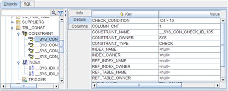

#### Object Details

This shows detailed information about database objects. For example, index, sequence, synonym, constraint, and others support detailed information about objects.

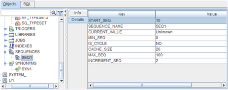

#### Source View

The following object creation DDL is shown for the PSM object type and required objects: 

Stored Procedure, Function, Package, Typeset, Trigger, Library, Synonym,
View, Materialized View


#### PSM DDL grammar Support

Altibase PSM DDL grammar is supported in the SQL editor of SQuirreL SQL Client. If altibase.jar is not installed, the SQuirreL SQL Client's own parser fails to parse the Altibase PSM generated DDL.


### Installing SQuirreL SQL Client

This chapter describes how to install SQuirreL SQL Client.

#### Installation Procesdure

1. Download the SQuirreL SQL Client that can be installed on the system from the link below.  
   [http://squirrel-sql.sourceforge.net/#installation](http://squirrel-sql.sourceforge.net/#installation )

2. Double click on the downloaded "squirrel_sql-3.7.1-standard.jar" to start installation.

### Altibase JDBC Driver Registration

#### Registration Procedure

1. Double-click "squirrel-sql.bat" in the directory where SQuirreL SQL Client is installed to run the program. 

2. Click Driver -> New Driver to register the Altibase JDBC driver. If the Drivers menu is inactive, click Windows -> View Drivers to activate it. 

3. Enter the following in the Driver section of the Add Driver window.
   
   ```
   Name: Altibase
   Example URL:jdbc:Altibase://<host>:<port>/<database>
   ```

4. Click the "Add" button on the Extra Class Path tab at the bottom to select the Altibase JDBC drier file to be used for connection.
   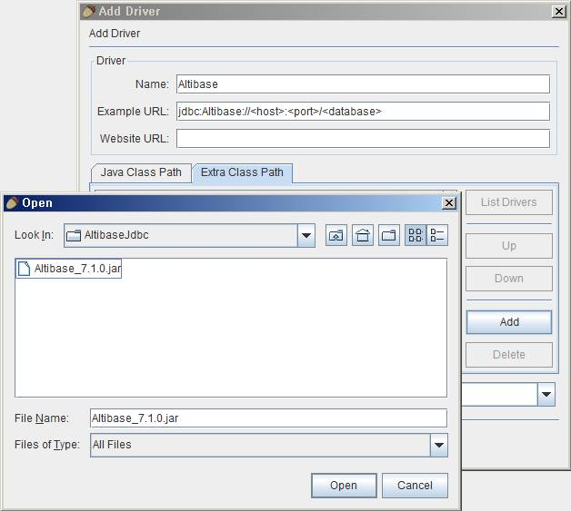

After selecting the file, press the "List Drivers" button, and check if "Altibase.jdbc.driver.AltibaseDriver" has been added to the Class Name combo box at the bottom.
   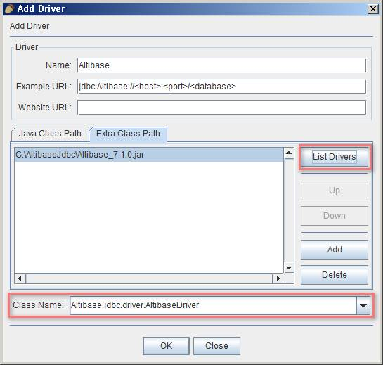

5. Click the "OK" button to complete Altibase JDBC driver registration. 

### Integration with Altibase

#### Database Connection Information Registration

1. Click Aliases -> New Alias in the main menu to register the database information to be accessed. If the Aliases menu is disabled, click Windows -> View Aliases to activate it. 

2. Enter the information below:
   
   Name: Database Connection Name
   
   Driver: Select the Altibase registered earlier
   
   URL: Enter the host, port, and database name to the connect
   
   User Name: Database user name to access
   
   Password: Password of the database user to use for access

3. After completing the input, click the "Test" button at the bottom to confirm that the entered connection information is correct.
   
   

#### Using Database

1. Click Aliases -> Connect in the main menu to open the connection window.

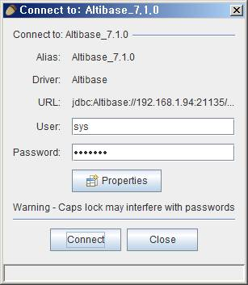

2. Click the "Connect" button to access the registered database.

#### Objects

If the connection is successful, a window consisting of two tabs will open as shown below. The object window is selected by default, and users can view the objects and detailed information existing in the connected database.

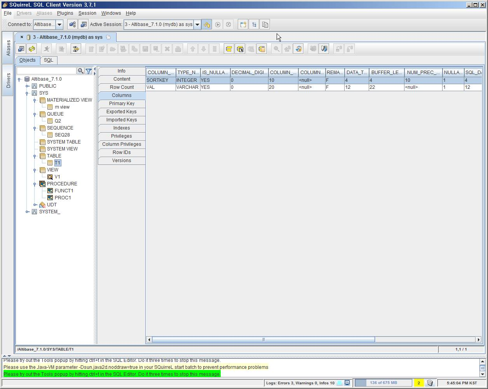

#### SQL

By selecting SQL from the two tabs at the top, users can enter and execute queries.


### FAQ

#### After installing the latest JDK version, when running the SQuirreL SQL client, it fails with the message "Your Java Virtual Machine must be at least 1.6 to run SQuirrel 3.x and above". 

This error occurs because the SQuirreL SQL client does not recognize the latest Java version.

Find the JavaVersionChecker line in the squirrel-sql.bat or squirrel-sql.sh file and add the version to use. For example, when using OpenJDK 18 version, add '18' at the end of the JavaVersionChecker line and save it, then run the SQuirreL SQL client.

`$JAVACMD -cp "$UNIX_STYLE_HOME/lib/versioncheck.jar" JavaVersionChecker 1.6 1.7 1.8 18`

If you use Java version 9 or later, SQuirreL SQL client version 3.8.1 or 3.9.0 is required.

Please refer to https://sourceforge.net/p/squirrel-sql/bugs/1347/

#### How to retrieve LOB data.

In the SQuirreL SQL client, LOB data can be retrieved in the SQL tab or the Objects tab.

| SQL                                               | Objects                                               |
| ------------------------------------------------- | ----------------------------------------------------- |
| 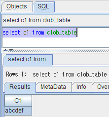 | 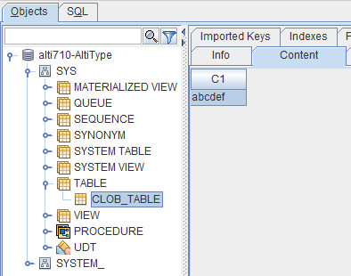 |

##### Settings for LOB data retrieval in the SQuirreL SQL client

The following setting is required to display LOB data in the SQL tab or the Objects tab.

1. Change the Data Type Controls setting.<br>
   In 'File -> Global Preferences -> Data Type Controls tab', check the "Read contents when table is first loaded" option of BLOB or CLOB 

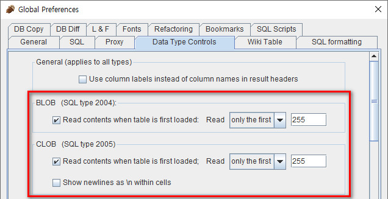

2. Change the autocommit mode to false in the session properties.<br>
   In Altibase HDB, transactions must be managed explicitly for LOB data. To apply this, uncheck the "Auto Commit SQL" checkbox in File -> New Session Properties -> SQL tab.

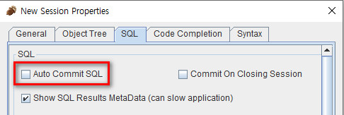

##### Additional required settings when retrieving LOB data in the Objects tab

1. Use the Altibase HDB JDBC Driver corresponding to the version below.
   - Altibase 7.1.0.7.2 or higher
   - Altibase 7.2.0.0.2 or higher

2. Add getcolumns_return_jdbctype=true to the JDBC connection properties.<br>
   It can be changed in Drivers -> Add Driver to designate a new driver, or Aliases -> Modify the selected Alias to add or change existing connection information.

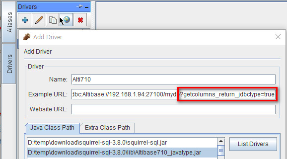


<br>

2.Hibernate
=========

### Hibernate

Altibase provides non-standard SQL, and Hibernate supports the dialect class to perform this function.

To integrate Altibase in Hibernate, configure Altibase JDBC Driver, and AltibaseDialect.class must be specified in Hibernate's configuration.

#### AltibaseDialect

Because the library provided by Hibernate does not include AltibaseDialect.class, users must compile the [AltibaseDialect.java](https://github.com/ALTIBASE/hibernate-orm/blob/master/hibernate-core/src/main/java/org/hibernate/dialect/pagination/AltibaseLimitHandler.java) file (including [AltibaseLimitHandler.Java](https://github.com/ALTIBASE/hibernate-orm/blob/master/hibernate-core/src/main/java/org/hibernate/dialect/pagination/AltibaseLimitHandler.java)  as needed) and port it to the file provided by Hibernate to use it. 

Please refer to [AltibaseDialect Porting Method](https://github.com/ALTIBASE/hibernate-orm/blob/master/ALTIBASE_DIALECT_PORTING.md) for detailed information.

<br>

3.OpenLDAP
========

This chapter describes how to integrate openLDAP with Altibase.

### Introduction to OpenLDAP

OpenLDAP is a Light-weight Directory Access Protocol(LDAP) as an open source implementation. 

OpenLDAP supports RDBMS as a backend repository, which is called SQL Backend or back-sql. back-sql uses ODBC when linking with RDBMS.

#### OpenLDAP Installation

1. Download OpenLDAP  
   <http://www.openldap.org/>

2. Unpack
   
   ```
   $ tar xvfz name_of.tgz
   ```

3. Configure, Make, and Install
   
   ```
   $ ./configure --prefix=.... --enable-sql
      ./configure --refer to help
   $ make depend
   $ make
   $ make install (su root -c 'make install')
   ```

#### Altibase Installation

We recommend users to install Altibase 6.5.1 or later.

For more detailed information on installation, please refer to the *Installation Guide*.

### Meta Data Configuration

In the meta table for LDAP, it is necessary to store which table and column of Altibase map objectClass and attributeType of LDAP. 

Altibase can use 4 meta tables for LDAP.

- ldap_oc_mappings

- ldap_attr_mappings

- ldap_entries

- ldap_entry_objclasses

#### ldap_oc_mappings

The objectClass mapping table stores the relationship between the structuralObjectClass and the table. 

| Column Name   | Description                                                                                                                                                                                                                                                                                                                                                                                                                                                                                                                                                                                                                                                                                                                                                                                                                                                                            |
| ------------- | -------------------------------------------------------------------------------------------------------------------------------------------------------------------------------------------------------------------------------------------------------------------------------------------------------------------------------------------------------------------------------------------------------------------------------------------------------------------------------------------------------------------------------------------------------------------------------------------------------------------------------------------------------------------------------------------------------------------------------------------------------------------------------------------------------------------------------------------------------------------------------------- |
| ID            | The unique ID<br/>Used when referencing another Idap_* table                                                                                                                                                                                                                                                                                                                                                                                                                                                                                                                                                                                                                                                                                                                                                                                                                           |
| NAME          | The name of objectClass. <br/>Must match the name of one of the objectClasses loaded in slapd's schema                                                                                                                                                                                                                                                                                                                                                                                                                                                                                                                                                                                                                                                                                                                                                                                 |
| KEYTBL        | The name of the table corresponding to objectClass. <br/>In the example, inetorgPerson objectClass is mapped to the person table.                                                                                                                                                                                                                                                                                                                                                                                                                                                                                                                                                                                                                                                                                                                                                      |
| KEYCOL        | The name of the primary key column of the "keytbl" table                                                                                                                                                                                                                                                                                                                                                                                                                                                                                                                                                                                                                                                                                                                                                                                                                               |
| CREATE_PROC   | SQL statement to execute when adding an entry                                                                                                                                                                                                                                                                                                                                                                                                                                                                                                                                                                                                                                                                                                                                                                                                                                          |
| CREATE_KEYVAL | Query statement that receives the new ID value entered in the "CREATE_PROC" SQL statement. <br/>Create_needs_select must be set to "yes" in slap.conf to use this query.                                                                                                                                                                                                                                                                                                                                                                                                                                                                                                                                                                                                                                                                                                               |
| DELETE_PROC   | When deleting an entry, the SQL statement "keybl.keycol" to be executed is taken as a host variable                                                                                                                                                                                                                                                                                                                                                                                                                                                                                                                                                                                                                                                                                                                                                                                    |
| EXPECT_RETURN | An integer value of the bit string indicating whether the SQL statements of CREATE_PROC and DELECT_PROC return a value.<br/>The first bit corresponds to ADD_PROC, and the second bit corresponds to DELETE_PROC.<br />Available Values:  <br />0: Both the CREATE_PROC and DELETE_PROC SQL statements have no return value <br />1: SQL statement of CREATE_PROC returns a value <br />2: SQL statement of DELETE_PROC returns a value <br />3: Both the CREATE_PROC and DELETE_PROC SQL statements return values <br /><br />What to observer when writing an SQL statement (procedure or function) with a return value: <br />The return value of CREATE_PROC should be the new ID value entered.<br />The return value of DELETE_PROC should return 0 is successful, 1 otherwise. <br />The outbinding parameter that receives the return value should be placed at the beginning. |

#### ldap_attr_mappings

As attributeType mapping table, it stores how attributeType for specific objectClass is mapped to SQL statement. 

| Column Name   | Description                                                                                                                                                                                                                                                                                                                                                                                                                                                                                                                                                                                                                                                                                                                                                                                                                                                 |
| ------------- | ----------------------------------------------------------------------------------------------------------------------------------------------------------------------------------------------------------------------------------------------------------------------------------------------------------------------------------------------------------------------------------------------------------------------------------------------------------------------------------------------------------------------------------------------------------------------------------------------------------------------------------------------------------------------------------------------------------------------------------------------------------------------------------------------------------------------------------------------------------- |
| ID            | Unique ID                                                                                                                                                                                                                                                                                                                                                                                                                                                                                                                                                                                                                                                                                                                                                                                                                                                   |
| OC_MAP_ID     | Indicates the ID of the Idap_oc_mappings table, and indicates which objectClass the attributeType belongs to.                                                                                                                                                                                                                                                                                                                                                                                                                                                                                                                                                                                                                                                                                                                                               |
| NAME          | The name of the attributeType <br/>Must match the name of one of the attributeTypes loaded in slapd's schema.                                                                                                                                                                                                                                                                                                                                                                                                                                                                                                                                                                                                                                                                                                                                               |
| SEL_EXPR      | Expression to select the attribute below.<br />("select \<sel_expr\> from ..." part)                                                                                                                                                                                                                                                                                                                                                                                                                                                                                                                                                                                                                                                                                                                                                                        |
| FROM_TBLS     | Table to get the below attribute: <br />("select ... from \<from_tbls \> where ..." part)                                                                                                                                                                                                                                                                                                                                                                                                                                                                                                                                                                                                                                                                                                                                                                   |
| JOIN_WHERE    | Condition for selecting the attribute below. <br />("select ... where \<join_where\> ..." part)                                                                                                                                                                                                                                                                                                                                                                                                                                                                                                                                                                                                                                                                                                                                                             |
| ADD_PROC      | SQL statement to input in the corresponding attribute <br />Takes the value of the attibute to be added and the "keytbl.keycol" of the entry associated with it as a host variable.                                                                                                                                                                                                                                                                                                                                                                                                                                                                                                                                                                                                                                                                         |
| DELETE_PROC   | SQL statement to delete in the attribute <br />Takes the value of attibute to be deleted and the "keytbl.keycol" of the entry associated with it as a host variable.                                                                                                                                                                                                                                                                                                                                                                                                                                                                                                                                                                                                                                                                                        |
| PARAM_ORDER   | The integer value of the bit string indicating whether the keytbl.keycol value precedes or follows the value of attibute in the SQL statements of ADD_PROC and DELETE_PROC. If the keytbl.keycol value comes before the attibute value, set 0, and if it comes after, set 1.  <br />The first bit corresponds to ADD_PROC, and the second bit corresponds to DELETE_PROC. <br /><br />Available Values:  <br />0: In the CREATE_PROC and DELETE_PROC SQL statements, the keytbl.keycol vlaue precedes the attribute value.  <br />1: In the SQL statement of CREATE_PROC, the keytbl.keycol value follows the value of attibute.<br />2: In the SQL statement of DELETE_PROC, the keytbl.keycol value follows the value of attibute.  <br />3: Both the SQL statements of CREATE_PROC and DELTE_PROC have the keytbl.keycol value after the attibute value. |
| EXPECT_RETURN | The integer value of the bit string indicating whether the SQL statements of ADD_PROC and DELTE_PROC return a value. <br /><br />Available Values<br />0: Both the SQL statements fo CREATE_PROC and DELETE_PROC have no retun value <br />1: SQL statement of CREATE_PROC returns a value <br />2: SQL statement of DELETE_PROC returns a value <br />3: Both the CREATE_PROC and DELETE_PROC SQL statements return values. <br /><br />What to observe when writing an SQL statement (procedure or function) with a return value: <br />The return value of CREATE_PROC and DELETE_PROC should return 0 if successful, or 1 otherwise.  <br />The outbinding parameter that receives the return value should be placed first.                                                                                                                             |

#### ldap_entries

This is an entry mapping table. It stores the DN value that identifies each entry in the LDAP tree.

| Column Name | Description                                                                                                                                                                                                             |
| ----------- | ----------------------------------------------------------------------------------------------------------------------------------------------------------------------------------------------------------------------- |
| ID          | Unique ID                                                                                                                                                                                                               |
| DN          | The DB of the entry is stored in "pretty" form                                                                                                                                                                          |
| OC_MAP_ID   | The ID of the table corresponding to the main objectClass of the entry <br />Corresponds to one of the ID Values in the Idap_oc_mappings table.                                                                         |
| PARENT      | The ID of the parent entry <br/>The "suffix" entry has a value of 0.                                                                                                                                                    |
| KEYVAL      | The value of the primary key column of the row in the table that holds the entry's data <br />That is, the primary key column value of the table corresponding to the objectClass of this entry ("keytbl.keycol" value) |

#### ldap_entry_objclasses

This is an objectClass mapping table. Entry has some auxiliary objectClass.

| Column ID | Description                                                                                                        |
| --------- | ------------------------------------------------------------------------------------------------------------------ |
| ENTRY_ID  | The value of ldap_entries.id                                                                                       |
| NAME      | The name of auxiliary objectClass. <br />Must match the name of one of the objectClasses loaded in slapd's schema. |

### Configuration

Edit the ODBC configuration and slapd.conf file to configure the OpenLDAP environment.

#### .odbc.ini

```
[ldap_altibase]
Description = ODBC for Altibase
Driver = /home/altibase/altibase_home/lib/libaltibase_odbc-64bit-ul64.so
server = 127.0.0.1
port = 20030
```

odbc trace configuration: the following configuration can be used to trace the problem when a back-end error occurs.

#### .odbcinst.ini

```
[ODBC]
TraceFile = /home/altibase/odbc.log
Trace = Yes
```

#### slapd.conf

Edit slapd.conf with reference to slapd.conf provided as a sample for Altibase.

```
# $OpenLDAP$
#
# See slapd.conf(5) for details on configuration options.
# This file should NOT be world readable.
#
include         /usr/local/etc/openldap/schema/core.schema
include         /usr/local/etc/openldap/schema/cosine.schema
include         /usr/local/etc/openldap/schema/inetorgperson.schema

# Define global ACLs to disable default read access.

# Do not enable referrals until AFTER you have a working directory
# service AND an understanding of referrals.
#referral       ldap://root.openldap.org

pidfile         /usr/local/var/slapd.pid
argsfile        /usr/local/var/slapd.args

#######################################################################
# sql database definitions
#######################################################################

database        sql
suffix          "dc=example,dc=com"
rootdn          "cn=Manager,dc=example,dc=com"
rootpw          secret
dbname          ldap_altibase --ODBC dsn name
dbuser          ldap --Altibase user name
dbpasswd        ldap --db user pw
subtree_cond    "upper(ldap_entries.dn) LIKE CONCAT('%',upper(?))"
insentry_stmt   "insert into ldap_entries (id,dn,oc_map_id,parent,keyval) values (ldap_entry_ids.nextval,?,?,?,?)"
has_ldapinfo_dn_ru  no
upper_func      UPPER
```

### Examples

A DIT (Directory Information Tree) is build in the Altibase as shown in the figure below.


root DN is "dc=example and dc=com", ldif (LDAP Data Interchange Files, file representing tree data as text) is as follows. Please refer to the sample file except root DN "dc=exampl,dc=com". Sample file is in https://github.com/ALTIBASE/openldap/tree/master/servers/slapd/back-sql/rdbms_depend/altibase .

```
# Mitya Kovalev, example.com
dn: cn=Mitya Kovalev,dc=example,dc=com
objectClass: inetOrgPerson
cn: Mitya Kovalev
sn: Kovalev
seeAlso: documentTitle=book1,dc=example,dc=com
seeAlso: documentTitle=book2,dc=example,dc=com
givenName: Mitya
userPassword:: bWl0
telephoneNumber: 222-3234
telephoneNumber: 332-2334

# Akakiy Zinberstein, example.com
dn: cn=Akakiy Zinberstein,dc=example,dc=com
objectClass: inetOrgPerson
cn: Akakiy Zinberstein
sn: Zinberstein
givenName: Akakiy

# Torvlobnor Puzdoy, example.com
dn: cn=Torvlobnor Puzdoy,dc=example,dc=com
objectClass: inetOrgPerson
cn: Torvlobnor Puzdoy
sn: Puzdoy
seeAlso: documentTitle=book1,dc=example,dc=com
givenName: Torvlobnor
telephoneNumber: 545-4563

# book1, example.com
dn: documentTitle=book1,dc=example,dc=com
objectClass: document
description: abstract1
documentTitle: book1
documentAuthor: cn=Mitya Kovalev,dc=example,dc=com
documentAuthor: cn=Torvlobnor Puzdoy,dc=example,dc=com
documentIdentifier: document 1

# book2, example.com
dn: documentTitle=book2,dc=example,dc=com
objectClass: document
description: abstract2
documentTitle: book2
documentAuthor: cn=Mitya Kovalev,dc=example,dc=com
documentIdentifier: document 2

# example.com
dn: dc=example,dc=com
objectClass: organization
objectClass: dcObject
o: Example
dc: example
```

These entries are structual objectClass "Organization" and auxiliary objectClass contains "dcObject", and each definition is as follows.

To map objectClass to a DB table, users must select and column among attribute members of objectClass. In this example, the "o" and "dc" attributes are selected.

```
objectclass ( 2.5.6.4 NAME 'organization'
    DESC 'RFC2256: an organization'
    SUP top STRUCTURAL
    MUST o
    MAY ( userPassword $ ... ) )

objectclass ( 1.3.6.1.4.1.1466.344 NAME 'dcObject'
    DESC 'RFC2247: domain component object'
    SUP top AUXILIARY MUST dc )
```

The following is an SQL statement that creates the "institutes" table mapping the above objectClass to the Altibase table and the meta data for inserting, searching, and modifying data.

```
CREATE TABLE institutes (
        id int NOT NULL,
        name varchar(255)
);
insert into institutes (id,name) values (institute_ids.nextval,'Example');

insert into ldap_oc_mappings (id,name,keytbl,keycol,create_proc,delete_proc,expect_return)
  values (3,'organization','institutes','id','exec create_org(?)','exec delete_org(?)',1);

insert into ldap_attr_mappings (id,oc_map_id,name,sel_expr,from_tbls,join_where,add_proc,delete_proc,param_order,expect_return)
  values (11,3,'o','institutes.name','institutes',NULL,'exec set_org_name(?,?)',NULL,0,0);

insert into ldap_attr_mappings (id,oc_map_id,name,sel_expr,from_tbls,join_where,add_proc,delete_proc,param_order,expect_return)
  values (12,3,'dc','lower(institutes.name)','institutes,ldap_entries dcObject,ldap_entry_objclasses auxObjectClass',
    'institutes.id=dcObject.keyval AND dcObject.oc_map_id=3 AND dcObject.id=auxObjectClass.entry_id AND auxObjectClass.oc_name=''dcObject''',
    NULL,NULL,0,0);

insert into ldap_entries (id,dn,oc_map_id,parent,keyval)
  values (ldap_entry_ids.nextval,'dc=example,dc=com',3,0,1);  -- id = 1

insert into ldap_entry_objclasses (entry_id,oc_name) values (1,'dcObject');

CREATE OR REPLACE PROCEDURE create_org(keyval OUT INTEGER) AS
BEGIN
INSERT INTO institutes (id,name) VALUES (institute_ids.nextval,' ');
SELECT institute_ids.currval INTO keyval FROM DUAL;
END;
/

CREATE OR REPLACE PROCEDURE delete_org(keyval IN INTEGER) AS
BEGIN
DELETE FROM institutes WHERE id=keyval;
END;
/

CREATE OR REPLACE PROCEDURE set_org_name(keyval IN INTEGER, new_name IN varchar(255)) AS
BEGIN
UPDATE institutes SET name=new_name WHERE id=keyval;
END;
/
```

The sample example above is provided as a script file, and sample data can be built as shown below. The script file used can be downlaoded from https://github.com/ALTIBASE/openldap/tree/master/servers/slapd/back-sql/rdbms_depend/altibase. 

#### Creating Idap User

After connection isql as sys user, execute the following SQL statement:

```
drop user ldap cascade;
create user ldap identified by ldap;
```

#### Creating Data

```
$ isql -s localhost -u ldap -p ldap -f backsql_create.sql
$ isql -s localhost -u ldap -p ldap -f testdb_create.sql
$ isql -s localhost -u ldap -p ldap -f testdb_metadata.sql
$ isql -s localhost -u ldap -p ldap -f testdb_data.sql
```

- backsplash_creat.sql: Create a table for storing meta data for mapping
- testdb_create.sql: Create objectClass to use as DB table
- testdb_metadata.sql: Enter meta data for mapping
- Testdb_data.sql: objectClass data input
