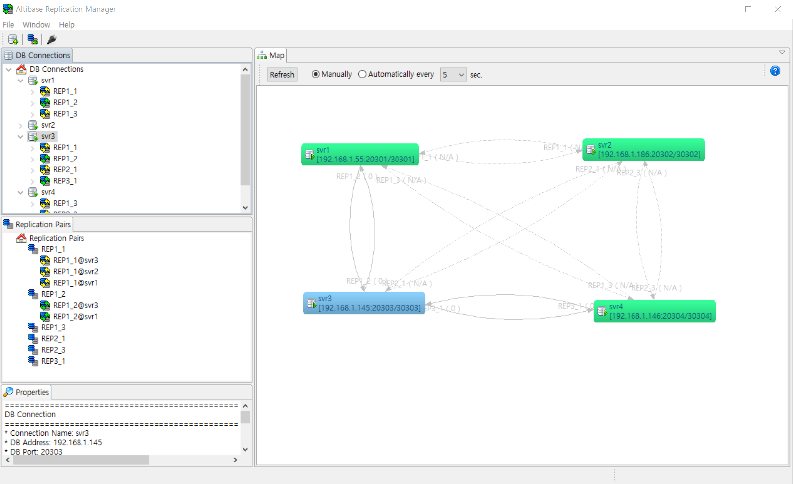

- [Replication Manager User’s Manual](#replication-manager-users-manual)
  - [Preface](#preface)
  - [1. Introduction](#1-introduction)
    - [Overview](#overview)
    - [System Requirements](#system-requirements)
    - [Installation and Uninstallation](#installation-and-uninstallation)
  - [2. Getting Started](#2-getting-started)
    - [Understanding the User Interface](#understanding-the-user-interface)
    - [Connecting to Altibase](#connecting-to-altibase)
    - [Working with Replication](#working-with-replication)

Altibase® Tools & Utilities

Replication Manager User’s Manual
=================================

Altibase Tools & Utilities Replication Manager User’s Manual

Release 1.3

Copyright ⓒ 2001\~2021 Altibase Corp. All Rights Reserved.

This manual contains proprietary information of Altibase Corporation; it is provided under a license agreement containing restrictions on use and disclosure and is also protected by copyright patent and other intellectual property law. Reverse engineering of the software is prohibited. All trademarks, registered or otherwise, are the property of their respective owners.

**Altibase Corp**

10F, Daerung PostTower II,
306, Digital-ro, Guro-gu, Seoul 08378, Korea
Telephone: +82-2-2082-1000 Fax: 82-2-2082-1099

Customer Service Portal: <http://support.altibase.com/en/>

Homepage: [http://www.altibase.com]

Preface
----

This manual explains how to use Replication Manager to manage Altibase replication objects.

#### Audience

This manual has been prepared for the following Altibase users:

- Database administrators
- Performance administrators
- Database users
- Application developers
- Technical Supporters

It is recommended for those reading this manual possess the following background knowledge:

- Basic knowledge in the use of computers, operating systems, and operating system utilities
- Experience in using relational database and an understanding of database concepts
- Computer programming experience
- Experience in database server management, operating system management, or network administration

#### Organization

This document is an elementary guide for those unfamiliar with Replication Manager. The manual is organized as follows:

- Chapter 1: Introduction to Replication Manager 
  
  This chapter provides information on the prerequisites for installation and an overview of Replication Manager. It also explains how to install and uninstall Replication Manager. 
  
- Chapter 2: Getting Started 
  
  This chapter introduces the graphical user interface of Replication Manager. Then, it covers the steps to be taken to connect Replication Manager to Altibase database and describes describes how to use Replication Manager in detail.

#### Documentation Conventions

This section describes the conventions used in this manual. Understanding these conventions will make it easier to find information in this manual and in the other manuals in the series. 

There are two sets of conventions:

- Syntax diagram convetions
- Sample code conventions

##### Syntax Diagram Conventions

This manual describes command syntax using diagrams composed of the following elements:

| Elements                                                     | Meaning                                                      |
| ------------------------------------------------------------ | ------------------------------------------------------------ |
|  | Indicates the start of a command. If a syntactic element starts with an arrow, it is not a complete command. |
|  | Indicates that the command continues to the next line. If a syntactic element ends with this symbol, it is not a complete command. |
|  | Indicates taht the command continues from the previous line. If a syntactic element starts witht his symbol, it is not a complete command. |
|  | Indicates the end of a statement.                            |
|  | Indicates a manatory element.                                |
|  | Indicates an optional element.                               |
|  | Indicates a mandatory element comprised of options. One, and only one, option must be specified. |
|  | Indicates an optional element comprised of options.          |
|  | Indicates an optional element in which multiple elements may be specified. A comman must precede all but the first element. |

##### Sample Code Conventions

The code examples explain SQL statements, stored procedures, iSQL statements, and other command line syntax.

The following table describes the printing conventions used in the code examples.

| Rules            | Meaning                                                      | Example                                                      |
| ---------------- | ------------------------------------------------------------ | ------------------------------------------------------------ |
| [ ]              | Indicates an optional item                                   | VARCHAR [(*size*)] [[FIXED \|] VARIABLE]                     |
| { }              | Indicates a mandatory field for which one or more items must be selected. | { ENABLE \| DISABLE \| COMPILE }                             |
| \|               | A delimiter between optional or mandatory arguments.         | { ENABLE \| DISABLE \| COMPILE } [ ENABLE \| DISABLE \| COMPILE ] |
| . . .            | Indicates that the previous argument is repeated, or that sample code has been omitted. | SQL\> SELECT ename FROM employee;  ENAME   -----------------------  SWNO   HJNO   HSCHOI   .  .  .  20 rows selected. |
| Other Symbols    | Symbols other than those shown above are part of the actual code. | EXEC :p1 := 1; acc NUMBER(11,2)                              |
| Italics          | Statement elements in italics indicate variables and special values specified by the user. | SELECT \* FROM *table_name*;  CONNECT *userID*/*password*; |
| Lower case words | Indicate program elements set by the user, such as table names, column names, file names, etc. | SELECT ename FROM employee;                                  |
| Upper case words | Keywords and all elements provided by the system appear in upper case. | DESC SYSTEM_.SYS_INDICES_;                                   |

#### Related Documents

For more detailed information, please refer to the following documents.

- Installation Guide

- Getting Started Guide

- Administrator’s Manual

- Replication Manual

- Precompiler User’s Manual

- API User’s Manual

- Alitbase C Interface Manual

- iSQL User’s Manual

- Utilities Manual

- General Reference

- Error Message Reference

#### Altibase Welcomes Your Comments and Feedbacks

Please let us know what you like or dislike about our manuals. To help us with better future versions of our manuals, please tell us if there is any corrections or classifications that you would find useful.

Include the following information:

- The name and version of the manual that you are using
- Any comments about the manual
- Your name, address, and phone number

If you need immediate assistance regarding any errors, omissions, and other technical issues, please contact [Altibase's Support Portal](http://support.altibase.com/en/).

Thank you. We always welcome your feedbacks and suggestions.

## 1. Introduction

This chapter introduces Replication Manager and explains how to install it. It contains the following sections:

- Overview
- System Requirements
- Installation and Uninstallation

### Overview

Replication Manager is a graphical tool for managing replication objects on Altibase. Altibase Database Administrators typically need to connect to all instances of Altibase on which replication objects are active. Using a Command Line Interface (CLI) such as iSQL, they need to jump around between console windows to perform replication tasks such as stopping, modifying, and starting target replication objects. This requires them to memorize the status of, and relationships between, replication objects, meaning that the burden of replication management grows exponentially as the number of replication objects increases linearly. Thanks to its Graphical User Interface (GUI), Replication Manager can help DBAs perform these tasks easily while visualizing all of their replication nodes in the same screen.

The major benefits of this tool are:

1. Work with multiple versions of Altibase using the same program. 
2. Check the status of replication objects and the relationships between them at a glance. 
3. Manage replication objects with the click of a mouse.
4. Check the properties of replication objects and related objects. 
5. Monitor replication pairs and analyze their status, almost intuitively

### System Requirements

This section discusses the system requirements for Replication Manager and compatible Altibase version.

#### Hardware Requirements

1. CPU: 800MHz Pentium or better

2. Main Memory: 512MB or more

3. Disk: 50MB or more free spaces (in addition to space required for the JRE)

4. Screen Resolution: 1024 x 768 pixels or higher

#### Software Requirements

##### Supported OS and Platforms
Replication Manager is distributed in Windows and Linux-compatible packages. 

| Package Name                                        | Operating System | Graphic System | JRE              |
| :-------------------------------------------------- | :--------------: | :------------: | :-----------: |
| ReplicationManager-win32.win32.x86.zip              | Windows          | win32          | JRE 6 included   |
| ReplicationManager-linux.gtk.x86.zip (JRE included) | Linux            | GTK            | Java 6 or higher |

##### Java Requirement
- Java Development Kit (JDK), or Java Runtime Environment (JRE) 6 or later

Since Replication Manager for the Microsoft Windows system is bundled with the JRE 6, users do not need to install the JRE. However, other operating system users must configure the JRE and related environment variables appropriately to use Java.

#### Compatible Altibase version

- Altibase: 4.3.9 or higher

Since Replication Manager can work with different versions of ALTIBASE HDB at the same time, users must use the JDBC driver file appropriate for the ALTIBASE HDB to which you are connecting.

Please refer to [Importing a JDBC Driver File](#importing-a-jdbc-driver-file).

### Installation and Uninstallation

#### Download

Replication Manager can be downloaded from Altibase Customer Center at http://support.altibase.com/en/product. Replication Manager is provided in ZIP file format. 

#### Installation

To install it, simply unzip the file in the desired directory.

#### Uninstallation

To unistall it, simply delete the directory in which Replication Manager is installed. 

## 2. Getting Started

This chapter introduces the graphical user interface of Replication Manager. Then, it covers the steps to be taken to connect Replication Manager to Altibase database and describes the detail usage of Replication Manager. It is organized as follows:

- Understanding the User Interface
- Connecting to Altibase
- Working with Replication Manager

### Understanding the User Interface

This section introduces the overall user interface. 

The user interface of Replication Manager is organized as follows:

1. DB Connections: This is the entry point for the program and a database-centric view that represents the relationship between databases and replication objects in a tree structure.

2. Replication Pairs: This is a logical view that depicts replication objects in pairs. A group of two replication objects that have the same name and interact with each other is called a "Replication Pair".

3. Map: This area graphically illustrates the physical layout and status of databases, replication objects, and the relationships therebetween.

4. Properties: This area shows the properties for the currently selected object (e.g. DB connection or replication object).

These four panes are intended to give DBAs a variety of ways of visualizing the same databases and replication objects. For example, the "Map" pane provides a convenient way to check the replication gap at a glance, while "Replication Pairs" provides a convenient way of handling replication objects as pairs without having to think about the databases on which they are working. So, these four panes complement each other. For example, when a replication object is selected in the "DB Connections" pane, the same replication object is also selected in the "Replication Pairs" and "Map" panes. In addition, the properties of the selected replication object will be displayed in the "Properties" pane. In other words, the three editable panes, "DB Connections", "Replication Pairs", and "Map", interact multidirectionally with each other, while the read-only pane, "Properties", receives information from the other three panes.

The "DB Connections" pane offers the following features:

- It provides a view that can be used to register, unregister, and edit database connections. 
- It shows meta information about connected databases, replication objects, and replication target tables in a tree structure for ease of navigation. 
- It provides a convenient way to manage databases and replication objects, including starting, stopping, creating, and dropping replication objects

The "Replication Pairs" pane offers the following features:

- It provides a convenient way to manage replication pairs without having to think about the underlying databases. 
- It also provides a way to manage replication objects, including starting and stopping them.

The "Map" pane offers the following features:

- It delivers the big picture of all registered databases and replication objects in an intuitive manner. 
- It also provides a way to control databases and replication objects.
- It shows "Unknown" DB Connection if any replication object is unable to locate the corresponding replication object. So, it helps users not to miss registering and opening required DB Connections.

### Connecting to Altibase

This section describes, in the form of a tutorial, the basic steps that must be taken in order to connect to an Altibase database. The usual workflow when working with Altibase is as follows:

1. Import a JDBC driver file to be used when connecting to an Altibase database. 
2. Add a database connection. 
3. Connect to the database. 
4. Conduct replication administration tasks as required. 
5. Disconnect from the database. 
6. Edit DB connection information. 
7. Manage Extra Host IP
8. Remove the database if it is no longer needed.

Each procedure is conducted as described below.

#### Importing a JDBC Driver File

This section describes the steps involved in importing the appropriate version of the JDBC driver file into Replication Manager. 

Replication Manager can work with many different versions of Altibase simultaneously. So, it is necessary to import Altibase JDBC driver that is appropriate for the database to be connected. If a user want to connect to two different Altibase databases, for example, versions 4.3.9.100 and 5.3.3.33 respectively, then the user is required to import two versions of the JDBC driver files into Replication Manager, and to give them different names, for example, "Altibase_4.3.9.100.jar" and "Altibase_5.3.3.33.jar". 

To import a JDBC driver, do the following: 

1. Click on the "JDBC driver manager" icon in the toolbar to open the "JDBC driver manager" dialog box.

2. In this dialog box, click on the "+" icon on the right to open the "Import JDBC driver file" dialog box, as shown below.

3. Select a JDBC driver file to import and give the file a name to be used in Replication Manager. The source file will be copied into the specified directory and renamed as specified. 

4. Close the "JDBC driver manager" dialog box.

Alternatively, users can also import a JDBC driver file when performing the "Adding a Database connection" task. 

#### Adding a Database Connection

1. Open the "New DB Connection" dialog by clicking on the "New DB Connection" icon in the main toolbar, or by right-clicking on the "DB Connections icon" in the "DB Connections" panel and then left-clicking on the "New DB Connection" item in the context menu that appears.
2. The "New DB Connection" dialog box shown below will appear. Fill in the input fields as described below.

- Basic Information

	- Connection Name: A unique connection name of up to 10 characters. The name must start with an alphabet, alphabets and numbers can be mixed.
	- Password: The password for the SYS user for the database
	- DB Address: The IP address of the machine on which the database installed
	- DB Port: The port number with which to access the database
	- DB Name:  The name of the database
	- JDBC driver: To use the appropriate version of the JDBC driver file, select the correct imported JDBC driver in the combo box. If the required JDBC driver file has not been imported yet, please import a new JDBC driver by clicking on the "JDBC driver manager" icon.

- Options

  - IP Address Type: Select the appropriate IP address type, IPv4 or IPv6.
  - NLS for Client: Choose the character set to use when translating data from the DBMS on the client side. (This option is not necessary when connecting to Altibase version 5.3.1 or higher.)
  

3. Click on the "Connection Test" button to ensure that the connection works as expected. 
4. Finally, click on the "Save" button.

#### Connecting to the Database

Once the previous task has been completed, you are ready to connect to a database, as shown below:

To connect to a database, complete the following steps:

1. Select the newly added database connection. Right-click on the newly added database to display the context menu, and then left-click on "Connect". This may take some time, depending on your environment. 
2. When you are successfully connected, you will see the replication objects in the target database. 
3. If the connection fails, a warning dialog appears, displaying some information that will be of help in successfully establishing a connection.

#### Working with the Connected Database

If you have followed the preceding steps successfully, you are ready to manage replication on the connected database.

#### Disconnecting from the Database

After finishing your work, it will be necessary to close the connection with the database. To close a connection with a database, select the target database connection. Open the context menu by right-clicking on the target database, and then choose "Disconnect" from the context menu.

#### Editing DB Connection Information

It will sometimes be necessary to edit database connection information. For example, it may be necessary to change the account that is used to establish the database connection. This is possible only when not connected to the database in question. There are six steps involved in editing database connection information.

1. Select the database for which it is desired to change connection information. To open the context menu, right-click on the database, and then choose "Edit" from the context menu. 
2. Make the required changes to the connection information. Click on the "Connection Test" button to ensure that the connection works as expected. 
3. The dialog box shown below will appear if the connection test is successful. Click on the "OK".
4. Finally, click on the "Save" button in the Edit dialog box. 

#### Managing Extra Host IP

If Altibase is installed on a device with multiple IP addresses and one of these addresses is used as a Remote Host IP when creating a replicaiton object in another Altibase, the IP is either the DB Address of the registered database connection or the Extra Host IP. It must be one. Otherwise, the relationship between the database and the replication object may not be properly displayed in the Map window.
This menu is available regard of you are connected to the database or not. Select the database you wish to register or delete the Extra Host IP. Right-click on the database to open the context menu and select the "Manage Extra Host IP" item.

#### Removing a Database Connection

When a registered database is no longer in use, you will probably want to remove it from the DB Connections panel. To remove a database, select the target database connection. Open the context menu by right-clicking on the database connection to be removed, and then left-click on "Remove" in the context menu.

### Working with Replication Manager

This section is intended to describe how to use Replication Manager in detail. It also describes the relationship between panes and objects.

Replication Manager takes care of a single base model, which simulates databases and replication-related objects, while providing a various ways of visualizing and manipulating the model through three editable panes. The model consists of six types of objects as follows:

1. Replication Object: It is an object created with the CREATE REPLICATION statement and the common object among panes at Replication Manager. Please refer to [Understanding the User Interface](#understanding-the-user-interface).
2. Replication Target Table Object: This is a table that is designated, using the CREATE REPLICATION or ALTER REPLICATION statement, to be replicated between corresponding replication nodes.
3. DB Connections Object: It is the root object of "DB Connection" object to manage DB Connection. Also, it is the entry point for "DB Connections" pane.
4. DB Connection Object: It is a representation of a connection to Altibase DBMS. Please refer to [Understanding the User Interface](#understanding-the-user-interface) for details.
5. Replication Pairs Object: It is the root object of "Replication Pair" and the entry point for "Replication Pairs" pane.
6. Replication Pair Object: It is a pair of corresponding replication objects having the same name, one residing on each of two different nodes. Please refer to [Understanding the User Interface](#understanding-the-user-interface).

Some objects in the model are show up few panes for the ease use of Replication Manager.

Even though some objects shared by panes are the same ones, they may provide different functionalities according to the pane. For instance, Replication Object at DB Connections pane provides "Edit Table List" function, but Replication Object at Map pane doesn't. This is to align functionalities to its context. In this example, it is more reasonable to edit the replication target table list at the database-centric view, DB Connections pane because the Map pane is intended to give a brief overview.

#### DB Connections pane

DB Connections pane is a database-centric view that represents the relationship between databases and replication objects in a tree structure. Therefore, it handles four types of objects: DB Connections Object, DB Connection Object, Replication Object, and Replication Target Table Object.

##### DB Connections Object

- Connect all: Connect all registered but not connected DB Connection
- Disconnect all: Disconnect all registered and connected DB Connection
- Start all: Start all replication objects  which are stopped or newly created.
- Stop all: Stop all replication objects which are running.
- Quick Start all: Quick Start all replication objects which are stopped. This operation may cause the loss of not yet delivered data. Please refer to [Replication User's Manual](https://github.com/ALTIBASE/Documents/blob/master/Manuals/Altibase_7.2/eng/Replication%20Manual.md) for details.
- New DB Connection: Create a new DB Connection.
- Collapse All: Collapse the tree to DB Connection level.
- Expand to Replication Object: Expand the tree to replication object level.
- Expand to Replication Table: Expand the tree to replication table level.

##### DB Connection Object

- Connect: Connect to the database with the given properties.
- Disconnect: Disconnect from the connected database.
- Edit: Edit the properties of DB Connection
- Manage Extra Host IP: Manage the Extra Host IPs of DB Connection
- Remove: Remove the selected DB Connection.
- Start all: Start all replication object which are stopped in the DB Connection.
- Stop all: Stop all replication objects which are running in the DB Connection.
- Quick Start all: Quick Start all replication objects which are stopped in the DB Connection. This operation may cause the loss of not yet delivered data. Please refer to [Replication User's Manual](https://github.com/ALTIBASE/Documents/blob/master/Manuals/Altibase_7.2/eng/Replication%20Manual.md) for details.
- Create Replication: Create a Replication Object at the DB Connection.
- Create Full-mesh Replications: Create full-meshed replication objects between selected DB Connections with identical named tables.
- Join to Full-mesh: Let selected database instance join to already created full-meshed replication objects.
- Create Replication Pair: Create a pair of Replication Objects at two distinct DB Connections.
- Drop Replications: Drop all Replication Object at the DB Connection. All Replication Objects should be stopped before using this function.

##### Replication Object

- Start: Start the selected Replication Object.
- Stop: Stop the selected Replication Object.
- Quick Start: Quick Start the selected Replication Object. This operation may cause the loss of not yet delivered data. Please refer to [Replication User's Manual](https://github.com/ALTIBASE/Documents/blob/master/Manuals/Altibase_7.2/eng/Replication%20Manual.md) for details.
- Sync: Sync the selected Replication Object. It is equivalent to performing ALTER REPLICATION  _replication_name_ SYNC statement.
- Sync Only: Sync Only the selected Replication Object. It is equivalent to performing ALTER REPLICATION  _replication_name_ SYNC ONLY statement.
- Drop: Drop the selected Replication Object, which is stopped.
- Edit Table List: Add/Remove Replication Target Tables in the selected Replication Object, which is stopped.
- Monitor: Open a monitor dialog for the selected Replication Object and the corresponding Replication Object.
- Show DDL: Print the schema to generate the selected Replication Object and its related objects, such as table, index, and so on.
- Compare DDL: Print the difference of schema between the selected Replication Object and the corresponding Replication Object.

##### Replication Target Table Object

- Remove: Remove the selected table from its underlying Replication Object.

#### Replication Pair pane

Replication Pair pane is a logical view depicting replication objects in pairs. It manages four types of objects: Replication Pairs Object, Replication Pair Object, Replication Object, and Replication Target Table.

##### Replication Pairs Object

- Start all: Start all replication object which are stopped.
- Stop all: Stop all replication objects which are running.
- Quick Start all: Quick Start all replication objects which are stopped. This operation may cause the loss of not yet delivered data. Please refer to [Replication User's Manual](https://github.com/ALTIBASE/Documents/blob/master/Manuals/Altibase_7.2/eng/Replication%20Manual.md) for details.
- Create Replication Pair: Create a pair of Replication Objects at two distinct DB Connections.
- Create Full-mesh Replications: Create full-meshed replication objects between selected DB Connections with identical named tables. For example, if four DB Connections are selected, sixteen (2^4) replication objects with the identical name are created.
- Collapse All: Collapse the tree to replication pair level.
- Expand to Replication Object: Expand the tree to replication object level.
- Expand to Replication Table: Expand the tree to replication table level.

##### Replication Pair Object

- Start all: Start all replication object which are stopped in the Replication Pair.
- Stop all: Stop all replication objects which are running in the Replication Pair.
- Quick Start all: Quick Start all replication objects which are stopped in the Replication Pair. This operation may cause the loss of not yet delivered data. Please refer to [Replication User's Manual](https://github.com/ALTIBASE/Documents/blob/master/Manuals/Altibase_7.2/eng/Replication%20Manual.md) for details.
- Drop: Drop Replication Objects in the selected Replication Pair. All Replication Objects should be stopped before using this function.

##### Replication Object

The same as DB Connections pane.

##### Replication Target Table Object

The same as DB Connections pane.

#### Map pane

Map pane illustrates the physical layout and status of databases, replication objects, and the relationships therebetween. So, it carries only two types of objects: DB Connection Object and Replication Object.

##### DB Connection Object

- Connect: Connect to the database with the given properties.
- Disconnect: Disconnect from the connected database.
- Start all: Start all replication object which are stopped in the DB Connection.
- Stop all: Stop all replication objects which are running in the DB Connection.
- Quick Start all: Quick Start all replication objects which are stopped in the DB Connection. This operation may cause the loss of not yet delivered data. Please refer to [Replication User's Manual](https://github.com/ALTIBASE/Documents/blob/master/Manuals/Altibase_7.2/eng/Replication%20Manual.md) for details.

##### Replication Object

- Start: Start the selected Replication Object.
- Stop: Stop the selected Replication Object.
- Quick Start: Quick Start the selected Replication Object. This operation may cause the loss of not yet delivered data. Please refer to [Replication User's Manual](https://github.com/ALTIBASE/Documents/blob/master/Manuals/Altibase_7.2/eng/Replication%20Manual.md) for details.
- Sync: Sync the selected Replication Object. It is equivalent to performing ALTER REPLICATION  _replication_name_ SYNC statement.
- Sync Only: Sync Only the selected Replication Object. It is equivalent to performing ALTER REPLICATION  _replication_name_ SYNC ONLY statement.
- Drop: Drop the selected Replication Object, which is stopped.
- Monitor: Open a monitor dialog for the selected Replication Object and the corresponding Replication Object.
- Show DDL: Print the schema to generate the selected Replication Object and its related objects, such as table, index, and so on.
- Compare DDL: Print the difference of schema between the selected Replication Object and the corresponding Replication Object.
