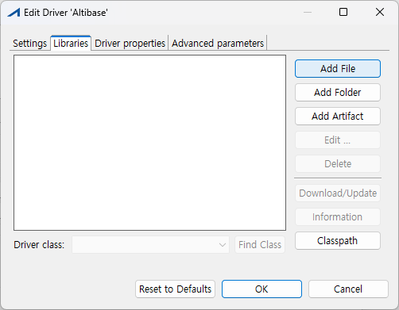

Altibase 3rd Party Connector Guide
================

Altibase® Application Development

<br><br><br><br><br><br><br><!-- PDF 변환을 위한 여백입니다. --> 


<!-- PDF 변환을 위한 여백입니다. --> 

<div align="left">
    
</div>
<br><br><!-- PDF 변환을 위한 여백입니다. --> 


<!-- PDF 변환을 위한 여백입니다. -->

<pre>
Altibase Application Development Altibase 3rd Party Connector Guide
Copyright ⓒ 2001~2023 Altibase Corp. All Rights Reserved.<br>
본 문서의 저작권은 ㈜알티베이스에 있습니다. 이 문서에 대하여 당사의 동의없이 무단으로 복제 또는 전용할 수 없습니다.<br>
<b>㈜알티베이스</b>
08378 서울시 구로구 디지털로 306 대륭포스트타워Ⅱ 10층
전화 : 02-2082-1114
팩스 : 02-2082-1099
고객서비스포털 : <a href='http://support.altibase.com'>http://support.altibase.com</a>
홈페이지      : <a href='http://www.altibase.com/'>http://www.altibase.com</a></pre>

<br>

# 목차

- [서문](#%EC%84%9C%EB%AC%B8)
  - [이 매뉴얼에 대하여](#%EC%9D%B4-%EB%A7%A4%EB%89%B4%EC%96%BC%EC%97%90-%EB%8C%80%ED%95%98%EC%97%AC)
- [1.DBeaver](#1dbeaver)
    - [개요](#%EA%B0%9C%EC%9A%94)
    - [시스템 요구사항](#%EC%8B%9C%EC%8A%A4%ED%85%9C-%EC%9A%94%EA%B5%AC%EC%82%AC%ED%95%AD)
    - [설치 및 제거](#%EC%84%A4%EC%B9%98-%EB%B0%8F-%EC%A0%9C%EA%B1%B0)
    - [Altibase 데이터베이스 시스템 연결](#altibase-%EB%8D%B0%EC%9D%B4%ED%84%B0%EB%B2%A0%EC%9D%B4%EC%8A%A4-%EC%8B%9C%EC%8A%A4%ED%85%9C-%EC%97%B0%EA%B2%B0)
- [2.SQuirreL SQL 클라이언트](#2squirrel-sql-%ED%81%B4%EB%9D%BC%EC%9D%B4%EC%96%B8%ED%8A%B8)
    - [Altibase Plugin for SQuirreL SQL Client 설치](#altibase-plugin-for-squirrel-sql-client-%EC%84%A4%EC%B9%98)
    - [Altibase Plugin 설치 및 제거](#altibase-plugin-%EC%84%A4%EC%B9%98-%EB%B0%8F-%EC%A0%9C%EA%B1%B0)
    - [Altibase Plugin 특징](#altibase-plugin-%ED%8A%B9%EC%A7%95)
    - [SQuirreL SQL Client 설치](#squirrel-sql-client-%EC%84%A4%EC%B9%98)
    - [Altibase JDBC 드라이버 등록](#altibase-jdbc-%EB%93%9C%EB%9D%BC%EC%9D%B4%EB%B2%84-%EB%93%B1%EB%A1%9D)
    - [Altibase와 연동](#altibase%EC%99%80-%EC%97%B0%EB%8F%99)
    - [FAQ](#faq)
- [3.Hibernate](#3hibernate)
    - [Hibernate](#hibernate)
- [4.OpenLDAP](#4openldap)
    - [OpenLDAP 소개](#openldap-%EC%86%8C%EA%B0%9C)
    - [메타 데이터 설정](#%EB%A9%94%ED%83%80-%EB%8D%B0%EC%9D%B4%ED%84%B0-%EC%84%A4%EC%A0%95)
    - [환경 설정](#%ED%99%98%EA%B2%BD-%EC%84%A4%EC%A0%95)
    - [예제](#%EC%98%88%EC%A0%9C)
- [5.Oracle GoldenGate](#5oracle-goldengate)
    - [Oracle GoldenGate 소개](#oracle-goldengate-%EC%86%8C%EA%B0%9C)
    - [설치 및 구성](#%EC%84%A4%EC%B9%98-%EB%B0%8F-%EA%B5%AC%EC%84%B1)
    - [테스트 버전](#%ED%85%8C%EC%8A%A4%ED%8A%B8-%EB%B2%84%EC%A0%84)
    - [제약사항](#%EC%A0%9C%EC%95%BD%EC%82%AC%ED%95%AD)

<br>

서문
====

### 이 매뉴얼에 대하여

이 매뉴얼은 Altibase와 연동하여 사용하는 방법을 기술한다.

#### 대상 사용자

이 매뉴얼은 다음과 같은 사용자를 대상으로 작성되었다.

- 데이터베이스 관리자

- 데이터 분석가

- 시스템 및 응용 프로그램 개발자

- 시스템 관리자

다음과 같은 배경 지식을 가지고 이 매뉴얼을 읽는 것이 좋다.

- 컴퓨터, 운영 체제 및 운영 체제 유틸리티 운용에 필요한 기본 지식

- 관계형 데이터베이스 사용 경험 또는 데이터베이스 개념에 대한 이해

- 컴퓨터 프로그래밍 경험

- 데이터베이스 서버 관리, 운영 체제 관리 또는 네트워크 관리 경험

#### 소프트웨어 환경

이 매뉴얼은 데이터베이스 서버로 Altibase 버전 7.1 이상을 사용한다는 가정 하에
작성되었다.

#### 이 매뉴얼의 구성

이 매뉴얼은 다음과 같이 구성되어 있다.

- 제 1장 SQuirreL SQL 클라이언트  
  이 장에서는 SQuirreL SQL Client와 Altibase Plugin for SQuirreL SQL을
  설치하고 Altibase JDBC를 통해 Altibase와 연동하는 방법을 설명한다.

- 제 2장 Hibernate

- 제 3장 OpenLDAP  
  이 장은 openLDAP과 Altibase를 연동하는 방법을 설명한다.

#### 문서화 규칙

이 절에서는 이 매뉴얼에서 사용하는 규칙에 대해 설명한다. 이 규칙을 이해하면 이
매뉴얼과 설명서 세트의 다른 매뉴얼에서 정보를 쉽게 찾을 수 있다.

여기서 설명하는 규칙은 다음과 같다.

- 샘플 코드 규칙

##### 샘플 코드 규칙

코드 예제는 SQL, Stored Procedure, iSQL 또는 다른 명령 라인 구문들을 예를 들어
설명한다.

아래 테이블은 코드 예제에서 사용된 인쇄 규칙에 대해 설명한다.

| 규칙      | 의미                                                | 예제                                                                                                                 |
| ------- | ------------------------------------------------- | ------------------------------------------------------------------------------------------------------------------ |
| [ ]     | 선택 항목을 표시                                         | VARCHAR [(*size*)] [[FIXED \|] VARIABLE]                                                                           |
| { }     | 필수 항목 표시. 반드시 하나 이상을 선택해야 되는 표시                   | { ENABLE \| DISABLE \| COMPILE }                                                                                   |
| \|      | 선택 또는 필수 항목 표시의 인자 구분 표시                          | { ENABLE \| DISABLE \| COMPILE } [ ENABLE \| DISABLE \| COMPILE ]                                                  |
| . . .   | 그 이전 인자의 반복 표시 예제 코드들의 생략되는 것을 표시                 | SQL\> SELECT ename FROM employee; <br />ENAME  ----------------------- SWNO  HJNO  HSCHOI  . . . 20 rows selected. |
| 그 밖에 기호 | 위에서 보여진 기호 이 외에 기호들                               | EXEC :p1 := 1; acc NUMBER(11,2);                                                                                   |
| 기울임 꼴   | 구문 요소에서 사용자가 지정해야 하는 변수, 특수한 값을 제공해야만 하는 위치       | SELECT \* FROM *table_name*; CONNECT *userID*/*password*;                                                          |
| 소문자     | 사용자가 제공하는 프로그램의 요소들, 예를 들어 테이블 이름, 칼럼 이름, 파일 이름 등 | SELECT ename FROM employee;                                                                                        |
| 대문자     | 시스템에서 제공하는 요소들 또는 구문에 나타나는 키워드                    | DESC SYSTEM_.SYS_INDICES_;                                                                                         |

#### 관련 자료

자세한 정보를 위하여 다음 문서 목록을 참조한다.

- Installation Guide

- Getting Started Guide

- Administrator’s Manual

- General Reference

- Error Message Reference

#### Altibase는 여러분의 의견을 환영합니다.

이 매뉴얼에 대한 여러분의 의견을 보내주시기 바랍니다. 사용자의 의견은 다음
버전의 매뉴얼을 작성하는데 많은 도움이 됩니다. 보내실 때에는 아래 내용과 함께
고객서비스포털(http://support.altibase.com/kr/ )로 보내주시기 바랍니다.

- 사용 중인 매뉴얼의 이름과 버전

- 매뉴얼에 대한 의견

- 사용자의 성함, 주소, 전화번호

이 외에도 Altibase 기술지원 설명서의 오류와 누락된 부분 및 기타 기술적인
문제들에 대해서 이 주소로 보내주시면 정성껏 처리하겠습니다. 또한, 기술적인
부분과 관련하여 즉각적인 도움이 필요한 경우에도 고객서비스포털을 통해 서비스를
요청하시기 바랍니다.

여러분의 의견에 항상 감사드립니다.

<br>

# 1.DBeaver

이 장은 DBeaver  개요, 시스템 요구사항, 설치 및 제거 방법, 그리고 Altibase 데이터베이스 시스템 연결하는 방법에 대해 소개한다.

### 개요 

DBeaver Community는 DBeaver 사에서 제공하는 무료 데이터베이스 툴이다. 80가지 이상의 데이터베이스 시스템에 연결하여 데이터 조작, 데이터베이스 객체 관리 기능, SQL 편집기, SQL Plan 뷰어, 데이터베이스 연결 세션 모니터링 등의 기능을 제공한다.

Altibase에서 제공하는 DBeaver 패키지는 기존 호환되는 데이터베이스 시스템과 더불어 Altibase에 연결 및 앞서 기술한 다양한 기능들을 제공한다. 

DBeaver 상세 매뉴얼은 https://github.com/dbeaver/dbeaver/wiki 를 참조한다.

### 시스템 요구사항

#### 소프트웨어 요구 사항

##### 호환되는 DBeaver 버전

Altibase와 호환되는 DBeaver 버전을 열거한다.

* DBeaver 23.3.3 이상

##### 호환되는 Altibase 서버 버전

DBeaver와 호환되는 Altibase 서버 버전을 열거한다.

- Altibase 7.1.0 이상

### 설치 및 제거

DBeaver 공식 다운로드 사이트 https://dbeaver.io/download/ 에서 내려받을 수 있다. 자세한 설치 및 제거 방법은 해당 사이트의 설명을 참조한다.

### Altibase 데이터베이스 시스템 연결

#### 1. 새 데이터베이스 연결

[ 데이터베이스 ] → [ 새 데이터베이스 연결 ]


#### 2. Altibase database 선택

All 또는 SQL에서 Altibase를 선택 후 [ Next > ] 버튼을 클릭한다.


#### 3. 데이터베이스 접속 정보 입력

Host, Port, Database/Schema, Username, Password에 연결하고자 하는 데이터베이스 접속 정보를 입력한다.


데이터베이스 접속 정보 입력을 마치고 [Finish] 를 클릭하면, Database 목록에 입력한 데이터베이스 연결 정보(mydb)가 추가된다. 


#### 4. JDBC 드라이버 파일 다운로드

처음 Altibase 연결 정보를 등록한 경우, Altibase JDBC 드라이버 파일이 있어야 연결이 가능하다. 인터넷에 접속 가능한 환경인 경우, '4.1 JDBC 드라이버 다운로드'를 참고한다. 인터넷 접속이 불가능한 환경이거나 수동으로 JDBC 드라이버를 등록하려는 경우는 '4.2 수동으로 JDBC 드라이버 등록' 을 참고한다.

##### 4.1 JDBC 드라이버 다운로드

Database Navigator 에 추가된 Altibase 연결 정보(mydb)를 더블 클릭하면, Altibase의 JDBC 드라이버 파일을 다운로드 할 수 있는 Driver settings 창이 열린다. 다운로드하려는 JDBC 드라이버를 선택한 다음, [Download]를 클릭한다.


다운로드가 완료되면 데이터베이스 연결이 수행된다. 이 작업은 최초 한번만 수행하면 된다.

##### 4.2 수동으로 JDBC 드라이버 등록

사용자가 JDBC 드라이버를 직접 등록할 수 있다. 이를 위해, 데이터베이스 접속 정보 입력 창 하단 [Driver Settings] 버튼을 클릭한다.


Libraries 탭의 [Add File]을 클릭한다.



사용할 Altibase JDBC 드라이버 파일을 선택하여 추가한 후 [Classpath] 버튼을 클릭한다.


Global libraries 에 사용할 JDBC 드라이버 파일 위치를 추가하고 [Apply and Close] 를 클릭한다.


설정이 완료되었다면 [OK] 버튼을 클릭하고, 마지막으로 [Finish] 버튼을 클릭하여 설정을 완료한다.


#### 5. 데이터베이스 연결 완료

Database Navigator 탭에서 등록된 데이터베이스 연결 정보 목록을 확인할 수 있다.

목록의 데이터베이스 연결 정보를 더블 클릭하면 연결을 시도하며, 성공적으로 연결되면 아이콘에 초록색 체크 표시가 나타난다.


필요시 mydb 데이터베이스 연결 정보 이름을 원하는 이름으로 변경할 수 있다.


2.SQuirreL SQL 클라이언트
=======================

이 장에서는 SQuirreL SQL Client와 Altibase Plugin for SQuirreL SQL을 설치하고
Altibase JDBC를 통해 Altibase와 연동하는 방법을 설명한다.

### Altibase Plugin for SQuirreL SQL Client 설치

Altibase Plugin for SQuirreL SQL Client(이하 Altibase Plugin) 은 Altibase에
접속하여 SQuirreL SQL Client를 사용하기 위한 Plugin이다. Altibase Plugin은
SQuirreL SQL Client의 공식 Plugin이 아니기 때문에, SQuirreL SQL Client와 별도로
사용자가 직접 다운로드 받아 설치해야 한다.

#### 시스템 요구사항

Altibase plugin을 설치하고 실행하기 위해 필요한 소프트웨어 요구사항과 Altibase
Plugin과 호환되는 데이터베이스 관리 시스템을 열거한다.

| 소프트웨어 요구사항             | SQuirreL SQL Client 3.7.1 또는 3.8.0 | SQuirreL SQL Client 3.8.1 또는 3.9.0 |
| ------------------------------- | ------------------------------------ | ------------------------------------ |
| 호환 가능한 데이터베이스 시스템 | Altibase 6.5.1 또는 그 이상의 버전   | Altibase 6.5.1 또는 그 이상의 버전   |
| 호환 가능한 Java                | Java 1.8.0                           | Java 1.8.0 또는 그 이상의 버전       |

### Altibase Plugin 설치 및 제거

Altibase Plugin을 사용하기 위한 설치 및 준비 방법과 제거 방법에 대해서 기술한다.

#### 설치 절차

1. SQuirreL SQL Client 다운로드: <http://squirrel-sql.sourceforge.net/> 에서
   SQuirreL SQL Client를 다운로드하여 설치한다.

2. Altibase Plugin 다운로드: <http://support.altibase.com> 다운로드 항목에서
   altibase4squirrel.zip 을 다운 받은 후 압축을 푼다. 압축 해제된 파일들 중
   altibase4squirrel.jar(Altibase Plugin) 파일을, 설치한 SQuirreL SQL Client
   디렉토리의 plugins 하위 디렉토리에 복사한다.(예, C:\\Program
   Files\\squirrel-sql-3.8.0\\plugins\\altibase4squirrel.jar)

3. SQuirreL SQL Client 실행: 이제 Altibase Plugin을 사용할 준비가 완료되었다.
   SQuirreL SQL Client를 실행시키면 altibase4squirrel.jar가 자동으로 로딩된다.
   Plugin 로딩은 SQuirreL SQL Client 수행 후 , 메인 메뉴 중 ‘플러그인-요약’ 을
   클릭하여 확인 가능하다. SQurreL SQL Client 구동은 Windows는
   squirrel-sql.bat를, Linux는 squirrel-sql.sh 를 실행시킨다. SQuirreL SQL
   Client 구동에 대한 자세한 내용은 SQuirreL SQL Client 매뉴얼을 참조한다.

#### 제거

Altibase Plugin의 제거는 SQuirreL SQL Client 프로그램을 종료한 후, SQuirreL SQL
Client plugin 디렉토리에서 altibase4squirrel.jar를 삭제하면 된다.

### Altibase Plugin 특징

Altibase Plugin의 특징은 다음과 같다.

#### Altibase 전용 객체(Object)

Altibase의 database 객체를 SQuirreL SQL Client Object Tree에서 보여준다.

보여주는 객체는 다음과 같다.

| 객체 유형 | 종 류                                                        |
| ----- | ---------------------------------------------------------- |
| Table | Table, Queue, Materialized View, System Table, System View |
| PSM   | Stored Procedure, Function, Packages, Trigger              |
| 기타    | Index, Sequence, Synonym, Library, Job                     |

#### Table 및 종속 객체(Constraint, Index, Trigger)

Table 객체에 대해 해당 테이블에 종속된 Constraint, Index, Trigger 객체를
테이블의 하위 객체로 표현한다.


#### 객체 상세정보

데이터베이스 객체에 대한 상세 정보를 보여준다. 예를 들어 Index, Sequence,
Synonym, Constraint등이 객체들에 대해 상세 정보를 지원한다.


#### Source View

PSM 객체 타입 및 필요한 객체들에 대해 다음의 객체 생성 DDL을 보여준다.

: Stored Procedure, Function, Package, Typeset, Trigger, Library, Synonym,
View, Materialized View


#### PSM DDL grammar 지원

SQuirreL SQL Client의 SQL editor에서 Altibase PSM DDL grammar를 지원한다.
altibase.jar를 설치하지 않은 경우, SQuirreL SQL Client 자체 parser로는 Altibase
PSM 생성 DDL을 파싱할 수 없어 실패하게 된다.


### SQuirreL SQL Client 설치

이 장에서는 SQuirreL SQL Client를 설치하는 방법을 설명한다.

#### 설치 절차

1. 아래 링크에서 자신의 시스템에 설치 가능한 SQuirreL SQL Client를 다운받는다.  
   [http://squirrel-sql.sourceforge.net/#installation](http://squirrel-sql.sourceforge.net/#installation )

2. 다운로드 받은 "squirrel-sql-3.7.1-standard.jar"을 더블 클릭하여 설치를
   시작한다.

### Altibase JDBC 드라이버 등록

#### 등록 방법

1. SQuirreL SQL Client를 설치한 디렉토리의 "squirrel-sql.bat"를 더블 클릭하여
   프로그램을 구동시킨다.

2. Drivers -\> New Driver를 클릭하여 Altibase JDBC driver를 등록한다. Drivers
   메뉴가 비활성화 되어 있다면 Windows -\> View Drivers를 클릭하여 활성화
   시킨다.

3. Add Driver 창의 Driver항목에 아래와 같이 입력한다.
   
   ```
   Name: Altibase
   Example URL:jdbc:Altibase://<host>:<port>/<database>
   ```

4. 하단의 Extra Class Path 탭의 "Add" 버튼을 클릭하여 접속에 사용할 Altibase
   JDBC driver file을 선택한다.
   
   
   파일 선택 후\` "List Drivers" 버튼을 눌러, 하단의 Class Name 콤보 박스에
   "Altibase.jdbc.driver.AltibaseDriver"가 추가되었는지 확인한다.  
   

5. "OK" 버튼을 눌러 Altibase JDBC driver 등록을 완료한다

### Altibase와 연동

#### 데이터베이스 접속 정보 등록

1. 메인 메뉴의 Aliases -\> New Alias를 클릭하여 접속할 데이터베이스 정보를
   등록한다. Aliases 메뉴가 비활성화되어 있으면, Windows -\> View Aliases를
   클릭하여 활성화시킨다.

2. 아래 정보를 입력한다.
   
   Name: 데이터베이스 접속 이름
   
   Driver: 앞서 등록한 Altibase를 선택한다.
   
   URL: 접속할 host, port, databasename을 입력한다
   
   User Name: 접속에 이용할 데이터베이스 사용자 이름
   
   Password: 접속에 이용할 데이터베이스 사용자의 암호

3. 입력완료 후 하단의 "Test" 버튼을 눌러 입력한 접속정보가 올바른지 확인한다.
   
   

#### 데이터베이스 사용

1. 메인 메뉴의 Aliases -\> Connect를 클릭하여 접속창을 연다.


2. "Connect" 버튼을 눌러 등록된 데이터베이스에 접속한다.

#### Objects

접속에 성공하면 아래와 같이 두 개의 탭으로 구성된 창이 열린다. Object창이
기본으로 선택되는데, 연결된 데이터베이스에 존재하는 객체 및 상세정보를 볼 수
있다.


#### SQL

상단의 2개 탭 중 SQL을 선택하여 사용자가 쿼리를 입력하고 실행할 수 있다.


### FAQ

#### 최신 버전의 JDK 설치 후 SQuirreL SQL 클라이언트 실행시 "Your Java Virtual Machine must be at least 1.6 to run SQuirrel 3.x and above" 메시지가 표시되며 구동이 실패합니다.

SQuirreL SQL 클라이언트가 최신 Java 버전을 인지하지 못해 발생하는 오류이다.

squirrel-sql.bat 또는 squirrel-sql.sh 파일에서 JavaVersionChecker 라인을 찾아 사용할 JDK 버전을 추가한다. 예를 들어 OpenJDK 18 버전을 사용할 경우, JavaVersionChecker 라인 끝에 18을 추가 및 저장 후, SQuirreL SQL 클라이언트를 수행하면 정상적으로 구동된다. 

`$JAVACMD -cp "$UNIX_STYLE_HOME/lib/versioncheck.jar" JavaVersionChecker 1.6 1.7 1.8 18`

다만 Java 9 버전 이상을 사용할 경우 SQuirreL SQL 클라이언트 3.8.1 또는 3.9.0 버전을 설치해야 한다.

참조: https://sourceforge.net/p/squirrel-sql/bugs/1347/

#### LOB 데이터 조회가 안됩니다.

SQuirreL SQL 클라이언트에서 LOB 데이터는 SQL 탭 또는 Objects 탭에서 조회할 수 있다.

| SQL                                               | Objects                                               |
| ------------------------------------------------- | ----------------------------------------------------- |
|  |  |

##### SQuirreL SQL 클라이언트에서 LOB 데이터 조회를 위한 설정

이 설정은 LOB 데이터를 SQL 탭에서 조회하거나 Objects 탭에서 조회하거나 공통적으로 필요한 설정이다.

1. Data Type Controls 설정을 변경한다.<br>
   'File -> Global Preferences -> Data Type Controls 탭'에서 BLOB 또는 CLOB의 "Read contents when table is first loaded" 옵션을 체크한다.


2. 세션 프로퍼티에서 autocommit 모드를 false로 변경한다.<br>
   알티베이스에서 LOB 데이터는 반드시 명시적으로 트랜잭션을 관리해야 한다. 이를 적용하기 위해 File -> New Session Properties -> SQL 탭에서 "Auto Commit SQL" 체크 박스를 해제한다.


##### **Objects 탭에서 LOB 데이터 조회 시 추가로 필요한 설정**

1. 아래 버전에 해당하는 알티베이스 JDBC Driver를 사용한다.
   - Altibase 7.1.0.7.2 이상
   - Altibase 7.2.0.0.2 이상

2. JDBC 연결 속성에 getcolumns_return_jdbctype=true를 추가한다.<br>
   새로운 드라이버를 지정하는 Drivers -> Add Driver에서 추가 또는 기존 접속 정보를 변경하는 Aliases -> Modify the selected Alias에서 변경할 수 있다.


<br>

3.Hibernate
=========

### Hibernate

Altibase는 비표준SQL을 제공하며, Hibernate는 이러한 기능을 수행할 수 있도록
Dialect 클래스를 지원한다.

Hibernate에서 Altibase를 연동하려면 Altibase의 JDBC Driver를 설정하고,
Hibernate의 configuration에 AltibaseDialect.class를 지정해야 한다.

#### AltibaseDialect

Hibernate가 공식적으로 제공하는 라이브러리는 AltibaseDialect.class를 포함하지
않기 때문에 AltibaseDialect.java파일 (필요에 따라
[AltibaseLimitHandler.java](https://github.com/ALTIBASE/hibernate-orm/blob/master/hibernate-core/src/main/java/org/hibernate/dialect/pagination/AltibaseLimitHandler.java)포함)을
컴파일하고 Hibernate가 제공하는 파일에 포팅해야 사용할 수 있다.
AltibaseDialect.java파일과
[AltibaseLimitHandler.java](https://github.com/ALTIBASE/hibernate-orm/blob/master/hibernate-core/src/main/java/org/hibernate/dialect/pagination/AltibaseLimitHandler.java)파일은
Altibase Github사이트에서 제공한다.

상세한 사용 방법은 [AltibaseDialect 포팅방법](https://github.com/ALTIBASE/hibernate-orm/blob/master/ALTIBASE_DIALECT_PORTING.md)
(https://github.com/ALTIBASE/hibernate-orm/blob/master/ALTIBASE_DIALECT_PORTING.md )을
참고한다.

<br>

4.OpenLDAP
========

이 장은 openLDAP과 Altibase를 연동하는 방법을 설명한다.

### OpenLDAP 소개

OpenLDAP은 경량형 디렉터리 접근 프로토콜(Light-weight Directory Access Protocol,
LDAP)을 오픈 소스로 구현한 것이다.

OpenLDAP은 backend 저장소로 RDBMS를 지원하는데 이를 SQL Backend 또는
back-sql이라고 한다. back-sql은 RDBMS와 연동시 ODBC를 사용한다.

#### OpenLDAP 설치

1. Download OpenLDAP  
   <http://www.openldap.org/>

2. Unpack
   
   ```
   $ tar xvfz name_of.tgz
   ```

3. Configure, Make, and Install
   
   ```
   $ ./configure --prefix=.... --enable-sql
      ./configure --help 참조
   $ make depend
   $ make
   $ make install (su root -c 'make install')
   ```

#### Altibase 설치

Altibase는 6.5.1 이상을 설치할 것을 권장한다.

설치에 대한 자세한 설명은 Installation Guide를 참조한다.

### 메타 데이터 설정

LDAP용 메타 테이블에 LDAP의 objectClass와 attributeType들을 Altibase의 어떤
테이블과 컬럼으로 매핑할 것인지 저장해야 한다.

Altibase는 4개의 LDAP용 메타 테이블을 설정하여 사용할 수 있다.

- ldap_oc_mappings

- ldap_attr_mappings

- ldap_entries

- ldap_entry_objclasses

#### ldap_oc_mappings

objectClass 맵핑 테이블로써 structuralObjectClass와 테이블간의 관계를 저장한다.

| 컬럼 이름         | 설명                                                                                                                                                                                                                                                                                                                                                                                                                                                                                                                   |
| ------------- | -------------------------------------------------------------------------------------------------------------------------------------------------------------------------------------------------------------------------------------------------------------------------------------------------------------------------------------------------------------------------------------------------------------------------------------------------------------------------------------------------------------------- |
| ID            | 고유 ID, 다른 ldap_\* 테이블을 참조할 때 사용됨                                                                                                                                                                                                                                                                                                                                                                                                                                                                                     |
| NAME          | objectClass 이름. slapd의 schema에 로딩된 objectClass 중 하나의 이름과 일치해야 함.                                                                                                                                                                                                                                                                                                                                                                                                                                                     |
| KEYTBL        | objectClass에 대응하는 테이블의 이름. 예제에서는 inetOrgPerson objectClass가 person 테이블로 맵핑됨                                                                                                                                                                                                                                                                                                                                                                                                                                          |
| KEYCOL        | "keytbl" 테이블의 primary key 컬럼의 이름                                                                                                                                                                                                                                                                                                                                                                                                                                                                                     |
| CREATE_PROC   | 엔트리를 추가할 때 수행할 SQL 문                                                                                                                                                                                                                                                                                                                                                                                                                                                                                                 |
| CREATE_KEYVAL | "CREATE_PROC" SQL 문으로 입력된 새로운 ID 값을 가져오는 쿼리문. 이 쿼리를 사용하려면 slapd.conf에서 create_needs_select를 "yes"로 설정해야 함.                                                                                                                                                                                                                                                                                                                                                                                                           |
| DELETE_PROC   | 엔트리를 삭제할 때 수행할 SQL문 "keytbl.keycol"을 호스트 변수로 취한다.                                                                                                                                                                                                                                                                                                                                                                                                                                                                    |
| EXPECT_RETURN | CREATE_PROC과 DELETE_PROC의 SQL문이 리턴 값을 반환하는지 여부를 나타내는 비트열의 정수값. <br />첫 번째 비트는 ADD_PROC, 두 번째 비트는 DELETE_PROC에 해당한다. <br /><br />사용 가능한 값 <br />0: CREATE_PROC과 DELETE_PROC의 SQL문 모두 리턴값이 없음 <br />1: CREATE_PROC의 SQL문이 값을 반환함 <br />2: DELETE_PROC의 SQL문이 값을 반환함 <br />3: CREATE_PROC과 DELETE_PROC의 SQL문 모두 값을 반환함 <br /><br />리턴 값이 있는 SQL문(프로시저 또는 함수) 작성시 지켜야 할 사항 <br />CREATE_PROC의 리턴 값은 입력된 새로운 ID 값이어야 함. <br />DELETE_PROC의 리턴 값은 성공하면 0, 그렇지 않으면 1을 반환해야 함. <br />리턴 값을 받는 outbinding 파라미터를 맨 앞에 위치시켜야 함. |

#### ldap_attr_mappings

attributeType 맵핑 테이블로써 특정 objectClass를 위한 attributeType이 어떻게 SQL
문과 맵핑되는지를 저장한다.

| 컬럼 이름         | 설명                                                                                                                                                                                                                                                                                                                                                                                                                                                                                                                               |
| ------------- | -------------------------------------------------------------------------------------------------------------------------------------------------------------------------------------------------------------------------------------------------------------------------------------------------------------------------------------------------------------------------------------------------------------------------------------------------------------------------------------------------------------------------------- |
| ID            | 고유 ID                                                                                                                                                                                                                                                                                                                                                                                                                                                                                                                            |
| OC_MAP_ID     | ldap_oc_mappings 테이블의 ID를 가리키며, 해당 attributeType이 어느 objectClass에 속하는지를 나타냄.                                                                                                                                                                                                                                                                                                                                                                                                                                                     |
| NAME          | attributeType의 이름. slapd의 schema에 로딩된 attributeType 중 하나의 이름과 일치해야 함.                                                                                                                                                                                                                                                                                                                                                                                                                                                            |
| SEL_EXPR      | 아래 attribute를 select 하기 위한 expression. <br />("select \<sel_expr\> from ..." 부분)                                                                                                                                                                                                                                                                                                                                                                                                                                                 |
| FROM_TBLS     | 아래 attribute를 가져올 테이블. <br />("select ... from \<from_tbls \> where ..." 부분)                                                                                                                                                                                                                                                                                                                                                                                                                                                     |
| JOIN_WHERE    | 아래 attribute를 select 하기 위한 조건. <br />("select ... where \<join_where\> ..." 부분)                                                                                                                                                                                                                                                                                                                                                                                                                                                  |
| ADD_PROC      | 해당 attribute에 입력하기 위한 SQL문. <br />추가될 attibute의 값과 그것에 연관된 엔트리의 "keytbl.keycol"을 호스트 변수로 취한다.                                                                                                                                                                                                                                                                                                                                                                                                                                    |
| DELETE_PROC   | 해당 attribute에서 삭제하기 위한 SQL문. <br />삭제될 attibute의 값과 그것에 연관된 엔트리의 "keytbl.keycol" 을 호스트 변수로 취한다.                                                                                                                                                                                                                                                                                                                                                                                                                                  |
| PARAM_ORDER   | ADD_PROC과 DELETE_PROC의 SQL문에서 keytbl.keycol 값이 attibute의 값보다 앞에 오는지 뒤에 오는지를 나타내는 비트열의 정수값. keytbl.keycol 값이 attibute의 값보다 앞에 오면 0, 뒤에 오면 1을 설정하면 된다. <br />첫 번째 비트는 ADD_PROC, 두 번째 비트는 DELETE_PROC에 해당한다. <br /><br />사용 가능한 값 <br />0: CREATE_PROC과 DELETE_PROC의 SQL문 모두 keytbl.keycol 값이 attibute의 값보다 앞에 옴. <br />1: CREATE_PROC의 SQL문은 keytbl.keycol 값이 attibute의 값보다 뒤에 옴. <br />2: DELETE_PROC의 SQL문은 keytbl.keycol 값이 attibute의 값보다 뒤에 옴. <br />3: CREATE_PROC과 DELETE_PROC의 SQL문 모두 keytbl.keycol 값이 attibute의 값보다 뒤에 옴. |
| EXPECT_RETURN | ADD_PROC과 DELETE_PROC의 SQL문이 리턴값을 반환하는지 여부를 나타내는 비트열의 정수값. <br /><br />사용 가능한 값 <br />0: CREATE_PROC과 DELETE_PROC의 SQL문 모두 리턴값이 없음 <br />1: CREATE_PROC의 SQL문이 값을 반환함 <br />2: DELETE_PROC의 SQL문이 값을 반환함 <br />3: CREATE_PROC과 DELETE_PROC의 SQL문 모두 값을 반환함 <br /><br />리턴값이 있는 SQL문(프로시저 또는 함수) 작성시 지켜야 할 사항 <br />CREATE_PROC과 DELETE_PROC의 리턴값은 성공하면 0, 그렇지 않으면 1을 반환해야 함. <br />리턴값을 받는 outbinding 파라미터를 맨 앞에 위치시켜야 함.                                                                                                        |

#### ldap_entries

엔트리 맵핑 테이블이다. LDAP 트리의 각 엔트리를 식별할 수 있는 DN 값을 저장한다.

| 컬럼 이름     | 설명                                                                                                                         |
| --------- | -------------------------------------------------------------------------------------------------------------------------- |
| ID        | 고유 ID                                                                                                                      |
| DN        | 엔트리의 DN이 "pretty" form으로 저장됨.                                                                                              |
| OC_MAP_ID | 엔트리의 메인 objectClass에 해당하는 테이블의 ID. <br />ldap_oc_mappings 테이블의 ID 값 중에 하나에 해당함.                                            |
| PARENT    | 부모 엔트리의 ID. "suffix" 엔트리는 이 값이 0이다.                                                                                        |
| KEYVAL    | 엔트리의 데이터를 갖고 있는 테이블의 해당 로우의 primary key 컬럼의 값. <br />즉, 이 엔트리의 objectClass에 해당하는 테이블의 primary key 컬럼 값 ("keytbl.keycol" 값) |

#### ldap_entry_objclasses

objectClass 맵핑 테이블이다. 엔트리가 어떤 보조 objectClass(auxiliary
objectClasses)를 가지는지를 저장한다.

| 컬럼 이름    | 설명                                                                                |
| -------- | --------------------------------------------------------------------------------- |
| ENTRY_ID | ldap_entries.id의 값                                                                |
| NAME     | auxiliary objectClass의 이름. <br />slapd의 schema에 로딩된 objectClass 중 하나의 이름과 일치해야 함. |

### 환경 설정

OpenLDAP 환경 설정을 위해 ODBC 설정 및 slapd.conf 파일을 편집한다.

#### .odbc.ini

```
[ldap_altibase]
Description = ODBC for Altibase
Driver = /home/altibase/altibase_home/lib/libaltibase_odbc-64bit-ul64.so
server = 127.0.0.1
port = 20030
```

odbc 추적 설정: back-end 오류 발생시 문제 추적을 위해 아래의 설정을 이용할 수
있다.

#### .odbcinst.ini

```
[ODBC]
TraceFile = /home/altibase/odbc.log
Trace = Yes
```

#### slapd.conf

Altibase용 샘플로 제공된 slapd.conf을 참고하여 slapd.conf를 편집한다.

```
# $OpenLDAP$
#
# See slapd.conf(5) for details on configuration options.
# This file should NOT be world readable.
#
include         /usr/local/etc/openldap/schema/core.schema
include         /usr/local/etc/openldap/schema/cosine.schema
include         /usr/local/etc/openldap/schema/inetorgperson.schema

# Define global ACLs to disable default read access.

# Do not enable referrals until AFTER you have a working directory
# service AND an understanding of referrals.
#referral       ldap://root.openldap.org

pidfile         /usr/local/var/slapd.pid
argsfile        /usr/local/var/slapd.args

#######################################################################
# sql database definitions
#######################################################################

database        sql
suffix          "dc=example,dc=com"
rootdn          "cn=Manager,dc=example,dc=com"
rootpw          secret
dbname          ldap_altibase --ODBC dsn 이름
dbuser          ldap --Altibase 사용자 이름
dbpasswd        ldap --db 사용자 pw
subtree_cond    "upper(ldap_entries.dn) LIKE CONCAT('%',upper(?))"
insentry_stmt   "insert into ldap_entries (id,dn,oc_map_id,parent,keyval) values (ldap_entry_ids.nextval,?,?,?,?)"
has_ldapinfo_dn_ru  no
upper_func      UPPER
```

### 예제

아래 그림과 같은 DIT(Directory Information Tree)를 RDBMS인 Altibase에 구축한다.


root DN은 dc=example,dc=com이며, ldif (LDAP Data Interchange Files, 트리
데이터를 텍스트로 표현한 파일)는 아래와 같다. root DN "dc=example,dc=com" 외에는
샘플 파일을 참고하기 바란다. 샘플 파일은
<https://github.com/ALTIBASE/openldap/tree/master/servers/slapd/back-sql/rdbms_depend/altibase> 에
있다.

```
# Mitya Kovalev, example.com
dn: cn=Mitya Kovalev,dc=example,dc=com
objectClass: inetOrgPerson
cn: Mitya Kovalev
sn: Kovalev
seeAlso: documentTitle=book1,dc=example,dc=com
seeAlso: documentTitle=book2,dc=example,dc=com
givenName: Mitya
userPassword:: bWl0
telephoneNumber: 222-3234
telephoneNumber: 332-2334

# Akakiy Zinberstein, example.com
dn: cn=Akakiy Zinberstein,dc=example,dc=com
objectClass: inetOrgPerson
cn: Akakiy Zinberstein
sn: Zinberstein
givenName: Akakiy

# Torvlobnor Puzdoy, example.com
dn: cn=Torvlobnor Puzdoy,dc=example,dc=com
objectClass: inetOrgPerson
cn: Torvlobnor Puzdoy
sn: Puzdoy
seeAlso: documentTitle=book1,dc=example,dc=com
givenName: Torvlobnor
telephoneNumber: 545-4563

# book1, example.com
dn: documentTitle=book1,dc=example,dc=com
objectClass: document
description: abstract1
documentTitle: book1
documentAuthor: cn=Mitya Kovalev,dc=example,dc=com
documentAuthor: cn=Torvlobnor Puzdoy,dc=example,dc=com
documentIdentifier: document 1

# book2, example.com
dn: documentTitle=book2,dc=example,dc=com
objectClass: document
description: abstract2
documentTitle: book2
documentAuthor: cn=Mitya Kovalev,dc=example,dc=com
documentIdentifier: document 2

# example.com
dn: dc=example,dc=com
objectClass: organization
objectClass: dcObject
o: Example
dc: example
```

이 엔트리는 structural objectClass "organization"과 auxiliary objectClass인
"dcObject"를 포함(contain)하며, 각각의 정의는 아래와 같다.

objectClass를 DB 테이블로 맵핑하기 위해서는 objectClass의 attribute member들
중에서 선택해서 컬럼화해야 한다. 이 예제에서는 "o"와 "dc" attribute를 선택했다.

```
objectclass ( 2.5.6.4 NAME 'organization'
    DESC 'RFC2256: an organization'
    SUP top STRUCTURAL
    MUST o
    MAY ( userPassword $ ... ) )

objectclass ( 1.3.6.1.4.1.1466.344 NAME 'dcObject'
    DESC 'RFC2247: domain component object'
    SUP top AUXILIARY MUST dc )
```

아래는 위의 objectClass를 Altibase의 테이블로 맵핑한 "institutes" 테이블의 생성
구문과 데이터 삽입, 검색, 변경 등을 위한 메타 데이터를 생성하는 SQL문이다.

```
CREATE TABLE institutes (
        id int NOT NULL,
        name varchar(255)
);
insert into institutes (id,name) values (institute_ids.nextval,'Example');

insert into ldap_oc_mappings (id,name,keytbl,keycol,create_proc,delete_proc,expect_return)
  values (3,'organization','institutes','id','exec create_org(?)','exec delete_org(?)',1);

insert into ldap_attr_mappings (id,oc_map_id,name,sel_expr,from_tbls,join_where,add_proc,delete_proc,param_order,expect_return)
  values (11,3,'o','institutes.name','institutes',NULL,'exec set_org_name(?,?)',NULL,0,0);

insert into ldap_attr_mappings (id,oc_map_id,name,sel_expr,from_tbls,join_where,add_proc,delete_proc,param_order,expect_return)
  values (12,3,'dc','lower(institutes.name)','institutes,ldap_entries dcObject,ldap_entry_objclasses auxObjectClass',
    'institutes.id=dcObject.keyval AND dcObject.oc_map_id=3 AND dcObject.id=auxObjectClass.entry_id AND auxObjectClass.oc_name=''dcObject''',
    NULL,NULL,0,0);

insert into ldap_entries (id,dn,oc_map_id,parent,keyval)
  values (ldap_entry_ids.nextval,'dc=example,dc=com',3,0,1);  -- id = 1

insert into ldap_entry_objclasses (entry_id,oc_name) values (1,'dcObject');

CREATE OR REPLACE PROCEDURE create_org(keyval OUT INTEGER) AS
BEGIN
INSERT INTO institutes (id,name) VALUES (institute_ids.nextval,' ');
SELECT institute_ids.currval INTO keyval FROM DUAL;
END;
/

CREATE OR REPLACE PROCEDURE delete_org(keyval IN INTEGER) AS
BEGIN
DELETE FROM institutes WHERE id=keyval;
END;
/

CREATE OR REPLACE PROCEDURE set_org_name(keyval IN INTEGER, new_name IN varchar(255)) AS
BEGIN
UPDATE institutes SET name=new_name WHERE id=keyval;
END;
/
```

위 샘플 예제는 스크립트 파일로 제공되며, 아래와 같이 샘플 데이터를 구축할 수
있다. 사용된 스크립트 파일은
<https://github.com/ALTIBASE/openldap/tree/master/servers/slapd/back-sql/rdbms_depend/altibase>에서
다운로드할 수 있다.

#### ldap 사용자 생성

sys 유저로 isql 접속 후 아래 SQL 문 실행

```
drop user ldap cascade;
create user ldap identified by ldap;
```

#### 데이터 생성

```
$ isql -s localhost -u ldap -p ldap -f backsql_create.sql
$ isql -s localhost -u ldap -p ldap -f testdb_create.sql
$ isql -s localhost -u ldap -p ldap -f testdb_metadata.sql
$ isql -s localhost -u ldap -p ldap -f testdb_data.sql
```

- backsql_create.sql: 맵핑용 메타 데이터 저장을 위한 테이블 생성

- testdb_create.sql: 사용할 objectClass를 DB 테이블로 생성

- testdb_metadata.sql:맵핑용 메타데이터 입력

- testdb_data.sql: objectClass 데이터 입력

<br>

5.Oracle GoldenGate
=========

### Oracle GoldenGate 소개

Oracle GoldenGate는 데이터베이스 데이터를 전통적 데이터베이스, 클라우드, 빅데이터, NoSQL 및 Streams 환경에 실시간 복제하기 위한 도구이다.

Oracle GoldenGate for Big Data는 Generic JDBC API를 이용한 JDBC Handler를 이용하여 원본 데이터베이스에서 복제된 데이터를 전달하는 기능을 제공한다.

Oracle GoldenGate 상세 내용은 제품 홈페이지를 참조한다.

#### 연동 아키텍처


 알티베이스와 연동하기 위한 구조는 크게 소스 데이터베이스, 소스 데이터베이스를 위한 Oracle GoldenGate, 대상 데이터베이스를 위한 Oracle GoldenGate for Big Data, 그리고 대상 데이터베이스로 구성되어 있다.

1. 소스 데이터베이스: Oracle GoldenGate가 지원하는 데이터베이스.
2. Oracle GoldenGate: 소스 데이터베이스의 입력/변경 데이터의 로그를 분석 및 전달하는 역할을 한다.
3. Oracle GoldenGate for Big Data: Oracle GoldenGate로부터 전달받은 데이터 변경 사항을 대상 데이터베이스에 전달하는 역할을 한다.
4. 대상 데이터베이스: Oracle GoldenGate for Big Data JDBC Handler가 지원하는 데이터베이스

### 설치 및 구성

설치는 다양한 방법으로 구성 가능하다. 테스트 된 구성은 다음과 같다. 대괄호 (square brackets [])는 동일한 장비에 동일한 계정으로 설치한다는 의미이다.

1. [소스 데이터베이스 + Oracle GoldenGate] / [Oracle GoldenGate for Big Data] / [알티베이스]
2. [소스 데이터베이스 + Oracle GoldenGate + Oracle GoldenGate for Big Data] / [알티베이스]

Oracle GoldenGate 및 Oracle GoldenGate for Big Data 설치 및 구성 방법은 제품 매뉴얼을 참조한다. 

테스트에서 사용된 Oracle GoldenGate for Big Data 알티베이스용 설정파일은 다음과 같다.

**Replicat properties 파일 (dirprm/rjdbc.prm)**

TARGET의 User name과 Table name은 쌍따옴표로 묶어야 한다.

**prm file sample**

```bash
TARGETDB LIBFILE libggjava.so SET property=dirprm/jdbc_altibase.props
REPORTCOUNT EVERY 1 MINUTES, RATE
GROUPTRANSOPS 1000
MAP orclpdb.ogg_test.tablea, TARGET "SYS"."TABLEA";
```

**Java Adapter properties 파일(dirprm/jdbc_altibase.props)**

**props file sample**

```
gg.handlerlist=jdbcwriter
gg.handler.jdbcwriter.type=jdbc
#Handler properties for Altibase database target
gg.handler.jdbcwriter.DriverClass=Altibase.jdbc.driver.AltibaseDriver
gg.handler.jdbcwriter.connectionURL=jdbc:Altibase://127.0.0.1:20172/mydb
gg.handler.jdbcwriter.userName=sys
gg.handler.jdbcwriter.password=manager
gg.classpath=altibase/lib/Altibase.jar
goldengate.userexit.writers=javawriter
javawriter.stats.display=TRUE
javawriter.stats.full=TRUE
gg.log=log4j
gg.log.level=INFO
gg.report.time=30sec
javawriter.bootoptions=-Xmx512m -Xms32m -Djava.class.path=.:ggjava/ggjava.jar:./dirprm
```

### 테스트 버전

- Oracle database 12.2.0.1.0
- Oracle GoldenGate 12.3.0.1.4
- Oracle GoldenGate for Big Data 12.3.2.1
- Altibase 7.1.0.4.6

### 제약사항

오라클 데이터 타입 중 일부는 호환되지 않는다. 특히, Binary double은 알티베이스와 호환되는 데이터 타입도 없고 값도 일부만 복제되는 제약사항이 있다.

아래는 데이터 타입 호환 테스트 결과이다.

**Oracle database to Altibase**

| 소스            | 대상              | Note                                                                                                                                                                            |
|:------------- |:--------------- |:------------------------------------------------------------------------------------------------------------------------------------------------------------------------------- |
| INT           | INT             |                                                                                                                                                                                 |
| CHAR          | CHAR            | Altibase의 CHAR 타입은 byte 길이로만 정의할 수 있는 반면, Oracle에서 문자 길이로 정의할 수 있기 때문에 주의해야 한다.                                                                                                 |
| NCHAR         | NCHAR           | Altibase의 CHAR 타입은 byte 길이로만 정의할 수 있는 반면, Oracle에서 문자 길이로 정의할 수 있기 때문에 주의해야 한다.이는 Altibase에서 생성되는 NCHAR 칼럼이 필요에 따라 오라클보다 2배 또는 3배 정도 클 것이라는 의미이므로, 이런 점을 유의하도록 한다.              |
| VARCHAR2      | VARCHAR         | Altibase의 CHAR 타입은 byte 길이로만 정의할 수 있는 반면, Oracle에서 문자 길이로 정의할 수 있기 때문에 주의해야 한다.오라클의 VARCHAR2 최대 크기는 32,767 바이트로 Altibase의 VARCHAR 최대 크기 32,000 바이트보다 크기 때문에 데이터 손실이 발생할 수 있다.   |
| NVARCHAR2     | NVARCHAR        | Altibase의 CHAR 타입은 byte 길이로만 정의할 수 있는 반면, Oracle에서 문자 길이로 정의할 수 있기 때문에 주의해야 한다.오라클의 NVARCHAR2 최대 크기는 32,767 바이트로 Altibase의 NVARCHAR 최대 크기 32,000 바이트보다 크기 때문에 데이터 손실이 발생할 수 있다. |
| LONG          | CLOB            |                                                                                                                                                                                 |
| NUMBER        | NUMBER          |                                                                                                                                                                                 |
| FLOAT         | FLOAT           |                                                                                                                                                                                 |
| BINARY FLOAT  | FLOAT           |                                                                                                                                                                                 |
| BINARY DOUBLE | DOUBLE          |                                                                                                                                                                                 |
| DATE          | DATE            |                                                                                                                                                                                 |
| TIMESTAMP     | DATE            | 스케일의 차이로 인해서 소량의 데이터 손실이 발생할 수 있다. 오라클에서는 타임스탬프 값의 스케일이 나노초(9자리 수)인 반면, Altibase에서는 타임스탬프 값의 스케일이 마이크로초(6자리 수)이다.                                                               |
| RAW           | BLOB            |                                                                                                                                                                                 |
| LONG RAW      | BLOB            |                                                                                                                                                                                 |
| BLOB          | BLOB            |                                                                                                                                                                                 |
| CLOB          | CLOB            |                                                                                                                                                                                 |
| NCLOB         | NVARCHAR(10666) | Altibase에는 오라클 NCLOB 타입과 호환 가능한 데이터 타입이 없으므로, 최대 크기의 NVARCHAR 타입으로 변환된다.실제 데이터 크기가 NVARCHAR 최대 크기를 초과하는 경우, 데이터를 마이그레이션하는 동안 데이터 손실이 발생할 수도 있다.                                 |
| ROWID         | VARCHAR(18)     |                                                                                                                                                                                 |
