Altibase 3rd Party Connector Guide
================

Altibase® Application Development

<br><br><br><br><br><br><br><!-- PDF 변환을 위한 여백입니다. --> 


<!-- PDF 변환을 위한 여백입니다. --> 

<div align="left">
    
</div>
<br><br><!-- PDF 변환을 위한 여백입니다. --> 


<!-- PDF 변환을 위한 여백입니다. -->

<pre>
Altibase Application Development Altibase 3rd Party Connector Guide
Copyright ⓒ 2001~2023 Altibase Corp. All Rights Reserved.<br>
본 문서의 저작권은 ㈜알티베이스에 있습니다. 이 문서에 대하여 당사의 동의없이 무단으로 복제 또는 전용할 수 없습니다.<br>
<b>㈜알티베이스</b>
08378 서울시 구로구 디지털로 306 대륭포스트타워Ⅱ 10층
전화 : 02-2082-1114
팩스 : 02-2082-1099
고객서비스포털 : <a href='http://support.altibase.com'>http://support.altibase.com</a>
홈페이지      : <a href='http://www.altibase.com/'>http://www.altibase.com</a></pre>

<br>

# 목차

- [서문](#서문)
  - [이 매뉴얼에 대하여](#이-매뉴얼에-대하여)
- [1.DBeaver](#1dbeaver)
    - [개요](#개요)
    - [시스템 요구사항](#시스템-요구사항)
    - [설치 및 제거](#설치-및-제거)
    - [Altibase 데이터베이스 시스템 연결](#altibase-데이터베이스-시스템-연결)
    - [FAQ](#faq)
- [2.SQuirreL SQL 클라이언트](#2squirrel-sql-클라이언트)
    - [Altibase Plugin for SQuirreL SQL Client 설치](#altibase-plugin-for-squirrel-sql-client-설치)
    - [Altibase Plugin 설치 및 제거](#altibase-plugin-설치-및-제거)
    - [Altibase Plugin 특징](#altibase-plugin-특징)
    - [SQuirreL SQL Client 설치](#squirrel-sql-client-설치)
    - [Altibase JDBC 드라이버 등록](#altibase-jdbc-드라이버-등록)
    - [Altibase와 연동](#altibase와-연동)
    - [FAQ](#faq-1)
- [3.OpenLDAP](#3openldap)
    - [OpenLDAP 소개](#openldap-소개)
    - [메타 데이터 설정](#메타-데이터-설정)
    - [환경 설정](#환경-설정)
    - [예제](#예제)
- [4.Oracle GoldenGate](#4oracle-goldengate)
    - [Oracle GoldenGate 소개](#oracle-goldengate-소개)
    - [설치 및 구성](#설치-및-구성)
    - [테스트 버전](#테스트-버전)
    - [제약사항](#제약사항)

<br>

서문
====

### 이 매뉴얼에 대하여

이 매뉴얼은 Altibase와 연동하여 사용하는 방법을 기술한다.

#### 대상 사용자

이 매뉴얼은 다음과 같은 사용자를 대상으로 작성되었다.

- 데이터베이스 관리자

- 데이터 분석가

- 시스템 및 응용 프로그램 개발자

- 시스템 관리자

다음과 같은 배경 지식을 가지고 이 매뉴얼을 읽는 것이 좋다.

- 컴퓨터, 운영 체제 및 운영 체제 유틸리티 운용에 필요한 기본 지식

- 관계형 데이터베이스 사용 경험 또는 데이터베이스 개념에 대한 이해

- 컴퓨터 프로그래밍 경험

- 데이터베이스 서버 관리, 운영 체제 관리 또는 네트워크 관리 경험

#### 소프트웨어 환경

이 매뉴얼은 데이터베이스 서버로 Altibase 버전 7.1 이상을 사용한다는 가정 하에
작성되었다.

#### 이 매뉴얼의 구성

이 매뉴얼은 다음과 같이 구성되어 있다.

- 제 1장 DBeaver
  
  이 장에서는  DBeaver와 Altibase를 연동하고 이용하는 방법을 설명한다.

- 제 2장 OpenLDAP  
  이 장에서는 OpenLDAP과 Altibase를 연동하는 방법을 설명한다.

- 제 3장 Oracle GoldenGate  
  이 장에서는 Oracle GoldenGate와 Altibase를 연동하는 방법을 설명한다.

#### 문서화 규칙

이 절에서는 이 매뉴얼에서 사용하는 규칙에 대해 설명한다. 이 규칙을 이해하면 이
매뉴얼과 설명서 세트의 다른 매뉴얼에서 정보를 쉽게 찾을 수 있다.

여기서 설명하는 규칙은 다음과 같다.

- 샘플 코드 규칙

##### 샘플 코드 규칙

코드 예제는 SQL, Stored Procedure, iSQL 또는 다른 명령 라인 구문들을 예를 들어
설명한다.

아래 테이블은 코드 예제에서 사용된 인쇄 규칙에 대해 설명한다.

| 규칙      | 의미                                                | 예제                                                                                                                 |
| ------- | ------------------------------------------------- | ------------------------------------------------------------------------------------------------------------------ |
| [ ]     | 선택 항목을 표시                                         | VARCHAR [(*size*)] [[FIXED \|] VARIABLE]                                                                           |
| { }     | 필수 항목 표시. 반드시 하나 이상을 선택해야 되는 표시                   | { ENABLE \| DISABLE \| COMPILE }                                                                                   |
| \|      | 선택 또는 필수 항목 표시의 인자 구분 표시                          | { ENABLE \| DISABLE \| COMPILE } [ ENABLE \| DISABLE \| COMPILE ]                                                  |
| . . .   | 그 이전 인자의 반복 표시 예제 코드들의 생략되는 것을 표시                 | SQL\> SELECT ename FROM employee; <br />ENAME  ----------------------- SWNO  HJNO  HSCHOI  . . . 20 rows selected. |
| 그 밖에 기호 | 위에서 보여진 기호 이 외에 기호들                               | EXEC :p1 := 1; acc NUMBER(11,2);                                                                                   |
| 기울임 꼴   | 구문 요소에서 사용자가 지정해야 하는 변수, 특수한 값을 제공해야만 하는 위치       | SELECT \* FROM *table_name*; CONNECT *userID*/*password*;                                                          |
| 소문자     | 사용자가 제공하는 프로그램의 요소들, 예를 들어 테이블 이름, 칼럼 이름, 파일 이름 등 | SELECT ename FROM employee;                                                                                        |
| 대문자     | 시스템에서 제공하는 요소들 또는 구문에 나타나는 키워드                    | DESC SYSTEM_.SYS_INDICES_;                                                                                         |

#### 관련 자료

자세한 정보를 위하여 다음 문서 목록을 참조한다.

- Installation Guide

- Getting Started Guide

- Administrator’s Manual

- General Reference

- Error Message Reference

#### Altibase는 여러분의 의견을 환영합니다.

이 매뉴얼에 대한 여러분의 의견을 보내주시기 바랍니다. 사용자의 의견은 다음
버전의 매뉴얼을 작성하는데 많은 도움이 됩니다. 보내실 때에는 아래 내용과 함께
고객서비스포털(http://support.altibase.com/kr/ )로 보내주시기 바랍니다.

- 사용 중인 매뉴얼의 이름과 버전

- 매뉴얼에 대한 의견

- 사용자의 성함, 주소, 전화번호

이 외에도 Altibase 기술지원 설명서의 오류와 누락된 부분 및 기타 기술적인
문제들에 대해서 이 주소로 보내주시면 정성껏 처리하겠습니다. 또한, 기술적인
부분과 관련하여 즉각적인 도움이 필요한 경우에도 고객서비스포털을 통해 서비스를
요청하시기 바랍니다.

여러분의 의견에 항상 감사드립니다.

<br>

# 1.DBeaver

이 장은 DBeaver  개요, 시스템 요구사항, 설치 및 제거 방법, 그리고 Altibase 데이터베이스 시스템 연결하는 방법에 대해 소개한다.

### 개요 

DBeaver Community는 DBeaver 사에서 제공하는 무료 데이터베이스 툴이다. 80가지 이상의 데이터베이스 시스템에 연결하여 데이터 조작, 데이터베이스 객체 관리 기능, SQL 편집기, SQL Plan 뷰어, 데이터베이스 연결 세션 모니터링 등의 기능을 제공한다.

Altibase에서 제공하는 DBeaver 패키지는 기존 호환되는 데이터베이스 시스템과 더불어 Altibase에 연결 및 앞서 기술한 다양한 기능들을 제공한다. 

DBeaver 상세 매뉴얼은 https://github.com/dbeaver/dbeaver/wiki 를 참조한다.

### 시스템 요구사항

#### 소프트웨어 요구 사항

##### 호환되는 DBeaver 버전

Altibase와 호환되는 DBeaver 버전을 열거한다.

* DBeaver 23.3.3 이상

##### 호환되는 Altibase 서버 버전

DBeaver와 호환되는 Altibase 서버 버전을 열거한다.

- Altibase 7.1.0 이상

### 설치 및 제거

DBeaver 공식 다운로드 사이트 https://dbeaver.io/download/ 에서 내려받을 수 있다. 자세한 설치 및 제거 방법은 해당 사이트의 설명을 참조한다.

### Altibase 데이터베이스 시스템 연결

#### 1. 새 데이터베이스 연결

[ 데이터베이스 ] → [ 새 데이터베이스 연결 ]


#### 2. Altibase database 선택

All 또는 SQL에서 Altibase를 선택 후 [ Next > ] 버튼을 클릭한다.


#### 3. 데이터베이스 접속 정보 입력

Host, Port, Database/Schema, Username, Password에 연결하고자 하는 데이터베이스 접속 정보를 입력한다.

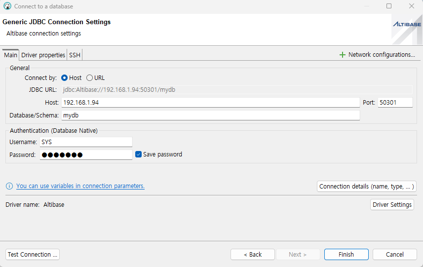

데이터베이스 접속 정보 입력을 마치고 [Finish] 를 클릭하면, Database 목록에 입력한 데이터베이스 연결 정보(mydb)가 추가된다. 


#### 4. JDBC 드라이버 파일 다운로드

처음 Altibase 연결 정보를 등록한 경우, Altibase JDBC 드라이버 파일이 있어야 연결이 가능하다. 인터넷에 접속 가능한 환경인 경우, '4.1 JDBC 드라이버 다운로드'를 참고한다. 인터넷 접속이 불가능한 환경이거나 수동으로 JDBC 드라이버를 등록하려는 경우는 '4.2 수동으로 JDBC 드라이버 등록' 을 참고한다.

##### 4.1 JDBC 드라이버 다운로드

Database Navigator 에 추가된 Altibase 연결 정보(mydb)를 더블 클릭하면, Altibase의 JDBC 드라이버 파일을 다운로드 할 수 있는 Driver settings 창이 열린다. 다운로드하려는 JDBC 드라이버를 선택한 다음, [Download]를 클릭한다.

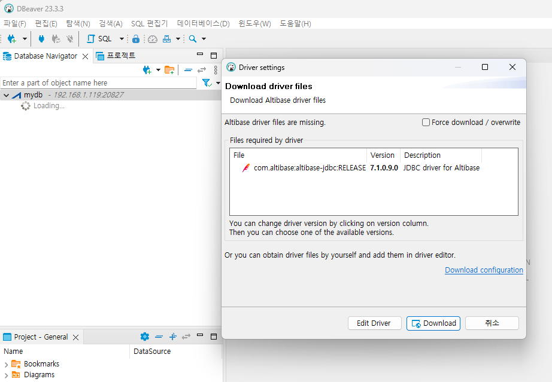

다운로드가 완료되면 데이터베이스 연결이 수행된다. 이 작업은 최초 한번만 수행하면 된다.

##### 4.2 수동으로 JDBC 드라이버 등록

사용자가 JDBC 드라이버를 직접 등록할 수 있다. 이를 위해, 데이터베이스 접속 정보 입력 창 하단 [Driver Settings] 버튼을 클릭한다.


Libraries 탭의 [Add File]을 클릭한다.


사용할 Altibase JDBC 드라이버 파일을 선택하여 추가한 후 [Classpath] 버튼을 클릭한다.


Global libraries 에 사용할 JDBC 드라이버 파일 위치를 추가하고 [Apply and Close] 를 클릭한다.

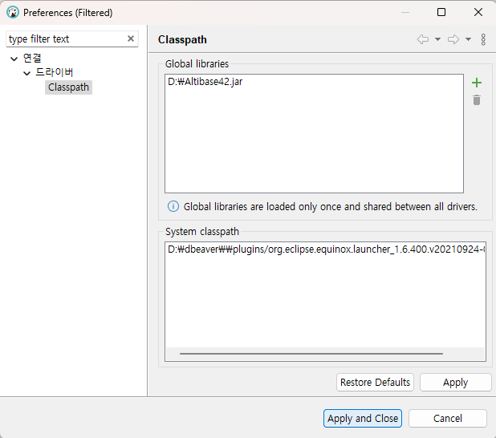

설정이 완료되었다면 [OK] 버튼을 클릭하고, 마지막으로 [Finish] 버튼을 클릭하여 설정을 완료한다.

#### 5. 데이터베이스 연결 완료

Database Navigator 탭에서 등록된 데이터베이스 연결 정보 목록을 확인할 수 있다.

목록의 데이터베이스 연결 정보를 더블 클릭하면 연결을 시도하며, 성공적으로 연결되면 아이콘에 초록색 체크 표시가 나타난다.

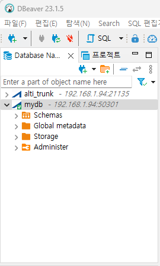

필요시 mydb 데이터베이스 연결 정보 이름을 원하는 이름으로 변경할 수 있다.


### FAQ

#### LOB 타입 데이터 조회가 안됩니다.

DBeaver는 Auto-Commit이 기본값으로 설정되어 있다. Altibase LOB 타입 데이터를 조회하기 위해서는 커밋 모드를 Auto-Commit에서 Manual Commit으로 변경해야 한다.

다음과 같이 세 가지 방법으로 해당 설정을 변경할 수 있다.

1. 툴바에서 버튼 아이콘을 눌러 Manual Commit으로 전환한다.

   

| 버튼 아이콘                           | 커밋 모드                 |
| ------------------------------------- | ------------------------- |
|  | Auto-Commit (자동 커밋)   |
|  | Manual Commit (수동 커밋) |


2. 커밋 모드 목록에서 Manual Commit을 선택한다.

   


3. 메뉴에서 Auto-commit 기본 설정 옵션을 해제한다. 이 설정을 적용하려면 데이터베이스에 다시 연결을 해야한다.

   [ 윈도우 ] → [ 설정 ]

   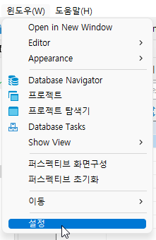

   [ 연결 ] → [ 연결 유형 ]에서 "Auto-commit by default" 체크 박스를 해제

   [ Apply and Close ] 클릭 → 데이터베이스에 재접속

   

> [!NOTE]
>
> Manual Commit 모드에서는 테이블 수정 시 반드시 명시적으로 커밋 또는 롤백해야 한다.
>
> 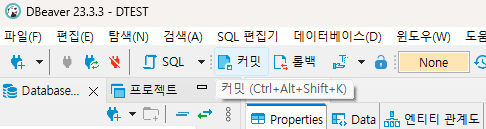

참조: https://dbeaver.com/docs/dbeaver/Auto-and-Manual-Commit-Modes/

#### SYSTEM_ 스키마가 보이지 않습니다.

DBeaver는 기본값으로 시스템 객체를 보여주지 않도록 설정되어 있다. SYSTEM_ 스키마를 보기 위해서는 "Show system objects" 옵션을 설정해야 한다.

데이터베이스 연결의 [ Connection View ] → [ Show system objects ] 옵션을 선택한다.


데이터베이스에 다시 연결하면 SYSTEM_ 스키마의 테이블과 뷰를 볼 수 있다.


####  객체에 대해 정확하지 않은 DDL이 출력됩니다.

정확한 Altibase 객체의 DDL을 조회하기 위해서는 반드시 SYS 계정으로 DBMS_METADATA 패키지를 설치해야 한다.

DBMS_METADATA 패키지를 설치하기 위해서는 SYS 계정으로 Altibase에 접속하여 아래 구문을 수행해야 한다.

```
$ cd $ALTIBASE_HOME
$ is -f ./packages/dbms_metadata.sql
$ is -f ./packages/dbms_metadata.plb
```

예)

다음은 큐 객체 Q1을 생성하는 구문 예제이다.

   ```
CREATE QUEUE q1(40) MAXROWS 100000;
   ```

위 구문을 수행하고 DBeaver에서 Q1 객체의 DDL을 조회하면 결과가 아래와 같이 비정상적으로 출력될 수 있다.


정확한 DDL 구문 출력을 위해 DBMS_METADATA 패키지를 설치한다.

```
$ cd $ALTIBASE_HOME
$ is -f ./packages/dbms_metadata.sql
$ is -f ./packages/dbms_metadata.plb
```

설치 후 DBeaver에서 대상 Altibase에 다시 연결하면, Q1 객체의 정확한 DDL을 조회할 수 있다.


#### 쿼리 실행 계획을 어디서 확인해야 하나요?

쿼리 실행 계획은 SQL script 창에 쿼리를 입력한 후, Explain Execution Plan 아이콘을 클릭하여 확인할 수 있다.

연결된 데이터베이스의 [ SQL 편집기 ] → [ 새 SQL 편집기 ] 를 클릭한다.

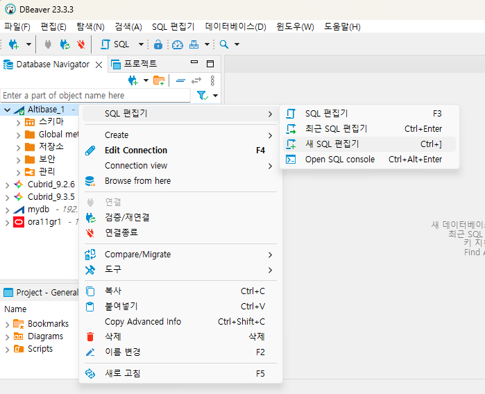

SQL Script 창에 쿼리를 입력 후 "Explain Execution Plan" 아이콘을 클릭하면 쿼리 실행 계획을 확인할 수 있다.

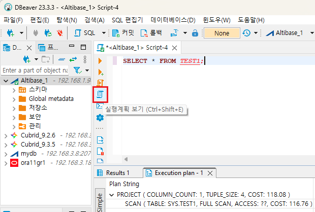

>  [!NOTE] 
>
>  쿼리 실행 계획의 기본 옵션 값은 Explain Plan Only이다.

#### 쿼리 실행 계획을 EXPLAIN_PLAN = ON으로 수행하고 싶습니다.

DBeaver Altibase Plugin에서는 각각의 접속마다 Explain plan을 ONLY 또는 ON으로 지정할 수 있다. 기본값은 ONLY이다.

Explain plan 설정값을 변경하는 방법은 다음의 두 가지가 있다.

1. 접속된 데이터베이스의 설정값을 변경한다.

   데이터베이스 연결을 클릭한다.

   

   [ 파일 ] → [ 설정 ]

   

   Altibase settings → Datasource settings → Explain Plan 설정 값을 선택한다.

   

2. 스크립트 창에서 Preferences를 호출한다.

   스크립트 창의 Preferences 호출 버튼을 클릭한다.

   

   Altibase settings → Datasource settings → Explain Plan 설정 값을 선택한다.

   

#### 서버 출력(PSM PRINTLN 출력) 내용을 보고 싶습니다.

서버 출력 내용을 보기 위해서는 연결된 데이터베이스의 "Enable DBMS Output" 옵션을 설정해야 한다.

데이터 베이스 연결을 클릭한다.


[ 파일 ] → [ 설정 ]

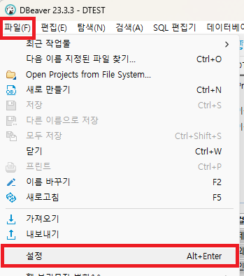

[ Altibase settings ] → [ Datasource settings ] → 기타에서 "Enable DBMS Output"을 선택한다.


설정을 변경한 데이터베이스 연결의 SQL script 창에서 서버 출력 내용보기 버튼을 클릭한다. 이후 SQL문을 수행하면 서버 출력 내용이 Output 창에 출력된다.


#### DATE 타입의 마이크로 초가 보이지 않습니다.

DBeaver의 Timestamp 출력 형식은 'yyyy-MM-dd HH:mm:ss.SSS'로 밀리 세컨드 초(소수점 뒤 3자리)까지 표현되는 반면, Altibase의 DATE 타입은 마이크로 초(소수점 뒤 6자리)까지 표현할 수 있다.

 DBeaver 기본 설정에 따른 DATE 타입 데이터 조회 결과는 아래와 같다.


DATE 타입을 마이크로 초 단위까지 출력하기 위해서는 DBeaver의 데이터 타입 설정을 변경해야 한다. 설정 변경 위치는 다음과 같다.

[ 윈도우 ] → [ 설정 ]

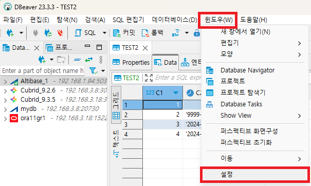

[ 편집기 ] → [ 데이터 편집기 ] → [ 데이터 포맷 ] → [ Datasource settings ]을 클릭한다.

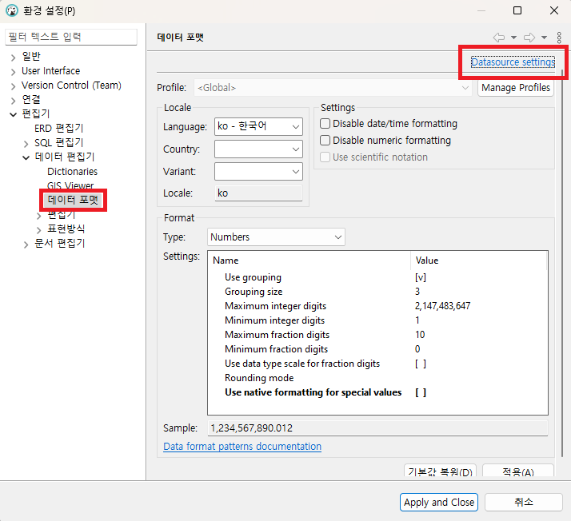

설정을 변경할 데이터베이스 연결을 선택하고 [ Select ]를 클릭한다.


DATE 타입을 마이크로 초까지 볼 수 있도록 설정을 변경하는 방법은 두 가지가 있다.

1. 데이터 타입 Value Settings 변경

   [ Datasource settings ] → [ Format ] 의 Type을 Timestamp로 설정하고 Value 값을 'yyyy-MM-dd HH:mm.ss.SSSSSS'로 변경 후 [ Apply and Close ]를 클릭한다.

   

   DATE 타입 데이터를 조회하면 아래와 같이 0을 포함하여 소수점 뒤 6자리까지 고정된 자리수를 표시한다.

   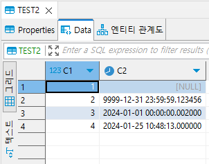

2. 데이터 포맷 Disable date/time formatting 옵션 설정

   [ Datasource settings ] → [ Settings ] 에서 "Disable date/time formatting" 옵션을 선택하고 [ Apply and Close ]를 클릭한다.

   

   DATE 타입 데이터를 조회하면 아래와 같이 소수점 뒤 6자리까지 유효한 숫자를 표시한다.

   

참조: https://dbeaver.com/docs/dbeaver/Managing-Data-Formats/

#### CHAR 타입 수정 시 "Invalid data type length" 에러 메시지가 표시됩니다.

DBeaver Data Editor는 데이터 수정 시 기본으로 INSERT 구문을 수행한다. Data Editor로 데이터를 수정한 후 저장 하기 전에 수정된 데이터가 칼럼 크기를 초과하지 않는지 확인해야 한다.


#### 이진 데이터 타입을 Hex로 보고 싶습니다.

DBeaver의 기본 설정은 이진 데이터 타입을 String 타입으로 인코딩하여 보여준다. 이진 데이터 타입을 Hex 타입으로 보기 위해서는 설정을 변경해야 한다.


데이터 베이스 연결을 클릭한다.


[ 파일 ] → [ 설정 ]


[ 편집기 ] → [ 데이터 편집기 ] → [ 편집기 ] → Binary data에서 Binary data formatter 설정을 String에서 Hex로 변경한 후 [ Apply and Close ]를 클릭한다.

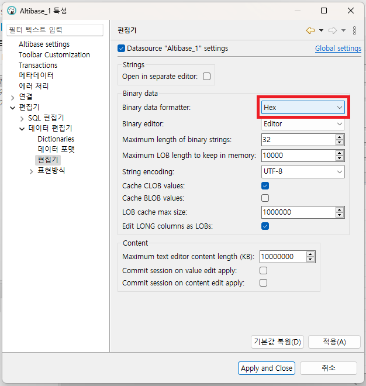

테이블 하단의 [ Refresh ] 버튼을 누르면 이진 타입 데이터를 Hex 타입으로 보여준다.


참조: https://dbeaver.com/docs/dbeaver/Data-View-and-Format/

#### DBeaver Data Editor에서 이진 타입 데이터 수정이 안됩니다.

DBeaver에서 이진 타입 데이터를 수정하기 위해서는 Data Editor에서 "Value" 창에 수정할 데이터를 입력해야 한다. 그리드 창의 셀에 직접 데이터를 입력하게 되면 해당 값이 이진값으로 변환되어 저장된다. 


#### 이진 데이터 타입 중 BIT, VARBIT, NIBBLE은 DBeaver에서 어떻게 처리되나요?

DBeaver에서 이진 데이터는 바이트 단위로 처리된다. 이진 데이터 타입 중 BIT, VARBIT, NIBBLE은 바이트 단위보다 작게 설정될 수 있기 때문에 부득이하게 숫자형, 문자형으로 처리한다.

#### 이전에 설정했던 DBeaver 설정을 완전히 지우고 다시 설치하고 싶습니다.

이전 DBeaver 설정을 완전히 지우고 다시 설치하고자 할 경우 DBeaver 앱 및 사용자 데이터를 완전히 제거 후 다시 설치해야 한다.

아래 OS 종류에 따른 기본 DBeaver workspace의 폴더 위치를 확인하고 DBeaver 데이터를 완전히 제거한다.

| OS 종류 | Default location of DBeaver workspace                        |
| ------- | ------------------------------------------------------------ |
| Windows | `%APPDATE$\DBeaverData`                                      |
| MacOS   | `~/Library/DBeaverData/`                                     |
| Linux   | `$XDG_DATA_HOME/DBeaverData/` ($XDG_DATA_HOME=`~/.local/share` if not set) |

참조: https://dbeaver.com/docs/dbeaver/Workspace-Location/

#### SQL Editor에서 Auto commit off를 기본 설정으로 사용하고 싶습니다

DBeaver는 auto commit on을 기본으로 설정하고 있다.

Auto commit off를 상시 기본 설정으로 사용하고 싶다면,

1. 특정 연결을 클릭 → 오른쪽 마우스 클릭 → Edit Connection 메뉴 클릭 또는 F4 버튼을 눌러 설정 화면을 연다.
2. Connection settings → Initialization → Connection → Auto-commit 체크 박스를 꺼 준다.


일시적으로 auto-commit 모드를 변경하고 싶은 경우는 아래 그림처럼 트랜잭션 버튼을 눌러 설정 변경이 가능하다.


<br>

2.OpenLDAP
========

이 장은 openLDAP과 Altibase를 연동하는 방법을 설명한다.

### OpenLDAP 소개

OpenLDAP은 경량형 디렉터리 접근 프로토콜(Light-weight Directory Access Protocol,
LDAP)을 오픈 소스로 구현한 것이다.

OpenLDAP은 backend 저장소로 RDBMS를 지원하는데 이를 SQL Backend 또는
back-sql이라고 한다. back-sql은 RDBMS와 연동시 ODBC를 사용한다.

#### OpenLDAP 설치

1. Download OpenLDAP  
   <http://www.openldap.org/>

2. Unpack
   
   ```
   $ tar xvfz name_of.tgz
   ```

3. Configure, Make, and Install
   
   ```
   $ ./configure --prefix=.... --enable-sql
      ./configure --help 참조
   $ make depend
   $ make
   $ make install (su root -c 'make install')
   ```

#### Altibase 설치

Altibase는 6.5.1 이상을 설치할 것을 권장한다.

설치에 대한 자세한 설명은 Installation Guide를 참조한다.

### 메타 데이터 설정

LDAP용 메타 테이블에 LDAP의 objectClass와 attributeType들을 Altibase의 어떤
테이블과 컬럼으로 매핑할 것인지 저장해야 한다.

Altibase는 4개의 LDAP용 메타 테이블을 설정하여 사용할 수 있다.

- ldap_oc_mappings

- ldap_attr_mappings

- ldap_entries

- ldap_entry_objclasses

#### ldap_oc_mappings

objectClass 맵핑 테이블로써 structuralObjectClass와 테이블간의 관계를 저장한다.

| 컬럼 이름         | 설명                                                                                                                                                                                                                                                                                                                                                                                                                                                                                                                   |
| ------------- | -------------------------------------------------------------------------------------------------------------------------------------------------------------------------------------------------------------------------------------------------------------------------------------------------------------------------------------------------------------------------------------------------------------------------------------------------------------------------------------------------------------------- |
| ID            | 고유 ID, 다른 ldap_\* 테이블을 참조할 때 사용됨                                                                                                                                                                                                                                                                                                                                                                                                                                                                                     |
| NAME          | objectClass 이름. slapd의 schema에 로딩된 objectClass 중 하나의 이름과 일치해야 함.                                                                                                                                                                                                                                                                                                                                                                                                                                                     |
| KEYTBL        | objectClass에 대응하는 테이블의 이름. 예제에서는 inetOrgPerson objectClass가 person 테이블로 맵핑됨                                                                                                                                                                                                                                                                                                                                                                                                                                          |
| KEYCOL        | "keytbl" 테이블의 primary key 컬럼의 이름                                                                                                                                                                                                                                                                                                                                                                                                                                                                                     |
| CREATE_PROC   | 엔트리를 추가할 때 수행할 SQL 문                                                                                                                                                                                                                                                                                                                                                                                                                                                                                                 |
| CREATE_KEYVAL | "CREATE_PROC" SQL 문으로 입력된 새로운 ID 값을 가져오는 쿼리문. 이 쿼리를 사용하려면 slapd.conf에서 create_needs_select를 "yes"로 설정해야 함.                                                                                                                                                                                                                                                                                                                                                                                                           |
| DELETE_PROC   | 엔트리를 삭제할 때 수행할 SQL문 "keytbl.keycol"을 호스트 변수로 취한다.                                                                                                                                                                                                                                                                                                                                                                                                                                                                    |
| EXPECT_RETURN | CREATE_PROC과 DELETE_PROC의 SQL문이 리턴 값을 반환하는지 여부를 나타내는 비트열의 정수값. <br />첫 번째 비트는 ADD_PROC, 두 번째 비트는 DELETE_PROC에 해당한다. <br /><br />사용 가능한 값 <br />0: CREATE_PROC과 DELETE_PROC의 SQL문 모두 리턴값이 없음 <br />1: CREATE_PROC의 SQL문이 값을 반환함 <br />2: DELETE_PROC의 SQL문이 값을 반환함 <br />3: CREATE_PROC과 DELETE_PROC의 SQL문 모두 값을 반환함 <br /><br />리턴 값이 있는 SQL문(프로시저 또는 함수) 작성시 지켜야 할 사항 <br />CREATE_PROC의 리턴 값은 입력된 새로운 ID 값이어야 함. <br />DELETE_PROC의 리턴 값은 성공하면 0, 그렇지 않으면 1을 반환해야 함. <br />리턴 값을 받는 outbinding 파라미터를 맨 앞에 위치시켜야 함. |

#### ldap_attr_mappings

attributeType 맵핑 테이블로써 특정 objectClass를 위한 attributeType이 어떻게 SQL
문과 맵핑되는지를 저장한다.

| 컬럼 이름         | 설명                                                                                                                                                                                                                                                                                                                                                                                                                                                                                                                               |
| ------------- | -------------------------------------------------------------------------------------------------------------------------------------------------------------------------------------------------------------------------------------------------------------------------------------------------------------------------------------------------------------------------------------------------------------------------------------------------------------------------------------------------------------------------------- |
| ID            | 고유 ID                                                                                                                                                                                                                                                                                                                                                                                                                                                                                                                            |
| OC_MAP_ID     | ldap_oc_mappings 테이블의 ID를 가리키며, 해당 attributeType이 어느 objectClass에 속하는지를 나타냄.                                                                                                                                                                                                                                                                                                                                                                                                                                                     |
| NAME          | attributeType의 이름. slapd의 schema에 로딩된 attributeType 중 하나의 이름과 일치해야 함.                                                                                                                                                                                                                                                                                                                                                                                                                                                            |
| SEL_EXPR      | 아래 attribute를 select 하기 위한 expression. <br />("select \<sel_expr\> from ..." 부분)                                                                                                                                                                                                                                                                                                                                                                                                                                                 |
| FROM_TBLS     | 아래 attribute를 가져올 테이블. <br />("select ... from \<from_tbls \> where ..." 부분)                                                                                                                                                                                                                                                                                                                                                                                                                                                     |
| JOIN_WHERE    | 아래 attribute를 select 하기 위한 조건. <br />("select ... where \<join_where\> ..." 부분)                                                                                                                                                                                                                                                                                                                                                                                                                                                  |
| ADD_PROC      | 해당 attribute에 입력하기 위한 SQL문. <br />추가될 attibute의 값과 그것에 연관된 엔트리의 "keytbl.keycol"을 호스트 변수로 취한다.                                                                                                                                                                                                                                                                                                                                                                                                                                    |
| DELETE_PROC   | 해당 attribute에서 삭제하기 위한 SQL문. <br />삭제될 attibute의 값과 그것에 연관된 엔트리의 "keytbl.keycol" 을 호스트 변수로 취한다.                                                                                                                                                                                                                                                                                                                                                                                                                                  |
| PARAM_ORDER   | ADD_PROC과 DELETE_PROC의 SQL문에서 keytbl.keycol 값이 attibute의 값보다 앞에 오는지 뒤에 오는지를 나타내는 비트열의 정수값. keytbl.keycol 값이 attibute의 값보다 앞에 오면 0, 뒤에 오면 1을 설정하면 된다. <br />첫 번째 비트는 ADD_PROC, 두 번째 비트는 DELETE_PROC에 해당한다. <br /><br />사용 가능한 값 <br />0: CREATE_PROC과 DELETE_PROC의 SQL문 모두 keytbl.keycol 값이 attibute의 값보다 앞에 옴. <br />1: CREATE_PROC의 SQL문은 keytbl.keycol 값이 attibute의 값보다 뒤에 옴. <br />2: DELETE_PROC의 SQL문은 keytbl.keycol 값이 attibute의 값보다 뒤에 옴. <br />3: CREATE_PROC과 DELETE_PROC의 SQL문 모두 keytbl.keycol 값이 attibute의 값보다 뒤에 옴. |
| EXPECT_RETURN | ADD_PROC과 DELETE_PROC의 SQL문이 리턴값을 반환하는지 여부를 나타내는 비트열의 정수값. <br /><br />사용 가능한 값 <br />0: CREATE_PROC과 DELETE_PROC의 SQL문 모두 리턴값이 없음 <br />1: CREATE_PROC의 SQL문이 값을 반환함 <br />2: DELETE_PROC의 SQL문이 값을 반환함 <br />3: CREATE_PROC과 DELETE_PROC의 SQL문 모두 값을 반환함 <br /><br />리턴값이 있는 SQL문(프로시저 또는 함수) 작성시 지켜야 할 사항 <br />CREATE_PROC과 DELETE_PROC의 리턴값은 성공하면 0, 그렇지 않으면 1을 반환해야 함. <br />리턴값을 받는 outbinding 파라미터를 맨 앞에 위치시켜야 함.                                                                                                        |

#### ldap_entries

엔트리 맵핑 테이블이다. LDAP 트리의 각 엔트리를 식별할 수 있는 DN 값을 저장한다.

| 컬럼 이름     | 설명                                                                                                                         |
| --------- | -------------------------------------------------------------------------------------------------------------------------- |
| ID        | 고유 ID                                                                                                                      |
| DN        | 엔트리의 DN이 "pretty" form으로 저장됨.                                                                                              |
| OC_MAP_ID | 엔트리의 메인 objectClass에 해당하는 테이블의 ID. <br />ldap_oc_mappings 테이블의 ID 값 중에 하나에 해당함.                                            |
| PARENT    | 부모 엔트리의 ID. "suffix" 엔트리는 이 값이 0이다.                                                                                        |
| KEYVAL    | 엔트리의 데이터를 갖고 있는 테이블의 해당 로우의 primary key 컬럼의 값. <br />즉, 이 엔트리의 objectClass에 해당하는 테이블의 primary key 컬럼 값 ("keytbl.keycol" 값) |

#### ldap_entry_objclasses

objectClass 맵핑 테이블이다. 엔트리가 어떤 보조 objectClass(auxiliary
objectClasses)를 가지는지를 저장한다.

| 컬럼 이름    | 설명                                                                                |
| -------- | --------------------------------------------------------------------------------- |
| ENTRY_ID | ldap_entries.id의 값                                                                |
| NAME     | auxiliary objectClass의 이름. <br />slapd의 schema에 로딩된 objectClass 중 하나의 이름과 일치해야 함. |

### 환경 설정

OpenLDAP 환경 설정을 위해 ODBC 설정 및 slapd.conf 파일을 편집한다.

#### .odbc.ini

```
[ldap_altibase]
Description = ODBC for Altibase
Driver = /home/altibase/altibase_home/lib/libaltibase_odbc-64bit-ul64.so
server = 127.0.0.1
port = 20030
```

odbc 추적 설정: back-end 오류 발생시 문제 추적을 위해 아래의 설정을 이용할 수
있다.

#### .odbcinst.ini

```
[ODBC]
TraceFile = /home/altibase/odbc.log
Trace = Yes
```

#### slapd.conf

Altibase용 샘플로 제공된 slapd.conf을 참고하여 slapd.conf를 편집한다.

```
# $OpenLDAP$
#
# See slapd.conf(5) for details on configuration options.
# This file should NOT be world readable.
#
include         /usr/local/etc/openldap/schema/core.schema
include         /usr/local/etc/openldap/schema/cosine.schema
include         /usr/local/etc/openldap/schema/inetorgperson.schema

# Define global ACLs to disable default read access.

# Do not enable referrals until AFTER you have a working directory
# service AND an understanding of referrals.
#referral       ldap://root.openldap.org

pidfile         /usr/local/var/slapd.pid
argsfile        /usr/local/var/slapd.args

#######################################################################
# sql database definitions
#######################################################################

database        sql
suffix          "dc=example,dc=com"
rootdn          "cn=Manager,dc=example,dc=com"
rootpw          secret
dbname          ldap_altibase --ODBC dsn 이름
dbuser          ldap --Altibase 사용자 이름
dbpasswd        ldap --db 사용자 pw
subtree_cond    "upper(ldap_entries.dn) LIKE CONCAT('%',upper(?))"
insentry_stmt   "insert into ldap_entries (id,dn,oc_map_id,parent,keyval) values (ldap_entry_ids.nextval,?,?,?,?)"
has_ldapinfo_dn_ru  no
upper_func      UPPER
```

### 예제

아래 그림과 같은 DIT(Directory Information Tree)를 RDBMS인 Altibase에 구축한다.


root DN은 dc=example,dc=com이며, ldif (LDAP Data Interchange Files, 트리
데이터를 텍스트로 표현한 파일)는 아래와 같다. root DN "dc=example,dc=com" 외에는
샘플 파일을 참고하기 바란다. 샘플 파일은
<https://github.com/ALTIBASE/openldap/tree/master/servers/slapd/back-sql/rdbms_depend/altibase> 에
있다.

```
# Mitya Kovalev, example.com
dn: cn=Mitya Kovalev,dc=example,dc=com
objectClass: inetOrgPerson
cn: Mitya Kovalev
sn: Kovalev
seeAlso: documentTitle=book1,dc=example,dc=com
seeAlso: documentTitle=book2,dc=example,dc=com
givenName: Mitya
userPassword:: bWl0
telephoneNumber: 222-3234
telephoneNumber: 332-2334

# Akakiy Zinberstein, example.com
dn: cn=Akakiy Zinberstein,dc=example,dc=com
objectClass: inetOrgPerson
cn: Akakiy Zinberstein
sn: Zinberstein
givenName: Akakiy

# Torvlobnor Puzdoy, example.com
dn: cn=Torvlobnor Puzdoy,dc=example,dc=com
objectClass: inetOrgPerson
cn: Torvlobnor Puzdoy
sn: Puzdoy
seeAlso: documentTitle=book1,dc=example,dc=com
givenName: Torvlobnor
telephoneNumber: 545-4563

# book1, example.com
dn: documentTitle=book1,dc=example,dc=com
objectClass: document
description: abstract1
documentTitle: book1
documentAuthor: cn=Mitya Kovalev,dc=example,dc=com
documentAuthor: cn=Torvlobnor Puzdoy,dc=example,dc=com
documentIdentifier: document 1

# book2, example.com
dn: documentTitle=book2,dc=example,dc=com
objectClass: document
description: abstract2
documentTitle: book2
documentAuthor: cn=Mitya Kovalev,dc=example,dc=com
documentIdentifier: document 2

# example.com
dn: dc=example,dc=com
objectClass: organization
objectClass: dcObject
o: Example
dc: example
```

이 엔트리는 structural objectClass "organization"과 auxiliary objectClass인
"dcObject"를 포함(contain)하며, 각각의 정의는 아래와 같다.

objectClass를 DB 테이블로 맵핑하기 위해서는 objectClass의 attribute member들
중에서 선택해서 컬럼화해야 한다. 이 예제에서는 "o"와 "dc" attribute를 선택했다.

```
objectclass ( 2.5.6.4 NAME 'organization'
    DESC 'RFC2256: an organization'
    SUP top STRUCTURAL
    MUST o
    MAY ( userPassword $ ... ) )

objectclass ( 1.3.6.1.4.1.1466.344 NAME 'dcObject'
    DESC 'RFC2247: domain component object'
    SUP top AUXILIARY MUST dc )
```

아래는 위의 objectClass를 Altibase의 테이블로 맵핑한 "institutes" 테이블의 생성
구문과 데이터 삽입, 검색, 변경 등을 위한 메타 데이터를 생성하는 SQL문이다.

```
CREATE TABLE institutes (
        id int NOT NULL,
        name varchar(255)
);
insert into institutes (id,name) values (institute_ids.nextval,'Example');

insert into ldap_oc_mappings (id,name,keytbl,keycol,create_proc,delete_proc,expect_return)
  values (3,'organization','institutes','id','exec create_org(?)','exec delete_org(?)',1);

insert into ldap_attr_mappings (id,oc_map_id,name,sel_expr,from_tbls,join_where,add_proc,delete_proc,param_order,expect_return)
  values (11,3,'o','institutes.name','institutes',NULL,'exec set_org_name(?,?)',NULL,0,0);

insert into ldap_attr_mappings (id,oc_map_id,name,sel_expr,from_tbls,join_where,add_proc,delete_proc,param_order,expect_return)
  values (12,3,'dc','lower(institutes.name)','institutes,ldap_entries dcObject,ldap_entry_objclasses auxObjectClass',
    'institutes.id=dcObject.keyval AND dcObject.oc_map_id=3 AND dcObject.id=auxObjectClass.entry_id AND auxObjectClass.oc_name=''dcObject''',
    NULL,NULL,0,0);

insert into ldap_entries (id,dn,oc_map_id,parent,keyval)
  values (ldap_entry_ids.nextval,'dc=example,dc=com',3,0,1);  -- id = 1

insert into ldap_entry_objclasses (entry_id,oc_name) values (1,'dcObject');

CREATE OR REPLACE PROCEDURE create_org(keyval OUT INTEGER) AS
BEGIN
INSERT INTO institutes (id,name) VALUES (institute_ids.nextval,' ');
SELECT institute_ids.currval INTO keyval FROM DUAL;
END;
/

CREATE OR REPLACE PROCEDURE delete_org(keyval IN INTEGER) AS
BEGIN
DELETE FROM institutes WHERE id=keyval;
END;
/

CREATE OR REPLACE PROCEDURE set_org_name(keyval IN INTEGER, new_name IN varchar(255)) AS
BEGIN
UPDATE institutes SET name=new_name WHERE id=keyval;
END;
/
```

위 샘플 예제는 스크립트 파일로 제공되며, 아래와 같이 샘플 데이터를 구축할 수
있다. 사용된 스크립트 파일은
<https://github.com/ALTIBASE/openldap/tree/master/servers/slapd/back-sql/rdbms_depend/altibase>에서
다운로드할 수 있다.

#### ldap 사용자 생성

sys 유저로 isql 접속 후 아래 SQL 문 실행

```
drop user ldap cascade;
create user ldap identified by ldap;
```

#### 데이터 생성

```
$ isql -s localhost -u ldap -p ldap -f backsql_create.sql
$ isql -s localhost -u ldap -p ldap -f testdb_create.sql
$ isql -s localhost -u ldap -p ldap -f testdb_metadata.sql
$ isql -s localhost -u ldap -p ldap -f testdb_data.sql
```

- backsql_create.sql: 맵핑용 메타 데이터 저장을 위한 테이블 생성

- testdb_create.sql: 사용할 objectClass를 DB 테이블로 생성

- testdb_metadata.sql:맵핑용 메타데이터 입력

- testdb_data.sql: objectClass 데이터 입력

<br>

3.Oracle GoldenGate
=========

### Oracle GoldenGate 소개

Oracle GoldenGate는 데이터베이스 데이터를 전통적 데이터베이스, 클라우드, 빅데이터, NoSQL 및 Streams 환경에 실시간 복제하기 위한 도구이다.

Oracle GoldenGate for Big Data는 Generic JDBC API를 이용한 JDBC Handler를 이용하여 원본 데이터베이스에서 복제된 데이터를 전달하는 기능을 제공한다.

Oracle GoldenGate 상세 내용은 제품 홈페이지를 참조한다.

#### 연동 아키텍처


 알티베이스와 연동하기 위한 구조는 크게 소스 데이터베이스, 소스 데이터베이스를 위한 Oracle GoldenGate, 대상 데이터베이스를 위한 Oracle GoldenGate for Big Data, 그리고 대상 데이터베이스로 구성되어 있다.

1. 소스 데이터베이스: Oracle GoldenGate가 지원하는 데이터베이스.
2. Oracle GoldenGate: 소스 데이터베이스의 입력/변경 데이터의 로그를 분석 및 전달하는 역할을 한다.
3. Oracle GoldenGate for Big Data: Oracle GoldenGate로부터 전달받은 데이터 변경 사항을 대상 데이터베이스에 전달하는 역할을 한다.
4. 대상 데이터베이스: Oracle GoldenGate for Big Data JDBC Handler가 지원하는 데이터베이스

### 설치 및 구성

설치는 다양한 방법으로 구성 가능하다. 테스트 된 구성은 다음과 같다. 대괄호 (square brackets [])는 동일한 장비에 동일한 계정으로 설치한다는 의미이다.

1. [소스 데이터베이스 + Oracle GoldenGate] / [Oracle GoldenGate for Big Data] / [알티베이스]
2. [소스 데이터베이스 + Oracle GoldenGate + Oracle GoldenGate for Big Data] / [알티베이스]

Oracle GoldenGate 및 Oracle GoldenGate for Big Data 설치 및 구성 방법은 제품 매뉴얼을 참조한다. 

테스트에서 사용된 Oracle GoldenGate for Big Data 알티베이스용 설정파일은 다음과 같다.

**Replicat properties 파일 (dirprm/rjdbc.prm)**

TARGET의 User name과 Table name은 쌍따옴표로 묶어야 한다.

**prm file sample**

```bash
TARGETDB LIBFILE libggjava.so SET property=dirprm/jdbc_altibase.props
REPORTCOUNT EVERY 1 MINUTES, RATE
GROUPTRANSOPS 1000
MAP orclpdb.ogg_test.tablea, TARGET "SYS"."TABLEA";
```

**Java Adapter properties 파일(dirprm/jdbc_altibase.props)**

**props file sample**

```
gg.handlerlist=jdbcwriter
gg.handler.jdbcwriter.type=jdbc
#Handler properties for Altibase database target
gg.handler.jdbcwriter.DriverClass=Altibase.jdbc.driver.AltibaseDriver
gg.handler.jdbcwriter.connectionURL=jdbc:Altibase://127.0.0.1:20172/mydb
gg.handler.jdbcwriter.userName=sys
gg.handler.jdbcwriter.password=manager
gg.classpath=altibase/lib/Altibase.jar
goldengate.userexit.writers=javawriter
javawriter.stats.display=TRUE
javawriter.stats.full=TRUE
gg.log=log4j
gg.log.level=INFO
gg.report.time=30sec
javawriter.bootoptions=-Xmx512m -Xms32m -Djava.class.path=.:ggjava/ggjava.jar:./dirprm
```

### 테스트 버전

- Oracle database 12.2.0.1.0
- Oracle GoldenGate 12.3.0.1.4
- Oracle GoldenGate for Big Data 12.3.2.1
- Altibase 7.1.0.4.6

### 제약사항

오라클 데이터 타입 중 일부는 호환되지 않는다. 특히, Binary double은 알티베이스와 호환되는 데이터 타입도 없고 값도 일부만 복제되는 제약사항이 있다.

아래는 데이터 타입 호환 테스트 결과이다.

**Oracle database to Altibase**

| 소스            | 대상              | Note                                                                                                                                                                            |
|:------------- |:--------------- |:------------------------------------------------------------------------------------------------------------------------------------------------------------------------------- |
| INT           | INT             |                                                                                                                                                                                 |
| CHAR          | CHAR            | Altibase의 CHAR 타입은 byte 길이로만 정의할 수 있는 반면, Oracle에서 문자 길이로 정의할 수 있기 때문에 주의해야 한다.                                                                                                 |
| NCHAR         | NCHAR           | Altibase의 CHAR 타입은 byte 길이로만 정의할 수 있는 반면, Oracle에서 문자 길이로 정의할 수 있기 때문에 주의해야 한다.이는 Altibase에서 생성되는 NCHAR 칼럼이 필요에 따라 오라클보다 2배 또는 3배 정도 클 것이라는 의미이므로, 이런 점을 유의하도록 한다.              |
| VARCHAR2      | VARCHAR         | Altibase의 CHAR 타입은 byte 길이로만 정의할 수 있는 반면, Oracle에서 문자 길이로 정의할 수 있기 때문에 주의해야 한다.오라클의 VARCHAR2 최대 크기는 32,767 바이트로 Altibase의 VARCHAR 최대 크기 32,000 바이트보다 크기 때문에 데이터 손실이 발생할 수 있다.   |
| NVARCHAR2     | NVARCHAR        | Altibase의 CHAR 타입은 byte 길이로만 정의할 수 있는 반면, Oracle에서 문자 길이로 정의할 수 있기 때문에 주의해야 한다.오라클의 NVARCHAR2 최대 크기는 32,767 바이트로 Altibase의 NVARCHAR 최대 크기 32,000 바이트보다 크기 때문에 데이터 손실이 발생할 수 있다. |
| LONG          | CLOB            |                                                                                                                                                                                 |
| NUMBER        | NUMBER          |                                                                                                                                                                                 |
| FLOAT         | FLOAT           |                                                                                                                                                                                 |
| BINARY FLOAT  | FLOAT           |                                                                                                                                                                                 |
| BINARY DOUBLE | DOUBLE          |                                                                                                                                                                                 |
| DATE          | DATE            |                                                                                                                                                                                 |
| TIMESTAMP     | DATE            | 스케일의 차이로 인해서 소량의 데이터 손실이 발생할 수 있다. 오라클에서는 타임스탬프 값의 스케일이 나노초(9자리 수)인 반면, Altibase에서는 타임스탬프 값의 스케일이 마이크로초(6자리 수)이다.                                                               |
| RAW           | BLOB            |                                                                                                                                                                                 |
| LONG RAW      | BLOB            |                                                                                                                                                                                 |
| BLOB          | BLOB            |                                                                                                                                                                                 |
| CLOB          | CLOB            |                                                                                                                                                                                 |
| NCLOB         | NVARCHAR(10666) | Altibase에는 오라클 NCLOB 타입과 호환 가능한 데이터 타입이 없으므로, 최대 크기의 NVARCHAR 타입으로 변환된다.실제 데이터 크기가 NVARCHAR 최대 크기를 초과하는 경우, 데이터를 마이그레이션하는 동안 데이터 손실이 발생할 수도 있다.                                 |
| ROWID         | VARCHAR(18)     |                                                                                                                                                                                 |
