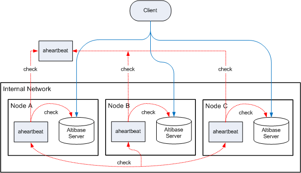

Altibase Heartbeat User's Guide
================

#### Release 7.1

Altibase® Tool & Utilities

<br><br><br><br><br><br><!-- PDF 변환을 위한 여백입니다. --> 


<!-- PDF 변환을 위한 여백입니다. --> 

<div align="left">
    
</div>
<br><br><!-- PDF 변환을 위한 여백입니다. --> 


<!-- PDF 변환을 위한 여백입니다. -->

<pre>
Altibase Tool & Utilities Altibase HeartBeat User's Guide
Release 7.1
Copyright ⓒ 2001~2023 Altibase Corp. All Rights Reserved.<br>
본 문서의 저작권은 ㈜알티베이스에 있습니다. 이 문서에 대하여 당사의 동의없이 무단으로 복제 또는 전용할 수 없습니다.<br>
<b>㈜알티베이스</b>
08378 서울시 구로구 디지털로 306 대륭포스트타워Ⅱ 10층
전화 : 02-2082-1114
팩스 : 02-2082-1099
고객서비스포털 : <a href='http://support.altibase.com'>http://support.altibase.com</a>
홈페이지      : <a href='http://www.altibase.com/'>http://www.altibase.com</a></pre>
<br>

# 목차

- [서문](#%EC%84%9C%EB%AC%B8)
  - [이 매뉴얼에 대하여](#%EC%9D%B4-%EB%A7%A4%EB%89%B4%EC%96%BC%EC%97%90-%EB%8C%80%ED%95%98%EC%97%AC)
- [1.Altibase Heartbeat 소개](#1altibase-heartbeat-%EC%86%8C%EA%B0%9C)
  - [Altibase Heartbeat 개요](#altibase-heartbeat-%EA%B0%9C%EC%9A%94)
  - [Altibase Heartbeat의 기본 동작](#altibase-heartbeat%EC%9D%98-%EA%B8%B0%EB%B3%B8-%EB%8F%99%EC%9E%91)
- [2.명령어](#2%EB%AA%85%EB%A0%B9%EC%96%B4)
  - [aheartbeat](#aheartbeat)
- [3.Altibase Heartbeat 구성하기](#3altibase-heartbeat-%EA%B5%AC%EC%84%B1%ED%95%98%EA%B8%B0)
  - [환경 설정](#%ED%99%98%EA%B2%BD-%EC%84%A4%EC%A0%95)
  - [Altibase Heartbeat 시스템 구성 연습](#altibase-heartbeat-%EC%8B%9C%EC%8A%A4%ED%85%9C-%EA%B5%AC%EC%84%B1-%EC%97%B0%EC%8A%B5)
- [4.Altibase Heartbeat 동작](#4altibase-heartbeat-%EB%8F%99%EC%9E%91)
  - [aheartbeat의 상태](#aheartbeat%EC%9D%98-%EC%83%81%ED%83%9C)
  - [장애 판단](#%EC%9E%A5%EC%95%A0-%ED%8C%90%EB%8B%A8)
  - [0번 aheartbeat의 역할](#0%EB%B2%88-aheartbeat%EC%9D%98-%EC%97%AD%ED%95%A0)
  - [Failover와 Failback](#failover%EC%99%80-failback)
  - [로깅](#%EB%A1%9C%EA%B9%85)

<br>

서문
====

### 이 매뉴얼에 대하여

이 매뉴얼은 Altibase로 구성된 분산 데이터베이스 환경에서 사용할 수 있는 Altibase
Heartbeat 유틸리티에 대해 설명한다.

#### 대상 사용자

이 매뉴얼은 다음과 같은 Altibase 사용자를 대상으로 작성되었다.

-   데이터베이스 사용자

-   데이터베이스 관리자

-   응용 프로그램 개발자

-   성능 관리자

-   기술지원부서

다음과 같은 배경 지식을 가지고 이 매뉴얼을 읽는 것이 좋다.

-   컴퓨터, 운영 체제 및 운영 체제 유틸리티 운용에 필요한 기본 지식

-   관계형 데이터베이스 사용 경험 또는 데이터베이스 개념에 대한 이해

-   컴퓨터 프로그래밍과 관련된 경험이나 지식

-   데이터베이스 서버 관리, 운영 체제 관리 또는 네트워크 관리 경험

-   분산 환경에서의 데이터의 저장, 관리 및 처리와 관련된 지식

#### 소프트웨어 환경

이 매뉴얼은 Altibase 7.1 이상의 버전을 데이터베이스 서버로 사용한다는 가정 하에
작성되었다.

#### 이 매뉴얼의 구성

이 매뉴얼은 다음과 같이 구성되어 있다.

-   제 1장 Altibase Heartbeat 소개  
    이 장은 Altibase Heartbeat의 개요와 기본적인 동작을 설명한다.

-   제 2 장 명령어  
    이 장은 Altibase Heartbeat 명령어에 대해 설명한다.

-   제 3장 Altibase Heartbeat 구성하기  
    이 장에서는 Altibase Heartbeat를 설정하는 방법을 설명한다. 또한 Altibase
    Heartbeat와 함께 분산 데이터베이스 환경을 어떻게 구성할 수 있는지 살펴본다.

-   제 4 장 Altibase Heartbeat 동작  
    이 장은 Altibase Heartbeat의 동작을 상세히 설명한다. Altibase Heartbeat가
    장애를 판단하는 기준은 무엇인지, 장애를 감지한 후의 Failover는 어떻게
    이루어지는지 살펴본다.

#### 문서화 규칙

이 절에서는 이 매뉴얼에서 사용하는 규칙에 대해 설명한다. 이 규칙을 이해하면 이
매뉴얼과 설명서 세트의 다른 매뉴얼에서 정보를 쉽게 찾을 수 있다.

여기서 설명하는 규칙은 다음과 같다.

-   샘플 코드 규칙

##### 샘플 코드 규칙

코드 예제는 SQL, Stored Procedure, iSQL 또는 다른 명령 라인 구문들을 예를 들어
설명한다.

아래 테이블은 코드 예제에서 사용된 인쇄 규칙에 대해 설명한다.

| 규칙         | 의미                                                                                | 예제                                                                                                         |
|--------------|-------------------------------------------------------------------------------------|--------------------------------------------------------------------------------------------------------------|
| [ ]          | 선택 항목을 표시                                                                    | VARCHAR [(*size*)] [[FIXED \|] VARIABLE]                                                                     |
| { }          | 필수 항목 표시. 반드시 하나 이상을 선택해야 되는 표시                               | { ENABLE \| DISABLE \| COMPILE }                                                                             |
| \|           | 선택 또는 필수 항목 표시의 인자 구분 표시                                           | { ENABLE \| DISABLE \| COMPILE } [ ENABLE \| DISABLE \| COMPILE ]                                            |
| . . .        | 그 이전 인자의 반복 표시 예제 코드들의 생략되는 것을 표시                           | SQL\> SELECT ename FROM employee; ENAME  ----------------------- SWNO  HJNO  HSCHOI  . . . 20 rows selected. |
| 그 밖에 기호 | 위에서 보여진 기호 이 외에 기호들                                                   | EXEC :p1 := 1; acc NUMBER(11,2);                                                                             |
| 기울임 꼴    | 구문 요소에서 사용자가 지정해야 하는 변수, 특수한 값을 제공해야만 하는 위치         | SELECT \* FROM *table_name*; CONNECT *userID*/*password*;                                                    |
| 소문자       | 사용자가 제공하는 프로그램의 요소들, 예를 들어 테이블 이름, 칼럼 이름, 파일 이름 등 | SELECT ename FROM employee;                                                                                  |
| 대문자       | 시스템에서 제공하는 요소들 또는 구문에 나타나는 키워드                              | DESC SYSTEM_.SYS_INDICES_;                                                                                   |

#### 관련 자료

자세한 정보를 위하여 다음 문서 목록을 참조하기 바란다.

-   Getting Started Guide

-   Installation Guide

-   Administrator’s Manual

-   Replication Manual

-   Stored Procedures Manual

-   Error Message Reference

#### 알티베이스는 여러분의 의견을 환영합니다.

이 매뉴얼에 대한 여러분의 의견을 보내주시기 바랍니다. 사용자의 의견은 다음
버전의 매뉴얼을 작성하는데 많은 도움이 됩니다. 보내실 때에는 아래 내용과 함께
고객서비스포털(*http://support.altibase.com/kr/* )로 보내주시기 바랍니다.

-   사용 중인 매뉴얼의 이름과 버전

-   매뉴얼에 대한 의견

-   사용자의 성함, 주소, 전화번호

이 외에도 알티베이스 기술지원 설명서의 오류와 누락된 부분 및 기타 기술적인
문제들에 대해서 이 주소로 보내주시면 정성껏 처리하겠습니다. 또한, 기술적인
부분과 관련하여 즉각적인 도움이 필요한 경우에도 고객서비스포털을 통해 서비스를
요청하시기 바랍니다.

여러분의 의견에 항상 감사드립니다.


1.Altibase Heartbeat 소개
=======================

이 장은 Altibase Heartbeat의 개요와 기본적인 동작을 설명한다.

### Altibase Heartbeat 개요

Altibase Heartbeat는 분산 데이터베이스 환경에서 각 데이터베이스 노드의 장애를
감지하고, DBA가 장애에 대한 조치를 할 수 있도록 제공되는 유틸리티이다.
aheartbeat[^1]는 Altibase 서버들이 이중화로 연결되어 구성된 환경에서 사용할 수
있다.

[^1]: aheartbeat: Altibase Heartbeat 유틸리티의 실행 바이너리 파일 이름이다.


따라서 본 문서에서는 Altibase Heartbeat과 aheartbeat가 혼용되어 사용된다.

#### Altibase Heartbeat 구성요소

Altibase Heartbeat는 아래의 세가지 주요 요소로 구성된다.

-   aheartbeat 프로세스

-   로컬 노드 failover 수행 파일

-   리모트 노드 failover 수행 파일

##### aheartbeat 프로세스

aheartbeat는 백그라운드에 수행되면서 총 2종류의 장애를 감지한다. 하나는 자기
노드의 Altibase 서버에 주기적으로 접속을 시도하여 데이터베이스의 장애를
감지한다. 그리고 다른 노드의 aheartbeat과 주기적으로 접속을 시도하여 네트워크
장애를 감지한다.

##### 로컬 노드 failover 수행 파일

로컬 노드 failover 수행 파일은 aheartbeat가 같은 노드의 데이터베이스 서버의
장애를 감지한 후에 failover를 위해 실행하는 파일이다. 이 파일은 실행이 가능한
바이너리 또는 스크립트 파일일 수 있다.

##### 리모트 노드 failover 수행 파일

리모트 노드 failover 수행 파일은 aheartbeat가 다른 노드의 장애를 감지한 후에
failover를 위해 실행하는 파일이다. 이 파일은 실행이 가능한 바이너리 또는
스크립트 파일일 수 있다.

### Altibase Heartbeat의 기본 동작

이 절에서는 Altibase Heartbeat가 분산 데이터베이스 환경에서 동작하는 기본 과정을
설명한다. 아래 그림은 다수의 Altibase를 Altibase Heartbeat와 함께 구성한
기본적인 분산 데이터베이스 환경을 도식화한 그림이다.


그림 1-1 Altibase Heartbeat의 동작

그림에서 보듯이 aheartbeat는 자신이 속한 노드의 Altibase 서버 프로세스를
감시해서 데이터베이스 장애를 감지(그림에서 1번 check)한다. 그리고 다른 노드의
aheartbeat 프로세스를 감시해서 노드 장애(그림에서 3번 check) 또는 외부 네트워크
장애(그림에서 2번 check)를 감지한다.

만약 노드 A에 있는 Altibase 서버에 장애가 발생한 경우 aheartbeat들이 어떻게
동작할 것인지 살펴본다.

1.  노드 A의 aheartbeat가 Altibase 서버의 장애 감지

2.  노드 A의 aheartbeat가 로컬 노드 failover 수행 파일을 실행하고, aheartbeat는
    스스로 종료

3.  노드 B의 aheartbeat는 노드 A의 aheartbeat가 없어졌음을 감지하고 노드 A의
    Altibase 서버에 장애가 발생했음을 인지하여, 리모트 노드 failover 수행 파일을
    실행.

2.명령어
======

이 장은 Altibase Heartbeat 명령어에 대해 설명한다.

### aheartbeat

aheartbeat는 Altibase Heartbeat를 구동 또는 종료하거나, 노드들의 정보를 얻기
위해 사용된다.

#### 구문

```
aheartbeat {-r|-s|-i}
```


#### 옵션

| 옵션            | 설명                                                    |
|-----------------|---------------------------------------------------------|
| \-r 또는 --run  | aheartbeat 시작                                         |
| \-s 또는 --stop | aheartbeat 종료                                         |
| \-i 또는 --info | aheartbeat가 동작하는 분산 환경의 모든 노드 정보를 출력 |

#### 예제

Altibase Heartbeat를 시작한다.

```
$ aheartbeat -r
```

Altibase Heartbeat를 종료한다.

```
$ aheartbeat -s
```

aheartbeat가 동작하는 분산 환경을 구성하는 모든 노드에 대한 정보를 출력한다.

```
$ aheartbeat -i
#ID     IP                 PORT      STATUS
0      192.168.1.31        55778     RUN
0      172.168.221.32      55778     RUN
1      192.168.2.33        55444     RUN
1      168.768.1.1         55444     READY
2      192.168.2.33        54321     ERROR
2      ::2:1               54321     RUN
```


3.Altibase Heartbeat 구성하기
===========================

이 장에서는 Altibase Heartbeat를 설정하는 방법을 설명한다. 또한 Altibase
Heartbeat를 분산 데이터베이스 환경에서 어떻게 이용할 수 있는지 살펴본다.

### 환경 설정

이 절은 Altibase Heartbeat를 분산 데이터베이스 환경에 사용하기 위해 필요한 환경
설정에 대해 설명한다.

#### 환경 변수

##### 필수 환경 변수

아래는 Altibase Heartbeat를 사용하기 위해 반드시 설정해야 하는 환경변수의
목록이다.

- ALTI_HBP_HOME  
  Altibase Heartbeat의 홈 디렉토리를 설정한다. 아래 예제와 같이 환경 변수
  PATH에 ALTI_HBP_HOME/bin을 추가해야 한다.

  ```
  export PATH=$ALTI_HBP_HOME/bin:$PATH : PATH
  ```


-   ALTI_HBP_ID  
    Altibase Heartbeat가 위치하는 노드를 식별하기 위한 ID를 설정한다. 1에서 99
    사이의 정수로 설정해야 하며, 각 노드는 유일한 ID를 가져야 한다. 특히 ID 0은
    해당 노드의 aheartbeat가 외부 네트워크에 존재함을 나타내기 때문에, 내부망에
    존재하는 노드의 ID로는 사용할 수 없다.

-   ALTI_HBP_ALTIBASE_PORT_NO  
    Altibase Heartbeat가 감시할 Altibase 서버의 리스닝 포트 번호(listening port
    number)를 설정한다. 즉, aheartbeat와 동일한 노드에 존재하는 Altibase 서버의
    리스닝 포트 번호이다.

-   ALTI_HBP_DETECT_INTERVAL  
    Altibase Heartbeat가 Altibase 서버의 장애를 검사하는 주기를 초 단위로
    설정한다.

-   ALTI_HBP_DETECT_HIGHWATER_MARK  
    Altibase Heartbeat가 감시하는 Altibase 서버 또는 다른 노드의 aheartbeat로의
    접속 시도에 대해 응답이 없는 경우, 몇 회 접속 시도 이후에 장애로 판단할
    것인지 설정한다.

##### 선택 환경 변수

아래의 환경변수는 필요에 따라 추가적으로 설정할 수 있다.

-   ALTI_HBP_ALTIBASE_FAILURE_EVENT  
    Altibase Heartbeat가 같은 노드의 Altibase 서버의 장애를 감지할 때 실행하는
    실행 가능한 바이너리 파일 또는 스크립트 파일의 이름이다. 설정하지 않으면
    기본으로 \$ALTI_HBP_HOME/bin/altibaseFailureEvent.sh가 실행된다.

-   ALTI_HBP_REMOTE_NODE_FAILURE_EVENT  
    Altibase Heartbeat가 다른 노드의 장애를 감지한 경우 실행하는 실행 가능한
    바이너리 파일 또는 스크립트 파일의 이름이다. 설정하지 않으면 기본으로
    \$ALTI_HBP_HOME/bin/remoteNodeFailureEvent.sh가 실행된다.

#### aheartbeat 노드 설정

Altibase Heartbeat을 이용한 분산 환경 구성을 위하여 aheartbeat.settings 파일이
존재한다. aheartbeat.settings 파일은 분산 환경을 구성하는 모든 노드에 대한
정보를 저장하는 파일로써, \$ALTI_HBP_HOME/conf 디렉터리에 존재한다. 이 파일은
Altibase Heartbeat를 실행하기 위해 반드시 필요하다.

aheartbeat.settings에 저장되는 각 노드에 대한 정보는 노드 ID, IP 주소,
aheartbeat의 리스닝 포트 번호(listening port number)로 구성된다. 각 요소는
aheartbeat가 다른 노드의 aheartbeat에 접속하기 위해 필요한 항목이다.

만약 한 장비가 여러 개의 IP 주소를 가지는 경우, 동일한 ID에 대해 서로 다른 IP
주소로 구성된 세트를 4개까지 설정할 수 있다. 그리고 동일한 ID에 대해 IP 버전별
설정도 가능하다.

\<aheartbeat.settings 파일의 예시\>

```
# ID   IP                  PORT
0      169.215.114.23    55778     # public domain
0      222.112.231.234   55778     # public domain
1      192.168.2.33       55444
1      222.112.181.231   55444     # public domain
2      192.168.2.33       54321
2      ::ffff:c0a8:221   54321     # IPv6
```

위의 예시에서 노드 0은 두 개의 IP 주소 169.215.114.23과 222.112.231.234를 가지며
aheartbeat의 리스닝 포트 번호는 55778이다. 노드 1은 192.168.2.33과
222.112.181.231 두 개의 IP 주소를 가지며 aheartbeat의 리스닝 포트 번호는
55444이다.

노드 2의 경우 동일한 ID에 대해 IP 버전별로 설정한 것으로써, IPv4 주소
192.168.2.33과 IPv6 주소 ::ffff:c0a8:221을 따로 설정한 것이다. aheartbeat의
리스닝 포트 번호는 55321이다. 그리고 \#을 이용하여 주석을 남길 수 있다.

##### 주의 사항

한 분산 환경을 구성하는 모든 노드는 aheartbeat.settings 파일의 설정 내용이
동일해야 한다. 그렇지 않으면 Altibase Heartbeat가 오동작을 일으킬 수 있다.

#### failover 수행 파일

aheartbeat가 자기 노드의 Altibase 서버 혹은 다른 노드의 aheartbeat에 접속이
불가능하면, 즉 장애를 감지하면 failover용 실행 파일을 실행한다. failover용 실행
파일은 \$ALTI_HBT_HOME/bin 디렉토리에 있어야 하며, 파일명은 위의 절에서 설명한
ALTI_HBP_ALTIBASE_FAILURE_EVENT, ALTI_HBP_REMOTE_NODE_FAILURE_EVENT 환경변수로
설정할 수 있다.

기본으로 제공하는 failover용 스크립트 파일은 아래와 같다.

-   altibaseFailureEvent.sh  
    Altibase Heartbeat가 같은 노드의 Altibase 서버의 장애를 감지한 경우 실행하는
    스크립트 파일이다. DBA에게 장애 발생을 알려주거나 해당 노드의 Altibase
    서버를 재구동하는 등의 작업을 포함시킬 수 있다.

-   remoteNodeFailureEvent.sh  
    Altibase Heartbeat가 다른 노드의 장애를 감지한 경우 실행하는 스크립트
    파일이다. 장애가 발생한 데이터베이스의 서비스를 failover하는 등의 작업을
    포함시킬 수 있다.

데이터베이스 관리자는 기본으로 제공되는 스크립트 파일을 상황에 맞게 수정하거나,
failover 작업을 수행하는 응용프로그램을 작성하여 장애에 능동적으로 대처할 수
있다.

#### 0번 aheartbeat

내부망의 데이터베이스가 외부망의 클라이언트에 서비스를 제공하는 시스템 구성에서,
내부망에서 외부망으로의 네트워크 장애를 감지하기 위해 외부망에 Altibase
Heartbeat를 둘 수 있다. 외부망에 aheartbeat를 두는 노드의 ID는 반드시 0이어야
한다. 이런 연유로 외부망에 두는 aheartbeat를 0번 aheartbeat라고 부른다.

0번 aheartbeat의 추가는 사용자 선택사항이다.

### Altibase Heartbeat 시스템 구성 연습

이 절은 Altibase와 Altibase Heartbeat 유틸리티로 분산 환경을 구성하는 방법을
예시와 함께 살펴본다.

Altibase로 이루어진 분산 환경에 Altibase Heartbeat 유틸리티를 포함시켜서 더욱
강화된 무정지 데이터베이스 서비스를 제공할 수 있다.

#### 분산환경 구성도 및 조건

내부망에 A, B, C 세 노드가 있고 각 노드에 Altibase 서버와 aheartbeat가 존재한다.



그림 3-1 분산환경 구성도

-   각 노드의 Altibase에 서비스를 요청하는 클라이언트가 존재한다.

-   0번 aheartbeat가 공용망인 169.215.114.23에서 리스닝 포트 번호 44000으로
    동작한다.

-   각 노드의 IP 주소와 aheartbeat, Altibase 서버의 리스닝 포트 번호는 아래와
    같다.

| 노드 | IP 주소        | Altibase 서버 리스닝 포트 번호 | aheartbeat 리스닝 포트 번호 |
|------|----------------|--------------------------------|-----------------------------|
| A    | 192.168.100.30 | 20000                          | 21000                       |
| B    | 192.168.100.31 | 30000                          | 31000                       |
| C    | 192.168.100.32 | 40000                          | 41000                       |

#### 환경변수 설정

위와 같은 조건하에서 각 노드의 환경변수는 아래와 같이 설정할 수 있을 것이다.

- 0 번 aheartbeat의 노드(외부망):

  ALTI_HBP_HOME=/altibase/hbp_home

  ALTI_HBP_ID=0

  ALTI_HBP_DETECT_INTERVAL=3

  ALTI_HBP_DETECT_HIGHWATER_MARK=10

- 노드 A:

  ALTI_HBP_HOME=/altibase/hbp_home

  ALTI_HBP_ID=1

  ALTI_HBP_ALTIBASE_PORT_NO=20000

  ALTI_HBP_DETECT_INTERVAL=3

  ALTI_HBP_DETECT_HIGHWATER_MARK=10

- 노드 B:

  ALTI_HBP_HOME=/altibase/hbp_home

  ALTI_HBP_ID=2

  ALTI_HBP_ALTIBASE_PORT_NO=30000

  ALTI_HBP_DETECT_INTERVAL=3

  ALTI_HBP_DETECT_HIGHWATER_MARK=10

- 노드 C:

  ALTI_HBP_HOME=/altibase/hbp_home

  ALTI_HBP_ID=3

  ALTI_HBP_ALTIBASE_PORT_NO=40000

  ALTI_HBP_DETECT_INTERVAL=3

  ALTI_HBP_DETECT_HIGHWATER_MARK=10

> 참고: 0번 노드에서는 ALTI_HBP_ALTIBASE_PORT_NO 환경변수가 무시된다.
>

#### aheartbeat.settings

\$ALTI_HBP_HOME/conf/aheartbeat.settings 파일의 내용은 모든 노드에서 동일하며
아래와 같다.

\# ID     IP PORT

0      169.215.114.23        44000    #External Network

1      192.168.100.30        21000    #NODE A

2      192.168.100.31        31000    #NODE B

3      192.168.100.32        41000    #NODE C

#### failover 수행 파일

\$ALTI_HBP_HOME/bin 디렉토리의 altibaseFailureEvent.sh 파일과
remoteNodeFailureEvent.sh의 내용을 상황에 맞게 수정한다. 또는 failover를 위한
응용프로그램을 작성한 후 실행 바이너리를 \$ALTI_HBP_HOME/bin 디렉토리에 두고
해당 환경변수를 설정한다.

#### aheartbeat 구동

각 노드에서 Altibase Heartbeat를 아래의 명령어로 실행한다.

```
$ aheartbeat -r
```

노드별 구동 순서는 상관없다. 실행 후 시간이 조금 경과하면 아래의 명령어로 각
노드의 상태를 확인할 수 있다.

```
$ aheartbeat -i
```


4.Altibase Heartbeat 동작
=======================

이장은 Altibase Heartbeat의 동작을 상세히 설명한다. Altibase Heartbeat가 장애를
판단하는 기준이 무엇인지, 장애를 감지한 후의 Failover는 어떻게 이루어지는지
살펴본다.

### aheartbeat의 상태

aheartbeat는 자신의 상태와 다른 aheartbeat의 상태를 각각 정의한다.

우선 aheartbeat 자신은 실행 상태에 따라 아래의 세가지 중 하나의 상태를 가진다.

-   Ready: aheartbeat 실행 전 상태

-   Run: aheartbeat가 실행되어 정상적으로 동작중인 상태

-   Error: 해당 노드에 장애가 발생한 상태

또한 aheartbeat는 다른 노드에 존재하는 aheartbeat의 상태를 아래 세가지 상태 중
하나로 정의한다.

-   Ready: 상대 노드의 aheartbeat와 최초 handshake를 하기 전

-   Run: 상대 노드의 aheartbeat와 성공적으로 handshake한 후 정상적으로 연결되는
    상태

-   Error: 이전까지 Run 상태로 감지되던 상대 노드 aheartbeat에 접속이 불가능한
    경우

한 상태에서 다른 상태로 전이되는 과정은 아래 그림과 같이 이루어진다. 


그림 4-1 aheartbeat 상태 전이

각각의 상태 전이는 아래 표와 같은 상황에서 발생한다.

| 상태 전이 | 설명                                         |
|-----------|----------------------------------------------|
| (1)       | aheartbeat 시작후 handshake 성공             |
| (2)       | 장애로 인해 aheartbeat 종료                  |
| (3)       | 장애 후 aheartbeat 재시작후 handshake 재성공 |
| (4)       | aheartbeat 정상 종료                         |

표 4-1 상태 전이

### 장애 판단

이 절은 Altibase Heartbeat가 장애를 감지하기 위해 취하는 동작과 장애를 판단하는
기준은 무엇인지 살펴본다.

Altibase Heartbeat는 아래의 순서대로 감시를 진행하며, 세 가지 대상에 접속해서
장애를 감지한다. 또한 아래 표는 각 감시 대상 별로 접속이 불가능할 때 어떤
노드(로컬 또는 리모트 노드)에 장애가 발생한 것으로 판단하는지도 보여준다.

| 순서 | 감시 대상                 | 노드 장애 판단          |
|------|---------------------------|-------------------------|
| 1    | 0번 aheartbeat            | 로컬 노드에 장애 발생   |
| 2    | 로컬 노드의 Altibase 서버 | 로컬 노드에 장애 발생   |
| 3    | 리모트 노드의 aheartbeat  | 리모트 노드에 장애 발생 |

표 4-2 장애 판단

#### 로컬 노드의 장애

각 노드의 aheartbeat들이 위 표의 1번 또는 2번에서 장애를 감지하는 경우 로컬
노드에 장애가 발생한 것으로 판단한다.

각 노드의 aheartbeat들은 가장 먼저 외부 공용망에 존재하는 0번 aheartbeat를
감시하며 접속이 불가능할 때 로컬 노드에 장애가 발생한 것으로 판단하다. 이 경우
로컬 노드에 존재하는 Altibase 서버 자체의 장애 여부와는 상관없으며, Altibase
서버와 클라이언트간의 네트워크 장애로 인해 서비스가 불가능하다고 판단한다.

0 번 aheartbeat로의 접속이 정상이거나, 0번 aheartbeat가 없을 때에는 각 노드의
aheartbeat들은 로컬 노드에 존재하는 Altibase 서버를 감시하며 이에 접속이
불가능할 때 데이터베이스 장애로 판단한다. 이 경우 데이터베이스 자체 장애로 인해
서비스가 불가능하다고 판단한다.

위의 두 감시 대상에서 장애가 발생한 것을 인지하면, aheartbeat는 로컬 노드
failover 수행 파일을 시작하고 스스로 종료한다.

#### 리모트 노드의 장애

각 노드의 aheartbeat들이 위 표의 3번에서 장애를 감지하는 경우 리모트 노드에
장애가 발생한 것으로 판단한다. 즉, RUN 상태로 파악된 다른 노드의 aheartbeat에
접속이 불가능하다면 그 노드에 장애가 발생한 것으로 판단하고 리모트 노드 failover
수행 파일을 시작한다.

> 참고: 로컬 노드에 장애가 발생하면 그 노드의 aheartbeat는 스스로 종료하기
> 때문에, 다른 노드의 aheartbeat들은 그 노드의 aheartbeat에 접속할 수 없다. 따라서
> 리모트 노드의 Altibase 서버에 장애가 발생한 것으로 판단한다.
>

### 0번 aheartbeat의 역할

0번 aheartbeat가 분산 데이터베이스 환경에서 하는 역할과 특징은 아래와 같다.

-   0번 aheartbeat는 자기 노드의 Altibase 서버를 감시하지 않는다.

-   ID가 0이 아닌 노드의 aheartbeat가 0번 aheartbeat에 접속하는 것으로 외부망과
    단절되었는지 여부를 파악할 수 있다. 외부망과 단절되었다는 것은 클라이언트와
    접속이 끊어졌다는 것을 의미한다.

아래는 분산 데이터베이스 환경에서 0번 aheartbeat가 구축되었는지 여부에 따라 장애
감지 결과가 어떻게 달라지는지 살펴본다.

#### 0번 aheartbeat가 없을 때

aheartbeat가 내부망 안에서만 구축된 분산 데이터베이스 환경에서 네트워크 연결에
장애가 발생한 경우를 가정해 보자.


그림 4-2 내부망과 외부망 사이의 네트워크 장애 발생

위 그림에서처럼 노드 A와 외부망 사이에서 네트워크에 장애가 발생하는 경우, 노드
A의 aheartbeat는 클라이언트에 서비스를 할 수 없는 상황이다. 하지만 네트워크
장애를 감지하지 못하여 aheartbeat가 계속 동작한다. 이로 인해 노드 B의 aheartbeat
역시 노드 A의 데이터베이스 서비스에 문제가 발생한 것을 감지할 수 없고, 노드 A를
failover 하지 않는다.

#### 0번 aheartbeat가 있을 때

aheartbeat가 외부망에 존재하는 분산 데이터베이스 환경에서 네트워크 연결에 장애가
발생한 경우를 가정해 보자.


그림 4- 3 내부망과 외부망 사이의 네트워크 장애 발생

위 그림에서처럼 노드 A와 외부망 사이에 네트워크에 장애가 발생하는 경우, 노드 A의
aheartbeat는 0번 aheartbeat에 접속이 불가능하다. 따라서 노드 A의 aheartbeat는
로컬 노드에 장애가 발생한 것으로 판단하여, 스스로 종료하고 다른 노드에서 본인의
장애를 감지할 수 있도록 한다. 결국 노드 B의 aheartbeat는 노드 A의 aheartbeat에
접속을 할 수 없으므로 노드 A를 failover하기 위해 리모트 노드 failover 수행
파일을 실행한다.

위의 두 예시에서 보듯이 0번 aheartbeat가 있다면 내부망과 외부망 사이에 발생하는
네트워크 장애까지 감지할 수 있으므로 무정지 데이터베이스 서비스를 더욱 강화할 수
있다.

### Failover와 Failback

#### Failover

DBA가 좀 더 효율적으로 failover를 수행하기 위하여, aheartbeat는 장애를 감지하면
다음 2개의 인자와 함께 failover 수행 파일을 실행한다.

| 인자         | 설명                                                            |
|--------------|-----------------------------------------------------------------|
| 첫 번째 인자 | 장애가 일어난 노드의 개수                                       |
| 두 번째 인자 | 장애가 일어난 노드의 ID들. 공백으로 구분하여 오름차순으로 지정. |

예를 들어 ID가 각각 1, 2, 3, 4, 5인 다섯 개의 노드에 Altibase 서버와
aheartbeat가 실행 중인 분산 환경에서, ID가 3인 노드의 Altibase 서버에 장애가
발생했다고 가정하자. ID가 3인 노드의 aheartbeat가 자기 노드의 Altibase 서버에
장애를 감지하면, 아래와 같이 로컬 노드 failover 스크립트를 실행하고 자신은
종료한다.

```
altibaseFailureEvent.sh 1 3
```

그리고 나머지 노드의 aheartbeat들은 ID가 3인 노드의 aheartbeat가 종료된 것을
감지한 후 아래와 같이 리모트 노드 failover 스크립트를 실행한다.

```
remoteNodeFailureEvent.sh 1 3
```

ID 3 노드의 장애 상황에서 또다시 ID 1인 노드의 Altibase 서버에 장애가 발생하면
아래와 같은 인자와 함께 failover 스크립트를 실행한다.

```
altibaseFailureEvent.sh 2 1 3
remoteNodeFailureEvent.sh 2 1 3
```

즉, 두 개의 서버에 장애가 발생했으며 그 ID는 1과 3이라는 것을 의미한다.

#### Failback

장애가 발생한 노드가 복구된 후의 failback은 사용자가 수동으로 수행해야 한다.

### 로깅

Altibase Heartbeat는 동작 중에 아래와 같은 정보를 로그 파일에 기록한다.

-   aheartbeat 시작 정보

-   Altibase 서버로의 접속 실패 정보

-   다른 노드로 접속 시작 정보

-   Altibase 서버 및 다른 노드의 aheartbeat 장애 상황 정보

-   각 노드의 aheartbeat 상태 변화 정보

로그 파일은 \$ALTI_HBP_HOME/log/aheartbeat.log로 고정되어 있다.

로그 정보의 출력 형식은 다음과 같다.

```
[YYYY-MM-DD HH:MM:SS T-<threadID>] Log Body
```

