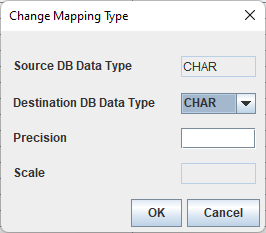

- [Migration Center User's Manual](#migration-center-users-manual)
  - [Preface](#preface)
  - [1. Introduction](#1-introduction)
    - [Overview](#overview)
    - [System Requirements](#system-requirements)
    - [Installation and Uninstallation](#installation-and-uninstallation)
  - [2. Getting Started](#2-getting-started)
    - [Understanding Migration Center](#understanding-migration-center)
    - [Understanding User Interface](#understanding-user-interface)
    - [Tools](#tools)
  - [3. GUI Mode Quick Guide](#3-gui-mode-quick-guide)
    - [Quick Step Guide for GUI User](#quick-step-guide-for-gui-user)
  - [4. CLI Mode Quick Guide](#4-cli-mode-quick-guide)
    - [Quick Step Guide for CLI User](#quick-step-guide-for-cli-user)
  - [5. Migration Center Internals](#5-migration-center-internals)
    - [Build Step](#build-step-1)
    - [Reconcile Step](#reconcile-step)
    - [Run Step](#run-step)
    - [Data Validation Step](#data-validation-step)
  - [Appendix A: Migration Options](#appendix-a-migration-options)
    - [DB to DB Migration Options](#db-to-db-migration-options)
    - [DB to File Migration Options](#db-to-file-migration-options)
  - [Appendix B: Migratable Database Objects](#appendix-b-migratable-database-objects)
    - [Altibase to Altibase](#altibase-to-altibase)
    - [Altibase to Oracle](#altibase-to-oracle)
    - [CUBRID to Altibase](#cubrid-to-altibase)
    - [Informix to Altibase](#informix-to-altibase)
    - [MySQL to Altibase](#mysql-to-altibase)
    - [Oracle to Altibase](#oracle-to-altibase)
    - [SQL Server to Altibase](#sql-server-to-altibase)
    - [TimesTen to Altibase](#timesten-to-altibase)
    - [Tibero to Altibase](#tibero-to-altibase)
  - [Appendix C: Data Type Mapping](#appendix-c-data-type-mapping)
    - [Manipulating Data Type Mapping](#manipulating-data-type-mapping)
    - [Default Data Type Mapping Tables](#default-data-type-mapping-tables)
    - [Automatic Correction of Character Column Length Considering Heterogeneous Character Set](#automatic-correction-of-character-column-length-considering-heterogeneous-character-set)
  - [Appendix D: Mapping Default Values](#appendix-d-mapping-default-values)
    - [Mapping Table for Default Values](#mapping-table-for-default-values)
  - [Appendix E: PSM Converter Rule List](#appendix-e-psm-converter-rule-list)
    - [View Conversion Rules](#view-conversion-rules)
    - [Trigger Conversion Rules](#trigger-conversion-rules)
    - [Function Conversion Rules](#function-conversion-rules)
    - [Procedure Conversion Rules](#procedure-conversion-rules)
    - [Materialized View Conversion Rules](#materialized-view-conversion-rules)
    - [Package Conversion Rules](#package-conversion-rules)
    - [Library Conversion Rules](#library-conversion-rules)
    - [DML Conversion Rules](#dml-conversion-rules)
    - [PSM Conversion Rules](#psm-conversion-rules)
    - [Expression Conversion Rules](#expression-conversion-rules)
  - [Appendix F: FAQ](#appendix-f-faq)
    - [Common](#common)
    - [Oracle](#oracle)
    - [MS-SQL](#ms-sql)
    - [Altibase](#altibase)
    - [Informix](#informix)
    - [MySQL](#mysql)
    - [TimesTen](#timesten)

Altibase® Tools & Utilities

Migration Center User's Manual
==============================


Altibase Tools & Utilities Migration Center User's Manual

Release 7.11

Copyright ⓒ 2001\~2021 Altibase Corp. All Rights Reserved.

This manual contains proprietary information of Altibase Corporation; it is provided under a license agreement containing restrictions on use and disclosure and is also protected by copyright patent and other intellectual property law. Reverse engineering of the software is prohibited. All trademarks, registered or otherwise, are the property of their respective owners.

**Altibase Corp**

10F, Daerung PostTower II,
306, Digital-ro, Guro-gu, Seoul 08378, Korea
Telephone: +82-2-2082-1000 Fax: 82-2-2082-1099

Customer Service Portal: <http://support.altibase.com/en/>

Homepage: [http://www.altibase.com]

Preface
----

This manual describes Migration Center that either directly or indirectly copies generally compatible database objects and data.

#### Audience

This manual has been prepared for the following Altibase users:

- Database administrators
- Performance administrators
- Database users
- Application developers
- Technical Supporters

It is recommended for those reading this manual possess the following background knowledge:

- Basic knowledge in the use of computers, operating systems, and operating system utilities
- Experience in using relational database and an understanding of database concepts
- Computer programming experience
- Experience in database server management, operating system management, or network administration

#### Organization

This manual is organized as follows:

- Chapter 1: Introduction  
  This chapter introduces Migration Center and explains how to install it.

- Chapter 2: Getting Started  
  This chapter describes the key concepts in migration, how to use Migration Center in GUI and CLI modes, and tools provided for user convenience.

- Chapter 3: GUI Mode Quick Guide  
  This chapter provides a quick step guide for GUI mode users who are new to Migration Center.

- Chapter 4: CLI Mode Quick Guide  
  This chapter provides a quick step guide for CLI mode users who are new to Migration Center.

- Chapter 5: Migration Center Internals  
  This chapter describes the main steps of Migration Center, namely the Build, Reconcile, Run, and Data Validation steps.

- Appendix A: Migration Options  
  This appendix describes the Migration Center options.

- Appendix B: Migratable Database Objects  
  This appendix provides the table that shows what database objects can be migrated using Migration Center.

- Appendix C: Data Type Mapping  
  This appendix explains how to check and customize the default data type mapping for an existing project. In addition, it provides default data type mapping tables

- Appendix D: Mapping Default Values  
  This appendix provides the mapping table for default values according to which Migration Center converts source database default values to comply with Altibase.

- Appendix E: PSM Converter Rule List  
  This chapter describes the rules for converting PSM convertes to DDL SQL statements when migrating from Oracle to Altibase.

- Appendix F: FAQ

#### Documentation Conventions

This section describes the conventions used in this manual. Understanding these conventions will make it easier to find information in this manual and in the other manuals in the series.

There are two sets of conventions:

- Syntax diagram convetions
- Sample code conventions

##### Syntax Diagram Conventions

This manual describes command syntax using diagrams composed of the following elements:

| Elements                                                                                                                                                                                                     | Meaning                                                                                                                                    |
| ------------------------------------------------------------------------------------------------------------------------------------------------------------------------------------------------------------ | ------------------------------------------------------------------------------------------------------------------------------------------ |
| [](https://github.com/ALTIBASE/Documents/blob/master/Manuals/Altibase_7.1/eng/media/SQL/image1.gif) | Indicates the start of a command. If a syntactic element starts with an arrow, it is not a complete command.                               |
| [](https://github.com/ALTIBASE/Documents/blob/master/Manuals/Altibase_7.1/eng/media/SQL/image2.gif) | Indicates that the command continues to the next line. If a syntactic element ends with this symbol, it is not a complete command.         |
| [](https://github.com/ALTIBASE/Documents/blob/master/Manuals/Altibase_7.1/eng/media/SQL/image3.gif) | Indicates taht the command continues from the previous line. If a syntactic element starts witht his symbol, it is not a complete command. |
| [](https://github.com/ALTIBASE/Documents/blob/master/Manuals/Altibase_7.1/eng/media/SQL/image4.gif) | Indicates the end of a statement.                                                                                                          |
| [](https://github.com/ALTIBASE/Documents/blob/master/Manuals/Altibase_7.1/eng/media/SQL/image5.gif) | Indicates a manatory element.                                                                                                              |
| [](https://github.com/ALTIBASE/Documents/blob/master/Manuals/Altibase_7.1/eng/media/SQL/image6.gif) | Indicates an optional element.                                                                                                             |
| [](https://github.com/ALTIBASE/Documents/blob/master/Manuals/Altibase_7.1/eng/media/SQL/image7.gif) | Indicates a mandatory element comprised of options. One, and only one, option must be specified.                                           |
| [](https://github.com/ALTIBASE/Documents/blob/master/Manuals/Altibase_7.1/eng/media/SQL/image8.gif) | Indicates an optional element comprised of options.                                                                                        |
| [](https://github.com/ALTIBASE/Documents/blob/master/Manuals/Altibase_7.1/eng/media/SQL/image9.gif) | Indicates an optional element in which multiple elements may be specified. A comman must precede all but the first element.                |

##### Sample Code Conventions

The code examples explain SQL statements, stored procedures, iSQL statements, and other command line syntax.

The following table describes the printing conventions used in the code examples.

| Rules            | Meaning                                                      | Example                                                      |
| ---------------- | ------------------------------------------------------------ | ------------------------------------------------------------ |
| [ ]              | Indicates an optional item                                   | VARCHAR [(*size*)] [[FIXED \|] VARIABLE]                     |
| { }              | Indicates a mandatory field for which one or more items must be selected. | { ENABLE \| DISABLE \| COMPILE }                             |
| \|               | A delimiter between optional or mandatory arguments.         | { ENABLE \| DISABLE \| COMPILE } [ ENABLE \| DISABLE \| COMPILE ] |
| . . .            | Indicates that the previous argument is repeated, or that sample code has been omitted. | SQL\> SELECT ename FROM employee;<br/> ENAME<br/>  -----------------------<br/> SWNO<br/>  HJNO<br/>  HSCHOI<br/>  .<br/> .<br/> .<br/> 20 rows selected. |
| Other Symbols    | Symbols other than those shown above are part of the actual code. | EXEC :p1 := 1; acc NUMBER(11,2)                              |
| Italics          | Statement elements in italics indicate variables and special values specified by the user. | SELECT \* FROM *table_name*; <br/>CONNECT *userID*/*password*; |
| Lower case words | Indicate program elements set by the user, such as table names, column names, file names, etc. | SELECT ename FROM employee;                                  |
| Upper case words | Keywords and all elements provided by the system appear in upper case. | DESC SYSTEM_.SYS_INDICES_;                                   |

#### Related Documentations

For more detailed information, please refer to the following documents.

- Installation Guide

- Getting Started Guide

- Administrator’s Manual

- Replication Manual

- Precompiler User’s Manual

- API User’s Manual

- Altibase C Interface Manual

- iSQL User’s Manual

- Utilities Manual

- General Reference

- Error Message Reference

#### Altibase Welcomes Your Comments and Feedbacks

Please let us know what you like or dislike about our manuals. To help us with better future versions of our manuals, please tell us if there is any corrections or classifications that you would find useful.

Include the following information:

- The name and version of the manual that you are using
- Any comments about the manual
- Your name, address, and phone number

If you need immediate assistance regarding any errors, omissions, and other technical issues, please contact [Altibase's Support Portal](http://support.altibase.com/en/).

Thank you. We always welcome your feedbacks and suggestions.

## 1. Introduction

This chapter introduces Migration Center and explains how to install it. This chapter consists of the following sections:

- Overview

- System Requirements

- Installation and Uninstallation

### Overview

Migration Center is a database migration tool that either directly or indirectly copies generally compatible database objects and data. Most databases comply with international standards, but no database is exempt from manual database migration. Generally, manual database migration is complicated, time-consuming, and error-prone. Migration Center helps users migrate databases with only a few mouse clicks in Graphic User Interface (GUI) mode, and offers Command Line Interface (CLI) mode as well.

The major benefits of using this tool are:

1. Database objects of the original database can be conveniently migrated to the target database (Alibase or Oracle) without any difficulties.
2. Directly copies data of a source database to Altibase with a JDBC driver (the most popular and widely available interface for DBMS nowadays).
3. Exports data to external files for later use in data importing to Altibase with iLoader.
4. Provides parallel execution options to shorten the migration process. By default, Migration Center automatically balances data migration load between a number of threads and also enables the user to manually split data over multiple threads.
5. Supports data type mapping of different data types between heterogeneous databases. Provides default type mapping for convenience and user-defined data type mapping for flexibility.
6. Provides GUI mode for better usability and CLI mode for special circumstances.
7. For schema migration, enables the user to modify DDL SQL statements for migrating database objects.

### System Requirements

This section discusses the system requirements for Migration Center and compatible database management systems.

- Hardware Requirements
- Software Requirements
- Compatible Database Systems

#### Hardware Requirements

##### GUI Mode

- CPU: Pentium III 800MHz or better

- Main memory: 512MB or more

- Disk: 150MB or more free space

- Screen resolution: 1024 x 768 pixels or higher

##### CLI Mode

- CPU: Pentium III 800MHz or better
- Main memory: 512MB or more
- Disk: 150MB or more free space

#### Software Requirements

- Java Development Kit (JDK), or Java Runtime Environment (JRE) 5 or later

Migration Center is a pure Java application that uses Swing for GUI mode. It runs regardless of the user’s hardware and operating system, but relies on the JRE. The user is recommended to install Oracle, or IBM Java 5 or later. To run Migration Center in GUI mode, the user’s environment must support Java Swing.

Since Migration Center is bundled with the JRE 7 for the 64-bit Microsoft Windows system, these users do not need to install the JRE. However, other operating system users must configure the JRE and related environment variables appropriately.

#### Compatible Database Systems

The compatible database systems that are migratable can be divided into Altibase or Oracle depending on the target database.

##### If Altibase is the target database:

If Altibase is the target database, the source database that can be migrated is as follows.

###### Destination Database

- Altibase 6.5.1 or later

###### Source Database

- Altibase: 4.3.9 or later

- Oracle Database: 9i - 11g

- Microsoft SQL Server: 2005 - 2012

- Oracle MySQL: 5.0 - 5.7

- Informix: 11.50

- Oracle TimesTen: 7.0, 11.2

- CUBRID: 8.4.1\~9.3.5(ISO-8859-1, UTF-8 charset)

- Tibero: 5\~6

##### If Oracle is the target database:

If Oracle is the target database, the source database that can be migrated is as follows.

###### Destination Database

- Oracle Database 10g - 11g

###### Source Database

- Altibase: 4.3.9 or later

##### JDBC Driver

Migration Center is available for different versions of Altibase and other databases. This tool uses a JDBC driver for database connection, so it is important to prepare the appropriate JDBC driver for both source and destination databases. For user convenience, some JDBC drivers that are appropriate for use with supported databases are provided with Migration Center.

Please note that for legal reasons, the Microsoft SQL Server JDBC driver file, MySQL Connector/J file, informix JDBC Driver file, and TimesTen JDBC driver file are not included in the package. Also, since TimesTen only supports type 2 driver, the migration must be performed on a machine that the TimesTen Client Package is installed.

Users can download the appropriate JDBC driver file from the following site:

1. Microsoft does not support the JDBC driver for SQL Server 2005 according to the Microsoft Support Lifecycle(MSL) policy, and it also does not provide download link. Therefore, users should use the JDBC driver included in the database product they are using.

2. Microsoft JDBC Driver for SQL Server 2008, for 2008 R2, for 2012 can be downloaded from the link below. Since Migration Center has been tested with JDBC driver version 6.0 and JRE 7 environment, it is recommended for users to use the same driver version and JRE version. Also in Linux OS, the value of JAVA_HOME environment variable must be set to the path where the JRE 7 or later is installed. If you want to use a version other than JDBC Driver 6.0, you need to check the driver version, compatible SQL Server version, and supported JRE version in the Microsoft JDBC Driver for SQL Server Support Matrix.  
   Download Microsoft JDBC Driver for SQL Server:  
   <https://docs.microsoft.com/en-us/sql/connect/jdbc/download-microsoft-jdbc-driver-for-sql-server?view=sql-server-2017>  
   Microsoft JDBC Driver for SQL Server Support Matrix:  
   <https://docs.microsoft.com/en-us/sql/connect/jdbc/microsoft-jdbc-driver-for-sql-server-support-matrix?view=sql-server-2017>

3. Oracle MySQL Connector/J  
   <http://dev.mysql.com/downloads/connector/j/>

4. Informix JDBC Driver  
   <http://www14.software.ibm.com/webapp/download/search.jsp?go=y&rs=ifxjdbc>

5. Oracle TimesTen  
   <http://www.oracle.com/technetwork/database/database-technologies/timesten/downloads/index.html>

6. CUBRID  
   <http://www.cubrid.org/?mid=downloads&item=jdbc_driver>

7. Tibero  
   <https://technet.tmaxsoft.com/>

### Installation and Uninstallation

Migration Center can be downloaded from Altibase’s Customer Center at http://altibase.com/support-center/en/.

Migration Center is provided in zip or tar.gz file format. This file contains the executable file and some JDBC drivers.

To install, simply unzip the file. The generated directory contains the projects, lib, conf, and images subdirectories, other directories, and files (including migcenter.bat and migcenter.sh). Move this folder to a desired location, and Migration Center is ready for use.

To uninstall, simply delete the Migration Center directory.

## 2. Getting Started

This chapter describes the key concepts in migration, how to use Migration Center in GUI and CLI modes, and tools provided for user convenience.

This chapter consists of the following sections:

- Understanding Migration Center

- Understanding User Interface

- Tools

### Understanding Migration Center

This section explains the terminology and overall process of Migration Center.

- Terms

- Basic Concept

#### Terms

##### Project

The Migration Center project is a basic work unit that describes all aspects of migration. This includes what to migrate, where from and where to migrate (namely, the database or datafile type), and how to migrate database objects and table data. For more detailed information about migration options, please refer to Appendix A: Migration Options. Only one project can be open at any time.

#### Basic Concept

The overall process of Migration Center consists of five steps: Prepare, Build, Reconcile, Run, and Data Validation.

##### Prepare Step

The Prepare step is an implicit step in the migration project. This step ends with an open project that has all database connections established. To get there, the user may need to add connection information of the running database, open an existing migration project, or create a new migration project by either using preconfigured database connections or establishing database connections.

##### Build Step

The Build step performs initial surveys on the current status of the source and destination databases. This step retrieves information about database objects in the source and destination databases through database connections, and saves this information in the project directory. Since this information is used in other steps, it must reflect the most recent status. If any metadata is changed in the source database prior to the Run step, the Build, Reconcile, and Run steps must be re-executed to integrate changes.

##### Reconcile Step

The Reconcile step builds a complete migration plan on the current status. This step is mostly  28 Migration Center User’s Manual about making adjustments for differences between source and destination databases (namely, data types and tablespaces). This step enables the user to edit SELECT statements for fetching data from the source database and DDL statements to be executed on the destination database. For example, the user can specify which source database table is to be copied to which destination database tablespace.

Please remember that if changes are made to “Migration Options”, this step must be re-executed.

##### Run Step

The Run step executes the plan built in the Reconcile step. This step migrates schema and data either directly or indirectly.

If the migration type in “Migration Options” is set to “DB to DB”, Migration Center creates database objects in the destination database (schema migration). Then, it copies data from the source database to the destination database (data migration).

If the migration type in “Migration Options” is set to “DB to File,” SQL script files are created during migration. Nevertheless, the basic migration process is the same.

##### Data Validation Step

The Data Validation step runs a check on migrated data. This step checks whether the data of a table that has a primary key and was migrated in the Run step is identical in the source and destination databases. If build step is performed as "Build User", this step checks the data validity of all tables that have a primary key. If build step is performed as "Build Table", this step checks the data validity of only migrated tables with a primary key.

Data that differs between the source and destination databases is stored to CSV files during this step. The user can apply data of this file to the destination database with the “FILESYNC” menu or command. To shorten the duration of this step, the data sampling feature is enabled by default. To disable the data sampling feature and run a data validation check on all data, select the “Data Validation Options” submenu from the “Migration Options” menu, and change “Data Sampling” to “No”.

### Understanding User Interface

This section briefly describes GUI mode and CLI mode provided by the Migration Center. The details of two mode usages are discussed at "GUI Mode Quick Guide" and "CLI Mode Quick Guide".

#### Graphic User Interface(GUI) Mode

GUI mode is a user-friendly interface and is the basic interface of Migration Center. GUI mode allows you to perform the entire migration process easily, and can be fine-tune "Reconciling the Project" step and changing the options. If the platform supports Java Swing from client computer to server, it can be executed in GUI mode.

The Migration Center GUI consists of the four panes shown below. Starting from the top left corner and moving clockwise, the four panes are Project, Information, Log, and DB Properties.


##### Project Pane

The Project pane offers a project-centric view. This pane displays the open project, and its source and destination database connections. Only one project can be open at a time.

##### Information Pane

The Information pane offers a simple view of the project. This pane displays the current progress and remaining steps.

##### Log Pane

The Log pane displays the results of tasks performed by Migration Center in chronological order. This pane chooses information that might be of interest to the user from logs stored in the log subdirectory under the Migration Center directory.

##### DB Properties Pane

The DB Properties pane displays information about the source and destination databases configured for the project.

#### Command Line Interface (CLI) Mode

The primary reason for using the CLI mode is to perform a fast "run" step. The "run" step, which takes the most time during the migration, creates the converted schema in the "Reconcile" step and migrates the data from the source database into the target database. Performing the "run" step in the CLI mode on the server where the database is installed, can increase the data transfer speed by reducing the communication cost compared to executing the "run" step in the GUI mode on the client computer.

Users can take advantage of both the convenience of GUI mode and the fast performance of CLI mode when you execute only the "Run" and "Validate" steps are performed in CLI mode after executing from "Start" to "Reconcile" in GUI mode

Another reason to use in CLI mode is to perform the migration in an environment where GUI mode is not allowed. Although the entire migration process can be performed in CLI mode, it also has limitations of character-based interface. For example, user is allowed to perform "Reconcile" step only with the default value in CLI mode.

### Tools

This section introduces how to use two types of utilities included in the Migration Center

#### PSM Converter for File

“PSM Converter for File” converts Oracle PL/SQL to Altibase PSM in independent file units. This tool reads a SQL file that contains Oracle PL/SQL statements, converts it into Altibase PSM, and then writes the results in a predefined SQL file. This file is provided with an HTMLformatted report file. This tool’s functionality is equivalent to the PSM Converter in the Reconcile step. For more detailed information about conversion rules, please refer to PSM Converter Rule List.

To execute this tool, select ”PSM Converter for File” from “Tools” in the main menu.

#### Generate Migration Error Report

“Generate Migration Error Report” reports problems that arise in Migration Center. If a project is opened, and this tool is executed, it collects problem tracking information (namely, log files and revision number information) and creates it as a zip file. The user only needs to attach the zip file to an email and send it to Altibase’s Customer Support with the user’s client registration information.

To execute this tool, select “Generate Migration Error Report” from “Tools” in the main menu.

## 3. GUI Mode Quick Guide

This chapter provides a quick step guide for users new to Migration Center.

### Quick Step Guide for GUI User

The users can easily perform migration in GUI mode with this quick step guide. The overall process is listed below.

1. Start Migration Center

2. Prepare the project

   1. Register source and destination database connections
   2. Create a project
   3. Open the project
   4. Connect to source and destination databases
   5. Set migration options

3. Build the project

4. Reconcile the project

5. Run the project

6. Validate the project

#### Starting Migration Center

Double-click the “migcenter.bat” icon in the Migration Center folder on Microsoft Windows. Execute “migcenter.sh” on Unix-like operating systems. To use Migration Center on any environment other than a 64-bit version of Windows, please check that Java Runtime Environment (JRE) is installed, and that the PATH environment variable is set appropriately so that the JRE can be accessed from the terminal.

#### Registering a Database Connection

1. From the “Database” menu, select the “Add Database Connection” submenu, or click the “Add Database Connection” icon in the main toolbar.

2. Fill in all the input fields of the “Add Database Connection” dialog box:

   1. DB Product: The database system name

   2. Connection Name: A unique database connection name to be used for Migration Center projects

   3. IP: The Internet Protocol (IP) address of the database server

   4. Port: The port number of the database server or SSL port number of the Altibase server

   5. User: The valid user ID for the database

   6. Password: The password corresponding to the user ID for the database.

   7. JDBC Driver:  The JDBC driver path to be used to connect to the database.

   8. Encoding: The default character set used on the client.

   9. IP Version: The IP protocol version used in this connection.

   10. Property: The JDBC driver property to be used in this connection.   
       If connecting with SSL, set ssl_enable = true as shown below, and * path_to_keystore, path_to_truststore, and password * are set according to each authentication environment.

```
ssl_enable=true&keystore_url=path_to_keystore&keystore_password=password&truststore_url=path_to_truststore&truststore_password=password
```

3. Click the “Test” button at the bottom of the dialog box to check the input information before adding this connection to the connection list.

4. If the connection test is successful, click the “OK” button at the bottom of the dialog box to add the connection to the connection list. Then, close the “Add Database Connection” dialog box.

#### Creating the Project

1. From the “Project” menu, select the “Create Project” submenu, or click the “Create Project” icon in the main toolbar.

2. Fill in the input fields in the “New Project” dialog box:

   1. Project Name: A migration project name that is unique in Migration Center and meaningful to the user.
   2. Project Path: The folder path where migration project files will be stored. This value cannot be edited by users.
   3. Source Database: A database that contains database objects to be migrated in this project.
   4. Destination Database: An Altibase database to copy database objects from the source database and store them. This input field is mandatory, even if the project is configured for “DB to File” migration.

3. Click the “OK” button at the bottom of the “New Project” dialog box.

#### Opening the Project

To open a project, select the “Open Project” submenu from the “Project” menu. A file “Open” dialog box appears. The user only needs to choose a project folder and click the “Open” button.

#### Configuring the Project

The user can configure the project’s basic strategy prior to setting project details. For further information, please refer to Migration Options.

#### Connecting to Source and Destination Databases

Establishing connections with the source and destination databases is essential to proceed to the Build step. To connect the databases for the project, select the “Connect” submenu from the “Project” menu, or right-click the open project and click “Connect.”

#### Building the Project

The Build step is indispensible to migration, yet simple to execute.

1. Click "Build User" or "Build Table" from the "Migration" menu or the main toolbar.

2. A dialog box asking how to fetch records from each table in the source database appears. Select the desired method and click “OK”. For further information about the available options and explanations thereof, refer to Internal Activities.

3. If "Build Table" has been selected, a dialog box shows up to list the names of migration target tables. When clicking the"" button, you can choose migration target tables with name search. After completing configuring the table list, click the "Build" button to proceed with the build step.

4. A “Build” dialog box displaying the build progress appears. At completion, a “Report” button appears at the bottom.

5. If you click “Report”, an HTML report file is created in the project directory and the “Build Report” dialog box appears. This dialog box provides a link to the HTML report file. Once the “Report” button is clicked and an HTML report file is created, the “Build Report” submenu from the “Report” menu is activated. The user can open the “Build Report” dialog box at any time with this menu item.

#### Reconciling the Project

The Reconcile step is very important because it determines how to execute the Run step, and it requires some knowledge of both source and destination databases. For further information about this step, please refer to Migration Center Internals. The following is a simple guide:

1. From the “Migration” menu, select “Reconcile”, or click the “Reconcile” icon in the main toolbar.

2. Change or confirm the default data type mapping.

3. Specify the Altibase tablespaces to which the source database is to be migrated.

4. Change or confirm how to migrate partitioned tables in the source database to Altibase.

5. Specify the Altibase tablespace to which each table or index in the source database is to be migrated.

6. Check the SELECT statement for fetching data from each table of the source database, and make changes if necessary.

7. Check whether the DDL SQL statements to be used during the schema migration process is correct, and make changes if necessary.

8. Click the “Report” button to generate a report for this step.

#### Running the Project

The Run step can be as easily executed as the Build step, but is irreversible. Please check all settings before proceeding any further.

1. From the “Migration” menu, select the “Run” submenu, or click the “Run” icon in the main toolbar.
2. Click “OK” in the warning dialog box to confirm that every configuration is correct.
3. Review the progress and final report closely.

#### Validating the Project

The Data Validation step checks whether data migration was properly performed in the Run step.

1. From the “Migration” menu, select the “Data Validation” submenu.
2. Click “OK” in the warning dialog box to confirm that every configuration is correct. The “Data Validation” dialog box appears and the Data Validation step is executed.
3. At completion, a “Report” button appears at the bottom.
4. If you click “Report”, an HTML report file is created in the project directory and the “Data Validation Report” dialog box appears. This dialog box provides a link to the HTML report file. Once the “Report” button is clicked and an HTML report file is created, the “Data Validation Report” submenu from the “Report” menu is activated and the user can open the “Data Validation Report” dialog box at any time with this submenu.
5. If there is a difference between the data of the source and destination databases in the report, the user can synchronize the data with the filesync feature.

The following is a simple guide for using filesync.

1. From the “Migration” menu, select the “Migration Options” submenu.
2. Click “OK” in the warning dialog box.
3. Select “FILESYNC” in the “Operation” combo box from the “Data Validation Options” submenu, and click “OK”.
4. From the “Migration” menu, select the “Reconcile” submenu, or click the “Reconcile” icon in the main toolbar.
5. Select “Table Mode” in the dialog box that appears.
6. Select the table to perform data synchronization on.
7. Click “Next” until the Reconcile step completes.
8. From the “Migration” menu, select the “Data Validation” submenu.
9. The “Data Validation” dialog box appears and filesync is executed. At completion, a “Report” button appears at the bottom.
10. Check that data difference has been solved in the report.

## 4. CLI Mode Quick Guide

This chapter provides a quick step guide for CLI mode users who are new to Migration Center.

### Quick Step Guide for CLI User

The user can easily perform migration in CLI mode with this quick step guide. The overall process is listed below.

1. Prepare the project

   1. Register database connection information and project

   2. Set migration options

2. Build the project

3. Reconcile the project

4. Run the project

5. Validate the project

#### Prepare the Project

The source/ destination database connection information and project registration are essential to perform migration. It is possible to register the project in CLI mode, but it is recommended to register in user-friendly in GUI mode.

To register the database connection information and projects in CLI mode, you must explicitly register it in Migration Center after modifying the registration file(register.xml). What you need to input in the registration file is the project name and the source / destination database connection information to be used in the project. Multiple projects can be registered at once.

The registration file must be located in the directory where the Migration Center is installed. Please refer to the comments and samples in the "register.xml" file for more details.

##### Register database connection information and project

```
% ./migcenter.sh register register.xml
```

The source / destination database connection information and the project recorded in the registration file (register.xml) is to be registered in the Migration Center. The input project name should be unique, and the database connection information should be able to connect to the target database before registrations. When the project is successfully registered, the project name folder is automatically created and source/ destination database connect information is stored in Migration Center.

If either the project recorded in the registration file or the registration of the database connection information fails, all project and database connection registration recorded in the registration file are canceled.

The user can use a name other than "register.xml" as the name of the registration file.

##### Set Migration Options

The "options.xml" file is automatically created in the project folder when the project is registered. You can modify the options in the options.xml file directly in CLI mode. For details of the options, refer to the "Appendix A: Migration Options".

#### Build the Project

```
% ./migcenter.sh build project_path
```

To perform the "Build" step, input the build command and the path of the target project. The number of table records in the source database is collected using the Approximate Counting Method by default.

#### Reconcile the Project

```
% ./migcenter.sh reconcile project_path
```

To perform the "Reconcile" step, input the reconcile command and the path of the target project. In CLI mode, user is not allowed to tune the "Reconcile" step due to the limit of character-based interface.

#### Run the Project

```
% ./migcenter.sh run project_path
```

To perform the "Run" step, input the run command and the path of the target project.

#### Validate the Project

```
% ./migcenter.sh diff project_path
```

To verify the data migrated properly in the "Run" step, input the diff command and the path of the target project.

```
% ./migcenter.sh filesync project_path
```

To match the different data between the source and destination databases using the diff command, input filesync command and the path of the target project.

## 5. Migration Center Internals

This chapter describes the main steps of Migration Center, namely the Build, Reconcile, Run, and Data Validation steps. This chapter consists of the following sections:

- Build Step
- Reconcile Step
- Run Step
- Data Validation Step

### Build Step

#### Purpose

The Build step not only collects information about database objects from the source and destination databases, but also provides a build report to make migration easier for the user. The report lists migratable database objects in the source and destination databases with byte size information. This informs the user of the scale of the migration project, and helps the user to estimate the necessary data volume and time.

The information gathered in this step is used throughout the entire migration process and must reflect the current status of the source and destination databases. If changes are made to the database objects in the source database after the Build step, all steps must be re-executed.

#### Output

- Build reports

  Several data volume analysis reports based on the current status of the source and destination databases are output in HTML format and stored in the project folder.

- SQL Data Definition Language (DDL) script

  A file containing database object creation statements (DDLs) collected from the source database, whether or not Migration Center is supported, created in the project folder and named SrcDbObj_Create.sql. This file is intended for user reference only and is not used at any stage of the Migration Center.

- BuildReport4Unsupported.html

  It is one of the files summarizing the build results and shows the CREATE statements of objects not automatically migrated by the Migration Center. Objects that are not supported by Migration Center must be manually converted by the user, and this file can be referenced for conversion operations.

  Non-automatic migration object types depend on the source database and can be found at [Appendix B: Migratable Database Objects](#appendix-b-migratable-database-objects). In case of Oracle to Altibase migration, this file is not created because all of Oracle database object types defined in the appendix table are supported for automatic migration. On the other hand, in case of MySQL to Altibase migration, if the source database has any database object type such as stored procedures, stored functions, views, and trigger objects, the CREATE statement of the unsupported database object is recorded at this file for user's reference.

#### Internal Activities

This step consists of two internal activities; collecting information about database objects from both databases, and generating a Build report based on that information.

The collecting information can be started as either "Build User" or "Build Table".

- Build User: Collects all migratable object information of the user connected to the source database

- Build Table: Configure a list of tables to be migrated among the tables of the user connected to the source database. And collects object information of the selected tables, and constraints and indexes dependent on the selected tables

For more information on the object types that can be migrated, refer to the "Appendix B: Migratable Database Objects".

When the user starts the build step, the "Table Counting Method" dialog box appears. The user can choose one of the following options:

- Approximate Counting Method:  Retrieves the number of table records by referring to the statistical value of the source database. This value is affected by the accuracy of the statistical value

- Exact Counting Method:  Retrieves the exact number of table records by executing the COUNT function on every table in the source database

Of the two methods, the approximate counting method performs faster whereas, the exact counting method yields more accurate results.

The method chosen does not affect the database schema and data migration. It only affects the accuracy of the data migration progress percentage provided at the Run step in GUI mode. This is because the data migration progress is displayed as the time elapsed and the percentage of (number of migrated records / total number of records). With this, the user can estimate the total amount of time required to complete data migration.

For more detailed information about how to execute the Build step, please refer to Building the Project.

### Reconcile Step

#### Purpose

The Reconcile step builds a migration plan. Migration Center users should have a plan on how to migrate the database objects of each database. Migration Center cannot migrate all database objects to Altibase databases. However, it makes migration easier by allowing users full control over migration.

Altibase offers high performance of an in-memory database and high capacity of on-disk database in a single database. Altibase generally stores frequently used and low-latency data in memory tablespaces, and the rest of the data in disk tablespaces.

For more detailed information about tablespaces in Altibase databases, please refer to the *Administrator’s Manual.*

#### Output

- Reconcile reports: Several reports that specify which database objects to migrate and how to migrate them in the project folder.
- SQL Data Definition Language (DDL) scripts: Sample SQL files to create and drop database objects in the destination database are provided in the project folder for user convenience. However, these files are not used in any step.

  - DbObj_Create.sql: A SQL script file for creating database objects to be migrated.
  - DbObj_Drop.sql: A SQL script file for dropping database objects having the same names as those to be migrated.
- PL/SQL conversion reports: Several reports generated by the PL/SQL Converter.

  - sqlconv.html: A HTML report that compares the difference between source and converted PL/SQL.
  - sqlconv_src.sql: A report that contains the input PL/SQL statements to be converted in text format.
  - sqlconv_dest.sql: A report that contains converted PL/SQL statements and comments listing the applied conversion rules in text format.

#### Internal Activities

Although the Reconcile step is very important and can get complicated, the wizard is as easy to use as a UI. For further information about how to start the Reconcile step, please refer to Reconciling the Project in Chapter 3.

##### Reconcile Wizard Dialog Box

Users can check and modify the default settings in wizard dialog box. The wizard guides the user step by step, but the user can also go to any step by selecting it in the left pane.

##### “Data Type Mapping” Step

The “Data Type Mapping” step maps data types between heterogeneous databases. Please note that small differences between data types can cause unexpected data loss and truncation during data migration. For more detailed information, please refer to Data Type Mapping in Appendix C.

##### “PSM Data Type Mapping” Step

The “PSM Data Type Mapping” step maps PSM data types between heterogeneous databases. This step is only activated for Oracle to Altibase PSM Migration or TimesTen to Altibase PSM Migration. All configurations specified in this step are reflected to target DDL in the “SQL Editing” step later on.

##### “Tablespace to Tablespace Mapping” Step

The “Tablespace to Tablespace Mapping” step maps tablespaces between the source and destination databases. When tablespace mapping is set, contents of the tablespace are also mapped to the selected tablespace. This step creates a default tablespace map, and this map can be altered with the “Object to Tablespace Mapping” submenu.

##### "Object to Tablespace Mapping" Step

The “Object to Tablespace Mapping” step maps each table and index by dragging and dropping them to tablespaces in the destination tablespace. Whenever a map changes, the necessary total storage sizes for tablespaces in the destination database are recalculated. Internally, a database object size is accurately retained in bytes, but is rounded to megabytes in the dialog box. Therefore, the total size of a tablespace may not be equivalent to the sum of its contents.

##### "Select Editing" Step

The “Select Editing” step enables the user to edit the SELECT statement for fetching data from a table in the source database. The user can add hints or WHERE clauses, and immediately check the edited statement. Click the “Restore” button to undo changes.

##### "Unacceptable Name" Step

The "Unacceptable Name" step shows objects that violate the unquoted object name rules in the target database. This includes objects with special characters or spaces in the name, and creation fails during the run phase. If the user selects the "Use Double-quoted Identifier" check box, the user can avoid creating objects by wrapping only the problem names in double quotes."

##### “SQL Editing” Step

The “SQL Editing” step allows the user to view and edit the DDL statements for schema migration. The user can refer to the source DDL, and directly edit the DDL statements that Migration Center will apply on the destination database. SQL statements for creating procedures, functions, triggers, and views are all displayed in PSM type. Tick the check box to select which object type within the PSM category to edit. These objects are displayed in the “Done” or “To-Do” list pane. If an object requires user confirmation, it is displayed in the todo list; otherwise, it is displayed in the done list. Click an object name in a list to view its source and destination DDL. Edit the DDL statement of an object belonging to the to-do list, then click the “Save” button, and the object will move to the done list. The migration of an object in the done list can unexpectedly fail in the Run step. In this case, the user must check the “Missing Cause” in the Run report, find the error cause, and manually migrate the object. DDL statements of PSM objects can be output as a file for users who prefer text editors. This functionality and instructions on its use are provided in the offline pane of the PSM object type. For Oracle or TimesTen to Altibase migration, the PL/SQL Converter converts the DDL statement of the PSM type object to an Altibase-compatible format. Please note that although most of the syntax is converted, statements containing semantic logic are not converted.

> Note: Migration Center generates a dependency graph between objects in the source and destination databases in the Build step. If the user changes this dependency while editing destination DDL statements, migration cannot be guaranteed for the object and related objects.

### Run Step

#### Purpose

The Run step copies database objects in the source database to the destination database or external files, depending on migration options.

After the Run step is complete, Run reports that contain results of this step are generated. These results may be the most important to the user. The RunReport4Summary.html report file outputs the overall result by comparing the number of database objects and table records in the source and destination databases. The RunReport4Missing.html report file outputs in detail any failure.

Data that failed to be migrated is collected in the “db2db” or “db2file” folder in the project folder. These two folders store data files and form files available for use with iLoader (the command-line data import/export tool for Altibase databases), and also scripts to easily import the generated data files to the database with iLoader. “iLoaderIn.sh” is the main script that executes the “iLoaderIn.number.sh” script which runs iLoader on other script files and tables.

#### Output

- RunReport4Summary.html: A summary report file that outputs the overall result of migration.
- RunReport4Missing.html: A missing report file that outputs information about data that failed to be migrated, and the error cause.
- DbObj_Failed.sql: A file that outputs a list of failed SQL statements and the error cause.
- The db2db folder: A subfolder in the project directory, where data that failed to be migrated is saved. This folder is only available if the “DB to DB” option is selected for “Migration Type” and “No” is selected for “Batch Execution.”
- The db2file folder: A subfolder in the project directory, where all output is saved if the “DB to File” option is selected for “Migration Type”.

#### Internal Activities

The user can execute the Run step with a single mouse click in GUI mode, or a single command in CLI mode. For further information, please refer to Running the Project or Executing the Run and Data Validation Steps in CLI Mode.

Internally, this process consists of three steps to avoid database object dependencies: the PreSchema, Table & Data, and PostSchema steps. For example, index objects are migrated in the PostSchema step, after the Table & Data step is completed. This is because it is usually faster to insert data without an index, than with an index. Each step performs the following:

1. PreSchema: Migrates sequence objects

2. Table & Data: Migrates table objects and data

3. PostSchema:

   1. Queue: Migrates queue objects

   2. Constraints: Migrates constraints, namely unique, primary key, foreign key, and check constraints

   3. Index: Migrates index objects

   4. Synonym: Migrates private synonym objects

   5. Procedures, functions, materialized views, views, typesets and triggers: Depends on the database management system and its version

### Data Validation Step

#### Purpose

The Data Validation step checks whether data migration was properly performed in the Run step. At completion, the user is provided with a Data Validation report for post processing. This report offers information about the source and destination databases, a list of successfully validated tables, and the number of occurrences of data accordance and difference.

The user can decide whether to re-execute the Run step or use filesync. The user is recommended to use filesync when the occurrence of data difference is low, but re-execute the Run step when the occurrence of data difference is high.

#### Restrictions

- The Data Validation step can only be performed on a table with a primary key constraint.
- LOB columns are excluded as targets for data comparison.

#### Output

- Data Validation report: A report containing a summary with information, namely the list of validated tables and the occurrences of data accordance and difference is output to the project directory.
- Validation directory: A subdirectory in the project directory that stores different data. This directory is valid only if “YES” is selected for the “Write to CSV” option in the “Data Validation Options” submenu.

#### Internal Activities

The Data Validation step can be executed with a single click in GUI mode, or a single command in CLI mode. For further information, please refer to Validating the Project or Executing the Run and Data Validation Steps in CLI Mode.

Internally, the Data Validation step is executed as below.

The data to be validated is fetched from the source and destination databases and compared. If a difference in data is detected and “Write to CSV” in the “Data Validation Options” submenu is set to “Yes”, the different data is stored in CSV format files in the validation folder. Regardless of the option, summary information is always output to the Data Validation report.

## Appendix A: Migration Options

Migration Options affect the migration project. They can be edited by selecting the “Migration Option” menu item from the Migration menu in GUI mode. Migration Options can usually be edited right after the project is created.

The primary option is the Migration Type: either “DB to DB” or “DB to File”.

- DB to DB Migration Options

- DB to File Migration Options

### DB to DB Migration Options

Object and table data of the source database to be migrated are migrated directly to the database (Altibase) to be stored.

| Name                                         | Description                                                  |
| -------------------------------------------- | ------------------------------------------------------------ |
| Execution Thread                             | Specifies the maximum number of threads to be used when executing data migration. The default value is triple of the number of logical processors in the system running the Migration Center. The suggested range of this value is from 1 to triple of the number of logical processors in the system running the Migration Center. |
| Migration Target                             | Specifies the targets for migration: <br />\- Object & Data: Database objects and table data<br />\- Object: Database objects only |
| **Object Options**                           |                                                              |
| Foreign Key Migration                        | Specifies whether or not to include foreign key constraints in migration target. This option is set to 'No' by default. |
| PSM Migration                                | Specifies whether or not to include PSM objects such as procedures, functions, materialized views, views, typesets, and triggers in migration target. This option is set to 'No' by default.<br /> |
| Drop Existing Objects                        | Specifies whether or not to recreate the database object before migration. <br />When this option is set to 'Yes', DROP and CREATE will be executed on migration target objects in target database. When this option is set to 'No', migration will be executed without dropping the database objects. This option is set to 'No' by default. |
| Keep Partition Table                         | Specifies whether or not to maintain partitioned tables.<br />When this option is set to 'Yes', partitioned tables in the the source database will be migrated as partitioned tables. In this case, additional work is required for the partitioned tables in the reconcile stage's '5. Partitioned Table Conversion'. When this option is set to 'No', target partitioned tables will be migrated as non-partitioned tables. This option is set to 'No' by default. |
| Use Double-quoted Identifier                 | Specifies whether or not to use double quotation marks for schema and object names. This option is set to 'No' by default. |
| Remove FORCE from View DDL                   | Specifies whether or not to remove 'FORCE' keyword from the statement creating a view. |
| Postfix for reserved word                    | Specifies a user-defined word which is to be added to the database object name in the source database as a postfix when it conflicts with a reserved keyword of Altibase. The defualt value is _POC. |
| **Data Options**                             |                                                              |
| Batch Execution                              | Specifies whether or not to use batch insert in JDBC for higher performance. This option is set to 'Yes' by default. |
| Batch Size                                   | Specifies the batch size when batch insert in JDBC is used. The default value is 10,000. |
| Batch LOB type                               | Specifies whether or not to batch process BLOB and CLOB data types.<br />When this option is set to 'Yes', Out Of Memory (OOM) error can occur according to the size of the data, and exceptions can occur in some databases that do not support this feature, such as TimesTen. This option is set to 'No' by default. |
| Log Insert-failed Data                       | Specifies whether or not to log insert-failed rows during data migration. This option is available only when the Batch Execution option is disabled. This option is set to 'No' by default. |
| File Encoding                                | Specifies the encoding character set to be used when logging the insert-failed data into files. This option is available only when the Log Insert-failed Data option is enabled. The default value is UTF8. |
| **Data Validation Options**                  |                                                              |
| Operation                                    | Specifies the operation to be executed in the data validation stage: <br />DIFF: Check data difference between the source and the target databases. <br/>FILESYNC: Apply the CSV file created as a result of DIFF operation to the target database. |
| Write to CSV                                 | Specifies whether or not to write the inconsistent data to the CSV file. |
| Include LOB                                  | Specifies whether or not to include LOB data when writing inconsistent data to the CSV file. |
| Data Sampling                                | Specifies whether or not to use data sampling feature.<br />When this option is set to 'Yes', to decrease the data validation time, only sample data will be validated. When this option is set to 'No', each data will be validated. This option is set to 'Yes' by default. |
| Percent Sampling (exact counting)            | Specifies the percentage of data to be sampled from target tables. This option is used only when the Exact Counting Method is selected in the build stage. |
| Record Count Sampling (approximate counting) | Specifies the number of records to be sampled from target tables. This option is used only if the Approximate Counting Method is selected in the build stage. |

### DB to File Migration Options

Object and table data of the source database to be migrated are stored as SQL script file, form file, and CSV type data file, respectively.

The stored files can be migrated to the database (Altibase) to be saved using iSQL and iLoader.

| Name                         | Description                                                  |
| ---------------------------- | ------------------------------------------------------------ |
| Execution Thread             | Specifies the maximum number of multi thread to be used when executing data migration. Default value is triple of the amount logical processors in the system running the Migration Center. The suggested range of this value is from 1 to triple of the amount logical processors in the system running the Migration Center. |
| Migration Target             | Specifies the targets for data migration: <br />\- Object & Data: Database objects and table data<br />\- Object: Database objects only |
| **Object Options**           |                                                              |
| Foreign Key Migration        | Specifies whether or not to include foreign key constraints in migration target. This option is set to 'No' by default. |
| PSM Migration                | Specifies whether or not to include  PSM objects such as procedures, functions, materialized views, views, typesets, and triggers. This option is set to 'Yes' by default. |
| Keep Partition Table         | Specifies whether or not to maintain partitioned tables.<br />When this option is set to 'Yes', partitioned tables in the the source database will be migrated as partitioned tables. In this case, additional work is required for the partitioned tables in the reconcile stage's '5. Partitioned Table Conversion'. When this option is set to 'No', target partitioned tables will be migrated as non-partitioned tables. This option is set to 'No' by default. |
| Use Double-quoted Identifier | Specifies whether or not to use double quotation marks for schema and object names. This option is set to 'No' by default. |
| **Data Files**               |                                                              |
| File Encoding                | Specifies the encoding character set to be used for scripts and data files. |

## Appendix B: Migratable Database Objects

This section will provide guidlines and explanation in regards to the migratable database objects depending on the "build" step.

Objects in the source database that Migration Center does not migrate automatically must be converted manually by the user. Starting with Migration Center 7.11, the CREATE statement of an object is written to the two files below in the Build phase, so users can refer to these files for conversion.

- SrcDbObj_Create.sql
- BuildReport4Unsupported.html

### Altibase to Altibase

| Database Object Type   | Migratable in 'Build User' | Migratable in 'Build Table' | Remarks                                                      |
| :--------------------- | :------------------------: | :-------------------------: | :----------------------------------------------------------- |
| Table                  |             O              |              O              | The comments specified in the bales and columns are migrated as well. |
| Primary Key Constraint |             O              |              O              |                                                              |
| Unique Constraint      |             O              |              O              |                                                              |
| Check Constraint       |             O              |              O              |                                                              |
| Foreign Key Constraint |             O              |              O              |                                                              |
| Index                  |             O              |              O              |                                                              |
| Sequence               |             O              |              X              |                                                              |
| Queue                  |             O              |              X              |                                                              |
| Private Synonym        |         Partly yes         |              X              | Synonyms that refer to objects in other schemas are also migrated |
| Procedure              |         Partly yes         |              X              | The original DDL is performed without any additional conversion. |
| Function               |         Partly yes         |              X              | The original DDL is performed without any additional conversion. |
| Package                |         Partly yes         |              X              | The original DDL is performed without any additional conversion. |
| View                   |         Partly yes         |              X              | The original DDL is performed without any additional conversion. |
| Materialized View      |         Partly yes         |              X              | The original DDL is performed without any additional conversion. |
| Trigger                |         Partly yes         |              X              | The original DDL is performed without any additional conversion. |

### Altibase to Oracle

| Database Object Type   | Migratable in 'Build User' | Migratable in 'Build Table' | Remarks                                                      |
| :--------------------- | :------------------------: | :-------------------------: | :----------------------------------------------------------- |
| Table                  |             O              |              O              |                                                              |
| Primary Key Constraint |             O              |              O              |                                                              |
| Unique Constraint      |             O              |              O              |                                                              |
| Check Constraint       |             O              |              O              |                                                              |
| Foreign Key Constraint |             O              |              O              |                                                              |
| Index                  |             O              |              O              |                                                              |
| Sequence               |             O              |              X              |                                                              |
| Queue                  |             X              |              X              | It is automatically excluded since from the build phase since there are no convertible objects |
| Private Synonym        |         Partly Yes         |              X              | Synonyms that refer to objects in other schemas are also migrated. |
| Procedure              |         Partly Yes         |              X              | The original DDL is performed without any additional conversion. |
| Function               |         Partly Yes         |              X              | The original DDL is performed without any additional conversion. |
| Package                |         Partly Yes         |              X              | The original DDL is performed without any additional conversion. |
| View                   |         Partly Yes         |              X              | The original DDL is performed without any additional conversion. |
| Materialized View      |         Partly Yes         |              X              | The original DDL is performed without any additional conversion. Note that the primary key must exist in the base table for migration |
| Trigger                |         Partly Yes         |              X              | The original DDL is performed without any additional conversion. |

### CUBRID to Altibase

| Database Object Type            | Migratable in 'Build User' | Migratable in 'Build Table' | Remarks                                                      |
| :------------------------------ | :------------------------: | :-------------------------: | :----------------------------------------------------------- |
| Table                           |             O              |              O              | The comments specified in tables and columns are migrated as well |
| Primary Key Constraint          |             O              |              O              |                                                              |
| Unique Constraint               |             O              |              O              |                                                              |
| Foreign Key Constraint          |             O              |              O              |                                                              |
| Index                           |             O              |              O              | Reverse index and prefix length index of CUBRID are not supported in Altibase. Since the reverse index takes a method of reversely inserting key values when creating an index, it is not supported by Altibase migration whereas prefix length index takes a method of partially indexing specific key values and so, it is converted as a general index in Altibase when migrating. |
| auto_increment Column Attribute |             O              |              O              | it is migrated to the sequence.                              |
| Serial                          |             O              |              X              | It is migrated to the sequence.                              |
| Procedure                       |             X              |              X              | In the build phase, the object creation statements collected from the source database are recorded in the SrcDbObj_Create.sql and BuildReport4Unsupported.html files. |
| Function                        |             X              |              X              | In the build phase, the object creation statements collected from the source database are recorded in the SrcDbObj_Create.sql and BuildReport4Unsupported.html files. |
| View                            |             X              |              X              | In the build phase, the object creation statements collected from the source database are recorded in the SrcDbObj_Create.sql and BuildReport4Unsupported.html files. |
| Trigger                         |             X              |              X              | In the build phase, the object creation statements collected from the source database are recorded in the SrcDbObj_Create.sql and BuildReport4Unsupported.html files. |

### Informix to Altibase

| Database Object Type   | Migratable in 'Build User' | Migratable in 'Build Table' | Remarks                                                      |
| :--------------------- | :------------------------: | :-------------------------: | :----------------------------------------------------------- |
| Table                  |             O              |              O              | The comments specified in tables and columns are migrated as well. |
| Primary Key Constraint |             O              |              O              |                                                              |
| Unique Constraint      |             O              |              O              |                                                              |
| Check Constraint       |             O              |              O              |                                                              |
| Foreign Key Constraint |             O              |              O              |                                                              |
| Index                  |             O              |              O              |                                                              |
| Serial Column Type     |             O              |              O              | It is migrated to the sequence.                              |
| Sequence               |             O              |              X              |                                                              |
| Private Synonym        |         Partly yes         |              X              | Only synonyms that refer to objects in the same schema are migrated. |
| Procedure              |             X              |              X              | In the build phase, the object creation statements collected from the source database are recorded in the SrcDbObj_Create.sql and BuildReport4Unsupported.html files. |
| Function               |             X              |              X              | In the build phase, the object creation statements collected from the source database are recorded in the SrcDbObj_Create.sql and BuildReport4Unsupported.html files. |
| View                   |             X              |              X              | In the build phase, the object creation statements collected from the source database are recorded in the SrcDbObj_Create.sql and BuildReport4Unsupported.html files. |
| Trigger                |             X              |              X              | In the build phase, the object creation statements collected from the source database are recorded in the SrcDbObj_Create.sql and BuildReport4Unsupported.html files. |

### MySQL to Altibase

| Database Object Type            | Migratable in 'Build User' | Migratable in 'Build Table' | Remarks                                                      |
| :------------------------------ | :------------------------: | :-------------------------: | :----------------------------------------------------------- |
| Table                           |             O              |              O              | The comments specified in tables and columns are migrated as well. |
| Primary Key Constraint          |             O              |              O              |                                                              |
| Unique Constraint               |             O              |              O              |                                                              |
| Check Constraint                |             O              |              O              |                                                              |
| Foreign Key Constraint          |             O              |              O              |                                                              |
| Index                           |             O              |              O              |                                                              |
| auto_increment Column Attribute |             O              |              O              | It is migrated to the sequence.                              |
| Procedure                       |             X              |              X              | In the build phase, the object creation statements collected from the source database are recorded in the SrcDbObj_Create.sql and BuildReport4Unsupported.html files. |
| Function                        |             X              |              X              | In the build phase, the object creation statements collected from the source database are recorded in the SrcDbObj_Create.sql and BuildReport4Unsupported.html files. |
| View                            |             X              |              X              | In the build phase, the object creation statements collected from the source database are recorded in the SrcDbObj_Create.sql and BuildReport4Unsupported.html files. |
| Trigger                         |             X              |              X              | In the build phase, the object creation statements collected from the source database are recorded in the SrcDbObj_Create.sql and BuildReport4Unsupported.html files. |

### Oracle to Altibase

| Database Object Type   | Migratable in 'Build User' | Migratable in 'Build Table' | Remarks                                                      |
| :--------------------- | :------------------------: | :-------------------------: | :----------------------------------------------------------- |
| Table                  |             O              |              O              | To migrate a temporary table from an Oracle database (source database) to Altibase(destination database), a volatile tablespace is required in Altibase. This is because an Altibase temporary table can only be created in a volatile tablespace. Also, the comments specified in tables and columns are migrated as well. |
| Primary Key Constraint |             O              |              O              |                                                              |
| Unique Constraint      |             O              |              O              |                                                              |
| Check Constraint       |             O              |              O              |                                                              |
| Foreign Key Constraint |             O              |              O              |                                                              |
| Index                  |             O              |              O              |                                                              |
| Sequence               |             O              |              X              |                                                              |
| Private Synonym        |         Partly yes         |              X              | Only snonyms that refer to objects in the same schema are migrated. |
| Procedure              |         Partly yes         |              X              | Converts object creation statements according to the rules defined in the PSM converter and attempts migration. |
| Function               |         Partly yes         |              X              | Converts object creation statements according to the rules defined in the PSM converter and attempts migration. |
| Package                |         Partly yes         |              X              | Converts object creation statements according to the rules defined in the PSM converter and attempts migration. |
| View                   |         Partly yes         |              X              | Converts object creation statements according to the rules defined in the PSM converter and attempts migration. |
| Materialized View      |         Partly yes         |              X              | Converts object creation statements according to the rules defined in the PSM converter and attempts migration. |
| Trigger                |         Partly yes         |              X              | Converts object creation statements according to the rules defined in the PSM converter and attempts migration. |

### SQL Server to Altibase

| Database Object Type      | Migratable in 'Build User' | Migratable in 'Build Table' | Remarks                                                      |
| :------------------------ | :------------------------: | :-------------------------: | :----------------------------------------------------------- |
| Table                     |             O              |              O              | The comments specified in tables and columns are migrated as well. |
| Primary Key Constraint    |             O              |              O              |                                                              |
| Unique Constraint         |             O              |              O              |                                                              |
| Check Constraint          |             O              |              O              |                                                              |
| Foreign Key Constraint    |             O              |              O              |                                                              |
| Index                     |             O              |              O              |                                                              |
| Identity Column Attribute |             O              |              O              | It is migrated to the sequence                               |
| Sequence                  |             O              |              X              | SQL Server 2012 Support                                      |
| Private Synonym           |         Partly yes         |              X              | Only synonyms that refer to objects in the same schema are migrated. |
| Procedure                 |             X              |              X              | In the build phase, the object creation statements collected from the source database are recorded in the SrcDbObj_Create.sql and BuildReport4Unsupported.html files. |
| Function                  |             X              |              X              | In the build phase, the object creation statements collected from the source database are recorded in the SrcDbObj_Create.sql and BuildReport4Unsupported.html files. |
| View                      |             X              |              X              | In the build phase, the object creation statements collected from the source database are recorded in the SrcDbObj_Create.sql and BuildReport4Unsupported.html files. |
| Trigger                   |             X              |              X              | In the build phase, the object creation statements collected from the source database are recorded in the SrcDbObj_Create.sql and BuildReport4Unsupported.html files. |

### TimesTen to Altibase

| Database Object Type   | Migratable in 'Build User' | Migratable in 'Build Table' | Remarks                                                      |
| :--------------------- | :------------------------: | :-------------------------: | :----------------------------------------------------------- |
| Table                  |             O              |              O              | To migrate a temporary table from an TimesTen database (source database) to Altibase(destination database), a volatile tablespace is required in Altibase. This is because an Altibase temporary table can only be created in a volatile tablespace.<br/>Also, the comments specified in tables and columns are migrated as well. |
| Primary Key Constraint |             O              |              O              |                                                              |
| Unique Constraint      |             O              |              O              |                                                              |
| Foreign Key Constraint |             O              |              O              |                                                              |
| Index                  |             O              |              O              | The index ordering(ASC/DESC) or size of TimesTen(the original database) is not provided. Thus, the index ordering is set as the default value(ASC), and the size is not displayed when migrating. Among the three indexes(hash, range, bitmap) provided by Times ten, the hash•range index is converted into B-tree index of Altibase and the bitmap index is skipped when migrating. Furthermore, if the indexed column has unique constraints or is the primary key, the target index migration fails since Altibase does not allow creating an index on those constrained column(s). |
| Sequence               |             O              |              X              |                                                              |
| Private Synonym        |         Partly yes         |              X              | Only synonyms that refer to objects in the same schema are migrated. |
| Procedure              |         Partly yes         |              X              | TimesTen 11.2 support                                        |
| Function               |         Partly yes         |              X              | TimesTen 11.2 support                                        |
| Package                |         Partly yes         |              X              | TimesTen 11.2 support                                        |
| View                   |         Partly yes         |              X              | TimesTen 11.2 support                                        |
| Materialized View      |         Partly yes         |              X              | TimesTen 11.2 support                                        |
| Trigger                |         Partly yes         |              X              | TimesTen 11.2 support                                        |

### Tibero to Altibase

| Database Object Type   | Migratable in 'Build User' | Migratable in 'Build Table' | Remarks                                                      |
| :--------------------- | :------------------------: | :-------------------------: | :----------------------------------------------------------- |
| Table                  |             O              |              O              | To migrate a temporary table from an Tibero database (source database) to Altibase(destination database), a volatile tablespace is required in Altibase. This is because an Altibase temporary table can only be created in a volatile tablespace. <br/>Also, the comments specified in tables and columns are migrated as well. |
| Primary Key Constraint |             O              |              O              |                                                              |
| Unique Constraint      |             O              |              O              |                                                              |
| Check Constraint       |             O              |              O              |                                                              |
| Foreign Key Constraint |             O              |              O              |                                                              |
| Index                  |             O              |              O              | Indexes created automatically in Tibero's LOB type column are not supported by Altibase and can not be migrated. A list of nonmigratable indexes that are filtered during the build step can be found in the Missing tab of the Build Report. |
| Sequence               |             O              |              X              |                                                              |
| Private Synonym        |         Partly yes         |              X              | Only synonyms that refer to objects in the same schema are migrated. |
| Procedure              |         Partly yes         |              X              | Converts object creation statements according to the rules defined in the PSM converter and attempts migration. |
| Function               |         Partly yes         |              X              | Converts object creation statements according to the rules defined in the PSM converter and attempts migration. |
| Package                |         Partly yes         |              X              | Converts object creation statements according to the rules defined in the PSM converter and attempts migration. |
| View                   |         Partly yes         |              X              | Converts object creation statements according to the rules defined in the PSM converter and attempts migration. |
| Materialized View      |         Partly yes         |              X              | Converts object creation statements according to the rules defined in the PSM converter and attempts migration. |
| Trigger                |         Partly yes         |              X              | Converts object creation statements according to the rules defined in the PSM converter and attempts migration. |

> Note:  MigrationCenter uses the SQL parser for Oracle provided by Third Party to migrate Tibero's Procedure, Function, View, Materialized View, and Trigger objects. Therefore, objects created with Tibero native syntax that is incompatible with Oracle grammar can cause parsing errors during conversion. In this case, the user must manually translate the syntax.

## Appendix C: Data Type Mapping

Migration Center’s policy for mapping data types between heterogeneous databases is to minimize the loss of data. However, the user may wish to customize the way that data is mapped, even if it incurs the loss or corruption of data. To satisfy this requirement, Migration Center also allows the user to edit the data type mapping table.

This chapter explains how to check and customize the default data type mapping table during the project progress of the Migration Center. It also explains the precautions that users need to know in the Migration Center's default data type mapping table.

### Manipulating Data Type Mapping

The user can change the data type mapping table in the reconcile stage as shown below.

**1.Reconcile**

Right-click in the project tree window and select the Reconcile menu. Or select Reconcile from the Migration menu. You must complete the Build step before you can perform this step.


**2. Data Type Mapping**

*Reconcile* menu is clicked, the Reconcile window appears as shown below. In this window, users can view the default data type mapping table of Migration Center and change the data type of the target database in "1. Data Type Mapping". Select the data type you want to change and click the *Change* button at the bottom right.


**3. Change Mapping Type**

*Change* button is clicked, the following window appears. In the "Change Mapping Type" window, select the data type to change in the Destination DB Data Type. Depending on the data type, enter Precision and Scale if necessary, and click the *OK* button.



### Default Data Type Mapping Tables

These tables describe the basic data type mapping tables between heterogeneous databases and precautions that users should be aware of.

Since Migration Center 7.11, if a table's column length of a source database exceeds the maximum range of the data type mapped to the target database, the data type of the target database can be automatically converted to a data type with a larger range than the default mapping table. For instance, the following data types can be changed to CLOB if necessary in order to minimize data loss.
- CHAR
- VARCHAR or VARCHAR2, LVARCHAR, TT_VARCHAR

#### Oracle to Altibase

|      | Source        | Destination     | Notice                                                       |
| :--: | :------------ | :-------------- | :----------------------------------------------------------- |
|  1   | CHAR          | CHAR            | CHAR type columns defined with character length in Oracle are automatically converted to CHAR type columns with byte length in Altibase, because in Altibase, CHAR type columns can be defined only with byte length. |
|  2   | NCHAR         | NCHAR           | The explicit sizes of the source and destination NCHAR columns are the same, e.g. NCHAR(10) -> NCHAR(10). <br/>However, in the Oracle JDBC driver, the size of a national character column is defined as the number of bytes used, whereas in the Altibase JDBC driver, the size of a national character column is defined as the number of characters that are stored. Please note that this means that the resultant column in Altibase will be two or three times as large as necessary. |
|  3   | VARCHAR2      | VARCHAR         | VARCHAR2 defined as character length in Oracle is converted into bytes in Altibase. Altibase's VARCHAR can be defined only in bytes. |
|  4   | NVARCHAR2     | NVARCHAR        | The column sizes differ, for the same reason as NCHAR.       |
|  5   | LONG          | CLOB            |                                                              |
|  6   | NUMBER        | NUMBER          | NUMBER type columns defined without precision and scale in Oracle are converted to the same NUMBER type columns without precision and scale for Altibase. *Both Oracle and Altibase internally handle NUMBER type columns defined without precision and scale as FLOAT type in the database. |
|  7   | FLOAT         | FLOAT           |                                                              |
|  8   | BINARY FLOAT  | FLOAT           |                                                              |
|  9   | BINARY DOUBLE | VARCHAR(310)    | There is no compatible data type in Altibase for the Oracle binary double type, so the data is stored in character form to prevent loss. |
|  10  | DATE          | DATE            |                                                              |
|  11  | TIMESTAMP     | DATE            | A small amount of data loss may occur due to the difference in scale. <br/>In Oracle, the scale of a timestamp value is nanoseconds (9 digits), whereas in Altibase, the scale of a timestamp value is microseconds (6 digits) |
|  12  | RAW           | BLOB            |                                                              |
|  13  | LONG RAW      | BLOB            |                                                              |
|  14  | BLOB          | BLOB            |                                                              |
|  15  | CLOB          | CLOB            |                                                              |
|  16  | NCLOB         | NVARCHAR(10666) | There is no compatible data type in Altibase for the Oracle NCLOB, so the data is stored in NVARCHAR with the maximum precision. This may cause data loss during data migration when the actual data precision exceeds the NVARCHAR maximum size. |
|  17  | ROWID         | VARCHAR(18)     | Oracle's ROWID converts to a character data type. Altibase does not support the data type ROWID. |

#### Microsoft SQL Server to Altibase

|      | Source           | Destination      | Notice                                                       |
| :--: | :--------------- | :--------------- | :----------------------------------------------------------- |
|  1   | BIGINT           | BIGINT           |                                                              |
|  2   | DECIMAL          | NUMERIC          |                                                              |
|  3   | INT              | INTEGER          |                                                              |
|  4   | NUMERIC          | NUMERIC          |                                                              |
|  5   | SMALLINT         | SMALLINT         |                                                              |
|  6   | MONEY            | FLOAT            |                                                              |
|  7   | TINYINT          | SMALLINT         |                                                              |
|  8   | SMALLINTMONEY    | FLOAT            |                                                              |
|  9   | BIT              | CHAR(1)          |                                                              |
|  10  | FLOAT            | VARCHAR(310)     | There is no compatible data type in Altibase for Microsoft SQL FLOAT type, so VARCHAR(310) is mapped to prevent data loss. |
|  11  | REAL             | FLOAT            |                                                              |
|  12  | DATE             | DATE             |                                                              |
|  13  | DATETIME2        | DATE             | A fraction of time can be loss due to difference in scale. Scale of DATETIME2 type of Microsoft SQL Server is hundreds of nanoseconds (7 digits), whereas the scale of DATE type of Altibase is only microseconds(6 digits). |
|  14  | DATETIME         | DATE             |                                                              |
|  15  | SMALLDATETIME    | DATE             |                                                              |
|  16  | CHAR             | CHAR             |                                                              |
|  17  | TEXT             | CLOB             |                                                              |
|  18  | VARCHAR          | VARCHAR          |                                                              |
|  19  | VARCHAR (MAX)    | CLOB             |                                                              |
|  20  | NVARCHAR         | NVARCHAR         |                                                              |
|  21  | NVARCHAR (MAX)   | NVARCHAR (10666) | There is no compatible data type in Altibase for SQL Server NTEXT type, NVARCHAR is used with maximum precision. It may cause data loss during data migration when actual data precision exceeds maximum NVARCHAR size. |
|  22  | BINARY           | BYTE             |                                                              |
|  23  | IMAGE            | BLOB             |                                                              |
|  24  | VARBINARY        | BLOB             |                                                              |
|  25  | ALLIDENTITY      | NUMERIC(38, 0)   |                                                              |
|  26  | UNIQUEIDENTIFIER | VARCHAR(40)      | There is no compatible data type in Altibase for SQL Server UNIQUEIDENTIFIER type, so VARCHAR type is used to prevent any data loss. |
|  27  | SYSNAME          | NVARCHAR (128)   |                                                              |

#### MySQL to Altibase

|      | Source                          | Destination    | Notice                                                       |
| :--: | :------------------------------ | :------------- | :----------------------------------------------------------- |
|  1   | TINYINT                         | SMALLINT       |                                                              |
|  2   | TINYINT UNSIGNED                | SMALLINT       |                                                              |
|  3   | SMALLINT                        | INTEGER        |                                                              |
|  4   | SMALLINT UNSIGNED               | INTEGER        |                                                              |
|  5   | MEDIUMINT                       | INTEGER        |                                                              |
|  6   | MEDIUMINT UNSIGNED              | INTEGER        |                                                              |
|  7   | INT (INTEGER)                   | INTEGER        | Please note that the minimum value of Altibase INT type (-2,147,483,647) is greater than the minimum value of MySQL INT type (- 2,147,483,648). |
|  8   | INT UNSIGNED                    | BIGINT         |                                                              |
|  9   | BIGINT                          | BIGINT         | Please note that the minimum value of Altibase BIGINTINT type (-9,223,372,036,854,775,807) is greater than the minimum value of MySQL BIGINT type (-9,223,372,036,854,775,808). |
|  10  | BIGINT UNSIGNED                 | NUMERIC(20,0)  | There is no compatible data type in Altibase for MySQL BIGINT UNSIGNED type, so NUMERIC type is used to prevent any data loss. |
|  11  | DECIMAL (NUMERIC)               | VARCHAR(70)    | There is no compatible data type in Altibase for MySQL DECIMAL type, so VARCHAR type is used to prevent any data loss. |
|  12  | FLOAT                           | FLOAT          |                                                              |
|  13  | DOUBLE                          | VARCHAR(310)   | There is no compatible data type in Altibase for MySQL DOUBLE type, so VARCHAR type is used to prevent any data loss. |
|  14  | BIT                             | VARBIT         |                                                              |
|  15  | DATETIME                        | DATE           | Time parts are set to ‘0'                                    |
|  16  | DATE                            | DATE           |                                                              |
|  17  | TIMESTAMP                       | DATE           | Except TIMEZONE                                              |
|  18  | CHAR                            | CHAR           |                                                              |
|  19  | VARCHAR                         | VARCHAR        | If the MySQL's VARCHAR legnth exceeds 32,000 bytes, the maximum size of Altibase's VARCHAR, it  is converted to Altibase's CLOB data type. This is to prevent data loss that may occur during migration due to the maximum size difference between MySQL and Altibase data types. MySQL's maximum value for VARCHAR is 65,536 bytes, larger than Altibase. |
|  20  | CHAR with National Character    |                | The data type of Altibase varies depending on the character set of MySQL and Altibase. |
|      |                                 | CHAR           | 1. If the character set of MySQL and Altibase is the same Unicode, it is converted to CHAR.<br />2. Even when MySQL's character set is not Unicode, it is converted to CHAR. |
|      |                                 | NCHAR          | If the character set of MySQL is Unicode and the character set of Altibase is not Unicode, it is converted to NCHAR. |
|  21  | VARCHAR with National Character |                | The data type of Altibase varies depending on the character set of MySQL and Altibase. |
|      |                                 | VARCHAR        | 1. If the character set of MySQL and Altibase is the same Unicode, it is converted to VARCHAR.<br />2. Even when MySQL's character set is not Unicode, it is converted to VARCHAR. |
|      |                                 | NVARCHAR       | If the character set of MySQL is Unicode and the character set of Altibase is not Unicode, it is converted to NVARCHAR. |
|  22  | BINARY                          | BYTE           |                                                              |
|  23  | VARBINARY                       | BLOB           |                                                              |
|  24  | TINYBLOB                        | BLOB           |                                                              |
|  25  | MEDIUMBLOB                      | BLOB           |                                                              |
|  26  | BLOB                            | BLOB           |                                                              |
|  27  | LONGBLOB                        | BLOB           |                                                              |
|  28  | TINYTEXT                        | VARCHAR(255)   |                                                              |
|  29  | TEXT                            | CLOB           |                                                              |
|  30  | MEDIUMTEXT                      | CLOB           |                                                              |
|  31  | LONGTEXT                        | CLOB           |                                                              |
|  32  | ENUM                            | VARCHAR(10666) | There is no compatible data type in Altibase for MySQL ENUM type, so VARCHAR is used to prevent data loss. |
|  33  | SET                             | VARCHAR(10666) | There is no compatible data type in Altibase for MySQL SET type, so VARCHAR is used to prevent data loss. |

#### Informix 11.5 to Altibase

|      | Source        | Destination | Notice                                                       |
| :--: | :------------ | :---------- | :----------------------------------------------------------- |
|  1   | BIGINT        | BIGINT      |                                                              |
|  2   | INT8          | BIGINT      |                                                              |
|  3   | INT           | INTEGER     |                                                              |
|  4   | SMALLINT      | SMALLINT    |                                                              |
|  5   | BIGSERIAL     | BIGINT      |                                                              |
|  6   | SERIAL8       | BIGINT      |                                                              |
|  7   | SERIAL        | INTEGER     |                                                              |
|  8   | FLOAT         | DOUBLE      |                                                              |
|  9   | REAL          | REAL        |                                                              |
|  10  | SMALLFLOAT    | REAL        |                                                              |
|  11  | MONEY         | NUMERIC     |                                                              |
|  12  | DECIMAL_FLOAT | FLOAT       |                                                              |
|  13  | DATE          | DATE        |                                                              |
|  14  | DATETIME      | DATE        |                                                              |
|  15  | BOOLEAN       | CHAR(1)     |                                                              |
|  16  | CHAR          | CHAR        | If Informix's CHAR legnth exceeds 32,000 bytes, the maximum size of Altibase's CHAR, it is converted to Altibase's data type to CLOB. This is to prevent data loss that may occur during migration due to the maximum size difference between Informix and Altibase data types. Informix's maximum value for CHAR is 32,767 bytes, larger than Altibase. |
|  17  | NCHAR         | NCHAR       | The user should note that data loss can occur due to the maximum precision of NCHAR data type at Informix (32,767) being greater than that of Altibase (32,000). |
|  18  | VARCHAR       | VARCHAR     |                                                              |
|  19  | NVARCHAR      | NVARCHAR    |                                                              |
|  20  | LVARCHAR      | VARCHAR     | If Informix's LVARCHAR legnth exceeds 32,000 bytes, the maximum size of Altibase's VARCHAR, it is converted to Altibase's data type to CLOB. This is to prevent data loss that may occur during migration due to the maximum size difference between Informix and Altibase data types. Informix's maximum value for LVARCHAR is 32,767 bytes, larger than Altibase. |
|  21  | TEXT          | CLOB        |                                                              |
|  22  | CLOB          | CLOB        | The user should keep in mind that data loss can occur due to the maximum size of CLOB data type at Informix (4GB) being greater than that of Altibase (2GB). |
|  23  | BYTE          | BLOB        |                                                              |
|  24  | BLOB          | BLOB        | The user should keep in mind that data loss can occur due to the maximum size of BLOB data type at Informix (4GB) being greater than that of Altibase (2GB). |
|  25  | INTERVAL      | FLOAT       |                                                              |

#### TimesTen to Altibase

|      | Source        | Destination     | Notice                                                       |
| :--: | :------------ | :-------------- | :----------------------------------------------------------- |
|  1   | BINARY        | BLOB            |                                                              |
|  2   | BINARY_DOUBLE | VARCHAR(310)    |                                                              |
|  3   | BINARY_FLOAT  | FLOAT           |                                                              |
|  4   | BLOB          | BLOB            |                                                              |
|  5   | CHAR          | CHAR            | CHAR type columns defined with character length in TimesTen are automatically converted to CHAR type columns with byte length in Altibase, because in Altibase, CHAR type columns can be defined only with byte length. |
|  6   | CLOB          | CLOB            |                                                              |
|  7   | DATE          | DATE            |                                                              |
|  8   | NCHAR         | NCHAR           |                                                              |
|  9   | NCLOB         | NVARCHAR(10666) |                                                              |
|  10  | NUMBER        | NUMBER          |                                                              |
|  11  | NVARCHAR2     | NVARCHAR        | The maximum size of VARCHAR2 of TimesTen is 2,097,152 bytes, which is greater than the maximum VARCHAR size of Altibase, which is 32,000; thus, the potential data loss can be occurred. |
|  12  | ROWID         | VARCHAR(18)     |                                                              |
|  13  | TIME          | DATE            |                                                              |
|  14  | TIMESTAMP     | DATE            | The maximum TIMESTAMP scale of TimesTen takes nanoseconds (9digits), which is greater than the maximum DATE scale microseconds (6digits) of Altibase; thus, the potential data loss can be occurred. |
|  15  | TT_BIGINT     | BIGINT          | The minimum size of TT_BIGINT in TimesTen is -9,223,372,036,854,775,808 which is smaller than the minimum BIGINT size of Altibase, which is 9,223,372,036,854,775,807; thus, the potential data loss can be occurred. |
|  16  | TT_CHAR       | CHAR            |                                                              |
|  17  | TT_DATE       | DATE            |                                                              |
|  18  | TT_DECIMAL    | NUMBER          | The maximum TT_DECIMAL of TimesTen is precision(40) greater than the maximum precision size(38) of NUMBER in Altibase; thus, the potential data loss can be occurred. |
|  19  | TT_INTEGER    | INTEGER         | The minimum TT_INTEGER size of TimesTen is -2,147,483,648, which is smaller than the minimum INTEGER size of Altibase, which is -2,147,483,647; thus, the potential data loss can be occurred. |
|  20  | TT_NCHAR      | NCHAR           |                                                              |
|  21  | TT_NVARCHAR   | NVARCHAR        | The maximum TT_NVARCHAR size (2,097,152 bytes) of TimesTen is greater than that of the Altibase(32,000 bytes); thus, the potential data loss can be occurred. |
|  22  | TT_SMALLINT   | SMALLINT        | The potential data loss can be occurred since the minimum TT_SMALLINT size (-32,768) of TimesTen is smaller than the minimum SMALLINT size(-32,767) of Altibase. |
|  23  | TT_TIMESTAMP  | DATE            | The maximum scale of TT_TIMESTAMP in TimesTen is nanoseconds (7 digits), which is greater than the maximum scale of DATE in Altibase that is microseconds (6 digits); thus, the potential data loss can be occurred. |
|  24  | TT_TINYINT    | SMALLINT        |                                                              |
|  25  | TT_VARCHAR    | VARCHAR         | If TimesTen's TT_VARCHAR legnth exceeds 32,000 bytes, the maximum size of Altibase's VARCHAR, it is converted to Altibase's data type to CLOB. This is to prevent data loss that may occur during migration due to the maximum size difference between TimesTen and Altibase data types. TimesTen's maximum value for TT_VARCHAR is 4,194,304bytes, larger than Altibase. |
|  26  | VARBINARY     | BLOB            |                                                              |
|  27  | VARCHAR2      | VARCHAR         | 1. If TimesTen's VARCHAR2 legnth exceeds 32,000 bytes, the maximum size of Altibase's VARCHAR, it is converted to Altibase's data type to CLOB. This is to prevent data loss that may occur during migration due to the maximum size difference between TimesTen and Altibase data types. TimesTen's maximum value for VARCHAR2 is 4,194,304bytes, larger than Altibase.<br />2. VARCHAR2 defined as character length in TimesTen is converted into bytes in Altibase. Altibase's VARCHAR can be defined only in bytes. |

#### CUBRID to Altibase

|      | Source     | Destination   | Notice                                                       |
| :--: | :--------- | :------------ | :----------------------------------------------------------- |
|  1   | SHORT      | SMALLINT      | The minimum SHORT value of CURBID is - 32,768, which is smaller than the minimum value(-32,767) of SMALLINT in Altibase; thus the potential data loss can be occurred. |
|  2   | INTEGER    | INTEGER       | The minimum value of CUBRID( - 2,147,483,648) is smaller than that of the Altibase( -2,147,483,647); thus the potential data loss can be occurred. |
|  3   | BIGINT     | BIGINT        | The minimum value of CUBRID(- 9,223,372,036,854,775,808) is smaller than that of the Altibase ( -9,223,372,036,854,775,807);thus the potential data loss can be occurred. |
|  4   | NUMERIC    | NUMERIC       |                                                              |
|  5   | FLOAT      | REAL          |                                                              |
|  6   | DOUBLE     | DOUBLE        |                                                              |
|  7   | MONETARY   | DOUBLE        |                                                              |
|  8   | DATE       | DATE          |                                                              |
|  9   | TIME       | DATE          |                                                              |
|  10  | TIMESTAMP  | DATE          |                                                              |
|  11  | DATETIME   | DATE          |                                                              |
|  12  | CHAR       | CHAR          | If CUBRID's CHAR legnth exceeds 32,000 bytes, the maximum size of Altibase's CHAR, it is converted to Altibase's data type to CLOB. This is to prevent data loss that may occur during migration due to the maximum size difference between CUBRID and Altibase data types. CUBRID's maximum value for CHAR is 1,073,741,823 bytes, larger than Altibase. |
|  13  | VARCHAR    | VARCHAR       | If CUBRID's VARCHAR legnth exceeds 32,000 bytes, the maximum size of Altibase's VARCHAR, it is converted to Altibase's data type to CLOB. This is to prevent data loss that may occur during migration due to the maximum size difference between CUBRID and Altibase data types. CUBRID's maximum value for VARCHAR is 1,073,741,823 bytes, larger than Altibase. |
|  14  | NCHAR      | NCHAR         | Since the maximum size of NCHAR type in CUBRID is 1,073,741,823 bytes, which is greater than that of the Altibase( 16,000bytes), potential data loss can be occurred. |
|  15  | VARCHAR    | NVARCHAR      | The maximum size of VARCHAR type in CUBRID is 1,073,741,823 bytes and it is greater than the maximum NVARCHAR type of Altibase,which is 16,000 bytes; thus, potential data loss can be occured. |
|  16  | STRING     | VARCHAR       | The potential data loss can be occured since the maximum VARCHAR size of CUBRID is greater than that of Altiabse, which is 32,000 bytes with the identical data type. |
|  17  | BIT        | BLOB          |                                                              |
|  18  | VARBIT     | BLOB          |                                                              |
|  19  | BLOB       | BLOB          | The maximum length of BLOB in CUBRID is the file size which can be created in an external storage, and it differs from the maximum size of BLOB type in Altibase, which is 2GB; thus, potential data loss can be occurred. |
|  20  | CLOB       | CLOB          | The maximum length of CLOB in CUBRID is the file size which can be created in an external storage, and it differs from the maximum size of CLOB type in Altibase, which is 2GB; thus, potential data loss can be occurred. |
|  21  | ENUM       | VARCHAR(3200) | This is the data which is not supported by Altibase. The constants of enumeration character sting in CUBRID implement migration through arbitrarily converting them into VARCHAR type of Altibase. |
|  22  | COLLECTION | VARCHAR(3200) | This is the data type that Altibase does not support. The COLLECTION data type of CUBRID is converted as the VARCHAR data type of Altibase and the value of the former is also converted as string for the later during migrating. |

#### Altibase to Oracle

|      | Source   | Destination   | Notice                                                       |
| :--: | :------- | :------------ | :----------------------------------------------------------- |
|  1   | CHAR     | CHAR          | If Altibase's CHAR legnth exceeds 2,000 bytes, the maximum size of Oracle's CHAR, it is converted to Oracle's data type to CLOB. This is to prevent data loss that may occur during migration due to the maximum size difference between Altibase and Oracle. Altibase's CHAR maximum size is 32,000 bytes, which is larger than Oracle. |
|  2   | NCHAR    | NCHAR         | The potential data loss can be occurred since the maximum size of Altibase NCHAR is 32000 bytes and the maximum size of of Oracle NCHAR is 2000 bytes. |
|  3   | VARCHAR  | VARCHAR2      | If Altibase's VARCHAR legnth exceeds 4,000 bytes, the maximum size of Oracle's VARCHAR2, it is converted to Oracle's data type to CLOB. This is to prevent data loss that may occur during migration due to the maximum size difference between Altibase and Oracle. Altibase's VARCHAR maximum size is 32,000 bytes, which is larger than Oracle. |
|  4   | NVARCHAR | NVARCHAR2     | The potential data loss can be occurred since the maximum size of Altibase NVARCHAR is 32000 bytes and the maximum size of of Oracle NVARCHAR is 4000 bytes or characters. |
|  5   | SMALLINT | NUMBER        |                                                              |
|  6   | INTEGER  | NUMBER        |                                                              |
|  7   | BIGINT   | NUMBER        |                                                              |
|  8   | REAL     | BINARY_FLOAT  |                                                              |
|  9   | DOUBLE   | BINARY_DOUBLE |                                                              |
|  10  | FLOAT    | FLOAT         |                                                              |
|  11  | NUMERIC  | NUMBER        |                                                              |
|  12  | DATE     | TIMESTAMP     |                                                              |
|  13  | BIT      | CHAR          | The potential data loss can be occurred since the maximum size of CHAR is 2000 bytes, and the maximum size of BIT is 64000 bits, that is, 8000 bytes. |
|  14  | VARBIT   | VARCHAR2      | The potential data loss can be occurred since the maximum size of VARCHAR2 is 4000 bytes, and the maximum size of VARBIT is 64000 bits, that is, 8000 bytes. |
|  15  | BYTE     | RAW           | The potential data loss can be occurred since the maximum size of BYTE is 32000 bytes, and the maximum size of RAW is 2000 bytes. |
|  16  | VARBYTE  | RAW           | The potential data loss can be occurred since the maximum size of VARBYTE is 32000 bytes, and the maximum size of RAW is 2000 bytes. |
|  17  | NIBBLE   | RAW           |                                                              |
|  18  | BLOB     | BLOB          |                                                              |
|  19  | CLOB     | CLOB          |                                                              |

#### Tibero to Altibase

|      | Source        | Destination     | Notice                                                       |
| :--: | :------------ | :-------------- | :----------------------------------------------------------- |
|  1   | CHAR          | CHAR            | Since Altibase's CHAR type can be defined only in byte length, in case of a column defined as character length in Tibero, it is automatically converted to byte length. |
|  2   | NCHAR         | NCHAR           |                                                              |
|  3   | VARCHAR       | VARCHAR         | Altibase's VARCHAR type can be defined only in byte length, so in case of a column defined as character length in Tibero, it is automatically converted to byte length. |
|  4   | NVARCHAR      | NVARCHAR        |                                                              |
|  5   | LONG          | CLOB            |                                                              |
|  6   | NUMBER        | NUMERIC         | NUMBER type columns defined without precision and scale in Tibero are converted to the same NUMBER type columns without precision and scale for Altibase. *Both Tibero and Altibase internally handle NUMBER type columns defined without precision and scale as FLOAT type in the database. |
|  7   | BINARY FLOAT  | FLOAT           |                                                              |
|  8   | BINARY DOUBLE | VARCHAR(310)    | There is no compatible data type in Altibase for the Tibero binary double type, so the data is stored in character form to prevent loss. |
|  9   | DATE          | DATE            |                                                              |
|  10  | TIME          | DATE            |                                                              |
|  11  | TIMESTAMP     | DATE            | A small amount of data loss may occur due to the difference in scale. In Tibero, the scale of a timestamp value is nanoseconds (9 digits), whereas in Altibase, the scale of a timestamp value is microseconds (6 digits). |
|  12  | RAW           | BLOB            |                                                              |
|  13  | LONG RAW      | BLOB            |                                                              |
|  14  | BLOB          | BLOB            |                                                              |
|  15  | CLOB          | CLOB            |                                                              |
|  16  | NCLOB         | NVARCHAR(10666) | There is no compatible data type in Altibase for the Tibero NCLOB, so the data is stored in NVARCHAR with the maximum precision. This may cause data loss during data migration when the actual data precision exceeds the NVARCHAR maximum size. |
|  17  | ROWID         | VARCHAR(18)     | Tibero's ROWID converts to a character data type. Altibase does not support the data type ROWID. |

### Automatic Correction of Character Column Length Considering Heterogeneous Character Set

When the character sets of the source and destination databases are different during migration, character data types (CHAR, VARCHAR) require length conversion.
For example, if the source database is set to the MS949 character set that requires a maximum of 2 bytes per character storage, and the target database is set to the UTF8 character set that requires 3 bytes per character, the character data of the target database is required to migrate without truncation. The size of the type should be 1.5 times the original.

Migration Center automatically performs this length conversion, and the length correction formula for character data types is as follows.

```
Dest. Size = Ceil(Correction Factor * Src. Size)
Correction Factor = Dest. MaxBytes / Src. MaxBytes
* MaxBytes = The maximum number of bytes required to store one character
```

However, if MaxBytes of the original is 1 or the correction factor is less than 1, the length conversion is not performed.

The MaxBytes and correction factors of the source and target databases can be found on the summary page of the build report.

#### Precautions

For large tables, the length of data storage in the target database can be much larger than the original due to length correction. If there is a guarantee that the data will not be truncated without converting the length, the length can be manually specified in the reconcile step.

#### Support Character Set for Each Database

For character sets not listed in the table below, Migration Center does not perform length correction.

##### Altibase

| Character Set | Max. Bytes Per Character |
| ------------- | ------------------------ |
| KO16KSC5601   | 2                        |
| MS949         | 2                        |
| BIG5          | 2                        |
| GB231280      | 2                        |
| MS936         | 2                        |
| UTF8          | 3                        |
| SHIFTJIS      | 2                        |
| MS932         | 2                        |
| EUCJP         | 3                        |

##### Cubrid

| Character Set | Max. Bytes Per Character |
| ------------- | ------------------------ |
| utf8          | 3                        |
| euckr         | 2                        |

##### Informix

| Character Set      | Max. Bytes Per Character |
| ------------------ | ------------------------ |
| zh_cn.GB18030_2000 | 4                        |
| zh_tw.big5         | 2                        |
| zh_tw.euctw        | 4                        |
| zh_cn.gb           | 2                        |
| zh_tw.sbig5        | 2                        |
| zh_tw.ccdc         | 2                        |
| ja_jp.sjis-s       | 2                        |
| ja_jp.ujis         | 3                        |
| ja_up.sjis         | 2                        |
| ko_kr.cp949        | 2                        |
| ko_kr.ksc          | 2                        |

##### MySQL

See the result set of the query below.

```
SELECT CHARACTER_SET_NAME,MAXLEN FROM INFORMATION_SCHEMA.CHARACTER_SETS;
```

##### SQL Server

| Code Page | Max. Bytes Per Character |
| --------- | ------------------------ |
| 932       | 2                        |
| 936       | 2                        |
| 949       | 2                        |
| 950       | 2                        |

##### Oracle

| Character Set | Max. Bytes Per Character |
| ------------- | ------------------------ |
| AL32UTF8      | 4                        |
| JA16EUC       | 3                        |
| JA16EUCTILDE  | 3                        |
| JA16SJIS      | 2                        |
| JA16SJISTILDE | 2                        |
| KO16MSWIN949  | 2                        |
| UTF8          | 3                        |
| ZHS16GBK      | 2                        |
| ZHT16HKSCS    | 2                        |
| ZHT16MSWIN950 | 2                        |
| ZHT32EUC      | 4                        |

##### Tibero

| Character Set | Max. Bytes Per Character |
| ------------- | ------------------------ |
| UTF8          | 3                        |
| EUCKR         | 2                        |
| MSWIN949      | 2                        |
| SJIS          | 2                        |
| JA16SJIS      | 2                        |
| JA16SJISTILDE | 2                        |
| JA16EUC       | 3                        |
| JA16EUCTILDE  | 3                        |
| GBK           | 2                        |
| ZHT16HKSCS    | 2                        |

##### TimesTen

| Character Set  | Max. Bytes Per Character |
| -------------- | ------------------------ |
| AL16UTF16      | 4                        |
| AL32UTF8       | 4                        |
| JA16EUC        | 3                        |
| JA16EUCTILDE   | 3                        |
| JA16SJIS       | 2                        |
| JA16SJISTILDE  | 2                        |
| KO16KSC5601    | 2                        |
| KO16MSWIN949   | 2                        |
| ZHS16CGB231280 | 2                        |
| ZHS16GBK       | 2                        |
| ZHS32GB18030   | 4                        |
| ZHT16BIG5      | 2                        |
| ZHT16HKSCS     | 2                        |
| ZHT16MSWIN950  | 2                        |
| ZHT32EUC       | 4                        |

## Appendix D: Mapping Default Values

The default values for Altibase table columns are mostly compatible with the default values for the source database.

However, the default value policy can differ among heterogeneous databases. In the event of such exceptional situations, Migration Center converts source database values according to the Altibase policy.

This appendix provides a mapping table for default values according to which Migration Center converts source database default values to comply with Altibase.

### Mapping Table for Default Values

Prior to migrating data, Migration Center creates a table identical to the source database table in the migration destination database. Migration Center first creates a CREATE TABLE statement with the equivalent attributes as the source database table. To set the same default values for both source table columns and target table columns, Migration Center converts the default values in the following mapping tables and specifies them in the CREATE TABLE statement, when creating the statement. Default values excluded from the table are specified in the statement without being changed.

> Note: Some default values that are not changed can be incompatible with source and destination databases. If necessary, you must manually alter the default value for the CREATE TABLE statement in the DDL Editing window at the Reconcile Step.

#### Default Value Mapping Policy

Default values of most of the original database are compatible with the target database without any modifications. However, Migration Center converts source database default values according to the policy of the target database system for the following exceptions.

- The CHARACTER data type with a zero length string as the default value: Altibase identifies zero length strings as NULL; therefore, the default value is not specified.
- The DATE data type with a string expression as the default value: Since the default format for the DATE data type differs among source databases, Migration Center specifies a comment which includes the DEFAULT keyword in the CREATE TABLE statement, instead of the default value. If necessary, the user must manually set the default value later on, by referring to the comment. However, if the source database is the one among the MySQL, TimesTen or CUBRID, Migration Center automatically converts default values as shown below.
- The default value specified with a function: A function which is listed in the following table is converted accordingly, only if the function is exclusively specified as the default value in the source database. Other functions or expressions of a complex form are converted without being changed. If necessary, the user must manually change them later on.

#### Oracle Database to Altibase

<table>
    <tr>        
        <th>Expression Type</th> <th>Source(Oracle)</th><th>Destination(Altibase)</th><th>Remarks</th>
    </tr>
    <tr>
        <td>String for
CHARACTER Data
Type</td><td>"</td><td></td><td></td>
    </tr>
    <tr>
        <td>String for DATE Data
Type</td><td>'97/04/21'</td><td>/* DEFAULT '97/04/21' */</td><td></td>
    </tr>
    <tr>
        <td rowspan="4">Function</td><td>DBTIMEZONE</td><td>DB_TIMEZONE()</td><td>Supported for Altibase
6.3.1.0.0 or above.</td>
    </tr>
    <tr>
        <td >SYS_GUID()</td><td>SYS_GUID_STR()</td><td>Supported for Altibase
6.3.1.0.0 or above.</td>
    </tr>
     <tr>
        <td >UID</td><td>USER_ID()</td><td></td>
    </tr>
    <tr>
         <td >USER</td><td>USER_NAME()</td><td></td>
    </tr>
</table>

The following is an example of the conversion.

| Oracle CREATE TABLE Statement                                                                                                                                                                                                                                                                                                                                                                                                                            | Altibase CREATE TABLE Statement                                                                                                                                                                                                                                                                                                                                                                                                                                                                     |
|:-------------------------------------------------------------------------------------------------------------------------------------------------------------------------------------------------------------------------------------------------------------------------------------------------------------------------------------------------------------------------------------------------------------------------------------------------------- | --------------------------------------------------------------------------------------------------------------------------------------------------------------------------------------------------------------------------------------------------------------------------------------------------------------------------------------------------------------------------------------------------------------------------------------------------------------------------------------------------- |
| CREATE TABLE testtbl_4_defval<br /> ( c1 INT DEFAULT 123, <br />c2 VARCHAR(50) DEFAULT 'test', <br />c3 INT DEFAULT NULL,<br /> c4 CHAR(10) DEFAULT '', <br />c5 INT DEFAULT SQRT(144) + 72, <br />c6 DATE DEFAULT '97/04/21', <br />c7 DATE DEFAULT TO_DATE('1999-12-01', 'YYYY-MM-DD'), <br />c8 VARCHAR(100) DEFAULT DBTIMEZONE, <br />c9 VARCHAR(100) DEFAULT SYS_GUID(), <br />c10 VARCHAR(100) DEFAULT UID, <br />c11 VARCHAR(100) DEFAULT USER ); | CREATE TABLE TESTTBL_4_DEFVAL<br /> ( C1 NUMBER (38, 0) DEFAULT 123, <br />C2 VARCHAR (50) DEFAULT 'test', <br />C3 NUMBER (38, 0), <br />C4 CHAR (10), <br />C5 NUMBER (38, 0) DEFAULT SQRT(144) + 72, <br />C6 DATE /\* DEFAULT '97/04/21' \*/, <br />C7 DATE DEFAULT TO_DATE('1999-12-01', 'YYYY-MM-DD'), <br />C8 VARCHAR (100) DEFAULT DB_TIMEZONE(), <br />C9 VARCHAR (100) DEFAULT SYS_GUID_STR(), <br />C10 VARCHAR (100) DEFAULT USER_ID(), <br />C11 VARCHAR (100) DEFAULT USER_NAME() ); |

#### MS SQL Server to Altibase

<table>
    <tr>        
        <th>Expression Type</th> <th>Source
(MS SQL Server)</th><th>Destination
(Altibase)</th><th>Remarks</th>
    </tr>
    <tr>
        <td>String for
CHARACTER Data
Type</td><td>"</td><td></td><td></td>
    </tr>
    <tr>
        <td>String for DATE Data
Type</td><td>'December 5, 1985'</td><td>/* DEFAULT 'December 5, 1985' */</td><td></td>
    </tr>
    <tr>
        <td rowspan="3">Function</td><td>GETDATE90</td><td>SYSDATE</td><td></td>
    </tr>
    <tr>
        <td >CURRENT_TIMESTAMP</td><td></td><td></td>
    </tr>
     <tr>
        <td >LEN( str_expression )</td><td>LENGTH( str_expression )</td><td></td>
    </tr>
</table>

The following is an example of the conversion.

| MS SQL CREATE TABLE Statement                                                                                                                                                                                                                                                                                                                                                           | Altibase CREATE TABLE Statement                                                                                                                                                                                                                                                                                                                                                            |
| --------------------------------------------------------------------------------------------------------------------------------------------------------------------------------------------------------------------------------------------------------------------------------------------------------------------------------------------------------------------------------------- | ------------------------------------------------------------------------------------------------------------------------------------------------------------------------------------------------------------------------------------------------------------------------------------------------------------------------------------------------------------------------------------------ |
| CREATE TABLE testtbl_4_defval <br />( c1 BIT DEFAULT 0, <br />c2 INT DEFAULT 2 + 3, <br />c3 VARCHAR(50) DEFAULT 'test', <br />c4 INT DEFAULT NULL, <br />c5 NCHAR(10) DEFAULT '', <br />c6 FLOAT DEFAULT sqrt(12 \* 12), <br />c7 DATE DEFAULT 'December 5, 1985', <br />c8 DATE DEFAULT getdate(), <br />c9 DATETIME DEFAULT CURRENT_TIMESTAMP,<br /> c10 INT DEFAULT len('test'), ); | CREATE TABLE TESTTBL_4_DEFVAL<br /> ( C1 CHAR (1) DEFAULT (0), <br />C2 INTEGER DEFAULT (2)+(3), <br />C3 VARCHAR (50) DEFAULT 'test', <br />C4 INTEGER, <br />C5 NCHAR (10), <br />C6 VARCHAR (310) DEFAULT sqrt((12)\*(12)), <br />C7 DATE /\* DEFAULT 'December 5, 1985' \*/, <br />C8 DATE DEFAULT SYSDATE, <br />C9 DATE DEFAULT SYSDATE, <br />C10 INTEGER DEFAULT LENGTH('test') ); |

#### MySQL to Altibase

<table>
    <tr>        
        <th>Expression Type</th> <th>Source
(MySQL)</th><th>Destination
(Altibase)</th><th>Remarks</th>
    </tr>
    <tr>
        <td>String for
CHARACTER Data
Type</td><td>"</td><td></td><td></td>
    </tr>
    <tr>
        <td rowspan="3">String for DATE Data
Type</td><td>'1989-04-28'</td><td>TO_DATE('1989-04-28', 'YYYY-MM-DD')</td><td></td>
    </tr>
     <tr>
        <td> '1989-04-28 12:31:29'</td><td>TO_DATE('1989-04-28 12:31:29', 'YYYY-MM-DD HH:MI:SS')</td><td></td>
    </tr>
    <tr>
        <td>'0000-00-00 00:00:00'</td><td>/* DEFAULT '0000-00-00 00:00:00' */</td><td>If the default value for
the DATE data type is
omitted, MySQL
automatically specifies
it as '0000-00-00
00:00:00'. However,
since this value cannot
be input to the DATE
type for Altibase, a
comment is left.</td>
    </tr>
    <tr>
    <td rowspan="7">Function</td><td>CURRENT_TIMESTAMP</td><td rowspan="7">SYSDATE</td><td></td>
    </tr>
    <tr>
        <td >CURRENT_TIMESTAMP()</td><td></td>
    </tr>
     <tr>
        <td >NOW()</td><td></td>
    </tr>
    <tr>
        <td >LOCALTIME</td><td></td>
    </tr>
    <tr>
        <td >LOCALTIME()</td><td></td>
    </tr>
    <tr>
        <td >LOCALTIMESETAMP</td><td></td>
    </tr>
    <tr>
        <td >LOCALTIMESETAMP()</td><td></td>
    </tr>
</table>

> Note: If the first column of a table is of the TIMESTAMP data type, MySQL automatically specifies CURRENT_TIMESTAMP as the default value, even if the user omits it. In this case, the default value is converted to SYSDATE. Please refer to the following example.

The following is an example of the conversion.

| MySQL CREATE TABLE Statement                                                                                                                                                                                                                                                                                                                                        | Altibase CREATE TABLE Statement                                                                                                                                                                                                                                                                                                                                                                                                                                   |
| ------------------------------------------------------------------------------------------------------------------------------------------------------------------------------------------------------------------------------------------------------------------------------------------------------------------------------------------------------------------- | ----------------------------------------------------------------------------------------------------------------------------------------------------------------------------------------------------------------------------------------------------------------------------------------------------------------------------------------------------------------------------------------------------------------------------------------------------------------- |
| CREATE TABLE testtbl_4_defval <br />( c1 TIMESTAMP NOT NULL, <br />c2 INT DEFAULT 123, <br />c3 VARCHAR(50) DEFAULT 'test', <br />c4 INT DEFAULT NULL, <br />c5 CHAR(10) DEFAULT '', <br />c6 DATE DEFAULT '1989-04-28', <br />c7 DATETIME DEFAULT '1989-04-28 12:31:29', <br />c8 TIMESTAMP DEFAULT '1989-04-28 12:31:29' NOT NULL, <br />c9 TIMESTAMP NOT NULL ); | CREATE TABLE TESTTBL_4_DEFVAL <br />( C1 DATE DEFAULT SYSDATE NOT NULL, <br />C2 INTEGER DEFAULT 123, <br />C3 CLOB DEFAULT 'test', C4 INTEGER, <br />C5 CHAR (10), <br />C6 DATE DEFAULT TO_DATE('1989-04-28', 'YYYY-MM-DD'), <br />C7 DATE DEFAULT TO_DATE('1989-04-28 12:31:29', 'YYYY-MM-DD HH:MI:SS'), <br />C8 DATE DEFAULT TO_DATE('1989-04-28 12:31:29', 'YYYY-MM-DD HH:MI:SS') NOT NULL, <br />C9 DATE /\* DEFAULT '0000-00-00 00:00:00' \*/ NOT NULL ); |

#### Informix 11.5 to Altibase

<table>
    <tr>        
        <th>Expression Type</th> <th>Source
(Informix)</th><th>Destination
(Altibase) </th><th>Remarks</th>
    </tr>
    <tr>
        <td>String for
CHARACTER Data
Type</td><td>"</td><td></td><td></td>
    </tr>
    <tr>
        <td>String for DATE Data
Type</td><td>'2007-03-06'</td><td>/* DEFAULT '2007-03-06' */</td><td></td>
    </tr>
    <tr>
        <td rowspan="2">Function</td><td>CURRENT</td><td>SYSDATE</td><td></td>
    </tr>
    <tr>
        <td >TODAY</td><td>SYSDATE</td><td></td>
    </tr>     
</table>

The following is an example of the conversion.

| Informix CREATE TABLE Statement                                                                                                                                                                                                                                                                                                                          | Altibase CREATE TABLE Statement                                                                                                                                                                                                                                                    |
| -------------------------------------------------------------------------------------------------------------------------------------------------------------------------------------------------------------------------------------------------------------------------------------------------------------------------------------------------------- | ---------------------------------------------------------------------------------------------------------------------------------------------------------------------------------------------------------------------------------------------------------------------------------- |
| CREATE TABLE testtbl_4_defval ( <br />c1 INTEGER DEFAULT 123, <br />c2 BOOLEAN DEFAULT 't',<br />c3 CHAR(100) DEFAULT 'test', <br />c4 INTEGER DEFAULT null, <br />c5 CHAR(10) DEFAULT '', <br />c6 DATETIME YEAR TO DAY DEFAULT DATETIME(07-3-6) YEAR TO DAY, <br />c7 DATETIME DAY TO HOUR DEFAULT CURRENT DAY TO HOUR, <br />c8 DATE DEFAULT TODAY ); | CREATE TABLE TESTTBL_4_DEFVAL ( <br />C1 INTEGER DEFAULT 123, <br />C2 CHAR (1) DEFAULT 't', <br />C3 CHAR (100) DEFAULT 'test', <br />C4 INTEGER, <br />C5 CHAR (10), <br />C6 DATE /\* DEFAULT '2007-03-06' \*/, <br />C7 DATE DEFAULT SYSDATE, <br />C8 DATE DEFAULT SYSDATE ); |

#### TimesTen to Altibase

<table>
    <tr>        
        <th>Expression Type</th> <th>Source(TimesTen)</th><th>Destination(Altibase)</th><th>Remarks</th>
    </tr>
    <tr>
        <td rowspan="3">String for DATE Data
Type</td><td>'1989-04-28'</td><td>TO_DATE('1989-04-28', 'YYYY-MM-DD')</td><td></td>
    </tr>
    <tr>
        <td>'1989-04-28 12:31:29'</td><td>TO_DATE('1989-04-28 12:31:29', 'YYYY-MM-DD HH:MI:SS')</td><td></td>        
    </tr>
    <tr>
        <td>'12:31:29'</td>    <td>TO_DATE('12:31:29', 'HH:MI:SS')</td>    <td></td>    
    </tr>
    <tr>
        <td rowspan="2">Function</td><td>UID</td><td>USER_ID</td><td></td>
    </tr>
    <tr>
        <td >USER</td><td>USER_NAME</td><td></td>
    </tr>     
</table>

The following is an example of the conversion.

| TimesTen CREATE TABLE Statement                                                                                                                                                                                                                                                                                             | Altibase CREATE TABLE Statement                                                                                                                                                                                                                                                                                                                                                                  |
| --------------------------------------------------------------------------------------------------------------------------------------------------------------------------------------------------------------------------------------------------------------------------------------------------------------------------- | ------------------------------------------------------------------------------------------------------------------------------------------------------------------------------------------------------------------------------------------------------------------------------------------------------------------------------------------------------------------------------------------------ |
| CREATE TABLE testtbl_4_defval ( <br />c1 INT DEFAULT 123, <br />c2 VARCHAR2(50) DEFAULT 'test', <br />c3 INT DEFAULT NULL, <br />c4 DATE DEFAULT '1999-12-01', <br />c5 TIMESTAMP DEFAULT '1999-12-01 11:30:21', <br />c6 TIME DEFAULT '11:30:21', <br />c7 VARCHAR(100) DEFAULT UID, <br />c8 VARCHAR(100) DEFAULT USER ); | CREATE TABLE TESTTBL_4_DEFVAL ( <br />c1 INT DEFAULT 123, <br />c2 VARCHAR2(50) DEFAULT 'test', <br />c3 INT DEFAULT NULL, <br />c4 DATE DEFAULT TO_DATE('1999-12-01', 'YYYY-MM-DD'), <br />c5 TIMESTAMP DEFAULT TO_DATE('1999-12-01 11:30:21', 'YYYY-MM-DD HH:MI:SS), <br />c6 TIME DEFAULT TO_DATE('11:30:21', 'HH:MI:SS'), c7 VARCHAR(100) DEFAULT UID, <br />c8 VARCHAR(100) DEFAULT USER ); |

#### CUBRID to Altibase

<table>
    <tr>        
        <th>Expression Type</th> <th>Source(CUBRID)</th><th>Destination(Altibase)</th><th>Remarks</th>
    </tr>   
    <tr>
        <td rowspan="2">Function</td><td>USER</td><td>USER_ID()</td><td></td>
    </tr>
    <tr>
        <td >CURRENT_USER</td><td>USER_NAME()</td><td></td>
    </tr>     
</table>

The following is an example of the conversion.

| CUBRID CREATE TABLE Statement                                                                                                                                                                                                                                                                                                                                                                                                                                                | Altibase CREATE TABLE Statement                                                                                                                                                                                                                                                                                                                                                                                                                               |
| ---------------------------------------------------------------------------------------------------------------------------------------------------------------------------------------------------------------------------------------------------------------------------------------------------------------------------------------------------------------------------------------------------------------------------------------------------------------------------- | ------------------------------------------------------------------------------------------------------------------------------------------------------------------------------------------------------------------------------------------------------------------------------------------------------------------------------------------------------------------------------------------------------------------------------------------------------------- |
| CREATE TABLE testtbl_4_defval ( <br />c1 INTEGER DEFAULT 123, <br />c2 CHARACTER VARYING (50) DEFAULT 'test', <br />c3 INTEGER, <br />c4 CHARACTER VARYING (100) DEFAULT 'USER', <br />c5 CHARACTER VARYING (100) DEFAULT 'CURRENT_USER', <br />c6 CHARACTER VARYING(100) DEFAULT ' ', <br />c7 DATE DEFAULT DATE'2008-10-31', <br />c8 TIME DEFAULT TIME'1:15', <br />c9 TIMESTAMP DEFAULT TIMESTAMP'10/31', <br />c10 DATETIME DEFAULT DATETIME'01:15:45 PM 2008-10-31' ); | CREATE TABLE TESTTBL_4_DEFVAL ( <br />C1 INTEGER DEFAULT 123, <br />C2 VARCHAR (50) DEFAULT 'test', <br />C3 INTEGER, <br />C4 VARCHAR (100) DEFAULT USER_ID(), <br />C5 VARCHAR (100) DEFAULT USER_ID(), <br />C6 VARCHAR (100) DEFAULT ' ', <br />C7 DATE /\* DEFAULT '10/31/2008' \*/, <br />C8 DATE /\* DEFAULT '01:15:00 AM' \*/, <br />C9 DATE /\* DEFAULT '12:00:00 AM 10/31/2016' \*/, <br />C10 DATE /\* DEFAULT '01:15:45.000 PM 10/31/2008' \*/ ); |

#### Altibase to Oracle

<table>
    <tr>        
        <th>Expression Type</th> <th>Source(Altibase)</th><th>Destination(Oracle)</th><th>Remarks</th>
    </tr>
    <tr>
        <td>String for Character
type</td><td>"</td><td></td><td></td>
    </tr>
    <tr>
    <td rowspan="4">Function</td><td>DB_TIMEZONE()</td><td>DBTIMEZONE</td><td>Supported in Altibase
6.3.1.0.0 or above</td>
    </tr>
    <tr>
        <td >SYS_GUID_STR()</td><td>SYS_GUID()</td><td>Supported in Altibase
6.3.1.0.0 or above</td>
    </tr>
    <tr>
        <td>USER_ID()</td><td>UID</td><td></td>
    </tr>
    <tr>
        <td>USER_NAME()</td><td>USER</td><td></td>
    </tr>
</table>

The following is an example of the conversion.

| Altibase Table Creation SQL statements                                                                                                                                                                                                                                                                                                                                                                                                          | Oracle Table Creation SQL statements                                                                                                                                                                                                                                                                                                                                                                                                         |
| ----------------------------------------------------------------------------------------------------------------------------------------------------------------------------------------------------------------------------------------------------------------------------------------------------------------------------------------------------------------------------------------------------------------------------------------------- | -------------------------------------------------------------------------------------------------------------------------------------------------------------------------------------------------------------------------------------------------------------------------------------------------------------------------------------------------------------------------------------------------------------------------------------------- |
| CREATE TABLE testtbl_4_defval <br />( c1 INT DEFAULT 123, <br />c2 VARCHAR(50) DEFAULT 'test', <br />c3 INT DEFAULT NULL, <br />c4 CHAR(10) DEFAULT '', <br />c5 INT DEFAULT SQRT(144) + 72, <br />c6 DATE DEFAULT TO_DATE('1999-12-01 PM', 'YYYY-MM-DD AM'), <br />c7 VARCHAR(100) DEFAULT DB_TIMEZONE(), <br />c8 VARCHAR(100) DEFAULT SYS_GUID_STR(), <br />c9 VARCHAR(100) DEFAULT USER_ID(), <br />c10 VARCHAR(100) DEFAULT USER_NAME() ); | CREATE TABLE TESTTBL_4_DEFVAL <br />( C1 NUMBER (10) DEFAULT 123 ,<br />C2 VARCHAR2 (50) DEFAULT 'test' ,<br />C3 NUMBER (10) ,<br />C4 CHAR (10) ,<br />C5 NUMBER (10) DEFAULT SQRT(144) + 72 ,<br />C6 TIMESTAMP  DEFAULT TO_DATE('1999-12-01 PM', 'YYYY-MM-DD AM') ,<br />C7 VARCHAR2 (100) DEFAULT DBTIMEZONE ,<br />C8 VARCHAR2 (100) DEFAULT SYS_GUID() ,<br />C9 VARCHAR2 (100) DEFAULT UID ,<br />C10 VARCHAR2 (100) DEFAULT USER ); |

#### Tibero to Altibase

<table>
    <tr>        
        <th>Expression Type</th> <th>Source(Tibero)</th><th>Destination(Altibase)</th><th>Remarks</th>
    </tr>
    <tr>
        <td>String for
CHARACTER Data
Type</td><td>"</td><td></td><td></td>
    </tr>
     <tr>
        <td>String for DATE Data
Type</td><td>'97/04/21'</td><td>/* DEFAULT '97/04/21' */    </td><td></td>
    </tr>
    <tr>
    <td rowspan="4">Function</td><td>DBTIMEZONE</td><td>DB_TIMEZONE()</td><td>Supported in Altibase
6.3.1.0.0 or above.</td>
    </tr>
    <tr>
        <td >SYS_GUID_GUID()</td><td>SYS_GUID_STR()</td><td>Supported in Altibase
6.3.1.0.0 or above.</td>
    </tr>
    <tr>
        <td>UID</td><td>USER_ID()</td><td></td>
    </tr>
    <tr>
        <td>USER</td><td>USER_NAME()</td><td></td>
    </tr>
</table>

The following is an example of the conversion.

| Tibero CREATE TABLE Statement                                                                                                                                                                                                                                                                                                                                                                                                                          | Altibase CREATE TABLE Statement                                                                                                                                                                                                                                                                                                                                                                                                                                                                                                                 |
| ------------------------------------------------------------------------------------------------------------------------------------------------------------------------------------------------------------------------------------------------------------------------------------------------------------------------------------------------------------------------------------------------------------------------------------------------------ | ----------------------------------------------------------------------------------------------------------------------------------------------------------------------------------------------------------------------------------------------------------------------------------------------------------------------------------------------------------------------------------------------------------------------------------------------------------------------------------------------------------------------------------------------- |
| CREATE TABLE testtbl_4_defval( <br />c1 INT DEFAULT 123, <br />c2 VARCHAR(50) DEFAULT 'test', <br />c3 INT DEFAULT NULL, <br />c4 CHAR(10) DEFAULT '', <br />c5 INT DEFAULT QRT(144) + 72, <br />c6 DATE DEFAULT '97/04/21', <br />c7 DATE DEFAULT TO_DATE('1999-12-01', 'YYYY-MM-DD'), <br />c8 VARCHAR(100) DEFAULT DBTIMEZONE, <br />c9 VARCHAR(100) DEFAULT SYS_GUID(), <br />c10 VARCHAR(100) DEFAULT UID, <br />c11 VARCHAR(100) DEFAULT USER ); | CREATE TABLE TESTTBL_4_DEFVAL(  <br />C1  NUMBER (38, 0)  DEFAULT 123,    <br />C2  VARCHAR (50)    DEFAULT 'test',    <br />C3  NUMBER (38, 0),    <br />C4  CHAR (10),    <br />C5  NUMBER (38, 0)  DEFAULT SQRT(144) + 72,   <br />C6  DATE /\* DEFAULT '97/04/21' \*/,    <br />C7  DATE DEFAULT TO_DATE('1999-12-01', 'YYYY-MM-DD'),    <br />C8  VARCHAR (100)   DEFAULT DB_TIMEZONE(),    <br />C9  VARCHAR (100)   DEFAULT SYS_GUID_STR(),<br />C10 VARCHAR (100)   DEFAULT USER_ID(), <br />C11 VARCHAR (100)   DEFAULT USER_NAME() ); |

## Appendix E: PSM Converter Rule List

Migration Center provides DDL SQL texts for creating PSM type database objects with the PSM converter for Oracle or TimesTen 11.2 to Altibase Migration.

The PSM converter uses rules to convert DDL SQL texts, and these rules fall into the following three categories:

- CONVERTED: Convertible

- REMOVED:  Inconvertible, but may be removable

- TODO: Neither convertible nor removable

If a TODO rule is applied to a PSM object, then it will show up in the To-do list pane. If not, then it will show up in the Done list pane.

If the version scope is given for a rule, it means that the rule applies to only the specified Altibase version. On omission, the rule applies to all Altibase versions.

When converting several SQL statements, end each SQL statement with a slash (‘/’) to separate them.

### View Conversion Rules

#### RULE-11001

- Type: REMOVED

- Description: 'WITH CHECK OPTION'이 제거되었다.

- Original SQL Text:

  CREATE OR REPLACE VIEW v1

  AS SELECT \* FROM t1

  **WITH CHECK OPTION**;

- Processed SQL Text:

  CREATE OR REPLACE VIEW v1

  AS SELECT \* FROM t1

  **/\* WITH CHECK OPTION \*/ /\* [REMOVED] RULE-11001 : 'WITH CHECK OPTION' is
  removed \*/**;

#### RULE-11002

- Type: REMOVED

- Description: The alias constraints have been removed

- Original SQL Text:

  CREATE OR REPLACE VIEW v1

  (a1 **UNIQUE**)

  AS SELECT c1 FROM t1;

- Processed SQL Text:

  CREATE OR REPLACE VIEW v1

  (a1 **/\* UNIQUE \*/ /\* [REMOVED] RULE-11002 : Inline constraints are removed
  \*/**)

  AS SELECT c1 FROM t1;

#### RULE-11003

- Type: TODO

- Description: View level constraints must be converted manually.

- Original SQL Text:

  CREATE OR REPLACE VIEW v1

  (c1, CONSTRAINT v1_uk UNIQUE(c1)

  )

  AS SELECT c1 FROM t1;

- Processed SQL Text:

  CREATE OR REPLACE VIEW v1

  (c1, CONSTRAINT v1_uk UNIQUE(c1) **/\* [TODO] RULE-11003 : Out of line
  constraint must be converted manually \*/)**

  AS SELECT c1 FROM t1;

#### RULE-11004

- Type: REMOVED

- Description: BEQUEATH clause has been removed.

- Original SQL Text:

  CREATE OR REPLACE VIEW v1

  BEQUEATH CURRENT_USER

  AS SELECT \* FROM t1;

- Processed SQL Text:

  CREATE OR REPLACE VIEW v1

  **/\* BEQUEATH CURRENT_USER \*/ /\* [REMOVED] RULE-11004 : BEQUEATH clause is
  removed \*/**

  AS SELECT \* FROM t1;

#### RULE-11005

- Type: TODO

- Description: XMLType view clause should be converted manually.

- Original SQL Text:

  CREATE OR REPLACE VIEW v1

  **OF XMLTYPE WITH OBJECT ID DEFAULT**

  AS SELECT \* FROM t1;

- Processed SQL Text:

  CREATE OR REPLACE VIEW v1

  **OF XMLTYPE WITH OBJECT ID DEFAULT /\* [TODO] RULE-11005 : XMLType view should
  be manually converted \*/**

  AS SELECT \* FROM t1;

#### RULE-11006

- Type: TODO

- Description: The clause of object type view should be manually converted.

- Original SQL Text:

  CREATE OR REPLACE VIEW v1_1

  **OF type1 UNDER v1**

  AS SELECT \* FROM t1;

- Processed SQL Text:

  CREATE OR REPLACE VIEW v1_1

  **OF type1 UNDER v1 /\* [TODO] RULE-11006 : An object view must be converted
  manually \*/**

  AS SELECT \* FROM t1;

#### RULE-11007

- Type: REMOVED

- Description: VISIBLE or INVISIBLE has been removed.

- Original SQL Text:

  CREATE OR REPLACE VIEW v1

  (c1, c2 **INVISIBLE**)

  AS SELECT \* FROM t1;

- Processed SQL Text:

  CREATE OR REPLACE VIEW v1

  (c1, c2 **/\* INVISIBLE \*/ /\* [REMOVED] RULE-11007 : VISIBLE or INVISIBLE is
  removed \*/**)

  AS SELECT \* FROM t1;

#### RULE-11008

- Type: REMOVED

- Description: FORCE has been removed.

- Original SQL Text:

  CREATE OR REPLACE **FORCE** VIEW v1

  (c1, c2)

  AS SELECT \* FROM t1;

- Processed SQL Text:

  CREATE OR REPLACE /**\* FORCE \*/ /\* [REMOVED] RULE-11008 : FORCE has been
  removed \*/** VIEW v1

  (c1, c2)

  AS SELECT \* FROM t1;

### Trigger Conversion Rules

#### RULE-12002

- Version Scope: Less than the Altibase version 6.3.1.0.0

- Type: TODO

- Description: ‘INSTEAD OF’ should be manually converted

- Original SQL Text:

  CREATE OR REPLACE TRIGGER log_attendance

  **INSTEAD OF** INSERT ON attendance_view FOR EACH ROW

  BEGIN

  IF :NEW.cnt \< 2 THEN

  INSERT INTO daily_log VALUES(:NEW.id, CURRENT_TIMESTAMP);

  END IF;

  END;

- Processed SQL Text:

  CREATE OR REPLACE TRIGGER log_attendance

  **INSTEAD OF /\* [TODO] RULE-12002 : 'INSTEAD OF' must be converted manually
  \*/** INSERT ON attendance_view FOR EACH ROW

  BEGIN

  IF :NEW.cnt \< 2 THEN

  INSERT INTO daily_log VALUES(:NEW.id, CURRENT_TIMESTAMP);

  END IF;

  END;

#### RULE-12003

- Type: TODO

- Description: Triggers supporting multiple events must be converted manually

- Original SQL Text:

  CREATE OR REPLACE TRIGGER trig1

  BEFORE **INSERT OR DELETE ON** t1

  BEGIN

  NULL;

  END;

- Processed SQL Text:

  CREATE OR REPLACE TRIGGER trig1

  BEFORE **INSERT OR DELETE ON t1 /\* [TODO] RULE-12003 : Triggers supporting
  multiple events must be converted manually \*/**

  BEGIN

  NULL;

  END;

#### RULE-12004

- Version Scope: Less than the Altibase version 6.3.1.0.0

- Type: TODO

- Description: AS or IS should be used regardless of that DECLARE exists or not in the PSM block.

- Original SQL Text:

  CREATE OR REPLACE TRIGGER trig1

  BEFORE INSERT ON t1

  BEGIN

  NULL;

  END;

- Processed SQL Text:

  CREATE OR REPLACE TRIGGER trig1

  BEFORE INSERT ON t1

  BEGIN **/\* [TODO] RULE-12004 : 'AS' or 'IS' should be used regardless of that
  DECLARE exists or not in the PSM block. \*/**

  NULL;

  END;

- Version Scope: Altibase 6.3.1.0.0 ~ 6.5.1.3.7 or below

- Type: TODO

- Description: The DECLARE preceding the PSM body should be replaced with AS or IS.

- Original SQL Text:

  CREATE OR REPLACE TRIGGER trig1

  BEFORE INSERT ON t1

  **DECLARE**

  v1 NUMBER := 1;

  BEGIN

  NULL;

  END;

- Processed SQL Text:

  CREATE OR REPLACE TRIGGER trig1

  BEFORE INSERT ON t1

  **DECLARE /\* [TODO] RULE-12004 : 'AS' or 'IS' must replace 'DECLARE' that
  starts the declarative part of the block \*/**

  v1 NUMBER := 1;

  BEGIN

  NULL;

  END;

#### RULE-12005

- Type: TODO

- Description: Non-DML triggers must be converted manually

- Original SQL Text:

  CREATE OR REPLACE TRIGGER trig1

  **BEFORE CREATE ON DATABASE**

  BEGIN

  NULL;

  END;

- Processed SQL Text:

  CREATE OR REPLACE TRIGGER trig1

  **BEFORE CREATE ON DATABASE /\* [TODO] RULE-12005 : Non DML trigger must be
  converted manually \*/**

  BEGIN

  NULL;

  END;

#### RULE-12007

- Type: TODO

- Description: Nested tables must be converted manually

- Original SQL Text:

  CREATE OR REPLACE TRIGGER trig1

  INSTEAD OF DELETE ON **NESTED TABLE t1 OF v1**

  BEGIN

  NULL;

  END;

- Processed SQL Text:

  CREATE OR REPLACE TRIGGER trig1

  INSTEAD OF DELETE ON **NESTED TABLE t1 OF v1 /\* [TODO] RULE-12007 : Nested
  table must be converted manually \*/**

  BEGIN

  NULL;

  END;

#### RULE-12008

- Type: TODO

- Description: The CALL routine clause must be converted manually

- Original SQL Text:

  CREATE OR REPLACE TRIGGER trig1

  AFTER DELETE ON t1

  **CALL testproc1(a1, a2);**

- Processed SQL Text:

  CREATE OR REPLACE TRIGGER trig1

  AFTER DELETE ON t1

  **CALL testproc1(a1, a2) /\* [TODO] RULE-12008 : CALL routine clause must be
  converted manually \*/;**

#### RULE-12009

- Type: TODO

- Description: The parent row of a nested table cannot be specified.

- Original SQL Text:

  CREATE OR REPLACE TRIGGER trig1

  INSTEAD OF DELETE ON NESTED TABLE t1 OF v1

  REFERENCING **PARENT AS parent** FOR EACH ROW

  BEGIN

  NULL;

  END;

- Processed SQL Text:

  CREATE OR REPLACE TRIGGER trig1

  INSTEAD OF DELETE ON NESTED TABLE t1 OF v1

  REFERENCING **PARENT AS parent /\* [TODO] RULE-12009 : Parent value of the
  current row cannot be specified \*/** FOR EACH ROW

  BEGIN

  NULL;

  END;

#### RULE-12010

- Type: TODO

- Description: The trigger ordering clause should be converted manually

- Original SQL Text:

  CREATE OR REPLACE TRIGGER trig1

  AFTER DELETE ON t1

  **FOLLOWS trig2**

  BEGIN

  NULL;

  END;

- Processed SQL Text:

  CREATE OR REPLACE TRIGGER trig1

  AFTER DELETE ON t1

  **FOLLOWS trig2 /\* [TODO] RULE-12010 : Trigger ordering clause must be
  converted manually \*/**

  BEGIN

  NULL;

  END;

#### RULE-12011

- Type: CONVERTED

- Description: The ommitted correlation name has been added in the REFERENCING clause.

- Original SQL Text:

  CREATE OR REPLACE TRIGGER trig1

  AFTER INSERT ON t1 FOR EACH ROW

  BEGIN

  **:new**.c1 := SYSDATE;

  END;

- Processed SQL Text:

  CREATE OR REPLACE TRIGGER trig1

  AFTER INSERT ON t1

  **REFERENCING NEW AS new** FOR EACH ROW

  DECLARE

  BEGIN

  **:new**.c1 := SYSDATE;

  END;

#### RULE-12012

- Type: CONVERTED

- Description: A suffix has been added to the local identifier corresponding to the reserved words of Altibase.

- Original SQL Text:

  CREATE OR REPLACE TRIGGER trig1

  AFTER UPDATE ON t1

  REFERENCING NEW AS **new** OLD AS **old** FOR EACH ROW

  BEGIN

  NULL;

  END;

- Processed SQL TExt:

  CREATE OR REPLACE TRIGGER trig1

  AFTER UPDATE ON t1

  REFERENCING NEW AS **new_POC** OLD AS **old_POC** FOR EACH ROW

  BEGIN

  NULL;

  END;

#### RULE-12013

- Type: REMOVED

- Description: The trigger eddition clause has been removed.

- Original SQL Text:

  CREATE OR REPLACE TRIGGER trig1

  AFTER DELETE ON t1

  **CROSSEDITION**

  BEGIN

  NULL;

  END;

- Processed SQL Text:

  CREATE OR REPLACE TRIGGER trig1

  AFTER DELETE ON t1

  **/\* CROSSEDITION \*/ /\* [REMOVED] RULE-12013 : Trigger edition clause is
  removed \*/**

  BEGIN

  NULL;

  END;

#### RULE-12014

- Type: REMOVED

- Description: The ENABLE has been removed

- Original SQL Text:

  CREATE OR REPLACE TRIGGER trig1

  AFTER INSERT ON t1

  **ENABLE**

  BEGIN

  NULL;

  END;

- Processed SQL Text:

  CREATE OR REPLACE TRIGGER trig1

  AFTER INSERT ON t1

  **/\* ENABLE \*/ /\* [REMOVED] RULE-12014 : ENABLE is removed \*/**

  BEGIN

  NULL;

  END;

#### RULE-12015

- Type: TODO

- Description: The DISABLE should be converted manually. :

- Original SQL Text:

  CREATE OR REPLACE TRIGGER trig1

  AFTER DELETE ON t1

  **DISABLE**

  BEGIN

  NULL;

  END;

- Processed SQL Text:

  CREATE OR REPLACE TRIGGER trig1

  AFTER DELETE ON t1

  **DISABLE /\* [TODO] RULE-12015 : DISABLE must be converted manually \*/**

  BEGIN

  NULL;

  END;

#### RULE-12016

- Type: CONVERTED

- Description: The colon preceding the alias referring to the rows defined in the REFERENCING clause has been eliminated.

- Original SQL Text:

  CREATE OR REPLACE TRIGGER trig1

  BEFORE INSERT ON t1 FOR EACH ROW

  BEGIN

  DBMS_OUTPUT.PUT_LINE(:new.c1);

  END;

- Processed SQL Text:

  CREATE OR REPLACE TRIGGER trig1

  BEFORE INSERT ON t1 FOR EACH ROW

  BEGIN

  DBMS_OUTPUT.PUT_LINE(new.c1);

  END;

#### RULE-12017

- Type: REMOVED

- Description: The trigger label name at the end of PL/SQL block has been removed in the CREATE TRIGGER statement.

- Original SQL Text:

  CREATE OR REPLACE TRIGGER trig1

  AFTER INSERT ON t1

  BEGIN

  NULL;

  END trig1;

- Processed SQL Text:

  CREATE OR REPLACE TRIGGER trig1

  AFTER INSERT ON t1

  BEGIN

  NULL;

  END /\* trig1 \*/ /\* [REMOVED] RULE-12017 : The trigger label name at the end
  of body has been removed \*/;

### Function Conversion Rules

#### RULE-13001

- Version Scope: Less than the Altibase version 6.3.1.0.0

- Type: TODO

- Description: The AS LANGUAGE clause must be converted manually

- Original SQL Text:

  CREATE OR REPLACE FUNCTION func1

  RETURN VARCHAR2

  **AS LANGUAGE JAVA**

  **NAME 'test.quote() return java.lang.String';**

- Processed SQL Text:

  CREATE OR REPLACE FUNCTION func1

  RETURN VARCHAR2

  AS LANGUAGE JAVA

  NAME 'test.quote() return java.lang.String' **/\* [TODO] RULE-13001 : AS
  LANGUAGE clause must be converted manually \*/**;

#### RULE-13002

- Type: REMOVED

- Description: The AUTHID clause is removed

- Original SQL Text:

  CREATE OR REPLACE FUNCTION func1(a1 NUMBER)

  RETURN NUMBER

  **AUTHID CURRENT_USER**

  IS

  BEGIN

  RETURN a1;

  END;

- Processed SQL Text:

  CREATE OR REPLACE FUNCTION func1(a1 NUMBER)

  RETURN NUMBER

  **/\* AUTHID CURRENT_USER \*/ /\* [REMOVED] RULE-13002 : The invoker rights
  clause is removed \*/**

  IS

  BEGIN

  RETURN a1;

  END;

#### RULE-13003

- Type: REMOVED

- Description: The PARALLEL_ENABLE clause is removed

- Original SQL Text:

  CREATE OR REPLACE FUNCTION func1(a1 NUMBER)

  RETURN NUMBER

  **PARALLEL_ENABLE**

  IS

  BEGIN

  RETURN a1;

  END;

- Processed SQL Text:

  CREATE OR REPLACE FUNCTION func1(a1 NUMBER)

  RETURN NUMBER

  **/\* PARALLEL_ENABLE \*/ /\* [REMOVED] RULE-13003 : PARALLEL_ENABLE clause is
  removed \*/**

  IS

  BEGIN

  RETURN a1;

  END;

#### RULE-13004

- • Type: REMOVED

- Description: The RESULT_CACHE clause is removed

- Original SQL Text:

  CREATE OR REPLACE FUNCTION func1(a1 NUMBER)

  RETURN NUMBER

  **RESULT_CACHE RELIES_ON(t1, t2)**

  IS

  BEGIN

  RETURN a1;

  END;

- Processed SQL Text:

  CREATE OR REPLACE FUNCTION func1(a1 NUMBER)

  RETURN NUMBER

  **/\* RESULT_CACHE RELIES_ON(t1, t2) \*/ /\* [REMOVED] RULE-13004 : RESULT_CACHE
  clause is removed \*/**

  IS

  BEGIN

  RETURN a1;

  END;

#### RULE-13005

- Type: REMOVED

- Description: DETERMINISTIC is removed

- Original SQL Text:

  CREATE OR REPLACE FUNCTION tfunc1(a1 NUMBER)

  RETURN NUMBER

  **DETERMINISTIC**

  IS

  BEGIN

  RETURN a1;

  END;

- Processed SQL Text:

  CREATE OR REPLACE FUNCTION func1(a1 NUMBER)

  RETURN NUMBER

  **/\* DETERMINISTIC \*/ /\* [REMOVED] RULE-13005 : 'DETERMINISTIC' is removed
  \*/**

  IS

  BEGIN

  RETURN a1;

  END;

#### RULE-13006

- Type: TODO

- Description: The PIPELINED keyword must be converted manually

- Original SQL Text:

  CREATE FUNCTION getCityList RETURN tripLog_pkg.nt_city PIPELINED AS

  BEGIN

  FOR i IN 1..tripLog_pkg.v_cityList.LAST LOOP

  PIPE ROW(tripLog_pkg.v_cityList(i));

  END LOOP;

  RETURN;

  END;

- Processed SQL Text:

  CREATE FUNCTION getCityList RETURN tripLog_pkg.nt_city **PIPELINED /\* [TODO]
  RULE-13006 : The keyword PIPELINED must be converted manually \*/** AS

  BEGIN

  FOR i IN 1 .. tripLog_pkg.v_cityList.LAST LOOP

  PIPE ROW(tripLog_pkg.v_cityList(i)) /\* [TODO] RULE-32012 : The PIPE ROW
  statement must be converted manually \*/;

  END LOOP;

  RETURN;

  END;

#### RULE-13007

- Type: TODO

- Description: The PIPELINED USING/AGGREGATE USING clause must be converted manually .

- Original SQL Text:

  CREATE OR REPLACE FUNCTION func1

  RETURN NUMBER

  **AGGREGATE USING implementation_type;**

- Processed SQL Text:

  CREATE OR REPLACE FUNCTION func1

  RETURN NUMBER

  AGGREGATE USING implementation_type **/\* [TODO] RULE-13007 : PIPELINED USING or
  AGGRAGATE USING clause must be converted manually \*/**;

#### RULE-13008

- Version Scope: Altibase 6.3.1.0.0 or above

- Type: TODO

- Description: The WITH CONTEXT clause should be manually converted.

- Original SQL Text:

  CREATE OR REPLACE FUNCTION func1

  RETURN NUMBER IS

  LANGUAGE C LIBRARY lib1 **WITH CONTEXT** PARAMETERS(CONTEXT);

- Processed SQL Text:

  CREATE OR REPLACE FUNCTION func1

  RETURN NUMBER IS

  LANGUAGE C LIBRARY lib1 **WITH CONTEXT /\* [TODO] RULE-13008 : WITH CONTEXT
  clause must be converted manually \*/** PARAMETERS(CONTEXT);

#### RULE-13009

- Version Scope: Altibase 6.3.1.0.0 or above

- Type: TODO

- Description: The AGENT IN claue should be manually converted.

- Original SQL Text:

  CREATE OR REPLACE FUNCTION func1

  RETURN NUMBER IS

  LANGUAGE C LIBRARY lib1 **AGENT IN(EXTPROC)**;

- Processed SQL Text:

  CREATE OR REPLACE FUNCTION func1

  RETURN NUMBER IS

  LANGUAGE C LIBRARY lib1 **AGENT IN(EXTPROC) /\* [TODO] RULE-13009 : AGENT IN
  clause must be converted manually \*/**;

#### RULE-13010

- Type: REMOVED

- Description: The ACCESSIBLE BY clause has been removed.

- Original SQL Text:

  CREATE OR REPLACE FUNCTION func1(a1 NUMBER)

  RETURN NUMBER

  **ACCESSIBLE BY (TRIGGER trig1)**

  IS

  BEGIN

  RETURN a1;

  END;

- Processed SQL Text:

  CREATE OR REPLACE FUNCTION func1(a1 NUMBER)

  RETURN NUMBER

  **/\* ACCESSIBLE BY (TRIGGER trig1) \*/ /\* [REMOVED] RULE-13010 : The
  ACCESSIBLE BY clause is removed \*/**

  IS

  BEGIN

  RETURN a1;

  END;

#### RULE-13011

- Version Scope: Altibase 6.3.1.0.0 or later

- Type: TODO

- Description: JAVA call specification should be manually converted.

- Original SQL Text:

  CREATE OR REPLACE FUNCTION func1(a1 VARCHAR2)

  RETURN VARCHAR2 IS

  **LANGUAGE JAVA NAME**

  **'com.altibase.ex.empMgr.addEmp(java.lang.String)'**;

- Processed SQL Text:

  CREATE OR REPLACE FUNCTION func1(a1 VARCHAR2)

  RETURN VARCHAR2 IS

  **LANGUAGE JAVA NAME**

  **'com.altibase.ex.empMgr.addEmp(java.lang.String)' /\* [TODO] RULE-13011 : Java
  call specification must be converted manually \*/;**

#### RULE-13012

- Version Scope: Altibase 6.3.1.0.0 or above

- Type: TO DO

- Description: The external parameter CONTEXT and SELF should manually converted.

- Original SQL Text:

  CREATE OR REPLACE FUNCTION func1(a1 VARCHAR2)

  RETURN NUMBER AS

  LANGUAGE C LIBRARY lib1

  PARAMETERS(a1, a1 LENGTH, **SELF**);

- Processed SQL Text:

  CREATE OR REPLACE FUNCTION func1(a1 VARCHAR2)

  RETURN NUMBER AS

  LANGUAGE C LIBRARY lib1

  PARAMETERS(a1, a1 LENGTH, **SELF /\* [TODO] RULE-13012 : The external parameter
  CONTEXT and SELF should be manually converted \*/**);

#### RULE-13013

- Version Scope: Altibase 6.3.1.0.0 or later

- Type: TODO

- Description: The properties should be manually converted except INDICATOR, LENGTH, and MAXLEN.

- Original SQL Text:

  CREATE OR REPLACE FUNCTION func1(a1 VARCHAR2)

  RETURN NUMBER AS

  LANGUAGE C LIBRARY lib1

  PARAMETERS(a1, a1 **CHARSETID**, a1 **CHARSETFORM**);

- Processed SQL Text:

  CREATE OR REPLACE FUNCTION func1(a1 VARCHAR2)

  RETURN NUMBER AS

  LANGUAGE C LIBRARY lib1

  PARAMETERS(a1, a1 **CHARSETID /\* [TODO] RULE-13013 : The property except for
  INDICATOR, LENGTH, MAXLEN must be converted manually \*/**, a1 **CHARSETFORM /\*
  [TODO] RULE-13013 : The properties should be manually converted except
  INDICATOR, LENGTH, and MAXLEN \*/**);

#### RULE-13014

- Version Scope: Altibase 6.3.1.0.0 or later

- Type: TODO

- Description: The BY REFERENCE clause should manually converted.

- Original SQL Text:

  CREATE OR REPLACE FUNCTION func1(a1 NUMBER)

  RETURN NUMBER AS

  LANGUAGE C LIBRARY lib1

  PARAMETERS(a1 **BY REFERENCE**);

- Processed SQL Text:

  CREATE OR REPLACE FUNCTION func1(a1 NUMBER)

  RETURN NUMBER AS

  LANGUAGE C LIBRARY lib1

  PARAMETERS(a1 **BY REFERENCE /\* [TODO] RULE-13014 : BY REFERENCE clause must be
  converted manually \*/**);

#### RULE-13015

- Version Scope: Altibase 6.3.1.0.0 or later

- Type: TODO

- Description: External data type of the parameters should be manually converted.

- Original SQL Text:

  CREATE OR REPLACE FUNCTION func1(a1 NUMBER)

  RETURN NUMBER AS

  LANGUAGE C LIBRARY lib1

  PARAMETERS(a1 OCINUMBER)**;**

- Processed SQL Text:

  CREATE OR REPLACE FUNCTION func1(a1 NUMBER)

  RETURN NUMBER AS

  LANGUAGE C LIBRARY lib

  PARAMETERS(a1 **OCINUMBER /\* [TODO] RULE-13015 : External data type of the
  parameters should be manually converted \*/**);

### Procedure Conversion Rules

#### RULE-14001

- Version Scope: Less than the Altibase version tag 6.3.1.0.0

- Type: TODO

- Description: The AS LANGUAGE clause must be converted manually

- Original SQL Text:

  CREATE OR REPLACE PROCEDURE proc1(a1 NUMBER)

  AS LANGUAGE JAVA

  NAME 'test.quote() return java.lang.String';

- Processed SQL Text:

  CREATE OR REPLACE PROCEDURE proc1(a1 INUMBER)

  AS LANGUAGE JAVA

  NAME 'test.quote() return java.lang.String' **/\* [TODO] RULE-14001 : AS
  LANGUAGE clause must be converted manually \*/**;

#### RULE-14002

- Type: REMOVED

- Description: The AUTHID clause is removed

- Original SQL Text:

  CREATE OR REPLACE PROCEDURE proc1(a1 NUMBER)

  **AUTHID DEFINER**

  IS

  BEGIN

  NULL;

  END;

- Processed SQL Text:

  CREATE OR REPLACE PROCEDURE proc1(a1 NUMBER)

  **/\* AUTHID DEFINER \*/ /\* [REMOVED] RULE-14002 : AUTHID clause is removed
  \*/**

  IS

  BEGIN

  NULL;

  END;

#### RULE-14003

- Version Scope : Altibase 6.3.1.0.0 or later

- Type: TODO

- Description: The WITH CONTEXT clause should manually converted.

- Original SQL Text:

  CREATE OR REPLACE PROCEDURE proc1 AS

  LANGUAGE C LIBRARY lib1 **WITH CONTEXT;**

- Processed SQL Text:

  CREATE OR REPLACE PROCEDURE proc1 AS

  LANGUAGE C LIBRARY lib1 **WITH CONTEXT /\* [TODO] RULE-14003 : WITH CONTEXT
  clause must be converted manually \*/;**

#### RULE-14004

- Version Scope : Altibase 6.3.1.0.0 or later

- Type: TODO

- Description: The AGENT IN clause should be manually converted.

- Original SQL Text:

  CREATE OR REPLACE PROCEDURE proc1 AS

  LANGUAGE C LIBRARY lib1 **AGENT IN(EXTPROC)**;

- Processed SQL Text:

  CREATE OR REPLACE PROCEDURE proc1 AS

  LANGUAGE C LIBRARY lib1 **AGENT IN(EXTPROC) /\* [TODO] RULE-14004 : AGENT IN
  clause must be converted manually \*/**;

#### RULE-14005

- Type: REMOVED

- Description: The ACCESSIBLE BY clause has been removed.

- Original SQL Text:

  CREATE OR REPLACE PROCEDURE proc1

  **ACCESSIBLE BY (TRIGGER trig1)**

  IS

  BEGIN

  NULL;

  END;

- Processed SQL Text:

  CREATE OR REPLACE PROCEDURE proc1

  **/\* ACCESSIBLE BY (TRIGGER trig1) \*/ /\* [REMOVED] RULE-14005 : The
  ACCESSIBLE BY clause is removed \*/**

  IS

  BEGIN

  NULL;

  END;

#### RULE-14006

- Version Scope : Altibase 6.3.1.0.0 or later

- Type: TODO

- Description: JAVA call specification should be manually converted.

- Original SQL Text:

  CREATE OR REPLACE PROCEDURE proc1(a1 VARCHAR2) AS

  **LANGUAGE JAVA NAME**

  **'com.altibase.ex.empMgr.addEmp(java.lang.String)'**;

- Processed SQL Text:

  CREATE OR REPLACE PROCEDURE proc1(a1 VARCHAR2) AS

  **LANGUAGE JAVA NAME**

  **'com.altibase.ex.empMgr.addEmp(java.lang.String)';**

  **/\* [TODO] RULE-14006 : Java call specification should be converted manually
  \*/**

#### RULE-14007

- Version Scope : Altibase 6.3.1.0.0 or later

- Type: TODO

- Description: The parameters CONTEXT and SELF should be mannuallly converted.

- Original SQL Text

  CREATE OR REPLACE PROCEDURE proc1(a1 NUMBER) AS

  LANGUAGE C LIBRARY lib1

  PARAMETERS(a1, a1 LENGTH, **SELF**);

- Processed SQL Text:

  CREATE OR REPLACE PROCEDURE proc1(a1 NUMBER) AS

  LANGUAGE C LIBRARY lib1

  PARAMETERS(a1, a1 LENGTH, **SELF /\* [TODO] RULE-14007 : The parameters CONTEXT
  and SELF should be manually converted \*/**);

#### RULE-14008

- Version Scope : Altibase 6.3.1.0.0 or later

- Type: TODO

- Description: The properties should be manually converted except INDICATOR, LENGTH, and MAXLEN.

- Original SQL Text:

  CREATE OR REPLACE PROCEDURE proc1(a1 NUMBER) AS

  LANGUAGE C LIBRARY lib1

  PARAMETERS(a1, a1 **CHARSETID**, a1 **CHARSETFORM**);

- Processed SQL Text:

  CREATE OR REPLACE PROCEDURE proc1(a1 NUMBER) AS

  LANGUAGE C LIBRARY lib1

  PARAMETERS(a1, a1 **CHARSETID /\* [TODO] RULE-14008 : The property except for
  INDICATOR, LENGTH, MAXLEN must be converted manually \*/**, a1 **CHARSETFORM /\*
  [TODO] RULE-14008 : The property except for INDICATOR, LENGTH, MAXLEN must be
  converted manually \*/**);

#### RULE-14009

- Version Scope : Altibase 6.3.1.0.0 or later

- Type: TODO

- Description: The BY REFERENCE clause should be manually converted.

- Original SQL Text:

  CREATE OR REPLACE PROCEDURE proc1(a1 NUMBER) AS

  LANGUAGE C LIBRARY lib1

  PARAMETERS(a1 **BY REFERENCE**);

- Processed SQL Text:

  CREATE OR REPLACE PROCEDURE proc1(a1 NUMBER) AS

  LANGUAGE C LIBRARY lib1

  PARAMETERS(a1 **BY REFERENCE /\* [TODO] RULE-14009 : BY REFERENCE clause must be
  converted manually \*/**);

#### RULE-14010

- Version Scope : Altibase 6.3.1.0.0 or later

- Type: TODO

- Description: External data type of the parameters should be manually converted.

- Original SQL Text:

  CREATE OR REPLACE PROCEDURE proc1(a1 NUMBER) AS

  LANGUAGE C LIBRARY lib1

  PARAMETERS(a1 OCINUMBER);

- Processed SQL Text:

  CREATE OR REPLACE PROCEDURE proc1(a1 NUMBER) AS

  LANGUAGE C LIBRARY lib1

  PARAMETERS(a1 OCINUMBER /\* [TODO] RULE-14010 : External data type of the
  parameters should be manually converted \*/);

### Materialized View Conversion Rules

#### RULE-15004

- Type: REMOVED

- Description: All clauses between the column alias clause and subquery are removed

- Original SQL Text:

  CREATE MATERIALIZED VIEW mview1

  **ORGANIZATION HEAP PCTFREE 10 PCTUSED 40 INITRANS 1 MAXTRANS 255**

  **NOCOMPRESS LOGGING**

  **STORAGE(INITIAL 65536 NEXT 1048576 MINEXTENTS 1 MAXEXTENTS 2147483645**

  **PCTINCREASE 0 FREELISTS 1 FREELIST GROUPS 1 BUFFER_POOL DEFAULT)**

  **TABLESPACE test**

  **BUILD IMMEDIATE**

  **USING INDEX PCTFREE 10 INITRANS 2 MAXTRANS 255**

  **STORAGE(INITIAL 65536 NEXT 1048576 MINEXTENTS 1 MAXEXTENTS 2147483645**

  **PCTINCREASE 0 FREELISTS 1 FREELIST GROUPS 1 BUFFER_POOL DEFAULT)**

  **TABLESPACE tbs1**

  **REFRESH FAST ON DEMAND**

  **WITH PRIMARY KEY USING DEFAULT LOCAL ROLLBACK SEGMENT**

  **USING ENFORCED CONSTRAINTS FOR UPDATE DISABLE QUERY REWRITE**

  AS SELECT \* FROM t1;

- Processed SQL Text:

  CREATE MATERIALIZED VIEW mview1

  **//\* ORGANIZATION HEAP PCTFREE 10 PCTUSED 40 INITRANS 1 MAXTRANS 255**

  **NOCOMPRESS LOGGING**

  **STORAGE(INITIAL 65536 NEXT 1048576 MINEXTENTS 1 MAXEXTENTS 2147483645**

  **PCTINCREASE 0 FREELISTS 1 FREELIST GROUPS 1 BUFFER_POOL DEFAULT)**

  **TABLESPACE test**

  **BUILD IMMEDIATE**

  **USING INDEX PCTFREE 10 INITRANS 2 MAXTRANS 255**

  **STORAGE(INITIAL 65536 NEXT 1048576 MINEXTENTS 1 MAXEXTENTS 2147483645**

  **PCTINCREASE 0 FREELISTS 1 FREELIST GROUPS 1 BUFFER_POOL DEFAULT)**

  **TABLESPACE tbs1**

  **REFRESH FAST ON DEMAND**

  **WITH PRIMARY KEY USING DEFAULT LOCAL ROLLBACK SEGMENT**

  **USING ENFORCED CONSTRAINTS FOR UPDATE DISABLE QUERY REWRITE \*/ /\* [REMOVED]
  RULE-15004 : All clauses between column alias clause and subquery are removed
  \*/**

  AS SELECT \* FROM t1;

### Package Conversion Rules

#### RULE-16001

- Type: REMOVED

- Description: The AUTHID clause is removed

- Original SQL Text:

  CREATE OR REPLACE PACKAGE empMgr_pkg AUTHID CURRENT_USER AS PROCEDURE
  delete(p_id INTEGER);

  END;

- Processed SQL Text:

  CREATE OR REPLACE PACKAGE empMgr_pkg **/\* AUTHID CURRENT_USER \*/ /\* [REMOVED]
  RULE-16001 : The invoker rights clause is removed \*/** AS PROCEDURE delete(p_id
  INTEGER);

  END;

#### RULE-16002

- Type: REMOVED

- Description: The ACCESSIBLE BY clause has been removed.

- Original SQL Text:

  CREATE OR REPLACE PACKAGE pkg1

  **ACCESSIBLE BY (TRIGGER trig1)**

  AS

  END;

- Processed SQL Text:

  CREATE OR REPLACE PACKAGE pkg1

  **/\* ACCESSIBLE BY (TRIGGER trig1) \*/ /\* [REMOVED] RULE-16002 : The
  ACCESSIBLE BY clause is removed \*/**

  AS

  END;

### Library Conversion Rules

#### RULE-17001

- Type: REMOVED

- Description: The AGENT clause is removed

- Original SQL Text:

  CREATE OR REPLACE LIBRARY lib1 AS

  '\${ORACLE_HOME}/lib/test_lib.so' **AGENT 'test.rule.no_17001.com'**;

- Processed SQL Text:

  CREATE OR REPLACE LIBRARY lib1 AS

  '\${ORACLE_HOME}/lib/test_lib.so' **/\* AGENT 'test.rule.no_17001.com' \*/ /\*
  [REMOVED] RULE-17001 : Agent clause is removed \*/**;

#### RULE-17002

- Type: REMOVED

- Description: The UNTRUSTED keyword is removed

- Original SQL Text:

  CREATE OR REPLACE LIBRARY lib1 **UNTRUSTED**

  AS '\${ORACLE_HOME}/lib/test_lib.so';

- Processed SQL Text:

  CREATE OR REPLACE LIBRARY lib1 **/\* UNTRUSTED \*/ /\* [REMOVED] RULE-17002 :
  The keyword UNTRUSTED is removed \*/**

  AS '\${ORACLE_HOME}/lib/test_lib.so';

### DML Conversion Rules

#### RULE-20001

- Type: TODO

- Description: The Flashback Query clause should be manually converted.

- Original SQL Text:

  CREATE OR REPLACE VIEW v1 AS

  SELECT \* FROM t1 CROSS JOIN t2 **VERSIONS BETWEEN TIMESTAMP MINVALUE AND
  MAXVALUE**;

- Processed SQL Text:

  CREATE OR REPLACE VIEW v1

  AS

  SELECT \* FROM t1 CROSS JOIN t2 **VERSIONS BETWEEN TIMESTAMP MINVALUE AND
  MAXVALUE /\* [TODO] RULE-20001 : Flashback query clause must converted manually
  \*/**;

#### RULE-20006

- Type: TODO

- Description: DBlink must be converted manually

- Original SQL Text:

  CREATE OR REPLACE VIEW v1

  AS

  SELECT \* FROM t1@remote;

- Processed SQL Text:

  CREATE OR REPLACE VIEW v1

  AS

  SELECT \* FROM t1@**remote /\* [TODO] RULE-20006 : DBlink must be converted
  manually \*/**;

#### RULE-20007

- Version Scope: Less than the Altibase version tag 6.5.1.0.0

- Type: TODO

- Description: The GROUPING SETS clause must be converted manually

- Original SQL Text:

  CREATE OR REPLACE VIEW v1

  AS

  SELECT c1, c2, c3, c4, SUM( c5 )

  FROM t1

  GROUP BY **GROUPING SETS((c1, c2, c3, c4), (c1, c2, c3), (c3, c4));**

- Processed SQL Text:

  CREATE OR REPLACE VIEW r1

  AS

  SELECT c1, c2, c3, c4, SUM(c5)

  FROM t1

  GROUP BY **GROUPING SETS( (c1, c2, c3, c4), (c1, c2, c3), (c3, c4) ) /\* [TODO]
  RULE-20007 : GROUPING SETS clause must be converted manually \*/**;

#### RULE-20009

- Version Scope: Less than the Altibase version tag 6.3.1.0.0

- Type: TODO

- Description: The START WITH clause following the CONNECT BY clause must be converted manually

- Original SQL Text:

  CREATE OR REPLACE VIEW v1

  AS

  SELECT c1, c2, c3, c4 FROM t1 CONNECT BY c1 = c2 **START WITH c1 = c4;**

- Processed SQL Text:

  CREATE OR REPLACE VIEW v1

  AS

  SELECT c1, c2, c3, c4 FROM t1 CONNECT BY c1 = c2 **START WITH c1 = c4 /\* [TODO]
  RULE-20009 : START WITH clause after CONNECT BY clause must be converted
  manually \*/;**

#### RULE-20010

- Version Scope: Less than the Altibase version tag 6.3.1.0.0

- Type: TODO

- Description: The IGNORE LOOP should be placed after the following condition to convert NOCYCLE.

- Original SQL Text:

  CREATE OR REPLACE VIEW v1

  AS

  SELECT c1, c2, c3, c4

  FROM t1 CONNECT BY NOCYCLE c1 = c2 START WITH c1 = c4;

- Processed SQL Text:

  CREATE OR REPLACE VIEW v1

  AS

  SELECT c1, c2, c3, c4

  FROM t1 CONNECT BY NOCYCLE **/\* [TODO] RULE-20010 : To convert 'NOCYCLE',
  'IGNORE LOOP' should come after the following condition \*/** c1 = c2 START WITH
  c1 = c4;

#### RULE-20011

- Type: REMOVED

- Description: All hints are removed

- Original SQL Text:

  CREATE OR REPLACE VIEW v1

  AS

  SELECT **/\*+ORDERED \*/** \* FROM t1;

- Processed SQL Text:

  CREATE OR REPLACE VIEW v1

  AS

  SELECT \* FROM t1;

#### RULE-20012

- Version Scope: Less than the Altibase version tag 6.1.1.0.0

- Type: TODO

- Description: The PIVOT clause must be reviewed

- Original SQL Text:

  CREATE OR REPLACE VIEW xmlView

  AS

  SELECT \*

  FROM (SELECT d.dname, e.sex FROM departments d, employees e WHERE d.dno = e.dno)

  **PIVOT XML (COUNT(\*) FOR sex IN (ANY))**

  ORDER BY dname;

- Processed SQL Text:

  CREATE OR REPLACE VIEW xmlView

  AS

  SELECT \*

  FROM (SELECT d.dname, e.sex FROM departments d, employees e WHERE d.dno = e.dno)

  **PIVOT XML (COUNT(\*) FOR sex IN (ANY)) /\* [TODO] RULE-20012 : PIVOT clause
  must be reviewed \*/**

  ORDER BY dname;

#### RULE-20013

- Version Scope: Less than the Altibase version tag 6.5.1.0.0

- Type: TODO

- Description: The UNPIVOT clause must be reviewed

- Original SQL Text:

  CREATE OR REPLACE VIEW v1

  AS

  SELECT \* FROM t1

  UNPIVOT (c5 FOR c2 IN (c3 AS 'no', c4 AS 'name'))

  ORDER BY c1, c2;

- Processed SQL Text:

  CREATE OR REPLACE VIEW v1

  AS

  SELECT \* FROM t1

  UNPIVOT (c5 FOR c2 IN (c3 AS 'no', c4 AS 'name')) **/\* [TODO] RULE-20013 :
  UNPIVOT clause must be reviewed \*/**

  ORDER BY c1, c2;

#### RULE-20014

- Type: CONVERTED

- Description: Schema names are removed

- Original SQL Text:

  CREATE OR REPLACE PROCEDURE **testuser1**.proc1(a1 NUMBER)

  AS

  BEGIN

  INSERT INTO **testuser1**.t1 VALUES(1, 2, 3);

  UPDATE testuser2.t1 SET c1 =3, c2 = c2 + 4, c3 = 9 WHERE c4 = 12;

  DELETE FROM **TESTUSER1**.t1 WHERE c4 = 12;

  SELECT \* INTO :cur1, :cur2 FROM "**TEST_USER1**".t1;

  SELECT \* INTO :cur1, :cur2 FROM "Test_User1".t1;

  END;

- Processed SQL Text:

  CREATE OR REPLACE PROCEDURE proc1(a1 NUMBER)

  AS

  BEGIN

  INSERT INTO t1 VALUES(1, 2, 3);

  UPDATE testuser2.t1 SET c1 =3, c2 = c2 + 4, c3 = 9 WHERE c4 = 12;

  DELETE FROM t1 WHERE C4 = 12;

  SELECT \* INTO :cur1, :cur2 FROM t1;

  SELECT \* INTO :cur1, :cur2 FROM "Test_User1".t1;

  END;

#### RULE-20015

- Version Scope: Less than the Altibase version tag 6.3.1.0.0

- Type: TODO

- Description: The RETURNING clause must be converted manually

- Original SQL Text:

  CREATE FUNCTION deleteMenu(p_menuName IN VARCHAR2) RETURN INTEGER

  AS

  v_totalCnt INTEGER;

  BEGIN

  SELECT COUNT(\*) INTO v_totalCnt FROM menus;

  DELETE FROM menus WHERE name = p_menuName **RETURNING v_totalCnt - COUNT(\*)
  INTO v_totalCnt;**

  RETURN v_totalCnt;

  END;

- Processed SQL Text:

  CREATE FUNCTION deleteMenu(p_menuName IN VARCHAR(32000))

  RETURN INTEGER

  AS

  v_totalCnt INTEGER;

  BEGIN

  SELECT COUNT(\*) INTO v_totalCnt FROM menus;

  DELETE FROM menus WHERE name = p_menuName **RETURNING v_totalCnt - COUNT(\*)
  INTO v_totalCnt; /\* [TODO] RULE-20015 : The RETURNING clause must be converted
  manually \*/;**

  RETURN v_totalCnt;

  END;

#### RULE-20016

- Type: TODO

- Description: The CONNECT_BY_ISCYCLE pseudo-column should be manually converted.

- Original SQL Text:

  CREATE OR REPLACE VIEW v1

  AS

  SELECT c1,

  CONNECT_BY_ISCYCLE "IsCycle",

  LEVEL,

  SYS_CONNECT_BY_PATH(c1, '/') "Path"

  FROM t1

  WHERE LEVEL \<= 3

  START WITH c2 = 100

  CONNECT BY PRIOR c2 = c3 AND LEVEL \<= 4;

- Processed SQL Text:

  CREATE OR REPLACE VIEW v1

  AS

  SELECT c1,

  CONNECT_BY_ISCYCLE "IsCycle" **/\* [TODO] RULE-20016 : The CONNECT_BY_ISCYCLE
  pseudocolumn must be converted manually \*/**,

  LEVEL,

  SYS_CONNECT_BY_PATH(c1, '/') "Path"

  FROM t1

  WHERE LEVEL \<= 3

  START WITH c2 = 100

  CONNECT BY PRIOR c2 = c3 AND LEVEL \<= 4;

#### RULE-20017

- Version Scope: Altibase 6.3.1.1.7 or earlier

- Type: REMOVED

- Description: NULLS FIRST and NULLS LAST are removed

- Original SQL Text:

  CREATE OR REPLACE VIEW v1

  AS

  SELECT c1,

  RANK() OVER (ORDER BY c1 **NULLS LAST**)

  FROM t1

  ORDER BY c1 **NULLS FIRST**;

- Processed SQL Text:

  CREATE OR REPLACE VIEW v1

  AS

  SELECT c1,

  RANK() OVER (ORDER BY c1 **/\* NULLS LAST \*/ /\* [REMOVED] RULE-20017 : 'NULLS
  FIRST' and 'NULLS LAST' are removed \*/**)

  FROM t1

  ORDER BY c1 **/\* NULLS LAST \*/ /\* [REMOVED] RULE-20017 : 'NULLS FIRST' and
  'NULLS LAST' are removed \*/**;

#### RULE-20019

- Type: REMOVED

- Description: The Subquery restriction clasue has been removed.

- Original SQL Text:

  CREATE OR REPLACE VIEW v1

  AS

  SELECT \* FROM (SELECT \* FROM t2 **WITH READ ONLY**) t1;

- Processed SQL Text:

  CREATE OR REPLACE VIEW v1

  AS

  SELECT \* FROM (SELECT \* FROM t2 **/\* WITH READ ONLY \*/ /\* [REMOVED]
  RULE-20019 : Restriction clause is removed \*/**) t1;

#### RULE-20020

- Type: TODO

- Description: An inner join clause that is a CROSS or NATURAL INNER join must be converted manually

- Original SQL Text:

  CREATE OR REPLACE VIEW v1

  AS

  SELECT \* FROM (SELECT \* FROM t1) CROSS JOIN t2;

- Processed SQL Text:

  CREATE OR REPLACE VIEW v1

  AS

  SELECT \* FROM (SELECT \* FROM t1) CROSS JOIN t2 **/\* [TODO] RULE-20020 : A
  CROSS or NATURAL INNER join must be converted manually \*/**;

#### RULE-20021

- Type: TODO

- Description: The USING clause in a join should be manually converted.

- Original SQL Text:

  CREATE OR REPLACE VIEW v1

  AS

  SELECT c1, c2 FROM t1 JOIN t2 USING(c1, c2);

- Processed SQL Text:

  CREATE OR REPLACE VIEW v1

  AS

  SELECT c1, c2 FROM t1 JOIN t2 USING(c1, c2**) /\* [TODO] RULE-20021 : USING
  clause in a join must be converted manually \*/**;

#### RULE-20022

- Type: TODO

- Description: A NATURAL type outer join clause must be converted manually

- Original SQL Text:

  CREATE VIEW sales_view

  AS

  SELECT \* FROM log_guest NATURAL **FULL OUTER JOIN log_sales**

  ORDER BY datetime;

- Processed SQL Text:

  CREATE VIEW sales_view AS

  SELECT \* FROM log_guest **NATURAL FULL OUTER JOIN log_sales /\* [TODO]
  RULE-20022 : NATURAL type outer join clause must be converted manually \*/**

  ORDER BY datetime;

#### RULE-20023

- Type: CONVERTED

- Description: The UNIQUE is converted

- Original SQL Text:

  CREATE OR REPLACE VIEW v1

  AS

  SELECT **UNIQUE** c1 FROM t1;

- Processed SQL Text:

  CREATE OR REPLACE VIEW v1

  AS

  SELECT **DISTINCT** c1 FROM t1;

#### RULE-20028

- Type: CONVERTED

- Description: Double quotations are removed. However, in the reconcile "Unacceptable Name" step, if the "Use Double-quoted Identifier" option is selected for an object that requires double quotes in the name, the quotes for the name are not removed.

- Original SQL Text:

  CREATE OR REPLACE VIEW "USER1"."V1" ("A1")

  AS

  SELECT "CODE" "A1" FROM "T1"

  UNION ALL

  SELECT code A1 FROM T2

  UNION ALL

  SELECT "no" "A1" FROM "T3" WHERE "C6" = '2';

- Processed SQL Text:

  CREATE OR REPLACE VIEW USER1.V1(A1)

  AS

  SELECT CODE A1 FROM T1

  UNION ALL

  SELECT code A1 FROM T2

  UNION ALL

  SELECT no A1 FROM T3 WHERE C6 = '2';

#### RULE-20029

- Type: CONVERTED

- Description: The global identifier that is an Altibase keyword is converted by appending a postfix

- Original SQL Text:

    CREATE PROCEDURE open(p_objName VARCHAR2, p_objType VARCHAR2)

    AS

    v_ddl VARCHAR2(200) := 'CREATE ' \|\| p_objType \|\| ' ' \|\| p_objName;

    BEGIN

    CASE p_objType

    WHEN 'TABLE' THEN v_ddl := v_ddl \|\| ' (c1 INTEGER)';

    WHEN 'VIEW' THEN v_ddl := v_ddl \|\| ' AS SELECT \* FROM dual';

    END CASE;

    DBMS_OUTPUT.PUT_LINE(v_ddl);

    EXECUTE IMMEDIATE v_ddl;

    END;

- Processed SQL Text:

  CREATE PROCEDURE open_POC(p_objName VARCHAR2, p_objType VARCHAR2)

  AS

  v_ddl VARCHAR2(200) := 'CREATE' \|\| p_objType \|\| ' ' \|\| p_objName;

  BEGIN

  CASE p_objType

  WHEN 'TABLE' THEN v_ddl := v_ddl \|\| ' (c1 INTEGER)';

  WHEN 'VIEW' THEN v_ddl := v_ddl \|\| ' AS SELECT \* FROM dual';

  END CASE;

  DBMS_OUTPUT.PUT_LINE(v_ddl);

  EXECUTE IMMEDIATE v_ddl;

  END;

#### RULE-20030

- Version Scope: Greater than or equal to the Altibase version tag 6.5.1.0.0

- Type: TODO

- Description: Window functions with the GROUPING SETS clause must be converted manually

- Original SQL Text:

  CREATE OR REPLACE VIEW v1 AS SELECT c1, c2, SUM(c3), **RANK() OVER(ORDER BY
  c1)**

  FROM t1 **GROUP BY GROUPING SETS(c1, c2)**;

- Processed SQL Text:

  CREATE OR REPLACE VIEW v1 AS SELECT c1, c2, SUM(c3**), RANK() OVER(ORDER BY c1)
  /\* [TODO] RULE-20030 : Window functions with the GROUPING SETS clause must be
  convert manually. \*/** FROM t1 GROUP BY GROUPING SETS(c1, c2);

#### RULE-20031

- Version Scope: Greater than or equal to the Altibase version tag 6.5.1.0.0

- Type: TODO

- Description: Multiple GROUPING SETS clauses must be converted manually

- Original SQL Text:

  CREATE VIEW mgr_view

  AS

  SELECT mgr, job, comm, deptno, SUM(sal) FROM emp GROUP BY

  **GROUPING SETS(job), GROUPING SETS(mgr, deptno), GROUPING SETS(comm)**;

- Processed SQL Text:

  CREATE VIEW mgr_view

  AS

  SELECT mgr, job, comm, deptno, SUM(sal) FROM emp GROUP BY

  GROUPING **SETS(job), GROUPING SETS(mgr, deptno), GROUPING SETS(comm) /\* [TODO]
  RULE-20031 : Multiple GROUPING SETS clauses must be converted manually. \*/;**

#### RULE-20043

- Type: REMOVED

- Description: The EDITIONING, EDITIONABLE, and NONEDITIONABLE properties have been removed.

- Original SQL Text:

  CREATE OR REPLACE **EDITIONABLE** PROCEDURE proc1 AS

  BEGIN

  NULL;

  END;

- Processed SQL Text:

  CREATE OR REPLACE **/\* EDITIONABLE \*/ /\* [REMOVED] RULE-20043 : The
  EDITIONING, EDITIONABLE, and NONEDITIONABLE properties have been removed \*/**
  PROCEDURE proc1 AS

  BEGIN

  NULL;

  END;

#### RULE-20044

- Type: TODO

- Description: The partition extention clause defining values of partition key should be manually converted.

- Original SQL Text:

  CREATE OR REPLACE VIEW v1 AS

  SELECT \*

  FROM t1 PARTITION **FOR ('QA', 'RND')**;

- Processed SQL Text:

  CREATE OR REPLACE VIEW v1 AS

  SELECT \*

  FROM t1 PARTITION **FOR ('QA', 'RND') /\* [TODO] RULE-20052 : Query partition
  clause must be converted manually \*/ /\* [TODO] RULE-20044 : The partition
  extension clause specifying key value must be converted manually \*/**;

#### RULE-20045

- Version Scope: Altibase 6.3.1.0.0 or later

- Type: TODO

- Description: The alias of a subquery column in the WITH clause should be converted manually.

- Original SQL Text:

  CREATE OR REPLACE VIEW v1 AS

  WITH t1**(c1, c2)** AS (SELECT \* FROM TABLE(func1))

  SELECT \* FROM t1;

- Processed SQL Text:

  CREATE OR REPLACE VIEW v1 AS

  WITH t1**(c1, c2) /\* [TODO] RULE-20045 : The column alias for subquery in the
  with clause must be converted manually \*/** AS (SELECT \* FROM TABLE(func1))

  SELECT \* FROM t1;

#### RULE-20046

- Version Scope: Greater than or equal to the Altibase version tag 6.1.1.0.0

- Type: TODO

- Description: The XML of PIVOT clause should be manually converted.

- Original SQL Text:

  CREATE OR REPLACE VIEW v1 AS

  SELECT \*

  FROM t1 PIVOT **XML** (SUM(c1) FOR c2 IN (ANY));

- Processed SQL Text:

  CREATE OR REPLACE VIEW v1 AS

  SELECT \*

  FROM t1 PIVOT **XML /\* [TODO] RULE-20046 : The XML keyword of the pivot clause
  must be converted manually \*/** (SUM(c1) FOR c2 IN (ANY));

#### RULE-20047

- Version Scope: Greater than or equal to the Altibase version tag 6.1.1.0.0

- Type: TODO

- Description: ANY or a subquery declared in the pivot_in_clause should be manually converted.

- Original SQL Text:

  CREATE OR REPLACE VIEW v1 AS

  SELECT \*

  FROM t1 PIVOT XML (SUM(c1) FOR c2 IN (**ANY**));

- Processed SQL Text:

  CREATE OR REPLACE VIEW v1 AS

  SELECT \*

  FROM t1 PIVOT XML (SUM(c1) FOR c2 IN (**ANY**) **/\* [TODO] RULE-20047 : The ANY
  keyword or a subquery in the pivot_in_clause must be converted manually \*/**);

#### RULE-20048

- Type: TODO

- Description: The SMAPLE clause should be manually converted.

- Original SQL Text:

  CREATE OR REPLACE VIEW v1 AS

  SELECT \*

  FROM t1 **SAMPLE(50);**

- Processed SQL Text:

  CREATE OR REPLACE VIEW v1 AS

  SELECT \*

  FROM t1 **SAMPLE(50) /\* [TODO] RULE-20048 : The sample clause must be converted
  manually \*/;**

#### RULE-20049

- Type: TODO

- Description: The ROW LIMITING should be converted into the LIMIT clause.

- Original SQL Text:

  CREATE OR REPLACE VIEW v1 AS

  SELECT \*

  FROM t1 **OFFSET 1 ROW**;

- Processed SQL Text:

  CREATE OR REPLACE VIEW v1 AS

  SELECT \*

  FROM t1 **OFFSET 1 ROW /\* [TODO] RULE-20049 : The row limiting clause must be
  converted to the limit clause \*/**;

#### RULE-20050

- Type: TODO

- Description: The SKIP LOCKED in the FOR UPDATE clause should be manually converted.

- Original SQL Text:

  CREATE OR REPLACE PROCEDURE proc1 AS

  v1 NUMBER := 1;

  CURSOR cur1 IS SELECT c1 FROM t1 FOR UPDATE **SKIP LOCKED**;

  BEGIN

  OPEN cur1;

  LOOP

  FETCH cur1 INTO v1;

  EXIT WHEN cur1%NOTFOUND;

  DBMS_OUTPUT.PUT_LINE('v1: ' \|\| v1);

  END LOOP;

  CLOSE cur1;

  END;

- Processed SQL Text:

  CREATE OR REPLACE PROCEDURE proc1 AS

  v1 NUMBER := 1;

  CURSOR cur1 IS SELECT c1 FROM t1 FOR UPDATE **SKIP LOCKED /\* [TODO] RULE-20050
  : SKIP LOCKED in the FOR UPDATE clause must be converted manually \*/;**

  BEGIN

  OPEN cur1;

  LOOP

  FETCH cur1 INTO v1;

  EXIT WHEN cur1%NOTFOUND;

  DBMS_OUTPUT.PUT_LINE('v1: ' \|\| v1);

  END LOOP;

  CLOSE cur1;

  END;

#### RULE-20051

- Type: TODO

- Description: OF...column in the FOR UPDATE clause should be manually converted.

- Original SQL Text:

  CREATE OR REPLACE PROCEDURE proc1 AS

  v1 NUMBER := 1;

  CURSOR cur1 IS SELECT c1 FROM t1 FOR UPDATE **OF c1**;

  BEGIN

  OPEN cur1;

  LOOP

  FETCH cur1 INTO v1;

  EXIT WHEN cur1%NOTFOUND;

  DBMS_OUTPUT.PUT_LINE('v1: ' \|\| v1);

  END LOOP;

  CLOSE cur1;

  END;

- Processed SQL Text:

  CREATE OR REPLACE PROCEDURE proc1 AS

  v1 NUMBER := 1;

  CURSOR cur1 IS SELECT c1 FROM t1 FOR UPDATE **OF c1 /\* [TODO] RULE-20051 : OF
  ... column clause in the FOR UPDATE clause must be converted manually \*/**;

  BEGIN

  OPEN cur1;

  LOOP

  FETCH cur1 INTO v1;

  EXIT WHEN cur1%NOTFOUND;

  DBMS_OUTPUT.PUT_LINE('v1: ' \|\| v1);

  END LOOP;

  CLOSE cur1;

  END;

#### RULE-20052

- Type: TODO

- Description: The query partition clause should be manually converted.

- Original SQL Text:

  CREATE OR REPLACE VIEW v1 AS

  SELECT \*

  FROM t1 LEFT OUTER JOIN t2 **PARTITION BY (10)** ON t1.c2 = t2.c2;

- Processed SQL Text:

  CREATE OR REPLACE VIEW v1 AS

  SELECT \*

  FROM t1 LEFT OUTER JOIN t2 **PARTITION BY (10) /\* [TODO] RULE-20052 : Query
  partition clause must be converted manually \*/** ON t1.c2 = t2.c2;

#### RULE-20053

- Version Scope: Greater than or equal to the Altibase version tag 6.3.1.0.0

- Type: TODO

- Description: The WHERE clause in the MERGE statement should be manually converted.

- Original SQL Text:

  CREATE OR REPLACE PROCEDURE proc1 AS

  BEGIN

  MERGE INTO t1 USING t2 ON (t1.c1 = t2.c1)

  WHEN MATCHED THEN UPDATE SET t1.c2 = t2.c2 **WHERE t1.c1 = 10**;

  END;

- Processed SQL Text:

  CREATE OR REPLACE VIEW v1 AS

  BEGIN

  MERGE INTO t1 USING t2 ON (t1.c1 = t2.c1)

  WHEN MATCHED THEN UPDATE SET t1.c2 = t2.c2 **WHERE t1.c1 = 10 /\* [TODO]
  RULE-20053 : Where clause of MERGE statement must be converted manually \*/**;

  END;

#### RULE-20054

- Type: REMOVED

- Description: The error logging clause has been removed.

- Original SQL Text:

  CREATE OR REPLACE PROCEDURE proc1 AS

  BEGIN

  INSERT INTO t1 VALUES('6.12') **LOG ERRORS**;

  END;

- Processed SQL Text:

  CREATE OR REPLACE PROCEDURE proc1 AS

  BEGIN

  INSERT INTO t1 VALUES('6.12') **/\* LOG ERRORS \*/ /\* [REMOVED] RULE-20054 :
  The error logging clause is removed \*/**;

  END;

#### RULE-20055

- Version Scope: Greater than or equal to the Altibase version tag 6.3.1.0.0

- Type: TODO

- Description: The DELETE WHERE clause in the MERGE statement.should be manually converted.

- Original SQL Text:

  CREATE OR REPLACE PROCEDURE proc1 AS

  BEGIN

  MERGE INTO t1 USING t2 ON (t1.c1 = t2.c1)

  WHEN MATCHED THEN UPDATE SET t1.c2 = t2.c2 **DELETE t1.c1 = 11**;

  END;

- Processed SQL Text:

  CREATE OR REPLACE PROCEDURE proc1 AS

  BEGIN

  MERGE INTO t1 USING t2 ON (t1.c1 = t2.c1)

  WHEN MATCHED THEN UPDATE SET t1.c2 = t2.c2 **DELETE WHERE t1.c1 = 11 /\* [TODO]
  RULE-20055 : The DELETE WHERE clause in MERGE statement must be converted
  manually \*/**

  END;

#### RULE-20056

- Type: TODO

- Description: Inserting of record type variables should be manually converted.

- Original SQL Text:

  CREATE OR REPLACE PROCEDURE proc1(a1 t1%ROWTYPE) AS

  BEGIN

  INSERT INTO t1 VALUES **a1**;

  END;

- Processed SQL Text:

  CREATE OR REPLACE PROCEDURE proc1(a1 t1%ROWTYPE) AS

  BEGIN

  INSERT INTO t1 VALUES **a1 /\* [TODO] RULE-20056 : Record variable insert must
  be converted manually \*/**;

  END;

#### RULE-20057

- Type: TODO

- Description: Conditional insert clause must be converted manually.

- Original SQL Text:

  CREATE OR REPLACE PROCEDURE proc1 AS

  BEGIN

  INSERT

  **WHEN team = 'UX' THEN INTO emp_ux**

  **ELSE INTO emp_etc SELECT \* FROM employees;**

  END;

- Processed SQL Text:

  CREATE OR REPLACE PROCEDURE proc1 AS

  BEGIN

  INSERT

  **WHEN team = 'UX' THEN INTO emp_ux**

  **ELSE INTO emp_etc SELECT \* FROM employees; /\* [TODO] RULE-20057 :
  Conditional insert clause must be converted manually \*/**

  END;

#### RULE-20058

- Type: TODO

- Description: The CURRENT OF clause in the WHERE clause should be manually converted.

- Original SQL Text:

  CREATE OR REPLACE PROCEDURE proc1 AS

  c1 NUMBER;

  CURSOR cur1 IS SELECT c1 FROM t1 FOR UPDATE;

  BEGIN

  OPEN cur1;

  LOOP

  FETCH cur1 INTO c1;

  IF c1 \> 10 THEN

  DELETE FROM t1 WHERE **CURRENT OF cur1**;

  END IF;

  EXIT WHEN cur1%NOTFOUND;

  END LOOP;

  CLOSE cur1;

  END;

- Processed SQL Text:

  CREATE OR REPLACE PROCEDURE proc1 AS

  c1 NUMBER;

  CURSOR cur1 IS SELECT c1 FROM t1 FOR UPDATE;

  BEGIN

  OPEN cur1;

  LOOP

  FETCH cur1 INTO c1;

  IF c1 \> 10 THEN

  DELETE FROM t1 WHERE **CURRENT OF cur1 /\* [TODO] RULE-20058 : 'CURRENT OF'
  clause in the WHERE clause must be converted manually \*/**;

  END IF;

  EXIT WHEN cur1%NOTFOUND;

  END LOOP;

  CLOSE cur1;

  END;

#### RULE-20059

- Version Scope: Altibase version tag 6.5.1.0.0 or earlier

- Type: TODO

- Description: The TABLE function should be manually converted.

- Original SQL Text:

  CREATE OR REPLACE VIEW v1 AS

  SELECT \*

  FROM **TABLE(func1('ALTIBASE'));**

- Processed SQL Text:

  CREATE OR REPLACE VIEW v1 AS

  SELECT \*

  FROM **TABLE(func1('ALTIBASE')) /\* [TODO] RULE-20059 : Table function must be
  converted manually \*/**;

- Version Scope: Altibase version tag 6.5.1.0.0 or later

- Type: TODO

- Description: DML(INSERT, DELET, and UPDATE) used in the TABLE funtions should be manually converted.

- Original SQL Text:

  CREATE OR REPLACE PROCEDURE proc1 AS

  BEGIN

  DELETE FROM **TABLE(SELECT c2 FROM t1)** t WHERE t.c1 = 1;

  END;

- Processed SQL Text:

  CREATE OR REPLACE PROCEDURE proc1 AS

  BEGIN

  DELETE FROM TABLE(SELECT c2 FROM t1) t **/\* [TODO] RULE-20059 : The TABLE
  function with DML(insert, delete, update) must be converted manually \*/** WHERE
  t.c1 = 1;

  END;

#### RULE-20060

- Version Scope: Altibase version tag 6.5.1.0.0 or later

- Type: TODO

- Description: The (+) operator should be manually converted.

- Original SQL Text:

  CREATE OR REPLACE VIEW v1 AS

  SELECT t1.c1, t1_c2.c2

  FROM t1, TABLE(t1.c2) **(+)** t1_c2;

- Processed SQL Text:

  CREATE OR REPLACE VIEW v1 AS

  SELECT t1.c1, t1_c2.c2

  FROM t1, TABLE(t1.c2) **(+) /\* [TODO] RULE-20060 : The (+) operator must be
  converted manually \*/** t1_c2;

#### RULE-20061

- Version Scope: Altibase version tag 6.5.1.0.0 or later

- Type: TODO

- Description: The collection expression arguments in the TABLE function should be the user-defined function.

- Original SQL Text:

  CREATE OR REPLACE VIEW v1 AS

  SELECT \*

  FROM TABLE(**SELECT c2 FROM t1**);

- Processed SQL Text:

  CREATE OR REPLACE VIEW v1 AS

  SELECT \*

  FROM TABLE(**SELECT c2 FROM t1**) **/\* [TODO] RULE-20061 : The collection
  expression arguments in the TABLE function should be the user-defined function
  \*/;**

#### RULE-20062

- Type: TODO

- Description: The ONLY clause should be manually converted.

- Original SQL Text:

  CREATE OR REPLACE VIEW v1 AS

  SELECT \* FROM **ONLY(v2);**

- Processed SQL Text:

  CREATE OR REPLACE VIEW v1 AS

  SELECT \* FROM **ONLY(v2) /\* [TODO] RULE-20062 : ONLY Clause must be converted
  manually \*/**;

#### RULE-20063

- Type: TODO

- Description: The record type variables in the SET clause should be manually converted.

- Original SQL Text:

  CREATE OR REPLACE PROCEDURE proc1(a1 t1%ROWTYPE) AS

  BEGIN

  UPDATE t1 SET **ROW = a1** WHERE c1 = a1.c1;

  END**;**

- Processed SQL Text:

  CREATE OR REPLACE PROCEDURE proc1 AS

  BEGIN

  UPDATE t1 SET **ROW = a1 /\* [TODO] RULE-20063 : Record variable in SET clause
  must be converted manually \*/** WHERE c1 = a1.c1;

  END;

#### RULE-20065

- Type: TODO

- Description: Subpartitions should be manually converted.

- Original SQL Text:

  CREATE OR REPLACE VIEW v1 AS

  SELECT \*

  FROM t1 **SUBPARTITION FOR ('HDB', 'HDB DA')**;

- Processed SQL Text:

  CREATE OR REPLACE VIEW v1 AS

  SELECT \*

  FROM t1 **SUBPARTITION for ('HDB', 'HDB DA') /\* [TODO] RULE-20065 :
  SUBPARTITION must be converted manually \*/ /\* [TODO] RULE-20044 : The
  partition extension clause specifying key value must be converted manually
  \*/**;

#### RULE-20066

- Version Scope: Altibase version tag 6.1.1.0.0 or earlier

- Type: TODO

- Description: The CROSS APPLY or OUTER APPLY join should be manually converted.

- Original SQL Text:

  CREATE OR REPLACE VIEW v1 AS

  SELECT \*

  FROM t1 **CROSS APPLY** (SELECT \* FROM t2 WHERE t1.c1 = c1);

- Processed SQL Text:

  CREATE OR REPLACE VIEW v1 AS

  SELECT \*

  FROM t1 **CROSS APPLY** (SELECT \* FROM t2 WHERE t1.c1 = c1) **/\* [TODO]
  RULE-20066 : CROSS APPLY or OUTER APPLY join must be converted manually \*/**;

### PSM Conversion Rules

#### RULE-30001

- Type: CONVERTED

- Description: Unsupported data types are converted

- Original SQL Text:

  CREATE OR REPLACE FUNCTION func1(a1 **VARCHAR2**)

  RETURN **VARCHAR2**

  IS

  m_binary_double **BINARY_DOUBLE**;

  m_number **NUMBER(10)** := 1234;

  TYPE rt_n IS RECORD (c1 **NATURAL**);

  TYPE rt_nn IS RECORD (c1 **NATURAL**);

  TYPE tt_1 IS TABLE OF **TIMESTAMP(3)** INDEX BY VARCHAR2(10);

  TYPE tt_2 IS TABLE OF **TIMESTAMP(3) WITH TIME ZONE** INDEX BY VARCHAR2(10);

  BEGIN

  RETURN a1;

  END;

- Processed SQL Text:

  CREATE OR REPLACE FUNCTION func1(a1 **VARCHAR(65534)**)

  RETURN **VARCHAR(65534)**

  IS

  m_binary_double **DOUBLE**;

  m_number **NUMBER** := 1234;

  TYPE rt_n IS RECORD (c1 **INTEGER**);

  TYPE rt_nn IS RECORD (c1 **INTEGER**);

  TYPE tt_1 IS TABLE OF **DATE** INDEX BY VARCHAR2(10);

  TYPE tt_2 IS TABLE OF **DATE** INDEX BY VARCHAR2(10);

  BEGIN

  RETURN a1;

  END;

#### RULE-30002

- Type: TODO

- Description: Unsupported data types must be converted manually.

- Original SQL Text:

  CREATE OR REPLACE PROCEDURE proc1

  IS

  v_rowid **ROWID**;

  v_urowid **UROWID**;

  BEGIN

  NULL;

  END;

- Processed SQL Text:

  CREATE OR REPLACE PROCEDURE proc1

  IS

  v_rowid ROWID **/\* [TODO] RULE-30002 : Unsupported data type must be converted
  manually \*/**;

  v_urowid UROWID **/\* [TODO] RULE-30002 : Unsupported data type must be
  converted manually \*/**;

  BEGIN

  NULL;

  END;

#### RULE-30003

- Type: TODO

- Description: If the data type of variable referencing the %TYPE were to be a userdefined or VARRAY type, it should be manually converted.

- Original SQL Text:

    CREATE FUNCTION getSeason_thailand(p_date DATE) RETURN VARCHAR2

    AS

    TYPE vt_season IS VARRAY(5) OF INTEGER;

    rainy vt_season := vt_season(6, 7, 8, 9, 10);

    dry **rainy%TYPE** := vt_season(11, 12, 1, 2);

    v_currSeason VARCHAR2(20) := 'Unknown';

    v_currMonth NUMBER(2);

    BEGIN

    SELECT TO_NUMBER(TO_CHAR(p_date, 'MM')) INTO v_currMonth FROM dual;

    FOR i IN 1..rainy.LAST LOOP

    IF rainy(i) = v_currMonth THEN

    v_currSeason := 'Rainy season';

    END IF;

    END LOOP;

    FOR i IN 1..dry.LAST LOOP

    IF dry(i) = v_currMonth THEN

    v_currSeason := 'Dry season';

    END IF;

    END LOOP;

    RETURN v_currSeason;

    END;

- Processed SQL Text:

  CREATE FUNCTION getSeason_thailand(p_date DATE) RETURN VARCHAR2

  AS

  TYPE vt_season IS VARRAY(5) OF INTEGER;

  rainy vt_season := vt_season(6, 7, 8, 9, 10);

  **dry rainy%TYPE /\* [TODO] RULE-30003 : If the data type of variable
  referencing the %TYPE were to be a user-defined or VARRAY type, it should be
  manually converted \*/** := vt_season(11, 12, 1, 2);

  v_currSeason VARCHAR2(20) := 'Unknown';

  v_currMonth NUMBER(2);

  BEGIN

  SELECT TO_NUMBER(TO_CHAR(p_date, 'MM')) INTO v_currMonth FROM dual;

  FOR i IN 1..rainy.LAST LOOP

  IF rainy(i) = v_currMonth THEN

  v_currSeason := 'Rainy season';

  END IF;

  END LOOP;

  FOR i IN 1..dry.LAST LOOP

  IF dry(i) = v_currMonth THEN

  v_currSeason := 'Dry season';

  END IF;

  END LOOP;

  RETURN v_currSeason;

  END;

#### RULE-30004

- Type: TODO

- Description: If the data type of variables is VARRY or the user-defined type, it should be manually converted.

- Original SQL Text:

    CREATE FUNCTION getSeason_thailand(p_date DATE) RETURN VARCHAR2

    AS

    TYPE vt_season IS VARRAY(5) OF INTEGER;

    rainy **vt_season** := vt_season(6, 7, 8, 9, 10);

    dry rainy%TYPE := vt_season(11, 12, 1, 2);

    v_currSeason VARCHAR2(20) := 'Unknown';

    v_currMonth NUMBER(2);

    BEGIN

    SELECT TO_NUMBER(TO_CHAR(p_date, 'MM')) INTO v_currMonth FROM dual;

    FOR i IN 1..rainy.LAST LOOP

    IF rainy(i) = v_currMonth THEN

    v_currSeason := 'Rainy season';

    END IF;

    END LOOP;

    FOR i IN 1..dry.LAST LOOP

    IF dry(i) = v_currMonth THEN

    v_currSeason := 'Dry season';

    END IF;

    END LOOP;

    RETURN v_currSeason;

    END;

- Processed SQL Text:

  CREATE FUNCTION getSeason_thailand(p_date DATE) RETURN VARCHAR2

  AS

  TYPE vt_season IS VARRAY(5) OF INTEGER;

  rainy **vt_season /\* [TODO] RULE-30004 : If the datatype of variable is an
  VARRAY or user-defined type, the user must convert it manually \*/** :=
  vt_season(6, 7, 8, 9, 10);

  dry rainy%TYPE:= vt_season(11, 12, 1, 2);

  v_currSeason VARCHAR3(20) := 'Unknown';

  v_currMonth NUMBER(2);

  BEGIN

  SELECT TO_NUMBER(TO_CHAR(p_date, 'MM')) INTO v_currMonth FROM dual;

  FOR i IN 1..rainy.LAST LOOP

  IF rainy(i) = v_currMonth THEN

  v_currSeason := 'Rainy season';

  END IF;

  END LOOP;

  FOR i IN 1..dry.LAST LOOP

  IF dry(i) = v_currMonth THEN

  v_currSeason := 'Dry season';

  END IF;

  END LOOP;

  RETURN v_currSeason;

  END;

#### RULE-30005

- Type: REMOVED

- Description: The NOT NULL constraint is removed

- Original SQL Text:

  CREATE OR REPLACE FUNCTION func1(a1 NUMBER)

  RETURN NUMBER

  IS

  v1 PLS_INTEGER NOT NULL;

  BEGIN

  RETURN a1;

  END;

- Processed SQL Text:

  CREATE OR REPLACE FUNCTION func1(a1 NUMBER)

  RETURN NUMBER

  IS

  v1 PLS_INTEGER **/\***NOT NULL **\*/ /\* [REMOVED] RULE-30005 : The NOT NULL
  constraint is removed \*/**;

  BEGIN

  RETURN a1;

  END;

#### RULE-30006

- Version Scope: Less than the Altibase version tag 6.5.1.0.0

- Type: REMOVED

- Description: NOCOPY is removed

- Original SQL Text:

  CREATE PROCEDURE appendSysdate

  (

  p1 IN OUT **NOCOPY** VARCHAR2

  )

  IS

  v_date VARCHAR2(50);

  BEGIN

  SELECT SYSDATE INTO v_date FROM dual;

  p1 := p1 \|\| v_date;

  END;

- Processed SQL Text:

  CREATE PROCEDURE appendSysdate

  (

  p1 IN OUT **/\* NOCOPY \*/ /\* [REMOVED] RULE-30006 : NOCOPY is removed \*/
  VARCHAR2**

  )

  IS

  v_date VARCHAR2(50);

  BEGIN

  SELECT SYSDATE INTO v_date FROM dual;

  p1 := p1 \|\| v_date;

  END;

#### RULE-30008

- Type: CONVERTED

- Description: The local identifier that is an Altibase reserved word is converted by appending a postfix.

- Original SQL Text:

    CREATE PROCEDURE printDdlReplEnable

    AS

    **true** INTEGER := 1;

    BEGIN

    DECLARE

    isEnable INTEGER := printDdlReplEnable.**true**;

    BEGIN

    SELECT value1 INTO isEnable

    FROM v\$property WHERE name='REPLICATION_DDL_ENABLE';

    DBMS_OUTPUT.PUT('[Property]REPLICATION_DDL_ENABLE: ');

    IF isEnable = printDdlReplEnable.**true** THEN

    DBMS_OUTPUT.PUT_LINE('true');

    ELSE

    DBMS_OUTPUT.PUT_LINE('false');

    END IF;

    END;

    END;

- Processed SQL Text:

  CREATE PROCEDURE printDdlReplEnable

  AS

  **true_POC** INTEGER := 1;

  BEGIN

  DECLARE

  isEnable INTEGER := printDdlReplEnable.**true_POC**;

  BEGIN

  SELECT value1 INTO isEnable

  FROM v\$property WHERE name='REPLICATION_DDL_ENABLE';

  DBMS_OUTPUT.PUT('[Property]REPLICATION_DDL_ENABLE:');

  IF isEnable = printDdlReplEnable.**true_POC** THEN

  DBMS_OUTPUT.PUT_LINE('true');

  ELSE

  DBMS_OUTPUT.PUT_LINE('false');

  END IF;

  END;

  END;

#### RULE-31001

- Type: CONVERTED

- Description: All implicit cursors are converted to explicit cursors

- Original SQL Text:

  CREATE OR REPLACE PROCEDURE proc1(a1 NUMBER)

  IS

  BEGIN

  FOR item1 IN (**SELECT c1 FROM t1**)

  LOOP

  NULL;

  END LOOP;

  FOR item2 IN (**SELECT c1 FROM t2**)

  LOOP

  NULL;

  END LOOP;

  END;

- Processed SQL Text:

  CREATE OR REPLACE PROCEDURE proc1(a1 NUMBER)

  IS

  **CURSOR O2A_generated_cur_00 IS SELECT c1 FROM t1;**

  **CURSOR O2A_generated_cur_01 IS SELECT c1 FROM t2;**

  BEGIN

  FOR item1 IN **O2A_generated_cur_00**

  LOOP

  NULL;

  END LOOP;

  FOR item2 IN **O2A_generated_cur_01**

  LOOP

  NULL;

  END LOOP;

  END;

#### RULE-31002

- Type: TODO

- Description: SUBTYPE type variables must be converted manually

- Original SQL Text:

  CREATE OR REPLACE FUNCTION func1(a1 NUMBER)

  RETURN NUMBER

  IS

  TYPE typ1 IS RECORD ( m1 NUMBER(4) NOT NULL := 99 );

  TYPE typ2 IS REF CURSOR RETURN record_name%TYPE;

  TYPE typ3 IS TABLE OF a1%TYPE NOT NULL;

  TYPE typ4 iS VARYING ARRAY(10) OF INTEGER;

  **SUBTYPE subtyp1 IS CHAR(10);**

  BEGIN

  RETURN a1;

  END;

- Processed SQL Text:

  CREATE OR REPLACE FUNCTION func1(a1 NUMBER)

  RETURN NUMBER

  IS

  TYPE typ1 IS RECORD ( m1 NUMBER(4) NOT NULL := 99 );

  TYPE typ2 IS REF CURSOR RETURN record_name%TYPE;

  TYPE typ3 IS TABLE OF a1%TYPE NOT NULL;

  TYPE typ4 iS VARYING ARRAY(10) OF INTEGER;

  **SUBTYPE subtyp1 IS CHAR(10) /\* [TODO] RULE-31002 : SUBTYPE type variable must
  be converted manually \*/;**

  BEGIN

  RETURN a1;

  END;

#### RULE-31003

- Type: TODO

- Description: VARRAY type variables must be converted manually

- Original SQL Text:

  CREATE FUNCTION getSeason_korea(p_date DATE) RETURN VARCHAR2 IS

  TYPE **vt_season IS VARRAY(4) OF VARCHAR2(20);**

  v_seasonList vt_season := vt_season('Winter', 'Spring', 'Summer', 'Fall');

  v_currSeason VARCHAR2(20);

  v_currMonth NUMBER(2);

  BEGIN

  SELECT TO_NUMBER(TO_CHAR(p_date, 'MM')) INTO v_currMonth FROM dual;

  v_currSeason := v_seasonList(FLOOR(MOD(v_currMonth, 12) / 3 + 1));

  RETURN v_currSeason;

  END;

- Processed SQL Text:

  CREATE FUNCTION getSeason_korea(p_date DATE) RETURN VARCHAR2 IS

  TYPE **vt_season IS VARRAY(4) OF VARCHAR2(20) /\* [TODO] RULE-31003 : VARRAY
  type variable must be converted manually \*/;**

  v_seasonList vt_season:= vt_season('Winter', 'Spring', 'Summer', 'Fall');

  v_currseason VARCHAR2(20);

  v_currMonth NUMBER(2);

  BEGIN

  SELECT TO_NUMBER(TO_CHAR(p_date, 'MM')) INTO v_currMonth FROM dual;

  v_currseason := v_seasonList(FLOOR(MOD(v_currMonth, 12) / 3 + 1));

  RETURN a1v_currseason;

  END;

#### RULE-31004

- Type: TODO

- Description: %ROWTYPE type parameters for CURSOR must be converted manually

- Original SQL Text:

  CREATE OR REPLACE FUNCTION func1(a1 NUMBER)

  RETURN t2%ROWTYPE

  IS

  CURSOR cur1

  (

  m1 collection_name%TYPE,

  m2 t1.c3%ROWTYPE

  ) RETURN t2%ROWTYPE

  IS SELECT c2, c3 FROM t1 WHERE c1 \> 10;

  BEGIN

  RETURN cur1;

  END;

- Processed SQL Text:

  CREATE OR REPLACE FUNCTION func1(a1 NUMBER)

  RETURN t2%ROWTYPE

  IS

  CURSOR cur1

  (

  m1 collection_name%TYPE,

  m2 t1.c3%ROWTYPE **/\* [TODO] RULE-31004 : %ROWTYPE type parameter for CURSOR
  must be converted manually \*/**

  ) RETURN t2%ROWTYPE

  IS SELECT c2, c3 FROM t1 WHERE c1 \> 10;

  BEGIN

  RETURN cur1;

  END;

#### RULE-31005

- Type: TODO

- Description: The RETURN clause of CURSOR must be converted manually

- Original SQL Text:

  CREATE OR REPLACE FUNCTION func1(a1 NUMBER)

  RETURN NUMBER

  IS

  TYPE typ1 IS REF CURSOR RETURN record_name%TYPE;

  CURSOR cur1 ( m1 NUMBER )

  RETURN NUMBER

  IS SELECT c2, c3 FROM t1 WHERE c1 \> 10;

  BEGIN

  RETURN a1;

  END;

- Processed SQL Text:

  CREATE OR REPLACE FUNCTION func1(a1 NUMBER)

  RETURN NUMBER

  IS

  TYPE typ1 IS REF CURSOR RETURN record_name%TYPE **/\* [TODO] RULE-31005 : RETURN
  clause of CURSOR must be converted manually \*/**;

  CURSOR cur1 ( m1 NUMBER ) RETURN NUMBER **/\* [TODO] RULE-31005 : RETURN clause
  of CURSOR must be converted manually \*/**

  IS SELECT c2, c3 FROM t1 WHERE c1 \> 10;

  BEGIN

  RETURN a1;

  END;

#### RULE-31006

- Type: REMOVED

- Description: Cannot define or declare procedure or function in the declare section

- Original SQL Text:

  CREATE PROCEDURE util_tblMgr(p_cmd VARCHAR2, p_tblName VARCHAR2) IS

  **FUNCTION isTblExist(p_tblName VARCHAR2) RETURN BOOLEAN;**

  **FUNCTION isTblExist(p_tblName VARCHAR2) RETURN BOOLEAN AS**

  **v_cnt INTEGER;**

  **BEGIN**

  **SELECT COUNT(\*) INTO v_cnt FROM user_tables WHERE table_name = p_tblName;**

  **IF v_cnt \> 0 THEN**

  **RETURN true;**

  **ELSE**

  **RETURN false;**

  **END IF;**

  **END;**

  BEGIN

  CASE p_cmd

  WHEN 'EXIST' THEN

  IF isTblExist(p_tblName) THEN

  DBMS_OUTPUT.PUT_LINE(p_tblName \|\| ' exists.');

  ELSE

  DBMS_OUTPUT.PUT_LINE(p_tblName \|\| ' does not exist.');

  END IF;

  ELSE DBMS_OUTPUT.PUT_LINE('Unknown command: ' \|\| p_cmd);

  END CASE;

  END;

- Processed SQL Text:

  CREATE PROCEDURE util_tblMgr(p_cmd VARCHAR2, p_tblName VARCHAR2) IS

  **/\* FUNCTION isTblExist(p_tblName VARCHAR2) RETURN BOOLEAN; \*/ /\* [REMOVED]
  RULE-31006 : Cannot define or declare a procedure or function in the declare
  section \*/**

  **/\* FUNCTION isTblExist(p_tblName VARCHAR2) RETURN BOOLEAN AS**

  **v_cnt INTEGER;**

  **BEGIN**

  **SELECT COUNT(\*) INTO v_cnt FROM user_tables WHERE table_name = p_tblName;**

  **IF v_cnt \> 0 THEN**

  **RETURN true;**

  **ELSE**

  **RETURN false;**

  **END IF;**

  **END; \*/ /\* [REMOVED] RULE-31006 : Cannot define or declare a procedure or
  function in the declare section \*/**

  BEGIN

  CASE p_cmd

  WHEN 'EXIST' THEN

  IF isTblExist(p_tblName) THEN

  DBMS_OUTPUT.PUT_LINE(p_tblName \|\| ' exists.');

  ELSE

  DBMS_OUTPUT.PUT_LINE(p_tblName \|\| ' does not exist.');

  END IF;

  ELSE DBMS_OUTPUT.PUT_LINE('Unknown command: ' \|\| p_cmd);

  END CASE;

  END;

#### RULE-31008

- Type: REMOVED

- Description: PRAGMA is removed. PRAGMA is removed. However, when it is removed, AUTONOMOUS_TRANSACTION is excluded in Altibase 6.3.1.0.10 or higher, and EXCEPTION_INIT is excluded in Altibase 6.5.1.0.0 or higher.

- Original SQL Text:

    CREATE PROCEDURE addShot(p_cnt INTEGER)

    AS

    **PRAGMA AUTONOMOUS_TRANSACTION;**

    tmp_opt_empty EXCEPTION;

    **PRAGMA EXCEPTION_INIT(tmp_opt_empty, 100);**

    v_currcnt INTEGER;

    BEGIN

    SELECT shot_cnt INTO v_currcnt FROM tmp_opt;

    v_currcnt := v_currcnt + p_cnt;

    UPDATE tmp_opt SET shot_cnt = v_currcnt WHERE id = 1;

    COMMIT;

    EXCEPTION

    WHEN tmp_opt_empty THEN

    INSERT INTO tmp_opt(id, shot_cnt) VALUES (1, p_cnt + 1);

    COMMIT;

    END;

- Processed SQL Text:

  CREATE PROCEDURE addShot(p_cnt INTEGER)

  AS

  **/\* PRAGMA AUTONOMOUS_TRANSACTION; \*/ /\* [REMOVED] RULE-31008 : PRAGMA is
  removed \*/**

  tmp_opt_empty EXCEPTION;

  **/\* PRAGMA EXCEPTION_INIT(tmp_opt_empty, 100); \*/ /\* [REMOVED] RULE-31008 :
  PRAGMA is removed \*/**

  v_currcnt INTEGER;

  BEGIN

  SELECT shot_cnt INTO v_currcnt FROM tmp_opt;

  v_currcnt := v_currcnt + p_cnt;

  UPDATE tmp_opt SET shot_cnt = v_currcnt WHERE id = 1;

  COMMIT;

  EXCEPTION

  WHEN tmp_opt_empty THEN

  INSERT INTO tmp_opt(id, shot_cnt) VALUES (1, p_cnt + 1);

  COMMIT;

  END;

- Original SQL Text: Altibase 6.3.1.0.10 or above

  CREATE PROCEDURE addShot(p_cnt INTEGER)

  AS

  **PRAGMA AUTONOMOUS_TRANSACTION;**

  tmp_opt_empty EXCEPTION;

  **PRAGMA EXCEPTION_INIT(tmp_opt_empty, 100);**

  v_currcnt INTEGER;

  BEGIN

  SELECT shot_cnt INTO v_currcnt FROM tmp_opt;

  v_currcnt := v_currcnt + p_cnt;

  UPDATE tmp_opt SET shot_cnt = v_currcnt WHERE id = 1;

  COMMIT;

  EXCEPTION

  WHEN tmp_opt_empty THEN

  INSERT INTO tmp_opt(id, shot_cnt) VALUES (1, p_cnt + 1);

  COMMIT;

  END;

- Processed SQL Text:

  CREATE PROCEDURE addShot(p_cnt INTEGER)

  AS

  **PRAGMA AUTONOMOUS_TRANSACTION**

  tmp_opt_empty EXCEPTION;

  **/\* PRAGMA EXCEPTION_INIT(tmp_opt_empty, 100); \*/ /\* [REMOVED] RULE-31008 :
  PRAGMA is removed \*/**

  v_currcnt INTEGER;

  BEGIN

  SELECT shot_cnt INTO v_currcnt FROM tmp_opt;

  v_currcnt := v_currcnt + p_cnt;

  UPDATE tmp_opt SET shot_cnt = v_currcnt WHERE id = 1;

  COMMIT;

  EXCEPTION

  WHEN tmp_opt_empty THEN

  INSERT INTO tmp_opt(id, shot_cnt) VALUES (1, p_cnt + 1);

  COMMIT;

  END;

- Original SQL Text: Altibase 6.3.1.0.10 or above

  CREATE OR REPLACE PROCEDURE addShot(p_cnt INTEGER)

  AS

  **PRAGMA AUTONOMOUS_TRANSACTION;**

  tmp_opt_empty EXCEPTION;

  **PRAGMA EXCEPTION_INIT(tmp_opt_empty, 100);**

  v_currcnt INTEGER;

  BEGIN

  SELECT shot_cnt INTO v_currcnt FROM tmp_opt;

  v_currcnt := v_currcnt + p_cnt;

  UPDATE tmp_opt SET shot_cnt = v_currcnt WHERE id = 1;

  COMMIT;

  EXCEPTION

  WHEN tmp_opt_empty THEN

  INSERT INTO tmp_opt(id, shot_cnt) VALUES (1, p_cnt + 1);

  COMMIT;

  END;

- Processed SQL Text:

  CREATE OR REPLACE PROCEDURE addShot(p_cnt INTEGER) AS

  **PRAGMA AUTONOMOUS_TRANSACTION;**

  tmp_opt_empty EXCEPTION;

  **PRAGMA EXCEPTION_INIT(tmp_opt_empty, 100);**

  v_currcnt INTEGER;

  BEGIN

  SELECT shot_cnt INTO v_currcnt FROM tmp_opt;

  v_currcnt := v_currcnt + p_cnt;

  UPDATE tmp_opt SET shot_cnt = v_currcnt WHERE id = 1;

  COMMIT;

  EXCEPTION

  WHEN tmp_opt_empty THEN

  INSERT INTO tmp_opt(id, shot_cnt) VALUES (1, p_cnt + 1);

  COMMIT;

  END;

#### RULE-31010

- Type: TODO

- Description: The collection constructor must be converted manually

- Original SQL Text:

  CREATE FUNCTION getSeason_korea(p_date DATE) RETURN VARCHAR2

  AS

  TYPE vt_season IS VARRAY(4) OF v_currSeason%TYPE;

  v_seasonList vt_season := **vt_season('Winter', 'Spring', 'Summer', 'Fall')**;

  v_currMonth NUMBER(2);

  v_currSeason VARCHAR2(20);

  BEGIN

  SELECT TO_NUMBER(TO_CHAR(p_date, 'MM')) INTO v_currMonth FROM dual;

  v_currSeason := v_seasonList(FLOOR(MOD(v_currMonth, 12) / 3 + 1));

  RETURN v_currSeason;

  END;

- Processed SQL Text:

  CREATE FUNCTION getSeason_korea(p_date DATE) RETURN VARCHAR(32000)

  AS

  TYPE vt_season IS VARRAY(4) OF v_currSeason%TYPE;

  v_seasonList **vt_season**:= **vt_season('Winter', 'Spring', 'Summer', 'Fall')
  /\* [TODO] RULE-31010 : The collection constructor must be converted manually
  \*/;**

  v_currMonth NUMBER(38, 0);

  v_currSeason VARCHAR(32000);

  BEGIN

  SELECT TO_NUMBER(TO_CHAR(p_date, 'MM')) INTO v_currMonth FROM dual;

  v_currSeason := v_seasonList(FLOOR(MOD(v_currMonth, 12) / 3 + 1));

  RETURN v_currSeason;

  END;

#### RULE-31011

- Type: TODO

- Description: If the data type of associative array is defined using %TYPE or %ROWTYPE, it should be manually converted.

- Original SQL Text:

    CREATE PACKAGE tripLog_pkg AS

    curr_date DATE := SYSDATE;

    TYPE at_city IS TABLE OF **curr_date%TYPE** INDEX BY VARCHAR2(100);

    v_cityList at_city;

    PROCEDURE addCity(p_city VARCHAR2, p_date DATE);

    PROCEDURE delCity(p_city VARCHAR2);

    PROCEDURE printCityList;

    END;

- Processed SQL Text:

  CREATE PACKAGE tripLog_pkg AS

  curr_date DATE := SYSDATE;

  TYPE at_city IS TABLE OF **curr_date%TYPE /\* [TODO] RULE-31011 : The %TYPE or
  %ROWTYPE attribute must be converted manually \*/** INDEX BY VARCHAR2(100);

  v_cityList at_city;

  PROCEDURE addCity(p_city VARCHAR2, p_date DATE);

  PROCEDURE delCity(p_city VARCHAR2);

  PROCEDURE printCityList;

  END;

#### RULE-31012

- Type: CONVERTED

- Description: The index data type of Associative array has been converted.

- Original SQL Text:

  CREATE PACKAGE tripLog_pkg AS

  curr_date DATE := SYSDATE;

  TYPE at_city IS TABLE OF **curr_date%TYPE INDEX BY VARCHAR2(100)**;

  v_cityList at_city;

  PROCEDURE addCity(p_city VARCHAR2, p_date DATE);

  PROCEDURE delCity(p_city VARCHAR2);

  PROCEDURE printCityList;

  END;

- Processed SQL Text

  CREATE PACKAGE tripLog_pkg AS

  curr_date DATE := SYSDATE;

  TYPE at_city IS TABLE OF **curr_date%TYPE INDEX BY VARCHAR(65534)**;

  v_cityList at_city;

  PROCEDURE addCity(p_city VARCHAR2, p_date DATE);

  PROCEDURE delCity(p_city VARCHAR2);

  PROCEDURE printCityList;

  END;

#### RULE-32001

- Version Scope:Altibase version tag 6.3.1.0.0 or earlier

- Type: REMOVED

- Description: Cannot COMMIT while cursor is still open.

- Original SQL Text:

  CREATE OR REPLACE PROCEDURE proc1(a1 NUMBER)

  AS

  m1 INTEGER;

  m2 INTEGER;

  m3 INTEGER;

  m4 INTEGER;

  CURSOR cur1 IS

  SELECT c1, c2, c3, c4 FROM t1;

  BEGIN

  OPEN cur1;

  FOR i IN 1 .. 5 LOOP

  FETCH cur1 INTO m1, m2, m3, m4;

  EXIT WHEN cur1%NOTFOUND;

  INSERT INTO t2 VALUES(m1, m2, m3, m4);

  END LOOP;

  **COMMIT**;

  CLOSE cur1;

  COMMIT;

  END;

- Processed SQL Text:

  CREATE OR REPLACE PROCEDURE proc1(a1 NUMBER)

  AS

  m1 INTEGER;

  m2 INTEGER;

  m3 INTEGER;

  m4 INTEGER;

  CURSOR cur1 IS

  SELECT c1, c2, c3, c4 FROM t1;

  BEGIN

  OPEN cur1;

  FOR i IN 1 .. 5 LOOP

  FETCH cur1 INTO m1, m2, m3, m4;

  EXIT WHEN cur1%NOTFOUND;

  INSERT INTO t2 VALUES(m1, m2, m3, m4);

  END LOOP;

  **/\* COMMIT; \*/ /\* [REMOVED] RULE-32001 : Cannot COMMIT while cursor is still
  open \*/**

  CLOSE cur1;

  COMMIT;

  END;

#### RULE-32002

- Version Scope: Altibase version tag 6.3.1.0.0 or earlier

- Type: REMOVED

- Description: Cannot ROLLBACK while a cursor is still open

- Original SQL Text:

  CREATE OR REPLACE TRIGGER trig1

  BEFORE DELETE ON t1

  DECLARE

  m1 INTEGER;

  m2 INTEGER;

  m3 INTEGER;

  m4 INTEGER;

  CURSOR cur1 IS

  SELECT c1, c2, c3, c4 FROM t1;

  BEGIN

  OPEN cur1;

  FOR i IN 1 .. 5 LOOP

  FETCH cur1 INTO m1, m2, m3, m4;

  EXIT WHEN cur1%NOTFOUND;

  INSERT INTO t2 VALUES(m1, m2, m3, m4);

  END LOOP;

  **ROLLBACK**;

  CLOSE cur1;

  ROLLBACK;

  END;

- Processed SQL Text:

  CREATE OR REPLACE TRIGGER trig1

  BEFORE DELETE ON t1

  DECLARE

  m1 INTEGER;

  m2 INTEGER;

  m3 INTEGER;

  m4 INTEGER;

  CURSOR cur1 IS

  SELECT c1, c2, c3, c4 FROM t1;

  BEGIN

  OPEN cur1;

  FOR i IN 1 .. 5 LOOP

  FETCH cur1 INTO m1, m2, m3, m4;

  EXIT WHEN cur1%NOTFOUND;

  INSERT INTO t2 VALUES(m1, m2, m3, m4);

  END LOOP;

  **/\* ROLLBACK; \*/ /\* [REMOVED] RULE-32002 : Cannot ROLLBACK while cursor is
  still open \*/**

  CLOSE cur1;

  ROLLBACK;

  END;

#### RULE-32003

- Type: REMOVED

- Description: The SET TRANSACTION statement is removed

- Original SQL Text:

  CREATE OR REPLACE PROCEDURE proc1IS

  BEGIN

  NULL;

  **SET TRANSACTION READ ONLY NAME 'Test Rule 13019'**;

  END;

- Processed SQL Text:

  CREATE OR REPLACE PROCEDURE proc1IS

  BEGIN

  NULL;

  **/\* SET TRANSACTION READ ONLY NAME 'Test Rule 13019'; \*/ /\* [REMOVED]
  RULE-32003 : The SET TRANSACTION statement is removed \*/**

  END;

#### RULE-32006

- Type: CONVERTED

- Description: The FORALL statement is converted to the FOR statement

- Original SQL Text:

  CREATE PROCEDURE delEmp

  AS

  TYPE nt_state IS TABLE OF CHAR(1);

  stateList nt_state := nt_state('Q', 'V');

  BEGIN

  **FORALL i IN 1..stateList.LAST**

  **DELETE FROM employees WHERE state=stateList(i);**

  END;

- Processed SQL Text:

  CREATE PROCEDURE delEmp

  AS

  TYPE nt_state IS TABLE OF CHAR(1);

  stateList nt_state := nt_state('Q', 'V');

  BEGIN

  **FOR i IN 1 .. stateList.LAST LOOP**

  **DELETE FROM employees WHERE state=stateList(i);**

  **END LOOP;**

  END;

#### RULE-32007

- Type: TODO

- Description: The FORALL statement must be converted manually

- Original SQL Text:

  CREATE PROCEDURE delEmp

  AS

  TYPE nt_state IS TABLE OF CHAR(1);

  stateList nt_state := nt_state('Q', 'V');

  BEGIN

  FORALL i IN **INDICES OF stateList**

  DELETE FROM employees WHERE state=stateList(i);

  END;

- Processed SQL Text:

  CREATE PROCEDURE delEmp

  AS

  TYPE nt_state IS TABLE OF CHAR(1);

  stateList nt_state:= nt_state('Q', 'V');

  BEGIN

  FORALL i IN **INDICES OF stateList**

  DELETE FROM employees WHERE state=stateList(i); **/\* [TODO] RULE-32007 : The
  FORALL statement must be converted manually \*/**

  END;

#### RULE-32008

- Type: CONVERTED

- Description: A whitespace is appended before and after the range value in the FOR LOOP statement

- Original SQL Text:

  CREATE FUNCTION getCityList RETURN tripLog_pkg.nt_city PIPELINED AS

  BEGIN

  FOR i IN 1**..**tripLog_pkg.v_cityList.LAST LOOP

  PIPE ROW(tripLog_pkg.v_cityList(i));

  END LOOP;

  RETURN;

  END;

- Processed SQL Text:

  CREATE FUNCTION getCityList

  RETURN tripLog_pkg.nt_city PIPELINED AS

  BEGIN

  FOR i IN 1 **..** tripLog_pkg.v_cityList.LAST LOOP

  PIPE ROW(tripLog_pkg.v_cityList(i));

  END LOOP;

  RETURN;

  END;

#### RULE-32009

- Type: CONVERTED

- Description: The condition in the CONTINUE statement is converted

- Original SQL Text:

  CREATE PROCEDURE showMail(p_from DATE)

  AS

  v_cnt INTEGER;

  v_title VARCHAR2(256);

  v_date DATE;

  BEGIN

  SELECT COUNT(\*) INTO v_cnt FROM mailbox;

  IF v_cnt \> 0 THEN

  FOR i IN 1..v_cnt LOOP

  SELECT datetime INTO v_date FROM mailbox WHERE id = i;

  IF p_from != SYSDATE THEN

  **CONTINUE WHEN v_date \< p_from;**

  END IF;

  SELECT title INTO v_title FROM mailbox WHERE id = i;

  DBMS_OUTPUT.PUT_LINE('Title: ' \|\| v_title \|\| ', Date: ' \|\| v_date);

  END LOOP;

  END IF;

  END;

- Processed SQL Text:

  CREATE PROCEDURE showMail(p_from DATE)

  AS

  v_cnt INTEGER;

  v_title VARCHAR2(256);

  v_date DATE;

  BEGIN

  SELECT COUNT(\*) INTO v_cnt FROM mailbox;

  IF v_cnt \> 0 THEN

  FOR i IN 1 .. v_cnt LOOP

  SELECT datetime INTO v_date FROM mailbox WHERE id = i;

  **IF p_from != SYSDATE THEN**

  **IF v_date \< p_from THEN**

  **CONTINUE;**

  **END IF;**

  END IF;

  SELECT title INTO v_title FROM mailbox WHERE id = i;

  SYSTEM_.PRINTLN('Title: ' \|\| v_title \|\| ', Date: ' \|\| v_date);

  END LOOP;

  END IF;

  END;

#### RULE-32010

- Type: TODO

- Description: The host variabels should be manually converted.

- Original SQL Text:

  CREATE OR REPLACE PROCEDURE proc1 AS

  BEGIN

  SELECT c2 BULK COLLECT INTO **:v_arr** FROM t1;

  END;

- Processed SQL Text:

  CREATE OR REPLACE PROCEDURE proc1 AS

  BEGIN

  SELECT c2 BULK COLLECT INTO **:v_arr /\* [TODO] RULE-32010 : The host variable
  must be converted manually \*/** FROM t1;

  END;

#### RULE-32012

- Type: TODO

- Description: The host variabels should be manually converted.

- Original SQL Text:

  CREATE FUNCTION getCitiList

  RETURN tripLog_pkg.nt_city PIPELINED

  AS

  BEGIN

  FOR i IN 1..tripLog_pkg.v_cityList.LAST LOOP

  **PIPE ROW(tripLog_pkg.v_cityList(i));**

  END LOOP;

  RETURN;

  END;

- Processed SQL Text:

  CREATE FUNCTION getCitiList

  RETURN tripLog_pkg.nt_city PIPELINED

  AS

  BEGIN

  FOR i IN 1..tripLog_pkg.v_cityList.LAST LOOP

  **PIPE ROW(tripLog_pkg.v_cityList(i)) /\* [TODO] RULE-32012 : The PIPE ROW
  statement must be converted manually \*/;**

  END LOOP;

  RETURN;

  END;

#### RULE-32013

- Type: CONVERTED

- Description: The label in the CONTINUE statement is converted

- Original SQL Text:

  CREATE PROCEDURE showMail(p_from DATE)

  AS

  v_cnt INTEGER;

  v_title VARCHAR2(256);

  v_date DATE;

  BEGIN

  SELECT COUNT(\*) INTO v_cnt FROM mailbox;

  IF v_cnt \> 0 THEN

  \<\<for_loop\>\>

  FOR i IN REVERSE 1..v_cnt LOOP

  SELECT datetime INTO v_date FROM mailbox WHERE id = i;

  IF v_date \<= p_from THEN

  **CONTINUE for_loop**;

  END IF;

  SELECT title INTO v_title FROM mailbox WHERE id = i;

  DBMS_OUTPUT.PUT_LINE('Title: ' \|\| v_title \|\| ', Date: ' \|\| v_date);

  END LOOP for_loop;

  END IF;

  END;

- Processed SQL Text:

  CREATE PROCEDURE showMail(p_from DATE)

  AS

  v_cnt INTEGER;

  v_title VARCHAR2(256);

  v_date DATE;

  BEGIN

  SELECT COUNT(\*) INTO v_cnt FROM mailbox;

  IF v_cnt \> 0 THEN

  \<\<for_loop\>\>

  FOR i IN REVERSE 1 .. v_cnt LOOP

  SELECT datetime INTO v_date FROM mailbox WHERE id = i;

  IF v_date \<= p_from THEN

  **GOTO O2A_generated_label_00;**

  END IF;

  SELECT title INTO v_title FROM mailbox WHERE id = i;

  SYSTEM_.PRINTLN('Title: ' \|\| v_title \|\| ', Date: ' \|\| v_date);

  **\<\<O2A_generated_label_00\>\>**

  **NULL;**

  END LOOP for_loop;

  END IF;

  END;

#### RULE-32014

- Type: TODO

- Description: SCN (System Change Number) cannot be assigned to the transaction

- Original SQL Text:

  CREATE OR REPLACE PROCEDURE proc1 AS

  BEGIN

  COMMIT FORCE 'ORCL.C50E231F042A.10.5.109239', **143217566**;

  END;

- Processed SQL Text:

  CREATE OR REPLACE PROCEDURE proc1 AS

  BEGIN

  COMMIT FORCE 'ORCL.C50E231F042A.10.5.109239', **143217566 /\* [TODO] RULE-32014
  : SCN cannot be assigned to the transaction \*/;**

  END;

#### RULE-32015

- Type: TODO

- Description: The corrupt transaction cannot be committed

- Original SQL Text:

  CREATE OR REPLACE PROCEDURE proc1 AS

  BEGIN

  COMMIT FORCE **CORRUPT_XID_ALL;**

  END;

- Processed SQL Text:

  CREATE OR REPLACE PROCEDURE proc1 AS

  BEGIN

  COMMIT FORCE **CORRUPT_XID_ALL; /\* [TODO] RULE-32015 : The corrupt transaction
  cannot be committed \*/**

  END;

#### RULE-32016

- Type: REMOVED

- Description: The WRITE clause in the COMMIT statement is removed

- Original SQL Text:

  CREATE OR REPLACE PROCEDURE proc1

  AS

  v_cnt INTEGER;

  BEGIN

  SELECT COUNT(\*) INTO v_cnt FROM t1;

  INSERT INTO t1 VALUES(v_cnt, CURRENT_TIMESTAMP);

  **COMMIT WRITE NOWAIT IMMEDIATE;**

  END;

- Processed SQL Text:

  CREATE OR REPLACE PROCEDURE proc1

  AS

  v_cnt INTEGER;

  BEGIN

  SELECT COUNT(\*) INTO v_cnt FROM t1;

  INSERT INTO t1 VALUES(v_cnt, CURRENT_TIMESTAMP);

  COMMIT **/\* WRITE NOWAIT IMMEDIATE \*/ /\* [REMOVED] RULE-32016 : The WRITE
  clause in the COMMIT statement is removed \*/;**

  END;

#### RULE-32017

- Type: REMOVED

- Description: The COMMENT clause in the COMMIT statement is removed

- Original SQL Text:

  CREATE OR REPLACE PROCEDURE proc1 AS

  BEGIN

  COMMIT **COMMENT 'PROCEDURE proc1 committed';**

  END;

- Processed SQL Text:

  CREATE OR REPLACE PROCEDURE proc1 AS

  BEGIN

  COMMIT **/\* COMMENT 'PROCEDURE proc1 committed' \*/ /\* [REMOVED] RULE-32017 :
  The COMMENT clause in the COMMIT statement is removed \*/;**

  END;

#### RULE-32018

- Type: CONVERTED

- Description: The TO SAVEPOINT clause in the ROLLBACK statement is converted

- Original SQL Text:

  CREATE OR REPLACE PROCEDURE proc1 AS

  BEGIN

  **ROLLBACK TO sp1;**

  END;

- Processed SQL Text:

  CREATE OR REPLACE PROCEDURE proc1 AS

  BEGIN

  **ROLLBACK TO SAVEPOINT sp1;**

  END;

#### RULE-32019

- Type: REMOVED

- Description: The label in the CASE statement has been removed.

- Original SQL Text

  CREATE OR REPLACE FUNCTION func1(a1 VARCHAR2)

  RETURN VARCHAR2 AS

  v1 VARCHAR2(25);

  BEGIN

  \<\<test\>\>

  CASE UPPER(a1)

  WHEN 'ROCK' THEN v1 := 'Paper';

  WHEN 'PAPER' THEN v1 := 'Scissor';

  WHEN 'SCISSOR' THEN v1 := 'Rock';

  ELSE v1 := 'Unavailable input value';

  **END CASE test;**

  RETURN v1;

  END;

- Processed SQL Text:

  CREATE OR REPLACE FUNCTION func1(a1 VARCHAR2)

  RETURN VARCHAR2 AS

  v1 VARCHAR2(25);

  BEGIN

  \<\<test\>\>

  CASE UPPER(a1)

  WHEN 'ROCK' THEN v1 := 'Paper';

  WHEN 'PAPER' THEN v1 := 'Scissor';

  WHEN 'SCISSOR' THEN v1 := 'Rock';

  ELSE v1 := 'Unavailable input value';

  END CASE ;

  RETURN v1;

  END;

#### RULE-32020

- Version Scope : Altibase 6.5.1.0.0 or earlier

- Type: TODO

- Description: The BULK COLLECT INTO clause of the FETCH statement should be

- Original SQL Text:

  CREATE OR REPLACE PROCEDURE proc1 AS

  TYPE at_1 IS TABLE OF NUMBER;

  CURSOR cur1 IS SELECT c1 FROM t1;

  arr1 at_1;

  BEGIN

  OPEN cur1;

  **FETCH cur1 BULK COLLECT INTO arr1;**

  DBMS_OUTPUT.PUT_LINE(arr1.COUNT);

  CLOSE cur1;

  END;

- Processed SQL Text:

  CREATE OR REPLACE PROCEDURE proc1 AS

  TYPE at_1 IS TABLE OF NUMBER;

  CURSOR cur1 IS SELECT c1 FROM t1;

  arr1 at_1;

  BEGIN

  OPEN cur1;

  **FETCH cur1 BULK COLLECT INTO arr1 /\* [TODO] RULE-32020 : BULK COLLECT INTO
  clause of the FETCH statement must be converted manually \*/;**

  DBMS_OUTPUT.PUT_LINE(arr1.COUNT);

  CLOSE cur1;

  END;

#### RULE-32021

- Type: TODO

- Description: The dynamic RETURNING clause should be manually converted.

- Original SQL Text:

  CREATE OR REPLACE PROCEDURE proc1 AS

  v1 t1%ROWTYPE;

  BEGIN

  **EXECUTE IMMEDIATE 'DELETE FROM t1 WHERE c1=SYSDATE' RETURNING INTO v1;**

  END;

- Processed SQL Text:

  CREATE OR REPLACE PROCEDURE proc1 AS

  v1 t1%ROWTYPE;

  BEGIN

  **EXECUTE IMMEDIATE 'DELETE FROM t1 WHERE c1=SYSDATE' RETURNING INTO v1 /\*
  [TODO] RULE-32021 : Dynamic returning clause must be converted manually \*/;**

  END;

#### RULE-32022

- Type: REMOVED

- Description: THE in front of the subquery has been removed.

- Original SQL Text:

  CREATE OR REPLACE PROCEDURE proc1 AS

  v1 NUMBER;

  BEGIN

  SELECT t1.c1 INTO v1

  FROM **THE** (SELECT EXTRACT(MONTH FROM SYSDATE) curr_month FROM dual) dt, t1

  WHERE t1.c2 = dt.curr_month;

  DBMS_OUTPUT.PUT_LINE(v1);

  END;

- Processed SQL Text:

  CREATE OR REPLACE PROCEDURE proc1 AS

  v1 NUMBER;

  BEGIN

  SELECT t1.c1 INTO v1

  FROM **/\* THE \*/ /\* [REMOVED] RULE-32022 : The THE keyword is removed \*/**
  (SELECT EXTRACT(MONTH FROM SYSDATE) curr_month FROM dual) dt, t1

  WHERE t1.c2 = dt.curr_month;

  DBMS_OUTPUT.PUT_LINE(v1)**;**

  END;

#### RULE-32024

- Type: REMOVED

- Description: The target procedure has been removed.

- Original SQL Text:

  CREATE OR REPLACE PROCEDURE proc1 ( p_emp_no IN integer ) AS

  v1 NUMBER;

  BEGIN

  **DBMS_OUTPUT.ENABLE;**

  SELECT i1 INTO v1

  FROM t1 WHERE i1 = p_emp_no;

  DBMS_OUTPUT.PUT_LINE( 'i1 : ' \|\| v1 );

  END;

- Processed SQL Text:

  CREATE OR REPLACE PROCEDURE proc1 ( p_emp_no IN integer ) AS

  v1 NUMBER;

  BEGIN

  **/\* DBMS_OUTPUT.ENABLE; \*/ /\* [REMOVED] RULE-32024 : The target procedure
  has been removed \*/**

  SELECT i1 INTO v1

  FROM t1 WHERE i1 = p_emp_no;

  DBMS_OUTPUT.PUT_LINE( 'i1 : ' \|\| v1 );

  END;

#### RULE-33001

- Type: TODO

- Description: This is an exception which is not supported.

- Original SQL Text:

  CREATE OR REPLACE PROCEDURE proc1 AS

  BEGIN

  NULL;

  EXCEPTION

  WHEN **ACCESS_INTO_NULL** THEN

  DBMS_OUTPUT.PUT_LINE('Exception Name: ACCESS_INTO_NULL, Error Code: -6530');

  END;

- Processed SQL Text:

  CREATE OR REPLACE PROCEDURE proc1 AS

  BEGIN

  NULL;

  EXCEPTION

  WHEN **ACCESS_INTO_NULL /\* [TODO] RULE-33001 : Unsupported exception \*/** THEN

  DBMS_OUTPUT.PUT_LINE('Exception Name: ACCESS_INTO_NULL, Error Code: -6530');

  END;

  /

#### RULE-33002

- Version Scope : Altibase 6.3.1.0.0 or later

- Type: TODO

- Description: The user should check whether the built-in package is installed in Altibase.

- Original SQL Text:

  CREATE OR REPLACE PROCEDURE proc1 AS

  BEGIN

  NULL;

  EXCEPTION

  WHEN **UTL_FILE.INVALID**\_FILENAME THEN

  DBMS_OUTPUT.PUT_LINE('Exception Name: UTL_FILE.INVALID_FILENAME, Error Code:');

  END;

- Processed SQL Text:

  CREATE OR REPLACE PROCEDURE proc1 AS

  BEGIN

  NULL;

  EXCEPTION

  WHEN **UTL_FILE.INVALID_FILENAME /\* [TODO] RULE-33002 : Confirm the target
  built-in package is installed at Altibase \*/** THEN

  DBMS_OUTPUT.PUT_LINE('Exception Name: UTL_FILE.INVALID_FILENAME, Error Code:');

  END;

#### RULE-33003

- Type: CONVERTED

- Description: The exception has been converted according to Altibase grammar.

- Original SQL Text:

  CREATE OR REPLACE PROCEDURE proc1 AS

  BEGIN

  NULL;

  EXCEPTION

  WHEN **UTL_FILE.INVALID_PATH** THEN

  DBMS_OUTPUT.PUT_LINE('Exception Name: UTL_FILE.INVALID_PATH, Error Code:');

  END;

- Processed SQL Text:

  CREATE OR REPLACE PROCEDURE proc1 AS

  BEGIN

  NULL;

  EXCEPTION

  WHEN **INVALID_PATH** THEN

  DBMS_OUTPUT.PUT_LINE('Exception Name: UTL_FILE.INVALID_PATH, Error Code:');

  END;

### Expression Conversion Rules

#### RULE-40001

- Type: CONVERTED

- Description: The built-in package has been converted.

- Original SQL Text:

  CREATE OR REPLACE PROCEDURE proc1 AS

  BEGIN

  **DBMS_OUTPUT.PUT('Hello');**

  **DBMS_OUTPUT.PUT_LINE('world!');**

  END;

- 변환된 SQL 문장:

  CREATE OR REPLACE PROCEDURE proc1 AS

  BEGIN

  **SYSTEM_.PRINT('Hello ');**

  **SYSTEM_.PRINTLN('world!');**

  END;

#### RULE-40002

- Version Scope: Altibase 6.3.1.0.0 or later

- Type: TODO

- Description: The user should chek whether the target built-in package is installed in Altibase.

- Original SQL Text:

  CREATE OR REPLACE PROCEDURE proc1 AS

  BEGIN

  **DBMS_OUTPUT.NEW_LINE;**

  END;

- Processed SQL Text:

  CREATE OR REPLACE PROCEDURE proc1 AS

  BEGIN

  **DBMS_OUTPUT.NEW_LINE /\* [TODO] RULE-40002 : Confirm the target built-in
  package is installed at Altibase \*/;**

  END;

#### RULE-40003

- Type: TODO

- Description: The target built-in packages should be manually converted.

- Original SQL Text:

  CREATE OR REPLACE PROCEDURE proc1(p_file FILE_TYPE) AS

  BEGIN

  **UTL_FILE.PUTF(p_file, 'Hello %s!', 'world');**

  END;

- Processed SQL Text:

  CREATE OR REPLACE PROCEDURE proc1(p_file FILE_TYPE) AS

  BEGIN

  **UTL_FILE.PUTF(p_file, 'Hello %s!', 'world') /\* [TODO] RULE-40003 : The target
  built-in package must be converted manually \*/;**

  END;

#### RULE-40004

- Type: CONVERTED

- Description: The target SQL functions have been converted.

- Original SQL Text:

  CREATE OR REPLACE VIEW v1 AS

  SELECT **UID** FROM dual;

- Processed SQL Text:

  CREATE OR REPLACE VIEW v1 AS

  SELECT **USER_ID()** FROM dual;

#### RULE-40005

- Type: TODO

- Description: This function is not supported.

- Original SQL Text:

  CREATE OR REPLACE FUNCTION func1(p1 VARCHAR2)

  RETURN NUMBER AS

  v1 NUMBER := **LENGTHC(p1)**;

  BEGIN

  RETURN v1;

  END;

- Processed SQL Text:

  CREATE OR REPLACE FUNCTION func1(p1 VARCHAR2)

  RETURN NUMBER AS

  v1 NUMBER := **LENGTHC(p1) /\* [TODO] RULE-40005 : Unsupported function \*/;**

  BEGIN

  RETURN v1;;

  END;

#### RULE-40006

- Type: CONVERTED

- Description: The arguments of TRIM have been converted.

- Original SQL Text:

  CREATE OR REPLACE VIEW stats AS

  SELECT **TRIM(LEADING 0 FROM total_stats)**

  FROM test_result WHERE date = SYSDATE;

- Processed SQL Text:

  CREATE OR REPLACE VIEW stats AS

  SELECT **LTRIM(total_stats, 0)**

  FROM test_result WHERE date = SYSDATE;

#### RULE-40007

- Type: CONVERTED

- Description: The arguments of BIN_TO_NUM function have been converted by being connected with '||'.

- Original SQL Text:

  CREATE OR REPLACE VIEW status_view AS

  SELECT **BIN_TO_NUM(cp_plan, hp_plan, tv_plan, net_plan)** status

  FROM service_tbl WHERE ym = TO_CHAR(SYSDATE, 'YYYYMM');

- Processed SQL Text:

  CREATE OR REPLACE VIEW status_view AS

  SELECT **BIN_TO_NUM(cp_plan \|\| hp_plan \|\| tv_plan \|\| net_plan)** status

  FROM service_tbl WHERE ym = TO_CHAR(SYSDATE, 'YYYYMM');

#### RULE-40008

- Type: TODO

- Description: The CAST function containing a subquery as an argument should be manually converted.

- Original SQL Text:

  CREATE OR REPLACE VIEW v1 AS

  SELECT c1, **CAST(MULTISET(SELECT c1 FROM t2 ORDER BY c2) AS tmp_tbl)**

  FROM t1 ORDER BY c1;

- Processed SQL Text:

  CREATE OR REPLACE VIEW v1 AS

  SELECT c1, **CAST(MULTISET(SELECT c1 FROM t2 ORDER BY c2) AS tmp_tbl) /\* [TODO]
  RULE-40008 : The CAST function containing a subquery as an argument should be
  manually converted \*/**

  FROM t1 ORDER BY c1;

#### RULE-40009

- Type: TODO

- Description: The DUMP function contains multiple arguments should be manually converted.

- Original SQL Text:

  CREATE OR REPLACE VIEW v1 AS

  SELECT **DUMP(c3, 8, 3, 2)**

  FROM t1 WHERE c3 = 100 ORDER BY c2;

- Processed SQL Text:

  CREATE OR REPLACE VIEW v1 AS

  SELECT **DUMP(c3, 8, 3, 2) /\* [TODO] RULE-40009 : The DUMP function contains
  multiple arguments should be manually converted \*/**

  FROM t1 WHERE c3 = 100 ORDER BY c2;

#### RULE-40010

- Type: CONVERTED

- Description: The EXTRACT function has been converted.

- Original SQL Text:

  CREATE OR REPLACE VIEW rsvStats_year AS

  SELECT **EXTRACT(YEAR FROM rsv_date)** year, COUNT(\*) cnt

  FROM rsv_table GROUP BY **EXTRACT(YEAR FROM rsv_date)**;

- Processed SQL Text:

  CREATE OR REPLACE VIEW rsvStats_year AS

  SELECT **EXTRACT(rsv_date, 'YEAR')** year, COUNT(\*) cnt

  FROM rsv_table GROUP BY **EXTRACT(rsv_date, 'YEAR')**;

#### RULE-40011

- Type: TODO

- Description: The datetime field prefixed with 'TIMEZONE' in the EXTRACT function should be manually converted.

- Original SQL Text:

    CREATE VIEW view1 AS

    SELECT EXTRACT(**TIMEZONE_REGION** FROM CURRENT_TIMESTAMP) FROM dual;

- Processed SQL Text:

  CREATE VIEW view1 AS

  SELECT EXTRACT(**TIMEZONE_REGION /\* [TODO] RULE-40011 : The datetime field
  prefixed 'TIMEZONE' in the EXTRACT function should be manually converted \*/**
  FROM CURRENT_TIMESTAMP) FROM dual;

#### RULE-40012

- Type: TODO

- Description: The EXTRACT function containing XMLType instance as parameters should be manually converted.

- Original SQL Text:

    CREATE VIEW view1 AS

    SELECT **EXTRACT(emp_into, 'Employee/Name')** emp_name FROM dual;

- Processed SQL Text:

  CREATE VIEW view1 AS

  SELECT **EXTRACT(emp_info, 'Employee/Name') /\* [TODO] RULE-40012 : The EXTRACT
  function containing XMLType instance as parameters should be manually converted
  \*/** emp_name FROM dual;

#### RULE-40013

- Type: CONVERTED

- Description: The SYS_CONTEXT function has been converted.

- Original SQL Text:

  CREATE VIEW view1 AS

  SELECT SYS_CONTEXT('USERENV', 'SESSION_USER') FROM dual;

- Processed SQL Text:

  CREATE VIEW view1 AS

  SELECT USER_NAME() FROM dual;

#### RULE-40014

- Type: TODO

- Description: The precision degree, which is an optional argument, of the CURRENT_TIMESTAMP function should be manually converted.

- Original SQL Text:

  CREATE VIEW view1 AS

  SELECT **CURRENT_TIMESTAMP(0)** FROM dual;

- Processed SQL Text:

  CREATE VIEW view1 AS

  SELECT CURRENT_TIMESTAMP**(0) /\* [TODO] RULE-40014 : The optional argument of
  the function CURRENT_TIMESTAMP, precision must be converted manually \*/** FROM
  dual;

#### RULE-40015

- Type: TODO

- Description: The nlsparam,which is an optional argument, specifying languages should be manually converted.

- Original SQL Text:

  CREATE VIEW view1 AS

  SELECT TO_CHAR(SYSDATE, 'DL', **'NLS_DATE_LANGUAGE = korean'**) FROM dual;

- Processed SQL Text:

  CREATE VIEW view1 AS

  SELECT TO_CHAR(SYSDATE, 'DL', **'NLS_DATE_LANGUAGE = korean' /\* [TODO]
  RULE-40015 : The optional argument, nlsparam must be converted manually \*/)**
  FROM dual;

#### RULE-40016

- Type: TODO

- Description: The optional argument match_param, which may affect operating a function, should be manually converted.

- Original SQL Text:

  CREATE VIEW view1 AS

  SELECT REGEXP_SUBSTR(content, '(Name: )(([a-z]+) ([a-z]+))', 1, 1, **'i'**,
  **3**) "First Name" FROM page_pi;

- Processed SQL Text:

  CREATE VIEW view1 AS

  SELECT REGEXP_SUBSTR(content, '(Name: )(([a-z]+) ([a-z]+))', 1, 1, **'i' /\*
  [TODO] RULE-40016 : The optional argument, match_param must be converted
  manually \*/, 3**) "First Name" FROM page_pi;

#### RULE-40017

- Version Scope: Altibase 6.3.1.0.0 or above

- Type: TODO

- Description: The optional argument subexpr should be manually converted.

- Original SQL Text:

  CREATE VIEW view1 AS

  SELECT REGEXP_SUBSTR(content, '(Name: )(([a-z]+) ([a-z]+))', 1, 1, 'i', **4**)
  "Family Name" FROM page_pi;

- Processed SQL Text:

  CREATE VIEW view1 AS

  SELECT REGEXP_SUBSTR(content, '(Name: )(([a-z]+) ([a-z]+))', 1, 1, 'i', **4 /\*
  [TODO] RULE-40017 : The optional argument, subexpr must be converted manually
  \*/**) "Family Name" FROM page_pi;

#### RULE-40018

- Type: CONVERTED

- Description: The MOD operator has been converted as a function.

- Original SQL Text:

  CREATE FUNCTION func1(p1 PLS_INTEGER) RETURN PLS_INTEGER AS

  v1 PLS_INTEGER := **p1 MOD 2**;

  BEGIN

  RETURN v1;

  END;

- Processed SQL Text:

  CREATE FUNCTION func1(p1 PLS_INTEGER) RETURN PLS_INTEGER AS

  v1 PLS_INTEGER := **MOD(p1, 2)**;

  BEGIN

  RETURN v1;

  END;

#### RULE-40019

- Type: CONVERTED

- Description: The built-in package has been converted.

- Original SQL Text:

  CREATE OR REPLACE PROCEDURE proc1

  AS

  BEGIN

  DBMS_MVIEW.REFRESH('CAL_MONTH_SALES_MV, FWEEK_PSCAT_SALES_MV', 'CF', '', TRUE,
  FALSE, 0,0,0, FALSE, FALSE);

  END;

- Processed SQL Text:

  CREATE OR REPLACE PROCEDURE proc1

  AS

  BEGIN

  REFRESH_MATERIALIZED_VIEW(USER_NAME(), 'CAL_MONTH_SALES_MV');

  REFRESH_MATERIALIZED_VIEW(USER_NAME(), 'FWEEK_PSCAT_SALES_MV');

  END;

#### RULE-40020

- Type: CONVERTED

- Description: The WM_CONCAT function has been converted to the LISTAGG function.

- Original SQL Text:

  SELECT WM_CONCAT(val) FROM t1;

- Processed SQL Text:

  SELECT LISTAGG(val, ',') WITHIN GROUP(ORDER BY val) FROM t1;

#### RULE-40021

- Type: TODO

- Description: The parameter in the function 'SYS_CONTEXT' should be converted manually.

- Original SQL Text:

  CREATE VIEW v_r40021 AS SELECT **SYS_CONTEXT('USERENV', 'INSTANCE_NAME')** FROM
  dual;

- Processed SQL Text:

  CREATE VIEW v_r40021 AS SELECT **SYS_CONTEXT('USERENV', 'INSTANCE_NAME') /\*
  [TODO] RULE-40021 : The parameter in the function 'SYS_CONTEXT' should be
  converted manually. \*/** FROM dual;

#### RULE-40022

- Type: CONVERTED

- Description: The third argument of the function 'SYS_CONTEXT', which indicates the length of the return value, is converted to the function 'SUBSTR' surrounding 'SYS_CONTEXT'.

- Original SQL Text:

CREATE VIEW v_r40022 AS SELECT **SYS_CONTEXT('USERENV', 'INSTANCE_NAME', 100)**
FROM dual;

- Processed SQL Text:

CREATE VIEW v_r40022 AS SELECT **SUBSTR(SYS_CONTEXT('USERENV', 'INSTANCE_NAME'),
0, 100)** FROM dual;

## Appendix F: FAQ

### Common

#### FAQ 1. OutOfMemoryError occurs during data transfer.

##### Cause

This error can occur due to a lack of memory while several threads are inserting data into the target database through batch operations.

##### Solution

According to the error message output from OutOfMemoryError, there are two cases as below.

###### \<Java heap space\>

Depending on the situation, you can choose between the two methods below.

- Change performance property values to reduce memory usage
1. Open the project.
2. Click the menu "Migration" -> "Migration Options".
3. Lower the Batch Size and Thread Count values
- Increase the maximum amount of memory the program can use
1. Open the executable file (migcenter.bat or migcenter.sh) with the editor.
2. Set the value of the option '-Xmx' that sets the maximum heap size in the JVM to be higher than the existing value.

> Note: On Windows 32 bit machines, you can set Xmx values up to 1.5 GB due to OS dependency.

###### \<PermGen space\>

1. Open the executable file (migcenter.bat or migcenter.sh) with the editor.
2. Set the '-XX: MaxPermSize' option to set the maximum size of the permanent generation space in the JVM above the existing value.

###### \<Metaspace\>

If the version of the JVM you are using is Java 8 or higher, the lack of space in Metaspace may be the cause. Metaspace, implemented since Java 8, is a replacement for PermGen (permanent generation space).

* Open the executable file (migcenter.bat or migcenter.sh) with an editor.

* Option to set the maximum size of permanent generation space in JVM
  Change '-XX: MaxPermSize' to an option that determines the maximum size of the metaspace, and modify it higher than the existing value.
- - Before change: -XX:MaxPermSize=128m
  - After change: -XX:MaxMetaspaceSize=256 m

References:

- <https://dzone.com/articles/java-8-permgen-metaspace>

- <https://www.infoq.com/articles/Java-PERMGEN-Removed>

#### The NOT NULL constraint on a table column whose data type is LOB is not migrated.

##### Cause

It is a phenomenon that the Migration Center arbitrarily removes the NOT NULL constraint on the LOB column.

The Migration Center inserts data into the target database using a query that contains parameters (for example, “insert into tablename values (?,?)”).

Unlike other columns, Altibase processes data into LOB columns by initializing data to null first, then receiving data through LOB Locator and inputting data. Therefore, if the column has a NOT NULL constraint, the insertion is failed because the data cannot be initialized to null.

In order to overcome this difference, the Migration Center removes the NOT NULL constraint on the LOB column to perform data migration. For more detailed information, refer to the  *General Reference* - 1. Data Type - LOB Data Type - Restrictions.

Because Oracle performs constraint checking only at commit time, you can insert data even under these conditions.

##### Solution

After the migration, execute an SQL statement that adds a NOT NULL constraint to the corresponding column in Altibase

#### Database Character Set Notes

Generally, it is recommended to use the same DB character set of the source database and target database.  
If you need to specify different character sets because of special circumstances, you should check whether each DB character set is compatible. If you migrate data between incompatible character sets, the data may be corrupted.

##### Example

1. From source database KSC5601 to Destination database UTF8:  
   Migratable  
   KSC5601 Korean data can be written in UTF8. Therefore, each character set is compatible with each other.  
   **Note**: Because the data length can be longer, you need to increase the size of the character type column when you relocate the table object.

2. From source database KSC5601 to Destination database GB231280:  
   Not migratable  
   KSC5601 Korean data cannot be written as GB231280. Therefore, each character set is incompatible with each other.  
   If data migration is required under these conditions, the table column data types CHAR and VARCHAR of the target database should all be changed to NCHAR and NVARCHAR, and data transfer must be performed.

##### JDBC & Migration Center Character Set Process

1. When fetching data from the source database, get the char data as the source database DB character set and store it in a byte array.
2. Convert the data stored in the byte array to UTF-16 format and store it in a String object of Java base type.
3. Pass the String object to the PreparedStatement object that inserts the data into the target database with the setString function.
4. JDBC driver converts the String object into data into the DB character set of the target database and insert them into the target database.

#### The program terminates abnormally while selecting the JDBC driver file.

##### Cause

This is an error that can occur when running the Migration Center in a Windows environment. While selecting the JDBC driver file when registering the connection information, changing the directory may cause the problem that the program terminates abnormally. This is a Java JVM crash caused by a communication problem between the JVM and the Windows operating system. Users can check for the Java crashes that usually occurs in the old version of the JVM through the link below.

<http://www.java.com/en/download/help/error_hotspot.xml>

##### Solution

Install the latest version of the JRE, modify the JAVA_HOME path in the migcenter.bat file, and rerun the Migration Center.

#### When running the CLI Mode, UnsatisfiedLinkError: /usr/lib/jvm/java-8-oracle/jre/lib/amd64/libawt_xawt.so: libXrender.so.1: cannot open shared object file: No such file or directory has occurred.

This error occurs when the 64-bit libXrender.so file is requested by the JVM, but the package is not installed in the OS.

##### Cause

This usally occurs when you install a 32-bit JRE on a 64-bit device and try to run the Java program by using it.

##### Solution

After installing a new JRE that matches the bit value of the device, change JAVA_HOME to the appropriate location. Debian-like Linux installs a package by executing the following command.

```
sudo apt-get install libXrender1
```

##### References:

- http://www.jmeter-archive.org/Bug-in-running-Jmeter-on-Ubuntu-12-04-td5722692.html
- https://www.spigotmc.org/threads/bungeecord-not-starting-up-on-java-8.24652/

#### When Running the Migration Center, the message "Could not create the java virutal machine" is displayed and the startup fails.

##### Cause

This is an error that can occur when the maximum memory allocation value (-Xmx) set in bat and sh is lager than the memory allocated by the system. In particular, this error is frequently reported in Window O/S 32 bit

##### Solution

Change the value of -Xms -Xmx in bat and sh according to the user environment, and then restart Migration Center.

### Oracle

#### FAQ 1. The error message 'ORA-01652 unable to extend temp segment by 128 in tablespace TEMP' is printed.

##### Cause

This error is caused by a lack of Oracle's temporary tablespace space during large-volume query processing.

##### Solution

The temporary table space for the connected user must be extended.

#### FAQ 2. During the Run phase, error message 'Fetch data from source database has been failed. Stream has already been closed' is printed and migration of some data is failed.

##### Cause

Tables containing LONG or LONG RAW and LOB columns can cause problems during data migration. Below is an excerpt from the Oracle JDBC Developer's Guide (link).

12. Java Streams in JDBC - Streaming LONG or LONG RAW Columns

Because the column data remains in the communications channel, the streaming
mode interferes with all other use of the connection. Any use of the connection,
other than reading the column data, will discard the column data from the
channel.

In Oracle, data transmission of a LONG or LONG RAW column is done through a stream. If stream of other data types also is transmitted through the same connection, the data transmission can be interrupted. This means that if a LONG or LONG RAW column and a LOB column are in the same table, it cannot guarantee that the data in the table will succeed. For this reason, Oracle does not recommend using this configuration.

##### Solution

The table cannot be migrated via the Migration Center.

#### When you start the Reconcile step, the error message 'Unable to find any volatile tablespace to store temporary tables in the destination database' is displayed.

##### Cause

If there is a global temporary table among the list of migration objects of the source database, Oracle, a volatile tablespace must exist in the target database, Altibase. Oracle's global temporary tables are migrated to Altibase's temporary tables, and Altibase's temporary tables can only be stored in volatile tablespaces. (Refer to the manual: *SQL Reference - 3.* Data Definition Language - CREATE TABLE - Description)

When performing the Reconcile step, the Migration Center takes a list of Altibase tablespaces that the user can access and tries to map tablespaces and tables between databases. At this time, this error occurs when there is no accessible volatile tablespace in Altibase to be mapped for a global temporary table in Oracle.

##### Action

Create a volatile tablespace in the target database, Altibase, grant access privileges, and then perform the reconcile step again.

#### SQLException: Protocol violation occurs during data migration.

##### Cause

An OOM error occurred during communication and it was lost, and a protocol violation error was returned.

##### Solution

Increase the maximum memory size that the program can use.

1. Open the executable file (migcenter.bat or migcenter.sh) with an editor.
2. Modify the value of option '-Xmx', which determines the maximum heap size in the JVM, than the existing value.

##### References:

- https://stackoverflow.com/questions/29372626/sqlexception-protocol-violation-in-oracle

- https://stackoverflow.com/questions/18227868/protocol-violation-oracle-jdbc-driver-issue?rq=1

#### Various SQLExceptions can occur after an OutOfMemoryError occurs during data migration.

During a large amount of data migration, there are several cases in which there are multiple SQLException related to fetch or bind in Oracle. In this case, if only one of the tables is successful in table mode, the error caused by OOM can be suspected.

Example)

Caused by: java.sql.SQLException: Fail to convert to internal representation
at oracle.jdbc.driver.CharCommonAccessor.getBigDecimal(CharCommonAccessor.java:414)

Invalid column type: getCLOB not implemented for class oracle.jdbc.driver.T4CVarcharAccessor

##### Cause

Various malfunctions are possible after the OOM occurs inside the Oracle JDBC driver.

##### Solution

Refer to OutOfMemoryError in the Common section.

#### NullPointerException may occur during the build phase.

When the source database is Oracle 9i, 10, the following NullPointerException may occur during the build phase due to Oracle JDBC driver compatibility error:

Fail to retrieve Source DDL: java.lang.NullPointerException
at oracle.jdbc.driver.T4C8Oall.getNumRows(T4C8Oall.java:1046)
at oracle.jdbc.driver.T4CPreparedStatement.executeForRows(T4CPreparedStatement.java:1047)
at oracle.jdbc.driver.OracleStatement.executeMaybeDescribe(OracleStatement.java:1207)
at oracle.jdbc.driver.OracleStatement.doExecuteWithTimeout(OracleStatement.java:1296)
at oracle.jdbc.driver.OraclePreparedStatement.executeInternal(OraclePreparedStatement.java:3608)
at oracle.jdbc.driver.OraclePreparedStatement.executeQuery(OraclePreparedStatement.java:3652)
at oracle.jdbc.driver.OraclePreparedStatementWrapper.executeQuery(OraclePreparedStatementWrapper.java:1207)
at com.altibase.migLib.meta.SrcDbMeta_Oracle_9_0_0_0.getSrcDdlDbmsMetaData(SrcDbMeta_Oracle_9_0_0_0.java:2251)

##### Cause

Oracle JDBC Driver compatibility issues

##### Solution

Replace the JDBC driver file for Oracle in MigrationCenter with the JDBC driver file for your Oracle DBMS.

### MS-SQL

#### When "Test" button is pressed during connection information registration, connection is failed with error message

##### Cause

During registering MS-SQL connection information, when "Test" button is clicked, the following error message may be displayed:

- “Migration Center can support MS-SQL user who has a single schema only.”

- “User doesn't have appropriate schema in target database.”

Registration is not allowed because the schema relationship of the user of the connection information is incompatible with Altibase.

MS-SQL has a different relationship between users and schemas from that of Altibase. Altibase has a structure that a single schema is assigned to each user and the database object is dependent on the schema. On the other hand, in MS-SQL, a single user is allowed to have from zero to multiple schemas, and each schema has its own database objects. the Migration Center allows connection information registration only if the MS-SQL user owns only one schema.

Therefore, if an MS-SQL user has no schema or multiple schemas, it is unable to register a connection information with that user due to schema structure difference.

##### Solution

Let the user of the connection information have only one schema.

#### When the "Test" button is pressed during connection information registration, the program stops.

##### Cause

It is presumably due to a conflict between the JVM installed on the appliance and the JVM embedded in the Migration Center. This problem may be shown up when the running operating system is Windows and a Java Runtime Environment (JRE) is installed before installing a Migration Center.

##### Solution

You should open the executable file migcenter.bat with an editor and change the value of the environment variable JAVA_HOME to the location of the JRE already installed on the machine. The JRE should be changed to Java SE 5.0 or later.

#### The error message 'Unable to insert (or update) NULL into NOT NULL column.' is printed and data migration is failed.

##### Cause

This is because the difference between databases on how to handle zero-length string in column with not null constraint. MS-SQL allows inserting a zero-length string into a table column that is subject to a NOT NULL constraint. In Altibase, a zero-length string means NULL, so it does not allow inserting a zero-length string into a table column that is subject to a NOT NULL.

##### Solution

Reconcile phase - In DDL Editing, delete the NOT NULL constraint from the Destination DDL of the corresponding table and click the "Save" button to save it.

#### Migration of duplicate foreign key is failed..

##### Cause

MS-SQL allows duplicate foreign keys while Altibase does not. So, only one foreign key will be migrated.

##### Action

In the “Missing” tab of the report created after the Run step, you can see the foreign keys that failed to escalate.

### Altibase

#### When migrating Altibase version 5.1.5 or lower, the characters are broken.

##### Cause

Altibase version 5.1.5 or lower does not support globalization, so JDBC does not know how to handle the character set of the database.

##### Action

You must include the character set value (for example, KSC5601) set in the destination database in the encoding option of the corresponding database connection information in the Migration Center. Here's how to check the Altibase character set.

- Version 4.3.9 \~ 5.1.5:  
  SELECT VALUE1 FROM V\$PROPERTY WHERE NAME = 'NLS_USE';

- Version 5.3.3 or later:  
  SELECT NLS_CHARACTERSET FROM V\$NLS_PARAMETERS;

#### In the Reconcile step, "Tablespace to Tablespace Mapping" does not show a specific tablespace.

##### Cause

The user in the connection information at the Migration Center does not have privilege to access to the tablespace.

##### Solution

Grant the Altibase user access to the tablespace.

#### When migrating Altibase version 4.5.1.0 or earlier, it fails to retrieve information of a column whose data type is BLOB, byte, or nibble.

##### Cause

The Altibase JDBC driver of the corresponding version cannot return the BLOB, byte, or nibble data type to UNKOWN to know the column data type.

##### Solution

Tables with BLOB, byte, and nibble data types are migrated using aexport and iloader.

#### Some data of bit, varbit, and nibble data types migrated from Altibase 6.1.1 and earlier versions do not match the original database.

##### Cause

When the Altibase 6.1.1 or lower JDBC driver inserts bit, varbit, or nibble type data in batch execution, it fails to migrate some data normally.

##### Solution

Open the project, click the menu Migration-Migration Option, select 'No' for Batch Execution, and perform data migration.

### Informix

#### Java.sql.SQLException: Encoding or code set not supported in Informix JDBC Driver during data migration."

The following SQLException occurred while fetching from Informix during data migration. This is an exception that occurs when retrieving this value when a byte of a multi-byte character is input to the Informix DB while being cut off.

Example)

java.sql.SQLException: Encoding or code set not supported.
at com.informix.util.IfxErrMsg.getSQLException(IfxErrMsg.java:412)
at com.informix.jdbc.IfxChar.fromIfx(IfxChar.java:235)
at com.informix.jdbc.IfxRowColumn.a(IfxRowColumn.java:380)
at com.informix.jdbc.IfxRowColumn.a(IfxRowColumn.java:282)
at com.informix.jdbc.IfxSqli.a(IfxSqli.java:4657)
at com.informix.jdbc.IfxResultSet.a(IfxResultSet.java:666)
at com.informix.jdbc.IfxResultSet.b(IfxResultSet.java:638)
at com.informix.jdbc.IfxResultSet.getString(IfxResultSet.java:724)
at com.altibase.migLib.run.databinder.DataBinder.getValuesFromSrc(DataBinder.java:445)

##### Cause

If an Informix DB is entered with bytes of multi-byte characters truncated, an exception occurs when retrieving this value.

##### Solution

Add IFX_USE_STRENC = true to Informix connection properties.

##### References:

https://m.blog.naver.com/PostView.nhn?blogId=jangkeunna&logNo=70146227929&proxyReferer=https%3A%2F%2Fwww.google.co.kr%2F

### MySQL

#### When the data type of a table column is VARCHAR or CHAR with a size of 1 or 2, data of size 1 is migrated to null.

##### Cause

If you find that the MySQL JDBC driver returns a null value when importing data with a size of 1, it is probably a MySQL JDBC driver issue.

##### Action

You need to replace the driver with version 5.0.8 of MySQL Connector / J (link). If the same happens in the retry, cancel Batch Execution by following the procedure below.

1. Open the project.

2. Click the menu "Migration" -> "Migration Options".

3. Change the value of "Batch Execution" to "No".

#### Data types CHAR and VARCHAR are changed to NCHAR and NVARCHAR.

##### Cause

MySQL does not support NCHAR or NVARCHAR data types. Instead, it allows for user to specify national character set as an attribute of the CHAR or VARCHAR data type column. The Migration Center converts national character set specified CHAR or VARCHAR column to NCHAR and NVARCHAR column in order to migrate data successfully.

##### Solution

This phenomenon is normal.

###### Note:

In the default DataType Map of Migration Center, MySQL's NVARCHAR is mapped to NVARCHAR (10666) in Altibase. If the number of bytes per character in the national character set between MySQL and Altibase is different, performing the escalation without consideration of this may cause the schema not to be generated beyond the limit byte count. To avoid this situation, the Migration Center basically fixed the size of the NVARCHAR.

If the data size of the corresponding table column is not large, you can transfer the size of the source database as it is by following the procedure below.

1. Reconcile step: Click on "NVARCHAR" row in "Data Type Mapping"
2. Click the "Change" button
3. Select 'NVARCHAR' as Destination DB Data Type, leave Precision blank, and save

### TimesTen

#### When registering connection information, when clicking "Test" button, error message 'Problems with loading native library / missing methods: no ttJdbcCS in java.library.path' is output.

##### Cause

This message shows up when the TimesTen Type 2 JDBC is failed to load the native library.

##### Solution

Install the TimesTen client package on the machine where you want to run the Migration Center, then rerun the Migration Center. If the target operating system is Linux, users have to add the lib directory path of the client package to LD_LIBRARY_PATH environment variable after installing the client package.

#### When I click "Test" button while registering connection information, I get error message 'Problems with loading native library / missing method: ~\bin\ttJdbcCS1122.dll: Cannot load AMD 64-bit.dll on a IA 32-bit platrom'.

##### Cause

The error message shows up when incompatible bit-version, 32-bit or 64-bit, between TimesTen client package and the JRE the Migration Center is using.

##### Solution

Open the executable file (migcenter.bat or migcenter.sh) with an editor and change the value of the environment variable JAVA_HOME. Specify the JAVA_HOME path to the JRE that matches the number of bits in the installed TimesTen client package, then rerun the Migration Center.

#### When registering connection information, when clicking "Test" button, error message 'Data source name not found and no default driver specified' is displayed.

##### Cause

This message is output when the DSN value entered in the connection information is invalid.

##### Solution

Enter the DSN registered in the server into the DSN field.
