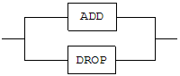

dataCompJ User's Manual
==============================


Altibase® Tools & Utilities

Release 7.2

Copyright ⓒ 2001\~2021 Altibase Corp. All Rights Reserved.

This manual contains proprietary information of Altibase Corporation; it is provided under a license agreement containing restrictions on use and disclosure and is also protected by copyright patent and other intellectual property law. Reverse engineering of the software is prohibited. All trademarks, registered or otherwise, are the property of their respective owners.

**Altibase Corp**

10F, Daerung PostTower II, 306, Digital-ro, Guro-gu, Seoul 08378, Korea Telephone: +82-2-2082-1000 Fax: 82-2-2082-1099

Customer Service Portal: http://support.altibase.com/en/

Homepage: http://www.altibase.com


# Table of Contents

- [dataCompJ User's Manual](#datacompj-users-manual)
  - [Preface](#preface)
- [1. Introducing dataCompJ](#1-introducing-datacompj)
  - [Overview](#overview)
  - [System Requirements](#system-requirements)
- [2. Getting Started](#2-getting-started)
  - [Terms for dataCompJ](#terms-for-datacompj)
  - [Inconsistent Records and Synchronization Policy](#inconsistent-records-and-synchronization-policy)
  - [Synchronization Policy](#synchronization-policy)
- [3. How to Use dataCompJ](#3-how-to-use-datacompj)
  - [How to run dataCompJ](#how-to-run-datacompj)
  - [Executing dataCompJ](#executing-datacompj)
  - [Environment File Configuration](#environment-file-configuration)
- [4. Functions](#4-functions)
  - [Comparison (DIFF) Function](#comparison-diff-function)
  - [Synchronization(SYNC) Function](#synchronizationsync-function)
- [Appendix A: Data Type compatibility table between Other Databases](#appendix-a-data-type-compatibility-table-between-other-databases)


Preface
----

This manual describes the ability of dataCompJ to compare and match the discrepant data efficiently and how to use it.

#### Audience

This manual has been prepared for the following Altibase users:

- Database administrators
- Performance administrators
- Database users
- Application developers
- Technical Supporters

It is recommended for those reading this manual possess the following background knowledge:

- Basic knowledge in the use of computers, operating systems, and operating system utilities
- Experience in using relational database and an understanding of database concepts
- Computer programming experience
- Experience in database server management, operating system management, or network administration

#### Organization

This manual is organized as follows:

- Chapter 1: Introducing dataCompJ  
  This chapter introduces dataCompJ and explains how to install it.

- Chapter 2: Getting Started  
  This chapter describes the key concepts that helps running dataCompJ more effectively.

- Chapter 3: How to use dataCompJ  
  This chapter provides a step by step guide to operate dataCompJ and configurate environment file.

- Chapter 4: Functions

  This chapter explains DIFF function and SYNC function in detail.

- Appendix A: Data Type compatibility table between Other Databases

#### Documentation Conventions

This section describes the conventions used in this manual. Understanding these conventions will make it easier to find information in this manual and in the other manuals in the series. 

There are two sets of conventions:

- Syntax diagram convetions
- Sample code conventions

##### Syntax Diagram Conventions

This manual describes command syntax using diagrams composed of the following elements:

| Elements                              | Meaning                                                      |
| ------------------------------------- | ------------------------------------------------------------ |
|  | Indicates the start of a command. If a syntactic element starts with an arrow, it is not a complete command. |
|  | Indicates that the command continues to the next line. If a syntactic element ends with this symbol, it is not a complete command. |
|  | Indicates taht the command continues from the previous line. If a syntactic element starts witht his symbol, it is not a complete command. |
|  | Indicates the end of a statement.                            |
|  | Indicates a manatory element.                                |
|  | Indicates an optional element.                               |
|  | Indicates a mandatory element comprised of options. One, and only one, option must be specified. |
|  | Indicates an optional element comprised of options.          |
|  | Indicates an optional element in which multiple elements may be specified. A comman must precede all but the first element. |

##### Sample Code Conventions

The code examples explain SQL statements, stored procedures, iSQL statements, and other command line syntax.

The following table describes the printing conventions used in the code examples.

| Rules            | Meaning                                                      | Example                                                      |
| ---------------- | ------------------------------------------------------------ | ------------------------------------------------------------ |
| [ ]              | Indicates an optional item                                   | VARCHAR [(*size*)][[FIXED \|] VARIABLE]                      |
| { }              | Indicates a mandatory field for which one or more items must be selected. | { ENABLE \| DISABLE \| COMPILE }                             |
| \|               | A delimiter between optional or mandatory arguments.         | { ENABLE \| DISABLE \| COMPILE } [ ENABLE \| DISABLE \| COMPILE ] |
| . . .            | Indicates that the previous argument is repeated, or that sample code has been omitted. | SQL> SELECT ename FROM employee; ENAME ----------------------- SWNO HJNO HSCHOI . . . 20 rows selected. |
| Other Symbols    | Symbols other than those shown above are part of the actual code.Other Symbols | EXEC :p1 := 1; acc NUMBER(11,2);Symbols other than those shown above are part of the actual code. |
| Italics          | Statement elements in italics indicate variables and special values specified by the user. | SELECT * FROM *table_name*; CONNECT *userID*/*password*;     |
| Lower case words | Indicate program elements set by the user, such as table names, column names, file names, etc. | SELECT ename FROM employee;                                  |
| Upper case words | Keywords and all elements provided by the system appear in upper case. | DESC SYSTEM_.SYS_INDICES_;                                   |

#### Related Documentations

For more detailed information, please refer to the following documents.

- Installation Guide

- Getting Started Guide

- Administrator’s Manual

- Replication Manual

- Precompiler User’s Manual

- API User’s Manual

- Altibase C Interface Manual

- iSQL User’s Manual

- Utilities Manual

- General Reference

- Error Message Reference

#### Altibase Welcomes Your Comments and Feedbacks

Please let us know what you like or dislike about our manuals. To help us with better future versions of our manuals, please tell us if there is any corrections or classifications that you would find useful.

Include the following information:

- The name and version of the manual that you are using
- Any comments about the manual
- Your name, address, and phone number

If you need immediate assistance regarding any errors, omissions, and other technical issues, please contact [Altibase's Support Portal](#http://altibase.com/support-center/en/).

Thank you. We always welcome your feedbacks and suggestions.

# 1. Introducing dataCompJ

This chapter introduces dataCompJ and explains how to install it. This chapter consists of the following sections:

- Overview

- System Requirements

- Installation and Uninstallation

### Overview

Altibase dataCompJ is a utility designed to guarantee data consistency between two heterogeneous databases and resolve data inconsistency if any. dataCompJ compares Altibase with another heterogeneous database on a table-by-table basis, and outputs information on any inconsistency it detects. Also, it offers an efficient feature for synchronizing two databases by applying the inconsistent data to slave database in the event of data inconsistency.

Data managed by dataCompJ are replicated by Adapter for Oracle or Adapter for JDBC provided by Altibase.

A proper use of Altibase dataCompJ would be a cornerstone of effective data management with advantageous usability along with its advanced technical performance.

### System Requirements

This section discusses the system requirements for dataCompJ and compatible database management systems.

#### Hardware Requirements

- CPU: Pentium III 800MHz or better
- Main memory: Minimum 512MB,  4GB or more recommended
- Disk: 50MB or more free space

#### Software Requirements

- Oracle, OpenJDK or IBM Java Runtime Environment 8 or higher

dataCompJ is a pure Java-based client application relying on the JAVA Runtime Environment (JRE) instead of the client's hardware or an operating system.

#### Compatible Database Systems

##### Master DB

- Altibase: Altibase 5.3.3 or later

##### Slave DB

- Oracle: Oracle 9i or later
- MariaDB: MariaDB 5.5.x or later

Refer to [Terms for dataCompJ](#terms-for-datacompj) section for more detailed definitions of Master/Slave DB.

dataCompJ can be used with Altibase and various other databases. Since this tool uses JDBC driver to connect to database, the JDBC driver compatible with original and target database is required. Currently JDBC driver for Oracle, ojdbc5.jar, is provided along with dataCompJ for your convenience.

#### Intallation and Uninstallation

dataCompJ can be downloaded from the official [Altibase Customer Support portal](#http://altibase.com/support-center/en/). It is provided as a zip or tar.gz file in the name of dataCompJCli which includes executable files and JDBC drivers.

dataCompJ is installed once dataCompJCli is decompressed. Subdirectory of JDBC including dataCompJCli.sh and XML file exist in the directory created as a result of the decompression.

In order to uninstall dataCompJ, delete the directory in which dataCompJ is installed.

# 2. Getting Started

This chapter describes the key concepts that helps running dataCompJ more effectively.

This chapter consists of the following sections:

- Terms for dataCompJ
- Inconsistent Records
- Synchronization Policy

### Terms for dataCompJ

##### Master DB

Master DB indicates Altibase database containing original data between two heterogeneous databases to be compared.

##### Slave DB

Slave DB indicates the other database to which the replicated data is applied between the two heterogeneous databases to be compared.

##### TablePair

TablePair means the comparison target of dataComJ specified by the user, and it is in table unit. TablePair represents a pair comprised of a table (Master table) in Master DB and a table (Slave table) in Slave DB.

##### Master Table

Master table is a orginal table in the Master DB specified by the user in TablePair.

##### Slave Table

Slave table is a comparison target table in the Slave DB specified by the user in TablePair.

### Inconsistent Records and Synchronization Policy

Inconsistent records signify records whose column values are inconsistent based on the primary key of the master and slave tables. The inconsistent record can be divided into three types as in the following.

##### MOSO inconsistent

This is a case in which particular records with the same value of primary key columns can be found in both Master and Slave DB, but the value of non primary key columns are different from each other.

##### MOSX inconsistent

This is a case in which records with values of primary key columns can be found in Master DB, but not in Slave DB.

##### MXSO inconsistent

This is a case when there exists particular records with values of primary key columns only in Slave DB, not in Master DB.

##### Resolving Inconsistent Record

When dataCompJ discovers inconsistent records, the two following functions are provided depending on the user's choice as delineated in dataCompJ environment file.

1.  DIFF: This function distinguishes inconsistent records between Master tables and Slave tables and records them to a CSV format file.
2.  SYNC: This function distinguishes inconsistent records between Master tables and Slave tables and resolves the inconsistency based on the synchronization policy delineated in the dataCompJ environment file.

### Synchronization Policy

Synchronization policy defines how to match up the records in slave tables in accordance with the records in master tables when dataCompJ discovers any inconsistent records. The synchronization policy provides the following three methods. 

##### MOSO Inconsistency

This method updates records with the same primary key in slave tables based on the master table records with UPDATE_TO_SLAVE policy.

##### MOSX Inconsistency

This method is used to insert a record, which exists in the master table but not in the slave table, into the slave table with INSERT_TO_SLAVE policy.

##### MXSO Inconsistency

This method deletes records, which exists only in the slave table, but not in the master table, from the slave table with DELETE_FROM_SLAVE policy.

# 3. How to Use dataCompJ

This section provides a step by step guide to operate dataCompJ and configurate environment file. 

This chapter consists of the following sections:

- How to run dataCompJ
- Executing dataCompJ
- Environment File Configuration

### How to run dataCompJ

The followings are the command to execute dataCompJ in the Command Line Interface (CLI).

- Linux

```
$ dataCompJCli.sh -f dataCompJ_env_file_path
```


- Windows

```
C:\dataCompJ> dataCompJ.bat -f dataCompJ_env_file_path
```


##### dataCompJ_env_file_path

This indicates the file path of dataCompJ environment file, and dataCompJ.xml file is provided as default when installing.

### Executing dataCompJ

dataCompJ operates based on the environment file configured by the user, and it is largely divided into two phases which are build and run.

##### Build Phase

Build phase is an initial investigation step to determine whether the run phase can be performed based on the configured environment file. If any issue is discovered, it is output in the report file(dataCompJ_report.txt) and dataCompJ is terminated.

1.  Read the environment file specified by the user.
2.  Verify whether the connection information described in the environment file is valid.
3.  Connect to both databases to validate the target tables described in the environment file and verify the meta information. If an issue is detected in either of the tables, it is recorded in the report file and dataCompJ is terminated.

##### Run Phase

In run phase, data in the target tables are compared then either comparing(DIFF) or synchronizing(SYNC) is executed according to the user's choice.

The execution result of each TablePair is output in the report file(dataCompJ_report.txt).

##### Output Files

When dataCompJ is executed, one report file and two log files are generated.

The output files generated by the comparison function(DIFF) is thoroughly delineated in the section 'Comparison (DIFF) Function'.

-   dataCompJ_report.txt: This is a report file in a text form to inform the execution results to a user.
-   dataCompJ.log: This is a log file recording events that occurs during the program operation. Also, this file is used to trace execution history of the program.
-   dataCompJ_data.log: This is a log file generated in the run phase, and this file records details of inconsistent records processed during the execution of comparison(Diff)/synchronization(Sync) in case \<TraceInconsistentRecord\> in the configuration file is set to true. It is suggested to use this file only when report of inconsistent records is required in detail since large capacity file is created if there are a lot of inconsistent data and this degrades the program performance.

### Environment File Configuration

Environment file is essential in order to execute dataCompJ. dataCompJ.xml file is provided by default when dataCompJ is installed, and it is also available to use any other file user has created as an environment file.  However, the environment file should be written based on the XML rules delineated in dataCompJ.xml, and it should be encoded with UTF-8 if multiple languages are included.

The dataCompJ environment file can be divided into three sections, such as Connections, Options, and TablePairs.

##### Connections

The Connections section is the part in which information required for connecting to the Master DB and Slave DB is recorded.

###### \<MasterDB\> 

The connection information of Master DB is recorded. The Master DB should be Altibase database. The following XML elements are the sub-elements of the Master DB.

\<JdbcUrl\>  
This is a character string used to record information of JDBC connection except user ID and password.

\<JdbcFilePath\>  
This is used to specify the path in which the JDBC jar file exist in order to connect to Master DB.

\<UserId\>  
This is used to specify the user ID in order to connect to the database.

\<Password\>  
This is used to specify the user password in order to connect to the database.

\<FetchSize\>  
This is used to specify the number of records that are fetched at once when importing data from the database. It is optional to fill this in and the default value is set to 1,000.

\<BatchSize\>  
This is used to specify the number of records that are executed at once when updating the database by using INSERT/DELETE/UPDATE statement. For instance, if 10 is specified in this entry, ten INSERT/DELETE/UPDATE are executed at once. It is optional to fill this in and the default value is set to 1,000.

###### \<SlaveDB\> 

This is used to record the connection information of Slave DB. The sub-elements of Slave DB is identical to that of the Master DB. 

##### Options

User inserts property values to execute dataCompJ in this section.

###### \<Operation\> 

This is used to specify which function should be executed between comparison(DIFF) and synchronization(SYNC) function to process inconsistent data.

###### \<FileEncoding\> 

This is used to specify the type of encoding for files generated when dataCompJ is executed.

###### \<Diff\>

\<DirPath\>  
This is used to specify the directory path in which a CSV file is created as a result of comparing each target table when the comparison(DIFF) is executed. 

###### \<Sync\> 

The followings are options for executing the synchronization(SYNC) function.

\<MOSO UPDATE_TO_SLAVE="true"\>  
This option specifies whether or not to update records in the slave table based on records in the master table if MOSO inconsistent data is detected. If it is set to 'false', the MOSO inconsistent data will not be processed.

\<MOSX INSERT_TO_SLAVE="true"\>  
This option specifies whether or not to insert the records which exist only in the master table into the slave table if MOSX inconsistent data is detected. If it is set to 'false', the MOSO inconsistent data will not be processed.

\<MXSO DELETE_FROM_SLAVE="true"\>  
This option specifies whether or not to delete the records in slave table which does not exist in the master table if MXSO inconsistent is detected. If it is set to 'false', the MOSO inconsistent data will not be processed.

###### \<Log\>

The following XML elements are the sub-elements of a log.

\<DirPath\>  
This element specifies the directory path of log files created when dataCompJ is executed.

\<TraceInconsistentRecord\>  
This element specifies whether or not to record details of all the inconsistent records detected while DIFF/SYNC function is executed.

###### \<MaxThread\> 

This element indicates the maximum number of allocable threads. If it is specified to 0, the number of CPU core of the machine dataCompJ is running is allocated as MaxThread.

##### TablePairs

TablePairs is the part in which target tables for comparison are recorded. There are two methods for recording the comparison target tables, such as recording each individual information on the target tables and specifying the path of the text file in which all the table names are listed. Such methods can be used either one at a time or simultaneously. 

The methods for providing information on each individual table is as follows, and it has an advantage that it can control the data comparison method precisely. For instance, it is also possible to exclude specific columns or compare only target data satisfying certain conditions.

The target table's name should be one that is allowed by both Master DB and Slave DB. The user must use double quotation marks (") in XML file if the table name contains any space, special character or it is case-sensitive. For instance, when a comparision target table's name is Employee 01 of SYS schema, user must write the table name with double quotation marks as SYS."Employee 01" because it contains a space in its name.

###### \<TablePair\> 

This is a unit of target data for comparison comprised of one master table and one slave table. The following XML elements are the sub-elements of TablePair.

\<MasterTable\>  
This element is the name of target data and it can be specified as *[SchemaName].TableName* format. Unless it is specified, the UserId of Master DB is the default schema name. This is a required entry; thus, an error is occurred when it is not written.

\<SlaveTable\>  
This element is the name of target data and it can be specified as *[SchemaName].TableName* format. Unless it is specified, the UserId of Slave DB is used as the default schema name. This is a required entry; thus, an error is occurred when it is not written.

\<Exclude\>  
This element specifies a condition for projecting table records. This element can also specify multiple columns by using a comma(,). This is an optional entry and if this is not written, all the columns with data types supported by dataCompJ would be selected as comparison targets.

\<Where\>  
This elements specifies a condition for selecting table records. It has the same formay as WHERE clause of SQL statement, and multiple conditions are allowed. This is an optional entry, and all the records would be comparison targets if it is not written.

\<TableNameFilePath\>  
Providing the path of the text file enumerating all the table names is as below, and this gives an advantage in inputting tables easily in case it is required to compare multiple tables at once.

```
<TableNameFilePath>table_name_file_path</TableNameFilePath>
```

table_name_file_path is the path of the text file enumerating table names. The name of comparison target can be specified with *[SchemaName].TableName* format, and each table is distinguished with a new-line character. The name of comparison target in Master DB should be identical to the name of comparison target in Slave DB.

###### Restrictions

The following restrictions should be considered when selecting comparison target tables. If any constraint is infringed, dataCompJ outputs the issue occurred during the build phase to the report file(dataCompJ_report.txt) and does not proceed to the run phase.

1. A comparison target table should be identically(the column name, column order, data type, and primary key) composed. However, the data type should be compatible to that of the other database.

2. The unsupported data type is automatically excluded from the comparison targets. (e.g., binary type such as LOB)

3. There should be at least more than one column which can compare values other than a primary key.

   (Example 1) table1 (c1 int, c2 int, c3 CLOB, primary key (c1, c2))  
   (Example 2) table1 (c1 int, c2 int, c3 varchar(100), primary key (c1, c2))

   In the example 1, c3 is the only column satisfying the 'Constraint 3'. However, it infringes 'Constraint 2' since the data type CLOB is not supported by dataCompJ. Therefore, comparison for table 1 is not allowed.

   In the enxt example, c3 is the only column satisfying 'Constraint 3' and it is varchar type which is supported by dataCompJ. Thus, the table 1 can be compared.

# 4. Functions

This chapter explains DIFF function and SYNC function in detail with examples.

This chapter consists of the following sections:

- Comparison (Diff) funtion
- Synchronization (SYNC) function

### Comparison (DIFF) Function

The comparison(DIFF) function verifies inconsistent records between Master DB and Slave DB by identifying the inconsistent records occurred during the replication execution between the two database system and recording them to a file.

#### Environment File

Set the \<Options\> - \<Operation\> value in dataCompJ environment file to "DIFF".

<Connections\> and <Options\> are required entries and target table should be described in <TablePairs\>.

##### dataCompJ.xml

```
<?xml version="1.0" encoding="UTF-8" ?>
<dataCompJ>
<Connections>
    <MasterDB>
        <JdbcUrl>jdbc:Altibase://192.168.1.94:21135/mydb</JdbcUrl>
        <JdbcFilePath>./jdbc/Altibase710.jar</JdbcFilePath>
        <UserId>sys</UserId>
        <Password>manager</Password>
    </MasterDB>
    <SlaveDB>
        <JdbcUrl>jdbc:oracle:thin:@//192.168.3.18:1521/xe</JdbcUrl>
        <JdbcFilePath>./jdbc/ojdbc5.jar</JdbcFilePath>
        <UserId>altibase</UserId>
        <Password>altibase</Password>
    </SlaveDB>
</Connections>
  
<Options>
    <Operation>DIFF</Operation> 
    <FileEncoding>UTF-8</FileEncoding>
    <Diff>
        <DirPath>./diff/</DirPath>
    </Diff>
    <Sync>
        <MOSO UPDATE_TO_SLAVE="true"/>
        <MOSX INSERT_TO_SLAVE="true"/>
        <MXSO DELETE_FROM_SLAVE="true"/>
    </Sync>
    <Log>
        <DirPath>./</DirPath>
        <TraceInconsistentRecord>false</TraceInconsistentRecord>
    </Log>
    <MaxThread>0</MaxThread>
</Options>
  
<TablePairs>
    <TablePair>
        <MasterTable>EX1</MasterTable>
    </TablePair>      
</TablePairs>
</dataCompJ>
```

#### How to Execute Comparison(DIFF)

The comparison(DIFF) is executed with the following command.

```
$ dataCompJCli.sh -f dataCompJ.xml
```

#### Execution Result

As a result of the execution, a report file(dataCompJ_report.txt) in which the execution result is summarized and log files(dataCompJ.log, dataCompJ_data.log) in which the event is recorded during the execution are created. Such files are delineated in the "Output Files" in detail. 

The table structure used in the example is as follows.

```
CREATE TABLE ex1 (C1 int primary key, C2 varchar(20), C3 CLOB, C4 int);
```

##### DIFF Execution

```
$ dataCompJCli.sh -f dataCompJ.xml
----------------------------------------------------------
     Data Comparison Utility for Java (dataCompJ)
     Copyright 2000, ALTIBASE Corporation or its subsidiaries.
     All Rights Reserved.
----------------------------------------------------------
* Build started  at 2016-12-14 16:30:03.673
* Build finished at 2016-12-14 16:30:04.357 (Elapsed: 0:00:00.691)
* Run   started  at 2016-12-14 16:30:04.374
* Run   finished at 2016-12-14 16:30:04.905 (Elapsed: 0:00:00.531)
----------------------------------------------------------
Refer to the following output files for details.
----------------------------------------------------------
 - dataCompJ_report.txt: Report file to provide summarized execution result.
 - dataCompJ.log: Log file to keep track of detailed program events during execution.
 - dataCompJ_data.log: Log file to keep track of data events during diff/sync operation as well as different record.
```

###### Verifying the Report File

```
$ cat dataCompJ_report.txt
==========================================================
    Build
     - Started  : 2016-12-14 16:30:03.673
     - Finished : 2016-12-14 16:30:04.357
     - Elapsed  : 0:00:00.691
--------------------------------------------------------
 
[ User input information ]
...
 
[ Problematic table(s): 0 ]
 
[ Candidate table(s) for data comparison: 1 ]
 
1: SYS.EX1 -> ALTIBASE.EX1
    * SELECT SQL           : SELECT C1,C2,C4 FROM SYS.EX1 ORDER BY C1 ASC
    * Excluded columns     : 
    * Where condition      : 
    * N/A data type columns: C3(CLOB)
==========================================================
    Run
     - Started  : 2016-12-14 17:19:42.731
     - Finished : 2016-12-14 17:19:42.822
     - Elapsed  : 0:00:00.091
----------------------------------------------------------
1: SYS.EX1 -> ALTIBASE.EX1
 Fetched record count from MASTER:           10
 Fetched record count from SLAVE :           10
------------------------------------------------------
Type                            Records   
------------------------------------------------------
MOSO    Matched                               7
MOSO    Diff                                  2
MOSX    Master only                           1
MXSO    Slave only                            1
------------------------------------------------------

```

##### Executable Data File

Four following comma-separated values(CSV) format data files are created in a TablePair unit as a result of selecting the comparison(DIFF).

-   *SchemaName.TableName*\_MASTER_diff.csv:  
    If MOSO is detected, this file stores the value of inconsistent record founds in the master table in CSV form.

-   *SchemaName.TableName*\_SLAVE_diff.csv:  
    This file stores the value of inconsistent records found in the slave table due to MOSO inconsistency in CSV form.

-   *SchemaName.TableName*\_MASTER_only.csv:  
    This file stores the value of records which only exist in the master table due to MOSX inconsistency in CSV form.

-   *SchemaName.TableName*\_SLAVE_only.csv:  
    This file stores the value of records which only exist in the slave table due to MXSO inconsistency in CSV form.

Since the inconsistent data due to MOSO inconsistency are recorded in the same order in in SchemaName.TableName_MASTER_diff.csv and SchemaName.TableName_SLAVE_diff.csv, when DIFF function is used to compare these files, user can intuitively compare the part MOSO inconsistency occurred.

#### Example

The table structure used for the examples is as follows.

```
CREATE TABLE ex1 (C1 int primary key, C2 varchar(20), C3 CLOB, C4 int); /* Unsupported data in C3 CLOB dataCompJ */
CREATE TABLE ex2 (C1 int primary key, C2 varchar(20), C3 int);
```

##### DIFF Example 1

This example demonstrates specifying or omitting the schema name for two target tables. 

In case of EX1 in the example below, <MasterTable\> entry describes only the table name without schema and <SlaveTable\> entry is omitted. The <MasterTable\> describing the table name only uses the value inserted in <MasterDB\>-\<UserId\> as its schema name. The omitted <SlaveTable\> is processed assuming that it has the same value with <MasterTable\>.

C3 column in EX1 table is automatically excluded from the comparison target since it is a CLOB type which is unsupported data type by dataCompJ, and this is recorded in candidate tables entry in the report. 

In EX2 table, the schema name and table name are specified by a user, and it is processed based on the inserted schema and table names.

###### dataCompJ.xml

```
<?xml version="1.0" encoding="UTF-8" ?>
<dataCompJ>
<Connections>
    <MasterDB>
        <JdbcUrl>jdbc:Altibase://192.168.1.94:21135/mydb</JdbcUrl>
...
        <UserId>sys</UserId>
...
    </MasterDB>
    <SlaveDB>
        <JdbcUrl>jdbc:oracle:thin:@//192.168.3.18:1521/xe</JdbcUrl>
...
        <UserId>altibase</UserId>
...
    </SlaveDB>
</Connections>
<Options>
    <Operation>DIFF</Operation> 
...
</Options>
<TablePairs>
    <TablePair>
        <MasterTable>EX1</MasterTable>
    </TablePair>
    <TablePair>
        <MasterTable>SYS.EX2</MasterTable>
        <SlaveTable>ALTIBASE.EX2</SlaveTable>
    </TablePair>     
</TablePairs>
</dataCompJ>

```

###### dataCompJ_report.txt

```
===========================================================================
    Build
     - Started  : 2016-12-14 17:06:53.021
     - Finished : 2016-12-14 17:06:53.679
     - Elapsed  : 0:00:00.669
---------------------------------------------------------------------------
 
[ User input information ]
...
[ Problematic table(s): 0 ]
 
[ Candidate table(s) for data comparison: 2 ]
 
1: SYS.EX1 -> ALTIBASE.EX1
    * SELECT SQL           : SELECT C1,C2,C4 FROM SYS.EX1 ORDER BY C1 ASC
    * Excluded columns     : 
    * Where condition      : 
    * N/A data type columns: C3(CLOB)
2: SYS.EX2 -> ALTIBASE.EX2
    * SELECT SQL           : SELECT C1,C2,C3 FROM SYS.EX2 ORDER BY C1 ASC
    * Excluded columns     : 
    * Where condition      : 
    * N/A data type columns: 
===========================================================================
    Run
     - Started  : 2016-12-14 17:56:04.516
     - Finished : 2016-12-14 17:56:04.593
     - Elapsed  : 0:00:00.076
---------------------------------------------------------------------------
1: SYS.EX1 -> ALTIBASE.EX1
 Fetched record count from MASTER:           10
 Fetched record count from SLAVE :           10
------------------------------------------------------
Type                            Records   
------------------------------------------------------
MOSO    Matched                               7
MOSO    Diff                                  2
MOSX    Master only                           1
MXSO    Slave only                            1
------------------------------------------------------
2: SYS.EX2 -> ALTIBASE.EX2
 Fetched record count from MASTER:           10
 Fetched record count from SLAVE :           10
------------------------------------------------------
Type                            Records   
------------------------------------------------------
MOSO    Matched                              10
MOSO    Diff                                  0
MOSX    Master only                           0
MXSO    Slave only                            0
------------------------------------------------------
```

##### DIFF Example 2

The following example shows that a user can specify certain columns in tables to exclude, and conduct comparison(Diff) on records meeting specified conditions (Where). 

User specifies to exclude C4 in non-primary key columns on EX1 table from the comparison targets in dataCompJ.xml, and execute comparison only for the records whose C1 column value is greater than 5.

###### dataCompJ.xml

```
<?xml version="1.0" encoding="UTF-8" ?>
<dataCompJ>
...
<Options>
    <Operation>DIFF</Operation> 
...
</Options>
<TablePairs>
    <TablePair>
        <MasterTable>EX1</MasterTable>
        <Exclude>C4</Exclude>
        <Where>C1 > 5</Where>
    </TablePair>
    <TablePair>
        <MasterTable>SYS.EX2</MasterTable>
        <SlaveTable>ALTIBASE.EX2</SlaveTable>
    </TablePair>     
</TablePairs>
</dataCompJ>

```

###### dataCompJ_report.txt

```
===========================================================================
    Build
     - Started  : 2016-12-14 17:06:53.021
     - Finished : 2016-12-14 17:06:53.679
     - Elapsed  : 0:00:00.669
---------------------------------------------------------------------------
 
[ User input information ]
...
[ Problematic table(s): 0 ]
 
[ Candidate table(s) for data comparison: 2 ]
1: SYS.EX1 -> ALTIBASE.EX1
    * SELECT SQL           : SELECT C1,C2 FROM SYS.EX1 WHERE C1 > 5 ORDER BY C1 ASC
    * Excluded columns     : C4
    * Where condition      : C1 > 5
    * N/A data type columns: C3(CLOB)
2: SYS.EX2 -> ALTIBASE.EX2
    * SELECT SQL           : SELECT C1,C2,C3 FROM SYS.EX2 ORDER BY C1 ASC
    * Excluded columns     : 
    * Where condition      : 
    * N/A data type columns: 
===========================================================================
    Run
     - Started  : 2016-12-14 17:57:09.895
     - Finished : 2016-12-14 17:57:09.974
     - Elapsed  : 0:00:00.080
---------------------------------------------------------------------------
1: SYS.EX1 -> ALTIBASE.EX1
 Fetched record count from MASTER:            5
 Fetched record count from SLAVE :            5
------------------------------------------------------
Type                            Records   
------------------------------------------------------
MOSO    Matched                               5
MOSO    Diff                                  0
MOSX    Master only                           0
MXSO    Slave only                            0
------------------------------------------------------
2: SYS.EX2 -> ALTIBASE.EX2
 Fetched record count from MASTER:           10
 Fetched record count from SLAVE :           10
------------------------------------------------------
Type                            Records   
------------------------------------------------------
MOSO    Matched                              10
MOSO    Diff                                  0
MOSX    Master only                           0
MXSO    Slave only                            0
------------------------------------------------------

```

### Synchronization(SYNC) Function

The Synchronization(SYNC) function identifies the inconsistent records occurred during the replication between the master DB and slave DB and applies them to the slave DB. This feature allows effective synchronization between the two database system.

#### Environment Files

Set the \<Options\> - \<Operation\> value in dataCompJ environment file to "SYNC".

<Connections\> and <Options\> are required entries and target table should be described in <TablePairs\>.

###### dataCompJ.xml

```
<?xml version="1.0" encoding="UTF-8" ?>
<dataCompJ>
<Connections>
    <MasterDB>
        <JdbcUrl>jdbc:Altibase://192.168.1.94:21135/mydb</JdbcUrl>
...
        <UserId>sys</UserId>
...
    </MasterDB>
    <SlaveDB>
        <JdbcUrl>jdbc:oracle:thin:@//192.168.3.18:1521/xe</JdbcUrl>
...
        <UserId>altibase</UserId>
...
    </SlaveDB>
</Connections>
<Options>
    <Operation>SYNC</Operation> 
...
</Options>
  
<TablePairs>
    <TablePair>
        <MasterTable>EX1</MasterTable>
    </TablePair>      
</TablePairs>
</dataCompJ>
```

#### How to Execyte Synchronization(SYNC)

The Synchronization(SYNC) function is executed as in the following manner.

```
$ dataCompJCli.sh -f dataCompJ.xml
$ dataCompJCli.sh -f ./dataCompJ.xml
     Data Comparison Utility for Java (dataCompJ)
     Copyright 2000, ALTIBASE Corporation or its subsidiaries.
     All Rights Reserved.
-----------------------------------------------------------------
* Build started  at 2016-12-14 18:08:40.407
* Build finished at 2016-12-14 18:08:41.076 (Elapsed: 0:00:00.676)
* Run   started  at 2016-12-14 18:08:41.090
* Run   finished at 2016-12-14 18:08:41.654 (Elapsed: 0:00:00.564)
---------------------------------------------------------------------------
Refer to the following output files for details.
---------------------------------------------------------------------------
 - dataCompJ_report.txt: Report file to provide summarized execution result.
 - dataCompJ.log: Log file to keep track of detailed program events during execution.
 - dataCompJ_data.log: Log file to keep track of data events during diff/sync operation as well as different record

```

#### Execution Results

As a result of the execution, a report file(dataCompJ_report.txt) in which the execution result is summarized and log files(dataCompJ.log, dataCompJ_data.log) in which the event is recorded during the execution are created. Such files are delineated in the "Output Files" in detail. 

###### dataCompJ_report.txt

```
$ cat dataCompJ_report.txt
===========================================================================
    Build
     - Started  : 2016-12-14 18:08:40.407
     - Finished : 2016-12-14 18:08:41.076
     - Elapsed  : 0:00:00.676
---------------------------------------------------------------------------
 
[ User input information ]
...
[ Problematic table(s): 0 ]
 
[ Candidate table(s) for data comparison: 1 ]
 
1: SYS.EX1 -> ALTIBASE.EX1
    * SELECT SQL           : SELECT C1,C2,C4 FROM SYS.EX1 ORDER BY C1 ASC
    * Excluded columns     :
    * Where condition      :
    * N/A data type columns: C3(CLOB)
 
===========================================================================
    Run
     - Started  : 2016-12-14 18:08:41.090
     - Finished : 2016-12-14 18:08:41.654
     - Elapsed  : 0:00:00.564
---------------------------------------------------------------------------
 
1: SYS.EX1 -> ALTIBASE.EX1
 Fetched record count from MASTER:           10
 Fetched record count from SLAVE :           10
------------------------------------------------------
Type    Resolution                Try         Fail
------------------------------------------------------
MOSO    UPDATE TO SLAVE                  2           0
MOSX    INSERT TO SLAVE                  1           0
MXSO    DELETE FROM SLAVE                1           0
------------------------------------------------------
```

When SYNC is correctly performed on all of the target tables and records, result fetched by executing DIFF on the same target table shows that all the records are identical.

```
$ dataCompJCli.sh -f ./dataCompJ.xml
-----------------------------------------------------------------
     Data Comparison Utility for Java (dataCompJ)
     Copyright 2000, ALTIBASE Corporation or its subsidiaries.
     All Rights Reserved.
-----------------------------------------------------------------
* Build started  at 2016-12-14 18:11:54.924
* Build finished at 2016-12-14 18:11:55.561 (Elapsed: 0:00:00.645)
* Run   started  at 2016-12-14 18:11:55.580
* Run   finished at 2016-12-14 18:11:56.190 (Elapsed: 0:00:00.610)
----------------------------------------------------------
Refer to the following output files for details.
----------------------------------------------------------
 - dataCompJ_report.txt: Report file to provide summarized execution result.
 - dataCompJ.log: Log file to keep track of detailed program events during execution.
 - dataCompJ_data.log: Log file to keep track of data events during diff/sync operation as well as different record.
 
$ cat dataCompJ_report.txt
==========================================================
    Build
     - Started  : 2016-12-14 18:11:54.924
     - Finished : 2016-12-14 18:11:55.561
     - Elapsed  : 0:00:00.645
---------------------------------------------------------
 
[ User input information ]
...
 
[ Problematic table(s): 0 ]
 
[ Candidate table(s) for data comparison: 1 ]
 
1: SYS.EX1 -> ALTIBASE.EX1
    * SELECT SQL           : SELECT C1,C2,C4 FROM SYS.EX1 ORDER BY C1 ASC
    * Excluded columns     :
    * Where condition      :
    * N/A data type columns: C3(CLOB)
 
==========================================================
    Run
     - Started  : 2016-12-14 18:11:55.580
     - Finished : 2016-12-14 18:11:56.190
     - Elapsed  : 0:00:00.610
---------------------------------------------------------------------------
 
1: SYS.EX1 -> ALTIBASE.EX1
 Fetched record count from MASTER:           10
 Fetched record count from SLAVE :           10
------------------------------------------------------
Type                            Records
------------------------------------------------------
MOSO    Matched                              10
MOSO    Diff                                  0
MOSX    Master only                           0
MXSO    Slave only                            0
------------------------------------------------------

```

# Appendix A: Data Type compatibility table between Other Databases

This section displays data type mapping table between other databases supported by dataCompJ. 

If comparison is executed on tables with unsupported data types by dataCompJ, it is processed in the following manners:

-   If both master table and slave table are in data types unsupported by dataCompJ: An error stating that the data type is unsupported is displayed in the build phase and it does not proceed to run phase.

-   If either the master table or the slave table is unsupported data type: In the build step, an error is reported to the report file (dataCompJ_report.txt) that the number of columns to be compared in the table is different, and does not proceed to run phase.

If the column data type of the table to be compared is a data type supported by dataCompJ, but the column data type of the target table for comparison is using different combination of data types to the one in data type compatibility table between other databases, it is processed in the following manners:

-   If the data comparison is impossible (e.g., comparison between integer type and character type data type): An error stating that the data type is incompatible is reported to the report file (dataCompJ_report.txt) in the build phase and it does not proceed to run phase.

-   For data types that is comparable but different to each other (e.g., integer and floating-point types): The run phase is executed since it cannot be processed in the build phase. However, in the execution result all records are treated as inconsistent records.

#### Altibase to Oracle

| Altibase | Oracle         | Description                                                  |
| -------- | -------------- | ------------------------------------------------------------ |
| SMALLINT | NUMBER         |                                                              |
| INTEGER  | NUMBER         |                                                              |
| BIGINT   | NUMBER         |                                                              |
| NUMERIC  | NUMBER         |                                                              |
| REAL     | NUMBER         |                                                              |
| DOUBLE   | NUMBER         |                                                              |
| FLOAT    | FLOAT          |                                                              |
| DATE     | DATE TIMESTAMP | - DATE - TIMESTAMP: Compared based on the smaller precision. For example, Altibase DATE supports up to microsecond, and Oracle TIMESTAMP supports up to nano second. In this case, the comparison of records is performed until nanosecond. <br>- DATE-DATE: Since Oracle DATE supports up to YYYY-MM-DD HH: MM: SS, only the according part is extracted from Altibase DATE and compared. |
| CHAR     | CHAR           |                                                              |
| VARCHAR  | VARCHAR2       |                                                              |
| NCHAR    | NCHAR          |                                                              |
| NVARCHAR | NVARCHAR2      |                                                              |

#### Altibase to MariaDB

| Altibase | MariaDB                                       | Description                                                  |
| -------- | --------------------------------------------- | ------------------------------------------------------------ |
| SMALLINT | SMALLINT                                      |                                                              |
| INTEGER  | INT                                           |                                                              |
| BIGINT   | BIGINT                                        |                                                              |
| NUMERIC  | DECIMAL                                       |                                                              |
| REAL     | FLOAT                                         |                                                              |
| DOUBLE   | DOUBLE                                        |                                                              |
| FLOAT    | N/A                                           | Data type corresponding to Altibase Float type does not exist in MariaDB. |
| DATE     | DATE, DATETIME, TIMESTAMP                     | - DATE-DATE: Since MariaDB DATE supports up to YYYY-MM-DD, only the according part is extracted from Altibase DATE and compared.<br>- DATE-DATETIME: Since MariaDB DATETIME supports up to YYYY-MM-DD HH: MM: SS, only the according part is extracted from Altibase DATE and compared.<br>- DATE-TIMESTAMP: Since MariaDB TIMESTAMP supports up to YYYY-MM-DD HH: MM: Microseconds 0-6 (default: 0), only the according part is extracted from Altibase DATE and compared. |
| CHAR     | CHAR                                          |                                                              |
| VARCHAR  | VARCHAR, TINYTEXT, TEXT, MEDIUMTEXT, LONGTEXT |                                                              |
| NCHAR    | CHAR with Character set                       |                                                              |
| NVARCHAR | VARCHAR with Character set                    |                                                              |

