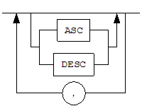

DBeaver
======================

#### Release 23.1.5

Altibase® Tools & Utilities

      <!-- PDF 변환을 위한 여백입니다. --> 

<!-- PDF 변환을 위한 여백입니다. --> 

    

  <!-- PDF 변환을 위한 여백입니다. --> 

<!-- PDF 변환을 위한 여백입니다. --> 

<pre>
Altibase Tools & Utilities DBeaver User's Connection Guide
Release 23.1.5
Copyright ⓒ 2001~2023 Altibase Corp. All Rights Reserved. 
본 문서의 저작권은 ㈜알티베이스에 있습니다. 이 문서에 대하여 당사의 동의없이 무단으로 복제 또는 전용할 수 없습니다. 
<b>㈜알티베이스</b>
08378 서울시 구로구 디지털로 306 대륭포스트타워Ⅱ 10층
전화 : 02-2082-1114
팩스 : 02-2082-1099
고객서비스포털 : <a href='http://support.altibase.com'>http://support.altibase.com</a>
홈페이지      : <a href='http://www.altibase.com/'>http://www.altibase.com</a></pre>

 

서문
====

### 이 매뉴얼에 대하여

이 매뉴얼은 DBeaver로 Altibase 데이터베이스에 연결하는 방법을 기술한다.

#### 대상 사용자

이 매뉴얼은 다음과 같은 Altibase 사용자를 대상으로 작성되었다.

- 데이터베이스 관리자

- 성능 관리자

- 데이터베이스 사용자

- 응용 프로그램 개발자

- 기술지원부

다음과 같은 배경 지식을 가지고 이 매뉴얼을 읽는 것이 좋다.

- 컴퓨터, 운영 체제 및 운영 체제 유틸리티 운용에 필요한 기본 지식

- 관계형 데이터베이스 사용 경험 또는 데이터베이스 개념에 대한 이해

- 컴퓨터 프로그래밍 경험

- 데이터베이스 서버 관리, 운영 체제 관리 또는 네트워크 관리 경험

#### 이 매뉴얼의 구성

이 매뉴얼은 다음과 같이 구성되어 있다.

- 제 1장 Altibase 데이터베이스 연결  
    이 장은 DBeaver로 Altibase 데이터베이스에 연결하는 방법을  소개한다.

#### 문서화 규칙

이 절에서는 이 매뉴얼에서 사용하는 규칙에 대해 설명한다. 이 규칙을 이해하면 이
매뉴얼과 설명서 세트의 다른 매뉴얼에서 정보를 쉽게 찾을 수 있다.

여기서 설명하는 규칙은 다음과 같다.

- 구문 다이어그램

- 샘플 코드 규칙

##### 구문 다이어그램

이 매뉴얼에서는 다음 구성 요소로 구축된 다이어그램을 사용하여, 명령문의 구문을
설명한다.

| 구성 요소                                   | 의미                                                         |
| ------------------------------------------- | ------------------------------------------------------------ |
|  | 명령문이 시작한다. 완전한 명령문이 아닌 구문 요소는 화살표로 시작한다. |
|  | 명령문이 다음 라인에 계속된다. 완전한 명령문이 아닌 구문 요소는 이 기호로 종료한다. |
|  | 명령문이 이전 라인으로부터 계속된다. 완전한 명령문이 아닌 구문 요소는 이 기호로 시작한다. |
|  | 명령문이 종료한다.                                           |
|        | 필수 항목                                                    |
|        | 선택적 항목                                                  |
|        | 선택사항이 있는 필수 항목. 한 항목만 제공해야 한다.          |
|        | 선택사항이 있는 선택적 항목                                  |
|        | 선택적 항목. 여러 항목이 허용된다. 각 반복 앞부분에 콤마가 와야 한다. |

##### 샘플 코드 규칙

코드 예제는 SQL, Stored Procedure, iSQL 또는 다른 명령 라인 구문들을 예로 들어
설명한다.

아래 테이블은 코드 예제에서 사용된 인쇄 규칙에 대해 설명한다.

| 규칙         | 의미                                                         | 예제                                                         |
| ------------ | ------------------------------------------------------------ | ------------------------------------------------------------ |
| [ ]          | 선택 항목을 표시                                             | VARCHAR [(*size*)] [[FIXED \|] VARIABLE]                     |
| { }          | 필수 항목 표시. 반드시 하나 이상을 선택해야 되는 표시        | { ENABLE \| DISABLE \| COMPILE }                             |
| \|           | 선택 또는 필수 항목 표시의 인자 구분 표시                    | { ENABLE \| DISABLE \| COMPILE } [ ENABLE \| DISABLE \| COMPILE ] |
| . . .        | 그 이전 인자의 반복 표시. 예제 코드들의 생략을 표시          | SQL\> SELECT ename FROM employee; ENAME  ----------------------- SWNO  HJNO  HSCHOI  . . . 20 rows selected. |
| 그 밖에 기호 | 위에서 보여진 기호 이외의 기호들                             | EXEC :p1 := 1; acc NUMBER(11,2);                             |
| 기울임 꼴    | 구문 요소에서 사용자가 지정해야 하는 변수, 특수한 값을 제공해야만 하는 위치 | SELECT \* FROM *table_name*; CONNECT *userID*/*password*;    |
| 소문자       | 사용자가 제공하는 프로그램의 요소들, 예를 들어 테이블 이름, 컬럼 이름, 파일 이름 등 | SELECT ename FROM employee;                                  |
| 대문자       | 시스템에서 제공하는 요소들 또는 구문에 나타나는 키워드       | DESC SYSTEM_.SYS_INDICES_;                                   |

#### 관련 자료

자세한 정보를 위하여 Altibase의 다음 문서 목록을 참조한다.

- Installation Guide

- Getting Started Guide

- Administrator’s Manual

- Replication Manual

- Precompiler User’s Manual

- API User’s Manual

- Altibase C Interface Manual

- iSQL User’s Manual

- Utilities Manual

- General Reference

- Error Message Reference

#### Altibase는 여러분의 의견을 환영합니다.

이 매뉴얼에 대한 여러분의 의견을 보내주시기 바랍니다. 사용자의 의견은 다음
버전의 매뉴얼을 작성하는데 많은 도움이 됩니다. 보내실 때에는 아래 내용과 함께
고객서비스포털(http://support.altibase.com/kr/ )로 보내주시기 바랍니다.

- 사용 중인 매뉴얼의 이름과 버전

- 매뉴얼에 대한 의견

- 사용자의 성함, 주소, 전화번호

이 외에도 Altibase 기술지원 설명서의 오류와 누락된 부분 및 기타 기술적인
문제들에 대해서 이 주소로 보내주시면 정성껏 처리하겠습니다. 또한, 기술적인
부분과 관련하여 즉각적인 도움이 필요한 경우에도 고객서비스포털을 통해 서비스를
요청하시기 바랍니다.

여러분의 의견에 항상 감사드립니다.

 

# 1. Altibase 데이터베이스 연결

이 장은 DBeaver를 처음 접하는 사용자들이 Altibase 데이터베이스 연결을 위한 각
단계별 간략한 지침을 제공한다.

### 호환 가능한 Altibase 데이터베이스 시스템

이 절은 DBeaver와 호환되는 Altibase 데이터베이스 관리 시스템을 열거한다.

- Altibase 7.1.0 이상 버전

### Altibase 데이터베이스 연결 단계

#### 새 데이터베이스 연결

[ 데이터베이스 ] → [ 새 데이터베이스 연결 ]

#### Altibase 선택

All 또는 SQL에서 Altibase를 선택 후 [ Next > ] 버튼을 클릭한다.

#### 데이터베이스 접속 정보 입력

Host, Port, Schema, Username, Password 칸에 연결하고자 하는 데이터베이스 접속 정보를 입력한다.

#### JDBC 파일

##### 자동 다운로드

##### JDBC 파일 제공

#### 데이터베이스 연결 완료

| 메뉴                                                         | UI                                                           |
| ------------------------------------------------------------ | ------------------------------------------------------------ |
| [ 데이터베이스 ] → [ 새 데이터베이스 연결 ]                  |  |
| All 또는 SQL에서 Altibase를 선택 후 [ Next > ] 버튼을 클릭한다. |                             |
| Host, Port, Schema, Username, Password 칸에 연결하고자 하는 데이터베이스 접속 정보를 입력한다.  [ Connection details (name, type, ... ) ] 을 클릭하여 연결 정보를 변경할 수 있다.  [ Driver Settings ] 을 클릭하여 Altibase Driver의 설정 값을 변경할 수 있다. |                             |
| [ Driver Settings ] 을 선택한 화면이다. Libraries 탭의 [ Add File ] 로 사용할 Altibase JDBC 파일을 추가할 수 있다. 하단의 Driver class에서 Altibase JDBC 클래스가 목록에 나타난다. |                             |
| [ Connection details (name, type, ... ) ] 을 선택한 화면이다. Connection name 칸을 수정하여 연결 이름을 변경하거나 연결 유형을 설정할 수 있다.  모든 설정이 끝났다면 [ Finish ] 버튼을 눌러 접속 정보 등록을 완료한다. |                             |
| Database Navigator 탭에서 등록한 데이터베이스 접속 정보 등록 목록을 확인할 수 있다. 등록한 접속 정보를 더블 클릭하면 접속을 연결할 수 있다. 연결된 접속은 아이콘에 초록색 체크 표시가 나타난다. |                             |

### DBeaver 상세 매뉴얼

DBeaver Community는 DBeaver 사에서 제공하는 무료 데이터 베이스 툴이다. 상세 매뉴얼은 https://github.com/dbeaver/dbeaver/wiki을 참조한다.
