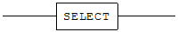
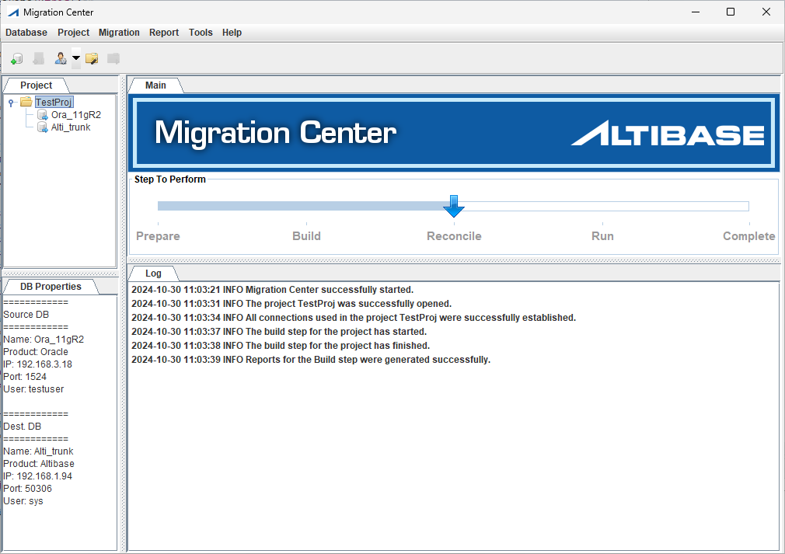
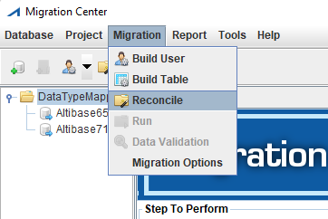
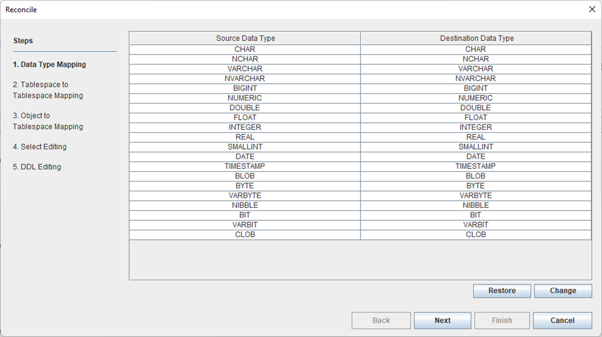
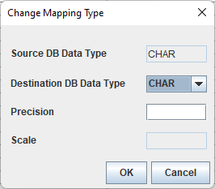

<!-- START doctoc generated TOC please keep comment here to allow auto update -->

<!-- DON'T EDIT THIS SECTION, INSTEAD RE-RUN doctoc TO UPDATE -->

- [Migration Center User's Manual](#migration-center-users-manual)
  - [서문](#서문)
    - [이 매뉴얼에 대하여](#이-매뉴얼에-대하여)
  - [1.Migration Center 소개](#1migration-center-소개)
    - [개요](#개요)
    - [시스템 요구 사항](#시스템-요구-사항)
    - [설치 및 제거](#설치-및-제거)
  - [2.Migration Center 시작하기](#2migration-center-시작하기)
    - [Migration Center 이해하기](#migration-center-이해하기)
    - [사용자 인터페이스 이해하기](#사용자-인터페이스-이해하기)
    - [도구](#도구)
  - [3.GUI 모드 퀵 가이드](#3gui-모드-퀵-가이드)
    - [단계별 지침](#단계별-지침)
  - [4.CLI 모드 퀵 가이드](#4cli-모드-퀵-가이드)
    - [단계별 지침](#단계별-지침-1)
  - [5.Migration Center 내부](#5migration-center-내부)
    - [구축 단계](#구축-단계)
    - [조정 단계](#조정-단계)
    - [실행 단계](#실행-단계)
    - [검증 단계](#검증-단계)
  - [A.부록: 마이그레이션 옵션](#a부록-마이그레이션-옵션)
    - [DB to DB 마이그레이션 옵션](#db-to-db-마이그레이션-옵션)
    - [DB to File 마이그레이션 옵션](#db-to-file-마이그레이션-옵션)
  - [B.부록: 마이그레이션 가능한 데이터베이스 객체](#b부록-마이그레이션-가능한-데이터베이스-객체)
    - [Altibase to Altibase](#altibase-to-altibase)
    - [Altibase to Oracle](#altibase-to-oracle)
    - [CUBRID to Altibase](#cubrid-to-altibase)
    - [Informix to Altibase](#informix-to-altibase)
    - [MySQL to Altibase](#mysql-to-altibase)
    - [Oracle to Altibase](#oracle-to-altibase)
    - [SQL Server to Altibase](#sql-server-to-altibase)
    - [TimesTen to Altibase](#timesten-to-altibase)
    - [Tibero to Altibase](#tibero-to-altibase)
  - [C.부록: 데이터 타입 맵핑](#c부록-데이터-타입-맵핑)
    - [데이터 타입 맵핑 테이블 변경](#데이터-타입-맵핑-테이블-변경)
    - [기본 데이터 타입 맵핑 테이블](#기본-데이터-타입-맵핑-테이블)
    - [이종 문자 집합을 고려한 문자형 컬럼 길이 자동 보정](#이종-문자-집합을-고려한-문자형-컬럼-길이-자동-보정)
  - [D.부록: 기본값 맵핑](#d부록-기본값-맵핑)
    - [기본값 맵핑 테이블](#기본값-맵핑-테이블)
  - [E.부록: PSM 변환기 규칙 목록](#e부록-psm-변환기-규칙-목록)
    - [뷰 변환 규칙](#뷰-변환-규칙)
    - [트리거 변환 규칙](#트리거-변환-규칙)
    - [함수 변환 규칙](#함수-변환-규칙)
    - [프로시저 변환 규칙](#프로시저-변환-규칙)
    - [Materialized View 변환 규칙](#materialized-view-변환-규칙)
    - [패키지 변환 규칙](#패키지-변환-규칙)
    - [라이브러리 변환 규칙](#라이브러리-변환-규칙)
    - [DML문 변환 규칙](#dml문-변환-규칙)
    - [PSM 변환 규칙](#psm-변환-규칙)
    - [표현 변환 규칙](#표현-변환-규칙)
  - [F.부록: FAQ](#f부록-faq)
    - [DBMS 공통](#dbms-공통)
    - [Oracle](#oracle-1)
    - [MS-SQL](#ms-sql)
    - [Altibase](#altibase-1)
    - [Informix](#informix-1)
    - [MySQL](#mysql-1)
    - [TimesTen](#timesten-1)

Altibase® Tools & Utilities

Migration Center User's Manual
==============================


Altibase Tools & Utilities Migration Center User's Manual

Release 7.11

Copyright ⓒ 2001\~2021 Altibase Corp. All Rights Reserved.

본 문서의 저작권은 ㈜알티베이스에 있습니다. 이 문서에 대하여 당사의 동의 없이
무단으로 복제 또는 전용할 수 없습니다.

**㈜알티베이스**

08378 서울시 구로구 디지털로 306 대륭포스트타워Ⅱ 10층

전화: 02-2082-1114 팩스: 02-2082-1099

고객서비스포털: <http://support.altibase.com>

homepage: [http://www.altibase.com](http://www.altibase.com/)

서문
----

### 이 매뉴얼에 대하여

이 매뉴얼은 Altibase로 데이터베이스 마이그레이션을 수행하기 위해 Migration
Center를 사용하는 방법을 기술한다.

#### 대상 사용자

이 매뉴얼은 다음과 같은 Altibase 사용자를 대상으로 작성되었다.

- 데이터베이스 관리자

- 성능 관리자

- 데이터베이스 사용자

- 응용 프로그램 개발자

- 기술지원부

다음과 같은 배경 지식을 가지고 이 매뉴얼을 읽는 것이 좋다.

- 컴퓨터, 운영 체제 및 운영 체제 유틸리티 운용에 필요한 기본 지식

- 관계형 데이터베이스 사용 경험 또는 데이터베이스 개념에 대한 이해

- 컴퓨터 프로그래밍 경험

- 데이터베이스 서버 관리, 운영 체제 관리 또는 네트워크 관리 경험

#### 이 매뉴얼의 구성

이 매뉴얼은 다음과 같이 구성되어 있다.

- 제 1장 Migration Center 소개  
  이 장은 Migration Center를 사용하고자 하는 사용자들을 위해 그 기능과 설치
  방법을 소개한다.

- 제 2장 Migration Center 시작하기  
  이 장은 Migration Center를 효율적으로 원활하게 실행하는 데 도움이 되는 기본
  개념을 소개하고, Migration Center GUI모드와 명령어 인터페이스(CLI) 모드
  사용법을 간단하게 설명한다.

- 제 3장 GUI 모드 퀵 가이드  
  이 장은 Migration Center를 처음 접하는 사용자들이 GUI 모드 Migration
  Center를 각 단계별로 사용할 수 있도록 간략한 지침을 제공한다.

- 제 4장 CLI 모드 퀵 가이드  
  이 장은 Migration Center를 처음 접하는 사용자들이 CLI 모드 Migration
  Center를 각 단계별로 사용할 수 있도록 간략한 지침을 제공한다.

- 제 5장 Migration Center 내부  
  이 장은 Migration Center의 주요 세 단계인 구축, 조정, 실행 단계에 대해
  상세히 설명한다.

- A. 부록: 마이그레이션 옵션  
  이 부록은 Migration Center 옵션을 설명한다.

- B. 부록: 마이그레이션 가능한 데이터베이스 객체  
  이 부록은 Migration Center를 사용해서 마이그레이션할 수 있는 데이터베이스
  객체를 표로 제공한다.

- C. 부록: 데이터 타입 맵핑  
  이 부록은 기존 프로젝트를 위한 기본 데이터 타입 맵핑을 확인하고
  커스터마이징하는 방법에 대해 설명하며, 기본 데이터 타입 맵핑 목록을
  제공한다.

- D. 부록: 기본값 맵핑  
  Migration Center가 원본 데이터베이스를 Altibase에 맞춰 변환할 때 상이한
  테이블 칼럼의 기본값을 변환하기 위한 기본값 맵핑 테이블을 제공한다.

- E. 부록: PSM 변환기 규칙 목록  
  Oracle에서 Altibase로 마이그레이션을 할 때, PSM 변환기가 DDL SQL 문장으로
  변환하는 규칙을 설명한다.

- F. 부록: FAQ

#### 문서화 규칙

이 절에서는 이 매뉴얼에서 사용하는 규칙에 대해 설명한다. 이 규칙을 이해하면 이
매뉴얼과 설명서 세트의 다른 매뉴얼에서 정보를 쉽게 찾을 수 있다.

여기서 설명하는 규칙은 다음과 같다.

- 구문 다이어그램

- 샘플 코드 규칙

##### 구문 다이어그램

이 매뉴얼에서는 다음 구성 요소로 구축된 다이어그램을 사용하여, 명령문의 구문을
설명한다.

| 구성 요소                                       | 의미                                                  |
| ------------------------------------------- | --------------------------------------------------- |
|  | 명령문이 시작한다. 완전한 명령문이 아닌 구문 요소는 화살표로 시작한다.            |
|  | 명령문이 다음 라인에 계속된다. 완전한 명령문이 아닌 구문 요소는 이 기호로 종료한다.    |
|  | 명령문이 이전 라인으로부터 계속된다. 완전한 명령문이 아닌 구문 요소는 이 기호로 시작한다. |
|  | 명령문이 종료한다.                                          |
|        | 필수 항목                                               |
|        | 선택적 항목                                              |
|        | 선택사항이 있는 필수 항목. 한 항목만 제공해야 한다.                      |
|        | 선택사항이 있는 선택적 항목                                     |
|        | 선택적 항목. 여러 항목이 허용된다. 각 반복 앞부분에 콤마가 와야 한다.           |

##### 샘플 코드 규칙

코드 예제는 SQL, Stored Procedure, iSQL 또는 다른 명령 라인 구문들을 예를 들어
설명한다.

아래 테이블은 코드 예제에서 사용된 인쇄 규칙에 대해 설명한다.

| 규칙      | 의미                                                | 예제                                                                                                           |
| ------- | ------------------------------------------------- | ------------------------------------------------------------------------------------------------------------ |
| [ ]     | 선택 항목을 표시                                         | VARCHAR [(*size*)] [[FIXED \|] VARIABLE]                                                                     |
| { }     | 필수 항목 표시. 반드시 하나 이상을 선택해야 되는 표시                   | { ENABLE \| DISABLE \| COMPILE }                                                                             |
| \|      | 선택 또는 필수 항목 표시의 인자 구분 표시                          | { ENABLE \| DISABLE \| COMPILE } [ ENABLE \| DISABLE \| COMPILE ]                                            |
| . . .   | 그 이전 인자의 반복 표시 예제 코드들의 생략되는 것을 표시                 | SQL\> SELECT ename FROM employee; ENAME  ----------------------- SWNO  HJNO  HSCHOI  . . . 20 rows selected. |
| 그 밖에 기호 | 위에서 보여진 기호 이 외에 기호들                               | EXEC :p1 := 1; acc NUMBER(11,2);                                                                             |
| 기울임 꼴   | 구문 요소에서 사용자가 지정해야 하는 변수, 특수한 값을 제공해야만 하는 위치       | SELECT \* FROM *table_name*; CONNECT *userID*/*password*;                                                    |
| 소문자     | 사용자가 제공하는 프로그램의 요소들, 예를 들어 테이블 이름, 칼럼 이름, 파일 이름 등 | SELECT ename FROM employee;                                                                                  |
| 대문자     | 시스템에서 제공하는 요소들 또는 구문에 나타나는 키워드                    | DESC SYSTEM_.SYS_INDICES_;                                                                                   |

#### 관련 자료

자세한 정보를 위하여 Altibase의 다음 문서 목록을 참조한다.

- Installation Guide

- Getting Started Guide

- Administrator’s Manual

- Replication Manual

- Precompiler User’s Manual

- API User’s Manual

- Altibase C Interface Manual

- iSQL User’s Manual

- Utilities Manual

- General Reference

- Error Message Reference

#### Altibase는 여러분의 의견을 환영합니다.

이 매뉴얼에 대한 여러분의 의견을 보내주시기 바랍니다. 사용자의 의견은 다음
버전의 매뉴얼을 작성하는데 많은 도움이 됩니다. 보내실 때에는 아래 내용과 함께
고객서비스포털(http://support.altibase.com/kr/ )로 보내주시기 바랍니다.

- 사용 중인 매뉴얼의 이름과 버전

- 매뉴얼에 대한 의견

- 사용자의 성함, 주소, 전화번호

이 외에도 Altibase 기술지원 설명서의 오류와 누락된 부분 및 기타 기술적인
문제들에 대해서 이 주소로 보내주시면 정성껏 처리하겠습니다. 또한, 기술적인
부분과 관련하여 즉각적인 도움이 필요한 경우에도 고객서비스포털을 통해 서비스를
요청하시기 바랍니다.

여러분의 의견에 항상 감사드립니다.

1.Migration Center 소개
---------------------

이 장은 Migration Center의 특징을 이해하고자 하는 사용자에게 이 도구를 소개하고
설치하는 방법을 설명한다. 이 장은 다음의 절로 구성된다.

- 개요

- 시스템 요구 사항

- 설치 및 제거

### 개요

Migration Center는 데이터베이스 사이에 일반적으로 호환되는 데이터베이스 객체와
데이터를 직접 또는 간접적으로 복사하는 데이터베이스 마이그레이션(migration)
도구이다. 대부분의 데이터베이스는 국제 표준을 준수하지만, 어떤 데이터베이스라도
수동식의 데이터베이스 마이그레이션이 불가피한 경우가 있다. 일반적으로
데이터베이스 마이그레이션 작업을 수동으로 직접 하는 것은 복잡하고 시간이 많이
소모되며, 사람이 하는 일이기에 실수가 잦을 수 있다. Migration Center는 사용자가
그래픽 사용자 인터페이스(GUI) 모드에서 몇 번의 마우스 클릭만으로도 데이터베이스
마이그레이션 작업을 수행할 수 있게 도와준다. 또한, 명령어 인터페이스(CLI) 모드도
지원한다.

이 도구 사용시 얻을 수 있는 주요 이점은 다음과 같다:

1. 원본 데이터베이스의 데이터베이스 객체들을 대상 데이터베이스(Altibase또는
   Oracle)로 쉽게 마이그레이션 할 수 있다.

2. 최근의 가장 대중적인 DBMS 인터페이스인 JDBC를 사용해서 원본 데이터베이스의
   데이터를 Altibase로 바로 복사할 수 있다.

3. 데이터를 외부 파일로 내보내어(export), 나중에 iLoader로 Altibase에
   가져올(import) 때 사용할 수 있다.

4. 마이그레이션 과정을 단축시킬 수 있는 병렬 수행 옵션을 제공한다. 기본으로, 이
   도구는 자동으로 여러 쓰레드 간의 데이터 마이그레이션 부하에 대한 균형을
   조정한다. 이 도구는 또한 쓰레드들이 처리할 데이터를 수동으로 분할할 수 있는
   방법도 제공한다.

5. 서로 다른 종류의 데이터베이스 간에 다른 데이터 타입들의 데이터 타입 맵핑을
   제공한다. 유연성(flexibility)을 위해 사용자 정의 데이터 타입 맵핑 뿐만
   아니라 편의를 위해 기본 타입 맵핑도 지원한다.

6. 더 나은 사용성을 위한 GUI모드 뿐만 아니라, 만약의 경우를 대비해 명령어
   인터페이스(CLI) 모드도 제공한다.

7. 스키마 마이그레이션에 대해, 데이터베이스 객체 마이그레이션을 위한 DDL
   SQL문을 사용자가 수정할 수 있는 기능을 제공한다.

### 시스템 요구 사항

이 절은 Migration Center를 설치하고 실행하기 위해 필요한 시스템 사양에 대해
설명하고, Migration Center와 호환되는 데이터베이스 관리 시스템을 열거한다.

- 하드웨어 요구 사항

- 소프트웨어 요구 사항

- 호환되는 데이터베이스 시스템

#### 하드웨어 요구 사항

##### GUI 모드

- CPU: 800MHz 펜티엄 III 이상

- 메인 메모리: 512MB 이상

- 디스크: 150MB 이상의 여유 공간

- 화면 해상도: 1024 x 768 화소 이상

##### CLI(명령어 인터페이스) 모드

- CPU: 800MHz 펜티엄 III 이상

- 메인 메모리: 512MB 이상

- 디스크: 150MB 이상의 여유 공간

#### 소프트웨어 요구 사항

- Oracle 또는 IBM Java 8 이상의 JRE

Migration Center는 GUI 모드의 경우 스윙(Swing)을 사용하는 순수 자바
애플리케이션이다. 이는 사용자의 하드웨어 및 운영 체제에 상관없이 대부분
독립적으로 실행되지만, 오라클 자바 런타임 환경(JRE)에 의존적이다. 오라클 또는
IBM Java 8 이상의 JRE를 설치할 것을 권장한다. GUI 모드로 Migration Center를
실행하려면, 사용자의 환경이 자바 스윙을 지원해야 한다.

Migration Center는 64비트 마이크로소프트 윈도우 시스템의 JRE 8과 함께 번들되었다.
그러므로 64비트 버전의 윈도우 사용자는 JRE에 대해 신경 쓸 필요가 없다. 그러나,
다른 운영 체제 사용자는 JRE 및 관련 환경 변수를 알맞게 설정해야 한다.

#### 호환 가능한 데이터베이스 시스템

마이그레이션이 가능한 데이터베이스 시스템은 대상 데이터베이스에 따라 Altibase와
Oracle로 나눌 수 있다.

##### Altibase가 대상 데이터베이스인 경우

Altibase가 대상 데이터베이스일 경우 마이그레이션이 가능한 원본 데이터베이스는
아래와 같다.

###### 대상 데이터베이스

- Altibase 6.5.1 이상 버전

###### 원본 데이터베이스

- Altibase: 4.3.9 이상 버전

- Oracle Database: 9i - 11g

- Microsoft SQL Server: 2005 - 2012

- Oracle MySQL: 5.0 - 5.7

- Informix: 11.50

- Oracle TimesTen: 7.0, 11.2

- CUBRID: 8.4.1\~9.3.5(ISO-8859-1, UTF-8 charset)

- Tibero: 4sp1~6

##### Oracle이 대상 데이터베이스인 경우

Oracle이 대상 데이터베이스일 경우 마이그레이션이 가능한 원본 데이터베이스는
아래와 같다.

###### 대상 데이터베이스

- Oracle Database 10g - 11g

###### 원본 데이터베이스

- Altibase: 4.3.9 이상 버전

##### JDBC 드라이버

Migration Center는 Altibase 및 다른 데이터베이스의 다양한 버전들과 함께 사용할
수 있다. 이 도구는 데이터베이스 접속을 위해 JDBC 드라이버를 사용하므로, 원본
데이터베이스와 대상 데이터베이스에 알맞은 JDBC 드라이버를 준비하는 것이
중요하다. 사용자 편의를 위해 지원되는 데이터베이스에 적합한 몇 가지 JDBC
드라이버를 Migration Center와 함께 제공한다.

법적인 문제 때문에, 마이크로소프트 SQL Server의 JDBC 드라이버 파일과 Mysql
Connector/J 파일, Informix JDBC 드라이버 파일, TimesTen의 JDBC 드라이버 파일은
패키지에 포함하지 않았다. 또한 TimesTen은 타입2 드라이버만 지원하기 때문에
반드시 TimesTen Client Package가 설치된 장비에서 이관을 수행하여야 한다.

아래의 사이트에서 적절한 JDBC 드라이버 파일을 다운로드할 수 있다:

1. SQL Server 2005를 위한 JDBC 드라이버는 Microsoft Support Lifecycle (MSL)
   정책에 따라 SQL Server가 더이상 지원하지 않으며, 다운로드 링크도 제공되지
   않는다. 따라서 고객이 사용중인 데이터베이스 제품 내 포함된 JDBC 드라이버를
   사용해야 한다.

2. SQL Server 2008, 2008 R2, 2012를 위한 JDBC 드라이버는 아래 링크에서 내려받아
   사용할 수 있다. Migration Center는 JDBC 드라이버 버전 6.0와 JRE 8 환경에서
   테스트 되었기 때문에, 동일한 드라이버 버전과 JRE 버전을 사용할 것을
   권장한다. 또한 SQL Server JDBC 드라이버는 JRE 7 이상을 요구하기 때문에,
   Linux O/S에서는 JAVA_HOME 환경 변수의 값을 JRE 7 이상이 설치된 경로로
   설정해야 한다. 6.0 외의 JDBC 드라이버 버전을 사용하고자 할 때는, Microsoft
   JDBC Driver for SQL Server Support Matrix에서 드라이버 버전, 호환 SQL Server
   버전, 그리고 지원 가능한 JRE 버전을 확인해야 한다.  
   Download Microsoft JDBC Driver for SQL Server:  
   <https://docs.microsoft.com/en-us/sql/connect/jdbc/download-microsoft-jdbc-driver-for-sql-server?view=sql-server-2017>  
   Microsoft JDBC Driver for SQL Server Support Matrix:  
   <https://docs.microsoft.com/en-us/sql/connect/jdbc/microsoft-jdbc-driver-for-sql-server-support-matrix?view=sql-server-2017>

3. Oracle MySQL Connector/J  
   <http://dev.mysql.com/downloads/connector/j/>

4. Informix JDBC Driver  
   <http://www14.software.ibm.com/webapp/download/search.jsp?go=y&rs=ifxjdbc>

5. Oracle TimesTen  
   <http://www.oracle.com/technetwork/database/database-technologies/timesten/downloads/index.html>

6. CUBRID  
   <http://www.cubrid.org/?mid=downloads&item=jdbc_driver>

7. Tibero  
   <https://technet.tmaxsoft.com/>

### 설치 및 제거

Migration Center는 공식 Altibase 고객서비스포털
<http://support.altibase.com>에서 내려 받을 수 있다. Migration Center는 zip 또는
tar.gz 파일 형식으로 제공된다. 이 파일은 실행 파일과 몇 가지 JDBC 드라이버를
포함하고 있다.

Migration Center 설치는 압축을 풀기만 하면 된다. 결과로 생긴 디렉토리 안에는
migcenter.bat와 migcenter.sh를 포함해서 projects, lib, conf 및 images 하위
디렉토리, 및 파일들이 존재한다. 이 폴더를 원하는 위치로 옮긴다. 이제 Migration
Center를 사용할 준비가 되었다.

Migration Center를 제거하려면, Migration Center가 설치되어 있는 디렉토리를
삭제하기만 하면 된다.

2.Migration Center 시작하기
-------------------------

이 장은 먼저 사용자들이 Migration Center를 좀 더 능률적이고 효율적으로 실행하는
데 도움이 되는 기본 개념을 소개한다. 그런 후에, Migration Center를 GUI모드와 CLI
모드로 사용하는 방법을 간략하게 설명하고 사용자 편의를 위해 제공되는 도구를
설명한다. 이 장은 다음의 절로 구성된다.

- Migration Center 이해하기

- 사용자 인터페이스 이해하기

- 도구

### Migration Center 이해하기

이 절은 용어를 소개하고 Migration Center로 작업하는 전반적인 과정을 설명한다.

- 용어

- 기본 개념

#### 용어

##### 프로젝트

Migration Center 프로젝트는 마이그레이션의 모든 면을 기술하는 기본 작업
단위이다. 이것은 무엇을 마이그레이션할 지, 어디에서 어디로 마이그레이션할 지(즉,
어떤 종류의 데이터베이스 또는 데이터 파일), 그리고 데이터베이스 객체와 테이블
데이터를 어떻게 마이그레이션할 지를 포함한다. 마이그레이션 옵션에 관한 상세한
내용은 이 매뉴얼의 "A. 부록: 마이그레이션 옵션"에서 제공한다. 프로젝트는
언제든지 오직 한 개만 열 수 있다.

#### 기본 개념

Migration Center를 사용하여 마이그레이션을 수행하는 전반적인 과정은
"준비(Prepare)", "구축(Build)", "조정(Reconcile)", "실행(Run)" 및 "검증(Data
Validation)" 의 다섯 단계로 구성된다.

##### 준비(Prepare) 단계

"준비" 단계는 실제 마이그레이션 프로젝트에 대한 암묵적인 단계이다. "준비" 단계의
최종 상태는 모든 데이터베이스 연결이 설정된 프로젝트가 열려 있는 것이다. 최종
"준비" 단계 상태로 가려면, 사용자는 운영중인 데이터베이스 연결 정보를
추가하거나, 기존의 마이그레이션 프로젝트를 열거나, 사전에 구성된 데이터베이스
연결을 사용해서 새로운 마이그레이션 프로젝트를 생성하거나, 또는 데이터베이스와의
연결을 설정해야 한다.

##### 구축(Build) 단계

"구축" 단계는 원본 및 대상 데이터베이스의 현재 상태에 대한 초기 조사를 수행한다.
데이터베이스와의 연결을 통해 원본 및 대상 데이터베이스의 데이터베이스 객체에
관한 정보를 가져오고, 이 정보를 프로젝트 디렉터리에 저장한다. 이렇게 수집된
정보가 다른 단계에서 사용되기 때문에, 여기에는 가장 최신의 상태가 반영되어야
한다. "실행" 단계 전에 원본 데이터베이스에서 어떤 메타 정보가 변경된다면, 변경
사항들까지 통합하기 위해 "구축"에서 "실행" 단계까지 모두 재수행 되어야 한다.

##### 조정(Reconcile) 단계

"조정" 단계는 현재 상태에 대해 완벽한 마이그레이션 계획을 구성한다. 이
단계에서는 원본 및 대상 데이터베이스 시스템 간의 데이터 타입 및 테이블 스페이스
등의 차이를 조정하는 것이 대부분이다. 이 단계에서 사용자는 원본
데이터베이스로부터 데이터 추출시에 사용할 SELECT문과 대상 데이터베이스에 실행할
DDL문을 편집할 수 있다. 예를 들어, 사용자는 원본 데이터베이스의 어떤 테이블이
대상 데이터베이스의 어떤 테이블스페이스로 복사될지를 명시할 수 있다.

마이그레이션 옵션에 변경이 가해지면 이 단계가 재수행되는 점을 염두에 두기
바란다.

##### 실행(Run) 단계

"실행" 단계는 "조정" 단계에서 도출된 계획을 실행한다. 이 단계에서 직접 또는
간접적으로 스키마와 데이터가 마이그레이션 된다.

마이그레이션 옵션에서 Migration Type를 "DB" to "DB"로 설정했다면, Migration
Center는 대상 데이터베이스에 데이터베이스 객체를 생성한다(스키마 마이그레이션).
그 다음에 원본 데이터베이스에서 대상 데이터베이스로 데이터를 복사한다(데이터
마이그레이션).

마이그레이션 옵션에서 Migration Type를 "DB" to "File"로 설정했다면, 마이그레이션
하는 동안 SQL 스크립트 파일이 생성된다. 그러나 기본 마이그레이션 과정은
동일하다.

##### 검증(Validation) 단계

"검증" 단계는 "실행" 단계에서 이관된 데이터를 원본 데이터베이스와 데이터가
일치하는지 검사를 수행한다. "구축" 단계를 "Build User"로 수행했다면 Primary
Key가 있는 모든 테이블을 대상으로 데이터의 일치 여부를 검사한다. "구축" 단계를
"Build Table"로 수행했다면 마이그레이션한 테이블 중 Primary Key가 있는 테이블을
대상으로 데이터의 일치 여부를 검사한다.

검증 과정에서 원본과 다른 데이터는 CSV 형식으로 저장된다. 차이가 나는 데이터는
"FILESYNC" 메뉴 또는 명령으로 대상 데이터베이스에 반영할 수 있다. 또한 "검증"
단계에서 소요되는 시간을 줄이기 위해, 기본적으로 데이터 샘플링 기능이
사용된다.만약 샘플링 데이터 대신에 전체 데이터를 검증하고 싶으면 "Migration
Options"의 "Data Validation Options" 항목들 중 "Data Sampling"을 "No"로 변경하면
된다.

### 사용자 인터페이스 이해하기

이 절은 Migration Center에서 제공하는 사용자 인터페이스인 GUI 모드와 CLI 모드에
대해 간략히 설명한다. 각 모드 별 상세 사용법은 'GUI 모드 퀵 가이드' 및 'CLI 모드
퀵 가이드'에서 좀 더 상세한 설명을 제공한다.

#### 그래픽 사용자 인터페이스(GUI) 모드

GUI 모드는 사용자 친화적인 인터페이스로 Migration Center의 기본 인터페이스이다.
GUI 모드를 사용하면 마이그레이션 전 과정을 직관적으로 수행할 수 있으며, 특히
"조정" 단계와 옵션 변경에서 섬세한 조작이 가능하다. 클라이언트 컴퓨터에서
서버까지 자바 스윙 (Java Swing)을 지원하는 플랫폼이면 어느 곳이든 GUI 모드로
수행가능하다.

Migration Center GUI는 아래 그림과 같이 네 개의 창으로 이루어져 있다. 왼쪽
상단부터 시작하여 시계 방향으로 각각 "프로젝트(Project)", "정보(Information)",
"로그(Log)", "DB 속성(DB Properties)" 창이다.



##### 프로젝트 창

프로젝트 창은 프로젝트 중심의 뷰를 제공한다. 프로젝트 창은 열려 있는 프로젝트와
원본 및 대상 데이터베이스 연결을 보여준다. 한번에 오직 하나의 프로젝트만
프로젝트 창에 열 수 있다.

##### 정보 창

이 창은 프로젝트에 대한 간단한 뷰를 제공한다. 현재의 진행 상황 및 남아 있는
단계를 보여준다.

##### 로그 창

이 창에는 Migration Center에서 수행된 작업의 결과가 발생한 순서대로 출력된다.
이는 Migration Center가 설치된 디렉토리 아래의 "log"라는 하위 디렉토리에
저장되는 로그로부터 사용자가 관심 있을 만한 정보를 선별한다.

##### DB 속성 창

이 창은 프로젝트에 설정된 원본 데이터베이스와 대상 데이터베이스에 대한 정보를
보여준다.

#### 명령어 인터페이스(CLI) 모드

CLI 모드를 사용하는 주된 이유는 빠른 "실행" 단계를 수행하기 위해서다.
마이그레이션 중 가장 많은 시간이 소요되는 "실행" 단계는, "조정" 단계를 거쳐
변환된 스키마를 생성하고 원본 데이터베이스로부터 가져온 데이터를 대상
데이터베이스에 입력하는 것이다. 데이터베이스가 설치된 서버에서 CLI 모드로 "실행"
단계를 수행하는 것이 클라이언트 컴퓨터에서 GUI 모드로 "실행" 단계를 수행하는
것에 비해 통신 비용을 감소시켜 데이터 전송 속도를 높일 수 있다.

"준비"에서 "조정" 단계까지 GUI 모드에서 수행 후 "실행"과 "검증" 단계만 CLI
모드로 수행하면, GUI 모드의 편리함과 CLI 모드의 빠른 성능, 두가지 장점을 모두
이용할 수 있다.

CLI 모드로 사용하는 또다른 이유는 GUI 모드가 허용되지 않는 환경에서
마이그레이션을 수행하기 위한 것이다. 마이그레이션 전 과정을 CLI 모드로
수행가능하지만, CLI 환경이 지닌 한계로 인한 제약점 또한 가지고 있다. 예를 들어,
CLI 모드에서는 사용자가 임의로 "조정" 단계를 수행할 수 없으며 기본 값으로만
수행가능하다.

### 도구

이 절은 Migration Center 에 포함되어 있는 두 가지 유틸리티에 대해 그 사용법을
소개한다.

#### PSM Converter for File

PSM Converter for File은 오라클의 PL/SQL을 Altibase PSM으로 변환한다. 이 도구는
오라클 PL/SQL 구문이 들어있는 SQL 파일을 읽어서 Altibase PSM으로 전환한 다음,
결과를 미리 정의한 SQL 파일에 기록한다. 이 파일은 HTML 형식의 보고서 파일과 함께
제공된다. 이 도구의 기능은 내부적으로 마이그레이션 조정 단계에서의 "PSM
Converter"와 동일하다. 이 도구의 변환 규칙에 대한 상세한 내용은 "D. 부록: PSM
변환기 규칙 목록"을 참고하기 바란다.

PSM Converter for File는 메인 메뉴의 Tools -\> PSM Converter for File로 실행할
수 있다.

#### Generate Migration Error Report

Generate Migration Error Report는 Migration Center에서 발생하는 문제를 보고하는
유틸리티이다. 프로젝트를 연 후에, 이 도구를 실행하면 로그 파일, 리비전 번호 같은
문제 추적 정보를 수집하여 zip 파일을 생성한다. 사용자는 이 zip 파일을 첨부하여
Altibase 고객서비스포털에 고객 등록 정보와 함께 보내기만 하면 된다.

이 툴은 메인 메뉴의 Tools -\> Generate Migration Error Report로 실행할 수 있다.

3.GUI 모드 퀵 가이드
------------------

이 장은 Migration Center를 처음 접하는 사용자들이 GUI 모드 Migration Center를 각
단계별로 사용할 수 있도록 간략한 지침을 제공한다.

### 단계별 지침

사용자들은 이 절에 명시된 지침을 따라 GUI 모드로 쉽게 마이그레이션을 수행할 수
있다. 전반적인 과정은 아래와 같다.

1. Migration Center 시작

2. 프로젝트 준비
   
   1. 원본 데이터베이스와 대상 데이터베이스 연결 등록
   
   2. 프로젝트 생성
   
   3. 프로젝트 열기
   
   4. 원본 및 대상 데이터베이스에 연결
   
   5. 마이그레이션 옵션 설정

3. 프로젝트 구축

4. 프로젝트 조정

5. 프로젝트 실행

6. 프로젝트 검증

#### Migration Center 시작

마이크로소프트 윈도우 환경에서는 "migcenter.bat" 아이콘을 더블 클릭해서
Migration Center를 GUI모드로 실행할 수 있다. 유닉스 계열의 운영 체제에서는
"migcenter.sh"를 실행한다. 64비트 윈도우 환경이 아닌 다른 환경에서 이 도구를
사용한다면, 자바 런타임 환경(JRE)이 설치되어 있는지, 또 터미널에서 자바 런타임
환경(JRE)에 접근 가능하도록 적절한 PATH 환경 변수가 정의되어 있는지 확인한다.

#### 데이터베이스 연결 등록

1. "Database" 메뉴 아래의 "Add Database Connection" 메뉴 항목을 선택하거나,
   도구 모음에서 "Add Database Connection" 아이콘을 클릭한다.

2. "Add Database Connection" 대화 상자에서 다음의 입력 필드를 채운다.
   
   1. DB Product: 데이터베이스 시스템의 이름.
   
   2. Connection Name: Migration Center 프로젝트에서 사용될 고유한
      데이터베이스 연결 이름
   
   3. IP: 데이터베이스 서버의 IP 주소.
   
   4. Port: 데이터베이스 서버의 포트 번호 또는 Altibase 서버의 SSL 포트 번호
   
   5. User: 데이터베이스에서 유효한 사용자 ID
   
   6. Password: 사용자 ID의 비밀번호
   
   7. JDBC Driver: 데이터베이스에 연결하기 위해 사용될 JDBC 드라이버 파일의
      경로
   
   8. Encoding: 클라이언트가 사용하는 기본 문자 집합(character set)
   
   9. IP Version: 이 연결에 사용될 IP 프로토콜의 버전
   
   10. Property: 이 연결에 사용될 JDBC 드라이버 프로퍼티  
       만약 SSL로 접속할 때에는 아래처럼 ssl_enable=true로 지정하고
       *path_to_keystore, path_to_truststore, password*는 각각의 인증 환경에
       맞게 설정한다.

```
ssl_enable=true&keystore_url=path_to_keystore&keystore_password=password&truststore_url=path_to_truststore&truststore_password=password 
```

3. 이 연결을 연결 목록에 추가하기 전에, 입력한 사항을 확인하기 위해 대화 상자
   하단의 "Test" 버튼을 클릭한다.

4. 연결 테스트에 통과하면, 대화 상자 하단의 "OK" 버튼을 눌러서 이 연결을 연결
   목록에 추가하고 "Add Database Connection" 대화 상자를 닫는다.

#### 프로젝트 생성

1. "Project" 메뉴 아래의 "Create Project" 메뉴 항목을 선택하거나, 도구 모음에서
   "Create Project" 아이콘을 클릭한다.

2. "New Project" 대화 상자에서 입력 필드를 채운다:
   
   1. Project Name: Migration Center에서 고유하고 사용자에게 의미 있는
      마이그레이션 프로젝트 이름
   2. Project Path: 마이그레이션 프로젝트 파일을 저장할 폴더 경로이다. 그러나,
      이 값은 사용자가 편집할 수 없다.
   3. Source Database: 이 프로젝트에서 마이그레이션 될 데이터베이스 객체를
      가지고 있는 데이터베이스로의 연결
   4. Destination Database: 원본 데이터베이스의 데이터베이스 객체를 복사하여
      저장할 Altibase 데이터베이스로의 연결. 프로젝트가 "DB to File"
      마이그레이션으로 구성되었더라도, 이 입력 필드는 필수이다.

3. 프로젝트를 생성하려면 "New Project" 대화 상자 하단의 "OK" 버튼을 클릭한다.

#### 프로젝트 열기

프로젝트를 열려면, "Project" 메뉴 아래의 "Open Project" 메뉴 항목을 선택한다.
그러면, 파일 열기 대화 상자가 나타날 것이다. 사용자는 프로젝트 폴더를 선택해서
"Open" 버튼을 누르기만 하면 된다.

#### 프로젝트 구성

사용자들은 세부 사항을 설정하기 전에 프로젝트의 기본 전략을 구성할 수 있다. 전체
설명은 "부록 A. 마이그레이션 옵션"을 참고한다.

#### 원본 및 대상 데이터베이스로 연결

원본 및 대상 데이터베이스로의 연결은 "구축" 단계로 진행하기 위해 필수적이다.
프로젝트에서 데이터베이스로 연결하려면, "Project" 메뉴 아래의 "Connect" 메뉴
항목을 선택하거나, 열려진 프로젝트에 오른쪽 마우스 버튼을 클릭해서 "Connect"를
선택한다.

#### 프로젝트 구축

"구축" 단계는 마이그레이션 과정에서 필수이지만, 그 실행은 간단하다.

1. "Migration" 메뉴 아래 또는 도구 모음에서 "Build User"나 "Build Table" 항목을
   클릭한다.

2. 원본 데이터베이스의 각 테이블의 레코드 개수를 어떤 방식으로 가져올지
   선택하는 대화상자가 나타난다. 원하는 방법을 선택하고 "OK" 버튼을 클릭한다.
   선택 가능한 옵션과 각 옵션에 대한 설명은 4장의 구축 단계에서 "[내부
   동작](#내부-동작)"을 참고한다.

3. "Build Table"로 시작했을 경우, 이관할 테이블 목록을 구성하는 대화 상자가
   나타난다. "" 버튼을 누른 뒤, 검색 창에서 원하는 테이블을 추가한다. 테이블 목록 구성을
   완료하면, "Build" 버튼을 눌러 구축 단계를 진행한다.

4. "Build" 대화 상자가 나타나고 진행 상태가 보일 것이다. 끝나면, "Report"
   버튼이 하단에 나타날 것이다.

5. "Report" 버튼을 누르면, HTML 보고서 파일이 프로젝트 디렉터리에 생성되고
   "Build Report"라는 새로운 대화 상자가 나타난다. 이 대화상자는 HTML 보고서
   파일로의 링크를 제공한다. 한번 "Report" 버튼을 눌러서 HTML 보고서 파일이
   생성되면 "Report" 메뉴 아래의 "Build Report" 메뉴 항목이 활성화되므로, 이
   메뉴 항목을 이용해서 언제든지 "Build Report" 대화상자를 열 수 있다.

#### 프로젝트 조정

"조정" 단계는 "Run"이 수행될 방법을 결정하기 때문에, 마이그레이션 과정에서 아주
중요하며, 양쪽 데이터베이스에 대한 몇 가지 지식을 필요로 한다. 이 절차에 대한
상세한 내용은 "4장 Migration Center 내부"를 참고하도록 한다. 다음은 간단한
지침이다:

1. "Migration" 메뉴 아래의 "Reconcile" 메뉴 항목을 선택하거나, 도구 모음에서
   "Reconcile" 아이콘을 클릭한다.

2. 목적에 맞게 기본 데이터 타입 맵핑을 수정하거나 그대로 승인한다.

3. 원본 데이터베이스에서 기본 대상인 Altibase의 테이블스페이스를 지정한다.

4. 원본 데이터베이스의 파티션드 테이블이 Altibase로 마이그레이션될 방법을
   수정하거나 지정한다.

5. 원본 데이터베이스의 각 테이블 또는 인덱스에 대해 대상 테이블스페이스를
   지정한다.

6. 원본 데이터베이스의 각 테이블에서 데이터 추출시에 사용할 SELECT문을
   확인하고, 원한다면 수정한다.

7. 스키마 마이그레이션 과정에서 사용될 DDL SQL문장들이 올바른지 확인하고,
   그렇지 않다면 수정하라.

8. 이 단계에 대해 보고서를 생성하려면 "Report" 버튼을 누른다.

#### 프로젝트 실행

"실행" 단계를 실행하는 것은 프로젝트를 구축하는 것만큼이나 간단하지만, 실행하면
되돌릴 수 없다. 따라서, 더 진행하기 전에 모든 설정을 확인하도록 한다.

1. "Migration”메뉴 아래의 "Run" 메뉴 항목을 선택하거나, 도구 모음에서 "Run"
   아이콘을 클릭한다.

2. 경고 대화 상자에서 "Ok"를 눌러서 모든 설정이 제대로 되었음을 확인한다.

3. 진행 상황 및 최종 보고서를 자세히 살펴 보도록 한다.

#### 프로젝트 검증

"실행" 단계에서 이관된 데이터가 올바르게 수행되었는지 검사한다.

1. "Migration”메뉴 아래의 "Data Validation" 메뉴 항목을 선택한다.

2. 경고 대화 상자에서 "Ok"를 눌러서, 모든 설정이 제대로 되었는지 확인한다. Data
   Validation 대화상자가 나타나고 "검증" 단계가 수행된다.

3. 데이터 검증이 완료되면 Data Validation 대화상자 하단의 "Report" 버튼이
   활성화된다.

4. "Report" 버튼을 누르면 HTML 보고서 파일이 프로젝트 디렉터리에 생성되고,
   "Data Validation Report" 대화상자가 나타난다. 이 대화상자는 HTML 보고서
   파일로의 링크를 제공한다. 한 번 HTML 보고서 파일이 생성되면, "Report" 메뉴
   아래의 "Data Validation Report" 메뉴 항목이 활성화되므로, 이 항목을 이용해서
   언제든지 "Data Validation Report" 대화상자를 열 수 있다.

5. 보고서에서 원본과 대상 데이터베이스의 데이터가 불일치하면, "filesync" 기능을
   사용해서 데이터를 일치시킬 수 있다.

다음은 "filesync" 기능을 사용하는 절차이다.

1. "Migration" 메뉴 아래의 "Migration Options" 메뉴 항목을 선택한다.

2. 경고 대화상자에서 "Ok"를 누른다.

3. "Data Validation Options" 항목의 "Operation" 콤보 박스에서 "FILESYNC"를
   선택한 다음, "Ok"를 누른다.

4. "Migration" 메뉴 아래의 "Reconcile" 메뉴 항목을 선택하거나, 도구 모음에서
   "Reconcile" 아이콘을 클릭한다.

5. 팝업 상자에서 "Table Mode"를 선택한다.

6. 데이터를 일치시킬 테이블을 선택한다.

7. 계속 "Next"를 눌러 조정(Reconcile) 단계를 완료한다.

8. "Migration" 메뉴 아래의 "Data Validation" 메뉴 항목을 선택한다.

9. Data Validation 대화상자가 나타나고 "filesync" 기능이 수행된다. 수행 완료 후
   "Report" 버튼이 창 하단에 활성화된다.

10. 보고서를 확인해서 데이터의 불일치가 해소되었는지 확인한다.

4.CLI 모드 퀵 가이드
------------------

이 장은 Migration Center를 처음 접하는 사용자들이 CLI 모드 Migration Center를 각
단계별로 사용할 수 있도록 간략한 지침을 제공한다.

### 단계별 지침

사용자들은 아래 과정에 따라 CLI 모드로 쉽게 마이그레이션을 수행할 수 있다.

1. 프로젝트 준비
   
   1. 데이터베이스 연결정보 및 프로젝트 등록
   
   2. 마이그레이션 옵션 설정

2. 프로젝트 구축

3. 프로젝트 조정

4. 프로젝트 실행

5. 프로젝트 검증

#### 프로젝트 준비

Migration Center를 수행하기 위해 원본/대상 데이터베이스 연결 정보와 프로젝트
등록은 필수 사항이다. 사용자 친화적인 GUI 모드에서 등록하기를 권장하지만, CLI
모드에서도 가능하다.

CLI 모드에서 데이터베이스 연결 정보 및 프로젝트를 등록 또는 제거하기 위해서는,
등록파일(register.xml)을 수정한 뒤 Migration Center에서 등록 작업을 명시적으로
수행해야 한다. 등록파일에 입력해야 하는 내용은 프로젝트 이름 및 해당
프로젝트에서 사용될 원본/대상 데이터베이스 연결 정보이며, 여러 개의 프로젝트를
한번에 등록이 가능하다.

등록파일은 반드시 Migration Center가 설치된 디렉토리에 위치해야 한다. 자세한
수정 방법은 register.xml 파일 내부에 기록된 주석과 샘플을 참고한다.

##### 데이터베이스 연결정보 및 프로젝트 등록

```
% ./migcenter.sh register register.xml
```

등록파일(register.xml)에 기록된 원본/대상 데이터베이스 연결 정보 및 프로젝트를
Migration Center에 등록한다. 입력된 프로젝트 이름과 동일한 이름을 가진 기존
프로젝트가 없어야 하며, 원본/대상 데이터베이스 연결 정보를 이용한 접속 시도에
성공해야 한다. 등록 성공시 프로젝트 이름의 폴더가 생성되며, 원본/대상
데이터베이스 연결 정보는 Migration Center에 저장된다.

등록파일에 기록된 프로젝트 및 데이터베이스 연결 등록 중 하나라도 실패하면,
등록파일에 기록된 모든 프로젝트 및 데이터베이스 연결 등록이 자동으로 취소된다.

등록파일 이름은 register.xml 이외 다른 이름도 사용가능하다.

##### 마이그레이션 옵션 설정

프로젝트 등록에 성공했다면, 프로젝트 폴더에 options.xml 파일이 자동으로
생성된다. 사용자는 options.xml 파일을 직접 수정하여 CLI 모드에서 옵션을 조정할
수 있다. 옵션 상세 내용은 부록 '마이그레이션 옵션'을 참조한다.

#### 프로젝트 구축

```
% ./migcenter.sh build project_path
```

"구축" 단계를 수행하기 위해서 build 명령과 대상 프로젝트의 경로를 입력한다. 원본
데이터베이스 테이블들의 레코드 갯수는 기본값인 Approximate Counting Method를
사용하여 정보를 수집한다.

#### 프로젝트 조정

```
% ./migcenter.sh reconcile project_path
```

"조정" 단계를 수행하기 위해서 reconcile 명령과 대상 프로젝트의 경로를 입력한다.
CLI 모드에서는 "조정" 단계의 값을 변경할 수 없다. 예를 들어, 원본 데이터베이스
테이블들을 대상 데이터베이스의 특정 테이블스페이스에 임의로 할당할 수 없고, 대상
데이터베이스의 기본 테이블스페이스에만 할당된다.

#### 프로젝트 실행

```
% ./migcenter.sh run project_path
```

"실행" 단계를 수행하기 위해서 run 명령과 대상 프로젝트의 경로를 입력한다.

#### 프로젝트 검증

```
% ./migcenter.sh diff project_path
```

"검증" 단계에서는 "실행" 단계에서 이관된 데이터가 올바르게 이관되었는지 검사하기
위해 diff 명령과 대상 프로젝트의 경로를 입력한다.

```
% ./migcenter.sh filesync project_path
```

diff 명령을 통해 원본과 대상 데이터베이스간 다른 데이터가 발견되었다면
"filesync" 기능을 사용해 일치시킬 수 있다.

5.Migration Center 내부
---------------------

이 장은 Migration Center의 주요 단계인 구축, 조정, 실행 및 검증 단계에 대해
상세히 설명한다. 이 장은 아래의 절을 포함한다:

- 구축 단계

- 조정 단계

- 실행 단계

- 검증 단계

### 구축 단계

#### 목적

구축 단계는 원본 및 대상 데이터베이스로부터 데이터베이스 객체에 대한 정보를
수집할 뿐만 아니라, 사용자에게 구축 보고서를 제공하여 마이그레이션을 좀 더
적절히 수행할 수 있도록 한다. 보고서는 원본 및 대상 데이터베이스의 마이그레이션
가능한 객체를 바이트 크기 정보와 함께 나열한다. 이 정보는 사용자에게
마이그레이션 분량에 관한 몇 가지 아이디어를 제공하여, 마이그레이션에 소요될 저장
공간 및 시간을 추정하는데 도움을 줄 것이다.

이 단계에서 모은 정보는 전체 마이그레이션에 걸쳐 사용될 것이다. 또한 이는 원본
및 대상 데이터베이스의 현재 상태를 반영하고 있어야 한다. 구축 단계 이후 원본
데이터베이스의 데이터베이스 객체에 변경이 발생했다면, 모든 단계가 재실행 되어야
한다.

#### 출력

구축 단계에서 생성되는 파일들을 소개한다. 

- 구축 보고서

  프로젝트 폴더에 HTML 형식으로 원본 및 대상 데이터베이스의 현재
  상태에 기반한 다수의 저장 공간 분석 보고서가 출력된다.

- SQL 데이터 정의어(DDL) 스크립트

  Migration Center의 지원 여부와 상관없이 원본 데이터베이스에서 수집한 데이터베이스 객체 생성 문(DDL)을 저장한 파일로, 프로젝트 폴더에 생성되며 파일의 이름은 SrcDbObj_Create.sql이다. 이 파일은 필요시 사용자가 참고하도록 제공하는 것 일 뿐 Migration Center의 어느 단계에서도 사용되지 않는다. 

- BuildReport4Unsupported.html

  구축(Build) 결과를 요약한 파일 중 하나로, Migration Center에서 지원하지 않는 객체의 생성 문장이 기록된다. Migration Center에서 지원하지 않는 객체는 사용자가 직접 수동으로 변환해야 하는데, 이 파일을 변환 작업에 참고할 수 있다.

  지원하지 않는 객체는 원본 데이터베이스에 따라 다르며 [B.부록: 마이그레이션 가능한 데이터베이스 객체](#b부록-마이그레이션-가능한-데이터베이스-객체)에서 확인할 수 있다. Oracle의 모든 객체는 Migration Center로 마이그레이션이 가능하기 때문에 이 파일이 생성되지 않는다. 반면, MySQL의 저장 프로시저, 저장 함수, 뷰, 트리거 객체와 같이 지원하지 않는 객체가 있으면 이 파일이 생성된다. 

#### 내부 동작

구축 단계는 내부적으로 원본 및 대상 데이터베이스의 객체 정보를 수집하는 단계와
그 결과에 대한 보고서를 생성하는 단계로 구분된다.

객체 정보를 수집하는 방법은 "Build User" 또는 "Build Table" 중에서 선택할 수
있다.

- Build User: 원본 데이터베이스에 접속한 사용자의 이관 가능한 모든 객체 정보를
  수집한다.

- Build Table: 원본 데이터베이스에 접속한 사용자의 테이블들로부터 이관할
  테이블 목록을 직접 구성한다. 선택된 테이블과 그에 종속된 제약조건 및
  인덱스의 객체 정보를 수집한다.

이관 가능한 객체 타입에 대한 자세한 정보는 "B.부록: 마이그레이션 가능한
데이터베이스 객체"를 참고한다.

구축 단계를 시작하면, 테이블의 레코드 개수를 수집하는 방법을 결정할 "Table
Counting Method" 대화상자가 나타난다. 사용자는 다음 중 한 가지 방법을 선택할 수
있다.

- Approximate Counting Method: 원본 데이터베이스의 통계값을 참조하여 테이블의
  레코드 개수를 가져온다. 통계값의 정확도에 따라 레코드 개수의 정확도가
  달라진다.

- Exact Counting Method: 원본 데이터베이스의 모든 테이블을 대상으로 count
  함수를 수행하여 정확한 테이블의 레코드 개수를 가져온다.

두 가지 방법 중에 "Approximate Counting Method"이 "Exact Counting Method"보다
빠르지만, 보다 정확한 테이블 레코드 개수를 수집하려면 후자를 선택하는 것이 좋다.

하지만 사용자가 이 대화상자에서 어떤 방법을 선택하더라도 데이터베이스 스키마와
데이터 마이그레이션에는 전혀 영향을 미치지 않는다. 다만 Migration Center GUI
모드의 실행 단계에서 제공되는 데이터 마이그레이션 진행률의 정확도에만 영향을
미친다. 이는 데이터 마이그레이션 진행률이 경과된 시간과 함께 (이전된 레코드
개수/수집된 전체 레코드 개수)의 백분율로 표시되기 때문이다. 사용자는 이 데이터를
기반으로 마이그레이션에 소요될 전체 시간을 추정해 볼 수 있다.

구축 단계를 수행하는 방법은 3장에서 "[프로젝트 구축](#프로젝트-구축)" 절을 참고하도록 한다.

### 조정 단계

#### 목적

조정 단계는 마이그레이션 계획을 구성하는 단계를 의미한다. Migration Center
사용자는 각 데이터베이스의 객체를 어떻게 마이그레이션을 할 것인지 계획을 가지고
있어야 한다. Migration Center는 모든 데이터베이스 객체를 Altibase로
마이그레이션할 수 없지만, 마이그레이션에 대한 모든 제어를 허용하여
마이그레이션을 쉽게 할 수 있도록 해준다.

Altibase는 인-메모리 데이터베이스로서의 고성능과 디스크 기반 데이터베이스로서의
대용량의 이점을 가지고 있다. 따라서 Altibase의 일반적인 사용 전략은 빈번히
사용되며 낮은 대기 시간이 요구되는 데이터를 메모리 테이블스페이스에 저장하고,
나머지 데이터를 디스크 테이블스페이스에 저장하는 것이다.

Altibase의 테이블스페이스에 대한 자세한 내용은 각각의 *Administrator's Manual*을
참고한다.

#### 출력

- 조정 보고서: 프로젝트 폴더에 마이그레이션 할 데이터베이스 객체 및
  마이그레이션 하는 방법을 명시하는 다수의 보고서가 출력된다.
- SQL 데이터 정의어(DDL) 스크립트: 사용자 편의를 위해, 프로젝트 폴더에 대상
  데이터베이스에 데이터베이스 객체를 생성하고 삭제하는 샘플 SQL 스크립트
  파일이 출력된다. 그러나 이 파일들은 Migration Center의 어느 단계에서도
  사용되지 않는다.
  - DbObj_Create.sql: 마이그레이션 될 데이터베이스 객체를 생성하는 SQL
    스크립트 파일
  - DbObj_Drop.sql: 마이그레이션 될 데이터베이스 객체를 삭제하는 SQL
    스크립트 파일
- PL/SQL 변환 보고서: PL/SQL 변환기에서 출력하는 다수의 보고서이다.
  
  - sqlconv.html: 원본과 변환된 PL/SQL의 차이를 비교하는 HTML 형식의 보고서
  
  - sqlconv_src.sql: 입력된 PL/SQL문을 텍스트 형식으로 출력하는 보고서
  
  - sqlconv_dest.sql: 변환된 PL/SQL문과 적용된 규칙이 코멘트로 덧붙여져 있는
    텍스트 형식의 보고서

#### 내부 동작

조정 단계는 매우 중요하고 복잡해질 수 있음에도 불구하고, 그 위저드는 UI처럼
따라가기에 쉽다. 조정 단계를 시작하는 방법은 3장에서 "[프로젝트조정](#프로젝트-조정)" 절을 참고하기 바란다.

##### 조정 위저드 대화 상자

사용자는 위저드에서 기본 설정을 확인하고 수정할 수 있다. 이것은 사용자에게 각
메뉴 항목을 순차적으로 안내하지만, 사용자가 왼쪽 창에서 선택하여 특정 메뉴
아이템으로 이동할 수도 있다.

##### "Data Type Mapping" 단계

"Data Type Mapping" 단계에서는 이기종 데이터베이스 간의 데이터 타입을 맵핑할 수
있다. 데이터 타입의 작은 차이는 데이터를 마이그레이션 하는 동안 예기치 못한
데이터 손실 및 데이터 절단을 일으킬 수 있다. 따라서, 사용자는 이를 주의해야
한다. 더 자세한 내용은 "C. 부록: 데이터 타입 맵핑"을 참고한다.

##### "PSM Data Type Mapping" 단계

"PSM Data Type Mapping" 단계에서는 서로 다른 데이터베이스 간의 PSM 데이터 타입을
맵핑할 수 있다. 이 단계는 "Oracle to Altibase PSM Migration" 또는 "TimesTen to
Altibase PSM Migration" 수행시에만 활성화 된다. 이 단계에서 정의된 내용은 나중에
PSM 마이그레이션의 "SQL Editing" 단계에서 대상 DDL에 반영될 것이다.

##### "Tablespace to Tablespace Mapping" 단계

"Tablespace to Tablespace Mapping" 단계에서는 원본 및 대상 데이터베이스 간의
테이블스페이스를 맵핑할 수 있다. 테이블스페이스 맵핑이 설정되면,
테이블스페이스의 내용물 또한 선택된 테이블스페이스로 모두 함께 맵핑된다. 이
단계는 기본 테이블스페이스 맵핑을 생성하는데, 이 맵핑은 "Object to Tablespace
Mapping" 메뉴 항목을 사용해서 변경할 수 있다.

##### "Object to Tablespace Mapping" 단계

"Object to Tablespace Mapping" 단계에서는 각각의 테이블 및 인덱스를 드래그 앤
드롭하여 대상 데이터베이스 상의 테이블스페이스로 맵핑할 수 있다. 맵핑이 변경될
때마다 대상 데이터베이스 상의 관련 테이블스페이스에 대해 필요한 전체 저장 공간
크기가 다시 계산된다. 내부적으로, 데이터베이스 객체의 크기는 바이트 단위로
정확하게 유지되지만, 대화 상자에는 그 값을 반올림하여 MB단위로 보여준다. 따라서,
테이블스페이스의 전체 크기는 그 내용물의 합계와 동일하지 않을 수도 있다.

##### "Select Editing" 단계

"Select Editing" 단계에서는 원본 데이터베이스의 테이블로부터 데이터 추출시에
사용할 SELECT문을 수정할 수 있다. 사용자는 SELECT문에 힌트나 WHERE 절을 추가하는
등의 편집이 가능하며, 편집한 SELECT문을 바로 확인할 수 있다. 수정한 것을
취소하고 싶다면 Restore 버튼을 누르면 된다.

##### "Unacceptable Name" 단계

"Unacceptable Name" 단계는 대상 데이터베이스의 인용 부호 없는 객체 이름 규칙에 
어긋나는 객체를 보여준다. 이름에 특수 문자나 공백이 포함된 객체가 이에 해당하며, 
run 단계에서 생성에 실패한다. "Use Double-quoted Identifier" 체크 박스를 선택하면 
문제 이름들만 큰 따옴표로 감싸 객체 생성 실패를 방지할 수 있다. 

##### "SQL Editing" 단계

"SQL Editing" 단계는 사용자에게 스키마 마이그레이션에 사용될 DDL 문장을 확인하고
수정하는 기능을 제공한다. 사용자는 원본 DDL문장을 참조하여 Migration Center가
대상 데이터베이스에 사용할 DDL 문장을 직접 편집하면 된다. 프로시저, 함수, 트리거
및 뷰 객체를 생성하는 SQL 문장은 모두 PSM 타입으로 표시된다. 사용자는 PSM
카테고리 내에 있는 체크 박스를 조작하여 편집하고자 하는 객체 타입을 선택할 수
있다. 체크 박스를 조작해서 선택한 객체들은 Done 또는 To-Do 리스트 창에 표시된다.
사용자의 확인이 필요한 객체는 To-Do 리스트에 표시되고, 그렇지 않은 객체는 Done
리스트에 표시된다. 각 리스트에서 객체 이름을 클릭하면 해당 객체의 원본 및 대상
DDL 문장이 출력된다. To-Do 리스트에 속한 객체 DDL 문장을 편집한 후, Save 버튼을
누르면 해당 객체가 Done 리스트로 이동할 것이다. 예상치 못하게 Done 리스트에 속한
객체의 마이그레이션이 실행 단계에서 실패할 수도 있다. 이 경우, 사용자가 Run
Report의 Missing Cause를 확인하여 오류의 원인을 파악한 다음, 수동으로 해당
객체를 마이그레이션해야 한다. 텍스트 편집기를 선호하는 사용자를 위해, 선택된 PSM
객체 DDL 문장을 파일로 출력하는 기능이 제공된다. 이 기능은 PSM 객체 타입의
Off-line 창에서 제공되며, 사용법은 Off-line 창에 기술되어 있다. Oracle 또는
TimesTen을 Altibase로 마이그레이션하는 경우, Migration Center에 내장되어 있는
PL/SQL 변환기가 PSM 타입 객체 DDL 문장을 Altibase에 호환되는 형태로 변환한다.
단, 대부분의 문법에 대해서는 변환이 수행되지만, 의미적인 로직(semantic logic)이
포함된 문장에 대해서는 변환이 이루어지지 않으므로 사용자의 확인이 필요하다.

> 주의: Migration Center는 구축 단계에서 원본 데이터베이스 객체간의 의존성
> 그래프를 만든다. 사용자가 대상 DDL 문장을 편집하는 중에 이 의존성을 변경한다면,
> 해당 객체 및 그에 관련된 객체에 대해서 마이그레이션이 보장되지 않는다.

### 실행 단계

#### 목적

실행 단계는 원본 데이터베이스의 데이터베이스 객체를 마이그레이션 옵션에 따라
대상 데이터베이스 또는 외부 파일로 복사한다.

사용자에게는 이 단계의 결과가 가장 중요할 수 있다. 실행 단계 완료 후에 생성되는
실행 보고서에 그 결과가 담겨 있다. RunReport4Summary.html 보고서 파일은 원본 및
대상 데이터베이스 간의 데이터베이스 객체의 개수 및 테이블 레코드의 개수를
비교하여 전반적인 결과를 제공한다. RunReport4Missing.html 보고서 파일에는 실패한
마이그레이션에 대해 상세히 기술된다.

마이그레이션에 실패한 데이터는 프로젝트 폴더의 "db2db" 또는 "db2file" 폴더에
수집된다. 이 두 폴더에는 iLoader(Altibase의 명령 행 데이터 import/export
도구)에서 사용 가능한 데이터 파일 및 폼 파일이 저장된다. 각 폴더에는 생성된
데이터 파일을 iLoader를 사용해서 편리하게 데이터베이스로 가져올 수 있는
스크립트가 추가로 저장된다. "iLoaderln.sh"는 다른 스크립트 파일 및 각 테이블에
대해 iLoader를 실행하는 "iLoaderln.number.sh" 스크립트를 실행하는 주
스크립트이다.

#### 출력

- RunReport4Summary.html: 마이그레이션 수행에 대한 전반적인 결과를 제공하는
  요약 보고서 파일.

- RunReport4Missing.html: 실패한 마이그레이션 데이터에 대한 정보 및 실패
  원인을 제공하는 보고서 파일.

- DbObj_Failed.sql: 실패한 SQL문의 목록과 실패 원인을 제공하는 파일.

- db2db 폴더: 프로젝트 디렉터리의 하위 폴더로서, 실패한 마이그레이션 데이터가
  저장된다. 이 폴더는 "Migration Type"으로 "DB to DB" 옵션이 선택되고 "Batch
  Execution"에 "No"가 선택된 경우에만 유효하다.

- db2file 폴더: "Migration Type"으로 "DB to File" 옵션이 선택된 경우에 모든
  출력이 저장되는 프로젝트 디렉터리의 하위 폴더.

#### 내부 동작

실행 단계는 GUI 모드에서 한 번의 마우스 클릭 또는 CLI 모드에서 하나의
커맨드만으로도 실행될 수 있다. 실행 단계 수행 방법은 "[프로젝트
실행](#프로젝트-실행)" 또는 "[CLI 모드로 실행, 검증 단계
수행](#executing_runStep_inCLImode)" 절을 참고한다.

내부적으로, 이 과정은 데이터베이스 객체 종속성을 피하기 위해 PreSchema 단계,
테이블 및 데이터 단계, PostSchema 단계의 세 단계로 구성된다. 예를 들어, 인덱스
객체는 테이블 및 데이터 단계가 완료된 후 PostSchema 단계에서 마이그레이션 된다.
왜냐하면, 보통 인덱스가 없는 상태에서 데이터를 삽입하는 것이 인덱스가 있는
경우보다 더 빠르기 때문이다. 각 단계별 상세 동작은 다음과 같다:

1. PreSchema: sequence 객체 마이그레이션

2. Table & Data: 테이블 객체 및 데이터 마이그레이션

3. PostSchema:
   
   1. Queue: 큐 객체 마이그레이션
   
   2. Constraints: 유니크, 프라이머리 키, 외래 키, 및 check 제약 조건 등의
      제약 조건 마이그레이션
   
   3. Index: 인덱스 객체 마이그레이션
   
   4. Synonym: PRIVATE 시노님 객체 마이그레이션
   
   5. Procedures, Functions, Materialized Views, Views, Typesets 및 Triggers:
      DBMS 및 버전에 따라 상이함

### 검증 단계

#### 목적

검증 단계에서는 실행 단계에서 수행한 데이터 이관이 정확하게 수행되었는지
검사한다. 검증이 완료된 후, 사용자에게 검증 보고서를 제공하여 사후 처리를 적절히
수행할 수 있도록 한다. 보고서는 원본 및 대상 데이터베이스의 정보와 함께 검증을
완료한 테이블 리스트 및 데이터 일치, 불일치 건수 정보를 나열한다.

사용자는 이 정보를 확인하여 실행 단계를 다시 수행할 것인지, FILESYNC 기능을
사용할 것인지 여부를 결정할 수 있다. 데이터의 불일치 건수가 적을 때는 FILESYNC
기능을 사용하고, 데이터 불일치 건수가 많을 때에는 실행 단계를 재수행할 것을
권장한다.

#### 제약조건

- Primary Key 제약조건이 존재하는 테이블에 한해서만 검증 단계를 수행할 수
  있다.

- LOB 칼럼은 데이터 비교 대상에서 제외된다.

#### 출력

- 검증 보고서: 검증이 완료된 테이블 리스트 및 데이터 일치, 불일치 건수 정보
  같은 summary 정보가 기록된 보고서가 프로젝트 디렉터리에 출력된다.

- validation 디렉터리: 프로젝트 디렉터리의 하위 디렉터리로써, 불일치 데이터가
  저장된다. 이 디렉터리는 "Data Validation Options" 항목에서 "Write to CSV"로
  "Yes" 옵션이 선택된 경우에만 사용된다.

#### 내부 동작

검증 단계는 GUI 모드에서 한 번의 마우스 클릭 또는 CLI 모드에서 하나의
커맨드만으로도 실행될 수 있다. 검증 단계 수행 방법은 "프로젝트 검증" 또는 "CLI
모드로 실행, 검증 단계 수행" 절을 참고한다.

내부적으로 검증 단계는 다음과 같이 수행된다.

원본과 대상 데이터베이스에서 검증할 데이터를 가져와서 비교한다. 불일치하는
데이터가 발견되고, "Data Validation Options" 항목의 "Write to CSV"가 "Yes"로
설정된 경우, 불일치하는 데이터에 해당하는 원본 데이터를 validation 폴더에 CSV
형식으로 저장한다. 이 때 옵션에 상관없이 Summary 정보는 검증 보고서에 항상
기록된다.

## A.부록: 마이그레이션 옵션

마이그레이션 옵션은 마이그레이션 프로젝트에 영향을 미치며, GUI 모드에서 "Migration Option" 메뉴 아이템을 선택해서 편집 가능하다. 마이그레이션 옵션은 대부분 프로젝트가 생성된 직후에 편집할 수 있다.

기본 옵션은 "DB to DB" 또는 "DB to File" Migration Type이다:

- DB to DB 마이그레이션 옵션

- DB to File 마이그레이션 옵션

### DB to DB 마이그레이션 옵션

마이그레이션 대상이 되는 원본 데이터베이스의 객체와 테이블의 데이터가 저장하려는 데이터베이스(Altibase)로 직접 마이그레이션된다.

| 이름                                         | 설명                                                         |
| :------------------------------------------- | :----------------------------------------------------------- |
| Execution Thread                             | 데이터 마이그레이션 실행 시 수행할 최대 스레드 개수를 설정한다. 기본 설정은 마이그레이션 센터가 실행된 시스템의 논리 CPU 개수 * 3이다. 설정값 범위는 1 ~ 논리 CPU 개수 * 3을 권장한다. |
| Migration Target                             | 마이그레이션 대상을 선택한다. <br />- Object & Data: 데이터베이스 객체 및 테이블 데이터 <br />- Object: 데이터베이스 객체만 |
| **Object Options**                           |                                                              |
| Foreign Key Migration                        | 마이그레이션 대상에 외래 키 제약 조건 포함 여부를 설정한다. 기본 설정은 No이다. |
| PSM Migration                                | 마이그레이션 대상에 PSM 객체(저장 프로시저, 저장 함수, Materialized View, 뷰, 타입 세트 및 트리거) 포함 여부를 설정한다. 기본 설정은 Yes이다. |
| Drop Existing Objects                        | 마이그레이션 수행 전 데이터베이스 객체 재생성 여부를 설정한다.<br />Yes는 대상 데이터베이스에서 마이그레이션 대상 객체를 삭제(Drop)하고 생성(Create)한다. No는 데이터베이스 객체 삭제 과정 없이 마이그레이션을 수행한다. 기본 설정은 No이다. |
| Keep Partition Table                         | 파티션드 테이블 유지 여부를 설정한다. <br />Yes는 변환 가능한 경우 원본 데이터베이스와 동일한 파티션드 테이블을 생성한다. 이 경우 사용자는 조정(Reconcile) 단계 중 5. Partitioned Table Conversion에서 파티션드 테이블 변환에 필요한 추가 작업을 진행해야 한다. No는 논파티션드 테이블로 변경하여 생성한다. 기본 설정은 No이다. |
| Use Double-quoted Identifier                 | 데이터베이스 객체 이름에 큰 따옴표 사용 여부를 설정한다. 기본 설정은 No이다. |
| Remove FORCE from View DDL                   | 뷰 생성 구문에서 'FORCE' 키워드 삭제 여부를 설정한다. 기본 설정은 Yes이다. |
| Postfix for reserved word                    | 원본 데이터베이스 객체 이름이 Altibase 예약어와 충돌할 경우 객체 이름에 추가할 접미사를 설정한다. 기본 설정은 _POC이다. |
| **Data Options**                             |                                                              |
| Batch Execution                              | 성능 향상을 위한 JDBC 배치 입력 사용 여부를 설정한다. 기본 설정은 Yes이다. |
| Batch Size                                   | JDBC 배치 입력 사용 시 배치 크기를 지정한다. 기본 설정은 10000이다. |
| Batch LOB type                               | BLOB, CLOB 데이터 타입의 배치 처리 여부를 지정한다. <br/>Yes는 배치 처리를 허용하는 것을 의미한다. 단, LOB 데이터 크기에 따라 메모리 초과 (Out Of Memory) 등의 문제가 발생할 수 있음을 주의해야 한다. 또한 배치 기능을 지원하지 않는 TimesTen에서 예외가 발생할 수 있다. <br />No는 배치 처리를 허용하지 않는다. 기본 설정은 No이다. |
| Log Insert-failed Data                       | 데이터 마이그레이션 중 입력 실패한 행(row)을 로그 파일에 작성할 것인지 설정한다. 이 옵션은 Batch Execution 옵션이 No인 경우 활성화된다. 기본 설정은 No이다. |
| File Encoding                                | 입력 실패한 레코드를 파일에 기록할 때 인코딩 문자 집합을 지정한다. Log Insert-failed Data 옵션이 Yes인 경우 활성화된다. 기본설정은 UTF8이다. |
| **Data Validation Options**                  |                                                              |
| Operation                                    | 검증 단계에서 수행할 연산을 선택한다. <br />- DIFF : 원본 및 대상 데이터베이스 간 데이터 불일치 검사 <br />- FILESYNC: DIFF의 결과로 생성된 CSV 파일을 대상 데이터베이스에 반영 |
| Write to CSV                                 | 불일치 데이터를 CSV 파일에 기록할 것인지 설정한다.           |
| Include LOB                                  | 불일치 데이터를 CSV 파일에 기록할 때 LOB 데이터를 포함할 것인지 설정한다. |
| Data Sampling                                | 데이터 샘플링 기능 사용 여부를 설정한다.<br />Yes는 검증 단계의 소요 시간을 줄이기 위해, 샘플 데이터를 대상으로 검증 단계를 수행한다. No는 전체 데이터를 대상으로 검증 단계를 수행한다. 기본 설정은 Yes이다. |
| Percent Sampling (exact counting)            | 테이블에서 샘플링할 데이터의 비율을 퍼센트 단위로 지정한다. 구축 단계에서 Exact Counting Method를 선택한 경우 이 옵션이 사용된다. |
| Record Count Sampling (approximate counting) | 테이블에서 샘플링할 레코드의 개수를 지정한다. 구축 단계에서 Approximate Counting Method를 선택한 경우 이 옵션이 사용된다. |

### DB to File 마이그레이션 옵션

마이그레이션 대상이 되는 원본 데이터베이스의 객체와 테이블의 데이터가 SQL 스크립트 파일, form 파일, CSV 형태의 데이터 파일로 각각 저장된다. 저장된 파일들은 iSQL, iLoader를 이용하여 저장하려는 데이터베이스(Altibase)로 마이그레이션 할 수 있다.

| 이름                         | 설명                                                         |
| ---------------------------- | ------------------------------------------------------------ |
| Execution Thread             | 데이터 마이그레이션 실행 시 수행할 최대 스레드 개수를 설정한다. 기본 설정은 마이그레이션 센터가 실행된 시스템의 논리 CPU 개수 * 3이다. 설정값 범위는 1 ~ 논리 CPU 개수 * 3을 권장한다. |
| Migration Target             | 마이그레이션 대상을 선택한다. <br />- Object & Data: 데이터베이스 객체 및 테이블 데이터 <br />- Object: 데이터베이스 객체만 |
| **Object Options**           |                                                              |
| Foreign Key Migration        | 마이그레이션 대상에 외래 키 제약 조건 포함 여부를 설정한다. 기본 설정은 No이다. |
| PSM Migration                | 마이그레이션 대상에 PSM 객체(저장 프로시저, 저장 함수, Materialized View, 뷰, 타입 세트 및 트리거) 포함 여부를 설정한다. 기본 설정은 Yes이다. |
| Keep Partition Table         | 파티션드 테이블 유지 여부를 설정한다. <br />Yes는 변환 가능한 경우 원본 데이터베이스와 동일한 파티션드 테이블을 생성한다. 이 경우 사용자는 조정(Reconcile) 단계 중 5. Partitioned Table Conversion에서 파티션드 테이블 변환에 필요한 추가 작업을 진행해야 한다. No는 논파티션드 테이블로 변경하여 생성한다. 기본 설정은 No이다. |
| Use Double-quoted Identifier | 데이터베이스 객체 이름에 큰 따옴표 사용 여부를 설정한다. 기본 설정은 No이다. |
| **Data Files**               |                                                              |
| File Encoding                | 스크립트와 데이터 파일 출력에 사용될 인코딩 문자 집합을 지정한다. |

## B.부록: 마이그레이션 가능한 데이터베이스 객체

"구축" 방식에 따라 데이터베이스 객체의 이관 여부 및 유의사항을 설명한다.

Migration Center에서 지원하지 않는 원본 데이터베이스의 객체는 사용자가 직접 수동으로 변환해야 한다. Migration Center 7.11부터 구축(Build) 단계에서 객체 생성 구문을 아래 두 파일에 기록하고 있으므로 사용자는 이 파일들을 변환 작업에 참고할 수 있다.

- SrcDbObj_Create.sql
- BuildReport4Unsupported.html

### Altibase to Altibase

| 데이터베이스 객체 유형 | 'Build User'로 마이그레이션 가능 여부 | 'Build Table'로 마이그레이션 가능 여부 | 비고                                                         |
| :--------------------- | :-----------------------------------: | :------------------------------------: | ------------------------------------------------------------ |
| Table                  |                   O                   |                   O                    | 테이블과 칼럼에 명시된 주석(comment)도 함께 마이그레이션된다. |
| Primary Key 제약       |                   O                   |                   O                    |                                                              |
| Unique 제약            |                   O                   |                   O                    |                                                              |
| Check 제약             |                   O                   |                   O                    |                                                              |
| Foreign Key 제약       |                   O                   |                   O                    |                                                              |
| Index                  |                   O                   |                   O                    |                                                              |
| Sequence               |                   O                   |                   X                    |                                                              |
| Queue                  |                   O                   |                   X                    |                                                              |
| Private Synonym        |               부분 지원               |                   X                    | 다른 schema 내의 객체를 참조하는 시노님도 마이그레이션된다.  |
| Procedure              |               부분 지원               |                   X                    | 별도의 변환작업 없이 원본 DDL 그대로 수행된다.               |
| Function               |               부분 지원               |                   X                    | 별도의 변환작업 없이 원본 DDL 그대로 수행된다.               |
| Package                |               부분 지원               |                   X                    | 별도의 변환작업 없이 원본 DDL 그대로 수행된다.               |
| View                   |               부분 지원               |                   X                    | 별도의 변환작업 없이 원본 DDL 그대로 수행된다.               |
| Materialized View      |               부분 지원               |                   X                    | 별도의 변환작업 없이 원본 DDL 그대로 수행된다.               |
| Trigger                |               부분 지원               |                   X                    | 별도의 변환작업 없이 원본 DDL 그대로 수행된다.               |

### Altibase to Oracle

| 데이터베이스 객체 유형 | 'Build User'로 마이그레이션 가능 여부 | 'Build Table'로 마이그레이션 가능 여부 | 비고                                                         |
| :--------------------- | :-----------------------------------: | :------------------------------------: | :----------------------------------------------------------- |
| Table                  |                   O                   |                   O                    |                                                              |
| Primary Key 제약       |                   O                   |                   O                    |                                                              |
| Unique 제약            |                   O                   |                   O                    |                                                              |
| Check 제약             |                   O                   |                   O                    |                                                              |
| Foreign Key 제약       |                   O                   |                   O                    |                                                              |
| Index                  |                   O                   |                   O                    |                                                              |
| Sequence               |                   O                   |                   X                    |                                                              |
| Queue                  |                   X                   |                   X                    | 변환 가능한 객체가 없기 때문에, build 단계에서 자동으로 제외된다. |
| Private Synonym        |               부분 지원               |                   X                    | 다른 schema 내의 객체를 참조하는 시노님도 마이그레이션된다.  |
| Procedure              |               부분 지원               |                   X                    | 별도의 변환작업 없이 원본 DDL 그대로 수행된다.               |
| Function               |               부분 지원               |                   X                    | 별도의 변환작업 없이 원본 DDL 그대로 수행된다.               |
| Package                |               부분 지원               |                   X                    | 별도의 변환작업 없이 원본 DDL 그대로 수행된다.               |
| View                   |               부분 지원               |                   X                    | 별도의 변환작업 없이 원본 DDL 그대로 수행된다.               |
| Materialized View      |               부분 지원               |                   X                    | 별도의 변환작업 없이 원본 DDL 그대로 수행된다. 참고로 migration을 위해서는 베이스 테이블에 primary key가 있어야 한다. |
| Trigger                |               부분 지원               |                   X                    | 별도의 변환작업 없이 원본 DDL 그대로 수행된다.               |

### CUBRID to Altibase

| 데이터베이스 객체 유형   | 'Build User'로 마이그레이션 가능 여부 | 'Build Table'로 마이그레이션 가능 여부 | 비고                                                         |
| :----------------------- | :-----------------------------------: | :------------------------------------: | :----------------------------------------------------------- |
| Table                    |                   O                   |                   O                    | 테이블과 칼럼에 명시된 주석(comment)도 함께 마이그레이션된다. |
| Primary Key 제약         |                   O                   |                   O                    |                                                              |
| Unique 제약              |                   O                   |                   O                    |                                                              |
| Foreign Key 제약         |                   O                   |                   O                    |                                                              |
| Index                    |                   O                   |                   O                    | CUBRID의 Reverse index와 Prefix length index는 Altibase에서 지원하지 않는다. Reverse index는 인덱스 생성시 키 값을 역으로 넣는 방식으로, Altibase 마이그레이션에서 지원하지 않는다. Prefix length index는 키 값의 일정 부분만을 인덱싱하는 기법으로, 마이그레이션시 Altibase의 일반 인덱스로 대체된다. |
| auto_increment 칼럼 속성 |                   O                   |                   O                    | Sequence로 마이그레이션된다.                                 |
| Serial                   |                   O                   |                   X                    | Sequence로 마이그레이션된다.                                 |
| Procedure                |                   X                   |                   X                    | 구축(Build) 단계에서 원본 데이터베이스에서 수집한 객체 생성 구문을 SrcDbObj_Create.sql과 BuildReport4Unsupported.html 파일에 기록한다. |
| Function                 |                   X                   |                   X                    | 구축(Build) 단계에서 원본 데이터베이스에서 수집한 객체 생성 구문을 SrcDbObj_Create.sql과 BuildReport4Unsupported.html 파일에 기록한다. |
| View                     |                   X                   |                   X                    | 구축(Build) 단계에서 원본 데이터베이스에서 수집한 객체 생성 구문을 SrcDbObj_Create.sql과 BuildReport4Unsupported.html 파일에 기록한다. |
| Trigger                  |                   X                   |                   X                    | 구축(Build) 단계에서 원본 데이터베이스에서 수집한 객체 생성 구문을 SrcDbObj_Create.sql과 BuildReport4Unsupported.html 파일에 기록한다. |

### Informix to Altibase

| 데이터베이스 객체 유형 | 'Build User'로 마이그레이션 가능 여부 | 'Build Table'로 마이그레이션 가능 여부 | 비고                                                         |
| :--------------------- | :-----------------------------------: | :------------------------------------: | :----------------------------------------------------------- |
| Table                  |                   O                   |                   O                    | 테이블과 칼럼에 명시된 주석(comment)도 함께 마이그레이션된다. |
| Primary Key 제약       |                   O                   |                   O                    |                                                              |
| Unique 제약            |                   O                   |                   O                    |                                                              |
| Check 제약             |                   O                   |                   O                    |                                                              |
| Foreign Key 제약       |                   O                   |                   O                    |                                                              |
| Index                  |                   O                   |                   O                    |                                                              |
| Serial 칼럼 타입       |                   O                   |                   O                    | Sequence로 마이그레이션된다.                                 |
| Sequence               |                   O                   |                   X                    |                                                              |
| Private Synonym        |               부분 지원               |                   X                    | 동일 schema 내의 객체를 참조하는 시노님만 마이그레이션된다.  |
| Procedure              |                   X                   |                   X                    | 구축(Build) 단계에서 원본 데이터베이스에서 수집한 객체 생성 구문을 SrcDbObj_Create.sql과 BuildReport4Unsupported.html 파일에 기록한다. |
| Function               |                   X                   |                   X                    | 구축(Build) 단계에서 원본 데이터베이스에서 수집한 객체 생성 구문을 SrcDbObj_Create.sql과 BuildReport4Unsupported.html 파일에 기록한다. |
| View                   |                   X                   |                   X                    | 구축(Build) 단계에서 원본 데이터베이스에서 수집한 객체 생성 구문을 SrcDbObj_Create.sql과 BuildReport4Unsupported.html 파일에 기록한다. |
| Trigger                |                   X                   |                   X                    | 구축(Build) 단계에서 원본 데이터베이스에서 수집한 객체 생성 구문을 SrcDbObj_Create.sql과 BuildReport4Unsupported.html 파일에 기록한다. |

### MySQL to Altibase

| 데이터베이스 객체 유형   | 'Build User'로 마이그레이션 가능 여부 | 'Build Table'로 마이그레이션 가능 여부 | 비고                                                         |
| :----------------------- | :-----------------------------------: | :------------------------------------: | :----------------------------------------------------------- |
| Table                    |                   O                   |                   O                    | 테이블과 칼럼에 명시된 주석(comment)도 함께 마이그레이션된다. |
| Primary Key 제약         |                   O                   |                   O                    |                                                              |
| Unique 제약              |                   O                   |                   O                    |                                                              |
| Check 제약               |                   O                   |                   O                    |                                                              |
| Foreign Key 제약         |                   O                   |                   O                    |                                                              |
| Index                    |                   O                   |                   O                    |                                                              |
| auto_increment 칼럼 속성 |                   O                   |                   O                    | Sequence로 마이그레이션된다.                                 |
| Procedure                |                   X                   |                   X                    | 구축(Build) 단계에서 원본 데이터베이스에서 수집한 객체 생성 구문을 SrcDbObj_Create.sql과 BuildReport4Unsupported.html 파일에 기록한다. |
| Function                 |                   X                   |                   X                    | 구축(Build) 단계에서 원본 데이터베이스에서 수집한 객체 생성 구문을 SrcDbObj_Create.sql과 BuildReport4Unsupported.html 파일에 기록한다. |
| View                     |                   X                   |                   X                    | 구축(Build) 단계에서 원본 데이터베이스에서 수집한 객체 생성 구문을 SrcDbObj_Create.sql과 BuildReport4Unsupported.html 파일에 기록한다. |
| Trigger                  |                   X                   |                   X                    | 구축(Build) 단계에서 원본 데이터베이스에서 수집한 객체 생성 구문을 SrcDbObj_Create.sql과 BuildReport4Unsupported.html 파일에 기록한다. |

### Oracle to Altibase

| 데이터베이스 객체 유형 | 'Build User'로 마이그레이션 가능 여부 | 'Build Table'로 마이그레이션 가능 여부 | 비고                                                         |
| :--------------------- | :-----------------------------------: | :------------------------------------: | :----------------------------------------------------------- |
| Table                  |                   O                   |                   O                    | 임시 테이블을 마이그레이션하기 위해서는 휘발성 테이블스페이스가 Altibase에 있어야 한다. Altibase의 임시 테이블은 휘발성 테이블스페이스에만 생성할 수 있기 때문이다.테이블과 칼럼에 명시된 주석(comment)도 함께 마이그레이션된다. |
| Primary Key 제약       |                   O                   |                   O                    |                                                              |
| Unique 제약            |                   O                   |                   O                    |                                                              |
| Check 제약             |                   O                   |                   O                    |                                                              |
| Foreign Key 제약       |                   O                   |                   O                    |                                                              |
| Index                  |                   O                   |                   O                    |                                                              |
| Sequence               |                   O                   |                   X                    |                                                              |
| Private Synonym        |               부분 지원               |                   X                    | 동일 schema 내의 객체를 참조하는 시노님만 마이그레이션된다.  |
| Procedure              |               부분 지원               |                   X                    | PSM 변환기에 정의된 규칙에 따라 객체 생성 문장을 변환하고 마이그레이션을 시도한다. |
| Function               |               부분 지원               |                   X                    | PSM 변환기에 정의된 규칙에 따라 객체 생성 문장을 변환하고 마이그레이션을 시도한다. |
| Package                |               부분 지원               |                   X                    | PSM 변환기에 정의된 규칙에 따라 객체 생성 문장을 변환하고 마이그레이션을 시도한다. |
| View                   |               부분 지원               |                   X                    | PSM 변환기에 정의된 규칙에 따라 객체 생성 문장을 변환하고 마이그레이션을 시도한다. |
| Materialized View      |               부분 지원               |                   X                    | PSM 변환기에 정의된 규칙에 따라 객체 생성 문장을 변환하고 마이그레이션을 시도한다. |
| Trigger                |               부분 지원               |                   X                    | PSM 변환기에 정의된 규칙에 따라 객체 생성 문장을 변환하고 마이그레이션을 시도한다. |

### SQL Server to Altibase

| 데이터베이스 객체 유형 | 'Build User'로 마이그레이션 가능 여부 | 'Build Table'로 마이그레이션 가능 여부 | 비고                                                         |
| :--------------------- | :-----------------------------------: | :------------------------------------: | :----------------------------------------------------------- |
| Table                  |                   O                   |                   O                    | 테이블과 칼럼에 명시된 주석(comment)도 함께 마이그레이션된다. |
| Primary Key 제약       |                   O                   |                   O                    |                                                              |
| Unique 제약            |                   O                   |                   O                    |                                                              |
| Check 제약             |                   O                   |                   O                    |                                                              |
| Foreign Key 제약       |                   O                   |                   O                    |                                                              |
| Index                  |                   O                   |                   O                    |                                                              |
| Identity 칼럼 속성     |                   O                   |                   O                    | Sequence로 마이그레이션된다.                                 |
| Sequence               |                   O                   |                   X                    | SQL Server 2012 지원                                         |
| Private Synonym        |               부분 지원               |                   X                    | 동일 schema 내의 객체를 참조하는 시노님만 마이그레이션된다.  |
| Procedure              |                   X                   |                   X                    | 구축(Build) 단계에서 원본 데이터베이스에서 수집한 객체 생성 구문을 SrcDbObj_Create.sql과 BuildReport4Unsupported.html 파일에 기록한다. |
| Function               |                   X                   |                   X                    | 구축(Build) 단계에서 원본 데이터베이스에서 수집한 객체 생성 구문을 SrcDbObj_Create.sql과 BuildReport4Unsupported.html 파일에 기록한다. |
| View                   |                   X                   |                   X                    | 구축(Build) 단계에서 원본 데이터베이스에서 수집한 객체 생성 구문을 SrcDbObj_Create.sql과 BuildReport4Unsupported.html 파일에 기록한다. |
| Trigger                |                   X                   |                   X                    | 구축(Build) 단계에서 원본 데이터베이스에서 수집한 객체 생성 구문을 SrcDbObj_Create.sql과 BuildReport4Unsupported.html 파일에 기록한다. |

### TimesTen to Altibase

| 데이터베이스 객체 유형 | 'Build User'로 마이그레이션 가능 여부 | 'Build Table'로 마이그레이션 가능 여부 | 비고                                                         |
| :--------------------- | :-----------------------------------: | :------------------------------------: | :----------------------------------------------------------- |
| Table                  |                   O                   |                   O                    | 임시 테이블을 Altibase(대상 데이터베이스)로 마이그레이션하기 위해서는 휘발성 테이블스페이스가 Altibase에 있어야 한다. Altibase의 임시 테이블은 휘발성 테이블스페이스에만 생성할 수 있기 때문이다. 테이블과 칼럼에 명시된 주석(comment)도 함께 마이그레이션된다. |
| Primary Key 제약       |                   O                   |                   O                    |                                                              |
| Unique 제약            |                   O                   |                   O                    |                                                              |
| Foreign Key 제약       |                   O                   |                   O                    |                                                              |
| Index                  |                   O                   |                   O                    | TimesTen(원본 데이터베이스)의 인덱스는 정렬 순서(ASC/DESC)나 크기에 대한 정보를 제공하지 않는다. 따라서 인덱스 순서는 기본값(ASC)으로 이관하며, 크기는 표시하지 않는다. TimesTen에서 제공되는 세 가지(hash, range, bitmap) 인덱스 중에서 hash·range 인덱스는 Altibase의 B-tree index로 변환되어 생성되며, bitmap 인덱스는 마이그레이션을 지원하지 않는다. 또한 인덱스 컬럼에 primary key나 unique 제약이 있을 경우, 해당 인덱스는 Altibase에서 허용하지 않기 때문에 마이그레이션에서 제외되며 build report의 Missing 탭에서 확인할 수 있다. |
| Sequence               |                   O                   |                   X                    |                                                              |
| Private Synonym        |               부분 지원               |                   X                    | 동일 schema 내의 객체를 참조하는 시노님만 마이그레이션된다.  |
| Procedure              |               부분 지원               |                   X                    | TimesTen 11.2 지원                                           |
| Function               |               부분 지원               |                   X                    | TimesTen 11.2 지원                                           |
| Package                |               부분 지원               |                   X                    | TimesTen 11.2 지원                                           |
| View                   |               부분 지원               |                   X                    | TimesTen 11.2 지원                                           |
| Materialized View      |               부분 지원               |                   X                    | TimesTen 11.2 지원                                           |
| Trigger                |               부분 지원               |                   X                    | TimesTen 11.2 지원                                           |

### Tibero to Altibase

| 데이터베이스 객체 유형 | 'Build User'로 마이그레이션 가능 여부 | 'Build Table'로 마이그레이션 가능 여부 | 비고                                                         |
| :--------------------- | :-----------------------------------: | :------------------------------------: | :----------------------------------------------------------- |
| Table                  |                   O                   |                   O                    | Tibero(원본 데이터베이스)의 임시 테이블을 Altibase(대상 데이터베이스)로 마이그레이션하기 위해서는 휘발성 테이블스페이스가 Altibase에 있어야 한다. Altibase의 임시 테이블은 휘발성 테이블스페이스에만 생성할 수 있기 때문이다. 테이블과 칼럼에 명시된 주석(comment)도 함께 마이그레이션된다. |
| Primary Key 제약       |                   O                   |                   O                    |                                                              |
| Unique 제약            |                   O                   |                   O                    |                                                              |
| Check 제약             |                   O                   |                   O                    |                                                              |
| Foreign Key 제약       |                   O                   |                   O                    |                                                              |
| Index                  |                   O                   |                   O                    | Tibero의 LOB 타입 칼럼에 자동으로 생성되는 index는 Altibase에서 지원하지 않으므로 이관되지 않는다. Build 단계에서 걸러진 이관 불가능한 인덱스 목록은 Build Report의 Missing 탭에서 확인할 수 있다. |
| Sequence               |                   O                   |                   X                    |                                                              |
| Private Synonym        |               부분 지원               |                   X                    | 동일 schema 내의 객체를 참조하는 시노님만 마이그레이션된다.  |
| Procedure              |               부분 지원               |                   X                    | PSM 변환기에 정의된 규칙에 따라 객체 생성 문장을 변환하고 마이그레이션을 시도한다. |
| Function               |               부분 지원               |                   X                    | PSM 변환기에 정의된 규칙에 따라 객체 생성 문장을 변환하고 마이그레이션을 시도한다. |
| Package                |               부분 지원               |                   X                    | PSM 변환기에 정의된 규칙에 따라 객체 생성 문장을 변환하고 마이그레이션을 시도한다. |
| View                   |               부분 지원               |                   X                    | PSM 변환기에 정의된 규칙에 따라 객체 생성 문장을 변환하고 마이그레이션을 시도한다. |
| Materialized View      |               부분 지원               |                   X                    | PSM 변환기에 정의된 규칙에 따라 객체 생성 문장을 변환하고 마이그레이션을 시도한다. |
| Trigger                |               부분 지원               |                   X                    | PSM 변환기에 정의된 규칙에 따라 객체 생성 문장을 변환하고 마이그레이션을 시도한다. |

> 참고:  Tibero의 Procedure, Function, View, Materialized View, Trigger는 객체를 마이그레이션하기 위해 Third-Party에서 제공하는 Oracle용 SQL 파서를 사용한다. 따라서, Oracle 문법과 호환되지 않는 Tibero 고유의 문법으로 생성된 객체는 변환과정에서 파싱 에러가 발생가능하며, 이 경우 사용자가 수동으로 문법을 변환해야 한다.

## C.부록: 데이터 타입 맵핑

이기종 데이터베이스 간의 데이터 타입을 맵핑할 때 Migration Center의 기본 정책은 "데이터 손실을 최소화하라"이다. 하지만 데이터가 손실되거나 손상되더라도 사용자가 데이터 타입 맵핑 방식을 직접 정의하는 것을 원할 수도 있다. 이런 요구를 만족시키기 위해 Migration Center는 데이터 타입 맵핑 테이블을 편집하는 방법을
제공한다.

이번 장에서는 Migration Center의 프로젝트 진행 과정에서 기본 데이터 타입 매핑 테이블을 확인하고 변경하는 방법을 설명한다. 또한 Migration Center의 기본 데이터 타입 매핑 테이블에서 사용자가 알아야 할 주의 사항을 설명한다.

### 데이터 타입 맵핑 테이블 변경

사용자는 아래와 같이 Reconcile 단계에서 데이터 타입의 맵핑 테이블을 변경할 수 있다.

**1. Reconcile(조정)**

프로젝트 트리 창에서 마우스 오른쪽 버튼을 클릭하고 Reconcile 메뉴를 선택한다. 또는 Migration 메뉴에서 Reconcile을 선택한다. 이 단계는 Build 단계를 마쳐야 수행할 수 있다.

<div align="left">
    
</div>

**2. Data Type Mapping**

Reconcile 메뉴를 선택하면 아래와 같이 Reconcile 창이 뜬다. 사용자는 이 창에서 Migration Center의 기본 데이터 타입 매핑 테이블을 확인할 수 있고 "1. Data Type Mapping"에서 대상 데이터베이스의 데이터 타입을 변경할 수 있다. 변경하고 싶은 데이터 타입을 선택하고 오른쪽 하단의 Change 버튼을 클릭한다.

<div align="left">
    
</div>

**3. Change Mapping Type**

Change 버튼을 클릭하면 아래의 창이 뜬다. Change Mapping Type 창에서 Destination DB Data Type에서 변경할 데이터 타입을 선택한다. 데이터 타입에 따라 필요 시 Precision과 Scale도 입력하고 OK 버튼을 클릭한다. 

<div align="left">
    
</div>

### 기본 데이터 타입 맵핑 테이블

이기종 데이터베이스 간의 기본 데이터 타입 매핑 테이블과 사용자가 주의할 사항을 설명한다.

Migration Center 7.11부터 원본 데이터베이스의 문자형 데이터 타입을 처리할 때, 대상 데이터베이스의 문자 집합과 컬럼 크기 및 단위(바이트 또는 문자)를 고려하여 변환할 컬럼의 크기를 계산한다. 이때 계산된 크기가 대상 데이터베이스에서 정의한 데이터 타입의 최대 크기를 초과하면, CLOB 데이터 타입으로 변경한다. 이는 원본, 대상 데이터베이스 간의 데이터 타입 최대 크기 차이로 데이터 마이그레이션 시 데이터 손실을 최소화 하기 위한 조치이다. 대상 데이터 타입은 다음과 같다.

- CHAR
- VARCHAR 또는 VARCHAR2, LVARCHAR, TT_VARCHAR 

#### Oracle to Altibase

|      | 원본          | 대상              | 주의 사항                                                    |
| :--: | :------------ | :---------------- | :----------------------------------------------------------- |
|  1   | CHAR          | CHAR              | Altibase의 CHAR 타입은 byte 길이로만 정의할 수 있기 때문에 Oracle에서 문자 길이로 정의된 컬럼의 경우 자동으로 바이트 길이로 변환된다. |
|  2   | NCHAR         | NCHAR             | 원본 및 대상 데이터베이스의 NCHAR 칼럼의 명시적인 크기는 같다(예. NCHAR(10) -\> NCHAR(10)). 그러나, 오라클 JDBC 드라이버에서는 NCHAR 칼럼의 크기가 사용되는 바이트의 개수로 정의되는 반면, Altibase의 JDBC 드라이버에서는 NCHAR 칼럼의 크기가 저장되는 문자의 개수로 정의된다. 이는 Altibase에서 생성되는 NCHAR 칼럼이 필요에 따라 오라클보다 2배 또는 3배 정도 클 것이라는 의미이므로, 이런 점을 유의하도록 한다. |
|  3   | VARCHAR2      | VARCHAR 또는 CLOB | 오라클에서 문자 길이로 정의한 VARCHAR2는 Altibase에서 바이트 단위로 변환된다. Altibase의 VARCHAR는 바이트 단위로만 정의할 수 있다. |
|  4   | NVARCHAR2     | NVARCHAR          | NCHAR와 같은 이유로, 칼럼 크기가 서로 다르다.                |
|  5   | LONG          | CLOB              |                                                              |
|  6   | NUMBER        | NUMBER            | 오라클에서 precision과 scale 없이 정의된 NUMBER 타입 칼럼은 Altibase에서도 동일하게 precision과 scale이 없는 NUMBER 타입으로 변환된다. \*참고: 오라클과 Altibase 모두 precision과 scale 없이 NUMBER 타입으로 칼럼을 정의하면 데이터베이스 내부적으로 FLOAT 타입으로 다루어진다. |
|  7   | FLOAT         | FLOAT             |                                                              |
|  8   | BINARY FLOAT  | FLOAT             |                                                              |
|  9   | BINARY DOUBLE | VARCHAR(310)      | Altibase 에는 오라클 BINARY DOUBLE 타입과 호환되는 데이터 타입이 없으므로 데이터 손실을 막기 위해 문자 형으로 저장된다. |
|  10  | DATE          | DATE              |                                                              |
|  11  | TIMESTAMP     | DATE              | 스케일의 차이로 인해서 소량의 데이터 손실이 발생할 수 있다. 오라클에서는 타임스탬프 값의 스케일이 나노초(9자리 수)인 반면, Altibase에서는 타임스탬프 값의 스케일이 마이크로초(6자리 수)이다. |
|  12  | RAW           | BLOB              |                                                              |
|  13  | LONG RAW      | BLOB              |                                                              |
|  14  | BLOB          | BLOB              |                                                              |
|  15  | CLOB          | CLOB              |                                                              |
|  16  | NCLOB         | NVARCHAR(10666)   | Altibase에는 오라클 NCLOB 타입과 호환 가능한 데이터 타입이 없으므로, 최대 크기의 NVARCHAR 타입으로 변환된다. 실제 데이터 크기가 NVARCHAR 최대 크기를 초과하는 경우, 데이터를 마이그레이션하는 동안 데이터 손실이 발생할 수도 있다. |
|  17  | ROWID         | VARCHAR(18)       | 오라클의 ROWID는 문자형 데이터 타입으로 변환한다. Altibase는 ROWID라는 데이터 타입을 지원하지 않는다. |

#### MS SQL Server to Altibase

|      | 원본             | 대상             | 주의 사항                                                    |
| :--- | :--------------- | :--------------- | :----------------------------------------------------------- |
| 1    | BIGINT           | BIGINT           |                                                              |
| 2    | DECIMAL          | NUMERIC          |                                                              |
| 3    | INT              | INTEGER          |                                                              |
| 4    | NUMERIC          | NUMERIC          |                                                              |
| 5    | SMALLINT         | SMALLINT         |                                                              |
| 6    | MONEY            | FLOAT            |                                                              |
| 7    | TINYINT          | SMALLINT         |                                                              |
| 8    | SMALLMONEY       | FLOAT            |                                                              |
| 9    | BIT              | CHAR(1)          |                                                              |
| 10   | FLOAT            | VARCHAR(310)     | Altibase에는 SQL Server FLOAT 타입과 호환 가능한 데이터 타입이 없으므로, 데이터 손실을 막기 위해 VARCHAR(310)으로 맵핑된다. |
| 11   | REAL             | FLOAT            |                                                              |
| 12   | DATE             | DATE             |                                                              |
| 13   | DATETIME2        | DATE             | 스케일의 차이로 인해서 시간의 fraction 손실이 발생할 수 있다. SQL Server의 DATETIME2 타입 스케일이 나노초의 100배(7자리 수)인 반면, Altibase에서는 DATE 타입의 스케일이 마이크로초(6자리 수)이다. |
| 14   | DATETIME         | DATE             |                                                              |
| 15   | SMALLDATETIME    | DATE             |                                                              |
| 16   | CHAR             | CHAR             |                                                              |
| 17   | TEXT             | CLOB             |                                                              |
| 18   | VARCHAR          | VARCHAR          |                                                              |
| 19   | VARCHAR (MAX)    | CLOB             |                                                              |
| 20   | NVARCHAR         | NVARCHAR         |                                                              |
| 21   | NVARCHAR (MAX)   | NVARCHAR (10666) | Altibase에는 SQL Server NTEXT 타입과 호환 가능한 데이터 타입이 없다. 최대 크기의 NVARCHAR 타입이 사용된다. 실제 데이터 길이가 최대 NVARCHAR 크기를 초과하는 경우, 데이터를 마이그레이션하는 동안 데이터 손실이 발생할 수도 있다. |
| 22   | BINARY           | BYTE             |                                                              |
| 23   | IMAGE            | BLOB             |                                                              |
| 24   | VARBINARY        | BLOB             |                                                              |
| 25   | ALLIDENTITY      | NUMERIC(38, 0)   |                                                              |
| 26   | UNIQUEIDENTIFIER | VARCHAR(80)      | Altibase에는 SQL Server UNIQUEIDENTIFIER 타입과 호환 가능한 데이터 타입이 없으므로, 데이터 손실을 방지하기 위해 VARCHAR 타입이 사용된다. |
| 27   | SYSNAME          | NVARCHAR (128)   |                                                              |

#### MySQL to Altibase

|      | 원본               | 대상                            | 주의 사항                                                    |
| :--: | :----------------- | :------------------------------ | :----------------------------------------------------------- |
|  1   | TINYINT            | SMALLINT                        |                                                              |
|  2   | TINYINT UNSIGNED   | SMALLINT                        |                                                              |
|  3   | SMALLINT           | INTEGER                         |                                                              |
|  4   | SMALLINT UNSIGNED  | INTEGER                         |                                                              |
|  5   | MEDIUMINT          | INTEGER                         |                                                              |
|  6   | MEDIUMINT UNSIGNED | INTEGER                         |                                                              |
|  7   | INT (INTEGER)      | INTEGER                         | 주의: Altibase의 INT 타입의 최솟값(-2,147,483,647)은 MySQL INT 타입의 최솟값(-2,147,483,648) 보다 크다. |
|  8   | INT UNSIGNED       | BIGINT                          |                                                              |
|  9   | BIGINT             | BIGINT                          | 주의: Altibase의 BIGINT 타입의 최솟값(-9,223,372,036,854,775,807)은 MySQL BIGINT 타입의 최솟값(-9,223,372,036,854,775,808) 보다 크다. |
|  10  | BIGINT UNSIGNED    | NUMERIC(20,0)                   | Altibase에는 MySQL BIGINT UNSIGNED 타입과 호환 가능한 데이터 타입이 없으므로, 데이터 손실을 막기 위해 NUMERIC 타입으로 맵핑된다 |
|  11  | DECIMAL (NUMERIC)  | VARCHAR(70)                     | Altibase에는 MySQL DECIMAL 타입과 호환 가능한 데이터 타입이 없으므로, 데이터 손실을 막기 위해 VARCHAR 타입으로 맵핑된다. |
|  12  | FLOAT              | FLOAT                           |                                                              |
|  13  | DOUBLE             | VARCHAR(310)                    | Altibase에는 MySQL DOUBLE 타입과 호환 가능한 데이터 타입이 없으므로, 데이터 손실을 막기 위해 VARCHAR 타입으로 맵핑된다. |
|  14  | BIT                | VARBIT                          |                                                              |
|  15  | DATETIME           | DATE                            | 시각 부분이 0으로 설정된다.                                  |
|  16  | DATE               | DATE                            |                                                              |
|  17  | TIMESTAMP          | DATE                            | TIMEZONE 제외                                                |
|  18  | CHAR               | CHAR 또는 NCHAR                 | MySQL의 CHAR 컬럼의 문자 집합이 유니코드이면 Altibase의 문자 집합에 따라 Altibase의 데이터 타입이 결정된다. <br />\- MySQL의 CHAR 컬럼의 문자 집합이 유니코드일 때<br />  \- Altibase 문자 집합이 유니코드이면 CHAR<br />  - Altibase 문자 집합이 유니코드가 아니면 NCHAR |
|  19  | VARCHAR            | VARCHAR 또는 NVARCHAR 또는 CLOB | MySQL의 VARCHAR 컬럼의 문자 집합이 유니코드이면 Altibase의 문자 집합에 따라 Altibase의 데이터 타입이 결정된다. <br />\- MySQL의 VARCHAR 컬럼의 문자 집합이 유니코드일 때<br />  \- Altibase 문자 집합이 유니코드이면 CHAR<br />  - Altibase 문자 집합이 유니코드가 아니면 NVARCHAR<br /><br />MySQL의 VARCHAR 컬럼이 Altibase의 VARCHAR 최대 크기인 32,000바이트를 초과하면 Altibase의 데이터 타입을 CLOB으로 변환한다. 이는 MySQL과 Altibase의 데이터 타입 간에 최대 크기 차이로 마이그레이션 시 발생할 수 있는 데이터 손실을 방지하기 위해서이다. MySQL의 VARCHAR 최대 크기는 65,536바이트로 Altibase보다 크다. |
|  20  | BINARY             | BYTE                            |                                                              |
|  21  | VARBINARY          | BLOB                            |                                                              |
|  22  | TINYBLOB           | BLOB                            |                                                              |
|  23  | MEDIUMBLOB         | BLOB                            |                                                              |
|  24  | BLOB               | BLOB                            |                                                              |
|  25  | LONGBLOB           | BLOB                            |                                                              |
|  26  | TINYTEXT           | VARCHAR(255)                    |                                                              |
|  27  | TEXT               | CLOB                            |                                                              |
|  28  | MEDIUMTEXT         | CLOB                            |                                                              |
|  29  | LONGTEXT           | CLOB                            |                                                              |
|  30  | ENUM               | VARCHAR(10666)                  | Altibase에는 MySQL ENUM 타입과 호환 가능한 데이터 타입이 없으므로, 데이터 손실을 막기 위해 VARCHAR 타입으로 맵핑된다. |
|  31  | SET                | VARCHAR(10666)                  | Altibase에는 MySQL SET 타입과 호환 가능한 데이터 타입이 없으므로, 데이터 손실을 막기 위해 VARCHAR 타입으로 맵핑된다. |

#### Informix 11.5 to Altibase

|      | 원본          | 대상              | 주의 사항                                                    |
| :--: | :------------ | :---------------- | :----------------------------------------------------------- |
|  1   | BIGINT        | BIGINT            |                                                              |
|  2   | INT8          | BIGINT            |                                                              |
|  3   | INT           | INTEGER           |                                                              |
|  4   | SMALLINT      | SMALLINT          |                                                              |
|  5   | BIGSERIAL     | BIGINT            |                                                              |
|  6   | SERIAL8       | BIGINT            |                                                              |
|  7   | SERIAL        | INTEGER           |                                                              |
|  8   | FLOAT         | DOUBLE            |                                                              |
|  9   | REAL          | REAL              |                                                              |
|  10  | SMALLFLOAT    | REAL              |                                                              |
|  11  | MONEY         | NUMERIC           |                                                              |
|  12  | DECIMAL_FLOAT | FLOAT             |                                                              |
|  13  | DATE          | DATE              |                                                              |
|  14  | DATETIME      | DATE              |                                                              |
|  15  | BOOLEAN       | CHAR(1)           |                                                              |
|  16  | CHAR          | CHAR 또는 CLOB    | Informix의 CHAR 컬럼이 Altibase의 CHAR 최대 크기인 32,000바이트를 초과하면 Altibase의 데이터 타입을 CLOB으로 변환한다. 이는 Informix와 Altibase의 데이터 타입 간에 최대 크기 차이로 마이그레이션 시 발생할 수 있는 데이터 손실을 방지하기 위해서이다. Informix의 CHAR 최대 크기는 32,767바이트로 Altibase보다 크다. |
|  17  | NCHAR         | NCHAR             | NCHAR 데이터 타입의 최대 크기는 Informix(32,767)가 Altibase(32,000)보다 크기 때문에 데이터 손실이 발생할 수 있음을 염두에 두어야 한다. |
|  18  | VARCHAR       | VARCHAR           |                                                              |
|  19  | NVARCHAR      | NVARCHAR          |                                                              |
|  20  | LVARCHAR      | VARCHAR 또는 CLOB | Informix의 LVARCHAR 컬럼이 Altibase의 VARCHAR 최대 크기인 32,000바이트를 초과하면 Altibase의 데이터 타입을 CLOB으로 변환한다. 이는 Informix와 Altibase의 데이터 타입 간에 최대 크기 차이로 마이그레이션 시 발생할 수 있는 데이터 손실을 방지하기 위해서이다. Informix의 LVARCHAR 최대 크기는 32,767바이트로 Altibase보다 크다. |
|  21  | TEXT          | CLOB              |                                                              |
|  22  | CLOB          | CLOB              | CLOB 데이터 타입의 최대 크기는 Informix(4GB)가 Altibase(2GB)보다 크기 때문에 데이터 손실이 발생할 수 있음을 염두에 두어야 한다. |
|  23  | BYTE          | BLOB              |                                                              |
|  24  | BLOB          | BLOB              | BLOB 데이터 타입의 최대 크기는 Informix(4GB)가 Altibase(2GB)보다 크기 때문에 데이터 손실이 발생할 수 있음을 염두에 두어야 한다. |
|  25  | INTERVAL      | NUMBER(38)        |                                                              |

#### TimesTen to Altibase

|      | 원본          | 대상              | 주의 사항                                                    |
| :--: | :------------ | :---------------- | :----------------------------------------------------------- |
|  1   | BINARY        | BLOB              |                                                              |
|  2   | BINARY_DOUBLE | VARCHAR(310)      |                                                              |
|  3   | BINARY_FLOAT  | FLOAT             |                                                              |
|  4   | BLOB          | BLOB              |                                                              |
|  5   | CHAR          | CHAR              | Altibase의 CHAR 타입은 byte 길이로만 정의할 수 있기 때문에 TimesTen에서 문자 길이로 정의된 컬럼의 경우 자동으로 바이트 길이로 변환된다. |
|  6   | CLOB          | CLOB              |                                                              |
|  7   | DATE          | DATE              |                                                              |
|  8   | NCHAR         | NCHAR             |                                                              |
|  9   | NCLOB         | NVARCHAR(10666)   |                                                              |
|  10  | NUMBER        | NUMBER            |                                                              |
|  11  | NVARCHAR2     | NVARCHAR          | TimesTen의 VARCHAR2 최대 크기는 2,097,152 바이트로 Altibase의 VARCHAR 최대 크기 32,000 바이트보다 크기 때문에 데이터 손실이 발생할 수 있다. |
|  12  | ROWID         | VARCHAR(18)       |                                                              |
|  13  | TIME          | DATE              |                                                              |
|  14  | TIMESTAMP     | DATE              | TimesTen의 TIMESTAMP 최대 스케일이 나노초(9자릿수)로 Altibase의 DATE 최대 스케일 마이크로초(6자릿수)보다 크기 때문에 데이터 손실이 발생할 수 있다. |
|  15  | TT_BIGINT     | BIGINT            | TimesTen의 TT_BIGINT 최소 크기는 -9,223,372,036,854,775,808로 Altibase의 BIGINT 최소 크기 -9,223,372,036,854,775,807보다 작기 때문에 데이터 손실이 발생할 수 있다. |
|  16  | TT_CHAR       | CHAR              |                                                              |
|  17  | TT_DATE       | DATE              |                                                              |
|  18  | TT_DECIMAL    | NUMBER            | TimesTen의 TT_DECIMAL 최대 크기는 precision(40)으로 Altibase의 NUMBER 최대 크기 precision(38)보다 크기 때문에 데이터 손실이 발생할 수 있다. |
|  19  | TT_INTEGER    | INTEGER           | TimesTen의 TT_INTEGER 최소 크기는 -2,147,483,648로 Altibase의 INTEGER 최소 크기 -2,147,483,647보다 작기 때문에 데이터 손실이 발생할 수 있다. |
|  20  | TT_NCHAR      | NCHAR             |                                                              |
|  21  | TT_NVARCHAR   | NVARCHAR          | TimesTen의 TT_NVARCHAR 최대 크기(2,097,152 바이트)는 Altibase의 NVARCHAR 최대 크기(32,000 바이트)보다 크기 때문에 데이터 손실이 발생할 수 있다. |
|  22  | TT_SMALLINT   | SMALLINT          | TimesTen의 TT_SMALLINT 최소 크기(-32,768)는 Altibase의 SMALLINT 최소 크기(-32,767)보다 작기 때문에 데이터 손실이 발생할 수 있다. |
|  23  | TT_TIMESTAMP  | DATE              | TimesTen의 TT_TIMESTAMP 최대 스케일이 나노초(7자릿수)로 Altibase의 DATE 최대 스케일 마이크로초(6자릿수)보다 크기 때문에 데이터 손실이 발생할 수 있다. |
|  24  | TT_TINYINT    | SMALLINT          |                                                              |
|  25  | TT_VARCHAR    | VARCHAR 또는 CLOB | TimesTen의 TT_VARCHAR 컬럼이 Altibase의 VARCHAR 최대 크기인 32,000바이트를 초과하면 Altibase의 데이터 타입을 CLOB으로 변환한다. 이는 TimesTen과 Altibase의 데이터 타입 간에 최대 크기 차이로 마이그레이션 시 발생할 수 있는 데이터 손실을 방지하기 위해서이다. TimesTen의 TT_VARCHAR 최대 크기는 4,194,304바이트로 Altibase보다 크다. |
|  26  | VARBINARY     | BLOB              |                                                              |
|  27  | VARCHAR2      | VARCHAR 또는 CLOB | 1. TimesTen의 VARCHAR2 컬럼이 Altibase의 VARCHAR 최대 크기인 32,000바이트를 초과하면 Altibase의 데이터 타입을 CLOB으로 변환한다. 이는 TimesTen과 Altibase의 데이터 타입 간에 최대 크기 차이로 마이그레이션 시 발생할 수 있는 데이터 손실을 방지하기 위해서이다. TimesTen의 VARCHAR2 최대 크기는 4,194,304바이트로 Altibase보다 크다.<br />2. TimesTen에서 문자 길이로 정의한 VARCHAR2는 Altibase에서 바이트 단위로 변환된다. Altibase의 VARCHAR는 바이트 단위로만 정의할 수 있다. |

#### CUBRID to Altibase

|      | 원본       | 대상              | 주의 사항                                                    |
| :--: | :--------- | :---------------- | :----------------------------------------------------------- |
|  1   | SHORT      | SMALLINT          | CUBRID의 SHORT 최솟값(-32,768)이 Altibase의 SMALLINT 최솟값(-32,767)보다 작다 |
|  2   | INTEGER    | INTEGER           | CUBRID의 최솟값(-2,147,483,648)이 Altibase의 최솟값(-2,147,483,647)보다 작다. |
|  3   | BIGINT     | BIGINT            | CUBRID의 최솟값(-9,223,372,036,854,775,808)이 Altibase의 최솟값(-9,223,372,036,854,775,807)보다 작다. |
|  4   | NUMERIC    | NUMERIC           |                                                              |
|  5   | FLOAT      | REAL              |                                                              |
|  6   | DOUBLE     | DOUBLE            |                                                              |
|  7   | MONETARY   | DOUBLE            |                                                              |
|  8   | DATE       | DATE              |                                                              |
|  9   | TIME       | DATE              |                                                              |
|  10  | TIMESTAMP  | DATE              |                                                              |
|  11  | DATETIME   | DATE              |                                                              |
|  12  | CHAR       | CHAR 또는 CLOB    | CUBRID의 CHAR 컬럼이 Altibase의 CHAR 최대 크기인 32,000바이트를 초과하면 Altibase의 데이터 타입을 CLOB으로 변환한다. 이는 CUBRID와 Altibase의 데이터 타입 간에 최대 크기 차이로 마이그레이션 시 발생할 수 있는 데이터 손실을 방지하기 위해서이다. CUBRID의 CHAR 최대 크기는 1,073,741,823바이트로 Altibase보다 크다. |
|  13  | VARCHAR    | VARCHAR 또는 CLOB | CUBRID의 VARCHAR 컬럼이 Altibase의 VARCHAR 최대 크기인 32,000바이트를 초과하면 Altibase의 데이터 타입을 CLOB으로 변환한다. 이는 CUBRID와 Altibase 간에 최대 크기 차이로 마이그레이션 시 발생할 수 있는 데이터 손실을 방지하기 위해서이다. CUBRID의 VARCHAR 최대 크기는 1,073,741,823바이트로, Altibase보다 크다. |
|  14  | NCHAR      | NCHAR             | CUBRID의 NCHAR 타입 최대 크기가 1,073,741,823 바이트로 Altibase의 NCHAR 타입 최대 크기 16,000 바이트보다 크기 때문에 데이터 손실이 발생할 수 있다. |
|  15  | VARCHAR    | NVARCHAR          | CUBRID의 VARCHAR 타입 최대 크기가 1,073,741,823 바이트로 Altibase의 NVARCHAR 타입 최대 크기 16,000 바이트보다 크기 때문에 데이터 손실이 발생할 수 있다. |
|  16  | STRING     | VARCHAR           | CUBRID의 VARCHAR 타입과 동일한 데이터 타입으로 Altibase의 VARCHAR 타입 최대 크기 32,000 바이트보다 크기 때문에 데이터 손실이 발생할 수 있다. |
|  17  | BIT        | BLOB              |                                                              |
|  18  | VARBIT     | BLOB              |                                                              |
|  19  | BLOB       | BLOB              | CUBRID의 BLOB 최대 길이는 외부 저장소에서 생성 가능한 파일 크기로 Altibase의 BLOB 타입 최대 크기 2GB와 차이가 있으므로, 데이터 손실이 발생할 수 있다. |
|  20  | CLOB       | CLOB              | CUBRID의 CLOB 최대 길이는 외부 저장소에서 생성 가능한 파일 크기로 Altibase의 CLOB 타입 최대 크기 2GB와 차이가 있으므로, 데이터 손실이 발생할 수 있다. |
|  21  | ENUM       | VARCHAR(3200)     | Altibase가 지원하지 않는 데이터 타입이다. CUBRID의 열거형 문자열 상수들은 Altibase의 VARCHAR 타입으로 임의 변경하여 마이그레이션을 수행한다. |
|  22  | COLLECTION | VARCHAR(3200)     | Altibase가 지원하지 않는 데이터 타입이다. CUBRID의 COLLECTION 타입은 Altibase의 VARCHAR 타입으로 임의 변경하여 마이그레이션을 수행한다. |

#### Altibase to Oracle

|      | 원본     | 대상          | 주의 사항                                                    |
| :--: | :------- | :------------ | :----------------------------------------------------------- |
|  1   | CHAR     | CHAR          | Altibase의 CHAR 컬럼이 Oracle의 CHAR 최대 크기인 2,000바이트(또는 글자)를 초과하면 Oracle의 데이터 타입을 CLOB으로 변환한다. 이는 Altibase와 오라클 간에 최대 크기 차이로 마이그레이션 시 발생할 수 있는 데이터 손실을 방지하기 위해서이다. Altibase의 CHAR 최대 크기는 32,000바이트로 오라클의 최대 크기보다 크다. |
|  2   | NCHAR    | NCHAR         | Altibase NCHAR의 최대 크기는 32000바이트, Oracle NCHAR의 최대 크기는 2000 bytes이므로 데이터 손실이 발생할 수 있다. |
|  3   | VARCHAR  | VARCHAR2      | Altibase의 VARCHAR 컬럼이 Oracle의 VARCHAR2 최대 크기인 4,000바이트(또는 글자)를 초과하면 Oracle의 데이터 타입을 CLOB으로 변환한다. 이는 오라클과 Altibase의 데이터 타입 간에 최대 크기 차이로 마이그레이션 시 발생할 수 있는 데이터 손실을 방지하기 위해서이다. Altibase의 VARCHAR 최대 크기는 32,000바이트로, Oracle보다 크다. |
|  4   | NVARCHAR | NVARCHAR2     | Altibase NVARCHAR의 최대 크기는 32000바이트, Oracle NVARCHAR2의 최대 크기는 4000 bytes이므로 데이터 손실이 발생할 수 있다. |
|  5   | SMALLINT | NUMBER        |                                                              |
|  6   | INTEGER  | NUMBER        |                                                              |
|  7   | BIGINT   | NUMBER        |                                                              |
|  8   | REAL     | BINARY_FLOAT  |                                                              |
|  9   | DOUBLE   | BINARY_DOUBLE |                                                              |
|  10  | FLOAT    | FLOAT         |                                                              |
|  11  | NUMERIC  | NUMBER        |                                                              |
|  12  | DATE     | TIMESTAMP     |                                                              |
|  13  | BIT      | CHAR          | CHAR의 최대크기는 2,000바이트, BIT는 64,000비트 즉, 8,000바이트이므로 데이터 손실이 발생할 수 있다. |
|  14  | VARBIT   | VARCHAR2      | VARCHAR2 의 최대크기는 4,000 바이트 , VARBIT는 64,000비트 즉, 8,000바이트이므로 데이터 손실이 발생할 수 있다. |
|  15  | BYTE     | RAW           | BYTE의 최대 크기는 32,000, RAW의 최대 크기는 2,000 바이트이므로 데이터 손실이 발생할 수 있다. |
|  16  | VARBYTE  | RAW           | VARBYTE의 최대 크기는 32,000, RAW의 최대 크기는 2,000 바이트이므로 데이터 손실이 발생할 수 있다. |
|  17  | NIBBLE   | RAW           |                                                              |
|  18  | BLOB     | BLOB          |                                                              |
|  19  | CLOB     | CLOB          |                                                              |

#### Tibero to Altibase

|      | 원본          | 대상            | 주의 사항                                                    |
| :--: | :------------ | --------------- | :----------------------------------------------------------- |
|  1   | CHAR          | CHAR            | Altibase의 CHAR 타입은 byte 길이로만 정의할 수 있기 때문에 Tibero에서 문자 길이로 정의된 컬럼의 경우 자동으로 바이트 길이로 변환된다. |
|  2   | NCHAR         | NCHAR           |                                                              |
|  3   | VARCHAR       | VARCHAR         | Altibase의 VARCHAR 타입은 byte 길이로만 정의할 수 있기 때문에 Tibero에서 문자 길이로 정의된 컬럼의 경우 자동으로 바이트 길이로 변환된다. |
|  4   | NVARCHAR      | NVARCHAR        |                                                              |
|  5   | LONG          | CLOB            |                                                              |
|  6   | NUMBER        | NUMERIC         | 티베로에서 precision과 scale 없이 정의된 NUMBER 타입 칼럼은 Altibase에서도 동일하게 precision과 scale이 없는 NUMBER 타입으로 변환된다. \*참고: 티베로와 Altibase 모두 precision과 scale이 없는 NUMBER 타입으로 칼럼을 정의하면 데이터베이스 내부적으로 FLOAT 타입으로 처리한다. |
|  7   | BINARY FLOAT  | FLOAT           |                                                              |
|  8   | BINARY DOUBLE | VARCHAR(310)    | Altibase에는 티베로의 BINARY DOUBLE 타입과 호환되는 데이터 타입이 없으므로 데이터 손실을 막기 위해 문자형으로 저장된다. |
|  9   | DATE          | DATE            |                                                              |
|  10  | TIME          | DATE            |                                                              |
|  11  | TIMESTAMP     | DATE            | Scale의 차이로 인해서 소량의 데이터 손실이 발생할 수 있다. 티베로에서는 타임스탬프 값의 스케일이 나노초(9자리 수)인 반면, , Altibase에서는 타임스탬프 값의 scale이 마이크로초(6자리 수)이다. |
|  12  | RAW           | BLOB            |                                                              |
|  13  | LONG RAW      | BLOB            |                                                              |
|  14  | BLOB          | BLOB            |                                                              |
|  15  | CLOB          | CLOB            |                                                              |
|  16  | NCLOB         | NVARCHAR(10666) | Altibase에는 티베로 NCLOB 타입과 호환 가능한 데이터 타입이 없으므로, 최대 크기의 NVARCHAR 타입으로 변환된다. 실제 데이터 크기가 NVARCHAR의 최대 크기를 초과하는 경우, 데이터를 마이그레이션하는 동안 데이터 손실이 발생할 수 있다. |
|  17  | ROWID         | VARCHAR(18)     | 티베로의 ROWID는 문자형 데이터 타입으로 변환한다. Altibase는 ROWID라는 데이터 타입을 지원하지 않는다. |

### 이종 문자 집합을 고려한 문자형 컬럼 길이 자동 보정

마이그레이션시 원본(Source)과 대상(Destination) 데이터베이스의 문자 집합(character set)이 서로 다른 경우, 문자형 데이터 타입 (CHAR, VARCHAR)은 길이 변환이 필요하다.
예를 들어 원본 데이터베이스는 한 문자당 최대 2바이트 저장소가 필요한 MS949 문자집합으로, 대상 데이터베이스는 한 문자당 3바이트가 필요한 UTF8 문자 집합으로 설정되어 있다면, 데이터 잘림 없이 마이그레이션을 하기 위해서는 대상 데이터베이스의 문자형 데이터 타입의 크기가 원본의 1.5배가 되어야 한다.

Migration Center는 이러한 길이 변환을 자동으로 해 주며, 문자형 데이터 타입의 길이 보정식은 아래와 같다.

```
Dest. Size = Ceil(Correction Factor * Src. Size)
Correction Factor = Dest. MaxBytes / Src. MaxBytes
* MaxBytes = The maximum number of bytes required to store one character
```

단, 원본의 MaxBytes가 1이거나 보정 계수 (Correction Factor)가 1보다 작은 경우에는 길이 변환을 하지 않는다.

원본과 대상 데이터베이스의 MaxBytes와 보정 계수는 Build Report의 Summary 페이지에서 확인할 수 있다.

#### 주의 사항

대용량 테이블의 경우 길이 보정으로 인해 대상 데이터베이스의 데이터 저장 사이즈가 원본보다 훨씬 커질 수 있다. 길이를 변환하지 않아도 데이터가 잘리지 않는다는 보장이 있다면 조정(Reconcile) 단계에서 수동으로 길이를 지정할 수 있다.

#### 데이터베이스별 지원 문자 집합

아래 표에 없는 문자 집합의 경우에는 Migration Center가 길이 보정을 하지 않는다.

##### Altibase

| Character Set | Max. Bytes Per Character |
| ------------- | ------------------------ |
| KO16KSC5601   | 2                        |
| MS949         | 2                        |
| BIG5          | 2                        |
| GB231280      | 2                        |
| MS936         | 2                        |
| UTF8          | 3                        |
| SHIFTJIS      | 2                        |
| MS932         | 2                        |
| EUCJP         | 3                        |

##### Cubrid

| Character Set | Max. Bytes Per Character |
| ------------- | ------------------------ |
| utf8          | 3                        |
| euckr         | 2                        |

##### Informix

| Character Set      | Max. Bytes Per Character |
| ------------------ | ------------------------ |
| zh_cn.GB18030_2000 | 4                        |
| zh_tw.big5         | 2                        |
| zh_tw.euctw        | 4                        |
| zh_cn.gb           | 2                        |
| zh_tw.sbig5        | 2                        |
| zh_tw.ccdc         | 2                        |
| ja_jp.sjis-s       | 2                        |
| ja_jp.ujis         | 3                        |
| ja_up.sjis         | 2                        |
| ko_kr.cp949        | 2                        |
| ko_kr.ksc          | 2                        |

##### MySQL

아래 쿼리의 결과 집합을 참조하기 바란다.

```
SELECT CHARACTER_SET_NAME,MAXLEN FROM INFORMATION_SCHEMA.CHARACTER_SETS;
```

##### SQL Server

| Code Page | Max. Bytes Per Character |
| --------- | ------------------------ |
| 932       | 2                        |
| 936       | 2                        |
| 949       | 2                        |
| 950       | 2                        |

##### Oracle

| Character Set | Max. Bytes Per Character |
| ------------- | ------------------------ |
| AL32UTF8      | 4                        |
| JA16EUC       | 3                        |
| JA16EUCTILDE  | 3                        |
| JA16SJIS      | 2                        |
| JA16SJISTILDE | 2                        |
| KO16MSWIN949  | 2                        |
| UTF8          | 3                        |
| ZHS16GBK      | 2                        |
| ZHT16HKSCS    | 2                        |
| ZHT16MSWIN950 | 2                        |
| ZHT32EUC      | 4                        |

##### Tibero

| Character Set | Max. Bytes Per Character |
| ------------- | ------------------------ |
| UTF8          | 3                        |
| EUCKR         | 2                        |
| MSWIN949      | 2                        |
| SJIS          | 2                        |
| JA16SJIS      | 2                        |
| JA16SJISTILDE | 2                        |
| JA16EUC       | 3                        |
| JA16EUCTILDE  | 3                        |
| GBK           | 2                        |
| ZHT16HKSCS    | 2                        |

##### TimesTen

| Character Set  | Max. Bytes Per Character |
| -------------- | ------------------------ |
| AL16UTF16      | 4                        |
| AL32UTF8       | 4                        |
| JA16EUC        | 3                        |
| JA16EUCTILDE   | 3                        |
| JA16SJIS       | 2                        |
| JA16SJISTILDE  | 2                        |
| KO16KSC5601    | 2                        |
| KO16MSWIN949   | 2                        |
| ZHS16CGB231280 | 2                        |
| ZHS16GBK       | 2                        |
| ZHS32GB18030   | 4                        |
| ZHT16BIG5      | 2                        |
| ZHT16HKSCS     | 2                        |
| ZHT16MSWIN950  | 2                        |
| ZHT32EUC       | 4                        |

## D.부록: 기본값 맵핑

Altibase의 테이블 칼럼의 기본값은 원본 데이터베이스의 기본값과 대부분 호환된다.

하지만 이기종 데이터베이스들 간의 기본값 정책이 일부 상이하여, Migration
Center가 이러한 몇 가지 예외 상황에 대해 원본 데이터베이스의 값을 Altibase정책에
맞춰 변환한다.

이 부록은 Migration Center가 Altibase에 맞춰 원본 데이터베이스의 기본값을
변환하는 기본값 맵핑 테이블을 제공한다.

### 기본값 맵핑 테이블

Migration Center는 데이터를 이전하기 전에 마이그레이션 대상 데이터베이스 에 원본
데이터베이스의 테이블과 동일한 테이블을 생성한다. 이를 위해 원본 데이터베이스의
테이블 속성과 일치하는 테이블 생성 구문을 먼저 만든다. 이 때 Migration Center는
원본 테이블의 칼럼 기본값과 동일하게 대상 테이블의 칼럼에 기본값을 설정하려
한다. 이 절의 맵핑 테이블에 나열된 기본값은 Migration Center가 CREATE TABLE 문
생성시에 표에 따라 변환하여 지정한다. 그 외의 기본값은 변경 없이 그대로 CREATE
TABLE 문에 지정된다.

> 주의: 변경 없이 그대로 사용되는 기본값 중에는 원본과 대상 데이터베이스간에
> 호환이 되지 않는 것이 있을 수 있다. 필요하다면 나중에 사용자가 Reconcile 단계의
> DDL Editing 창에서 직접 CREATE TABLE 문의 기본값을 수정해야 한다.

#### 기본값 맵핑 정책

- 대다수의 원본 데이터베이스 기본값은 변경 없이 대상 데이터베이스와 호환된다.
  하지만 아래의 경우에는 Migration Center가 원본 데이터베이스의 기본값을 대상
  데이터베이스 정책에 맞춰 변환한다

- 문자형 데이터 타입의 기본값이 길이가 0인 문자열('')인 경우 : Altibase는
  길이가 0인 문자열을 NULL로 인식하므로, 기본값을 지정하지 않는다.

- 날짜형 데이터 타입의 기본값이 문자열 표현인 경우 : 원본 데이터베이스 별로
  날짜형을 위한 기본 포맷이 다르므로, Migration Center는 테이블 생성 구문에
  기본값 대신에 DEFAULT 키워드가 포함된 주석을 지정한다. 필요하다면 나중에
  사용자가 주석을 참고하여 직접 기본값을 설정해야 한다.  
  단 원본 데이터베이스가 MySQL, TimesTen, 또는 CUBRID일 때, 아래의 표처럼
  Migration Center가 기본값을 자동으로 변환한다.

- 기본값에 함수가 사용된 경우 : 아래 표에 열거된 함수가 원본 데이터베이스의
  기본값으로 단독 사용된 경우에 한해서 표와 같이 변환된다. 그 외의 함수 또는
  복잡한 형태의 표현식일 경우에는 변경 없이 그대로 변환된다. 필요하다면 나중에
  사용자가 직접 변경해야 한다.

#### Oracle 데이터베이스 to Altibase

<table>
    <tr>        
        <th>Expression Type</th> <th>원본(오라클)</th><th>대상(Altibase)</th><th>특이사항</th>
    </tr>
    <tr>
        <td>문자형을 위한 문자열</td><td>"</td><td></td><td></td>
    </tr>
    <tr>
        <td>날짜형을 위한 문자열</td><td>'97/04/21'</td><td>/* DEFAULT '97/04/21' */</td><td></td>
    </tr>
    <tr>
        <td rowspan="4">함수</td><td>DBTIMEZONE</td><td>DB_TIMEZONE()</td><td>Altibase 6.3.1.0.0 이상에서 지원됨</td>
    </tr>
    <tr>
        <td >SYS_GUID()</td><td>SYS_GUID_STR()</td><td>Altibase 6.3.1.0.0 이상에서 지원됨</td>
    </tr>
     <tr>
        <td >UID</td><td>USER_ID()</td><td></td>
    </tr>
    <tr>
         <td >USER</td><td>USER_NAME()</td><td></td>
    </tr>
</table>

아래는 변환 예제이다.

| 오라클의 테이블 생성 SQL문                                                                                                                                                                                                                                                                                                                                                                                                                                         | Altibase의 테이블 생성 SQL문                                                                                                                                                                                                                                                                                                                                                                                                                                                                               |
|:-------------------------------------------------------------------------------------------------------------------------------------------------------------------------------------------------------------------------------------------------------------------------------------------------------------------------------------------------------------------------------------------------------------------------------------------------------- | --------------------------------------------------------------------------------------------------------------------------------------------------------------------------------------------------------------------------------------------------------------------------------------------------------------------------------------------------------------------------------------------------------------------------------------------------------------------------------------------------- |
| CREATE TABLE testtbl_4_defval<br /> ( c1 INT DEFAULT 123, <br />c2 VARCHAR(50) DEFAULT 'test', <br />c3 INT DEFAULT NULL,<br /> c4 CHAR(10) DEFAULT '', <br />c5 INT DEFAULT SQRT(144) + 72, <br />c6 DATE DEFAULT '97/04/21', <br />c7 DATE DEFAULT TO_DATE('1999-12-01', 'YYYY-MM-DD'), <br />c8 VARCHAR(100) DEFAULT DBTIMEZONE, <br />c9 VARCHAR(100) DEFAULT SYS_GUID(), <br />c10 VARCHAR(100) DEFAULT UID, <br />c11 VARCHAR(100) DEFAULT USER ); | CREATE TABLE TESTTBL_4_DEFVAL<br /> ( C1 NUMBER (38, 0) DEFAULT 123, <br />C2 VARCHAR (50) DEFAULT 'test', <br />C3 NUMBER (38, 0), <br />C4 CHAR (10), <br />C5 NUMBER (38, 0) DEFAULT SQRT(144) + 72, <br />C6 DATE /\* DEFAULT '97/04/21' \*/, <br />C7 DATE DEFAULT TO_DATE('1999-12-01', 'YYYY-MM-DD'), <br />C8 VARCHAR (100) DEFAULT DB_TIMEZONE(), <br />C9 VARCHAR (100) DEFAULT SYS_GUID_STR(), <br />C10 VARCHAR (100) DEFAULT USER_ID(), <br />C11 VARCHAR (100) DEFAULT USER_NAME() ); |

#### MS SQL Server to Altibase

<table>
    <tr>        
        <th>Expression Type</th> <th>원본(MS SQL Server)</th><th>대상(Altibase)</th><th>특이사항</th>
    </tr>
    <tr>
        <td>문자형을 위한 문자열</td><td>"</td><td></td><td></td>
    </tr>
    <tr>
        <td>날짜형을 위한 문자열</td><td>'December 5, 1985'</td><td>/* DEFAULT 'December 5, 1985' */</td><td></td>
    </tr>
    <tr>
        <td rowspan="3">함수</td><td>GETDATE90</td><td>SYSDATE</td><td></td>
    </tr>
    <tr>
        <td >CURRENT_TIMESTAMP</td><td></td><td></td>
    </tr>
     <tr>
        <td >LEN( str_expression )</td><td>LENGTH( str_expression )</td><td></td>
    </tr>
</table>

아래는 변환 예제이다.

| MS SQL Server의 테이블 생성 SQL문                                                                                                                                                                                                                                                                                                                                                              | Altibase의 테이블 생성 SQL문                                                                                                                                                                                                                                                                                                                                                                      |
| --------------------------------------------------------------------------------------------------------------------------------------------------------------------------------------------------------------------------------------------------------------------------------------------------------------------------------------------------------------------------------------- | ------------------------------------------------------------------------------------------------------------------------------------------------------------------------------------------------------------------------------------------------------------------------------------------------------------------------------------------------------------------------------------------ |
| CREATE TABLE testtbl_4_defval <br />( c1 BIT DEFAULT 0, <br />c2 INT DEFAULT 2 + 3, <br />c3 VARCHAR(50) DEFAULT 'test', <br />c4 INT DEFAULT NULL, <br />c5 NCHAR(10) DEFAULT '', <br />c6 FLOAT DEFAULT sqrt(12 \* 12), <br />c7 DATE DEFAULT 'December 5, 1985', <br />c8 DATE DEFAULT getdate(), <br />c9 DATETIME DEFAULT CURRENT_TIMESTAMP,<br /> c10 INT DEFAULT len('test'), ); | CREATE TABLE TESTTBL_4_DEFVAL<br /> ( C1 CHAR (1) DEFAULT (0), <br />C2 INTEGER DEFAULT (2)+(3), <br />C3 VARCHAR (50) DEFAULT 'test', <br />C4 INTEGER, <br />C5 NCHAR (10), <br />C6 VARCHAR (310) DEFAULT sqrt((12)\*(12)), <br />C7 DATE /\* DEFAULT 'December 5, 1985' \*/, <br />C8 DATE DEFAULT SYSDATE, <br />C9 DATE DEFAULT SYSDATE, <br />C10 INTEGER DEFAULT LENGTH('test') ); |

#### MySQL to Altibase

<table>
    <tr>        
        <th>Expression Type</th> <th>원본(MySQL)</th><th>대상(Altibase)</th><th>특이사항</th>
    </tr>
    <tr>
        <td>문자형을 위한 문자열</td><td>"</td><td></td><td></td>
    </tr>
    <tr>
        <td rowspan="3">날짜형을 위한 문자열</td><td>'1989-04-28'</td><td>TO_DATE('1989-04-28', 'YYYY-MM-DD')</td><td></td>
    </tr>
     <tr>
        <td> '1989-04-28 12:31:29'</td><td>TO_DATE('1989-04-28 12:31:29', 'YYYY-MM-DD HH:MI:SS')</td><td></td>
    </tr>
    <tr>
        <td>'0000-00-00 00:00:00'</td><td>/* DEFAULT '0000-00-00 00:00:00' */</td><td>MySQL은 날짜형 타입의 기본값이 지정되지 않으면 자동으로 '0000-00-00 00:00:00'으로 지정된다. 하지만 이 값은 Altibase의 DATE 타입에는 입력이 불가능한 값이므로 주석 처리가 된다.</td>
    </tr>
    <tr>
    <td rowspan="7">함수</td><td>CURRENT_TIMESTAMP</td><td rowspan="7">SYSDATE</td><td></td>
    </tr>
    <tr>
        <td >CURRENT_TIMESTAMP()</td><td></td>
    </tr>
     <tr>
        <td >NOW()</td><td></td>
    </tr>
    <tr>
        <td >LOCALTIME</td><td></td>
    </tr>
    <tr>
        <td >LOCALTIME()</td><td></td>
    </tr>
    <tr>
        <td >LOCALTIMESETAMP</td><td></td>
    </tr>
    <tr>
        <td >LOCALTIMESETAMP()</td><td></td>
    </tr>
</table>

> 참고: MySQL은 테이블의 첫 칼럼의 데이터 타입이 TIMESTAMP인 경우, 사용자가
> 기본값을 지정하지 않아도 기본값으로 CURRENT_TIMESTAMP이 자동으로 지정된다.
> 따라서, 이 경우 기본값이 SYSDATE으로 변환된다. 아래의 예제를 참고하라.

아래는 변환 예제이다.

| MySQL의 테이블 생성 SQL문                                                                                                                                                                                                                                                                                                                                                  | Altibase의 테이블 생성 SQL문                                                                                                                                                                                                                                                                                                                                                                                                                                             |
| ------------------------------------------------------------------------------------------------------------------------------------------------------------------------------------------------------------------------------------------------------------------------------------------------------------------------------------------------------------------- | ----------------------------------------------------------------------------------------------------------------------------------------------------------------------------------------------------------------------------------------------------------------------------------------------------------------------------------------------------------------------------------------------------------------------------------------------------------------- |
| CREATE TABLE testtbl_4_defval <br />( c1 TIMESTAMP NOT NULL, <br />c2 INT DEFAULT 123, <br />c3 VARCHAR(50) DEFAULT 'test', <br />c4 INT DEFAULT NULL, <br />c5 CHAR(10) DEFAULT '', <br />c6 DATE DEFAULT '1989-04-28', <br />c7 DATETIME DEFAULT '1989-04-28 12:31:29', <br />c8 TIMESTAMP DEFAULT '1989-04-28 12:31:29' NOT NULL, <br />c9 TIMESTAMP NOT NULL ); | CREATE TABLE TESTTBL_4_DEFVAL <br />( C1 DATE DEFAULT SYSDATE NOT NULL, <br />C2 INTEGER DEFAULT 123, <br />C3 CLOB DEFAULT 'test', C4 INTEGER, <br />C5 CHAR (10), <br />C6 DATE DEFAULT TO_DATE('1989-04-28', 'YYYY-MM-DD'), <br />C7 DATE DEFAULT TO_DATE('1989-04-28 12:31:29', 'YYYY-MM-DD HH:MI:SS'), <br />C8 DATE DEFAULT TO_DATE('1989-04-28 12:31:29', 'YYYY-MM-DD HH:MI:SS') NOT NULL, <br />C9 DATE /\* DEFAULT '0000-00-00 00:00:00' \*/ NOT NULL ); |

#### Informix 11.5 to Altibase

<table>
    <tr>        
        <th>Expression Type</th> <th>원본(Informix)</th><th>대상(Altibase)</th><th>특이사항</th>
    </tr>
    <tr>
        <td>문자형을 위한 문자열</td><td>"</td><td></td><td></td>
    </tr>
    <tr>
        <td>날짜형을 위한 문자열</td><td>'2007-03-06'</td><td>/* DEFAULT '2007-03-06' */</td><td></td>
    </tr>
    <tr>
        <td rowspan="2">함수</td><td>CURRENT</td><td>SYSDATE</td><td></td>
    </tr>
    <tr>
        <td >TODAY</td><td>SYSDATE</td><td></td>
    </tr>     
</table>

아래는 변환 예제이다.

| Informix의 테이블 생성 SQL문                                                                                                                                                                                                                                                                                                                                    | Altibase의 테이블 생성 SQL문                                                                                                                                                                                                                                                              |
| -------------------------------------------------------------------------------------------------------------------------------------------------------------------------------------------------------------------------------------------------------------------------------------------------------------------------------------------------------- | ---------------------------------------------------------------------------------------------------------------------------------------------------------------------------------------------------------------------------------------------------------------------------------- |
| CREATE TABLE testtbl_4_defval ( <br />c1 INTEGER DEFAULT 123, <br />c2 BOOLEAN DEFAULT 't',<br />c3 CHAR(100) DEFAULT 'test', <br />c4 INTEGER DEFAULT null, <br />c5 CHAR(10) DEFAULT '', <br />c6 DATETIME YEAR TO DAY DEFAULT DATETIME(07-3-6) YEAR TO DAY, <br />c7 DATETIME DAY TO HOUR DEFAULT CURRENT DAY TO HOUR, <br />c8 DATE DEFAULT TODAY ); | CREATE TABLE TESTTBL_4_DEFVAL ( <br />C1 INTEGER DEFAULT 123, <br />C2 CHAR (1) DEFAULT 't', <br />C3 CHAR (100) DEFAULT 'test', <br />C4 INTEGER, <br />C5 CHAR (10), <br />C6 DATE /\* DEFAULT '2007-03-06' \*/, <br />C7 DATE DEFAULT SYSDATE, <br />C8 DATE DEFAULT SYSDATE ); |

#### TimesTen to Altibase

<table>
    <tr>        
        <th>Expression Type</th> <th>원본(TimesTen)</th><th>대상(Altibase)</th><th>특이사항</th>
    </tr>
    <tr>
        <td rowspan="3">날짜형을 위한 문자열</td><td>'1989-04-28'</td><td>TO_DATE('1989-04-28', 'YYYY-MM-DD')</td><td></td>
    </tr>
    <tr>
        <td>'1989-04-28 12:31:29'</td><td>TO_DATE('1989-04-28 12:31:29', 'YYYY-MM-DD HH:MI:SS')</td><td></td>        
    </tr>
    <tr>
        <td>'12:31:29'</td>    <td>TO_DATE('12:31:29', 'HH:MI:SS')</td>    <td></td>    
    </tr>
    <tr>
        <td rowspan="2">함수</td><td>UID</td><td>USER_ID</td><td></td>
    </tr>
    <tr>
        <td >USER</td><td>USER_NAME</td><td></td>
    </tr>     
</table>

아래는 변환 예제이다.

| TimesTen의 테이블 생성 SQL문                                                                                                                                                                                                                                                                                                       | Altibase의 테이블 생성 SQL문                                                                                                                                                                                                                                                                                                                                                                            |
| --------------------------------------------------------------------------------------------------------------------------------------------------------------------------------------------------------------------------------------------------------------------------------------------------------------------------- | ------------------------------------------------------------------------------------------------------------------------------------------------------------------------------------------------------------------------------------------------------------------------------------------------------------------------------------------------------------------------------------------------ |
| CREATE TABLE testtbl_4_defval ( <br />c1 INT DEFAULT 123, <br />c2 VARCHAR2(50) DEFAULT 'test', <br />c3 INT DEFAULT NULL, <br />c4 DATE DEFAULT '1999-12-01', <br />c5 TIMESTAMP DEFAULT '1999-12-01 11:30:21', <br />c6 TIME DEFAULT '11:30:21', <br />c7 VARCHAR(100) DEFAULT UID, <br />c8 VARCHAR(100) DEFAULT USER ); | CREATE TABLE TESTTBL_4_DEFVAL ( <br />c1 INT DEFAULT 123, <br />c2 VARCHAR2(50) DEFAULT 'test', <br />c3 INT DEFAULT NULL, <br />c4 DATE DEFAULT TO_DATE('1999-12-01', 'YYYY-MM-DD'), <br />c5 TIMESTAMP DEFAULT TO_DATE('1999-12-01 11:30:21', 'YYYY-MM-DD HH:MI:SS), <br />c6 TIME DEFAULT TO_DATE('11:30:21', 'HH:MI:SS'), c7 VARCHAR(100) DEFAULT UID, <br />c8 VARCHAR(100) DEFAULT USER ); |

#### CUBRID to Altibase

<table>
    <tr>        
        <th>Expression Type</th> <th>원본(CUBRID)</th><th>대상(Altibase)</th><th>특이사항</th>
    </tr>   
    <tr>
        <td rowspan="2">함수</td><td>USER</td><td>USER_ID()</td><td></td>
    </tr>
    <tr>
        <td >CURRENT_USER</td><td>USER_NAME()</td><td></td>
    </tr>     
</table>

아래는 변환 예제이다.

| CUBRID의 테이블 생성 SQL문                                                                                                                                                                                                                                                                                                                                                                                                                                                          | Altibase의 테이블 생성 SQL문                                                                                                                                                                                                                                                                                                                                                                                                                                         |
| ---------------------------------------------------------------------------------------------------------------------------------------------------------------------------------------------------------------------------------------------------------------------------------------------------------------------------------------------------------------------------------------------------------------------------------------------------------------------------- | ------------------------------------------------------------------------------------------------------------------------------------------------------------------------------------------------------------------------------------------------------------------------------------------------------------------------------------------------------------------------------------------------------------------------------------------------------------- |
| CREATE TABLE testtbl_4_defval ( <br />c1 INTEGER DEFAULT 123, <br />c2 CHARACTER VARYING (50) DEFAULT 'test', <br />c3 INTEGER, <br />c4 CHARACTER VARYING (100) DEFAULT 'USER', <br />c5 CHARACTER VARYING (100) DEFAULT 'CURRENT_USER', <br />c6 CHARACTER VARYING(100) DEFAULT ' ', <br />c7 DATE DEFAULT DATE'2008-10-31', <br />c8 TIME DEFAULT TIME'1:15', <br />c9 TIMESTAMP DEFAULT TIMESTAMP'10/31', <br />c10 DATETIME DEFAULT DATETIME'01:15:45 PM 2008-10-31' ); | CREATE TABLE TESTTBL_4_DEFVAL ( <br />C1 INTEGER DEFAULT 123, <br />C2 VARCHAR (50) DEFAULT 'test', <br />C3 INTEGER, <br />C4 VARCHAR (100) DEFAULT USER_ID(), <br />C5 VARCHAR (100) DEFAULT USER_ID(), <br />C6 VARCHAR (100) DEFAULT ' ', <br />C7 DATE /\* DEFAULT '10/31/2008' \*/, <br />C8 DATE /\* DEFAULT '01:15:00 AM' \*/, <br />C9 DATE /\* DEFAULT '12:00:00 AM 10/31/2016' \*/, <br />C10 DATE /\* DEFAULT '01:15:45.000 PM 10/31/2008' \*/ ); |

#### Altibase to Oracle

<table>
    <tr>        
        <th>Expression Type</th> <th>원본(Altibase)</th><th>대상(Oracle)</th><th>특이사항</th>
    </tr>
    <tr>
        <td>문자형을 위한 문자열</td><td>"</td><td></td><td></td>
    </tr>
    <tr>
    <td rowspan="4">함수</td><td>DB_TIMEZONE()</td><td>DBTIMEZONE</td><td>Altibase 6.3.1.0.0 이상에서 지원됨</td>
    </tr>
    <tr>
        <td >SYS_GUID_STR()</td><td>SYS_GUID()</td><td>Altibase 6.3.1.0.0 이상에서 지원됨</td>
    </tr> 
    <tr>
        <td>USER_ID()</td><td>UID</td><td></td>
    </tr>
    <tr>
        <td>USER_NAME()</td><td>USER</td><td></td>
    </tr>
</table>

아래는 변환 예제이다.

| Altibase의 테이블 생성 SQL문                                                                                                                                                                                                                                                                                                                                                                                                                           | Oracle의 테이블 생성 SQL문                                                                                                                                                                                                                                                                                                                                                                                                                          |
| ----------------------------------------------------------------------------------------------------------------------------------------------------------------------------------------------------------------------------------------------------------------------------------------------------------------------------------------------------------------------------------------------------------------------------------------------- | -------------------------------------------------------------------------------------------------------------------------------------------------------------------------------------------------------------------------------------------------------------------------------------------------------------------------------------------------------------------------------------------------------------------------------------------- |
| CREATE TABLE testtbl_4_defval <br />( c1 INT DEFAULT 123, <br />c2 VARCHAR(50) DEFAULT 'test', <br />c3 INT DEFAULT NULL, <br />c4 CHAR(10) DEFAULT '', <br />c5 INT DEFAULT SQRT(144) + 72, <br />c6 DATE DEFAULT TO_DATE('1999-12-01 PM', 'YYYY-MM-DD AM'), <br />c7 VARCHAR(100) DEFAULT DB_TIMEZONE(), <br />c8 VARCHAR(100) DEFAULT SYS_GUID_STR(), <br />c9 VARCHAR(100) DEFAULT USER_ID(), <br />c10 VARCHAR(100) DEFAULT USER_NAME() ); | CREATE TABLE TESTTBL_4_DEFVAL <br />( C1 NUMBER (10) DEFAULT 123 ,<br />C2 VARCHAR2 (50) DEFAULT 'test' ,<br />C3 NUMBER (10) ,<br />C4 CHAR (10) ,<br />C5 NUMBER (10) DEFAULT SQRT(144) + 72 ,<br />C6 TIMESTAMP  DEFAULT TO_DATE('1999-12-01 PM', 'YYYY-MM-DD AM') ,<br />C7 VARCHAR2 (100) DEFAULT DBTIMEZONE ,<br />C8 VARCHAR2 (100) DEFAULT SYS_GUID() ,<br />C9 VARCHAR2 (100) DEFAULT UID ,<br />C10 VARCHAR2 (100) DEFAULT USER ); |

#### Tibero to Altibase

<table>
    <tr>        
        <th>Expression Type</th> <th>원본(Tibero)</th><th>대상(Altibase)</th><th>특이사항</th>
    </tr>
    <tr>
        <td>문자형을 위한 문자열</td><td>"</td><td></td><td></td>
    </tr>
     <tr>
        <td>날짜형을 위한 문자열</td><td>'97/04/21'</td><td>/* DEFAULT '97/04/21' */    </td><td></td>
    </tr>
    <tr>
    <td rowspan="4">함수</td><td>DBTIMEZONE</td><td>DB_TIMEZONE()</td><td>Altibase 6.3.1.0.0 이상에서 지원됨</td>
    </tr>
    <tr>
        <td >SYS_GUID_GUID()</td><td>SYS_GUID_STR()</td><td>Altibase 6.3.1.0.0 이상에서 지원됨</td>
    </tr> 
    <tr>
        <td>UID</td><td>USER_ID()</td><td></td>
    </tr>
    <tr>
        <td>USER</td><td>USER_NAME()</td><td></td>
    </tr>
</table>

아래는 변환 예제이다.

| Tibero의 테이블 생성 SQL문                                                                                                                                                                                                                                                                                                                                                                                                                                    | Altibase의 테이블 생성 SQL문                                                                                                                                                                                                                                                                                                                                                                                                                                                                                                                           |
| ------------------------------------------------------------------------------------------------------------------------------------------------------------------------------------------------------------------------------------------------------------------------------------------------------------------------------------------------------------------------------------------------------------------------------------------------------ | ----------------------------------------------------------------------------------------------------------------------------------------------------------------------------------------------------------------------------------------------------------------------------------------------------------------------------------------------------------------------------------------------------------------------------------------------------------------------------------------------------------------------------------------------- |
| CREATE TABLE testtbl_4_defval( <br />c1 INT DEFAULT 123, <br />c2 VARCHAR(50) DEFAULT 'test', <br />c3 INT DEFAULT NULL, <br />c4 CHAR(10) DEFAULT '', <br />c5 INT DEFAULT QRT(144) + 72, <br />c6 DATE DEFAULT '97/04/21', <br />c7 DATE DEFAULT TO_DATE('1999-12-01', 'YYYY-MM-DD'), <br />c8 VARCHAR(100) DEFAULT DBTIMEZONE, <br />c9 VARCHAR(100) DEFAULT SYS_GUID(), <br />c10 VARCHAR(100) DEFAULT UID, <br />c11 VARCHAR(100) DEFAULT USER ); | CREATE TABLE TESTTBL_4_DEFVAL(  <br />C1  NUMBER (38, 0)  DEFAULT 123,    <br />C2  VARCHAR (50)    DEFAULT 'test',    <br />C3  NUMBER (38, 0),    <br />C4  CHAR (10),    <br />C5  NUMBER (38, 0)  DEFAULT SQRT(144) + 72,   <br />C6  DATE /\* DEFAULT '97/04/21' \*/,    <br />C7  DATE DEFAULT TO_DATE('1999-12-01', 'YYYY-MM-DD'),    <br />C8  VARCHAR (100)   DEFAULT DB_TIMEZONE(),    <br />C9  VARCHAR (100)   DEFAULT SYS_GUID_STR(),<br />C10 VARCHAR (100)   DEFAULT USER_ID(), <br />C11 VARCHAR (100)   DEFAULT USER_NAME() ); |

## E.부록: PSM 변환기 규칙 목록

Migration Center는 Oracle 또는 TimesTen 11.2에서 Altibase로 마이그레이션을 할 때, PSM 변환기가 PSM 타입의 데이터베이스 객체를 생성할 수 있는 DDL SQL 문장을 제공한다.

PSM 변환기에는 DDL SQL 문장을 변환하는 규칙이 있으며, 그 규칙은 아래의 세 가지 종류로 분류된다.

- `CONVERTED` : 변환 가능

- `REMOVED` : 변환 불가, 그러나 제거 가능

- `TODO` : 변환 불가 및 제거 불가

TODO 규칙이 PSM 객체에 적용된다면, 해당 객체는 To-Do 리스트 창에 표시될 것이다. 그렇지 않다면, Done 리스트 창에 표시될 것이다.

각각의 규칙에 "버전 범위" 항목이 기술된 경우, 해당 규칙은 기술된 Altibase버전에만 적용됨을 의미한다. "버전 범위" 항목이 생략된 규칙은 모든 Altibase버전에 적용됨을 의미한다.

복수의 구문을 변환할 때에는 각각의 SQL 구문 마지막에 `'/'`를 표기하여 구분해야 한다.

### 뷰 변환 규칙

#### RULE-11001

###### 타입

`REMOVED`

###### 설명

'WITH CHECK OPTION'이 제거되었다.

###### 원본 SQL 문장

```sql
CREATE OR REPLACE VIEW v1 
AS SELECT * FROM t1
WITH CHECK OPTION;
```

###### 변환된 SQL 문장

```sql
CREATE OR REPLACE VIEW v1 
AS SELECT * FROM t1
/* WITH CHECK OPTION */ /* [REMOVED] RULE-11001 : 'WITH CHECK OPTION' is removed */;
```

#### RULE-11002

###### 타입

`REMOVED`

###### 설명

별칭의 제약조건이 제거되었다.

###### 원본 SQL 문장

```sql
CREATE OR REPLACE VIEW v1 
(a1 UNIQUE) 
AS SELECT c1 FROM t1;
```

###### 변환된 SQL 문장

```sql
CREATE OR REPLACE VIEW v1
(a1 /* UNIQUE */ /* [REMOVED] RULE-11002 : Inline constraints are removed*/)
AS SELECT c1 FROM t1;
```

#### RULE-11003

###### 타입

`TODO`

###### 설명 

뷰 레벨 제약조건은 수동으로 변환해야 한다.

###### 원본 SQL 문장

~~~sql
CREATE OR REPLACE VIEW v1 
(c1, CONSTRAINT v1_uk UNIQUE(c1)) 
AS SELECT c1 FROM t1; 
~~~

###### 변환된 SQL 문장

```sql
CREATE OR REPLACE VIEW v1 
(c1, CONSTRAINT v1_uk UNIQUE(c1) /* [TODO] RULE-11003 : Out of line constraint must be converted manually */)
AS SELECT c1 FROM t1;
```

#### RULE-11004

###### 타입

`REMOVED`

###### 설명

BEQUEATH 절이 제거되었다.

###### 원본 SQL 문장

~~~sql
CREATE OR REPLACE VIEW v1 
BEQUEATH CURRENT_USER 
AS SELECT * FROM t1;
~~~

###### 변환된 SQL 문장

 ~~~sql
CREATE OR REPLACE VIEW v1 
/* BEQUEATH CURRENT_USER */ /* [REMOVED] RULE-11004 : BEQUEATH clause is removed */
AS SELECT * FROM t1;
 ~~~

#### RULE-11005

###### 타입 

`TODO`

###### 설명

XML타입 뷰 절은 수동으로 변환해야 한다.

###### 원본 SQL 문장

~~~sql
CREATE OR REPLACE VIEW v1 
OF XMLTYPE WITH OBJECT ID DEFAULT 
AS SELECT * FROM t1;
~~~

###### 변환된 SQL 문장

~~~sql
CREATE OR REPLACE VIEW v1 
OF XMLTYPE WITH OBJECT ID DEFAULT /* [TODO] RULE-11005 : XMLType view should be manually converted */ 
AS SELECT * FROM t1;
~~~


#### RULE-11006

###### 타입

`TODO`

###### 설명

객체 타입 뷰 절은 수동으로 변환해야 한다.

###### 원본 SQL 문장

~~~sql
CREATE OR REPLACE VIEW v1_1
OF type1 UNDER v1
AS SELECT * FROM t1;
~~~

###### 변환된 SQL 문장

~~~sql
CREATE OR REPLACE VIEW v1_1
OF type1 UNDER v1 /* [TODO] RULE-11006 : An object view must be converted manually */
AS SELECT * FROM t1;
~~~


#### RULE-11007

###### 타입

`REMOVED`

###### 설명

VISIBLE 또는 INVISIBLE이 제거되었다.

###### 원본 SQL 문장

~~~sql
CREATE OR REPLACE VIEW v1
(c1, c2 INVISIBLE)
AS SELECT * FROM t1;
~~~

###### 변환된 SQL 문장

~~~sql
CREATE OR REPLACE VIEW v1
(c1, c2 /* INVISIBLE */ /* [REMOVED] RULE-11007 : VISIBLE or INVISIBLE is removed */)
AS SELECT * FROM t1;
~~~

#### RULE-11008

###### 타입

`REMOVED`

###### 설명

FORCE가 제거되었다.

###### 원본 SQL 문장

~~~sql
CREATE OR REPLACE FORCE VIEW v1
(c1, c2)
AS SELECT * FROM t1;
~~~

###### 변환된 SQL 문장

~~~sql
CREATE OR REPLACE /* FORCE */ /* [REMOVED] RULE-11008 : FORCE has been removed */ VIEW v1
(c1, c2)
AS SELECT * FROM t1;
~~~


### 트리거 변환 규칙

#### RULE-12002

> *이 규칙은 Altibase 6.3.1 이전 버전에 적용된다.* 

###### 타입

`TODO`

###### 설명

‘INSTEAD OF’는 수동으로 변환해야 한다.

###### 원본 SQL 문장

~~~sql
CREATE OR REPLACE TRIGGER log_attendance
INSTEAD OF INSERT ON attendance_view FOR EACH ROW
BEGIN
IF :NEW.cnt < 2 THEN
INSERT INTO daily_log VALUES(:NEW.id, CURRENT_TIMESTAMP);
END IF;
END;
~~~

###### 변환된 SQL 문장

~~~sql
CREATE OR REPLACE TRIGGER log_attendance
INSTEAD OF /* [TODO] RULE-12002 : 'INSTEAD OF' must be converted manually */ INSERT ON attendance_view FOR EACH ROW
BEGIN
IF :NEW.cnt < 2 THEN
INSERT INTO daily_log VALUES(:NEW.id, CURRENT_TIMESTAMP);
END IF;
END;
~~~


#### RULE-12003

###### 타입

`TODO`

###### 설명

여러 개의 이벤트를 지원하는 트리거는 수동으로 변환해야 한다.

###### 원본 SQL 문장

~~~sql
CREATE OR REPLACE TRIGGER trig1
BEFORE INSERT OR DELETE ON t1
BEGIN
NULL;
END;
~~~


###### 변환된 SQL 문장

~~~sql
CREATE OR REPLACE TRIGGER trig1
BEFORE INSERT OR DELETE ON t1 /* [TODO] RULE-12003 : Triggers supporting multiple events must be converted manually */
BEGIN
NULL;
END;
~~~


#### RULE-12004

이 규칙은 저장 프로시저 블록에 사용된DECLARE 절에 관한 것으로 Altibase 서버 버전에 따라 다르게 적용된다. 

###### 타입

`TODO`

###### 설명

***Altibase 6.1.1 이하 버전에 적용되는 규칙***

- 저장 프로시저 블록 앞에 DECLARE가 있으면 AS 또는 IS로 변경하고 생략된 경우 AS 또는 IS를 추가해야 한다.

  > Altibase 6.1.1 이하 버전에서 DECLARE는 지원하지 않으며 AS 또는 IS 이 필수 구문이다. 

###### 원본 SQL 문장

~~~sql
CREATE OR REPLACE TRIGGER trig1
BEFORE INSERT ON t1
BEGIN
NULL;
END;
~~~

###### 변환된 SQL 문장

~~~sql
CREATE OR REPLACE TRIGGER trig1
BEFORE INSERT ON t1
BEGIN /* [TODO] RULE-12004 : 'AS' or 'IS' should be used regardless of that DECLARE exists or not in the PSM block. */
NULL;
END;
~~~

***Altibase 6.3.1 / Altibase 6.5.1.0.0 ~ 6.5.1.3.7***

- 저장 프로시저 블록의 선언부 앞에 DECLARE가 있으면 AS 또는 IS로 변경하고 생략된 경우 그대로 적용한다.

  > 해당 버전에서 DECLARE는 지원하지 않으며 AS 또는 IS 는 선택적으로 사용하는 구문이다.

###### 원본 SQL 문장

~~~sql
CREATE OR REPLACE TRIGGER trig1
BEFORE INSERT ON t1
DECLARE
v1 NUMBER := 1;
BEGIN
NULL;
END;
~~~

###### 변환된 SQL 문장

~~~sql
CREATE OR REPLACE TRIGGER trig1
BEFORE INSERT ON t1
DECLARE /* [TODO] RULE-12004 : 'AS' or 'IS' must replace 'DECLARE' that starts the declarative part of the block */
v1 NUMBER := 1;
BEGIN
NULL;
END;
~~~

#### RULE-12005

###### 타입

`TODO`

###### 설명

비 DML 트리거는 수동으로 변환해야 한다.

###### 원본 SQL 문장

~~~sql
CREATE OR REPLACE TRIGGER trig1
BEFORE CREATE ON DATABASE
BEGIN
NULL;
END;
~~~

###### 변환된 SQL 문장

~~~sql
CREATE OR REPLACE TRIGGER trig1
BEFORE CREATE ON DATABASE /* [TODO] RULE-12005 : Non DML trigger must be converted manually */
BEGIN
NULL;
END;
~~~


#### RULE-12007

###### 타입

`TODO`

###### 설명

중첩 테이블은 수동으로 변환해야 한다.

###### 원본 SQL 문장

~~~sql
CREATE OR REPLACE TRIGGER trig1
INSTEAD OF DELETE ON NESTED TABLE t1 OF v1
BEGIN
NULL;
END;
~~~

###### 변환된 SQL 문장

~~~sql
CREATE OR REPLACE TRIGGER trig1
INSTEAD OF DELETE ON NESTED TABLE t1 OF v1 /* [TODO] RULE-12007 : Nested table must be converted manually */
BEGIN
NULL;
END;
~~~

#### RULE-12008

###### 타입

`TODO`

###### 설명

CALL 절은 수동으로 변환해야 한다.

###### 원본 SQL 문장

~~~sql
CREATE OR REPLACE TRIGGER trig1
AFTER DELETE ON t1
CALL testproc1(a1, a2);
~~~

###### 변환된 SQL 문장

~~~sql
CREATE OR REPLACE TRIGGER trig1
AFTER DELETE ON t1
CALL testproc1(a1, a2) /* [TODO] RULE-12008 : CALL routine clause must be converted manually */;
~~~

#### RULE-12009

###### 타입

`TODO`

###### 설명

중첩 테이블의 부모 row는 표시할 수 없다.

###### 원본 SQL 문장

~~~sql
CREATE OR REPLACE TRIGGER trig1
INSTEAD OF DELETE ON NESTED TABLE t1 OF v1
REFERENCING PARENT AS parent FOR EACH ROW
BEGIN
NULL;
END;
~~~

###### 변환된 SQL 문장

~~~sql
CREATE OR REPLACE TRIGGER trig1
INSTEAD OF DELETE ON NESTED TABLE t1 OF v1
REFERENCING PARENT AS parent /* [TODO] RULE-12009 : Parent value of the current row cannot be specified */ FOR EACH ROW
BEGIN
NULL;
END;
~~~

#### RULE-12010

###### 타입

`TODO`

###### 설명

트리거의 순서를 배치하는 절은 수동으로 변환해야 한다.

###### 원본 SQL 문장

~~~sql
CREATE OR REPLACE TRIGGER 
AFTER DELETE ON t1
FOLLOWS trig2
BEGIN
NULL;
END;
~~~

###### 변환된 SQL 문장

~~~sql
CREATE OR REPLACE TRIGGER 
AFTER DELETE ON t1
FOLLOWS trig2 /* [TODO] RULE-12010 : Trigger ordering clause must be converted manually */
BEGIN
NULL;
END;
~~~

#### RULE-12011

###### 타입

`CONVERTED`

###### 설명

REFERENCING절에 생략된 row가 추가되었다.

###### 원본 SQL 문장

~~~sql
CREATE OR REPLACE TRIGGER trig1
AFTER INSERT ON t1 FOR EACH ROW
BEGIN
:new.c1 := SYSDATE;
END;
~~~

###### 변환된 SQL 문장

~~~sql
CREATE OR REPLACE TRIGGER trig1
AFTER INSERT ON t1
REFERENCING NEW AS new FOR EACH ROW
BEGIN
:new.c1 := SYSDATE;
END;
~~~

#### RULE-12012

###### 타입

`CONVERTED`

###### 설명

Altibase 예약어에 해당하는 지역(Local) 식별자는 변환시 접미사가 추가되었다.

###### 원본 SQL 문장

~~~sql
CREATE OR REPLACE TRIGGER trig1
AFTER UPDATE ON t1
REFERENCING NEW AS new OLD AS old FOR EACH ROW
BEGIN
NULL;
END;
~~~

###### 변환된 SQL 문장

~~~sql
CREATE OR REPLACE TRIGGER trig1
AFTER UPDATE ON t1
REFERENCING NEW AS new_POC OLD AS old_POC FOR EACH ROW
BEGIN
NULL;
END;
~~~

#### RULE-12013

###### 타입

`REMOVED`

###### 설명

트리거 에디션 절이 제거되었다.

###### 원본 SQL 문장

~~~sql
CREATE OR REPLACE TRIGGER trig1
AFTER DELETE ON t1
CROSSEDITION
BEGIN
NULL;
END;
~~~

###### 변환된 SQL 문장

~~~sql
CREATE OR REPLACE TRIGGER trig1
AFTER DELETE ON t1
/* CROSSEDITION */ /* [REMOVED] RULE-12013 : Trigger edition clause is removed */
BEGIN
NULL;
END;
~~~

#### RULE-12014

###### 타입

`REMOVED`

###### 설명

ENABLE이 제거되었다.

###### 원본 SQL 문장

~~~sql
CREATE OR REPLACE TRIGGER trig1
AFTER INSERT ON t1
ENABLE
BEGIN
NULL;
END;
~~~

###### 변환된 SQL 문장

~~~sql
CREATE OR REPLACE TRIGGER trig1
AFTER INSERT ON t1
/* ENABLE */ /* [REMOVED] RULE-12014 : ENABLE is removed */
BEGIN
NULL;
END;
~~~

#### RULE-12015

###### 타입

`TODO`

###### 설명

DISABLE은 수동으로 변환해야 한다.

###### 원본 SQL 문장

~~~sql
CREATE OR REPLACE TRIGGER trig1
AFTER DELETE ON t1
DISABLE
BEGIN
NULL;
END;
~~~

###### 변환된 SQL 문장

~~~sql
CREATE OR REPLACE TRIGGER trig1
AFTER DELETE ON t1
DISABLE /* [TODO] RULE-12015 : DISABLE must be converted manually */
BEGIN
NULL;
END;
~~~

#### RULE-12016

###### 타입

`CONVERTED`

###### 설명

REFERENCING절에서 정의된 row를 참조하는 별칭 앞 콜론(:)이 제거되었다.

###### 원본 SQL 문장

~~~sql
CREATE OR REPLACE TRIGGER trig1
BEFORE INSERT ON t1 FOR EACH ROW
BEGIN
DBMS_OUTPUT.PUT_LINE(:new.c1);
END;
~~~

###### 변환된 SQL 문장

~~~sql
CREATE OR REPLACE TRIGGER trig1
BEFORE INSERT ON t1 FOR EACH ROW
BEGIN
DBMS_OUTPUT.PUT_LINE(new.c1);
END;
~~~

#### RULE-12017

###### 타입

`REMOVED`

###### 설명

CREATE TRIGGER문에서 PL/SQL block 끝의 trigger label 이름이 제거되었다.

###### 원본 SQL 문장

~~~sql
CREATE OR REPLACE TRIGGER trig1
AFTER INSERT ON t1
BEGIN
NULL;
END trig1;
~~~

###### 변환된 SQL 문장

~~~sql
CREATE OR REPLACE TRIGGER trig1
AFTER INSERT ON t1
BEGIN
NULL;
END /* trig1 */ /* [REMOVED] RULE-12017 : The trigger label name at the end of body has been removed */;
~~~

### 함수 변환 규칙

#### RULE-13001

> *이 규칙은 Altibase 6.3.1 이전 버전에서 적용된다.* 

###### 타입

`TODO`

###### 설명

AS LANGUAGE 절은 수동으로 변환해야 한다.

###### 원본 SQL 문장

~~~sql
CREATE OR REPLACE FUNCTION func1
RETURN VARCHAR2
AS LANGUAGE JAVA
NAME 'test.quote() return java.lang.String';
~~~

###### 변환된 SQL 문장

~~~sql
CREATE OR REPLACE FUNCTION func1
RETURN VARCHAR2
AS LANGUAGE JAVA
NAME 'test.quote() return java.lang.String'/* [TODO] RULE-13001 : AS LANGUAGE clause must be converted manually */;
~~~

#### RULE-13002

###### 타입

`REMOVED`

###### 설명

AUTHID 절(호출자 권한 절)이 제거되었다.

###### 원본 SQL 문장

~~~sql
CREATE OR REPLACE FUNCTION func1(a1 NUMBER)
RETURN NUMBER
AUTHID CURRENT_USER
IS
BEGIN
RETURN a1;
END;
~~~

###### 변환된 SQL 문장

~~~sql
CREATE OR REPLACE FUNCTION func1(a1 NUMBER)
RETURN NUMBER
/* AUTHID CURRENT_USER */ /* [REMOVED] RULE-13002 : The invoker rights clause is removed */
IS
BEGIN
RETURN a1;
END;
~~~

#### RULE-13003

###### 타입

`REMOVED`

###### 설명

PARALLEL_ENABLE 절이 제거되었다.

###### 원본 SQL 문장

~~~sql
CREATE OR REPLACE FUNCTION func1(a1 NUMBER)
RETURN NUMBER
PARALLEL_ENABLE
IS
BEGIN
RETURN a1;
END;
~~~

###### 변환된 SQL 문장

~~~sql
CREATE OR REPLACE FUNCTION func1(a1 NUMBER)
RETURN NUMBER
/* PARALLEL_ENABLE */ /* [REMOVED] RULE-13003 : PARALLEL_ENABLE clause is removed */
IS
BEGIN
RETURN a1;
END;
~~~

#### RULE-13004

###### 타입

`REMOVED`

###### 설명

RESULT_CACHE 절이 제거되었다.

###### 원본 SQL 문장

~~~sql
CREATE OR REPLACE FUNCTION func1(a1 NUMBER)
RETURN NUMBER
RESULT_CACHE RELIES_ON(t1, t2)
IS
BEGIN
RETURN a1;
END;
~~~

###### 변환된 SQL 문장

~~~sql
CREATE OR REPLACE FUNCTION func1(a1 NUMBER)
RETURN NUMBER
/* RESULT_CACHE RELIES_ON(t1, t2) */ /* [REMOVED] RULE-13004 : RESULT_CACHE clause is removed */
IS
BEGIN
RETURN a1;
END;
~~~

#### RULE-13005

###### 타입

`REMOVED`

###### 설명

DETERMINISTIC이 제거되었다.

###### 원본 SQL 문장

~~~sql
CREATE OR REPLACE FUNCTION func1(a1 NUMBER)
RETURN NUMBER
DETERMINISTIC
IS
BEGIN
RETURN a1;
END;
~~~

###### 변환된 SQL 문장

~~~sql
CREATE OR REPLACE FUNCTION func1(a1 NUMBER)
RETURN NUMBER
/* DETERMINISTIC */ /* [REMOVED] RULE-13005 : 'DETERMINISTIC' is removed */
IS
BEGIN
RETURN a1;
END;
~~~

#### RULE-13006

###### 타입

`TODO`

###### 설명

PIPELINED는 수동으로 변환해야 한다.

###### 원본 SQL 문장

~~~sql
CREATE FUNCTION getCityList RETURN tripLog_pkg.nt_city PIPELINED AS
BEGIN
FOR i IN 1..tripLog_pkg.v_cityList.LAST LOOP
PIPE ROW(tripLog_pkg.v_cityList(i));
END LOOP;
RETURN;
END;
~~~

###### 변환된 SQL 문장

~~~sql
CREATE FUNCTION getCityList RETURN tripLog_pkg.nt_city PIPELINED /* [TODO] RULE-13006 : The keyword PIPELINED must be converted manually */ AS
BEGIN
FOR i IN 1 .. tripLog_pkg.v_cityList.LAST LOOP
PIPE ROW(tripLog_pkg.v_cityList(i)) /* [TODO] RULE-32012 : The PIPE ROW statement must be converted manually */;
END LOOP;
RETURN;
END;
~~~

#### RULE-13007

###### 타입

`TODO`

###### 설명

PIPELINED USING 또는 AGGRAGATE USING 절은 수동으로 변환해야 한다.

###### 원본 SQL 문장

~~~sql
CREATE OR REPLACE FUNCTION func1
RETURN NUMBER
AGGREGATE USING implementation_type;
~~~

###### 변환된 SQL 문장

~~~sql
CREATE OR REPLACE FUNCTION func1
RETURN NUMBER
AGGREGATE USING implementation_type/* [TODO] RULE-13007 : PIPELINED USING or AGGRAGATE USING clause must be converted manually */;
~~~

#### RULE-13008

> *이 규칙은 Altibase 6.3.1 이상에서 적용된다.* 

###### 타입

`TODO`

###### 설명

WITH CONTEXT 절은 수동으로 변환해야 한다.

###### 원본 SQL 문장

~~~sql
CREATE OR REPLACE FUNCTION func1
RETURN NUMBER IS
LANGUAGE C LIBRARY lib1 WITH CONTEXT PARAMETERS(CONTEXT);
~~~

###### 변환된 SQL 문장

~~~sql
CREATE OR REPLACE FUNCTION func1
RETURN NUMBER IS
LANGUAGE C LIBRARY lib1 WITH CONTEXT /* [TODO] RULE-13008 : WITH CONTEXT clause must be converted manually */PARAMETERS(CONTEXT);
~~~

#### RULE-13009

> *이 규칙은 Altibase 6.3.1 이상에서 적용된다.* 

###### 타입

`TODO`

###### 설명

AGENT IN 절은 수동으로 변환해야 한다.

###### 원본 SQL 문장

~~~sql
CREATE OR REPLACE FUNCTION func1
RETURN NUMBER IS
LANGUAGE C LIBRARY lib1 AGENT IN(EXTPROC);
~~~

###### 변환된 SQL 문장

~~~sql
CREATE OR REPLACE FUNCTION func1
RETURN NUMBER IS
LANGUAGE C LIBRARY lib1 AGENT IN(EXTPROC)/* [TODO] RULE-13009 : AGENT IN clause must be converted manually */;
~~~

#### RULE-13010

###### 타입

`REMOVED`

###### 설명

ACCESSIBLE BY 절은 제거되었다.

###### 원본 SQL 문장

~~~sql
CREATE OR REPLACE FUNCTION func1(a1 NUMBER)
RETURN NUMBER
ACCESSIBLE BY (TRIGGER trig1)
IS
BEGIN
RETURN a1;
END;
~~~

###### 변환된 SQL 문장

~~~sql
CREATE OR REPLACE FUNCTION func1(a1 NUMBER)
RETURN NUMBER
/* ACCESSIBLE BY (TRIGGER trig1) */ /* [REMOVED] RULE-13010 : The ACCESSIBLE BY clause is removed */
IS
BEGIN
RETURN a1;
END;
~~~

#### RULE-13011

> *이 규칙은 Altibase 6.3.1 이상에서 적용된다.*

###### 타입

`TODO`

###### 설명

JAVA 함수 호출은 수동으로 변환해야 한다.

###### 원본 SQL 문장

~~~sql
CREATE OR REPLACE FUNCTION func1(a1 VARCHAR2)
RETURN VARCHAR2 IS
LANGUAGE JAVA NAME
'com.altibase.ex.empMgr.addEmp(java.lang.String)';
~~~

###### 변환된 SQL 문장

~~~sql
CREATE OR REPLACE FUNCTION func1(a1 VARCHAR2)
RETURN VARCHAR2 IS
LANGUAGE JAVA NAME
'com.altibase.ex.empMgr.addEmp(java.lang.String)' /* [TODO] RULE-13011 : Java call specification must be converted manually */;
~~~

#### RULE-13012

> *이 규칙은 Altibase 6.3.1 이상에서 적용된다.*

###### 타입

`TODO`

###### 설명

CONTEXT와 SELF 매개변수는 수동으로 변환해야 한다.

###### 원본 SQL 문장

~~~sql
CREATE OR REPLACE FUNCTION func1(a1 VARCHAR2)
RETURN NUMBER AS
LANGUAGE C LIBRARY lib1
PARAMETERS(a1, a1 LENGTH, SELF);
~~~

###### 변환된 SQL 문장

~~~sql
CREATE OR REPLACE FUNCTION func1(a1 VARCHAR2)
RETURN NUMBER AS
LANGUAGE C LIBRARY lib1
PARAMETERS(a1, a1 LENGTH, SELF)/* [TODO] RULE-13012 : The external parameter CONTEXT and SELF should be manually converted */);
~~~

#### RULE-13013

> *이 규칙은 Altibase 6.3.1 이상에서 적용된다.*

###### 타입

`TODO`

###### 설명

INDICATOR, LENGTH, MAXLEN을 제외한 속성은 수동으로 변환해야 한다.

###### 원본 SQL 문장

~~~sql
CREATE OR REPLACE FUNCTION func1(a1 VARCHAR2)
RETURN NUMBER AS
LANGUAGE C LIBRARY lib1
PARAMETERS(a1, a1 CHARSETID, a1 CHARSETFORM);
~~~

###### 변환된 SQL 문장

~~~sql
CREATE OR REPLACE FUNCTION func1(a1 VARCHAR2)
RETURN NUMBER AS
LANGUAGE C LIBRARY lib1
PARAMETERS(a1, a1 CHARSETID /* [TODO] RULE-13013 : The property except for INDICATOR, LENGTH, MAXLEN must be converted manually */, a1 CHARSETFORM /* [TODO] RULE-13013 : The properties should be manually converted except INDICATOR, LENGTH, and MAXLEN */);
~~~

#### RULE-13014

> *이 규칙은 Altibase 6.3.1 이상에서 적용된다.*

###### 타입

`TODO`

###### 설명

BY REFERENCE 절은 수동으로 변환해야 한다.

###### 원본 SQL 문장

~~~sql
CREATE OR REPLACE FUNCTION func1(a1 NUMBER)
RETURN NUMBER AS
LANGUAGE C LIBRARY lib1
PARAMETERS(a1 BY REFERENCE);
~~~

###### 변환된 SQL 문장

~~~sql
CREATE OR REPLACE FUNCTION func1(a1 NUMBER)
RETURN NUMBER AS
LANGUAGE C LIBRARY lib1
PARAMETERS(a1 BY REFERENCE /* [TODO] RULE-13014 : BY REFERENCE clause must be converted manually */);
~~~

#### RULE-13015

> *이 규칙은 Altibase 6.3.1 이상에서 적용된다.*

###### 타입

`TODO`

###### 설명

매개변수의 외부 데이터 타입은 수동으로 변환해야 한다.

###### 원본 SQL 문장

~~~sql
CREATE OR REPLACE FUNCTION func1(a1 NUMBER)
RETURN NUMBER AS
LANGUAGE C LIBRARY lib1
PARAMETERS(a1 OCINUMBER);
~~~

###### 변환된 SQL 문장

~~~sql
CREATE OR REPLACE FUNCTION func1(a1 NUMBER)
RETURN NUMBER AS
LANGUAGE C LIBRARY lib1
PARAMETERS(a1 OCINUMBER /* [TODO] RULE-13015 : External data type of the parameters should be manually converted */);
~~~


### 프로시저 변환 규칙

#### RULE-14001

> *이 규칙은 Altibase 6.3.1 이전 버전에 적용된다.*

###### 타입

`TODO`

###### 설명

AS LANGUAGE 절은 수동으로 변환해야 한다.

###### 원본 SQL 문장

~~~sql
CREATE OR REPLACE PROCEDURE proc1(a1 NUMBER)
AS LANGUAGE JAVA
NAME 'test.quote() return java.lang.String';
~~~

###### 변환된 SQL 문장

~~~sql
CREATE OR REPLACE PROCEDURE proc1(a1 NUMBER)
AS LANGUAGE JAVA
NAME 'test.quote() return java.lang.String'/* [TODO] RULE-14001 : AS LANGUAGE clause must be converted manually */;
~~~

#### RULE-14002

###### 타입

`REMOVED`

###### 설명

AUTHID 절이 제거되었다.

###### 원본 SQL 문장

~~~sql
CREATE OR REPLACE PROCEDURE proc1(a1 NUMBER)
AUTHID DEFINER
IS
BEGIN
NULL;
END;
~~~

###### 변환된 SQL 문장

~~~sql
CREATE OR REPLACE PROCEDURE proc1(a1 NUMBER)
/* AUTHID DEFINER */ /* [REMOVED] RULE-14002 : AUTHID clause is removed */
IS
BEGIN
NULL;
END;
~~~

#### RULE-14003

> *이 규칙은 Altibase 6.3.1 이상 버전에 적용된다.*

###### 타입

`TODO`

###### 설명

WITH CONTEXT 절은 수동으로 변환해야 한다.

###### 원본 SQL 문장

~~~sql
CREATE OR REPLACE PROCEDURE proc1 AS
LANGUAGE C LIBRARY lib1 WITH CONTEXT;
~~~

###### 변환된 SQL 문장

~~~sql
CREATE OR REPLACE PROCEDURE proc1 AS
LANGUAGE C LIBRARY lib1 WITH CONTEXT /* [TODO] RULE-14003 : WITH CONTEXT clause must be converted manually */;
~~~

#### RULE-14004

> *이 규칙은 Altibase 6.3.1 이상 버전에 적용된다.* 

###### 타입

`TODO`

###### 설명

AGENT IN 절은 수동으로 변환해야 한다.

###### 원본 SQL 문장

~~~sql
CREATE OR REPLACE PROCEDURE proc1 AS
LANGUAGE C LIBRARY lib1 AGENT IN(EXTPROC);
~~~

###### 변환된 SQL 문장

~~~sql
CREATE OR REPLACE PROCEDURE proc1 AS
LANGUAGE C LIBRARY lib1 AGENT IN(EXTPROC)/* [TODO] RULE-14004 : AGENT IN clause must be converted manually */;
~~~

#### RULE-14005

###### 타입

`REMOVED`

###### 설명

ACCESSIBLE BY절이 제거되었다.

###### 원본 SQL 문장

~~~sql
CREATE OR REPLACE PROCEDURE proc1
ACCESSIBLE BY (TRIGGER trig1)
IS
BEGIN
NULL;
END;
~~~

###### 변환된 SQL 문장

~~~sql
CREATE OR REPLACE PROCEDURE proc1
/* ACCESSIBLE BY (TRIGGER trig1) */ /* [REMOVED] RULE-14005 : The ACCESSIBLE BY clause is removed */
IS
BEGIN
NULL;
END;
~~~


#### RULE-14006

> *이 규칙은 Altibase 6.3.1 이상 버전에 적용된다.*

###### 타입

`TODO`

###### 설명

JAVA 함수 호출은 수동으로 변환해야 한다.

###### 원본 SQL 문장

~~~sql
CREATE OR REPLACE PROCEDURE proc1(a1 VARCHAR2) AS
LANGUAGE JAVA NAME
'com.altibase.ex.empMgr.addEmp(java.lang.String)';
~~~

###### 변환된 SQL 문장

~~~sql
CREATE OR REPLACE PROCEDURE proc1(a1 VARCHAR2) AS
LANGUAGE JAVA NAME
'com.altibase.ex.empMgr.addEmp(java.lang.String)';   
/* [TODO] RULE-14006 : Java call specification should be converted manually */
~~~

#### RULE-14007

> *이 규칙은 Altibase 6.3.1 이상 버전에 적용된다.*

###### 타입

`TODO`

###### 설명

CONTEXT와 SELF 매개변수는 수동으로 변환해야 한다.

###### 원본 SQL 문장

~~~sql
CREATE OR REPLACE PROCEDURE proc1(a1 NUMBER) AS
LANGUAGE C LIBRARY lib1
PARAMETERS(a1, a1 LENGTH, SELF);
~~~

###### 변환된 SQL 문장

~~~sql
CREATE OR REPLACE PROCEDURE proc1(a1 NUMBER) AS
LANGUAGE C LIBRARY lib1
PARAMETERS(a1, a1 LENGTH, SELF /* [TODO] RULE-14007 : The parameters CONTEXT and SELF should be manually converted */);
~~~


#### RULE-14008

> *이 규칙은 Altibase 6.3.1 이상 버전에 적용된다.*

###### 타입

`TODO`

###### 설명

INDICATOR, LENGTH, MAXLEN을 제외한 속성은 수동으로 변환해야 한다.

###### 원본 SQL 문장

~~~sql
CREATE OR REPLACE PROCEDURE proc1(a1 NUMBER) AS
LANGUAGE C LIBRARY lib1
PARAMETERS(a1, a1 CHARSETID, a1 CHARSETFORM);
~~~


###### 변환된 SQL 문장

~~~sql
CREATE OR REPLACE PROCEDURE proc1(a1 NUMBER) AS
LANGUAGE C LIBRARY lib1
PARAMETERS(a1, a1 CHARSETID /* [TODO] RULE-14008 : The property except for INDICATOR, LENGTH, MAXLEN must be converted manually */, a1 CHARSETFORM /* [TODO] RULE-14008 : The property except for INDICATOR, LENGTH, MAXLEN must be converted manually */);
~~~

#### RULE-14009

> *이 규칙은 Altibase 6.3.1 이상 버전에 적용된다.*

###### 타입

`TODO`

###### 설명

BY REFERENCE 절은 수동으로 변환해야 한다.

###### 원본 SQL 문장

~~~sql
CREATE OR REPLACE PROCEDURE proc1(a1 NUMBER) AS
LANGUAGE C LIBRARY lib1
PARAMETERS(a1 BY REFERENCE);
~~~

###### 변환된 SQL 문장

~~~sql
CRETE OR REPLACE PROCEDURE proc1(a1 NUMBER) AS
LANGUAGE C LIBRARY lib1
PARAMETERS(a1 BY REFERENCE /* [TODO] RULE-14009 : BY REFERENCE clause must be converted manually */);
~~~


#### RULE-14010

> *이 규칙은 Altibase 6.3.1 이상 버전에 적용된다.*

###### 타입

`TODO`

###### 설명

매개변수의 외부 데이터 타입은 수동으로 변환해야 한다.

###### 원본 SQL 문장

~~~sql
CREAT OR REPLACE PROCEDURE proc1(a1 NUMBER) AS
LANGUAGE C LIBRARY lib1
PARAMETERS(a1 OCINUMBER);
~~~

###### 변환된 SQL 문장

~~~sql
CREAT OR REPLACE PROCEDURE proc1(a1 NUMBER) AS
LANGUAGE C LIBRARY lib1
PARAMETERS(a1 OCINUMBER /* [TODO] RULE-14010 : External data type of the parameters should be manually converted */);
~~~


### Materialized View 변환 규칙

#### RULE-15004

###### 타입

`REMOVED`

###### 설명

칼럼 별칭 절과 서브쿼리 사이의 모든 절이 제거되었다.

###### 원본 SQL 문장

~~~sql
CREATE MATERIALIZED VIEW mview1
ORGANIZATION HEAP PCTFREE 10 PCTUSED 40 INITRANS 1 MAXTRANS 255
NOCOMPRESS LOGGING
STORAGE(INITIAL 65536 NEXT 1048576 MINEXTENTS 1 MAXEXTENTS 2147483645
PCTINCREASE 0 FREELISTS 1 FREELIST GROUPS 1 BUFFER_POOL DEFAULT)
TABLESPACE test
BUILD IMMEDIATE
USING INDEX PCTFREE 10 INITRANS 2 MAXTRANS 255
STORAGE(INITIAL 65536 NEXT 1048576 MINEXTENTS 1 MAXEXTENTS 2147483645
PCTINCREASE 0 FREELISTS 1 FREELIST GROUPS 1 BUFFER_POOL DEFAULT)
TABLESPACE tbs1
REFRESH FAST ON DEMAND
WITH PRIMARY KEY USING DEFAULT LOCAL ROLLBACK SEGMENT
USING ENFORCED CONSTRAINTS FOR UPDATE DISABLE QUERY REWRITE
AS SELECT * FROM t1;
~~~

###### 변환된 SQL 문장

~~~sql
CREATE MATERIALIZED VIEW mview1
/* ORGANIZATION HEAP PCTFREE 10 PCTUSED 40 INITRANS 1 MAXTRANS 255
NOCOMPRESS LOGGING
STORAGE(INITIAL 65536 NEXT 1048576 MINEXTENTS 1 MAXEXTENTS 2147483645
PCTINCREASE 0 FREELISTS 1 FREELIST GROUPS 1 BUFFER_POOL DEFAULT)
TABLESPACE test
BUILD IMMEDIATE
USING INDEX PCTFREE 10 INITRANS 2 MAXTRANS 255
STORAGE(INITIAL 65536 NEXT 1048576 MINEXTENTS 1 MAXEXTENTS 2147483645
PCTINCREASE 0 FREELISTS 1 FREELIST GROUPS 1 BUFFER_POOL DEFAULT)
TABLESPACE tbs1
REFRESH FAST ON DEMAND
WITH PRIMARY KEY USING DEFAULT LOCAL ROLLBACK SEGMENT
USING ENFORCED CONSTRAINTS FOR UPDATE DISABLE QUERY REWRITE */ /* [REMOVED] RULE-15004 : All clauses between column alias clause and subquery are removed */
AS SELECT * FROM t1;
~~~

### 패키지 변환 규칙

#### RULE-16001

###### 타입

`REMOVED`

###### 설명

AUTHID 절이 제거되었다.

###### 원본 SQL 문장

~~~sql
CREATE OR REPLACE PACKAGE empMgr_pkg AUTHID CURRENT_USER 
AS PROCEDURE delete(p_id INTEGER);
END;
~~~

###### 변환된 SQL 문장

~~~sql
CREATE OR REPLACE PACKAGE empMgr_pkg /* AUTHID CURRENT_USER */ /* [REMOVED] RULE-16001 : The invoker rights clause is removed */ 
AS PROCEDURE delete(p_id INTEGER);
END;
~~~

#### RULE-16002

###### 타입

`REMOVED`

###### 설명

ACCESSIBLE BY 절이 제거되었다.

###### 원본 SQL 문장

~~~sql
CREATE OR REPLACE PACKAGE pkg1
ACCESSIBLE BY (TRIGGER trig1)
AS
END;
~~~

###### 변환된 SQL 문장

~~~sql
CREATE OR REPLACE PACKAGE pkg1
/* ACCESSIBLE BY (TRIGGER trig1) */ /* [REMOVED] RULE-16002 : The ACCESSIBLE BY clause is removed */
AS
END;
~~~


### 라이브러리 변환 규칙

#### RULE-17001

###### 타입

`REMOVED`

###### 설명

AGENT 절이 제거되었다.

###### 원본 SQL 문장

~~~sql
CREATE OR REPLACE LIBRARY lib1 AS
'${ORACLE_HOME}/lib/test_lib.so' AGENT 'test.rule.no_17001.com';
~~~

###### 변환된 SQL 문장

~~~sql
CREATE OR REPLACE LIBRARY lib1 AS
'${ORACLE_HOME}/lib/test_lib.so' /* AGENT 'test.rule.no_17001.com' */ /* [REMOVED] RULE-17001 : Agent clause is removed */;
~~~

#### RULE-17002

###### 타입

`REMOVED`

###### 설명

UNTRUSTED가 제거되었다.

###### 원본 SQL 문장

~~~sql
CREATE OR REPLACE LIBRARY lib1 UNTRUSTED 
AS '${ORACLE_HOME}/lib/test_lib.so';
~~~

###### 변환된 SQL 문장

~~~sql
CREATE OR REPLACE LIBRARY lib1 /* UNTRUSTED */ /* [REMOVED] RULE-17002 : The keyword UNTRUSTED is removed */ 
AS '${ORACLE_HOME}/lib/test_lib.so';
~~~

### DML문 변환 규칙

#### RULE-20001

###### 타입

`TODO`

###### 설명

Flashback 쿼리 절은 수동으로 변환해야 한다.

###### 원본 SQL 문장

~~~sql
CREATE OR REPLACE VIEW v1 AS
SELECT * FROM t1 CROSS JOIN t2 VERSIONS BETWEEN TIMESTAMP MINVALUE AND MAXVALUE;
~~~

###### 변환된 SQL 문장

~~~sql
CREATE OR REPLACE VIEW v1 AS
SELECT * FROM t1 CROSS JOIN t2 VERSIONS BETWEEN TIMESTAMP MINVALUE AND MAXVALUE/* [TODO] RULE-20001 : Flashback query clause must converted manually */;
~~~

#### RULE-20006

###### 타입

`TODO`

###### 설명

DBLink 절은 수동으로 변환해야 한다.

###### 원본 SQL 문장

~~~sql
CREATE OR REPLACE VIEW v1
AS
SELECT * FROM t1@remote;
~~~

###### 변환된 SQL 문장

~~~sql
CREATE OR REPLACE VIEW v1
AS
SELECT * FROM t1@remote /* [TODO] RULE-20006 : DBlink must be converted manually */;
~~~


#### RULE-20007

> *이 규칙은 Altibase 6.5.1 이전 버전에 적용된다.*

###### 타입

`TODO`

###### 설명

GROUPING SET 절은 수동으로 변환해야 한다.

###### 원본 SQL 문장

~~~sql
CREATE OR REPLACE VIEW v1
AS
SELECT c1, c2, c3, c4, SUM( c5 )
FROM t1
GROUP BY GROUPING SETS((c1, c2, c3, c4), (c1, c2, c3), (c3, c4));
~~~

###### 변환된 SQL 문장

~~~sql
CREATE OR REPLACE VIEW v1
AS
SELECT c1, c2, c3, c4, SUM( c5 )
FROM t1
GROUP BY GROUPING SETS((c1, c2, c3, c4), (c1, c2, c3), (c3, c4))/* [TODO] RULE-20007 : GROUPING SETS clause must be converted manually */;
~~~


#### RULE-20009

> *이 규칙은 Altibase 6.3.1 이전 버전에 적용된다.*

###### 타입

`TODO`

###### 설명

CONNECT BY 뒤의 START WITH 절은 수동으로 변환해야 한다.

###### 원본 SQL 문장

~~~sql
CREATE OR REPLACE VIEW v1
AS
SELECT c1, c2, c3, c4 FROM t1 CONNECT BY c1 = c2 START WITH c1 = c4;
~~~

###### 변환된 SQL 문장

~~~sql
CREATE OR REPLACE VIEW v1
AS
SELECT c1, c2, c3, c4 FROM t1 CONNECT BY c1 = c2 START WITH c1 = c4 /* [TODO] RULE-20009 : START WITH clause after CONNECT BY clause must be converted manually */;
~~~

#### RULE-20010

> *이 규칙은 Altibase 6.3.1 이전 버전에 적용된다.*

###### 타입

`TODO`

###### 설명

NOCYCLE을 변환하려면 IGNORE LOOP를 뒤따라오는 조건 이후에 두어야 한다.

###### 원본 SQL 문장

~~~sql
CREATE OR REPLACE VIEW v1
AS
SELECT c1, c2, c3, c4
FROM t1 CONNECT BY NOCYCLE c1 = c2 START WITH c1 = c4;
~~~

###### 변환된 SQL 문장

~~~sql
CREATE OR REPLACE VIEW v1
AS
SELECT c1, c2, c3, c4
FROM t1 CONNECT BY NOCYCLE /* [TODO] RULE-20010 : To convert 'NOCYCLE', 'IGNORE LOOP' should come after the following condition */ c1 = c2 START WITH c1 = c4;
~~~

#### RULE-20011

###### 타입

`CONVERTED`

###### 설명

힌트가 제거되었다.

###### 원본 SQL 문장

~~~sql
CREATE OR REPLACE VIEW v1
AS
SELECT /*+ORDERED */ * FROM t1;
~~~

###### 변환된 SQL 문장

~~~sql
CREATE OR REPLACE VIEW v1
AS
SELECT * FROM t1;
~~~

#### RULE-20012

> *이 규칙은 Altibase 6.1.1 이전 버전에 적용된다.*

###### 타입

`TODO`

###### 설명

PIVOT절을 확인해야 한다.

###### 원본 SQL 문장

~~~sql
CREATE OR REPLACE VIEW xmlView
AS
SELECT *
FROM (SELECT d.dname, e.sex FROM departments d, employees e WHERE d.dno = e.dno)
PIVOT XML (COUNT(*) FOR sex IN (ANY))
ORDER BY dname;
~~~

###### 변환된 SQL 문장

~~~sql
CREATE OR REPLACE VIEW xmlView
AS
SELECT *
FROM (SELECT d.dname, e.sex FROM departments d, employees e WHERE d.dno = e.dno)
PIVOT XML (COUNT(*) FOR sex IN (ANY)) /* [TODO] RULE-20012 : PIVOT clause must be reviewed */
ORDER BY dname;
~~~

#### RULE-20013

> *이 규칙은 Altibase 6.5.1 이전 버전에 적용된다.*

###### 타입

`TODO`

###### 설명

UNPIVOT절을 확인해야 한다.

###### 원본 SQL 문장

~~~sql
CREATE OR REPLACE VIEW v1
AS
SELECT * FROM t1
UNPIVOT (c5 FOR c2 IN (c3 AS 'no', c4 AS 'name'))
ORDER BY c1, c2;
~~~

###### 변환된 SQL 문장

~~~sql
CREATE OR REPLACE VIEW v1
AS
SELECT * FROM t1
UNPIVOT (c5 FOR c2 IN (c3 AS 'no', c4 AS 'name')) /* [TODO] RULE-20013 : UNPIVOT clause must be reviewed */
ORDER BY c1, c2;
~~~

#### RULE-20014

###### 타입

`CONVERTED`

###### 설명

스키마명이 제거되었다.

###### 원본 SQL 문장

~~~sql
CREATE OR REPLACE PROCEDURE test_user1.proc1(a1 NUMBER)
AS
BEGIN
INSERT INTO test_user1.t1 VALUES(1, 2, 3);
UPDATE test_user2.t1 SET c1 =3, c2 = c2 + 4, c3 = 9 WHERE c4 = 12;
DELETE FROM TEST_USER1.t1 WHERE c4 = 12;
SELECT * INTO :cur1, :cur2 FROM "TEST_USER1".t1;
SELECT * INTO :cur1, :cur2 FROM "Test_User1".t1;
END;
~~~

###### 변환된 SQL 문장

~~~sql
CREATE OR REPLACE PROCEDURE proc1(a1 NUMBER)
AS
BEGIN
INSERT INTO t1 VALUES(1, 2, 3);
UPDATE test_user2.t1 SET c1 =3, c2 = c2 + 4, c3 = 9 WHERE c4 = 12;
DELETE FROM t1 WHERE C4 = 12;
SELECT * INTO :cur1, :cur2 FROM t1;
SELECT * INTO :cur1, :cur2 FROM "Test_User1".t1;
END;
~~~

#### RULE-20015

> *이 규칙은 Altibase 6.3.1 이전 버전에 적용된다.*

###### 타입

`TODO`

###### 설명

RETURNING 절은 수동으로 변환해야 한다.

###### 원본 SQL 문장

~~~sql
CREATE FUNCTION deleteMenu(p_menuName IN VARCHAR2) RETURN INTEGER
AS
v_totalCnt INTEGER;
BEGIN
SELECT COUNT(*) INTO v_totalCnt FROM menus;
DELETE FROM menus WHERE name = p_menuName RETURNING v_totalCnt - COUNT(*) INTO v_totalCnt;
RETURN v_totalCnt;
END;
~~~

###### 변환된 SQL 문장

~~~sql
CREATE FUNCTION deleteMenu(p_menuName IN VARCHAR(32000))
RETURN INTEGER
AS
v_totalCnt INTEGER;
BEGIN
SELECT COUNT(*) INTO v_totalCnt FROM menus;
DELETE FROM menus WHERE name = p_menuName RETURNING v_totalCnt - COUNT(*) INTO v_totalCnt; /* [TODO] RULE-20015 : The RETURNING clause must be converted manually */;
RETURN v_totalCnt;
END;
~~~

#### RULE-20016

###### 타입

`TODO`

###### 설명

CONNECT_BY_ISCYCLE 의사 칼럼은 수동으로 변환해야 한다.

###### 원본 SQL 문장

~~~sql
CREATE OR REPLACE VIEW v1
AS
SELECT c1,
CONNECT_BY_ISCYCLE "IsCycle",
LEVEL,
SYS_CONNECT_BY_PATH(c1, '/') "Path"
FROM t1
WHERE LEVEL <= 3
START WITH c2 = 100
CONNECT BY PRIOR c2 = c3 AND LEVEL <= 4;
~~~

###### 변환된 SQL 문장

~~~sql
CREATE OR REPLACE VIEW v1
AS
SELECT c1,
CONNECT_BY_ISCYCLE "IsCycle" /* [TODO] RULE-20016 : The CONNECT_BY_ISCYCLE pseudocolumn must be converted manually */,
LEVEL,
SYS_CONNECT_BY_PATH(c1, '/') "Path"
FROM t1
WHERE LEVEL <= 3
START WITH c2 = 100
CONNECT BY PRIOR c2 = c3 AND LEVEL <= 4;
~~~

#### RULE-20017

> *이 규칙은 Altibase 6.3.1.1.7 이전 버전에 적용된다.*

###### 타입

`REMOVED`

###### 설명

'NULLS FIRST'와 'NULLS LAST'가 제거되었다.

###### 원본 SQL 문장

~~~sql
CREATE OR REPLACE VIEW v1
AS
SELECT c1,
RANK() OVER (ORDER BY c1 NULLS LAST)
FROM t1
ORDER BY c1 NULLS FIRST;
~~~

###### 변환된 SQL 문장

~~~sql
CREATE OR REPLACE VIEW v1
AS
SELECT c1,
RANK() OVER (ORDER BY c1 /* NULLS LAST */ /* [REMOVED] RULE-20017 : 'NULLS FIRST' and 'NULLS LAST' are  removed */)
FROM t1
ORDER BY c1 /* NULLS LAST */ /* [REMOVED] RULE-20017 : 'NULLS FIRST' and 'NULLS LAST' are removed */;
~~~

#### RULE-20019

###### 타입

`REMOVED`

###### 설명

부질의 제약 절이 제거되었다.

###### 원본 SQL 문장

~~~sql
CREATE OR REPLACE VIEW v1
AS
SELECT * FROM (SELECT * FROM t2 WITH READ ONLY) t1;
~~~

###### 변환된 SQL 문장

~~~sql
CREATE OR REPLACE VIEW v1
AS
SELECT * FROM (SELECT * FROM t2 /* WITH READ ONLY */ /* [REMOVED] RULE-20019 : Restriction clause is removed */) t1;
~~~

#### RULE-20020

###### 타입

`TODO`

###### 설명

CROSS 또는 NATURAL INNER 조인 절은 수동으로 변환해야 한다.

###### 원본 SQL 문장

~~~sql
CREATE OR REPLACE VIEW v1
AS
SELECT * FROM (SELECT * FROM t1) CROSS JOIN t2;
~~~

###### 변환된 SQL 문장

~~~sql
CREATE OR REPLACE VIEW v1
AS
SELECT * FROM (SELECT * FROM t1) CROSS JOIN t2 /* [TODO] RULE-20020 : A CROSS or NATURAL INNER join must be converted manually */;
~~~

#### RULE-20021

###### 타입

`TODO`

###### 설명

조인에서 사용하는 USING 절은 수동으로 변환해야 한다.

###### 원본 SQL 문장

~~~sql
CREATE OR REPLACE VIEW v1
AS
SELECT c1, c2 FROM t1 JOIN t2 USING(c1, c2);
~~~


###### 변환된 SQL 문장

~~~sql
CREATE OR REPLACE VIEW v1
AS
SELECT c1, c2 FROM t1 JOIN t2 USING(c1, c2) /* [TODO] RULE-20021 : USING clause in a join must be converted manually */;
~~~


#### RULE-20022

###### 타입

`TODO`

###### 설명

NATURAL Outer 조인 절은 수동으로 변환해야 한다.

###### 원본 SQL 문장

~~~sql
CREATE VIEW sales_view
AS
SELECT * FROM log_guest NATURAL FULL OUTER JOIN log_sales
ORDER BY datetime;
~~~

###### 변환된 SQL 문장

~~~sql
CREATE VIEW sales_view AS
SELECT * FROM log_guest NATURAL FULL OUTER JOIN log_sales /* [TODO] RULE-20022 : NATURAL type outer join clause must be converted manually */
ORDER BY datetime;
~~~

#### RULE-20023

###### 타입

`CONVERTED`

###### 설명

UNIQUE가 변환되었다.

###### 원본 SQL 문장

~~~sql
CREATE OR REPLACE VIEW v1
AS
SELECT UNIQUE c1 FROM t1;
~~~

###### 변환된 SQL 문장

~~~sql
CREATE OR REPLACE VIEW v1
AS
SELECT DISTINCT c1 FROM t1;
~~~

#### RULE-20028

###### 타입

`CONVERTED`

###### 설명

큰 따옴표가 제거되었다. 단, reconcile "Unacceptable Name" 단계에서 이름에 큰 따옴표가 필요한 객체에 대해 "Use Double-quoted Identifier" 옵션을 선택하면, 해당 이름의 따옴표는 제거되지 않는다. 

###### 원본 SQL 문장

~~~sql
CREATE OR REPLACE VIEW "USER1"."V1" ("A1")
AS
SELECT "CODE" "A1" FROM "T1"
UNION ALL
SELECT code A1 FROM T2
UNION ALL
SELECT "no" "A1" FROM "T3" WHERE "C6" = '2';
~~~

###### 변환된 SQL 문장

~~~sql
CREATE OR REPLACE VIEW USER1.V1(A1)
AS
SELECT CODE A1 FROM T1
UNION ALL
SELECT code A1 FROM T2
UNION ALL
SELECT no A1 FROM T3 WHERE C6 = '2';
~~~

#### RULE-20029

###### 타입

`CONVERTED`

###### 설명

Altibase 예약어에 해당하는 글로벌 식별자(global identifier)는 접미사가 추가되어 변환되었다.

###### 원본 SQL 문장

~~~sql
CREATE PROCEDURE open(p_objName VARCHAR2, p_objType VARCHAR2)
AS
v_ddl VARCHAR2(200) := 'CREATE ' || p_objType || ' ' || p_objName;
BEGIN
CASE p_objType
WHEN 'TABLE' THEN v_ddl := v_ddl || ' (c1 INTEGER)';
WHEN 'VIEW' THEN v_ddl := v_ddl || ' AS SELECT * FROM dual';
END CASE;
DBMS_OUTPUT.PUT_LINE(v_ddl);
EXECUTE IMMEDIATE v_ddl;
END;
~~~

###### 변환된 SQL 문장

~~~sql
CREATE PROCEDURE open_POC(p_objName VARCHAR2, p_objType VARCHAR2) 
AS
v_ddl VARCHAR2(200) := 'CREATE' || p_objType || ' ' || p_objName;
BEGIN
CASE p_objType
WHEN 'TABLE' THEN v_ddl := v_ddl || ' (c1 INTEGER)';
WHEN 'VIEW' THEN v_ddl := v_ddl || ' AS SELECT * FROM dual';
END CASE;
DBMS_OUTPUT.PUT_LINE(v_ddl);
EXECUTE IMMEDIATE v_ddl;
END;
~~~


#### RULE-20030

> *이 규칙은 Altibase 6.5.1 이상 버전에 적용된다.*

###### 타입

`TODO`

###### 설명

GROUPING SETS 절과 함께 사용된 Window 함수는 수동으로 변환해야 한다.

###### 원본 SQL 문장

~~~sql
CREATE OR REPLACE VIEW v1 AS SELECT c1, c2, SUM(c3), RANK() OVER(ORDER BY c1)
FROM t1 GROUP BY GROUPING SETS(c1, c2);
~~~

###### 변환된 SQL 문장

~~~sql
CREATE OR REPLACE VIEW v1 AS SELECT c1, c2, SUM(c3), RANK() OVER(ORDER BY c1) /* [TODO] 
RULE-20030 : Window functions with the GROUPING SETS clause must be convert manually. */
FROM t1 GROUP BY GROUPING SETS(c1, c2);
~~~

#### RULE-20031

> *이 규칙은 Altibase 6.5.1 이상 버전에 적용된다.*

###### 타입

`TODO`

###### 설명

복수의 GROUPING SETS절은 수동으로 변환해야 한다.

###### 원본 SQL 문장

~~~sql
CREATE VIEW mgr_view
AS
SELECT mgr, job, comm, deptno, SUM(sal) FROM emp GROUP BY
GROUPING SETS(job), GROUPING SETS(mgr, deptno), GROUPING SETS(comm);
~~~

###### 변환된 SQL 문장

~~~sql
CREATE VIEW mgr_view
AS
SELECT mgr, job, comm, deptno, SUM(sal) FROM emp GROUP BY
GROUPING SETS(job), GROUPING SETS(mgr, deptno), GROUPING SETS(comm) /* [TODO] RULE-20031 : Multiple GROUPING SETS clauses must be converted manually. */;
~~~

#### RULE-20043

###### 타입

`REMOVED`

###### 설명

EDITIONING, EDITIONABLE, NONEDITIONABLE은 제거되었다.

###### 원본 SQL 문장

~~~sql
CREATE OR REPLACE EDITIONABLE PROCEDURE proc1 AS
BEGIN
NULL;
END;
~~~

###### 변환된 SQL 문장

~~~sql
CREATE OR REPLACE /* EDITIONABLE */ /* [REMOVED] RULE-20043 : The EDITIONING, EDITIONABLE, and NONEDITIONABLE properties have been removed */ PROCEDURE proc1 AS
BEGIN
NULL;
END;
~~~

#### RULE-20044

###### 타입

`TODO`

###### 설명

파티션의 키 값을 명시한 질의는 수동으로 변환해야 한다.

###### 원본 SQL 문장

~~~sql
CREATE OR REPLACE VIEW v1 AS
SELECT *
FROM t1 PARTITION FOR ('QA', 'RND');
~~~

###### 변환된 SQL 문장

~~~sql
CREATE OR REPLACE VIEW v1 AS
SELECT *
FROM t1 PARTITION FOR ('QA', 'RND') /* [TODO] RULE-20052 : Query partition clause must be converted manually */ /* [TODO] RULE-20044 : The partition extension clause specifying key value must be converted manually */;
~~~

#### RULE-20045

> *이 규칙은 Altibase 6.3.1 이상 버전에 적용된다.*

###### 타입

`TODO`

###### 설명

WITH절에서 부질의 컬럼의 별칭은 수동으로 변환해야 한다.

###### 원본 SQL 문장

~~~sql
CREATE OR REPLACE VIEW v1 AS
WITH t1(c1, c2) AS (SELECT * FROM TABLE(func1))
SELECT * FROM t1;
~~~

###### 변환된 SQL 문장

~~~sql
CREATE OR REPLACE VIEW v1 AS
WITH t1(c1, c2) /* [TODO] RULE-20045 : The column alias for subquery in the with clause must be converted manually */ AS (SELECT * FROM TABLE(func1))
SELECT * FROM t1;
~~~

#### RULE-20046

> *이 규칙은 Altibase 6.1.1 이상 버전에 적용된다.*

###### 타입

`TODO`

###### 설명

PIVOT절의 XML은 수동으로 변환해야 한다.

###### 원본 SQL 문장

~~~sql
CREATE OR REPLACE VIEW v1 AS
SELECT *
FROM t1 PIVOT XML (SUM(c1) FOR c2 IN (ANY));
~~~

###### 변환된 SQL 문장

~~~sql
CREATE OR REPLACE VIEW v1 AS
SELECT *
FROM t1 PIVOT XML /* [TODO] RULE-20046 : The XML keyword of the pivot clause must be converted manually */ (SUM(c1) FOR c2 IN (ANY));
~~~

#### RULE-20047

> *이 규칙은 Altibase 6.1.1 이상 버전에 적용된다.*

###### 타입

`TODO`

###### 설명

pivot_in_clause에 선언된 ANY 또는 부질의는 수동으로 변환해야 한다.

###### 원본 SQL 문장

~~~sql
CREATE OR REPLACE VIEW v1 AS
SELECT *
FROM t1 PIVOT XML (SUM(c1) FOR c2 IN (ANY));
~~~

###### 변환된 SQL 문장

~~~sql
CREATE OR REPLACE VIEW v1 AS
SELECT *
FROM t1 PIVOT XML (SUM(c1) FOR c2 IN (ANY) /* [TODO] RULE-20047 : The ANY keyword or a subquery in the pivot_in_clause must be converted manually */);
~~~

#### RULE-20048

###### 타입

`TODO`

###### 설명

SAMPLE절은 수동으로 변환해야 한다.

###### 원본 SQL 문장

~~~sql
CREATE OR REPLACE VIEW v1 AS
SELECT *
FROM t1 SAMPLE(50);
~~~

###### 변환된 SQL 문장

~~~sql
CREATE OR REPLACE VIEW v1 AS
SELECT *
FROM t1 SAMPLE(50) /* [TODO] RULE-20048 : The sample clause must be converted manually */;
~~~

#### RULE-20049

###### 타입

`TODO`

###### 설명

ROW LIMITING절은 LIMIT절로 변환되어야 한다.

###### 원본 SQL 문장

~~~sql
CREATE OR REPLACE VIEW v1 AS
SELECT *
FROM t1 OFFSET 1 ROW;
~~~

###### 변환된 SQL 문장

~~~sql
CREATE OR REPLACE VIEW v1 AS
SELECT *
FROM t1 OFFSET 1 ROW /* [TODO] RULE-20049 : The row limiting clause must be converted to the limit clause */;
~~~

#### RULE-20050

###### 타입

`TODO`

###### 설명

FOR UPDATE절에서 SKIP LOCKED는 수동으로 변환해야 한다.

###### 원본 SQL 문장

~~~sql
CREATE OR REPLACE PROCEDURE proc1 AS
v1 NUMBER := 1;
CURSOR cur1 IS SELECT c1 FROM t1 FOR UPDATE SKIP LOCKED;
BEGIN
OPEN cur1;
LOOP
FETCH cur1 INTO v1;
EXIT WHEN cur1%NOTFOUND;
DBMS_OUTPUT.PUT_LINE('v1: ' || v1);
END LOOP;
CLOSE cur1;
END;
~~~

###### 변환된 SQL 문장

~~~sql
CREATE OR REPLACE PROCEDURE proc1 AS
v1 NUMBER := 1;
CURSOR cur1 IS SELECT c1 FROM t1 FOR UPDATE SKIP LOCKED /* [TODO] RULE-20050 : SKIP LOCKED in the FOR UPDATE clause must be converted manually */;
BEGIN
OPEN cur1;
LOOP
FETCH cur1 INTO v1;
EXIT WHEN cur1%NOTFOUND;
DBMS_OUTPUT.PUT_LINE('v1: ' || v1);
END LOOP;
CLOSE cur1;
END;
~~~

#### RULE-20051

###### 타입

`TODO`

###### 설명

FOR UPDATE절 내 OF ... 컬럼 절은 수동으로 변환해야 한다.

###### 원본 SQL 문장

~~~sql
CREATE OR REPLACE PROCEDURE proc1 AS
v1 NUMBER := 1;
CURSOR cur1 IS SELECT c1 FROM t1 FOR UPDATE OF c1;
BEGIN
OPEN cur1;
LOOP
FETCH cur1 INTO v1;
EXIT WHEN cur1%NOTFOUND;
DBMS_OUTPUT.PUT_LINE('v1: ' || v1);
END LOOP;
CLOSE cur1;
END;
~~~

###### 변환된 SQL 문장

~~~sql
CREATE OR REPLACE PROCEDURE proc1 AS
v1 NUMBER := 1;
CURSOR cur1 IS SELECT c1 FROM t1 FOR UPDATE OF c1 /* [TODO] RULE-20051 : OF ... column clause in the FOR UPDATE clause must be converted manually */;
BEGIN
OPEN cur1;
LOOP
FETCH cur1 INTO v1;
EXIT WHEN cur1%NOTFOUND;
DBMS_OUTPUT.PUT_LINE('v1: ' || v1);
END LOOP;
CLOSE cur1;
END;
~~~


#### RULE-20052

###### 타입

`TODO`

###### 설명

질의의 파티션 절은 수동으로 변환해야 한다.

###### 원본 SQL 문장

~~~sql
CREATE OR REPLACE VIEW v1 AS
SELECT *
FROM t1 LEFT OUTER JOIN t2 PARTITION BY (10) ON t1.c2 = t2.c2;
~~~

###### 변환된 SQL 문장

~~~sql
CREATE OR REPLACE VIEW v1 AS
SELECT *
FROM t1 LEFT OUTER JOIN t2 PARTITION BY (10) /* [TODO] RULE-20052 : Query partition clause must be converted manually */ ON t1.c2 = t2.c2;
~~~

#### RULE-20053

> *이 규칙은 Altibase 6.3.1 이상 버전에 적용된다.*

###### 타입

`TODO`

###### 설명

MERGE 구문에서 WHERE 절은 수동으로 변환해야 한다.

###### 원본 SQL 문장

~~~sql
CREATE OR REPLACE PROCEDURE proc1 AS
BEGIN
MERGE INTO t1 USING t2 ON (t1.c1 = t2.c1)
WHEN MATCHED THEN UPDATE SET t1.c2 = t2.c2 WHERE t1.c1 = 10;
END;
~~~

###### 변환된 SQL 문장

~~~sql
CREATE OR REPLACE VIEW v1 AS
BEGIN
MERGE INTO t1 USING t2 ON (t1.c1 = t2.c1)
WHEN MATCHED THEN UPDATE SET t1.c2 = t2.c2 WHERE t1.c1 = 10 /* [TODO] RULE-20053 : Where clause of MERGE statement must be converted manually */;
END;
~~~

#### RULE-20054

###### 타입

`REMOVED`

###### 설명

에러 로깅 절은 제거되었다.

###### 원본 SQL 문장

~~~sql
CREATE OR REPLACE PROCEDURE proc1 AS
BEGIN
INSERT INTO t1 VALUES('6.12') LOG ERRORS;
END;
~~~

###### 변환된 SQL 문장

~~~sql
CREATE OR REPLACE PROCEDURE proc1 AS
BEGIN
INSERT INTO t1 VALUES('6.12') /* LOG ERRORS */ /* [REMOVED] RULE-20054 : The error logging clause is removed */;
END;
~~~

#### RULE-20055

> *이 규칙은 Altibase 6.3.1 이상 버전에 적용된다.*

###### 타입

`TODO`

###### 설명

MERGE 구문에서 DELETE WHERE 절은 수동으로 변환해야 한다.

###### 원본 SQL 문장

~~~sql
CREATE OR REPLACE PROCEDURE proc1 AS
BEGIN
MERGE INTO t1 USING t2 ON (t1.c1 = t2.c1)
WHEN MATCHED THEN UPDATE SET t1.c2 = t2.c2 DELETE t1.c1 = 11;
END;
~~~

###### 변환된 SQL 문장

~~~sql
CREATE OR REPLACE PROCEDURE proc1 AS
BEGIN
MERGE INTO t1 USING t2 ON (t1.c1 = t2.c1)
WHEN MATCHED THEN UPDATE SET t1.c2 = t2.c2 DELETE WHERE t1.c1 = 11 /* [TODO] RULE-20055 : The DELETE WHERE clause in MERGE statement must be converted manually */
END;
~~~

#### RULE-20056

###### 타입

`TODO`

###### 설명

레코드 타입 변수 삽입은 수동으로 변환해야 한다.

###### 원본 SQL 문장

~~~sql
CREATE OR REPLACE PROCEDURE proc1(a1 t1%ROWTYPE) AS
BEGIN
INSERT INTO t1 VALUES a1;
END;
~~~

###### 변환된 SQL 문장

~~~sql
CREATE OR REPLACE PROCEDURE proc1(a1 t1%ROWTYPE) AS
BEGIN
INSERT INTO t1 VALUES a1 /* [TODO] RULE-20056 : Record variable insert must be converted manually */;
END;
~~~

#### RULE-20057

###### 타입

`TODO`

###### 설명

조건부 삽입 절은 수동으로 변환해야 한다.

###### 원본 SQL 문장

~~~sql
CREATE OR REPLACE PROCEDURE proc1 AS
BEGIN
INSERT
WHEN team = 'UX' THEN INTO emp_ux
ELSE INTO emp_etc SELECT * FROM employees;
END;
~~~

###### 변환된 SQL 문장

~~~sql
CREATE OR REPLACE PROCEDURE proc1 AS
BEGIN
INSERT
WHEN team = 'UX' THEN INTO emp_ux
ELSE INTO emp_etc SELECT * FROM employees; /* [TODO] RULE-20057 : Conditional insert clause must be converted manually */
END;
~~~

#### RULE-20058

###### 타입

`TODO`

###### 설명

WHERE절의 CURRENT OF 절은 수동으로 변환해야 한다.

###### 원본 SQL 문장

~~~sql
CREATE OR REPLACE PROCEDURE proc1 AS
c1 NUMBER;
CURSOR cur1 IS SELECT c1 FROM t1 FOR UPDATE;
BEGIN
OPEN cur1;
LOOP
FETCH cur1 INTO c1;
IF c1 > 10 THEN
DELETE FROM t1 WHERE CURRENT OF cur1;
END IF;
EXIT WHEN cur1%NOTFOUND;
END LOOP;
CLOSE cur1;
END;
~~~

###### 변환된 SQL 문장

~~~sql
CREATE OR REPLACE PROCEDURE proc1 AS
c1 NUMBER;
CURSOR cur1 IS SELECT c1 FROM t1 FOR UPDATE;
BEGIN
OPEN cur1;
LOOP
FETCH cur1 INTO c1;
IF c1 > 10 THEN
DELETE FROM t1 WHERE CURRENT OF cur1 /* [TODO] RULE-20058 : 'CURRENT OF' clause in the WHERE clause must be converted manually */;
END IF;
EXIT WHEN cur1%NOTFOUND;
END LOOP;
CLOSE cur1;
END;
~~~

#### RULE-20059

이 규칙은 TABLE 함수에 관한 것으로 Altibase 서버 버전에 따라 다르게 적용된다. 

###### 타입

`TODO`

###### 설명

***Altibase 6.5.1 이전***

- TABLE 함수는 수동으로 변환해야 한다.

###### 원본 SQL 문장

~~~sql
CREATE OR REPLACE VIEW v1 AS
SELECT *
FROM TABLE(func1('ALTIBASE'));
~~~

###### 변환된 SQL 문장

~~~sql
CREATE OR REPLACE VIEW v1 AS
SELECT *
FROM TABLE(func1('ALTIBASE')) /* [TODO] RULE-20059 : Table function must be converted manually */;
~~~

***Altibase 6.5.1 이상***

- DML(삽입, 삭제, 갱신)에 사용된 TABLE 함수는 수동으로 변환해야 한다.

###### 원본 SQL 문장

~~~sql
CREATE OR REPLACE PROCEDURE proc1 AS
BEGIN
DELETE FROM TABLE(SELECT c2 FROM t1) t WHERE t.c1 = 1;
END;
~~~

###### 변환된 SQL 문장

~~~sql
CREATE OR REPLACE PROCEDURE proc1 AS
BEGIN
DELETE FROM TABLE(SELECT c2 FROM t1) t /* [TODO] RULE-20059 : The TABLE function with DML(insert, delete, update) must be converted manually */ WHERE t.c1 = 1;
END;
~~~

#### RULE-20060

> *이 규칙은 Altibase 6.5.1 이상 버전에 적용된다.*

###### 타입

`TODO`

###### 설명

(+) 연산자는 수동으로 변환해야 한다.

###### 원본 SQL 문장

~~~sql
CREATE OR REPLACE VIEW v1 AS
SELECT t1.c1, t1_c2.c2
FROM t1, TABLE(t1.c2) (+) t1_c2;
~~~

###### 변환된 SQL 문장

~~~sql
CREATE OR REPLACE VIEW v1 AS
SELECT t1.c1, t1_c2.c2
FROM t1, TABLE(t1.c2) (+) /* [TODO] RULE-20060 : The (+) operator must be converted manually */ t1_c2;
~~~

#### RULE-20061

> *이 규칙은 Altibase 6.5.1 이상 버전에 적용된다.*

###### 타입

`TODO`

###### 설명

TABLE 함수의 인자인 컬렉션 표현은 사용자 정의 함수이어야 한다.

###### 원본 SQL 문장

~~~sql
CREATE OR REPLACE VIEW v1 AS
SELECT *
FROM TABLE(SELECT c2 FROM t1);
~~~

###### 변환된 SQL 문장

~~~sql
CREATE OR REPLACE VIEW v1 AS
SELECT *
FROM TABLE(SELECT c2 FROM t1) /* [TODO] RULE-20061 : The collection expression arguments in the TABLE function should be the user-defined function */;
~~~

#### RULE-20062

###### 타입

`TODO`

###### 설명

ONLY절은 수동으로 변환해야 한다.

###### 원본 SQL 문장

~~~sql
CREATE OR REPLACE VIEW v1 AS
SELECT * FROM ONLY(v2);
~~~

###### 변환된 SQL 문장

~~~sql
CREATE OR REPLACE VIEW v1 AS
SELECT * FROM ONLY(v2) /* [TODO] RULE-20062 : ONLY Clause must be converted manually */;
~~~

#### RULE-20063

###### 타입

`TODO`

###### 설명

SET절의 레코드 타입 변수는 수동으로 변환해야 한다.

###### 원본 SQL 문장

~~~sql
CREATE OR REPLACE PROCEDURE proc1(a1 t1%ROWTYPE) AS
BEGIN
UPDATE t1 SET ROW = a1 WHERE c1 = a1.c1;
END;
~~~

###### 변환된 SQL 문장

~~~sql
CREATE OR REPLACE PROCEDURE proc1 AS
BEGIN
UPDATE t1 SET ROW = a1 /* [TODO] RULE-20063 : Record variable in SET clause must be converted manually */ WHERE c1 = a1.c1;
END;
~~~

#### RULE-20065

###### 타입

`TODO`

###### 설명

서브 파티션은 수동으로 변환해야 한다.

###### 원본 SQL 문장

~~~sql  
CREATE OR REPLACE VIEW v1 AS
SELECT *
FROM t1 SUBPARTITION FOR ('HDB', 'HDB DA');
~~~

###### 변환된 SQL 문장

~~~sql
CREATE OR REPLACE VIEW v1 AS
SELECT *
FROM t1 SUBPARTITION for ('HDB', 'HDB DA') /* [TODO] RULE-20065 : SUBPARTITION must be converted manually */ /* [TODO] RULE-20044 : The partition extension clause specifying key value must be converted manually */;
~~~

#### RULE-20066

> *이 규칙은 Altibase 6.1.1 이전 버전에 적용된다.*

###### 타입

`TODO`

###### 설명

CROSS APPLY 또는 OUTER APPLY 조인은 수동으로 변환해야 한다.

###### 원본 SQL 문장

~~~sql
CREATE OR REPLACE VIEW v1 AS
SELECT *
FROM t1 CROSS APPLY (SELECT * FROM t2 WHERE t1.c1 = c1);
~~~

###### 변환된 SQL 문장

~~~sql
CREATE OR REPLACE VIEW v1 AS
SELECT *
FROM t1 CROSS APPLY (SELECT * FROM t2 WHERE t1.c1 = c1) /* [TODO] RULE-20066 : CROSS APPLY or OUTER APPLY join must be converted manually */;
~~~

### PSM 변환 규칙

#### RULE-30001

###### 타입

`CONVERTED`

###### 설명

미지원 데이터 타입이 변환되었다.

###### 원본 SQL 문장

~~~sql
CREATE OR REPLACE FUNCTION func1(a1 VARCHAR2)
RETURN VARCHAR2
IS
m_binary_double BINARY_DOUBLE;
m_number NUMBER(10) := 1234;
TYPE rt_n IS RECORD (c1 NATURAL);
TYPE rt_nn IS RECORD (c1 NATURAL);
TYPE tt_1 IS TABLE OF TIMESTAMP(3) INDEX BY VARCHAR2(10);
TYPE tt_2 IS TABLE OF TIMESTAMP(3) WITH TIME ZONE INDEX BY VARCHAR2(10);
BEGIN
RETURN a1;
END;
~~~

###### 변환된 SQL 문장

~~~sql
-- Altibase 7.1 이전 버전
CREATE OR REPLACE FUNCTION func1(a1 VARCHAR(65534))
RETURN VARCHAR(65534)
IS
m_binary_double DOUBLE;
m_number NUMBER (10):= 1234;
TYPE rt_n IS RECORD (c1 INTEGER);
TYPE rt_nn IS RECORD (c1 INTEGER);
TYPE tt_1 IS TABLE OF DATE INDEX BY VARCHAR(10);
TYPE tt_2 IS TABLE OF DATE INDEX BY VARCHAR(10);
BEGIN
RETURN a1;
END;
~~~

~~~sql
-- Altibase 7.1 이상 버전
CREATE OR REPLACE FUNCTION func1(a1 VARCHAR)
RETURN VARCHAR
IS
m_binary_double DOUBLE;
m_number NUMBER (10):= 1234;
TYPE rt_n IS RECORD (c1 INTEGER);
TYPE rt_nn IS RECORD (c1 INTEGER);
TYPE tt_1 IS TABLE OF DATE INDEX BY VARCHAR(10);
TYPE tt_2 IS TABLE OF DATE INDEX BY VARCHAR(10);
BEGIN
RETURN a1;
END;
~~~

#### RULE-30002

###### 타입

`TODO`

###### 설명

미지원 데이터 타입은 수동으로 변환해야 한다.

###### 원본 SQL 문장

~~~sql
CREATE OR REPLACE PROCEDURE proc1
IS
v_rowid ROWID;
v_urowid UROWID;
BEGIN
NULL;
END;
~~~

###### 변환된 SQL 문장

~~~sql
CREATE OR REPLACE PROCEDURE proc1
IS
v_rowid ROWID /* [TODO] RULE-30002 : Unsupported data type must be converted manually */;
v_urowid UROWID /* [TODO] RULE-30002 : Unsupported data type must be converted manually */;
BEGIN
NULL;
END;
~~~

#### RULE-30003

###### 타입

`TODO`

###### 설명

%TYPE을 참조하는 변수의 데이터 타입이 VARRAY 또는 사용자 정의 타입이라면, 수동으로 변환해야 한다.

###### 원본 SQL 문장

~~~sql
CREATE FUNCTION getSeason_thailand(p_date DATE) RETURN VARCHAR2
AS
TYPE vt_season IS VARRAY(5) OF INTEGER;
rainy vt_season := vt_season(6, 7, 8, 9, 10);
dry rainy%TYPE := vt_season(11, 12, 1, 2);
v_currSeason VARCHAR2(20) := 'Unknown';
v_currMonth NUMBER(2);
BEGIN
SELECT TO_NUMBER(TO_CHAR(p_date, 'MM')) INTO v_currMonth FROM dual;
FOR i IN 1..rainy.LAST LOOP
IF rainy(i) = v_currMonth THEN
v_currSeason := 'Rainy season';
END IF;
END LOOP;
FOR i IN 1..dry.LAST LOOP
IF dry(i) = v_currMonth THEN
v_currSeason := 'Dry season';
END IF;
END LOOP;
RETURN v_currSeason;
END;
~~~

###### 변환된 SQL 문장

~~~sql
CREATE FUNCTION getSeason_thailand(p_date DATE) RETURN VARCHAR2
AS
TYPE vt_season IS VARRAY(5) OF INTEGER;
rainy vt_season := vt_season(6, 7, 8, 9, 10);
dry rainy%TYPE /* [TODO] RULE-30003 : If the data type of variable referencing the %TYPE were to be a user-defined or VARRAY type, it should be manually converted */ := vt_season(11, 12, 1, 2);
v_currSeason VARCHAR2(20) := 'Unknown';
v_currMonth NUMBER(2);
BEGIN
SELECT TO_NUMBER(TO_CHAR(p_date, 'MM')) INTO v_currMonth FROM dual;
FOR i IN 1..rainy.LAST LOOP
IF rainy(i) = v_currMonth THEN
v_currSeason := 'Rainy season';
END IF;
END LOOP;
FOR i IN 1..dry.LAST LOOP
IF dry(i) = v_currMonth THEN
v_currSeason := 'Dry season';
END IF;
END LOOP;
RETURN v_currSeason;
END;
~~~

#### RULE-30004

###### 타입

`TODO`

###### 설명

변수의 데이터 타입이 VARRAY 또는 사용자 정의 타입이라면, 수동으로 변환해야 한다.

###### 원본 SQL 문장

~~~sql
CREATE FUNCTION getSeason_thailand(p_date DATE) RETURN VARCHAR2
AS
TYPE vt_season IS VARRAY(5) OF INTEGER;
rainy vt_season := vt_season(6, 7, 8, 9, 10);
dry rainy%TYPE := vt_season(11, 12, 1, 2);
v_currSeason VARCHAR2(20) := 'Unknown';
v_currMonth NUMBER(2);
BEGIN
SELECT TO_NUMBER(TO_CHAR(p_date, 'MM')) INTO v_currMonth FROM dual;
FOR i IN 1..rainy.LAST LOOP
IF rainy(i) = v_currMonth THEN
v_currSeason := 'Rainy season';
END IF;
END LOOP;
FOR i IN 1..dry.LAST LOOP
IF dry(i) = v_currMonth THEN
v_currSeason := 'Dry season';
END IF;
END LOOP;
RETURN v_currSeason;
END;
~~~

###### 변환된 SQL 문장

~~~sql
CREATE FUNCTION getSeason_thailand(p_date DATE) RETURN VARCHAR2
AS
TYPE vt_season IS VARRAY(5) OF INTEGER;
rainy vt_season /* [TODO] RULE-30004 : If the datatype of variable is an VARRAY or user-defined type, the user must convert it manually */ := vt_season(6, 7, 8, 9, 10);
dry rainy%TYPE:= vt_season(11, 12, 1, 2);
v_currSeason VARCHAR3(20) := 'Unknown';
v_currMonth NUMBER(2);
BEGIN
SELECT TO_NUMBER(TO_CHAR(p_date, 'MM')) INTO v_currMonth FROM dual;
FOR i IN 1..rainy.LAST LOOP
IF rainy(i) = v_currMonth THEN
v_currSeason := 'Rainy season';
END IF;
END LOOP;
FOR i IN 1..dry.LAST LOOP
IF dry(i) = v_currMonth THEN
v_currSeason := 'Dry season';
END IF;
END LOOP;
RETURN v_currSeason;
END;
~~~

#### RULE-30005

###### 타입

`REMOVED`

###### 설명

NOT NULL 제약조건은 제거되었다.

###### 원본 SQL 문장

~~~sql
CREATE OR REPLACE FUNCTION func1(a1 NUMBER)
RETURN NUMBER
IS
v1 PLS_INTEGER NOT NULL;
BEGIN
RETURN a1;
END;
~~~

###### 변환된 SQL 문장

~~~sql
CREATE OR REPLACE FUNCTION func1(a1 NUMBER)
RETURN NUMBER
IS
v1 PLS_INTEGER /*NOT NULL */ /* [REMOVED] RULE-30005 : The NOT NULL constraint is removed */;
BEGIN
RETURN a1;
END;
~~~

#### RULE-30006

> *이 규칙은 Altibase 6.5.1 이전 버전에 적용된다.*

###### 타입

`REMOVED`

###### 설명

NOCOPY는 제거되었다.

###### 원본 SQL 문장

~~~sql
CREATE PROCEDURE appendSysdate
(
p1 IN OUT NOCOPY VARCHAR2
)
IS
v_date VARCHAR2(50);
BEGIN
SELECT SYSDATE INTO v_date FROM dual;
p1 := p1 || v_date;
END;
~~~

###### 변환된 SQL 문장

~~~sql
CREATE PROCEDURE appendSysdate
(
p1 IN OUT /* NOCOPY */ /* [REMOVED] RULE-30006 : NOCOPY is removed */ VARCHAR2
)
IS
v_date VARCHAR2(50);
BEGIN
SELECT SYSDATE INTO v_date FROM dual;
p1 := p1 || v_date;
END;
~~~

#### RULE-30008

###### 타입

`CONVERTED`

###### 설명

Altibase 예약어에 해당하는 지역(Local) 식별자는 변환시 접미사가 추가되었다.

###### 원본 SQL 문장

~~~sql
CREATE PROCEDURE printDdlReplEnable
AS
true INTEGER := 1;
BEGIN
DECLARE
isEnable INTEGER := printDdlReplEnable.true;
BEGIN
SELECT value1 INTO isEnable
FROM v$property WHERE name='REPLICATION_DDL_ENABLE';
DBMS_OUTPUT.PUT('[Property]REPLICATION_DDL_ENABLE: ');
IF isEnable = printDdlReplEnable.true THEN
DBMS_OUTPUT.PUT_LINE('true');
ELSE
DBMS_OUTPUT.PUT_LINE('false');
END IF;
END;
END;

~~~

###### 변환된 SQL 문장

~~~sql
CREATE PROCEDURE printDdlReplEnable
AS
true_POC INTEGER := 1;
BEGIN
DECLARE
isEnable INTEGER := printDdlReplEnable.true_POC;
BEGIN
SELECT value1 INTO isEnable
FROM v$property WHERE name='REPLICATION_DDL_ENABLE';
DBMS_OUTPUT.PUT('[Property]REPLICATION_DDL_ENABLE:');
IF isEnable = printDdlReplEnable.true_POC THEN
DBMS_OUTPUT.PUT_LINE('true');
ELSE
DBMS_OUTPUT.PUT_LINE('false');
END IF;
END;
END;
~~~

#### RULE-31001

###### 타입

`CONVERTED`

###### 설명

모든 묵시적 커서가 명시적 커서로 변환되었다.

###### 원본 SQL 문장

~~~sql
CREATE OR REPLACE PROCEDURE proc1(a1 NUMBER)
IS
BEGIN
FOR item1 IN (SELECT c1 FROM t1)
LOOP
NULL;
END LOOP;
FOR item2 IN (SELECT c1 FROM t2)
LOOP
NULL;
END LOOP;
END;
~~~

###### 변환된 SQL 문장

~~~sql
CREATE OR REPLACE PROCEDURE proc1(a1 NUMBER)
IS
CURSOR O2A_generated_cur_00 IS (SELECT c1 FROM t1);
CURSOR O2A_generated_cur_01 IS (SELECT c1 FROM t2);
BEGIN
FOR item1 IN O2A_generated_cur_00
LOOP
NULL;
END LOOP;
FOR item2 IN O2A_generated_cur_01
LOOP
NULL;
END LOOP;
END;
~~~

#### RULE-31002

###### 타입

`TODO`

###### 설명

SUBTYPE 타입 변수는 수동으로 변환해야 한다.

###### 원본 SQL 문장

~~~sql
CREATE OR REPLACE FUNCTION func1(a1 NUMBER)
RETURN NUMBER
IS
TYPE typ1 IS RECORD ( m1 NUMBER(4) NOT NULL := 99 );
TYPE typ2 IS REF CURSOR RETURN record_name%TYPE;
TYPE typ3 IS TABLE OF a1%TYPE NOT NULL;
TYPE typ4 iS VARYING ARRAY(10) OF INTEGER;
SUBTYPE subtyp1 IS CHAR(10);
BEGIN
RETURN a1;
END;
~~~

###### 변환된 SQL 문장

~~~sql
CREATE OR REPLACE FUNCTION func1(a1 NUMBER)
RETURN NUMBER
IS
TYPE typ1 IS RECORD ( m1 NUMBER(4) NOT NULL := 99 );
TYPE typ2 IS REF CURSOR RETURN record_name%TYPE;
TYPE typ3 IS TABLE OF a1%TYPE NOT NULL;
TYPE typ4 iS VARYING ARRAY(10) OF INTEGER;
SUBTYPE subtyp1 IS CHAR(10) /* [TODO] RULE-31002 : SUBTYPE type variable must be converted manually */;
BEGIN
RETURN a1;
END;
~~~

#### RULE-31003

###### 타입

`TODO`

###### 설명

VARRAY타입 변수는 수동으로 변환해야 한다.

###### 원본 SQL 문장

~~~sql
CREATE FUNCTION getSeason_korea(p_date DATE) RETURN VARCHAR2 IS
TYPE vt_season IS VARRAY(4) OF VARCHAR2(20);
v_seasonList vt_season := vt_season('Winter', 'Spring', 'Summer', 'Fall');
v_currSeason VARCHAR2(20);
v_currMonth NUMBER(2);
BEGIN
SELECT TO_NUMBER(TO_CHAR(p_date, 'MM')) INTO v_currMonth FROM dual;
v_currSeason := v_seasonList(FLOOR(MOD(v_currMonth, 12) / 3 + 1));
RETURN v_currSeason;
END;
~~~

###### 변환된 SQL 문장

~~~sql
CREATE FUNCTION getSeason_korea(p_date DATE) RETURN VARCHAR2 IS
TYPE vt_season IS VARRAY(4) OF VARCHAR2(20) /* [TODO] RULE-31003 : VARRAY type variable must be converted manually */;
v_seasonList vt_season:= vt_season('Winter', 'Spring', 'Summer', 'Fall');
v_currseason VARCHAR2(20);
v_currMonth NUMBER(2);
BEGIN
SELECT TO_NUMBER(TO_CHAR(p_date, 'MM')) INTO v_currMonth FROM dual;
v_currseason := v_seasonList(FLOOR(MOD(v_currMonth, 12) / 3 + 1));
RETURN a1v_currseason;
END;
~~~

#### RULE-31004

###### 타입

`TODO`

###### 설명

CURSOR의 경우 %ROWTYPE 타입 파라미터는 수동으로 변환해야 한다.

###### 원본 SQL 문장

~~~sql
CREATE OR REPLACE FUNCTION func1(a1 NUMBER)
RETURN t2%ROWTYPE
IS
CURSOR cur1
(
m1 collection_name%TYPE,
m2 t1.c3%ROWTYPE
) RETURN t2%ROWTYPE
IS SELECT c2, c3 FROM t1 WHERE c1 > 10;
BEGIN
RETURN cur1;
END;
~~~

###### 변환된 SQL 문장

~~~sql
CREATE OR REPLACE FUNCTION func1(a1 NUMBER)
RETURN t2%ROWTYPE
IS
CURSOR cur1
(
m1 collection_name%TYPE,
m2 t1.c3%ROWTYPE /* [TODO] RULE-31004 : %ROWTYPE type parameter for CURSOR must be converted manually */
) RETURN t2%ROWTYPE
IS SELECT c2, c3 FROM t1 WHERE c1 > 10;
BEGIN
RETURN cur1;
END;
~~~

#### RULE-31005

###### 타입

`TODO`

###### 설명

CURSOR의 RETURN 절은 수동으로 변환해야 한다.

###### 원본 SQL 문장

~~~sql
CREATE OR REPLACE FUNCTION func1(a1 NUMBER)
RETURN NUMBER
IS
TYPE typ1 IS REF CURSOR RETURN record_name%TYPE;
CURSOR cur1 ( m1 NUMBER )
RETURN NUMBER
IS SELECT c2, c3 FROM t1 WHERE c1 > 10;
BEGIN
RETURN a1;
END;
~~~

###### 변환된 SQL 문장

~~~sql
CREATE OR REPLACE FUNCTION func1(a1 NUMBER)
RETURN NUMBER
IS
TYPE typ1 IS REF CURSOR RETURN record_name%TYPE /* [TODO] RULE-31005 : RETURN clause of CURSOR must be converted manually */;
CURSOR cur1 ( m1 NUMBER ) RETURN NUMBER /* [TODO] RULE-31005 : RETURN clause of CURSOR must be converted manually */
IS SELECT c2, c3 FROM t1 WHERE c1 > 10;
BEGIN
RETURN a1;
END;
~~~

#### RULE-31006

###### 타입

`REMOVED`

###### 설명

DECLARE섹션 내에 PROCEDURE 또는 FUNCTION을 정의하거나 선언할 수 없다.

###### 원본 SQL 문장

~~~sql
CREATE PROCEDURE util_tblMgr(p_cmd VARCHAR2, p_tblName VARCHAR2) IS
FUNCTION isTblExist(p_tblName VARCHAR2) RETURN BOOLEAN;
FUNCTION isTblExist(p_tblName VARCHAR2) RETURN BOOLEAN AS
v_cnt INTEGER;
BEGIN
SELECT COUNT(*) INTO v_cnt FROM user_tables WHERE table_name = p_tblName;
IF v_cnt > 0 THEN
RETURN true;
ELSE
RETURN false;
END IF;
END;
BEGIN
CASE p_cmd
WHEN 'EXIST' THEN
IF isTblExist(p_tblName) THEN
DBMS_OUTPUT.PUT_LINE(p_tblName || ' exists.');
ELSE
DBMS_OUTPUT.PUT_LINE(p_tblName || ' does not exist.');
END IF;
ELSE DBMS_OUTPUT.PUT_LINE('Unknown command: ' || p_cmd);
END CASE;
END;
~~~

###### 변환된 SQL 문장

~~~sql
CREATE PROCEDURE util_tblMgr(p_cmd VARCHAR2, p_tblName VARCHAR2) IS
/* FUNCTION isTblExist(p_tblName VARCHAR2) RETURN BOOLEAN; */ /* [REMOVED] RULE-31006 : Cannot define or declare a procedure or function in the declare section */
/* FUNCTION isTblExist(p_tblName VARCHAR2) RETURN BOOLEAN AS
v_cnt INTEGER;
BEGIN
SELECT COUNT(*) INTO v_cnt FROM user_tables WHERE table_name = p_tblName;
IF v_cnt > 0 THEN
RETURN true;
ELSE
RETURN false;
END IF;
END; */ /* [REMOVED] RULE-31006 : Cannot define or declare a procedure or function in the declare section */
BEGIN
CASE p_cmd
WHEN 'EXIST' THEN
IF isTblExist(p_tblName) THEN
DBMS_OUTPUT.PUT_LINE(p_tblName || ' exists.');
ELSE
DBMS_OUTPUT.PUT_LINE(p_tblName || ' does not exist.');
END IF;
ELSE DBMS_OUTPUT.PUT_LINE('Unknown command: ' || p_cmd);
END CASE;
END;
~~~

#### RULE-31008

이 규칙은 PRAGMA에 관한 규칙으로 Altibase 서버 버전에 따라 변환 결과가 다르다.

###### 타입

`REMOVED`

###### 설명

***Altibase 6.3.1.0.9 이하***

- PRAGMA가 제거되었다. 

###### 원본 SQL 문장

~~~sql
CREATE PROCEDURE addShot(p_cnt INTEGER)
AS
PRAGMA AUTONOMOUS_TRANSACTION;
tmp_opt_empty EXCEPTION;
PRAGMA EXCEPTION_INIT(tmp_opt_empty, 100);
v_currcnt INTEGER;
BEGIN
SELECT shot_cnt INTO v_currcnt FROM tmp_opt;
v_currcnt := v_currcnt + p_cnt;
UPDATE tmp_opt SET shot_cnt = v_currcnt WHERE id = 1;
COMMIT;
EXCEPTION
WHEN tmp_opt_empty THEN
INSERT INTO tmp_opt(id, shot_cnt) VALUES (1, p_cnt + 1);
COMMIT;
END;
~~~

###### 변환된 SQL 문장

~~~sql
CREATE PROCEDURE addShot(p_cnt INTEGER)
AS
/* PRAGMA AUTONOMOUS_TRANSACTION; */ /* [REMOVED] RULE-31008 : PRAGMA is removed */
tmp_opt_empty EXCEPTION;
/* PRAGMA EXCEPTION_INIT(tmp_opt_empty, 100); */ /* [REMOVED] RULE-31008 : PRAGMA is removed */
v_currcnt INTEGER;
BEGIN
SELECT shot_cnt INTO v_currcnt FROM tmp_opt;
v_currcnt := v_currcnt + p_cnt;
UPDATE tmp_opt SET shot_cnt = v_currcnt WHERE id = 1;
COMMIT;
EXCEPTION
WHEN tmp_opt_empty THEN
INSERT INTO tmp_opt(id, shot_cnt) VALUES (1, p_cnt + 1);
COMMIT;
END;
~~~

***Altibase 6.3.1.0.10 이상***

- PRAGMA AUTONOMOUS_TRANSACTION는 유지한다.

###### 변환된 SQL 문장

~~~sql
CREATE PROCEDURE addShot(p_cnt INTEGER)
AS
PRAGMA AUTONOMOUS_TRANSACTION
tmp_opt_empty EXCEPTION;
/* PRAGMA EXCEPTION_INIT(tmp_opt_empty, 100); */ /* [REMOVED] RULE-31008 : PRAGMA is removed */
v_currcnt INTEGER;
BEGIN
SELECT shot_cnt INTO v_currcnt FROM tmp_opt;
v_currcnt := v_currcnt + p_cnt;
UPDATE tmp_opt SET shot_cnt = v_currcnt WHERE id = 1;
COMMIT;
EXCEPTION
WHEN tmp_opt_empty THEN
INSERT INTO tmp_opt(id, shot_cnt) VALUES (1, p_cnt + 1);
COMMIT;
END;
~~~

***Altibase 6.5.1 이상***

- PRAGMA AUTONOMOUS_TRANSACTION, PRAGMA EXCEPTION_INIT을 유지한다.

###### 변환된 SQL 문장

~~~sql
CREATE OR REPLACE PROCEDURE addShot(p_cnt INTEGER) AS
PRAGMA AUTONOMOUS_TRANSACTION;
tmp_opt_empty EXCEPTION;
PRAGMA EXCEPTION_INIT(tmp_opt_empty, 100);
v_currcnt INTEGER;
BEGIN
SELECT shot_cnt INTO v_currcnt FROM tmp_opt;
v_currcnt := v_currcnt + p_cnt;
UPDATE tmp_opt SET shot_cnt = v_currcnt WHERE id = 1;
COMMIT;
EXCEPTION
WHEN tmp_opt_empty THEN
INSERT INTO tmp_opt(id, shot_cnt) VALUES (1, p_cnt + 1);
COMMIT;
END;
~~~

#### RULE-31010

###### 타입

`TODO`

###### 설명

Collection Constructor는 수동으로 변환해야 한다.

###### 원본 SQL 문장

~~~sql
CREATE FUNCTION getSeason_korea(p_date DATE) RETURN VARCHAR2
AS
TYPE vt_season IS VARRAY(4) OF v_currSeason%TYPE;
v_seasonList vt_season := vt_season('Winter', 'Spring', 'Summer', 'Fall');
v_currMonth NUMBER(2);
v_currSeason VARCHAR2(20);
BEGIN
SELECT TO_NUMBER(TO_CHAR(p_date, 'MM')) INTO v_currMonth FROM dual;
v_currSeason := v_seasonList(FLOOR(MOD(v_currMonth, 12) / 3 + 1));
RETURN v_currSeason;
END;
~~~

###### 변환된 SQL 문장

~~~sql
CREATE FUNCTION getSeason_korea(p_date DATE) RETURN VARCHAR(32000)
AS
TYPE vt_season IS VARRAY(4) OF v_currSeason%TYPE;
v_seasonList vt_season:= vt_season('Winter', 'Spring', 'Summer', 'Fall') /* [TODO] RULE-31010 : The collection constructor must be converted manually */;
v_currMonth NUMBER(38, 0);
v_currSeason VARCHAR(32000);
BEGIN
SELECT TO_NUMBER(TO_CHAR(p_date, 'MM')) INTO v_currMonth FROM dual;
v_currSeason := v_seasonList(FLOOR(MOD(v_currMonth, 12) / 3 + 1));
RETURN v_currSeason;
END;
~~~

#### RULE-31011

###### 타입

`TODO`

###### 설명

Associative array의 데이타 타입이 %TYPE 또는 %ROWTYPE으로 정의되었다면 수동으로 변환해야 한다.

###### 원본 SQL 문장

~~~sql
CREATE PACKAGE tripLog_pkg AS
curr_date DATE := SYSDATE;
TYPE at_city IS TABLE OF curr_date%TYPE INDEX BY VARCHAR2(100);
v_cityList at_city;
PROCEDURE addCity(p_city VARCHAR2, p_date DATE);
PROCEDURE delCity(p_city VARCHAR2);
PROCEDURE printCityList;
END;
~~~

###### 변환된 SQL 문장

~~~sql
CREATE PACKAGE tripLog_pkg AS
curr_date DATE := SYSDATE;
TYPE at_city IS TABLE OF curr_date%TYPE /* [TODO] RULE-31011 : The %TYPE or %ROWTYPE attribute must be converted manually */ INDEX BY VARCHAR2(100);
v_cityList at_city;
PROCEDURE addCity(p_city VARCHAR2, p_date DATE);
PROCEDURE delCity(p_city VARCHAR2);
PROCEDURE printCityList;
END;
~~~

#### RULE-31012

###### 타입

`CONVERTED`

###### 설명

Associative array의 인덱스 데이타 타입이 변환되었다.

###### 원본 SQL 문장

~~~sql
CREATE PACKAGE tripLog_pkg AS
curr_date DATE := SYSDATE;
TYPE at_city IS TABLE OF curr_date%TYPE INDEX BY VARCHAR2(100);
v_cityList at_city;
PROCEDURE addCity(p_city VARCHAR2, p_date DATE);
PROCEDURE delCity(p_city VARCHAR2);
PROCEDURE printCityList;
END;
~~~

###### 변환된 SQL 문장

~~~sql
CREATE PACKAGE tripLog_pkg AS
curr_date DATE := SYSDATE;
TYPE at_city IS TABLE OF curr_date%TYPE INDEX BY VARCHAR(100);
v_cityList at_city;
PROCEDURE addCity(p_city VARCHAR2, p_date DATE);
PROCEDURE delCity(p_city VARCHAR2);
PROCEDURE printCityList;
END;
~~~

#### RULE-32001

> *이 규칙은 Altibase 6.3.1 이전 버전에 적용된다.*

###### 타입

`REMOVED`

###### 설명

커서가 열려 있는 중에는 COMMIT을 할 수 없다.

###### 원본 SQL 문장

~~~sql
CREATE OR REPLACE PROCEDURE proc1(a1 NUMBER)
AS
m1 INTEGER;
m2 INTEGER;
m3 INTEGER;
m4 INTEGER;
CURSOR cur1 IS
SELECT c1, c2, c3, c4 FROM t1;
BEGIN
OPEN cur1;
FOR i IN 1 .. 5 LOOP
FETCH cur1 INTO m1, m2, m3, m4;
EXIT WHEN cur1%NOTFOUND;
INSERT INTO t2 VALUES(m1, m2, m3, m4);
END LOOP;
COMMIT;
CLOSE cur1;
COMMIT;
END;
~~~

###### 변환된 SQL 문장

~~~sql
CREATE OR REPLACE PROCEDURE proc1(a1 NUMBER)
AS
m1 INTEGER;
m2 INTEGER;
m3 INTEGER;
m4 INTEGER;
CURSOR cur1 IS
SELECT c1, c2, c3, c4 FROM t1;
BEGIN
OPEN cur1;
FOR i IN 1 .. 5 LOOP
FETCH cur1 INTO m1, m2, m3, m4;
EXIT WHEN cur1%NOTFOUND;
INSERT INTO t2 VALUES(m1, m2, m3, m4);
END LOOP;
/* COMMIT; */ /* [REMOVED] RULE-32001 : Cannot COMMIT while cursor is still open */
CLOSE cur1;
COMMIT;
END;
~~~

#### RULE-32002

> *이 규칙은 Altibase 6.3.1 이전 버전에 적용된다.*

###### 타입

`REMOVED`

###### 설명

커서가 열려 있는 중에는 ROLLBACK을 할 수 없다.

###### 원본 SQL 문장

~~~sql
CREATE OR REPLACE TRIGGER trig1
BEFORE DELETE ON t1
DECLARE
m1 INTEGER;
m2 INTEGER;
m3 INTEGER;
m4 INTEGER;
CURSOR cur1 IS
SELECT c1, c2, c3, c4 FROM t1;
BEGIN
OPEN cur1;
FOR i IN 1 .. 5 LOOP
FETCH cur1 INTO m1, m2, m3, m4;
EXIT WHEN cur1%NOTFOUND;
INSERT INTO t2 VALUES(m1, m2, m3, m4);
END LOOP;
ROLLBACK;
CLOSE cur1;
ROLLBACK;
END;
~~~

###### 변환된 SQL 문장

~~~sql
CREATE OR REPLACE TRIGGER trig1
BEFORE DELETE ON t1
DECLARE
m1 INTEGER;
m2 INTEGER;
m3 INTEGER;
m4 INTEGER;
CURSOR cur1 IS
SELECT c1, c2, c3, c4 FROM t1;
BEGIN
OPEN cur1;
FOR i IN 1 .. 5 LOOP
FETCH cur1 INTO m1, m2, m3, m4;
EXIT WHEN cur1%NOTFOUND;
INSERT INTO t2 VALUES(m1, m2, m3, m4);
END LOOP;
/* ROLLBACK; */ /* [REMOVED] RULE-32002 : Cannot ROLLBACK while cursor is still open */
CLOSE cur1;
ROLLBACK;
END;
~~~

#### RULE-32003

###### 타입

`REMOVED`

###### 설명

SET TRANSACTION 구문이 제거되었다.

###### 원본 SQL 문장

~~~sql
CREATE OR REPLACE PROCEDURE proc1IS
BEGIN
NULL;
SET TRANSACTION READ ONLY NAME 'Test Rule 13019';
END;
~~~

###### 변환된 SQL 문장

~~~sql
CREATE OR REPLACE PROCEDURE proc1IS
BEGIN
NULL;
/* SET TRANSACTION READ ONLY NAME 'Test Rule 13019'; */ /* [REMOVED] RULE-32003 : The SET TRANSACTION statement is removed */
END;
~~~

#### RULE-32006

###### 타입

`CONVERTED`

###### 설명

변환 가능한 FORALL 구문은 FOR LOOP 구문으로 변환되었다.

###### 원본 SQL 문장

~~~sql
CREATE PROCEDURE delEmp
AS
TYPE nt_state IS TABLE OF CHAR(1);
stateList nt_state := nt_state('Q', 'V');
BEGIN
FORALL i IN 1..stateList.LAST
DELETE FROM employees WHERE state=stateList(i);
END;
~~~


###### 변환된 SQL 문장

~~~sql
CREATE PROCEDURE delEmp
AS
TYPE nt_state IS TABLE OF CHAR(1);
stateList nt_state := nt_state('Q', 'V');
BEGIN
FOR i IN 1 .. stateList.LAST LOOP
DELETE FROM employees WHERE state=stateList(i);
END LOOP;
END;
~~~

#### RULE-32007

###### 타입

`TODO`

###### 설명

변환할 수 없는 FORALL 구문은 수동으로 변환해야 한다.

###### 원본 SQL 문장

~~~sql
CREATE PROCEDURE delEmp
AS
TYPE nt_state IS TABLE OF CHAR(1);
stateList nt_state := nt_state('Q', 'V');
BEGIN
FORALL i IN INDICES OF stateList
DELETE FROM employees WHERE state=stateList(i);
END;
~~~

###### 변환된 SQL 문장

~~~sql
CREATE PROCEDURE delEmp
AS
TYPE nt_state IS TABLE OF CHAR(1);
stateList nt_state:= nt_state('Q', 'V');
BEGIN
FORALL i IN INDICES OF stateList
DELETE FROM employees WHERE state=stateList(i); /* [TODO] RULE-32007 : The FORALL statement must be converted manually */
END;
~~~

#### RULE-32008

###### 타입

`CONVERTED`

###### 설명

FOR .. LOOP 구문에서 범위 값 앞 뒤에 공백이 추가되었다.

###### 원본 SQL 문장

~~~sql
CREATE FUNCTION getCityList RETURN tripLog_pkg.nt_city PIPELINED AS
BEGIN
FOR i IN 1..tripLog_pkg.v_cityList.LAST LOOP
PIPE ROW(tripLog_pkg.v_cityList(i));
END LOOP;
RETURN;
END;
~~~

###### 변환된 SQL 문장

~~~sql
CREATE FUNCTION getCityList
RETURN tripLog_pkg.nt_city PIPELINED AS
BEGIN
FOR i IN 1 .. tripLog_pkg.v_cityList.LAST LOOP
PIPE ROW(tripLog_pkg.v_cityList(i));
END LOOP;
RETURN;
END
~~~

#### RULE-32009

###### 타입

`CONVERTED`

###### 설명

CONTINUE 구문에 있는 조건은 변환되었다.

###### 원본 SQL 문장

~~~sql
CREATE PROCEDURE showMail(p_from DATE)
AS
v_cnt INTEGER;
v_title VARCHAR2(256);
v_date DATE;
BEGIN
SELECT COUNT(*) INTO v_cnt FROM mailbox;
IF v_cnt > 0 THEN
FOR i IN 1..v_cnt LOOP
SELECT datetime INTO v_date FROM mailbox WHERE id = i;
IF p_from != SYSDATE THEN
CONTINUE WHEN v_date < p_from;
END IF;
SELECT title INTO v_title FROM mailbox WHERE id = i;
DBMS_OUTPUT.PUT_LINE('Title: ' || v_title || ', Date: ' || v_date);
END LOOP;
END IF;
END;
~~~

###### 변환된 SQL 문장

~~~sql
CREATE PROCEDURE showMail(p_from DATE)
AS
v_cnt INTEGER;
v_title VARCHAR2(256);
v_date DATE;
BEGIN
SELECT COUNT(*) INTO v_cnt FROM mailbox;
IF v_cnt > 0 THEN
FOR i IN 1 .. v_cnt LOOP
SELECT datetime INTO v_date FROM mailbox WHERE id = i;
IF p_from != SYSDATE THEN
IF v_date < p_from THEN
CONTINUE;
END IF;
END IF;
SELECT title INTO v_title FROM mailbox WHERE id = i;
SYSTEM_.PRINTLN('Title: ' || v_title || ', Date: ' || v_date);
END LOOP;
END IF;
END;
~~~

#### RULE-32010

###### 타입

`TODO`

###### 설명

호스트 변수는 수동으로 변환해야 한다.

###### 원본 SQL 문장

~~~sql
CREATE OR REPLACE PROCEDURE proc1 AS
BEGIN
SELECT c2 BULK COLLECT INTO :v_arr FROM t1;
END;
~~~

###### 변환된 SQL 문장

~~~sql
CREATE OR REPLACE PROCEDURE proc1 AS
BEGIN
SELECT c2 BULK COLLECT INTO :v_arr /* [TODO] RULE-32010 : The host variable must be converted manually */ FROM t1;
END;
~~~

#### RULE-32012

###### 타입

`TODO`

###### 설명

PIPE ROW 구문은 수동으로 변환해야 한다.

###### 원본 SQL 문장

~~~sql
CREATE FUNCTION getCitiList
RETURN tripLog_pkg.nt_city PIPELINED
AS
BEGIN
FOR i IN 1..tripLog_pkg.v_cityList.LAST LOOP
PIPE ROW(tripLog_pkg.v_cityList(i));
END LOOP;
RETURN;
END;
~~~

###### 변환된 SQL 문장

~~~sql
CREATE FUNCTION getCitiList
RETURN tripLog_pkg.nt_city PIPELINED
AS
BEGIN
FOR i IN 1..tripLog_pkg.v_cityList.LAST LOOP
PIPE ROW(tripLog_pkg.v_cityList(i)) /* [TODO] RULE-32012 : The PIPE ROW statement must be converted manually */;
END LOOP;
RETURN;
END;
~~~

#### RULE-32013

###### 타입

`CONVERTED`

###### 설명

CONTINUE 구문의 label이 변환되었다.

###### 원본 SQL 문장

~~~sql
CREATE PROCEDURE showMail(p_from DATE)
AS
v_cnt INTEGER;
v_title VARCHAR2(256);
v_date DATE;
BEGIN
SELECT COUNT(*) INTO v_cnt FROM mailbox;
IF v_cnt > 0 THEN
<<for_loop>>
FOR i IN REVERSE 1..v_cnt LOOP
SELECT datetime INTO v_date FROM mailbox WHERE id = i;
IF v_date <= p_from THEN
CONTINUE for_loop;
END IF;
SELECT title INTO v_title FROM mailbox WHERE id = i;
DBMS_OUTPUT.PUT_LINE('Title: ' || v_title || ', Date: ' || v_date);
END LOOP for_loop;
END IF;
END;
~~~


###### 변환된 SQL 문장

~~~sql
CREATE PROCEDURE showMail(p_from DATE)
AS
v_cnt INTEGER;
v_title VARCHAR2(256);
v_date DATE;
BEGIN
SELECT COUNT(*) INTO v_cnt FROM mailbox;
IF v_cnt > 0 THEN
<<for_loop>>
FOR i IN REVERSE 1 .. v_cnt LOOP
SELECT datetime INTO v_date FROM mailbox WHERE id = i;
IF v_date <= p_from THEN
GOTO O2A_generated_label_00;
END IF;
SELECT title INTO v_title FROM mailbox WHERE id = i;
SYSTEM_.PRINTLN('Title: ' || v_title || ', Date: ' || v_date);
<<O2A_generated_label_00>>
NULL;
END LOOP for_loop;
END IF;
END;
~~~

#### RULE-32014

###### 타입

`TODO`

###### 설명

SCN(System Change Number)은 트랜잭션으로 할당할 수 없다.

###### 원본 SQL 문장

~~~sql
CREATE OR REPLACE PROCEDURE proc1 AS
BEGIN
COMMIT FORCE 'ORCL.C50E231F042A.10.5.109239', 143217566;
END;
~~~

###### 변환된 SQL 문장

~~~sql
CREATE OR REPLACE PROCEDURE proc1 AS
BEGIN
COMMIT FORCE 'ORCL.C50E231F042A.10.5.109239', 143217566 /* [TODO] RULE-32014 : SCN cannot be assigned to the transaction */;
END;
~~~

#### RULE-32015

###### 타입

`TODO`

###### 설명

CORRUPT_XID_ALL 트랜잭션은 커밋될 수 없다. 수동으로 변환해야 한다.

###### 원본 SQL 문장

~~~sql
CREATE OR REPLACE PROCEDURE proc1 AS
BEGIN
COMMIT FORCE CORRUPT_XID_ALL;
END;
~~~

###### 변환된 SQL 문장

~~~sql
CREATE OR REPLACE PROCEDURE proc1 AS
BEGIN
COMMIT FORCE CORRUPT_XID_ALL; /* [TODO] RULE-32015 : The corrupt transaction cannot be committed */
END;
~~~


#### RULE-32016

###### 타입

`REMOVED`

###### 설명

COMMIT 구문에 쓰여진 WRITE 절은 제거되었다.

###### 원본 SQL 문장

~~~sql
CREATE OR REPLACE PROCEDURE proc1
AS
v_cnt INTEGER;
BEGIN
SELECT COUNT(*) INTO v_cnt FROM t1;
INSERT INTO t1 VALUES(v_cnt, CURRENT_TIMESTAMP);
COMMIT WRITE NOWAIT IMMEDIATE;
END;
~~~

###### 변환된 SQL 문장

~~~sql
CREATE OR REPLACE PROCEDURE proc1
AS
v_cnt INTEGER;
BEGIN
SELECT COUNT(*) INTO v_cnt FROM t1;
INSERT INTO t1 VALUES(v_cnt, CURRENT_TIMESTAMP);
COMMIT /* WRITE NOWAIT IMMEDIATE */ /* [REMOVED] RULE-32016 : The WRITE clause in the COMMIT statement is removed */;
END;
~~~


#### RULE-32017

###### 타입

`REMOVED`

###### 설명

COMMIT 구문에 쓰여진 COMMENT 절은 제거되었다.

###### 원본 SQL 문장

~~~sql
CREATE OR REPLACE PROCEDURE proc1 AS
BEGIN
COMMIT COMMENT 'PROCEDURE proc1 committed';
END;
~~~

###### 변환된 SQL 문장

~~~sql
CREATE OR REPLACE PROCEDURE proc1 AS
BEGIN
COMMIT /* COMMENT 'PROCEDURE proc1 committed' */ /* [REMOVED] RULE-32017 : The COMMENT clause in the COMMIT statement is removed */;
END;
~~~


#### RULE-32018

###### 타입

`CONVERTED`

###### 설명

ROLLBACK 구문에 쓰여진 TO [SAVEPOINT] 절은 변환되었다.

###### 원본 SQL 문장

~~~sql
CREATE OR REPLACE PROCEDURE proc1 AS
BEGIN
ROLLBACK TO sp1;
END;
~~~

###### 변환된 SQL 문장

~~~sql
CREATE OR REPLACE PROCEDURE proc1 AS
BEGIN
ROLLBACK TO SAVEPOINT sp1;
END;
~~~


#### RULE-32019

###### 타입

`REMOVED`

###### 설명

CASE구문에서 label이 삭제되었다.

###### 원본 SQL 문장

~~~sql
CREATE OR REPLACE FUNCTION func1(a1 VARCHAR2)
RETURN VARCHAR2 AS
v1 VARCHAR2(25);
BEGIN
<<test>>
CASE UPPER(a1)
WHEN 'ROCK' THEN v1 := 'Paper';
WHEN 'PAPER' THEN v1 := 'Scissor';
WHEN 'SCISSOR' THEN v1 := 'Rock';
ELSE v1 := 'Unavailable input value';
END CASE test;
RETURN v1;
END;
~~~

###### 변환된 SQL 문장

~~~sql
CREATE OR REPLACE FUNCTION func1(a1 VARCHAR2)
RETURN VARCHAR2 AS
v1 VARCHAR2(25);
BEGIN
<<test>>
CASE UPPER(a1)
WHEN 'ROCK' THEN v1 := 'Paper';
WHEN 'PAPER' THEN v1 := 'Scissor';
WHEN 'SCISSOR' THEN v1 := 'Rock';
ELSE v1 := 'Unavailable input value';
END CASE ;
RETURN v1;
END;
~~~

#### RULE-32020

> *이 규칙은 Altibase 6.5.1 이전 버전에 적용된다.*

###### 타입

`TODO`

###### 설명

FETCH 구문의 BULK COLLECT INTO절은 수동으로 변환해야 한다.

###### 원본 SQL 문장

~~~sql
CREATE OR REPLACE PROCEDURE proc1 AS
TYPE at_1 IS TABLE OF NUMBER;
CURSOR cur1 IS SELECT c1 FROM t1;
arr1 at_1;
BEGIN
OPEN cur1;
FETCH cur1 BULK COLLECT INTO arr1;
DBMS_OUTPUT.PUT_LINE(arr1.COUNT);
CLOSE cur1;
END;
~~~

###### 변환된 SQL 문장

~~~sql
CREATE OR REPLACE PROCEDURE proc1 AS
TYPE at_1 IS TABLE OF NUMBER;
CURSOR cur1 IS SELECT c1 FROM t1;
arr1 at_1;
BEGIN
OPEN cur1;
FETCH cur1 BULK COLLECT INTO arr1 /* [TODO] RULE-32020 : BULK COLLECT INTO clause of the FETCH statement must be converted manually */;
DBMS_OUTPUT.PUT_LINE(arr1.COUNT);
CLOSE cur1;
END;
~~~

#### RULE-32021

###### 타입

`TODO`

###### 설명

동적 RETURNING절은 수동으로 변환해야 한다.

###### 원본 SQL 문장

~~~sql
CREATE OR REPLACE PROCEDURE proc1 AS
v1 t1%ROWTYPE;
BEGIN
EXECUTE IMMEDIATE 'DELETE FROM t1 WHERE c1=SYSDATE' RETURNING INTO v1;
END;
~~~

###### 변환된 SQL 문장

~~~sql
CREATE OR REPLACE PROCEDURE proc1 AS
v1 t1%ROWTYPE;
BEGIN
EXECUTE IMMEDIATE 'DELETE FROM t1 WHERE c1=SYSDATE' RETURNING INTO v1 /* [TODO] RULE-32021 : Dynamic returning clause must be converted manually */;
END;
~~~

#### RULE-32022

###### 타입

`REMOVED`

###### 설명

부질의문 앞의 THE가 제거되었다.

###### 원본 SQL 문장

~~~sql
CREATE OR REPLACE PROCEDURE proc1 AS
v1 NUMBER;
BEGIN
SELECT t1.c1 INTO v1
FROM THE (SELECT EXTRACT(MONTH FROM SYSDATE) curr_month FROM dual) dt, t1
WHERE t1.c2 = dt.curr_month;
DBMS_OUTPUT.PUT_LINE(v1);
END;
~~~

###### 변환된 SQL 문장

~~~sql
CREATE OR REPLACE PROCEDURE proc1 AS
v1 NUMBER;
BEGIN
SELECT t1.c1 INTO v1
FROM /* THE */ /* [REMOVED] RULE-32022 : The THE keyword is removed */ (SELECT EXTRACT(MONTH FROM SYSDATE) curr_month FROM dual) dt, t1
WHERE t1.c2 = dt.curr_month;
DBMS_OUTPUT.PUT_LINE(v1);
END;
~~~


#### RULE-32024

###### 타입

`REMOVED`

###### 설명

해당 프로시저가 제거되었다.

###### 원본 SQL 문장

~~~sql
CREATE OR REPLACE PROCEDURE proc1 ( p_emp_no IN integer ) AS
v1 NUMBER;
BEGIN
DBMS_OUTPUT.ENABLE;
SELECT i1 INTO v1
FROM t1 WHERE i1 = p_emp_no;
DBMS_OUTPUT.PUT_LINE( 'i1 : ' || v1 ); 
END;
~~~

###### 변환된 SQL 문장

~~~sql
CREATE OR REPLACE PROCEDURE proc1 ( p_emp_no IN integer ) AS
v1 NUMBER;
BEGIN
/* DBMS_OUTPUT.ENABLE; */ /* [REMOVED] RULE-32024 : The target procedure has been removed */
SELECT i1 INTO v1
FROM t1 WHERE i1 = p_emp_no;
DBMS_OUTPUT.PUT_LINE( 'i1 : ' || v1 ); 
END;
~~~

#### RULE-33001

###### 타입

`TODO`

###### 설명

지원하지 않는 예외이다.

###### 원본 SQL 문장

~~~sql
CREATE OR REPLACE PROCEDURE proc1 AS
BEGIN
NULL;
EXCEPTION
WHEN ACCESS_INTO_NULL THEN
DBMS_OUTPUT.PUT_LINE('Exception Name: ACCESS_INTO_NULL, Error Code: -6530');
END;
~~~

###### 변환된 SQL 문장

~~~sql
CREATE OR REPLACE PROCEDURE proc1 AS
BEGIN
NULL;
EXCEPTION
WHEN ACCESS_INTO_NULL /* [TODO] RULE-33001 : Unsupported exception */ THEN
DBMS_OUTPUT.PUT_LINE('Exception Name: ACCESS_INTO_NULL, Error Code: -6530');
END;
/
~~~


#### RULE-33002

> *이 규칙은 Altibase 6.3.1 이상 버전에 적용된다.*

###### 타입

`TODO`

###### 설명

내장 패키지가 Altibase에 설치되었는지 확인하여야 한다.

###### 원본 SQL 문장

~~~sql
CREATE OR REPLACE PROCEDURE proc1 AS
BEGIN
NULL;
EXCEPTION
WHEN UTL_FILE.INVALID_FILENAME THEN
DBMS_OUTPUT.PUT_LINE('Exception Name: UTL_FILE.INVALID_FILENAME, Error Code:');
END;
~~~

###### 변환된 SQL 문장

~~~sql
CREATE OR REPLACE PROCEDURE proc1 AS
BEGIN
NULL;
EXCEPTION
WHEN UTL_FILE.INVALID_FILENAME /* [TODO] RULE-33002 : Confirm the target built-in package is installed at Altibase */ THEN
DBMS_OUTPUT.PUT_LINE('Exception Name: UTL_FILE.INVALID_FILENAME, Error Code:');
END;
~~~


#### RULE-33003

###### 타입

`CONVERTED`

###### 설명

해당 예외가 변환되었다.

###### 원본 SQL 문장

~~~sql
CREATE OR REPLACE PROCEDURE proc1 AS
BEGIN
NULL;
EXCEPTION
WHEN UTL_FILE.INVALID_PATH THEN
DBMS_OUTPUT.PUT_LINE('Exception Name: UTL_FILE.INVALID_PATH, Error Code:');
END;
~~~

###### 변환된 SQL 문장

~~~sql
CREATE OR REPLACE PROCEDURE proc1 AS
BEGIN
NULL;
EXCEPTION
WHEN INVALID_PATH THEN
DBMS_OUTPUT.PUT_LINE('Exception Name: UTL_FILE.INVALID_PATH, Error Code:');
END;
~~~


### 표현 변환 규칙

#### RULE-40001

###### 타입

`CONVERTED`

###### 설명

내장 패키지가 변환되었다.

###### 원본 SQL 문장

~~~sql
CREATE OR REPLACE PROCEDURE proc1 AS
BEGIN
DBMS_OUTPUT.PUT('Hello');
DBMS_OUTPUT.PUT_LINE('world!');
END;
~~~

###### 변환된 SQL 문장

~~~sql
CREATE OR REPLACE PROCEDURE proc1 AS
BEGIN
SYSTEM_.PRINT('Hello');
SYSTEM_.PRINTLN('world!');
END;
~~~


#### RULE-40002

> *이 규칙은 Altibase 6.3.1 이상 버전에 적용된다.*

###### 타입

`TODO`

###### 설명

내장 패키지가 Altibase에 설치되었는지 확인하여야 한다.

###### 원본 SQL 문장

~~~sql
CREATE OR REPLACE PROCEDURE proc1 AS
BEGIN
DBMS_OUTPUT.NEW_LINE;
END;
~~~

###### 변환된 SQL 문장

~~~sql
CREATE OR REPLACE PROCEDURE proc1 AS
BEGIN
DBMS_OUTPUT.NEW_LINE /* [TODO] RULE-40002 : Confirm the target built-in package is installed at Altibase */;
END;
~~~

#### RULE-40003

###### 타입

`TODO`

###### 설명

내장 패키지는 수동으로 변환해야 한다.

###### 원본 SQL 문장

~~~sql
CREATE OR REPLACE PROCEDURE proc1(p_file FILE_TYPE) AS
BEGIN
UTL_FILE.PUTF(p_file, 'Hello %s!', 'world');
END;
~~~

###### 변환된 SQL 문장

~~~sql
CREATE OR REPLACE PROCEDURE proc1(p_file FILE_TYPE) AS
BEGIN
UTL_FILE.PUTF(p_file, 'Hello %s!', 'world') /* [TODO] RULE-40003 : The target built-in package must be converted manually */;
END;
~~~

#### RULE-40004

###### 타입

`CONVERTED`

###### 설명

해당 SQL 함수가 변환되었다.

###### 원본 SQL 문장

~~~sql
CREATE OR REPLACE VIEW v1 AS
SELECT UID FROM dual;
~~~

###### 변환된 SQL 문장

~~~sql
CREATE OR REPLACE VIEW v1 AS
SELECT USER_ID() FROM dual;
~~~

#### RULE-40005

###### 타입

`TODO`

###### 설명

지원하지 않는 함수.

###### 원본 SQL 문장

~~~sql
CREATE OR REPLACE FUNCTION func1(p1 VARCHAR2)
RETURN NUMBER AS
v1 NUMBER := LENGTHC(p1);
BEGIN
RETURN v1;
END;
~~~

###### 변환된 SQL 문장

~~~sql
CREATE OR REPLACE FUNCTION func1(p1 VARCHAR2)
RETURN NUMBER AS
v1 NUMBER := LENGTHC(p1) /* [TODO] RULE-40005 : Unsupported function */;
BEGIN
RETURN v1;
END;
~~~

#### RULE-40006

###### 타입

`CONVERTED`

###### 설명

TRIM 함수의 인자들이 변환되었다.

###### 원본 SQL 문장

~~~sql
CREATE OR REPLACE VIEW stats AS
SELECT TRIM(LEADING 0 FROM total_stats)
FROM test_result WHERE date = SYSDATE;
~~~

###### 변환된 SQL 문장

~~~sql
CREATE OR REPLACE VIEW stats AS
SELECT LTRIM(total_stats, 0)
FROM test_result WHERE date = SYSDATE;
~~~

#### RULE-40007

###### 타입

`CONVERTED`

###### 설명

BIN_TO_NUM 함수의 인자들이 '\|\|'로 연결되어 변환되었다.

###### 원본 SQL 문장

~~~sql
CREATE OR REPLACE VIEW status_view AS
SELECT BIN_TO_NUM(cp_plan, hp_plan, tv_plan, net_plan) status
FROM service_tbl WHERE ym = TO_CHAR(SYSDATE, 'YYYYMM');
~~~

###### 변환된 SQL 문장

~~~sql
CREATE OR REPLACE VIEW status_view AS
SELECT BIN_TO_NUM(cp_plan || hp_plan || tv_plan || net_plan) status
FROM service_tbl WHERE ym = TO_CHAR(SYSDATE, 'YYYYMM');
~~~

#### RULE-40008

###### 타입

`TODO`

###### 설명

인자로 부질의를 갖는 CAST 함수는 수동으로 변환해야 한다.

###### 원본 SQL 문장

~~~sql
CREATE OR REPLACE VIEW v1 AS
SELECT c1, CAST(MULTISET(SELECT c1 FROM t2 ORDER BY c2) AS tmp_tbl)
FROM t1 ORDER BY c1;
~~~

###### 변환된 SQL 문장

~~~sql
CREATE OR REPLACE VIEW v1 AS
SELECT c1, CAST(MULTISET(SELECT c1 FROM t2 ORDER BY c2) AS tmp_tbl) /* [TODO] RULE-40008 : The CAST function containing a subquery as an argument should be manually converted */
FROM t1 ORDER BY c1;
~~~

#### RULE-40009

###### 타입

`TODO`

###### 설명

복수의 인자를 갖는 DUMP 함수는 수동으로 변환해야 한다.

###### 원본 SQL 문장

~~~sql
CREATE OR REPLACE VIEW v1 AS
SELECT DUMP(c3, 8, 3, 2)
FROM t1 WHERE c3 = 100 ORDER BY c2;
~~~

###### 변환된 SQL 문장

~~~sql
CREATE OR REPLACE VIEW v1 AS
SELECT DUMP(c3, 8, 3, 2) /* [TODO] RULE-40009 : The DUMP function contains multiple arguments should be manually converted */
FROM t1 WHERE c3 = 100 ORDER BY c2;
~~~

#### RULE-40010

###### 타입

`CONVERTED`

###### 설명

EXTRACT 함수가 변환되었다.

###### 원본 SQL 문장

~~~sql
CREATE OR REPLACE VIEW rsvStats_year AS
SELECT EXTRACT(YEAR FROM rsv_date) year, COUNT(*) cnt
FROM rsv_table GROUP BY EXTRACT(YEAR FROM rsv_date);
~~~

###### 변환된 SQL 문장

~~~sql
CREATE OR REPLACE VIEW rsvStats_year AS
SELECT EXTRACT(rsv_date, 'YEAR') year, COUNT(*) cnt
FROM rsv_table GROUP BY EXTRACT(rsv_date, 'YEAR');
~~~

#### RULE-40011

###### 타입

`TODO`

###### 설명

EXTRACT 함수에서 datetime이 'TIMEZONE'으로 시작하는 경우 수동으로 변환해야 한다.

###### 원본 SQL 문장

~~~sql
CREATE VIEW view1 AS
SELECT EXTRACT(TIMEZONE_REGION FROM CURRENT_TIMESTAMP) FROM dual;
~~~

###### 변환된 SQL 문장

~~~sql
CREATE VIEW view1 AS
SELECT EXTRACT(TIMEZONE_REGION /* [TODO] RULE-40011 : The datetime field prefixed 'TIMEZONE' in the EXTRACT function should be manually converted */ FROM CURRENT_TIMESTAMP) FROM dual;
~~~

#### RULE-40012

###### 타입

`TODO`

###### 설명

XMLType 인스턴스를 인자로 가지는 EXTRACT 함수는 수동으로 변환해야 한다.

###### 원본 SQL 문장

~~~sql
CREATE VIEW view1 AS
SELECT EXTRACT(emp_into, 'Employee/Name') emp_name FROM dual;
~~~

###### 변환된 SQL 문장

~~~sql
CREATE VIEW view1 AS
SELECT EXTRACT(emp_info, 'Employee/Name') /* [TODO] RULE-40012 : The EXTRACT function containing XMLType instance as parameters should be manually converted */ emp_name FROM dual;
~~~

#### RULE-40013

###### 타입

`CONVERTED`

###### 설명

SYS_CONTEXT 함수가 변환되었다.

###### 원본 SQL 문장

~~~sql
CREATE VIEW view1 AS
SELECT SYS_CONTEXT('USERENV', 'SESSION_USER') FROM dual;
~~~

###### 변환된 SQL 문장

~~~sql
CREATE VIEW view1 AS
SELECT USER_NAME() FROM dual;
~~~

#### RULE-40014

###### 타입

`TODO`

###### 설명

CURRENT_TIMESTAMP 함수의 선택적 인자인 정밀도는 수동으로 변환해야 한다.

###### 원본 SQL 문장

~~~sql
CREATE VIEW view1 AS
SELECT CURRENT_TIMESTAMP(0) FROM dual;
~~~

###### 변환된 SQL 문장

~~~sql
CREATE VIEW view1 AS
SELECT CURRENT_TIMESTAMP(0) /* [TODO] RULE-40014 : The optional argument of the function CURRENT_TIMESTAMP, precision must be converted manually */ FROM dual;
~~~

#### RULE-40015

###### 타입

`TODO`

###### 설명

언어를 지정하는 선택적 인자인 nlsparam은 수동으로 변환해야 한다.

###### 원본 SQL 문장

~~~sql
CREATE VIEW view1 AS
SELECT TO_CHAR(SYSDATE, 'DL', 'NLS_DATE_LANGUAGE = korean') FROM dual;
~~~

###### 변환된 SQL 문장

~~~sql
CREATE VIEW view1 AS
SELECT TO_CHAR(SYSDATE, 'DL', 'NLS_DATE_LANGUAGE = korean' /* [TODO] RULE-40015 : The optional argument, nlsparam must be converted manually */) FROM dual;
~~~

#### RULE-40016

###### 타입

`TODO`

###### 설명

함수 동작에 변화를 줄 수 있는 선택적 인자인 match_param은 수동으로 변환해야 한다.

###### 원본 SQL 문장

~~~sql
CREATE VIEW view1 AS
SELECT REGEXP_SUBSTR(content, '(Name: )(([a-z]+) ([a-z]+))', 1, 1, 'i', 3) "First Name" FROM page_pi;
~~~

###### 변환된 SQL 문장

~~~sql
CREATE VIEW view1 AS
SELECT REGEXP_SUBSTR(content, '(Name: )(([a-z]+) ([a-z]+))', 1, 1, 'i' /* [TODO] RULE-40016 : The optional argument, match_param must be converted manually */, 3) "First Name" FROM page_pi;
~~~

#### RULE-40017

> *이 규칙은 Altibase 6.3.1 이상 버전에 적용된다.*

###### 타입

`TODO`

###### 설명

선택적 인자인 subexpr은 수동으로 변환해야 한다.

###### 원본 SQL 문장

~~~sql
CREATE VIEW view1 AS
SELECT REGEXP_SUBSTR(content, '(Name: )(([a-z]+) ([a-z]+))', 1, 1, 'i', 4) "Family Name" FROM page_pi;
~~~

###### 변환된 SQL 문장

~~~sql
CREATE VIEW view1 AS
SELECT REGEXP_SUBSTR(content, '(Name: )(([a-z]+) ([a-z]+))', 1, 1, 'i', 4 /* [TODO] RULE-40017 : The optional argument, subexpr must be converted manually */) "Family Name" FROM page_pi;
~~~

#### RULE-40018

###### 타입

`CONVERTED`

###### 설명

MOD 연산자가 함수 형태로 변환되었다.

###### 원본 SQL 문장

~~~sql
CREATE FUNCTION func1(p1 PLS_INTEGER) RETURN PLS_INTEGER AS
v1 PLS_INTEGER := p1 MOD 2;
BEGIN
RETURN v1;
END;
~~~

###### 변환된 SQL 문장

~~~sql
CREATE FUNCTION func1(p1 PLS_INTEGER) RETURN PLS_INTEGER AS
v1 PLS_INTEGER := MOD(p1, 2);
BEGIN
RETURN v1;
END;
~~~

#### RULE-40019

###### 타입

`CONVERTED`

###### 설명

내장 패키지가 변환되었다.

###### 원본 SQL 문장

~~~sql
CREATE OR REPLACE PROCEDURE proc1
AS
BEGIN
DBMS_MVIEW.REFRESH('CAL_MONTH_SALES_MV, FWEEK_PSCAT_SALES_MV', 'CF', '', TRUE, FALSE, 0,0,0, FALSE, FALSE);
END;
~~~

###### 변환된 SQL 문장

~~~sql
CREATE OR REPLACE PROCEDURE proc1
AS
BEGIN
REFRESH_MATERIALIZED_VIEW(USER_NAME(), 'CAL_MONTH_SALES_MV');
REFRESH_MATERIALIZED_VIEW(USER_NAME(), 'FWEEK_PSCAT_SALES_MV');
END;
~~~

#### RULE-40020

###### 타입

`CONVERTED`

###### 설명

WM_CONCAT 함수가 LISTAGG 함수로 변환되었다.

###### 원본 SQL 문장

~~~sql
SELECT WM_CONCAT(val) FROM t1;
~~~

###### 변환된 SQL 문장

~~~sql
SELECT LISTAGG(val, ',') WITHIN GROUP(ORDER BY val) FROM t1;
~~~

#### RULE-40021

###### 타입

`TODO`

###### 설명

SYS_CONTEXT 함수의 파라미터를 수동으로 변환해야 한다.

###### 원본 SQL 문장

~~~sql
CREATE VIEW v_r40021 AS 
SELECT SYS_CONTEXT('USERENV', 'INSTANCE_NAME') FROM dual;
~~~

###### 변환된 SQL 문장

~~~sql
CREATE VIEW v_r40021 AS 
SELECT SYS_CONTEXT('USERENV', 'INSTANCE_NAME') /* [TODO] RULE-40021 : The parameter in the function 'SYS_CONTEXT' should be converted manually.*/ FROM dual;
~~~

#### RULE-40022

###### 타입

`CONVERTED`

###### 설명

반환하는 값의 길이를 나타내는 SYS_CONTEXT 함수의 세번째 인자가 SYS_CONTEXT를 둘러싼 SUBSTR 함수로 변환되었다.

###### 원본 SQL 문장

~~~sql
CREATE VIEW v_r40022 AS SELECT SYS_CONTEXT('USERENV', 'INSTANCE_NAME', 100) FROM dual;
~~~


###### 변환된 SQL 문장

~~~sql
CREATE VIEW v_r40022 AS SELECT SUBSTR(SYS_CONTEXT('USERENV', 'INSTANCE_NAME'), 0, 100) FROM dual;
~~~

## F.부록: FAQ

### DBMS 공통

#### 데이터 이관 중에 OutOfMemoryError가 발생한다.

`원인`

다수의 쓰레드들이 대상 데이터베이스에 배치작업으로 데이터를 삽입하는 과정에서 메모리가 부족하여 발생할 수 있다.

`해결 방법`

OutOfMemoryError에서 출력한 에러 메시지에 따라 아래와 같이 3가지 경우로 나눌 수 있다.

- `<Java heap space>`

  상황에 따라 아래 작성된 두 가지 방법을 선택해 적용한다.

  - 메모리 사용량을 낮추도록 성능 프로퍼티 값 변경

    1. 프로젝트를 연다.
    2. 메뉴 Migration -\> Migration Options를 클릭한다.
    3. Batch Size와 Thread Count의 값을 낮춘다.

  - 프로그램이 사용할 수 있는 최대 메모리 크기 증가

    1. 실행 파일(migcenter.bat 또는 migcenter.sh)을 편집기로 연다.

    2. JVM 내 heap 최대 크기를 정하는 옵션 -Xmx의 값을 기존 값보다 높게 설정한다.

    > Note: Windows 32 bit machine에서는 OS dependency로 인해 Xmx 값을 최대 1.5 GB까지 설정할 수 있다.

- `<PermGen space>`

  1. 실행 파일(migcenter.bat 또는 migcenter.sh)을 편집기로 연다.

  2. JVM 내 permanent generation space의 최대 크기를 정하는 옵셥 -XX:MaxPermSize의 값을 기존 값보다 크게 설정한다.

- `<Metaspace>`

  사용중인 JVM의 버전이 Java 8 이상인 경우, Metaspace의 공간 부족이 원인일 수 있다. Java 8부터 구현된 Metaspace는 PermGen (permanent generation space)의 대체제이다.

  1. 실행 파일(migcenter.bat 또는 migcenter.sh)을 편집기로 연다.

  2. JVM 내 permanent generation space의 최대 크기를 정하는 옵션 -XX:MaxPermSize를
     metaspace의 최대 크기를 정하는 옵션으로 변경한 뒤, 기존 값보다 높게 수정한다.
     - 변경 전 : -XX:MaxPermSize=128m

     - 변경 후 : -XX:MaxMetaspaceSize=256m

- 참고

  - <https://dzone.com/articles/java-8-permgen-metaspace>
  - <https://www.infoq.com/articles/Java-PERMGEN-Removed>

#### 데이터 타입이 LOB인 테이블 컬럼의 NOT NULL 제약조건이 이관되지 않는다.

`원인`

마이그레이션 센터가 LOB 칼럼의 NOT NULL 제약조건을 임의로 제거하여 발생하는 현상이다.

마이그레이션 센터는 파라미터가 포함된 쿼리문(예: insert into tablename values(?,?))을 사용해서 대상 DB에 데이터를 삽입한다.

Altibase는 다른 컬럼과는 달리 LOB 컬럼에 데이터를 입력할 경우에는 먼저 데이터를 null로 초기화한 다음, LOB Locator를 통해 데이터를 받아서 입력하는 두 단계로 처리한다. 따라서 해당 컬럼에 NOT NULL 제약조건이 있다면 데이터를 null로 초기화할 수 없어서 insert가 실패하게 된다.

이런 제약 때문에, 마이그레이션 센터는 LOB 칼럼의 NOT NULL 제약조건을 임의로 제거해서 마이그레이션을 수행한다.

이러한 내용은 아래 매뉴얼에서 확인할 수 있다. (General Reference - 1. 자료형 - LOB 데이타 타입 - 제한사항)

오라클은 커밋 시에만 제약 조건에 대한 검사를 수행하기 때문에, 위와 같은 조건에서도 데이터를 삽입할 수 있다.

`해결 방법`

이관 후, Altibase에서 해당 컬럼에 NOT NULL 제약조건을 추가하는 SQL문을 실행한다.

#### Database 문자 집합 관련 주의사항

기본적으로 원본 데이터베이스와 대상 데이터베이스의 DB 문자 집합을 동일하게 지정하여 사용하기를 권장한다. 

만약 특수한 상황 때문에 문자 집합을 다르게 지정해야 한다면, 각각의 DB 문자 집합 호환 여부를 꼭 확인해야 한다. 호환되지 않는 문자 집합 간의 이관을 강제 수행할 경우, 데이터가 깨지게 된다.

`사례 1 : 원본 데이터베이스 KSC5601에서 대상 데이터베이스 UTF8`  `이관 가능`

KSC5601 한글 데이터는 UTF8로 표기될 수 있다. 따라서 각각의 문자 집합은 서로 호환된다. 

Note: 데이터 길이가 더 길어질 수 있으므로 테이블 객체 이관 시 문자형 타입 컬럼은 사이즈를 늘려야 한다.

`사례 2 : 원본 데이터베이스 KSC5601에서 대상 데이터베이스 GB231280` `이관 불가능`

KSC5601 한글 데이터는 GB231280으로 표기될 수 없다. 따라서 각각의 문자 집합은 서로 호환되지 않는다. 이러한 조건에서 꼭 데이터 이관이 필요한 경우, 대상 데이터베이스의 테이블 컬럼 데이터타입 CHAR, VARCHAR를 모두 NCHAR, NVARCHAR로 변경한 뒤, 데이터 이관을 수행해야 한다.

`JDBC & 마이그레이션 센터의 문자 집합 처리 과정`

1. 원본 데이터베이스로부터 데이터를 fetch할 때, char 데이터를 원본 데이터베이스 DB 문자 집합 포맷으로 가져와 바이트 배열에 저장한다.

2. 바이트 배열에 저장된 데이터를 UTF-16 형태로 변환하여 Java 기본 타입인 String 객체에 저장한다.

3. 대상 데이터베이스에 데이터를 삽입하는 PreparedStatement 객체에 setString 함수로 해당 String 객체를 전달한다.

4. JDBC 드라이버 내부에서 대상 데이터베이스의 DB 문자 집합에 맞춰 데이터를 변환하고 삽입한다.

#### JDBC 드라이버 파일 선택 중 프로그램이 비정상 종료한다.

`원인`

Windows 환경에서 마이그레이션 센터를 실행할 때 발생할 수 있는 오류이다. 연결정보 등록 시 JDBC 드라이버 파일을 선택하던 중, 디렉토리를 변경하면 프로그램이 비정상 종료되는 문제가 나타날 수 있다. JVM과 Windows 운영체제 사이의 커뮤니케이션 문제로 인해 발생하는 Java JVM crash이다. 아래 링크를 통해, 오래된 버전의 JVM에서 발생하는 Java crash 문제를 확인할 수 있다. <http://www.java.com/en/download/help/error_hotspot.xml>

`해결 방법`

최신 버전의 JRE를 설치하고 migcenter.bat 파일 내의 JAVA_HOME 경로를 수정한 뒤, 마이그레이션 센터를 재실행한다.

#### CLI 모드로 실행 시, UnsatisfiedLinkError: /usr/lib/jvm/java-8-oracle/jre/lib/amd64/libawt_xawt.so: libXrender.so.1: cannot open shared object file: No such file or directory 발생

JVM에서 64-bit libXrender.so 파일을 요청했지만, OS에 해당 패키지가 설치되지 않았을 때 발생하는 오류이다. 해당 패키지는 AWT나 Swing을 포함한 64-bit 어플리케이션을 실행할 때 필요하다.

`원인`

주로 64비트 장비에  32비트 JRE를 설치한 뒤, 이를 사용하여 자바 프로그램을 실행하려 할 때 발생한다.

`해결 방법`

장비의 비트 값에 맞는 JRE를 새로 설치한 뒤, JAVA_HOME을 해당 위치로 변경한다.
데비안 계열의 리눅스는 아래와 같은 명령어를 실행하여 패키지를 설치한다.

~~~bash
sudo apt-get install libXrender1
~~~

`참고`

- http://www.jmeter-archive.org/Bug-in-running-Jmeter-on-Ubuntu-12-04-td5722692.html
- https://www.spigotmc.org/threads/bungeecord-not-starting-up-on-java-8.24652/ 

#### 마이그레이션 센터 실행시 "Could not create the java virtual machine" 메세지를 출력하고 시작 실패한다.

`원인`

bat, sh에서 설정된 최대 메모리 할당값(`-Xmx`) 자바 옵션이 시스템에서 할당 가능한 메모리보다 더 큰 경우 발생 가능한 오류이다. 특히 Windows O/S 32bit에서 자주 리포팅되는 오류이다. 

`해결 방법`

bat, sh에서 -Xms -Xmx 값을 사용자 환경에 맞춰 변경한 뒤, Migration Center를 재실행한다.

### Oracle

#### 오류 메시지 'ORA-01652 unable to extend temp segment by 128 in tablespace TEMP'가 출력된다.

`원인`

대용량 쿼리 처리 중, 오라클의 임시 테이블스페이스 공간이 부족하여 발생한 에러이다.

`해결 방법`

해당 사용자가 사용하는 임시 테이블스페이스 공간을 확장해야 한다.

#### Run 단계 수행 중, 오류 메시지 'Fetch data from source database has been failed. Stream has already been closed'와 함께 일부 데이터의 이관이 실패한다.

`원인`

한글 환경에서는 `Fetch data from source database has been failed. 스트림이 이미 종료되었습니다.`라는 메시지로 출력되기도 한다.

LONG 또는 LONG RAW 컬럼과 LOB 컬럼이 함께 들어있는 테이블은 데이터 이관 중 문제가 발생할 수 있다. 아래는 [Oracle JDBC Developer's Guide](https://docs.oracle.com/cd/E11882_01/java.112/e16548/jstreams.htm#JJDBC28411)에서 발췌한 내용이다.

> 12. *Java Streams in JDBC - Streaming LONG or LONG RAW Columns*
>
> *Because the column data remains in the communications channel, the streaming mode interferes with all other use of the connection. Any use of the connection, other than reading the column data, will discard the column data from the channel.*

LONG 또는 LONG RAW 컬럼의 데이터 전송은 스트림을 통해 이루어지는데, 이 데이터 전송 시점에 해당 Connection을 이용한 다른 데이터 타입의 스트림 전송은 방해 받는다고 기술되어있다. 이는 LONG 또는 LONG RAW 컬럼과 LOB 컬럼이 하나의 테이블 내에 있을 경우, 해당 테이블의 데이터 이관 성공 여부를 보장할 수 없음을 의미한다. 또한 위와 같은 이유로 오라클에서는 이러한 구성을 사용하지 않도록 권고하고 있다.

`해결 방법`

해당 테이블은 마이그레이션 센터를 통해 데이터 이관을 수행할 수 없다.

#### Reconcile 단계를 시작할 때, 오류 메시지 'Unable to find any volatile tablespace to store temporary tables in the destination database'가 출력된다.

`원인`

원본 데이터베이스인 오라클의 이관 객체 목록 중, 전역 임시 테이블(global temporary table)이 존재할 경우, 반드시 대상 데이터베이스인 Altibase에 휘발성 테이블스페이스가 존재해야 한다. 오라클의 전역 임시 테이블은 Altibase의 임시 테이블로 이관되며, Altibase의 임시 테이블은 휘발성 테이블스페이스에만 저장 가능하기 때문이다. (매뉴얼 참조: SQL Reference - 3. 데이터 정의어 - CREATE TABLE -설명)

Reconcile 단계를 수행할 때, 마이그레이션 센터는 사용자가 접근 가능한 Altibase 테이블스페이스들의 목록을 가져와 데이터베이스 간 테이블스페이스 및 테이블 맵핑을 시도한다. 이 때, 오라클에 존재하는 전역 임시 테이블과 맵핑할 Altibase의 휘발성 테이블스페이스가 없을 경우, 이러한 오류가 발생한다.

`해결 방법`

대상 데이터베이스인 Altibase에 휘발성 테이블스페이스를 생성하고 접근 권한을 부여한 뒤, 다시 reconcile 단계를 수행한다.

#### 데이터 이관 중에 SQLException: Protocol violation(프로토콜 위반)이 발생한다.

`원인`

통신 중에 OOM 에러가 발생하여 이를 분실하고, 프로토콜 위반 에러를 반환하였다.

`해결 방법`

프로그램이 사용할 수 있는 최대 메모리 크기를 키운다.

1. 실행 파일(migcenter.bat 또는 migcenter.sh)을 편집기로 연다.
2. JVM 내 heap 최대 크기를 정하는 옵션 -Xmx의 값을 기존 값보다 크게 수정한다.

`참고`

- https://stackoverflow.com/questions/29372626/sqlexception-protocol-violation-in-oracle

- https://stackoverflow.com/questions/18227868/protocol-violation-oracle-jdbc-driver-issue?rq=1

#### 데이터 이관 중에 OutOfMemoryError가 발생한 이후에 여러 다양한 SQLException 들이 발생할 수 있다.

대량의 데이터 이관 중에 오라클에서 fetch 또는 bind 관련 SQLException이 여러 건 발생하는 경우가 있다. 이런 경우, 테이블 모드에서 해당 테이블 한 개만 이관해서 성공한다면, OOM으로 인한 오류를 의심해 볼 수 있다.

~~~java
Caused by: java.sql.SQLException: Fail to convert to internal representation
at oracle.jdbc.driver.CharCommonAccessor.getBigDecimal(CharCommonAccessor.java:414)

Invalid column type: getCLOB not implemented for class oracle.jdbc.driver.T4CVarcharAccessor
~~~

`원인`

Oracle JDBC driver 내부적으로 OOM 발생 이후 다양한 오동작이 가능하다. 

`해결 방법`

[DBMS 공통](#dbms-공통)에서 [OutOfMemoryError 항목](#데이터-이관-중에-outofmemoryerror가-발생한다) 참조.

#### 빌드 단계에서 NullPointerException 이 발생할 수 있다.

원본 데이터베이스가 Oracle 9i, 10인 경우 Oracle JDBC 드라이버 호환성 오류로 인해 build 단계에서 아래와 같은 NullPointerException이 발생할 수 있다.

```
Fail to retrieve Source DDL: java.lang.NullPointerException
at oracle.jdbc.driver.T4C8Oall.getNumRows(T4C8Oall.java:1046)
at oracle.jdbc.driver.T4CPreparedStatement.executeForRows(T4CPreparedStatement.java:1047)
at oracle.jdbc.driver.OracleStatement.executeMaybeDescribe(OracleStatement.java:1207)
at oracle.jdbc.driver.OracleStatement.doExecuteWithTimeout(OracleStatement.java:1296)
at oracle.jdbc.driver.OraclePreparedStatement.executeInternal(OraclePreparedStatement.java:3608)
at oracle.jdbc.driver.OraclePreparedStatement.executeQuery(OraclePreparedStatement.java:3652)
at oracle.jdbc.driver.OraclePreparedStatementWrapper.executeQuery(OraclePreparedStatementWrapper.java:1207)
at com.altibase.migLib.meta.SrcDbMeta_Oracle_9_0_0_0.getSrcDdlDbmsMetaData(SrcDbMeta_Oracle_9_0_0_0.java:2251)
```

`원인`

Oracle JDBC 드라이버 호환성 문제

`해결 방법`

MigrationCenter의 Oracle용 JDBC 드라이버 파일을 사용중인 Oracle DBMS의 JDBC 드라이버 파일로 교체한다.

### MS-SQL

#### MS-SQL 연결정보를 등록할 때, “Test” 버튼을 누르면 접속에 실패하는 오류 메시지가 출력될 수 있다.

`원인`

연결정보 등록 중 Test 버튼을 눌렀을 때, 오류 메시지와 함께 접속에 실패한다.

MS-SQL 연결정보를 등록할 때, Test 버튼을 누르면 아래와 같은 오류 메시지가 출력될 수 있다.

- `Migration Center can support MS-SQL user who has a single schema only.`

- `User doesn't have appropriate schema in target database.`

연결정보의 사용자가 가진 스키마 관계가 Altibase와 호환 불가능한 상태이기 때문에, 등록이 허용되지 않는다.

MS-SQL은 Altibase와 사용자와 스키마 간의 관계가 다르다. Altibase는 각 사용자에게 하나의 스키마가 할당되며, 데이터베이스 객체가 해당 스키마에 종속되는 구조이다. 이에 반해 MS-SQL은 한 사용자가 복수의 스키마를 소유할 수 있으며, 각 스키마에 데이터베이스 객체가 종속된다. 이러한 차이로 인해 마이그레이션 센터는 MS-SQL
사용자가 하나의 스키마만을 소유한 경우에만 연결정보 등록을 허용한다.

따라서, MS-SQL 사용자가 스키마를 소유하지 않거나 복수의 스키마를 소유한 경우에는 연결정보를 등록할 수 없다.

`해결 방법`

연결정보의 사용자가 하나의 스키마만 갖도록 수정한다.

#### 연결정보 등록 중 “Test” 버튼을 눌렀을 때, 프로그램이 멈춘다.

`원인`

장비에 설치된 JVM과 마이그레이션 센터에 내장된 JVM 간의 충돌이 원인으로 추정된다. 실행파일 migcenter.bat로 마이그레이션 센터를 시작하면 제품에 내장된 JRE를 통해 실행되는데, 실행 장비의 운영체제가 Windows 이고 이미 JRE이 설치되어 있을 때 이러한 문제가 발생할 수 있다.

`해결 방법`

실행 파일 migcenter.bat를 편집기로 열어, 환경변수 JAVA_HOME의 값을 장비에 기존에 설치된 JRE 위치로 변경해야 한다. 변경할 JRE는 반드시 8 이상이어야 한다.

#### 오류 메시지 'Unable to insert (or update) NULL into NOT NULL column.'와 함께 데이터 이관에 실패한다.

`원인`

MS-SQL에서 NOT NULL 제약조건이 걸린 테이블 컬럼에 길이가 0인 문자열이 삽입되어 있기 때문이다.

Altibase에서는 길이가 0인 문자열은 NULL을 의미하기 때문에, NOT NULL 제약조건이 걸린 테이블 컬럼에 길이가 0인 문자열을 삽입하는 것을 허용하지 않는다.

`해결 방법`

Reconcile 단계 - DDL Editing에서 해당 테이블의 Destination DDL로부터 NOT NULL 제약 조건을 삭제한 뒤, `Save` 버튼을 클릭하여 저장한다.

#### 중복된 외래키의 이관이 실패한다.

`원인`

MS-SQL에서 외래키가 중복 생성되어 있는 경우, Altibase에서는 이를 허용하지 않기 때문에 중복된 외래키 중 하나만 이관된다.

`해결 방법`

Run 단계 수행 후 생성된 리포트의 Missing 탭에서 이관에 실패한 외래키를 확인할 수 있다.

#### 오류 메세지 'The server selected protocol version TLS10 is not accepted by client preferences'와 함께 서버 접속이 실패한다.

`원인`

Migration Center를 구동하는데 사용한 Java Runtime Environment (JRE) 의 기본 TLS 버전이 1.2 이상으로 변경되었는데, MS-SQL 서버에서 해당 TLS 버전을 지원하지 않아서 발생한 오류이다.

`해결 방법`

$JAVA_HOME/jre/lib/security/java.security 파일의 jdk.tls.disabledAlgorithms 항목에서 TLSv1, TLSv1.1을 제거하면 이전 버전의 TLS를 사용 가능하다. 

~~~java
//jdk.tls.disabledAlgorithms=SSLv3, TLSv1, TLSv1.1, RC4, DES, MD5withRSA, 
jdk.tls.disabledAlgorithms=SSLv3, RC4, DES, MD5withRSA, 
~~~

TLS 1.2 이상 버전을 의무적으로 사용해야 한다면, [KB3135244 - TLS 1.2 support for Microsoft SQL Server](https://support.microsoft.com/en-us/topic/kb3135244-tls-1-2-support-for-microsoft-sql-server-e4472ef8-90a9-13c1-e4d8-44aad198cdbe)를 참조하여 Windows, MS-SQL 서버, MS-SQL JDBC 드라이버 파일을 업데이트 해야 한다.

#### 마이그레이션 센터를 실행하는 자바 버전과 맞지 않은 JDBC 드라이버를 사용하면 Unable to connect to DB. javax/xml/bind/DatatypeConverter 에러가 발생할 수 있다.

자바 11 이상에서 마이그레이션 센터를 실행하고 JRE 10 이하 버전의 JDBC 드라이버를 사용하면 Unable to connect to DB. javax/xml/bind/DatatypeConverter 에러가 발생한다.

`원인`

JRE 10 이하 버전의 JDBC 드라이버에서 javax.xml.bind 모듈을 참조하여 발생하는 에러이다. javax.xml.bind 모듈은 자바 11 이상에서 제거되었다. 

`해결 방법`

마이그레이션 센터를 실행하는 자바 버전에 해당하는 JDBC 드라이버 파일을 사용한다. 

예) mssql-jdbc-7.2.2.***jre11***.jar

<br/>

### Altibase

#### 버전 5.1.5 이하의 Altibase를 이관할 때, 문자가 깨진다.

`원인`

버전 5.1.5 이하의 Altibase는 globalization을 지원하지 않아 JDBC가 데이터베이스의 문자 집합 을 알 수 없다.

`해결 방법`

마이그레이션 센터 내 해당 데이터베이스 연결정보의 인코딩 옵션에 대상 데이터베이스에 설정된 문자 집합 값(예, KSC5601)을 넣어야 한다. Altibase 캐릭터 셋 확인 방법은 다음과 같다.

- Altibase 4.3.9 \~ 5.1.5 버전

  ~~~sql
  SELECT VALUE1 FROM V$PROPERTY WHERE NAME = 'NLS_USE';
  ~~~

- Altibase 5.3.3 버전 이상

  ~~~sql
  SELECT NLS_CHARACTERSET FROM V$NLS_PARAMETERS;
  ~~~

#### Reconcile 단계의 “Tablespace to Tablespace Mapping”에 특정 테이블스페이스가 나오지 않는다.

`원인`

마이그레이션 센터에 접속중인 Altibase의 사용자가 해당 테이블스페이스에 대한 접근 권한이 없어서 발생한다.

`해결 방법`

Altibase 사용자에게 해당 테이블스페이스에 대한 접근 권한을 부여한다.

#### 버전 4.5.1.0 이하의 알티베이스를 이관할 때, 데이터타입이 BLOB, byte, nibble인 컬럼의 정보를 가져오는데 실패한다.

`원인`

해당 버전의 알티베이스 JDBC driver가 BLOB, byte, nibble 데이터타입을 UNKOWN으로 리턴하여 컬럼의 데이터타입을 알 수 없다. 

`해결 방법`

BLOB, byte, nibble 데이터타입을 가진 테이블은 aexport와 iloader를 사용하여 이관한다.

#### Altibase 6.1.1 이하 버전으로부터 이관된 데이터타입 bit, varbit, nibble의 일부 데이터가 원본 데이터베이스와 일치하지 않는다.

`원인`

알티베이스 6.1.1 이하 버전의 JDBC driver가 batch execution으로 bit, varbit, 또는 nibble 타입 데이터를 삽입할 때, 일부 데이터를 정상적으로 이관하는데 실패한다.

`해결 방법`

프로젝트를 열고 메뉴 Migration - Migration Option을 클릭하여 Batch Execution을 'No'로 선택한 뒤, 데이터 이관을 수행한다.

<br/>

### Informix

#### 데이터 이관 중에 Informix JDBC Driver에서 java.sql.SQLException: Encoding or code set not supported. 발생

데이터 이관 중에 Informix에서 fetch 중에 아래와 같은 SQLException이 발생하였다. Informix DB에 Multi-byte 문자의 바이트가 잘린 채로 입력된 경우 이 값을 조회할 때 발생하는 exception이다.

```
java.sql.SQLException: Encoding or code set not supported.
at com.informix.util.IfxErrMsg.getSQLException(IfxErrMsg.java:412)
at com.informix.jdbc.IfxChar.fromIfx(IfxChar.java:235)
at com.informix.jdbc.IfxRowColumn.a(IfxRowColumn.java:380)
at com.informix.jdbc.IfxRowColumn.a(IfxRowColumn.java:282)
at com.informix.jdbc.IfxSqli.a(IfxSqli.java:4657)
at com.informix.jdbc.IfxResultSet.a(IfxResultSet.java:666)
at com.informix.jdbc.IfxResultSet.b(IfxResultSet.java:638)
at com.informix.jdbc.IfxResultSet.getString(IfxResultSet.java:724)
at com.altibase.migLib.run.databinder.DataBinder.getValuesFromSrc(DataBinder.java:445)
```

`원인`

Informix DB에 Multi-byte 문자의 바이트가 잘린 채로 입력된 경우 이 값을 조회할 때 해당 exception이 발생한다.

`해결 방법`

Informix 연결 속성에 IFX_USE_STRENC=true 를 추가한다.

`참고`

https://m.blog.naver.com/PostView.nhn?blogId=jangkeunna&logNo=70146227929&proxyReferer=https%3A%2F%2Fwww.google.co.kr%2F

<br/>

### MySQL

#### 테이블 컬럼의 데이터 타입이 크기가 1 또는 2인 VARCHAR나 CHAR일 때, 크기가 1인 데이터는 null로 이관된다.

`원인`

크기가 1인 데이터를 가져올 때 MySQL JDBC 드라이버가 null 값을 반환하는 것을 확인하였다면, MySQL JDBC 드라이버 문제로 판단된다.

`해결 방법`

드라이버를 5.0.8 버전의 MySQL Connector/J([link](https://dev.mysql.com/downloads/connector/j/5.0.html))로 교체해야 한다. 재시도에서도 같은 현상이 발생하면, 아래의 과정을 통해 Batch Execution을 취소한다.

1. 프로젝트를 연다.

2. 메뉴 Migration -\> Migration Options를 클릭한다.

3. Batch Execution의 값을 No로 변경한다.

#### 데이터 타입 CHAR, VARCHAR가 NCHAR, NVARCHAR로 변경된다.

`원인`

MySQL은 데이터 타입 NCHAR, NVARCHAR을 지원하지 않는다. 대신 CHAR, VARCHAR 컬럼의 속성으로 국가별 문자 집합(national character set)을 지정할 수 있다. 마이그레이션 센터는 이 국가별 문자 집합이 지정된 CHAR, VARCHAR 컬럼에 한해서 NCHAR, NVARCHAR로 변환한다.

`해결 방법`

해당 현상은 정상적인 동작이다.

Note: 기본 DataType Map에서 MySQL의 NVARCHAR가 Altibase의 NVARCHAR(10666)으로 맵핑되어있다.

MySQL과 Altibase 간 국가별 문자 집합의 글자 당 바이트 수가 서로 다를 경우, 이에 대한 고려 없이 이관을 수행하면 제한 바이트 수 초과로 스키마를 생성하지 못하는 상황이 발생할 수도 있다. 이러한 상황을 피하기 위해, 마이그레이션 센터는 기본적으로 NVARCHAR의 크기를 고정하였다.

만약 해당 테이블 컬럼의 데이터 크기가 크지 않다면, 아래와 같은 절차를 수행하여 원본 데이터베이스의 크기를 그대로 이관할 수 있다.

1. Reconcile 단계: Data Type Mapping에서 NVARCHAR 행 클릭 

2. Change 버튼을 클릭

3. Destination DB Data Type으로 NVARCHAR를 선택하고 Precision을 빈칸으로 둔 뒤, 저장한다.

<br/>

### TimesTen

#### 연결정보 등록 중, “Test” 버튼 클릭 시 오류 메시지 'Problems with loading native library/missing methods: no ttJdbcCS in java.library.path'가 출력된다.

`원인`

TimesTen Type 2 JDBC가 native 라이브러리를 로딩하는데 실패하였을 때 출력되는 메시지이다.

`해결 방법`

마이그레이션 센터를 실행하려는 장비에 TimesTen 클라이언트 패키지를 설치 한 뒤, 마이그레이션 센터를 재실행한다. 해당 장비의 운영체제가 리눅스인 경우에는, 클라이언트 패키지를 설치한 뒤 LD_LIBRARY_PATH에 설치된 클라이언트 패키지의 lib 디렉토리 경로를 추가해야 한다.

#### 연결정보 등록 중, “Test” 버튼 클릭 시 오류 메시지 'Problems with loading native library/missing method: \~\\bin\\ttJdbcCS1122.dll: Can't load AMD 64-bit.dll on a IA 32-bit platform'가 출력된다.

`원인`

마이그레이션 센터가 사용하고 있는 JRE와 TimesTen 클라이언트 패키지의 비트 수가 일치하지 않을 때 위의 메시지가 출력된다.

`해결 방법`

실행 파일(migcenter.bat 또는 migcenter.sh)을 편집기로 열어 환경변수 JAVA_HOME의 값을 변경한다. 설치된 TimesTen 클라이언트 패키지의 비트 수에 맞는 JRE의 경로를 환경변수 JAVA_HOME으로 지정한 뒤, 마이그레이션 센터를 재실행한다.

#### 연결정보 등록 중, “Test” 버튼 클릭 시 오류 메시지 'Data source name not found and no default driver specified'가 출력된다.

`원인`

연결정보에 입력된 DSN값이 잘못되었을 때 출력되는 메시지이다.

`해결 방법`

서버에 등록된 DSN을 DSN 칸에 입력한다.

#### 데이터베이스 연결 등록 및 수정 화면에서, “Test” 버튼 클릭 시 'Problems with loading native library/missing methods: Native Library /path/libttJdbcCS.so already loaded in another classloader' 오류 메시지가 발생한다.

`원인`

Native library를 사용하는 TimesTen type 2 JDBC driver를 로딩한 상태에서 so 파일을 다시 로딩할 때 Java classloader에서 발생하는 예외상황이다. 예를 들어, 연결 테스트를 수행한 후 다른 JDBC Driver를 선택하여 다시 테스트할 때 발생한다. Java Native Interface (JNI) specification에 따르면 native library는 한번만 로딩할 수 있다. 참고: https://docs.oracle.com/javase/1.5.0/docs/guide/jni/spec/invocation.html#library_version

`해결 방법`

마이그레이션 센터를 완전히 종료 후 재시작하여 데이터베이스 연결 등록을 하거나 연결 정보를 수정한다.
