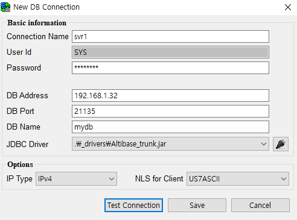
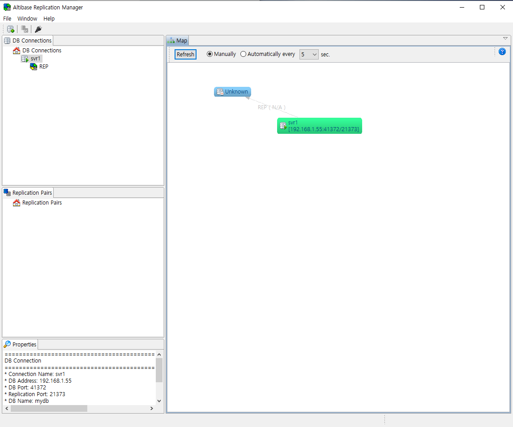

- [Replication Manager User’s Manual](#replication-manager-users-manual)
  - [서문](#%EC%84%9C%EB%AC%B8)
  - [1.Replication Manager 소개](#1replication-manager-%EC%86%8C%EA%B0%9C)
    - [개요](#%EA%B0%9C%EC%9A%94)
    - [시스템 요구 사항](#%EC%8B%9C%EC%8A%A4%ED%85%9C-%EC%9A%94%EA%B5%AC-%EC%82%AC%ED%95%AD)
    - [설치 및 제거](#%EC%84%A4%EC%B9%98-%EB%B0%8F-%EC%A0%9C%EA%B1%B0)
  - [2.시작하기](#2%EC%8B%9C%EC%9E%91%ED%95%98%EA%B8%B0)
    - [사용자 인터페이스에 대한 이해](#%EC%82%AC%EC%9A%A9%EC%9E%90-%EC%9D%B8%ED%84%B0%ED%8E%98%EC%9D%B4%EC%8A%A4%EC%97%90-%EB%8C%80%ED%95%9C-%EC%9D%B4%ED%95%B4)
    - [알티베이스에 연결하기](#%EC%95%8C%ED%8B%B0%EB%B2%A0%EC%9D%B4%EC%8A%A4%EC%97%90-%EC%97%B0%EA%B2%B0%ED%95%98%EA%B8%B0)
    - [Replication Manager 상세 사용법](#replication-manager-%EC%83%81%EC%84%B8-%EC%82%AC%EC%9A%A9%EB%B2%95)

Alitbase® Tools & Utilities

Replication Manager User’s Manual
=================================

Altibase Tools & Utilities Replication Manager User’s Manual

Release 1.3

Copyright ⓒ 2001~ 2019 Altibase Corp. All Rights Reserved.

본 문서의 저작권은 ㈜알티베이스에 있습니다. 이 문서에 대하여 당사의 동의없이
무단으로 복제 또는 전용할 수 없습니다.

**㈜알티베이스**

08378 서울시 구로구 디지털로 306 대륭포스트타워Ⅱ 10층

전화: 02-2082-1114 팩스: 02-2082-1099

고객서비스포털: <http://support.altibase.com>

homepage: [http://www.altibase.com](http://www.altibase.com/)

서문
----

이 매뉴얼은 Alitbase 데이터베이스 관리를 위한 Replication Manager 사용법을 설명한다.

#### 대상 사용자

이 매뉴얼은 다음과 같은 Alitbase 사용자를 대상으로 작성되었다.

- 데이터베이스 관리자

- 성능 관리자

- 데이터베이스 사용자

- 응용 프로그램 개발자

- 기술지원부

다음과 같은 배경 지식을 가지고 이 매뉴얼을 읽는 것이 좋다.

- 컴퓨터, 운영 체제 및 운영 체제 유틸리티 운용에 필요한 기본 지식

- 관계형 데이터베이스 사용 경험 또는 데이터베이스 개념에 대한 이해

- 컴퓨터 프로그래밍 경험

- 데이터베이스 서버 관리, 운영 체제 관리 또는 네트워크 관리 경험

#### 소프트웨어 환경

이 매뉴얼은 데이터베이스 서버로 Alitbase 버전 7.1을 사용한다는 가정 하에 작성되었다.

#### 이 매뉴얼의 구성

이 매뉴얼은 Replication Manager에 익숙지 않은 사용자를 위한 기본적인 가이드로 다음과 같이 구성되어 있다.

- 제 1장 Replication Manager 소개 

  이 장은 Replication Manager 설치를 위한 필수 선행 요건과 설치, 삭제 방법을 설명한다.
- 제 2장 시작하기 

  이 장은 Replication Manager의 사용자 인터페이스에 관한 소개와 Alitbase 데이터베이스 연결 방법 그리고 상세 사용법에 관해 설명한다.

#### 관련 자료

자세한 정보를 위하여 다음 문서 목록을 참조한다.

- Installation Guide

- Getting Started Guide

- Administrator’s Manual

- Replication Manual

- Precompiler User’s Manual

- API User’s Manual

- Alitbase C Interface Manual

- iSQL User’s Manual

- Utilities Manual

- General Reference

- Error Message Reference

#### Altibase는 여러분의 의견을 환영합니다.

이 매뉴얼에 대한 여러분의 의견을 보내주시기 바랍니다. 사용자의 의견은 다음 버전의 매뉴얼을 작성하는데 많은 도움이 됩니다. 보내실 때에는 아래 내용과 함께 고객서비스포털(http://support.altibase.com/kr/ )로 보내주시기 바랍니다.

- 사용 중인 매뉴얼의 이름과 버전

- 매뉴얼에 대한 의견

- 사용자의 성함, 주소, 전화번호

이 외에도 Altibase 기술지원 설명서의 오류와 누락된 부분 및 기타 기술적인문제들에 대해서 이 주소로 보내주시면 정성껏 처리하겠습니다. 또한, 기술적인 부분과 관련하여 즉각적인 도움이 필요한 경우에도 고객서비스포털을 통해 서비스를 요청하시기 바랍니다.

여러분의 의견에 항상 감사드립니다.

## 1.Replication Manager 소개

이 장에서는 Replication Manager에 관한 개요와 설치 방법을 설명한다. 이 장은 다음의 절로 구성된다.

- 개요
- 시스템 요구 사항
- 설치와 제거

### 개요

Replication Manager는 Alitbase의 이중화 관리를 위한 GUI 툴이다. Alitbase
데이터베이스 관리자는 일반적으로 이중화 객체가 활성화되어 있는 Alitbase의 모든
인스턴스에 연결할 수 있어야 한다. iSQL 같은 명령어 인터페이스를 사용하게 되면,
DB관리자는 여러 콘솔창들을 오가며 이중화 대상 객체를 수정하거나 이중화 시작,
종료 등의 이중화 관련 작업을 수행해야 한다. DB관리자가 이중화 객체들의 상태와
관계를 모두 기억하고 있어야 하므로, 이중화 객체 수가 선형적으로 증가함에 따라
이중화 관리 부담은 지수적으로 증가한다. 그러나 Replication Manager는 그래픽 유저
인터페이스(GUI)이기 때문에, 화면에 이중화 노드를 모두 보여주어 이중화 관련
작업이 수월하도록 도와준다.

이 도구 사용 시 얻을 수 있는 주요 이점은 다음과 같다:

1. Replication Manager는 Alitbase 4.3.9 이상의 여러 버전과 함께 사용할 수 있다.
2. 이중화 객체들의 상태와 관계를 한눈에 알 수 있다.
3. 마우스 클릭 한 번으로 이중화 객체를 관리할 수 있다.
4. 이중화 객체와 관련된 객체의 속성을 확인할 수 있다.
5. 이중화 쌍의 모니터링과 그 상태 분석을 거의 직관적으로 할 수 있다.

### 시스템 요구 사항

이 절은 Replication Manager를 설치하고 실행하는 데 필요한 시스템 사양에 대해 설명하고, Replication Manager와 호환되는 알티베이스 버전에 대해 설명한다.

#### 하드웨어 요구 사항

1. CPU: 800MHz Pentium 이상

2. 메모리: 512MB 이상

3. 디스크: 50MB 이상의 여유 공간 (JRE 제외)

4. 화면 해상도: 1024 x 768 화소 이상

#### 소프트웨어 요구 사항

##### 지원하는 OS 및 플랫폼

Replication Manager는 마이크로소프트 윈도우즈와 리눅스용 패키지를 제공한다. 

| Package Name                                        | Operating System | Graphic System | JRE         |
| :-------------------------------------------------- | :--------------: | :------------: | :-----------: |
| ReplicationManager-win32.win32.x86.zip              |     Windows      |     win32      | JRE 6 탑재  |
| ReplicationManager-linux.gtk.x86.zip (JRE included) |      Linux       |      GTK       | Java 6 이상 |

##### Java 요구 사항

- Java Development Kit (JDK) 또는 Java Runtime Environment (JRE) 6 이상

마이크로소프트 윈도우즈 패키지에는 JRE가 포함되어 있어 Java를 따로 설치할 필요가 없지만, 리눅스용 패키지에는 JRE가 포함되어 있지 않기 때문에 사용자가 직접 Java를 구동할 수 있는 환경을 설정해야 한다.

#### 호환 가능한 Altibase 버전

- Altibase versions: 4.3.9 이상

Replication Manager는 다양한 버전의 알티베이스를 동시에 작업 가능하기 때문에 접속 대상 알티베이스에 적합한 JDBC 드라이버 파일을 사용해야 한다.

상세한 내용은 [JDBC 드라이버 파일 불러오기](#jdbc-%EB%93%9C%EB%9D%BC%EC%9D%B4%EB%B2%84-%ED%8C%8C%EC%9D%BC-%EB%B6%88%EB%9F%AC%EC%98%A4%EA%B8%B0)를 참조한다.

### 설치 및 제거

#### 다운로드

Replication Manager는 공식 Altibase 고객서비스포털 http://support.altibase.com/kr/에서 내려받을 수 있다. Replication Manager는 zip 파일 형식으로 제공된다.

#### 설치

다운로드 받은 zip 파일의 압축을 해제한다.

#### 제거

Replication Manager가 설치된 디렉토리를 삭제한다.

## 2.시작하기

이 장은 Replication Manager의 사용자 인터페이스를 소개한다. 이후 Altibase에 연결하는 법을 설명한 뒤 Replication Manager 상세 사용법에 대해 설명한다. 이 장은 다음과 같이 구성된다.

- 사용자 인터페이스에 대한 이해
- 알티베이스 연결하기
- Replication Manager 상세 사용법

### 사용자 인터페이스에 대한 이해

이 절은 Replication Manager의 사용자 인터페이스를 소개한다. 

Replication Manager의 user interaface는 아래처럼 구성되어 있다.

1. DB Connections: 프로그램의 시작 위치이며, 데이터베이스와 이중화 객체 간의
   관계를 트리 구조로 보여주는 데이터베이스 중심의 뷰이다.

2. Replication Pairs: 이중화 개체를 한 쌍으로 표현하여 보여주는 논리적인
   뷰이다. 두 개씩 짝지어 같은 이름을 갖고 서로 상호 작용하는 이중화 객체
   그룹을 "이중화 쌍"이라고 부른다.

3. Map: 데이터베이스들과 이중화 객체들, 그리고 서로 간의 관계에 대한 물리적
   구성과 상태를 그래프로 형상화한다.

4. Properties: 현재 선택된 객체의 속성을 보여준다. (예. 데이터베이스 연결 또는
   이중화 객체)

위의 네 창은 동일한 데이터베이스와 이중화 객체들을 다양한 방법으로 시각화한다.
예를 들어, "Map" 창은 한눈에 이중화 갭을 확인할 수 있는 편리한 방법을 제공한다.
"Replication Pairs"창은 이중화가 실행되고 있는 데이터베이스를 고려할 필요 없이
이중화 객체들을 한 쌍으로 다룰 수 있는 간편한 방법을 제공한다. 따라서 이 네
창들은 상호 보완적이다. 예를 들어, "DB Connections" 창에서 이중화 객체를
선택하면 "Replication Pairs"와 "Map" 창에서도 같은 이중화 객체가 선택된다. 또한
선택된 이중화 객체의 속성들은 "Properties" 창에서 보여진다. 다시 말해서 편집
가능한 세 창, "DB Connections", "Replication Pairs" 그리고 "Map" 창들은
다방면으로 서로 상호 작용한다. 반면 읽기만 가능한 "Properties" 창은 다른 세
창들로부터 정보를 받는다.

"DB Connections" 창은 다음과 같은 기능을 제공한다.

- 데이터베이스 접속을 등록, 해제 그리고 편집할 수 있는 뷰가 있다.

- 연결된 데이터베이스, 이중화 객체 그리고 이중화 대상 테이블에 대한 메타
  정보를 탐색하기 편리하게 트리 구조로 보여준다.

- 이중화 객체 생성과 삭제, 이중화 시작 그리고 중단하는 것을 포함한
  데이터베이스와 이중화 객체를 관리하는 편리한 방법을 제공한다.

"Replication Pairs" 창은 다음과 같은 기능을 제공한다.

- 이중화 객체들의 기반 데이터베이스에 대한 고려 없이 이중화 객체 쌍을 관리하는
  편리한 방법을 제공한다.

- 이중화를 시작하고 중단하는 것을 포함한 이중화 객체 관리 방법도 제공한다.

"Map" 창은 다음과 같은 기능을 제공한다.

- 등록된 모든 데이터베이스와 이중화 객체의 전체적인 그림을 직관적으로 전달해
  준다.
- 데이터베이스와 이중화 객체를 제어하는 방법을 제공한다.

### 알티베이스에 연결하기

이 절은 Alitbase에 연결하기 위한 기본적인 단계를 길라잡이 형태로 설명한다.
Alitbase와 함께 Replication Manager를 실행할 때의 작업 흐름은 보통 다음과 같다.

1. Alitbase에 연결할 때 사용될 JDBC 드라이버 파일을 불러온다.
2. 데이터베이스 연결을 추가한다.
3. 데이터베이스에 접속한다.
4. 필요한 대로 이중화 관리 작업을 처리한다.
5. 데이터베이스 연결을 해제한다.
6. 데이터베이스 연결 정보를 편집한다.
7. Extra Host IP를 관리한다.
8. 더 이상 필요하지 않으면 데이터베이스를 삭제한다.

각 절차는 아래와 같이 수행된다.

#### JDBC 드라이버 파일 불러오기

이 절은 JDBC 드라이버 파일의 알맞은 버전을 Replication Manager에 불러오는 방법을 설명한다. 

Replication Manager는 다양한 버전의 Altibase 서버를 등록하기 위해 버전에 맞는 JDBC 드라이버 파일을 불러오기 해야 한다. 예를 들어 Altibase 4.3.9.100과 Altibase 5.3.3.33 버전을 동시에 연결하려면 해당 버전의 JDBC 드라이버 파일 불러오기를 수행한다. 이때 Altibase JDBC 드라이버 이름은 "Altibase_4.3.9.100.jar", "Altibase_5.3.3.33.jar"과 같이 각각 버전을 구분할 수 있는 고유한 이름으로 변경해야 한다.

JDBC 드라이버를 불러오기 절차이다.

1. JDBC 드라이버 관리자 대화 상자를 열기 위해 도구 모음에서 "JDBC driver
   manager" 아이콘을 클릭한다.

2. 이 대화 상자에서 JDBC 드라이버 파일 가져오기 대화 상자를 열기 위해 오른쪽의
   “+” 아이콘을 클릭한다.
   
   

3. 불러올 JDBC 드라이버 파일을 선택한 다음 Replication Manager에서 사용될 파일
   이름을 입력한다. 소스 파일은 지정된 디렉토리에 복사되며 지정한 대로 파일
   이름이 바뀐다.

4. JDBC 드라이버 관리자 대화상자를 닫는다.

위의 방법 대신에 데이터베이스 연결을 추가할 때 JDBC 드라이버 파일을 불러올 수도
있다.

#### 데이터베이스 연결 추가하기

1. “새로운 데이터베이스 연결” 대화 상자를 열기 위해, 도구 모음에서 "New DB
   Connection" 아이콘을 클릭하거나, "DB Connections"창에서 "DB Connections"
   아이콘에 오른쪽 클릭한 다음 표시되는 콘텍스트 메뉴에서 "New DB Connection"
   항목을 클릭한다.
2. “새로운 데이터베이스 연결” 대화 상자가 표시되면 필드 정보를 아래와 같이
   입력한다.

- Basic information(기본 정보)

  - Connection Name: 고유한 커넥션 이름을 입력한다. 최대 10글자로, 알파벳으로 시작해야 하고 알파벳과 숫자를 혼용할 수 있다.
  - Password: 데이터베이스 SYS 사용자의 암호이다.
  - DB Address: 데이터베이스가 설치된 시스템의 IP 주소이다.
  - DB Port: 데이터베이스에 접속할 때 필요한 포트 번호이다.
  - DB Name: 데이터베이스 이름이다.
  - JDBC driver: JDBC 드라이버 파일의 알맞은 버전을 사용하기 위해 콤보 상자에서
    알맞은 JDBC 드라이버를 선택한다. 필요한 JDBC 드라이버 파일을 아직 불러오지
    않았다면 "JDBC driver manager" 아이콘을 클릭해서 불러온다.
  
- Options(선택 사항)

  - IP Address Type: 필요하면 알맞은 IP 주소 유형을 선택한다. Replication Manager는 IPv4와 IPv6 주소를 지원한다.
  - NLS for Client: Altibase 5.1.1 이하 버전의 경우, Altibase 서버 캐릭터셋을 선택한다. Alitbase 5.3.1 이상 버전에 연결할 때는 선택하지 않아도 무방하다.

3. 연결 성공 여부를 확인하려면 "Connection Test" 버튼을 클릭한다.
4. 마지막으로 "Save" 버튼을 클릭한다.

#### 데이터베이스에 연결하기

Alitbase를 설치하고 앞선 두 가지 작업을 마침으로써 데이터베이스에 연결할 준비가
완료되었다.

데이터베이스에 연결하기 위해 아래와 같은 순서를 따른다.

1. 새로 추가된 데이터베이스 연결을 선택한다. 
   콘텍스트 메뉴를 표시하기 위해 새로 추가된 데이터베이스에 오른쪽 클릭한 다음 "Connect" 항목을 선택한다. 시스템 환경에 따라 시간이 좀 걸릴 수도 있다.
   
2. 연결되면 대상 데이터베이스에서 이중화 객체를 확인할 수 있다.

3. 연결에 실패하면 연결하는데 도움이 되는 정보를 보여주는 경고 상자가 표시된다.

#### 연결된 데이터베이스에서 작업하기

이전 절차가 성공적으로 수행되었다면, 연결된 데이터베이스에서 이중화를 관리할
준비가 완료된 것이다.

#### 데이터베이스 연결 해제하기

작업을 끝낸 후에는 데이터베이스 연결을 해제할 필요가 있다. 데이터베이스 연결을
해제하려면 대상 데이터베이스 연결을 선택한다. 대상 데이터베이스에 오른쪽
클릭하여 콘텍스트 메뉴를 연 다음 "Disconnect" 항목을 선택한다.

#### 데이터베이스 연결 정보 편집하기

가끔 데이터베이스 연결 정보를 편집할 필요가 있다. 예를 들어, 데이터베이스를
연결하기 위해 사용된 계정을 변경할 필요가 있을 수 있다. 이 메뉴는 변경하고자 하는
데이터베이스에 연결되지 않았을 때만 가능하다. 데이터베이스 연결 정보를 편집하기
위해서는 여섯 가지 절차가 있다.

1. 연결 정보를 변경하고 싶은 데이터베이스를 선택한다. 데이터베이스에 오른쪽
   클릭하여 콘텍스트 메뉴를 연 다음 "Edit" 항목을 선택한다.

2. 연결 정보를 원하는 대로 변경한다. 연결 성공 여부를 확인하려면 "Connection
   Test" 버튼을 클릭한다.

3. 연결 테스트가 성공적이면 대화 상자가 표시된다. "OK" 버튼을 클릭한다.

4. 마지막으로 편집 대화 상자에서 "Save" 버튼을 클릭한다.

#### Extrap Host IP 관리하기

Altibase가 여러 개의 IP 주소를 가진 장비에 설치되어 있고, 다른 Altibase에서 이중화 
객체를 생성할 때 이 주소 중의 하나를 Remote Host IP로 사용했다면, 그 IP는 등록된 
데이터베이스 연결의 DB Address 또는 Extra Host IP중 하나여야 한다. 그렇지 않으면 
데이터베이스와 이중화 객체간의 관계가 Map 창에 제대로 표시되지 않을 수 있다. 
이 메뉴는 데이터베이스에 연결되어 있거나 연결되지 않았을 경우 모두 가능하다.
Extra Host IP를 등록하거나 삭제하고 싶은 데이터베이스를 선택한다. 데이터베이스에 
오른쪽 클릭하여 콘텍스트 메뉴을 연 다음 "Manage Extra Host IP" 항목을 선택한다.

#### 데이터베이스 연결 삭제하기

등록된 데이터베이스를 더 이상 사용하지 않으면, "DB Connection" 창에서 삭제하고
싶을 수도 있다. 데이터베이스를 삭제하려면 대상 데이터베이스 연결을 선택한다.
삭제할 데이터베이스 연결에 오른쪽 클릭하여 콘텍스트 메뉴를 연 다음 "Remove"
항목을 클릭한다.

### Replication Manager 상세 사용법

이 절은 Replication Manager 상세 사용법에 대해 기술한다. 또한 창(Pane)과 객체(Object)의 관계에 대해서 설명한다.

Replication Manager는 데이터베이스와 이중화 객체를 추상화시켜 여섯 가지 객체로 모델링하며, 사용자 편의성을 위해 편집 가능한 세 개(DB Connections, Replication Pair, Map)의 창에 객체들을 표시한다. 여섯 가지 객체는 다음과 같다.

1. 이중화 객체((Replication Object) 
CREATE REPLICATION 구문으로 생성되는 객체로 Replication Manager의 여러 창에서 공통적으로 사용된다. 상세한 내용은 [사용자 인터페이스에 대한 이해](#%EC%82%AC%EC%9A%A9%EC%9E%90-%EC%9D%B8%ED%84%B0%ED%8E%98%EC%9D%B4%EC%8A%A4%EC%97%90-%EB%8C%80%ED%95%9C-%EC%9D%B4%ED%95%B4)를 참조한다.
2. 이중화 대상 테이블(Replication Target Table) 객체
CREATE REPLICATION 또는 ALTER REPLICATION 구문으로 지정되어 이중화 노드 간 복제되는 테이블이다.
3. 데이터베이스 연결 부모(DB Connections) 객체
데이터베이스 연결(DB Connection)  객체를 자식으로 갖는 추상 객체이다. "DB Connections" 창에서 자동으로 생성하는 객체이다.
4. 데이터베이스 연결(DB Connection) 객체
알티베이스 연결을 나타내기 위한 객체이다. 상세한 내용은 [사용자 인터페이스에 대한 이해](#%EC%82%AC%EC%9A%A9%EC%9E%90-%EC%9D%B8%ED%84%B0%ED%8E%98%EC%9D%B4%EC%8A%A4%EC%97%90-%EB%8C%80%ED%95%9C-%EC%9D%B4%ED%95%B4)를 참조한다.
5. 이중화 쌍 부모(Replication Pairs) 객체
이중화(Replication) 객체들을 자식으로 갖는 추상 객체이다. "Replication Pairs" 창에서 자동으로 생성하는 객체이다.
6. 이중화 쌍(Replication Pair) 객체
두 개의 서로 다른 데이터베이스에 생성되어 대응되는 같은 이름을 가진 이중화 객체의 쌍이다. 상세한 내용은 [사용자 인터페이스에 대한 이해](#%EC%82%AC%EC%9A%A9%EC%9E%90-%EC%9D%B8%ED%84%B0%ED%8E%98%EC%9D%B4%EC%8A%A4%EC%97%90-%EB%8C%80%ED%95%9C-%EC%9D%B4%ED%95%B4)를 참조한다.

어떤 객체들은 여러 창에서 공유되지만, 창에 따라 제공하는 기능이 다른 경우가 있다. 예를 들어, "DB Connections" 창에서 이중화 객체는 "Edit Table List" 기능을 제공하지만 "Map" 창에서는 제공하지 않는다. 이는 제공하는 창의 목적에 따라 제공하는 기능이 다르기 때문이다. "DB Connections" 창은 데이터베이스 접근하여 이중화 객체를 조회하고 수정하는 기능을 제공하고 "Map" 창은 Replication Manager에 등록된 정보를 토대로 이중화 객체 간의 관계를 그래프로 보여주는 역할을 한다.

#### DB Connections 창

"DB Connections" 창은 데이터베이스의 관점에서 데이터베이스와 이중화 객체를 트리 형식으로 표현하며 네가지 객체를 대상으로 작업한다: 데이터베이스 연결 부모 객체, 데이터베이스 연결, 이중화 객체, 이중화 대상 테이블.

##### DB Connections

- Connect all: 연결되지 않은 모든 DB Connection을 연결한다.
- Disconnect all: 연결된 모든 DB Connection의 접속을 끊는다.
- Start all: 정지 상태의 모든 이중화 객체를 시작한다.
- Stop all: 동작중인 모든 이중화 객체를 중지시킨다.
- Quick Start all: 정지 상태의 모든 이중화 객체에게 "Quick Start"명령을 전송한다. 이 작업은 노드간 전송되지 않은 이중화 작업의 손실을 초래할 수 있다. 상세한 내용은 [Replication User's Manual](https://github.com/ALTIBASE/Documents/blob/master/Manuals/Altibase_7.2/kor/Replication%20Manual.md)를 참조한다.
- New DB Connection: 새로운 DB Connection 객체를 생성한다.
- Collapse All: 데이터베이스 연결 레벨로 트리를 접는다.
- Expand to Replication Object: 이중화 객체 단위 레벨까지 트리를 펼친다.
- Expand to Replication Table: 이중화 대상 테이블 레벨까지 트리를 펼친다.

##### DB Connection

- Connect: DB Connection 객체에 연결한다.
- Disconnect: 접속 중인 DB Connection 객체 접속을 끊는다.
- Edit: DB Connection 객체의 속성을 편집한다.
- Manage Extra Host IP: 선택한 DB Connection 객체의 추가 주소를 관리한다.
- Remove: DB Connection 객체를 삭제한다.
- Start all: DB Connection 객체에 속한 중지 상태인 모든 이중화 개체를 시작한다.
- Stop all: DB Connection 객체에 속한 동작 상태인 모든 이중화 객체를 중지시킨다.
- Quick Start all: DB Connection 객체에 속한 정지 상태의 모든 이중화 객체에게 "Quick Start"명령을 전송한다. 이 작업은 노드간 전송되지 않은 이중화 작업의 손실을 초래할 수 있다. 상세한 내용은 [Replication User's Manual](https://github.com/ALTIBASE/Documents/blob/master/Manuals/Altibase_7.2/kor/Replication%20Manual.md)를 참조한다.
- Create Replication: DB Connection의 대상 데이터베이스에 이중화 객체를 생성한다.
- Create Full-mesh Replications: 선택한 여러 DB Connection을 대상으로 새로운 완전 메시 이중화 객체를 생성한다. 예를 들어, 4개의 DB Connection를 선택하였으면, 동일한 이름을 가진 16 (2^4)개의 이중화 객체가 생성된다.
- Join to Full-mesh: 선택한 여러 DB Connection를 생성된 완전 연결 이중화 객체에 참여시킨다.
- Create Replication Pair: 동일한 이름을 가진 새로운 이중화 객체를 두개의 DB Connection 양쪽에 만든다. 
- Drop Replications: DB Connection에 속한 모든 이중화 객체를 삭제한다. 삭제 전 반드시 모든 이중화 객체는 중지되어 있어야 한다.

##### Replication Object

- Start: 선택한 이중화 객체를 시작한다.
- Stop: 선택한 이중화 객체를 중지한다.
- Quick Start: 선택한 이중화 객체에게 "Quick Start"명령을 전송한다. 이 작업은 노드간 전송되지 않은 이중화 작업의 손실을 초래할 수 있다. 상세한 내용은 [Replication User's Manual](https://github.com/ALTIBASE/Documents/blob/master/Manuals/Altibase_7.2/kor/Replication%20Manual.md)를 참조한다.
- Sync: 선택한 이중화 객체간 'Sync' 작업을 수행한다.이는 ALTER REPLICATION ... SYNC ... 구문을 수행하는 것과 동일하다.
- Sync Only: 선택한 이중화 객체간 'Sync Only' 작업을 수행한다. 이는 ALTER REPLICATION ... SYNC ONLY ... 구문을 수행하는 것과 동일하다.
- Drop: 선택한 중지 상태의 이중화 객체를 삭제한다.
- Edit Table List: 선택한 중지 상태의 이중화 객체에서 이중화 대상 테이블을 추가 또는 삭제한다.
- Monitor: 선택한 이중화 객체를 대상으로 모니터 화면을 연다.
- Show DDL: 선택한 이중화 객체와 종속 객체 (테이블, 인덱스 등)의 DDL을 표시한다.
- Compare DDL: 선택한 두개의 이중화 객체 DDL을 비교한다.

##### Replication Target Table

- Remove: 이중화 객체에서 선택한 테이블을 제거한다. 

#### Replication Pair pane

'Replication Pair' 창은 데이터베이스 관점이 아니라 이중화 객체 관점에서 보여주기 위한 것으로 이중화 객체 쌍을 기준으로 보여준다. 따라서 이 창은 4개의 객체를 중심으로 표현한다: 이중화 객체 쌍 부모 객체, 이중화 객체 쌍, 이중화 객체, 그리고 이중화 대상 테이블.

##### Replication Pairs

- Start all: 중지 상태인 모든 이중화 객체를 시작한다.
- Stop all: Stop 동작 상태인 모든 이중화 객체를 중지한다.
- Quick Start all: 중지 상태인 이중화 객체에게 "Quick Start"명령을 전송한다. 이 작업은 노드간 전송되지 않은 이중화 작업의 손실을 초래할 수 있다. 상세한 내용은 [Replication User's Manual](https://github.com/ALTIBASE/Documents/blob/master/Manuals/Altibase_7.2/kor/Replication%20Manual.md)를 참조한다.
- Create Replication Pair: 동일한 이름을 가진 새로운 이중화 객체를 두개의 DB Connection 양쪽에 만든다.
- Create Full-mesh Replications: 여러 DB Connection을 대상으로 새로운 완전 메시 이중화 객체를 생성한다. 예를 들어, 4개의 DB Connection를 선택하였으면, 동일한 이름을 가진 16 (2^4)개의 이중화 객체가 생성된다.
- Collapse All: 이중화 객체 쌍 단위 레벨로 트리를 접는다.
- Expand to Replication Object: 이중화 객체 단위 레벨까지 트리를 펼친다.
- Expand to Replication Table: 이중화 대상 테이블 레벨까지 트리를 펼친다.

##### Replication Pair

- Start all: 이중화 객체 쌍에서 중지 상태인 이중화 객체를 모두 시작한다.
- Stop all: 이중화 객체 쌍에서 동작 상태인 이중화 객체를 모두 중지한다.
- Quick Start all: 이중화 객체 쌍에서 중지 상태인 이중화 객체에게 "Quick Start"명령을 전송한다. 이 작업은 노드간 전송되지 않은 이중화 작업의 손실을 초래할 수 있다. 상세한 내용은 [Replication User's Manual](https://github.com/ALTIBASE/Documents/blob/master/Manuals/Altibase_7.2/kor/Replication%20Manual.md)를 참조한다.
- Drop: 이중화 객체 쌍에 속한 이중화 객체를 삭제한다. 삭제 전 반드시 모든 이중화 객체는 중지되어 있어야 한다.

##### Replication Object

DB Connections 창과 동일한 기능 제공.

##### Replication Target Table

DB Connections 창과 동일한 기능 제공.

#### Map pane

Map 창은 데이터베이스와 이중화 객체의 물리적인 배치와 상태 그리고 상호관계를 표시한다. 따라서 데이터베이스 연결과 이중화 객체 두가지를 다룬다.

##### 데이터베이스 연결(DB Connection) 객체

- Connect: DB Connection 객체에 연결한다.
- Disconnect: 접속 중인 DB Connection 객체 접속을 끊는다.
- Start all: DB Connection 객체에 속한 중지 상태인 모든 이중화 개체를 시작한다.
- Stop all:DB Connection 객체에 속한 동작 상태인 모든 이중화 객체를 중지시킨다.
- Quick Start all: DB Connection 객체에 속한 정지 상태의 모든 이중화 객체에게 "Quick Start"명령을 전송한다. 이 작업은 노드간 전송되지 않은 이중화 작업의 손실을 초래할 수 있다. 상세한 내용은 [Replication User's Manual](https://github.com/ALTIBASE/Documents/blob/master/Manuals/Altibase_7.2/kor/Replication%20Manual.md)를 참조한다.

##### 이중화 객체(Replication Object)

- Start: 선택한 이중화 객체를 시작한다.
- Stop: 선택한 이중화 객체를 중지한다.
- Quick Start: 선택한 이중화 객체에게 "Quick Start"명령을 전송한다. 이 작업은 노드간 전송되지 않은 이중화 작업의 손실을 초래할 수 있다. 상세한 내용은 [Replication User's Manual](https://github.com/ALTIBASE/Documents/blob/master/Manuals/Altibase_7.2/kor/Replication%20Manual.md)를 참조한다.
- Sync: 선택한 이중화 객체에 'SYNC' 명령을 전송한다. ALTER REPLICATION _replication_name_ SYNC 구문을 수행하는 것과 동일하다.
- Sync Only: 선택한 이중화 객체에 'SYNC ONLY' 명령을 전송한다. ALTER REPLICATION _replication_name_ SYNC ONLY 구문을 수행하는 것과 동일하다.
- Drop: 선택한 중지 상태의 이중화 객체를 삭제한다.
- Monitor: 선택한 이중화 객체를 대상으로 모니터 화면을 연다.
- Show DDL: 선택한 이중화 객체와 종속 객체 (테이블, 인덱스 등)의 DDL을 표시한다.
- Compare DDL: 선택한 두개의 이중화 객체 DDL을 비교한다.
