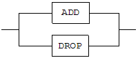

dataCompJ User's Manual
==============================


Altibase® Tools & Utilities

Release 7.2

Copyright ⓒ 2001\~2021 Altibase Corp. All Rights Reserved.

본 문서의 저작권은 ㈜알티베이스에 있습니다. 이 문서에 대하여 당사의 동의 없이
무단으로 복제 또는 전용할 수 없습니다.

**㈜알티베이스**

08378 서울시 구로구 디지털로 306 대륭포스트타워Ⅱ 10층

전화: 02-2082-1114 팩스: 02-2082-1099

고객서비스포털: <http://support.altibase.com>

homepage: [http://www.altibase.com](http://www.altibase.com/)


# 목차

- [dataCompJ User's Manual](#datacompj-users-manual)
  - [서문](#%EC%84%9C%EB%AC%B8)
    - [이 매뉴얼에 대하여](#%EC%9D%B4-%EB%A7%A4%EB%89%B4%EC%96%BC%EC%97%90-%EB%8C%80%ED%95%98%EC%97%AC)
  - [1.dataCompJ 소개](#1datacompj-%EC%86%8C%EA%B0%9C)
    - [개요](#%EA%B0%9C%EC%9A%94)
    - [시스템 요구 사항](#%EC%8B%9C%EC%8A%A4%ED%85%9C-%EC%9A%94%EA%B5%AC-%EC%82%AC%ED%95%AD)
  - [2.dataCompJ 시작하기](#2datacompj-%EC%8B%9C%EC%9E%91%ED%95%98%EA%B8%B0)
    - [용어](#%EC%9A%A9%EC%96%B4)
    - [불일치 레코드(Inconsistent record)](#%EB%B6%88%EC%9D%BC%EC%B9%98-%EB%A0%88%EC%BD%94%EB%93%9Cinconsistent-record)
    - [일치 정책 (Synchronization policy)](#%EC%9D%BC%EC%B9%98-%EC%A0%95%EC%B1%85-synchronization-policy)
  - [3.dataCompJ 사용 방법](#3datacompj-%EC%82%AC%EC%9A%A9-%EB%B0%A9%EB%B2%95)
    - [dataCompJ 실행 방법](#datacompj-%EC%8B%A4%ED%96%89-%EB%B0%A9%EB%B2%95)
    - [dataCompJ 수행 단계](#datacompj-%EC%88%98%ED%96%89-%EB%8B%A8%EA%B3%84)
    - [dataCompJ 환경파일 설정](#datacompj-%ED%99%98%EA%B2%BD%ED%8C%8C%EC%9D%BC-%EC%84%A4%EC%A0%95)
  - [4.dataCompJ 기능](#4datacompj-%EA%B8%B0%EB%8A%A5)
    - [비교(DIFF) 기능](#%EB%B9%84%EA%B5%90diff-%EA%B8%B0%EB%8A%A5)
    - [일치(SYNC) 기능](#%EC%9D%BC%EC%B9%98sync-%EA%B8%B0%EB%8A%A5)
  - [A. 부록: 이기종간 데이터 타입 호환 테이블](#a-%EB%B6%80%EB%A1%9D-%EC%9D%B4%EA%B8%B0%EC%A2%85%EA%B0%84-%EB%8D%B0%EC%9D%B4%ED%84%B0-%ED%83%80%EC%9E%85-%ED%98%B8%ED%99%98-%ED%85%8C%EC%9D%B4%EB%B8%94)


서문
====

### 이 매뉴얼에 대하여

이 매뉴얼은 Altibase 데이터베이스에서 이기종 데이터베이스로 데이터를 복제한 이후의 데이터 정합성 확인과 데이터 불일치를 해소하기 위한 도구인 dataCompJ를 사용하는 방법을 기술한다.

#### 대상 사용자

이 매뉴얼은 다음과 같은 Altibase 사용자를 대상으로 작성되었다.

- 데이터베이스 관리자

- 성능 관리자

- 데이터베이스 사용자

- 응용 프로그램 개발자

- 기술지원부

다음과 같은 배경 지식을 가지고 이 매뉴얼을 읽는 것이 좋다.

- 컴퓨터, 운영 체제 및 운영 체제 유틸리티 운용에 필요한 기본 지식

- 관계형 데이터베이스 사용 경험 또는 데이터베이스 개념에 대한 이해

- 컴퓨터 프로그래밍 경험

- 데이터베이스 서버 관리, 운영 체제 관리 또는 네트워크 관리 경험

#### 이 매뉴얼의 구성

- 제 1장 dataCompJ 소개  
  이 장은 dataCompJ의 특징을 이해하고자 하는 사용자에게 이 도구를 소개하고 설치하는 방법을 설명한다.

- 제 2장 dataCompJ 시작하기  
  이 장은 사용자들이 dataCompJ를 좀 더 능률적이고 효율적으로 실행하는 데 도움이 되는 기본 개념을 소개한다.

- 제 3장 dataCompJ 사용 방법

  이 장은 dataCompJ를 원활하게 실행하기 위한 방법과 dataCompJ의 환경 파일 설정, 설정 시 고려할 점들을 설명한다.

- 제 4장 dataCompJ 기능

  이 장은 dataCompJ의 비교(DIFF) 기능과 일치(SYNC) 기능을 보다 자세히 예제와 함께 설명한다.

- A. 부록: 이기종간 데이터 타입 호환 테이블

#### 문서화 규칙

이 절에서는 이 매뉴얼에서 사용하는 규칙에 대해 설명한다. 이 규칙을 이해하면 이 매뉴얼과 설명서 세트의 다른 매뉴얼에서 정보를 쉽게 찾을 수 있다.

여기서 설명하는 규칙은 다음과 같다.

- 구문 다이어그램

- 샘플 코드 규칙

##### 구문 다이어그램

이 매뉴얼에서는 다음 구성 요소로 구축된 다이어그램을 사용하여, 명령문의 구문을 설명한다.

| 구성 요소                             | 의미                                                         |
| ------------------------------------- | ------------------------------------------------------------ |
|  | 명령문이 시작한다. 완전한 명령문이 아닌 구문 요소는 화살표로 시작한다. |
|  | 명령문이 다음 라인에 계속된다. 완전한 명령문이 아닌 구문 요소는 이 기호로 종료한다. |
|  | 명령문이 이전 라인으로부터 계속된다. 완전한 명령문이 아닌 구문 요소는 이 기호로 시작한다. |
|  | 명령문이 종료한다.                                           |
|        | 필수 항목                                                    |
|        | 선택적 항목                                                  |
|        | 선택사항이 있는 필수 항목. 한 항목만 제공해야 한다.          |
|        | 선택사항이 있는 선택적 항목                                  |
|        | 선택적 항목. 여러 항목이 허용된다. 각 반복 앞부분에 콤마가 와야 한다. |

##### 샘플 코드 규칙

코드 예제는 SQL, Stored Procedure, iSQL 또는 다른 명령 라인 구문들을 예를 들어 설명한다.

아래 테이블은 코드 예제에서 사용된 인쇄 규칙에 대해 설명한다.

| 규칙         | 의미                                                         | 예제                                                         |
| ------------ | ------------------------------------------------------------ | ------------------------------------------------------------ |
| [ ]          | 선택 항목을 표시                                             | VARCHAR [(*size*)] [[FIXED \|] VARIABLE]                     |
| { }          | 필수 항목 표시. 반드시 하나 이상을 선택해야 되는 표시        | { ENABLE \| DISABLE \| COMPILE }                             |
| \|           | 선택 또는 필수 항목 표시의 인자 구분 표시                    | { ENABLE \| DISABLE \| COMPILE } <br />[ ENABLE \| DISABLE \| COMPILE ] |
| . . .        | 그 이전 인자의 반복 표시 예제 코드들의 생략되는 것을 표시    | SQL\> SELECT ename FROM employee; <br />ENAME  <br />----------------------- <br />SWNO  <br />HJNO  <br />HSCHOI  <br />. . . <br />20 rows selected. |
| 그 밖에 기호 | 위에서 보여진 기호 이 외에 기호들                            | EXEC :p1 := 1; <br />acc NUMBER(11,2);                       |
| 기울임 꼴    | 구문 요소에서 사용자가 지정해야 하는 변수, 특수한 값을 제공해야만 하는 위치 | SELECT \* FROM *table_name*; <br />CONNECT *userID*/*password*; |
| 소문자       | 사용자가 제공하는 프로그램의 요소들, 예를 들어 테이블 이름, 컬럼 이름, 파일 이름 등 | SELECT ename FROM employee;                                  |
| 대문자       | 시스템에서 제공하는 요소들 또는 구문에 나타나는 키워드       | DESC SYSTEM_.SYS_INDICES_;                                   |

#### 관련 자료

자세한 정보를 위하여 Altibase의 다음 문서 목록을 참조한다.

- Installation Guide
- Getting Started Guide

- Administrator’s Manual

- Replication Manual

- Precompiler User’s Manual

- API User’s Manual

- Altibase C Interface Manual

- iSQL User’s Manual

- Utilities Manual

- General Reference

- Error Message Reference

#### Altibase는 여러분의 의견을 환영합니다.

이 매뉴얼에 대한 여러분의 의견을 보내주시기 바랍니다. 사용자의 의견은 다음 버전의 매뉴얼을 작성하는데 많은 도움이 됩니다. 보내실 때에는 아래 내용과 함께 고객서비스포털(http://support.altibase.com/kr/ )로 보내주시기 바랍니다.

- 사용 중인 매뉴얼의 이름과 버전

- 매뉴얼에 대한 의견

- 사용자의 성함, 주소, 전화번호

이 외에도 Altibase 기술지원 설명서의 오류와 누락된 부분 및 기타 기술적인 문제들에 대해서 이 주소로 보내주시면 정성껏 처리하겠습니다. 또한, 기술적인 부분과 관련하여 즉각적인 도움이 필요한 경우에도 고객서비스포털을 통해 서비스를 요청하시기 바랍니다.

여러분의 의견에 항상 감사드립니다.

1.dataCompJ 소개
=====================

이 장은 dataCompJ의 특징을 이해하고자 하는 사용자에게 이 도구를 소개하고 설치하는 방법을 설명한다. 이 장은 다음의 절로 구성된다.

- 개요
- 시스템 요구 사항
- 설치 및 제거

### 개요

dataCompJ는 Altibase에서 이기종 데이터베이스로 복제한 데이터를 대상으로 데이터 정합성 확인과 데이터 불일치를 해소하기 위한 도구이다. 테이블 단위로 데이터를 비교하고 데이터 불일치가 있는 경우 이에 관한 정보를 파일로 출력한다. 불일치 데이터를 Slave 데이터베이스에 직접 적용하여 데이터를 일치시키는 기능도 제공한다.

dataCompJ 작업 대상 데이터는 Altibase에서 제공하는 데이터 복제 도구인 Adapter for Oracle 또는 Adapter for JDBC를 사용하여 복제한 데이터를 대상으로 한다.

dataCompJ는 편리한 사용성과 빠른 성능으로, 효율적인 이기종 데이터베이스 간 데이터 관리 방법을 제공한다.

### 시스템 요구 사항

이 절은 dataCompJ를 설치하고 실행하기 위해 필요한 시스템 사양에 대해 설명하고, dataCompJ와 호환되는 데이터베이스 관리 시스템을 열거한다.

#### 하드웨어 요구 사항

- CPU: 800MHz 펜티엄 III 이상
- 메인 메모리: 최소 512MB, 4GB 이상 권장
- 디스크: 50MB 이상의 여유 공간

#### 소프트웨어 요구 사항

- Oracle, OpenJDK 또는 IBM Java 8 이상의 JRE

dataCompJ는 순수 Java 기반 클라이언트 애플리케이션으로 하드웨어 및 운영체제에 상관없이 독립적으로 실행되나, 자바 런타임 환경(JRE)에 의존적이므로 환경에 맞는 JRE를 설치해야 한다. 또한 설치된 Java의 경로를 가리키는 JAVA_HOME 환경변수가 설정되어 있어야 한다.

#### 호환되는 데이터베이스 관리 시스템

##### Master DB

- Altibase: Altibase 5.3.3 이상

##### Slave DB

- Oracle: Oracle 9i 이상
- MariaDB: MariaDB 5.5.x 이상

Master/Slave DB의 의미는 ['용어](#용어)'절을 참조한다.

dataCompJ는 Altibase 및 이기종 데이터베이스들과 함께 사용할 수 있다. 데이터베이스 접속을 위해 JDBC 드라이버를 사용하므로, 원본 데이터베이스와 대상 데이터베이스에 호환되는 JDBC 드라이버를 준비하는 것이 중요하다. 현재 오라클용 JDBC 드라이버인 ojdbc5.jar를 제공한다.

#### 설치 및 제거

dataCompJ는 [Altibase 고객 서비스 포털](#http://support.altibase.com)에서 내려받을 수 있다. dataCompJCli라는 파일 이름으로 zip 또는 tar.gz 파일 형식으로 제공된다. 다운로드받은 압축 파일을 원하는 위치에 해제하면 dataCompJ 설치가 완료된다. 생성된 디렉토리 안에는 실행파일인 dataCompJCli.sh, JDBC 드라이버를 포함한 JDBC 하위 디렉토리 및 XML 기본 환경 파일이 존재한다.

dataCompJ를 제거하기 위해서는 dataCompJ가 설치되어 있는 디렉토리를 삭제한다.

2.dataCompJ 시작하기
=====================

이 장은 사용자들이 dataCompJ를 좀 더 능률적이고 효율적으로 실행하는 데 도움이 되는 기본 개념을 소개한다. 이 장은 다음의 절로 구성된다.

- 용어

- 불일치 레코드
- 일치 정책

### 용어

##### Master DB

비교 대상인 두 이기종 데이터베이스 중 원본 데이터를 가진 Altibase 데이터베이스이다.

##### Slave DB

비교 대상인 두 이기종 데이터베이스 중 복제된 데이터가 적용되는 다른 벤더의 데이터베이스이다.

##### TablePair

사용자가 지정하는 dataCompJ의 비교 대상을 의미하며 테이블 단위이다. Master DB에 있는 하나의 테이블(Master table)과 Slave DB에 있는 하나의 테이블(Slave table)이 쌍을 이룬다.

##### Master 테이블

TablePair 중 사용자가 지정한 Master DB의 비교 대상 테이블이다.

##### Slave 테이블

TablePair 중 사용자가 지정한 Slave DB의 비교 대상 테이블이다.

### 불일치 레코드(Inconsistent record)

불일치 레코드는 Master 테이블과 Slave 테이블의 주요 키(Primary Key)를 기준으로 컬럼 값이 일치하지 않는 레코드들을 의미한다. 불일치 레코드 종류는 다음과 같이 세 가지 타입이 있다.

##### MOSO 불일치

동일한 주요 키 컬럼들(Primary key columns) 값을 가진 특정 레코드가 Master 테이블과 Slave 테이블에 모두 존재하지만, 주요 키가 아닌 컬럼들(Non primary key columns)의 값이 서로 다른 경우

##### MOSX 불일치

특정 주요 키 컬럼들(Primary key columns) 값을 가진 레코드가 Master 테이블에만 존재하고 Slave 테이블에는 존재하지 않는 경우

##### MXSO 불일치

특정 주요 키 컬럼들(Primary key columns) 값을 가진 레코드가 Master 테이블에는 존재하지 않고 Slave 테이블에만 존재하는 경우

##### 불일치 레코드 처리

dataCompJ는 불일치 레코드 발견 시 dataCompJ 환경 파일에 기술된 사용자의 선택에 따라 다음의 두 가지 기능을 제공한다.

1.  DIFF: Master 테이블과 Slave 테이블 간의 불일치 레코드를 식별하여 CSV 형식의 파일에 기록한다.
2.  SYNC: Master 테이블과 Slave 테이블 간의 불일치 레코드를 식별하여 dataCompJ 환경 파일에 기술된 일치 정책에 따라 불일치를 해소한다.

### 일치 정책 (Synchronization policy)

일치 정책은 dataCompJ가 불일치 레코드를 발견하였을 때, Master 테이블의 레코드를 기준으로 Slave 테이블의 레코드를 어떻게 일치시킬지 명시하는 정책이다. 일치 정책으로 다음과 같은 세 가지 방법을 제공한다.

##### MOSO 불일치

UPDATE_TO_SLAVE 정책이다. Master 테이블의 레코드를 기준으로 동일한 주요 키를 가진 Slave 테이블의 레코드를 변경(update)한다.

##### MOSX 불일치

INSERT_TO_SLAVE 정책이다. Master 테이블에만 존재하고 Slave 테이블에는 존재하지 않는 레코드를 Slave 테이블에 삽입(insert)한다.

##### MXSO 불일치

DELETE_FROM_SLAVE 정책이다. Master 테이블에는 존재하지 않고 Slave 테이블에만 존재하는 레코드를 Slave 테이블에서 삭제(delete)한다.

3.dataCompJ 사용 방법
=====================

이 장은 dataCompJ를 원활하게 실행하는 방법과 dataCompJ의 환경 파일 설정, 설정 시 고려할 점들을 설명한다. 이 장은 다음의 절로 구성된다.

- 실행 방법
- 수행 단계
- 환경파일 설정

### dataCompJ 실행 방법

dataCompJ를 Command Line Interface (CLI)에서 수행하는 명령어는 다음과 같다.

- Linux

  ```
  $ dataCompJCli.sh -f dataCompJ_env_file_path
  ```


- Windows

  ```
  C:\dataCompJ> dataCompJ.bat -f dataCompJ_env_file_path
  ```

**dataCompJ_env_file_path**

dataCompJ 환경 파일의 경로를 의미하며 필수 옵션이다. dataCompJ 설치 시 함께 제공되는 dataCompJ.xml 파일의 경로를 기본값으로 갖는다. 단, 사용자가 해당 파일을 수정하거나, 임의로 다른 이름의 환경 파일을 작성하여 사용하여도 된다.

### dataCompJ 수행 단계

dataCompJ는 사용자가 설정한 환경파일을 기반으로 동작하며, 크게 구축(Build)과 실행(Run)이라는 두 단계를 수행한다.

##### 구축(Build) 단계

구축 단계는 주어진 환경파일을 기반으로 실행(Run) 단계가 수행 가능한지 판단하기 위해 초기 조사하는 단계이다. 하나의 문제라도 발견되면 이를 리포트 파일(dataCompJ_report.txt)에 출력하며 dataCompJ를 종료한다.

구축 단계는 아래의 순서대로 진행된다.

1.  사용자가 지정한 환경파일을 읽는다.

2.  환경파일에 기술된 접속정보가 유효한지 확인한다.

3.  환경파일에 기술된 대상 테이블들의 유효성을 검증하기 위해 양쪽 데이터베이스에 접속하여 메타 정보를 확인한다. 테이블 중 어느 한쪽에서라도 문제를 발견하면 리포트 파일에 출력하고 dataCompJ를 종료한다.

##### 실행(Run) 단계

실행 단계는 대상 테이블들의 데이터를 비교하여, 사용자의 선택에 따라 비교(DIFF) 또는 일치(SYNC) 기능을 수행하는 단계이다.

각 TablePair의 수행 결과는 출력 파일 (dataCompJ_report.txt)에 출력된다.

##### 출력 파일

dataCompJ를 수행하면 텍스트 형식의 리포트 파일 1개, 로그 파일 2개가 생성된다.

비교(DIFF) 기능에 의해 생성되는 출력 파일에 대한 상세한 설명은 '[비교(DIFF) 기능](#비교diff-기능)'을 참고한다.

-   dataCompJ_report.txt: 수행 결과를 정리하여 사용자에게 전달하기 위한 텍스트 형태의 리포트 파일이다.
-   dataCompJ.log: 프로그램 수행 시 발생하는 이벤트를 기록하는 로그 파일이다. 프로그램의 상세 수행 이력을 추적하기 위해 사용하는 파일이다.
-   dataCompJ_data.log: 실행(Run) 단계에서 생성되는 로그 파일로, 사용자가 설정 파일의 \<TraceInconsistentRecord\>를 true로 설정한 경우 비교(DIFF)/일치(SYNC) 수행 시 처리되는 불일치 레코드의 상세 내용을 기록한다.
    불일치 레코드가 많은 경우 대용량의 파일이 생성되고 프로그램의 처리 성능이 저하되기 때문에, 불일치 레코드 처리 내역에 대한 상세 내용이 필요한 경우에만 사용을 권장한다.

### dataCompJ 환경파일 설정

dataCompJ를 수행하기 위해서는 환경파일 입력이 필수이다. dataCompJ 설치 시 dataCompJ.xml 라는 파일을 기본 환경 파일로 제공하며, 사용자가 임의의 파일을 작성하여 사용할 수도 있다. 단, dataCompJ.xml에 기술된 XML 규칙에 따라 작성해야 하며 다국어가 포함된 경우 반드시 UTF-8로 인코딩해야 한다.

dataCompJ 환경파일은 크게 [Connections](#connections), [Options](#options), [TablePairs](#tablepairs) 3개 부분으로 구성된다.

##### Connections

Connections는 Master DB 및 Slave DB에 접속하기 위한 정보를 기록하는 부분이다.

###### \<MasterDB\>

Master DB의 접속 정보를 기록한다. Master DB의 종류는 반드시 Altibase 데이터베이스여야 한다. 아래 XML Element는 Master DB의 하위 요소들이다.

\<JdbcUrl\>  
JDBC 접속에 사용되는 정보로 데이터베이스 사용자 아이디와 암호를 제외한 나머지 정보를 기록하는 문자열이다.

\<JdbcFilePath\>  
Master DB 접속에 사용할 JDBC jar file이 존재하는 경로를 지정한다.

\<UserId\>  
데이터베이스 접속을 위한 사용자 아이디를 지정한다.

\<Password\>  
데이터베이스 접속을 위한 사용자 아이디의 암호를 지정한다.

\<FetchSize\>  
데이터베이스에서 데이터를 가져오는 작업을 할 때, 한번에 가져오는 레코드의 개수를 지정한다. 이 항목은 선택 항목이며, 기본값은 1,000이다.

\<BatchSize\>  
데이터베이스에 INSERT/DELETE/UPDATE와 같은 변경 작업을 수행할 때, 한 번에 수행되는 레코드 개수를 지정한다. 예를 들어 이 항목에 10을 지정하면, 10개 레코드 단위로 INSERT/DELETE/UPDATE를 수행한다. 이 항목은 선택 항목이며, 기본값은 1,000이다.

###### \<SlaveDB\>

Slave DB의 접속 정보를 기록한다. Slave DB의 하위 요소들은 위에서 기술한 [Master DB](#masterdb)의 하위 요소들과 동일하다.

##### Options

Options는 dataCompJ의 수행에 필요한 사용자 설정값을 입력하는 부분이다.

###### \<Operation\>

불일치 데이터 처리를 위한 기능을 지정하는 항목으로 비교(DIFF)나 일치(SYNC) 둘 중 하나의 기능을 선택한다.

###### \<FileEncoding\>

dataCompJ 수행 시 생성되는 파일들의 encoding 타입을 지정한다.

###### \<Diff\>

\<DirPath\>  
비교(DIFF)를 수행하였을 때 비교 대상 테이블별 결과 CSV 파일이 생성되는 디렉토리 경로를 지정한다.

###### \<Sync\>

일치(SYNC) 기능 수행 시 옵션들

\<MOSO UPDATE_TO_SLAVE="true"/\>  
MOSO 불일치 데이터 발견 시 Master 테이블 레코드 기준으로 Slave 테이블의 레코드를 업데이트(Update)할지 여부이다. False를 선택하면 MOSO 불일치 데이터를 처리하지 않는다.

\<MOSX INSERT_TO_SLAVE="true"/\>  
MOSX 불일치 데이터 발견 시 Master 테이블에만 존재하는 레코드를 Slave 테이블에 삽입(Insert)할지 여부이다. False를 선택하면 MOSX 불일치 데이터를 처리하지 않는다.

\<MXSO DELETE_FROM_SLAVE="true"/\>  
MXSO 불일치 데이터 발견 시 Master 테이블에 존재하지 않는 Slave 테이블의 레코드를 삭제(Insert)할지 여부이다. False를 선택하면 MXSO 불일치 데이터를 처리하지 않는다.

###### \<Log\>

아래 XML Element는 Log의 하위 요소들이다.

\<DirPath\>  
dataCompJ 수행 시 생성되는 로그 파일들의 디렉토리 경로를 지정한다.

\<TraceInconsistentRecord\>  
DIFF/SYNC 수행 시 발견되는 모든 불일치 레코드의 상세 내역을 dataCompJ_data.log 파일에 기록할지 여부를 True/False 값으로 결정한다.

###### \<MaxThread\>

dataCompJ에 할당 가능한 최대 쓰레드 개수이다. 0으로 지정하는 경우, dataCompJ가 수행되는 장비의 CPU core 갯수를 MaxThread 값으로 할당한다.

##### TablePairs

TablePairs는 비교 대상 테이블들을 기록하는 부분이다. 비교 대상 테이블에 대한 개별 정보를 기록하는 방법과 일괄적으로 테이블 이름들이 나열되어 있는 텍스트 파일 경로를 지정하는 방법 두 가지를 제공한다. 이 두 가지 방법은 개별로도 사용 가능하며 동시에 사용도 가능하다.

개별 테이블에 대한 정보를 제공하는 방법은 아래와 같으며, 데이터 비교 방법을 상세히 제어할 수 있다는 장점이 있다. 예를 들어, 데이터 비교 시 특정 컬럼을 제외시키거나 특정 조건을 만족하는 데이터들만 비교 대상으로 할 수도 있다.

비교 대상인 테이블 이름은 Master DB와 Slave DB 모두에서 허용하는 이름이어야 한다. XML 파일에 있는 테이블 이름에 공백, 특수문자 등이 있거나 대소문자를 구분해야 하는 경우 큰따옴표(")를 사용한다. 예를 들어, 비교 대상 테이블 이름이 SYS schema의 Employee 01이면, 테이블 이름이 공백을 포함하기 때문에 SYS."Employee 01"처럼 테이블 이름에 큰 따옴표를 사용한다.

###### \<TablePair\>

데이터 비교 대상 단위로 하나의 Master 테이블과 하나의 Slave 테이블로 구성된다. 아래의 XML element는 TablePair의 하위 요소들이다.

\<MasterTable\>  
Master DB에 존재하는 비교 대상 테이블의 이름으로 [*SchemaName*].*TableName* 형식으로 지정한다. 스키마 이름을 별도로 지정하지 않으면 Master DB의 UserId를 기본 스키마 이름으로 사용한다. 이 항목은 필수 항목으로, 기술되지 않으면 프로그램 수행 시 에러가 발생한다.

\<SlaveTable\>  
Slave DB에 존재하는 비교 대상 테이블의 이름으로 [*SchemaName*].*TableName* 형식으로 지정한다. 스키마 이름을 별도로 지정하지 않으면 Slave DB의 UserId를 기본 스키마 이름으로 사용한다. 이 항목은 선택 항목으로, 기술되지 않으면 \<MasterTable\>과 같은 이름으로 간주한다.

\<Exclude\>  
테이블의 레코드를 Projection하는 조건을 지정한다. 쉼표(,)를 구분자로 사용하여 여러 개의 컬럼을 지정할 수 있다. 이 항목은 선택 항목으로, 기술되지 않으면 dataCompJ가 지원하는 데이터 타입을 가진 모든 컬럼들을 비교대상으로 선택한다.

\<Where\>  
테이블의 레코드를 Selection하는 조건을 지정한다. SQL 문의 WHERE 절에 기술하는 방식과 동일하게 기술하며 다중 조건을 허용한다. 단, 양쪽 데이터베이스에 동일하게 적용되므로 양쪽 데이터베이스 문법에 모두 적합해야 한다. 이 항목은 선택 항목으로, 기술되지 않으면 모든 레코드들을 비교 대상으로 한다.

\<TableNameFilePath\>  
일괄적으로 테이블 이름들을 나열한 텍스트 파일 경로를 제공하는 방법은 아래와 같으며, 다수의 테이블들을 일괄적으로 비교해야 하는 경우 테이블 입력을 손쉽게 할 수 있다는 장점이 있다.

```
<TableNameFilePath>table_name_file_path</TableNameFilePath>
```

table_name_file_path는 테이블 이름들을 나열한 텍스트 파일의 경로이다. 비교 대상 테이블의 이름은 [SchemaName].TableName 형식으로 지정할 수 있으며, 각각의 테이블 이름은 개행 문자로 구분한다. MasterDB의 비교 대상 테이블 이름과 SlaveDB의 비교 대상 테이블 이름은 반드시 일치해야 한다.

###### 제약 사항

비교 대상의 테이블을 선택할 때 다음의 제약 사항을 반드시 고려해야 한다. 하나의 제약 사항이라도 위반한 경우, dataCompJ는 구축 단계에서 발생한 문제점을 리포트 파일(dataCompJ_report.txt)에 출력하고, 실행 단계를 수행하지 않는다.

1.  하나의 비교대상 테이블은 Master DB와 Slave DB에 반드시 동일하게 (컬럼 이름, 컬럼 순서, 데이터 타입, 주요 키) 구성되어야 한다. 단, 데이터 타입은 이기종 데이터베이스간 서로 비교 가능한 타입이면 가능하다.

2.  지원하지 않는 데이터 타입의 컬럼은 비교 대상에서 자동으로 제외된다. (예, LOB과 같은 Binary Type)

3.  주요 키(primary key) 외에 값을 비교할 수 있는 컬럼이 적어도 한 개 이상이어야 한다.

    (예제 1) table1 (c1 int, c2 int, c3 CLOB, primary key (c1, c2))  
    (예제 2) table1 (c1 int, c2 int, c3 varchar(100), primary key (c1, c2))  
    예제 1에서 '제약조건 3'을 만족하는 컬럼은 c3 뿐이다. 단, c3 컬럼의 데이터 타입인 CLOB은 dataCompJ가 지원하지 않기 때문에, '제약 사항 2'를 위반한다. 따라서, table1에 대한 비교는 허용되지 않는다.  
    예제 2에서 '제약 사항 3'을 만족하는 컬럼은 c3 뿐이다. 또한, c3의 데이터 타입이 dataCompJ가 지원하는 varchar 타입이기 때문에 table1에 대한 비교가 가능하다.

4.dataCompJ 기능
=====================

이 장은 dataCompJ의 비교(DIFF) 기능과 일치(SYNC) 기능을 보다 자세히 예제와 함께 설명한다.

- 비교 (DIFF) 기능
- 일치 (SYNC) 기능

### 비교(DIFF) 기능

비교(DIFF) 기능은 Master DB와 Slave DB 간의 이기종 복제 작업에서 발생할 수 있는 불일치 레코드들을 식별하고 이들을 파일에 기록하여, 두 데이터베이스 시스템간의 불일치 레코드들을 확인한다.

#### 환경 파일

dataCompJ 환경 파일의 \<Options\> - \<Operation\> 값을 “DIFF”로 지정한다.
\<Connections\>와 \<Options\>의 항목들은 모두 필수로 기입해야 하며, 대상 테이블에 대해 \<TablePairs\>에 기술해야 한다.

##### dataCompJ.xml

```
<?xml version="1.0" encoding="UTF-8" ?>
<dataCompJ>
<Connections>
    <MasterDB>
        <JdbcUrl>jdbc:Altibase://192.168.1.94:21135/mydb</JdbcUrl>
        <JdbcFilePath>./jdbc/Altibase710.jar</JdbcFilePath>
        <UserId>sys</UserId>
        <Password>manager</Password>
    </MasterDB>
    <SlaveDB>
        <JdbcUrl>jdbc:oracle:thin:@//192.168.3.18:1521/xe</JdbcUrl>
        <JdbcFilePath>./jdbc/ojdbc5.jar</JdbcFilePath>
        <UserId>altibase</UserId>
        <Password>altibase</Password>
    </SlaveDB>
</Connections>

<Options>
    <Operation>DIFF</Operation>
    <FileEncoding>UTF-8</FileEncoding>
    <Diff>
        <DirPath>./diff/</DirPath>
    </Diff>
    <Sync>
        <MOSO UPDATE_TO_SLAVE="true"/>
        <MOSX INSERT_TO_SLAVE="true"/>
        <MXSO DELETE_FROM_SLAVE="true"/>
    </Sync>
    <Log>
        <DirPath>./</DirPath>
        <TraceInconsistentRecord>false</TraceInconsistentRecord>
    </Log>
    <MaxThread>0</MaxThread>
</Options>

<TablePairs>
    <TablePair>
        <MasterTable>EX1</MasterTable>
    </TablePair>      
</TablePairs>
</dataCompJ>
```

#### 실행 방법

비교(DIFF)는 다음과 같이 실행한다.

```
$ dataCompJCli.sh -f dataCompJ.xml
```

#### 실행 결과

실행 결과로 수행 결과가 요약된 리포트 파일( dataCompJ_report.txt)과 수행 중 이벤트가 기록되는 로그파일들(dataCompJ.log, dataCompJ_data.log)이 생성된다. 보다 상세한 설명은 [출력 파일](#출력-파일)을 참고한다.

예제에 사용되는 테이블의 구조는 아래와 같다.

```
CREATE TABLE ex1 (C1 int primary key, C2 varchar(20), C3 CLOB, C4 int);
```

##### DIFF 수행

```
$ dataCompJCli.sh -f dataCompJ.xml
----------------------------------------------------------
     Data Comparison Utility for Java (dataCompJ)
     Copyright 2000, ALTIBASE Corporation or its subsidiaries.
     All Rights Reserved.
----------------------------------------------------------
* Build started  at 2016-12-14 16:30:03.673
* Build finished at 2016-12-14 16:30:04.357 (Elapsed: 0:00:00.691)
* Run   started  at 2016-12-14 16:30:04.374
* Run   finished at 2016-12-14 16:30:04.905 (Elapsed: 0:00:00.531)
----------------------------------------------------------
Refer to the following output files for details.
----------------------------------------------------------
 - dataCompJ_report.txt: Report file to provide summarized execution result.
 - dataCompJ.log: Log file to keep track of detailed program events during execution.
 - dataCompJ_data.log: Log file to keep track of data events during diff/sync operation as well as different record.
```

###### 리포트 파일 내용 확인

```
$ cat dataCompJ_report.txt
==========================================================
    Build
     - Started  : 2016-12-14 16:30:03.673
     - Finished : 2016-12-14 16:30:04.357
     - Elapsed  : 0:00:00.691
--------------------------------------------------------

[ User input information ]
...

[ Problematic table(s): 0 ]

[ Candidate table(s) for data comparison: 1 ]

1: SYS.EX1 -> ALTIBASE.EX1
    * SELECT SQL           : SELECT C1,C2,C4 FROM SYS.EX1 ORDER BY C1 ASC
    * Excluded columns     :
    * Where condition      :
    * N/A data type columns: C3(CLOB)
==========================================================
    Run
     - Started  : 2016-12-14 17:19:42.731
     - Finished : 2016-12-14 17:19:42.822
     - Elapsed  : 0:00:00.091
----------------------------------------------------------
1: SYS.EX1 -> ALTIBASE.EX1
 Fetched record count from MASTER:           10
 Fetched record count from SLAVE :           10
------------------------------------------------------
Type                            Records   
------------------------------------------------------
MOSO    Matched                               7
MOSO    Diff                                  2
MOSX    Master only                           1
MXSO    Slave only                            1
------------------------------------------------------

```

##### 실행 데이터 파일

비교(DIFF) 기능 선택하였을 때 TablePair 단위로 다음 4개의 CSV 형식의 데이터 파일들이 생성된다.

-   *SchemaName.TableName*\_MASTER_diff.csv:  
    MOSO 불일치 발생 시 Master 테이블의 해당 레코드 값을 CSV 형태로 저장하는 파일.

-   *SchemaName.TableName*\_SLAVE_diff.csv:  
    MOSO 불일치 발생 시 Slave 테이블의 해당 레코드 값을 CSV 형태로 저장하는 파일.

-   *SchemaName.TableName*\_MASTER_only.csv:  
    MOSX 불일치 발생 시 Master 테이블에만 존재하는 레코드 값을 CSV 형태로 저장하는 파일.

-   *SchemaName.TableName*\_SLAVE_only.csv:  
    MXSO 불일치 발생 시 Slave 테이블에만 존재하는 레코드 값을 CSV 형태로 저장하는 파일.

*SchemaName.TableName*\_MASTER_diff.csv 파일과 *SchemaName.TableName*\_SLAVE_diff.csv 파일에는 MOSO 불일치 데이터가 같은 순서로 기록되기 때문에, DIFF 프로그램으로 두 개의 파일을 비교하면 MOSO 불일치가 발생한 부분을 직관적으로 비교할 수 있다.

#### 예제

예제에 사용되는 테이블의 구조는 아래와 같다.

```
CREATE TABLE ex1 (C1 int primary key, C2 varchar(20), C3 CLOB, C4 int); /* C3 CLOB dataCompJ에서 지원하지 않는 데이터 타입 */
CREATE TABLE ex2 (C1 int primary key, C2 varchar(20), C3 int);
```

##### DIFF 예제 1

두 개의 테이블을 대상으로 스키마 이름을 생략 또는 명시하는 예제이다.

아래의 예제에서 EX1 테이블의 경우 \<MasterTable\>항목은 스키마 이름 없이 테이블 이름만 기술하고, \<SlaveTable\> 항목은 생략했다. 스키마 이름 없이 테이블 이름만 기술한 \<MasterTable\>은 \<MasterDB\>-\<UserId\>에 입력된 값을 스키마 이름으로 사용한다. 생략된 \<SlaveTable\>은 \<MasterTable\>과 같은 값으로 가정하여 처리된다.

EX1 테이블의 C3 컬럼은 dataCompJ가 지원하지 않는 데이터 타입인 CLOB으로 비교 대상에서 자동으로 제외되며, 리포트의 Candidate tables 항목에 이 내용이 기록된다.

EX2 테이블은 스키마 이름과 테이블 이름을 사용자가 명시적으로 입력하였고, 입력받은 스키마 이름과 테이블 이름을 기반으로 처리된다.

###### dataCompJ.xml

```
<?xml version="1.0" encoding="UTF-8" ?>
<dataCompJ>
<Connections>
    <MasterDB>
        <JdbcUrl>jdbc:Altibase://192.168.1.94:21135/mydb</JdbcUrl>
...
        <UserId>sys</UserId>
...
    </MasterDB>
    <SlaveDB>
        <JdbcUrl>jdbc:oracle:thin:@//192.168.3.18:1521/xe</JdbcUrl>
...
        <UserId>altibase</UserId>
...
    </SlaveDB>
</Connections>
<Options>
    <Operation>DIFF</Operation>
...
</Options>
<TablePairs>
    <TablePair>
        <MasterTable>EX1</MasterTable>
    </TablePair>
    <TablePair>
        <MasterTable>SYS.EX2</MasterTable>
        <SlaveTable>ALTIBASE.EX2</SlaveTable>
    </TablePair>     
</TablePairs>
</dataCompJ>

```

###### dataCompJ_report.txt

```
===========================================================================
    Build
     - Started  : 2016-12-14 17:06:53.021
     - Finished : 2016-12-14 17:06:53.679
     - Elapsed  : 0:00:00.669
---------------------------------------------------------------------------

[ User input information ]
...
[ Problematic table(s): 0 ]

[ Candidate table(s) for data comparison: 2 ]

1: SYS.EX1 -> ALTIBASE.EX1
    * SELECT SQL           : SELECT C1,C2,C4 FROM SYS.EX1 ORDER BY C1 ASC
    * Excluded columns     :
    * Where condition      :
    * N/A data type columns: C3(CLOB)
2: SYS.EX2 -> ALTIBASE.EX2
    * SELECT SQL           : SELECT C1,C2,C3 FROM SYS.EX2 ORDER BY C1 ASC
    * Excluded columns     :
    * Where condition      :
    * N/A data type columns:
===========================================================================
    Run
     - Started  : 2016-12-14 17:56:04.516
     - Finished : 2016-12-14 17:56:04.593
     - Elapsed  : 0:00:00.076
---------------------------------------------------------------------------
1: SYS.EX1 -> ALTIBASE.EX1
 Fetched record count from MASTER:           10
 Fetched record count from SLAVE :           10
------------------------------------------------------
Type                            Records   
------------------------------------------------------
MOSO    Matched                               7
MOSO    Diff                                  2
MOSX    Master only                           1
MXSO    Slave only                            1
------------------------------------------------------
2: SYS.EX2 -> ALTIBASE.EX2
 Fetched record count from MASTER:           10
 Fetched record count from SLAVE :           10
------------------------------------------------------
Type                            Records   
------------------------------------------------------
MOSO    Matched                              10
MOSO    Diff                                  0
MOSX    Master only                           0
MXSO    Slave only                            0
------------------------------------------------------
```

##### DIFF 예제 2

대상 테이블의 특정 컬럼을 사용자가 명시적으로 제외하고(Exclude), 특정 조건을 만족하는 레코드(Where)만을 대상으로 비교(Diff) 수행하는 예제이다.
dataCompJ.xml에 EX1 테이블에 대해 주요 키가 아닌 컬럼들 중 C4 컬럼을 비교 대상에서 제외하고 C1 컬럼값이 5보다 큰 레코드만 비교 작업을 수행하도록 사용자가 명시적으로 입력한다.

###### dataCompJ.xml

```
<?xml version="1.0" encoding="UTF-8" ?>
<dataCompJ>
...
<Options>
    <Operation>DIFF</Operation>
...
</Options>
<TablePairs>
    <TablePair>
        <MasterTable>EX1</MasterTable>
        <Exclude>C4</Exclude>
        <Where>C1 > 5</Where>
    </TablePair>
    <TablePair>
        <MasterTable>SYS.EX2</MasterTable>
        <SlaveTable>ALTIBASE.EX2</SlaveTable>
    </TablePair>     
</TablePairs>
</dataCompJ>

```

###### dataCompJ_report.txt

```
===========================================================================
    Build
     - Started  : 2016-12-14 17:06:53.021
     - Finished : 2016-12-14 17:06:53.679
     - Elapsed  : 0:00:00.669
---------------------------------------------------------------------------

[ User input information ]
...
[ Problematic table(s): 0 ]

[ Candidate table(s) for data comparison: 2 ]
1: SYS.EX1 -> ALTIBASE.EX1
    * SELECT SQL           : SELECT C1,C2 FROM SYS.EX1 WHERE C1 > 5 ORDER BY C1 ASC
    * Excluded columns     : C4
    * Where condition      : C1 > 5
    * N/A data type columns: C3(CLOB)
2: SYS.EX2 -> ALTIBASE.EX2
    * SELECT SQL           : SELECT C1,C2,C3 FROM SYS.EX2 ORDER BY C1 ASC
    * Excluded columns     :
    * Where condition      :
    * N/A data type columns:
===========================================================================
    Run
     - Started  : 2016-12-14 17:57:09.895
     - Finished : 2016-12-14 17:57:09.974
     - Elapsed  : 0:00:00.080
---------------------------------------------------------------------------
1: SYS.EX1 -> ALTIBASE.EX1
 Fetched record count from MASTER:            5
 Fetched record count from SLAVE :            5
------------------------------------------------------
Type                            Records   
------------------------------------------------------
MOSO    Matched                               5
MOSO    Diff                                  0
MOSX    Master only                           0
MXSO    Slave only                            0
------------------------------------------------------
2: SYS.EX2 -> ALTIBASE.EX2
 Fetched record count from MASTER:           10
 Fetched record count from SLAVE :           10
------------------------------------------------------
Type                            Records   
------------------------------------------------------
MOSO    Matched                              10
MOSO    Diff                                  0
MOSX    Master only                           0
MXSO    Slave only                            0
------------------------------------------------------

```

### 일치(SYNC) 기능

일치(SYNC)기능은 Master DB와 Slave DB 간의 이기종 복제 작업에서 발생할 수 있는 불일치 레코드들을 식별하여 이를 Slave DB에 적용한다. 두 데이터베이스 시스템의 데이터 동기화(Synchronization)를 손쉽게 할 수 있다.

#### 환경 파일

dataCompJ 환경 파일의 \<Options\> - \<Operation\> 값을 “SYNC”로 지정한다.
\<Connections\>와 \<Options\> 항목들은 모두 필수로 기입해야 하며, 대상 테이블에 대해 \<TablePairs\>에 기술해야 한다.

###### dataCompJ.xml

```
<?xml version="1.0" encoding="UTF-8" ?>
<dataCompJ>
<Connections>
    <MasterDB>
        <JdbcUrl>jdbc:Altibase://192.168.1.94:21135/mydb</JdbcUrl>
...
        <UserId>sys</UserId>
...
    </MasterDB>
    <SlaveDB>
        <JdbcUrl>jdbc:oracle:thin:@//192.168.3.18:1521/xe</JdbcUrl>
...
        <UserId>altibase</UserId>
...
    </SlaveDB>
</Connections>
<Options>
    <Operation>SYNC</Operation>
...
</Options>

<TablePairs>
    <TablePair>
        <MasterTable>EX1</MasterTable>
    </TablePair>      
</TablePairs>
</dataCompJ>
```

#### 실행 방법

일치(SYNC) 기능은 다음과 같이 실행한다.

```
$ dataCompJCli.sh -f dataCompJ.xml
$ dataCompJCli.sh -f ./dataCompJ.xml
     Data Comparison Utility for Java (dataCompJ)
     Copyright 2000, ALTIBASE Corporation or its subsidiaries.
     All Rights Reserved.
-----------------------------------------------------------------
* Build started  at 2016-12-14 18:08:40.407
* Build finished at 2016-12-14 18:08:41.076 (Elapsed: 0:00:00.676)
* Run   started  at 2016-12-14 18:08:41.090
* Run   finished at 2016-12-14 18:08:41.654 (Elapsed: 0:00:00.564)
---------------------------------------------------------------------------
Refer to the following output files for details.
---------------------------------------------------------------------------
 - dataCompJ_report.txt: Report file to provide summarized execution result.
 - dataCompJ.log: Log file to keep track of detailed program events during execution.
 - dataCompJ_data.log: Log file to keep track of data events during diff/sync operation as well as different record

```

#### 실행 결과

실행 결과로 수행 결과가 요약된 리포트 파일(dataCompJ_report.txt)과 수행 중 이벤트가 기록되는 로그 파일들(dataCompJ.log, dataCompJ_data.log)이 생성된다. 보다 상세한 설명은 [출력 파일](#출력-파일)을 참고한다.

###### dataCompJ_report.txt

```
$ cat dataCompJ_report.txt
===========================================================================
    Build
     - Started  : 2016-12-14 18:08:40.407
     - Finished : 2016-12-14 18:08:41.076
     - Elapsed  : 0:00:00.676
---------------------------------------------------------------------------

[ User input information ]
...
[ Problematic table(s): 0 ]

[ Candidate table(s) for data comparison: 1 ]

1: SYS.EX1 -> ALTIBASE.EX1
    * SELECT SQL           : SELECT C1,C2,C4 FROM SYS.EX1 ORDER BY C1 ASC
    * Excluded columns     :
    * Where condition      :
    * N/A data type columns: C3(CLOB)

===========================================================================
    Run
     - Started  : 2016-12-14 18:08:41.090
     - Finished : 2016-12-14 18:08:41.654
     - Elapsed  : 0:00:00.564
---------------------------------------------------------------------------

1: SYS.EX1 -> ALTIBASE.EX1
 Fetched record count from MASTER:           10
 Fetched record count from SLAVE :           10
------------------------------------------------------
Type    Resolution                Try         Fail
------------------------------------------------------
MOSO    UPDATE TO SLAVE                  2           0
MOSX    INSERT TO SLAVE                  1           0
MXSO    DELETE FROM SLAVE                1           0
------------------------------------------------------
```

모든 대상 테이블과 레코드들에 대해 SYNC가 정확히 수행된 경우, 동일한 대상 테이블에 대해 DIFF 기능을 재수행하면 모든 레코드가 동일하다는 비교 결과를 얻게 된다.

```
$ dataCompJCli.sh -f ./dataCompJ.xml
-----------------------------------------------------------------
     Data Comparison Utility for Java (dataCompJ)
     Copyright 2000, ALTIBASE Corporation or its subsidiaries.
     All Rights Reserved.
-----------------------------------------------------------------
* Build started  at 2016-12-14 18:11:54.924
* Build finished at 2016-12-14 18:11:55.561 (Elapsed: 0:00:00.645)
* Run   started  at 2016-12-14 18:11:55.580
* Run   finished at 2016-12-14 18:11:56.190 (Elapsed: 0:00:00.610)
----------------------------------------------------------
Refer to the following output files for details.
----------------------------------------------------------
 - dataCompJ_report.txt: Report file to provide summarized execution result.
 - dataCompJ.log: Log file to keep track of detailed program events during execution.
 - dataCompJ_data.log: Log file to keep track of data events during diff/sync operation as well as different record.

$ cat dataCompJ_report.txt
==========================================================
    Build
     - Started  : 2016-12-14 18:11:54.924
     - Finished : 2016-12-14 18:11:55.561
     - Elapsed  : 0:00:00.645
---------------------------------------------------------

[ User input information ]
...

[ Problematic table(s): 0 ]

[ Candidate table(s) for data comparison: 1 ]

1: SYS.EX1 -> ALTIBASE.EX1
    * SELECT SQL           : SELECT C1,C2,C4 FROM SYS.EX1 ORDER BY C1 ASC
    * Excluded columns     :
    * Where condition      :
    * N/A data type columns: C3(CLOB)

==========================================================
    Run
     - Started  : 2016-12-14 18:11:55.580
     - Finished : 2016-12-14 18:11:56.190
     - Elapsed  : 0:00:00.610
---------------------------------------------------------------------------

1: SYS.EX1 -> ALTIBASE.EX1
 Fetched record count from MASTER:           10
 Fetched record count from SLAVE :           10
------------------------------------------------------
Type                            Records
------------------------------------------------------
MOSO    Matched                              10
MOSO    Diff                                  0
MOSX    Master only                           0
MXSO    Slave only                            0
------------------------------------------------------

```

# A. 부록: 이기종간 데이터 타입 호환 테이블

dataCompJ가 지원하는 이기종 데이터베이스 간의 데이터 타입 매핑 테이블이다.

dataCompJ가 지원하지 않는 데이터 타입을 가진 테이블을 대상으로 데이터 비교를 수행하면 다음과 같이 처리된다.

-   Master 테이블과 Slave 테이블 모두 dataCompJ가 지원하지 않는 데이터 타입인 경우: 구축(Build) 단계에서 지원하지 않는 데이터 타입이라는 에러를 리포트 파일(dataCompJ_report.txt)에 출력하고, 실행(Run) 단계를 수행하지 않는다.

-   Master 테이블과 Slave 테이블 둘 중 하나만 지원하는 데이터 타입인 경우: 구축(Build) 단계에서 테이블의 비교 대상 컬럼의 개수가 다르다는 에러를 리포트 파일(dataCompJ_report.txt)에 출력하고, 실행(run) 단계를 수행하지 않는다.

dataCompJ가 지원하는 데이터 타입이지만, 비교 대상 테이블의 컬럼 데이터 타입이 이기종간 데이터 타입 호환 테이블과 다른 데이터 타입 조합을 사용하는 경우 다음과 같이 처리된다.

-   데이터 비교 자체가 아예 불가능한 타입의 경우 (예를 들어, 정수형과 문자형 데이터 타입간의 비교): 구축(build) 단계에서 호환되지 않는 타입이라는 에러를 리포트 파일(dataCompJ_report.txt)에 출력하고, 실행(run) 단계를 수행하지 않는다.

-   비교는 가능하지만 상이한 데이터 타입의 경우 (예를 들어, 정수형과 부동 소수점 형): 구축(build) 단계에서 처리할 수 없으므로, 그대로 실행(run) 단계를 수행한다. 단, 수행 결과에 모든 레코드가 불일치 레코드로 처리된다.

#### Altibase to Oracle

| Altibase | Oracle         | 설명                                                         |
| -------- | -------------- | ------------------------------------------------------------ |
| SMALLINT | NUMBER         |                                                              |
| INTEGER  | NUMBER         |                                                              |
| BIGINT   | NUMBER         |                                                              |
| NUMERIC  | NUMBER         |                                                              |
| REAL     | NUMBER         |                                                              |
| DOUBLE   | NUMBER         |                                                              |
| FLOAT    | FLOAT          |                                                              |
| DATE     | DATE TIMESTAMP | - DATE - TIMESTAMP의 경우 소수점의 자릿수가 짧은 쪽을 기준으로 하여 비교한다. 예를 들어 Altibase DATE는 마이크로 초까지 지원하고, Oracle의 TIMESTAMP는 나노 초까지 지원 한다. 이 경우, 레코드의 동일 여부 비교는 나노 초를 기준으로 한다.<br />- DATE-DATE의 경우 Oracle DATE 타입은 YYYY-MM-DD HH:MM:SS까지 지원한다. 따라서, 이 경우 Altibase DATE 타입의 데이터에서 소수점 이하의 초는 무시하고 동일한 YYYY-MM-DD HH:MM:SS 형식으로 비교한다. |
| CHAR     | CHAR           |                                                              |
| VARCHAR  | VARCHAR2       |                                                              |
| NCHAR    | NCHAR          |                                                              |
| NVARCHAR | NVARCHAR2      |                                                              |

#### Altibase to MariaDB

| Altibase | MariaDB                                       | 설명                                                         |
| -------- | --------------------------------------------- | ------------------------------------------------------------ |
| SMALLINT | SMALLINT                                      |                                                              |
| INTEGER  | INT                                           |                                                              |
| BIGINT   | BIGINT                                        |                                                              |
| NUMERIC  | DECIMAL                                       |                                                              |
| REAL     | FLOAT                                         |                                                              |
| DOUBLE   | DOUBLE                                        |                                                              |
| FLOAT    | N/A                                           | Altibase Float 타입에 해당하는 MariaDB의 데이터 타입은 없다. |
| DATE     | DATE, DATETIME, TIMESTAMP                     | - DATE-DATE: MariaDB의 DATE는 YYYY-MM-DD까지 지원한다. 따라서, 이 경우 Altibase DATE 타입의 데이터에서 날짜 이하는 무시하고 동일한 YYYY-MM-DD 형식으로 비교한다. <br />- DATE-DATETIME: MariaDB의 DATE는 YYYY-MM-DD HH:MM:SS까지 지원한다. 따라서, 이 경우 Altibase DATE 타입의 데이터에서 소수점 이하의 초는 무시하고 동일한 YYYY-MM-DD HH:MM:SS 형식으로 비교한다.<br />- DATE-TIMESTAMP: MariaDB의 DATE는 YYYY-MM-DD HH:MM:DD Microseconds 0 \~ 6 (default: 0)까지 지원한다. 따라서, Altibase DATE 데이터에서 동일한 부분을 추출하여 비교한다. |
| CHAR     | CHAR                                          |                                                              |
| VARCHAR  | VARCHAR, TINYTEXT, TEXT, MEDIUMTEXT, LONGTEXT |                                                              |
| NCHAR    | CHAR with Character set                       |                                                              |
| NVARCHAR | VARCHAR with Character set                    |                                                              |
