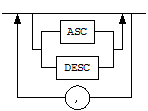
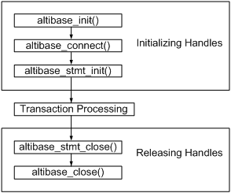
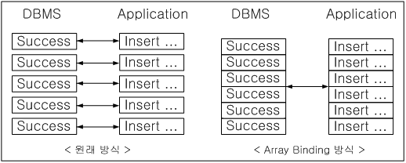

<!-- START doctoc generated TOC please keep comment here to allow auto update -->
<!-- DON'T EDIT THIS SECTION, INSTEAD RE-RUN doctoc TO UPDATE -->


- [Altibase C Interface Manual](#altibase-c-interface-manual)
  - [서문](#%EC%84%9C%EB%AC%B8)
    - [이 매뉴얼에 대하여](#%EC%9D%B4-%EB%A7%A4%EB%89%B4%EC%96%BC%EC%97%90-%EB%8C%80%ED%95%98%EC%97%AC)
  - [1.Altibase C 인터페이스 소개](#1altibase-c-%EC%9D%B8%ED%84%B0%ED%8E%98%EC%9D%B4%EC%8A%A4-%EC%86%8C%EA%B0%9C)
    - [Altibase C 인터페이스란?](#altibase-c-%EC%9D%B8%ED%84%B0%ED%8E%98%EC%9D%B4%EC%8A%A4%EB%9E%80)
    - [ACI 사용 방법](#aci-%EC%82%AC%EC%9A%A9-%EB%B0%A9%EB%B2%95)
    - [클라이언트 응용 프로그램 빌드](#%ED%81%B4%EB%9D%BC%EC%9D%B4%EC%96%B8%ED%8A%B8-%EC%9D%91%EC%9A%A9-%ED%94%84%EB%A1%9C%EA%B7%B8%EB%9E%A8-%EB%B9%8C%EB%93%9C)
  - [2.데이터 타입](#2%EB%8D%B0%EC%9D%B4%ED%84%B0-%ED%83%80%EC%9E%85)
    - [ACI 자료 구조](#aci-%EC%9E%90%EB%A3%8C-%EA%B5%AC%EC%A1%B0)
  - [3.ACI 함수](#3aci-%ED%95%A8%EC%88%98)
    - [altibase_affected_rows()](#altibase_affected_rows)
    - [altibase_client_version()](#altibase_client_version)
    - [altibase_client_verstr()](#altibase_client_verstr)
    - [altibase_close()](#altibase_close)
    - [altibase_commit()](#altibase_commit)
    - [altibase_connect()](#altibase_connect)
    - [altibase_data_seek()](#altibase_data_seek)
    - [altibase_errno()](#altibase_errno)
    - [altibase_error()](#altibase_error)
    - [altibase_fetch_lengths()](#altibase_fetch_lengths)
    - [altibase_fetch_row()](#altibase_fetch_row)
    - [altibase_field()](#altibase_field)
    - [altibase_field_count()](#altibase_field_count)
    - [altibase_free_result()](#altibase_free_result)
    - [altibase_get_charset()](#altibase_get_charset)
    - [altibase_get_charset_info()](#altibase_get_charset_info)
    - [altibase_host_info()](#altibase_host_info)
    - [altibase_init()](#altibase_init)
    - [altibase_list_fields()](#altibase_list_fields)
    - [altibase_list_tables()](#altibase_list_tables)
    - [altibase_next_result()](#altibase_next_result)
    - [altibase_num_fields()](#altibase_num_fields)
    - [altibase_num_rows()](#altibase_num_rows)
    - [altibase_proto_version()](#altibase_proto_version)
    - [altibase_proto_verstr()](#altibase_proto_verstr)
    - [altibase_query()](#altibase_query)
    - [altibase_rollback()](#altibase_rollback)
    - [altibase_server_version()](#altibase_server_version)
    - [altibase_server_verstr()](#altibase_server_verstr)
    - [altibase_set_charset()](#altibase_set_charset)
    - [altibase_set_autocommit()](#altibase_set_autocommit)
    - [altibase_set_failover_callback()](#altibase_set_failover_callback)
    - [altibase_set_option()](#altibase_set_option)
    - [altibase_sqlstate()](#altibase_sqlstate)
    - [altibase_store_result()](#altibase_store_result)
    - [altibase_use_result()](#altibase_use_result)
  - [4.Prepared Statement 관련 ACI 함수](#4prepared-statement-%EA%B4%80%EB%A0%A8-aci-%ED%95%A8%EC%88%98)
    - [altibase_stmt_affected_rows()](#altibase_stmt_affected_rows)
    - [altibase_stmt_bind_param()](#altibase_stmt_bind_param)
    - [altibase_stmt_bind_result()](#altibase_stmt_bind_result)
    - [altibase_stmt_close()](#altibase_stmt_close)
    - [altibase_stmt_data_seek()](#altibase_stmt_data_seek)
    - [altibase_stmt_errno()](#altibase_stmt_errno)
    - [altibase_stmt_error()](#altibase_stmt_error)
    - [altibase_stmt_execute()](#altibase_stmt_execute)
    - [altibase_stmt_fetch()](#altibase_stmt_fetch)
    - [altibase_stmt_fetch_column()](#altibase_stmt_fetch_column)
    - [altibase_stmt_fetched()](#altibase_stmt_fetched)
    - [altibase_stmt_field_count()](#altibase_stmt_field_count)
    - [altibase_stmt_free_result()](#altibase_stmt_free_result)
    - [altibase_stmt_get_attr()](#altibase_stmt_get_attr)
    - [altibase_stmt_init()](#altibase_stmt_init)
    - [altibase_stmt_num_rows()](#altibase_stmt_num_rows)
    - [altibase_stmt_param_count()](#altibase_stmt_param_count)
    - [altibase_stmt_prepare()](#altibase_stmt_prepare)
    - [altibase_stmt_processed()](#altibase_stmt_processed)
    - [altibase_stmt_reset()](#altibase_stmt_reset)
    - [altibase_stmt_result_metadata()](#altibase_stmt_result_metadata)
    - [altibase_stmt_send_long_data()](#altibase_stmt_send_long_data)
    - [altibase_stmt_set_array_bind()](#altibase_stmt_set_array_bind)
    - [altibase_stmt_set_array_fetch()](#altibase_stmt_set_array_fetch)
    - [altibase_stmt_set_attr()](#altibase_stmt_set_attr)
    - [altibase_stmt_sqlstate()](#altibase_stmt_sqlstate)
    - [altibase_stmt_status()](#altibase_stmt_status)
    - [altibase_stmt_store_result()](#altibase_stmt_store_result)
  - [5.Array Binding과 Array Fetch](#5array-binding%EA%B3%BC-array-fetch)
    - [개요](#%EA%B0%9C%EC%9A%94)
    - [Array Binding](#array-binding)
    - [Array Fetch](#array-fetch)
  - [6.Fail-Over](#6fail-over)
    - [개요](#%EA%B0%9C%EC%9A%94-1)
    - [사용법](#%EC%82%AC%EC%9A%A9%EB%B2%95)

<!-- END doctoc generated TOC please keep comment here to allow auto update -->

Altibase® Application Development

Altibase C Interface Manual
===========================


Altibase Application Development ACI Manual

Release 7.1

Copyright ⓒ 2001\~2018 Altibase Corp. All Rights Reserved.

본 문서의 저작권은 ㈜알티베이스에 있습니다. 이 문서에 대하여 당사의 동의 없이
무단으로 복제 또는 전용할 수 없습니다.

㈜알티베이스

08378 서울시 구로구 디지털로 306 대륭포스트타워Ⅱ 10층

전화: 02-2082-1114 팩스: 02-2082-1099

고객서비스포털: <http://support.altibase.com>

homepage: [http://www.altibase.com](http://www.altibase.com/)

서문
----

### 이 매뉴얼에 대하여

이 매뉴얼은 Altibase C API의 사용법에 대해 설명한다.

#### 대상 사용자

이 매뉴얼은 다음과 같은 Altibase 사용자를 대상으로 작성되었다.

-   데이터베이스 관리자

-   성능 관리자

-   데이터베이스 사용자

-   응용 프로그램 개발자

-   기술지원부

다음과 같은 배경 지식을 가지고 이 매뉴얼을 읽는 것이 좋다.

-   컴퓨터, 운영 체제 및 운영 체제 유틸리티 운용에 필요한 기본 지식

-   관계형 데이터베이스 사용 경험 또는 데이터베이스 개념에 대한 이해

-   컴퓨터 프로그래밍 경험

-   데이터베이스 서버 관리, 운영 체제 관리 또는 네트워크 관리 경험

#### 소프트웨어 환경

이 매뉴얼은 데이터베이스 서버로 Altibase 버전 7.1을 사용한다는 가정 하에
작성되었다.

#### 이 매뉴얼의 구성

이 매뉴얼은 다음과 같이 구성되어 있다.

-   제 1장 Altibase C 인터페이스 소개  
    이 장은 Altibase C 인터페이스가 무엇인지 소개하고 기본적인 사용법에 대해서
    설명한다.

-   제 2 장 데이터 타입  
    이 장은 Altibase C 인터페이스와 함께 사용되는 데이터 타입에 대해서 설명한다.

-   제 3 장 함수  
    이 장은 Altibase C 인터페이스 함수의 명세를 기술한다.

-   제 4 장 Prepared Statement 관련 함수  
    이 장은 Prepared Statement와 관련된 Altibase C 인터페이스 함수의 명세를
    기술한다.

-   제 5장 Array Binding과 Array Fetch  
    이 장은 여러 건의 데이터를 한꺼번에 처리하는 방법인 array binding과 array
    fetch에 대해서 설명한다.

-   제 6 장 Fail-Over  
    이 장은 Altibase C 인터페이스를 사용해서 Failover 관련 작업을 수행하는
    방법을 설명한다.

#### 문서화 규칙

이 절에서는 이 매뉴얼에서 사용하는 규칙에 대해 설명한다. 이 규칙을 이해하면 이
매뉴얼과 설명서 세트의 다른 매뉴얼에서 정보를 쉽게 찾을 수 있다.

여기서 설명하는 규칙은 다음과 같다.

-   구문 다이어그램

-   샘플 코드 규칙

##### 구문 다이어그램

이 매뉴얼에서는 다음 구성 요소로 구축된 다이어그램을 사용하여, 명령문의 구문을
설명한다.

| 구성 요소                   | 의미                                                         |
| --------------------------- | ------------------------------------------------------------ |
|  | 명령문이 시작한다. 완전한 명령문이 아닌 구문 요소는 화살표로 시작한다. |
|  | 명령문이 다음 라인에 계속된다. 완전한 명령문이 아닌 구문 요소는 이 기호로 종료한다. |
|  | 명령문이 이전 라인으로부터 계속된다. 완전한 명령문이 아닌 구문 요소는 이 기호로 시작한다. |
|  | 명령문이 종료한다.                                           |
|  | 필수 항목                                                    |
|  | 선택적 항목                                                  |
|  | 선택사항이 있는 필수 항목. 한 항목만 제공해야 한다.          |
|  | 선택사항이 있는 선택적 항목                                  |
|  | 선택적 항목. 여러 항목이 허용된다. 각 반복 앞부분에 콤마가 와야 한다. |

##### 샘플 코드 규칙

코드 예제는 SQL, Stored Procedure, iSQL, 또는 다른 명령 라인 구문들을 예를 들어
설명한다.

아래 테이블은 코드 예제에서 사용된 인쇄 규칙에 대해 설명한다.

| 규칙         | 의미                                                         | 예제                                                         |
| ------------ | ------------------------------------------------------------ | ------------------------------------------------------------ |
| [ ]          | 선택 항목을 표시                                             | VARCHAR [(*size*)][[FIXED \|] VARIABLE]                      |
| { }          | 필수 항목 표시. 반드시 하나 이상을 선택해야 되는 표시        | { ENABLE \| DISABLE \| COMPILE }                             |
| \|           | 선택 또는 필수 항목 표시의 인자 구분 표시                    | { ENABLE \| DISABLE \| COMPILE } [ ENABLE \| DISABLE \| COMPILE ] |
| . . .        | 그 이전 인자의 반복 표시 예제 코드들의 생략되는 것을 표시    | SQL\> SELECT ename FROM employee; <br/>ENAME<br/> ------------------------<br/> SWNO<br/> HJNO<br/> HSCHOI<br/> .<br/> .<br/> . <br/>20 rows selected. |
| 그 밖에 기호 | 위에서 보여진 기호 이 외에 기호들                            | EXEC :p1 := 1; acc NUMBER(11,2);                             |
| 기울임 꼴    | 구문 요소에서 사용자가 지정해야 하는 변수, 특수한 값을 제공해야만 하는 위치 | SELECT \* FROM *table_name*;<br/> CONNECT *userID*/*password*; |
| 소문자       | 사용자가 제공하는 프로그램의 요소들, 예를 들어 테이블 이름, 칼럼 이름, 파일 이름 등 | SELECT ename FROM employee;                                  |
| 대문자       | 시스템에서 제공하는 요소들 또는 구문에 나타나는 키워드       | DESC SYSTEM_.SYS_INDICES_;                                   |

#### 관련 자료

자세한 정보를 위하여 다음 문서 목록을 참조하기 바란다.

-   Installation Guide

-   Administrator’s Manual

-   Replication Manual

-   Precompiler User’s Manual

-   CLI User's Manual

-   iSQL User’s Manual

-   Utilities Manual

-   Error Message Reference

#### Altibase는 여러분의 의견을 환영합니다.

이 매뉴얼에 대한 여러분의 의견을 보내주시기 바랍니다. 사용자의 의견은 다음
버전의 매뉴얼을 작성하는데 많은 도움이 됩니다. 보내실 때에는 아래 내용과 함께
고객서비스포털( http://support.altibase.com/kr/ )로 보내주시기 바랍니다.

-   사용 중인 매뉴얼의 이름과 버전

-   매뉴얼에 대한 의견

-   사용자의 성함, 주소, 전화번호

이 외에도 Altibase 기술지원 설명서의 오류와 누락된 부분 및 기타 기술적인
문제들에 대해서 이 주소로 보내주시면 정성껏 처리하겠습니다. 또한, 기술적인
부분과 관련하여 즉각적인 도움이 필요한 경우에도 고객서비스포털을 통해 서비스를
요청하시기 바랍니다.

여러분의 의견에 항상 감사드립니다.

1.Altibase C 인터페이스 소개
--------------------------

이 장은 Altibase C 인터페이스가 무엇인지 소개하고 기본적인 사용법에 대해서
설명한다.

### Altibase C 인터페이스란?

Altibase C 인터페이스(Altibase C Interface, 앞으로 ACI 라 칭함)는 클라이언트
응용 프로그램에서 Altibase에 접근하기 위해 사용할 수 있는 C 함수이다. C 언어로
클라이언트 응용 프로그램 작성시 ACI를 이용할 수 있다. ACI를 이용해서 Altibase에
연결, 데이터를 조회 또는 조작할 수 있다.

#### ACI vs. CLI

Altibase CLI는 ODBC 표준 인터페이스인 반면, ACI는 Altibase 전용 인터페이스이다.
따라서 ACI를 사용하면 동일한 SQL문을 수행할 때 ODBC보다 적은 수의 함수를
호출하기 때문에 사용이 용이하다.

### ACI 사용 방법

이 절은 ACI를 이용한 응용 프로그램 작성에 필요한 사전 지식을 제공한다.

#### 기본 사용법

ACI 응용 프로그램은 일반적으로 다음의 3단계로 구성된다.

-   초기 설정

-   트랜잭션 처리

-   종료

위 단계에 더해서, 오류 발생시에는 진단 메시지를 확인하는 단계가 추가될 수 있다



#### 초기 설정

이 단계에서는 연결 핸들 및 명령문 핸들을 할당하고 초기화한다. 핸들은 이전 단계의
실행 결과에 관한 정보를 저장하고 있는 메모리 포인터이며, 한 단계에서 다음
단계로의 전이는 적절한 핸들을 전달함으로써 이루어진다. ACI 응용 프로그램 작성을
위해 제공되는 핸들의 종류는 다음과 같다.

##### ALTIBASE 핸들

ALTIBASE 핸들은 ACI가 관리하는 연결과 관련된 정보를 저장하는 메모리 포인터이다.
이 정보에는 연결 상태와 트랜잭션의 상태가 포함된다. 응용 프로그램에서는 각
연결별로 ALTIBASE 핸들을 생성하고 초기화해야 하며, 이 핸들을 이용해서 Altibase로
연결을 시도할 수 있다. 또한, 이 핸들을 사용해서 Altibase에 대해 SQL문을 수행할
수도 있다.

##### ALTIBASE_STMT 핸들

Prepare-Execution 방식으로 SQL문을 수행하려면 ALTIBASE_STMT핸들을 사용해야 한다.
하나의 연결 핸들에 대해 최대 1024개의 ALTIBASE_STMT핸들이 할당될 수 있다.

#### 트랜잭션 처리

다음의 도식은 트랜잭션을 처리하기 위해서 함수가 호출되는 일반적인 절차를
보여준다.


#### 종료

이 단계에서는 핸들과 핸들이 참조하는 정보가 저장된 메모리를 해제하며,
응용프로그램을 종료한다.

#### 진단

진단이란 응용 프로그램 내에서 ACI 함수 호출시 발생한 오류나 경고 상태를 확인하는
것을 말한다. ACI 함수 호출의 반환 값을 검사해서 함수가 성공적으로 수행되었는지
여부를 확인할 수 있다. 함수별 반환값은 3장의 각 함수에 대한 설명을 참고하라.

함수가 성공적으로 수행되지 못한 경우, 진단 메시지가 생성된다. 진단 메시지를
확인하기 위해서, 다음의 함수를 사용할 수 있다. 함수 호출시 사용된 핸들의 종류에
따라서 사용할 수 있는 진단 함수가 달라진다.

<table>
	<tr>
		<td>핸들 타입</td>
		<td>ALTIBASE</td>
		<td>ALTIBASE_STMT</td>
		<td>설명</td>
	</tr>
	<tr>
		<td rowspan="3">함수</td>
		<td>altibase_errno()</td>
		<td>altibase_stmt_errno()</td>
		<td>에러 코드 조회</td>
	</tr>
	<tr>
		<td>altibase_error()</td>
		<td>altibase_stmt_error()</td>
		<td>에러 메시지 조회</td>
	</tr>
	<tr>
		<td>altibase_sqlstate()</td>
		<td>altibase_stmt_sqlstate()</td>
		<td>SQLSTATE 코드 조회</td>
	</tr>
</table>


함수 반환값이 ALTIBASE_SUCCESS, ALTIBASE_NO_DATA_FOUND 및
ALTIBASE_INVALID_HANDLE이 아닌 경우에만 진단 메시지를 조회할 수 있다.

##### 진단 메시지

진단 메시지 중 SQLSTATE 코드는 5개의 알파벳과 숫자로 이루어진 문자열이다. 첫 두
문자는 클래스를 가리키며, 뒤의 세 문자는 하위 클래스를 가리킨다. ACI 진단
메시지는 X/Open SQL CAE 명세를 준수한다.

#### 주의사항

-   멀티 쓰레드 프로그램을 작성할 때, 쓰레드별로 환경 핸들, 연결 핸들을 각각
    할당해야 한다.

-   Altibase 클라이언트 라이브러리는 신호 처리를 하지 않는다. 따라서 외부 원인에
    의해 네트워크 접속이 종료된 경우, SIGPIPE 신호를 받아 진행중인 응용
    프로그램이 강제로 종료될 수 있다.  
    이러한 강제 종료를 막기 위해서는 SIGPIPE 신호를 사용자 응용 프로그램에서
    처리해야 한다. SIGPIPE 신호 처리를 처리하는 함수 내에서 Altibase 클라이언트
    라이브러리 함수를 호출하면 프로그램이 멈출 수도 있으므로, 신호 처리 함수
    작성에 주의해야 한다. 하지만 신호 처리가 끝난 후에는 Altibase 클라이언트
    라이브러리 함수를 호출하는 것이 가능하다.

### 클라이언트 응용 프로그램 빌드

이 절은 클라이언트 응용 프로그램을 빌드하는 데 필요한 헤더 파일과 라이브러리
파일에 대해 기술한다.

#### 헤더 파일

응용 프로그램 작성 시에 포함되고, 컴파일시에 참조되는 헤더 파일은 alticapi.h로,
이는 \$ALTIBASE_HOME/include 디렉토리에 존재한다.

컴파일시에는 컴파일 명령어에 다음의 옵션을 사용하라:

```
-I$ALTIBASE_HOME/include
```

#### 라이브러리 파일

응용 프로그램을 빌드하려면, 컴파일된 오브젝트 파일을 Altibase가 제공하는 ACI
라이브러리 및 ODBC 라이브러리와 함께 링크해야 한다. 이들 라이브러리는 아래의
파일들이며, \$ALTIBASE_HOME/lib 디렉토리에 존재한다.

-   libalticapi.a

-   libodbccli.a

링크시에는 링크 명령어에 다음의 옵션을 사용하라:

```
-L$ALTIBASE_HOME/lib -lalticapi -lodbccli
```

2.데이터 타입
-----------

이 장은 Altibase C 인터페이스와 함께 사용되는 데이터 타입에 대해서 설명한다.

### ACI 자료 구조

이 절은 Altibase C 인터페이스의 자료 구조들을 기술한다. 이 자료 구조들은 응용
프로그램 작성 시 ACI 함수들과 함께 사용될 것이다. 자료 구조들은 크게 다음과 같이
분류된다.

-   핸들 타입

-   구조체 타입

-   그 외 데이터 타입

#### 핸들

ACI 핸들에는 다음의 세 개가 있다.

-   ALTIBASE

-   ALTIBASE_STMT

-   ALTIBASE_RES

##### ALTIBASE

ALTIBASE는 데이터베이스에 대한 연결 핸들이다. 연결 핸들은 대부분의 ACI 함수에
사용된다. 반드시 altibase_init()을 이용해서 이 핸들을 초기화하고,
altibase_close()를 이용해서 이 핸들을 해제해야 한다.

연결 핸들은 하나의 결과 집합 핸들(ALTIBASE_RES)만을 반환하고 관리한다. 즉,
하나의 결과 집합을 사용하다가 다른 결과 집합의 핸들을 얻으려면, 먼저 사용중인
결과 집합 핸들을 해제해야 한다.

##### ALTIBASE_STMT

ALTIBASE_STMT는 명령문 핸들이다. Prepare-execution방식으로 SQL문을 수행하려면,
이 핸들을 사용해야 한다. 또한, SQL문에 파라미터 마크가 포함되어 있거나 SELECT
문의 결과를 변수 바인딩을 통해 가져오려면 반드시 준비된 문장(prepared
statement)을 사용해야 한다.

반드시 altibase_stmt_init()을 이용해서 이 핸들을 초기화하고,
altibase_stmt_close()를 이용해서 이 핸들을 해제해야 한다.

##### ALTIBASE_RES

ALTIBASE_RES는 질의 결과 집합에 대한 핸들이다. 이 핸들을 이용해서 질의 결과
집합과 칼럼의 정보를 얻을 수 있다.

이 핸들은 altibase_use_result() 또는 altibase_store_result() 함수를 통해 얻을 수
있으며, 핸들 사용 후에는 반드시 altibase_free_result()를 사용해서 해제해야 한다.

#### 구조체 타입

ACI와 함께 사용 가능한 데이터 구조체는 다음과 같다.

-   struct ALTIBASE_BIND

-   struct ALTIBASE_CHARSET_INFO

-   struct ALTIBASE_FIELD

-   struct ALTIBASE_NUMERIC

-   struct ALTIBASE_TIMESTAMP

##### struct ALTIBASE_BIND

이 구조체는 입출력 변수 바인딩시 사용되며, 사용자는 바인딩 정보를 여기에
지정한다. altibase_stmt_bind_param()는 입력 파라미터를 위한 버퍼를 바인딩하는
함수이고, altibase_stmt_bind_result()는 조회된 결과 집합의 칼럼 데이터를 가져올
버퍼를 바인딩하는 함수이다.

이 구조체는 다음과 같은 멤버를 포함한다.

| 구조체 멤버   | 타입               | 설명                                                                                                                                                                                                                                                                                                                                                                                                                                                                                                                                                                                                                                                                                                                                                                                                                                                                                        |
|---------------|--------------------|---------------------------------------------------------------------------------------------------------------------------------------------------------------------------------------------------------------------------------------------------------------------------------------------------------------------------------------------------------------------------------------------------------------------------------------------------------------------------------------------------------------------------------------------------------------------------------------------------------------------------------------------------------------------------------------------------------------------------------------------------------------------------------------------------------------------------------------------------------------------------------------------|
| buffer_type   | ALTIBASE_BIND_TYPE | 바인딩할 buffer의 타입을 지정하는데 사용되는 멤버 변수이다. "enum ALTIBASE_BIND_TYPE"를 참고하라.                                                                                                                                                                                                                                                                                                                                                                                                                                                                                                                                                                                                                                                                                                                                                                                           |
| buffer        | void \*            | 입출력 데이터를 담는 버퍼를 가리키는 포인터이다. 입력 바인딩의 경우, buffer는 SQL문에 물음표(?)로 표시된 파라미터에 바인딩될 변수일 것이다. 출력 바인딩의 경우, buffer는 조회된 결과 집합의 각 칼럼 값을 저장할 변수일 것이다.                                                                                                                                                                                                                                                                                                                                                                                                                                                                                                                                                                                                                                                              |
| buffer_length | ALTIBASE_LONG      | buffer의 실제 크기를 지정하는 데 사용되는 멤버 변수이다. 길이가 고정된 데이터 타입의 변수로 바인딩 할 때는 이 멤버의 값을 설정하지 않아도 된다. 그러나 설정을 생략하려면 반드시 이 값이 0으로 초기화 되어 있어야 한다. 다음 타입에 대해서만 길이 설정을 생략할 수 있다: ALTIBASE_BIND_SMALLINT, ALTIBASE_BIND_INTEGER, ALTIBASE_BIND_BIGINT, ALTIBASE_BIND_REAL, ALTIBASE_BIND_DOUBLE, ALTIBASE_BIND_DATE 그러나, ALTIBASE_BIND_STRING과 같이 길이가 정해져 있지 않은 데이터 타입의 변수로 바인딩 할 때는 반드시 buffer_length를 올바른 값으로 설정해야 한다. 출력 변수 바인딩시, 만약 buffer_length에 설정된 크기보다 가져온 데이터의 길이가 더 길다면 buffer_length에 설정된 길이 만큼만 buffer에 저장될 것이다. 예를 들어 int 값을 얻을 때 buffer_length에 4 대신 2를 주면, int 값의 처음 2바이트만 buffer에 복사된다. 올바른 값을 얻으려면 반드시 buffer_length를 바르게 설정해야 한다. |
| length        | ALTIBASE_LONG \*   | 데이터의 실제 길이를 지정하는데 사용되는 멤버 변수이다. short, int 처럼 데이터 길이가 고정되어 있는 경우에는 이 변수 값을 설정하지 않아도 된다. 문자열이나 바이너리 데이터를 입력 바인딩할 경우, 데이터의 길이가 버퍼의 크기보다 작을 수 있으므로 이 변수에 데이터의 실제 길이를 설정해야 한다. 출력 바인딩으로 사용되었을 때, 이 변수의 값이 ALTIBASE_NULL_DATA로 반환되면, 이는 조회된 칼럼의 데이터가 NULL임을 나타낸다.                                                                                                                                                                                                                                                                                                                                                                                                                                                                 |
| is_null       | ALTIBASE_BOOL \*   | 출력 바인딩으로 사용되었을 때, 조회된 칼럼의 데이터가 NULL이면 여기에 ALTIBASE_TRUE가 반환된다. 칼럼 데이터를 사용하기 전에 먼저 이 변수를 이용해서 해당 데이터가 NULL인지 여부를 확인할 것을 권장한다.                                                                                                                                                                                                                                                                                                                                                                                                                                                                                                                                                                                                                                                                                     |
| error         | int                | 바인딩 수행 결과를 반환하는 멤버 변수이다. 바인딩에 실패했을 때, 이 변수 값을 확인하면 어떤 인자의 바인딩에 실패했는지 알 수 있다. error 값은 altibase_errno()로 얻을 수 있는 에러 번호 중 하나로 반환된다. 이에 대한 자세한 내용은 altibase_errno()를 참고한다.                                                                                                                                                                                                                                                                                                                                                                                                                                                                                                                                                                                                                            |

##### struct ALTIBASE_CHARSET_INFO

문자 집합 (Character Set) 정보가 담긴 구조체이다. altibase_get_charset_info()
함수 호출시 이 구조체로 문자 집합에 대한 정보가 반환된다.

이 구조체는 다음과 같은 멤버를 포함한다.

| 구조체 멤버 | 타입         | 설명                                                   |
|-------------|--------------|--------------------------------------------------------|
| id          | unsigned int | 문자 집합 식별자                                       |
| name        | void \*      | 문자셋의 이름                                          |
| name_length | int          | 문자 집합 이름의 길이                                  |
| mbmaxlen    | int          | 한 문자를 저장하기 위해 필요한 최대 크기 (바이트 단위) |

##### struct ALTIBASE_FIELD

SELECT 문으로 조회되는 결과 집합의 칼럼 정보가 담긴 구조체이다. altibase_field()
또는 altibase_fields() 함수를 이용해서 칼럼 정보를 이 구조체 타입으로 구할 수
있다. 이렇게 얻은 구조체 포인터가 가리키는 메모리의 값은 ACI 내부적으로
관리되므로, 사용자가 임의로 값을 변경하거나 해제해서는 안 된다.

이 구조체는 다음의 멤버를 포함한다.

| 구조체 멤버      | 타입                               | 설명                                                                                                        |
|------------------|------------------------------------|-------------------------------------------------------------------------------------------------------------|
| type             | ALTIBASE_FIELD_TYPE                | 칼럼의 데이터 타입                                                                                          |
| name             | char [ALTIBASE_MAX_FIELD_NAME_LEN] | 칼럼의 이름. 질의에서 칼럼에 별칭(alias)를 준 경우, 이 값은 주어진 별칭이 될 것이다.                        |
| name_length      | int                                | name의 길이                                                                                                 |
| org_name         | char [ALTIBASE_MAX_FIELD_NAME_LEN] | 칼럼의 이름                                                                                                 |
| org_name_length  | int                                | org_name의 길이                                                                                             |
| table            | char [ALTIBASE_MAX_TABLE_NAME_LEN] | 이 칼럼을 포함하는 테이블의 이름. 질의에서 테이블에 별칭(alias)를 준 경우, 이 값은 주어진 별칭이 될 것이다. |
| table_length     | int                                | table의 길이                                                                                                |
| org_table        | char [ALTIBASE_MAX_TABLE_NAME_LEN] | 테이블 이름                                                                                                 |
| org_table_length | int                                | org_table의 길이                                                                                            |
| size             | int                                | 칼럼 크기 또는 숫자형 타입의 precision                                                                      |
| scale            | int                                | 숫자형 타입의 scale                                                                                         |

##### struct ALTIBASE_NUMERIC

숫자형 데이터를 저장하는 구조체이다. NUMERIC 타입의 데이터를 가져올 때 사용된다.

이 구조체는 다음의 멤버를 포함한다.

| 구조체 멤버 | 타입                                     |
|-------------|------------------------------------------|
| precision   | unsigned char                            |
| scale       | unsigned char                            |
| sign        | char                                     |
| val         | unsigned char [ALTIBASE_MAX_NUMERIC_LEN] |

##### struct ALTIBASE_TIMESTAMP

날짜형 데이터를 저장하는 구조체이다. DATE 타입의 데이터를 가져올 때 사용된다.

이 구조체는 다음의 멤버를 포함한다.

| 구조체 멤버 | 타입           | 설명       |
|-------------|----------------|------------|
| year        | short          | 년         |
| month       | unsigned short | 월         |
| day         | unsigned short | 일         |
| hour        | unsigned short | 시         |
| minute      | unsigned short | 분         |
| second      | unsigned short | 초         |
| fraction    | int            | 1/100000초 |

#### 그 외 타입

위에서 설명한 핸들과 구조체 외에 다음의 타입이 사용될 수 있다.

-   ALTIBASE_ROW

-   ALTIBASE_LONG

-   ALTIBASE_NTS

-   enum ALTIBASE_BIND_TYPE

-   enum ALTIBASE_FAILOVER_EVENT

-   enum ALTIBASE_FIELD_TYPE

-   enum ALTIBASE_OPTION

-   enum ALTIBASE_STMT_ATTR_TYPE

##### ALTIBASE_ROW

이 타입은 질의 결과의 한 행을 타입 안전 방식으로 표현(type-safe
representation)한다. SELECT와 같이 결과 집합을 반환하는 질의를
altibase_query()로 실행한 후, altibase_fetch_row()를 호출해서 이 타입의 값을
얻을 수 있다.

각 칼럼의 값은 문자열 또는 바이너리 데이터로 구성된다. BLOB, BYTE, NIBBLE, BIT,
VARBIT, GEOMETRY 타입의 칼럼 값은 바이너리로 표현되며, 그 외의 데이터 타입 값은
문자열로 표현된다.

특히, NIBBLE, BIT, VARBIT타입은 특별한 형식을 가진다. NIBBLE은 4비트, BIT는
1비트 단위로 값이 이루어져 있으므로, 이를 사용자가 인식하기 쉬운 값으로 얻기
위해서는 GET_NIBBLE_VALUE(), GET_BIT_VALUE()와 같은 매크로를 사용하면 된다.
매크로 정의는 alticapi.h 헤더 파일을 참조하라.

이 타입의 값 (내부적으로 char 포인터)이 가리키는 메모리는 내부에서 관리되므로
사용자가 임의로 변경하거나 해제를 시도해서는 절대 안 된다.

##### ALTIBASE_LONG

32비트 또는 64비트 정수형이다. ODBC스펙에 정의된 SQLLEN타입과 동일하다. 이
타입은 행 번호나 행의 개수를 나타내는데 사용된다.

##### ALTIBASE_NTS

이는 데이터가 널로 끝나는 문자열임을 나타내기 위해 사용되는 매크로이다. 문자열을
입력 바인딩할 때, 데이터 길이를 실제 길이 대신에 이 값으로 설정할 수 있다.

바이너리 데이터를 입력 바인딩 할 때는, 데이터 길이를 ALTIBASE_NTS로 설정하면
안된다.

##### enum ALTIBASE_BIND_TYPE

바인딩할 데이터의 타입을 지정할 때 사용된다.

이 열거형의 원소는 다음과 같다.

| 원소                   | 설명                                                                                                                                                               |
|------------------------|--------------------------------------------------------------------------------------------------------------------------------------------------------------------|
| ALTIBASE_BIND_NULL     | NULL 데이터를 칼럼에 입력하고자 할 때 사용된다. ALTIBASE_BIND 구조체의 is_null 멤버 변수를 ALTIBASE_TRUE로 설정한 것과 같다. 파라미터를 바인딩 할 때만 쓸 수 있다. |
| ALTIBASE_BIND_BINARY   | 바이너리 데이터. BYTE, NIBBLE, BIT, VARBIT, BLOB, GEOMETRY 타입에 데이터 입력시 사용된다.                                                                          |
| ALTIBASE_BIND_STRING   | 문자열. CHAR, VARCHAR, NCHAR, NVARCHAR 타입에 데이터 입력시 사용된다.                                                                                              |
| ALTIBASE_BIND_WSTRING  | 유니코드 문자열                                                                                                                                                    |
| ALTIBASE_BIND_SMALLINT | 16비트 정수. SMALLINT 타입에 데이터 입력시 사용된다.                                                                                                               |
| ALTIBASE_BIND_INTEGER  | 32비트 정수. INTEGER 타입에 데이터 입력시 사용된다.                                                                                                                |
| ALTIBASE_BIND_BIGINT   | 64비트 정수. BIGINT 타입에 데이터 입력시 사용된다.                                                                                                                 |
| ALTIBASE_BIND_REAL     | 실수. REAL 타입에 데이터 입력시 사용된다.                                                                                                                          |
| ALTIBASE_BIND_DOUBLE   | 배정밀도 실수. DOUBLE 타입에 데이터 입력시 사용된다.                                                                                                               |
| ALTIBASE_BIND_NUMERIC  | 숫자형 데이터. NUMERIC, DECIMAL, NUMBER, FLOAT 타입에 데이터 입력시 사용된다.                                                                                      |
| ALTIBASE_BIND_DATE     | 날짜와 시간. DATE 타입에 데이터 입력시 사용된다.                                                                                                                   |

##### enum ALTIBASE_FAILOVER_EVENT

Failover 이벤트를 나타내는 열거형이다. Failover 콜백 함수를 등록했다면, 등록된
함수의 event 인자를 통해서 이 열거형 원소 중의 한 값이 전달된다. 또한, 사용자는
콜백 함수에서 이 열거형 값 중의 하나를 반환해서 Failover의 다음 작업 과정을 계속
진행할 지 여부를 지정할 수 있다. 이에 대한 자세한 내용은 6장. FailOver 를
참고한다.

이 열거형의 원소는 다음과 같다.

| 원소              | 설명                                                                                          |
|-------------------|-----------------------------------------------------------------------------------------------|
| ALTIBASE_FO_BEGIN | STF가 시작됨을 콜백 함수에 알리는 값이다.                                                     |
| ALTIBASE_FO_END   | STF가 성공하였음을 콜백 함수에 알리는 값이다.                                                 |
| ALTIBASE_FO_ABORT | STF가 실패하였음을 콜백 함수에 알리는 값이다.                                                 |
| ALTIBASE_FO_GO    | 사용자가 콜백 함수에서 라이브러리로 STF의 다음 과정을 진행하라는 의미로 반환하는 값이다.      |
| ALTIBASE_FO_QUIT  | 사용자가 콜백 함수에서 라이브러리로 STF의 다음 과정을 진행하지 말라는 의미로 반환하는 값이다. |

##### enum ALTIBASE_FIELD_TYPE

이는 칼럼의 데이터 타입이 포함된 열거형이다.

숫자 타입인지 확인하기 위해 IS_NUM_TYPE() 매크로를 사용할 수 있다. 숫자 타입에는
SMALLINT, INTEGER, BIGINT, REAL, DOUBLE, FLOAT, NUMERIC이 있다.

바이너리 타입인지 확인하기 위해 IS_BIN_TYPE() 매크로을 사용할 수 있다. 바이너리
타입에는 BYTE, BLOB, NIBBLE, BIT, VARBIT, GEOMETRY가 있다.

IS_NUM_TYPE()과 IS_BIN_TYPE() 매크로의 정의는 alticapi.h 헤더 파일을 참조하라.

이 열거형의 원소는 다음과 같다.

| 원소                   | 설명     |
|------------------------|----------|
| ALTIBASE_TYPE_CHAR     | CHAR     |
| ALTIBASE_TYPE_VARCHAR  | VARCHAR  |
| ALTIBASE_TYPE_NCHAR    | NCHAR    |
| ALTIBASE_TYPE_NVARCHAR | NVARCHAR |
| ALTIBASE_TYPE_SMALLINT | SMALLINT |
| ALTIBASE_TYPE_INTEGER  | INTEGER  |
| ALTIBASE_TYPE_BIGINT   | BIGINT   |
| ALTIBASE_TYPE_REAL     | REAL     |
| ALTIBASE_TYPE_DOUBLE   | DOUBLE   |
| ALTIBASE_TYPE_FLOAT    | FLOAT    |
| ALTIBASE_TYPE_NUMERIC  | NUMERIC  |
| ALTIBASE_TYPE_DATE     | DATE     |
| ALTIBASE_TYPE_BLOB     | BLOB     |
| ALTIBASE_TYPE_CLOB     | CLOB     |
| ALTIBASE_TYPE_BYTE     | BYTE     |
| ALTIBASE_TYPE_NIBBLE   | NIBBLE   |
| ALTIBASE_TYPE_BIT      | BIT      |
| ALTIBASE_TYPE_VARBIT   | VARBIT   |
| ALTIBASE_TYPE_GEOMETRY | GEOMETRY |

##### enum ALTIBASE_OPTION

서버와의 연결 속성을 설정할 때 사용되는 열거형이다. 이 중 ALTIBASE_AUTOCOMMIT
속성은 altibase_set_autocommit() 함수를 사용해서 설정하기를 권장한다.

이 열거형의 원소 (즉, 연결 속성)와 각 속성에 지정할 수 있는 값의 타입 및 최대
크기는 다음과 같다.

| 원소 (연결 속성)                   | 속성 값의 타입 | 속성 값의 최대 크기           | 설명                                                                                                                                                                                                                                                                                                |
|------------------------------------|----------------|-------------------------------|-----------------------------------------------------------------------------------------------------------------------------------------------------------------------------------------------------------------------------------------------------------------------------------------------------|
| ALTIBASE_AUTOCOMMIT                | int            | sizeof(int)                   | AUTOCOMMIT 여부를 설정하는 속성. 속성의 값은 32비트 크기이다. 이 속성의 값은 ALTIBASE_AUTOCOMMIT_ON 또는 ALTIBASE_AUTOCOMMIT_OFF 로 설정할 수 있다.                                                                                                                                                 |
| ALTIBASE_CONNECTION_TIMEOUT        | int            | sizeof(int)                   | 네트워크 불안정으로 인해 데이터 송수신 시 발생할 수 있는 블록킹을 방지하기 위한 타임아웃 값을 설정하는 속성                                                                                                                                                                                         |
| ALTIBASE_PORT                      | int            | sizeof(int)                   | Altibase 서버의 포트 번호를 설정하는 속성                                                                                                                                                                                                                                                           |
| ALTIBASE_TXN_ISOLATION             | int            | sizeof(int)                   | 트랜잭션의 고립화 수준을 설정하는 속성                                                                                                                                                                                                                                                              |
| ALTIBASE_APP_INFO                  | char \*        | ALTIBASE_MAX_APP_INFO_LEN     | 클라이언트 식별자를 지정하는 속성. 클라이언트에 대한 보다 정확한 정보를 설정하기 위해 사용된다.                                                                                                                                                                                                     |
| ALTIBASE_DATE_FORMAT               | char \*        | ALTIBASE_MAX_DATE_FORMAT_LEN  | 날짜 형식을 지정하는 속성. 기본값은 "YYYY/MM/DD HH:MI:SS"이다.                                                                                                                                                                                                                                      |
| ALTIBASE_NLS_USE                   | char \*        | ALTIBASE_MAX_NLS_USE_LEN      | 클라이언트 사용 언어를 지정하는 속성. (US7ASCII: 영어, KO16KSC5601: 한국어)                                                                                                                                                                                                                         |
| ALTIBASE_NLS_NCHAR_LITERAL_REPLACE | int            | sizeof(int)                   | SQL 구문에 NCHAR 리터럴 문자열이 존재하는지 검사 여부를 설정하는 속성.                                                                                                                                                                                                                              |
| ALTIBASE_IPC_FILEPATH              | char \*        | ALTIBASE_MAX_IPC_FILEPATH_LEN | 유닉스 환경에서 서버와 클라이언트가 IPC로 접속할 때 ALTIBASE_HOME이 서로 다르다면, 유닉스 도메인의 소켓 경로가 일치하지 않아 접속이 불가능하다. 이 때 이 속성의 값을 서버의 \$ALTIBASE_HOME/trc/cm-ipc 파일로 설정하여 서버와 클라이언트가 같은 소켓 파일을 사용하도록 하면, IPC 접속이 가능해진다. |

##### enum ALTIBASE_STMT_ATTR_TYPE

명령문 핸들에 대한 속성을 설정하기 위해 사용되는 열거형이다.

이 열거형의 원소는 다음과 같다.

| 원소 (명령문 속성)              | 속성 값의 타입 | 속성 값의 최대 크기 | 설명                                                                                                                                                                                                                                                                                                                                                                                                                                                                                                                                                                                                                                                                                                                                                                                            |
|---------------------------------|----------------|---------------------|-------------------------------------------------------------------------------------------------------------------------------------------------------------------------------------------------------------------------------------------------------------------------------------------------------------------------------------------------------------------------------------------------------------------------------------------------------------------------------------------------------------------------------------------------------------------------------------------------------------------------------------------------------------------------------------------------------------------------------------------------------------------------------------------------|
| ALTIBASE_STMT_ATTR_ATOMIC_ARRAY | int            | sizeof(int)         | Atomic Array Insert 사용 여부를 설정하는 속성이다. 일반적인 Array Insert의 경우 배열 내의 각 SQL문이 서버에서 다른 statement로 처리되는 것에 비해, Atomic Array Insert는 배열에 속한 모든 SQL문들이 서버에서 한 개의 statement로 처리된다. 이 속성은 ALTIBASE_ATOMIC_ARRAY_ON 또는 ALTIBASE_ATOMIC_ARRAY_OFF로 설정할 수 있다. 이 외의 값을 설정하면 에러가 발생한다. ALTIBASE_ATOMIC_ARRAY_ON을 설정하면 Atomic Array Insert 방식으로 실행된다. 그러나 Atomic Array Insert가 기존의 Array Insert보다 빠른 성능을 발휘하기 위해서는 Array Size를 지정해야 한다. Atomic Array Insert 수행 시에는 배열에 속한 모든 SQL문들이 서버에서 한 개의 statement로 처리되므로, altibase_stmt_status(), altibase_stmt_processed()가 반환하는 결과값 (반환 타입이 배열이다)의 첫 번째 요소 값 만이 유효하다. |

#### 데이터 타입간의 관계

아래의 그림은 ACI의 각 핸들과 데이터 타입들 사이의 관계를 보여준다.


위 관계도를 보면 ALTIBASE_STMT 핸들을 사용해서 얻은 ALTIBASE_RES로는
ALTIBASE_ROW를 얻을 수 없음을 알 수 있다(점선으로 표시). ALTIBASE_ROW는 바인딩
없이 SQL문을 직접 수행(direct execution)하는 altibase_query() 관련 함수를
통해서만 구할 수 있다. 이에 대한 자세한 내용은 각 함수의 설명을 참고하라.

3.ACI 함수
--------

이 장은 Altibase C 인터페이스 함수들 중 연결 핸들인 ALTIBASE 핸들을 사용하는
함수들의 명세를 기술한다. 각 ACI 함수 별로 다음의 정보가 제공된다.

-   함수명: 사용 목적

-   구문: 이 함수의 C 언어 프로토타입

-   인자: 함수의 각 인자별 자료 유형, 입/출력, 부연 설명

-   반환 값: 반환 가능한 이 함수의 리턴 값

-   설명: 함수 사용 방법 및 주의 사항

-   관련 함수: 이 함수와 관련된 함수 리스트

-   예제: 이 함수가 사용된 소스 코드의 일부

### altibase_affected_rows()

바로 이전에 실행한 UPDATE, DELETE 또는 INSERT 문에 의해 영향을 받은 레코드의
수를 구하는 함수이다.

#### 구문

```
ALTIBASE_LONG  altibase_affected_rows (
    ALTIBASE altibase );
```

#### 인자

| 자료유형 | 인자       | 입/출력 | 설명      |
|----------|------------|---------|-----------|
| ALTIBASE | *altibase* | 입력    | 연결 핸들 |

#### 반환값

| 반환값                       | 설명                                          |
|------------------------------|-----------------------------------------------|
| 0 보다 큰 값                 | SQL문에 의해 영향을 받은 레코드의 개수        |
| 0                            | SQL문에 의해 영향을 받은 레코드가 없음        |
| ALTIBASE_INVALID_AFFECTEDROW | UPDATE, DELETE, 또는 INSERT 수행 중 에러 발생 |

#### 설명

이 함수는 마지막으로 수행한 SQL문의 종류에 따라 다음과 같은 값을 반환한다:

-   UPDATE 문: 변경된 레코드 수

-   DELETE 문: 삭제된 레코드 수

-   INSERT 문: 추가된 레코드 수

만약 마지막으로 수행한 SQL문이 SELECT 문이었다면 이 함수는 0을 반환할 것이다.
SELECT 문에 의해 선택된 레코드의 개수를 얻고자 할 때는 altibase_num_rows()를
사용해야 한다.

#### 예제

```
#define QSTR "UPDATE employees SET salary = salary * 1.1 WHERE group = 1"

rc = altibase_query(altibase, QSTR);
/* ... check return value ... */

printf("%ld updated\n", altibase_affected_rows(altibase));
```

### altibase_client_version()

클라이언트 라이브러리의 버전을 구하는 함수이다.

#### 구문

```
int  altibase_client_version( void );
```

#### 반환값

클라이언트 라이브러리 버전을 나타내는 상수가 반환된다.

#### 설명

이 함수는 클라이언트 라이브러리의 버전을 나타내는 상수를 반환한다. 반환값의
형식은 MMmmttSSpp이며 각각의 의미는 다음과 같다.

| 형식 | 설명    | 비고                                                                  |
|------|---------|-----------------------------------------------------------------------|
| MM   | 주버전  |                                                                       |
| mm   | 부버전  | 버전의 자리수가 2보다 작을 경우, 나머지 자리는 0으로 채워서 반환된다. |
| tt   | 텀      | 버전의 자리수가 2보다 작을 경우, 나머지 자리는 0으로 채워서 반환된다. |
| SS   | 패치 셋 | 버전의 자리수가 2보다 작을 경우, 나머지 자리는 0으로 채워서 반환된다. |
| pp   | 패치    | 버전의 자리수가 2보다 작을 경우, 나머지 자리는 0으로 채워서 반환된다. |

예를 들어, 이 함수의 반환값이 605010309이면 클라이언트 라이브러리의 버전은
7.1.0.3.9이다.

### altibase_client_verstr()

클라이언트 라이브러리의 버전을 구하는 함수이다.

#### 구문

```
const char *  altibase_client_verstr ( void );
```

#### 반환값

클라이언트 라이브러리 버전을 나타내는 문자열이 반환된다.

#### 설명

이 함수는 클라이언트 라이브러리의 버전을 나타내는 문자열을 반환한다. 반환값의
형식은 x.x.x.x.x이며 순서대로 주버전, 부버전, 텀, 패치 셋, 패치를 의미한다.

이 함수가 반환한 char 포인터가 가리키는 메모리는 라이브러리 내부에서 관리되므로
절대로 사용자가 임의로 변경하거나 해제해서는 안 된다.

### altibase_close()

서버와의 연결을 닫는 함수이다.

#### 구문

```
int  altibase_close (
    ALTIBASE altibase );
```

#### 인자

| 자료유형 | 인자       | 입/출력 | 설명      |
|----------|------------|---------|-----------|
| ALTIBASE | *altibase* | 입력    | 연결 핸들 |

#### 반환값

함수 수행에 성공하면 ALTIBASE_SUCCESS, 실패하면 ALTIBASE_ERROR이 반환된다.

#### 설명

이 함수는 서버와의 연결을 종료하고, 연결 핸들을 위해 할당된 모든 자원을
해제한다.

이 함수가 호출되면 인자로 전달되는 연결 핸들에 속한 모든 명령문 핸들
(ALTIBASE_STMT)에 관련된 SQL문 처리가 중단되고 그 결과들은 폐기되며 이들 명령문
핸들과 관련된 모든 자원도 해제된다.

연결 핸들을 사용해서 반환 받은 결과 집합 핸들이 있다면, 이 함수를 실행하기 전에
반드시 altibase_free_result() 함수를 호출해서 결과 집합 핸들을 먼저 해제해야
한다.

#### 예제

```
altibase = altibase_init();
if (altibase == NULL)
{
    return 1;
}

/* ... omit ... */

rc = altibase_close(altibase);
/* ... check return value ... */
```

### altibase_commit()

이 함수는 현재 트랜잭션을 커밋한다.

#### 구문

```
int  altibase_commit (
    ALTIBASE altibase );
```

#### 인자

| 자료유형 | 인자       | 입/출력 | 설명      |
|----------|------------|---------|-----------|
| ALTIBASE | *altibase* | 입력    | 연결 핸들 |

#### 반환값

함수 수행에 성공하면 ALTIBASE_SUCCESS, 실패하면 ALTIBASE_ERROR이 반환된다.

#### 설명

이 함수는 현재 연결된 세션에서 수행중인 트랜잭션을 커밋한다. 해당 세션이
AUTOCOMMIT 모드가 아닌 경우, 이 함수 수행 후 다음 SQL문 실행시에 자동으로 새로운
트랜잭션이 시작된다

#### 예제

altibase_set_autocommit()의 예제를 참고하라.

### altibase_connect()

서버에 접속하는 함수이다.

#### 구문

```
int  altibase_connect (
    ALTIBASE      altibase,
    const char*  connstr );
```

#### 인자

| 자료유형     | 인자       | 입/출력 | 설명             |
|--------------|------------|---------|------------------|
| ALTIBASE     | *altibase* | 입력    | 연결 핸들        |
| const char\* | *connstr*  | 입력    | 연결 속성 문자열 |

#### 반환값

함수 수행에 성공하면 ALTIBASE_SUCCESS이, 실패하면 ALTIBASE_ERROR이 반환된다.

#### 설명

이 함수는 사용자가 명시한 연결 속성을 사용하여 서버에 연결한다. 연결 속성에는
DSN, PORT_NO, UID, PWD, CONNTYPE, NLS_USE 등이 있다. 이에 대한 자세한 내용은
*CLI User's Manual*를 참고하기 바란다.

연결 속성 문자열은 반드시 NULL 종료 문자열이어야 한다.

#### 예제

```
#define CONNSTR "DSN=127.0.0.1;PORT_NO=20300;UID=sys;PWD=manager"

ALTIBASE altibase;

altibase = altibase_init();
/* ... check return value ... */

rc = altibase_set_option(altibase, ALTIBASE_APP_INFO, "your_app_name");
/* ... check return value ... */

rc = altibase_connect(altibase, CONNSTR);
if (ALTIBASE_NOT_SUCCEEDED(rc))
{
    fprintf(stderr, "Failed to connect : %s\n", altibase_error(altibase));
}
```

### altibase_data_seek()

질의 결과 집합에서 가져올 행의 위치를 지정하는 함수이다.

#### 구문

```
int  altibase_data_seek (
    ALTIBASE_RES    result,
    ALTIBASE_LONG   offset );
```

#### 인자

| 자료유형      | 인자     | 입/출력 | 설명                                 |
|---------------|----------|---------|--------------------------------------|
| ALTIBASE_RES  | *result* | 입력    | 결과 집합 핸들                       |
| ALTIBASE_LONG | *offset* | 입력    | 다음에 가져올 행의 위치 (0부터 시작) |

#### 반환값

함수 수행에 성공하면 ALTIBASE_SUCCESS, 실패하면 ALTIBASE_ERROR이 반환된다.

#### 설명

이 함수는 결과 집합에서 다음에 가져올 행의 위치를 특정 위치로 이동시킨다. 위치로
지정하는 행 번호의 값은 0부터 (결과 집합의 행 개수 – 1) 까지의 값이어야 한다.

altibase_store_result() 호출 이후에만 이 함수를 실행할 수 있다.

#### 예제

```
#define QSTR "SELECT last_name, first_name FROM friends"

rc = altibase_qeury(altibase, QSTR);
/* ... check return value ... */

result = altibase_store_result(altibase);
/* ... check return value ... */

row_count = altibase_num_rows(result);
for (i = 0; i < row_count; i++)
{
    rc = altibase_data_seek(result, i);
    if (ALTIBASE_NOT_SUCCEEDED(rc))
    {
        printf("ERR : %d : ", i, altibase_error());
        continue;
    }

    /* ... omit ... */
}

rc = altibase_free_result(result);
/* ... check return value ... */
```

### altibase_errno()

바로 이전에 실행된 함수에서 발생한 오류의 에러 코드를 구하는 함수이다.

#### 구문

```
unsigned int  altibase_errno (
    ALTIBASE altibase );
```

#### 인자

| 자료유형 | 인자       | 입/출력 | 설명      |
|----------|------------|---------|-----------|
| ALTIBASE | *altibase* | 입력    | 연결 핸들 |

#### 반환값

바로 이전에 호출된 함수가 성공했으면 0, 실패했으면 에러 코드가 반환된다.

#### 설명

이 함수는 바로 이전에 실행된 함수가 실패했을 경우, 실패 원인을 알려주는 에러
코드를 반환한다.

바로 이전에 실행된 함수가 실패했더라도, 모든 함수에 대해서 에러 코드가
반환되지는 않는다. 직전에 수행된 함수가 주로 SQL문 수행과 관련된 함수였을
경우에만 에러 코드가 생성된다. 에러 코드에 대한 자세한 내용은 *Error Message
Reference*를 참고한다.

어떤 함수 수행시 오류가 발생한 경우 바로 오류를 확인하지 않고 다른 함수를
호출하면, 이 오류에 대한 정보가 사라진다. 따라서 오류 발생시 바로 이 함수를
사용해서 오류 정보를 확인해야 한다.

altibase_errno()가 반환하는 값은 Altibase 자체 정의 오류 코드로 ODBC표준 명세에
정의된 SQLSTATE과는 다르다. SQLSTATE를 얻으려면 altibase_sqlstate()를 사용해야
한다. 일반적으로 altibase_errno()의 반환값을 확인해서 에러 처리 루틴을 작성하는
것을 권장하지 않는다.

#### 예제

```
rc = altibase_query(altibase, QSTR);
if (ALTIBASE_NOT_SUCCEEDED(rc))
{
    printf("error no  : %05X\n", altibase_errno(altibase));
    printf("error msg : %s\n", altibase_error(altibase));
    printf("sqlstate  : %s\n", altibase_sqlstate(altibase));
    return 1;
}

/* ... omit ... */
```

### altibase_error()

바로 이전에 실행된 함수에서 발생한 오류의 에러 메시지를 구하는 함수이다.

#### 구문

```
const char *  altibase_error (
    ALTIBASE altibase );
```

#### 인자

| 자료유형 | 인자       | 입/출력 | 설명      |
|----------|------------|---------|-----------|
| ALTIBASE | *altibase* | 입력    | 연결 핸들 |

#### 반환값

바로 이전에 호출된 함수가 성공했으면 빈 문자열이, 실패했으면 에러 메시지
문자열이 반환된다.

#### 설명

이 함수는 바로 이전에 실행된 함수가 실패했을 경우, 실패 원인을 알려주는 에러
메시지를 반환한다.

어떤 함수 수행시 오류가 발생한 경우 바로 오류를 확인하지 않고 다른 함수를
호출하면, 이 오류에 대한 정보가 사라진다. 따라서 오류 발생시 바로 이 함수를
사용해서 오류 정보를 확인해야 한다.

이 함수가 반환한 char 포인터가 가리키는 메모리는 라이브러리 내부에서 관리되므로
절대로 사용자가 임의로 변경하거나 해제해서는 안 된다.

#### 예제

altibase_errno()의 예제를 참고하라.

### altibase_fetch_lengths()

결과 집합에서 현재 행의 칼럼들의 길이를 반환한다.

#### 구문

```
ALTIBASE_LONG *  altibase_fetch_lengths (
    ALTIBASE_RES result );
```

#### 인자

| 자료유형     | 인자     | 입/출력 | 설명           |
|--------------|----------|---------|----------------|
| ALTIBASE_RES | *result* | 입력    | 결과 집합 핸들 |

#### 반환값

칼럼들의 크기를 담은 배열이 반환된다. 에러가 발생하면 NULL이 반환된다.

#### 설명

이 함수는 현재 행을 구성하고 있는 각 칼럼의 데이터 길이를 배열로 반환한다.
사용자는 이 함수의 반환값을 이용해서 각 칼럼의 데이터를 담을 버퍼의 크기를
결정할 수 있다.

칼럼의 데이터가 문자열인 경우, NULL 종료 문자를 제외한 길이가 반환된다.

칼럼의 데이터가 NULL인 경우, 반환되는 길이는 ALTIBASE_NULL_DATA이다.

이 함수 호출 전에 반드시 결과 집합 핸들에 대해서 altibase_fetch_row() 함수가 한
번 이상 실행되어야 한다. altibase_fetch_row()를 실행하기 전이거나 결과 집합에 더
이상 반환될 행이 없는 경우에 이 함수는 NULL을 반환한다.

altibase_fetch_row()로 얻은 데이터에는 바이너리 데이터가 포함되어 있을 수 있기
때문에, strlen() 함수를 이용해서 데이터의 길이를 추정해서는 안 된다. 반드시
altibase_fetch_lengths() 함수를 사용해서 반환될 데이터의 길이를 확인해야 한다.

이 함수가 반환한 포인터가 가리키는 메모리는 라이브러리 내부에서 관리되므로
절대로 사용자가 임의로 변경하거나 해제해서는 안 된다.

#### 예제

```
ALTIBASE_LONG *lengths;
int            num_fields;
int            i;

/* ... omit ... */

num_fields = altibase_num_fields(result);
row = altibase_fetch_row(result);
if (row != NULL)
{
    lengths = altibase_fetch_lengths(result);
    for (i = 0; i < num_fields; i++)
    {
         printf("Column length %d : %ld\n", i, lengths[i]);
    }
}

/* ... omit ... */
```

### altibase_fetch_row()

결과 집합으로부터 한 행을 가져오는 함수이다.

#### 구문

```
ALTIBASE_ROW  altibase_fetch_row (
    ALTIBASE_RES result );
```

#### 인자

| 자료유형     | 인자     | 입/출력 | 설명           |
|--------------|----------|---------|----------------|
| ALTIBASE_RES | *result* | 입력    | 결과 집합 핸들 |

#### 반환값

한 행의 데이터가 배열로 반환된다. 결과 집합에 더 이상 행이 없거나 데이터를
가져오는 중에 오류가 발생한 경우 NULL이 반환된다.

#### 설명

이 함수는 결과 집합에서 다음 행의 데이터를 가져온다. altibase_store_result()
후에 이 함수를 호출했다면, 더 이상 가져올 행이 없을 때만 NULL이 반환된다.

반환되는 행 데이터는 배열로 배열 요소의 개수는 altibase_num_fields(*result*) 로
구할 수 있다. 각 배열 요소 접근시 사용 가능한 인덱스의 범위는 0에서
(altibase_num_fields(*result*)–1) 까지이다.

반환된 각 칼럼의 데이터는 타입 안전 방식으로 표현(type-safe
representation)되므로 문자열 또는 바이너리 형식을 가진다. 그러므로 숫자형
데이터가 필요한 경우에는 사용자가 직접 변환해서 사용해야 한다. 타입 안전 방식에
대한 자세한 내용은 2장의 "ALTIBASE_ROW" 타입을 참고한다.

칼럼의 데이터가 NULL이면 반환된 배열 중 그 칼럼에 해당하는 배열 요소도 NULL
포인터를 가리킬 것이다.

altibase_fetch_row()로 얻은 데이터에는 바이너리 값이 포함되어 있을 수 있기
때문에, strlen() 함수를 이용해서 데이터의 길이를 추정해서는 안 된다. 반드시
altibase_fetch_lengths() 함수를 사용해서 반환될 데이터의 길이를 확인해야 한다.

altibase_fetch_row()가 반환한 데이터는 한 행을 이루는 칼럼들의 값을 모두
포함하고 있다. 그러므로 결과 집합 내에 LOB 또는 GEOMETRY 타입의 대용량 데이터가
포함된 경우에 메모리가 과도하게 사용될 수 있다. 그러므로 대용량 데이터를 조회할
때에는 데이터를 나눠서 처리할 수 있는 Prepared Statement 방식을 사용할 것을
권장한다.

altibase_fetch_row()로 가져온 행 데이터의 값은 다음 altibase_fetch_row()를
호출하기 전까지만 유효하다. 그러므로 한번 가져온 데이터를 다시 쓸 계획이 있다면,
다른 변수에 그 값을 복사해 두어야 한다.

altibase_fetch_row() 함수가 반환한 포인터가 가리키는 메모리는 라이브러리
내부에서 관리되므로 절대로 사용자가 임의로 변경하거나 해제해서는 안 된다.

#### 예제

altibase_query()의 예제를 참고하라.

### altibase_field()

특정 칼럼에 대한 정보를 구하는 함수이다.

#### 구문

```
ALTIBASE_FIELD *  altibase_field (
    ALTIBASE_RES result,
    int             fieldnr );
```

#### 인자

| 자료유형     | 인자      | 입/출력 | 설명                     |
|--------------|-----------|---------|--------------------------|
| ALTIBASE_RES | *result*  | 입력    | 결과 집합 핸들           |
| int          | *fieldnr* | 입력    | 칼럼의 번호 (0부터 시작) |

#### 반환값

지정한 칼럼 정보가 저장된 메모리를 가리키는 포인터가 반환된다. 반환할 칼럼
정보가 없거나 오류가 발생한 경우 NULL이 반환된다.

#### 설명

이 함수는 지정한 칼럼에 대한 정보를 ALTIBASE_FIELD 포인터로 반환한다. 지정
가능한 칼럼 번호는 0에서 (altibase_num_fields(result)-1) 까지의 값이다.

이 함수가 반환한 포인터가 가리키는 메모리는 라이브러리 내부에서 관리되므로
절대로 사용자가 임의로 변경하거나 해제해서는 안 된다.

#### 예제

```
ALTIBASE_FIELD *field;
int num_fields;
int i;

num_fields = altibase_num_fields(result);
for (i = 0; i < num_fields; i++)
{
    field = altibase_field(result, i);
    printf("%d : %s\n", i, field->name);
}
```

### altibase_field_count()

가장 최근에 수행된 SELECT 질의 결과 집합의 칼럼 수를 구하는 함수이다.

#### 구문

```
int  altibase_field_count (
    ALTIBASE altibase );
```

#### 인자

| 자료유형 | 인자       | 입/출력 | 설명      |
|----------|------------|---------|-----------|
| ALTIBASE | *altibase* | 입력    | 연결 핸들 |

#### 반환값

| 반환값                      | 설명                   |
|-----------------------------|------------------------|
| 0 보다 큰 값                | 결과 집합의 칼럼 개수  |
| 0                           | 결과 집합이 없음       |
| ALTIBASE_INVALID_FIELDCOUNT | 질의 수행 중 에러 발생 |

#### 설명

이 함수는 바로 이전에 수행된 SELECT 질의 결과 집합의 칼럼 수를 반환한다. 바로
이전에 수행된 SQL문이 SELECT문이 아니라면, 0이 반환된다.

#### 예제

```

/* ... omit ... */

rc = altibase_query(altibase, qstr);
/* ... check return value ... */

printf("field count = %d\n", altibase_field_count(altibase));
```

### altibase_free_result()

결과 집합 핸들을 닫는 함수이다.

#### 구문

```
int  altibase_free_result (
    ALTIBASE_RES result );
```

#### 인자

| 자료유형     | 인자     | 입/출력 | 설명           |
|--------------|----------|---------|----------------|
| ALTIBASE_RES | *result* | 입력    | 결과 집합 핸들 |

#### 반환값

함수 수행이 성공하면 ALTIBASE_SUCCESS, 그렇지 않으면 ALTIBASE_ERROR이 반환된다.

#### 설명

이 함수는 결과 집합의 저장을 위해 할당된 메모리를 시스템에 반환한다.

다음의 함수를 이용해서 결과 집합의 핸들을 얻었다면, 결과 집합 핸들의 사용이
완료된 후 반드시 altibase_free_result()를 호출해서 할당된 메모리를 해제해야
한다.

-   altibase_store_result()

-   altibase_use_result()

-   altibase_list_fields()

-   altibase_list_tables()

핸들이 해제된 후에는 그 핸들을 사용해서 ACI함수를 호출하면 안 된다.

핸들이 해제된 후에는 그 핸들을 사용해서 ACI함수를 호출하면 안 된다.

연결 핸들을 사용해서 결과 집합의 핸들을 얻었다면 altibase_close() 함수를
호출하거나 핸들을 재사용하기 전에 altibase_free_result() 함수를 호출하여 결과
집합 핸들을 먼저 해제해야 한다. 또한 명령문 핸들을 사용하여 결과 집합 핸들을
얻었다면 altibase_stmt_close() 함수를 호출하기 전에 altibase_free_result()
함수를 호출한다.

#### 예제

altibase_query() 의 예제를 참고하라.

### altibase_get_charset()

클라이언트가 사용중인 문자 집합을 반환한다.

#### 구문

```
const char * altibase_get_charset (
    ALTIBASE altibase );
```

#### 인자

| 자료유형 | 인자       | 입/출력 | 설명      |
|----------|------------|---------|-----------|
| ALTIBASE | *altibase* | 입력    | 연결 핸들 |

#### 반환값

문자 집합의 이름이 반환된다.

#### 설명

이 함수는 클라이언트 세션이 사용중인 문자 집합의 이름을 문자열로 반환한다. 이
문자 집합은 NLS_USE 환경 변수, 연결 문자열의 속성 또는 altibase_set_charset()
함수로 설정이 가능하며, 어떤 문자 집합도 설정되어 있지 않은 경우에는 기본 문자
집합의 이름이 반환될 것이다.

이 함수가 반환한 char 포인터가 가리키는 메모리는 라이브러리 내부에서 관리되므로
절대로 사용자가 임의로 변경하거나 해제해서는 안 된다.

#### 예제

```
rc = altibase_set_charset(altibase, "KO16KSC5601");
/* ... check return value ... */

printf("NLS_USE = %s\n", altibase_get_charset(altibase));
```

### altibase_get_charset_info()

이 함수는 현재 지원되지 않는다.

### altibase_host_info()

이 함수는 현재 지원되지 않는다.

### altibase_init()

연결 핸들을 생성하는 함수이다.

#### 구문

```
ALTIBASE  altibase_init ( void );
```

#### 인자

| 자료유형 | 인자       | 입/출력 | 설명      |
|----------|------------|---------|-----------|
| ALTIBASE | *altibase* | 입력    | 연결 핸들 |

#### 반환값

함수 수행이 성공하면 연결 핸들이 반환되고, 그렇지 않으면 NULL포인터가 반환된다.

#### 설명

이 함수는 altibase_connect()에 사용될 연결 핸들을 생성하고 초기화하여 반환한다.
이 연결 핸들은 altibase_close() 호출시에 해제된다.

#### 예제

```
altibase = altibase_init();
if (altibase == NULL)
{
    return 1;
}

/* ... omit ... */

rc = altibase_close(altibase);
/* ... check return value ... */
```

### altibase_list_fields()

조건에 일치하는 칼럼의 정보를 구하는 함수이다.

#### 구문

```
ALTIBASE_RES  altibase_list_fields (
    ALTIBASE       altibase,
    const char *  conditions[] );
```

#### 인자

| 자료유형        | 인자         | 입/출력 | 설명                                  |
|-----------------|--------------|---------|---------------------------------------|
| ALTIBASE        | *altibase*   | 입력    | 연결 핸들                             |
| const char \*\* | *conditions* | 입력    | 제한 조건. 3개의 문자열로 구성된 배열 |

#### 반환값

함수 수행이 성공하면 결과 집합 핸들이 반환되고, 그렇지 않으면 NULL포인터가
반환된다.

#### 설명

이 함수는 명시한 조건에 일치하는 칼럼에 대한 정보를 결과 집합 핸들로 반환한다.

제한 조건은 문자열 3개로 구성된 배열로 지정해야 한다. 배열 요소가 3개보다 많으면
앞의 3개를 제외한 나머지는 무시된다.

이 배열의 각 요소가 의미하는 바는 다음과 같다.

| 인덱스 | 조건        | 설명                                                                                                                                            |
|--------|-------------|-------------------------------------------------------------------------------------------------------------------------------------------------|
| 0      | 사용자 이름 | 사용자 이름을 사용해서 결과 집합을 제한하기 위한 패턴 값이다. 이 값을 NULL 또는 ALTIBASE_ALL_USERS로 지정하면 모든 사용자를 의미한다.           |
| 1      | 테이블 이름 | 테이블 이름을 사용해서 결과 집합을 제한하기 위한 패턴 값이다. 이 값을 NULL 또는 ALTIBASE_ALL_TABLES로 지정하면 모든 테이블을 의미한다.          |
| 2      | 칼럼 이름   | 칼럼 이름을 사용해서 결과 집합을 제한하기 위한 패턴 값이다. 이 값을 NULL, ALTIBASE_ALL_COLUMNS, 또는 빈 문자열로 지정하면 모든 칼럼을 의미한다. |

제한 조건으로 지정한 값은 패턴을 의미한다. 패턴의 형식은 SQL문의 LIKE 조건에
지정하는 방식과 동일하다. 이에 대한 자세한 설명은 *SQL Reference*를 참고한다.

이 함수의 두 번째 인자를 NULL로 입력하면 안 된다. 배열 요소 중의 하나, 즉 제한
조건 중 적어도 하나는 유효한 값이어야 한다.

다른 질의문을 수행하는 중에 이 함수를 호출하거나, 이 함수를 실행해서 반환된 결과
집합을 사용하는 중에 다른 질의문을 수행해서는 안 된다.

이 함수가 반환하는 결과 집합의 열은 다음과 같다.

| 열 번호 | 열 이름           | 자료 유형           | 설명                                                                                                                                                                                                                                                   |
|---------|-------------------|---------------------|--------------------------------------------------------------------------------------------------------------------------------------------------------------------------------------------------------------------------------------------------------|
| 1       | TABLE_CAT         | VARCHAR             | 항상 NULL이 반환된다.                                                                                                                                                                                                                                  |
| 2       | TABLE_SCHEM       | VARCHAR             | TABLE_NAME 테이블이 속한 스키마의 이름                                                                                                                                                                                                                 |
| 3       | TABLE_NAME        | VARCHAR (NOT NULL)  | 테이블의 이름                                                                                                                                                                                                                                          |
| 4       | COLUMN_NAME       | VARCHAR (NOT NULL)  | 칼럼의 이름.                                                                                                                                                                                                                                           |
| 5       | DATA_TYPE         | VARCHAR (NOT NULL)  | 칼럼의 SQL 데이터 타입                                                                                                                                                                                                                                 |
| 6       | TYPE_NAME         | VARCHAR (NOT NULL)  | DATA_TYPE에 대응하는 데이터 타입의 이름을 문자열로 반환                                                                                                                                                                                                |
| 7       | COLUMN_SIZE       | INTEGER             | 문자 데이터 타입의 경우, 칼럼의 최대 문자열 길이가 반환된다. Date 데이터 타입의 경우, 이 칼럼은 날짜 값을 문자열로 변환한 값을 표시하는데 필요한 문자의 개수를 반환한다. 숫자 데이터 타입의 경우, 이 값은 숫자의 자리수이다.                           |
| 8       | BUFFER_LENGTH     | INTEGER             | 칼럼의 데이터를 저장하는 데 필요한 버퍼의 최대 크기를 바이트 단위로 반환                                                                                                                                                                               |
| 9       | DECIMAL_DIGITS    | SMALLINT            | 칼럼의 소수점 이하 자리수 (scale). scale이 적용될 수 없는 데이터 타입의 경우, NULL이 반환된다.                                                                                                                                                         |
| 10      | NUM_PREC_RADIX    | SMALLINT            | 칼럼이 숫자형 데이터 타입일 경우 이 값은 10이 반환되며, COLUMN_SIZE와 DECIMAL_DIGITS는 이 칼럼에 허용된 십진 자릿수가 반환된다. 예를 들어 DECIMAL(12,5)인 칼럼의 경우 NUM_PREC_RADIX는 10, COLUMN_SIZE는 12 그리고 DECIMAL_DIGITS는 5가 반환될 것이다. |
| 11      | NULLABLE          | SMALLINT (NOT NULL) | 칼럼이 NULL을 허용하면 1, 허용하지 않으면 0이 반환된다.                                                                                                                                                                                                |
| 12      | REMARKS           | VARCHAR             | 칼럼에 대한 설명                                                                                                                                                                                                                                       |
| 13      | COLUMN_DEF        | VARCHAR             | 칼럼의 디폴트 값                                                                                                                                                                                                                                       |
| 14      | SQL_DATA_TYPE     | SMALLINT (NOT NULL) | 칼럼의 SQL 데이터 타입. DATA_TYPE과 동일한 값이다.                                                                                                                                                                                                     |
| 15      | SQL_DATETIME_SUB  | SMALLINT            | DATE 데이터 타입을 위한 subtype 코드. DATE 타입이 아닌 칼럼의 경우 NULL이 반환된다.                                                                                                                                                                    |
| 16      | CHAR_OCTET_LENGTH | INTEGER             | 문자 또는 바이너리 타입의 칼럼일 경우 칼럼의 최대 길이가 바이트 단위로 반환된다. 그 외의 타입일 경우 NULL이 반환된다.                                                                                                                                  |
| 17      | ORDINAL_POSITION  | INTEGER (NOT NULL)  | 테이블에서 칼럼의 순서 위치. 1부터 시작된다.                                                                                                                                                                                                           |
| 18      | IS_NULLABLE       | VARCHAR             | NULL을 허용하면 "YES", 허용하지 않으면 "NO"가 반환된다.                                                                                                                                                                                                |
| 19      | STORE_TYPE        | CHAR(1)             | 칼럼의 데이터가 저장되는 방식. 가변(Variable) 방식일 경우 'V', 고정(Fixed) 방식일 경우 'F'가 반환된다.                                                                                                                                                 |

결과 집합은 TABLE_CAT, TABLE_SCHEM, TABLE_NAME, 및 ORDINAL_POSITION의 값으로
정렬되어 반환된다.

altibase_list_fields()는 altibase_use_result(), altibase_list_tables() 함수처럼
결과 집합을 반환하는 다른 함수들과 섞어서 사용할 수 없다. 즉, 결과 집합을
반환하는 함수들의 경우, 한 함수에 의해 반환된 결과 집합을 먼저 해제한 후에 다른
함수를 사용해서 다른 결과 집합을 가져올 수 있다.

이 함수를 통해 얻은 결과 집합은 사용이 끝난 후에 altibase_free_result()를
이용해서 해제해야 한다.

### altibase_list_tables()

조건에 일치하는 테이블의 정보를 구하는 함수이다.

#### 구문

```
ALTIBASE_RES  altibase_list_tables (
    ALTIBASE   altibase,
    const char *  conditions[] );
```

#### 인자

| 자료유형        | 인자         | 입/출력 | 설명                                  |
|-----------------|--------------|---------|---------------------------------------|
| ALTIBASE        | *altibase*   | 입력    | 연결 핸들                             |
| const char \*\* | *conditions* | 입력    | 제한 조건. 3개의 문자열로 구성된 배열 |

#### 반환값

함수 수행이 성공하면 결과 집합 핸들이 반환되고, 그렇지 않으면 NULL포인터가
반환된다.

#### 설명

이 함수는 명시한 조건에 일치하는 테이블에 대한 정보를 결과 집합 핸들로 반환한다.

제한 조건은 문자열 3개로 구성된 배열로 지정해야 한다. 배열 요소가 3개보다 많으면
앞의 3개를 제외한 나머지는 무시된다.

이 배열의 각 요소가 의미하는 바는 다음과 같다.

| 인덱스 | 조건        | 설명                                                                                                                                             |
|--------|-------------|--------------------------------------------------------------------------------------------------------------------------------------------------|
| 0      | 사용자 이름 | 사용자 이름을 이용해서 결과 집합을 제한하기 위한 패턴 값이다. 이 값을 NULL 또는 ALTIBASE_ALL_USERS로 지정하면 모든 사용자를 의미한다.            |
| 1      | 테이블 이름 | 테이블 이름을 이용해서 결과 집합을 제한하기 위한 패턴 값이다. 이 값을 NULL 또는 ALTIBASE_ALL_TABLES로 지정하면 모든 테이블을 의미한다.           |
| 2      | 테이블 유형 | 테이블 유형을 이용해서 결과 집합을 제한하기 위한 패턴 값이다. 이 값을 NULL 또는 ALTIBASE_ALL_TABLE_TYPES로 지정하면 모든 테이블 유형을 의미한다. |

제한 조건으로 지정한 값은 패턴을 의미한다. 패턴의 형식은 SQL문의 LIKE 조건에
지정하는 방식과 동일하다. 이에 대한 자세한 설명은 *SQL Reference*를 참고한다.

이 함수의 두 번째 인자를 NULL로 입력하면 안 된다. 배열 요소 중의 하나, 즉 제한
조건 중 적어도 하나는 유효한 값이어야 한다.

다른 질의문을 수행하는 중에 이 함수를 호출하거나, 이 함수를 실행해서 반환된 결과
집합을 사용하는 중에 다른 질의문을 수행해서는 안 된다.

이 함수가 반환하는 결과 집합의 열은 다음과 같다.

| 열 번호 | 열 이름         | 자료 유형          | 설명                                                                                              |
|---------|-----------------|--------------------|---------------------------------------------------------------------------------------------------|
| 1       | TABLE_CAT       | VARCHAR            | 항상 NULL이 반환된다.                                                                             |
| 2       | TABLE_SCHEM     | VARCHAR            | TABLE_NAME 테이블이 속한 스키마의 이름                                                            |
| 3       | TABLE_NAME      | VARCHAR (NOT NULL) | 테이블의 이름                                                                                     |
| 4       | TABLE_TYPE      | VARCHAR            | 테이블 유형. 항상 ‘TABLE’이 반환된다.                                                             |
| 5       | REMARKS         | VARCHAR            | 사용되지 않음                                                                                     |
| 6       | MAXROW          | BIGINT             | 테이블에 입력 가능한 최대 레코드의 개수. 이 값이 0이면 최대 레코드 개수에 제한이 없음을 나타낸다. |
| 7       | TABLESPACE_NAME | VARCHAR            | 테이블이 저장된 테이블 스페이스의 이름                                                            |
| 8       | TABLESPACE_TYPE | INTEGER            | 테이블스페이스 타입                                                                               |
| 9       | PCTFREE         | INTEGER            | 테이블에 설정된 PCTFREE 값. PCTFREE에 대한 설명은 *SQL Reference*의 CREATE TABLE 구문을 참고하라. |
| 10      | PCTUSED         | INTEGER            | 테이블에 설정된 PCTUSED 값. PCTUSED에 대한 설명은 *SQL Reference*의 CREATE TABLE 구문을 참고하라. |

결과 집합은 TABLE_TYPE, TABLE_CAT, TABLE_SCHEM, 및 TABLE_NAME의 값으로 정렬되어
반환된다.

altibase_list_tables()는 altibase_use_result(), altibase_list_fields() 함수처럼
결과 집합을 반환하는 다른 함수들과 섞어서 사용할 수 없다. 즉, 결과 집합을
반환하는 함수들의 경우, 한 함수에 의해 반환된 결과 집합을 먼저 해제한 후에 다른
함수를 사용해서 다른 결과 집합을 가져올 수 있다.

이 함수를 통해 얻은 결과 집합은 사용이 끝난 후에 altibase_free_result()를
이용해서 해제해야 한다.

### altibase_next_result()

다음 결과 집합에 접근하기 위해 사용되는 함수이다.

#### 구문

```
int  altibase_next_result (
    ALTIBASE altibase );
```

#### 인자

| 자료유형 | 인자       | 입/출력 | 설명      |
|----------|------------|---------|-----------|
| ALTIBASE | *altibase* | 입력    | 연결 핸들 |

#### 반환값

| 반환값           | 설명                           |
|------------------|--------------------------------|
| ALTIBASE_SUCCESS | 다음 결과 집합이 존재함        |
| ALTIBASE_NO_DATA | 다음 결과 집합이 존재하지 않음 |
| ALTIBASE_ERROR   | 에러 발생                      |

#### 설명

이 함수는 이전에 여러 결과 집합을 가져오는 명령을 수행한 경우, 다음 결과 집합에
접근하기 위해 사용된다.

이전에 가져온 결과 집합이 있다면, altibase_next_result()를 호출하기 전에
altibase_free_result()로 그 결과 집합을 먼저 해제해야 한다.

이 함수 수행 후에는 altibase_query()를 사용해서 그 다음 구문을 수행한 것과 같은
상황이 된다. 이는 altibase_store_result(), altibase_affected_rows() 등의 함수를
호출할 수 있음을 의미한다.

### altibase_num_fields()

결과 집합의 칼럼 수를 구하는 함수이다.

#### 구문

```
int  altibase_num_fields (
    ALTIBASE_RES result );
```

#### 인자

| 자료유형     | 인자     | 입/출력 | 설명           |
|--------------|----------|---------|----------------|
| ALTIBASE_RES | *result* | 입력    | 결과 집합 핸들 |

#### 반환값

결과 집합의 칼럼 수가 반환된다. SQL문 수행시 오류가 발생했으면
ALTIBASE_INVALID_FIELDCOUNT가 반환될 것이다.

#### 설명

이 함수는 결과 집합의 칼럼 수를 반환한다:

칼럼 수는 결과 집합 핸들 또는 연결 핸들을 사용해서 얻을 수 있다. 만약 이전의
altibase_store_result() 또는 altibase_use_result() 호출에서 NULL이 반환된
경우에는 연결 핸들을 이용해야 된다. 연결 핸들로 칼럼 개수를 구할 때는
altibase_field_count() 함수를 이용해야 한다.

### altibase_num_rows()

결과 집합의 행의 개수를 구하는 함수이다.

#### 구문

```
ALTIBASE_LONG altibase_num_rows (
    ALTIBASE_RES result );
```

#### 인자

| 자료유형     | 인자     | 입/출력 | 설명           |
|--------------|----------|---------|----------------|
| ALTIBASE_RES | *result* | 입력    | 결과 집합 핸들 |

#### 반환값

결과 집합의 행의 개수가 반환된다.

#### 설명

이 함수는 결과 집합의 행의 개수를 반환한다.

결과 집합을 가져온 함수가 altibase_store_result()였는지, 아니면
altibase_use_result()였는지에 따라서 이 함수의 결과는 달라진다. 만약
altibase_store_result()가 사용되었다면, 결과 집합에 포함된 전체 레코드의 개수가
정확하게 반환된다. 하지만 altibase_use_result()가 사용되었다면, 전체 레코드가
모두 fetch 되기 전까지는 정확한 레코드 수가 반환되지 않는다.

INSERT, UPDATE, 또는 DELETE 문 수행으로 인해 변경된 행의 개수를 구하려면
altibase_affected_rows()를 사용하라.

### altibase_proto_version()

클라이언트와 서버 사이에 사용되는 통신 프로토콜의 버전을 구하는 함수이다.

#### 구문

```
int  altibase_proto_version (
    ALTIBASE altibase );
```

#### 인자

| 자료유형 | 인자       | 입/출력 | 설명      |
|----------|------------|---------|-----------|
| ALTIBASE | *altibase* | 입력    | 연결 핸들 |

#### 반환값

통신 프로토콜의 버전을 나타내는 상수가 반환된다. 입력된 연결 핸들이 유효하지
않거나 아직 서버와 연결되기 전이거나 또는 프로토콜 버전을 얻을 수 없는 경우에는
ALTIBASE_INVALID_VERSION이 반환된다.

#### 설명

이 함수는 통신 프로토콜의 버전을 나타내는 상수 값을 반환한다.

반환값의 형식은 MMmmttSSpp이며 각각의 의미는 다음과 같다.

| 형식 | 설명    | 비고                                                                  |
|------|---------|-----------------------------------------------------------------------|
| MM   | 주버전  |                                                                       |
| mm   | 부버전  | 버전의 자리수가 2보다 작을 경우, 나머지 자리는 0으로 채워서 반환된다. |
| tt   | 텀      | 항상 0으로 채워서 반환된다.                                           |
| SS   | 패치 셋 | 항상 0으로 채워서 반환된다.                                           |
| pp   | 패치    | 버전의 자리수가 2보다 작을 경우, 나머지 자리는 0으로 채워서 반환된다. |

예를 들어, 이 함수의 반환값이 605000001이면 통신 프로토콜의 버전은 7.1.0이다.

### altibase_proto_verstr()

클라이언트와 서버 사이에 사용되는 통신 프로토콜의 버전을 구하는 함수이다.

#### 구문

```
const char *  altibase_proto_verstr (
    ALTIBASE altibase );
```

#### 인자

| 자료유형 | 인자       | 입/출력 | 설명      |
|----------|------------|---------|-----------|
| ALTIBASE | *altibase* | 입력    | 연결 핸들 |

#### 반환값

통신 프로토콜의 버전을 나타내는 문자열이 반환된다. 입력된 연결 핸들이 유효하지
않거나 아직 서버와 연결되기 전이거나 또는 프로토콜 버전을 얻을 수 없는 경우에는
NULL이 반환된다.

#### 설명

이 함수는 통신 프로토콜의 버전을 나타내는 문자열을 반환한다. 반환값의 형식은
x.x.0.0.x이며 순서대로 주버전, 부버전, 패치를 의미한다.

이 함수가 반환한 char 포인터가 가리키는 메모리는 라이브러리 내부에서 관리되므로
절대로 사용자가 임의로 변경하거나 해제해서는 안 된다.

### altibase_query()

질의를 수행하는 함수이다.

#### 구문

```
int  altibase_query (
    ALTIBASE       altibase,
    const char *  qstr );
```

#### 인자

| 자료유형      | 인자       | 입/출력 | 설명                                 |
|---------------|------------|---------|--------------------------------------|
| ALTIBASE      | *altibase* | 입력    | 연결 핸들                            |
| const char \* | *qstr*     | 입력    | 질의문 (NULL 종료 문자열이어야 한다) |

#### 반환값

함수 수행이 성공하면 ALTIBASE_SUCCESS, 그렇지 않으면 ALTIBASE_ERROR가 반환된다.

#### 설명

이 함수는 질의문을 실행한다.

질의문은 반드시 널 종료 문자열이여야 하며, 한 개의 SQL 문이어야 한다.
세미콜론(;)으로 연결된 다중 SQL문은 지원되지 않는다. 다중 SQL 문을 실행하려면
저장 프로시저를 활용하라.

#### 예제

```
#define QSTR "SELECT last_name, first_name FROM friends"

ALTIBASE       altibase;
ALTIBASE_RES   result;
ALTIBASE_ROW   row;
ALTIBASE_LONG *lengths;
int            num_fields;
int            rc;
int            i;

/* ... omit ... */

rc = altibase_qeury(altibase, QSTR);
/* ... check return value ... */

result = altibase_use_result(altibase);
/* ... check return value ... */

num_fields = altibase_num_fields(result);
while ((row = altibase_fetch_row(result)) != NULL)
{
   lengths = altibase_fetch_lengths(result);
   for (i = 0; i < num_fields; i++)
   {
       printf("(%ld) %s", lengths[i], (row[i] == NULL ? "null" : row[i]));
   }
   printf("\n");
}

rc = altibase_free_result(result);
/* ... check return value ... */

/* ... omit ... */
```

### altibase_rollback()

이 함수는 현재 트랜잭션을 롤백한다.

#### 구문

```
int  altibase_rollback (
    ALTIBASE altibase );
```

#### 인자

| 자료유형 | 인자       | 입/출력 | 설명      |
|----------|------------|---------|-----------|
| ALTIBASE | *altibase* | 입력    | 연결 핸들 |

#### 반환값

함수 수행에 성공하면 ALTIBASE_SUCCESS, 실패하면 ALTIBASE_ERROR이 반환된다.

#### 설명

이 함수는 현재 연결된 세션에서 수행중인 트랜잭션을 철회 (롤백)한다. 해당 세션이
AUTOCOMMIT 모드가 아닌 경우, 이 함수 수행 후 다음 SQL문 실행시에 자동으로 새로운
트랜잭션이 시작된다

#### 예제

altibase_set_autocommit()의 예제를 참고하라.

### altibase_server_version()

Altibase 서버의 버전을 구하는 함수이다.

#### 구문

```
int  altibase_server_version (
    ALTIBASE altibase );
```

#### 인자

| 자료유형 | 인자       | 입/출력 | 설명      |
|----------|------------|---------|-----------|
| ALTIBASE | *altibase* | 입력    | 연결 핸들 |

#### 반환값

Altibase 서버의 버전을 나타내는 상수가 반환된다. 입력된 연결 핸들이 유효하지
않거나 아직 서버와 연결되기 전이거나 또는 서버의 버전을 얻을 수 없는 경우에는
ALTIBASE_INVALID_VERSION이 반환된다.

#### 설명

이 함수는 Altibase 서버의 버전을 나타내는 상수 값을 반환한다.

반환값의 형식은 MMmmttSSpp이며 각각의 의미는 다음과 같다.

| 형식 | 설명    | 비고                                                                  |
|------|---------|-----------------------------------------------------------------------|
| MM   | 주버전  |                                                                       |
| mm   | 부버전  | 버전의 자리수가 2보다 작을 경우, 나머지 자리는 0으로 채워서 반환된다. |
| tt   | 텀      | 버전의 자리수가 2보다 작을 경우, 나머지 자리는 0으로 채워서 반환된다. |
| SS   | 패치 셋 | 버전의 자리수가 2보다 작을 경우, 나머지 자리는 0으로 채워서 반환된다. |
| pp   | 패치    | 버전의 자리수가 2보다 작을 경우, 나머지 자리는 0으로 채워서 반환된다. |

예를 들어, 이 함수의 반환값이 605010309이면 클라이언트 라이브러리의 버전은
7.1.0.3.9이다.

### altibase_server_verstr()

Altibase 서버의 버전을 구하는 함수이다.

#### 구문

```
const char *  altibase_server_verstr (
    ALTIBASE altibase );
```

#### 인자

| 자료유형 | 인자       | 입/출력 | 설명      |
|----------|------------|---------|-----------|
| ALTIBASE | *altibase* | 입력    | 연결 핸들 |

#### 반환값

Altibase 서버의 버전을 나타내는 문자열이 반환된다. 입력된 연결 핸들이 유효하지
않거나 아직 서버와 연결되기 전이거나 또는 프로토콜 버전을 얻을 수 없는 경우에는
NULL이 반환된다.

#### 설명

이 함수는 Altibase 서버의 버전을 나타내는 문자열을 반환한다. 반환값의 형식은
x.x.x.x.x이며 순서대로 주버전, 부버전, 텀, 패치 셋, 패치를 의미한다.

이 함수가 반환한 char 포인터가 가리키는 메모리는 라이브러리 내부에서 관리되므로
절대로 사용자가 임의로 변경하거나 해제해서는 안 된다.

### altibase_set_charset()

문자 집합 (character set)을 설정하는 함수이다.

#### 구문

```
int  altibase_set_charset (
    ALTIBASE       altibase,
    const char *  charset );
```

#### 인자

| 자료유형      | 인자       | 입/출력 | 설명             |
|---------------|------------|---------|------------------|
| ALTIBASE      | *altibase* | 입력    | 연결 핸들        |
| const char \* | *charset*  | 입력    | 설정할 문자 집합 |

#### 반환값

함수 수행에 성공하면 ALTIBASE_SUCCESS, 실패하면 ALTIBASE_ERROR이 반환된다.

#### 설명

이 함수는 클라이언트 세션에서 사용할 문자 집합을 설정한다. 문자 집합은 서버와
연결하기 전에 설정되어야 한다.

문자 집합은 이 함수 외에 ALTIBASE_NLS_USE 환경 변수 또는 서버 접속시 연결
문자열의 속성을 사용해서도 설정이 가능한다. 문자 집합 설정은
altibase_set_charset() 함수, 연결 속성 문자열, ALTIBASE_NLS_USE 환경 변수 순으로
우선 순위가 주어진다.

#### 예제

```
ALTIBASE altibase;

altibase = altibase_init();
/* ... check return value ... */

rc = altibase_set_charset(altibase, "KO16KSC5601"));
if (ALTIBASE_NOT_SUCCEEDED(rc))
{
    /* ... error handling ... */
}

rc = altibase_connect(altibase, CONNSTR);
/* ... check return value ... */
```

### altibase_set_autocommit()

자동 커밋 (autocommit) 여부를 설정하는 함수이다.

#### 구문

```
int  altibase_set_autocommit (
    ALTIBASE  altibase,
    int         mode );
```

#### 인자

| 자료유형 | 인자       | 입/출력 | 설명                                                                                  |
|----------|------------|---------|---------------------------------------------------------------------------------------|
| ALTIBASE | *altibase* | 입력    | 연결 핸들                                                                             |
| int      | *mode*     | 입력    | Autocommit 여부. ALTIBASE_AUTOCOMMIT_ON 또는 ALTIBASE_AUTOCOMMIT_OFF로 설정 가능하다. |

#### 반환값

함수 수행에 성공하면 ALTIBASE_SUCCESS, 실패하면 ALTIBASE_ERROR이 반환된다.

#### 설명

*mode*가 ALTIBASE_AUTOCOMMIT_ON이면 자동 커밋, ALTIBASE_AUTOCOMMIT_OFF이면 수동
커밋으로 설정된다. 아무것도 설정하지 않았을 때는 기본적으로 자동 커밋 모드이다.

반드시 위의 두 값 중 하나만을 사용해야 한다. 그렇지 않을 경우, 함수 수행은
실패할 것이다.

#### 예제

```
rc = altibase_set_autocommit(altibase, ALTIBASE_AUTOCOMMIT_OFF);
/* ... check return value ... */

/* ... omit ... */

rc = (error_exist) ? altibase_rollback(altibase) : altibase_commit(altibase);
if (ALTIBASE_NOT_SUCCEEDED(rc))
{
    /* ... error handling ... */
}

rc = altibase_set_autocommit(altibase, ALTIBASE_AUTOCOMMIT_ON);
/* ... check return value ... */
```

### altibase_set_failover_callback()

Failover를 위한 콜백 함수를 등록하는 함수이다.

#### 구문

```
int  altibase_set_failover_callback (
    ALTIBASE                         altibase,
    ALTIBASE_FAILOVER_CALLBACK  callback,
    void *                            app_context );
```

#### 인자

| 자료유형                   | 인자          | 입/출력 | 설명                                                                            |
|----------------------------|---------------|---------|---------------------------------------------------------------------------------|
| ALTIBASE                   | *altibase*    | 입력    | 연결 핸들                                                                       |
| ALTIBASE_FAILOVER_CALLBACK | *callback*    | 입력    | 등록할 콜백 함수. 등록을 해제하려면 여기에 NULL을 입력한다.                     |
| void \*                    | *app_context* | 입력    | 사용자 컨텍스트. 콜백 함수 내에서 사용할 데이터가 저장된 버퍼를 가리키는 포인터 |

#### 반환값

함수 수행에 성공하면 ALTIBASE_SUCCESS, 실패하면 ALTIBASE_ERROR이 반환된다.

#### 설명

이 함수는 STF (Service Time Failover) 발생 시 응용 프로그램과 ACI 라이브러리의
통신을 위한 콜백 함수를 등록한다. STF 발생시 사용자가 특별히 처리해 주어야 할
작업이 있을 경우, 콜백 함수에 처리할 작업을 지시하고
altibase_set_failover_callback 함수를 사용해서 콜백 함수를 등록하면 된다. 콜백
함수의 사용을 해제하려면, 두 번째 인자로 NULL을 입력하여
altibase_set_failover_callback 함수를 호출하면 된다.

Failover 콜백 함수의 등록은 altibase_connect()가 성공한 후에 수행되어야 한다.

#### 예제

6장 Failover를 참고하라.

### altibase_set_option()

연결 옵션을 설정하는 함수이다.

#### 구문

```
int  altibase_set_option (
    ALTIBASE           altibase,
    ALTIBASE_OPTION  option,
    const void *      arg );
```

#### 인자

| 자료유형        | 인자       | 입/출력 | 설명           |
|-----------------|------------|---------|----------------|
| ALTIBASE        | *altibase* | 입력    | 연결 핸들      |
| ALTIBASE_OPTION | *option*   | 입력    | 설정할 옵션    |
| const void \*   | *arg*      | 입력    | 설정할 옵션 값 |

#### 반환값

함수 수행에 성공하면 ALTIBASE_SUCCESS, 실패하면 ALTIBASE_ERROR이 반환된다.

#### 설명

이 함수는 Altibase 서버에 접속할 때 사용되는 옵션을 설정한다. 여러 옵션을
설정하려면, 각각의 옵션과 함께 이 함수를 여러 번 호출해야 한다.

이 함수는 altibase_init()를 호출한 후, altibase_connect()를 호출하기 전에
사용되어야 한다.

연결 옵션에 대한 자세한 내용은 2장의 "enum ALTIBASE_OPTION" 절을 참고한다.

#### 예제

```
ALTIBASE altibase;

altibase = altibase_init();
/* ... check return value ... */

rc = altibase_set_option(altibase, ALTIBASE_APP_INFO, "myapp");
/* ... check return value ... */
rc = altibase_set_option(altibase, ALTIBASE_NLS_USE, "KO16KSC5601");
/* ... check return value ... */

rc = altibase_connect(altibase, CONNSTR);
if (ALTIBASE_NOT_SUCCEEDED(rc))
{
    fprintf(stderr, "Failed to connect: %s\n", altibase_error(altibase));
}
```

### altibase_sqlstate()

바로 이전에 실행된 SQL 명령문에 대한 SQLSTATE를 구하는 함수이다.

#### 구문

```
const char *  altibase_sqlstate (
    ALTIBASE altibase );
```

#### 인자

| 자료유형 | 인자       | 입/출력 | 설명      |
|----------|------------|---------|-----------|
| ALTIBASE | *altibase* | 입력    | 연결 핸들 |

#### 반환값

SQLSTATE 에러 코드를 나타내는 널 종료 문자열이 반환된다.

#### 설명

이 함수는 가장 최근에 실행된 SQL 명령문에 대한 SQLSTATE 에러 코드를 나타내는 널
종료 문자열을 반환한다.

SQLSTATE는 5개의 문자로 이루어진다. 대표적으로 "00000"은 "에러 없음"을 나타낸다.
SQLSTATE에 대한 자세한 내용은 *Error Message Reference*를 참고한다.

SQLSTATE는 altibase_errno()가 반환하는 값과는 다르다. 에러 정보를 확인해서
처리해야 할 루틴이 있다면 SQLSTATE 값을 사용할 것을 권장한다. 일반적으로
altibase_errno()의 반환값을 확인해서 에러 처리 루틴을 작성하는 것을 권장하지
않는다.

SQLSTATE와 altibase_errno()의 반환값은 1:1로 맵핑되지 않는다. 그러므로
altibase_errno()의 반환값을 보고 SQLSTATE를 추측하거나, SQLSTATE를 이용해서
altibase_errno()의 반환값을 추측해서는 안된다.

어떤 함수 수행시 오류가 발생한 경우 바로 오류를 확인하지 않고 다른 함수를
호출하면, 이 오류에 대한 정보가 사라진다. 따라서 오류 발생시 바로 이 함수를
사용해서 오류 정보를 확인해야 한다.

이 함수가 반환한 char 포인터가 가리키는 메모리는 라이브러리 내부에서 관리되므로
절대로 사용자가 임의로 변경하거나 해제해서는 안 된다.

#### 예제

altibase_errno()의 예제를 참고하라.

### altibase_store_result()

질의 수행에 대한 결과 집합 전체를 가져오는 함수이다.

#### 구문

```
ALTIBASE_RES  altibase_store_result (
    ALTIBASE altibase );
```

#### 인자

| 자료유형 | 인자       | 입/출력 | 설명      |
|----------|------------|---------|-----------|
| ALTIBASE | *altibase* | 입력    | 연결 핸들 |

#### 반환값

질의 수행 결과에 대한 결과 집합의 핸들이 반환된다. 에러가 발생한 경우 NULL이
반환된다.

#### 설명

이 함수는 질의 수행의 전체 결과 집합에 대한 핸들을 반환한다.

이 함수를 수행하면 질의 수행 결과를 서버로부터 모두 가져와서 클라이언트에 저장해
둔다. 이 함수 호출 후 altibase_fetch_row()를 호출할 때는 이미 서버로부터 모든
결과 집합을 받아온 상태이므로 서버와 통신하지 않으며, 받아둔 결과 집합의
데이터가 반환된다.

이 함수 수행시에는 모든 결과 집합을 받아두므로 LOB이나 GEOMETRY와 같은 대용량
칼럼이 포함되어 있거나 결과 행의 개수가 많다면, 메모리가 과다하게 사용될 수
있으므로 이 함수를 쓸 때는 주의가 필요하다.

altibase_store_result()는 질의 결과가 없을 때에도 NULL 대신 빈 결과 집합을
반환한다. altibase_store_result()를 호출해서 NULL이 반환되었다면, 결과 집합을
읽는 데 실패한 것이다.

altibase_use_result() 대신 altibase_store_result()를 사용하면 다음과 같은 함수를
추가로 사용할 수 있다:

-   altibase_num_rows()

-   altibase_data_seek()

altibase_store_result()는 altibase_use_result(), altibase_list_tables() 함수처럼
결과 집합을 반환하는 다른 함수들과 섞어서 사용할 수 없다. 즉, 결과 집합을
반환하는 함수들의 경우, 한 함수에 의해 반환된 결과 집합을 먼저 해제한 후에 다른
함수를 사용해서 다른 결과 집합을 가져올 수 있다.

이 함수를 통해 얻은 결과 집합은 사용이 끝난 후에 altibase_free_result()를
이용해서 해제해야 한다.

#### 예제

altibase_query()과 altibase_data_seek()의 예제를 참고하라.

### altibase_use_result()

질의 수행에 대한 결과 집합을 가져오는 함수이다.

#### 구문

```
ALTIBASE_RES  altibase_use_result (
    ALTIBASE altibase );
```

#### 인자

| 자료유형 | 인자       | 입/출력 | 설명      |
|----------|------------|---------|-----------|
| ALTIBASE | *altibase* | 입력    | 연결 핸들 |

#### 반환값

질의 수행 결과에 대한 결과 집합의 핸들이 반환된다. 에러가 발생한 경우 NULL이
반환된다.

#### 설명

이 함수는 질의 수행의 결과 집합에 대한 핸들을 반환한다.

이 함수는 altibase_store_result()와 달리 서버로부터 모든 결과 집합을 한꺼번에
가져오지 않는다. 이 함수 호출 후 altibase_fetch_row()를 호출할 때마다 서버로부터
데이터를 가져온다.

altibase_use_result()는 질의 결과가 없을 때에도 NULL 대신 빈 결과 집합을
반환한다. altibase_use_result()를 호출해서 NULL이 반환되었다면, 결과 집합을 읽는
데 실패한 것이다.

altibase_use_result()는 altibase_store_result(), altibase_list_tables() 함수처럼
결과 집합을 반환하는 다른 함수들과 섞어서 사용할 수 없다. 즉, 결과 집합을
반환하는 함수들의 경우, 한 함수에 의해 반환된 결과 집합을 먼저 해제한 후에 다른
함수를 사용해서 다른 결과 집합을 가져올 수 있다.

이 함수를 통해 얻은 결과 집합은 사용이 끝난 후에 altibase_free_result()를
이용해서 해제해야 한다.

#### 예제

altibase_query()의 예제를 참고하라.

4.Prepared Statement 관련 ACI 함수
--------------------------------

이 장은 Prepared Statement와 관련된 Altibase C 인터페이스 함수의 명세를
기술한다.

### altibase_stmt_affected_rows()

바로 이전에 실행한 UPDATE, DELETE 또는 INSERT 문에 의해 영향을 받은 레코드의
수를 구하는 함수이다.

#### 구문

```
ALTIBASE_LONG  altibase_stmt_affected_rows (
    ALTIBASE_STMT stmt );
```

#### 인자

| 자료유형      | 인자   | 입/출력 | 설명        |
|---------------|--------|---------|-------------|
| ALTIBASE_STMT | *stmt* | 입력    | 명령문 핸들 |

#### 반환값

| 반환값                       | 설명                                          |
|------------------------------|-----------------------------------------------|
| 0 보다 큰 값                 | SQL문에 의해 영향을 받은 레코드의 개수        |
| 0                            | SQL문에 의해 영향을 받은 레코드가 없음        |
| ALTIBASE_INVALID_AFFECTEDROW | UPDATE, DELETE, 또는 INSERT 수행 중 에러 발생 |

#### 설명

이 함수는 마지막으로 수행한 SQL문의 종류에 따라 다음과 같은 값을 반환한다:

-   UPDATE 문: 변경된 레코드 수

-   DELETE 문: 삭제된 레코드 수

-   INSERT 문: 추가된 레코드 수

만약 마지막으로 수행한 SQL문이 SELECT 문이었다면 이 함수는 0을 반환할 것이다.
SELECT 문에 의해 선택된 레코드의 개수를 얻고자 할 때는
altibase_stmt_num_rows()를 사용해야 한다.

#### 예제

```
char *qstr = "UPDATE t1 SET val = val * 1.1 WHERE type = 1";

rc = altibase_stmt_prepare(stmt, qstr);
/* ... check return value ... */

rc = altibase_stmt_execute(stmt);
/* ... check return value ... */

printf("%ld updated\n", altibase_stmt_affected_rows(stmt));
```

### altibase_stmt_bind_param()

SQL문의 파라미터 마커에 입력 데이터를 바인딩하는 함수이다.

#### 구문

```
int  altibase_stmt_bind_param (
    ALTIBASE_STMT    stmt,
    ALTIBASE_BIND *  bind );
```

#### 인자

| 자료유형         | 인자   | 입/출력 | 설명                                    |
|------------------|--------|---------|-----------------------------------------|
| ALTIBASE_STMT    | *stmt* | 입력    | 명령문 핸들                             |
| ALTIBASE_BIND \* | *bind* | 입력    | 바인딩할 데이터와 그 정보가 저장된 배열 |

#### 반환값

함수 수행에 성공하면 ALTIBASE_SUCCESS, 실패하면 ALTIBASE_ERROR이 반환된다.

#### 설명

이 함수는 altibase_stmt_prepare()로 전달된 SQL 문의 파라미터 마커(?)에 입력
데이터를 바인딩한다.

이 함수의 두 번째 인자 *bind*는 배열이며, 배열 요소의 개수는 SQL문의 파라미터
마커의 개수와 동일해야 한다. 예를 들어, SQL문에 3개의 파라미터 마커가 포함되어
있으면, 배열의 크기가 3인 ALTIBASE_BIND 구조체의 배열을 선언하고, 이 배열의
주소를 두 번째 인자로 전달해야 한다.

이 함수로 바인딩된 정보는 altibase_stmt_reset(), altibase_stmt_close() 또는
altibase_close()가 호출되기 전까지는 클라이언트 라이브러리 내에서 유효하다.
그러므로, 하나의 SQL문으로 데이터만 바꿔가면서 수행하고자 할 때,
altibase_stmt_prepare()와 altibase_stmt_bind_param()은 한 번만 수행한 후
바인딩된 변수의 값만 변경하면서 altibase_stmt_execute()을 여러 번 호출하면 된다.

이 함수는 altibase_stmt_prepare()와 altibase_stmt_set_array_bind() 호출 후,
altibase_stmt_execute()가 호출되기 전에 사용되어야 한다.

#### 예제

```
#define PARAM_COUNT 2
#define STR_SIZE    50
#define QSTR        "INSERT INTO t1 VALUES (?, ?)"

int           int_dat;
char          str_dat[STR_SIZE];
ALTIBASE_LONG length[PARAM_COUNT];

ALTIBASE      altibase;
ALTIBASE_STMT stmt;
ALTIBASE_BIND bind[PARAM_COUNT];
int           rc;
int           i;

/* ... omit ... */

int_dat = 1;
strcpy(str_dat, "test1");

length[0] = sizeof(int);
length[1] = ALTIBASE_NTS;

memset(bind, 0, sizeof(bind));

bind[0].buffer_type   = ALTIBASE_BIND_INTEGER;
bind[0].buffer        = &int_dat;
bind[0].length        = &length[0];

bind[1].buffer_type   = ALTIBASE_BIND_STRING;
bind[1].buffer        = str_dat;
bind[1].buffer_length = STR_SIZE;
bind[1].length        = &length[1];

stmt = altibase_stmt_init(altibase);
/* ... check return value ... */

rc = altibase_stmt_prepare(stmt, QSTR);
/* ... check return value ... */

rc = altibase_stmt_bind_param(stmt, bind);
if (ALTIBASE_NOT_SUCCEEDED(rc))
{
    for (i = 0; i < PARAM_COUNT; i++)
    {
        printf("bind %d : %d\n", i, bind[i].error);
    }
    /* ... error handling ... */
}

rc = altibase_stmt_execute(stmt);
/* ... check return value ... */
```

### altibase_stmt_bind_result()

질의 수행 결과 집합의 칼럼 데이터를 출력할 버퍼에 연결 (즉, 바인드)하는
함수이다.

#### 구문

```
int  altibase_stmt_bind_result (
    ALTIBASE_STMT    stmt,
    ALTIBASE_BIND * bind );
```

#### 인자

| 자료유형         | 인자   | 입/출력 | 설명                                         |
|------------------|--------|---------|----------------------------------------------|
| ALTIBASE_STMT    | *stmt* | 입력    | 명령문 핸들                                  |
| ALTIBASE_BIND \* | *bind* | 입력    | 데이터와 데이터 관련 정보를 받을 버퍼의 배열 |

#### 반환값

함수 수행이 성공하면 ALTIBASE_SUCCESS, 그렇지 않으면 ALTIBASE_ERROR가 반환된다.

#### 설명

이 함수는 결과 집합의 칼럼을 응용 프로그램의 변수에 바인딩한다.

이 함수의 두 번째 인자 *bind*는 배열로, 배열 요소의 개수는 결과 집합의 칼럼
개수와 동일해야 한다. 예를 들어, 결과 집합의 칼럼 수가 3개이면, 배열의 크기가
3인 ALTIBASE_BIND 구조체의 배열을 선언하고 이 배열의 주소를 이 함수의 두 번째
인자로 전달해야 한다.

이 함수로 바인딩된 정보는 altibase_stmt_reset(), altibase_stmt_close() 또는
altibase_close()가 호출되기 전까지는 클라이언트 라이브러리 내에서 유효하다.
altibase_stmt_fetch()를 호출할 때마다 결과 집합의 한 행이 바인딩된 버퍼에
반환된다.

이 함수는 altibase_stmt_prepare()와 altibase_stmt_set_array_fetch() 호출 후,
altibase_stmt_store_result() 또는 altibase_stmt_use_result()가 호출되기 전에
사용되어야 한다.

#### 예제

```
#define FIELD_COUNT 2
#define STR_SIZE    50
#define QSTR        "SELECT * FROM t1"

ALTIBASE      altibase;
ALTIBASE_STMT stmt;
ALTIBASE_BIND bind[FIELD_COUNT];
int           int_dat;
char          str_dat[STR_SIZE];
ALTIBASE_LONG length[FIELD_COUNT];
ALTIBASE_BOOL is_null[FIELD_COUNT];
int           rc;
int           row;

/* ... omit ... */

stmt = altibase_stmt_init(altibase);
/* ... check return value ... */

rc = altibase_stmt_prepare(stmt, QSTR);
/* ... check return value ... */

rc = altibase_stmt_execute(stmt);
/* ... check return value ... */

memset(bind, 0, sizeof(bind));

bind[0].buffer_type   = ALTIBASE_BIND_INTEGER;
bind[0].buffer        = &int_dat;
bind[0].length        = &length[0];
bind[0].is_null       = &is_null[0];

bind[1].buffer_type   = ALTIBASE_BIND_STRING;
bind[1].buffer        = str_dat;
bind[1].buffer_length = STR_SIZE;
bind[1].length        = &length[1];
bind[1].is_null       = &is_null[1];

rc = altibase_stmt_bind_result(stmt, bind);
if (ALTIBASE_NOT_SUCCEEDED(rc))
{
    for (i = 0; i < FIELD_COUNT; i++)
    {
        printf("bind %d : %d\n", i, bind[i].error);
    }
    /* ... error handling ... */
}

/* altibase_stmt_store_result() is optional */
rc = altibase_stmt_store_result(stmt);
/* ... check return value ... */

for (row = 0; (rc = altibase_stmt_fetch(stmt)) != ALTIBASE_NO_DATA; row++)
{
    if (ALTIBASE_NOT_SUCCEEDED(rc))
    {
        /* ... error handling ... */
        break;
    }

    printf("row %d : ", row);
    if (is_null[0] == ALTIBASE_TRUE)
    {
        printf("{null}");
    }
    else
    {
        printf("%d", int_dat);
    }
    printf(", ");
    if (is_null[1] == ALTIBASE_TRUE)
    {
        printf("{null}");
    }
    else
    {
        printf("(%d) %s", length[1], str_dat);
    }
    printf("\n");
}

rc = altibase_stmt_free_result(stmt);
/* ... check return value ... */
```

### altibase_stmt_close()

명령문 핸들을 닫는 함수이다.

#### 구문

```
int  altibase_stmt_close (
    ALTIBASE_STMT stmt );
```

#### 인자

| 자료유형      | 인자   | 입/출력 | 설명        |
|---------------|--------|---------|-------------|
| ALTIBASE_STMT | *stmt* | 입력    | 명령문 핸들 |

#### 반환값

함수 수행이 성공하면 ALTIBASE_SUCCESS, 그렇지 않으면 ALTIBASE_ERROR가 반환된다.

#### 설명

이 함수는 명령문 핸들을 닫고 명령문 핸들을 위해서 할당된 모든 자원을 해제한다.

#### 예제

altibase_stmt_init()의 예제를 참고하라.

### altibase_stmt_data_seek()

질의 결과 집합에서 가져올 행의 위치를 지정하는 함수이다.

#### 구문

```
int  altibase_stmt_data_seek (
    ALTIBASE_STMT  stmt,
    ALTIBASE_LONG  offset );
```

#### 인자

| 자료유형      | 인자     | 입/출력 | 설명                                 |
|---------------|----------|---------|--------------------------------------|
| ALTIBASE_STMT | *stmt*   | 입력    | 명령문 핸들                          |
| ALTIBASE_LONG | *offset* | 입력    | 다음에 가져올 행의 위치 (0부터 시작) |

#### 반환값

함수 수행이 성공하면 ALTIBASE_SUCCESS, 그렇지 않으면 ALTIBASE_ERROR가 반환된다.

#### 설명

이 함수는 결과 집합에서 다음에 가져올 행의 위치를 특정 위치로 이동시킨다. 위치로
지정하는 행 번호의 값은 0부터 (결과 집합의 행 개수 – 1) 까지의 값이어야 한다.

altibase_store_result() 호출 이후에만 이 함수를 실행할 수 있다.

#### 예제

```
#define QSTR "SELECT last_name, first_name FROM friends"

/* ... omit ... */

rc = altibase_stmt_store_result(stmt);
/* ... check return value ... */

row_count = altibase_stmt_num_rows(stmt);
for (i = 0; i < row_count; i++)
{
    rc = altibase_stmt_data_seek(stmt, i);
    if (ALTIBASE_NOT_SUCCEEDED(rc))
    {
        printf("ERR : %d : ", i, altibase_error());
        continue;
    }

    rc = altibase_stmt_fetch(stmt);
    /* ... check return value ... */

    /* ... omit ... */
}

rc = altibase_stmt_free_result(stmt);
/* ... check return value ... */
```

### altibase_stmt_errno()

바로 이전에 실행된 함수에서 발생한 오류의 에러 코드를 구하는 함수이다.

#### 구문

```
unsigned int  altibase_stmt_ errno (
    ALTIBASE_STMT stmt );
```

#### 인자

| 자료유형      | 인자   | 입/출력 | 설명        |
|---------------|--------|---------|-------------|
| ALTIBASE_STMT | *stmt* | 입력    | 명령문 핸들 |

#### 반환값

바로 이전에 호출된 함수가 성공했으면 0, 실패했으면 에러 코드가 반환된다.

#### 설명

이 함수는 바로 이전에 실행된 SQL 문 수행 함수가 실패했을 경우, 실패 원인을
알려주는 에러 코드를 반환한다.

바로 이전에 실행된 함수가 실패했더라도, 모든 함수에 대해서 에러 코드가
반환되지는 않는다. 직전에 수행된 함수가 주로 SQL문 수행과 관련된 함수였을
경우에만 에러 코드가 생성된다. 에러 코드에 대한 자세한 내용은 *Error Message
Reference*를 참고한다.

어떤 함수 수행시 오류가 발생한 경우 바로 오류를 확인하지 않고 다른 함수를
호출하면, 이 오류에 대한 정보가 사라진다. 따라서 오류 발생시 바로 이 함수를
사용해서 오류 정보를 확인해야 한다.

altibase_stmt_errno()가 반환하는 값은 Altibase 자체 정의 오류 코드로 ODBC표준
명세에 정의된 SQLSTATE과는 다르다. SQLSTATE를 얻으려면
altibase_stmt_sqlstate()를 사용해야 한다. 일반적으로 altibase_errno()의 반환값을
확인해서 에러 처리 루틴을 작성하는 것을 권장하지 않는다

#### 예제

```
rc = altibase_stmt_execute(stmt);
if (ALTIBASE_NOT_SUCCEEDED(rc))
{
    printf("error no  : %05X\n", altibase_stmt_errno(stmt));
    printf("error msg : %s\n", altibase_stmt_error(stmt));
    printf("sqlstate  : %s\n", altibase_stmt_sqlstate(stmt));
    return 1;
}

/* ... omit ... */
```

### altibase_stmt_error()

바로 이전에 실행된 함수에서 발생한 오류의 에러 메시지를 구하는 함수이다.

#### 구문

```
const char *  altibase_stmt_error (
ALTIBASE_STMT stmt );
```

#### 인자

| 자료유형      | 인자   | 입/출력 | 설명        |
|---------------|--------|---------|-------------|
| ALTIBASE_STMT | *stmt* | 입력    | 명령문 핸들 |

#### 반환값

바로 이전에 호출된 함수가 성공했으면 빈 문자열이, 실패했으면 에러 메시지
문자열이 반환된다.

#### 설명

이 함수는 바로 이전에 실행된 함수가 실패했을 경우, 실패 원인을 알려주는 에러
메시지를 반환한다. 이전에 실행된 함수가 실패하지 않았을 경우에는, 빈 문자열 또는
그 이전에 발생했던 오류와 관련된 에러 메시지가 반환될 것이다.

어떤 함수 수행시 오류가 발생한 경우 바로 오류를 확인하지 않고 다른 함수를
호출하면, 이 오류에 대한 정보가 사라진다. 따라서 오류 발생시 바로 이 함수를
이용해서 오류 정보를 확인해야 한다.

이 함수가 반환한 char 포인터가 가리키는 메모리는 라이브러리 내부에서 관리되므로
절대로 사용자가 임의로 변경하거나 해제해서는 안 된다.

#### 예제

altibase_stmt_errno()의 예제를 참고하라.

### altibase_stmt_execute()

이전에 준비된 문장 (prepared statement)을 실행하는 함수이다.

#### 구문

```
Int  altibase_stmt_execute (
    ALTIBASE_STMT stmt );
```

#### 인자

| 자료유형      | 인자   | 입/출력 | 설명        |
|---------------|--------|---------|-------------|
| ALTIBASE_STMT | *stmt* | 입력    | 명령문 핸들 |

#### 반환값

| 반환값             | 설명                                                                     |
|--------------------|--------------------------------------------------------------------------|
| ALTIBASE_SUCCESS   | SQL문 수행 성공                                                          |
| ALTIBASE_NEED_DATA | altibase_stmt_send_long_data()를 이용해서 서버로 보내야 할 데이타가 있음 |
| ALTIBASE_ERROR     | 함수 수행 중 오류가 발생함                                               |

#### 설명

이 함수는 명령문 핸들에 준비되어 있는 문장 (prepared statement)을 실행한다.

명령문이 UPDATE, DELETE 또는 INSERT문이라면 이 함수 수행 후에 몇 개의 행이
변경되었는지 확인하기 위해 altibase_stmt_affected_rows()를 사용할 수 있다.

명령문이 SELECT문 처럼 결과 집합을 반환하는 것이라면, 데이터를 가져오기 위해서
altibase_stmt_fetch()를 사용해야 하며, 결과 집합 사용 완료 후에는
altibase_stmt_free_result()를 이용해서 결과 집합을 해제해야 한다.

#### 예제

altibase_stmt_bind_param()과 altibase_stmt_bind_result()의 예제를 참고하라.

### altibase_stmt_fetch()

결과 집합으로부터 한 행을 가져오는 함수이다.

#### 구문

```
int  altibase_stmt_fetch (
    ALTIBASE_STMT stmt );
```

#### 인자

| 자료유형      | 인자   | 입/출력 | 설명        |
|---------------|--------|---------|-------------|
| ALTIBASE_STMT | *stmt* | 입력    | 명령문 핸들 |

#### 반환값

| 반환값                     | 설명                                       |
|----------------------------|--------------------------------------------|
| ALTIBASE_SUCCESS           | 성공적으로 데이타를 가져옴                 |
| ALTIBASE_SUCCESS_WITH_INFO | 성공적으로 데이타를 가져왔으나 경고가 있음 |
| ALTIBASE_NO_DATA           | 더 가져올 데이타가 없음                    |
| ALTIBASE_ERROR             | 함수 수행 중 오류가 발생함                 |

#### 설명

이 함수는 결과 집합에서 다음 행의 데이터를 가져와서,
altibase_stmt_bind_result()로 바인딩한 버퍼에 저장한다.

#### 예제

altibase_stmt_bind_result()의 예제를 참고하라.

### altibase_stmt_fetch_column()

결과 집합의 현재 행에서 한 칼럼의 데이터를 가져오는 함수이다.

#### 구문

```
int  altibase_stmt_bind_result (
    ALTIBASE_STMT    stmt,
    ALTIBASE_BIND *  bind,
    int                 column,
    ALTIBASE_LONG    offset );
```

#### 인자

| 자료유형         | 인자     | 입/출력 | 설명                                              |
|------------------|----------|---------|---------------------------------------------------|
| ALTIBASE_STMT    | *stmt*   | 입력    | 명령문 핸들                                       |
| ALTIBASE_BIND \* | *bind*   | 입력    | 데이터를 받아올 버퍼                              |
| int              | *column* | 입력    | 데이터를 가져올 칼럼의 번호 (0부터 시작)          |
| ALTIBASE_LONG    | *offset* | 입력    | 가져올 칼럼 데이터내에서의 시작 위치 (0부터 시작) |

#### 반환값

함수 수행이 성공하면 ALTIBASE_SUCCESS, 그렇지 않으면 ALTIBASE_ERROR가 반환된다.

#### 설명

이 함수는 결과 집합 내의 현재 행에서 한 칼럼의 데이터를 버퍼에 반환한다.

*offset*은 대용량 데이터를 여러 번 나눠서 가져올 때, 데이터 내의 어느
위치에서부터 가져올 것인지를 지정하는 인자이다. 이 값을 0으로 지정하면 데이터의
처음부터 가져온다. *offset* 인자에는 미리 정의된 ALTIBASE_FETCH_COUNT 매크로를
사용할 수 있는데, 이는 직전에 가져온 데이터에 바로 이어서 가져오라는 의미이다.
만약 이전에 한 번도 데이터를 가져온 적이 없으면, 데이터의 처음부터 가져올
것이다.

이전에 altibase_stmt_store_result()를 호출했는지 여부에 따라서 이 함수의
사용법이 약간 달라진다.

| altibase_stmt_store_result() 호출 여부                     | *bind* 인자                                                                      | *offset* 인자                                                   |
|------------------------------------------------------------|----------------------------------------------------------------------------------|-----------------------------------------------------------------|
| Yes (즉, 결과 집합을 모두 클라이어언트에 가져와 있는 상태) | 버퍼의 타입이 altibase_stmt_bind_result()에서 사용했던 버퍼의 타입과 동일해야 함 | 임의의 값 사용 가능                                             |
| No                                                         | 임의의 버퍼 타입 사용 가능                                                       | ALTIBASE_FETCH_COUNT를 사용해서 데이터를 순차적으로 가져와야 함 |

위 표에서 기술한 *bind* 인자와 *offset* 인자의 제약 조건을 만족하지 않을 경우
에러가 반환될 것이다.

#### 예제

```
#define STR_SIZE 50

char           str_dat[STR_SIZE];
ALTIBASE_LONG  length;
ALTIBASE_BOOL  is_null;
ALTIBASE_BIND  bind;
int            rc;
int            i;

/* ... omit ... */

rc = altibase_stmt_execute(stmt);
/* ... check return value ... */

memset(bind, 0, sizeof(bind));

bind.buffer_type   = ALTIBASE_BIND_STRING;
bind.buffer        = str_dat;
bind.buffer_length = STR_SIZE;
bind.length        = &length;
bind.is_null       = &is_null;

while (1)
{
    rc = altibase_stmt_fetch(stmt);
    if (rc == ALTIBASE_NO_DATA)
    {
        break;
    }
    if (ALTIBASE_NOT_SUCCEEDED(rc))
    {
        /* ... error handling ... */
    }

    for (i = 0; ; i++)
    {
        rc = altibase_stmt_fetch_column(stmt, &bind, 0, ALTIBASE_FETCH_CONT);
        if (ALTIBASE_NOT_SUCCEEDED(rc))
        {
            /* ... error handling ... */
        }

        printf("%d : (%d) %s\n", i, length, str_dat);
    }
}
```

### altibase_stmt_fetched()

배열 변수를 이용해서 fetch를 수행한 후, 얻어 온 행의 개수를 구하는 함수이다.

#### 구문

```
ALTIBASE_LONG  altibase_stmt_fetched (
    ALTIBASE_STMT stmt );
```

#### 인자

| 자료유형      | 인자   | 입/출력 | 설명        |
|---------------|--------|---------|-------------|
| ALTIBASE_STMT | *stmt* | 입력    | 명령문 핸들 |

#### 반환값

가져온 행의 개수가 반환된다. 함수 수행 중에 오류가 발생했다면,
ALTIBASE_INVALID_FETCHED가 반환될 것이다.

#### 설명

이 함수는 결과 집합으로부터 한꺼번에 여러 행을 배열 변수로 가져온 (이를 array
fetch라고 함) 후 사용할 수 있는데, 이는 이 때 가져온 행의 개수를 반환한다. Array
fetch를 이용해서 결과 집합으로부터 데이터를 가져올 때, altibase_stmt_fetch()
반복 수행의 조건 검사에 이 함수의 반환값을 사용하면 된다.

이 함수는 array fetch의 사용을 설정했을 경우에만 사용될 수 있다.

#### 예제

5장의 array fetch를 참고하라.

### altibase_stmt_field_count()

가장 최근에 준비된 명령문의 결과 집합의 칼럼 수를 구하는 함수이다.

#### 구문

```
int  altibase_stmt_field_count (
    ALTIBASE_STMT stmt );
```

#### 인자

| 자료유형      | 인자   | 입/출력 | 설명        |
|---------------|--------|---------|-------------|
| ALTIBASE_STMT | *stmt* | 입력    | 명령문 핸들 |

#### 반환값

| 반환값                      | 설명                                                           |
|-----------------------------|----------------------------------------------------------------|
| 0 보다 큰 값                | 가장 최근에 준비된 명령문의 결과 집합의 칼럼 수를 의미한다.    |
| 0                           | 준비된 명령문이 결과 집합을 생성하지 않는 명령문임을 의미한다. |
| ALTIBASE_INVALID_FIELDCOUNT | 함수 수행 중 에러 발생                                         |

#### 설명

이 함수는 가장 최근에 준비된 명령문의 결과 집합의 칼럼 수를 반환한다.

만약 준비된 명령문이 INSERT, UPDATE, 또는 DELETE 문처럼 결과 집합을 생성하지
않는 명령문이라면 0이 반환된다.

이 함수는 altibase_stmt_prepare()를 실행한 후에 사용될 수 있다.

#### 예제

altibase_stmt_prepare()의 예제를 참고하라.

### altibase_stmt_free_result()

명령문 핸들의 결과 집합을 닫는 함수이다.

#### 구문

```
int  altibase_stmt_free_result (
    ALTIBASE_STMT stmt );
```

#### 인자

| 자료유형      | 인자   | 입/출력 | 설명        |
|---------------|--------|---------|-------------|
| ALTIBASE_STMT | *stmt* | 입력    | 명령문 핸들 |

#### 반환값

함수 수행이 성공하면 ALTIBASE_SUCCESS, 그렇지 않으면 ALTIBASE_ERROR가 반환된다.

#### 설명

이 함수는 명령문 핸들의 준비된 문장 (prepared statement)의 수행으로 생성된 결과
집합을 위해 할당된 자원을 해제한다.

#### 예제

altibase_stmt_bind_result()과 altibase_stmt_data_seek()의 예제를 참고하라.

### altibase_stmt_get_attr()

현재 명령문 핸들에 설정되어 있는 속성 값을 구하는 함수이다.

#### 구문

```
int  altibase_stmt_get_attr (
    ALTIBASE_STMT               stmt,
    ALTIBASE_STMT_ATTR_TYPE  option,
    void *                        arg );
```

#### 인자

| 자료유형                | 인자     | 입/출력 | 설명                  |
|-------------------------|----------|---------|-----------------------|
| ALTIBASE_STMT           | *stmt*   | 입력    | 명령문 핸들           |
| ALTIBASE_STMT_ATTR_TYPE | *option* | 입력    | 속성                  |
| void \*                 | *arg*    | 입력    | 속성 값을 가져올 버퍼 |

#### 반환값

함수 수행이 성공하면 ALTIBASE_SUCCESS, 그렇지 않으면 ALTIBASE_ERROR가 반환된다.

#### 설명

이 함수는 현재 명령문 핸들에 설정되어 있는 특정 속성 값을 반환한다.

클라이언트 라이브러리는 *arg* 버퍼의 크기가 충분히 크다고 간주하므로, 사용자는
얻고자 하는 속성 값이 가질 수 있는 최대 크기의 버퍼를 인자로 전달해야 한다.

명령문 속성에 대한 자세한 내용은 2장의 "enum ALTIBASE_STMT_ATTR_TYPE"을
참고하라.

#### 예제

altibase_stmt_set_attr()의 예제를 참고하라.

### altibase_stmt_init()

명령문 핸들을 생성하는 함수이다.

#### 구문

```
ALTIBASE_STMT  altibase_stmt_init (
    ALTIBASE  altibase );
```

#### 인자

| 자료유형 | 인자       | 입/출력 | 설명      |
|----------|------------|---------|-----------|
| ALTIBASE | *altibase* | 입력    | 연결 핸들 |

#### 반환값

함수 수행이 성공하면 명령문 핸들이 반환되고, 실패하면 NULL이 반환된다.

#### 설명

이 함수는 입력된 연결 핸들에 속하는 명령문 핸들을 생성하여 반환한다.

명령문 핸들의 사용이 완료되면, 반드시 altibase_stmt_close()를 이용해서 이를
해제해야 한다.

#### 예제

```
stmt = altibase_stmt_init(altibase);
if (stmt == NULL)
{
    /* ... error handling ... */
}

/* ... omit ... */

rc = altibase_stmt_close(stmt);
if (! ALTIBASE_SUCCEEDE(rc))
{
    /* ... error handling ... */
}
```

### altibase_stmt_num_rows()

결과 집합의 행의 개수를 구하는 함수이다.

#### 구문

```
ALTIBASE_LONG altibase_stmt_num_rows (
    ALTIBASE_STMT stmt );
```

#### 인자

| 자료유형      | 인자   | 입/출력 | 설명        |
|---------------|--------|---------|-------------|
| ALTIBASE_STMT | *stmt* | 입력    | 명령문 핸들 |

#### 반환값

결과 집합의 행의 개수가 반환된다.

#### 설명

이 함수는 결과 집합의 행의 개수를 반환한다.

결과 집합을 가져온 함수가 altibase_store_result()였는지, 아니면
altibase_use_result()였는지에 따라서 이 함수의 결과는 달라진다. 만약
altibase_store_result()가 사용되었다면, 결과 집합에 포함된 전체 레코드의 개수가
정확하게 반환된다. 하지만 altibase_use_result()가 사용되었다면, 전체 레코드가
모두 fetch 되기 전까지는 정확한 레코드 수가 반환되지 않을 것이다.

INSERT, UPDATE, 또는 DELETE 문 수행으로 인해 변경된 행의 개수를 구하려면
altibase_stmt_affected_rows()를 사용하라.

#### 예제

altibase_stmt_data_seek()의 예제를 참고하라.

### altibase_stmt_param_count()

준비된 문장 (prepared statement) 내의 파라미터 마커 개수를 구하는 함수이다.

#### 구문

```
int  altibase_stmt_param_count (
    ALTIBASE_STMT  stmt );
```

#### 인자

| 자료유형      | 인자   | 입/출력 | 설명        |
|---------------|--------|---------|-------------|
| ALTIBASE_STMT | *stmt* | 입력    | 명령문 핸들 |

#### 반환값

함수 수행이 성공하면 파라미터 마커의 개수가 반환되고, 실패하면
ALTIBASE_INVALID_PARAMCOUNT가 반환된다.

#### 설명

이 함수는 준비된 문장 (prepared statement) 내의 파라미터 마커의 개수를 반환한다.
SQL문에 파라미터 마커가 없었다면 0이 반환될 것이다.

이 함수는 altibase_stmt_prepare() 호출 후에 사용해야 한다.

#### 예제

altibase_stmt_prepare()의 예제를 참고하라.

### altibase_stmt_prepare()

SQL문장의 실행을 준비하는 함수이다.

#### 구문

```
int  altibase_stmt_prepare (
    ALTIBASE_STMT       stmt,
    const char *        qstr );
```

#### 인자

| 자료유형      | 인자   | 입/출력 | 설명                              |
|---------------|--------|---------|-----------------------------------|
| ALTIBASE_STMT | *stmt* | 입력    | 명령문 핸들                       |
| const char \* | *qstr* | 입력    | SQL문 (널 종료 문자열이어야 한다) |

#### 반환값

함수 수행이 성공하면 ALTIBASE_SUCCESS, 실패하면 ALTIBASE_ERROR가 반환된다.

#### 설명

이 함수는 SQL문장의 실행을 준비한다.

SQL문은 반드시 널 종료 문자열이여야 하며, 한 개의 SQL 문이어야 한다.
세미콜론(;)으로 연결된 다중 SQL문은 지원되지 않는다. 다중 SQL 명령문을
실행하려면 저장 프로시저를 활용하라.

SQL문은 한 개 이상의 파라미터 마커를 포함할 수 있다. 물음표(?)가 파라미터 마커로
사용된다. SQL문에 파라미터 마커가 포함되어 있으면, altibase_stmt_execute()을
수행하기 전에 반드시 altibase_stmt_bind_param()을 사용해서 파라미터 마커에 대한
바인딩을 해야 한다.

한 번 준비된 문장은 다른 SQL문을 이 준비된 문장의 명령문 핸들을 사용해서
altibase_stmt_prepare()을 수행하거나, altibase_stmt_close() 또는
altibase_close()를 호출해서 관련된 핸들이 해제되기 전까지 유효하다.

altibase_stmt_prepare()가 수행되면 명령문 핸들과 관련된 이전의 정보가 모두
초기화 된다. 즉, 이전에 설정된 바인딩 정보와 array 관련 정보가 모두 사라진다.
그러므로 필요하다면 새로운 SQL문을 위한 바인딩 정보와 array 관련 정보를 다시
설정해야 한다.

데이터만 다른 동일한 구조의 SQL문을 여러 번 수행하는 경우,
altibase_stmt_prepare(), altibase_stmt_bind_param() 및 altibase_stmt_execute()을
사용하면 altibase_query()로 SQL문을 매번 실행하는 것보다 나은 성능을 기대할 수
있다.

#### 예제

```
rc = altibase_stmt_prepare(stmt, qstr);
if (ALTIBASE_NOT_SUCCEEDED(rc))
{
    /* ... error handling ... */
}

printf("field count : %d\n", altibase_stmt_param_count(stmt));
printf("field count : %d\n", altibase_stmt_field_count(stmt));
```

### altibase_stmt_processed()

입력 바인딩된 배열의 요소 중 처리된 개수를 구하는 함수이다.

#### 구문

```
ALTIBASE_LONG  altibase_stmt_processed (
    ALTIBASE_STMT  stmt );
```

#### 인자

| 자료유형      | 인자   | 입/출력 | 설명        |
|---------------|--------|---------|-------------|
| ALTIBASE_STMT | *stmt* | 입력    | 명령문 핸들 |

#### 반환값

처리된 배열 요소의 개수가 반환된다. 오류가 발생하면 ALTIBASE_INVALID_PROCESSED가
반환된다.

#### 설명

이 함수는 배열 변수를 입력 바인딩에 사용 (이를 array binding이라고 함)했을 때,
배열의 요소 중 처리된 요소의 개수를 반환한다. 정상적으로 수행되었을 경우,
반환값은 바인딩한 배열의 크기와 동일할 것이다.

이 함수는 array binding을 했을 경우에만 사용될 수 있다.

#### 예제

5장의 array binding을 참고하라.

### altibase_stmt_reset()

명령문 핸들에 설정된 정보를 초기화하는 함수이다.

#### 구문

```
int  altibase_stmt_reset (
    ALTIBASE_STMT  stmt );
```

#### 인자

| 자료유형      | 인자   | 입/출력 | 설명        |
|---------------|--------|---------|-------------|
| ALTIBASE_STMT | *stmt* | 입력    | 명령문 핸들 |

#### 반환값

함수 수행이 성공하면 ALTIBASE_SUCCESS, 실패하면 ALTIBASE_ERROR가 반환된다.

#### 설명

이 함수는 명령문 핸들에 설정된 정보를 초기화한다. 즉, 이 함수가 수행되면 이전에
설정된 바인딩 정보와 array 관련 설정이 모두 사라진다. 그러나 prepare 된 상태는
그대로 유지된다.

그러므로 필요하다면 새로운 SQL문을 위한 바인딩 정보와 array fetch 관련 정보를
다시 설정해야 한다.

결과 집합을 가져와서 사용중이라면, 반드시 이 함수를 사용하기 전에
altibase_stmt_free_result()를 먼저 호출해야 한다. 그렇지 않고 이 함수를 호출하면
에러가 반환된다.

### altibase_stmt_result_metadata()

altibase_stmt_prepare()로 서버에 전달한 SQL문이 결과 집합을 생성하는 구문이라면,
이 함수는 결과 집합의 메타 데이터를 반환한다.

#### 구문

```
ALTIBASE_RES  altibase_stmt_result_metadata (
    ALTIBASE_RES  stmt );
```

#### 인자

| 자료유형      | 인자   | 입/출력 | 설명        |
|---------------|--------|---------|-------------|
| ALTIBASE_STMT | *stmt* | 입력    | 명령문 핸들 |

#### 반환값

메타 데이터를 담고 있는 결과 집합의 핸들이 반환된다. 오류가 발생하면 NULL이
반환된다.

#### 설명

altibase_stmt_prepare()로 준비한 문장이 SELECT문처럼 결과 집합을 생성하는 구문일
경우, 이 함수는 결과 집합의 칼럼 정보를 담고 있는 결과 집합의 핸들을 반환한다.

다음 함수들의 인자로 이 함수가 반환한 결과 집합 핸들을 전달하면, 여러 칼럼
정보를 얻을 수 있다.

-   altibase_num_fields()

-   altibase_field()

-   altibase_fields()

이 함수가 반환한 결과 집합은 반드시 altibase_free_result()를 이용해서 해제되어야
한다.

### altibase_stmt_send_long_data()

이 함수는 현재 지원되지 않는다.

### altibase_stmt_set_array_bind()

array binding을 하고자 할 경우, 배열의 크기를 설정하는 함수이다.

#### 구문

```
int  altibase_stmt_set_array_bind (
    ALTIBASE_ STMT  stmt,
    int                array_size );
```

#### 인자

| 자료유형      | 인자         | 입/출력 | 설명                 |
|---------------|--------------|---------|----------------------|
| ALTIBASE_STMT | *stmt*       | 입력    | 명령문 핸들          |
| int           | *array_size* | 입력    | 바인딩할 배열의 크기 |

#### 반환값

함수 수행이 성공하면 ALTIBASE_SUCCESS, 실패하면 ALTIBASE_ERROR가 반환된다.

#### 설명

이 함수는 array binding을 하고자 할 경우, 배열의 크기를 설정하는 데 사용된다.
*array_size*의 값이 1보다 클 때에만 array binding을 하는 것으로 설정된다. Array
binding을 해제하려면 *array_size*의 값을 1로 전달하라.

설정된 array binding 정보는 altibase_stmt_reset(), altibase_stmt_prepare() 또는
altibase_stmt_close()가 호출되기 전까지 유효하다.

이 함수는 altibase_stmt_prepare()가 호출된 후 altibase_stmt_bind_param()이
호출되기 전에 사용되어야 한다.

#### 예제

5장의 array binding을 참고하라.

### altibase_stmt_set_array_fetch()

array fetch를 하고자 할 경우, 배열의 크기를 설정하는 함수이다.

#### 구문

```
int  altibase_stmt_set_array_fetch (
    ALTIBASE_ STMT  stmt,
    int                array_size );
```

#### 인자

| 자료유형      | 인자         | 입/출력 | 설명                 |
|---------------|--------------|---------|----------------------|
| ALTIBASE_STMT | *stmt*       | 입력    | 명령문 핸들          |
| int           | *array_size* | 입력    | 바인딩할 배열의 크기 |

#### 반환값

함수 수행이 성공하면 ALTIBASE_SUCCESS, 실패하면 ALTIBASE_ERROR가 반환된다.

#### 설명

이 함수는 array fetch를 하고자 할 경우, 배열의 크기를 설정하는 데 사용된다.
*array_size*의 값이 1보다 클 때에만 array fetch를 하는 것으로 설정된다. Array
fetch를 해제하려면 *array_size*의 값을 1로 전달한다.

설정된 array fetch 정보는 altibase_stmt_reset(), altibase_stmt_prepare() 또는
altibase_stmt_close()가 호출되기 전까지 유효하다.

이 함수는 altibase_stmt_prepare()가 호출된 후 altibase_stmt_bind_result()가
호출되기 전에 사용되어야 한다.

#### 예제

5장의 array fetch를 참고하라.

### altibase_stmt_set_attr()

명령문 핸들에 속성 값을 설정하는 함수이다.

#### 구문

```
int  altibase_stmt_bind_result (
    ALTIBASE_STMT               stmt,
    ALTIBASE_STMT_ATTR_TYPE  option,
    void *                        arg );
```

#### 인자

| 자료유형                | 인자     | 입/출력 | 설명                         |
|-------------------------|----------|---------|------------------------------|
| ALTIBASE_STMT           | *stmt*   | 입력    | 명령문 핸들                  |
| ALTIBASE_STMT_ATTR_TYPE | *option* | 입력    | 속성                         |
| void \*                 | *arg*    | 입력    | 지정할 속성 값이 저장된 버퍼 |

#### 반환값

함수 수행이 성공하면 ALTIBASE_SUCCESS, 실패하면 ALTIBASE_ERROR가 반환된다.

#### 설명

한번 설정된 명령문 속성은 altibase_stmt_set_attr()을 이용해서 같은 속성을 다시
설정하거나 altibase_stmt_close() 또는 altibase_close()로 핸들이 해제될 때까지
유효하다.

명령문 속성에 대한 자세한 내용은 2장의 "enum ALTIBASE_STMT_ATTR_TYPE"을
참고하라.

#### 예제

```
int atomic_array = ALTIBASE_ATOMIC_ARRAY_ON;

rc = altibase_stmt_set_attr(stmt, ALTIBASE_STMT_ATTR_ATOMIC_ARRAY,
                            (void*)atomic_array);
/* ... check return value ... */

rc = altibase_stmt_get_attr(stmt, ALTIBASE_STMT_ATTR_ATOMIC_ARRAY,
                            &atomic_array);
/* ... check return value ... */

printf("Atomic array : %d\n", atomic_array);
```

### altibase_stmt_sqlstate()

바로 이전에 실행된 SQL 명령문에 대한 SQLSTATE를 구하는 함수이다.

#### 구문

```
const char *  altibase_stmt_sqlstate (
    ALTIBASE_STMT  stmt );
```

#### 인자

| 자료유형      | 인자   | 입/출력 | 설명        |
|---------------|--------|---------|-------------|
| ALTIBASE_STMT | *stmt* | 입력    | 명령문 핸들 |

#### 반환값

SQLSTATE 에러 코드를 나타내는 널 종료 문자열이 반환된다.

#### 설명

이 함수는 가장 최근에 실행된 SQL 명령문에 대한 SQLSTATE 에러 코드를 나타내는 널
종료 문자열을 반환한다.

SQLSTATE는 5개의 문자로 이루어진다. 대표적으로 "00000"은 "에러 없음"을 나타낸다.
SQLSTATE에 대한 자세한 내용은 *Error Message Reference*를 참고한다.

SQLSTATE는 altibase_errno()가 반환하는 값과는 다르다. 에러 정보를 확인해서
처리해야 할 루틴이 있다면 SQLSTATE 값을 사용할 것을 권장한다. 일반적으로
altibase_errno()의 반환값을 확인해서 에러 처리 루틴을 작성하는 것을 권장하지
않는다.

SQLSTATE와 altibase_errno()의 반환값은 1:1로 맵핑되지 않는다. 그러므로
altibase_stmt_errno()의 반환값을 보고 SQLSTATE를 추측하거나, SQLSTATE를 이용해서
altibase_stmt_errno()의 반환 값을 추측해서는 안된다.

어떤 함수 수행시 오류가 발생한 경우 바로 오류를 확인하지 않고 다른 함수를
호출하면, 이 오류에 대한 정보가 사라진다. 따라서 오류 발생시 바로 이 함수를
사용해서 오류 정보를 확인해야 한다.

이 함수가 반환한 char 포인터가 가리키는 메모리는 라이브러리 내부에서 관리되므로
절대로 사용자가 임의로 변경하거나 해제해서는 안 된다.

#### 예제

altibase_stmt_errno()의 예제를 참고하라.

### altibase_stmt_status()

array binding 또는 array fetch 수행의 결과를 얻는 함수이다.

#### 구문

```
unsigned short *  altibase_stmt_status (
    ALTIBASE_STMT  stmt );
```

#### 인자

| 자료유형      | 인자   | 입/출력 | 설명        |
|---------------|--------|---------|-------------|
| ALTIBASE_STMT | *stmt* | 입력    | 명령문 핸들 |

#### 반환값

array binding 또는 array fetch 수행의 결과를 담은 배열이 반환된다.

#### 설명

이 함수는 fetch 수행 여부에 따라서 array binding 또는 array fetch의 결과를
반환한다. Array binding 또는 array fetch 사용을 설정했을 때만 이 함수가 사용될
수 있다.

결과 집합을 가져오기 전이라면, 이 함수는 array binding의 결과를 반환한다. 이
함수가 반환한 배열에는 바인딩된 배열의 각 요소 값을 사용해서 SQL문을 수행한
결과가 저장되어 있는데, 그 상태값은 다음의 값들 중 하나일 것이다.

| 반환값                           | 설명                                                                                                          |
|----------------------------------|---------------------------------------------------------------------------------------------------------------|
| ALTIBASE_PARAM_SUCCESS           | 성공적으로 수행됨                                                                                             |
| ALTIBASE_PARAM_SUCCESS_WITH_INFO | 성공적으로 수행되었으나, 경고가 발생했음                                                                      |
| ALTIBASE_PARAM_ERROR             | 파라미터 변수의 값으로 수행시 오류가 발생함                                                                   |
| ALTIBASE_PARAM_UNUSED            | 이 파라미터 변수의 값은 사용되지 않음. 아마도 이전 파라미터 값으로 수행시 오류가 발생되어 이후 진행이 중단됨. |

결과 집합을 가져온 후이면, 이 함수는 array fetch의 결과를 반환한다. 이 함수가
반환한 배열에는 결과 집합의 각 행을 바인딩된 배열 변수에 fetch한 결과가 저장되어
있는데, 그 상태값은 다음의 값들 중 하나일 것이다.

| 반환값                         | 설명                                                                                                  |
|--------------------------------|-------------------------------------------------------------------------------------------------------|
| ALTIBASE_ROW_SUCCESS           | 성공적으로 가져옴                                                                                     |
| ALTIBASE_ROW_SUCCESS_WITH_INFO | 성공적으로 fetch 되었으나, 경고가 발생했음                                                            |
| ALTIBASE_ROW_NOROW             | Fetch된 행의 개수가 바인딩된 배열의 크기보다 작을 때, 이 상태 값은 사용되지 않은 배열 요소임을 나타냄 |
| ALTIBASE_ROW_ERROR             | Fetch할 때 오류가 발생함                                                                              |

이 함수가 반환한 포인터가 가리키는 메모리는 라이브러리 내부에서 관리되므로
절대로 사용자가 임의로 변경하거나 해제해서는 안 된다.

#### 예제

5장의 array binding과 array fetch를 참고하라.

### altibase_stmt_store_result()

질의 수행에 대한 결과 집합 전체를 가져오는 함수이다.

#### 구문

```
int  altibase_stmt_store_result (
    ALTIBASE_STMT  stmt );
```

#### 인자

| 자료유형      | 인자   | 입/출력 | 설명        |
|---------------|--------|---------|-------------|
| ALTIBASE_STMT | *stmt* | 입력    | 명령문 핸들 |

#### 반환값

함수 수행이 성공하면 ALTIBASE_SUCCESS, 실패하면 ALTIBASE_ERROR가 반환된다.

#### 설명

이 함수는 질의 수행의 전체 결과 집합을 가져온다.

이 함수를 수행하면 질의 수행 결과를 서버로부터 모두 가져와서 클라이언트에 저장해
둔다. 이 함수 호출 후 altibase_stmt_fetch()를 호출할 때는 이미 서버로부터 모든
결과 집합을 받아온 상태이므로 서버와 통신하지 않으며, 받아둔 결과 집합의
데이터가 반환된다.

이 함수 수행시에는 모든 결과 집합을 받아두므로 LOB이나 GEOMETRY와 같은 대용량
칼럼이 포함되어 있거나 결과 행의 개수가 많다면, 메모리가 과다하게 사용될 수
있으므로 이 함수를 쓸 때는 주의가 필요하다.

altibase_stmt_bind_result() 호출 후 altibase_stmt_fetch() 호출 전에
altibase_stmt_store_result()가 수행되어야 한다.

altibase_stmt_store_result() 사용 후에 다음과 같은 함수를 추가로 사용할 수 있다:

-   altibase_stmt_num_rows()

-   altibase_stmt_data_seek()

이 함수를 통해 얻은 결과 집합은 사용이 끝난 후에 altibase_stmt_free_result()를
이용해서 해제해야 한다.

#### 예제

altibase_stmt_bind_result()와 altibase_stmt_data_seek()의 예제를 참고하라.

5.Array Binding과 Array Fetch
---------------------------

이 장은 여러 건의 데이터를 한꺼번에 처리하는 방법인 array binding과 array
fetch에 대해서 설명한다.

### 개요

Array Binding은 한 SQL문의 각 파라미터에 대해 배열의 값들을 한꺼번에 서버로
전달하는 방법이다. 이 방법을 사용하면 네트워크 전송 횟수가 줄어들어서 속도
향상을 얻을 수 있다.

Array Fetch는 질의 결과 집합의 행을 클라이언트에서 지정한 배열의 크기만큼
한꺼번에 서버로부터 가져오는 방법이다. 이 방법도 Array Binding과 마찬가지로
네트워크 전송 횟수를 줄이므로 속도 향상을 얻을 수 있다.

다음 그림은 Array Binding을 간략하게 도식화한 것이다. 네트워크 전송 횟수가
줄어들어 짧은 시간에 더 많은 데이터를 전송할 수 있음을 알 수 있다.



Array Binding과 Array Fetch에 대한 더 자세한 설명은 *CLI User's Manual*를
참고한다.

#### ALTIBASE_BIND 구조체 사용하기

Array 방식으로 응용 프로그램을 작성하려면, 원래 방식과 마찬가지로 ALTIBASE_BIND
구조체와 함께 altibase_stmt_bind_param() 또는 altibase_stmt_bind_result() 함수를
이용해야 한다.

altibase_stmt_set_array_bind() 또는 altibase_stmt_set_array_fetch() 를 통해서
배열의 크기 (Array Size)가 설정되었으면, ACI 라이브러리는 array 방식을 사용하는
것이라고 판단한다. 또한, ACI 라이브러리는 ALTIBASE_BIND 구조체가 지정된
array방식에 맞춰서 설정되었을 것이라고 간주한다. 따라서, array 방식을 사용할
때는 ALTIBASE_BIND 구조체의 buffer와 buffer_length 멤버를 주의해서 설정해야
한다.

##### buffer

ALTIBASE_BIND 구조체의 buffer 멤버에는 설정된 배열 크기만큼의 배열 변수가
지정되어야 한다.

다음은 ALTIBASE_BIND_INTEGER 타입의 5개의 요소를 갖는 배열을 바인딩하는 소스
코드 예제이다.

```
#define ARRAY_SIZE 5

/* ... omit ... */

int           int_dat[ARRAY_SIZE];
ALTIBASE_BIND bind;

/* ... omit ... */

bind.buffer_type   = ALTIBASE_BIND_INTEGER;
bind.buffer        = int_dat;
```

만약 buffer에 지정한 변수의 배열 크기가 설정된 배열 크기보다 크다면, 설정된 배열
크기를 제외한 나머지 요소는 무시될 것이다.

##### buffer_length

바인딩할 값이 ALTIBASE_BIND_STRING 처럼 크기가 정해져 있지 않는 타입이라면,
ALTIBAE_BIND 구조체의 buffer_length 멤버 값도 정확하게 설정되어야 한다.

다음은 최대 크기가 50인 CHAR 칼럼을 위해서 5개의 요소를 갖는 배열을 바인딩하는
소스 코드 예제이다.

```
#define ARRAY_SIZE 5
#define STR_SIZE   50

/* ... omit ... */

char           str_dat[ARRAY_SIZE][STR_SIZE];
ALTIBASE_BIND bind;

/* ... omit ... */

bind.buffer_type   = ALTIBASE_BIND_STRING;
bind.buffer        = str_dat;
bind.buffer_length = STR_SIZE;
```

ALTIBASE_BIND_INTEGER 처럼 크기가 정해져 있는 타입의 경우에는 buffer_length 값이
버퍼의 크기로 설정될 필요가 없다. 버퍼가 고정된 크기의 타입일 경우
buffer_length가 0으로 초기화 되어 있으면, ACI 라이브러리는 데이타를 담는데
필요한 크기만큼을 버퍼에 할당했다고 간주한다.

### Array Binding

Array Binding은 한 SQL문의 각 파라미터에 대해 배열 변수를 바인딩하여 한꺼번에
배열의 값들을 서버로 전달하는 방법이다. 이 방법은 네트워크 전송 횟수를 줄이므로
속도 향상을 얻을 수 있다.

#### 예제

```
#define ARRAY_SIZE  2
#define PARAM_COUNT 2
#define STR_SIZE    50
#define QSTR        "INSERT INTO t1 VALUES (?, ?)"

int           int_dat[ARRAY_SIZE];
char          str_dat[ARRAY_SIZE][STR_SIZE];
ALTIBASE_LONG length[PARAM_COUNT][ARRAY_SIZE];

ALTIBASE      altibase;
ALTIBASE_STMT stmt;
ALTIBASE_BIND bind[PARAM_COUNT];
int           rc;
int           i;

/* ... omit ... */

int_dat[0] = 1;
int_dat[1] = 2;
strcpy(str_dat[0], "test1");
strcpy(str_dat[1], "test2");

length[0][0] = sizeof(int);
length[0][1] = sizeof(int);
length[1][0] = strlen(str_dat[0]);
length[1][1] = ALTIBASE_NTS;

memset(bind, 0, sizeof(bind));

bind[0].buffer_type   = ALTIBASE_BIND_INTEGER;
bind[0].buffer        = int_dat;
bind[0].length        = length[0];

bind[1].buffer_type   = ALTIBASE_BIND_STRING;
bind[1].buffer        = str_dat;
bind[1].buffer_length = STR_SIZE;
bind[1].length        = length[1];

stmt = altibase_stmt_init(altibase);
/* ... check return value ... */

rc = altibase_stmt_prepare(stmt, QSTR);
/* ... check return value ... */

rc = altibase_stmt_set_array_bind(stmt, ARRAY_SIZE);
/* ... check return value ... */

rc = altibase_stmt_bind_param(stmt, bind);
/* ... check return value ... */

rc = altibase_stmt_execute(stmt);
/* ... check return value ... */

printf("processed : %d\n", altibase_stmt_processed(stmt));
for (i = 0; i < ARRAY_SIZE; i++)
{
    printf("%d status : %d\n", i, altibase_stmt_status(stmt)[i]);
}
```

### Array Fetch

Array Fetch는 질의 결과 집합의 행을 클라이언트에서 지정한 배열의 크기만큼
한꺼번에 서버로부터 가져오는 방법이다.

Array Fetch를 사용할 때는 altibase_stmt_fetch() 수행 시 가져온 행의 개수가
설정된 배열의 크기보다 적을 수 있다. 따라서 altibase_stmt_fetch() 수행 후에는
altibase_stmt_fetched()를 이용해서 실제로 받아온 행의 개수를 확인해야 한다.
altibase_stmt_fetched()가 반환한 값이 설정된 배열의 크기보다 작으면, 더 이상
가져올 행이 없음을 의미한다.

#### 예제

```
#define ARRAY_SIZE  2
#define FIELD_COUNT 2
#define STR_SIZE    50
#define QSTR        "SELECT * FROM t1"

int           int_dat[ARRAY_SIZE];
char          str_dat[ARRAY_SIZE][STR_SIZE];
ALTIBASE_LONG length[FIELD_COUNT][ARRAY_SIZE];
ALTIBASE_BOOL is_null[FIELD_COUNT][ARRAY_SIZE];

ALTIBASE      altibase;
ALTIBASE_STMT stmt;
ALTIBASE_BIND bind[FIELD_COUNT];
int           rc;
int           i;
int           row;
int           fetched;
int           status;

/* ... omit ... */

stmt = altibase_stmt_init(altibase);
/* ... check return value ... */

rc = altibase_stmt_prepare(stmt, QSTR);
/* ... check return value ... */

rc = altibase_stmt_execute(stmt);
/* ... check return value ... */

rc = altibase_stmt_set_array_fetch(stmt, ARRAY_SIZE);
/* ... check return value ... */

memset(bind, 0, sizeof(bind));

bind[0].buffer_type   = ALTIBASE_BIND_INTEGER;
bind[0].buffer        = int_dat;
bind[0].length        = length[0];
bind[0].is_null       = is_null[0];

bind[1].buffer_type   = ALTIBASE_BIND_STRING;
bind[1].buffer        = str_dat;
bind[1].buffer_length = STR_SIZE;
bind[1].length        = length[1];
bind[1].is_null       = is_null[1];

rc = altibase_stmt_bind_result(stmt, bind);
/* ... check return value ... */

do
{
    rc = altibase_stmt_fetch(stmt);
    if (rc == ALTIBASE_NO_DATA)
    {
        break;
    }
    if (ALTIBASE_NOT_SUCCEEDED(rc))
    {
        /* ... error handling ... */
        break;
    }

    fetched = altibase_stmt_fetched(stmt);
    for (i = 0; i < fetched; i++)
    {
        printf("row %d : ", row);
        status = altibase_stmt_status(stmt)[i];
        if (ALTIBASE_ROW_SUCCEEDED(status))
        {
            if (is_null[0][i] == ALTIBASE_TRUE)
            {
                printf("{null}");
            }
            else
            {
                printf("%d", int_dat[i]);
            }
            printf(", ");
            if (is_null[1][i] == ALTIBASE_TRUE)
            {
                printf("{null}");
            }
            else
            {
                printf("(%d) %s", length[1][i], str_dat[i]);
            }
        }
        else
        {
            printf("{status:%d}", status);
        }
        printf("\n");
        row++;
    }
} while (fetched == ARRAY_SIZE);
```

6.Fail-Over
---------

이 장은 Altibase C 인터페이스를 이용해서 Failover 관련 작업을 수행하는 방법을
설명한다.

### 개요

Fail-Over는 DBMS 운영 도중 장애가 발생하였을 때 이를 극복하고 장애가 발생하지
않은 것처럼 서비스를 계속할 수 있도록 하는 것을 의미한다.

예를 들어, 질의 수행 중 서버와의 연결이 끊기게 되면 클라이언트가 가용한 서버에
자동으로 접속을 시도하도록 하는 것이다. 이를 이용하면 응용 프로그램이 연결부터
다시 시도할 필요 없이, 직전에 수행하던 작업을 즉시 재실행 할 수 있을 것이다.

이에 대한 보다 자세한 내용은 *Replication Manual*을 참고한다.

### 사용법

이 절은 응용 프로그램에서의 Failover 관련 작업 작성을 위해 제공되는 자료 구조와
그 사용법에 대해서 설명한다.

#### 관련 자료 구조

응용 프로그램에서의 Failover 관련 작업 작성을 지원하기 위해, Altibase는 다음의
Failover 이벤트 값과 콜백 함수를 위한 함수 포인터를 제공한다.

##### enum ALTIBASE_FAILOVER_EVENT

Failover 이벤트를 담고 있는 열거형이다. 사용자가 Failover 콜백 함수를
등록했다면, 등록된 함수의 event 인자를 통해서 아래의 이벤트 값 중의 하나를
전달받을 것이다. 또한, Failover 콜백 함수에서 Failover의 다음 과정을 계속 진행할
것인지 여부를 클라이언트 라이브러리로 반환할 때에도 이 값을 사용하면 된다.

| 값                | 설명                                                                                                      |
|-------------------|-----------------------------------------------------------------------------------------------------------|
| ALTIBASE_FO_BEGIN | STF (Service Time FailOver)가 시작됨을 FailOver 콜백에게 알려주는 이벤트                                  |
| ALTIBASE_FO_END   | STF가 성공하였음을 FailOver 콜백에게 알려주는 이벤트                                                      |
| ALTIBASE_FO_ABORT | STF가 실패하였음을 FailOver 콜백에게 알려주는 이벤트                                                      |
| ALTIBASE_FO_GO    | STF의 다음 과정을 계속 진행할 것을 지시하는 이벤트로, FailOver 콜백이 클라이언트 라이브러리에 반환하는 값 |
| ALTIBASE_FO_QUIT  | STF의 다음 과정을 진행하지 말 것을 지시하는 이벤트로, FailOver 콜백이 클라이언트 라이브러리에 반환하는 값 |

##### 콜백 함수 포인터

다음은 Failover 콜백 함수 작성을 위해 Altibase에서 제공하는 함수 포인터이다.

```
typedef ALTIBASE_FAILOVER_EVENT (*altibase_failover_callback_func)
(
    ALTIBASE                     altibase,
    void                           *app_context,
    ALTIBASE_FAILOVER_EVENT    event
);
```

app_context 인자는 사용자가 작성한 Failover 콜백 함수 내에서 사용할 데이터를
전달받기 위해 사용된다. altibase_set_failover_callback() 으로 콜백 함수를 등록할
때 사용하고자 하는 자료 구조의 포인터를 전달했으면, 이 후 Failover 발생 시 콜백
함수가 호출되면서 app_context 인자로 이것이 다시 전달될 것이다.

event 인자는 어떤 콜백 이벤트가 발생되었는지를 콜백 함수에게 알려주는 역할을
한다. 이벤트에 대한 자세한 내용은 "enum ALTIBASE_FAILOVER_EVENT" 절을 참고한다.

#### Failover 콜백 등록

이 절은 Failover 발생 시 사용될 콜백 함수와 콜백 함수가 참조할 데이터의 포인터를
등록하는 방법을 설명한다. 반드시 서버와의 연결에 성공한 후에 콜백 함수를
등록해야 한다.

아래는 콜백 함수를 등록하는 소스 코드 예제이다.

```
#define CONNSTR "DSN=127.0.0.1;PORT_NO=20300;UID=sys;PWD=manager;" \
                "AlternateServers=(192.168.3.54:20300,192.168.3.53:20300);" \
                "ConnectionRetryCount=3;ConnectionRetryDelay=5;" \
                "LoadBalance=on;SessionFailOver=on;"

/* ... omit ... */

if ((altibase = altibase_init()) == NULL)
{
    /* ... error handling ... */
}

rc = altibase_connect(altibase, CONNSTR);
/* ... check return value ... */

rc = altibase_set_failover_callback(altibase, my_callback_func, &my_context);
/* ... check return value ... */

/* ... omit ... */

rc = altibase_set_failover_callback(altibase, NULL, NULL);
/* ... check return value ... */

```

Failover는 명령문(statement)이 아닌 연결에 대해서 설정을 하는 것이므로, 콜백
함수 등록시에는 연결 핸들이 이용된다. 또한 Failover 작업은 해당 연결 핸들에 속한
모든 명령문에 영향을 준다. 만약 한 명령문에만 Failover를 적용하고자 한다면, 그
명령문만 속한 연결 핸들을 별도로 생성해서 사용해야 한다.

#### Failover 후처리

Failover 후처리는 Failover 발생시에 사용자가 이전에 수행했던 prepare와 bind
작업을 다시 복원해 주는 것을 말한다.

SQL문 수행 중에 Failover가 발생하여 성공했다면, 클라이언트 라이브러리는 Failover
후처리를 통해서 prepare와 bind를 원래 상태로 복구하며 에러 코드로
ALTIBASE_FAILOVER_SUCCESS를 반환한다. 만약 클라이언트 라이브러리가 Failover를
실패하거나 Failover 후처리에 실패하면 실패 작업에 상응하는 에러 코드를 반환할
것이다. 이 때문에 altibase_stmt_execute() 또는 altibase_stmt_fetch() 수행 중에
prepare 또는 bind 실패와 관련된 에러 코드가 반환될 수도 있다. 이는 Failover에는
성공했지만 Failover 후처리 작업중에 실패한 것으로, 사용자는 Failover 설정과
서버의 상태 등을 확인해 볼 필요가 있다.

#### 예제

다음은 Failover 작업과 관련된 소스 코드 예제이다. 준비된 명령문 수행 중에
Failover가 발생하면 클라이언트 라이브러리에서 자동으로 prepare와 bind를 다시
수행해 주므로, 사용자는 execute부터 실행하면 된다.

```
rc = altibase_stmt_prepare(stmt, qstr);
/* ... check return value ... */

/* ... omit ... */

:retry

rc = altibase_stmt_execute(stmt);
if (ALTIBASE_NOT_SUCCEEDED(rc))
{
    if (altibase_stmt_errno(stmt) == ALTIBASE_FAILOVER_SUCCESS)
    {
        /* 자동으로 prepare까지 해주므로 execute부터 다시 한다. */
        goto retry;
    }
    else
    {
        /* ... error handling ... */
    }
}

/* altibase_stmt_store_result() is optional */
rc = altibase_stmt_store_result(stmt);
if (ALTIBASE_NOT_SUCCEEDED(rc))
{
    if (altibase_stmt_errno(stmt) == ALTIBASE_FAILOVER_SUCCESS)
    {
        /* 자동으로 prepare까지 해주므로 execute부터 다시 한다. */
        goto retry;
    }
    else
    {
        /* ... error handling ... */
    }
}

while (1)
{
    rc = altibase_stmt_fetch(stmt)
    if (ALTIBASE_NOT_SUCCEEDED(rc))
    {
        if (altibase_stmt_errno(stmt) == ALTIBASE_FAILOVER_SUCCESS)
        {
            /* execute부터 다시 해야한다. */
            goto retry;
        }
        else
        {
            /* ... error handling ... */
            break;
        }
    }

    /* TODO something */
}
```
