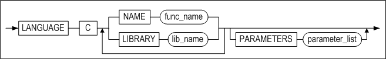
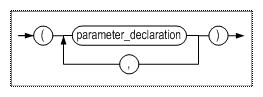
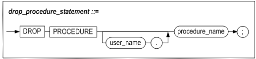
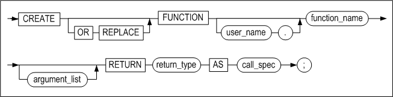

Altibase® Application Development

# C/C++ External Procedures Manual


 Altibase Application Development C/C++ External Stored Procedures Manual

Release 7.1

Copyright ⓒ 2001\~2018 Altibase Corp. All Rights Reserved.

본 문서의 저작권은 ㈜알티베이스에 있습니다. 이 문서에 대하여 당사의 동의
없이 무단으로 복제 또는 전용할 수 없습니다.

**㈜알티베이스**

08378 서울시 구로구 디지털로 306 대륭포스트타워Ⅱ 10층

전화: 02-2082-1114 팩스: 02-2082-1099

고객서비스포털: <http://support.altibase.com>

homepage: [http://www.altibase.com](http://www.altibase.com/)


## 서문

### 이 매뉴얼에 대하여

이 매뉴얼은 C/C++ 외부 프로시저 및 함수(이하 C/C++ 외부 프로시저 또는 외부프로시저)의 개념 및 사용 방법에 대해 설명한다.

#### 대상 사용자

이 매뉴얼은 다음과 같은 Altibase 사용자를 대상으로 작성되었다.

-   데이터베이스 관리자

-   성능 관리자

-   데이터베이스 사용자

-   응용 프로그램 개발자

다음과 같은 배경 지식을 가지고 이 매뉴얼을 읽는 것이 좋다.

-   컴퓨터, 운영 체제 및 운영 체제 유틸리티 운용에 필요한 기본 지식

-   관계형 데이터베이스 사용 경험 또는 데이터베이스 개념에 대한 이해

-   컴퓨터 프로그래밍 경험

#### 소프트웨어 환경

이 매뉴얼은 데이터베이스 서버로 Altibase 버전 7.1을 사용한다는 가정 하에

작성되었다.

#### 이 매뉴얼의 구성

이 매뉴얼은 다음과 같이 구성되어 있다.

-   제 1장 C/C++ 외부 프로시저 소개  
    이 장에서는 C/C++ 외부 프로시저를 소개한다. 외부 프로시저가 필요한 경우를
    소개하고, Altibase 외부 프로시저의 특징에 대해 살펴본다.

-   제 2장 외부 프로시저 사용법  
    이 장에서는 C/C++ 외부 프로시저를 작성하는 방법을 설명한다.

-   제 3장 외부 프로시저용 SQL문  
    이 장은 Altibase에서 외부 프로시저를 사용하기 위해 지원하는 SQL문을
    설명한다.

#### 문서화 규칙

이 절에서는 이 매뉴얼에서 사용하는 규칙에 대해 설명한다. 이 규칙을 이해하면 이
매뉴얼과 설명서 세트의 다른 매뉴얼에서 정보를 쉽게 찾을 수 있다.

여기서 설명하는 규칙은 다음과 같다.

-   구문 다이어그램

-   샘플 코드 규칙

구문 다이어그램

이 매뉴얼에서는 다음 구성 요소로 구축된 다이어그램을 사용하여, 명령문의 구문을
설명한다.

| 구성 요소                                 | 의미                                                         |
| ----------------------------------------- | ------------------------------------------------------------ |
|  | 명령문이 시작한다. 완전한 명령문이 아닌 구문 요소는 화살표로 시작한다. |
|  | 명령문이 다음 라인에 계속된다. 완전한 명령문이 아닌 구문 요소는 이 기호로 종료한다. |
|  | 명령문이 이전 라인으로부터 계속된다. 완전한 명령문이 아닌 구문 요소는 이 기호로 시작한다. |
|  | 명령문이 종료한다.                                           |
|  | 필수 항목                                                    |
|  | 선택적 항목                                                  |
|  | 선택사항이 있는 필수 항목. 한 항목만 제공해야 한다.          |
|  | 선택사항이 있는 선택적 항목.                                 |
|  | 선택적 항목. 여러 항목이 허용된다. 각 반복 앞부분에 콤마가 와야 한다. |

##### 샘플 코드 규칙

코드 예제는 SQL, Stored Procedure, iSQL, 또는 다른 명령 라인 구문들을 예를 들어
설명한다.

아래 테이블은 코드 예제에서 사용된 인쇄 규칙에 대해 설명한다.

| 규칙         | 의미                                                         | 예제                                                         |
| ------------ | ------------------------------------------------------------ | ------------------------------------------------------------ |
| [ ]          | 선택 항목을 표시                                             | VARCHAR [(*size*)][[FIXED \|] VARIABLE]                      |
| { }          | 필수 항목 표시. 반드시 하나 이상을 선택해야 되는 표시        | { ENABLE \| DISABLE \| COMPILE }                             |
| \|           | 선택 또는 필수 항목 표시의 인자 구분 표시                    | { ENABLE \| DISABLE \| COMPILE } [ ENABLE \| DISABLE \| COMPILE ] |
| . . .        | 그 이전 인자의 반복 표시 예제 코드들의 생략되는 것을 표시    | SQL\> SELECT ename FROM employee; ENAME ------------------------ SWNO HJNO HSCHOI . . . 20 rows selected. |
| 그 밖에 기호 | 위에서 보여진 기호 이 외에 기호들                            | EXEC :p1 := 1; acc NUMBER(11,2);                             |
| 기울임 꼴    | 구문 요소에서 사용자가 지정해야 하는 변수, 특수한 값을 제공해야만 하는 위치 | SELECT \* FROM *table_name*; CONNECT *userID*/*password*;    |
| 소문자       | 사용자가 제공하는 프로그램의 요소들, 예를 들어 테이블 이름, 칼럼 이름, 파일 이름 등 | SELECT ename FROM employee;                                  |
| 대문자       | 시스템에서 제공하는 요소들 또는 구문에 나타나는 키워드       | DESC SYSTEM_.SYS_INDICES_;                                   |

#### 샘플 스키마

이 매뉴얼 내의 예제 중의 일부는 employees, departments 및 orders테이블 같은 샘플
테이블에 기반하여 작성되었다. 이들 테이블은 \$ALTIBASE_HOME/sample/APRE/schema
디렉터리의 schema.sql을 사용하여 생성할 수 있다. 샘플 스키마에 대한 온전한
정보는 *General Reference*를 참고하기 바란다.

#### 관련 자료

자세한 정보를 위하여 다음 문서 목록을 참조하기 바란다.

-   Installation Guide

-   Getting Started Guide

-   SQL Reference

-   iSQL User’s Manual

-   Error Message Reference

#### Altibase는 여러분의 의견을 환영합니다.

이 매뉴얼에 대한 여러분의 의견을 보내주시기 바랍니다. 사용자의 의견은 다음
버전의 매뉴얼을 작성하는데 많은 도움이 됩니다. 보내실 때에는 아래 내용과 함께
고객서비스포털(http://support.altibase.com/kr/)로 보내주시기 바랍니다.

-   사용 중인 매뉴얼의 이름과 버전

-   매뉴얼에 대한 의견

-   사용자의 성함, 주소, 전화번호

이 외에도 Altibase 기술지원 설명서의 오류와 누락된 부분 및 기타 기술적인
문제들에 대해서 이 주소로 보내주시면 정성껏 처리하겠습니다. 또한, 기술적인
부분과 관련하여 즉각적인 도움이 필요한 경우에도 고객서비스포털을 통해 서비스를
요청하시기 바랍니다.

여러분의 의견에 항상 감사드립니다.


## 1.C/C++ 외부 프로시저 소개

이 장에서는 C/C++ 외부 프로시저 및 함수(이하 C/C++ 외부 프로시저 또는 외부
프로시저)를 소개한다. 외부 프로시저가 필요한 경우를 소개하고, Altibase 외부
프로시저의 특징에 대해 살펴본다.


### C/C++ 외부 프로시저란?

C/C++ 외부 프로시저(external procedures)란 C 또는 C++ 언어로 작성되고 컴파일되어
동적 링크 라이브러리(Dynamic Link Library, DLL)에 저장된 함수이다. 외부
프로시저는 Altibase의 외부 프로시저 객체를 통해 실행될 수 있으며, 실행 방법은
SQL 문 또는 응용 프로그램 내에서 저장 프로시저를 호출하는 것과 동일하다.

#### 특징

Altibase가 제공하는 외부 프로시저는 아래와 같은 특징 및 장점이 있다.

-   C/C++ 외부 프로시저 바디의 구현과 프로시저 호출 스펙이 서로 연관이 없으므로,
    C/C++ 외부 프로시저 바디를 수정해도 프로시저를 호출하는 프로그램은 수정할
    필요가 없다.

-   C/C++ 외부 프로시저의 실행과 Altibase 서버 프로세스가 분리되어 있기 때문에,
    사용자가 작성한 C/C++ 외부 프로시저에 문제가 있어도 데이터베이스에 영향을
    주지 않는다.

-   기존의 PSM(저장 프로시저)이 지원하지 않는 C/C++ 언어만의 기능을 사용할 수
    있다.

-   일부 연산 집약적인 작업은 C 언어와 같은 저수준 프로그래밍 언어로 작성할 때
    가장 효율적으로 실행된다.

-   기존에 작성되어 있는 C/C++ 함수를 외부 프로시저화 하는 것만으로 PSM에서 직접
    호출할 수 있다. 즉, 한 번 작성한 C/C++ 함수의 재사용이 가능하여 개발 비용을
    줄일 수 있다.

#### 외부 프로시저 호출 흐름

외부 프로시저는 저장 프로시저(Stored Procedure, PSM)와 마찬가지로 클라이언트
세션에서 호출할 수 있다. 아래는 외부 프로시저 생성에서 호출까지의 전반적인
흐름이다.

사용자가 C 또는 C++ 언어로 작성한 함수(Altibase가 지원하는 외부 프로시저 형식)를
동적 라이브러리로 만들어 Altibase가 식별할 수 있는 위치에 저장한 다음, SQL
구문을 이용해서 외부 프로시저 객체(외부 프로시저를 등록하는 저장 프로시저)를
생성한다.

다음으로 클라이언트 세션에서 외부 프로시저를 등록한 저장 프로시저를 호출하면,
Altibase 서버는 에이전트 프로세스를 시작한다.

에이전트 프로세스는 외부 프로시저와 관련된 동적 라이브러리 파일을 로딩하고
라이브러리 내의 관련 C/C++ 함수를 실행하여 결과를 Altibase 서버로 전달하면
Altibase 서버가 클라이언트에 그 결과를 반환한다.

아래는 클라이언트가 호출한 외부 프로시저가 에이전트 프로세스를 통해 실행되는
흐름을 도식화한 그림이다.


[그림 1‑1] 외부 프로시저 호출 및 수행 흐름도

#### 에이전트 프로세스

에이전트 프로세스는 외부 프로시저용 C/C++ 함수가 저장된 DLL 파일을 불러오고 그
안의 함수를 실행하기 위해서 Altibase 서버가 별도로 생성하는 프로세스이다.

클라이언트 세션에서 외부 프로시저를 등록한 저장 프로시저를 호출하면 Altibase
서버가 외부 프로시저용 에이전트 프로세스(Agent Process)를 시작한다. 그리고 외부
프로시저의 수행이 완료되면, Altibase 서버는 잠시 대기한 후 다른 외부 프로시저의
수행이 없다면 에이전트 프로세스를 종료한다.

에이전트 프로세스는 Altibase 서버의 서비스 세션에 종속되어 있기 때문에, n개의
클라이언트 세션에서 외부 프로시저를 호출하는 경우 n개의 에이전트 프로세스가
생성된다. 그리고 세션이 종료하면 해당 세션이 생성한 에이전트 프로세스도
종료한다.


## 2.외부 프로시저 사용법

이 장에서는 Altibase에서 외부 프로시저를 사용하는 방법을 설명한다.

먼저, 외부 프로시저를 위해 지원되는 C/C++ 자료형과 데이터베이스 객체에 대해
알아보고, Altibase 서버가 인식할 수 있는 동적 라이브러리를 작성하고 생성하는
방법을 설명한다.


### 자료형과 데이터베이스 객체

이 절은 외부 프로시저 작성을 위해 지원하는 자료형과 외부 프로시저 사용을 위해
제공하는 외부 라이브러리 객체와 외부 프로시저 객체를 소개한다.

#### 자료형

아래는 외부 프로시저 객체 생성 시 인자에 사용할 수 있는 PSM 자료형과 사용자 정의
C/C++ 함수의 인자에 사용할 수 있는 자료형을 연결한 표이다. 인자의 입/출력 모드에
따라 사용자 정의 C/C++ 함수에서는 포인터 형을 써야 할 수 있으므로 주의해서
살펴보기 바란다.

| PSM 자료형                | IN                   | INOUT/OUT               | RETURN               | 비고                                                                                  |
|---------------------------|----------------------|-------------------------|----------------------|---------------------------------------------------------------------------------------|
| BIGINT                    | long long            | long long \*            | long long            |                                                                                       |
| BOOLEAN                   | char                 | char \*                 | char                 | BOOLEAN의 경우에는 아래 두 가지 값을 허용한다. 0: FALSE 1: TRUE                       |
| SMALLINT                  | int                  | int \*                  | int                  |                                                                                       |
| INTEGER                   |                      |                         |                      |                                                                                       |
| REAL                      | float                | float \*                | float                |                                                                                       |
| DOUBLE                    | double               | double \*               | double               |                                                                                       |
| CHAR                      | char \*              | char \*                 | char \*              |                                                                                       |
| VARCHAR                   |                      |                         |                      |                                                                                       |
| NCHAR                     |                      |                         |                      |                                                                                       |
| NVARCHAR                  |                      |                         |                      |                                                                                       |
| NUMERIC                   | double               | double \*               | double               | Precision이 높은 인자는 double 형으로 변환하는 과정에서 데이터 손실이 발생할 수 있다. |
| DECIMAL                   |                      |                         |                      |                                                                                       |
| NUMBER                    |                      |                         |                      |                                                                                       |
| FLOAT                     |                      |                         |                      |                                                                                       |
| DATE                      | SQL_TIMESTAMP_STRUCT | SQL_TIMESTAMP_STRUCT \* | SQL_TIMESTAMP_STRUCT |                                                                                       |
| INTERVAL                  | SQL_TIMESTAMP_STRUCT | SQL_TIMESTAMP_STRUCT \* | SQL_TIMESTAMP_STRUCT |                                                                                       |

#### 외부 라이브러리 객체

사용자 정의 함수, 즉 외부 프로시저를 포함하는 동적 라이브러리 파일을 Altibase
서버가 식별할 수 있도록 해 주어야 한다. 이를 위해 Altibase는 외부 라이브러리
객체라는 데이터베이스 객체를 제공하며, 객체 관리를 위한 SQL구문도 함께 제공한다.

외부 프로시저를 저장 프로시저처럼 사용하기 위해 사용자는 먼저 외부 라이브러리
객체를 생성해야 하며, 관련된 동적 라이브러리 파일을 \$ALTIBASE_HOME/lib
디렉토리에 두어야 한다. 동적 라이브러리 파일 없이 외부 프로시저 객체를 생성하는
것이 가능하지만, 외부 프로시저를 실행할 때에는 반드시 관련 동적 라이브러리
파일이 존재해야 한다.

#### 외부 프로시저/함수 객체

Altibase는 외부 프로시저를 등록한 저장 프로시저를 일반적인 저장 프로시저와
구별해서 외부 프로시저 객체라고 한다. 외부 프로시저 객체는 사용자 정의 함수와
일대일로 대응하는 데이터베이스 객체이다. 외부 프로시저인 사용자 정의 함수는 외부
프로시저 객체를 통해 실행된다. 외부 프로시저 객체를 생성할 때에는 관련된
라이브러리 객체와 사용자 정의 함수에 대한 모든 정보를 명시해야 한다.

Altibase는 외부 프로시저 객체의 관리를 위한 SQL구문을 제공한다.


### 기본 사용법

외부 프로시저를 사용하는 일반적인 단계는 다음과 같다.

-   사용자 정의 함수 작성

-   진입 함수 작성

-   외부 라이브러리 객체 생성

-   외부 프로시저/함수 객체 생성

-   동적 라이브러리 생성

-   외부 프로시저 호출

이 절에서는 위의 각 단계에 대해서 예제와 함께 설명한다.

#### 사용자 정의 함수 작성

사용자는 일반적인 C 또는 C++ 함수를 만드는 것과 동일한 방식으로 외부 프로시저용
C/C++ 함수를 작성할 수 있다.

이 절에서는 아래와 같은 인자 유형과 반환 유형을 갖는 저장 프로시저와 함수에
대응하는 사용자 함수를 각각 작성해 보겠다.
~~~~~~~~~~~~~~~~~~~~~~~~~~~~~~~~~~~~~~~~~~~~~~~~~~~~~~~~~~~~~~~~~~
procedure str_uppercase_proc( a1 in char(30), a2 out char(30) )

function str_uppercase_func_int( a1 in char(30), a2 out char(30) ) return int

function str_uppercase_func_char( a1 in char(30), a2 out char(30) ) return
char(30)
~~~~~~~~~~~~~~~~~~~~~~~~~~~~~~~~~~~~~~~~~~~~~~~~~~~~~~~~~~~~~~~~~~
str_uppercase_proc에 대응하는 str_uppercase라는 사용자 정의 C/C++ 함수는 3개의
인자를 필요로 하며, 함수 프로토타입은 아래와 같다.

extern "C" void str_uppercase( char\* str1, long long str1_len, char\* str2 );

여기에서 두 번째 인자는 첫 번째 인자에 입력될 문자열의 길이를 사용자 함수로
전달하기 위해 사용된다.

str_uppercase_func_int 및 str_uppercase_func_char에 대응하는 사용자 정의 C/C++
함수 프로토타입은 아래와 같다.
~~~~~~~~~~~~~~~~~~~~~~~~~~~~~~~~~~~~~~~~~~~~~~~~~~~~~~~~~~~~~~~~~~
extern "C" int str_uppercase_count( char* str1, long long str1_len, char* str2 );
extern "C" char* str_uppercase_return( char* str1, long long str1_len, char* str2 );

~~~~~~~~~~~~~~~~~~~~~~~~~~~~~~~~~~~~~~~~~~~~~~~~~~~~~~~~~~~~~~~~~~
아래는 사용자 정의 함수의 코드 예제이다.

~~~~~~~~~~~~~~~~~~~~~~~~~~~~~~~~~~~~~~~~~~~~~~~~~~~~~~~~~~~~~~~~~~~~
void str_uppercase(char *str1, long long str1_len, char * str2)
{
    for( int i=0; i < str1_len; i++ )
    {
        str2[i] = toupper(str1[i]);
    }
}

int str_uppercase_count(char *str1, long long str1_len, char * str2)
{
    int capCount = 0;
    int i        = 0;
 
    while( i < str1_len )
    {   
        if( str1[i] >= 'A' && str1[i] <= 'Z' )
        {
            capCount++; 
        }
 
        i++;
    }   
 
    return capCount;
}

char* str_uppercase_return(char *str1, long long str1_len, char * str2)
{
    for( int i=0; i < str1_len; i++ )
    {
        str2[i] = toupper(str1[i]);
    }
    return str2;
}

~~~~~~~~~~~~~~~~~~~~~~~~~~~~~~~~~~~~~~~~~~~~~~~~~~~~~~~~~~~~~~~~~~~~

> 주의: 사용자 정의 함수 선언부에 반드시 extern "C" 키워드를 써야 한다.
>

#### 진입 함수 작성

사용자 정의 함수 외에도, 사용자 정의 함수를 실행할 정형화된 함수가 필요하다. 이
함수를 진입 함수(Entry Function)라고 한다.

에이전트 프로세스가 진입 함수를 호출하면 진입 함수가 사용자 정의 함수를 호출하고
그 결과를 반환한다. 따라서 동적 라이브러리 내에 진입 함수가 반드시 있어야 한다.

진입 함수 내부에는 실제 사용자 정의 함수를 호출하는 루틴이 포함되어야 한다.

아래는 위의 str_uppercase, str_uppercase_count와 str_uppercase_return 사용자
정의 함수를 호출하는 진입 함수의 예제이다.
~~~~~~~~~~~~~~~~~~~~~~~~~~~~~~~~~~~~~~~~~~~~~~~~~~~~~~~~~~~~~~~~~~
extern "C" void entryfunction(char* func_name, int arg_count, void ** args, void ** returnArg);

void entryfunction(char* func_name, int arg_count, void ** args, void ** returnArg)
{
    // 사용자 정의 부분
    if(strcmp(func_name, "str_uppercase") == 0)
    {   
        str_uppercase((char*)args[0], *((long long *)args[1]), (char*)args[2]);
    }
    else if(strcmp(func_name, "str_uppercase_count") == 0)
    {
        if( *returnArg != NULL ) // int 타입 반환
        {
            **(int**)returnArg = str_uppercase_count ((char*)args[0], *((long long*)args[1]), (char*)args[2]);
        }
    } 
    else if(strcmp(func_name, "str_uppercase_return") == 0)
    {
        if( returnArg != NULL ) // char* 타입 반환
        {
            *(char**)returnArg = str_uppercase_return ((char*)args[0], *((long long*)args[1]), (char*)args[2]);
        }
    } 
}
~~~~~~~~~~~~~~~~~~~~~~~~~~~~~~~~~~~~~~~~~~~~~~~~~~~~~~~~~~~~~~~~~~
아래는 진입 함수의 각 인자에 대한 설명이다.

-   func_name: 함수의 이름을 나타내는 문자열

-   arg_count: 인자의 개수

-   args: 인자들의 배열. 외부 프로시저에서 명시한 순서를 따라야 한다. 인자의
    입출력 모드와 PSM 자료형에 따라 각각 맵핑되는 C 자료형이 다르므로 주의해야
    한다.

-   returnArg: 반환값을 위한 인자. 반환값이 없는 외부 프로시저의 경우에는 이
    인자에 항상 NULL이 반환되며, 외부 함수의 경우에는 반환값을 가리키는 포인터가
    반환된다.

##### 주의 사항

-   동적 라이브러리 내에서 진입 함수의 이름 entryfunction과 인자의 자료형은
    사용자가 임의로 변경해서는 안 된다.

-   한 개의 라이브러리 내에 사용자 정의 함수가 두 개 이상 포함된 경우, 하나의
    진입 함수 내에 사용자 정의 함수를 각각 호출하도록 소스 코드를 작성해야 한다.

-   외부 함수가 아닌 외부 프로시저의 사용자 정의 함수를 호출한 후 반환값을
    returnArg 변수에 대입하면 에이전트 프로세스가 비정상 종료할 수 있다. 즉,
    외부 함수의 경우에는 returnArg가 NULL이 아닌지 반드시 검사한 후 함수 반환
    타입에 맞게 타입 캐스팅하여 반환해야 한다.

-   사용자 정의 함수와 마찬가지로 진입 함수 선언부에도 반드시 extern "C"
    키워드를 써야 한다.

-   위 예제의 사용자 정의 함수를 처리하는 부분에서 반환값을 대입할 returnArg
    변수(진입 함수의 마지막 인자)의 NULL 여부를 검사하는 코드가 함수 반환 타입에
    따라 다른 점을 주의해서 살펴보기 바란다.

if( \*returnArg != NULL ) // int 타입을 반환하는 경우

...

if( returnArg != NULL ) // char\* 타입을 반환하는 경우

##### 반환값의 타입 캐스팅

외부 함수에 대응하는 사용자 정의 함수를 호출한 후, 함수의 반환형에 따라 적절한
타입으로 캐스팅이 필요하다.

| 반환 타입            | 코드상의 타입 캐스팅                           |
|----------------------|------------------------------------------------|
| char                 | \*\*(char\*\*)returnArg = ...                  |
| int                  | \*\*( int\*\*)returnArg = ...                  |
| long long            | \*\*( long long\*\*)returnArg = ...            |
| float                | \*\*( float\*\*)returnArg = ...                |
| double               | \*\*( double\*\*)returnArg = ...               |
| char \*              | \*(char\*\*)returnArg = ...                    |
| SQL_TIMESTAMP_STRUCT | \*\*( SQL_TIMESTAMP_STRUCT\*\*)returnArg = ... |

#### 외부 라이브러리 객체 생성

Altibase 서버가 동적 라이브러리 파일을 식별할 수 있도록 데이터베이스에
라이브러리 객체를 생성해야 한다. 예를 들어, 사용자가 shlib.so라는 이름의 동적
라이브러리 파일을 사용하고자 하는 경우, 데이터베이스에 아래와 같이 외부
라이브러리 객체를 생성할 수 있다.

CREATE OR REPLACE LIBRARY lib1 AS 'shlib.so';

이제 Altibase는 shlib.so 동적 라이브러리 파일을 lib1이라는 외부 라이브러리
객체로 식별한다.

#### 외부 프로시저/함수 객체 생성

외부 프로시저(사용자 정의 C/C++ 함수)를 실행하기 위해서는 먼저 데이터베이스에
사용자 정의 함수를 등록하는 외부 프로시저 객체를 생성해야 한다.

아래와 같은 SQL 구문으로 외부 프로시저 객체를 생성할 수 있다.
~~~~~~~~~~~~~~~~~~~~~~~~~~~~~~~~~~~~~~~~~~~~~~~~~~~~~~~~~~~~~~~~~~
create or replace procedure str_uppercase_proc( a1 in char(30), a2 out char(30) )

as

language c

library lib1

name "str_uppercase"

parameters( a1, a1 LENGTH, a2 )

;

/
~~~~~~~~~~~~~~~~~~~~~~~~~~~~~~~~~~~~~~~~~~~~~~~~~~~~~~~~~~~~~~~~~~
외부 함수의 경우 반환형을 명시해야 한다. 아래 예제는 int 타입과 char 배열을
반환하는 외부 함수를 생성하는 SQL 구문이다.
~~~~~~~~~~~~~~~~~~~~~~~~~~~~~~~~~~~~~~~~~~~~~~~~~~~~~~~~~~~~~~~~~~
create or replace function str_uppercase_func_int( a1 in char(30), a2 out
char(30) ) return int

as

language c

library lib1

name "str_uppercase_count"

parameters( a1, a1 LENGTH, a2 )

;

/

create or replace function str_uppercase_func_char( a1 in char(30), a2 out
char(30) ) return char(30)

as

language c

library lib1

name "str_uppercase_return"

parameters( a1, a1 LENGTH, a2 )

;

/
~~~~~~~~~~~~~~~~~~~~~~~~~~~~~~~~~~~~~~~~~~~~~~~~~~~~~~~~~~~~~~~~~~
#### 동적 라이브러리 생성

한 개 이상의 사용자 정의 함수와 진입 함수가 작성된 소스 파일이 준비되면, 컴파일
해서 동적 라이브러리 파일을 만들 수 있다. 동적 라이브러리 파일 확장자의 형태는
\*.so이다.

아래 예제는 유닉스 계열에서 소스 파일을 컴파일 해서 동적 라이브러리를 만드는
것을 보여준다.

\$ g++ -g -fPIC -shared -o shlib.so extproc.cpp

사용자 정의 함수들과 진입 함수가 여러 파일로 이루어져 있다면, 아래와 같이 각
소스 파일을 컴파일 한 후 링크하면 된다.

\$ g++ -fPIC -c extproc.cpp

\$ g++ -fPIC -c entry.cpp

\$ g++ -shared -o shlib.so entry.o extproc.o

생성된 동적 라이브러리 파일은 Altibase 서버가 인식할 수 있는 위치로 이동해야
한다. 그 위치는 \$ALTIBASE_HOME/lib이며, 이 위치는 사용자가 임의로 변경할 수
없다.

\$ mv shlib.so \$ALTIBASE_HOME/lib/

#### 외부 프로시저 호출

다음은 iSQL에서 외부 프로시저를 실행하는 것을 보여주는 예제이다.
~~~~~~~~~~~~~~~~~~~~~~~~~~~~~~~~~~~~~~~~~~~~~~~~~~~~~~~~~~~~~~~~~~
var var1 char(30);
var var2 char(30);
 
exec :var1 := 'hello world';
exec str_uppercase_proc( :var1, :var2 );
 
iSQL> print var;
[ HOST VARIABLE ]
-------------------------------------------------------
NAME                 TYPE                 VALUE
-------------------------------------------------------
VAR1                 CHAR(30)             hello world
VAR2                 CHAR(30)             HELLO WORLD
~~~~~~~~~~~~~~~~~~~~~~~~~~~~~~~~~~~~~~~~~~~~~~~~~~~~~~~~~~~~~~~~~~

#### extproc.cpp

다음은 위의 절에서 예로 든 사용자 정의 함수를 작성한 소스 파일 extproc.cpp이다.

```
#include <string.h>
#include <ctype.h>

extern "C" void str_uppercase( char* str1, long long str1_len, char* str2 );
extern "C" int str_uppercase_count( char* str1, long long str1_len, char* str2 );
extern "C" char* str_uppercase_return( char* str1, long long str1_len, char* str2 );


extern "C" void entryfunction(char* func_name, int arg_count, void ** args, void ** returnArg);

void entryfunction(char* func_name, int arg_count, void ** args, void ** returnArg)
{
    if(strcmp(func_name, "str_uppercase") == 0)
    {
        str_uppercase((char*)args[0], *((long long*)args[1]), (char*)args[2]);
    }
    else if(strcmp(func_name, "str_uppercase_count") == 0)
    {
        if( *returnArg != NULL ) // int 타입을 반환
        {
            **(int**)returnArg = str_uppercase_count ((char*)args[0], *((long long*)args[1]), (char*)args[2]);
        }
    }
    else if(strcmp(func_name, "str_uppercase_return") == 0)
    {
        if( returnArg != NULL ) // char* 타입을 반환
        {
            *(char**)returnArg = str_uppercase_return ((char*)args[0], *((long long*)args[1]), (char*)args[2]);
        }
    }
}

void str_uppercase(char *str1, long long str1_len, char * str2)
{
    for( int i=0; i < str1_len; i++ )
    {
        str2[i] = toupper(str1[i]);
    }
}

int str_uppercase_count(char *str1, long long str1_len, char * str2)
{
    int capCount = 0;
    int i        = 0;

    while( i < str1_len )
    {
        if( str1[i] >= 'A' && str1[i] <= 'Z' )
        {
            capCount++;
        }

        i++;
    }

    return capCount;
}

char* str_uppercase_return(char *str1, long long str1_len, char * str2)
{
    for( int i=0; i < str1_len; i++ )
    {
        str2[i] = toupper(str1[i]);
    }
    return str2;
}
```

### 관련 메타 테이블과 성능 뷰

현재 데이터베이스에 생성된 외부 라이브러리 객체에 대한 정보를 아래의 메타
테이블에서 확인할 수 있다.

-   SYS_LIBRARIES\_

외부 프로시저 실행을 위해 현재 생성되어 있는 에이전트 프로세스(agent process)의
정보를 아래의 성능 뷰에서 확인할 수 있다.

-   V\$EXTPROC_AGENT

각 메타 테이블과 성능 뷰에 대한 상세한 설명은 *General Reference*를 참고하도록
한다.


### 관련 프로퍼티

아래는 외부 프로시저를 위한 에이전트의 동작에 관련된 프로퍼티이다.

-   EXTPROC_AGENT_CONNECT_TIMEOUT

-   EXTPROC_AGENT_CALL_RETRY_COUNT

-   EXTPROC_AGENT_IDLE_TIMEOUT

-   EXTPROC_AGENT_SOCKET_FILEPATH

각 프로퍼티에 대한 상세한 설명은 *General Reference*를 참고하도록 한다.


3.외부 프로시저용 SQL문
---------------------

이 장은 Altibase에서 외부 프로시저를 사용하기 위해 지원하는 SQL문을 설명한다.


### CREATE LIBRARY statement

#### 구문


#### 설명

외부 라이브러리 객체를 새로 생성하거나 이미 생성되어 있는 외부 라이브러리를
새로운 외부 라이브러리로 변경한다.

##### library_name

라이브러리 객체의 이름을 명시한다.

##### file_name

동적 라이브러리 파일 이름을 명시한다. 이 파일은 \$ALTIBASE_HOME/lib에 위치해야
한다. 단, 해당 디렉토리에 사용자가 명시한 파일이 없더라도 라이브러리 객체는
생성된다. 동적 라이브러리 파일의 존재 유무는 외부 프로시저가 실행될 때 검사되며,
만약 존재하지 않을 경우 해당 외부 프로시저 객체는 'INVALID' 상태로 전이한다.

#### 예제
~~~~~~~~~~~~~~~~~~~~~~~~~~~~~~~~~~~~~~~~~~~~~~
CREATE OR REPLACE LIBRARY lib1 AS 'shlib.so';
~~~~~~~~~~~~~~~~~~~~~~~~~~~~~~~~~~~~~~~~~~~~~~


### ALTER LIBRARY statement

#### 구문


#### 설명

라이브러리 객체를 컴파일한다.

외부 프로시저용 언어로 C 또는 C++만 지원하는 현재로서는, 이 구문을 실행하여도
서버에서 아무런 동작이 일어나지 않는다. 추후 다른 언어 지원을 위해 예약된
구문이다.

#### 예제
~~~~~~~~~~~~~~~~~~~~~~~~~~~~~~~~~~~~~~~~~~~~~~
ALTER LIBRARY lib1 COMPILE;
~~~~~~~~~~~~~~~~~~~~~~~~~~~~~~~~~~~~~~~~~~~~~~


### DROP LIBRARY statement

#### 구문


#### 설명

데이터베이스에서 외부 라이브러리 객체를 삭제한다.

삭제하려는 라이브러리 객체에 포함된 외부 프로시저가 실행 중이어도, 해당
라이브러리 객체는 삭제된다. 단, 데이터베이스에서 라이브러리 객체만 삭제될 뿐,
연관된 동적 라이브러리 파일이 삭제되지는 않는다.

#### 예제
~~~~~~~~~~~~~~~~~~~~~~~~~~~~~~~~~~~~~~~~~~~~~~
DROP LIBRARY lib1;
~~~~~~~~~~~~~~~~~~~~~~~~~~~~~~~~~~~~~~~~~~~~~~


### CREATE PROCEDURE statement

#### 구문

**create_procedure ::=**


**argument_list ::=**


**argument_declaration ::=**


**call_spec ::=**



**parameter_list ::=**



**parameter_declaration::=**


#### 설명

외부 프로시저를 새로 생성하거나, 이미 생성되어 있는 외부 프로시저를 새로운 외부
프로시저로 변경한다.

##### procedure_name

외부 프로시저 객체의 이름을 명시한다.

##### argument_list

인자는 생략할 수 있으며, 인자를 명시할 경우엔 인자의 명칭, 데이터 타입 및 입출력
구분을 명시해야 한다. 사용 가능한 입출력 유형은 다음 세가지 중의 하나이고 생략
시에 IN이 기본값이 된다.

-   IN: 프로시저 호출시 입력값이 주어지는 입력 인자

-   OUT: 프로시저 실행 후 출력 값을 반환하는 인자

-   INOUT: 입출력 공용 인자로 프로시저 호출시 입력값이 주어지고, 실행 후에 출력
    값을 반환한다.

외부 프로시저가 실행될 때, IN 인자를 사용해서 프로시저에 값을 전달하고,
프로시저는 OUT인자를 사용해서 호출한 루틴에 값을 반환한다.

##### call_spec

사용자 함수 이름과 라이브러리 객체의 이름, 파라미터들을 지정한다. 사용자 함수
이름과 라이브러리 객체를 명시하는 순서는 상관없으나, 각각 한 번씩만 명시해야
한다

##### fun_name

해당 외부 프로시저에 대응하는 사용자 정의 함수 이름을 명시한다.

##### lib_name

해당 외부 프로시저에 대응하는 사용자 함수를 포함하는 외부 라이브러리 객체의
이름을 명시한다.

##### parameter_list

외부 프로시저 객체의 인자들을 이에 대응하는 사용자 정의 함수의 인자들로 할당하기
위해 명시하는 절이다. 이 절의 인자 이름은 argument_list의 인자 이름을 그대로
사용하는 것이 일반적이다.

아래의 속성을 이용하여 각 파라미터에 대해 추가적인 정보를 사용자 정의 함수로
전달할 수 있다. 속성과 함께 명시되는 속성 파라미터는 실제 파라미터를 보조하는
역할을 할 뿐, 외부 프로시저 객체의 인자와는 관계가 없다.

| 속성 이름 | IN 경우 자료형 | INOUT/ OUT/ RETURN 경우 자료형 | 설명                                                                                                                                                              |
|-----------|----------------|--------------------------------|-------------------------------------------------------------------------------------------------------------------------------------------------------------------|
| INDICATOR | short          | short \*                       | 해당 파라미터의 값이 NULL인지 아닌지를 나타낸다. 다음의 값 중 하나를 가질 수 있다. ALTIBASE_EXTPROC_IND_NULL ALTIBASE_EXTPROC_IND_NOTNULL                         |
| LENGTH    | long long      | long long \*                   | 해당 파라미터 값의 길이를 바이트 단위로 나타낸다. 문자열의 경우 문자의 개수가 아니라 바이트 개수임에 주의하라. 문자열이 아닌 경우, 해당 자료형의 크기를 나타낸다. |
| MAXLEN    | \-             | long long                      | 해당 파라미터의 버퍼 크기를 나타낸다. IN 모드 파라미터의 경우 이 속성 파라미터를 명시할 수 없다.                                                                  |

아래 예제에서 PARAMETERS 절은 사용자 정의 함수로 전달되는 인자들과 인자들의
속성을 지정한다.
~~~~~~~~~~~~~~~~~~~~~~~~~~~~~~~~~~~~~~~~~~~~~~~~~~~~~~~~~~~~~~~~~~
CREATE OR REPLACE PROCEDURE proc1(

a1 IN CHAR(30),

a2 OUT CHAR(30) )

AS

LANGUAGE C

LIBRARY lib1

NAME "str_uppercase"

PARAMETERS( a1, a1 LENGTH, a2 );

/
~~~~~~~~~~~~~~~~~~~~~~~~~~~~~~~~~~~~~~~~~~~~~~~~~~~~~~~~~~~~~~~~~~
위 프로시저에서 PARAMETER 절의 인자들로 보아, str_uppercase 함수의 프로토타입은
아래와 같을 것이다.

extern "C" void str_uppercase( char\* str1, long long str1_len, char\* str2 );

#### 예제
~~~~~~~~~~~~~~~~~~~~~~~~~~~~~~~~~~~~~~~~~~~~~~~~~~~~~~~~~~~~~~~~~~
create or replace procedure proc1( a1 in char(30), a2 out char(30) )

as

language c

library lib1

name "str_uppercase"

parameters( a1, a1 LENGTH, a2 )

;

/
~~~~~~~~~~~~~~~~~~~~~~~~~~~~~~~~~~~~~~~~~~~~~~~~~~~~~~~~~~~~~~~~~~


### DROP PROCEDURE statement

#### 구문



#### 설명

데이터베이스에서 외부 프로시저 객체를 삭제한다.

삭제하고자 하는 외부 프로시저가 실행 중이라면, 삭제되지 않고 오류가 발생한다.

#### 예제

~~~~~~~~~~~~~~~~~~~~~~~~~~~~~~~~~~~~~~~~~~~~~~~~~~~~~~~~~~~~~~~~~~
DROP PROCEDURE proc1;
~~~~~~~~~~~~~~~~~~~~~~~~~~~~~~~~~~~~~~~~~~~~~~~~~~~~~~~~~~~~~~~~~~


### CREATE FUNCTION

#### 구문

**create_function ::=**



**argument_list ::=**


**argument_declaration ::=**


**call_spec ::=**


**parameter_list ::=**


**parameter_declaration::=**


#### 설명

외부 함수를 새로 생성하거나 이미 생성되어 있는 외부 함수를 새로운 외부 함수로
변경한다.

##### func_name

외부 함수 객체의 이름을 명시한다.

##### argument_list

CREATE PROCEDURE statement 절을 참고하라.

##### call_spec

사용자 함수 이름과 라이브러리 객체의 이름, 및 파라미터들과 반환값을 지정한다.
사용자 함수 이름과 라이브러리 객체를 명시하는 순서는 상관없으나, 각각 한 번씩만
명시해야 한다.

##### fun_name

해당 외부 프로시저에 대응하는 사용자 정의 함수 이름을 명시한다.

##### lib_name

해당 외부 프로시저에 대응하는 사용자 함수를 포함하는 외부 라이브러리 객체의
이름을 명시한다.

##### parameter_list

CREATE PROCEDURE statement 절을 참고하라.

##### RETURN

외부 함수의 반환값을 가져오는 파라미터임을 명시하는 키워드이다. RETURN 뒤에 함수
파라미터와 마찬가지로 속성 파라미터를 추가로 명시할 수 있다. 속성 파라미터에
대해서는 CREATE PROCEDURE 구문의 설명을 참고하기 바란다.

제약 사항:

-   RETURN 절은 함수의 인자에 대한 파라미터를 모두 명시한 다음 마지막에 명시해야
    한다. 그렇지 않으면 오류가 발생한다.

-   RETURN 뒤에 속성 파라미터를 명시하지 않으면, RETURN 자체를 명시하지 않은
    것과 차이가 없다. 즉, (a, b, RETURN)과 (a, b)는 동일하다.


### DROP FUNCTION

#### 구문


#### 설명

데이터베이스에서 외부 함수 객체를 삭제한다.

삭제하려는 외부 함수가 실행 중이라면, 삭제되지 않고 오류가 발생한다.

#### 예제

~~~~~~~~~~~~~~~~~~~~~~~~~~~~~~~~~~~~~~~~~~~~~~~~~~~~~~~~~~~~~~~~~~
DROP FUNCTION func1;
~~~~~~~~~~~~~~~~~~~~~~~~~~~~~~~~~~~~~~~~~~~~~~~~~~~~~~~~~~~~~~~~~~


### EXECUTE

#### 구문

**execute_procedure_statement::=**


**execute_function_statement::=**


**parameter_notation::=**


#### 설명

외부 프로시저 또는 외부 함수를 실행한다.

##### parameter_notation

파라미터에 값을 전달하는 방식은 아래와 같다.

-   위치기반(Positional) : 기본적인 전달 방식으로, 정의된 파라미터의 위치에 맞춰
    값이 입력된다.

-   이름기반(Name-based) : 정의된 파라미터의 이름을 입력하고 화살표(=\>) 뒤에
    값을 입력하는 방식이다. 파라미터의 순서에 관계없이 값을 전달할 수 있다.

-   혼합(Mixed): 위치기반과 이름기반 방식을 함께 사용할 수 있다. 그러나 반드시
    위치기반 전달 방식을 먼저 입력해야 한다.

#### 예제

~~~~~~~~~~~~~~~~~~~~~~~~~~~~~~~~~~~~~~~~~~~~~~~~~~~~~~~~~~~~~~~~~~
var var1 char(30);

var var2 char(30);

exec :var1 := 'hello world';

exec proc1( var1, var2 );

print var2;
~~~~~~~~~~~~~~~~~~~~~~~~~~~~~~~~~~~~~~~~~~~~~~~~~~~~~~~~~~~~~~~~~~
