- [SQL Reference](#sql-reference)
  - [3.데이터 정의어](#3%EB%8D%B0%EC%9D%B4%ED%84%B0-%EC%A0%95%EC%9D%98%EC%96%B4)
  - 


### CREATE TABLE

#### 구문

**create_table ::=**


[table_constraint
::=](#table_constraint), [temporary_attributes_clause
::=](#temporary_attributes_clause),
[table_partitioning_clause](#table_partitioning_clause), [access_mode_clause
::=](#access_mode_clause_CREATETALBE), [physical_attributes_clause
::=](#create_table_physical_attributes_clause), [log_compression_clause
::=](#log_compression_clause), [logging_clause ::=](#logging_clause),
[parallel_clause::=](#parallel_clause), [table_compression_clause
::=](#table_compression_clause), [lob_column_properties
::=](#lob_column_properties)

**column_definition ::=**

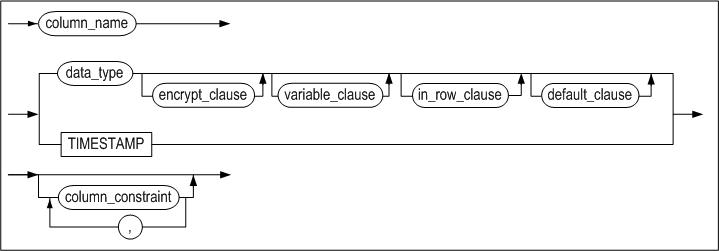

**encrypt_clause::=**


**variable_clause::=**

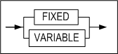

**in_row_clause::=**


**default_clause::=**

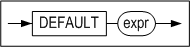

**column_constraint ::=**

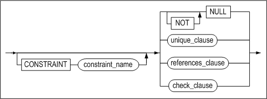

**unique_clause ::=**


**unique_specification ::=**


**sort_order_clause ::=**


**directkey_clause ::=**

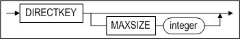

**using_index_clause ::=**

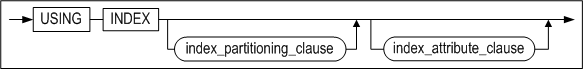

**index_attribute_clause ::=**


[memory_index_attributes ::=](#memory_index_attributes), [disk_index_attributes
::=](#disk_index_attributes)

**references_clause::=**


**check_clause ::=**

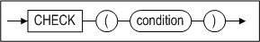

<a name="table_constraint"><a/>

**table_constraint ::=**

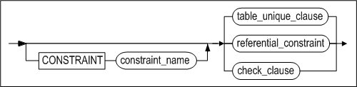

**table_unique_clause ::=**


**referential_constraint ::=**


[references_clause ::=](#references_clause)

<a name="temporary_attributes_clause"><a/>

**temporary_attributes_clause ::=**


<a name="table_partitioning_clause"><a/>

**table_partitioning_clause ::=**

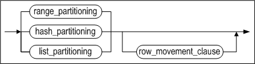

**range_partitioning ::=**


**partition_default_clause ::=**


<a name="table_partition_description"><a/>

**table_partition_description ::=**


[lob_column_properties ::=](#lob_column_properties)*,* [access_mode_clause
::=](#access_mode_clause_CREATETALBE)

**partition_range_clause ::=**

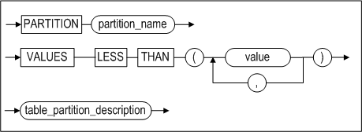

[table_partition_description ::=](#table_partition_description)


**hash_partitioning ::=**

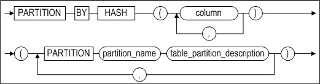

[table_partition_description ::=](#table_partition_description)


**list_partitioning ::=**

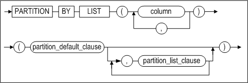

[partition_default_clause ::=](#partition_default_clause)

**partition_list_clause ::=**


<a name="row_movement_clause"><a/>

**row_movement_clause ::=**


<a name="access_mode_clause_CREATETALBE)"><a/>

**access_mode_clause ::=**


<a name="tablespace_clause"><a/>

**tablespace_clause ::=**

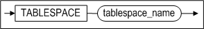

<a name="physical_attributes_clause"><a/>

<a name="create_table_physical_attributes_clause"><a/>

**physical_attributes_clause ::=**


**storage_clause ::=**


<a name="log_compression_clause"><a/>

**log_compression_clause ::=**


<a name="logging_clause"><a/>

**logging_clause ::=**


<a name="parallel_clause"><a/>

**parallel_clause::=**


<a name="table_compression_clause"><a/>

**table_compression_clause ::=**


<a name="lob_column_properties"><a/>

**lob_column_properties ::=**


**LOB_storage_clause ::=**


**lob_attributes ::=**


#### 전제 조건

아래의 조건 중 하나 이상을 만족해야 한다.

- SYS 사용자이다.
- 사용자 자신의 스키마에 테이블을 생성하려면 CREATE TABLE 또는 CREATE ANY
  TABLE 시스템 권한을 가지고 있어야 한다.
- 다른 사용자의 스키마에 테이블을 생성하려면 CREATE ANY TABLE 시스템 권한을
  가지고 있어야 한다.

#### 설명

명시된 이름의 새로운 테이블을 생성한다.

*[GLOBAL] TEMPORARY*

[GLOBAL] TEMPORARY는 테이블이 임시 테이블임을 지정한다. GLOBAL 지정 여부에 따른
차이점은 없으므로 생략해도 된다. 이렇게 생성된 테이블의 정의는 모든 세션에서 볼
수 있지만, 임시 테이블의 데이터는 해당 테이블에 데이터를 삽입하는 세션에서만 볼
수 있다.

사용자가 처음으로 임시 테이블을 만들면, 테이블의 메타 데이터만 데이터 딕셔너리에
저장되고, 테이블의 데이터를 위한 공간은 할당되지 않는다. 해당 테이블에 처음으로
DML 작업이 수행되는 순간에 테이블 세그먼트를 위한 공간이 할당된다. 임시 테이블의
정의는 일반적인 테이블의 정의와 마찬가지로 데이터베이스에서 지속되지만, 임시
테이블의 테이블 세그먼트와 임시 테이블에 저장된 모든 데이터는 세션 또는
트랜잭션에 한정된다. ON COMMIT 키워드를 사용해서 테이블 세그먼트와 데이터가 세션
레벨인지 또는 트랜잭션 레벨인지를 지정할 수 있다. 자세한 설명은 아래의
*temporary_attributes_clause*를 참고하라.

세션에 한정되는 임시 테이블은 세션이 임시 테이블에 바인딩 되지 않은 경우에만
해당 임시 테이블에 대해 DDL 작업(ALTER TABLE, DROP TABLE, CREATE INDEX 등)이
허용된다.

트랜잭션에 한정되는 임시 테이블은 바인딩 여부에 상관 없이 임시 테이블에 대한 DDL
작업이 허용된다. 하지만, Altibase 내부적으로 DDL 작업 수행 전에 커밋을 먼저 하기
때문에, 임시 테이블에 대한 DDL 수행 후에 그 테이블의 데이터는 사라진다.

- 임시 테이블의 제약 사항:
  - 임시 테이블은 파티셔닝이 불가능하다.
  - 임시 테이블에는 외래 키를 지정할 수 없다.
  - lob_storage_clause의 TABLESPACE에는 임시 테이블을 저장하는 휘발성
    테이블스페이스만 올 수 있다.
  - 임시 테이블은 휘발성 테이블스페이스만 저장할 수 있다.
  - 임시 테이블에 대해서는 분산 트랜잭션이 지원되지 않는다.

*user_name*

생성될 테이블 소유자 이름을 명시한다. 생략하면 Altibase는 현재 세션에 연결된
사용자의 스키마에 테이블을 생성한다.

*tbl_name*

생성될 테이블 이름을 명시한다. 테이블 이름은  2장 "객체 이름 규칙"을 따라야 한다.

*column_definition*

- DEFAULT  
  칼럼에 DEFAULT 절을 명시하지 않고 테이블을 생성한 경우, 데이터 삽입시 해당
  칼럼의 값을 명시하지 않으면 NULL이 입력된다.
- TIMESTAMP  
  TIMESTAMP 칼럼은 여러 면에서 다른 데이터 타입들처럼 다뤄진다. 예를 들어,
  CREATE TABLE 문에 칼럼의 데이터 타입으로 TIMESTAMP를 명시한 경우 내부적으로
  데이터 크기가 8Byte인 TIMESTAMP 칼럼이 생성된다. 그러나 TIMESTAMP 칼럼의
  값은 시스템에 의해 결정되기 때문에 명시적으로 DEFAULT 값을 설정할 수 없다.
  또한 TIMESTAMP 칼럼은 한 테이블에 하나만 생성할 수 있다.

*column_constraint*

새로운 테이블을 생성할 때 칼럼에 대한 제약조건을 설정한다. 명시적으로 제약조건의
이름을 지정할 수 있다. LOCALUNIQUE 제약조건은 파티션드 테이블에 사용될 수 있다.

- PRIMARY KEY

  기본키의 값은 테이블 내에서 유일해야 하며 기본키에 속하는 칼럼은 널(NULL) 값을
  가질 수 없다. 한 테이블 내에 정의 가능한 기본키의 개수는 하나이며, 최대 32개
  칼럼들의 조합에 대해 기본 키를 생성할 수 있다.

- UNIQUE

  UNIQUE 제약조건을 정의하면 유니크 키에 해당하는 칼럼 (또는 칼럼의 조합)은 같은
  값을 2개 이상 가질 수 없다. 단, 널 값은 허용된다.

  같은 칼럼 또는 같은 칼럼의 조합에 대해 유니크 제약조건과 기본키를 동시에 정의할
  수 없다. 또한, 같은 칼럼 또는 같은 칼럼의 조합에 대해 2개 이상의 유니크
  제약조건도 존재할 수 없다. 그러나 다른 칼럼 또는 다른 칼럼들의 조합에는 존재할
  수 있다. 최대 32개 칼럼의 조합에 대해 유니크 제약조건을 생성할 수 있다.

- LOCALUNIQUE

  각 지역 인덱스별로 UNIQUE 제약조건을 만족해야 함을 명시하는 키워드이다.

- (NOT) NULL

  해당 칼럼이 널 값을 가질 수 있다(없다)는 것을 의미한다.

- CHECK

  해당 칼럼에 대한 무결성 규칙(Integrity Rule)을 지정한다. *column_constraint*
  절의 *condition* 내에서는 해당 칼럼만 참조할 수 있다. CHECK 제약조건의 검사조건에는 아래와 같은 몇 가지 제한 사항이 있다.

  - 부질의(subquery), 시퀀스, LEVEL 또는 ROWNUM 등의 모든 의사칼럼(Pseudo
    Column), 및 SYSDATE 또는 USER_ID 같은 비결정적(Non-deterministic) SQL 함수가
    포함될 수 없다.
  - PRIOR 연산자를 사용할 수 없다.
  - LOB 타입의 데이터를 사용할 수 없다.

- 참조 무결성(referential integrity)

- TIMESTAMP


*directkey_clause*

이 절은 Direct Key 인덱스를 생성시 사용할 수 있다. Direct Key 인덱스에 대한
자세한 내용은 CREATE INDEX 구문을 참고한다

*check_clause*

이 절에는 테이블의 각 레코드 값이 만족해야 하는 조건을 지정한다. 조건의 결과는
참, 거짓, 또는 NULL 중 하나이어야 한다.

이 절은 칼럼 제약조건 또는 테이블 전체 제약조건이 될 수 있다.

*table_constraint*

한 칼럼 또는 칼럼들의 조합에 대한 제약조건을 명시하는 절이다. 다음의 테이블
제약조건이 있다.

- PRIMARY KEY
- UNIQUE
- LOCALUNIQUE
- CHECK
- 참조 무결성(referential integrity)

*using_index_clause*

제약조건을 위해 자동으로 생성되는 인덱스가 저장될 테이블스페이스를 지정하는
절이다.

PRIMARY KEY, UNIQUE 또는 LOCALUNIQUE 제약을 명시할 경우, 자동으로 생성되는 로컬
인덱스가 저장될 테이블스페이스를 각 인덱스 파티션 별로 지정할 수 있다. 자세한
설명은 CREATE INDEX 구문의 *index_partitioning_clause*를 참조한다.

*references_clause*

외래키를 정의하는 절이다. 외래키에 의해 참조되는 다른 테이블의 참조키(referenced
key)는 그 테이블에서 유니크 제약조건에 해당하거나 그 테이블의 기본키이어야 한다.
만약 이 절에 참조키의 칼럼들을 명시하지 않은 경우, 해당 테이블의 기본키가
자동으로 참조키가 된다.

- NO ACTION

  “부모(parent) 테이블” (참조키가 있는 테이블)에 대해 INSERT, DELETE, 또는 UPDATE
  구문을 실행하면, Altibase는 “자식(child) 테이블” (참조키를 참조하는 외래키를
  가진 테이블)에 대한 무결성 검사를 한 후에 이 구문을 수행한다. NO ACTION은 무결성
  검사 후에 자식 테이블에 대해서는 어떠한 작업도 하지 않음을 명시하는 옵션이다.

  예를 들어 다음과 같이 employees 테이블을 생성하면, departments 테이블에서 어떤
  부서를 삭제하려 할 때, employees 테이블의 레코드가 이 부서 번호를 참조하고
  있다면, 삭제 시도는 실패하고 에러가 발생할 것이다.

  ```
  CREATE TABLE employees (
  ENO INTEGER PRIMARY KEY, 
  DNO INTEGER, 
  NAME CHAR(10), 
  FOREIGN KEY(DNO) REFERENCES 
  departments(DNO) ON DELETE NO ACTION ); 
  
  ```


- ON DELETE CASCADE

  이는 부모 테이블의 행이 삭제되면 외래 키 값을 가진 자식 테이블에서 이 행을
  참조하는 모든 행도 삭제될 것을 명시하는 옵션이다.

  예를 들어 예를 들어 다음과 같이 employees 테이블을 생성하면, departments
  테이블에서 어떤 부서를 삭제하려 할 때, employees 테이블에서 이 부서 번호를
  참조하는 모든 행도 삭제된다.

  ```
  CREATE TABLE employees (
  ENO INTEGER PRIMARY KEY, 
  DNO INTEGER, 
  NAME CHAR(10), 
  FOREIGN KEY(DNO) REFERENCES 
  departments (DNO) ON DELETE CASCADE ); 
  
  ```

- ON DELETE SET NULL

  부모 테이블의 행이 삭제되면 그 행을 참조하는 자식 테이블의 외래 키 칼럼의 값이
  모두 NULL로 변경될 것을 명시하는 옵션이다. 이 옵션의 참조 무결성을 위해 해당
  칼럼은 NULL이 허용되어야 한다.

  예를 들어 departments 테이블을 참조하는 employees 테이블을 생성한 후에,
  departments 테이블에서 어떤 부서를 삭제한다. 이 때, employees 테이블에서 삭제된
  부서 번호를 참조하는 모든 칼럼의 값은 NULL로 변경된다.

  ```
  CREATE TABLE employees (
  ENO INTEGER PRIMARY KEY, 
  DNO SMALLINT, 
  NAME CHAR(10), 
  CONSTRAINT dno_fk FOREIGN KEY (dno) REFERENCES 
  departments (dno) ON DELETE SET NULL ); 
  
  ```


*MAXROWS*

테이블에 입력될 수 있는 최대 레코드 개수를 지정한다. 레코드 삽입시 전체 레코드
개수가 여기에서 지정한 수보다 많아질 경우 입력 시도는 실패하고 에러가 반환된다.
MAXROWS 절은 table_partitioning_clause 절과 함께 명시할 수 없다.

*temporary_attributes_clause*

이 절은 임시 테이블의 데이터가 트랜잭션에 한정되는지 또는 세션에 한정되는지를
지정하며, 아래 두 가지 옵션이 가능하다:

*ON COMMIT DELETE ROWS*

트랜잭션에 한정되는 임시 테이블을 생성한다. 임시 테이블에 처음으로 데이터를
삽입하는 트랜잭션이 그 임시 테이블에 바인딩 된다. 트랜잭션 레벨의 바인딩은
COMMIT 또는 ROLLBACK 구문 수행으로 풀리게 된다. 트랜잭션이 커밋되면, Altibase는
해당 임시 테이블을 truncate 한다.

*ON COMMIT PRESERVE ROWS*

세션에 한정되는 임시 테이블을 생성한다. 세션에서 임시 테이블에 처음으로 데이터가
삽입될 때 세션은 임시 테이블에 바인딩 된다. 이 바인딩은 세션이 종료 되거나 그
세션에서 테이블에 TRUNCATE 작업이 수행 될 때 풀린다. 사용자가 세션을 종료하면,
Altibase는 세션에 바인딩 된 임시 테이블을 truncate 한다.

*table_partitioning_clause*

파티션드 테이블을 생성하는 절이다. 범위 파티셔닝(range partitioning), 해시
파티셔닝(hash partitioning), 리스트 파티셔닝(list partitioning) 방법으로
파티션드 테이블을 생성할 수 있다. 파티션드 테이블을 생성할 때
*row_movement_clause*도 명시할 수 있다.

*range_partitioning*

범위 파티션드 테이블 생성시 파티션 키 값의 범위를 명시하는 절이다. 주로 DATE
자료형에 많이 사용된다. 사용자가 지정한 값을 기준으로 테이블이 분할되기 때문에,
파티션별로 데이터의 고른 분포는 보장되지 않는다. 각 파티션의 범위는 그 범위의
최대값을 설정함으로써 결정된다.

명시된 범위 외의 모든 값과 NULL은 기본 파티션(default partition)에 속하게 된다.
기본 파티션 절은 생략할 수 없다. 여러 칼럼들의 조합으로 파티션 키를 정의할 수
있다.

*table_partition_description*

파티션별로 테이블스페이스를 지정할 수 있다. 또한 테이블에 한 개 이상의 LOB
컬럼이 있을 경우, 각 LOB 컬럼의 속성을 따로 명시할 수 있다. 그리고 파티션의
데이터에 대한 접근 모드를 설정할 수 있다.

테이블스페이스 절이 생략되면, 그 파티션은 해당 테이블의 기본
테이블스페이스(default tablespace)에 저장된다.

또한 LOB 컬럼이 저장될 테이블스페이스를 지정하지 않으면 LOB 데이터는 해당
파티션의 테이블스페이스에 저장된다.

다음의 예제에서 사용자의 기본 테이블스페이스는 tbs_05이다.

```
CREATE TABLE print_media_demo
( 
	product_id INTEGER,
	ad_photo BLOB,
	ad_print BLOB,
	ad_composite BLOB
)
PARTITION BY RANGE (product_id)
(
	PARTITION p1 VALUES LESS THAN (3000) TABLESPACE tbs_01 
	LOB (ad_photo) STORE AS (TABLESPACE tbs_02 ),
	PARTITION p2 VALUES DEFAULT 
	LOB (ad_composite) STORE AS (TABLESPACE tbs_03)
) TABLESPACE tbs_04;

```


파티션 p1의 테이블스페이스는 명시적으로 지정되었으므로 tbs_01테이블스페이스에
저장된다. 그리고 해당 파티션의 ad_photo 컬럼은 tbs_02테이블스페이스에 저장된다.
기본 파티션인 p2의 테이블스페이스는 지정되지 않았으므로 print_media_demo
테이블의 기본 테이블스페이스인 tbs_04에 저장된다. 만약 이 테이블의
테이블스페이스를 지정하지 않았다면 사용자의 기본 테이블스페이스인 tbs_05에
저장될 것이다.

위의 설명을 그림으로 나타내면 다음과 같다.


*partition_range_clause*

파티션에 저장될 상한값(noninclusive)을 지정한다. 이 값은 다른 파티션의 상한값과
겹치지 않아야 한다.

*hash_partitioning*

이 절은 파티션 키 값에 대응하는 해시 값을 기준으로 테이블을 분할할 것을
명시한다. 이는 데이터가 파티션별로 고르게 분산되기를 원하는 경우에 적합하다.
여러 칼럼들의 조합으로 파티션 키를 정의할 수 있다.

*list_partitioning*

이 절은 값의 집합을 기준으로 테이블을 분할할 것을 명시한다. 명시된 다른 파티션에
속하도록 명시되지 않은 값들은 자동으로 기본 파티션에 포함되기 때문에 기본
파티션은 생략할 수 없다.

기본 파티션에 속해 있던 값들의 집합으로 새로운 파티션을 추가하면 기본
파티션에서는 그 값이 제거될 것이다. 각 파티션이 가질 수 있는 값들은 서로 중복될
수 없기 때문이다. 리스트 파티션드 테이블을 위한 파티션 키는 단일 칼럼에만 정의될
수 있다.

*partition_list_clause*

각 리스트 파티션은 적어도 1개 이상의 값을 가져야 한다. 한 리스트의 값은 다른
어떤 리스트에도 있을 수 없다.

*row_movement_clause*

파티션드 테이블의 레코드가 갱신되어 파티션 키에 해당하는 칼럼의 값이 다른
파티션에 속하는 값으로 변경된 경우, 이 절은 그 레코드를 자동으로 다른 파티션으로
이동시킬지 아니면 에러를 발생시킬 것인지를 결정한다. 이 절을 생략하면 DISABLE
ROW MOVEMENT옵션이 기본으로 설정된다.

*CREATE TABLE … AS SELECT*

테이블 생성시, 다른 테이블에서 새로운 테이블로 칼럼의 속성과 데이터를 그대로
복사하려면 이 구문을 사용한다. 새로운 테이블의 칼럼 수는 SELECT 절로 검색되는
칼럼의 개수와 동일해야 한다. 또한 새로운 칼럼의 데이터 타입은 명시할 수 없고,
데이터가 검색되는 원래 칼럼의 데이터 타입과 동일하게 된다.

생성될 테이블의 칼럼 명을 명시하지 않을 경우에는 검색되는 칼럼의 이름이 그대로
사용된다. 검색 대상이 칼럼이 아니고 표현식인 경우 alias가 반드시 존재해야 한다.
이 alias가 새로운 테이블의 칼럼명이 될 것이다.

*access_mode_clause*

데이터에 대한 접근 모드를 설정할 수 있다. 읽기 전용(Read-Only) 모드,
읽기/쓰기(READ/WRITE) 모드 또는 읽기/추가(READ/APPEND) 모드 중에서 선택할 수
있으며, 생략하면 기본으로 '읽기/쓰기' 모드로 설정된다.

> 주의: 테이블이나 파티션에 대한 접근 모드가 '읽기 전용' 또는 '읽기/추가'로
> 설정되어 있어도 이중화에 의한 복제, TRUNCATE 구문 수행, LOB 칼럼 변경은
> 허용된다.

*tablespace_clause*

테이블이 저장될 테이블스페이스를 지정하는 절이다.

이 절을 생략할 경우 테이블은 이 테이블을 생성하려 하는 사용자의 기본
테이블스페이스에 저장될 것이다. 사용자 생성 시 DEFAULT TABLESPACE를 생략했었다면
테이블은 시스템 메모리 기본 테이블스페이스(SYSTEM MEMORY DEFAULT TABLESPACE)에
생성된다.

CREATE TABLE 문 내에 UNIQUE 또는 PRIMARY KEY 제약조건이 명시된 경우 이들을 위한
인덱스는 테이블이 저장되는 테이블스페이스에 생성될 것이다.

*physical_attributes_clause*

PCTFREE, PCTUSED, INITRANS 및 MAXTRANS를 지정하는 절이다. 이 절이 파티션드
테이블에 명시될 경우 PCTFREE와 PCTUSED 값은 그 테이블의 모든 파티션에 적용될
것이다.

- PCTFREE 절  
  페이지에 이미 저장되어 있는 레코드가 갱신될 때 이용하기 위해 예약해 둔 여유
  공간의 양을 비율로 정의한다. 레코드는 이 예약된 공간 외에만 삽입된다. 이
  값은 한 페이지내의 여유 공간을 백분율로 표시한다.  
  예를 들어 PCTFREE가 20으로 명시된 테이블의 경우, 각 페이지 크기의 80%에만
  레코드가 입력되며, 나머지 20%는 레코드의 갱신 용도로 사용된다. 이 값은
  디스크 기반의 테이블에 대해서만 의미가 있다.  
  명시할 수 있는 값은 0에서 99까지의 정수이며, 백분율을 의미한다. 명시하지
  않을 경우 기본 PCTFREE 값은 10이다. 이 옵션은 테이블에 할당된 페이지에만
  적용된다.
- PCTUSED 절  
  한 페이지가 레코드 삽입이 가능한 상태로 다시 돌아가기 위해 페이지의 사용
  공간이 줄어들어야 하는 최소 비율을 나타낸다. 여유 공간의 비율이 PCTFREE에
  도달한 페이지에는 더 이상 레코드가 삽입되지 않고, 갱신 또는 삭제만 허용된다.
  이후 레코드 갱신 또는 삭제 작업으로 페이지의 사용 공간의 비율이 PCTUSED에서
  명시한 값 이하로 떨어지게 되면 이 페이지는 다시 레코드 삽입이 가능한 상태로
  된다.  
  예를 들어 PCTUSED 값을 40으로 명시한 경우, 어떤 페이지의 여유 공간의 비율이
  PCTFREE에 명시된 값에 도달하면, 이 페이지의 사용 공간 비율이 39% 이하로
  떨어질 때까지 이 페이지에는 레코드 삽입이 불가능하다. 사용 공간의 비율이 40%
  미만으로 떨어져야 비로소 새로운 레코드가 다시 그 페이지에 삽입된다. 이 값은
  디스크 기반 테이블에 대해서만 의미가 있다.  
  명시할 수 있는 값은 0에서 99까지의 정수이며, 백분율을 의미한다. 명시하지
  않을 경우 기본 PCTUSED 값은 40 이다. 이 옵션은 테이블에 할당된 페이지에만
  적용된다.
- INITRANS 절  
  TTS(Touched Transaction Slot)의 초기 개수를 지정한다. 기본값은 2이다.
- MAXTRANS 절  
  TTS(Touched Transaction Slot)의 최대 개수를 지정한다. 기본값은 120이다.

> 참고
>
> 위의 PCTFREE와 PCTUSED는 페이지 사용의 최적화를 위해 다음과 같은 형태로 함께
> 사용된다. 이 예제에서는 PCTFREE는 20, PCTUSED는 40으로 지정하였다.
>
> 각 페이지의 20%는 기존 레코드에 대한 변경 연산을 위한 공간으로 예약되며, 이
> 페이지의 나머지 80%의 공간까지만 새로운 레코드들이 삽입된다.
>
> 이 시점이 되면 더 이상 어떠한 새로운 레코드도 이 페이지에 삽입될 수 없다. 이미
> 저장된 레코드에 대한 갱신과 삭제 연산만이 가능하다. 갱신 연산은 예약해둔 20%의
> 빈 공간을 사용한다. 레코드가 삭제되어 사용중인 공간이 40% 아래로 떨어지면 그
> 페이지에 다시 새로운 레코드를 삽입할 수 있다.
>
> 페이지 공간의 사용은 PCTFREE와 PCTUSED의 값을 이용하여 위와 같은 방법으로 계속
> 순환된다.

*storage_clause*

사용자가 세그먼트에 대한 익스텐트 관리 파라미터를 지정할 수 있는 구문이다.

- INITEXTENTS 절  
  세그먼트 생성시 초기 할당되는 익스텐트 개수를 지정한다. 명시하지 않을 경우
  기본으로 1개의 익스텐트가 할당된다.
- NEXTEXTENTS 절  
  세그먼트 크기 확장시마다 추가될 익스텐트 개수를 명시한다. 명시하지 않을 경우
  기본으로 1개의 익스텐트만큼 확장된다.
- MINEXTENTS 절  
  세그먼트의 최소 익스텐트 개수를 지정한다. 명시하지 않을 경우 기본값은 1이다.
- MAXEXTENTS 절  
  세그먼트가 포함할 수 있는 최대 익스텐트 개수를 지정한다. 명시하지 않을 경우
  제한이 없는 것으로 지정된다.

*LOB_storage_clause*

디스크 테이블의 LOB 칼럼 데이터는 LOB 칼럼이 속한 테이블과 별도의
테이블스페이스에 저장될 수 있다. 그러나 메모리 테이블의 경우는 별도 저장이
불가능하다. 즉, 테이블과 동일한 테이블스페이스에만 저장될 수 있다.

*parallel_clause*

병렬 질의를 처리하는 쓰레드의 개수를 명시한다. 이 절을 생략하면 NOPARALLEL을
지정한 것과 동일하다.

- NOPARALLEL : 쿼리를 병렬로 처리하지 않는다.
- PARALLEL *integer* : integer에 명시한 개수만큼의 쓰레드가 병렬로 쿼리를
  처리한다. 입력 가능한 값의 범위는 1\~65535이다. PARALLEL 1은 NOPARALLEL과
  동일하다.

현재 Altibase는 아래와 같은 병렬 질의만 지원한다.

- 파티션드 테이블을 스캔하는 병렬 질의
- 실행 계획에 HASH, SORT, GRAG 노드가 포함되는 병렬 질의. 단, 이러한 노드의
  경우에는 각 노드당 병렬 작업 쓰레드가 한 개씩만 생성된다.

*table_compression_clause*

압축할 칼럼의 이름을 쉼표로 구분하여 명시한다. MAXROWS 절에는 압축 칼럼당
자동으로 생성되는 딕셔너리 테이블에 입력할 수 있는 행의 최대 개수를 명시한다.
명시하지 않으면 기본값은 일반 테이블과 동일한 2<sup>64</sup>-1개이다.

CREATE TABLE 구문에 이 절과 *subquery*를 모두 명시하여 테이블 생성과 데이터
삽입을 하나의 구문으로 수행하는 것을 지원하지 않는다.

압축이 가능한 데이터 타입과 각 타입 별 최소 크기는 다음과 같다.

| 데이터 타입              | 최소 크기 |
| ------------------------ | --------- |
| CHAR, VARCHAR, BYTE      | 6         |
| NCHAR, NVARCHAR (UTF-8)  | 6         |
| NCHAR, NVARCHAR (UTF-16) | 3         |
| NIBBLE                   | 13        |
| BIT, VARBIT              | 25        |
| DATE                     |           |

#### 주의 사항

다음은 테이블 생성시 유념해야 할 몇 가지 사항이다.

- 정의한 칼럼 크기가 최대 허용 크기를 넘거나 최소 크기 보다 작으면 오류가
  발생한다. 최대와 최소 크기는 각 데이터 타입마다 다르다.
- 한 테이블의 최대 칼럼 수는 1024개이다.
- 기본키는 한 테이블에 한 개만 존재할 수 있다.
- 참조 제약조건의 경우 외래키와 참조키의 칼럼 개수는 동일해야 한다. 또한
  외래키와 참조키의 각 칼럼 데이터 타입은 동일해야 한다.
- 한 테이블에 생성할 수 있는 인덱스, 기본키 및 유니크 키의 총 개수는 1024개를
  넘을 수 없다.
- CREATE TABLE AS SELECT의 경우 칼럼 명을 명시하였다면 그 개수는 검색 대상에
  명시한 칼럼 개수와 동일해야 한다.
- CREATE TABLE AS SELECT문 실행시 CREATE TABLE 문에 칼럼 명을 명시하지 않고
  SELECT문의 검색 대상에는 표현식을 사용한 경우, 반드시 새로운 테이블의 칼럼
  이름으로 사용될 별명(alias name)을 표현식에 명시해야 한다.
- MAXROWS 절에 파티션드 테이블 사용은 지원되지 않는다.
- 범위 파티션드 테이블과 해시 파티션드 테이블을 위한 파티션 키 컬럼은 최대
  32개로 구성될 수 있다.(인덱스 생성 시 인덱스 키 칼럼의 개수 제한과
  동일하다.)
- NOLOGGING(FORCE/NOFORCE) 옵션으로 생성된 인덱스의 경우 시스템이나 미디어
  고장시 인덱스의 일관성이 보장되지 않을 수 있다. 인덱스 일관성이 깨진 경우
  ‘The index is inconsistent.’라는 오류 메시지가 나온다. 이러한 오류를
  해결하려면 일관성이 깨진 인덱스를 찾아 삭제한 후에 해당 인덱스를 다시
  생성하도록 한다. 인덱스의 일관성은 V\$DISK_BTREE_HEADER성능 뷰에서 확인할 수
  있다.
- CREATE INDEX 구문과 마찬가지로 로컬 파티션드 인덱스가 저장될
  테이블스페이스를 지정할 수 없다.
- CREATE TABLE ... AS SELECT의 경우, CHECK 제약조건을 지정할 수 없다.
- PRIMARY KEY, UNIQUE, TIMESTAMP 제약조건을 갖는 칼럼은 압축이 불가능하다.

#### 예제

##### 테이블 생성

다음 테이블들을 생성하라.

- 테이블 이름: employees  
  칼럼: 사원번호, 사원이름과 성, 직책, 전화번호, 부서번호, 월급, 성별, 생일,
  입사일자, 상태

  ```
  iSQL> CREATE TABLE employees(
    eno INTEGER PRIMARY KEY,
    e_lastname CHAR(20) NOT NULL, 
    e_firstname CHAR(20) NOT NULL,
    emp_job VARCHAR(15),
    emp_tel CHAR(15),
    dno SMALLINT,
    salary NUMBER(10,2) DEFAULT 0,
    sex CHAR(1) CHECK(sex IN ('M', 'F')),
    birth CHAR(6),
    join_date DATE,
    status CHAR(1) DEFAULT 'H');
  Create success.
  
  ```


- 테이블 이름: orders  
  칼럼: 주문번호, 주문일자, 판매사원, 고객번호, 상품번호, 주문수량, 도착
  예정일자, 주문상태

  ```
  iSQL> CREATE TABLE orders(
    ono BIGINT,
    order_date DATE,
    eno INTEGER NOT NULL,
    cno BIGINT NOT NULL,
    gno CHAR(10) NOT NULL,
    qty INTEGER DEFAULT 1,
    arrival_date DATE,
    processing CHAR(1) DEFAULT '0', PRIMARY KEY(ono, order_date));
  Create success.
  
  ```


- CREATE TABLE … AS SELECT 사용  
  다음 질의는 직원 테이블에서 부서 번호가 1002인 조건을 만족하는 데이터를 가진
  테이블 dept_1002를 생성한다.

  ```
  iSQL> CREATE TABLE dept_1002
    AS SELECT * FROM employees
    WHERE dno = 1002;
  Create success.
  
  ```


- TIMESTAMP 타입 칼럼을 가지는 테이블을 생성한다.

  ```
  iSQL> CREATE TABLE tbl_timestamp(
  i1 TIMESTAMP CONSTRAINT const2 PRIMARY KEY, 
  i2 INTEGER,
  i3 DATE,
  i4 Byte(8));
  Create success.
  
  ```

   테이블 tbl_timestamp의 속성은 다음과 같다.

  ```
  [ TABLESPACE : SYS_TBS_MEM_DATA ]
  [ ATTRIBUTE ]                                                         
  ------------------------------------------------------------------------------
  NAME                                     TYPE                        IS NULL 
  ------------------------------------------------------------------------------
  I1                                       TIMESTAMP       FIXED       NOT NULL
  I2                                       INTEGER         FIXED       
  I3                                       DATE            FIXED       
  I4                                       BYTE(8)         FIXED       
  [ INDEX ]                                                       
  ------------------------------------------------------------------------------
  NAME                                     TYPE     IS UNIQUE     COLUMN
  ------------------------------------------------------------------------------
  CONST2                                   BTREE    UNIQUE        I1 ASC
  [ PRIMARY KEY ]                                                 
  ------------------------------------------------------------------------------
  I1
  
  ```

  명시적으로 Byte(8) 데이터 타입을 선언한 칼럼 i4와 TIMESTAMP 데이터 타입 칼럼인
  i1을 구별하는 방법은 SYS_CONSTRAINTS_와 SYS_CONSTRAINT_COLUMNS\_ 메타 테이블을
  조회해서 칼럼 타입이 TIMESTAMP 인지를 확인하는 것이다.

  > 참고: INSERT나 UPDATE 수행 시 사용자가 TIMESTAMP 칼럼 값을 DEFAULT로 명시한
  > 경우, 당시의 시스템 시간값이 그 TIMESTAMP 칼럼에 쓰여진다.

  ```
  iSQL> INSERT INTO tbl_timestamp VALUES(DEFAULT, 2, '02-FEB-01', Byte'A1111002');
  1 row inserted.
  iSQL> UPDATE tbl_timestamp SET i1 = DEFAULT, i2 = 102, i3 = '02-FEB-02', i4 = Byte'B1111002' WHERE i2 = 2;
  1 row updated.
  iSQL> SELECT * FROM tbl_timestamp;
  I1                I2          I3           I4
  ------------------------------------------------------------------
  4E3778C900037AE9  102         02-FEB-2002  B111100200000000
  1 row selected.
  
  ```

  마찬가지로 INSERT나 UPDATE 수행 시 사용자가 TIMESTAMP 칼럼 값을 명시하지 않은
  경우, 당시의 시스템 시간 값이 INSERT 또는 UPDATE 수행에 사용된다.

  ```
  iSQL> INSERT INTO tbl_timestamp(i2, i3, i4) VALUES(4, '02-APR-01', Byte'C1111002');
  1 row inserted.
  iSQL> UPDATE tbl_timestamp SET i2=104, i3='02-APR-02', i4=BYTE'D1111002' WHERE i2=4;
  1 row updated.
  iSQL> SELECT * FROM tbl_timestamp;
  I1                I2          I3           I4
  ------------------------------------------------------------------
  4E3778C900037AE9  102         02-FEB-2002  B111100200000000
  4E37794900083702  104         02-APR-2002  D111100200000000
  2 rows selected.
  
  ```


- 임시 테이블 생성 및 사용

  \<질의\> 한 세션에서 임시 테이블을 생성하고 데이터를 삽입한 후, 해당 세션에서는
  데이터가 조회되고, 다른 세션에서는 조회되는 데이터가 없는 것을 보여준다.

  ```
  iSQL> create volatile tablespace my_vol_tbs size 12M autoextend on maxsize 1G; 
  Create success. 
  iSQL> create temporary table t1(i1 integer, i2 varchar(10)) on commit delete rows tablespace my_vol_tbs; 
  Create success. 
  iSQL> create temporary table t2(i1 integer, i2 varchar(10)) on commit preserve rows tablespace my_vol_tbs; 
  Create success. 
  iSQL> desc t2; 
  [ TABLESPACE : MY_VOL_TBS ] 
  [ ATTRIBUTE ]                                                         
  ------------------------------------------------------------------------------ 
  NAME                                     TYPE                        IS NULL 
  ------------------------------------------------------------------------------ 
  I1                                       INTEGER         FIXED       
  I2                                       VARCHAR(10)     FIXED       
  T2 has no index 
  T2 has no primary key 
  iSQL> alter table t2 add constraint t2_pk primary key (i1); 
  Alter success. 
  iSQL> insert into t2 values (1, 'abc'); 
  1 row inserted. 
  iSQL> insert into t2 values (2, 'def'); 
  1 row inserted. 
  iSQL> select * from t2; 
  I1          I2          
  --------------------------- 
  1           abc         
  2           def         
  2 rows selected. 
  iSQL> connect sys/manager; 
  Connect success. 
  iSQL> select * from t2; 
  I1          I2          
  --------------------------- 
  No rows selected.
  
  ```


- 질의에서 지정한 테이블스페이스에 테이블을 생성하라.

  \<질의\> 테이블 소유자가 uare1인 테이블 tbl1을 생성하라. (사용자 생성 시 기본
  테이블스페이스가 지정되지 않았다.)

  ```
  iSQL> CONNECT uare1/rose1;
  Connect success.
  iSQL> CREATE TABLE tbl1(
      i1 INTEGER,
      i2 VARCHAR(3));
  Create success.
  
  ```

  > 참고: 사용자 생성 시 기본 테이블스페이스가 지정되지 않은 경우 시스템 메모리
  > 기본 테이블스페이스에 테이블이 생성 된다.

  \<질의\> 사용자 생성 시 지정된 기본 테이블스페이스 user_data에 다음 조건을
  만족하는 테이블 books과 inventory를 생성하라.

  books 칼럼: 책번호, 책이름, 저자, 판, 출판연도, 가격, 출판사코드 (테이블 books에
  입력할 수 있는 최대 레코드 개수는 2개이다.)

  inventory 칼럼: 예약구독번호, 책번호, 상점코드, 구입날짜, 구입량, 지불여부

  ```
  iSQL> CREATE TABLE books(
    isbn CHAR(10) CONSTRAINT const1 PRIMARY KEY,
    title VARCHAR(50),
    author VARCHAR(30),
    edition INTEGER DEFAULT 1,
    publishingyear INTEGER,
    price NUMBER(10,2),
  pubcode CHAR(4)) MAXROWS 2
  TABLESPACE user_data;
  Create success.
  
  iSQL> CREATE TABLE inventory(
    subscriptionid CHAR(10) PRIMARY KEY,
    isbn CHAR(10) CONSTRAINT fk_isbn REFERENCES books (isbn),
    storecode CHAR(4),
    purchasedate DATE,
    quantity INTEGER,
  paid CHAR(1))
  TABLESPACE user_data;
  Create success.
  
  ```

  또는

  ```
  iSQL> CREATE TABLE inventory(
    subscriptionid CHAR(10),
    isbn CHAR(10),
    storecode CHAR(4),
    purchasedate DATE,
    quantity INTEGER,
    paid CHAR(1),
    PRIMARY KEY(subscriptionid),
  CONSTRAINT fk_isbn FOREIGN KEY(isbn) REFERENCES books(isbn))
  TABLESPACE user_data;
  Create success.
  
  ```

- Direct Key 인덱스를 사용하여 테이블 생성

  \<질의\> 테이블 tab1을 생성할 때 id(INTEGER) 칼럼을 UNIQUE 하면서, Direct Key
  인덱스로 설정한다.

  ```
  iSQL> CREATE TABLE tab1 (id UNIQUE DIRECTKEY );
  Create success.
  
  ```


- 각 인덱스 파티션을 위한 테이블스페이스 지정

  \<질의\> I1 컬럼에 대한 UNIQUE 제약을 갖는 파티션드 테이블 T1을 생성하라.

  ```
  CREATE TABLE T1 
  ( 
    I1 INTEGER UNIQUE USING INDEX LOCAL
    (
      PARTITION P1_UNIQUE ON P1 TABLESPACE TBS3,
      PARTITION P2_UNIQUE ON P2 TABLESPACE TBS2,
      PARTITION P3_UNIQUE ON P3 TABLESPACE TBS1
    )
  )
  PARTITION BY RANGE (I1)
  ( 
    PARTITION P1 VALUES LESS THAN (100),
    PARTITION P2 VALUES LESS THAN (200) TABLESPACE MEM_TBS1,
    PARTITION P3 VALUES DEFAULT TABLESPACE MEM_TBS2 
  ) TABLESPACE SYS_TBS_DISK_DATA;
  
  ```


- 범위 파티셔닝(range partitioning)

  \<질의 1\> 아래 그림과 같이 2006년의 각 분기별로 파티셔닝하여 range_sales
  테이블을 생성한다.

  ```
  CREATE TABLE range_sales
  ( 
    prod_id NUMBER(6),
    cust_id NUMBER,
    time_id DATE
  ) 
  PARTITION BY RANGE (time_id)
  (
    PARTITION Q1_2006 VALUES LESS THAN (TO_DATE('01-APR-2006')),
    PARTITION Q2_2006 VALUES LESS THAN (TO_DATE('01-JUL-2006')),
    PARTITION Q3_2006 VALUES LESS THAN (TO_DATE('01-OCT-2006')),
    PARTITION Q4_2006 VALUES LESS THAN (TO_DATE('01-JAN-2007')),
    PARTITION DEF VALUES DEFAULT 
  ) TABLESPACE SYS_TBS_DISK_DATA;
  
  ```


  \<질의 2\> 파티션의 테이블스페이스를 지정하여 파티션드 테이블 생성

```
  CREATE TABLE T1 
  ( 
    I1 INTEGER, 
    I2 INTEGER 
  )
  PARTITION BY RANGE (I1)
  ( 
    PARTITION P1 VALUES LESS THAN (100),
    PARTITION P2 VALUES LESS THAN (200) TABLESPACE TBS1,
    PARTITION P3 VALUES DEFAULT TABLESPACE TBS2 
  ) TABLESPACE SYS_TBS_DISK_DATA;

```


  \<질의 3\> 다중 컬럼을 파티션 키로 갖는 파티션드 테이블 생성

```
  CREATE TABLE T1 
  ( 
    I1 DATE, 
    I2 INTEGER 
  )
  PARTITION BY RANGE (I1, I2)
  ( 
    PARTITION P1 VALUES LESS THAN (TO_DATE('01-JUL-2006'), 100),
    PARTITION P2 VALUES LESS THAN (TO_DATE('01-JAN-2007'), 200),
    PARTITION P3 VALUES DEFAULT 
  ) TABLESPACE SYS_TBS_DISK_DATA;

```


  \<질의 4\> 필요시 데이터가 자동으로 다른 파티션으로 옮겨지는 파티션드 테이블
  생성

```
  CREATE TABLE T1 
  ( 
    I1 INTEGER, 
    I2 INTEGER 
  )
  PARTITION BY LIST (I1)
  ( 
    PARTITION P1 VALUES (100, 200),
    PARTITION P2 VALUES (150, 250),
    PARTITION P3 VALUES DEFAULT 
  ) ENABLE ROW MOVEMENT TABLESPACE SYS_TBS_DISK_DATA;

```


- 리스트 파티셔닝(list partitioning)

  \<질의\> nls_territory 컬럼의 값이 ‘CHINA’ 또는 ‘THAILAND’인 asia 파티션,
  ‘GERMANY’, ‘ITALY’, ‘SWITZERLAND’인 europe 파티션, ‘AMERICA’인 west 파티션,
  ‘INDIA’인 east 파티션, 그 외 나머지 값은 기본 파티션으로 분할되는 list_customers
  테이블을 생성한다.

  ```
  CREATE TABLE list_customers 
  ( 
  	customer_id	NUMBER(6), 
  	cust_first_name	VARCHAR(20), 
  	cust_last_name	VARCHAR(20), 
  	nls_territory	VARCHAR(30), 
  	cust_email	VARCHAR(30)
  )
  PARTITION BY LIST (nls_territory) 
  (
  	PARTITION asia VALUES ('CHINA', 'THAILAND'),
  	PARTITION europe VALUES ('GERMANY', 'ITALY', 'SWITZERLAND'),
  	PARTITION west VALUES ('AMERICA'),
  	PARTITION east VALUES ('INDIA'),
  	PARTITION rest VALUES DEFAULT 
  ) TABLESPACE SYS_TBS_DISK_DATA;
  
  ```


- 해시 파티셔닝(hash partitioning)

  \<질의\> product_id에 따라서 4개의 해시 파티션으로 분할되는 테이블을 생성한다.

  ```
  CREATE TABLE hash_products 
  ( 
  	product_id		NUMBER(6), 
  	product_name		VARCHAR(50), 
  	product_description 	VARCHAR(2000) 
  )
  PARTITION BY HASH (product_id)
  ( 
  	PARTITION p1, 
  	PARTITION p2, 
  	PARTITION p3, 
  	PARTITION p4 
  ) TABLESPACE SYS_TBS_DISK_DATA;
  
  ```

  \<질의\> LOB 데이터를 별도의 테이블스페이스에 저장하되, image1칼럼은
  테이블스페이스 lob_data1에, image2 칼럼은 테이블스페이스 lob_data2에 저장하는
  테이블을 생성한다.

  ```
  CREATE TABLE lob_products 
  (
    product_id integer, 
    image1 BLOB, 
    image2 BLOB
  ) TABLESPACE SYS_TBS_DISK_DATA
  LOB(image1) STORE AS ( TABLESPACE lob_data1 )
  LOB(image2) STORE AS ( TABLESPACE lob_data2 );
  
  ```

- 세그먼트 내의 익스텐트 관리 파라미터를 지정한 테이블 생성

  \<질의\> 디스크 테이블스페이스인 usertbs에 local_tbl 테이블을 생성한다. 단
  테이블 생성시 익스텐트 10개를 할당하고 세그먼트 확장시마다 1개씩 확장하도록 한다.

  ```
  iSQL> CREATE TABLE local_tbl (i1 INTEGER, i2 VARCHAR(32) ) 
                      TABLESPACE usertbs
                      STORAGE ( INITEXTENTS 10 NEXTEXTENTS 1 );
  Create success.
  
  ```

  \<질의\> 디스크 테이블스페이스인 usertbs에 local_tbl 테이블을 생성한다. 단,
  테이블 생성시 최소 익스텐트 개수는 3으로 하고 최대 익스텐트 개수는 100으로
  제한한다.

  ```
  iSQL> CREATE TABLE local_tbl ( i1 INTEGER, i2 VARCHAR(32) ) 
                      TABLESPACE usertbs
                      STORAGE ( INITEXTENTS 3 MINEXTENTS 3 MAXEXTENTS 100 );
  Create success.
  
  ```


### CREATE DISK TABLESPACE 

#### 구문

**create_disk_tablespace ::=**


**datafile_spec ::=**


**autoextend_clause ::=**


**maxsize_clause ::=**


#### 전제 조건

SYS 사용자이거나 CREATE TABLESPACE 시스템 권한을 가진 사용자만이
테이블스페이스를 생성할 수 있다.

#### 설명

데이터베이스 내에 영구적으로 데이터베이스 객체를 저장할 수 있는 디스크
테이블스페이스를 생성하는 구문이다. 이 구문에 의해 생성되는 테이블스페이스에는
테이블과 인덱스가 저장될 수 있다.

*DISK*

디스크 테이블스페이스를 생성한다. DISK 키워드 없이 CREATE TABLESPACE 구문을
실행하여도 디스크 테이블스페이스가 생성된다.

DATA

사용자의 데이터가 저장될 테이블스페이스가 생성된다. DATA 키워드가 없이 CREATE
TABLESPACE 구문을 실행하여도 데이터 테이블스페이스가 생성된다.

*tblspace_name*

생성될 테이블스페이스 이름을 명시한다. 테이블스페이스 이름은  2장 "객체 이름
규칙"을 따라야 한다.

*datafile_spec*

디스크 테이블스페이스를 구성하는 데이터 파일을 명시한다.

*EXTENTSIZE 절*

페이지의 집합인 익스텐트(extent)의 크기를 명시하는 절이다. 생성 시 한번 결정되면
이후 변경할 수 없다. 기본 단위는 kB(킬로바이트, K로 표현됨)이며, MB(메가바이트,
M으로 표현됨), 또는 GB(기가바이트, G로 표현됨) 단위로 크기를 명시할 수 있다.

명시하지 않을 경우 기본값은 한 페이지 크기의 64배이다. 익스텐트 크기를 명시할
경우에는 한 페이지 크기의 배수로 설정해야 한다. 만약 페이지 크기의 배수로
지정하지 않을 경우에는 내부적으로 페이지의 배수에 가장 가까운 값으로 수정되어
처리된다.

또한 디스크 테이블스페이스의 익스텐트 크기는 최소한 페이지 크기의 5배 이상으로
지정해야 한다. 즉 페이지의 크기가 8kB이기 때문에 익스텐트의 크기는 최소한 40kB
이상으로 지정해야 한다.

*SEGMENT MANAGEMENT 절*

디스크 테이블스페이스 생성시 세그먼트 관리 방법을 결정한다. 세그먼트 관리 방법은
테이블스페이스 생성시 옵션으로 선택할 수 있다. 옵션을 명시하지 않으면 새로
생성되는 디스크 테이블스페이스는 프로퍼티 DEFAULT_SEGMENT_MANAGEMENT_TYPE에
설정된 방법으로 관리된다. (기본값은 AUTO이다.)

- MANUAL : 프리 리스트(Freelist) 기반의 테이블스페이스 가용 공간 관리 방식으로
  세그먼트 생성
- AUTO : 비트맵(Bitmap) 인덱스 기반의 테이블스페이스 가용 공간 관리 방식으로
  세그먼트 생성

*file_name*

생성될 데이터 파일 이름을 절대 경로로 명시한다.

*SIZE 절*

데이터 파일의 크기를 명시한다. 이 절을 생략하면, 기본 값은 100MB이다. 기본
크기는 SYS_DATA_FILE_INIT_SIZE 프로퍼티로 변경 가능하다.

정수 값 뒤에 Kilobytes(K), Megabytes(M), 또는 Gigabytes(G)로 단위를 명시할 수
있다. 단위를 명시하지 않을 경우 기본 단위는 Kilobytes(K)이다.

*REUSE*

기존 데이터 파일의 재사용 여부를 지정한다. 명시한 이름을 가진 파일이 이미
존재한다면 반드시 REUSE옵션을 명시해야 한다. 단 존재하는 파일을 재사용할 때에는
기존 데이터가 소실되기 때문에 주의가 필요하다.  
그러나 존재하지 않는 파일 이름에 대해 이 옵션을 사용할 경우 이 옵션은 무시되며,
새로운 파일이 생성된다.

*autoextend_clause*

데이터 파일에 대하여 확장할 수 있는 최대 공간까지 자동으로 확장될지 여부를
명시하는 절이다. 이 절 생략시, 기본으로 자동확장 기능은 꺼진다.

*ON*

파일에 대한 자동 확장 기능이 켜진다.

*OFF*

파일에 대한 자동 확장 기능이 꺼진다.

*NEXT*

파일 크기가 자동으로 확장 될 때 다음에 증가 크기를 명시한다. AUTOEXTEND를 ON으로 하고 이 값을 명시하지 않을 경우, 기본 NEXT 값은
USER_DATA_FILE_NEXT_SIZE 프로퍼티에 지정된 값이다.

Kilobytes(K), Megabytes(M), 또는 Gigabytes(G) 로 단위를 명시할 수 있다. 단위를
명시하지 않을 경우 기본 단위는 Kilobytes이다.

*maxsize_clause*

데이터 파일이 자동 확장 가능한 최대 크기를 명시한다. AUTOEXTEND를 ON으로 하고 이
값을 명시하지 않을 경우, 기본값은 USER_DATA_FILE_MAX_SIZE 프로퍼티에 지정된
값이다.

Kilobytes(K), Megabytes(M), 또는 Gigabytes(G) 로 단위를 명시할 수 있다. 단위를
명시하지 않을 경우 기본 단위는 Kilobytes이다.

*UNLIMITED*

파일이 자동 확장되는 크기에 제한이 없음을 명시한다. 이 옵션이 사용되면, 실제
파일의 최대 크기는 운영체제 또는 파일 시스템상의 가용 공간의 양에 의해 결정될
것이다.

#### 예제

\<질의\> 다음은 3개의 데이터 파일을 가진 user_data 테이블스페이스를 생성한다.
단, 세그먼트는 “free list” 방식으로 관리되게 한다.

```
iSQL> CREATE TABLESPACE user_data
    DATAFILE '/tmp/tbs1.user' SIZE 10M,
    '/tmp/tbs2.user' SIZE 10M,
    '/tmp/tbs3.user' SIZE 10M
    SEGMENT MANAGEMENT MANUAL;
Create success.
```

\<질의\> 테이블스페이스를 구성하는 데이터 파일이 tbs.user인 10MB의 user_data
테이블스페이스를 생성한다. (user_data 테이블스페이스에 기록되는 테이블이나
인덱스는 tbs.user 파일에 저장될 것이다.)

```
iSQL> CREATE TABLESPACE user_data DATAFILE '/tmp/tbs.user' SIZE 10M AUTOEXTEND
ON;
Create success.
```

\<질의\> User_data 테이블스페이스를 생성한다. 더 큰 공간이 요구될 때 500kB 씩
증가되고 최대 크기 100MB까지 자동 확장된다.

```
iSQL> CREATE TABLESPACE user_data
    DATAFILE '/tmp/tbs.user' SIZE 500K REUSE
    AUTOEXTEND ON NEXT 500K MAXSIZE 100M;
Create success.
```

\<질의\> 자동으로 확장되지 않는 데이터 파일 tbs.user로 구성된 테이블스페이스
user_data를 생성한다.

```
iSQL> CREATE TABLESPACE user_data
    DATAFILE '/tmp/tbs.user' AUTOEXTEND OFF;
Create success.
```


### CREATE MEMORY TABLESPACE 

#### 구문

**create_memory_tablespace ::=**

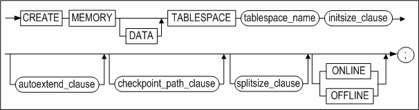

**initsize_clause ::=**


**autoextend_clause ::=**


**maxsize_clause ::=**


**checkpoint_path_clause ::=**

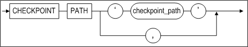

**splitsize_clause ::=**

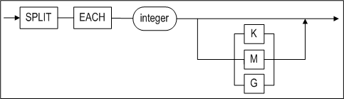

#### 전제 조건

테이블스페이스는 SYS 사용자이거나 CREATE TABLESPACE 시스템 권한을 가진
사용자만이 테이블스페이스를 생성할수 있다.

#### 설명

데이터베이스 내에 데이터베이스 객체를 저장할 수 있는 메모리 데이터
테이블스페이스를 생성하는 구문이다. 이 구문으로 생성된 테이블스페이스에는 메모리
테이블이 저장될 수 있다.

*MEMORY*

메모리 테이블스페이스를 생성할 것을 지정한다.

*DATA*

사용자의 데이터를 저장할 테이블스페이스를 생성할 것을 지정한다. DATA 키워드 없이
CREATE TABLESPACE 구문을 수행하여도 기본적으로 데이터 테이블스페이스가 생성된다.

*tablespace_name*

생성될 테이블스페이스의 이름을 명시한다. 테이블스페이스 이름은  2장 "객체 이름
규칙"을 따라야 한다.

*initsize_clause*

생성될 테이블스페이스의 초기 크기를 지정한다.

*SIZE*

테이블스페이스의 초기 크기를 명시한다. 이는 메모리 테이블스페이스의 기본 확장 크기의 배수여야 한다. (즉,
EXPAND_CHUNK_PAGE_COUNT 프로퍼티에 지정된 페이지 개수 \* 메모리 테이블스페이스의
한 페이지 크기 (32kB))

예를 들어 EXPAND_CHUNK_PAGE_COUNT프로퍼티를 128로 지정했다면, 메모리
테이블스페이스의 기본 확장 크기는 128 \* 4MB가 될 것이다. 그러므로 초기 크기는
4MB의 배수여야 한다.

이 값은 Kilobytes(K), Megabytes(M), 또는 Gigabytes(G) 단위로 명시할 수 있다.
단위를 명시하지 않을 경우 기본 단위는 Kilobytes이다.

*autoextend_clause*

테이블스페이스가 자동으로 확장될 지 여부를 명시한다. 이 절을 생략하면,
AUTOEXTEND는 기본으로 꺼진다.

*ON*

AUTOEXTEND 옵션이 켜진다.

*OFF*

AUTOEXTEND 옵션이 꺼진다.

*NEXT*

테이블스페이스가 자동으로 크기가 증가될 때 증가할 양을 명시한다.

단, 이 크기는 메모리 테이블스페이스의 기본 확장 크기의 배수여야 한다.
(EXPAND_CHUNK_PAGE_COUNT 프로퍼티에 지정된 페이지 개수 \* 메모리
테이블스페이스의 한 페이지 크기 (32kB))

AUTOEXTEND를 ON으로 지정하고 이 값을 명시하지 않을 경우, 기본값은
EXPAND_CHUNK_PAGE_COUNT프로퍼티에 지정한 값이다.

AUTOEXTEND가 OFF일 때 이 값은 의미없다. 

이 값은 Kilobytes(K), Megabytes(M), 또는 Gigabytes(G) 단위로 명시할 수 있다. 단위를 명시하지 않을 경우 기본 단위는 Kilobytes이다.

*maxsize_clause*

테이블스페이스 자동 확장 시 확장할 수 있는 최대 크기를 명시한다. AUTOEXTEND는 ON
으로 지정하고 이 값을 명시하지 않을 경우 기본값은 UNLIMITED이다.

AUTOEXTEND가 OFF이면 이 값은 의미없다.

이 값은 Kilobytes(K), Megabytes(M), 또는 Gigabytes(G) 단위로 명시할 수 있다. 단위를 명시하지 않을 경우 기본 단위는 Kilobytes이다.

*UNLIMITED*

테이블스페이스가 자동 확장되는 크기에 제한이 없음을 명시한다.

이 옵션이 사용되면, 테이블스페이스는 그 크기가 데이터베이스내의 모든 메모리
테이블스페이스와 모든 휘발성 테이블스페이스의 총 크기가 MEM_MAX_DB_SIZE
프로퍼티에 지정된 크기에 도달할 때까지 자동으로 증가될 것이다.

*checkpoint_path_clause*

메모리 테이블스페이스에 저장된 데이터의 영속성을 보장하기 위해 데이터는 파일에
저장되어야 한다. 이러한 메모리 테이블스페이스의 데이터 저장 파일을 “체크포인트
이미지”라고 한다.

checkpoint_path절은 체크포인트 이미지 파일이 저장될 체크포인트 경로(Path)들을
지정한다. 체크포인트 경로를 지정하지 않은 경우 MEM_DB_DIR 프로퍼티에 지정한 경로가 기본
경로로 사용된다.

*checkpoint_path*

메모리 테이블스페이스의 체크포인트시 체크포인트 이미지가 저장되는 경로이다.
체크포인트 및 테이블스페이스 로딩시 디스크 입출력 비용을 분산할 수 있도록 다수의
경로가 지정될 수 있다.

*split_each_clause*

이 절은 체크포인트 파일을 좀 더 작은 파일로 분리시키기 위해 사용된다. 이는
메모리 테이블스페이스의 크기가 운영체제에서 지원하는 최대 파일 크기를 초과할 때,
또는 입출력 비용을 분산하기 위해서 유용하다. 분할된 파일의 크기는 사용자가
지정할 수 있다. 크기를 지정하지 않을 경우 DEFAULT_MEM_DB_FILE_SIZE 프로퍼티에
지정된 값이 기본으로 사용된다.

이 값은 Kilobytes(K), Megabytes(M), 또는 Gigabytes(G) 단위로 명시할 수 있다.
단위를 명시하지 않을 경우 기본 단위는 Kilobytes이다.

#### 예제

\<질의 1\> 초기 크기가 512MB이고, 자동 확장되지 않는 사용자 정의 메모리 데이터
테이블스페이스를 생성한다. (체크포인트 이미지는 MEM_DB_DIR 프로퍼티에 지정된
경로에 저장된다. 분할될 체크포인트 이미지 파일의 크기는 DEFAULT_MEM_DB_FILE_SIZE
프로퍼티의 값을 따른다.)

```
iSQL> CREATE MEMORY DATA TABLESPACE user_data SIZE 512M;
Create success.
```

\<질의 2\> 초기 크기가 512MB이고, 128MB 단위로 자동 확장되는[<sup>4</sup>] 사용자 정의
메모리 데이터 테이블스페이스를 생성한다. (체크포인트 이미지는 MEM_DB_DIR
프로퍼티에 지정된 경로에 저장된다. 분할될 체크포인트 이미지 파일의 크기는
DEFAULT_MEM_DB_FILE_SIZE 프로퍼티의 값을 따른다.)

> [<sup>4</sup>] 테이블스페이스의 최대 크기를 MAXSIZE절을 이용하여 지정하지 않았으므로, 기본적으로 UNLIMITTED를 지정한 것과 같다. 이 경우 시스템에 존재하는 모든 메모리
> 테이블스페이스와 휘발성 테이블스페이스의 크기의 총합이 MEM_MAX_DB_SIZE
> 프로퍼티에 지정된 값을 벗어나지 않는 한도 내에서 테이블스페이스의 확장이
> 이루어진다.

```
iSQL> CREATE MEMORY DATA TABLESPACE user_data 
SIZE 512M 
AUTOEXTEND ON NEXT 128M;
Create success.
```

\<질의 3\> 초기 크기가 512MB 이고, 최대 1GB까지 128MB 단위로 자동 확장되는
사용자 정의 메모리 데이터 테이블스페이스를 생성한다. (체크포인트 이미지는
다중화를 위해 3개의 디렉토리에 나누어 저장하고, 분할될 체크포인트 이미지 파일의
크기를 256M로 한다.)

```
iSQL> CREATE MEMORY DATA TABLESPACE user_data 
SIZE 512M AUTOEXTEND ON NEXT 128M MAXSIZE 1G 
CHECKPOINT PATH ‘/dbs/path1’, ‘/dbs/path2’, ‘/dbs/path3’ 
SPLIT EACH 256M;
Create success.
```


### CREATE VOLATILE TABLESPACE 

#### 구문 

**create_tablespace ::=**


**initsize_clause ::=**


**autoextend_clause ::=**


**maxsize_clause ::=**


#### 전제 조건

테이블스페이스는 SYS 사용자이거나 CREATE TABLESPACE 시스템 권한을 가진 사용자만
테이블스페이스를 생성할 수 있다.

#### 설명

데이터베이스 내에 데이터베이스 객체를 저장할 수 있는 휘발성 테이블스페이스를
생성하는 구문이다. 이 구문으로 생성한 테이블스페이스에는 휘발성 테이블을 생성할
수 있다.

*VOLATILE*

휘발성 테이블스페이스를 생성할 것을 지정한다.

*DATA*

사용자의 데이터를 저장할 테이블스페이스를 생성할 것을 지정한다. DATA 키워드 없이
CREATE TABLESPACE 구문을 수행하여도 기본으로 데이터 테이블스페이스가 생성된다.

*tablespace_name*

생성될 테이블스페이스의 이름을 명시한다. 테이블스페이스 이름은  2장 "객체 이름 규칙"을 따라야 한다.

*initsize_clause*

생성될 테이블스페이스의 초기 크기를 지정한다.

*SIZE*

테이블스페이스의 초기 크기를 명시한다. 이는 메모리 테이블스페이스의 기본 확장 크기의 배수여야 한다. (즉,
EXPAND_CHUNK_PAGE_COUNT 프로퍼티에 지정된 페이지 개수 \* 메모리 테이블스페이스의
한 페이지 크기 (32kB))

예를 들어 EXPAND_CHUNK_PAGE_COUNT프로퍼티를 128로 지정했다면, 메모리
테이블스페이스의 기본 확장 크기는 128 \* 4MB가 될 것이다. 그러므로 초기 크기는
4MB의 배수여야 한다.

이 값은 Kilobytes(K), Megabytes(M), 또는 Gigabytes(G) 단위로 명시할 수 있다.
단위를 명시하지 않을 경우 기본 단위는 Kilobytes이다.

*autoextend_clause*

테이블스페이스가 자동으로 확장될 지 여부를 명시한다. 이 절을 생략하면,
AUTOEXTEND는 기본으로 꺼진다.

*ON*

AUTOEXTEND 옵션이 켜진다.

*OFF*

AUTOEXTEND 옵션이 꺼진다.

*NEXT*

테이블스페이스가 자동으로 크기가 증가될 때 증가할 양을 명시한다. 단, 이 크기는 메모리 테이블스페이스의 기본 확장 크기의 배수여야 한다. (EXPAND_CHUNK_PAGE_COUNT 프로퍼티에 지정된 페이지 개수 \* 메모리
테이블스페이스의 한 페이지 크기 (32kB))

AUTOEXTEND를 ON으로 지정하고 이 값을 명시하지 않을 경우, 기본값은
EXPAND_CHUNK_PAGE_COUNT프로퍼티에 지정한 값이다.

AUTOEXTEND가 OFF일 때 이 값은 의미없다.

이 값은 Kilobytes(K), Megabytes(M), 또는 Gigabytes(G) 단위로 명시할 수 있다.
단위를 명시하지 않을 경우 기본 단위는 Kilobytes이다.

*maxsize_clause*

테이블스페이스 자동 확장 시 확장할 수 있는 최대 크기를 명시한다. AUTOEXTEND는 ON
으로 지정하고 이 값을 명시하지 않을 경우 기본값은 UNLIMITED이다.

AUTOEXTEND가 OFF이면 이 값은 의미없다.

이 값은 Kilobytes(K), Megabytes(M), 또는 Gigabytes(G) 단위로 명시할 수 있다.
단위를 명시하지 않을 경우 기본 단위는 Kilobytes이다.

*UNLIMITED*

테이블스페이스가 자동 확장되는 크기에 제한이 없음을 명시한다.

이 옵션이 사용되면, 테이블스페이스는 그 크기가 데이터베이스내의 모든 메모리
테이블스페이스와 모든 휘발성 테이블스페이스의 총 크기가 MEM_MAX_DB_SIZE
프로퍼티에 지정된 크기에 도달할 때까지 자동으로 증가될 것이다.

#### 예제

\<질의 1\> 초기 크기가 512MB이고, 자동 확장되지 않는 사용자 정의 휘발성 데이터
테이블스페이스를 생성한다.

```
iSQL> CREATE VOLATILE DATA TABLESPACE user_data SIZE 512M;
Create success.
```

\<질의 2\> 초기 크기가 512MB이고, 128MB 단위로 자동 확장되는 사용자 정의 휘발성
데이터 테이블스페이스를 생성한다.

```
iSQL> CREATE VOLATILE DATA TABLESPACE user_data SIZE 512M AUTOEXTEND ON NEXT
128M;
Create success.
```

### CREATE TEMPORARY TABLESPACE 

#### 구문

**create_temporary_tablespace ::=**

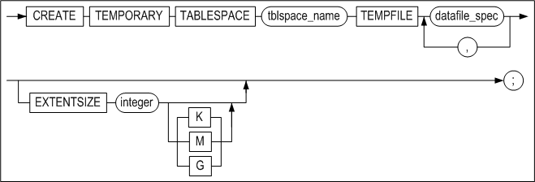

**datafile_spec ::=**


**autoexetend_clause ::=**


#### 전제 조건

SYS 사용자이거나 CREATE TABLESPACE 시스템 권한을 가진 사용자만이 임시
테이블스페이스를 생성할 수 있다.

#### 설명

어떤 세션이 지속되는 동안 사용되는 임시 결과를 저장하기 위한 임시
테이블스페이스를 생성하는 구문이다. 임시 테이블스페이스는 디스크 공간에 생성되고
임시 테이블스페이스의 데이터는 데이터 파일에 저장된다.

데이터베이스 내에 데이터베이스 객체를 영구적으로 저장하려면 CREATE DISK
TABLESPACE 문을 사용하도록 한다.

*tblspace_name*

생성할 임시 테이블스페이스 이름을 명시한다. 테이블스페이스 이름은  2장 "객체 이름 규칙"을 따라야 한다.

*TEMPFILE datafile_space*

임시 테이블스페이스를 구성하는 임시 파일(들)을 명시하는 절이다.

#### 예제

\<질의\> 임시 테이블스페이스를 구성하는 데이터 파일이 tbs.temp인 5MB의 temp_data
테이블스페이스를 생성한다.

```
iSQL> CREATE TEMPORARY TABLESPACE temp_data
  TEMPFILE '/tmp/tbs.temp' SIZE 5M 
  AUTOEXTEND ON; 
Create success.
```


### CREATE TRIGGER

#### 구문

**create_trigger ::=**


**simple_dml_trigger ::=**


**trigger_event ::=**

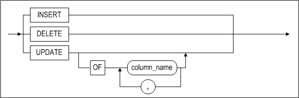

**referencing_clause ::=**


**trigger_action::=**

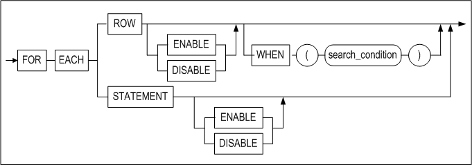

**psm_body::=**


**instead_of_dml_trigger::=**


#### 전제 조건

아래의 조건 중 하나 이상을 만족해야 한다.

- SYS 사용자이다.
- 사용자 자신의 테이블에 트리거를 생성하려면, CREATE TRIGGER 또는 CREATE ANY
  TRIGGER 시스템 권한을 가지고 있어야 한다.
- 다른 사용자의 테이블에 트리거를 생성하려면, CREATE ANY TRIGGER 시스템 권한을
  가지고 있어야 한다.

#### 설명 

명시된 이름으로 트리거를 생성한다.

*OR REPLACE*

이 절은 트리거가 이미 존재한다면 같은 이름의 트리거로 교체할 때 사용된다. 즉, 이
절은 존재하는 트리거를 제거한 후 재생성하는 대신에 기존 트리거의 정의를
변경한다.

*user_name*

생성될 트리거의 소유자 이름을 명시한다. 생략하면 Altibase는 현재 사용자가 소유한
테이블에 트리거를 생성한다.

*trigger_name*

생성될 트리거의 이름을 명시한다. 트리거 이름은 2장 "객체 이름 규칙"을 따라야 한다.

*AFTER*

트리거가 동작될 시점을 지정한다. AFTER 옵션은 *trigger_event*가 수행된 후에
트리거가 동작될 것을 지정한다.

*BEFORE*

BEFORE 옵션은 *trigger_event*가 수행되기 전에 트리거가 동작될 것을 지정한다.

*INSTEAD OF*

INSTEAD OF 옵션은 트리거를 유발한 DML 구문은 수행되지 않고 트리거만 동작할 것을
지정한다. INSTEAD OF 트리거는 뷰에만 생성할 수 있다. 만약 뷰에 LOB 칼럼이 있는
경우 INSTEAD OF 옵션으로 트리거를 생성할 수는 있으나, 트리거의 동작을 유발하는
DML문이 실행될 때 오류가 발생한다.

*trigger_event*

이는 테이블의 데이터를 변경시키는 이벤트로 트리거의 동작을 유발시킨다. 단
데이터베이스의 무결성을 지키기 위해 이중화 수신자에 의해 적용되는 테이블
데이터의 변경은 트리거 이벤트로 처리되지 않는다 (즉, 트리거 동작을 유발시키지
않는다). *trigger_event*로 다음의 세 가지 유형의 DML문을 지정할 수 있다.

- DELETE  
  해당 테이블의 데이터를 삭제하는 DELETE 구문 수행 시 트리거 동작이 유발된다.
- INSERT  
  해당 테이블에 데이터를 삽입하는 INSERT 구문 수행 시 트리거 동작이 유발된다.
  하지만 LOB 칼럼이 있는 테이블에는 'BEFORE INSERT ... FOR EACH ROW' 구문으로
  트리거를 생성할 수는 있으나, 트리거의 동작을 유발하는 DML문이 실행될 때
  오류가 발생한다.
- UPDATE  
  해당 테이블의 데이터를 변경하는 UPDATE 구문 수행 시 트리거 동작이 유발된다.
  UPDATE 트리거 이벤트에 OF 절을 사용할 경우 OF 절에 명시된 컬럼이 변경될
  경우에만 트리거를 동작시킨다.

*ON table_name*

트리거가 동작할지를 결정하기 위해 참조하는 테이블을 지정한다. 트리거는
*table_name*에 정의된 테이블의 변경에 따라 동작이 유발될 것이다.

트리거는 일반 테이블만 참조할 수 있다. 뷰, 시퀀스, 저장 프로시저와 같은 객체를
기반으로 트리거를 생성할 수 없다.

이중화에 포함되어 있는 테이블에는 트리거를 생성할 수 없다. 그러나, 트리거가 이미
존재하는 테이블에 대한 이중화 생성은 가능하다.

User_name이 생략되면, Altibase는 현재 사용자 소유의 테이블을 기반으로 트리거를
생성할 것이다.

*REFERENCING 절*

트리거의 특성상 old row와 new row의 개념을 갖는다. 즉, 트리거가 참조하는
테이블의 데이터 변경시, 변경된 각 row는 이전 값과 이후 값을 갖게 된다.
REFERENCING 절을 사용해서 old row 및 new row를 참조할 수 있다.

REFERENCING 절은 다음과 같은 제약을 갖는다.

- REFERENCING 절은 FOR EACH ROW 옵션과 함께인 경우에만 사용할 수 있다.
- REFERENCING 절은 *trigger_action* 절에서 참조할 수 있도록 다음과 같은 구조를
  가져야 한다.
- {OLD\|OLD ROW\|OLD ROW AS\|OLD AS} alias_name  
  변경되기 이전의 로우(row)를 의미한다. 이는 WHEN 절 또는 trigger_action의
  psm_body 내에서 참조될 수 있다. 트리거 이벤트가 INSERT문일 때는 이전의 값이
  없기 때문에 이전 값 참조는 불가능하다.
- {NEW\|NEW ROW\|NEW ROW AS\|NEW AS} alias_name  
  변경된 후의 로우(row)를 의미한다. 단, BEFORE TRIGGER의 경우 트리거 바디
  내에서 이들 데이터를 변경하는 것이 가능하다. 트리거 이벤트가 DELETE문일 경우
  이후 값이 없기 때문에 이후 값 참조는 불가능하다.

*trigger_action*

트리거 작동 절은 다음과 같은 세 가지 부분으로 구성된다.

- Action granularity: 트리거가 수행되는 단위 지정 (ROW 또는 STATEMENT)
- Action WHEN condition: 트리거 동작 여부를 결정하는 추가 조건을 선택적으로
  명시
- Action body: 트리거가 실제로 무엇을 수행하는지 명시

*FOR EACH {ROW\|STATEMENT}*

트리거 수행 단위를 명시한다. 테이블의 데이터 변경시 여기에 명시된 단위에 따라서
트리거가 발생한다. 기본값은 FOR EACH STATEMENT이다.

- FOR EACH ROW: trigger_event에 의해 영향을 받고 WHEN 절의 조건을 만족하는 각
  row에 대해서 트리거의 action body 가 수행된다.  
  REFERENCING 절 또는 WHEN 절을 사용하기 위해서는 반드시 FOR EACH ROW 절을
  사용하여야 한다.
- FOR EACH STATEMENT: 트리거 동작을 유발하는 DML 구문의 수행 후 또는 전에 한
  번만 트리거가 동작하게 된다.

*WHEN search_condition*

트리거가 동작 여부를 결정하는 조건을 명시한다. WHEN 절의 *search_conditio*n이
TRUE 인 경우에만 트리거의 action body가 수행되며, FALSE인 경우에는 트리거의
action body가 수행되지 않는다. WHEN 절이 명시되지 않으면, 트리거 이벤트 발생 시
항상 트리거의 action body가 수행된다.

WHEN 절에 조건을 사용하기 위해서는 다음과 같은 제약을 만족해야 한다.

- WHEN 절은 반드시 FOR EACH ROW 절과 함께인 경우에만 사용할 수 있다.
- WHEN 절에는 REFERENCING절에 정의된 alias_name만을 사용할 수 있다.
- WHEN 절에는 부질의를 사용할 수 없다.
- WHEN 절에는 저장 프로시저를 사용할 수 없다.

*psm_body*

트리거의 “action body”를 의미하며, 트리거가 수행할 구문이 여기에 기술된다. 저장
프로시저의 블록 구문과 동일한 방법으로 기술할 수 있다.

Psm_body는 다음과 같은 제약을 만족하여야 한다.

트리거의 특성 및 개념 상 action body를 위한 SQL statement 구문은 다음과 같은
것을 사용할 수 없다.

- COMMIT 또는 ROLLBACK 등과 같은 트랜잭션 관련구문을 사용할 수 없다.
- CONNECT 등과 같은 세션 관련구문을 사용할 수 없다.
- CREATE TABLE 등과 같은 스키마 관련구문을 사용할 수 없다.
- 저장 프로시저를 호출할 수 없다.
- 회기하는 트리거, 즉 trigger_event에 명시된 연산을 수행하는 트리거는 생성할
  수 없다.

*ENABLE \| DISABLE*

사용자가 트리거를 생성할 때 활성화(enable) 또는 비활성화(disable)를 선택할 수
있다. 기본 값은 활성화 상태이다.

- 트리거를 생성할 때 비활성화 상태로 설정하면 동작하지 않으며, ALTER TRIGGER
  구문으로 트리거 상태를 변경할 수 있다.

저장 프로시저의 블록 구문에 대한 자세한 설명은 *Stored Procedures Manual*을
참조하기 바란다.

#### 주의 사항

- 트리거의 수행 순서  
  하나의 테이블에 대하여 하나 이상의 트리거를 정의할 수 있다. 여러 개의
  트리거가 정의되어 있을 때 트리거가 동작되는 순서는 일정하지 않다. 트리거
  동작 순서가 중요할 경우에는 여러 개의 트리거를 하나로 통합하여 재작성 하여야
  한다.
- 트리거의 수행 실패  
  트리거를 수행하던 도중 오류가 발생하면, 해당 트리거를 발생시킨 DML 구문도
  실패하게 된다.
- 트리거 내에서 참조되는 테이블에 발생하는 DDL  
  테이블이 삭제되면 그 테이블에 대해 생성되어 있는 모든 트리거도 삭제된다.  
  그러나 트리거의 action body내에서 참조하는 테이블이 변경되거나 삭제될
  경우에는 트리거는 제거되지 않는다. 참조 테이블이 삭제되어 해당 트리거의
  action body가 수행될 수 없는 경우, 그 트리거를 발생시킨 DML 구문은 실패할
  것이다. 참조 테이블이 변경된 경우에는 트리거 발생시에 트리거가 내부적으로 재
  컴파일되어 정상적으로 수행될 것이다.
- 트리거와 이중화  
  이중화로 인해 반영되는 테이블 데이터의 변경은 트리거 동작을 발생시키지
  않는다.

#### 예제

\<질의\> 다음 예제는 행의 삭제를 추적하기 위해 트리거를 어떻게 사용하는지를
보여준다. 이 예제에서 배달이 완료(processing=’D’)된 주문에 관련된 데이터가
orders 테이블에서 삭제될 때, 트리거는 FOR EACH ROW 기준으로 동작되고 orders
테이블의 ono, cno, qty 및 arrival_date 칼럼의 원래 값을 참조한다. 이 트리거는
orders 테이블에서 삭제된 행의 값을 log_tbl에 입력한다.

```
iSQL> CREATE TABLE log_tbl(
  ono BIGINT,
  cno BIGINT,
  qty INTEGER,
  arrival_date DATE,
  sysdate DATE);
Create success.

iSQL> CREATE TRIGGER del_trigger
  AFTER DELETE ON orders
  REFERENCING OLD ROW old_row
  FOR EACH ROW
  AS BEGIN
    INSERT INTO log_tbl VALUES(old_row.ono, old_row.cno, old_row.qty, old_row.arrival_date, sysdate);
  END;
/
Create success.

iSQL> DELETE FROM orders WHERE processing = 'D';
2 rows deleted.
iSQL> SELECT * FROM log_tbl;
ONO                  CNO                  QTY         ARRIVAL_DATE
------------------------------------------------------------------------
SYSDATE
---------------
11290011             17                   1000        05-DEC-2011
25-APR-2012
11290100             11                   500         07-DEC-2011
25-APR-2012
2 rows selected.
```

\<질의\> 다음의 예제에서, 트리거는 scores 테이블에 레코드가 입력될 때, score
칼럼의 값이 지정되어 있지 않으면(NULL이면) 이 값을 0으로 변경한다. 이를 위해서
FOR EACH ROW 기준으로 발생되는 BEFORE INSERT 트리거를 생성하면 된다.

```
iSQL> CREATE TABLE scores( id INTEGER, score INTEGER );
Create success.
iSQL> CREATE TRIGGER scores_trigger
BEFORE INSERT ON scores
REFERENCING NEW ROW NEW_ROW
FOR EACH ROW
AS BEGIN
  IF NEW_ROW.SCORE IS NULL THEN
     NEW_ROW.SCORE := 0;
  END IF;
END;
/
Create success.

iSQL> INSERT INTO scores VALUES( 1, 20 );
1 row inserted.
iSQL> INSERT INTO scores VALUES( 5, NULL );
1 row inserted.
iSQL> INSERT INTO scores VALUES( 17, 75 );
1 row inserted.

iSQL> SELECT * FROM SCORES;
ID          SCORE       
---------------------------
1           20          
5           0           
17          75          
3 rows selected.
```

\<질의\> 트리거를 비활성화(disable) 상태로 생성하여 동작을 확인한 후에
활성화(enable) 상태로 변경하여 동작을 확인한다.

```
iSQL> CREATE TABLE scores( id INTEGER, score INTEGER );
Create success.

iSQL> CREATE TRIGGER scores_trigger
BEFORE INSERT ON scores
REFERENCING NEW ROW NEW_ROW
FOR EACH ROW
DISABLE
AS BEGIN
IF NEW_ROW.SCORE IS NULL THEN
NEW_ROW.SCORE := 0;
END IF;
END;
/
Create success.

iSQL> INSERT INTO scores VALUES( 1, 20 );
1 row inserted.
iSQL> INSERT INTO scores VALUES( 5, NULL );
1 row inserted.
iSQL> INSERT INTO scores VALUES( 17, 75 );
1 row inserted.

iSQL> SELECT * FROM SCORES;
ID SCORE
---------------------------
1 20
5
17 75
3 rows selected.

iSQL> ALTER TRIGGER scores_trigger ENABLE;
Alter success.

iSQL> INSERT INTO scores VALUES( 100, NULL );
1 row inserted.

iSQL> SELECT * FROM SCORES;
ID SCORE
---------------------------
1 20
5
17 75
100 0
4 rows selected.
```


### CREATE USER 

#### 구문

**create_user ::=**


**<a name="password_parameters"><a/>**

**password_parameters ::=**


#### 전제 조건

SYS 사용자와 CREATE USER 시스템 권한을 가진 사용자만이 사용자를 생성할 수 있다.

#### 설명

명시된 사용자 이름, 암호, 테이블스페이스 접근 권한으로 데이터베이스 사용자를
생성하는 구문이다.

*user_name*

생성될 사용자 이름을 명시한다. 사용자의 이름은 데이터베이스 내에서 유일해야
한다. 사용자 이름은 2장의 "객체 이름 규칙"을 따라야 한다.

*IDENTIFIED BY password*

Altibase는 비밀 번호를 사용해서 사용자를 인증한다. 사용자 비밀 번호의 최대
길이는 40바이트이다. 만일 이보다 더 긴 문자열의 비밀 번호를 명시하여 사용자를
생성하면, 오류가 반환된다. 비밀 번호는 기본적으로 대소문자 구분 없이 대문자로
인식된다. 만약 사용자 암호의 대소문자를 구분하기 위해서는
CASE_SENSITIVE_PASSWORD 프로퍼티를 1로 설정한 다음, CREATE USER 구문으로
사용자를 생성할 때 암호를 큰따옴표(")로 묶는다.

사용자 비밀 번호는 2장의 "객체 이름 규칙"을 따라야 한다.

*TEMPORARY TABLESPACE 절*

이는 사용자가 테이블에 연산 수행시 중간 결과가 저장될 용도로 사용될 기본 임시
테이블스페이스(DEFAULT TEMPORARY TABLESPACE)를 지정하는 절이다.

이를 명시하지 않으면 시스템 임시 테이블스페이스<sup>[5]</sup>가 해당 사용자의 기본 임시
테이블스페이스로 지정된다.

> <sup>[5]</sup>: SYSTEM TEMPORARY TABLESPACE는 쿼리 수행 중에 발생되는 임시 데이타들을 저장하는데 사용된다. 로깅이 수행되지 않기 때문에 매체 오류시 이 테이블스페이스의
> 데이터는 복구가 불가능하다.

사용자가 디스크 기반 테이블에 대한 SQL문을 수행할 때 일반적으로 임시
테이블스페이스가 사용된다. 

만약 SQL문내의 모든 테이블들이 메모리에 존재하는 테이블이라면, 쿼리 수행시
Altibase가 사용하는 공간도 모두 메모리이며, 사용자가 힌트를 사용하지 않는다면
임시 테이블스페이스를 사용하지 않는다.

임시 테이블스페이스는 한 사용자에 하나만 지정할 수 있다.

*DEFAULT TABLESPACE 절*

사용자가 생성한 객체를 저장할 기본 테이블스페이스를 명시한다. 이 절을 생략하면
시스템 메모리 기본 테이블스페이스가 사용자의 기본 테이블스페이스가 된다.

기본 테이블스페이스는 한 사용자에 하나만 지정할 수 있다.

*ACCESS 절*

명시한 (*tablespace_name*) 테이블스페이스에 접근 가능 여부를 지정하는 절이다.
ACCESS *tablespace_name* ON으로 지정한 테이블스페이스에 대해서는 사용자는 접근
권한을 부여 받는다. OFF로 명시한 테이블스페이스에 대해서는 사용자가 접근이
불가능하다.

물론, ALTER TABLESPACE 시스템 권한이 부여된 사용자는 테이블스페이스 접근이
가능하다.

*ENABLE/ DISABLE*

사용자의 TCP 접속을 허용하거나 제한할 수 있다. 이 절은 SYS 사용자만 수행할 수
있다.

*FAILED_LOGIN_ATTEMPTS*

로그인을 시도할 때 이 값에 설정한 횟수만큼 실패하면 해당 계정은 잠금이 해제될
때까지 로그인이 불가능하다.  
PASSWORD_LOCK_TIME이 설정되어 있는 경우 해당 기간이 경과하면 잠금이 자동으로
해제된다.

*PASSWORD_LOCK_TIME*

차단된 계정이 해제되기 위해 경과되어야 하는 날짜(단위: 일)를 지정한다. 예를
들어, 이 값을 5로 지정했을 때 계정이 잠긴다면, 해당 계정은 5일이 지난 후에
잠금이 풀리고 로그인이 가능해진다.

*PASSWORD_LIFE_TIME*

계정의 패스워드가 유효한 기간(단위: 일)을 지정한다. 마지막으로 패스워드를 변경한
시점을 기준으로 PASSWORD_LIFE_TIME이 적용된다.

*PASSWORD_GRACE_TIME*

계정의 패스워드가 만료된 이후의 변경할 수 있는 유예 기간(단위: 일)을 지정한다.
패스워드 유효 기간이 만료되면 유예 기간이 경과하기 전에 해당 계정으로 로그인하여
패스워드를 변경해야 한다. 만약 패스워드 유예기간도 경과하면, SYS 계정으로
로그인하여 해당 계정의 패스워드를 변경해야 한다.

*PASSWORD_REUSE_TIME*

동일한 패스워드를 재사용하기 위해 경과해야 하는 기간(단위:일)을 지정한다. 즉,
여기에 설정한 기간이 지난 후에 동일한 패스워드를 재사용할 수 있다.

*PASSWORD_REUSE_MAX*

동일한 패스워드를 재사용하기 위한 패스워드 변경 횟수를 지정한다. 즉, 여기에
설정한 횟수만큼 패스워드를 변경한 후에 동일한 패스워드를 재사용할 수 있다.

> 주의: PASSWORD_REUSE_MAX 또는 PASSWORD_REUSE_TIME 중 하나만 지정하면, 동일한
> 패스워드를 재사용할 수 없다.

*PASSWORD_VERIFY_FUNCTION*

여기에 사용자 정의 콜백 함수(CALLBACK function)를 등록하여 패스워드를 검증하도록
할 수 있다. 사용자 정의 콜백 함수는 반드시 'TRUE'를 반환해야 한다.

패스워드 검증용 콜백 함수는 아래와 같은 입력 파라미터와 반환 타입을 가져야 한다:

```
CREATE OR REPLACE FUNCTION pwd_verify_function (
  username varchar(20),
  password varchar(20))
  RETURN varchar(100)
AS
result        varchar(100);
...
BEGIN
    ...
    result := 'TRUE';
    RETURN result;
END;
/
```


#### 제한 사항

한 사용자는 여러 데이터 테이블스페이스를 사용할 수 있다. 그러나 한 사용자는 임시
테이블스페이스는 하나만 사용할 수 있다.

사용자가 명시적으로 시스템 언두 테이블스페이스에 접근하거나, 언두 테이블스페이스
내에 테이블이나 인덱스 등을 생성하는 것은 불가능하다. 또한, 시스템 언두
테이블스페이스는 데이터베이스 내에 오직 하나만 존재하며, 사용자가 이를
생성하거나 삭제할 수 없다.

#### 예제

\<질의\> 사용자 명이 uare1이고 암호가 rose1인 사용자를 생성하라.

```
iSQL> CREATE USER uare1 IDENTIFIED BY rose1;
Create success.
```

\<질의\> 사용자 이름이 uare4이고 암호가 rose4인 사용자를 생성하라. 또한
user_data를 사용자의 기본 테이블스페이스로, temp_data 테이블스페이스를 임시
테이블스페이스로 사용하며, 메모리 테이블스페이스인 SYS_TBS_MEMORY에 대해 접근
권한을 가지고 있다.

```
iSQL> CREATE USER uare4
        IDENTIFIED BY rose4
        DEFAULT TABLESPACE user_data
        TEMPORARY TABLESPACE temp_data
        ACCESS SYS_TBS_MEMORY ON;
Create success.
```

\<질의\> 로그인을 5번 실패하면 해당 계정이 잠기고, 5일 후에 잠금이 풀리게 되는
사용자 rose2를 생성한다.

```
iSQL> CREATE USER rose2 IDENTIFIED BY rose2 
  LIMIT (FAILED_LOGIN_ATTEMPTS 5, PASSWORD_LOCK_TIME 5);
```

\<질의\> 5일 후에 패스워드가 만료되고, 그 후 5일간 유예기간을 갖는 사용자
rose3을 생성한다.

```
iSQL> CREATE USER rose3 IDENTIFIED BY rose3
  LIMIT (PASSWORD_LIFE_TIME 5, PASSWORD_GRACE_TIME 5);
```

\<질의\> 패스워드를 3회 변경하고 10일이 지난 후에 동일한 패스워드를 재사용할 수
있는 사용자 rose4를 생성한다.

```
iSQL> CREATE USER rose4 IDENTIFIED BY rose4
  LIMIT (PASSWORD_REUSE_MAX 3, PASSWORD_REUSE_TIME 10);
```


### CREATE VIEW

#### 구문

**create_view ::=**

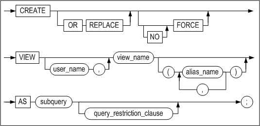

**query_restriction_clause ::=**


#### 전제 조건

아래의 조건 중 하나 이상을 만족해야 사용할 수 있다.

- SYS 사용자이다.
- 사용자 자신의 스키마에 테이블을 생성하려면, CREATE TABLE 또는 CREATE ANY
  TABLE 시스템 권한을 가지고 있어야 한다.
- 다른 사용자의 스키마에 테이블을 생성하려면, CREATE ANY TABLE 시스템 권한을
  가지고 있어야 한다.

#### 설명

명시된 이름으로 새로운 뷰를 생성한다. 뷰(view)란 하나 이상의 테이블 또는 뷰를
기반으로 하는 논리적인 테이블(logical table)이다. 뷰는 실제 데이터를 가지고 있지
않다. 뷰의 기반이 된 테이블을 베이스 테이블(base table)이라 한다.

*OR REPLACE*

이 절은 뷰가 이미 존재한다면 같은 이름의 뷰로 교체할 때 사용된다. 즉, 이 절은
존재하는 뷰를 제거한 후 재 생성하는 대신에 기존 뷰의 정의를 변경하는 기능을
제공한다.

*FORCE*

뷰의 베이스 테이블 존재 여부와 뷰를 내포하고 있는 스키마 소유자의 권한 유무에
상관없이 뷰가 생성되도록 하는 옵션이다.

이는 의미상으로 오류를 내포한 무효한 상태의 뷰가 생성될 수 있음을 의미한다. 이런
경우, 뷰에 대해 SELECT 문 수행 시 오류가 발생할 것이기 때문에, FORCE 옵션을
사용해 뷰를 생성한 후에는 뷰를 SELECT 해보거나 SYS_VIEWS\_ 메타 테이블을 조회해
뷰의 상태를 확인해야 한다.

*NO FORCE*

이 옵션을 사용하면 뷰의 베이스 테이블이 존재하고 뷰를 내포하고 있는 스키마
소유자가 권한을 가지고 있을 때만 뷰가 생성된다. 이 옵션이 기본값이다.

*user_name*

생성될 뷰의 소유자 이름을 명시한다. 생략하면 Altibase는 현재 세션에 연결된
사용자의 스키마에 뷰를 생성한다.

*view_name*

생성될 뷰의 이름을 명시한다. 뷰의 이름은 2장 "객체 이름 규칙"을 따라야 한다.

*alias_name*

베이스 테이블로부터 검색하는 대상이 표현식인 경우 표현식을 위한 별칭을 명시해야
한다. 이 별칭이 뷰의 칼럼 명이 된다. 별칭의 개수는 subquery의 검색 대상(표현식과
칼럼)의 총 개수와 동일해야 한다.

*subquery*

베이스 테이블로부터 조회하는 열과 행을 식별하는 부질의를 명시한다.

*WITH READ ONLY*

뷰가 읽기 전용임을 지정할 수 있다. 이 옵션을 명시하지 않으면, INSERT, UPDATE,
DELETE 같은 변경 연산을 수행할 수 있는 Updatable View가 생성된다.

#### 주의 사항

- 뷰가 저장된 스키마의 소유자는 뷰의 기반이 되는 테이블 또는 뷰로부터 SELECT
  문을 수행하는데 필요한 권한을 가지고 있어야 한다.
- 베이스 테이블에 대한 SELECT문의 검색 대상에 명시할 수 있는 표현식의 개수는
  최대 1024개이다.
- CURRVAL과 NEXTVAL 의사열을 베이스 테이블에 대한 SELECT문의 검색 대상에
  사용할 수 없다.

#### 예제

##### 뷰 생성하기

\<질의\> 다음 예제는 employees 테이블을 기반으로 한 이름이 avg_sal인 뷰를
생성한다. 뷰는 각 부서의 평균 월급을 부서별로 보여준다.

```
iSQL> CREATE VIEW avg_sal AS
  SELECT dno, AVG(salary) emp_avg_sal
FROM employees
  GROUP BY dno;
Create success.
iSQL> SELECT * FROM avg_sal;
AVG_SAL.DNO  AVG_SAL.EMP_AVG_SAL 
------------------------------------
A001  2066.66667  
C001  1576.66667  
C002  1660     
D001  2075.75   
F001  1845     
                  
6 rows selected.
```

부질의 내에서 표현식 AVG(salary)에 대한 별칭으로 emp_avg_sal이 제공되어 있기
때문에, 뷰의 칼럼을 위한 별칭은 명시할 필요가 없다.

##### 조인 뷰<sup>[6]</sup> 생성하기

> <sup>[6]</sup>:조인 뷰는 뷰의 부질의에 조인을 내포하는 것을 의미한다.

\<질의\> 다음 뷰는 주문된 상품을 담당하고 있는 사원 이름과 상품을 주문한 고객의
이름을 보여준다.

```
iSQL> CREATE VIEW emp_cus AS 
 SELECT DISTINCT e.e_firstname, e.e_lastname, 
  c.c_firstname, c.c_lastname 
 FROM employees e, customers c, orders o 
 WHERE e.eno = o.eno AND o.cno = c.cno;
Create success.
iSQL> SELECT * FROM emp_cus;
E_FIRSTNAME           E_LASTNAME            C_FIRSTNAME           C_LASTNAME
---------------------------------------------------------------------------------------------
Alvar                 Marquez               Estevan               Sanchez
Sandra                Hammond               Pierre                Martin
.
.
.
William               Blake                 Saeed                 Pahlavi
Sandra                Hammond               Saeed                 Pahlavi
22 rows selected.
```


### CREATE MATERIALIZED VIEW

#### 구문

**create_materialized_view ::=**


[table_partitioning_clause ::=](#table_partitioning_clause), [tablespace_clause
::=](#tablespace_clause), [logging_clause ::=](#logging_clause),
[lob_column_properties ::=](#lob_column_properties)

**physical_attributes_clause ::=**


[storage_clause ::=](#storage_clause)

**build_clause ::=**


**refresh_clause ::=**


#### 전제 조건

아래의 조건 중 하나 이상을 만족해야 사용할 수 있다.

- SYS 사용자이다.
- 사용자 자신의 스키마에 materialized view를 생성하려면, CREATE MATERIALIZED
  VIEW 또는 CREATE ANY MATERIALIZED VIEW 시스템 권한을 가지고 있어야 한다.
  또한, 자신의 소유가 아닌 베이스 테이블 각각에 대한 SELECT 객체 권한 또는
  SELECT ANY TABLE 시스템 권한이 있어야 한다.
- 다른 사용자의 스키마에 materialized view를 생성하려면, CREATE ANY
  MATERIALIZED VIEW 시스템 권한을 가지고 있어야 한다. 또한, 소유자의 소유가
  아닌 베이스 테이블 각각에 대한 SELECT 객체 권한 또는 SELECT ANY TABLE 시스템
  권한이 있어야 한다.
- Materialized view를 생성하면, materialized view 객체와 함께 데이터베이스
  내부적으로 사용될 한 개의 뷰와 한 개의 테이블이 자동으로 materialized view의
  스키마에 생성된다. 추가로 생성되는 이러한 객체들은 materialized view의
  데이터를 유지하기 위해 사용된다. Materialized View를 생성하려는 사용자는
  이러한 객체들을 생성하는데 필요한 권한을 가지고 있어야 한다.

#### 설명

명시된 이름으로 새로운 materialized view를 생성한다. Materialized view란 쿼리의
결과를 저장하고 있는 데이터베이스 객체이다. 쿼리의 FROM 절에는 테이블, 뷰, 및
다른 materialized view가 올 수 있다. 이러한 객체들을 "베이스 테이블"이라고 한다.

Materialized view는 쿼리문의 결과를 일반 테이블처럼 테이블스페이스에 저장하며,
주로 데이터 웨어하우스 목적으로 사용된다. 즉, 빈번히 실행되며 수행에 많은 시간이
소요되는 조인이나 집계 함수가 포함된 쿼리문을 materialized view로 생성해 두면,
쿼리 실행 시 수행 시간을 단축할 수 있다.

Altibase는 읽기 전용 materialized view만 제공한다.

*user_name*

생성될 materialized view의 소유자 이름을 명시한다. 생략하면 Altibase는 현재
세션에 연결된 사용자의 스키마에 materialized view를 생성한다.

*mview_name*

생성될 materialized view의 이름을 명시한다. materialized view의 이름은 2장 "객체 이름 규칙"을 따라야 한다. Altibase는 지정한 materialized view의 이름과 동일한 이름으로 materialized view의 데이터를 유지하기
위해 사용되는 테이블을 자동으로 생성한다.

*c_alias*

베이스 테이블로부터 검색하는 대상이 표현식인 경우 표현식을 위한 별칭을 명시해야
한다. 이 별칭이 materialized view의 칼럼 명이 된다. 별칭의 개수는 subquery의
검색 대상(표현식과 칼럼)의 총 개수와 동일해야 한다.

*table_partitioning_clause*

CREATE TABLE 구문의 *table_partitioning_clause* 설명을 참고하라.

*segment_attributes_clause*

CREATE TABLE 구문의 *segment_attributes_clause* 설명을 참고하라.

*lob_column_properties*

CREATE TABLE 구문의 *lob_column_properties* 설명을 참고하라.

*phsical_attributes_clause*

CREATE TABLE 구문의 *phsical_attributes_clause* 설명을 참고하라.

*build_clause 절*

이 절은 Materialized view의 데이터가 최초로 구축되는 시점을 지정한다. 이 절을
생략하면 기본값은 IMMEDIATE이다.

- IMMEDIATE: Materialized view가 생성되는 시점에 데이터 구축.
- DEFERRED: Materialized view이 생성된 후 리프레쉬가 수행될 때 데이터 구축.

*refresh_clause 절*

Materialized view의 베이스 테이블이 변경되면, materialized view의 데이터도
업데이트되어야 한다. 이 절은 Materialized view가 refresh되는 방법과 시기를
지정한다. 이 절을 생략하면 FORCE와 ON DEMAND가 기본값으로 설정된다.

REFRESH 키워드 뒤에 COMPLETE, FAST, FORCE 중의 하나 또는 ON DEMAND, ON COMMIT
중의 하나는 반드시 지정되어야 한다.

- COMPLETE: Materialized view를 생성할 때 정의한 subquery를 수행하여 데이터가
  구축될 것을 지정한다.
- FAST: 현재 미지원.
- FORCE: refresh가 발생할 때, fast refresh가 가능하면 수행하고, 그렇지 않으면
  complete refresh로 수행할 것을 데이터베이스에 지시한다. Altibase는 현재
  FAST를 지원하지 않으므로, FORCE를 지정하는 것은 COMPLETE를 지정한 것과
  동일하다.
- ON DEMAND: 사용자가 요청할 때에만 refresh가 되도록 지정한다.
- ON COMMIT: 현재 미지원
- NEVER REFRESH: 현재 미지원

> 참고: Altibase가 기본적으로 제공하는 REFERESH_MATERIALIZED_VIEW 저장 프로시저를
> 호출해서 사용자가 materialized view의 refresh를 수동으로 요청할 수 있다.
> REFERESH_MATERIALIZED_VIEW 저장 프로시저에 대한 자세한 내용은 *Stored Procedures
> Manual*의 "10장 내장 함수와 저장 프로시저"를 참고하라.

*subquery 절*

Materialized view의 쿼리문을 명시한다. 사용자가 materialized view를 생성하면, 이
절에 명시한 부질의가 실행되며, 그 결과가 materialized view에 저장된다.

#### 예제

\<질의\> employees 테이블을 베이스 테이블로 하여 이름이 mv1인 materialized
view를 생성하라. 이 때 build절과 refresh절을 지정하지 않았기 때문에, 사용자
요청으로만 refresh가 가능하며, refresh시에 complete refresh가 수행된다.

```
CREATE MATERIALIZED VIEW mv1 AS
SELECT * FROM employees;
```


### DISJOIN TABLE

#### 구문

**disjoin_table ::=**

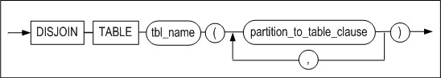


**partition_to_table_clause ::=**

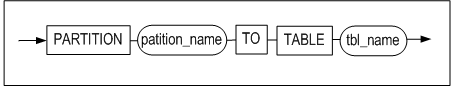

#### 전제 조건

아래의 조건 중 하나 이상을 만족해야 테이블을 생성할 수 있다.

-   SYS 사용자이다.

-   사용자 자신의 스키마에 테이블을 생성하려면, CREATE TABLE 또는 CREATE ANY
    TABLE 시스템 권한을 가지고 있어야 한다.

-   다른 사용자의 스키마에 테이블을 생성하려면, CREATE ANY TABLE 시스템 권한을
    가지고 있어야 한다.

아래의 조건 중 하나 이상을 만족해야 테이블을 제거할 수 있다.

-   SYS 사용자이다.

-   테이블의 소유자이다.

-   DROP ANY TABLE 시스템 권한을 가진 사용자이다.

#### 설명

파티션드 테이블의 파티션이 1개 이상의 테이블로 변환된다. 파티션드 테이블은
삭제되고 논 파티션드 테이블이 생성된다. 파티션들은 각각 명시된 테이블로 변환되며
데이터는 이동된다. 테이블 스페이스 옵션을 지정하지 않으면 사용자의 기본
테이블스페이스에 새 테이블이 생성된다.

*partition_to_table*

파티션드 테이블의 파티션 이름과 변환할 테이블의 이름을 명시한다.

#### 주의 사항

DISJOIN TABLE 구문 사용시에 다음과 같은 점에 주의해야 한다.

-   대상 테이블과 생성되는 파티션드 테이블 이름에 소유자를 명시하지 않는다.

-   새로 생성된 파티션드 테이블에 관련된 메타 테이블이 새로 생성되며, 파티션드
    테이블로 변환된 대상 테이블 관련 메타 테이블은 모두 삭제된다.

-   대상 테이블과 관련된 PSM, 패키지, 뷰는 사용할 수 없다.

-   해시 파티션드 테이블은 지원하지 않는다.

-   대상 파티션드 테이블은 파티션의 속성과 제약 조건, 스키마 등을 동일하게
    갖는다.

#### 예제

\<질의\> 테이블t1의 p1, p2, p3 파티션을 각각 테이블 t2, t3, t4로 변환한다.

```
iSQL> disjoin table t1
(
  partition p1 to table t2,
  partition p2 to table t3,
  partition p3 to table t4
);
Disjoin success.
```


### DROP DATABASE 

#### 구문

**drop_database ::=**


#### 전제 조건

이 구문은 SYS 사용자가 –sysdba 관리자 모드에서만 수행할 수 있으며, PROCESS 구동
단계에서만 수행할 수 있다.

#### 설명

시스템에서 데이터베이스를 삭제하는 구문이다.

*database_name*

삭제할 데이터베이스 이름을 명시한다.

이 구문이 실행되면 해당 데이터베이스가 사용하고 있던 데이터 파일과 로그 파일,
로그 앵커 파일 등이 모두 삭제된다.

#### 예제

\<질의\> mydb라는 이름의 데이터베이스를 삭제하라.

```
iSQL(sysdba)> DROP DATABASE mydb;
Checking Log Anchor files
[Ok] /home /altibase_home/logs/loganchor0 Exist.
[Ok] /home /altibase_home/logs/loganchor1 Exist.
[Ok] /home /altibase_home/logs/loganchor2 Exist.
Removing DB files
Removing Log files
Removing Log Anchor files
Drop success.
```


### DROP DATABASE LINK

데이터베이스 링크에 대한 내용은 DatabaseLink User's Manual을 참고한다.

### DROP DIRECTORY 

#### 구문

**drop_directory ::=**


#### 전제 조건

SYS 사용자와 DROP ANY DIRECTORY 시스템 권한을 가진 사용자만이 디렉토리 객체를
삭제할 수 있다.

#### 설명

디렉토리를 제거하는 구문이다. 단, 실제 파일 시스템상의 디렉토리가 삭제되지는
않고 데이터베이스내의 디렉토리 객체만 삭제된다.

*directory_name*

제거할 디렉토리 이름을 명시한다.

#### 예제

\<질의\> 이름이 alti_dir1인 디렉토리 객체를 삭제하라.

```
iSQL> DROP DIRECTORY alti_dir1;
Drop success.
```


### DROP INDEX 

#### 구문

**drop_index ::=**


#### 전제 조건

SYS 사용자, 인덱스 소유자, 테이블에 INDEX 객체 권한을 가진 사용자, DROP ANY
INDEX 시스템 권한을 가진 사용자만이 인덱스를 삭제할 수 있다.

#### 설명

데이터베이스에서 인덱스를 제거하는 구문이다.

*user_name*

제거될 인덱스 소유자 이름를 명시한다. 생략하면 Altibase는 현재 세션에 연결된
사용자의 스키마에 속한 것으로 간주한다.

*index_name*

제거할 인덱스 이름을 명시한다.

#### 예제

\<질의\> 인덱스 emp_idx1을 삭제하라.

```
iSQL> DROP INDEX emp_idx1;
Drop success.
```


### DROP JOB 

#### 구문

**drop_job ::=**

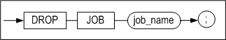

#### 전제 조건

SYS 사용자만이 이 구문을 사용할 수 있다.

#### 설명

데이터베이스에서 JOB을 삭제한다.

*job_name*

삭제할 JOB의 이름을 명시한다.

#### 예제

\<질의\> 이름이 job1인 JOB을 제거하라.

```
iSQL> DROP JOB job1;
Drop success.
```


### DROP QUEUE 

#### 구문

**drop_queue ::=**


#### 전제 조건

SYS 사용자, 테이블 소유자, DROP ANY TABLE 시스템 권한을 가진 사용자만이 큐를
삭제할 수 있다.

#### 설명

지정한 이름의 큐을 삭제하는 구문이다. 큐를 삭제하면 큐와 함께 생성되었던 큐
테이블, 큐 테이블의 인덱스, 및 큐 테이블의 MSGID값을 생성하는데 사용되었던
시퀀스도 삭제된다.

#### 예제

\<질의\> Q1이라는 이름을 가지는 메시지 큐와 부속 객체들을 모두 삭제하라.

```
iSQL> DROP QUEUE Q1;
```


### DROP REPLICATION 

#### 구문

**drop_replication ::=**

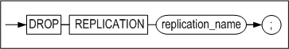

#### 전제 조건

SYS 사용자만이 이중화 객체를 삭제할 수 있다.

#### 설명

이중화 객체를 제거하는 SQL 문이다.

*replication_name*

제거할 이중화 객체의 이름을 명시한다.

#### 주의 사항

실행중인 이중화 객체는 제거할 수 없다. 즉 이중화 개시(ALTER REPLICATION START)가
되어있을 경우 삭제할 수 없고, 이중화 종료(ALTER REPLICATION STOP) 후에 삭제할 수
있다.

#### 예제

\<질의\> 이중화 rep1을 삭제하라.

```
iSQL> DROP REPLICATION rep1;
```


### DROP ROLE

#### 구문

**drop_role ::=**


#### 전제 조건

SYS 사용자와 DROP ANY ROLE 시스템 권한을 가진 사용자만이 롤(ROLE)을 삭제할 수
있다.

#### 설명

명시된 롤을 제거한다.

*role_name*

제거할 롤의 이름을 명시한다.

#### 예제

\<질의\> 이름이 alti_role인 롤을 제거한다.

```
iSQL> DROP ROLE alti_role;
Drop success.
```


### DROP SEQUENCE 

#### 구문

**drop_sequence ::=**


#### 전제 조건

SYS 사용자, 시퀀스의 소유자, DROP ANY SEQUENCE 시스템 권한을 가진 사용자만이
시퀀스를 삭제할 수 있다.

#### 설명

명시된 시퀀스를 삭제하는 구문이다.

*user_name*

제거될 시퀀스의 소유자 이름을 명시한다. 생략하면 Altibase는 현재 세션에 연결된
사용자의 스키마에 속한 것으로 간주한다.

*seq_name*

제거할 시퀀스 이름을 명시한다.

#### 예제

\<질의\> 시퀀스 seq1을 삭제하라.

```
iSQL> DROP SEQUENCE seq1;
Drop success.
```


### DROP SYNONYM 

#### 구문

**drop_synonym ::=**


#### 전제 조건

SYS 사용자, 시노님의 소유자, DROP ANY SYNONYM 시스템 권한을 가진 사용자만이
시노님을 삭제할 수 있다.

또한, SYS 사용자와 DROP PUBLIC SYNONYM 시스템 권한을 가진 사용자만이 PUBLIC
시노님을 삭제할 수 있다.

#### 설명

명시된 시노님을 데이터베이스에서 삭제하는 구문이다.

*PUBLIC*

PUBLIC 시노님을 삭제하기 위해서는 PUBLIC을 명시해야 한다. PUBLIC을 명시하지
않으면 명시한 이름의 PRIVATE 시노님이 삭제될 것이다.

PUBLIC을 명시한 경우 user_name은 명시할 수 없다.

*user_name*

삭제할 시노님의 소유자 이름을 명시한다. 생략하면 Altibase는 현재 세션에 연결된
사용자의 스키마에 속한 것으로 간주한다.

*synonym_name*

삭제할 시노님의 이름을 명시한다.

#### 예제

\<질의\> my_dept 시노님을 삭제하라.

```
iSQL> DROP SYNONYM my_dept;
Drop success.
```

\<질의\> PUBLIC 시노님인 dept를 삭제하라.

```
iSQL> DROP PUBLIC SYNONYM dept;
Drop success.
```


### DROP TABLE 

#### 구문

**drop_table ::=**

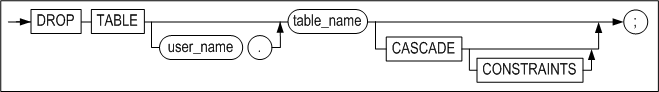

#### 전제 조건

SYS 사용자, 테이블의 소유자, DROP ANY TABLE 시스템 권한을 가진 사용자만이
테이블을 삭제할 수 있다.

#### 설명

명시된 테이블과 테이블의 데이터를 데이터베이스에서 제거하는 구문이다.

테이블을 바로 제거하지 않고, 휴지통으로 옮길 경우 RECYCLEBIN_ENABLE 프로퍼티의
값을 1로 설정한다. 같은 이름의 테이블이 여러 번 DROP될 수 있으며, 휴지통의
크기를 넘을 수는 없다.

*user_name*

제거될 테이블의 소유자 이름을 명시한다. 생략하면 Altibase는 현재 세션에 연결된
사용자의 스키마에 속한 것으로 간주한다.

*table_name*

제거될 테이블의 이름을 명시한다.

*{CASCADE \| CASCADE CONSTRAINTS}*

삭제될 테이블의 기본 키, 유니크 키를 참조하는 다른 테이블들의 참조 무결성
제약조건(referential integrity constraint)도 함께 삭제된다.

#### 예제

\<질의\> employees 테이블을 삭제하라.

```
iSQL> DROP TABLE employees;
Drop success.
```


### DROP TABLESPACE

#### 구문

**drop_tablespace ::=**

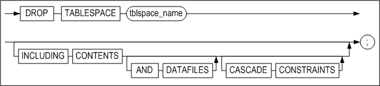

#### 전제 조건

SYS 사용자와 DROP TABLESPACE 시스템 권한을 가진 사용자만이 테이블스페이스를
삭제할 수 있다.

#### 설명

데이터베이스에서 테이블스페이스를 제거하는 구문이다.

*tblspace_name*

제거할 테이블스페이스를 명시한다.

*INCLUDING CONTENTS*

테이블스페이스 내의 모든 내용도 삭제된다. 만약 테이블스페이스 내에 하나 이상의
객체가 존재할 경우 테이블스페이스를 삭제하려면 반드시 이 절을 명시해야 한다.
그렇지 않은 경우 Altibase는 오류를 발생시키고 DROP TABLESPACE문의 수행은
실패한다.

*AND DATAFILES*

INCLUDING CONTENTS 절과 함께 AND DATAFILES 절을 명시하면 파일 시스템에서 삭제될
테이블스페이스와 관련된 모든 파일이 삭제된다.

디스크 테이블스페이스를 삭제할 경우 디스크 테이블스페이스의 모든 데이터 파일이
파일 시스템으로부터 삭제된다.

메모리 테이블스페이스를 삭제할 경우 메모리 테이블스페이스의 모든 체크포인트
이미지 파일들이 파일 시스템으로부터 삭제된다. 그러나, 체크포인트 경로는 삭제되지
않는다.

또한 휘발성 테이블스페이스에 대해서는 AND DATAFILES 절을 사용할 수 없다.

*CASCADE CONSTRAINTS*

삭제될 테이블스페이스 내에 존재하는 테이블들의 기본 키, 유니크 키를 참조하는
다른 테이블스페이스에 존재하는 테이블들의 참조 무결성 제약조건(referential
integrity constraint)들도 함께 제거하려면 이 절을 명시해야 한다. 즉, 이런 참조
무결성 제약조건이 존재하는 상태에서 이 절을 명시하지 않고 수행하면 Altibase는
오류를 발생시키고 DROP TABLESPACE문의 수행은 실패할 것이다.

#### 제한 사항

다음 테이블스페이스는 시스템 테이블스페이스로, 사용자가 삭제할 수 없다.

-   SYS_TBS_MEM_DIC

-   SYS_TBS_MEM_DATA

-   SYS_TBS_DISK_DATA

-   SYS_TBS_DISK_UNDO

-   SYS_TBS_DISK_TEMP

#### 예제

\<질의 1\> 테이블스페이스 user_data를 제거하라.

```
iSQL> DROP TABLESPACE user_data;
Drop success.
```

\<질의 2\> 디스크 테이블스페이스 user_data의 모든 객체(object)와 데이터 파일들과
함께 테이블스페이스를 삭제하라.

```
iSQL> DROP TABLESPACE user_data INCLUDING CONTENTS AND DATAFILES;
Drop success.
```

\<질의 3\> 메모리 테이블스페이스 user_data의 모든 객체(object)와 데이터 파일들과
함께 테이블스페이스를 삭제하라.

```
iSQL> DROP TABLESPACE user_memory_tbs INCLUDING CONTENTS AND DATAFILES;
Drop success.
```

\<질의 4\> 테이블스페이스 user_data의 모든 객체(object)와 거기에 저장된 모든
테이블의 기본 키 또는 유니크 키를 참조하는 다른 테이블스페이스에 존재하는
테이블들의 모든 참조 무결성 제약조건들을 테이블스페이스와 함께 삭제하라.

```
iSQL> DROP TABLESPACE user_data INCLUDING CONTENTS CASCADE CONSTRAINTS;
Drop success.
```


### DROP TRIGGER

#### 구문

**drop_trigger ::=**


#### 전제 조건

SYS 사용자, 트리거의 소유자, DROP ANY TRIGGER 시스템 권한을 가진 사용자만이
트리거를 삭제할 수 있다.

#### 설명

데이터베이스에서 명시된 트리거를 제거하는 구문이다.

*user_name*

제거될 트리거의 소유자 이름을 명시한다. 생략하면 Altibase는 현재 사용자의 스키마
내에 속한 트리거를 제거한다.

*trigger_name*

제거될 트리거의 이름을 명시한다.

#### 예제

\<질의\> 트리거 del_trigger을 삭제하라.

```
iSQL> DROP TRIGGER del_trigger;
Drop success.
```


### DROP USER 

#### 구문

**drop_user ::=**

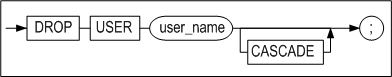

#### 전제 조건

SYS 사용자와 DROP USER 시스템 권한을 가진 사용자만이 사용자를 삭제할 수 있다.

#### 설명

데이터베이스에서 명시된 사용자를 제거하는 구문이다.

*user_name*

제거될 사용자 이름을 명시한다.

*CASCADE*

데이터베이스 사용자 뿐만 아니라 그 사용자의 스키마에 속한 모든 객체를 삭제한다.
또한 해당 사용자 소유 테이블에 정의된 기본키 또는 유니크 키를 참조하는 다른
테이블들의 참조 무결성 제약조건(referential integrity constraint)들도 함께
삭제된다.

삭제될 사용자 스키마에 객체가 있는 경우 CASCADE를 생략하면, 에러가 반환되고
사용자 삭제 구문 실행은 실패할 것이다.

#### 예제

\<질의\> 사용자 uare1을 삭제하라.

```
iSQL> DROP USER uare1;
Drop success.
```

\<질의\> 사용자 uare4와 그것에 속한 모든 objects를 삭제하라.

```
iSQL> DROP USER uare4 CASCADE;
Drop success.
```


### DROP VIEW

#### 구문

**drop_view ::=**


#### 전제 조건

SYS 사용자, 뷰의 소유자, DROP ANY VIEW 시스템 권한을 가진 사용자만이 뷰를 삭제할
수 있다.

#### 설명

데이터베이스에서 명시된 뷰를 제거하는 구문이다.

*user_name*

제거될 뷰의 소유자 이름을 명시한다. 생략하면 Altibase는 현재 사용자의 스키마
내에 속하는 뷰를 제거한다.

*view_name*

제거될 뷰의 이름을 명시한다.

#### 예제

\<질의\> 뷰 avg_sal을 제거하라.

```
iSQL> DROP VIEW avg_sal;
Drop success.
```


### DROP MATERIALIZED VIEW

#### 구문

**drop_mview ::=**


#### 전제 조건

아래의 사용자만이 이 구문으로 materialized view를 삭제할 수 있다.

-   SYS 사용자

-   Materialized view의 소유자

-   DROP ANY MATERIALIZED VIEW 시스템 권한을 가진 사용자

#### 설명

지정한 materialized view를 데이터베이스에서 제거하는 구문이다.

*user_name*

제거될 materialized view의 소유자 이름을 명시한다. 생략하면 Altibase는 현재
사용자의 스키마 내에 속하는 materialized view를 제거한다.

*mview_name*

제거될 materialized view의 이름을 명시한다.

#### 예제

\<질의\> 이름이 mv1인 materialized view를 제거하라.

```
DROP MATERIALIZED VIEW mv1;
```


### FLASHBACK TABLE

#### 구문

**flashback_table::=**

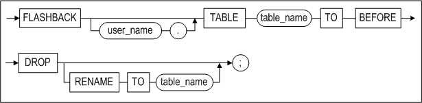

#### 전제 조건

아래의 조건 중 하나 이상을 만족해야 이 구문을 수행할 수 있다.

-   SYS 사용자이다.

-   사용자 자신의 테이블이면, CREATE TABLE 또는 CREATE ANY TABLE 시스템 권한을
    가지고 있어야 한다.

-   다른 사용자의 테이블이면, CREATE ANY TABLE 시스템 권한을 가지고 있어야 한다.

#### 설명

휴지통에 있는 테이블을 복원하는 구문이다. 동일 이름의 테이블이 휴지통에 여러 개
존재할 경우 가장 먼저 DROP된 테이블이 데이터베이스로 복원된다.

*table_name*

휴지통에서 복원될 테이블의 객체 이름을 명시한다. 테이블 이름은 삭제되기 전의
원본 테이블 이름이나 시스템에서 생성된 객체 이름도 명시할 수 있다. 단 동일한
이름의 테이블이 복수로 존재한다면, 가장 먼저 휴지통으로 DROP된 테이블부터
복원된다.

*RENAME TO table_name*

테이블을 복원할 때 새로운 이름을 명시할 수 있으며, 사용자의 스키마에 동일 이름이
있으면 다른 이름으로 변경할 수 있다.

### GRANT

#### 구문

**grant ::=**

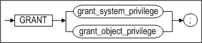

**grant_system_privilege ::=**


**grant_object_privilege ::=**

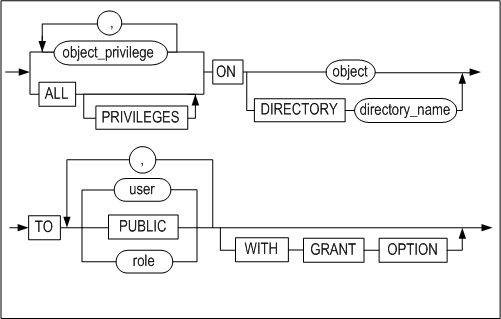

#### 전제 조건

SYS 사용자와 GRANT ANY PRIVILEGES 시스템 권한을 가진 사용자만이 시스템 권한을
부여할 수 있다. 또한 객체 권한은 객체의 소유자이거나 WITH GRANT OPTION으로 객체
권한을 부여받은 사용자만이 그 객체에 대한 권한을 다른 사용자에게 부여할 수 있다.

SYS 사용자와 GRANT ANY ROLE 시스템 권한을 가진 사용자만이 롤(role)에 시스템
권한을 부여할 수 있다.

#### 설명

명시된 사용자에게 데이터베이스와 객체에 접근하기 위한 권한들을 부여하는
구문이다.

권한은 시스템 권한과 객체 권한으로 분류된다.

*grant_system_privilege*

시스템 권한은 일반적으로 SYS 사용자에 의해 관리된다. SYS 사용자는 사용자들에게
특정 데이터베이스 작업을 수행하는 것을 허용하기 위해서 제한된 시스템 권한을
부여할 수 있다. 시스템 권한은 모든 스키마에 있는 객체들을 제어하는 광범위한
권한으로 볼 수 있다.

시스템 권한은 DDL문과 DCL문을 수행하기 위해서 필요하다.

grant_object_privilege

사용자가 특정 객체에 대한 권한을 부여 받으면, 사용자는 객체를 접근 및 조작할 수
있다. 객체 접근 권한은 일반적으로 객체 소유자에 의해 관리된다.

시스템 권한이 없으면, DML문을 수행을 위해서 객체 권한이 필요하다.

#### 시스템 권한 (System Privileges) 

*system_privilege*

부여될 시스템 접근 권한의 이름을 명시한다.

*role*

부여될 롤의 이름을 명시한다.

-   롤(role)은 다른 role이나 PUBLIC에게 부여할 수 없다.

-   한 사용자에게 롤을 최대 126개까지 부여할 수 있다.

-   사용자에게 롤을 부여해도 사용자에게 바로 적용되는 것이 아니다. 사용자가
    데이터베이스에 다시 접속(connect)한 후에 롤의 권한이 적용된다.

*ALL PRIVILEGES*

모든 시스템 권한을 사용자에게 부여하기 위해 사용되는 옵션이다.

*TO user*

시스템 권한을 부여할 사용자 이름을 명시한다.

*TO role*

시스템 권한을 부여할 롤(role)의 이름을 명시한다.

*TO PUBLIC*

모든 사용자에게 시스템 권한을 부여함을 명시하는 옵션이다.

##### 주의 사항

-   SYS 사용자와 GRANT ANY PRIVILEGES 권한을 가진 사용자는 모든 시스템 권한을
    다른 사용자에게 부여할 수 있다.
-   SYS 사용자는 모든 시스템 권한을 가진다.
-   시스템 권한 중 ANY 키워드는 모든 스키마에 대한 권한을 가진다. 예를 들어
    SELECT ANY TABLE 권한은 데이터베이스 내에 있는 모든 테이블을 SELECT 할 수
    있다.
-   CREATE 권한은 객체를 생성할 수 있는 권한이며, 해당 객체를 삭제하는 권한도
    포함한다.
-   CREATE TABLE 객체 권한은 테이블 뿐만 아니라 인덱스를 생성하는 권한을
    포함한다. 이 인덱스 생성 권한은 시스템 권한이 아니라 객체 권한이다.
-   새로운 사용자가 생성될 때 기본적으로 CREATE MATERIALIZED VIEW, CREATE
    LIBRARY, CREATE SESSION, CREATE TABLE, CREATE SEQUENCE, CREATE SYNONYM,
    CREATE PROCEDURE, CREATE VIEW, CREATE TRIGGER, 그리고 CREATE DATABASE LINK
    권한이 그 사용자에게 부여된다.  

다음 쿼리를 사용하면 Altibase가 지원하는 모든 시스템 권한들의 목록을 볼 수
있다.

```
iSQL> SELECT * FROM SYSTEM_.SYS_PRIVILEGES_ where PRIV_TYPE = 2;
```

Altibase는 다음과 같은 시스템 접근 권한을 지원한다.

| PrivID | System privilege  | Name                         | Purpose                                                                                                                                             |
|--------|-------------------|------------------------------|-----------------------------------------------------------------------------------------------------------------------------------------------------|
| 1      |                   | ALL                          | 사용자에게 모든 시스템 권한을 부여한다. 단, 이 권한을 사용자에게 부여해도 ALTER DATABASE, DROP DATABASE, MANAGER TABLESPACE 권한은 부여되지 않는다. |
| 201    | DATABASE          | ALTER SYSTEM                 | Altibase 프로퍼티 설정을 동적으로 변경할 수 있다.                                                                                                   |
| 233    |                   | ALTER DATABASE               | SYS 사용자 외의 다른 사용자에게는 부여되지 않는다.                                                                                                  |
| 234    |                   | DROP DATABASE                | SYS 사용자 외의 다른 사용자에게는 부여되지 않는다.                                                                                                  |
| 202    | INDEX             | CREATE ANY INDEX             | 자신의 스키마 뿐 아니라 다른 사용자의 스키마 내에서도 인덱스 생성이 가능하다.                                                                       |
| 203    |                   | ALTER ANY INDEX              | 데이터베이스에 존재하는 모든 인덱스의 정의를 변경할 수 있다.                                                                                        |
| 204    |                   | DROP ANY INDEX               | 데이터베이스에 존재하는 모든 인덱스를 삭제할 수 있다.                                                                                               |
| 205    | PROCEDURE         | CREATE PROCEDURE             | 자신의 스키마 내에 저장 프로시저나 함수를 생성할 수 있다.                                                                                           |
| 206    |                   | CREATE ANY PROCEDURE         | 자신의 스키마 뿐 아니라 다른 사용자의 스키마 내에 저장 프로시저나 함수를 생성할 수 있다.                                                            |
| 207    |                   | ALTER ANY PROCEDURE          | 데이터베이스에 존재하는 모든 저장 프로시저나 함수를 재컴파일 할 수 있다.                                                                            |
| 208    |                   | DROP ANY PROCEDURE           | 데이터베이스에 존재하는 모든 저장 프로시저나 함수를 삭제할 수 있다.                                                                                 |
| 209    |                   | EXECUTE ANY PROCEDURE        | 데이터베이스에 존재하는 모든 저장 프로시저나 함수를 실행할 수 있다.                                                                                 |
| 210    | SEQUENCE          | CREATE SEQUENCE              | 자신의 스키마 내에 시퀀스를 생성할 수 있다.                                                                                                         |
| 211    |                   | CREATE ANY SEQUENCE          | 자신의 스키마 뿐 아니라 다른 사용자의 스키마 내에서도 시퀀스 생성이 가능하다.                                                                       |
| 212    |                   | ALTER ANY SEQUENCE           | 데이터베이스에 존재하는 모든 시퀀스의 정의를 변경할 수 있다.                                                                                        |
| 213    |                   | DROP ANY SEQUENCE            | 데이터베이스에 존재하는 모든 시퀀스를 삭제할 수 있다.                                                                                               |
| 214    |                   | SELECT ANY SEQUENCE          | 데이터베이스에 존재하는 모든 시퀀스를 조회할 수 있다.                                                                                               |
| 215    | SESSION           | CREATE SESSION               | 서버에 연결할 수 있다.                                                                                                                              |
| 216    |                   | ALTER SESSION                | 자동으로 모든 사용자에게 부여된다.                                                                                                                  |
| 217    | TABLE             | CREATE TABLE                 | 자신의 스키마 내에 테이블을 생성할 수 있다.                                                                                                         |
| 218    |                   | CREATE ANY TABLE             | 자신의 스키마 뿐 아니라 다른 사용자의 스키마 내에서도 테이블 생성이 가능하다.                                                                       |
| 219    |                   | ALTER ANY TABLE              | 데이터베이스에 존재하는 모든 테이블에 대해서 truncate(모든 레코드 삭제)하거나 모든 테이블의 정의를 변경할 수 있다.                                  |
| 220    |                   | DELETE ANY TABLE             | 데이터베이스에 존재하는 모든 테이블의 레코드를 삭제 할 수 있다.                                                                                     |
| 221    |                   | DROP ANY TABLE               | 데이터베이스에 존재하는 모든 테이블을 삭제할 수 있다.                                                                                               |
| 222    |                   | INSERT ANY TABLE             | 데이터베이스에 존재하는 모든 테이블에 새로운 레코드를 삽입할 수 있다.                                                                               |
| 223    |                   | LOCK ANY TABLE               | 데이터베이스에 존재하는 모든 테이블에 테이블 잠금을 할 수 있다.                                                                                     |
| 224    |                   | SELECT ANY TABLE             | 데이터베이스에 존재하는 모든 테이블의 데이터를 조회할 수 있다.                                                                                      |
| 225    |                   | UPDATE ANY TABLE             | 데이터베이스에 존재하는 모든 테이블의 데이터를 변경할 수 있다.                                                                                      |
| 226    | USER              | CREATE USER                  | 새로운 사용자를 생성할 수 있다.                                                                                                                     |
| 227    |                   | ALTER USER                   | 모든 사용자의 암호를 변경할 수 있다.                                                                                                                |
| 228    |                   | DROP USER                    | 사용자를 제거할 수 있다.                                                                                                                            |
| 229    | VIEW              | CREATE VIEW                  | 자신의 스키마 내에 뷰를 생성할 수 있다.                                                                                                             |
| 230    |                   | CREATE ANY VIEW              | 자신의 스키마 뿐 아니라 다른 사용자의 스키마 내에서도 뷰 생성이 가능하다.                                                                           |
| 231    |                   | DROP ANY VIEW                | 데이터베이스에 존재하는 모든 뷰를 삭제 할 수 있다.                                                                                                  |
| 232    | MISCELLANEOUS     | GRANT ANY PRIVILEGES         | 모든 시스템 권한을 다른 사용자에게 부여할 수 있다.                                                                                                  |
| 235    | TABLESPACES       | CREATE TABLESPACE            | 테이블스페이스를 생성할 수 있다.                                                                                                                    |
| 236    |                   | ALTER TABLESPACE             | 테이블스페이스 정의를 변경할 수 있다.                                                                                                               |
| 237    |                   | DROP TABLESPACE              | 테이블스페이스를 삭제할 수 있다.                                                                                                                    |
| 238    |                   | MANAGE TABLESPACE            | SYS 사용자 외의 다른 사용자에게는 부여되지 않는다.                                                                                                  |
| 240    |                   | SYSDBA                       | SYS 사용자 외의 다른 사용자에게는 부여되지 않는다.                                                                                                  |
| 241    | TRIGGER           | CREATE TRIGGER               | 자신의 스키마 내에 새로운 트리거를 생성할 수 있다.                                                                                                  |
| 242    |                   | CREATE ANY TRIGGER           | 자신의 스키마 뿐 아니라 다른 사용자의 스키마 내에서도 트리거 생성이 가능하다.                                                                       |
| 243    |                   | ALTER ANY TRIGGER            | 데이터베이스에 존재하는 모든 트리거의 정의를 변경할 수 있다.                                                                                        |
| 244    |                   | DROP ANY TRIGGER             | 데이터베이스에 존재하는 모든 트리거를 제거할 수 있다.                                                                                               |
| 245    | SYNONYM           | CREATE SYNONYM               | 자기 소유의 시노님 (private synonym)을 생성할 수 있다.                                                                                              |
| 246    |                   | CREATE PUBLIC SYNONYM        | PUBLIC 시노님을 생성할 수 있다.                                                                                                                     |
| 247    |                   | CREATE ANY SYNONYM           | 자신의 스키마 뿐 아니라 다른 사용자의 스키마 내에서도 PRIVATE 시노님을 생성할 수 있다.                                                              |
| 248    |                   | DROP ANY SYNONYM             | PRIVATE 시노님을 삭제할 수 있다.                                                                                                                    |
| 249    |                   | DROP PUBLIC SYNONYM          | PUBLIC 시노님을 삭제할 수 있다.                                                                                                                     |
| 250    | DIRECTORY         | CREATE ANY DIRECTORY         | 저장프로시저 내에서 파일 제어를 위해 사용되는 디렉토리 객체를 생성할 수 있다.                                                                       |
| 251    |                   | DROP ANY DIRECTORY           | 디렉토리 객체를 삭제할 수 있다.                                                                                                                     |
| 252    | MATERIALIZED VIEW | CREATE MATERIALIZED VIEW     | 자신의 스키마 내에 새로운 MATERIALIZED VIEW를 생성할 수 있다.                                                                                       |
| 253    |                   | CREATE ANY MATERIALIZED VIEW | 자신의 스키마 뿐 아니라 다른 사용자의 스키마 내에 MATERIALIZED VIEW를 생성할 수 있다.                                                               |
| 254    |                   | ALTER ANY MATERIALIZED VIEW  | 데이터베이스에 존재하는 모든 MATERIALIZED VIEW를 변경할 수 있다.                                                                                    |
| 255    |                   | DROP ANY MATERIALIZED VIEW   | 데이터베이스에 존재하는 모든 MATERIALIZED VIEW를 삭제 할 수 있다.                                                                                   |
| 256    | LIBRARY           | CREATE LIBRARY               | 자신의 스키마 내에 새로운 라이브러리 객체를 생성할 수 있다.                                                                                         |
| 257    |                   | CREATE ANY LIBRARY           | 자신의 스키마 뿐 아니라 다른 사용자의 스키마 내에서도 라이브러리 객체 생성이 가능하다.                                                              |
| 258    |                   | ALTER ANY LIBRARY            | 데이터베이스에 존재하는 모든 라이브러리 객체를 컴파일할 수 있다.                                                                                    |
| 259    |                   | DROP ANY LIBRARY             | 데이터베이스에 존재하는 모든 라이브러리 객체를 제거할 수 있다.                                                                                      |
| 260    | DATABASE LINK     | CREATE DATABASE LINK         | 새로운 데이터베이스 링크를 생성할 수 있다.                                                                                                          |
| 261    |                   | CREATE PUBLIC_DATABASE LINK  | PUBLIC 데이터베이스 링크를 생성할 수 있다.                                                                                                          |
| 262    |                   | DROP PUBLIC DATABASE LINK    | PUBLIC 데이터베이스 링크를 삭제할 수 있다.                                                                                                          |
| 263    | ROLE              | CREATE ROLE                  | 새로운 롤을 생성할 수 있다.                                                                                                                         |
| 264    |                   | DROP ANY ROLE                | 데이터베이스에 존재하는 모든 롤을 삭제할 수 있다.                                                                                                   |
| 265    |                   | GRANT ANY ROLE               | 모든 롤을 다른 사용자에게 부여할 수 있다.                                                                                                           |
| 266    | JOB               | CREATE ANY JOB               | 자신의 스키마 뿐 아니라 다른 사용자의 스키마 내에서 새로운 JOB을 생성할 수 있다.                                                                    |
| 268    |                   | ALTER ANY JOB                | 데이터베이스에 존재하는 모든 JOB을 변경할 수 있다.                                                                                                  |
| 267    |                   | DROP ANY JOB                 | 데이터베이스에 존재하는 모든 JOB을 삭제할 수 있다.                                                                                                  |

#### 객체 권한 (Object privileges) 

*object_privilege*

어떤 객체에 대한 특정 권한만을 부여하고자 할 때 사용되는 절이다. (이 절의
아래에 어떤 객체에 대해서 어떤 권한이 지원되는지를 [보여주는 표](#grant_tbl2)가
있다.)

*ALL [PRIVILEGES]*

객체에 대한 모든 가능한 권한을 부여하는 옵션이다.

*ON object*

어느 객체에 대해서 권한을 부여할 것인지를 명시하는 절이다. 객체에는 테이블,
시퀀스, 저장 프로시저가 있다.

*ON DIRECTORY directory_name*

권한을 부여할 대상인 저장 프로시저 내에서 사용하는 디렉토리 객체의 이름을
명시한다.

*TO user*

객체에 대한 객체 권한을 부여 받는 사용자를 명시한다.

*TO PUBLIC*

모든 사용자에게 객체 권한을 부여한다.

*TO role*

객체 권한을 부여할 롤(role)의 이름을 명시한다.

*WITH GRANT OPTION*

권한 수여자가 다른 사용자들에게 자신이 받은 객체 권한을 부여할 수 있는 옵션이다.
단 롤에 객체 권한을 부여할 때는 WITH GRANT OPTION을 사용할 수 없다.

> ##### 요약 정리
>
> -   객체의 소유자란 객체를 생성한 사용자로서, 해당 객체에 대한 모든 객체 권한을
>     가진다.
>
> -   객체 권한은 객체의 소유자이거나, WITH GRANT OPTION으로 객체 권한을 부여받은
>     사용자만이 그 객체에 대한 권한을 다른 사용자에게 부여할 수 있다.
>
> -   SYS 사용자가 객체 권한을 부여받지 못하였다면, 권한은 SYS로써 한정될 뿐 다른
>     사용자에게 권한을 부여할 수 없다.
>

다음 쿼리로 Altibase에서 지원하는 모든 객체 권한들에 대한 정보를 볼 수 있다.

```
SELECT * FROM SYSTEM_.SYS_PRIVILEGES_ where PRIV_TYPE = 1;
```

Altibase는 다음과 같은 객체 접근 권한을 지원한다.

<a name="grant_tbl2"><a/>

| Priv ID | Object privileges | Table | Sequence | PSM/ External Procedure | View | directory | External Library |
|---------|-------------------|-------|----------|-------------------------|------|-----------|------------------|
| 101     | ALTER             | O     | O        |                         |      |           |                  |
| 102     | DELETE            | O     |          |                         |      |           |                  |
| 103     | EXECUTE           |       |          | O                       |      |           | O                |
| 104     | INDEX             | O     |          |                         |      |           |                  |
| 105     | INSERT            | O     |          |                         |      |           |                  |
| 106     | REFERENCES        | O     |          |                         |      |           |                  |
| 107     | SELECT            | O     | O        |                         | O    |           |                  |
| 108     | UPDATE            | O     |          |                         |      |           |                  |
| 109     | READ              |       |          |                         |      | O         |                  |
| 110     | WRITE             |       |          |                         |      | O         |                  |

모든 사용자는 자동으로 메타 테이블에 대한 SELECT 권한을 가진다.

#### 예제

##### 시스템 접근 권한

\<질의1\> 다음은 사용자 user5에게 EXECUTE ANY PROCEDURE, SELECT ANY TABLE, ALTER
ANY SEQUENCE, INSERT ANY TABLE, SELECT ANY SEQUENCE 등의 시스템 권한을 부여하는
예제이다.

```
iSQL> CREATE TABLE seqtbl(i1 INTEGER);
Create success.
iSQL> CREATE OR REPLACE PROCEDURE proc1
AS
BEGIN
  FOR i IN 1 .. 10 LOOP
    INSERT INTO seqtbl VALUES(i);
  END LOOP;
END;
/
Create success.

iSQL> CREATE USER uare5 IDENTIFIED BY rose5;
Create success.
iSQL> GRANT EXECUTE ANY PROCEDURE, SELECT ANY TABLE TO uare5;
Grant success.
iSQL> CONNECT uare5/rose5;
Connect success.
iSQL> EXEC sys.proc1;
Execute success.
iSQL> SELECT * FROM sys.seqtbl;
SEQTBL.I1   
--------------
1           
2           
3           
4           
5           
6           
7           
8           
9           
10          
10 rows selected.

iSQL> CONNECT sys/manager;
Connect success.
iSQL> CREATE SEQUENCE seq1
  START WITH 13
  INCREMENT BY 3
  MINVALUE 0 NOMAXVALUE;
Create success.
iSQL> INSERT INTO seqtbl VALUES(seq1.NEXTVAL);
1 row inserted.
iSQL> INSERT INTO seqtbl VALUES(seq1.NEXTVAL);
1 row inserted.
iSQL> SELECT * FROM seqtbl;
SEQTBL.I1   
--------------
1           
2           
3           
4           
5           
6           
7           
8           
9           
10          
13          
16          
12 rows selected.

iSQL> GRANT ALTER ANY SEQUENCE, INSERT ANY TABLE, SELECT ANY SEQUENCE TO uare5;
Grant success.
iSQL> CONNECT uare5/rose5;
Connect success.	
iSQL> ALTER SEQUENCE sys.seq1
  INCREMENT BY 50
  MAXVALUE 100
  CYCLE;
Alter success.

iSQL> INSERT INTO sys.seqtbl VALUES(sys.seq1.NEXTVAL);
1 row inserted.
iSQL> INSERT INTO sys.seqtbl VALUES(sys.seq1.NEXTVAL);
1 row inserted.
iSQL> INSERT INTO sys.seqtbl VALUES(sys.seq1.NEXTVAL);
1 row inserted.
iSQL> INSERT INTO sys.seqtbl VALUES(sys.seq1.NEXTVAL);
1 row inserted.
iSQL> SELECT * FROM sys.seqtbl;
SEQTBL.I1   
--------------
1           
2           
3           
4           
5           
6           
7           
8           
9           
10          
13          
16          
66          
0           
50          
100         
16 rows selected.
```

\<질의 2\> 이름이 alti_role인 롤을 생성한 후, 롤에게 create user와 drop user
등의 시스템 권한을 부여한다.

```
iSQL> create role alti_role;
Create success.
iSQL> grant create user, drop user to alti_role;
Grant success.
iSQL> create user user01 identified by user01;
Create success.
iSQL> grant alti_role to user01;
Grant success.
iSQL> connect user01/user01
Connect success.
iSQL> create user user02 identified by user02;
Create success.
iSQL> drop user user02;
Drop success.
```


##### 객체 권한

\<질의1\> 사용자 uare6가 WITH GRANT OPTION으로 employees 테이블에 대한 SELECT와
DELETE 객체 권한을 부여 받은 후, 같은 권한을 다른 사용자 uare7과 uare8에게
부여한다.

```
iSQL> CREATE USER uare6 IDENTIFIED BY rose6;
Create success.
iSQL> GRANT CREATE USER TO uare6;
Grant success.
iSQL> @schema.sql
iSQL> GRANT SELECT, DELETE ON employees TO uare6 WITH GRANT OPTION;
Grant success.
iSQL> CONNECT uare6/rose6;
Connect success.
iSQL> CREATE USER uare7 IDENTIFIED BY rose7;
Create success.
iSQL> GRANT SELECT, DELETE ON sys.employees TO uare7;
Grant success.
iSQL> CONNECT uare7/rose7;
Connect success.
iSQL> DELETE FROM SYS.employees WHERE eno = 12;
1 row deleted.
iSQL> SELECT eno, e_lastname FROM sys.employees WHERE eno = 12;
ENO         E_LASTNAME                 
-------------------------------------
No rows selected.
iSQL> CONNECT sys/manager;
Connect success.
iSQL> CREATE USER uare8 IDENTIFIED BY rose8;
Create success.
iSQL> CONNECT uare6/rose6;
Connect success.
iSQL> GRANT SELECT, DELETE ON sys.employees TO uare8;
Grant success.
```

WITH GRANT OPTION 으로 객체권한을 부여받은 사용자 uare6는 자신이 생성한 사용자
uare7 뿐만 아니라 원래의 권한 부여자(SYS)가 생성한 사용자 uare8에게도 객체
권한을 부여할 수 있다.

```
iSQL> CONNECT uare8/rose8;
Connect success.
iSQL> DELETE FROM sys.employees WHERE eno = 13;
1 row deleted.

iSQL> SELECT eno, e_lastname FROM sys.employees WHERE eno = 13;
ENO         E_LASTNAME                 
-------------------------------------
No rows selected.
```

\<질의 2\> 다음은 사용자에게 시스템 권한, 객체 권한을 부여한 후 각각의 권한을
해제하는 예제이다.

1. SYS 사용자가 uare9에게 모든 시스템 권한을 부여한다.

   ```
   iSQL> CONNECT sys/manager;
   Connect success.
   iSQL> CREATE TABLE book(
     isbn CHAR(10) PRIMARY KEY,
     title VARCHAR(50),
     author VARCHAR(30),
     edition INTEGER DEFAULT 1,
     publishingyear INTEGER,
     price NUMBER(10,2),
     pubcode CHAR(4));
   Create success.
   iSQL> CREATE TABLE inventory(
     subscriptionid CHAR(10) PRIMARY KEY,
     storecode CHAR(4),
     purchasedate DATE,
     quantity INTEGER,
     paid CHAR(1));
   Create success.
   
   iSQL> CREATE USER uare9 IDENTIFIED BY rose9;
   Create success.
   iSQL> GRANT ALL PRIVILEGES TO uare9;
   Grant success.
   ```


2. SYS는 사용자uare9에게 객체 book에 대한 REFERENCES 권한을 WITH GRANT OPTION
    으로 부여한다.

  ```
  iSQL> GRANT REFERENCES ON book TO uare9 WITH GRANT OPTION;
  Grant success.
  ```

  사용자uare9은 SYS로부터 객체 book에 대한 REFERENCES 권한을 WITH GRANT OPTION
  으로 부여 받았기 때문에, uare9은 다른 사용자(uare10)에게 객체 book에 대해
  REFERENCES 객체 권한을 부여할 수 있다.

3. uare9이 SYS의 객체인 book 테이블에 데이터를 입력한다.

   ```
   iSQL> CONNECT uare9/rose9;
   Connect success.
   
   iSQL> INSERT INTO sys.book VALUES ('0070521824', 'Software Engineering', 'Roger S. Pressman', 4, 1982, 100000, 'CHAU');
   1 row inserted.
   iSQL> INSERT INTO sys.book VALUES ('0137378424', 'Database Processing', 'David M. Kroenke', 6, 1972, 80000, 'PREN');
   1 row inserted.
   ```


   uare9이 SYS의 객체인 inventory 테이블에 데이터를 입력한다.

   ```
   iSQL> INSERT INTO sys.inventory VALUES('BORD000002', 'BORD', '12-Jun-2003', 6, 'N');
   iSQL> INSERT INTO sys.inventory VALUES('MICR000001', 'MICR', '07-Jun-2003', 7, 'N');
   1 row inserted.
   ```


4. uare9이 SYS의 객체인 book 테이블을 조회한다.

   ```
   iSQL> SELECT * FROM sys.book;
   BOOK.ISBN   BOOK.TITLE                                          
   ------------------------------------------------
   BOOK.AUTHOR                     BOOK.EDITION BOOK.PUBLISHINGYEAR BOOK.PRICE  
   ------------------------------------------------
   BOOK.PUBCODE  
   ----------------
   0070521824  Software Engineering                                
   Roger S. Pressman               4           1982        100000      
   CHAU  
   0137378424  Database Processing                                 
   David M. Kroenke                6           1972        80000       
   PREN  
   2 rows selected.
   ```


   uare9이 SYS의 객체인 inventory 테이블을 조회한다.

   ```
   iSQL> SELECT * FROM sys.inventory;
   INVENTORY.SUBSCRIPTIONID  INVENTORY.STORECODE  INVENTORY.PURCHASEDATE 
   ------------------------------------------------
   INVENTORY.QUANTITY INVENTORY.PAID  
   --------------------------------------
   BORD000002  BORD  2003/06/12 00:00:00  
   6           N  
   MICR000001  MICR  2003/06/07 00:00:00  
   7           N  
   2 rows selected.
   
   iSQL> CREATE TABLE book(
     isbn CHAR(10) PRIMARY KEY,
     title VARCHAR(50),
     author VARCHAR(30),
     edition INTEGER DEFAULT 1,
     publishingyear INTEGER,
     price NUMBER(10,2),
     pubcode CHAR(4));
   Create success.
   
   iSQL> CREATE TABLE inventory(
     subscriptionid CHAR(10) PRIMARY KEY,
     isbn CHAR(10) CONSTRAINT fk_isbn REFERENCES book(isbn), 
     storecode CHAR(4),
     purchasedate DATE,
     quantity INTEGER,
     paid CHAR(1));
   Create success.
   ```

5. uare9은 SYS로부터 ALL PRIVILEGES를 부여 받았으므로 다른 사용자를 생성할 수
    있다.

  ```
  iSQL> CREATE USER uare10 IDENTIFIED BY rose10;
  Create success.
  ```

6. SYS는 uare9에게 REFERENCES 권한을 WITH GRANT OPTION으로 부여했기 때문에,
    uare9는 다른 사용자(uare10)에게 이 권한을 부여할 수 있다.

  ```
  iSQL> GRANT REFERENCES ON sys.book TO uare10;
  Grant success.
  ```


7. GRANT ANY PRIVILEGES를 부여 받은 uare9이 다른 사용자(uare10)에게 시스템
    권한을 부여한다.


  ```
  iSQL> GRANT ALTER ANY TABLE, INSERT ANY TABLE, SELECT ANY TABLE, DELETE ANY
  TABLE TO uare10;
  Grant success.
  ```


8. 사용자 uare10은 ALTER ANY TABLE과 REFERENCE 권한이 있기 때문에, 다른 사용자
    소유의 테이블에 제약조건을 추가할 수 있다.

  ```
  iSQL> CONNECT uare10/rose10;
  Connect success.
  iSQL> ALTER TABLE sys.inventory
    ADD COLUMN (isbn CHAR(10) CONSTRAINT fk_isbn REFERENCES sys.book(isbn));
  Alter success.
  ```


9. 사용자 uare10은 INSERT ANY TABLE 권한이 있기 때문에, 사용자 uare9가 소유한
    테이블에 데이터를 입력할 수 있다.

  ```
  iSQL> INSERT INTO uare9.book VALUES('0471316156', 'JAVA and CORBA', 'Robert Orfali', 2, 1998, 50000, 'PREN');
  1 row inserted.
  iSQL> INSERT INTO uare9.inventory VALUES('TOWE000001', '0471316156', 'TOWE', '01-Jun-2003', 5, 'N');
  1 row inserted.
  ```


  사용자 uare10은 INSERT ANY TABLE 권한이 있기 때문에, SYS소유의 테이블에 데이터를
  입력할 수 있다.

  ```
  iSQL> INSERT INTO sys.book VALUES('053494566X', 'Working Classes', 'Robert Orfali', 1, 1999, 80000, 'WILE');
  1 row inserted.
  iSQL> INSERT INTO sys.inventory VALUES('MICR000005', 'WILE', '28-JUN-1999', 8, 'N', '053494566X');
  1 row inserted.
  ```


10. 사용자 uare10은 SELECT ANY TABLE 권한이 있기 때문에, uare9소유의 테이블을
    조회할 수 있다.

    ```
    iSQL> SELECT * FROM uare9.book;
    BOOK.ISBN   BOOK.TITLE                                          
    ------------------------------------------------
    BOOK.AUTHOR                     BOOK.EDITION BOOK.PUBLISHINGYEAR BOOK.PRICE  
    ------------------------------------------------
    BOOK.PUBCODE  
    ----------------
    0471316156  JAVA and CORBA                                      
    Robert Orfali                   2           1998        50000       
    PREN  
    1 row selected.
    iSQL> SELECT * FROM uare9.inventory;
    INVENTORY.SUBSCRIPTIONID  INVENTORY.ISBN  INVENTORY.STORECODE  
    ------------------------------------------------
    INVENTORY.PURCHASEDATE INVENTORY.QUANTITY INVENTORY.PAID  
    ------------------------------------------------
    TOWE000001  0471316156  TOWE  
    2003/06/01 00:00:00  5           N  
    1 row selected.
    ```


    사용자 uare10은 SELECT ANY TABLE 권한이 있기 때문에, SYS소유의 테이블을 조회할
    수 있다.
    
    ```
    iSQL> SELECT * FROM sys.book;
    BOOK.ISBN   BOOK.TITLE                                          
    ------------------------------------------------
    BOOK.AUTHOR                     BOOK.EDITION BOOK.PUBLISHINGYEAR BOOK.PRICE  
    ------------------------------------------------
    BOOK.PUBCODE  
    ----------------
    0070521824  Software Engineering                                
    Roger S. Pressman               4           1982        100000      
    CHAU  
    0137378424  Database Processing                                 
    David M. Kroenke                6           1972        80000       
    PREN  
    053494566X  Working Classes                                     
    Robert Orfali                   1           1999        80000       
    WILE  
    3 rows selected.
    iSQL> SELECT * FROM sys.inventory;
    INVENTORY.SUBSCRIPTIONID  INVENTORY.STORECODE  INVENTORY.PURCHASEDATE 
    ------------------------------------------------
    INVENTORY.QUANTITY INVENTORY.PAID  INVENTORY.ISBN  
    ------------------------------------------------
    BORD000002  BORD  2003/06/12 00:00:00  
    6           N              
    MICR000001  MICR  2003/06/07 00:00:00  
    7           N              
    MICR000005  WILE  1999/06/28 00:00:00  
    8           N  053494566X  
    3 rows selected.
    ```


11. 사용자 uare10은 DELETE ANY TABLE 권한이 있기 때문에, SYS와 uare9소유의
    테이블의 데이터를 삭제할 수 있다.

    ```
    iSQL> DELETE FROM uare9.inventory WHERE subscriptionid = 'TOWE000001';
    1 row deleted.
    iSQL> SELECT * FROM uare9.inventory;
    INVENTORY.SUBSCRIPTIONID  INVENTORY.ISBN  INVENTORY.STORECODE  
    ------------------------------------------------
    INVENTORY.PURCHASEDATE INVENTORY.QUANTITY INVENTORY.PAID  
    ------------------------------------------------
    No rows selected.
    
    iSQL> DELETE FROM sys.inventory WHERE subscriptionid = 'MICR000005';
    1 row deleted.
    iSQL> SELECT * FROM sys.inventory;
    INVENTORY.SUBSCRIPTIONID  INVENTORY.STORECODE  INVENTORY.PURCHASEDATE 
    ------------------------------------------------
    INVENTORY.QUANTITY INVENTORY.PAID  INVENTORY.ISBN  
    ------------------------------------------------
    BORD000002  BORD  2003/06/12 00:00:00  
    6           N              
    MICR000001  MICR  2003/06/07 00:00:00  
    7           N              
    2 rows selected.
    
    ```


12. 사용자 uare9이 REVOKE ALL 구문을 사용하지 않고 uare10으로부터 모든 권한을
    해제한다.

    ```
    iSQL> CONNECT uare9/rose9;
    Connect success.
    iSQL> REVOKE ALTER ANY TABLE, INSERT ANY TABLE, SELECT ANY TABLE, DELETE ANY TABLE FROM uare10;
    Revoke success.
    ```


13. 사용자 uare10의 REFERENCES 권한과 함께 관련된 참조 무결성
    제약조건(referential integrity constraints)도 같이 삭제한다.

    ```
    iSQL> REVOKE REFERENCES ON sys.book FROM uare10 CASCADE CONSTRAINTS;
    Revoke success.
    ```


14. 사용자 uare9의 모든 시스템 권한을 해제한다.

    ```
    iSQL> CONNECT sys/manager;
    Connect success.
    iSQL> REVOKE ALL PRIVILEGES FROM uare9;
    Revoke success.
    ```


15. 사용자 uare9의 GRANT ANY PRIVILEGES 권한을 해제한다.

    ```
    iSQL> REVOKE GRANT ANY PRIVILEGES FROM uare9;
    Revoke success.
    ```


16. 사용자 uare9의 REFERENCES 권한을 해제한다.

    ```
    iSQL> REVOKE REFERENCES ON book FROM uare9;
    Revoke success.
    
    ```


\<질의 3\> user01의 T1 테이블에 대한 SELECT, UPDATE, INSERT, DELETE 객체 권한을
alti_role 롤에 부여한다. 그리고 alti_role 롤을 다른 사용자 user02에게 부여한다.

```
iSQL> create role alti_role;
Create success.
iSQL> create user user01 identified by user01;
Create success.
iSQL> create user user02 identified by user02;
Create success.
iSQL> connect user01/user01
Connect success.
iSQL> create table t1 (i1 integer);
Create success.
iSQL> grant select,insert,update,delete on t1 to alti_role;
Grant success.
iSQL> connect sys/manager
Connect success.
iSQL> grant alti_role to user02;
Grant success.
iSQL> connect user02/user02;
Connect success.
iSQL> insert into user01.t1 values (1);
1 row inserted.
iSQL> insert into user01.t1 values (2);
1 row inserted.
iSQL> select * from user01.t1;
T1.I1       
--------------
1           
2           
2 rows selected.
iSQL> update user01.t1 set i1=3 where i1=1;
1 row updated.
iSQL> select * from user01.t1;
T1.I1       
--------------
2           
3           
2 rows selected.
iSQL> delete from user01.t1 where i1=2;
1 row deleted.
iSQL> select * from user01.t1;
T1.I1       
--------------
3           
1 row selected.
```


### PURGE TABLE 

#### 구문

**purge_table::=**


#### 전제 조건

SYS 사용자, 테이블의 소유자, DROP ANY TABLE 시스템 권한을 가진 사용자만이 이
구문을 수행할 수 있다.

#### 설명

명시한 테이블이 휴지통에서 제거되는 구문이다. 동일 이름의 테이블이 휴지통에 여러
개 존재할 경우 가장 먼저 DROP된 테이블이 데이터베이스에서 삭제된다.

*user_name*

테이블의 소유자 이름을 명시한다.

*table_name*

휴지통에서 제거할 테이블의 이름을 명시한다. 테이블의 이름은 DROP 되기 전의
테이블의 이름이거나 휴지통으로 옮겨지면서 시스템에서 부여된 객체의 이름을 명시할
수 있다.

#### 예제

\<질의\> DROP이 수행된 테이블 t1을 휴지통에서 비운다.

```
iSQL> alter session set recyclebin_enable = 1;
Alter success.
iSQL> create table t1 (i1 integer);
Create success.
iSQL> drop table t1;
Drop success.
iSQL> purge table t1;
Purge success.
```


### RENAME TABLE 

#### 구문

**rename ::=**


#### 전제 조건

SYS 사용자, 테이블이 속한 스키마의 소유자, 테이블에 ALTER 객체 권한을 가진
사용자, 또는 ALTER ANY TABLE 시스템 권한을 가진 사용자만이 테이블 이름을 변경할
수 있다.

#### 설명

명시된 테이블의 이름을 새로운 이름으로 변경한다. 테이블의 이름만 변경되고 그
안에 저장된 데이터는 유지된다.

*user_name*

이름이 변경될 테이블의 소유자 이름을 명시한다. 생략하면 Altibase는 현재 세션에
연결된 사용자의 스키마에 속한 것으로 간주한다.

*old_name*

테이블의 현재 이름을 명시한다.

*new_name*

테이블에 주어질 새로운 이름을 명시한다.

#### 주의 사항

이중화 대상 테이블일 경우 테이블의 이름을 변경할 수 없다.

#### 예제

\<질의\> 테이블 employees의 이름을 emp1으로 변경하라.

```
iSQL> RENAME employees TO emp1;
Rename success.
```

또는

```
iSQL> ALTER TABLE employees
  RENAME TO emp1;
Alter success.
```


### REVOKE 

#### 구문

**revoke ::=**


**revoke_system_privilege ::=**

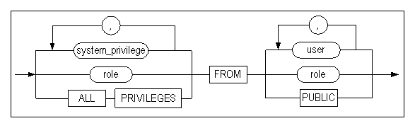

**revoke_object_privilege ::=**


#### 전제 조건

SYS 사용자와 원래 그 권한을 부여한 사용자만이 해당 권한을 해제할 수 있다.

#### 설명

REVOKE 구문은 명시된 사용자가 가진 시스템 권한 또는 특정 객체에 대한 객체 권한
또는 롤을 해제한다. 또는 롤에 부여된 시스템 권한 또는 객체 권한을 해제한다.

시스템 및 객체 접근 권한, 롤을 해제하려면 GRANT 명령으로 직접 부여되었던
권한들에 대해서만 해제할 수 있다.

##### 시스템 접근 권한 (System privilege)

*role*

해제할 롤을 명시한다.

*system_privilege*

해제할 시스템 권한을 명시하는 절이다. 시스템 권한의 목록은 GRANT구문의 설명을
참고한다.

*ALL PRIVILEGES*

이 REVOKE 문을 실행하는 사용자에 의해서 부여된 모든 시스템 권한을 해제하는
옵션이다.

ALL PRIVILEGES 옵션으로 부여된 시스템 권한은 ALL PRIVILEGES 옵션을 사용해서
해제하거나 각각의 권한을 따로따로 해제해도 된다.

*FROM user*

시스템 권한을 해제할 사용자를 명시한다.

*FROM role*

어느 롤에서 시스템 권한을 해제할지 명시한다.

*FROM PUBLIC*

모든 사용자로부터 시스템 권한을 해제하는 옵션이다.

> Note: PUBLIC옵션으로 부여된 시스템 권한은 PUBLIC옵션으로 해제할 수 있다.
>

##### 객체 권한 (Object privilege)

*role*

해제할 롤을 명시한다.

*object_privilege*

해제할 객체 권한을 명시하는 절이다. 객체 권한의 목록은 GRANT구문의 설명을
참고한다.

*ALL [PRIVILEGES]*

이 REVOKE 문을 실행하는 사용자에 의해서 부여된 모든 객체 권한을 해제하는
옵션이다.

ALL PRIVILEGES 옵션으로 권한을 해제하면, 사용자에게 부여된 모든 객체 권한이
해제된다. 즉, ALL [PRIVILEGES] 옵션을 사용하지 않고 부여된 객체 권한도 해제된다.
예을 들어, 다음 구문으로 부여된 객체 권한은:

```
GRANT SELECT ON object TO user;
```

다음 방법으로 명시적으로 해제될 수 있다:

```
REVOKE SELECT ON object FROM user;
```

또한, 다음 구문을 사용하면 모든 다른 권한도 함께 해제된다:

```
REVOKE ALL ON object FROM user;
```

*ON object*

어느 객체(테이블, 시퀀스, 저장 프로시저 등)에 대한 권한을 해제할지를 명시하는
절이다.

*ON DIRECTORY directory_name*

어느 디렉토리 객체에 대한 객체 권한을 해제할지를 명시하는 절이다.

*FROM user*

객체 권한을 해제할 사용자를 명시하는 절이다.

*FROM role*

어느 롤에서 객체 권한을 해제할지 명시한다.

*FROM PUBLIC*

모든 사용자로부터 객체 권한을 해제하는 옵션이다.

*CASCADE CONSTRAINTS*

REFERENCES 권한 또는 ALL [PRIVILEGS]를 사용해서 해제할 때 사용할 수 있는
옵션이다. 이 옵션을 사용해서 사용자의 권한을 해제하면 관련된 모든 참조 무결성
제약조건(referential integrity constraints)도 함께 삭제된다.

#### 예제

\<질의\> 객체 권한을 해제하라.

```
iSQL> CONNECT uare6/rose6;
Connect success.
iSQL> REVOKE SELECT, DELETE ON sys.employees
  FROM uare7, uare8;
Revoke success.
iSQL> CONNECT uare7/rose7;
Connect success.
iSQL> SELECT eno, e_lastname FROM sys.employees WHERE eno = 15;
[ERR-311B1: The user must have the SELECT_ANY_TABLE privilege(s) to execute this statement.]
```

employees 테이블에 대한 SELECT와 DELETE 권한 해제 후, 그 테이블에 SELECT 문을
실행하면 오류 메시지를 볼 수 있다.

\<질의 2\> 롤에 부여된 create user, drop user의 시스템 권한 중에서 create user
권한을 해제한다.

```
iSQL> create role alti_role;
Create success.
iSQL> grant create user, drop user to alti_role;
Grant success.
iSQL> create user user01 identified by user01;
Create success.
iSQL> grant alti_role to user01;
Grant success.
iSQL> connect user01/user01
Connect success.
iSQL> create user user02 identified by user02;
Create success.
iSQL> drop user user02;
Drop success.
iSQL> connect sys/manager
Connect success.
iSQL> revoke create user from alti_role;
Revoke success.
iSQL> connect user01/user01
Connect success.
iSQL> create user user02 identified by user02;
[ERR-311B1 : The user must have CREATE_USER privilege(s) to execute this statement.]
```

\<질의 3\> alti_role 롤에서 사용자 user01의 테이블 t1에 대한 DELETE 객체 권한을
해제한다.

```
iSQL> create role alti_role;
Create success.
iSQL> create user user01 identified by user01;
Create success.
iSQL> create user user02 identified by user02;
Create success.

iSQL> connect user01/user01 
Connect success. 
iSQL> create table t1 (i1 integer); 
Create success. 
iSQL> grant select,insert,update,delete on t1 to alti_role; 
Grant success. 
 
iSQL> connect sys/manager 
Connect success. 
iSQL> grant alti_role to user02; 
Grant success. 
 
iSQL> connect user02/user02; 
Connect success. 
iSQL> insert into user01.t1 values (1); 
1 row inserted. 
iSQL> insert into user01.t1 values (2); 
1 row inserted. 

iSQL> select * from user01.t1; 
I1           
-------------- 
1            
2            
2 rows selected. 
iSQL> update user01.t1 set i1=3 where i1=1; 
1 row updated. 
iSQL> select * from user01.t1; 
I1           
-------------- 
2            
3            
2 rows selected. 
iSQL> delete from user01.t1 where i1=2; 
1 row deleted. 
iSQL> select * from user01.t1; 
I1           
-------------- 
3           
1 row selected. 
 
iSQL> connect user01/user01 
Connect success. 
iSQL> revoke delete on t1 from alti_role; 
Revoke success. 
 
iSQL> connect user02/user02 
Connect success. 
iSQL> delete from user01.t1 where i1=3; 
[ERR-311B1 : The user must have DELETE_ANY_TABLE privilege(s) to execute this statement.]
```


### TRUNCATE TABLE 

#### 구문

**truncate ::=**

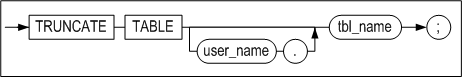

#### 전제 조건

SYS 사용자, 테이블이 속한 스키마의 소유자, 테이블에 ALTER 객체 권한을 가진
사용자, 또는 ALTER ANY TABLE 시스템 권한을 가진 사용자만이 테이블 이름을 변경할
수 있다.

#### 설명

명시된 테이블의 모든 레코드를 삭제하는 구문이다.

*user_name*

레코드가 삭제될 테이블의 소유자 이름을 명시한다. 생략하면 Altibase는 현재 세션에
연결된 사용자의 스키마에 속한 것으로 간주한다.

*tbl_name*

레코드가 삭제될 테이블 이름을 명시한다.

*table_name* 에는 큐 테이블 명을 지정하여 ENQUE된 메시지를 한꺼번에 삭제할 수
있다.

#### TRUNCATE vs. DELETE

TRUNCATE 문을 수행한 경우는 해당 테이블에 할당된 모든 페이지가 데이터베이스에
free page로 반납된다. 따라서 이 페이지들은 다른 테이블에 의해 사용될 수 있다.
그러나 DELETE 문을 수행하여 해당 테이블의 모든 레코드를 삭제한 경우는 free
page가 생기더라도 데이터베이스에 다시 반납되지 않고 해당 테이블 내에 유지되기
때문에 메모리 사용량이 줄지 않는다.

TRUNCATE 구문은 DDL구문이므로 이 구문을 성공적으로 수행한 후에는 rollback이
불가능하다.

#### 주의 사항

레코드의 삭제가 성공적으로 수행되었다면 삭제된 레코드는 복구될 수 없다. 그러나
수행 완료 전에 오류가 발생한 경우나 서버가 죽은 경우엔 롤백이 가능하다.

#### 예제

\<질의\> 테이블 employees의 모든 데이터를 삭제하라.

```
iSQL> TRUNCATE TABLE employee;
Truncate success.
```


