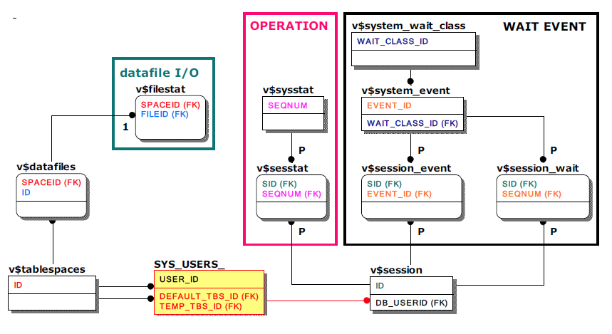
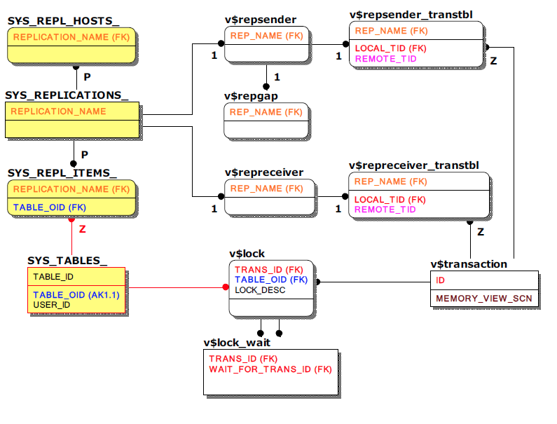
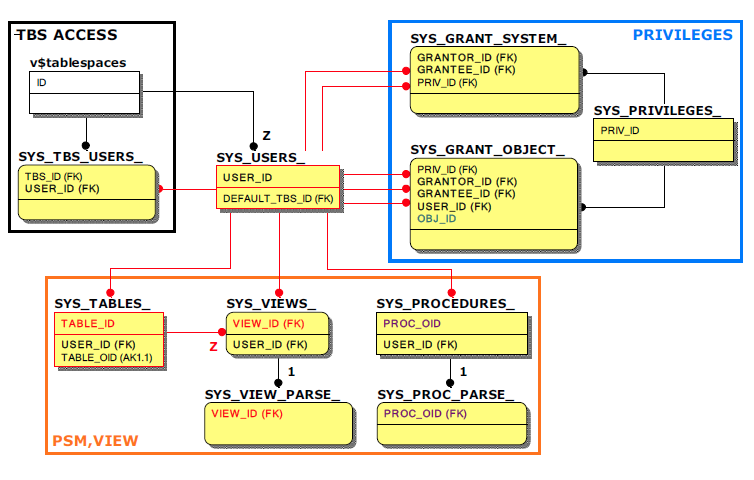

<!-- START doctoc generated TOC please keep comment here to allow auto update -->
<!-- DON'T EDIT THIS SECTION, INSTEAD RE-RUN doctoc TO UPDATE -->


- [Altibase Monitoring Queries Guide](#altibase-monitoring-queries-guide)
  - [Overview](#overview)
  - [1.Altibase Server Monitoring Overview](#1altibase-server-monitoring-overview)
    - [Monitoring Classification](#monitoring-classification)
    - [Data Dictionary](#data-dictionary)
    - [Monitoring Method](#monitoring-method)
  - [2.Altibase Meta Table and Performance View Overview](#2altibase-meta-table-and-performance-view-overview)
    - [Overview](#overview-1)
    - [Main meta Table and performance views related to session, query, transaction, lock, service thread, and memory DB GC](#main-meta-table-and-performance-views-related-to-session-query-transaction-lock-service-thread-and-memory-db-gc)
    - [Major Meta Tables and Performance Views related to tablespace, table, column, index, and constraint](#major-meta-tables-and-performance-views-related-to-tablespace-table-column-index-and-constraint)
    - [Main Performance View related to Statistical Information](#main-performance-view-related-to-statistical-information)
    - [Main Metal Tables and Performance Views Related to Replication](#main-metal-tables-and-performance-views-related-to-replication)
    - [Whether Users can Access the Tablespace, System/Object Privileges, PSM, View related Meta Tables and Peformance Views](#whether-users-can-access-the-tablespace-systemobject-privileges-psm-view-related-meta-tables-and-peformance-views)
  - [3.Monitoring Elements and Corresponding Monitoring Queries](#3monitoring-elements-and-corresponding-monitoring-queries)
    - [Monitoring Elements](#monitoring-elements)
    - [Monitoring Quiries](#monitoring-quiries)
    - [Session](#session)
    - [STATEMENT](#statement)
    - [Service Thread](#service-thread)
    - [Transaction & Lock](#transaction--lock)
    - [Redo Logfile](#redo-logfile)
    - [GC (Garbage Collector)](#gc-garbage-collector)
    - [Memory](#memory)
    - [Tablespace (TBS)](#tablespace-tbs)
    - [Disk Buffer](#disk-buffer)
    - [Object](#object)
    - [Privileges](#privileges)
    - [Constraints](#constraints)
    - [Replication](#replication)

<!-- END doctoc generated TOC please keep comment here to allow auto update -->

# Altibase Monitoring Queries Guide

## Overview

This document provides basic information to be learned for Altibase server monitoring and examples of general monitoring query according to it. It is composed of three sections as follows:

* Altibase Server Monitoring Overview
* Altibase Meta Table and Performance View Overview
* Monitoring Elements and corresponding monitoring queries

This document briefly describes the meta table and performance view related to the monitoring query views views presented as an example.

The description of the column is omitted when it is considered that a separate description is unnecessary because the name is intuitive and the column that has already been described repeatedly appears.

Therefore, it is recommended to refer to the *General Reference* manual for more detailed information and understanding of meta tables and performance views.

* Manual Page: https://github.com/ALTIBASE/Documents/tree/master/Manuals

To refer to the monitoring queries sample, please go straight to the section 'Chapter 3. Monitoring Elements and Monitoring Queries'.

The ERD included in this document was written in IDEF1X notation using CA ERwin ® Data Modeler.

#### Altibase Welcomes Your Comments and Feedbacks

Please let us know what you like or dislike about our manuals. To help us with better future versions of our manuals, please tell us if there is any corrections or classifications that you would find useful.

Include the following information:

- The name and version of the manual that you are using
- Any comments about the manual
- Your name, address, and phone number

If you need immediate assistance regarding any errors, omissions, and other technical issues, please contact Altibase's Support Portal (http://altibase.com/support-center/en/).

Thank you. We always welcome your feedbacks and suggestions.

> This manual contains proprietary information of Altibase Corporation; it is provided under a license agreement containing restrictions on use and disclosure and is also protected by copyright patent and other intellectual property law. Reverse engineering of the software is prohibited. All trademarks, registered or otherwise, are the property of their respective owners.

## 1.Altibase Server Monitoring Overview

This Chapter describes the basics for monitoring Altibase server.

### Monitoring Classification

Altibase is a DBMS. DBMS monitoring can be classified into three categories as follows.

**This document guides users through the monitoring queries needed for 'internal monitoring'.**

* Internal Monitoring: This refers to monitoring within the DBMS through queries according to the data dictionary.
* External Monitoring: This refers to monitoring from outside the DBMS through OS commands.
* Trace Log Monitoring: This refers to monitoring for various trace logs recorded by DBMS

### Data Dictionary

The Altibase data dictionary consists of two types that summarize and store all information about the database so that DBMS can be used efficiently.

* **Meta Table**

  This table is created automatically at database creation time to manage database objects. This table is owned by the system administrator 'SYSTEM_', and only a general user can select it.

* **Performance View**

  At the time of SELECT, the status information inside the Altibase server is provided in the form of a view, so that the latest information of Altibase server status can be obtained. This can only be SELECT, and the prefix of performance view is 'v\$'.

### Monitoring Method

Monitoring methods commonly used in the field are as follows.

* Writing shell scripts
* Writing applications
* Utility Utilization

## 2.Altibase Meta Table and Performance View Overview

### Overview

For internal monitoring of Altibase, it is necessary to understand the Altibase data dictionary, meta table, and performance view. In this document, the relationship between the meta table and the performance view is expressed using the entity-relationship diagram (ERD) in consideration of user understanding and convenience. This will be explained beforehand.

#### About ERD Notation

In consideration of the user's understanding and convenience, the performance view characteristics that do not have a base table are ignored, and the performance view is expressed as a table as shown below, and the key to be referenced when joining is express in FK form. To avoid confusion caused by this notation, the meta table has a yellow background and the performance view has a white background.


In addition, in the above ERD, column of the same attribute, such as the ID columns of the meta table and the META_ID column of the performance view, may have different name according to the meta table and the performance view. In this case, the same color is given to the column to indicate the same attribute.

#### Note

It should be noted that Altibase meta table and performance view have the following characteristics.

1. Column of the same attribute may have different name according to meta table and performance vies.
2. Depending on the Altibase server version, the column name of meta table and performance view can be changed or deleted.
3. Meta table and performance view may be added or deleted depending on the Altibase server version.

#### Terms

This is a definition of some of the terms that may cause confusion prior to explanation.

* Session

  This refers to the user's access unit connected to the Altibase server. One user can have multiple sessions at the same time

* Statement

  As a term that means each SQL executed in a transaction, 'SQL(old) statement', 'Query(statment),' often have the same meaning depending on the context. In this document, it is unified as 'query'.

* Memory DB GC (Garbage Collector) or GC

  When the user excutes commit, the record before the cahnge maintained by the MVCC (Multi Versioning Concurrency Control) techinique should be deleted. Altibase operates seperate threads to delete records before changes, which are called memory DB GC and disk DB GC respectively. However, since the MVCC method of the disk DB has changed since Altibase 5.3.3, the disk DB GC disappears, so only the memory DB GC exists, so it is called GC or Ager.

### Main meta Table and performance views related to session, query, transaction, lock, service thread, and memory DB GC

The user can check session, query, transaction, lock, service thread, and memory DB GC status in real time through meta table and performance view. The relationship between the meta table and performance view in which only the main key columns to be referred join query are indicated is as follows.

V\$ memgc, which is marked separately, is a performance view for the memory DB GC, and has no direct relationship with other meta tables and performance views, but is used with a specific column of v$ transaction.

Note that the statistics information related to query execution among the columns of v $ statement is updated only when the TIMED_STATISTICS property is activated (1), so you must check whether the property is activated. The default value of TIMED_STATISTICS is disabled (0).

For reference, transacitons due to replication also utilize v\$transaction, v\$lock, and v\$lock_wait, but are referred to separately in the replication section due to the nature of the replication transaction without session number or query number.


#### Main Meta Tables

* SYS_USERS

  This is the most basic because it can check information such as the USER_NAME as a meta table that stores database user information.

* SYS_TABLES

  This is a meta table that stores not only tables (including queue tables), but also sequence and view information, so it is possible to check information such as the object name (TABLE_NAME), which is basically used with SYS_USERS_.

#### Main Performance Views

* v\$session

  This is a performance view that shows session information of the currently connected user.

* v\$statement, v\$sqltext, v​\$plantext

  This is a performance view that shows query information and query level statistics related to the scion, and it is possible to measure the execution time and frequency of queries. This is a view maintained only for one query that was executed last(execution) at the end of each session and multiple prepared queries, and disappears when the related session is terminated. The text of the query can also be checked up to 16K through this view.

  If the text of the query exceeds 16K, use v\$ sqltext, a performance view that shows the entire query text, and use v\$plantext to check the execution plan corresponding to the query.

  As mentioned before, statistical information related to query execution among columns of v\$statement is provied only when the TIMED_STATISTICS property is activated (1), so the user must check whether the property is activated. The default value of TIMED_STATISTICS is disabled (0).

* v$service_thread

  As a performance view showing the status of service threads, the user can check related sessions and queries by joining v\$session and v\$statement. The view itself is meaning, so it can be monitored alone.

* v\$transaction, v\$memgc

  v\$ transaction is a performance view that shows information about all currently executed transactions, and is basically used when monitoring locks. In addition, the MVCC status associated with session and syntax can be checked through v$memgc, which is a performance view that shows information of the memory DB GC.

* v\$lock, v\$lock_wait

  v\$lock is a performance view that shows all information about the lock that occurred during the execution of a transaction, and is used with v\$lock_wait, which represents the ancestor relationship of the lock.

* v\$lock_statement

  v$lock_statement vis a performance view that shows the last statement executed in the transaction that acquired the current lock, and is mainly used to quickly check the related session and statement when a lock occurs.

### Major Meta Tables and Performance Views related to tablespace, table, column, index, and constraint

Altibase is able to check tablespace and table information according tot he memory or disk (refer to TBS, TABLE box) due to the nature of hybrid DBMS. in the case of segment, each perofrmance view related to v\$segment (purple) the user can check the detailed resource usage status through. 

However, in the case of an index, as a meta table or performance view for measuring the memory index size is not currently provided, the total number of records in the table should be replaced by multiplying the memory index size for one record by 16 bytes.

For a disk index, refer to v\$index, and real-time size can be measured through the corresponding segment.

The following shows the relationship between meta tables and performance views in which only key columns to refer to are used in join queries related to table spaces, tables, columns, indexes, and constraints.


As a special feature, when joining between the main metatable SYS_TABLE_ and another metatable, TABLE_ID is used as the join column, and when joining with the performance view, the alternative key is the TABLE_OID column (blue).

Although not indicated for reference, all of the metatables except SYS_USERS_ and SYS_TABLES_ have both USER_ID and TABLE_ID columns for convenience of the query. Performance view v\$segment and v\$index also have a table_OID column considering the sum of each table.

#### Main Meta Tables

* SYS_COLUMNS_

  As a meta table that stores column information for all tables, detailed information such as the column name (COLUMN_NAME), data type (DATA_TYPE), and column order (COLUMN_ORDER) can be checked.

* SYS_CONSTRAINTS_

  As a meta table that stores the constraint information of the table, the constraint type (CONSTRAINT_TYPE) can be checked, and in the case of constraints such as PK, FK, and UK, the index number (INDEX_ID) can be checked. Also, in the case of FK, a reference table (REFERENCED_TABLE_ID) can also be checked.

* SYS_CONSTRAINT_COLUMNS

  This is a meta table that can check the column number (COLUMN_ID) of the column that is the target of the constraint and is associated with the related constraint number (CONSTRAINT_ID).

* SYS_INDICES_

  As a meta table that stores all index information, detailed information such as index name (INDEX_NAME), table space number (TBS_ID), index type (INDEX_TYPE), and number of constituent columns (COLUMN_CNT) can be checked.

#### Main Performance Views

* v\$tablespaces

  This is a performance view that shows all tablespace information and is basically used when monitoring tablespace.

* v\$mem_tablspaces

  This is a performance view that shows detailed information only about the memory tablespace. It is possible to find the physical memory size actually used to operate the memory DB.

* v\$datafiles

  This is a performance view that shows detailed information of the data files that make up the disk tablespace. The user can check the path, status, and size of the physical data files.

* v\$segment

  This is a performance view that shows segment information of a disk table. The user can obtain the exact size of disk DB-related objects such as disk tables, disk indexes, undo tablespaces, and temporary tablespaces.

* v$memtbl_info

  This is a performance view that shows detailed information only for the memory table, and the size and sum of pure data for each memory table can be obtained.

* v$disktbl_info

  With the performance view showing detailed information only for the disk table, the corresponding segment. (SEG_PID) can be known, so that the size and sum of pure data for each disk table can be obtained.

* v\$index

  This is a performance view that shows brief information about all indexes. In the case of a disk index, the corresponding segment (INDEX_SG_PID) can be known to determine the size of the disk index.

### Main Performance View related to Statistical Information

Through the performance view, statistics information on wait events and operations at the DBMS level, session level, and query level, such as DBMS level disk tablespace data file I / O, memory usage buffer pool statistics, etc. Various statistical information can be checked.

Standards for generating statistical information vary depending on the level.

* **DBMS Level Statistics**

  Information is accumulated from the start of the Altibase server and initialized when Altibase is shut down. Therefore, in order to know the value of specific period, (current value-value at the start of measurement) must be calculated for all column values.

* **Session Level Statistics**

  The releted session is maintained while connected.

* **Query Level Statistics**

  It is maintained only for one query that was executed last at the end of each session and.multiple prepared queries, and it disappears when the related session ends. Statistics at the query level are provided through the v\$statement already mentioned in the query section, and are omitted in this section.

It should be noted that since the TIMED_STATISTICS property must be activated(1), it is necessary to check whether the property is activated. The default value of TIMED_STATISTICS is disabled(0).

The TIMED_STATISTICS property has been provided since Altibase 5. The user can check whether or not this property is activated with the following sentence.

```
SELECT NAME, VALUE1 FROM V$PROPERTY WHERE NAME = 'TIMED_STATISTICS';
```

Most of the performance views related to statistical information can be monitored by the view itself, so no join is necessary, but in the case of statistical information about I\O of data files in the standby event, operation, and disk tablespace. It is necessary to check by associating with a specific session or data file.

In order to obtain related information, the relationship between the meta table and performance view in which only the key columns to be referenced in the join query is referenced is as follows.



#### Waiting Event Related Performance View

The waiting event means a series of waiting jobs of 'session' or 'Altibase threads'. For example, a thread called a service thread is waiting to acquire a latch of a patch to access a page loaded in a disk buffer, and waiting to acquire a latch of a log buffer to write a log.

For reference, Altibase classifies wait events into 8 types using the upper level, the wait event class.

* v\$system_wait_class

  Statistical information about waiting events of 'Session' or 'Altibase thread' is shown for each 'Waiting Event Class'. In is initialized at the end with the statistical information accumulated after the Altibase operation.

* v\$system_event

  Statistical information on waiting events of 'Session' or 'Altibase thread' is displayed for each 'Waiting Event'. It is initialized at the end with the statistical information accumulated after the Altibase operation.

* v\$session_event

  Statistical information is displayed only for the standby event of the 'session'. When the session ends, the related statistical information disappears.

* v\$session_wait

  Statistical information displayed only for the standby event of the 'activated session' at the time of inquiry among 'session'. When the session is idle or terminated, the related statistical information disappears.

#### Performance-related Views

Operation refers to the various operation performed by 'session' or 'Altibase thread'. For example, performing a query of a specific session and writing a redo log of a service thread.

* v\$sysstat

  Statistical information for the operation of 'session' or 'Altibase thread' is shown for each 'operation'. It is initialized at the end with the statistical information accumulated after the Altibase operation.

* v$sesstat

  Statistical information is displayed only for the calculation of 'session'. When the session ends, the related statistical information disappears.

#### Data File I/O

* v$filestat

  I/O statistics information for each data file of the disk tablespace.

#### Other Main Performance Views

The performance views that provide other statistical information are as follows.

Since the performance view itself provides meaningful statistical information, there is no need to join with other performance views.

* v$memstat

  This is a performance view that shows the memory usage currently used by Altibase for each module, and is a key reference indicator when the memory usage of the Altibase server process is abnormal.

  The MAX_TOTAL_SIZE column, which means the largest memory usage of the module, is maintained from the start of Altibase and initialized when Altibase is shut down.

* v$buffpool_stat

  When performing a query, it displays real-time statistics related to buffer pool such as 'hit ratio', which means the ratio of reusing an existing page in the buffer pool without reading pages from disk.

* v$lfg

  As a performance view related to redo log files, one specific column is the main monitoring target.

  The LF_PREPARE_WAIT_COUNT column indicates the number of times teh service thread has waited because the next redo log file has not yet been created when attempting to switch from the current redo log file to a new redo log file. It this value is large, change the value of the PREPARE_LOG_FILE_COUNT property to a large value and apply it (restart the Altibase server) to create a sufficient number of redo log files in advance.

  It is initialized when the Altibase is shut down in a cumulative and summed form from the time the Altibase is started.

### Main Metal Tables and Performance Views Related to Replication

The relationship between meta tables and performance views in which only the main key column to be referenced in the join query for monitoring related to replication are shown is as follows.

For reference, the SYS_REPL_ITEMS_ column name and user name are stored together so that it is not necessary to join SYS_USERS_ and SYS_TABLES_ to know the database user name and table name.

In addition, as mentioned above, due to the nature of the replication transaction without the session number and query number, the corresponding transaction is identified in the replication partner server through v\$repsender_transtbl and v\$repreceiver_transtbl.



#### Main Meta Tables

* SYS_REPLICATIONS_

  This is a meta table that stores information about all the replicated objects, and it is possible to check detailed information such as the point in time (XSN) in which the replication target server reflects the replication.

* SYS_REPL_HOSTS

  This is a meta table that stores the information of the server to be replicated, and it is possible to check the address (HOST_IP) and port number (PORT_NO) of the server to be replicated.

* SYS_REPL_ITEMS_

  This is a meta table that stores information about the table to be replicated.

#### Main Performance Views

* v$repsender

  This is a performance view that shows the status of the sender, which is a replication send thread. If the sender is not running, it is not searched.

* v$repgap

  This is a performance view that shows the gap between the latest redo log serial number and the redo log serial number sent by the sender. It is measured by the sender, so if the sender is not running, it is also not retrieved.

* v$repreceiver

  This is a performance view that shows the status of the receiver, which is the replication receiving thread. If the receiver is not running, it is not searched.

* v$repsender_transtbl

  This is a performance view that shows the replication transaction that the sender is executing, and the transaction of the other server corresponding to the transaction can be known.

* v\$repreceiver_transtbl

  This is a performance view that shows information about the replication transaction being executed by the received. This shows the transaction of the other server corresponding to the transaction. This is a major reference when a local transaction is waiting due to the lock of a replication transaction. This is also not searched if the receiver is not running.


### Whether Users can Access the Tablespace, System/Object Privileges, PSM, View related Meta Tables and Peformance Views

Real-time monitoring is not necessary, but elements frequently identified during the operation include 'user's access to the tablespace', 'system/object authority', and 'schema object'. In the case of schema objects, PSM and views are the cases.

In order to understand related information, the relationship between the meta table and performance view in which only key columns to be referenced in the join query is referenced is as follows.



Please note that the column names of other objects corresponding to the object number OBJ_ID column (green) in SYS_GRANT_OBJECT_ are different depending on the object.

Examples include TABLE_ID (red), VIEW_ID (red), and PROC_OID (purple) columns.

In addition, most database objects have a separate meta table corresponding to them, but in the case of views, they are managed together with tables, so specific information such as the name of the view must be checked in SYS_TABLES_. SYS_VIEWS\_ stores only the view compile status. (That is, VIEW_ID of SYS\_VIEWS\_ is the same as TABLE_ID of SYS_TABLES\_.)

#### Main Meta Tables

* SYS_TBS_USERS_

  This is a meta table that contains a list of tablespaces accessible to the user

* SYS_PRIVILEGES_

  This is a meta table that stores the authority number (PRIV_ID) and the authority name (PRIV_NAME) for system authority and object authority.

* SYS_GRANT_SYSTEM_

  This is a meta table that stores the authority number (PRIV_ID) for the system authority granted by the user.

* SYS_GRANT_OBJECT_

  This is a meta table that stores the authority number (PRIV_ID) and object information for the object authority granted by the user. Through the object number (OBJ_ID), detailed information of the object can be checked.

* SYS_VIEWS_, SYS_VIEW_PARSE\_

  This is a meta table that stores only the compiled state of the view. The view creation statement can be confirmed through SYS_VIEW_PARSE_.

* SYS_PROCEDURES_, SYS_PROC_PARSE\_

  This is the meta table that stores detailed information about PSM (Procedure, Function, Typeset). The creation statement corresponding to each PSM can be confirmed through SYS_PROC_PARSE_.

## 3.Monitoring Elements and Corresponding Monitoring Queries

### Monitoring Elements

When monitoring Altibase, the general requirements are divided into minimum units, which are called monitoring elements and each monitoring element is presented in a table. The user checks and utilizes the query and OS command corresponding to the element to be monitoring by referring to the table below. For a brief description of the relationship between meta table and performance view to understand queries, please refer to the 'Altibase Meta Table and Performance Overview' section.

### Monitoring Quiries

As a query corresponding to each monitoring element, change the SELECT, WHERE, and LIMIT clauses according to the monitoring purpose. Although there is a brief description of the column, if it is determined that a separate description is not necessary because the column name is intuitive, it is omitted when the previously described column is duplicated.

For more detailed explanation and understanding of columns, we recommend users refer to the *General Reference Manual.*

Manual Page: https://github.com/ALTIBASE/Documents/tree/master/Manuals


### Session

The query corresponding to each monitoring element to check the session status is as follows.

To monitor only information about a specific session, add the 'id' column of v\$session to the WHERE clause.

#### Total Number of Sessions

This shows the number of sessions connected to the Altibase server.

```
SELECT COUNT(*) TOTAL_SESSION_CNT FROM V$SESSION ;
```

#### Session Information

The user can view session related information such as session client information and login time.

The following query can be used in Altibase version 5 or later, but can also be used in Altibase version 4 by deleting or commenting the CLIENT_APP_INFO column.

**Altibase v5 or later**

```
SELECT A.ID SESSION_ID
     , A.DB_USERNAME USER_NAME
     , REPLACE2(REPLACE2(A.COMM_NAME, 'SOCKET-', NULL), '-SERVER', NULL) CLIENT_IP
     , A.CLIENT_APP_INFO             -- Delete it if using Altibase v4
     , A.CLIENT_PID
     , A.SESSION_STATE
     , DECODE(A.AUTOCOMMIT_FLAG, 1, 'ON', 'OFF') AUTOCOMMIT
     , DECODE(A.LOGIN_TIME, 0, '-', TO_CHAR(TO_DATE('1970010109', 'YYYYMMDDHH') + A.LOGIN_TIME / (24*60*60), 'YY/MM/DD HH:MI:SS')) LOGIN_TIME
     , DECODE(A.IDLE_START_TIME, 0, '-', TO_CHAR(TO_DATE('1970010109', 'YYYYMMDDHH') + A.IDLE_START_TIME / (24*60*60), 'YY/MM/DD HH:MI:SS')) IDLE_TIME
     , NVL(LTRIM(B.QUERY), 'NONE') CURRENT_QUERY
  FROM V$SESSION A LEFT OUTER JOIN V$STATEMENT B ON A.CURRENT_STMT_ID = B.ID ;
```

* Main Column Description

| Column Name     | Description                                                  | Remarks                                |
| --------------- | ------------------------------------------------------------ | -------------------------------------- |
| CLIENT_IP       | The ip address of the client application associated with the session |                                        |
| CLIENT_PID      | The process ID of the client application related to the session can identify the related process in the OS in which the client application runs. |                                        |
| CLIENT_APP_INFO | The name of the client application associated with the session | Column added starting from Altibase v5 |
| SESSION_STATE   | As a string representing the state of the session, there are 7 states: INIT, AUTH, SERVICE READY, SERVICE, END, ROLLBACK, and UNKNOWN |                                        |
| IDLE_TIME       | The time at which the session started doing nothing, which is the basis for idle_timeout. <br />The unit is Unix time. |                                        |
| CURRENT_QUERY   | The query that was last performed or currently running in the session |                                        |

#### Session Information Connected With SYSDBA Authority

The user can check the information of the connected session with SYSDBA authority.

The following query can be used starting from Altibase v5, but i can also be used in the Altibase v4 by deleting or commenting the CLIENT_APP_INFO column.

The column used in the SELECT clause is the same as Session Information, so refer to the column description of the query.

```
SELECT A.ID SESSION_ID
     , A.DB_USERNAME USER_NAME
     , REPLACE2(REPLACE2(A.COMM_NAME, 'SOCKET-', NULL), '-SERVER', NULL) CLIENT_IP
     , A.CLIENT_APP_INFO              -- Delete it if using Altibase v4
     , A.CLIENT_PID
     , A.SESSION_STATE
     , DECODE(A.AUTOCOMMIT_FLAG, 1, 'ON', 'OFF') AUTOCOMMIT
     , DECODE(A.LOGIN_TIME, 0, '-', TO_CHAR(TO_DATE('1970010109', 'YYYYMMDDHH') + A.LOGIN_TIME / (24*60*60), 'MM/DD HH:MI:SS')) LOGIN_TIME
     , DECODE(A.IDLE_START_TIME, 0, '-', TO_CHAR(TO_DATE('1970010109', 'YYYYMMDDHH') +A.IDLE_START_TIME / (24*60*60), 'MM/DD HH:MI:SS')) IDLE_TIME
     , NVL(LTRIM(B.QUERY), 'NONE') CURRENT_QUERY
  FROM V$SESSION A LEFT OUTER JOIN V$STATEMENT B ON A.CURRENT_STMT_ID = B.ID
 WHERE A.SYSDBA_FLAG = 1 ;
```

### STATEMENT

This section describes each monitoring query to check the status of the query.

To check detailed time information related to query execution, TIMED_STATISTICS should be activated (1) by default. To Monitor only information about a specific session, add the 'session_id' column of v\$statement to the WHERE clause.

#### How to activate TIMED_STATISTICS

TIMED_STATISTICS is an Altibase server property that is supported starting from Altibase v5.

When TIMED_STATISTICS is activated, time information of queries performed after activation can be known.

```
ALTER SYSTEM SET TIMED_STATISTICS=1;
```

#### Total Number of Queries

```
SELECT COUNT(*) AS TOTAL_STMT_CNT FROM V$STATEMENT ;
```

#### Query Information

```
SELECT SESSION_ID
     , ID STMT_ID
     , TX_ID
     , ROUND((PARSE_TIME+VALIDATE_TIME+OPTIMIZE_TIME)/1000000, 1) PREPARE_TIME
     , ROUND(FETCH_TIME/1000000, 1) FETCH_TIME
     , ROUND(EXECUTE_TIME/1000000, 1) EXECUTE_TIME
     , ROUND(TOTAL_TIME/1000000, 1) TOTAL_TIME
     , EXECUTE_FLAG
     , DECODE(LAST_QUERY_START_TIME, 0, '-', TO_CHAR(TO_DATE('1970010109', 'YYYYMMDDHH') + LAST_QUERY_START_TIME / (24*60*60), 'MM/DD HH:MI:SS')) LAST_START_TIME
     , NVL(LTRIM(QUERY), 'NONE') QUERY
  FROM V$STATEMENT
 ORDER BY EXECUTE_TIME DESC ;
```

**Main Column Description**

| Column          | Description                                                  |
| --------------- | ------------------------------------------------------------ |
| STMT_ID         | Query ID                                                     |
| TX_ID           | ID of the transaction that executed the query                |
| PREPARE_TIME    | The time taken to perform prepare (parse, validation, optimization) is seconds. This is updated whenever a query is performed.<br/><br/>TIMED_STATISTICS must be enabled for viewing. |
| FETCH_TIME      | The time taken to execute execution after preparation is completed, and is updated whenever a query is executed. It is used as a criterion for query timeout.<br />TIMED_STATISTICS must be enabled for viewing. |
| EXECUTE_TIME    | The time it takes for the client to fetch the results of the query. Depending on the size of the result, one query can perform multiple fetches and is updated each time. This becomes the standard of fetch_timeout and the unit is second.<br />TIMED_STATISTICS must be enabled for viewing. |
| TOTAL_TIME      | The sum of time spent for one query to be executed, and includes all of prepare, fetch, and execution. This is updated every time the query is executed, and the unit is seconds.<br />TIMED_STATISTICS must be enabled for viewing. |
| EXECUTE_FLAG    | If this value is 0, it is prepared only, and if it is 1, it is executing. |
| LAST_START_TIME | The time at which the most recently executed query was performed, and the unit is the Unix time. |

#### Number of Queries Currently Being Executed

```
SELECT COUNT(*) AS ACTIVE_STMT_CNT
  FROM V$STATEMENT
 WHERE EXECUTE_FLAG = 1 ;
```

#### Query Information Currently Being Executed

For column description, please refer to 'Main Column Description'.

```
SELECT SESSION_ID
     , ID STMT_ID
     , TX_ID
     , ROUND((PARSE_TIME+VALIDATE_TIME+OPTIMIZE_TIME)/1000000, 1) PREPARE_TIME
     , ROUND(FETCH_TIME/1000000, 1) FETCH_TIME
     , ROUND(EXECUTE_TIME/1000000, 1) EXECUTE_TIME
     , ROUND(TOTAL_TIME/1000000, 1) TOTAL_TIME
     , DECODE(LAST_QUERY_START_TIME, 0, '-', TO_CHAR(TO_DATE('1970010109', 'YYYYMMDDHH') + LAST_QUERY_START_TIME / (24*60*60), 'MM/DD HH:MI:SS')) LAST_START_TIME
     , NVL(LTRIM(QUERY), 'NONE') QUERY
  FROM V$STATEMENT
 WHERE EXECUTE_FLAG = 1
 ORDER BY EXECUTE_TIME DESC ;
```

#### Long-running Query Execution Information

This shows query information being executed for over 600 seconds.

For column description, please refer to 'Main Column Description'.

```
SELECT SESSION_ID
     , ID STMT_ID
     , TX_ID
     , ROUND((PARSE_TIME+VALIDATE_TIME+OPTIMIZE_TIME)/1000000, 1) PREPARE_TIME
     , ROUND(FETCH_TIME/1000000, 1) FETCH_TIME
     , ROUND(EXECUTE_TIME/1000000, 1) EXECUTE_TIME
     , ROUND(TOTAL_TIME/1000000, 1) TOTAL_TIME
     , DECODE(LAST_QUERY_START_TIME, 0, '-', TO_CHAR(TO_DATE('1970010109', 'YYYYMMDDHH') + LAST_QUERY_START_TIME / (24*60*60), 'MM/DD HH:MI:SS')) LAST_START_TIME
     , NVL(LTRIM(QUERY), 'NONE') QUERY
  FROM V$STATEMENT
 WHERE EXECUTE_FLAG = 1
   AND EXECUTE_TIME/1000000 > 600   -- If the user changes the query execution time condition, the user can change the value of this condition. The value is in seconds.
 ORDER BY EXECUTE_TIME DESC ;
```

#### Last Query Information of DML Transaction That is Executed for a Long Time

This shows the last query information of a transaction that has been running for 3600 seconds or longer.

```
SELECT ST.SESSION_ID
     , SS.COMM_NAME CLIENT_IP
     , SS.CLIENT_PID
     , SS.CLIENT_APP_INFO
     , (BASE_TIME - TR.FIRST_UPDATE_TIME) AS UTRANS_TIME
     , ROUND(EXECUTE_TIME/1000000, 1) EXECUTE_TIME
     , ROUND(TOTAL_TIME/1000000, 1) TOTAL_TIME
     , DECODE(LAST_QUERY_START_TIME, 0, '-', TO_CHAR(TO_DATE('1970010109', 'YYYYMMDDHH') + LAST_QUERY_START_TIME / (24*60*60), 'MM/DD HH:MI:SS')) LAST_START_TIME
     , NVL(LTRIM(ST.QUERY), 'NONE') QUERY
  FROM V$TRANSACTION TR,
       V$STATEMENT ST,
       V$SESSIONMGR,
       V$SESSION SS
 WHERE TR.ID = ST.TX_ID
   AND ST.SESSION_ID = SS.ID
   AND TR.FIRST_UPDATE_TIME != 0  -- 0:read only transaction
   AND (BASE_TIME - TR.FIRST_UPDATE_TIME) > 3600    -- If the user wants to change the execution time condition, the user can change the value of this condition. The value is in seconds.
ORDER BY UTRANS_TIME DESC ;
```

#### Main Column Description

For the description of other columns, refer to 'Main Column Description' above.

| Column      | Description                                                  |
| ----------- | ------------------------------------------------------------ |
| UTRANS_TIME | The elapsed time up to the present based on the time when the transaction first started changing operation. It becomes the standard of UTRANS_TIME and the unit is second.<br />For reference, the base_time of v\$sessionmgr and the first_update_time of v\$transaction for calculating this value is updated without activating (0) the TIMED_STATISTICS property. |

#### Full Scan Query Information

For the description of other columns, refer to 'Main Column Description' above.

```
SELECT SESSION_ID
     , S.COMM_NAME CLIENT_IP
     , S.CLIENT_PID
     , S.CLIENT_APP_INFO
     , DECODE(LAST_QUERY_START_TIME, 0, '-', TO_CHAR(TO_DATE('1970010109', 'YYYYMMDDHH') + LAST_QUERY_START_TIME / (24*60*60), 'MM/DD HH:MI:SS')) LAST_START_TIME
     , ROUND((PARSE_TIME+VALIDATE_TIME+OPTIMIZE_TIME)/1000000, 1) PREPARE_TIME
     , ROUND(FETCH_TIME/1000000, 1) FETCH_TIME
     , ROUND(EXECUTE_TIME/1000000, 1) EXECUTE_TIME
     , ROUND(TOTAL_TIME/1000000, 1) TOTAL_TIME
     , NVL(LTRIM(QUERY), 'NONE') QUERY
  FROM V$STATEMENT T,
       V$SESSION S
 WHERE S.ID = T.SESSION_ID
   AND (MEM_CURSOR_FULL_SCAN > 0 OR DISK_CURSOR_FULL_SCAN > 0)
   AND UPPER(QUERY) NOT LIKE '%INSERT%'
 ORDER BY EXECUTE_TIME DESC ;
```

#### Full Scan Query Count Statistics

```
SELECT COUNT(EXECUTE_SUCCESS) EXECUTE_CNT
     , SUBSTR(LTRIM(QUERY), 1, 40) QUERY
  FROM V$STATEMENT
 WHERE (MEM_CURSOR_FULL_SCAN > 0 OR DISK_CURSOR_FULL_SCAN > 0)
   AND UPPER(QUERY) NOT LIKE '%INSERT%'
 GROUP BY QUERY
 ORDER BY EXECUTE_CNT DESC ;
```

**Main Column Description**

| Column      | Description                                    |
| ----------- | ---------------------------------------------- |
| execute_cnt | The total number of successful query execution |

#### Query List by Session

```
SELECT SESSION_ID
     , ID STMT_ID
     , TX_ID
     , SUBSTR(QUERY, 1, 100) QUERY
  FROM V$STATEMENT
 ORDER BY 1, 2 ;
```

#### Number of Statements Created per Session

```
SELECT SESSION_ID
     , ID STMT_ID
     , TX_ID
     , SUBSTR(QUERY, 1, 100) QUERY
  FROM V$STATEMENT
 ORDER BY 1, 2 ;
```

**Main Column Description**

| Column                    | Description                                  |
| ------------------------- | -------------------------------------------- |
| CURR_STMT_CNT_PER_SESSION | The number of statements managed per session |

### Service Thread

The query corresponding to each monitoring element to check the information related to the service thread is as follows.

#### Service Thread Status

```
SELECT RUN_MODE
     , STATE
     , COUNT(*) CNT
  FROM V$SERVICE_THREAD
 GROUP BY RUN_MODE, STATE ;
```

- **Main Column Description**

| RUN_MODE / TYPE | Mode of operation of the service thread / SHARED, DEDICATED  |
| --------------- | ------------------------------------------------------------ |
| STATE           | The state of the service thread. In general, it is in the POLL or EXECUTE state.<br />NONE: Service thread initialized<br />POLL: Service thread is waiting for an event<br />QUEUE-WAIT: Service thread is waiting for a task queue<br />EXECUTE: Service thread is executing query |

####  Check Service Thread Contention

```
SELECT NAME,
       MISS_COUNT,
       TRY_COUNT,
       ROUND(MISS_COUNT/TRY_COUNT*100, 2) PER
  FROM V$MUTEX
 WHERE NAME = 'MMT_SERVICE_THREAD_MUTEX'
 ORDER BY 4 DESC ;
```

**Main Column Description**

| Column     | Description                                                  |
| ---------- | ------------------------------------------------------------ |
| MISS_COUNT | The number of times a request was made to the service thread to process the statement, but failed due to busy. |
| TRY_COUNT  | The number of times a service thread was requested to process a statement |
| PER        | miss_count/try_count*100                                     |

### Transaction & Lock

The query corresponding to each monitoring element to check transaction and lock information is as follows.

#### Transaction and Lock Information

```
SELECT TX.ID TX_ID
     , WAIT_FOR_TRANS_ID BLOCKED_TX_ID
     , DECODE(TX.STATUS,
                 0, 'BEGIN',
                 1, 'PRECOMMIT',
                 2, 'COMMIT_IN_MEMORY',
                 3, 'COMMIT',
                 4, 'ABORT',
                 5, 'BLOCKED',
                 6, 'END') STATUS
     , DECODE(TX.LOG_TYPE, 0, U1.USER_NAME, 'REPLICATION') USER_NAME
     , DECODE(TX.LOG_TYPE, 0, TX.SESSION_ID, RT.REP_NAME) SESSION_ID
     , DECODE(TX.LOG_TYPE, 0, ST.COMM_NAME, RR.PEER_IP) CLIENT_IP
     , DECODE(ST.AUTOCOMMIT_FLAG, 1, 'ON', 'OFF') AUTOCOMMIT
     , L.LOCK_DESC
     , DECODE(TX.FIRST_UPDATE_TIME,
                 0, '0',
                 TO_CHAR(TO_DATE('1970010109', 'YYYYMMDDHH') + TX.FIRST_UPDATE_TIME / (60*60*24), 'MM/DD HH:MI:SS')) FIRST_UPDATE_TIME
     , U2.USER_NAME||'.'||T.TABLE_NAME TABLE_NAME
     , DECODE(TX.LOG_TYPE, 0, SUBSTR(ST.QUERY, 1, 10), 'REMOTE TX_ID '||REMOTE_TID) CURRENT_QUERY
     , DECODE(TX.DDL_FLAG, 0, 'NON-DDL', 'DDL') DDL
     , DECODE(TX.FIRST_UNDO_NEXT_LSN_FILENO, -1, '-', TX.FIRST_UNDO_NEXT_LSN_FILENO) 'LOGFILE#'
  FROM V$TRANSACTION TX,
       V$LOCK L
       LEFT OUTER JOIN (SELECT ST.*, SS.AUTOCOMMIT_FLAG, SS.DB_USERID, SS.COMM_NAME
                          FROM V$STATEMENT ST, V$SESSION SS
                         WHERE SS.ID = ST.SESSION_ID
                           AND SS.CURRENT_STMT_ID = ST.ID) ST ON L.TRANS_ID = ST.TX_ID
       LEFT OUTER JOIN V$REPRECEIVER_TRANSTBL RT ON L.TRANS_ID = RT.LOCAL_TID
       LEFT OUTER JOIN V$REPRECEIVER RR ON RT.REP_NAME = RR.REP_NAME
       LEFT OUTER JOIN V$LOCK_WAIT LW ON L.TRANS_ID = LW.TRANS_ID
       LEFT OUTER JOIN SYSTEM_.SYS_USERS_ U1 ON ST.DB_USERID = U1.USER_ID,
       SYSTEM_.SYS_TABLES_ T
       LEFT OUTER JOIN SYSTEM_.SYS_USERS_ U2 ON T.USER_ID = U2.USER_ID
 WHERE TX.ID = L.TRANS_ID
   AND T.TABLE_OID = L.TABLE_OID
   AND TX.STATUS != 6
ORDER BY TX.ID, ST.ID, TX.FIRST_UPDATE_TIME DESC ; 
```

**Main Column Description**

| Column            | Description                                                  |
| ----------------- | ------------------------------------------------------------ |
| TX_ID             | Transaction ID                                               |
| BLOCKED_TX_ID     | If there is no ID of the transaction that caused the lock to be acquired, it is blank. |
| STATUS            | A number from 0 to 6 indicating the status of the transaction is displayed as a string.<br/>BEGIN (0), PRECOMMIT (1), COMMIT_IN_MEMORY (2), COMMIT (3), ABORT (4), BLOCKED (5), END (6) |
| USER_NAME         | The name of the user executing the transaction, and is displayed as 'REPLICATION' in the case of a replication transaction. |
| SESSION_ID        | ID of the session in which the transaciton is being executed. In the case of a replication transaction, the replication object name is displayed. |
| CLIENT_IP         | The IP address of the client application related to the session. In the case of a replication transaction, it is the IP of the remote server. |
| FIRST_UPDATE_TIME | The time when the transaction first started changing operations. Transaction that only execute SELECT are 0. |
| LOCK_DESC         | If lock is set by the transaction, lock information is output. There are IX_LOCK, IS_LOCK, X_LOCK |
| TABLE_NAME        | The table to acquire the lock. This is displayed in the form of 'username.tablename'. |
| CURRENT_QUERY     | The query last executed or currently being executed in a transaction. In the case of a replication transaction, it shows the ip addess and transaciton ID of the other server. |
| DDL               | Whether the transaction is DDL. / DDL (0) non-DDL (1)        |
| LOGFILE#          | The redo log file number associated with the transaction. A transaction that only performs SELECT is '-'. |

### Redo Logfile

The query corresponding to each monitoring element to check the redo log file information is as follows.

#### Redo Log File Information

```
SELECT OLDEST_ACTIVE_LOGFILE OLDEST_LOGFILE
     , CURRENT_LOGFILE CURRENT_LOGFILE
     , CURRENT_LOGFILE-OLDEST_ACTIVE_LOGFILE LOGFILE_GAP
  FROM V$ARCHIVE ;
```

**Main Column Description**

| Column          | Description                                                  |
| --------------- | ------------------------------------------------------------ |
| OLDEST_LOGFILE  | The number of the oldest redo log file                       |
| CURRENT_LOGFILE | The number of online redo log files currently in use         |
| LOGFILE_GAP     | The number of redo log files between the current online redo log file and the oldest redo log file |

#### Cumulative Number of Waits for Redo Log File Prepare

```
SELECT LF_PREPARE_WAIT_COUNT FROM V$LFG ;
```

**Main Column Description**

| Column                | Description                                                  |
| --------------------- | ------------------------------------------------------------ |
| LF_PREPARE_WAIT_COUNT | When attempting to switch from the current redo log file to a new redo log file, it indicates the number of times the service thread has waited because the next redo log file has not been created yet. If this value is large, change the value of the PREPARE_LOG_FILE_COUNT property to a larger value and apply (restart) it to create a sufficient number of redo log files in advance. It is accumulated and accumulated from the time the Altibase server is started, and initialized when the Altibase server is shut down. |

### GC (Garbage Collector)

The query corresponding to each monitoring element to check GC (Garbage Collector) information is as follows.

#### Memory DB GC Gap

```
SELECT GC_NAME
     , SCNOFTAIL
     , MINMEMSCNINTXS
     , ADD_OID_CNT-GC_OID_CNT GC_GAP
  FROM V$MEMGC ;
```

**Main Column Description**

| Column         | Description                                                  |
| -------------- | ------------------------------------------------------------ |
| GC_NAME        | There are two GC names. MEM_LOGICAL_AGER is a GC that deletes the old version of the index, and MEM_DELTHR is a GC that deletes the old version of the table record. |
| SCNOFTAIL      | The number of the oldest version to be deleted, as identified by GC |
| MINMEMSCNINTXS | The number of the oldest version                             |
| GC_GAP         | Each GC means the amount of old version to be deleted. The larger this value, the greater the amount of old version to be deleted. At this time, if scnoftail> minmemscnintxs, the deletion cannot proceed because of the active transaction. Conversely, if scnoftail <minmemscnintxs, the deletion is still in progress, but it can be judged that the old version to be deleted is increasing due to the completion of the update transaction. |

#### Query Being Executed in a Transaciton Where the Memory DB GC is Waiting

The transaction that GC is waiting to refer to a transaction that refers to the 'oldest version in Altibase'. If the GC does not work and waits indefinitely due to such a transaction, the memory usage can also increase infinitely, so it is one of the factors to check when the GC gap increases.

By executing the query below, the user can see the query executed in the session where the GC is waiting for the transaction. In addition, the index scan is good for distribution, but it can be useful when detecting a query that consumes instantaneous CPU because it is a full scan. Please note that depending on the situation, it must be performed periodically and repeatedly because it may not be detected in one operation.

```
SELECT SESSION_ID
     , TOTAL_TIME
     , EXECUTE_TIME
     , TX_ID
     , QUERY
  FROM V$STATEMENT
 WHERE TX_ID IN (SELECT ID
                   FROM V$TRANSACTION
                  WHERE MEMORY_VIEW_SCN = (SELECT MINMEMSCNINTXS FROM V$MEMGC LIMIT 1))
   AND EXECUTE_FLAG = 1
 ORDER BY 2 DESC ;
```

Or

```
SELECT ST.SESSION_ID,
       ST.TX_ID,
       TOTAL_TIME/1000000 'TOTAL(SEC)',
       EXECUTE_TIME/1000000 'EXECUTE(SEC)',
       FETCH_TIME/1000000 'FETCH(SEC)',
ST.QUERY
  FROM V$STATEMENT ST,
       V$TRANSACTION TX
 WHERE ST.TX_ID = TX.ID
AND TX_ID IN (SELECT ID
                   FROM V$TRANSACTION,
 (SELECT MINMEMSCNINTXS FROM V$MEMGC LIMIT 1) GC
                  WHERE MEMORY_VIEW_SCN = GC.MINMEMSCNINTXS
OR MIN_MEMORY_LOB_VIEW_SCN = GC.MINMEMSCNINTXS)
AND ST.SESSION_ID != SESSION_ID()
AND TX.SESSION_ID <> SESSION_ID()
 ORDER BY 3 DESC;
```


### Memory

The query corresponding to each monitoring element to check information related to utilizaiton occupied by Altibase in the OS is as follows.

#### Altibase Memory Usage

The user can check the memory usage of each module that makes up the Altibase server.

```
SELECT NAME
     , ROUND(ALLOC_SIZE/1024/1024) 'ALLOC(M)'
     , ROUND(MAX_TOTAL_SIZE/1024/1024) 'MAX_TOTAL(M)'
  FROM V$MEMSTAT
 ORDER BY 3 DESC ;
```

##### Main Column Description

| Column       | Description                                                  |
| ------------ | ------------------------------------------------------------ |
| NAME         | The name of the modules taht make up Altibase. The list of modules may differ depending on the version of Altibase. The brief description of the main modules is as follows:<br /><br />Storage_Disk_Ager: Memory used for Disk Garbage Collection<br/>• Storage_Disk_Buffer: Memory used for Disk Buffer management<br/>• Storage_Disk_Collection: Memory used for Direct Path Insert and LOB operation<br/>• Storage_Disk_Datafile: Memory used for Disk File management<br/>• Storage_Disk_Index: Memory used for Disk Index management<br/>• Storage_Disk_Page: Memory used to manage Disk Page<br/>• Storage_Disk_Recovery: Memory used for disk recovery<br/>• Storage_Memory_Ager: Memory used for Memory Garbage Collection<br/>• Storage_Memory_Collection: Memory used for Memory Record management<br/>• Storage_Memory_Interface: Memory used for interface management such as cursor<br/>• Storage_Memory_Locking: Memory used for locking management<br/>• Storage_Memory_Manager: Memory used to store Memory Data<br/>• Storage_Memory_Index: Memory used for index management<br/>• Storage_Memory_Page: Memory used to manage Memory Page<br/>• Storage_Memory_Recovery: Memory used for memory recovery<br/>• Storage_Memory_Utility: Memory used for Storage Manager Tool<br/>• Storage_Memory_Transaction: Memory used for transaction management<br/>• Temp_Memory: Memory used to store the Memory Index<br/>• Transaction_Table: Memory used to manage Transaction Table<br/>• Transaction_OID_List: Memory used for storing OID of Garbage Collection<br/>• Transaction_Table_Info: Memory used to manage Transaction Table information |
| ALLOC(M)     | The amount of memory the module is currently is using        |
| MAX_TOTAL(M) | The maximum amount of memory used by the module              |

#### Total Memory Usage of ALTIBASE

```
SELECT ROUND(SUM(ALLOC_SIZE)/1024/1024) 'ALLOC(M)'
     , ROUND(SUM(MAX_TOTAL_SIZE)/1024/1024) 'MAX_TOTAL(M)'
  FROM V$MEMSTAT ;
```


### Tablespace (TBS)

The query corresponding to each monitoring element to check tablespace information is as follows.

#### Memory Tablespace Usage

VOLATILE tablespace usage can now be viewed. As of Altibase 5.5.1, V\$VOL_TABLSPACES, which stores information in volatile memory tablespaces, has been added.

```
SELECT ID TBS_ID
     , DECODE(TYPE, 0, 'MEMORY_DICTIONARY', 1, 'MEMORY_SYS_DATA', 2, 'MEMORY_USER_DATA', 8, 'VOLATILE_USER_DATA') TBS_TYPE
     , NAME TBS_NAME
     , TO_CHAR(DECODE(M.MAXSIZE, 140737488322560, D.MEM_MAX_DB_SIZE , 0 , T.TOTAL_PAGE_COUNT * T.PAGE_SIZE, M.MAXSIZE) /1024/1024, '999,999,999') 'MAX(M)'
     , TO_CHAR( M.ALLOC_PAGE_COUNT * T.PAGE_SIZE / 1024 / 1024, '999,999,999') 'TOTAL(M)'
     , TO_CHAR(NVL(M.ALLOC_PAGE_COUNT-M.FREE_PAGE_COUNT,T.TOTAL_PAGE_COUNT)*PAGE_SIZE/1024/1024, '999,999,999') 'ALLOC(M)'
     , TO_CHAR(NVL(MT.USED, 0), '999,999,999') 'USED(M)'
     , TO_CHAR(DECODE(MAXSIZE, 140737488322560, (M.ALLOC_PAGE_COUNT-M.FREE_PAGE_COUNT)*T.PAGE_SIZE/ D.MEM_MAX_DB_SIZE ,0, (M.ALLOC_PAGE_COUNT-M.FREE_PAGE_COUNT) / T.TOTAL_PAGE_COUNT , (M.ALLOC_PAGE_COUNT-M.FREE_PAGE_COUNT) * T.PAGE_SIZE/ M.MAXSIZE) * 100 , '99.99') 'USAGE(%)'
     , DECODE(T.STATE,1,'OFFLINE',2,'ONLINE',5,'OFFLINE BACKUP',6,'ONLINE BACKUP',128,'DROPPED', 'DISCARDED') STATE
     , DECODE(M.AUTOEXTEND_MODE,1,'ON','OFF') 'AUTOEXTEND'
  FROM V$DATABASE D
     , V$TABLESPACES T
     , (SELECT SPACE_ID
             , SPACE_NAME
             , ALLOC_PAGE_COUNT
             , FREE_PAGE_COUNT
             , DECODE(MAX_SIZE, 0, (SELECT VALUE1 FROM V$PROPERTY WHERE NAME = 'VOLATILE_MAX_DB_SIZE'), MAX_SIZE) AS MAXSIZE
             , AUTOEXTEND_MODE
          FROM V$VOL_TABLESPACES
         UNION ALL
        SELECT SPACE_ID
             , SPACE_NAME
             , ALLOC_PAGE_COUNT
             , FREE_PAGE_COUNT
             , MAXSIZE
             , AUTOEXTEND_MODE
          FROM V$MEM_TABLESPACES ) M LEFT OUTER JOIN(SELECT TABLESPACE_ID, ROUND(SUM((FIXED_USED_MEM + VAR_USED_MEM))/(1024*1024),3) USED
          FROM V$MEMTBL_INFO
         GROUP BY TABLESPACE_ID ) MT ON M.SPACE_ID = MT.TABLESPACE_ID
 WHERE T.ID = M.SPACE_ID;
```

##### Main Column Description

| Column     | Description                                                  |
| ---------- | ------------------------------------------------------------ |
| TBS_ID     | Unique tablespace number                                     |
| TBS_TYPE   | Memory tablespace type<br />0: As a system memory tablespace, this is a tablespace for storing meta data required for operation of the database system.<br />1: This is a system memory tablespace. This is used to stored the data created by default when creating a database.<br />2: User-created memory tablespace<br />8: User-created volatile memory tablespace |
| MAX(M)     | This is the maximum memory size that used in a memory tablespace.<br />When MAXSIZE is not specified when creating a tablespace, "UNDEFINED" is output.<br />When the tablespace attribute is AUTOEXTEND OFF, TOTAL(M) is output. |
| TOTAL(M)   | Memory tablespace is the total number of pages allocated so far. That is, it is equal to the size of the data file (memory checkpoint image file) as the sume of the 'pages in use' and 'blank pages' allocated so far.<br />When Altibase server is run, only 'pages in use' are loaded into memory. Therefore, it is difficult to judge that physical memory is used as much as this value. |
| ALLOC(M)   | Memory tablespace is the total number of 'pages in use' excluding 'empty pages' among pages allocated so far. <br />For example, if DROP or TRUNCATE is executed on a memory table of size 100M, the total number of pages remains unchanged, but this value is close to 0 because 'page in use' becomes 'black page' through page return. |
| USED(M)    | This is the sum of the 'page actually loaded with data' among the 'pages in use' of the memory tablespace.<br />For example, if the user executes DELETE on a memory table with an ALLOC size of 100M, ALLOC will not change to 100M, but USED will be close to zero (0). |
| USAGE(%)   | This is the percentage of 'pages in use' compared to 'pages that can be most allocated' for memory talbespace (ALLOC/MAX) |
| STATE      | The state of the tablespace<br />1: Offline<br />2: Online<br />3: Offline tablepsace being backed up<br />4: Online tablespace being backed up<br />128: Dropped tablespace<br />1024: Discarded tablespace<br />1028; Discarded tablespace being backed up |
| AUTOEXTEND | Whether to automatically expand the memory tablespace. <br />ON (1), OFF (2) |

#### Total Memory Tablespace Usage

```
SELECT MEM_MAX_DB_SIZE/1024/1024 'MAX(M)'
    , ROUND(MEM_ALLOC_PAGE_COUNT*32/1024, 2) 'TOTAL(M)'
    , TRUNC((MEM_ALLOC_PAGE_COUNT-MEM_FREE_PAGE_COUNT)*32/1024, 2) 'ALLOC(M)'
    , (SELECT ROUND(SUM((FIXED_USED_MEM + VAR_USED_MEM))/(1024*1024), 3)
         FROM V$MEMTBL_INFO) 'USED(M)'
    , TRUNC(((MEM_ALLOC_PAGE_COUNT-MEM_FREE_PAGE_COUNT)*32*1024)/MEM_MAX_DB_SIZE, 4)*100 'USAGE(%)'
 FROM V$DATABASE ;  
```

##### Main Column Description

| Column   | Description                                                  |
| -------- | ------------------------------------------------------------ |
| MAX(M)   | The total number of pages for which the entire memory tablespace can be allocated. This is defined by the Altibase server proeprty MEM_MAX_DB_SIZE. |
| TOTAL(M) | The total number of pages allocatged so far                  |
| ALLOC(M) | The sum of only 'in use pages' excluding 'empty pages' among the pages allocated so far |
| USED(M)  | The sume of the 'pages actually loaded with data' among the 'pages in use' of the entire memory tablespace |
| USAGE(%) | The percentage of 'page in use' compared to 'pages that are fully allocated' for the entire memory tablespace (ALLOC/MAX) |

#### Disk Tablespace Usage

```
SELECT T.ID TBS_ID
     , DECODE(TYPE, 3, 'SYSTEM_DISK_DATA', 4, 'DISK_USER_DATA', 5, 'SYSTEM_DISK_TEMP', 6, 'USER_DISK_TEMP', 7, 'SYSTEM_DISK_UNDO') TBS_TYPE
     , NAME TBS_NAME                                                                                                                                   
     , TO_CHAR((D.MAX * PAGE_SIZE / 1024 /1024), '999,999,999') 'MAX(M)'                                                                               
     , TO_CHAR((TOTAL_PAGE_COUNT * PAGE_SIZE)/1024/1024, '999,999,999') 'TOTAL(M)'                                                                     
     , DECODE(TYPE, 7, TO_CHAR((U.TOTAL_EXT_CNT*PROP.EXTENT_SIZE)/1024/1024, '999,999,999')
                     , TO_CHAR((ALLOCATED_PAGE_COUNT * PAGE_SIZE)/1024/1024, '999,999,999')) 'ALLOC(M)'                                                
     , DECODE(TYPE, 3, TO_CHAR(NVL(DS.USED, 0)/1024/1024, '999,999,999'),
                    4, TO_CHAR(NVL(DS.USED, 0)/1024/1024, '999,999,999'),
                    7, TO_CHAR(((U.TX_EXT_CNT+U.USED_EXT_CNT+U.UNSTEALABLE_EXT_CNT) * PROP.EXTENT_SIZE)/1024/1024, '999,999,999')
                     , LPAD('-', 12))'USED(M)'                                                                                                         
     , DECODE(TYPE, 7, TO_CHAR((((U.TX_EXT_CNT+U.USED_EXT_CNT+U.UNSTEALABLE_EXT_CNT) * PROP.EXTENT_SIZE)/(D.MAX*PAGE_SIZE))*100, '999.99'),
                    3, TO_CHAR(NVL(DS.USED, 0)/(D.MAX*PAGE_SIZE)* 100, '99.99'),
                    4, TO_CHAR(NVL(DS.USED, 0)/(D.MAX*PAGE_SIZE)* 100, '99.99')
                     , TO_CHAR((ALLOCATED_PAGE_COUNT/D.MAX) * 100, '99.99')) 'USAGE(%)'                                                                
     , DECODE(STATE, 1, 'OFFLINE', 2, 'ONLINE', 5, 'OFFLINE BACKUP', 6, 'ONLINE BACKUP', 128, 'DROPPED', 'DISCARDED') STATE                            
     , D.AUTOEXTEND
  FROM V$TABLESPACES T LEFT OUTER JOIN(SELECT SPACE_ID , SUM(TOTAL_USED_SIZE) USED
                                         FROM X$SEGMENT
                                        GROUP BY SPACE_ID) DS ON DS.SPACE_ID = T.ID
     , (SELECT SPACEID
             , SUM(DECODE(MAXSIZE, 0, CURRSIZE, MAXSIZE)) AS MAX
             , DECODE(MAX(AUTOEXTEND), 1, 'ON', 'OFF') 'AUTOEXTEND'
          FROM V$DATAFILES
         GROUP BY SPACEID ) D
     , V$DISK_UNDO_USAGE U
     , (SELECT VALUE1 EXTENT_SIZE
          FROM V$PROPERTY
         WHERE NAME = 'SYS_UNDO_TBS_EXTENT_SIZE') PROP
 WHERE T.ID = D.SPACEID ;
```

##### Main Column Description

| Column   | Description                                                  |
| -------- | ------------------------------------------------------------ |
| MAX(M)   | The total number of pages that can be allocated. Pages are divided into 'active pages' and 'empty pages'. |
| TOTAL(M) | The total number of pages that the disk tablespace has been allocated so far. That is, this corresponds to the data file size as the sum of the 'pages in use' and 'blank pages' allocated so far. |
| ALLOC(M) | The total number of 'pages in use' excluding 'empty pages' among the pages allocated so far. For example, when DROP or TRUNCATE is executed on a 100M disk table, the total number of pages remains the same, but this value is close to 0 because 'pages in use' become 'blank pages' through page return. |
| USED(M)  | The sum of the 'pages actually loaded with data' among the 'pages in use' of the disk tablespace |
| USAGE(%) | The percentage of 'pages in use' compared to 'maximum allocable pages' in disk tablespace (ALLOC/TOTAL) |

#### Disk Undo Tablespace Usage

```
SELECT T.NAME TBS_NAME
     , ROUND(D.MAX * PAGE_SIZE / 1024 /1024, 2) 'MAX(M)'                                                                    
     , ROUND((TOTAL_PAGE_COUNT * PAGE_SIZE) / 1024 / 1024, 2) 'TOTAL(M)'                                                    
     , ROUND((U.TOTAL_EXT_CNT*PROP.EXTENT_SIZE)/1024/1024, 2) 'ALLOC(M)'                                                    
     , ROUND(((U.TX_EXT_CNT+U.USED_EXT_CNT+U.UNSTEALABLE_EXT_CNT) * PROP.EXTENT_SIZE)/1024/1024, 2) 'USED(M)'               
     , ROUND((((U.TX_EXT_CNT+U.USED_EXT_CNT+U.UNSTEALABLE_EXT_CNT) * PROP.EXTENT_SIZE)/(D.MAX*PAGE_SIZE))*100, 2) 'USAGE(%)'
     , DECODE(STATE,1,'OFFLINE',2,'ONLINE',5,'OFFLINE BACKUP',6,'ONLINE BACKUP',128,'DROPPED', 'DISCARDED') STATE           
     , D.AUTOEXTEND
  FROM V$TABLESPACES T
     , (SELECT SPACEID
             , SUM(DECODE(MAXSIZE, 0, CURRSIZE, MAXSIZE)) AS MAX
             , DECODE(MAX(AUTOEXTEND),1,'ON','OFF') 'AUTOEXTEND'
          FROM V$DATAFILES
         GROUP BY SPACEID) D
     , V$DISK_UNDO_USAGE U
     , (SELECT VALUE1 EXTENT_SIZE FROM V$PROPERTY WHERE NAME = 'SYS_UNDO_TBS_EXTENT_SIZE') PROP
 WHERE T.ID = D.SPACEID
   AND T.ID = 3 ;
```

##### Main Column Description

| Column   | Description                                                  |
| -------- | ------------------------------------------------------------ |
| MAX(M)   | The maximum size that can be used in undo tablespace         |
| TOTAL(M) | The total size allocated to undo tablespace                  |
| ALLOC(M) | The total number of pages in use, excluding 'empty pages' among the pages allocated so far |
| USED(M)  | The usage of undo tablespace. EXTENT size in use or not reusable by change transaction |
| USAGE(%) | Usage rate (Used compared to MAX)                            |
| STATE    | Tablespace state                                             |

#### Undo Tablespace Usage by Transaction

```
SELECT  DECODE(TX.SESSION_ID, -1, 'REP('||REP.REP_NAME||')', TX.SESSION_ID) SESSION_ID
      , TX.ID TX_ID
      , DECODE(TX.STATUS, 0, 'BEGIN', 1, 'PRECOMMIT', 2, 'COMMIT_IN_MEMORY', 3, 'COMMIT', 4, 'ABORT', 5, 'BLOCKED', 6, 'END') TX_STATUS
      , RPAD(DECODE(ST.EXECUTE_FLAG, NULL, 'REP('||REP.REP_NAME||')', 1, 'SQL ING', 0, 'SQL END'), 10) SQL_STATUS
      , RPAD(DECODE(TX.LOG_TYPE, 1, 'REP '||REP.PEER_IP||':'||REP.PEER_PORT, S.COMM_NAME||' PID:'||S.CLIENT_PID), 40) CLIENT_IP
      , RPAD(DECODE(TX.LOG_TYPE, 1, 'REP('||REP.REP_NAME||')', S.CLIENT_APP_INFO), 15) CLIENT_APP_INFO
      , RPAD(DECODE(S.AUTOCOMMIT_FLAG, 1, 'ON', 0, 'OFF', NULL, 'REP('||REP.REP_NAME||')'), 10) AUTOCOMMIT
      , RPAD(DECODE(TX.LOG_TYPE, 1, 'REP('||REP.REP_NAME||')', S.UTRANS_TIME_LIMIT), 15) UTRANS_TIMEOUT
      , DECODE(ST.LAST_QUERY_START_TIME, NULL, TO_CHAR(TO_DATE('1970010109', 'YYYYMMDDHH') + TX.FIRST_UPDATE_TIME / (60*60*24), 'YYYY-MM-DD HH:MI:SS'), TO_CHAR(TO_DATE('1970010109', 'YYYYMMDDHH') + ST.LAST_QUERY_START_TIME / (60*60*24), 'YYYY-MM-DD HH:MI:SS')) LAST_QUERY_START_TIME
      , ((((TSS.TOTAL_EXTENT_COUNT+TSS.TOTAL_EXTDIR_COUNT)*TSS.PAGE_COUNT_IN_EXTENT)+((UDS.TOTAL_EXTENT_COUNT+UDS.TOTAL_EXTDIR_COUNT)*UDS.PAGE_COUNT_IN_EXTENT))*TBS.PAGE_SIZE) /1024/1024 UNDO_USAGE
      , DECODE(TX.LOG_TYPE, 1, 'REMOTE_TX_ID : '||REP_TX.REMOTE_TID, SUBSTR(ST.QUERY, 1, 30)) QUERY
  FROM  V$TXSEGS TXS
      , V$TSSEGS TSS
      , V$UDSEGS UDS
      , V$TRANSACTION TX LEFT OUTER JOIN V$SESSION S ON TX.ID = S.TRANS_ID LEFT OUTER JOIN V$STATEMENT ST ON S.CURRENT_STMT_ID = ST.ID LEFT OUTER JOIN V$REPRECEIVER_TRANSTBL REP_TX ON TX.ID = REP_TX.LOCAL_TID LEFT OUTER JOIN V$REPRECEIVER REP ON REP_TX.REP_NAME = REP.REP_NAME
      , V$TABLESPACES TBS
 WHERE 1=1
   AND UDS.SPACE_ID = 3
   AND TXS.ID = UDS.TXSEG_ENTRY_ID
   AND TXS.ID = TSS.TXSEG_ENTRY_ID
   AND TXS.TRANS_ID = TX.ID
   AND TBS.ID = UDS.SPACE_ID
 ;
```

##### Main Column Description

| Column                | Description                                                  |
| --------------------- | ------------------------------------------------------------ |
| SESSION_ID            | The ID of the session or duplicated object that executed the transaction |
| TX_ID                 | Transaction ID                                               |
| TX_STATUS             | Transaction status                                           |
| SQL_STATUS            | SQL statement status                                         |
| CLIENT_IP             | Client IP and process ID                                     |
| AUTOCOMMIT            | AUTOCOMMIT mode of the session                               |
| UTRANS_TIMEOUT        | UTRANS_TIMEOUT setting value of session                      |
| LAST_QUERY_START_TIME | SQL statement start time                                     |
| UNDO_USAGE            | Transaction undo usage (in MB)                               |
| QUERY                 | Last query executed by transaction using or using undo       |

#### Total Tablespace Usage

```
SELECT 'MEMORY_DB_TOTAL' TBS_TYPE,
       '-' TBS_NAME,
       TO_CHAR(MEM_MAX_DB_SIZE/1024/1024,    '999,999,999')  'MAX(M)',
       TO_CHAR(MEM_ALLOC_PAGE_COUNT*32/1024, '999,999,999')  'TOTAL(M)',
       TO_CHAR((MEM_ALLOC_PAGE_COUNT-MEM_FREE_PAGE_COUNT)*32/1024, '999,999,999') 'ALLOC(M)',
       TO_CHAR((SELECT ROUND(SUM((FIXED_USED_MEM + VAR_USED_MEM))/(1024*1024), 3)
                  FROM V$MEMTBL_INFO), '999,999,999') 'USED(M)',
       TO_CHAR(((MEM_ALLOC_PAGE_COUNT-MEM_FREE_PAGE_COUNT)*32*1024)/MEM_MAX_DB_SIZE, '99.99')*100 'USAGE(%)',
       '' 'TOTAL_USAGE(%)',
       '' STATE,
       '' 'AUTOEXTEND'
  FROM V$DATABASE
UNION ALL
SELECT
      DECODE(TYPE, 0, 'MEMORY_DICTIONARY', 1, 'MEMORY_SYS_DATA', 2, 'MEMORY_USER_DATA', 8, 'VOLATILE_USER_DATA') TBS_TYPE
     , NAME TBS_NAME
     , TO_CHAR(DECODE(M.MAXSIZE, 140737488322560, D.MEM_MAX_DB_SIZE , 0 , T.TOTAL_PAGE_COUNT * T.PAGE_SIZE, M.MAXSIZE) /1024/1024, '999,999,999') 'MAX(M)'
     , TO_CHAR( M.ALLOC_PAGE_COUNT * T.PAGE_SIZE / 1024 / 1024, '999,999,999') 'TOTAL(M)'
     , TO_CHAR(NVL(M.ALLOC_PAGE_COUNT-M.FREE_PAGE_COUNT,T.TOTAL_PAGE_COUNT)*PAGE_SIZE/1024/1024, '999,999,999') 'ALLOC(M)'
     , TO_CHAR(NVL(MT.USED, 0), '999,999,999') 'USED(M)'
     , TO_CHAR(DECODE(MAXSIZE, 140737488322560, (M.ALLOC_PAGE_COUNT-M.FREE_PAGE_COUNT)*T.PAGE_SIZE/ D.MEM_MAX_DB_SIZE ,0, (M.ALLOC_PAGE_COUNT-M.FREE_PAGE_COUNT) / T.TOTAL_PAGE_COUNT , (M.ALLOC_PAGE_COUNT-M.FREE_PAGE_COUNT) * T.PAGE_SIZE/ M.MAXSIZE) * 100 , '99.99') 'USAGE(%)'
     , TO_CHAR(MT.USED / ROUND(ALLOCATED_PAGE_COUNT * PAGE_SIZE / 1024 / 1024, 2)*100, '99.99') 'TOTAL_USAGE(%)'
     , DECODE(T.STATE,1,'OFFLINE',2,'ONLINE',5,'OFFLINE BACKUP',6,'ONLINE BACKUP',128,'DROPPED', 'DISCARDED') STATE
     , DECODE(M.AUTOEXTEND_MODE,1,'ON','OFF') 'AUTOEXTEND'
  FROM V$DATABASE D
     , V$TABLESPACES T
     , (SELECT SPACE_ID
             , SPACE_NAME
             , ALLOC_PAGE_COUNT
             , FREE_PAGE_COUNT
             , DECODE(MAX_SIZE, 0, (SELECT VALUE1 FROM V$PROPERTY WHERE NAME = 'VOLATILE_MAX_DB_SIZE'), MAX_SIZE) AS MAXSIZE
             , AUTOEXTEND_MODE
          FROM V$VOL_TABLESPACES
         UNION ALL
        SELECT SPACE_ID
             , SPACE_NAME
             , ALLOC_PAGE_COUNT
             , FREE_PAGE_COUNT
             , MAXSIZE
             , AUTOEXTEND_MODE
          FROM V$MEM_TABLESPACES ) M LEFT OUTER JOIN(SELECT TABLESPACE_ID, ROUND(SUM((FIXED_USED_MEM + VAR_USED_MEM))/(1024*1024),3) USED
          FROM V$MEMTBL_INFO
         GROUP BY TABLESPACE_ID ) MT ON M.SPACE_ID = MT.TABLESPACE_ID
 WHERE T.ID = M.SPACE_ID
UNION ALL
SELECT
       DECODE(TYPE, 3, 'SYSTEM_DISK_DATA', 4, 'DISK_USER_DATA', 5, 'SYSTEM_DISK_TEMP', 6, 'USER_DISK_TEMP', 7, 'SYSTEM_DISK_UNDO') TBS_TYPE
     , NAME TBS_NAME                                                                                                                                  
     , TO_CHAR((D.MAX * PAGE_SIZE / 1024 /1024), '999,999,999') 'MAX(M)'                                                                              
     , TO_CHAR((TOTAL_PAGE_COUNT * PAGE_SIZE)/1024/1024, '999,999,999') 'TOTAL(M)'                                                                    
     , DECODE(TYPE, 7, TO_CHAR((U.TOTAL_EXT_CNT*PROP.EXTENT_SIZE)/1024/1024, '999,999,999')
                     , TO_CHAR((ALLOCATED_PAGE_COUNT * PAGE_SIZE)/1024/1024, '999,999,999')) 'ALLOC(M)'                                               
     , DECODE(TYPE, 3, TO_CHAR(NVL(DS.USED, 0)/1024/1024, '999,999,999'),
                    4, TO_CHAR(NVL(DS.USED, 0)/1024/1024, '999,999,999'),
                    7, TO_CHAR(((U.TX_EXT_CNT+U.USED_EXT_CNT+U.UNSTEALABLE_EXT_CNT) * PROP.EXTENT_SIZE)/1024/1024, '999,999,999')
                     , LPAD('-', 12))'USED(M)'                                                                                                        
     , DECODE(TYPE, 7, TO_CHAR((((U.TX_EXT_CNT+U.USED_EXT_CNT+U.UNSTEALABLE_EXT_CNT) * PROP.EXTENT_SIZE)/(D.MAX*PAGE_SIZE))*100, '999.99'),
                    3, TO_CHAR(NVL(DS.USED, 0)/(D.MAX*PAGE_SIZE)* 100, '99.99'),
                    4, TO_CHAR(NVL(DS.USED, 0)/(D.MAX*PAGE_SIZE)* 100, '99.99')
                     , TO_CHAR((ALLOCATED_PAGE_COUNT/D.MAX) * 100, '99.99')) 'USAGE(%)'     
     , DECODE(TYPE, 7, TO_CHAR((((U.TX_EXT_CNT+U.USED_EXT_CNT+U.UNSTEALABLE_EXT_CNT) * PROP.EXTENT_SIZE)/(TOTAL_PAGE_COUNT * PAGE_SIZE))*100, '999.99'),
                    3, TO_CHAR(NVL(DS.USED, 0)/(TOTAL_PAGE_COUNT * PAGE_SIZE)* 100, '99.99'),
                    4, TO_CHAR(NVL(DS.USED, 0)/(TOTAL_PAGE_COUNT * PAGE_SIZE)* 100, '99.99')
                     , TO_CHAR((ALLOCATED_PAGE_COUNT/TOTAL_PAGE_COUNT) * 100, '99.99')) 'TOTAL_USAGE(%)'                     
     , DECODE(STATE, 1, 'OFFLINE', 2, 'ONLINE', 5, 'OFFLINE BACKUP', 6, 'ONLINE BACKUP', 128, 'DROPPED', 'DISCARDED') STATE                           
     , D.AUTOEXTEND
  FROM V$TABLESPACES T LEFT OUTER JOIN(SELECT SPACE_ID , SUM(TOTAL_USED_SIZE) USED
                                         FROM X$SEGMENT
                                        GROUP BY SPACE_ID) DS ON DS.SPACE_ID = T.ID
     , (SELECT SPACEID
             , SUM(DECODE(MAXSIZE, 0, CURRSIZE, MAXSIZE)) AS MAX
             , DECODE(MAX(AUTOEXTEND), 1, 'ON', 'OFF') 'AUTOEXTEND'
          FROM V$DATAFILES
         GROUP BY SPACEID ) D
     , V$DISK_UNDO_USAGE U
     , (SELECT VALUE1 EXTENT_SIZE
          FROM V$PROPERTY
         WHERE NAME = 'SYS_UNDO_TBS_EXTENT_SIZE') PROP
 WHERE T.ID = D.SPACEID ;
```

##### Main Column Description

| Column         | Description                                                  |
| -------------- | ------------------------------------------------------------ |
| MAX(M)         | The maximum size that can be used in undo tablespace         |
| TOTAL(M)       | The size of the tablespace allocated so far.<br />Same as memory checkpoint image file and disk data size |
| ALLOC(M)       | The size of the 'page in use' excluding 'empty pages' among the pages allocated so far in the tablespace |
| USED(M)        | The size of the actual data loaded on the page that the tablespace is using |
| USAGE(%)       | Utilization ratio compared to MAX                            |
| TOTAL_USAGE(%) | Usage rate compared to TOTAL                                 |

#### Memory Tablespace Data File Checkpoint Path

```
SELECT MEM_DATA_FILE DATAFILE_NAME
 FROM V$STABLE_MEM_DATAFILES ;
```

#### Disk Tablespace Data File

```
 SELECT B.NAME TBS_NAME,
       A.ID 'FILE#',
       A.NAME DATAFILE_NAME,
       CURRSIZE*8/1024 'ALLOC(M)',
       ROUND(CASE2(A.MAXSIZE=0, CURRSIZE, A.MAXSIZE)*8/1024) 'MAX(M)',
       DECODE(AUTOEXTEND, 0, 'OFF', 'ON') 'AUTOEXTEND'
  FROM V$DATAFILES A,
       V$TABLESPACES B
 WHERE B.ID = A.SPACEID
 ORDER BY B.NAME, A.ID
;
```

##### Main Column Description

| Column | Description                                                  |
| ------ | ------------------------------------------------------------ |
| FILE#  | The number of the data file. A disk tablspace can have multiple data files. |

#### I/O Per Disk Tablespace Data File

```
SELECT NAME TBS_NAME,
       A.PHYRDS PHY_READ,
       A.PHYWRTS PHY_WRITE,
       A.PHYRDS+A.PHYWRTS PHY_TOTAL,
       TRUNC(A.PHYRDS/READ_SUM*100,2) 'READ(%)',
       TRUNC(A.PHYWRTS/WRITE_SUM*100,2) 'WRITE(%)',
       TRUNC( (A.PHYRDS+A.PHYWRTS) / (READ_SUM+WRITE_SUM) * 100 , 2) 'TOTAL(%)',
       A.AVGIOTIM AVG_IO_TIME
  FROM V$FILESTAT A,
       V$DATAFILES B,
       (SELECT SUM(PHYRDS) READ_SUM,
               SUM(PHYWRTS) WRITE_SUM
          FROM V$FILESTAT ) C
 WHERE A.SPACEID = B.SPACEID
       AND A.FILEID = B.ID
       AND READ_SUM > 0
       AND WRITE_SUM > 0
 ORDER BY A.PHYRDS+A.PHYWRTS DESC, ROWNUM DESC
;
```

##### Main Column Description

| Column      | Description                                                  |
| ----------- | ------------------------------------------------------------ |
| PHY_READ    | The number of physical read I/O occurrences                  |
| PHY_WRITE   | The number of physical write I/O occurrences                 |
| PHY_TOTAL   | The number of physical I/O occurrences                       |
| READ(%)     | The percentage of occurrence compared to total physical read I/O |
| WRITE(%)    | The percentage of occurrence compared to total physical write I/O |
| TOTAL(%)    | The ratio of occurrence to total physical I/O                |
| AVG_IO_TIME | The average physical I/O time, measured in milliseconds      |

#### Single Page Read I/O per Disk Tablespace Data File

```
SELECT B.NAME TBS_NAME,
       A.SINGLEBLKRDS READ_CNT_PER_PAGE,
       A.SINGLEBLKRDTIM READ_TIME_PER_PAGE,
       TRUNC(A.SINGLEBLKRDTIM/A.SINGLEBLKRDS,2) AVERAGE_TIME
  FROM V$FILESTAT A,
       V$DATAFILES B
 WHERE A.SPACEID = B.SPACEID
       AND A.FILEID = B.ID
       AND A.SINGLEBLKRDS > 0
 ORDER BY AVERAGE_TIME DESC
;
```

##### Main Column Description

| Column             | Description                                           |
| ------------------ | ----------------------------------------------------- |
| READ_CNT_PER_PAGE  | Read count for a single page                          |
| READ_TIME_PER_PAGE | Read time for a single page, in milliseconds.         |
| AVERAGE_TIME       | Average read time for a single page, in milliseconds. |

#### Temporary Tablespace Usage

```
SELECT SUM(NORMAL_AREA_SIZE) SUM_NORMAL_AREA_SIZE
 FROM X$TEMPTABLE_STATS
WHERE DROP_TIME = '19700101_090000' ;
```

##### Main Column Description

| Column           | Description                      |
| ---------------- | -------------------------------- |
| NORMAL_AREA_SIZE | The size of used Temp tablespace |

#### Temporary Tablespace Usage by Transaction

```
SELECT NORMAL_AREA_SIZE
 FROM X$TEMPTABLE_STATS T,
      V$STATEMENT STMT
WHERE T.TRANSACTION_ID = STMT.TX_ID ;
```

#### Overall Tablespace Status

```
SELECT NAME TBS_NAME,
      DECODE(STATE, 1, 'OFFLINE',
                    2, 'ONLINE',
                    5, 'OFFLINE BACKUP',
                    6, 'ONLINE BACKUP',
                    128, 'DROPPED', 'DISCARD') STATE
 FROM V$TABLESPACES ;
```


### Disk Buffer

The query corresponding to each monitoring element to check DIsk Buffer information is as follows.

#### Disk Buffer Hit Ratio

```
SELECT HIT_RATIO 'HIT_RATIO(%)' FROM V$BUFFPOOL_STAT ;
```

##### Main Column Description

| Column       | Description                                                  |
| ------------ | ------------------------------------------------------------ |
| HIT_RATIO(M) | This means the rate at which pages already loaded in the disk buffer are reused since starting Altibase. The smaller this value, the more physical read pages are. If the number of physical reads is large, the system cannot process the query quickly. This column is the calculation of (get_pages + fix_pages-read_pages) / (get_pages + fix_pages). |


### Object

The query corresponding to each monitoring element to check object information is as follows.

#### Memory Table Usage

This queries the usage of memory tables.

```
SELECT MT.USER_NAME
     , MT.TABLE_NAME
     , MT.PARTITION_NAME
     , TBS.NAME TBS_NAME
     , TO_CHAR((MU.FIXED_ALLOC_MEM+MU.VAR_ALLOC_MEM)/1024/1024, '999,999,999.9') 'ALLOC(M)'
     , TO_CHAR((MU.FIXED_USED_MEM+MU.VAR_USED_MEM)/1024/1024,   '999,999,999.9') 'USED(M)'
     , TO_CHAR(((MU.FIXED_USED_MEM+MU.VAR_USED_MEM)/(MU.FIXED_ALLOC_MEM+MU.VAR_ALLOC_MEM))*100, '999.9') 'USAGE(%)'    
  FROM (SELECT U.USER_NAME
             , T.TABLE_NAME
             , DECODE(T.IS_PARTITIONED, 'F', T.TABLE_OID, 'T', P.PARTITION_OID) TABLE_OID
             , DECODE(T.IS_PARTITIONED, 'F', RPAD('-', 14), 'T', P.PARTITION_NAME) PARTITION_NAME
             , DECODE(T.IS_PARTITIONED, 'F', T.TBS_ID, 'T', P.TBS_ID) TBS_ID
          FROM SYSTEM_.SYS_USERS_ U
             , SYSTEM_.SYS_TABLES_ T LEFT OUTER JOIN SYSTEM_.SYS_TABLE_PARTITIONS_ P ON T.TABLE_ID = P.TABLE_ID
         WHERE 1=1
           AND U.USER_ID <> 1
           AND U.USER_ID = T.USER_ID
           AND T.TBS_ID IN (SELECT ID FROM V$TABLESPACES WHERE TYPE IN (1, 2, 8))
       ) MT
     , V$MEMTBL_INFO MU
     , V$TABLESPACES TBS
 WHERE 1=1
   AND MT.TABLE_OID = MU.TABLE_OID
   AND TBS.ID = MT.TBS_ID
 ORDER BY 1, 2, 3
   ;
```

##### Main Column Description

| Column         | Description                                                  |
| -------------- | ------------------------------------------------------------ |
| USER_NAME      | Table owner                                                  |
| TABLE_NAME     | Table name                                                   |
| PARTITION_NAME | The name of the partitioned table if you created the partitioned table on the table. Memory partition tables are supported starting from 6.5.1. |
| TBS_NAME       | Tablespace name specified when creating the table            |
| ALLOC(M)       | The total number of pages allocated from the memory table    |
| USED(M)        | The total of 'pages loaded with actual data' among the pages allocated by the memory table. For example, if the user executes a full DELETE on a memory table with an ALLOC size of 100M, ALLOC will not change to 100M, but USED will be close to zero. The user can reduce ALLOC by executing TRUNCATE. |
| USAGE(%)       | This is expressed as a percentage of the 'page loaded with actual data' among pages allocated to the memory table. (Ie USED / ALLOC) |

#### Queue

This queries the usage of the queue table.

For column description, refer to Memory table and usage column description.

```
SELECT A.USER_NAME
     , B.TABLE_NAME
     , D.NAME TABLESPACE_NAME
     , C.TABLE_OID
     , TO_CHAR((C.FIXED_ALLOC_MEM+C.VAR_ALLOC_MEM)/1024/1024, '999,999,999.9') 'ALLOC(M)'
     , TO_CHAR((C.FIXED_USED_MEM+C.VAR_USED_MEM)/1024/1024,   '999,999,999.9') 'USED(M)'
     , TO_CHAR(((C.FIXED_USED_MEM+C.VAR_USED_MEM)/(C.FIXED_ALLOC_MEM+C.VAR_ALLOC_MEM))*100, '999.9') 'USAGE(%)'
  FROM SYSTEM_.SYS_USERS_ A
     , SYSTEM_.SYS_TABLES_ B
     , V$MEMTBL_INFO C
     , V$TABLESPACES D
 WHERE 1=1
   AND A.USER_NAME <> 'SYSTEM_'
   AND B.TABLE_TYPE = 'Q'
   AND A.USER_ID = B.USER_ID
   AND B.TABLE_OID = C.TABLE_OID
   AND B.TBS_ID = D.ID ;
```

#### Memory Table with Low Efficiency

This queries a memory table which actual usage is lower than the all allocated pages.

This outputs the memory table with the total size of pages allocated from the memory table of 1G or more and USAGE of 50% or less.

```
SELECT MT.USER_NAME
     , MT.TABLE_NAME
     , MT.PARTITION_NAME
     , TBS.NAME TBS_NAME
     , TO_CHAR((MU.FIXED_ALLOC_MEM+MU.VAR_ALLOC_MEM)/1024/1024, '999,999,999.9') 'ALLOC(M)'
     , TO_CHAR((MU.FIXED_USED_MEM+MU.VAR_USED_MEM)/1024/1024,   '999,999,999.9') 'USED(M)'
     , TO_CHAR(((MU.FIXED_USED_MEM+MU.VAR_USED_MEM)/(MU.FIXED_ALLOC_MEM+MU.VAR_ALLOC_MEM))*100, '999.9') 'USAGE(%)'    
  FROM (SELECT U.USER_NAME
             , T.TABLE_NAME
             , DECODE(T.IS_PARTITIONED, 'F', T.TABLE_OID, 'T', P.PARTITION_OID) TABLE_OID
             , DECODE(T.IS_PARTITIONED, 'F', RPAD('-', 14), 'T', P.PARTITION_NAME) PARTITION_NAME
             , DECODE(T.IS_PARTITIONED, 'F', T.TBS_ID, 'T', P.TBS_ID) TBS_ID
          FROM SYSTEM_.SYS_USERS_ U
             , SYSTEM_.SYS_TABLES_ T LEFT OUTER JOIN SYSTEM_.SYS_TABLE_PARTITIONS_ P ON T.TABLE_ID = P.TABLE_ID
         WHERE 1=1
           AND U.USER_ID <> 1
           AND U.USER_ID = T.USER_ID
           AND T.TBS_ID IN (SELECT ID FROM V$TABLESPACES WHERE TYPE IN (1, 2, 8))
       ) MT
     , V$MEMTBL_INFO MU
     , V$TABLESPACES TBS
 WHERE 1=1
   AND MT.TABLE_OID = MU.TABLE_OID
   AND TBS.ID = MT.TBS_ID
   AND ROUND((FIXED_ALLOC_MEM+VAR_ALLOC_MEM)/1024/1024, 2) >= 1024                                -- 1G or more pages allocated to the memory table
   AND ROUND((FIXED_USED_MEM+VAR_USED_MEM)/(FIXED_ALLOC_MEM+VAR_ALLOC_MEM+0.01)*100, 2) <= 50     -- USAGE가 50% 이하  
 ORDER BY 1, 2, 3
   ;
```

##### Main Column Description

| Column   | Description                                                  |
| -------- | ------------------------------------------------------------ |
| ALLOC(M) | The total number of pages allocated from the memory table    |
| USED(M)  | The total of 'pages loaded with actual data' among the pages allocated by the memory table. For example, if the user executes a full DELETE on a memory table with an ALLOC size of 100M, ALLOC will not change to 100M, but USED will be close to zero. The user can reduce ALLOC by executing TRUNCATE. |
| USAGE(%) | This is expressed as a percentage of the 'page loaded with actual data' among pages allocated to the memory table. (Ie USED / ALLOC) |

#### Memory Index, Queue Index Usage

This queries the index usage of the memory table and queue tables.

Since the query is different for each version, the user should use the query for the version.

```
SELECT U.USER_NAME, T.TABLE_NAME TABLE_NAME
     , B.INDEX_NAME
     , LPAD(I.IS_PARTITIONED, 14) INDEX_PARTITIONED
     , ROUND(((USED_NODE_COUNT + PREPARE_NODE_COUNT) / 15 * 32768)/1024/1024, 1) AS 'SIZE(MB)'
  FROM V$MEM_BTREE_HEADER B
     , SYSTEM_.SYS_INDICES_ I
     , SYSTEM_.SYS_TABLES_ T
     , SYSTEM_.SYS_USERS_ U
 WHERE 1=1
   AND B.INDEX_ID = I.INDEX_ID
   AND I.TABLE_ID = T.TABLE_ID
   AND B.INDEX_TBS_ID <> 0
   AND U.USER_ID = T.USER_ID
 ORDER BY TABLE_NAME, B.INDEX_ID
;
```

##### Main Column Description

| Column            | Description                                                  |
| ----------------- | ------------------------------------------------------------ |
| INDEX_PARTITIONED | Whether the index is a partition index.<br />F: Non-partition index<br />T: Partition index memory<br />Partition index is supported in Altibase 6.5.1 or later. |
| SIZE(MB)          | The user can find the index size by the number of nodes attached to the index. One page is used for every 15 index nodes, and the page size is 32 KB. There is a difference in the number of slots available for each node according to the Altibase server version. For this reason, even if the data is the same, the index size may differ depending on the version. |

#### Disk Table

This is Disk table usage information. Since the query is different for each version, the user should use the query for the version.

```
SELECT U.USER_NAME USER_NAME
     , TBL.TABLE_NAME TABLE_NAME
     , DECODE(TBL.IS_PARTITIONED, 'T', TBL.PARTITION_NAME, 'F', '-') PARTITIONED_TABLE
     , TBS.NAME TBS_NAME
     , TO_CHAR((D.MAX * TBS.PAGE_SIZE)/1024, '999,999,999,999') 'MAX(KB)'
     , TO_CHAR((TBS.EXTENT_PAGE_COUNT * TBS.PAGE_SIZE * SEG.TOTAL_EXTENT_COUNT)/1024, '999,999,999,999') 'ALLOC(KB)'
     , TO_CHAR(SEG.TOTAL_USED_SIZE/1024, '999,999,999,999') 'USED(KB)'
  FROM (SELECT TBL.USER_ID
             , DECODE(TBL.IS_PARTITIONED, 'F', TBL.TABLE_OID, 'T', PT.PARTITION_OID) TABLE_OID
             , TBL.TABLE_NAME
             , PT.PARTITION_NAME
             , DECODE(TBL.IS_PARTITIONED, 'F', TBL.TBS_ID, 'T', PT.TBS_ID) TBS_ID
             , TBL.IS_PARTITIONED
          FROM SYSTEM_.SYS_TABLES_ TBL LEFT OUTER JOIN SYSTEM_.SYS_TABLE_PARTITIONS_ PT ON TBL.TABLE_ID = PT.TABLE_ID
         WHERE TBL.TABLE_TYPE = 'T'
       ) TBL
     , (SELECT S.TABLE_OID, SUM(S.TOTAL_EXTENT_COUNT) TOTAL_EXTENT_COUNT, SUM(S.TOTAL_USED_SIZE) TOTAL_USED_SIZE
          FROM X$SEGMENT S
         WHERE S.SEGMENT_TYPE IN (6, 7) /* 6 : Table, 7 : LOB Data (6.1.1 or later), 5 : Index */
         GROUP BY S.TABLE_OID) SEG
     , SYSTEM_.SYS_USERS_ U
     , V$TABLESPACES TBS
     , (SELECT SPACEID
             , SUM(DECODE(MAXSIZE, 0, CURRSIZE, MAXSIZE)) AS MAX
             , DECODE(MAX(AUTOEXTEND),1,'ON','OFF') 'AUTOEXTEND'
          FROM V$DATAFILES
         GROUP BY SPACEID) D
 WHERE 1=1
   AND SEG.TABLE_OID = TBL.TABLE_OID
   AND U.USER_ID = TBL.USER_ID
   AND D.SPACEID = TBL.TBS_ID
   AND TBS.ID = TBL.TBS_ID
 ORDER BY USER_NAME, TABLE_NAME, PARTITIONED_TABLE
;
```

##### Main Column Description

| Column            | Description                                                  |
| ----------------- | ------------------------------------------------------------ |
| TABLE_NAME        | Table name                                                   |
| PARTITIONED_TABLE | When a partition table is created in a table, the name of the partition table is displayed. '-' For non-partitioned tables |
| TBS_NAME          | Shows the tablespace specified when creating the table. If a tablespace is specified for a partitioned table, the tablespace name specified in the partitioned table is displayed. |
| MAX(MB)           | The maximum size of the tablespace to which the table belongs |
| ALLOC(MB)         | The total size of the table allocated                        |
| USED(MB)          | Refers to the size of the table allocated data that contains data.<br/>When DELETE the data, the space DELETE can be reused, but in the case of a disk table, unlike a memory table, USED does not decrease even if DELETE is performed.<br/>To check the actual USED except for the space that can be reused as DELETE, AGING must be performed. Ex) ALTER TABLE table_name AGING;<br/>ALTER TABLE ~ AGING; Because it holds the X lock on the table during execution, other requests for the table will be in a waiting state, so be careful when performing it. ALLOC and USED always have the same value unless AGING is performed. |

#### Disk Index Usage

This is disk index usage information. Since the query is different for each version, the user should use the query for the version.

```
SELECT U.USER_NAME USER_NAME                                                                                        
     , I_LIST.TABLE_NAME                                                                                            
     , DECODE(I_LIST.PARTITION_NAME, NULL, '-', I_LIST.PARTITION_NAME) PARTITIONED_NAME               
     , I_LIST.INDEX_NAME INDEX_NAME                                                                                 
     , DECODE(I_LIST.INDEX_PARTITION_NAME, NULL, '-', I_LIST.INDEX_PARTITION_NAME) PARTITIONED_INDEX  
     , TBS.NAME TBS_NAME                                                                                            
     , TO_CHAR((D.MAX * TBS.PAGE_SIZE)/1024/1024, '999,999,999') 'MAX(MB)'                                               
     , TO_CHAR((TBS.EXTENT_PAGE_COUNT * TBS.PAGE_SIZE * SEG.TOTAL_EXTENT_COUNT)/1024/1024, '999,999,999') 'ALLOC(MB)'    
     , TO_CHAR(SEG.TOTAL_USED_SIZE/1024/1024, '999,999,999') 'USED(MB)'                                                                          
  FROM (SELECT T.TABLE_NAME
             , PT.PARTITION_NAME
             , I.INDEX_NAME
             , PI.INDEX_PARTITION_NAME
             , DECODE(T.IS_PARTITIONED, 'F', I.TABLE_ID, 'T', PT.TABLE_ID) TABLE_ID
             , DECODE(T.IS_PARTITIONED, 'F', T.TABLE_OID, 'T', PT.PARTITION_OID) TABLE_OID
             , DECODE(I.IS_PARTITIONED, 'F', I.TBS_ID, 'T', PI.TBS_ID) TBS_ID
             , I.INDEX_ID
             , T.USER_ID
          FROM SYSTEM_.SYS_INDICES_ I LEFT OUTER JOIN SYSTEM_.SYS_INDEX_PARTITIONS_ PI ON PI.INDEX_ID = I.INDEX_ID
                                      LEFT OUTER JOIN SYSTEM_.SYS_TABLE_PARTITIONS_ PT ON PT.PARTITION_ID = PI.TABLE_PARTITION_ID
                                      LEFT OUTER JOIN SYSTEM_.SYS_TABLES_ T ON T.TABLE_ID = I.TABLE_ID ) I_LIST
     , X$SEGMENT SEG
     , V$INDEX I
     , V$TABLESPACES TBS
     , SYSTEM_.SYS_USERS_ U
     , (SELECT SPACEID
             , SUM(DECODE(MAXSIZE, 0, CURRSIZE, MAXSIZE)) AS MAX
             , DECODE(MAX(AUTOEXTEND),1,'ON','OFF') 'AUTOEXTEND'
          FROM V$DATAFILES
         GROUP BY SPACEID) D
 WHERE 1=1
   AND SEG.TABLE_OID = I.TABLE_OID
   AND SEG.SEGMENT_PID = I.INDEX_SEG_PID
   AND SEG.SPACE_ID = I_LIST.TBS_ID
   AND I_LIST.INDEX_ID = I.INDEX_ID
   AND I_LIST.TABLE_OID = I.TABLE_OID
   AND I_LIST.TBS_ID = TBS.ID
   AND D.SPACEID = I_LIST.TBS_ID
   AND U.USER_ID = I_LIST.USER_ID
 ORDER BY I_LIST.TABLE_NAME, I_LIST.INDEX_NAME, I_LIST.PARTITION_NAME, I_LIST.INDEX_PARTITION_NAME
;
```

##### Main Column Description

| Column            | Description                                                  |
| ----------------- | ------------------------------------------------------------ |
| TABLE_NAME        | Table name                                                   |
| PARTITIONED_TABLE | When a partitioned table is created on a table, the name of the partition table is displayed. '-' For non-partitioned tables |
| INDEX_NAME        | Index name                                                   |
| PARTITIONED_INDEX | When a partitioned index is created on an index, the partitioned index name is displayed. '-' For non-partitioned indexes |
| TBS_NAME          | The tablespace specified when creating the index. If a tablespace is specified in a partitioned index, the tablespace name specified in the partitioned index is displayed. |
| MAX(MB)           | The maximum size of the tablespace to which the index belongs |
| ALLOC(MB)         | The total size allocated from the index                      |
| USED(MB)          | The size of the index allocated space that contains data.<br/>If DELETE is performed on the data, the space DELETE can be reused, but the USED of the index does not decrease even when DELETE is performed.<br/>To check the actual USED except for the space that can be reused as DELETE, AGING must be performed. Ex) ALTER INDEX index_name AGING;<br/>ALTER INDEX ~ AGING; During execution, because the X lock is held on the table, other requests for the table will be in a waiting state, so be careful when performing it. ALLOC and USED always have the same value unless AGING is performed. |

#### Partition Table Information

This query shows information about the partition table, such as the partition table partitioning method and partitioning criteria.

```
SELECT U.USER_NAME
     , T.TABLE_NAME
     , P.PARTITION_NAME
     , DECODE(PM.PARTITION_METHOD, 0, RPAD('RANGE', 16), 1, RPAD('HASH', 16), 2, RPAD('LIST', 16)) PARTITION_METHOD
     , RPAD(P.PARTITION_ORDER, 15) PARTITION_ORDER
     , RPAD(PM.ROW_MOVEMENT, 12) ROW_MOVEMENT
     , P.PARTITION_MIN_VALUE
     , P.PARTITION_MAX_VALUE
     , RPAD(P.PARTITION_ACCESS, 6) 'ACCESS'                             -- Altibase version 6.5.1 or earlier is used after deletion
     , TO_CHAR(P.CREATED, 'YYYY-MM-DD HH:MI:SS') CREATED                -- Altibase version 6.5.1 or earlier is used after deletion
     , TO_CHAR(P.LAST_DDL_TIME, 'YYYY-MM-DD HH:MI:SS') LAST_DDL_TIME    -- Altibase version 6.5.1 or earlier is used after deletion   
  FROM SYSTEM_.SYS_TABLES_ T
     , SYSTEM_.SYS_TABLE_PARTITIONS_ P
     , SYSTEM_.SYS_PART_TABLES_ PM
     , SYSTEM_.SYS_USERS_ U
 WHERE 1=1
   AND U.USER_ID = T.USER_ID
   AND T.TABLE_ID = P.TABLE_ID
   AND PM.TABLE_ID = T.TABLE_ID ;
```

##### Main Column Description

| Column              | Description                                                  |
| ------------------- | ------------------------------------------------------------ |
| PARTITIONED_METHOD  | Shows how to partition the partition table.                  |
| PARTITION_ORDER     | For hash partitions, this shows the order of the partitions. |
| ROW_MOVEMENT        | This shows whether the record of a partitioned table is updated, and if the value of the column corresponding to the partition key is changed to a value belonging to another partition, the record is automatically moved to another partition.<br/>T is allowed to move and F is not allowed. This option is set when creating a partition table. |
| PARTITION_MIN_VALUE | For range partitions, the minimum reference value of the partition table is displayed as a string.<br/>For a list partition, PARTITION_MIN_VALUE and PARTITION_MAX_VALUE are the same.<br/>In the case of a hash partition, both PARTITION_MIN_VALUE and PARTITION_MAX_VALUE are null. |
| PARTITION_MAX_VALUE | In case of range partition, the maximum reference value of the partition table is displayed as a string.<br/>For a list partition, PARTITION_MIN_VALUE and PARTITION_MAX_VALUE are the same.<br/>In the case of a hash partition, both PARTITION_MIN_VALUE and PARTITION_MAX_VALUE are null. |
| ACCESS              | Shows the access mode for data in the partition table. This column is available in Altibase 6.5.1 and later.<br/><br/>R: Data read-only mode<br/>W: Data read / write mode (basic mode)<br/>A: Data read / add mode |
| CREATED             | This is the time when the partition table was created. This column is available in Altibase 6.5.1 and later. |
| LAST_DDL_TIME       | This is the last time DDL was executed on the partition table. This column is available in Altibase 6.5.1 and later. |

#### Sequence

This query shows information about sequence objects.

```
SELECT USER_NAME
     , TABLE_NAME SEQ_NAME
     , MIN_SEQ MIN
     , CURRENT_SEQ
     , MAX_SEQ MAX
     , INCREMENT_SEQ INCREMENT
     , IS_CYCLE
     , CACHE_SIZE CACHE
  FROM V$SEQ A
     , SYSTEM_.SYS_USERS_ B
     , SYSTEM_.SYS_TABLES_ C
 WHERE 1=1
   AND A.SEQ_OID = C.TABLE_OID
   AND B.USER_ID = C.USER_ID
   AND B.USER_NAME <> 'SYSTEM_' ;
```

#### Synonym 

This query shows information about synonym.

```
SELECT NVL(U.USER_NAME, 'PUBLIC') SYNONYM_OWNER
     , S.SYNONYM_NAME
     , S.OBJECT_OWNER_NAME OBJECT_OWNER
     , S.OBJECT_NAME
     , TO_CHAR(S.LAST_DDL_TIME, 'YYYY-MM-DD HH:MI:SS') LAST_DDL_TIME
  FROM SYSTEM_.SYS_SYNONYMS_ S
       LEFT OUTER JOIN SYSTEM_.SYS_USERS_ U ON S.SYNONYM_OWNER_ID = U.USER_ID
 WHERE 1=1
   --AND U.USER_ID <> 0       -- If the user wants to excluse PUBLIC synonym, remove comments and use them.
 ;
```

##### Main Column Description

| Column        | Description                                                  |
| ------------- | ------------------------------------------------------------ |
| SYNONYM_OWNER | The database user who created the synonym.<br/>When this value is 'PUBLIC', it means synonym created by default so that anyone can use it when creating a database. |
| OBJECT_OWNER  | The owner of the synonym target object                       |
| OBJECT_NAME   | The name of the synonym targe object                         |
| LAST_DDL_TIME | The last name DDL was executed on synonym                    |

#### PSM

This query shows execution information for stored procedures and functions.

```
SELECT A.USER_NAME
     , PROC_NAME PSM_NAME
     , DECODE(OBJECT_TYPE, 0, 'PROCEDURE', 1, 'FUNCTION', 3, 'TYPESET') PSM_TYPE
     , DECODE(STATUS, 0, 'VALID', 'INVALID') STATUS
     , TO_CHAR(B.CREATED, 'YYYY-MM-DD HH:MI:SS') CREATED
     , TO_CHAR(B.LAST_DDL_TIME, 'YYYY-MM-DD HH:MI:SS') LAST_DDL_TIME   
  FROM SYSTEM_.SYS_USERS_ A
     , SYSTEM_.SYS_PROCEDURES_ B
 WHERE 1=1
   AND A.USER_ID = B.USER_ID
   AND A.USER_NAME <> 'SYSTEM_'
 ORDER BY 1, 2, 3;
```

##### Main Column Description

| Column | Description                                  |
| ------ | -------------------------------------------- |
| STATUS | Compile status. INVALID requires compilation |

#### PSM Creation Statement

If the PSM name is entered in the PROC_NAME condition, the PSM creation statement is displayed.

```
SELECT PARSE
  FROM SYSTEM_.SYS_PROC_PARSE_
 WHERE PROC_OID = (SELECT PROC_OID
          FROM SYSTEM_.SYS_PROCEDURES_
         WHERE PROC_NAME = 'psm_name')   -- Enter the pasm name that want to be searched
 ORDER BY SEQ_NO ;
```

#### View

This query shows information about the VIEW object.

```
SELECT PARSE
  FROM SYSTEM_.SYS_VIEW_PARSE_
 WHERE VIEW_ID = (SELECT TABLE_ID
          FROM SYSTEM_.SYS_TABLES_
         WHERE TABLE_NAME = 'view_name')    -- 조회하고자 하는 view이름을 입력한다.
 ORDER BY SEQ_NO ;
```

#### Package

This shows information about the package.

```
SELECT A.USER_NAME
     , PACKAGE_NAME
     , DECODE(PACKAGE_TYPE, 6, 'PACKAGE_SPEC', 7, 'PACKAGE_BODY') PACKAGE_TYPE
     , DECODE(STATUS, 0, 'VALID', 'INVALID') STATUS
     , TO_CHAR(B.CREATED, 'YYYY-MM-DD HH:MI:SS') CREATED
     , TO_CHAR(B.LAST_DDL_TIME, 'YYYY-MM-DD HH:MI:SS') LAST_DDL_TIME
  FROM SYSTEM_.SYS_USERS_ A
     , SYSTEM_.SYS_PACKAGES_ B
 WHERE 1=1
   AND A.USER_ID = B.USER_ID
   AND A.USER_NAME <> 'SYSTEM_' ;
```

##### Main Column Description

| Column       | Description                                            |
| ------------ | ------------------------------------------------------ |
| PACKAGE_TYPE | Package type. Whether it is a specification or a body. |
| STATUS       | Compile status. INVALID requires compilation.          |

#### PACKAGE Subprogram

This shows information about subprograms (stored procedures and store functions) included in the package.

```
SELECT USER_NAME
     , OBJECT_NAME
     , PACKAGE_NAME
     , DECODE(SUB_TYPE, 0, 'PROCEDURE', 1, 'FUNCTION') SUB_TYPE
     , PARA_NAME
     , PARA_ORDER
     , DECODE(INOUT_TYPE, 0, 'IN', 1, 'OUT', 2, 'IN OUT') INOUT_TYPE
     , DATA_TYPE
     , SIZE
     , DEFAULT_VAL
  FROM SYSTEM_.SYS_USERS_ A
     , SYSTEM_.SYS_PACKAGE_PARAS_ B
 WHERE 1=1
   AND A.USER_ID = B.USER_ID
   AND A.USER_NAME <> 'SYSTEM_' ;
```

##### Main Column Description

| Column      | Description                                             |
| ----------- | ------------------------------------------------------- |
| SUB_TYPE    | Compile status. If 1, compile is required.              |
| PARA_NAME   | Subprogram parameter name                               |
| PARA_ORDER  | Subprogram parameter sequence. Has 1 in the first case. |
| INOUT_TYPE  | Parameter input/output                                  |
| DATA_TYPE   | Parameter data type                                     |
| SIZE        | The size of parameter type                              |
| DEFAULT_VAL | The default value of parameter                          |

#### Package Creating Statement

If the package name is entered in the PACKAGE_NAME condition, the creation statement of the package is displayed. This is available in Altibase 6.3.1 and later.

```
SELECT PARSE
     , DECODE(PACKAGE_TYPE, 6, 'PACKAGE_SPEC', 7, 'PACKAGE_BODY') PACKAGE_TYPE
  FROM SYSTEM_.SYS_PACKAGE_PARSE_
 WHERE PACKAGE_OID IN (SELECT PACKAGE_OID
                         FROM SYSTEM_.SYS_PACKAGES_
                        WHERE PACKAGE_NAME = 'package_name')   -- Enter the name of the package that wanted to be viewed.
 ORDER BY SEQ_NO ;
```

#### Trigger

This shows trigger creation information.

```
SELECT TR.USER_NAME
     , T.TABLE_NAME
     , TR.TRIGGER_NAME
     , RPAD(DECODE(TR.IS_ENABLE, 0, 'NO',
                                 1, 'YES'), 9) IS_ENABLE
     , RPAD(DECODE(TR.EVENT_TIME, 1, 'BEFORE',
                             2, 'AFTER',
                             3, 'INSTEAD OF'), 10) EVENT_TIME
     , RPAD(DECODE(TR.EVENT_TYPE, 1, 'INSERT',
                             2, 'DELETE',
                             4, 'UPDATE'), 10) EVENT_TYPE
     , DECODE(TR.GRANULARITY, 1, 'FOR EACH ROW',
                              2, 'FOR EACH STATEMENT') GRANULARITY
  FROM SYSTEM_.SYS_TABLES_ T
     , SYSTEM_.SYS_TRIGGERS_ TR
 WHERE 1=1
   AND TR.TABLE_ID = T.TABLE_ID;
```

##### Main Column Description

| Column      | Description                             |
| ----------- | --------------------------------------- |
| TABLE_NAME  | Table name where the trigger is defined |
| IS_ENABLE   | Whether to trigger                      |
| EVENT_TIME  | Time to trigger                         |
| EVENT_TYPE  | Type of event that triggers             |
| GRANULARITY | Unit that triggers                      |

#### Job

This shows information about the job object.

```
SELECT JOB_NAME
     , EXEC_QUERY PROC_NAME
     , INTERVAL
     , LPAD(DECODE(INTERVAL_TYPE, 'YY', 'YEARLY',
                                  'MM', 'MONTHLY',
                                  'DD', 'DAILY',
                                  'HH', 'HOURLY',
                                  'MI', 'MINUTELY'), 13) INTERVAL_TYPE
     , LPAD(DECODE(STATE, 0, '-', 1, 'ING'), 5) STATE
     , LPAD(EXEC_COUNT, 10) EXEC_COUNT
     , LPAD(ERROR_CODE, 10) ERROR_CODE
     , TO_CHAR(START_TIME, 'YYYY-MM-DD HH:MI:SS') START_TIME
     , TO_CHAR(LAST_EXEC_TIME, 'YYYY-MM-DD HH:MI:SS') LAST_EXEC_TIME
     , TO_CHAR(END_TIME, 'YYYY-MM-DD HH:MI:SS') END_TIME
     , DECODE(IS_ENABLE, 'T', 'YES', 'F', 'NO') IN_ENABLE     -- Used in Altibase 6.3.1 after deletion.
  FROM SYSTEM_.SYS_JOBS_;
```

##### Main Column Description

| Column                 | Description                                                  |
| ---------------------- | ------------------------------------------------------------ |
| JOB_NAME               | The name of the JOB object                                   |
| PROC_NAME              | The name of the procedure registered in JOB                  |
| NTERVAL, INTERVAL_TYPE | Performance cycle                                            |
| STATE                  | JOB progress. If ING, it means that the procedure is currently being executed by the task scheduler. |
| EXEC_COUNT             | The number of JOB executions                                 |
| ERROR_CODE             | The result of the last JOB execution                         |
| START_TIME             | The time when JOB first started executing                    |
| LAST_EXEC_TIME         | The time at which the JOB was last executed means the time that was most recently executed. |
| END_TIME               | The time at which the last JOB was executed.                 |
| IN_ENABLE              | Whether is the JOB execution is possible by the job scheduler |

#### Database User

This is a statement to search database user information.

```
SELECT USER_ID,
       USER_NAME,
       TBS.NAME 'DEFAULT_TBS',
       CREATED
  FROM SYSTEM_.SYS_USERS_ U,
       V$TABLESPACES TBS
 WHERE U.DEFAULT_TBS_ID = TBS.ID;
```

#### Tablespace List

This is a statement to search the tablespace list.

```
SELECT ID 'TBS_ID'
    ,  NAME 'TBS_NAME'
    ,  DECODE(TYPE, 0, 'SYSTEM_TBS', 1, 'SYSTEM_TBS', 2, 'USER_MEM_TBS', 3, 'SYSTEM_TBS', 4, 'USER_DISK_TBS', 5, 'SYSTEM_TBS', 6, 'USER_DISK_TEMP', 7, 'SYSTEM_UNDO', 8, 'USER_VOL_TBS') 'TBS_TYPE'
 FROM V$TABLESPACES;
```


### Privileges

The query corresponding to each monitoring element to check Privileges information is as follows.

#### System Privilege

This shows system privileges granted to all users. To view only privileges shown to a specific user, delete the comment (A.USER_NAME condition), enter the user name, and search.

```
SELECT A.USER_NAME GRANTEE
     , C.USER_NAME GRANTOR
     , REPLACE(D.PRIV_NAME, '_', ' ') PRIV_NAME
  FROM SYSTEM_.SYS_USERS_ A,
       SYSTEM_.SYS_GRANT_SYSTEM_ B,
       SYSTEM_.SYS_USERS_ C,
       SYSTEM_.SYS_PRIVILEGES_ D
 WHERE C.USER_NAME <> 'SYSTEM_'
   AND A.USER_TYPE <> 'R'                 -- This condition should be used after deletion in Altibase 6.5.1 and earlier.
   AND B.GRANTEE_ID = A.USER_ID
   AND B.GRANTOR_ID = C.USER_ID
   AND B.PRIV_ID = D.PRIV_ID
   --AND A.USER_NAME = 'user_name'
 ORDER BY GRANTEE, GRANTOR ;
```

##### Main Column Description 

| Column    | Description                                     |
| --------- | ----------------------------------------------- |
| GRANTEE   | The name of the authorized user                 |
| GRANTOR   | The name of the user who granted the permission |
| PRIV_NAME | System authority name                           |

#### Object Privilege

This shows object rights granted to all users.

This query can be used with Altibase 6.3.1 or later. To use it in a lower version, simply delete the comment section.

```
SELECT A.USER_NAME GRANTEE
     , C.USER_NAME GRANTOR
     , F.USER_NAME OBJECT_OWNER
     , OBJ.OBJ_NAME OBJECT_NAME
     , DECODE(OBJ.OBJ_TYPE, 'T', DECODE(OBJ.OBJ_TYPE1, 'T', 'TABLE', 'V', 'VIEW'),
                            'S', 'SEQUENCE',
                            'P', 'PROCEDURE',
                            'Y', 'External library',
                            'D', 'DIRECTORY') OBJECT_TYPE
     , REPLACE(D.PRIV_NAME, '_', ' ') PRIV_NAME
     , DECODE(B.WITH_GRANT_OPTION, 0, 'NO', 'YES') WITH_GRANT_OPTION
  FROM SYSTEM_.SYS_USERS_ A
     , SYSTEM_.SYS_GRANT_OBJECT_ B
     , SYSTEM_.SYS_USERS_ C
     , SYSTEM_.SYS_PRIVILEGES_ D
     , (SELECT TABLE_NAME as OBJ_NAME, TABLE_TYPE as OBJ_TYPE1, 'T' as OBJ_TYPE, TABLE_ID as obj_id, USER_ID
          FROM SYSTEM_.SYS_TABLES_ WHERE TABLE_TYPE IN ('V', 'T')
         UNION
        SELECT TABLE_NAME as OBJ_NAME, '' as OBJ_TYPE1, TABLE_TYPE as OBJ_TYPE, TABLE_ID as obj_id, USER_ID
          FROM SYSTEM_.SYS_TABLES_ WHERE TABLE_TYPE = 'S'
         UNION        
        SELECT PROC_NAME as OBJ_NAME, '' as OBJ_TYPE1, 'P' as OBJ_TYPE, PROC_OID as obj_id, user_id
          FROM system_.SYS_PROCEDURES_
         UNION
        SELECT directory_NAME as OBJ_NAME, '' as OBJ_TYPE1, 'D' as OBJ_TYPE, DIRECTORY_ID as obj_id, user_id
          FROM SYSTEM_.SYS_DIRECTORIES_
         UNION                                                                                                 -- 6.3.1 or ealier, use after deletion
        SELECT library_name as OBJ_NAME, '' as OBJ_TYPE1, 'Y' as OBJ_TYPE, library_ID as obj_id, user_id       -- 6.3.1 or ealier, use after deletion
          FROM SYSTEM_.SYS_LIBRARIES_                                                                          -- 6.3.1 or ealier, use after deletion
       ) OBJ
     , SYSTEM_.SYS_USERS_ F
 WHERE 1=1
   AND C.USER_NAME <> 'SYSTEM_'
   AND A.USER_TYPE <> 'R'        -- This condition should be used after deletion in Altibase 6.5.1 and earlier.
   AND B.GRANTEE_ID = A.USER_ID
   AND B.GRANTOR_ID = C.USER_ID
   AND B.PRIV_ID = D.PRIV_ID
   AND B.OBJ_ID = OBJ.OBJ_ID
   AND OBJ.OBJ_TYPE = B.OBJ_TYPE
   AND OBJ.USER_ID = F.USER_ID
 ORDER BY GRANTEE, GRANTOR, OBJECT_OWNER, OBJECT_NAME, PRIV_NAME ;
```

##### Main Column Description

| Column            | Description                                                  |
| ----------------- | ------------------------------------------------------------ |
| GRANTEE           | The name of the authorized user                              |
| GRANTOR           | The name of the user who granted the permission              |
| OBJECT_OWNER      | Object owner name                                            |
| OBJECT_NAME       | Object name                                                  |
| PRIV_NAME         | Authority type                                               |
| WITH_GRANT_OPTION | This means whether the user who has been granted object autorhity can grant the authority to other users. |

#### Role Creation Information

The user can check the list of roles created in the database, system rights, and object rights granted to the role.

Role is a feature supported starting with Altibase 6.5.1.

```
SELECT A.USER_NAME 'ROLE_NAME'
     , RPAD('SYSTEM', 9) PRIV_TYPE
     , '' OBJECT_NAME, '' OBJECT_TYPE
     , REPLACE(D.PRIV_NAME, '_', ' ') PRIV_NAME
     , '' WITH_GRANT_OPTION    
  FROM SYSTEM_.SYS_USERS_ A,
       SYSTEM_.SYS_GRANT_SYSTEM_ B,
       SYSTEM_.SYS_PRIVILEGES_ D
 WHERE 1=1
   AND A.USER_ID <> 0
   AND A.USER_TYPE = 'R'
   AND B.GRANTEE_ID = A.USER_ID
   AND B.PRIV_ID = D.PRIV_ID
UNION
SELECT A.USER_NAME 'ROLE_NAME'
     , RPAD('OBJECT', 9) PRIV_TYPE
     , F.USER_NAME||'.'||OBJ.OBJ_NAME OBJECT_NAME
     , DECODE(OBJ.OBJ_TYPE, 'T', DECODE(OBJ.OBJ_TYPE1, 'T', 'TABLE', 'V', 'VIEW'),
                            'S', 'SEQUENCE',
                            'P', 'PROCEDURE',
                            'Y', 'External library',
                            'D', 'DIRECTORY') OBJECT_TYPE
     , REPLACE(D.PRIV_NAME, '_', ' ') PRIV_NAME
     , DECODE(B.WITH_GRANT_OPTION, 0, 'NO', 'YES') WITH_GRANT_OPTION
  FROM SYSTEM_.SYS_USERS_ A
     , SYSTEM_.SYS_GRANT_OBJECT_ B
     , SYSTEM_.SYS_PRIVILEGES_ D
     , (SELECT TABLE_NAME as OBJ_NAME, TABLE_TYPE as OBJ_TYPE1, 'T' as OBJ_TYPE, TABLE_ID as obj_id, USER_ID
          FROM SYSTEM_.SYS_TABLES_ WHERE TABLE_TYPE IN ('V', 'T')
         UNION
        SELECT TABLE_NAME as OBJ_NAME, '' as OBJ_TYPE1, TABLE_TYPE as OBJ_TYPE, TABLE_ID as obj_id, USER_ID
          FROM SYSTEM_.SYS_TABLES_ WHERE TABLE_TYPE = 'S'
         UNION       
        SELECT PROC_NAME as OBJ_NAME, '' as OBJ_TYPE1, 'P' as OBJ_TYPE, PROC_OID as obj_id, user_id
          FROM system_.SYS_PROCEDURES_
         UNION
        SELECT directory_NAME as OBJ_NAME, '' as OBJ_TYPE1, 'D' as OBJ_TYPE, DIRECTORY_ID as obj_id, user_id
          FROM SYSTEM_.SYS_DIRECTORIES_
         UNION
        SELECT library_name as OBJ_NAME, '' as OBJ_TYPE1, 'Y' as OBJ_TYPE, library_ID as obj_id, user_id
          FROM SYSTEM_.SYS_LIBRARIES_
       ) OBJ
     , SYSTEM_.SYS_USERS_ F
 WHERE 1=1
   AND A.USER_ID <> 0
   AND A.USER_TYPE = 'R'
   AND B.GRANTEE_ID = A.USER_ID
   AND B.PRIV_ID = D.PRIV_ID
   AND B.OBJ_ID = OBJ.OBJ_ID
   AND OBJ.OBJ_TYPE = B.OBJ_TYPE
   AND OBJ.USER_ID = F.USER_ID
;
```

| Column            | Description                                                  |
| ----------------- | ------------------------------------------------------------ |
| ROLE_NAME         | The name of the role                                         |
| PRIV_TYPE         | Whether if the role is granted with system or object privileges.<br />'SYSTEM' is system authority and 'OBJECT' is object authority. |
| OBJECT_NAME       | If PRIV_TYPE is OBJECT, the object name is displayed. This shows in the form of object owner and object name. |
| OBJECT_TYPE       | If PRIV_TYPE is OBJECT, the object type is displayed.        |
| PRIV_NAME         | Authority name                                               |
| WITH_GRANT_OPTION | When PRIV_TYPE is OBJECT, this means whether the user who has been granted has been granted object authority can grant the authority to other users. |

#### User Information Given Role

This shows who has been granted the role and who has given it.

```
SELECT U1.USER_NAME GRANTEE
     , U2.USER_NAME GRANTOR
     , RU.USER_NAME ROLE_NAME
  FROM SYSTEM_.SYS_USER_ROLES_ R
     , SYSTEM_.SYS_USERS_ RU
     , SYSTEM_.SYS_USERS_ U1
     , SYSTEM_.SYS_USERS_ U2    
 WHERE 1=1
   AND RU.USER_TYPE = 'R'
   AND R.ROLE_ID <> 0
   AND RU.USER_ID = R.ROLE_ID
   AND R.GRANTEE_ID = U1.USER_ID  
   AND R.GRANTOR_ID = U2.USER_ID
;
```

##### Main Column Description

| Column    | Description                        |
| --------- | ---------------------------------- |
| GRANTEE   | Database user granted the role     |
| GRANTOR   | Database user who granted the role |
| ROLE_NAME | Roll name                          |

#### System and Object Privilege Types

This shows a list of system privileges and object privileges supported by Altibase.

```
SELECT DECODE(PRIV_TYPE, 1, 'OBJECT', 2, 'SYSTEM') PRIV_TYPE
     , PRIV_NAME
  FROM SYSTEM_.SYS_PRIVILEGES_
 ORDER BY PRIV_TYPE, PRIV_NAME;
```


### Constraints

The query corresponding to the monitoring element to check the constraints information is as follows.

#### Full List of Constraints

This shows a list of all constraints created in the database.

The query below works with Altibase 6.3.1 or later and can be used in lower versions by deleting the comment section.

```
SELECT USER_NAME
     , TABLE_NAME OBJECT_NAME
     , DECODE(B.TABLE_TYPE, 'T', 'TABLE', 'Q', 'QUEUE', 'V', 'VIEW', 'SEQUENCE') OBJECT_TYPE
     , C.CONSTRAINT_NAME CONST_NAME
     , DECODE(C.CONSTRAINT_TYPE, 0, 'FOREIGN KEY',
                                 1, 'NOT NULL',
                                 2, 'UNIQUE',
                                 3, 'PRIMARY KEY',
                                 4, 'NULL',
                                 5, 'TIMESTAMP',
                                 6, 'LOCAL UNIQUE',
                                 7, 'CHECK') CONST_TYPE
     , COLUMN_NAME
     , CHECK_CONDITION          -- 6.3.1 or ealier, use after deletion
  FROM SYSTEM_.SYS_USERS_ A,
       SYSTEM_.SYS_TABLES_ B,
       SYSTEM_.SYS_CONSTRAINTS_ C,
       SYSTEM_.SYS_COLUMNS_ D,
       SYSTEM_.SYS_CONSTRAINT_COLUMNS_ E
 WHERE A.USER_ID=C.USER_ID
   AND B.TABLE_ID = C.TABLE_ID
   AND A.USER_ID = D.USER_ID
   AND A.USER_ID = E.USER_ID
   AND B.TABLE_ID = D.TABLE_ID
   AND B.TABLE_ID = E.TABLE_ID
   AND C.CONSTRAINT_ID = E.CONSTRAINT_ID
   AND D.COLUMN_ID = E.COLUMN_ID
   AND A.USER_NAME <> 'SYSTEM_'
 ORDER BY USER_NAME, OBJECT_NAME, CONST_TYPE;
```

##### Main Column Description

| Column          | Description                                                  |
| --------------- | ------------------------------------------------------------ |
| OBJECT_TYPE     | The type of object.<br/><br/>TABLE (T), VIEW (V), SEQUENCE (S), QUEUE (Q) |
| CONST_TYPE      | The type of Constraint<br/><br/>FOREIGN KEY (0), NOT NULL (1), UNIQUE (2), PRIMARY KEY (3), NULL (4), TIMESTAMP (5), LOCAL UNIQUE (6), CHECK (7) |
| CHECK_CONDITION | This shows integrity rules defined when specifying CHECK constraints. This column is supported in Altibase 6.3.1 or later. |

#### The List of Constraints and Tables and Indexes related to PK, FK, and UNIQUE

This shows information about the primary key, foreign key, and unique constraints.

```
SELECT A.USER_NAME
     , B.TABLE_NAME
     , DECODE(C.CONSTRAINT_TYPE, 0, 'FK', 2, 'UNIQUE', 3, 'PK', 4, 'NULL') CONST_TYPE
     , C.CONSTRAINT_NAME CONST_NAME
     , DECODE(D.INDEX_NAME, C.CONSTRAINT_NAME, NULL, INDEX_NAME) INDEX_NAME
     , (SELECT TABLE_NAME
          FROM SYSTEM_.SYS_TABLES_
         WHERE TABLE_ID = C.REFERENCED_TABLE_ID) R_TABLE
     , (SELECT INDEX_NAME
          FROM SYSTEM_.SYS_INDICES_
         WHERE INDEX_ID = C.REFERENCED_INDEX_ID) R_INDEX
  FROM SYSTEM_.SYS_USERS_ A,
       SYSTEM_.SYS_TABLES_ B,
       SYSTEM_.SYS_CONSTRAINTS_ C LEFT OUTER JOIN SYSTEM_.SYS_INDICES_ D ON C.INDEX_ID = D.INDEX_ID
 WHERE C.TABLE_ID = B.TABLE_ID
   AND A.USER_NAME <> 'SYSTEM_'
   AND C.USER_ID = A.USER_ID
   AND C.CONSTRAINT_TYPE IN (3, 0, 2, 6) --PK, FK, UNIQUE, LOCAL UNIQUE
 ORDER BY TABLE_NAME, CONST_TYPE ;
```

##### Main Column Description

| Column  | Description                                                  |
| ------- | ------------------------------------------------------------ |
| P_TABLE | If the constraint is Foreign Key, the name of the referenced table. |
| R_INDEX | If the constraint is Foreign Key, the name of the referenced index. |

#### Complex Index Column Configuration List

This shows the index configuration information.

```
SELECT D.USER_NAME
     , C.TABLE_NAME
     , B.INDEX_NAME
     , E.COLUMN_NAME
     , A.INDEX_COL_ORDER COL_ORDER
     , DECODE(A.SORT_ORDER, 'A', 'ASC', 'D', 'DESC') SORT
  FROM SYSTEM_.SYS_INDEX_COLUMNS_ A,
       SYSTEM_.SYS_INDICES_ B,
       SYSTEM_.SYS_TABLES_ C,
       SYSTEM_.SYS_USERS_ D,
       SYSTEM_.SYS_COLUMNS_ E
 WHERE D.USER_NAME <> 'SYSTEM_'
   AND C.TABLE_TYPE = 'T'
   AND A.INDEX_ID = B.INDEX_ID
   AND A.TABLE_ID = C.TABLE_ID
   AND A.USER_ID = D.USER_ID
   AND A.COLUMN_ID = E.COLUMN_ID
 ORDER BY USER_NAME, TABLE_NAME, INDEX_NAME, COL_ORDER ;
```

##### Main Column Description

| Column    | Description                                                  |
| --------- | ------------------------------------------------------------ |
| COL_ORDER | It starts from 0 in the order of construction of the index column |
| SORT      | Sort of index column<br />ASC (A), DESC (D)                  |

#### Index Information Summary

This shows all index information.

```
SELECT A.USER_NAME
     , C.INDEX_NAME
     , C.INDEX_ID
     , B.TABLE_NAME
     , NVL(D.NAME, 'SYS_TBS_MEMORY') TBS_NAME
     , C.IS_UNIQUE
     , C.COLUMN_CNT
  FROM SYSTEM_.SYS_USERS_ A,
       SYSTEM_.SYS_TABLES_ B,
       SYSTEM_.SYS_INDICES_ C LEFT OUTER JOIN V$TABLESPACES D ON C.TBS_ID = D.ID
 WHERE A.USER_NAME <> 'SYSTEM_'
   AND B.TABLE_TYPE = 'T'
   AND C.TABLE_ID = B.TABLE_ID
   AND C.USER_ID = A.USER_ID
 ORDER BY B.TABLE_NAME, C.INDEX_NAME ;
```

##### Main Column Description

| Column     | Description                                                  |
| ---------- | ------------------------------------------------------------ |
| TABLE_NAME | The name of the tablespace where the index is stored.<br/>(For compatibility with A4, indexes without a tablespace are considered memory tablespaces.) |
| IS_UNIQUE  | Whether the index is unique. <br />TRUE (T), FALSE (F)       |
| COLUMN_CNT | The number of columns taht make up the index                 |

### Replication

The query corresponding to each monitoring element to check the replication information is as follows.

#### Replication Sender Information

This shows information about the replication sender threads.

```
SELECT REP_NAME
     , PEER_IP REMOTE_IP
     , PEER_PORT REMOTE_REP_PORT
     , DECODE(STATUS, 0, 'STOP', 1, 'RUN', 2, 'RETRY') AS STAUS
     , REPL_MODE                                                    
     , DECODE(NET_ERROR_FLAG, 0, 'OK', 'ERROR') AS NETWORK
     , XSN
  FROM V$REPSENDER ;
```

##### Main Column Description

| Column          | Description                                                  |
| --------------- | ------------------------------------------------------------ |
| REP_NAME        | The name of the replication object                           |
| REMOTE_IP       | The IP address of the remote server to be replicated         |
| REMOTE_REP_PORT | The replication port number of the remote server that is the replication target is determined by the properties of the remote server |
| STATUS          | Sender's current status is 1 to be normal.<br />STOP (0), RUN (1), RETRY (2) |
| REPL_MODE       | Sender's current replication mode                            |
| NETWORK         | This is normal if it is 0 due to network error. <br />OK (0), ERROR (1) |
| XSN             | The SN (Serial Number / Redo Log Serial Number) that the sender last sent, which is the same as REP_SN in v $ repgap. |

#### Replication Receiver Information

This shows information about the replication receiver threads.

```
SELECT REP_NAME
     , PEER_IP REMOTE_IP
     , PEER_PORT REMOTE_REP_PORT
     , APPLY_XSN
  FROM V$REPRECEIVER ;
```

##### Main Column Description

| Column          | Description                                                  |
| --------------- | ------------------------------------------------------------ |
| REMOTE_IP       | The IP address of the remote server that is the replication target |
| REMOTE_REP_PORT | This is different at that time because the port number of the remote server's sender, which is the replication subject, is not specified. |
| APPLY_XSN       | The SN of the remote server that the receiver is currently reflecting |

#### Replication Gap

This checks the replication gap information

```
SELECT REP_NAME
     , REP_SN
     , REP_LAST_SN
     , REP_GAP
     , READ_FILE_NO
     , START_FLAG       
  FROM V$REPGAP ;
```

##### Main Column Description

| Column       | Description                                                  |
| ------------ | ------------------------------------------------------------ |
| REP_SN       | The last SN sent by sender, same as XSN of v\$repsender      |
| REP_LAST_SN  | The SN most recently logged by local server transaction      |
| REP_GAP      | The degree of asynchronousness at intervals between REP_LAST_SN and REP_SN. (Ie, REP_LAST_SN-REP_SN) |
| READ_FILE_NO | The redo log file number that sender last accessed for replication is not updated when reading the redo log buffer for replication in memory, so the old redo log file number may appear even if there is no replication gap.<br />Therefore, the value of this column is meaningful only when there is a replication gap. |
| START_FLAG   | The driving state of replication is generally 0.<br />NORMAL (0), QUICK (1), SYNC (2), SYNC_ONLY (3), SYNC RUN (4), SYNC END (5), RECOVERY (6), OFFLINE (7) |

#### Overall Status of Replication

```
SELECT A.REPLICATION_NAME REP_NAME
     , D.HOST_IP REMOTE_IP
     , NVL(TO_CHAR(E.REP_GAP), '-') AS REP_GAP
     , A.XSN RESTART_XSN
     , DECODE(B.PEER_PORT, NULL, 'OFF', 'ON') AS SENDER
     , DECODE(C.PEER_PORT, NULL, 'OFF', 'ON') AS RECEIVER
  FROM SYSTEM_.SYS_REPL_HOSTS_ D ,
       SYSTEM_.SYS_REPLICATIONS_ A
       LEFT OUTER JOIN V$REPSENDER B ON A.REPLICATION_NAME = B.REP_NAME
       LEFT OUTER JOIN V$REPRECEIVER C ON A.REPLICATION_NAME = C.REP_NAME
       LEFT OUTER JOIN (SELECT REP_NAME, MAX(REP_GAP) REP_GAP
                          FROM V$REPGAP
                         GROUP BY REP_NAME) E ON A.REPLICATION_NAME = E.REP_NAME
 WHERE A.REPLICATION_NAME = D.REPLICATION_NAME
 ORDER BY REP_NAME ;
```

##### Main Column Description

| Column      | Description                                                  |
| ----------- | ------------------------------------------------------------ |
| RESTART_XSN | The SN reflected by the remote server, which is the targe of replication, means the origin of retransmission when replication is restarted |
| SENDER      | Whether sender works                                         |
| RECEIVER    | Whether receiver works                                       |

#### Measure of Accumulated Redo Log Files due to failure to perform Replication

```
SELECT CASE2((BUFFER_MIN_SN < READ_SN),
                'REP BUFFER '||ROUND((BUFFER_MAX_SN-READ_SN)/(BUFFER_MAX_SN-BUFFER_MIN_SN)*100, 2)||' % LEFT ',
                (SELECT TO_CHAR(CUR_WRITE_LF_NO - READ_FILE_NO) FROM V$LFG, V$REPGAP)
            ) LOGFILE_FOR_REP
  FROM V$REPLOGBUFFER ;
```

##### Main Column Description

| Column          | Description                                                  |
| --------------- | ------------------------------------------------------------ |
| LOGFILE_FOR_REP | When the sender reads the replication-only redo log buffer, it indicates 'the number of logs to be transferred from the replication-only redo log bugger' as a percentage. Depending on the indirect conversion of MB is possible. If this value appears only as a percentage, it can be a good thing because the replication is performed only in the redo log buffer for replication (When transmitting very quickly, negative numbers may com out instantaneously, but this can be ignored).<br />However, when frequently monitored by the number of redo log files, it increases the size of the replication dedicated redo log buffer defined by the property REPLICATION_LOG_BUFFER_SIZE to 30M or more, which is the default value, or means the number of redo log files to cache in memory for the sender in advance. Property REPLICATION_PREFETCH_LOGFILE_COUNT should be increased. |

#### List of Tables to be Replicated

This shows the table listed in the replicated object.

```
SELECT REPLICATION_NAME REP_NAME
     , LOCAL_USER_NAME||'.'||LOCAL_TABLE_NAME LOCAL_TBL
     , REMOTE_USER_NAME||'.'||REMOTE_TABLE_NAME REMOTE_TBL
  FROM SYSTEM_.SYS_REPL_ITEMS_
 ORDER BY 1, 2 ;
```

##### Main Column Description

| Column     | Descrption                                                   |
| ---------- | ------------------------------------------------------------ |
| LOCAL_TBL  | This is output in the form of 'username.tablename' as the target table of replication of the local server. |
| REMOTE_TBL | This is output in the form of 'username.tablename' as the target table of replication of the remote server. |

