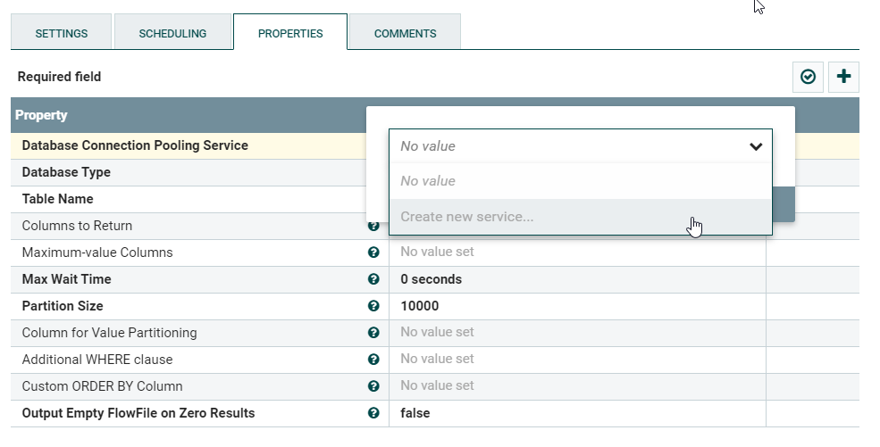
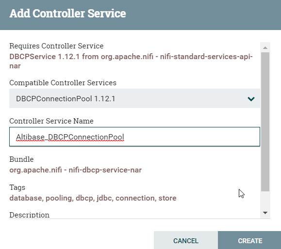
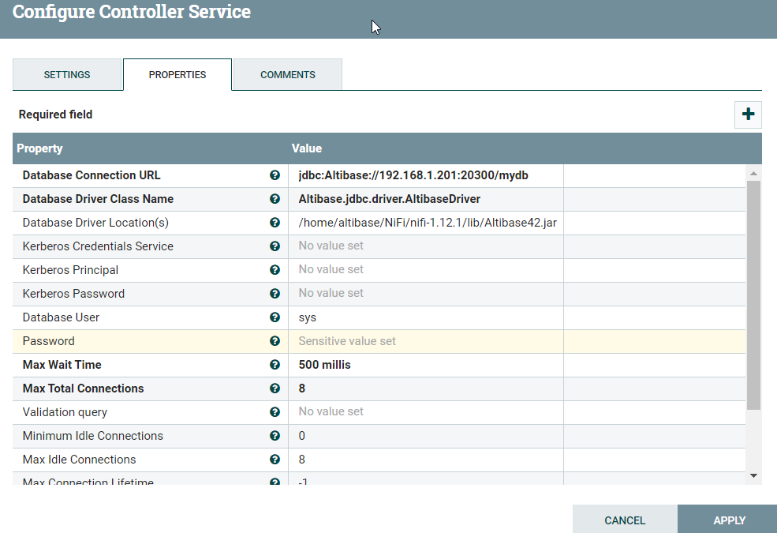

# NiFi

NiFi에서 Altibase 사용을 위한 설정 방법을 설명한다.

-   [NiFi](#NiFi-NiFi)
-   [NiFi 구성요소 ](#NiFi-NiFi구성요소)
-   [Altibase 사용을 위한 제약사항](#NiFi-Altibase사용을위한NiFi제약사항)
-   [NiFi 설치 및 구동](#NiFi-NiFi설치및구동)
-   [NiFi에서 Altibase 사용을 위한 설정](#NiFi-NiFi에서Altibase사용을위한설정)


## NiFi

-   NiFi는 시스템 간 데이터 플로우 자동화를 위해 만들어진 아파치 재단 소프트웨어 프로젝트이다.
- 자세한 내용은 NiFi 홈페이지를 참고한다. (<https://nifi.apache.org/>)

## NiFi 구성요소 

-   FlowFile
    -   NiFi에서 처리되는 기본 단위이며 Attributes + Content 로 구성되어 있다.
    -   디스크에 저장되는 물리 파일이라기 보다는 메모리상 존재하는 객체에 가까운 의미이다.

-   Processor
    -   Data Flow를 제어하는 기본 단위이며 FlowFile을 처리한다.
    -   NiFi 자체에 수 많은 Processor가 내장되어 있어 용도에 맞게 사용한다.

-   Connection
    -   Processor간 연결을 설정한다.

-   Controller Service
    -   Processor가 필요에 따라 사용할 수 있도록 정보를 제공하는 공용 리소스이다.
    -   예를 들어, DB Connection은 Controller Service 통해 설정하여 여러 Processor에서 사용된다.
-   기타 NiFi 홈페이지 참조 : [Link](https://nifi.apache.org/docs/nifi-docs/html/user-guide.html#terminology)

## Altibase 사용을 위한 제약사항

-   JDK 1.8 이상 설치가 필요하다. ([NiFi release note 참고](https://cwiki.apache.org/confluence/display/NIFI/Release+Notes))
-   NiFi 1.12 버전 포함 하위 버전 사용을 권장 한다.
    -   NiFi 1.13 부터는 Lob 처리 방식이 기존 하위 버전에서 사용하는 setObject() 로 처리하지 않고 Connection.createBLOB(), Connection.createCLOB() 으로 처리하는데, 현 Atlibase JDBC 드라이버는 해당 기능을 지원하지 않아 Lob 처리 시 오류가 발생한다.
-   NiFi에서 JDBC 4.0 Spec 이상의 기능을 사용하고 있기 때문에 해당 기능을 지원하는 Altibase JDBC 드라이버를 선택하여 사용해야 한다.

      <table>
      <colgroup>
      <col style="width: 15%" />
      <col style="width: 84%" />
      </colgroup>
      <thead>
      <tr class="header">
      <th><strong>Altibase 버전</strong></th>
      <th><strong>JDBC Spec 지원에 따른 사용 방법</strong></th>
      </tr>
      </thead>
      <tbody>
      <tr class="odd">
      <td>6.5 이하</td>
      <td>해당 Spec을 지원하지 않기 때문에 사용할 수 없다. (JDBC 3.0 Spec)</td>
      </tr>
      <tr class="even">
      <td>7.1</td>
      <td>7.1.0.5.6 버전부터 JDBC 4.2 Spec을 지원하는 Altibase42.jar 파일을 별도 제공한다.<br />
      따라서 $ALTIBASE_HOME/lib/Altibase.jar 대신 Altibase42.jar 를 사용해야 한다.</td>
      </tr>
      <tr class="odd">
      <td>7.2</td>
      <td>4.2 Spec을 지원하기 때문에 $ALTIBASE_HOME/lib/Altibase.jar을 사용한다.</td>
      </tr>
      </tbody>
      </table>
      ※ Altibase의 JDBC 드라이버는 4.2 Spec을 지원하나 Full Spec을 지원하지 않으며 일부 주요 Spec을 구현한 상태이다.


## NiFi 설치 및 구동

-   [NiFi 설치파일 다운로드](https://nifi.apache.org/download.html) 한다.

-   다운로드 받은 파일을 특정 디렉토리에 압축 해제하면 설치가 완료된다.

-   구동 전 Web UI 접근을 가능하기 위해 $NIFI_HOME/conf/nifi.properties 에 다음 내용을 수정한다. (port 번호는 중복 사용되지 않도록 수정해야한다.)
    ```
    nifi.web.http.host=
    nifi.web.http.port=8000
    ```
-   구동 및 종료
    -   Linux
        -   nifi.sh start  
          ```
          $ nifi.sh start
          Java home: /usr/lib/jvm/java-8-openjdk-amd64
          NiFi home: /home/altibase/NiFi/nifi-1.12.1
          Bootstrap Config File: /home/altibase/NiFi/nifi-1.12.1/conf/bootstrap.conf
          ```
          Start 상태 확인
          ```
          >$NIFI_HOME/logs/nifi-app.log 파일에 아래 메세지가 보이면 start 된 상태이며, 해당 URL를 통해 브라우저로 접속 가능하다.
          2021-12-15 17:49:17,732 INFO [main] org.apache.nifi.web.server.JettyServer NiFi has started. The UI is available at the following URLs:
          2021-12-15 17:49:17,732 INFO [main] org.apache.nifi.web.server.JettyServer http://192.168.204.129:8000/nifi
          2021-12-15 17:49:17,732 INFO [main] org.apache.nifi.web.server.JettyServer http://172.17.0.1:8000/nifi
          2021-12-15 17:49:17,732 INFO [main] org.apache.nifi.web.server.JettyServer http://127.0.0.1:8000/nifi
          ```

        -   nifi.sh status
          ```
          $ nifi.sh status
          Java home: /usr/lib/jvm/java-8-openjdk-amd64
          NiFi home: /home/altibase/NiFi/nifi-1.12.1
          Bootstrap Config File: /home/altibase/NiFi/nifi-1.12.1/conf/bootstrap.conf
          2021-12-15 17:50:29,587 INFO \[main\] org.apache.nifi.bootstrap.Command Apache NiFi is currently running, listening to Bootstrap on port 43345, PID=6517
          ```
        -   nifi.sh stop
          ```
          $ nifi.sh stop
          Java home: /usr/lib/jvm/java-8-openjdk-amd64
          NiFi home: /home/altibase/NiFi/nifi-1.12.1
          Bootstrap Config File: /home/altibase/NiFi/nifi-1.12.1/conf/bootstrap.conf
          2021-12-15 17:51:20,147 INFO \[main\] org.apache.nifi.bootstrap.Command Apache NiFi has accepted the Shutdown Command and is shutting down now
          2021-12-15 17:51:20,277 INFO \[main\] org.apache.nifi.bootstrap.Command Waiting for Apache NiFi to finish shutting down...
          2021-12-15 17:51:22,291 INFO \[main\] org.apache.nifi.bootstrap.Command NiFi has finished shutting down.
          ```
    -   Windows
      -   run-nifi.bat 수행하면 다음과 같은 메세지를 출력하며 최종 기동 여부는 $NIFI_HOME/logs/nifi-app.log 로 확인한다.
        ```
        > 2021-12-08 13:28:57,145 INFO \[main\] org.apache.nifi.bootstrap.Command Launched Apache NiFi with Process ID 2840
        ```
      -   종료는 Console 창에서 Ctrl+C 를 누른다.
-   $NIFI_HOME/logs/nifi-app.log 에서 오류 여부 등의 로그를 확인할 수 있다.
-   Web UI 접속
    -   웹브라우저를 통해 위 'Start 상태 확인' 내용에 있는 URL 로 접속할 수 있다.


## NiFi에서 Altibase 사용을 위한 설정

-   Altibase jdbc driver를 $NIFI_HOME/lib에 복사하고 적용을 위해 NiFi를 재구동 한다.

-   NiFi 에서 Altibase 사용을 위해서는 Controller Service를 통해 Altibase에 접속할 수 있는 Connection Pool을 만들어줘야 된다.
-   Controller Service는, Controller Service를 등록할 수 있는 Processor의 속성을 통해 등록한다.
  - 다음은 GenerateTableFetch Processor의 Property중 Database Connection Pooling Service 등록을 통해 Altibase의 Controller Serivce 를 등록하는 예이다.

      - Create new service... 를 클릭한다.
      
      - Controller Service Name을 입력 후 CREATE 버튼을 클릭한다.
      
      - Create이후 세 번째 컬럼에 생성된 화살표를 클릭한다.

      - Controller Service의 속성을 설정하기 위해 톱니바퀴 아이콘 클릭한다.
      - Altibase DB 접속을 위해 PROPERTIES 탭 선택 후 아래의 정보를 입력 후 APPLY 버튼을 클릭한다.
        - Database Connection URL : jdbc:Altibase://***host_ip:port_no/database_name***
        - Database Driver Class Name : Altibase.jdbc.driver.AltibaseDriver
        - Database Driver Location : Altibase JDBC 드라이버 위치
        - Databsse User : 사용자 계정
        - Password : 사용자 패스워드
        
      - APPLY 버튼 클릭 후 돌아온 Controller Service 목록 화면에서 번개 아이콘을 클릭하여 Controller Serivce를 Enable 시킨다.
  - 등록한 Controller Service는 다른 Processor에서도 선택하여 사용 가능하다.


 

 
